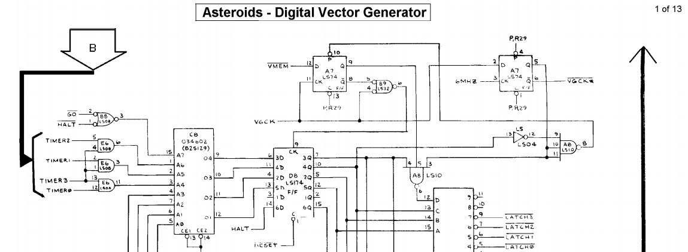

# Digital Vector Generator (DVG)

There is a lot of info here:

[http://www.philpem.me.uk/elec/vecgen.pdf](http://www.philpem.me.uk/elec/vecgen.pdf)

This info talks about the global scale factor allowing multiply and divide.

Follow the schematics here to figure it out:

[http://www.jmargolin.com/vgens/aster.pdf](http://www.jmargolin.com/vgens/aster.pdf)

# Vector Graphics

Modern computers use raster graphics. The monitor display is essentially a giant two dimensional matrix
of dots (a dot matrix). The states of these dots must be configured a giant buffer in memory. The more 
dots you have on the screen and the more color values each dot can take the more memory you need.

Memory was expensive in the arcade era. Some games like Asteroids use a vector-display mechanism. The
display hardware reads a list of lines from memory and actually steers the monitor's beam around to draw 
lines one after the other on the screen. These lines were super-crisp compared to the blocky lines 
drawn on low-resolution raster displays. The vector display doesn't need much memory -- just a list of lines. 

But in the end all your program can draw is a bunch of lines.

Detailed information on the DVG from Asteroids: 
[http://www.jmargolin.com/vgens/aster.pdf](http://www.jmargolin.com/vgens/aster.pdf)

* [Asteroids Vector ROM](VectorROM.md)
* [Omega Race Vector ROM](../OmegaRace/VectorROM.md)

# Memory Layout

The DVG reads lines from an 8K bank of memory. The first 4K is RAM. The last 4K is ROM containing vector
sequences for the game: asteroids, letters and numbers, ships, UFOs, etc. The "display list" is much
more than a list of lines. It is actually an opcode language that includes the ability to jump to one 
of these ROM subroutines and then back to the next command.

The main program fills the display RAM with "Move to" commands and "subroutine" commands to draw all 
the game object lines on the screen. The last command in RAM is the "Halt" command that tells the display 
hardware it has reached the end of the list.

The DVG and main CPU share this 8K area of memory. The main CPU writes to it and the vector generator
reads from it. The main CPU writes to this area as individual bytes. But the DVG itself reads the area
as two-bytes words. The bytes are read little-endian -- least significant byte first.

For instance, the main CPU writes four bytes to the shared RAM as follows:

```
8000: BF 36 BF 06
```

The DVG would fetch these bytes as two words LSB first:

```
8000: 36BF 06BF
```

# Screen Geometry

The DVG keeps up with a current (x,y) cursor coordinate. (0,0) is the lower left corner of the display.
(1023,1023) is the upper right corner of the display.

Vectors are defined as a deltaX, deltaY, and intensity (0 through 15). The line intensity (brightness)
increases with 0 being "off" and 15 being the brightest. Intensity 0 can be used to move the (x,y) 
cursor without drawing a line.

The deltas can be positive or negative to draw a line in any direction from the current cursor location.

In addition to the (x,y) cursor, the DVG keeps a scaling-factor that can be changed before calling 
a ROM routine. This allows the same asteroid image to be drawn in different sizes. The scaling-factor
remains in effect until you change it.

The scaling-factor is a power-of-two divisor:
```
   0     /512
   1     /256
   2     /128
   3     /64
   4     /32
   5     /16
   6     /8
   7     /4
   8     /2
   9     /1
```

Imagine a sequence that draws a square like this:
```
MoveTo(0,0,9)   ; Bottom left corner of screen, global-scale of 9 (divide-by-one)
LineTo(1023,0)  ; To the right 1023
LineTo(0,1023)  ; Up 1023
LineTo(-1023,0) ; Left 1023
LineTo(0,-1023) ; Down 1023
```

If the scale was set to 9 then all the values get divided by 1 (unchanged). The square bounds
the entire screen. But if the scale was set to 8 then the values get divided by 2 and the 
square wraps the lower left quadrant of the screen. A scale-factor of 0 divides everything by
512 -- turning those 1023's into 2's. That would draw a tiny box in the bottom left
corner of the screen.

# Vector Specification

A vector has a deltaX, deltaY, and an intensity. It also has its own "local" scale factor. This "local" 
scale-factor is added to the global scale-factor to make a "total" scale-factor used in rendering 
the vector.

Take these two lines for instance. Assume the global scale-factor is 0:
```
         dx   dy  int  scale
LineTo (800,   0,  15,  5)
LineTo (1600,  0,  15,  4)
```

The first line is drawn 50 units to the right since the total scale factor is 0+5 = 5 (divide-by-16). 800/16=50.

The second line has a total factor of 0+4 = 4 (divide by 32). It is also drawn 50 units to the right. 1600/32=50.

If the global scale-factor were set to 4 then the first line would be drawn with a factor of 5+4=9 (divide-by-one). 
The line would be 800 units long.

The second line would be drawn with a factor of 4+4=8 (divide-by-two). The line would be 800 units long.

Thus the added global scale-factor of 4 has made the sequence of lines 16 times larger.

# DVG Opcodes

Most DVG commands are one word (two bytes) long. Some are two words (four bytes).

The upper nibble of the first word is the command. 

```
0 - 9 : VEC  -- a full vector command
    A : CUR  -- set the current (x,y) and global scale-factor
    B : HALT -- end of commands
    C : JSR  -- jump to a vector program subroutine
    D : RTS  -- return from a vector program subroutine
    E : JMP  -- jump to a location in the vector program
    F : SVEC -- a short vector command
```

## VEC

Draw a line from the current (x,y) coordinate.

```
Example:    
             ;  SSSS -mYY YYYY YYYY | BBBB -mXX XXXX XXXX
87FE 73FE    ;  1000 0111 1111 1110 | 0111 0011 1111 1110
             ; - SSSS is the local scale 0 .. 9 added to the global scale
             ; - BBBB is the brightness: 0 .. 15
             ; - m is 1 for negative or 0 for positive for the X and Y deltas
             ; - (x,y) is the coordinate delta for the vector
   
VEC  scale=08(/2)    bri=07  x=1022    y=-1022  (511.00, -511.00)
  
```

## CUR

Set the current (x,y) and global scale-factor.

```
Example:
             ; 1010 00yy yyyy yyyy | SSSS 00xx xxxx xxxx
A37F 03FF    ; 1010 0011 0111 1111 | 0000 0011 1111 1111
             ; - SSSS is the global scale 0 .. 15
             ; - (x,y) is the new (x,y) coordinate. This is NOT adjusted by SSSS.
   
CUR  scale=00(/512)  y=895  x=1023

```

## HALT

End the current drawing list.

```
B000         ; 1011 0000 0000 0000

HALT

```
 
## JSR 

Jump to a vector subroutine. Note that there is room in the internal "stack" for only
FOUR levels of nested subroutine calls. Be careful.

Note that the target address is the WORD address -- not the byte address.
 
```
Example:             
             ; 1100 aaaa aaaa aaaa
CAE4         ; 1100 1010 1110 0100
             ; - a is the word address of the destination
  
In this case:
  a = 0AE4
  Conversion to byte address: (0AE4-0800)*2 + 0800 = 0DC8
  
JSR  $0DC8

```
 
## RTS

Return from current vector subroutine.
 
```
D000         ; 1101 0000 0000 0000

RTS

```
 
## JMP

Jump to a new location in the vector program.

Note that the target address is the WORD address -- not the byte address.
 
```
Example:
             ; 1110 aaaa aaaa aaaa
EA0A         ; 1110 1010 0000 1010
             ; - a is the word address of the destination

In this case:
  a = 0A0A
  Conversion to byte address: (0A0A-0800)*2 + 0800 = 0C14
  
JMP  $0C14

```

## SVEC

Use a "short" notation to draw a vector. This does not mean the vector itself
is necessarily short. It means that the notation is shorter (fewer bits of
resolution).

```
Example:
        ; 1111 smYY BBBB SmXX
FF70    ; 1111 1111 0111 0000
        ; - Ss (0=*2, 1=*4, 2=*8, 3=*16)
        ; - BBBB is the brightness: 0 .. 15
        ; - m is 1 for negative and 0 for positive for the X and Y
        ; - (x,y) is the coordinate change for the vector   
   
SVEC scale=01(*2)  bri=07  x=0       y=-3     (0.00, -6.00)

```    