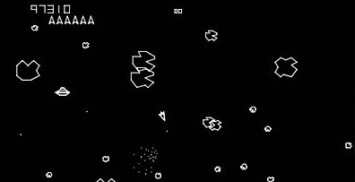

>>> deploy: 
>>>   Hardware.md 
>>>   RAMUse.md 
>>>   Code.md 
>>>   VectorROM.md 
>>>   DVG.md 
>>>   Journal.md 
>>>   +Asteroids.jpg 
>>>   +VectorROM.js 
>>>   +DVG.jpg 

# Code Links 

* [Disassembled Code](Code.md)
* [Hardware Info](Hardware.md)
* [RAM Usage](RAMUse.md)
* [Vector ROM](VectorROM.md)
* [Info on the DVG](DVG.md)

Nick Mikstas has a fantastic disassembly for Asteroids. Check it out here:

[https://www.nicholasmikstas.com/games/](https://www.nicholasmikstas.com/games/)

>>> tourGuide {

# Tour Guide

Lonnie Howell started the comments. Mark McDougall picked up where he left up. 
Mark's work is amazing.

You should browse the [Vector ROM](VectorROM.md) and see the game images. For instance:
* [UFO](VectorROM.md#UFO)
* [Asteroids](VectorROM.md#RockPatterns)
* [Player Ships](VectorROM.md#PlayerShips)

And many more.

>>> }
