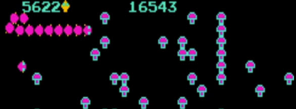

>>> deploy: 
>>>   +centipede.jpg 
>>>   Hardware.md 
>>>   RAMUse.md 
>>>   %Code.md 

# Centipede

**Disassembled by Karl Stiefvater**

**Centipede** (Atari, 1981) is a fixed shooter played with a **trackball**. You roll a
**shooter** back and forth (and a little way up and down) across the bottom of the screen and
fire upward at a **centipede** that winds down toward you through a field of **mushrooms**.

The centipede enters at the top as a long chain of segments and marches side to side, dropping
one row each time it reaches a wall or a mushroom. Shooting a segment turns that segment into a
**mushroom** and **splits** the centipede in two: hit a middle segment and you get two shorter
centipedes, each with its own head. Clear every segment and a new, faster centipede descends —
and the more mushrooms clutter the field, the faster it works its way down.

Three other creatures harass you. A **spider** bounces around the lower area eating mushrooms
and will kill the shooter on contact. A **flea** drops straight down when the field near the
bottom thins out, leaving a trail of new mushrooms. A **scorpion** scuttles across and
**poisons** the mushrooms it passes; a centipede that touches a poisoned mushroom dives
straight down at you. Points come from shooting segments (a head is worth more than a body),
mushrooms, and the spider, flea, and scorpion — the spider scores by how close it was when you
hit it. A hit costs a life, damaged mushrooms regrow, and the game ends when your last shooter
is lost, with a chance to enter your initials on the high-score table.

## Navigation

  * [Hardware](Hardware.md) — CPU, memory map, I/O ports, the trackball inputs, the LS259 output latch, sprite/tilemap layout, POKEY sound
  * [Work RAM](RAMUse.md) — the named work-RAM cells (0x0000–0x03FF)
  * [Main CPU code](Code.md) — the annotated 6502 disassembly

## About this disassembly

This disassembly, RAM map, and game description were **produced by AI** and are
**verified against the original ROM and against MAME**. The recovered code was checked
to reproduce the ROM's own execution frame-for-frame, and the game model was confirmed
by observing the real game running under MAME. It is offered here transparently, as AI
work, precisely because it is machine-checked rather than hand-asserted — so verify it
against that evidence. Project: [https://github.com/qarl/arcade-js](https://github.com/qarl/arcade-js).

The disassembly covers the code reached from the machine's real entry points — the reset
vector and the IRQ vector; ROM data tables (tile graphics indices, lookup tables, the
attack and sprite layout data, text) are shown as data. Sound is a POKEY custom chip, driven
directly by the main CPU; there is no second processor, so this is the whole program.
