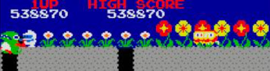

# DigDug CPU3 Code

>>> cpu Z80

>>> binary 0000:roms/136007.107

>>> memoryTable ram 

[RAM Usage](RAMUse.md)

>>> memoryTable hard 

[Hardware Info](Hardware.md)

```code
init:
0000: 31 80 8B        LD      SP,$8B80            ; Initialize stack
0003: C3 85 00        JP      $0085               ; {code.startup} Continue startup
0006: FF FF  ; Padding to next vector

twoByteTable:
; Double A and add it to HL
0008: 87              ADD     A,A                 ; Double the lower byte
0009: 30 05           JR      NC,$10              ; {code.addAtoHL} No carry ... move on
000B: 24              INC     H                   ; Carry into the upper
000C: 18 02           JR      $10                 ; {code.addAtoHL} Continue
000E: FF FF  ; Padding to next vector

addAtoHL:
; Add the value in A to HL
0010: 85              ADD     A,L                 ; Add the value
0011: 6F              LD      L,A                 ; To L
0012: D0              RET     NC                  ; No carry ... done
0013: 24              INC     H                   ; Carry into H
0014: C9              RET                         ; Done
0015: FF FF FF  ; Padding to next vector

fillMemory:
; Fill B bytes of memory starting at HL with A
0018: 77              LD      (HL),A              ; Fill memory
0019: 23              INC     HL                  ; Next
001A: 10 FC           DJNZ    $18                 ; {code.fillMemory} Go back for all
001C: C9              RET                         ; Done
001D: FF FF FF  ; Padding to next vector

tableJump:
; Jump to a routine from the table in HL. A is the index.
0020: CF              RST     $08                 ; HL = HL + A*2
0021: 7E              LD      A,(HL)              ; Get the LSB of the target
0022: 23              INC     HL                  ; Next
0023: 66              LD      H,(HL)              ; Get the MSB of the target
0024: 6F              LD      L,A                 ; LSB to L
0025: E9              JP      (HL)                ; Jump to the routine
0026: FF FF  ; Padding to next vector

0028: FF FF FF FF FF FF FF FF 
0030: FF FF FF FF FF FF FF FF FF FF FF FF FF FF FF FF                              
0040: FF FF FF FF FF FF FF FF FF FF FF FF FF FF FF FF  
0050: FF FF FF FF FF FF FF FF FF FF FF FF FF FF FF FF 
0060: FF FF FF FF FF FF                              

; NMI service
nmi:
0066: F5              PUSH    AF                  
0067: E5              PUSH    HL                  
0068: 3A 3C 9B        LD      A,($9B3C)           
006B: A7              AND     A                   
006C: 28 08           JR      Z,$76               ; {}
006E: AF              XOR     A                   
006F: 32 3C 9B        LD      ($9B3C),A           
0072: E1              POP     HL                  
0073: F1              POP     AF                  
0074: ED 45           RETN                        ; Return from interrupt
;
0076: 3E 01           LD      A,$01               
0078: 32 3C 9B        LD      ($9B3C),A           
007B: 32 22 68        LD      ($6822),A           
007E: AF              XOR     A                   
007F: 32 22 68        LD      ($6822),A           
0082: C3 B5 00        JP      $00B5               ; {}

startup:
0085: 3E 01           LD      A,$01               
0087: 32 22 68        LD      ($6822),A           
008A: CD 7F 06        CALL    $067F               ; {}
008D: 21 40 8A        LD      HL,$8A40            
0090: 06 08           LD      B,$08               
0092: AF              XOR     A                   
0093: DF              RST     $18                 ; {+}
0094: 21 80 9A        LD      HL,$9A80            
0097: 36 00           LD      (HL),$00            
0099: 11 81 9A        LD      DE,$9A81            
009C: 01 FF 00        LD      BC,$00FF            
009F: ED B0           LDIR                        
00A1: 21 E7 07        LD      HL,$07E7            
00A4: 11 0A 9B        LD      DE,$9B0A            
00A7: 01 15 00        LD      BC,$0015            
00AA: ED B0           LDIR                        
00AC: AF              XOR     A                   
00AD: 32 22 68        LD      ($6822),A           
00B0: 31 80 8B        LD      SP,$8B80            
00B3: 18 FB           JR      $B0                 ; {}

00B5: 21 20 9B        LD      HL,$9B20            
00B8: 36 00           LD      (HL),$00            
00BA: 11 21 9B        LD      DE,$9B21            
00BD: 01 0F 00        LD      BC,$000F            
00C0: ED B0           LDIR                        
00C2: 3A 57 86        LD      A,($8657)           
00C5: CB 4F           BIT     1,A                 
00C7: 28 3F           JR      Z,$108              ; {}
00C9: 3A CF 87        LD      A,($87CF)           
00CC: CB 67           BIT     4,A                 
00CE: 28 10           JR      Z,$E0               ; {}
00D0: 21 80 9A        LD      HL,$9A80            
00D3: 36 00           LD      (HL),$00            
00D5: 11 81 9A        LD      DE,$9A81            
00D8: 01 27 00        LD      BC,$0027            
00DB: ED B0           LDIR                        
00DD: C3 F5 02        JP      $02F5               ; {}
00E0: AF              XOR     A                   
00E1: 21 80 9A        LD      HL,$9A80            
00E4: 06 0A           LD      B,$0A               
00E6: DF              RST     $18                 ; {+}
00E7: 21 96 9A        LD      HL,$9A96            
00EA: 06 0A           LD      B,$0A               
00EC: DF              RST     $18                 ; {+}
00ED: 32 8E 9A        LD      ($9A8E),A           
00F0: 32 A4 9A        LD      ($9AA4),A           
00F3: 21 90 9A        LD      HL,$9A90            
00F6: 06 03           LD      B,$03               
00F8: DF              RST     $18                 ; {+}
00F9: 21 A6 9A        LD      HL,$9AA6            
00FC: 06 03           LD      B,$03               
00FE: DF              RST     $18                 ; {+}
00FF: 32 94 9A        LD      ($9A94),A           
0102: 32 AA 9A        LD      ($9AAA),A           
0105: C3 D0 01        JP      $01D0               ; {}
0108: 3A 33 9B        LD      A,($9B33)           
010B: A7              AND     A                   
010C: 28 09           JR      Z,$117              ; {}
010E: 21 80 9A        LD      HL,$9A80            
0111: 86              ADD     A,(HL)              
0112: 77              LD      (HL),A              
0113: AF              XOR     A                   
0114: 32 33 9B        LD      ($9B33),A           
0117: 3A 81 9A        LD      A,($9A81)           
011A: A7              AND     A                   
011B: 28 0B           JR      Z,$128              ; {}
011D: 21 34 9B        LD      HL,$9B34            
0120: 36 01           LD      (HL),$01            
0122: CD 91 03        CALL    $0391               ; {}
0125: C3 E7 02        JP      $02E7               ; {}
0128: 3A 88 9A        LD      A,($9A88)           
012B: A7              AND     A                   
012C: 28 0B           JR      Z,$139              ; {}
012E: 21 34 9B        LD      HL,$9B34            
0131: 36 08           LD      (HL),$08            
0133: CD 91 03        CALL    $0391               ; {}
0136: C3 E7 02        JP      $02E7               ; {}
0139: 3A 82 9A        LD      A,($9A82)           
013C: A7              AND     A                   
013D: 28 0B           JR      Z,$14A              ; {}
013F: 21 34 9B        LD      HL,$9B34            
0142: 36 02           LD      (HL),$02            
0144: CD 91 03        CALL    $0391               ; {}
0147: C3 E7 02        JP      $02E7               ; {}
014A: 3A 83 9A        LD      A,($9A83)           
014D: A7              AND     A                   
014E: 28 0B           JR      Z,$15B              ; {}
0150: 21 34 9B        LD      HL,$9B34            
0153: 36 03           LD      (HL),$03            
0155: CD 91 03        CALL    $0391               ; {}
0158: C3 E7 02        JP      $02E7               ; {}
015B: 3A 94 9A        LD      A,($9A94)           
015E: A7              AND     A                   
015F: 28 0B           JR      Z,$16C              ; {}
0161: 21 34 9B        LD      HL,$9B34            
0164: 36 14           LD      (HL),$14            
0166: CD 91 03        CALL    $0391               ; {}
0169: C3 E7 02        JP      $02E7               ; {}
016C: 3A 87 9A        LD      A,($9A87)           
016F: A7              AND     A                   
0170: 28 0B           JR      Z,$17D              ; {}
0172: 21 34 9B        LD      HL,$9B34            
0175: 36 07           LD      (HL),$07            
0177: CD 91 03        CALL    $0391               ; {}
017A: C3 E7 02        JP      $02E7               ; {}
017D: 3A 84 9A        LD      A,($9A84)           
0180: A7              AND     A                   
0181: 28 0B           JR      Z,$18E              ; {}
0183: 21 34 9B        LD      HL,$9B34            
0186: 36 04           LD      (HL),$04            
0188: CD 91 03        CALL    $0391               ; {}
018B: C3 E7 02        JP      $02E7               ; {}
018E: 3A 85 9A        LD      A,($9A85)           
0191: A7              AND     A                   
0192: 28 0B           JR      Z,$19F              ; {}
0194: 21 34 9B        LD      HL,$9B34            
0197: 36 05           LD      (HL),$05            
0199: CD 91 03        CALL    $0391               ; {}
019C: C3 E7 02        JP      $02E7               ; {}
019F: 3A 91 9A        LD      A,($9A91)           
01A2: A7              AND     A                   
01A3: 28 10           JR      Z,$1B5              ; {}
01A5: 21 34 9B        LD      HL,$9B34            
01A8: 36 11           LD      (HL),$11            
01AA: CD 91 03        CALL    $0391               ; {}
01AD: 3E 50           LD      A,$50               
01AF: 32 3B 9B        LD      ($9B3B),A           
01B2: C3 D0 01        JP      $01D0               ; {}
01B5: 3A 3B 9B        LD      A,($9B3B)           
01B8: 3D              DEC     A                   
01B9: 32 3B 9B        LD      ($9B3B),A           
01BC: 20 12           JR      NZ,$1D0             ; {}
01BE: 21 3B 9B        LD      HL,$9B3B            
01C1: 34              INC     (HL)                
01C2: 3A 92 9A        LD      A,($9A92)           
01C5: A7              AND     A                   
01C6: 28 08           JR      Z,$1D0              ; {}
01C8: 21 34 9B        LD      HL,$9B34            
01CB: 36 12           LD      (HL),$12            
01CD: CD 91 03        CALL    $0391               ; {}
01D0: 21 34 9B        LD      HL,$9B34            
01D3: 36 0F           LD      (HL),$0F            
01D5: 3A 8F 9A        LD      A,($9A8F)           
01D8: A7              AND     A                   
01D9: 28 0A           JR      Z,$1E5              ; {}
01DB: AF              XOR     A                   
01DC: 32 8F 9A        LD      ($9A8F),A           
01DF: CD 1A 03        CALL    $031A               ; {}
01E2: C3 0F 02        JP      $020F               ; {}
01E5: 3A A5 9A        LD      A,($9AA5)           
01E8: A7              AND     A                   
01E9: 28 06           JR      Z,$1F1              ; {}
01EB: CD 4E 03        CALL    $034E               ; {}
01EE: C3 0F 02        JP      $020F               ; {}
01F1: 21 34 9B        LD      HL,$9B34            
01F4: 36 10           LD      (HL),$10            
01F6: 3A 90 9A        LD      A,($9A90)           
01F9: A7              AND     A                   
01FA: 28 0A           JR      Z,$206              ; {}
01FC: AF              XOR     A                   
01FD: 32 90 9A        LD      ($9A90),A           
0200: CD 1A 03        CALL    $031A               ; {}
0203: C3 0F 02        JP      $020F               ; {}
0206: 3A A6 9A        LD      A,($9AA6)           
0209: A7              AND     A                   
020A: 28 03           JR      Z,$20F              ; {}
020C: CD 4E 03        CALL    $034E               ; {}
020F: 21 34 9B        LD      HL,$9B34            
0212: 36 0A           LD      (HL),$0A            
0214: 3A 8A 9A        LD      A,($9A8A)           
0217: A7              AND     A                   
0218: 28 09           JR      Z,$223              ; {}
021A: AF              XOR     A                   
021B: 32 8A 9A        LD      ($9A8A),A           
021E: CD 1A 03        CALL    $031A               ; {}
0221: 18 3B           JR      $25E                ; {}
0223: 3A A0 9A        LD      A,($9AA0)           
0226: A7              AND     A                   
0227: 28 05           JR      Z,$22E              ; {}
0229: CD 4E 03        CALL    $034E               ; {}
022C: 18 30           JR      $25E                ; {}
022E: 3A 8B 9A        LD      A,($9A8B)           
0231: A7              AND     A                   
0232: 28 0B           JR      Z,$23F              ; {}
0234: 21 34 9B        LD      HL,$9B34            
0237: 36 0B           LD      (HL),$0B            
0239: CD 91 03        CALL    $0391               ; {}
023C: C3 5E 02        JP      $025E               ; {}
023F: 3A 8C 9A        LD      A,($9A8C)           
0242: A7              AND     A                   
0243: 28 0B           JR      Z,$250              ; {}
0245: 21 34 9B        LD      HL,$9B34            
0248: 36 0C           LD      (HL),$0C            
024A: CD 91 03        CALL    $0391               ; {}
024D: C3 5E 02        JP      $025E               ; {}
0250: 3A 8D 9A        LD      A,($9A8D)           
0253: A7              AND     A                   
0254: 28 08           JR      Z,$25E              ; {}
0256: 21 34 9B        LD      HL,$9B34            
0259: 36 0D           LD      (HL),$0D            
025B: CD 91 03        CALL    $0391               ; {}
025E: 21 34 9B        LD      HL,$9B34            
0261: 36 0E           LD      (HL),$0E            
0263: 3A 8E 9A        LD      A,($9A8E)           
0266: A7              AND     A                   
0267: 28 09           JR      Z,$272              ; {}
0269: AF              XOR     A                   
026A: 32 8E 9A        LD      ($9A8E),A           
026D: CD 1A 03        CALL    $031A               ; {}
0270: 18 09           JR      $27B                ; {}
0272: 3A A4 9A        LD      A,($9AA4)           
0275: A7              AND     A                   
0276: 28 03           JR      Z,$27B              ; {}
0278: CD 4E 03        CALL    $034E               ; {}
027B: 3A 89 9A        LD      A,($9A89)           
027E: A7              AND     A                   
027F: 28 1B           JR      Z,$29C              ; {}
0281: 21 46 86        LD      HL,$8646            
0284: CB 46           BIT     0,(HL)              
0286: 28 09           JR      Z,$291              ; {}
0288: AF              XOR     A                   
0289: 32 89 9A        LD      ($9A89),A           
028C: 32 9F 9A        LD      ($9A9F),A           
028F: 18 0B           JR      $29C                ; {}
0291: 21 34 9B        LD      HL,$9B34            
0294: 36 09           LD      (HL),$09            
0296: CD 91 03        CALL    $0391               ; {}
0299: C3 C1 02        JP      $02C1               ; {}
029C: 3A 86 9A        LD      A,($9A86)           
029F: A7              AND     A                   
02A0: 28 1F           JR      Z,$2C1              ; {}
02A2: 21 46 86        LD      HL,$8646            
02A5: CB 46           BIT     0,(HL)              
02A7: 20 07           JR      NZ,$2B0             ; {}
02A9: 21 01 84        LD      HL,$8401            
02AC: CB 7E           BIT     7,(HL)              
02AE: 28 09           JR      Z,$2B9              ; {}
02B0: AF              XOR     A                   
02B1: 32 86 9A        LD      ($9A86),A           
02B4: 32 9C 9A        LD      ($9A9C),A           
02B7: 18 08           JR      $2C1                ; {}
02B9: 21 34 9B        LD      HL,$9B34            
02BC: 36 06           LD      (HL),$06            
02BE: CD 91 03        CALL    $0391               ; {}
02C1: 3A 93 9A        LD      A,($9A93)           
02C4: A7              AND     A                   
02C5: 28 20           JR      Z,$2E7              ; {}
02C7: 3A 57 86        LD      A,($8657)           
02CA: CB 4F           BIT     1,A                 
02CC: C2 DF 02        JP      NZ,$02DF            ; {}
02CF: 21 01 84        LD      HL,$8401            
02D2: CB 6E           BIT     5,(HL)              
02D4: 20 09           JR      NZ,$2DF             ; {}
02D6: AF              XOR     A                   
02D7: 32 93 9A        LD      ($9A93),A           
02DA: 32 A9 9A        LD      ($9AA9),A           
02DD: 18 08           JR      $2E7                ; {}
02DF: 21 34 9B        LD      HL,$9B34            
02E2: 36 13           LD      (HL),$13            
02E4: CD 91 03        CALL    $0391               ; {}
02E7: 3A 80 9A        LD      A,($9A80)           
02EA: A7              AND     A                   
02EB: 28 08           JR      Z,$2F5              ; {}
02ED: 21 34 9B        LD      HL,$9B34            
02F0: 36 00           LD      (HL),$00            
02F2: CD 91 03        CALL    $0391               ; {}
02F5: 21 20 9B        LD      HL,$9B20            
02F8: 11 10 68        LD      DE,$6810            
02FB: 01 10 00        LD      BC,$0010            
02FE: ED B0           LDIR                        
0300: 3A 30 9B        LD      A,($9B30)           
0303: 32 05 68        LD      ($6805),A           
0306: 3A 31 9B        LD      A,($9B31)           
0309: 32 0A 68        LD      ($680A),A           
030C: 3A 32 9B        LD      A,($9B32)           
030F: 32 0F 68        LD      ($680F),A           
0312: AF              XOR     A                   
0313: 32 3C 9B        LD      ($9B3C),A           
0316: E1              POP     HL                  
0317: F1              POP     AF                  
0318: ED 45           RETN                        
031A: 21 96 9A        LD      HL,$9A96            
031D: 3A 34 9B        LD      A,($9B34)           
0320: D7              RST     $10                 ; {+}
0321: 34              INC     (HL)                
0322: 21 34 9B        LD      HL,$9B34            
0325: 7E              LD      A,(HL)              
0326: 87              ADD     A,A                 
0327: 86              ADD     A,(HL)              
0328: 21 54 07        LD      HL,$0754            
032B: D7              RST     $10                 ; {+}
032C: 11 35 9B        LD      DE,$9B35            
032F: 01 03 00        LD      BC,$0003            
0332: ED B0           LDIR                        
0334: 21 36 9B        LD      HL,$9B36            
0337: 46              LD      B,(HL)              
0338: 48              LD      C,B                 
0339: 21 DB 9A        LD      HL,$9ADB            
033C: 3A 35 9B        LD      A,($9B35)           
033F: D7              RST     $10                 ; {+}
0340: AF              XOR     A                   
0341: DF              RST     $18                 ; {+}
0342: 41              LD      B,C                 
0343: 21 AC 9A        LD      HL,$9AAC            
0346: 3A 35 9B        LD      A,($9B35)           
0349: D7              RST     $10                 ; {+}
034A: AF              XOR     A                   
034B: DF              RST     $18                 ; {+}
034C: 18 12           JR      $360                ; {}
034E: 21 34 9B        LD      HL,$9B34            
0351: 7E              LD      A,(HL)              
0352: 87              ADD     A,A                 
0353: 86              ADD     A,(HL)              
0354: 21 54 07        LD      HL,$0754            
0357: D7              RST     $10                 ; {+}
0358: 11 35 9B        LD      DE,$9B35            
035B: 01 03 00        LD      BC,$0003            
035E: ED B0           LDIR                        
0360: CD D5 04        CALL    $04D5               ; {}
0363: 21 36 9B        LD      HL,$9B36            
0366: 35              DEC     (HL)                
0367: 28 0A           JR      Z,$373              ; {}
0369: 21 35 9B        LD      HL,$9B35            
036C: 34              INC     (HL)                
036D: 21 37 9B        LD      HL,$9B37            
0370: 34              INC     (HL)                
0371: 18 ED           JR      $360                ; {}
0373: 3A 38 9B        LD      A,($9B38)           
0376: A7              AND     A                   
0377: C8              RET     Z                   
0378: AF              XOR     A                   
0379: 32 38 9B        LD      ($9B38),A           
037C: 21 96 9A        LD      HL,$9A96            
037F: 3A 34 9B        LD      A,($9B34)           
0382: D7              RST     $10                 ; {+}
0383: 36 00           LD      (HL),$00            
0385: 21 0D 04        LD      HL,$040D            
0388: 3A 34 9B        LD      A,($9B34)           
038B: CF              RST     $08                 ; {+}
038C: 5E              LD      E,(HL)              
038D: 23              INC     HL                  
038E: 56              LD      D,(HL)              
038F: EB              EX      DE,HL               
0390: E9              JP      (HL)                
0391: 21 34 9B        LD      HL,$9B34            
0394: 7E              LD      A,(HL)              
0395: 87              ADD     A,A                 
0396: 86              ADD     A,(HL)              
0397: 21 54 07        LD      HL,$0754            
039A: D7              RST     $10                 ; {+}
039B: 11 35 9B        LD      DE,$9B35            
039E: 01 03 00        LD      BC,$0003            
03A1: ED B0           LDIR                        
03A3: 21 96 9A        LD      HL,$9A96            
03A6: 3A 34 9B        LD      A,($9B34)           
03A9: D7              RST     $10                 ; {+}
03AA: 7E              LD      A,(HL)              
03AB: A7              AND     A                   
03AC: 20 19           JR      NZ,$3C7             ; {}
03AE: 34              INC     (HL)                
03AF: 21 36 9B        LD      HL,$9B36            
03B2: 46              LD      B,(HL)              
03B3: 48              LD      C,B                 
03B4: 21 DB 9A        LD      HL,$9ADB            
03B7: 3A 35 9B        LD      A,($9B35)           
03BA: D7              RST     $10                 ; {+}
03BB: AF              XOR     A                   
03BC: DF              RST     $18                 ; {+}
03BD: 41              LD      B,C                 
03BE: 21 AC 9A        LD      HL,$9AAC            
03C1: 3A 35 9B        LD      A,($9B35)           
03C4: D7              RST     $10                 ; {+}
03C5: AF              XOR     A                   
03C6: DF              RST     $18                 ; {+}
03C7: CD D5 04        CALL    $04D5               ; {}
03CA: 21 36 9B        LD      HL,$9B36            
03CD: 35              DEC     (HL)                
03CE: 28 0A           JR      Z,$3DA              ; {}
03D0: 21 35 9B        LD      HL,$9B35            
03D3: 34              INC     (HL)                
03D4: 21 37 9B        LD      HL,$9B37            
03D7: 34              INC     (HL)                
03D8: 18 ED           JR      $3C7                ; {}
03DA: 3A 38 9B        LD      A,($9B38)           
03DD: A7              AND     A                   
03DE: C8              RET     Z                   
03DF: AF              XOR     A                   
03E0: 32 38 9B        LD      ($9B38),A           
03E3: 21 96 9A        LD      HL,$9A96            
03E6: 3A 34 9B        LD      A,($9B34)           
03E9: D7              RST     $10                 ; {+}
03EA: 36 00           LD      (HL),$00            
03EC: 21 80 9A        LD      HL,$9A80            
03EF: 3A 34 9B        LD      A,($9B34)           
03F2: D7              RST     $10                 ; {+}
03F3: 3A 34 9B        LD      A,($9B34)           
03F6: A7              AND     A                   
03F7: 28 12           JR      Z,$40B              ; {}
03F9: FE 14           CP      $14                 
03FB: 28 0E           JR      Z,$40B              ; {}
03FD: 36 00           LD      (HL),$00            
03FF: 21 0D 04        LD      HL,$040D            
0402: 3A 34 9B        LD      A,($9B34)           
0405: CF              RST     $08                 ; {+}
0406: 5E              LD      E,(HL)              
0407: 23              INC     HL                  
0408: 56              LD      D,(HL)              
0409: EB              EX      DE,HL               
040A: E9              JP      (HL)                
040B: 35              DEC     (HL)                
040C: C9              RET                         
040D: 37              SCF                         
040E: 04              INC     B                   
040F: 38 04           JR      C,$415              ; {}
0411: 37              SCF                         
0412: 04              INC     B                   
0413: 37              SCF                         
0414: 04              INC     B                   
0415: C6 04           ADD     $04                 
0417: 48              LD      C,B                 
0418: 04              INC     B                   
0419: 5F              LD      E,A                 
041A: 04              INC     B                   
041B: 6E              LD      L,(HL)              
041C: 04              INC     B                   
041D: 48              LD      C,B                 
041E: 04              INC     B                   
041F: 63              LD      H,E                 
0420: 04              INC     B                   
0421: 37              SCF                         
0422: 04              INC     B                   
0423: 37              SCF                         
0424: 04              INC     B                   
0425: 40              LD      B,B                 
0426: 04              INC     B                   
0427: 37              SCF                         
0428: 04              INC     B                   
0429: 90              SUB     B                   
042A: 04              INC     B                   
042B: 37              SCF                         
042C: 04              INC     B                   
042D: 37              SCF                         
042E: 04              INC     B                   
042F: 37              SCF                         
0430: 04              INC     B                   
0431: 37              SCF                         
0432: 04              INC     B                   
0433: AB              XOR     E                   
0434: 04              INC     B                   
0435: 37              SCF                         
0436: 04              INC     B                   
0437: C9              RET                         
0438: AF              XOR     A                   
0439: 32 94 9A        LD      ($9A94),A           
043C: 32 AA 9A        LD      ($9AAA),A           
043F: C9              RET                         
0440: AF              XOR     A                   
0441: 32 8D 9A        LD      ($9A8D),A           
0444: 32 A3 9A        LD      ($9AA3),A           
0447: C9              RET                         
0448: AF              XOR     A                   
0449: 32 86 9A        LD      ($9A86),A           
044C: 32 89 9A        LD      ($9A89),A           
044F: 32 9C 9A        LD      ($9A9C),A           
0452: 32 9F 9A        LD      ($9A9F),A           
0455: 32 93 9A        LD      ($9A93),A           
0458: 32 A9 9A        LD      ($9AA9),A           
045B: 3E 10           LD      A,$10               
045D: 18 06           JR      $465                ; {}
045F: 3E 0A           LD      A,$0A               
0461: 18 02           JR      $465                ; {}
0463: 3E 0C           LD      A,$0C               
0465: 32 1B 9B        LD      ($9B1B),A           
0468: AF              XOR     A                   
0469: 32 A7 9A        LD      ($9AA7),A           
046C: 18 07           JR      $475                ; {}
046E: AF              XOR     A                   
046F: 32 93 9A        LD      ($9A93),A           
0472: 32 A9 9A        LD      ($9AA9),A           
0475: 21 8A 9A        LD      HL,$9A8A            
0478: 11 8B 9A        LD      DE,$9A8B            
047B: 01 08 00        LD      BC,$0008            
047E: 36 00           LD      (HL),$00            
0480: ED B0           LDIR                        
0482: 21 A0 9A        LD      HL,$9AA0            
0485: 11 A1 9A        LD      DE,$9AA1            
0488: 01 08 00        LD      BC,$0008            
048B: 36 00           LD      (HL),$00            
048D: ED B0           LDIR                        
048F: C9              RET                         
0490: 21 8A 9A        LD      HL,$9A8A            
0493: 11 8B 9A        LD      DE,$9A8B            
0496: 01 03 00        LD      BC,$0003            
0499: 36 00           LD      (HL),$00            
049B: ED B0           LDIR                        
049D: 21 A0 9A        LD      HL,$9AA0            
04A0: 11 A1 9A        LD      DE,$9AA1            
04A3: 01 03 00        LD      BC,$0003            
04A6: 36 00           LD      (HL),$00            
04A8: ED B0           LDIR                        
04AA: C9              RET                         
04AB: 21 8A 9A        LD      HL,$9A8A            
04AE: 11 8B 9A        LD      DE,$9A8B            
04B1: 01 06 00        LD      BC,$0006            
04B4: 36 00           LD      (HL),$00            
04B6: ED B0           LDIR                        
04B8: 21 A0 9A        LD      HL,$9AA0            
04BB: 11 A1 9A        LD      DE,$9AA1            
04BE: 01 06 00        LD      BC,$0006            
04C1: 36 00           LD      (HL),$00            
04C3: ED B0           LDIR                        
04C5: C9              RET                         
04C6: AF              XOR     A                   
04C7: 32 86 9A        LD      ($9A86),A           
04CA: 32 89 9A        LD      ($9A89),A           
04CD: 32 9C 9A        LD      ($9A9C),A           
04D0: 32 9F 9A        LD      ($9A9F),A           
04D3: 18 99           JR      $46E                ; {}
04D5: 21 AC 9A        LD      HL,$9AAC            
04D8: 3A 35 9B        LD      A,($9B35)           
04DB: D7              RST     $10                 ; {+}
04DC: 34              INC     (HL)                
04DD: 3A 35 9B        LD      A,($9B35)           
04E0: 21 00 07        LD      HL,$0700            
04E3: CF              RST     $08                 ; {+}
04E4: 5E              LD      E,(HL)              
04E5: 23              INC     HL                  
04E6: 56              LD      D,(HL)              
04E7: 21 DB 9A        LD      HL,$9ADB            
04EA: 3A 35 9B        LD      A,($9B35)           
04ED: D7              RST     $10                 ; {+}
04EE: 7E              LD      A,(HL)              
04EF: EB              EX      DE,HL               
04F0: D7              RST     $10                 ; {+}
04F1: 22 39 9B        LD      ($9B39),HL          
04F4: 7E              LD      A,(HL)              
04F5: 3C              INC     A                   
04F6: CA 13 06        JP      Z,$0613             ; {}
04F9: 21 BD 07        LD      HL,$07BD            
04FC: 3A 35 9B        LD      A,($9B35)           
04FF: D7              RST     $10                 ; {+}
0500: 7E              LD      A,(HL)              
0501: A7              AND     A                   
0502: 28 0D           JR      Z,$511              ; {}
0504: 3D              DEC     A                   
0505: 28 05           JR      Z,$50C              ; {}
0507: 11 65 06        LD      DE,$0665            
050A: 18 08           JR      $514                ; {}
050C: 11 4B 06        LD      DE,$064B            
050F: 18 03           JR      $514                ; {}
0511: 11 31 06        LD      DE,$0631            
0514: 2A 39 9B        LD      HL,($9B39)          
0517: 7E              LD      A,(HL)              
0518: 0F              RRCA                        
0519: 0F              RRCA                        
051A: 0F              RRCA                        
051B: 0F              RRCA                        
051C: E6 0F           AND     $0F                 
051E: EB              EX      DE,HL               
051F: CF              RST     $08                 ; {+}
0520: 4E              LD      C,(HL)              
0521: 23              INC     HL                  
0522: 46              LD      B,(HL)              
0523: EB              EX      DE,HL               
0524: 7E              LD      A,(HL)              
0525: E6 0F           AND     $0F                 
0527: 28 07           JR      Z,$530              ; {}
0529: CB 38           SRL     B                   
052B: CB 19           RR      C                   
052D: 3D              DEC     A                   
052E: 20 F9           JR      NZ,$529             ; {}
0530: 3A 37 9B        LD      A,($9B37)           
0533: A7              AND     A                   
0534: 28 0D           JR      Z,$543              ; {}
0536: 3D              DEC     A                   
0537: 28 05           JR      Z,$53E              ; {}
0539: 21 2B 9B        LD      HL,$9B2B            
053C: 18 08           JR      $546                ; {}
053E: 21 26 9B        LD      HL,$9B26            
0541: 18 03           JR      $546                ; {}
0543: 21 21 9B        LD      HL,$9B21            
0546: 71              LD      (HL),C              
0547: 7E              LD      A,(HL)              
0548: 0F              RRCA                        
0549: 0F              RRCA                        
054A: 0F              RRCA                        
054B: 0F              RRCA                        
054C: 23              INC     HL                  
054D: 77              LD      (HL),A              
054E: 23              INC     HL                  
054F: 70              LD      (HL),B              
0550: 7E              LD      A,(HL)              
0551: 0F              RRCA                        
0552: 0F              RRCA                        
0553: 0F              RRCA                        
0554: 0F              RRCA                        
0555: 23              INC     HL                  
0556: 77              LD      (HL),A              
0557: 3A 37 9B        LD      A,($9B37)           
055A: A7              AND     A                   
055B: 28 0D           JR      Z,$56A              ; {}
055D: 3D              DEC     A                   
055E: 28 05           JR      Z,$565              ; {}
0560: 11 2F 9B        LD      DE,$9B2F            
0563: 18 08           JR      $56D                ; {}
0565: 11 2A 9B        LD      DE,$9B2A            
0568: 18 03           JR      $56D                ; {}
056A: 11 25 9B        LD      DE,$9B25            
056D: 2A 39 9B        LD      HL,($9B39)          
0570: 7E              LD      A,(HL)              
0571: D6 C0           SUB     $C0                 
0573: 28 4A           JR      Z,$5BF              ; {}
0575: 3A 35 9B        LD      A,($9B35)           
0578: 21 FC 07        LD      HL,$07FC            
057B: D7              RST     $10                 ; {+}
057C: A7              AND     A                   
057D: 28 21           JR      Z,$5A0              ; {}
057F: 3D              DEC     A                   
0580: 28 0F           JR      Z,$591              ; {}
0582: 21 AC 9A        LD      HL,$9AAC            
0585: 3A 35 9B        LD      A,($9B35)           
0588: D7              RST     $10                 ; {+}
0589: 7E              LD      A,(HL)              
058A: FE 06           CP      $06                 
058C: 30 12           JR      NC,$5A0             ; {}
058E: 2F              CPL                         
058F: 18 33           JR      $5C4                ; {}
0591: 21 AC 9A        LD      HL,$9AAC            
0594: 3A 35 9B        LD      A,($9B35)           
0597: D7              RST     $10                 ; {+}
0598: 7E              LD      A,(HL)              
0599: FE 06           CP      $06                 
059B: 30 03           JR      NC,$5A0             ; {}
059D: 87              ADD     A,A                 
059E: 18 24           JR      $5C4                ; {}
05A0: 21 26 08        LD      HL,$0826            
05A3: 3A 35 9B        LD      A,($9B35)           
05A6: D7              RST     $10                 ; {+}
05A7: 7E              LD      A,(HL)              
05A8: A7              AND     A                   
05A9: 28 17           JR      Z,$5C2              ; {}
05AB: 47              LD      B,A                 
05AC: 21 AC 9A        LD      HL,$9AAC            
05AF: 3A 35 9B        LD      A,($9B35)           
05B2: D7              RST     $10                 ; {+}
05B3: 7E              LD      A,(HL)              
05B4: 90              SUB     B                   
05B5: 38 0B           JR      C,$5C2              ; {}
05B7: D6 0A           SUB     $0A                 
05B9: 30 04           JR      NC,$5BF             ; {}
05BB: ED 44           NEG                         
05BD: 18 05           JR      $5C4                ; {}
05BF: AF              XOR     A                   
05C0: 18 02           JR      $5C4                ; {}
05C2: 3E 0A           LD      A,$0A               
05C4: 12              LD      (DE),A              
05C5: 21 30 9B        LD      HL,$9B30            
05C8: 3A 37 9B        LD      A,($9B37)           
05CB: D7              RST     $10                 ; {+}
05CC: EB              EX      DE,HL               
05CD: 21 93 07        LD      HL,$0793            
05D0: 3A 35 9B        LD      A,($9B35)           
05D3: D7              RST     $10                 ; {+}
05D4: ED A0           LDI                         
05D6: 21 0A 9B        LD      HL,$9B0A            
05D9: 3A 34 9B        LD      A,($9B34)           
05DC: D7              RST     $10                 ; {+}
05DD: 7E              LD      A,(HL)              
05DE: 2A 39 9B        LD      HL,($9B39)          
05E1: 23              INC     HL                  
05E2: 5E              LD      E,(HL)              
05E3: 16 00           LD      D,$00               
05E5: 21 00 00        LD      HL,$0000            
05E8: 06 08           LD      B,$08               
05EA: CB 3F           SRL     A                   
05EC: 30 01           JR      NC,$5EF             ; {}
05EE: 19              ADD     HL,DE               
05EF: CB 23           SLA     E                   
05F1: CB 12           RL      D                   
05F3: 10 F5           DJNZ    $5EA                ; {}
05F5: 45              LD      B,L                 
05F6: 21 AC 9A        LD      HL,$9AAC            
05F9: 3A 35 9B        LD      A,($9B35)           
05FC: D7              RST     $10                 ; {+}
05FD: 78              LD      A,B                 
05FE: BE              CP      (HL)                
05FF: C0              RET     NZ                  
0600: 21 DB 9A        LD      HL,$9ADB            
0603: 3A 35 9B        LD      A,($9B35)           
0606: D7              RST     $10                 ; {+}
0607: 34              INC     (HL)                
0608: 34              INC     (HL)                
0609: 21 AC 9A        LD      HL,$9AAC            
060C: 3A 35 9B        LD      A,($9B35)           
060F: D7              RST     $10                 ; {+}
0610: 36 00           LD      (HL),$00            
0612: C9              RET                         
0613: 3A 37 9B        LD      A,($9B37)           
0616: A7              AND     A                   
0617: 28 0D           JR      Z,$626              ; {}
0619: 3D              DEC     A                   
061A: 28 05           JR      Z,$621              ; {}
061C: 21 2F 9B        LD      HL,$9B2F            
061F: 18 08           JR      $629                ; {}
0621: 21 2A 9B        LD      HL,$9B2A            
0624: 18 03           JR      $629                ; {}
0626: 21 25 9B        LD      HL,$9B25            
0629: 36 00           LD      (HL),$00            
062B: 3E 01           LD      A,$01               
062D: 32 38 9B        LD      ($9B38),A           
0630: C9              RET                         
0631: 50              LD      D,B                 
0632: 81              ADD     A,C                 
0633: 00              NOP                         
0634: 89              ADC     A,C                 
0635: 26 91           LD      H,$91               
0637: C8              RET     Z                   
0638: 99              SBC     C                   
0639: EC A2 9D        CALL    PE,$9DA2            
063C: AC              XOR     H                   
063D: E0              RET     PO                  
063E: B6              OR      (HL)                
063F: C0              RET     NZ                  
0640: C1              POP     BC                  
0641: 45              LD      B,L                 
0642: CD 7A D9        CALL    $D97A               
0645: 69              LD      L,C                 
0646: E6 1C           AND     $1C                 
0648: F4 00 00        CALL    P,$0000             ; {code.init}
064B: 35              DEC     (HL)                
064C: 82              ADD     A,D                 
064D: F2 89 27        JP      P,$2789             
0650: 92              SUB     D                   
0651: D8              RET     C                   
0652: 9A              SBC     D                   
0653: 0C              INC     C                   
0654: A4              AND     H                   
0655: CE AD           ADC     $AD                 
0657: 23              INC     HL                  
0658: B8              CP      B                   
0659: 17              RLA                         
065A: C3 B0 CE        JP      $CEB0               
065D: FB              EI                          
065E: DA 01 E8        JP      C,$E801             
0661: CC F5 00        CALL    Z,$00F5             ; {}
0664: 00              NOP                         
0665: 6E              LD      L,(HL)              
0666: 80              ADD     A,B                 
0667: 11 88 29        LD      DE,$2988            
066A: 90              SUB     B                   
066B: BC              CP      H                   
066C: 98              SBC     B                   
066D: D0              RET     NC                  
066E: A1              AND     C                   
066F: 70              LD      (HL),B              
0670: AB              XOR     E                   
0671: A1              AND     C                   
0672: B5              OR      L                   
0673: 6E              LD      L,(HL)              
0674: C0              RET     NZ                  
0675: DF              RST     $18                 ; {+}
0676: CB FE           SET     7,(HL)              
0678: D7              RST     $10                 ; {+}
0679: D7              RST     $10                 ; {+}
067A: E4 72 F2        CALL    PO,$F272            
067D: 00              NOP                         
067E: 00              NOP                         
067F: 21 00 00        LD      HL,$0000            
0682: 06 10           LD      B,$10               
0684: AF              XOR     A                   
0685: 86              ADD     A,(HL)              
0686: 2C              INC     L                   
0687: 20 FC           JR      NZ,$685             ; {}
0689: 24              INC     H                   
068A: 10 F9           DJNZ    $685                ; {}
068C: FE AA           CP      $AA                 
068E: 20 0C           JR      NZ,$69C             ; {}
0690: 3E FF           LD      A,$FF               
0692: 32 01 8A        LD      ($8A01),A           
0695: 3A 01 8A        LD      A,($8A01)           
0698: A7              AND     A                   
0699: 20 FA           JR      NZ,$695             ; {}
069B: C9              RET                         
069C: 3E 06           LD      A,$06               
069E: 32 01 8A        LD      ($8A01),A           
06A1: 18 FE           JR      $6A1                ; {}
06A3: FF                              
06A4: FF                              
06A5: FF                              
06A6: FF                              
06A7: FF                              
06A8: FF                              
06A9: FF                              
06AA: FF                              
06AB: FF                              
06AC: FF                              
06AD: FF                              
06AE: FF                              
06AF: FF                              
06B0: FF                              
06B1: FF                              
06B2: FF                              
06B3: FF                              
06B4: FF                              
06B5: FF                              
06B6: FF                              
06B7: FF                              
06B8: FF                              
06B9: FF                              
06BA: FF                              
06BB: FF                              
06BC: FF                              
06BD: FF                              
06BE: FF                              
06BF: FF                              
06C0: FF                              
06C1: FF                              
06C2: FF                              
06C3: FF                              
06C4: FF                              
06C5: FF                              
06C6: FF                              
06C7: FF                              
06C8: FF                              
06C9: FF                              
06CA: FF                              
06CB: FF                              
06CC: FF                              
06CD: FF                              
06CE: FF                              
06CF: FF                              
06D0: FF                              
06D1: FF                              
06D2: FF                              
06D3: FF                              
06D4: FF                              
06D5: FF                              
06D6: FF                              
06D7: FF                              
06D8: FF                              
06D9: FF                              
06DA: FF                              
06DB: FF                              
06DC: FF                              
06DD: FF                              
06DE: FF                              
06DF: FF                              
06E0: FF                              
06E1: FF                              
06E2: FF                              
06E3: FF                              
06E4: FF                              
06E5: FF                              
06E6: FF                              
06E7: FF                              
06E8: FF                              
06E9: FF                              
06EA: FF                              
06EB: FF                              
06EC: FF                              
06ED: FF                              
06EE: FF                              
06EF: FF                              
06F0: FF                              
06F1: FF                              
06F2: FF                              
06F3: FF                              
06F4: FF                              
06F5: FF                              
06F6: FF                              
06F7: FF                              
06F8: FF                              
06F9: FF                              
06FA: FF                              
06FB: FF                              
06FC: FF                              
06FD: FF                              
06FE: FF                              
06FF: FF                              
0700: 50              LD      D,B                 
0701: 08              EX      AF,AF'              
0702: 9F              SBC     A                   
0703: 08              EX      AF,AF'              
0704: EE 08           XOR     $08                 
0706: 31 09 31        LD      SP,$3109            
0709: 09              ADD     HL,BC               
070A: 4E              LD      C,(HL)              
070B: 09              ADD     HL,BC               
070C: 67              LD      H,A                 
070D: 09              ADD     HL,BC               
070E: DC 09 51        CALL    C,$5109             
0711: 0A              LD      A,(BC)              
0712: B2              OR      D                   
0713: 0A              LD      A,(BC)              
0714: B2              OR      D                   
0715: 0A              LD      A,(BC)              
0716: C9              RET                         
0717: 0A              LD      A,(BC)              
0718: E2 0A 09        JP      PO,$090A            ; {}
071B: 0B              DEC     BC                  
071C: 36 0B           LD      (HL),$0B            
071E: 57              LD      D,A                 
071F: 0B              DEC     BC                  
0720: 62              LD      H,D                 
0721: 0B              DEC     BC                  
0722: 6D              LD      L,L                 
0723: 0B              DEC     BC                  
0724: 8E              ADC     A,(HL)              
0725: 0B              DEC     BC                  
0726: E5              PUSH    HL                  
0727: 0B              DEC     BC                  
0728: 66              LD      H,(HL)              
0729: 0C              INC     C                   
072A: 77              LD      (HL),A              
072B: 0C              INC     C                   
072C: 90              SUB     B                   
072D: 0C              INC     C                   
072E: 90              SUB     B                   
072F: 0C              INC     C                   
0730: 90              SUB     B                   
0731: 0C              INC     C                   
0732: A3              AND     E                   
0733: 0C              INC     C                   
0734: BA              CP      D                   
0735: 0C              INC     C                   
0736: E3              EX      (SP),HL             
0737: 0C              INC     C                   
0738: 0C              INC     C                   
0739: 0D              DEC     C                   
073A: 35              DEC     (HL)                
073B: 0D              DEC     C                   
073C: 66              LD      H,(HL)              
073D: 0D              DEC     C                   
073E: 73              LD      (HL),E              
073F: 0D              DEC     C                   
0740: 8C              ADC     A,H                 
0741: 0D              DEC     C                   
0742: A5              AND     L                   
0743: 0D              DEC     C                   
0744: BE              CP      (HL)                
0745: 0D              DEC     C                   
0746: D7              RST     $10                 ; {+}
0747: 0D              DEC     C                   
0748: E2 0D ED        JP      PO,$ED0D            
074B: 0D              DEC     C                   
074C: F8              RET     M                   
074D: 0D              DEC     C                   
074E: 09              ADD     HL,BC               
074F: 0E 62           LD      C,$62               
0751: 0E BB           LD      C,$BB               
0753: 0E 14           LD      C,$14               
0755: 01 02 00        LD      BC,$0002            
0758: 03              INC     BC                  
0759: 00              NOP                         
075A: 06 03           LD      B,$03               
075C: 00              NOP                         
075D: 09              ADD     HL,BC               
075E: 03              INC     BC                  
075F: 00              NOP                         
0760: 23              INC     HL                  
0761: 03              INC     BC                  
0762: 00              NOP                         
0763: 1A              LD      A,(DE)              
0764: 03              INC     BC                  
0765: 00              NOP                         
0766: 21 02 00        LD      HL,$0002            
0769: 16 03           LD      D,$03               
076B: 00              NOP                         
076C: 03              INC     BC                  
076D: 03              INC     BC                  
076E: 00              NOP                         
076F: 1F              RRA                         
0770: 02              LD      (BC),A              
0771: 00              NOP                         
0772: 0D              DEC     C                   
0773: 01 02 19        LD      BC,$1902            
0776: 01 02 11        LD      BC,$1102            
0779: 01 02 0F        LD      BC,$0F02            
077C: 02              LD      (BC),A              
077D: 01 1D 02        LD      BC,$021D            
0780: 01 15 01        LD      BC,$0115            
0783: 00              NOP                         
0784: 0C              INC     C                   
0785: 01 00 12        LD      BC,$1200            
0788: 02              LD      (BC),A              
0789: 00              NOP                         
078A: 0E 01           LD      C,$01               
078C: 01 26 01        LD      BC,$0126            
078F: 00              NOP                         
0790: 27              DAA                         
0791: 03              INC     BC                  
0792: 00              NOP                         
0793: 02              LD      (BC),A              
0794: 00              NOP                         
0795: 05              DEC     B                   
0796: 03              INC     BC                  
0797: 00              NOP                         
0798: 04              INC     B                   
0799: 02              LD      (BC),A              
079A: 00              NOP                         
079B: 05              DEC     B                   
079C: 05              DEC     B                   
079D: 02              LD      (BC),A              
079E: 04              INC     B                   
079F: 05              DEC     B                   
07A0: 04              INC     B                   
07A1: 06 02           LD      B,$02               
07A3: 01 02 03        LD      BC,$0302            
07A6: 04              INC     B                   
07A7: 03              INC     BC                  
07A8: 03              INC     BC                  
07A9: 00              NOP                         
07AA: 01 05 02        LD      BC,$0205            
07AD: 02              LD      (BC),A              
07AE: 02              LD      (BC),A              
07AF: 02              LD      (BC),A              
07B0: 00              NOP                         
07B1: 01 05 05        LD      BC,$0505            
07B4: 02              LD      (BC),A              
07B5: 04              INC     B                   
07B6: 02              LD      (BC),A              
07B7: 02              LD      (BC),A              
07B8: 02              LD      (BC),A              
07B9: 02              LD      (BC),A              
07BA: 02              LD      (BC),A              
07BB: 00              NOP                         
07BC: 05              DEC     B                   
07BD: 00              NOP                         
07BE: 01 00 00        LD      BC,$0000            
07C1: 01 00 00        LD      BC,$0000            
07C4: 01 00 00        LD      BC,$0000            
07C7: 01 00 00        LD      BC,$0000            
07CA: 00              NOP                         
07CB: 00              NOP                         
07CC: 00              NOP                         
07CD: 01 00 00        LD      BC,$0000            
07D0: 01 00 00        LD      BC,$0000            
07D3: 00              NOP                         
07D4: 01 02 00        LD      BC,$0002            
07D7: 00              NOP                         
07D8: 01 02 00        LD      BC,$0002            
07DB: 00              NOP                         
07DC: 00              NOP                         
07DD: 00              NOP                         
07DE: 00              NOP                         
07DF: 00              NOP                         
07E0: 00              NOP                         
07E1: 01 02 00        LD      BC,$0002            
07E4: 00              NOP                         
07E5: 00              NOP                         
07E6: 00              NOP                         
07E7: 08              EX      AF,AF'              
07E8: 10 0C           DJNZ    $7F6                ; {}
07EA: 0C              INC     C                   
07EB: 08              EX      AF,AF'              
07EC: 06 10           LD      B,$10               
07EE: 0E 0C           LD      C,$0C               
07F0: 10 02           DJNZ    $7F4                ; {}
07F2: 04              INC     B                   
07F3: 02              LD      (BC),A              
07F4: 04              INC     B                   
07F5: 02              LD      (BC),A              
07F6: 04              INC     B                   
07F7: 02              LD      (BC),A              
07F8: 10 04           DJNZ    $7FE                ; {}
07FA: 08              EX      AF,AF'              
07FB: 0C              INC     C                   
07FC: 00              NOP                         
07FD: 01 02 00        LD      BC,$0002            
0800: 01 00 00        LD      BC,$0000            
0803: 01 02 00        LD      BC,$0002            
0806: 01 00 00        LD      BC,$0000            
0809: 00              NOP                         
080A: 00              NOP                         
080B: 02              LD      (BC),A              
080C: 01 00 02        LD      BC,$0200            
080F: 02              LD      (BC),A              
0810: 02              LD      (BC),A              
0811: 02              LD      (BC),A              
0812: 01 00 02        LD      BC,$0200            
0815: 00              NOP                         
0816: 01 01 01        LD      BC,$0101            
0819: 02              LD      (BC),A              
081A: 01 02 01        LD      BC,$0102            
081D: 02              LD      (BC),A              
081E: 01 02 02        LD      BC,$0202            
0821: 02              LD      (BC),A              
0822: 02              LD      (BC),A              
0823: 00              NOP                         
0824: 00              NOP                         
0825: 02              LD      (BC),A              
0826: 01 00 04        LD      BC,$0400            
0829: 01 01 06        LD      BC,$0601            
082C: 03              INC     BC                  
082D: 00              NOP                         
082E: 00              NOP                         
082F: 00              NOP                         
0830: 00              NOP                         
0831: 00              NOP                         
0832: 00              NOP                         
0833: 00              NOP                         
0834: 00              NOP                         
0835: 00              NOP                         
0836: 00              NOP                         
0837: 00              NOP                         
0838: 08              EX      AF,AF'              
0839: 03              INC     BC                  
083A: 00              NOP                         
083B: 00              NOP                         
083C: 00              NOP                         
083D: 01 00 00        LD      BC,$0000            
0840: 00              NOP                         
0841: 00              NOP                         
0842: 00              NOP                         
0843: 00              NOP                         
0844: 00              NOP                         
0845: 04              INC     B                   
0846: 06 04           LD      B,$04               
0848: 06 00           LD      B,$00               
084A: 00              NOP                         
084B: 00              NOP                         
084C: 00              NOP                         
084D: 01 06 00        LD      BC,$0006            
0850: 05              DEC     B                   
0851: 01 15 01        LD      BC,$0115            
0854: 15              DEC     D                   
0855: 01 15 01        LD      BC,$0115            
0858: 06 01           LD      B,$01               
085A: 16 01           LD      D,$01               
085C: 16 01           LD      D,$01               
085E: 16 01           LD      D,$01               
0860: 07              RLCA                        
0861: 01 17 01        LD      BC,$0117            
0864: 17              RLA                         
0865: 01 17 01        LD      BC,$0117            
0868: C0              RET     NZ                  
0869: 01 15 01        LD      BC,$0115            
086C: 15              DEC     D                   
086D: 01 15 01        LD      BC,$0115            
0870: 15              DEC     D                   
0871: 01 C0 01        LD      BC,$01C0            
0874: A6              AND     (HL)                
0875: 01 C0 01        LD      BC,$01C0            
0878: 15              DEC     D                   
0879: 01 A6 02        LD      BC,$02A6            
087C: 15              DEC     D                   
087D: 01 35 01        LD      BC,$0135            
0880: A6              AND     (HL)                
0881: 01 A6 01        LD      BC,$01A6            
0884: A6              AND     (HL)                
0885: 02              LD      (BC),A              
0886: 86              ADD     A,(HL)              
0887: 01 66 02        LD      BC,$0266            
088A: 76              HALT                        
088B: 01 C0 01        LD      BC,$01C0            
088E: 16 01           LD      D,$01               
0890: C0              RET     NZ                  
0891: 01 76 01        LD      BC,$0176            
0894: 16 02           LD      D,$02               
0896: 76              HALT                        
0897: 02              LD      (BC),A              
0898: 86              ADD     A,(HL)              
0899: 01 86 01        LD      BC,$0186            
089C: 86              ADD     A,(HL)              
089D: 05              DEC     B                   
089E: FF                              
089F: 06 01           LD      B,$01               
08A1: 16 01           LD      D,$01               
08A3: 16 01           LD      D,$01               
08A5: 16 01           LD      D,$01               
08A7: 07              RLCA                        
08A8: 01 17 01        LD      BC,$0117            
08AB: 17              RLA                         
08AC: 01 17 01        LD      BC,$0117            
08AF: 08              EX      AF,AF'              
08B0: 01 18 01        LD      BC,$0118            
08B3: 18 01           JR      $8B6                ; {}
08B5: 18 01           JR      $8B8                ; {}
08B7: C0              RET     NZ                  
08B8: 01 16 01        LD      BC,$0116            
08BB: 16 01           LD      D,$01               
08BD: 16 01           LD      D,$01               
08BF: 16 01           LD      D,$01               
08C1: C0              RET     NZ                  
08C2: 01 A7 01        LD      BC,$01A7            
08C5: C0              RET     NZ                  
08C6: 01 16 01        LD      BC,$0116            
08C9: A7              AND     A                   
08CA: 02              LD      (BC),A              
08CB: 16 01           LD      D,$01               
08CD: 36 01           LD      (HL),$01            
08CF: A7              AND     A                   
08D0: 01 A7 01        LD      BC,$01A7            
08D3: A7              AND     A                   
08D4: 02              LD      (BC),A              
08D5: 87              ADD     A,A                 
08D6: 01 67 02        LD      BC,$0267            
08D9: 77              LD      (HL),A              
08DA: 01 C0 01        LD      BC,$01C0            
08DD: 17              RLA                         
08DE: 01 C0 01        LD      BC,$01C0            
08E1: 77              LD      (HL),A              
08E2: 01 17 02        LD      BC,$0217            
08E5: 77              LD      (HL),A              
08E6: 02              LD      (BC),A              
08E7: 87              ADD     A,A                 
08E8: 01 87 01        LD      BC,$0187            
08EB: 87              ADD     A,A                 
08EC: 05              DEC     B                   
08ED: FF                              
08EE: C0              RET     NZ                  
08EF: 0C              INC     C                   
08F0: C0              RET     NZ                  
08F1: 01 18 01        LD      BC,$0118            
08F4: 38 01           JR      C,$8F7              ; {}
08F6: 58              LD      E,B                 
08F7: 01 68 01        LD      BC,$0168            
08FA: 18 01           JR      $8FD                ; {}
08FC: 68              LD      L,B                 
08FD: 01 18 01        LD      BC,$0118            
0900: 68              LD      L,B                 
0901: 01 18 01        LD      BC,$0118            
0904: 68              LD      L,B                 
0905: 01 18 01        LD      BC,$0118            
0908: 68              LD      L,B                 
0909: 01 18 01        LD      BC,$0118            
090C: 68              LD      L,B                 
090D: 01 18 01        LD      BC,$0118            
0910: 68              LD      L,B                 
0911: 01 18 01        LD      BC,$0118            
0914: 68              LD      L,B                 
0915: 01 18 01        LD      BC,$0118            
0918: 48              LD      C,B                 
0919: 01 18 01        LD      BC,$0118            
091C: 48              LD      C,B                 
091D: 01 18 01        LD      BC,$0118            
0920: 48              LD      C,B                 
0921: 01 18 01        LD      BC,$0118            
0924: 48              LD      C,B                 
0925: 01 18 01        LD      BC,$0118            
0928: 58              LD      E,B                 
0929: 01 18 01        LD      BC,$0118            
092C: 58              LD      E,B                 
092D: 01 18 05        LD      BC,$0518            
0930: FF                              
0931: A6              AND     (HL)                
0932: 01 B6 01        LD      BC,$01B6            
0935: 05              DEC     B                   
0936: 01 15 02        LD      BC,$0215            
0939: A6              AND     (HL)                
093A: 01 B6 02        LD      BC,$02B6            
093D: 86              ADD     A,(HL)              
093E: 01 A6 02        LD      BC,$02A6            
0941: 66              LD      H,(HL)              
0942: 01 86 02        LD      BC,$0286            
0945: 56              LD      D,(HL)              
0946: 01 66 03        LD      BC,$0366            
0949: 65              LD      H,L                 
094A: 02              LD      (BC),A              
094B: 66              LD      H,(HL)              
094C: 04              INC     B                   
094D: FF                              
094E: C0              RET     NZ                  
094F: 03              INC     BC                  
0950: 18 02           JR      $954                ; {}
0952: C0              RET     NZ                  
0953: 01 28 02        LD      BC,$0228            
0956: C0              RET     NZ                  
0957: 01 38 02        LD      BC,$0238            
095A: C0              RET     NZ                  
095B: 01 58 02        LD      BC,$0258            
095E: C0              RET     NZ                  
095F: 01 68 04        LD      BC,$0468            
0962: C0              RET     NZ                  
0963: 01 68 04        LD      BC,$0468            
0966: FF                              
0967: A6              AND     (HL)                
0968: 02              LD      (BC),A              
0969: B6              OR      (HL)                
096A: 01 15 02        LD      BC,$0215            
096D: A6              AND     (HL)                
096E: 01 86 02        LD      BC,$0286            
0971: 66              LD      H,(HL)              
0972: 03              INC     BC                  
0973: 86              ADD     A,(HL)              
0974: 01 A6 02        LD      BC,$02A6            
0977: 36 01           LD      (HL),$01            
0979: 16 02           LD      D,$02               
097B: C0              RET     NZ                  
097C: 01 16 01        LD      BC,$0116            
097F: C0              RET     NZ                  
0980: 01 16 04        LD      BC,$0416            
0983: A6              AND     (HL)                
0984: 02              LD      (BC),A              
0985: B6              OR      (HL)                
0986: 01 15 02        LD      BC,$0215            
0989: A6              AND     (HL)                
098A: 01 86 02        LD      BC,$0286            
098D: 66              LD      H,(HL)              
098E: 03              INC     BC                  
098F: 86              ADD     A,(HL)              
0990: 01 A6 02        LD      BC,$02A6            
0993: 16 01           LD      D,$01               
0995: 36 02           LD      (HL),$02            
0997: C0              RET     NZ                  
0998: 01 36 01        LD      BC,$0136            
099B: C0              RET     NZ                  
099C: 01 36 04        LD      BC,$0436            
099F: B6              OR      (HL)                
09A0: 02              LD      (BC),A              
09A1: 15              DEC     D                   
09A2: 01 35 02        LD      BC,$0235            
09A5: B6              OR      (HL)                
09A6: 01 A6 02        LD      BC,$02A6            
09A9: 86              ADD     A,(HL)              
09AA: 02              LD      (BC),A              
09AB: C0              RET     NZ                  
09AC: 01 86 01        LD      BC,$0186            
09AF: A6              AND     (HL)                
09B0: 02              LD      (BC),A              
09B1: B6              OR      (HL)                
09B2: 01 15 02        LD      BC,$0215            
09B5: A6              AND     (HL)                
09B6: 01 86 02        LD      BC,$0286            
09B9: 66              LD      H,(HL)              
09BA: 02              LD      (BC),A              
09BB: C0              RET     NZ                  
09BC: 01 66 01        LD      BC,$0166            
09BF: 86              ADD     A,(HL)              
09C0: 02              LD      (BC),A              
09C1: A6              AND     (HL)                
09C2: 01 B6 02        LD      BC,$02B6            
09C5: 86              ADD     A,(HL)              
09C6: 01 66 02        LD      BC,$0266            
09C9: 56              LD      D,(HL)              
09CA: 03              INC     BC                  
09CB: 36 01           LD      (HL),$01            
09CD: 56              LD      D,(HL)              
09CE: 02              LD      (BC),A              
09CF: 16 01           LD      D,$01               
09D1: 66              LD      H,(HL)              
09D2: 02              LD      (BC),A              
09D3: C0              RET     NZ                  
09D4: 01 66 01        LD      BC,$0166            
09D7: C0              RET     NZ                  
09D8: 01 66 04        LD      BC,$0466            
09DB: FF                              
09DC: A7              AND     A                   
09DD: 02              LD      (BC),A              
09DE: B7              OR      A                   
09DF: 01 16 02        LD      BC,$0216            
09E2: A7              AND     A                   
09E3: 01 87 02        LD      BC,$0287            
09E6: 67              LD      H,A                 
09E7: 03              INC     BC                  
09E8: 87              ADD     A,A                 
09E9: 01 A7 02        LD      BC,$02A7            
09EC: 37              SCF                         
09ED: 01 17 02        LD      BC,$0217            
09F0: C0              RET     NZ                  
09F1: 01 17 01        LD      BC,$0117            
09F4: C0              RET     NZ                  
09F5: 01 17 04        LD      BC,$0417            
09F8: A7              AND     A                   
09F9: 02              LD      (BC),A              
09FA: B7              OR      A                   
09FB: 01 16 02        LD      BC,$0216            
09FE: A7              AND     A                   
09FF: 01 87 02        LD      BC,$0287            
0A02: 67              LD      H,A                 
0A03: 03              INC     BC                  
0A04: 87              ADD     A,A                 
0A05: 01 A7 02        LD      BC,$02A7            
0A08: 17              RLA                         
0A09: 01 37 02        LD      BC,$0237            
0A0C: C0              RET     NZ                  
0A0D: 01 37 01        LD      BC,$0137            
0A10: C0              RET     NZ                  
0A11: 01 37 04        LD      BC,$0437            
0A14: B7              OR      A                   
0A15: 02              LD      (BC),A              
0A16: 16 01           LD      D,$01               
0A18: 36 02           LD      (HL),$02            
0A1A: B7              OR      A                   
0A1B: 01 A7 02        LD      BC,$02A7            
0A1E: 87              ADD     A,A                 
0A1F: 02              LD      (BC),A              
0A20: C0              RET     NZ                  
0A21: 01 87 01        LD      BC,$0187            
0A24: A7              AND     A                   
0A25: 02              LD      (BC),A              
0A26: B7              OR      A                   
0A27: 01 16 02        LD      BC,$0216            
0A2A: A7              AND     A                   
0A2B: 01 87 02        LD      BC,$0287            
0A2E: 67              LD      H,A                 
0A2F: 02              LD      (BC),A              
0A30: C0              RET     NZ                  
0A31: 01 67 01        LD      BC,$0167            
0A34: 87              ADD     A,A                 
0A35: 02              LD      (BC),A              
0A36: A7              AND     A                   
0A37: 01 B7 02        LD      BC,$02B7            
0A3A: 87              ADD     A,A                 
0A3B: 01 67 02        LD      BC,$0267            
0A3E: 57              LD      D,A                 
0A3F: 03              INC     BC                  
0A40: 37              SCF                         
0A41: 01 57 02        LD      BC,$0257            
0A44: 17              RLA                         
0A45: 01 67 02        LD      BC,$0267            
0A48: C0              RET     NZ                  
0A49: 01 67 01        LD      BC,$0167            
0A4C: C0              RET     NZ                  
0A4D: 01 67 04        LD      BC,$0467            
0A50: FF                              
0A51: C0              RET     NZ                  
0A52: 03              INC     BC                  
0A53: 69              LD      L,C                 
0A54: 04              INC     B                   
0A55: C0              RET     NZ                  
0A56: 01 69 03        LD      BC,$0369            
0A59: C0              RET     NZ                  
0A5A: 01 69 02        LD      BC,$0269            
0A5D: C0              RET     NZ                  
0A5E: 01 69 04        LD      BC,$0469            
0A61: C0              RET     NZ                  
0A62: 01 69 03        LD      BC,$0369            
0A65: C0              RET     NZ                  
0A66: 01 69 02        LD      BC,$0269            
0A69: C0              RET     NZ                  
0A6A: 01 69 04        LD      BC,$0469            
0A6D: C0              RET     NZ                  
0A6E: 01 89 03        LD      BC,$0389            
0A71: C0              RET     NZ                  
0A72: 01 A9 02        LD      BC,$02A9            
0A75: C0              RET     NZ                  
0A76: 01 B9 04        LD      BC,$04B9            
0A79: C0              RET     NZ                  
0A7A: 01 B9 03        LD      BC,$03B9            
0A7D: C0              RET     NZ                  
0A7E: 01 A9 02        LD      BC,$02A9            
0A81: C0              RET     NZ                  
0A82: 01 89 04        LD      BC,$0489            
0A85: C0              RET     NZ                  
0A86: 01 A9 03        LD      BC,$03A9            
0A89: C0              RET     NZ                  
0A8A: 01 B9 02        LD      BC,$02B9            
0A8D: C0              RET     NZ                  
0A8E: 01 A9 04        LD      BC,$04A9            
0A91: C0              RET     NZ                  
0A92: 01 89 03        LD      BC,$0389            
0A95: C0              RET     NZ                  
0A96: 01 69 02        LD      BC,$0269            
0A99: C0              RET     NZ                  
0A9A: 01 89 04        LD      BC,$0489            
0A9D: C0              RET     NZ                  
0A9E: 01 19 03        LD      BC,$0319            
0AA1: C0              RET     NZ                  
0AA2: 01 B9 02        LD      BC,$02B9            
0AA5: C0              RET     NZ                  
0AA6: 01 A9 02        LD      BC,$02A9            
0AA9: C0              RET     NZ                  
0AAA: 01 89 01        LD      BC,$0189            
0AAD: C0              RET     NZ                  
0AAE: 01 69 04        LD      BC,$0469            
0AB1: FF                              
0AB2: B7              OR      A                   
0AB3: 01 06 01        LD      BC,$0106            
0AB6: 16 01           LD      D,$01               
0AB8: 26 02           LD      H,$02               
0ABA: 36 01           LD      (HL),$01            
0ABC: 46              LD      B,(HL)              
0ABD: 02              LD      (BC),A              
0ABE: 56              LD      D,(HL)              
0ABF: 03              INC     BC                  
0AC0: 16 01           LD      D,$01               
0AC2: 66              LD      H,(HL)              
0AC3: 03              INC     BC                  
0AC4: 16 02           LD      D,$02               
0AC6: 66              LD      H,(HL)              
0AC7: 07              RLCA                        
0AC8: FF                              
0AC9: 67              LD      H,A                 
0ACA: 02              LD      (BC),A              
0ACB: C0              RET     NZ                  
0ACC: 01 57 02        LD      BC,$0257            
0ACF: C0              RET     NZ                  
0AD0: 01 47 02        LD      BC,$0247            
0AD3: C0              RET     NZ                  
0AD4: 01 37 02        LD      BC,$0237            
0AD7: C0              RET     NZ                  
0AD8: 01 27 02        LD      BC,$0227            
0ADB: C0              RET     NZ                  
0ADC: 01 17 02        LD      BC,$0217            
0ADF: 68              LD      L,B                 
0AE0: 07              RLCA                        
0AE1: FF                              
0AE2: 05              DEC     B                   
0AE3: 01 55 01        LD      BC,$0155            
0AE6: 15              DEC     D                   
0AE7: 01 65 01        LD      BC,$0165            
0AEA: 25              DEC     H                   
0AEB: 01 75 01        LD      BC,$0175            
0AEE: 35              DEC     (HL)                
0AEF: 01 85 01        LD      BC,$0185            
0AF2: 45              LD      B,L                 
0AF3: 01 95 01        LD      BC,$0195            
0AF6: 55              LD      D,L                 
0AF7: 01 A5 01        LD      BC,$01A5            
0AFA: 65              LD      H,L                 
0AFB: 01 B5 01        LD      BC,$01B5            
0AFE: B7              OR      A                   
0AFF: 02              LD      (BC),A              
0B00: A7              AND     A                   
0B01: 02              LD      (BC),A              
0B02: 97              SUB     A                   
0B03: 02              LD      (BC),A              
0B04: 87              ADD     A,A                 
0B05: 02              LD      (BC),A              
0B06: C0              RET     NZ                  
0B07: 02              LD      (BC),A              
0B08: FF                              
0B09: 08              EX      AF,AF'              
0B0A: 01 38 01        LD      BC,$0138            
0B0D: 28 01           JR      Z,$B10              ; {}
0B0F: 58              LD      E,B                 
0B10: 01 48 01        LD      BC,$0148            
0B13: 78              LD      A,B                 
0B14: 01 68 01        LD      BC,$0168            
0B17: 96              SUB     (HL)                
0B18: 01 88 01        LD      BC,$0188            
0B1B: B8              CP      B                   
0B1C: 01 A8 01        LD      BC,$01A8            
0B1F: 17              RLA                         
0B20: 01 07 01        LD      BC,$0107            
0B23: 37              SCF                         
0B24: 01 27 01        LD      BC,$0127            
0B27: 57              LD      D,A                 
0B28: 01 47 01        LD      BC,$0147            
0B2B: 77              LD      (HL),A              
0B2C: 01 67 01        LD      BC,$0167            
0B2F: 97              SUB     A                   
0B30: 01 87 01        LD      BC,$0187            
0B33: B7              OR      A                   
0B34: 01 FF 05        LD      BC,$05FF            
0B37: 01 15 01        LD      BC,$0115            
0B3A: 05              DEC     B                   
0B3B: 01 B6 01        LD      BC,$01B6            
0B3E: 05              DEC     B                   
0B3F: 01 15 01        LD      BC,$0115            
0B42: 05              DEC     B                   
0B43: 01 B6 01        LD      BC,$01B6            
0B46: 06 01           LD      B,$01               
0B48: 16 01           LD      D,$01               
0B4A: 06 01           LD      B,$01               
0B4C: B7              OR      A                   
0B4D: 01 06 01        LD      BC,$0106            
0B50: 16 01           LD      D,$01               
0B52: 06 01           LD      B,$01               
0B54: B7              OR      A                   
0B55: 01 FF 16        LD      BC,$16FF            
0B58: 04              INC     B                   
0B59: B5              OR      L                   
0B5A: 01 55 01        LD      BC,$0155            
0B5D: A5              AND     L                   
0B5E: 01 65 01        LD      BC,$0165            
0B61: FF                              
0B62: 09              ADD     HL,BC               
0B63: 01 18 01        LD      BC,$0118            
0B66: 27              DAA                         
0B67: 01 36 01        LD      BC,$0136            
0B6A: 45              LD      B,L                 
0B6B: 04              INC     B                   
0B6C: FF                              
0B6D: 08              EX      AF,AF'              
0B6E: 01 B9 01        LD      BC,$01B9            
0B71: 08              EX      AF,AF'              
0B72: 01 18 01        LD      BC,$0118            
0B75: 08              EX      AF,AF'              
0B76: 01 B9 01        LD      BC,$01B9            
0B79: 08              EX      AF,AF'              
0B7A: 01 18 01        LD      BC,$0118            
0B7D: 58              LD      E,B                 
0B7E: 01 48 01        LD      BC,$0148            
0B81: 58              LD      E,B                 
0B82: 01 68 01        LD      BC,$0168            
0B85: 58              LD      E,B                 
0B86: 01 48 01        LD      BC,$0148            
0B89: 58              LD      E,B                 
0B8A: 01 68 01        LD      BC,$0168            
0B8D: FF                              
0B8E: 06 01           LD      B,$01               
0B90: 16 01           LD      D,$01               
0B92: 16 01           LD      D,$01               
0B94: 16 02           LD      D,$02               
0B96: 16 01           LD      D,$01               
0B98: 16 01           LD      D,$01               
0B9A: 16 01           LD      D,$01               
0B9C: 16 01           LD      D,$01               
0B9E: 16 01           LD      D,$01               
0BA0: 16 01           LD      D,$01               
0BA2: 16 02           LD      D,$02               
0BA4: 16 01           LD      D,$01               
0BA6: 16 01           LD      D,$01               
0BA8: 16 01           LD      D,$01               
0BAA: A7              AND     A                   
0BAB: 02              LD      (BC),A              
0BAC: 87              ADD     A,A                 
0BAD: 01 A7 02        LD      BC,$02A7            
0BB0: 87              ADD     A,A                 
0BB1: 01 A7 01        LD      BC,$01A7            
0BB4: 87              ADD     A,A                 
0BB5: 01 A7 04        LD      BC,$04A7            
0BB8: 87              ADD     A,A                 
0BB9: 04              INC     B                   
0BBA: 97              SUB     A                   
0BBB: 01 A7 01        LD      BC,$01A7            
0BBE: A7              AND     A                   
0BBF: 01 A7 02        LD      BC,$02A7            
0BC2: A7              AND     A                   
0BC3: 01 A7 01        LD      BC,$01A7            
0BC6: A7              AND     A                   
0BC7: 01 A7 01        LD      BC,$01A7            
0BCA: A7              AND     A                   
0BCB: 01 A7 01        LD      BC,$01A7            
0BCE: A7              AND     A                   
0BCF: 02              LD      (BC),A              
0BD0: A7              AND     A                   
0BD1: 01 A7 01        LD      BC,$01A7            
0BD4: A7              AND     A                   
0BD5: 01 A7 02        LD      BC,$02A7            
0BD8: 87              ADD     A,A                 
0BD9: 01 A7 02        LD      BC,$02A7            
0BDC: 87              ADD     A,A                 
0BDD: 01 A7 01        LD      BC,$01A7            
0BE0: 87              ADD     A,A                 
0BE1: 01 16 08        LD      BC,$0816            
0BE4: FF                              
0BE5: 68              LD      L,B                 
0BE6: 01 17 01        LD      BC,$0117            
0BE9: 68              LD      L,B                 
0BEA: 01 17 01        LD      BC,$0117            
0BED: 58              LD      E,B                 
0BEE: 01 17 01        LD      BC,$0117            
0BF1: 58              LD      E,B                 
0BF2: 01 17 01        LD      BC,$0117            
0BF5: 48              LD      C,B                 
0BF6: 01 17 01        LD      BC,$0117            
0BF9: 48              LD      C,B                 
0BFA: 01 17 01        LD      BC,$0117            
0BFD: 38 01           JR      C,$C00              ; {}
0BFF: 17              RLA                         
0C00: 01 38 01        LD      BC,$0138            
0C03: 17              RLA                         
0C04: 01 28 01        LD      BC,$0128            
0C07: B8              CP      B                   
0C08: 01 28 01        LD      BC,$0128            
0C0B: B8              CP      B                   
0C0C: 01 28 01        LD      BC,$0128            
0C0F: B8              CP      B                   
0C10: 01 28 01        LD      BC,$0128            
0C13: B8              CP      B                   
0C14: 01 18 01        LD      BC,$0118            
0C17: B8              CP      B                   
0C18: 01 18 01        LD      BC,$0118            
0C1B: B8              CP      B                   
0C1C: 01 38 01        LD      BC,$0138            
0C1F: B8              CP      B                   
0C20: 01 58 01        LD      BC,$0158            
0C23: B8              CP      B                   
0C24: 01 68 01        LD      BC,$0168            
0C27: 17              RLA                         
0C28: 01 68 01        LD      BC,$0168            
0C2B: 17              RLA                         
0C2C: 01 58 01        LD      BC,$0158            
0C2F: 17              RLA                         
0C30: 01 58 01        LD      BC,$0158            
0C33: 17              RLA                         
0C34: 01 48 01        LD      BC,$0148            
0C37: 17              RLA                         
0C38: 01 48 01        LD      BC,$0148            
0C3B: 17              RLA                         
0C3C: 01 38 01        LD      BC,$0138            
0C3F: 17              RLA                         
0C40: 01 38 01        LD      BC,$0138            
0C43: 17              RLA                         
0C44: 01 28 01        LD      BC,$0128            
0C47: B8              CP      B                   
0C48: 01 28 01        LD      BC,$0128            
0C4B: B8              CP      B                   
0C4C: 01 28 01        LD      BC,$0128            
0C4F: B8              CP      B                   
0C50: 01 28 01        LD      BC,$0128            
0C53: B8              CP      B                   
0C54: 01 18 01        LD      BC,$0118            
0C57: B8              CP      B                   
0C58: 01 18 01        LD      BC,$0118            
0C5B: B8              CP      B                   
0C5C: 01 38 01        LD      BC,$0138            
0C5F: B8              CP      B                   
0C60: 01 58 01        LD      BC,$0158            
0C63: B8              CP      B                   
0C64: 01 FF 26        LD      BC,$26FF            
0C67: 01 36 01        LD      BC,$0136            
0C6A: 66              LD      H,(HL)              
0C6B: 01 A6 01        LD      BC,$01A6            
0C6E: 15              DEC     D                   
0C6F: 01 A6 01        LD      BC,$01A6            
0C72: 66              LD      H,(HL)              
0C73: 01 36 01        LD      BC,$0136            
0C76: FF                              
0C77: 86              ADD     A,(HL)              
0C78: 01 05 01        LD      BC,$0105            
0C7B: 15              DEC     D                   
0C7C: 01 55 01        LD      BC,$0155            
0C7F: 86              ADD     A,(HL)              
0C80: 01 05 01        LD      BC,$0105            
0C83: 15              DEC     D                   
0C84: 01 55 01        LD      BC,$0155            
0C87: 86              ADD     A,(HL)              
0C88: 01 05 01        LD      BC,$0105            
0C8B: 15              DEC     D                   
0C8C: 01 55 01        LD      BC,$0155            
0C8F: FF                              
0C90: 66              LD      H,(HL)              
0C91: 01 86 01        LD      BC,$0186            
0C94: A6              AND     (HL)                
0C95: 01 36 01        LD      BC,$0136            
0C98: 16 01           LD      D,$01               
0C9A: C0              RET     NZ                  
0C9B: 01 35 01        LD      BC,$0135            
0C9E: C0              RET     NZ                  
0C9F: 01 15 04        LD      BC,$0415            
0CA2: FF                              
0CA3: 0A              LD      A,(BC)              
0CA4: 01 7A 01        LD      BC,$017A            
0CA7: 29              ADD     HL,HL               
0CA8: 01 99 01        LD      BC,$0199            
0CAB: 48              LD      C,B                 
0CAC: 01 B8 01        LD      BC,$01B8            
0CAF: 67              LD      H,A                 
0CB0: 01 57 01        LD      BC,$0157            
0CB3: 67              LD      H,A                 
0CB4: 01 77 01        LD      BC,$0177            
0CB7: 67              LD      H,A                 
0CB8: 01 FF 16        LD      BC,$16FF            
0CBB: 01 06 01        LD      BC,$0106            
0CBE: B7              OR      A                   
0CBF: 01 A7 01        LD      BC,$01A7            
0CC2: B7              OR      A                   
0CC3: 01 A7 01        LD      BC,$01A7            
0CC6: 97              SUB     A                   
0CC7: 01 87 01        LD      BC,$0187            
0CCA: 97              SUB     A                   
0CCB: 01 87 01        LD      BC,$0187            
0CCE: 77              LD      (HL),A              
0CCF: 01 67 01        LD      BC,$0167            
0CD2: 77              LD      (HL),A              
0CD3: 01 67 01        LD      BC,$0167            
0CD6: 57              LD      D,A                 
0CD7: 01 47 01        LD      BC,$0147            
0CDA: 37              SCF                         
0CDB: 01 B7 01        LD      BC,$01B7            
0CDE: 77              LD      (HL),A              
0CDF: 01 36 01        LD      BC,$0136            
0CE2: FF                              
0CE3: 77              LD      (HL),A              
0CE4: 01 67 01        LD      BC,$0167            
0CE7: 57              LD      D,A                 
0CE8: 01 47 01        LD      BC,$0147            
0CEB: 57              LD      D,A                 
0CEC: 01 47 01        LD      BC,$0147            
0CEF: 37              SCF                         
0CF0: 01 27 01        LD      BC,$0127            
0CF3: 37              SCF                         
0CF4: 01 27 01        LD      BC,$0127            
0CF7: 17              RLA                         
0CF8: 01 07 01        LD      BC,$0107            
0CFB: 17              RLA                         
0CFC: 01 07 01        LD      BC,$0107            
0CFF: B8              CP      B                   
0D00: 01 A8 01        LD      BC,$01A8            
0D03: 98              SBC     B                   
0D04: 01 57 01        LD      BC,$0157            
0D07: 17              RLA                         
0D08: 01 97 01        LD      BC,$0197            
0D0B: FF                              
0D0C: 47              LD      B,A                 
0D0D: 01 37 01        LD      BC,$0137            
0D10: 27              DAA                         
0D11: 01 17 01        LD      BC,$0117            
0D14: 27              DAA                         
0D15: 01 17 01        LD      BC,$0117            
0D18: 07              RLCA                        
0D19: 01 B8 01        LD      BC,$01B8            
0D1C: 07              RLCA                        
0D1D: 01 B8 01        LD      BC,$01B8            
0D20: A8              XOR     B                   
0D21: 01 98 01        LD      BC,$0198            
0D24: A8              XOR     B                   
0D25: 01 98 01        LD      BC,$0198            
0D28: 88              ADC     A,B                 
0D29: 01 78 01        LD      BC,$0178            
0D2C: 68              LD      L,B                 
0D2D: 01 27 01        LD      BC,$0127            
0D30: A8              XOR     B                   
0D31: 01 67 01        LD      BC,$0167            
0D34: FF                              
0D35: 55              LD      D,L                 
0D36: 01 A5 01        LD      BC,$01A5            
0D39: 55              LD      D,L                 
0D3A: 01 A5 01        LD      BC,$01A5            
0D3D: 55              LD      D,L                 
0D3E: 01 A5 01        LD      BC,$01A5            
0D41: 55              LD      D,L                 
0D42: 01 A5 01        LD      BC,$01A5            
0D45: 55              LD      D,L                 
0D46: 01 A5 01        LD      BC,$01A5            
0D49: 55              LD      D,L                 
0D4A: 01 A5 01        LD      BC,$01A5            
0D4D: 55              LD      D,L                 
0D4E: 01 A5 01        LD      BC,$01A5            
0D51: 55              LD      D,L                 
0D52: 01 A5 01        LD      BC,$01A5            
0D55: 55              LD      D,L                 
0D56: 01 A5 01        LD      BC,$01A5            
0D59: 55              LD      D,L                 
0D5A: 01 A5 01        LD      BC,$01A5            
0D5D: 55              LD      D,L                 
0D5E: 01 A5 01        LD      BC,$01A5            
0D61: 55              LD      D,L                 
0D62: 01 A5 01        LD      BC,$01A5            
0D65: FF                              
0D66: 09              ADD     HL,BC               
0D67: 04              INC     B                   
0D68: 19              ADD     HL,DE               
0D69: 04              INC     B                   
0D6A: 29              ADD     HL,HL               
0D6B: 04              INC     B                   
0D6C: 39              ADD     HL,SP               
0D6D: 04              INC     B                   
0D6E: 49              LD      C,C                 
0D6F: 04              INC     B                   
0D70: 39              ADD     HL,SP               
0D71: 04              INC     B                   
0D72: FF                              
0D73: 16 01           LD      D,$01               
0D75: A7              AND     A                   
0D76: 01 A7 01        LD      BC,$01A7            
0D79: A7              AND     A                   
0D7A: 01 26 01        LD      BC,$0126            
0D7D: A7              AND     A                   
0D7E: 01 A7 01        LD      BC,$01A7            
0D81: A7              AND     A                   
0D82: 01 36 01        LD      BC,$0136            
0D85: A7              AND     A                   
0D86: 01 A7 01        LD      BC,$01A7            
0D89: A7              AND     A                   
0D8A: 05              DEC     B                   
0D8B: FF                              
0D8C: 27              DAA                         
0D8D: 01 17 01        LD      BC,$0117            
0D90: 27              DAA                         
0D91: 01 17 01        LD      BC,$0117            
0D94: 27              DAA                         
0D95: 01 17 01        LD      BC,$0117            
0D98: 27              DAA                         
0D99: 01 17 01        LD      BC,$0117            
0D9C: 27              DAA                         
0D9D: 01 17 01        LD      BC,$0117            
0DA0: 27              DAA                         
0DA1: 01 17 05        LD      BC,$0517            
0DA4: FF                              
0DA5: 16 01           LD      D,$01               
0DA7: 16 01           LD      D,$01               
0DA9: A7              AND     A                   
0DAA: 01 16 01        LD      BC,$0116            
0DAD: 36 01           LD      (HL),$01            
0DAF: 56              LD      D,(HL)              
0DB0: 01 66 01        LD      BC,$0166            
0DB3: 86              ADD     A,(HL)              
0DB4: 01 A6 01        LD      BC,$01A6            
0DB7: A6              AND     (HL)                
0DB8: 01 A6 01        LD      BC,$01A6            
0DBB: A6              AND     (HL)                
0DBC: 05              DEC     B                   
0DBD: FF                              
0DBE: 68              LD      L,B                 
0DBF: 01 18 02        LD      BC,$0218            
0DC2: 18 01           JR      $DC5                ; {}
0DC4: 68              LD      L,B                 
0DC5: 01 18 02        LD      BC,$0218            
0DC8: 18 01           JR      $DCB                ; {}
0DCA: 68              LD      L,B                 
0DCB: 01 18 02        LD      BC,$0218            
0DCE: 18 02           JR      $DD2                ; {}
0DD0: 18 01           JR      $DD3                ; {}
0DD2: 18 01           JR      $DD5                ; {}
0DD4: 18 01           JR      $DD7                ; {}
0DD6: FF                              
0DD7: 75              LD      (HL),L              
0DD8: 01 B5 01        LD      BC,$01B5            
0DDB: 34              INC     (HL)                
0DDC: 01 64 01        LD      BC,$0164            
0DDF: 75              LD      (HL),L              
0DE0: 02              LD      (BC),A              
0DE1: FF                              
0DE2: 76              HALT                        
0DE3: 01 B6 01        LD      BC,$01B6            
0DE6: 35              DEC     (HL)                
0DE7: 01 65 01        LD      BC,$0165            
0DEA: 76              HALT                        
0DEB: 02              LD      (BC),A              
0DEC: FF                              
0DED: 57              LD      D,A                 
0DEE: 01 17 01        LD      BC,$0117            
0DF1: 98              SBC     B                   
0DF2: 01 68 01        LD      BC,$0168            
0DF5: 57              LD      D,A                 
0DF6: 02              LD      (BC),A              
0DF7: FF                              
0DF8: 55              LD      D,L                 
0DF9: 01 65 01        LD      BC,$0165            
0DFC: 95              SUB     L                   
0DFD: 01 A5 01        LD      BC,$01A5            
0E00: 04              INC     B                   
0E01: 01 34 01        LD      BC,$0134            
0E04: 14              INC     D                   
0E05: 01 A5 01        LD      BC,$01A5            
0E08: FF                              
0E09: 15              DEC     D                   
0E0A: 01 A6 01        LD      BC,$01A6            
0E0D: 15              DEC     D                   
0E0E: 01 25 01        LD      BC,$0125            
0E11: A6              AND     (HL)                
0E12: 01 25 01        LD      BC,$0125            
0E15: 35              DEC     (HL)                
0E16: 01 A6 01        LD      BC,$01A6            
0E19: 35              DEC     (HL)                
0E1A: 01 25 01        LD      BC,$0125            
0E1D: A6              AND     (HL)                
0E1E: 01 25 01        LD      BC,$0125            
0E21: 15              DEC     D                   
0E22: 01 A6 01        LD      BC,$01A6            
0E25: 15              DEC     D                   
0E26: 01 05 01        LD      BC,$0105            
0E29: A6              AND     (HL)                
0E2A: 01 05 01        LD      BC,$0105            
0E2D: C0              RET     NZ                  
0E2E: 02              LD      (BC),A              
0E2F: 26 01           LD      H,$01               
0E31: C0              RET     NZ                  
0E32: 02              LD      (BC),A              
0E33: 26 01           LD      H,$01               
0E35: 96              SUB     (HL)                
0E36: 01 66 01        LD      BC,$0166            
0E39: 96              SUB     (HL)                
0E3A: 01 A6 01        LD      BC,$01A6            
0E3D: 66              LD      H,(HL)              
0E3E: 01 A6 01        LD      BC,$01A6            
0E41: B6              OR      (HL)                
0E42: 01 66 01        LD      BC,$0166            
0E45: B6              OR      (HL)                
0E46: 01 A6 01        LD      BC,$01A6            
0E49: 66              LD      H,(HL)              
0E4A: 01 A6 01        LD      BC,$01A6            
0E4D: 96              SUB     (HL)                
0E4E: 01 66 01        LD      BC,$0166            
0E51: 96              SUB     (HL)                
0E52: 01 A6 01        LD      BC,$01A6            
0E55: 66              LD      H,(HL)              
0E56: 01 A6 01        LD      BC,$01A6            
0E59: C0              RET     NZ                  
0E5A: 02              LD      (BC),A              
0E5B: 26 01           LD      H,$01               
0E5D: C0              RET     NZ                  
0E5E: 02              LD      (BC),A              
0E5F: 26 01           LD      H,$01               
0E61: FF                              
0E62: A6              AND     (HL)                
0E63: 01 66 01        LD      BC,$0166            
0E66: A6              AND     (HL)                
0E67: 01 A6 01        LD      BC,$01A6            
0E6A: 66              LD      H,(HL)              
0E6B: 01 A6 01        LD      BC,$01A6            
0E6E: A6              AND     (HL)                
0E6F: 01 66 01        LD      BC,$0166            
0E72: A6              AND     (HL)                
0E73: 01 A6 01        LD      BC,$01A6            
0E76: 66              LD      H,(HL)              
0E77: 01 A6 01        LD      BC,$01A6            
0E7A: A6              AND     (HL)                
0E7B: 01 66 01        LD      BC,$0166            
0E7E: A6              AND     (HL)                
0E7F: 01 A6 01        LD      BC,$01A6            
0E82: 66              LD      H,(HL)              
0E83: 01 A6 01        LD      BC,$01A6            
0E86: C0              RET     NZ                  
0E87: 02              LD      (BC),A              
0E88: 06 01           LD      B,$01               
0E8A: C0              RET     NZ                  
0E8B: 02              LD      (BC),A              
0E8C: 06 01           LD      B,$01               
0E8E: 66              LD      H,(HL)              
0E8F: 01 06 01        LD      BC,$0106            
0E92: 66              LD      H,(HL)              
0E93: 01 66 01        LD      BC,$0166            
0E96: 16 01           LD      D,$01               
0E98: 66              LD      H,(HL)              
0E99: 01 66 01        LD      BC,$0166            
0E9C: 26 01           LD      H,$01               
0E9E: 66              LD      H,(HL)              
0E9F: 01 66 01        LD      BC,$0166            
0EA2: 16 01           LD      D,$01               
0EA4: 66              LD      H,(HL)              
0EA5: 01 66 01        LD      BC,$0166            
0EA8: 06 01           LD      B,$01               
0EAA: 66              LD      H,(HL)              
0EAB: 01 66 01        LD      BC,$0166            
0EAE: 16 01           LD      D,$01               
0EB0: 66              LD      H,(HL)              
0EB1: 01 C0 02        LD      BC,$02C0            
0EB4: 06 01           LD      B,$01               
0EB6: C0              RET     NZ                  
0EB7: 02              LD      (BC),A              
0EB8: 06 01           LD      B,$01               
0EBA: FF                              
0EBB: 69              LD      L,C                 
0EBC: 04              INC     B                   
0EBD: C0              RET     NZ                  
0EBE: 01 69 03        LD      BC,$0369            
0EC1: C0              RET     NZ                  
0EC2: 01 69 02        LD      BC,$0269            
0EC5: C0              RET     NZ                  
0EC6: 01 69 04        LD      BC,$0469            
0EC9: C0              RET     NZ                  
0ECA: 01 69 03        LD      BC,$0369            
0ECD: C0              RET     NZ                  
0ECE: 01 69 02        LD      BC,$0269            
0ED1: C0              RET     NZ                  
0ED2: 01 18 04        LD      BC,$0418            
0ED5: C0              RET     NZ                  
0ED6: 01 18 03        LD      BC,$0318            
0ED9: C0              RET     NZ                  
0EDA: 01 18 02        LD      BC,$0218            
0EDD: C0              RET     NZ                  
0EDE: 01 18 04        LD      BC,$0418            
0EE1: C0              RET     NZ                  
0EE2: 01 18 03        LD      BC,$0318            
0EE5: C0              RET     NZ                  
0EE6: 01 18 02        LD      BC,$0218            
0EE9: C0              RET     NZ                  
0EEA: 01 FF FF        LD      BC,$FFFF            
0EED: FF                              
0EEE: FF                              
0EEF: FF                              
0EF0: FF                              
0EF1: FF                              
0EF2: FF                              
0EF3: FF                              
0EF4: FF                              
0EF5: FF                              
0EF6: FF                              
0EF7: FF                              
0EF8: FF                              
0EF9: FF                              
0EFA: FF                              
0EFB: FF                              
0EFC: FF                              
0EFD: FF                              
0EFE: FF                              
0EFF: FF                              
0F00: FF                              
0F01: FF                              
0F02: FF                              
0F03: FF                              
0F04: FF                              
0F05: FF                              
0F06: FF                              
0F07: FF                              
0F08: FF                              
0F09: FF                              
0F0A: FF                              
0F0B: FF                              
0F0C: FF                              
0F0D: FF                              
0F0E: FF                              
0F0F: FF                              
0F10: FF                              
0F11: FF                              
0F12: FF                              
0F13: FF                              
0F14: FF                              
0F15: FF                              
0F16: FF                              
0F17: FF                              
0F18: FF                              
0F19: FF                              
0F1A: FF                              
0F1B: FF                              
0F1C: FF                              
0F1D: FF                              
0F1E: FF                              
0F1F: FF                              
0F20: FF                              
0F21: FF                              
0F22: FF                              
0F23: FF                              
0F24: FF                              
0F25: FF                              
0F26: FF                              
0F27: FF                              
0F28: FF                              
0F29: FF                              
0F2A: FF                              
0F2B: FF                              
0F2C: FF                              
0F2D: FF                              
0F2E: FF                              
0F2F: FF                              
0F30: FF                              
0F31: FF                              
0F32: FF                              
0F33: FF                              
0F34: FF                              
0F35: FF                              
0F36: FF                              
0F37: FF                              
0F38: FF                              
0F39: FF                              
0F3A: FF                              
0F3B: FF                              
0F3C: FF                              
0F3D: FF                              
0F3E: FF                              
0F3F: FF                              
0F40: FF                              
0F41: FF                              
0F42: FF                              
0F43: FF                              
0F44: FF                              
0F45: FF                              
0F46: FF                              
0F47: FF                              
0F48: FF                              
0F49: FF                              
0F4A: FF                              
0F4B: FF                              
0F4C: FF                              
0F4D: FF                              
0F4E: FF                              
0F4F: FF                              
0F50: FF                              
0F51: FF                              
0F52: FF                              
0F53: FF                              
0F54: FF                              
0F55: FF                              
0F56: FF                              
0F57: FF                              
0F58: FF                              
0F59: FF                              
0F5A: FF                              
0F5B: FF                              
0F5C: FF                              
0F5D: FF                              
0F5E: FF                              
0F5F: FF                              
0F60: FF                              
0F61: FF                              
0F62: FF                              
0F63: FF                              
0F64: FF                              
0F65: FF                              
0F66: FF                              
0F67: FF                              
0F68: FF                              
0F69: FF                              
0F6A: FF                              
0F6B: FF                              
0F6C: FF                              
0F6D: FF                              
0F6E: FF                              
0F6F: FF                              
0F70: FF                              
0F71: FF                              
0F72: FF                              
0F73: FF                              
0F74: FF                              
0F75: FF                              
0F76: FF                              
0F77: FF                              
0F78: FF                              
0F79: FF                              
0F7A: FF                              
0F7B: FF                              
0F7C: FF                              
0F7D: FF                              
0F7E: FF                              
0F7F: FF                              
0F80: FF                              
0F81: FF                              
0F82: FF                              
0F83: FF                              
0F84: FF                              
0F85: FF                              
0F86: FF                              
0F87: FF                              
0F88: FF                              
0F89: FF                              
0F8A: FF                              
0F8B: FF                              
0F8C: FF                              
0F8D: FF                              
0F8E: FF                              
0F8F: FF                              
0F90: FF                              
0F91: FF                              
0F92: FF                              
0F93: FF                              
0F94: FF                              
0F95: FF                              
0F96: FF                              
0F97: FF                              
0F98: FF                              
0F99: FF                              
0F9A: FF                              
0F9B: FF                              
0F9C: FF                              
0F9D: FF                              
0F9E: FF                              
0F9F: FF                              
0FA0: FF                              
0FA1: FF                              
0FA2: FF                              
0FA3: FF                              
0FA4: FF                              
0FA5: FF                              
0FA6: FF                              
0FA7: FF                              
0FA8: FF                              
0FA9: FF                              
0FAA: FF                              
0FAB: FF                              
0FAC: FF                              
0FAD: FF                              
0FAE: FF                              
0FAF: FF                              
0FB0: FF                              
0FB1: FF                              
0FB2: FF                              
0FB3: FF                              
0FB4: FF                              
0FB5: FF                              
0FB6: FF                              
0FB7: FF                              
0FB8: FF                              
0FB9: FF                              
0FBA: FF                              
0FBB: FF                              
0FBC: FF                              
0FBD: FF                              
0FBE: FF                              
0FBF: FF                              
0FC0: FF                              
0FC1: FF                              
0FC2: FF                              
0FC3: FF                              
0FC4: FF                              
0FC5: FF                              
0FC6: FF                              
0FC7: FF                              
0FC8: FF                              
0FC9: FF                              
0FCA: FF                              
0FCB: FF                              
0FCC: FF                              
0FCD: FF                              
0FCE: FF                              
0FCF: FF                              
0FD0: FF                              
0FD1: FF                              
0FD2: FF                              
0FD3: FF                              
0FD4: FF                              
0FD5: FF                              
0FD6: FF                              
0FD7: FF                              
0FD8: FF                              
0FD9: FF                              
0FDA: FF                              
0FDB: FF                              
0FDC: FF                              
0FDD: FF                              
0FDE: FF                              
0FDF: FF                              
0FE0: FF                              
0FE1: FF                              
0FE2: FF                              
0FE3: FF                              
0FE4: FF                              
0FE5: FF                              
0FE6: FF                              
0FE7: FF                              
0FE8: FF                              
0FE9: FF                              
0FEA: FF                              
0FEB: FF                              
0FEC: FF                              
0FED: FF                              
0FEE: FF                              
0FEF: FF                              
0FF0: FF                              
0FF1: FF                              
0FF2: FF                              
0FF3: FF                              
0FF4: FF                              
0FF5: FF                              
0FF6: FF                              
0FF7: FF                              
0FF8: FF                              
0FF9: FF                              
0FFA: FF                              
0FFB: FF                              
0FFC: FF                              
0FFD: FF                              
0FFE: FF                              
0FFF: C7              RST     $00                 
```

