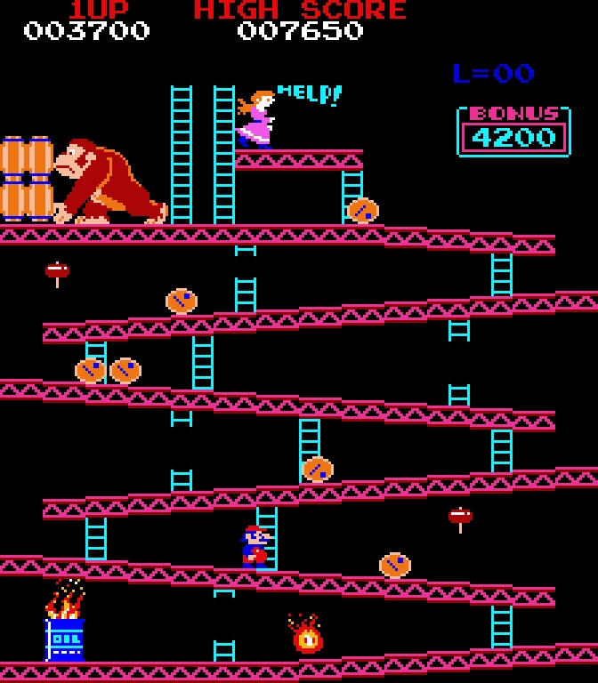

# Donkey Kong — Work RAM

Work RAM lives at `0x6000`–`0x6BFF` (`0x6C00`–`0x6FFF` is not populated). Each name below
describes the cell by its role in the running game; the hex address is the stable identity.
Cells whose role is only partly pinned, or whose identification is inferred from behaviour
rather than read off the code, carry a terse caveat.

>>> memory

| Address | Name | Description |
| --- | --- | --- |
| 6001 | credits | Credit count, packed BCD, capped at 0x90; the attract state advances while it is non-zero and the start handlers spend it |
| 6002 | coinsPartial | Coins banked toward the next credit; reset to 0 once it reaches dipCoinsPerCredit |
| 6003 | coinEdge | Edge latch for the coin line (IN2 bit 7); held 1 while no coin is present, so holding the line cannot repeat-credit |
| 6005 | gameState | Top-level game state: 0 power-on / 1 attract / 2 credited / 3 in-game; the frame service dispatches through a 4-entry table on it |
| 6007 | attract | Non-zero while no credited game is running; gates the joystick read, the sound driver, and the rst 08 guard |
| 6008 | substateTimerLo | Fast half of the two-byte sub-state timer; rst 20 decrements it and underflows into the rst 18 tick |
| 6009 | substateTimer | Frames remaining before the current sub-state may proceed; counts down once a frame. "Wait N then go to state M" writes N here and M into 600a |
| 600a | gameSubstate | Sub-state index within the current game state. In-game it selects one of 23 live handlers: 07 opening cutscene, 08 how-high, 0a board build, 0b spawn Mario, 0c gameplay, 0d death animation, 0e life lost, 16 board cleared |
| 600d | currentPlayer | Player currently up: 0 = player 1, non-zero = player 2; selects the score slot |
| 600e | activePlayerIndex | Active-player index, a value-lockstep mirror of currentPlayer, used to key the per-player slot records |
| 600f | twoPlayerGame | 1 = two-player game. Written exactly once, at game start, as the high byte of a single 16-bit store |
| 6010 | p1Input | Cooked control word the movement code reads: bit0 right, bit1 left, bit2 up, bit3 down (held), bit7 = jump press-edge, set for exactly one frame per press |
| 6011 | p1InputRaw | Raw joystick port byte for this frame (bit4 = jump), kept so next frame's edge detector can tell newly pressed from still held |
| 6018 | random | Pseudo-random accumulator; each vblank it takes += frame + spinCount, a decrementing counter plus a jittery one |
| 6019 | spinCount | Main-loop pass counter, roughly 140 per frame. Its jitter with per-frame workload is the point - it is the entropy the PRNG runs on |
| 601a | frame | Frame counter, DECREMENTED once per vblank; everything periodic keys off its low bits |
| 6020 | dipLives | Lives per game, 3-6, decoded from the DIP switches at power-on |
| 6021 | dipBonusLife | Extra-life threshold in BCD thousands: 07 / 10 / 15 / 20 = 7000 / 10000 / 15000 / 20000 |
| 6022 | dipCoinsFor1P | Coins needed for a one-player game - a display value only, written to the credit line |
| 6023 | dipCoinsFor2P | Coins needed for a two-player game - a display value only, with a tens-digit split for "10" |
| 6024 | dipCoinsPerCredit | Coins the mechanism must swallow per credit group |
| 6025 | dipCreditsPerCoin | Credits awarded per completed coin group |
| 6026 | dipUpright | Cabinet: 1 = upright, 0 = cocktail. Selects whether player 2 reads IN1, and is mirrored to the flip-screen latch |
| 6040 | p1Context | Player 1's saved 8-byte context: lives, level, board-order pointer (2), play-intro flag, bonus-life latch, how-high index, how-high pointer copy |
| 6048 | p2Context | Player 2's saved 8-byte context, same field order. Both are block-copied to and from the live context at 6228 on each player handoff |
| 6060 | overlapCount | Collision-search overlap tally: cleared, incremented once per overlap across both hazard arrays, then read back as a severity code (0/1/2+/3+ becomes 0/1/3/7) |
| 6080 | sndTrigger | Eight per-line sound trigger counters at 6080-6087, one per LS259 latch bit. Each vblank a non-zero counter is decremented and its line asserted; game code plays a sound by storing 3 |
| 6088 | sndIrqTrigger | Same countdown shape, driving the sound-CPU interrupt line at 7d80 |
| 6089 | sndBgm | Background tune number written to the tune latch while no priority tune is pending; held, so the tune loops |
| 608a | sndPriority | Priority tune number, overriding sndBgm while its frame counter is non-zero |
| 608b | sndPriorityFrames | Countdown for sndPriority; game code stores 3, so a priority tune is a three-frame pulse |
| 60b0 | taskTail | Task-ring enqueue pointer - the low byte of an address in page 60; advances by 2, wrapping fe to c0. A full ring silently drops the request |
| 60b1 | taskHead | Task-ring dequeue pointer, same encoding; the main loop consumes one task per pass |
| 60b2 | p1Score | Player 1 score: 3 bytes little-endian packed BCD (60b4 is the most-significant pair). All scores are displayed x100, so the low byte is always 00 |
| 60b5 | p2Score | Player 2 score, same format. The attract-mode placeholder is aa aa aa |
| 60b8 | highScore | High score, same format; the power-on default is 007650. A new high is copied here MSB-pair-first |
| 60c0 | taskRing | Task ring: 32 slots of 2 bytes [opcode, argument] at 60c0-60ff; opcode ff means the slot is free. Opcode 0 adds to the score, 1 resets a score counter, 2 draws a score, 3 draws a vertical string, 4 draws the credit line, 5 steps the bonus readout, 6 draws lives and level |
| 611c | playerSlotRecords | Player-slot records: base 611c, stride 0x22, 5 records; field 0 is the owner tag (1 = player 1, 3 = player 2). Per-record layout beyond the tag is inferred |
| 6200 | marioActive | Player-alive flag: 1 = alive and processed, 0 = dead or inert |
| 6202 | marioWalkAnim | Walk-cycle animation index; its low two bits feed the sprite code every frame. NOT facing - left and right produce the same value set in reversed order |
| 6203 | marioX | Mario's X position in screen pixels. Prize collision compares it exactly against each item's stored X |
| 6204 | marioXFrac | Fractional low byte of the 16.8 fixed-point X (6203:6204, big-endian); cleared at jump start |
| 6205 | marioY | Mario's Y position in screen pixels, larger being lower on screen; follows the girder slope while walking |
| 6206 | marioYFrac | Fractional low byte of the 16.8 fixed-point Y - the value the ballistic integrator actually updates |
| 6207 | marioSpriteCode | Mario's sprite tile code in bits 0-6; bit 7 is the horizontal flip, i.e. facing (1 = right). Every writer preserves bit 7 and ORs in a state code: 0e jump, 0f land, 06 ladder top, 03-05 climb, else the walk phase |
| 6208 | marioSpriteAttr | Colour/attribute byte of Mario's sprite record |
| 620b | marioAirPrevX | Snapshot of marioX taken at the head of each airborne frame, before that frame's motion |
| 620c | marioAirPrevY | Snapshot of marioY taken at the head of each airborne frame, before gravity |
| 620e | marioAirStartY | Y at the instant Mario left the ground; the fall-height test measures against it |
| 620f | marioMoveStepTimer | Ground walk/climb sub-step timer: while non-zero Mario shifts 1 pixel a frame; at zero the walk animation advances and it reloads (2 walking, 3-4 climbing). A jump never touches it |
| 6210 | marioAirVxHi | Signed 16-bit horizontal velocity while airborne, big-endian, in 1/256 pixel per frame. Jump start loads 0080 right, ff80 left, 0000 straight up |
| 6211 | marioAirVxLo | Low byte of the airborne horizontal velocity |
| 6212 | marioAirVyHi | Signed 16-bit INITIAL vertical velocity of the current jump or fall, big-endian, constant across the whole arc: a jump sets 0148, a fall sets 0 |
| 6213 | marioAirVyLo | Low byte of the initial vertical velocity |
| 6214 | marioAirFrames | Frames elapsed since Mario became airborne; drives the ballistic term, the per-frame Y delta being -(V + 8 - 16n). At frame 0x14 the landing check is armed |
| 6215 | marioOnLadder | 1 = on a ladder, mid-climb; enables the up/down climb branch and the ladder-centring X snap |
| 6216 | marioAirborne | Primary movement state: 0 grounded, 1 airborne (jumping or falling). The first test in the movement machine |
| 6217 | marioHammerActive | 1 = a hammer is in Mario's hands; suppresses the jump-button test and swaps in the hammer sprite and the hammer tune |
| 6218 | marioHammerPending | A hammer touched but not yet held, latched during the airborne frames and transferred into marioHammerActive when the post-landing freeze expires |
| 621b | marioClimbLimitA | One of the two ladder-extent limits for the current climb, in (Y+8) units; the climb stops and clears marioOnLadder when (newY+8) equals either limit |
| 621c | marioClimbLimitB | The other ladder-extent limit. The two writer paths store the pair in opposite order, so which is top and which is bottom is not settled - treat them as a pair |
| 621e | marioFreezeTimer | Post-landing freeze countdown; while non-zero Mario is unresponsive. Landing loads 4, and on expiry the pending hammer is applied and the walk animation cleared |
| 621f | marioAirLandcheck | Airborne sub-phase: while 1 the fall-height test runs every frame. Set at airborne frame 0x14 of a jump, near apex, or immediately for a ledge/slope fall |
| 6220 | marioFatalFall | "This fall will kill him": set when Mario is more than 0f pixels below his take-off Y. Consumed on landing as marioActive = this XOR 1 |
| 6221 | marioStartFall | One-shot "the ground went away" trigger raised by the slope/ledge contact check; the player-state reset consumes and clears it, putting Mario airborne with zero initial velocity |
| 6224 | marioClimbSoundToggle | Alternates 0/1 across climb half-steps; the footstep sound fires only on the 0 phase. It gates the sound and nothing else reads it |
| 6225 | itemCollected | 1 = a prize was just collected; set at pickup, and consumed at landing, which clears it and queues the pickup tune on every board but 25m |
| 6227 | board | Current board type: 1 = 25m girders, 2 = 50m conveyors, 3 = 75m elevators, 4 = 100m rivets. Re-derived from boardSeqPtr on every context restore, and the per-board setup dispatches on it |
| 6228 | lives | Lives remaining for the player up; offset 0 of the live 8-byte context at 6228-622f. Seeded from dipLives, decremented on death, incremented on the bonus-life award |
| 6229 | level | Level number, 1-based binary, clamped to 99. Board bonus = min(10*level + 40, 80). Incremented once per completed level, when the board order hits its terminator |
| 622a | boardSeqPtr | 16-bit ROM pointer (lo,hi) into the board-order table, initialised to 3a65. Board complete steps it and copies the byte it lands on into board; on the 7f terminator it reloads 3a73, the head of the level-5-and-up group, so the order repeats forever |
| 622c | playIntro | 1 = still play the opening cutscene for this player. Both death handlers zero it, which is why boards after a death skip the intro |
| 622d | bonusLifeAwarded | Latch so the score-threshold extra life is granted once per player |
| 622e | howHighIndex | Height index for the "HOW HIGH CAN YOU GET?" interlude, clamped to 5; stepped whenever boardSeqPtr differs from its saved copy |
| 622f | howHighLastSeq | Copy of boardSeqPtr's low byte, used only to detect that the pointer moved |
| 6280 | boardObjScratch | Board-object block, 64 bytes at 6280-62bf, seeded from a ROM template at board build. Its first 16 bytes are a stride-8 two-record array (6280 and 6288) selected by frame parity: +0 state, +1 park-dwell timer, +2 the object's column, +3 screen Y, +4 per-tick countdown. The rest of the span is heterogeneous - rivetsLeft and bonus are carved out of it |
| 6290 | rivetsLeft | Rivets still in place on 100m, initialised to 8; decremented as each is removed, and at 0 the board is won |
| 6291 | edgeRivetArmed | Edge-triggered one-shot in the rivet pickup. Standing on a rivet-board edge column (marioX 4b or b3) only ARMS it; the rivet is taken on a later frame, once he has stepped off, and the latch is disarmed |
| 6292 | rivetPresent | Eight per-rivet present flags (1 = still there) at 6292-6299; the remover tests and clears one, then decrements rivetsLeft |
| 62a0 | m50Obj1ReverseTimer | 50m: first travelling object's reversal timer; decremented on even frames, reloading 0x80 and flipping the step direction on underflow |
| 62a1 | m50Obj1StepDir | 50m: first travelling object's signed step-direction latch; only its sign is published |
| 62a2 | m50Obj2ReverseTimer | 50m: second object's reversal timer, reload 0xc0 |
| 62a3 | m50Obj2StepDir | 50m: second object's signed step-direction latch |
| 62a5 | m50Obj3ReverseTimer | 50m: third object's reversal timer, reload 0xff |
| 62a6 | m50Obj3StepDir | 50m: third object's signed step-direction latch |
| 62a7 | spawnTimer | Spawn-cadence timer; at 0 a free slot in the 6600 array is claimed and seeded, and it reloads 0x34. Always decrements |
| 62a8 | renderStrPtr | Source character-string pointer (word), walked to a 7f terminator and stored back each step |
| 62aa | renderObjPtr | Object-record pointer (word) the renderer reads the sprite code and attribute out of |
| 62ac | renderDstPtr | Destination pointer (word); the renderer writes its 4-byte record to a slot inside the sprite shadow buffer |
| 62b0 | bonusStart | The board's starting bonus, held constant for the whole board - the denominator for barrel-release pacing and for the end-of-board tally |
| 62b1 | bonus | Bonus counter in units of 100 points. Set at board start to min(10*level + 40, 80); reaching 0 arms the bonus-expired sequence. It ticks down on a timer on 50m/75m/100m and off the barrel release on 25m |
| 62b2 | bonusEventMark | Next bonus value at which the board's periodic spawn event fires; initialised to bonusStart and stepped down by 8 at each match |
| 62b3 | bonusPeriod | Frames between bonus ticks = max(0xdc - 2*bonus, 0x28) |
| 62b4 | bonusTick | Countdown to the next bonus tick, reloaded from bonusPeriod |
| 6300 | objParamTable0 | Per-board type-0 object-init table (stride 5), de-interleaved here at board build. Exact record layout inferred |
| 6310 | objParamTable1 | Per-board type-1 object-init table, parallel to table 0 |
| 6340 | effectState | Score-effect state, a 4-way dispatch index; pickup and hit sites raise it to 1 |
| 6341 | effectTimer | Effect display-hold countdown, armed to 0x40; blanks the score-popup sprite on expiry |
| 6342 | effectSelect | Effect select/mode byte; its low bits are walked one at a time to pick which award value is staged |
| 6343 | effectParamPtr | Effect parameter pointer (word): the base of the hit record the popup is placed on |
| 6345 | effectSeqState | Effect-sequence state, a 3-way dispatch index; re-arms effectState on completion |
| 6346 | effectSeqInner | Effect-sequence inner countdown, decremented first on each tick |
| 6347 | effectSeqOuter | Effect-sequence outer countdown, decremented when the inner one drains, and advancing effectSeqState at 0 |
| 6351 | collidedObjectBase | Base address (word) of the hazard array that contained the collision hit; its high byte serves as the array classifier |
| 6353 | collidedObjectStride | Per-record stride of the hit array (0x20), used as the walk increment out to the hit record |
| 6354 | collidedObjectIndex | Index of the hit object within its array, recovered as the sweep count less the remaining loop counter |
| 6380 | difficulty | Difficulty ramp = min(level + (difficultyClock >> 3), 5) - it rises both with the level and with time spent on the board |
| 6381 | difficultyClock | Increments every 256 frames; every eighth increment recomputes difficulty. Reset at board start |
| 6382 | barrelClaimMode | 25m barrel slot-claim mode, and the selector for which of two barrel kinds is stamped: the low bits are the mode and bit 7 picks the kind, the two kinds carrying different sprite and attribute bytes and so different palettes. Bit 0 independently selects the one-waypoint path table. Which named object each kind is has not been established |
| 6383 | frameSeen | The main loop's latched copy of the last frame it serviced; the loop spins comparing this against the frame counter - that is the wait-for-vblank |
| 6384 | difficultyPrescaler | Increments once per serviced frame; the block that follows it runs only when it wraps, i.e. every 256 frames |
| 6385 | introStep | Step index of the opening Kong-climb cutscene, walked 1 to 7 through an 8-entry table. Reached only while gameSubstate is 7 |
| 6386 | bonusExpiredStep | Small 0-3 state machine run once the bonus reaches 0; both bonus-decrement sites set it to 1 the moment that happens |
| 6387 | bonusExpiredDelay | Countdown-delay timer of the bonus-expired sequence; state 2 counts it down and advances the step on underflow |
| 6388 | boardAdvanceStep | Board-cleared interlude step index, dispatched through one of three board-parity tables; each step renders one stage and then increments it. A write of 0 restarts the sequence |
| 6389 | hammerSavedBgm | Background tune saved when a hammer is grabbed, so the pre-hammer tune can be restored to sndBgm at hammer expiry. Not cleared on restore, so it goes stale until the next grab |
| 638c | bonusDisplay | The on-screen bonus value - packed BCD of the bonus counter, stepped in lockstep with it and paid into the score at board completion |
| 638d | cutsceneBandCount | Intro cutscene band count, seeded to 5 and decremented per band; (count-1)*16 indexes the band table |
| 638e | introScrollIndex | Intro Kong-climb scroll index, seeded to 1f and walked down as the displaced video-copy offset |
| 6391 | colourCycleActive | 1 while the attract colour-cycle sweep is running: set at each frame-counter wrap, cleared when the sweep counter finishes at 0x80 |
| 6394 | hammerTimerLo | 16-bit up-counter for how long the current hammer has been active; the hammer ends when the high byte reaches 2, about 512 frames. Bit 3 of the low byte drives the 8-frame swing animation |
| 6395 | hammerTimerHi | High byte of the hammer up-counter |
| 6396 | spawnRequest | Spawn request: 3 is stored each bonus period; bit 0 activates the object, seeding its position and appearance, and the latch is then cleared |
| 6398 | edgeRepositionFlag | One-shot "Mario's Y was just repositioned" flag, set right after a forced Y write and read as a gate by the lift-ride code |
| 639a | objSpawnReq | Spawn request into the 65a0 array of 50m moving objects: when set and objSpawnTimer has drained, a free slot is filled and the request cleared |
| 639b | objSpawnTimer | Cooldown gating that spawn request; the service returns while it is non-zero, and it reloads to 7c after each spawn |
| 639d | deathAnimPhase | Phase of Mario's death animation (0-2), the dispatch index for the death cluster. The animation runs 296 frames, the sprite rotating through four orientations 13 times before settling on tile 7a, after which a life is lost. Never non-zero outside the death sub-state |
| 639e | deathAnimTicksLeft | Death-animation ticks remaining, primed to 13 and decremented once per 8-frame gate tick (not per frame); at 0 it advances deathAnimPhase |
| 63a0 | eventReq313c | Insert-event request for the hazard inserter: when set, and a free slot exists, a slot is activated and the request cleared. Raised both by the difficulty-scaled periodic trigger on 50m/100m and by the fixed hazard's own re-arm |
| 63a1 | objLiveCount | Per-scan tally of live records while sweeping the 6400 hazard array; the scan returns a caller-skip when it lands on an empty one |
| 63a3 | m50Obj1Step | 50m: first object's published signed X step - 0 on even frames, +-1 on odd |
| 63a4 | m50Obj2StepNeg | 50m: second object's published negative X step; the mover reads this arm below X 0x80 |
| 63a5 | m50Obj2StepPos | 50m: second object's published positive X step, the exact negation of the arm above |
| 63a6 | m50Obj3Step | 50m: third object's published signed X step |
| 63ab | segAddr1 | Board-render line segment: first endpoint tile address (word), the column start |
| 63ad | segAddr2 | Second endpoint tile address (word), the end-cap write pointer |
| 63af | segSubtile1 | First endpoint sub-tile X (x & 7) |
| 63b0 | segSubtile2 | Second endpoint sub-tile X |
| 63b1 | segHeight | Segment height, abs(y2 - y), paid down 8 pixels a row by the column drawers |
| 63b2 | segRun | Segment run, x2-x; its sign gives the girder or ladder slant |
| 63b3 | segKind | Segment record kind, the aa terminator, and the girder-versus-ladder drawer selector |
| 63b4 | segSubtileY1 | First endpoint sub-tile Y (y & 7) |
| 63b5 | segTile | Current stamped tile code, stepped by the drawers for slant and fill |
| 63b7 | m50ObjRowShift | 50m sprite-object row X-shift delta, added into the X column of the sprite-object block. An X shift, not a colour delta |
| 63b8 | bonusDisplayZeroed | Latch recording that the bonus readout has bottomed out, suppressing re-seeding once the display reaches zero |
| 63b9 | objSearchCount | Record count of the object list currently being searched, staged for the bounding-box search; on a hit the matched record's index is recovered as this count less the remaining loop counter |
| 63c0 | seqAdvancePtr | Indirect pointer (word) to the sequence counter the gated tick helper advances once substateTimer expires - introStep for the cutscene, boardAdvanceStep for the interlude, depending on which setup seeded it |
| 63c2 | introWalkPtrA | Intro walk pointer A (word), seeded to 38b4 and advanced to a 7f terminator |
| 63c4 | introWalkPtrB | Intro walk pointer B (word), seeded to 38cb |
| 63c8 | objIterPtr | Saved iterator pointer (word) walking the 6400 array, handed between the driver and the collision arm through memory |
| 63cc | demoScriptIndex | Attract-demo script step index; walks 0 to 18 and restarts each demo cycle, every advance producing a new control word |
| 63cd | demoScriptCountdown | Attract-demo per-step countdown, reloaded to a fresh duration at every script advance |
| 6400 | objArray64 | THE FIRES. Object array, stride 0x20. The per-frame driver walks 5 records; the collision arm sweeps 5 on 25m/50m/75m and 7 on 100m. Record fields: +0 active, +3 X, +5 Y, +7 sprite code, +8 attribute, +9/+0a collision half-extents, +0d state, +18 insert-pending, +1a/+1b saved path-table pointer |
| 6500 | objArray65 | THE SPRINGS. Object array, stride 0x10, 10 records at 6500-659f; 75m only, and only records 0-1 were ever seen active. Each walks an animation string of signed Y deltas and rewinds at the terminator. "Springs" is inferred from behaviour |
| 65a0 | objArray65a0 | The 50m travelling objects. Object array, stride 0x10, 6 records; X sweeps the full screen width, Y stays row-fixed |
| 6600 | objArray66 | Object array, stride 0x10, 6 records; 75m only. Each drifts one pixel vertically per service toward its limit. The drift matches the moving platforms, but nothing in the code names these objects - bit 3 of the state field picks the direction, a riser lands at row 96 with X snapped to column 119, a faller deactivates at row 248. "Elevators" is inferred from behaviour |
| 6680 | objPair6680 | THE HAMMERS: two records of 0x10 at 6680 and 6690. Field +1 of each is the in-play flag marking which hammer Mario grabbed, set on the touch and cleared at hammer expiry |
| 66a0 | objRecord66a0 | The board's fixed hazard - on 25m the oil drum, at X 39, Y 224, where the fires are born; on 50m at X 127, Y 120. Dormant on 75m and 100m. A single record, scattered in from a ROM template on exactly the boards whose collision arm sweeps it |
| 6700 | objArray67 | THE BARRELS. Object array, stride 0x20, 10 records spanning 6700-6840. Board 1 only - identically zero during play on the other three. Live sprite codes are six barrel frames times the flip bit |
| 6900 | spriteBuffer | Sprite shadow buffer: 96 hardware sprite records of 4 bytes at 6900-6a7f. The CPU fills it and the DMA blits all 384 bytes to sprite RAM 7000 every vblank. Record layout in game terms: +0 X, +1 code with flip on bit 7, +2 attribute, +3 Y. The video hardware reads each record rotated - that swap is the portrait orientation, not an error |
| 6908 | spriteObjBlock | A 10-record, 40-byte sprite group inside the shadow buffer, block-copied from a ROM template. Its contents are scene-dependent - board decor, cutscene props - but the 10-record structure is fixed |
| 694c | marioSpriteRecord | Mario's 4-byte sprite record inside the shadow buffer, assembled in order from marioX, marioSpriteCode, marioSpriteAttr and marioY, and blitted to sprite RAM 704c. The hammer overrides the code byte |
| 6980 | actorSprites | 10 sprite records (stride 4) at 6980-69a7, mirroring the X and Y of whichever object array the board is running -- the 6700 records on 25m, the 6500 records on 75m |
| 69b8 | obj65a0Sprites | 6 sprite records at 69b8-69cf, refreshed record-for-record from the 65a0 array; a culled record is blanked |
| 6a00 | topSprites | 3 sprite records seeded at board build on every board except 100m |
| 6a0c | objectCollisionSprites | 3 collision sprite records compared against Mario on X, Y and a flag byte; cleared as a 5-record group |
| 6a2c | effectSprite | Effect sprite record: +0 Y, +1 code, +2 attribute, +3 X. Bit 0 of its code byte flips 60 to 61 and back on each effect beat |
| 6a30 | popupSprite | Score-popup sprite record: Mario's X, the award glyph, attribute 7, and Mario's Y + 0x14 |
