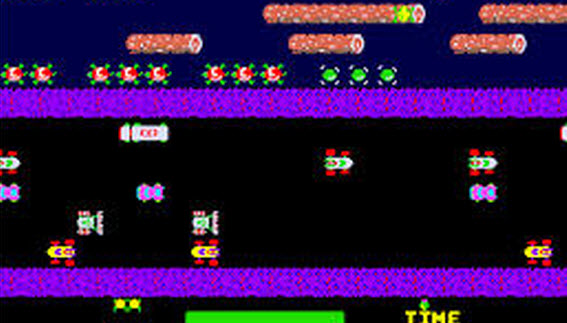

# Frogger Main Board

>>> cpu Z80

>>> binary 0000:roms/frogger.26 + roms/frogger.27 + roms/frsm3.7

>>> memoryTable hard 

[Hardware Info](Hardware.md)

>>> memoryTable ram 

[RAM Usage](RAMUse.md)

```code

; Patches for listening to sounds
;
;0000: 3E 18           LD      A,$18               ; Sound command (1-18)       
;0002: 32 02 D0        LD      ($D002),A           ; Trigger the sound
;0005: 3A 00 88        LD      A,($8800)           ; {hard.watchdog} Feed the watchdog
;0008: C3 05 00        JP      $0005               ; Loop forever
```

```code
; Frogger (Konami, 1981).
;
; Architecture: on reset ($0000) the CPU jumps to initColdBootAndEnterMainLoop
; ($02A3). What follows is the code reached from the reset and interrupt entry
; points, shown as instructions; spans never reached appear as data (the "----
; data ----" blocks).


; reset vector: a dead self-check arm reads the unmapped self-check source
; SELF_CHECK_SOURCE (0x4000, which floats 0xff and never the 0x55 its jump
; would need), kicks the watchdog (WATCHDOG_RESET_PORT 0x8800), then
; enters cold-boot init (initColdBootAndEnterMainLoop). Writes no RAM of
; its own; memory-only
seatStackAndEnterColdBoot:
0000: 3A 00 40        LD      A,($4000)           ; read the unmapped self-check source -- floats 0xff on this board
0003: FE 55           CP      $55                 ; the magic byte the dead self-check would need -- never present
0005: CA 01 40        JP      Z,$4001             ; the vestigial self-check branch -- never taken, its target isn't even code
0008: 3A 00 88        LD      A,($8800)           ; {hard.watchdog} the read pets the watchdog so it can't reset the board mid-boot
000B: 31 00 88        LD      SP,$8800            ; seat the Z80 stack pointer before handing off to boot
000E: C3 A3 02        JP      $02A3               ; {code.initColdBootAndEnterMainLoop} brings the whole board up, then the main loop

; ---- $0011-$0017: data ----
0011: FF FF FF FF FF FF FF

; sound-command enqueue primitive (the command is in A): while not playing
; (PLAY_FLAG 0x83fe ==0) drop it and return, else bump the ring head count
; SOUND_QUEUE_COUNT (0x8300) and store the command at 0x8300 + head.
; Widely called for game sound effects; memory-only
enqueueSoundCommand:
0018: 4F              LD      C,A                 ; stash the sound command
0019: 3A FE 83        LD      A,($83FE)           ; {hard.workRam+3FE} read the in-play flag
001C: B7              OR      A                   ; test it
001D: C8              RET     Z                   ; not in a game -- drop the command
001E: E5              PUSH    HL                  
001F: 21 00 83        LD      HL,$8300            ; the sound queue's head-count byte
0022: 34              INC     (HL)                ; one more queued command
0023: 7E              LD      A,(HL)              ; the new head index
0024: 6F              LD      L,A                 ; index to that queue slot
0025: 71              LD      (HL),C              ; store the command there
0026: E1              POP     HL                  
0027: C9              RET                         ; queued

; copy a run of bytes up a tilemap column: for the caller's count, copy
; source into destination while stepping the destination back one 32-cell
; row per byte and advancing the source; a count of 0 copies 256. Leaves
; both pointers advanced for the caller; memory-only
copyRunUpTileColumn:
0028: 1A              LD      A,(DE)              ; read one byte from the ROM tile run
0029: 77              LD      (HL),A              ; poke it into the cell the write pointer is sitting on
002A: 7D              LD      A,L                 
002B: D6 20           SUB     $20                 ; step the write pointer back one 32-cell row -- one tile up the column
002D: 6F              LD      L,A                 
002E: 30 01           JR      NC,$0031            ; {code.loc_0031} no borrow -- the high byte still holds, skip the fixup
0030: 25              DEC     H                   ; the subtract borrowed past a page -- carry it down into the high byte

loc_0031:
0031: 13              INC     DE                  ; walk the source forward to the next byte
0032: 10 F4           DJNZ    $0028               ; {code.copyRunUpTileColumn} one cell done -- loop for the whole count, a count of 0 copying a full 256
0034: C9              RET                         ; strip drawn -- both pointers left stepped past it for the next caller

; ---- $0035-$0037: data ----
0035: FF FF FF

; tilemap-clear primitive: fill the 32x32 tilemap (1024 contiguous cells
; from VRAM_BASE 0xa800 through 0xabff) with the blank tile 0x10; the
; ROM's per-row busy delay is timing-only. Memory-only
clearTilemapToTile16:
0038: 11 10 20        LD      DE,$2010            ; E is the blank tile $10; D counts down the 32 tilemap rows
003B: 21 00 A8        LD      HL,$A800            ; the base of the tilemap

loc_003e:
003E: 06 20           LD      B,$20               ; thirty-two cells across one row

loc_0040:
0040: 73              LD      (HL),E              ; stamp the blank tile into the cell
0041: 23              INC     HL                  
0042: 10 FC           DJNZ    $0040               ; {code.loc_0040}
0044: 0E 15           LD      C,$15               ; the per-row busy-wait count -- paces the writes on real video RAM, changes nothing visible

loc_0046:
0046: 10 FE           DJNZ    $0046               ; {code.loc_0046}
0048: 0D              DEC     C                   
0049: 20 FB           JR      NZ,$0046            ; {code.loc_0046}
004B: 15              DEC     D                   
004C: 20 F0           JR      NZ,$003E            ; {code.loc_003e}
004E: C9              RET                         

; ---- $004F-$0065: data ----
004F: FF FF FF FF FF FF FF FF FF FF FF FF FF FF FF FF
005F: FF FF FF FF FF FF FF

; vblank NMI handler, one frame of interrupt service: ack the NMI
; (NMI_ENABLE 0xb808), scan coins/credits (scanCoinInputAndCredit), blit
; the work-RAM sprite shadow (SPRITE_SHADOW_SRC_BASE 0x8008) into OBJRAM
; with a per-byte nibble-swap, and tick the two coin-counter pulse timers
; (COIN_PULSE_TIMER_0/1 0x837e/0x837f), dropping their hardware latches on
; drain. Then run the play/mode dispatch tree: the attract-demo sequencer
; and intro/mode housekeeping while idle, else the in-play sub-engines
; (lane-object mover, frog move-vs-lanes, death animation, sprite-object
; cluster, score-display, countdowns) plus the board-complete home reveal
; (stampHomeBayFrogByColumn keyed on HOME_REVEAL_COUNTDOWN 0x8297).
; Memory-only
serviceVblankNmi:
0066: F5              PUSH    AF                  ; save the interrupted code's registers
0067: E5              PUSH    HL                  
0068: D5              PUSH    DE                  
0069: C5              PUSH    BC                  
006A: DD E5           PUSH    IX                  
006C: FD E5           PUSH    IY                  
006E: 3A 00 88        LD      A,($8800)           ; {hard.watchdog} kick the watchdog
0071: AF              XOR     A                   
0072: 32 08 B8        LD      ($B808),A           ; {hard.irqEnable} ack the NMI and block re-entry until service completes
0075: CD F0 2C        CALL    $2CF0               ; {code.scanCoinInputAndCredit} scan coins and award credits
0078: 21 07 80        LD      HL,$8007            ; point at the sprite shadow's lead byte
007B: 11 07 B0        LD      DE,$B007            ; and at OBJRAM's lead byte
007E: 7E              LD      A,(HL)              
007F: 12              LD      (DE),A              ; copy the lead byte straight into OBJRAM
0080: 2C              INC     L                   ; step to the first shadow pair
0081: 1C              INC     E                   
0082: 06 1C           LD      B,$1C               ; 28 two-byte sprite records to blit

loc_0084:
0084: 7E              LD      A,(HL)              ; the record's even byte -- two swapped nibbles
0085: 0F              RRCA                        
0086: 0F              RRCA                        
0087: 0F              RRCA                        
0088: 0F              RRCA                        ; four rotates -- swap the byte's nibbles for the sprite-attribute encoding
0089: 12              LD      (DE),A              ; store the swapped byte to OBJRAM
008A: 2C              INC     L                   
008B: 1C              INC     E                   
008C: 7E              LD      A,(HL)              ; the record's odd byte -- copied straight
008D: 12              LD      (DE),A              
008E: 2C              INC     L                   
008F: 1C              INC     E                   
0090: 10 F2           DJNZ    $0084               ; {code.loc_0084} do all 28 records
0092: 0E 08           LD      C,$08               ; default: eight four-byte sprite passes
0094: 3A 2F 84        LD      A,($842F)           ; {hard.workRam+42F} the fly / object-slot select
0097: B7              OR      A                   
0098: 28 05           JR      Z,$009F             ; {code.loc_009f} zero: blit the fly-sprite block at 0x8040
009A: 0E 06           LD      C,$06               ; else six passes
009C: 1E 48           LD      E,$48               ; point OBJRAM at the object-slot block
009E: 6B              LD      L,E                 ; and the shadow at 0x8048

loc_009f:
009F: 7E              LD      A,(HL)              ; the pass's first byte -- nibble-swapped
00A0: 0F              RRCA                        
00A1: 0F              RRCA                        
00A2: 0F              RRCA                        
00A3: 0F              RRCA                        ; swap the byte's nibbles for the attribute encoding
00A4: 12              LD      (DE),A              ; store the swapped byte
00A5: 2C              INC     L                   
00A6: 1C              INC     E                   
00A7: 06 03           LD      B,$03               ; the pass's other three bytes copy straight

loc_00a9:
00A9: 7E              LD      A,(HL)              
00AA: 12              LD      (DE),A              
00AB: 2C              INC     L                   
00AC: 1C              INC     E                   
00AD: 10 FA           DJNZ    $00A9               ; {code.loc_00a9}
00AF: 0D              DEC     C                   ; one pass done
00B0: 20 ED           JR      NZ,$009F            ; {code.loc_009f} do the remaining passes
00B2: 21 7F 83        LD      HL,$837F            ; point at coin-pulse timer 1
00B5: 7E              LD      A,(HL)              
00B6: B7              OR      A                   
00B7: 28 07           JR      Z,$00C0             ; {code.loc_00c0} not pulsing: skip it
00B9: 35              DEC     (HL)                ; tick the pulse timer down
00BA: 20 04           JR      NZ,$00C0            ; {code.loc_00c0} still pulsing: leave the latch up
00BC: AF              XOR     A                   
00BD: 32 1C B8        LD      ($B81C),A           ; {hard.coinCounter1} drop coin-counter 1's hardware latch -- ends the pulse

loc_00c0:
00C0: 21 7E 83        LD      HL,$837E            ; point at coin-pulse timer 0
00C3: 7E              LD      A,(HL)              
00C4: B7              OR      A                   
00C5: 28 07           JR      Z,$00CE             ; {code.loc_00ce} not pulsing: skip it
00C7: 35              DEC     (HL)                ; tick it down
00C8: 20 04           JR      NZ,$00CE            ; {code.loc_00ce} still pulsing: leave the latch up
00CA: AF              XOR     A                   
00CB: 32 18 B8        LD      ($B818),A           ; {hard.coinCounter0} drop coin-counter 0's latch -- ends the pulse

loc_00ce:
00CE: 3A 04 E0        LD      A,($E004)           ; {hard.in2} read the coin / cocktail input port
00D1: E6 08           AND     $08                 ; isolate the cocktail / 2P-select bit
00D3: CA FC 00        JP      Z,$00FC             ; {code.loc_00fc} upright cabinet: no mirror
00D6: 3A FE 83        LD      A,($83FE)           ; {hard.workRam+3FE} the in-play flag
00D9: A7              AND     A                   
00DA: CA FC 00        JP      Z,$00FC             ; {code.loc_00fc} not in a game: skip the mirror
00DD: 3A FD 83        LD      A,($83FD)           ; {hard.workRam+3FD} the active player number
00E0: A7              AND     A                   
00E1: 28 19           JR      Z,$00FC             ; {code.loc_00fc} player slot 0: skip the mirror
00E3: 3D              DEC     A                   
00E4: 28 16           JR      Z,$00FC             ; {code.loc_00fc} player 1 up: no flip needed
00E6: 0E 02           LD      C,$02               ; the two-pixel registration nudge
00E8: 21 43 80        LD      HL,$8043            ; the fly sprite's Y shadow
00EB: 11 43 B0        LD      DE,$B043            ; its OBJRAM copy
00EE: 7E              LD      A,(HL)              ; read the fly Y
00EF: 81              ADD     A,C                 ; shift it down two pixels for the flipped view
00F0: 12              LD      (DE),A              ; write the mirrored fly Y
00F1: 0E 02           LD      C,$02               
00F3: 21 47 80        LD      HL,$8047            ; the frog sprite's Y shadow
00F6: 11 47 B0        LD      DE,$B047            ; its OBJRAM copy
00F9: 7E              LD      A,(HL)              ; read the frog Y
00FA: 81              ADD     A,C                 ; nudge it down two
00FB: 12              LD      (DE),A              ; write the mirrored frog Y

loc_00fc:
00FC: 3A FE 83        LD      A,($83FE)           ; {hard.workRam+3FE} the in-play flag
00FF: B7              OR      A                   
0100: CA 22 01        JP      Z,$0122             ; {code.loc_0122} attract / intro: hand off the frame
0103: CD AC 07        CALL    $07AC               ; {code.dequeueSoundCommand} pop one queued sound to the hardware
0106: 3A EA 83        LD      A,($83EA)           ; {hard.workRam+3EA} the board-laid-out gate
0109: B7              OR      A                   
010A: CA 45 02        JP      Z,$0245             ; {code.loc_0245} board not built yet: nothing to step
010D: 2A D2 83        LD      HL,($83D2)          ; {hard.workRam+3D2} the start-of-life freeze timer
0110: 7C              LD      A,H                 
0111: B5              OR      L                   
0112: CA 71 01        JP      Z,$0171             ; {code.loc_0171} timer drained: run the full frame
0115: 2B              DEC     HL                  ; tick the freeze timer down
0116: 22 D2 83        LD      ($83D2),HL          ; {hard.workRam+3D2} save the decremented freeze timer
0119: CD B7 14        CALL    $14B7               ; {code.moveLaneObjectsAndCarryFrog} still frozen: move only the lanes and carry the frog

loc_011c:
011C: CD 02 18        CALL    $1802               ; {code.advanceAnimationFrameBuffer} advance the animation buffer
011F: C3 45 02        JP      $0245               ; {code.loc_0245} then to the epilogue

loc_0122:
0122: 3A D6 83        LD      A,($83D6)           ; {hard.workRam+3D6} the mode / intro stage
0125: FE 02           CP      $02                 
0127: D2 58 01        JP      NC,$0158            ; {code.loc_0158} intro or point-table mode: pace it
012A: B7              OR      A                   
012B: CC 7A 0E        CALL    Z,$0E7A             ; {code.driveAttractDemoSequencer} attract proper: step the demo sequencer
012E: CD 41 23        CALL    $2341               ; {code.driveInPlayFrameUpdate} run the frame update -- idle outside play
0131: AF              XOR     A                   
0132: 32 CD 83        LD      ($83CD),A           ; {hard.workRam+3CD} scrub the demo-state flag
0135: 32 CF 83        LD      ($83CF),A           ; {hard.workRam+3CF} and this per-frame scratch
0138: 32 B5 83        LD      ($83B5),A           ; {hard.workRam+3B5} and the countdown-enable latch
013B: 67              LD      H,A                 
013C: 6F              LD      L,A                 
013D: 22 93 82        LD      ($8293),HL          ; {hard.workRam+293} clear the difficulty-index word
0140: 21 5C 82        LD      HL,$825C            ; point at the slot / occupancy block
0143: 11 5D 82        LD      DE,$825D            
0146: 01 0B 00        LD      BC,$000B            ; eleven bytes to clear
0149: 70              LD      (HL),B              ; seed the first byte to 0
014A: ED B0           LDIR                        ; propagate the zero through the whole block
014C: 21 AF 83        LD      HL,$83AF            ; the NMI HL-pointer cells
014F: 36 80           LD      (HL),$80            ; seed the pointer's first byte to 0x80
0151: 2C              INC     L                   
0152: 77              LD      (HL),A              
0153: 2C              INC     L                   
0154: 77              LD      (HL),A              
0155: C3 45 02        JP      $0245               ; {code.loc_0245} to the epilogue

loc_0158:
0158: 21 D8 83        LD      HL,$83D8            ; point at the intro pacing timer
015B: 7E              LD      A,(HL)              
015C: B7              OR      A                   
015D: CA 45 02        JP      Z,$0245             ; {code.loc_0245} already 0: wait at the epilogue
0160: 35              DEC     (HL)                ; tick the pacing timer down
0161: C2 45 02        JP      NZ,$0245            ; {code.loc_0245} not drained yet: wait
0164: 2D              DEC     L                   ; step to the demo-phase counter
0165: 7E              LD      A,(HL)              
0166: B7              OR      A                   
0167: C2 45 02        JP      NZ,$0245            ; {code.loc_0245} a demo phase still running: hold
016A: 21 D6 83        LD      HL,$83D6            ; point at the mode / intro stage
016D: 35              DEC     (HL)                ; advance the intro one stage
016E: C3 45 02        JP      $0245               ; {code.loc_0245} to the epilogue

loc_0171:
0171: 2A 82 83        LD      HL,($8382)          ; {hard.workRam+382} the playing sound-sequence timer
0174: 7C              LD      A,H                 
0175: B5              OR      L                   
0176: 28 12           JR      Z,$018A             ; {code.loc_018a} no sequence running: skip
0178: 2B              DEC     HL                  ; tick the sequence timer down
0179: 22 82 83        LD      ($8382),HL          ; {hard.workRam+382} save the ticked sequence timer
017C: 7C              LD      A,H                 
017D: B5              OR      L                   
017E: 20 0A           JR      NZ,$018A            ; {code.loc_018a} not finished yet: skip
0180: 3E 0F           LD      A,$0F               ; the sequence-end sound command
0182: DF              RST     $18                 ; queue it
0183: 3E B0           LD      A,$B0               ; the second end-of-sequence command
0185: DF              RST     $18                 ; queue it too
0186: AF              XOR     A                   
0187: 32 71 83        LD      ($8371),A           ; {hard.workRam+371} clear the per-turn scratch

loc_018a:
018A: 3A FD 83        LD      A,($83FD)           ; {hard.workRam+3FD} the active player number
018D: 3D              DEC     A                   
018E: C2 74 02        JP      NZ,$0274            ; {code.loc_0274} player 2 is up: its board branch
0191: 3A 5C 82        LD      A,($825C)           ; {hard.workRam+25C} player 1's filled-bay count
0194: FE 05           CP      $05                 
0196: CA 5E 02        JP      Z,$025E             ; {code.loc_025e} all five bays home: board complete

loc_0199:
0199: 3A 98 82        LD      A,($8298)           ; {hard.workRam+298} the reveal start-delay timer
019C: A7              AND     A                   
019D: 28 07           JR      Z,$01A6             ; {code.loc_01a6} delay drained: on to the reveal
019F: 3D              DEC     A                   ; tick the start-delay down
01A0: 32 98 82        LD      ($8298),A           ; {hard.workRam+298}
01A3: C3 E2 01        JP      $01E2               ; {code.loc_01e2} skip ahead to the status-row stage

loc_01a6:
01A6: 3A 97 82        LD      A,($8297)           ; {hard.workRam+297} the home-reveal countdown
01A9: A7              AND     A                   
01AA: C2 57 02        JP      NZ,$0257            ; {code.loc_0257} reveal running: tick it
01AD: 2A 9D 82        LD      HL,($829D)          ; {hard.workRam+29D} the frog-spawn ready delay
01B0: 7C              LD      A,H                 
01B1: B5              OR      L                   
01B2: 20 2E           JR      NZ,$01E2            ; {code.loc_01e2} still waiting to respawn: skip play
01B4: CD 70 08        CALL    $0870               ; {code.driveScoreDisplayCountdown} tick the score-display countdown
01B7: CD 55 1A        CALL    $1A55               ; {code.orchestrateCollisionsAndFrogInput} run collisions and frog input
01BA: 3A B5 83        LD      A,($83B5)           ; {hard.workRam+3B5} the once-per-life latch
01BD: B7              OR      A                   
01BE: 20 22           JR      NZ,$01E2            ; {code.loc_01e2} already latched: skip the one-shot arm
01C0: 3C              INC     A                   
01C1: 32 B5 83        LD      ($83B5),A           ; {hard.workRam+3B5} set the latch
01C4: 3E FF           LD      A,$FF               
01C6: 32 84 83        LD      ($8384),A           ; {hard.workRam+384} arm the status-row redraw to 0xff
01C9: 3A 80 83        LD      A,($8380)           ; {hard.workRam+380} the board-advance-done flag
01CC: B7              OR      A                   
01CD: 28 13           JR      Z,$01E2             ; {code.loc_01e2} board not just finished: skip
01CF: AF              XOR     A                   
01D0: 32 80 83        LD      ($8380),A           ; {hard.workRam+380} clear the done flag
01D3: 21 40 00        LD      HL,$0040            ; sixty-four frames
01D6: 22 82 83        LD      ($8382),HL          ; {hard.workRam+382} reload the sound-sequence timer
01D9: 11 7B 2F        LD      DE,$2F7B            ; the seven-tile reveal strip in ROM
01DC: 21 51 AA        LD      HL,$AA51            ; its VRAM column
01DF: 06 07           LD      B,$07               ; seven tiles
01E1: EF              RST     $28                 ; blit the strip up the column

loc_01e2:
01E2: 3A 84 83        LD      A,($8384)           ; {hard.workRam+384} the status-row redraw countdown
01E5: B7              OR      A                   
01E6: 28 0A           JR      Z,$01F2             ; {code.loc_01f2} not armed: skip to the world step
01E8: 3D              DEC     A                   ; tick it down
01E9: 32 84 83        LD      ($8384),A           ; {hard.workRam+384}
01EC: 21 50 A8        LD      HL,$A850            ; the status-row VRAM
01EF: CC E2 19        CALL    Z,$19E2             ; {code.blitFourTileGroupColumn} on the drain frame: repaint the status row

loc_01f2:
01F2: CD 05 20        CALL    $2005               ; {code.advanceScrollLaneObjects} scroll the lane objects
01F5: CD 02 18        CALL    $1802               ; {code.advanceAnimationFrameBuffer} advance the animation buffer
01F8: 3A 07 81        LD      A,($8107)           ; {hard.workRam+107} the first lane's scroll-edge flag
01FB: A7              AND     A                   
01FC: 28 07           JR      Z,$0205             ; {code.loc_0205} no edge: leave the index
01FE: 3A 09 81        LD      A,($8109)           ; {hard.workRam+109} the first lane's object index
0201: 3D              DEC     A                   ; roll it back one for the pre-scroll scan
0202: 32 09 81        LD      ($8109),A           ; {hard.workRam+109}

loc_0205:
0205: 3A 08 81        LD      A,($8108)           ; {hard.workRam+108} the second lane's scroll-wrap flag
0208: A7              AND     A                   
0209: 28 07           JR      Z,$0212             ; {code.loc_0212} no wrap: leave the index
020B: 3A 24 81        LD      A,($8124)           ; {hard.workRam+124} the second lane's object index
020E: 3D              DEC     A                   ; roll it back one
020F: 32 24 81        LD      ($8124),A           ; {hard.workRam+124}

loc_0212:
0212: CD BF 11        CALL    $11BF               ; {code.dispatchFrogMoveAgainstLanes} resolve the frog move against the pre-scroll lanes
0215: 3A 07 81        LD      A,($8107)           ; {hard.workRam+107} the first lane's scroll-edge flag
0218: A7              AND     A                   
0219: 28 07           JR      Z,$0222             ; {code.loc_0222} no edge: nothing to restore
021B: 3A 09 81        LD      A,($8109)           ; {hard.workRam+109} the first lane's object index
021E: 3C              INC     A                   ; roll it forward again
021F: 32 09 81        LD      ($8109),A           ; {hard.workRam+109}

loc_0222:
0222: 3A 08 81        LD      A,($8108)           ; {hard.workRam+108} the second lane's scroll-wrap flag
0225: A7              AND     A                   
0226: 28 07           JR      Z,$022F             ; {code.loc_022f} no wrap: nothing to restore
0228: 3A 24 81        LD      A,($8124)           ; {hard.workRam+124} the second lane's object index
022B: 3C              INC     A                   ; roll it forward again
022C: 32 24 81        LD      ($8124),A           ; {hard.workRam+124}

loc_022f:
022F: CD F8 16        CALL    $16F8               ; {code.driveFrogDeathAnimation} run the frog death animation
0232: CD B7 14        CALL    $14B7               ; {code.moveLaneObjectsAndCarryFrog} move the lanes and carry the frog

loc_0235:
0235: CD 70 29        CALL    $2970               ; {code.driveSpriteObjectCluster} update the sprite-object cluster
0238: CD C7 1F        CALL    $1FC7               ; {code.tickGatedCountdown} tick the gated countdown
023B: CD 92 02        CALL    $0292               ; {code.loc_0292} drain the frog-spawn ready delay
023E: 3A 97 82        LD      A,($8297)           ; {hard.workRam+297} the home-reveal countdown, reused as a column selector
0241: A7              AND     A                   
0242: C4 A2 06        CALL    NZ,$06A2            ; {code.stampHomeBayFrogByColumn} stamp that home bay's frog

loc_0245:
0245: 3A 00 88        LD      A,($8800)           ; {hard.watchdog} kick the watchdog
0248: FD E1           POP     IY                  ; restore the interrupted code's registers
024A: DD E1           POP     IX                  
024C: C1              POP     BC                  
024D: D1              POP     DE                  
024E: E1              POP     HL                  
024F: 3E 01           LD      A,$01               
0251: 32 08 B8        LD      ($B808),A           ; {hard.irqEnable} re-enable the vblank NMI for the next frame
0254: F1              POP     AF                  
0255: ED 45           RETN                        ; return to the interrupted main loop

loc_0257:
0257: 3D              DEC     A                   ; count the reveal down one
0258: 32 97 82        LD      ($8297),A           ; {hard.workRam+297}
025B: C3 E2 01        JP      $01E2               ; {code.loc_01e2} on to the status-row stage

loc_025e:
025E: 21 5E 82        LD      HL,$825E            ; the five player-1 home-bay gates
0261: 11 5F 82        LD      DE,$825F            
0264: 01 04 00        LD      BC,$0004            ; four more after the first
0267: 70              LD      (HL),B              ; clear the first bay gate
0268: ED B0           LDIR                        ; propagate the clear across all five
026A: AF              XOR     A                   
026B: 32 5C 82        LD      ($825C),A           ; {hard.workRam+25C} reset the filled-bay count
026E: CD D3 05        CALL    $05D3               ; {code.loc_05d3} run the board-complete handler
0271: C3 45 02        JP      $0245               ; {code.loc_0245} to the epilogue

loc_0274:
0274: 3A 5D 82        LD      A,($825D)           ; {hard.workRam+25D} player 2's filled-bay count
0277: FE 05           CP      $05                 
0279: C2 99 01        JP      NZ,$0199            ; {code.loc_0199} not all home: normal reveal chain
027C: 21 63 82        LD      HL,$8263            ; player 2's five home-bay gates
027F: 11 64 82        LD      DE,$8264            
0282: 01 04 00        LD      BC,$0004            ; four more after the first
0285: 70              LD      (HL),B              ; clear the first bay gate
0286: ED B0           LDIR                        ; propagate the clear across all five
0288: AF              XOR     A                   
0289: 32 5D 82        LD      ($825D),A           ; {hard.workRam+25D} reset player 2's bay count
028C: CD D3 05        CALL    $05D3               ; {code.loc_05d3} run the board-complete handler
028F: C3 45 02        JP      $0245               ; {code.loc_0245} to the epilogue

loc_0292:
0292: 2A 9D 82        LD      HL,($829D)          ; {hard.workRam+29D} read the ready-delay countdown word
0295: 7C              LD      A,H                 
0296: B5              OR      L                   ; fold the two bytes together to test the whole word for zero
0297: C8              RET     Z                   ; already drained -- nothing to tick, leave the expiry flag alone
0298: 2B              DEC     HL                  ; one more frame off the ready delay
0299: 22 9D 82        LD      ($829D),HL          ; {hard.workRam+29D} store the ticked-down word back
029C: 7C              LD      A,H                 
029D: B5              OR      L                   ; test whether this tick just brought it to zero
029E: C0              RET     NZ                  ; still counting -- the spawn stays held off
029F: 32 AE 83        LD      ($83AE),A           ; {hard.workRam+3AE} drained: clear the expiry flag -- release the hold
02A2: C9              RET                         

; cold-boot init, reached from the reset vector: disable the NMI
; (NMI_ENABLE 0xb808) and both flip latches, zero work RAM ($8000 0x8000
; through WORK_RAM_TOP 0x87ff) and the OBJRAM page (OBJRAM_BASE 0xb000);
; seed the starting time SHARED_TIME_BYTE (0x83e4) from the difficulty DSW
; table, the cabinet flag COCKTAIL_ENABLED_FLAG (0x83c2) and coinage
; COINAGE_WORD (0x83d4) from IN2, and the 18-byte score/state block plus
; the 32-byte spawn-RNG ring (SPAWN_RNG_RING_BASE 0x8400) from ROM
; defaults; default the player count NUM_PLAYERS (0x8370) to 1, re-enable
; the NMI, clear the screen, program both i8255 PPIs, pulse the sound port
; mute then unmute, and enter the main loop. Memory-only
initColdBootAndEnterMainLoop:
02A3: AF              XOR     A                   
02A4: 32 08 B8        LD      ($B808),A           ; {hard.irqEnable} mask the vblank NMI so no frame interrupt fires while RAM is rewritten
02A7: 32 05 88        LD      ($8805),A           
02AA: 32 10 B8        LD      ($B810),A           ; {hard.flipX} clear both screen-flip latches -- the display comes up un-flipped
02AD: 32 0C B8        LD      ($B80C),A           ; {hard.flipY}
02B0: 21 00 80        LD      HL,$8000            ; the base of work RAM
02B3: 11 01 80        LD      DE,$8001            
02B6: 01 FF 07        LD      BC,$07FF            
02B9: 75              LD      (HL),L              ; seed the first byte to zero (L is already 0)
02BA: ED B0           LDIR                        ; propagate the zero up through 0x87ff -- all of work RAM starts from a known 0
02BC: 21 00 B0        LD      HL,$B000            ; the base of the 256-byte sprite (OBJRAM) page
02BF: 01 00 00        LD      BC,$0000            

loc_02c2:
02C2: 71              LD      (HL),C              
02C3: 2C              INC     L                   
02C4: 10 FC           DJNZ    $02C2               ; {code.loc_02c2} clear the whole sprite page -- no stale sprites reach the screen
02C6: 3A 02 E0        LD      A,($E002)           ; {hard.in1} read IN1 for the two difficulty DIP bits
02C9: 16 2E           LD      D,$2E               ; the ROM starting-time table sits in page 0x2e
02CB: E6 03           AND     $03                 ; keep just the two difficulty-select bits (0..3)
02CD: 5F              LD      E,A                 
02CE: 1A              LD      A,(DE)              
02CF: 32 E4 83        LD      ($83E4),A           ; {hard.workRam+3E4} the shared start-time byte -- what the time bar counts down from
02D2: 3A 04 E0        LD      A,($E004)           ; {hard.in2} read IN2 for the cabinet and coinage DIP bits
02D5: 67              LD      H,A                 
02D6: CB 5C           BIT     3,H                 ; test the cabinet DIP bit (set = cocktail)
02D8: 28 05           JR      Z,$02DF             ; {code.loc_02df} upright cabinet -- skip the cocktail flag
02DA: 3E 01           LD      A,$01               
02DC: 32 C2 83        LD      ($83C2),A           ; {hard.workRam+3C2} raise the cocktail-cabinet flag

loc_02df:
02DF: 7C              LD      A,H                 
02E0: E6 06           AND     $06                 ; keep just the two coinage-select bits
02E2: 32 D4 83        LD      ($83D4),A           ; {hard.workRam+3D4} the coinage selector -- later indexes the per-coin credit amount
02E5: 21 0A 2E        LD      HL,$2E0A            ; the ROM score/high-score/state defaults
02E8: 11 EB 83        LD      DE,$83EB            ; the score/state block in RAM
02EB: 01 12 00        LD      BC,$0012            
02EE: ED B0           LDIR                        ; copy the 18-byte defaults -- installs the power-on high score and the initial score cells
02F0: CD 48 10        CALL    $1048               ; {code.spinWatchdogSettleDelay} spin out the power-on settle, feeding the watchdog across the wait
02F3: 3E 01           LD      A,$01               
02F5: 32 70 83        LD      ($8370),A           ; {hard.workRam+370} default to a 1-player game -- the start buttons promote to 2 later
02F8: 32 08 B8        LD      ($B808),A           ; {hard.irqEnable} re-arm the vblank NMI -- RAM is coherent now, so the frame clock may fire
02FB: FF              RST     $38                 ; clear the screen -- fill the tilemap with the blank tile
02FC: AF              XOR     A                   
02FD: 32 01 B0        LD      ($B001),A           ; {hard.objRam+1} the sprite-DMA control low byte -- 0 for normal output
0300: 3E 06           LD      A,$06               
0302: 32 03 B0        LD      ($B003),A           ; {hard.objRam+3} the sprite-DMA control high byte -- 6 for normal sprite output
0305: 21 00 01        LD      HL,$0100            
0308: 22 C7 83        LD      ($83C7),HL          ; {hard.workRam+3C7} prime the busy-wait the main loop spins between NMI firings
030B: 3E 15           LD      A,$15               
030D: 32 81 83        LD      ($8381),A           ; {hard.workRam+381} seed the arrival-fanfare index to its power-on value
0310: 21 B1 2E        LD      HL,$2EB1            ; the ROM spawn-RNG ring defaults
0313: 11 00 84        LD      DE,$8400            ; the spawn-PRNG ring page in RAM
0316: 01 20 00        LD      BC,$0020            
0319: ED B0           LDIR                        ; copy the 32-byte defaults -- the spawn PRNG's fixed seed pool
031B: 21 06 E0        LD      HL,$E006            
031E: 36 9B           LD      (HL),$9B            ; PPI0: mode 0, all ports as inputs -- it reads the panel and DIP switches
0320: 21 06 D0        LD      HL,$D006            
0323: 36 88           LD      (HL),$88            ; PPI1: ports A/B as outputs -- it drives the sound board
0325: 3E 18           LD      A,$18               
0327: 32 D9 83        LD      ($83D9),A           ; {hard.workRam+3D9} the RAM shadow of the sound-control byte, mute bit set
032A: 32 02 D0        LD      ($D002),A           ; {hard.soundControl} mute the live sound-control port while the audio powers up
032D: AF              XOR     A                   
032E: CD 94 07        CALL    $0794               ; {code.issueSoundCommand} strobe sound command 0 to the sound board
0331: 3A D9 83        LD      A,($83D9)           ; {hard.workRam+3D9} read the sound-control shadow back
0334: E6 EF           AND     $EF                 ; clear the mute bit
0336: 32 D9 83        LD      ($83D9),A           ; {hard.workRam+3D9} store the unmuted value in the shadow
0339: 32 02 D0        LD      ($D002),A           ; {hard.soundControl} unmute the live sound-control port
033C: 3E FF           LD      A,$FF               
033E: CD 94 07        CALL    $0794               ; {code.issueSoundCommand} strobe command 0xff -- sound is now live

; the foreground main loop as a vblank coroutine: drain the idempotent
; foreground to its per-frame fixed point, then yield so the engine fires
; the NMI at the pace tail. Each drain runs the loop body twice — one pass
; is the steady-state fixed point, the second settles the life-restart
; cascade and is a no-op otherwise
drainForegroundThenYieldEachVblank:
0341: 3A D6 83        LD      A,($83D6)           ; {hard.workRam+3D6} read the top-level game mode
0344: FE 02           CP      $02                 ; the intro and score-ranking modes sit at 2 and up
0346: D4 11 0D        CALL    NC,$0D11            ; {code.dispatchGameModeFrame} step that mode's frame toward attract or play
0349: CD 1F 0B        CALL    $0B1F               ; {code.renderScoreHeader} repaint the whole score row from scratch -- a re-render, never an accumulation
034C: 3A D6 83        LD      A,($83D6)           ; {hard.workRam+3D6} re-read the mode for the credit-line test
034F: 3D              DEC     A                   ; zero only in mode 1, the mode that paints the credit region itself
0350: C4 67 0B        CALL    NZ,$0B67            ; {code.renderCreditLine} draw the credit line in every other mode
0353: CD 0F 23        CALL    $230F               ; {code.setUpPlayStartOnce} the once-per-life play-start setup
0356: 3E 02           LD      A,$02               ; the two-pixel per-frame hop step
0358: 21 54 82        LD      HL,$8254            ; the frog-hop step/reload block
035B: 77              LD      (HL),A              ; both hop-step cells, vertical and horizontal, seeded to two
035C: 23              INC     HL                  
035D: 77              LD      (HL),A              
035E: 3E 09           LD      A,$09               ; the nine-frame hop-animation length
0360: 23              INC     HL                  
0361: 77              LD      (HL),A              ; reload the four direction hop animations to nine -- reseeding these constants every pass is why the drain reaches a fixed point
0362: 23              INC     HL                  
0363: 77              LD      (HL),A              
0364: 23              INC     HL                  
0365: 77              LD      (HL),A              
0366: 23              INC     HL                  
0367: 77              LD      (HL),A              

; the pace-tail re-entry, 0x0368, reached as `jp 0x0368` by every branch
; of the in-play tree once it has finished a frame's foreground. As a
; coroutine it runs nothing and hands control back to the driver, so the
; driver — not a busy-delay loop — decides when the pass is done and the
; frame yields
endForegroundPassAtPaceTail:
0368: 2A C7 83        LD      HL,($83C7)          ; {hard.workRam+3C7} the spin-delay count that paces one main-loop pass

loc_036b:
036B: 7C              LD      A,H                 
036C: B5              OR      L                   
036D: 2B              DEC     HL                  ; count one off the delay
036E: 20 FB           JR      NZ,$036B            ; {code.loc_036b} spin here until it drains -- pure pacing, no state written
0370: 3A FE 83        LD      A,($83FE)           ; {hard.workRam+3FE} read the in-play flag / player count
0373: B7              OR      A                   ; already in a game?
0374: C2 0B 04        JP      NZ,$040B            ; {code.setUpBoardOrContinueLife} yes -- run the per-frame board/life dispatcher
0377: 3A B3 83        LD      A,($83B3)           ; {hard.workRam+3B3} read the start-already-latched flag
037A: B7              OR      A                   
037B: 20 C4           JR      NZ,$0341            ; {code.drainForegroundThenYieldEachVblank} a start's already latched -- loop back without re-reading the buttons
037D: 3A 02 E0        LD      A,($E002)           ; {hard.in1} read the port carrying the START buttons
0380: 07              RLCA                        ; rotate START1 out into carry
0381: 30 07           JR      NC,$038A            ; {code.loc_038a} START1 pressed -- take the one-player start
0383: 07              RLCA                        ; rotate START2 out into carry
0384: 38 BB           JR      C,$0341             ; {code.drainForegroundThenYieldEachVblank} neither start held -- loop back and keep scanning
0386: 0E 02           LD      C,$02               ; START2 pressed -- a two-player start, two credits
0388: 18 02           JR      $038C               ; {code.loc_038c}

loc_038a:
038A: 0E 01           LD      C,$01               ; a one-player start, one credit

loc_038c:
038C: 3A E1 83        LD      A,($83E1)           ; {hard.workRam+3E1} read the packed-BCD credit total
038F: B9              CP      C                   ; enough credits for that many players?
0390: 38 AF           JR      C,$0341             ; {code.drainForegroundThenYieldEachVblank} too few -- loop back, no game starts
0392: 91              SUB     C                   ; spend the players' credits
0393: 27              DAA                         ; keep the total packed BCD
0394: 32 E1 83        LD      ($83E1),A           ; {hard.workRam+3E1} store the reduced credit total
0397: 79              LD      A,C                 
0398: 32 70 83        LD      ($8370),A           ; {hard.workRam+370} record the player count for this game
039B: 21 00 85        LD      HL,$8500            
039E: 11 01 85        LD      DE,$8501            
03A1: 01 FF 01        LD      BC,$01FF            
03A4: 75              LD      (HL),L              
03A5: ED B0           LDIR                        ; wipe both players' saved work/object page banks for a fresh game
03A7: 32 FE 83        LD      ($83FE),A           ; {hard.workRam+3FE} flag the game in play, holding the player count
03AA: 3E 01           LD      A,$01               
03AC: 32 FD 83        LD      ($83FD),A           ; {hard.workRam+3FD} start with player 1 active
03AF: 32 B3 83        LD      ($83B3),A           ; {hard.workRam+3B3} latch the start so the button scan stops
03B2: 67              LD      H,A                 
03B3: 6F              LD      L,A                 
03B4: 32 B7 83        LD      ($83B7),A           ; {hard.workRam+3B7} seed the on-screen life/level count
03B7: 22 B8 83        LD      ($83B8),HL          ; {hard.workRam+3B8} give both players their starting life count
03BA: CD 0A 0B        CALL    $0B0A               ; {code.initNewGameScoreAndTimers} zero both scores and fill both time bars
03BD: 3E 03           LD      A,$03               
03BF: 32 3D 80        LD      ($803D),A           ; {hard.workRam+3D} set a vblank-read state cell
03C2: CD D9 07        CALL    $07D9               ; {code.clearSoundQueue} flush any pending sound commands
03C5: AF              XOR     A                   
03C6: 32 71 80        LD      ($8071),A           ; {hard.workRam+71} clear a vblank-read state cell
03C9: DF              RST     $18                 ; queue the game-start jingle cues
03CA: 3E 09           LD      A,$09               
03CC: DF              RST     $18                 
03CD: 3E 0A           LD      A,$0A               
03CF: DF              RST     $18                 
03D0: 3E 0B           LD      A,$0B               
03D2: DF              RST     $18                 
03D3: 21 20 00        LD      HL,$0020            
03D6: 22 9D 82        LD      ($829D),HL          ; {hard.workRam+29D} seed the in-play ready countdown to 0x20
03D9: 21 A0 01        LD      HL,$01A0            
03DC: 22 82 83        LD      ($8382),HL          ; {hard.workRam+382} arm the sound-sequence countdown
03DF: 21 00 00        LD      HL,$0000            
03E2: 22 D2 83        LD      ($83D2),HL          ; {hard.workRam+3D2} clear frog timer A
03E5: CD E6 07        CALL    $07E6               ; {code.clearActivePlayerWorkRam} clear the active player's work RAM
03E8: FF              RST     $38                 ; blank the whole tilemap for the fresh game
03E9: CD 3D 22        CALL    $223D               ; {code.loadActivePlayerLaneParams} load this player's lane-difficulty parameters
03EC: AF              XOR     A                   
03ED: 67              LD      H,A                 
03EE: 6F              LD      L,A                 
03EF: 32 2F 84        LD      ($842F),A           ; {hard.workRam+42F} clear the home-column state
03F2: 32 2D 84        LD      ($842D),A           ; {hard.workRam+42D} clear the frog state cell
03F5: 22 93 82        LD      ($8293),HL          ; {hard.workRam+293} reset both players' difficulty index to zero
03F8: 21 40 84        LD      HL,$8440            
03FB: 11 41 84        LD      DE,$8441            
03FE: 01 4F 00        LD      BC,$004F            
0401: 70              LD      (HL),B              
0402: ED B0           LDIR                        ; wipe the sprite-object record block
0404: 32 04 80        LD      ($8004),A           ; {hard.workRam+4} clear the hold/hit flag
0407: 3C              INC     A                   
0408: 32 5A 82        LD      ($825A),A           ; {hard.workRam+25A} raise the per-player start flag -- hands into board setup

; board-start / life-loss dispatcher: continue-flag set tail-hands to the
; next-life path, else lays a fresh board (tilemap/pages/score
; header/board build/time bar/HUD/start flag) and tail-enters the play
; loop
setUpBoardOrContinueLife:
040B: 3A EA 83        LD      A,($83EA)           ; {hard.workRam+3EA} read the board-layout latch
040E: B7              OR      A                   
040F: C2 57 04        JP      NZ,$0457            ; {code.beginNextLifeOrIntro} already laid: a between-lives frame -- take the continue / next-life path
0412: 3A CD 83        LD      A,($83CD)           ; {hard.workRam+3CD} read the frog-state / demo flag
0415: B7              OR      A                   
0416: 20 0D           JR      NZ,$0425            ; {code.loc_0425} in the attract demo -- leave the score header alone
0418: 3A FE 83        LD      A,($83FE)           ; {hard.workRam+3FE} read the in-play flag, which doubles as the player count
041B: 3D              DEC     A                   ; one-player game? (count of one)
041C: 28 04           JR      Z,$0422             ; {code.loc_0422} one player: reuse the surface -- skip the wipe and page swap
041E: FF              RST     $38                 ; two-player: blank the whole 32x32 tilemap to the empty tile
041F: CD EE 06        CALL    $06EE               ; {code.swapInActivePlayerPages} bank the active player's work and object pages into the live pages

loc_0422:
0422: CD 1F 0B        CALL    $0B1F               ; {code.renderScoreHeader} redraw the score header

loc_0425:
0425: 3A 6D 82        LD      A,($826D)           ; {hard.workRam+26D} read the board-advance request
0428: A7              AND     A                   
0429: C4 F0 05        CALL    NZ,$05F0            ; {code.advanceBoardForeground} board-complete pending -- run the once-per-board advance pass
042C: CD 42 09        CALL    $0942               ; {code.renderFrogSceneAndTickTimer} paint the frog scene and tick the timer -- returns the board-ready value in A
042F: 32 EA 83        LD      ($83EA),A           ; {hard.workRam+3EA} latch the board-layout gate from it -- next frame takes the continue path
0432: CD 16 0A        CALL    $0A16               ; {code.renderTimeBar} redraw the column-30 time indicator
0435: 21 9E 83        LD      HL,$839E            ; point at the top of the three fixed board-start HUD cells
0438: 36 20           LD      (HL),$20            
043A: 2D              DEC     L                   
043B: 36 10           LD      (HL),$10            
043D: 2D              DEC     L                   
043E: 36 20           LD      (HL),$20            
0440: 3A FE 83        LD      A,($83FE)           ; {hard.workRam+3FE}
0443: 3D              DEC     A                   
0444: C4 C1 07        CALL    NZ,$07C1            ; {code.raiseActivePlayerStartFlag} two-player: raise the active player's start flag
0447: AF              XOR     A                   
0448: 32 6D 82        LD      ($826D),A           ; {hard.workRam+26D} clear the board-advance request -- the advance pass is spent
044B: 3A CD 83        LD      A,($83CD)           ; {hard.workRam+3CD} read the frog-state / demo flag again
044E: 32 B6 83        LD      ($83B6),A           ; {hard.workRam+3B6} mirror it into the per-player reset cell for the hand-off path
0451: CD 48 0A        CALL    $0A48               ; {code.renderLivesRow} redraw the lives row
0454: C3 68 03        JP      $0368               ; {code.endForegroundPassAtPaceTail} tail-enter the play loop at the pace tail

; continue / next-life path: redraw the score header; if no life remains
; (LIFE_RESTART_FLAG 0x83ce ==0) resume the play loop at the pace tail,
; else re-activate the frog, clear the active player's work RAM, zero the
; score-display cursor pair, the board-layout gate BOARD_LAYOUT_GATE
; (0x83ea) and the 14-byte per-life HUD block (PER_LIFE_HUD_BASE 0x83a0),
; play the restart jingle, then either run the intro countdown
; (runIntroTimerThenInitGame, when $83CF 0x83cf is set) or hand play to
; the other player before resuming. Memory-only
beginNextLifeOrIntro:
0457: CD 1F 0B        CALL    $0B1F               ; {code.renderScoreHeader} redrawn on every entry, whichever branch follows -- must stay right across a death or a player swap
045A: 3A CE 83        LD      A,($83CE)           ; {hard.workRam+3CE} read the life-restart gate
045D: B7              OR      A                   ; test it
045E: CA 68 03        JP      Z,$0368             ; {code.endForegroundPassAtPaceTail} clear: nothing to rebuild -- just resume play at the pace tail
0461: CD 04 08        CALL    $0804               ; {code.activateFrogObject} puts a live frog back on the board for the incoming life
0464: CD E6 07        CALL    $07E6               ; {code.clearActivePlayerWorkRam} so no state leaks in from the life that just ended
0467: AF              XOR     A                   
0468: 21 9A 83        LD      HL,$839A            ; the score-display cursor pair -- zeroed to re-home the new life's score draw
046B: 77              LD      (HL),A              
046C: 2C              INC     L                   
046D: 77              LD      (HL),A              
046E: 32 CC 83        LD      ($83CC),A           ; {hard.workRam+3CC} clear the score-field marker byte
0471: 32 EA 83        LD      ($83EA),A           ; {hard.workRam+3EA} clear the board-layout gate -- asks for a fresh layout next frame instead of another trip here
0474: 21 A0 83        LD      HL,$83A0            ; point at the 14-byte per-life HUD block
0477: 11 A1 83        LD      DE,$83A1            
047A: 01 0D 00        LD      BC,$000D            
047D: 77              LD      (HL),A              
047E: ED B0           LDIR                        ; blank the whole block -- it must start clear for the new life
0480: 3E 80           LD      A,$80               ; the per-life restart jingle
0482: DF              RST     $18                 ; queue it -- plays as the new frog is placed
0483: 3A CF 83        LD      A,($83CF)           ; {hard.workRam+3CF} read the timer-expiry / intro gate
0486: B7              OR      A                   ; test it
0487: 20 06           JR      NZ,$048F            ; {code.runIntroTimerThenInitGame} set: the life ended on a timeout, or this is the intro beat
0489: CD 22 08        CALL    $0822               ; {code.handOffToOtherPlayer} ordinary next life within the turn -- a no-op in a one-player game
048C: C3 68 03        JP      $0368               ; {code.endForegroundPassAtPaceTail} resume the play loop at the pace tail

; intro / game-over entry: redraw the GAME-OVER line, queue two jingle
; commands, and count the 16-bit intro timer INTRO_TIMER (0x83c5) down to
; zero, then branch on configuration -- a one-player game (PLAY_FLAG
; 0x83fe ==1) cold-starts; a player-2 turn (ACTIVE_PLAYER 0x83fd !=1)
; takes the player-2 continue setup; an already-seeded player-1 board
; (CONTINUE_FLAG_2P 0x83ca set) pre-clears its primary home-bay gates;
; otherwise clear the screen, hand play to the other player, raise the
; play/slot flags, clear the five primary occupancy gates
; (HOME_BAY1_OCCUPANCY_PRIMARY 0x825e..), and copy the saved player-1
; work/object pages into the live pages. Memory-only
runIntroTimerThenInitGame:
048F: CD 59 0F        CALL    $0F59               ; {code.blitGameOverLine} repaint the GAME-OVER banner
0492: 3E 0C           LD      A,$0C               ; the first game-over jingle command
0494: DF              RST     $18                 ; queue that note
0495: 3E 0D           LD      A,$0D               ; the second jingle command
0497: DF              RST     $18                 
0498: 2A C5 83        LD      HL,($83C5)          ; {hard.workRam+3C5} the 16-bit intro-hold countdown

loc_049b:
049B: 2B              DEC     HL                  ; tick one step off the hold
049C: 22 C5 83        LD      ($83C5),HL          ; {hard.workRam+3C5}
049F: 7C              LD      A,H                 
04A0: B5              OR      L                   
04A1: 20 F8           JR      NZ,$049B            ; {code.loc_049b} spin until the whole countdown drains to zero
04A3: 3A FE 83        LD      A,($83FE)           ; {hard.workRam+3FE} read the play flag -- also the player count
04A6: 3D              DEC     A                   
04A7: CA 47 05        JP      Z,$0547             ; {code.coldStartClearSlotGates} a one-player game -- cold-start a brand-new board
04AA: 3A FD 83        LD      A,($83FD)           ; {hard.workRam+3FD} read whose turn it is
04AD: 3D              DEC     A                   
04AE: C2 F3 04        JP      NZ,$04F3            ; {code.setUpPlayerTwoContinue} not player 1 -- take the player-2 continue setup
04B1: 21 C9 83        LD      HL,$83C9            ; point at player 1's continue flag
04B4: 36 01           LD      (HL),$01            ; record that player 1 has entered its continue path
04B6: 23              INC     HL                  ; step to player 2's continue flag
04B7: 7E              LD      A,(HL)              ; read whether player 2's board is already seeded
04B8: B7              OR      A                   
04B9: C2 34 05        JP      NZ,$0534            ; {code.clearPlayerOneHomeBayGates} player 2 already seeded -- player 1 just needs a light bay re-clear
04BC: FF              RST     $38                 ; wipe the screen for the fresh board
04BD: CD 22 08        CALL    $0822               ; {code.handOffToOtherPlayer} hand play to the other player
04C0: 3E 01           LD      A,$01               
04C2: 32 FE 83        LD      ($83FE),A           ; {hard.workRam+3FE} mark a live board
04C5: 32 5C 82        LD      ($825C),A           ; {hard.workRam+25C} set player 1's home tally to its starting slot
04C8: 21 5E 82        LD      HL,$825E            ; the first of the five primary home-bay gates
04CB: 11 5F 82        LD      DE,$825F            
04CE: 01 04 00        LD      BC,$0004            
04D1: 36 00           LD      (HL),$00            ; re-open the first bay
04D3: ED B0           LDIR                        ; clear the other four -- all five bays re-open
04D5: 21 00 86        LD      HL,$8600            ; player 1's parked work page
04D8: 11 FF 80        LD      DE,$80FF            
04DB: 01 B7 00        LD      BC,$00B7            
04DE: ED B0           LDIR                        ; restore player 1's lane state into the live page
04E0: 21 C0 85        LD      HL,$85C0            ; player 1's parked object page
04E3: 11 0C 80        LD      DE,$800C            
04E6: 01 2B 00        LD      BC,$002B            
04E9: ED B0           LDIR                        ; restore player 1's sprite objects
04EB: 3E 01           LD      A,$01               
04ED: 32 3F 80        LD      ($803F),A           ; {hard.workRam+3F} seed the OBJRAM column-3f attribute shadow
04F0: C3 68 03        JP      $0368               ; {code.endForegroundPassAtPaceTail} resume the main loop at its pace tail

; player-2 continue setup: set the second continue flag CONTINUE_FLAG_2P
; (0x83ca); if the first continue flag CONTINUE_FLAG (0x83c9) is already
; set, enter cold-start init part two, else clear the screen, hand play to
; the other player, raise the play/slot flags, clear the five alternate-
; bank home-bay occupancy gates (HOME_BAY1_OCCUPANCY_ALT 0x8263..), copy
; the saved player-2 object and work pages into the live pages, and set
; the per-column attribute shadow OBJRAM_COL3F_ATTR_SHADOW (0x803f).
; Memory-only
setUpPlayerTwoContinue:
04F3: 21 CA 83        LD      HL,$83CA            ; point at the player-2-path continue flag
04F6: 36 01           LD      (HL),$01            ; raise it -- player 2's side is now through setup
04F8: 2B              DEC     HL                  ; step back to the player-1-path continue flag
04F9: 7E              LD      A,(HL)              ; read the player-1-path continue flag
04FA: B7              OR      A                   ; test it
04FB: C2 57 05        JP      NZ,$0557            ; {code.coldStartClearAltSlotGates} player 1 already set up -- no fresh board to seed, re-enter the cold-start slot-gate clear
04FE: FF              RST     $38                 ; clear the screen -- fill the tilemap with the blank tile for the incoming board
04FF: CD 22 08        CALL    $0822               ; {code.handOffToOtherPlayer} hand the turn to the other player
0502: 3E 01           LD      A,$01               
0504: 32 FE 83        LD      ($83FE),A           ; {hard.workRam+3FE} raise the in-play flag / player count so the pace tail routes into the in-play tree
0507: 32 5D 82        LD      ($825D),A           ; {hard.workRam+25D} seed player 2's home tally
050A: 21 63 82        LD      HL,$8263            ; point at the first of player 2's home-bay occupancy gates
050D: 11 64 82        LD      DE,$8264            
0510: 01 04 00        LD      BC,$0004            
0513: 70              LD      (HL),B              ; zero the first gate (B is 0) -- every home bay starts empty
0514: ED B0           LDIR                        ; propagate the zero across all five occupancy gates
0516: 21 C0 86        LD      HL,$86C0            ; source: player 2's saved object page
0519: 11 0C 80        LD      DE,$800C            ; destination: the live object page
051C: 01 2B 00        LD      BC,$002B            ; 43 bytes of lead-sprite/object records
051F: ED B0           LDIR                        ; restore player 2's objects into the live page
0521: 3E 01           LD      A,$01               
0523: 32 3F 80        LD      ($803F),A           ; {hard.workRam+3F} set the OBJRAM column-$3f attribute shadow for the restored board
0526: 21 00 85        LD      HL,$8500            ; source: player 2's saved work page
0529: 11 FF 80        LD      DE,$80FF            ; destination: the live work page
052C: 01 B7 00        LD      BC,$00B7            ; 183 bytes of lane-walk state and per-turn work RAM
052F: ED B0           LDIR                        ; restore player 2's work page into the live page
0531: C3 68 03        JP      $0368               ; {code.endForegroundPassAtPaceTail} resume the foreground main loop -- the seeded board picks up next frame

; player-1 cold board re-init, taken on the intro/continue entry when
; player-2's board is already seeded (CONTINUE_FLAG_2P 0x83ca set): zero
; the player-1 slot byte PLAYER1_SLOT (0x825c) and the five primary-bank
; home-bay occupancy gates (HOME_BAY1_OCCUPANCY_PRIMARY 0x825e..0x8262),
; then enter the shared cold-start mid-entry
; (coldStartClearPlayRamAndSetMode), which reads them cleared. Memory-only
clearPlayerOneHomeBayGates:
0534: AF              XOR     A                   
0535: 32 5C 82        LD      ($825C),A           ; {hard.workRam+25C} zero player 1's filled-bay count for his new board
0538: 21 5E 82        LD      HL,$825E            ; point at the first of player 1's five home-bay gates
053B: 11 5F 82        LD      DE,$825F            
053E: 01 04 00        LD      BC,$0004            ; count four for the fill -- B is zero, the byte poked in
0541: 70              LD      (HL),B              ; open the first bay -- seeds the zero the copy spreads
0542: ED B0           LDIR                        ; spread that zero up the row -- all five of player 1's home bays re-opened
0544: C3 67 05        JP      $0567               ; {code.coldStartClearPlayRamAndSetMode} skip straight to the shared cold-start finish -- bypass the player-2 clear so his board survives

; cold-start new-game init, part one: zero the player-1 slot byte
; PLAYER1_SLOT (0x825c) and the five primary-bank home-bay occupancy gates
; (HOME_BAY1_OCCUPANCY_PRIMARY 0x825e..0x8262), then fall into part two
; (coldStartClearAltSlotGates). Memory-only
coldStartClearSlotGates:
0547: AF              XOR     A                   
0548: 32 5C 82        LD      ($825C),A           ; {hard.workRam+25C} reset player 1's filled-bay tally to zero -- board-complete fires when it reads five
054B: 21 5E 82        LD      HL,$825E            ; point at the first of player 1's five home-bay gates
054E: 11 5F 82        LD      DE,$825F            
0551: 01 04 00        LD      BC,$0004            ; four follow-on gates to clear -- bays two through five
0554: 70              LD      (HL),B              ; zero the first gate -- bay one open again (B is the count's zero high byte)
0555: ED B0           LDIR                        ; propagate the zero across the other four gates -- all five bays open for the new board

; cold-start new-game init, part two: zero the player-2 slot byte
; PLAYER2_SLOT (0x825d) and the five alternate-bank home-bay occupancy
; gates (HOME_BAY1_OCCUPANCY_ALT 0x8263..0x8267), then fall into the
; shared cold-start mid-entry (coldStartClearPlayRamAndSetMode). The
; player-2 continue path also lands here. Memory-only
coldStartClearAltSlotGates:
0557: AF              XOR     A                   
0558: 32 5D 82        LD      ($825D),A           ; {hard.workRam+25D} clear player 2's filled-bay count -- a new board starts with none filled
055B: 21 63 82        LD      HL,$8263            ; point at player 2's first home-bay occupancy gate
055E: 11 64 82        LD      DE,$8264            
0561: 01 04 00        LD      BC,$0004            ; four bytes to copy -- gates two through five
0564: 70              LD      (HL),B              ; B holds zero here -- plant it in the first gate
0565: ED B0           LDIR                        ; propagate the zero into the other four gates, re-opening all five home bays for the new board

; shared cold-start mid-entry: clear the screen, run the credit-line /
; score-rank / score-header setup, clear three work-RAM spans
; (SPRITE_BLOCK2_BASE 0x8100..0x825f, $8000 0x8000..0x8004,
; LIVE_OBJECT_PAGE 0x800c..0x803a), zero the game-state bytes, both flip
; latches and the difficulty-index word (PLAYER1_DIFFICULTY_INDEX 0x8293),
; set GAME_MODE (0x83d6) =3 (attract score-ranking), force-clear the
; player work RAM, then resume at the pace tail. Memory-only
coldStartClearPlayRamAndSetMode:
0567: FF              RST     $38                 ; clear the whole tilemap to the blank tile -- a fresh canvas for the score-ranking page
0568: CD E6 07        CALL    $07E6               ; {code.clearActivePlayerWorkRam} guarded frog/gate wipe -- skips in a 1-player game to keep that player's state
056B: CD 67 0B        CALL    $0B67               ; {code.renderCreditLine} draw the credit line
056E: CD 69 0F        CALL    $0F69               ; {code.packScoreRankPair} rank both players' final scores into the ranking-page field
0571: CD 1F 0B        CALL    $0B1F               ; {code.renderScoreHeader} redraw the hi-score / 1-up / 2-up header row
0574: 21 00 81        LD      HL,$8100            ; the sprite/actor block -- stale sprites, lane lists, low slot/gate cells
0577: 11 01 81        LD      DE,$8101            
057A: 01 5F 01        LD      BC,$015F            ; 0x160 bytes of it
057D: 75              LD      (HL),L              ; seed a zero at the head (L is 0)
057E: ED B0           LDIR                        ; smear it across the block -- every stale record evicted
0580: 21 00 80        LD      HL,$8000            ; the five low object bytes at 0x8000 -- includes the frog-anim index
0583: 11 01 80        LD      DE,$8001            
0586: 01 04 00        LD      BC,$0004            
0589: 70              LD      (HL),B              
058A: ED B0           LDIR                        
058C: 21 0C 80        LD      HL,$800C            ; the live-object page, 0x800c..0x803a
058F: 11 0D 80        LD      DE,$800D            
0592: 01 2E 00        LD      BC,$002E            
0595: 70              LD      (HL),B              
0596: ED B0           LDIR                        
0598: AF              XOR     A                   ; the zero poked into every state byte below
0599: 32 C3 83        LD      ($83C3),A           ; {hard.workRam+3C3} the frog-ready flag -- no live frog yet
059C: 32 FE 83        LD      ($83FE),A           ; {hard.workRam+3FE} the in-play flag / player count -- 0 means attract
059F: 32 BF 83        LD      ($83BF),A           ; {hard.workRam+3BF} rewind the attract-demo sequencer to phase 0
05A2: 21 C9 83        LD      HL,$83C9            ; point at the pair of continue flags
05A5: 77              LD      (HL),A              ; clear the player-1 continue flag
05A6: 2C              INC     L                   
05A7: 77              LD      (HL),A              ; clear the player-2 continue flag
05A8: 67              LD      H,A                 ; build a zero word in HL -- the difficulty pair below needs a 16-bit clear
05A9: 6F              LD      L,A                 
05AA: 32 10 B8        LD      ($B810),A           ; {hard.flipX} the flip-x screen latch -- restore upright orientation
05AD: 32 0C B8        LD      ($B80C),A           ; {hard.flipY} the flip-y screen latch -- upright again
05B0: 22 93 82        LD      ($8293),HL          ; {hard.workRam+293} one word store clears both players' difficulty indices at once
05B3: 32 BB 83        LD      ($83BB),A           ; {hard.workRam+3BB} the attract companion byte
05B6: 32 CB 83        LD      ($83CB),A           ; {hard.workRam+3CB} the work-RAM shadow of the cocktail flip bit
05B9: 32 D8 83        LD      ($83D8),A           ; {hard.workRam+3D8} the attract frame-pacing / drawn-state gate
05BC: 32 C4 83        LD      ($83C4),A           ; {hard.workRam+3C4}
05BF: 32 BA 83        LD      ($83BA),A           ; {hard.workRam+3BA} re-arm the once-per-board in-play-init guard
05C2: 32 95 82        LD      ($8295),A           ; {hard.workRam+295} re-arm the one-shot page-swap init guard
05C5: 32 5B 82        LD      ($825B),A           ; {hard.workRam+25B} the two-player start flag
05C8: 3E 03           LD      A,$03               ; mode 3 -- the attract score-ranking screen
05CA: 32 D6 83        LD      ($83D6),A           ; {hard.workRam+3D6} park the machine in that mode
05CD: CD EB 07        CALL    $07EB               ; {code.forceClearPlayerWorkRam} unconditional frog/bay wipe -- clean even where the guarded one skipped
05D0: C3 68 03        JP      $0368               ; {code.endForegroundPassAtPaceTail} tail into the main loop's pace tail -- resume free-running

loc_05d3:
05D3: 3E 01           LD      A,$01               
05D5: 32 6D 82        LD      ($826D),A           ; {hard.workRam+26D} request the next board -- the between-boards setup acts on it and clears it
05D8: 32 5A 82        LD      ($825A),A           ; {hard.workRam+25A} mark the player's frog non-live for the reveal -- the per-player start/demo flag
05DB: 32 CD 83        LD      ($83CD),A           ; {hard.workRam+3CD} the frog-state demo gate -- input, movement, collision and the countdown timer all freeze while it's up
05DE: AF              XOR     A                   
05DF: 32 5B 82        LD      ($825B),A           ; {hard.workRam+25B} clear the two-player start flag so it can't leak into the handoff
05E2: 32 EA 83        LD      ($83EA),A           ; {hard.workRam+3EA} clear the board-layout gate -- the next board gets built from scratch
05E5: 3E FF           LD      A,$FF               
05E7: 32 97 82        LD      ($8297),A           ; {hard.workRam+297} seed the all-frogs-home sweep at 255 -- it drains per frame, dropping a frog into each bay left-to-right
05EA: 3E 40           LD      A,$40               
05EC: 32 98 82        LD      ($8298),A           ; {hard.workRam+298} the lead-in delay -- holds the finished board a beat before the sweep starts
05EF: C9              RET                         ; the reveal is armed -- the sweep plays out over later frames

; board-advance foreground pass: queue two sound cues, bump the active
; player's difficulty index (PLAYER1_DIFFICULTY_INDEX 0x8293 /
; PLAYER2_DIFFICULTY_INDEX 0x8294, wrapping to 0 at 5), reseed the score
; field, reload the lane parameters and object-animation state for the new
; board, raise the board-laid-out flag BOARD_ADVANCE_DONE_FLAG (0x8380),
; then add the board-advance score delta (BOARD_ADVANCE_SCORE_DELTA
; 0x0100) to the score. Memory-only
advanceBoardForeground:
05F0: 3E 10           LD      A,$10               ; the first board-cleared fanfare cue
05F2: DF              RST     $18                 ; queue that sound command
05F3: 3E 30           LD      A,$30               ; the second fanfare cue
05F5: DF              RST     $18                 ; queue it too -- the pair is the board-cleared jingle
05F6: 3A FD 83        LD      A,($83FD)           ; {hard.workRam+3FD} which player is up
05F9: 3D              DEC     A                   ; player 1 holds 1 -- zero here flags player 1
05FA: 20 0C           JR      NZ,$0608            ; {code.loc_0608} player 2 -- ramp its difficulty index instead
05FC: 21 93 82        LD      HL,$8293            ; point at player 1's difficulty index
05FF: 34              INC     (HL)                ; one tier harder
0600: 7E              LD      A,(HL)              ; read back the bumped index
0601: D6 05           SUB     $05                 ; reached five -- time to wrap?
0603: 20 0D           JR      NZ,$0612            ; {code.loc_0612} not yet -- the bumped index already stands
0605: 77              LD      (HL),A              ; wrap back to tier 0
0606: 18 0A           JR      $0612               ; {code.loc_0612}

loc_0608:
0608: 21 94 82        LD      HL,$8294            ; point at player 2's difficulty index
060B: 34              INC     (HL)                ; one tier harder
060C: 7E              LD      A,(HL)              ; read back the bumped index
060D: D6 05           SUB     $05                 ; reached five -- time to wrap?
060F: 20 01           JR      NZ,$0612            ; {code.loc_0612} not yet -- the bumped index already stands
0611: 77              LD      (HL),A              ; wrap back to tier 0

loc_0612:
0612: CD 29 06        CALL    $0629               ; {code.clearAndSeedScoreField} wipe and re-blit the blank score field
0615: CD 4B 06        CALL    $064B               ; {code.clearObjectBlocksAndMirrorToObjRam} clear the object blocks and mirror them to the screen
0618: CD 3D 22        CALL    $223D               ; {code.loadActivePlayerLaneParams} install the new tier's lane layout
061B: CD 02 1A        CALL    $1A02               ; {code.seedObjectAnimationState} seed the new board's object animation
061E: 3E 01           LD      A,$01               
0620: 32 80 83        LD      ($8380),A           ; {hard.workRam+380} the fresh board is fully laid out
0623: 11 00 01        LD      DE,$0100            ; the board-clear bonus -- 100 points
0626: C3 E0 08        JP      $08E0               ; {code.addScoreAndAwardExtraLife} tail into the score add, which may award an extra life

; reset the score field for a new board: clear the active player's work
; RAM, zero the score-display cursor pair (SCORE_DISPLAY_CURSOR_LO/HI
; 0x839a/0x839b), set the score-field marker $83CC (0x83cc) =1, then tile
; 0x20 rows of the blank marker (tile 0x10) -- two ten-cell runs separated
; by a two-cell gap per row -- down the field from FROG_ANIM_COLUMN_VRAM
; (0xa806). Memory-only
clearAndSeedScoreField:
0629: CD E6 07        CALL    $07E6               ; {code.clearActivePlayerWorkRam} clear the active player's work RAM before laying the field
062C: 21 9A 83        LD      HL,$839A            ; point at the score-display cursor's low byte
062F: AF              XOR     A                   
0630: 77              LD      (HL),A              ; rewind the cursor's low byte to the top of the field
0631: 2C              INC     L                   ; step to the cursor's high byte
0632: 77              LD      (HL),A              ; and clear it too -- cursor back at the field top
0633: 3C              INC     A                   ; 1 -- the field-seeded flag's value
0634: 32 CC 83        LD      ($83CC),A           ; {hard.workRam+3CC} mark the score field seeded
0637: 3E 20           LD      A,$20               ; thirty-two rows to tile
0639: 21 06 A8        LD      HL,$A806            ; point at the field's top-left VRAM cell

loc_063c:
063C: CD 79 07        CALL    $0779               ; {code.fillTenCellRun} stamp the row's left ten-cell run of blanks
063F: 2C              INC     L                   ; skip the two-cell gap between the runs
0640: 2C              INC     L                   
0641: CD 79 07        CALL    $0779               ; {code.fillTenCellRun} stamp the right ten-cell run past the gap
0644: 0E 0A           LD      C,$0A               ; ten trailing cells to carry past to the next row
0646: 09              ADD     HL,BC               ; step down to the next row's top-left cell
0647: 3D              DEC     A                   ; one row done
0648: 20 F2           JR      NZ,$063C            ; {code.loc_063c} more rows to tile
064A: C9              RET                         

; zero the 44-byte object block at LIVE_OBJECT_PAGE (0x800c), mirror its
; now-zero 43-byte head into OBJRAM (OBJRAM_OBJECT_MIRROR_BASE 0xb00c),
; then zero the 99-byte sprite block at SPRITE_BLOCK2_BASE (0x8100). No
; live-in; memory-only
clearObjectBlocksAndMirrorToObjRam:
064B: 21 0C 80        LD      HL,$800C            ; the live object page -- the clear target and the mirror's source
064E: 11 0D 80        LD      DE,$800D            
0651: 01 2B 00        LD      BC,$002B            ; sized to blank the whole 44-byte object page
0654: 70              LD      (HL),B              
0655: ED B0           LDIR                        ; every object slot on the page goes blank
0657: 21 0C 80        LD      HL,$800C            ; back to the now-zero page -- the mirror's copy source
065A: 11 0C B0        LD      DE,$B00C            ; the OBJRAM hardware object mirror -- the copy destination
065D: 01 2B 00        LD      BC,$002B            ; 43 bytes -- the object head, one short of the cleared page
0660: ED B0           LDIR                        ; push the zeroed head straight into OBJRAM so the video chip drops the old objects now, ahead of the once-per-frame refresh
0662: 21 00 81        LD      HL,$8100            ; the sprite-actor scratch block the next board's lanes rebuild
0665: 11 01 81        LD      DE,$8101            
0668: 01 62 00        LD      BC,$0062            ; sized to blank the whole 99-byte sprite block
066B: 36 00           LD      (HL),$00            
066D: ED B0           LDIR                        ; no stale sprite positions carried into the next board
066F: C9              RET                         

; board-complete finisher (the fill-all selector of the home-reveal
; dispatcher stampHomeBayFrogByColumn): stamp the 2x2 empty-home marker
; (tile 0x10) into all five home-bay VRAM bases
; (HOME_SLOT1_VRAM..HOME_SLOT5_VRAM) via fillTwoByTwoTileBlock, clear the
; home-column state cell HOME_COLUMN_STATE (0x842f), then award the extra
; life (awardExtraLife -- bumps the active player's life count and stamps
; the lives-row marker). Memory-only
fillAllHomeSlotsAndAwardLife:
0670: 21 64 AB        LD      HL,$AB64            ; point at home bay 1's 2x2 tile block
0673: CD 95 06        CALL    $0695               ; {code.fillTwoByTwoTileBlock} paint the empty-home graphic (tile 0x10) back over the bay
0676: 21 A4 AA        LD      HL,$AAA4            ; home bay 2's block
0679: CD 95 06        CALL    $0695               ; {code.fillTwoByTwoTileBlock}
067C: 21 E4 A9        LD      HL,$A9E4            ; home bay 3's block
067F: CD 95 06        CALL    $0695               ; {code.fillTwoByTwoTileBlock}
0682: 21 24 A9        LD      HL,$A924            ; home bay 4's block
0685: CD 95 06        CALL    $0695               ; {code.fillTwoByTwoTileBlock}
0688: 21 64 A8        LD      HL,$A864            ; home bay 5's block -- the last
068B: CD 95 06        CALL    $0695               ; {code.fillTwoByTwoTileBlock}
068E: AF              XOR     A                   
068F: 32 2F 84        LD      ($842F),A           ; {hard.workRam+42F} clear the home-column state cell -- back to the default sprite-DMA layout for the next board
0692: C3 5F 0A        JP      $0A5F               ; {code.awardExtraLife} grant the player one extra life -- the board is complete

; stamp a 2x2 marker block with tile 0x10 at the caller's base cell: base,
; base+1, and the two one 32-cell row below (base+32, base+33). Memory-
; only
fillTwoByTwoTileBlock:
0695: 3E 10           LD      A,$10               ; the empty-home-bay marker tile painted into every cell of the block
0697: 77              LD      (HL),A              ; stamp the top-left cell at the base
0698: 23              INC     HL                  
0699: 77              LD      (HL),A              ; then the cell to its right -- top row of the square filled
069A: 01 1F 00        LD      BC,$001F            ; 0x1f -- with the pointer already one past the base this makes the drop a full 32-cell screen row
069D: 09              ADD     HL,BC               ; carry the pointer down one screen row to the block's bottom-left
069E: 77              LD      (HL),A              ; stamp the bottom-left cell
069F: 23              INC     HL                  
06A0: 77              LD      (HL),A              ; then the bottom-right cell -- the 2x2 marker block is filled
06A1: C9              RET                         

; board-complete "all frogs home" reveal dispatcher, keyed on the home-
; column selector in A (fed each frame from HOME_REVEAL_COUNTDOWN 0x8297
; via the NMI dispatch): five descending selector values
; (0xC0/0x90/0x70/0x50/0x30) each stamp the 2x2 frog-in-home graphic
; (tiles 0xFC-0xFF) into that bay's VRAM base
; (HOME_SLOT1_VRAM..HOME_SLOT5_VRAM), so as the countdown passes each
; threshold another frog is revealed in its home; the fill-all selector
; 0x10 delegates to fillAllHomeSlotsAndAwardLife (which refills all five
; bays with the empty-home tile 0x10 and awards the extra life); any other
; value is a no-op. Memory-only
stampHomeBayFrogByColumn:
06A2: FE C0           CP      $C0                 
06A4: CA C1 06        JP      Z,$06C1             ; {code.loc_06c1} reveal bay 1's frog -- column number 192 is the first the countdown reaches
06A7: FE 90           CP      $90                 
06A9: CA C7 06        JP      Z,$06C7             ; {code.loc_06c7} reveal bay 2's frog -- column number 144
06AC: FE 70           CP      $70                 
06AE: CA CD 06        JP      Z,$06CD             ; {code.loc_06cd} reveal bay 3's frog -- column number 112
06B1: FE 50           CP      $50                 
06B3: CA D3 06        JP      Z,$06D3             ; {code.loc_06d3} reveal bay 4's frog -- column number 80
06B6: FE 30           CP      $30                 
06B8: CA D9 06        JP      Z,$06D9             ; {code.loc_06d9} reveal bay 5's frog -- column number 48, the last bay revealed
06BB: FE 10           CP      $10                 
06BD: CA 70 06        JP      Z,$0670             ; {code.fillAllHomeSlotsAndAwardLife} the fill-all threshold, 16 -- refill every bay to empty and award the extra life, closing the board
06C0: C9              RET                         ; the selector sits between thresholds -- the common case, paint nothing

loc_06c1:
06C1: 21 64 AB        LD      HL,$AB64            ; bay 1's VRAM base
06C4: C3 DF 06        JP      $06DF               ; {code.loc_06df}

loc_06c7:
06C7: 21 A4 AA        LD      HL,$AAA4            ; bay 2's VRAM base
06CA: C3 DF 06        JP      $06DF               ; {code.loc_06df}

loc_06cd:
06CD: 21 E4 A9        LD      HL,$A9E4            ; bay 3's VRAM base
06D0: C3 DF 06        JP      $06DF               ; {code.loc_06df}

loc_06d3:
06D3: 21 24 A9        LD      HL,$A924            ; bay 4's VRAM base
06D6: C3 DF 06        JP      $06DF               ; {code.loc_06df}

loc_06d9:
06D9: 21 64 A8        LD      HL,$A864            ; bay 5's VRAM base
06DC: C3 DF 06        JP      $06DF               ; {code.loc_06df}

loc_06df:
06DF: 36 FC           LD      (HL),$FC            ; the frog-in-home stamp's top-left tile (252)
06E1: 23              INC     HL                  
06E2: 36 FD           LD      (HL),$FD            ; its top-right tile (253)
06E4: 01 1F 00        LD      BC,$001F            ; 31 -- from the top-right cell, one screen row down
06E7: 09              ADD     HL,BC               ; reach the bottom row's left cell
06E8: 36 FE           LD      (HL),$FE            ; the stamp's bottom-left tile (254)
06EA: 23              INC     HL                  
06EB: 36 FF           LD      (HL),$FF            ; its bottom-right tile (255)
06ED: C9              RET                         ; the bay's frog is now painted

; swap the active player's work pages IN, for player 1 (ACTIVE_PLAYER
; 0x83fd ==1): bank the live 43-byte object page (LIVE_OBJECT_PAGE 0x800c)
; into OTHER_PLAYER_OBJECT_PAGE (0x85c0) and the live 183-byte work page
; (LANE_OBJECT_INDEX 0x80ff) into OTHER_PLAYER_WORK_PAGE (0x8600), restore
; this player's pages from OBJECT_PAGE_SAVE_BANK (0x86c0) and
; WORK_PAGE_SAVE_BANK (0x8500), and write the OBJRAM per-column attribute
; shadow OBJRAM_COL3F_ATTR_SHADOW (0x803f) =1; any other player number
; instead swaps OUT (swapOutActivePlayerPages). Runs at 2-player turn
; transitions; memory-only
swapInActivePlayerPages:
06EE: 3A FD 83        LD      A,($83FD)           ; {hard.workRam+3FD} read the active player number
06F1: 3D              DEC     A                   ; player 1's number falls to zero here -- the swap-IN case
06F2: 20 32           JR      NZ,$0726            ; {code.swapOutActivePlayerPages} any other player -- swap the pages OUT instead
06F4: 21 0C 80        LD      HL,$800C            ; point at the live object page
06F7: 11 C0 85        LD      DE,$85C0            ; destination: the other player's object save
06FA: 01 2B 00        LD      BC,$002B            ; 43 bytes -- the whole object page
06FD: ED B0           LDIR                        ; bank the live object page into the other player's save
06FF: 21 FF 80        LD      HL,$80FF            ; point at the live work page
0702: 11 00 86        LD      DE,$8600            ; destination: the other player's work save
0705: 01 B7 00        LD      BC,$00B7            ; 183 bytes -- the whole work page
0708: ED B0           LDIR                        ; bank the live work page into the other player's save
070A: 21 C0 86        LD      HL,$86C0            ; point at player 1's parked object page
070D: 11 0C 80        LD      DE,$800C            ; destination: the live object page
0710: 01 2B 00        LD      BC,$002B            
0713: ED B0           LDIR                        ; restore player 1's object page into the live cells
0715: 3E 01           LD      A,$01               
0717: 32 3F 80        LD      ($803F),A           ; {hard.workRam+3F} set the OBJRAM column 0x3f attribute shadow -- shows on the next vblank
071A: 21 00 85        LD      HL,$8500            ; point at player 1's parked work page
071D: 11 FF 80        LD      DE,$80FF            ; destination: the live work page
0720: 01 B7 00        LD      BC,$00B7            
0723: ED B0           LDIR                        ; restore player 1's work page into the live cells
0725: C9              RET                         

; swap the active player's work pages OUT: bank the two live pages (work
; at LANE_OBJECT_INDEX 0x80ff, object at LIVE_OBJECT_PAGE 0x800c) into
; their save banks, restore the other player's pages from
; OTHER_PLAYER_WORK_PAGE (0x8600) / OTHER_PLAYER_OBJECT_PAGE (0x85c0),
; write the OBJRAM per-column attribute shadow OBJRAM_COL3F_ATTR_SHADOW
; (0x803f) =1, then -- unless the init guard INIT_GUARD_LATCH (0x8295) is
; already set -- clear TWO_PLAYER_START_FLAG (0x825b) =0 and latch the
; init guard =1. Memory-only
swapOutActivePlayerPages:
0726: 21 FF 80        LD      HL,$80FF            ; the active player's live 183-byte work page
0729: 11 00 85        LD      DE,$8500            ; into the work-page save bank
072C: 01 B7 00        LD      BC,$00B7            
072F: ED B0           LDIR                        
0731: 21 0C 80        LD      HL,$800C            ; its 43-byte object page
0734: 11 C0 86        LD      DE,$86C0            ; into the object save bank
0737: 01 2B 00        LD      BC,$002B            
073A: ED B0           LDIR                        ; the outgoing player's two pages are now parked
073C: 21 00 86        LD      HL,$8600            ; the incoming player's parked work page
073F: 11 FF 80        LD      DE,$80FF            ; back into the shared live work cells
0742: 01 B7 00        LD      BC,$00B7            
0745: ED B0           LDIR                        
0747: 21 C0 85        LD      HL,$85C0            ; its parked object page
074A: 11 0C 80        LD      DE,$800C            ; into the live object cells
074D: 01 2B 00        LD      BC,$002B            
0750: ED B0           LDIR                        ; the incoming player's state now drives the live cells
0752: 3E 01           LD      A,$01               
0754: 32 3F 80        LD      ($803F),A           ; {hard.workRam+3F} flag OBJRAM column 0x3f's attribute shadow -- copied out on the next vblank DMA
0757: 3A 95 82        LD      A,($8295)           ; {hard.workRam+295} read the one-shot init guard
075A: A7              AND     A                   ; test it
075B: C0              RET     NZ                  ; already armed -- the one-time init already ran
075C: AF              XOR     A                   
075D: 32 5B 82        LD      ($825B),A           ; {hard.workRam+25B} clear the two-player start flag
0760: 3E 01           LD      A,$01               
0762: 32 95 82        LD      ($8295),A           ; {hard.workRam+295} arm the guard so the start-flag clear never repeats
0765: C9              RET                         

; fill a 28-wide by 32-tall tilemap block with tile 0x10 from
; TILEMAP_FILL_BASE_28X32 (0xa802), skipping 4 cells between rows. No
; live-in; memory-only
fillTilemapBlock28x32:
0766: 21 02 A8        LD      HL,$A802            ; the write pointer, at the play field's top-left cell
0769: 11 10 20        LD      DE,$2010            ; D = 32 rows to fill, E = the blank tile stamped into every cell
076C: 0E 04           LD      C,$04               ; the 4-cell status margin skipped past each row's end -- B drains to 0 by the row's end, so BC steps exactly 4

loc_076e:
076E: 06 1C           LD      B,$1C               ; 28 play-field cells across each row

loc_0770:
0770: 73              LD      (HL),E              ; stamp the blank tile into the cell
0771: 23              INC     HL                  
0772: 10 FC           DJNZ    $0770               ; {code.loc_0770}
0774: 09              ADD     HL,BC               ; hop the write pointer over the status margin onto the next row's first cell
0775: 15              DEC     D                   
0776: 20 F6           JR      NZ,$076E            ; {code.loc_076e} back for the next row
0778: C9              RET                         

; fill ten consecutive cells with tile 0x10 from the caller's base,
; leaving the write pointer just past the run and the loop counter drained
; to 0 for the caller to read back. Memory-only
fillTenCellRun:
0779: 01 10 0A        LD      BC,$0A10            ; ten cells to fill (B), the blank-field tile 0x10 waiting in C

loc_077c:
077C: 71              LD      (HL),C              ; stamp that tile into the current cell
077D: 23              INC     HL                  
077E: 10 FC           DJNZ    $077C               ; {code.loc_077c} once all ten are stamped the counter sits at 0 and the pointer one past the run, both read back by the caller
0780: C9              RET                         

; Fill a 22-wide by 32-tall tilemap block with tile 16 from
; TILEMAP_FILL_BASE_22X32 (0xa808), skipping 10 cells between rows.
; Memory-only
fillTilemapBlock22x32:
0781: 21 08 A8        LD      HL,$A808            ; the tilemap cursor -- fixed origin of the 22-wide block
0784: 11 10 20        LD      DE,$2010            ; D counts down the 32 rows; E is the blank background tile stamped into every cell
0787: 0E 0A           LD      C,$0A               ; the width of the untouched right margin -- 10 cells skipped between rows

loc_0789:
0789: 06 16           LD      B,$16               ; 22 cells to paint across this row

loc_078b:
078B: 73              LD      (HL),E              ; poke the blank tile into this cell
078C: 23              INC     HL                  
078D: 10 FC           DJNZ    $078B               ; {code.loc_078b}
078F: 09              ADD     HL,BC               ; B has drained to zero across the run, so this steps the cursor by just the 10-cell margin -- onto the next row's first painted cell
0790: 15              DEC     D                   ; one of the 32 rows finished
0791: 20 F6           JR      NZ,$0789            ; {code.loc_0789}
0793: C9              RET                         

; Issue one sound command: latch the command byte (A) into SOUND_CMD_LATCH
; (0xd000), then pulse SOUND_CTRL_PORT (0xd002) bit 3 low-then-high (from
; the SOUND_CTRL_SHADOW 0x83d9 value) so the falling edge raises the audio
; /INT. Live-in A; IO-only
issueSoundCommand:
0794: 32 00 D0        LD      ($D000),A           ; {hard.soundLatch} park the command byte on the sound-data latch for the sound CPU to read
0797: 3A D9 83        LD      A,($83D9)           ; {hard.workRam+3D9} the sound-control port's RAM shadow -- its only readable copy
079A: E6 F7           AND     $F7                 ; drop bit 3, the sound CPU's /INT line, keeping the other seven
079C: 32 02 D0        LD      ($D002),A           ; {hard.soundControl} the falling edge on bit 3 wakes the sound CPU to read the latched byte
079F: 00              NOP                         ; hold bit 3 low a moment before raising it, widening the strobe
07A0: 00              NOP                         
07A1: 00              NOP                         
07A2: 00              NOP                         
07A3: 3A D9 83        LD      A,($83D9)           ; {hard.workRam+3D9} reread the shadow to rebuild the byte with the untouched bits
07A6: F6 08           OR      $08                 ; raise bit 3 back high, ending the /INT pulse
07A8: 32 02 D0        LD      ($D002),A           ; {hard.soundControl} the /INT line idles high again -- command delivered
07AB: C9              RET                         

; Drain one queued sound command: when the pending count SOUND_QUEUE_COUNT
; (0x8300) is non-zero, decrement it, issue the front command byte
; (0x8301) via issueSoundCommand, then shift the remaining queue down one
; slot. Runs each in-play NMI.
dequeueSoundCommand:
07AC: 21 00 83        LD      HL,$8300            ; point at the sound queue's pending count
07AF: 7E              LD      A,(HL)              ; read how many commands are queued
07B0: B7              OR      A                   ; test it
07B1: C8              RET     Z                   ; queue empty -- issue nothing this frame
07B2: 35              DEC     (HL)                ; one command about to leave -- drop the pending count
07B3: 4F              LD      C,A                 ; hold the old count as the shift length -- one slot more than needed, but harmless
07B4: 2C              INC     L                   ; step to the front slot -- the oldest queued command
07B5: 7E              LD      A,(HL)              ; read the command at the front
07B6: CD 94 07        CALL    $0794               ; {code.issueSoundCommand} hand it to the sound hardware
07B9: 54              LD      D,H                 
07BA: 5D              LD      E,L                 ; aim the shift at the front slot as destination
07BB: 2C              INC     L                   ; read from one slot up -- slot 2 slides down into the front
07BC: 06 00           LD      B,$00               
07BE: ED B0           LDIR                        ; slide every surviving command down one slot -- the front stays anchored at 0x8301
07C0: C9              RET                         

; Raise the 2-player start flag for the active player: player 1
; (ACTIVE_PLAYER 0x83fd == 1) delegates to raiseTwoPlayerStartFlag; any
; other player writes TWO_PLAYER_START_FLAG (0x825b) = 1 directly. Called
; from the 2-player game-setup path. Memory-only
raiseActivePlayerStartFlag:
07C1: 3A FD 83        LD      A,($83FD)           ; {hard.workRam+3FD} read the player now on the machine
07C4: 3D              DEC     A                   ; is it player 1?
07C5: CA CE 07        JP      Z,$07CE             ; {code.raiseTwoPlayerStartFlag} player 1 delegates to the guarded raise
07C8: 3E 01           LD      A,$01               ; any other player -- raise the flag directly
07CA: 32 5B 82        LD      ($825B),A           ; {hard.workRam+25B} raise the plot-suppression start flag -- parks the frog off-board while the board lays out
07CD: C9              RET                         

; Raise the 2-player start flag: set TWO_PLAYER_START_FLAG (0x825b) = 1
; unless BOARD_ADVANCE_REQUEST (0x826d) is 0. Memory-only
raiseTwoPlayerStartFlag:
07CE: 3A 6D 82        LD      A,($826D)           ; {hard.workRam+26D} read the board-advance-pending flag
07D1: A7              AND     A                   ; test it
07D2: C8              RET     Z                   ; no advance under way -- leave the start flag as it found it
07D3: 3E 01           LD      A,$01               
07D5: 32 5B 82        LD      ($825B),A           ; {hard.workRam+25B} raise the start flag -- keeps the frog sprite off the board-advance reveal
07D8: C9              RET                         

; Game-start reset of the sound-command queue: zero the 48-byte region
; from SOUND_QUEUE_COUNT (0x8300) — the pending-command count plus the 47
; command slots above it (0x8300-0x832f). Memory-only
clearSoundQueue:
07D9: 21 00 83        LD      HL,$8300            ; point at the count byte, the head of the sound ring
07DC: 11 01 83        LD      DE,$8301            ; one byte up: the first command slot, where the fill lands
07DF: 01 2F 00        LD      BC,$002F            ; forty-seven command slots to scrub
07E2: 70              LD      (HL),B              ; B is zero -- poke it into the count byte, the ring now reads empty
07E3: ED B0           LDIR                        ; smear that zero up through every slot, clearing any stale command
07E5: C9              RET                         

; Clear the active player's work RAM: return in a one-player game
; (PLAY_FLAG 0x83fe holds 1); otherwise (0 or 2) force-clear it via
; forceClearPlayerWorkRam, zeroing the frog object block (0x8044-0x8063)
; and the home-bay gate block (0x8420-0x842b). Memory-only
clearActivePlayerWorkRam:
07E6: 3A FE 83        LD      A,($83FE)           ; {hard.workRam+3FE} read the in-play flag -- also the player count
07E9: 3D              DEC     A                   ; a lone player holds 1 here -- Z marks it
07EA: C8              RET     Z                   ; one player keeps its work RAM intact -- otherwise fall into the force-clear

; Unconditional force-clear of the current player's work RAM: zero the
; frog object block from FROG_X (0x8044-0x8063) and the home-bay gate
; block HOME_BAY_GATE_BLOCK (0x8420-0x842b), no guard. Memory-only
forceClearPlayerWorkRam:
07EB: AF              XOR     A                   ; clear A -- the zero poked into every gate byte
07EC: 21 44 80        LD      HL,$8044            ; point at the frog object block base FROG_X
07EF: 11 45 80        LD      DE,$8045            ; the fill destination, one byte above the source
07F2: 01 1F 00        LD      BC,$001F            ; 31 more bytes past the seeded first -- the 32-byte frog block
07F5: 70              LD      (HL),B              ; seed the first byte with zero -- B is the count's zero high byte
07F6: ED B0           LDIR                        ; fan the zero through the whole frog object block
07F8: 21 20 84        LD      HL,$8420            ; point at the home-bay gate block
07FB: 11 21 84        LD      DE,$8421            ; its fill destination, one byte up
07FE: 0E 0B           LD      C,$0B               ; eleven more bytes -- the 12-byte gate block, B still zero
0800: 77              LD      (HL),A              ; seed the first gate byte with zero
0801: ED B0           LDIR                        ; clear every gate byte -- all five home bays reopen
0803: C9              RET                         

; Activate the frog object: mark FROG_X (0x8044) active (=1) and clear
; FROG_SPRITE_CODE (0x8045) and FROG_Y (0x8047); in a two-player game
; (PLAY_FLAG 0x83fe == 2) also seed the two 16-bit frog timers
; FROG_TIMER_A (0x83d2) and FROG_TIMER_B (0x83da) to 64. Memory-only
activateFrogObject:
0804: 21 44 80        LD      HL,$8044            ; point HL at the frog object block base -- its X byte
0807: AF              XOR     A                   ; clear A -- the zero that blanks both frog sub-fields
0808: 36 01           LD      (HL),$01            ; mark the frog object active -- the sentinel 1, not a real spawn X
080A: 2C              INC     L                   
080B: 77              LD      (HL),A              ; clear the frog's sprite code -- drop any stale graphic from the last life
080C: 2C              INC     L                   
080D: 2C              INC     L                   
080E: 77              LD      (HL),A              ; clear the frog's row -- the spawn path parks it at the real start Y
080F: 3A FE 83        LD      A,($83FE)           ; {hard.workRam+3FE} read the session-kind flag
0812: FE 02           CP      $02                 ; a two-player game?
0814: C0              RET     NZ                  ; one- or no-player game -- done after the three object bytes
0815: 21 40 00        LD      HL,$0040            ; the start-of-life timer count (0x40)
0818: 22 D2 83        LD      ($83D2),HL          ; {hard.workRam+3D2} seed the frog's settle-in hold-off timer
081B: 21 40 00        LD      HL,$0040            
081E: 22 DA 83        LD      ($83DA),HL          ; {hard.workRam+3DA} seed its companion timer
0821: C9              RET                         

; Hand play to the other player: clear PER_TURN_SCRATCH (0x8371), then a
; one-player game returns. Otherwise toggle ACTIVE_PLAYER (0x83fd) between
; 1/2, load that player's lives into LIVES_COUNT (0x83b7) from
; PLAYER1_LIVES (0x83b8) / PLAYER2_LIVES (0x83b9), clear
; PER_PLAYER_RESET_CELL (0x83b6), and set PLAYER_START_DEMO_FLAG (0x825a)
; = 1; when COCKTAIL_ENABLED_FLAG (0x83c2) is set, toggle bit 0 of
; SCREEN_FLIP_LATCH (0x83cb) and mirror it to FLIP_X_LATCH (0xb810) /
; FLIP_Y_LATCH (0xb80c). Memory-only
handOffToOtherPlayer:
0822: AF              XOR     A                   
0823: 32 71 83        LD      ($8371),A           ; {hard.workRam+371} clear the per-turn scratch cell -- wiped on every hand-off, even a one-player game
0826: 3A FE 83        LD      A,($83FE)           ; {hard.workRam+3FE} read the live game's player count
0829: 3D              DEC     A                   ; a one-player game (count 1) falls to zero
082A: C8              RET     Z                   ; no other player to hand to -- return before touching any player state
082B: 3A FD 83        LD      A,($83FD)           ; {hard.workRam+3FD} read the active player number, 1 or 2
082E: EE 03           XOR     $03                 ; flip it 1<->2 -- the swap to the other player
0830: 32 FD 83        LD      ($83FD),A           ; {hard.workRam+3FD} the incoming player is now the active one
0833: 21 B8 83        LD      HL,$83B8            ; point at player 1's saved life count
0836: 3D              DEC     A                   ; incoming player 1 falls to zero
0837: 28 01           JR      Z,$083A             ; {code.loc_083a} player 1 -- keep the pointer on player 1's slot
0839: 2C              INC     L                   ; player 2 -- step on to player 2's life count

loc_083a:
083A: 7E              LD      A,(HL)              ; read the incoming player's saved lives
083B: 32 B7 83        LD      ($83B7),A           ; {hard.workRam+3B7} bring them to the front as the live count the rest of the game reads
083E: AF              XOR     A                   
083F: 32 B6 83        LD      ($83B6),A           ; {hard.workRam+3B6} clear the incoming player's reset cell
0842: 3C              INC     A                   
0843: 32 5A 82        LD      ($825A),A           ; {hard.workRam+25A} raise the start flag so the dispatcher lays out a fresh start for this player
0846: 3A C2 83        LD      A,($83C2)           ; {hard.workRam+3C2} read the cocktail-cabinet flag
0849: B7              OR      A                   ; test it
084A: C8              RET     Z                   ; upright cabinet -- nothing to flip, done
084B: 3A CB 83        LD      A,($83CB)           ; {hard.workRam+3CB} read the screen-flip shadow
084E: EE 01           XOR     $01                 ; invert the flip bit
0850: 32 CB 83        LD      ($83CB),A           ; {hard.workRam+3CB} the new flip state
0853: 67              LD      H,A                 
0854: 32 10 B8        LD      ($B810),A           ; {hard.flipX} mirror it out to the flip-X hardware latch
0857: 32 0C B8        LD      ($B80C),A           ; {hard.flipY} and the flip-Y latch -- both flips turn the raster 180 degrees for the player now up
085A: C9              RET                         

; The no-more-frogs tail (reached when the score-display countdown
; drains): blit a 4-tile strip (LAYOUT_SETUP_STRIP_SRC 0x2f6e) then a
; 5-tile strip (FIVE_TILE_STRIP_SRC 0x2f12) up VRAM column
; NO_MORE_FROGS_COLUMN_VRAM (0xaa51), the second continuing where the
; first left the pointer, then raise HOLD_FLAG (0x8004) = 1 to halt the
; score-display countdown. Memory-only
blitEndStripAndSetHold:
085B: 21 51 AA        LD      HL,$AA51            ; the top cell of the no-more-frogs column
085E: 11 6E 2F        LD      DE,$2F6E            ; source of the lower four-tile strip
0861: 06 04           LD      B,$04               ; four tiles
0863: EF              RST     $28                 ; blit the strip up the column
0864: 11 12 2F        LD      DE,$2F12            ; source of the upper five-tile strip
0867: 06 05           LD      B,$05               ; five tiles
0869: EF              RST     $28                 ; stack it on top -- HL carries on from where the first strip stopped
086A: 3E 01           LD      A,$01               
086C: 32 04 80        LD      ($8004),A           ; {hard.workRam+4} raise the hold flag -- freeze the countdown so the finished label holds on screen
086F: C9              RET                         

; Per-frame score-display driver: returns while FROG_STATE_DEMO_FLAG
; (0x83cd) or HOLD_FLAG (0x8004) is set. On first entry it latches
; COUNTDOWN_EXPIRY_FLAG (0x83ae) and queues a sound, lays out the field
; once (initDisplayFieldOnce), then either takes the bonus-strip arm
; (armScoreBonusStrip, when SCORE_DISPLAY_ARM_SELECT 0x83df is non-zero)
; or runs the step countdown that walks the BCD bonus byte ($83DE 0x83de)
; down, animates one bar tile, and takes the end-strip tail
; (blitEndStripAndSetHold) when SCORE_DISPLAY_COUNTER_HI (0x83dd) reaches
; 0. Memory-only
driveScoreDisplayCountdown:
0870: 3A CD 83        LD      A,($83CD)           ; {hard.workRam+3CD} read the demo/attract flag
0873: B7              OR      A                   ; test it
0874: C0              RET     NZ                  ; attract or demo -- the countdown stays inert, bail
0875: 3A 04 80        LD      A,($8004)           ; {hard.workRam+4} read the freeze/hold flag
0878: B7              OR      A                   ; test it
0879: C0              RET     NZ                  ; gameplay frozen -- bail
087A: 3A AE 83        LD      A,($83AE)           ; {hard.workRam+3AE} read the countdown-started latch
087D: B7              OR      A                   ; test it
087E: 20 07           JR      NZ,$0887            ; {code.loc_0887} already started -- skip the start tone
0880: 3C              INC     A                   
0881: 32 AE 83        LD      ($83AE),A           ; {hard.workRam+3AE} raise the latch so the start tone fires only once
0884: 3E 06           LD      A,$06               ; the countdown-starting tone
0886: DF              RST     $18                 ; queue it

loc_0887:
0887: CD BA 0A        CALL    $0ABA               ; {code.initDisplayFieldOnce} lay out the field and seed the counters, once
088A: 3A DF 83        LD      A,($83DF)           ; {hard.workRam+3DF} read the bonus-strip arm select
088D: B7              OR      A                   ; test it
088E: 20 35           JR      NZ,$08C5            ; {code.armScoreBonusStrip} armed -- cash the whole bonus at once instead of draining the bar
0890: 21 DC 83        LD      HL,$83DC            ; point at the per-step pace byte
0893: 35              DEC     (HL)                ; tick one frame off the pace
0894: C0              RET     NZ                  ; not yet -- wait for the next frame
0895: 36 20           LD      (HL),$20            ; step is due -- reload the pace to 32 frames
0897: 23              INC     HL                  ; point at the step count
0898: 7E              LD      A,(HL)              
0899: B7              OR      A                   ; test the step count
089A: CA 5B 08        JP      Z,$085B             ; {code.blitEndStripAndSetHold} bar fully drained -- draw the closing strip and freeze
089D: 3D              DEC     A                   ; one fewer step to go
089E: 77              LD      (HL),A              ; store it back
089F: 2C              INC     L                   ; point at the visible bonus number
08A0: 7E              LD      A,(HL)              
08A1: 3D              DEC     A                   ; knock one off the bonus
08A2: 27              DAA                         ; back to packed BCD -- 0x20 becomes 0x19
08A3: 77              LD      (HL),A              ; store the ticked-down bonus
08A4: 2D              DEC     L                   ; point back at the step count
08A5: FE 10           CP      $10                 ; did the bonus just reach BCD 10?
08A7: 20 07           JR      NZ,$08B0            ; {code.loc_08b0} no -- skip the low-time warning
08A9: 3E 05           LD      A,$05               ; the low-time warning tone
08AB: DF              RST     $18                 ; queue it
08AC: AF              XOR     A                   
08AD: 32 3F 80        LD      ($803F),A           ; {hard.workRam+3F} clear the col-0x3f attribute shadow -- changes how the field renders for the final stretch

loc_08b0:
08B0: 66              LD      H,(HL)              ; reread the step count -- it picks both the cell and its fill
08B1: 7C              LD      A,H                 
08B2: E6 03           AND     $03                 ; keep the low two bits -- the partial-fill amount
08B4: 4F              LD      C,A                 ; stash the fill amount
08B5: AC              XOR     H                   ; drop the fill bits -- the six-bit cell selector
08B6: 07              RLCA                        
08B7: 07              RLCA                        ; rotate the selector left twice into the cell index
08B8: 6F              LD      L,A                 
08B9: 26 00           LD      H,$00               
08BB: 29              ADD     HL,HL               ; double for the two-byte cell stride
08BC: 11 DF A8        LD      DE,$A8DF            ; the drain bar's base VRAM cell
08BF: 19              ADD     HL,DE               ; HL now points at this step's bar cell
08C0: 3E 10           LD      A,$10               ; the full-bar tile
08C2: 91              SUB     C                   ; step it down by the fill amount -- 0x10, 0x0f, 0x0e, 0x0d
08C3: 77              LD      (HL),A              ; stamp the partial-fill tile into the cell
08C4: C9              RET                         

; Score-display bonus-strip arm (the SCORE_DISPLAY_ARM_SELECT 0x83df arm
; of driveScoreDisplayCountdown; also called directly from the home-goal
; reset path): one-shot guarded by $83E0 (0x83e0) — blit a 5-tile strip
; (LAYOUT_SETUP_STRIP_SRC 0x2f6e) up VRAM column NO_MORE_FROGS_COLUMN_VRAM
; (0xaa51), print the bonus byte $83DE (0x83de) as two BCD digits
; (writePackedBcdByte), then add it to the score
; (addScoreAndAwardExtraLife); an already-armed entry returns at once.
; Memory-only
armScoreBonusStrip:
08C5: 3A E0 83        LD      A,($83E0)           ; {hard.workRam+3E0} read the one-shot arm guard
08C8: B7              OR      A                   ; test it
08C9: C0              RET     NZ                  ; already armed -- the strip and payout already ran, return
08CA: 3C              INC     A                   
08CB: 32 E0 83        LD      ($83E0),A           ; {hard.workRam+3E0} mark it armed, so the strip draws and the bonus pays exactly once
08CE: 21 51 AA        LD      HL,$AA51            ; the no-more-frogs VRAM column the bonus strip climbs
08D1: 11 6E 2F        LD      DE,$2F6E            ; the 5-tile bonus strip in ROM
08D4: 06 05           LD      B,$05               ; five tiles to copy up the column
08D6: EF              RST     $28                 ; blit the strip up the column
08D7: 3A DE 83        LD      A,($83DE)           ; {hard.workRam+3DE} the leftover time-bonus figure -- printed next, then added to the score
08DA: 5F              LD      E,A                 
08DB: 16 00           LD      D,$00               
08DD: CD A0 0B        CALL    $0BA0               ; {code.writePackedBcdByte} print the bonus as two BCD digits, then fall through to bank it into the score

; Add the BCD delta in DE to the active player's score word (PLAYER1_SCORE
; 0x83ed / PLAYER2_SCORE 0x83eb), gated off while PLAY_FLAG (0x83fe) is 0,
; propagating the low-byte BCD carry into the high byte. On the first
; frame the score reaches EXTRA_LIFE_SCORE_TARGET (0x2e08 = 0x2000) with
; the player's award flag (PLAYER1_EXTRA_LIFE_AWARDED 0x83e7 /
; PLAYER2_EXTRA_LIFE_AWARDED 0x83e8) clear, it clears $83CF (0x83cf), sets
; the flag, bumps the active player's counter (TIME_REMAINING_P1 0x83e5 /
; TIME_REMAINING_P2 0x83e6), stamps bonus tile 0x4d walking up the HUD
; column from EXTRA_LIFE_HUD_SLOT_TOP (0xabde) one row per count, and
; queues the tile-update sound; the larger score is then kept in
; HIGH_SCORE (0x83ef). Since the bumped counter is the time-remaining
; byte, the award extends the time bar. Memory-only
addScoreAndAwardExtraLife:
08E0: 3A FE 83        LD      A,($83FE)           ; {hard.workRam+3FE} read the in-play flag
08E3: B7              OR      A                   
08E4: C8              RET     Z                   ; no game in play -- score nothing
08E5: 3A FD 83        LD      A,($83FD)           ; {hard.workRam+3FD} which player is active (1 or 2)
08E8: 3D              DEC     A                   
08E9: 28 05           JR      Z,$08F0             ; {code.loc_08f0} player 1 takes its own score word
08EB: 21 EB 83        LD      HL,$83EB            ; player 2's score word
08EE: 18 03           JR      $08F3               ; {code.loc_08f3}

loc_08f0:
08F0: 21 ED 83        LD      HL,$83ED            ; player 1's score word

loc_08f3:
08F3: 7B              LD      A,E                 ; the delta's low byte
08F4: 86              ADD     A,(HL)              ; add it into the score's low byte
08F5: 27              DAA                         ; re-normalise the sum to packed BCD
08F6: 77              LD      (HL),A              
08F7: 5F              LD      E,A                 ; keep the new low byte in DE for the compares
08F8: 23              INC     HL                  
08F9: 7A              LD      A,D                 ; the delta's high byte
08FA: 8E              ADC     A,(HL)              ; add with the decimal carry out of the low byte
08FB: 27              DAA                         
08FC: 77              LD      (HL),A              
08FD: 57              LD      D,A                 ; DE now holds the new score
08FE: 3A FD 83        LD      A,($83FD)           ; {hard.workRam+3FD}
0901: 3D              DEC     A                   
0902: 20 09           JR      NZ,$090D            ; {code.loc_090d} player 2 takes its own award latch
0904: 01 E7 83        LD      BC,$83E7            ; player 1's extra-life-awarded latch
0907: 0A              LD      A,(BC)              
0908: B7              OR      A                   
0909: 20 2B           JR      NZ,$0936            ; {code.loc_0936} already awarded -- skip the bonus
090B: 18 07           JR      $0914               ; {code.loc_0914}

loc_090d:
090D: 01 E8 83        LD      BC,$83E8            ; player 2's award latch
0910: 0A              LD      A,(BC)              
0911: B7              OR      A                   
0912: 20 22           JR      NZ,$0936            ; {code.loc_0936} already awarded -- skip the bonus

loc_0914:
0914: 2A 08 2E        LD      HL,($2E08)          ; {hard.rom+2E08} the 20000-point extra-life threshold
0917: ED 52           SBC     HL,DE               ; threshold minus the new score
0919: 28 02           JR      Z,$091D             ; {code.loc_091d} exactly at the threshold -- award it
091B: 30 19           JR      NC,$0936            ; {code.loc_0936} still short of it -- skip the bonus

loc_091d:
091D: 32 CF 83        LD      ($83CF),A           ; {hard.workRam+3CF} clear the expiry scratch byte (A is 0 here)
0920: 3C              INC     A                   
0921: 02              LD      (BC),A              ; latch the award so it fires only once this game
0922: 0D              DEC     C                   ; walk BC back two bytes to the active player's time-remaining counter
0923: 0D              DEC     C                   
0924: 0A              LD      A,(BC)              
0925: 3C              INC     A                   ; one more -- lengthens the time bar
0926: 02              LD      (BC),A              
0927: 21 DE AB        LD      HL,$ABDE            ; top of the HUD bonus column
092A: 01 E0 FF        LD      BC,$FFE0            ; -0x20 -- one screen row up per step

loc_092d:
092D: 09              ADD     HL,BC               ; walk up one row
092E: 3D              DEC     A                   ; one step per unit of the count
092F: 20 FC           JR      NZ,$092D            ; {code.loc_092d}
0931: 36 4D           LD      (HL),$4D            ; stamp the bonus marker tile at the row reached
0933: 3E 07           LD      A,$07               ; the tile-update command
0935: DF              RST     $18                 ; queue it so the display flushes the stamped cell

loc_0936:
0936: 2A EF 83        LD      HL,($83EF)          ; {hard.workRam+3EF} the running high score
0939: B7              OR      A                   ; clear carry for the compare
093A: ED 52           SBC     HL,DE               ; high score minus the new score
093C: D0              RET     NC                  ; high score still leads -- done
093D: ED 53 EF 83     LD      ($83EF),DE          ; {hard.workRam+3EF} the new score becomes the high score
0941: C9              RET                         

; Per-frame frog-scene render core: clears LIFE_RESTART_FLAG (0x83ce);
; with PLAY_FLAG (0x83fe) = 0 it resets the frog object (demo) or returns
; A=0 (attract). In play it ticks the active player's timer
; (TIME_REMAINING_P1 0x83e5 / TIME_REMAINING_P2 0x83e6) unless the demo
; gate FROG_STATE_DEMO_FLAG (0x83cd) is set — flagging expiry in $83CF
; (0x83cf) — renders the frog+object banner, lays the status row and home-
; marker column when not gated, sets GATED_COUNTDOWN_ENABLE_MIRROR
; (0x83b5) to the complement of GATED_COUNTDOWN_ENABLE_FLAG (0x826c), and
; stamps the active player's occupied home slots
; (HOME_BAY1_OCCUPANCY_PRIMARY 0x825e / HOME_BAY1_OCCUPANCY_ALT 0x8263
; bank); it then resets the frog object, or first loads lane params and
; runs the frog-animation dispatcher.
renderFrogSceneAndTickTimer:
0942: AF              XOR     A                   
0943: 32 CE 83        LD      ($83CE),A           ; {hard.workRam+3CE} clear the life-restart hand-off at the top of the frame
0946: 3A CD 83        LD      A,($83CD)           ; {hard.workRam+3CD} read the demo gate
0949: B7              OR      A                   
094A: 20 04           JR      NZ,$0950            ; {code.loc_0950} in the demo -- leave the timer-expiry flag standing
094C: AF              XOR     A                   
094D: 32 CF 83        LD      ($83CF),A           ; {hard.workRam+3CF} clear the timer-expiry flag -- caught fresh each frame

loc_0950:
0950: 3A FE 83        LD      A,($83FE)           ; {hard.workRam+3FE} read the in-play flag -- also the player count
0953: B7              OR      A                   
0954: 28 74           JR      Z,$09CA             ; {code.loc_09ca} not in a game -- bail to the attract/demo exit
0956: 3A FD 83        LD      A,($83FD)           ; {hard.workRam+3FD} read the active player number
0959: 3D              DEC     A                   
095A: 20 05           JR      NZ,$0961            ; {code.loc_0961} player 2 -- point at its timer byte instead
095C: 21 E5 83        LD      HL,$83E5            ; point at player 1's timer byte
095F: 18 03           JR      $0964               ; {code.loc_0964}

loc_0961:
0961: 21 E6 83        LD      HL,$83E6            ; point at player 2's timer byte

loc_0964:
0964: 3A CD 83        LD      A,($83CD)           ; {hard.workRam+3CD} read the demo gate again
0967: B7              OR      A                   
0968: 20 08           JR      NZ,$0972            ; {code.loc_0972} in the demo -- don't move the clock
096A: 35              DEC     (HL)                ; one tick off the active player's clock
096B: 20 05           JR      NZ,$0972            ; {code.loc_0972} time still on the clock -- skip the expiry flag
096D: 3E 01           LD      A,$01               
096F: 32 CF 83        LD      ($83CF),A           ; {hard.workRam+3CF} clock ran out -- raise the timer-expiry flag

loc_0972:
0972: CD 52 19        CALL    $1952               ; {code.renderFrogAndArmObjects} render the frog and its object banner -- every in-play frame
0975: 3A CD 83        LD      A,($83CD)           ; {hard.workRam+3CD} read the demo gate
0978: B7              OR      A                   
0979: 20 0A           JR      NZ,$0985            ; {code.loc_0985} in the demo -- skip the status/home-marker column
097B: 3C              INC     A                   
097C: 32 B5 83        LD      ($83B5),A           ; {hard.workRam+3B5} set the countdown-enable mirror to 1 -- transient, only lives across the blit
097F: 21 50 A8        LD      HL,$A850            ; point at the status-row VRAM base
0982: CD E2 19        CALL    $19E2               ; {code.blitFourTileGroupColumn} blit the four-tile status/home-marker column

loc_0985:
0985: 3A 6C 82        LD      A,($826C)           ; {hard.workRam+26C} read the countdown-enable flag
0988: EE 01           XOR     $01                 ; take its bit-complement for the mirror
098A: 32 B5 83        LD      ($83B5),A           ; {hard.workRam+3B5} store it into the countdown-enable mirror -- this write survives the frame
098D: 3A FD 83        LD      A,($83FD)           ; {hard.workRam+3FD} read the active player number
0990: 3D              DEC     A                   
0991: C2 D2 09        JP      NZ,$09D2            ; {code.loc_09d2} player 2 -- stamp from the alternate home bank
0994: 21 5E 82        LD      HL,$825E            ; point at player 1's home-occupancy list
0997: CD DB 09        CALL    $09DB               ; {code.renderFilledHomeSlots} stamp the home bays already filled this board

loc_099a:
099A: 3A 5A 82        LD      A,($825A)           ; {hard.workRam+25A} read the player-start flag
099D: A7              AND     A                   
099E: 28 0A           JR      Z,$09AA             ; {code.resetFrogObject} nothing to arm -- fall straight to the frog reset
09A0: CD 3D 22        CALL    $223D               ; {code.loadActivePlayerLaneParams} load the active player's lane parameters
09A3: CD AF 0F        CALL    $0FAF               ; {code.dispatchFrogAnimationArm} arm the frog's animation

loc_09a6:
09A6: AF              XOR     A                   
09A7: 32 5A 82        LD      ($825A),A           ; {hard.workRam+25A} clear the player-start flag so the arming runs once

; Reset the frog object: write the four object bytes (128,30,3,224) into
; the FROG_X (0x8044) block, clear FROG_STATE_DEMO_FLAG (0x83cd), $842C
; (0x842c), $842D (0x842d) and FROG_FURTHEST_ROW (0x8269), and set
; FROG_READY_FLAG (0x83c3) = 1.
resetFrogObject:
09AA: 21 44 80        LD      HL,$8044            ; point at the frog's object block
09AD: 36 80           LD      (HL),$80            ; the frog's home starting column, mid-field
09AF: 2C              INC     L                   
09B0: 36 1E           LD      (HL),$1E            ; the up-facing rest sprite -- a frog sitting still
09B2: 2C              INC     L                   
09B3: 36 03           LD      (HL),$03            ; the colour/attribute byte for a live frog -- death later drives it to 7
09B5: 2C              INC     L                   
09B6: 36 E0           LD      (HL),$E0            ; the home starting row at the bottom of the field -- Y counts down as the frog climbs
09B8: AF              XOR     A                   
09B9: 32 CD 83        LD      ($83CD),A           ; {hard.workRam+3CD} clear the demo/frozen gate -- the fresh frog is live and interactive again
09BC: 32 2D 84        LD      ($842D),A           ; {hard.workRam+42D} re-arm the one-shot display-field layout
09BF: 32 2C 84        LD      ($842C),A           ; {hard.workRam+42C} release the sprite-object motion gate -- the lane objects move again
09C2: 32 69 82        LD      ($8269),A           ; {hard.workRam+269} reset the row-progress high-water mark -- the new frog scores fresh from the bottom
09C5: 3C              INC     A                   ; the frog-ready value, also handed back to the caller in A
09C6: 32 C3 83        LD      ($83C3),A           ; {hard.workRam+3C3} raise the frog-ready flag -- the frog is fully spawned
09C9: C9              RET                         

loc_09ca:
09CA: 3A CD 83        LD      A,($83CD)           ; {hard.workRam+3CD} read the demo gate
09CD: B7              OR      A                   
09CE: C8              RET     Z                   ; pure attract -- return A=0 for the caller's board-layout gate
09CF: C3 AA 09        JP      $09AA               ; {code.resetFrogObject} a demo frame -- keep the demo frog animating via the reset

loc_09d2:
09D2: 21 63 82        LD      HL,$8263            ; point at player 2's home-occupancy list
09D5: CD DB 09        CALL    $09DB               ; {code.renderFilledHomeSlots} stamp the home bays already filled this board
09D8: C3 9A 09        JP      $099A               ; {code.loc_099a} rejoin the shared exit

; Home-marker render: for each of the five entries in the occupancy list
; at HL that is non-zero, stamp the 2x2 frog-home tile block (108,109 over
; 110,111) at that slot's fixed VRAM base (HOME_SLOT1_VRAM 0xab64 through
; HOME_SLOT5_VRAM 0xa864). HL live-in; memory-only
renderFilledHomeSlots:
09DB: AF              XOR     A                   
09DC: B6              OR      (HL)                ; test bay 1's occupancy gate -- the active player's home-win-flag list, walked bay by bay
09DD: 11 64 AB        LD      DE,$AB64            ; bay 1's home VRAM base -- the highest bay's slot address
09E0: C4 05 0A        CALL    NZ,$0A05            ; {code.loc_0a05} bay 1 is won -- stamp the resting-frog quad into it
09E3: 23              INC     HL                  ; on to bay 2's gate
09E4: AF              XOR     A                   
09E5: B6              OR      (HL)                ; test bay 2's gate
09E6: 11 A4 AA        LD      DE,$AAA4            ; bay 2's home VRAM base
09E9: C4 05 0A        CALL    NZ,$0A05            ; {code.loc_0a05} bay 2 is won -- stamp it
09EC: 23              INC     HL                  
09ED: AF              XOR     A                   
09EE: B6              OR      (HL)                ; test bay 3's gate
09EF: 11 E4 A9        LD      DE,$A9E4            ; bay 3's home VRAM base
09F2: C4 05 0A        CALL    NZ,$0A05            ; {code.loc_0a05} bay 3 is won -- stamp it
09F5: 23              INC     HL                  
09F6: AF              XOR     A                   
09F7: B6              OR      (HL)                ; test bay 4's gate
09F8: 11 24 A9        LD      DE,$A924            ; bay 4's home VRAM base
09FB: C4 05 0A        CALL    NZ,$0A05            ; {code.loc_0a05} bay 4 is won -- stamp it
09FE: 23              INC     HL                  
09FF: AF              XOR     A                   
0A00: B6              OR      (HL)                ; test bay 5's gate
0A01: 11 64 A8        LD      DE,$A864            ; bay 5's home VRAM base -- the lowest bay's slot address
0A04: C8              RET     Z                   ; bay 5 empty: nothing more to draw, return -- otherwise fall straight into the stamp

loc_0a05:
0A05: EB              EX      DE,HL               ; aim HL at this bay's VRAM base
0A06: 36 6C           LD      (HL),$6C            ; top-left tile: frog resting in home (108)
0A08: 23              INC     HL                  
0A09: 36 6D           LD      (HL),$6D            ; top-right tile (109)
0A0B: 01 1F 00        LD      BC,$001F            ; the step from the top-right cell down to the bottom-left, one tilemap row below
0A0E: 09              ADD     HL,BC               ; drop to the row below
0A0F: 36 6E           LD      (HL),$6E            ; bottom-left tile (110)
0A11: 23              INC     HL                  
0A12: 36 6F           LD      (HL),$6F            ; bottom-right tile (111)
0A14: EB              EX      DE,HL               
0A15: C9              RET                         ; quad stamped -- back to the caller

; Render the column-30 time indicator: return without drawing when
; SHARED_TIME_BYTE (0x83e4) holds 255; otherwise draw that many copies of
; tile 0x4d up the column at TIME_BAR_COLUMN_VRAM (0xabbe) stepping -0x20
; and cap with tile 16. The count comes from the active player's
; TIME_REMAINING_P1 (0x83e5) / TIME_REMAINING_P2 (0x83e6) in play
; (PLAY_FLAG 0x83fe non-zero) or from SHARED_TIME_BYTE (0x83e4) otherwise.
; This is the col-30 indicator, separate from the main draining green time
; bar (unlifted code). Memory-only
renderTimeBar:
0A16: 3A E4 83        LD      A,($83E4)           ; {hard.workRam+3E4} read the time byte -- doubles as the bar's disabled sentinel
0A19: 3C              INC     A                   ; 0xFF turns to zero -- flags the no-bar sentinel
0A1A: C8              RET     Z                   ; sentinel set: no bar on this screen, draw nothing
0A1B: 3A FE 83        LD      A,($83FE)           ; {hard.workRam+3FE} read the in-play flag
0A1E: B7              OR      A                   ; test it
0A1F: 20 05           JR      NZ,$0A26            ; {code.loc_0a26} in play: use the active player's own counter
0A21: 21 E4 83        LD      HL,$83E4            ; not in play: the shared byte is the source
0A24: 18 0E           JR      $0A34               ; {code.loc_0a34}

loc_0a26:
0A26: 3A FD 83        LD      A,($83FD)           ; {hard.workRam+3FD} read which player is up
0A29: 3D              DEC     A                   ; player 1? (1 decrements to zero)
0A2A: 20 05           JR      NZ,$0A31            ; {code.loc_0a31} not player 1: take player 2's counter instead
0A2C: 21 E5 83        LD      HL,$83E5            ; player 1's time-remaining count
0A2F: 18 03           JR      $0A34               ; {code.loc_0a34}

loc_0a31:
0A31: 21 E6 83        LD      HL,$83E6            ; player 2's time-remaining count

loc_0a34:
0A34: 46              LD      B,(HL)              ; the bar length -- the remaining-time count
0A35: 78              LD      A,B                 
0A36: B7              OR      A                   
0A37: 3E 4D           LD      A,$4D               ; the bar-segment tile
0A39: 11 E0 FF        LD      DE,$FFE0            ; step one screen row UP between segments
0A3C: 21 BE AB        LD      HL,$ABBE            ; the time column's base cell in VRAM
0A3F: 28 04           JR      Z,$0A45             ; {code.loc_0a45} zero count: skip the segments, straight to the cap

loc_0a41:
0A41: 77              LD      (HL),A              ; stamp a bar segment
0A42: 19              ADD     HL,DE               
0A43: 10 FC           DJNZ    $0A41               ; {code.loc_0a41} one segment stamped per unit of time

loc_0a45:
0A45: 36 10           LD      (HL),$10            ; the cap tile past the top -- also blanks the cell a shrinking bar just vacated
0A47: C9              RET                         

; Render the lives/level row: draw min(LIVES_COUNT (0x83b7), 15) copies of
; marker tile 0x4c down the column at LIVES_ROW_COLUMN_VRAM (0xa87e)
; stepping +0x20. Memory-only
renderLivesRow:
0A48: 3A B7 83        LD      A,($83B7)           ; {hard.workRam+3B7} the life/level count -- how many life markers to draw
0A4B: 21 7E A8        LD      HL,$A87E            ; point at the top cell of the lives/level column
0A4E: 11 20 00        LD      DE,$0020            ; one tilemap row -- the step down the column after each marker
0A51: FE 0F           CP      $0F                 ; the visible cap is fifteen markers
0A53: 38 02           JR      C,$0A57             ; {code.loc_0a57} under the cap -- draw the true count
0A55: 3E 0F           LD      A,$0F               ; at or over: clamp the drawn row to fifteen

loc_0a57:
0A57: 47              LD      B,A                 ; the marker count -- one per remaining life
0A58: 0E 4C           LD      C,$4C               ; the life-marker tile

loc_0a5a:
0A5A: 71              LD      (HL),C              ; stamp a life marker into this cell
0A5B: 19              ADD     HL,DE               ; step down to the next row's cell
0A5C: 10 FC           DJNZ    $0A5A               ; {code.loc_0a5a} one marker per life -- loop until the row is drawn
0A5E: C9              RET                         

; Award an extra life (reached on board completion via
; fillAllHomeSlotsAndAwardLife): clear $83CC (0x83cc), bump the active
; player's life count (PLAYER1_LIVES 0x83b8 / PLAYER2_LIVES 0x83b9),
; mirror it to LIVES_COUNT (0x83b7), and unless the count has reached 16
; stamp marker tile 0x4c into the lives row at LIVES_ROW_MARKER_BASE
; (0xa85e) + count*0x20. The 16 caps the drawn MARKER, not the life count.
; Memory-only
awardExtraLife:
0A5F: AF              XOR     A                   
0A60: 32 CC 83        LD      ($83CC),A           ; {hard.workRam+3CC} clear the score-field-seeded scratch flag
0A63: 21 B8 83        LD      HL,$83B8            ; point at player 1's life count
0A66: 3A FD 83        LD      A,($83FD)           ; {hard.workRam+3FD} read the active player number
0A69: 3D              DEC     A                   ; 1 for player 1 -- decrement to test that case
0A6A: 28 01           JR      Z,$0A6D             ; {code.loc_0a6d} player 1 -- leave the pointer on its cell
0A6C: 2C              INC     L                   ; player 2 -- step to its life cell

loc_0a6d:
0A6D: 34              INC     (HL)                ; one more life for the active player
0A6E: 7E              LD      A,(HL)              ; read the bumped count
0A6F: 32 B7 83        LD      ($83B7),A           ; {hard.workRam+3B7} mirror it into the on-screen lives count
0A72: FE 10           CP      $10                 ; 16 fills the lives row
0A74: D0              RET     NC                  ; row full -- done; the life is already counted
0A75: 26 00           LD      H,$00               
0A77: 11 5E A8        LD      DE,$A85E            ; the top of the lives row in tile RAM
0A7A: 87              ADD     A,A                 ; count*32 -- one screen row lower per life
0A7B: 87              ADD     A,A                 
0A7C: 87              ADD     A,A                 
0A7D: 87              ADD     A,A                 
0A7E: 6F              LD      L,A                 
0A7F: 29              ADD     HL,HL               
0A80: 19              ADD     HL,DE               ; point at this life's slot in the row
0A81: 36 4C           LD      (HL),$4C            ; stamp the frog lives-marker tile
0A83: C9              RET                         

; Insert a 16-bit key (D high, E low) into the 5-entry descending high-
; score table topped at HIGH_SCORE_TABLE_TOP_HI (0x83f2) (RAM
; 0x83f1-0x83fa, the attract score-ranking table), shifting the tail down
; to make room.
insertHighScoreEntry:
0A84: 06 05           LD      B,$05               ; five ranked slots to walk
0A86: 21 F2 83        LD      HL,$83F2            ; start at the top slot's key-high byte

loc_0a89:
0A89: 7A              LD      A,D                 ; the new key's high byte
0A8A: BE              CP      (HL)                ; against this slot's high byte
0A8B: 38 27           JR      C,$0AB4             ; {code.loc_0ab4} new key ranks lower here -- drop to the next slot
0A8D: 28 19           JR      Z,$0AA8             ; {code.loc_0aa8} high bytes tie -- break it on the low bytes

loc_0a8f:
0A8F: 78              LD      A,B                 ; B still holds slots-remaining -- carry it into the rank math
0A90: 3D              DEC     A                   ; the number of entries that must slide down
0A91: 28 0F           JR      Z,$0AA2             ; {code.loc_0aa2} none below -- store without shifting
0A93: 87              ADD     A,A                 ; two bytes per entry -- into a byte count
0A94: 4F              LD      C,A                 
0A95: 06 00           LD      B,$00               
0A97: D5              PUSH    DE                  
0A98: 11 FA 83        LD      DE,$83FA            ; destination: the bottom slot -- the loser falls off here
0A9B: 21 F8 83        LD      HL,$83F8            ; source: the second-to-last slot
0A9E: ED B8           LDDR                        ; slide the tail down one slot, opening the gap
0AA0: EB              EX      DE,HL               ; HL now addresses the freed slot
0AA1: D1              POP     DE                  

loc_0aa2:
0AA2: 72              LD      (HL),D              ; drop the new key's high byte into the gap
0AA3: 2D              DEC     L                   ; down to the slot's low byte
0AA4: 73              LD      (HL),E              ; and its low byte

loc_0aa5:
0AA5: 87              ADD     A,A                 ; build the rank code -- four per rank the key beat
0AA6: 3C              INC     A                   ; the +1 that marks a real insertion
0AA7: C9              RET                         

loc_0aa8:
0AA8: 2D              DEC     L                   ; down to this slot's low byte
0AA9: 7E              LD      A,(HL)              ; the slot's stored low byte
0AAA: 2C              INC     L                   
0AAB: BB              CP      E                   ; against the new key's low byte
0AAC: 38 E1           JR      C,$0A8F             ; {code.loc_0a8f} new key wins the tie -- insert here
0AAE: 20 04           JR      NZ,$0AB4            ; {code.loc_0ab4} new key is lower -- move down a slot
0AB0: 78              LD      A,B                 ; an exact duplicate -- the current scan depth
0AB1: 3D              DEC     A                   ; zero means the bottom slot
0AB2: 28 F1           JR      Z,$0AA5             ; {code.loc_0aa5} duplicate at the bottom -- reported as placed, nothing stored

loc_0ab4:
0AB4: 2C              INC     L                   ; on to the next slot -- two bytes down
0AB5: 2C              INC     L                   
0AB6: 10 D1           DJNZ    $0A89               ; {code.loc_0a89} more slots to check -- rescan
0AB8: AF              XOR     A                   ; off the bottom -- the key ranks below all five
0AB9: C9              RET                         

; One-shot display-field layout, guarded by $842D (0x842d): set the guard,
; write OBJRAM_COL3F_ATTR_SHADOW (0x803f) = 3, clear $83E0 (0x83e0), blit
; a 4-tile strip (LAYOUT_SETUP_STRIP_SRC 0x2f6e) up column
; LAYOUT_SETUP_STRIP_VRAM (0xa8bf), fill 15 rows of tile 12 down column
; LAYOUT_SETUP_COLUMN_VRAM (0xa8df) stepping +0x20, then seed $83DC
; (0x83dc) = 0x3c20 (16-bit) and $83DE (0x83de) = 0x60. A set guard
; returns immediately. Memory-only
initDisplayFieldOnce:
0ABA: 3A 2D 84        LD      A,($842D)           ; {hard.workRam+42D} read the once-per-board layout guard
0ABD: B7              OR      A                   ; test it
0ABE: C0              RET     NZ                  ; field already laid out this board -- bail
0ABF: 3C              INC     A                   
0AC0: 32 2D 84        LD      ($842D),A           ; {hard.workRam+42D} latch it set so the body never re-runs this board
0AC3: 3E 03           LD      A,$03               ; the attribute that colours the bonus field's column
0AC5: 32 3F 80        LD      ($803F),A           ; {hard.workRam+3F} the col-0x3f attribute shadow -- DMA'd each frame to the far-right colour column
0AC8: AF              XOR     A                   
0AC9: 32 E0 83        LD      ($83E0),A           ; {hard.workRam+3E0} re-arm the one-shot bonus-strip so it can fire again this board
0ACC: 21 BF A8        LD      HL,$A8BF            ; top of the field's tile column
0ACF: 11 6E 2F        LD      DE,$2F6E            ; the fixed four-tile strip in ROM
0AD2: 06 04           LD      B,$04               ; four tiles
0AD4: EF              RST     $28                 ; blit the strip up the column
0AD5: 21 DF A8        LD      HL,$A8DF            ; start of the solid fill, one row below the strip
0AD8: 11 20 00        LD      DE,$0020            ; one row down per step
0ADB: 01 0C 0F        LD      BC,$0F0C            ; fifteen rows of fill tile 12

loc_0ade:
0ADE: 71              LD      (HL),C              ; stamp the fill tile
0ADF: 19              ADD     HL,DE               
0AE0: 10 FC           DJNZ    $0ADE               ; {code.loc_0ade} on down the whole column
0AE2: 21 20 3C        LD      HL,$3C20            ; the countdown seed -- sixty steps of thirty-two frames each
0AE5: 22 DC 83        LD      ($83DC),HL          ; {hard.workRam+3DC} the step pace and step count the countdown consumes
0AE8: 3E 60           LD      A,$60               ; the starting time-bonus, shown as 60
0AEA: 32 DE 83        LD      ($83DE),A           ; {hard.workRam+3DE} the displayed bonus the countdown drains toward zero
0AED: C9              RET                         

; Spawn PRNG step: decrement the ring cursor at SPAWN_RNG_RING_BASE
; (0x8400) (wrapping to 31 at 0), then XOR-fold ring cell (base+cursor)
; into ring cell (base+j) where j = cursor+13 folded back under the ring
; size, returning the XOR result. Object-spawn arms consume A to place
; spawns — a PRNG, not a checksum.
nextSpawnRandomByte:
0AEE: E5              PUSH    HL                  
0AEF: D5              PUSH    DE                  
0AF0: 21 00 84        LD      HL,$8400            ; point at the ring's cursor cell at the base
0AF3: 35              DEC     (HL)                ; step the cursor back one cell
0AF4: 20 02           JR      NZ,$0AF8            ; {code.loc_0af8} still above the control cell -- keep this cursor
0AF6: 36 1F           LD      (HL),$1F            ; underflowed onto cell 0 -- wrap the cursor up to the top data cell 31

loc_0af8:
0AF8: 54              LD      D,H                 
0AF9: 5E              LD      E,(HL)              ; DE now points at the cursor's own cell
0AFA: 7B              LD      A,E                 
0AFB: C6 0D           ADD     A,$0D               ; reach the fold partner a fixed 13 cells ahead
0AFD: FE 20           CP      $20                 ; did the partner run off the end of the 32-cell ring?
0AFF: 38 02           JR      C,$0B03             ; {code.loc_0b03} inside the ring -- take the partner as-is
0B01: D6 1F           SUB     $1F                 ; fold the partner back into the data cells -- lands in 1..31, never cell 0

loc_0b03:
0B03: 6F              LD      L,A                 ; point HL at the partner cell
0B04: 1A              LD      A,(DE)              ; read the cursor cell's byte
0B05: AE              XOR     (HL)                ; fold it into the partner by XOR
0B06: 77              LD      (HL),A              ; write the mixed byte back -- the ring evolves each draw
0B07: D1              POP     DE                  
0B08: E1              POP     HL                  
0B09: C9              RET                         ; hand A back -- this frame's spawn random byte

; New-game reset: zero the player score words (PLAYER1_SCORE 0x83ed,
; PLAYER2_SCORE 0x83eb) and both extra-life-awarded flags
; (PLAYER1_EXTRA_LIFE_AWARDED 0x83e7 / PLAYER2_EXTRA_LIFE_AWARDED 0x83e8),
; then copy the start-time byte SHARED_TIME_BYTE (0x83e4) into both time-
; remaining bytes (TIME_REMAINING_P1 0x83e5 / TIME_REMAINING_P2 0x83e6) so
; both time bars start full. Does not touch HIGH_SCORE (0x83ef). Memory-
; only
initNewGameScoreAndTimers:
0B0A: 21 00 00        LD      HL,$0000            ; zero, reused to clear the three word cells below
0B0D: 22 ED 83        LD      ($83ED),HL          ; {hard.workRam+3ED} wipe player 1's running score
0B10: 22 EB 83        LD      ($83EB),HL          ; {hard.workRam+3EB} wipe player 2's running score
0B13: 22 E7 83        LD      ($83E7),HL          ; {hard.workRam+3E7} clear both extra-life-awarded latches -- re-arm the once-per-game award
0B16: 3A E4 83        LD      A,($83E4)           ; {hard.workRam+3E4} read the configured starting time
0B19: 67              LD      H,A                 
0B1A: 6F              LD      L,A                 
0B1B: 22 E5 83        LD      ($83E5),HL          ; {hard.workRam+3E5} fill both players' time bars from it -- both begin full
0B1E: C9              RET                         

; Redraw the three-column score header each frame: the HI-SCORE column
; (label HI_SCORE_LABEL_STRIP 0x2ee2 -> HISCORE_LABEL_DST 0xaa60, then
; HIGH_SCORE 0x83ef -> HISCORE_VALUE_DST 0xaa41), the 1-UP column (digit
; '1' at P1_DIGIT_DST 0xab20, shared '-UP' strip UP_LABEL_STRIP 0x2edf,
; then PLAYER1_SCORE 0x83ed -> P1_SCORE_DST 0xab41), and — only when
; NUM_PLAYERS (0x8370) is not 1 — the 2-UP column (digit '2' at the score-
; display page SCORE_DISPLAY_VRAM_PAGE 0xa900, '-UP', then PLAYER2_SCORE
; 0x83eb -> P2_SCORE_DST 0xa921). Memory-only
renderScoreHeader:
0B1F: 11 E2 2E        LD      DE,$2EE2            ; the "HI-SCORE" label strip in ROM
0B22: 21 60 AA        LD      HL,$AA60            ; the HI-SCORE label column
0B25: 06 08           LD      B,$08               ; the label is eight tiles
0B27: EF              RST     $28                 ; blit the label up the column
0B28: 21 41 AA        LD      HL,$AA41            ; the HI-SCORE value column
0B2B: ED 5B EF 83     LD      DE,($83EF)          ; {hard.workRam+3EF} the current high score
0B2F: CD 95 0B        CALL    $0B95               ; {code.writeScoreField} print it as a five-cell score field
0B32: 3E 01           LD      A,$01               ; the numeral "1" for the 1-UP column
0B34: 21 20 AB        LD      HL,$AB20            ; the 1-UP digit cell
0B37: CD A9 0B        CALL    $0BA9               ; {code.writeScoreDigitStepUp} stamp the "1", stepping up to the "-UP" strip
0B3A: 11 DF 2E        LD      DE,$2EDF            ; the shared "-UP" strip in ROM
0B3D: 06 03           LD      B,$03               ; the "-UP" strip is three tiles
0B3F: EF              RST     $28                 ; blit "-UP" up the column
0B40: 21 41 AB        LD      HL,$AB41            ; player 1's score column
0B43: ED 5B ED 83     LD      DE,($83ED)          ; {hard.workRam+3ED} player 1's score
0B47: CD 95 0B        CALL    $0B95               ; {code.writeScoreField} print it as a five-cell score field
0B4A: 3A 70 83        LD      A,($8370)           ; {hard.workRam+370} the number of players
0B4D: 3D              DEC     A                   
0B4E: C8              RET     Z                   ; one player -- no 2-UP column, done
0B4F: 3E 02           LD      A,$02               ; the numeral "2" for the 2-UP column
0B51: 21 00 A9        LD      HL,$A900            ; the 2-UP digit cell
0B54: CD A9 0B        CALL    $0BA9               ; {code.writeScoreDigitStepUp} stamp the "2", stepping up to the "-UP" strip
0B57: 11 DF 2E        LD      DE,$2EDF            
0B5A: 06 03           LD      B,$03               
0B5C: EF              RST     $28                 ; blit "-UP" up the column
0B5D: 21 21 A9        LD      HL,$A921            ; player 2's score column
0B60: ED 5B EB 83     LD      DE,($83EB)          ; {hard.workRam+3EB} player 2's score
0B64: C3 95 0B        JP      $0B95               ; {code.writeScoreField} print it as a five-cell score field and return through it

; Redraw the CREDIT line: on the first call (latched by
; CREDIT_COLUMN_CLEAR_LATCH 0x83b4) fill the credit column (0x20 cells
; from CREDIT_COLUMN_TOP_VRAM 0xa81f, +0x20/row) with clear tile 0x10;
; every call then blits the 'CREDIT' label (CREDIT_LABEL_STRIP 0x2f68 ->
; CREDIT_LABEL_DST 0xa97f), writes OBJRAM_COL3F_ATTR_SHADOW (0x803f) = 1,
; and prints the packed-BCD credit count CREDIT_BCD (0x83e1) at
; CREDIT_COUNT_DST (0xa89f). Memory-only
renderCreditLine:
0B67: 3A B4 83        LD      A,($83B4)           ; {hard.workRam+3B4} read the one-time credit-column-clear latch
0B6A: B7              OR      A                   ; test the latch
0B6B: 20 11           JR      NZ,$0B7E            ; {code.loc_0b7e} already cleared once -- skip straight to the label
0B6D: 3C              INC     A                   
0B6E: 32 B4 83        LD      ($83B4),A           ; {hard.workRam+3B4} latch it -- the column clear runs exactly once
0B71: 21 1F A8        LD      HL,$A81F            ; point at the top cell of the credit column
0B74: 11 20 00        LD      DE,$0020            ; the row step -- +0x20 walks one cell down the column
0B77: 01 10 20        LD      BC,$2010            ; 32 cells to clear (B), the blank tile 0x10 (C)

loc_0b7a:
0B7A: 71              LD      (HL),C              ; stamp the blank tile into this cell
0B7B: 19              ADD     HL,DE               ; step one cell down the column
0B7C: 10 FC           DJNZ    $0B7A               ; {code.loc_0b7a} loop until the whole 32-cell column is blank

loc_0b7e:
0B7E: 11 68 2F        LD      DE,$2F68            ; the ROM "CREDIT" label strip
0B81: 21 7F A9        LD      HL,$A97F            ; where the CREDIT label lands on screen
0B84: 06 06           LD      B,$06               ; "CREDIT" is 6 tiles wide
0B86: EF              RST     $28                 ; blit the 6-tile label up the column via the shared copy
0B87: 3E 01           LD      A,$01               
0B89: 32 3F 80        LD      ($803F),A           ; {hard.workRam+3F} set the credit column's attribute
0B8C: 21 9F A8        LD      HL,$A89F            ; where the two-digit count prints
0B8F: 3A E1 83        LD      A,($83E1)           ; {hard.workRam+3E1} the running credit total, packed BCD
0B92: C3 A0 0B        JP      $0BA0               ; {code.writePackedBcdByte} hand off to the BCD-byte printer -- stamps the count as two numerals

; Score/point-value field printer: print the caller's 16-bit packed-BCD
; word (DE) as four tilemap digit cells at the caller's pointer (HL) via
; writePackedBcdWord, then append one fixed trailing-zero digit via
; writeScoreDigitStepUp — a 5-cell readout for Frogger's score-
; over-10-plus-literal-ones-zero convention. Each cell steps the pointer
; up one 32-cell tilemap row. Memory-only (VRAM)
writeScoreField:
0B95: CD 9B 0B        CALL    $0B9B               ; {code.writePackedBcdWord} the score word's four decimal digits, most-significant first
0B98: AF              XOR     A                   ; the fixed ones-place zero every score field ends with -- scores are stored as value/10, so the units column always shows 0
0B99: 18 0E           JR      $0BA9               ; {code.writeScoreDigitStepUp} stamp that trailing zero into the fifth cell, completing the five-digit readout

; Print a 16-bit packed-BCD value (DE) as four tilemap digit cells — the
; high byte's two nibbles then the low byte's two — via writePackedBcdByte
; twice, each digit stepping the pointer up one 32-cell tilemap row.
writePackedBcdWord:
0B9B: 7A              LD      A,D                 ; the packed word's high byte -- its top two decimal digits, printed first
0B9C: CD A0 0B        CALL    $0BA0               ; {code.writePackedBcdByte} prints that byte's two digits and steps the write pointer up two rows for the low byte
0B9F: 7B              LD      A,E                 ; the low byte -- the last two digits, printed by the fall-through into the two-digit routine

; Prints one packed-BCD byte (A) as two score-tilemap digits -- high
; nibble then low -- by calling writeScoreDigitStepUp twice, returning HL
; advanced up two 32-cell rows for the caller's next byte. Memory + HL
writePackedBcdByte:
0BA0: 4F              LD      C,A                 ; stash the packed byte -- the rotate wrecks A, but its low nibble is still the ones digit
0BA1: 0F              RRCA                        
0BA2: 0F              RRCA                        
0BA3: 0F              RRCA                        
0BA4: 0F              RRCA                        ; bring the high digit down into the low nibble
0BA5: CD A9 0B        CALL    $0BA9               ; {code.writeScoreDigitStepUp} stamp the tens digit and step the pointer up one 32-cell row
0BA8: 79              LD      A,C                 ; back to the whole byte -- the fall-through stamps its low nibble as the ones digit

; Writes one BCD digit (low nibble of the value) into the score tilemap at
; HL, then steps HL up one 32-cell tilemap row (16-bit borrow).
writeScoreDigitStepUp:
0BA9: E6 0F           AND     $0F                 ; isolate the BCD digit -- it doubles as its own char-ROM glyph tile
0BAB: 77              LD      (HL),A              ; stamp the digit into the tilemap cell
0BAC: 7D              LD      A,L                 
0BAD: D6 20           SUB     $20                 ; subtract 32 -- step the pointer up one row to the next digit along the readout
0BAF: 6F              LD      L,A                 
0BB0: D0              RET     NC                  ; no borrow -- the stepped-up pointer is ready, hand it back
0BB1: 25              DEC     H                   ; borrow into the high byte -- carry the 16-bit step
0BB2: C9              RET                         

; Draws the mode-3 attract SCORE RANKING screen in one call (FROGGER logo,
; header, five ranked high scores, KONAMI 1981). Steps the pacing gate
; POINT_TABLE_DRAW_STATE (0x83d8), zeros ATTRACT_DEMO_PHASE_COUNTER
; (0x83d7) and START_LATCH (0x83b3), fills the 22x32 background
; (fillTilemapBlock22x32), stamps the rank markers
; (placeScoreRankMarkers), then for rank 1..5 writes the rank digit and
; that rank's packed-BCD score read from HIGH_SCORE_TABLE_BASE (0x83f1)
; via writeScoreField, each flanked by fixed tile strips. Falls through
; into the final-strip tail blitMode3FinalStrip; memory-only
renderMode3ScoreRankingScreen:
0BB3: 21 D8 83        LD      HL,$83D8            ; point at the attract pacing gate
0BB6: 35              DEC     (HL)                ; tick the intro pacer down one -- drains toward the mode advance
0BB7: 2D              DEC     L                   ; step back to the demo-phase counter
0BB8: AF              XOR     A                   
0BB9: 77              LD      (HL),A              ; zero the phase counter -- arms the advance condition
0BBA: 32 B3 83        LD      ($83B3),A           ; {hard.workRam+3B3} clear the start-latched flag -- re-arms START to break out of attract
0BBD: CD 81 07        CALL    $0781               ; {code.fillTilemapBlock22x32} flood the page with the blank background tile
0BC0: 3E 03           LD      A,$03               
0BC2: 32 19 80        LD      ($8019),A           ; {hard.workRam+19} seed the object work cell = 3
0BC5: 21 1F 80        LD      HL,$801F            ; point at the demo-object work block
0BC8: 06 05           LD      B,$05               ; five cells to wipe
0BCA: AF              XOR     A                   

loc_0bcb:
0BCB: 77              LD      (HL),A              ; zero this cell -- clears a parked demo object
0BCC: 2C              INC     L                   ; stride four cells to the next slot
0BCD: 2C              INC     L                   
0BCE: 2C              INC     L                   
0BCF: 2C              INC     L                   
0BD0: 10 F9           DJNZ    $0BCB               ; {code.loc_0bcb} next of the five
0BD2: CD 3D 0C        CALL    $0C3D               ; {code.placeScoreRankMarkers} stamp each placed player's rank marker
0BD5: 21 AC AA        LD      HL,$AAAC            ; the header's VRAM column
0BD8: 11 E5 2E        LD      DE,$2EE5            ; the SCORE RANKING header strip
0BDB: 06 0D           LD      B,$0D               ; the header runs thirteen tiles
0BDD: EF              RST     $28                 ; blit the header up the column
0BDE: 3E 01           LD      A,$01               ; start at rank 1

loc_0be0:
0BE0: 26 AA           LD      H,$AA               ; the rank-digit VRAM page
0BE2: ED 47           LD      I,A                 ; keep the rank number aside in I
0BE4: 87              ADD     A,A                 ; two cells per rank row
0BE5: C6 CD           ADD     A,$CD               ; offset to this rank's row in the digit column
0BE7: 6F              LD      L,A                 
0BE8: ED 57           LD      A,I                 ; the rank number is also the digit to draw
0BEA: CD A9 0B        CALL    $0BA9               ; {code.writeScoreDigitStepUp} draw the rank numeral, pointer steps past it
0BED: ED 57           LD      A,I                 ; the rank, tucked into the alternate A for later
0BEF: 08              EX      AF,AF'              
0BF0: 06 03           LD      B,$03               ; three-tile fixed strip beside the digit
0BF2: EF              RST     $28                 ; blit the strip up from the digit
0BF3: D9              EXX                         ; set the score work aside so the strip cursor survives
0BF4: 21 EF 83        LD      HL,$83EF            ; point just below the high-score table
0BF7: 08              EX      AF,AF'              
0BF8: 47              LD      B,A                 ; rank sets the step count

loc_0bf9:
0BF9: 2C              INC     L                   ; step two cells per rank
0BFA: 2C              INC     L                   
0BFB: 10 FC           DJNZ    $0BF9               ; {code.loc_0bf9} lands on this rank's score word
0BFD: 5E              LD      E,(HL)              ; low byte of the packed-BCD score
0BFE: 2C              INC     L                   
0BFF: 56              LD      D,(HL)              ; high byte of the score
0C00: 26 A9           LD      H,$A9               ; the score-field VRAM page
0C02: 87              ADD     A,A                 ; two cells per rank row
0C03: C6 ED           ADD     A,$ED               ; offset to this rank's row in the score column
0C05: 6F              LD      L,A                 
0C06: CD 95 0B        CALL    $0B95               ; {code.writeScoreField} draw the five-digit score, pointer steps past it
0C09: 11 BA 2F        LD      DE,$2FBA            ; the four-tile " PTS" suffix
0C0C: 06 04           LD      B,$04               ; the suffix runs four tiles
0C0E: EF              RST     $28                 ; blit " PTS" up from the score field
0C0F: ED 57           LD      A,I                 ; recover the rank number
0C11: D9              EXX                         
0C12: 3C              INC     A                   ; on to the next rank
0C13: FE 06           CP      $06                 ; past rank 5?
0C15: 20 C9           JR      NZ,$0BE0            ; {code.loc_0be0} not yet -- draw the next row

; Mode-3 SCORE RANKING final-strip tail: zeros the strip state cell
; MODE3_STRIP_STATE (0x8039), then blits the 15-tile final strip from
; MODE3_FINAL_STRIP_SRC (0x2f4d) up VRAM column MODE3_FINAL_STRIP_VRAM
; (0xaafc) via copyRunUpTileColumn. Reached by fall-through from
; renderMode3ScoreRankingScreen and directly from dispatchGameModeFrame
; once mode 3 is already set up. Memory-only
blitMode3FinalStrip:
0C17: 11 4D 2F        LD      DE,$2F4D            ; the ROM tile run the final strip is copied from
0C1A: 21 FC AA        LD      HL,$AAFC            ; the VRAM column base the strip is painted up from
0C1D: 06 0F           LD      B,$0F               ; fifteen tiles tall -- the blit's run length
0C1F: AF              XOR     A                   
0C20: 32 39 80        LD      ($8039),A           ; {hard.workRam+39} clear the mode-3 strip-state cell so the next pass starts clean
0C23: EF              RST     $28                 ; blit the strip up the column -- the closing brushstroke on the score-ranking page
0C24: C9              RET                         

; ---- $0C25-$0C3C: data ----
0C25: 7A CD 2A 0C 7B 4F E6 0F CD 35 0C 79 0F 0F 0F 0F
0C35: 77 7D D6 20 6F D0 25 C9

; For each of the two bytes of the packed rank field INTRO_DIGIT_FIELD
; (0x83fb) -- low then high -- that is nonzero, writes the constant marker
; tile 0x04 into work-RAM page 0x80 at offset 48-value via $0C4A; a zero
; byte writes nothing (the value is encoded as a position, not a rendered
; numeral). Consumed on the mode-3 ranking display, whose rank codes
; packScoreRankPair produces. Memory-only
placeScoreRankMarkers:
0C3D: 26 80           LD      H,$80               ; the work-RAM page the two markers land in -- not a tilemap page
0C3F: ED 4B FB 83     LD      BC,($83FB)          ; {hard.workRam+3FB} both players' rank codes -- larger score's into C, smaller's into B
0C43: 11 04 30        LD      DE,$3004            ; the row base 48 in D, the constant marker tile in E
0C46: CD 4A 0C        CALL    $0C4A               ; {code.loc_0c4a} stamp the higher score's marker -- its rank code picks the row, a zero code stamps nothing
0C49: 48              LD      C,B                 ; the smaller score's rank code into C, then fall through to stamp its marker too

loc_0c4a:
0C4A: 7A              LD      A,D                 ; the row base the rank code steps down from
0C4B: 91              SUB     C                   ; step down by the rank code to pick the target row
0C4C: BA              CP      D                   ; the difference back against the base -- equal only when the code was zero
0C4D: C8              RET     Z                   ; empty rank slot -- stamp nothing, leave the cell alone
0C4E: 6F              LD      L,A                 ; the low byte of the destination -- the chosen row
0C4F: 73              LD      (HL),E              ; stamp the marker tile into that work-RAM cell
0C50: C9              RET                         

loc_0c51:
0C51: 21 76 AB        LD      HL,$AB76            
0C54: 11 9E 2F        LD      DE,$2F9E            
0C57: 06 0A           LD      B,$0A               
0C59: EF              RST     $28                 
0C5A: 21 77 AB        LD      HL,$AB77            
0C5D: 3E 10           LD      A,$10               
0C5F: CD A0 0B        CALL    $0BA0               ; {code.writePackedBcdByte}
0C62: 11 BA 2F        LD      DE,$2FBA            
0C65: 06 04           LD      B,$04               
0C67: EF              RST     $28                 
0C68: 06 13           LD      B,$13               
0C6A: EF              RST     $28                 
0C6B: 18 4D           JR      $0CBA               ; {code.loc_0cba}

; Draws one phase per call of the mode-4 attract POINT-TABLE screen
; (FROGGER '-POINT TABLE-' page: 10 PTS per step, 50 per frog home, 1000
; for five frogs). Steps the shared sub-phase counter
; ATTRACT_DEMO_PHASE_COUNTER (0x83d7, reload 5 then count down) so
; successive calls cycle phases 4,3,2,1,0: phase 0 parks the draw-state
; gate POINT_TABLE_DRAW_STATE (0x83d8) idle (0xC0); phases 1-4 blit their
; tile strips plus a packed-BCD point value (0x10/0x1000/0x50/0x10) and
; park it drawn (0x80); phase 4 also seeds four sprite records (code=3,
; attr/Y=6) into the 0x801b-0x802f object table. Memory-only
renderMode4PointTablePhase:
0C6D: 21 D8 83        LD      HL,$83D8            ; the drawn/idle gate -- the phase counter is the byte just below it
0C70: 2D              DEC     L                   ; down one to the phase counter
0C71: 7E              LD      A,(HL)              ; read the marquee phase counter
0C72: B7              OR      A                   ; test it
0C73: 20 02           JR      NZ,$0C77            ; {code.loc_0c77} still counting -- keep the value
0C75: 36 05           LD      (HL),$05            ; drained -- reload 5 to restart the five-phase cycle

loc_0c77:
0C77: 35              DEC     (HL)                ; one phase down -- the value left is the phase painted this call, so calls cycle 4,3,2,1,0
0C78: 7E              LD      A,(HL)              ; the phase just selected
0C79: 87              ADD     A,A                 ; two bytes per jump-table entry
0C7A: 21 82 0C        LD      HL,$0C82            ; base of the phase jump table
0C7D: 5F              LD      E,A                 
0C7E: 16 00           LD      D,$00               
0C80: 19              ADD     HL,DE               ; index this phase's entry
0C81: E9              JP      (HL)                ; jump into this phase's arm

; ---- $0C82-$0C89: data ----
0C82: 18 3C 18 CB 18 63 18 3C

loc_0c8a:
0C8A: 3E 06           LD      A,$06               ; the ATTR/Y value for all four sprite records
0C8C: 32 1D 80        LD      ($801D),A           ; {hard.workRam+1D} record 0's ATTR/Y field
0C8F: 32 23 80        LD      ($8023),A           ; {hard.workRam+23} record 1's ATTR/Y field
0C92: 32 29 80        LD      ($8029),A           ; {hard.workRam+29} record 2's ATTR/Y field
0C95: 32 2F 80        LD      ($802F),A           ; {hard.workRam+2F} record 3's ATTR/Y field
0C98: 3E 03           LD      A,$03               ; the CODE value for all four records -- the frog icons beside the point values
0C9A: 32 1B 80        LD      ($801B),A           ; {hard.workRam+1B} record 0's CODE field
0C9D: 32 21 80        LD      ($8021),A           ; {hard.workRam+21} record 1's CODE field
0CA0: 32 27 80        LD      ($8027),A           ; {hard.workRam+27} record 2's CODE field
0CA3: 32 2D 80        LD      ($802D),A           ; {hard.workRam+2D} record 3's CODE field
0CA6: 3E 10           LD      A,$10               ; the "10" point value -- packed BCD, one digit per nibble prints straight to screen
0CA8: 21 6D AB        LD      HL,$AB6D            ; the points-value column base
0CAB: CD A0 0B        CALL    $0BA0               ; {code.writePackedBcdByte} prints it as two digits, pointer left stepped two rows up
0CAE: 11 BA 2F        LD      DE,$2FBA            ; the " PTS" suffix strip
0CB1: 06 04           LD      B,$04               
0CB3: EF              RST     $28                 ; blit the 4-tile " PTS" run up the column after the value
0CB4: 11 D1 2E        LD      DE,$2ED1            ; the phase-4 column artwork
0CB7: 06 0E           LD      B,$0E               
0CB9: EF              RST     $28                 ; fourteen more tiles up the same column

loc_0cba:
0CBA: 21 D8 83        LD      HL,$83D8            ; point at the drawn/idle gate
0CBD: 36 80           LD      (HL),$80            ; mark it drawn (0x80) so the attract pacer advances
0CBF: C9              RET                         

loc_0cc0:
0CC0: 21 D8 83        LD      HL,$83D8            ; the drawn/idle gate
0CC3: 36 C0           LD      (HL),$C0            ; park it idle (0xC0) -- phase 0 painted nothing this cycle
0CC5: C9              RET                         

loc_0cc6:
0CC6: 21 70 AB        LD      HL,$AB70            ; the phase-3 points-value column base
0CC9: 3E 50           LD      A,$50               ; the "50" point value
0CCB: CD A0 0B        CALL    $0BA0               ; {code.writePackedBcdByte} prints it as two digits, pointer left stepped two rows up
0CCE: 11 BA 2F        LD      DE,$2FBA            ; the " PTS" suffix strip
0CD1: 06 04           LD      B,$04               
0CD3: EF              RST     $28                 ; blit the 4-tile " PTS" run up the column after the value
0CD4: 11 43 2F        LD      DE,$2F43            ; the phase-3 value column artwork
0CD7: 06 0A           LD      B,$0A               
0CD9: EF              RST     $28                 ; ten more tiles up the same column
0CDA: 11 AE 2F        LD      DE,$2FAE            ; a shared strip source
0CDD: 06 05           LD      B,$05               
0CDF: EF              RST     $28                 ; five more tiles, still climbing the column
0CE0: 21 71 AB        LD      HL,$AB71            ; a separate second column base
0CE3: 11 17 2F        LD      DE,$2F17            ; the phase-3 second-column artwork
0CE6: 06 13           LD      B,$13               
0CE8: EF              RST     $28                 ; stamp a 19-tile strip up the second column
0CE9: 18 CF           JR      $0CBA               ; {code.loc_0cba} into the shared drawn-tail

loc_0ceb:
0CEB: 21 73 AB        LD      HL,$AB73            ; the phase-2 points-value column base
0CEE: 11 00 10        LD      DE,$1000            ; the "1000" point value
0CF1: CD 9B 0B        CALL    $0B9B               ; {code.writePackedBcdWord} prints it as four digits up the column
0CF4: 11 BA 2F        LD      DE,$2FBA            ; the " PTS" suffix strip
0CF7: 06 04           LD      B,$04               
0CF9: EF              RST     $28                 ; blit the 4-tile " PTS" run up the column after the value
0CFA: 11 39 2F        LD      DE,$2F39            ; the phase-2 value column artwork
0CFD: 06 0A           LD      B,$0A               
0CFF: EF              RST     $28                 ; ten more tiles up the same column
0D00: 11 AE 2F        LD      DE,$2FAE            ; a shared strip source
0D03: 06 06           LD      B,$06               
0D05: EF              RST     $28                 ; six more tiles, still climbing the column
0D06: 21 74 AB        LD      HL,$AB74            ; a separate second column base
0D09: 11 2A 2F        LD      DE,$2F2A            ; the phase-2 second-column artwork
0D0C: 06 0F           LD      B,$0F               
0D0E: EF              RST     $28                 ; stamp a 15-tile strip up the second column
0D0F: 18 A9           JR      $0CBA               ; {code.loc_0cba} into the shared drawn-tail

; Per-frame intro/attract mode state machine: returns while the frame-
; pacing gate POINT_TABLE_DRAW_STATE (0x83d8) is nonzero, else dispatches
; on GAME_MODE (0x83d6) -- mode 3 draws the score-ranking screen, a
; nonzero CREDIT_BCD (0x83e1) enters the in-play board init, mode 4 the
; point-table phase, mode 2 the intro screen. Mode 5 falls into the reset
; arm (reseed the pacing gate, clear the sub-phase counter and
; OBJECT_ANIM_STATE_8015, blit a strip, tail into blitMode3FinalStrip);
; any other mode returns. Memory-only
dispatchGameModeFrame:
0D11: 3A D8 83        LD      A,($83D8)           ; {hard.workRam+3D8} the attract slideshow's frame-pacing gate
0D14: B7              OR      A                   
0D15: C0              RET     NZ                  ; still counting down -- nothing to draw this frame
0D16: 3A D6 83        LD      A,($83D6)           ; {hard.workRam+3D6} the current slide number
0D19: FE 03           CP      $03                 
0D1B: CA B3 0B        JP      Z,$0BB3             ; {code.renderMode3ScoreRankingScreen} mode 3 -- draw the SCORE RANKING board
0D1E: 3A E1 83        LD      A,($83E1)           ; {hard.workRam+3E1} the on-screen credit total
0D21: B7              OR      A                   
0D22: C2 4C 0D        JP      NZ,$0D4C            ; {code.initInPlayBoardOnce} a coin's credited -- lay the in-play board and start the game
0D25: 3A D6 83        LD      A,($83D6)           ; {hard.workRam+3D6} back to the slide number
0D28: FE 04           CP      $04                 
0D2A: CA 6D 0C        JP      Z,$0C6D             ; {code.renderMode4PointTablePhase} mode 4 -- draw the POINT TABLE screen
0D2D: FE 02           CP      $02                 
0D2F: CA 88 2D        JP      Z,$2D88             ; {code.renderMode2IntroScreen} mode 2 -- draw the title / intro screen
0D32: FE 05           CP      $05                 
0D34: C0              RET     NZ                  ; not the coin/reset mode -- done for this frame

loc_0d35:
0D35: 21 D8 83        LD      HL,$83D8            
0D38: 36 30           LD      (HL),$30            ; reseed the pacing gate -- restart the slideshow countdown
0D3A: 2D              DEC     L                   ; step down to the slideshow sub-phase counter
0D3B: AF              XOR     A                   
0D3C: 77              LD      (HL),A              ; clear it for the next slide
0D3D: 32 15 80        LD      ($8015),A           ; {hard.workRam+15} clear the object-animation scratch cell
0D40: 11 01 2F        LD      DE,$2F01            ; the reset strip's ROM source
0D43: 21 CA AA        LD      HL,$AACA            
0D46: 06 0D           LD      B,$0D               ; 13 tiles tall
0D48: EF              RST     $28                 ; blit the reset strip up its VRAM column
0D49: C3 17 0C        JP      $0C17               ; {code.blitMode3FinalStrip} tail into the shared final strip -- back to the top of the slideshow

; One-shot in-play board setup: always clears the active player's work RAM
; first, then (guarded by IN_PLAY_BOARD_INIT_GUARD 0x83ba, run once per
; board) zeros both players' difficulty indices, the anim frame index,
; TWO_PLAYER_START_FLAG and a board-state cell, marks the guard, runs the
; lane/object/field setup (loadActivePlayerLaneParams, activateFrogObject,
; fillTilemapBlock28x32, clearObjectBlocksAndMirrorToObjRam), seeds two
; object/HUD cells, then blits the HUD strings, the player-select prompt
; (blitPlayerSelectPrompt) and the extra-life score-target digits
; (writeScoreField). Memory-only
initInPlayBoardOnce:
0D4C: CD E6 07        CALL    $07E6               ; {code.clearActivePlayerWorkRam} clear the active player's work RAM -- fires on every entry, ahead of the guard
0D4F: 3A BA 83        LD      A,($83BA)           ; {hard.workRam+3BA} the once-per-board build guard
0D52: B7              OR      A                   ; test the guard
0D53: C0              RET     NZ                  ; already built -- skip the whole world-build
0D54: 67              LD      H,A                 
0D55: 6F              LD      L,A                 
0D56: 22 93 82        LD      ($8293),HL          ; {hard.workRam+293} clear both players' difficulty/level indices
0D59: 22 B3 81        LD      ($81B3),HL          ; {hard.workRam+1B3} reset the animation-frame cursor to frame 0
0D5C: 32 5B 82        LD      ($825B),A           ; {hard.workRam+25B} clear the two-player-start flag
0D5F: 32 9A 82        LD      ($829A),A           ; {hard.workRam+29A} clear the per-board state byte
0D62: 3C              INC     A                   
0D63: 32 BA 83        LD      ($83BA),A           ; {hard.workRam+3BA} latch the guard -- this board's world-build never runs again
0D66: CD 3D 22        CALL    $223D               ; {code.loadActivePlayerLaneParams} copy this level's lane-parameter block into the active slot
0D69: CD 04 08        CALL    $0804               ; {code.activateFrogObject} mark the frog active and clear its position cells
0D6C: CD 66 07        CALL    $0766               ; {code.fillTilemapBlock28x32} fill the 28x32 playfield with the blank tile
0D6F: CD 4B 06        CALL    $064B               ; {code.clearObjectBlocksAndMirrorToObjRam} zero the live object/sprite blocks and mirror them into OBJRAM
0D72: 3E 04           LD      A,$04               
0D74: 32 1B 80        LD      ($801B),A           ; {hard.workRam+1B} seed the shared intro/anim counter to 4
0D77: 3E 06           LD      A,$06               
0D79: 32 29 80        LD      ($8029),A           ; {hard.workRam+29} seed the point-table sprite's attribute cell to 6
0D7C: 21 28 AA        LD      HL,$AA28            ; the first board-HUD column in VRAM
0D7F: 11 77 2F        LD      DE,$2F77            
0D82: 06 04           LD      B,$04               ; four tiles
0D84: EF              RST     $28                 ; copy them up the column
0D85: 21 AD AA        LD      HL,$AAAD            ; the second HUD column
0D88: 1C              INC     E                   ; nudge only the source's low byte -- skip one tile, no carry into the high byte
0D89: 06 0C           LD      B,$0C               ; twelve tiles
0D8B: EF              RST     $28                 
0D8C: CD B9 0D        CALL    $0DB9               ; {code.blitPlayerSelectPrompt} draw the one-or-two-player prompt line
0D8F: 21 74 AB        LD      HL,$AB74            ; the base column for the chained strips
0D92: 11 88 2F        LD      DE,$2F88            
0D95: 06 03           LD      B,$03               ; three tiles
0D97: EF              RST     $28                 
0D98: 11 A8 2F        LD      DE,$2FA8            
0D9B: 06 06           LD      B,$06               ; six tiles
0D9D: EF              RST     $28                 
0D9E: 11 AE 2F        LD      DE,$2FAE            
0DA1: 06 05           LD      B,$05               ; five tiles
0DA3: EF              RST     $28                 
0DA4: 13              INC     DE                  ; step the source on by one -- a full 16-bit bump this time
0DA5: 06 07           LD      B,$07               ; seven tiles
0DA7: EF              RST     $28                 
0DA8: 21 94 A9        LD      HL,$A994            ; where the extra-life target score prints
0DAB: ED 5B 08 2E     LD      DE,($2E08)          ; {hard.rom+2E08} the extra-life threshold, a packed-BCD score word
0DAF: CD 95 0B        CALL    $0B95               ; {code.writeScoreField} print it as four digits plus a trailing zero, climbing the column
0DB2: 11 BA 2F        LD      DE,$2FBA            ; the ' PTS' suffix tiles
0DB5: 06 04           LD      B,$04               ; four tiles
0DB7: EF              RST     $28                 ; copy the suffix above the score
0DB8: C9              RET                         

; Draws the player-select prompt line. With exactly one credit (CREDIT_BCD
; 0x83e1 == 1) blits 'ONE PLAYER ONLY' -- a 4-tile then 11-tile column --
; up ONE_PLAYER_ONLY_PROMPT_VRAM. Otherwise sets SCREEN_MODE_STATE
; (0x8023)=3, blits 'ONE OR TWO PLAYER' (4-tile then 13-tile) up
; ONE_OR_TWO_PLAYERS_PROMPT_VRAM and caps the advanced cursor with tile
; 0x23 ('S') to read 'ONE OR TWO PLAYERS'. Memory-only (VRAM)
blitPlayerSelectPrompt:
0DB9: 3A E1 83        LD      A,($83E1)           ; {hard.workRam+3E1} read the banked credit count
0DBC: 11 88 2F        LD      DE,$2F88            ; the shared tile source for both prompts' first column
0DBF: 3D              DEC     A                   ; zero now means exactly one credit
0DC0: 28 11           JR      Z,$0DD3             ; {code.loc_0dd3} one credit only -- go paint the single-player line
0DC2: 3E 03           LD      A,$03               
0DC4: 32 23 80        LD      ($8023),A           ; {hard.workRam+23} mark the two-player prompt up -- the one-credit arm skips this
0DC7: 21 11 AB        LD      HL,$AB11            ; the VRAM column for the 'ONE OR TWO PLAYERS' line
0DCA: 06 04           LD      B,$04               ; four tiles for the first column
0DCC: EF              RST     $28                 ; stamp the first column up its VRAM column
0DCD: 06 0D           LD      B,$0D               ; thirteen more tiles, resuming where the first stopped
0DCF: EF              RST     $28                 ; stamp the second column -- together they read 'ONE OR TWO PLAYER'
0DD0: 36 23           LD      (HL),$23            ; cap it with the 'S' tile -> 'ONE OR TWO PLAYERS'
0DD2: C9              RET                         

loc_0dd3:
0DD3: 21 F1 AA        LD      HL,$AAF1            ; the VRAM column for the 'ONE PLAYER ONLY' line
0DD6: 06 04           LD      B,$04               ; four tiles for the first column -- still off the shared source
0DD8: EF              RST     $28                 ; stamp the first column up
0DD9: 11 93 2F        LD      DE,$2F93            ; switch to the one-credit-only tile source
0DDC: 06 0B           LD      B,$0B               ; eleven tiles for the second column
0DDE: EF              RST     $28                 ; stamp the second column -- 'ONE PLAYER ONLY', no cursor cap
0DDF: C9              RET                         

; Attract board-demo cell assembler (tail-called from the attract
; sequencer driveAttractDemoSequencer for phases 3+): seeds the demo
; scroll cells OBJECT_ANIM_STATE_800D (0x800d) / DEMO_SCROLL_REGISTER
; (0x800f)=3, decrements the dwell counter ATTRACT_DEMO_DWELL (0x83bc) and
; returns while still dwelling; on expiry reloads it to 32, stamps one
; phase's 2x2 tile corner at ATTRACT_DEMO_CORNER_VRAM
; (0xa8c6)+96*(phase-1), clears that cell's 4-byte object block,
; decrements the phase counter ATTRACT_DEMO_PHASE_COUNTER (0x83d7), and on
; drain reloads it to 7 and resets the sequencer (ATTRACT_SEQUENCER_PHASE
; 0x83bf / ATTRACT_PHASE_COMPANION 0x83bb) before tailing to
; setAttractIdleMode. Memory-only
stampAttractDemoCell:
0DE0: 3E 03           LD      A,$03               ; the scroll-state value re-asserted to both demo scroll cells every frame
0DE2: 32 0D 80        LD      ($800D),A           ; {hard.workRam+D} re-arm the background animator's scroll state
0DE5: 32 0F 80        LD      ($800F),A           ; {hard.workRam+F} and the demo scroll register -- keeps the river scrolling while dwelling
0DE8: 3A BC 83        LD      A,($83BC)           ; {hard.workRam+3BC} read the between-cells dwell counter
0DEB: 3D              DEC     A                   ; one frame off the dwell
0DEC: 32 BC 83        LD      ($83BC),A           ; {hard.workRam+3BC} store the ticked count
0DEF: C0              RET     NZ                  ; still dwelling -- no cell placed this frame
0DF0: 3E 20           LD      A,$20               ; dwell expired -- 32 frames of pause before the next cell
0DF2: 32 BC 83        LD      ($83BC),A           ; {hard.workRam+3BC} rearm the dwell
0DF5: 3A D7 83        LD      A,($83D7)           ; {hard.workRam+3D7} read the phase counter -- seven down to one, which cell to place
0DF8: 87              ADD     A,A                 ; two table bytes per phase
0DF9: 16 00           LD      D,$00               
0DFB: 5F              LD      E,A                 
0DFC: 21 FF 0D        LD      HL,$0DFF            ; the per-phase jump table's base
0DFF: 19              ADD     HL,DE               ; index this phase's slot
0E00: E9              JP      (HL)                ; branch into this phase's cell setup

; ---- $0E01-$0E0C: data ----
0E01: 18 46 18 3A 18 2E 18 22 18 16 18 0A

loc_0e0d:
0E0D: 21 06 AB        LD      HL,$AB06            ; the tilemap corner for this phase's cell -- the far end of the row
0E10: 11 40 80        LD      DE,$8040            
0E13: 3E D4           LD      A,$D4               ; base tile 212 for the 2x2 quad
0E15: 18 3A           JR      $0E51               ; {code.loc_0e51}

loc_0e17:
0E17: 21 A6 AA        LD      HL,$AAA6            ; the tilemap corner for this phase's cell
0E1A: 11 44 80        LD      DE,$8044            
0E1D: 3E D8           LD      A,$D8               ; base tile 216 for the 2x2 quad
0E1F: 18 30           JR      $0E51               ; {code.loc_0e51}

loc_0e21:
0E21: 21 46 AA        LD      HL,$AA46            ; the tilemap corner for this phase's cell
0E24: 11 48 80        LD      DE,$8048            
0E27: 3E DC           LD      A,$DC               ; base tile 220 for the 2x2 quad
0E29: 18 26           JR      $0E51               ; {code.loc_0e51}

loc_0e2b:
0E2B: 21 E6 A9        LD      HL,$A9E6            ; the tilemap corner for this phase's cell
0E2E: 11 4C 80        LD      DE,$804C            
0E31: 3E F4           LD      A,$F4               ; base tile 244 for the 2x2 quad
0E33: 18 1C           JR      $0E51               ; {code.loc_0e51}

loc_0e35:
0E35: 21 86 A9        LD      HL,$A986            ; the tilemap corner for this phase's cell
0E38: 11 50 80        LD      DE,$8050            
0E3B: 3E F4           LD      A,$F4               ; base tile 244 for the 2x2 quad
0E3D: 18 12           JR      $0E51               ; {code.loc_0e51}

loc_0e3f:
0E3F: 21 26 A9        LD      HL,$A926            ; the tilemap corner for this phase's cell
0E42: 11 54 80        LD      DE,$8054            
0E45: 3E F8           LD      A,$F8               ; base tile 248 for the 2x2 quad
0E47: 18 08           JR      $0E51               ; {code.loc_0e51}

loc_0e49:
0E49: 21 C6 A8        LD      HL,$A8C6            ; the tilemap corner for this phase's cell -- the base of the row
0E4C: 11 58 80        LD      DE,$8058            
0E4F: 3E D8           LD      A,$D8               ; base tile 216 for the 2x2 quad

loc_0e51:
0E51: 01 1F 00        LD      BC,$001F            ; the +31 that, once the column is stepped, drops to the row below
0E54: 77              LD      (HL),A              ; top-left tile of the 2x2 quad
0E55: 3C              INC     A                   
0E56: 2C              INC     L                   
0E57: 77              LD      (HL),A              ; top-right tile
0E58: 3C              INC     A                   
0E59: 09              ADD     HL,BC               ; drop down to the row below
0E5A: 77              LD      (HL),A              ; bottom-left tile
0E5B: 3C              INC     A                   
0E5C: 2C              INC     L                   
0E5D: 77              LD      (HL),A              ; bottom-right tile
0E5E: EB              EX      DE,HL               ; switch to this cell's object block
0E5F: 01 00 04        LD      BC,$0400            ; four bytes to clear, zero fill held in C

loc_0e62:
0E62: 71              LD      (HL),C              ; zero one object byte
0E63: 2C              INC     L                   
0E64: 10 FC           DJNZ    $0E62               ; {code.loc_0e62} wipe the cell's stale animator sprite block
0E66: 21 D7 83        LD      HL,$83D7            
0E69: 35              DEC     (HL)                ; one cell placed -- step the phase counter down
0E6A: C0              RET     NZ                  ; cells remain -- place the rest on later frames
0E6B: 36 07           LD      (HL),$07            ; last cell down -- reload the phase counter to seven for the next demo run
0E6D: AF              XOR     A                   
0E6E: 32 BF 83        LD      ($83BF),A           ; {hard.workRam+3BF} clear the sequencer phase byte -- restart the attract state machine
0E71: 32 BB 83        LD      ($83BB),A           ; {hard.workRam+3BB} clear its companion cell alongside

; Forces GAME_MODE (0x83d6) to 5 (attract-idle), the credits-present tail
; of the attract-demo sequencer. Memory-only
setAttractIdleMode:
0E74: 3E 05           LD      A,$05               ; the attract-idle mode number -- demo done, hold at the idle screen
0E76: 32 D6 83        LD      ($83D6),A           ; {hard.workRam+3D6} force the top-level game-mode selector to attract-idle -- park the attract loop at the idle screen
0E79: C9              RET                         

; Attract-demo sequencer, run each vblank while credits are zero: a
; nonzero CREDIT_BCD (0x83e1) tails to setAttractIdleMode, else a state
; machine on the phase byte ATTRACT_SEQUENCER_PHASE (0x83bf) -- phase 0
; seeds the demo (fill the field, clear object blocks, lay out seven
; cells, seed the frame timer) and arms the animator, phase 1 runs the
; scroll animator (a computed arm picks the cell and its scroll floor,
; then scrolls it left four pixels once the cell frame clock elapses),
; phase 2 rewinds the seven cells, higher phases stamp the per-cell demo
; graphics (stampAttractDemoCell). Memory-only
driveAttractDemoSequencer:
0E7A: 3A E1 83        LD      A,($83E1)           ; {hard.workRam+3E1} read the on-screen credit total (packed BCD)
0E7D: B7              OR      A                   ; test it
0E7E: 20 F4           JR      NZ,$0E74            ; {code.setAttractIdleMode} a coin is banked -- abandon the demo and park at the attract-idle screen
0E80: 21 BF 83        LD      HL,$83BF            ; point at the demo stage number
0E83: 7E              LD      A,(HL)              ; read the stage
0E84: B7              OR      A                   
0E85: 20 2D           JR      NZ,$0EB4            ; {code.loc_0eb4} past the seed stage -- run the state machine
0E87: CD 66 07        CALL    $0766               ; {code.fillTilemapBlock28x32} phase 0: paint the fake gameplay backdrop
0E8A: CD 4B 06        CALL    $064B               ; {code.clearObjectBlocksAndMirrorToObjRam} wipe any stale sprite/object blocks for a clean slate
0E8D: 21 40 80        LD      HL,$8040            ; point at the first river-cell record (the fly/goal sprite block, reused in attract)
0E90: 01 03 07        LD      BC,$0703            ; seven cells to lay out, 0x03 the fixed object attribute
0E93: 11 00 81        LD      DE,$8100            ; 0x81 the second position byte, 0x00 the starting X

loc_0e96:
0E96: 73              LD      (HL),E              ; cell +0 = 0x00 -- the X, scrolled in during phase 1
0E97: 2C              INC     L                   
0E98: 2C              INC     L                   
0E99: 71              LD      (HL),C              ; cell +2 = 0x03 -- the fixed object attribute
0E9A: 2C              INC     L                   
0E9B: 72              LD      (HL),D              ; cell +3 = 0x81 -- the second position byte, retracted in phase 2
0E9C: 2C              INC     L                   
0E9D: 10 F7           DJNZ    $0E96               ; {code.loc_0e96} lay out all seven cells
0E9F: 21 04 05        LD      HL,$0504            ; the frame-timer seed: 4 counts the first frame, 5 the initial frame cursor
0EA2: 22 BD 83        LD      ($83BD),HL          ; {hard.workRam+3BD} seed the attract frame clock

loc_0ea5:
0EA5: 21 D7 83        LD      HL,$83D7            ; point at the active-cell counter
0EA8: 36 07           LD      (HL),$07            ; arm the animator with seven cells -- it walks 7 down to 1
0EAA: 21 BC 83        LD      HL,$83BC            ; point at the per-cell dwell
0EAD: 36 20           LD      (HL),$20            ; 32-frame dwell for the later per-cell stamp

loc_0eaf:
0EAF: 21 BF 83        LD      HL,$83BF            ; point at the demo stage number
0EB2: 34              INC     (HL)                ; advance to the next stage
0EB3: C9              RET                         

loc_0eb4:
0EB4: 3D              DEC     A                   ; peel phase 1 off the stage number
0EB5: 20 5F           JR      NZ,$0F16            ; {code.loc_0f16} not phase 1 -- try phases 2 and up
0EB7: 3A D7 83        LD      A,($83D7)           ; {hard.workRam+3D7} phase 1: read the active-cell counter (1..7)
0EBA: 87              ADD     A,A                 ; two bytes per jump-table entry
0EBB: 16 00           LD      D,$00               
0EBD: 5F              LD      E,A                 
0EBE: 21 C1 0E        LD      HL,$0EC1            ; base of the arm jump table -- it overlaps the ADD that follows
0EC1: 19              ADD     HL,DE               
0EC2: E9              JP      (HL)                

loc_0ec3:
0EC3: 18 34           JR      $0EF9               ; {code.loc_0ef9}

loc_0ec5:
0EC5: 18 2B           JR      $0EF2               ; {code.loc_0ef2}

loc_0ec7:
0EC7: 18 22           JR      $0EEB               ; {code.loc_0eeb}

loc_0ec9:
0EC9: 18 19           JR      $0EE4               ; {code.loc_0ee4}

loc_0ecb:
0ECB: 18 10           JR      $0EDD               ; {code.loc_0edd}

loc_0ecd:
0ECD: 18 07           JR      $0ED6               ; {code.loc_0ed6}

loc_0ecf:
0ECF: 21 40 80        LD      HL,$8040            ; counter 7's arm: the first cell record
0ED2: 06 31           LD      B,$31               ; its X floor 0x31 -- where the cell comes to rest
0ED4: 18 28           JR      $0EFE               ; {code.loc_0efe}

loc_0ed6:
0ED6: 21 44 80        LD      HL,$8044            ; counter 6: the second cell record
0ED9: 06 49           LD      B,$49               ; its X floor 0x49
0EDB: 18 21           JR      $0EFE               ; {code.loc_0efe}

loc_0edd:
0EDD: 21 48 80        LD      HL,$8048            ; counter 5: the third cell record
0EE0: 06 61           LD      B,$61               ; its X floor 0x61
0EE2: 18 1A           JR      $0EFE               ; {code.loc_0efe}

loc_0ee4:
0EE4: 21 4C 80        LD      HL,$804C            ; counter 4: the fourth cell record
0EE7: 06 79           LD      B,$79               ; its X floor 0x79
0EE9: 18 13           JR      $0EFE               ; {code.loc_0efe}

loc_0eeb:
0EEB: 21 50 80        LD      HL,$8050            ; counter 3: the fifth cell record
0EEE: 06 91           LD      B,$91               ; its X floor 0x91
0EF0: 18 0C           JR      $0EFE               ; {code.loc_0efe}

loc_0ef2:
0EF2: 21 54 80        LD      HL,$8054            ; counter 2: the sixth cell record
0EF5: 06 A9           LD      B,$A9               ; its X floor 0xa9
0EF7: 18 05           JR      $0EFE               ; {code.loc_0efe}

loc_0ef9:
0EF9: 21 58 80        LD      HL,$8058            ; counter 1: the seventh (last) cell record
0EFC: 06 C1           LD      B,$C1               ; its X floor 0xc1

loc_0efe:
0EFE: CD 3E 0F        CALL    $0F3E               ; {code.loc_0f3e} tick the per-cell frame clock -- skips this cell while the frame is still held
0F01: 4F              LD      C,A                 ; keep this frame's tile
0F02: 35              DEC     (HL)                ; scroll the cell's X left...
0F03: 35              DEC     (HL)                
0F04: 35              DEC     (HL)                
0F05: 35              DEC     (HL)                ; ...four pixels this frame
0F06: 7E              LD      A,(HL)              ; read the scrolled X
0F07: 2C              INC     L                   
0F08: 71              LD      (HL),C              ; write this frame's tile
0F09: B8              CP      B                   ; reached its resting floor yet?
0F0A: D0              RET     NC                  ; still right of the floor -- keep scrolling next frame
0F0B: 36 1E           LD      (HL),$1E            ; at the floor -- clamp to the resting tile 0x1e
0F0D: 21 D7 83        LD      HL,$83D7            ; point at the active-cell counter
0F10: 35              DEC     (HL)                ; retire this cell
0F11: C0              RET     NZ                  ; cells remain -- next frame animates the next one
0F12: 36 14           LD      (HL),$14            ; all seven in -- reload the counter to 20 for phase 2's rewind
0F14: 18 99           JR      $0EAF               ; {code.loc_0eaf} advance to phase 2

loc_0f16:
0F16: 3D              DEC     A                   ; peel phase 2 off the stage number
0F17: C2 E0 0D        JP      NZ,$0DE0            ; {code.stampAttractDemoCell} phase 3+ -- hand off to the per-cell board-demo painter
0F1A: CD 3E 0F        CALL    $0F3E               ; {code.loc_0f3e} phase 2: tick the per-cell frame clock -- skip while the frame is held
0F1D: D6 03           SUB     $03                 ; the rewind tile: this frame's tile stepped back three
0F1F: 4F              LD      C,A                 ; keep the rewind tile
0F20: 3A D7 83        LD      A,($83D7)           ; {hard.workRam+3D7} read the rewind step counter
0F23: B7              OR      A                   
0F24: CA A5 0E        JP      Z,$0EA5             ; {code.loc_0ea5} rewind drained -- re-arm the animator, looping the demo motion
0F27: 06 07           LD      B,$07               ; seven cells to retract
0F29: 11 06 00        LD      DE,$0006            ; +6 stride from one cell's +3 byte to the next's
0F2C: 21 43 80        LD      HL,$8043            ; the first cell's +3 (second position) byte

loc_0f2f:
0F2F: 35              DEC     (HL)                ; retract this cell's second position...
0F30: 35              DEC     (HL)                
0F31: 35              DEC     (HL)                
0F32: 35              DEC     (HL)                ; ...four back
0F33: 2D              DEC     L                   
0F34: 2D              DEC     L                   
0F35: 71              LD      (HL),C              ; write the rewind tile
0F36: 19              ADD     HL,DE               ; advance to the next cell's +3
0F37: 10 F6           DJNZ    $0F2F               ; {code.loc_0f2f} retract all seven cells
0F39: 3D              DEC     A                   ; count off one rewind step
0F3A: 32 D7 83        LD      ($83D7),A           ; {hard.workRam+3D7} store the rewind counter
0F3D: C9              RET                         

loc_0f3e:
0F3E: E5              PUSH    HL                  
0F3F: 21 BD 83        LD      HL,$83BD            ; point at the frame-clock timer
0F42: 35              DEC     (HL)                ; tick one frame off the clock
0F43: 20 11           JR      NZ,$0F56            ; {code.loc_0f56} not elapsed yet -- tell the caller to skip this cell
0F45: 36 08           LD      (HL),$08            ; elapsed -- hold the next frame for 8 ticks
0F47: 2C              INC     L                   ; step to the frame cursor
0F48: 35              DEC     (HL)                ; advance the animation frame
0F49: 20 02           JR      NZ,$0F4D            ; {code.loc_0f4d} not zero yet -- keep the new cursor
0F4B: 36 04           LD      (HL),$04            ; wrapped -- reload the cursor to 4 for a four-frame cycle

loc_0f4d:
0F4D: 7E              LD      A,(HL)              ; read the frame cursor
0F4E: 21 1B 2E        LD      HL,$2E1B            ; base of the attract tile table
0F51: 85              ADD     A,L                 ; index it by the cursor -- low byte only, so the read stays on the table's page
0F52: 6F              LD      L,A                 
0F53: 7E              LD      A,(HL)              ; fetch the current frame's tile
0F54: E1              POP     HL                  
0F55: C9              RET                         ; elapsed -- return with the fresh frame ready

loc_0f56:
0F56: F1              POP     AF                  ; discard the saved HL
0F57: F1              POP     AF                  ; discard the caller's return address
0F58: C9              RET                         ; so the caller's scroll-and-draw is abandoned

; Redraws the GAME-OVER line: clears the STATUS_ROW_VRAM_BASE (0xa850)
; tile-group column (blitFourTileGroupColumn), then blits the fixed 9-tile
; 'GAME OVER' string from NINE_TILE_STRING_SRC (0x2f0e) up VRAM column
; NINE_TILE_STRING_VRAM (0xaa70). Called first by the game-over/intro
; entry runIntroTimerThenInitGame. Memory-only (VRAM)
blitGameOverLine:
0F59: 21 50 A8        LD      HL,$A850            ; the status-row column -- blanked first so the banner lands on a clean strip
0F5C: CD E2 19        CALL    $19E2               ; {code.blitFourTileGroupColumn} repaint it with the blank background, clearing the last round's HUD off the line
0F5F: 21 70 AA        LD      HL,$AA70            ; the VRAM column the GAME OVER banner fills
0F62: 11 0E 2F        LD      DE,$2F0E            ; the ROM 'GAME OVER' glyph run
0F65: 06 09           LD      B,$09               ; nine glyph tiles -- the width of GAME OVER
0F67: EF              RST     $28                 ; run the string up the column, one tilemap row per glyph
0F68: C9              RET                         

; At cold-start new-game init (called by coldStartClearPlayRamAndSetMode):
; reads both players' score words PLAYER1_SCORE (0x83ed) and PLAYER2_SCORE
; (0x83eb), ranks each through insertHighScoreEntry (larger word first),
; and packs the two returned rank codes into INTRO_DIGIT_FIELD (0x83fb) --
; larger's code in the low byte, smaller's in the high byte. Memory-only
packScoreRankPair:
0F69: ED 5B ED 83     LD      DE,($83ED)          ; {hard.workRam+3ED} read player 1's final score
0F6D: 2A EB 83        LD      HL,($83EB)          ; {hard.workRam+3EB} read player 2's final score
0F70: 44              LD      B,H                 ; keep a copy of player 2's score, the compare will clobber HL
0F71: 4D              LD      C,L                 
0F72: B7              OR      A                   ; clear carry before the score compare
0F73: ED 52           SBC     HL,DE               ; player 2's score minus player 1's -- borrow marks player 1 as the larger
0F75: 38 05           JR      C,$0F7C             ; {code.loc_0f7c} player 1 is the larger -- rank it first, already sitting in DE
0F77: D5              PUSH    DE                  ; player 2 wins the ordering; stash player 1, the smaller, for its later turn
0F78: C5              PUSH    BC                  
0F79: D1              POP     DE                  ; load player 2, the larger, to rank first
0F7A: 18 01           JR      $0F7D               ; {code.loc_0f7d}

loc_0f7c:
0F7C: C5              PUSH    BC                  ; player 1 won; stash player 2, the smaller, for its later turn

loc_0f7d:
0F7D: CD 84 0A        CALL    $0A84               ; {code.insertHighScoreEntry} file the larger score into the ranking table
0F80: D1              POP     DE                  ; recover the smaller score for its turn
0F81: F5              PUSH    AF                  ; save the larger's rank code
0F82: CD 84 0A        CALL    $0A84               ; {code.insertHighScoreEntry} file the smaller score -- now against the table that already holds the larger
0F85: 67              LD      H,A                 ; the smaller's rank code becomes the packed high byte
0F86: F1              POP     AF                  ; recover the larger's rank code
0F87: 6F              LD      L,A                 ; the larger's rank code becomes the packed low byte
0F88: 22 FB 83        LD      ($83FB),HL          ; {hard.workRam+3FB} store the packed rank-code pair for the ranking screen
0F8B: C9              RET                         

; Frog-animation pre-blit helper: when the trigger cell
; FROG_ANIM_BLIT_TRIGGER (0x8118) is set, blits an 8-row two-byte-per-row
; tile pair from FROG_ANIM_TILE_PAIR_SRC (0x1413) down VRAM column
; FROG_ANIM_COLUMN_VRAM (0xa806, +32 per row), then clears the trigger so
; the blit runs once; a clear trigger returns at once. Memory-only
blitFrogAnimColumnOnTrigger:
0F8C: 3A 18 81        LD      A,($8118)           ; {hard.workRam+118} read the one-shot repaint trigger
0F8F: A7              AND     A                   ; test it
0F90: C8              RET     Z                   ; clear -- nothing armed, return without painting a cell
0F91: 11 06 A8        LD      DE,$A806            ; point at the top cell of the VRAM column to paint
0F94: 06 08           LD      B,$08               ; eight rows -- one full tile column
0F96: 21 13 14        LD      HL,$1413            ; the fixed ROM tile-pair pattern to copy down

loc_0f99:
0F99: 7E              LD      A,(HL)              ; read this row's first pattern byte
0F9A: 12              LD      (DE),A              ; paint it into the column's left cell
0F9B: 23              INC     HL                  
0F9C: 13              INC     DE                  
0F9D: 7E              LD      A,(HL)              ; read the pair's second byte
0F9E: 12              LD      (DE),A              ; paint it into the cell beside it
0F9F: 23              INC     HL                  
0FA0: C5              PUSH    BC                  
0FA1: 01 1F 00        LD      BC,$001F            ; the remaining +0x1f -- with the byte step it makes a full +0x20 row stride
0FA4: EB              EX      DE,HL               
0FA5: 09              ADD     HL,BC               ; step the destination down one framebuffer row
0FA6: EB              EX      DE,HL               
0FA7: C1              POP     BC                  
0FA8: 10 EF           DJNZ    $0F99               ; {code.loc_0f99} back for the next of the eight rows
0FAA: AF              XOR     A                   
0FAB: 32 18 81        LD      ($8118),A           ; {hard.workRam+118} clear the trigger -- the blit fires once per arming, not every frame
0FAE: C9              RET                         

; Frog-animation arm dispatcher: reads the anim-index cell $8000 (0x8000,
; values 0..10) and dispatches to that arm's render routine
; (renderFrogAnimArm0..10); index 5 renders nothing and steps straight to
; the index advance (advanceFrogAnimIndexAndRedispatch). Memory-only
dispatchFrogAnimationArm:
0FAF: 2A 00 80        LD      HL,($8000)          ; {hard.workRam} the anim-index cell -- which render arm runs this frame
0FB2: 01 BE 0F        LD      BC,$0FBE            ; base of the eleven-arm jump table
0FB5: 26 00           LD      H,$00               ; clear the stray high byte -- only the low byte is the arm index
0FB7: 29              ADD     HL,HL               ; two bytes per table entry
0FB8: 09              ADD     HL,BC               ; index this arm's pointer in the table
0FB9: 4E              LD      C,(HL)              ; fetch the arm's address, low byte
0FBA: 23              INC     HL                  
0FBB: 66              LD      H,(HL)              ; then its high byte
0FBC: 69              LD      L,C                 
0FBD: E9              JP      (HL)                ; enter the selected arm

; ---- $0FBE-$0FD3: data ----
0FBE: D4 0F 58 10 7B 10 9B 10 BB 10 DB 10 F8 10 18 11
0FCE: 38 11 58 11 78 11

; Frog-animation render arm 0 (dispatch target of
; dispatchFrogAnimationArm, sibling of arms 1/6): loads its render triple
; (row-advance/row-count/column) from the active lane-parameter block
; ACTIVE_LANE_PARAM_BLOCK (0x8270, +0/+1/+2), takes its VRAM destination
; from ROM word FROG_ANIM_ARM0_DEST_PTR (0x13ed), stashes the column
; stride into SCROLL_COPY_COLUMN_STRIDE (0x81b1) and the tile source
; FROG_ANIM_ARM0_SRC_BASE (0x1403) into SCROLL_COPY_SRC_PTR (0x8001), then
; enters the shared render loop renderFrogAnimTileColumns. Memory-only
renderFrogAnimArm0:
0FD4: 21 70 82        LD      HL,$8270            ; point at arm 0's parameter triple in the active lane block
0FD7: 7E              LD      A,(HL)              ; the column stride -- how far the destination steps between columns
0FD8: 23              INC     HL                  
0FD9: 46              LD      B,(HL)              ; the row count -- tile-pairs copied down each column
0FDA: 23              INC     HL                  
0FDB: 4E              LD      C,(HL)              ; the column count -- how many columns this arm stamps
0FDC: 2A ED 13        LD      HL,($13ED)          ; {hard.rom+13ED} arm 0's VRAM paint origin, from the ROM pointer table
0FDF: 11 03 14        LD      DE,$1403            ; arm 0's tile-source base
0FE2: DD 21 00 81     LD      IX,$8100            ; the plot cursor that stamps each column's sprite X into the lane object list
0FE6: FD 21 00 81     LD      IY,$8100            ; the second cursor -- it bumps the list's leading count byte
0FEA: 32 B1 81        LD      ($81B1),A           ; {hard.workRam+1B1} park the column stride where the render loop rereads it each column
0FED: ED 53 01 80     LD      ($8001),DE          ; {hard.workRam+1} park the tile-source base so every column restarts its copy from it

; Shared frog-animation tile-column render loop (entered by every arm):
; for each of C columns computes the on-screen column index
; (computeVramColumnIndex), stamps its negated value as the sprite X into
; the IX plot cursor and bumps the IY plot cursor unless plotting is
; suppressed (TWO_PLAYER_START_FLAG 0x825b nonzero), copies B tile-rows
; (two bytes each, one screen-row apart), then advances the destination by
; the column stride SCROLL_COPY_COLUMN_STRIDE (0x81b1). On the last column
; it hands to advanceFrogAnimIndexAndRedispatch. Memory-only
renderFrogAnimTileColumns:
0FF1: E5              PUSH    HL                  
0FF2: C5              PUSH    BC                  
0FF3: D5              PUSH    DE                  
0FF4: CD 98 11        CALL    $1198               ; {code.computeVramColumnIndex} reconstruct the on-screen column this VRAM address sits in -- the tilemap is stored rotated
0FF7: 3A 5B 82        LD      A,($825B)           ; {hard.workRam+25B} read the plot-suppress flag -- set during the 2-player swap-in repaint
0FFA: A7              AND     A                   ; test it
0FFB: 20 0B           JR      NZ,$1008            ; {code.loc_1008} flag set -- skip the object plot, straight to the tile copy
0FFD: 79              LD      A,C                 ; the column index just computed, about to become a sprite X
0FFE: 2F              CPL                         ; negate it -- a hardware sprite X is 256 minus the column
0FFF: 3C              INC     A                   
1000: DD 77 01        LD      (IX+$01),A          ; drop the sprite X into the object list's next slot
1003: DD 23           INC     IX                  ; step the plot cursor to the next slot
1005: FD 34 00        INC     (IY+$00)            ; one more object in the list -- bump its count byte

loc_1008:
1008: D1              POP     DE                  
1009: C1              POP     BC                  
100A: E1              POP     HL                  
100B: 78              LD      A,B                 
100C: 32 03 80        LD      ($8003),A           ; {hard.workRam+3} park the row count -- each column reloads it here

loc_100f:
100F: 1A              LD      A,(DE)              ; read the first byte of this row's tile pair
1010: 77              LD      (HL),A              ; stamp it into the VRAM cell the player sees
1011: 23              INC     HL                  
1012: 13              INC     DE                  
1013: 1A              LD      A,(DE)              ; read the pair's second byte
1014: 77              LD      (HL),A              
1015: 2B              DEC     HL                  ; back to the row's left cell before stepping down
1016: D5              PUSH    DE                  
1017: 11 20 00        LD      DE,$0020            ; one tilemap row is 0x20 cells wide
101A: 19              ADD     HL,DE               ; drop the cursor straight down one screen row
101B: D1              POP     DE                  
101C: 10 1A           DJNZ    $1038               ; {code.loc_1038} another row to copy -- around via the source step
101E: 3A B1 81        LD      A,($81B1)           ; {hard.workRam+1B1} read the column stride to reach the next column
1021: 5F              LD      E,A                 
1022: 16 00           LD      D,$00               ; the stride is a single byte -- clear the high half for the add
1024: 19              ADD     HL,DE               ; advance the destination onto the next column's top cell
1025: 0D              DEC     C                   ; one column drawn -- count it off
1026: C2 3C 10        JP      NZ,$103C            ; {code.loc_103c} columns remain -- reload and loop; the last one falls into the index advance

; Frog-animation index step: bumps the anim-index cell $8000 (0x8000);
; while it is still below the arm count (11) it re-dispatches the next arm
; (dispatchFrogAnimationArm), else wraps the index back to 0 and returns,
; ending the cluster's per-frame walk over all arms. Memory-only
advanceFrogAnimIndexAndRedispatch:
1029: 21 00 80        LD      HL,$8000            ; point at the frog-animation index cell
102C: 34              INC     (HL)                ; step the index on to the next arm
102D: 7E              LD      A,(HL)              ; read the bumped index back to test it
102E: FE 0B           CP      $0B                 ; compare against the arm count -- eleven arms, indices 0..10
1030: DA AF 0F        JP      C,$0FAF             ; {code.dispatchFrogAnimationArm} still below the count -- re-enter the dispatcher to draw the next arm
1033: AF              XOR     A                   ; the wrap value 0 -- every arm has been drawn this frame
1034: 77              LD      (HL),A              ; wrap the index back so the next frame's sweep restarts at arm 0
1035: C3 47 10        JP      $1047               ; {code.loc_1047}

loc_1038:
1038: 13              INC     DE                  ; step the source to the next tile pair
1039: C3 0F 10        JP      $100F               ; {code.loc_100f}

loc_103c:
103C: ED 5B 01 80     LD      DE,($8001)          ; {hard.workRam+1} reload the tile source from the arm's base -- every column restarts there
1040: 3A 03 80        LD      A,($8003)           ; {hard.workRam+3} reload the parked row count
1043: 47              LD      B,A                 ; back into the row counter for the next column
1044: C3 F1 0F        JP      $0FF1               ; {code.renderFrogAnimTileColumns} around again for the next column

loc_1047:
1047: C9              RET                         

; Power-on settle delay: reads the watchdog port WATCHDOG_RESET_PORT
; (0x8800) once per pass across a long count to keep the watchdog fed
; while hardware settles. The pass count is pure timing; the io
spinWatchdogSettleDelay:
1048: 01 FF EF        LD      BC,$EFFF            ; the settle count -- passes to burn while the hardware comes up

loc_104b:
104B: 3A 00 88        LD      A,($8800)           ; {hard.watchdog} read the watchdog port -- the read itself feeds the dog, the byte is thrown away
104E: 0B              DEC     BC                  ; one pass off the count -- the 16-bit decrement leaves the flags alone, so the zero test comes in two halves below
104F: 78              LD      A,B                 
1050: A7              AND     A                   ; test the count's high byte
1051: 20 F8           JR      NZ,$104B            ; {code.loc_104b} high half still nonzero -- back for another pass
1053: 79              LD      A,C                 
1054: A7              AND     A                   ; and the low byte
1055: 20 F4           JR      NZ,$104B            ; {code.loc_104b} low half still nonzero -- back for another pass
1057: C9              RET                         ; settle done -- the watchdog was fed on every pass, memory untouched

; Frog-animation render arm 1 (dispatch target of
; dispatchFrogAnimationArm): runs the guarded pre-blit
; (blitFrogAnimColumnOnTrigger), reads its render triple from
; SCROLL_OBJECT_BLOCK_BASE (0x8273), takes its VRAM destination base from
; ROM word SCROLL_COPY_DEST_PTR (0x13ef), stashes the sprite code into
; SCROLL_COPY_COLUMN_STRIDE (0x81b1) and the tile source
; SCROLL_GRID_SRC_PHASE16 (0x1423) into SCROLL_COPY_SRC_PTR (0x8001), arms
; both plot cursors to LANE_OBJLIST_8109 (0x8109), then enters the shared
; render loop renderFrogAnimTileColumns. Memory-only
renderFrogAnimArm1:
1058: CD 8C 0F        CALL    $0F8C               ; {code.blitFrogAnimColumnOnTrigger} the guarded pre-blit -- repaints the dive column once, only while its trigger is armed (arm 1 alone)
105B: 21 73 82        LD      HL,$8273            ; point at arm 1's three-byte render triple in the lane parameter block
105E: 7E              LD      A,(HL)              ; the stride byte -- doubles as the loop's between-column destination advance
105F: 23              INC     HL                  
1060: 46              LD      B,(HL)              ; rows to copy per column
1061: 23              INC     HL                  
1062: 4E              LD      C,(HL)              ; columns this arm stamps -- the render loop's outer counter
1063: 2A EF 13        LD      HL,($13EF)          ; {hard.rom+13EF} arm 1's VRAM destination base, fetched from its ROM pointer word
1066: 11 23 14        LD      DE,$1423            ; the tile-source base every column restarts its row copy from
1069: DD 21 09 81     LD      IX,$8109            ; point the first plot cursor at arm 1's lane object list -- the list the move resolver scans back
106D: FD 21 09 81     LD      IY,$8109            ; the second plot cursor -- both start at that same list
1071: 32 B1 81        LD      ($81B1),A           ; {hard.workRam+1B1} park the stride into the render loop's scratch cell
1074: ED 53 01 80     LD      ($8001),DE          ; {hard.workRam+1} park the tile source into the render loop's scratch pointer
1078: C3 F1 0F        JP      $0FF1               ; {code.renderFrogAnimTileColumns} enter the shared tile-column render loop -- it tail-calls onward, so control never returns here

; Frog-animation render arm 2 (dispatch target of
; dispatchFrogAnimationArm, sibling of arm 0, no pre-blit): loads its
; render triple (row-advance/row-count/column) from
; ACTIVE_LANE_PARAM_BLOCK+6 (0x8276), takes its VRAM destination from ROM
; word FROG_ANIM_ARM2_DEST_PTR (0x13f1), stashes the column stride into
; SCROLL_COPY_COLUMN_STRIDE (0x81b1) and the tile source
; FROG_ANIM_ARM2_SRC_BASE (0x143b) into SCROLL_COPY_SRC_PTR (0x8001), arms
; both plot cursors to LANE_OBJLIST_8112 (0x8112), then enters the shared
; render loop renderFrogAnimTileColumns. Memory-only
renderFrogAnimArm2:
107B: 21 76 82        LD      HL,$8276            ; point at arm 2's parameter triple in the active lane block
107E: 7E              LD      A,(HL)              ; the row-advance -- parked below as the inter-column step
107F: 23              INC     HL                  
1080: 46              LD      B,(HL)              ; the tile-rows to copy down each column
1081: 23              INC     HL                  
1082: 4E              LD      C,(HL)              ; the column count -- 0 would run the full 256
1083: 2A F1 13        LD      HL,($13F1)          ; {hard.rom+13F1} arm 2's VRAM destination -- where the loop starts stamping tiles
1086: 11 3B 14        LD      DE,$143B            ; arm 2's tile-source base in ROM
1089: DD 21 12 81     LD      IX,$8112            ; aim the X-slot plot cursor at lane 5's object list
108D: FD 21 12 81     LD      IY,$8112            ; aim the count-byte cursor at the same list
1091: 32 B1 81        LD      ($81B1),A           ; {hard.workRam+1B1} park the column stride the loop reloads each column
1094: ED 53 01 80     LD      ($8001),DE          ; {hard.workRam+1} park the tile source every column restarts from
1098: C3 F1 0F        JP      $0FF1               ; {code.renderFrogAnimTileColumns} hand off to the shared tile-column render loop

; Frog-animation render arm 3 (dispatch target of
; dispatchFrogAnimationArm, sibling of arm 0, no pre-blit): loads its
; render triple from ACTIVE_LANE_PARAM_BLOCK+9 (0x8279), takes its VRAM
; destination from ROM word FROG_ANIM_ARM3_DEST_PTR (0x13f3), stashes the
; column stride into SCROLL_COPY_COLUMN_STRIDE (0x81b1) and the tile
; source FROG_ANIM_ARM3_SRC_BASE (0x1453) into SCROLL_COPY_SRC_PTR
; (0x8001), arms both plot cursors to LANE_OBJLIST_811B (0x811b), then
; enters the shared render loop renderFrogAnimTileColumns. Memory-only
renderFrogAnimArm3:
109B: 21 79 82        LD      HL,$8279            ; point at arm 3's parameter triple in the per-life lane-difficulty block
109E: 7E              LD      A,(HL)              ; the between-column stride, first of the triple
109F: 23              INC     HL                  
10A0: 46              LD      B,(HL)              ; the row count -- tile-pairs copied straight down each column
10A1: 23              INC     HL                  
10A2: 4E              LD      C,(HL)              ; the column count -- columns this arm stamps (a count, so 0 wraps to 256)
10A3: 2A F3 13        LD      HL,($13F3)          ; {hard.rom+13F3} arm 3's fixed VRAM destination base, from the per-arm ROM pointer table
10A6: 11 53 14        LD      DE,$1453            ; arm 3's tile-source base
10A9: DD 21 1B 81     LD      IX,$811B            ; seed the plot cursor at arm 3's lane object list
10AD: FD 21 1B 81     LD      IY,$811B            ; and the count cursor at the same list -- this render also rewrites the object list the collision test reads back
10B1: 32 B1 81        LD      ($81B1),A           ; {hard.workRam+1B1} publish the column stride -- the loop rereads it to step the destination between columns
10B4: ED 53 01 80     LD      ($8001),DE          ; {hard.workRam+1} publish the tile-source base -- every column restarts its row copy from here
10B8: C3 F1 0F        JP      $0FF1               ; {code.renderFrogAnimTileColumns} hand off to the shared render loop -- its result is the arm's result

; Frog-animation render arm 4 (dispatch target of
; dispatchFrogAnimationArm, sibling of arm 0, no pre-blit): loads its
; render triple from ACTIVE_LANE_PARAM_BLOCK+12 (0x827c), takes its VRAM
; destination from ROM word SCROLL_COPY_DEST_PTR_ALT (0x13f5), stashes the
; column stride into SCROLL_COPY_COLUMN_STRIDE (0x81b1) and the tile
; source SCROLL_BAND_SRC_PHASE16 (0x145f) into SCROLL_COPY_SRC_PTR
; (0x8001), arms both plot cursors to LANE_OBJLIST_8124 (0x8124), then
; enters the shared render loop renderFrogAnimTileColumns. Memory-only
renderFrogAnimArm4:
10BB: 21 7C 82        LD      HL,$827C            ; point at arm 4's parameter triple
10BE: 7E              LD      A,(HL)              ; the column stride -- how far the destination advances between columns
10BF: 23              INC     HL                  
10C0: 46              LD      B,(HL)              ; the row count -- tile-pairs copied down each column
10C1: 23              INC     HL                  
10C2: 4E              LD      C,(HL)              ; the column count -- how many columns this arm stamps
10C3: 2A F5 13        LD      HL,($13F5)          ; {hard.rom+13F5} arm 4's VRAM paint origin -- where the loop starts stamping
10C6: 11 5F 14        LD      DE,$145F            ; arm 4's tile-source base -- where each column's row copy starts
10C9: DD 21 24 81     LD      IX,$8124            ; seed one plot cursor to arm 4's lane object list
10CD: FD 21 24 81     LD      IY,$8124            ; the second plot cursor, same list
10D1: 32 B1 81        LD      ($81B1),A           ; {hard.workRam+1B1} stash the column stride where the loop rereads it each column
10D4: ED 53 01 80     LD      ($8001),DE          ; {hard.workRam+1} park the tile-source base so every column restarts its copy from it
10D8: C3 F1 0F        JP      $0FF1               ; {code.renderFrogAnimTileColumns} hand off to the shared render loop -- it stamps every column then steps to the next arm

loc_10db:
10DB: C3 29 10        JP      $1029               ; {code.advanceFrogAnimIndexAndRedispatch}

; ---- $10DE-$10F7: data ----
10DE: 11 9B 14 01 04 02 DD 21 2D 81 FD 21 2D 81 3E 80
10EE: 32 B1 81 ED 53 01 80 C3 F1 0F

; Frog-animation render arm 6 (dispatch target of
; dispatchFrogAnimationArm, sibling of arms 0/1, no pre-blit): reads
; sprite code FROG_ANIM_ARM6_SPRITE_CODE (0x8282), row count (0x8283) and
; pass count (0x8284), takes its VRAM destination from ROM word
; FROG_ANIM_ARM6_DEST_PTR (0x13f9), stashes the sprite code into
; SCROLL_COPY_COLUMN_STRIDE (0x81b1) and the tile source
; FROG_ANIM_ARM6_SRC_BASE (0x149f) into SCROLL_COPY_SRC_PTR (0x8001), arms
; both plot cursors to LANE_OBJLIST_8136 (0x8136), then enters the shared
; render loop renderFrogAnimTileColumns. Memory-only
renderFrogAnimArm6:
10F8: 21 82 82        LD      HL,$8282            ; point HL at arm 6's parameter triple
10FB: 7E              LD      A,(HL)              ; the triple's stride byte -- the loop's per-column destination step
10FC: 23              INC     HL                  
10FD: 46              LD      B,(HL)              ; rows to copy per column
10FE: 23              INC     HL                  
10FF: 4E              LD      C,(HL)              ; columns to draw -- 0 runs 256
1100: 2A F9 13        LD      HL,($13F9)          ; {hard.rom+13F9} deref this ROM pointer -> arm 6's VRAM destination base
1103: 11 9F 14        LD      DE,$149F            ; arm 6's tile-source base in ROM
1106: DD 21 36 81     LD      IX,$8136            ; the IX plot cursor -> lane 9's object list, the very list the collision resolver scans back
110A: FD 21 36 81     LD      IY,$8136            ; the IY plot cursor -> the same lane-9 object list, bumped per column
110E: 32 B1 81        LD      ($81B1),A           ; {hard.workRam+1B1} stash the stride where the render loop rereads it atop each column
1111: ED 53 01 80     LD      ($8001),DE          ; {hard.workRam+1} publish the tile source for the loop's per-column restart
1115: C3 F1 0F        JP      $0FF1               ; {code.renderFrogAnimTileColumns} into the shared tile-column render loop

; Frog-animation render arm 7 (dispatch target of
; dispatchFrogAnimationArm, sibling of arm 0, no pre-blit): loads its
; render triple from ACTIVE_LANE_PARAM_BLOCK+21 (0x8285), takes its VRAM
; destination from ROM word FROG_ANIM_ARM7_DEST_PTR (0x13fb), stashes the
; column stride into SCROLL_COPY_COLUMN_STRIDE (0x81b1) and the tile
; source FROG_ANIM_ARM7_SRC_BASE (0x14a7) into SCROLL_COPY_SRC_PTR
; (0x8001), arms both plot cursors to LANE_OBJLIST_813F (0x813f), then
; enters the shared render loop renderFrogAnimTileColumns. Memory-only
renderFrogAnimArm7:
1118: 21 85 82        LD      HL,$8285            ; point at arm 7's parameter triple in the lane-parameter table
111B: 7E              LD      A,(HL)              ; the between-column stride
111C: 23              INC     HL                  
111D: 46              LD      B,(HL)              ; rows per column
111E: 23              INC     HL                  
111F: 4E              LD      C,(HL)              ; columns to stamp across
1120: 2A FB 13        LD      HL,($13FB)          ; {hard.rom+13FB} arm 7's VRAM destination base, from its ROM pointer slot
1123: 11 A7 14        LD      DE,$14A7            ; arm 7's tile-source base in ROM
1126: DD 21 3F 81     LD      IX,$813F            ; one plot cursor onto lane nibble 10's object list
112A: FD 21 3F 81     LD      IY,$813F            ; the other cursor onto the same list -- what the horizontal-move resolver scans for a blocker
112E: 32 B1 81        LD      ($81B1),A           ; {hard.workRam+1B1} park the stride the render loop reloads at the top of each column
1131: ED 53 01 80     LD      ($8001),DE          ; {hard.workRam+1} park the tile source the loop restarts each column
1135: C3 F1 0F        JP      $0FF1               ; {code.renderFrogAnimTileColumns} into the shared tile-column render loop -- control never comes back here

; Frog-animation render arm 8 (dispatch target of
; dispatchFrogAnimationArm, sibling of arm 0, no pre-blit): loads its
; render triple from ACTIVE_LANE_PARAM_BLOCK+24 (0x8288), takes its VRAM
; destination from ROM word FROG_ANIM_ARM8_DEST_PTR (0x13fd), stashes the
; column stride into SCROLL_COPY_COLUMN_STRIDE (0x81b1) and the tile
; source FROG_ANIM_ARM8_SRC_BASE (0x14ab) into SCROLL_COPY_SRC_PTR
; (0x8001), arms both plot cursors to LANE_OBJLIST_8148 (0x8148), then
; enters the shared render loop renderFrogAnimTileColumns. Memory-only
renderFrogAnimArm8:
1138: 21 88 82        LD      HL,$8288            ; point at arm 8's parameter triple in the active lane block
113B: 7E              LD      A,(HL)              ; the column-stride byte -- the destination's per-column advance
113C: 23              INC     HL                  
113D: 46              LD      B,(HL)              ; rows per column -- tile-pairs copied straight down each column
113E: 23              INC     HL                  
113F: 4E              LD      C,(HL)              ; columns to paint -- the shared loop's outer counter
1140: 2A FD 13        LD      HL,($13FD)          ; {hard.rom+13FD} arm 8's VRAM destination base, a per-arm ROM pointer word
1143: 11 AB 14        LD      DE,$14AB            ; arm 8's ROM tile-source base
1146: DD 21 48 81     LD      IX,$8148            ; the X-plot cursor -- arm 8's lane object list, the same list the move resolver scans
114A: FD 21 48 81     LD      IY,$8148            ; the count-cursor onto that same object list
114E: 32 B1 81        LD      ($81B1),A           ; {hard.workRam+1B1} seed the shared loop's column stride
1151: ED 53 01 80     LD      ($8001),DE          ; {hard.workRam+1} seed the shared loop's tile-source base so every column re-reads it
1155: C3 F1 0F        JP      $0FF1               ; {code.renderFrogAnimTileColumns} into the shared tile-column copy loop -- it stamps the tiles then steps the anim-index to the next arm

; Frog-animation render arm 9 (one of the eleven arms the frog-anim
; dispatcher jumps to by anim-index): loads its row-advance/row-
; count/column triple from ACTIVE_LANE_PARAM_BLOCK (0x8270) +27..+29, its
; VRAM destination from FROG_ANIM_ARM9_DEST_PTR (0x13FF) and tile source
; FROG_ANIM_ARM9_SRC_BASE (0x14AF), stashes the column stride into
; SCROLL_COPY_COLUMN_STRIDE (0x81B1) and the source into
; SCROLL_COPY_SRC_PTR (0x8001), then runs the shared tile-column render
; loop (renderFrogAnimTileColumns) with LANE_OBJLIST_8151 (0x8151) as the
; plot cursor. Memory-only
renderFrogAnimArm9:
1158: 21 8B 82        LD      HL,$828B            ; point at arm 9's parameter triple, packed near the tail of the lane-param block
115B: 7E              LD      A,(HL)              ; the column stride -- how far the destination steps between columns
115C: 23              INC     HL                  
115D: 46              LD      B,(HL)              ; the row count -- tile-pairs copied straight down each column
115E: 23              INC     HL                  
115F: 4E              LD      C,(HL)              ; the column count -- how many columns this arm stamps
1160: 2A FF 13        LD      HL,($13FF)          ; {hard.rom+13FF} arm 9's VRAM destination base
1163: 11 AF 14        LD      DE,$14AF            ; arm 9's tile-source base
1166: DD 21 51 81     LD      IX,$8151            ; plot cursor onto arm 9's lane object list -- writes each column's negated index as the sprite X
116A: FD 21 51 81     LD      IY,$8151            ; second cursor onto the same list -- bumps its leading count byte
116E: 32 B1 81        LD      ($81B1),A           ; {hard.workRam+1B1} park the stride where the shared loop rereads it each column
1171: ED 53 01 80     LD      ($8001),DE          ; {hard.workRam+1} park the source so every column restarts its row copy from the same base
1175: C3 F1 0F        JP      $0FF1               ; {code.renderFrogAnimTileColumns} hand off to the shared column loop -- a tail jump, nothing here runs after

; Frog-animation render arm 10 (sibling of arm 9): loads its row-
; advance/row-count/column triple from ACTIVE_LANE_PARAM_BLOCK (0x8270)
; +30..+32, its VRAM destination from FROG_ANIM_ARM10_DEST_PTR (0x1401)
; and tile source FROG_ANIM_ARM10_SRC_BASE (0x14B3), stashes the column
; stride into SCROLL_COPY_COLUMN_STRIDE (0x81B1) and the source into
; SCROLL_COPY_SRC_PTR (0x8001), then runs the shared tile-column render
; loop (renderFrogAnimTileColumns) with LANE_OBJLIST_815A (0x815A) as the
; plot cursor. Memory-only
renderFrogAnimArm10:
1178: 21 8E 82        LD      HL,$828E            ; point at arm 10's parameter triple -- the last three-byte slot in the lane parameter block
117B: 7E              LD      A,(HL)              ; the column stride -- how far the VRAM destination steps between columns
117C: 23              INC     HL                  
117D: 46              LD      B,(HL)              ; the row count -- tile-rows copied down each column
117E: 23              INC     HL                  
117F: 4E              LD      C,(HL)              ; the column count -- columns to render, 0 wrapping to 256
1180: 2A 01 14        LD      HL,($1401)          ; {hard.rom+1401} arm 10's fixed VRAM destination pointer
1183: 11 B3 14        LD      DE,$14B3            ; arm 10's tile-source base in ROM
1186: DD 21 5A 81     LD      IX,$815A            ; arm 10's lane object list -- the plot cursor the move resolver later reads back
118A: FD 21 5A 81     LD      IY,$815A            ; the second plot cursor into the same list
118E: 32 B1 81        LD      ($81B1),A           ; {hard.workRam+1B1} park the column stride where the shared loop reloads it each column
1191: ED 53 01 80     LD      ($8001),DE          ; {hard.workRam+1} park the tile source where the loop reloads it after each column
1195: C3 F1 0F        JP      $0FF1               ; {code.renderFrogAnimTileColumns} hand the whole job to the shared tile-column render loop

; coordinate/column compute for the tile render loop: from HL's distance
; to VRAM_BASE (0xA800), less the incoming borrow, fold one probed H bit
; and the shifted top column bits across six passes plus three final
; rotates into an accumulator, returned in register C; no memory touched.
; Live-in HL + carry
computeVramColumnIndex:
1198: 11 00 A8        LD      DE,$A800            ; the VRAM base, subtracted next to turn the pointer into a tilemap offset
119B: ED 52           SBC     HL,DE               ; HL becomes the tilemap offset -- the incoming borrow rides in
119D: 7D              LD      A,L                 
119E: 01 00 06        LD      BC,$0600            ; B counts the six fold passes, C is the column accumulator, cleared to zero
11A1: E6 E0           AND     $E0                 ; keep only the three top bits of the offset's low byte -- the column-bearing bits, row bits dropped
11A3: 6F              LD      L,A                 

loc_11a4:
11A4: 7C              LD      A,H                 
11A5: E6 04           AND     $04                 ; test bit 2 of the offset's high byte -- the address bit folded this pass
11A7: CA B0 11        JP      Z,$11B0             ; {code.loc_11b0} bit clear -- skip the fold this pass
11AA: CB 01           RLC     C                   ; rotate the accumulator left, opening bit 0
11AC: 0C              INC     C                   ; fold a 1 into bit 0 -- deposit this column bit
11AD: C3 B2 11        JP      $11B2               ; {code.loc_11b2}

loc_11b0:
11B0: CB 01           RLC     C                   ; just rotate the accumulator left, no bit deposited

loc_11b2:
11B2: CB 05           RLC     L                   ; rotate the column bits left, the exiting top bit into carry
11B4: CB 14           RL      H                   ; shift the high byte left, feeding that carry in -- next pass probes the following bit
11B6: 10 EC           DJNZ    $11A4               ; {code.loc_11a4} loop back through all six fold passes
11B8: CB 01           RLC     C                   ; three more rotates, no fold -- seat the assembled bits as the 0..31 column
11BA: CB 01           RLC     C                   
11BC: CB 01           RLC     C                   
11BE: C9              RET                         ; the column index comes back in register C

; Lower-half entry of the per-frame frog-vs-lane resolver: returns while
; the demo gate FROG_STATE_DEMO_FLAG (0x83CD) or the hold flag HOLD_FLAG
; (0x8004) is set; otherwise keys on frog Y (FROG_Y 0x8047) -- a low
; nibble >=9 or an unmapped high nibble hands to the upper half
; (resolveFrogMoveAgainstLanes), the mapped high nibbles pick a lane
; object-list (SPRITE_BLOCK2_BASE 0x8100 / LANE_OBJLIST_8109..815A)
; scanned against the frog-X band (FROG_X 0x8044). In the road band
; (Y>=0x80) an in-band object kills the frog (killFrogAtLane raises
; HOLD_FLAG) and a clear lane is safe; in the river band (Y<0x80) an in-
; band object lets the frog ride (delegates) and a clear lane drowns it
; (killFrogAtLane). Memory-only
dispatchFrogMoveAgainstLanes:
11BF: 3A CD 83        LD      A,($83CD)           ; {hard.workRam+3CD} the demo/attract flag -- raised for the scripted demo frog
11C2: B7              OR      A                   
11C3: C0              RET     NZ                  ; demo frog can't collide -- done
11C4: 3A 04 80        LD      A,($8004)           ; {hard.workRam+4} the move-already-resolved hold flag
11C7: A7              AND     A                   
11C8: C0              RET     NZ                  ; frog already hit this frame -- one verdict per frame, done
11C9: 21 47 80        LD      HL,$8047            ; point at the frog's row byte
11CC: 7E              LD      A,(HL)              
11CD: 4F              LD      C,A                 ; stash the whole row -- its high nibble picks the lane
11CE: E6 0F           AND     $0F                 ; isolate the low nibble -- the frog's sub-row position
11D0: FE 09           CP      $09                 ; between lane rows?
11D2: D2 09 12        JP      NC,$1209            ; {code.loc_1209} sub-row >= 9: no lane here -- hand to the upper half
11D5: 79              LD      A,C                 ; back to the whole row byte
11D6: E6 F0           AND     $F0                 ; isolate the high nibble -- names the lane
11D8: 0F              RRCA                        ; shift it down to a 0-15 lane index
11D9: 0F              RRCA                        
11DA: 0F              RRCA                        
11DB: 0F              RRCA                        
11DC: 6F              LD      L,A                 
11DD: 26 00           LD      H,$00               
11DF: 01 E9 11        LD      BC,$11E9            ; base of the 16-entry lane-arm address table
11E2: 29              ADD     HL,HL               ; two bytes per entry
11E3: 09              ADD     HL,BC               ; point at this lane's table slot
11E4: 4E              LD      C,(HL)              ; the arm address, low byte
11E5: 23              INC     HL                  
11E6: 66              LD      H,(HL)              ; ...and its high byte
11E7: 69              LD      L,C                 
11E8: E9              JP      (HL)                ; enter the chosen lane arm

; ---- $11E9-$1208: data ----
11E9: 09 12 0C 12 0F 12 12 12 1A 12 22 12 2A 12 32 12
11F9: 3A 12 42 12 4A 12 52 12 5A 12 62 12 6A 12 6D 12

loc_1209:
1209: C3 E4 12        JP      $12E4               ; {code.resolveFrogMoveAgainstLanes}

loc_120c:
120C: C3 E4 12        JP      $12E4               ; {code.resolveFrogMoveAgainstLanes}

loc_120f:
120F: C3 E4 12        JP      $12E4               ; {code.resolveFrogMoveAgainstLanes}

loc_1212:
1212: 21 00 81        LD      HL,$8100            
1215: 0E 3C           LD      C,$3C               
1217: C3 70 12        JP      $1270               ; {code.loc_1270}

loc_121a:
121A: 21 09 81        LD      HL,$8109            
121D: 0E 1F           LD      C,$1F               
121F: C3 70 12        JP      $1270               ; {code.loc_1270}

loc_1222:
1222: 21 12 81        LD      HL,$8112            
1225: 0E 5C           LD      C,$5C               
1227: C3 70 12        JP      $1270               ; {code.loc_1270}

loc_122a:
122A: 21 1B 81        LD      HL,$811B            
122D: 0E 2C           LD      C,$2C               
122F: C3 70 12        JP      $1270               ; {code.loc_1270}

loc_1232:
1232: 21 24 81        LD      HL,$8124            
1235: 0E 2F           LD      C,$2F               
1237: C3 70 12        JP      $1270               ; {code.loc_1270}

loc_123a:
123A: C3 E4 12        JP      $12E4               ; {code.resolveFrogMoveAgainstLanes}

; ---- $123D-$1241: data ----
123D: 0E 17 C3 70 12

loc_1242:
1242: 21 36 81        LD      HL,$8136            
1245: 0E 22           LD      C,$22               
1247: C3 70 12        JP      $1270               ; {code.loc_1270}

loc_124a:
124A: 21 3F 81        LD      HL,$813F            
124D: 0E 12           LD      C,$12               
124F: C3 70 12        JP      $1270               ; {code.loc_1270}

loc_1252:
1252: 21 48 81        LD      HL,$8148            
1255: 0E 12           LD      C,$12               
1257: C3 70 12        JP      $1270               ; {code.loc_1270}

loc_125a:
125A: 21 51 81        LD      HL,$8151            
125D: 0E 12           LD      C,$12               
125F: C3 70 12        JP      $1270               ; {code.loc_1270}

loc_1262:
1262: 21 5A 81        LD      HL,$815A            
1265: 0E 12           LD      C,$12               
1267: C3 70 12        JP      $1270               ; {code.loc_1270}

loc_126a:
126A: C3 E4 12        JP      $12E4               ; {code.resolveFrogMoveAgainstLanes}

loc_126d:
126D: C3 E4 12        JP      $12E4               ; {code.resolveFrogMoveAgainstLanes}

loc_1270:
1270: 3A 47 80        LD      A,($8047)           ; {hard.workRam+47}
1273: FE 80           CP      $80                 
1275: DA 99 12        JP      C,$1299             ; {code.loc_1299}
1278: 3A 44 80        LD      A,($8044)           ; {hard.workRam+44}
127B: C6 03           ADD     A,$03               

loc_127d:
127D: 57              LD      D,A                 
127E: 81              ADD     A,C                 
127F: 5F              LD      E,A                 
1280: 46              LD      B,(HL)              
1281: DA A1 12        JP      C,$12A1             ; {code.loc_12a1}

loc_1284:
1284: 23              INC     HL                  
1285: 7E              LD      A,(HL)              
1286: BA              CP      D                   
1287: DA B6 12        JP      C,$12B6             ; {code.loc_12b6}
128A: BB              CP      E                   
128B: D2 B6 12        JP      NC,$12B6            ; {code.loc_12b6}
128E: 3A 47 80        LD      A,($8047)           ; {hard.workRam+47}
1291: FE 80           CP      $80                 
1293: DA E4 12        JP      C,$12E4             ; {code.resolveFrogMoveAgainstLanes}
1296: C3 D0 12        JP      $12D0               ; {code.killFrogAtLane}

loc_1299:
1299: 3A 44 80        LD      A,($8044)           ; {hard.workRam+44}
129C: C6 0C           ADD     A,$0C               
129E: C3 7D 12        JP      $127D               ; {code.loc_127d}

loc_12a1:
12A1: 23              INC     HL                  
12A2: 7E              LD      A,(HL)              
12A3: BA              CP      D                   
12A4: D2 AB 12        JP      NC,$12AB            ; {code.loc_12ab}
12A7: BB              CP      E                   
12A8: D2 C3 12        JP      NC,$12C3            ; {code.loc_12c3}

loc_12ab:
12AB: 3A 47 80        LD      A,($8047)           ; {hard.workRam+47}
12AE: FE 80           CP      $80                 
12B0: DA E4 12        JP      C,$12E4             ; {code.resolveFrogMoveAgainstLanes}
12B3: C3 D0 12        JP      $12D0               ; {code.killFrogAtLane}

loc_12b6:
12B6: 10 CC           DJNZ    $1284               ; {code.loc_1284}
12B8: 3A 47 80        LD      A,($8047)           ; {hard.workRam+47}
12BB: FE 80           CP      $80                 
12BD: DA D0 12        JP      C,$12D0             ; {code.killFrogAtLane}
12C0: C3 E4 12        JP      $12E4               ; {code.resolveFrogMoveAgainstLanes}

loc_12c3:
12C3: 10 DC           DJNZ    $12A1               ; {code.loc_12a1}
12C5: 3A 47 80        LD      A,($8047)           ; {hard.workRam+47}
12C8: FE 80           CP      $80                 
12CA: DA D0 12        JP      C,$12D0             ; {code.killFrogAtLane}
12CD: C3 E4 12        JP      $12E4               ; {code.resolveFrogMoveAgainstLanes}

; shared frog-kill tail (reached from both halves of the lane resolver and
; from the diver-collision test): always raises the hold/kill flag
; HOLD_FLAG (0x8004)=1, and only in the mid-river band 0x30 <= FROG_Y
; (0x8047) < 0x80 also raises the second-bank kill cell SECOND_BANK
; (0x829C); Y>=0x80 and Y<0x30 leave SECOND_BANK untouched. Memory-only
killFrogAtLane:
12D0: 3E 01           LD      A,$01               ; the hit/held mark
12D2: 32 04 80        LD      ($8004),A           ; {hard.workRam+4} raise the hold/kill flag -- stops any further lane scan this frame
12D5: 3A 47 80        LD      A,($8047)           ; {hard.workRam+47} read the frog's row
12D8: FE 80           CP      $80                 
12DA: D0              RET     NC                  ; road band (Y>=$80): flag the hold only -- leave the drown cell alone
12DB: FE 30           CP      $30                 
12DD: D8              RET     C                   ; top home-bay strip (Y<$30): flag the hold only -- leave the drown cell alone
12DE: 3E 01           LD      A,$01               
12E0: 32 9C 82        LD      ($829C),A           ; {hard.workRam+29C} raise the mid-river drown cell -- the death driver plays a water death
12E3: C9              RET                         

; Upper half of the per-frame frog-vs-lane resolver: returns once the move
; is resolved (HOLD_FLAG 0x8004 set); otherwise the high nibble of frog
; Y+15 (FROG_Y 0x8047) selects a lane object-list (SPRITE_BLOCK2_BASE
; 0x8100 / LANE_OBJLIST_8109..815A), scanned for an object in the frog's X
; band (FROG_X 0x8044 plus an offset from LANE_LOW_BOUND_SELECTOR 0x802F).
; Road band (Y>=0x80): an in-band object blocks the move (HOLD_FLAG=1), a
; clear lane is safe; river band (Y<0x80): an in-band object lets the frog
; ride, a clear lane drowns it (killFrogAtLane). Memory-only
resolveFrogMoveAgainstLanes:
12E4: 3A 04 80        LD      A,($8004)           ; {hard.workRam+4} read the move-resolved latch
12E7: A7              AND     A                   ; test it
12E8: C0              RET     NZ                  ; the hop is already settled this frame -- leave the lanes alone
12E9: 21 47 80        LD      HL,$8047            
12EC: 7E              LD      A,(HL)              ; the frog's row
12ED: C6 0F           ADD     A,$0F               ; bias the row up by 15 onto its band boundary
12EF: 4F              LD      C,A                 
12F0: E6 0F           AND     $0F                 ; the low nibble -- the sub-row within the band
12F2: FE 05           CP      $05                 
12F4: DA 2B 13        JP      C,$132B             ; {code.loc_132b} sub-row below 5 -- no lane here, allow the move
12F7: 79              LD      A,C                 
12F8: E6 F0           AND     $F0                 ; keep the high nibble -- the lane selector
12FA: 0F              RRCA                        
12FB: 0F              RRCA                        
12FC: 0F              RRCA                        
12FD: 0F              RRCA                        ; slide the high nibble down to a 0..15 lane index
12FE: 6F              LD      L,A                 
12FF: 26 00           LD      H,$00               
1301: 01 0B 13        LD      BC,$130B            ; the base of the per-lane arm-pointer table
1304: 29              ADD     HL,HL               ; two bytes per arm entry
1305: 09              ADD     HL,BC               ; index this lane's arm
1306: 4E              LD      C,(HL)              ; the arm address, low byte
1307: 23              INC     HL                  
1308: 66              LD      H,(HL)              ; its high byte
1309: 69              LD      L,C                 
130A: E9              JP      (HL)                ; jump into the selected lane's scan arm

; ---- $130B-$132A: data ----
130B: 2B 13 2E 13 31 13 34 13 3C 13 44 13 4C 13 54 13
131B: 5C 13 64 13 6C 13 74 13 7C 13 84 13 8C 13 8C 13

loc_132b:
132B: C3 E1 13        JP      $13E1               ; {code.loc_13e1} no lane in this band -- allow the move

loc_132e:
132E: C3 E1 13        JP      $13E1               ; {code.loc_13e1}

loc_1331:
1331: C3 E1 13        JP      $13E1               ; {code.loc_13e1}

loc_1334:
1334: 21 00 81        LD      HL,$8100            ; the first river lane's obstacle list
1337: 0E 3C           LD      C,$3C               ; its overlap-band width, 60 px
1339: C3 8F 13        JP      $138F               ; {code.loc_138f} into the shared band scan

loc_133c:
133C: 21 09 81        LD      HL,$8109            ; the next river lane's obstacle list
133F: 0E 1F           LD      C,$1F               ; its overlap band, 31 px
1341: C3 8F 13        JP      $138F               ; {code.loc_138f}

loc_1344:
1344: 21 12 81        LD      HL,$8112            ; the next river lane's obstacle list
1347: 0E 5C           LD      C,$5C               ; its overlap band, 92 px
1349: C3 8F 13        JP      $138F               ; {code.loc_138f}

loc_134c:
134C: 21 1B 81        LD      HL,$811B            ; the next river lane's obstacle list
134F: 0E 2C           LD      C,$2C               ; its overlap band, 44 px
1351: C3 8F 13        JP      $138F               ; {code.loc_138f}

loc_1354:
1354: 21 24 81        LD      HL,$8124            ; the last river lane's obstacle list
1357: 0E 2F           LD      C,$2F               ; its overlap band, 47 px
1359: C3 8F 13        JP      $138F               ; {code.loc_138f}

loc_135c:
135C: C3 E1 13        JP      $13E1               ; {code.loc_13e1} no lane -- the river/road gap, allow the move

; ---- $135F-$1363: data ----
135F: 0E 17 C3 8F 13

loc_1364:
1364: 21 36 81        LD      HL,$8136            ; the first road lane's obstacle list
1367: 0E 22           LD      C,$22               ; its overlap band, 34 px
1369: C3 8F 13        JP      $138F               ; {code.loc_138f}

loc_136c:
136C: 21 3F 81        LD      HL,$813F            ; the next road lane's obstacle list
136F: 0E 12           LD      C,$12               ; its overlap band, 18 px
1371: C3 8F 13        JP      $138F               ; {code.loc_138f}

loc_1374:
1374: 21 48 81        LD      HL,$8148            ; the next road lane's obstacle list
1377: 0E 12           LD      C,$12               
1379: C3 8F 13        JP      $138F               ; {code.loc_138f}

loc_137c:
137C: 21 51 81        LD      HL,$8151            ; the next road lane's obstacle list
137F: 0E 12           LD      C,$12               
1381: C3 8F 13        JP      $138F               ; {code.loc_138f}

loc_1384:
1384: 21 5A 81        LD      HL,$815A            ; the last road lane's obstacle list
1387: 0E 12           LD      C,$12               
1389: C3 8F 13        JP      $138F               ; {code.loc_138f}

loc_138c:
138C: C3 E1 13        JP      $13E1               ; {code.loc_13e1} no lane in this band -- allow the move

loc_138f:
138F: 3A 2F 80        LD      A,($802F)           ; {hard.workRam+2F} read the window-offset selector
1392: FE 80           CP      $80                 
1394: DA B9 13        JP      C,$13B9             ; {code.loc_13b9} selector under 128 -- take the wider 12-px offset
1397: 3A 44 80        LD      A,($8044)           ; {hard.workRam+44} the frog's X
139A: C6 03           ADD     A,$03               ; offset the window's left edge in by 3 px, onto the frog's body

loc_139c:
139C: 57              LD      D,A                 ; the window's low edge
139D: 81              ADD     A,C                 ; add the band width to reach the high edge
139E: 5F              LD      E,A                 
139F: 46              LD      B,(HL)              ; the lane's obstacle count -- the scan trip count
13A0: DA C1 13        JP      C,$13C1             ; {code.loc_13c1} the window overflowed past 0xFF -- use the split-interval scan

loc_13a3:
13A3: 23              INC     HL                  ; step to the next obstacle X
13A4: 7E              LD      A,(HL)              ; this obstacle's X
13A5: BA              CP      D                   
13A6: DA D7 13        JP      C,$13D7             ; {code.loc_13d7} left of the window -- a miss, try the next obstacle
13A9: BB              CP      E                   
13AA: D2 D7 13        JP      NC,$13D7            ; {code.loc_13d7} at or past the high edge -- a miss, try the next
13AD: 3A 47 80        LD      A,($8047)           ; {hard.workRam+47} an obstacle overlaps the hop -- read the frog's row
13B0: FE 80           CP      $80                 ; the road/river divide
13B2: D8              RET     C                   ; river -- the obstacle is a log, ride it and leave the frog moving
13B3: 3E 01           LD      A,$01               
13B5: 32 04 80        LD      ($8004),A           ; {hard.workRam+4} road -- the obstacle is a car, latch the hold flag and stop the hop
13B8: C9              RET                         

loc_13b9:
13B9: 3A 44 80        LD      A,($8044)           ; {hard.workRam+44} the frog's X
13BC: C6 0C           ADD     A,$0C               ; offset the window's left edge in by 12 px, onto the frog's body
13BE: C3 9C 13        JP      $139C               ; {code.loc_139c} into the window build

loc_13c1:
13C1: 23              INC     HL                  ; step to the next obstacle X
13C2: 7E              LD      A,(HL)              
13C3: BA              CP      D                   
13C4: D2 CB 13        JP      NC,$13CB            ; {code.loc_13cb} at or above the low edge -- inside the wrapped window, a hit
13C7: BB              CP      E                   
13C8: D2 E2 13        JP      NC,$13E2            ; {code.loc_13e2} above the high edge too -- a miss, try the next

loc_13cb:
13CB: 3A 47 80        LD      A,($8047)           ; {hard.workRam+47} an obstacle overlaps the hop -- read the frog's row
13CE: FE 80           CP      $80                 ; the road/river divide
13D0: D8              RET     C                   ; river -- the obstacle is a log, ride it
13D1: 3E 01           LD      A,$01               
13D3: 32 04 80        LD      ($8004),A           ; {hard.workRam+4} road -- the obstacle is a car, latch the hold flag and stop the hop
13D6: C9              RET                         

loc_13d7:
13D7: 10 CA           DJNZ    $13A3               ; {code.loc_13a3} more obstacles -- keep scanning
13D9: 3A 47 80        LD      A,($8047)           ; {hard.workRam+47} lane scanned clear -- read the frog's row
13DC: FE 80           CP      $80                 ; the road/river divide
13DE: DA D0 12        JP      C,$12D0             ; {code.killFrogAtLane} river -- a clear lane is open water, drown the frog

loc_13e1:
13E1: C9              RET                         ; return -- the move stands (no lane, or a clear road)

loc_13e2:
13E2: 10 DD           DJNZ    $13C1               ; {code.loc_13c1} more obstacles -- keep scanning the wrapped window
13E4: 3A 47 80        LD      A,($8047)           ; {hard.workRam+47} lane scanned clear -- read the frog's row
13E7: FE 80           CP      $80                 ; the road/river divide
13E9: DA D0 12        JP      C,$12D0             ; {code.killFrogAtLane} river -- a clear lane is open water, drown the frog
13EC: C9              RET                         ; road -- a clear lane is safe, the move stands

; ---- $13ED-$14B6: data ----
13ED: 06 A8 08 A8 0A A8 0C A8 0E A8 10 A8 12 A8 14 A8
13FD: 16 A8 18 A8 1A A8 5C 5D 5E 5F 58 59 5A 5B 58 59
140D: 5A 5B 54 55 56 57 10 10 10 10 D0 D1 D2 D3 CC CD
141D: CE CF C8 C9 CA CB 34 35 36 37 34 35 36 37 38 39
142D: 3A 3B 38 39 3A 3B 3C 3D 3E 3F 3C 3D 3E 3F 5C 5D
143D: 5E 5F 58 59 5A 5B 58 59 5A 5B 58 59 5A 5B 58 59
144D: 5A 5B 54 55 56 57 5C 5D 5E 5F 58 59 5A 5B 54 55
145D: 56 57 34 35 36 37 34 35 36 37 34 35 36 37 34 35
146D: 36 37 34 35 36 37 38 39 3A 3B 38 39 3A 3B 38 39
147D: 3A 3B 38 39 3A 3B 38 39 3A 3B 3C 3D 3E 3F 3C 3D
148D: 3E 3F 3C 3D 3E 3F 3C 3D 3E 3F 3C 3D 3E 3F 47 47
149D: 47 47 AC AD AE AF A8 A9 AA AB A0 A1 A2 A3 30 31
14AD: 32 33 A4 A5 A6 A7 50 51 52 53

; per-frame lane-object mover: walks the eleven lane objects (walk index
; LANE_OBJECT_INDEX 0x80FF, 0..10, wrapping to 0 at the end). Each object
; shifts its sprite run (SPRITE_BLOCK2_BASE 0x8100 +9i) and lead sprite
; (LIVE_OBJECT_PAGE 0x800C +4i) by its lane control byte's
; (ANIM_FRAME_BUFFER 0x819B +i) low-nibble speed -- rightward (objects
; 0/2/3/7/9) or leftward (1/4/6/8/10) -- unless the object's phase
; countdown (LANE_OBJECT_PHASE_TABLE 0x81A6 +i) or its control bit4 holds
; it, ticking the countdown so the lane steps at a sub-frame rate; object
; 5 is a spacer that only advances the walk. When the frog (row FROG_Y
; 0x8047 in [0x30,0x73), column matched to the object index) shares a
; moving object's cell it carries the frog X (FROG_X 0x8044) along,
; flagging it lost (HOLD_FLAG 0x8004=1) if the ride runs it off an edge.
moveLaneObjectsAndCarryFrog:
14B7: 3A FF 80        LD      A,($80FF)           ; {hard.workRam+FF} read the walk index -- which lane object gets moved this turn
14BA: 01 C7 14        LD      BC,$14C7            ; base of the eleven-entry object-handler table
14BD: 26 00           LD      H,$00               
14BF: 87              ADD     A,A                 ; two bytes per table entry
14C0: 6F              LD      L,A                 
14C1: 09              ADD     HL,BC               ; point at this object's table slot
14C2: 4E              LD      C,(HL)              ; fetch its handler address, low byte
14C3: 23              INC     HL                  
14C4: 66              LD      H,(HL)              ; then the high byte
14C5: 69              LD      L,C                 
14C6: E9              JP      (HL)                ; jump into this object's mover setup

; ---- $14C7-$14DC: data ----
14C7: DD 14 EE 14 FF 14 10 15 21 15 32 15 43 15 54 15
14D7: 65 15 76 15 87 15

loc_14dd:
14DD: 21 9B 81        LD      HL,$819B            ; object 0's lane control byte -- low nibble speed, bit4 sub-rate
14E0: 11 00 81        LD      DE,$8100            ; its sprite run -- length byte then the run of sprite Xs
14E3: DD 21 0C 80     LD      IX,$800C            ; its lead sprite X, mirrored at +0/+2
14E7: FD 21 A6 81     LD      IY,$81A6            ; its phase countdown
14EB: C3 98 15        JP      $1598               ; {code.loc_1598} rightward mover

loc_14ee:
14EE: 21 9C 81        LD      HL,$819C            ; object 1's lane control byte
14F1: 11 09 81        LD      DE,$8109            
14F4: DD 21 10 80     LD      IX,$8010            
14F8: FD 21 A7 81     LD      IY,$81A7            
14FC: C3 3E 16        JP      $163E               ; {code.loc_163e} leftward mover

loc_14ff:
14FF: 21 9D 81        LD      HL,$819D            ; object 2's lane control byte
1502: 11 12 81        LD      DE,$8112            
1505: DD 21 14 80     LD      IX,$8014            
1509: FD 21 A8 81     LD      IY,$81A8            ; rightward mover
150D: C3 98 15        JP      $1598               ; {code.loc_1598}

loc_1510:
1510: 21 9E 81        LD      HL,$819E            ; object 3's lane control byte
1513: 11 1B 81        LD      DE,$811B            
1516: DD 21 18 80     LD      IX,$8018            
151A: FD 21 A9 81     LD      IY,$81A9            
151E: C3 98 15        JP      $1598               ; {code.loc_1598} rightward mover

loc_1521:
1521: 21 9F 81        LD      HL,$819F            ; object 4's lane control byte
1524: 11 24 81        LD      DE,$8124            
1527: DD 21 1C 80     LD      IX,$801C            
152B: FD 21 AA 81     LD      IY,$81AA            
152F: C3 3E 16        JP      $163E               ; {code.loc_163e} leftward mover

loc_1532:
1532: C3 DE 15        JP      $15DE               ; {code.loc_15de} object 5 is a spacer -- no sprites to move, just advance the walk

; ---- $1535-$1542: data ----
1535: 11 2D 81 DD 21 20 80 FD 21 AB 81 C3 98 15

loc_1543:
1543: 21 A1 81        LD      HL,$81A1            ; object 6's lane control byte
1546: 11 36 81        LD      DE,$8136            
1549: DD 21 24 80     LD      IX,$8024            
154D: FD 21 AC 81     LD      IY,$81AC            
1551: C3 3E 16        JP      $163E               ; {code.loc_163e} leftward mover

loc_1554:
1554: 21 A2 81        LD      HL,$81A2            ; object 7's lane control byte
1557: 11 3F 81        LD      DE,$813F            
155A: DD 21 28 80     LD      IX,$8028            
155E: FD 21 AD 81     LD      IY,$81AD            
1562: C3 98 15        JP      $1598               ; {code.loc_1598} rightward mover

loc_1565:
1565: 21 A3 81        LD      HL,$81A3            ; object 8's lane control byte
1568: 11 48 81        LD      DE,$8148            
156B: DD 21 2C 80     LD      IX,$802C            
156F: FD 21 AE 81     LD      IY,$81AE            ; leftward mover
1573: C3 3E 16        JP      $163E               ; {code.loc_163e}

loc_1576:
1576: 21 A4 81        LD      HL,$81A4            ; object 9's lane control byte
1579: 11 51 81        LD      DE,$8151            
157C: DD 21 30 80     LD      IX,$8030            
1580: FD 21 AF 81     LD      IY,$81AF            
1584: C3 98 15        JP      $1598               ; {code.loc_1598} rightward mover

loc_1587:
1587: 21 A5 81        LD      HL,$81A5            ; object 10's lane control byte
158A: 11 5A 81        LD      DE,$815A            
158D: DD 21 34 80     LD      IX,$8034            
1591: FD 21 B0 81     LD      IY,$81B0            
1595: C3 3E 16        JP      $163E               ; {code.loc_163e} leftward mover

loc_1598:
1598: FD 7E 00        LD      A,(IY+$00)          ; read this object's phase countdown
159B: 4F              LD      C,A                 
159C: A7              AND     A                   ; is a countdown already running?
159D: C2 D4 16        JP      NZ,$16D4            ; {code.loc_16d4} already counting -- hand to the throttle to tick it down
15A0: 7E              LD      A,(HL)              ; read the lane control byte
15A1: 47              LD      B,A                 
15A2: E6 0F           AND     $0F                 ; isolate the low-nibble pixel speed
15A4: 4F              LD      C,A                 ; the shift amount
15A5: 78              LD      A,B                 
15A6: E6 10           AND     $10                 ; test the sub-rate flag (bit4)
15A8: C2 D4 16        JP      NZ,$16D4            ; {code.loc_16d4} set -- throttle instead of a full step, seeding the countdown from the speed

loc_15ab:
15AB: 1A              LD      A,(DE)              ; the sprite run's length byte
15AC: 47              LD      B,A                 ; loop count -- 0 means a full 256

loc_15ad:
15AD: 13              INC     DE                  
15AE: 1A              LD      A,(DE)              ; read a sprite X
15AF: 81              ADD     A,C                 ; nudge it right by the speed
15B0: 12              LD      (DE),A              ; write it back
15B1: 10 FA           DJNZ    $15AD               ; {code.loc_15ad} next sprite in the run
15B3: DD 7E 00        LD      A,(IX+$00)          ; the lead sprite's X
15B6: 81              ADD     A,C                 ; shift it right too
15B7: DD 77 00        LD      (IX+$00),A          ; store it
15BA: DD 77 02        LD      (IX+$02),A          ; and its mirror cell
15BD: 3A 47 80        LD      A,($8047)           ; {hard.workRam+47} read the frog's row
15C0: FE 30           CP      $30                 ; below the lane band?
15C2: DA DA 15        JP      C,$15DA             ; {code.loc_15da} above the road -- nothing to carry, advance the walk
15C5: 3A 47 80        LD      A,($8047)           ; {hard.workRam+47}
15C8: FE 73           CP      $73                 ; past the bottom of the band?
15CA: D2 DA 15        JP      NC,$15DA            ; {code.loc_15da} below the lanes -- no carry
15CD: 47              LD      B,A                 
15CE: E6 0F           AND     $0F                 ; the row's low nibble -- where the frog sits against the cell edges
15D0: FE 03           CP      $03                 
15D2: DA EB 15        JP      C,$15EB             ; {code.loc_15eb} on the low edge -- try the low-edge carry
15D5: FE 0C           CP      $0C                 
15D7: D2 1F 16        JP      NC,$161F            ; {code.loc_161f} on the high edge -- carry into the next column

loc_15da:
15DA: FD 36 00 00     LD      (IY+$00),$00        ; clear this object's phase countdown

loc_15de:
15DE: 21 FF 80        LD      HL,$80FF            ; the walk index
15E1: 34              INC     (HL)                ; step to the next lane object
15E2: 7E              LD      A,(HL)              
15E3: FE 0B           CP      $0B                 ; past the last of the eleven?
15E5: DA B7 14        JP      C,$14B7             ; {code.moveLaneObjectsAndCarryFrog} no -- loop on to the next object
15E8: 36 00           LD      (HL),$00            ; yes -- wrap the index back to object 0 for next frame
15EA: C9              RET                         

loc_15eb:
15EB: 78              LD      A,B                 ; the saved frog row
15EC: E6 F0           AND     $F0                 ; its high-nibble band offset
15EE: 08              EX      AF,AF'              
15EF: 08              EX      AF,AF'              
15F0: D6 30           SUB     $30                 ; measure it from the top of the band
15F2: 0F              RRCA                        ; swap nibbles for the object column the frog sits in
15F3: 0F              RRCA                        
15F4: 0F              RRCA                        
15F5: 0F              RRCA                        
15F6: 47              LD      B,A                 
15F7: 3A FF 80        LD      A,($80FF)           ; {hard.workRam+FF} the object being moved
15FA: B8              CP      B                   
15FB: C2 DA 15        JP      NZ,$15DA            ; {code.loc_15da} the frog isn't on THIS object -- no carry
15FE: 3A 47 80        LD      A,($8047)           ; {hard.workRam+47} the frog's row
1601: FE 30           CP      $30                 
1603: DA DA 15        JP      C,$15DA             ; {code.loc_15da} above the band -- not really riding -- no carry
1606: 3A 44 80        LD      A,($8044)           ; {hard.workRam+44} the frog's X
1609: 81              ADD     A,C                 ; ride it right by the object's speed
160A: 32 44 80        LD      ($8044),A           ; {hard.workRam+44} store the carried X
160D: FE 08           CP      $08                 
160F: DA 17 16        JP      C,$1617             ; {code.loc_1617} carried off the left edge -- lost
1612: FE E7           CP      $E7                 
1614: DA DA 15        JP      C,$15DA             ; {code.loc_15da} still on-screen -- done

loc_1617:
1617: 3E 01           LD      A,$01               
1619: 32 04 80        LD      ($8004),A           ; {hard.workRam+4} raise the lost-frog flag -- the ride carried it off-screen
161C: C3 DA 15        JP      $15DA               ; {code.loc_15da}

loc_161f:
161F: 78              LD      A,B                 ; the saved frog row
1620: E6 F0           AND     $F0                 ; its band offset
1622: C6 10           ADD     A,$10               ; bump to the next column down
1624: 08              EX      AF,AF'              
1625: 08              EX      AF,AF'              
1626: D6 30           SUB     $30                 ; measure from the top of the band
1628: 0F              RRCA                        ; swap nibbles for the object column
1629: 0F              RRCA                        
162A: 0F              RRCA                        
162B: 0F              RRCA                        
162C: 47              LD      B,A                 
162D: 3A FF 80        LD      A,($80FF)           ; {hard.workRam+FF} the object being moved
1630: B8              CP      B                   
1631: C2 DA 15        JP      NZ,$15DA            ; {code.loc_15da} not this object -- no carry
1634: 3A 44 80        LD      A,($8044)           ; {hard.workRam+44} the frog's X
1637: 81              ADD     A,C                 ; carry it right into the next column
1638: 32 44 80        LD      ($8044),A           ; {hard.workRam+44} store it
163B: C3 DA 15        JP      $15DA               ; {code.loc_15da}

loc_163e:
163E: FD 7E 00        LD      A,(IY+$00)          ; read this object's phase countdown
1641: 4F              LD      C,A                 
1642: A7              AND     A                   ; already counting down?
1643: C2 E6 16        JP      NZ,$16E6            ; {code.loc_16e6} hand to the throttle to tick it down
1646: 7E              LD      A,(HL)              ; read the lane control byte
1647: 47              LD      B,A                 
1648: E6 0F           AND     $0F                 ; isolate the low-nibble pixel speed
164A: 4F              LD      C,A                 ; the shift amount
164B: 78              LD      A,B                 
164C: E6 10           AND     $10                 ; test the sub-rate flag (bit4)
164E: C2 E6 16        JP      NZ,$16E6            ; {code.loc_16e6} set -- throttle instead, seeding the countdown from the speed

loc_1651:
1651: 1A              LD      A,(DE)              ; the sprite run's length byte
1652: 47              LD      B,A                 ; loop count -- 0 means a full 256

loc_1653:
1653: 13              INC     DE                  
1654: 1A              LD      A,(DE)              ; read a sprite X
1655: 91              SUB     C                   ; nudge it left by the speed
1656: 12              LD      (DE),A              ; write it back
1657: 10 FA           DJNZ    $1653               ; {code.loc_1653} next sprite in the run
1659: DD 7E 00        LD      A,(IX+$00)          ; the lead sprite's X
165C: 91              SUB     C                   ; shift it left too
165D: DD 77 00        LD      (IX+$00),A          ; store it
1660: DD 77 02        LD      (IX+$02),A          ; and its mirror cell
1663: 3A 47 80        LD      A,($8047)           ; {hard.workRam+47} read the frog's row
1666: FE 73           CP      $73                 ; past the bottom of the band?
1668: D2 78 16        JP      NC,$1678            ; {code.loc_1678} below the lanes -- no carry
166B: 47              LD      B,A                 
166C: E6 0F           AND     $0F                 ; the row's low nibble -- position against the cell edges
166E: FE 03           CP      $03                 
1670: DA 89 16        JP      C,$1689             ; {code.loc_1689} on the low edge -- try the low-edge carry
1673: FE 0C           CP      $0C                 
1675: D2 B5 16        JP      NC,$16B5            ; {code.loc_16b5} on the high edge -- carry into the next column

loc_1678:
1678: FD 36 00 00     LD      (IY+$00),$00        ; clear this object's phase countdown

loc_167c:
167C: 21 FF 80        LD      HL,$80FF            ; the walk index
167F: 34              INC     (HL)                ; step to the next lane object
1680: 7E              LD      A,(HL)              
1681: FE 0B           CP      $0B                 ; past the last of the eleven?
1683: DA B7 14        JP      C,$14B7             ; {code.moveLaneObjectsAndCarryFrog} no -- loop on to the next object
1686: 36 00           LD      (HL),$00            ; yes -- wrap back to object 0 for next frame
1688: C9              RET                         

loc_1689:
1689: 78              LD      A,B                 ; the saved frog row
168A: E6 F0           AND     $F0                 ; its band offset
168C: 08              EX      AF,AF'              
168D: 08              EX      AF,AF'              
168E: D6 30           SUB     $30                 ; measure from the top of the band
1690: 0F              RRCA                        ; swap nibbles for the object column
1691: 0F              RRCA                        
1692: 0F              RRCA                        
1693: 0F              RRCA                        
1694: 47              LD      B,A                 
1695: 3A FF 80        LD      A,($80FF)           ; {hard.workRam+FF} the object being moved
1698: B8              CP      B                   
1699: C2 78 16        JP      NZ,$1678            ; {code.loc_1678} not this object -- no carry
169C: 3A 44 80        LD      A,($8044)           ; {hard.workRam+44} the frog's X
169F: 91              SUB     C                   ; ride it left by the object's speed
16A0: 32 44 80        LD      ($8044),A           ; {hard.workRam+44} store the carried X
16A3: FE 08           CP      $08                 
16A5: DA AD 16        JP      C,$16AD             ; {code.loc_16ad} carried off the left edge -- lost
16A8: FE E7           CP      $E7                 
16AA: DA 78 16        JP      C,$1678             ; {code.loc_1678} still on-screen -- done

loc_16ad:
16AD: 3E 01           LD      A,$01               
16AF: 32 04 80        LD      ($8004),A           ; {hard.workRam+4} raise the lost-frog flag -- carried off-screen
16B2: C3 78 16        JP      $1678               ; {code.loc_1678}

loc_16b5:
16B5: 78              LD      A,B                 ; the saved frog row
16B6: E6 F0           AND     $F0                 ; its band offset
16B8: C6 10           ADD     A,$10               ; bump to the next column down
16BA: 08              EX      AF,AF'              
16BB: 08              EX      AF,AF'              
16BC: D6 30           SUB     $30                 ; measure from the top of the band
16BE: 0F              RRCA                        ; swap nibbles for the object column
16BF: 0F              RRCA                        
16C0: 0F              RRCA                        
16C1: 0F              RRCA                        
16C2: 47              LD      B,A                 
16C3: 3A FF 80        LD      A,($80FF)           ; {hard.workRam+FF} the object being moved
16C6: B8              CP      B                   
16C7: C2 78 16        JP      NZ,$1678            ; {code.loc_1678} not this object -- no carry
16CA: 3A 44 80        LD      A,($8044)           ; {hard.workRam+44} the frog's X
16CD: 91              SUB     C                   ; carry it left into the next column
16CE: 32 44 80        LD      ($8044),A           ; {hard.workRam+44} store it
16D1: C3 78 16        JP      $1678               ; {code.loc_1678}

loc_16d4:
16D4: 79              LD      A,C                 ; the running countdown
16D5: FE 01           CP      $01                 ; is this the final tick?
16D7: C2 DF 16        JP      NZ,$16DF            ; {code.loc_16df} no -- the lane holds still this frame
16DA: 0E 01           LD      C,$01               ; final tick -- release a single one-pixel step
16DC: C3 AB 15        JP      $15AB               ; {code.loc_15ab} into the shift with speed 1

loc_16df:
16DF: 0D              DEC     C                   ; one frame off the countdown
16E0: FD 71 00        LD      (IY+$00),C          ; store it -- the lane stays put this frame
16E3: C3 DE 15        JP      $15DE               ; {code.loc_15de}

loc_16e6:
16E6: 79              LD      A,C                 ; the running countdown
16E7: FE 01           CP      $01                 ; is this the final tick?
16E9: C2 F1 16        JP      NZ,$16F1            ; {code.loc_16f1} no -- the lane holds still this frame
16EC: 0E 01           LD      C,$01               ; final tick -- release a single one-pixel step
16EE: C3 51 16        JP      $1651               ; {code.loc_1651} into the leftward shift with speed 1

loc_16f1:
16F1: 0D              DEC     C                   ; one frame off the countdown
16F2: FD 71 00        LD      (IY+$00),C          ; store it -- the lane stays put this frame
16F5: C3 7C 16        JP      $167C               ; {code.loc_167c}

; frog death / hop-complete animation driver, gated by the hold flag
; HOLD_FLAG (0x8004) -- an idle frog returns at once. Mirrors two anim
; latches (FIGURE_ANIM_STEP_GATE 0x8150 bit0 -> FROG_ANIM_BLIT_TRIGGER
; 0x8118; HOME_BAY_SLOT_CURSOR_MIRROR 0x8120 -> PENDING_HOME_BAY_SLOT
; 0x8121), runs the home-bay slot stamp and the collision reset
; (clearLatchedCollision), then ticks the hop-frame counter
; HOP_FRAME_COUNTER (0x8247); only when it reaches 0x10 does it reload the
; counter, advance the death phase DEATH_PHASE (0x81B2), and dispatch --
; at the terminal phase (6, or 5 when SECOND_BANK 0x829C is set) it
; activates the frog and clears the death/hop state (raising
; LIFE_RESTART_FLAG 0x83CE, and in the attract demo resetting the board-
; state cells), otherwise it pokes the phase's death sprite into
; FROG_SPRITE_CODE (0x8045) and queues the death jingle. Memory-only
driveFrogDeathAnimation:
16F8: 3A 04 80        LD      A,($8004)           ; {hard.workRam+4} read the frog's hold/kill flag
16FB: A7              AND     A                   ; test it
16FC: C8              RET     Z                   ; clear -- an idle frog returns at once, no death to drive
16FD: 3A 50 81        LD      A,($8150)           ; {hard.workRam+150} read the diver figure's anim-step gate
1700: CB 47           BIT     0,A                 ; is a diver figure mid-animation this frame
1702: 28 05           JR      Z,$1709             ; {code.loc_1709} no -- skip the blit one-shot
1704: 3E 01           LD      A,$01               
1706: 32 18 81        LD      ($8118),A           ; {hard.workRam+118} fire the frog-anim blit one-shot for this frame

loc_1709:
1709: 3A 20 81        LD      A,($8120)           ; {hard.workRam+120} read the bay a creature is surfacing in
170C: A7              AND     A                   ; any creature surfacing
170D: 28 03           JR      Z,$1712             ; {code.loc_1712} none -- skip the republish
170F: 32 21 81        LD      ($8121),A           ; {hard.workRam+121} republish it as the bay slot to erase

loc_1712:
1712: CD CE 25        CALL    $25CE               ; {code.stampHomeBaySlot} erase the creature tile from that bay
1715: CD B3 27        CALL    $27B3               ; {code.clearLatchedCollision} clear any collision latched by the kill
1718: 3A 47 82        LD      A,($8247)           ; {hard.workRam+247} read the death-frame dwell counter
171B: 3C              INC     A                   ; one more frame held on this death sprite
171C: 32 47 82        LD      ($8247),A           ; {hard.workRam+247}
171F: D6 10           SUB     $10                 ; reached the 16-frame dwell?
1721: C0              RET     NZ                  ; not yet -- keep holding this sprite
1722: 32 47 82        LD      ($8247),A           ; {hard.workRam+247} dwell elapsed -- reset the counter to 0
1725: 3E 07           LD      A,$07               
1727: 32 46 80        LD      ($8046),A           ; {hard.workRam+46} re-assert the frog object's attribute byte
172A: 21 44 80        LD      HL,$8044            ; point HL just below the frog sprite-code cell
172D: 3A B2 81        LD      A,($81B2)           ; {hard.workRam+1B2} read the death-phase index
1730: 3C              INC     A                   ; advance to the next death phase
1731: 32 B2 81        LD      ($81B2),A           ; {hard.workRam+1B2}
1734: 4F              LD      C,A                 
1735: 3A 9C 82        LD      A,($829C)           ; {hard.workRam+29C} read the mid-river drown flag
1738: A7              AND     A                   ; drowning?
1739: C2 7D 17        JP      NZ,$177D            ; {code.loc_177d} set -- run the shorter drown sequence
173C: 79              LD      A,C                 
173D: FE 06           CP      $06                 ; phase 6 -- the squash sequence's terminal reset?
173F: 20 44           JR      NZ,$1785            ; {code.loc_1785} not yet -- stamp this phase's death sprite

loc_1741:
1741: CD 04 08        CALL    $0804               ; {code.activateFrogObject} bring the frog back for the next life
1744: AF              XOR     A                   
1745: 32 B2 81        LD      ($81B2),A           ; {hard.workRam+1B2} clear the death-phase index
1748: 32 04 80        LD      ($8004),A           ; {hard.workRam+4} drop the hold flag -- the frog takes input again
174B: 32 47 82        LD      ($8247),A           ; {hard.workRam+247} zero the dwell counter
174E: 32 69 82        LD      ($8269),A           ; {hard.workRam+269} reset the row-progress high-water mark
1751: 32 9C 82        LD      ($829C),A           ; {hard.workRam+29C} clear the mid-river drown flag
1754: 21 48 82        LD      HL,$8248            ; point at the hop-direction state block
1757: 11 49 82        LD      DE,$8249            
175A: 01 0B 00        LD      BC,$000B            ; eleven bytes -- every hop direction's flags and counters
175D: 77              LD      (HL),A              
175E: ED B0           LDIR                        ; clear the block so the next life starts every hop from rest
1760: 3C              INC     A                   
1761: 32 CE 83        LD      ($83CE),A           ; {hard.workRam+3CE} arm the next-life restart flag
1764: 3A D6 83        LD      A,($83D6)           ; {hard.workRam+3D6} read the game mode
1767: 3D              DEC     A                   ; attract mode?
1768: 20 12           JR      NZ,$177C            ; {code.loc_177c} a coined game -- done, just begin the next life
176A: 3A FE 83        LD      A,($83FE)           ; {hard.workRam+3FE} read the play flag
176D: A7              AND     A                   ; still no credited game?
176E: 20 0C           JR      NZ,$177C            ; {code.loc_177c} a game is running -- done
1770: 32 D6 83        LD      ($83D6),A           ; {hard.workRam+3D6} drop back to attract mode
1773: 32 99 82        LD      ($8299),A           ; {hard.workRam+299} reset the demo hop-dwell
1776: 32 9A 82        LD      ($829A),A           ; {hard.workRam+29A} reset the demo board-state byte
1779: 32 5B 82        LD      ($825B),A           ; {hard.workRam+25B} clear the 2-player start flag -- the scripted demo restarts clean

loc_177c:
177C: C9              RET                         

loc_177d:
177D: 79              LD      A,C                 
177E: FE 05           CP      $05                 ; phase 5 -- the drown sequence's terminal reset?
1780: 20 03           JR      NZ,$1785            ; {code.loc_1785} not yet -- stamp this drown frame
1782: C3 41 17        JP      $1741               ; {code.loc_1741} the drown ending -- run the shared reset

loc_1785:
1785: 3A 9C 82        LD      A,($829C)           ; {hard.workRam+29C} which sequence -- read the drown flag again
1788: A7              AND     A                   ; drowning?
1789: C2 C4 17        JP      NZ,$17C4            ; {code.loc_17c4} yes -- stamp a drown sprite
178C: 23              INC     HL                  ; point at the frog sprite-code cell
178D: 3A B2 81        LD      A,($81B2)           ; {hard.workRam+1B2} read the death phase
1790: 3D              DEC     A                   
1791: 28 0B           JR      Z,$179E             ; {code.loc_179e} first squash frame
1793: 3D              DEC     A                   
1794: 28 15           JR      Z,$17AB             ; {code.loc_17ab} second squash frame
1796: 3D              DEC     A                   
1797: 28 15           JR      Z,$17AE             ; {code.loc_17ae} third squash frame
1799: 3D              DEC     A                   
179A: 28 15           JR      Z,$17B1             ; {code.loc_17b1} fourth squash frame
179C: 18 16           JR      $17B4               ; {code.loc_17b4} otherwise the final squash frame

loc_179e:
179E: 36 39           LD      (HL),$39            ; stamp the first squash sprite
17A0: AF              XOR     A                   
17A1: 67              LD      H,A                 
17A2: 6F              LD      L,A                 
17A3: 22 82 83        LD      ($8382),HL          ; {hard.workRam+382} zero the sound-sequence countdown
17A6: DF              RST     $18                 ; queue sound command 0
17A7: 3E 03           LD      A,$03               ; the road-death jingle id
17A9: DF              RST     $18                 ; fire the squash jingle
17AA: C9              RET                         

loc_17ab:
17AB: 36 39           LD      (HL),$39            ; hold the squash sprite
17AD: C9              RET                         

loc_17ae:
17AE: 36 3A           LD      (HL),$3A            ; next squash frame
17B0: C9              RET                         

loc_17b1:
17B1: 36 3B           LD      (HL),$3B            ; next squash frame
17B3: C9              RET                         

loc_17b4:
17B4: 36 3C           LD      (HL),$3C            ; the common end-of-death sprite
17B6: AF              XOR     A                   
17B7: 32 AE 83        LD      ($83AE),A           ; {hard.workRam+3AE} clear the countdown-expiry flag
17BA: CD 56 28        CALL    $2856               ; {code.clearTwoPlayerFrameCells} clear the two-player frame cells
17BD: 21 D8 00        LD      HL,$00D8            
17C0: 22 82 83        LD      ($8382),HL          ; {hard.workRam+382} reload the sound-sequence countdown to pause before the next life
17C3: C9              RET                         

loc_17c4:
17C4: 23              INC     HL                  ; point at the frog sprite-code cell
17C5: 3A B2 81        LD      A,($81B2)           ; {hard.workRam+1B2} read the death phase
17C8: 3D              DEC     A                   
17C9: 28 08           JR      Z,$17D3             ; {code.loc_17d3} first drown frame
17CB: 3D              DEC     A                   
17CC: 28 12           JR      Z,$17E0             ; {code.loc_17e0} second drown frame
17CE: 3D              DEC     A                   
17CF: 28 12           JR      Z,$17E3             ; {code.loc_17e3} third drown frame
17D1: 18 13           JR      $17E6               ; {code.loc_17e6} otherwise the final drown frame

loc_17d3:
17D3: 36 22           LD      (HL),$22            ; stamp the first drown sprite
17D5: AF              XOR     A                   
17D6: 67              LD      H,A                 
17D7: 6F              LD      L,A                 
17D8: 22 82 83        LD      ($8382),HL          ; {hard.workRam+382} zero the sound-sequence countdown
17DB: DF              RST     $18                 ; queue sound command 0
17DC: 3E 02           LD      A,$02               ; the drown jingle id
17DE: DF              RST     $18                 ; fire the drown jingle
17DF: C9              RET                         

loc_17e0:
17E0: 36 23           LD      (HL),$23            ; next drown frame
17E2: C9              RET                         

loc_17e3:
17E3: 36 24           LD      (HL),$24            ; next drown frame
17E5: C9              RET                         

loc_17e6:
17E6: 36 3C           LD      (HL),$3C            ; the common end-of-death sprite
17E8: AF              XOR     A                   
17E9: 32 AE 83        LD      ($83AE),A           ; {hard.workRam+3AE} clear the countdown-expiry flag
17EC: 32 10 81        LD      ($8110),A           ; {hard.workRam+110} reset the scroll stamp phase
17EF: 32 07 81        LD      ($8107),A           ; {hard.workRam+107} clear the scroll edge flag
17F2: 32 1A 81        LD      ($811A),A           ; {hard.workRam+11A} reset the scroll stamp row-count
17F5: 32 19 81        LD      ($8119),A           ; {hard.workRam+119} reset the scroll band row-span
17F8: CD 56 28        CALL    $2856               ; {code.clearTwoPlayerFrameCells} clear the two-player frame cells
17FB: 21 D8 00        LD      HL,$00D8            
17FE: 22 82 83        LD      ($8382),HL          ; {hard.workRam+382} reload the sound-sequence countdown to pause before the next life
1801: C9              RET                         

; step the frame-cell animation: return early while either busy latch
; (SPRITE_FRAME_BUSY_LATCH1 0x814F / SPRITE_FRAME_BUSY_LATCH2 0x815B) is
; set; else tick the frame timer ANIM_FRAME_TIMER (0x81B4) down, and when
; it reaches 0 reload it to 21, advance the frame index ANIM_FRAME_INDEX
; (0x81B3) wrapping to 0 at 10, and copy the eleven bytes of the indexed
; frame (via the pointer table ANIM_FRAME_SRC_PTR_TABLE 0x1841) into the
; buffer ANIM_FRAME_BUFFER (0x819B). Memory-only
advanceAnimationFrameBuffer:
1802: 3A 4F 81        LD      A,($814F)           ; {hard.workRam+14F} read the first sprite-frame busy latch
1805: A7              AND     A                   
1806: C0              RET     NZ                  ; held by another owner -- leave the buffer untouched
1807: 3A 5B 81        LD      A,($815B)           ; {hard.workRam+15B} the second busy latch
180A: A7              AND     A                   
180B: C0              RET     NZ                  ; still held -- yield without stepping
180C: 3A B4 81        LD      A,($81B4)           ; {hard.workRam+1B4} the frame countdown
180F: A7              AND     A                   
1810: C2 32 18        JP      NZ,$1832            ; {code.loc_1832} still running -- go tick it down
1813: 67              LD      H,A                 ; index is 8-bit -- zero the high byte
1814: 3A B3 81        LD      A,($81B3)           ; {hard.workRam+1B3} the current frame index
1817: 6F              LD      L,A                 
1818: 11 41 18        LD      DE,$1841            ; base of the frame-source pointer table
181B: 29              ADD     HL,HL               ; double it -- two bytes per table entry
181C: 19              ADD     HL,DE               ; point at this frame's table entry
181D: 4E              LD      C,(HL)              
181E: 23              INC     HL                  
181F: 66              LD      H,(HL)              
1820: 69              LD      L,C                 ; assemble the frame's source address
1821: EB              EX      DE,HL               ; hold the source in DE for the copy
1822: 21 B3 81        LD      HL,$81B3            ; point back at the frame index
1825: 34              INC     (HL)                ; advance to the next frame
1826: 7E              LD      A,(HL)              ; read the advanced index
1827: 23              INC     HL                  
1828: 36 15           LD      (HL),$15            ; reload the countdown to 21
182A: D6 0A           SUB     $0A                 ; reached the tenth frame? -- test for wrap
182C: C2 37 18        JP      NZ,$1837            ; {code.loc_1837} not the wrap -- go copy the new frame in
182F: 2B              DEC     HL                  
1830: 77              LD      (HL),A              ; wrap the ring back to frame 0
1831: C9              RET                         ; wrapped -- nothing copied this pass

loc_1832:
1832: 21 B4 81        LD      HL,$81B4            
1835: 35              DEC     (HL)                
1836: C9              RET                         

loc_1837:
1837: EB              EX      DE,HL               
1838: 11 9B 81        LD      DE,$819B            
183B: 01 0B 00        LD      BC,$000B            
183E: ED B0           LDIR                        
1840: C9              RET                         

; ---- $1841-$1951: data ----
1841: 6B 18 76 18 81 18 8C 18 97 18 A2 18 AD 18 B8 18
1851: C3 18 CE 18 D9 18 E4 18 EF 18 FA 18 05 19 10 19
1861: 1B 19 26 19 31 19 3C 19 47 19 13 12 11 16 12 00
1871: 12 13 14 15 16 12 13 12 15 01 00 13 02 12 13 12
1881: 12 12 13 14 12 00 12 01 13 12 13 12 01 12 13 13
1891: 00 12 02 12 01 14 13 12 01 12 12 00 12 01 01 12
18A1: 13 13 01 12 13 13 00 01 02 12 13 12 12 12 13 12
18B1: 12 00 12 01 13 12 13 13 13 12 13 01 00 13 02 12
18C1: 01 12 12 12 13 12 12 00 12 01 01 12 13 13 01 12
18D1: 01 13 00 01 02 12 13 13 12 12 01 12 12 00 01 01
18E1: 13 12 12 01 13 01 13 01 00 12 01 12 01 01 12 12
18F1: 01 12 12 00 01 02 13 12 01 01 12 01 12 01 00 01
1901: 03 12 01 12 12 12 01 12 12 00 01 02 13 12 12 01
1911: 01 12 01 12 00 01 01 12 01 01 01 01 12 01 12 00
1921: 01 01 12 01 01 12 01 13 12 01 00 12 02 01 12 12
1931: 01 12 14 01 12 00 01 03 12 13 01 12 01 13 12 13
1941: 00 12 02 13 12 12 13 12 12 13 12 00 13 01 14 13
1951: 14

; board-init frog/object render (fires at board start): copies three
; 4-tile groups down VRAM columns -- FROG_RENDER_TILES_G1 into
; FROG_RENDER_VRAM_COL_G1 (0xA843, 5 columns), G2 into
; FROG_RENDER_VRAM_COL_G2 (0xA8A4, 4 columns), G3 into
; FROG_RENDER_VRAM_COL_G3 (0xA8A5, 4 columns); stamps the banner column
; (tile 0x47 at FROG_RENDER_BANNER_VRAM 0xA8C3) and the box corners (tiles
; 65/66 top, 69/70 bottom at FROG_RENDER_BOX_VRAM_CORNER 0xA844); blits
; the home-marker tile column at FROG_RENDER_HOME_MARKER_VRAM (0xA85C) via
; blitFourTileGroupColumn; raises the three object-ready flags
; OBJECT_READY_0/1/2 (0x8007/0x8009/0x800B); then tail-chains the object-
; anim seed (seedObjectAnimationState). Memory-only
renderFrogAndArmObjects:
1952: 21 43 A8        LD      HL,$A843            ; the top of the first frog tile-column in VRAM
1955: 0E 05           LD      C,$05               ; five frog-tile columns to copy

loc_1957:
1957: 11 F6 19        LD      DE,$19F6            ; point at the 4-tile group -- reloaded at the top of every column
195A: 06 04           LD      B,$04               ; four tiles down this column

loc_195c:
195C: 1A              LD      A,(DE)              ; read the next group tile
195D: 77              LD      (HL),A              ; stamp it into the VRAM column
195E: 13              INC     DE                  
195F: C5              PUSH    BC                  
1960: 01 20 00        LD      BC,$0020            ; one screen row (0x20) down
1963: 09              ADD     HL,BC               
1964: C1              POP     BC                  
1965: 10 F5           DJNZ    $195C               ; {code.loc_195c} next tile down the column
1967: 11 40 00        LD      DE,$0040            ; the gap on to the next column's top
196A: 19              ADD     HL,DE               
196B: 0D              DEC     C                   
196C: C2 57 19        JP      NZ,$1957            ; {code.loc_1957} more columns to fill
196F: 21 A4 A8        LD      HL,$A8A4            ; the top of the second frog tile-column block
1972: 0E 04           LD      C,$04               ; four columns this pass

loc_1974:
1974: 11 FA 19        LD      DE,$19FA            ; point at the second 4-tile group
1977: 06 04           LD      B,$04               ; four tiles down this column

loc_1979:
1979: 1A              LD      A,(DE)              ; read the next group tile
197A: 77              LD      (HL),A              ; stamp it into the VRAM column
197B: 13              INC     DE                  
197C: C5              PUSH    BC                  
197D: 01 20 00        LD      BC,$0020            
1980: 09              ADD     HL,BC               ; one screen row down
1981: C1              POP     BC                  
1982: 10 F5           DJNZ    $1979               ; {code.loc_1979} next tile down the column
1984: 11 40 00        LD      DE,$0040            ; the gap on to the next column's top
1987: 19              ADD     HL,DE               
1988: 0D              DEC     C                   
1989: C2 74 19        JP      NZ,$1974            ; {code.loc_1974} more columns to fill
198C: 21 A5 A8        LD      HL,$A8A5            ; the top of the third frog tile-column block
198F: 0E 04           LD      C,$04               ; four columns this pass

loc_1991:
1991: 11 FE 19        LD      DE,$19FE            ; point at the third 4-tile group
1994: 06 04           LD      B,$04               ; four tiles down this column

loc_1996:
1996: 1A              LD      A,(DE)              ; read the next group tile
1997: 77              LD      (HL),A              ; stamp it into the VRAM column
1998: 13              INC     DE                  
1999: C5              PUSH    BC                  
199A: 01 20 00        LD      BC,$0020            ; one screen row down
199D: 09              ADD     HL,BC               
199E: C1              POP     BC                  
199F: 10 F5           DJNZ    $1996               ; {code.loc_1996} next tile down the column
19A1: 11 40 00        LD      DE,$0040            ; the gap on to the next column's top
19A4: 19              ADD     HL,DE               
19A5: 0D              DEC     C                   
19A6: C2 91 19        JP      NZ,$1991            ; {code.loc_1991} more columns to fill
19A9: 21 C3 A8        LD      HL,$A8C3            ; the top of the side-banner column
19AC: 06 04           LD      B,$04               ; four banner pairs to stamp

loc_19ae:
19AE: 36 47           LD      (HL),$47            ; stamp the banner tile
19B0: 11 20 00        LD      DE,$0020            ; one screen row down
19B3: 19              ADD     HL,DE               
19B4: 36 47           LD      (HL),$47            ; stamp the banner tile again, one row below
19B6: 11 A0 00        LD      DE,$00A0            ; five rows on to the next pair
19B9: 19              ADD     HL,DE               
19BA: 10 F2           DJNZ    $19AE               ; {code.loc_19ae} next banner pair
19BC: 21 44 A8        LD      HL,$A844            ; the goal box's top-left corner
19BF: 36 41           LD      (HL),$41            ; stamp the top-left corner tile
19C1: 23              INC     HL                  
19C2: 36 42           LD      (HL),$42            ; stamp the top-right corner tile
19C4: 01 5F 03        LD      BC,$035F            ; the span down to the box's bottom corners
19C7: 09              ADD     HL,BC               
19C8: 36 45           LD      (HL),$45            ; stamp the bottom-left corner tile
19CA: 23              INC     HL                  
19CB: 36 46           LD      (HL),$46            ; stamp the bottom-right corner tile
19CD: 21 5C A8        LD      HL,$A85C            ; point at the home-marker column
19D0: CD E2 19        CALL    $19E2               ; {code.blitFourTileGroupColumn} paint the home-marker strip down the column
19D3: 21 07 80        LD      HL,$8007            ; the first object-ready flag
19D6: 3E 01           LD      A,$01               ; the mark that arms each object-ready flag
19D8: 77              LD      (HL),A              ; flag object 0 ready -- also the sprite-shadow DMA lead byte
19D9: 2C              INC     L                   
19DA: 2C              INC     L                   ; step past to object-ready flag 1
19DB: 77              LD      (HL),A              ; flag object 1 ready
19DC: 2C              INC     L                   
19DD: 2C              INC     L                   ; step past to object-ready flag 2
19DE: 77              LD      (HL),A              ; flag object 2 ready
19DF: C3 02 1A        JP      $1A02               ; {code.seedObjectAnimationState} tail-jump into seeding the objects' animation counters -- never returns here

; blit a 14-row VRAM column of the 4-tile group from the caller-supplied
; base (HL): tiles 72/73 across the top of each row pair and 74/75 across
; the row below it, advancing 64 bytes per pair. HL live-in, memory-only
blitFourTileGroupColumn:
19E2: 06 0E           LD      B,$0E               ; fourteen 2x2 pairs down the column

loc_19e4:
19E4: 36 48           LD      (HL),$48            ; the pair's top-left tile
19E6: 23              INC     HL                  
19E7: 36 49           LD      (HL),$49            ; its top-right tile, beside it
19E9: 11 1F 00        LD      DE,$001F            ; down a row and back a column -- lands on the bottom-left cell
19EC: 19              ADD     HL,DE               
19ED: 36 4A           LD      (HL),$4A            ; the pair's bottom-left tile
19EF: 23              INC     HL                  
19F0: 36 4B           LD      (HL),$4B            ; its bottom-right tile, beside it
19F2: 19              ADD     HL,DE               
19F3: 10 EF           DJNZ    $19E4               ; {code.loc_19e4} on to the next pair down
19F5: C9              RET                         

; ---- $19F6-$1A01: data ----
19F6: 40 43 43 44 45 47 47 41 46 43 43 42

; seed the object-animation state at board init: fill 14 stride-2 cells
; from OBJECT_ANIM_STATE_8021 (0x8021) and 10 stride-2 cells from
; OBJECT_ANIM_STATE_800D (0x800D) with fixed seed tables (cell i takes
; seed i). Memory-only
seedObjectAnimationState:
1A02: 3E 05           LD      A,$05               ; the starting phase for the first pair of lane objects
1A04: 32 25 80        LD      ($8025),A           ; {hard.workRam+25} seed the first of them
1A07: 32 27 80        LD      ($8027),A           ; {hard.workRam+27}
1A0A: 3E 04           LD      A,$04               ; phase 4 for the next pair
1A0C: 32 2D 80        LD      ($802D),A           ; {hard.workRam+2D} seed one of the pair
1A0F: 32 2F 80        LD      ($802F),A           ; {hard.workRam+2F}
1A12: 3E 07           LD      A,$07               ; phase 7 for the next pair
1A14: 32 35 80        LD      ($8035),A           ; {hard.workRam+35} seed one of the pair
1A17: 32 37 80        LD      ($8037),A           ; {hard.workRam+37}
1A1A: 3E 06           LD      A,$06               ; phase 6 -- shared by the block's first and last pairs
1A1C: 32 21 80        LD      ($8021),A           ; {hard.workRam+21} the block's very first object
1A1F: 32 23 80        LD      ($8023),A           ; {hard.workRam+23}
1A22: 32 39 80        LD      ($8039),A           ; {hard.workRam+39} and its last pair, back at phase 6
1A25: 32 3B 80        LD      ($803B),A           ; {hard.workRam+3B}
1A28: 3E 05           LD      A,$05               ; phase 5 again -- now for the second object block
1A2A: 06 0A           LD      B,$0A               ; ten objects in that block
1A2C: 21 0D 80        LD      HL,$800D            ; point at the second block's base

loc_1a2f:
1A2F: 77              LD      (HL),A              ; seed this object at phase 5
1A30: 23              INC     HL                  
1A31: 23              INC     HL                  ; step two bytes to the next object -- the byte between is left alone
1A32: 10 FB           DJNZ    $1A2F               ; {code.loc_1a2f} walk all ten
1A34: 32 29 80        LD      ($8029),A           ; {hard.workRam+29} back in the first block -- more objects at phase 5
1A37: 32 2B 80        LD      ($802B),A           ; {hard.workRam+2B}
1A3A: 32 31 80        LD      ($8031),A           ; {hard.workRam+31} and another phase-5 pair
1A3D: 32 33 80        LD      ($8033),A           ; {hard.workRam+33}
1A40: 3E 02           LD      A,$02               ; phase 2 -- the slow-starting objects
1A42: 32 0D 80        LD      ($800D),A           ; {hard.workRam+D} override the second block's opening cells to phase 2
1A45: 32 0F 80        LD      ($800F),A           ; {hard.workRam+F}
1A48: 32 15 80        LD      ($8015),A           ; {hard.workRam+15} more of that block dropped to phase 2
1A4B: 32 17 80        LD      ($8017),A           ; {hard.workRam+17}
1A4E: 32 19 80        LD      ($8019),A           ; {hard.workRam+19} and the last of the phase-2 overrides
1A51: 32 1B 80        LD      ($801B),A           ; {hard.workRam+1B}
1A54: C9              RET                         

; master in-play collision/scoring orchestrator, run each frame: a clear
; play flag (PLAY_FLAG 0x83FE) tails straight to the shared exit;
; otherwise it runs the collision/animation sub-engines (two-pair-figure
; mount + animate, dive driver, fly-eat, lane-scroll sound), ticks the
; goal-sprite arm cell HOME_GOAL_SPRITE_ARM_CELL (0x8340) and the home-bay
; slot cursor, then -- chosen by bit0 of the level/life count LIVES_COUNT
; (0x83B7) -- runs the gator/slot arm or the fly/slot arm, each bumping
; SCROLL_TIMER_COUNTER (0x8122) and stamping the home-bay gator/fly/slot
; at its phase marks. The shared exit routes a frog on the home row
; (FROG_Y 0x8047 < 0x31) to the goal handler (selectHomeBayGoalHandler),
; else runs the frog input scan (scanFrogInputAndDispatchHop). Memory-only
orchestrateCollisionsAndFrogInput:
1A55: 3A FE 83        LD      A,($83FE)           ; {hard.workRam+3FE} read the in-play / player-count flag
1A58: B7              OR      A                   
1A59: 28 34           JR      Z,$1A8F             ; {code.loc_1a8f} not in a game -- skip the whole collision/creature body straight to the shared exit
1A5B: CD BB 28        CALL    $28BB               ; {code.mountOrKillFrogOnTwoPairFigure} frog-vs-diver box test -- ride the surfacing diver or die
1A5E: CD 1D 29        CALL    $291D               ; {code.animateTwoPairFigure} advance the diver figure's 2x2 tile animation
1A61: CD EA 27        CALL    $27EA               ; {code.loc_27ea} the dive-animation driver -- paints the descending column
1A64: CD A6 26        CALL    $26A6               ; {code.animateFlyEatCollision} the tongue / fly-eat collision state machine
1A67: CD 06 29        CALL    $2906               ; {code.enqueueLaneScrollSyncedCommand} queue the lane-scroll sound when a lane wraps
1A6A: 3A 40 83        LD      A,($8340)           ; {hard.workRam+340} read the goal-sprite timing arm
1A6D: A7              AND     A                   
1A6E: C4 9F 1A        CALL    NZ,$1A9F            ; {code.loc_1a9f} only while armed, tick the goal-sprite timer down
1A71: CD EB 23        CALL    $23EB               ; {code.loc_23eb} step the home-bay slot cursor -- which bay the empty-bay creature draws into
1A74: 3A B7 83        LD      A,($83B7)           ; {hard.workRam+3B7} read the level / life count
1A77: CB 47           BIT     0,A                 ; its low bit picks the empty-bay creature -- gator or fly
1A79: CA AD 1A        JP      Z,$1AAD             ; {code.loc_1aad} bit clear -- take the gator path
1A7C: 3A 22 81        LD      A,($8122)           ; {hard.workRam+122} the free-running frame counter that drives the fly arm
1A7F: 3C              INC     A                   ; one more frame
1A80: 32 22 81        LD      ($8122),A           ; {hard.workRam+122}
1A83: A7              AND     A                   ; did it just wrap to 0?
1A84: CC FA 23        CALL    Z,$23FA             ; {code.stampHomeBayFly} on the wrap, stamp the fly-bonus tiles into the cursor's bay
1A87: 3A 22 81        LD      A,($8122)           ; {hard.workRam+122}
1A8A: FE 70           CP      $70                 ; reached the fly-erase mark?
1A8C: CC CE 25        CALL    Z,$25CE             ; {code.stampHomeBaySlot} erase the fly back to the empty home tile

loc_1a8f:
1A8F: 3A 47 80        LD      A,($8047)           ; {hard.workRam+47} read the frog's Y / row
1A92: FE 31           CP      $31                 ; is the frog up in the home-bay region?
1A94: DA FF 1C        JP      C,$1CFF             ; {code.selectHomeBayGoalHandler} on the top home row -- hand to the goal-bay dispatcher
1A97: 3A FE 83        LD      A,($83FE)           ; {hard.workRam+3FE}
1A9A: B7              OR      A                   
1A9B: C8              RET     Z                   ; play ended mid-frame -- nothing to scan, return
1A9C: C3 CB 1A        JP      $1ACB               ; {code.scanFrogInputAndDispatchHop} scan the joystick and dispatch a hop

loc_1a9f:
1A9F: 3D              DEC     A                   ; one less frame on the goal-sprite timer
1AA0: 32 40 83        LD      ($8340),A           ; {hard.workRam+340}
1AA3: FE 01           CP      $01                 ; reached the fire mark, one frame before it disarms at 0?
1AA5: C0              RET     NZ                  
1AA6: CD 9A 26        CALL    $269A               ; {code.clearFourByteCounterBlock} tear down the finished celebration -- zero the floating-score record
1AA9: CD DE 27        CALL    $27DE               ; {code.clearFlySpriteBlock} and zero the goal-sprite descriptor
1AAC: C9              RET                         

loc_1aad:
1AAD: 3A 22 81        LD      A,($8122)           ; {hard.workRam+122} the same frame counter, gator path
1AB0: 3C              INC     A                   ; one more frame
1AB1: 32 22 81        LD      ($8122),A           ; {hard.workRam+122}
1AB4: A7              AND     A                   ; did it just wrap to 0?
1AB5: CC 96 24        CALL    Z,$2496             ; {code.stampHomeBayGatorEmerging} on the wrap, stamp the just-surfacing gator
1AB8: 3A 22 81        LD      A,($8122)           ; {hard.workRam+122}
1ABB: FE 50           CP      $50                 ; reached the fully-surfaced mark?
1ABD: CC 32 25        CALL    Z,$2532             ; {code.stampHomeBayGatorFull} promote it to the fully-surfaced gator
1AC0: 3A 22 81        LD      A,($8122)           ; {hard.workRam+122}
1AC3: FE B0           CP      $B0                 ; reached the erase mark?
1AC5: CC CE 25        CALL    Z,$25CE             ; {code.stampHomeBaySlot} erase the gator back to the empty home tile
1AC8: C3 8F 1A        JP      $1A8F               ; {code.loc_1a8f} into the shared exit

; per-vblank frog input scan + directional hop dispatcher: returns while
; input is locked -- the transition gate GATED_COUNTDOWN_ENABLE_FLAG
; (0x826C) set, or the hop-input timer FROG_HOP_INPUT_TIMER (0x8268) still
; counting (decrement it and tick the home-bay slot cursor), or the hold
; flag HOLD_FLAG (0x8004) set. Otherwise, with the frog X/Y cursors armed,
; it reads the active player's joystick and for DOWN/UP/RIGHT/LEFT tail-
; dispatches that direction's advance handler when its *_ACTIVE flag is
; set, its begin handler on a fresh press, else clears that direction's
; *_ARRIVAL and *_ANIM_COUNTER cells; UP is skipped once RIGHT or LEFT is
; already hopping. Player routing keys on IN2 bit3 (cocktail) with
; ACTIVE_PLAYER (0x83FD): RIGHT/LEFT read the player's main port (P1
; IN0_PORT, P2 IN1_PORT) bits 4/5, DOWN/UP read IN2_PORT for P1 (bits 6/4)
; but cross to IN2 bit0 / IN0 bit0 for P2. Memory-only
scanFrogInputAndDispatchHop:
1ACB: 3A 6C 82        LD      A,($826C)           ; {hard.workRam+26C} read the gated-countdown lockout flag
1ACE: A7              AND     A                   ; test it
1ACF: C0              RET     NZ                  ; a countdown phase is running -- freeze the frog, bail
1AD0: 3A 68 82        LD      A,($8268)           ; {hard.workRam+268} read the hop-input hold-off timer
1AD3: A7              AND     A                   
1AD4: 28 08           JR      Z,$1ADE             ; {code.loc_1ade} drained -- input is live this frame
1AD6: 3D              DEC     A                   ; tick one frame off the input lock
1AD7: 32 68 82        LD      ($8268),A           ; {hard.workRam+268}
1ADA: CD EB 23        CALL    $23EB               ; {code.loc_23eb} step the home-bay slot cursor while input stays locked
1ADD: C9              RET                         ; still locked -- done for the frame

loc_1ade:
1ADE: 3A 04 80        LD      A,($8004)           ; {hard.workRam+4} read the hit/hold flag
1AE1: A7              AND     A                   
1AE2: C0              RET     NZ                  ; the frog is held or dead -- take no input
1AE3: 21 44 80        LD      HL,$8044            ; point HL at the frog's X cursor
1AE6: 11 47 80        LD      DE,$8047            ; and DE at the frog's Y cursor
1AE9: 3A 04 E0        LD      A,($E004)           ; {hard.in2}
1AEC: CB 5F           BIT     3,A                 ; test the cocktail-cabinet bit
1AEE: 28 07           JR      Z,$1AF7             ; {code.loc_1af7} upright or single-player -- use player 1's stick
1AF0: 3A FD 83        LD      A,($83FD)           ; {hard.workRam+3FD} read the active player
1AF3: 3D              DEC     A                   ; is it player 1?
1AF4: C2 74 1B        JP      NZ,$1B74            ; {code.loc_1b74} player 2 is up -- route to its wiring

loc_1af7:
1AF7: 3A 00 E0        LD      A,($E000)           ; {hard.in0} read player 1's main port (IN0)
1AFA: 4F              LD      C,A                 ; keep the horizontal stick in C for the RIGHT/LEFT tests

loc_1afb:
1AFB: 3A 48 82        LD      A,($8248)           ; {hard.workRam+248} read the down-hop-active flag
1AFE: A7              AND     A                   
1AFF: C2 BA 1B        JP      NZ,$1BBA            ; {code.advanceFrogHopDown} a down-hop is mid-flight -- advance it and return
1B02: 3A 04 E0        LD      A,($E004)           ; {hard.in2}
1B05: CB 5F           BIT     3,A                 
1B07: 28 07           JR      Z,$1B10             ; {code.loc_1b10} 1P -- take DOWN from IN2 bit 6
1B09: 3A FD 83        LD      A,($83FD)           ; {hard.workRam+3FD}
1B0C: 3D              DEC     A                   
1B0D: C2 7B 1B        JP      NZ,$1B7B            ; {code.loc_1b7b} player 2 -- its DOWN is on IN2 bit 0

loc_1b10:
1B10: 3A 04 E0        LD      A,($E004)           ; {hard.in2}
1B13: CB 77           BIT     6,A                 ; player 1's DOWN, IN2 bit 6

loc_1b15:
1B15: CA 8B 1B        JP      Z,$1B8B             ; {code.beginFrogHopDown} DOWN pressed (active-low) -- begin a down-hop
1B18: AF              XOR     A                   
1B19: 32 4C 82        LD      ($824C),A           ; {hard.workRam+24C} DOWN idle -- clear its arrival latch
1B1C: 32 50 82        LD      ($8250),A           ; {hard.workRam+250}
1B1F: 3A 49 82        LD      A,($8249)           ; {hard.workRam+249} read the up-hop-active flag
1B22: A7              AND     A                   
1B23: C2 0D 1C        JP      NZ,$1C0D            ; {code.advanceFrogHopUp} an up-hop is mid-flight -- advance it and return
1B26: 3A 4A 82        LD      A,($824A)           ; {hard.workRam+24A} read the right-hop-active flag
1B29: 47              LD      B,A                 
1B2A: 3A 4B 82        LD      A,($824B)           ; {hard.workRam+24B} read the left-hop-active flag
1B2D: 80              ADD     A,B                 ; sum the two horizontal-hop flags
1B2E: 20 1D           JR      NZ,$1B4D            ; {code.loc_1b4d} a left/right hop is in flight -- UP can't start, skip to RIGHT
1B30: 3A 04 E0        LD      A,($E004)           ; {hard.in2}
1B33: CB 5F           BIT     3,A                 
1B35: 28 07           JR      Z,$1B3E             ; {code.loc_1b3e} 1P -- take UP from IN2 bit 4
1B37: 3A FD 83        LD      A,($83FD)           ; {hard.workRam+3FD}
1B3A: 3D              DEC     A                   
1B3B: C2 83 1B        JP      NZ,$1B83            ; {code.loc_1b83} player 2 -- its UP crosses to IN0 bit 0

loc_1b3e:
1B3E: 3A 04 E0        LD      A,($E004)           ; {hard.in2}
1B41: CB 67           BIT     4,A                 ; player 1's UP, IN2 bit 4

loc_1b43:
1B43: CA E4 1B        JP      Z,$1BE4             ; {code.beginFrogHopUp} UP pressed -- begin an up-hop
1B46: AF              XOR     A                   
1B47: 32 4D 82        LD      ($824D),A           ; {hard.workRam+24D} UP idle -- clear its arrival latch
1B4A: 32 51 82        LD      ($8251),A           ; {hard.workRam+251}

loc_1b4d:
1B4D: 3A 4A 82        LD      A,($824A)           ; {hard.workRam+24A} read the right-hop-active flag
1B50: A7              AND     A                   
1B51: C2 76 1C        JP      NZ,$1C76            ; {code.advanceFrogHopRight} a right-hop is mid-flight -- advance it and return
1B54: CB 61           BIT     4,C                 ; RIGHT, bit 4 of the horizontal stick
1B56: CA 41 1C        JP      Z,$1C41             ; {code.beginFrogHopRight} RIGHT pressed -- begin a right-hop
1B59: AF              XOR     A                   
1B5A: 32 4E 82        LD      ($824E),A           ; {hard.workRam+24E} RIGHT idle -- clear its arrival latch
1B5D: 32 52 82        LD      ($8252),A           ; {hard.workRam+252}
1B60: 3A 4B 82        LD      A,($824B)           ; {hard.workRam+24B} read the left-hop-active flag
1B63: A7              AND     A                   
1B64: C2 D5 1C        JP      NZ,$1CD5            ; {code.advanceFrogHopLeft} a left-hop is mid-flight -- advance it and return
1B67: CB 69           BIT     5,C                 ; LEFT, bit 5 of the horizontal stick
1B69: CA A0 1C        JP      Z,$1CA0             ; {code.beginFrogHopLeft} LEFT pressed -- begin a left-hop
1B6C: AF              XOR     A                   
1B6D: 32 4F 82        LD      ($824F),A           ; {hard.workRam+24F} LEFT idle -- clear its arrival latch
1B70: 32 53 82        LD      ($8253),A           ; {hard.workRam+253}
1B73: C9              RET                         ; no direction acted -- done for the frame

loc_1b74:
1B74: 3A 02 E0        LD      A,($E002)           ; {hard.in1} read player 2's main port (IN1)
1B77: 4F              LD      C,A                 
1B78: C3 FB 1A        JP      $1AFB               ; {code.loc_1afb} rejoin the shared direction scan

loc_1b7b:
1B7B: 3A 04 E0        LD      A,($E004)           ; {hard.in2}
1B7E: CB 47           BIT     0,A                 ; player 2's DOWN, IN2 bit 0
1B80: C3 15 1B        JP      $1B15               ; {code.loc_1b15} rejoin the DOWN press test

loc_1b83:
1B83: 3A 00 E0        LD      A,($E000)           ; {hard.in0}
1B86: CB 47           BIT     0,A                 ; player 2's UP, IN0 bit 0
1B88: C3 43 1B        JP      $1B43               ; {code.loc_1b43} rejoin the UP press test

; begin a DOWN hop: guard against the bottom edge (frog Y >= 0xF0
; returns); a fresh hop emits the hop sound (command 0x04) and stamps rest
; sprite 0xDE into FROG_SPRITE_CODE (0x8045), primes
; FROG_HOP_DOWN_ANIM_COUNTER from FROG_HOP_DOWN_ANIM_RELOAD, then
; continues into the DOWN advance (advanceFrogHopDown). Memory-only
beginFrogHopDown:
1B8B: 3A 47 80        LD      A,($8047)           ; {hard.workRam+47} read the frog's Y position
1B8E: FE F0           CP      $F0                 ; the bottom edge -- a down-hop past here isn't allowed
1B90: D0              RET     NC                  ; already at the bottom -- no down-hop
1B91: 3A 50 82        LD      A,($8250)           ; {hard.workRam+250} the down-hop animation counter
1B94: A7              AND     A                   ; test it -- nonzero means a down-hop is already in flight
1B95: 20 10           JR      NZ,$1BA7            ; {code.loc_1ba7} hop already running -- skip the fresh-press chirp and sprite
1B97: 3E 04           LD      A,$04               ; the hop chirp command
1B99: DF              RST     $18                 ; queue the hop chirp
1B9A: 23              INC     HL                  ; point at the frog's sprite code
1B9B: 7E              LD      A,(HL)              ; read the current frog sprite
1B9C: 2B              DEC     HL                  
1B9D: FE DE           CP      $DE                 ; the down rest sprite -- is the frog already sitting in the down pose?
1B9F: CA B4 1B        JP      Z,$1BB4             ; {code.loc_1bb4} already at rest -- re-prime and advance, skip the counter bump
1BA2: 3E DE           LD      A,$DE               ; the down rest sprite code
1BA4: 32 45 80        LD      ($8045),A           ; {hard.workRam+45} so the hop starts visibly from rest

loc_1ba7:
1BA7: 3A 50 82        LD      A,($8250)           ; {hard.workRam+250}
1BAA: 3C              INC     A                   ; bump the counter -- only a wrap past 0xFF bails
1BAB: 32 50 82        LD      ($8250),A           ; {hard.workRam+250}
1BAE: B7              OR      A                   ; did the bump wrap to zero?
1BAF: C8              RET     Z                   ; wrapped -- bail with the counter left at zero
1BB0: AF              XOR     A                   
1BB1: 32 50 82        LD      ($8250),A           ; {hard.workRam+250}

loc_1bb4:
1BB4: 3A 56 82        LD      A,($8256)           ; {hard.workRam+256} the down-hop reload length
1BB7: 32 50 82        LD      ($8250),A           ; {hard.workRam+250} prime the counter, then fall into the advance -- the hop animates that many frames

; advance a DOWN hop one frame: return if already arrived
; (FROG_HOP_DOWN_ARRIVAL); else raise FROG_HOP_DOWN_ACTIVE and tick
; FROG_HOP_DOWN_ANIM_COUNTER down; on drain mark arrival + stamp rest
; sprite 0xDE, otherwise step the frog down (FROG_Y 0x8047 +=
; FROG_HOP_VERTICAL_DELTA 0x8254) and stamp moving sprite 0xDC into
; FROG_SPRITE_CODE (0x8045). Memory-only
advanceFrogHopDown:
1BBA: 3A 4C 82        LD      A,($824C)           ; {hard.workRam+24C} read the down-hop arrival latch
1BBD: A7              AND     A                   ; test it
1BBE: C0              RET     NZ                  ; hop already landed -- return without moving, so one press is one hop
1BBF: 3C              INC     A                   
1BC0: 32 48 82        LD      ($8248),A           ; {hard.workRam+248} raise the down-hop active flag -- a hop is now in flight
1BC3: 3A 50 82        LD      A,($8250)           ; {hard.workRam+250} the down-hop animation counter -- frames left in this hop
1BC6: 3D              DEC     A                   ; tick one frame off the hop
1BC7: 32 50 82        LD      ($8250),A           ; {hard.workRam+250}
1BCA: C2 D8 1B        JP      NZ,$1BD8            ; {code.loc_1bd8} still mid-hop -- go step the frog down this frame
1BCD: 32 48 82        LD      ($8248),A           ; {hard.workRam+248} drained: clear the active flag
1BD0: 3C              INC     A                   
1BD1: 32 4C 82        LD      ($824C),A           ; {hard.workRam+24C} set the arrival latch -- the hop has landed
1BD4: 23              INC     HL                  ; point at the frog sprite code
1BD5: 36 DE           LD      (HL),$DE            ; stamp the down rest sprite -- frog sits still on its new tile
1BD7: C9              RET                         

loc_1bd8:
1BD8: EB              EX      DE,HL               ; swap to the frog-Y pointer
1BD9: 3A 54 82        LD      A,($8254)           ; {hard.workRam+254} the vertical hop step
1BDC: 86              ADD     A,(HL)              ; add it to the frog's Y
1BDD: 77              LD      (HL),A              ; nudge the frog down one step -- down is increasing Y
1BDE: EB              EX      DE,HL               
1BDF: 23              INC     HL                  
1BE0: 3E DC           LD      A,$DC               
1BE2: 77              LD      (HL),A              ; stamp the down moving sprite -- frog mid-hop
1BE3: C9              RET                         

; begin an UP hop: no position guard; a fresh hop emits the hop sound
; (command 0x04) and stamps rest sprite 0x1E into FROG_SPRITE_CODE
; (0x8045), primes FROG_HOP_UP_ANIM_COUNTER from FROG_HOP_UP_ANIM_RELOAD
; (=9), then continues into the UP advance (advanceFrogHopUp). Memory-only
beginFrogHopUp:
1BE4: 3A 51 82        LD      A,($8251)           ; {hard.workRam+251} read the up-hop animation counter -- zero means no up-hop is yet in flight
1BE7: A7              AND     A                   ; a genuinely fresh press?
1BE8: 20 10           JR      NZ,$1BFA            ; {code.loc_1bfa} a hop's already running -- skip the fresh-start chirp and sprite, jump to the counter bump
1BEA: 3E 04           LD      A,$04               ; the hop chirp -- sound command 0x04
1BEC: DF              RST     $18                 ; enqueue it, announcing the fresh hop
1BED: 23              INC     HL                  
1BEE: 7E              LD      A,(HL)              ; read the frog's current sprite pose
1BEF: 2B              DEC     HL                  
1BF0: FE 1E           CP      $1E                 ; already showing the up rest pose?
1BF2: CA 07 1C        JP      Z,$1C07             ; {code.loc_1c07} already at rest -- skip the sprite stamp and go straight to re-priming the counter
1BF5: 3E 1E           LD      A,$1E               ; the up rest pose
1BF7: 32 45 80        LD      ($8045),A           ; {hard.workRam+45} stamp it so the hop visibly starts from rest

loc_1bfa:
1BFA: 3A 51 82        LD      A,($8251)           ; {hard.workRam+251}
1BFD: 3C              INC     A                   
1BFE: 32 51 82        LD      ($8251),A           ; {hard.workRam+251}
1C01: B7              OR      A                   ; did the counter bump wrap 0xFF->0?
1C02: C8              RET     Z                   ; counter was already maxed -- bail, leaving it at zero
1C03: AF              XOR     A                   
1C04: 32 51 82        LD      ($8251),A           ; {hard.workRam+251}

loc_1c07:
1C07: 3A 57 82        LD      A,($8257)           ; {hard.workRam+257} the up-hop animation length (=9)
1C0A: 32 51 82        LD      ($8251),A           ; {hard.workRam+251} prime the counter -- then fall into the up-advance to take the hop's first frame

; advance an UP hop one frame: first steps the home-bay slot cursor (A
; discarded); return if arrived (FROG_HOP_UP_ARRIVAL); else raise
; FROG_HOP_UP_ACTIVE and tick FROG_HOP_UP_ANIM_COUNTER down; on drain mark
; arrival + stamp rest sprite 0x1E + score row progress
; (scoreFrogRowProgress), otherwise step the frog up (FROG_Y 0x8047 -=
; FROG_HOP_VERTICAL_DELTA 0x8254) and stamp moving sprite 0x1C into
; FROG_SPRITE_CODE (0x8045). Memory-only
advanceFrogHopUp:
1C0D: CD EB 23        CALL    $23EB               ; {code.loc_23eb} step the home-bay slot cursor one frame -- its result is discarded here
1C10: 3A 4D 82        LD      A,($824D)           ; {hard.workRam+24D} read the up-hop arrival latch
1C13: A7              AND     A                   ; test it
1C14: C0              RET     NZ                  ; already arrived this press -- leave the frog put, one hop per press
1C15: 3C              INC     A                   
1C16: 32 49 82        LD      ($8249),A           ; {hard.workRam+249} raise the up-hop active flag -- a hop is now stepping
1C19: 3A 51 82        LD      A,($8251)           ; {hard.workRam+251} read the hop's animation counter
1C1C: 3D              DEC     A                   ; tick one frame off the hop
1C1D: 32 51 82        LD      ($8251),A           ; {hard.workRam+251} store the counter back
1C20: C2 33 1C        JP      NZ,$1C33            ; {code.loc_1c33} still counting -- go step the frog up a notch
1C23: 32 49 82        LD      ($8249),A           ; {hard.workRam+249} drained: clear the active flag, the hop has landed
1C26: 3C              INC     A                   
1C27: 32 4D 82        LD      ($824D),A           ; {hard.workRam+24D} latch arrival -- block re-entry until the stick is released
1C2A: 23              INC     HL                  
1C2B: 36 1E           LD      (HL),$1E            ; stamp the up rest sprite -- the frog sits on its new tile
1C2D: D5              PUSH    DE                  
1C2E: CD D6 1F        CALL    $1FD6               ; {code.scoreFrogRowProgress} score the row -- only a forward hop reaches a new furthest row
1C31: D1              POP     DE                  
1C32: C9              RET                         

loc_1c33:
1C33: EB              EX      DE,HL               ; aim at the frog's Y
1C34: 3A 54 82        LD      A,($8254)           ; {hard.workRam+254} read the vertical hop step
1C37: 47              LD      B,A                 
1C38: 7E              LD      A,(HL)              
1C39: 90              SUB     B                   ; subtract one step -- up is decreasing Y
1C3A: 77              LD      (HL),A              
1C3B: EB              EX      DE,HL               
1C3C: 23              INC     HL                  
1C3D: 3E 1C           LD      A,$1C               ; the up moving sprite
1C3F: 77              LD      (HL),A              ; show the frog mid-hop
1C40: C9              RET                         

; begin a RIGHT hop: guard the field top (frog Y < 0x30 returns) and the
; right edge (frog X >= 0xE0 returns); a fresh hop emits the hop sound
; (command 0x04) and stamps rest sprite 0xA1 into FROG_SPRITE_CODE
; (0x8045), primes FROG_HOP_RIGHT_ANIM_COUNTER from
; FROG_HOP_RIGHT_ANIM_RELOAD (=9), then continues into the RIGHT advance
; (advanceFrogHopRight). Memory-only
beginFrogHopRight:
1C41: 3A 47 80        LD      A,($8047)           ; {hard.workRam+47} read the frog's Y
1C44: FE 30           CP      $30                 ; compare against the field top
1C46: D8              RET     C                   ; frog above the field top -- no hop
1C47: 3A 44 80        LD      A,($8044)           ; {hard.workRam+44} read the frog's X
1C4A: FE E0           CP      $E0                 ; compare against the right edge
1C4C: D0              RET     NC                  ; frog at the right edge -- no right-hop
1C4D: 3A 52 82        LD      A,($8252)           ; {hard.workRam+252} read the right-hop animation counter
1C50: A7              AND     A                   ; test it
1C51: 20 10           JR      NZ,$1C63            ; {code.loc_1c63} a hop is already in flight -- skip the fresh-press start
1C53: 3E 04           LD      A,$04               ; the hop-start chirp command
1C55: DF              RST     $18                 ; queue the hop sound
1C56: 23              INC     HL                  
1C57: 7E              LD      A,(HL)              ; read the frog's current sprite code
1C58: 2B              DEC     HL                  
1C59: FE A1           CP      $A1                 ; test for the right rest sprite
1C5B: CA 70 1C        JP      Z,$1C70             ; {code.loc_1c70} already at the right rest sprite -- re-prime and advance, skip the counter bump
1C5E: 3E A1           LD      A,$A1               ; the right-facing rest sprite
1C60: 32 45 80        LD      ($8045),A           ; {hard.workRam+45} stamp the rest sprite in -- the hop starts from a sitting frog

loc_1c63:
1C63: 3A 52 82        LD      A,($8252)           ; {hard.workRam+252} re-read the animation counter
1C66: 3C              INC     A                   ; bump the counter
1C67: 32 52 82        LD      ($8252),A           ; {hard.workRam+252} store the bumped counter
1C6A: B7              OR      A                   ; test the bumped counter for a wrap to zero
1C6B: C8              RET     Z                   ; the bump wrapped -- bail with the counter left at zero
1C6C: AF              XOR     A                   
1C6D: 32 52 82        LD      ($8252),A           ; {hard.workRam+252}

loc_1c70:
1C70: 3A 58 82        LD      A,($8258)           ; {hard.workRam+258} the right-hop reload length (=9)
1C73: 32 52 82        LD      ($8252),A           ; {hard.workRam+252} prime the counter -- the hop animates that many frames, then continues into the advance

; advance a RIGHT hop one frame: return if arrived
; (FROG_HOP_RIGHT_ARRIVAL); else raise FROG_HOP_RIGHT_ACTIVE and tick
; FROG_HOP_RIGHT_ANIM_COUNTER down; on drain mark arrival + stamp rest
; sprite 0xA1, otherwise step the frog right (FROG_X 0x8044 +=
; FROG_HOP_HORIZONTAL_DELTA 0x8255) and stamp moving sprite 0x9F into
; FROG_SPRITE_CODE (0x8045). Memory-only
advanceFrogHopRight:
1C76: 3A 4E 82        LD      A,($824E)           ; {hard.workRam+24E} read the right-hop arrival latch
1C79: A7              AND     A                   ; test it
1C7A: C0              RET     NZ                  ; already arrived -- one hop per press, so bail
1C7B: 3C              INC     A                   
1C7C: 32 4A 82        LD      ($824A),A           ; {hard.workRam+24A} raise the right-hop active flag
1C7F: 3A 52 82        LD      A,($8252)           ; {hard.workRam+252} read the right-hop animation counter
1C82: 3D              DEC     A                   ; tick one frame off the hop
1C83: 32 52 82        LD      ($8252),A           ; {hard.workRam+252}
1C86: C2 94 1C        JP      NZ,$1C94            ; {code.loc_1c94} still mid-hop -- go step the frog right
1C89: 32 4A 82        LD      ($824A),A           ; {hard.workRam+24A} counter drained -- clear the active flag
1C8C: 3C              INC     A                   
1C8D: 32 4E 82        LD      ($824E),A           ; {hard.workRam+24E} set the arrival latch -- the hop has landed
1C90: 23              INC     HL                  ; point at the frog sprite code
1C91: 36 A1           LD      (HL),$A1            ; stamp the sitting-still frog
1C93: C9              RET                         

loc_1c94:
1C94: 3A 55 82        LD      A,($8255)           ; {hard.workRam+255} read the horizontal hop step
1C97: 47              LD      B,A                 
1C98: 7E              LD      A,(HL)              
1C99: 80              ADD     A,B                 ; step the frog right by the hop delta
1C9A: 77              LD      (HL),A              
1C9B: 23              INC     HL                  
1C9C: 3E 9F           LD      A,$9F               ; the moving-frog sprite code
1C9E: 77              LD      (HL),A              ; stamp it -- the frog shows mid-hop
1C9F: C9              RET                         

; begin a LEFT hop: guard the field top (frog Y < 0x30 returns) and the
; left edge (frog X < 0x20 returns); a fresh hop emits the hop sound
; (command 0x04) and stamps rest sprite 0x21 into FROG_SPRITE_CODE
; (0x8045), primes FROG_HOP_LEFT_ANIM_COUNTER from
; FROG_HOP_LEFT_ANIM_RELOAD, then continues into the LEFT advance
; (advanceFrogHopLeft). Memory-only
beginFrogHopLeft:
1CA0: 3A 47 80        LD      A,($8047)           ; {hard.workRam+47} read the frog's Y
1CA3: FE 30           CP      $30                 ; against the top of the play field
1CA5: D8              RET     C                   ; frog above the field top -- no hop
1CA6: 3A 44 80        LD      A,($8044)           ; {hard.workRam+44} read the frog's X
1CA9: FE 20           CP      $20                 ; against the left-edge column
1CAB: D8              RET     C                   ; frog past the left edge -- no left-hop
1CAC: 3A 53 82        LD      A,($8253)           ; {hard.workRam+253} read the left-hop animation counter
1CAF: A7              AND     A                   ; is a left hop already in flight?
1CB0: 20 10           JR      NZ,$1CC2            ; {code.loc_1cc2} already hopping -- skip the fresh-press start
1CB2: 3E 04           LD      A,$04               ; the hop-start chirp
1CB4: DF              RST     $18                 ; drop it on the sound queue
1CB5: 23              INC     HL                  
1CB6: 7E              LD      A,(HL)              ; read the frog's current sprite pose
1CB7: 2B              DEC     HL                  
1CB8: FE 21           CP      $21                 ; against the left-facing rest pose
1CBA: CA CF 1C        JP      Z,$1CCF             ; {code.loc_1ccf} already sitting in left rest -- re-prime and advance, no bump
1CBD: 3E 21           LD      A,$21               ; the left-facing rest pose
1CBF: 32 45 80        LD      ($8045),A           ; {hard.workRam+45} show the frog sitting -- the hop starts from rest

loc_1cc2:
1CC2: 3A 53 82        LD      A,($8253)           ; {hard.workRam+253} reread the left-hop counter
1CC5: 3C              INC     A                   ; bump it
1CC6: 32 53 82        LD      ($8253),A           ; {hard.workRam+253} store the bumped count
1CC9: B7              OR      A                   ; did that bump wrap 0xff->0?
1CCA: C8              RET     Z                   ; wrapped -- bail, no hop this press
1CCB: AF              XOR     A                   
1CCC: 32 53 82        LD      ($8253),A           ; {hard.workRam+253} clear it before the reload

loc_1ccf:
1CCF: 3A 59 82        LD      A,($8259)           ; {hard.workRam+259} the left-hop's frame length
1CD2: 32 53 82        LD      ($8253),A           ; {hard.workRam+253} prime the counter -- then fall into the left advance

; advance a LEFT hop one frame: return if arrived (FROG_HOP_LEFT_ARRIVAL);
; else raise FROG_HOP_LEFT_ACTIVE and tick FROG_HOP_LEFT_ANIM_COUNTER
; down; on drain mark arrival + stamp rest sprite 0x21, otherwise step the
; frog left (FROG_X 0x8044 -= FROG_HOP_HORIZONTAL_DELTA 0x8255) and stamp
; moving sprite 0x1F into FROG_SPRITE_CODE (0x8045). Memory-only
advanceFrogHopLeft:
1CD5: 3A 4F 82        LD      A,($824F)           ; {hard.workRam+24F} read the left-hop arrival latch
1CD8: A7              AND     A                   ; test it
1CD9: C0              RET     NZ                  ; this hop already landed -- one hop per press, hold the frog put
1CDA: 3C              INC     A                   
1CDB: 32 4B 82        LD      ($824B),A           ; {hard.workRam+24B} raise the left-hop active flag -- a hop is now in flight
1CDE: 3A 53 82        LD      A,($8253)           ; {hard.workRam+253} read the hop's frame counter
1CE1: 3D              DEC     A                   ; tick one frame off the hop
1CE2: 32 53 82        LD      ($8253),A           ; {hard.workRam+253}
1CE5: C2 F3 1C        JP      NZ,$1CF3            ; {code.loc_1cf3} still counting -- go step the frog left
1CE8: 32 4B 82        LD      ($824B),A           ; {hard.workRam+24B} counter drained -- clear the active flag, the hop has landed
1CEB: 3C              INC     A                   
1CEC: 32 4F 82        LD      ($824F),A           ; {hard.workRam+24F} latch arrival -- this press is spent
1CEF: 23              INC     HL                  
1CF0: 36 21           LD      (HL),$21            ; stamp the resting frog sprite -- the hop is done
1CF2: C9              RET                         

loc_1cf3:
1CF3: 3A 55 82        LD      A,($8255)           ; {hard.workRam+255} read the per-frame hop step
1CF6: 47              LD      B,A                 
1CF7: 7E              LD      A,(HL)              ; read the frog's X
1CF8: 90              SUB     B                   ; step the frog left by one hop step
1CF9: 77              LD      (HL),A              
1CFA: 23              INC     HL                  
1CFB: 3E 1F           LD      A,$1F               
1CFD: 77              LD      (HL),A              ; stamp the mid-hop moving frog sprite
1CFE: C9              RET                         

; home-bay column dispatcher: reads the frog X (FROG_X 0x8044) and routes
; to the goal handler for the bay whose inclusive X band contains it (bay1
; 0x15-0x1C, bay2 0x45-0x4C, bay3 0x75-0x7C, bay4 0xA5-0xAC, bay5
; 0xD5-0xDC), or to the reject handler (holdFrogMissedHomeBay) when the
; frog sits between bays or below the first band. Memory-only
selectHomeBayGoalHandler:
1CFF: 3A 44 80        LD      A,($8044)           ; {hard.workRam+44} the frog's horizontal position -- the whole input to the dispatch
1D02: FE 15           CP      $15                 ; bay 1's low column edge
1D04: DA 77 1D        JP      C,$1D77             ; {code.holdFrogMissedHomeBay} left of the first bay, over no column
1D07: FE 1C           CP      $1C                 ; bay 1's high column edge
1D09: CA 87 1D        JP      Z,$1D87             ; {code.awardHomeBay1Goal} exactly on bay 1's high edge
1D0C: DA 87 1D        JP      C,$1D87             ; {code.awardHomeBay1Goal} within bay 1's band
1D0F: FE 2E           CP      $2E                 
1D11: DA 77 1D        JP      C,$1D77             ; {code.holdFrogMissedHomeBay} in the gap just past bay 1
1D14: FE 35           CP      $35                 
1D16: CA 77 1D        JP      Z,$1D77             ; {code.holdFrogMissedHomeBay}
1D19: DA 77 1D        JP      C,$1D77             ; {code.holdFrogMissedHomeBay}
1D1C: FE 45           CP      $45                 ; bay 2's low column edge
1D1E: DA 77 1D        JP      C,$1D77             ; {code.holdFrogMissedHomeBay} still below bay 2's band
1D21: FE 4C           CP      $4C                 ; bay 2's high column edge
1D23: CA D8 1D        JP      Z,$1DD8             ; {code.awardHomeBay2Goal} exactly on bay 2's high edge
1D26: DA D8 1D        JP      C,$1DD8             ; {code.awardHomeBay2Goal} within bay 2's band
1D29: FE 5E           CP      $5E                 
1D2B: DA 77 1D        JP      C,$1D77             ; {code.holdFrogMissedHomeBay} in the gap just past bay 2
1D2E: FE 65           CP      $65                 
1D30: CA 77 1D        JP      Z,$1D77             ; {code.holdFrogMissedHomeBay}
1D33: DA 77 1D        JP      C,$1D77             ; {code.holdFrogMissedHomeBay}
1D36: FE 75           CP      $75                 ; bay 3's low column edge
1D38: DA 77 1D        JP      C,$1D77             ; {code.holdFrogMissedHomeBay} still below bay 3's band
1D3B: FE 7C           CP      $7C                 ; bay 3's high column edge
1D3D: CA 29 1E        JP      Z,$1E29             ; {code.awardHomeBay3Goal} exactly on bay 3's high edge
1D40: DA 29 1E        JP      C,$1E29             ; {code.awardHomeBay3Goal} within bay 3's band
1D43: FE 8E           CP      $8E                 
1D45: DA 77 1D        JP      C,$1D77             ; {code.holdFrogMissedHomeBay} in the gap just past bay 3
1D48: FE 95           CP      $95                 
1D4A: CA 77 1D        JP      Z,$1D77             ; {code.holdFrogMissedHomeBay}
1D4D: DA 77 1D        JP      C,$1D77             ; {code.holdFrogMissedHomeBay}
1D50: FE A5           CP      $A5                 ; bay 4's low column edge
1D52: DA 77 1D        JP      C,$1D77             ; {code.holdFrogMissedHomeBay} still below bay 4's band
1D55: FE AC           CP      $AC                 ; bay 4's high column edge
1D57: CA 7A 1E        JP      Z,$1E7A             ; {code.awardHomeBay4Goal} exactly on bay 4's high edge
1D5A: DA 7A 1E        JP      C,$1E7A             ; {code.awardHomeBay4Goal} within bay 4's band
1D5D: FE BE           CP      $BE                 
1D5F: DA 77 1D        JP      C,$1D77             ; {code.holdFrogMissedHomeBay} in the gap just past bay 4
1D62: FE C5           CP      $C5                 
1D64: CA 77 1D        JP      Z,$1D77             ; {code.holdFrogMissedHomeBay}
1D67: DA 77 1D        JP      C,$1D77             ; {code.holdFrogMissedHomeBay}
1D6A: FE D5           CP      $D5                 ; bay 5's low column edge
1D6C: DA 77 1D        JP      C,$1D77             ; {code.holdFrogMissedHomeBay} still below bay 5's band
1D6F: FE DC           CP      $DC                 ; bay 5's high column edge
1D71: CA CB 1E        JP      Z,$1ECB             ; {code.awardHomeBay5Goal} exactly on bay 5's high edge
1D74: DA CB 1E        JP      C,$1ECB             ; {code.awardHomeBay5Goal} within bay 5's band -- any higher X falls through to the reject handler

; home-row reject handler: when the frog has fully reached the home row
; (FROG_Y 0x8047 < 0x2A) over no bay, raise the hold flag HOLD_FLAG
; (0x8004), losing the frog; either way it hands to the frog input scan
; (scanFrogInputAndDispatchHop). Memory-only
holdFrogMissedHomeBay:
1D77: 3A 47 80        LD      A,($8047)           ; {hard.workRam+47} read the frog's row -- stored top-down, so a smaller value is higher up
1D7A: FE 2A           CP      $2A                 ; against the fully-home line at row 0x2a
1D7C: D2 CB 1A        JP      NC,$1ACB            ; {code.scanFrogInputAndDispatchHop} not fully home yet -- back to the input scan and keep hopping
1D7F: 3E 01           LD      A,$01               
1D81: 32 04 80        LD      ($8004),A           ; {hard.workRam+4} raise the hold flag -- reached the top over no bay, the frog is lost
1D84: C3 CB 1A        JP      $1ACB               ; {code.scanFrogInputAndDispatchHop} either way, on to the input scan -- the flag just raised locks it through the death sequence

; home-bay-1 goal handler (shared body, per-bay params): returns if bay
; 1's occupancy gate is already filled -- HOME_BAY1_OCCUPANCY_PRIMARY
; (0x825E) for player 1, HOME_BAY1_OCCUPANCY_ALT (0x8263) for player 2
; (chosen by ACTIVE_PLAYER 0x83FD); hands to the input scan if the frog
; has not fully reached the home row (FROG_Y 0x8047 >= 0x2A); else awards
; the bay -- bonus points on a PENDING_HOME_BAY_SLOT (0x8121) key match
; (key 1), stamps the 2x2 home tiles at HOME_SLOT1_VRAM (0xAB64) and
; resets the frog (stampHomeGoalAndResetFrog), arms the goal sprite when a
; collision is latched (COLLISION_SUBFLAG 0x8134), then sets the occupancy
; gate and bumps this player's home count (PLAYER1_SLOT 0x825C /
; PLAYER2_SLOT 0x825D). Memory-only
awardHomeBay1Goal:
1D87: 3A FD 83        LD      A,($83FD)           ; {hard.workRam+3FD} read the active player
1D8A: 3D              DEC     A                   
1D8B: 20 3C           JR      NZ,$1DC9            ; {code.loc_1dc9} not player 1: take this bay's gate from the alternate bank
1D8D: 3A 5E 82        LD      A,($825E)           ; {hard.workRam+25E} player 1: read this bay's occupancy gate in the primary bank

loc_1d90:
1D90: A7              AND     A                   
1D91: C0              RET     NZ                  ; bay already won -- nothing to award
1D92: 3A 47 80        LD      A,($8047)           ; {hard.workRam+47} read the frog's Y
1D95: FE 2A           CP      $2A                 ; compare against the home-row line
1D97: D2 CB 1A        JP      NC,$1ACB            ; {code.scanFrogInputAndDispatchHop} frog not fully onto the home row yet -- hand off to the per-frame input scan
1D9A: 06 18           LD      B,$18               ; this bay's on-screen Y -- fly-bonus popup and goal-sprite position
1D9C: 3A 21 81        LD      A,($8121)           ; {hard.workRam+121} read which bay is currently showing the fly
1D9F: D6 01           SUB     $01                 ; match it against this bay's key (bay 1)
1DA1: CC 73 26        CALL    Z,$2673             ; {code.loc_2673} frog landed on the bay showing the fly -- pay the fly bonus
1DA4: 21 64 AB        LD      HL,$AB64            ; this bay's home-tile VRAM base
1DA7: CD 1C 1F        CALL    $1F1C               ; {code.stampHomeGoalAndResetFrog} stamp the 2x2 frog-in-home tiles and reset the frog for its next trip
1DAA: 3A 34 81        LD      A,($8134)           ; {hard.workRam+134} read the latched-collision sub-flag
1DAD: A7              AND     A                   
1DAE: 28 09           JR      Z,$1DB9             ; {code.loc_1db9} no latched collision -- skip the celebration sprite
1DB0: 06 18           LD      B,$18               
1DB2: CD CB 27        CALL    $27CB               ; {code.armHomeGoalSprite} arm the goal-celebration sprite at this bay
1DB5: AF              XOR     A                   
1DB6: 32 34 81        LD      ($8134),A           ; {hard.workRam+134} clear the collision latch so it can't carry into the next frog

loc_1db9:
1DB9: 3A FD 83        LD      A,($83FD)           ; {hard.workRam+3FD} read the active player again
1DBC: 3D              DEC     A                   
1DBD: 20 0F           JR      NZ,$1DCE            ; {code.loc_1dce} not player 1: mark the win in the alternate bank
1DBF: 3E 01           LD      A,$01               
1DC1: 32 5E 82        LD      ($825E),A           ; {hard.workRam+25E} flip this bay's occupancy gate to won in the primary bank
1DC4: 21 5C 82        LD      HL,$825C            ; point at player 1's filled-bay count
1DC7: 34              INC     (HL)                ; one more bay filled -- at five the board completes
1DC8: C9              RET                         

loc_1dc9:
1DC9: 3A 63 82        LD      A,($8263)           ; {hard.workRam+263} player 2: read this bay's occupancy gate in the alternate bank
1DCC: 18 C2           JR      $1D90               ; {code.loc_1d90} rejoin the shared body

loc_1dce:
1DCE: 3E 01           LD      A,$01               
1DD0: 32 63 82        LD      ($8263),A           ; {hard.workRam+263} flip this bay's occupancy gate to won in the alternate bank
1DD3: 21 5D 82        LD      HL,$825D            ; point at player 2's filled-bay count
1DD6: 34              INC     (HL)                ; one more bay filled for player 2
1DD7: C9              RET                         

; home-bay-2 goal handler: identical body to awardHomeBay1Goal, for bay 2
; -- occupancy gates HOME_BAY2_OCCUPANCY_PRIMARY (0x825F) /
; HOME_BAY2_OCCUPANCY_ALT (0x8264), home tiles at HOME_SLOT2_VRAM
; (0xAAA4), PENDING_HOME_BAY_SLOT (0x8121) key 2; returns if that gate is
; set, hands to the input scan if the frog isn't fully on the home row,
; else awards the bay (bonus, home-tile stamp + frog reset, occupancy
; gate, this player's home count). Memory-only
awardHomeBay2Goal:
1DD8: 3A FD 83        LD      A,($83FD)           ; {hard.workRam+3FD} read the active player
1DDB: 3D              DEC     A                   ; test for player 1
1DDC: 20 3C           JR      NZ,$1E1A            ; {code.loc_1e1a} not player 1 -- read the alternate-bank gate instead
1DDE: 3A 5F 82        LD      A,($825F)           ; {hard.workRam+25F} player 1 -- read this bay's primary occupancy gate

loc_1de1:
1DE1: A7              AND     A                   ; test the won/empty gate
1DE2: C0              RET     NZ                  ; bay already won -- nothing to award
1DE3: 3A 47 80        LD      A,($8047)           ; {hard.workRam+47} read the frog's Y
1DE6: FE 2A           CP      $2A                 ; compare against the home-row line
1DE8: D2 CB 1A        JP      NC,$1ACB            ; {code.scanFrogInputAndDispatchHop} still short of the home row -- hand off to the input scan so the frog keeps hopping
1DEB: 06 48           LD      B,$48               ; this bay's on-screen Y for the bonus popup
1DED: 3A 21 81        LD      A,($8121)           ; {hard.workRam+121} read which bay is showing the fly
1DF0: D6 02           SUB     $02                 ; test against this bay's fly key
1DF2: CC 73 26        CALL    Z,$2673             ; {code.loc_2673} it matches -- pay the fly bonus at that popup position
1DF5: 21 A4 AA        LD      HL,$AAA4            ; point at this bay's home-tile cells
1DF8: CD 1C 1F        CALL    $1F1C               ; {code.stampHomeGoalAndResetFrog} stamp the frog-in-home tiles and reset the frog for its next trip
1DFB: 3A 34 81        LD      A,($8134)           ; {hard.workRam+134} read the latched-collision sub-flag
1DFE: A7              AND     A                   ; test it
1DFF: 28 09           JR      Z,$1E0A             ; {code.loc_1e0a} no latched collision -- skip the celebration sprite
1E01: 06 48           LD      B,$48               ; this bay's Y for the goal-celebration sprite
1E03: CD CB 27        CALL    $27CB               ; {code.armHomeGoalSprite} arm the goal-celebration sprite
1E06: AF              XOR     A                   
1E07: 32 34 81        LD      ($8134),A           ; {hard.workRam+134} clear the latch so it doesn't carry into the next frog

loc_1e0a:
1E0A: 3A FD 83        LD      A,($83FD)           ; {hard.workRam+3FD} read the active player again -- which bank to mark won
1E0D: 3D              DEC     A                   ; test for player 1
1E0E: 20 0F           JR      NZ,$1E1F            ; {code.loc_1e1f} not player 1 -- mark the alternate bank instead
1E10: 3E 01           LD      A,$01               ; the won marker
1E12: 32 5F 82        LD      ($825F),A           ; {hard.workRam+25F} flip this bay's primary gate to won
1E15: 21 5C 82        LD      HL,$825C            ; point at player 1's home count
1E18: 34              INC     (HL)                ; one more bay filled -- at five the board is complete
1E19: C9              RET                         

loc_1e1a:
1E1A: 3A 64 82        LD      A,($8264)           ; {hard.workRam+264} read this bay's alternate-bank occupancy gate
1E1D: 18 C2           JR      $1DE1               ; {code.loc_1de1} rejoin the shared won/empty test

loc_1e1f:
1E1F: 3E 01           LD      A,$01               ; the won marker
1E21: 32 64 82        LD      ($8264),A           ; {hard.workRam+264} flip this bay's alternate gate to won
1E24: 21 5D 82        LD      HL,$825D            ; point at player 2's home count
1E27: 34              INC     (HL)                ; one more bay filled for player 2
1E28: C9              RET                         

; home-bay-3 goal handler: identical body to awardHomeBay1Goal, for bay 3
; -- occupancy gates HOME_BAY3_OCCUPANCY_PRIMARY (0x8260) /
; HOME_BAY3_OCCUPANCY_ALT (0x8265), home tiles at HOME_SLOT3_VRAM
; (0xA9E4), PENDING_HOME_BAY_SLOT (0x8121) key 3; returns if that gate is
; set, hands to the input scan if the frog isn't fully on the home row,
; else awards the bay (bonus, home-tile stamp + frog reset, occupancy
; gate, this player's home count). Memory-only
awardHomeBay3Goal:
1E29: 3A FD 83        LD      A,($83FD)           ; {hard.workRam+3FD} which player is up
1E2C: 3D              DEC     A                   ; player 1 leaves zero
1E2D: 20 3C           JR      NZ,$1E6B            ; {code.loc_1e6b} player 2 -- read the alternate-bank gate instead
1E2F: 3A 60 82        LD      A,($8260)           ; {hard.workRam+260} player 1: bay 3's occupancy gate

loc_1e32:
1E32: A7              AND     A                   ; test the gate
1E33: C0              RET     NZ                  ; bay already won -- nothing to award
1E34: 3A 47 80        LD      A,($8047)           ; {hard.workRam+47} the frog's Y
1E37: FE 2A           CP      $2A                 ; still short of the home row?
1E39: D2 CB 1A        JP      NC,$1ACB            ; {code.scanFrogInputAndDispatchHop} not fully on the home row -- back to the input scan
1E3C: 06 78           LD      B,$78               ; bay 3's on-screen Y -- the bonus-popup and goal-sprite position
1E3E: 3A 21 81        LD      A,($8121)           ; {hard.workRam+121} the bay currently showing the fly
1E41: D6 03           SUB     $03                 ; landed in bay 3?
1E43: CC 73 26        CALL    Z,$2673             ; {code.loc_2673} yes -- pay the fly bonus
1E46: 21 E4 A9        LD      HL,$A9E4            ; bay 3's home-tile VRAM base
1E49: CD 1C 1F        CALL    $1F1C               ; {code.stampHomeGoalAndResetFrog} stamp the frog-in-home tiles and reset the frog
1E4C: 3A 34 81        LD      A,($8134)           ; {hard.workRam+134} the latched-collision sub-flag
1E4F: A7              AND     A                   ; test the latch
1E50: 28 09           JR      Z,$1E5B             ; {code.loc_1e5b} nothing latched -- skip the celebration sprite
1E52: 06 78           LD      B,$78               
1E54: CD CB 27        CALL    $27CB               ; {code.armHomeGoalSprite} arm the goal-celebration sprite
1E57: AF              XOR     A                   
1E58: 32 34 81        LD      ($8134),A           ; {hard.workRam+134} clear the latch so it doesn't carry to the next frog

loc_1e5b:
1E5B: 3A FD 83        LD      A,($83FD)           ; {hard.workRam+3FD} which player again -- now to bank the win
1E5E: 3D              DEC     A                   
1E5F: 20 0F           JR      NZ,$1E70            ; {code.loc_1e70} player 2 -- mark the alternate gate and tally
1E61: 3E 01           LD      A,$01               
1E63: 32 60 82        LD      ($8260),A           ; {hard.workRam+260} mark bay 3 won for player 1
1E66: 21 5C 82        LD      HL,$825C            ; player 1's home-bay count
1E69: 34              INC     (HL)                ; one more bay home -- five completes the board
1E6A: C9              RET                         

loc_1e6b:
1E6B: 3A 65 82        LD      A,($8265)           ; {hard.workRam+265} player 2: bay 3's alternate occupancy gate
1E6E: 18 C2           JR      $1E32               ; {code.loc_1e32} rejoin the shared gate test

loc_1e70:
1E70: 3E 01           LD      A,$01               
1E72: 32 65 82        LD      ($8265),A           ; {hard.workRam+265} mark bay 3 won for player 2
1E75: 21 5D 82        LD      HL,$825D            ; player 2's home-bay count
1E78: 34              INC     (HL)                ; one more bay home -- five completes the board
1E79: C9              RET                         

; home-bay-4 goal handler: identical body to awardHomeBay1Goal, for bay 4
; -- occupancy gates HOME_BAY4_OCCUPANCY_PRIMARY (0x8261) /
; HOME_BAY4_OCCUPANCY_ALT (0x8266), home tiles at HOME_SLOT4_VRAM
; (0xA924), PENDING_HOME_BAY_SLOT (0x8121) key 4; returns if that gate is
; set, hands to the input scan if the frog isn't fully on the home row,
; else awards the bay (bonus, home-tile stamp + frog reset, occupancy
; gate, this player's home count). Memory-only
awardHomeBay4Goal:
1E7A: 3A FD 83        LD      A,($83FD)           ; {hard.workRam+3FD} read the active player to pick this bay's occupancy bank
1E7D: 3D              DEC     A                   
1E7E: 20 3C           JR      NZ,$1EBC            ; {code.loc_1ebc} not player 1 -- read the alternate-bank gate instead
1E80: 3A 61 82        LD      A,($8261)           ; {hard.workRam+261} player 1: read this bay's primary occupancy gate

loc_1e83:
1E83: A7              AND     A                   
1E84: C0              RET     NZ                  ; bay already won -- nothing to award
1E85: 3A 47 80        LD      A,($8047)           ; {hard.workRam+47} read the frog's Y
1E88: FE 2A           CP      $2A                 ; reached the home row yet?
1E8A: D2 CB 1A        JP      NC,$1ACB            ; {code.scanFrogInputAndDispatchHop} still short of the row -- defer to the per-frame input scan
1E8D: 06 A8           LD      B,$A8               ; this bay's on-screen Y -- fly-bonus popup and goal-sprite position
1E8F: 3A 21 81        LD      A,($8121)           ; {hard.workRam+121} read the bay currently showing the fly
1E92: D6 04           SUB     $04                 ; is it this bay -- fly key 4?
1E94: CC 73 26        CALL    Z,$2673             ; {code.loc_2673} frog landed on the fly bay -- pay the bonus
1E97: 21 24 A9        LD      HL,$A924            ; this bay's home-tile VRAM base
1E9A: CD 1C 1F        CALL    $1F1C               ; {code.stampHomeGoalAndResetFrog} stamp the frog-in-home tiles and reset the frog for its next trip
1E9D: 3A 34 81        LD      A,($8134)           ; {hard.workRam+134} read the latched-collision sub-flag
1EA0: A7              AND     A                   
1EA1: 28 09           JR      Z,$1EAC             ; {code.loc_1eac} no collision latched -- skip the celebration sprite
1EA3: 06 A8           LD      B,$A8               
1EA5: CD CB 27        CALL    $27CB               ; {code.armHomeGoalSprite} arm the goal-celebration sprite
1EA8: AF              XOR     A                   
1EA9: 32 34 81        LD      ($8134),A           ; {hard.workRam+134} clear the collision sub-flag so it doesn't carry to the next frog

loc_1eac:
1EAC: 3A FD 83        LD      A,($83FD)           ; {hard.workRam+3FD} read the active player again to pick the bank
1EAF: 3D              DEC     A                   
1EB0: 20 0F           JR      NZ,$1EC1            ; {code.loc_1ec1} not player 1 -- mark the alternate bank
1EB2: 3E 01           LD      A,$01               
1EB4: 32 61 82        LD      ($8261),A           ; {hard.workRam+261} flip player 1's occupancy gate to won
1EB7: 21 5C 82        LD      HL,$825C            ; point at player 1's home-bay count
1EBA: 34              INC     (HL)                ; one more bay filled -- at five the board completes
1EBB: C9              RET                         

loc_1ebc:
1EBC: 3A 66 82        LD      A,($8266)           ; {hard.workRam+266} player 2: read this bay's alternate occupancy gate
1EBF: 18 C2           JR      $1E83               ; {code.loc_1e83} rejoin the shared already-won test

loc_1ec1:
1EC1: 3E 01           LD      A,$01               
1EC3: 32 66 82        LD      ($8266),A           ; {hard.workRam+266} flip player 2's occupancy gate to won
1EC6: 21 5D 82        LD      HL,$825D            ; point at player 2's home-bay count
1EC9: 34              INC     (HL)                ; one more bay filled -- at five the board completes
1ECA: C9              RET                         

; home-bay-5 goal handler (shared parameterized body, one param set per
; bay): returns if bay 5's occupancy gate (HOME_BAY5_OCCUPANCY_PRIMARY
; 0x8262 / HOME_BAY5_OCCUPANCY_ALT 0x8267, bank picked by ACTIVE_PLAYER
; 0x83fd) is already set, or hands to the frog input scan
; (scanFrogInputAndDispatchHop) while FROG_Y (0x8047) has not fully
; reached the home row; otherwise awards the bay -- bonus points on a
; PENDING_HOME_BAY_SLOT (0x8121) key match, the shared home-fill/frog-
; reset (stampHomeGoalAndResetFrog), and the goal sprite plus collision-
; latch clear when COLLISION_SUBFLAG (0x8134) is set -- then marks the
; occupancy gate and bumps this player's home count (PLAYER1_SLOT 0x825c /
; PLAYER2_SLOT 0x825d); memory-only
awardHomeBay5Goal:
1ECB: 3A FD 83        LD      A,($83FD)           ; {hard.workRam+3FD} read which player is up
1ECE: 3D              DEC     A                   ; zero now means player 1 is up
1ECF: 20 3C           JR      NZ,$1F0D            ; {code.loc_1f0d} not player 1 -- take the alternate occupancy bank
1ED1: 3A 62 82        LD      A,($8262)           ; {hard.workRam+262} bay 5's occupancy gate in the primary bank

loc_1ed4:
1ED4: A7              AND     A                   ; test the gate
1ED5: C0              RET     NZ                  ; already set -- bay 5 is won, nothing to award
1ED6: 3A 47 80        LD      A,($8047)           ; {hard.workRam+47} read the frog's Y
1ED9: FE 2A           CP      $2A                 ; has it climbed to the home row ($2a)?
1EDB: D2 CB 1A        JP      NC,$1ACB            ; {code.scanFrogInputAndDispatchHop} still short of the top row -- hand off to the per-frame input scan
1EDE: 06 D8           LD      B,$D8               ; bay 5's on-screen Y, doubling as the bonus-popup position
1EE0: 3A 21 81        LD      A,($8121)           ; {hard.workRam+121} the bay currently showing the fly
1EE3: D6 05           SUB     $05                 ; does it match bay 5's key ($05)?
1EE5: CC 73 26        CALL    Z,$2673             ; {code.loc_2673} the frog landed in the fly's bay -- pay the bonus
1EE8: 21 64 A8        LD      HL,$A864            ; bay 5's home-tile VRAM base
1EEB: CD 1C 1F        CALL    $1F1C               ; {code.stampHomeGoalAndResetFrog} stamp the frog-in-home tiles and reset the frog for its next trip
1EEE: 3A 34 81        LD      A,($8134)           ; {hard.workRam+134} read the latched-collision sub-flag
1EF1: A7              AND     A                   ; test the latch
1EF2: 28 09           JR      Z,$1EFD             ; {code.loc_1efd} no latched collision -- skip the celebration sprite
1EF4: 06 D8           LD      B,$D8               ; bay 5's Y again, for the goal sprite
1EF6: CD CB 27        CALL    $27CB               ; {code.armHomeGoalSprite} frog rode a flagged creature home -- arm the goal-celebration sprite
1EF9: AF              XOR     A                   
1EFA: 32 34 81        LD      ($8134),A           ; {hard.workRam+134} clear the latch so it doesn't carry into the next frog

loc_1efd:
1EFD: 3A FD 83        LD      A,($83FD)           ; {hard.workRam+3FD} read which player is up
1F00: 3D              DEC     A                   ; zero now means player 1 is up
1F01: 20 0F           JR      NZ,$1F12            ; {code.loc_1f12} player 2 -- take the alternate bank's tally
1F03: 3E 01           LD      A,$01               
1F05: 32 62 82        LD      ($8262),A           ; {hard.workRam+262} mark bay 5 won in player 1's bank
1F08: 21 5C 82        LD      HL,$825C            ; player 1's home tally
1F0B: 34              INC     (HL)                ; one more home filled -- at 5 the board is complete
1F0C: C9              RET                         

loc_1f0d:
1F0D: 3A 67 82        LD      A,($8267)           ; {hard.workRam+267} bay 5's occupancy gate in the alternate bank
1F10: 18 C2           JR      $1ED4               ; {code.loc_1ed4} rejoin the shared occupancy test

loc_1f12:
1F12: 3E 01           LD      A,$01               
1F14: 32 67 82        LD      ($8267),A           ; {hard.workRam+267} mark bay 5 won in player 2's bank
1F17: 21 5D 82        LD      HL,$825D            ; player 2's home tally
1F1A: 34              INC     (HL)                ; one more home filled -- at 5 the board is complete
1F1B: C9              RET                         

; shared home-goal fill and frog reset, reached once a home bay is
; awarded: on a latched collision (COLLISION_SUBFLAG 0x8134) it adds the
; bonus score and clears the fly/goal sprite block, stamps the 2x2
; occupied-home tiles (0x6c/0x6d over 0x6e/0x6f) at the caller's slot
; base, adds the home bonus and refreshes the score display. In play
; (PLAY_FLAG 0x83fe) it queues the arrival jingle and, on this player's
; fourth home (PLAYER1_SLOT 0x825c / PLAYER2_SLOT 0x825d == 4), clears the
; player work RAM and the fly OBJRAM block (OBJRAM_FLY_SPRITE_BASE
; 0xb040), else advances the fanfare pointer (FANFARE_INDEX 0x8381 ->
; SOUND_SEQUENCE_COUNTDOWN 0x8382). Finally it reseeds the frog object
; (FROG_X/FROG_SPRITE_CODE/FROG_OBJ_ATTR cleared, FROG_Y 0x8047 = 0xf0
; off-screen) and the up-hop + gated-countdown state so the next frog
; starts fresh; memory-only
stampHomeGoalAndResetFrog:
1F1C: 3A 34 81        LD      A,($8134)           ; {hard.workRam+134} read the collision latch
1F1F: A7              AND     A                   ; test it
1F20: 28 09           JR      Z,$1F2B             ; {code.loc_1f2b} no collision this arrival -- skip the fly bonus
1F22: 11 20 00        LD      DE,$0020            ; the fly-eat bonus, in BCD
1F25: CD E0 08        CALL    $08E0               ; {code.addScoreAndAwardExtraLife} bank the extra fly bonus
1F28: CD BC 27        CALL    $27BC               ; {code.clearCollisionSpriteBlock} tear down the fly/goal sprite block -- HL left at its last cell

loc_1f2b:
1F2B: 36 6C           LD      (HL),$6C            ; stamp the top-left home tile
1F2D: 23              INC     HL                  
1F2E: 36 6D           LD      (HL),$6D            
1F30: 01 1F 00        LD      BC,$001F            ; drop one tilemap row down for the bottom pair
1F33: 09              ADD     HL,BC               
1F34: 36 6E           LD      (HL),$6E            
1F36: 23              INC     HL                  
1F37: 36 6F           LD      (HL),$6F            ; and the bottom-right -- the 2x2 frog-in-home quad complete
1F39: E5              PUSH    HL                  
1F3A: D5              PUSH    DE                  
1F3B: 11 05 00        LD      DE,$0005            ; the flat home-arrival bonus, in BCD
1F3E: CD E0 08        CALL    $08E0               ; {code.addScoreAndAwardExtraLife} bank the flat home bonus
1F41: CD C5 08        CALL    $08C5               ; {code.armScoreBonusStrip} refresh the on-screen score
1F44: 3A FE 83        LD      A,($83FE)           ; {hard.workRam+3FE} read the in-play flag
1F47: B7              OR      A                   ; test it
1F48: 28 4A           JR      Z,$1F94             ; {code.loc_1f94} attract, not a game -- skip the sound and teardown, straight to the frog reset
1F4A: AF              XOR     A                   
1F4B: 67              LD      H,A                 
1F4C: 6F              LD      L,A                 
1F4D: 22 82 83        LD      ($8382),HL          ; {hard.workRam+382} clear the sound-sequence countdown so the jingle starts at once
1F50: DF              RST     $18                 ; queue the arrival jingle
1F51: 3E F0           LD      A,$F0               
1F53: DF              RST     $18                 
1F54: 3A FD 83        LD      A,($83FD)           ; {hard.workRam+3FD} which player is up
1F57: 21 5C 82        LD      HL,$825C            ; point at player 1's home tally
1F5A: 3D              DEC     A                   
1F5B: 28 01           JR      Z,$1F5E             ; {code.loc_1f5e} player 1: keep that cell
1F5D: 2C              INC     L                   ; player 2: step to player 2's tally

loc_1f5e:
1F5E: 7E              LD      A,(HL)              ; read this player's home count
1F5F: FE 04           CP      $04                 ; already four home -- this arrival fills the last bay
1F61: 28 1E           JR      Z,$1F81             ; {code.loc_1f81} final bay: tear the board down
1F63: 3E 08           LD      A,$08               
1F65: DF              RST     $18                 ; queue the arrival fanfare
1F66: 3E 0E           LD      A,$0E               
1F68: DF              RST     $18                 
1F69: 21 81 83        LD      HL,$8381            ; point at the fanfare cursor
1F6C: 35              DEC     (HL)                ; step to the next fanfare
1F6D: 20 02           JR      NZ,$1F71            ; {code.loc_1f71} not wrapped yet
1F6F: 36 14           LD      (HL),$14            ; wrap the cursor back to the top of the 20-entry table

loc_1f71:
1F71: 7E              LD      A,(HL)              ; the fanfare index
1F72: 21 87 2E        LD      HL,$2E87            ; the fanfare duration-pointer table
1F75: 87              ADD     A,A                 ; two bytes per entry
1F76: 85              ADD     A,L                 ; index into the table -- low byte only, stays in-page
1F77: 6F              LD      L,A                 
1F78: 7E              LD      A,(HL)              
1F79: 2C              INC     L                   
1F7A: 66              LD      H,(HL)              
1F7B: 6F              LD      L,A                 
1F7C: 22 82 83        LD      ($8382),HL          ; {hard.workRam+382} seed the sound-sequence countdown with the fanfare's duration
1F7F: 18 13           JR      $1F94               ; {code.loc_1f94} on to the frog reset

loc_1f81:
1F81: 32 2F 84        LD      ($842F),A           ; {hard.workRam+42F} mirror the tally where the sprite blit picks its copy region
1F84: CD E6 07        CALL    $07E6               ; {code.clearActivePlayerWorkRam} wipe this player's board scratch
1F87: 21 40 B0        LD      HL,$B040            ; the fly sprite block in OBJRAM
1F8A: 01 00 18        LD      BC,$1800            ; 0x18 bytes to clear, zero fill

loc_1f8d:
1F8D: 71              LD      (HL),C              ; zero this OBJRAM byte
1F8E: 2C              INC     L                   
1F8F: 10 FC           DJNZ    $1F8D               ; {code.loc_1f8d} across the whole fly block
1F91: CD BC 27        CALL    $27BC               ; {code.clearCollisionSpriteBlock} clear the collision sprite block once more

loc_1f94:
1F94: 3E 20           LD      A,$20               ; 0x20 frames
1F96: 32 6A 82        LD      ($826A),A           ; {hard.workRam+26A} arm the gated countdown
1F99: 3E 80           LD      A,$80               
1F9B: DF              RST     $18                 ; queue the frog-countdown start sound
1F9C: 21 44 80        LD      HL,$8044            ; the frog object block
1F9F: AF              XOR     A                   
1FA0: 77              LD      (HL),A              ; clear the frog X
1FA1: 23              INC     HL                  
1FA2: 77              LD      (HL),A              ; clear the frog sprite/tile code
1FA3: 23              INC     HL                  
1FA4: 77              LD      (HL),A              ; clear the frog object attribute
1FA5: 23              INC     HL                  
1FA6: 36 F0           LD      (HL),$F0            ; park the frog Y off-screen so nothing draws until the next frog spawns
1FA8: D1              POP     DE                  
1FA9: E1              POP     HL                  
1FAA: AF              XOR     A                   
1FAB: 32 9B 82        LD      ($829B),A           ; {hard.workRam+29B} clear the intro counter
1FAE: 32 EA 83        LD      ($83EA),A           ; {hard.workRam+3EA} ask board setup to re-lay the board for the incoming frog
1FB1: 32 4D 82        LD      ($824D),A           ; {hard.workRam+24D} clear the up-hop arrival mirror
1FB4: 32 49 82        LD      ($8249),A           ; {hard.workRam+249} clear the up-hop active flag
1FB7: 32 51 82        LD      ($8251),A           ; {hard.workRam+251} clear the up-hop animation counter
1FBA: 3C              INC     A                   
1FBB: 32 6C 82        LD      ($826C),A           ; {hard.workRam+26C} enable the gated countdown so it drains the frames armed above
1FBE: 32 CD 83        LD      ($83CD),A           ; {hard.workRam+3CD} set the frog-state / demo flag
1FC1: 3E 10           LD      A,$10               ; 0x10 frames
1FC3: 32 68 82        LD      ($8268),A           ; {hard.workRam+268} arm the hop-input lock -- input ignored while the arrival plays
1FC6: C9              RET                         

; tick a gated countdown: while GATED_COUNTDOWN_ENABLE_FLAG (0x826c) is
; clear do nothing, else decrement GATED_COUNTDOWN_COUNTER (0x826a) and
; clear the enable flag when it reaches 0; memory-only
tickGatedCountdown:
1FC7: 3A 6C 82        LD      A,($826C)           ; {hard.workRam+26C} read the frog-spawn input-lock flag
1FCA: A7              AND     A                   ; test it
1FCB: C8              RET     Z                   ; lock not armed -- nothing to tick
1FCC: 21 6A 82        LD      HL,$826A            ; point at the lock's frame countdown
1FCF: 35              DEC     (HL)                ; tick one frame off the lock
1FD0: C0              RET     NZ                  ; still counting -- leave the flag up so the joystick stays fenced
1FD1: AF              XOR     A                   
1FD2: 32 6C 82        LD      ($826C),A           ; {hard.workRam+26C} clear the flag -- the spawn lock is over, control is handed back next frame
1FD5: C9              RET                         

; award a progress point when the frog reaches a new furthest row: range-
; check FROG_Y (0x8047) to [0x30,0xd0]; the 0xd0 edge seeds the high-water
; mark FROG_FURTHEST_ROW (0x8269) above the band on the first crossing,
; and a row nearer the top updates the mark and adds a BCD 1 via
; addScoreAndAwardExtraLife -- except the mid row 0x80, which awards
; nothing. Reached only from the UP-hop advance; memory-only
scoreFrogRowProgress:
1FD6: 3A 47 80        LD      A,($8047)           ; {hard.workRam+47} the frog's current row -- a smaller value is higher up the screen
1FD9: FE 30           CP      $30                 ; the top edge of the scored band
1FDB: D8              RET     C                   ; above the band -- too high up to score, done
1FDC: FE D0           CP      $D0                 ; the bottom edge of the scored band
1FDE: 4F              LD      C,A                 ; keep the row for the record compare
1FDF: 28 17           JR      Z,$1FF8             ; {code.loc_1ff8} exactly on the bottom edge -- seed the mark before comparing
1FE1: D0              RET     NC                  ; past the bottom edge -- below the band, nothing to score

loc_1fe2:
1FE2: 3A 69 82        LD      A,($8269)           ; {hard.workRam+269} the furthest row reached so far this life
1FE5: B9              CP      C                   
1FE6: D8              RET     C                   ; the record already sits higher up -- no forward progress
1FE7: C8              RET     Z                   ; the same row as the record -- nothing new to score
1FE8: 79              LD      A,C                 
1FE9: 32 69 82        LD      ($8269),A           ; {hard.workRam+269} stamp this as the new furthest row
1FEC: 11 01 00        LD      DE,$0001            ; a BCD 1 -- the reward for reaching a new row
1FEF: FE 80           CP      $80                 ; the mid band row
1FF1: C8              RET     Z                   ; the mid row keeps the record but pays no point
1FF2: E5              PUSH    HL                  
1FF3: CD E0 08        CALL    $08E0               ; {code.addScoreAndAwardExtraLife} add the point -- and an extra life if the score crosses the threshold
1FF6: E1              POP     HL                  
1FF7: C9              RET                         

loc_1ff8:
1FF8: 3A 69 82        LD      A,($8269)           ; {hard.workRam+269} the furthest-row mark
1FFB: A7              AND     A                   ; still its initial zero -- the frog has never been in the band
1FFC: 20 E4           JR      NZ,$1FE2            ; {code.loc_1fe2} already crossed before -- skip the seed and just compare
1FFE: 3E E0           LD      A,$E0               ; a row below the whole band -- worse than any real row reached
2000: 32 69 82        LD      ($8269),A           ; {hard.workRam+269} seed the mark so this first crossing counts as progress
2003: 18 DD           JR      $1FE2               ; {code.loc_1fe2} now run the record compare

; per-vblank river-scroll driver, run each play frame: copies each scroll
; object's +2 byte into its row-count shadow (SCROLL_STAMP_ROWCOUNT 0x811a
; / SCROLL_BAND_ROWSPAN 0x8119), steps object A's counter
; SCROLL_STAMP_PHASE (0x8110) by +1 (stamping a reveal column via
; stampScrollRevealColumn once it reaches 80) and object B's
; SCROLL_BAND_PHASE (0x8111) by +2 (blitting a band via blitScrollBand
; while below 160), then advances SCROLL_PHASE_COUNTER (0x826e); at phase
; 16/32/48 it feeds both object descriptors into the scroll-copy engine,
; phase 48 also clearing the phase counter; memory-only
advanceScrollLaneObjects:
2005: DD 21 73 82     LD      IX,$8273            ; point IX at object A's scroll descriptor block
2009: DD 7E 02        LD      A,(IX+$02)          ; read object A's +2 byte -- the one shadowed each frame
200C: 32 1A 81        LD      ($811A),A           ; {hard.workRam+11A} freeze it into object A's shadow so the copy reads a value held steady for the frame
200F: 3A 10 81        LD      A,($8110)           ; {hard.workRam+110} object A's reveal-column phase counter
2012: 3C              INC     A                   ; advance object A's counter one per frame
2013: 32 10 81        LD      ($8110),A           ; {hard.workRam+110}
2016: FE 50           CP      $50                 ; reached the reveal threshold (80)?
2018: D4 FB 20        CALL    NC,$20FB            ; {code.stampScrollRevealColumn} at or past 80 -- stamp a reveal column
201B: DD 21 7C 82     LD      IX,$827C            ; point IX at object B's scroll descriptor block
201F: DD 7E 02        LD      A,(IX+$02)          ; read object B's +2 byte
2022: 32 19 81        LD      ($8119),A           ; {hard.workRam+119} freeze it into object B's band shadow for the frame
2025: 3A 11 81        LD      A,($8111)           ; {hard.workRam+111} object B's band phase counter
2028: 3C              INC     A                   
2029: 3C              INC     A                   ; stepped twice -- object B advances +2 a frame, double object A's rate
202A: 32 11 81        LD      ($8111),A           ; {hard.workRam+111}
202D: FE A0           CP      $A0                 ; still below the blit ceiling (160)?
202F: DC 9C 21        CALL    C,$219C             ; {code.blitScrollBand} still below 160 -- blit a six-row band
2032: 3A 6E 82        LD      A,($826E)           ; {hard.workRam+26E} the master lane-restamp clock
2035: 3C              INC     A                   ; one tick each frame
2036: 32 6E 82        LD      ($826E),A           ; {hard.workRam+26E}
2039: FE 10           CP      $10                 ; phase 16?
203B: CA 49 20        JP      Z,$2049             ; {code.loc_2049} phase 16 -- re-stamp both lanes from the first source pair
203E: FE 20           CP      $20                 ; phase 32?
2040: CA 6F 20        JP      Z,$206F             ; {code.loc_206f} phase 32 -- re-stamp from the second source pair
2043: FE 30           CP      $30                 ; phase 48?
2045: CA 95 20        JP      Z,$2095             ; {code.loc_2095} phase 48 -- re-stamp from the third pair and wrap the clock
2048: C9              RET                         

loc_2049:
2049: 21 73 82        LD      HL,$8273            ; object A's descriptor
204C: 7E              LD      A,(HL)              
204D: 23              INC     HL                  
204E: 46              LD      B,(HL)              ; row count from its +1 field
204F: 21 1A 81        LD      HL,$811A            
2052: 4E              LD      C,(HL)              ; columns from the frame's frozen shadow
2053: 11 23 14        LD      DE,$1423            ; object A's phase-16 grid source
2056: 32 B1 81        LD      ($81B1),A           ; {hard.workRam+1B1} per-column stride from object A's +0 byte
2059: CD CC 20        CALL    $20CC               ; {code.blitScrollTileGrid} stamp object A's grid into VRAM
205C: 21 7C 82        LD      HL,$827C            ; object B's descriptor
205F: 7E              LD      A,(HL)              
2060: 23              INC     HL                  
2061: 46              LD      B,(HL)              ; row count from its +1 field
2062: 21 19 81        LD      HL,$8119            
2065: 4E              LD      C,(HL)              ; columns from the band shadow
2066: 11 5F 14        LD      DE,$145F            ; object B's phase-16 band source
2069: 32 B1 81        LD      ($81B1),A           ; {hard.workRam+1B1} stride from object B's +0 byte
206C: C3 BF 20        JP      $20BF               ; {code.loc_20bf} on to the alt-base copy for object B

loc_206f:
206F: 21 73 82        LD      HL,$8273            ; object A's descriptor
2072: 7E              LD      A,(HL)              
2073: 23              INC     HL                  
2074: 46              LD      B,(HL)              ; row count from its +1 field
2075: 21 1A 81        LD      HL,$811A            
2078: 4E              LD      C,(HL)              ; columns from the frozen shadow
2079: 11 2B 14        LD      DE,$142B            ; object A's phase-32 grid source
207C: 32 B1 81        LD      ($81B1),A           ; {hard.workRam+1B1} stride from object A's +0 byte
207F: CD CC 20        CALL    $20CC               ; {code.blitScrollTileGrid} stamp object A's grid
2082: 21 7C 82        LD      HL,$827C            ; object B's descriptor
2085: 7E              LD      A,(HL)              
2086: 23              INC     HL                  
2087: 46              LD      B,(HL)              ; row count from its +1 field
2088: 21 19 81        LD      HL,$8119            
208B: 4E              LD      C,(HL)              ; columns from the band shadow
208C: 11 73 14        LD      DE,$1473            ; object B's phase-32 band source
208F: 32 B1 81        LD      ($81B1),A           ; {hard.workRam+1B1} stride from object B's +0 byte
2092: C3 BF 20        JP      $20BF               ; {code.loc_20bf} on to the alt-base copy for object B

loc_2095:
2095: 21 73 82        LD      HL,$8273            ; object A's descriptor
2098: 7E              LD      A,(HL)              
2099: 23              INC     HL                  
209A: 46              LD      B,(HL)              ; row count from its +1 field
209B: 21 1A 81        LD      HL,$811A            
209E: 4E              LD      C,(HL)              ; columns from the frozen shadow
209F: 11 33 14        LD      DE,$1433            ; object A's phase-48 grid source
20A2: 32 B1 81        LD      ($81B1),A           ; {hard.workRam+1B1} stride from object A's +0 byte
20A5: AF              XOR     A                   
20A6: 32 6E 82        LD      ($826E),A           ; {hard.workRam+26E} wrap the master clock back to 0 -- restart the 0..48 cycle before copying
20A9: CD CC 20        CALL    $20CC               ; {code.blitScrollTileGrid} stamp object A's grid
20AC: 21 7C 82        LD      HL,$827C            ; object B's descriptor
20AF: 7E              LD      A,(HL)              
20B0: 23              INC     HL                  
20B1: 46              LD      B,(HL)              ; row count from its +1 field
20B2: 21 19 81        LD      HL,$8119            
20B5: 4E              LD      C,(HL)              ; columns from the band shadow
20B6: 11 87 14        LD      DE,$1487            ; object B's phase-48 band source
20B9: 32 B1 81        LD      ($81B1),A           ; {hard.workRam+1B1} stride from object B's +0 byte
20BC: C3 BF 20        JP      $20BF               ; {code.loc_20bf} on to the alt-base copy for object B

loc_20bf:
20BF: 2A F5 13        LD      HL,($13F5)          ; {hard.rom+13F5} take the alternate VRAM destination for object B's lane
20C2: ED 53 01 80     LD      ($8001),DE          ; {hard.workRam+1} hand the band source to the copy engine
20C6: 78              LD      A,B                 
20C7: 32 03 80        LD      ($8003),A           ; {hard.workRam+3} and its row count
20CA: 18 0B           JR      $20D7               ; {code.loc_20d7} run the shared copy loop

; scroll-copy engine: stamp a source block into VRAM as a grid of two-byte
; column pairs -- save the source pointer/row-count to scratch
; (SCROLL_COPY_SRC_PTR 0x8001 / SCROLL_COPY_ROWCOUNT 0x8003), then for C
; columns copy B rows of a pair from the source (restarted at the top of
; each column) down the destination at a 32-byte row pitch, advancing by
; SCROLL_COPY_COLUMN_STRIDE (0x81b1) between columns; a count of 0 runs
; 256. The default entry takes its VRAM base from SCROLL_COPY_DEST_PTR
; (0x13ef), the alt entry from SCROLL_COPY_DEST_PTR_ALT (0x13f5). Live-in
; DE source / B rows / C columns; memory-only
blitScrollTileGrid:
20CC: 2A EF 13        LD      HL,($13EF)          ; {hard.rom+13EF} the VRAM destination base -- start of the first column
20CF: ED 53 01 80     LD      ($8001),DE          ; {hard.workRam+1} stash the source block pointer -- the per-column loop reloads it
20D3: 78              LD      A,B                 
20D4: 32 03 80        LD      ($8003),A           ; {hard.workRam+3} stash the row count -- reloaded at the top of each column

loc_20d7:
20D7: 1A              LD      A,(DE)              ; read the tile pair's low byte from the source block
20D8: 77              LD      (HL),A              ; stamp it into the destination cell
20D9: 23              INC     HL                  ; step to the pair's high byte
20DA: 13              INC     DE                  
20DB: 1A              LD      A,(DE)              ; read the tile pair's high byte
20DC: 77              LD      (HL),A              ; stamp it alongside the low byte
20DD: 2B              DEC     HL                  ; back to the pair's start
20DE: D5              PUSH    DE                  
20DF: 11 20 00        LD      DE,$0020            ; one full tilemap row down -- 32 bytes
20E2: 19              ADD     HL,DE               ; step the destination down to the next row
20E3: D1              POP     DE                  
20E4: 13              INC     DE                  ; advance the source to the next pair
20E5: 10 F0           DJNZ    $20D7               ; {code.loc_20d7} next row down this column
20E7: 3A B1 81        LD      A,($81B1)           ; {hard.workRam+1B1} read the column-stride byte
20EA: 5F              LD      E,A                 
20EB: 16 00           LD      D,$00               
20ED: 19              ADD     HL,DE               ; step the destination sideways to the next column
20EE: 3A 03 80        LD      A,($8003)           ; {hard.workRam+3} reload the saved row count
20F1: 47              LD      B,A                 
20F2: ED 5B 01 80     LD      DE,($8001)          ; {hard.workRam+1} reload the source -- each column restarts at the block's top
20F6: 0D              DEC     C                   ; one column done
20F7: C2 D7 20        JP      NZ,$20D7            ; {code.loc_20d7} more columns -- stamp the next one
20FA: C9              RET                         

; scroll-reveal column stamp: build a VRAM address from the scroll
; object's row/column/row-count fields (SCROLL_OBJECT_BLOCK_BASE 0x8273
; +0/+1/+2), then dispatch on SCROLL_STAMP_PHASE (0x8110) -- phases 80/208
; use SCROLL_STAMP_TABLE_80_208, 128/176 use SCROLL_STAMP_TABLE_128_176
; and clear SCROLL_EDGE_FLAG (0x8107), 160 uses SCROLL_STAMP_TABLE_160 and
; sets that flag, any other phase stamps nothing -- and always writes the
; row-count-minus-one mirror SCROLL_STAMP_ROWCOUNT (0x811a); memory-only
stampScrollRevealColumn:
20FB: DD 21 73 82     LD      IX,$8273            ; point IX at object A's scroll descriptor -- row, column and row-count fields
20FF: AF              XOR     A                   
2100: 67              LD      H,A                 
2101: DD 46 01        LD      B,(IX+$01)          ; the column field -- how many whole rows to step down

loc_2104:
2104: C6 20           ADD     A,$20               ; add one row pitch (32 cells) per column
2106: 10 FC           DJNZ    $2104               ; {code.loc_2104} so A ends holding 32*column, wrapped to a byte
2108: 4F              LD      C,A                 
2109: DD 6E 00        LD      L,(IX+$00)          ; the row field -- the offset within the row
210C: 09              ADD     HL,BC               ; step = row field + column offset, one row's address delta
210D: 5D              LD      E,L                 
210E: 54              LD      D,H                 
210F: AF              XOR     A                   
2110: 6F              LD      L,A                 
2111: 67              LD      H,A                 
2112: DD 46 02        LD      B,(IX+$02)          ; the row-count field -- the span loop count
2115: 05              DEC     B                   ; the span loop runs row-count minus one times

loc_2116:
2116: 19              ADD     HL,DE               ; pile on one step for each remaining row
2117: 10 FD           DJNZ    $2116               ; {code.loc_2116} HL now spans step*(row-count-1)
2119: 11 08 A8        LD      DE,$A808            ; the tilemap fill base
211C: 19              ADD     HL,DE               ; land the column in the scrolling region of VRAM
211D: 0E 02           LD      C,$02               ; two column-pairs to stamp
211F: 3A 10 81        LD      A,($8110)           ; {hard.workRam+110} read object A's scroll phase -- the counter that gated this call at 80
2122: FE 50           CP      $50                 ; phase 80?
2124: CA 3E 21        JP      Z,$213E             ; {code.loc_213e} the 80/208 stamp arm
2127: FE 80           CP      $80                 ; phase 128?
2129: CA 4C 21        JP      Z,$214C             ; {code.loc_214c} the 128/176 stamp arm
212C: FE A0           CP      $A0                 ; phase 160?
212E: CA 65 21        JP      Z,$2165             ; {code.loc_2165} the 160 edge arm
2131: FE B0           CP      $B0                 ; phase 176?
2133: CA 4C 21        JP      Z,$214C             ; {code.loc_214c} same table as 128
2136: FE D0           CP      $D0                 ; phase 208?
2138: CA 3E 21        JP      Z,$213E             ; {code.loc_213e} same table as 80
213B: C3 88 21        JP      $2188               ; {code.loc_2188} any other phase stamps nothing -- just rewrite the mirror

loc_213e:
213E: 06 02           LD      B,$02               ; two rows copied per stamp call
2140: 11 90 21        LD      DE,$2190            ; the 80/208 stamp table
2143: CD 78 21        CALL    $2178               ; {code.loc_2178} stamp this column-pair into VRAM
2146: 0D              DEC     C                   
2147: 20 F5           JR      NZ,$213E            ; {code.loc_213e} round again for the second column-pair
2149: C3 88 21        JP      $2188               ; {code.loc_2188}

loc_214c:
214C: 06 02           LD      B,$02               
214E: 11 94 21        LD      DE,$2194            ; the 128/176 stamp table
2151: CD 78 21        CALL    $2178               ; {code.loc_2178} stamp this column-pair
2154: 0D              DEC     C                   
2155: 20 F5           JR      NZ,$214C            ; {code.loc_214c}
2157: 3A 07 81        LD      A,($8107)           ; {hard.workRam+107} read the edge flag
215A: A7              AND     A                   ; test it
215B: CA 88 21        JP      Z,$2188             ; {code.loc_2188} already clear -- leave it and rewrite the mirror
215E: AF              XOR     A                   
215F: 32 07 81        LD      ($8107),A           ; {hard.workRam+107} clear the edge flag
2162: C3 88 21        JP      $2188               ; {code.loc_2188}

loc_2165:
2165: 06 02           LD      B,$02               
2167: 11 98 21        LD      DE,$2198            ; the 160 stamp table
216A: CD 78 21        CALL    $2178               ; {code.loc_2178} stamp this column-pair
216D: 0D              DEC     C                   
216E: 20 F5           JR      NZ,$2165            ; {code.loc_2165}
2170: 3E 01           LD      A,$01               
2172: 32 07 81        LD      ($8107),A           ; {hard.workRam+107} raise the edge flag to mark where the reveal wraps
2175: C3 88 21        JP      $2188               ; {code.loc_2188}

loc_2178:
2178: 1A              LD      A,(DE)              ; read a tile pair from the stamp table
2179: 77              LD      (HL),A              ; poke its first tile into VRAM
217A: 13              INC     DE                  
217B: 23              INC     HL                  
217C: 1A              LD      A,(DE)              ; the pair's second tile
217D: 77              LD      (HL),A              ; poke it into the next cell along
217E: 13              INC     DE                  
217F: D5              PUSH    DE                  
2180: 11 1F 00        LD      DE,$001F            
2183: 19              ADD     HL,DE               ; step the VRAM pointer down one 32-cell row
2184: D1              POP     DE                  
2185: 10 F1           DJNZ    $2178               ; {code.loc_2178} next row of the column-pair
2187: C9              RET                         

loc_2188:
2188: DD 7E 02        LD      A,(IX+$02)          ; the row-count field again
218B: 3D              DEC     A                   ; row count minus one
218C: 32 1A 81        LD      ($811A),A           ; {hard.workRam+11A} store the row-count mirror the scroll driver reads back
218F: C9              RET                         

; ---- $2190-$219B: data ----
2190: 94 95 96 97 98 99 9A 9B 10 10 10 10

; scroll-band blitter: from the 3-byte descriptor at
; SCROLL_BAND_DESCRIPTOR_BASE (0x827c: column / units / rows) compute a
; video-RAM band base (SCROLL_BAND_VRAM_BASE 0xa80e + stride*rowSteps),
; then SCROLL_BAND_PHASE (0x8111) selects one of three 4-byte source rows
; (SCROLL_BAND_ROW_A/B/C) blitted 6 rows down the band; raises
; SCROLL_WRAP_LATCH (0x8108) on the mode-80 phase, clears it on modes
; 48/96, and stores rows-1 to SCROLL_BAND_ROWSPAN (0x8119); memory-only
blitScrollBand:
219C: DD 21 7C 82     LD      IX,$827C            ; point at object B's scroll descriptor -- column, units, rows
21A0: AF              XOR     A                   ; clear the stride accumulator
21A1: 67              LD      H,A                 
21A2: DD 46 01        LD      B,(IX+$01)          ; the unit count -- how many tilemap rows to drop the band

loc_21a5:
21A5: C6 20           ADD     A,$20               ; add one tilemap row (0x20) per unit
21A7: 10 FC           DJNZ    $21A5               ; {code.loc_21a5} loop over the units
21A9: 4F              LD      C,A                 ; the unit part of the stride
21AA: DD 6E 00        LD      L,(IX+$00)          ; the band's column offset
21AD: 09              ADD     HL,BC               ; column + 0x20*units = the per-row stride
21AE: 5D              LD      E,L                 ; copy the stride into DE to add once per row
21AF: 54              LD      D,H                 
21B0: AF              XOR     A                   ; zero the band-offset accumulator
21B1: 6F              LD      L,A                 
21B2: 67              LD      H,A                 
21B3: DD 46 02        LD      B,(IX+$02)          ; the band's row count
21B6: 05              DEC     B                   ; walk the stride rows-1 times

loc_21b7:
21B7: 19              ADD     HL,DE               ; step one stride down the band
21B8: 10 FD           DJNZ    $21B7               ; {code.loc_21b7} loop rows-1 times to reach the band's top row
21BA: 11 0E A8        LD      DE,$A80E            ; the scroll-band video-RAM base
21BD: 19              ADD     HL,DE               ; HL now points at the band's top cell
21BE: 0E 03           LD      C,$03               ; three passes -- six rows in two-row pairs
21C0: 3A 11 81        LD      A,($8111)           ; {hard.workRam+111} read the scroll-phase mode
21C3: FE 00           CP      $00                 ; phase 0?
21C5: CA DF 21        JP      Z,$21DF             ; {code.loc_21df} paint source row A
21C8: FE 30           CP      $30                 ; phase 48?
21CA: CA ED 21        JP      Z,$21ED             ; {code.loc_21ed} paint source row B
21CD: FE 50           CP      $50                 ; phase 80?
21CF: CA 06 22        JP      Z,$2206             ; {code.loc_2206} paint source row C
21D2: FE 60           CP      $60                 ; phase 96?
21D4: CA ED 21        JP      Z,$21ED             ; {code.loc_21ed} also source row B
21D7: FE 70           CP      $70                 ; phase 112?
21D9: CA DF 21        JP      Z,$21DF             ; {code.loc_21df} also source row A
21DC: C3 29 22        JP      $2229               ; {code.loc_2229} any other phase -- paint nothing, just shadow the row count

loc_21df:
21DF: 06 02           LD      B,$02               ; two rows per pass
21E1: 11 31 22        LD      DE,$2231            ; source row A texture
21E4: CD 19 22        CALL    $2219               ; {code.loc_2219} blit this pass's two rows down the band
21E7: 0D              DEC     C                   ; one pass done
21E8: 20 F5           JR      NZ,$21DF            ; {code.loc_21df} repeat for all three passes
21EA: C3 29 22        JP      $2229               ; {code.loc_2229} then shadow the row count

loc_21ed:
21ED: 06 02           LD      B,$02               ; two rows per pass
21EF: 11 35 22        LD      DE,$2235            ; source row B texture
21F2: CD 19 22        CALL    $2219               ; {code.loc_2219} blit this pass's two rows down the band
21F5: 0D              DEC     C                   ; one pass done
21F6: 20 F5           JR      NZ,$21ED            ; {code.loc_21ed} repeat for all three passes
21F8: 3A 08 81        LD      A,($8108)           ; {hard.workRam+108} read the wrap-latch
21FB: A7              AND     A                   ; test it
21FC: CA 29 22        JP      Z,$2229             ; {code.loc_2229} already clear -- nothing to do
21FF: AF              XOR     A                   
2200: 32 08 81        LD      ($8108),A           ; {hard.workRam+108} clear the wrap-latch
2203: C3 29 22        JP      $2229               ; {code.loc_2229} then shadow the row count

loc_2206:
2206: 06 02           LD      B,$02               ; two rows per pass
2208: 11 39 22        LD      DE,$2239            ; source row C texture
220B: CD 19 22        CALL    $2219               ; {code.loc_2219} blit this pass's two rows down the band
220E: 0D              DEC     C                   ; one pass done
220F: 20 F5           JR      NZ,$2206            ; {code.loc_2206} repeat for all three passes
2211: 3E 01           LD      A,$01               ; the raised value
2213: 32 08 81        LD      ($8108),A           ; {hard.workRam+108} raise the wrap-latch -- the frog-vs-lane collision code reads the pre-scroll lane lists this frame
2216: C3 29 22        JP      $2229               ; {code.loc_2229} then shadow the row count

loc_2219:
2219: 1A              LD      A,(DE)              ; a source cell
221A: 77              LD      (HL),A              ; write it into the band
221B: 13              INC     DE                  
221C: 23              INC     HL                  
221D: 1A              LD      A,(DE)              ; the pair's second source cell
221E: 77              LD      (HL),A              ; write it beside the first
221F: 13              INC     DE                  
2220: D5              PUSH    DE                  
2221: 11 1F 00        LD      DE,$001F            ; row step: 0x20 down minus the cell already advanced
2224: 19              ADD     HL,DE               ; drop to the next band row
2225: D1              POP     DE                  
2226: 10 F1           DJNZ    $2219               ; {code.loc_2219} next row -- it takes the source's second pair
2228: C9              RET                         

loc_2229:
2229: DD 7E 02        LD      A,(IX+$02)          ; the band's row count
222C: 3D              DEC     A                   ; rows-1
222D: 32 19 81        LD      ($8119),A           ; {hard.workRam+119} the row-span shadow the scroll clock reads next frame
2230: C9              RET                         

; ---- $2231-$223C: data ----
2231: 94 95 96 97 98 99 9A 9B 10 10 10 10

; load the active player's per-difficulty lane-parameter block: read the
; difficulty index (PLAYER1_DIFFICULTY_INDEX 0x8293 or
; PLAYER2_DIFFICULTY_INDEX 0x8294, chosen by ACTIVE_PLAYER 0x83fd), follow
; the little-endian pointer table LANE_PARAM_PTR_TABLE (0x2260) at
; 2*difficulty, and copy 33 bytes of that block into
; ACTIVE_LANE_PARAM_BLOCK (0x8270); memory-only
loadActivePlayerLaneParams:
223D: D9              EXX                         ; switch to the shadow register bank so the caller's registers survive the copy
223E: 21 93 82        LD      HL,$8293            ; point at player 1's difficulty index -- the default cell
2241: 3A FD 83        LD      A,($83FD)           ; {hard.workRam+3FD} the active player number, 1 or 2
2244: 3D              DEC     A                   ; player 1?
2245: 28 01           JR      Z,$2248             ; {code.loc_2248} yes -- keep player 1's index cell
2247: 2C              INC     L                   ; otherwise player 2 -- step to the adjacent index cell

loc_2248:
2248: 7E              LD      A,(HL)              ; read the active player's difficulty tier, 0..4
2249: 01 60 22        LD      BC,$2260            ; the lane-parameter pointer table's base
224C: 26 00           LD      H,$00               
224E: 6F              LD      L,A                 
224F: 85              ADD     A,L                 ; double the tier -- two bytes per table entry
2250: 6F              LD      L,A                 
2251: 09              ADD     HL,BC               ; index to this tier's pointer slot
2252: 5E              LD      E,(HL)              ; read the little-endian pointer to this tier's ROM block
2253: 23              INC     HL                  
2254: 56              LD      D,(HL)              
2255: EB              EX      DE,HL               ; HL now sources the tier's 33-byte block
2256: 11 70 82        LD      DE,$8270            ; the active player's lane-parameter block in work RAM -- the copy target
2259: 01 21 00        LD      BC,$0021            ; 33 bytes -- eleven render triples, one per lane arm
225C: ED B0           LDIR                        ; copy the block down, retuning every lane arm for the board at once
225E: D9              EXX                         
225F: C9              RET                         

; ---- $2260-$230E: data ----
2260: 6A 22 8B 22 AC 22 CD 22 EE 22 60 08 03 60 04 04
2270: 80 0C 02 80 06 03 40 06 04 80 02 04 E0 04 02 60
2280: 02 01 C0 02 03 C0 02 03 E0 02 03 60 08 03 40 04
2290: 05 80 0C 01 60 06 03 C0 06 03 80 02 04 E0 04 03
22A0: 60 02 02 E0 02 04 C0 02 04 E0 02 04 60 08 02 80
22B0: 04 04 80 0C 01 C0 06 03 60 06 03 80 02 04 A0 04
22C0: 03 E0 02 02 A0 02 05 E0 02 04 C0 02 04 60 08 02
22D0: A0 04 03 80 0C 01 E0 06 02 80 06 03 80 02 04 80
22E0: 04 04 C0 02 03 E0 02 04 A0 02 04 E0 02 04 60 08
22F0: 01 E0 04 03 80 0C 01 A0 06 02 E0 06 02 80 02 04
2300: 60 04 03 A0 02 04 80 02 05 C0 02 04 A0 02 05

; once-per-life start-of-play setup, run from the main loop: returns
; unless GAME_MODE (0x83d6) == 1 (active play) and the run flag
; INTRO_COUNTER_829B (0x829b) is still 0; then clears the credit-column
; latch (CREDIT_COLUMN_CLEAR_LATCH 0x83b4) and lays out the board --
; display field, score field, active-player lane params, frog + arm
; objects, a status-row tile column (STATUS_ROW_VRAM_BASE 0xa850), the
; frog object, and the frog-animation dispatcher -- momentarily clearing
; then raising TWO_PLAYER_START_FLAG (0x825b) around the render and
; finally setting the run flag so the layout runs exactly once; memory-
; only
setUpPlayStartOnce:
230F: 3A D6 83        LD      A,($83D6)           ; {hard.workRam+3D6} read the top-level mode byte
2312: 3D              DEC     A                   ; leaves zero only in active play (mode 1)
2313: C0              RET     NZ                  ; any other mode has no board to lay -- bail
2314: 3A 9B 82        LD      A,($829B)           ; {hard.workRam+29B} read the once-per-life layout latch
2317: A7              AND     A                   ; test it
2318: C0              RET     NZ                  ; layout already ran this life -- bail
2319: 32 B4 83        LD      ($83B4),A           ; {hard.workRam+3B4} still zero -- re-arm the credit-column clear for the next redraw
231C: CD BA 0A        CALL    $0ABA               ; {code.initDisplayFieldOnce} lay out the static display field
231F: CD 29 06        CALL    $0629               ; {code.clearAndSeedScoreField} reset and tile the score field for the new board
2322: CD 3D 22        CALL    $223D               ; {code.loadActivePlayerLaneParams} copy this board's lane layout
2325: AF              XOR     A                   
2326: 32 5B 82        LD      ($825B),A           ; {hard.workRam+25B} clear plot-suppression so the board-init frog render actually plots
2329: CD 52 19        CALL    $1952               ; {code.renderFrogAndArmObjects} render the frog and its surrounding object tiles
232C: 21 50 A8        LD      HL,$A850            ; point at the status-row tile column
232F: CD E2 19        CALL    $19E2               ; {code.blitFourTileGroupColumn} paint the status-row column
2332: CD AA 09        CALL    $09AA               ; {code.resetFrogObject} spawn the live frog object
2335: CD AF 0F        CALL    $0FAF               ; {code.dispatchFrogAnimationArm} draw the frog's first animation frame

loc_2338:
2338: 3E 01           LD      A,$01               
233A: 32 5B 82        LD      ($825B),A           ; {hard.workRam+25B} raise plot-suppression again so later per-frame renders don't re-plot
233D: 32 9B 82        LD      ($829B),A           ; {hard.workRam+29B} raise the run flag -- board laid once, in-play per-frame update may now proceed
2340: C9              RET                         

; in-play per-frame update dispatcher: returns unless GAME_MODE (0x83d6)
; == 1 and the run flag INTRO_COUNTER_829B (0x829b) is set; otherwise runs
; the fixed per-frame sub-engine sequence -- attract-demo hop driver,
; collision/input orchestrator, hop continuation, frog-scene render +
; timer tick, score-display countdown, scroll driver, animation-frame
; buffer, lane-move resolver, death animation, gated countdown, and the
; lane-object mover; memory-only
driveInPlayFrameUpdate:
2341: 3A D6 83        LD      A,($83D6)           ; {hard.workRam+3D6} read the top-level game-mode byte
2344: 3D              DEC     A                   ; mode 1 is the active-play value -- this makes it read as zero
2345: C0              RET     NZ                  ; any other mode -- fall straight through as a bare return, doing nothing this frame
2346: 3A 9B 82        LD      A,($829B)           ; {hard.workRam+29B} read the board-laid-out run flag
2349: A7              AND     A                   ; test it
234A: C8              RET     Z                   ; board still laying out -- return before stepping the cascade
234B: CD 6D 23        CALL    $236D               ; {code.driveAttractDemoFrogHop} begin one scripted hop of the attract-demo frog -- inert in a real game
234E: CD 55 1A        CALL    $1A55               ; {code.orchestrateCollisionsAndFrogInput} read the joystick and resolve frog collisions and home-bay goals -- the heart of the frame
2351: CD B7 23        CALL    $23B7               ; {code.advanceAttractDemoFrogHop} step any in-progress attract hop one frame further
2354: CD 42 09        CALL    $0942               ; {code.renderFrogSceneAndTickTimer} draw the frog scene and tick the time-remaining counter
2357: CD 70 08        CALL    $0870               ; {code.driveScoreDisplayCountdown} advance the score/bonus display one step
235A: CD 05 20        CALL    $2005               ; {code.advanceScrollLaneObjects} step the background scroll objects, redrawing the river and road bands
235D: CD 02 18        CALL    $1802               ; {code.advanceAnimationFrameBuffer} tick the animation timer and roll the next sprite frame into the buffer
2360: CD BF 11        CALL    $11BF               ; {code.dispatchFrogMoveAgainstLanes} resolve the frog against the lane objects -- what it rides, whether it drowned
2363: CD F8 16        CALL    $16F8               ; {code.driveFrogDeathAnimation} step the frog death animation if it is dying
2366: CD C7 1F        CALL    $1FC7               ; {code.tickGatedCountdown} tick the board-transition hold timer
2369: CD B7 14        CALL    $14B7               ; {code.moveLaneObjectsAndCarryFrog} runs last -- shift every lane object and carry a riding frog along with it

; ---- $236C-$236C: data ----
236C: C9

; attract-demo scripted hop-begin driver (GAME_MODE 0x83d6 == 1, PLAY_FLAG
; 0x83fe == 0): returns while input is locked (GATED_COUNTDOWN_ENABLE_FLAG
; 0x826c or HOLD_FLAG 0x8004 set) or the dwell counter ATTRACT_HOP_DWELL
; (0x8299) is still running (just ticks it down); otherwise reloads the
; dwell, advances the phase index IN_PLAY_BOARD_STATE_BYTE (0x829a), reads
; that phase's frame code from the script table HOP_FRAME_TABLE (0x2e68)
; and begins one directional hop (0x02 LEFT / 0x05 RIGHT / 0x08 UP / 0x0b
; DOWN), a no-op frame (0x0e), or on 0xff resets the phase and clears
; TWO_PLAYER_START_FLAG (0x825b); drives the auto-frog across the board,
; paired 1:1 with advanceAttractDemoFrogHop.
driveAttractDemoFrogHop:
236D: 3A 6C 82        LD      A,($826C)           ; {hard.workRam+26C} read the timed-countdown lock flag
2370: B7              OR      A                   
2371: C0              RET     NZ                  ; held by the timed countdown -- stand down and touch nothing
2372: 3A 04 80        LD      A,($8004)           ; {hard.workRam+4} read the hold flag
2375: A7              AND     A                   
2376: C0              RET     NZ                  ; frog held by another subsystem -- no new hop this frame
2377: 3A 99 82        LD      A,($8299)           ; {hard.workRam+299} read the between-hops dwell counter
237A: A7              AND     A                   
237B: C2 E6 23        JP      NZ,$23E6            ; {code.loc_23e6} still pausing -- just tick the dwell down
237E: 11 47 80        LD      DE,$8047            ; the frog Y, armed for the directional hop-begin handler
2381: 3E 30           LD      A,$30               ; the dwell reload -- 48 frames of pause before the next scripted hop
2383: 32 99 82        LD      ($8299),A           ; {hard.workRam+299} re-arm the dwell
2386: 21 9A 82        LD      HL,$829A            ; the phase index -- the hop-script cursor
2389: 34              INC     (HL)                ; advance to the next script phase
238A: 4E              LD      C,(HL)              
238B: 06 00           LD      B,$00               
238D: 21 68 2E        LD      HL,$2E68            ; base of the canned hop script -- one byte per phase
2390: 09              ADD     HL,BC               ; index this phase's entry in the script
2391: 4E              LD      C,(HL)              ; read this phase's frame code -- which way to hop
2392: 0C              INC     C                   ; bump it so the 0xff end-of-script marker lands on zero
2393: CA AC 23        JP      Z,$23AC             ; {code.loc_23ac} end of script -- rewind the cursor and drop the flags
2396: 21 9C 23        LD      HL,$239C            ; the directional-hop jump table, biased by one so the frame code lands on its slot
2399: 09              ADD     HL,BC               ; index this frame code's jump slot
239A: E5              PUSH    HL                  
239B: 21 44 80        LD      HL,$8044            ; the frog X, armed for the directional hop-begin handler
239E: C9              RET                         ; enter the selected directional hop-begin

; ---- $239F-$23AB: data ----
239F: C3 A0 1C C3 41 1C C3 E4 1B C3 8B 1B C9

loc_23ac:
23AC: AF              XOR     A                   
23AD: 32 9A 82        LD      ($829A),A           ; {hard.workRam+29A}
23B0: 32 99 82        LD      ($8299),A           ; {hard.workRam+299}
23B3: 32 5B 82        LD      ($825B),A           ; {hard.workRam+25B}
23B6: C9              RET                         

; per-vblank continuation of any in-progress directional hop: for each
; direction, if its hop-active flag (FROG_HOP_DOWN_ACTIVE 0x8248..
; FROG_HOP_LEFT_ACTIVE 0x824b) is set, step that hop one frame via its
; advance handler; otherwise clear that direction's arrival mirror
; (FROG_HOP_DOWN_ARRIVAL 0x824c.. FROG_HOP_LEFT_ARRIVAL 0x824f); memory-
; only
advanceAttractDemoFrogHop:
23B7: 21 44 80        LD      HL,$8044            ; point HL at the frog X -- the position base the directional advance handlers step
23BA: 11 47 80        LD      DE,$8047            ; point DE at the frog Y, the other half of that pointer setup
23BD: 3A 48 82        LD      A,($8248)           ; {hard.workRam+248} the down-hop-in-flight flag -- scanned first, so down outranks the other three
23C0: A7              AND     A                   
23C1: C2 BA 1B        JP      NZ,$1BBA            ; {code.advanceFrogHopDown} a down hop is live -- advance it one frame and return
23C4: 32 4C 82        LD      ($824C),A           ; {hard.workRam+24C} idle -- clear the down arrival mirror so the next down hop re-arms clean
23C7: 3A 49 82        LD      A,($8249)           ; {hard.workRam+249} the up-hop-in-flight flag
23CA: A7              AND     A                   
23CB: C2 0D 1C        JP      NZ,$1C0D            ; {code.advanceFrogHopUp} an up hop is live -- advance it, scoring the row-crossing on the drain frame
23CE: 32 4D 82        LD      ($824D),A           ; {hard.workRam+24D} idle -- clear the up arrival mirror
23D1: 3A 4A 82        LD      A,($824A)           ; {hard.workRam+24A} the right-hop-in-flight flag
23D4: A7              AND     A                   
23D5: C2 76 1C        JP      NZ,$1C76            ; {code.advanceFrogHopRight} a right hop is live -- advance it one frame and return
23D8: 32 4E 82        LD      ($824E),A           ; {hard.workRam+24E} idle -- clear the right arrival mirror
23DB: 3A 4B 82        LD      A,($824B)           ; {hard.workRam+24B} the left-hop-in-flight flag -- lowest priority in the scan
23DE: A7              AND     A                   
23DF: C2 D5 1C        JP      NZ,$1CD5            ; {code.advanceFrogHopLeft} a left hop is live -- advance it one frame and return
23E2: 32 4F 82        LD      ($824F),A           ; {hard.workRam+24F} idle -- clear the left arrival mirror
23E5: C9              RET                         ; every direction idle -- the demo frog rests between scripted hops

loc_23e6:
23E6: 3D              DEC     A                   
23E7: 32 99 82        LD      ($8299),A           ; {hard.workRam+299}
23EA: C9              RET                         

loc_23eb:
23EB: 3A 23 81        LD      A,($8123)           ; {hard.workRam+123} read the home-bay slot cursor
23EE: 3C              INC     A                   ; step the cursor to the next home bay
23EF: 32 23 81        LD      ($8123),A           ; {hard.workRam+123} store the stepped cursor
23F2: FE 06           CP      $06                 ; reached the end of the six-phase cycle -- five bays plus a rest?
23F4: D8              RET     C                   ; still under six -- this bay stands, done
23F5: AF              XOR     A                   ; rolled past the last bay -- back to the rest phase
23F6: 32 23 81        LD      ($8123),A           ; {hard.workRam+123} store the wrapped cursor -- 0, the rest phase
23F9: C9              RET                         

; stamp the fly bonus creature into a home bay: for slot 1..5 read from
; HOME_BAY_SLOT_CURSOR (0x8123) (published to PENDING_HOME_BAY_SLOT
; 0x8121), when that bay's occupancy gate is clear (bank picked by
; ACTIVE_PLAYER 0x83fd), stamp the 2x2 fly tiles (44/45 over 46/47) into
; that bay's VRAM base (HOME_SLOT1_VRAM.. HOME_SLOT5_VRAM); memory-only
stampHomeBayFly:
23FA: 3A FD 83        LD      A,($83FD)           ; {hard.workRam+3FD} read the active player -- picks which occupancy bank to test
23FD: 4F              LD      C,A                 ; keep it for the per-bay bank test
23FE: 3A 23 81        LD      A,($8123)           ; {hard.workRam+123} read the live slot cursor -- which bay is animating (1..5)
2401: 32 21 81        LD      ($8121),A           ; {hard.workRam+121} publish the pending slot -- tells the eraser which bay to blank later
2404: FE 01           CP      $01                 
2406: CA 1E 24        JP      Z,$241E             ; {code.loc_241e} bay 1
2409: FE 02           CP      $02                 
240B: CA 33 24        JP      Z,$2433             ; {code.loc_2433} bay 2
240E: FE 03           CP      $03                 
2410: CA 48 24        JP      Z,$2448             ; {code.loc_2448} bay 3
2413: FE 04           CP      $04                 
2415: CA 5D 24        JP      Z,$245D             ; {code.loc_245d} bay 4
2418: FE 05           CP      $05                 
241A: CA 72 24        JP      Z,$2472             ; {code.loc_2472} bay 5
241D: C9              RET                         ; rest phase (0) or out of range -- nothing to stamp

loc_241e:
241E: 0D              DEC     C                   ; player 1 (C=1) takes the primary bank
241F: 20 0B           JR      NZ,$242C            ; {code.loc_242c} player 2: read the alternate bank instead
2421: 3A 5E 82        LD      A,($825E)           ; {hard.workRam+25E} bay 1 occupancy, player 1's bank
2424: A7              AND     A                   
2425: C0              RET     NZ                  ; bay 1 already won -- don't stamp the fly over the frog

loc_2426:
2426: 21 64 AB        LD      HL,$AB64            ; bay 1's tile-block base
2429: C3 87 24        JP      $2487               ; {code.loc_2487} go stamp the fly quad

loc_242c:
242C: 3A 63 82        LD      A,($8263)           ; {hard.workRam+263} bay 1 occupancy, player 2's bank
242F: A7              AND     A                   
2430: C0              RET     NZ                  ; filled -- bail
2431: 18 F3           JR      $2426               ; {code.loc_2426} empty -- stamp bay 1

loc_2433:
2433: 0D              DEC     C                   
2434: 20 0B           JR      NZ,$2441            ; {code.loc_2441}
2436: 3A 5F 82        LD      A,($825F)           ; {hard.workRam+25F} bay 2 occupancy, player 1's bank
2439: A7              AND     A                   
243A: C0              RET     NZ                  ; bay 2 already won -- don't stamp the fly over the frog

loc_243b:
243B: 21 A4 AA        LD      HL,$AAA4            ; bay 2's tile-block base
243E: C3 87 24        JP      $2487               ; {code.loc_2487} go stamp the fly quad

loc_2441:
2441: 3A 64 82        LD      A,($8264)           ; {hard.workRam+264} bay 2 occupancy, player 2's bank
2444: A7              AND     A                   
2445: C0              RET     NZ                  ; filled -- bail
2446: 18 F3           JR      $243B               ; {code.loc_243b} empty -- stamp bay 2

loc_2448:
2448: 0D              DEC     C                   
2449: 20 0B           JR      NZ,$2456            ; {code.loc_2456}
244B: 3A 60 82        LD      A,($8260)           ; {hard.workRam+260} bay 3 occupancy, player 1's bank
244E: A7              AND     A                   
244F: C0              RET     NZ                  ; bay 3 already won -- don't stamp the fly over the frog

loc_2450:
2450: 21 E4 A9        LD      HL,$A9E4            ; bay 3's tile-block base
2453: C3 87 24        JP      $2487               ; {code.loc_2487} go stamp the fly quad

loc_2456:
2456: 3A 65 82        LD      A,($8265)           ; {hard.workRam+265} bay 3 occupancy, player 2's bank
2459: A7              AND     A                   
245A: C0              RET     NZ                  ; filled -- bail
245B: 18 F3           JR      $2450               ; {code.loc_2450} empty -- stamp bay 3

loc_245d:
245D: 0D              DEC     C                   
245E: 20 0B           JR      NZ,$246B            ; {code.loc_246b}
2460: 3A 61 82        LD      A,($8261)           ; {hard.workRam+261} bay 4 occupancy, player 1's bank
2463: A7              AND     A                   
2464: C0              RET     NZ                  ; bay 4 already won -- don't stamp the fly over the frog

loc_2465:
2465: 21 24 A9        LD      HL,$A924            ; bay 4's tile-block base
2468: C3 87 24        JP      $2487               ; {code.loc_2487} go stamp the fly quad

loc_246b:
246B: 3A 66 82        LD      A,($8266)           ; {hard.workRam+266} bay 4 occupancy, player 2's bank
246E: A7              AND     A                   
246F: C0              RET     NZ                  ; filled -- bail
2470: 18 F3           JR      $2465               ; {code.loc_2465} empty -- stamp bay 4

loc_2472:
2472: 0D              DEC     C                   
2473: 20 0B           JR      NZ,$2480            ; {code.loc_2480}
2475: 3A 62 82        LD      A,($8262)           ; {hard.workRam+262} bay 5 occupancy, player 1's bank
2478: A7              AND     A                   
2479: C0              RET     NZ                  ; bay 5 already won -- don't stamp the fly over the frog

loc_247a:
247A: 21 64 A8        LD      HL,$A864            ; bay 5's tile-block base
247D: C3 87 24        JP      $2487               ; {code.loc_2487} go stamp the fly quad

loc_2480:
2480: 3A 67 82        LD      A,($8267)           ; {hard.workRam+267} bay 5 occupancy, player 2's bank
2483: A7              AND     A                   
2484: C0              RET     NZ                  ; filled -- bail
2485: 18 F3           JR      $247A               ; {code.loc_247a} empty -- stamp bay 5

loc_2487:
2487: 36 2C           LD      (HL),$2C            ; top-left fly tile
2489: 23              INC     HL                  
248A: 36 2D           LD      (HL),$2D            ; top-right fly tile
248C: 01 1F 00        LD      BC,$001F            ; +31 from the top-right cell -- one screen row below the top-left
248F: 09              ADD     HL,BC               
2490: 36 2E           LD      (HL),$2E            ; bottom-left fly tile
2492: 23              INC     HL                  
2493: 36 2F           LD      (HL),$2F            ; bottom-right fly tile
2495: C9              RET                         

; stamp the emerging gator into a home bay: for slot 1..5 read from
; HOME_BAY_SLOT_CURSOR (0x8123) (published to HOME_BAY_SLOT_CURSOR_MIRROR
; 0x8120), when that bay's occupancy gate is clear (bank picked by
; ACTIVE_PLAYER 0x83fd), stamp the 2x2 emerging-gator tiles (16/16 over
; 208/209) into that bay's VRAM base (HOME_SLOT1_VRAM.. HOME_SLOT5_VRAM);
; memory-only
stampHomeBayGatorEmerging:
2496: 3A FD 83        LD      A,($83FD)           ; {hard.workRam+3FD} read the active player -- picks which occupancy bank to consult
2499: 4F              LD      C,A                 ; keep the player number for the per-bay bank test
249A: 3A 23 81        LD      A,($8123)           ; {hard.workRam+123} read the rotating home-bay slot cursor (1..5)
249D: 32 20 81        LD      ($8120),A           ; {hard.workRam+120} publish it to the mirror cell -- the hand-off to the full-gator stamper
24A0: FE 01           CP      $01                 ; the slot cursor names bay 1?
24A2: CA BA 24        JP      Z,$24BA             ; {code.loc_24ba}
24A5: FE 02           CP      $02                 ; bay 2?
24A7: CA CF 24        JP      Z,$24CF             ; {code.loc_24cf}
24AA: FE 03           CP      $03                 ; bay 3?
24AC: CA E4 24        JP      Z,$24E4             ; {code.loc_24e4}
24AF: FE 04           CP      $04                 ; bay 4?
24B1: CA F9 24        JP      Z,$24F9             ; {code.loc_24f9}
24B4: FE 05           CP      $05                 ; bay 5?
24B6: CA 0E 25        JP      Z,$250E             ; {code.loc_250e}
24B9: C9              RET                         ; cursor 0 (the rest phase) or out of range -- draw nothing

loc_24ba:
24BA: 0D              DEC     C                   ; active player 1? (C still holds the player number)
24BB: 20 0B           JR      NZ,$24C8            ; {code.loc_24c8} player 2: consult the alternate occupancy bank
24BD: 3A 5E 82        LD      A,($825E)           ; {hard.workRam+25E} player 1: read bay 1's primary occupancy gate
24C0: A7              AND     A                   
24C1: C0              RET     NZ                  ; bay 1 already won -- leave it alone

loc_24c2:
24C2: 21 64 AB        LD      HL,$AB64            ; point at bay 1's VRAM base
24C5: C3 23 25        JP      $2523               ; {code.loc_2523} stamp the emerging-gator quad there

loc_24c8:
24C8: 3A 63 82        LD      A,($8263)           ; {hard.workRam+263} player 2: read bay 1's alternate occupancy gate
24CB: A7              AND     A                   
24CC: C0              RET     NZ                  ; bay 1 already won -- leave it
24CD: 18 F3           JR      $24C2               ; {code.loc_24c2} bay 1 empty -- go stamp it

loc_24cf:
24CF: 0D              DEC     C                   ; active player 1?
24D0: 20 0B           JR      NZ,$24DD            ; {code.loc_24dd} player 2: the alternate bank
24D2: 3A 5F 82        LD      A,($825F)           ; {hard.workRam+25F} player 1: read bay 2's primary occupancy gate
24D5: A7              AND     A                   
24D6: C0              RET     NZ                  ; bay 2 already won -- leave it

loc_24d7:
24D7: 21 A4 AA        LD      HL,$AAA4            ; point at bay 2's VRAM base
24DA: C3 23 25        JP      $2523               ; {code.loc_2523} stamp the gator quad there

loc_24dd:
24DD: 3A 64 82        LD      A,($8264)           ; {hard.workRam+264} player 2: read bay 2's alternate occupancy gate
24E0: A7              AND     A                   
24E1: C0              RET     NZ                  ; bay 2 already won -- leave it
24E2: 18 F3           JR      $24D7               ; {code.loc_24d7} bay 2 empty -- go stamp it

loc_24e4:
24E4: 0D              DEC     C                   ; active player 1?
24E5: 20 0B           JR      NZ,$24F2            ; {code.loc_24f2} player 2: the alternate bank
24E7: 3A 60 82        LD      A,($8260)           ; {hard.workRam+260} player 1: read bay 3's primary occupancy gate
24EA: A7              AND     A                   
24EB: C0              RET     NZ                  ; bay 3 already won -- leave it

loc_24ec:
24EC: 21 E4 A9        LD      HL,$A9E4            ; point at bay 3's VRAM base
24EF: C3 23 25        JP      $2523               ; {code.loc_2523} stamp the gator quad there

loc_24f2:
24F2: 3A 65 82        LD      A,($8265)           ; {hard.workRam+265} player 2: read bay 3's alternate occupancy gate
24F5: A7              AND     A                   
24F6: C0              RET     NZ                  ; bay 3 already won -- leave it
24F7: 18 F3           JR      $24EC               ; {code.loc_24ec} bay 3 empty -- go stamp it

loc_24f9:
24F9: 0D              DEC     C                   ; active player 1?
24FA: 20 0B           JR      NZ,$2507            ; {code.loc_2507} player 2: the alternate bank
24FC: 3A 61 82        LD      A,($8261)           ; {hard.workRam+261} player 1: read bay 4's primary occupancy gate
24FF: A7              AND     A                   
2500: C0              RET     NZ                  ; bay 4 already won -- leave it

loc_2501:
2501: 21 24 A9        LD      HL,$A924            ; point at bay 4's VRAM base
2504: C3 23 25        JP      $2523               ; {code.loc_2523} stamp the gator quad there

loc_2507:
2507: 3A 66 82        LD      A,($8266)           ; {hard.workRam+266} player 2: read bay 4's alternate occupancy gate
250A: A7              AND     A                   
250B: C0              RET     NZ                  ; bay 4 already won -- leave it
250C: 18 F3           JR      $2501               ; {code.loc_2501} bay 4 empty -- go stamp it

loc_250e:
250E: 0D              DEC     C                   ; active player 1?
250F: 20 0B           JR      NZ,$251C            ; {code.loc_251c} player 2: the alternate bank
2511: 3A 62 82        LD      A,($8262)           ; {hard.workRam+262} player 1: read bay 5's primary occupancy gate
2514: A7              AND     A                   
2515: C0              RET     NZ                  ; bay 5 already won -- leave it

loc_2516:
2516: 21 64 A8        LD      HL,$A864            ; point at bay 5's VRAM base
2519: C3 23 25        JP      $2523               ; {code.loc_2523} stamp the gator quad there

loc_251c:
251C: 3A 67 82        LD      A,($8267)           ; {hard.workRam+267} player 2: read bay 5's alternate occupancy gate
251F: A7              AND     A                   
2520: C0              RET     NZ                  ; bay 5 already won -- leave it
2521: 18 F3           JR      $2516               ; {code.loc_2516} bay 5 empty -- go stamp it

loc_2523:
2523: 36 10           LD      (HL),$10            ; top-left cell: the empty-home tile -- only the snout has surfaced
2525: 23              INC     HL                  
2526: 36 10           LD      (HL),$10            ; top-right cell: empty-home tile
2528: 01 1F 00        LD      BC,$001F            ; 31 cells on -- one screen row down from the top-right cell
252B: 09              ADD     HL,BC               
252C: 36 D0           LD      (HL),$D0            ; bottom-left cell: the gator breaking the waterline, left half
252E: 23              INC     HL                  
252F: 36 D1           LD      (HL),$D1            ; bottom-right cell: the gator's right half
2531: C9              RET                         

; stamp the fully-surfaced gator into a home bay: for slot 1..5 read from
; HOME_BAY_SLOT_CURSOR_MIRROR (0x8120) (published to PENDING_HOME_BAY_SLOT
; 0x8121), when that bay's occupancy gate is clear (bank picked by
; ACTIVE_PLAYER 0x83fd), stamp the 2x2 full-gator tiles (208/209 over
; 210/211) into that bay's VRAM base (HOME_SLOT1_VRAM.. HOME_SLOT5_VRAM);
; memory-only
stampHomeBayGatorFull:
2532: 3A FD 83        LD      A,($83FD)           ; {hard.workRam+3FD} read the active-player number -- picks which occupancy-gate bank to test
2535: 4F              LD      C,A                 ; hold the active player for the per-bay bank test
2536: 3A 20 81        LD      A,($8120)           ; {hard.workRam+120} read the mirrored slot cursor -- the bay the emerging pose drew
2539: 32 21 81        LD      ($8121),A           ; {hard.workRam+121} republish it as the pending slot so the eraser later blanks the same bay
253C: FE 01           CP      $01                 
253E: CA 56 25        JP      Z,$2556             ; {code.loc_2556} slot 1
2541: FE 02           CP      $02                 
2543: CA 6B 25        JP      Z,$256B             ; {code.loc_256b} slot 2
2546: FE 03           CP      $03                 
2548: CA 80 25        JP      Z,$2580             ; {code.loc_2580} slot 3
254B: FE 04           CP      $04                 
254D: CA 95 25        JP      Z,$2595             ; {code.loc_2595} slot 4
2550: FE 05           CP      $05                 
2552: CA AA 25        JP      Z,$25AA             ; {code.loc_25aa} slot 5
2555: C9              RET                         ; rest phase or out of range -- no bay, draw nothing

loc_2556:
2556: 0D              DEC     C                   
2557: 20 0B           JR      NZ,$2564            ; {code.loc_2564} player 1 uses the primary gate; any other player the alternate
2559: 3A 5E 82        LD      A,($825E)           ; {hard.workRam+25E} bay 1's player-1 occupancy gate
255C: A7              AND     A                   
255D: C0              RET     NZ                  ; bay already won -- don't stamp the creature over the frog

loc_255e:
255E: 21 64 AB        LD      HL,$AB64            ; bay 1's VRAM base (top-left cell)
2561: C3 BF 25        JP      $25BF               ; {code.loc_25bf} go stamp the gator quad

loc_2564:
2564: 3A 63 82        LD      A,($8263)           ; {hard.workRam+263} bay 1's alternate-bank occupancy gate
2567: A7              AND     A                   
2568: C0              RET     NZ                  ; bay already won -- skip the stamp
2569: 18 F3           JR      $255E               ; {code.loc_255e} empty -- stamp bay 1

loc_256b:
256B: 0D              DEC     C                   
256C: 20 0B           JR      NZ,$2579            ; {code.loc_2579}
256E: 3A 5F 82        LD      A,($825F)           ; {hard.workRam+25F} bay 2's player-1 occupancy gate
2571: A7              AND     A                   
2572: C0              RET     NZ                  ; bay already won -- don't overstamp the frog

loc_2573:
2573: 21 A4 AA        LD      HL,$AAA4            ; bay 2's VRAM base (top-left cell)
2576: C3 BF 25        JP      $25BF               ; {code.loc_25bf}

loc_2579:
2579: 3A 64 82        LD      A,($8264)           ; {hard.workRam+264} bay 2's alternate-bank occupancy gate
257C: A7              AND     A                   
257D: C0              RET     NZ                  ; bay already won -- skip the stamp
257E: 18 F3           JR      $2573               ; {code.loc_2573} empty -- stamp bay 2

loc_2580:
2580: 0D              DEC     C                   
2581: 20 0B           JR      NZ,$258E            ; {code.loc_258e}
2583: 3A 60 82        LD      A,($8260)           ; {hard.workRam+260} bay 3's player-1 occupancy gate
2586: A7              AND     A                   
2587: C0              RET     NZ                  ; bay already won -- don't overstamp the frog

loc_2588:
2588: 21 E4 A9        LD      HL,$A9E4            ; bay 3's VRAM base (top-left cell)
258B: C3 BF 25        JP      $25BF               ; {code.loc_25bf}

loc_258e:
258E: 3A 65 82        LD      A,($8265)           ; {hard.workRam+265} bay 3's alternate-bank occupancy gate
2591: A7              AND     A                   
2592: C0              RET     NZ                  ; bay already won -- skip the stamp
2593: 18 F3           JR      $2588               ; {code.loc_2588} empty -- stamp bay 3

loc_2595:
2595: 0D              DEC     C                   
2596: 20 0B           JR      NZ,$25A3            ; {code.loc_25a3}
2598: 3A 61 82        LD      A,($8261)           ; {hard.workRam+261} bay 4's player-1 occupancy gate
259B: A7              AND     A                   
259C: C0              RET     NZ                  ; bay already won -- don't overstamp the frog

loc_259d:
259D: 21 24 A9        LD      HL,$A924            ; bay 4's VRAM base (top-left cell)
25A0: C3 BF 25        JP      $25BF               ; {code.loc_25bf}

loc_25a3:
25A3: 3A 66 82        LD      A,($8266)           ; {hard.workRam+266} bay 4's alternate-bank occupancy gate
25A6: A7              AND     A                   
25A7: C0              RET     NZ                  ; bay already won -- skip the stamp
25A8: 18 F3           JR      $259D               ; {code.loc_259d} empty -- stamp bay 4

loc_25aa:
25AA: 0D              DEC     C                   
25AB: 20 0B           JR      NZ,$25B8            ; {code.loc_25b8}
25AD: 3A 62 82        LD      A,($8262)           ; {hard.workRam+262} bay 5's player-1 occupancy gate
25B0: A7              AND     A                   
25B1: C0              RET     NZ                  ; bay already won -- don't overstamp the frog

loc_25b2:
25B2: 21 64 A8        LD      HL,$A864            ; bay 5's VRAM base (top-left cell)
25B5: C3 BF 25        JP      $25BF               ; {code.loc_25bf}

loc_25b8:
25B8: 3A 67 82        LD      A,($8267)           ; {hard.workRam+267} bay 5's alternate-bank occupancy gate
25BB: A7              AND     A                   
25BC: C0              RET     NZ                  ; bay already won -- skip the stamp
25BD: 18 F3           JR      $25B2               ; {code.loc_25b2} empty -- stamp bay 5

loc_25bf:
25BF: 36 D0           LD      (HL),$D0            ; top-left full-gator tile (208)
25C1: 23              INC     HL                  
25C2: 36 D1           LD      (HL),$D1            ; top-right tile (209)
25C4: 01 1F 00        LD      BC,$001F            ; 31 more cells -- the rest of a 32-wide row after the INC already stepped one
25C7: 09              ADD     HL,BC               ; drop to the cell directly below the top-left
25C8: 36 D2           LD      (HL),$D2            ; bottom-left tile (210)
25CA: 23              INC     HL                  
25CB: 36 D3           LD      (HL),$D3            ; bottom-right tile (211)
25CD: C9              RET                         ; gator quad stamped

; stamp one frog-home slot's 2x2 blank-home tile block (tile 16) into the
; bay selected by PENDING_HOME_BAY_SLOT (0x8121, 1..5) when that slot's
; per-player occupancy gate (bank picked by ACTIVE_PLAYER 0x83fd) is
; clear; then clear the PENDING_HOME_BAY_SLOT /
; HOME_BAY_SLOT_CURSOR_MIRROR (0x8120) selector pair unless HOLD_FLAG
; (0x8004) is set; memory-only
stampHomeBaySlot:
25CE: 3A FD 83        LD      A,($83FD)           ; {hard.workRam+3FD} read the active-player number
25D1: 4F              LD      C,A                 ; keep the player number to pick the occupancy bank
25D2: 3A 21 81        LD      A,($8121)           ; {hard.workRam+121} the pending home-bay selector -- 1..5 for a bay, 0 at rest
25D5: FE 01           CP      $01                 
25D7: CA EF 25        JP      Z,$25EF             ; {code.loc_25ef} erase bay 1
25DA: FE 02           CP      $02                 
25DC: CA 04 26        JP      Z,$2604             ; {code.loc_2604} erase bay 2
25DF: FE 03           CP      $03                 
25E1: CA 19 26        JP      Z,$2619             ; {code.loc_2619} erase bay 3
25E4: FE 04           CP      $04                 
25E6: CA 2E 26        JP      Z,$262E             ; {code.loc_262e} erase bay 4
25E9: FE 05           CP      $05                 
25EB: CA 43 26        JP      Z,$2643             ; {code.loc_2643} erase bay 5
25EE: C9              RET                         ; selector 0 or out of range -- nothing showing, return

loc_25ef:
25EF: 0D              DEC     C                   ; was the active player 1?
25F0: 20 0B           JR      NZ,$25FD            ; {code.loc_25fd} not player 1 -- consult the alternate-bank gate
25F2: 3A 5E 82        LD      A,($825E)           ; {hard.workRam+25E} read bay 1's player-1 occupancy gate
25F5: A7              AND     A                   
25F6: C0              RET     NZ                  ; bay already won -- don't paint over a filled bay

loc_25f7:
25F7: 21 64 AB        LD      HL,$AB64            ; point at bay 1's 2x2 tile block in VRAM
25FA: C3 58 26        JP      $2658               ; {code.loc_2658}

loc_25fd:
25FD: 3A 63 82        LD      A,($8263)           ; {hard.workRam+263} read bay 1's player-2 occupancy gate
2600: A7              AND     A                   
2601: C0              RET     NZ                  ; already won -- leave it
2602: 18 F3           JR      $25F7               ; {code.loc_25f7}

loc_2604:
2604: 0D              DEC     C                   ; was the active player 1?
2605: 20 0B           JR      NZ,$2612            ; {code.loc_2612} not player 1 -- consult the alternate-bank gate
2607: 3A 5F 82        LD      A,($825F)           ; {hard.workRam+25F} read bay 2's player-1 occupancy gate
260A: A7              AND     A                   
260B: C0              RET     NZ                  ; bay already won -- skip the erase

loc_260c:
260C: 21 A4 AA        LD      HL,$AAA4            ; point at bay 2's 2x2 tile block in VRAM
260F: C3 58 26        JP      $2658               ; {code.loc_2658}

loc_2612:
2612: 3A 64 82        LD      A,($8264)           ; {hard.workRam+264} read bay 2's player-2 occupancy gate
2615: A7              AND     A                   
2616: C0              RET     NZ                  ; already won -- leave it
2617: 18 F3           JR      $260C               ; {code.loc_260c}

loc_2619:
2619: 0D              DEC     C                   ; was the active player 1?
261A: 20 0B           JR      NZ,$2627            ; {code.loc_2627} not player 1 -- consult the alternate-bank gate
261C: 3A 60 82        LD      A,($8260)           ; {hard.workRam+260} read bay 3's player-1 occupancy gate
261F: A7              AND     A                   
2620: C0              RET     NZ                  ; bay already won -- skip the erase

loc_2621:
2621: 21 E4 A9        LD      HL,$A9E4            ; point at bay 3's 2x2 tile block in VRAM
2624: C3 58 26        JP      $2658               ; {code.loc_2658}

loc_2627:
2627: 3A 65 82        LD      A,($8265)           ; {hard.workRam+265} read bay 3's player-2 occupancy gate
262A: A7              AND     A                   
262B: C0              RET     NZ                  ; already won -- leave it
262C: 18 F3           JR      $2621               ; {code.loc_2621}

loc_262e:
262E: 0D              DEC     C                   ; was the active player 1?
262F: 20 0B           JR      NZ,$263C            ; {code.loc_263c} not player 1 -- consult the alternate-bank gate
2631: 3A 61 82        LD      A,($8261)           ; {hard.workRam+261} read bay 4's player-1 occupancy gate
2634: A7              AND     A                   
2635: C0              RET     NZ                  ; bay already won -- skip the erase

loc_2636:
2636: 21 24 A9        LD      HL,$A924            ; point at bay 4's 2x2 tile block in VRAM
2639: C3 58 26        JP      $2658               ; {code.loc_2658}

loc_263c:
263C: 3A 66 82        LD      A,($8266)           ; {hard.workRam+266} read bay 4's player-2 occupancy gate
263F: A7              AND     A                   
2640: C0              RET     NZ                  ; already won -- leave it
2641: 18 F3           JR      $2636               ; {code.loc_2636}

loc_2643:
2643: 0D              DEC     C                   ; was the active player 1?
2644: 20 0B           JR      NZ,$2651            ; {code.loc_2651} not player 1 -- consult the alternate-bank gate
2646: 3A 62 82        LD      A,($8262)           ; {hard.workRam+262} read bay 5's player-1 occupancy gate
2649: A7              AND     A                   
264A: C0              RET     NZ                  ; bay already won -- skip the erase

loc_264b:
264B: 21 64 A8        LD      HL,$A864            ; point at bay 5's 2x2 tile block in VRAM
264E: C3 58 26        JP      $2658               ; {code.loc_2658}

loc_2651:
2651: 3A 67 82        LD      A,($8267)           ; {hard.workRam+267} read bay 5's player-2 occupancy gate
2654: A7              AND     A                   
2655: C0              RET     NZ                  ; already won -- leave it
2656: 18 F3           JR      $264B               ; {code.loc_264b}

loc_2658:
2658: 36 10           LD      (HL),$10            ; stamp the blank empty-home tile -- the block's top-left cell
265A: 23              INC     HL                  
265B: 36 10           LD      (HL),$10            ; top-right cell
265D: 01 1F 00        LD      BC,$001F            ; step to the row below -- 32 per row, less the column already advanced
2660: 09              ADD     HL,BC               ; drop into the bottom row of the 2x2 block
2661: 36 10           LD      (HL),$10            ; bottom-left cell
2663: 23              INC     HL                  
2664: 36 10           LD      (HL),$10            ; bottom-right cell
2666: 3A 04 80        LD      A,($8004)           ; {hard.workRam+4} read the hold flag -- set while the game is paused on a hit
2669: A7              AND     A                   
266A: C0              RET     NZ                  ; held -- leave the selector pending, retry the erase next frame
266B: AF              XOR     A                   
266C: 32 21 81        LD      ($8121),A           ; {hard.workRam+121} clear the pending home-bay selector -- this bay's cycle is done
266F: 32 20 81        LD      ($8120),A           ; {hard.workRam+120} and clear its cursor mirror
2672: C9              RET                         

loc_2673:
2673: 3A 20 81        LD      A,($8120)           ; {hard.workRam+120}
2676: A7              AND     A                   
2677: C2 93 26        JP      NZ,$2693            ; {code.loc_2693}
267A: 21 5C 80        LD      HL,$805C            
267D: 70              LD      (HL),B              
267E: 23              INC     HL                  
267F: 36 19           LD      (HL),$19            
2681: 23              INC     HL                  
2682: 36 03           LD      (HL),$03            
2684: 23              INC     HL                  
2685: 36 20           LD      (HL),$20            
2687: 3E A0           LD      A,$A0               
2689: 32 40 83        LD      ($8340),A           ; {hard.workRam+340}
268C: 11 20 00        LD      DE,$0020            
268F: CD E0 08        CALL    $08E0               ; {code.addScoreAndAwardExtraLife}
2692: C9              RET                         

loc_2693:
2693: 3E 01           LD      A,$01               
2695: 32 04 80        LD      ($8004),A           ; {hard.workRam+4}
2698: E1              POP     HL                  
2699: C9              RET                         

; clear the 4-byte home-goal-award block GOAL_AWARD_RECORD (0x805c-0x805f)
; to zero; memory-only
clearFourByteCounterBlock:
269A: 21 5C 80        LD      HL,$805C            ; the home-bay goal-award "200" popup record
269D: AF              XOR     A                   
269E: 77              LD      (HL),A              ; clear the popup's live/position byte -- the "200" popup stops drawing
269F: 23              INC     HL                  
26A0: 77              LD      (HL),A              ; and the fixed tail bytes -- record left idle for the next goal
26A1: 23              INC     HL                  
26A2: 77              LD      (HL),A              
26A3: 23              INC     HL                  
26A4: 77              LD      (HL),A              
26A5: C9              RET                         

; fly-eat collision/animation step, run each vblank: while an eat is
; latched (COLLISION_SUBFLAG 0x8134) it only tracks the fly sprite onto
; the frog; otherwise it arms the tongue once when the fly path is idle
; (FLY_DRIFT_COUNTER 0x811c == 0), bails to the retract reset
; (clearLatchedCollision) when the retract bit of FLY_EAT_PHASE (0x813d)
; is set, and while the tongue is out (COLLISION_LATCH 0x8135) runs the
; fly patrol mover and box-tests the fly against the frog (fly X within
; +/-4 of FROG_X 0x8044, FROG_Y 0x8047 in [0x5a,0x68)); a hit latches the
; eat, fires the eat sound, and tracks the fly onto the frog. Memory-only
animateFlyEatCollision:
26A6: 3A 34 81        LD      A,($8134)           ; {hard.workRam+134} read the eat-in-progress flag
26A9: A7              AND     A                   
26AA: C2 F0 26        JP      NZ,$26F0            ; {code.loc_26f0} an eat is under way -- just glue the fly onto the frog
26AD: DD 21 1B 81     LD      IX,$811B            ; base of the fly's drift block -- the appearance clock sits one byte in
26B1: DD 7E 01        LD      A,(IX+$01)          ; read the fly-appearance clock
26B4: A7              AND     A                   
26B5: CC 0D 27        CALL    Z,$270D             ; {code.loc_270d} on the wrap to zero, arm the fly onto the screen (self-guards to fire once)
26B8: 3A 3D 81        LD      A,($813D)           ; {hard.workRam+13D} read the tongue-phase byte
26BB: CB 47           BIT     0,A                 ; bit 0 set means retract the tongue this frame
26BD: C2 B3 27        JP      NZ,$27B3            ; {code.clearLatchedCollision} retract phase -- hand off to the tongue reset
26C0: 3A 35 81        LD      A,($8135)           ; {hard.workRam+135} read the fly-on-screen latch
26C3: A7              AND     A                   
26C4: 20 01           JR      NZ,$26C7            ; {code.loc_26c7} fly is out -- patrol it and box-test it against the frog
26C6: C9              RET                         ; no fly on screen -- nothing to do this frame

loc_26c7:
26C7: 3A 34 81        LD      A,($8134)           ; {hard.workRam+134} re-check whether an eat already latched
26CA: A7              AND     A                   
26CB: 20 23           JR      NZ,$26F0            ; {code.loc_26f0} already eating -- skip straight to gluing the fly on
26CD: CD 2F 27        CALL    $272F               ; {code.driveFlyPatrol} walk the fly one step along its patrol path
26D0: 3A 47 80        LD      A,($8047)           ; {hard.workRam+47} read the frog's row
26D3: FE 5A           CP      $5A                 ; the bottom of the fly's catch band
26D5: D8              RET     C                   ; frog above the band -- no catch
26D6: FE 68           CP      $68                 ; the top of the catch band
26D8: D0              RET     NC                  ; frog below the band -- no catch
26D9: 3A 40 80        LD      A,($8040)           ; {hard.workRam+40} read the fly's X
26DC: 47              LD      B,A                 
26DD: 3A 44 80        LD      A,($8044)           ; {hard.workRam+44} read the frog's X
26E0: C6 04           ADD     A,$04               ; the +4px right edge of the catch window
26E2: B8              CP      B                   
26E3: D8              RET     C                   ; fly is right of the window -- no catch
26E4: D6 08           SUB     $08                 ; step down to the -4px left edge
26E6: B8              CP      B                   
26E7: D0              RET     NC                  ; fly is left of the window -- no catch
26E8: 3E 01           LD      A,$01               
26EA: 32 34 81        LD      ($8134),A           ; {hard.workRam+134} caught it -- latch the eat as under way
26ED: 3E 18           LD      A,$18               ; the eat sound
26EF: DF              RST     $18                 ; queue the eat sound, then fall through to glue the fly on

loc_26f0:
26F0: DD 21 44 80     LD      IX,$8044            ; point at the frog's live position block
26F4: FD 21 40 80     LD      IY,$8040            ; point at the fly's sprite descriptor
26F8: DD 7E 00        LD      A,(IX+$00)          
26FB: FD 77 00        LD      (IY+$00),A          ; the caught fly rides the frog's X
26FE: DD 7E 01        LD      A,(IX+$01)          
2701: FD 77 01        LD      (IY+$01),A          
2704: DD 7E 03        LD      A,(IX+$03)          
2707: C6 02           ADD     A,$02               ; the fly trails 2px below the frog
2709: FD 77 03        LD      (IY+$03),A          
270C: C9              RET                         

loc_270d:
270D: 3A 35 81        LD      A,($8135)           ; {hard.workRam+135} read the fly-on-screen latch
2710: A7              AND     A                   
2711: C0              RET     NZ                  ; already armed this cycle -- arm only once
2712: 21 3D 81        LD      HL,$813D            
2715: 34              INC     (HL)                ; advance the tongue phase -- its bit 0 later triggers the retract
2716: 21 41 80        LD      HL,$8041            
2719: 36 1E           LD      (HL),$1E            ; stamp the armed-fly tile code
271B: 23              INC     HL                  
271C: 36 04           LD      (HL),$04            
271E: 23              INC     HL                  
271F: 36 60           LD      (HL),$60            ; its starting screen row
2721: 3E 01           LD      A,$01               
2723: 32 35 81        LD      ($8135),A           ; {hard.workRam+135} latch the fly as on-screen
2726: 32 3D 83        LD      ($833D),A           ; {hard.workRam+33D} reset the patrol path to its first step
2729: 3E 3C           LD      A,$3C               ; 60 frames of tongue-out patrol
272B: 32 3E 83        LD      ($833E),A           ; {hard.workRam+33E} load the tongue-out timer
272E: C9              RET                         

; drive the fly's horizontal patrol: while the tongue timer
; FLY_ATTACK_TIMER (0x833e) counts down, re-render the sprite X
; FLY_SPRITE_X (0x8040) from FLY_PATH_OFFSET_TABLE (0x279f) +
; FLY_DRIFT_COUNTER (0x811c) and flip the sprite code FLY_SPRITE_CODE
; (0x8041) at the timer midpoint; at zero advance one path step in
; FLY_TRAVEL_DIR_STEP (0x833d: bit7 = direction/flip, low 7 = table
; index), reversing direction at an endpoint (table value 0, reload + turn
; sprite) or holding (table value 1, reload only); memory-only
driveFlyPatrol:
272F: 21 3E 83        LD      HL,$833E            ; point at the fly's dwell/attack timer
2732: 7E              LD      A,(HL)              ; read the timer
2733: A7              AND     A                   ; test it
2734: 28 2B           JR      Z,$2761             ; {code.loc_2761} dwell expired -- advance one path step
2736: 35              DEC     (HL)                ; tick one frame off the dwell
2737: 3E 3C           LD      A,$3C               ; the full 60-frame dwell -- its midpoint comes next
2739: CB 3F           SRL     A                   ; halve it to 30, the midpoint
273B: BE              CP      (HL)                ; at exactly the midpoint frame?
273C: 20 0F           JR      NZ,$274D            ; {code.loc_274d} not the midpoint -- re-render the fly's X
273E: 2B              DEC     HL                  ; drop to the travel-direction/step byte
273F: 7E              LD      A,(HL)              
2740: A7              AND     A                   ; test the heading -- bit7 sets the sign
2741: 3E 21           LD      A,$21               ; the flying sprite, facing forward
2743: 32 41 80        LD      ($8041),A           ; {hard.workRam+41} set the fly's sprite image
2746: F0              RET     P                   ; heading forward -- done
2747: 3E A1           LD      A,$A1               ; the same sprite, flipped to face backward
2749: 32 41 80        LD      ($8041),A           ; {hard.workRam+41} set the flipped sprite image
274C: C9              RET                         

loc_274d:
274D: 2B              DEC     HL                  ; point at the direction/step byte
274E: 7E              LD      A,(HL)              
274F: E6 7F           AND     $7F                 ; drop bit7 -> the bare path-table index
2751: 21 9F 27        LD      HL,$279F            
2754: 3C              INC     A                   ; look one slot past the current waypoint
2755: CD 9A 27        CALL    $279A               ; {code.loc_279a} index into the fly's X-offset path table
2758: 7E              LD      A,(HL)              ; fetch that waypoint's X offset
2759: 21 1C 81        LD      HL,$811C            
275C: 86              ADD     A,(HL)              ; add the drifting lane base so the patrol rides it
275D: 32 40 80        LD      ($8040),A           ; {hard.workRam+40} write the fly's screen X
2760: C9              RET                         

loc_2761:
2761: 2B              DEC     HL                  ; point at the direction/step byte
2762: 7E              LD      A,(HL)              
2763: A7              AND     A                   
2764: F2 69 27        JP      P,$2769             ; {code.loc_2769} forward -- step the index up
2767: 35              DEC     (HL)                ; backward: two steps down...
2768: 35              DEC     (HL)                ; ...so the shared +1 nets a step back

loc_2769:
2769: 34              INC     (HL)                ; step the path index one waypoint along
276A: 7E              LD      A,(HL)              
276B: E6 7F           AND     $7F                 
276D: 21 9F 27        LD      HL,$279F            
2770: CD 9A 27        CALL    $279A               ; {code.loc_279a} index into the fly's X-offset path table
2773: 7E              LD      A,(HL)              ; fetch the path entry at the new step
2774: FE 01           CP      $01                 ; sort the entry: endpoint, hold, or plain offset
2776: 38 0A           JR      C,$2782             ; {code.loc_2782} entry 0 -- end of the route, reverse
2778: 28 1A           JR      Z,$2794             ; {code.loc_2794} entry 1 -- hold here
277A: 21 1C 81        LD      HL,$811C            
277D: 86              ADD     A,(HL)              ; add the drifting lane base so the patrol rides it
277E: 32 40 80        LD      ($8040),A           ; {hard.workRam+40} write the fly's screen X
2781: C9              RET                         

loc_2782:
2782: 21 3D 83        LD      HL,$833D            ; the travel-direction/step byte
2785: 7E              LD      A,(HL)              
2786: EE 80           XOR     $80                 ; flip bit7 -- reverse heading and sprite flip at once
2788: 77              LD      (HL),A              ; store the reversed direction
2789: 3E 3C           LD      A,$3C               
278B: 32 3E 83        LD      ($833E),A           ; {hard.workRam+33E} reload the dwell timer to 60 frames
278E: 3E 1E           LD      A,$1E               ; the turning sprite
2790: 32 41 80        LD      ($8041),A           ; {hard.workRam+41} show the fly turning
2793: C9              RET                         

loc_2794:
2794: 3E 3C           LD      A,$3C               
2796: 32 3E 83        LD      ($833E),A           ; {hard.workRam+33E} reload the dwell timer, leave the fly's X put
2799: C9              RET                         

loc_279a:
279A: 85              ADD     A,L                 
279B: 6F              LD      L,A                 
279C: D0              RET     NC                  
279D: 24              INC     H                   
279E: C9              RET                         

; ---- $279F-$27B2: data ----
279F: 00 EE EC EA E8 E6 E4 E2 E0 01 DE DC DA D8 D6 D4
27AF: D2 D0 00 D0

; guarded collision reset: returns when nothing is latched
; (COLLISION_LATCH 0x8135 == 0); otherwise zeroes the collision sub-flag
; COLLISION_SUBFLAG (0x8134) and clears the fly/goal sprite block plus the
; latch (clearCollisionSpriteBlock). Only runs on the death/hop path --
; its caller is gated on HOLD_FLAG (0x8004), so an idle frog never reaches
; it; memory-only
clearLatchedCollision:
27B3: 3A 35 81        LD      A,($8135)           ; {hard.workRam+135} read the fly-armed / tongue-out latch
27B6: A7              AND     A                   ; test it
27B7: C8              RET     Z                   ; no fly latched -- nothing to tear down, leave
27B8: AF              XOR     A                   
27B9: 32 34 81        LD      ($8134),A           ; {hard.workRam+134} clear the eat-in-progress sub-flag, then fall into the sprite/latch wipe

; zero the four-byte fly/goal sprite block FLY_SPRITE_X..+3
; (0x8040-0x8043) and the collision latch COLLISION_LATCH (0x8135);
; reached by fall-through from clearLatchedCollision and dispatched by
; stampHomeGoalAndResetFrog after a latched hit is scored; memory-only
clearCollisionSpriteBlock:
27BC: 21 40 80        LD      HL,$8040            ; point at the bonus-fly / home-goal sprite descriptor (X, code, color, Y)
27BF: AF              XOR     A                   ; clear A -- the zero stored into every descriptor cell and into the latch
27C0: 77              LD      (HL),A              ; zero the fly sprite's X
27C1: 23              INC     HL                  
27C2: 77              LD      (HL),A              ; its tile/shape code
27C3: 23              INC     HL                  
27C4: 77              LD      (HL),A              ; its color attribute
27C5: 23              INC     HL                  
27C6: 77              LD      (HL),A              ; its Y -- the descriptor is now blank, so the sprite blits empty and the fly vanishes next frame
27C7: 32 35 81        LD      ($8135),A           ; {hard.workRam+135} clear the fly's collision latch -- disarms the tongue so the next fly re-arms clean instead of re-testing a hit against a gone sprite
27CA: C9              RET                         

; arm the home-goal sprite: write the caller's lead byte (bay Y) plus the
; fixed tail 25,3,16 into the FLY_SPRITE_X (0x8040) sprite descriptor and
; set the arm cell HOME_GOAL_SPRITE_ARM_CELL (0x8340) = 160; fires on
; reaching a home bay (the bonus/goal sprite), not the fly; memory-only
armHomeGoalSprite:
27CB: 21 40 80        LD      HL,$8040            ; point at the fly/goal sprite block's lead byte -- reused here for the goal flourish
27CE: 70              LD      (HL),B              ; the caller's bay Y row -- positions the goal graphic on the bay just filled
27CF: 23              INC     HL                  
27D0: 36 19           LD      (HL),$19            ; the sprite tile to draw
27D2: 23              INC     HL                  
27D3: 36 03           LD      (HL),$03            ; its palette
27D5: 23              INC     HL                  
27D6: 36 10           LD      (HL),$10            ; the trailing descriptor byte -- fixed tail now complete
27D8: 3E A0           LD      A,$A0               ; 160 frames of on-screen life for the flourish
27DA: 32 40 83        LD      ($8340),A           ; {hard.workRam+340} arm the countdown -- written last so the descriptor above is now live; ticks to zero, then the block gets cleared
27DD: C9              RET                         

; zero the four-byte fly/goal sprite block FLY_SPRITE_X..+3
; (0x8040-0x8043), leaving the collision latch COLLISION_LATCH (0x8135)
; untouched -- the sibling of clearCollisionSpriteBlock without the latch
; write; the collision orchestrator's goal-sprite timing arm runs it when
; the arm counter HOME_GOAL_SPRITE_ARM_CELL (0x8340) drains; memory-only
clearFlySpriteBlock:
27DE: 21 40 80        LD      HL,$8040            ; base of the four-byte fly/goal sprite descriptor -- X, code, color, Y
27E1: AF              XOR     A                   ; zero -- the value that blanks each cell
27E2: 77              LD      (HL),A              ; clear the sprite X
27E3: 23              INC     HL                  
27E4: 77              LD      (HL),A              ; clear the sprite code
27E5: 23              INC     HL                  
27E6: 77              LD      (HL),A              ; clear the color
27E7: 23              INC     HL                  
27E8: 77              LD      (HL),A              ; clear the Y -- an all-zero descriptor draws nowhere, so the goal-celebration creature vanishes
27E9: C9              RET                         

loc_27ea:
27EA: 3A B7 83        LD      A,($83B7)           ; {hard.workRam+3B7} the level count that selects which of three diver bands runs
27ED: FE 02           CP      $02                 
27EF: DA 73 28        JP      C,$2873             ; {code.loc_2873} below level 2 -- no diver to arm yet, return
27F2: FE 05           CP      $05                 
27F4: D2 74 28        JP      NC,$2874            ; {code.armDiveHighPhase} level 5 and up -- hand to the high-difficulty arm
27F7: 3A 01 81        LD      A,($8101)           ; {hard.workRam+101} the figure phase -- zero only at the very top of a fresh dive
27FA: A7              AND     A                   
27FB: CC 8C 28        CALL    Z,$288C             ; {code.resetDiveSurfaceCounter} dive just starting on levels 2..4 -- fire the mid-band one-shot arm

; shared dive surface-timer step: returns while idle (busy latch
; SPRITE_FRAME_BUSY_LATCH1 0x814f clear); while the two surface-timer
; cells differ (TWOPLAYER_FRAME_CELL_8146 0x8146 !=
; TWOPLAYER_FRAME_CELL_8147 0x8147) it just steps the counter
; (stepDiveFrameCounter), and once they match it consumes a tick then
; advances the dive anim frame -- the alternate arm-0 table on the even
; phase of FIGURE_ANIM_STEP_GATE (0x8150) bit0 (selectDiveVariantFrame),
; the main tile-pair table FROG_ANIM_TILE_PAIR_SRC (0x1413) on the odd
; phase (copyDiveAnimFrame); memory-only
stepDiveSurfaceTimer:
27FE: 3A 4F 81        LD      A,($814F)           ; {hard.workRam+14F} read the dive busy latch
2801: A7              AND     A                   ; test it
2802: C8              RET     Z                   ; no dive armed -- nothing to pace
2803: 21 46 81        LD      HL,$8146            ; point at the reload-period cell
2806: 7E              LD      A,(HL)              
2807: 23              INC     HL                  ; step to the live countdown cell
2808: BE              CP      (HL)                ; compare the period against the countdown
2809: C2 B0 28        JP      NZ,$28B0            ; {code.stepDiveFrameCounter} still mid-interval -- step the countdown, no frame this tick
280C: 35              DEC     (HL)                ; aligned -- consume a tick to break the match and open the next interval
280D: 11 06 A8        LD      DE,$A806            ; the VRAM column the copier paints the dive frame into
2810: 3A 50 81        LD      A,($8150)           ; {hard.workRam+150} read the frame-table select gate
2813: CB 47           BIT     0,A                 ; its low bit picks which frame table to copy from
2815: CA 6D 28        JP      Z,$286D             ; {code.selectDiveVariantFrame} even phase -- copy from the alternate arm-0 table
2818: 21 13 14        LD      HL,$1413            ; odd phase: the main tile-pair table for the copier

; copy one two-byte dive-animation tile pair from a ROM frame table (base
; is the live-in) at frame index TWOPLAYER_FRAME_CELL_814E (0x814e) into
; VRAM column FROG_ANIM_COLUMN_VRAM (0xa806) + column offset
; TWOPLAYER_FRAME_CELL_8145 (0x8145); step the frame index +2 and the
; column +0x20 for the next call, and when the index passes the last frame
; (0x10) clear the busy latch SPRITE_FRAME_BUSY_LATCH1 (0x814f) and the
; four frame cells (0x814e/0x8145/0x8146/0x8147) so the next dive re-
; seeds; memory-only
copyDiveAnimFrame:
281B: AF              XOR     A                   
281C: 47              LD      B,A                 
281D: 3A 4E 81        LD      A,($814E)           ; {hard.workRam+14E} the dive cycle's byte index into the ROM frame table
2820: 4F              LD      C,A                 ; hold this frame's offset for the source read -- A goes on to become the next index
2821: 3C              INC     A                   ; step the frame index forward one whole tile pair (+2)
2822: 3C              INC     A                   
2823: 32 4E 81        LD      ($814E),A           ; {hard.workRam+14E} store the advanced index for the next call
2826: 09              ADD     HL,BC               ; source = the chosen table base + this frame's offset
2827: 06 00           LD      B,$00               
2829: EB              EX      DE,HL               
282A: 3A 45 81        LD      A,($8145)           ; {hard.workRam+145} how far down the column this cycle has already walked
282D: 4F              LD      C,A                 
282E: 09              ADD     HL,BC               ; destination = the VRAM column base + that offset
282F: EB              EX      DE,HL               
2830: 0E 20           LD      C,$20               ; one full screen row is 0x20 tile cells
2832: 3A 45 81        LD      A,($8145)           ; {hard.workRam+145}
2835: 81              ADD     A,C                 ; drop the column offset one row for the next call
2836: 32 45 81        LD      ($8145),A           ; {hard.workRam+145} store the advanced column offset
2839: 7E              LD      A,(HL)              ; first byte of this frame's tile pair from the table
283A: 12              LD      (DE),A              ; paint it into the top VRAM cell of the pair
283B: 23              INC     HL                  
283C: 13              INC     DE                  
283D: 7E              LD      A,(HL)              
283E: 12              LD      (DE),A              ; and the pair's second byte into the cell just below
283F: 3A 4E 81        LD      A,($814E)           ; {hard.workRam+14E} re-read the advanced frame index
2842: FE 10           CP      $10                 ; past the eighth and last frame?
2844: D8              RET     C                   ; still short of the end -- more rows to paint, return for now
2845: AF              XOR     A                   ; cycle done -- zero out the whole dive-cycle state
2846: 32 4F 81        LD      ($814F),A           ; {hard.workRam+14F} release the busy latch -- re-enables the figure flip
2849: 32 4E 81        LD      ($814E),A           ; {hard.workRam+14E}
284C: 32 45 81        LD      ($8145),A           ; {hard.workRam+145}
284F: 32 46 81        LD      ($8146),A           ; {hard.workRam+146} the surface-timer reload seed
2852: 32 47 81        LD      ($8147),A           ; {hard.workRam+147} the live surface-timer -- the next dive re-seeds from scratch
2855: C9              RET                         

; In a 2-player game (PLAY_FLAG (0x83fe) == 2) only, zero the sprite-frame
; busy latch SPRITE_FRAME_BUSY_LATCH1 (0x814f) and the four two-player
; frame cells TWOPLAYER_FRAME_CELL_814E/8145/8146/8147
; (0x814e/0x8145/0x8146/0x8147); any other player count returns untouched.
; Memory-only
clearTwoPlayerFrameCells:
2856: 3A FE 83        LD      A,($83FE)           ; {hard.workRam+3FE} read the play-mode flag (0 attract, 1 one-player, 2 two-player)
2859: FE 02           CP      $02                 ; is it a two-player game?
285B: C0              RET     NZ                  ; any other player count -- return without touching a byte
285C: AF              XOR     A                   
285D: 32 4F 81        LD      ($814F),A           ; {hard.workRam+14F} clear the figure/dive busy latch -- declares no dive in progress
2860: 32 4E 81        LD      ($814E),A           ; {hard.workRam+14E} clear the dive-cycle cursor, the frame-table byte index
2863: 32 45 81        LD      ($8145),A           ; {hard.workRam+145} clear the dive cursor's destination column offset
2866: 32 46 81        LD      ($8146),A           ; {hard.workRam+146} clear the surface-timer reload period
2869: 32 47 81        LD      ($8147),A           ; {hard.workRam+147} clear the surface-timer live countdown
286C: C9              RET                         

; Dive-frame variant selector: point the frame copier at the alternate
; (arm-0) tile table FROG_ANIM_ARM0_SRC_BASE (0x1403) and hand off to
; copyDiveAnimFrame (0x281b). Memory-only
selectDiveVariantFrame:
286D: 21 03 14        LD      HL,$1403            ; the alternate arm-0 tile table -- the even variant's dive-frame source
2870: C3 1B 28        JP      $281B               ; {code.copyDiveAnimFrame} hand the actual blit to the shared dive-frame copier

loc_2873:
2873: C9              RET                         

; Level>=5 dive arm: when the figure-animation phase FIGURE_ANIM_PHASE
; (0x8101) is idle (0) run the one-shot armTwoPairFigureFrame (0x287e),
; then continue into the shared surface-timer step stepDiveSurfaceTimer
; (0x27fe). Memory-only
armDiveHighPhase:
2874: 3A 01 81        LD      A,($8101)           ; {hard.workRam+101} read the diver figure's animation phase -- zero only at the idle top of a dive
2877: A7              AND     A                   ; test it
2878: CC 7E 28        CALL    Z,$287E             ; {code.armTwoPairFigureFrame} idle -- fire the one-shot high arm that seeds the dive cycle
287B: C3 FE 27        JP      $27FE               ; {code.stepDiveSurfaceTimer} always fall through to the shared surface-timer pacer that steps the armed dive

; One-shot arm for the level>=5 diver animation (reached from
; armDiveHighPhase (0x2874) while the figure phase FIGURE_ANIM_PHASE
; (0x8101) is idle): when the busy latch SPRITE_FRAME_BUSY_LATCH1 (0x814f)
; is 0, set the figure step gate FIGURE_ANIM_STEP_GATE (0x8150)=1, seed
; both frame cells TWOPLAYER_FRAME_CELL_8146/8147 (0x8146/0x8147) from
; (ANIM_FRAME_BUFFER (0x819b) & 0x0f)*8, then raise the busy latch so a
; later pass will not re-seed. The gate it raises drives the figure
; animator animateTwoPairFigure (0x291d) and the collision test
; mountOrKillFrogOnTwoPairFigure (0x28bb). Memory-only
armTwoPairFigureFrame:
287E: 3A 4F 81        LD      A,($814F)           ; {hard.workRam+14F} read the busy latch -- set only while a dive cycle is already armed
2881: A7              AND     A                   ; test it
2882: C0              RET     NZ                  ; already armed this cycle -- leave the block alone
2883: 3E 01           LD      A,$01               ; the value that opens the step gate -- 1 pins bit0 on, the main tile variant
2885: 32 50 81        LD      ($8150),A           ; {hard.workRam+150} open the figure step gate the animator and the collision test both read
2888: CD 9C 28        CALL    $289C               ; {code.loc_289c} seed the surface-timer pair from the frame buffer's low nibble, then latch the cycle shut
288B: C9              RET                         

; Re-arm the dive surface-timer cycle: when the busy latch
; SPRITE_FRAME_BUSY_LATCH1 (0x814f) is clear, increment the figure step
; gate FIGURE_ANIM_STEP_GATE (0x8150) by one, seed both frame cells
; TWOPLAYER_FRAME_CELL_8146/8147 (0x8146/0x8147) from (ANIM_FRAME_BUFFER
; (0x819b) & 0x0f)*8, then raise the busy latch; a set latch returns
; untouched. Structural twin of armTwoPairFigureFrame (0x287e), which
; instead sets the gate to 1 rather than incrementing it. Memory-only
resetDiveSurfaceCounter:
288C: 3A 4F 81        LD      A,($814F)           ; {hard.workRam+14F} read the dive-cycle busy latch
288F: A7              AND     A                   ; test it
2890: C0              RET     NZ                  ; already armed this cycle -- leave state untouched
2891: 3A 50 81        LD      A,($8150)           ; {hard.workRam+150} the figure-animation step gate
2894: 3C              INC     A                   ; step it -- bit 0 alternates the dive tile-table variant each cycle
2895: 32 50 81        LD      ($8150),A           ; {hard.workRam+150}
2898: CD 9C 28        CALL    $289C               ; {code.loc_289c} seed the surface-timer pair and latch the cycle armed
289B: C9              RET                         ; armed

loc_289c:
289C: 3A 9B 81        LD      A,($819B)           ; {hard.workRam+19B}
289F: E6 0F           AND     $0F                 
28A1: 87              ADD     A,A                 
28A2: 87              ADD     A,A                 
28A3: 87              ADD     A,A                 
28A4: 21 46 81        LD      HL,$8146            
28A7: 77              LD      (HL),A              
28A8: 23              INC     HL                  
28A9: 77              LD      (HL),A              
28AA: 3E 01           LD      A,$01               
28AC: 32 4F 81        LD      ($814F),A           ; {hard.workRam+14F}
28AF: C9              RET                         

; Tick one dive frame counter (the counter cell is the HL live-in): when
; drained to 0 reload it from the seed cell TWOPLAYER_FRAME_CELL_8146
; (0x8146), otherwise decrement it. Memory-only
stepDiveFrameCounter:
28B0: 7E              LD      A,(HL)              ; read the dive countdown
28B1: A7              AND     A                   ; test it
28B2: 28 02           JR      Z,$28B6             ; {code.loc_28b6} drained -- reload a fresh period
28B4: 35              DEC     (HL)                ; still counting -- tick one off the countdown
28B5: C9              RET                         

loc_28b6:
28B6: 3A 46 81        LD      A,($8146)           ; {hard.workRam+146} the full period the countdown reloads to
28B9: 77              LD      (HL),A              ; reload the countdown -- so it repeats instead of stopping at zero
28BA: C9              RET                         

; Frog-vs-diver box collision, gated on the arm bit FIGURE_ANIM_STEP_GATE
; (0x8150) bit0 and level LIVES_COUNT (0x83b7) >= 2 (so it no-ops at level
; 1): box-checks the frog Y/X (FROG_Y (0x8047)/FROG_X (0x8044)) against
; the diver's Y band and X window (diver X in FIGURE_ANIM_PHASE (0x8101));
; an outer overlap raises the ride/hold flag HOLD_FLAG (0x8004) and stamps
; the 2x2 mounted-frog tile quad (tiles 104-107) at TWO_PAIR_FIGURE_VRAM
; (0xa846), while an inner overlap kills the frog via killFrogAtLane.
; Memory-only
mountOrKillFrogOnTwoPairFigure:
28BB: 3A 50 81        LD      A,($8150)           ; {hard.workRam+150} read the diver's arm/step gate
28BE: CB 47           BIT     0,A                 ; test its arm bit
28C0: C8              RET     Z                   ; no dive armed -- nothing to mount
28C1: 3A B7 83        LD      A,($83B7)           ; {hard.workRam+3B7} read the level counter
28C4: FE 02           CP      $02                 ; against level 2, where the diver first appears
28C6: D8              RET     C                   ; still on level 1 -- no diver yet, skip the test
28C7: 3A 47 80        LD      A,($8047)           ; {hard.workRam+47} read the frog's Y
28CA: C6 08           ADD     A,$08               ; bias it to the tile centre (half a 16px tile)
28CC: FE 2A           CP      $2A                 ; against the diver band's top edge (42)
28CE: D8              RET     C                   ; frog above the band -- no vertical overlap
28CF: FE 3B           CP      $3B                 ; against the band's bottom edge (59)
28D1: D0              RET     NC                  ; frog below the band -- no vertical overlap
28D2: 3A 44 80        LD      A,($8044)           ; {hard.workRam+44} read the frog's X
28D5: C6 08           ADD     A,$08               ; bias it to the tile centre
28D7: 47              LD      B,A                 
28D8: 3A 01 81        LD      A,($8101)           ; {hard.workRam+101} read the diver's on-screen X
28DB: 4F              LD      C,A                 
28DC: C6 08           ADD     A,$08               ; form the diver's right edge (+8)
28DE: B8              CP      B                   
28DF: D8              RET     C                   ; frog past the diver's right edge -- no overlap
28E0: 79              LD      A,C                 
28E1: D6 20           SUB     $20                 ; form the window's left edge (diver X - 32)
28E3: B8              CP      B                   
28E4: D0              RET     NC                  ; frog left of the 32-wide window -- no overlap
28E5: 79              LD      A,C                 
28E6: D6 08           SUB     $08                 ; form the inner edge (diver X - 8)
28E8: B8              CP      B                   
28E9: 30 04           JR      NC,$28EF            ; {code.loc_28ef} frog left of the inner edge -- a clean landing, ride it
28EB: CD D0 12        CALL    $12D0               ; {code.killFrogAtLane} inside the inner edge -- came down on the wrong part, kill the frog
28EE: C9              RET                         

loc_28ef:
28EF: 3E 01           LD      A,$01               
28F1: 32 04 80        LD      ($8004),A           ; {hard.workRam+4} raise the ride/hold flag -- frog held and carried on the diver's back
28F4: 21 46 A8        LD      HL,$A846            ; point at the figure's tile quad in VRAM
28F7: 36 68           LD      (HL),$68            ; top-left mounted-frog tile (104)
28F9: 23              INC     HL                  
28FA: 36 69           LD      (HL),$69            ; top-right tile (105)
28FC: 01 1F 00        LD      BC,$001F            ; one screen row minus the cell just advanced
28FF: 09              ADD     HL,BC               
2900: 36 6A           LD      (HL),$6A            ; bottom-left tile (106)
2902: 23              INC     HL                  
2903: 36 6B           LD      (HL),$6B            ; bottom-right tile (107)
2905: C9              RET                         

; In-play lane-scroll-synced command enqueue: enqueue command 0xD0 onto
; the sound/tile command ring (enqueueSoundCommand into SOUND_QUEUE_COUNT
; (0x8300)) only when a game is in play (PLAY_FLAG (0x83fe) set), the
; lane-control byte LANE_CONTROL_SPEED_7 (0x81a2) is in [0x02,0x0e], and
; the lane-scroll byte LANE_RUN_SCROLL_POS (0x8140) is 0. The gate reads
; lane data, not frog state (overturns the earlier frog-on-log-edge-blit
; reading). Memory-only
enqueueLaneScrollSyncedCommand:
2906: 3A FE 83        LD      A,($83FE)           ; {hard.workRam+3FE} read the in-play flag
2909: A7              AND     A                   ; test it
290A: C8              RET     Z                   ; not in a game -- nothing to queue
290B: 3A A2 81        LD      A,($81A2)           ; {hard.workRam+1A2} read the lane-control speed byte
290E: FE 0F           CP      $0F                 ; against the top of the animating window
2910: D0              RET     NC                  ; at or above 0x0f, past the window -- bail
2911: FE 02           CP      $02                 ; against the bottom of the window
2913: D8              RET     C                   ; below 0x02, before the window -- bail
2914: 3A 40 81        LD      A,($8140)           ; {hard.workRam+140} read the lane-scroll counter
2917: A7              AND     A                   ; test it
2918: C0              RET     NZ                  ; scroll not back at phase 0 -- wait for alignment
2919: 3E D0           LD      A,$D0               ; the frog-on-log edge-blit command
291B: DF              RST     $18                 ; queue it on the sound/tile command ring
291C: C9              RET                         

; Advance the two-pair diver-figure animation: when FIGURE_ANIM_PHASE
; (0x8101) is 0 the figure is idle, so clear the phase
; TWO_PAIR_FIGURE_ANIM_PHASE (0x833f); otherwise, gated on
; FIGURE_ANIM_STEP_GATE (0x8150) bit0 set and the busy latch
; SPRITE_FRAME_BUSY_LATCH1 (0x814f) clear, step the phase and, at phase 64
; or 112, blit the 2x2 figure tile quad into VRAM at TWO_PAIR_FIGURE_VRAM
; (0xa846) (first tile 104 or 208; phase 112 also restarts the animation).
; Memory-only
animateTwoPairFigure:
291D: 3A 01 81        LD      A,($8101)           ; {hard.workRam+101} read the diver-presence gate -- 0 is idle, else it holds the diver's X
2920: A7              AND     A                   ; test it
2921: 20 05           JR      NZ,$2928            ; {code.loc_2928} diver present -- go step the flip cycle
2923: AF              XOR     A                   
2924: 32 3F 83        LD      ($833F),A           ; {hard.workRam+33F} idle: reset the flip-cycle phase so the next dive starts fresh
2927: C9              RET                         

loc_2928:
2928: 3A 50 81        LD      A,($8150)           ; {hard.workRam+150} read the dive-armed gate
292B: CB 47           BIT     0,A                 ; test the armed bit
292D: C8              RET     Z                   ; not armed this frame -- draw nothing
292E: 3A 4F 81        LD      A,($814F)           ; {hard.workRam+14F} read the busy latch shared with the descending-dive copier
2931: A7              AND     A                   ; test it
2932: C0              RET     NZ                  ; copier owns the shared cursor -- stand down so the two don't draw over each other
2933: 21 3F 83        LD      HL,$833F            ; point at the flip-cycle phase counter
2936: 34              INC     (HL)                ; advance the flip cycle one frame
2937: 7E              LD      A,(HL)              
2938: FE 40           CP      $40                 ; reached the first pose mark? (phase 64)
293A: 28 05           JR      Z,$2941             ; {code.loc_2941} yes -- stamp pose A
293C: FE 70           CP      $70                 ; reached the second pose mark? (phase 112)
293E: 28 13           JR      Z,$2953             ; {code.loc_2953} yes -- stamp pose B and restart the cycle
2940: C9              RET                         ; between marks -- hold the last pose

loc_2941:
2941: 21 46 A8        LD      HL,$A846            ; point at the figure's top-left VRAM cell
2944: 36 68           LD      (HL),$68            ; pose A top-left tile
2946: 23              INC     HL                  
2947: 36 69           LD      (HL),$69            ; pose A top-right tile
2949: 01 1F 00        LD      BC,$001F            ; step down one tilemap row (+31 after the INC makes +32)
294C: 09              ADD     HL,BC               
294D: 36 6A           LD      (HL),$6A            ; pose A bottom-left tile
294F: 23              INC     HL                  
2950: 36 6B           LD      (HL),$6B            ; pose A bottom-right tile
2952: C9              RET                         

loc_2953:
2953: 21 46 A8        LD      HL,$A846            ; point at the figure's top-left VRAM cell
2956: 36 D0           LD      (HL),$D0            ; pose B top-left tile
2958: 23              INC     HL                  
2959: 36 D1           LD      (HL),$D1            ; pose B top-right tile
295B: 01 1F 00        LD      BC,$001F            ; step down one tilemap row
295E: 09              ADD     HL,BC               
295F: 36 D2           LD      (HL),$D2            ; pose B bottom-left tile
2961: 23              INC     HL                  
2962: 36 D3           LD      (HL),$D3            ; pose B bottom-right tile
2964: AF              XOR     A                   
2965: 32 3F 83        LD      ($833F),A           ; {hard.workRam+33F} restart the flip cycle from phase 0
2968: C9              RET                         

; ---- $2969-$296F: data ----
2969: FF FF FF FF FF FF FF

; Sprite-object cluster entry, run once per frame: when the level count
; LIVES_COUNT (0x83b7) < 3 it runs only dispatcher B; at >= 3 it runs
; dispatcher A (dispatchSpriteObjectArmsA, 0x29b9) on the active player's
; (ACTIVE_PLAYER (0x83fd)) record SPRITE_OBJECT_RECORD_A_P1/_P2
; (0x8440/0x8460) with slot SPRITE_OBJECT_SLOT_A (0x8048), then a second
; dispatcher-A pass (advancing the record by 0x10 and the slot to
; SPRITE_OBJECT_SLOT_A_SECOND (0x8050) only when the count >= 6, else
; reusing the first pass's record/slot), then dispatcher B
; updateSpriteObject (0x2b83) on record SPRITE_OBJECT_RECORD_B_P1/_P2
; (0x8480/0x8490) with slot SPRITE_OBJECT_SLOT_B (0x8058). Memory-only
driveSpriteObjectCluster:
2970: 3A B7 83        LD      A,($83B7)           ; {hard.workRam+3B7} the life/level count that scales how many hazards run this frame
2973: FE 03           CP      $03                 ; level 3 -- the floor below which no drifting lane creatures appear
2975: 38 2A           JR      C,$29A1             ; {code.loc_29a1} below level 3, skip the drifting creatures -- only the rideable object runs
2977: 3A FD 83        LD      A,($83FD)           ; {hard.workRam+3FD} which player is up -- selects the drifting-creature record bank
297A: 3D              DEC     A                   
297B: 20 06           JR      NZ,$2983            ; {code.loc_2983} not player 1 -- take the player-2 record bank
297D: DD 21 40 84     LD      IX,$8440            ; player 1's first drifting-creature record
2981: 18 04           JR      $2987               ; {code.loc_2987}

loc_2983:
2983: DD 21 60 84     LD      IX,$8460            ; player 2's first drifting-creature record

loc_2987:
2987: FD 21 48 80     LD      IY,$8048            ; the shared drifting-creature sprite slot
298B: CD B9 29        CALL    $29B9               ; {code.dispatchSpriteObjectArmsA} advance the first drifting lane creature one frame
298E: 3A B7 83        LD      A,($83B7)           ; {hard.workRam+3B7} re-read the level count -- now for the second-creature test
2991: FE 06           CP      $06                 ; level 6 -- the floor for a second drifting creature
2993: 38 07           JR      C,$299C             ; {hard.rom+299C} below level 6, re-run on the SAME object -- no second creature yet
2995: 11 10 00        LD      DE,$0010            ; one record's width, 16 bytes
2998: DD 19           ADD     IX,DE               ; step the record base to the second creature
299A: FD 21 50 80     LD      IY,$8050            ; the second creature's sprite slot
299E: CD B9 29        CALL    $29B9               ; {code.dispatchSpriteObjectArmsA} advance the second drifting lane creature one frame

loc_29a1:
29A1: 3A FD 83        LD      A,($83FD)           ; {hard.workRam+3FD} which player is up -- now for the always-present object's bank
29A4: 3D              DEC     A                   
29A5: 20 06           JR      NZ,$29AD            ; {code.loc_29ad} not player 1 -- take the player-2 record
29A7: DD 21 80 84     LD      IX,$8480            ; player 1's rideable-object record
29AB: 18 04           JR      $29B1               ; {code.loc_29b1}

loc_29ad:
29AD: DD 21 90 84     LD      IX,$8490            ; player 2's rideable-object record

loc_29b1:
29B1: FD 21 58 80     LD      IY,$8058            ; the rideable object's sprite slot
29B5: CD 83 2B        CALL    $2B83               ; {code.updateSpriteObject} advance the always-present object the frog can ride -- runs every frame
29B8: C9              RET                         

; Sprite-object dispatcher A: for one record IX / slot IY, run the five
; per-slot arms in ROM order — spawnSpriteObjectArmA (0x2a6a),
; animateSpriteObjectFrame (0x29c9), $29F9 (0x29f9),
; placeSpriteObjectSlotAndRetire (0x2af3), flagSpriteObjectFrogHit
; (0x2b58). Memory-only
dispatchSpriteObjectArmsA:
29B9: CD 6A 2A        CALL    $2A6A               ; {code.spawnSpriteObjectArmA} reveal or park this object when its spawn timer expires -- run first so a freshly armed object still animates and moves this frame
29BC: CD C9 29        CALL    $29C9               ; {code.animateSpriteObjectFrame} advance the creature's two-tile animation frame
29BF: CD F9 29        CALL    $29F9               ; {code.loc_29f9} drift the creature along its lane between the band edges -- frozen once a frog hit is latched
29C2: CD F3 2A        CALL    $2AF3               ; {code.placeSpriteObjectSlotAndRetire} stage the object into its hardware sprite slot, recycling it on the fold-wrap
29C5: CD 58 2B        CALL    $2B58               ; {code.flagSpriteObjectFrogHit} test the staged object against the frog -- run last, so it sees the final position
29C8: C9              RET                         

; Sprite-object frame-animation arm (IX = object record, IY = sprite
; slot): count down the (IX+8) frame timer; on expiry reload it (12) and,
; while the phase (IX+6) is non-zero, step it down (1 wraps to 4), index
; the phase-tile table SPRITE_OBJECT_PHASE_TILE_TABLE (0x2cd5), OR in the
; (IX+5) flip bits, and stage the tile/attr pair into the sprite slot
; ((IY+1)=tile, (IY+5)=tile+1, (IY+2)=(IY+6)=4). Memory-only
animateSpriteObjectFrame:
29C9: DD 35 08        DEC     (IX+$08)            ; tick the object's frame-hold timer down one
29CC: C0              RET     NZ                  ; still counting -- hold the current tile and leave the sprite untouched (the common path)
29CD: DD 36 08 0C     LD      (IX+$08),$0C        ; expired -- reload the hold to 12 frames
29D1: DD 7E 06        LD      A,(IX+$06)          ; the object's phase/state byte
29D4: B7              OR      A                   ; test it
29D5: C8              RET     Z                   ; phase 0 is idle -- draw nothing this frame
29D6: 3D              DEC     A                   ; step the phase down one -- the cycle counts 4 down to 1
29D7: 20 02           JR      NZ,$29DB            ; {code.loc_29db} still in range -- skip the wrap and keep the stepped phase
29D9: 3E 04           LD      A,$04               ; phase 1 wrapped past zero -- reload the 4-frame cycle to 4

loc_29db:
29DB: DD 77 06        LD      (IX+$06),A          ; store the new phase back
29DE: 6F              LD      L,A                 
29DF: 26 00           LD      H,$00               
29E1: 11 D5 2C        LD      DE,$2CD5            ; base of the phase-to-tile table
29E4: 19              ADD     HL,DE               ; index it by the stepped phase
29E5: 7E              LD      A,(HL)              ; read this frame's tile code
29E6: DD B6 05        OR      (IX+$05)            ; fold in the object's horizontal-flip bit so the creature faces its travel direction
29E9: FD 77 01        LD      (IY+$01),A          ; stage the tile into the slot's first stacked entry
29EC: 3C              INC     A                   ; the next tile up -- the second stacked half draws tile+1
29ED: FD 77 05        LD      (IY+$05),A          ; stage tile+1 into the second entry
29F0: FD 36 02 04     LD      (IY+$02),$04        ; the first stacked entry's color/attribute byte
29F4: FD 36 06 04     LD      (IY+$06),$04        ; and the second entry's color byte -- both hardware halves share it
29F8: C9              RET                         ; both tiles staged -- the machine mirrors the slot into the sprite hardware next frame

loc_29f9:
29F9: DD 7E 06        LD      A,(IX+$06)          ; read the object's active flag
29FC: B7              OR      A                   
29FD: C8              RET     Z                   ; a zeroed record has nothing to move -- bail
29FE: 3A 2C 84        LD      A,($842C)           ; {hard.workRam+42C} the global sprite-object hit gate
2A01: B7              OR      A                   
2A02: C0              RET     NZ                  ; the frog's been caught -- freeze this object with the rest
2A03: DD 35 09        DEC     (IX+$09)            ; tick the move timer one frame
2A06: C0              RET     NZ                  ; not time to step yet
2A07: DD 36 09 08     LD      (IX+$09),$08        ; reload the timer -- one step every 8 frames
2A0B: FD 7E 03        LD      A,(IY+$03)          ; the sprite's on-screen row
2A0E: FE 60           CP      $60                 ; row 96 -- the split between the two motion modes
2A10: 30 2A           JR      NC,$2A3C            ; {code.loc_2a3c} at/below row 96 -- take the straight vertical step
2A12: DD 36 07 01     LD      (IX+$07),$01        ; raise the has-moved flag the retire arm waits on
2A16: DD 7E 05        LD      A,(IX+$05)          ; read the object's facing
2A19: B7              OR      A                   
2A1A: C2 2D 2A        JP      NZ,$2A2D            ; {code.loc_2a2d} facing the other way -- drift the opposite direction
2A1D: 3A 14 80        LD      A,($8014)           ; {hard.workRam+14} the free-running counter this object drifts against
2A20: DD 96 00        SUB     (IX+$00)            ; how far the counter has passed this facing's band edge
2A23: D8              RET     C                   ; counter hasn't reached the edge -- hold, no step
2A24: FD BE 00        CP      (IY+$00)            ; compare against the lane's travel span
2A27: 30 2A           JR      NC,$2A53            ; {code.loc_2a53} off the far edge -- turn and reverse
2A29: DD 34 02        INC     (IX+$02)            ; creep one pixel across the lane
2A2C: C9              RET                         

loc_2a2d:
2A2D: 3A 14 80        LD      A,($8014)           ; {hard.workRam+14}
2A30: DD 96 01        SUB     (IX+$01)            
2A33: FD BE 00        CP      (IY+$00)            
2A36: 38 1B           JR      C,$2A53             ; {code.loc_2a53}
2A38: DD 35 02        DEC     (IX+$02)            
2A3B: C9              RET                         

loc_2a3c:
2A3C: DD 36 07 01     LD      (IX+$07),$01        
2A40: DD 7E 05        LD      A,(IX+$05)          
2A43: B7              OR      A                   
2A44: 28 04           JR      Z,$2A4A             ; {code.loc_2a4a}
2A46: 3E 02           LD      A,$02               
2A48: 18 02           JR      $2A4C               ; {code.loc_2a4c}

loc_2a4a:
2A4A: 3E FE           LD      A,$FE               

loc_2a4c:
2A4C: DD 86 03        ADD     A,(IX+$03)          
2A4F: DD 77 03        LD      (IX+$03),A          
2A52: C9              RET                         

loc_2a53:
2A53: DD 7E 05        LD      A,(IX+$05)          
2A56: EE 80           XOR     $80                 
2A58: DD 77 05        LD      (IX+$05),A          
2A5B: FD 7E 04        LD      A,(IY+$04)          
2A5E: FD 77 00        LD      (IY+$00),A          
2A61: FD 7E 01        LD      A,(IY+$01)          
2A64: EE 80           XOR     $80                 
2A66: FD 77 01        LD      (IY+$01),A          
2A69: C9              RET                         

; Sprite-object spawn arm run by dispatcher A (dispatchSpriteObjectArmsA,
; 0x29b9), live once the level/slot count LIVES_COUNT (0x83b7) >= 3: count
; down the (IX+0x0a) spawn timer and, on expiry with the record idle, roll
; the spawn PRNG (nextSpawnRandomByte) against 8*count+0x80, then walk the
; placement bands (stride from SPRITE_SPAWN_X_STRIDE (0x8276), count from
; SPRITE_SPAWN_BAND_SCAN_COUNT (0x8278)) down from the free-running
; counter FREE_RUNNING_POS_COUNTER (0x8014) to place the object on-screen
; or park it off-screen, seed its sprite code and frame/move timers, and
; fall into the shared spawn tail raiseSpriteArmOneShotAndQueueSound
; (0x2ae6) (one-shot PER_TURN_SCRATCH (0x8371) + spawn sound 0x90).
; Memory-only
spawnSpriteObjectArmA:
2A6A: 3A B7 83        LD      A,($83B7)           ; {hard.workRam+3B7} the level/slot count -- doubles as the sprite-object population dial
2A6D: FE 03           CP      $03                 ; against level 3, this arm's floor
2A6F: D8              RET     C                   ; below level 3 dispatcher A is dormant -- bail
2A70: 4F              LD      C,A                 ; keep the count for the density threshold
2A71: DD 35 0A        DEC     (IX+$0A)            ; tick this object's own spawn/respawn countdown one frame
2A74: C0              RET     NZ                  ; still cooling down -- no spawn attempt this frame
2A75: DD 7E 06        LD      A,(IX+$06)          ; read the slot's active/state byte
2A78: B7              OR      A                   
2A79: C0              RET     NZ                  ; already armed -- leave it to the animate/motion arms
2A7A: CD EE 0A        CALL    $0AEE               ; {code.nextSpawnRandomByte} roll the shared spawn PRNG for the density gate
2A7D: 47              LD      B,A                 
2A7E: 79              LD      A,C                 
2A7F: 87              ADD     A,A                 
2A80: 87              ADD     A,A                 
2A81: 87              ADD     A,A                 
2A82: C6 80           ADD     A,$80               ; the density threshold count*8+0x80 -- climbs with the level
2A84: B8              CP      B                   
2A85: D8              RET     C                   ; roll above the threshold -- deny the spawn
2A86: CD EE 0A        CALL    $0AEE               ; {code.nextSpawnRandomByte} a second PRNG draw for the band roll
2A89: E6 03           AND     $03                 
2A8B: 28 1D           JR      Z,$2AAA             ; {code.loc_2aaa} one time in four (both low bits clear) skip the band walk -- to the park/reveal tail
2A8D: 0E 40           LD      C,$40               ; one placement band spans 0x40 pixels -- the walk step and on-screen span
2A8F: 21 76 82        LD      HL,$8276            ; point at the X-stride seed
2A92: 7E              LD      A,(HL)              
2A93: 0F              RRCA                        
2A94: 0F              RRCA                        ; rotate the seed right twice -- bits wrap to the top, none lost
2A95: C6 24           ADD     A,$24               ; +0x24 gives the per-band X stride
2A97: 57              LD      D,A                 
2A98: 2C              INC     L                   
2A99: 2C              INC     L                   ; advance to the band-scan count (0x8278) -- the walk's budget
2A9A: 46              LD      B,(HL)              ; load the band budget for the djnz walk
2A9B: 3A 14 80        LD      A,($8014)           ; {hard.workRam+14} the free-running position counter, +1 every frame -- the drift source
2A9E: D6 10           SUB     $10                 ; start the walk 0x10 below it
2AA0: 38 08           JR      C,$2AAA             ; {code.loc_2aaa} counter below 0x10 would underflow -- park instead

loc_2aa2:
2AA2: 91              SUB     C                   ; drop one band pitch (0x40)
2AA3: 38 19           JR      C,$2ABE             ; {code.loc_2abe} landed inside the final band -- place it on-screen
2AA5: 92              SUB     D                   ; spend one X stride
2AA6: 38 02           JR      C,$2AAA             ; {code.loc_2aaa} no room left for a stride -- park off-screen
2AA8: 10 F8           DJNZ    $2AA2               ; {code.loc_2aa2} band budget left -- keep walking down

loc_2aaa:
2AAA: DD 36 04 7E     LD      (IX+$04),$7E        ; flag the object "parked/fixed" (attribute >= 0x60)
2AAE: CD EE 0A        CALL    $0AEE               ; {code.nextSpawnRandomByte} the park-or-reveal coin
2AB1: 0F              RRCA                        
2AB2: 38 1E           JR      C,$2AD2             ; {code.loc_2ad2} odd -- reveal it on the play row after all
2AB4: DD 36 05 00     LD      (IX+$05),$00        ; even: clear the direction/flip bit
2AB8: DD 36 03 F0     LD      (IX+$03),$F0        ; park it off the bottom of the screen
2ABC: 18 1C           JR      $2ADA               ; {code.loc_2ada}

loc_2abe:
2ABE: 81              ADD     A,C                 ; undo the last band drop -- the landing residual
2ABF: 47              LD      B,A                 
2AC0: 3A 14 80        LD      A,($8014)           ; {hard.workRam+14}
2AC3: DD 77 02        LD      (IX+$02),A          ; seed the position accumulator with the free-running counter, the value the motion arms drift against
2AC6: 90              SUB     B                   ; counter minus the landing band -- the low band-edge X limit
2AC7: DD 77 01        LD      (IX+$01),A          ; store the near/low edge the creature bounces off
2ACA: 81              ADD     A,C                 ; plus one band span (0x40)
2ACB: DD 77 00        LD      (IX+$00),A          ; store the far/high edge
2ACE: DD 36 04 4E     LD      (IX+$04),$4E        ; mark it an on-screen "moving" object (attribute < 0x60)

loc_2ad2:
2AD2: DD 36 05 80     LD      (IX+$05),$80        ; set the direction / horizontal-flip bit
2AD6: DD 36 03 00     LD      (IX+$03),$00        ; put it on the play row

loc_2ada:
2ADA: DD 36 06 01     LD      (IX+$06),$01        ; arm the slot: idle -> live
2ADE: DD 36 08 0B     LD      (IX+$08),$0B        ; seed the animation-frame timer
2AE2: DD 36 09 08     LD      (IX+$09),$08        ; seed the motion timer, then fall into the shared spawn tail

; Shared tail of the sprite-object spawn arms (spawnSpriteObjectArmA
; (0x2a6a) falls in, placeSpriteObjectSlotAndRetire (0x2af3) calls it): a
; per-turn one-shot — while PER_TURN_SCRATCH (0x8371) is 0 it latches it
; to 1 and enqueues the spawn sound command 0x90 (enqueueSoundCommand);
; once the flag is set the arm has already fired this turn and it returns
; untouched. The sound is dropped by the ring when not playing, but the
; one-shot still latches. Memory-only
raiseSpriteArmOneShotAndQueueSound:
2AE6: 3A 71 83        LD      A,($8371)           ; {hard.workRam+371} read the per-turn spawn-sound one-shot
2AE9: B7              OR      A                   ; test the latch
2AEA: C0              RET     NZ                  ; already fired this turn -- one chirp per turn, so leave untouched
2AEB: 3C              INC     A                   
2AEC: 32 71 83        LD      ($8371),A           ; {hard.workRam+371} latch it up front -- holds even if the sound is later dropped
2AEF: 3E 90           LD      A,$90               ; the sprite-object spawn-sound command
2AF1: DF              RST     $18                 ; hand it to the sound ring -- dropped when no game is in play
2AF2: C9              RET                         

; Sprite-object placement/retire arm run by dispatcher A
; (dispatchSpriteObjectArmsA, 0x29b9) on record IX / slot IY; inactive
; ((IX+6)==0) returns. Otherwise it runs the shared spawn-sound one-shot
; (raiseSpriteArmOneShotAndQueueSound), computes the on-screen X — the
; object's own (IX+3) when its attr (IX+4)>=0x60, else the free-running
; counter FREE_RUNNING_POS_COUNTER (0x8014) minus (IX+2) (NOT the frog X)
; — writes it to slot (IY+0), mirrors attr to (IY+3)/(IY+7), and stores a
; +15/-15 biased X in (IY+4); on the fold-wrap with the retire flag (IX+7)
; set it clears the 16-byte record and 8-byte slot and sets (IX+10)=0x20.
; Memory-only
placeSpriteObjectSlotAndRetire:
2AF3: DD 7E 06        LD      A,(IX+$06)          ; read the object's active/state byte
2AF6: B7              OR      A                   ; test it
2AF7: C8              RET     Z                   ; idle object -- nothing to stage
2AF8: CD E6 2A        CALL    $2AE6               ; {code.raiseSpriteArmOneShotAndQueueSound} fire the per-turn spawn-sound one-shot
2AFB: DD 7E 04        LD      A,(IX+$04)          ; the row/category attribute byte
2AFE: FE 60           CP      $60                 ; 0x60 splits parked from moving
2B00: 30 0C           JR      NC,$2B0E            ; {code.loc_2b0e} parked object -- take its fixed X
2B02: 3A 14 80        LD      A,($8014)           ; {hard.workRam+14} the free-running position counter, not the frog X
2B05: DD 96 02        SUB     (IX+$02)            ; less the object's own position accumulator -- the drifting X
2B08: 4F              LD      C,A                 ; keep the X for the second tile
2B09: FD 77 00        LD      (IY+$00),A          ; write it to the sprite's X
2B0C: 18 06           JR      $2B14               ; {code.loc_2b14}

loc_2b0e:
2B0E: DD 4E 03        LD      C,(IX+$03)          ; the parked object's own fixed X
2B11: FD 71 00        LD      (IY+$00),C          ; write it to the sprite's X

loc_2b14:
2B14: DD 7E 04        LD      A,(IX+$04)          ; the attribute again -- it doubles as the row/Y
2B17: FD 77 03        LD      (IY+$03),A          ; Y of the first tile
2B1A: FD 77 07        LD      (IY+$07),A          ; and the second tile -- both on one row
2B1D: DD 7E 05        LD      A,(IX+$05)          ; read the facing / flip bit
2B20: B7              OR      A                   ; test it
2B21: 20 0A           JR      NZ,$2B2D            ; {code.loc_2b2d} facing set -- second tile trails 15px left
2B23: 3E 0F           LD      A,$0F               ; the +15 lead for the second tile
2B25: 81              ADD     A,C                 ; offset from the first tile's X
2B26: FD 77 04        LD      (IY+$04),A          ; the second tile's X
2B29: 3C              INC     A                   ; bump to test the right-edge wrap
2B2A: C0              RET     NZ                  ; not wrapped -- still mid-lane, done
2B2B: 18 09           JR      $2B36               ; {code.loc_2b36} wrapped past the right edge -- reached the fold

loc_2b2d:
2B2D: 3E F1           LD      A,$F1               ; the -15 offset for the trailing tile
2B2F: 81              ADD     A,C                 ; offset from the first tile's X
2B30: FD 77 04        LD      (IY+$04),A          ; the second tile's X
2B33: 79              LD      A,C                 ; the primary X again
2B34: B7              OR      A                   ; test for the left edge
2B35: C0              RET     NZ                  ; not at 0 -- still mid-lane, done

loc_2b36:
2B36: DD 7E 07        LD      A,(IX+$07)          ; the has-moved / eligible-to-retire flag
2B39: B7              OR      A                   ; test it
2B3A: C8              RET     Z                   ; folded but never moved -- leave it live
2B3B: DD E5           PUSH    IX                  
2B3D: E1              POP     HL                  ; aim at the record
2B3E: 54              LD      D,H                 
2B3F: 5D              LD      E,L                 
2B40: 1C              INC     E                   ; dest one byte ahead -- the zero-propagate fill
2B41: 01 0F 00        LD      BC,$000F            ; 15 more bytes
2B44: 70              LD      (HL),B              ; zero the first byte
2B45: ED B0           LDIR                        ; wipe the whole 16-byte record
2B47: 01 07 00        LD      BC,$0007            ; then 7 bytes for the slot
2B4A: FD E5           PUSH    IY                  
2B4C: E1              POP     HL                  ; aim at the sprite slot
2B4D: 54              LD      D,H                 
2B4E: 5D              LD      E,L                 
2B4F: 1C              INC     E                   
2B50: 70              LD      (HL),B              ; zero the first byte
2B51: ED B0           LDIR                        ; wipe the whole 8-byte slot -- the object vanishes
2B53: DD 36 0A 20     LD      (IX+$0A),$20        ; reseed the respawn timer -- a fresh object in ~0x20 frames
2B57: C9              RET                         

; Sprite-object hit-test arm (leaf; IX = object record, IY = sprite slot):
; active only when the record is live ((IX+6)!=0) and its row (IX+4)+2
; equals the frog row FROG_Y (0x8047); it takes the slot X (IY+0), biased
; +16 when the direction bit (IX+5) is set, and if that lands within
; [0,16) of the frog X FROG_X (0x8044) raises the kill/hold flag HOLD_FLAG
; (0x8004) and the global gate $842C (0x842c). Memory-only
flagSpriteObjectFrogHit:
2B58: DD 7E 06        LD      A,(IX+$06)          ; the object's active-state byte
2B5B: B7              OR      A                   
2B5C: C8              RET     Z                   ; idle object -- nothing here to hit, drop out
2B5D: DD 7E 04        LD      A,(IX+$04)          ; the object's row/category attribute
2B60: C6 02           ADD     A,$02               ; bias it up onto the frog-row scale
2B62: 21 47 80        LD      HL,$8047            ; point at the frog's row
2B65: BE              CP      (HL)                ; on the same row as the frog?
2B66: C0              RET     NZ                  ; a different row can't touch the frog -- done
2B67: DD 7E 05        LD      A,(IX+$05)          ; the direction / horizontal-flip bit
2B6A: B7              OR      A                   
2B6B: FD 7E 00        LD      A,(IY+$00)          ; the sprite's on-screen X
2B6E: 21 44 80        LD      HL,$8044            ; point at the frog's X
2B71: 28 02           JR      Z,$2B75             ; {code.loc_2b75} not flipped -- take the X as drawn
2B73: C6 10           ADD     A,$10               ; flipped -- slide one sprite cell onto the creature's body

loc_2b75:
2B75: 96              SUB     (HL)                ; how far the object sits right of the frog
2B76: D8              RET     C                   ; object is left of the frog -- no overlap, done
2B77: FE 10           CP      $10                 ; within one sprite cell of the frog?
2B79: D0              RET     NC                  ; a full cell or more clear -- no overlap, done
2B7A: 3E 01           LD      A,$01               ; the caught flag
2B7C: 32 04 80        LD      ($8004),A           ; {hard.workRam+4} flag the frog caught -- halts its input and hands it to the death path
2B7F: 32 2C 84        LD      ($842C),A           ; {hard.workRam+42C} raise the global hit gate -- freezes every drifting attacker this frame
2B82: C9              RET                         

; Sprite-object dispatcher B: once per frame the cluster driver
; (driveSpriteObjectCluster, 0x2970) enters with IX = record base / IY =
; sprite slot, and this runs the five arms in fixed order —
; spawnSpriteObject (0x2c13), steerSpriteObjectTowardTarget (0x2bab),
; writeSpriteObjectSlotX (0x2b93), flagSpriteObjectFrogHitAhead (0x2ca8),
; writeSpriteObjectSlotAttr (0x2bfb) — advancing that one record/slot one
; step: it spawns an object, steers it (drifts toward its target, despawns
; on arrival), and stages its X/attr/code into the slot, which reaches
; hardware OBJRAM as the on-screen sprite the next frame. Memory-only
updateSpriteObject:
2B83: CD 13 2C        CALL    $2C13               ; {code.spawnSpriteObject} arm a fresh steering creature when the slot is idle and the level allows
2B86: CD AB 2B        CALL    $2BAB               ; {code.steerSpriteObjectTowardTarget} drift the object one step toward its lane target -- despawn on arrival unless the frog rides it
2B89: CD 93 2B        CALL    $2B93               ; {code.writeSpriteObjectSlotX} stage the on-screen X/Y from the freshly moved position
2B8C: CD A8 2C        CALL    $2CA8               ; {code.flagSpriteObjectFrogHitAhead} test the frog against the object ahead -- a hit holds it alive and marks it mounted
2B8F: CD FB 2B        CALL    $2BFB               ; {code.writeSpriteObjectSlotAttr} stage the sprite tile and colour from the object's current state
2B92: C9              RET                         

; Sprite-object X-write arm run by dispatcher B (updateSpriteObject,
; 0x2b83) on record IX / slot IY: for an active record ((IX+6)!=0) read
; the lane-position cell at $8000 (0x8000) | (IX+0x0b) and write slot
; (IY+0) = that target - (IX+2) and slot (IY+3) = (IX+4). The two slot
; bytes reach hardware OBJRAM as the on-screen sprite the next frame.
; Memory-only
writeSpriteObjectSlotX:
2B93: DD 7E 06        LD      A,(IX+$06)          ; read the object's active flag
2B96: B7              OR      A                   ; test it
2B97: C8              RET     Z                   ; idle object -- stage nothing this frame
2B98: DD 6E 0B        LD      L,(IX+$0B)          ; the object's lane index -- the low byte of its target cell
2B9B: 26 80           LD      H,$80               
2B9D: 7E              LD      A,(HL)              ; read the lane target it's steering toward
2B9E: DD 96 02        SUB     (IX+$02)            ; minus the position accumulator -- the current on-screen X
2BA1: FD 77 00        LD      (IY+$00),A          ; stage the sprite's on-screen X
2BA4: DD 7E 04        LD      A,(IX+$04)          ; the object's row/category byte
2BA7: FD 77 03        LD      (IY+$03),A          ; stage it as the sprite's Y
2BAA: C9              RET                         

; Sprite-object steering arm (dispatcher B, IX = record): active while
; (IX+6)!=0; counts down the (IX+9) move timer (reload 8) and on each
; expiry drifts (IX+2) one step toward the per-object target (lane-
; position cell at $8000 (0x8000) | (IX+0x0b)) along (IX+0)/(IX+1) by
; facing (IX+5); on reaching the target it despawns — clearing the 16-byte
; record and the shared 4-byte slot block SPRITE_OBJECT_SLOT_B (0x8058) —
; unless the hold flag HOLD_FLAG (0x8004) is set. Memory-only
steerSpriteObjectTowardTarget:
2BAB: DD 7E 06        LD      A,(IX+$06)          ; the object's active/state byte
2BAE: B7              OR      A                   
2BAF: C8              RET     Z                   ; idle slot -- nothing to steer
2BB0: DD 35 09        DEC     (IX+$09)            ; tick the move timer down one frame
2BB3: C0              RET     NZ                  ; still counting -- no step this frame
2BB4: DD 36 09 08     LD      (IX+$09),$08        ; expired -- reload the timer, one motion step every 8 frames
2BB8: DD 6E 0B        LD      L,(IX+$0B)          ; the object's lane index -- low byte of the target-cell pointer
2BBB: 26 80           LD      H,$80               ; the lane table lives in page 0x80 -- HL now points at this object's target cell
2BBD: DD 7E 05        LD      A,(IX+$05)          ; the direction / sprite-flip bit -- picks the drift sign and goal edge
2BC0: B7              OR      A                   
2BC1: 28 0D           JR      Z,$2BD0             ; {code.loc_2bd0} facing clear (0x00) -- steer toward the near edge instead
2BC3: 7E              LD      A,(HL)              ; read the lane target coordinate
2BC4: DD 96 00        SUB     (IX+$00)            ; distance out to the far band edge (IX+0), the goal when facing up
2BC7: FD BE 00        CP      (IY+$00)            ; compare against the object's on-screen X
2BCA: 30 11           JR      NC,$2BDD            ; {code.loc_2bdd} reached the far edge -- retire the object
2BCC: DD 34 02        INC     (IX+$02)            ; not there yet -- step the position accumulator up one
2BCF: C9              RET                         

loc_2bd0:
2BD0: 7E              LD      A,(HL)              ; read the lane target coordinate
2BD1: DD 96 01        SUB     (IX+$01)            ; distance in to the near band edge (IX+1), the goal when facing down
2BD4: FD BE 00        CP      (IY+$00)            ; compare against the object's on-screen X
2BD7: 38 04           JR      C,$2BDD             ; {code.loc_2bdd} reached the near edge -- retire the object
2BD9: DD 35 02        DEC     (IX+$02)            ; not there yet -- step the position accumulator down one
2BDC: C9              RET                         

loc_2bdd:
2BDD: 3A 04 80        LD      A,($8004)           ; {hard.workRam+4} the frog-riding hold flag
2BE0: B7              OR      A                   
2BE1: C0              RET     NZ                  ; frog is riding this object -- keep it, don't yank it out from under the frog
2BE2: DD E5           PUSH    IX                  
2BE4: E1              POP     HL                  
2BE5: 54              LD      D,H                 
2BE6: 5D              LD      E,L                 
2BE7: 1C              INC     E                   
2BE8: 01 0F 00        LD      BC,$000F            
2BEB: 70              LD      (HL),B              
2BEC: ED B0           LDIR                        ; clear the whole 16-byte record -- free it for a respawn
2BEE: 21 58 80        LD      HL,$8058            ; the object's shared hardware slot block
2BF1: 11 59 80        LD      DE,$8059            
2BF4: 01 03 00        LD      BC,$0003            
2BF7: 70              LD      (HL),B              
2BF8: ED B0           LDIR                        ; clear the 4-byte slot -- the object leaves the screen next frame
2BFA: C9              RET                         

; Sprite-object attribute-write arm (dispatcher B, IX = record, IY =
; slot): for an active record ((IX+6)!=0) index the object-state attribute
; table OBJECT_STATE_ATTR_TABLE (0x2cd9) by the state byte (IX+6), OR in
; the object flag bits (IX+5), write the result to slot (IY+1), and write
; sprite code 2 to slot (IY+2); inactive returns untouched. Memory-only
writeSpriteObjectSlotAttr:
2BFB: DD 7E 06        LD      A,(IX+$06)          ; read the object's state byte -- 0 means idle
2BFE: B7              OR      A                   ; test it
2BFF: C8              RET     Z                   ; idle object -- nothing to draw, leave the slot as it was
2C00: 21 D9 2C        LD      HL,$2CD9            ; base of the state-to-tile-code attribute table
2C03: 4F              LD      C,A                 ; the state byte becomes the table index
2C04: 06 00           LD      B,$00               
2C06: 09              ADD     HL,BC               ; point at this state's entry
2C07: 7E              LD      A,(HL)              ; the sprite tile-code to show for that state
2C08: DD B6 05        OR      (IX+$05)            ; fold in the object's direction / horizontal-flip bit
2C0B: FD 77 01        LD      (IY+$01),A          ; stage it into the slot's tile-code byte
2C0E: FD 36 02 02     LD      (IY+$02),$02        ; the fixed colour value these objects always use
2C12: C9              RET                         

; Sprite-object spawn arm (dispatcher B, IX = record): gated on the level
; count LIVES_COUNT (0x83b7) >= 3 and an idle record ((IX+6)==0); it rolls
; the spawn PRNG (nextSpawnRandomByte) to density-gate and pick a variant,
; derives the tile/attribute ((IX+4)=variant*16+48), the lane index
; (IX+0x0b), and the position bytes (IX+0/1/2) from the spawn tables
; SPAWN_VARIANT_TABLE (0x2ce6)/SPAWN_POINTER_TABLE (0x2cdc) and lane cell
; $8000 (0x8000), plus a direction ((IX+3)/(IX+5)), then arms the record
; ((IX+6)=1, (IX+9)=8).
spawnSpriteObject:
2C13: 3A B7 83        LD      A,($83B7)           ; {hard.workRam+3B7} the life/level count -- gates the whole object engine
2C16: FE 03           CP      $03                 ; level 3 is where sprite objects begin
2C18: D8              RET     C                   ; below level 3 the engine is dormant -- no spawn
2C19: 4F              LD      C,A                 ; keep the count for the density threshold
2C1A: DD 7E 06        LD      A,(IX+$06)          ; the record's active/state byte
2C1D: B7              OR      A                   ; test it
2C1E: C0              RET     NZ                  ; slot already holds a live object -- leave it
2C1F: CD EE 0A        CALL    $0AEE               ; {code.nextSpawnRandomByte} first draw: the density roll
2C22: 47              LD      B,A                 
2C23: 79              LD      A,C                 
2C24: 87              ADD     A,A                 
2C25: 87              ADD     A,A                 
2C26: 87              ADD     A,A                 ; the level count times eight
2C27: C6 80           ADD     A,$80               ; plus 128 -- the density threshold, higher levels spawn denser
2C29: B8              CP      B                   ; the threshold against the roll
2C2A: D8              RET     C                   ; roll above the threshold -- no spawn this frame
2C2B: 0E 40           LD      C,$40               
2C2D: CD EE 0A        CALL    $0AEE               ; {code.nextSpawnRandomByte} second draw: the variant pick
2C30: E6 07           AND     $07                 ; keep the low three bits -- eight candidate kinds
2C32: FE 05           CP      $05                 ; only variants 0..4 are real objects
2C34: D0              RET     NC                  ; 5/6/7 -- no object, skip this frame
2C35: 4F              LD      C,A                 ; hold the chosen variant
2C36: 0F              RRCA                        
2C37: 0F              RRCA                        
2C38: 0F              RRCA                        
2C39: 0F              RRCA                        ; swing the variant into the high nibble -- times sixteen
2C3A: C6 30           ADD     A,$30               ; plus 48 -- each kind owns its own 16-tile band
2C3C: DD 77 04        LD      (IX+$04),A          ; field +4: the row/collision attribute and kind
2C3F: CD EE 0A        CALL    $0AEE               ; {code.nextSpawnRandomByte} third draw -- value unused, pulled only to step the ring
2C42: 47              LD      B,A                 
2C43: 79              LD      A,C                 
2C44: 87              ADD     A,A                 ; two bytes per variant entry
2C45: 5F              LD      E,A                 
2C46: 16 00           LD      D,$00               
2C48: 21 E6 2C        LD      HL,$2CE6            ; the variant table: primary span and lane index per kind
2C4B: 19              ADD     HL,DE               
2C4C: 5E              LD      E,(HL)              ; the even byte: the primary placement span
2C4D: 2C              INC     L                   
2C4E: 6E              LD      L,(HL)              ; the odd byte: the object's lane index
2C4F: 26 80           LD      H,$80               ; the lane table sits in page 0x80
2C51: DD 75 0B        LD      (IX+$0B),L          ; field +0x0b: the object's lane
2C54: 7E              LD      A,(HL)              ; the lane's starting position
2C55: 57              LD      D,A                 
2C56: 79              LD      A,C                 
2C57: 87              ADD     A,A                 
2C58: 4F              LD      C,A                 
2C59: 06 00           LD      B,$00               
2C5B: 21 DC 2C        LD      HL,$2CDC            ; the pointer table: one address per variant
2C5E: 09              ADD     HL,BC               
2C5F: 4E              LD      C,(HL)              
2C60: 2C              INC     L                   
2C61: 66              LD      H,(HL)              
2C62: 69              LD      L,C                 ; HL now aims at the variant's placement data
2C63: 7E              LD      A,(HL)              ; the raw secondary-span byte
2C64: 0F              RRCA                        
2C65: 0F              RRCA                        ; rotate it right twice
2C66: D6 10           SUB     $10                 ; minus 16 -- the secondary walk span
2C68: 4F              LD      C,A                 ; hold the secondary span
2C69: 2C              INC     L                   
2C6A: 2C              INC     L                   ; step two cells on -- low byte only, staying in the page
2C6B: 46              LD      B,(HL)              ; the walk's iteration count
2C6C: 7A              LD      A,D                 ; start the walk from the seed position

loc_2c6d:
2C6D: 93              SUB     E                   ; take off one primary span
2C6E: D8              RET     C                   ; won't fit on the lane -- abandon this spawn
2C6F: 91              SUB     C                   ; probe a secondary span
2C70: 38 02           JR      C,$2C74             ; {code.loc_2c74} secondary span underflows -- stop, the band is found
2C72: 10 F9           DJNZ    $2C6D               ; {code.loc_2c6d} keep striding down the lane

loc_2c74:
2C74: 81              ADD     A,C                 ; add the secondary span back -- the band remainder
2C75: 47              LD      B,A                 
2C76: DD 6E 0B        LD      L,(IX+$0B)          
2C79: 26 80           LD      H,$80               
2C7B: 7E              LD      A,(HL)              ; reload the lane's seed position
2C7C: DD 77 02        LD      (IX+$02),A          ; field +2: the position accumulator, seeded
2C7F: 90              SUB     B                   ; seed minus the remainder -- the near band edge
2C80: DD 77 01        LD      (IX+$01),A          ; field +1: the near edge
2C83: 81              ADD     A,C                 ; one secondary span up -- the far edge
2C84: DD 77 00        LD      (IX+$00),A          ; field +0: the far band edge the object rides between
2C87: CD EE 0A        CALL    $0AEE               ; {code.nextSpawnRandomByte} fourth draw: the launch direction
2C8A: 0F              RRCA                        ; its low bit into carry
2C8B: 38 0A           JR      C,$2C97             ; {code.loc_2c97} odd draw -- reveal the object on the play row
2C8D: DD 36 05 80     LD      (IX+$05),$80        ; even: field +5's flip bit set
2C91: DD 36 03 F0     LD      (IX+$03),$F0        ; field +3 = 0xf0 -- parked off the play row
2C95: 18 08           JR      $2C9F               ; {code.loc_2c9f} past the on-screen case, on to arming

loc_2c97:
2C97: DD 36 05 00     LD      (IX+$05),$00        ; field +5 clear -- unflipped, on screen
2C9B: DD 36 03 00     LD      (IX+$03),$00        ; field +3 = 0 -- on the play row

loc_2c9f:
2C9F: DD 36 06 01     LD      (IX+$06),$01        ; field +6 = 1: the record is armed -- the motion arms take it from here
2CA3: DD 36 09 08     LD      (IX+$09),$08        ; field +9: the motion timer seeded to 8
2CA7: C9              RET                         

; Sprite-object proximity hit-test arm (leaf; dispatcher B, IX = record,
; IY = slot): active when (IX+6)!=0 and the object row (IX+4) equals the
; frog row FROG_Y (0x8047); it projects the slot X (IY+0) by +20
; (direction bit (IX+5) clear) or -4 (set), and if that lands within a
; 16px window at or ahead of the frog X FROG_X (0x8044) it raises the
; frog-hit flag HOLD_FLAG (0x8004) and advances the object to state 2
; ((IX+6)=2). Memory-only
flagSpriteObjectFrogHitAhead:
2CA8: DD 7E 06        LD      A,(IX+$06)          ; read the object's state byte
2CAB: B7              OR      A                   ; test it
2CAC: C8              RET     Z                   ; idle slot -- nothing here to hit-test
2CAD: DD 7E 04        LD      A,(IX+$04)          ; the object's row
2CB0: 21 47 80        LD      HL,$8047            ; point at the frog's row
2CB3: BE              CP      (HL)                ; same row as the frog?
2CB4: C0              RET     NZ                  ; different row -- no vertical overlap, done
2CB5: DD 7E 05        LD      A,(IX+$05)          ; read the object's direction bit
2CB8: B7              OR      A                   ; which way is it facing?
2CB9: FD 7E 00        LD      A,(IY+$00)          ; the slot X staged this frame
2CBC: 21 44 80        LD      HL,$8044            ; point at the frog's X
2CBF: 20 04           JR      NZ,$2CC5            ; {code.loc_2cc5} facing the other way -- project the trailing edge instead
2CC1: C6 14           ADD     A,$14               ; project the leading edge 20px ahead
2CC3: 18 02           JR      $2CC7               ; {code.loc_2cc7}

loc_2cc5:
2CC5: D6 04           SUB     $04                 ; project the trailing edge back 4px

loc_2cc7:
2CC7: 96              SUB     (HL)                ; distance past the frog's X
2CC8: D8              RET     C                   ; projected point is behind the frog -- no catch
2CC9: FE 10           CP      $10                 ; within one 16px tile ahead?
2CCB: D0              RET     NC                  ; more than a tile away -- not close enough yet
2CCC: 3E 01           LD      A,$01               ; the value that marks a catch
2CCE: 32 04 80        LD      ($8004),A           ; {hard.workRam+4} frog has mounted the object -- freeze its input while it rides
2CD1: DD 36 06 02     LD      (IX+$06),$02        ; advance the object to the caught state -- held from despawn
2CD5: C9              RET                         

; ---- $2CD6-$2CEF: data ----
2CD6: 2C 2E 30 2E 27 38 70 82 73 82 76 82 79 82 7C 82
2CE6: 50 0C 30 10 70 14 40 18 40 1C

; Coin/credit scanner the vblank NMI calls first: on the boot/attract pass
; (latch COIN_INPUT_LATCH (0x83e2)==0) latch the coin+service bits of the
; inverted IN0_PORT (0xe000) and return; once armed, wait for the release
; edge, then issue the coin sound (issueSoundCommand), pulse the hardware
; coin counter for the credited slot (the latch's slot bit picks
; COIN_COUNTER_1 (0xb81c)/COIN_PULSE_TIMER_1 (0x837f) vs COIN_COUNTER_0
; (0xb818)/COIN_PULSE_TIMER_0 (0x837e)), and add the coinage-indexed
; credit (COINAGE_WORD (0x83d4) in {0,2,4,6}; the 2-coin coinage credits
; only every second coin via COIN_PAIR_TOGGLE (0x83e3)) to the packed-BCD
; total CREDIT_BCD (0x83e1), clamped at 0x99. Unless already playing
; (PLAY_FLAG (0x83fe)) it then forces GAME_MODE (0x83d6) to the player-
; select mode 5 (drawing the prompt via blitPlayerSelectPrompt when it was
; already 5), clears POINT_TABLE_DRAW_STATE (0x83d8), clears the
; fly/object block from FLY_SPRITE_X (0x8040), and redraws the credit line
; (renderCreditLine). Memory-only
scanCoinInputAndCredit:
2CF0: 21 E2 83        LD      HL,$83E2            ; point at the coin-input latch
2CF3: 7E              LD      A,(HL)              ; read the coin latch
2CF4: B7              OR      A                   ; already armed? -- this test, not the port read below, drives the branch
2CF5: 3A 00 E0        LD      A,($E000)           ; {hard.in0} read the coin-door input port -- active-low
2CF8: 2F              CPL                         ; invert, so a pressed line reads 1
2CF9: 20 04           JR      NZ,$2CFF            ; {code.loc_2cff} latch already armed -- go check for the release edge
2CFB: E6 C4           AND     $C4                 ; mask down to the two coin slots and the service line
2CFD: 77              LD      (HL),A              ; arm the latch with whatever's pressed -- 0 when the door is quiet
2CFE: C9              RET                         

loc_2cff:
2CFF: E6 C4           AND     $C4                 ; mask the coin/service lines -- any still held?
2D01: C0              RET     NZ                  ; a line is still down -- wait for the release
2D02: 3C              INC     A                   ; bump 0 up to sound command 1
2D03: CD 94 07        CALL    $0794               ; {code.issueSoundCommand} play the coin-drop blip
2D06: AF              XOR     A                   ; clear A -- the 0 that disarms the latch
2D07: ED 5B D4 83     LD      DE,($83D4)          ; {hard.workRam+3D4} the coinage DIP setting -- indexes the credit tables below
2D0B: CB 76           BIT     6,(HL)              ; which slot? -- test the slot-2 bit of the latch
2D0D: C2 2B 2D        JP      NZ,$2D2B            ; {code.loc_2d2b} slot 2 -- take its counter and credit table
2D10: CB 56           BIT     2,(HL)              ; slot 1: is this the free-play service switch?
2D12: 77              LD      (HL),A              ; disarm the latch
2D13: 20 09           JR      NZ,$2D1E            ; {code.loc_2d1e} service coin -- credit it but skip the mechanical counter
2D15: 3C              INC     A                   ; raise the counter latch to 1
2D16: 32 18 B8        LD      ($B818),A           ; {hard.coinCounter0} tick slot 1's mechanical coin counter
2D19: 3E 04           LD      A,$04               
2D1B: 32 7E 83        LD      ($837E),A           ; {hard.workRam+37E} arm the slot-1 counter pulse -- the NMI drops the tick four frames on

loc_2d1e:
2D1E: 21 23 2D        LD      HL,$2D23            ; base of the slot-1 coinage jump table
2D21: 19              ADD     HL,DE               ; index by the coinage setting
2D22: E9              JP      (HL)                ; jump into the table

loc_2d23:
2D23: 18 24           JR      $2D49               ; {code.loc_2d49} coinage 0: one credit per coin

loc_2d25:
2D25: 18 1B           JR      $2D42               ; {code.loc_2d42} coinage 2: two coins to a credit

loc_2d27:
2D27: 18 19           JR      $2D42               ; {code.loc_2d42} coinage 4: two coins to a credit

loc_2d29:
2D29: 18 1E           JR      $2D49               ; {code.loc_2d49} coinage 6: one credit per coin

loc_2d2b:
2D2B: 77              LD      (HL),A              ; disarm the latch
2D2C: 3C              INC     A                   
2D2D: 32 1C B8        LD      ($B81C),A           ; {hard.coinCounter1} tick slot 2's mechanical coin counter
2D30: 3E 04           LD      A,$04               
2D32: 32 7F 83        LD      ($837F),A           ; {hard.workRam+37F} arm the slot-2 counter pulse the same way
2D35: 21 3A 2D        LD      HL,$2D3A            ; base of the slot-2 coinage jump table
2D38: 19              ADD     HL,DE               
2D39: E9              JP      (HL)                

loc_2d3a:
2D3A: 18 0D           JR      $2D49               ; {code.loc_2d49} coinage 0: one credit per coin

loc_2d3c:
2D3C: 18 04           JR      $2D42               ; {code.loc_2d42} coinage 2: two coins to a credit

loc_2d3e:
2D3E: 18 11           JR      $2D51               ; {code.loc_2d51} coinage 4: three credits per coin

loc_2d40:
2D40: 18 13           JR      $2D55               ; {code.loc_2d55} coinage 6: six credits per coin -- the bonus slot

loc_2d42:
2D42: 21 E3 83        LD      HL,$83E3            ; point at the coin-pair toggle
2D45: 34              INC     (HL)                ; count this coin of the pair
2D46: CB 46           BIT     0,(HL)              ; odd or even count?
2D48: C0              RET     NZ                  ; odd coin -- counted, but no credit until its partner

loc_2d49:
2D49: 0E 01           LD      C,$01               ; one credit to bank
2D4B: 18 0A           JR      $2D57               ; {code.loc_2d57} go add it in

; ---- $2D4D-$2D50: data ----
2D4D: 0E 02 18 06

loc_2d51:
2D51: 0E 03           LD      C,$03               ; three credits to bank
2D53: 18 02           JR      $2D57               ; {code.loc_2d57} go add it in

loc_2d55:
2D55: 0E 06           LD      C,$06               ; six credits to bank

loc_2d57:
2D57: 3A E1 83        LD      A,($83E1)           ; {hard.workRam+3E1} the packed-BCD credit total
2D5A: 81              ADD     A,C                 ; add the credits just earned
2D5B: 27              DAA                         ; keep the count in packed decimal
2D5C: 30 02           JR      NC,$2D60            ; {code.loc_2d60} no overflow -- store it straight
2D5E: 3E 99           LD      A,$99               ; overflow: pin the total at 99

loc_2d60:
2D60: 32 E1 83        LD      ($83E1),A           ; {hard.workRam+3E1} store the new credit count
2D63: 3A FE 83        LD      A,($83FE)           ; {hard.workRam+3FE} read the in-play flag
2D66: B7              OR      A                   
2D67: C0              RET     NZ                  ; a game is already running -- just top up the credit and leave
2D68: 3A D6 83        LD      A,($83D6)           ; {hard.workRam+3D6} read the current game mode
2D6B: FE 05           CP      $05                 ; already on the player-select screen?
2D6D: CC B9 0D        CALL    Z,$0DB9             ; {code.blitPlayerSelectPrompt} if so, refresh the insert-coin prompt
2D70: 3E 05           LD      A,$05               ; the player-select mode
2D72: 32 D6 83        LD      ($83D6),A           ; {hard.workRam+3D6} drop the machine into player-select
2D75: AF              XOR     A                   
2D76: 32 D8 83        LD      ($83D8),A           ; {hard.workRam+3D8} clear the point-table draw state
2D79: 21 40 80        LD      HL,$8040            ; the fly/object work block
2D7C: 11 41 80        LD      DE,$8041            
2D7F: 01 1F 00        LD      BC,$001F            
2D82: 70              LD      (HL),B              ; seed its first byte to 0
2D83: ED B0           LDIR                        ; wipe the block -- no stale attract sprite carries over
2D85: C3 67 0B        JP      $0B67               ; {code.renderCreditLine} redraw the credit line and return

; Build the mode-2 intro/attract screen (dispatched at the GAME_MODE
; (0x83d6) == 2 transition): set the intro-state cell
; POINT_TABLE_DRAW_STATE (0x83d8)=0xff, fill the play-field tilemap
; (fillTilemapBlock28x32), seed the intro counters (INTRO_COUNTER_801B
; (0x801b)=5, INTRO_COUNTER_802B (0x802b)=3, zero OBJECT_ANIM_STATE_8021
; (0x8021) and INTRO_COUNTER_829B (0x829b)), and blit the title tile strip
; to VRAM at MAIN_TITLE_STRIP_VRAM (0xaa8d); when the shared time byte
; SHARED_TIME_BYTE (0x83e4) < 10 it also writes a score digit and three
; further title strips.
renderMode2IntroScreen:
2D88: 21 D8 83        LD      HL,$83D8            ; point at the attract pacing / drawn-state gate
2D8B: 36 FF           LD      (HL),$FF            ; mark the page just-drawn -- hold it a full pacing interval before advancing
2D8D: CD 66 07        CALL    $0766               ; {code.fillTilemapBlock28x32} blank the play field, sparing the score margin -- a clean ground for the title
2D90: AF              XOR     A                   
2D91: 32 9B 82        LD      ($829B),A           ; {hard.workRam+29B} zero the once-per-life board-layout flag -- re-arms that one-shot
2D94: 32 21 80        LD      ($8021),A           ; {hard.workRam+21} clear any leftover attract-object animation state
2D97: 3E 05           LD      A,$05               
2D99: 32 1B 80        LD      ($801B),A           ; {hard.workRam+1B} seed the first intro work counter to 5
2D9C: 3E 03           LD      A,$03               
2D9E: 32 2B 80        LD      ($802B),A           ; {hard.workRam+2B} seed the second intro work counter to 3
2DA1: 11 5C 2F        LD      DE,$2F5C            ; the main title tile strip in ROM
2DA4: 21 8D AA        LD      HL,$AA8D            ; the VRAM cell its column climbs up from
2DA7: 06 0B           LD      B,$0B               
2DA9: EF              RST     $28                 ; paint its eleven tiles up the column -- one tile per row, climbing
2DAA: 3A E4 83        LD      A,($83E4)           ; {hard.workRam+3E4} read the shared starting-time byte
2DAD: FE 0A           CP      $0A                 ; is it a low single-digit start?
2DAF: D0              RET     NC                  ; 10 or above -- the splash is the title alone, done
2DB0: 21 15 AB        LD      HL,$AB15            ; where the time digit glyph goes
2DB3: CD A9 0B        CALL    $0BA9               ; {code.writeScoreDigitStepUp} stamp the units time digit -- hands back the pointer stepped up one cell
2DB6: 11 AE 2F        LD      DE,$2FAE            ; the second title strip's source
2DB9: 06 07           LD      B,$07               
2DBB: EF              RST     $28                 ; blit its seven tiles up, resuming just past the digit
2DBC: 11 73 2F        LD      DE,$2F73            ; the third title strip's source
2DBF: 06 04           LD      B,$04               
2DC1: EF              RST     $28                 ; blit its four tiles, chaining from the last strip's end
2DC2: 11 92 2F        LD      DE,$2F92            ; the fourth title strip's source
2DC5: 06 07           LD      B,$07               
2DC7: EF              RST     $28                 ; blit the last seven tiles up the same column
2DC8: C9              RET                         

; ---- $2DC9-$3FFF: data ----
2DC9: FF FF FF FF FF FF FF FF FF FF FF FF FF FF FF FF
2DD9: FF FF FF FF FF FF FF FF FF FF FF FF FF FF FF FF
2DE9: FF FF FF FF FF FF FF FF FF FF FF FF FF FF FF FF
2DF9: FF FF FF FF FF FF FF 03 05 07 FF 00 02 04 06 00
2E09: 20 00 00 58 01 63 04 63 04 05 02 97 01 58 01 27
2E19: 01 05 00 1F 20 21 20 25 26 27 26 2C 2D 2E 2D 2F
2E29: 30 31 30 2C 2E 30 2E 2D 2F 31 2F 25 26 27 2C 2D
2E39: 2E 2F 30 31 2C 2E 30 2D 2F 31 04 04 04 08 08 08
2E49: 08 08 08 10 10 10 02 03 03 05 05 06 08 09 54 58
2E59: 5A 5E 56 5C 03 03 06 08 10 18 30 50 60 80 C0 E0
2E69: 05 02 02 02 08 08 05 08 02 08 08 08 0E 08 08 0E
2E79: 08 0E 08 0E 08 0E 08 05 05 08 05 02 0B 05 08 FF
2E89: C0 02 00 03 00 03 80 01 80 02 80 02 00 02 00 02
2E99: 80 03 E0 02 20 02 20 02 20 02 00 03 80 02 C0 02
2EA9: C0 02 80 03 20 02 20 02 10 39 40 D7 A7 0F 3C 36
2EB9: 10 39 40 D7 A7 0F 3C 36 10 39 40 D7 A7 0F 3C 36
2EC9: 10 39 40 D7 A7 0F 3C 36 10 16 1F 22 10 15 11 13
2ED9: 18 10 23 24 15 20 2B 25 20 18 19 2B 23 13 1F 22
2EE9: 15 10 22 11 1E 1B 19 1E 17 10 23 24 10 1E 14 10
2EF9: 22 14 10 24 18 10 24 18 2B 20 1F 19 1E 24 10 24
2F09: 11 12 1C 15 2B 17 11 1D 15 10 1F 26 15 22 11 22
2F19: 22 19 26 15 14 10 18 1F 1D 15 10 23 11 16 15 1C
2F29: 29 19 1E 24 1F 10 16 19 29 15 10 18 1F 1D 15 23
2F39: 10 12 29 10 23 11 26 19 1E 17 10 16 1F 22 10 15
2F49: 26 15 22 29 1B 1F 1E 11 1D 19 10 10 4E 10 10 01
2F59: 09 08 01 19 1E 23 15 22 24 10 13 1F 19 1E 23 13
2F69: 22 15 14 19 24 24 19 1D 15 10 10 20 15 22 20 25
2F79: 23 18 10 23 24 11 22 24 10 12 25 24 24 1F 1E 1F
2F89: 1E 15 10 1F 22 10 24 27 1F 10 20 1C 11 29 15 22
2F99: 10 1F 1E 1C 29 20 1C 25 23 10 12 1F 1E 25 23 10
2FA9: 15 28 24 22 11 10 16 22 1F 17 23 10 11 16 24 15
2FB9: 22 10 20 24 23 10 28 10 22 15 1D 11 19 1E 19 1E
2FC9: 17 10 23 15 13 1F 1E 14 FF FF FF FF FF FF FF FF
2FD9: FF FF FF FF FF FF FF FF FF FF FF FF FF FF FF FF
2FE9: FF FF FF FF FF FF FF FF FF FF FF FF FF FF FF FF
2FF9: FF FF FF FF FF FF FF 
```

