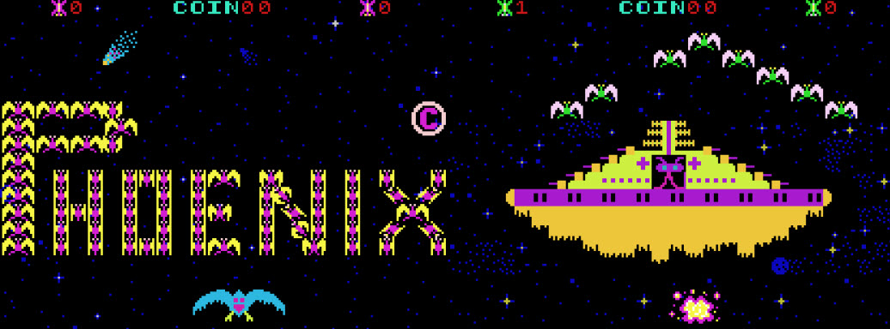

# Phoenix

>>> cpu Z80

>>> binary 0000:roms/ic45 +  roms/ic46 + roms/ic47 + roms/ic48 + roms/h5-ic49.5a + roms/h6-ic50.6a + roms/h7-ic51.7a + roms/h8-ic52.8a

>>> memoryTable hard 

[Hardware Info](Hardware.md)

>>> memoryTable ram 

[RAM Usage](RAMUse.md)

```code
0000: 00              NOP                         ; Start/restart and interrupts end up at 0008
0001: 00              NOP                         
0002: 00              NOP                         
0003: 00              NOP                         
0004: 00              NOP                         
0005: 00              NOP                         
0006: 00              NOP                         
0007: 00              NOP                         

0008: 31 FF 4B        LD      SP,$4BFF            ; Top-ish of RAM
;
000B: 26 50           LD      H,$50               ; 50xx video register
000D: 36 00           LD      (HL),$00            ; Select the first bank of RAM
000F: CD 50 00        CALL    $0050               ; {code.InitSoundScreen} Turn sound off and clear both screen areas
;

0012: 21 00 18        LD      HL,$1800            ; Screen draw info
0015: 0E 03           LD      C,$03               ; 3 columns (rotated to 3 rows)
0017: CD D0 01        CALL    $01D0               ; {} Draw the first 3 rows of the background (scores and coins);
; Main loop begin
001A: CD 80 00        CALL    $0080               ; {code.WaitVBlankCoin} Wait for VBlank and count any coins
001D: 3A A2 43        LD      A,($43A2)           ; {ram.M43A2}
0020: A7              AND     A                   
0021: CA 2D 00        JP      Z,$002D             ; {}
; game mode
0024: CD 00 04        CALL    $0400               ; {}
0027: CD 00 27        CALL    $2700               ; {}
002A: C3 1A 00        JP      $001A               ; {}
; attract mode
002D: 3E 0F           LD      A,$0F               
002F: 26 60           LD      H,$60               ; 60xx sound A
0031: 77              LD      (HL),A              
0032: 26 68           LD      H,$68               ; 68xx sound B
0034: 77              LD      (HL),A              
0035: CD 77 03        CALL    $0377               ; {}
0038: 00              NOP                         
0039: CD E0 17        CALL    $17E0               ; {code.CoinChecking}
003C: A7              AND     A                   
003D: CA 46 00        JP      Z,$0046             ; {}
0040: CD 88 02        CALL    $0288               ; {}
0043: C3 1A 00        JP      $001A               ; {}
;
0046: CD E3 00        CALL    $00E3               ; {}
0049: C3 1A 00        JP      $001A               ; {}
; Main loop end
004C: FF FF FF FF  

; Initialize the sound (off) and screen (clear)
InitSoundScreen:
0050: 26 68           LD      H,$68               ; 68xx sound B
0052: 36 00           LD      (HL),$00            ; Sound off
0054: 26 60           LD      H,$60               ; 60xx sound A
0056: 36 00           LD      (HL),$00            ; Sound off
0058: 26 58           LD      H,$58               ; 58xx scroll register
005A: 36 00           LD      (HL),$00            ; First memory bank
005C: CD 6B 00        CALL    $006B               ; {code.ClearScreenPlane} Clear the plane
005F: 26 50           LD      H,$50               ; 50xx video register
0061: 36 01           LD      (HL),$01            ; Second memory bank
0063: CD 6B 00        CALL    $006B               ; {code.ClearScreenPlane} Clear the plane
0066: 26 50           LD      H,$50               ; 50xx video register
0068: 36 00           LD      (HL),$00            ; Back to first memory bank
006A: C9              RET                         ; Done

; Clear a screen plane (foreground or background)
; Set the lower bit of the video register to pick fore/back.
; 4000 - 4BF8 (inclusive)
;
ClearScreenPlane:
006B: 21 F8 4B        LD      HL,$4BF8            ; Highest point
006E: 3E 3F           LD      A,$3F               ; Stop when H reaches 3F
0070: 36 00           LD      (HL),$00            ; Clear the memory
0072: 2B              DEC     HL                  ; Point to next
0073: BC              CP      H                   ; All done?
0074: C2 70 00        JP      NZ,$0070            ; {} No ... go back for all
0077: C9              RET                         ; Done

0078: CD 96 01        CALL    $0196               ; {}
007B: C3 F0 06        JP      $06F0               ; {}

007E: FF FF

; Wait for the vertical blanking and then handle coin counting
;
WaitVBlankCoin:
0080: 26 78           LD      H,$78               ; 78xx DSW0 Check ...
0082: 7E              LD      A,(HL)              ; ... screen blanking flag
0083: E6 80           AND     $80                 ; Wait for it ...
0085: CA 80 00        JP      Z,$0080             ; {code.WaitVBlankCoin} ... to set
0088: 7E              LD      A,(HL)              ; Check screen blanking flag
0089: E6 80           AND     $80                 ; Wait for it ...
008B: C2 88 00        JP      NZ,$0088            ; {} ... to clear (0=in blanking)
;
008E: 26 70           LD      H,$70               ; 70xx IN0 Current value ...
0090: 7E              LD      A,(HL)              ; ... of IN0 inputs
0091: 21 A0 43        LD      HL,$43A0            ; Value from ...
0094: 46              LD      B,(HL)              ; ... last read
0095: 77              LD      (HL),A              ; Store new value
0096: 2C              INC     L                   ; To 43A1
0097: 70              LD      (HL),B              ; Store old value
0098: 2E 9B           LD      L,$9B               ; Bump the ...
009A: CD 00 02        CALL    $0200               ; {code.AddOneToMem} ... ?? counter
009D: 2E 8F           LD      L,$8F               ; Get number ...
009F: 7E              LD      A,(HL)              ; ... of coins
;
; !! There are two digits for "coins" on the screen, but only the one's digit is
; !! changed. Once you get to 9, the code stops counting. It takes the coin
; !! from you, but it doesn't give you credit.
;
00A0: FE 09           CP      $09                 ; Already 9?
00A2: C8              RET     Z                   ; Yes ... nothing more to check
00A3: D2 00 00        JP      NC,$0000            ; {} More than 9? OOPS -- soft reset
00A6: 06 01           LD      B,$01               ; Coin bit of the input register
00A8: CD BB 00        CALL    $00BB               ; {code.CheckInputBits} Has the coin input gone from 1 to 0?
00AB: C8              RET     Z                   ; No ... no coins inserted ... done
00AC: 2E 8F           LD      L,$8F               ; Add one ...
00AE: 34              INC     (HL)                ; ... to coin count
00AF: 7E              LD      A,(HL)              ; Current value ...
00B0: C6 20           ADD     $20                 ; ... to number tile
00B2: 32 42 41        LD      ($4142),A           ; Change number of coins on screen
00B5: C9              RET                         ; Done

; Never called
00B6: 00              NOP                         
00B7: C9              RET                         

00B8: FF FF FF             

; Check to see if a particular bit(s) in the input register has changed
; from 1 to 0 since last we checked. Return NZ if transitioned from 1 to 0.
;
CheckInputBits:
00BB: 21 A0 43        LD      HL,$43A0            ; Get current ...
00BE: 7E              LD      A,(HL)              ; ... input value
00BF: 2F              CPL                         ; Flip the current bits
00C0: A0              AND     B                   ; Mask off all but the ones we are checking
00C1: 2C              INC     L                   ; Point to last input value
00C2: A6              AND     (HL)                ; Zero unles new bit is 0 and old is 1
00C3: C9              RET                         ; Return state

00C4: 7E              LD      A,(HL)              
00C5: E6 0F           AND     $0F                 
00C7: F6 20           OR      $20                 
00C9: 12              LD      (DE),A              
00CA: CD 10 02        CALL    $0210               ; {code.AddOneRow}
00CD: 05              DEC     B                   
00CE: C8              RET     Z                   
00CF: 7E              LD      A,(HL)              
00D0: 0F              RRCA                        
00D1: 0F              RRCA                        
00D2: 0F              RRCA                        
00D3: 0F              RRCA                        
00D4: E6 0F           AND     $0F                 
00D6: F6 20           OR      $20                 
00D8: 12              LD      (DE),A              
00D9: CD 10 02        CALL    $0210               ; {code.AddOneRow}
00DC: 2B              DEC     HL                  
00DD: 05              DEC     B                   
00DE: C2 C4 00        JP      NZ,$00C4            ; {}
00E1: C9              RET                         

00E2: FF             

00E3: 21 99 43        LD      HL,$4399            
00E6: CD 00 02        CALL    $0200               ; {code.AddOneToMem}
00E9: 01 01 00        LD      BC,$0001            
00EC: CD 58 02        CALL    $0258               ; {code.CompareBCtoMem}
00EF: CA E1 01        JP      Z,$01E1             ; {}
00F2: 01 02 00        LD      BC,$0002            
00F5: 11 1F 01        LD      DE,$011F            
00F8: CD 60 02        CALL    $0260               ; {code.SubtractIfEnough}
00FB: D2 96 01        JP      NC,$0196            ; {}
00FE: 01 20 01        LD      BC,$0120            
0101: CD 58 02        CALL    $0258               ; {code.CompareBCtoMem}
0104: CA CA 0B        JP      Z,$0BCA             ; {}
0107: 0E B0           LD      C,$B0               
0109: CD 58 02        CALL    $0258               ; {code.CompareBCtoMem}
010C: CA E1 01        JP      Z,$01E1             ; {}
010F: 0E B8           LD      C,$B8               
0111: CD 58 02        CALL    $0258               ; {code.CompareBCtoMem}
0114: CA 80 05        JP      Z,$0580             ; {}
0117: 0E C0           LD      C,$C0               
0119: 11 DF 02        LD      DE,$02DF            
011C: CD 60 02        CALL    $0260               ; {code.SubtractIfEnough}
011F: D2 78 00        JP      NC,$0078            ; {}
0122: 01 00 03        LD      BC,$0300            
0125: 11 AF 03        LD      DE,$03AF            
0128: CD 60 02        CALL    $0260               ; {code.SubtractIfEnough}
012B: D2 DC 21        JP      NC,$21DC            ; {}
012E: 01 E6 03        LD      BC,$03E6            
0131: 11 FF FF        LD      DE,$FFFF            
0134: CD 60 02        CALL    $0260               ; {code.SubtractIfEnough}
0137: D2 B0 03        JP      NC,$03B0            ; {}
013A: C9              RET                         

013B: FF FF FF FF FF    

0140: CD A0 03        CALL    $03A0               ; {}
0143: CD 80 00        CALL    $0080               ; {code.WaitVBlankCoin}
0146: CD 80 03        CALL    $0380               ; {}
0149: 21 A3 43        LD      HL,$43A3            
014C: 36 02           LD      (HL),$02            
014E: 2C              INC     L                   
014F: 36 00           LD      (HL),$00            
0151: 00              NOP                         
0152: 00              NOP                         
0153: 00              NOP                         
0154: 2E B8           LD      L,$B8               
0156: 06 08           LD      B,$08               
0158: CD D8 05        CALL    $05D8               ; {}
015B: 2E BA           LD      L,$BA               
015D: 36 10           LD      (HL),$10            
015F: 2E BE           LD      L,$BE               
0161: 3A 00 78        LD      A,($7800)           ; 78xx DSW0
0164: E6 0C           AND     $0C                 ; Bonus lives
0166: 07              RLCA                        
0167: 07              RLCA                        
0168: C6 30           ADD     $30                 
016A: 77              LD      (HL),A              
016B: 26 58           LD      H,$58               ; 58xx scroll register
016D: 36 00           LD      (HL),$00            
016F: CD 80 00        CALL    $0080               ; {code.WaitVBlankCoin}
0172: C9              RET                         
;
0173: 7E              LD      A,(HL)              
0174: E6 7F           AND     $7F                 
0176: 06 CE           LD      B,$CE               
0178: FE 1F           CP      $1F                 
017A: D8              RET     C                   
017B: 06 FE           LD      B,$FE               
017D: C8              RET     Z                   
017E: 06 AE           LD      B,$AE               
0180: FE 5F           CP      $5F                 
0182: D8              RET     C                   
0183: 06 FE           LD      B,$FE               
0185: C8              RET     Z                   
0186: 06 CE           LD      B,$CE               
0188: FE 7F           CP      $7F                 
018A: D8              RET     C                   
018B: 06 FE           LD      B,$FE               
018D: 2D              DEC     L                   
018E: 7E              LD      A,(HL)              
018F: FE 09           CP      $09                 
0191: C0              RET     NZ                  
0192: 06 7E           LD      B,$7E               
0194: C9              RET                         
;
0195: FF               
;
0196: 7E              LD      A,(HL)              
0197: E6 1F           AND     $1F                 
0199: FE 06           CP      $06                 
019B: D8              RET     C                   
019C: 5F              LD      E,A                 
019D: 7E              LD      A,(HL)              
019E: E6 E0           AND     $E0                 
01A0: 4F              LD      C,A                 
01A1: 2D              DEC     L                   
01A2: 46              LD      B,(HL)              
01A3: 2E A8           LD      L,$A8               
01A5: 70              LD      (HL),B              
01A6: 2C              INC     L                   
01A7: 71              LD      (HL),C              
01A8: 01 60 18        LD      BC,$1860            ; data for 'INSERT  COIN' text
01AB: CD 06 02        CALL    $0206               ; {code.AddBCtoMem}
01AE: 7E              LD      A,(HL)              
01AF: 2D              DEC     L                   
01B0: 66              LD      H,(HL)              
01B1: 6F              LD      L,A                 
01B2: 7B              LD      A,E                 
01B3: 56              LD      D,(HL)              
01B4: 2C              INC     L                   
01B5: 5E              LD      E,(HL)              
01B6: 2D              DEC     L                   
01B7: 4F              LD      C,A                 
01B8: 85              ADD     A,L                 
01B9: 6F              LD      L,A                 
01BA: 79              LD      A,C                 
01BB: D6 06           SUB     $06                 
01BD: 4F              LD      C,A                 
01BE: CA C8 01        JP      Z,$01C8             ; {}
01C1: CD 17 02        CALL    $0217               ; {code.SubtractOneRow}
01C4: 0D              DEC     C                   
01C5: C2 C1 01        JP      NZ,$01C1            ; {}
01C8: 7E              LD      A,(HL)              
01C9: 12              LD      (DE),A              
01CA: C3 E0 14        JP      $14E0               ; {}
01CD: C2 C0 01        JP      NZ,$01C0            ; {}
; Print the top 3 lines
01D0: 56              LD      D,(HL)              ; Get ...
01D1: 2C              INC     L                   ; ... the ...
01D2: 5E              LD      E,(HL)              ; ... screen coord
01D3: 7D              LD      A,L                 ; Add 5 ...
01D4: C6 05           ADD     $05                 ; ... go get ...
01D6: 6F              LD      L,A                 ; ... data
01D7: 06 1A           LD      B,$1A               ; 26 columns
01D9: CD ED 01        CALL    $01ED               ; {code.DrawColumn} Draw next column
01DC: 0D              DEC     C                   ; All columns done?
01DD: C2 D0 01        JP      NZ,$01D0            ; {} No ... draw all columns
01E0: C9              RET                         ; Done
; Print the bottom 3 lines
01E1: CD 40 01        CALL    $0140               ; {}
01E4: 21 60 19        LD      HL,$1960            
01E7: 0E 03           LD      C,$03               
01E9: C3 D0 01        JP      $01D0               ; {}
;
01EC: FF               

; Remember the screen is rotated. 
; The draws a column in screen memory (row on the screen)
;
DrawColumn:
01ED: 7E              LD      A,(HL)              ; Copy the data ...
01EE: 12              LD      (DE),A              ; .. to the screen
01EF: 23              INC     HL                  ; Next in data
01F0: CD 17 02        CALL    $0217               ; {code.SubtractOneRow} Move DE to next row
01F3: 05              DEC     B                   ; All drawn?
01F4: C2 ED 01        JP      NZ,$01ED            ; {code.DrawColumn} Draw them all
01F7: C9              RET                         ; Done

; Pad to 0200
01F8: FF FF FF FF FF FF FF FF               

; Two-byte +1 to (HL-1) : (HL).
;
AddOneToMem:
0200: 34              INC     (HL)                ; Add one to LSB
0201: C0              RET     NZ                  ; We didn't overflow ... done
0202: 2D              DEC     L                   ; Back up to MSB
0203: 34              INC     (HL)                ; Carry into the MSB
0204: 2C              INC     L                   ; Restore point to LSB
0205: C9              RET                         ; Done

; Two-byte addition. BC is added to (HL-1) : (HL).
;
AddBCtoMem:
0206: 7E              LD      A,(HL)              ; Get the lower byte
0207: 81              ADD     A,C                 ; Add C to the lower
0208: 77              LD      (HL),A              ; Store the new lower
0209: 2D              DEC     L                   ; Back up to upper byte
020A: 7E              LD      A,(HL)              ; Add B and carry ...
020B: 88              ADC     A,B                 ; ... to upper byte
020C: 77              LD      (HL),A              ; Store the new upper byte
020D: 2C              INC     L                   ; Restore pointer to LSB
020E: C9              RET                         ; Done

020F: FF

; Add 32 (one row) to DE (two bytes)
;
AddOneRow:
0210: 7B              LD      A,E                 ; Add ...
0211: C6 20           ADD     $20                 ; ... 32 to ...
0213: 5F              LD      E,A                 ; ... E
0214: D0              RET     NC                  ; No carry ... we are done
0215: 14              INC     D                   ; Carry into D
0216: C9              RET                         ; Done

; Subtract 32 (one rom) from DE (two bytes)
SubtractOneRow:
0217: 7B              LD      A,E                 ; Subtract ...
0218: D6 20           SUB     $20                 ; ... 32 from ...
021A: 5F              LD      E,A                 ; ... E
021B: D0              RET     NC                  ; No borrow ... we are done
021C: 15              DEC     D                   ; Borrow from D
021D: C9              RET                         ; Done

021E: FF FF

; 3-byte (6 digit) BCD addition. Add BC*10 to (HL-2):(HL-1):(HL). 
; The games keeps the lowest digit of the scores to 0.
;
AddToScore:
0220: AF              XOR     A                   ; !! Pointless. We are about to change A and the flags
0221: 7E              LD      A,(HL)              ; Lowest 2 digits
0222: 81              ADD     A,C                 ; Add C to score
0223: 27              DAA                         ; Adjust for binary coded decimal
0224: 77              LD      (HL),A              ; Update lowest 2 digits
0225: 2D              DEC     L                   ; Point to middle 2 digits
0226: 7E              LD      A,(HL)              ; Add B to ...
0227: 88              ADC     A,B                 ; ... score
0228: 27              DAA                         ; Adjust for BCD
0229: 77              LD      (HL),A              ; Store the middle 2 digits
022A: 2D              DEC     L                   ; Point to the upper 2 digits
022B: 7E              LD      A,(HL)              ; Add in ...
022C: CE 00           ADC     $00                 ; ... any carry
022E: 27              DAA                         ; Adjust for binary coded decimal
022F: 77              LD      (HL),A              ; Store the upper 2 digits
0230: 2C              INC     L                   ; Restore ...
0231: 2C              INC     L                   ; ... pointer
0232: C9              RET                         ; Done

0233: FF FF FF          

; 3-byte (6 digit) BCD subtraction. This is never called.
;
; !! We have score ADDER above. I like the symmetry of a score SUBTRACTER, but
; !! this is never called. Scores never decrease
;
0236: 37              SCF                         ; Take ...
0237: 3E 99           LD      A,$99               ; ... the BCD ...
0239: CE 00           ADC     $00                 ; ... add-complement ...
023B: 91              SUB     C                   ; ... of C
023C: 86              ADD     A,(HL)              ; Lower two digits
023D: 27              DAA                         ; Adjust for BCD
023E: 77              LD      (HL),A              ; Update lower two digits
023F: 2D              DEC     L                   ; Point to middle digits
0240: 3E 99           LD      A,$99               ; Take the BCD ...
0242: CE 00           ADC     $00                 ; ... add-complement ...
0244: 90              SUB     B                   ; ... of C
0245: 86              ADD     A,(HL)              ; Middle two digits
0246: 27              DAA                         ; Adjust for BCD
0247: 77              LD      (HL),A              ; Update middle two digits
0248: 2D              DEC     L                   ; Point to upper digits
0249: 3E 99           LD      A,$99               ; Take the BCD add-complement ...
024B: CE 00           ADC     $00                 ; ... of any carry
024D: 86              ADD     A,(HL)              ; Upper two digits
024E: 27              DAA                         ; Adjust for BCD
024F: 77              LD      (HL),A              ; Update upper two digits
0250: 2C              INC     L                   ; Restore ...
0251: 2C              INC     L                   ; ... pointer
0252: C9              RET                         ; Done

0253: FF FF FF FF FF         

; Two byte compare of BC to memory at (HL-1):(HL)
;
CompareBCtoMem:
0258: 7E              LD      A,(HL)              ; Value from memory
0259: B9              CP      C                   ; Are the lower values the same?
025A: C0              RET     NZ                  ; No ... return not-zero
025B: 2D              DEC     L                   ; Point to MSB
025C: 7E              LD      A,(HL)              ; Get the MSB value
025D: 2C              INC     L                   ; Restore the pointer
025E: B8              CP      B                   ; Compare the MSBs
025F: C9              RET                         ; Return the flags

; Subtract DE from memory if memory is greater/equal to BC.
;
SubtractIfEnough:
0260: CD 70 02        CALL    $0270               ; {code.SubtractFromMemory} Try subtraction. Is memory larger (or equal) to BC?
0263: D8              RET     C                   ; No ... ignore request
0264: CD 77 02        CALL    $0277               ; {code.SubtractToMemory} Yes ... subtract DE from memory
0267: C9              RET                         ; Done

0268: FF FF FF FF FF FF FF FF          

; Two byte subtraction of memory from BC. BC = BC -  (HL-1):(HL)
;
SubtractFromMemory:
0270: 7E              LD      A,(HL)              ; Get the low byte
0271: 91              SUB     C                   ; Subtract from C
0272: 2D              DEC     L                   ; Point to upper byte
0273: 7E              LD      A,(HL)              ; Get the upper byte
0274: 98              SBC     B                   ; Subtract from B (with borrow)
0275: 2C              INC     L                   ; Restore pointer
0276: C9              RET                         ; Done

; Two byte subtraction of DE from memory. (HL-1):(HL) = (HL-1):(HL) - DE
SubtractToMemory:
0277: 7B              LD      A,E                 ; Lower byte
0278: 96              SUB     (HL)                ; Subtract it from memory
0279: 2D              DEC     L                   ; Point to upper byte
027A: 7A              LD      A,D                 ; Value to A
027B: 9E              SBC     (HL)                ; Subtract upper byte from memory (with borrow)
027C: 2C              INC     L                   ; Restore pointer
027D: C9              RET                         ; Done

027E: FF FF

; Two byte compare of HL to BC
;
CompareHLtoBC:
0280: 7D              LD      A,L                 ; Compare lower ...
0281: B9              CP      C                   ; ... bytes
0282: C0              RET     NZ                  ; Not the same ... return NZ
0283: 7C              LD      A,H                 ; Compare upper ...
0284: B8              CP      B                   ; ... bytes
0285: C9              RET                         ; Return the check

0286: FF FF

0288: CD 40 01        CALL    $0140               ; {}
028B: 21 C0 19        LD      HL,$19C0            
028E: 0E 02           LD      C,$02               ; print two lines: 'PUSH ONLY...1PLAYER BUTTON'
0290: CD D0 01        CALL    $01D0               ; {}
0293: 0E 02           LD      C,$02               
0295: CD E0 17        CALL    $17E0               ; {}
0298: FE 02           CP      $02                 
029A: DA A7 02        JP      C,$02A7             ; {}
029D: 21 A0 1B        LD      HL,$1BA0            
02A0: 0E 01           LD      C,$01               ; print one line: '1 OR 2PLAYERS BUTTON'
02A2: CD D0 01        CALL    $01D0               ; {}
02A5: 0E 06           LD      C,$06               
02A7: 3A 00 70        LD      A,($7000)           ; 70xx IN0
02AA: 2F              CPL                         
02AB: A1              AND     C                   
02AC: C8              RET     Z                   
02AD: CD CB 02        CALL    $02CB               ; {}
02B0: CD F0 02        CALL    $02F0               ; {}
02B3: CD 2E 03        CALL    $032E               ; {}
02B6: CD 50 03        CALL    $0350               ; {}
02B9: CD 40 01        CALL    $0140               ; {}
02BC: 26 50           LD      H,$50               ; 50xx video register
02BE: 36 01           LD      (HL),$01            
02C0: CD 40 01        CALL    $0140               ; {}
02C3: 26 50           LD      H,$50               ; 50xx video register
02C5: 36 00           LD      (HL),$00            
02C7: C9              RET                         
02C8: FF              
02C9: FF              
02CA: FF              
02CB: 0E 01           LD      C,$01               
02CD: FE 02           CP      $02                 
02CF: CA D4 02        JP      Z,$02D4             ; {}
02D2: 0E 02           LD      C,$02               
02D4: 21 A2 43        LD      HL,$43A2            
02D7: 71              LD      (HL),C              
02D8: 3A 00 78        LD      A,($7800)           ; 78xx DSW0
02DB: E6 10           AND     $10                 ; Coinage
02DD: CA E3 02        JP      Z,$02E3             ; {}
02E0: 79              LD      A,C                 
02E1: 07              RLCA                        
02E2: 4F              LD      C,A                 
02E3: 2E 8F           LD      L,$8F               
02E5: 7E              LD      A,(HL)              
02E6: 91              SUB     C                   
02E7: 77              LD      (HL),A              
02E8: C6 20           ADD     $20                 
02EA: 32 42 41        LD      ($4142),A           
02ED: C9              RET                         
02EE: FF              
02EF: FF              
02F0: 11 83 43        LD      DE,$4383            
02F3: 21 8B 43        LD      HL,$438B            
02F6: CD 14 03        CALL    $0314               ; {}
02F9: D4 20 03        CALL    NC,$0320            ; {}
02FC: 1E 87           LD      E,$87               
02FE: 2E 8B           LD      L,$8B               
0300: CD 14 03        CALL    $0314               ; {}
0303: D4 20 03        CALL    NC,$0320            ; {}
0306: 2E 8B           LD      L,$8B               
0308: 11 41 41        LD      DE,$4141            
030B: 06 06           LD      B,$06               
030D: CD C4 00        CALL    $00C4               ; {}
0310: C9              RET                         
;
0311: FF FF FF       
;
0314: 1A              LD      A,(DE)              
0315: 96              SUB     (HL)                
0316: 1D              DEC     E                   
0317: 2D              DEC     L                   
0318: 1A              LD      A,(DE)              
0319: 9E              SBC     (HL)                
031A: 1D              DEC     E                   
031B: 2D              DEC     L                   
031C: 1A              LD      A,(DE)              
031D: 9E              SBC     (HL)                
031E: C9              RET                         
;
031F: FF              
;
0320: 1A              LD      A,(DE)              
0321: 77              LD      (HL),A              
0322: 13              INC     DE                  
0323: 23              INC     HL                  
0324: 1A              LD      A,(DE)              
0325: 77              LD      (HL),A              
0326: 13              INC     DE                  
0327: 23              INC     HL                  
0328: 1A              LD      A,(DE)              
0329: 77              LD      (HL),A              
032A: C9              RET                         
;
032B: FF FF FF               
;
032E: 21 80 43        LD      HL,$4380            
0331: 36 00           LD      (HL),$00            
0333: 23              INC     HL                  
0334: 7D              LD      A,L                 
0335: FE 88           CP      $88                 
0337: C2 31 03        JP      NZ,$0331            ; {}
033A: 2E 83           LD      L,$83               
033C: 11 61 42        LD      DE,$4261            
033F: 06 06           LD      B,$06               
0341: CD C4 00        CALL    $00C4               ; {}
0344: 2E 87           LD      L,$87               
0346: 11 21 40        LD      DE,$4021            
0349: 06 06           LD      B,$06               
034B: CD C4 00        CALL    $00C4               ; {}
034E: C9              RET                         
;
034F: FF               
;
0350: 3A 00 78        LD      A,($7800)           ; 78xx DSW0
0353: E6 03           AND     $03                 ; Lives
0355: C6 03           ADD     $03                 
0357: 47              LD      B,A                 
0358: 21 90 43        LD      HL,$4390            
035B: 70              LD      (HL),B              
035C: 2E A2           LD      L,$A2               
035E: 7E              LD      A,(HL)              
035F: FE 01           CP      $01                 
0361: CA 67 03        JP      Z,$0367             ; {}
0364: 2E 91           LD      L,$91               
0366: 70              LD      (HL),B              
0367: 2E 90           LD      L,$90               
0369: 7E              LD      A,(HL)              
036A: F6 20           OR      $20                 
036C: 32 A2 42        LD      ($42A2),A           ; number of lives, for player 1 at screen ram
036F: 2C              INC     L                   
0370: 7E              LD      A,(HL)              
0371: F6 20           OR      $20                 
0373: 32 62 40        LD      ($4062),A           ; number of lives, for player 2 at screen ram
0376: C9              RET                         
;
0377: 21 8C 43        LD      HL,$438C            
037A: 77              LD      (HL),A              
037B: 2C              INC     L                   
037C: 77              LD      (HL),A              
037D: C9              RET                         
;
037E: FF FF
;
0380: 21 3F 43        LD      HL,$433F            
0383: 11 1F 00        LD      DE,$001F            
0386: 01 3F 03        LD      BC,$033F            
0389: 72              LD      (HL),D              
038A: 2B              DEC     HL                  
038B: 72              LD      (HL),D              
038C: 2B              DEC     HL                  
038D: 7D              LD      A,L                 
038E: A3              AND     E                   
038F: B8              CP      B                   
0390: C2 89 03        JP      NZ,$0389            ; {}
0393: 72              LD      (HL),D              
0394: 2B              DEC     HL                  
0395: 2B              DEC     HL                  
0396: 2B              DEC     HL                  
0397: 2B              DEC     HL                  
0398: 7C              LD      A,H                 
0399: B9              CP      C                   
039A: C2 89 03        JP      NZ,$0389            ; {}
039D: C9              RET                         
;
039E: FF FF                
;
03A0: 21 3F 4B        LD      HL,$4B3F            
03A3: 11 47 00        LD      DE,$0047            
03A6: 72              LD      (HL),D              
03A7: 2B              DEC     HL                  
03A8: 72              LD      (HL),D              
03A9: 2B              DEC     HL                  
03AA: 7C              LD      A,H                 
03AB: BB              CP      E                   
03AC: C2 A6 03        JP      NZ,$03A6            ; {}
03AF: C9              RET                         
;
03B0: 01 A0 07        LD      BC,$07A0            
03B3: CD 70 02        CALL    $0270               ; {code.SubtractFromMemory}
03B6: DA CE 03        JP      C,$03CE             ; {}
03B9: CD 58 02        CALL    $0258               ; {code.CompareBCtoMem}
03BC: CA EB 03        JP      Z,$03EB             ; {}
03BF: 01 60 0B        LD      BC,$0B60            
03C2: CD 70 02        CALL    $0270               ; {code.SubtractFromMemory}
03C5: DA CE 03        JP      C,$03CE             ; {}
03C8: CD 58 02        CALL    $0258               ; {code.CompareBCtoMem}
03CB: CA E2 03        JP      Z,$03E2             ; {}
03CE: CD 73 01        CALL    $0173               ; {}
03D1: 21 A0 43        LD      HL,$43A0            
03D4: 7E              LD      A,(HL)              
03D5: E6 01           AND     $01                 
03D7: B0              OR      B                   
03D8: 77              LD      (HL),A              
03D9: C3 00 04        JP      $0400               ; {}
03DC: C3 00 04        JP      $0400               ; {}

03DF: FF FF FF

03E2: 01 08 01        LD      BC,$0108            
03E5: 11 00 10        LD      DE,$1000            
03E8: C3 F1 03        JP      $03F1               ; {}
03EB: 01 04 01        LD      BC,$0104            
03EE: 11 08 00        LD      DE,$0008            
03F1: 21 A4 43        LD      HL,$43A4            
03F4: 70              LD      (HL),B              
03F5: 2E B8           LD      L,$B8               
03F7: 71              LD      (HL),C              
03F8: 2E BA           LD      L,$BA               
03FA: 72              LD      (HL),D              
03FB: 2C              INC     L                   
03FC: 73              LD      (HL),E              
03FD: C9              RET                         

03FE: FF FF          

; Jump to ?? function by number in 43A4
0400: 21 0E 04        LD      HL,$040E            ; Jump table
0403: 3A A4 43        LD      A,($43A4)           ; {ram.M43A4} ??
0406: 07              RLCA                        ; *2
0407: 85              ADD     A,L                 ; Offset ...
0408: 6F              LD      L,A                 ; ... into the table
0409: 7E              LD      A,(HL)              ; MSB of destination
040A: 2C              INC     L                   ; Get the
040B: 6E              LD      L,(HL)              ; ... LSB of destination
040C: 67              LD      H,A                 ; Now point to function
040D: E9              JP      (HL)                ; Jump to function

; Notice these addresses are MSB:LSB (backwards from the processors endianness)
040E: 04 30       ; 
0410: 04 AC       ; called for each frame during flashing of score1 or 2                  
0412: 05 15       ;           
0414: 08 00       ; called for each frame
0416: 0A EA       ; called for each frame of player ship (partikel) explosion
0418: 0B 60       ; called for each frame during 'GAME OVER' text      
041A: 24 00       ; called for each frame during mother ship (partikel) explosion                 
041C: 24 4C       ; not used ?   
;
041E: 3A A3 43        LD      A,($43A3)           
0421: E6 01           AND     $01                 
0423: 47              LD      B,A                 
0424: 3A B8 43        LD      A,($43B8)           
0427: E6 02           AND     $02                 
0429: B0              OR      B                   
042A: 32 00 50        LD      ($5000),A           ; 50xx video register
042D: C9              RET                         
;
042E: 18 05           JR      $435                ; {} not used

; ?? Function 0
0430: 21 A4 43        LD      HL,$43A4            ; Next function to run ...
0433: 36 01           LD      (HL),$01            ; ... is 1 ??
0435: 2C              INC     L                   
0436: 36 80           LD      (HL),$80            
0438: 2E A3           LD      L,$A3               
043A: 7E              LD      A,(HL)              
043B: 36 00           LD      (HL),$00            ; clear $43A3
043D: FE 02           CP      $02                 
043F: C8              RET     Z                   
0440: 77              LD      (HL),A              
0441: 2D              DEC     L                   
0442: 7E              LD      A,(HL)              
0443: FE 01           CP      $01                 
0445: C8              RET     Z                   
0446: 2C              INC     L                   
0447: 7E              LD      A,(HL)              
0448: A7              AND     A                   
0449: CA A0 04        JP      Z,$04A0             ; {}
044C: 2E 90           LD      L,$90               
044E: 7E              LD      A,(HL)              
044F: A7              AND     A                   
0450: C8              RET     Z                   
0451: 2E A3           LD      L,$A3               
0453: 36 00           LD      (HL),$00            
0455: 01 00 01        LD      BC,$0100            
0458: CD 60 04        CALL    $0460               ; {}
045B: C9              RET                         
;
045C: FF FF FF FF

; Copy memory bank to bank
; B=from bank number, C=to bank number
; Starts at 4320
0460: 21 00 50        LD      HL,$5000            ; 50xx video register
0463: 11 20 43        LD      DE,$4320            
0466: 70              LD      (HL),B              
0467: 1A              LD      A,(DE)              
0468: 71              LD      (HL),C              
0469: 12              LD      (DE),A              
046A: 1C              INC     E                   
046B: 7B              LD      A,E                 
046C: E6 03           AND     $03                 
046E: C2 66 04        JP      NZ,$0466            ; {}
;
0471: 7B              LD      A,E                 
0472: E6 F0           AND     $F0                 
0474: D6 20           SUB     $20                 
0476: 5F              LD      E,A                 
0477: D2 66 04        JP      NC,$0466            ; {}
047A: 15              DEC     D                   
047B: 7A              LD      A,D                 
047C: FE 3F           CP      $3F                 
047E: C2 66 04        JP      NZ,$0466            ; {}
0481: 11 80 43        LD      DE,$4380            
0484: 70              LD      (HL),B              
0485: 1A              LD      A,(DE)              
0486: 71              LD      (HL),C              
0487: 12              LD      (DE),A              
0488: 1C              INC     E                   
0489: 7B              LD      A,E                 
048A: FE B8           CP      $B8                 
048C: C2 84 04        JP      NZ,$0484            ; {}
;
048F: 11 C0 4B        LD      DE,$4BC0            
0492: 70              LD      (HL),B              
0493: 1A              LD      A,(DE)              
0494: 71              LD      (HL),C              
0495: 12              LD      (DE),A              
0496: 1C              INC     E                   
0497: 7B              LD      A,E                 
0498: FE 00           CP      $00                 
049A: C2 92 04        JP      NZ,$0492            ; {}
049D: C9              RET                         

049E: FF FF

04A0: 2E A3           LD      L,$A3               
04A2: 36 01           LD      (HL),$01            
04A4: 01 01 00        LD      BC,$0001            
04A7: CD 60 04        CALL    $0460               ; {}
04AA: C9              RET                         

04AB: FF

; ?? Function 1
04AC: 21 A5 43        LD      HL,$43A5            
04AF: 35              DEC     (HL)                
04B0: 7E              LD      A,(HL)              
04B1: 2D              DEC     L                   
04B2: 36 02           LD      (HL),$02            
04B4: A7              AND     A                   
04B5: C8              RET     Z                   
04B6: 36 01           LD      (HL),$01            
04B8: FE 7F           CP      $7F                 
04BA: CA F0 07        JP      Z,$07F0             ; {}
04BD: 2E 9A           LD      L,$9A               
04BF: 36 00           LD      (HL),$00            
04C1: 2C              INC     L                   
04C2: 36 00           LD      (HL),$00            
04C4: E6 08           AND     $08                 
04C6: C2 E6 04        JP      NZ,$04E6            ; {}
04C9: CD E8 06        CALL    $06E8               ; {}
04CC: 00              NOP                         
04CD: 21 A3 43        LD      HL,$43A3            
04D0: 7E              LD      A,(HL)              
04D1: A7              AND     A                   
04D2: 2E 83           LD      L,$83               
04D4: 11 61 42        LD      DE,$4261            
04D7: CA DF 04        JP      Z,$04DF             ; {}
04DA: 2E 87           LD      L,$87               
04DC: 11 21 40        LD      DE,$4021            
04DF: 06 06           LD      B,$06               
04E1: CD C4 00        CALL    $00C4               ; {}
04E4: C9              RET                         
04E5: FF              
04E6: 21 A3 43        LD      HL,$43A3            
04E9: 7E              LD      A,(HL)              
04EA: A7              AND     A                   
04EB: 11 61 42        LD      DE,$4261            
04EE: CA F4 04        JP      Z,$04F4             ; {}
04F1: 11 21 40        LD      DE,$4021            
04F4: 06 06           LD      B,$06               
04F6: CD FB 04        CALL    $04FB               ; {}
04F9: C9              RET                         
04FA: FF              
04FB: 3E 00           LD      A,$00               
04FD: 12              LD      (DE),A              
04FE: CD 10 02        CALL    $0210               ; {code.AddOneRow}
0501: 05              DEC     B                   
0502: C2 FB 04        JP      NZ,$04FB            ; {}
0505: C9              RET                         
0506: 21 92 43        LD      HL,$4392            
0509: 06 06           LD      B,$06               
050B: CD D8 05        CALL    $05D8               ; {}
050E: 3A 50 4B        LD      A,($4B50)           
0511: 32 94 43        LD      ($4394),A           
0514: C9              RET                         

; ?? Function 2
0515: CD 1E 04        CALL    $041E               ; {}
0518: 21 A4 43        LD      HL,$43A4            
051B: 36 03           LD      (HL),$03            
051D: CD 80 05        CALL    $0580               ; {}
0520: CD 47 05        CALL    $0547               ; {}
0523: CD A0 09        CALL    $09A0               ; {}
0526: CD 32 05        CALL    $0532               ; {}
0529: CD 6C 0A        CALL    $0A6C               ; {}
052C: CD 06 05        CALL    $0506               ; {}
052F: C3 B0 32        JP      $32B0               ; {}
;
0532: 21 50 4B        LD      HL,$4B50            
0535: 06 A0           LD      B,$A0               
0537: CD D8 05        CALL    $05D8               ; {}
053A: CD EC 05        CALL    $05EC               ; {}
053D: CD 50 06        CALL    $0650               ; {}
0540: CD 10 06        CALL    $0610               ; {}
0543: C9              RET                         

0544: FF FF FF
; Copy 32 byte from $0560 to $43c0 and clear 32 bytes from $43e0
0547: 21 60 05        LD      HL,$0560            
054A: 11 C0 43        LD      DE,$43C0            
054D: 06 20           LD      B,$20               
054F: CD E0 05        CALL    $05E0               ; {}
0552: 21 E0 43        LD      HL,$43E0            
0555: 06 20           LD      B,$20               
0557: CD D8 05        CALL    $05D8               ; {}
055A: C9              RET                         
;
055B: FF FF FF FF FF 
; data copied to $43C0-$43DF
0560: 0C 10 64 D8 
0564: 00 50 00 D0 
0568: 00 50 00 D0 
056C: 00 58 00 20 
0570: 00 58 00 20 
0574: 00 58 00 20 
0578: 00 58 00 20 
057C: 00 58 00 20
;
0580: 21 98 05        LD      HL,$0598            
0583: 3A B8 43        LD      A,($43B8)           
0586: E6 0F           AND     $0F                 
0588: 85              ADD     A,L                 
0589: 6F              LD      L,A                 
058A: 6E              LD      L,(HL)              
058B: 26 05           LD      H,$05               
058D: 11 AB 43        LD      DE,$43AB            
0590: 06 0C           LD      B,$0C               
0592: CD E0 05        CALL    $05E0               ; {code.CopyData}
0595: C9              RET                         
;
0596: FF FF
;
0598: A8 A8     ;pointer to $05A8, $05A8 
059A: C0 C0     ;pointer to $05C0, $05C0 
059C: A8 A8     ;pointer to $05A8, $05A8 
059E: A8 A8     ;pointer to $05A8, $05A8 
05A0: B4 CC     ;pointer to $05B4, $05CC 
05A2: B4 B4     ;pointer to $05B4, $05B4 
05A4: A8 A8     ;pointer to $05A8, $05A8 
05A6: A8 A8     ;pointer to $05A8, $05A8 
;
;data copied to $43AB-$43B6
05A8: 80 7F 00 00 40 3F 00 1C
05B0: 00 FF FF FF 
;
05B4: 60 5F 01 02 30 2F 00 1C
05BC: 00 C0
;
;data copied to $43AB-$43B6
05C0: 80 7F 03 04 40 3F 00 1F
05C8: 00 A0 FF FF
;
05CC: 60 60 05 06 50 30 00 1D
05D4: 00 48 
05D6: FF              
05D7: FF              
;
05D8: AF              XOR     A                   
05D9: 77              LD      (HL),A              
05DA: 23              INC     HL                  
05DB: 05              DEC     B                   
05DC: C2 D9 05        JP      NZ,$05D9            ; {}
05DF: C9              RET                         
;
CopyData:
05E0: 7E              LD      A,(HL)              
05E1: 12              LD      (DE),A              
05E2: 23              INC     HL                  
05E3: 13              INC     DE                  
05E4: 05              DEC     B                   
05E5: C2 E0 05        JP      NZ,$05E0            ; {}
05E8: C9              RET                         
;
05E9: FF FF FF
;
05EC: 21 00 15        LD      HL,$1500            
05EF: 3A B8 43        LD      A,($43B8)           
05F2: E6 0F           AND     $0F                 
05F4: 07              RLCA                        
05F5: 85              ADD     A,L                 
05F6: 6F              LD      L,A                 
05F7: 56              LD      D,(HL)              
05F8: 23              INC     HL                  
05F9: 5E              LD      E,(HL)              
05FA: 21 70 4B        LD      HL,$4B70            
05FD: 3A BA 43        LD      A,($43BA)           
0600: 47              LD      B,A                 
0601: A7              AND     A                   
0602: C8              RET     Z                   
0603: 72              LD      (HL),D              
0604: 2C              INC     L                   
0605: 73              LD      (HL),E              
0606: 2C              INC     L                   
0607: 2C              INC     L                   
0608: 2C              INC     L                   
0609: 05              DEC     B                   
060A: C2 03 06        JP      NZ,$0603            ; {}
060D: C9              RET                         
;
060E: FF FF
;
0610: 21 3A 06        LD      HL,$063A            
0613: 3A B8 43        LD      A,($43B8)           
0616: 0F              RRCA                        
0617: E6 0F           AND     $0F                 
0619: 85              ADD     A,L                 
061A: 6F              LD      L,A                 
061B: 00              NOP                         
061C: 00              NOP                         
061D: 00              NOP                         
061E: 6E              LD      L,(HL)              
061F: 26 15           LD      H,$15               
0621: 11 72 4B        LD      DE,$4B72            
0624: 3A BA 43        LD      A,($43BA)           
0627: 47              LD      B,A                 
0628: A7              AND     A                   
0629: C8              RET     Z                   
062A: 7E              LD      A,(HL)              
062B: 12              LD      (DE),A              
062C: 23              INC     HL                  
062D: 13              INC     DE                  
062E: 7E              LD      A,(HL)              
062F: 12              LD      (DE),A              
0630: 23              INC     HL                  
0631: 13              INC     DE                  
0632: 13              INC     DE                  
0633: 13              INC     DE                  
0634: 05              DEC     B                   
0635: C2 2A 06        JP      NZ,$062A            ; {}
0638: C9              RET                         
;
0639: FF
;
063A: 60 40 E0 E0 E0 E0 FF FF 
0642: C0 A0 80 80 80 80 FF FF 
064A: FF FF FF FF FF FF 
;
0650: 21 20 15        LD      HL,$1520            
0653: 3A B8 43        LD      A,($43B8)           
0656: E6 0F           AND     $0F                 
0658: 07              RLCA                        
0659: 85              ADD     A,L                 
065A: 6F              LD      L,A                 
065B: 56              LD      D,(HL)              
065C: 23              INC     HL                  
065D: 5E              LD      E,(HL)              
065E: 21 50 4B        LD      HL,$4B50            
0661: 3A BA 43        LD      A,($43BA)           
0664: 47              LD      B,A                 
0665: A7              AND     A                   
0666: C8              RET     Z                   
0667: 72              LD      (HL),D              
0668: 2C              INC     L                   
0669: 73              LD      (HL),E              
066A: 2C              INC     L                   
066B: 05              DEC     B                   
066C: C2 67 06        JP      NZ,$0667            ; {}
066F: C9              RET                         
;
0670: 21 B1 43        LD      HL,$43B1            
0673: 46              LD      B,(HL)              
0674: 2E B9           LD      L,$B9               
0676: 4E              LD      C,(HL)              
0677: 79              LD      A,C                 
0678: 90              SUB     B                   
0679: 77              LD      (HL),A              
;
067A: 21 B9 43        LD      HL,$43B9            
067D: 7E              LD      A,(HL)              
067E: 35              DEC     (HL)                
067F: 32 00 58        LD      ($5800),A           ; 58xx scroll register
0682: E6 07           AND     $07                 
0684: C0              RET     NZ                  
;
0685: 01 47 20        LD      BC,$2047            
0688: 11 21 4B        LD      DE,$4B21            
068B: 7E              LD      A,(HL)              
068C: 0F              RRCA                        
068D: 0F              RRCA                        
068E: 0F              RRCA                        
068F: E6 1F           AND     $1F                 
0691: 83              ADD     A,E                 
0692: 5F              LD      E,A                 
0693: 2E B2           LD      L,$B2               
0695: 7E              LD      A,(HL)              
0696: 2C              INC     L                   
0697: 6E              LD      L,(HL)              
0698: 67              LD      H,A                 
0699: 7E              LD      A,(HL)              
069A: 12              LD      (DE),A              
069B: 2C              INC     L                   
069C: 7B              LD      A,E                 
069D: 90              SUB     B                   
069E: 5F              LD      E,A                 
069F: D2 99 06        JP      NC,$0699            ; {}
06A2: 15              DEC     D                   
06A3: 7A              LD      A,D                 
06A4: B9              CP      C                   
06A5: C2 99 06        JP      NZ,$0699            ; {}
06A8: 7D              LD      A,L                 
06A9: 32 B3 43        LD      ($43B3),A           
06AC: C9              RET                         
06AD: FF              
06AE: FF              
06AF: FF              
; Called every 2nd frame
06B0: 21 AB 43        LD      HL,$43AB            
06B3: 3A B9 43        LD      A,($43B9)           
06B6: 4F              LD      C,A                 
06B7: BE              CP      (HL)                
06B8: C0              RET     NZ                  
;
06B9: 7E              LD      A,(HL)              
06BA: 2C              INC     L                   
06BB: 86              ADD     A,(HL)              
06BC: 2D              DEC     L                   
06BD: 77              LD      (HL),A              
06BE: 2C              INC     L                   
06BF: 2C              INC     L                   
06C0: 34              INC     (HL)                
06C1: 46              LD      B,(HL)              
06C2: 2C              INC     L                   
06C3: 34              INC     (HL)                
06C4: 7E              LD      A,(HL)              
06C5: 21 20 1E        LD      HL,$1E20            ; 
06C8: E6 1F           AND     $1F                 
06CA: 85              ADD     A,L                 
06CB: 6F              LD      L,A                 
06CC: 56              LD      D,(HL)              
06CD: C6 20           ADD     $20                 
06CF: 6F              LD      L,A                 
06D0: 5E              LD      E,(HL)              
06D1: 79              LD      A,C                 
06D2: 0F              RRCA                        
06D3: 0F              RRCA                        
06D4: 0F              RRCA                        
06D5: E6 1E           AND     $1E                 
06D7: 83              ADD     A,E                 
06D8: C6 02           ADD     $02                 
06DA: 5F              LD      E,A                 
06DB: 21 60 1E        LD      HL,$1E60            ; 
06DE: 78              LD      A,B                 
06DF: E6 1F           AND     $1F                 
06E1: 85              ADD     A,L                 
06E2: 6F              LD      L,A                 
06E3: 6E              LD      L,(HL)              
06E4: CD DC 07        CALL    $07DC               ; {}
06E7: C9              RET                         
;
06E8: 21 00 18        LD      HL,$1800            
06EB: 0E 01           LD      C,$01               
06ED: C3 D0 01        JP      $01D0               ; {}
;
06F0: CD 7A 06        CALL    $067A               ; {}
06F3: CD 40 20        CALL    $2040               ; {}
06F6: C3 B0 06        JP      $06B0               ; {}
;
06F9: FF FF FF FF FF FF FF 
;
0700: 01 C0 43        LD      BC,$43C0            
0703: 11 E0 43        LD      DE,$43E0            
0706: CD 18 07        CALL    $0718               ; {}
0709: 79              LD      A,C                 
070A: C6 04           ADD     $04                 
070C: 4F              LD      C,A                 
070D: C6 20           ADD     $20                 
070F: 5F              LD      E,A                 
0710: 50              LD      D,B                 
0711: FE EC           CP      $EC                 
0713: C2 06 07        JP      NZ,$0706            ; {}
0716: C9              RET                         
;
0717: C9              RET                         
;
0718: CD 20 07        CALL    $0720               ; {}
071B: C3 40 07        JP      $0740               ; {}
;
071E: E6 EF           AND     $EF                 
;used for level 1 (small aliens) ?
0720: 0A              LD      A,(BC)              
0721: 67              LD      H,A                 
0722: E6 10           AND     $10                 
0724: C8              RET     Z                   
0725: 7C              LD      A,H                 
0726: E6 EF           AND     $EF                 
0728: 02              LD      (BC),A              
0729: 07              RLCA                        
072A: 07              RLCA                        
072B: 07              RLCA                        
072C: E6 07           AND     $07                 
072E: C6 38           ADD     $38                 
0730: 6F              LD      L,A                 
0731: 26 07           LD      H,$07               
0733: 6E              LD      L,(HL)              
0734: E9              JP      (HL)                
;
0735: 6C FF 8A 63 79 FF 9E BE
073D: FF FF FF
;
0740: 0A              LD      A,(BC)              
0741: 67              LD      H,A                 
0742: E6 08           AND     $08                 
0744: C8              RET     Z                   
0745: 7C              LD      A,H                 
0746: E6 07           AND     $07                 
0748: 67              LD      H,A                 
0749: 0F              RRCA                        
074A: 0F              RRCA                        
074B: 0F              RRCA                        
074C: B4              OR      H                   
074D: F6 18           OR      $18                 
074F: 02              LD      (BC),A              
0750: 03              INC     BC                  
0751: 7C              LD      A,H                 
0752: C6 5B           ADD     $5B                 
0754: 6F              LD      L,A                 
0755: 26 07           LD      H,$07               
0757: 6E              LD      L,(HL)              
0758: E9              JP      (HL)                
;
0759: 5E 0A 6D 88 FF AA D2 FF
0761: FF FF
;
0763: EB              EX      DE,HL               
0764: 56              LD      D,(HL)              
0765: 23              INC     HL                  
0766: 5E              LD      E,(HL)              
0767: 2B              DEC     HL                  
0768: AF              XOR     A                   
0769: 12              LD      (DE),A              
076A: EB              EX      DE,HL               
076B: C9              RET                         
;
076C: EB              EX      DE,HL               
;
076D: EB              EX      DE,HL               
076E: 23              INC     HL                  
076F: 23              INC     HL                  
0770: 56              LD      D,(HL)              
0771: 23              INC     HL                  
0772: 5E              LD      E,(HL)              
0773: 0A              LD      A,(BC)              
0774: 12              LD      (DE),A              
0775: 0B              DEC     BC                  
0776: C9              RET                         
;
0777: 12              LD      (DE),A              
0778: 23              INC     HL                  
0779: EB              EX      DE,HL               
077A: 56              LD      D,(HL)              
077B: 23              INC     HL                  
077C: 5E              LD      E,(HL)              
077D: 2B              DEC     HL                  
077E: AF              XOR     A                   
077F: 12              LD      (DE),A              
0780: CD 17 02        CALL    $0217               ; {code.SubtractOneRow}
0783: AF              XOR     A                   
0784: 12              LD      (DE),A              
0785: EB              EX      DE,HL               
0786: C9              RET                         
;
0787: 23              INC     HL                  
0788: EB              EX      DE,HL               
0789: 23              INC     HL                  
078A: 23              INC     HL                  
078B: 56              LD      D,(HL)              
078C: 23              INC     HL                  
078D: 5E              LD      E,(HL)              
078E: 0A              LD      A,(BC)              
078F: 6F              LD      L,A                 
0790: 26 14           LD      H,$14               
0792: 7E              LD      A,(HL)              
0793: 12              LD      (DE),A              
0794: 23              INC     HL                  
0795: CD 17 02        CALL    $0217               ; {code.SubtractOneRow}
0798: 7E              LD      A,(HL)              
0799: 12              LD      (DE),A              
079A: 0B              DEC     BC                  
079B: C9              RET                         
;
079C: FF
;
079D: EB              EX      DE,HL               
079E: EB              EX      DE,HL               
079F: 56              LD      D,(HL)              
07A0: 23              INC     HL                  
07A1: 5E              LD      E,(HL)              
07A2: 2B              DEC     HL                  
07A3: AF              XOR     A                   
07A4: 12              LD      (DE),A              
07A5: 13              INC     DE                  
07A6: 12              LD      (DE),A              
07A7: EB              EX      DE,HL               
07A8: C9              RET                         
;
07A9: FF
;
07AA: EB              EX      DE,HL               
07AB: 23              INC     HL                  
07AC: 23              INC     HL                  
07AD: 56              LD      D,(HL)              
07AE: 23              INC     HL                  
07AF: 5E              LD      E,(HL)              
07B0: 0A              LD      A,(BC)              
07B1: 6F              LD      L,A                 
07B2: 26 14           LD      H,$14               
07B4: 7E              LD      A,(HL)              
07B5: 12              LD      (DE),A              
07B6: 23              INC     HL                  
07B7: 13              INC     DE                  
07B8: 7E              LD      A,(HL)              
07B9: 12              LD      (DE),A              
07BA: 0B              DEC     BC                  
07BB: C9              RET                         
;
07BC: 23              INC     HL                  
07BD: 13              INC     DE                  
07BE: EB              EX      DE,HL               
07BF: 56              LD      D,(HL)              
07C0: 23              INC     HL                  
07C1: 5E              LD      E,(HL)              
07C2: 2B              DEC     HL                  
07C3: AF              XOR     A                   
07C4: 12              LD      (DE),A              ; delete player ship
07C5: 13              INC     DE                  
07C6: 12              LD      (DE),A              ; delete player ship
07C7: CD 17 02        CALL    $0217               ; {code.SubtractOneRow}
07CA: AF              XOR     A                   
07CB: 12              LD      (DE),A              ; delete player ship
07CC: 1B              DEC     DE                  
07CD: 12              LD      (DE),A              ; delete player ship
07CE: EB              EX      DE,HL               
07CF: C9              RET                         
;
07D0: CD 4C
; Draw 2x2 screen objects (e.g.: planets and player ship)
07D2: EB              EX      DE,HL               
07D3: 23              INC     HL                  
07D4: 23              INC     HL                  
07D5: 56              LD      D,(HL)              
07D6: 23              INC     HL                  
07D7: 5E              LD      E,(HL)              
07D8: 0A              LD      A,(BC)              
07D9: 6F              LD      L,A                 
07DA: 26 14           LD      H,$14               
07DC: 7E              LD      A,(HL)              
07DD: 12              LD      (DE),A              
07DE: 23              INC     HL                  
07DF: 13              INC     DE                  
07E0: 7E              LD      A,(HL)              
07E1: 12              LD      (DE),A              
07E2: 23              INC     HL                  
07E3: 1B              DEC     DE                  
07E4: CD 17 02        CALL    $0217               ; {code.SubtractOneRow}
07E7: 7E              LD      A,(HL)              
07E8: 12              LD      (DE),A              
07E9: 23              INC     HL                  
07EA: 13              INC     DE                  
07EB: 7E              LD      A,(HL)              
07EC: 12              LD      (DE),A              
07ED: 0B              DEC     BC                  
07EE: C9              RET                         
;
07EF: FF
;
07F0: 3A B9 43        LD      A,($43B9)           
07F3: 32 00 58        LD      ($5800),A           ; 58xx scroll register
07F6: CD 80 03        CALL    $0380               ; {}
07F9: C3 1E 04        JP      $041E               ; {}
;
07FC: FF FF FF FF
;
0800: 21 14 08        LD      HL,$0814            
0803: 3A B8 43        LD      A,($43B8)           
0806: 07              RLCA                        
0807: E6 1E           AND     $1E                 
0809: 85              ADD     A,L                 
080A: 6F              LD      L,A                 
080B: 7E              LD      A,(HL)              
080C: 2C              INC     L                   
080D: 6E              LD      L,(HL)              
080E: 67              LD      H,A                 
080F: E9              JP      (HL)                
;
0810: FF FF FF FF             
;
0814: 08 34       ;called for each frame during stars scrolling down and 'aliens fade in' 
0816: 20 00       ;called for each frame during 'player alife' with aliens, after 'fade in'
0818: 08 34       ;called for each frame during stars scrolling down and 'aliens fade in'
081A: 20 00       ;called for each frame during 'player alife' with aliens, after 'fade in'
081C: 22 30       ;called for each frame during 'spiral fill'
081E: 34 00       ;called for each frame during birds level including 'fade in'                         
0820: 22 30       ;called for each frame during 'spiral fill'
0822: 34 00       ;called for each frame during birds level including 'fade in'
0824: 22 30       ;called for each frame during 'spiral fill' 
0826: 22 B4       ;called for each frame during mothership 'fade in'
0828: 22 CA       ;called for each frame during mothership and aliens 'fade in' 
082A: 20 00       ;called for each frame during 'player alife' with aliens, after 'fade in'
082C: 22 4C       ;called once at first start of birds level 
082E: 22 4C       ;called once at first start of birds level
0830: 22 4C       ;called once at first start of birds level 
0832: 22 4C       ;called once at first start of birds level
;
0834: CD F0 06        CALL    $06F0               ; {}
0837: 21 B4 43        LD      HL,$43B4            
083A: 35              DEC     (HL)                
083B: 7E              LD      A,(HL)              
083C: FE 15           CP      $15                 
083E: D0              RET     NC                  
083F: CD 5A 08        CALL    $085A               ; {}
0842: CD FA 05        CALL    $05FA               ; {}
0845: CD 50 0A        CALL    $0A50               ; {}
0848: 21 B4 43        LD      HL,$43B4            
084B: 7E              LD      A,(HL)              
084C: A7              AND     A                   
084D: C0              RET     NZ                  
084E: 2E B8           LD      L,$B8               
0850: 34              INC     (HL)                
0851: 2E A4           LD      L,$A4               
0853: 36 02           LD      (HL),$02            
0855: C9              RET                         
;
0856: FF FF FF FF
;
085A: 11 6C 08        LD      DE,$086C            
085D: FE 11           CP      $11                 
085F: D0              RET     NC                  
0860: 1E 6D           LD      E,$6D               
0862: FE 0D           CP      $0D                 
0864: D0              RET     NC                  
0865: 1E 6E           LD      E,$6E               
0867: FE 09           CP      $09                 
0869: D0              RET     NC                  
086A: 1E 6F           LD      E,$6F               
086C: FE 05           CP      $05                 
086E: D0              RET     NC                  
086F: 1E 68           LD      E,$68               
0871: C9              RET                         
;
0872: FF FF FF FF
;
0876: CD 00 07        CALL    $0700               ; {}
0879: CD 86 08        CALL    $0886               ; {}
087C: CD A0 08        CALL    $08A0               ; {}
087F: CD A0 09        CALL    $09A0               ; {}
0882: CD 7A 09        CALL    $097A               ; {}
0885: C9              RET                         
;
0886: 21 EB 43        LD      HL,$43EB            
0889: 06 03           LD      B,$03               
;
088B: 56              LD      D,(HL)              
088C: 2B              DEC     HL                  
088D: 5E              LD      E,(HL)              
088E: 2B              DEC     HL                  
088F: 72              LD      (HL),D              
0890: 2B              DEC     HL                  
0891: 73              LD      (HL),E              
0892: 2B              DEC     HL                  
0893: 05              DEC     B                   
0894: C2 8B 08        JP      NZ,$088B            ; {}
0897: C9              RET                         
;
0898: FF FF FF FF FF FF FF FF
;
08A0: CD C4 08        CALL    $08C4               ; {}
08A3: 21 C4 43        LD      HL,$43C4            
08A6: CD 30 09        CALL    $0930               ; {}
08A9: 3A B8 43        LD      A,($43B8)           
08AC: E6 0F           AND     $0F                 
08AE: FE 03           CP      $03                 
08B0: C0              RET     NZ                  
08B1: 21 C8 43        LD      HL,$43C8            
08B4: CD 30 09        CALL    $0930               ; {}
08B7: C9              RET                         
;
08B8: FF FF FF FF FF FF FF FF
08C0: FF FF FF FF                
;
08C4: 21 C0 43        LD      HL,$43C0            
08C7: 7E              LD      A,(HL)              
08C8: E6 08           AND     $08                 
08CA: CA A0 0A        JP      Z,$0AA0             ; {}
08CD: 2E A6           LD      L,$A6               
08CF: 7E              LD      A,(HL)              
08D0: A7              AND     A                   
08D1: C2 EA 08        JP      NZ,$08EA            ; {}
08D4: 06 80           LD      B,$80               
08D6: CD BB 00        CALL    $00BB               ; {code.CheckInputBits}
08D9: CA EB 08        JP      Z,$08EB             ; {}
08DC: 2E 62           LD      L,$62               
08DE: 36 40           LD      (HL),$40            
08E0: 2E C0           LD      L,$C0               
08E2: 7E              LD      A,(HL)              
08E3: E6 F7           AND     $F7                 
08E5: 77              LD      (HL),A              
08E6: 2E A6           LD      L,$A6               
08E8: 36 FF           LD      (HL),$FF            
08EA: 35              DEC     (HL)                
08EB: 2E C2           LD      L,$C2               
08ED: CD 00 09        CALL    $0900               ; {}
;
08F0: 01 00 16        LD      BC,$1600            
08F3: C3 26 09        JP      $0926               ; {}
;
08F6: FF FF FF FF FF FF FF FF FF FF          
;
0900: 3A A0 43        LD      A,($43A0)           ; {ram.IN0Current}
0903: 2F              CPL                         
0904: E6 60           AND     $60                 
0906: C8              RET     Z                   
0907: E6 40           AND     $40                 
0909: CA 17 09        JP      Z,$0917             ; {}
090C: 7E              LD      A,(HL)              
090D: FE 0D           CP      $0D                 
090F: D8              RET     C                   
0910: 35              DEC     (HL)                
0911: 3E FF           LD      A,$FF               
0913: 32 60 43        LD      ($4360),A           
0916: C9              RET                         
0917: 7E              LD      A,(HL)              
0918: FE C0           CP      $C0                 
091A: D0              RET     NC                  
091B: 34              INC     (HL)                
091C: 3E FF           LD      A,$FF               
091E: 32 60 43        LD      ($4360),A           
0921: C9              RET                         
0922: FF FF FF FF             
0926: 7E              LD      A,(HL)              
0927: E6 07           AND     $07                 
0929: 81              ADD     A,C                 
092A: 4F              LD      C,A                 
092B: 0A              LD      A,(BC)              
092C: 2D              DEC     L                   
092D: 77              LD      (HL),A              
092E: C9              RET                         
092F: FF               
0930: 7E              LD      A,(HL)              
0931: E6 08           AND     $08                 
0933: C2 64 09        JP      NZ,$0964            ; {}
0936: EB              EX      DE,HL               
0937: 06 10           LD      B,$10               
0939: CD BB 00        CALL    $00BB               ; {code.CheckInputBits}
093C: C8              RET     Z                   
093D: 7E              LD      A,(HL)              
093E: E6 EF           AND     $EF                 
0940: 77              LD      (HL),A              
0941: 1A              LD      A,(DE)              
0942: F6 08           OR      $08                 
0944: 12              LD      (DE),A              
0945: 13              INC     DE                  
0946: 13              INC     DE                  
0947: 3A C2 43        LD      A,($43C2)           
094A: C6 04           ADD     $04                 
094C: 12              LD      (DE),A              
094D: 13              INC     DE                  
094E: 3A C3 43        LD      A,($43C3)           
0951: D6 08           SUB     $08                 
0953: 12              LD      (DE),A              
0954: 1B              DEC     DE                  
0955: EB              EX      DE,HL               
0956: 01 20 16        LD      BC,$1620            
0959: CD 26 09        CALL    $0926               ; {}
095C: 3E 30           LD      A,$30               
095E: 32 61 43        LD      ($4361),A           
0961: C9              RET                         
0962: FF              
0963: FF              
0964: 2C              INC     L                   
0965: 2C              INC     L                   
0966: 2C              INC     L                   
0967: 7E              LD      A,(HL)              
0968: D6 08           SUB     $08                 
096A: 77              LD      (HL),A              
096B: FE 1F           CP      $1F                 
096D: D0              RET     NC                  
096E: 2D              DEC     L                   
096F: 2D              DEC     L                   
0970: 2D              DEC     L                   
0971: 7E              LD      A,(HL)              
0972: E6 F7           AND     $F7                 
0974: 77              LD      (HL),A              
0975: C9              RET                         
0976: FF              
0977: FF              
0978: 7E              LD      A,(HL)              
0979: E6 3A           AND     $3A                 
097B: C2 43 47        JP      NZ,$4743            
097E: E6 07           AND     $07                 
0980: 07              RLCA                        
0981: 21 38 0B        LD      HL,$0B38            
0984: 85              ADD     A,L                 
0985: 6F              LD      L,A                 
0986: 78              LD      A,B                 
0987: 96              SUB     (HL)                
0988: 32 9E 43        LD      ($439E),A           
098B: 23              INC     HL                  
098C: 78              LD      A,B                 
098D: 86              ADD     A,(HL)              
098E: 32 9F 43        LD      ($439F),A           
0991: C9              RET                         
0992: 32 9F 43        LD      ($439F),A           
0995: C9              RET                         
0996: FF              
0997: FF              
0998: FF              
0999: FF              
099A: FF              
099B: FF              
099C: FF              
099D: FF              
099E: FF              
099F: FF              
09A0: 01 C2 43        LD      BC,$43C2            
09A3: 11 E2 43        LD      DE,$43E2            
09A6: CD BA 09        CALL    $09BA               ; {}
09A9: 03              INC     BC                  
09AA: 03              INC     BC                  
09AB: 03              INC     BC                  
09AC: 13              INC     DE                  
09AD: 13              INC     DE                  
09AE: 13              INC     DE                  
09AF: 79              LD      A,C                 
09B0: FE CE           CP      $CE                 
09B2: C2 A6 09        JP      NZ,$09A6            ; {}
09B5: C9              RET                         
09B6: FF              
09B7: FF              
09B8: FF              
09B9: FF              
09BA: 21 00 0A        LD      HL,$0A00            
09BD: 0A              LD      A,(BC)              
09BE: E6 F8           AND     $F8                 
09C0: 0F              RRCA                        
09C1: 0F              RRCA                        
09C2: 85              ADD     A,L                 
09C3: 6F              LD      L,A                 
09C4: 7E              LD      A,(HL)              
09C5: 12              LD      (DE),A              
09C6: 03              INC     BC                  
09C7: 13              INC     DE                  
09C8: 23              INC     HL                  
09C9: 0A              LD      A,(BC)              
09CA: E6 F8           AND     $F8                 
09CC: 0F              RRCA                        
09CD: 0F              RRCA                        
09CE: 0F              RRCA                        
09CF: 86              ADD     A,(HL)              
09D0: 12              LD      (DE),A              
09D1: C9              RET                         
;
09D2: FF              
09D3: FF              
09D4: FF              
09D5: FF              
09D6: FF              
09D7: FF              
09D8: FF              
09D9: FF              
09DA: FF              
09DB: FF              
09DC: FF              
09DD: FF              
09DE: FF              
09DF: FF              
09E0: FF              
09E1: FF              
09E2: FF              
09E3: FF              
09E4: FF              
09E5: FF              
09E6: FF              
09E7: FF              
09E8: FF              
09E9: FF              
09EA: FF              
09EB: FF              
09EC: FF              
09ED: FF              
09EE: FF              
09EF: FF              
09F0: FF              
09F1: FF              
09F2: FF              
09F3: FF              
09F4: FF              
09F5: FF              
09F6: FF              
09F7: FF              
09F8: FF              
09F9: FF              
09FA: FF              
09FB: FF              
09FC: FF              
09FD: FF              
09FE: FF              
09FF: FF              
; Screen ram addresses for the top row (left to right)
; Notice these addresses are MSB:LSB (backwards from the processors endianness)
0A00: 43 20 
0A02: 43 00 
0A04: 42 e0 
0A06: 42 c0 
0A08: 42 a0 
0A0A: 42 80 
0A0C: 42 60 
0A0E: 42 40 
0A10: 42 20 
0A12: 42 00 
0A14: 41 e0 
0A16: 41 c0 
0A18: 41 a0 
0A1A: 41 80 
0A1C: 41 60 
0A1E: 41 40 
0A20: 41 20 
0A22: 41 00 
0A24: 40 e0 
0A26: 40 c0 
0A28: 40 a0 
0A2A: 40 80 
0A2C: 40 60 
0A2E: 40 40 
0A30: 40 20 
0A32: 40 00 
0A34: 00 00 
0A36: 00 00 
0A38: 00 00 
0A3A: 00 00 
0A3C: 00 00 
0A3E: 00 00

0A40: AA BA AB BB     ;alien shape #37 (set A)
0A44: 80 90 81 91     ;alien shape #34 (set A)
0A48: 74 7C 75 7D     ;alien pilot shape (set B)
;
0A4C: FF FF FF FF
;
0A50: 01 70 4B        LD      BC,$4B70            
0A53: 11 B0 4B        LD      DE,$4BB0            
0A56: C5              PUSH    BC                  
0A57: CD 18 07        CALL    $0718               ; {}
0A5A: C1              POP     BC                  
0A5B: 79              LD      A,C                 
0A5C: C6 04           ADD     $04                 
0A5E: 4F              LD      C,A                 
0A5F: C6 40           ADD     $40                 
0A61: 5F              LD      E,A                 
0A62: 50              LD      D,B                 
0A63: A7              AND     A                   
0A64: C2 56 0A        JP      NZ,$0A56            ; {}
0A67: C9              RET                         
0A68: FF              
0A69: FF              
0A6A: FF              
0A6B: FF              
0A6C: 01 70 4B        LD      BC,$4B70            
0A6F: 11 B3 4B        LD      DE,$4BB3            
0A72: C5              PUSH    BC                  
0A73: D5              PUSH    DE                  
0A74: 0A              LD      A,(BC)              
0A75: E6 18           AND     $18                 
0A77: CA 8A 0A        JP      Z,$0A8A             ; {}
0A7A: EB              EX      DE,HL               
0A7B: 56              LD      D,(HL)              
0A7C: 2B              DEC     HL                  
0A7D: 5E              LD      E,(HL)              
0A7E: 2B              DEC     HL                  
0A7F: 72              LD      (HL),D              
0A80: 2B              DEC     HL                  
0A81: 73              LD      (HL),E              
0A82: EB              EX      DE,HL               
0A83: 13              INC     DE                  
0A84: 13              INC     DE                  
0A85: 03              INC     BC                  
0A86: 03              INC     BC                  
0A87: CD BA 09        CALL    $09BA               ; {}
0A8A: D1              POP     DE                  
0A8B: C1              POP     BC                  
0A8C: 79              LD      A,C                 
0A8D: C6 04           ADD     $04                 
0A8F: 4F              LD      C,A                 
0A90: 7B              LD      A,E                 
0A91: C6 04           ADD     $04                 
0A93: 5F              LD      E,A                 
0A94: FE 03           CP      $03                 
0A96: C2 72 0A        JP      NZ,$0A72            ; {}
0A99: C9              RET                         
0A9A: FF              
0A9B: FF              
0A9C: FF              
0A9D: FF              
0A9E: FF              
0A9F: FF              
0AA0: 2E E2           LD      L,$E2               
0AA2: 56              LD      D,(HL)              
0AA3: 23              INC     HL                  
0AA4: 5E              LD      E,(HL)              
0AA5: CD 10 02        CALL    $0210               ; {code.AddOneRow}
0AA8: 1B              DEC     DE                  
0AA9: 01 04 04        LD      BC,$0404            
0AAC: 2E A6           LD      L,$A6               
0AAE: 35              DEC     (HL)                
0AAF: 7E              LD      A,(HL)              
0AB0: 21 F0 17        LD      HL,$17F0            
0AB3: FE C0           CP      $C0                 
0AB5: CA 48 0B        JP      Z,$0B48             ; {}
0AB8: 21 70 17        LD      HL,$1770            
0ABB: E6 0C           AND     $0C                 
0ABD: 07              RLCA                        
0ABE: 07              RLCA                        
0ABF: 85              ADD     A,L                 
0AC0: 6F              LD      L,A                 
0AC1: C3 D6 0A        JP      $0AD6               ; {}
0AC4: FF              
0AC5: FF              
0AC6: FF              
0AC7: FF              
0AC8: FF              
0AC9: FF              
0ACA: FF              
0ACB: FF              
0ACC: FF              
0ACD: FF              
0ACE: FF              
0ACF: FF              
0AD0: FF              
0AD1: FF              
0AD2: FF              
0AD3: FF              
0AD4: FF              
0AD5: FF              
0AD6: D5              PUSH    DE                  
0AD7: C5              PUSH    BC                  
0AD8: 7E              LD      A,(HL)              
0AD9: 12              LD      (DE),A              
0ADA: 23              INC     HL                  
0ADB: 13              INC     DE                  
0ADC: 05              DEC     B                   
0ADD: C2 D8 0A        JP      NZ,$0AD8            ; {}
0AE0: C1              POP     BC                  
0AE1: D1              POP     DE                  
0AE2: CD 17 02        CALL    $0217               ; {code.SubtractOneRow}
0AE5: 0D              DEC     C                   
0AE6: C2 D6 0A        JP      NZ,$0AD6            ; {}
0AE9: C9              RET                         

; ?? Function 4
0AEA: 21 B9 43        LD      HL,$43B9            
0AED: 7E              LD      A,(HL)              
0AEE: E6 F8           AND     $F8                 
0AF0: 77              LD      (HL),A              
0AF1: 32 00 58        LD      ($5800),A           ; 58xx scroll register
0AF4: 2E E2           LD      L,$E2               
0AF6: 56              LD      D,(HL)              
0AF7: 2C              INC     L                   
0AF8: 5E              LD      E,(HL)              
0AF9: CD 10 02        CALL    $0210               ; {code.AddOneRow}
0AFC: 1B              DEC     DE                  
0AFD: 00              NOP                         
0AFE: 2E A5           LD      L,$A5               
0B00: 35              DEC     (HL)                
0B01: 7E              LD      A,(HL)              
0B02: CA 15 0B        JP      Z,$0B15             ; {}
0B05: FE 20           CP      $20                 
0B07: DA A0 0B        JP      C,$0BA0             ; {}
0B0A: CA 80 03        JP      Z,$0380             ; {}
0B0D: C3 BA 0B        JP      $0BBA               ; {}
0B10: 70              LD      (HL),B              
0B11: 20 C3           JR      NZ,$AD6             ; {}
0B13: E8              RET     PE                  
0B14: 20 2D           JR      NZ,$B43             ; {}
0B16: 36 05           LD      (HL),$05            
0B18: 2D              DEC     L                   
0B19: 7E              LD      A,(HL)              
0B1A: C6 90           ADD     $90                 
0B1C: 6F              LD      L,A                 
0B1D: 7E              LD      A,(HL)              
0B1E: A7              AND     A                   
0B1F: C8              RET     Z                   
0B20: 35              DEC     (HL)                
0B21: E5              PUSH    HL                  
0B22: CD 67 03        CALL    $0367               ; {}
0B25: E1              POP     HL                  
0B26: 7E              LD      A,(HL)              
0B27: A7              AND     A                   
0B28: C8              RET     Z                   
0B29: 2E A4           LD      L,$A4               
0B2B: 36 00           LD      (HL),$00            
0B2D: C9              RET                         
0B2E: FF              
0B2F: FF              
0B30: FF              
0B31: F0              RET     P                   
0B32: E0              RET     PO                  
0B33: B0              OR      B                   
0B34: C0              RET     NZ                  
0B35: D0              RET     NC                  
0B36: C0              RET     NZ                  
0B37: B0              OR      B                   
0B38: 00              NOP                         
0B39: 08              EX      AF,AF'              
0B3A: 01 09 02        LD      BC,$0209            
0B3D: 0A              LD      A,(BC)              
0B3E: 03              INC     BC                  
0B3F: 0B              DEC     BC                  
0B40: 03              INC     BC                  
0B41: 0B              DEC     BC                  
0B42: 02              LD      (BC),A              
0B43: 0A              LD      A,(BC)              
0B44: 01 09 00        LD      BC,$0009            
0B47: 08              EX      AF,AF'              
0B48: CD D6 0A        CALL    $0AD6               ; {}
0B4B: 21 C0 43        LD      HL,$43C0            
0B4E: 36 0C           LD      (HL),$0C            
0B50: 2C              INC     L                   
0B51: 36 0C           LD      (HL),$0C            
0B53: 2C              INC     L                   
0B54: 7E              LD      A,(HL)              
0B55: E6 F8           AND     $F8                 
0B57: F6 03           OR      $03                 
0B59: 77              LD      (HL),A              
0B5A: C9              RET                         
0B5B: FF              
0B5C: FF              
0B5D: FF              
0B5E: FF              
0B5F: FF              
0B60: 21 A5 43        LD      HL,$43A5            
0B63: 34              INC     (HL)                
0B64: 7E              LD      A,(HL)              
0B65: FE 40           CP      $40                 
0B67: CA A0 03        JP      Z,$03A0             ; {}
0B6A: 21 00 1A        LD      HL,$1A00            
0B6D: 0E 01           LD      C,$01               
0B6F: FE 80           CP      $80                 
0B71: C2 95 0B        JP      NZ,$0B95            ; {}
0B74: 21 A4 43        LD      HL,$43A4            
0B77: 36 00           LD      (HL),$00            
0B79: 2E 90           LD      L,$90               
0B7B: 7E              LD      A,(HL)              
0B7C: 2C              INC     L                   
0B7D: B6              OR      (HL)                
0B7E: C0              RET     NZ                  
0B7F: AF              XOR     A                   
0B80: 2E 98           LD      L,$98               
0B82: 77              LD      (HL),A              
0B83: 2C              INC     L                   
0B84: 77              LD      (HL),A              
0B85: 2E A2           LD      L,$A2               
0B87: 77              LD      (HL),A              
0B88: 2C              INC     L                   
0B89: 7E              LD      A,(HL)              
0B8A: A7              AND     A                   
0B8B: C8              RET     Z                   
0B8C: 36 00           LD      (HL),$00            
0B8E: 01 00 01        LD      BC,$0100            
0B91: CD 60 04        CALL    $0460               ; {}
0B94: C9              RET                         
0B95: CD D0 01        CALL    $01D0               ; {}
0B98: CD E4 01        CALL    $01E4               ; {}
0B9B: C3 F0 1D        JP      $1DF0               ; {}
0B9E: FF              
0B9F: FF              
0BA0: 21 B8 43        LD      HL,$43B8            
0BA3: 7E              LD      A,(HL)              
0BA4: E6 0F           AND     $0F                 
0BA6: FE 04           CP      $04                 
0BA8: D8              RET     C                   
0BA9: FE 09           CP      $09                 
0BAB: D0              RET     NC                  
0BAC: 2C              INC     L                   
0BAD: AF              XOR     A                   
0BAE: 77              LD      (HL),A              
0BAF: 32 00 58        LD      ($5800),A           ; 58xx scroll register
0BB2: C3 A0 03        JP      $03A0               ; {}
0BB5: FF              
0BB6: FF              
0BB7: FF              
0BB8: FF              
0BB9: FF              
0BBA: 47              LD      B,A                 
0BBB: 0F              RRCA                        
0BBC: D2 C0 0F        JP      NC,$0FC0            ; {}
0BBF: 0F              RRCA                        
0BC0: 78              LD      A,B                 
0BC1: DA 70 20        JP      C,$2070             ; {}
0BC4: C3 E8 20        JP      $20E8               ; {}
0BC7: FF              
0BC8: FF              
0BC9: FF              
0BCA: 21 D0 42        LD      HL,$42D0            
0BCD: 01 DF FF        LD      BC,$FFDF            
0BD0: 36 64           LD      (HL),$64            
0BD2: 09              ADD     HL,BC               
0BD3: 23              INC     HL                  
0BD4: 36 65           LD      (HL),$65            
0BD6: 21 F2 42        LD      HL,$42F2            
0BD9: 11 40 0A        LD      DE,$0A40            
0BDC: CD 38 35        CALL    $3538               ; {}
0BDF: 21 15 4B        LD      HL,$4B15            
0BE2: 11 00 3C        LD      DE,$3C00            
0BE5: CD 28 35        CALL    $3528               ; {}
0BE8: 21 D8 4A        LD      HL,$4AD8            
0BEB: 11 48 0A        LD      DE,$0A48            
0BEE: CD 48 35        CALL    $3548               ; {}
0BF1: C9              RET                         
0BF2: FF              
0BF3: FF              
0BF4: FF              
0BF5: FF              
0BF6: FF              
0BF7: FF              
0BF8: FF              
0BF9: FF              
0BFA: FF              
0BFB: FF              
0BFC: FF              
0BFD: FF              
0BFE: FF              
0BFF: FF              
0C00: E5              PUSH    HL                  
0C01: 7D              LD      A,L                 
0C02: D6 72           SUB     $72                 
0C04: 0F              RRCA                        
0C05: C6 50           ADD     $50                 
0C07: 6F              LD      L,A                 
0C08: 7E              LD      A,(HL)              
0C09: 2C              INC     L                   
0C0A: 6E              LD      L,(HL)              
0C0B: 67              LD      H,A                 
0C0C: 11 04 0C        LD      DE,$0C04            
0C0F: 7E              LD      A,(HL)              
0C10: E1              POP     HL                  
0C11: FE 07           CP      $07                 
0C13: DA A4 0E        JP      C,$0EA4             ; {}
0C16: FE 09           CP      $09                 
0C18: D2 A4 0E        JP      NC,$0EA4            ; {}
0C1B: 11 20 10        LD      DE,$1020            
0C1E: 3E FF           LD      A,$FF               
0C20: 32 69 43        LD      ($4369),A           
0C23: C3 A4 0E        JP      $0EA4               ; {}
0C26: FF              
0C27: FF              
0C28: FF              
0C29: FF              
0C2A: FF              
0C2B: FF              
0C2C: FF              
0C2D: FF              
0C2E: FF              
0C2F: FF              
0C30: FF              
0C31: FF              
0C32: FF              
0C33: FF              
0C34: FF              
0C35: FF              
0C36: FF              
0C37: FF              
0C38: FF              
0C39: FF              
0C3A: FF              
0C3B: FF              
0C3C: FF              
0C3D: FF              
0C3E: FF              
0C3F: FF              
0C40: 21 FF 43        LD      HL,$43FF            
0C43: 06 05           LD      B,$05               
0C45: CD 8B 08        CALL    $088B               ; {}
0C48: CD 56 0C        CALL    $0C56               ; {}
0C4B: CD 6B 0C        CALL    $0C6B               ; {}
0C4E: CD D8 0C        CALL    $0CD8               ; {}
0C51: C9              RET                         
0C52: FF              
0C53: FF              
0C54: FF              
0C55: FF              
0C56: 21 CC 43        LD      HL,$43CC            
0C59: E5              PUSH    HL                  
0C5A: CD 84 0C        CALL    $0C84               ; {}
0C5D: E1              POP     HL                  
0C5E: 7D              LD      A,L                 
0C5F: C6 04           ADD     $04                 
0C61: 6F              LD      L,A                 
0C62: FE E0           CP      $E0                 
0C64: C2 59 0C        JP      NZ,$0C59            ; {}
0C67: C9              RET                         
0C68: FF              
0C69: FF              
0C6A: FF              
0C6B: 01 CE 43        LD      BC,$43CE            
0C6E: 11 EE 43        LD      DE,$43EE            
0C71: CD BA 09        CALL    $09BA               ; {}
0C74: 03              INC     BC                  
0C75: 03              INC     BC                  
0C76: 03              INC     BC                  
0C77: 13              INC     DE                  
0C78: 13              INC     DE                  
0C79: 13              INC     DE                  
0C7A: 79              LD      A,C                 
0C7B: FE E2           CP      $E2                 
0C7D: C2 71 0C        JP      NZ,$0C71            ; {}
0C80: C9              RET                         
0C81: FF              
0C82: FF              
0C83: FF              
0C84: 7E              LD      A,(HL)              
0C85: E6 08           AND     $08                 
0C87: C8              RET     Z                   
0C88: 00              NOP                         
0C89: 00              NOP                         
0C8A: 2C              INC     L                   
0C8B: 7E              LD      A,(HL)              
0C8C: EE 04           XOR     $04                 
0C8E: 77              LD      (HL),A              
0C8F: 2C              INC     L                   
0C90: 2C              INC     L                   
0C91: 7E              LD      A,(HL)              
0C92: C6 04           ADD     $04                 
0C94: 77              LD      (HL),A              
0C95: FE F9           CP      $F9                 
0C97: D2 6E 09        JP      NC,$096E            ; {}
0C9A: 2D              DEC     L                   
0C9B: CD B4 0C        CALL    $0CB4               ; {}
0C9E: 54              LD      D,H                 
0C9F: 7D              LD      A,L                 
0CA0: C6 20           ADD     $20                 
0CA2: 5F              LD      E,A                 
0CA3: EB              EX      DE,HL               
0CA4: 46              LD      B,(HL)              
0CA5: 23              INC     HL                  
0CA6: 4E              LD      C,(HL)              
0CA7: 0A              LD      A,(BC)              
0CA8: EB              EX      DE,HL               
0CA9: 2C              INC     L                   
0CAA: FE E8           CP      $E8                 
0CAC: D2 6E 09        JP      NC,$096E            ; {}
0CAF: C9              RET                         
0CB0: FF              
0CB1: FF              
0CB2: FF              
0CB3: FF              
0CB4: FE DC           CP      $DC                 
0CB6: D8              RET     C                   
0CB7: FE E9           CP      $E9                 
0CB9: D0              RET     NC                  
0CBA: 3A 9F 43        LD      A,($439F)           
0CBD: BE              CP      (HL)                
0CBE: D8              RET     C                   
0CBF: 3A 9E 43        LD      A,($439E)           
0CC2: BE              CP      (HL)                
0CC3: D0              RET     NC                  
0CC4: 3E 04           LD      A,$04               
0CC6: 32 A4 43        LD      ($43A4),A           ; {ram.M43A4}
0CC9: 3E 60           LD      A,$60               
0CCB: 32 A5 43        LD      ($43A5),A           ; {ram.M43A5}
0CCE: 3E 10           LD      A,$10               
0CD0: 32 63 43        LD      ($4363),A           
0CD3: C9              RET                         
0CD4: FF              
0CD5: FF              
0CD6: FF              
0CD7: FF              
0CD8: 01 CC 43        LD      BC,$43CC            
0CDB: 11 EC 43        LD      DE,$43EC            
0CDE: C5              PUSH    BC                  
0CDF: CD 18 07        CALL    $0718               ; {}
0CE2: C1              POP     BC                  
0CE3: 79              LD      A,C                 
0CE4: C6 04           ADD     $04                 
0CE6: 4F              LD      C,A                 
0CE7: C6 20           ADD     $20                 
0CE9: 5F              LD      E,A                 
0CEA: 50              LD      D,B                 
0CEB: A7              AND     A                   
0CEC: C2 DE 0C        JP      NZ,$0CDE            ; {}
0CEF: C9              RET                         
0CF0: FF              
0CF1: FF              
0CF2: FF              
0CF3: FF              
0CF4: D1              POP     DE                  
0CF5: C1              POP     BC                  
0CF6: C9              RET                         
0CF7: FF              
0CF8: FF              
0CF9: FF              
0CFA: FF              
0CFB: FF              
0CFC: FF              
0CFD: FF              
0CFE: FF              
0CFF: FF              
0D00: FF              
0D01: FF              
0D02: FF              
0D03: FF              
0D04: FF              
0D05: FF              
0D06: FF              
0D07: FF              
0D08: 21 93 43        LD      HL,$4393            
0D0B: 34              INC     (HL)                
0D0C: 7E              LD      A,(HL)              
0D0D: E6 07           AND     $07                 
0D0F: C0              RET     NZ                  
0D10: 2C              INC     L                   
0D11: 2C              INC     L                   
0D12: 7E              LD      A,(HL)              
0D13: 3C              INC     A                   
0D14: E6 0F           AND     $0F                 
0D16: 77              LD      (HL),A              
0D17: C9              RET                         
0D18: FF              
0D19: FF              
0D1A: FF              
0D1B: FF              
0D1C: 01 70 4B        LD      BC,$4B70            
0D1F: 21 50 4B        LD      HL,$4B50            
0D22: CD 30 0D        CALL    $0D30               ; {}
0D25: 0C              INC     C                   
0D26: 0C              INC     C                   
0D27: 2C              INC     L                   
0D28: 3E B0           LD      A,$B0               
0D2A: B9              CP      C                   
0D2B: C2 22 0D        JP      NZ,$0D22            ; {}
0D2E: C9              RET                         
0D2F: FF              
0D30: 56              LD      D,(HL)              
0D31: 23              INC     HL                  
0D32: 0A              LD      A,(BC)              
0D33: 03              INC     BC                  
0D34: 03              INC     BC                  
0D35: E6 08           AND     $08                 
0D37: C8              RET     Z                   
0D38: 5E              LD      E,(HL)              
0D39: EB              EX      DE,HL               
0D3A: 7E              LD      A,(HL)              
0D3B: 07              RLCA                        
0D3C: C6 00           ADD     $00                 
0D3E: 6F              LD      L,A                 
0D3F: 26 17           LD      H,$17               
0D41: AF              XOR     A                   
0D42: BE              CP      (HL)                
0D43: CA 4F 0D        JP      Z,$0D4F             ; {}
0D46: 23              INC     HL                  
0D47: BE              CP      (HL)                
0D48: CA 5E 0D        JP      Z,$0D5E             ; {}
0D4B: 2B              DEC     HL                  
0D4C: 0A              LD      A,(BC)              
0D4D: 86              ADD     A,(HL)              
0D4E: 02              LD      (BC),A              
0D4F: 03              INC     BC                  
0D50: 23              INC     HL                  
0D51: 0A              LD      A,(BC)              
0D52: 86              ADD     A,(HL)              
0D53: 02              LD      (BC),A              
0D54: 0B              DEC     BC                  
0D55: E6 07           AND     $07                 
0D57: EB              EX      DE,HL               
0D58: C0              RET     NZ                  
0D59: 34              INC     (HL)                
0D5A: C9              RET                         
0D5B: FF              
0D5C: FF              
0D5D: FF              
0D5E: 2B              DEC     HL                  
0D5F: 0A              LD      A,(BC)              
0D60: 86              ADD     A,(HL)              
0D61: 02              LD      (BC),A              
0D62: E6 07           AND     $07                 
0D64: EB              EX      DE,HL               
0D65: C0              RET     NZ                  
0D66: 34              INC     (HL)                
0D67: C9              RET                         
0D68: FF              
0D69: FF              
0D6A: FF              
0D6B: FF              
0D6C: FF              
0D6D: FF              
0D6E: FF              
0D6F: FF              
0D70: 01 70 4B        LD      BC,$4B70            
0D73: 21 50 4B        LD      HL,$4B50            
0D76: CD 86 0D        CALL    $0D86               ; {}
0D79: 79              LD      A,C                 
0D7A: C6 04           ADD     $04                 
0D7C: 4F              LD      C,A                 
0D7D: 3E B0           LD      A,$B0               
0D7F: B9              CP      C                   
0D80: C2 76 0D        JP      NZ,$0D76            ; {}
0D83: C9              RET                         
0D84: FF              
0D85: FF              
0D86: 56              LD      D,(HL)              
0D87: 23              INC     HL                  
0D88: 5E              LD      E,(HL)              
0D89: 23              INC     HL                  
0D8A: 0A              LD      A,(BC)              
0D8B: E6 08           AND     $08                 
0D8D: C8              RET     Z                   
0D8E: EB              EX      DE,HL               
0D8F: 7E              LD      A,(HL)              
0D90: A7              AND     A                   
0D91: CC DE 0D        CALL    Z,$0DDE             ; {}
0D94: 6F              LD      L,A                 
0D95: 07              RLCA                        
0D96: 85              ADD     A,L                 
0D97: C6 A0           ADD     $A0                 
0D99: 6F              LD      L,A                 
0D9A: 26 16           LD      H,$16               
0D9C: 0A              LD      A,(BC)              
0D9D: E6 F8           AND     $F8                 
0D9F: B6              OR      (HL)                
0DA0: 02              LD      (BC),A              
0DA1: 03              INC     BC                  
0DA2: 03              INC     BC                  
0DA3: 03              INC     BC                  
0DA4: 23              INC     HL                  
0DA5: 7E              LD      A,(HL)              
0DA6: 23              INC     HL                  
0DA7: 0F              RRCA                        
0DA8: DA BB 0D        JP      C,$0DBB             ; {}
0DAB: 0F              RRCA                        
0DAC: DA CC 0D        JP      C,$0DCC             ; {}
0DAF: 0A              LD      A,(BC)              
0DB0: 0F              RRCA                        
0DB1: E6 03           AND     $03                 
0DB3: 86              ADD     A,(HL)              
0DB4: 0B              DEC     BC                  
0DB5: C3 D2 0D        JP      $0DD2               ; {}
0DB8: FF              
0DB9: FF              
0DBA: FF              
0DBB: 0A              LD      A,(BC)              
0DBC: 0F              RRCA                        
0DBD: E6 03           AND     $03                 
0DBF: 86              ADD     A,(HL)              
0DC0: 67              LD      H,A                 
0DC1: 0B              DEC     BC                  
0DC2: 0A              LD      A,(BC)              
0DC3: E6 04           AND     $04                 
0DC5: 84              ADD     A,H                 
0DC6: C3 D2 0D        JP      $0DD2               ; {}
0DC9: FF              
0DCA: FF              
0DCB: FF              
0DCC: 0B              DEC     BC                  
0DCD: 0A              LD      A,(BC)              
0DCE: 0F              RRCA                        
0DCF: E6 03           AND     $03                 
0DD1: 86              ADD     A,(HL)              
0DD2: 6F              LD      L,A                 
0DD3: 26 16           LD      H,$16               
0DD5: 7E              LD      A,(HL)              
0DD6: 0B              DEC     BC                  
0DD7: 02              LD      (BC),A              
0DD8: 0B              DEC     BC                  
0DD9: EB              EX      DE,HL               
0DDA: C9              RET                         
0DDB: FF              
0DDC: FF              
0DDD: FF              
0DDE: 1B              DEC     DE                  
0DDF: 1B              DEC     DE                  
0DE0: 3A 94 43        LD      A,($4394)           
0DE3: 12              LD      (DE),A              
0DE4: 67              LD      H,A                 
0DE5: 13              INC     DE                  
0DE6: 3A 95 43        LD      A,($4395)           
0DE9: 12              LD      (DE),A              
0DEA: 6F              LD      L,A                 
0DEB: 13              INC     DE                  
0DEC: 7E              LD      A,(HL)              
0DED: C9              RET                         
0DEE: FF              
0DEF: FF              
0DF0: 01 C4 43        LD      BC,$43C4            
0DF3: 21 E6 43        LD      HL,$43E6            
0DF6: CD 10 0E        CALL    $0E10               ; {}
0DF9: 01 C8 43        LD      BC,$43C8            
0DFC: 21 EA 43        LD      HL,$43EA            
0DFF: C3 10 0E        JP      $0E10               ; {}
0E02: 01 CC 43        LD      BC,$43CC            
0E05: 21 EE 43        LD      HL,$43EE            
0E08: CD 10 0E        CALL    $0E10               ; {}
0E0B: C9              RET                         
0E0C: FF              
0E0D: FF              
0E0E: FF              
0E0F: FF              
0E10: 0A              LD      A,(BC)              
0E11: E6 08           AND     $08                 
0E13: C8              RET     Z                   
0E14: 56              LD      D,(HL)              
0E15: 2C              INC     L                   
0E16: 5E              LD      E,(HL)              
0E17: 1A              LD      A,(DE)              
0E18: FE C0           CP      $C0                 
0E1A: D0              RET     NC                  
0E1B: FE 60           CP      $60                 
0E1D: D8              RET     C                   
0E1E: FE 68           CP      $68                 
0E20: D2 39 0E        JP      NC,$0E39            ; {}
0E23: E6 07           AND     $07                 
0E25: 07              RLCA                        
0E26: 07              RLCA                        
0E27: C6 40           ADD     $40                 
0E29: 6F              LD      L,A                 
0E2A: 26 17           LD      H,$17               
0E2C: 03              INC     BC                  
0E2D: 03              INC     BC                  
0E2E: 0A              LD      A,(BC)              
0E2F: E6 07           AND     $07                 
0E31: BE              CP      (HL)                
0E32: D0              RET     NC                  
0E33: 23              INC     HL                  
0E34: BE              CP      (HL)                
0E35: D8              RET     C                   
0E36: C3 70 0E        JP      $0E70               ; {}
0E39: 03              INC     BC                  
0E3A: 03              INC     BC                  
0E3B: 0A              LD      A,(BC)              
0E3C: 57              LD      D,A                 
0E3D: 03              INC     BC                  
0E3E: 0A              LD      A,(BC)              
0E3F: E6 F8           AND     $F8                 
0E41: 5F              LD      E,A                 
0E42: 21 70 4B        LD      HL,$4B70            
0E45: 7E              LD      A,(HL)              
0E46: 23              INC     HL                  
0E47: 23              INC     HL                  
0E48: E6 08           AND     $08                 
0E4A: C4 58 0E        CALL    NZ,$0E58            ; {}
0E4D: 23              INC     HL                  
0E4E: 23              INC     HL                  
0E4F: 3E B0           LD      A,$B0               
0E51: BD              CP      L                   
0E52: C2 45 0E        JP      NZ,$0E45            ; {}
0E55: C9              RET                         
0E56: FF              
0E57: FF              
0E58: 7A              LD      A,D                 
0E59: BE              CP      (HL)                
0E5A: D8              RET     C                   
0E5B: 7E              LD      A,(HL)              
0E5C: C6 08           ADD     $08                 
0E5E: BA              CP      D                   
0E5F: D8              RET     C                   
0E60: 23              INC     HL                  
0E61: 7E              LD      A,(HL)              
0E62: 2B              DEC     HL                  
0E63: C6 04           ADD     $04                 
0E65: BB              CP      E                   
0E66: D8              RET     C                   
0E67: D6 0C           SUB     $0C                 
0E69: BB              CP      E                   
0E6A: D0              RET     NC                  
0E6B: C3 00 0C        JP      $0C00               ; {}
0E6E: FF              
0E6F: FF              
0E70: 23              INC     HL                  
0E71: 0A              LD      A,(BC)              
0E72: E6 F8           AND     $F8                 
0E74: 86              ADD     A,(HL)              
0E75: 57              LD      D,A                 
0E76: 03              INC     BC                  
0E77: 0A              LD      A,(BC)              
0E78: E6 F8           AND     $F8                 
0E7A: 5F              LD      E,A                 
0E7B: 21 70 4B        LD      HL,$4B70            
0E7E: 7E              LD      A,(HL)              
0E7F: 23              INC     HL                  
0E80: 23              INC     HL                  
0E81: E6 08           AND     $08                 
0E83: C4 90 0E        CALL    NZ,$0E90            ; {}
0E86: 23              INC     HL                  
0E87: 23              INC     HL                  
0E88: 3E B0           LD      A,$B0               
0E8A: BD              CP      L                   
0E8B: C2 7E 0E        JP      NZ,$0E7E            ; {}
0E8E: C9              RET                         
0E8F: FF              
0E90: 7E              LD      A,(HL)              
0E91: C6 02           ADD     $02                 
0E93: BA              CP      D                   
0E94: D8              RET     C                   
0E95: D6 05           SUB     $05                 
0E97: BA              CP      D                   
0E98: D0              RET     NC                  
0E99: 23              INC     HL                  
0E9A: 7E              LD      A,(HL)              
0E9B: 2B              DEC     HL                  
0E9C: E6 F8           AND     $F8                 
0E9E: BB              CP      E                   
0E9F: C0              RET     NZ                  
0EA0: 11 02 0C        LD      DE,$0C02            
0EA3: 00              NOP                         
0EA4: 2B              DEC     HL                  
0EA5: 2B              DEC     HL                  
0EA6: 0B              DEC     BC                  
0EA7: 0B              DEC     BC                  
0EA8: 0B              DEC     BC                  
0EA9: 0A              LD      A,(BC)              
0EAA: E6 F7           AND     $F7                 
0EAC: 02              LD      (BC),A              
0EAD: 7E              LD      A,(HL)              
0EAE: E6 F7           AND     $F7                 
0EB0: 77              LD      (HL),A              
0EB1: 7D              LD      A,L                 
0EB2: C6 42           ADD     $42                 
0EB4: 6F              LD      L,A                 
0EB5: 46              LD      B,(HL)              
0EB6: 23              INC     HL                  
0EB7: 4E              LD      C,(HL)              
0EB8: 21 78 43        LD      HL,$4378            
0EBB: 7A              LD      A,D                 
0EBC: FE 10           CP      $10                 
0EBE: CA C3 0E        JP      Z,$0EC3             ; {}
0EC1: 2E 70           LD      L,$70               
0EC3: 7E              LD      A,(HL)              
0EC4: A7              AND     A                   
0EC5: CA D5 0E        JP      Z,$0ED5             ; {}
0EC8: 2C              INC     L                   
0EC9: 2C              INC     L                   
0ECA: 2C              INC     L                   
0ECB: 2C              INC     L                   
0ECC: 7E              LD      A,(HL)              
0ECD: A7              AND     A                   
0ECE: CA D5 0E        JP      Z,$0ED5             ; {}
0ED1: 2C              INC     L                   
0ED2: 2C              INC     L                   
0ED3: 2C              INC     L                   
0ED4: 2C              INC     L                   
0ED5: 72              LD      (HL),D              
0ED6: 2C              INC     L                   
0ED7: 73              LD      (HL),E              
0ED8: 2C              INC     L                   
0ED9: 70              LD      (HL),B              
0EDA: 2C              INC     L                   
0EDB: 71              LD      (HL),C              
0EDC: 2E 64           LD      L,$64               
0EDE: 36 FF           LD      (HL),$FF            
0EE0: 2E BA           LD      L,$BA               
0EE2: 35              DEC     (HL)                
0EE3: E1              POP     HL                  
0EE4: E1              POP     HL                  
0EE5: E9              JP      (HL)                
0EE6: FF              
0EE7: FF              
0EE8: FF              
0EE9: FF              
0EEA: FF              
0EEB: FF              
0EEC: FF              
0EED: FF              
0EEE: FF              
0EEF: FF              
0EF0: FF              
0EF1: FF              
0EF2: FF              
0EF3: FF              
0EF4: FF              
0EF5: FF              
0EF6: FF              
0EF7: FF              
0EF8: FF              
0EF9: FF              
0EFA: FF              
0EFB: FF              
0EFC: FF              
0EFD: FF              
0EFE: FF              
0EFF: FF              
0F00: 21 A6 43        LD      HL,$43A6            
0F03: 7E              LD      A,(HL)              
0F04: FE C0           CP      $C0                 
0F06: D2 74 0F        JP      NC,$0F74            ; {}
0F09: 2E E2           LD      L,$E2               
0F0B: 56              LD      D,(HL)              
0F0C: 2C              INC     L                   
0F0D: 5E              LD      E,(HL)              
0F0E: 01 02 02        LD      BC,$0202            
0F11: CD 56 0F        CALL    $0F56               ; {}
0F14: C8              RET     Z                   
0F15: 00              NOP                         
0F16: 00              NOP                         
0F17: 21 9E 43        LD      HL,$439E            
0F1A: 7E              LD      A,(HL)              
0F1B: D6 06           SUB     $06                 
0F1D: 47              LD      B,A                 
0F1E: 2C              INC     L                   
0F1F: 4E              LD      C,(HL)              
0F20: 21 70 4B        LD      HL,$4B70            
0F23: 7E              LD      A,(HL)              
0F24: 2C              INC     L                   
0F25: 2C              INC     L                   
0F26: E6 08           AND     $08                 
0F28: C4 38 0F        CALL    NZ,$0F38            ; {}
0F2B: 2C              INC     L                   
0F2C: 2C              INC     L                   
0F2D: 3E B0           LD      A,$B0               
0F2F: BD              CP      L                   
0F30: C2 23 0F        JP      NZ,$0F23            ; {}
0F33: C9              RET                         
0F34: FF              
0F35: FF              
0F36: FF              
0F37: FF              
0F38: 2C              INC     L                   
0F39: 7E              LD      A,(HL)              
0F3A: 2D              DEC     L                   
0F3B: FE D2           CP      $D2                 
0F3D: D8              RET     C                   
0F3E: FE E7           CP      $E7                 
0F40: D0              RET     NC                  
0F41: 7E              LD      A,(HL)              
0F42: B9              CP      C                   
0F43: D0              RET     NC                  
0F44: B8              CP      B                   
0F45: D8              RET     C                   
0F46: CD C4 0C        CALL    $0CC4               ; {}
0F49: 11 04 0D        LD      DE,$0D04            
0F4C: 2B              DEC     HL                  
0F4D: 2B              DEC     HL                  
0F4E: C3 AD 0E        JP      $0EAD               ; {}
0F51: AD              XOR     L                   
0F52: 0E FF           LD      C,$FF               
0F54: FF              
0F55: FF              
0F56: C5              PUSH    BC                  
0F57: D5              PUSH    DE                  
0F58: 1A              LD      A,(DE)              
0F59: FE 60           CP      $60                 
0F5B: DA 63 0F        JP      C,$0F63             ; {}
0F5E: FE C0           CP      $C0                 
0F60: DA F4 0C        JP      C,$0CF4             ; {}
0F63: 13              INC     DE                  
0F64: 05              DEC     B                   
0F65: C2 58 0F        JP      NZ,$0F58            ; {}
0F68: D1              POP     DE                  
0F69: C1              POP     BC                  
0F6A: CD 17 02        CALL    $0217               ; {code.SubtractOneRow}
0F6D: 0D              DEC     C                   
0F6E: C2 56 0F        JP      NZ,$0F56            ; {}
0F71: C9              RET                         
0F72: FF              
0F73: FF              
0F74: 2E E2           LD      L,$E2               
0F76: 56              LD      D,(HL)              
0F77: 2C              INC     L                   
0F78: 5E              LD      E,(HL)              
0F79: CD 17 02        CALL    $0217               ; {code.SubtractOneRow}
0F7C: 1B              DEC     DE                  
0F7D: 01 04 04        LD      BC,$0404            
0F80: CD 56 0F        CALL    $0F56               ; {}
0F83: C8              RET     Z                   
0F84: 00              NOP                         
0F85: 00              NOP                         
0F86: 3A C2 43        LD      A,($43C2)           
0F89: D6 0E           SUB     $0E                 
0F8B: 47              LD      B,A                 
0F8C: C6 2D           ADD     $2D                 
0F8E: 4F              LD      C,A                 
0F8F: 21 70 4B        LD      HL,$4B70            
0F92: 7E              LD      A,(HL)              
0F93: 2C              INC     L                   
0F94: 2C              INC     L                   
0F95: E6 08           AND     $08                 
0F97: C4 A6 0F        CALL    NZ,$0FA6            ; {}
0F9A: 2C              INC     L                   
0F9B: 2C              INC     L                   
0F9C: 3E B0           LD      A,$B0               
0F9E: BD              CP      L                   
0F9F: C2 92 0F        JP      NZ,$0F92            ; {}
0FA2: C9              RET                         
0FA3: FF              
0FA4: FF              
0FA5: FF              
0FA6: 2C              INC     L                   
0FA7: 7E              LD      A,(HL)              
0FA8: 2D              DEC     L                   
0FA9: FE CA           CP      $CA                 
0FAB: D8              RET     C                   
0FAC: FE EF           CP      $EF                 
0FAE: D0              RET     NC                  
0FAF: 7E              LD      A,(HL)              
0FB0: B9              CP      C                   
0FB1: D0              RET     NC                  
0FB2: B8              CP      B                   
0FB3: D8              RET     C                   
0FB4: 11 02 0D        LD      DE,$0D02            
0FB7: 2B              DEC     HL                  
0FB8: 2B              DEC     HL                  
0FB9: C3 AD 0E        JP      $0EAD               ; {}
0FBC: AD              XOR     L                   
0FBD: 0E FF           LD      C,$FF               
0FBF: FF              
0FC0: 21 70 43        LD      HL,$4370            
0FC3: CD D8 0F        CALL    $0FD8               ; {}
0FC6: 21 74 43        LD      HL,$4374            
0FC9: CD D8 0F        CALL    $0FD8               ; {}
0FCC: 21 78 43        LD      HL,$4378            
0FCF: CD 58 37        CALL    $3758               ; {}
0FD2: 21 7C 43        LD      HL,$437C            
0FD5: C3 58 37        JP      $3758               ; {}
0FD8: 7E              LD      A,(HL)              
0FD9: A7              AND     A                   
0FDA: C8              RET     Z                   
0FDB: 46              LD      B,(HL)              
0FDC: 35              DEC     (HL)                
0FDD: 2C              INC     L                   
0FDE: 2C              INC     L                   
0FDF: 56              LD      D,(HL)              
0FE0: 2C              INC     L                   
0FE1: 5E              LD      E,(HL)              
0FE2: 00              NOP                         
0FE3: CD 10 02        CALL    $0210               ; {code.AddOneRow}
0FE6: 78              LD      A,B                 
0FE7: E6 0E           AND     $0E                 
0FE9: 0F              RRCA                        
0FEA: C6 B0           ADD     $B0                 
0FEC: 6F              LD      L,A                 
0FED: 26 17           LD      H,$17               
0FEF: 6E              LD      L,(HL)              
0FF0: EB              EX      DE,HL               
0FF1: 01 DF FF        LD      BC,$FFDF            
0FF4: C3 40 35        JP      $3540               ; {}
0FF7: 68              LD      L,B                 
0FF8: 3E 05           LD      A,$05               
0FFA: 32 96 43        LD      ($4396),A           
0FFD: C3 A4 0E        JP      $0EA4               ; {}

; Data from $1000-$14DF
1000: 01 01 01 01 02 02 02 02
1008: 02 02 02 02 01 01 01 01 
1010: 00
1011: FF FF FF FF FF FF FF FF
1019: FF FF FF FF FF FF FF
1020: 10 11 
1022: 12 13 
1024: 10 1D
1026: 0D 0E
1028: 0B 0C
102A: 0D 0E
102C: 0B 0C
102E: 06 06
1030: 1E 03
1032: 1F 05
1034: 1C 04
1036: 1D 06
1038: 1E 03
103A: 03 03
103C: 03 03
103E: 1F 1C
1040: 1D 1E
1042: 03 03
1044: 03 03
1046: 03 1F
1048: 05 1C
104A: 04 1D
104C: 06 1E
104E: 03 1F
1050: 05 05
1052: 05 05
1054: 05 05
1056: 05 05
1058: 05 05
105A: 1C 04
105C: 04 11
105E: 12 13
1060: 00
1061: FF FF FF
1064: 0B 1E
1066: 19 06
1068: 06 06
106A: 06 06
106C: 06 1E
106E: 1F 1C
1070: 1D 06
1072: 06 06
1074: 06 06
1076: 1E 03
1078: 1F 05
107A: 1C 04
107C: 1D 06
107E: 06 1A
1080: 04 1B
1082: 05 18
1084: 19 06
1086: 1A 04
1088: 1B 05
108A: 05 1C
108C: 04 1D
108E: 06 1E
1090: 03 1F
1092: 05 05
1094: 05 05
1096: 05 1C
1098: 1D 1E
109A: 1F 05
109C: 05 05
109E: 05 05
10A0: 05 05
10A2: 18 1F
10A4: 00
10A5: FF FF FF
10A8: 10 04
10AA: 04 1D
10AC: 0D 0E
10AE: 0B 0C
10B0: 0D 0E
10B2: 01 01
10B4: 01 01
10B6: 01 01
10B8: 01 01
10BA: 05 05
10BC: 05 05
10BE: 05 1C
10C0: 04 04
10C2: 1D 06
10C4: 06 1E
10C6: 03 03
10C8: 1F 05
10CA: 05 05
10CC: 1C 11
10CE: 12 13
10D0: 00
10D1: FF FF FF
10D4: 0B 0C
10D6: 0D 0E
10D8: 0B 0C
10DA: 0D 0E
10DC: 0B 0C
10DE: 1A 1B
10E0: 05 18
10E2: 19 06
10E4: 0D 0E
10E6: 01 01
10E8: 01 01
10EA: 01 01
10EC: 01 01
10EE: 05 05
10F0: 1C 1B
10F2: 05 05
10F4: 1C 04
10F6: 1B 05
10F8: 05 1C
10FA: 04 1B
10FC: 00
10FD: FF FF FF
1100: 0B 0C
1102: 0D 0E
1104: 0B 0C
1106: 09 09
1108: 09 09
110A: 0A 0A
110C: 09 09
110E: 0A 09
1110: 16 17
1112: 14 07
1114: 07 07
1116: 1C 04
1118: 1D 06
111A: 1E 03
111C: 1F 05
111E: 1C 08
1120: 08 08
1122: 08 08
1124: 08 08
1126: 08 05
1128: 05 05
112A: 05
112B: 00
112C: FF FF FF FF
1130: 0B 0C
1132: 0D 0E
1134: 0B 0C 
1136: 0A 0A
1138: 0A 0A
113A: 09 09
113C: 0A 0A
113E: 09 0A
1140: 12 13
1142: 10 08
1144: 08 08
1146: 18 07
1148: 07 07
114A: 07 05
114C: 1C 04
114E: 1D 06
1150: 1E 03
1152: 1F 07
1154: 07 07
1156: 07 05
1158: 05 05
115A: 05
115B: 00
115C: FF FF FF FF
1160: 1C 04
1162: 04 04
1164: 1D 06
1166: 0D 0E
1168: 0B 0C
116A: 06 06
116C: 1E 15
116E: 16 17
1170: 14 19
1172: 06 1A
1174: 04 1D
1176: 06 1E
1178: 03 19
117A: 06 1A
117C: 04 1D
117E: 1E 03
1180: 1F 1C
1182: 04 1B
1184: 05 18
1186: 03 1F
1188: 05 1C
118A: 04 1B
118C: 05 18
118E: 03 15
1190: 16 17
1192: 14 1F
1194: 05 05
1196: 05 05
1198: 05 05
119A: 05 1C
119C: 04 1D
119E: 1A 1B
11A0: 00
11A1: FF FF FF
11A4: 0B 0C
11A6: 0D 0E
11A8: 0B 0C
11AA: 0D 0E
11AC: 0B 0C
11AE: 0D 0E
11B0: 02 02
11B2: 02 02
11B4: 02 02
11B6: 02 02
11B8: 05 05
11BA: 18 03
11BC: 19 1A
11BE: 04 1B
11C0: 05 18
11C2: 03 1F
11C4: 05 18
11C6: 03 1F
11C8: 05 05
11CA: 18 1F
11CC: 00
11CD: FF FF FF
11D0: 0B 0C
11D2: 0D 0E
11D4: 0B 0C
11D6: 06 06
11D8: 09 09
11DA: 09 0A
11DC: 09 09
11DE: 0A 09
11E0: 09 09
11E2: 06 1A
11E4: 04 11
11E6: 12 13
11E8: 10 08
11EA: 08 08
11EC: 07 07
11EE: 07 08
11F0: 08 08
11F2: 05 05
11F4: 05 05
11F6: 05 05
11F8: 05 05
11FA: 05 05
11FC: 05
11FD: 00
11FE: FF FF
1200: 1C 11
1202: 12 13
1204: 10 04
1206: 1D 0D
1208: 0E 0B
120A: 0C 0D
120C: 0E 0B
120E: 0C 1E
1210: 1F 05
1212: 18 19
1214: 0D 0E
1216: 0B 0C
1218: 1E 1F
121A: 05 05
121C: 05 05
121E: 05 18
1220: 19 0D
1222: 0E 0B
1224: 0C 06
1226: 1E 1F
1228: 05 05
122A: 05 05
122C: 18 19
122E: 06 1E
1230: 1F 05
1232: 05 05
1234: 05 05
1236: 05 05
1238: 05 1C
123A: 04 04
123C: 1D 1A
123E: 04 1B
1240: 00
1241: FF FF FF
1244: 18 03
1246: 03 19
1248: 06 06
124A: 06 06
124C: 06 06
124E: 06 06
1250: 06 06
1252: 06 06
1254: 1A 04
1256: 1B 05
1258: 1C 04
125A: 1D 06
125C: 1E 03
125E: 03 19
1260: 06 1A
1262: 04 04
1264: 04 1B 
1266: 05 18
1268: 03 03
126A: 1F 05
126C: 1C 04
126E: 1D 06
1270: 1A 04
1272: 1B 05
1274: 05 05
1276: 05 05
1278: 05 05
127A: 05 05
127C: 05 05
127E: 05 18
1280: 03 19
1282: 1E 1F
1284: 00
1285: FF FF FF
1288: 0B 0C
128A: 1A 1D
128C: 1E 03
128E: 19 06
1290: 1A 04
1292: 04 1D
1294: 06 1E
1296: 03 03
1298: 03 19
129A: 06 06
129C: 1A 04
129E: 04 04
12A0: 04 1D
12A2: 06 06
12A4: 1E 03
12A6: 03 03
12A8: 03 03
12AA: 03 1F
12AC: 05 05
12AE: 1C 04
12B0: 04 04
12B2: 04 1B
12B4: 05 05
12B6: 18 03
12B8: 03 03
12BA: 1F 05
12BC: 1C 04
12BE: 04 1B
12C0: 05 18
12C2: 03 1F
12C4: 1C 1B
12C6: 05 05
12C8: 00
12C9: FF
12CA: 18 03
12CC: 19 06
12CE: 06 06
12D0: 06 06
12D2: 06 1A
12D4: 1D 1E
12D6: 19 1A
12D8: 1D 06
12DA: 1E 19
12DC: 06 1E
12DE: 15 16
12E0: 17 14
12E2: 07 07
12E4: 07 08
12E6: 08 08
12E8: 08 05
12EA: 05 18
12EC: 03 03
12EE: 19 06
12F0: 06 1A
12F2: 04 04
12F4: 1B 08
12F6: 08 08
12F8: 08 05
12FA: 05 05
12FC: 05 18
12FE: 1F 00
1300: 0B 0C
1302: 0A 0A
1304: 09 09
1306: 09 0A
1308: 0A 09
130A: 09 09
130C: 0A 09
130E: 09 16
1310: 17 14
1312: 07 07
1314: 07 08
1316: 08 08
1318: 08 07
131A: 07 08
131C: 08 08
131E: 08 07
1320: 08 11
1322: 12 13
1324: 00
1325: FF FF FF
1328: 0B 0C
132A: 09 09
132C: 0A 09
132E: 09 0A
1330: 0A 0A
1332: 0A 09
1334: 0A 0A
1336: 0A 12
1338: 13 10
133A: 04 04
133C: 04 1B
133E: 18 03
1340: 03 07
1342: 07 08
1344: 08 07
1346: 07 08
1348: 08 07
134A: 07 07
134C: 07 07
134E: 00
134F: FF FF FF FF FF
1354: 1C 11
1356: 12 13
1358: 10 1D
135A: 0D 0E
135C: 0B 0C
135E: 09 0A
1360: 09 09
1362: 0A 09
1364: 09 09
1366: 06 1A
1368: 04 1B
136A: 05 18
136C: 03 19
136E: 09 09
1370: 0D 0E
1372: 0B 0C
1374: 0D 0E
1376: 02 02
1378: 02 02
137A: 02 02
137C: 02 02
137E: 02 02
1380: 02 02
1382: 08 07
1384: 07 08
1386: 07 07
1388: 08 08
138A: 07 07
138C: 07 07
138E: 07 05
1390: 05 05 
1392: 05 05
1394: 05 1C
1396: 11 12
1398: 13
1399: 00
139A: FF FF
139C: 0B 0C
139E: 0D 0E
13A0: 0B 0C
13A2: 0D 0E
13A4: 0B 0C
13A6: 1A 1D
13A8: 06 1E
13AA: 19 06
13AC: 06 1A
13AE: 04 1B
13B0: 1C 04
13B2: 1D 1A
13B4: 04 1B
13B6: 1C 04
13B8: 1D 1A
13BA: 04 1B
13BC: 05 18
13BE: 07 07
13C0: 07 08
13C2: 08 07
13C4: 07 07
13C6: 07 08
13C8: 08 07
13CA: 07 07
13CC: 07
13CD: 00
13CE: FF FF
13D0: 14 03
13D2: 19 0D
13D4: 0E 0B
13D6: 0C 0A
13D8: 0A 0A
13DA: 09 0A
13DC: 0A 0A
13DE: 09 0A
13E0: 0A 0A
13E2: 06 1E
13E4: 15 16
13E6: 17 14
13E8: 03 1F
13EA: 05 05
13EC: 08 07
13EE: 07 07
13F0: 08 07
13F2: 07 07
13F4: 08 08
13F6: 05 05
13F8: 05 05
13FA: 05
13FB: 00
13FC: FF FF FF FF

; Player ship character block shapes table
1400: 30 40 31 41     ;position 1
1404: 32 42 33 43     ;position 2
1408: 34 44 35 45     ;position 3
140C: 36 46 37 47     ;position 4
1410: 38 48 39 49     ;position 5
1414: 3A 4A 3B 4B     ;position 6
1418: 3C 4C 3D 4D     ;position 7
141C: 3E 4E 3F 4F     ;position 8

; Alien character block shapes table ($00=SPACE)
1420: 60 61           ;alien shape #1
1422: 62 63           ;#2
1424: 64 65           ;#3
1426: 66 67           ;#4
1428: 69 00           ;#6
142A: 69 00           ;#6
142C: 7A 7B           ;#28
142E: 7A 7B           ;#28
1430: 6B 00           ;#8
1432: 6B 00           ;#8
1434: 8C 8D           ;#29
1436: 8C 8D           ;#29
1438: 68 00           ;#5
143A: 68 00           ;#5
143C: 8A 9A           ;#30
143E: 8A 9A           ;#30
1440: 6A 00           ;#7
1442: 6A 00           ;#7
1444: 8B 9B           ;#31
1446: 8B 9B           ;#31
1448: 68 00           ;#5
144A: 6B 00           ;#8
144C: 6A 00           ;#7
144E: 69 00           ;#6
1450: 76 77           ;#18
1452: 74 75           ;#19
1454: 72 73           ;#16
1456: 70 71           ;#17
1458: 68 00           ;#5
145A: 86 96           ;#22
145C: 69 00           ;#6
145E: 87 97           ;#21
1460: 6A 00           ;#7
1462: 88 98           ;#20
1464: 6B 00           ;#8
1466: 89 99           ;#23
1468: 68 00           ;#5
146A: 00 00
146C: A2 B2 A3 B3     ;#26
1470: 69 00           ;#6
1472: 00 00
1474: A4 B4 A5 B5     ;#25
1478: 6A 00           ;#7
147A: 00 00
147C: A6 B6 A7 B7     ;#24
1480: 6B 00           ;#8
1482: 00 00
1484: A8 B8 A9 B9     ;#27
1488: FF FF FF FF
148C: 8A 9A           ;#30
148E: 00 00
1490: FF FF FF FF FF FF FF FF FF FF FF FF FF FF FF FF
14A0: 8B 9B           ;#31
14A2: 00 00
14A4: FF FF FF FF
14A8: 8E 9E 8F 9F     ;#14
14AC: A0 B0 A1 B1     ;#15
14B0: 00 00 00 00
14B4: FF FF FF FF FF FF FF FF FF FF FF FF
14C0: 9C 00           ;#32
14C2: 00 00
14C4: 84 94 85 95     ;#36
14C8: 82 92 83 93     ;#35
14CC: 80 90 81 91     ;#34
14D0: 9D 00 00 00     ;#33
14D4: AE BE AF BF     ;#39
14D8: AC BC AD 00     ;#38
14DC: AA BA AB BB     ;#37

;
14E0: 47              LD      B,A                 
14E1: 3A 00 78        LD      A,($7800)           ; 78xx DSW0
14E4: E6 10           AND     $10                 ; Coinage
14E6: C8              RET     Z                   
14E7: EB              EX      DE,HL               
14E8: 7A              LD      A,D                 
14E9: FE 18           CP      $18                 
14EB: C0              RET     NZ                  
14EC: 7B              LD      A,E                 
14ED: FE 95           CP      $95                 
14EF: 36 22           LD      (HL),$22            
14F1: C8              RET     Z                   
14F2: FE 9A           CP      $9A                 
14F4: 36 13           LD      (HL),$13            
14F6: C8              RET     Z                   
14F7: FE B5           CP      $B5                 
14F9: 36 24           LD      (HL),$24            
14FB: C8              RET     Z                   
14FC: 70              LD      (HL),B              
14FD: C9              RET                         
;
14FE: FF FF

; Data from $1500 - $17DF
1500: 08 6C 09 60 
1504: 08 6C 09 60 
1508: 08 6C 09 60 
150C: 08 6C 09 60 
1510: 08 6C 09 60 
1514: 08 6C 09 60 
1518: 08 6C 09 60 
151C: 09 60 09 60 

1520: 10 00 
1522: 10 00 
1524: 10 00 
1526: 10 00 
1528: 10 00 
152A: 10 00
152C: 10 00
152E: 10 00
1530: 10 00
1532: 10 00
1534: 10 00
1536: 10 00
1538: 10 00
153A: 10 00
153C: 10 00
153E: 10 00

1540: 50 20
1542: 70 20
1544: 60 28
1546: 60 38
1548: 50 40
154A: 70 40
154C: 40 38
154E: 80 38
1550: 30 30
1552: 90 30
1554: 20 38
1556: A0 38
1558: 18 48
155A: A8 48
155C: 60 48
155E: 60 58
1560: 60 48
1562: 60 58
1564: 48 58
1566: 78 58
1568: 38 50
156A: 88 50
156C: 28 48
156E: 98 48
1570: 18 40
1572: A8 40
1574: 18 30
1576: A8 30
1578: 28 28
157A: 98 28
157C: 38 20
157E: 88 20
1580: 60 20
1582: 50 20
1584: 70 20
1586: 40 28
1588: 80 28
158A: 30 30
158C: 90 30
158E: 20 38
1590: A0 38
1592: 60 58
1594: 50 58
1596: 70 58
1598: 40 58
159A: 80 58
159C: 30 58
159E: 90 58
15A0: 60 20
15A2: 50 28
15A4: 70 28
15A6: 40 30
15A8: 80 30
15AA: 30 38
15AC: 90 38
15AE: 20 40
15B0: A0 40
15B2: 60 58
15B4: 50 58
15B6: 70 58
15B8: 40 50
15BA: 80 50
15BC: 30 48
15BE: 90 48
15C0: 60 58
15C2: 50 50
15C4: 70 50
15C6: 60 48
15C8: 40 48
15CA: 80 48
15CC: 50 40
15CE: 70 40
15D0: 40 38
15D2: 80 38
15D4: 30 30
15D6: 90 30
15D8: 20 28
15DA: A0 28
15DC: 10 20
15DE: B0 20
15E0: 60 20
15E2: 50 28
15E4: 70 28
15E6: 40 30
15E8: 80 30
15EA: 30 38
15EC: 90 38
15EE: 20 40
15F0: A0 40
15F2: 60 20
15F4: 50 28
15F6: 70 28
15F8: 40 30
15FA: 80 30
15FC: 30 38
15FE: 90 38

1600: 10 14 18 1C 00 04 08 0C 20 22 24 26 28 2A 2C 2E
1610: 30 32 34 36 38 3A 3C 3E 40 42 44 46 5C 5C 5E 5E
1620: 50 51 52 53 54 55 56 57
1628: FF FF FF FF FF FF FF FF

1630: 48 48 50 50 4A 4A 52 52 4C 4C 54 54 4E 4E 56 56
1640: 48 48 56 56 4E 4E 54 54 4C 4C 52 52 4A 4A 50 50
1650: 68 68 6C 6C 70 70 74 74 78 78 7C 7C 80 80 84 84
1660: 68 68 84 84 80 80 7C 7C 78 78 74 74 70 70 6C 6C
1670: 58 58 5A 5A 5C 5C 5E 5E 60 60 62 62 64 64 66 66
1680: 78
1681: FF
1682: A0
1683: FF FF
1685: A8
1686: FF
1687: AC C0
1689: FF
168A: C8
168B: FF FF
168D: C4
168E: FF
168F: CC D0
1691: FF 
1692: D8
1693: FF FF
1695: D4
1696: FF
1697: DC
1698: FF FF FF FF FF FF FF FF FF FF FF

16A3: 01 02 08
16A6: 01 02 08
16A9: 01 02 0C
16AC: 01 02 10
16AF: 03 04 14
16B2: 03 04 18
16B5: 04 01 88
16B8: 04 01 90
16BB: 04 01 80
16BE: 04 01 80
16C1: 03 04 70
16C4: 03 04 74
16C7: 03 04 78
16CA: 03 04 7C
16CD: FF FF FF
16D0: 01 02 30
16D3: 01 02 34
16D6: 01 02 38
16D9: 01 02 3C
16DC: 01 02 40
16DF: 01 02 44
16E2: 01 02 48
16E5: 01 02 4C
16E8: 04 04 50
16EB: 04 04 54
16EE: 04 04 58
16F1: 04 04 5C
16F4: 04 04 60
16F7: 04 04 64
16FA: 04 04 68
16FD: 04 04 6C
1700: FF FF
1702: 01 00
1704: FF
1705: 00 04 00 FC 00 00 FC 00 04 04 FE
1710: FC FE 04 02 FC 02 00 04 00 04 00 04 00 04 FF FF
1720: FC 00 FC 00 FC 00 FC 00 04 00 04 00 04 00 04 00
1730: 04 FC 04 04 FC 04 FC FC FC FC FC 04 04 04 04 FC
1740: 08 00 00 FF 01 00 F8 FF 08 01 02 FF 04 00 FA FF
1750: 08 01 04 FF 08 00 FC FF 08 05 06 FF 08 00 FE FF
1760: 10 10 88 88 10 10 10 10 FF FF FF FF FF FF FF FF
1770: EC FC FD F4 ED 30 40 F5 EE 31 41 F6 EF FF FE F7
1780: E8 F8 F9 F0 E9 30 40 F1 EA 31 41 F2 EB FB FA F3
1790: E8 F8 F9 F0 E9 E4 E6 F1 EA E5 E7 F2 EB FB FA F3
17A0: 00 00 00 00 00 E4 E6 00 00 E5 E7 00 00 00 00 00
17B0: F0 CA C4 BE B8 BE B8 BE C8 D8 C9 D9 CA DA CB DB
17C0: CC DC CD DD C0 C1 C1 C2 00 C0 00 00 00 C3 00 00
17D0: C4 D4 C5 D5 C3 C3 C3 C3 C6 D6 C7 D7 FF FF FF FF

;
CoinChecking:
17E0: 3A 00 78        LD      A,($7800)           ; 78xx DSW0
17E3: E6 10           AND     $10                 ; Coinage
17E5: 3A 8F 43        LD      A,($438F)           ; {ram.CoinCount}
17E8: C8              RET     Z                   
17E9: 0F              RRCA                        
17EA: E6 0F           AND     $0F                 
17EC: C9              RET                         
;
17ED: FF FF FF

; Used for blank out characters
17F0: 00 00 00 00 00 00 00 00 00 00 00 00 00 00 00 00 

; Screen ram adresses and static texts using setA
1800: 43 20
1802: FF FF FF FF
; " SCORE1  HI-SCORE  SCORE2 "
1806: 00 13 03 0F 12 05 21 00 00 08 09 2B 13 03 0F 12 05 00 00 13 03 0F 12 05 22 00

1820: 43 21
1822: FF FF FF FF
; " 000000   000000   000000 "
1826: 00 20 20 20 20 20 20 00 00 00 20 20 20 20 20 20 00 00 00 20 20 20 20 20 20 00

1840: 43 22
1842: FF FF FF FF
; "   %0     COIN00     %0   "
1846: 00 00 00 7F 20 00 00 00 00 00 03 0F 09 0E 20 20 00 00 00 00 00 7F 20 00 00 00

1860: 43 25
1862: FF FF FF FF
; "       INSERT  COIN       "
1866: 00 00 00 00 00 00 00 09 0E 13 05 12 14 00 00 03 0F 09 0E 00 00 00 00 00 00 00

1880: 43 27
1882: FF FF FF FF
; "   * 1PLAYER   1COIN  *   "
1886: 00 00 00 1F 00 21 10 0C 01 19 05 12 00 00 00 21 03 0F 09 0E 00 00 1F 00 00 00

18A0: 43 29
18A2: FF FF FF FF
; "   * 2PLAYERS  2COINS *   "
18A6: 00 00 00 1F 00 22 10 0C 01 19 05 12 13 00 00 22 03 0F 09 0E 13 00 1F 00 00 00

18C0: 43 2E
18C2: FF FF FF FF
; "   SCORE AVERAGE TABLE    "
18C6: 00 00 00 13 03 0F 12 05 00 01 16 05 12 01 07 05 00 14 01 02 0C 05 00 00 00 00

18E0: 43 30
18E2: FF FF FF FF
; "        20 40 80          "
18E6: 00 00 00 00 00 00 00 00 22 20 00 24 20 00 28 20 00 00 00 00 00 00 00 00 00 00

1900: 43 33
1902: FF FF FF FF
; "        200               "
1906: 00 00 00 00 00 00 00 00 22 20 20 00 00 00 00 00 00 00 00 00 00 00 00 00 00 00

1920: 43 36
1922: FF FF FF FF
; "        50 100 ?[100-800] "
1926: 00 00 00 00 00 00 00 00 25 20 00 21 20 20 00 2F 1B 21 20 20 2B 28 20 20 1C 00

1940: 43 39
1942: FF FF FF FF
; "        1000-9000         "
1946: 00 00 00 00 00 00 00 00 21 20 20 20 2B 29 20 20 20 00 00 00 00 00 00 00 00 00

1960: 43 3C
1962: 00 00 32 21
; "PHOENIX% COPYRIGHT 1980   "
1966: 10 08 0F 05 0E 09 18 7E 00 03 0F 10 19 12 09 07 08 14 00 21 29 28 20 00 00 00

1980: 43 3D
1982: 02 05 21 28
; " AMSTAR ELECTRONICS CORP. "
1986: 00 01 0D 13 14 01 12 00 05 0C 05 03 14 12 0F 0E 09 03 13 00 03 0F 12 10 2A 00

19A0: 43 3E
19A2: FF FF FF FF
; "  PHOENIX AZ. U.S.A.      "
19A6: 00 00 10 08 0F 05 0E 09 18 00 01 1A 2A 00 15 2A 13 2A 01 2A 00 00 00 00 00 00

19C0: 43 28
19C2: FF FF FF FF
; "           PUSH           "
19C6: 00 00 00 00 00 00 00 00 00 00 00 10 15 13 08 00 00 00 00 00 00 00 00 00 00 00

19E0: 43 2C
19E2: FF FF FF FF
; "    ONLY 1PLAYER BUTTON   "
19E6: 00 00 00 00 0F 0E 0C 19 00 21 10 0C 01 19 05 12 00 02 15 14 14 0F 0E 00 00 00

1A00: 43 28
1A02: FF FF FF FF
; "        GAME  OVER        "
1A06: 00 00 00 00 00 00 00 00 07 01 0D 05 00 00 0F 16 05 12 00 00 00 00 00 00 00 00

1A20: 43 28
1A22: 00 FF FF FF
; "%%%%%%%%                %%"
1A26: 64 65 64 65 64 65 60 61 00 00 00 00 00 00 00 00 00 00 00 00 00 00 00 00 78 79

1A40: 43 29
1A42: FF FF FF FF
; "%%    %%                %%"
1A46: 64 65 00 00 00 00 64 65 00 00 00 00 00 00 00 00 00 00 00 00 00 00 00 00 7C 7D

1A60: 43 2A
1A62: FF FF FF FF
; "%%%%%%%%                  "
1A66: 64 65 64 65 64 65 60 61 00 00 00 00 00 00 00 00 00 00 00 00 00 00 00 00 00 00

1A80: 43 2B
1A82: FF FF FF FF
; "%%                        "
1A86: 64 65 00 00 00 00 00 00 00 00 00 00 00 00 00 00 00 00 00 00 00 00 00 00 00 00

1AA0: 43 2C
1AA2: FF FF FF FF
; "%% % % %%% %%% %% % % %  %"
1AA6: 64 65 00 68 00 68 00 68 68 68 00 68 64 65 00 62 63 00 68 00 68 00 68 00 00 68

1AC0: 43 2D
1AC2: FF FF FF FF
; "%% % % % % %   %% % % %%%%"
1AC6: 64 65 00 68 00 68 00 68 00 68 00 68 00 00 00 68 9D 00 68 00 68 00 76 77 70 71

1AE0: 43 2E
1AE2: FF FF FF FF
; "%% %%% % % %%% %%%% %  %% "
1AE6: 64 65 00 68 68 68 00 68 00 68 00 68 62 63 00 68 76 77 68 00 68 00 00 64 65 00

1B00: 43 2F
1B02: 00 00 00 00
; "%% % % % % %   % %% % %%%%"
1B06: 64 65 00 68 00 68 00 68 00 68 00 68 00 00 00 68 00 9D 68 00 68 00 74 75 72 73

1B20: 43 30
1B22: FF FF FF FF
; "%% % % %%% %%% % %% % %  %"
1B26: 64 65 00 68 00 68 00 68 68 68 00 68 64 65 00 68 00 66 67 00 68 00 68 00 00 68
           
;alien character block shapes table using setA (for fade in)
1B40: 6C              ;#9
1B41: 6D              ;#10
1B42: 6E              ;#11
1B43: 6F              ;#12
;
1B44: FF FF FF FF 

;character block shapes table using setB
;parts of the mothership's purple conveyor belt
1B48: 6C 6D 6E 6F 64 65 66 67 63 FF
1B52: 63 61 67 FF 
1B56: 67 65 6B FF 
1B5A: 6B 69 6F FF 
1B5E: 6F 6D

;characters used for explosions using setB
1B60: 80 83 83 85 81 8C 8C 86 81 8C 8C 86 82 84 84 87 
1B70: 00 89 89 00 88 8D 8D 8B 88 8D 8D 8B 00 8A 8A 00 
1B80: 00 00 00 00 00 80 85 00 00 82 87 00 00 00 00 00 

;adress table for instumentation of explosion 
1B90: 1B 80 
1B92: 1B 70 
1B94: 1B 60 
1B96: 1B 70 
1B98: 17 F0                         ;for deletion 
1B9A: 17 F0                         ; 
1B9C: 17 F0                         ;   
1B9E: 17 F0                         ;

;characters using setA: '1 OR 2 PLAYERS BUTTON'
1BA0: 43 2C                         ; screen ram position 
1BA2: 00 00 00 00 00 00 00 21 00 0F 12 00 22 10 
1BB0: 0C 01 19 05 12 13 00 02 15 14 14 0F 0E 00 00 00

;characters using setB for animation of the mothership's
;.....antenna animation and the
;...........alien pilot animation
1BC0: 41 54 76 7E 
1BC4: 42 55 77 7F 
1BC8: 41 56 74 7C 
1BCC: 42 57 75 7D 
1BD0: 44 51 72 7A 
1BD4: 45 52 73 7B 
1BD8: 46 51 70 78 
1BDC: 47 52 71 79 
1BE0: 41 51 70 78 
1BE4: 42 52 71 79 
1BE8: 41 51 72 7A 
1BEC: 42 52 73 7B 
1BF0: 41 51 74 7C 
1BF4: 42 52 75 7D 
1BF8: 41 51 76 7E 
1BFC: 42 52 77 7F 

;******************************************************************
;DATA $1C00-$1DEF       
;******************************************************************
;part of the starfield (without planets) using setB
1C00: 00 01 00 06 00 02 03 04 00 01 00 08 00 02 03 04 
1C10: 00 00 07 00 01 02 00 09 00 03 04 00 00 03 04 00 
1C20: 00 01 00 02 00 03 0A 00 04 00 00 01 02 00 06 00 
1C30: 03 04 00 00 01 00 02 00 03 00 04 00 03 05 00 00 
1C40: 00 00 07 00 01 00 02 00 00 05 00 00 03 00 04 01 
1C50: 02 00 03 00 08 04 00 01 02 06 00 03 00 04 00 02 
1C60: 01 02 03 00 05 00 00 04 00 01 02 00 00 03 04 0B 
1C70: 00 01 00 02 00 03 00 00 04 00 00 09 00 00 02 00 
1C80: 07 00 00 01 00 00 02 00 00 03 00 08 04 00 01 00 
1C90: 00 06 00 01 00 02 00 01 03 04 01 03 01 02 03 04 
1CA0: 00 05 00 01 02 00 09 00 03 04 00 01 00 01 02 03 
1CB0: 04 00 02 00 00 01 02 00 03 04 00 06 00 00 01 00 
1CC0: 00 01 02 00 05 00 00 03 00 04 00 07 00 01 00 02 
1CD0: 00 00 03 00 04 00 04 00 0A 00 01 00 02 00 03 00 
1CE0: 01 00 07 00 02 00 03 04 00 05 00 01 00 02 00 00 
1CF0: 08 03 04 00 01 00 02 00 03 00 04 00 00 06 00 03 
1D00: 0C 0D 0C 0F 07 07 01 00 00 

;the mothership
1D09: 4C 4D 4E 4F 4F 4E 4D 
1D10: 4C 00 00 1F 0E 06 0D 01 0E 05 08 0C 0E 0C 0A 00 
1D20: 00 4D 4F 5E 5E 5E 5E 5E 5E 5E 5E 4F 4D 00 00 06 
1D30: 0B 0D 08 0E 03 02 00 01 00 4C 4F 5E 5E 5E 5E 5E 
1D40: 5E 5E 5E 5E 5E 5E 5E 4F 4C 00 09 07 0A 03 04 00 
1D50: 0A 00 4D 5E 5E 5E 5E 5E 5E 5E 5E 5E 5E 5E 5E 5E 
1D60: 5E 5E 5E 4D 00 00 0E 0F 08 08 00 5C 60 6A 60 6A 
1D70: 60 6A 60 6A 60 6A 60 6A 60 6A 60 6A 60 6A 5D 00 
1D80: 01 02 02 06 01 00 00 00 58 59 5A 5B 5B 5B 7E 7F 
1D90: 5B 5B 5B 4A 49 48 00 00 00 03 0E 0B 0D 05 04 05 
1DA0: 0A 08 00 00 58 59 5A 4B 76 77 4B 4A 49 48 00 00 
1DB0: 01 03 0F 02 03 00 00 03 03 07 02 0A 03 07 00 00 
1DC0: 58 50 51 52 53 48 00 00 0B 01 02 03 0F 0E 0C 02 
1DD0: 05 0C 06 00 04 06 07 0E 0F 09 00 40 41 42 43 00 
1DE0: 07 03 0A 08 0D 00 09 0B 0C 0A 

1DEA: FF FF FF FF FF FF 
;
1DF0: 3A 1D 43        LD      A,($431D)           
1DF3: D6 01           SUB     $01                 
1DF5: C8              RET     Z                   
; never called ?
1DF6: 32 8F 43        LD      ($438F),A           ; {ram.CoinCount}
1DF9: 00              NOP                         
1DFA: 00              NOP                         
1DFB: 00              NOP                         
1DFC: 00              NOP                         
1DFD: 00              NOP                         
1DFE: 00              NOP                         
1DFF: 00              NOP                         
;
;data for the 8 (2x2) planets / galaxies from setB
1E00: 20 30 21 31 
1E04: 22 32 23 33 
1E08: 24 34 25 35 
1E0C: 26 36 27 37 
1E10: 28 38 29 39 
1E14: 2A 3A 2B 3B 
1E18: 2C 3C 2D 3D 
1E1C: 2E 3E 2F 3F 
;
1E20: 49 48 4A 4B 
1E24: 4A 49 4A 49 
1E28: 48 4A 48 49 
1E2C: 4B 48 4A 48 
1E30: 4A 49 4B 49 
1E34: 4B 4A 49 48 
1E38: 49 49 4A 4A 
1E3C: 48 49 4A 48 
;
1E40: A0 60 40 00 
1E44: E0 C0 C0 60 
1E48: 80 20 60 40 
1E4C: 20 40 00 80 
1E50: 40 00 20 E0 
1E54: 00 60 00 A0 
1E58: E0 20 80 00 
1E5C: C0 80 A0 E0 
;
1E60: 00 04 08 0C 
1E64: 10 14 18 1C 
1E68: 00 08 10 18 
1E6C: 04 0C 14 1C 
1E70: 00 0C 18 04 
1E74: 04 1C 08 14 
1E78: 00 10 04 14 
1E7C: 08 18 0C 1C 
;data for the 16 (1x1) small galaxies from setB
1E80: 10 11 12 13 
1E84: 14 15 16 17 
1E88: 18 19 1A 1B 
1E8C: 1C 1D 1E 1F 
1E90: 10 12 14 16 
1E94: 18 1A 1C 1E 
1E98: 11 13 15 17 
1E9C: 19 1B 1D 1F 
;
1EA0: 4A 4B 49 4A 
1EA4: 48 4A 48 49 
1EA8: 49 4A 49 4B 
1EAC: 48 4B 4A 4A 
1EB0: 48 49 48 4A 
1EB4: 48 48 49 4A 
1EB8: 49 49 4A 48 
1EBC: 4A 49 4B 48 
;
1EC0: 00 20 60 40 
1EC4: E0 80 20 60 
1EC8: 40 A0 00 00 
1ECC: 40 20 C0 20 
1ED0: A0 80 E0 40 
1ED4: 60 C0 20 A0 
1ED8: E0 40 60 C0 
1EDC: 20 40 20 80 
;
1EE0: 11 3D 43        LD      DE,$433D            
1EE3: 01 1A 00        LD      BC,$001A            
1EE6: 1A              LD      A,(DE)              
1EE7: 80              ADD     A,B                 
1EE8: 47              LD      B,A                 
1EE9: CD 17 02        CALL    $0217               ; {code.SubtractOneRow}
1EEC: 0D              DEC     C                   
1EED: C2 E6 1E        JP      NZ,$1EE6            ; {}
1EF0: 1A              LD      A,(DE)              
1EF1: 80              ADD     A,B                 
1EF2: C6 27           ADD     $27                 
1EF4: 21 89 43        LD      HL,$4389            
1EF7: 86              ADD     A,(HL)              
1EF8: 77              LD      (HL),A              
1EF9: 00              NOP                         
1EFA: C9              RET                         
;
1EFB: FF FF FF FF FF
;
; Part of the starfield background without planets
1F00: 00 00 00 01 00 00 00 02 00 00 00 00 03 00 00 00 
1F10: 00 04 00 00 00 00 01 00 00 00 05 00 02 00 03 00 
1F20: 00 00 04 00 07 00 00 00 06 00 01 00 02 0C 00 03 
1F30: 04 00 00 01 00 08 00 00 02 00 0C 03 04 0E 00 00 
1F40: 00 01 02 00 0D 03 04 0F 01 0C 07 0A 02 0D 03 08 
1F50: 06 0C 04 09 05 0F 01 02 0D 03 0C 04 0D 05 0F 0C 
1F60: 01 02 0E 0C 03 0F 0D 05 0E 0D 0C 0F 0D 04 0C 01 
1F70: 0E 05 0F 0D 07 0C 06 0E 0D 0F 09 0C 0F 0D 0E 0D 
1F80: 02 0D 0C 0F 05 0E 0D 0C 0F 06 0E 0F 0C 0D 0F 0C 
1F90: 06 0D 04 0B 0C 0F 05 0D 05 03 0E 07 0C 0D 04 05 
1FA0: 01 02 0E 03 0C 04 0F 05 08 0C 07 01 0D 04 0E 02 
1FB0: 0C 01 0F 03 05 0D 00 0E 00 09 0C 06 0D 00 01 02 
1FC0: 01 02 03 00 00 0D 00 0A 00 00 00 0E 00 05 00 08 
1FD0: 00 0C 00 00 03 00 00 07 00 00 00 04 00 00 06 00 
1FE0: 00 00 00 01 00 00 00 00 02 00 00 00 00 03 00 00 
1FF0: 00 04 00 05 00 00 00 00 00 01 00 00 00 00 02 00 
;
2000: CD 76 08        CALL    $0876               ; {}
2003: CD F0 0D        CALL    $0DF0               ; {}
2006: CD A0 24        CALL    $24A0               ; {}
2009: 21 5F 43        LD      HL,$435F            
200C: 7E              LD      A,(HL)              
200D: E6 03           AND     $03                 
200F: 47              LD      B,A                 
2010: 34              INC     (HL)                
2011: 3A BA 43        LD      A,($43BA)           
2014: A7              AND     A                   
2015: CA BA 21        JP      Z,$21BA             ; {}
2018: FE 05           CP      $05                 
201A: D2 30 21        JP      NC,$2130            ; {}
201D: 2D              DEC     L                   
201E: 78              LD      A,B                 
201F: A7              AND     A                   
2020: C2 25 20        JP      NZ,$2025            ; {}
2023: 36 FF           LD      (HL),$FF            
2025: 7E              LD      A,(HL)              
2026: A7              AND     A                   
2027: CA 30 21        JP      Z,$2130             ; {}
202A: C3 46 21        JP      $2146               ; {}
202D: FF              
202E: FF              
202F: FF              
2030: E6 03           AND     $03                 
2032: FE 01           CP      $01                 
2034: 11 50 1B        LD      DE,$1B50            
2037: C3 AC 23        JP      $23AC               ; {}
203A: FF              
203B: FF              
203C: FF              
203D: FF              
203E: FF              
203F: FF              
2040: 21 AF 43        LD      HL,$43AF            
2043: 3A B9 43        LD      A,($43B9)           
2046: 4F              LD      C,A                 
2047: BE              CP      (HL)                
2048: C0              RET     NZ                  
2049: 7E              LD      A,(HL)              
204A: 2C              INC     L                   
204B: 96              SUB     (HL)                
204C: 2D              DEC     L                   
204D: 77              LD      (HL),A              
204E: 2C              INC     L                   
204F: 2C              INC     L                   
2050: 34              INC     (HL)                
2051: 7E              LD      A,(HL)              
2052: 21 80 1E        LD      HL,$1E80            
2055: E6 1F           AND     $1F                 
2057: 85              ADD     A,L                 
2058: 6F              LD      L,A                 
2059: 46              LD      B,(HL)              
205A: C6 20           ADD     $20                 
205C: 6F              LD      L,A                 
205D: 56              LD      D,(HL)              
205E: C6 20           ADD     $20                 
2060: 6F              LD      L,A                 
2061: 5E              LD      E,(HL)              
2062: 79              LD      A,C                 
2063: 0F              RRCA                        
2064: 0F              RRCA                        
2065: 0F              RRCA                        
2066: E6 1F           AND     $1F                 
2068: 83              ADD     A,E                 
2069: 3C              INC     A                   
206A: 5F              LD      E,A                 
206B: 78              LD      A,B                 
206C: 12              LD      (DE),A              
206D: C9              RET                         
206E: C9              RET                         
206F: FF              
2070: 7B              LD      A,E                 
2071: D6 0A           SUB     $0A                 
2073: C6 C0           ADD     $C0                 
2075: 4F              LD      C,A                 
2076: 7A              LD      A,D                 
2077: CE 00           ADC     $00                 
2079: 47              LD      B,A                 
207A: 7E              LD      A,(HL)              
207B: 11 00 28        LD      DE,$2800            
207E: 21 00 29        LD      HL,$2900            
2081: C3 85 20        JP      $2085               ; {}
2084: FF              
2085: D6 20           SUB     $20                 
2087: 07              RLCA                        
2088: 07              RLCA                        
2089: 00              NOP                         
208A: E6 E0           AND     $E0                 
208C: 6F              LD      L,A                 
208D: 3E E0           LD      A,$E0               
208F: 95              SUB     L                   
2090: 6F              LD      L,A                 
2091: 3E 3F           LD      A,$3F               
2093: 91              SUB     C                   
2094: 3E 43           LD      A,$43               
2096: 98              SBC     B                   
2097: D2 B0 20        JP      NC,$20B0            ; {}
209A: 23              INC     HL                  
209B: 23              INC     HL                  
209C: 7B              LD      A,E                 
209D: C6 10           ADD     $10                 
209F: 5F              LD      E,A                 
20A0: 79              LD      A,C                 
20A1: D6 20           SUB     $20                 
20A3: 4F              LD      C,A                 
20A4: 78              LD      A,B                 
20A5: DE 00           SBC     $00                 
20A7: 47              LD      B,A                 
20A8: C3 91 20        JP      $2091               ; {}
20AB: FF              
20AC: FF              
20AD: FF              
20AE: FF              
20AF: FF              
; Player ship particles explosion
20B0: C5              PUSH    BC                  
20B1: 7E              LD      A,(HL)              
20B2: E3              EX      (SP),HL             
20B3: 06 08           LD      B,$08               
20B5: 36 00           LD      (HL),$00            
20B7: 0F              RRCA                        
20B8: D2 BF 20        JP      NC,$20BF            ; {}
20BB: EB              EX      DE,HL               
20BC: 4E              LD      C,(HL)              
20BD: EB              EX      DE,HL               ; get data from $2800
20BE: 71              LD      (HL),C              
20BF: 23              INC     HL                  
20C0: 13              INC     DE                  
20C1: 05              DEC     B                   
20C2: C2 B5 20        JP      NZ,$20B5            ; {}
20C5: E3              EX      (SP),HL             
20C6: 23              INC     HL                  
20C7: 7D              LD      A,L                 
20C8: 0F              RRCA                        
20C9: DA B1 20        JP      C,$20B1             ; {}
20CC: 7D              LD      A,L                 
20CD: E6 1F           AND     $1F                 
20CF: CA E1 20        JP      Z,$20E1             ; {}
20D2: E3              EX      (SP),HL             
20D3: 7D              LD      A,L                 
20D4: D6 30           SUB     $30                 
20D6: 6F              LD      L,A                 
20D7: 7C              LD      A,H                 
20D8: DE 00           SBC     $00                 
20DA: 67              LD      H,A                 
20DB: E3              EX      (SP),HL             
20DC: FE 3F           CP      $3F                 
20DE: C2 B1 20        JP      NZ,$20B1            ; {}
20E1: C1              POP     BC                  
20E2: C9              RET                         
;
20E3: 20 FF FF FF FF
;
20E8: 47              LD      B,A                 
20E9: 7A              LD      A,D                 
20EA: C6 08           ADD     $08                 
20EC: 57              LD      D,A                 
20ED: CD 1C 21        CALL    $211C               ; {}
20F0: 0F              RRCA                        
20F1: 0F              RRCA                        
20F2: 0F              RRCA                        
20F3: 83              ADD     A,E                 
20F4: E6 1F           AND     $1F                 
20F6: 4F              LD      C,A                 
20F7: 7B              LD      A,E                 
20F8: E6 E0           AND     $E0                 
20FA: B1              OR      C                   
20FB: 5F              LD      E,A                 
20FC: 78              LD      A,B                 
20FD: 0F              RRCA                        
20FE: 0F              RRCA                        
20FF: E6 0E           AND     $0E                 
2101: C6 90           ADD     $90                 
2103: 6F              LD      L,A                 
2104: 26 1B           LD      H,$1B               
2106: 7E              LD      A,(HL)              
2107: 2C              INC     L                   
2108: 6E              LD      L,(HL)              
2109: 67              LD      H,A                 
210A: 01 04 04        LD      BC,$0404            
210D: C3 D6 0A        JP      $0AD6               ; {}
2110: FF              
2111: FF              
2112: FF              
2113: FF              
2114: FF              
2115: FF              
2116: FF              
2117: FF              
2118: FF              
2119: FF              
211A: FF              
211B: FF              
211C: 21 B9 43        LD      HL,$43B9            
211F: 7E              LD      A,(HL)              
2120: FE 10           CP      $10                 
2122: D8              RET     C                   
2123: FE 30           CP      $30                 
2125: D0              RET     NC                  
2126: 3E 10           LD      A,$10               
2128: 77              LD      (HL),A              
2129: 32 00 58        LD      ($5800),A           ; 58xx scroll register
212C: C9              RET                         
212D: FF              
212E: FF              
212F: FF              
2130: 78              LD      A,B                 
2131: A7              AND     A                   
2132: CA 50 21        JP      Z,$2150             ; {}
2135: FE 01           CP      $01                 
2137: CA 60 21        JP      Z,$2160             ; {}
213A: FE 02           CP      $02                 
213C: CA 70 21        JP      Z,$2170             ; {}
213F: C3 80 21        JP      $2180               ; {}
2142: 90              SUB     B                   
2143: A5              AND     L                   
2144: 50              LD      D,B                 
2145: 60              LD      H,B                 
2146: 78              LD      A,B                 
2147: 0F              RRCA                        
2148: D2 90 21        JP      NC,$2190            ; {}
214B: C3 A5 21        JP      $21A5               ; {}
214E: F0              RET     P                   
214F: F9              LD      SP,HL               
2150: CD 50 0A        CALL    $0A50               ; {}
2153: CD 00 30        CALL    $3000               ; {}
2156: C3 00 0F        JP      $0F00               ; {}
2159: FF              
215A: FF              
215B: FF              
215C: FF              
215D: FF              
215E: FF              
215F: FF              
2160: CD C4 24        CALL    $24C4               ; {}
2163: CD 40 0C        CALL    $0C40               ; {}
2166: CD 1C 0D        CALL    $0D1C               ; {}
2169: C3 C0 0F        JP      $0FC0               ; {}
216C: FF              
216D: FF              
216E: FF              
216F: FF              
2170: CD 70 0D        CALL    $0D70               ; {}
2173: C3 60 25        JP      $2560               ; {}
2176: FF              
2177: FF              
2178: FF              
2179: FF              
217A: FF              
217B: FF              
217C: FF              
217D: FF              
217E: FF              
217F: FF              
2180: CD C4 24        CALL    $24C4               ; {}
2183: CD 40 0C        CALL    $0C40               ; {}
2186: CD 6C 0A        CALL    $0A6C               ; {}
2189: C3 C0 0F        JP      $0FC0               ; {}
218C: FF              
218D: FF              
218E: FF              
218F: FF              
2190: CD 50 0A        CALL    $0A50               ; {}
2193: CD 00 30        CALL    $3000               ; {}
2196: CD 00 0F        CALL    $0F00               ; {}
2199: CD 60 25        CALL    $2560               ; {}
219C: C3 40 0C        JP      $0C40               ; {}
219F: FF              
21A0: FF              
21A1: FF              
21A2: FF              
21A3: FF              
21A4: FF              
21A5: CD 1C 0D        CALL    $0D1C               ; {}
21A8: CD 70 0D        CALL    $0D70               ; {}
21AB: CD 6C 0A        CALL    $0A6C               ; {}
21AE: CD C0 0F        CALL    $0FC0               ; {}
21B1: C3 C4 24        JP      $24C4               ; {}
21B4: FF              
21B5: FF              
21B6: FF              
21B7: FF              
21B8: FF              
21B9: FF              
21BA: 78              LD      A,B                 
21BB: 0F              RRCA                        
21BC: D2 04 22        JP      NC,$2204            ; {}
21BF: CD 40 0C        CALL    $0C40               ; {}
21C2: CD C0 0F        CALL    $0FC0               ; {}
21C5: CD C4 24        CALL    $24C4               ; {}
21C8: 3A B8 43        LD      A,($43B8)           
21CB: E6 0F           AND     $0F                 
21CD: FE 0B           CP      $0B                 
21CF: DA 04 22        JP      C,$2204             ; {}
21D2: 3E 10           LD      A,$10               
21D4: 32 BA 43        LD      ($43BA),A           
21D7: C3 26 05        JP      $0526               ; {}
21DA: FF              
21DB: FF              
21DC: 7E              LD      A,(HL)              
21DD: 00              NOP                         
21DE: 47              LD      B,A                 
21DF: 21 73 4B        LD      HL,$4B73            
21E2: E6 07           AND     $07                 
21E4: 77              LD      (HL),A              
21E5: 2D              DEC     L                   
21E6: 36 EF           LD      (HL),$EF            
21E8: 2D              DEC     L                   
21E9: 36 49           LD      (HL),$49            
21EB: 2D              DEC     L                   
21EC: 78              LD      A,B                 
21ED: E6 F8           AND     $F8                 
21EF: 0F              RRCA                        
21F0: 0F              RRCA                        
21F1: 0F              RRCA                        
21F2: C6 3A           ADD     $3A                 ; get data from $233A for animation
21F4: 5F              LD      E,A                 
21F5: 16 23           LD      D,$23               
21F7: 1A              LD      A,(DE)              
21F8: 77              LD      (HL),A              
21F9: CD C0 34        CALL    $34C0               ; {} draw the bird at intro
21FC: C3 E0 1E        JP      $1EE0               ; {}
21FF: FF              
2200: FF              
2201: FF              
2202: FF              
2203: FF              
2204: 21 B6 43        LD      HL,$43B6            
2207: 35              DEC     (HL)                
2208: 7E              LD      A,(HL)              
2209: FE A0           CP      $A0                 
220B: D0              RET     NC                  
220C: 2E A4           LD      L,$A4               
220E: 36 02           LD      (HL),$02            
2210: 2E A6           LD      L,$A6               
2212: 36 00           LD      (HL),$00            
2214: 2E B8           LD      L,$B8               
2216: 34              INC     (HL)                
2217: 7E              LD      A,(HL)              
2218: E6 0E           AND     $0E                 
221A: 0F              RRCA                        
221B: C6 60           ADD     $60                 
221D: 5F              LD      E,A                 
221E: 16 17           LD      D,$17               
2220: 2C              INC     L                   
2221: 2C              INC     L                   
2222: 1A              LD      A,(DE)              
2223: A7              AND     A                   
2224: F2 2A 22        JP      P,$222A             ; {}
2227: 2C              INC     L                   
2228: E6 7F           AND     $7F                 
222A: 77              LD      (HL),A              
222B: C3 80 03        JP      $0380               ; {}
222E: FF              
222F: FF              
2230: 21 9C 43        LD      HL,$439C            
2233: 7E              LD      A,(HL)              
2234: 34              INC     (HL)                
2235: 00              NOP                         
2236: 0F              RRCA                        
2237: E6 3F           AND     $3F                 
2239: FE 0D           CP      $0D                 
223B: CA 92 22        JP      Z,$2292             ; {}
223E: 06 1F           LD      B,$1F               
2240: DA 60 22        JP      C,$2260             ; {}
2243: 06 00           LD      B,$00               
2245: D6 0E           SUB     $0E                 
2247: FE 0D           CP      $0D                 
2249: C2 60 22        JP      NZ,$2260            ; {}
224C: 21 B8 43        LD      HL,$43B8            
224F: 34              INC     (HL)                
2250: 2E A4           LD      L,$A4               
2252: 36 02           LD      (HL),$02            
2254: C9              RET                         
2255: 58              LD      E,B                 
2256: 2E A4           LD      L,$A4               
2258: 36 02           LD      (HL),$02            
225A: C9              RET                         
225B: FF              
225C: FF              
225D: FF              
225E: FF              
225F: FF              
2260: 4F              LD      C,A                 
2261: 0F              RRCA                        
2262: 0F              RRCA                        
2263: 0F              RRCA                        
2264: 57              LD      D,A                 
2265: E6 1F           AND     $1F                 
2267: 5F              LD      E,A                 
2268: 7A              LD      A,D                 
2269: E6 E0           AND     $E0                 
226B: C6 B0           ADD     $B0                 
226D: 6F              LD      L,A                 
226E: 7B              LD      A,E                 
226F: CE 41           ADC     $41                 
2271: 67              LD      H,A                 
2272: 7D              LD      A,L                 
2273: 91              SUB     C                   
2274: 6F              LD      L,A                 
2275: 79              LD      A,C                 
2276: 3C              INC     A                   
2277: 4F              LD      C,A                 
2278: 07              RLCA                        
2279: 5F              LD      E,A                 
227A: 51              LD      D,C                 
227B: 70              LD      (HL),B              ; draw the spiral fill
227C: 23              INC     HL                  
227D: 70              LD      (HL),B              
227E: 23              INC     HL                  
227F: 15              DEC     D                   
2280: C2 7B 22        JP      NZ,$227B            ; {}
2283: 7D              LD      A,L                 
2284: 91              SUB     C                   
2285: 91              SUB     C                   
2286: D6 20           SUB     $20                 
2288: 6F              LD      L,A                 
2289: 7C              LD      A,H                 
228A: DE 00           SBC     $00                 
228C: 67              LD      H,A                 
228D: 1D              DEC     E                   
228E: C2 7A 22        JP      NZ,$227A            ; {}
2291: C9              RET                         
2292: 21 B8 43        LD      HL,$43B8            
2295: 7E              LD      A,(HL)              
2296: E6 08           AND     $08                 
2298: CA F0 22        JP      Z,$22F0             ; {}
229B: 21 00 1C        LD      HL,$1C00            
229E: 11 3F 4B        LD      DE,$4B3F            
22A1: 06 47           LD      B,$47               
22A3: 7E              LD      A,(HL)              
22A4: 12              LD      (DE),A              
22A5: 2C              INC     L                   
22A6: 1B              DEC     DE                  
22A7: 7E              LD      A,(HL)              
22A8: 12              LD      (DE),A              
22A9: 2C              INC     L                   
22AA: 1B              DEC     DE                  
22AB: 78              LD      A,B                 
22AC: BA              CP      D                   
22AD: C2 A3 22        JP      NZ,$22A3            ; {}
22B0: C3 E0 22        JP      $22E0               ; {}
22B3: FF              
22B4: CD 7A 06        CALL    $067A               ; {}
22B7: 21 B4 43        LD      HL,$43B4            
22BA: 35              DEC     (HL)                
22BB: 7E              LD      A,(HL)              
22BC: FE 28           CP      $28                 
22BE: C2 48 08        JP      NZ,$0848            ; {}
22C1: 2E 67           LD      L,$67               
22C3: 36 FF           LD      (HL),$FF            
22C5: C9              RET                         
22C6: FF              
22C7: FF              
22C8: FF              
22C9: FF              
22CA: 21 B4 43        LD      HL,$43B4            
22CD: 7E              LD      A,(HL)              
22CE: FE C0           CP      $C0                 
22D0: C2 34 08        JP      NZ,$0834            ; {}
22D3: 36 30           LD      (HL),$30            
22D5: 2E 67           LD      L,$67               
22D7: 36 FF           LD      (HL),$FF            
22D9: 2E BC           LD      L,$BC               
22DB: 36 3F           LD      (HL),$3F            
22DD: C9              RET                         
22DE: FF              
22DF: FF              
22E0: 3E 71           LD      A,$71               
22E2: 32 B9 43        LD      ($43B9),A           
22E5: 32 00 58        LD      ($5800),A           ; 58xx scroll register
22E8: C9              RET                         
22E9: FF              
22EA: FF              
22EB: FF              
22EC: FF              
22ED: FF              
22EE: FF              
22EF: FF              
22F0: CD A0 03        CALL    $03A0               ; {}
22F3: AF              XOR     A                   
22F4: C3 E2 22        JP      $22E2               ; {}
22F7: FF              
22F8: FF              
22F9: FF              
22FA: 21 AA 4A        LD      HL,$4AAA            
22FD: 06 12           LD      B,$12               
22FF: 3A 8A 48        LD      A,($488A)           
2302: 4F              LD      C,A                 
2303: 79              LD      A,C                 
2304: E6 03           AND     $03                 
2306: 07              RLCA                        
2307: 07              RLCA                        
2308: 57              LD      D,A                 
2309: 4E              LD      C,(HL)              
230A: 79              LD      A,C                 
230B: E6 0C           AND     $0C                 
230D: 0F              RRCA                        
230E: 0F              RRCA                        
230F: B2              OR      D                   
2310: F6 60           OR      $60                 
2312: 77              LD      (HL),A              
2313: 7D              LD      A,L                 
2314: D6 20           SUB     $20                 
2316: 6F              LD      L,A                 
2317: D2 1B 23        JP      NC,$231B            ; {}
231A: 25              DEC     H                   
231B: 05              DEC     B                   
231C: C2 03 23        JP      NZ,$2303            ; {}
231F: C9              RET                         
2320: FF              
2321: FF              
2322: 21 A7 43        LD      HL,$43A7            
2325: 34              INC     (HL)                
2326: 7E              LD      A,(HL)              
2327: E6 07           AND     $07                 
2329: 07              RLCA                        
232A: 07              RLCA                        
232B: 07              RLCA                        
232C: C6 C0           ADD     $C0                 
232E: 6F              LD      L,A                 
232F: 26 1B           LD      H,$1B               
2331: 11 A6 49        LD      DE,$49A6            
2334: 01 02 04        LD      BC,$0402            
2337: C3 D6 0A        JP      $0AD6               ; {}
;
;DATA (used for bird animation at intro)
233A: 01 02 03 04 05 06 07 0A 07 0A 07 0A 07 0A 07 0A 
234A: 09 08 04 03 02 01 FF
;
2351: 1A              LD      A,(DE)              
2352: E6 08           AND     $08                 
2354: C8              RET     Z                   
2355: 7E              LD      A,(HL)              
2356: 2C              INC     L                   
2357: 6E              LD      L,(HL)              
2358: C6 08           ADD     $08                 
235A: 67              LD      H,A                 
235B: 3A B9 43        LD      A,($43B9)           
235E: 0F              RRCA                        
235F: 0F              RRCA                        
2360: 0F              RRCA                        
2361: 85              ADD     A,L                 
2362: E6 1F           AND     $1F                 
2364: 47              LD      B,A                 
2365: 7D              LD      A,L                 
2366: E6 E0           AND     $E0                 
2368: B0              OR      B                   
2369: 6F              LD      L,A                 
236A: 7E              LD      A,(HL)              
236B: 47              LD      B,A                 
236C: E6 FC           AND     $FC                 
236E: FE 4C           CP      $4C                 
2370: CA 7B 23        JP      Z,$237B             ; {}
2373: E6 F0           AND     $F0                 
2375: FE 60           CP      $60                 
2377: CA 98 23        JP      Z,$2398             ; {}
237A: C9              RET                         
237B: 1A              LD      A,(DE)              
237C: E6 F7           AND     $F7                 
237E: 12              LD      (DE),A              
237F: 3E FF           LD      A,$FF               
2381: 32 66 43        LD      ($4366),A           
2384: 78              LD      A,B                 
2385: 3D              DEC     A                   
2386: 77              LD      (HL),A              
2387: FE 4B           CP      $4B                 
2389: C0              RET     NZ                  
238A: 36 00           LD      (HL),$00            
238C: 2D              DEC     L                   
238D: 7E              LD      A,(HL)              
238E: FE 5E           CP      $5E                 
2390: C0              RET     NZ                  
2391: 36 4F           LD      (HL),$4F            
2393: C9              RET                         
2394: FF              
2395: FF              
2396: FF              
2397: FF              
2398: 1A              LD      A,(DE)              
2399: E6 F7           AND     $F7                 
239B: 12              LD      (DE),A              
239C: 1C              INC     E                   
239D: 1C              INC     E                   
239E: 1A              LD      A,(DE)              
239F: E6 04           AND     $04                 
23A1: 78              LD      A,B                 
23A2: C2 30 20        JP      NZ,$2030            ; {}
23A5: E6 0C           AND     $0C                 
23A7: FE 04           CP      $04                 
23A9: 11 40 1B        LD      DE,$1B40            
23AC: CA C0 23        JP      Z,$23C0             ; {}
23AF: 78              LD      A,B                 
23B0: E6 0F           AND     $0F                 
23B2: 83              ADD     A,E                 
23B3: 5F              LD      E,A                 
23B4: 1A              LD      A,(DE)              
23B5: 77              LD      (HL),A              
23B6: 3E FF           LD      A,$FF               
23B8: 32 66 43        LD      ($4366),A           
23BB: C9              RET                         
23BC: FF              
23BD: FF              
23BE: FF              
23BF: FF              
23C0: 2D              DEC     L                   
23C1: 7E              LD      A,(HL)              
23C2: E6 F0           AND     $F0                 
23C4: FE 70           CP      $70                 
23C6: C0              RET     NZ                  
23C7: 21 A4 43        LD      HL,$43A4            
23CA: 36 06           LD      (HL),$06            
23CC: 2C              INC     L                   
23CD: 36 60           LD      (HL),$60            
23CF: 2E 63           LD      L,$63               
23D1: 36 FF           LD      (HL),$FF            
23D3: C9              RET                         
23D4: FF              
23D5: FF              
23D6: 21 B8 43        LD      HL,$43B8            
23D9: 7E              LD      A,(HL)              
23DA: E6 0F           AND     $0F                 
23DC: FE 01           CP      $01                 
23DE: CA 98 3A        JP      Z,$3A98             ; {}
23E1: FE 03           CP      $03                 
23E3: CA 98 3A        JP      Z,$3A98             ; {}
23E6: FE 05           CP      $05                 
23E8: CA D0 3A        JP      Z,$3AD0             ; {}
23EB: FE 07           CP      $07                 
23ED: CA D0 3A        JP      Z,$3AD0             ; {}
23F0: FE 09           CP      $09                 
23F2: D8              RET     C                   
23F3: FE 0B           CP      $0B                 
23F5: DA 02 3B        JP      C,$3B02             ; {}
23F8: CD 02 3B        CALL    $3B02               ; {}
23FB: C3 98 3A        JP      $3A98               ; {}
23FE: FF              
23FF: FF              
2400: CD 2C 24        CALL    $242C               ; {}
2403: CA 52 25        JP      Z,$2552             ; {}
2406: FE 20           CP      $20                 
2408: DA 6A 24        JP      C,$246A             ; {}
240B: CA 20 25        JP      Z,$2520             ; {}
240E: 47              LD      B,A                 
240F: 0F              RRCA                        
2410: 00              NOP                         
2411: 78              LD      A,B                 
2412: D2 E8 20        JP      NC,$20E8            ; {}
2415: 7B              LD      A,E                 
2416: D6 05           SUB     $05                 
2418: C6 C0           ADD     $C0                 
241A: 4F              LD      C,A                 
241B: 7A              LD      A,D                 
241C: CE 00           ADC     $00                 
241E: 47              LD      B,A                 
241F: 7E              LD      A,(HL)              
2420: 11 00 2A        LD      DE,$2A00            
2423: 21 00 2B        LD      HL,$2B00            
2426: C3 85 20        JP      $2085               ; {}
2429: FF              
242A: FF              
242B: FF              
242C: 21 B9 43        LD      HL,$43B9            
242F: 7E              LD      A,(HL)              
2430: E6 F8           AND     $F8                 
2432: 77              LD      (HL),A              
2433: 32 00 58        LD      ($5800),A           ; 58xx scroll register
2436: 11 C6 41        LD      DE,$41C6            
2439: 0F              RRCA                        
243A: 0F              RRCA                        
243B: 0F              RRCA                        
243C: 47              LD      B,A                 
243D: 7B              LD      A,E                 
243E: 90              SUB     B                   
243F: E6 1F           AND     $1F                 
2441: 47              LD      B,A                 
2442: 7B              LD      A,E                 
2443: E6 E0           AND     $E0                 
2445: B0              OR      B                   
2446: 5F              LD      E,A                 
2447: 2E A5           LD      L,$A5               
2449: 35              DEC     (HL)                
244A: 7E              LD      A,(HL)              
244B: C9              RET                         
244C: 21 A5 43        LD      HL,$43A5            
244F: 35              DEC     (HL)                
2450: 7E              LD      A,(HL)              
2451: 0F              RRCA                        
2452: DA F0 06        JP      C,$06F0             ; {}
2455: A7              AND     A                   
2456: C0              RET     NZ                  
2457: 2D              DEC     L                   
2458: 36 02           LD      (HL),$02            
245A: 2E B8           LD      L,$B8               
245C: 7E              LD      A,(HL)              
245D: E6 F0           AND     $F0                 
245F: C6 10           ADD     $10                 
2461: 77              LD      (HL),A              
2462: 2E BA           LD      L,$BA               
2464: 36 10           LD      (HL),$10            
2466: C3 80 03        JP      $0380               ; {}
2469: FF              
246A: 01 14 09        LD      BC,$0914            
246D: 11 C6 4A        LD      DE,$4AC6            
2470: 21 00 1C        LD      HL,$1C00            
2473: C3 D6 0A        JP      $0AD6               ; {}
2476: 78              LD      A,B                 
2477: 81              ADD     A,C                 
2478: CD 95 24        CALL    $2495               ; {}
247B: 2E D3           LD      L,$D3               
247D: 77              LD      (HL),A              
247E: 21 BB 43        LD      HL,$43BB            
2481: 3E 08           LD      A,$08               
2483: 96              SUB     (HL)                
2484: 07              RLCA                        
2485: 2E 9A           LD      L,$9A               
2487: 86              ADD     A,(HL)              
2488: 07              RLCA                        
2489: 47              LD      B,A                 
248A: 2E 6F           LD      L,$6F               
248C: 7E              LD      A,(HL)              
248D: E6 1E           AND     $1E                 
248F: 80              ADD     A,B                 
2490: 32 D1 4B        LD      ($4BD1),A           
2493: C9              RET                         
2494: 1F              RRA                         
2495: 80              ADD     A,B                 
2496: 0D              DEC     C                   
2497: C8              RET     Z                   
2498: 80              ADD     A,B                 
2499: 0D              DEC     C                   
249A: C8              RET     Z                   
249B: 80              ADD     A,B                 
249C: 0D              DEC     C                   
249D: C8              RET     Z                   
249E: 87              ADD     A,A                 
249F: C9              RET                         
24A0: 3A B8 43        LD      A,($43B8)           
24A3: E6 0F           AND     $0F                 
24A5: FE 08           CP      $08                 
24A7: D8              RET     C                   
24A8: 11 C4 43        LD      DE,$43C4            
24AB: 21 E6 43        LD      HL,$43E6            
24AE: CD 51 23        CALL    $2351               ; {}
24B1: 3A 9B 43        LD      A,($439B)           ; {ram.Counter+1}
24B4: E6 03           AND     $03                 
24B6: FE 03           CP      $03                 
24B8: C0              RET     NZ                  
24B9: C3 F2 24        JP      $24F2               ; {}
24BC: CD 51 23        CALL    $2351               ; {}
24BF: C9              RET                         
24C0: FF              
24C1: FF              
24C2: FF              
24C3: FF              
24C4: 3A B8 43        LD      A,($43B8)           
24C7: E6 0F           AND     $0F                 
24C9: FE 08           CP      $08                 
24CB: DA F0 06        JP      C,$06F0             ; {}
24CE: CD E0 24        CALL    $24E0               ; {}
24D1: 21 AA 43        LD      HL,$43AA            
24D4: 34              INC     (HL)                
24D5: 7E              LD      A,(HL)              
24D6: E6 03           AND     $03                 
24D8: CA FA 22        JP      Z,$22FA             ; {}
24DB: C3 22 23        JP      $2322               ; {}
24DE: 24              INC     H                   
24DF: BF              CP      A                   
24E0: 3A AA 43        LD      A,($43AA)           
24E3: E6 0F           AND     $0F                 
24E5: C0              RET     NZ                  
24E6: 3A B9 43        LD      A,($43B9)           
24E9: FE A0           CP      $A0                 
24EB: D8              RET     C                   
24EC: C3 7A 06        JP      $067A               ; {}
24EF: FA 22 C3        JP      M,$C322             
24F2: CD AA 30        CALL    $30AA               ; {}
24F5: C6 60           ADD     $60                 
24F7: 00              NOP                         
24F8: 47              LD      B,A                 
24F9: 21 9B 43        LD      HL,$439B            
24FC: E6 0E           AND     $0E                 
24FE: A6              AND     (HL)                
24FF: C0              RET     NZ                  
2500: 3A 9E 43        LD      A,($439E)           
2503: B8              CP      B                   
2504: D0              RET     NC                  
2505: 3A 9F 43        LD      A,($439F)           
2508: B8              CP      B                   
2509: D8              RET     C                   
250A: 78              LD      A,B                 
250B: D6 04           SUB     $04                 
250D: 47              LD      B,A                 
250E: 3A B9 43        LD      A,($43B9)           
2511: 2F              CPL                         
2512: 3C              INC     A                   
2513: E6 F8           AND     $F8                 
2515: C6 48           ADD     $48                 
2517: 4F              LD      C,A                 
2518: E5              PUSH    HL                  
2519: E5              PUSH    HL                  
251A: C3 B7 25        JP      $25B7               ; {}
251D: FF              
251E: FF              
251F: FF              
2520: D5              PUSH    DE                  
2521: CD 80 03        CALL    $0380               ; {}
2524: D1              POP     DE                  
2525: 3A B9 43        LD      A,($43B9)           
2528: C6 60           ADD     $60                 
252A: 0F              RRCA                        
252B: 47              LD      B,A                 
252C: 3A B8 43        LD      A,($43B8)           
252F: E6 F0           AND     $F0                 
2531: 80              ADD     A,B                 
2532: 06 90           LD      B,$90               
2534: DA 3D 25        JP      C,$253D             ; {}
2537: FE 90           CP      $90                 
2539: D2 3D 25        JP      NC,$253D            ; {}
253C: 47              LD      B,A                 
253D: AF              XOR     A                   
253E: 78              LD      A,B                 
253F: 27              DAA                         
2540: 21 9D 43        LD      HL,$439D            
2543: 77              LD      (HL),A              
2544: 2C              INC     L                   
2545: 36 00           LD      (HL),$00            
2547: 7B              LD      A,E                 
2548: D6 5E           SUB     $5E                 
254A: 5F              LD      E,A                 
254B: 06 04           LD      B,$04               
254D: C3 C4 00        JP      $00C4               ; {}
2550: 32 80 2E        LD      ($2E80),A           ; {}
2553: A4              AND     H                   
2554: 36 07           LD      (HL),$07            
2556: 2C              INC     L                   
2557: 36 40           LD      (HL),$40            
2559: 2E 6B           LD      L,$6B               
255B: 36 FF           LD      (HL),$FF            
255D: C9              RET                         
255E: FF              
255F: FF              
2560: 21 93 43        LD      HL,$4393            
2563: 7E              LD      A,(HL)              
2564: E6 01           AND     $01                 
2566: 07              RLCA                        
2567: 07              RLCA                        
2568: 07              RLCA                        
2569: 07              RLCA                        
256A: 07              RLCA                        
256B: C6 70           ADD     $70                 
256D: 6F              LD      L,A                 
256E: 26 4B           LD      H,$4B               
2570: 1E 08           LD      E,$08               
2572: 3A 57 43        LD      A,($4357)           
2575: 07              RLCA                        
2576: 07              RLCA                        
2577: 07              RLCA                        
2578: 00              NOP                         
2579: C6 AD           ADD     $AD                 
257B: 57              LD      D,A                 
257C: 3A 9F 43        LD      A,($439F)           
257F: C6 03           ADD     $03                 
2581: 4F              LD      C,A                 
2582: 3A 9E 43        LD      A,($439E)           
2585: D6 0A           SUB     $0A                 
2587: 47              LD      B,A                 
2588: E5              PUSH    HL                  
2589: CD 96 25        CALL    $2596               ; {}
258C: E1              POP     HL                  
258D: 7D              LD      A,L                 
258E: C6 04           ADD     $04                 
2590: 6F              LD      L,A                 
2591: 1D              DEC     E                   
2592: C2 88 25        JP      NZ,$2588            ; {}
2595: C9              RET                         
2596: 7E              LD      A,(HL)              
2597: E6 08           AND     $08                 
2599: C8              RET     Z                   
259A: 2C              INC     L                   
259B: 7E              LD      A,(HL)              
259C: FE 08           CP      $08                 
259E: C8              RET     Z                   
259F: FE 88           CP      $88                 
25A1: D0              RET     NC                  
25A2: 2C              INC     L                   
25A3: 7E              LD      A,(HL)              
25A4: B8              CP      B                   
25A5: D8              RET     C                   
25A6: B9              CP      C                   
25A7: D0              RET     NC                  
25A8: 2C              INC     L                   
25A9: 7E              LD      A,(HL)              
25AA: BA              CP      D                   
25AB: D0              RET     NC                  
25AC: FE 80           CP      $80                 
25AE: D8              RET     C                   
25AF: 00              NOP                         
25B0: 00              NOP                         
25B1: 00              NOP                         
25B2: 00              NOP                         
25B3: 00              NOP                         
25B4: 4F              LD      C,A                 
25B5: 2D              DEC     L                   
25B6: 46              LD      B,(HL)              
25B7: 3A B8 43        LD      A,($43B8)           
25BA: 16 03           LD      D,$03               
25BC: FE 10           CP      $10                 
25BE: DA CA 25        JP      C,$25CA             ; {}
25C1: 16 04           LD      D,$04               
25C3: FE 20           CP      $20                 
25C5: DA CA 25        JP      C,$25CA             ; {}
25C8: 16 05           LD      D,$05               
25CA: 21 CC 43        LD      HL,$43CC            
25CD: 7E              LD      A,(HL)              
25CE: E6 08           AND     $08                 
25D0: CA E0 25        JP      Z,$25E0             ; {}
25D3: 7D              LD      A,L                 
25D4: C6 04           ADD     $04                 
25D6: 6F              LD      L,A                 
25D7: 15              DEC     D                   
25D8: C2 CD 25        JP      NZ,$25CD            ; {}
25DB: E1              POP     HL                  
25DC: E1              POP     HL                  
25DD: C9              RET                         
25DE: FF              
25DF: FF              
25E0: 78              LD      A,B                 
25E1: C6 04           ADD     $04                 
25E3: 47              LD      B,A                 
25E4: 79              LD      A,C                 
25E5: C6 0C           ADD     $0C                 
25E7: 4F              LD      C,A                 
25E8: 36 08           LD      (HL),$08            
25EA: 2C              INC     L                   
25EB: 78              LD      A,B                 
25EC: 0F              RRCA                        
25ED: E6 03           AND     $03                 
25EF: 57              LD      D,A                 
25F0: 79              LD      A,C                 
25F1: E6 04           AND     $04                 
25F3: 82              ADD     A,D                 
25F4: C6 58           ADD     $58                 
25F6: 77              LD      (HL),A              
25F7: 2C              INC     L                   
25F8: 70              LD      (HL),B              
25F9: 2C              INC     L                   
25FA: 71              LD      (HL),C              
25FB: E1              POP     HL                  
25FC: E1              POP     HL                  
25FD: C9              RET                         
25FE: FF              
25FF: FF              
2600: 00              NOP                         
2601: 00              NOP                         
2602: 00              NOP                         
2603: 00              NOP                         
2604: 00              NOP                         
2605: 3A B9 43        LD      A,($43B9)           
2608: 2F              CPL                         
2609: 0F              RRCA                        
260A: 0F              RRCA                        
260B: 0F              RRCA                        
260C: E6 1F           AND     $1F                 
260E: 21 D2 4B        LD      HL,$4BD2            
2611: 77              LD      (HL),A              
2612: 2C              INC     L                   
2613: 3A D1 4B        LD      A,($4BD1)           
2616: BE              CP      (HL)                
2617: DA 50 26        JP      C,$2650             ; {}
261A: 3A D5 4B        LD      A,($4BD5)           
261D: 57              LD      D,A                 
261E: E6 03           AND     $03                 
2620: 5F              LD      E,A                 
2621: 3A 9B 43        LD      A,($439B)           ; {ram.Counter+1}
2624: 07              RLCA                        
2625: 07              RLCA                        
2626: E6 0C           AND     $0C                 
2628: 83              ADD     A,E                 
2629: C6 D0           ADD     $D0                 
262B: 6F              LD      L,A                 
262C: 26 3E           LD      H,$3E               
262E: 7A              LD      A,D                 
262F: 0F              RRCA                        
2630: 0F              RRCA                        
2631: E6 07           AND     $07                 
2633: 86              ADD     A,(HL)              
2634: 57              LD      D,A                 
2635: 3A B9 43        LD      A,($43B9)           
2638: 92              SUB     D                   
2639: 32 B9 43        LD      ($43B9),A           
263C: 32 00 58        LD      ($5800),A           ; 58xx scroll register
263F: 3A 9B 43        LD      A,($439B)           ; {ram.Counter+1}
2642: 0F              RRCA                        
2643: D2 D0 26        JP      NC,$26D0            ; {}
2646: CD 68 26        CALL    $2668               ; {}
2649: C3 AA 26        JP      $26AA               ; {}
264C: C2 3A 26        JP      NZ,$263A            ; {}
264F: 3A 2C 3A        LD      A,($3A2C)           ; {}
2652: 9B              SBC     E                   
2653: 43              LD      B,E                 
2654: 07              RLCA                        
2655: 07              RLCA                        
2656: E6 0C           AND     $0C                 
2658: 86              ADD     A,(HL)              
2659: C6 D0           ADD     $D0                 
265B: 6F              LD      L,A                 
265C: 26 3E           LD      H,$3E               
265E: 3A B9 43        LD      A,($43B9)           
2661: 86              ADD     A,(HL)              
2662: C3 39 26        JP      $2639               ; {}
2665: D2 AE 26        JP      NC,$26AE            ; {}
2668: 3A 6E 43        LD      A,($436E)           
266B: 00              NOP                         
266C: 47              LD      B,A                 
266D: 3A 9A 43        LD      A,($439A)           ; {ram.Counter}
2670: FE 18           CP      $18                 
2672: DA 76 26        JP      C,$2676             ; {}
2675: 04              INC     B                   
2676: FE 10           CP      $10                 
2678: DA 7C 26        JP      C,$267C             ; {}
267B: 04              INC     B                   
267C: 3A BA 43        LD      A,($43BA)           
267F: FE 03           CP      $03                 
2681: D2 85 26        JP      NC,$2685            ; {}
2684: 04              INC     B                   
2685: 3A D6 4B        LD      A,($4BD6)           
2688: C6 E0           ADD     $E0                 
268A: 6F              LD      L,A                 
268B: 26 3E           LD      H,$3E               
268D: 78              LD      A,B                 
268E: BE              CP      (HL)                
268F: DA 93 26        JP      C,$2693             ; {}
2692: 7E              LD      A,(HL)              
2693: 57              LD      D,A                 
2694: 3A BB 43        LD      A,($43BB)           
2697: FE 04           CP      $04                 
2699: D2 9D 26        JP      NC,$269D            ; {}
269C: 14              INC     D                   
269D: FE 02           CP      $02                 
269F: D2 A3 26        JP      NC,$26A3            ; {}
26A2: 14              INC     D                   
26A3: 7A              LD      A,D                 
26A4: 32 D5 4B        LD      ($4BD5),A           
26A7: C9              RET                         
26A8: 00              NOP                         
26A9: 58              LD      E,B                 
26AA: 21 D3 4B        LD      HL,$4BD3            
26AD: 7E              LD      A,(HL)              
26AE: 35              DEC     (HL)                
26AF: A7              AND     A                   
26B0: C0              RET     NZ                  
26B1: 34              INC     (HL)                
26B2: 2E D6           LD      L,$D6               
26B4: 7E              LD      A,(HL)              
26B5: FE 16           CP      $16                 
26B7: D0              RET     NC                  
26B8: FE 08           CP      $08                 
26BA: D8              RET     C                   
26BB: 2C              INC     L                   
26BC: 96              SUB     (HL)                
26BD: 07              RLCA                        
26BE: 47              LD      B,A                 
26BF: 3A 6F 43        LD      A,($436F)           
26C2: E6 03           AND     $03                 
26C4: 2E D4           LD      L,$D4               
26C6: 77              LD      (HL),A              
26C7: 2F              CPL                         
26C8: E6 03           AND     $03                 
26CA: 3C              INC     A                   
26CB: 4F              LD      C,A                 
26CC: C3 76 24        JP      $2476               ; {}
26CF: C9              RET                         
26D0: 21 A8 4B        LD      HL,$4BA8            
26D3: 01 00 08        LD      BC,$0800            
26D6: 11 00 80        LD      DE,$8000            
26D9: 7E              LD      A,(HL)              
26DA: A7              AND     A                   
26DB: CA E5 26        JP      Z,$26E5             ; {}
26DE: 7A              LD      A,D                 
26DF: 07              RLCA                        
26E0: D2 E4 26        JP      NC,$26E4            ; {}
26E3: 51              LD      D,C                 
26E4: 59              LD      E,C                 
26E5: 0C              INC     C                   
26E6: 7D              LD      A,L                 
26E7: 90              SUB     B                   
26E8: 6F              LD      L,A                 
26E9: FE 68           CP      $68                 
26EB: C2 D9 26        JP      NZ,$26D9            ; {}
26EE: 3A D2 4B        LD      A,($4BD2)           
26F1: 82              ADD     A,D                 
26F2: 83              ADD     A,E                 
26F3: E6 1F           AND     $1F                 
26F5: 32 D6 4B        LD      ($4BD6),A           
26F8: 7B              LD      A,E                 
26F9: 92              SUB     D                   
26FA: 32 D7 4B        LD      ($4BD7),A           
26FD: C9              RET                         
26FE: FF              
26FF: FF              

2700: 21 A2 43        LD      HL,$43A2            
2703: 7E              LD      A,(HL)              
2704: A7              AND     A                   
2705: C8              RET     Z                   
2706: 2C              INC     L                   
2707: 7E              LD      A,(HL)              
2708: E6 01           AND     $01                 
270A: 07              RLCA                        
270B: 07              RLCA                        
270C: C6 83           ADD     $83                 
270E: 6F              LD      L,A                 
270F: 3E FF           LD      A,$FF               
2711: 32 97 43        LD      ($4397),A           
2714: 11 70 43        LD      DE,$4370            
2717: CD 48 27        CALL    $2748               ; {}
271A: 1C              INC     E                   
271B: 1C              INC     E                   
271C: 1C              INC     E                   
271D: 7B              LD      A,E                 
271E: FE 80           CP      $80                 
2720: C2 17 27        JP      NZ,$2717            ; {}
2723: 1E 9D           LD      E,$9D               
2725: 3A A4 43        LD      A,($43A4)           ; {ram.M43A4}
2728: FE 06           CP      $06                 
272A: C2 39 27        JP      NZ,$2739            ; {}
272D: 1A              LD      A,(DE)              
272E: 47              LD      B,A                 
272F: 0E 00           LD      C,$00               
2731: CD 20 02        CALL    $0220               ; {code.AddToScore}
2734: AF              XOR     A                   
2735: 12              LD      (DE),A              
2736: 32 97 43        LD      ($4397),A           
2739: 3A 97 43        LD      A,($4397)           
273C: A7              AND     A                   
273D: CC 68 27        CALL    Z,$2768             ; {}
2740: CD A8 27        CALL    $27A8               ; {}
2743: C3 10 3A        JP      $3A10               ; {}
2746: FF              
2747: FF              
2748: 1A              LD      A,(DE)              
2749: 1C              INC     E                   
274A: FE 01           CP      $01                 
274C: C0              RET     NZ                  
274D: 1A              LD      A,(DE)              
274E: A7              AND     A                   
274F: C8              RET     Z                   
2750: 0F              RRCA                        
2751: 0F              RRCA                        
2752: 0F              RRCA                        
2753: 0F              RRCA                        
2754: 47              LD      B,A                 
2755: E6 F0           AND     $F0                 
2757: 4F              LD      C,A                 
2758: 78              LD      A,B                 
2759: E6 0F           AND     $0F                 
275B: 47              LD      B,A                 
275C: CD 20 02        CALL    $0220               ; {code.AddToScore}
275F: AF              XOR     A                   
2760: 12              LD      (DE),A              
2761: 32 97 43        LD      ($4397),A           
2764: C9              RET                         
2765: FF              
2766: FF              
2767: FF              
2768: E5              PUSH    HL                  
2769: 11 61 42        LD      DE,$4261            
276C: 06 06           LD      B,$06               
276E: 3A A3 43        LD      A,($43A3)           
2771: A7              AND     A                   
2772: CA 78 27        JP      Z,$2778             ; {}
2775: 11 21 40        LD      DE,$4021            
2778: CD C4 00        CALL    $00C4               ; {}
277B: E1              POP     HL                  
277C: 11 BD 43        LD      DE,$43BD            
277F: EB              EX      DE,HL               
2780: 7E              LD      A,(HL)              
2781: 2C              INC     L                   
2782: B6              OR      (HL)                
2783: C8              RET     Z                   
2784: 2C              INC     L                   
2785: EB              EX      DE,HL               
2786: CD 14 03        CALL    $0314               ; {}
2789: D0              RET     NC                  
278A: 3A A3 43        LD      A,($43A3)           
278D: C6 90           ADD     $90                 
278F: 6F              LD      L,A                 
2790: 34              INC     (HL)                
2791: CD 67 03        CALL    $0367               ; {}
2794: 3E FF           LD      A,$FF               
2796: 32 6A 43        LD      ($436A),A           
2799: 2E BE           LD      L,$BE               
279B: 7E              LD      A,(HL)              
279C: 36 00           LD      (HL),$00            
279E: 0F              RRCA                        
279F: 0F              RRCA                        
27A0: 0F              RRCA                        
27A1: 0F              RRCA                        
27A2: 2D              DEC     L                   
27A3: 77              LD      (HL),A              
27A4: C9              RET                         
27A5: FF              
27A6: FF              
27A7: FF              
27A8: 21 8C 43        LD      HL,$438C            
27AB: 7E              LD      A,(HL)              
27AC: 32 00 60        LD      ($6000),A           ; 60xx sound A
27AF: 2C              INC     L                   
27B0: 7E              LD      A,(HL)              
27B1: 32 00 68        LD      ($6800),A           ; 68xx sound B
27B4: F6 0F           OR      $0F                 
27B6: 77              LD      (HL),A              
27B7: 2D              DEC     L                   
27B8: 36 0F           LD      (HL),$0F            
27BA: C9              RET                         
27BB: FF              
27BC: FF              
27BD: 21 63 43        LD      HL,$4363            
27C0: 7E              LD      A,(HL)              
27C1: A7              AND     A                   
27C2: C2 E2 27        JP      NZ,$27E2            ; {}
27C5: 2E 61           LD      L,$61               
27C7: 7E              LD      A,(HL)              
27C8: A7              AND     A                   
27C9: C8              RET     Z                   
27CA: FE 19           CP      $19                 
27CC: D2 D8 27        JP      NC,$27D8            ; {}
27CF: 35              DEC     (HL)                
27D0: 2E 8C           LD      L,$8C               
27D2: 7E              LD      A,(HL)              
27D3: F6 40           OR      $40                 
27D5: 77              LD      (HL),A              
27D6: C9              RET                         
27D7: 77              LD      (HL),A              
27D8: 36 18           LD      (HL),$18            
27DA: 2E 8C           LD      L,$8C               
27DC: 7E              LD      A,(HL)              
27DD: E6 BF           AND     $BF                 
27DF: 77              LD      (HL),A              
27E0: C9              RET                         
27E1: 36 FE           LD      (HL),$FE            
27E3: 40              LD      B,B                 
27E4: DA E9 27        JP      C,$27E9             ; {}
27E7: 36 40           LD      (HL),$40            
27E9: 35              DEC     (HL)                
27EA: 2E 8C           LD      L,$8C               
27EC: 36 8F           LD      (HL),$8F            
27EE: C9              RET                         
27EF: FF              
27F0: FF              
27F1: FF              
27F2: FF              
27F3: FF              
27F4: FF              
27F5: FF              
27F6: FF              
27F7: FF              
27F8: FF              
27F9: FF              
27FA: FF              
27FB: FF              
27FC: FF              
27FD: FF              
27FE: FF              
27FF: FF              
;

;******************************************************************
;DATA $2800-$2FFF
;******************************************************************
;for the player ship and mothership particles explosion
2800: 00 32 00 00 00 00 00 00 00 00 00 00 00 00 42 42 
2810: 00 00 00 00 00 00 00 00 00 00 E1 00 00 E2 00 00
2820: 32 00 00 00 00 00 00 00 00 E0 00 00 40 00 00 C3
2830: 00 00 00 00 00 00 DF 00 00 E2 00 00 E0 00 E1 00
2840: 00 30 00 00 00 00 DE 00 00 00 C2 00 40 00 E0 00
2850: 00 00 00 30 00 30 00 5A 00 00 E1 00 40 00 E2 00
2860: 00 00 00 00 00 00 00 30 C1 3E 00 E0 00 40 C2 00
2870: 00 00 00 00 00 00 00 00 00 5A C1 3E C8 D8 00 00
2880: E0 E1 C2 E2 E0 00 E1 00 C2 00 E2 CE CA DA 00 00
2890: 00 00 00 00 00 00 00 00 CF CF C3 3F C2 41 E0 00
28A0: 00 00 00 00 00 00 00 DE 00 3F 00 C2 41 00 E1 00
28B0: 00 00 00 00 00 3D DF 3D 00 00 E1 00 41 00 00 C2
28C0: 00 00 00 3D 00 00 00 00 00 E0 00 00 41 00 00 E2
28D0: 00 00 3D 00 00 00 00 00 E2 00 00 00 00 4F 00 E0
28E0: 00 3B 00 00 00 00 00 00 00 C2 00 00 00 4F 00 00
28F0: 00 00 3B 00 00 00 00 00 00 00 00 00 00 00 4D 4D
2900: 00 00 00 00 00 00 00 00 00 00 00 00 00 20 00 38
2910: 00 34 00 28 00 00 00 00 00 00 00 00 00 00 00 00
2920: 00 00 00 00 00 00 00 00 00 00 00 10 00 02 00 00
2930: 00 01 00 00 12 00 00 00 00 00 00 00 00 00 00 00
2940: 00 00 00 00 00 00 00 00 00 10 00 00 80 48 00 04
2950: 40 08 00 50 00 00 80 10 00 00 00 00 00 00 00 00
2960: 00 00 00 00 00 00 00 10 00 00 20 44 00 00 00 02
2970: 10 00 00 04 00 48 20 00 00 10 00 00 00 00 00 00
2980: 00 00 00 00 00 10 00 00 00 44 08 00 00 01 00 00
2990: 08 00 00 02 00 00 00 84 08 00 00 20 00 00 00 00
29A0: 00 00 00 20 00 00 00 42 02 00 80 00 00 00 00 00
29B0: 04 00 00 01 00 00 00 00 00 82 04 00 00 20 00 00
29C0: 00 40 00 00 01 82 00 00 40 00 00 00 00 00 00 00
29D0: 02 00 00 00 80 00 00 00 00 00 00 81 02 00 00 40
29E0: 02 80 00 04 00 00 40 00 00 00 00 00 00 00 00 00
29F0: 01 00 00 00 00 00 40 00 00 00 00 00 00 02 04 08
2A00: 00 00 00 00 00 00 00 D2 00 00 00 00 00 00 00 00
2A10: 00 00 00 00 00 DE 00 5E E0 00 00 E1 00 00 00 00
2A20: 00 00 C1 00 00 CF 53 E2 00 D2 E0 00 00 D0 00 00
2A30: 00 00 00 DE 00 CE 53 E1 D1 E3 00 E1 D3 00 00 00
2A40: 00 00 CF C0 DE DF 53 D3 E2 00 E2 D2 00 5E E2 00
2A50: 00 00 00 CE C1 C2 DE D2 E1 E3 D1 00 D2 00 00 00
2A60: 00 00 00 00 DF DE C2 CF E0 D0 E2 E1 C2 C3 00 00
2A70: DF DE CF CE DF DE CF C8 D8 5E CE 00 CF DE DF CE
2A80: E0 E3 E2 E1 00 E0 D1 CA DA D1 D2 D3 D0 D1 D2 D3
2A90: 00 00 00 00 E3 D2 CE D2 E2 E0 D3 D1 D3 00 00 00
2AA0: 00 00 00 E2 D3 CF DF E1 D0 E3 E1 D2 00 00 00 00
2AB0: 00 00 E1 D0 DE 00 DE E2 00 D3 53 E2 5E C1 C0 00
2AC0: 00 00 00 DF 00 00 CF 5E D1 D2 00 53 E3 00 00 00
2AD0: 00 00 CE 00 CF 00 CE D2 D2 00 53 00 5E E0 00 00
2AE0: 00 00 00 00 00 DE 00 E1 D3 00 E2 00 00 00 00 00
2AF0: 00 00 00 00 00 00 00 5E D0 00 00 00 00 00 00 00
2B00: 00 00 00 00 00 00 00 00 00 00 80 01 40 02 80 05
2B10: A0 01 40 02 00 01 00 00 00 00 00 00 00 00 00 00
2B20: 00 00 00 00 00 00 80 00 00 01 20 04 00 01 40 12
2B30: 48 02 80 01 20 04 00 00 00 01 00 00 00 00 00 00
2B40: 00 00 00 00 80 00 00 02 10 08 00 01 80 04 A0 21
2B50: 84 05 20 02 80 01 10 08 00 00 00 01 00 00 00 00
2B60: 00 00 80 00 00 04 08 10 00 01 40 00 40 0A 10 40
2B70: 02 08 40 00 10 04 80 02 08 10 00 00 00 01 00 00
2B80: 80 00 00 08 04 20 00 02 20 00 20 14 00 01 08 80
2B90: 01 10 80 02 20 00 08 04 80 02 04 20 00 00 00 01
2BA0: 01 01 01 01 01 04 20 00 10 28 80 02 04 00 00 04
2BB0: 20 20 00 04 40 01 10 00 04 08 80 04 00 00 00 00
2BC0: 00 00 00 08 20 00 88 10 00 44 00 00 00 10 02 00
2BD0: 08 40 00 00 00 08 40 00 08 01 00 10 80 04 00 00
2BE0: 00 00 20 00 84 20 00 08 00 00 00 00 00 20 01 00
2BF0: 04 80 00 00 00 00 00 10 40 00 04 01 00 00 80 00
2C00: 0B 0C 0D 0E 0B 0C 0A 0A 0A 0A 0A 0A 0A 06 06 1E
2C10: 03 03 1F 05 05 1C 04 04 04 1D 06 06 1A 04 04 04
2C20: 1B 05 05 05 05 18 1F 07 07 07 07 07 07 07 07 07
2C30: 00 FF FF FF 05 05 1C 04 1D 0A 0A 0A 0A 0A 0A 06
2C40: 06 1E 03 03 1F 05 1C 04 04 1D 0A 06 06 1E 03 03
2C50: 1F 05 1C 04 04 1D 0A 06 06 1E 03 03 1F 05 1C 04
2C60: 04 1D 0A 06 1E 03 1F 05 1C 04 1D 06 1E 03 03 03
2C70: 03 15 16 17 01 01 05 05 01 01 05 05 01 01 05 05
2C80: 01 01 05 05 02 02 18 07 07 07 00 FF FF FF FF FF
2C90: 1C 04 04 04 04 04 04 04 04 04 04 04 04 04 04 1D
2CA0: 06 06 06 06 06 06 06 1E 03 03 03 03 03 03 1F 05
2CB0: 05 05 05 1C 04 04 1D 06 09 09 09 1E 03 07 07 08
2CC0: 08 07 07 08 07 00 FF FF 05 05 05 05 1C 04 04 04
2CD0: 04 04 04 04 04 04 04 04 04 04 04 1D 09 09 09 09
2CE0: 0A 0A 0A 09 0A 0A 06 1E 03 03 03 1F 05 05 18 03
2CF0: 19 06 06 1E 03 03 1F 05 05 05 05 05 05 05 00 FF
2D00: 0B 0C 0D 0E 0B 0C 06 1E 03 03 03 03 03 03 03 03
2D10: 03 03 03 03 03 03 1F 05 05 1C 04 04 04 04 04 04
2D20: 04 04 04 04 1D 06 06 1E 03 03 03 03 03 03 1F 05
2D30: 05 05 05 05 1C 04 04 04 04 04 04 04 04 04 04 1B
2D40: 00 FF FF FF 05 05 05 18 03 03 03 03 03 03 03 03
2D50: 03 19 06 06 1A 04 04 1B 05 05 18 03 03 03 03 03
2D60: 03 03 19 06 06 06 06 06 06 06 06 06 06 1A 04 04
2D70: 1B 05 05 1C 04 04 1D 06 06 1A 04 04 1B 05 05 05
2D80: 05 05 05 05 00 FF FF FF 1C 04 04 1D 06 06 09 0A
2D90: 0A 09 09 09 16 17 14 03 03 03 1F 05 05 1C 04 04
2DA0: 1D 06 06 1E 03 03 03 03 07 07 08 08 07 07 05 05
2DB0: 1C 04 04 04 04 04 04 04 1D 1A 04 1B 00 FF FF FF
2DC0: 14 03 03 19 06 0A 0A 09 09 09 0A 12 13 10 11 12
2DD0: 13 10 11 12 13 10 04 04 04 04 1B 05 18 03 19 06
2DE0: 1A 04 1B 05 18 07 07 07 08 08 07 07 07 03 03 19
2DF0: 0D 0E 00 FF FF FF FF FF FF FF FF FF FF FF FF FF
2E00: 0B 0C 0D 0E 02 02 02 02 0B 0C 0D 0E 01 01 14 15
2E10: 16 17 01 01 05 05 05 05 02 02 02 02 00 FF FF FF
2E20: 0B 0C 0D 0E 0B 0C 0D 0E 02 02 02 02 02 02 02 02
2E30: 05 05 01 05 05 01 05 05 01 05 05 01 00 FF FF FF
2E40: 0B 0C 0D 0E 01 01 01 18 03 19 06 06 1A 04 1B 05
2E50: 18 03 19 06 06 1A 04 04 04 04 04 04 04 04 04 1B
2E60: 05 05 05 01 01 01 01 01 00 FF FF FF 0B 0C 0D 0E
2E70: 01 01 0B 0C 0D 0E 01 01 05 05 05 05 01 01 0B 0C
2E80: 0D 0E 01 01 07 08 08 07 08 08 08 07 00 FF FF FF
2E90: 14 15 16 17 14 15 16 17 14 03 03 03 03 03 03 03
2EA0: 03 03 03 03 03 19 09 0A 0A 09 09 0A 0A 12 13 08
2EB0: 08 07 07 08 08 08 08 04 04 04 11 12 13 10 11 12
2EC0: 13 00 FF FF 10 11 12 13 10 11 12 13 10 04 04 04
2ED0: 04 04 04 04 04 04 0A 0A 0A 09 0A 09 0A 09 16 17
2EE0: 14 03 03 03 07 07 07 07 03 19 06 1A 04 1B 05 18
2EF0: 07 07 07 07 00 FF FF FF FF FF FF FF FF FF FF FF
2F00: 05 1C 04 1D 06 06 06 06 06 09 09 09 0A 0A 0A 09
2F10: 09 16 17 14 1F 05 18 03 19 06 1E 03 1F 05 18 03
2F20: 19 06 1E 03 1F 05 05 1C 08 08 08 08 08 08 08 08
2F30: 00 FF FF FF 05 18 03 19 06 06 06 06 0A 0A 09 09
2F40: 0A 0A 09 0A 0A 12 13 10 1B 05 1C 04 1D 1E 1F 1C
2F50: 04 1D 06 1A 04 04 1B 05 18 07 07 07 07 08 07 07
2F60: 07 07 00 FF 0B 0C 0D 0E 0B 0C 1E 03 19 06 1E 03
2F70: 19 06 1E 03 19 06 1E 1F 1C 1D 1E 03 03 03 1F 05
2F80: 18 03 19 06 1E 03 1F 05 08 08 08 08 08 08 08 07
2F90: 07 08 08 08 08 08 00 FF FF FF FF FF FF FF FF FF
2FA0: 05 05 18 03 03 03 03 03 03 03 03 19 06 06 06 06
2FB0: 06 06 06 1A 04 1B 05 18 03 03 03 03 19 06 06 06
2FC0: 1A 04 1B 05 18 03 03 03 03 19 06 06 06 1A 04 1B
2FD0: 05 18 03 03 03 03 19 06 06 06 1A 04 1B 05 18 03
2FE0: 03 19 06 06 1A 11 12 13 02 02 02 05 05 02 02 02
2FF0: 05 05 02 02 02 05 1C 08 08 07 07 08 08 08 00 FF
;
3000: 21 93 43        LD      HL,$4393            
3003: 7E              LD      A,(HL)              
3004: 34              INC     (HL)                
3005: E6 07           AND     $07                 
3007: 21 18 30        LD      HL,$3018            
300A: 07              RLCA                        
300B: 85              ADD     A,L                 
300C: 6F              LD      L,A                 
300D: 7E              LD      A,(HL)              
300E: 23              INC     HL                  
300F: 6E              LD      L,(HL)              
3010: 67              LD      H,A                 
3011: E9              JP      (HL)                
3012: C9              RET                         
3013: FF              
3014: FF              
3015: FF              
3016: FF              
3017: FF              
3018: 32 64 30        LD      ($3064),A           ; {}
301B: 28 30           JR      Z,$304D             ; {}
301D: BA              CP      D                   
301E: 31 24 31        LD      SP,$3124            
3021: 5A              LD      E,D                 
3022: 31 B4 32        LD      SP,$32B4            
3025: 2C              INC     L                   
3026: 30 12           JR      NC,$303A            ; {}
3028: 21 57 43        LD      HL,$4357            
302B: 7E              LD      A,(HL)              
302C: FE 03           CP      $03                 
302E: D0              RET     NC                  
302F: 2E 50           LD      L,$50               
3031: 7E              LD      A,(HL)              
3032: FE 04           CP      $04                 
3034: D0              RET     NC                  
3035: 2E 58           LD      L,$58               
3037: 7E              LD      A,(HL)              
3038: A7              AND     A                   
3039: CA 5C 30        JP      Z,$305C             ; {}
303C: 35              DEC     (HL)                
303D: C0              RET     NZ                  
303E: 2D              DEC     L                   
303F: 34              INC     (HL)                
3040: 2E 50           LD      L,$50               
3042: 36 04           LD      (HL),$04            
3044: 2E 53           LD      L,$53               
3046: 36 10           LD      (HL),$10            
3048: 2C              INC     L                   
3049: 36 50           LD      (HL),$50            
304B: 2E 51           LD      L,$51               
304D: 36 2E           LD      (HL),$2E            
304F: 2C              INC     L                   
3050: 36 00           LD      (HL),$00            
3052: 3A C2 43        LD      A,($43C2)           
3055: 0F              RRCA                        
3056: D8              RET     C                   
3057: 36 40           LD      (HL),$40            
3059: C9              RET                         
305A: FF              
305B: FF              
305C: CD 74 30        CALL    $3074               ; {}
305F: 21 57 43        LD      HL,$4357            
3062: 7E              LD      A,(HL)              
3063: 07              RLCA                        
3064: 07              RLCA                        
3065: 00              NOP                         
3066: 00              NOP                         
3067: 81              ADD     A,C                 
3068: C6 07           ADD     $07                 
306A: 2E 58           LD      L,$58               
306C: 77              LD      (HL),A              
306D: C9              RET                         
306E: FF              
306F: FF              
3070: FF              
3071: FF              
3072: FF              
3073: FF              
3074: 21 B8 43        LD      HL,$43B8            
3077: 7E              LD      A,(HL)              
3078: 0F              RRCA                        
3079: 00              NOP                         
307A: E6 07           AND     $07                 
307C: 47              LD      B,A                 
307D: 3E 07           LD      A,$07               
307F: 90              SUB     B                   
3080: 4F              LD      C,A                 
3081: 7E              LD      A,(HL)              
3082: FE 80           CP      $80                 
3084: DA 89 30        JP      C,$3089             ; {}
3087: 3E 70           LD      A,$70               
3089: 0F              RRCA                        
308A: 0F              RRCA                        
308B: 0F              RRCA                        
308C: 0F              RRCA                        
308D: E6 07           AND     $07                 
308F: 47              LD      B,A                 
3090: 3E 07           LD      A,$07               
3092: 90              SUB     B                   
3093: 81              ADD     A,C                 
3094: 4F              LD      C,A                 
3095: 3A BA 43        LD      A,($43BA)           
3098: D6 05           SUB     $05                 
309A: D2 9F 30        JP      NC,$309F            ; {}
309D: 3E 10           LD      A,$10               
309F: 81              ADD     A,C                 
30A0: 4F              LD      C,A                 
30A1: CD AA 30        CALL    $30AA               ; {}
30A4: E6 07           AND     $07                 
30A6: 81              ADD     A,C                 
30A7: 4F              LD      C,A                 
30A8: C9              RET                         
30A9: FF              
30AA: 21 9B 43        LD      HL,$439B            
30AD: 7E              LD      A,(HL)              
30AE: 07              RLCA                        
30AF: 07              RLCA                        
30B0: 07              RLCA                        
30B1: E6 07           AND     $07                 
30B3: 2E C2           LD      L,$C2               
30B5: 86              ADD     A,(HL)              
30B6: E6 0F           AND     $0F                 
30B8: C9              RET                         
30B9: C0              RET     NZ                  
30BA: 21 58 43        LD      HL,$4358            
30BD: CD DA 30        CALL    $30DA               ; {}
30C0: CD DA 30        CALL    $30DA               ; {}
30C3: CD DA 30        CALL    $30DA               ; {}
30C6: 2E 50           LD      L,$50               
30C8: 7E              LD      A,(HL)              
30C9: A7              AND     A                   
30CA: C0              RET     NZ                  
30CB: 2E 55           LD      L,$55               
30CD: 7E              LD      A,(HL)              
30CE: A7              AND     A                   
30CF: CA E4 30        JP      Z,$30E4             ; {}
30D2: 35              DEC     (HL)                
30D3: C0              RET     NZ                  
30D4: 2E 50           LD      L,$50               
30D6: 36 01           LD      (HL),$01            
30D8: C9              RET                         
30D9: FE 2C           CP      $2C                 
30DB: 7E              LD      A,(HL)              
30DC: A7              AND     A                   
30DD: C8              RET     Z                   
30DE: 35              DEC     (HL)                
30DF: C9              RET                         
30E0: 7E              LD      A,(HL)              
30E1: FE 01           CP      $01                 
30E3: D0              RET     NC                  
30E4: CD 74 30        CALL    $3074               ; {}
30E7: 21 9A 43        LD      HL,$439A            
30EA: 7E              LD      A,(HL)              
30EB: FE 10           CP      $10                 
30ED: DA F2 30        JP      C,$30F2             ; {}
30F0: 3E 0F           LD      A,$0F               
30F2: 47              LD      B,A                 
30F3: 3E 0F           LD      A,$0F               
30F5: 90              SUB     B                   
30F6: 81              ADD     A,C                 
30F7: 4F              LD      C,A                 
30F8: 06 01           LD      B,$01               
30FA: 2E 58           LD      L,$58               
30FC: CD 12 31        CALL    $3112               ; {}
30FF: CD 12 31        CALL    $3112               ; {}
3102: CD 12 31        CALL    $3112               ; {}
3105: 79              LD      A,C                 
3106: 0F              RRCA                        
3107: 0F              RRCA                        
3108: E6 3F           AND     $3F                 
310A: C6 01           ADD     $01                 
310C: 2E 55           LD      L,$55               
310E: 77              LD      (HL),A              
310F: C9              RET                         
3110: 21 50 2C        LD      HL,$2C50            
3113: 7E              LD      A,(HL)              
3114: A7              AND     A                   
3115: C0              RET     NZ                  
3116: 79              LD      A,C                 
3117: 0F              RRCA                        
3118: E6 7F           AND     $7F                 
311A: 4F              LD      C,A                 
311B: 78              LD      A,B                 
311C: A7              AND     A                   
311D: C8              RET     Z                   
311E: 05              DEC     B                   
311F: 36 0C           LD      (HL),$0C            
3121: C9              RET                         
3122: 86              ADD     A,(HL)              
3123: 47              LD      B,A                 
3124: 21 50 43        LD      HL,$4350            
3127: 7E              LD      A,(HL)              
3128: FE 01           CP      $01                 
312A: C0              RET     NZ                  
312B: 36 02           LD      (HL),$02            
312D: 2E B8           LD      L,$B8               
312F: 7E              LD      A,(HL)              
3130: 0F              RRCA                        
3131: 0F              RRCA                        
3132: E6 0F           AND     $0F                 
3134: C6 05           ADD     $05                 
3136: FE 11           CP      $11                 
3138: DA 3D 31        JP      C,$313D             ; {}
313B: 3E 05           LD      A,$05               
313D: 2E 57           LD      L,$57               
313F: 96              SUB     (HL)                
3140: 47              LD      B,A                 
3141: CD AA 30        CALL    $30AA               ; {}
3144: 3C              INC     A                   
3145: B8              CP      B                   
3146: DA 4B 31        JP      C,$314B             ; {}
3149: 3E 01           LD      A,$01               
314B: 2E 53           LD      L,$53               
314D: 77              LD      (HL),A              
314E: C9              RET                         
314F: 0A              LD      A,(BC)              
3150: 0C              INC     C                   
3151: 0B              DEC     BC                  
3152: 0C              INC     C                   
3153: 0B              DEC     BC                  
3154: 0E 0F           LD      C,$0F               
3156: 0E 0F           LD      C,$0F               
3158: FF              
3159: FF              
315A: 21 50 43        LD      HL,$4350            
315D: 7E              LD      A,(HL)              
315E: FE 02           CP      $02                 
3160: C0              RET     NZ                  
3161: CD AA 30        CALL    $30AA               ; {}
3164: 00              NOP                         
3165: 47              LD      B,A                 
3166: 07              RLCA                        
3167: C6 50           ADD     $50                 
3169: 6F              LD      L,A                 
316A: 26 4B           LD      H,$4B               
316C: 78              LD      A,B                 
316D: 07              RLCA                        
316E: 07              RLCA                        
316F: C6 70           ADD     $70                 
3171: 5F              LD      E,A                 
3172: 16 4B           LD      D,$4B               
3174: 0E 10           LD      C,$10               
3176: 79              LD      A,C                 
3177: 90              SUB     B                   
3178: 47              LD      B,A                 
3179: CD 92 31        CALL    $3192               ; {}
317C: 13              INC     DE                  
317D: 13              INC     DE                  
317E: 13              INC     DE                  
317F: 13              INC     DE                  
3180: 23              INC     HL                  
3181: 23              INC     HL                  
3182: 05              DEC     B                   
3183: C2 8A 31        JP      NZ,$318A            ; {}
3186: 1E 70           LD      E,$70               
3188: 2E 50           LD      L,$50               
318A: 0D              DEC     C                   
318B: C2 79 31        JP      NZ,$3179            ; {}
318E: C9              RET                         
318F: FF              
3190: FF              
3191: FF              
3192: 1A              LD      A,(DE)              
3193: E6 08           AND     $08                 
3195: C8              RET     Z                   
3196: 3A 94 43        LD      A,($4394)           
3199: BE              CP      (HL)                
319A: C0              RET     NZ                  
319B: 3A 56 43        LD      A,($4356)           
319E: 2C              INC     L                   
319F: 46              LD      B,(HL)              
31A0: 2D              DEC     L                   
31A1: B8              CP      B                   
31A2: C0              RET     NZ                  
31A3: 7D              LD      A,L                 
31A4: 32 54 43        LD      ($4354),A           
31A7: 3E 03           LD      A,$03               
31A9: 32 50 43        LD      ($4350),A           
31AC: E1              POP     HL                  
31AD: C9              RET                         
31AE: FF              
31AF: FF              
31B0: FF              
31B1: FF              
31B2: FF              
31B3: FF              
31B4: 3A 50 43        LD      A,($4350)           
31B7: FE 03           CP      $03                 
31B9: C0              RET     NZ                  
31BA: 3A 54 43        LD      A,($4354)           
31BD: D6 50           SUB     $50                 
31BF: 07              RLCA                        
31C0: C6 72           ADD     $72                 
31C2: 6F              LD      L,A                 
31C3: 26 4B           LD      H,$4B               
31C5: 46              LD      B,(HL)              
31C6: 2C              INC     L                   
31C7: 56              LD      D,(HL)              
31C8: 3A C2 43        LD      A,($43C2)           
31CB: 0E 04           LD      C,$04               
31CD: B8              CP      B                   
31CE: D2 D6 31        JP      NC,$31D6            ; {}
31D1: 4F              LD      C,A                 
31D2: 78              LD      A,B                 
31D3: 41              LD      B,C                 
31D4: 0E 00           LD      C,$00               
31D6: 90              SUB     B                   
31D7: 07              RLCA                        
31D8: 07              RLCA                        
31D9: 07              RLCA                        
31DA: E6 07           AND     $07                 
31DC: C6 00           ADD     $00                 
31DE: 6F              LD      L,A                 
31DF: 26 33           LD      H,$33               
31E1: 7E              LD      A,(HL)              
31E2: 81              ADD     A,C                 
31E3: 07              RLCA                        
31E4: 07              RLCA                        
31E5: 4F              LD      C,A                 
31E6: 00              NOP                         
31E7: 00              NOP                         
31E8: 00              NOP                         
31E9: 3A 57 43        LD      A,($4357)           
31EC: 47              LD      B,A                 
31ED: CD 10 32        CALL    $3210               ; {}
31F0: 79              LD      A,C                 
31F1: 80              ADD     A,B                 
31F2: C6 10           ADD     $10                 
31F4: 6F              LD      L,A                 
31F5: 26 33           LD      H,$33               
31F7: 4E              LD      C,(HL)              
31F8: CD AA 30        CALL    $30AA               ; {}
31FB: E6 06           AND     $06                 
31FD: 81              ADD     A,C                 
31FE: 6F              LD      L,A                 
31FF: 26 33           LD      H,$33               
3201: 7E              LD      A,(HL)              
3202: 2C              INC     L                   
3203: 46              LD      B,(HL)              
3204: 21 50 43        LD      HL,$4350            
3207: 36 05           LD      (HL),$05            
3209: 2C              INC     L                   
320A: 77              LD      (HL),A              
320B: 2C              INC     L                   
320C: 70              LD      (HL),B              
320D: C9              RET                         
320E: 81              ADD     A,C                 
320F: 6F              LD      L,A                 
3210: 3A 53 43        LD      A,($4353)           
3213: FE 01           CP      $01                 
3215: C0              RET     NZ                  
3216: 7A              LD      A,D                 
3217: 06 00           LD      B,$00               
3219: FE 58           CP      $58                 
321B: D8              RET     C                   
321C: 06 01           LD      B,$01               
321E: FE 78           CP      $78                 
3220: D8              RET     C                   
3221: 06 02           LD      B,$02               
3223: FE 98           CP      $98                 
3225: D8              RET     C                   
3226: 06 03           LD      B,$03               
3228: C9              RET                         
3229: C0              RET     NZ                  
322A: 21 50 3A        LD      HL,$3A50            
322D: 50              LD      D,B                 
322E: 43              LD      B,E                 
322F: FE 04           CP      $04                 
3231: C0              RET     NZ                  
3232: 21 50 4B        LD      HL,$4B50            
3235: 11 70 4B        LD      DE,$4B70            
3238: 3A 56 43        LD      A,($4356)           
323B: 4F              LD      C,A                 
323C: 3A 94 43        LD      A,($4394)           
323F: 47              LD      B,A                 
3240: 1A              LD      A,(DE)              
3241: E6 08           AND     $08                 
3243: CA 4E 32        JP      Z,$324E             ; {}
3246: 7E              LD      A,(HL)              
3247: B8              CP      B                   
3248: C0              RET     NZ                  
3249: 2C              INC     L                   
324A: 7E              LD      A,(HL)              
324B: 2D              DEC     L                   
324C: B9              CP      C                   
324D: C0              RET     NZ                  
324E: 2C              INC     L                   
324F: 2C              INC     L                   
3250: 7B              LD      A,E                 
3251: C6 04           ADD     $04                 
3253: 5F              LD      E,A                 
3254: FE B0           CP      $B0                 
3256: C2 40 32        JP      NZ,$3240            ; {}
3259: 3E 06           LD      A,$06               
325B: 32 50 43        LD      ($4350),A           
325E: C9              RET                         
325F: 3C              INC     A                   
3260: E6 0F           AND     $0F                 
3262: 77              LD      (HL),A              
3263: 2E 21           LD      L,$21               
3265: 95              SUB     L                   
3266: 43              LD      B,E                 
3267: 7E              LD      A,(HL)              
3268: 32 56 43        LD      ($4356),A           
326B: 3C              INC     A                   
326C: E6 0F           AND     $0F                 
326E: 77              LD      (HL),A              
326F: 2E 50           LD      L,$50               
3271: 7E              LD      A,(HL)              
3272: FE 05           CP      $05                 
3274: D8              RET     C                   
3275: 36 00           LD      (HL),$00            
3277: 2E 53           LD      L,$53               
3279: 4E              LD      C,(HL)              
327A: 2C              INC     L                   
327B: 6E              LD      L,(HL)              
327C: 26 4B           LD      H,$4B               
327E: 3A 56 43        LD      A,($4356)           
3281: 57              LD      D,A                 
3282: 3A 94 43        LD      A,($4394)           
3285: 5F              LD      E,A                 
3286: 7D              LD      A,L                 
3287: D6 50           SUB     $50                 
3289: 0F              RRCA                        
328A: 47              LD      B,A                 
328B: 3E 10           LD      A,$10               
328D: 90              SUB     B                   
328E: 47              LD      B,A                 
328F: 7E              LD      A,(HL)              
3290: 2C              INC     L                   
3291: BB              CP      E                   
3292: C2 A4 32        JP      NZ,$32A4            ; {}
3295: 7E              LD      A,(HL)              
3296: BA              CP      D                   
3297: C2 A4 32        JP      NZ,$32A4            ; {}
329A: 2D              DEC     L                   
329B: 3A 51 43        LD      A,($4351)           
329E: 77              LD      (HL),A              
329F: 2C              INC     L                   
32A0: 3A 52 43        LD      A,($4352)           
32A3: 77              LD      (HL),A              
32A4: 2C              INC     L                   
32A5: 05              DEC     B                   
32A6: C2 AB 32        JP      NZ,$32AB            ; {}
32A9: 2E 50           LD      L,$50               
32AB: 0D              DEC     C                   
32AC: C2 8F 32        JP      NZ,$328F            ; {}
32AF: C9              RET                         
32B0: 21 50 43        LD      HL,$4350            
32B3: 06 30           LD      B,$30               
32B5: CD D8 05        CALL    $05D8               ; {}
32B8: 2E 9A           LD      L,$9A               
32BA: 06 04           LD      B,$04               
32BC: CD D8 05        CALL    $05D8               ; {}
32BF: 3A BB 43        LD      A,($43BB)           
32C2: A7              AND     A                   
32C3: C8              RET     Z                   
32C4: 07              RLCA                        
32C5: 07              RLCA                        
32C6: 07              RLCA                        
32C7: 4F              LD      C,A                 
32C8: 21 70 4B        LD      HL,$4B70            
32CB: 06 40           LD      B,$40               
32CD: CD D8 05        CALL    $05D8               ; {}
32D0: 16 4B           LD      D,$4B               
32D2: 26 3F           LD      H,$3F               
32D4: 3E 40           LD      A,$40               
32D6: 91              SUB     C                   
32D7: C6 70           ADD     $70                 
32D9: 5F              LD      E,A                 
32DA: C6 10           ADD     $10                 
32DC: 6F              LD      L,A                 
32DD: 41              LD      B,C                 
32DE: 3A B8 43        LD      A,($43B8)           
32E1: 0F              RRCA                        
32E2: 0F              RRCA                        
32E3: D2 E0 05        JP      NC,$05E0            ; {}
32E6: 7D              LD      A,L                 
32E7: C6 40           ADD     $40                 
32E9: 6F              LD      L,A                 
32EA: C3 E0 05        JP      $05E0               ; {}
32ED: CD E0 05        CALL    $05E0               ; {}
32F0: C3 A0 03        JP      $03A0               ; {}
32F3: FF              
32F4: FF              
32F5: FF              
32F6: FF              
32F7: FF              
32F8: FF              
32F9: FF              
32FA: FF              
32FB: FF              
32FC: FF              
32FD: FF              
32FE: FF              
32FF: FF              
;
;******************************************************************
;DATA $3300-$33FF
;******************************************************************
3300: 00 01 02 02 03 03 03 03 
3308: FF FF FF FF FF FF FF FF

3310: 88 90 98 A0 68 70 78 80 48 50 58 60 48 30 38 40
3320: 88 90 98 A0 A8 B0 B8 C0 C8 D0 D8 E0 C8 E8 F0 F8

3330: 11 30 2C 00 2F A0 2C 00 2E C4 2F A0 2F 34 2F A0
3340: 2C C8 2E C4 2E 20 2E C4 11 30 13 9C 13 D0 2C 00
3350: 11 30 13 28 2C 00 2F 34 11 A4 2C 90 2F 34 2F A0
3360: 2C 90 2C C8 2E 20 2E C4 11 60 13 54 13 9C 13 D0
3370: 10 20 10 64 11 A4 13 28 10 20 11 A4 12 00 2F 34
3380: 2C 90 2C C8 2D C0 2E 20 11 60 12 44 12 88 13 54
3390: 10 20 10 64 12 00 12 44 10 20 12 00 10 20 12 00
33A0: 10 A8 2D 88 10 A8 2D C0 11 D0 12 CA 13 00 13 54
33B0: 10 20 10 64 10 D4 13 00 10 20 10 D4 12 00 2F 00
33C0: 2D 00 2D 44 2D 88 2E 6C 11 00 11 D0 12 CA 2F 64
33D0: 11 00 13 00 2F 64 2F 00 10 D4 2D 00 2F 00 2C 34
33E0: 2D 00 2D 44 2E 6C 2E 90 11 00 2C 34 2F 64 2F 64
33F0: 2E 90 2F 00 2C 34 2C 34 2D 44 2E 6C 2E 90 2E 90
;
3400: CD 76 08        CALL    $0876               ; {}
3403: CD 00 38        CALL    $3800               ; {}
3406: CD 00 26        CALL    $2600               ; {}
3409: CD 00 38        CALL    $3800               ; {}
340C: CD 80 39        CALL    $3980               ; {}
340F: 3A BB 43        LD      A,($43BB)           
3412: A7              AND     A                   
3413: CA 62 34        JP      Z,$3462             ; {}
3416: FE 04           CP      $04                 
3418: D2 38 34        JP      NC,$3438            ; {}
341B: CD 74 34        CALL    $3474               ; {}
341E: CD 86 34        CALL    $3486               ; {}
3421: CD 60 35        CALL    $3560               ; {}
3424: CD 98 34        CALL    $3498               ; {}
3427: CD AA 34        CALL    $34AA               ; {}
342A: 3A 9B 43        LD      A,($439B)           ; {ram.Counter+1}
342D: 0F              RRCA                        
342E: DA C0 0F        JP      C,$0FC0             ; {}
3431: CD 30 39        CALL    $3930               ; {}
3434: C3 40 0C        JP      $0C40               ; {}
3437: FF              
3438: 3A 9B 43        LD      A,($439B)           ; {ram.Counter+1}
343B: 0F              RRCA                        
343C: DA 52 34        JP      C,$3452             ; {}
343F: CD 74 34        CALL    $3474               ; {}
3442: CD 60 35        CALL    $3560               ; {}
3445: CD 98 34        CALL    $3498               ; {}
3448: CD 30 39        CALL    $3930               ; {}
344B: C3 40 0C        JP      $0C40               ; {}
344E: FF              
344F: FF              
3450: FF              
3451: FF              
3452: CD 86 34        CALL    $3486               ; {}
3455: CD 60 35        CALL    $3560               ; {}
3458: CD AA 34        CALL    $34AA               ; {}
345B: C3 C0 0F        JP      $0FC0               ; {}
345E: FF              
345F: FF              
3460: FF              
3461: FF              
3462: 3A 9B 43        LD      A,($439B)           ; {ram.Counter+1}
3465: 0F              RRCA                        
3466: D8              RET     C                   
3467: CD 40 0C        CALL    $0C40               ; {}
346A: CD C0 0F        CALL    $0FC0               ; {}
346D: C3 04 22        JP      $2204               ; {}
3470: FF              
3471: FF              
3472: FF              
3473: FF              
3474: 21 70 4B        LD      HL,$4B70            
3477: E5              PUSH    HL                  
3478: CD C0 34        CALL    $34C0               ; {}
347B: E1              POP     HL                  
347C: 7D              LD      A,L                 
347D: C6 08           ADD     $08                 
347F: 6F              LD      L,A                 
3480: FE 90           CP      $90                 
3482: C2 77 34        JP      NZ,$3477            ; {}
3485: C9              RET                         
3486: 21 90 4B        LD      HL,$4B90            
3489: E5              PUSH    HL                  
348A: CD C0 34        CALL    $34C0               ; {}
348D: E1              POP     HL                  
348E: 7D              LD      A,L                 
348F: C6 08           ADD     $08                 
3491: 6F              LD      L,A                 
3492: FE B0           CP      $B0                 
3494: C2 89 34        JP      NZ,$3489            ; {}
3497: C9              RET                         
3498: 21 70 4B        LD      HL,$4B70            
349B: E5              PUSH    HL                  
349C: CD B0 35        CALL    $35B0               ; {}
349F: E1              POP     HL                  
34A0: 7D              LD      A,L                 
34A1: C6 08           ADD     $08                 
34A3: 6F              LD      L,A                 
34A4: FE 90           CP      $90                 
34A6: C2 9B 34        JP      NZ,$349B            ; {}
34A9: C9              RET                         
34AA: 21 90 4B        LD      HL,$4B90            
34AD: E5              PUSH    HL                  
34AE: CD B0 35        CALL    $35B0               ; {}
34B1: E1              POP     HL                  
34B2: 7D              LD      A,L                 
34B3: C6 08           ADD     $08                 
34B5: 6F              LD      L,A                 
34B6: FE B0           CP      $B0                 
34B8: C2 AD 34        JP      NZ,$34AD            ; {}
34BB: C9              RET                         
34BC: FF              
34BD: FF              
34BE: FF              
34BF: FF              
34C0: 7E              LD      A,(HL)              
34C1: A7              AND     A                   
34C2: C8              RET     Z                   
34C3: 47              LD      B,A                 
34C4: C6 C0           ADD     $C0                 
34C6: 5F              LD      E,A                 
34C7: 16 3E           LD      D,$3E               
34C9: 1A              LD      A,(DE)              
34CA: 4F              LD      C,A                 
34CB: 2C              INC     L                   
34CC: 56              LD      D,(HL)              
34CD: 2C              INC     L                   
34CE: 5E              LD      E,(HL)              
34CF: 2C              INC     L                   
34D0: 78              LD      A,B                 
34D1: 07              RLCA                        
34D2: 07              RLCA                        
34D3: 07              RLCA                        
34D4: 86              ADD     A,(HL)              
34D5: E6 7E           AND     $7E                 
34D7: 6F              LD      L,A                 
34D8: 26 3E           LD      H,$3E               
34DA: 7E              LD      A,(HL)              
34DB: 2C              INC     L                   
34DC: 6E              LD      L,(HL)              
34DD: 67              LD      H,A                 
34DE: 7A              LD      A,D                 
34DF: FE 4B           CP      $4B                 
34E1: C2 0C 35        JP      NZ,$350C            ; {}
34E4: 7B              LD      A,E                 
34E5: FE 50           CP      $50                 
34E7: DA 0C 35        JP      C,$350C             ; {}
34EA: 06 08           LD      B,$08               
34EC: 2C              INC     L                   
34ED: 2C              INC     L                   
34EE: D6 20           SUB     $20                 
34F0: 5F              LD      E,A                 
34F1: FE 50           CP      $50                 
34F3: DA 09 35        JP      C,$3509             ; {}
34F6: 06 10           LD      B,$10               
34F8: 2C              INC     L                   
34F9: 2C              INC     L                   
34FA: D6 20           SUB     $20                 
34FC: 5F              LD      E,A                 
34FD: FE 50           CP      $50                 
34FF: DA 09 35        JP      C,$3509             ; {}
3502: 06 18           LD      B,$18               
3504: 2C              INC     L                   
3505: 2C              INC     L                   
3506: D6 20           SUB     $20                 
3508: 5F              LD      E,A                 
3509: 79              LD      A,C                 
350A: 80              ADD     A,B                 
350B: 4F              LD      C,A                 
350C: 06 35           LD      B,$35               
350E: C5              PUSH    BC                  
350F: 01 DF FF        LD      BC,$FFDF            
3512: EB              EX      DE,HL               
3513: 36 00           LD      (HL),$00            
3515: 23              INC     HL                  
3516: 36 00           LD      (HL),$00            
3518: 09              ADD     HL,BC               
3519: C9              RET                         
351A: FF              
351B: FF              
351C: FF              
351D: FF              
351E: FF              
351F: FF              
;draw shape (entry dep. on size of shape: 2x2,3x2,4x2,5x2,6x2,7x2)
;*7x2**********************************************
3520: 1A              LD      A,(DE)              
3521: 77              LD      (HL),A              
3522: 13              INC     DE                  
3523: 23              INC     HL                  
3524: 1A              LD      A,(DE)              
3525: 77              LD      (HL),A              
3526: 13              INC     DE                  
3527: 09              ADD     HL,BC               
;*6x2**********************************************
3528: 1A              LD      A,(DE)              
3529: 77              LD      (HL),A              
352A: 13              INC     DE                  
352B: 23              INC     HL                  
352C: 1A              LD      A,(DE)              
352D: 77              LD      (HL),A              
352E: 13              INC     DE                  
352F: 09              ADD     HL,BC               
;*5x2**********************************************
3530: 1A              LD      A,(DE)              
3531: 77              LD      (HL),A              
3532: 13              INC     DE                  
3533: 23              INC     HL                  
3534: 1A              LD      A,(DE)              
3535: 77              LD      (HL),A              
3536: 13              INC     DE                  
3537: 09              ADD     HL,BC               
;*4x2**********************************************
3538: 1A              LD      A,(DE)              
3539: 77              LD      (HL),A              
353A: 13              INC     DE                  
353B: 23              INC     HL                  
353C: 1A              LD      A,(DE)              
353D: 77              LD      (HL),A              
353E: 13              INC     DE                  
353F: 09              ADD     HL,BC               
;*3x2**********************************************
3540: 1A              LD      A,(DE)              
3541: 77              LD      (HL),A              
3542: 13              INC     DE                  
3543: 23              INC     HL                  
3544: 1A              LD      A,(DE)              
3545: 77              LD      (HL),A              
3546: 13              INC     DE                  
3547: 09              ADD     HL,BC               
;*2x2**********************************************
3548: 1A              LD      A,(DE)              
3549: 77              LD      (HL),A              
354A: 13              INC     DE                  
354B: 23              INC     HL                  
354C: 1A              LD      A,(DE)              
354D: 77              LD      (HL),A              
354E: 13              INC     DE                  
354F: 09              ADD     HL,BC               
3550: 1A              LD      A,(DE)              
3551: 77              LD      (HL),A              
3552: 13              INC     DE                  
3553: 23              INC     HL                  
3554: 1A              LD      A,(DE)              
3555: 77              LD      (HL),A              
3556: 13              INC     DE                  
3557: 09              ADD     HL,BC               
3558: 36 00           LD      (HL),$00            
355A: 23              INC     HL                  
355B: 36 00           LD      (HL),$00            
355D: C9              RET                         
;
355E: FF              
355F: FF              
3560: CD AA 30        CALL    $30AA               ; {}
3563: 47              LD      B,A                 
3564: 07              RLCA                        
3565: 07              RLCA                        
3566: 4F              LD      C,A                 
3567: 07              RLCA                        
3568: 07              RLCA                        
3569: B0              OR      B                   
356A: 32 6F 43        LD      ($436F),A           
356D: 3A B8 43        LD      A,($43B8)           
3570: FE 40           CP      $40                 
3572: DA 77 35        JP      C,$3577             ; {}
3575: 3E 30           LD      A,$30               
3577: E6 30           AND     $30                 
3579: 0F              RRCA                        
357A: 47              LD      B,A                 
357B: 3A BB 43        LD      A,($43BB)           
357E: 3D              DEC     A                   
357F: FE 04           CP      $04                 
3581: DA 86 35        JP      C,$3586             ; {}
3584: 3E 03           LD      A,$03               
3586: 07              RLCA                        
3587: B0              OR      B                   
3588: 47              LD      B,A                 
3589: 3A 9A 43        LD      A,($439A)           ; {ram.Counter}
358C: 07              RLCA                        
358D: 07              RLCA                        
358E: E6 20           AND     $20                 
3590: B0              OR      B                   
3591: C6 80           ADD     $80                 
3593: 6F              LD      L,A                 
3594: 26 3E           LD      H,$3E               
3596: 7E              LD      A,(HL)              
3597: 32 6E 43        LD      ($436E),A           
359A: 2C              INC     L                   
359B: 7E              LD      A,(HL)              
359C: 81              ADD     A,C                 
359D: E6 F8           AND     $F8                 
359F: 32 6D 43        LD      ($436D),A           
35A2: C9              RET                         
35A3: FF              
35A4: FF              
35A5: FF              
35A6: FF              
35A7: FF              
35A8: FF              
35A9: FF              
35AA: FF              
35AB: FF              
35AC: FF              
35AD: FF              
35AE: FF              
35AF: FF              
35B0: 7E              LD      A,(HL)              
35B1: A7              AND     A                   
35B2: C8              RET     Z                   
35B3: 47              LD      B,A                 
35B4: 2C              INC     L                   
35B5: 2C              INC     L                   
35B6: 2C              INC     L                   
35B7: 2C              INC     L                   
35B8: 7E              LD      A,(HL)              
35B9: A7              AND     A                   
35BA: CA BE 35        JP      Z,$35BE             ; {}
35BD: 35              DEC     (HL)                
35BE: EB              EX      DE,HL               
35BF: D5              PUSH    DE                  
35C0: 78              LD      A,B                 
35C1: 07              RLCA                        
35C2: 07              RLCA                        
35C3: 07              RLCA                        
35C4: 6F              LD      L,A                 
35C5: 26 3F           LD      H,$3F               
35C7: 46              LD      B,(HL)              
35C8: 23              INC     HL                  
35C9: 4E              LD      C,(HL)              
35CA: C5              PUSH    BC                  
35CB: 23              INC     HL                  
35CC: 46              LD      B,(HL)              
35CD: 23              INC     HL                  
35CE: 4E              LD      C,(HL)              
35CF: C5              PUSH    BC                  
35D0: 23              INC     HL                  
35D1: 46              LD      B,(HL)              
35D2: 23              INC     HL                  
35D3: 4E              LD      C,(HL)              
35D4: C5              PUSH    BC                  
35D5: 23              INC     HL                  
35D6: 46              LD      B,(HL)              
35D7: 23              INC     HL                  
35D8: 4E              LD      C,(HL)              
35D9: C5              PUSH    BC                  
35DA: EB              EX      DE,HL               
35DB: C9              RET                         
35DC: FF              
35DD: FF              
35DE: FF              
35DF: FF              
35E0: 2C              INC     L                   
35E1: 2C              INC     L                   
35E2: 7E              LD      A,(HL)              
35E3: FE 10           CP      $10                 
35E5: D2 28 36        JP      NC,$3628            ; {}
35E8: 47              LD      B,A                 
35E9: 2D              DEC     L                   
35EA: 86              ADD     A,(HL)              
35EB: 77              LD      (HL),A              
35EC: 2D              DEC     L                   
35ED: 2D              DEC     L                   
35EE: 78              LD      A,B                 
35EF: 86              ADD     A,(HL)              
35F0: 77              LD      (HL),A              
35F1: FE 08           CP      $08                 
35F3: DA 6A 36        JP      C,$366A             ; {}
35F6: E6 07           AND     $07                 
35F8: 77              LD      (HL),A              
35F9: 2D              DEC     L                   
35FA: 7E              LD      A,(HL)              
35FB: D6 20           SUB     $20                 
35FD: 77              LD      (HL),A              
35FE: D2 04 36        JP      NC,$3604            ; {}
3601: 2D              DEC     L                   
3602: 35              DEC     (HL)                
3603: 2C              INC     L                   
3604: 2C              INC     L                   
3605: 2C              INC     L                   
3606: 2C              INC     L                   
3607: 4E              LD      C,(HL)              
3608: 2C              INC     L                   
3609: 2C              INC     L                   
360A: 7E              LD      A,(HL)              
360B: 2D              DEC     L                   
360C: 36 10           LD      (HL),$10            
360E: 91              SUB     C                   
360F: CA 72 36        JP      Z,$3672             ; {}
3612: 3D              DEC     A                   
3613: 0F              RRCA                        
3614: 0F              RRCA                        
3615: 0F              RRCA                        
3616: E6 1F           AND     $1F                 
3618: B8              CP      B                   
3619: 3C              INC     A                   
361A: 77              LD      (HL),A              
361B: D8              RET     C                   
361C: 3A 6E 43        LD      A,($436E)           
361F: 77              LD      (HL),A              
3620: B8              CP      B                   
3621: C8              RET     Z                   
3622: 04              INC     B                   
3623: 70              LD      (HL),B              
3624: C9              RET                         
3625: FF              
3626: FF              
3627: FF              
3628: E6 0F           AND     $0F                 
362A: CA 44 37        JP      Z,$3744             ; {}
362D: 47              LD      B,A                 
362E: 2D              DEC     L                   
362F: 7E              LD      A,(HL)              
3630: 90              SUB     B                   
3631: 77              LD      (HL),A              
3632: 2D              DEC     L                   
3633: 2D              DEC     L                   
3634: 7E              LD      A,(HL)              
3635: 90              SUB     B                   
3636: 77              LD      (HL),A              
3637: D2 95 36        JP      NC,$3695            ; {}
363A: E6 07           AND     $07                 
363C: 77              LD      (HL),A              
363D: 2D              DEC     L                   
363E: 7E              LD      A,(HL)              
363F: C6 20           ADD     $20                 
3641: 77              LD      (HL),A              
3642: D2 48 36        JP      NC,$3648            ; {}
3645: 2D              DEC     L                   
3646: 34              INC     (HL)                
3647: 2C              INC     L                   
3648: 2C              INC     L                   
3649: 2C              INC     L                   
364A: 2C              INC     L                   
364B: 7E              LD      A,(HL)              
364C: 2C              INC     L                   
364D: 2C              INC     L                   
364E: 96              SUB     (HL)                
364F: 0F              RRCA                        
3650: 0F              RRCA                        
3651: 0F              RRCA                        
3652: E6 1F           AND     $1F                 
3654: B8              CP      B                   
3655: 3C              INC     A                   
3656: 2D              DEC     L                   
3657: DA 63 36        JP      C,$3663             ; {}
365A: 3A 6E 43        LD      A,($436E)           
365D: B8              CP      B                   
365E: CA 63 36        JP      Z,$3663             ; {}
3661: 78              LD      A,B                 
3662: 3C              INC     A                   
3663: F6 10           OR      $10                 
3665: 77              LD      (HL),A              
3666: C9              RET                         
3667: 77              LD      (HL),A              
3668: C9              RET                         
3669: FF              
366A: 78              LD      A,B                 
366B: A7              AND     A                   
366C: C0              RET     NZ                  
366D: 2C              INC     L                   
366E: 2C              INC     L                   
366F: 2C              INC     L                   
3670: 34              INC     (HL)                
3671: C9              RET                         
3672: 2D              DEC     L                   
3673: 46              LD      B,(HL)              
3674: 2C              INC     L                   
3675: 2C              INC     L                   
3676: 3A C2 43        LD      A,($43C2)           
3679: E6 F8           AND     $F8                 
367B: B8              CP      B                   
367C: D2 80 36        JP      NC,$3680            ; {}
367F: 47              LD      B,A                 
3680: 3A 6D 43        LD      A,($436D)           
3683: 4F              LD      C,A                 
3684: C6 08           ADD     $08                 
3686: 32 6D 43        LD      ($436D),A           
3689: 78              LD      A,B                 
368A: 91              SUB     C                   
368B: 36 08           LD      (HL),$08            
368D: D8              RET     C                   
368E: FE 08           CP      $08                 
3690: D8              RET     C                   
3691: 77              LD      (HL),A              
3692: C9              RET                         
3693: D8              RET     C                   
3694: FE 2C           CP      $2C                 
3696: 2C              INC     L                   
3697: 46              LD      B,(HL)              
3698: 2C              INC     L                   
3699: 2C              INC     L                   
369A: 7E              LD      A,(HL)              
369B: B8              CP      B                   
369C: C0              RET     NZ                  
369D: 2D              DEC     L                   
369E: 36 00           LD      (HL),$00            
36A0: 2C              INC     L                   
36A1: 3A C2 43        LD      A,($43C2)           
36A4: E6 F8           AND     $F8                 
36A6: B8              CP      B                   
36A7: DA AB 36        JP      C,$36AB             ; {}
36AA: 47              LD      B,A                 
36AB: 3A 6D 43        LD      A,($436D)           
36AE: C6 08           ADD     $08                 
36B0: 32 6D 43        LD      ($436D),A           
36B3: 80              ADD     A,B                 
36B4: 36 C8           LD      (HL),$C8            
36B6: D8              RET     C                   
36B7: FE C8           CP      $C8                 
36B9: D0              RET     NC                  
36BA: 77              LD      (HL),A              
36BB: C9              RET                         
36BC: 77              LD      (HL),A              
36BD: C9              RET                         
36BE: FF              
36BF: FF              
36C0: 7E              LD      A,(HL)              
36C1: 0F              RRCA                        
36C2: D8              RET     C                   
36C3: 2D              DEC     L                   
36C4: 7E              LD      A,(HL)              
36C5: 3C              INC     A                   
36C6: E6 07           AND     $07                 
36C8: 77              LD      (HL),A              
36C9: C9              RET                         
36CA: FF              
36CB: FF              
36CC: D1              POP     DE                  
36CD: C1              POP     BC                  
36CE: E1              POP     HL                  
36CF: C9              RET                         
36D0: FF              
36D1: FF              
36D2: D1              POP     DE                  
36D3: C1              POP     BC                  
36D4: E1              POP     HL                  
36D5: 7E              LD      A,(HL)              
36D6: A7              AND     A                   
36D7: C0              RET     NZ                  
36D8: 70              LD      (HL),B              
36D9: 2D              DEC     L                   
36DA: 2D              DEC     L                   
36DB: 2D              DEC     L                   
36DC: 2D              DEC     L                   
36DD: 72              LD      (HL),D              
36DE: 3A 68 43        LD      A,($4368)           
36E1: F6 01           OR      $01                 
36E3: 32 68 43        LD      ($4368),A           
36E6: C9              RET                         
36E7: FF              
36E8: FF              
36E9: FF              
36EA: D1              POP     DE                  
36EB: C1              POP     BC                  
36EC: E1              POP     HL                  
36ED: 7E              LD      A,(HL)              
36EE: A7              AND     A                   
36EF: C0              RET     NZ                  
36F0: 2C              INC     L                   
36F1: 2C              INC     L                   
36F2: 7E              LD      A,(HL)              
36F3: E6 0F           AND     $0F                 
36F5: C0              RET     NZ                  
36F6: 2D              DEC     L                   
36F7: 2D              DEC     L                   
36F8: 70              LD      (HL),B              
36F9: 2D              DEC     L                   
36FA: 2D              DEC     L                   
36FB: 2D              DEC     L                   
36FC: 2D              DEC     L                   
36FD: 72              LD      (HL),D              
36FE: 3A 68 43        LD      A,($4368)           
3701: F6 02           OR      $02                 
3703: 32 68 43        LD      ($4368),A           
3706: C9              RET                         
3707: FF              
3708: FF              
3709: FF              
370A: D1              POP     DE                  
370B: C1              POP     BC                  
370C: E1              POP     HL                  
370D: 7E              LD      A,(HL)              
370E: A7              AND     A                   
370F: C0              RET     NZ                  
3710: 2C              INC     L                   
3711: 2C              INC     L                   
3712: 7E              LD      A,(HL)              
3713: E6 0F           AND     $0F                 
3715: C0              RET     NZ                  
3716: 2D              DEC     L                   
3717: 2D              DEC     L                   
3718: 70              LD      (HL),B              
3719: 2D              DEC     L                   
371A: 2D              DEC     L                   
371B: 2D              DEC     L                   
371C: 2D              DEC     L                   
371D: 72              LD      (HL),D              
371E: 3A 68 43        LD      A,($4368)           
3721: F6 04           OR      $04                 
3723: 32 68 43        LD      ($4368),A           
3726: 3A 6F 43        LD      A,($436F)           
3729: A3              AND     E                   
372A: E6 F0           AND     $F0                 
372C: C0              RET     NZ                  
372D: 7B              LD      A,E                 
372E: E6 0F           AND     $0F                 
3730: 77              LD      (HL),A              
3731: 2C              INC     L                   
3732: 2C              INC     L                   
3733: 2C              INC     L                   
3734: 2C              INC     L                   
3735: 71              LD      (HL),C              
3736: 3A 68 43        LD      A,($4368)           
3739: F6 08           OR      $08                 
373B: 32 68 43        LD      ($4368),A           
373E: C9              RET                         
373F: FF              
3740: FF              
3741: FF              
3742: FF              
3743: FF              
3744: 36 11           LD      (HL),$11            
3746: 2D              DEC     L                   
3747: 35              DEC     (HL)                
3748: 2D              DEC     L                   
3749: 2D              DEC     L                   
374A: 36 07           LD      (HL),$07            
374C: 2D              DEC     L                   
374D: 7E              LD      A,(HL)              
374E: C6 20           ADD     $20                 
3750: 77              LD      (HL),A              
3751: D0              RET     NC                  
3752: 2D              DEC     L                   
3753: 34              INC     (HL)                
3754: C9              RET                         
3755: FF              
3756: FF              
3757: FF              
3758: 7E              LD      A,(HL)              
3759: A7              AND     A                   
375A: C8              RET     Z                   
375B: 35              DEC     (HL)                
375C: CA CC 37        JP      Z,$37CC             ; {}
375F: 7E              LD      A,(HL)              
3760: 0F              RRCA                        
3761: D2 B0 37        JP      NC,$37B0            ; {}
3764: 3E 0F           LD      A,$0F               
3766: 96              SUB     (HL)                
3767: E6 0E           AND     $0E                 
3769: 07              RLCA                        
376A: 07              RLCA                        
376B: 07              RLCA                        
376C: 07              RLCA                        
376D: 2C              INC     L                   
376E: 2C              INC     L                   
376F: 56              LD      D,(HL)              
3770: 2C              INC     L                   
3771: 5E              LD      E,(HL)              
3772: F5              PUSH    AF                  
3773: D5              PUSH    DE                  
3774: 01 DF FF        LD      BC,$FFDF            
3777: CD 96 37        CALL    $3796               ; {}
377A: D1              POP     DE                  
377B: F1              POP     AF                  
377C: 2F              CPL                         
377D: 6F              LD      L,A                 
377E: 26 FF           LD      H,$FF               
3780: 23              INC     HL                  
3781: 19              ADD     HL,DE               
3782: EB              EX      DE,HL               
3783: 21 A0 BF        LD      HL,$BFA0            
3786: 19              ADD     HL,DE               
3787: D0              RET     NC                  
3788: EB              EX      DE,HL               
3789: 11 D6 17        LD      DE,$17D6            
378C: 36 00           LD      (HL),$00            
378E: 23              INC     HL                  
378F: 36 00           LD      (HL),$00            
3791: 09              ADD     HL,BC               
3792: C3 40 35        JP      $3540               ; {}
3795: FF              
3796: C6 60           ADD     $60                 
3798: 6F              LD      L,A                 
3799: 26 00           LD      H,$00               
379B: D2 9F 37        JP      NC,$379F            ; {}
379E: 24              INC     H                   
379F: 19              ADD     HL,DE               
37A0: EB              EX      DE,HL               
37A1: 21 C0 BC        LD      HL,$BCC0            
37A4: 19              ADD     HL,DE               
37A5: D8              RET     C                   
37A6: EB              EX      DE,HL               
37A7: 11 D0 17        LD      DE,$17D0            
37AA: C3 40 35        JP      $3540               ; {}
37AD: FF              
37AE: FF              
37AF: FF              
37B0: 2C              INC     L                   
37B1: 7E              LD      A,(HL)              
37B2: 27              DAA                         
37B3: 77              LD      (HL),A              
37B4: 2C              INC     L                   
37B5: 56              LD      D,(HL)              
37B6: 2C              INC     L                   
37B7: 5E              LD      E,(HL)              
37B8: 2D              DEC     L                   
37B9: 2D              DEC     L                   
37BA: 00              NOP                         
37BB: CD 17 02        CALL    $0217               ; {code.SubtractOneRow}
37BE: 3E 20           LD      A,$20               
37C0: 12              LD      (DE),A              
37C1: CD 10 02        CALL    $0210               ; {code.AddOneRow}
37C4: 06 02           LD      B,$02               
37C6: C3 C4 00        JP      $00C4               ; {}
37C9: FF              
37CA: FF              
37CB: FF              
37CC: 2C              INC     L                   
37CD: 2C              INC     L                   
37CE: 2C              INC     L                   
37CF: 7E              LD      A,(HL)              
37D0: E6 1F           AND     $1F                 
37D2: C6 20           ADD     $20                 
37D4: 6F              LD      L,A                 
37D5: 26 43           LD      H,$43               
37D7: 01 DF FF        LD      BC,$FFDF            
37DA: 11 1A 00        LD      DE,$001A            
37DD: 72              LD      (HL),D              
37DE: 23              INC     HL                  
37DF: 72              LD      (HL),D              
37E0: 09              ADD     HL,BC               
37E1: 1D              DEC     E                   
37E2: C2 DD 37        JP      NZ,$37DD            ; {}
37E5: C9              RET                         
37E6: FF              
37E7: FF              
37E8: FF              
37E9: FF              
37EA: FF              
37EB: FF              
37EC: FF              
37ED: FF              
37EE: FF              
37EF: FF              
37F0: FF              
37F1: FF              
37F2: FF              
37F3: FF              
37F4: FF              
37F5: FF              
37F6: FF              
37F7: FF              
37F8: FF              
37F9: FF              
37FA: FF              
37FB: FF              
37FC: FF              
37FD: FF              
37FE: FF              
37FF: FF              
3800: 3A C4 43        LD      A,($43C4)           
3803: E6 08           AND     $08                 
3805: C8              RET     Z                   
3806: 3A E6 43        LD      A,($43E6)           
3809: C6 08           ADD     $08                 
380B: 57              LD      D,A                 
380C: 3A D2 4B        LD      A,($4BD2)           
380F: 5F              LD      E,A                 
3810: 3A E7 43        LD      A,($43E7)           
3813: E6 E0           AND     $E0                 
3815: 47              LD      B,A                 
3816: 3A E7 43        LD      A,($43E7)           
3819: 93              SUB     E                   
381A: 00              NOP                         
381B: E6 1F           AND     $1F                 
381D: B0              OR      B                   
381E: 5F              LD      E,A                 
381F: 1A              LD      A,(DE)              
3820: D6 90           SUB     $90                 
3822: D8              RET     C                   
3823: 47              LD      B,A                 
3824: 3A C6 43        LD      A,($43C6)           
3827: E6 07           AND     $07                 
3829: C6 00           ADD     $00                 
382B: 6F              LD      L,A                 
382C: 26 3E           LD      H,$3E               
382E: 4E              LD      C,(HL)              
382F: 7B              LD      A,E                 
3830: E6 0E           AND     $0E                 
3832: 07              RLCA                        
3833: 07              RLCA                        
3834: 5F              LD      E,A                 
3835: 3E A8           LD      A,$A8               
3837: 93              SUB     E                   
3838: 5F              LD      E,A                 
3839: 16 4B           LD      D,$4B               
383B: 78              LD      A,B                 
383C: FE 50           CP      $50                 
383E: DC 44 38        CALL    C,$3844             ; {}
3841: C3 1C 39        JP      $391C               ; {}
3844: C6 60           ADD     $60                 
3846: 6F              LD      L,A                 
3847: 26 3B           LD      H,$3B               
3849: 7E              LD      A,(HL)              
384A: A1              AND     C                   
384B: C8              RET     Z                   
384C: CD A1 38        CALL    $38A1               ; {}
384F: EB              EX      DE,HL               
3850: 7E              LD      A,(HL)              
3851: 36 00           LD      (HL),$00            
3853: 2C              INC     L                   
3854: 2C              INC     L                   
3855: 2C              INC     L                   
3856: 2C              INC     L                   
3857: 56              LD      D,(HL)              
3858: E1              POP     HL                  
3859: 21 BB 43        LD      HL,$43BB            
385C: 35              DEC     (HL)                
385D: FE 0B           CP      $0B                 
385F: DA 94 38        JP      C,$3894             ; {}
3862: 5F              LD      E,A                 
3863: 3E FF           LD      A,$FF               
3865: 32 69 43        LD      ($4369),A           
3868: 21 78 43        LD      HL,$4378            
386B: 01 10 10        LD      BC,$1010            
386E: 7B              LD      A,E                 
386F: FE 0F           CP      $0F                 
3871: CA FB 38        JP      Z,$38FB             ; {}
3874: 7A              LD      A,D                 
3875: 0F              RRCA                        
3876: E6 7C           AND     $7C                 
3878: C6 30           ADD     $30                 
387A: 4F              LD      C,A                 
387B: 7B              LD      A,E                 
387C: FE 0E           CP      $0E                 
387E: CA FB 38        JP      Z,$38FB             ; {}
3881: 79              LD      A,C                 
3882: 0F              RRCA                        
3883: 4F              LD      C,A                 
3884: 7B              LD      A,E                 
3885: FE 0C           CP      $0C                 
3887: D2 FB 38        JP      NC,$38FB            ; {}
388A: 79              LD      A,C                 
388B: 0F              RRCA                        
388C: 4F              LD      C,A                 
388D: C3 FB 38        JP      $38FB               ; {}
3890: FF              
3891: FF              
3892: FF              
3893: FF              
3894: 01 05 0D        LD      BC,$0D05            
3897: 3E FF           LD      A,$FF               
3899: 32 64 43        LD      ($4364),A           
389C: C3 F8 38        JP      $38F8               ; {}
389F: FF              
38A0: FF              
38A1: D5              PUSH    DE                  
38A2: 0E 20           LD      C,$20               
38A4: EB              EX      DE,HL               
38A5: 23              INC     HL                  
38A6: 56              LD      D,(HL)              
38A7: 23              INC     HL                  
38A8: 5E              LD      E,(HL)              
38A9: 3A 8C 19        LD      A,($198C)           ; {}
38AC: C6 DE           ADD     $DE                 
38AE: 6F              LD      L,A                 
38AF: 26 17           LD      H,$17               
38B1: CD DE 34        CALL    $34DE               ; {}
38B4: D1              POP     DE                  
38B5: C9              RET                         
38B6: 35              DEC     (HL)                
38B7: D1              POP     DE                  
38B8: C9              RET                         
38B9: FF              
38BA: FF              
38BB: FF              
38BC: C6 B0           ADD     $B0                 
38BE: 6F              LD      L,A                 
38BF: 26 3B           LD      H,$3B               
38C1: 7E              LD      A,(HL)              
38C2: A1              AND     C                   
38C3: C8              RET     Z                   
38C4: CD A1 38        CALL    $38A1               ; {}
38C7: 1A              LD      A,(DE)              
38C8: D6 0B           SUB     $0B                 
38CA: DA E9 38        JP      C,$38E9             ; {}
38CD: FE 03           CP      $03                 
38CF: D2 E9 38        JP      NC,$38E9            ; {}
38D2: 47              LD      B,A                 
38D3: 62              LD      H,D                 
38D4: 7B              LD      A,E                 
38D5: C6 05           ADD     $05                 
38D7: 6F              LD      L,A                 
38D8: 3A C6 43        LD      A,($43C6)           
38DB: BE              CP      (HL)                
38DC: 17              RLA                         
38DD: 07              RLCA                        
38DE: 07              RLCA                        
38DF: E6 04           AND     $04                 
38E1: B0              OR      B                   
38E2: C6 B8           ADD     $B8                 
38E4: 6F              LD      L,A                 
38E5: 26 3D           LD      H,$3D               
38E7: 7E              LD      A,(HL)              
38E8: 12              LD      (DE),A              
38E9: 3E FF           LD      A,$FF               
38EB: 32 66 43        LD      ($4366),A           
38EE: 01 02 07        LD      BC,$0702            
38F1: C3 F8 38        JP      $38F8               ; {}
38F4: FF              
38F5: FF              
38F6: FF              
38F7: FF              
38F8: 21 70 43        LD      HL,$4370            
38FB: AF              XOR     A                   
38FC: BE              CP      (HL)                
38FD: CA 06 39        JP      Z,$3906             ; {}
3900: 2C              INC     L                   
3901: 2C              INC     L                   
3902: 2C              INC     L                   
3903: 2C              INC     L                   
3904: BE              CP      (HL)                
3905: C0              RET     NZ                  
3906: 70              LD      (HL),B              
3907: 2C              INC     L                   
3908: 71              LD      (HL),C              
3909: 2C              INC     L                   
390A: 3A E6 43        LD      A,($43E6)           
390D: 77              LD      (HL),A              
390E: 2C              INC     L                   
390F: 3A E7 43        LD      A,($43E7)           
3912: 77              LD      (HL),A              
3913: 3A C4 43        LD      A,($43C4)           
3916: E6 F7           AND     $F7                 
3918: 32 C4 43        LD      ($43C4),A           
391B: C9              RET                         
391C: 78              LD      A,B                 
391D: FE 20           CP      $20                 
391F: D2 BC 38        JP      NC,$38BC            ; {}
3922: C9              RET                         
3923: C8              RET     Z                   
3924: 35              DEC     (HL)                
3925: 2E 8D           LD      L,$8D               
3927: 7E              LD      A,(HL)              
3928: E6 3F           AND     $3F                 
392A: F6 80           OR      $80                 
392C: 77              LD      (HL),A              
392D: C9              RET                         
392E: C9              RET                         
392F: FF              
3930: 3A D2 4B        LD      A,($4BD2)           
3933: E6 1E           AND     $1E                 
3935: C6 C0           ADD     $C0                 
3937: 6F              LD      L,A                 
3938: 26 3D           LD      H,$3D               
393A: 5E              LD      E,(HL)              
393B: 2C              INC     L                   
393C: 6E              LD      L,(HL)              
393D: 26 4B           LD      H,$4B               
393F: CD 00 3A        CALL    $3A00               ; {}
3942: 3A 9F 43        LD      A,($439F)           
3945: 82              ADD     A,D                 
3946: 4F              LD      C,A                 
3947: 3A 9E 43        LD      A,($439E)           
394A: 92              SUB     D                   
394B: 47              LD      B,A                 
394C: E5              PUSH    HL                  
394D: CD 5C 39        CALL    $395C               ; {}
3950: E1              POP     HL                  
3951: 7D              LD      A,L                 
3952: C6 08           ADD     $08                 
3954: 6F              LD      L,A                 
3955: 1D              DEC     E                   
3956: C2 4C 39        JP      NZ,$394C            ; {}
3959: C9              RET                         
395A: FF              
395B: FF              
395C: 7E              LD      A,(HL)              
395D: FE 05           CP      $05                 
395F: D8              RET     C                   
3960: 7D              LD      A,L                 
3961: C6 05           ADD     $05                 
3963: 6F              LD      L,A                 
3964: 7E              LD      A,(HL)              
3965: B8              CP      B                   
3966: D8              RET     C                   
3967: B9              CP      C                   
3968: D0              RET     NC                  
3969: D6 04           SUB     $04                 
396B: 47              LD      B,A                 
396C: 2D              DEC     L                   
396D: 2D              DEC     L                   
396E: 2D              DEC     L                   
396F: 3A D2 4B        LD      A,($4BD2)           
3972: 86              ADD     A,(HL)              
3973: E6 1F           AND     $1F                 
3975: 07              RLCA                        
3976: 07              RLCA                        
3977: 07              RLCA                        
3978: C6 08           ADD     $08                 
397A: 4F              LD      C,A                 
397B: C3 B7 25        JP      $25B7               ; {}
397E: FF              
397F: FF              
3980: 3A D2 4B        LD      A,($4BD2)           
3983: D6 0C           SUB     $0C                 
3985: D8              RET     C                   
3986: FE 10           CP      $10                 
3988: D0              RET     NC                  
3989: 21 C4 43        LD      HL,$43C4            
398C: 11 C0 4B        LD      DE,$4BC0            
398F: 06 04           LD      B,$04               
3991: CD E0 05        CALL    $05E0               ; {}
3994: 2E E6           LD      L,$E6               
3996: 06 02           LD      B,$02               
3998: CD E0 05        CALL    $05E0               ; {}
399B: 2E E2           LD      L,$E2               
399D: 11 E6 43        LD      DE,$43E6            
39A0: 06 02           LD      B,$02               
39A2: CD E0 05        CALL    $05E0               ; {}
39A5: 2E C4           LD      L,$C4               
39A7: 36 08           LD      (HL),$08            
39A9: 11 9E 43        LD      DE,$439E            
39AC: 3A 9B 43        LD      A,($439B)           ; {ram.Counter+1}
39AF: 0F              RRCA                        
39B0: DA BF 39        JP      C,$39BF             ; {}
39B3: 1C              INC     E                   
39B4: 2E E7           LD      L,$E7               
39B6: 7E              LD      A,(HL)              
39B7: D6 20           SUB     $20                 
39B9: 77              LD      (HL),A              
39BA: 2D              DEC     L                   
39BB: 7E              LD      A,(HL)              
39BC: DE 00           SBC     $00                 
39BE: 77              LD      (HL),A              
39BF: 1A              LD      A,(DE)              
39C0: 32 C6 43        LD      ($43C6),A           
39C3: CD 00 38        CALL    $3800               ; {}
39C6: 21 C4 43        LD      HL,$43C4            
39C9: 7E              LD      A,(HL)              
39CA: E6 08           AND     $08                 
39CC: CA F0 39        JP      Z,$39F0             ; {}
39CF: 21 E7 43        LD      HL,$43E7            
39D2: 34              INC     (HL)                
39D3: 7E              LD      A,(HL)              
39D4: E6 1F           AND     $1F                 
39D6: FE 1D           CP      $1D                 
39D8: DA C3 39        JP      C,$39C3             ; {}
39DB: 21 C0 4B        LD      HL,$4BC0            
39DE: 11 C4 43        LD      DE,$43C4            
39E1: 06 04           LD      B,$04               
39E3: CD E0 05        CALL    $05E0               ; {}
39E6: 1E E6           LD      E,$E6               
39E8: 06 02           LD      B,$02               
39EA: C3 E0 05        JP      $05E0               ; {}
39ED: FF              
39EE: FF              
39EF: FF              
39F0: 2E A6           LD      L,$A6               
39F2: 7E              LD      A,(HL)              
39F3: FE C0           CP      $C0                 
39F5: DA C4 0C        JP      C,$0CC4             ; {}
39F8: D6 01           SUB     $01                 
39FA: 77              LD      (HL),A              
39FB: C3 DB 39        JP      $39DB               ; {}
39FE: FF              
39FF: FF              
3A00: 3A BB 43        LD      A,($43BB)           
3A03: D6 0C           SUB     $0C                 
3A05: 2F              CPL                         
3A06: 3C              INC     A                   
3A07: 57              LD      D,A                 
3A08: 3A 9B 43        LD      A,($439B)           ; {ram.Counter+1}
3A0B: 0F              RRCA                        
3A0C: 0F              RRCA                        
3A0D: D8              RET     C                   
3A0E: E1              POP     HL                  
3A0F: C9              RET                         
3A10: 21 B8 43        LD      HL,$43B8            
3A13: 7E              LD      A,(HL)              
3A14: A7              AND     A                   
3A15: C2 43 3B        JP      NZ,$3B43            ; {}
3A18: 2E 8D           LD      L,$8D               
3A1A: 36 CF           LD      (HL),$CF            
3A1C: C9              RET                         
3A1D: 21 69 43        LD      HL,$4369            
3A20: 7E              LD      A,(HL)              
3A21: A7              AND     A                   
3A22: CA 40 3A        JP      Z,$3A40             ; {}
3A25: FE 20           CP      $20                 
3A27: DA 2C 3A        JP      C,$3A2C             ; {}
3A2A: 36 20           LD      (HL),$20            
3A2C: 35              DEC     (HL)                
3A2D: 7E              LD      A,(HL)              
3A2E: 07              RLCA                        
3A2F: 07              RLCA                        
3A30: 00              NOP                         
3A31: 2F              CPL                         
3A32: E6 0E           AND     $0E                 
3A34: 2E 8D           LD      L,$8D               
3A36: 77              LD      (HL),A              
3A37: 2E 68           LD      L,$68               
3A39: 36 00           LD      (HL),$00            
3A3B: 2E 66           LD      L,$66               
3A3D: 36 00           LD      (HL),$00            
3A3F: C9              RET                         
3A40: 2E 64           LD      L,$64               
3A42: 7E              LD      A,(HL)              
3A43: A7              AND     A                   
3A44: CA 62 3A        JP      Z,$3A62             ; {}
3A47: FE 10           CP      $10                 
3A49: DA 4E 3A        JP      C,$3A4E             ; {}
3A4C: 36 10           LD      (HL),$10            
3A4E: 35              DEC     (HL)                
3A4F: 7E              LD      A,(HL)              
3A50: 0F              RRCA                        
3A51: 00              NOP                         
3A52: 00              NOP                         
3A53: 2F              CPL                         
3A54: E6 07           AND     $07                 
3A56: F6 10           OR      $10                 
3A58: 2E 8C           LD      L,$8C               
3A5A: 77              LD      (HL),A              
3A5B: 2E 66           LD      L,$66               
3A5D: 36 00           LD      (HL),$00            
3A5F: C9              RET                         
3A60: 0F              RRCA                        
3A61: 00              NOP                         
3A62: 2E 66           LD      L,$66               
3A64: 7E              LD      A,(HL)              
3A65: A7              AND     A                   
3A66: C8              RET     Z                   
3A67: FE 10           CP      $10                 
3A69: DA 78 3A        JP      C,$3A78             ; {}
3A6C: 36 10           LD      (HL),$10            
3A6E: 3A B8 43        LD      A,($43B8)           
3A71: E6 08           AND     $08                 
3A73: CA 78 3A        JP      Z,$3A78             ; {}
3A76: 36 05           LD      (HL),$05            
3A78: 35              DEC     (HL)                
3A79: 2E 8C           LD      L,$8C               
3A7B: 7E              LD      A,(HL)              
3A7C: E6 08           AND     $08                 
3A7E: F6 04           OR      $04                 
3A80: 77              LD      (HL),A              
3A81: C9              RET                         
3A82: 21 9A 43        LD      HL,$439A            
3A85: 7E              LD      A,(HL)              
3A86: FE 03           CP      $03                 
3A88: D8              RET     C                   
3A89: 2E 8D           LD      L,$8D               
3A8B: 7E              LD      A,(HL)              
3A8C: E6 3F           AND     $3F                 
3A8E: 77              LD      (HL),A              
3A8F: C9              RET                         
3A90: 21 6B 43        LD      HL,$436B            
3A93: 7E              LD      A,(HL)              
3A94: A7              AND     A                   
3A95: C3 23 39        JP      $3923               ; {}
3A98: 21 70 4B        LD      HL,$4B70            
3A9B: 01 00 08        LD      BC,$0800            
3A9E: 11 B0 03        LD      DE,$03B0            
3AA1: 7E              LD      A,(HL)              
3AA2: 2C              INC     L                   
3AA3: A0              AND     B                   
3AA4: CA AE 3A        JP      Z,$3AAE             ; {}
3AA7: 7E              LD      A,(HL)              
3AA8: FE 28           CP      $28                 
3AAA: DA AE 3A        JP      C,$3AAE             ; {}
3AAD: 0C              INC     C                   
3AAE: 7D              LD      A,L                 
3AAF: 82              ADD     A,D                 
3AB0: 6F              LD      L,A                 
3AB1: BB              CP      E                   
3AB2: C2 A1 3A        JP      NZ,$3AA1            ; {}
3AB5: 79              LD      A,C                 
3AB6: A7              AND     A                   
3AB7: C8              RET     Z                   
3AB8: FE 08           CP      $08                 
3ABA: DA BF 3A        JP      C,$3ABF             ; {}
3ABD: 3E 08           LD      A,$08               
3ABF: C6 25           ADD     $25                 
3AC1: 4F              LD      C,A                 
3AC2: 21 8C 43        LD      HL,$438C            
3AC5: 7E              LD      A,(HL)              
3AC6: E6 C0           AND     $C0                 
3AC8: B1              OR      C                   
3AC9: 77              LD      (HL),A              
3ACA: C9              RET                         

3ACB: FF              
3ACC: FF              
3ACD: FF              
3ACE: FF              
3ACF: FF              
3AD0: 21 8E 43        LD      HL,$438E            
3AD3: 7E              LD      A,(HL)              
3AD4: E6 01           AND     $01                 
3AD6: 07              RLCA                        
3AD7: 07              RLCA                        
3AD8: F6 20           OR      $20                 
3ADA: 47              LD      B,A                 
3ADB: 2D              DEC     L                   
3ADC: 7E              LD      A,(HL)              
3ADD: E6 C0           AND     $C0                 
3ADF: B0              OR      B                   
3AE0: 77              LD      (HL),A              
3AE1: 2E 96           LD      L,$96               
3AE3: 7E              LD      A,(HL)              
3AE4: 34              INC     (HL)                
3AE5: A7              AND     A                   
3AE6: CA F8 3A        JP      Z,$3AF8             ; {}
3AE9: 3A D6 4B        LD      A,($4BD6)           
3AEC: C6 E0           ADD     $E0                 
3AEE: 5F              LD      E,A                 
3AEF: 16 3D           LD      D,$3D               
3AF1: 1A              LD      A,(DE)              
3AF2: BE              CP      (HL)                
3AF3: D0              RET     NC                  
3AF4: 36 00           LD      (HL),$00            
3AF6: C9              RET                         
3AF7: 5F              LD      E,A                 
3AF8: 2E 8E           LD      L,$8E               
3AFA: 34              INC     (HL)                
3AFB: 2D              DEC     L                   
3AFC: 7E              LD      A,(HL)              
3AFD: F6 10           OR      $10                 
3AFF: 77              LD      (HL),A              
3B00: C9              RET                         
3B01: 8E              ADC     A,(HL)              
3B02: 21 9A 43        LD      HL,$439A            
3B05: 7E              LD      A,(HL)              
3B06: FE 02           CP      $02                 
3B08: D0              RET     NC                  
3B09: 2C              INC     L                   
3B0A: 7E              LD      A,(HL)              
3B0B: 47              LD      B,A                 
3B0C: E6 60           AND     $60                 
3B0E: 2E 8D           LD      L,$8D               
3B10: 36 0A           LD      (HL),$0A            
3B12: C0              RET     NZ                  
3B13: 78              LD      A,B                 
3B14: E6 02           AND     $02                 
3B16: C6 1C           ADD     $1C                 
3B18: 77              LD      (HL),A              
3B19: C9              RET                         
3B1A: 78              LD      A,B                 
3B1B: 21 62 43        LD      HL,$4362            
3B1E: 7E              LD      A,(HL)              
3B1F: A7              AND     A                   
3B20: C8              RET     Z                   
3B21: FE 40           CP      $40                 
3B23: DA 28 3B        JP      C,$3B28             ; {}
3B26: 36 40           LD      (HL),$40            
3B28: 35              DEC     (HL)                
3B29: 7E              LD      A,(HL)              
3B2A: E6 06           AND     $06                 
3B2C: 07              RLCA                        
3B2D: 00              NOP                         
3B2E: 2E 8D           LD      L,$8D               
3B30: 77              LD      (HL),A              
3B31: C9              RET                         
3B32: FF              
3B33: 21 6A 43        LD      HL,$436A            
3B36: 7E              LD      A,(HL)              
3B37: A7              AND     A                   
3B38: C8              RET     Z                   
3B39: 35              DEC     (HL)                
3B3A: E6 08           AND     $08                 
3B3C: F6 07           OR      $07                 
3B3E: 2E 8D           LD      L,$8D               
3B40: 77              LD      (HL),A              
3B41: C9              RET                         
3B42: 8D              ADC     A,L                 
3B43: 21 A4 43        LD      HL,$43A4            
3B46: 7E              LD      A,(HL)              
3B47: FE 03           CP      $03                 
3B49: CC D6 23        CALL    Z,$23D6             ; {}
3B4C: CD 33 3B        CALL    $3B33               ; {}
3B4F: CD 1B 3B        CALL    $3B1B               ; {}
3B52: CD 1D 3A        CALL    $3A1D               ; {}
3B55: CD BD 27        CALL    $27BD               ; {}
3B58: CD 82 3A        CALL    $3A82               ; {}
3B5B: C3 90 3A        JP      $3A90               ; {}
;
3B5E: FF FF 
;
;******************************************************************
;DATA $3B60-$3FFF
;******************************************************************
;?
3B60: 1F 7C F0 01 C0
3B65: 07 7F FC F0 07 C0 1F FF FC 03 F0
3B70: 0F C0 3F FC 1F F0 07 FE 3F F8 0F FF FF FC 1F FF
3B80: FC 1F FC 1F F0 7F F0 7F C0 FF 01 C0 FF 01 00 FF
3B90: 07 00 FF 07 FC 1F FC 1F F0 7F F0 7F C0 FF 01 C0
3BA0: FF 01 00 FF 07 FF 07 FC 1F F8 0F F0 C0 03 FF FF
3BB0: 03 E0 03 E0 0F 80 0F 00 3C 00 1E 3F 00 FC F0 00
3BC0: 7F FE 00 F0 03 E0 00 00 0F 80 00 00 3F 00 FE 30
3BD0: 00 06 FF 00 F8 00 00 03 E0 00 E0 08 20 04 C0 01
3BE0: E0 03 F8 0F 07 E0 3F 03 FF FF FF 3F FC FF F8 FF
3BF0: FF 07 E0 1F F0 FF FC FF 07 1E FC 1F 1F 7F FF FF

;**************************************************
;bird character block shapes table (using character set B)
3C00: E8 00 E9 00 C4 C6 C5 C7 EA 00 EB 00 00 00       ;bird shape #24
3C0E: EC 00 E9 00 C8 CA C9 CB EA 00 ED 00 00 00       ;#28
3C1C: EE 00 EF 00 CC CF CD D0 CE D1 F0 00 F1 00       ;#29
3C2A: F2 00 EF 00 D2 00 D3 D5 D4 D6 F0 00 F3 00       ;#30
3C38: E8 00 E9 00 C4 C6 C5 C7 00 00                   ;#24 without right wing
3C42: EC 00 E9 00 C8 CA C9 CB 00 00                   ;#28 without right wing
3C4C: EE 00 EF 00 CC CF CD D0 DD D1                   ;#29 without right wing and regrowing ($DD)
3C56: F2 00 EF 00 D2 00 D3 D5 DD D6                   ;#30 without right wing and regrowing ($DD)
3C60: 00 00 00 00 C4 C6 C5 C7 EA 00 EB 00 00 00       ;#24 without left wing
3C6E: 00 00 00 00 DB CA C9 CB EA 00 ED 00 00 00       ;#28 without left wing and regrowing ($DB)
3C7C: 00 00 00 00 DC CF CD D0 CE D1 F0 00 F1 00       ;#29 without left wing and regrowing ($DC)
3C8A: 00 00 00 00 00 00 D3 D5 D4 D6 F0 00 F3 00       ;#30 without left wing
3C98: 00 00 00 00 C4 C6 C5 C7 00 00                   ;#24 without left and right wing
3CA2: 00 00 00 00 DB CA C9 CB 00 00                   ;#28 without left and right wing and regrowing ($DB)
3CAC: 00 00 00 00 DC CF CD D0 DD D1                   ;#29 without left and right wing and regrowing ($DC,$DD)
3CB6: 00 00 00 00 00 00 D3 D5 DD D6                   ;#30 without left and right wing and regrowing ($DD)
3CC0: 00 00 DE E2 AB B2 AC B3 DF E3 00 00             ;#21
3CCC: 00 00 00 E5 B4 B6 B5 B7 E4 E6 00 00             ;#25
3CD8: 00 00 00 00 B8 BB B9 BC BA BD 00 00             ;#26
3CE4: 00 00 00 00 BE C1 BF C2 C0 C3 00 E7             ;#27
3CF0: FF FF FF FF FF FF FF FF FF FF FF FF FF FF FF FF ;not used
3D00: 00 00 FA FC D7 D9 D8 DA FB FD 00 00             ;#22
3D0C: F4 F6 F5 00 C4 C6 C5 C7 F7 00 F8 F9             ;#23
3D18: 00 00 00 00 A7 A9 A8 AA 00 00                   ;#17
3D22: 00 00 00 00 AB AD AC AE 00 00                   ;#18
3D2C: 00 00 DE 00 AB B0 AC B1 DF 00                   ;#19
3D36: 00 00 DE E0 AB B2 AC B3 DF E1                   ;#20
3D40: 00 00 9D 00 9E 00 00 00                         ;#12
3D48: 00 00 9F 00 A0 00 00 00                         ;#13
3D50: 00 00 00 00 9C 00 00 00                         ;#11
3D58: 00 00 00 00 A3 A5 A4 A6                         ;#16
3D60: 00 00 9C 00 00 00                               ;#11 one pos moved to the left
3D66: 00 00 9D 00 9E 00                               ;#12 (but 3x2)
3D6C: 00 00 9F 00 A0 00                               ;#13
3D72: 00 00 A1 00 A2 00                               ;#14
3D78: 00 00 96 00 00 00                               ;#7
3D7E: 00 00 97 00 93 00                               ;#8
3D84: 00 00 98 00 99 00                               ;#9
3D8A: 00 00 9A 00 9B 00                               ;#10
3D90: 00 00 90 00 00 00                               ;#3
3D96: 00 00 91 00 00 00                               ;#4
3D9C: 00 00 92 00 93 00                               ;#5
3DA2: 00 00 94 00 95 00                               ;#6
3DA8: 00 00 01 00                                     ;like small star
3DAC: 00 00 08 00                                     ;like medium star
3DB0: 00 00 0A 00                                     ;like big star
3DB4: 00 00 0B 00 0C 0C 0E FF                         ;group of stars
3DBC: 0D 0E 0D FF                                     ;group of stars

;**************************************************
;command buffer table ?
3DC0: 06 70
3DC2: 07 70
3DC4: 08 70
3DC6: 08 70
3DC8: 08 70
3DCA: 07 78
3DCC: 06 80
3DCE: 05 88
3DD0: 04 90
3DD2: 03 98
3DD4: 02 A0
3DD6: 01 A8
3DD8: 02 70
3DDA: 03 70
3DDC: 04 70
3DDE: 05 70

;**************************************************
; sinus motion like, y pos table used by big birds
3DE0: 40 40 40 40 40 40 40 34 2C 26 20 1C 18 14 12 0F
3DF0: 0D 0B 09 08 07 06 05 04 03 02 02 02 02 02 02 02
3E00: 01 02 04 08 10 20 40 80

;**************************************************
;address table for bird character block shapes (grouped by animation pattern)
3E08: 3D A8 ;like small star                  2x2
3E0A: 3D AC ;like medium star                 2x2
3E0C: 3D B0 ;like big star                    2x2

3E0E: 3D B4 ;group of stars

;growing up
3E10: 3D 90 ;#3                               3x2
3E12: 3D 96 ;#4                               3x2
3E14: 3D 9C ;#5                               3x2
3E16: 3D A2 ;#6                               3x2
3E18: 3D 78 ;#7                               3x2
3E1A: 3D 7E ;#8                               3x2
3E1C: 3D 84 ;#9                               3x2
3E1E: 3D 8A ;#10                              3x2
3E20: 3D 60 ;#11 one pos moved to the left    3x2
3E22: 3D 66 ;#12 (but 3x2)                    3x2
3E24: 3D 6C ;#13                              3x2
3E26: 3D 72 ;#14                              3x2

3E28: 3D 40 ;#12                              4x2
3E2A: 3D 48 ;#13                              4x2
3E2C: 3D 50 ;#11                              4x2
3E2E: 3D 58 ;#16                              4x2

3E30: 3D 18 ;#17                              5x2
3E32: 3D 22 ;#18                              5x2
3E34: 3D 2C ;#19                              5x2
3E36: 3D 36 ;#20                              5x2

3E38: 3C C0 ;#21                              6x2
3E3A: 3D 00 ;#22                              6x2
3E3C: 3D 0C ;#23                              6x2

3E3E: 3C 00 ;#24                              7x2

;get smaller and move to left
3E40: 3D 58 ;#16                              4x2
3E42: 3D 50 ;#11                              4x2
3E44: 3D 48 ;#13                              4x2
3E46: 3D 40 ;#12                              4x2

;get smaller
3E48: 3D 36 ;#20                              5x2
3E4A: 3D 2C ;#19                              5x2
3E4C: 3D 22 ;#18                              5x2
3E4E: 3D 18 ;#17                              5x2

;wings going down
3E50: 3C 00 ;#24                              7x2
3E52: 3D 0C ;#23                              6x2
3E54: 3D 00 ;#22                              6x2
3E56: 3C C0 ;#21                              6x2

;wings up and move to right
3E58: 3C 00 ;#24                              7x2
3E5A: 3C 0E ;#28                              7x2
3E5C: 3C 1C ;#29                              7x2
3E5E: 3C 2A ;#30                              7x2

;wings up and move to right
3E60: 3C 38 ;#24 without right wing           5x2
3E62: 3C 42 ;#28 without right wing           5x2
3E64: 3C 4C ;#29 without right wing reg.      5x2
3E66: 3C 56 ;#30 without right wing reg.      5x2

;wings up and move to right
3E68: 3C 60 ;#24 without left wing            7x2
3E6A: 3C 6E ;#28 without left wing reg.       7x2
3E6C: 3C 7C ;#29 without left wing reg.       7x2
3E6E: 3C 8A ;#30 without left wing            7x2

;wings up and move to right
3E70: 3C 98 ;#24 without left/right wing      5x2
3E72: 3C A2 ;#28 without left/right wing reg  5x2
3E74: 3C AC ;#29 without left/right wing reg  5x2
3E76: 3C B6 ;#30 without left/right wing reg  5x2

;wings down and move to right
3E78: 3C C0 ;#21                              6x2
3E7A: 3C CC ;#25                              6x2
3E7C: 3C D8 ;#26                              6x2
3E7E: 3C E4 ;#27                              6x2

;**************************************************
;screen positions for 16 objects?
3E80: 05 40 
3E82: 05 20 

3E84: 04 30 
3E86: 04 10 

3E88: 06 48 
3E8A: 06 28 

3E8C: 05 38 
3E8E: 05 18 

3E90: 07 50 
3E92: 07 30 

3E94: 06 40 
3E96: 06 20 

3E98: 08 58 
3E9A: 08 38 

3E9C: 07 48 
3E9E: 07 28 

3EA0: 06 10 
3EA2: 05 20 

3EA4: 05 30 
3EA6: 05 40 

3EA8: 08 18 
3EAA: 07 28 

3EAC: 07 38 
3EAE: 06 48 

3EB0: 08 20 
3EB2: 07 30 

3EB4: 07 40 
3EB6: 07 50 

3EB8: 08 30 
3EBA: 08 40 

3EBC: 08 50 
3EBE: 08 60 

;**************************************************
; ?
3EC0: FF 
3EC1: 48 40 40 40 38 30 28 38 30 28 20 30 20 30 28 

;**************************************************
;big birds related. offsets for movement ?
3ED0: 01 01 01 01 
3ED4: 00 00 01 01 
3ED8: 00 01 01 01 
3EDC: 00 00 00 01 

3EE0: 05 04 03 02 01 00 
3EE6: 00 00 00 00 01 01 
3EEC: 01 01 02 02 
3EF0: 02 02 03 03 
3EF4: 03 04 04 04 
3EF8: 05 05 06 06 
3EFC: 07 08 07 06 

;**************************************************
;command buffer table: data and address
3F00: FF FF FF FF FF FF FF FF 
;
3F08: 20 FF 02 FF 
3F0C: 36 D2   ;address
3F0E: 36 C0   ;address
;
3F10: 20 FF 03 FF 
3F14: 36 D2   ;address
3F16: 35 E0   ;address
;
3F18: 30 FF 04 FF 
3F1C: 36 D2   ;address
3F1E: 35 E0   ;address
;
3F20: 10 FF 05 FF 
3F24: 36 EA   ;address
3F26: 35 E0   ;address
;
3F28: 10 FF 06 FF 
3F2C: 36 EA   ;address
3F2E: 36 C0   ;address
;
3F30: 10 60 07 1F 
3F34: 37 0A   ;address
3F36: 36 C0   ;address
3F38: F0 10 0B 1A 
3F3C: 37 0A   ;address
3F3E: 36 C0   ;address
;
3F40: 40 FF 04 FF 
3F44: 36 EA   ;address
3F46: 36 C0   ;address
;
3F48: 10 FF 08 FF 
3F4C: 36 EA   ;address
3F4E: 36 C0   ;address
;
3F50: 40 10 0F 17 
3F54: 37 0A   ;address
3F56: 36 C0   ;address
;
3F58: 10 FF 0A FF 
3F5C: 36 EA   ;address
3F5E: 35 E0   ;address
3F60: FF FF FF FF 
3F64: 36 CC   ;address
3F66: 35 E0   ;address
3F68: FF FF FF FF 
3F6C: 36 CC   ;address
3F6E: 35 E0   ;address
;
3F70: 10 FF 06 FF 
3F74: 36 EA   ;address
3F76: 35 E0   ;address
;
3F78: 10 10 07 79 
3F7C: 37 0A   ;address
3F7E: 35 E0   ;address

;**************************************************
;init values for big birds level
3F80: 01 48 EE 00 10 B0 10 20 
3F88: 01 49 2C 00 10 A0 00 B0 
3F90: 01 49 6A 00 10 90 00 B8 
3F98: 01 49 A8 00 10 80 00 C0 
3FA0: 01 49 E6 00 10 70 00 C8 
3FA8: 01 4A 24 00 10 60 00 C8 
3FB0: 01 4A 62 00 10 50 00 C8 
3FB8: 01 4A A0 00 10 40 00 C8 
3FC0: 01 4A CE 00 10 38 00 B0 
3FC8: 01 48 CC 00 10 B8 10 20 
3FD0: 01 4A CA 00 10 38 00 B8 
3FD8: 01 48 C8 00 10 B8 10 18 
3FE0: 01 4A C6 00 10 38 00 C0 
3FE8: 01 48 C4 00 10 B8 10 10 
3FF0: 01 4A C2 00 10 38 00 C8 
3FF8: 01 48 C0 00 10 B8 10 08
```

