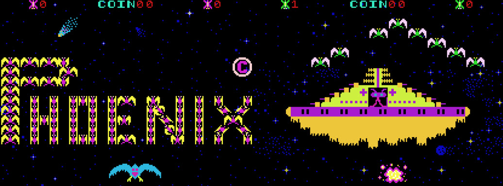

# RAM Use

There are two banks of memory that map to 4000 - 4FFF (4K each). The lower bit of $5000 controls which bank is active.
Write a 0 for the 1st bank and a 1 for the 2nd bank. The Phoenix game only uses 3K from each bank (4000 - 4BFF). I'm
guessing this allows the cabinet to leave out a 1K RAM chip for each bank to save money.

These banks include the video memory with a twist -- literally. When bank 1 is selected, the screen is rotated to face 
player 2 in cocktail mode. When bank 0 is selected, the screen faces player 1 (and both players in a non-cocktail cabinet). 

The idea for these banks is that the first bank holds all the player 1 info and the second holds all the player 2
info. This could make switching players easy. But there is no "common" memory for global info and the stack. The code 
must carefully manage the bank switching -- especially in regards to the stack pointer.

  - 4000 - 433F Foreground
  - 4340 - 47FF General storage (see the table below)
  - 4800 - 4B3F Background 
  - 4B40 - 4BFF Stack space

# Screen memory

The screen is rotated physically clockwise, but the screen memory layout is standard upper-left corner to lower right corner. There are two screens: foreground and background. Each screen is 26 columns by 32 rows (after rotation).

The first (upper left) byte of screen memory maps to the upper right corner of the rotated screen. Adding one to a
screen memory pointer moves 1 row down the screen. Subtracting one moves the pointer 1 row up on the screen. Adding
32 to a screen memory pointer moves 1 column left. Subtracting 32 moves the pointer 1 column right. I spell these
out because I get confused easily!

Each graphics tile is 8x8 pixels. This gives a rotated screen dimension of 26*8 x 32*8 = 208x256 pixels. 

# Variables

The values below are kept in bank 0. ?? TODO see how/if the 2nd bank is used? Maybe it is just a copy in cocktail?

## Foreground screen 

>>> memory

|    |     |     |
| -------- | ------- | ----------------- |
| 4000:433F | ForegroundScreen     | 32*26 bytes for the foreground screen |

## General storage

Alien-formation attack controller data

Drives when and how aliens break out of the base formation to fly their "closed loop" swooping attack patterns.
The whole structure (`$4350`–`$437F`) is zeroed at level init by the routine at `$32B0`,
and it's serviced every frame by a 7 way state machine dispatched through the jump table `T3018` (indexed by `Counter93`),
with each handler reading/updating the behavior state in `$4350`.

>>> memory

|      |       |     |
|------|-------| ----------------- |
| 4350 | M4350 | Alien behavior state (the state-machine variable, values 0–6) |
| 4351 | M4351 | MSB of next closed loop pattern (into the `T2Exx` / `T3330` pattern tables) |
| 4352 | M4352 | LSB of next closed loop pattern (into the `T2Exx` / `T3330` pattern tables) |
| 4353 | M4353 | Number of aliens doing the closed loop pattern (how many attackers) |
| 4354 | M4354 | LSB pointer to the currently selected lead attacking alien (`$4B50`/`$4B72` grid slot) |
| 4355 | M4355 | Delay counter before the next attack is armed (→ behavior state 1) |
| 4356 | M4356 | Rotating 0–15 "movement start" index (from `$4395`) used to sync aliens |
| 4357 | M4357 | Attack-cycle/escalation counter (0–3); scales attacker count and difficulty |
| 4358 | M4358 | Inter-step timer for the angry downward-push movement pattern |
| 4359 | M4359 | Staggered group countdown timer 1 for phased alien launches |
| 435A | M435A | Staggered group countdown timer 2 for phased alien launches |
| 435B | M435B | Staggered group countdown timer 3 for phased alien launches |
| 435C | M435C | Reserved/unused byte |
| 435D | M435D | Reserved/unused byte |

Flags and counter

>>> memory

|      |       |     |
|------|-------| ----------------- |
| 435E | M435E             | Flag for: 'AliensLeft < 5' ($FF) |
| 435F | M435F             | 8 bit counter for alien movement |
| 4360 | PlayerMoved       | Flag for: 'Player moved' ($FF) |
| 4361 | BulletTriggered   | Flag for: 'Bullet triggered' ($30) and counter |
| 4362 | M4362             | Flag for: 'Player shield active' and animation counter |
| 4363 | ParticleExplosion | Flag for: 'Particle explosion start' and animation counter |
| 4364 | M4364             | Flag for: 'Enemy hit detected' ($FF) and counter |
| 4365 | M4365             | Reserved/unused byte |
| 4366 | M4366             | Flag for: 'Mothership or bird wing hit detected' ($FF) |
| 4367 | M4367             | Flag for: 'Mothership partially faded in' ($FF) |
| 4368 | M4368             | Maturity of the birds. From 'egg' over 'no wings' to 'adult' ($01 to $0F) |
| 4369 | M4369             | Flag for: 'Bonus explosion' ($FF) |
| 436A | M436A             | Flag for: 'Bonus live added' ($FF) and counter |
| 436B | M436B             | Flag for: 'Mother ship score display' ($FF) and counter |
| 436C | M436C             | Reserved/unused byte |

Shape of the next bird attack

All three are recomputed by `L3560` each time a new bird group is dispatched.

>>> memory

|      |       |     |
|------|-------| ----------------- |
| 436D      | M436D               | Horizontal start position of the bird group |
| 436E      | M436E               | Bird count / formation-size for the wave |
| 436F      | M436F               | Per-wave random variation seed (keeps successive waves from being identical) |

Explosion slots for animation

>>> memory

|      |       |     |
|------|-------| ----------------- |
| 4370      | M4370               | Explosion slot0 animation index |
| 4371      | M4371               | Explosion slot0 BCD score value (last digit is ever 0) |
| 4372      | M4372               | Explosion slot0 MSB screen ram |
| 4373      | M4373               | Explosion slot0 LSB screen ram |
| 4374      | M4374               | Explosion slot1 animation index |
| 4375      | M4375               | Explosion slot1 BCD score value (last digit is ever 0) |
| 4376      | M4376               | Explosion slot1 MSB screen ram |
| 4377      | M4377               | Explosion slot1 LSB screen ram |
| 4378      | M4378               | Bonus explosion slot0 animation index |
| 4379      | M4379               | Bonus explosion slot0 BCD score value (last digit is ever 0) |
| 437A      | M437A               | Bonus explosion slot0 MSB screen ram |
| 437B      | M437B               | Bonus explosion slot0 LSB screen ram |
| 437C      | M437C               | Bonus explosion slot1 animation index |
| 437D      | M437D               | Bonus explosion slot1 BCD score value (last digit is ever 0) |
| 437E      | M437E               | Bonus explosion slot1 MSB screen ram |
| 437F      | M437F               | Bonus explosion slot1 LSB screen ram |

For the score

>>> memory

|      |       |     |
|------|-------| ----------------- |
| 4380      | M4380               | Ever set to 0 (prevents overflow) |
| 4381      | Score1high          | Player 1 score BCD (high) |
| 4382      | Score1mid           | Player 1 score BCD (mid) |
| 4383      | Score1low           | Player 1 score BCD (low) |
| 4384      | M4384               | Ever set to 0 (prevents overflow) |
| 4385      | Score2high          | Player 2 score BCD (high) |
| 4386      | Score2mid           | Player 2 score BCD (mid) |
| 4387      | Score2low           | Player 2 score BCD (low) |
| 4388      | M4388               | Ever set to 0 (prevents overflow) |
| 4389      | HiScorehigh         | Hi score BCD (high) |
| 438A      | HiScoremid          | Hi score BCD (mid) |
| 438B      | HiScorelow          | Hi score BCD (low) |

For general purposes

>>> memory

|      |       |     |
|------|-------| ----------------- |
| 438C      | SoundControlA       | RAM copy of sound device control register A (0x6000) |
| 438D      | SoundControlB       | RAM copy of sound device control register B (0x6800) |
| 438E      | M438E               | Bird-wave background-sound phase (advances the melody, low bit drives SoundControlB) |
| 438F      | CoinCount           | Number of coins inserted (max is 9) |
| 4390      | Player1Lives        | Player 1 number of lives |
| 4391      | Player2Lives        | Player 2 number of lives |
| 4392      | M4392               | Ever set to 0 |
| 4393      | Counter93           | Free running counter during playtime at game level 3 |
| 4394      | M4394               | Start value list pointer for alien movement MSB |
| 4395      | M4395               | Start value list pointer for alien movement LSB |
| 4396      | M4396               | Bird-wave background-sound step timer (counts frames per tone vs `T3DE0` duration) |
| 4397      | M4397               | Score "dirty" flag — `0` means score changed this frame -> redraw the digits |
| 4398:4399 | Counter98           | 16 bit counter (MSB:LSB) actual index for slow print at intro splash |
| 439A:439B | Counter9A           | 16 bit counter (MSB:LSB) and.. |
| 439B      | M439B               | Next index for slow print at intro splash |
| 439C      | M439C               | Spiral-fill animation step counter (level 4/6/8 inter-wave fade-in) |
| 439D      | M439D               | Fist two digits of BCD score value for mothership explosion |
| 439E      | M439E               | Mapped player ship position, left part: ($09 to $C0) |
| 439F      | M439F               | Mapped player ship position, right part: ($17 to $C8) |
| 43A0      | IN0Current          | Current value of IN0: bit0='coin', bit1='1 player', bit2='2 players', bit4='fire', bit5='right', bit6='left', bit7='shield' |
| 43A1      | IN0Previous         | Previous value of IN0 |
| 43A2      | GameOrAttract       | Attract mode=0, One player game mode=1, Two players game mode=2 |
| 43A3      | GameAndDemoOrSplash | Game and demo for player 1=0, Game for player 2=1, Intro splash=2 |
| 43A4      | GameState           | Game state=0 - 7 |
| 43A5      | CounterA5           | 8 bit counter (e.g.: score flash time) |
| 43A6      | ShieldCount         | Counts shield time and controls shield picture. Shields end at C0. |
| 43A7      | AnimationCounter    | For mothership's antenna and the alien pilot animation |
| 43A8      | M43A8               | Temporary storage (MSB of pointer to table $1860) |
| 43A9      | M43A9               | Temporary storage (LSB of pointer to table $1860) |
| 43AA      | M43AA               | Mothership-wave frame counter (times antenna/pilot animation and star scroll) |

For Background graphic's (stars, planets, galaxies) and scroll control

>>> memory

|      |       |     |
|------|-------| ----------------- |
| 43AB      | M43AB               | Counter for planet trigger |
| 43AC      | M43AC               | Planet vertical spacing increment (added to trigger `$43AB`) |
| 43AD      | M43AD               | Planet X index -> `T1E60` (screen-RAM LSB), incremented per planet |
| 43AE      | M43AE               | Planet X index -> `T1E20` (screen-RAM MSB), incremented per planet |
| 43AF      | M43AF               | `CounterB9` trigger for the next galaxy |
| 43B0      | M43B0               | Galaxy spacing decrement (subtracted from `$43AF`) |
| 43B1      | M43B1               | Galaxy X index -> `T1E80`, incremented per galaxy |
| 43B2      | M43B2               | MSB pointer into the background pattern tables `T1C00`/`T1D00`/`T1F00` |
| 43B3      | M43B3               | LSB pointer into the background pattern tables `T1C00`/`T1D00`/`T1F00` |
| 43B4      | CounterB4           | 8 bit counter (stars scrolling down, aliens fade in time) |
| 43B5      | M43B5               | Reserved/unused byte |
| 43B6      | M43B6               | End-of-wave countdown timer that advances the game to the next level/round |

For general purposes

>>> memory

|      |       |     |
|------|-------| ----------------- |
| 43B7      | M43B7               | Reserved/unused byte |
| 43B8      | LevelAndRound       | Bit0 - 3: game level, bit4 - 7: game round |
| 43B9      | CounterB9           | 8 bit backwards counter |
| 43BA      | AliensLeft          | Number of aliens left in wave (16 at new) |
| 43BB      | BirdsLeft           | Number of birds left in wave (8 at new) |
| 43BC      | M43BC               | Reserved/unused byte |
| 43BD      | M43BD               | Low byte of the bonus extra-life score threshold; rewritten (nibble-swapped `BonusLivesAt`) after a bonus is granted |
| 43BE      | BonusLivesAt        | Middle byte of the threshold, set from DIP switches to `$30/$40/$50/$60` = 3000/4000/5000/6000 points |
| 43BF      | M43BF               | High byte of the bonus extra-life score threshold |

## Player and player bullets, data structure (grid)

MAME cheat code "Infinite Shields": set $84 (%1000_0100) at $43C0

>>> memory

|    |     |     |
| -------- | ------- | ----------------- |
| 43C0      | PlayerState            | Player ship control state register |
| 43C1      | PlayerShape            | LSB for T1400 player ship character block shapes table |
| 43C2      | PlayerShipX            | Player ship, coordinate X ($0C=min.left, $64=default, $C0=max.right) |
| 43C3      | PlayerShipY            | Player ship, coordinate Y ($D8) |
| 43C4      | PlayerBulletState      | Player bullet, control state register |
| 43C5      | PlayerBulletShape      | Player bullet, character code ($50 to $57) |
| 43C6      | PlayerBulletX          | Player bullet, coordinate X |
| 43C7      | PlayerBulletY          | Player bullet, coordinate Y ($D0=min.bottom, $18=max.top) |
| 43C8      | AbovePlayerBulletState | One position above player bullet, control state register |
| 43C9      | AbovePlayerBulletShape | One position above player bullet, character code ($50 to $57) |
| 43CA      | AbovePlayerBulletX     | One position above player bullet, coordinate X |
| 43CB      | AbovePlayerBulletY     | One position above player bullet, coordinate Y |

## Alien and bird bullets, data structure (grid)

>>> memory

|    |     |     |
| -------- | ------- | ----------------- |
| 43CC      | EnemyBullet0State      | Enemy bullet 0, control state register |
| 43CD      | EnemyBullet0Shape      | Enemy bullet 0, character code ($58 to $5F) |
| 43CE      | EnemyBullet0X          | Enemy bullet 0, coordinate X |
| 43CF      | EnemyBullet0Y          | Enemy bullet 0, coordinate Y |
| 43D0      | EnemyBullet1State      | Enemy bullet 1, control state register |
| 43D1      | EnemyBullet1Shape      | Enemy bullet 1, character code ($58 to $5F) |
| 43D2      | EnemyBullet1X          | Enemy bullet 1, coordinate X |
| 43D3      | EnemyBullet1Y          | Enemy bullet 1, coordinate Y |
| 43D4      | EnemyBullet2State      | Enemy bullet 2, control state register |
| 43D5      | EnemyBullet2Shape      | Enemy bullet 2, character code ($58 to $5F) |
| 43D6      | EnemyBullet2X          | Enemy bullet 2, coordinate X |
| 43D7      | EnemyBullet2Y          | Enemy bullet 2, coordinate Y |
| 43D8      | EnemyBullet3State      | Enemy bullet 3, control state register |
| 43D9      | EnemyBullet3Shape      | Enemy bullet 3, character code ($58 to $5F) |
| 43DA      | EnemyBullet3X          | Enemy bullet 3, coordinate X |
| 43DB      | EnemyBullet3Y          | Enemy bullet 3, coordinate Y |
| 43DC      | EnemyBullet4State      | Enemy bullet 4, control state register |
| 43DD      | EnemyBullet4Shape      | Enemy bullet 4, character code ($58 to $5F) |
| 43DE      | EnemyBullet4X          | Enemy bullet 4, coordinate X |
| 43DF      | EnemyBullet4Y          | Enemy bullet 4, coordinate Y |

## Player and player bullets, data structure (screen ram)

>>> memory

|    |     |     |
| -------- | ------- | ----------------- |
| 43E0      | OldPlayerShipMSB        | Old MSB screen ram: Upper left character of player ship |
| 43E1      | OldPlayerShipLSB        | Old LSB screen ram: Upper left character of player ship |
| 43E2      | PlayerShipMSB           | MSB screen ram: Upper left character of player ship |
| 43E3      | PlayerShipLSB           | LSB screen ram: Upper left character of player ship |
| 43E4      | PlayerBulletMSB         | MSB screen ram: Player bullet |
| 43E5      | PlayerBulletLSB         | LSB screen ram: Player bullet |
| 43E6      | AbovePlayerBulletMSB    | MSB screen ram: One character above player bullet |
| 43E7      | AbovePlayerBulletLSB    | LSB screen ram: One character above player bullet |
| 43E8      | M43E8                   | MSB of its previous position (erase pointer, refreshed by `L0886`) |
| 43E9      | M43E9                   | LSB of its previous position (erase pointer, refreshed by `L0886`) |
| 43EA      | M43EA                   | MSB of its current position (draw + collision pointer, recomputed each frame by `L09A0` from `$43CA:$43CB`) |
| 43EB      | M43EB                   | LSB of its current position (draw + collision pointer, recomputed each frame by `L09A0` from `$43CA:$43CB`) |

## Alien and bird bullets, data structure (screen ram)

>>> memory

|    |     |     |
| -------- | ------- | ----------------- |
| 43EC      | OldEnemyBullet0MSB      | Old MSB screen ram: Enemy bullet 0 |
| 43ED      | OldEnemyBullet0LSB      | Old LSB screen ram: Enemy bullet 0 |
| 43EE      | EnemyBullet0MSB         | MSB screen ram: Enemy bullet 0 |
| 43EF      | EnemyBullet0LSB         | LSB screen ram: Enemy bullet 0 |
| 43F0      | OldEnemyBullet1MSB      | Old MSB screen ram: Enemy bullet 1 |
| 43F1      | OldEnemyBullet1LSB      | Old LSB screen ram: Enemy bullet 1 |
| 43F2      | EnemyBullet1MSB         | MSB screen ram: Enemy bullet 1 |
| 43F3      | EnemyBullet1LSB         | LSB screen ram: Enemy bullet 1 |
| 43F4      | OldEnemyBullet2MSB      | Old MSB screen ram: Enemy bullet 2 |
| 43F5      | OldEnemyBullet2LSB      | Old LSB screen ram: Enemy bullet 2 |
| 43F6      | EnemyBullet2MSB         | MSB screen ram: Enemy bullet 2 |
| 43F7      | EnemyBullet2LSB         | LSB screen ram: Enemy bullet 2 |
| 43F8      | OldEnemyBullet3MSB      | Old MSB screen ram: Enemy bullet 3 |
| 43F9      | OldEnemyBullet3LSB      | Old LSB screen ram: Enemy bullet 3 |
| 43FA      | EnemyBullet3MSB         | MSB screen ram: Enemy bullet 3 |
| 43FB      | EnemyBullet3LSB         | LSB screen ram: Enemy bullet 3 |
| 43FC      | OldEnemyBullet4MSB      | Old MSB screen ram: Enemy bullet 4 |
| 43FD      | OldEnemyBullet4LSB      | Old LSB screen ram: Enemy bullet 4 |
| 43FE      | EnemyBullet4MSB         | MSB screen ram: Enemy bullet 4 |
| 43FF      | EnemyBullet4LSB         | LSB screen ram: Enemy bullet 4 |

## Background screen 

>>> memory

|    |     |     |
| -------- | ------- | ----------------- |
| 4800:4B3F | BackgroundScreen     | 32*26 bytes for the background screen |

## Pointer to alien movement pattern

Default values (all: $10,$00 pointing to T1000) are defined at table: T1520.

>>> memory

|    |     |     |
| -------- | ------- | ----------------- |
| 4B50      | M4B50                | Alien0 movement pattern table MSB |
| 4B51      | M4B51                | Alien0 movement pattern table LSB |
| 4B52      | M4B52                | Alien1 movement pattern table MSB |
| 4B53      | M4B53                | Alien1 movement pattern table LSB |
| 4B54      | M4B54                | Alien2 movement pattern table MSB |
| 4B55      | M4B55                | Alien2 movement pattern table LSB |
| 4B56      | M4B56                | Alien3 movement pattern table MSB |
| 4B57      | M4B57                | Alien3 movement pattern table LSB |
| 4B58      | M4B58                | Alien4 movement pattern table MSB |
| 4B59      | M4B59                | Alien4 movement pattern table LSB |
| 4B5A      | M4B5A                | Alien5 movement pattern table MSB |
| 4B5B      | M4B5B                | Alien5 movement pattern table LSB |
| 4B5C      | M4B5C                | Alien6 movement pattern table MSB |
| 4B5D      | M4B5D                | Alien6 movement pattern table LSB |
| 4B5E      | M4B5E                | Alien7 movement pattern table MSB |
| 4B5F      | M4B5F                | Alien7 movement pattern table LSB |
| 4B60      | M4B60                | Alien8 movement pattern table MSB |
| 4B61      | M4B61                | Alien8 movement pattern table LSB |
| 4B62      | M4B62                | Alien9 movement pattern table MSB |
| 4B63      | M4B63                | Alien9 movement pattern table LSB |
| 4B64      | M4B64                | AlienA movement pattern table MSB |
| 4B65      | M4B65                | AlienA movement pattern table LSB |
| 4B66      | M4B66                | AlienB movement pattern table MSB |
| 4B67      | M4B67                | AlienB movement pattern table LSB |
| 4B68      | M4B68                | AlienC movement pattern table MSB |
| 4B69      | M4B69                | AlienC movement pattern table LSB |
| 4B6A      | M4B6A                | AlienD movement pattern table MSB |
| 4B6B      | M4B6B                | AlienD movement pattern table LSB |
| 4B6C      | M4B6C                | AlienE movement pattern table MSB |
| 4B6D      | M4B6D                | AlienE movement pattern table LSB |
| 4B6E      | M4B6E                | AlienF movement pattern table MSB |
| 4B6F      | M4B6F                | AlienF movement pattern table LSB |

## Alien data structure (grid)

Used for all levels with the 16 aliens.
Level: 1, 2, 5 (with mothership), 6, 7, 10(with mothership).
During 'fade in' phase, the alien control state B is holding the character code!

>>> memory

|    |     |     |
| -------- | ------- | ----------------- |
| 4B70      | M4B70                | Alien0 control state A     |
| 4B71      | M4B71                | Alien0 control state B (LSB for T14xx) |
| 4B72      | M4B72                | Alien0 screen coordinate X |
| 4B73      | M4B73                | Alien0 screen coordinate Y |
| 4B74      | M4B74                | Alien1 control state A     |
| 4B75      | M4B75                | Alien1 control state B (LSB for T14xx) |
| 4B76      | M4B76                | Alien1 screen coordinate X |
| 4B77      | M4B77                | Alien1 screen coordinate Y |
| 4B78      | M4B78                | Alien2 control state A     |
| 4B79      | M4B79                | Alien2 control state B (LSB for T14xx) |
| 4B7A      | M4B7A                | Alien2 screen coordinate X |
| 4B7B      | M4B7B                | Alien2 screen coordinate Y |
| 4B7C      | M4B7C                | Alien3 control state A     |
| 4B7D      | M4B7D                | Alien3 control state B (LSB for T14xx) |
| 4B7E      | M4B7E                | Alien3 screen coordinate X |
| 4B7F      | M4B7F                | Alien3 screen coordinate Y |
| 4B80      | M4B80                | Alien4 control state A     |
| 4B81      | M4B81                | Alien4 control state B (LSB for T14xx) |
| 4B82      | M4B82                | Alien4 screen coordinate X |
| 4B83      | M4B83                | Alien4 screen coordinate Y |
| 4B84      | M4B84                | Alien5 control state A     |
| 4B85      | M4B85                | Alien5 control state B (LSB for T14xx) |
| 4B86      | M4B86                | Alien5 screen coordinate X |
| 4B87      | M4B87                | Alien5 screen coordinate Y |
| 4B88      | M4B88                | Alien6 control state A     |
| 4B89      | M4B89                | Alien6 control state B (LSB for T14xx) |
| 4B8A      | M4B8A                | Alien6 screen coordinate X |
| 4B8B      | M4B8B                | Alien6 screen coordinate Y |
| 4B8C      | M4B8C                | Alien7 control state A     |
| 4B8D      | M4B8D                | Alien7 control state B (LSB for T14xx) |
| 4B8E      | M4B8E                | Alien7 screen coordinate X |
| 4B8F      | M4B8F                | Alien7 screen coordinate Y |
| 4B90      | M4B90                | Alien8 control state A     |
| 4B91      | M4B91                | Alien8 control state B (LSB for T14xx) |
| 4B92      | M4B92                | Alien8 screen coordinate X |
| 4B93      | M4B93                | Alien8 screen coordinate Y |
| 4B94      | M4B94                | Alien9 control state A     |
| 4B95      | M4B95                | Alien9 control state B (LSB for T14xx) |
| 4B96      | M4B96                | Alien9 screen coordinate X |
| 4B97      | M4B97                | Alien9 screen coordinate Y |
| 4B98      | M4B98                | AlienA control state A     |
| 4B99      | M4B99                | AlienA control state B (LSB for T14xx) |
| 4B9A      | M4B9A                | AlienA screen coordinate X |
| 4B9B      | M4B9B                | AlienA screen coordinate Y |
| 4B9C      | M4B9C                | AlienB control state A     |
| 4B9D      | M4B9D                | AlienB control state B (LSB for T14xx) |
| 4B9E      | M4B9E                | AlienB screen coordinate X |
| 4B9F      | M4B9F                | AlienB screen coordinate Y |
| 4BA0      | M4BA0                | AlienC control state A     |
| 4BA1      | M4BA1                | AlienC control state B (LSB for T14xx) |
| 4BA2      | M4BA2                | AlienC screen coordinate X |
| 4BA3      | M4BA3                | AlienC screen coordinate Y |
| 4BA4      | M4BA4                | AlienD control state A     |
| 4BA5      | M4BA5                | AlienD control state B (LSB for T14xx) |
| 4BA6      | M4BA6                | AlienD screen coordinate X |
| 4BA7      | M4BA7                | AlienD screen coordinate Y |
| 4BA8      | M4BA8                | AlienE control state A     |
| 4BA9      | M4BA9                | AlienE control state B (LSB for T14xx) |
| 4BAA      | M4BAA                | AlienE screen coordinate X |
| 4BAB      | M4BAB                | AlienE screen coordinate Y |
| 4BAC      | M4BAC                | AlienF control state A     |
| 4BAD      | M4BAD                | AlienF control state B (LSB for T14xx) |
| 4BAE      | M4BAE                | AlienF screen coordinate X |
| 4BAF      | M4BAF                | AlienF screen coordinate Y |

## Bird object data structure 

Used for all levels with the 8 birds.
Level: 3, 4, 8, 9.

For each bird object in `$4B70`–`$4BAF`:

(+3) — Animation phase / current shape frame: Selects which frame of the bird's wing-flap/animation group is drawn. 
It's advanced by the movement step each update (see below), wrapping mod 8, which cycles the animation. 
At the intro it's borrowed as scratch — `$4B70`–`$4B73` are reused to draw a single bird frame, with `$4B73 = index & 7`, the animation phase: `$21DF` "used as temp memory".

(+4) — Movement-step countdown timer: On each bird update (`L35B0`), the code steps to +4 and decrements it (unless already 0).

(+6) — horizontal movement step (velocity): Added each update to the grid X position (`$4B75`) and to the animation phase (`$4B73`); `≥ $10` triggers special wing-handling.

>>> memory

|    |     |     |
| -------- | ------- | ----------------- |
| 4B70      | B4B70                | Bird0 character-block shape index   |
| 4B71      | B4B71                | Bird0 screen-RAM address MSB    |
| 4B72      | B4B72                | Bird0 screen-RAM address LSB    |
| 4B73      | B4B73                | Bird0 animation phase / current shape frame |
| 4B74      | B4B74                | Bird0 movement-step countdown timer |
| 4B75      | B4B75                | Bird0 grid coordinate X             |
| 4B76      | B4B76                | Bird0 horizontal movement step (velocity) |
| 4B77      | B4B77                | Bird0 grid coordinate Y             |
| 4B78      | B4B78                | Bird1 character-block shape index   |
| 4B79      | B4B79                | Bird1 screen-RAM address MSB    |
| 4B7A      | B4B7A                | Bird1 screen-RAM address LSB    |
| 4B7B      | B4B7B                | Bird1 animation phase / current shape frame |
| 4B7C      | B4B7C                | Bird1 movement-step countdown timer |
| 4B7D      | B4B7D                | Bird1 grid coordinate X             |
| 4B7E      | B4B7E                | Bird1 horizontal movement step (velocity) |
| 4B7F      | B4B7F                | Bird1 grid coordinate Y             |
| 4B80      | B4B80                | Bird2 character-block shape index   |
| 4B81      | B4B81                | Bird2 screen-RAM address MSB    |
| 4B82      | B4B82                | Bird2 screen-RAM address LSB    |
| 4B83      | B4B83                | Bird2 animation phase / current shape frame |
| 4B84      | B4B84                | Bird2 movement-step countdown timer |
| 4B85      | B4B85                | Bird2 grid coordinate X             |
| 4B86      | B4B86                | Bird2 horizontal movement step (velocity) |
| 4B87      | B4B87                | Bird2 grid coordinate Y             |
| 4B88      | B4B88                | Bird3 character-block shape index   |
| 4B89      | B4B89                | Bird3 screen-RAM address MSB    |
| 4B8A      | B4B8A                | Bird3 screen-RAM address LSB    |
| 4B8B      | B4B8B                | Bird3 animation phase / current shape frame |
| 4B8C      | B4B8C                | Bird3 movement-step countdown timer |
| 4B8D      | B4B8D                | Bird3 grid coordinate X             |
| 4B8E      | B4B8E                | Bird3 horizontal movement step (velocity) |
| 4B8F      | B4B8F                | Bird3 grid coordinate Y             |
| 4B90      | B4B90                | Bird4 character-block shape index   |
| 4B91      | B4B91                | Bird4 screen-RAM address MSB    |
| 4B92      | B4B92                | Bird4 screen-RAM address LSB    |
| 4B93      | B4B93                | Bird4 animation phase / current shape frame |
| 4B94      | B4B94                | Bird4 movement-step countdown timer |
| 4B95      | B4B95                | Bird4 grid coordinate X             |
| 4B96      | B4B96                | Bird4 horizontal movement step (velocity) |
| 4B97      | B4B97                | Bird4 grid coordinate Y             |
| 4B98      | B4B98                | Bird5 character-block shape index   |
| 4B99      | B4B99                | Bird5 screen-RAM address MSB    |
| 4B9A      | B4B9A                | Bird5 screen-RAM address LSB    |
| 4B9B      | B4B9B                | Bird5 animation phase / current shape frame |
| 4B9C      | B4B9C                | Bird5 movement-step countdown timer |
| 4B9D      | B4B9D                | Bird5 grid coordinate X             |
| 4B9E      | B4B9E                | Bird5 horizontal movement step (velocity) |
| 4B9F      | B4B9F                | Bird5 grid coordinate Y             |
| 4BA0      | B4BA0                | Bird6 character-block shape index   |
| 4BA1      | B4BA1                | Bird6 screen-RAM address MSB    |
| 4BA2      | B4BA2                | Bird6 screen-RAM address LSB    |
| 4BA3      | B4BA3                | Bird6 animation phase / current shape frame |
| 4BA4      | B4BA4                | Bird6 movement-step countdown timer |
| 4BA5      | B4BA5                | Bird6 grid coordinate X             |
| 4BA6      | B4BA6                | Bird6 horizontal movement step (velocity) |
| 4BA7      | B4BA7                | Bird6 grid coordinate Y             |
| 4BA8      | B4BA8                | Bird7 character-block shape index   |
| 4BA9      | B4BA9                | Bird7 screen-RAM address MSB    |
| 4BAA      | B4BAA                | Bird7 screen-RAM address LSB    |
| 4BAB      | B4BAB                | Bird7 animation phase / current shape frame |
| 4BAC      | B4BAC                | Bird7 movement-step countdown timer |
| 4BAD      | B4BAD                | Bird7 grid coordinate X             |
| 4BAE      | B4BAE                | Bird7 horizontal movement step (velocity) |
| 4BAF      | B4BAF                | Bird7 grid coordinate Y             |

## Alien data structure (screen ram)

>>> memory

|    |     |     |
| -------- | ------- | ----------------- |
| 4BB0      | M4BB0                | Old MSB screen ram adress alien0 |
| 4BB1      | M4BB1                | Old LSB screen ram adress alien0 |
| 4BB2      | M4BB2                | MSB screen ram adress alien0 |
| 4BB3      | M4BB3                | LSB screen ram adress alien0 |
| 4BB4      | M4BB4                | Old MSB screen ram adress alien1 |
| 4BB5      | M4BB5                | Old LSB screen ram adress alien1 |
| 4BB6      | M4BB6                | MSB screen ram adress alien1 |
| 4BB7      | M4BB7                | LSB screen ram adress alien1 |
| 4BB8      | M4BB8                | Old MSB screen ram adress alien2 |
| 4BB9      | M4BB9                | Old LSB screen ram adress alien2 |
| 4BBA      | M4BBA                | MSB screen ram adress alien2 |
| 4BBB      | M4BBB                | LSB screen ram adress alien2 |
| 4BBC      | M4BBC                | Old MSB screen ram adress alien3 |
| 4BBD      | M4BBD                | Old LSB screen ram adress alien3 |
| 4BBE      | M4BBE                | MSB screen ram adress alien3 |
| 4BBF      | M4BBF                | LSB screen ram adress alien3 |
| 4BC0      | M4BC0                | Old MSB screen ram adress alien4 |
| 4BC1      | M4BC1                | Old LSB screen ram adress alien4 |
| 4BC2      | M4BC2                | MSB screen ram adress alien4 |
| 4BC3      | M4BC3                | LSB screen ram adress alien4 |
| 4BC4      | M4BC4                | Old MSB screen ram adress alien5 |
| 4BC5      | M4BC5                | Old LSB screen ram adress alien5 |
| 4BC6      | M4BC6                | MSB screen ram adress alien5 |
| 4BC7      | M4BC7                | LSB screen ram adress alien5 |
| 4BC8      | M4BC8                | Old MSB screen ram adress alien6 |
| 4BC9      | M4BC9                | Old LSB screen ram adress alien6 |
| 4BCA      | M4BCA                | MSB screen ram adress alien6 |
| 4BCB      | M4BCB                | LSB screen ram adress alien6 |
| 4BCC      | M4BCC                | Old MSB screen ram adress alien7 |
| 4BCD      | M4BCD                | Old LSB screen ram adress alien7 |
| 4BCE      | M4BCE                | MSB screen ram adress alien7 |
| 4BCF      | M4BCF                | LSB screen ram adress alien7 |
| 4BD0      | M4BD0                | Old MSB screen ram adress alien8 |
| 4BD1      | M4BD1                | Old LSB screen ram adress alien8 |
| 4BD2      | M4BD2                | MSB screen ram adress alien8 |
| 4BD3      | M4BD3                | LSB screen ram adress alien8 |
| 4BD4      | M4BD4                | Old MSB screen ram adress alien9 |
| 4BD5      | M4BD5                | Old LSB screen ram adress alien9 |
| 4BD6      | M4BD6                | MSB screen ram adress alien9 |
| 4BD7      | M4BD7                | LSB screen ram adress alien9 |
| 4BD8      | M4BD8                | Old MSB screen ram adress alienA |
| 4BD9      | M4BD9                | Old LSB screen ram adress alienA |
| 4BDA      | M4BDA                | MSB screen ram adress alienA |
| 4BDB      | M4BDB                | LSB screen ram adress alienA |
| 4BDC      | M4BDC                | Old MSB screen ram adress alienB |
| 4BDD      | M4BDD                | Old LSB screen ram adress alienB |
| 4BDE      | M4BDE                | MSB screen ram adress alienB |
| 4BDF      | M4BDF                | LSB screen ram adress alienB |
| 4BE0      | M4BE0                | Old MSB screen ram adress alienC |
| 4BE1      | M4BE1                | Old LSB screen ram adress alienC |
| 4BE2      | M4BE2                | MSB screen ram adress alienC |
| 4BE3      | M4BE3                | LSB screen ram adress alienC |
| 4BE4      | M4BE4                | Old MSB screen ram adress alienD |
| 4BE5      | M4BE5                | Old LSB screen ram adress alienD |
| 4BE6      | M4BE6                | MSB screen ram adress alienD |
| 4BE7      | M4BE7                | LSB screen ram adress alienD |
| 4BE8      | M4BE8                | Old MSB screen ram adress alienE |
| 4BE9      | M4BE9                | Old LSB screen ram adress alienE |
| 4BEA      | M4BEA                | MSB screen ram adress alienE |
| 4BEB      | M4BEB                | LSB screen ram adress alienE |
| 4BEC      | M4BEC                | Old MSB screen ram adress alienF |
| 4BED      | M4BED                | Old LSB screen ram adress alienF |
| 4BEE      | M4BEE                | MSB screen ram adress alienF |
| 4BEF      | M4BEF                | LSB screen ram adress alienF |

## Bird extended storage 

Scratch RAM used by the routine `L3980` (`$3980`), which runs during the bird/Phoenix waves to do an extended vertical collision sweep of the player's shot against the descending birds.

Buffer for real bullet/aim values while routine `L39F0` hijacks them (copied back via `L39DB`).

The routine works by hijacking the real player-bullet variables, sweeping them down through several screen rows running the bird collision check at each row, and then putting the originals back. `$4BC0`–`$4BC5` hold the saved originals during that sweep.

>>> memory

|    |     |     |
| -------- | ------- | ----------------- |
| 4BC0      | B4BC0                | saved PlayerBulletState |
| 4BC1      | B4BC1                | saved PlayerBulletShape |
| 4BC2      | B4BC2                | saved PlayerBulletX |
| 4BC3      | B4BC3                | saved PlayerBulletY |
| 4BC4      | B4BC4                | saved AbovePlayerBulletMSB |
| 4BC5      | B4BC5                | saved AbovePlayerBulletLSB |

Bird-wave descent/attack control variables:

They all live in the enemy work-RAM block that's cleared at each level start (`$4B50`–`$4BEF`, `$0535`). The `$4BD0` group is the heart of the swooping-formation logic during the bird (Phoenix) waves.

`$4BD1` — Descent turnaround threshold (max depth):

Computed in `L2476` from remaining birds, the wave timer, and the random seed `$436F`. The formation keeps descending until the scroll phase `$4BD2` passes this value, at which point the motion routine switches to the return/up path.

`$4BD2` — Vertical scroll phase of the bird formation (the master index):

Recomputed every frame from the scroll counter `CounterB9`. It's a 0–31 value representing how far the formation has scrolled down, and it's the index used all over the bird code (collision tables, the `T3ED0` scroll-increment table, the `T3DC0` active-object window, etc.).

`$4BD3` — Countdown timer between bird attacks ("bird extended storage"):

Loaded in `L2476` and decremented each cycle in `L26AA`; when it hits 0 the next attack/movement pattern is armed.

`$4BD4` — Attack sub-pattern selector (0–3):

Set from the low 2 bits of the random seed `$436F`; picks one of four bird attack variants.

`$4BD5` — Descent step / speed value:

Computed in `L2668` (base `$436E`, clamped by the `$3EE0` speed curve and tweaked by `BirdsLeft`), then consumed by the scroll routine: its low 2 bits index the `$3ED0` dither table and `bits>>2` give the coarse pixels-per-frame.

`$4BD6` — Combined scroll-phase + active-bird center index (0–31):

Built in `L26D0` by scanning the live bird objects (tracking the first and last active rows `D`/`E`) and adding them to the scroll phase. It indexes the `$3EE0` clamp curve, the `T3DE0` background-tone-duration table, and the bird-count clamp at `$2685`.

`$4BD7` — Vertical spread of the active birds (computed, effectively unused):

Also produced by `L26D0` as `lastRow − firstRow`. It is written at $26FA but not read anywhere else in the ROM — a leftover/vestigial value (the formation span is computed but only `$4BD6` is actually used downstream).

>>> memory

|      |       |     |
|------|-------| ----------------- |
| 4BD0      | B4BD0                | Unused RAM (cleared at level init, never referenced) |
| 4BD1      | B4BD1                | Descent turnaround depth threshold (formation reverses when `$4BD2` passes it) |
| 4BD2      | B4BD2                | Vertical scroll phase 0–31 of the bird formation (derived from `CounterB9`; master index) (0..31) |
| 4BD3      | B4BD3                | Countdown timer between bird attack launches |
| 4BD4      | B4BD4                | Attack sub-pattern selector (0–3, from random `$436F`) for one of four attack variants |
| 4BD5      | B4BD5                | Descent step/speed value (feeds the `$3ED0` dither scroll rate) |
| 4BD6      | B4BD6                | Combined scroll-phase + active-bird center index (indexes `$3EE0` curve & `T3DE0` sound) |
| 4BD7      | B4BD7                | Active-bird vertical spread — computed but not consumed (vestigial) |
| 4BED      | B4BED                | Unused RAM (cleared at level init, never referenced) |
| 4BEE      | B4BEE                | Unused RAM (cleared at level init, never referenced) |
| 4BEF      | B4BEF                | Unused RAM (cleared at level init, never referenced) |

## Stack 

>>> memory

|    |     |     |
| -------- | ------- | ----------------- |
| 4BF0:4BFF | Stack                | Stack space |

