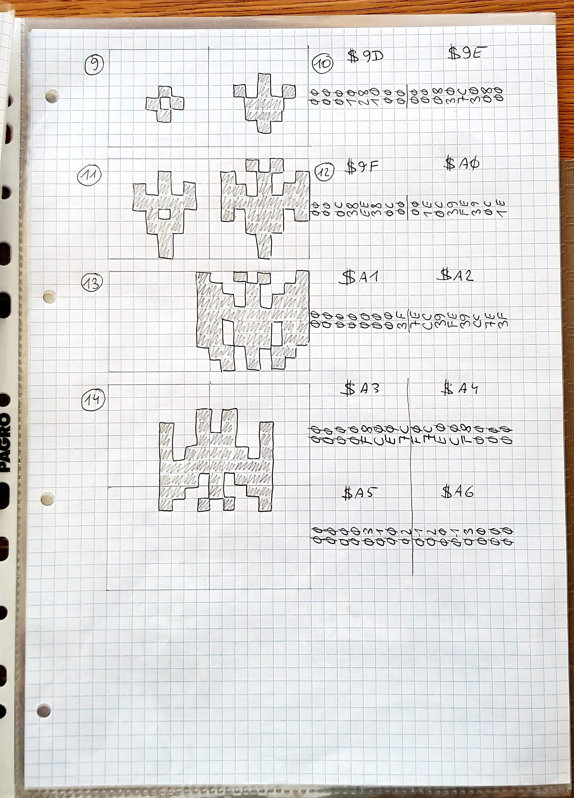
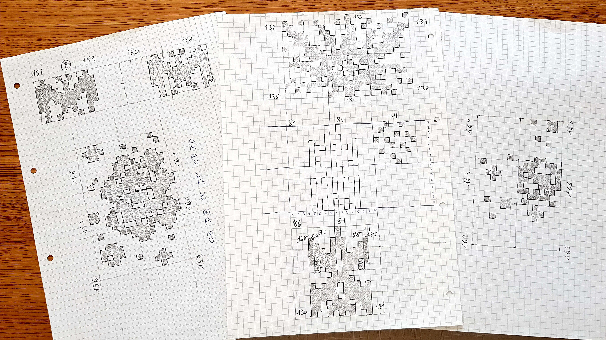
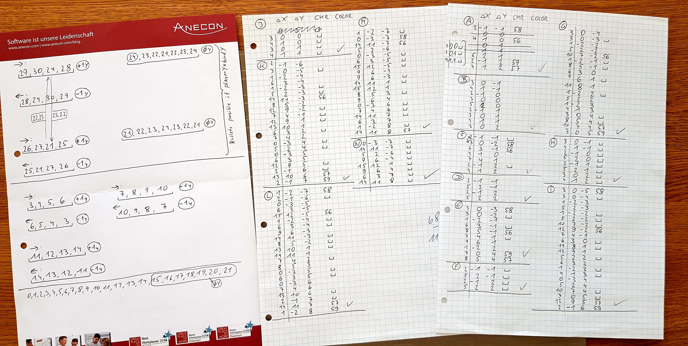
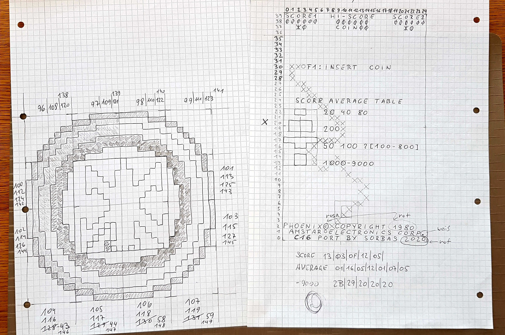
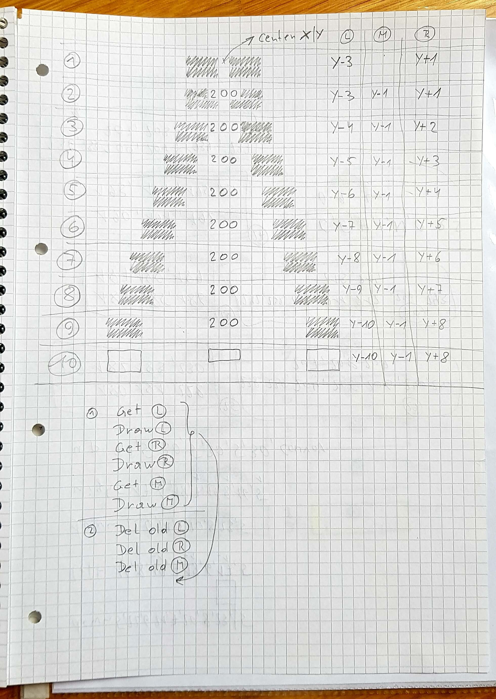
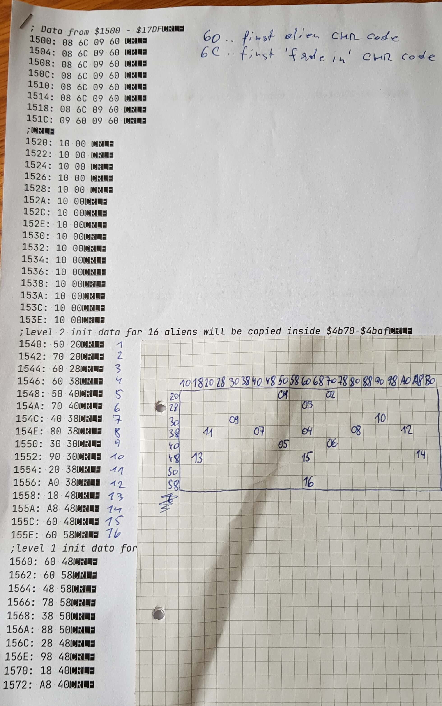

>>> deploy:<br>
>>>   +Phoenix.jpg<br>
>>>   +Phoenix.js<br>
>>>   +sketch1s.jpg<br>
>>>   +sketch2s.jpg<br>
>>>   +sketch3s.jpg<br>
>>>   +sketch4s.jpg<br>
>>>   +sketch5s.jpg<br>
>>>   +sketch6s.jpg<br>
>>>   Hardware.md<br>
>>>   RAMUse.md<br>
>>>   %Code.md<br>
>>>   ----<br>
>>>   %bgtiles.md:Background<br>
>>>   %fgtiles.md:Foreground<br>
>>>   ----<br>
>>>   Journal.md<br>

# Phoenix

The CPU used for this game was a INTEL 8085 and variants (P8085AH-2).

The Z80 microprocessor from ZILOG is a further development of the 8080 microprocessor,
which was launched at about the same time as the 8080's successor, the 8085 from INTEL.

The 8-bit Z80 processor uses the register block and instruction set of the 8085 as a subset,
but features some extensions in its structure and instruction set.

This disassembly is using the Z80 instruction set, due to greater popularity. (Created by Sorbas2020)

For the sake of completeness, there is also a link to a 8085 one. (Created by HHi)

# Code Links

* [Main Board Code](Code.md)
* [Hardware](Hardware.md)
* [RAM Usage](RAMUse.md)
* [Background Tiles](bgtiles.md)
* [Foreground Tiles](fgtiles.md)
* [Color PROM](proms.md)
* [Intel 8085 variant dump](/hhi-8085-dump/README.md)

https://github.com/mamedev/mame/blob/master/src/mame/phoenix/phoenix.cpp

# Pictures and Comments from Peter

A few years ago, I worked on a C16 and a C64 port of the classic arcade game.
At this point in time the game was not available on the website `computerarcheology.com`.
I had to manually copy all graphics from the screen.

```html
<p>
</img>
</p><p>
</img>
</p>
<hr>
```

On the right side of the picture below, you can see the relativ coordinates data needed for a real particle explosion.
Animation frames are from letter A to N. Sidenote: the arcade version is not doing a 'real' one, because it simlpy deletes the background and does not restore it.

On the left side you see the possible 'sub sequences' for the horizontal movements of the big birds. This is very important for a smooth animation.
I still need to find that data in the code of the arcade version....

```html
<p>
</img>
</p>
<hr>
```

On the left below you can see an 'improved' version of the player shields.
I added more tiles and animation frames to make it beautiful for my commodore port.
On the right you can see the result of a conversion from 32x26 screen size to 40x25. (..and sorry the same paper was used a second time for a movement track)

```html
<p>
</img>
</p>
<hr>
```

The 10 animation frames of the 'bonus explosion' shown below.

```html
<p>
</img>
</p>
<hr>
```

Below is some 'offline' work of the current investigations.
Finding out the meaning of suspect numbers and putting them in a grid.
It is important to assign a name or number to each alien.
Because there will be fixed trigger points used later when the movement starts. 

```html
<p>
</img>
</p>
<hr>
```