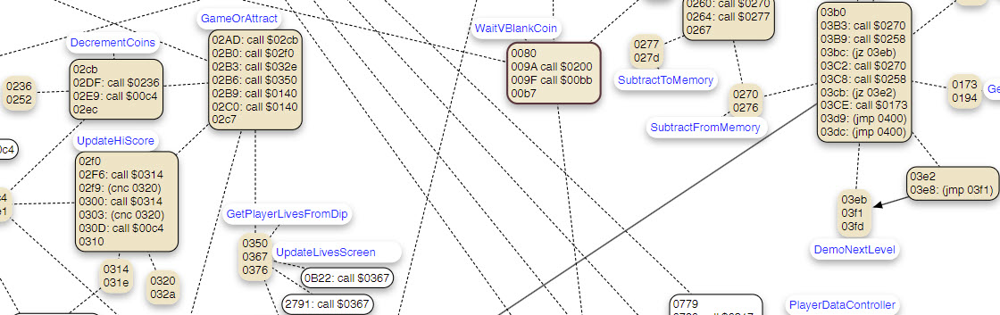

>>> deploy: 
>>>   +PhoenixHHi.jpg 
>>>   +phoenixj-rom 
>>>   phoenixj-func-main2.pdf 
>>>   phoenixj-func-main2.scap 
>>>   phoenixj.asm-may2025.txt 
>>>   phoenixj.asm-may2025.txt.pdf 

This directory contains the Intel 8085 variant dump of Phoenix taito (phoenixj) version. 

  - [i8085 dump annotated text file](./phoenixj.asm-may2025.txt) 
  - [i8085 dump PDF](./phoenixj.asm-may2025.txt.pdf) 
  - [flow visualization - PDF](./phoenixj-func-main2.pdf) 
  - [flow visualization - Scapple source](./phoenixj-func-main2.scap) 

Created by HHi - a long time ago ;-

I have merged named PC locations from @topherCantrell's [dump](../Code.md) into mine. However, many of the annotations are still in Dutch.

# debugging 101
brew install mame
#mame -rompath . -debug [phoenixj](./phoenixj-rom/phoenixj.zip)

Learning by debugging within mame:

To turn on tracing issue a:
trace phoenixj.tr,0,logerror,{tracelog "A=%02X, B=%02X, C=%02X, D=%02X, E=%02X, HL=%02X%02X:  ",a,b,c,d,e,h,l}
Do not forget to turn tracing off again, with: trace off

In interactive mode, apply *trackpc* eventually *trackmem* instructions, use *GV* for execution until next vertical blanking interrupt. 

# flow visualization
In order to better understand the game's flow, I extracted the starting and ending program counter (PC) positions for blocks of code, such as subroutines that end with a return statement.

To visualize the flow, I created nodes representing the code blocks and edges between them to indicate call or jump statements. The [Scapple](https://www.literatureandlatte.com/scapple/overview) source file used to manage this visualization has also been included.

