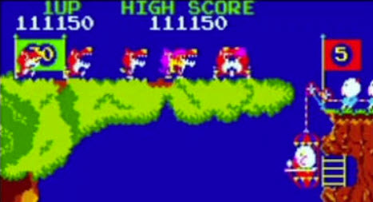

>>> deploy: 
>>>   +pooyan.jpg 
>>>   Hardware.md 
>>>   RAMUse.md 
>>>   %Code.md 

# Pooyan

**Disassembled by Karl Stiefvater**

**Pooyan** (Konami, 1982) is a single-screen shooter in which a mother pig defends her
piglets from a pack of wolves. Mama rides a **lift** up and down one edge of the screen and
fires **arrows** across it, while the wolves attack by floating on **balloons**.

The game alternates between two boards. On the **descent** board the wolves drift **down**
from the top of a cliff on balloons toward the piglets waiting below; you pop a balloon with
an arrow to drop its wolf before it lands. On the **ascent** board the wolves rise **up** the
cliff on balloons and you must stop them before they reach the top. A wolf whose balloon
bursts falls away; wolves that get through press the attack, and the pack lobs **rocks** at
the lift. Between the ordinary arrows you can launch a large **piece of meat** that sweeps
several balloons at once. Clear every wolf to finish the board; the boards then repeat,
faster and more crowded.

## Navigation

  * [Hardware](Hardware.md) — CPU, memory map, I/O ports, the LS259 control latch, tilemap/sprite layout
  * [Work RAM](RAMUse.md) — the named work-RAM cells (0x8800–0x8FFF)
  * [Main CPU code](Code.md) — the annotated Z80 disassembly

## About this disassembly

This disassembly, RAM map, and game description were **produced by AI** and are **verified against the original ROM and against MAME**. 
The recovered code was checked to reproduce the
ROM's own execution frame-for-frame, and the game model was confirmed by observing the real
game running under MAME. It is offered here transparently, as AI work, precisely because it is
machine-checked rather than hand-asserted — so verify it against that evidence. Project:
[https://github.com/qarl/arcade-js](https://github.com/qarl/arcade-js).

The disassembly covers the code reached from the two entry points — the reset vector
(`0x0000`) and the vblank NMI (`0x0066`); ROM data tables (tilemaps, lookup tables, sprite and
layout data, text) are shown as data.
