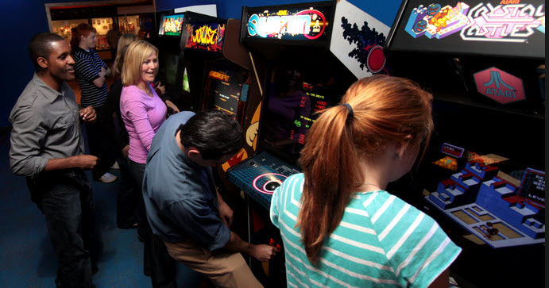

# Arcade

>>> deploy: 
>>>    +Arcade.jpg 
>>>    Asteroids:Asteroids 80% 
>>>    CrazyClimber:Crazy Climber 1% 
>>>    Defender:Defender 75% 
>>>    Frogger:Frogger (Sound) 
>>>    Galaga:Galaga 5% 
>>>    MoonPatrol:Moon Patrol 75% 
>>>    OmegaRace:Omega Race 10% 
>>>    Phoenix:Phoenix 70% 
>>>    SpaceInvaders:Space Invaders 
>>>    TimePilot:Time Pilot (Sound) 
>>>    SeaWolf:Sea Wolf 1% 
>>>    Scramble:Scramble 1% 

[https://en.wikipedia.org/wiki/Arcade_game](https://en.wikipedia.org/wiki/Arcade_game)

[http://allincolorforaquarter.blogspot.com/2013/03/arcade-origins.html](http://allincolorforaquarter.blogspot.com/2013/03/arcade-origins.html)

# Disassemblies

  * [Asteroids](Asteroids)
  * [Crazy Climber](CrazyClimber)
  * [Defender](Defender)
  * [Frogger](Frogger)
  * [Galaga](Galaga)
  * [Moon Patrol](MoonPatrol)
  * [Omega Race](OmegaRace)
  * [Phoenix](Phoenix)
  * [Space Invaders](SpaceInvaders)
  * [Time Pilot](TimePilot)
  * [Sea Wolf](SeaWolf)
  * [Scramble](Scramble)
