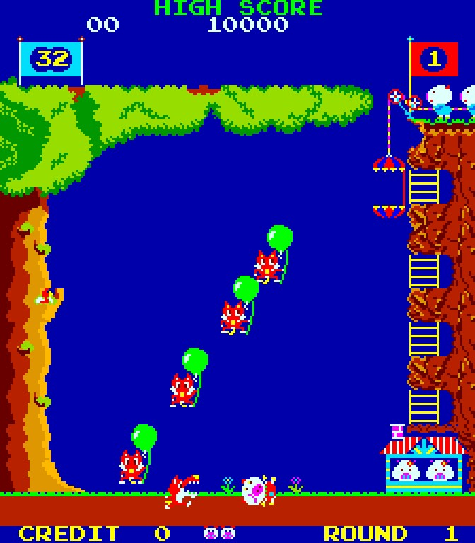

# Pooyan

>>> cpu Z80

>>> binary 0000:roms/1.4a + roms/2.5a + roms/3.6a + roms/4.7a

>>> memoryTable hard

[Hardware Info](Hardware.md)

>>> memoryTable ram

[RAM Usage](RAMUse.md)

```code
; Pooyan (Konami, 1982).
;
; Architecture: on reset ($0000) the CPU jumps to
; runSelfTestAndInitMachineState ($0092). What follows is the code reached
; from the reset and interrupt entry points, shown as instructions; spans
; never reached appear as data (the "---- data ----" blocks).


; power-on reset vector: disable the vblank NMI latch, then tail into the
; boot entry runSelfTestAndInitMachineState
disableNmiAndEnterBoot:
0000: AF              XOR     A                   ; zero the value that will silence the interrupt latch
0001: 32 80 A1        LD      ($A180),A           ; clear the vblank-interrupt-enable latch -- hold the per-frame interrupt off until state exists
0004: C3 92 00        JP      $0092               ; {code.runSelfTestAndInitMachineState} enter the power-on boot

; ---- $0007-$000F: data ----
0007: FF 77 3C 23 77 3C 19 C9 FF

; fill a run of bytes with a constant, advancing the pointer (a zero
; counter fills 256)
fillByteRun:
0010: 77              LD      (HL),A              ; store the fill byte into the current cell
0011: 23              INC     HL                  ; step to the next cell
0012: 10 FC           DJNZ    $0010               ; {code.fillByteRun} repeat for the whole run -- a count of zero means a full 256 bytes
0014: C9              RET                         

; ---- $0015-$0016: data ----
0015: FF FF

loc_0017:
0017: FF              RST     $38                 

loc_0018:
0018: 77              LD      (HL),A              ; store the fill byte -- inner run of the two-level block fill
0019: 23              INC     HL                  ; step to the next cell
001A: 10 FC           DJNZ    $0018               ; {code.loc_0018} repeat the inner run
001C: 0D              DEC     C                   ; count down the outer run
001D: 20 F9           JR      NZ,$0018            ; {code.loc_0018} restart the inner run for each outer pass
001F: C9              RET                         

; rst-0x20 byte-table lookup: HL += A then A := (HL)
fetchByteFromTableIndex:
0020: 85              ADD     A,L                 ; add the byte index onto the table base
0021: 6F              LD      L,A                 
0022: 3E 00           LD      A,$00               
0024: 8C              ADC     A,H                 ; carry the index into the high byte -- a full 16-bit table offset
0025: 67              LD      H,A                 
0026: 7E              LD      A,(HL)              ; read the table entry at base plus index
0027: C9              RET                         

loc_0028:
0028: 87              ADD     A,A                 
0029: E1              POP     HL                  
002A: 5F              LD      E,A                 
002B: 16 00           LD      D,$00               
002D: 19              ADD     HL,DE               
002E: 5E              LD      E,(HL)              
002F: 23              INC     HL                  

loc_0030:
0030: 56              LD      D,(HL)              
0031: EB              EX      DE,HL               

loc_0032:
0032: E9              JP      (HL)                

; ---- $0033-$0037: data ----
0033: FF FF FF FF FF

; enqueue a two-byte display command into the page-0x88 display-command
; ring
enqueueDisplayCommand:
0038: E5              PUSH    HL                  
0039: 26 88           LD      H,$88               ; point at the command-ring page
003B: 3A A0 88        LD      A,($88A0)           ; {hard.workRam+A0} read the ring's write cursor -- the low byte of the next slot
003E: 6F              LD      L,A                 
003F: CB 7E           BIT     7,(HL)              ; test the slot's free bit -- bit 7 set means free to write
0041: 28 0E           JR      Z,$0051             ; {code.loc_0051} slot still occupied -- drop this command silently
0043: 72              LD      (HL),D              ; store the command's high byte into the slot
0044: 2C              INC     L                   ; step to the next slot
0045: 73              LD      (HL),E              ; store the command's low byte
0046: 2C              INC     L                   ; advance the cursor past the pair
0047: 7D              LD      A,L                 
0048: FE C0           CP      $C0                 ; did the cursor run off the top of the ring body?
004A: 30 02           JR      NC,$004E            ; {code.loc_004e}
004C: 3E C0           LD      A,$C0               ; wrap it back to the ring start

loc_004e:
004E: 32 A0 88        LD      ($88A0),A           ; {hard.workRam+A0} commit the advanced write cursor

loc_0051:
0051: E1              POP     HL                  
0052: C9              RET                         

; ---- $0053-$0065: data ----
0053: 0F 33 31 24 22 21 15 13 11 07 06 05 04 03 02 01
0063: FF FF FF

; Z80 NMI vector: jump to the vblank service routine runVblankNmiService
enterVblankService:
0066: C3 6D 06        JP      $066D               ; {code.runVblankNmiService} vblank interrupt vector -- jump into the per-frame service

; ---- $0069-$0082: data ----
0069: 00 11 22 04 31 06 15 02 33 07 21 03 24 05 13 01
0079: 00 33 05 61 BE 05 66 07 06 DD

; A start-up self-test reference table walked as data; the boot entry runs
; just past it.
; ---- $0083-$0091: boot self-test checksum reference table ----
0083: A8 05 60 BC 04 A6 51 05 38 8A 06 AD BA 05 CA

; power-on boot entry: program-memory self-test + full initial
; RAM/ring/DSW setup, then hand off to the main-loop generator
runSelfTestAndInitMachineState:
0092: 32 00 A0        LD      ($A000),A           ; boot entry -- kick the watchdog
0095: 31 00 90        LD      SP,$9000            ; seat the stack just below the top work cell
0098: 32 00 88        LD      ($8800),A           ; {hard.workRam} clear the first config cell
009B: 06 08           LD      B,$08               ; eight 4K program banks to checksum
009D: C5              PUSH    BC                  ; reserve the top word for the self-test tally
009E: 21 00 00        LD      HL,$0000            ; start the running sum at the bottom of program ROM
00A1: DD 21 79 00     LD      IX,$0079            ; point at the reference-checksum table

loc_00a5:
00A5: 11 00 00        LD      DE,$0000            ; clear this bank's low and mid sum bytes
00A8: 4A              LD      C,D                 ; clear the high sum byte

loc_00a9:
00A9: 7B              LD      A,E                 
00AA: 86              ADD     A,(HL)              ; fold the next ROM byte into the running low sum
00AB: 5F              LD      E,A                 
00AC: 30 04           JR      NC,$00B2            ; {code.loc_00b2}
00AE: 14              INC     D                   ; carry into the mid sum byte
00AF: 20 01           JR      NZ,$00B2            ; {code.loc_00b2}
00B1: 0C              INC     C                   ; carry on into the high sum byte -- a 24-bit rolling sum

loc_00b2:
00B2: 2C              INC     L                   ; advance within the 256-byte page
00B3: 20 F4           JR      NZ,$00A9            ; {code.loc_00a9} sum the whole page
00B5: 24              INC     H                   ; step to the next page
00B6: 7C              LD      A,H                 
00B7: E6 0F           AND     $0F                 ; sixteen pages make one 4K bank
00B9: 20 EE           JR      NZ,$00A9            ; {code.loc_00a9} keep summing until the bank is done
00BB: 32 00 A0        LD      ($A000),A           ; kick the watchdog between banks
00BE: 7B              LD      A,E                 
00BF: DD BE 00        CP      (IX+$00)            ; compare the low sum against this bank's reference
00C2: 20 0C           JR      NZ,$00D0            ; {code.loc_00d0} any byte off -- the bank fails
00C4: 7A              LD      A,D                 
00C5: DD BE 01        CP      (IX+$01)            ; compare the mid sum
00C8: 20 06           JR      NZ,$00D0            ; {code.loc_00d0}
00CA: 79              LD      A,C                 
00CB: DD BE 02        CP      (IX+$02)            ; compare the high sum
00CE: 28 02           JR      Z,$00D2             ; {code.loc_00d2} all three match -- the bank is intact

loc_00d0:
00D0: 18 06           JR      $00D8               ; {code.loc_00d8} skip the pass count on a failed bank

loc_00d2:
00D2: E5              PUSH    HL                  
00D3: 21 FF 8F        LD      HL,$8FFF            ; point at the self-test pass tally
00D6: 34              INC     (HL)                ; count this bank as passed
00D7: E1              POP     HL                  

loc_00d8:
00D8: DD 23           INC     IX                  ; advance to the next bank's three-byte reference
00DA: DD 23           INC     IX                  
00DC: DD 23           INC     IX                  
00DE: 10 C5           DJNZ    $00A5               ; {code.loc_00a5} repeat for all eight banks
00E0: 3A E0 A0        LD      A,($A0E0)           ; read DIP bank 0
00E3: E6 0F           AND     $0F                 ; isolate its low nibble
00E5: 21 69 00        LD      HL,$0069            ; point at a small selector table
00E8: E7              RST     $20                 ; look up the entry for that nibble
00E9: 7E              LD      A,(HL)              
00EA: B7              OR      A                   
00EB: 18 16           JR      $0103               ; {code.loc_0103} continue into the work-RAM wipe

; ---- $00ED-$0102: data ----
00ED: 57 E6 0F 5F AA 0F 0F 0F 0F CD FA 00 7B FE 0A 38
00FD: 02 C6 07 77 09 C9

loc_0103:
0103: 32 00 A0        LD      ($A000),A           ; kick the watchdog
0106: 21 00 88        LD      HL,$8800            ; point at the base of work RAM
0109: 11 01 88        LD      DE,$8801            
010C: 01 FD 07        LD      BC,$07FD            ; span work RAM but its two top cells
010F: 36 00           LD      (HL),$00            ; seed the first cell to zero
0111: ED B0           LDIR                        ; wipe work RAM to a known-blank state
0113: 3E 08           LD      A,$08               
0115: 32 42 8A        LD      ($8A42),A           ; {hard.workRam+242} seed the sound-side work cell
0118: 21 C0 88        LD      HL,$88C0            ; point at the display-command ring buffer
011B: 06 40           LD      B,$40               
011D: 3E FF           LD      A,$FF               
011F: D7              RST     $10                 ; mark every display-command slot empty
0120: 21 43 8A        LD      HL,$8A43            ; point at the sound-command ring buffer
0123: 06 1C           LD      B,$1C               
0125: D7              RST     $10                 ; mark every sound-command slot empty
0126: 21 43 43        LD      HL,$4343            
0129: 22 40 8A        LD      ($8A40),HL          ; {hard.workRam+240} park the sound ring's read and write cursors at its origin
012C: 32 00 A0        LD      ($A000),A           ; kick the watchdog
012F: 3E 01           LD      A,$01               
0131: 32 87 A1        LD      ($A187),A           ; select the upright screen at the hardware flip latch
0134: 32 1F 88        LD      ($881F),A           ; {hard.workRam+1F} mirror the upright flag into work RAM -- the master orientation copy
0137: 21 C0 C0        LD      HL,$C0C0            
013A: 22 A0 88        LD      ($88A0),HL          ; {hard.workRam+A0} park the display ring's read and write cursors at its origin
013D: 21 00 80        LD      HL,$8000            ; point at the colour/attribute plane
0140: 11 01 80        LD      DE,$8001            
0143: 36 10           LD      (HL),$10            ; the default attribute byte
0145: 01 00 04        LD      BC,$0400            
0148: ED B0           LDIR                        ; flood the whole colour plane with the default attribute
014A: CD E6 02        CALL    $02E6               ; {code.seedTileFillCursor} arm the row-by-row tile fill from the tile-plane base
014D: 32 00 A0        LD      ($A000),A           ; kick the watchdog
0150: 3A 00 A0        LD      A,($A000)           ; read DIP bank 1
0153: 2F              CPL                         ; the switch bank is wired active-low -- complement it
0154: 0F              RRCA                        
0155: 0F              RRCA                        ; rotate DIP1 bit 2 down to bit 0
0156: 47              LD      B,A                 
0157: E6 01           AND     $01                 
0159: 32 0F 88        LD      ($880F),A           ; {hard.workRam+F} store the cabinet-type flag
015C: 78              LD      A,B                 
015D: 0F              RRCA                        ; expose DIP1 bit 3
015E: 47              LD      B,A                 
015F: E6 01           AND     $01                 
0161: 32 00 88        LD      ($8800),A           ; {hard.workRam} store the bonus / extra-life award selector
0164: 78              LD      A,B                 
0165: 0F              RRCA                        ; expose DIP1 bits 4-6
0166: 47              LD      B,A                 
0167: E6 07           AND     $07                 
0169: 32 20 88        LD      ($8820),A           ; {hard.workRam+20} store the difficulty level
016C: 78              LD      A,B                 
016D: 0F              RRCA                        ; expose DIP1 bit 7
016E: 0F              RRCA                        
016F: 0F              RRCA                        
0170: 47              LD      B,A                 
0171: E6 01           AND     $01                 
0173: 32 21 88        LD      ($8821),A           ; {hard.workRam+21} store the demo / attract-sounds enable
0176: 3A 00 A0        LD      A,($A000)           ; read DIP bank 1 again for the lives setting
0179: 2F              CPL                         ; complement the active-low bank
017A: E6 03           AND     $03                 ; take the low two bits -- the lives selector
017C: FE 03           CP      $03                 ; a pair of set bits is the special setting
017E: 28 04           JR      Z,$0184             ; {code.loc_0184}
0180: C6 03           ADD     A,$03               ; otherwise lives is the selector plus three -- three, four or five
0182: 18 02           JR      $0186               ; {code.loc_0186}

loc_0184:
0184: 3E FF           LD      A,$FF               ; the special lives setting

loc_0186:
0186: 32 07 88        LD      ($8807),A           ; {hard.workRam+7} store the starting lives
0189: 3A E0 A0        LD      A,($A0E0)           ; read DIP bank 0 -- the coinage bank
018C: 47              LD      B,A                 
018D: E6 F0           AND     $F0                 ; take the high nibble -- coin slot 2 coinage
018F: 0F              RRCA                        ; shift it down to a table index
0190: 0F              RRCA                        
0191: 0F              RRCA                        
0192: 0F              RRCA                        
0193: 21 53 00        LD      HL,$0053            ; point at the coinage table
0196: E7              RST     $20                 ; look up the coin-slot-2 credit descriptor
0197: 32 2F 88        LD      ($882F),A           ; {hard.workRam+2F} store the coin-slot-2 coinage config
019A: 78              LD      A,B                 
019B: E6 0F           AND     $0F                 ; take the low nibble -- coin slot 1 coinage
019D: 21 53 00        LD      HL,$0053            ; point at the coinage table
01A0: E7              RST     $20                 ; look up the coin-slot-1 credit descriptor
01A1: 32 2C 88        LD      ($882C),A           ; {hard.workRam+2C} store the coin-slot-1 coinage config -- 0x0f means free play
01A4: 32 00 A0        LD      ($A000),A           ; kick the watchdog
01A7: CD EA 01        CALL    $01EA               ; {code.clearSpriteBanksAndBlankVideoRam} clear the sprite banks and blank the lower tile map
01AA: AF              XOR     A                   
01AB: CD 8F 0E        CALL    $0E8F               ; {code.sendSoundCommand} silence the audio processor
01AE: 3E 01           LD      A,$01               
01B0: 32 80 A1        LD      ($A180),A           ; enable the vblank interrupt -- the per-frame heartbeat begins
01B3: 21 00 8A        LD      HL,$8A00            ; point at the high-score table
01B6: 06 0A           LD      B,$0A               ; ten default entries

loc_01b8:
01B8: 36 00           LD      (HL),$00            
01BA: 2C              INC     L                   
01BB: 36 00           LD      (HL),$00            
01BD: 2C              INC     L                   
01BE: 36 01           LD      (HL),$01            ; seed each entry to the 10000-point default
01C0: 2C              INC     L                   
01C1: 10 F5           DJNZ    $01B8               ; {code.loc_01b8} lay down all ten default high scores
01C3: 21 AA 88        LD      HL,$88AA            
01C6: 36 01           LD      (HL),$01            ; seed the live top-score leading byte to 10000
01C8: 32 00 A0        LD      ($A000),A           ; kick the watchdog
01CB: 21 C0 89        LD      HL,$89C0            ; point at the status-panel digit source
01CE: AF              XOR     A                   
01CF: 06 1E           LD      B,$1E               
01D1: D7              RST     $10                 ; clear the panel digit source so it starts blank
01D2: C3 0F 02        JP      $020F               ; {code.mainLoop} enter the main loop -- never returns

; ---- $01D5-$01D9: data ----
01D5: 32 00 A0 18 FB

loc_01da:
01DA: 0B              DEC     BC                  
01DB: 32 00 A0        LD      ($A000),A           ; kick the watchdog while waiting
01DE: 3A 80 A0        LD      A,($A080)           ; poll the input port
01E1: CB 5F           BIT     3,A                 ; test the awaited input bit
01E3: C0              RET     NZ                  ; return once it is set
01E4: 78              LD      A,B                 
01E5: B1              OR      C                   
01E6: 20 F2           JR      NZ,$01DA            ; {code.loc_01da} keep waiting until the countdown drains
01E8: 37              SCF                         ; flag the timeout
01E9: C9              RET                         

; boot RAM clear: fill both sprite-bank tops with A + blank lower video
; RAM to tile 0x1e, then cycle-only settle-delay
clearSpriteBanksAndBlankVideoRam:
01EA: 21 10 94        LD      HL,$9410            ; point at sprite bank 1's active-record window
01ED: 06 30           LD      B,$30               ; its 0x30-byte record window
01EF: D7              RST     $10                 ; flood bank 1's window with the fill byte
01F0: 21 10 90        LD      HL,$9010            ; point at sprite bank 0's window
01F3: 06 30           LD      B,$30               
01F5: D7              RST     $10                 ; flood bank 0's window -- both banks cleared
01F6: 21 40 84        LD      HL,$8440            ; point into the tile-code plane
01F9: 11 41 84        LD      DE,$8441            
01FC: 01 BF 03        LD      BC,$03BF            
01FF: 36 1E           LD      (HL),$1E            ; the blank / erase tile
0201: ED B0           LDIR                        ; paint the playfield tile plane blank

loc_0203:
0203: 00              NOP                         ; top of the settle wait -- the no-ops burn a fixed slice each pass
0204: 00              NOP                         
0205: 00              NOP                         
0206: 10 FB           DJNZ    $0203               ; {code.loc_0203} burn time -- inner settle delay
0208: 32 00 A0        LD      ($A000),A           ; kick the watchdog through the wait
020B: 0D              DEC     C                   ; count down the outstanding settle passes
020C: 20 F5           JR      NZ,$0203            ; {code.loc_0203} repeat the settle delay
020E: C9              RET                         

; the main-loop state driver: each iteration runs the per-frame worker or
; dispatches one display-ring handler; as the generator it drains the ring
; within a frame and yields at the worker/ring-idle vblank boundary
mainLoop:
020F: 26 88           LD      H,$88               ; point at the command-ring page
0211: 3A A1 88        LD      A,($88A1)           ; {hard.workRam+A1} read the ring's read cursor
0214: 6F              LD      L,A                 
0215: 7E              LD      A,(HL)              ; fetch the next queued command byte
0216: 87              ADD     A,A                 ; shift out its high bit -- the once-per-frame worker marker
0217: 30 05           JR      NC,$021E            ; {code.loc_021e} an ordinary command -- go dispatch it
0219: CD 54 02        CALL    $0254               ; {code.repaintScrollColumnsElseVerifySignature} worker marker reached -- run the per-frame worker
021C: 18 F1           JR      $020F               ; {code.mainLoop} loop back and keep draining the ring

loc_021e:
021E: E6 1F           AND     $1F                 ; mask the command's handler index
0220: 4F              LD      C,A                 
0221: 06 00           LD      B,$00               
0223: 36 FF           LD      (HL),$FF            ; free this ring slot
0225: 23              INC     HL                  

loc_0226:
0226: 5E              LD      E,(HL)              ; read the command's argument byte
0227: 36 FF           LD      (HL),$FF            ; free the argument slot
0229: 2C              INC     L                   ; advance the read cursor past the pair
022A: 7D              LD      A,L                 
022B: FE C0           CP      $C0                 ; did it wrap below the ring body?
022D: 30 02           JR      NC,$0231            ; {code.loc_0231}
022F: 3E C0           LD      A,$C0               ; wrap the read cursor to the ring start

loc_0231:
0231: 32 A1 88        LD      ($88A1),A           ; {hard.workRam+A1} commit the advanced read cursor
0234: 7B              LD      A,E                 
0235: 21 42 02        LD      HL,$0242            ; point at the command-handler table
0238: 09              ADD     HL,BC               ; index it by the handler number
0239: 5E              LD      E,(HL)              ; fetch the handler address
023A: 23              INC     HL                  
023B: 56              LD      D,(HL)              
023C: 21 0F 02        LD      HL,$020F            
023F: E5              PUSH    HL                  ; arrange to return into the drain loop
0240: EB              EX      DE,HL               
0241: E9              JP      (HL)                ; run the command handler

; ---- $0242-$0246: data ----
0242: 9B 03 C2 03 E9

; Little-endian ROM addresses of the command handlers, indexed by command
; id and read as data by the command dispatcher.
; ---- $0247-$0253: command dispatch pointer table ----
0247: 03 96 04 52 05 6B 05 B2 05 EE 05 44 06

; per-frame scroll worker dispatched by the main loop: repaint the scroll
; tile columns, or run the program-signature check when the control byte's
; low nibble is set
repaintScrollColumnsElseVerifySignature:
0254: 3A 3F 88        LD      A,($883F)           ; {hard.workRam+3F} read the free-running control byte
0257: 47              LD      B,A                 ; keep it for the bit tests below
0258: E6 0F           AND     $0F                 ; take its low nibble -- zero on just one frame in sixteen
025A: CA 61 02        JP      Z,$0261             ; {code.loc_0261} on that frame, repaint the scroll columns
025D: CD 8C 20        CALL    $208C               ; {code.verifyRomSignature} otherwise run the program-signature self-test
0260: C9              RET                         

loc_0261:
0261: 3A 06 88        LD      A,($8806)           ; {hard.workRam+6} scrolling exists only during a game -- test the in-play gate
0264: A7              AND     A                   
0265: C8              RET     Z                   ; not in play -- nothing to scroll
0266: 11 E0 FF        LD      DE,$FFE0            ; stride of one tilemap row up
0269: 21 E0 84        LD      HL,$84E0            ; point at the mode-dependent side column
026C: 3A 0E 88        LD      A,($880E)           ; {hard.workRam+E} one- or two-player game?
026F: A7              AND     A                   
0270: 28 22           JR      Z,$0294             ; {code.loc_0294} one player -- erase the player-2 strip
0272: 36 02           LD      (HL),$02            ; two players -- cap the column with its top tile
0274: CD AA 02        CALL    $02AA               ; {code.paintColumnBodyTiles} paint the two body tiles below the cap

loc_0277:
0277: 21 40 87        LD      HL,$8740            ; point at the shared scroll column
027A: CD A8 02        CALL    $02A8               ; {code.stampCappedTileColumn} stamp a fresh capped column -- the edge that appears to scroll
027D: 3A 0D 88        LD      A,($880D)           ; {hard.workRam+D} which player's banks are active?
0280: A7              AND     A                   
0281: 21 40 87        LD      HL,$8740            ; player 1 uses the shared column
0284: 28 03           JR      Z,$0289             ; {code.loc_0289}
0286: 21 E0 84        LD      HL,$84E0            ; player 2 uses the capped column

loc_0289:
0289: CB 60           BIT     4,B                 ; the control byte's 16-frame toggle gates the extra blank
028B: C8              RET     Z                   
028C: 3A 06 88        LD      A,($8806)           ; {hard.workRam+6} and the in-play gate's low bit must be set too
028F: 0F              RRCA                        
0290: D0              RET     NC                  
0291: C3 B1 02        JP      $02B1               ; {code.blankTileColumn} erase the vacated column so no stale tile trails behind

loc_0294:
0294: 21 E0 84        LD      HL,$84E0            ; point at the top of the player-2 strip
0297: CD B1 02        CALL    $02B1               ; {code.blankTileColumn} blank the capped column
029A: 21 21 85        LD      HL,$8521            ; where player 2's score would sit
029D: CD B1 02        CALL    $02B1               ; {code.blankTileColumn} blank the next three cells
02A0: CD B1 02        CALL    $02B1               ; {code.blankTileColumn} and three more
02A3: CD B1 02        CALL    $02B1               ; {code.blankTileColumn} and the last three -- the whole strip erased
02A6: 18 CF           JR      $0277               ; {code.loc_0277} then paint the shared scroll column

; stamp a three-tile vertical tilemap column (cap + two body tiles)
stampCappedTileColumn:
02A8: 36 01           LD      (HL),$01            ; stamp the cap tile at the top of the column

; stamp a tilemap column's two body tiles (mid + base)
paintColumnBodyTiles:
02AA: 19              ADD     HL,DE               ; step down one row
02AB: 36 25           LD      (HL),$25            ; lay the middle body tile
02AD: 19              ADD     HL,DE               ; step down another row
02AE: 36 20           LD      (HL),$20            ; lay the base tile -- the three-cell column stands
02B0: C9              RET                         

; clear a three-cell tilemap column to the blank tile
blankTileColumn:
02B1: 3E 10           LD      A,$10               ; the blank / erase tile
02B3: 77              LD      (HL),A              ; erase the top cell
02B4: 19              ADD     HL,DE               ; step down one row
02B5: 77              LD      (HL),A              ; erase the middle cell
02B6: 19              ADD     HL,DE               ; step down another row
02B7: 77              LD      (HL),A              ; erase the bottom cell
02B8: C9              RET                         

; zero the board-init RAM regions (sprite display list + actor/object
; arena)
zeroSpriteListAndActorArena:
02B9: 21 40 88        LD      HL,$8840            ; point at the sprite display list
02BC: 06 60           LD      B,$60               ; its 0x60 bytes -- 24 four-byte entries
02BE: AF              XOR     A                   ; the zero fill byte
02BF: D7              RST     $10                 ; clear the whole display list -- every sprite off screen
02C0: 21 80 8A        LD      HL,$8A80            ; point at the actor arena
02C3: D7              RST     $10                 ; clear one full page of records
02C4: D7              RST     $10                 ; clear the second page
02C5: 06 37           LD      B,$37               ; the arena's 0x37-byte tail
02C7: D7              RST     $10                 ; clear the tail -- every slot-active flag now reads empty
02C8: C9              RET                         

; clear the board-init RAM regions, then blank one tilemap row at the fill
; cursor and decrement the row counter (Z = drained)
clearBoardRamAndBlankFillRow:
02C9: CD B9 02        CALL    $02B9               ; {code.zeroSpriteListAndActorArena} zero the sprite list and actor arena first
02CC: 06 1D           LD      B,$1D               ; 29 visible cells to blank this row

; row-by-row VRAM tile fill: blank B tiles at the fill cursor
; (fillByteRun), advance one row (+0x20-B), store cursor, dec row counter;
; Z = drained
blankFillRowAndStepCounter:
02CE: 3E 20           LD      A,$20               
02D0: 90              SUB     B                   ; row remainder -- the full row width minus the cells just blanked
02D1: 5F              LD      E,A                 
02D2: 16 00           LD      D,$00               
02D4: 2A 0B 88        LD      HL,($880B)          ; {hard.workRam+B} load the row-fill cursor
02D7: 3E 10           LD      A,$10               ; the blank tile
02D9: D7              RST     $10                 ; blank this row's cells
02DA: 19              ADD     HL,DE               ; skip the off-screen remainder to the next row's start
02DB: 22 0B 88        LD      ($880B),HL          ; {hard.workRam+B} store the cursor for the next frame
02DE: 21 09 88        LD      HL,$8809            
02E1: 35              DEC     (HL)                ; count this row off -- reports drained when the last row is done
02E2: C9              RET                         

; arm the row-by-row tile fill from the fixed VRAM start (the reset-
; to-0x8402 variant)
armTileFillFromPlayfieldBase:
02E3: 21 02 84        LD      HL,$8402            ; seed the fill cursor at the fixed top of the tile plane

; arm the row-by-row tile fill: point the write cursor + seed the row
; count
seedTileFillCursor:
02E6: 22 0B 88        LD      ($880B),HL          ; {hard.workRam+B} store the fill cursor
02E9: 3E 20           LD      A,$20               ; the full 32-row grid height
02EB: 32 09 88        LD      ($8809),A           ; {hard.workRam+9} seed the remaining-row counter
02EE: C9              RET                         

; per-frame sprite display-list rebuild (4 record groups + arrow Y-tick +
; flip-mirror tail)
rebuildSpriteDisplayList:
02EF: 21 40 88        LD      HL,$8840            ; point at the head of the sprite display list
02F2: DD 21 80 8A     LD      IX,$8A80            ; source the two lead actors
02F6: 11 18 00        LD      DE,$0018            ; records are 0x18 bytes apart
02F9: 06 02           LD      B,$02               ; two entries
02FB: CD 2A 03        CALL    $032A               ; {code.copyObjectRecordsToDisplayList} harvest the lead actors into the list
02FE: DD 21 90 8C     LD      IX,$8C90            ; source the two hunter / target records
0302: 06 02           LD      B,$02               
0304: CD 2A 03        CALL    $032A               ; {code.copyObjectRecordsToDisplayList} harvest them as the next two entries
0307: DD 21 E0 8A     LD      IX,$8AE0            ; source the eighteen general moving objects
030B: 06 12           LD      B,$12               ; eighteen entries
030D: CD 43 03        CALL    $0343               ; {code.buildDisplayEntriesFromMovingObjects} build their entries with sub-pixel coordinate math
0310: DD 21 B0 8A     LD      IX,$8AB0            ; source the two arrow / launch records
0314: 06 02           LD      B,$02               
0316: CD 2A 03        CALL    $032A               ; {code.copyObjectRecordsToDisplayList} harvest them as the final two entries
0319: 21 98 88        LD      HL,$8898            ; the first arrow entry's Y byte
031C: 35              DEC     (HL)                ; drift the first arrow up one pixel
031D: 21 9C 88        LD      HL,$889C            ; the second arrow entry's Y byte

; tick a caller-set frame counter, then run the flip-screen mirror pass
; when the orientation flag is zero
tickCounterAndMirrorIfFlipped:
0320: 35              DEC     (HL)                ; drift the second arrow up one pixel
0321: 3A 1F 88        LD      A,($881F)           ; {hard.workRam+1F} read the screen-orientation flag
0324: A7              AND     A                   
0325: C0              RET     NZ                  ; upright -- the sprites are already correct
0326: CD 78 03        CALL    $0378               ; {code.mirrorSpriteListVertically} screen flipped -- mirror the whole sprite list
0329: C9              RET                         

; copy four raw bytes of each object record into the sprite display list
copyObjectRecordsToDisplayList:
032A: DD 7E 06        LD      A,(IX+$06)          ; pick the record's Y field into the list
032D: 77              LD      (HL),A              
032E: 2C              INC     L                   
032F: DD 7E 10        LD      A,(IX+$10)          ; then its attribute byte
0332: 77              LD      (HL),A              
0333: 2C              INC     L                   
0334: DD 7E 04        LD      A,(IX+$04)          ; then its X field
0337: 77              LD      (HL),A              
0338: 2C              INC     L                   
0339: DD 7E 0F        LD      A,(IX+$0F)          ; then its tile-code byte -- one four-byte sprite entry
033C: 77              LD      (HL),A              
033D: 2C              INC     L                   
033E: DD 19           ADD     IX,DE               ; step to the next record
0340: 10 E8           DJNZ    $032A               ; {code.copyObjectRecordsToDisplayList} repeat for each record in the group
0342: C9              RET                         

; build sprite display-list entries from moving-object records, deriving
; screen coordinates from their sub-pixel position pairs
buildDisplayEntriesFromMovingObjects:
0343: DD 4E 05        LD      C,(IX+$05)          ; take the object's sub-pixel low byte
0346: DD 7E 06        LD      A,(IX+$06)          ; and its whole-position byte
0349: CB 01           RLC     C                   ; scale the 16-bit position down to a screen coordinate
034B: 17              RLA                         
034C: CB 01           RLC     C                   
034E: 17              RLA                         
034F: CB 01           RLC     C                   
0351: 17              RLA                         
0352: D6 08           SUB     $08                 ; bias to the sprite's fixed origin
0354: 77              LD      (HL),A              ; write the first coordinate
0355: 2C              INC     L                   
0356: DD 7E 10        LD      A,(IX+$10)          ; copy the attribute byte raw
0359: 77              LD      (HL),A              
035A: 2C              INC     L                   
035B: DD 7E 04        LD      A,(IX+$04)          ; take the other axis's whole-position byte
035E: DD 4E 03        LD      C,(IX+$03)          ; and its sub-pixel low byte
0361: CB 01           RLC     C                   ; scale it down the same way
0363: 17              RLA                         
0364: CB 01           RLC     C                   
0366: 17              RLA                         
0367: CB 01           RLC     C                   
0369: 17              RLA                         
036A: D6 08           SUB     $08                 ; bias to the sprite origin
036C: 77              LD      (HL),A              ; write the second coordinate
036D: 2C              INC     L                   
036E: DD 7E 0F        LD      A,(IX+$0F)          ; copy the second attribute byte raw
0371: 77              LD      (HL),A              
0372: 2C              INC     L                   
0373: DD 19           ADD     IX,DE               ; step to the next object record
0375: 10 CC           DJNZ    $0343               ; {code.buildDisplayEntriesFromMovingObjects} repeat for all eighteen objects
0377: C9              RET                         

; mirror the sprite display list for a flipped screen
mirrorSpriteListVertically:
0378: 11 40 88        LD      DE,$8840            ; walk the sprite display list
037B: 06 18           LD      B,$18               ; all 24 records

loc_037d:
037D: 1A              LD      A,(DE)              
037E: ED 44           NEG                         ; reflect the first coordinate -- negate it
0380: D6 10           SUB     $10                 ; back off by the sprite's own extent
0382: 12              LD      (DE),A              ; store the reflected coordinate
0383: 1C              INC     E                   
0384: 1A              LD      A,(DE)              
0385: E6 C0           AND     $C0                 ; isolate the attribute's two flip bits
0387: EE C0           XOR     $C0                 ; toggle both -- mirror the sprite's own pixels
0389: 4F              LD      C,A                 
038A: 1A              LD      A,(DE)              
038B: E6 0F           AND     $0F                 ; keep the colour nibble unchanged
038D: B1              OR      C                   ; recombine colour with the toggled flip bits
038E: 12              LD      (DE),A              
038F: 1C              INC     E                   
0390: 1A              LD      A,(DE)              
0391: ED 44           NEG                         ; reflect the second coordinate
0393: D6 10           SUB     $10                 ; back off by the sprite's extent
0395: 12              LD      (DE),A              
0396: 1C              INC     E                   
0397: 1C              INC     E                   ; skip the tile-code byte -- it needs no change
0398: 10 E3           DJNZ    $037D               ; {code.loc_037d} repeat for every record
039A: C9              RET                         

; ---- $039B-$03C1: data ----
039B: 3A 06 88 A7 C8 21 82 84 11 20 00 3A 80 8A 3C FE
03AB: 08 38 02 3E 08 4F 47 36 0C 19 10 FB 3E 08 91 C8
03BB: 47 36 10 19 10 FB C9

; render the phase counter as a vertical HUD gauge
renderPhaseGauge:
03C2: 21 3F 86        LD      HL,$863F            ; point at the bottom cell of the phase gauge
03C5: 11 E0 FF        LD      DE,$FFE0            ; stride of one tilemap row up
03C8: 3A 08 89        LD      A,($8908)           ; {hard.workRam+108} read the phases-remaining counter
03CB: A7              AND     A                   
03CC: C8              RET     Z                   ; zero -- leave the bar as it is
03CD: 3D              DEC     A                   ; filled cells = counter minus one
03CE: 4F              LD      C,A                 
03CF: 28 0D           JR      Z,$03DE             ; {code.loc_03de} none filled -- go blank the whole bar
03D1: FE 05           CP      $05                 ; cap at the five available cells
03D3: 38 02           JR      C,$03D7             ; {code.loc_03d7}
03D5: 3E 05           LD      A,$05               ; clamp to five

loc_03d7:
03D7: 4F              LD      C,A                 
03D8: 47              LD      B,A                 

loc_03d9:
03D9: 36 B0           LD      (HL),$B0            ; stamp a filled segment
03DB: 19              ADD     HL,DE               ; step one row up
03DC: 10 FB           DJNZ    $03D9               ; {code.loc_03d9} fill from the bottom up

loc_03de:
03DE: 3E 05           LD      A,$05               
03E0: 91              SUB     C                   ; cells left above the filled part
03E1: C8              RET     Z                   ; bar full -- done
03E2: 47              LD      B,A                 

loc_03e3:
03E3: 36 10           LD      (HL),$10            ; stamp a blank segment
03E5: 19              ADD     HL,DE               ; step one row up
03E6: 10 FB           DJNZ    $03E3               ; {code.loc_03e3} blank up to the top of the five-cell bar
03E8: C9              RET                         

; paint the attract HUD/score panels: eleven selector fields, the ten-
; entry high-score table as stacked BCD digit pairs, then the digit and
; status panels
paintAttractHudAndHighScores:
03E9: 3E 1A           LD      A,$1A               ; the first canned-field selector
03EB: 06 0B           LD      B,$0B               ; eleven pre-authored fields

loc_03ed:
03ED: F5              PUSH    AF                  
03EE: C5              PUSH    BC                  
03EF: CD B2 05        CALL    $05B2               ; {code.drawStackedCharField} stamp one canned banner / points field
03F2: C1              POP     BC                  
03F3: F1              POP     AF                  
03F4: 3C              INC     A                   ; next field selector
03F5: 10 F6           DJNZ    $03ED               ; {code.loc_03ed} draw all eleven attract fields
03F7: 21 C7 85        LD      HL,$85C7            ; point at where the first high-score digit lands
03FA: 11 20 00        LD      DE,$0020            ; one tilemap row down per digit

loc_03fd:
03FD: 06 0A           LD      B,$0A               ; ten high-score entries
03FF: DD 21 00 8A     LD      IX,$8A00            ; source the packed-BCD high-score table

loc_0403:
0403: CD 29 04        CALL    $0429               ; {code.splitBcdByte} unpack a score byte -- paint its units digit
0406: 77              LD      (HL),A              ; paint its tens digit one row below
0407: 19              ADD     HL,DE               ; drop to the next digit
0408: DD 23           INC     IX                  ; advance to the next score byte
040A: CD 29 04        CALL    $0429               ; {code.splitBcdByte} unpack the middle byte
040D: 77              LD      (HL),A              ; its tens digit
040E: 19              ADD     HL,DE               
040F: DD 23           INC     IX                  
0411: CD 29 04        CALL    $0429               ; {code.splitBcdByte} unpack the top byte
0414: 28 01           JR      Z,$0417             ; {code.loc_0417} the top place is a leading zero -- suppress it
0416: 77              LD      (HL),A              ; otherwise paint the leading digit

loc_0417:
0417: 11 62 FF        LD      DE,$FF62            ; re-base the cursor two cells right for the next entry
041A: 19              ADD     HL,DE               
041B: 11 20 00        LD      DE,$0020            ; restore the one-row-down stride
041E: DD 23           INC     IX                  
0420: 10 E1           DJNZ    $0403               ; {code.loc_0403} paint all ten scores as side-by-side columns
0422: CD 39 04        CALL    $0439               ; {code.renderPanelBcdDigitRows} paint the packed-BCD digit side panel
0425: CD 60 04        CALL    $0460               ; {code.renderPanelFromTable} paint the status-tile side panel
0428: C9              RET                         

; split a packed-BCD byte into two digit tiles: store the low nibble at
; the cursor, advance it, and return the high nibble (Z when zero)
splitBcdByte:
0429: DD 7E 00        LD      A,(IX+$00)          ; read the packed-BCD byte to unpack -- tens in the high nibble, units in the low
042C: 4F              LD      C,A                 ; keep the whole byte -- the high nibble is recovered after the store
042D: E6 0F           AND     $0F                 ; mask to the low nibble -- the units digit
042F: 77              LD      (HL),A              ; paint the units digit into the current cell
0430: 19              ADD     HL,DE               ; step the cursor to the next digit cell
0431: 79              LD      A,C                 ; bring the whole byte back for its high nibble
0432: 0F              RRCA                        ; shift the high nibble down into the low four bits -- the tens digit
0433: 0F              RRCA                        
0434: 0F              RRCA                        
0435: 0F              RRCA                        
0436: E6 0F           AND     $0F                 ; isolate the tens digit -- zero here marks a suppressible leading zero
0438: C9              RET                         

; render ten rows of packed-BCD panel digits into video RAM (delegates the
; per-nibble split)
renderPanelBcdDigitRows:
0439: DD 21 C0 89     LD      IX,$89C0            
043D: 21 67 84        LD      HL,$8467            
0440: 06 0A           LD      B,$0A               

loc_0442:
0442: 11 20 00        LD      DE,$0020            ; stride of one tile-plane row down between stacked digits
0445: DD 23           INC     IX                  ; advance to this group's first source byte
0447: CD 29 04        CALL    $0429               ; {code.splitBcdByte}
044A: 77              LD      (HL),A              ; paint the first byte's tens digit
044B: 19              ADD     HL,DE               ; step down one row
044C: 36 51           LD      (HL),$51            ; lay the fixed separator tile between the two digit pairs
044E: 19              ADD     HL,DE               ; step down another row
044F: DD 23           INC     IX                  ; advance to the group's second source byte
0451: CD 29 04        CALL    $0429               ; {code.splitBcdByte}
0454: 28 01           JR      Z,$0457             ; {code.loc_0457}
0456: 77              LD      (HL),A              ; paint the second byte's tens digit -- skipped when it is a leading zero

loc_0457:
0457: DD 23           INC     IX                  
0459: 11 82 FF        LD      DE,$FF82            
045C: 19              ADD     HL,DE               
045D: 10 E3           DJNZ    $0442               ; {code.loc_0442}
045F: C9              RET                         

; paint the status panel from its tile source table
renderPanelFromTable:
0460: DD 21 00 8E     LD      IX,$8E00            
0464: 21 67 85        LD      HL,$8567            
0467: 06 0A           LD      B,$0A               

loc_0469:
0469: 11 E0 FF        LD      DE,$FFE0            
046C: DD 7E 00        LD      A,(IX+$00)          
046F: A7              AND     A                   
0470: 20 02           JR      NZ,$0474            ; {code.loc_0474}
0472: 3E 40           LD      A,$40               

loc_0474:
0474: 77              LD      (HL),A              
0475: 19              ADD     HL,DE               
0476: DD 23           INC     IX                  
0478: DD 7E 00        LD      A,(IX+$00)          
047B: A7              AND     A                   
047C: 20 02           JR      NZ,$0480            ; {code.loc_0480}
047E: 3E 40           LD      A,$40               

loc_0480:
0480: 77              LD      (HL),A              
0481: 19              ADD     HL,DE               
0482: DD 23           INC     IX                  
0484: DD 7E 00        LD      A,(IX+$00)          
0487: A7              AND     A                   
0488: 20 02           JR      NZ,$048C            ; {code.loc_048c}
048A: 3E 40           LD      A,$40               

loc_048c:
048C: 77              LD      (HL),A              ; write the third (bottom) cell of this panel entry
048D: DD 23           INC     IX                  ; advance to the next source record
048F: 11 42 00        LD      DE,$0042            ; re-base the cursor across to the next panel column
0492: 19              ADD     HL,DE               ; apply the re-base
0493: 10 D4           DJNZ    $0469               ; {code.loc_0469}
0495: C9              RET                         

; ---- $0496-$051B: data ----
0496: 4F 3A 06 88 0F D0 79 A7 28 47 CD F2 04 87 81 4F
04A6: 06 00 21 01 05 09 A7 06 03 1A 8E 27 12 13 23 10
04B6: F8 D5 3A 0D 88 0F 30 02 3E 01 CD 6B 05 D1 1B 21
04C6: AA 88 06 03 1A BE D8 20 05 1B 2B 10 F7 C9 CD F2
04D6: 04 21 A8 88 06 03 1A 77 13 23 10 FA 3E 02 C3 6B
04E6: 05 CD F2 04 21 AB 88 A7 06 03 18 BD F5 3A 0D 88
04F6: 11 A2 88 0F 30 03 11 A5 88 F1 C9 00 00 00 10 00
0506: 00 00 07 00 00 05 00 50 04 00 00 04 00 80 03 00
0516: 50 03 00 30 03 00

loc_051c:
051C: 00              NOP                         ; score-award payouts continue here -- three packed-BCD bytes per entry
051D: 03              INC     BC                  
051E: 00              NOP                         
051F: 80              ADD     A,B                 
0520: 02              LD      (BC),A              
0521: 00              NOP                         
0522: 50              LD      D,B                 
0523: 02              LD      (BC),A              
0524: 00              NOP                         
0525: 30 02           JR      NC,$0529            ; {code.loc_0529}
0527: 00              NOP                         
0528: 00              NOP                         

loc_0529:
0529: 02              LD      (BC),A              ; more score-award payout entries -- three packed-BCD bytes each
052A: 00              NOP                         
052B: 80              ADD     A,B                 
052C: 01 00 50        LD      BC,$5000            
052F: 01 00 30        LD      BC,$3000            
0532: 01 00 00        LD      BC,$0000            
0535: 01 00 50        LD      BC,$5000            
0538: 00              NOP                         
0539: 00              NOP                         
053A: 00              NOP                         
053B: 01 00 00        LD      BC,$0000            
053E: 01 00 00        LD      BC,$0000            
0541: 02              LD      (BC),A              
0542: 00              NOP                         
0543: 00              NOP                         
0544: 04              INC     B                   
0545: 00              NOP                         
0546: 00              NOP                         
0547: 08              EX      AF,AF'              
0548: 00              NOP                         
0549: 00              NOP                         
054A: 16 00           LD      D,$00               
054C: 00              NOP                         
054D: 32 00 00        LD      ($0000),A           ; {hard.rom}
0550: 50              LD      D,B                 
0551: 00              NOP                         

; reset one of three 3-byte BCD counters and repaint it in its HUD column
; via the digit painter
resetBcdCounterAndRepaintColumn:
0552: F5              PUSH    AF                  
0553: 21 A2 88        LD      HL,$88A2            
0556: A7              AND     A                   
0557: 28 09           JR      Z,$0562             ; {code.loc_0562}
0559: 21 A5 88        LD      HL,$88A5            
055C: 3D              DEC     A                   
055D: 28 03           JR      Z,$0562             ; {code.loc_0562}
055F: 21 A8 88        LD      HL,$88A8            

loc_0562:
0562: 36 00           LD      (HL),$00            ; zero the counter's low byte
0564: 23              INC     HL                  
0565: 36 00           LD      (HL),$00            ; zero the counter's middle byte
0567: 23              INC     HL                  
0568: 36 00           LD      (HL),$00            ; zero the counter's high byte -- the score now reads zero
056A: F1              POP     AF                  ; recover the counter selector

; draw one of three packed-BCD counters down a screen column, leading
; zeros blanked
drawBcdCounterColumn:
056B: 21 A4 88        LD      HL,$88A4            ; aim at player 1's score, top byte first -- the score-column painter's entry
056E: DD 21 81 87     LD      IX,$8781            ; and player 1's on-screen score column
0572: A7              AND     A                   ; which counter? test the selector
0573: 28 11           JR      Z,$0586             ; {code.loc_0586}
0575: 21 A7 88        LD      HL,$88A7            ; selector 1 -- player 2's score, top byte
0578: DD 21 21 85     LD      IX,$8521            ; and player 2's score column
057C: 3D              DEC     A                   ; step the selector toward the high-score case
057D: 28 07           JR      Z,$0586             ; {code.loc_0586}
057F: 21 AA 88        LD      HL,$88AA            ; otherwise the high score, top byte
0582: DD 21 41 86     LD      IX,$8641            ; and the high-score column

loc_0586:
0586: 11 E0 FF        LD      DE,$FFE0            
0589: 06 03           LD      B,$03               
058B: 0E 04           LD      C,$04               

loc_058d:
058D: 7E              LD      A,(HL)              ; read the current counter byte
058E: 0F              RRCA                        ; shift its high nibble down into the low four bits -- the more-significant digit
058F: 0F              RRCA                        
0590: 0F              RRCA                        
0591: 0F              RRCA                        
0592: CD 9D 05        CALL    $059D               ; {code.renderDigitWithBlanking}
0595: 7E              LD      A,(HL)              ; re-read the byte for its low nibble -- the less-significant digit
0596: CD 9D 05        CALL    $059D               ; {code.renderDigitWithBlanking}
0599: 2B              DEC     HL                  ; step to the next-lower counter byte
059A: 10 F1           DJNZ    $058D               ; {code.loc_058d}
059C: C9              RET                         

; emit one digit tile with leading-zero blanking and step the cursor
renderDigitWithBlanking:
059D: E6 0F           AND     $0F                 
059F: 28 08           JR      Z,$05A9             ; {code.loc_05a9}
05A1: 0E 00           LD      C,$00               

loc_05a3:
05A3: DD 77 00        LD      (IX+$00),A          
05A6: DD 19           ADD     IX,DE               
05A8: C9              RET                         

loc_05a9:
05A9: 79              LD      A,C                 
05AA: A7              AND     A                   
05AB: 28 F6           JR      Z,$05A3             ; {code.loc_05a3}
05AD: 3E 10           LD      A,$10               
05AF: 0D              DEC     C                   
05B0: 18 F1           JR      $05A3               ; {code.loc_05a3}

; draw a table-selected field of stacked characters bottom-up into video
; RAM (digit or blank mode per selector bit 7)
drawStackedCharField:
05B2: 87              ADD     A,A                 ; double the field selector -- each pointer-table slot is two bytes
05B3: F5              PUSH    AF                  ; stash the selector -- its top bit chooses erase vs digit-paint mode
05B4: 21 0D 7A        LD      HL,$7A0D            ; point at the field pointer table
05B7: E6 7F           AND     $7F                 ; mask to a 7-bit table index -- drop the mode bit
05B9: 5F              LD      E,A                 
05BA: 16 00           LD      D,$00               
05BC: 19              ADD     HL,DE               ; index the table by the field number
05BD: F1              POP     AF                  ; recover the selector for the paint mode
05BE: 5E              LD      E,(HL)              ; fetch the field's record-list pointer, low byte
05BF: 23              INC     HL                  
05C0: 56              LD      D,(HL)              ; ...and its high byte -- the head of the field's record list
05C1: EB              EX      DE,HL               ; point the walk cursor at the record list

loc_05c2:
05C2: 5E              LD      E,(HL)              
05C3: 23              INC     HL                  
05C4: 56              LD      D,(HL)              
05C5: 23              INC     HL                  

loc_05c6:
05C6: EB              EX      DE,HL               
05C7: 01 E0 FF        LD      BC,$FFE0            
05CA: 38 14           JR      C,$05E0             ; {code.loc_05e0}

loc_05cc:
05CC: 1A              LD      A,(DE)              ; read the next character of the field string
05CD: FE 2E           CP      $2E                 ; '.' marks the end of this record
05CF: 28 0B           JR      Z,$05DC             ; {code.loc_05dc}
05D1: FE 3F           CP      $3F                 ; '?' marks the end of the whole field
05D3: C8              RET     Z                   ; field finished -- return
05D4: D6 30           SUB     $30                 ; char minus '0' gives the digit's tile code
05D6: 77              LD      (HL),A              ; stamp the digit tile
05D7: 13              INC     DE                  ; advance to the next character
05D8: 09              ADD     HL,BC               ; step the cursor one row up -- the field stacks bottom to top
05D9: 18 F1           JR      $05CC               ; {code.loc_05cc}

loc_05db:
05DB: 37              SCF                         

loc_05dc:
05DC: EB              EX      DE,HL               
05DD: 23              INC     HL                  
05DE: 18 E2           JR      $05C2               ; {code.loc_05c2}

loc_05e0:
05E0: 1A              LD      A,(DE)              ; read the next character of the field string
05E1: FE 2E           CP      $2E                 ; '.' ends this record
05E3: 28 F6           JR      Z,$05DB             ; {code.loc_05db}
05E5: FE 3F           CP      $3F                 ; '?' ends the whole field
05E7: C8              RET     Z                   ; field finished -- return
05E8: 36 10           LD      (HL),$10            ; overwrite the cell with the blank tile -- erasing the field
05EA: 13              INC     DE                  ; advance to the next character
05EB: 09              ADD     HL,BC               ; step the cursor one row up
05EC: 18 F2           JR      $05E0               ; {code.loc_05e0}

; ---- $05EE-$05FD: data ----
05EE: 3E 05 CD B2 05 3A 02 88 FE 63 38 02 3E 63 CD 2A

loc_05fe:
05FE: 06 47           LD      B,$47               
0600: E6 F0           AND     $F0                 ; isolate the tens nibble of the packed-BCD credit count
0602: 28 07           JR      Z,$060B             ; {code.loc_060b}
0604: 0F              RRCA                        ; shift the tens nibble down into the low four bits -- the tens digit
0605: 0F              RRCA                        
0606: 0F              RRCA                        
0607: 0F              RRCA                        
0608: 32 BF 86        LD      ($86BF),A           ; write the tens digit tile to the credit display

loc_060b:
060B: 78              LD      A,B                 
060C: E6 0F           AND     $0F                 
060E: 32 9F 86        LD      ($869F),A           

loc_0611:
0611: FE 02           CP      $02                 
0613: C0              RET     NZ                  
0614: 11 C8 64        LD      DE,$64C8            
0617: 01 1F 00        LD      BC,$001F            

loc_061a:
061A: 1A              LD      A,(DE)              ; read the next byte of the ROM block being checksummed
061B: 1B              DEC     DE                  
061C: 80              ADD     A,B                 ; fold the byte into the running checksum
061D: 47              LD      B,A                 
061E: 0D              DEC     C                   ; count down one of the 0x1f block bytes
061F: 20 F9           JR      NZ,$061A            ; {code.loc_061a}
0621: FE 8C           CP      $8C                 ; compare the summed total against its expected value
0623: C8              RET     Z                   ; total matches -- block intact, return
0624: 21 1E 45        LD      HL,$451E            
0627: 29              ADD     HL,HL               ; double to reach the fault counter at 0x8a3c
0628: 34              INC     (HL)                ; checksum failed -- bump the integrity-fault counter
0629: C9              RET                         

; convert a binary byte to packed BCD (value mod 100)
byteToPackedBcd:
062A: 47              LD      B,A                 ; stash the input byte -- its two nibbles convert separately
062B: E6 0F           AND     $0F                 ; isolate the low nibble (the units digit)
062D: C6 00           ADD     A,$00               
062F: 27              DAA                         ; decimal-correct the low nibble to a clean 0-9 digit
0630: 4F              LD      C,A                 ; hold the units digit aside
0631: 78              LD      A,B                 ; reload the input for its high nibble
0632: E6 F0           AND     $F0                 ; isolate the high nibble
0634: 28 0B           JR      Z,$0641             ; {code.loc_0641}
0636: 0F              RRCA                        
0637: 0F              RRCA                        
0638: 0F              RRCA                        
0639: 0F              RRCA                        
063A: 47              LD      B,A                 ; high nibble becomes the count of sixteens to weight in
063B: AF              XOR     A                   ; clear the running decimal total

loc_063c:
063C: C6 16           ADD     A,$16               
063E: 27              DAA                         
063F: 10 FB           DJNZ    $063C               ; {code.loc_063c}

loc_0641:
0641: 81              ADD     A,C                 
0642: 27              DAA                         
0643: C9              RET                         

; ---- $0644-$066C: data ----
0644: DD 21 8A 77 16 00 DD 7E 00 FE C8 20 16 DD 86 01
0654: 30 01 14 DD 86 02 30 01 14 DD 86 03 30 01 14 92
0664: FE 59 C8 3E 01 32 F8 8D C9

; vblank NMI service routine (the sole per-frame heartbeat): masks NMI,
; rebuilds the scroll columns via copySpriteAttrAndPositionRun, shifts the
; input edge-detect ring, ticks two frame counters, services coins + the
; sound ring, dispatches on MAIN_GAME_STATE, then latches flip-screen and
; re-arms NMI
runVblankNmiService:
066D: F5              PUSH    AF                  
066E: C5              PUSH    BC                  
066F: D5              PUSH    DE                  
0670: E5              PUSH    HL                  
0671: 08              EX      AF,AF'              
0672: D9              EXX                         
0673: F5              PUSH    AF                  
0674: C5              PUSH    BC                  
0675: D5              PUSH    DE                  
0676: E5              PUSH    HL                  
0677: DD E5           PUSH    IX                  
0679: FD E5           PUSH    IY                  
067B: AF              XOR     A                   ; clear A to mask the vblank interrupt
067C: 32 80 A1        LD      ($A180),A           ; block a re-entrant NMI while this frame's work runs
067F: 21 40 88        LD      HL,$8840            ; point at the staged sprite display list
0682: DD 21 10 94     LD      IX,$9410            ; attribute-half cursor into the sprite bank
0686: 11 10 90        LD      DE,$9010            ; position-half cursor into the sprite bank
0689: 06 04           LD      B,$04               ; default copy count for the first sprite group
068B: 3A 0A 88        LD      A,($880A)           ; {hard.workRam+A}
068E: FE 04           CP      $04                 ; is this the busiest in-play sub-state?
0690: 28 04           JR      Z,$0696             ; {code.loc_0696}
0692: 06 18           LD      B,$18               ; other states copy a single group of 0x18 records
0694: 18 18           JR      $06AE               ; {code.loc_06ae}

loc_0696:
0696: CD 14 07        CALL    $0714               ; {code.copySpriteAttrAndPositionRun}
0699: 21 7C 88        LD      HL,$887C            ; point at the target/collision sprite slots
069C: 06 03           LD      B,$03               ; three records in this group
069E: CD 14 07        CALL    $0714               ; {code.copySpriteAttrAndPositionRun}
06A1: 21 50 88        LD      HL,$8850            ; point at the enemy scan-box sprite entries
06A4: 06 0B           LD      B,$0B               ; eleven records in this group
06A6: CD 14 07        CALL    $0714               ; {code.copySpriteAttrAndPositionRun}
06A9: 21 88 88        LD      HL,$8888            ; point at the formation-coordinate sprite slots
06AC: 06 06           LD      B,$06               ; six records in this group

loc_06ae:
06AE: CD 14 07        CALL    $0714               ; {code.copySpriteAttrAndPositionRun}
06B1: 32 00 A0        LD      ($A000),A           ; kick the watchdog timer -- the written value is immaterial, only the periodic write matters
06B4: 3A 15 88        LD      A,($8815)           ; {hard.workRam+15}
06B7: 32 16 88        LD      ($8816),A           ; {hard.workRam+16}
06BA: 3A 13 88        LD      A,($8813)           ; {hard.workRam+13}
06BD: 32 15 88        LD      ($8815),A           ; {hard.workRam+15}
06C0: 2A 10 88        LD      HL,($8810)          ; {hard.workRam+10}
06C3: 22 13 88        LD      ($8813),HL          ; {hard.workRam+13}
06C6: 21 12 88        LD      HL,$8812            ; point at this frame's P2 input cell
06C9: 3A C0 A0        LD      A,($A0C0)           ; read the P2 control port (active-low)
06CC: 2F              CPL                         ; invert so a pressed control reads as a set bit
06CD: 77              LD      (HL),A              ; store this frame's P2 controls
06CE: 2B              DEC     HL                  
06CF: 3A A0 A0        LD      A,($A0A0)           
06D2: 2F              CPL                         
06D3: 77              LD      (HL),A              ; store this frame's P1 controls
06D4: 2B              DEC     HL                  
06D5: 3A 80 A0        LD      A,($A080)           ; read the coin/start/service port
06D8: 2F              CPL                         
06D9: 77              LD      (HL),A              ; store this frame's coin/start/service bits
06DA: 21 3F 88        LD      HL,$883F            ; point at the scroll-worker pacing counter
06DD: 35              DEC     (HL)                ; tick it down one this frame
06DE: 21 5F 8A        LD      HL,$8A5F            ; point at the master per-frame clock
06E1: 35              DEC     (HL)                ; tick the master frame clock -- phases animations and gates the integrity checks
06E2: CD E8 59        CALL    $59E8               ; {code.serviceCoinCreditAndCountersUnlessFreePlay}
06E5: CD 64 0E        CALL    $0E64               ; {code.drainSoundCommandRing}
06E8: 21 FA 06        LD      HL,$06FA            
06EB: E5              PUSH    HL                  
06EC: 3A 05 88        LD      A,($8805)           ; {hard.workRam+5}
06EF: EF              RST     $28                 ; dispatch on the master game state into the handler table

; ---- $06F0-$06F9: jump table ----
06F0: 2D 07 99 08 4E 0C 9B 15 53 0E

loc_06fa:
06FA: 3A 1F 88        LD      A,($881F)           ; {hard.workRam+1F}
06FD: 32 87 A1        LD      ($A187),A           ; latch the flip-screen line from the orientation flag
0700: FD E1           POP     IY                  
0702: DD E1           POP     IX                  
0704: E1              POP     HL                  
0705: D1              POP     DE                  
0706: C1              POP     BC                  
0707: F1              POP     AF                  
0708: D9              EXX                         
0709: 08              EX      AF,AF'              
070A: E1              POP     HL                  
070B: D1              POP     DE                  
070C: C1              POP     BC                  
070D: 3E 01           LD      A,$01               
070F: 32 80 A1        LD      ($A180),A           ; write 1 back to re-arm the vblank NMI for the next frame
0712: F1              POP     AF                  
0713: C9              RET                         

; sprite-attribute copy loop: run `count` passes, each reading four source
; bytes (source low byte wraps inside its 256-byte page) and writing one
; pair to the attribute area (attr+1 then attr+0) and the next pair to the
; position cursor (cursor then cursor+1); both cursors advance by two
copySpriteAttrAndPositionRun:
0714: 7E              LD      A,(HL)              ; read the first of four source bytes for this record
0715: DD 77 01        LD      (IX+$01),A          ; write it to the high attribute slot -- the attribute pair is stored swapped
0718: 2C              INC     L                   
0719: 7E              LD      A,(HL)              ; read the second source byte
071A: DD 77 00        LD      (IX+$00),A          ; write it to the low attribute slot
071D: 2C              INC     L                   
071E: 7E              LD      A,(HL)              ; read the third source byte
071F: 12              LD      (DE),A              ; write it to the position cursor
0720: 13              INC     DE                  
0721: 2C              INC     L                   
0722: 7E              LD      A,(HL)              ; read the fourth source byte
0723: 12              LD      (DE),A              ; write the second position byte
0724: 13              INC     DE                  
0725: 2C              INC     L                   
0726: DD 23           INC     IX                  ; step the attribute cursor toward the next record

loc_0728:
0728: DD 23           INC     IX                  
072A: 10 E8           DJNZ    $0714               ; {code.copySpriteAttrAndPositionRun}
072C: C9              RET                         

; attract state-0 handler: blank one tilemap row (early-return until
; drained), then on a passed boot self-test finish the attract-to-play
; setup (state advance + attribute flood + three display commands); a
; failed self-test tails into the main loop
blankFillRowThenFinishAttractSetup:
072D: 06 20           LD      B,$20               ; one screen row = 0x20 tiles blanked this pass
072F: CD CE 02        CALL    $02CE               ; {code.blankFillRowAndStepCounter}
0732: C0              RET     NZ                  ; rows remain -- return, leaving the wipe to continue next frame
0733: 3A FF 8F        LD      A,($8FFF)           ; {hard.workRam+7FF}
0736: FE 10           CP      $10                 ; gate on the boot self-test tally -- only a wholly-intact program image passes
0738: C2 0F 02        JP      NZ,$020F            ; {code.mainLoop}
073B: 21 06 88        LD      HL,$8806            
073E: 36 00           LD      (HL),$00            ; clear the in-play gate flag -- entering attract, not live play
0740: 2B              DEC     HL                  
0741: 36 01           LD      (HL),$01            ; advance the master state selector to 1 -- next frame runs the attract sub-state machine
0743: AF              XOR     A                   ; clear A to rewind the play sub-state index
0744: 32 0A 88        LD      ($880A),A           ; {hard.workRam+A}
0747: 01 79 07        LD      BC,$0779            ; point at the attract field colour-column source table
074A: CD 5D 07        CALL    $075D               ; {code.fillAttributeColumns}
074D: 11 04 06        LD      DE,$0604            ; first attract-setup redraw command
0750: FF              RST     $38                 ; queue the display command into the redraw ring
0751: 11 00 05        LD      DE,$0500            ; second attract-setup redraw command
0754: FF              RST     $38                 
0755: 1E 02           LD      E,$02               ; third attract-setup redraw command (0x0502)
0757: FF              RST     $38                 
0758: AF              XOR     A                   ; clear A to rewind the attract sub-state to its first demo phase
0759: 32 51 8E        LD      ($8E51),A           ; {hard.workRam+651}
075C: C9              RET                         

; flood the colour/attribute map from ATTRIB_MAP_BASE
fillAttributeColumns:
075D: 21 40 80        LD      HL,$8040            
0760: 11 20 00        LD      DE,$0020            

loc_0763:
0763: 0A              LD      A,(BC)              ; read the next colour byte from the source table
0764: 77              LD      (HL),A              ; write it into this attribute-map cell
0765: 19              ADD     HL,DE               ; step down one row (0x20 cells) in the same column
0766: 7C              LD      A,H                 
0767: FE 84           CP      $84                 ; past the last map row?
0769: 38 F8           JR      C,$0763             ; {code.loc_0763}
076B: 26 80           LD      H,$80               ; wrap back to the top row for the next column
076D: CB F5           SET     6,L                 ; move into the attribute-map region of the video page
076F: 03              INC     BC                  ; advance to the next source byte
0770: 2C              INC     L                   
0771: 7D              LD      A,L                 
0772: E6 1F           AND     $1F                 ; column index within the row
0774: FE 1F           CP      $1F                 ; all 0x1f columns painted?
0776: 38 EB           JR      C,$0763             ; {code.loc_0763}
0778: C9              RET                         

; ---- $0779-$0798: data ----
0779: 1D 03 10 10 17 17 16 17 17 17 17 17 00 18 18 18
0789: 10 10 10 1B 1B 1B 1B 1B 1B 1B 1B 1B 19 16 16 11

; Checksummed attract-screen formation and attribute bytes; a failed
; start-up integrity check jumps here so the machine runs this data as
; code and derails.
; ---- $0799-$07CF: checksummed attract table + integrity crash pad ----
0799: 0D 03 00 00 00 00 00 00 0A 0A 0A 0A 0A 0A 0A 0A
07A9: 0A 0A 0A 0A 0A 0A 0A 0A 0A 0A 0A 0A 00 00 04 00
07B9: 0D 03 0F 0F 0F 0F 0F 07 07 00 08 08 08 0C 0C 0C
07C9: 0C 0C 0E 0E 0E 07 07

; A second integrity-trap landing pad followed by attract-screen
; attribute-source rows; a failed low-byte checksum jumps here to run the
; bytes as code and hang the machine.
; ---- $07D0-$0869: integrity-trap derail pad + attract attribute rows ----
07D0: 07 17 17 17 14 0E 16 14 00 0D 03 00 00 0D 00 00
07E0: 07 07 07 07 00 00 00 00 08 08 08 08 0B 0B 0B 0B
07F0: 0C 0C 0C 0C 00 11 00 04 00 1D 03 14 11 1C 1C 1C
0800: 1C 1C 1C 1C 1C 1C 1C 1C 1C 1C 1C 1C 1C 1C 1C 1C
0810: 1C 1C 1C 1C 1C 1F 16 14 11 1D 03 14 14 00 00 00
0820: 00 00 00 01 01 01 01 01 01 1B 00 0C 00 08 00 0C
0830: 00 19 00 0E 11 1F 1F 10 07 1D 03 10 10 10 10 10
0840: 10 10 10 10 10 10 10 10 10 10 10 10 10 10 10 10
0850: 10 10 10 10 10 10 10 10 11 0D 03 00 00 07 07 07
0860: 07 00 00 00 00 00 00 00 00 00

; Packed attract-screen layout tables read as data by the attract
; sequence; the attract sub-state dispatcher runs just past them.
; ---- $086A-$0898: packed attract-layout tables ----
086A: 00 00 00 00 00 00 00 0B 0B 0B 0B 07 00 04 00 1D
087A: 03 12 12 12 12 12 12 12 12 12 12 12 12 12 12 12
088A: 12 12 12 12 12 12 12 12 12 12 12 12 10 10 11

; attract/demo sequence driver (top-level game state 1)
dispatchAttractSubstate:
0899: 21 B5 0B        LD      HL,$0BB5            
089C: E5              PUSH    HL                  ; stack the shared return address the dispatched attract handler returns through
089D: 3A 51 8E        LD      A,($8E51)           ; {hard.workRam+651}
08A0: EF              RST     $28                 ; dispatch on the attract sub-state into the jump table that follows

; ---- $08A1-$08A6: jump table ----
08A1: B3 08 E9 08 2C 09

; ---- $08A7-$08A7: data ----
08A7: 86

; The tail of the attract sub-state jump table -- little-endian handler
; pointers the inline-table decoder truncated -- read as data by the
; attract dispatcher.
; ---- $08A8-$08B2: attract sub-state jump-table tail ----
08A8: 09 9C 09 C8 0A 32 0B 42 74 EA 76

; attract sub-state 0 handler
resetToAttractScreenStart:
08B3: AF              XOR     A                   
08B4: 32 28 A0        LD      ($A028),A           ; clear a hardware output latch
08B7: 32 19 88        LD      ($8819),A           ; {hard.workRam+19}
08BA: CD E3 02        CALL    $02E3               ; {code.armTileFillFromPlayfieldBase}
08BD: 21 51 8E        LD      HL,$8E51            ; point at the attract sub-state selector
08C0: 34              INC     (HL)                ; advance to the next attract sub-state
08C1: 01 D5 64        LD      BC,$64D5            ; point at a ROM table to scan
08C4: 2E 00           LD      L,$00               
08C6: 65              LD      H,L                 

loc_08c7:
08C7: 0A              LD      A,(BC)              
08C8: FE 96           CP      $96                 
08CA: 28 08           JR      Z,$08D4             ; {code.loc_08d4}
08CC: 84              ADD     A,H                 
08CD: 30 01           JR      NC,$08D0            ; {code.loc_08d0}
08CF: 2C              INC     L                   

loc_08d0:
08D0: 67              LD      H,A                 
08D1: 0B              DEC     BC                  
08D2: 18 F3           JR      $08C7               ; {code.loc_08c7}

loc_08d4:
08D4: 95              SUB     L                   
08D5: FE 8F           CP      $8F                 
08D7: 28 05           JR      Z,$08DE             ; {code.loc_08de}
08D9: 3E 01           LD      A,$01               
08DB: 32 FB 89        LD      ($89FB),A           ; {hard.workRam+1FB}

loc_08de:
08DE: AF              XOR     A                   
08DF: 32 06 88        LD      ($8806),A           ; {hard.workRam+6}
08E2: CD B9 02        CALL    $02B9               ; {code.zeroSpriteListAndActorArena}
08E5: CD 0D 1D        CALL    $1D0D               ; {code.stampSecondScrollColumn}
08E8: C9              RET                         

; attract sub-state 1 handler: blank one tick of the tilemap fill, and
; once it drains run two ROM-table integrity guards around the
; colour/attribute-map flood, enqueue two display commands, then advance
; ATTRACT_SUBSTATE to 7
blankRowThenFloodColorsAndAdvanceAttract:
08E9: 06 1D           LD      B,$1D               
08EB: CD CE 02        CALL    $02CE               ; {code.blankFillRowAndStepCounter}
08EE: C0              RET     NZ                  
08EF: CD E3 02        CALL    $02E3               ; {code.armTileFillFromPlayfieldBase}

loc_08f2:
08F2: 21 59 08        LD      HL,$0859            
08F5: 06 1F           LD      B,$1F               
08F7: 7E              LD      A,(HL)              

loc_08f8:
08F8: 23              INC     HL                  ; walk to the next byte of the protected block
08F9: 86              ADD     A,(HL)              ; fold each byte into the running checksum
08FA: 10 FC           DJNZ    $08F8               ; {code.loc_08f8}
08FC: FE 63           CP      $63                 ; compare the block's checksum against its expected total (0x63) -- a mismatch spins here forever on a tampered image
08FE: 20 F2           JR      NZ,$08F2            ; {code.loc_08f2}
0900: 01 59 08        LD      BC,$0859            ; point at the color-source block just verified
0903: CD 5D 07        CALL    $075D               ; {code.fillAttributeColumns}
0906: 21 31 08        LD      HL,$0831            ; point at the second protected block (0x0831)
0909: 06 08           LD      B,$08               ; byte count for the second checksum
090B: 7E              LD      A,(HL)              ; seed the running sum with the first byte

loc_090c:
090C: 23              INC     HL                  ; walk to the next byte of the second protected block
090D: 86              ADD     A,(HL)              ; fold each byte into the running checksum
090E: 10 FC           DJNZ    $090C               ; {code.loc_090c}
0910: FE AA           CP      $AA                 ; compare against the expected total (0xaa) -- a mismatch spins back to re-verify
0912: 20 DE           JR      NZ,$08F2            ; {code.loc_08f2}
0914: CD 54 0E        CALL    $0E54               ; {code.queueCreditDisplayCommands}
0917: 11 11 06        LD      DE,$0611            ; load the first attract display command (0x0611)
091A: FF              RST     $38                 ; enqueue it onto the display-command ring
091B: 1E 0B           LD      E,$0B               ; swap in the second command code (0x060b)
091D: FF              RST     $38                 ; enqueue the second display command
091E: 21 51 8E        LD      HL,$8E51            ; point at the attract sub-state cell
0921: 36 07           LD      (HL),$07            ; jump the attract sub-state straight to 7 -- skips ahead in the show
0923: C9              RET                         

; ---- $0924-$0928: data ----
0924: 58 40 38 06 88

loc_0929:
0929: 40              LD      B,B                 
092A: 38 0B           JR      C,$0937             

; attract sub-state 2 (dispatched from the attract state table)
paintAttractColorsAndQueueDraws:
092C: 06 19           LD      B,$19               ; row-batch width fed to the tilemap clear -- 0x19 tiles blanked this frame
092E: CD CE 02        CALL    $02CE               ; {code.blankFillRowAndStepCounter}
0931: C0              RET     NZ                  ; rows still draining -- bail until the clear finishes on a later frame
0932: CD E3 02        CALL    $02E3               ; {code.armTileFillFromPlayfieldBase}
0935: 21 51 8E        LD      HL,$8E51            ; point at the attract sub-state cell
0938: 34              INC     (HL)                ; advance the attract sub-state once the clear drains
0939: CD B9 02        CALL    $02B9               ; {code.zeroSpriteListAndActorArena}
093C: 21 F5 07        LD      HL,$07F5            ; point at the copy-protect stall byte (0x07f5)
093F: 3E 11           LD      A,$11               ; the value an intact ROM holds there -- any other value hangs the machine

loc_0941:
0941: BE              CP      (HL)                
0942: 20 FD           JR      NZ,$0941            ; {code.loc_0941}
0944: DD 21 38 08     LD      IX,$0838            
0948: 06 07           LD      B,$07               

loc_094a:
094A: 21 76 09        LD      HL,$0976            ; the program-signature pointer table base (0x0976)
094D: 78              LD      A,B                 ; index the table by the current signature counter
094E: CD 45 0C        CALL    $0C45               ; {code.fetchWordFromTableIndex}
0951: 3E 1C           LD      A,$1C               ; the fixed offset (0x1c) sampled past each table pointer
0953: 83              ADD     A,E                 ; add the sample offset onto the fetched pointer
0954: 5F              LD      E,A                 
0955: 30 01           JR      NC,$0958            ; {code.loc_0958}
0957: 14              INC     D                   ; carry the offset add into the pointer's high byte

loc_0958:
0958: 1A              LD      A,(DE)              ; read the byte the signature pointer addresses
0959: 4F              LD      C,A                 
095A: DD 7E 00        LD      A,(IX+$00)          ; read the expected signature byte from the walk-down block
095D: B9              CP      C                   ; compare expected against sampled -- a mismatch traps into the table as code
095E: 20 16           JR      NZ,$0976            
0960: DD 2B           DEC     IX                  ; step down to the next expected signature byte
0962: 10 E6           DJNZ    $094A               ; {code.loc_094a}
0964: 01 D9 07        LD      BC,$07D9            ; color-source table for the attract field (0x07d9)
0967: CD 5D 07        CALL    $075D               ; {code.fillAttributeColumns}
096A: 11 8B 06        LD      DE,$068B            ; first attract display command (0x068b)
096D: FF              RST     $38                 
096E: 1E 8E           LD      E,$8E               ; second command code (0x068e)
0970: FF              RST     $38                 
0971: 11 00 02        LD      DE,$0200            ; third display command (0x0200)
0974: FF              RST     $38                 
0975: C9              RET                         

; Eight little-endian ROM addresses spaced 0x20 apart, naming the
; protected memory windows the start-up signature check walks; a signature
; mismatch jumps here and runs the table as code.
; ---- $0976-$0985: signature-window pointer table ----
0976: 79 07 99 07 B9 07 D9 07 F9 07 19 08 39 08 59 08

; attract sub-state 3: per-frame countdown gate that on expiry resets
; board-init RAM, re-arms the tile fill, advances the attract sub-state,
; and seeds the attract cursor word
tickAttractDelayThenReseedAndAdvance:
0986: 21 50 8E        LD      HL,$8E50            ; point at this attract step's frame-delay countdown (0x8e50)
0989: 35              DEC     (HL)                ; tick the delay
098A: C0              RET     NZ                  ; not elapsed yet -- wait another frame
098B: CD B9 02        CALL    $02B9               ; {code.zeroSpriteListAndActorArena}
098E: CD E3 02        CALL    $02E3               ; {code.armTileFillFromPlayfieldBase}
0991: 21 51 8E        LD      HL,$8E51            ; point at the attract sub-state cell
0994: 34              INC     (HL)                ; advance to the next attract sub-state
0995: 21 26 0B        LD      HL,$0B26            ; the attract-script table base (0x0b26)
0998: 22 48 8F        LD      ($8F48),HL          ; {hard.workRam+748}
099B: C9              RET                         

; ---- $099C-$09F7: data ----
099C: 06 19 CD CE 02 C0 16 0D 21 65 0A 01 C9 07 0A 96
09AC: 20 FC 03 23 15 20 F7 01 B9 07 CD 5D 07 11 0D 06
09BC: FF 21 70 8B AF 47 D7 21 76 0A 11 7E 0A DD 21 70
09CC: 8B CD 0C 0A 01 18 00 DD 09 1A 3C 20 F4 CD 52 0A
09DC: CD 25 0A 21 87 0A 22 54 8E 21 48 86 22 56 8E 21
09EC: 50 8E 36 32 2C 34 2C 36 0D 2C 36 05

; step four object records' animations then rebuild the sprite display
; list
advanceFourObjectAnimsAndRebuildList:
09F8: DD 21 70 8B     LD      IX,$8B70            
09FC: 06 04           LD      B,$04               
09FE: 11 18 00        LD      DE,$0018            

loc_0a01:
0A01: CD 06 40        CALL    $4006               ; {code.advanceObjectAnimationFrame}
0A04: DD 19           ADD     IX,DE               
0A06: 10 F9           DJNZ    $0A01               ; {code.loc_0a01}
0A08: CD EF 02        CALL    $02EF               ; {code.rebuildSpriteDisplayList}
0A0B: C9              RET                         

; ---- $0A0C-$0A27: data ----
0A0C: 1A DD 77 06 13 1A 13 DD 77 04 7E DD 77 0C 23 7E
0A1C: DD 77 0D DD 36 0E 00 23 C9 21 41 8D

; advance the 4-phase attract animation and repaint its tile block
advanceAttractAnimationAndRepaint:
0A28: 36 0A           LD      (HL),$0A            ; reseed the animation-tick countdown -- 0x0a displayed frames between steps
0A2A: 2D              DEC     L                   ; drop to the animation phase counter (0x8d40)
0A2B: 7E              LD      A,(HL)              ; read the phase before bumping -- picks the frame to draw now
0A2C: 34              INC     (HL)                ; bump the phase counter for the next tick
0A2D: E6 03           AND     $03                 ; keep the low two bits -- the phase walks 0,1,2,3
0A2F: 21 F6 26        LD      HL,$26F6            ; the four-entry table of per-phase tile artwork (0x26f6)
0A32: CD 45 0C        CALL    $0C45               ; {code.fetchWordFromTableIndex}
0A35: D5              PUSH    DE                  ; save the selected artwork pointer across the first paint
0A36: 21 6A 86        LD      HL,$866A            ; top on-screen copy of the 2x2 block (0x866a)
0A39: CD 40 0A        CALL    $0A40               ; {code.paintTileBlock2x2}
0A3C: D1              POP     DE                  ; restore the artwork pointer for the second paint
0A3D: 21 AA 86        LD      HL,$86AA            ; bottom on-screen copy of the block (0x86aa)

; stamp a 2x2 tile block
paintTileBlock2x2:
0A40: 01 20 00        LD      BC,$0020            ; one tilemap row is 0x20 tile codes -- the stride to drop a row
0A43: 1A              LD      A,(DE)              
0A44: 77              LD      (HL),A              ; stamp the top-left cell
0A45: 2C              INC     L                   ; step right to the top-right column
0A46: 13              INC     DE                  
0A47: 1A              LD      A,(DE)              
0A48: 77              LD      (HL),A              ; stamp the top-right cell
0A49: 09              ADD     HL,BC               ; drop straight down one tilemap row
0A4A: 13              INC     DE                  
0A4B: 1A              LD      A,(DE)              
0A4C: 77              LD      (HL),A              ; stamp the bottom-right cell
0A4D: 2D              DEC     L                   ; step back left under the anchor
0A4E: 13              INC     DE                  
0A4F: 1A              LD      A,(DE)              
0A50: 77              LD      (HL),A              ; stamp the bottom-left cell -- closes the 2x2 square
0A51: C9              RET                         

; ---- $0A52-$0BB4: data ----
0A52: 21 AA 82 11 72 0A CD 40 0A 21 6A 82 11 72 0A CD
0A62: 40 0A C9 0C 0C 0E 0E 0E 07 07 07 17 17 17 14 0E
0A72: 00 00 00 00 5D 2D EF 68 38 38 12 42 0A 08 0A 0E
0A82: 0A 13 0A 16 FF 10 40 40 40 10 10 20 1F 1F 29 11
0A92: 1E 10 10 40 40 40 10 10 12 25 25 29 11 1E 10 10
0AA2: 40 40 40 10 10 1D 11 1D 11 10 10 10 10 40 40 40
0AB2: 10 10 27 1F 1C 16 10 10 10 10 40 40 40 10 10 12
0AC2: 1F 23 23 10 10 10 21 41 8D 35 20 03 CD 28 0A CD
0AD2: F8 09 21 50 8E 35 C0 36 02 2A 54 8E 7E 23 22 54
0AE2: 8E 2A 56 8E 77 11 E0 FF 19 22 56 8E 21 52 8E 35
0AF2: C0 36 0D 21 50 8E 36 14 2C 34 2A 56 8E 11 00 00
0B02: 06 0E 7E 83 5F 30 01 14 3E 20 85 6F 30 01 24 10
0B12: F1 2A 48 8F 7E BB C2 42 74 23 7E BA C2 EA 76 23
0B22: 22 48 8F C9 C6 01 C4 01 8C 01 A8 01 A7 01 BC 1C
0B32: 21 BC 82 11 E0 FF 06 0A 7E 19 BE C2 B3 08 10 F8
0B42: 21 41 8D 35 20 03 CD 28 0A CD F8 09 21 50 8E 35
0B52: C0 36 01 2C 35 3A 53 8E 3D 21 AB 0B CD 45 0C ED
0B62: 53 56 8E 21 53 8E 35 C0 21 50 8E 36 96 2C AF 77
0B72: 21 62 84 57 5F 0E 0E 06 1D 7B 86 30 01 14 5F 23
0B82: 10 F7 7D C6 03 6F 30 01 24 0D 20 EB 2A 48 8F 7B
0B92: BE C2 B3 08 23 7E BA C2 E9 08 AF 32 48 8F 32 49
0BA2: 8F 3E 03 32 05 88 C3 00 0E 59 86 56 86 53 86 4E
0BB2: 86 4B 86

; shared attract/board-handler epilogue
advanceGameStateOnCreditOrStartPress:
0BB5: 3A 06 88        LD      A,($8806)           ; {hard.workRam+6}
0BB8: A7              AND     A                   
0BB9: 20 41           JR      NZ,$0BFC            ; {code.loc_0bfc}
0BBB: 3A 05 88        LD      A,($8805)           ; {hard.workRam+5}
0BBE: 3D              DEC     A                   
0BBF: 20 3B           JR      NZ,$0BFC            ; {code.loc_0bfc}
0BC1: 3A 51 8E        LD      A,($8E51)           ; {hard.workRam+651}
0BC4: FE 03           CP      $03                 
0BC6: 28 08           JR      Z,$0BD0             ; {code.loc_0bd0}
0BC8: FE 05           CP      $05                 
0BCA: 28 04           JR      Z,$0BD0             ; {code.loc_0bd0}
0BCC: FE 08           CP      $08                 
0BCE: 20 2C           JR      NZ,$0BFC            ; {code.loc_0bfc}

loc_0bd0:
0BD0: 11 E0 FF        LD      DE,$FFE0            
0BD3: 21 FE 8E        LD      HL,$8EFE            
0BD6: 34              INC     (HL)                
0BD7: 21 BC 86        LD      HL,$86BC            
0BDA: 01 C2 20        LD      BC,$20C2            

loc_0bdd:
0BDD: 0A              LD      A,(BC)              ; read the next reference byte for the HUD strip check
0BDE: 96              SUB     (HL)                ; compare it against the on-screen HUD tile
0BDF: 20 16           JR      NZ,$0BF7            ; {code.loc_0bf7}
0BE1: 19              ADD     HL,DE               ; step up one tilemap row in the HUD strip
0BE2: 03              INC     BC                  ; advance to the next reference byte
0BE3: 0A              LD      A,(BC)              
0BE4: 3C              INC     A                   ; test the reference list for its 0xff terminator -- whole strip matched
0BE5: 20 F6           JR      NZ,$0BDD            ; {code.loc_0bdd}
0BE7: 11 C0 FB        LD      DE,$FBC0            ; the -0x440 step back to the cross-check cell
0BEA: 19              ADD     HL,DE               
0BEB: EB              EX      DE,HL               
0BEC: 21 CB 20        LD      HL,$20CB            ; the per-sub-state lookup table (0x20cb)
0BEF: 3A 51 8E        LD      A,($8E51)           ; {hard.workRam+651}
0BF2: E7              RST     $20                 ; index the table by the current sub-state
0BF3: EB              EX      DE,HL               
0BF4: BE              CP      (HL)                ; cross-check the looked-up byte against the strip cell -- a disagreement means a tampered HUD
0BF5: 28 05           JR      Z,$0BFC             ; {code.loc_0bfc}

loc_0bf7:
0BF7: 3E 01           LD      A,$01               
0BF9: 32 E5 89        LD      ($89E5),A           ; {hard.workRam+1E5}

loc_0bfc:
0BFC: 3A 2C 88        LD      A,($882C)           ; {hard.workRam+2C}
0BFF: FE 0F           CP      $0F                 
0C01: 20 19           JR      NZ,$0C1C            ; {code.loc_0c1c}
0C03: 3A 10 88        LD      A,($8810)           ; {hard.workRam+10}
0C06: CB 5F           BIT     3,A                 
0C08: 28 09           JR      Z,$0C13             ; {code.loc_0c13}
0C0A: CD CF 0E        CALL    $0ECF               ; {code.queueSoundCommand00}
0C0D: 21 00 00        LD      HL,$0000            
0C10: C3 AB 0D        JP      $0DAB               ; {code.startNewGamePlay}

loc_0c13:
0C13: CB 67           BIT     4,A                 
0C15: C8              RET     Z                   
0C16: CD CF 0E        CALL    $0ECF               ; {code.queueSoundCommand00}
0C19: C3 A8 0D        JP      $0DA8               ; {code.beginTwoPlayerStartOfLife}

loc_0c1c:
0C1C: 3A 02 88        LD      A,($8802)           ; {hard.workRam+2}
0C1F: A7              AND     A                   ; test whether any credit has been banked
0C20: C8              RET     Z                   ; none banked -- stay in attract
0C21: 21 05 88        LD      HL,$8805            ; point at the top-level game state (0x8805)
0C24: 34              INC     (HL)                ; advance off attract toward the game
0C25: AF              XOR     A                   
0C26: 32 0A 88        LD      ($880A),A           ; {hard.workRam+A}
0C29: C9              RET                         

; ---- $0C2A-$0C44: data ----
0C2A: 3A 80 A0 CB 5F C0 3E 09 32 51 8E 21 00 84 1E 10
0C3A: 01 FF 03 73 23 0B 78 B1 20 F9 C9

; little-endian word lookup: return table[index] from a word table
fetchWordFromTableIndex:
0C45: 87              ADD     A,A                 ; double the entry index -- two bytes per word
0C46: 16 00           LD      D,$00               
0C48: 5F              LD      E,A                 ; the doubled index as the byte offset into the table
0C49: 19              ADD     HL,DE               ; point at the requested table entry
0C4A: 5E              LD      E,(HL)              ; read the entry's low byte
0C4B: 23              INC     HL                  
0C4C: 56              LD      D,(HL)              ; read the entry's high byte -- completes the little-endian word
0C4D: C9              RET                         

; board-build state dispatcher (NMI epilogue path)
dispatchBoardBuildSubstate:
0C4E: 21 78 0D        LD      HL,$0D78            
0C51: E5              PUSH    HL                  
0C52: 3A 0A 88        LD      A,($880A)           ; {hard.workRam+A}
0C55: EF              RST     $28                 

; ---- $0C56-$0C5B: jump table ----
0C56: 5C 0C 77 0C 61 0D

; board-build state 0
primeTileFillCursorAndAdvanceBoardBuild:
0C5C: AF              XOR     A                   
0C5D: 32 19 88        LD      ($8819),A           ; {hard.workRam+19}
0C60: 32 28 A0        LD      ($A028),A           ; pet the hardware watchdog so board setup can span frames
0C63: 32 06 88        LD      ($8806),A           ; {hard.workRam+6}
0C66: 21 42 84        LD      HL,$8442            ; top-left cell of the tile region to wipe (0x8442)
0C69: 22 0B 88        LD      ($880B),HL          ; {hard.workRam+B}
0C6C: 21 09 88        LD      HL,$8809            ; point at the fill row counter (0x8809)
0C6F: 36 0F           LD      (HL),$0F            ; load the row budget -- 0x0f fill rows to meter out
0C71: 23              INC     HL                  ; step to the board-build sub-state index
0C72: 34              INC     (HL)                ; advance to the next handler -- the fill/board-intro beat
0C73: CD B9 02        CALL    $02B9               ; {code.zeroSpriteListAndActorArena}
0C76: C9              RET                         

; board-intro state 1: paint two tile-fill runs, count down, then build
; the intro
fillIntroRowsThenBuildBoardIntro:
0C77: 2A 0B 88        LD      HL,($880B)          ; {hard.workRam+B}
0C7A: 06 1D           LD      B,$1D               ; run length -- 0x1d (29) blank cells stamped per run
0C7C: 3E 10           LD      A,$10               ; the blank tile code (0x10) -- the empty-cell glyph
0C7E: D7              RST     $10                 ; fill one row-run with the blank tile
0C7F: 11 03 00        LD      DE,$0003            ; the 3-cell gap skipped between the two runs -- the playfield edge margin
0C82: 19              ADD     HL,DE               
0C83: 06 1D           LD      B,$1D               
0C85: D7              RST     $10                 ; fill the second row-run
0C86: 19              ADD     HL,DE               
0C87: 22 0B 88        LD      ($880B),HL          ; {hard.workRam+B}
0C8A: 21 09 88        LD      HL,$8809            ; point at the erase row counter (0x8809)
0C8D: 35              DEC     (HL)                ; tick one erase pass off the count
0C8E: C0              RET     NZ                  ; rows still owed -- paint two more next frame
0C8F: 2C              INC     L                   ; step to the board-build sub-state index
0C90: 34              INC     (HL)                ; advance the sub-state -- the intro build fires just this once
0C91: 21 79 07        LD      HL,$0779            ; base of the anti-tamper checksum sweep (0x0779)
0C94: 01 00 00        LD      BC,$0000            ; clear the running sum and the overflow tally
0C97: 7E              LD      A,(HL)              ; seed the running sum with the first ROM byte

loc_0c98:
0C98: 23              INC     HL                  
0C99: 86              ADD     A,(HL)              
0C9A: 30 01           JR      NC,$0C9D            ; {code.loc_0c9d}
0C9C: 0C              INC     C                   

loc_0c9d:
0C9D: 10 F9           DJNZ    $0C98               ; {code.loc_0c98}
0C9F: FE C1           CP      $C1                 
0CA1: 20 F5           JR      NZ,$0C98            ; {code.loc_0c98}
0CA3: 79              LD      A,C                 
0CA4: FE 0C           CP      $0C                 
0CA6: 20 F0           JR      NZ,$0C98            ; {code.loc_0c98}
0CA8: 01 79 07        LD      BC,$0779            
0CAB: CD 5D 07        CALL    $075D               ; {code.fillAttributeColumns}
0CAE: 32 0D 88        LD      ($880D),A           ; {hard.workRam+D}
0CB1: CD 54 0E        CALL    $0E54               ; {code.queueCreditDisplayCommands}
0CB4: CD F8 0C        CALL    $0CF8               ; {code.stampTwoPlaneColumnStrip}
0CB7: 11 01 06        LD      DE,$0601            
0CBA: FF              RST     $38                 
0CBB: 1E 11           LD      E,$11               
0CBD: FF              RST     $38                 
0CBE: 1E 16           LD      E,$16               
0CC0: FF              RST     $38                 
0CC1: 1C              INC     E                   
0CC2: 3A 00 88        LD      A,($8800)           ; {hard.workRam}
0CC5: E6 01           AND     $01                 
0CC7: 28 02           JR      Z,$0CCB             ; {code.loc_0ccb}
0CC9: 1E 28           LD      E,$28               

loc_0ccb:
0CCB: FF              RST     $38                 
0CCC: 1E 2A           LD      E,$2A               
0CCE: 3A 00 88        LD      A,($8800)           ; {hard.workRam}
0CD1: E6 01           AND     $01                 
0CD3: 28 01           JR      Z,$0CD6             ; {code.loc_0cd6}
0CD5: 1D              DEC     E                   

loc_0cd6:
0CD6: FF              RST     $38                 
0CD7: CD 4E 0F        CALL    $0F4E               ; {code.queueSoundCommands82And95}
0CDA: 21 26 0B        LD      HL,$0B26            
0CDD: 11 00 00        LD      DE,$0000            
0CE0: 06 20           LD      B,$20               

loc_0ce2:
0CE2: 7E              LD      A,(HL)              
0CE3: 83              ADD     A,E                 
0CE4: 5F              LD      E,A                 
0CE5: 30 01           JR      NC,$0CE8            ; {code.loc_0ce8}
0CE7: 14              INC     D                   

loc_0ce8:
0CE8: 23              INC     HL                  ; advance to the next byte of the 0x20-byte table being summed
0CE9: 10 F7           DJNZ    $0CE2               ; {code.loc_0ce2}
0CEB: 7B              LD      A,E                 ; pull the folded low half back for the integrity compare
0CEC: FE D3           CP      $D3                 ; compare the running sum against its expected value 0xd3 -- a self-test over the table at 0x0b26
0CEE: 00              NOP                         ; no-op where the mismatch branch was patched out -- a bad sum no longer acts
0CEF: 00              NOP                         
0CF0: 00              NOP                         
0CF1: 3E 0B           LD      A,$0B               ; expected overflow-tally value 0x0b for the second half of the check
0CF3: BA              CP      D                   ; compare the overflow count against 0x0b
0CF4: 00              NOP                         ; no-op filling the second patched-out mismatch branch -- the whole self-test is inert
0CF5: 00              NOP                         
0CF6: 00              NOP                         
0CF7: C9              RET                         

; stamp a two-plane column strip into video RAM
stampTwoPlaneColumnStrip:
0CF8: 21 2F 0D        LD      HL,$0D2F            
0CFB: DD 21 A7 86     LD      IX,$86A7            
0CFF: 11 E0 FF        LD      DE,$FFE0            
0D02: 06 0C           LD      B,$0C               

loc_0d04:
0D04: 7E              LD      A,(HL)              ; read the next column byte from the source table
0D05: DD 77 00        LD      (IX+$00),A          ; stamp it into the current video cell
0D08: 23              INC     HL                  
0D09: DD 19           ADD     IX,DE               ; step the destination up one screen row (stride -0x20)
0D0B: 10 F7           DJNZ    $0D04               ; {code.loc_0d04}
0D0D: 7E              LD      A,(HL)              ; peek the steering byte that follows the 12-byte column
0D0E: FE FF           CP      $FF                 ; 0xff marks the tile plane finished -- switch over to the attribute plane
0D10: 28 0F           JR      Z,$0D21             ; {code.loc_0d21}
0D12: FE EE           CP      $EE                 ; 0xee marks the whole two-plane stamp finished
0D14: C8              RET     Z                   ; stop once the end marker is seen
0D15: 11 81 01        LD      DE,$0181            ; offset that jumps the destination to the top of the next column, one cell right
0D18: DD 19           ADD     IX,DE               
0D1A: 11 E0 FF        LD      DE,$FFE0            
0D1D: 06 0C           LD      B,$0C               ; reload the 12-cell column length
0D1F: 18 E3           JR      $0D04               ; {code.loc_0d04}

loc_0d21:
0D21: 21 48 0D        LD      HL,$0D48            ; point the source at the attribute-plane column table (0x0d48)
0D24: DD 21 A7 82     LD      IX,$82A7            ; aim at the attribute-plane destination cell (0x82a7)
0D28: 11 E0 FF        LD      DE,$FFE0            
0D2B: 06 0C           LD      B,$0C               
0D2D: 18 D5           JR      $0D04               ; {code.loc_0d04}

; ---- $0D2F-$0D60: data ----
0D2F: 0C 0C 0C 0C 0C 0C 0E 0E 0C 0C A4 A5 0D 0C 0C 0C
0D3F: 0C 0C 0F 0F 3B 3B A5 A4 FF 00 80 03 83 0D 8D 00
0D4F: 80 05 85 00 C0 00 C0 43 C3 4D CD 00 80 02 82 00
0D5F: C0 EE

; coin jingle: on a nonzero credit count, queue a credit-display command
; (distinct for exactly one credit vs more) then a fixed command, and set
; the top-level game state to 2; returns inert on zero credits
queueCreditDisplayAndEnterBoardBuild:
0D61: 3A 02 88        LD      A,($8802)           ; {hard.workRam+2}
0D64: A7              AND     A                   

loc_0d65:
0D65: C8              RET     Z                   
0D66: 3D              DEC     A                   
0D67: 11 18 06        LD      DE,$0618            
0D6A: 28 01           JR      Z,$0D6D             ; {code.loc_0d6d}
0D6C: 1C              INC     E                   

loc_0d6d:
0D6D: FF              RST     $38                 
0D6E: 11 00 03        LD      DE,$0300            
0D71: FF              RST     $38                 
0D72: 3E 02           LD      A,$02               
0D74: 32 05 88        LD      ($8805),A           ; {hard.workRam+5}
0D77: C9              RET                         

; coin/credit post-handler on the IN0 edge bits (INPUT_PORT0)
startSelectedPlayerGameConsumingCredits:
0D78: 3A 10 88        LD      A,($8810)           ; {hard.workRam+10}
0D7B: CB 5F           BIT     3,A                 ; test the one-player start button (bit 3 of the debounced coin/start sample)
0D7D: C2 E4 0D        JP      NZ,$0DE4            ; {code.startOnePlayerGameOnCredit}
0D80: CB 67           BIT     4,A                 ; test the two-player start button (bit 4)
0D82: C8              RET     Z                   ; neither start button of interest is down -- return
0D83: 3A 02 88        LD      A,($8802)           ; {hard.workRam+2}
0D86: FE 02           CP      $02                 ; a two-player game costs two credits
0D88: D8              RET     C                   ; can't afford both -- ignore the press
0D89: D6 02           SUB     $02                 ; charge the two credits up front
0D8B: 32 02 88        LD      ($8802),A           ; {hard.workRam+2}
0D8E: 21 6B 77        LD      HL,$776B            ; point at the ROM integrity table (0x776b) for the anti-tamper fold
0D91: 06 14           LD      B,$14               
0D93: 58              LD      E,B                 ; seed the fold accumulator from the byte count
0D94: 53              LD      D,E                 

loc_0d95:
0D95: 7E              LD      A,(HL)              
0D96: 83              ADD     A,E                 
0D97: 5F              LD      E,A                 
0D98: 30 01           JR      NC,$0D9B            ; {code.loc_0d9b}
0D9A: 14              INC     D                   

loc_0d9b:
0D9B: 23              INC     HL                  ; advance to the next byte of the integrity table
0D9C: 10 F7           DJNZ    $0D95               ; {code.loc_0d95}
0D9E: 7B              LD      A,E                 ; pull the folded low half back
0D9F: 82              ADD     A,D                 ; combine both halves of the fold
0DA0: E6 AB           AND     $AB                 ; mask with the tamper pattern 0xab -- an unaltered table yields zero
0DA2: 28 04           JR      Z,$0DA8             ; {code.beginTwoPlayerStartOfLife}
0DA4: 21 EA 89        LD      HL,$89EA            ; point at the tamper-strike counter (0x89ea)
0DA7: 34              INC     (HL)                ; bump it -- the table folded wrong, so record a strike

; thin entry: seed the start-of-life state (256) and fall through into the
; start-of-life setup (startNewGamePlay)
beginTwoPlayerStartOfLife:
0DA8: 21 00 01        LD      HL,$0100            

; start-of-life setup for a new game
startNewGamePlay:
0DAB: 22 0D 88        LD      ($880D),HL          ; {hard.workRam+D}
0DAE: CD 54 0E        CALL    $0E54               ; {code.queueCreditDisplayCommands}
0DB1: AF              XOR     A                   
0DB2: 32 0A 88        LD      ($880A),A           ; {hard.workRam+A}
0DB5: 3E 03           LD      A,$03               ; the in-play master-state value (3)
0DB7: 32 05 88        LD      ($8805),A           ; {hard.workRam+5}
0DBA: 3E 01           LD      A,$01               ; value 1 -- opens the game-active gate and sets the normal screen orientation
0DBC: 32 06 88        LD      ($8806),A           ; {hard.workRam+6}
0DBF: 32 1F 88        LD      ($881F),A           ; {hard.workRam+1F}
0DC2: 11 04 06        LD      DE,$0604            ; pre-play board-setup display command 0x0604
0DC5: FF              RST     $38                 ; post it -- lay out the fresh playfield
0DC6: CD 00 0E        CALL    $0E00               ; {code.resetActorStateForBoard}
0DC9: 21 21 8D        LD      HL,$8D21            ; point at the periodic-event scheduling pair (0x8d21)
0DCC: 36 00           LD      (HL),$00            ; clear the wave-event latch -- nothing pending at the life's start
0DCE: 2C              INC     L                   
0DCF: 36 20           LD      (HL),$20            ; reload the periodic-event timer to 0x20
0DD1: 11 00 04        LD      DE,$0400            ; start-of-life display/sound cue 0x0400
0DD4: FF              RST     $38                 ; post it -- open the new life
0DD5: 3A 0E 88        LD      A,($880E)           ; {hard.workRam+E}
0DD8: 0F              RRCA                        ; test bit 0 of the two-player flag
0DD9: D0              RET     NC                  ; one-player game -- nothing more to do
0DDA: 1C              INC     E                   ; bump the cue to 0x0401, the two-player variant
0DDB: FF              RST     $38                 ; post the second-player start-of-life cue
0DDC: AF              XOR     A                   
0DDD: 21 1F 8E        LD      HL,$8E1F            ; point at the 12-byte two-player status panel block (0x8e1f)
0DE0: 06 0C           LD      B,$0C               
0DE2: D7              RST     $10                 ; blank the panel so it starts empty
0DE3: C9              RET                         

; the (0x8810) bit-3 coin/credit branch
startOnePlayerGameOnCredit:
0DE4: 3A 02 88        LD      A,($8802)           ; {hard.workRam+2}
0DE7: A7              AND     A                   
0DE8: 28 0A           JR      Z,$0DF4             ; {code.loc_0df4}
0DEA: 3D              DEC     A                   
0DEB: 32 02 88        LD      ($8802),A           ; {hard.workRam+2}
0DEE: 21 00 00        LD      HL,$0000            
0DF1: C3 AB 0D        JP      $0DAB               ; {code.startNewGamePlay}

loc_0df4:
0DF4: 3A 0A 88        LD      A,($880A)           ; {hard.workRam+A}
0DF7: FE 0E           CP      $0E                 
0DF9: C8              RET     Z                   
0DFA: 3E 01           LD      A,$01               
0DFC: 32 05 88        LD      ($8805),A           ; {hard.workRam+5}
0DFF: C9              RET                         

; reset the actor/sprite state for a new board
resetActorStateForBoard:
0E00: 21 00 89        LD      HL,$8900            
0E03: AF              XOR     A                   
0E04: 32 0A 88        LD      ($880A),A           ; {hard.workRam+A}
0E07: 32 E1 89        LD      ($89E1),A           ; {hard.workRam+1E1}
0E0A: 32 E2 89        LD      ($89E2),A           ; {hard.workRam+1E2}
0E0D: 32 E3 89        LD      ($89E3),A           ; {hard.workRam+1E3}
0E10: 32 5B 8F        LD      ($8F5B),A           ; {hard.workRam+75B}
0E13: 06 BF           LD      B,$BF               
0E15: D7              RST     $10                 
0E16: 3A 07 88        LD      A,($8807)           ; {hard.workRam+7}
0E19: 32 48 89        LD      ($8948),A           ; {hard.workRam+148}
0E1C: 32 88 89        LD      ($8988),A           ; {hard.workRam+188}
0E1F: 3E 20           LD      A,$20               
0E21: 32 41 89        LD      ($8941),A           ; {hard.workRam+141}
0E24: 32 81 89        LD      ($8981),A           ; {hard.workRam+181}
0E27: 3A 20 88        LD      A,($8820)           ; {hard.workRam+20}
0E2A: 32 40 89        LD      ($8940),A           ; {hard.workRam+140}
0E2D: 32 80 89        LD      ($8980),A           ; {hard.workRam+180}
0E30: CD E3 02        CALL    $02E3               ; {code.armTileFillFromPlayfieldBase}
0E33: 3A 06 88        LD      A,($8806)           ; {hard.workRam+6}
0E36: A7              AND     A                   
0E37: C8              RET     Z                   
0E38: AF              XOR     A                   
0E39: 32 3F 8F        LD      ($8F3F),A           ; {hard.workRam+73F}
0E3C: 32 30 8F        LD      ($8F30),A           ; {hard.workRam+730}
0E3F: 32 0E 8F        LD      ($8F0E),A           ; {hard.workRam+70E}
0E42: 32 0F 8F        LD      ($8F0F),A           ; {hard.workRam+70F}
0E45: C9              RET                         

; ---- $0E46-$0E52: data ----
0E46: 11 04 00 06 06 3E FB A6 77 19 10 F9 C9

; phantom no-op (bare ret); display-list dispatch target that returns
; without drawing
noopStateHandler:
0E53: C9              RET                         

; queue the primary display command, plus the free-play extra command when
; the coinage config is the free-play sentinel
queueCreditDisplayCommands:
0E54: 11 01 07        LD      DE,$0701            
0E57: FF              RST     $38                 
0E58: 3A 2C 88        LD      A,($882C)           ; {hard.workRam+2C}
0E5B: FE 0F           CP      $0F                 
0E5D: 20 04           JR      NZ,$0E63            ; {code.loc_0e63}
0E5F: 11 06 06        LD      DE,$0606            
0E62: FF              RST     $38                 

loc_0e63:
0E63: C9              RET                         

; drain one entry from the sound-command ring buffer and dispatch it to
; the audio CPU (gated by demo-sounds/game-active), then free the slot and
; advance the head
drainSoundCommandRing:
0E64: 11 41 8A        LD      DE,$8A41            ; the sound-command ring's read/head cursor cell (0x8a41)
0E67: 1A              LD      A,(DE)              ; read the head slot index
0E68: 6F              LD      L,A                 
0E69: 26 8A           LD      H,$8A               ; high byte 0x8a -- the ring slots live in the 0x8a00 page
0E6B: 7E              LD      A,(HL)              ; read the command queued in the head slot
0E6C: FE FF           CP      $FF                 ; 0xff marks the slot empty
0E6E: C8              RET     Z                   ; nothing queued this beat -- return
0E6F: 47              LD      B,A                 
0E70: 3A 21 88        LD      A,($8821)           ; {hard.workRam+21}
0E73: E6 01           AND     $01                 ; demo-sounds DIP bit 0 -- forward sound even on the attract screens
0E75: 20 06           JR      NZ,$0E7D            ; {code.loc_0e7d}
0E77: 3A 06 88        LD      A,($8806)           ; {hard.workRam+6}
0E7A: A7              AND     A                   ; otherwise stay silent unless a game is in progress
0E7B: 28 04           JR      Z,$0E81             ; {code.loc_0e81}

loc_0e7d:
0E7D: 78              LD      A,B                 
0E7E: CD 8F 0E        CALL    $0E8F               ; {code.sendSoundCommand}

loc_0e81:
0E81: 36 FF           LD      (HL),$FF            
0E83: 7D              LD      A,L                 
0E84: FE 5E           CP      $5E                 
0E86: 28 03           JR      Z,$0E8B             ; {code.loc_0e8b}
0E88: 3C              INC     A                   
0E89: 12              LD      (DE),A              
0E8A: C9              RET                         

loc_0e8b:
0E8B: 3E 43           LD      A,$43               
0E8D: 12              LD      (DE),A              
0E8E: C9              RET                         

; hand a command byte to the audio CPU and strobe its IRQ
sendSoundCommand:
0E8F: 32 00 A1        LD      ($A100),A           ; drop the command byte into the audio processor's one-byte mailbox (port 0xa100)
0E92: 3E 01           LD      A,$01               ; the high level to strobe onto the audio-interrupt line
0E94: 32 81 A1        LD      ($A181),A           ; raise the audio-interrupt line -- its rising edge wakes the audio processor to read the mailbox
0E97: 00              NOP                         ; no-op padding that widens the strobe enough for the audio processor to catch the edge
0E98: 00              NOP                         
0E99: 00              NOP                         
0E9A: 00              NOP                         
0E9B: 00              NOP                         
0E9C: 00              NOP                         
0E9D: 3D              DEC     A                   ; drop the level back to 0 for the falling edge
0E9E: 32 81 A1        LD      ($A181),A           ; lower the audio-interrupt line to rest -- arms the next command
0EA1: C9              RET                         

; append one byte into the page-0x8a00 sound-command ring (gated on game-
; active/play-mode), then advance and wrap the ring cursor
appendSoundCommandGated:
0EA2: 32 20 8D        LD      ($8D20),A           ; {hard.workRam+520}
0EA5: 3A 06 88        LD      A,($8806)           ; {hard.workRam+6}
0EA8: A7              AND     A                   
0EA9: 20 05           JR      NZ,$0EB0            ; {code.loc_0eb0}
0EAB: 3A 50 8F        LD      A,($8F50)           ; {hard.workRam+750}
0EAE: A7              AND     A                   
0EAF: C8              RET     Z                   

loc_0eb0:
0EB0: 3A 20 8D        LD      A,($8D20)           ; {hard.workRam+520}

; enqueue a command byte into the sound-command ring buffer (advance the
; write pointer, wrapping 0x5e->0x43)
enqueueSoundCommandRing:
0EB3: C5              PUSH    BC                  
0EB4: D5              PUSH    DE                  
0EB5: E5              PUSH    HL                  
0EB6: 47              LD      B,A                 ; hold the command byte to append
0EB7: 11 40 8A        LD      DE,$8A40            ; point at the sound-command ring write cursor
0EBA: 1A              LD      A,(DE)              ; read the tail -- index of the next free ring slot
0EBB: 6F              LD      L,A                 ; form the tail slot address from the index
0EBC: 26 8A           LD      H,$8A               ; ...on the shared 0x8a work page
0EBE: 70              LD      (HL),B              ; drop the command byte into the tail slot
0EBF: 7D              LD      A,L                 
0EC0: FE 5E           CP      $5E                 ; at the last ring slot?
0EC2: 28 04           JR      Z,$0EC8             ; {code.loc_0ec8} if so, wrap the cursor back to the first slot
0EC4: 3C              INC     A                   ; otherwise step the cursor to the next slot
0EC5: 12              LD      (DE),A              ; store the advanced write cursor
0EC6: 18 03           JR      $0ECB               ; {code.loc_0ecb}

loc_0ec8:
0EC8: 3E 43           LD      A,$43               ; wrap -- back to the first ring slot 0x43
0ECA: 12              LD      (DE),A              ; commit the wrapped cursor

loc_0ecb:
0ECB: E1              POP     HL                  
0ECC: D1              POP     DE                  
0ECD: C1              POP     BC                  
0ECE: C9              RET                         

; sound-command selector 0x00: A=0, tail-enqueue into the sound-command
; ring (enqueueSoundCommandRing)
queueSoundCommand00:
0ECF: AF              XOR     A                   ; command 0x00 -- tell the audio side to fall silent
0ED0: 18 E1           JR      $0EB3               ; {code.enqueueSoundCommandRing} append it to the ring unconditionally, whatever the play state

; queue command 0x01 into the sound-command ring (thin wrapper over
; appendSoundCommandGated)
queueSoundCommand01:
0ED2: 3E 01           LD      A,$01               ; sound command 0x01
0ED4: 18 CC           JR      $0EA2               ; {code.appendSoundCommandGated} hand to the play-gated appender -- queued only while a game runs

; enqueue the fixed sound command 0x02 into the sound-command ring
queueSoundCommand02:
0ED6: 3E 02           LD      A,$02               ; sound command 0x02
0ED8: 18 D9           JR      $0EB3               ; {code.enqueueSoundCommandRing} append to the ring unconditionally

; queue two fixed sound commands into the sound-command ring
queueSoundCommands82And03:
0EDA: 3E 82           LD      A,$82               ; lead byte 0x82 of the catch-scored cue
0EDC: CD B3 0E        CALL    $0EB3               ; {code.enqueueSoundCommandRing} append it to the ring
0EDF: 3E 03           LD      A,$03               ; follow-up byte 0x03 of the cue
0EE1: 18 D0           JR      $0EB3               ; {code.enqueueSoundCommandRing} append it -- paid out to the audio side right after 0x82

; conditional sound-command enqueue: gated on wave-teardown/grab-active,
; then tail-appends command 0x04 to the page-0x8a command ring
queueSoundCommand04IfNotBusy:
0EE3: 3A 24 8F        LD      A,($8F24)           ; {hard.workRam+724} read the wave-teardown state
0EE6: A7              AND     A                   
0EE7: C0              RET     NZ                  ; bail while the enemy formation is being dismantled -- suppress 0x04
0EE8: 3A 32 8D        LD      A,($8D32)           ; {hard.workRam+532} read the rope-grab-active flag
0EEB: A7              AND     A                   
0EEC: C0              RET     NZ                  ; bail while a grab is underway -- suppress 0x04
0EED: 3E 04           LD      A,$04               ; sound command 0x04
0EEF: 18 B1           JR      $0EA2               ; {code.appendSoundCommandGated} hand to the play-gated appender -- only when both are idle

; enqueue fixed sound command 0x05 into the sound-command ring (wrapper
; over enqueueSoundCommandRing)
queueSoundCommand05:
0EF1: 3E 05           LD      A,$05               ; sound command 0x05
0EF3: 18 BE           JR      $0EB3               ; {code.enqueueSoundCommandRing} append to the ring unconditionally

; sound-command stub: append the fixed command byte 0x06 into the
; page-0x8a sound-command ring via appendSoundCommandGated
queueSoundCommand06:
0EF5: 3E 06           LD      A,$06               ; sound command 0x06
0EF7: 18 A9           JR      $0EA2               ; {code.appendSoundCommandGated} hand to the play-gated appender

; append the fixed byte 0x07 into the page-0x8a command ring (load the
; constant, tail-call the ring appender)
queueSoundCommand07:
0EF9: 3E 07           LD      A,$07               ; sound command 0x07
0EFB: 18 A5           JR      $0EA2               ; {code.appendSoundCommandGated} hand to the play-gated appender

; command 0x08: append the fixed byte 0x08 into the page-0x8a command ring
queueSoundCommand08:
0EFD: 3E 08           LD      A,$08               ; sound command 0x08
0EFF: 18 A1           JR      $0EA2               ; {code.appendSoundCommandGated} hand to the play-gated appender

; sound-command selector 0x09: A=9, tail-enqueue into the sound-command
; ring (enqueueSoundCommandRing)
queueSoundCommand09:
0F01: 3E 09           LD      A,$09               ; sound command 0x09
0F03: 18 AE           JR      $0EB3               ; {code.enqueueSoundCommandRing} append to the ring unconditionally

; queue command 0x0a into the sound-command ring (thin wrapper over
; appendSoundCommandGated)
queueSoundCommand0A:
0F05: 3E 0A           LD      A,$0A               ; sound command 0x0a
0F07: 18 99           JR      $0EA2               ; {code.appendSoundCommandGated} hand to the play-gated appender

; emit the preset sound command to the audio CPU
emitPresetSound:
0F09: 3E 0B           LD      A,$0B               ; preset sound 0x0b -- the coin/credit acknowledge blip
0F0B: 18 82           JR      $0E8F               ; {code.sendSoundCommand} drive the audio mailbox directly -- latched at once, skipping the ring

; append the fixed command byte 0x0b into the page-0x8a command ring
queueSoundCommand0B:
0F0D: 3E 0B           LD      A,$0B               ; sound command 0x0b
0F0F: 18 91           JR      $0EA2               ; {code.appendSoundCommandGated} hand to the play-gated appender

; enqueue the fixed command byte 0x0c into the sound-command ring (via the
; ring-append helper)
queueSoundCommand0C:
0F11: 3E 0C           LD      A,$0C               ; sound command 0x0c
0F13: 18 8D           JR      $0EA2               ; {code.appendSoundCommandGated} hand to the play-gated appender

; append fixed command byte 0x0d to the 0x8a-page sound-command ring
; (wrapper over appendSoundCommandGated)
queueSoundCommand0D:
0F15: 3E 0D           LD      A,$0D               ; sound command 0x0d
0F17: 18 89           JR      $0EA2               ; {code.appendSoundCommandGated} hand to the play-gated appender

; command emitter: append the fixed byte 0x0e into the page-0x8a command
; ring (thin wrapper tail-calling appendSoundCommandGated)
queueSoundCommand0E:
0F19: 3E 0E           LD      A,$0E               ; sound command 0x0e
0F1B: 18 85           JR      $0EA2               ; {code.appendSoundCommandGated} hand to the play-gated appender

; append the fixed byte 0x0f into the page-0x8a ring via
; appendSoundCommandGated
queueSoundCommand0F:
0F1D: 3E 0F           LD      A,$0F               ; sound command 0x0f
0F1F: 18 81           JR      $0EA2               ; {code.appendSoundCommandGated} hand to the play-gated appender

; queue two command bytes (0x95 then 0x10) into the sound-command ring
queueSoundCommands95And10:
0F21: 3E 95           LD      A,$95               ; lead code 0x95 of the pair
0F23: CD A2 0E        CALL    $0EA2               ; {code.appendSoundCommandGated} append it via the play-gated appender
0F26: 3E 10           LD      A,$10               ; follow-up code 0x10
0F28: C3 A2 0E        JP      $0EA2               ; {code.appendSoundCommandGated} append it -- paid out after 0x95, and only while play is live

; sound-command stub: append the fixed command byte 0x11 into the
; page-0x8a sound-command ring via appendSoundCommandGated
queueSoundCommand11:
0F2B: 3E 11           LD      A,$11               ; sound command 0x11
0F2D: C3 A2 0E        JP      $0EA2               ; {code.appendSoundCommandGated} hand to the play-gated appender

; queue three fixed command bytes (0x95, 0x03, 0x11) into the sound-
; command ring via the append helper (last is a tail call)
queueSoundCommands95And03And11:
0F30: 3E 95           LD      A,$95               ; first code 0x95 of a three-code burst
0F32: CD A2 0E        CALL    $0EA2               ; {code.appendSoundCommandGated} append it via the play-gated appender
0F35: 3E 03           LD      A,$03               ; second code 0x03
0F37: CD A2 0E        CALL    $0EA2               ; {code.appendSoundCommandGated} append it
0F3A: 3E 11           LD      A,$11               ; third code 0x11
0F3C: C3 A2 0E        JP      $0EA2               ; {code.appendSoundCommandGated} append it -- burst drained one code per frame, in order, only during play

; queue the page-0x8a text-ring sound command 0x12
queueSoundCommand12:
0F3F: 3E 12           LD      A,$12               ; sound command 0x12
0F41: C3 A2 0E        JP      $0EA2               ; {code.appendSoundCommandGated} hand to the play-gated appender

; queue command byte 0x13 into the sound-command ring
queueSoundCommand13:
0F44: 3E 13           LD      A,$13               ; sound command 0x13
0F46: C3 A2 0E        JP      $0EA2               ; {code.appendSoundCommandGated} hand to the play-gated appender

; queue the fixed command byte 0x14 into the sound-command ring (tail call
; to the append helper)
queueSoundCommand14:
0F49: 3E 14           LD      A,$14               ; sound command 0x14
0F4B: C3 A2 0E        JP      $0EA2               ; {code.appendSoundCommandGated} hand to the play-gated appender

; enqueue two fixed sound commands (0x82, 0x95) into the sound-command
; ring buffer (last is a tail call)
queueSoundCommands82And95:
0F4E: 3E 82           LD      A,$82               ; lead code 0x82 of the board-setup cue
0F50: CD B3 0E        CALL    $0EB3               ; {code.enqueueSoundCommandRing} append it to the ring unconditionally
0F53: 3E 95           LD      A,$95               ; follow-up code 0x95
0F55: C3 B3 0E        JP      $0EB3               ; {code.enqueueSoundCommandRing} append it -- both queued regardless of play state

; queue four fixed command bytes: 0x96,0x97 into the sound-command ring;
; 0x18,0x15 into the sound ring
queueSoundCommands96And97And18And15:
0F58: 3E 96           LD      A,$96               ; sound command 0x96
0F5A: CD A2 0E        CALL    $0EA2               ; {code.appendSoundCommandGated} queue it for the audio processor -- only while a game is live
0F5D: 3E 97           LD      A,$97               ; sound command 0x97
0F5F: CD A2 0E        CALL    $0EA2               ; {code.appendSoundCommandGated}
0F62: 3E 18           LD      A,$18               ; sound command 0x18
0F64: CD B3 0E        CALL    $0EB3               ; {code.enqueueSoundCommandRing} queue it unconditionally -- even in attract
0F67: 3E 15           LD      A,$15               ; sound command 0x15
0F69: C3 B3 0E        JP      $0EB3               ; {code.enqueueSoundCommandRing}

; enqueue two sound commands (0x19 then 0x15) into the sound-command ring
queueSoundCommands19And15:
0F6C: 3E 19           LD      A,$19               ; sound command 0x19
0F6E: CD B3 0E        CALL    $0EB3               ; {code.enqueueSoundCommandRing}
0F71: 3E 15           LD      A,$15               ; sound command 0x15
0F73: C3 B3 0E        JP      $0EB3               ; {code.enqueueSoundCommandRing}

; when the siren gate is clear, append the round-selected siren lead byte
; plus the completing sound-command run to the command ring; otherwise
; return
queueSirenSoundRun:
0F76: 3A 68 8D        LD      A,($8D68)           ; {hard.workRam+568} the warning-siren enable gate
0F79: B7              OR      A                   ; is the siren already owned elsewhere?
0F7A: C0              RET     NZ                  ; yes: this producer stays silent
0F7B: 3A 07 89        LD      A,($8907)           ; {hard.workRam+107} the round counter
0F7E: E6 01           AND     $01                 ; its low bit picks the siren variant
0F80: C6 1A           ADD     A,$1A               ; base siren command 0x1a -- 0x1b on odd rounds
0F82: CD A2 0E        CALL    $0EA2               ; {code.appendSoundCommandGated} queue the siren command
0F85: C3 C3 0F        JP      $0FC3               ; {code.appendSoundCommandRun}

; sound-command trampoline: emit an lead byte then tail-append a four-byte
; sound-command run to the page-0x8a command ring
queueSound82ThenRun1C:
0F88: 3E 82           LD      A,$82               ; the actor-spawn lead command 0x82
0F8A: CD A2 0E        CALL    $0EA2               ; {code.appendSoundCommandGated}
0F8D: 3E 1C           LD      A,$1C               ; the spawn voice: run led by 0x1c
0F8F: C3 C3 0F        JP      $0FC3               ; {code.appendSoundCommandRun}

; queue the phase-exhausted sound-command run (fixed lead byte 0x1d) via
; the sound-command-run appender
queueSoundRun1D:
0F92: 3E 1D           LD      A,$1D               ; end-of-phase cue: run led by 0x1d
0F94: C3 C3 0F        JP      $0FC3               ; {code.appendSoundCommandRun}

; queue the round-derived sound-command run: pick a command byte from
; ROUND_COUNTER bits 1..2 + base, then tail-append its fixed sound-command
; run via the sound-command-run appender
queueRoundSoundCommandRun:
0F97: 3A 07 89        LD      A,($8907)           ; {hard.workRam+107} the round counter
0F9A: 0F              RRCA                        ; shift bits 1..2 down
0F9B: E6 03           AND     $03                 ; keep two bits -- holds for two rounds, repeats every eight
0F9D: C6 1E           ADD     A,$1E               ; lead command 0x1e..0x21 by round
0F9F: C3 C3 0F        JP      $0FC3               ; {code.appendSoundCommandRun}

; select 1 of 4 sound-command bytes 0x22..0x25 from the round counter
; (bits 1-2) and append that sound-command run to the command ring (tail
; into the run-append helper)
queueRoundVariantSoundRun:
0FA2: 3A 07 89        LD      A,($8907)           ; {hard.workRam+107} the round counter
0FA5: 0F              RRCA                        ; drop bit 0, line up the variant bits
0FA6: E6 03           AND     $03                 ; keep the 0..3 variant selector
0FA8: C6 22           ADD     A,$22               ; lead command 0x22..0x25 by round
0FAA: C3 C3 0F        JP      $0FC3               ; {code.appendSoundCommandRun}

; queue the sound-command run opening with sound-command byte 0x26 (tail
; into appendSoundCommandRun)
queueSoundRun26:
0FAD: 3E 26           LD      A,$26               ; run led by 0x26
0FAF: C3 C3 0F        JP      $0FC3               ; {code.appendSoundCommandRun}

; enqueue sound commands 0x27 then 0x15 into the sound-command ring
queueSoundCommands27And15:
0FB2: 3E 27           LD      A,$27               ; sound command 0x27
0FB4: CD B3 0E        CALL    $0EB3               ; {code.enqueueSoundCommandRing}
0FB7: 3E 15           LD      A,$15               ; sound command 0x15
0FB9: C3 B3 0E        JP      $0EB3               ; {code.enqueueSoundCommandRing}

; enqueue sound bytes 0x28,0x15,0x16,0x17 into the sound-command ring
queueSoundRun28:
0FBC: 3E 28           LD      A,$28               ; the frame-setup run, led by 0x28
0FBE: C3 C3 0F        JP      $0FC3               ; {code.appendSoundCommandRun}

; enqueue the four-tile text sequence 0x29,0x15,0x16,0x17 into the text
; ring
queueFixedSoundCommandRun:
0FC1: 3E 29           LD      A,$29               ; lead command 0x29 -- then fall into the shared run

; append a sound-command run (caller byte + 0x15/0x16/0x17) to the command
; ring
appendSoundCommandRun:
0FC3: CD A2 0E        CALL    $0EA2               ; {code.appendSoundCommandGated} queue the caller's lead byte
0FC6: 3E 15           LD      A,$15               ; trailer byte 0x15
0FC8: CD A2 0E        CALL    $0EA2               ; {code.appendSoundCommandGated}
0FCB: 3E 16           LD      A,$16               
0FCD: CD A2 0E        CALL    $0EA2               ; {code.appendSoundCommandGated}
0FD0: 3E 17           LD      A,$17               ; trailer byte 0x17 -- closes the run
0FD2: C3 A2 0E        JP      $0EA2               ; {code.appendSoundCommandGated}

; main-loop sub-state dispatcher: (MAINLOOP_SUBSTATE_SELECTOR & 7) -> one
; of six handlers via the inline table at 0x0fe3; states 2..5 run the
; advanceObjectsAndRebuildSprites tail after the handler
dispatchMainLoopSubstate:
0FD5: 3A 5C 8F        LD      A,($8F5C)           ; {hard.workRam+75C} the main-loop phase selector
0FD8: E6 07           AND     $07                 ; keep the low three bits -- this frame's handler index
0FDA: FE 02           CP      $02                 ; phases 0 and 1 run their own full frame
0FDC: 38 04           JR      C,$0FE2             ; {code.loc_0fe2} skip the shared tail for those
0FDE: 21 35 10        LD      HL,$1035            ; the shared object/sprite tail
0FE1: E5              PUSH    HL                  ; phases 2..5 return into it

loc_0fe2:
0FE2: EF              RST     $28                 ; jump through the six-entry handler table by the index

; ---- $0FE3-$0FEE: jump table ----
0FE3: EF 0F 16 10 90 10 A2 10 3C 11 4F 11

; sub-state-0 main-loop handler: reload STAGE_COUNTDOWN, run the integrity
; walker when ROUND_COUNTER bit2 set, re-arm the three per-frame latches +
; sound enqueue, then latch the pending sub-state and run the worker chain
; (idle on zero)
rearmMainLoopFrame:
0FEF: 3E 0F           LD      A,$0F               ; the per-stage countdown reload
0FF1: 21 01 89        LD      HL,$8901            ; the per-stage countdown
0FF4: 77              LD      (HL),A              ; re-seed it at the top of the frame
0FF5: 2E 07           LD      L,$07               ; point at the round counter
0FF7: CB 56           BIT     2,(HL)              ; does this round ask for the object-freeze audit?
0FF9: 28 03           JR      Z,$0FFE             ; {code.loc_0ffe}
0FFB: CD F1 50        CALL    $50F1               ; {code.guardObjectFreezeIntegrity} run the object-freeze integrity check

loc_0ffe:
0FFE: 3E 01           LD      A,$01               
1000: 32 61 8F        LD      ($8F61),A           ; {hard.workRam+761} arm the launch-flip latch
1003: 32 3F 8F        LD      ($8F3F),A           ; {hard.workRam+73F} arm the arrow/formation launch
1006: 32 5C 8F        LD      ($8F5C),A           ; {hard.workRam+75C} default the phase selector to active play
1009: CD BC 0F        CALL    $0FBC               ; {code.queueSoundRun28} queue the frame-setup sound run
100C: 21 38 8A        LD      HL,$8A38            ; the pending sub-state byte
100F: 7E              LD      A,(HL)              
1010: 23              INC     HL                  
1011: B7              OR      A                   ; anything scheduled?
1012: C8              RET     Z                   ; nothing pending: idle re-arm, done
1013: 32 5C 8F        LD      ($8F5C),A           ; {hard.workRam+75C} promote the pending sub-state into the selector

; active-play sub-state handler: run one frame's ten subsystem updates in
; fixed order (HUD, lead-actor input, sub-state advance, object-update
; gate, enemy spawns, enemy-record state sweep, formation dispatch, sprite
; display-list rebuild, actor pipeline, sound-ring drain), then return
runActivePlayFrame:
1016: CD 83 15        CALL    $1583               ; {code.tickHudRefresh} refresh the HUD on its sixteen-frame cadence
1019: CD 42 10        CALL    $1042               ; {code.generatePlayerControlInput} read the player's controls into the lead actor
101C: CD 7D 10        CALL    $107D               ; {code.advanceToPhaseCompleteOnStageEnd} end the stage once its countdown expires
101F: CD D4 20        CALL    $20D4               ; {code.dispatchPerFrameActorUpdatePasses} run this frame's object-update passes
1022: CD 1B 51        CALL    $511B               ; {code.serviceEnemySpawns} service enemy spawns
1025: CD 19 12        CALL    $1219               ; {code.stepEnemyActorStates} step every enemy actor's state
1028: CD BD 40        CALL    $40BD               ; {code.dispatchFormationObjectStates} advance the enemy formation
102B: CD EF 02        CALL    $02EF               ; {code.rebuildSpriteDisplayList} rebuild the sprite display list
102E: CD E4 5A        CALL    $5AE4               ; {code.runActorUpdatePipeline} run the master actor-update pipeline
1031: CD 64 0E        CALL    $0E64               ; {code.drainSoundCommandRing} pay one queued sound out to the audio processor
1034: C9              RET                         

; main-loop post-handler tail: run the four per-frame passes (target-actor
; step, per-object sweep, formation-state dispatch, sprite display-list
; rebuild) then return
advanceObjectsAndRebuildSprites:
1035: CD 57 21        CALL    $2157               ; {code.stepActiveTargetActorRecords} step the two target-actor records
1038: CD 19 12        CALL    $1219               ; {code.stepEnemyActorStates} sweep every enemy actor's state
103B: CD BD 40        CALL    $40BD               ; {code.dispatchFormationObjectStates} advance the enemy formation
103E: CD EF 02        CALL    $02EF               ; {code.rebuildSpriteDisplayList} rebuild the sprite display list
1041: C9              RET                         

; per-frame lead-actor (slot 0) control byte from the input port; arms
; LAUNCH_ARMED_FLAG
generatePlayerControlInput:
1042: 3E 01           LD      A,$01               
1044: 32 3F 8F        LD      ($8F3F),A           ; {hard.workRam+73F} re-arm the launch latch every frame
1047: DD 21 80 8A     LD      IX,$8A80            ; the lead actor's record -- the player
104B: FD 21 90 8C     LD      IY,$8C90            ; the target-actor records
104F: DD 7E 02        LD      A,(IX+$02)          ; the lead actor's state byte
1052: A7              AND     A                   ; is the player slot live?
1053: 20 23           JR      NZ,$1078            ; {code.loc_1078} not live: release the controls
1055: 3A 24 8F        LD      A,($8F24)           ; {hard.workRam+724} the wave-teardown state
1058: 21 57 8F        LD      HL,$8F57            
105B: B6              OR      (HL)                ; or the secondary teardown flag
105C: 20 1A           JR      NZ,$1078            ; {code.loc_1078} paused or tearing down: release the controls
105E: 3A 1F 88        LD      A,($881F)           ; {hard.workRam+1F} the screen-flip flag -- which player's panel
1061: A7              AND     A                   
1062: 3A A0 A0        LD      A,($A0A0)           ; flipped screen: read the player-1 input port
1065: 20 03           JR      NZ,$106A            ; {code.loc_106a} game not in play here -- skip the control read
1067: 3A C0 A0        LD      A,($A0C0)           ; read the player control port

loc_106a:
106A: 2F              CPL                         ; flip the active-low port so a held control reads as a set bit
106B: DD 77 07        LD      (IX+$07),A          ; stash it as the player's aim/heading byte
106E: DD 7E 1E        LD      A,(IX+$1E)          ; read the actor's lock flag
1071: A7              AND     A                   ; still between shots?
1072: C0              RET     NZ                  ; leave the aim as sampled while the actor is locked
1073: DD CB 07 A6     RES     4,(IX+$07)          ; otherwise drop the fire bit of the aim byte
1077: C9              RET                         

loc_1078:
1078: DD 36 07 00     LD      (IX+$07),$00        ; no actor here -- clear the aim byte outright
107C: C9              RET                         

; main-loop sub-state handler: on stage-countdown expiry advance the
; selector, enqueue the phase-1-complete display cmd, seed the field-1
; countdown
advanceToPhaseCompleteOnStageEnd:
107D: 3A 01 89        LD      A,($8901)           ; {hard.workRam+101} read the per-stage countdown
1080: A7              AND     A                   ; stage still running?
1081: C0              RET     NZ                  ; stage still running -- nothing to do
1082: 21 5C 8F        LD      HL,$8F5C            ; point at the play-loop sub-state selector
1085: 34              INC     (HL)                ; step it out of active play into the scripted phase-complete chain
1086: 11 35 06        LD      DE,$0635            ; the phase-1-complete display command
1089: FF              RST     $38                 ; queue it into the display ring
108A: 3E 40           LD      A,$40               
108C: 32 62 8F        LD      ($8F62),A           ; {hard.workRam+762} arm the scripted-phase dwell timer to 0x40 frames
108F: C9              RET                         

; main-loop sub-state handler: frame-delay countdown; ticks
; SUBSTATE_FIELD1_COUNTER down while non-zero, else bumps
; MAINLOOP_SUBSTATE_SELECTOR and enqueues the bonus-stage tally display
; command
queueBonusStageTallyDisplayOnDelay:
1090: 21 62 8F        LD      HL,$8F62            ; point at the scripted-phase dwell timer
1093: 7E              LD      A,(HL)              
1094: A7              AND     A                   ; still counting?
1095: 28 02           JR      Z,$1099             ; {code.loc_1099} dwell expired -- advance the script
1097: 35              DEC     (HL)                ; still waiting -- burn one frame
1098: C9              RET                         

loc_1099:
1099: 21 5C 8F        LD      HL,$8F5C            ; point at the sub-state selector
109C: 34              INC     (HL)                ; advance the script to the HUD-digit phase
109D: 11 34 06        LD      DE,$0634            ; the bonus-stage tally display command
10A0: FF              RST     $38                 ; queue it
10A1: C9              RET                         

; repaint the three sub-state HUD BCD digit fields (field-1 value + re-
; centred 12-value second draw, field-2 value, field-3 fold-into-
; counter/doubled/hundreds-latch), then bump the main-loop phase selector
; and queue the phase sound
paintSubstateHudDigitsAndAdvancePhase:
10A2: 3A 5D 8F        LD      A,($8F5D)           ; {hard.workRam+75D} read the hunter-spawn subcounter (HUD field 1)
10A5: FE 0A           CP      $0A                 ; ten or more?
10A7: 38 04           JR      C,$10AD             ; {code.loc_10ad} single digit -- draw it as is
10A9: 47              LD      B,A                 
10AA: CD 31 11        CALL    $1131               ; {code.binToPackedBcd} pack the value into decimal digits first

loc_10ad:
10AD: 21 50 86        LD      HL,$8650            ; point at field 1's video cell
10B0: CD 19 11        CALL    $1119               ; {code.drawStackedBcdDigits} paint it as a stacked two-digit field
10B3: 3A 5D 8F        LD      A,($8F5D)           ; {hard.workRam+75D} re-read the subcounter
10B6: A7              AND     A                   ; skip the re-centred draw when zero
10B7: 28 26           JR      Z,$10DF             ; {code.loc_10df} zero -- skip the re-centred second draw
10B9: FE 0C           CP      $0C                 ; above eleven?
10BB: 30 22           JR      NC,$10DF            ; {code.loc_10df} yes -- skip it too
10BD: D6 07           SUB     $07                 ; centre the value about the middle of the 1..11 band
10BF: 06 05           LD      B,$05               
10C1: 28 0D           JR      Z,$10D0             ; {code.loc_10d0} exactly centred: use it as is
10C3: 30 06           JR      NC,$10CB            ; {code.loc_10cb} above centre: count the mirror down

loc_10c5:
10C5: 04              INC     B                   ; count up to the mirror point
10C6: 3C              INC     A                   
10C7: 20 FC           JR      NZ,$10C5            ; {code.loc_10c5}
10C9: 18 05           JR      $10D0               ; {code.loc_10d0}

loc_10cb:
10CB: 05              DEC     B                   ; count down to the mirror point
10CC: 3D              DEC     A                   
10CD: 20 FC           JR      NZ,$10CB            ; {code.loc_10cb}
10CF: 78              LD      A,B                 

loc_10d0:
10D0: 78              LD      A,B                 ; the mirrored value (12 minus the original)
10D1: 32 62 8F        LD      ($8F62),A           ; {hard.workRam+762} stash it in the shared dwell cell
10D4: CB 20           SLA     B                   ; double it for the tile index
10D6: CD 31 11        CALL    $1131               ; {code.binToPackedBcd} pack to decimal
10D9: 21 D0 85        LD      HL,$85D0            ; point at the re-centred field's cell
10DC: CD 19 11        CALL    $1119               ; {code.drawStackedBcdDigits} paint it

loc_10df:
10DF: 3A 5E 8F        LD      A,($8F5E)           ; {hard.workRam+75E} read HUD field 2's value
10E2: FE 0A           CP      $0A                 ; ten or more?
10E4: 38 04           JR      C,$10EA             ; {code.loc_10ea} single digit -- as is
10E6: 47              LD      B,A                 
10E7: CD 31 11        CALL    $1131               ; {code.binToPackedBcd} pack to decimal

loc_10ea:
10EA: 21 52 86        LD      HL,$8652            ; point at field 2's cell
10ED: CD 19 11        CALL    $1119               ; {code.drawStackedBcdDigits} paint it
10F0: 21 60 8F        LD      HL,$8F60            ; read HUD field 3's value
10F3: 7E              LD      A,(HL)              
10F4: A7              AND     A                   ; drawn only when nonzero
10F5: 28 1A           JR      Z,$1111             ; {code.loc_1111} zero -- skip field 3
10F7: 47              LD      B,A                 
10F8: 2E 62           LD      L,$62               ; point at the dwell cell
10FA: 86              ADD     A,(HL)              ; fold field 3 into it
10FB: 77              LD      (HL),A              ; store the running total back
10FC: CB 20           SLA     B                   ; double field 3 for the tile index
10FE: CD 31 11        CALL    $1131               ; {code.binToPackedBcd} pack to decimal, tallying hundreds
1101: 5F              LD      E,A                 
1102: 79              LD      A,C                 ; the hundreds tally
1103: A7              AND     A                   ; any hundreds?
1104: 28 04           JR      Z,$110A             ; {code.loc_110a} no hundreds digit
1106: 79              LD      A,C                 
1107: 32 F2 85        LD      ($85F2),A           ; paint the hundreds digit

loc_110a:
110A: 21 D2 85        LD      HL,$85D2            ; point at field 3's tens/units cell
110D: 7B              LD      A,E                 
110E: CD 19 11        CALL    $1119               ; {code.drawStackedBcdDigits} paint them

loc_1111:
1111: 21 5C 8F        LD      HL,$8F5C            ; point at the sub-state selector
1114: 34              INC     (HL)                ; advance the script to the next phase
1115: CD 44 0F        CALL    $0F44               ; {code.queueSoundCommand13} chirp the phase sound
1118: C9              RET                         

; draw a packed-BCD byte as two stacked digit tiles, tens then units one
; row up, leading zero blanked
drawStackedBcdDigits:
1119: 01 E0 FF        LD      BC,$FFE0            ; the one-row-up stride (-0x20)
111C: 5F              LD      E,A                 ; keep the packed byte aside
111D: CB 3F           SRL     A                   ; shift the tens nibble down into 0..9
111F: CB 3F           SRL     A                   
1121: CB 3F           SRL     A                   
1123: CB 3F           SRL     A                   ; ...into the low nibble
1125: A7              AND     A                   ; is the tens digit zero?
1126: 20 02           JR      NZ,$112A            ; {code.loc_112a} nonzero tens -- draw it
1128: 3E 10           LD      A,$10               ; leading zero -- use the blank tile instead

loc_112a:
112A: 77              LD      (HL),A              ; stamp the tens digit
112B: 09              ADD     HL,BC               ; step one row up
112C: 7B              LD      A,E                 ; recover the byte
112D: E6 0F           AND     $0F                 ; isolate the units nibble
112F: 77              LD      (HL),A              ; stamp the units digit above the tens
1130: C9              RET                         

; convert a binary count to packed BCD digits plus a hundreds tally
binToPackedBcd:
1131: AF              XOR     A                   ; start the running decimal total at zero
1132: 4F              LD      C,A                 ; clear the hundreds tally

loc_1133:
1133: C6 01           ADD     A,$01               ; count up one
1135: 27              DAA                         ; keep it valid packed decimal
1136: 30 01           JR      NC,$1139            ; {code.loc_1139}
1138: 0C              INC     C                   ; each 99-to-00 rollover is a hundreds carry

loc_1139:
1139: 10 F8           DJNZ    $1133               ; {code.loc_1133} repeat for the whole binary count
113B: C9              RET                         

; main-loop sub-state 4: tick the field-1 timer (enqueue
; HUNTER_SPAWN_DISPLAY_CMD while counting; reload 0x80 + advance selector
; on expiry)
driveHunterSpawnDisplayAndAdvancePhase:
113C: 21 62 8F        LD      HL,$8F62            ; point at the shared dwell timer
113F: 7E              LD      A,(HL)              
1140: A7              AND     A                   ; has the dwell elapsed?
1141: 28 06           JR      Z,$1149             ; {code.loc_1149} expired -- advance the script
1143: 35              DEC     (HL)                ; still counting -- burn a frame
1144: 11 15 03        LD      DE,$0315            ; the hunter-spawn display command
1147: FF              RST     $38                 ; keep it flowing while the timer runs
1148: C9              RET                         

loc_1149:
1149: 36 80           LD      (HL),$80            ; reseed the dwell timer for the next state
114B: 2E 5C           LD      L,$5C               ; point at the sub-state selector
114D: 34              INC     (HL)                ; advance to sub-state 5
114E: C9              RET                         

; main-loop sub-state 5 handler: tick the countdown timer (dec+ret while
; nonzero); on expiry clear a 9-byte block from LATCHED_ENEMY_X, enqueue
; the silence sound command, set PLAY_STATE_INDEX=6, then tail to the
; object-slot spawn sweep unless SCORE_DRIP_ACCUM + the tamper guard sum
; to zero
advancePlayStateToPhase6OnDwellExpiry:
114F: 21 62 8F        LD      HL,$8F62            ; point at the dwell timer
1152: 7E              LD      A,(HL)              
1153: A7              AND     A                   ; dwell elapsed?
1154: 28 02           JR      Z,$1158             ; {code.loc_1158} expired -- do the hand-off
1156: 35              DEC     (HL)                ; still counting -- burn a frame
1157: C9              RET                         

loc_1158:
1158: AF              XOR     A                   
1159: 2E 5B           LD      L,$5B               ; point at the sub-state scratch block
115B: 06 09           LD      B,$09               ; nine bytes
115D: D7              RST     $10                 ; wipe it, resetting the play-loop sub-state machine
115E: CD CF 0E        CALL    $0ECF               ; {code.queueSoundCommand00} silence the sound
1161: 3E 06           LD      A,$06               
1163: 32 0A 88        LD      ($880A),A           ; {hard.workRam+A} step the in-play sub-state to phase 6
1166: 21 3C 8A        LD      HL,$8A3C            ; point at the enemy-spawn gate cell
1169: 3A 2B 88        LD      A,($882B)           ; {hard.workRam+2B} read the spawn accumulator
116C: 86              ADD     A,(HL)              ; combined with the gate
116D: A7              AND     A                   ; both zero -- a quiescent machine?
116E: C8              RET     Z                   ; nothing to spawn -- done
116F: 18 1C           JR      $118D               ; {code.spawnHunterIntoFreeSlot} otherwise seed a fresh hunter

; enemy spawn-cadence tick: decrement the spawn timer, else (gated on
; stage-countdown vs active-count) sweep the 6 enemy records and
; initialise the first free one, aborting on the seed
tickSpawnTimerAndSeedFreeEnemy:
1171: 21 07 8D        LD      HL,$8D07            ; point at the enemy spawn-cadence timer
1174: 7E              LD      A,(HL)              
1175: A7              AND     A                   ; is the spawn timer still running
1176: 28 02           JR      Z,$117A             ; {code.loc_117a} cadence expired -- consider a spawn
1178: 35              DEC     (HL)                ; still counting -- age the cadence
1179: C9              RET                         ; not a spawn frame -- leave

loc_117a:
117A: 3A 01 89        LD      A,($8901)           ; {hard.workRam+101} read the stage countdown
117D: 2E 40           LD      L,$40               ; point at the active-enemy count
117F: 96              SUB     (HL)                ; how many more this stage may hold
1180: C8              RET     Z                   ; at the cap -- no spawn
1181: D8              RET     C                   ; over the cap -- no spawn
1182: 4F              LD      C,A                 
1183: 7E              LD      A,(HL)              ; the current active-enemy count
1184: FE 06           CP      $06                 ; already six on screen?
1186: D0              RET     NC                  ; pool full -- no spawn
1187: DD 21 E0 8A     LD      IX,$8AE0            ; point at the enemy pool
118B: 06 06           LD      B,$06               ; six records to scan

; sweep up to B actor records a 0x18 stride apart, handing each to the
; per-record initialiser with a 0x1d seed; seeds the first free record
; then stops, and no-ops if every record is already active
spawnHunterIntoFreeSlot:
118D: 1E 1D           LD      E,$1D               ; the spawn entry Y seed
118F: CD 9A 11        CALL    $119A               ; {code.loc_119a} try to claim this record
1192: 11 18 00        LD      DE,$0018            ; record stride
1195: DD 19           ADD     IX,DE               ; next record
1197: 10 F4           DJNZ    $118D               ; {code.spawnHunterIntoFreeSlot} scan the pool
1199: C9              RET                         

loc_119a:
119A: DD 7E 00        LD      A,(IX+$00)          ; read the record's liveness header
119D: DD B6 01        OR      (IX+$01)            ; either header byte
11A0: 0F              RRCA                        ; test the live bit
11A1: D8              RET     C                   ; already live -- skip this slot
11A2: 41              LD      B,C                 
11A3: DD 36 00 01     LD      (IX+$00),$01        ; mark the slot live
11A7: DD 36 02 03     LD      (IX+$02),$03        ; seat its opening state index
11AB: DD 73 04        LD      (IX+$04),E          ; plant the seed Y
11AE: AF              XOR     A                   
11AF: DD 77 03        LD      (IX+$03),A          ; clear the fine position
11B2: DD 77 05        LD      (IX+$05),A          ; clear the sub-position
11B5: DD 77 06        LD      (IX+$06),A          ; clear the coarse counter
11B8: DD 77 08        LD      (IX+$08),A          ; clear the just-advanced latch
11BB: DD 36 07 01     LD      (IX+$07),$01        ; seed the facing byte
11BF: DD 77 0B        LD      (IX+$0B),A          ; clear the paced-spawn field
11C2: 21 09 12        LD      HL,$1209            ; the per-round velocity table
11C5: 3A 07 89        LD      A,($8907)           ; {hard.workRam+107} read the round counter
11C8: E6 3F           AND     $3F                 ; keep the low six bits -- a slow-cycling index
11CA: CB 3F           SRL     A                   ; four rounds share one entry
11CC: CB 3F           SRL     A                   
11CE: FE 10           CP      $10                 ; clamp it to the table length
11D0: E7              RST     $20                 ; look up this round's descent velocity
11D1: DD 77 09        LD      (IX+$09),A          ; store the marching velocity
11D4: ED 44           NEG                         ; its negation
11D6: DD 77 0A        LD      (IX+$0A),A          ; store the per-frame step
11D9: 11 29 38        LD      DE,$3829            ; the enemy's four-frame animation
11DC: CD 1E 38        CALL    $381E               ; {code.setActorAnimation} arm it, rewound to frame 0
11DF: 21 F9 11        LD      HL,$11F9            ; the per-round spawn-cadence table
11E2: 3A 07 89        LD      A,($8907)           ; {hard.workRam+107} read the round counter
11E5: E6 3F           AND     $3F                 
11E7: CB 2F           SRA     A                   ; index by round
11E9: CB 2F           SRA     A                   
11EB: E7              RST     $20                 ; look up the cadence reload
11EC: 32 07 8D        LD      ($8D07),A           ; {hard.workRam+507} reseed the spawn-cadence timer
11EF: 21 5F 8F        LD      HL,$8F5F            ; the cumulative hunter-spawn count
11F2: 34              INC     (HL)                ; tally this spawn
11F3: 21 40 8D        LD      HL,$8D40            ; the per-wave active-enemy count
11F6: 34              INC     (HL)                ; bump it
11F7: F1              POP     AF                  ; unwind an extra frame to end the pool scan
11F8: C9              RET                         

; ---- $11F9-$1218: data ----
11F9: 50 4C 48 44 40 3C 38 30 2E 2C 2A 28 26 24 24 22
1209: 14 14 16 16 18 18 1A 1A 1B 1B 1C 1C 1D 1D 1E 1E

; per-object state sweep: walks the 14 enemy-actor records (stride 0x18)
; in order, running the per-record state dispatcher on each with the
; record pointer; void driver
stepEnemyActorStates:
1219: DD 21 E0 8A     LD      IX,$8AE0            ; point at the enemy pool
121D: 11 18 00        LD      DE,$0018            ; record stride
1220: 06 0E           LD      B,$0E               ; fourteen records

loc_1222:
1222: D9              EXX                         
1223: CD 2C 12        CALL    $122C               ; {code.stepEnemyActorState} step this record's state machine
1226: D9              EXX                         
1227: DD 19           ADD     IX,DE               ; next record
1229: 10 F7           DJNZ    $1222               ; {code.loc_1222} sweep the whole pool
122B: C9              RET                         

; per-object state dispatcher: skip a record whose active flag (bit0 of
; the two-byte header) is clear or whose sub-state (state byte & 0x1f) is
; >= 0x11; otherwise route the record to its sub-state handler (17-way,
; index 0..0x10)
stepEnemyActorState:
122C: DD 7E 00        LD      A,(IX+$00)          ; read the record's liveness header
122F: DD B6 01        OR      (IX+$01)            ; either byte
1232: 0F              RRCA                        ; test the live bit
1233: D0              RET     NC                  ; dormant slot -- nothing to run
1234: DD 7E 02        LD      A,(IX+$02)          ; read the record's state index
1237: E6 1F           AND     $1F                 ; keep the state index
1239: FE 11           CP      $11                 ; past the seventeen behaviours?
123B: D0              RET     NC                  ; out of range -- skip
123C: EF              RST     $28                 ; jump to the handler for this state

; ---- $123D-$125E: jump table ----
123D: 5F 12 70 12 36 35 AF 12 65 38 96 14 E3 3B 92 3C
124D: DC 14 18 15 4D 15 69 3E 9C 3E 5C 3F 72 3F 7C 3F
125D: E9 3F

; countdown-driven phase transition for the actor at IX: tick rec+0x11; on
; expiry advance phase, latch rec+0x08, set anim table 0x3838
advanceActorStateOnTimerAndRestartAnim:
125F: DD 35 11        DEC     (IX+$11)            ; burn one frame off the phase timer
1262: C0              RET     NZ                  ; still settling -- wait
1263: DD 34 02        INC     (IX+$02)            ; promote the actor to the next phase
1266: 11 38 38        LD      DE,$3838            ; the descent/settle animation
1269: DD 36 08 01     LD      (IX+$08),$01        ; raise the just-advanced latch
126D: C3 1E 38        JP      $381E               ; {code.setActorAnimation} restart the animation for the new phase

; advance one object's fine(+0x05)/coarse(+0x06) position countdown by the
; signed step (+0x0a) after stepping its animation; on coarse rollover
; blank the sprite band and run the retire counters -- dec
; ACTIVE_ENEMY_COUNT, dec STAGE_COUNTDOWN if nonzero, bump
; SPAWN_PHASE_COUNTER in play-state 4, mirror countdown-1 into
; HUD_STAGE_DIGIT_LO when below 0x0a
advanceEnemyCountdownThenRetireAndTickStage:
1270: CD 06 40        CALL    $4006               ; {code.advanceObjectAnimationFrame} step this object's animation
1273: DD 7E 0A        LD      A,(IX+$0A)          ; the per-frame step
1276: ED 44           NEG                         ; its magnitude
1278: 47              LD      B,A                 
1279: DD 7E 05        LD      A,(IX+$05)          ; the fine sub-position
127C: B8              CP      B                   ; would this step carry past zero?
127D: 30 03           JR      NC,$1282            ; {code.loc_1282} not yet

loc_127f:
127F: DD 35 06        DEC     (IX+$06)            ; spend one off the coarse lifetime counter

loc_1282:
1282: DD 86 0A        ADD     A,(IX+$0A)          ; advance the sub-position by the step
1285: DD 77 05        LD      (IX+$05),A          ; store it back
1288: DD 7E 06        LD      A,(IX+$06)          ; the coarse counter

loc_128b:
128B: A7              AND     A                   ; has it reached the end
128C: C0              RET     NZ                  ; still travelling -- done
128D: CD 53 35        CALL    $3553               ; {code.blankActorSpriteBand} journey over -- blank the object's sprite band
1290: 21 40 8D        LD      HL,$8D40            ; the on-screen enemy tally
1293: 35              DEC     (HL)                ; one fewer enemy
1294: 21 01 89        LD      HL,$8901            ; the per-stage countdown
1297: 7E              LD      A,(HL)              
1298: 4F              LD      C,A                 
1299: A7              AND     A                   ; any budget left
129A: 28 01           JR      Z,$129D             ; {code.loc_129d} none -- skip the spend
129C: 35              DEC     (HL)                ; tick the stage toward zero

loc_129d:
129D: 3A 0A 88        LD      A,($880A)           ; {hard.workRam+A} read the in-play sub-state
12A0: FE 04           CP      $04                 ; in the active-play state?
12A2: 20 02           JR      NZ,$12A6            ; {code.loc_12a6}
12A4: 2C              INC     L                   ; point at the spawn-phase counter
12A5: 34              INC     (HL)                ; bump it

loc_12a6:
12A6: 79              LD      A,C                 ; the pre-tick stage value
12A7: 3D              DEC     A                   
12A8: FE 0A           CP      $0A                 ; fits one decimal digit?
12AA: D0              RET     NC                  ; no -- leave the HUD digit
12AB: 32 43 87        LD      ($8743),A           ; update the stage-countdown HUD digit
12AE: C9              RET                         

; per-object travel tick at IX: step the record's animation, delegate to
; the velocity mover if rec+0x08 is set; else accumulate
; rec+0x05+=rec+0x09 (carry into rec+0x06), delegate to the spawn-cadence
; dispatch while STAGE_COUNTDOWN<3, else fetch the round's target column
; and: spawn a child on match, ret while coarse<0x14, or latch rec+0x08
; and restart the record on ANIM_TABLE_3838
advanceEnemyTravelAndSpawnChildActors:
12AF: CD 06 40        CALL    $4006               ; {code.advanceObjectAnimationFrame} step this actor's animation
12B2: DD 7E 08        LD      A,(IX+$08)          ; read the just-advanced latch
12B5: A7              AND     A                   
12B6: C2 FE 13        JP      NZ,$13FE            ; {code.advanceActorPositionByVelocity} already committed -- just move it
12B9: DD 7E 05        LD      A,(IX+$05)          ; the fine position
12BC: DD 86 09        ADD     A,(IX+$09)          ; advance by the marching velocity
12BF: 30 03           JR      NC,$12C4            ; {code.loc_12c4} no column crossing
12C1: DD 34 06        INC     (IX+$06)            ; carry into the coarse column

loc_12c4:
12C4: DD 77 05        LD      (IX+$05),A          ; store the fine position
12C7: 47              LD      B,A                 
12C8: 3A 01 89        LD      A,($8901)           ; {hard.workRam+101} read the stage countdown
12CB: FE 03           CP      $03                 ; stage almost over?
12CD: DA 99 13        JP      C,$1399             ; {code.dispatchActorSpawnBySubStateAndPaceCadence} near the end -- route to the spawn cadence

; table lookup + object-field compare/dispatch for the record at IX
matchActorScheduleThenSpawnOrAnimate:
12D0: 21 FB 12        LD      HL,$12FB            ; the round schedule table
12D3: 3A 07 89        LD      A,($8907)           ; {hard.workRam+107} read the round counter
12D6: E6 1F           AND     $1F                 
12D8: CB 3F           SRL     A                   ; four rounds share one schedule
12DA: CB 3F           SRL     A                   
12DC: CD 45 0C        CALL    $0C45               ; {code.fetchWordFromTableIndex} fetch this round's target-column row
12DF: EB              EX      DE,HL               
12E0: 3A 41 8D        LD      A,($8D41)           ; {hard.workRam+541} the animation frame counter
12E3: E6 0F           AND     $0F                 ; its low nibble
12E5: E7              RST     $20                 ; picks the target column for this frame
12E6: 4F              LD      C,A                 ; keep the target column
12E7: DD 7E 06        LD      A,(IX+$06)          ; the actor's own column
12EA: B9              CP      C                   ; reached the scheduled column?
12EB: CA 83 13        JP      Z,$1383             ; {code.spawnChildActorIfInRange} exactly there -- drop a companion object
12EE: FE 14           CP      $14                 ; already well past it?
12F0: D8              RET     C                   ; not far enough yet -- keep travelling
12F1: DD 36 08 01     LD      (IX+$08),$01        ; mark the actor done spawning
12F5: 11 38 38        LD      DE,$3838            ; the arrival animation
12F8: C3 1E 38        JP      $381E               ; {code.setActorAnimation} switch it to its arrival look

; ---- $12FB-$1382: data ----
12FB: 0B 13 1A 13 29 13 38 13 47 13 56 13 65 13 74 13
130B: 11 0D 09 0D 09 12 0E 0B 09 0D 09 09 11 0D 09 0D
131B: 09 11 0D 09 09 12 10 09 0D 09 11 0D 09 09 11 0D
132B: 11 0D 09 11 0F 0D 09 12 0D 10 09 0D 09 09 09 09
133B: 11 0C 08 0D 09 11 0E 0B 08 11 0D 09 11 0D 09 0D
134B: 11 0D 09 0D 11 0D 09 0D 11 0D 09 11 0D 09 09 11
135B: 0D 0D 09 12 11 0D 09 11 0D 09 0D 09 0B 08 11 12
136B: 0D 11 0D 10 09 10 11 0D 09 11 0D 0B 09 12 10 0D
137B: 0C 09 0B 10 0C 11 0D 18

; B-range guard in front of the child-actor spawn, reached by jp z from
; matchActorScheduleThenSpawnOrAnimate when the actor reaches its target
; column: B >= 0x20 (out of range) returns with A=B and no effect; else it
; tails into the free-slot child-actor spawn
; spawnChildActorIntoFreeSpriteSlot, passing A through
spawnChildActorIfInRange:
1383: 78              LD      A,B                 ; the scheduled value
1384: FE 20           CP      $20                 ; inside the valid range?
1386: D0              RET     NC                  ; out of range -- no spawn
1387: 18 33           JR      $13BC               ; {code.spawnChildActorIntoFreeSpriteSlot} in range -- spawn the companion

; spawn-step guard: gate the actor spawn/queue step
; (restartActorAnimUnlessPhaseAdvanced) on bit0 of the record's flag byte
; (rec+8)
restartActorAnimIfFlagBit0Set:
1389: DD CB 08 46     BIT     0,(IX+$08)          ; does this actor have queue work pending?
138D: C8              RET     Z                   ; no -- leave it
138E: C3 1C 14        JP      $141C               ; {code.restartActorAnimUnlessPhaseAdvanced} yes -- run the animation-restart step

; spawned-flag guard in front of the field-compare dispatch
dispatchSpawnScheduleUnlessActorFlagged:
1391: DD CB 08 46     BIT     0,(IX+$08)          ; actor already committed to arriving?
1395: C0              RET     NZ                  ; yes -- do nothing
1396: C3 D0 12        JP      $12D0               ; {code.matchActorScheduleThenSpawnOrAnimate} no -- run the per-frame spawn schedule

; state dispatch on the actor's sub-state byte (rec+6)
dispatchActorSpawnBySubStateAndPaceCadence:
1399: DD 7E 06        LD      A,(IX+$06)          ; read the actor's growth sub-state
139C: FE 07           CP      $07                 ; still coming into existence?
139E: 38 E9           JR      C,$1389             ; {code.restartActorAnimIfFlagBit0Set} yes -- to the spawn-step guard
13A0: FE 14           CP      $14                 ; fully grown?
13A2: 30 ED           JR      NC,$1391            ; {code.dispatchSpawnScheduleUnlessActorFlagged} yes -- to the schedule dispatch
13A4: 21 6B 8D        LD      HL,$8D6B            ; the shared spawn-step timer
13A7: 7E              LD      A,(HL)              
13A8: A7              AND     A                   ; still pacing
13A9: 28 02           JR      Z,$13AD             ; {code.loc_13ad} elapsed -- emit a child
13AB: 35              DEC     (HL)                ; still pacing -- burn a frame
13AC: C9              RET                         ; not yet

loc_13ad:
13AD: 78              LD      A,B                 ; the latched step count
13AE: FE 80           CP      $80                 ; supply spent?
13B0: D0              RET     NC                  ; yes -- decline the spawn
13B1: EB              EX      DE,HL               ; keep the delay-timer pointer aside
13B2: 21 D3 13        LD      HL,$13D3            ; the per-round reload table
13B5: 3A 07 89        LD      A,($8907)           ; {hard.workRam+107} read the round counter
13B8: E6 07           AND     $07                 
13BA: E7              RST     $20                 ; look up this round's spawn beat
13BB: 12              LD      (DE),A              ; reload the spawn-step timer

; find a free sprite-object slot and spawn a child actor into it: bump the
; anim counter, seed the parent record, tail into the child-spawn init
spawnChildActorIntoFreeSpriteSlot:
13BC: FD 21 70 8B     LD      IY,$8B70            ; point at the sprite-object pool
13C0: 11 18 00        LD      DE,$0018            ; record stride
13C3: 06 05           LD      B,$05               ; five slots

loc_13c5:
13C5: FD 7E 00        LD      A,(IY+$00)          ; read a slot's liveness header
13C8: FD B6 01        OR      (IY+$01)            ; either byte
13CB: 0F              RRCA                        ; test the live bit
13CC: 30 0D           JR      NC,$13DB            ; {code.loc_13db} free slot found
13CE: FD 19           ADD     IY,DE               ; next slot
13D0: 10 F3           DJNZ    $13C5               ; {code.loc_13c5} scan the pool
13D2: C9              RET                         ; no free slot -- give up

; ---- $13D3-$13DA: data ----
13D3: 28 28 20 20 18 18 10 10

loc_13db:
13DB: 21 41 8D        LD      HL,$8D41            ; the animation-frame counter
13DE: 34              INC     (HL)                ; advance it for a fresh id
13DF: 20 01           JR      NZ,$13E2            ; {code.loc_13e2}
13E1: 34              INC     (HL)                ; skip zero

loc_13e2:
13E2: 4E              LD      C,(HL)              ; take it as the new collision id
13E3: DD 71 14        LD      (IX+$14),C          ; stamp it on the parent
13E6: 21 88 39        LD      HL,$3988            ; the parent's animation script
13E9: DD 75 0C        LD      (IX+$0C),L          ; point the parent at it
13EC: DD 74 0D        LD      (IX+$0D),H          
13EF: DD 36 0E 00     LD      (IX+$0E),$00        ; rewind its frame hold
13F3: DD 36 11 28     LD      (IX+$11),$28        ; seed the parent's frame-delay pacer
13F7: DD 36 02 04     LD      (IX+$02),$04        ; set the parent's arrival state
13FB: C3 2C 14        JP      $142C               ; {code.initChildActorRecordFromParent} build the child in the free slot

; advance an actor X (rec+0x05) by its velocity (rec+0x0a), spending a lap
; (rec+0x06) on wrap; tails into
; latchActorStepThenDispatchByStageCountdown
advanceActorPositionByVelocity:
13FE: DD 7E 0A        LD      A,(IX+$0A)          ; the per-frame velocity
1401: ED 44           NEG                         ; its magnitude
1403: 47              LD      B,A                 
1404: DD 7E 05        LD      A,(IX+$05)          ; the fine position
1407: B8              CP      B                   ; would the step wrap past zero?
1408: 30 03           JR      NC,$140D            ; {code.loc_140d}
140A: DD 35 06        DEC     (IX+$06)            ; spend one off the lap counter

loc_140d:
140D: DD 86 0A        ADD     A,(IX+$0A)          ; advance the position by the velocity

; stash the actor's step value, then branch on the stage countdown
latchActorStepThenDispatchByStageCountdown:
1410: DD 77 05        LD      (IX+$05),A          ; commit it (also the cadence path's count)
1413: 47              LD      B,A                 ; carry the same value as the count
1414: 3A 01 89        LD      A,($8901)           ; {hard.workRam+101} read the stage countdown
1417: FE 03           CP      $03                 ; stage almost over?
1419: DA 99 13        JP      C,$1399             ; {code.dispatchActorSpawnBySubStateAndPaceCadence} near the end -- to the spawn cadence

; gate an actor's spawn/queue step on its phase field; below threshold,
; clear a field and (re)start its animation
restartActorAnimUnlessPhaseAdvanced:
141C: DD 7E 06        LD      A,(IX+$06)          ; read the actor's phase byte
141F: FE 02           CP      $02                 ; past its opening moments?
1421: D0              RET     NC                  ; settled -- keep its current animation
1422: DD 36 08 00     LD      (IX+$08),$00        ; clear the queue-work flag
1426: 11 29 38        LD      DE,$3829            ; the actor's four-frame animation
1429: C3 1E 38        JP      $381E               ; {code.setActorAnimation} restart it from frame 0

; spawn/init a child actor record (IY) from parent (IX): fixed slots,
; biased position copy, round-negated speed-table lookup, velocity mirror,
; anim vector + timer, tail spawn-sound enqueue
initChildActorRecordFromParent:
142C: FD 36 00 01     LD      (IY+$00),$01        ; mark the child slot live
1430: FD 36 02 04     LD      (IY+$02),$04        ; seat its entry state
1434: FD 71 14        LD      (IY+$14),C          ; give it the parent's collision id
1437: AF              XOR     A                   
1438: FD 77 07        LD      (IY+$07),A          ; clear its facing byte
143B: FD 77 0E        LD      (IY+$0E),A          ; clear its frame hold
143E: DD 7E 05        LD      A,(IX+$05)          ; the parent's fine X
1441: C6 80           ADD     A,$80               ; offset to the child's spawn X
1443: FD 77 05        LD      (IY+$05),A          ; plant it
1446: DD 7E 03        LD      A,(IX+$03)          ; the parent's fine position
1449: C6 80           ADD     A,$80               ; offset half a cell
144B: FD 77 03        LD      (IY+$03),A          ; plant the child's
144E: DD 7E 04        LD      A,(IX+$04)          ; the parent's Y
1451: D6 01           SUB     $01                 ; one row up
1453: FD 77 04        LD      (IY+$04),A          ; plant the child's Y
1456: DD 7E 06        LD      A,(IX+$06)          ; the parent's column
1459: C6 01           ADD     A,$01               ; one over
145B: FD 77 06        LD      (IY+$06),A          ; plant the child's column
145E: 3A 00 89        LD      A,($8900)           ; {hard.workRam+100} read the speed index
1461: FE 08           CP      $08                 ; clamp below eight
1463: 38 02           JR      C,$1467             ; {code.loc_1467}
1465: 3E 07           LD      A,$07               ; clamp it

loc_1467:
1467: 21 8E 14        LD      HL,$148E            ; the speed-to-velocity table
146A: E7              RST     $20                 ; look up the marching velocity
146B: 3A 07 89        LD      A,($8907)           ; {hard.workRam+107} read the round counter
146E: E6 01           AND     $01                 ; odd or even round?
1470: 7E              LD      A,(HL)              ; the velocity magnitude
1471: 28 02           JR      Z,$1475             ; {code.loc_1475}
1473: ED 44           NEG                         ; flip its direction on odd rounds

loc_1475:
1475: FD 77 0A        LD      (IY+$0A),A          ; give the child its velocity
1478: DD 77 0A        LD      (IX+$0A),A          ; match the parent's
147B: 11 CB 38        LD      DE,$38CB            ; the child's animation
147E: FD 77 0B        LD      (IY+$0B),A          ; store the paired step
1481: FD 73 0C        LD      (IY+$0C),E          ; point the child at its script
1484: FD 72 0D        LD      (IY+$0D),D          
1487: FD 36 11 28     LD      (IY+$11),$28        ; seed its frame-delay pacer
148B: C3 E3 0E        JP      $0EE3               ; {code.queueSoundCommand04IfNotBusy} arm the child's animation

; ---- $148E-$1495: data ----
148E: 10 11 12 13 14 15 16 17

; advance one object record at IX: step its anim, walk position by signed
; step (dec lap on wrap), then reset idle state (active & lap<4) or arm
; drop state (inactive & lap<2)
advanceRisingActorThenSettleOrArmDrop:
1496: CD 06 40        CALL    $4006               ; {code.advanceObjectAnimationFrame} step this object's animation
1499: DD 7E 0A        LD      A,(IX+$0A)          ; the per-frame step
149C: ED 44           NEG                         ; its magnitude
149E: 47              LD      B,A                 
149F: DD 7E 03        LD      A,(IX+$03)          ; the fine position
14A2: B8              CP      B                   ; would the step wrap past zero?
14A3: 30 03           JR      NC,$14A8            ; {code.loc_14a8}
14A5: DD 35 04        DEC     (IX+$04)            ; spend one lap as it climbs

loc_14a8:
14A8: DD 86 0A        ADD     A,(IX+$0A)          ; walk the position up by the step
14AB: DD 77 03        LD      (IX+$03),A          ; store it
14AE: DD 46 04        LD      B,(IX+$04)          ; the lap counter
14B1: DD 7E 07        LD      A,(IX+$07)          ; read the object's active flag
14B4: A7              AND     A                   
14B5: 28 12           JR      Z,$14C9             ; {code.loc_14c9} inactive -- consider arming a drop
14B7: 78              LD      A,B                 
14B8: FE 04           CP      $04                 ; climbed enough laps?
14BA: 38 04           JR      C,$14C0             ; {code.loc_14c0} yes -- settle
14BC: DD 7E 06        LD      A,(IX+$06)          ; still rising -- keep going
14BF: C9              RET                         ; still rising

loc_14c0:
14C0: DD 36 02 00     LD      (IX+$02),$00        ; clear the sub-state
14C4: DD 36 11 20     LD      (IX+$11),$20        ; reseed its timer -- back to the idle look
14C8: C9              RET                         

loc_14c9:
14C9: 78              LD      A,B                 
14CA: FE 02           CP      $02                 ; climbed enough for an inactive object?
14CC: D0              RET     NC                  ; not yet -- keep rising
14CD: 11 D1 3B        LD      DE,$3BD1            ; the drop animation
14D0: CD 1E 38        CALL    $381E               ; {code.setActorAnimation} arm it
14D3: DD 36 02 02     LD      (IX+$02),$02        ; enter the drop sub-state
14D7: DD 36 11 28     LD      (IX+$11),$28        ; seed its timer
14DB: C9              RET                         

; launch/hunter state-1 handler: choose an anim index + countdown (mask-
; fold the level bit into the packed field when the select field != 0xff,
; else use the record index/0), install the sequence and advance sub-
; state; on countdown expiry render the doubled packed field as stacked
; BCD then either arm the turn animation (phase 7) or run a retire step
; that blanks the sprite band
armEnemyState8AnimationAndTallyHudField:
14DC: 06 01           LD      B,$01               
14DE: DD 4E 17        LD      C,(IX+$17)          ; read the object's score/prize value
14E1: 3A 45 8D        LD      A,($8D45)           ; {hard.workRam+545} the special-target flag
14E4: A7              AND     A                   
14E5: 28 21           JR      Z,$1508             ; {code.loc_1508} ordinary object -- skip the bonus math
14E7: DD 4E 12        LD      C,(IX+$12)          ; the object's bonus index
14EA: 0C              INC     C                   
14EB: 28 1B           JR      Z,$1508             ; {code.loc_1508} empty slot -- skip the tally
14ED: FE 05           CP      $05                 ; clamp the level to five
14EF: 38 02           JR      C,$14F3             ; {code.loc_14f3}
14F1: 3E 04           LD      A,$04               ; clamp the index

loc_14f3:
14F3: 47              LD      B,A                 
14F4: 05              DEC     B                   
14F5: 48              LD      C,B                 
14F6: 28 06           JR      Z,$14FE             ; {code.loc_14fe} level one -- value stays one
14F8: 3E 01           LD      A,$01               

loc_14fa:
14FA: CB 27           SLA     A                   ; one shifted left by the index -- the bonus value
14FC: 10 FC           DJNZ    $14FA               ; {code.loc_14fa} shift up by the level

loc_14fe:
14FE: 21 60 8F        LD      HL,$8F60            ; the HUD field 3 accumulator
1501: 86              ADD     A,(HL)              ; add this bonus in
1502: 77              LD      (HL),A              ; store the total
1503: 2E 5E           LD      L,$5E               ; point at field 2's source
1505: 34              INC     (HL)                ; bump it
1506: 06 38           LD      B,$38               ; the animation-hold length

loc_1508:
1508: DD 70 11        LD      (IX+$11),B          ; seed the object's frame delay
150B: 79              LD      A,C                 
150C: 21 57 15        LD      HL,$1557            ; the object's shape table
150F: CD 45 0C        CALL    $0C45               ; {code.fetchWordFromTableIndex} fetch its shape
1512: CD 1E 38        CALL    $381E               ; {code.setActorAnimation} arm the animation
1515: DD 34 02        INC     (IX+$02)            ; advance the object's state

; per-frame object update: step animation + count down the frame timer
; (returns while running); on expiry redraw the doubled SUBSTATE_FIELD3
; HUD field as packed BCD (hundreds stored when nonzero), then advance the
; phase -- at the final phase tail to the turn-anim arm, else write next
; phase, reload timer, bump state, re-step, and tail to the sprite-band
; blank
tickEnemyHoldThenTurnOrBlank:
1518: CD 06 40        CALL    $4006               ; {code.advanceObjectAnimationFrame} step the animation
151B: DD 35 11        DEC     (IX+$11)            ; burn a frame off the delay
151E: C0              RET     NZ                  ; still waiting
151F: 3A 60 8F        LD      A,($8F60)           ; {hard.workRam+760} the HUD field 3 total
1522: CB 27           SLA     A                   ; double for the tile index
1524: 47              LD      B,A                 
1525: A7              AND     A                   ; is there anything to show
1526: 28 12           JR      Z,$153A             ; {code.loc_153a} nothing to draw
1528: CD 31 11        CALL    $1131               ; {code.binToPackedBcd} pack to decimal, tallying hundreds
152B: 5F              LD      E,A                 
152C: 79              LD      A,C                 ; the hundreds tally
152D: A7              AND     A                   ; any hundreds digit
152E: 28 03           JR      Z,$1533             ; {code.loc_1533} no hundreds
1530: 32 E9 85        LD      ($85E9),A           ; paint the hundreds digit

loc_1533:
1533: 21 C9 85        LD      HL,$85C9            ; point at the score field cell
1536: 7B              LD      A,E                 
1537: CD 19 11        CALL    $1119               ; {code.drawStackedBcdDigits} paint the tens/units

loc_153a:
153A: DD 7E 16        LD      A,(IX+$16)          ; read the object's stage index
153D: FE 07           CP      $07                 ; final stage?
153F: CA 99 3D        JP      Z,$3D99             ; {code.armEnemyTurnAnimation} yes -- to the completion path
1542: 3C              INC     A                   
1543: DD 77 13        LD      (IX+$13),A          ; advance the stage index
1546: DD 36 11 01     LD      (IX+$11),$01        ; seed a one-frame delay
154A: DD 34 02        INC     (IX+$02)            ; advance the object's state

; per-frame object tick: step the animation sequence (record at IX), count
; down the +0x11 frame timer, and on expiry blank the actor sprite band
retireEnemyOnFrameTimerExpiry:
154D: CD 06 40        CALL    $4006               ; {code.advanceObjectAnimationFrame} step the death animation
1550: DD 35 11        DEC     (IX+$11)            ; burn a frame off the retire timer
1553: C0              RET     NZ                  ; still dying -- wait
1554: C3 53 35        JP      $3553               ; {code.blankActorSpriteBand} timer up -- blank the record and free the slot

; ---- $1557-$1582: data ----
1557: 5F 15 68 15 71 15 7A 15 80 01 05 40 1D 05 42 37
1567: 28 80 01 05 40 1D 05 43 39 28 80 01 04 40 1D 04
1577: 42 39 28 80 01 03 40 1D 03 4F 3A 38

; per-frame HUD-refresh tick with a tamper-gated gameplay dispatch (ROM
; 0x1583-0x159a)
tickHudRefresh:
1583: 21 4D 8F        LD      HL,$8F4D            ; the HUD-refresh tick
1586: 34              INC     (HL)                ; advance it each frame
1587: 7E              LD      A,(HL)              
1588: 47              LD      B,A                 
1589: E6 0F           AND     $0F                 ; every sixteenth frame?
158B: C0              RET     NZ                  ; not yet
158C: CB 60           BIT     4,B                 ; which half of the count
158E: 11 35 06        LD      DE,$0635            ; the HUD-refresh command
1591: 28 02           JR      Z,$1595             ; {code.loc_1595}
1593: 1E B5           LD      E,$B5               ; the alternate refresh command

loc_1595:
1595: FF              RST     $38                 ; queue the HUD repaint
1596: 3A EF 89        LD      A,($89EF)           ; {hard.workRam+1EF} read the ROM-tamper strike counter
1599: A7              AND     A                   ; any strikes recorded
159A: C8              RET     Z                   ; clean image -- done

; top-level game state-3 (play) handler (ROM 0x159b; dispatched each frame
; from the NMI service via table 0x06f0)
runPlayStateFrame:
159B: CD 12 79        CALL    $7912               ; {code.tickActivePlayerPlayTimer} tick the active player's play timer
159E: 21 D1 15        LD      HL,$15D1            ; the end-of-life housekeeping step

; in-play sub-state dispatcher: (0x880a)&0x1f -> table 0x15a8 (19
; handlers; idx 15/16/17 beyond frontier)
dispatchInPlaySubState:
15A1: E5              PUSH    HL                  ; queue it to run after the sub-state
15A2: 3A 0A 88        LD      A,($880A)           ; {hard.workRam+A} read the in-play sub-state index
15A5: E6 1F           AND     $1F                 ; low five bits
15A7: EF              RST     $28                 ; jump to this sub-state's handler

; ---- $15A8-$15CD: jump table ----
15A8: 01 16 B7 16 5D 17 C1 17 AF 18 EE 19 01 1A 64 1A
15B8: 43 1B 8C 1B AB 1B CC 1B 03 1C 53 1C 66 1C 9C 1D
15C8: 6E 1D B2 6B B9 71

; ---- $15CE-$15D0: data ----
15CE: FF FF FF

; the play dispatcher's post-dispatch continuation (end-of-life
; housekeeping)
resetToBoardBuildToContinuePlay:
15D1: 3A 06 88        LD      A,($8806)           ; {hard.workRam+6} read the game-active flag
15D4: A7              AND     A                   ; still playing
15D5: C0              RET     NZ                  ; still in play -- stay
15D6: 3A 2C 88        LD      A,($882C)           ; {hard.workRam+2C} read the slot-1 coinage
15D9: FE 0F           CP      $0F                 ; free play?
15DB: CA B5 0B        JP      Z,$0BB5             ; {code.advanceGameStateOnCreditOrStartPress} yes -- to the attract epilogue
15DE: 3A 02 88        LD      A,($8802)           ; {hard.workRam+2} read the credit count
15E1: A7              AND     A                   ; any credit
15E2: C8              RET     Z                   ; no credit -- park out of play
15E3: 21 05 88        LD      HL,$8805            ; the master game state
15E6: 36 02           LD      (HL),$02            ; drop to board-build
15E8: 2E 0A           LD      L,$0A               ; the in-play sub-state
15EA: 36 00           LD      (HL),$00            ; reset it
15EC: CD 27 25        CALL    $2527               ; {code.resetBoardRamAndReseedSpawnCounters} re-init the board and HUD RAM
15EF: CD B9 02        CALL    $02B9               ; {code.zeroSpriteListAndActorArena} zero the sprite list and actor arena
15F2: 21 5F 85        LD      HL,$855F            ; the reset attribute column
15F5: 11 E0 FF        LD      DE,$FFE0            ; one row up per cell
15F8: 06 08           LD      B,$08               ; eight tiles

loc_15fa:
15FA: 3E 10           LD      A,$10               ; the blank tile
15FC: 77              LD      (HL),A              ; blank the cell
15FD: 19              ADD     HL,DE               
15FE: 10 FA           DJNZ    $15FA               ; {code.loc_15fa} clear the column
1600: C9              RET                         

; gameplay-state idx0 handler: round init (fill-drain gate, round-init RAM
; + actor-arena clear, first-entry latch/display-command/attribute flood,
; then phase-timer seed + saved-bank restore + message-table copy)
initRoundArenaAndRestorePlayerBank:
1601: CD C9 02        CALL    $02C9               ; {code.clearBoardRamAndBlankFillRow} run the row-by-row tile fill
1604: C0              RET     NZ                  ; still painting in -- wait
1605: CD E3 02        CALL    $02E3               ; {code.armTileFillFromPlayfieldBase} re-arm the fill cursor
1608: CD BC 19        CALL    $19BC               ; {code.clearActorArena} wipe the actor arena
160B: AF              XOR     A                   
160C: 32 21 8D        LD      ($8D21),A           ; {hard.workRam+521} clear the wave-event latch
160F: 21 23 8D        LD      HL,$8D23            ; the round-init RAM block
1612: 06 C0           LD      B,$C0               
1614: D7              RST     $10                 ; clear it
1615: 21 21 8E        LD      HL,$8E21            ; the round-script scratch block
1618: 06 0C           LD      B,$0C               
161A: D7              RST     $10                 ; clear it too
161B: 32 16 8F        LD      ($8F16),A           ; {hard.workRam+716} clear a launch scratch cell
161E: 32 17 8F        LD      ($8F17),A           ; {hard.workRam+717}
1621: 3A 0E 88        LD      A,($880E)           ; {hard.workRam+E} read the two-player flag
1624: A7              AND     A                   
1625: 3E 02           LD      A,$02               
1627: 28 2A           JR      Z,$1653             ; {code.loc_1653} one player -- skip the cosmetic setup
1629: 3A E3 89        LD      A,($89E3)           ; {hard.workRam+1E3} the once-per-round latch
162C: A7              AND     A                   
162D: 20 24           JR      NZ,$1653            ; {code.loc_1653} already done this round -- skip
162F: 3C              INC     A                   
1630: 32 E3 89        LD      ($89E3),A           ; {hard.workRam+1E3} arm the once-per-round latch
1633: 3A 0F 88        LD      A,($880F)           ; {hard.workRam+F} read the cabinet type
1636: A7              AND     A                   
1637: 3A 0D 88        LD      A,($880D)           ; {hard.workRam+D} read the active player
163A: 20 06           JR      NZ,$1642            ; {code.loc_1642} upright cabinet
163C: 3D              DEC     A                   ; cocktail -- face this player's side
163D: 32 1F 88        LD      ($881F),A           ; {hard.workRam+1F} set the flip-screen flag
1640: 18 01           JR      $1643               ; {code.loc_1643}

loc_1642:
1642: 3D              DEC     A                   

loc_1643:
1643: 11 02 06        LD      DE,$0602            ; the player-select banner sound
1646: A7              AND     A                   
1647: 20 01           JR      NZ,$164A            ; {code.loc_164a}
1649: 1C              INC     E                   ; the second-player variant

loc_164a:
164A: FF              RST     $38                 ; queue it
164B: 01 79 07        LD      BC,$0779            ; the player-select banner tiles
164E: CD 5D 07        CALL    $075D               ; {code.fillAttributeColumns} paint the banner
1651: 3E 80           LD      A,$80               

loc_1653:
1653: 32 08 88        LD      ($8808),A           ; {hard.workRam+8} seed the phase timer
1656: 21 0A 88        LD      HL,$880A            ; the in-play sub-state
1659: 34              INC     (HL)                ; advance to the next setup phase
165A: 3A 0D 88        LD      A,($880D)           ; {hard.workRam+D} read the active player
165D: 21 40 89        LD      HL,$8940            ; player 0's saved bank
1660: 11 00 89        LD      DE,$8900            ; the live round page
1663: 01 3F 00        LD      BC,$003F            ; 0x3f bytes
1666: A7              AND     A                   
1667: 28 03           JR      Z,$166C             ; {code.loc_166c} player 0 selected
1669: 21 80 89        LD      HL,$8980            ; player 1's saved bank instead

loc_166c:
166C: ED B0           LDIR                        ; restore this player's saved state into the live page
166E: 3A 03 89        LD      A,($8903)           ; {hard.workRam+103} read the wave-arrival counter
1671: A7              AND     A                   
1672: 28 05           JR      Z,$1679             ; {code.loc_1679}
1674: D6 02           SUB     $02                 ; two fewer
1676: 32 31 89        LD      ($8931),A           ; {hard.workRam+131} set the rope-segment count for the wave

loc_1679:
1679: 3A 06 89        LD      A,($8906)           ; {hard.workRam+106} a round-init gate cell
167C: A7              AND     A                   
167D: C0              RET     NZ                  ; not ready -- wait
167E: 32 05 89        LD      ($8905),A           ; {hard.workRam+105} clear it
1681: 32 0A 89        LD      ($890A),A           ; {hard.workRam+10A}
1684: 11 AE 16        LD      DE,$16AE            ; the round message source
1687: 21 F0 89        LD      HL,$89F0            ; the display message buffer

loc_168a:
168A: 1A              LD      A,(DE)              ; read a message byte
168B: FE FF           CP      $FF                 ; terminator?
168D: C8              RET     Z                   ; message copied -- done
168E: 77              LD      (HL),A              ; store it
168F: 13              INC     DE                  
1690: 23              INC     HL                  
1691: 18 F7           JR      $168A               ; {code.loc_168a} copy the round message

; ---- $1693-$1693: data ----
1693: C9

; compare the terminated pattern against the display message buffer
clearDisplayMsgBufOnRoundInitMatch:
1694: 11 AE 16        LD      DE,$16AE            ; the round message source
1697: 21 F0 89        LD      HL,$89F0            ; the display message buffer

loc_169a:
169A: 1A              LD      A,(DE)              ; read a source byte
169B: FE FF           CP      $FF                 ; terminator?
169D: 28 07           JR      Z,$16A6             ; {code.loc_16a6} matched -- clear the buffer
169F: BE              CP      (HL)                ; still matching the buffer?
16A0: 20 15           JR      NZ,$16B7            ; {code.selectRoundDisplayListAndAdvancePhase} mismatch -- select the round display list
16A2: 13              INC     DE                  
16A3: 23              INC     HL                  
16A4: 18 F4           JR      $169A               ; {code.loc_169a} compare on

loc_16a6:
16A6: 21 F0 89        LD      HL,$89F0            ; the message buffer
16A9: AF              XOR     A                   
16AA: 06 07           LD      B,$07               ; seven bytes
16AC: D7              RST     $10                 ; clear it
16AD: C9              RET                         

; ---- $16AE-$16B6: data ----
16AE: 0A 10 1B 1F 1E 11 1D 19 FF

; play sub-state idx1 handler: tick the phase timer (ret until expiry),
; run the per-phase setup, then select a (graphic, layout) display-list
; pointer pair from a decision tree (play-mode latch / round-in-progress /
; game-active / round counter), commit it, seed the fixed pointers, bump
; the play sub-state, enqueue a display command, and run the message-
; buffer compare
selectRoundDisplayListAndAdvancePhase:
16B7: 21 08 88        LD      HL,$8808            ; the phase timer
16BA: 35              DEC     (HL)                ; tick it
16BB: C0              RET     NZ                  ; still counting -- wait
16BC: CD E3 02        CALL    $02E3               ; {code.armTileFillFromPlayfieldBase} re-arm the tile fill
16BF: CD D3 1D        CALL    $1DD3               ; {code.paintPlayfieldAttributeMapForVariant} queue the round-intro fanfare
16C2: 3A 50 8F        LD      A,($8F50)           ; {hard.workRam+750} read the play-mode latch
16C5: E6 01           AND     $01                 
16C7: 28 06           JR      Z,$16CF             ; {code.loc_16cf} ordinary round
16C9: 3E 10           LD      A,$10               
16CB: 32 0A 88        LD      ($880A),A           ; {hard.workRam+A} bonus path -- jump to sub-state 16
16CE: C9              RET                         

loc_16cf:
16CF: AF              XOR     A                   
16D0: 32 B7 88        LD      ($88B7),A           ; {hard.workRam+B7} clear the intro sub-phase tick
16D3: CD C2 03        CALL    $03C2               ; {code.renderPhaseGauge} refresh the score HUD
16D6: 3A 50 8F        LD      A,($8F50)           ; {hard.workRam+750} read the play-mode latch
16D9: A7              AND     A                   
16DA: 28 17           JR      Z,$16F3             ; {code.loc_16f3} ordinary round
16DC: 3A 07 89        LD      A,($8907)           ; {hard.workRam+107} read the round counter
16DF: CB 4F           BIT     1,A                 
16E1: 20 08           JR      NZ,$16EB            ; {code.loc_16eb}
16E3: 21 81 4E        LD      HL,$4E81            ; one bonus-intro image
16E6: 11 39 50        LD      DE,$5039            
16E9: 18 3D           JR      $1728               ; {code.loc_1728} go seat the pointers

loc_16eb:
16EB: 21 92 4C        LD      HL,$4C92            ; the other bonus-intro image
16EE: 11 CE 4D        LD      DE,$4DCE            
16F1: 18 35           JR      $1728               ; {code.loc_1728} go seat the pointers

loc_16f3:
16F3: 3A 04 89        LD      A,($8904)           ; {hard.workRam+104} read the round-in-progress flag
16F6: A7              AND     A                   
16F7: 20 1C           JR      NZ,$1715            ; {code.loc_1715} mid-round -- resume image
16F9: 3A 06 88        LD      A,($8806)           ; {hard.workRam+6} read the game-active flag
16FC: A7              AND     A                   
16FD: 28 16           JR      Z,$1715             ; {code.loc_1715}
16FF: 3A 07 89        LD      A,($8907)           ; {hard.workRam+107} read the round counter
1702: CB 47           BIT     0,A                 ; odd round?
1704: 21 2C 46        LD      HL,$462C            ; the odd first-round image
1707: 11 30 4B        LD      DE,$4B30            
170A: 20 1C           JR      NZ,$1728            ; {code.loc_1728} go seat the pointers
170C: A7              AND     A                   
170D: 21 A9 44        LD      HL,$44A9            ; the even first-round image
1710: 11 55 4B        LD      DE,$4B55            
1713: 28 13           JR      Z,$1728             ; {code.loc_1728} go seat the pointers

loc_1715:
1715: 3A 07 89        LD      A,($8907)           ; {hard.workRam+107} read the round counter
1718: CB 47           BIT     0,A                 ; odd round?
171A: 21 D6 46        LD      HL,$46D6            ; the odd resume image
171D: 11 50 4A        LD      DE,$4A50            
1720: 28 06           JR      Z,$1728             ; {code.loc_1728} go seat the pointers
1722: 21 72 48        LD      HL,$4872            ; the even resume image
1725: 11 F6 4B        LD      DE,$4BF6            

loc_1728:
1728: ED 53 45 8F     LD      ($8F45),DE          ; {hard.workRam+745} record the image's end
172C: 22 BA 88        LD      ($88BA),HL          ; {hard.workRam+BA} record the image source
172F: 21 42 84        LD      HL,$8442            ; its tilemap destination
1732: 22 B8 88        LD      ($88B8),HL          ; {hard.workRam+B8} record it
1735: 21 42 80        LD      HL,$8042            ; its colour-plane destination
1738: 22 43 8F        LD      ($8F43),HL          ; {hard.workRam+743} record it
173B: 3E 20           LD      A,$20               
173D: 32 07 8D        LD      ($8D07),A           ; {hard.workRam+507} seed the spawn-cadence timer
1740: 21 0A 88        LD      HL,$880A            ; the in-play sub-state
1743: 34              INC     (HL)                ; advance to the intro-delay phase
1744: 11 83 06        LD      DE,$0683            ; the round-start sound
1747: FF              RST     $38                 ; queue it
1748: CD 94 16        CALL    $1694               ; {code.clearDisplayMsgBufOnRoundInitMatch} prime the round message compare
174B: C9              RET                         

; ---- $174C-$175C: data ----
174C: FF FF E0 B0 80 40 20 00 04 08 8D 8F 0F 88 8E 8C
175C: 5A

; play sub-state idx2 handler
startRoundAfterIntroDelay:
175D: CD 81 43        CALL    $4381               ; {code.paintDisplayListRunToVram} re-run the display-list interpreter -- keep the intro on screen
1760: 21 B7 88        LD      HL,$88B7            ; the intro sub-phase tick
1763: 34              INC     (HL)                ; advance it
1764: 7E              LD      A,(HL)              
1765: FE 1C           CP      $1C                 ; reached the wrap point?
1767: C0              RET     NZ                  ; not yet -- hold
1768: 36 00           LD      (HL),$00            ; reset the tick
176A: 21 20 89        LD      HL,$8920            ; the two-wrap one-shot
176D: 7E              LD      A,(HL)              
176E: 34              INC     (HL)                ; count this wrap
176F: A7              AND     A                   

loc_1770:
1770: C8              RET     Z                   ; first wrap -- wait for the second
1771: AF              XOR     A                   
1772: 77              LD      (HL),A              ; clear the one-shot
1773: 3A 50 8F        LD      A,($8F50)           ; {hard.workRam+750} read the play-mode latch
1776: A7              AND     A                   
1777: 20 42           JR      NZ,$17BB            ; {code.loc_17bb} bonus path -- straight to active play
1779: 3A 04 89        LD      A,($8904)           ; {hard.workRam+104} read the round-in-progress flag
177C: A7              AND     A                   
177D: 20 22           JR      NZ,$17A1            ; {code.loc_17a1} mid-round -- skip level start
177F: 3A 06 88        LD      A,($8806)           ; {hard.workRam+6} read the game-active flag
1782: A7              AND     A                   
1783: 28 13           JR      Z,$1798             ; {code.loc_1798} fresh game -- begin the level
1785: 3A 07 89        LD      A,($8907)           ; {hard.workRam+107} read the round counter
1788: CB 47           BIT     0,A                 ; odd round?
178A: 20 06           JR      NZ,$1792            ; {code.loc_1792}
178C: 3A 07 89        LD      A,($8907)           ; {hard.workRam+107} re-read it
178F: A7              AND     A                   
1790: 20 06           JR      NZ,$1798            ; {code.loc_1798} nonzero -- begin the level

loc_1792:
1792: 3E 0D           LD      A,$0D               
1794: 32 0A 88        LD      ($880A),A           ; {hard.workRam+A} arm the deeper level-intro branch
1797: C9              RET                         

loc_1798:
1798: 3E 01           LD      A,$01               
179A: 32 04 89        LD      ($8904),A           ; {hard.workRam+104} mark the round under way
179D: 3C              INC     A                   
179E: 32 03 89        LD      ($8903),A           ; {hard.workRam+103} seat the wave-arrival counter

loc_17a1:
17A1: CD AD 1E        CALL    $1EAD               ; {code.paintRoundNumberHud} paint the ROUND-N HUD
17A4: CD 65 20        CALL    $2065               ; {code.paintPhaseGauge} draw the phase gauge
17A7: CD 0B 4A        CALL    $4A0B               ; {code.paintSpawnPhaseMarkerColumn} lay out the level furniture
17AA: 3E 10           LD      A,$10               
17AC: 32 91 8A        LD      ($8A91),A           ; {hard.workRam+291} seed a per-level timer
17AF: 32 06 8F        LD      ($8F06),A           ; {hard.workRam+706} seed the two-tile animation hold
17B2: 32 09 8F        LD      ($8F09),A           ; {hard.workRam+709} seed the rope-draw step timer
17B5: CD 0D 54        CALL    $540D               ; {code.spawnEnemyFormation} build the spawn setup
17B8: CD EF 02        CALL    $02EF               ; {code.rebuildSpriteDisplayList} rebuild the sprite list

loc_17bb:
17BB: 21 0A 88        LD      HL,$880A            ; the in-play sub-state
17BE: 36 03           LD      (HL),$03            ; enter active play
17C0: C9              RET                         

; play-state idx3 handler: enemy-wave setup + spawn
spawnEnemyWave:
17C1: DD 21 80 8A     LD      IX,$8A80            ; point at the player/lead-actor slot
17C5: 3A 50 8F        LD      A,($8F50)           ; {hard.workRam+750} read the play-mode latch
17C8: A7              AND     A                   
17C9: 11 F6 84        LD      DE,$84F6            ; the bonus-stage seed table
17CC: 20 0A           JR      NZ,$17D8            ; {code.loc_17d8} bonus path
17CE: 3A 07 89        LD      A,($8907)           ; {hard.workRam+107} read the round counter
17D1: CB 47           BIT     0,A                 ; odd round?
17D3: 21 2C 1E        LD      HL,$1E2C            ; the odd-round seed row
17D6: 20 05           JR      NZ,$17DD            ; {code.loc_17dd}

loc_17d8:
17D8: 21 34 1E        LD      HL,$1E34            ; the even-round seed row
17DB: 1E E9           LD      E,$E9               

loc_17dd:
17DD: ED 53 BE 88     LD      ($88BE),DE          ; {hard.workRam+BE} seat the tile-animation cursor
17E1: 11 18 00        LD      DE,$0018            ; record stride
17E4: 06 04           LD      B,$04               ; four player records

loc_17e6:
17E6: DD 36 00 01     LD      (IX+$00),$01        ; mark the record live
17EA: 7E              LD      A,(HL)              ; the seed Y
17EB: DD 77 04        LD      (IX+$04),A          ; plant it
17EE: 23              INC     HL                  
17EF: 7E              LD      A,(HL)              ; the seed column
17F0: DD 77 06        LD      (IX+$06),A          ; plant it
17F3: 23              INC     HL                  
17F4: DD 19           ADD     IX,DE               ; next record
17F6: 10 EE           DJNZ    $17E6               ; {code.loc_17e6} seed all four
17F8: DD 21 80 8A     LD      IX,$8A80            ; back to the lead slot
17FC: 3A 1F 88        LD      A,($881F)           ; {hard.workRam+1F} read the flip-screen flag
17FF: A7              AND     A                   
1800: 20 06           JR      NZ,$1808            ; {code.loc_1808} upright
1802: DD 35 06        DEC     (IX+$06)            ; cocktail -- nudge the column
1805: DD 35 06        DEC     (IX+$06)            

loc_1808:
1808: 21 C9 26        LD      HL,$26C9            ; the shared idle animation script
180B: 22 00 8F        LD      ($8F00),HL          ; {hard.workRam+700} seat the animation cursor
180E: CD B1 22        CALL    $22B1               ; {code.advanceActorAnimationsUnlessGrabbing} advance the four actors' animation
1811: 3A 50 8F        LD      A,($8F50)           ; {hard.workRam+750} read the play-mode latch
1814: A7              AND     A                   
1815: 20 31           JR      NZ,$1848            ; {code.loc_1848} bonus path -- build the eagle wave
1817: 3A 06 88        LD      A,($8806)           ; {hard.workRam+6} read the game-active flag
181A: A7              AND     A                   
181B: 20 0C           JR      NZ,$1829            ; {code.loc_1829}
181D: 3A 3F 8F        LD      A,($8F3F)           ; {hard.workRam+73F} the demo/attract marker
1820: A7              AND     A                   
1821: 28 06           JR      Z,$1829             ; {code.loc_1829}
1823: 21 0A 88        LD      HL,$880A            
1826: 36 12           LD      (HL),$12            ; jump to the high-score-entry teardown
1828: C9              RET                         

loc_1829:
1829: 21 0A 88        LD      HL,$880A            ; the in-play sub-state
182C: 34              INC     (HL)                ; advance to wave spawn
182D: 11 3F 18        LD      DE,$183F            ; the wave-spawn message source
1830: 21 F0 89        LD      HL,$89F0            ; the display message buffer

loc_1833:
1833: 1A              LD      A,(DE)              ; read a byte
1834: FE 43           CP      $43                 ; terminator?
1836: C8              RET     Z                   ; copied -- done
1837: D6 88           SUB     $88                 ; de-bias the tile code
1839: 77              LD      (HL),A              ; store it
183A: 13              INC     DE                  
183B: 23              INC     HL                  
183C: 18 F5           JR      $1833               ; {code.loc_1833} copy the message

; ---- $183E-$1847: data ----
183E: C9 92 98 A3 A7 A6 99 A5 A1 43

loc_1848:
1848: 3A 07 89        LD      A,($8907)           ; {hard.workRam+107} read the round counter
184B: CB 4F           BIT     1,A                 
184D: 28 5A           JR      Z,$18A9             ; {code.loc_18a9} no wave this round
184F: 3A 07 89        LD      A,($8907)           ; {hard.workRam+107} re-read the round
1852: CB 3F           SRL     A                   
1854: FE 07           CP      $07                 ; cap the wave size
1856: 38 06           JR      C,$185E             ; {code.loc_185e}
1858: 3E 08           LD      A,$08               ; clamp the count
185A: 06 03           LD      B,$03               
185C: 18 07           JR      $1865               ; {code.loc_1865}

loc_185e:
185E: CB 3F           SRL     A                   
1860: E6 03           AND     $03                 ; keep the low two bits of the requested group size
1862: 47              LD      B,A                 
1863: C6 05           ADD     A,$05               ; wave size grows with the round

loc_1865:
1865: 32 47 8F        LD      ($8F47),A           ; {hard.workRam+747} record it
1868: 78              LD      A,B                 
1869: 21 EB 70        LD      HL,$70EB            ; the wave-shape table
186C: CD 45 0C        CALL    $0C45               ; {code.fetchWordFromTableIndex} fetch this round's shape
186F: EB              EX      DE,HL               
1870: DD 21 E0 8A     LD      IX,$8AE0            ; point at the enemy pool
1874: 3A 47 8F        LD      A,($8F47)           ; {hard.workRam+747} the wave size
1877: 47              LD      B,A                 
1878: 0E 00           LD      C,$00               

loc_187a:
187A: DD 36 05 80     LD      (IX+$05),$80        ; seed the enemy's fine position
187E: DD 36 00 01     LD      (IX+$00),$01        ; mark it live
1882: DD 36 06 04     LD      (IX+$06),$04        ; seat its coarse counter
1886: DD 74 04        LD      (IX+$04),H          ; plant its Y
1889: 7D              LD      A,L                 ; spread the wave across columns
188A: E6 0F           AND     $0F                 ; take the low nibble of the packed position
188C: 84              ADD     A,H                 ; fold it into the row byte
188D: 67              LD      H,A                 
188E: 7D              LD      A,L                 
188F: E6 F0           AND     $F0                 ; take the high nibble of the packed position
1891: 81              ADD     A,C                 ; add it to the running column accumulator
1892: 4F              LD      C,A                 
1893: DD 77 03        LD      (IX+$03),A          ; plant its fine position
1896: 30 04           JR      NC,$189C            ; {code.loc_189c} no carry -> skip the row bump
1898: DD 34 04        INC     (IX+$04)            ; carry -> advance to the next row
189B: 24              INC     H                   

loc_189c:
189C: 11 29 38        LD      DE,$3829            ; the enemy animation
189F: CD 1E 38        CALL    $381E               ; {code.setActorAnimation} arm it
18A2: 11 18 00        LD      DE,$0018            ; record stride
18A5: DD 19           ADD     IX,DE               ; next slot
18A7: 10 D1           DJNZ    $187A               ; {code.loc_187a} seed the whole wave

loc_18a9:
18A9: 21 0A 88        LD      HL,$880A            ; the in-play sub-state
18AC: 36 0F           LD      (HL),$0F            ; advance to the post-spawn state
18AE: C9              RET                         

; gameplay-state index-4 per-frame coordinator (ROM 0x18af-0x18d9)
runActiveGameplayFrame:
18AF: CD 55 1E        CALL    $1E55               ; {code.sampleJoystickIntoPlayerAimState} sample the joystick into the player's aim
18B2: CD AB 6C        CALL    $6CAB               ; {code.acquireTargetLockAndSetAimIndicator} run player movement
18B5: CD D4 20        CALL    $20D4               ; {code.dispatchPerFrameActorUpdatePasses} advance the lead actor
18B8: CD 1B 51        CALL    $511B               ; {code.serviceEnemySpawns} update the rope/launch pipeline
18BB: CD 77 33        CALL    $3377               ; {code.dispatchAllEnemyActorStates} step the enemy actors
18BE: CD BD 40        CALL    $40BD               ; {code.dispatchFormationObjectStates} step the projectiles
18C1: CD EF 02        CALL    $02EF               ; {code.rebuildSpriteDisplayList} rebuild the sprite list
18C4: CD DA 18        CALL    $18DA               ; {code.advanceBonusAwardQueueAndBumpGauge} service the bonus-award tally
18C7: CD 1C 19        CALL    $191C               ; {code.pickEnemyGroupSpeedAndClearAim} pick the next wave's speed
18CA: CD E4 5A        CALL    $5AE4               ; {code.runActorUpdatePipeline} run collisions
18CD: CD 6E 19        CALL    $196E               ; {code.armSirenAndTickWaveEventCountdown} arm and tick the warning siren
18D0: CD 2F 1F        CALL    $1F2F               ; {code.drawStageLabelOncePerLevel} refresh the round/stage HUD
18D3: CD 3B 6B        CALL    $6B3B               ; {code.promoteEnemyRecordsOnCountdownFire} drive the score HUD
18D6: CD CA 19        CALL    $19CA               ; {code.tickIdleSirenAndTogglePhase} tick the idle siren
18D9: C9              RET                         

; pending bonus-award tally step: reload award queue when empty, else gate
; on active player's score MSB == queued value, bump saturating gauge,
; BCD-step the queue, render gauge + append tally sound
advanceBonusAwardQueueAndBumpGauge:
18DA: 3A 09 89        LD      A,($8909)           ; {hard.workRam+109} read the award milestone (packed decimal)
18DD: A7              AND     A                   
18DE: 28 2E           JR      Z,$190E             ; {code.loc_190e} queue empty -- reload it
18E0: 4F              LD      C,A                 ; hold the queued amount
18E1: 3A 0D 88        LD      A,($880D)           ; {hard.workRam+D} read the active player
18E4: 21 A4 88        LD      HL,$88A4            ; player 1's score high byte
18E7: A7              AND     A                   
18E8: 28 03           JR      Z,$18ED             ; {code.loc_18ed} player 0 active
18EA: 21 A7 88        LD      HL,$88A7            ; player 2's score high byte instead

loc_18ed:
18ED: 7E              LD      A,(HL)              ; the active score's high byte
18EE: B9              CP      C                   ; reached the milestone?
18EF: C0              RET     NZ                  ; not yet
18F0: 21 08 89        LD      HL,$8908            ; the phase-gauge counter
18F3: 7E              LD      A,(HL)              
18F4: FE FF           CP      $FF                 ; already at the cap
18F6: 30 01           JR      NC,$18F9            ; {code.loc_18f9}
18F8: 34              INC     (HL)                ; saturating-bump the gauge -- the extra-life award

loc_18f9:
18F9: 3A 00 88        LD      A,($8800)           ; {hard.workRam} read the bonus-award switch
18FC: A7              AND     A                   
18FD: 3E 08           LD      A,$08               ; the generous milestone step
18FF: 28 01           JR      Z,$1902             ; {code.loc_1902}
1901: 3D              DEC     A                   ; the tighter step

loc_1902:
1902: 81              ADD     A,C                 ; advance the milestone
1903: 27              DAA                         ; keep it packed decimal
1904: 32 09 89        LD      ($8909),A           ; {hard.workRam+109} store the next milestone
1907: CD C2 03        CALL    $03C2               ; {code.renderPhaseGauge} refresh the score HUD
190A: CD 0D 0F        CALL    $0F0D               ; {code.queueSoundCommand0B} play the tally sound
190D: C9              RET                         

loc_190e:
190E: 3A 00 88        LD      A,($8800)           ; {hard.workRam} read the bonus-award switch
1911: A7              AND     A                   
1912: 3E 05           LD      A,$05               ; the generous first milestone
1914: 28 02           JR      Z,$1918             ; {code.loc_1918}
1916: 3E 03           LD      A,$03               ; the tighter first milestone

loc_1918:
1918: 32 09 89        LD      ($8909),A           ; {hard.workRam+109} seed the award queue
191B: C9              RET                         

; choose the enemy speed/column value for a new target group (gated),
; commit it to the speed index and clear the aim flags plus two adjacent
; cells
pickEnemyGroupSpeedAndClearAim:
191C: 3A 01 89        LD      A,($8901)           ; {hard.workRam+101} read the stage countdown
191F: A7              AND     A                   
1920: C0              RET     NZ                  ; wave still running -- wait
1921: 3A 82 8A        LD      A,($8A82)           ; {hard.workRam+282} read the lead actor's state
1924: A7              AND     A                   
1925: C0              RET     NZ                  ; lead actor busy -- wait
1926: 21 E2 8A        LD      HL,$8AE2            ; the first enemy's state byte
1929: 11 18 00        LD      DE,$0018            ; record stride
192C: 06 06           LD      B,$06               ; six enemies
192E: 3E 03           LD      A,$03               ; the busy phase

loc_1930:
1930: BE              CP      (HL)                ; any enemy still busy?
1931: C8              RET     Z                   ; yes -- hold off
1932: 19              ADD     HL,DE               ; next enemy
1933: 10 FB           DJNZ    $1930               ; {code.loc_1930} scan them all
1935: 21 0A 88        LD      HL,$880A            ; the in-play sub-state
1938: 34              INC     (HL)                ; advance the wave sequencer
1939: 3A 07 89        LD      A,($8907)           ; {hard.workRam+107} read the round counter
193C: CB 47           BIT     0,A                 ; odd round?
193E: 20 15           JR      NZ,$1955            ; {code.loc_1955} odd round -> take the simpler ramp
1940: CB 3F           SRL     A                   ; half the round
1942: 47              LD      B,A                 
1943: 3A 20 88        LD      A,($8820)           ; {hard.workRam+20} the difficulty base
1946: 80              ADD     A,B                 ; plus the round term
1947: 47              LD      B,A                 
1948: 3A 03 89        LD      A,($8903)           ; {hard.workRam+103} the wave-arrival counter
194B: 80              ADD     A,B                 ; even rounds fold in waves arrived
194C: 47              LD      B,A                 
194D: FE 20           CP      $20                 ; hit the speed ceiling?
194F: 38 02           JR      C,$1953             ; {code.loc_1953}
1951: 3E 1F           LD      A,$1F               ; pin to the maximum speed

loc_1953:
1953: 18 0B           JR      $1960               ; {code.loc_1960}

loc_1955:
1955: 47              LD      B,A                 ; odd round: start from the round number
1956: 3A 20 88        LD      A,($8820)           ; {hard.workRam+20} the difficulty base
1959: 80              ADD     A,B                 ; plus the round -- odd rounds
195A: FE 20           CP      $20                 ; hit the ceiling?
195C: 38 02           JR      C,$1960             ; {code.loc_1960}
195E: 3E 1F           LD      A,$1F               ; pin to the maximum

loc_1960:
1960: 32 00 89        LD      ($8900),A           ; {hard.workRam+100} commit the speed index
1963: AF              XOR     A                   
1964: 32 87 8A        LD      ($8A87),A           ; {hard.workRam+287} clear the player's aim flags
1967: 32 05 89        LD      ($8905),A           ; {hard.workRam+105} clear the wave scratch
196A: 32 06 89        LD      ($8906),A           ; {hard.workRam+106}
196D: C9              RET                         

; gated periodic siren-arm / shared event-countdown driver
armSirenAndTickWaveEventCountdown:
196E: 3A 55 8D        LD      A,($8D55)           ; {hard.workRam+555} read the siren busy latch
1971: A7              AND     A                   
1972: C0              RET     NZ                  ; already claimed this round
1973: 3A 02 89        LD      A,($8902)           ; {hard.workRam+102} read the spawn-phase counter
1976: FE 05           CP      $05                 ; attack phase?
1978: 38 26           JR      C,$19A0             ; {code.loc_19a0} below five -- just tick the countdown
197A: 28 0E           JR      Z,$198A             ; {code.loc_198a} exactly five -- arm the siren
197C: 32 55 8D        LD      ($8D55),A           ; {hard.workRam+555} above five -- claim the siren for the round
197F: 3A 32 8D        LD      A,($8D32)           ; {hard.workRam+532} read the grab-active flag
1982: A7              AND     A                   
1983: 20 03           JR      NZ,$1988            ; {code.loc_1988} grab in progress -> skip the sound
1985: CD 6C 0F        CALL    $0F6C               ; {code.queueSoundCommands19And15} fire the higher-phase siren sound

loc_1988:
1988: 18 16           JR      $19A0               ; {code.loc_19a0}

loc_198a:
198A: 3A 32 8D        LD      A,($8D32)           ; {hard.workRam+532} read the grab-active flag
198D: A7              AND     A                   
198E: 20 03           JR      NZ,$1993            ; {code.loc_1993} grab in progress -> skip
1990: 21 68 8D        LD      HL,$8D68            ; the siren-enable gate

loc_1993:
1993: 7E              LD      A,(HL)              
1994: A7              AND     A                   ; already armed?
1995: 20 09           JR      NZ,$19A0            ; {code.loc_19a0} already enabled
1997: 36 01           LD      (HL),$01            ; enable the siren
1999: 2C              INC     L                   ; step to the siren frame countdown
199A: 2C              INC     L                   
199B: 36 01           LD      (HL),$01            ; arm the second siren cell
199D: CD 58 0F        CALL    $0F58               ; {code.queueSoundCommands96And97And18And15} fire the phase-five siren sound

loc_19a0:
19A0: 3A 21 8D        LD      A,($8D21)           ; {hard.workRam+521} read the wave-event latch
19A3: A7              AND     A                   
19A4: C0              RET     NZ                  ; already fired this wave
19A5: 3A 24 8F        LD      A,($8F24)           ; {hard.workRam+724} the wave-teardown flag
19A8: A7              AND     A                   
19A9: C0              RET     NZ                  ; wave tearing down -- skip
19AA: 21 22 8D        LD      HL,$8D22            ; the periodic-event timer
19AD: 7E              LD      A,(HL)              
19AE: A7              AND     A                   
19AF: 28 02           JR      Z,$19B3             ; {code.loc_19b3} expired -- re-fire
19B1: 35              DEC     (HL)                ; age it
19B2: C9              RET                         

loc_19b3:
19B3: 36 20           LD      (HL),$20            ; reload the 0x20-frame period
19B5: 2D              DEC     L                   ; step back to the wave-event latch
19B6: 36 01           LD      (HL),$01            ; latch the wave event
19B8: CD 76 0F        CALL    $0F76               ; {code.queueSirenSoundRun} fire the siren-tile run
19BB: C9              RET                         

; zero the actor-record arena at board init
clearActorArena:
19BC: 21 80 8A        LD      HL,$8A80            ; the actor arena
19BF: 11 81 8A        LD      DE,$8A81            
19C2: 01 FF 01        LD      BC,$01FF            ; 0x200 bytes
19C5: 36 00           LD      (HL),$00            ; seed the first byte to zero
19C7: ED B0           LDIR                        ; propagate zero across the whole arena
19C9: C9              RET                         

; periodic warning-siren tick: gated frame countdown that toggles a phase
; and queues one of two siren display commands
tickIdleSirenAndTogglePhase:
19CA: 3A 06 88        LD      A,($8806)           ; {hard.workRam+6} read the game-active flag
19CD: A7              AND     A                   
19CE: C0              RET     NZ                  ; a game is running -- silent
19CF: 3A 68 8D        LD      A,($8D68)           ; {hard.workRam+568} read the siren-enable gate
19D2: A7              AND     A                   
19D3: C8              RET     Z                   ; siren disabled -- nothing
19D4: 21 6A 8D        LD      HL,$8D6A            ; the siren toggle countdown
19D7: 35              DEC     (HL)                ; tick it
19D8: C0              RET     NZ                  ; not time to toggle
19D9: 36 18           LD      (HL),$18            ; reload the 0x18-frame period
19DB: 2D              DEC     L                   ; point at the siren phase byte
19DC: CB 46           BIT     0,(HL)              ; which note is current?
19DE: 20 07           JR      NZ,$19E7            ; {code.loc_19e7} currently high -> drop it
19E0: 36 01           LD      (HL),$01            ; flip to the up note
19E2: 11 0F 06        LD      DE,$060F            ; its sound command
19E5: FF              RST     $38                 ; queue it
19E6: C9              RET                         

loc_19e7:
19E7: 36 00           LD      (HL),$00            ; flip to the down note
19E9: 11 8F 06        LD      DE,$068F            ; its sound command
19EC: FF              RST     $38                 ; queue it
19ED: C9              RET                         

; gameplay-state per-frame coordinator
stepGameplayFrame:
19EE: CD 8B 30        CALL    $308B               ; {code.dispatchFormationPhaseOrQueueLaunchSlots} update the formation and playfield
19F1: CD A6 25        CALL    $25A6               ; {code.renderMarkerColumnExtendOrRetract} advance the actors
19F4: CD 77 33        CALL    $3377               ; {code.dispatchAllEnemyActorStates} step the enemy actors
19F7: CD BD 40        CALL    $40BD               ; {code.dispatchFormationObjectStates} step the projectiles
19FA: CD C6 28        CALL    $28C6               ; {code.advanceLeadActorSecondaryState} run the lead-actor secondary state
19FD: CD EF 02        CALL    $02EF               ; {code.rebuildSpriteDisplayList} rebuild the sprite list
1A00: C9              RET                         

; gameplay-state handler: reseed the spawn counters, seat the sprite
; attribute (0x30 when round counter >= 2 else 0x28), and bump the round
; counter; the odd-frame path saves live state, otherwise (credit gate
; closed) it tears down, else clears the display-list block or arms the
; play-mode latch — every non-teardown exit tails into
; saveLiveStateToPlayerBank
reseedSpawnCountersAndArmPlayMode:
1A01: CD 27 25        CALL    $2527               ; {code.resetBoardRamAndReseedSpawnCounters} clear the board's per-round scratch
1A04: 32 02 89        LD      ($8902),A           ; {hard.workRam+102} reset the spawn-phase counter

loc_1a07:
1A07: 32 34 89        LD      ($8934),A           ; {hard.workRam+134} reset the rope-draw count
1A0A: 0E 30           LD      C,$30               ; the default stage seed
1A0C: 3A 07 89        LD      A,($8907)           ; {hard.workRam+107} read the round counter
1A0F: FE 02           CP      $02                 ; round one?
1A11: 30 02           JR      NC,$1A15            ; {code.loc_1a15} round 2 or higher -> keep 0x30
1A13: 0E 28           LD      C,$28               ; shorter first stage

loc_1a15:
1A15: 21 01 89        LD      HL,$8901            ; the stage countdown
1A18: 71              LD      (HL),C              ; seat it
1A19: 2E 07           LD      L,$07               ; point at the round counter
1A1B: 34              INC     (HL)                ; advance the round
1A1C: 7E              LD      A,(HL)              
1A1D: E6 01           AND     $01                 ; odd result?
1A1F: 20 26           JR      NZ,$1A47            ; {code.saveLiveStateToPlayerBank} odd -- let the round run
1A21: 3A 06 88        LD      A,($8806)           ; {hard.workRam+6} read the game-active flag
1A24: A7              AND     A                   
1A25: CA 3C 1D        JP      Z,$1D3C             ; {code.resetGameToAttractState} no game -- cold return to attract
1A28: 3A 50 8F        LD      A,($8F50)           ; {hard.workRam+750} read the play-mode latch
1A2B: A7              AND     A                   
1A2C: 20 10           JR      NZ,$1A3E            ; {code.loc_1a3e} already armed -- clear the display list
1A2E: 35              DEC     (HL)                ; undo the round bump
1A2F: 3E 01           LD      A,$01               
1A31: 32 50 8F        LD      ($8F50),A           ; {hard.workRam+750} latch the bonus play-mode
1A34: 32 01 89        LD      ($8901),A           ; {hard.workRam+101} seed the stage countdown
1A37: 3E 40           LD      A,$40               
1A39: 32 4A 8F        LD      ($8F4A),A           ; {hard.workRam+74A} seed the bonus-intro timer
1A3C: 18 09           JR      $1A47               ; {code.saveLiveStateToPlayerBank}

loc_1a3e:
1A3E: AF              XOR     A                   
1A3F: 21 45 8F        LD      HL,$8F45            ; the display-list block
1A42: 06 10           LD      B,$10               
1A44: D7              RST     $10                 ; clear it
1A45: 26 81           LD      H,$81               

; copy the live state page into the active player's bank
saveLiveStateToPlayerBank:
1A47: 2E 04           LD      L,$04               ; point at a colour-plane cell
1A49: 36 00           LD      (HL),$00            ; clear it
1A4B: 11 40 89        LD      DE,$8940            ; player 0's saved bank
1A4E: 21 00 89        LD      HL,$8900            ; the live round page
1A51: 01 3F 00        LD      BC,$003F            ; 0x3f bytes
1A54: 3A 0D 88        LD      A,($880D)           ; {hard.workRam+D} read the active player
1A57: A7              AND     A                   
1A58: 28 03           JR      Z,$1A5D             ; {code.loc_1a5d}
1A5A: 11 80 89        LD      DE,$8980            ; player 1's bank instead

loc_1a5d:
1A5D: ED B0           LDIR                        ; park the live page into this player's bank
1A5F: AF              XOR     A                   
1A60: 32 0A 88        LD      ($880A),A           ; {hard.workRam+A} reset the in-play sub-state
1A63: C9              RET                         

; gameplay-state entry: while the play-mode latch is set, tail to the
; gameplay-state handler; else run the reset pair, clear the gauge-reset
; cell, and (credit gate open) count the gauge phase down — at zero tail
; to the phase-exhausted handler, else render the gauge and seed the play
; sub-state (one higher for player one); a closed credit gate tears down
advancePhaseGaugeCountdown:
1A64: 3A 50 8F        LD      A,($8F50)           ; {hard.workRam+750} read the play-mode latch
1A67: A7              AND     A                   
1A68: 20 97           JR      NZ,$1A01            ; {code.reseedSpawnCountersAndArmPlayMode} bonus path -- reseed counters
1A6A: CD 4E 0F        CALL    $0F4E               ; {code.queueSoundCommands82And95} silence the sound
1A6D: CD 27 25        CALL    $2527               ; {code.resetBoardRamAndReseedSpawnCounters} clear the board scratch
1A70: AF              XOR     A                   
1A71: 32 E3 89        LD      ($89E3),A           ; {hard.workRam+1E3} clear the once-per-round latch
1A74: 3A 06 88        LD      A,($8806)           ; {hard.workRam+6} read the game-active flag
1A77: A7              AND     A                   
1A78: CA 3C 1D        JP      Z,$1D3C             ; {code.resetGameToAttractState} no game -- cold return to attract
1A7B: 21 08 89        LD      HL,$8908            ; the phase-gauge counter
1A7E: 7E              LD      A,(HL)              
1A7F: A7              AND     A                   
1A80: 28 14           JR      Z,$1A96             ; {code.advancePlayStateThenInsertHighScore} gauge empty -- to high-score insert
1A82: 35              DEC     (HL)                ; drain one phase
1A83: 28 11           JR      Z,$1A96             ; {code.advancePlayStateThenInsertHighScore} just emptied -- to high-score insert

; redraw the phase gauge, then set the play sub-state index for the active
; player
renderGaugeAndSetPlayStateForPlayer:
1A85: CD C2 03        CALL    $03C2               ; {code.renderPhaseGauge} refresh the score HUD
1A88: 0E 0A           LD      C,$0A               ; sub-state 10 (gauge drain)
1A8A: 3A 0D 88        LD      A,($880D)           ; {hard.workRam+D} read the active player
1A8D: A7              AND     A                   
1A8E: 28 01           JR      Z,$1A91             ; {code.loc_1a91}
1A90: 0C              INC     C                   ; player 2's variant

loc_1a91:
1A91: 79              LD      A,C                 ; store the computed sub-state index
1A92: 32 0A 88        LD      ($880A),A           ; {hard.workRam+A} set the in-play sub-state
1A95: C9              RET                         

; phase-exhausted handler: advance the play sub-state, clear round cells,
; tail to the high-score insert-sort
advancePlayStateThenInsertHighScore:
1A96: CD 92 0F        CALL    $0F92               ; {code.queueSoundRun1D} queue the round-clear sound
1A99: 21 0A 88        LD      HL,$880A            ; the in-play sub-state
1A9C: 3A 0D 88        LD      A,($880D)           ; {hard.workRam+D} read the active player
1A9F: A7              AND     A                   
1AA0: 28 01           JR      Z,$1AA3             ; {code.loc_1aa3}
1AA2: 34              INC     (HL)                ; player 2's variant

loc_1aa3:
1AA3: 34              INC     (HL)                ; advance the sub-state
1AA4: AF              XOR     A                   
1AA5: 32 FC 89        LD      ($89FC),A           ; {hard.workRam+1FC} clear the high-score insert rank
1AA8: 32 31 89        LD      ($8931),A           ; {hard.workRam+131} clear the rope-segment count
1AAB: 32 32 89        LD      ($8932),A           ; {hard.workRam+132} clear the marker layout pointer
1AAE: CD B2 1A        CALL    $1AB2               ; {code.insertScoreIntoHighScoreTable} insert this score into the high-score table
1AB1: C9              RET                         

; insert the active player's score into the sorted 10-entry high-score
; table and its parallel play-time / display-tile side-tables (high-score
; insert-sort)
insertScoreIntoHighScoreTable:
1AB2: 01 1E 00        LD      BC,$001E            ; ten entries of three bytes each
1AB5: 68              LD      L,B                 
1AB6: 11 03 00        LD      DE,$0003            ; three-byte score stride
1AB9: DD 21 A2 88     LD      IX,$88A2            ; player 1's score buffer
1ABD: 3A 0D 88        LD      A,($880D)           ; {hard.workRam+D} read the active player
1AC0: 0F              RRCA                        
1AC1: 30 02           JR      NC,$1AC5            ; {code.loc_1ac5}

loc_1ac3:
1AC3: DD 19           ADD     IX,DE               ; player 2's buffer instead

loc_1ac5:
1AC5: FD 21 00 8A     LD      IY,$8A00            ; the top of the high-score table

loc_1ac9:
1AC9: DD 7E 02        LD      A,(IX+$02)          ; the score's high byte
1ACC: FD BE 02        CP      (IY+$02)            ; compare against this rank
1ACF: 20 0E           JR      NZ,$1ADF            ; {code.loc_1adf} differs -> decide by this byte
1AD1: DD 7E 01        LD      A,(IX+$01)          ; the middle byte
1AD4: FD BE 01        CP      (IY+$01)            ; on a tie, compare it
1AD7: 20 06           JR      NZ,$1ADF            ; {code.loc_1adf}
1AD9: DD 7E 00        LD      A,(IX+$00)          ; the low byte
1ADC: FD BE 00        CP      (IY+$00)            ; and the low byte

loc_1adf:
1ADF: 30 09           JR      NC,$1AEA            ; {code.loc_1aea} beats this rank -- insert here
1AE1: FD 19           ADD     IY,DE               ; next rank down
1AE3: 2C              INC     L                   ; count the rank
1AE4: 0D              DEC     C                   ; three bytes per entry
1AE5: 0D              DEC     C                   
1AE6: 0D              DEC     C                   
1AE7: C8              RET     Z                   ; beat none of the ten -- no place
1AE8: 18 DF           JR      $1AC9               ; {code.loc_1ac9} keep scanning

loc_1aea:
1AEA: 7D              LD      A,L                 ; the winning rank
1AEB: 3C              INC     A                   
1AEC: 32 FC 89        LD      ($89FC),A           ; {hard.workRam+1FC} record it
1AEF: 3D              DEC     A                   
1AF0: C5              PUSH    BC                  
1AF1: 21 1D 8A        LD      HL,$8A1D            ; the table tail
1AF4: 11 20 8A        LD      DE,$8A20            
1AF7: ED B8           LDDR                        ; slide the lower entries down one rank
1AF9: 6F              LD      L,A                 
1AFA: DD 7E 00        LD      A,(IX+$00)          ; the new low byte
1AFD: FD 77 00        LD      (IY+$00),A          ; write it in
1B00: DD 7E 01        LD      A,(IX+$01)          ; the middle byte
1B03: FD 77 01        LD      (IY+$01),A          ; write it
1B06: DD 7E 02        LD      A,(IX+$02)          ; the high byte
1B09: FD 77 02        LD      (IY+$02),A          ; write it
1B0C: C1              POP     BC                  
1B0D: C5              PUSH    BC                  
1B0E: DD 21 30 8A     LD      IX,$8A30            ; the play-time side table
1B12: 21 E1 89        LD      HL,$89E1            ; the active play-timer
1B15: 3A 0D 88        LD      A,($880D)           ; {hard.workRam+D} read the active player
1B18: A7              AND     A                   
1B19: 28 05           JR      Z,$1B20             ; {code.loc_1b20}
1B1B: DD 21 33 8A     LD      IX,$8A33            ; player 2's play-time slot
1B1F: 23              INC     HL                  

loc_1b20:
1B20: 36 01           LD      (HL),$01            ; seed the play-time gate marker
1B22: 2E DD           LD      L,$DD               
1B24: 11 E0 89        LD      DE,$89E0            ; shift the paired time table down
1B27: ED B8           LDDR                        ; slide the play-time entries down
1B29: DD 7E 02        LD      A,(IX+$02)          ; copy the finishing time
1B2C: 12              LD      (DE),A              
1B2D: 1B              DEC     DE                  
1B2E: DD 7E 01        LD      A,(IX+$01)          
1B31: 12              LD      (DE),A              ; record this game's length
1B32: C1              POP     BC                  
1B33: 21 1C 8E        LD      HL,$8E1C            ; the panel-tile side table
1B36: 11 1F 8E        LD      DE,$8E1F            
1B39: ED B8           LDDR                        ; slide its entries down
1B3B: EB              EX      DE,HL               
1B3C: 2B              DEC     HL                  
1B3D: 3E 10           LD      A,$10               ; the blank tile
1B3F: 06 03           LD      B,$03               ; three cells
1B41: D7              RST     $10                 ; clear the new entry's panel cells
1B42: C9              RET                         

; 0x15a8-dispatch play-state handler: tick+drain the tilemap clear then
; re-arm the fill, flood attribute columns, enqueue two display commands,
; run the shared integrity/timer handler, latch the play sub-state, fold
; an anti-tamper checksum, and copy a biased ROM string into the message
; buffer
rebuildFieldAndLatchPlayStateWithTamperCheck:
1B43: CD C9 02        CALL    $02C9               ; {code.clearBoardRamAndBlankFillRow} run the row-by-row tile fill
1B46: C0              RET     NZ                  ; still painting -- wait
1B47: CD E3 02        CALL    $02E3               ; {code.armTileFillFromPlayfieldBase} re-arm the fill cursor
1B4A: 01 19 08        LD      BC,$0819            ; queue a screen-text draw
1B4D: CD 5D 07        CALL    $075D               ; {code.fillAttributeColumns} paint the field furniture
1B50: 11 00 06        LD      DE,$0600            ; a display command
1B53: FF              RST     $38                 ; queue it
1B54: 1E 02           LD      E,$02               ; send sound 2
1B56: FF              RST     $38                 ; queue the redraw
1B57: CD 60 79        CALL    $7960               ; {code.renderPlayTimerNibblesAndGuardChecksum} run the integrity/timer pass
1B5A: 3E 0C           LD      A,$0C               
1B5C: 32 0A 88        LD      ($880A),A           ; {hard.workRam+A} advance to the high-score-entry sub-state
1B5F: AF              XOR     A                   
1B60: 32 08 88        LD      ($8808),A           ; {hard.workRam+8} clear the phase timer
1B63: 11 93 55        LD      DE,$5593            ; a program block to fold
1B66: 01 00 22        LD      BC,$2200            

loc_1b69:
1B69: 1A              LD      A,(DE)              ; read a byte
1B6A: E6 37           AND     $37                 ; mask it
1B6C: 0F              RRCA                        
1B6D: 89              ADC     A,C                 ; fold into the running sum
1B6E: 4F              LD      C,A                 
1B6F: 13              INC     DE                  
1B70: 10 F7           DJNZ    $1B69               ; {code.loc_1b69} over the whole block
1B72: FE 7C           CP      $7C                 ; does the fold match?
1B74: 28 04           JR      Z,$1B7A             ; {code.loc_1b7a} clean -- skip
1B76: 21 1E 88        LD      HL,$881E            ; the tamper-freeze flag
1B79: 34              INC     (HL)                ; corrupted image -- trip it

loc_1b7a:
1B7A: 11 F2 1F        LD      DE,$1FF2            ; the ROM banner string
1B7D: 21 F0 89        LD      HL,$89F0            ; the tile buffer

; copy a ROM string into a tile buffer, biasing each byte
copyBiasedTileString:
1B80: 1A              LD      A,(DE)              ; read a character
1B81: FE A0           CP      $A0                 ; terminator?
1B83: C8              RET     Z                   ; copied -- done
1B84: C6 08           ADD     A,$08               ; bias it into a tile code
1B86: 77              LD      (HL),A              ; store it
1B87: 13              INC     DE                  
1B88: 23              INC     HL                  
1B89: 18 F5           JR      $1B80               ; {code.copyBiasedTileString} copy the banner

; ---- $1B8B-$1B8B: data ----
1B8B: C9

; 0x15a8-dispatch play-state handler (sibling of
; rebuildFieldAndLatchPlayStateWithTamperCheck): tick+drain the tilemap
; clear then flood attribute columns, enqueue two display commands, run
; the shared integrity/timer handler, and latch the play sub-state index
; (0x0c) + phase timer (0x60)
floodFieldAndLatchPlayStatePhaseTimer:
1B8C: CD C9 02        CALL    $02C9               ; {code.clearBoardRamAndBlankFillRow} run the tile fill
1B8F: C0              RET     NZ                  ; still painting -- wait
1B90: 01 19 08        LD      BC,$0819            ; queue a screen-text draw
1B93: CD 5D 07        CALL    $075D               ; {code.fillAttributeColumns} paint the field furniture
1B96: 11 00 06        LD      DE,$0600            ; a display command
1B99: FF              RST     $38                 ; queue it
1B9A: 1E 03           LD      E,$03               ; send sound 3
1B9C: FF              RST     $38                 ; queue the redraw
1B9D: CD 60 79        CALL    $7960               ; {code.renderPlayTimerNibblesAndGuardChecksum} run the integrity/timer pass
1BA0: 3E 0C           LD      A,$0C               
1BA2: 32 0A 88        LD      ($880A),A           ; {hard.workRam+A} advance to high-score entry
1BA5: 3E 60           LD      A,$60               
1BA7: 32 08 88        LD      ($8808),A           ; {hard.workRam+8} seed the phase timer
1BAA: C9              RET                         

; latch player 1 active and snapshot the live page into player 0's bank
saveLivePageToPlayer0Bank:
1BAB: 3A 0E 88        LD      A,($880E)           ; {hard.workRam+E} read the two-player flag
1BAE: A7              AND     A                   
1BAF: 28 0B           JR      Z,$1BBC             ; {code.loc_1bbc} one player -- just save
1BB1: 3A 88 89        LD      A,($8988)           ; {hard.workRam+188} player 1's lives
1BB4: A7              AND     A                   
1BB5: 28 05           JR      Z,$1BBC             ; {code.loc_1bbc} player 1 out -- just save
1BB7: 3E 01           LD      A,$01               
1BB9: 32 0D 88        LD      ($880D),A           ; {hard.workRam+D} hand the turn to player 1

loc_1bbc:
1BBC: 11 40 89        LD      DE,$8940            ; player 0's bank
1BBF: 21 00 89        LD      HL,$8900            ; the live page
1BC2: 01 3F 00        LD      BC,$003F            ; 0x3f bytes
1BC5: ED B0           LDIR                        ; park the live page into player 0's bank
1BC7: AF              XOR     A                   
1BC8: 32 0A 88        LD      ($880A),A           ; {hard.workRam+A} reset the in-play sub-state
1BCB: C9              RET                         

; player-state bank snapshot + signature-checksum tripwire: copy the live
; page into player 1's bank, clear the sub-state index, bump the signature
; tamper counter unless a fixed program block folds to its sentinel
snapshotPlayer1BankWithSignatureCheck:
1BCC: 3A 48 89        LD      A,($8948)           ; {hard.workRam+148} player 0's lives
1BCF: A7              AND     A                   
1BD0: 28 04           JR      Z,$1BD6             ; {code.loc_1bd6} no -> keep the current player
1BD2: AF              XOR     A                   
1BD3: 32 0D 88        LD      ($880D),A           ; {hard.workRam+D} mark player 0 active

loc_1bd6:
1BD6: 11 80 89        LD      DE,$8980            ; player 1's bank
1BD9: 21 00 89        LD      HL,$8900            ; the live page
1BDC: 01 3F 00        LD      BC,$003F            ; 0x3f bytes
1BDF: ED B0           LDIR                        ; park the live page into player 1's bank
1BE1: AF              XOR     A                   
1BE2: 32 0A 88        LD      ($880A),A           ; {hard.workRam+A} reset the in-play sub-state
1BE5: 21 28 53        LD      HL,$5328            ; a program block to fold
1BE8: 06 0E           LD      B,$0E               

loc_1bea:
1BEA: 7E              LD      A,(HL)              ; read a byte
1BEB: E6 1F           AND     $1F                 ; mask it
1BED: 83              ADD     A,E                 ; fold into the running sum
1BEE: 5F              LD      E,A                 
1BEF: 30 01           JR      NC,$1BF2            ; {code.loc_1bf2}
1BF1: 14              INC     D                   ; carry the high byte

loc_1bf2:
1BF2: 23              INC     HL                  
1BF3: 10 F5           DJNZ    $1BEA               ; {code.loc_1bea} over the block
1BF5: 3E 60           LD      A,$60               
1BF7: BB              CP      E                   ; does the low fold match?
1BF8: 20 04           JR      NZ,$1BFE            ; {code.loc_1bfe} no -- trip the tamper counter
1BFA: 3E 8A           LD      A,$8A               
1BFC: 92              SUB     D                   ; and the high fold?
1BFD: C8              RET     Z                   ; both match -- clean

loc_1bfe:
1BFE: 21 38 8A        LD      HL,$8A38            ; the tamper counter
1C01: 34              INC     (HL)                ; corrupted -- bump it
1C02: C9              RET                         

; play-state dispatch handler gated on the phase timer
advancePlayStateAndStageHighScoreEntryOnTimer:
1C03: 21 08 88        LD      HL,$8808            ; the phase timer
1C06: 35              DEC     (HL)                ; tick it
1C07: C0              RET     NZ                  ; still counting

loc_1c08:
1C08: 3E 82           LD      A,$82               ; a panel-render selector
1C0A: CD B2 05        CALL    $05B2               ; {code.drawStackedCharField} stage a panel field
1C0D: 3E 80           LD      A,$80               
1C0F: CD B2 05        CALL    $05B2               ; {code.drawStackedCharField} stage another
1C12: 3E 89           LD      A,$89               
1C14: CD B2 05        CALL    $05B2               ; {code.drawStackedCharField} and another
1C17: 01 D9 07        LD      BC,$07D9            ; queue a screen-text draw
1C1A: CD 5D 07        CALL    $075D               ; {code.fillAttributeColumns} paint the high-score-entry furniture
1C1D: CD E9 03        CALL    $03E9               ; {code.paintAttractHudAndHighScores} refresh the panel
1C20: 11 11 06        LD      DE,$0611            ; the name-entry sound
1C23: FF              RST     $38                 ; queue it
1C24: 21 0A 88        LD      HL,$880A            ; the in-play sub-state
1C27: 36 0E           LD      (HL),$0E            ; advance to the round-end decision
1C29: 3A FC 89        LD      A,($89FC)           ; {hard.workRam+1FC} read the insert rank
1C2C: A7              AND     A                   
1C2D: C8              RET     Z                   ; no high score earned -- done
1C2E: 21 45 80        LD      HL,$8045            ; the entry cursor's colour cell
1C31: 47              LD      B,A                 

loc_1c32:
1C32: 2C              INC     L                   ; step to the earned rank's column
1C33: 2C              INC     L                   
1C34: 10 FC           DJNZ    $1C32               ; {code.loc_1c32}
1C36: 22 FD 89        LD      ($89FD),HL          ; {hard.workRam+1FD} record the entry cell
1C39: CD C1 0F        CALL    $0FC1               ; {code.queueFixedSoundCommandRun} prime the name entry
1C3C: 21 FF 89        LD      HL,$89FF            ; the name-entry index
1C3F: 36 07           LD      (HL),$07            ; seed it
1C41: 11 54 17        LD      DE,$1754            ; the initials prompt string
1C44: 21 F0 89        LD      HL,$89F0            ; the display message buffer

loc_1c47:
1C47: 1A              LD      A,(DE)              ; read a byte
1C48: FE 5A           CP      $5A                 ; terminator?
1C4A: C8              RET     Z                   ; copied -- done
1C4B: CB 17           RL      A                   ; de-bias the tile code
1C4D: 77              LD      (HL),A              ; store it
1C4E: 13              INC     DE                  

loc_1c4f:
1C4F: 23              INC     HL                  
1C50: 18 F5           JR      $1C47               ; {code.loc_1c47} copy the prompt

; ---- $1C52-$1C52: data ----
1C52: C9

; per-frame object driver, split on frame parity
driveObjectsByFrameParityThenBuildSprites:
1C53: 3A 07 89        LD      A,($8907)           ; {hard.workRam+107} read the round counter
1C56: E6 01           AND     $01                 ; odd round?
1C58: 20 05           JR      NZ,$1C5F            ; {code.loc_1c5f} yes -> its alternate board build
1C5A: CD E2 64        CALL    $64E2               ; {code.runObjectAndSpawnUpdatePass} run the even-round name-entry frame
1C5D: 18 03           JR      $1C62               ; {code.loc_1c62}

loc_1c5f:
1C5F: CD F8 68        CALL    $68F8               ; {code.runPerFrameObjectSubPasses} run the odd-round name-entry frame

loc_1c62:
1C62: CD EF 02        CALL    $02EF               ; {code.rebuildSpriteDisplayList} rebuild the sprite list
1C65: C9              RET                         

; round-clear / game-over / player-swap master of the play-state dispatch
; handler
dispatchRoundEndElseWipeColumn:
1C66: 21 08 88        LD      HL,$8808            ; the phase timer
1C69: 35              DEC     (HL)                ; tick it
1C6A: 3A 2A 8E        LD      A,($8E2A)           ; {hard.workRam+62A} read the reset-scan latch
1C6D: A7              AND     A                   
1C6E: 28 04           JR      Z,$1C74             ; {code.loc_1c74} not armed -- animate the wipe
1C70: 7E              LD      A,(HL)              ; the phase timer
1C71: A7              AND     A                   
1C72: 28 28           JR      Z,$1C9C             ; {code.loc_1c9c} armed and expired -- commit the transition

loc_1c74:
1C74: CD 94 7E        CALL    $7E94               ; {code.dispatchWriteAnimStateAndPollStart} run the name-entry pre-pass
1C77: 3A FC 89        LD      A,($89FC)           ; {hard.workRam+1FC} read the insert rank
1C7A: A7              AND     A                   
1C7B: C8              RET     Z                   ; no entry active -- done
1C7C: 3A 08 88        LD      A,($8808)           ; {hard.workRam+8} the phase timer
1C7F: E6 07           AND     $07                 ; one frame in eight?
1C81: C0              RET     NZ                  ; not yet
1C82: 3A FF 89        LD      A,($89FF)           ; {hard.workRam+1FF} the wipe fill tile
1C85: 2A FD 89        LD      HL,($89FD)          ; {hard.workRam+1FD} the wipe column cell
1C88: 11 20 00        LD      DE,$0020            ; one row down per cell
1C8B: 06 1C           LD      B,$1C               ; 0x1c cells

loc_1c8d:
1C8D: 77              LD      (HL),A              ; stamp the shimmer tile
1C8E: 19              ADD     HL,DE               ; step down one row
1C8F: 10 FC           DJNZ    $1C8D               ; {code.loc_1c8d} down the column
1C91: 3C              INC     A                   ; step the fill tile
1C92: FE 10           CP      $10                 ; past the last animated tile?
1C94: 38 02           JR      C,$1C98             ; {code.loc_1c98}
1C96: 3E 06           LD      A,$06               ; wrap it

loc_1c98:
1C98: 32 FF 89        LD      ($89FF),A           ; {hard.workRam+1FF} store the next fill tile
1C9B: C9              RET                         

loc_1c9c:
1C9C: 21 5F 85        LD      HL,$855F            ; the reset attribute column
1C9F: 11 E0 FF        LD      DE,$FFE0            ; one row up per cell
1CA2: 06 08           LD      B,$08               ; eight tiles

loc_1ca4:
1CA4: 3E 10           LD      A,$10               ; the blank tile
1CA6: 77              LD      (HL),A              ; blank the cell
1CA7: 19              ADD     HL,DE               ; climb one row up
1CA8: 10 FA           DJNZ    $1CA4               ; {code.loc_1ca4} clear the column
1CAA: 21 BC 82        LD      HL,$82BC            ; a program block to fold
1CAD: 11 E0 FF        LD      DE,$FFE0            
1CB0: 01 00 0A        LD      BC,$0A00            

loc_1cb3:
1CB3: 7E              LD      A,(HL)              ; read a byte
1CB4: 81              ADD     A,C                 ; fold into the sum
1CB5: 4F              LD      C,A                 
1CB6: 19              ADD     HL,DE               ; next cell
1CB7: 10 FA           DJNZ    $1CB3               ; {code.loc_1cb3} over the block
1CB9: 79              LD      A,C                 
1CBA: FE AA           CP      $AA                 ; does the checksum match?
1CBC: C0              RET     NZ                  ; no -- abort the transition

loc_1cbd:
1CBD: AF              XOR     A                   ; clear the reset-scan latch
1CBE: 32 2A 8E        LD      ($8E2A),A           ; {hard.workRam+62A} disarm the reset-scan latch
1CC1: 3A 0E 88        LD      A,($880E)           ; {hard.workRam+E} read the two-player flag
1CC4: A7              AND     A                   
1CC5: 28 4E           JR      Z,$1D15             ; {code.clearActorsAndEnterContinueState} one player -- reseed in place
1CC7: 3A 0D 88        LD      A,($880D)           ; {hard.workRam+D} read the active player
1CCA: A7              AND     A                   
1CCB: 28 29           JR      Z,$1CF6             ; {code.reseedOtherPlayerForTurn} player 0 finished -- hand to player 1
1CCD: 3A 48 89        LD      A,($8948)           ; {hard.workRam+148} player 0's lives
1CD0: A7              AND     A                   
1CD1: 28 42           JR      Z,$1D15             ; {code.clearActorsAndEnterContinueState} player 0 out -- reseed in place
1CD3: AF              XOR     A                   
1CD4: 32 0D 88        LD      ($880D),A           ; {hard.workRam+D} make player 0 active
1CD7: 32 0A 88        LD      ($880A),A           ; {hard.workRam+A} restart the sub-state sequence
1CDA: 21 80 89        LD      HL,$8980            ; player 1's saved bank
1CDD: 06 3F           LD      B,$3F               
1CDF: D7              RST     $10                 ; wipe it
1CE0: 3C              INC     A                   ; the fill left A zero -- one
1CE1: 32 1F 88        LD      ($881F),A           ; {hard.workRam+1F} set upright orientation
1CE4: CD E3 02        CALL    $02E3               ; {code.armTileFillFromPlayfieldBase} re-arm the tile fill

; stamp a three-cell vertical tilemap column: cap tile then the two body
; tiles one row up each
stampCappedTileColumnUp:
1CE7: 21 E0 84        LD      HL,$84E0            ; the first scroll column's cell
1CEA: 36 02           LD      (HL),$02            ; cap it

; stamp a column's two body tiles upward
paintColumnBodyTilesUp:
1CEC: 11 E0 FF        LD      DE,$FFE0            ; one row up per cell
1CEF: 19              ADD     HL,DE               ; step up a row
1CF0: 36 25           LD      (HL),$25            ; a body tile
1CF2: 19              ADD     HL,DE               ; step up another row
1CF3: 36 20           LD      (HL),$20            ; the other body tile
1CF5: C9              RET                         

; reseed-the-other-player tail of the play-state dispatch handler
reseedOtherPlayerForTurn:
1CF6: 3A 88 89        LD      A,($8988)           ; {hard.workRam+188} player 1's lives
1CF9: A7              AND     A                   
1CFA: 28 19           JR      Z,$1D15             ; {code.clearActorsAndEnterContinueState} player 1 out -- reseed in place
1CFC: AF              XOR     A                   
1CFD: 32 0A 88        LD      ($880A),A           ; {hard.workRam+A} restart the sub-state sequence
1D00: 21 40 89        LD      HL,$8940            ; player 0's saved bank

loc_1d03:
1D03: 06 3F           LD      B,$3F               
1D05: D7              RST     $10                 ; wipe it
1D06: 3C              INC     A                   ; the fill left A zero -- one
1D07: 32 0D 88        LD      ($880D),A           ; {hard.workRam+D} make player 1 active
1D0A: CD E3 02        CALL    $02E3               ; {code.armTileFillFromPlayfieldBase} re-arm the tile fill

; stamp the three tiles of the second scroll column, top to bottom
stampSecondScrollColumn:
1D0D: 21 40 87        LD      HL,$8740            ; the second scroll column's cell
1D10: 36 01           LD      (HL),$01            ; cap it
1D12: 18 D8           JR      $1CEC               ; {code.paintColumnBodyTilesUp} stamp its two body tiles

; ---- $1D14-$1D14: data ----
1D14: C9

; full-clear tail of the play-state dispatch handler
clearActorsAndEnterContinueState:
1D15: AF              XOR     A                   ; clear the whole live state page
1D16: 21 00 89        LD      HL,$8900            ; the live round page
1D19: 06 BF           LD      B,$BF               
1D1B: D7              RST     $10                 ; wipe the player's working state
1D1C: 3A 0E 88        LD      A,($880E)           ; {hard.workRam+E} read the two-player flag
1D1F: A7              AND     A                   
1D20: CC 0D 1D        CALL    Z,$1D0D             ; {code.stampSecondScrollColumn} one player -- stamp the second column
1D23: C4 E7 1C        CALL    NZ,$1CE7            ; {code.stampCappedTileColumnUp} two players -- stamp the first column
1D26: 3A 02 88        LD      A,($8802)           ; {hard.workRam+2} read the credit count
1D29: A7              AND     A                   
1D2A: 28 10           JR      Z,$1D3C             ; {code.resetGameToAttractState} no credit -- cold return to attract
1D2C: AF              XOR     A                   
1D2D: 32 06 88        LD      ($8806),A           ; {hard.workRam+6} clear the game-active flag
1D30: 32 0A 88        LD      ($880A),A           ; {hard.workRam+A} reset the sub-state
1D33: 3C              INC     A                   ; one -- restore normal upright orientation
1D34: 32 1F 88        LD      ($881F),A           ; {hard.workRam+1F} set upright orientation
1D37: 3C              INC     A                   ; two -- the board-build state
1D38: 32 05 88        LD      ($8805),A           ; {hard.workRam+5} drop to board-build for the next board
1D3B: C9              RET                         

; cold-teardown tail of the play-state dispatch handler
resetGameToAttractState:
1D3C: AF              XOR     A                   ; clear the in-play gate
1D3D: 32 06 88        LD      ($8806),A           ; {hard.workRam+6} clear the game-active flag
1D40: 32 0A 88        LD      ($880A),A           ; {hard.workRam+A} reset the in-play sub-state
1D43: 32 0D 88        LD      ($880D),A           ; {hard.workRam+D} clear the active player
1D46: 32 0E 88        LD      ($880E),A           ; {hard.workRam+E} clear the two-player flag
1D49: 32 51 8E        LD      ($8E51),A           ; {hard.workRam+651} reset the attract sub-state
1D4C: 3C              INC     A                   
1D4D: 32 05 88        LD      ($8805),A           ; {hard.workRam+5} hand the top level to the attract machine
1D50: 32 1F 88        LD      ($881F),A           ; {hard.workRam+1F} set upright orientation
1D53: 32 3F 8F        LD      ($8F3F),A           ; {hard.workRam+73F} mark the demo running
1D56: CD B9 02        CALL    $02B9               ; {code.zeroSpriteListAndActorArena} zero the sprite list and arena
1D59: CD CF 0E        CALL    $0ECF               ; {code.queueSoundCommand00} silence the sound
1D5C: 11 4C 1E        LD      DE,$1E4C            ; the attract banner string
1D5F: 21 F0 89        LD      HL,$89F0            ; the display message buffer

loc_1d62:
1D62: 1A              LD      A,(DE)              ; read a byte
1D63: FE 7F           CP      $7F                 ; terminator?
1D65: C8              RET     Z                   ; copied -- done
1D66: CB 3F           SRL     A                   ; de-bias the tile code
1D68: 77              LD      (HL),A              ; store it
1D69: 13              INC     DE                  ; advance the source
1D6A: 23              INC     HL                  ; advance the buffer
1D6B: 18 F5           JR      $1D62               ; {code.loc_1d62} copy the banner

; ---- $1D6D-$1D6D: data ----
1D6D: C9

; tick the countdown timer and branch on its pre-decrement value: at 0x40
; run the code-integrity check + enqueue the bonus-stage banner command +
; queue its sound; at 0 (expiry) clear the play-state index, latch play
; mode 0x02, reload the enemy-spawn timer 0x40, and raise the hunter-spawn
; flip flag unless round-counter bit 1 is set
announceBonusStageAndStartPlay:
1D6E: 21 4A 8F        LD      HL,$8F4A            ; the bonus-intro timer
1D71: 7E              LD      A,(HL)              ; the pre-decrement value drives the branch
1D72: 35              DEC     (HL)                ; tick it
1D73: FE 40           CP      $40                 ; at the mid-point?
1D75: 20 0B           JR      NZ,$1D82            ; {code.loc_1d82} not the first tick -- hold or expire
1D77: CD E9 79        CALL    $79E9               ; {code.verifyRoutineChecksumOrDivert} stage the bonus banner
1D7A: 11 26 06        LD      DE,$0626            ; the bonus fanfare
1D7D: FF              RST     $38                 ; queue it
1D7E: CD 44 0F        CALL    $0F44               ; {code.queueSoundCommand13} chirp
1D81: C9              RET                         

loc_1d82:
1D82: A7              AND     A                   
1D83: C0              RET     NZ                  ; still counting
1D84: 32 0A 88        LD      ($880A),A           ; {hard.workRam+A} reset the sub-state
1D87: 2E 50           LD      L,$50               ; the play-mode latch
1D89: 36 02           LD      (HL),$02            ; arm the bonus round
1D8B: 21 07 8D        LD      HL,$8D07            ; the spawn-cadence timer
1D8E: 36 40           LD      (HL),$40            ; seed it
1D90: 3A 07 89        LD      A,($8907)           ; {hard.workRam+107} read the round counter
1D93: CB 4F           BIT     1,A                 ; test round bit 1
1D95: C0              RET     NZ                  ; set -> return
1D96: 3E 01           LD      A,$01               
1D98: 32 61 8F        LD      ($8F61),A           ; {hard.workRam+761} set the bonus-stage marker
1D9B: C9              RET                         

; ROUND_COUNTER bit1 gate: bit clear -> delegate to the main-loop sub-
; state dispatcher; bit set -> run the level-intro phase dispatcher then a
; code-window integrity probe that latches the integrity flag on a bit-
; tally miss
dispatchLevelIntroElseMainLoop:
1D9C: 3A 07 89        LD      A,($8907)           ; {hard.workRam+107} read the round counter
1D9F: CB 4F           BIT     1,A                 ; test round bit 1
1DA1: 20 04           JR      NZ,$1DA7            ; {code.loc_1da7} set -- run the level-intro path
1DA3: CD D5 0F        CALL    $0FD5               ; {code.dispatchMainLoopSubstate} run the ordinary-round variant

loc_1da6:
1DA6: C9              RET                         

loc_1da7:
1DA7: CD A6 6D        CALL    $6DA6               ; {code.dispatchLevelIntroPhase} run the bonus-round variant
1DAA: 21 4C 58        LD      HL,$584C            ; a program block to sample
1DAD: 7D              LD      A,L                 
1DAE: D6 24           SUB     $24                 
1DB0: 6F              LD      L,A                 
1DB1: 24              INC     H                   
1DB2: 24              INC     H                   ; -- the fixed program cell the probe re-reads
1DB3: 01 20 20        LD      BC,$2020            ; expect 0x20 of each
1DB6: AF              XOR     A                   ; clear the tally

loc_1db7:
1DB7: CB 46           BIT     0,(HL)              ; sample one bit
1DB9: 28 01           JR      Z,$1DBC             ; {code.loc_1dbc}
1DBB: 3C              INC     A                   ; tally it

loc_1dbc:
1DBC: CB 5E           BIT     3,(HL)              ; sample another bit
1DBE: 20 01           JR      NZ,$1DC1            ; {code.loc_1dc1}
1DC0: 3C              INC     A                   ; tally it

loc_1dc1:
1DC1: 10 F4           DJNZ    $1DB7               ; {code.loc_1db7} over the block
1DC3: B9              CP      C                   ; does the tally match?
1DC4: C8              RET     Z                   ; clean -- done
1DC5: 3E 01           LD      A,$01               
1DC7: 32 E7 89        LD      ($89E7),A           ; {hard.workRam+1E7} mismatch -- trip a tamper flag
1DCA: C9              RET                         

; ---- $1DCB-$1DD2: data ----
1DCB: 10 12 14 18 1A 1C 1E 20

; paint the playfield colour/attribute map for the current field variant
; (default two-column job or alternate strip)
paintPlayfieldAttributeMapForVariant:
1DD3: 3A 04 89        LD      A,($8904)           ; {hard.workRam+104} read the round-in-progress flag
1DD6: A7              AND     A                   
1DD7: 21 07 89        LD      HL,$8907            ; the round counter
1DDA: 20 0F           JR      NZ,$1DEB            ; {code.loc_1deb} mid-round
1DDC: 3A 06 88        LD      A,($8806)           ; {hard.workRam+6} read the game-active flag
1DDF: A7              AND     A                   
1DE0: 28 09           JR      Z,$1DEB             ; {code.loc_1deb} yes -> draw the plain tag
1DE2: 7E              LD      A,(HL)              ; the round counter
1DE3: CB 47           BIT     0,A                 ; odd round?
1DE5: 20 2A           JR      NZ,$1E11            ; {code.loc_1e11} odd -- the alternate job is eligible
1DE7: 7E              LD      A,(HL)              
1DE8: A7              AND     A                   ; round zero?
1DE9: 28 26           JR      Z,$1E11             ; {code.loc_1e11} round zero -> alternate tag

loc_1deb:
1DEB: 7E              LD      A,(HL)              ; the round counter
1DEC: E6 01           AND     $01                 ; odd or even?
1DEE: 01 39 08        LD      BC,$0839            ; one fanfare
1DF1: 20 03           JR      NZ,$1DF6            ; {code.loc_1df6}
1DF3: 01 79 08        LD      BC,$0879            ; the other fanfare

loc_1df6:
1DF6: CD 5D 07        CALL    $075D               ; {code.fillAttributeColumns} paint the intro tiles
1DF9: 3E 0F           LD      A,$0F               ; a fill value
1DFB: 21 45 80        LD      HL,$8045            ; a colour-plane column
1DFE: 11 20 00        LD      DE,$0020            ; one row down
1E01: 06 04           LD      B,$04               ; four cells

loc_1e03:
1E03: 77              LD      (HL),A              ; flood it
1E04: 19              ADD     HL,DE               ; next row down
1E05: 10 FC           DJNZ    $1E03               ; {code.loc_1e03} down the column
1E07: 21 46 80        LD      HL,$8046            ; the neighbouring column
1E0A: 06 04           LD      B,$04               

loc_1e0c:
1E0C: 77              LD      (HL),A              ; flood it too
1E0D: 19              ADD     HL,DE               ; next row down
1E0E: 10 FC           DJNZ    $1E0C               ; {code.loc_1e0c} down four rows
1E10: C9              RET                         

loc_1e11:
1E11: 3A 50 8F        LD      A,($8F50)           ; {hard.workRam+750} read the play-mode latch
1E14: A7              AND     A                   
1E15: 20 D4           JR      NZ,$1DEB            ; {code.loc_1deb} bonus path
1E17: 01 59 08        LD      BC,$0859            ; draw the special round tag
1E1A: CD 5D 07        CALL    $075D               ; {code.fillAttributeColumns} paint the resume tiles
1E1D: 21 1C 81        LD      HL,$811C            ; a colour-plane column
1E20: 11 20 00        LD      DE,$0020            ; one row down
1E23: 06 10           LD      B,$10               ; sixteen cells
1E25: 3E 09           LD      A,$09               ; a fill value

loc_1e27:
1E27: 77              LD      (HL),A              ; flood it
1E28: 19              ADD     HL,DE               ; next row down
1E29: 10 FC           DJNZ    $1E27               ; {code.loc_1e27} down the column
1E2B: C9              RET                         

; ---- $1E2C-$1E54: data ----
1E2C: C0 B0 BA 00 B0 C0 C0 C0 58 B0 52 00 48 C0 58 C0
1E3C: 05 04 03 03 02 01 01 00 08 07 06 05 04 03 02 01
1E4C: 14 30 36 3E 3C 22 3A 32 7F

; per-frame joystick sampler for the player-actor state byte: abort/freeze
; flags zero it, else store the complemented joystick and rotate its bit4
; through a shift latch that gates clearing the state byte's bit4
sampleJoystickIntoPlayerAimState:
1E55: 21 E5 89        LD      HL,$89E5            ; the board-clear flag
1E58: 46              LD      B,(HL)              
1E59: 7D              LD      A,L                 
1E5A: C6 16           ADD     A,$16               ; step to the object-freeze flag
1E5C: 6F              LD      L,A                 ; point at a tamper strike counter
1E5D: 78              LD      A,B                 
1E5E: B6              OR      (HL)                ; board being cleared or tampered?
1E5F: A7              AND     A                   
1E60: DD 21 80 8A     LD      IX,$8A80            ; the player/lead-actor slot
1E64: 20 3C           JR      NZ,$1EA2            ; {code.loc_1ea2} yes -- freeze the aim
1E66: 3A 06 88        LD      A,($8806)           ; {hard.workRam+6} read the game-active flag
1E69: A7              AND     A                   
1E6A: C8              RET     Z                   ; no game -- nothing to read
1E6B: FD 21 90 8C     LD      IY,$8C90            ; the target-actor record
1E6F: DD 7E 02        LD      A,(IX+$02)          ; the player's state
1E72: A7              AND     A                   
1E73: 20 2D           JR      NZ,$1EA2            ; {code.loc_1ea2} busy -- freeze the aim
1E75: 3A 24 8F        LD      A,($8F24)           ; {hard.workRam+724} the wave-teardown flag
1E78: 21 57 8F        LD      HL,$8F57            
1E7B: B6              OR      (HL)                ; tearing down?
1E7C: 20 24           JR      NZ,$1EA2            ; {code.loc_1ea2} yes -- freeze the aim
1E7E: 3A 1F 88        LD      A,($881F)           ; {hard.workRam+1F} read the flip-screen flag
1E81: A7              AND     A                   
1E82: 3A A0 A0        LD      A,($A0A0)           ; player 1's control port
1E85: 20 03           JR      NZ,$1E8A            ; {code.loc_1e8a} upright
1E87: 3A C0 A0        LD      A,($A0C0)           ; player 2's control port (cocktail)

loc_1e8a:
1E8A: 2F              CPL                         ; flip the active-low port
1E8B: DD 77 07        LD      (IX+$07),A          ; store it as the aim/heading byte
1E8E: 17              RLA                         ; shift the fire bit up
1E8F: 17              RLA                         
1E90: 17              RLA                         ; lift the aim bit toward the carry
1E91: 21 03 8F        LD      HL,$8F03            ; the fire edge-detect cell

loc_1e94:
1E94: 17              RLA                         ; shift the fresh aim-bit sample out into carry
1E95: CB 16           RL      (HL)                ; rotate the fire history
1E97: 7E              LD      A,(HL)              
1E98: E6 07           AND     $07                 ; last three fire samples
1E9A: FE 01           CP      $01                 ; a fresh press?
1E9C: C8              RET     Z                   ; yes -- leave the fire bit set
1E9D: DD CB 07 A6     RES     4,(IX+$07)          ; otherwise clear the fire bit
1EA1: C9              RET                         

loc_1ea2:
1EA2: DD 36 07 00     LD      (IX+$07),$00        ; frozen -- clear the aim byte
1EA6: C9              RET                         

; ---- $1EA7-$1EAC: data ----
1EA7: 22 1F 25 1E 14 10

; round-number HUD setup, then the per-frame HUD update chain
paintRoundNumberHud:
1EAD: 3A 1E 88        LD      A,($881E)           ; {hard.workRam+1E} read the tamper-freeze flag
1EB0: A7              AND     A                   
1EB1: 20 5E           JR      NZ,$1F11            ; {code.loc_1f11} tampered -- skip the HUD setup
1EB3: 21 5F 85        LD      HL,$855F            ; the round-frame column
1EB6: 01 A7 1E        LD      BC,$1EA7            ; its fixed tile source
1EB9: 11 E0 FF        LD      DE,$FFE0            ; one row up per cell

loc_1ebc:
1EBC: 0A              LD      A,(BC)              ; read a frame tile
1EBD: 77              LD      (HL),A              ; stamp it
1EBE: 03              INC     BC                  ; advance the source
1EBF: 19              ADD     HL,DE               ; climb one row up -- the field paints bottom-up
1EC0: FE 10           CP      $10                 ; reached the blank cap?
1EC2: 20 F8           JR      NZ,$1EBC            ; {code.loc_1ebc} lay out the frame
1EC4: 3A 07 89        LD      A,($8907)           ; {hard.workRam+107} read the round counter
1EC7: 3C              INC     A                   ; round number is one higher
1EC8: 47              LD      B,A                 
1EC9: AF              XOR     A                   

loc_1eca:
1ECA: C6 01           ADD     A,$01               ; convert to decimal by counting up
1ECC: 27              DAA                         ; decimal-adjust -- count up in packed BCD
1ECD: 10 FB           DJNZ    $1ECA               ; {code.loc_1eca} round+1 counts -- the round as two BCD digits
1ECF: F5              PUSH    AF                  ; keep the packed round number
1ED0: F5              PUSH    AF                  
1ED1: F5              PUSH    AF                  
1ED2: CB 3F           SRL     A                   ; the tens digit
1ED4: CB 3F           SRL     A                   
1ED6: CB 3F           SRL     A                   
1ED8: CB 3F           SRL     A                   ; isolate the tens digit
1EDA: 21 9F 84        LD      HL,$849F            ; its tile cell
1EDD: A7              AND     A                   
1EDE: 20 02           JR      NZ,$1EE2            ; {code.loc_1ee2} nonzero?
1EE0: 3E 10           LD      A,$10               ; blank a leading zero

loc_1ee2:
1EE2: 77              LD      (HL),A              ; stamp the tens digit
1EE3: F1              POP     AF                  ; recover the BCD round
1EE4: E6 0F           AND     $0F                 ; the units digit
1EE6: 21 7F 84        LD      HL,$847F            ; its tile cell
1EE9: 77              LD      (HL),A              ; stamp it
1EEA: F1              POP     AF                  
1EEB: CB 3F           SRL     A                   ; the tens again
1EED: CB 3F           SRL     A                   
1EEF: CB 3F           SRL     A                   
1EF1: CB 3F           SRL     A                   ; shift down to the tens digit
1EF3: E6 01           AND     $01                 ; odd or even round?
1EF5: 21 0D 20        LD      HL,$200D            ; the selector-glyph table
1EF8: CD 45 0C        CALL    $0C45               ; {code.fetchWordFromTableIndex} pick the glyph
1EFB: 21 62 84        LD      HL,$8462            ; its destination
1EFE: CD 07 33        CALL    $3307               ; {code.blitTile3x3Block} stamp it
1F01: 21 22 87        LD      HL,$8722            ; the round-number HUD field
1F04: CD 8C 1F        CALL    $1F8C               ; {code.blitGlyphBlock4x3} blit the round glyph block
1F07: F1              POP     AF                  ; recover the BCD round once more
1F08: 47              LD      B,A                 
1F09: E6 0F           AND     $0F                 ; the units digit
1F0B: 32 83 84        LD      ($8483),A           ; stash it for the label
1F0E: CD FB 1F        CALL    $1FFB               ; {code.stampSelectedGlyphBlock} stamp the round-marker glyph

loc_1f11:
1F11: CD 18 1F        CALL    $1F18               ; {code.refreshRoundStageHud} refresh the round/stage HUD
1F14: CD C9 34        CALL    $34C9               ; {code.renderStageCountdownDigits} refresh the timer readout
1F17: C9              RET                         

; per-frame round/stage HUD refresh
refreshRoundStageHud:
1F18: 21 E7 89        LD      HL,$89E7            ; the tamper-flag slots
1F1B: 06 07           LD      B,$07               ; seven of them

loc_1f1d:
1F1D: 7E              LD      A,(HL)              ; read one
1F1E: 23              INC     HL                  
1F1F: B6              OR      (HL)                ; any armed?
1F20: C0              RET     NZ                  ; tampered -- skip the refresh
1F21: 10 FA           DJNZ    $1F1D               ; {code.loc_1f1d} check them all
1F23: 0E 00           LD      C,$00               ; reset the tens count
1F25: 2E 01           LD      L,$01               ; point at the stage countdown
1F27: 7E              LD      A,(HL)              ; the stage countdown

loc_1f28:
1F28: D6 0A           SUB     $0A                 ; divide by ten
1F2A: 38 22           JR      C,$1F4E             ; {code.loc_1f4e} underflow -> done
1F2C: 0C              INC     C                   ; count the tens
1F2D: 18 F9           JR      $1F28               ; {code.loc_1f28} repeat

; stage-label HUD updater, run once per level
drawStageLabelOncePerLevel:
1F2F: 3A 56 8D        LD      A,($8D56)           ; {hard.workRam+556} the once-per-level marker
1F32: A7              AND     A                   
1F33: C0              RET     NZ                  ; already drawn this level
1F34: 4F              LD      C,A                 
1F35: 3A 01 89        LD      A,($8901)           ; {hard.workRam+101} the stage countdown
1F38: FE 0A           CP      $0A                 ; still in the first stretch?
1F3A: 38 0D           JR      C,$1F49             ; {code.loc_1f49} yes -- mark it done
1F3C: 21 87 1F        LD      HL,$1F87            ; the stage-boundary table
1F3F: 06 05           LD      B,$05               

loc_1f41:
1F41: BE              CP      (HL)                ; at a stage boundary?
1F42: 28 0A           JR      Z,$1F4E             ; {code.loc_1f4e} yes -- redraw the stage label
1F44: 0C              INC     C                   ; no -> next threshold
1F45: 23              INC     HL                  

loc_1f46:
1F46: 10 F9           DJNZ    $1F41               ; {code.loc_1f41} scan the boundaries
1F48: C9              RET                         ; none matched -> return

loc_1f49:
1F49: 3E 01           LD      A,$01               ; latch the level tag as done
1F4B: 32 56 8D        LD      ($8D56),A           ; {hard.workRam+556} set the once-per-level marker

loc_1f4e:
1F4E: 79              LD      A,C                 ; the stage index
1F4F: A7              AND     A                   ; milestone index nonzero?
1F50: 20 28           JR      NZ,$1F7A            ; {code.loc_1f7a} not the first stage -- just the label
1F52: 3A 07 89        LD      A,($8907)           ; {hard.workRam+107} read the round counter
1F55: C6 01           ADD     A,$01               ; round number is one higher
1F57: 47              LD      B,A                 
1F58: AF              XOR     A                   

loc_1f59:
1F59: C6 01           ADD     A,$01               ; convert to decimal
1F5B: 27              DAA                         ; decimal-adjust -- count up in packed BCD
1F5C: 10 FB           DJNZ    $1F59               ; {code.loc_1f59} the round as two BCD digits
1F5E: 11 E6 1F        LD      DE,$1FE6            ; one round-glyph row
1F61: CB 67           BIT     4,A                 ; test the tens bit
1F63: 20 03           JR      NZ,$1F68            ; {code.loc_1f68} set -> tens tile source
1F65: 11 DA 1F        LD      DE,$1FDA            ; the other row

loc_1f68:
1F68: 21 22 87        LD      HL,$8722            ; the round-number field
1F6B: CD 8C 1F        CALL    $1F8C               ; {code.blitGlyphBlock4x3} blit the round glyph block
1F6E: 3E 10           LD      A,$10               ; the blank tile
1F70: 06 03           LD      B,$03               
1F72: D7              RST     $10                 ; clear the trailing cells
1F73: 3A 01 89        LD      A,($8901)           ; {hard.workRam+101} the stage countdown
1F76: 32 43 87        LD      ($8743),A           ; mirror it to the stage-digit cell
1F79: AF              XOR     A                   

loc_1f7a:
1F7A: 21 A3 1F        LD      HL,$1FA3            ; the stage-label table
1F7D: CD 45 0C        CALL    $0C45               ; {code.fetchWordFromTableIndex} pick the label by stage
1F80: 21 22 83        LD      HL,$8322            ; its HUD cell
1F83: CD 8C 1F        CALL    $1F8C               ; {code.blitGlyphBlock4x3} blit the stage-label block
1F86: C9              RET                         

; ---- $1F87-$1F8B: data ----
1F87: 09 14 1E 28 30

; stamp a 4x3 glyph block into the tilemap
blitGlyphBlock4x3:
1F8C: 3E 04           LD      A,$04               ; four rows
1F8E: ED 47           LD      I,A                 ; hold the row count

loc_1f90:
1F90: 06 03           LD      B,$03               ; three columns

loc_1f92:
1F92: 1A              LD      A,(DE)              ; read a source tile
1F93: 77              LD      (HL),A              ; stamp it
1F94: 2C              INC     L                   ; next column
1F95: 13              INC     DE                  ; advance the source
1F96: 10 FA           DJNZ    $1F92               ; {code.loc_1f92} across the row
1F98: 0E 1D           LD      C,$1D               
1F9A: 09              ADD     HL,BC               ; drop to the next screen row
1F9B: ED 57           LD      A,I                 ; the row count
1F9D: 3D              DEC     A                   ; next block

loc_1f9e:
1F9E: C8              RET     Z                   ; all four rows done
1F9F: ED 47           LD      I,A                 ; keep the row count
1FA1: 18 ED           JR      $1F90               ; {code.loc_1f90} next row

; ---- $1FA3-$1FE1: data ----
1FA3: AD 1F B6 1F C2 1F CE 1F 44 20 8E 8E 8E 8E 00 CE
1FB3: 8E 8E CE 8F 8F 8F 8F 00 CF 8F 00 CF 0F 0F 0F 85
1FC3: 85 85 85 00 C5 85 00 C5 05 05 05 8B 8B 8B 8B 00
1FD3: CB 8B 00 CB 0B 0B 0B B7 B8 B9 B6 09 B6 B2 B3

; Packed tile codes for the round-number digit glyphs; the glyph-stamping
; routine runs just past them.
; ---- $1FE2-$1FFA: round-digit glyph tile table ----
1FE2: B2 10 10 10 B7 B8 B9 B6 09 B6 B4 B5 B4 10 10 10
1FF2: 02 08 13 17 16 09 15 11 A0

; render one of two glyph blocks (selected by B bit5) into the tilemap via
; blitTile3x3Block
stampSelectedGlyphBlock:
1FFB: 78              LD      A,B                 
1FFC: CB 6F           BIT     5,A                 ; test the glyph selector bit
1FFE: 11 3B 20        LD      DE,$203B            ; glyph table A

loc_2001:
2001: 28 03           JR      Z,$2006             ; {code.loc_2006} bit clear -- use A
2003: 11 50 20        LD      DE,$2050            ; glyph table B

loc_2006:
2006: 21 62 80        LD      HL,$8062            ; its destination cell
2009: CD 07 33        CALL    $3307               ; {code.blitTile3x3Block} stamp the 3x3 glyph
200C: C9              RET                         

; ---- $200D-$2027: data ----
200D: 11 20 26 20 B2 B3 B2 B6 10 B6 B7 B8 B9 B7 B8 B9
201D: B6 B1 B6 B6 10 B6 B7 B8 B9 B4 B5

; Packed tile codes and 3x3 pictorial round-marker glyph blocks used to
; draw the round number.
; ---- $2028-$204B: round-marker glyph tile blocks ----
2028: B4 B6 10 B6 B7 B8 B9 B7 B8 B9 B6 B1 B6 B6 10 B6
2038: B7 B8 B9 00 00 40 00 00 40 00 00 00 83 83 83 83
2048: 00 C3 83 00

; ---- $204C-$2059: data ----
204C: C3 03 03 03 0B 0B 4B 0B 00 4B 0B 0B 0B 83

; More packed 3x3 round-marker glyph tile codes.
; ---- $205A-$2060: round-marker glyph tiles (cont.) ----
205A: 83 83 83 00 C3 83 00

; ---- $2061-$2064: data ----
2061: C3 03 03 03

; paint the vertical phase-gauge HUD tiles
paintPhaseGauge:
2065: 21 3F 86        LD      HL,$863F            ; the gauge's bottom cell
2068: 11 E0 FF        LD      DE,$FFE0            ; one row up per cell
206B: 3A 08 89        LD      A,($8908)           ; {hard.workRam+108} read the phase-gauge counter
206E: A7              AND     A                   
206F: C8              RET     Z                   ; zero -- leave the gauge as is
2070: 3D              DEC     A                   ; filled cells is the counter minus one
2071: 4F              LD      C,A                 
2072: 28 0D           JR      Z,$2081             ; {code.loc_2081} none filled
2074: FE 05           CP      $05                 ; cap at five
2076: 38 02           JR      C,$207A             ; {code.loc_207a}
2078: 3E 05           LD      A,$05               ; clamp to full

loc_207a:
207A: 4F              LD      C,A                 ; remember how many are filled
207B: 47              LD      B,A                 

loc_207c:
207C: 36 B0           LD      (HL),$B0            ; fill a cell
207E: 19              ADD     HL,DE               ; climb one row up
207F: 10 FB           DJNZ    $207C               ; {code.loc_207c} fill from the bottom up

loc_2081:
2081: 3E 05           LD      A,$05               ; subtract the filled count from five
2083: 91              SUB     C                   ; the remaining empty cells
2084: C8              RET     Z                   ; gauge full -- done
2085: 47              LD      B,A                 

loc_2086:
2086: 36 10           LD      (HL),$10            ; blank a cell
2088: 19              ADD     HL,DE               ; climb one row up
2089: 10 FB           DJNZ    $2086               ; {code.loc_2086} blank the rest
208B: C9              RET                         

; sample the code region against the reference table; flag a signature
; mismatch
verifyRomSignature:
208C: 21 6D 06        LD      HL,$066D            ; the code-sample start
208F: 06 10           LD      B,$10               ; sixteen samples
2091: 11 AA 20        LD      DE,$20AA            ; the reference bytes

loc_2094:
2094: 1A              LD      A,(DE)              ; read a reference byte
2095: BE              CP      (HL)                ; does the sampled code match?
2096: 20 0C           JR      NZ,$20A4            ; {code.loc_20a4} mismatch -- trip the flag
2098: 13              INC     DE                  ; advance the reference
2099: 00              NOP                         
209A: 3E 08           LD      A,$08               ; step the pointer by eight
209C: 85              ADD     A,L                 ; step the sample eight bytes on
209D: 30 01           JR      NC,$20A0            ; {code.loc_20a0}
209F: 24              INC     H                   ; carry the high byte

loc_20a0:
20A0: 6F              LD      L,A                 ; the next sample address -- every eighth byte
20A1: 10 F1           DJNZ    $2094               ; {code.loc_2094} check all sixteen
20A3: C9              RET                         ; clean -- leave the flag

loc_20a4:
20A4: 3E 01           LD      A,$01               
20A6: 32 F0 8E        LD      ($8EF0),A           ; {hard.workRam+6F0} raise the signature-mismatch flag
20A9: C9              RET                         

; ---- $20AA-$20D3: data ----
20AA: F5 D5 80 94 88 18 03 0B 06 15 32 88 77 3A 35 CD
20BA: 05 0C 32 D1 3E DD 2C 2C 0A 10 1B 1F 1E 11 1D 19
20CA: FF 00 00 00 11 00 0E 00 00 07

; per-frame object-update gate then the fixed helper chain
dispatchPerFrameActorUpdatePasses:
20D4: 21 32 8D        LD      HL,$8D32            ; the grab-active flag
20D7: 3A 50 8F        LD      A,($8F50)           ; {hard.workRam+750} read the play-mode latch
20DA: A7              AND     A                   
20DB: 28 0B           JR      Z,$20E8             ; {code.loc_20e8} ordinary round
20DD: 36 00           LD      (HL),$00            ; bonus round -- clear the grab flag
20DF: 45              LD      B,L                 
20E0: 2E F8           LD      L,$F8               ; point at the high-score-table corruption flag
20E2: 7E              LD      A,(HL)              ; a launch-state cell
20E3: 23              INC     HL                  
20E4: A6              AND     (HL)                ; combined with its neighbour
20E5: 20 03           JR      NZ,$20EA            ; {code.loc_20ea} set -> handle it
20E7: 68              LD      L,B                 ; restore the grab-flag pointer

loc_20e8:
20E8: 7E              LD      A,(HL)              ; read the grab flag
20E9: A7              AND     A                   

loc_20ea:
20EA: C2 1E 24        JP      NZ,$241E            ; {code.advanceLeadActorPrimaryState} grab active -- run the reduced lead-actor pass
20ED: DD 21 80 8A     LD      IX,$8A80            ; the lead-actor slot
20F1: CD 29 23        CALL    $2329               ; {code.movePlayerVerticallyAndTickStatusRender} drive player vertical motion and status render
20F4: CD 01 21        CALL    $2101               ; {code.runLaunchAndTargetActorPipeline} run the launch/target pipeline
20F7: CD 63 25        CALL    $2563               ; {code.blitTwoTileAnimFrameOnHoldTimer} animate the round decoration
20FA: CD A6 25        CALL    $25A6               ; {code.renderMarkerColumnExtendOrRetract} advance the actors' animation

loc_20fd:
20FD: CD 8B 30        CALL    $308B               ; {code.dispatchFormationPhaseOrQueueLaunchSlots} run the formation manager
2100: C9              RET                         

; boot-frontier sub-dispatch: run the three frontier sub-passes in order,
; once per call — the launch-sequence state driver, the one-shot slot-
; arming advance, and the paired-slot integrity scan
runLaunchAndTargetActorPipeline:
2101: CD 78 27        CALL    $2778               ; {code.dispatchLaunchState} run the launch state driver
2104: CD 0B 21        CALL    $210B               ; {code.spawnTargetActorOnLaunchTrigger} arm a target off the fire trigger
2107: CD 57 21        CALL    $2157               ; {code.stepActiveTargetActorRecords} advance every live target
210A: C9              RET                         

; one-shot target-slot spawn, gated by a trigger bit and a once latch
spawnTargetActorOnLaunchTrigger:
210B: DD 21 80 8A     LD      IX,$8A80            ; the player/lead-actor slot
210F: DD CB 07 66     BIT     4,(IX+$07)          ; did the player fire?
2113: DD 36 07 00     LD      (IX+$07),$00        ; consume the fire event
2117: C8              RET     Z                   ; no fire -- done

loc_2118:
2118: 21 02 8F        LD      HL,$8F02            ; the fire-once latch
211B: 7E              LD      A,(HL)              
211C: A7              AND     A                   ; already arming a shot?
211D: C0              RET     NZ                  ; already fired this pass
211E: 34              INC     (HL)                ; set the fire-once latch
211F: FD 21 90 8C     LD      IY,$8C90            ; the target-slot pair
2123: 3A 30 8F        LD      A,($8F30)           ; {hard.workRam+730} the launch state
2126: FE 02           CP      $02                 ; past the arming phase?
2128: 38 15           JR      C,$213F             ; {code.loc_213f} below 2 -> scan for a free slot
212A: FD 7E 18        LD      A,(IY+$18)          ; the second slot's marker
212D: FE 02           CP      $02                 ; sitting ready-idle?
212F: 20 0E           JR      NZ,$213F            ; {code.loc_213f}
2131: FD 7E 00        LD      A,(IY+$00)          ; the second slot's header
2134: A7              AND     A                   
2135: 20 08           JR      NZ,$213F            ; {code.loc_213f} first slot must be fully free
2137: FD 36 18 00     LD      (IY+$18),$00        ; clear the marker
213B: FD CB 00 CE     SET     1,(IY+$00)          ; flag it a two-axis flyer

loc_213f:
213F: 11 18 00        LD      DE,$0018            ; slot stride
2142: 06 02           LD      B,$02               ; two slots

loc_2144:
2144: FD CB 00 46     BIT     0,(IY+$00)          ; free slot?
2148: 28 3A           JR      Z,$2184             ; {code.loc_2184} yes -- seed a target here
214A: FD 19           ADD     IY,DE               ; next slot

loc_214c:
214C: 10 F6           DJNZ    $2144               ; {code.loc_2144} scan the pair
214E: DD 54           LD      D,IXH               
2150: 1E 3C           LD      E,$3C               ; check for any active shot
2152: 1A              LD      A,(DE)              ; a spawn gate cell
2153: A7              AND     A                   ; tampered?
2154: 20 01           JR      NZ,$2157            ; {code.stepActiveTargetActorRecords} one active -> service it
2156: C9              RET                         ; none -> return

; step the two target actor records
stepActiveTargetActorRecords:
2157: FD 21 90 8C     LD      IY,$8C90            ; the target-slot pair
215B: 3E 02           LD      A,$02               ; two slots

loc_215d:
215D: 32 15 8F        LD      ($8F15),A           ; {hard.workRam+715} remember the count
2160: FD CB 00 46     BIT     0,(IY+$00)          ; slot occupied?
2164: C4 CF 21        CALL    NZ,$21CF            ; {code.advanceTargetActorState} advance this target
2167: 11 18 00        LD      DE,$0018            ; slot stride
216A: FD 19           ADD     IY,DE               ; next slot
216C: 3A 15 8F        LD      A,($8F15)           ; {hard.workRam+715}
216F: D6 01           SUB     $01                 ; loop
2171: 20 EA           JR      NZ,$215D            ; {code.loc_215d} both slots
2173: 3A 00 8F        LD      A,($8F00)           ; {hard.workRam+700} the animation cursor low byte
2176: 11 C9 26        LD      DE,$26C9            
2179: D6 0C           SUB     $0C                 ; cursor still on the idle script?
217B: 93              SUB     E                   ; does the cursor hold its expected value?
217C: C2 B1 22        JP      NZ,$22B1            ; {code.advanceActorAnimationsUnlessGrabbing} no -- just advance the actors' animation
217F: AF              XOR     A                   
2180: 32 02 8F        LD      ($8F02),A           ; {hard.workRam+702} clear the fire-once latch
2183: C9              RET                         

loc_2184:
2184: FD CB 00 C6     SET     0,(IY+$00)          ; mark the slot live
2188: DD 7E 04        LD      A,(IX+$04)          ; the launch source Y
218B: D6 03           SUB     $03                 ; just above it
218D: FD 77 04        LD      (IY+$04),A          ; plant the target's Y
2190: DD 7E 06        LD      A,(IX+$06)          ; the launch source column
2193: C6 04           ADD     A,$04               ; beside it
2195: FD 77 06        LD      (IY+$06),A          ; plant the target's column
2198: FD CB 00 4E     BIT     1,(IY+$00)          ; a two-axis flyer?
219C: 20 0A           JR      NZ,$21A8            ; {code.loc_21a8}
219E: FD 36 0F 14     LD      (IY+$0F),$14        ; seed its shape
21A2: FD 36 10 40     LD      (IY+$10),$40        
21A6: 18 14           JR      $21BC               ; {code.loc_21bc} skip the special seeding

loc_21a8:
21A8: FD 36 0F 10     LD      (IY+$0F),$10        ; seed the flyer's shape
21AC: FD 36 10 40     LD      (IY+$10),$40        
21B0: 3E 01           LD      A,$01               
21B2: 32 77 8D        LD      ($8D77),A           ; {hard.workRam+577} mark the launch armed
21B5: AF              XOR     A                   
21B6: 21 98 8A        LD      HL,$8A98            ; the companion sprite record
21B9: 06 18           LD      B,$18               
21BB: D7              RST     $10                 ; wipe it

loc_21bc:
21BC: 21 19 8D        LD      HL,$8D19            ; the flash/hit cells
21BF: FD E5           PUSH    IY                  
21C1: D1              POP     DE                  ; the slot address
21C2: AF              XOR     A                   
21C3: CB 5B           BIT     3,E                 ; which of the two slots?
21C5: 28 01           JR      Z,$21C8             ; {code.loc_21c8}
21C7: 23              INC     HL                  ; the second lane sits one cell along

loc_21c8:
21C8: 77              LD      (HL),A              ; clear its flash cell
21C9: 23              INC     HL                  
21CA: 23              INC     HL                  
21CB: 77              LD      (HL),A              ; clear its hit cell
21CC: C3 B1 22        JP      $22B1               ; {code.advanceActorAnimationsUnlessGrabbing} advance the actors' animation

; per-object state step for the record based at IY
advanceTargetActorState:
21CF: FD CB 07 46     BIT     0,(IY+$07)          ; is this target in its launch entry?
21D3: 20 2F           JR      NZ,$2204            ; {code.loc_2204} yes -- play the scripted entry
21D5: FD 7E 12        LD      A,(IY+$12)          ; its entry timer
21D8: A7              AND     A                   
21D9: 20 06           JR      NZ,$21E1            ; {code.loc_21e1} already announced -- skip the cue
21DB: FD 34 12        INC     (IY+$12)            ; start it
21DE: CD D2 0E        CALL    $0ED2               ; {code.queueSoundCommand01} kick its entry animation

loc_21e1:
21E1: FD CB 00 4E     BIT     1,(IY+$00)          ; a two-axis flyer?
21E5: 20 3F           JR      NZ,$2226            ; {code.advanceTargetActorAlongVelocityElseDespawn} yes -- fly its scripted path
21E7: FD 7D           LD      A,IYL               ; pick this record's hit flag by parity
21E9: CB 5F           BIT     3,A                 ; which slot?
21EB: 21 1B 8D        LD      HL,$8D1B            ; its hit flag
21EE: 28 01           JR      Z,$21F1             ; {code.loc_21f1}
21F0: 23              INC     HL                  ; the odd slot's hit flag

loc_21f1:
21F1: 7E              LD      A,(HL)              ; read the hit flag
21F2: A7              AND     A                   ; was it hit?
21F3: 28 04           JR      Z,$21F9             ; {code.loc_21f9} not hit -- keep living
21F5: 36 00           LD      (HL),$00            ; consume the hit
21F7: 18 25           JR      $221E               ; {code.clearTargetActorRecord} and delete the target

loc_21f9:
21F9: FD 7E 06        LD      A,(IY+$06)          ; its countdown
21FC: D6 04           SUB     $04                 ; age it
21FE: 38 1E           JR      C,$221E             ; {code.clearTargetActorRecord} timed out -- delete it
2200: FD 77 06        LD      (IY+$06),A          ; store it
2203: C9              RET                         

loc_2204:
2204: FD 7E 01        LD      A,(IY+$01)          ; the launch sub-phase

loc_2207:
2207: FE 01           CP      $01                 ; below 1 -> done
2209: D8              RET     C                   ; not armed -- hold still this frame
220A: 20 07           JR      NZ,$2213            ; {code.loc_2213}
220C: FD 36 0F 1B     LD      (IY+$0F),$1B        ; set the launch render seed
2210: FD 34 01        INC     (IY+$01)            ; advance the sub-phase

loc_2213:
2213: FD 7E 04        LD      A,(IY+$04)          ; its Y
2216: C6 04           ADD     A,$04               ; slide it down four
2218: FD 77 04        LD      (IY+$04),A          ; store it
221B: FE E8           CP      $E8                 ; off the bottom?
221D: D8              RET     C                   ; no -- still on screen

; object-clear helper: blank a 0x18-byte record at IY to zero
clearTargetActorRecord:
221E: FD E5           PUSH    IY                  ; clear the whole record
2220: E1              POP     HL                  
2221: 06 18           LD      B,$18               ; 0x18 bytes
2223: AF              XOR     A                   
2224: D7              RST     $10                 ; delete the target -- blank its record
2225: C9              RET                         

; advance a two-axis moving object at IY
advanceTargetActorAlongVelocityElseDespawn:
2226: 3A 0E 8F        LD      A,($8F0E)           ; {hard.workRam+70E} the phase-dwell countdown
2229: A7              AND     A                   
222A: CC 82 22        CALL    Z,$2282             ; {code.loadPhaseMotionParamsAndAdvancePhase} expired -- load the next flight phase
222D: ED 5B 10 8F     LD      DE,($8F10)          ; {hard.workRam+710} the phase's X velocity
2231: FD 7D           LD      A,IYL               ; take the actor slot's low address
2233: CB 5F           BIT     3,A                 ; which slot?
2235: FD 6E 05        LD      L,(IY+$05)          ; its X, low
2238: FD 66 06        LD      H,(IY+$06)          ; its X, high
223B: 01 19 8D        LD      BC,$8D19            ; point at the X-direction sign table
223E: 28 01           JR      Z,$2241             ; {code.loc_2241}
2240: 03              INC     BC                  ; pick the other slot's direction entry

loc_2241:
2241: 0A              LD      A,(BC)              ; the flight direction
2242: CB 47           BIT     0,A                 ; hit flag set?
2244: 28 03           JR      Z,$2249             ; {code.loc_2249}
2246: 19              ADD     HL,DE               ; drift X one way
2247: 18 02           JR      $224B               ; {code.loc_224b}

loc_2249:
2249: ED 52           SBC     HL,DE               ; or the other

loc_224b:
224B: FD 75 05        LD      (IY+$05),L          ; store X, low
224E: FD 74 06        LD      (IY+$06),H          ; store X, high
2251: ED 5B 12 8F     LD      DE,($8F12)          ; {hard.workRam+712} the phase's Y velocity
2255: FD 6E 03        LD      L,(IY+$03)          ; its Y, low
2258: FD 66 04        LD      H,(IY+$04)          ; its Y, high
225B: 19              ADD     HL,DE               ; advance Y
225C: 7C              LD      A,H                 
225D: FE E8           CP      $E8                 ; flown past the bottom?
225F: 30 0B           JR      NC,$226C            ; {code.loc_226c} yes -- retire it
2261: FD 75 03        LD      (IY+$03),L          ; store Y, low
2264: FD 74 04        LD      (IY+$04),H          ; store Y, high
2267: 21 0E 8F        LD      HL,$8F0E            ; the phase-dwell countdown
226A: 35              DEC     (HL)                ; tick it
226B: C9              RET                         

loc_226c:
226C: AF              XOR     A                   ; clear the motion counter
226D: 32 0E 8F        LD      ($8F0E),A           ; {hard.workRam+70E} clear the flight scratch
2270: 32 0F 8F        LD      ($8F0F),A           ; {hard.workRam+70F} clear the motion index
2273: 32 30 8F        LD      ($8F30),A           ; {hard.workRam+730} clear the launch state
2276: 32 45 8D        LD      ($8D45),A           ; {hard.workRam+545} clear the launch state
2279: 32 77 8D        LD      ($8D77),A           ; {hard.workRam+577} disarm the launch
227C: 32 3F 8F        LD      ($8F3F),A           ; {hard.workRam+73F} clear the launch-armed flag
227F: 18 9D           JR      $221E               ; {code.clearTargetActorRecord} delete the flyer's record

; ---- $2281-$2281: data ----
2281: C9

; load the current phase's motion params, then step the phase
loadPhaseMotionParamsAndAdvancePhase:
2282: 3A 0F 8F        LD      A,($8F0F)           ; {hard.workRam+70F} the flight phase index
2285: 21 12 27        LD      HL,$2712            ; the dwell-count table
2288: E7              RST     $20                 ; look up this phase's dwell
2289: 32 0E 8F        LD      ($8F0E),A           ; {hard.workRam+70E} seed the dwell countdown
228C: 3A 0F 8F        LD      A,($8F0F)           ; {hard.workRam+70F} the phase index
228F: 21 1C 27        LD      HL,$271C            ; the X-velocity table
2292: CD 45 0C        CALL    $0C45               ; {code.fetchWordFromTableIndex} look up this phase's X velocity
2295: ED 53 10 8F     LD      ($8F10),DE          ; {hard.workRam+710} store it
2299: 3A 0F 8F        LD      A,($8F0F)           ; {hard.workRam+70F} the phase index
229C: 21 30 27        LD      HL,$2730            ; the Y-velocity table
229F: CD 45 0C        CALL    $0C45               ; {code.fetchWordFromTableIndex} look up this phase's Y velocity
22A2: ED 53 12 8F     LD      ($8F12),DE          ; {hard.workRam+712} store it
22A6: 21 0F 8F        LD      HL,$8F0F            ; the phase index
22A9: 34              INC     (HL)                ; step to the next phase
22AA: 7E              LD      A,(HL)              
22AB: FE 09           CP      $09                 ; past the last phase?
22AD: C0              RET     NZ                  
22AE: 36 08           LD      (HL),$08            ; hold on the final phase
22B0: C9              RET                         

; step the animation script of four actor records unless a rope-grab is in
; progress
advanceActorAnimationsUnlessGrabbing:
22B1: 3A 32 8D        LD      A,($8D32)           ; {hard.workRam+532} read the grab-active flag
22B4: A7              AND     A                   
22B5: C0              RET     NZ                  ; grab in progress -- freeze the animation
22B6: DD 21 80 8A     LD      IX,$8A80            ; the player/lead-actor record
22BA: CD E6 22        CALL    $22E6               ; {code.advanceActorAnimationFrame} step its animation
22BD: 11 18 00        LD      DE,$0018            ; record stride
22C0: DD 19           ADD     IX,DE               ; next companion record
22C2: CD E6 22        CALL    $22E6               ; {code.advanceActorAnimationFrame} step it
22C5: DD 19           ADD     IX,DE               
22C7: CD E6 22        CALL    $22E6               ; {code.advanceActorAnimationFrame} step the third
22CA: DD 19           ADD     IX,DE               
22CC: CD E6 22        CALL    $22E6               ; {code.advanceActorAnimationFrame} step the fourth
22CF: C9              RET                         

; rotate-fold the two enemy targets' presence bits into an accumulator
foldTargetPresenceBits:
22D0: FD 21 90 8C     LD      IY,$8C90            ; the two target records
22D4: 11 18 00        LD      DE,$0018            ; record stride
22D7: 06 02           LD      B,$02               ; two of them
22D9: AF              XOR     A                   ; clear the presence code

loc_22da:
22DA: FD CB 00 46     BIT     0,(IY+$00)          ; target present?
22DE: 28 01           JR      Z,$22E1             ; {code.loc_22e1}
22E0: 07              RLCA                        ; fold its presence bit in

loc_22e1:
22E1: FD 19           ADD     IY,DE               ; next record
22E3: 10 F5           DJNZ    $22DA               ; {code.loc_22da} both
22E5: C9              RET                         

; step one actor's animation script, pulling/advancing the shared script
; cursor when its frame countdown expires
advanceActorAnimationFrame:
22E6: DD 7E 0E        LD      A,(IX+$0E)          ; the frame-hold countdown
22E9: A7              AND     A                   
22EA: 28 04           JR      Z,$22F0             ; {code.loc_22f0} hold expired -- read the next frame
22EC: DD 35 0E        DEC     (IX+$0E)            ; still holding -- burn a frame
22EF: C9              RET                         

loc_22f0:
22F0: 2A 00 8F        LD      HL,($8F00)          ; {hard.workRam+700} the shared animation cursor
22F3: 7E              LD      A,(HL)              ; the next tile
22F4: FE FF           CP      $FF                 ; control marker?
22F6: 28 12           JR      Z,$230A             ; {code.loc_230a} yes -- handle it
22F8: DD 77 10        LD      (IX+$10),A          ; set the actor's tile
22FB: 23              INC     HL                  
22FC: 7E              LD      A,(HL)              ; the colour
22FD: DD 77 0F        LD      (IX+$0F),A          ; set it
2300: 23              INC     HL                  
2301: 7E              LD      A,(HL)              ; the frame delay
2302: DD 77 0E        LD      (IX+$0E),A          ; seed the hold
2305: 23              INC     HL                  
2306: 22 00 8F        LD      ($8F00),HL          ; {hard.workRam+700} advance the cursor
2309: C9              RET                         

loc_230a:
230A: CD D0 22        CALL    $22D0               ; {code.foldTargetPresenceBits} fold the target presence code
230D: FE 03           CP      $03                 ; both targets present?
230F: 20 08           JR      NZ,$2319            ; {code.loc_2319} no -> take the branch pointer
2311: 21 E7 26        LD      HL,$26E7            ; the reset script
2314: 22 00 8F        LD      ($8F00),HL          ; {hard.workRam+700} rewind the cursor to it
2317: 18 D7           JR      $22F0               ; {code.loc_22f0} read on

loc_2319:
2319: 23              INC     HL                  
231A: 7E              LD      A,(HL)              ; the jump target low
231B: 32 00 8F        LD      ($8F00),A           ; {hard.workRam+700} follow the script jump
231E: 23              INC     HL                  

loc_231f:
231F: 7E              LD      A,(HL)              ; the jump target high
2320: 32 01 8F        LD      ($8F01),A           ; {hard.workRam+701} set the script cursor high byte
2323: 18 CB           JR      $22F0               ; {code.loc_22f0} read on

; ---- $2325-$2328: data ----
2325: 10 10 37 37

; bidirectional position driver for the actor at IX
movePlayerVerticallyAndTickStatusRender:
2329: DD CB 07 56     BIT     2,(IX+$07)          ; does the aim say rise?
232D: 28 3B           JR      Z,$236A             ; {code.movePlayerDownAndTickStatusRender} no -- take the descent branch
232F: DD 35 04        DEC     (IX+$04)            ; step the player up
2332: DD 7E 04        LD      A,(IX+$04)          ; its Y
2335: FE 41           CP      $41                 ; at the top bound?
2337: 30 04           JR      NC,$233D            ; {code.loc_233d}
2339: DD 36 04 41     LD      (IX+$04),$41        ; clamp it

loc_233d:
233D: CD D7 23        CALL    $23D7               ; {code.deriveStackedSpriteYs} re-derive the stacked sprite rows
2340: 2A BE 88        LD      HL,($88BE)          ; {hard.workRam+BE} the tile-anim cursor
2343: 7D              LD      A,L                 
2344: FE E6           CP      $E6                 ; at the strip end?
2346: 20 11           JR      NZ,$2359            ; {code.loc_2359}
2348: 7E              LD      A,(HL)              ; the cell's tile
2349: FE 35           CP      $35                 ; and its tile still below the base
234B: 30 0C           JR      NC,$2359            ; {code.loc_2359}
234D: 26 89           LD      H,$89               ; the tamper-flag slots
234F: 06 07           LD      B,$07               ; seven

loc_2351:
2351: 23              INC     HL                  ; step to one
2352: 7E              LD      A,(HL)              ; read it
2353: B7              OR      A                   ; is it active
2354: 20 03           JR      NZ,$2359            ; {code.loc_2359} any armed -- run the render tick anyway
2356: 10 F9           DJNZ    $2351               ; {code.loc_2351} check them all
2358: C9              RET                         ; clean and idle -- skip the tick

loc_2359:
2359: CD EC 23        CALL    $23EC               ; {code.retreatTileAnimScript} retreat the tile-strip animation
235C: 21 BD 88        LD      HL,$88BD            ; the status-render ring
235F: 34              INC     (HL)                ; tick it
2360: 7E              LD      A,(HL)              
2361: E6 07           AND     $07                 ; wrap at eight
2363: 77              LD      (HL),A              
2364: A7              AND     A                   ; did the ring wrap
2365: C0              RET     NZ                  ; not a wrap -- hold the panel
2366: 2B              DEC     HL                  ; point at the render phase
2367: 34              INC     (HL)                ; advance the animation one frame
2368: 18 43           JR      $23AD               ; {code.wrapRenderPhaseAndPaintTileTriplet} repaint the status widget

; descent half of the direction-split actor handler at IX
movePlayerDownAndTickStatusRender:
236A: DD CB 07 5E     BIT     3,(IX+$07)          ; does the aim say descend?
236E: C8              RET     Z                   ; no -- idle
236F: DD 34 04        INC     (IX+$04)            ; step the player down
2372: DD 7E 04        LD      A,(IX+$04)          ; its Y
2375: FE C0           CP      $C0                 ; at the bottom bound?
2377: 38 04           JR      C,$237D             ; {code.loc_237d}
2379: DD 36 04 C0     LD      (IX+$04),$C0        ; clamp it

loc_237d:
237D: CD D7 23        CALL    $23D7               ; {code.deriveStackedSpriteYs} re-derive the stacked sprite rows
2380: 3A BE 88        LD      A,($88BE)           ; {hard.workRam+BE} the tile-anim cursor low byte
2383: FE F6           CP      $F6                 ; at the strip end?
2385: 20 17           JR      NZ,$239E            ; {code.loc_239e}
2387: 21 38 8A        LD      HL,$8A38            ; a spawn-gate block
238A: 06 03           LD      B,$03               

loc_238c:
238C: 7E              LD      A,(HL)              ; read one
238D: A7              AND     A                   
238E: 20 0E           JR      NZ,$239E            ; {code.loc_239e} any strike set -> continue
2390: 23              INC     HL                  
2391: 10 F9           DJNZ    $238C               ; {code.loc_238c} check the block
2393: 21 83 80        LD      HL,$8083            ; read a VRAM balance cell
2396: 3A 43 83        LD      A,($8343)           ; add its partner
2399: 86              ADD     A,(HL)              ; combine two field cells
239A: E6 0F           AND     $0F                 ; keep the low nibble
239C: A7              AND     A                   
239D: C8              RET     Z                   ; idle -- skip

loc_239e:
239E: CD 05 24        CALL    $2405               ; {code.advanceTileAnimForwardOnOdd} advance the tile-strip animation

; shared render phase tick: decrement the mod-8 ring counter (caller
; returns and the display holds while nonzero); on wrap borrow one from
; the mod-4 render phase and fall into the shared render tail
tickStatusRenderRingAndRedrawOnWrap:
23A1: 21 BD 88        LD      HL,$88BD            ; the status-render ring
23A4: 35              DEC     (HL)                ; tick it
23A5: 7E              LD      A,(HL)              
23A6: E6 07           AND     $07                 ; wrap at eight
23A8: 77              LD      (HL),A              
23A9: A7              AND     A                   ; did the ring wrap
23AA: C0              RET     NZ                  ; not a wrap -- hold the panel
23AB: 2B              DEC     HL                  ; point at the render phase
23AC: 35              DEC     (HL)                ; step the animation one frame

; shared render tail: mask the phase counter at `phasePtr` to 0..3, look
; up a tile-block descriptor for that phase, and stamp three 2x2 blocks
; two rows apart into video RAM (the third block alternates between two
; sources on the phase's low bit)
wrapRenderPhaseAndPaintTileTriplet:
23AD: 7E              LD      A,(HL)              ; the render phase
23AE: E6 03           AND     $03                 ; keep it 0..3
23B0: 77              LD      (HL),A              
23B1: 21 F6 26        LD      HL,$26F6            ; the tile-block table
23B4: CD 45 0C        CALL    $0C45               ; {code.fetchWordFromTableIndex} fetch this phase's descriptor
23B7: D5              PUSH    DE                  
23B8: 21 25 84        LD      HL,$8425            ; the first status square
23BB: CD 25 33        CALL    $3325               ; {code.blit2x2TileBlock} paint it
23BE: D1              POP     DE                  
23BF: 2E 65           LD      L,$65               ; the second square
23C1: CD 25 33        CALL    $3325               ; {code.blit2x2TileBlock} paint it
23C4: 2E A5           LD      L,$A5               ; the third square
23C6: 11 0A 27        LD      DE,$270A            ; one alternate block
23C9: 3A BC 88        LD      A,($88BC)           ; {hard.workRam+BC} the render phase
23CC: E6 01           AND     $01                 ; its parity
23CE: 20 03           JR      NZ,$23D3            ; {code.loc_23d3}
23D0: 11 0E 27        LD      DE,$270E            ; the other block

loc_23d3:
23D3: CD 25 33        CALL    $3325               ; {code.blit2x2TileBlock} paint the third square
23D6: C9              RET                         

; write the three stacked sprite Y coordinates of the player actor
deriveStackedSpriteYs:
23D7: DD 21 80 8A     LD      IX,$8A80            ; the player record
23DB: DD 7E 04        LD      A,(IX+$04)          ; the base Y

loc_23de:
23DE: DD 77 4C        LD      (IX+$4C),A          ; slot 3 sits at the base
23E1: D6 10           SUB     $10                 ; one tier up
23E3: DD 77 34        LD      (IX+$34),A          ; slot 2's Y
23E6: C6 0A           ADD     A,$0A               ; overlapping slightly
23E8: DD 77 1C        LD      (IX+$1C),A          ; slot 1's Y
23EB: C9              RET                         

; retreat the video-RAM tile strip on even parity ticks
retreatTileAnimScript:
23EC: 21 37 8F        LD      HL,$8F37            ; the tile-anim parity
23EF: 34              INC     (HL)                ; bump it
23F0: CB 46           BIT     0,(HL)              ; even frame?
23F2: C0              RET     NZ                  ; odd -- leave it to the advance half
23F3: 2A BE 88        LD      HL,($88BE)          ; {hard.workRam+BE} the tile-anim cursor
23F6: 7E              LD      A,(HL)              ; the cell's tile
23F7: FE 34           CP      $34                 ; the rewind marker?
23F9: 28 03           JR      Z,$23FE             ; {code.loc_23fe}
23FB: 35              DEC     (HL)                ; step the cell one tile lower
23FC: 18 03           JR      $2401               ; {code.loc_2401}

loc_23fe:
23FE: 36 10           LD      (HL),$10            ; reset it to the base tile
2400: 2B              DEC     HL                  ; step the cursor back one cell

loc_2401:
2401: 22 BE 88        LD      ($88BE),HL          ; {hard.workRam+BE} store the cursor
2404: C9              RET                         

; advance the video-RAM tile strip on odd parity ticks
advanceTileAnimForwardOnOdd:
2405: 21 37 8F        LD      HL,$8F37            ; the tile-anim parity
2408: 34              INC     (HL)                ; bump it
2409: CB 46           BIT     0,(HL)              ; odd frame?
240B: C8              RET     Z                   ; even -- leave it to the retreat half
240C: 2A BE 88        LD      HL,($88BE)          ; {hard.workRam+BE} the tile-anim cursor
240F: 7E              LD      A,(HL)              ; the cell's tile
2410: FE 37           CP      $37                 ; at the top of the range?
2412: 30 03           JR      NC,$2417            ; {code.loc_2417}
2414: 34              INC     (HL)                ; step the cell one tile higher
2415: 18 03           JR      $241A               ; {code.loc_241a}

loc_2417:
2417: 23              INC     HL                  ; advance to the next cell
2418: 36 34           LD      (HL),$34            ; seed it with the entry tile

loc_241a:
241A: 22 BE 88        LD      ($88BE),HL          ; {hard.workRam+BE} store the cursor
241D: C9              RET                         

; per-frame driver for the lead actor group
advanceLeadActorPrimaryState:
241E: CD 01 21        CALL    $2101               ; {code.runLaunchAndTargetActorPipeline} run the launch/target pipeline
2421: CD A6 25        CALL    $25A6               ; {code.renderMarkerColumnExtendOrRetract} advance the actors' animation
2424: CD 8B 30        CALL    $308B               ; {code.dispatchFormationPhaseOrQueueLaunchSlots} run the formation manager
2427: 3A 1E 88        LD      A,($881E)           ; {hard.workRam+1E} read the tamper-freeze flag
242A: A7              AND     A                   
242B: C0              RET     NZ                  ; tampered -- abandon the lead-actor state
242C: DD 21 80 8A     LD      IX,$8A80            ; the lead-actor record
2430: DD 7E 02        LD      A,(IX+$02)          ; its state index
2433: E6 07           AND     $07                 ; low three bits
2435: EF              RST     $28                 ; jump to the state's handler

; ---- $2436-$2441: jump table ----
2436: 42 24 73 24 97 24 B9 24 DB 24 FB 24

; lead-actor arena state-0 handler: seed+snapshot the record, load the
; shape table, queue the tile-run sound
beginLeadActorLiftOnClear:
2442: 21 E8 89        LD      HL,$89E8            ; the first tamper strike counter
2445: 7E              LD      A,(HL)              
2446: 2E EF           LD      L,$EF               ; the last one
2448: B6              OR      (HL)                ; either armed?
2449: C0              RET     NZ                  ; tampered -- freeze the lead actor
244A: DD 36 11 10     LD      (IX+$11),$10        ; seed the pacing delay
244E: DD 34 02        INC     (IX+$02)            ; advance to the drop state
2451: 21 80 8A        LD      HL,$8A80            ; the lead record
2454: 11 98 8A        LD      DE,$8A98            ; the next record
2457: 01 18 00        LD      BC,$0018            
245A: ED B0           LDIR                        ; preserve a copy of the record
245C: DD 7E 04        LD      A,(IX+$04)          ; its Y
245F: D6 10           SUB     $10                 ; lift it one row
2461: DD 77 04        LD      (IX+$04),A          ; store it
2464: 21 BD 26        LD      HL,$26BD            ; the lift shape table
2467: CD 0F 25        CALL    $250F               ; {code.seedFourRecordsAndCopyDisplayTiles} restyle the four-actor group
246A: 3A 24 8F        LD      A,($8F24)           ; {hard.workRam+724} the wave-teardown flag
246D: A7              AND     A                   
246E: C0              RET     NZ                  ; tearing down -- skip the sound
246F: CD AD 0F        CALL    $0FAD               ; {code.queueSoundRun26} play the lift sound
2472: C9              RET                         

; 0x8a80-actor state-1 handler: dec frame delay (ix+0x11), ret nz; on
; expiry reseed to 0x10 + inc state (ix+0x02) if (0x8a39)==0 else store it
; at (BC) via the mid-instruction overlap; then (ix+0x04)+=0x10, clear
; (ix+0x1e), load shape table 0x26c1 via
; seedFourRecordsAndCopyDisplayTiles (pattern A)
dropLeadActorAfterDelay:
2473: DD 35 11        DEC     (IX+$11)            ; burn a frame off the delay
2476: C0              RET     NZ                  ; still waiting
2477: 3A 39 8A        LD      A,($8A39)           ; {hard.workRam+239} a board-clear gate cell
247A: A7              AND     A                   
247B: 20 06           JR      NZ,$2483            ; branch when that actor is present
247D: DD 36 11 10     LD      (IX+$11),$10        ; reseed the delay
2481: DD 34 02        INC     (IX+$02)            ; advance to the nudge state
2484: DD 7E 04        LD      A,(IX+$04)          ; its Y
2487: C6 10           ADD     A,$10               ; drop it one row
2489: DD 77 04        LD      (IX+$04),A          ; store it
248C: AF              XOR     A                   
248D: DD 77 1E        LD      (IX+$1E),A          ; clear a per-actor flag
2490: 21 C1 26        LD      HL,$26C1            ; the drop shape table
2493: CD 0F 25        CALL    $250F               ; {code.seedFourRecordsAndCopyDisplayTiles} restyle the group
2496: C9              RET                         

; actor-table (0x8a80) state-2 handler dispatched by
; advanceLeadActorPrimaryState table[2]: frame-delay countdown, on expiry
; advance the state, load the shape table via
; seedFourRecordsAndCopyDisplayTiles, and nudge the primary record base-Y
; (+4) / secondary (-6)
nudgeLeadActorAndAdvanceOnDelay:
2497: DD 35 11        DEC     (IX+$11)            ; burn a frame off the delay
249A: C0              RET     NZ                  ; still waiting
249B: DD 34 02        INC     (IX+$02)            ; advance to the descent state
249E: 21 C5 26        LD      HL,$26C5            ; the nudge shape table
24A1: CD 0F 25        CALL    $250F               ; {code.seedFourRecordsAndCopyDisplayTiles} restyle the group
24A4: DD 21 80 8A     LD      IX,$8A80            ; the lead record
24A8: DD 7E 04        LD      A,(IX+$04)          ; its Y
24AB: C6 04           ADD     A,$04               ; nudge it down
24AD: DD 77 04        LD      (IX+$04),A          ; store it
24B0: DD 7E 06        LD      A,(IX+$06)          ; its column
24B3: D6 06           SUB     $06                 ; nudge it over
24B5: DD 77 06        LD      (IX+$06),A          ; store it
24B8: C9              RET                         

; 0x8a80-arena actor state-3 handler: alternate-frame sub-counter tick + Y
; advance toward the floor 0xdc, then pattern-A sound + frame-delay reseed
; + state advance once the floor is reached
descendLeadActorToLanding:
24B9: DD 34 05        INC     (IX+$05)            ; step the descent sub-position
24BC: DD CB 05 46     BIT     0,(IX+$05)          ; every other frame
24C0: 20 03           JR      NZ,$24C5            ; {code.loc_24c5} every other frame
24C2: DD 35 06        DEC     (IX+$06)            ; ease the column over

loc_24c5:
24C5: DD 7E 04        LD      A,(IX+$04)          ; its Y
24C8: C6 02           ADD     A,$02               ; ease it down
24CA: DD 77 04        LD      (IX+$04),A          ; store it
24CD: FE DC           CP      $DC                 ; reached the floor?
24CF: D8              RET     C                   ; not yet -- keep falling
24D0: CD 21 0F        CALL    $0F21               ; {code.queueSoundCommands95And10} play the landing sound
24D3: DD 36 11 02     LD      (IX+$11),$02        ; seed a short delay
24D7: DD 34 02        INC     (IX+$02)            ; advance to the settle state
24DA: C9              RET                         

; step a falling actor's record fields once its delay elapses
advanceActorDropStateOnDelay:
24DB: DD 35 11        DEC     (IX+$11)            ; burn a frame off the delay
24DE: C0              RET     NZ                  ; still waiting
24DF: DD 7E 04        LD      A,(IX+$04)          ; its Y
24E2: C6 04           ADD     A,$04               ; settle it down
24E4: DD 77 04        LD      (IX+$04),A          ; store it
24E7: DD 7E 06        LD      A,(IX+$06)          ; its paired position
24EA: D6 08           SUB     $08                 ; move it the other way
24EC: DD 77 06        LD      (IX+$06),A          ; store it
24EF: DD 36 0F 1A     LD      (IX+$0F),$1A        ; stamp the settled shape
24F3: DD 36 11 30     LD      (IX+$11),$30        ; seed a long hold
24F7: DD 34 02        INC     (IX+$02)            ; advance to the final state
24FA: C9              RET                         

; actor-table state-5 handler: frame-delay countdown, then shape-flag
; stamp and fall-through into the shape loader
advancePlayStateToPhase7OnActorDelay:
24FB: DD 35 11        DEC     (IX+$11)            ; burn a frame off the delay
24FE: C0              RET     NZ                  ; still waiting
24FF: 21 2B 88        LD      HL,$882B            ; the score-drip accumulator
2502: 7E              LD      A,(HL)              
2503: A7              AND     A                   ; is a score drip still pending
2504: 20 02           JR      NZ,$2508            ; {code.loc_2508}
2506: 2E 0A           LD      L,$0A               ; the in-play sub-state instead

loc_2508:
2508: 36 07           LD      (HL),$07            ; push it to phase 7
250A: 3A 3C 8A        LD      A,($8A3C)           ; {hard.workRam+23C} a spawn gate cell
250D: A7              AND     A                   
250E: C8              RET     Z                   ; nothing to draw -- done

; shape-loader prologue: seat record stride 0x18 / count 4, then fall into
; the tile-copier copyDisplayTilesIntoActorRecords
seedFourRecordsAndCopyDisplayTiles:
250F: 11 18 00        LD      DE,$0018            ; one record stride
2512: 06 04           LD      B,$04               ; four records

; copy B display tiles into successive actor records (rec+0x0f, HL+1/IX+DE
; per pass); then OR the terminator strike counter with the board-clear
; flag and tail to the board/HUD reset when either is set
copyDisplayTilesIntoActorRecords:
2514: 7E              LD      A,(HL)              ; read a source tile
2515: DD 77 0F        LD      (IX+$0F),A          ; set the actor's display shape
2518: 23              INC     HL                  
2519: DD 19           ADD     IX,DE               ; next record
251B: 10 F7           DJNZ    $2514               ; {code.copyDisplayTilesIntoActorRecords} restyle the whole run
251D: 21 E5 89        LD      HL,$89E5            ; the board-clear flag
2520: 3A F9 8D        LD      A,($8DF9)           ; {hard.workRam+5F9} the object-freeze flag
2523: B6              OR      (HL)                ; board being cleared?
2524: 20 01           JR      NZ,$2527            ; {code.resetBoardRamAndReseedSpawnCounters} yes -- tear the board down
2526: C9              RET                         

; board/HUD reset: enqueue a display command, conditionally reseed the
; spawn-phase/rope-draw counters, clear three RAM blocks (fillByteRun) and
; mirror the fill value into five actor/HUD cells
resetBoardRamAndReseedSpawnCounters:
2527: 16 08           LD      D,$08               ; send a sound command
2529: FF              RST     $38                 ; queue a display command
252A: 21 02 89        LD      HL,$8902            ; the spawn-phase counter
252D: 7E              LD      A,(HL)              
252E: FE 07           CP      $07                 ; completed its full run?
2530: 3E 00           LD      A,$00               ; the ordinary fill value
2532: 38 0D           JR      C,$2541             ; {code.loc_2541} not yet -- just blank the scratch
2534: 3A FB 89        LD      A,($89FB)           ; {hard.workRam+1FB} the object-freeze flag as fill value
2537: 36 04           LD      (HL),$04            ; reseed the spawn-phase counter
2539: 2E 34           LD      L,$34               ; the rope-draw counter
253B: 36 04           LD      (HL),$04            ; reseed it
253D: 06 20           LD      B,$20               ; clear the formation-slot block
253F: 68              LD      L,B                 
2540: D7              RST     $10                 ; clear a scratch block

loc_2541:
2541: 21 00 8F        LD      HL,$8F00            ; the animation/launch scratch
2544: 06 4F           LD      B,$4F               
2546: D7              RST     $10                 ; blank it
2547: 2E 57           LD      L,$57               ; point at the player-object teardown flags
2549: 06 04           LD      B,$04               
254B: D7              RST     $10                 ; blank another block
254C: 21 30 8D        LD      HL,$8D30            ; a per-round scratch block
254F: 06 03           LD      B,$03               
2551: D7              RST     $10                 ; blank it
2552: 32 82 8A        LD      ($8A82),A           ; {hard.workRam+282} clear the lead-actor state
2555: 32 90 8C        LD      ($8C90),A           ; {hard.workRam+490} clear the first target record
2558: 32 A8 8C        LD      ($8CA8),A           ; {hard.workRam+4A8} clear the second
255B: 32 52 8F        LD      ($8F52),A           ; {hard.workRam+752} clear a launch cell
255E: 32 63 8F        LD      ($8F63),A           ; {hard.workRam+763} clear the sub-state scratch tail
2561: C9              RET                         

; ---- $2562-$2562: data ----
2562: 76

; frame-gated two-tile animation: hold-countdown timer that on expiry
; blits two 2x2 tile squares selected by round/phase parity
blitTwoTileAnimFrameOnHoldTimer:
2563: 3A 50 8F        LD      A,($8F50)           ; {hard.workRam+750} read the play-mode latch
2566: A7              AND     A                   
2567: C0              RET     NZ                  ; bonus round -- freeze the decoration
2568: 21 06 8F        LD      HL,$8F06            ; the two-tile animation hold timer
256B: 7E              LD      A,(HL)              
256C: A7              AND     A                   ; has the hold elapsed
256D: 28 02           JR      Z,$2571             ; {code.loc_2571} elapsed -- advance the picture
256F: 35              DEC     (HL)                ; still holding -- burn a frame
2570: C9              RET                         

loc_2571:
2571: 36 0C           LD      (HL),$0C            ; reseed the hold timer
2573: 23              INC     HL                  ; the phase byte
2574: 34              INC     (HL)                ; advance it
2575: EB              EX      DE,HL               
2576: 3A 07 89        LD      A,($8907)           ; {hard.workRam+107} read the round counter
2579: CB 47           BIT     0,A                 ; odd round?
257B: 21 BB 87        LD      HL,$87BB            ; one on-screen anchor
257E: 1A              LD      A,(DE)              ; the phase
257F: 20 0E           JR      NZ,$258F            ; {code.loc_258f} odd round -> tile set B
2581: 26 84           LD      H,$84               ; the even-round anchor
2583: 11 44 27        LD      DE,$2744            ; the even-round picture pair
2586: E6 01           AND     $01                 ; phase parity
2588: 28 0F           JR      Z,$2599             ; {code.loc_2599} even -> keep source A
258A: 11 48 27        LD      DE,$2748            ; its other frame
258D: 18 0A           JR      $2599               ; {code.loc_2599}

loc_258f:
258F: 11 4C 27        LD      DE,$274C            ; the odd-round picture pair
2592: E6 01           AND     $01                 ; phase parity
2594: 28 03           JR      Z,$2599             ; {code.loc_2599}
2596: 11 50 27        LD      DE,$2750            ; its other frame

loc_2599:
2599: D5              PUSH    DE                  ; hold the source run while the first block is stamped
259A: CD 25 33        CALL    $3325               ; {code.blit2x2TileBlock} draw the top tile row
259D: 11 A0 FF        LD      DE,$FFA0            ; move down to the second row
25A0: 19              ADD     HL,DE               ; back the destination up to the higher block
25A1: D1              POP     DE                  
25A2: CD 25 33        CALL    $3325               ; {code.blit2x2TileBlock} draw the bottom tile row
25A5: C9              RET                         

; per-frame lift/marker column driver at the layout pointer
renderMarkerColumnExtendOrRetract:
25A6: 3A 07 89        LD      A,($8907)           ; {hard.workRam+107} read the round number
25A9: CB 47           BIT     0,A                 ; test its low enable bit
25AB: CA 66 2D        JP      Z,$2D66             ; {code.driveRopeExtendAndRenderCells} even round -> the elevator variant
25AE: 21 09 8F        LD      HL,$8F09            ; count down the rope-draw step timer
25B1: 35              DEC     (HL)                ; tick it one frame
25B2: C0              RET     NZ                  ; not expired -> return
25B3: 36 10           LD      (HL),$10            ; reload it
25B5: 3A 02 89        LD      A,($8902)           ; {hard.workRam+102} any rope phase?
25B8: A7              AND     A                   
25B9: C8              RET     Z                   ; none -> done
25BA: 4F              LD      C,A                 ; keep the remaining count
25BB: 3A 20 89        LD      A,($8920)           ; {hard.workRam+120} read the readout-mode flag
25BE: A7              AND     A                   ; currently retracting?
25BF: 20 74           JR      NZ,$2635            ; {code.loc_2635} yes -> the retract path
25C1: 79              LD      A,C                 ; restore the remaining count
25C2: 11 05 8F        LD      DE,$8F05            ; point at the reveal-phase cell
25C5: 21 34 89        LD      HL,$8934            ; point at the revealed-so-far tally
25C8: BE              CP      (HL)                ; rope fully drawn?
25C9: 28 10           JR      Z,$25DB             ; {code.loc_25db} already even: skip the reveal step
25CB: 1A              LD      A,(DE)              ; read the reveal phase
25CC: A7              AND     A                   
25CD: 20 0C           JR      NZ,$25DB            ; {code.loc_25db} already extending?
25CF: 34              INC     (HL)                ; extend one more rope segment
25D0: 3C              INC     A                   ; step the reveal phase
25D1: 12              LD      (DE),A              ; store the phase back
25D2: 11 E3 86        LD      DE,$86E3            ; point the rope draw at its VRAM column
25D5: ED 53 32 89     LD      ($8932),DE          ; {hard.workRam+132} seat the readout cursor
25D9: 18 10           JR      $25EB               ; {code.loc_25eb}

loc_25db:
25DB: 1A              LD      A,(DE)              ; read the reveal phase
25DC: A7              AND     A                   ; not extending -> skip
25DD: 28 0C           JR      Z,$25EB             ; {code.loc_25eb} phase idle: skip
25DF: 3A 32 89        LD      A,($8932)           ; {hard.workRam+132} read the readout cursor low byte
25E2: FE A3           CP      $A3                 ; reached the bottom of the column?
25E4: 20 05           JR      NZ,$25EB            ; {code.loc_25eb} not yet: skip
25E6: AF              XOR     A                   ; clear the phase
25E7: 12              LD      (DE),A              ; stop extending
25E8: 32 63 8F        LD      ($8F63),A           ; {hard.workRam+763} clear the anim-armed latch

loc_25eb:
25EB: 7E              LD      A,(HL)              ; read the revealed count
25EC: FE 07           CP      $07                 ; rope count below 7?
25EE: 38 0E           JR      C,$25FE             ; {code.loc_25fe} fewer: skip the far-edge check
25F0: 3A 32 89        LD      A,($8932)           ; {hard.workRam+132} read the cursor low byte
25F3: FE C3           CP      $C3                 ; at the top marker?
25F5: 20 05           JR      NZ,$25FC            ; {code.loc_25fc}
25F7: 3E 01           LD      A,$01               ; load the readout-complete marker
25F9: 32 04 8F        LD      ($8F04),A           ; {hard.workRam+704} enable the formation

loc_25fc:
25FC: 3E 07           LD      A,$07               ; cap the count at 7

loc_25fe:
25FE: 47              LD      B,A                 ; use the count as the row-copy loop length
25FF: 11 C0 FF        LD      DE,$FFC0            ; segment stride, up the column
2602: 3A 05 8F        LD      A,($8F05)           ; {hard.workRam+705} extending?
2605: A7              AND     A                   
2606: 28 63           JR      Z,$266B             ; {code.loc_266b} no -> the static draw
2608: 21 09 8F        LD      HL,$8F09            ; point at the readout's frame countdown
260B: 36 1C           LD      (HL),$1C            ; set a longer step timer
260D: 11 E0 FF        LD      DE,$FFE0            ; cursor step of one tile row up
2610: DD 2A 32 89     LD      IX,($8932)          ; {hard.workRam+132} step the draw pointer up a row
2614: DD 19           ADD     IX,DE               ; move it up one row
2616: DD 22 32 89     LD      ($8932),IX          ; {hard.workRam+132} store the raised cursor
261A: 23              INC     HL                  ; point at the readout-mode flag
261B: CB 46           BIT     0,(HL)              ; test the phase bit
261D: 21 6C 27        LD      HL,$276C            ; rope-end tile A
2620: 20 03           JR      NZ,$2625            ; {code.loc_2625} odd frame: keep it
2622: 21 68 27        LD      HL,$2768            ; rope-end tile B

loc_2625:
2625: DD 36 40 10     LD      (IX+$40),$10        ; blank the cell below the new segment
2629: DD 36 41 10     LD      (IX+$41),$10        ; blank the second of the pair
262D: CD 19 0F        CALL    $0F19               ; {code.queueSoundCommand0E} play the rope-extend sounds
2630: CD 11 0F        CALL    $0F11               ; {code.queueSoundCommand0C} queue the reveal sound cue
2633: 18 43           JR      $2678               ; {code.loc_2678} join the row-draw loop

loc_2635:
2635: 3A 0A 8F        LD      A,($8F0A)           ; {hard.workRam+70A} read the readout-mode flag
2638: CB 47           BIT     0,A                 ; test the phase bit
263A: 21 70 27        LD      HL,$2770            ; retract tile A
263D: 28 03           JR      Z,$2642             ; {code.loc_2642} clear: keep it
263F: 21 74 27        LD      HL,$2774            ; retract tile B

loc_2642:
2642: FD 2A 32 89     LD      IY,($8932)          ; {hard.workRam+132} point four rows up the draw column
2646: FD 7C           LD      A,IYH               ; take its high byte
2648: D6 04           SUB     $04                 ; move the erase pointer up four rows
264A: FD 67           LD      IYH,A               
264C: FD 7E 00        LD      A,(IY+$00)          ; read the top cell there
264F: FE 80           CP      $80                 ; already blanked?
2651: 06 07           LD      B,$07               
2653: 28 23           JR      Z,$2678             ; {code.loc_2678} yes: nothing to erase, go finish
2655: 3E 80           LD      A,$80               ; blank-tile fill value
2657: 11 C0 FF        LD      DE,$FFC0            ; step of two rows up per pass

loc_265a:
265A: FD 77 00        LD      (IY+$00),A          ; blank the retracted segment cells
265D: FD 77 01        LD      (IY+$01),A          ; and the cell beside it
2660: FD 19           ADD     IY,DE               ; move up two rows
2662: 10 F6           DJNZ    $265A               ; {code.loc_265a} erase the whole column top-down
2664: CD 49 0F        CALL    $0F49               ; {code.queueSoundCommand14} play the retract sound
2667: 06 07           LD      B,$07               ; seven segments to redraw
2669: 18 0D           JR      $2678               ; {code.loc_2678} go finish

loc_266b:
266B: 3A 0A 8F        LD      A,($8F0A)           ; {hard.workRam+70A} read the readout-mode flag
266E: CB 47           BIT     0,A                 ; test the phase bit
2670: 21 68 27        LD      HL,$2768            ; static rope tile A
2673: 28 03           JR      Z,$2678             ; {code.loc_2678} clear: keep it
2675: 21 6C 27        LD      HL,$276C            ; static rope tile B

loc_2678:
2678: DD 2A 32 89     LD      IX,($8932)          ; {hard.workRam+132} point at the draw column, stride up
267C: 11 C0 FF        LD      DE,$FFC0            ; destination step of two rows up

loc_267f:
267F: E5              PUSH    HL                  ; hold the source pointer for the second cell
2680: 7E              LD      A,(HL)              ; read the source tile
2681: DD 77 00        LD      (IX+$00),A          ; draw the segment's upper-left tile
2684: 23              INC     HL                  
2685: 7E              LD      A,(HL)              ; read the next source tile
2686: DD 77 01        LD      (IX+$01),A          ; upper-right tile
2689: 23              INC     HL                  
268A: 7E              LD      A,(HL)              ; read the source tile for the row above
268B: DD 77 20        LD      (IX+$20),A          ; lower-left tile
268E: 23              INC     HL                  
268F: 7E              LD      A,(HL)              ; read the next tile
2690: DD 77 21        LD      (IX+$21),A          ; lower-right tile
2693: DD 19           ADD     IX,DE               ; move the cursor up two rows
2695: E1              POP     HL                  
2696: 10 E7           DJNZ    $267F               ; {code.loc_267f} up the whole column
2698: 3A 20 89        LD      A,($8920)           ; {hard.workRam+120} retracting?
269B: A7              AND     A                   
269C: 20 1A           JR      NZ,$26B8            ; {code.loc_26b8} yes -> skip the cap
269E: 11 DF FF        LD      DE,$FFDF            ; point at the rope cap position
26A1: DD 19           ADD     IX,DE               
26A3: DD E5           PUSH    IX                  ; copy the cursor into HL
26A5: E1              POP     HL                  
26A6: 3A 0A 8F        LD      A,($8F0A)           ; {hard.workRam+70A} read the readout-mode flag
26A9: CB 47           BIT     0,A                 ; test the phase bit
26AB: 11 54 27        LD      DE,$2754            ; cap tile set A
26AE: 28 03           JR      Z,$26B3             ; {code.loc_26b3} clear: keep it
26B0: 11 5E 27        LD      DE,$275E            ; cap tile set B

loc_26b3:
26B3: CD 07 33        CALL    $3307               ; {code.blitTile3x3Block} draw the rope cap
26B6: 36 10           LD      (HL),$10            ; blank the cell above it

loc_26b8:
26B8: 21 0A 8F        LD      HL,$8F0A            ; point at the readout-mode flag
26BB: 34              INC     (HL)                ; advance the rope-draw anim phase
26BC: C9              RET                         

; ---- $26BD-$26F9: data ----
26BD: 05 08 0A 07 0C 10 0A 0F 0E 10 0A 0F 40 13 00 40
26CD: 10 00 40 11 00 40 12 00 FF D8 26 40 17 08 40 10
26DD: 08 40 25 08 40 16 08 FF E7 26 40 18 08 40 10 08
26ED: 40 25 08 40 16 08 FF C9 26 FE 26 02 27

loc_26fa:
26FA: FE 26           CP      $26                 ; packed pointer bytes (0x26fe, 0x2706 ...) -- table data, not executable code here
26FC: 06 27           LD      B,$27               
26FE: E8              RET     PE                  
26FF: E9              JP      (HL)                

; ---- $2700-$2777: data ----
2700: EB EA E4 E5 E7 E6 EC ED EF EE A8 A9 AB AA AC AD
2710: AB AE 0B 04 08 08 0A 0A 08 08 08 18 00 03 C0 02
2720: 80 02 00 02 80 01 00 01 C0 00 80 00 40 00 00 00
2730: 00 00 40 00 80 00 C0 00 00 01 80 01 00 02 80 02
2740: C0 02 00 03 3D 81 BD 42 5C BF BE BB D0 D1 D3 D2
2750: D4 D5 D7 D6 10 C1 CE C2 C3 C7 C4 C5 C0 FF 10 C9
2760: CE CA CB CF CC CD A0 FF D8 D9 DA DB DC DD DE DF
2770: 3E C8 3E C8 74 54 74 54

; per-frame driver for the launch-sequence state machine
dispatchLaunchState:
2778: 3A 30 8F        LD      A,($8F30)           ; {hard.workRam+730} dispatch on the launch state
277B: E6 07           AND     $07                 ; keep the low three bits as the state
277D: EF              RST     $28                 ; jump through the launch-state table

; ---- $277E-$2787: jump table ----
277E: 8F 27 F3 27 56 28 AD 28 C5 28

; ---- $2788-$278E: data ----
2788: 26 80 77 D7 0D 20 FA

; launch state machine state 0: arm and gate the arrow/rope launch,
; advance the state, and blit the launch tile
armLaunchAndAdvanceToHunterSpawn:
278F: 3A 3F 8F        LD      A,($8F3F)           ; {hard.workRam+73F} already armed?
2792: A7              AND     A                   
2793: 20 1D           JR      NZ,$27B2            ; {code.loc_27b2} yes -> check the launcher
2795: 3A 75 8D        LD      A,($8D75)           ; {hard.workRam+575} lane spawn running?
2798: A7              AND     A                   
2799: 28 0A           JR      Z,$27A5             ; {code.loc_27a5} not ready: fall to the alternate arm test
279B: 21 20 8F        LD      HL,$8F20            ; point at the launch-hold cell
279E: 7E              LD      A,(HL)              
279F: A7              AND     A                   ; launch already latched?
27A0: 20 03           JR      NZ,$27A5            ; {code.loc_27a5} already held: fall through
27A2: 34              INC     (HL)                ; latch the launch
27A3: 18 08           JR      $27AD               ; {code.loc_27ad} go raise the armed flag

loc_27a5:
27A5: 3A 01 89        LD      A,($8901)           ; {hard.workRam+101} any stage countdown?
27A8: A7              AND     A                   
27A9: C8              RET     Z                   ; none -> wait
27AA: E6 07           AND     $07                 ; act only every eighth count
27AC: C0              RET     NZ                  ; off-beat: wait

loc_27ad:
27AD: 3E 01           LD      A,$01               ; set the launch-armed flag
27AF: 32 3F 8F        LD      ($8F3F),A           ; {hard.workRam+73F} raise the launch-armed flag

loc_27b2:
27B2: 3A B4 8A        LD      A,($8AB4)           ; {hard.workRam+2B4} read the enemy-column tally
27B5: FE 3C           CP      $3C                 ; launcher reached row 0x3c?
27B7: D8              RET     C                   ; not yet -> wait
27B8: 3A 90 8C        LD      A,($8C90)           ; {hard.workRam+490} first target busy?
27BB: CB 4F           BIT     1,A                 ; its busy bit set?
27BD: C0              RET     NZ                  ; yes -> wait
27BE: 3A A8 8C        LD      A,($8CA8)           ; {hard.workRam+4A8} second target busy?
27C1: CB 4F           BIT     1,A                 ; its busy bit set?
27C3: C0              RET     NZ                  ; yes -> wait
27C4: 21 30 8F        LD      HL,$8F30            ; point at the launch state selector
27C7: 34              INC     (HL)                ; advance the launch state
27C8: 3E 08           LD      A,$08               ; load the launch step timer
27CA: 32 2F 89        LD      ($892F),A           ; {hard.workRam+12F} seed the launch-flip countdown
27CD: 3A 06 88        LD      A,($8806)           ; {hard.workRam+6} in active play?
27D0: A7              AND     A                   
27D1: 20 0E           JR      NZ,$27E1            ; {code.loc_27e1} yes -> skip the demo marker
27D3: 3A 50 8F        LD      A,($8F50)           ; {hard.workRam+750} read the freeze flag
27D6: 21 3F 8F        LD      HL,$8F3F            ; point at the launch-armed flag
27D9: B6              OR      (HL)                ; check the play-mode and armed flags
27DA: 28 05           JR      Z,$27E1             ; {code.loc_27e1} neither set: skip
27DC: 3E 6F           LD      A,$6F               ; load the attract launch tile
27DE: 32 08 85        LD      ($8508),A           ; write a demo marker tile

loc_27e1:
27E1: 3A 7A 8D        LD      A,($8D7A)           ; {hard.workRam+57A} read the pending-launch count
27E4: A7              AND     A                   ; seeded launch latch present?
27E5: 28 03           JR      Z,$27EA             ; {code.loc_27ea} none: skip the hold store
27E7: 32 20 8F        LD      ($8F20),A           ; {hard.workRam+720} carry it into the launch latch

loc_27ea:
27EA: 21 A7 84        LD      HL,$84A7            ; draw the launcher sprite
27ED: 11 51 2D        LD      DE,$2D51            ; point at the launch sprite artwork
27F0: C3 25 33        JP      $3325               ; {code.blit2x2TileBlock} stamp the launch 2x2 sprite and return

; launch state 1: animate the arrow tile (flip-countdown parity) or seed a
; new hunter into a free enemy-target record
spawnEnemyTargetOrAnimateLaunchFlipTile:
27F3: 3A B4 8A        LD      A,($8AB4)           ; {hard.workRam+2B4} read the enemy-column tally
27F6: FE 34           CP      $34                 ; launcher above row 0x34?
27F8: 38 19           JR      C,$2813             ; {code.loc_2813} no -> try to spawn
27FA: 21 2F 89        LD      HL,$892F            ; point at the launch step timer
27FD: 35              DEC     (HL)                ; count down the flip timer
27FE: C0              RET     NZ                  ; still counting: wait
27FF: 36 10           LD      (HL),$10            ; reload it
2801: 2B              DEC     HL                  ; step back to the animation-phase cell
2802: 34              INC     (HL)                ; advance the flip phase
2803: CB 46           BIT     0,(HL)              ; test the phase low bit
2805: 21 A7 84        LD      HL,$84A7            ; aim at the launch sprite cell

loc_2808:
2808: 11 51 2D        LD      DE,$2D51            ; point at the even-phase artwork
280B: 20 03           JR      NZ,$2810            ; {code.loc_2810} flip phase set -> sprite A
280D: 11 55 2D        LD      DE,$2D55            ; clear -> sprite B

loc_2810:
2810: C3 25 33        JP      $3325               ; {code.blit2x2TileBlock} draw the launcher sprite

loc_2813:
2813: 21 90 8C        LD      HL,$8C90            ; point at the first target record

loc_2816:
2816: 11 18 00        LD      DE,$0018            ; record stride
2819: 06 02           LD      B,$02               ; scan the two target records

loc_281b:
281B: 7E              LD      A,(HL)              ; read a blocker's busy byte
281C: A7              AND     A                   
281D: 28 04           JR      Z,$2823             ; {code.loc_2823} free slot -> spawn here
281F: 19              ADD     HL,DE               ; advance to the next slot
2820: 10 F9           DJNZ    $281B               ; {code.loc_281b} scan the blocker slots
2822: C9              RET                         ; none free -> return

loc_2823:
2823: 3E 02           LD      A,$02               ; set the launch state to 2
2825: 32 30 8F        LD      ($8F30),A           ; {hard.workRam+730} commit it as the launch state
2828: 77              LD      (HL),A              ; mark the target slot active
2829: CD 05 0F        CALL    $0F05               ; {code.queueSoundCommand0A} play the launch sound
282C: 21 A7 84        LD      HL,$84A7            ; aim at the launch sprite cell
282F: 11 55 2D        LD      DE,$2D55            ; point at the launched-object artwork
2832: CD 25 33        CALL    $3325               ; {code.blit2x2TileBlock} draw the launcher sprite
2835: 3A 50 8F        LD      A,($8F50)           ; {hard.workRam+750} read the freeze flag
2838: 21 3F 8F        LD      HL,$8F3F            ; point at the launch-armed flag
283B: B6              OR      (HL)                ; check the play-mode and armed flags
283C: 28 03           JR      Z,$2841             ; neither set: skip the status tile
283E: 3E 10           LD      A,$10               ; load the launch status tile
2840: 32 08 85        LD      ($8508),A           ; clear the demo marker tile
2843: 3E 01           LD      A,$01               ; raise the launched-object active flag
2845: 32 99 8A        LD      ($8A99),A           ; {hard.workRam+299} activate the launched actor record
2848: 3A 86 8A        LD      A,($8A86)           ; {hard.workRam+286} seed its X near the launcher
284B: C6 0C           ADD     A,$0C               ; offset it twelve rows down
284D: 32 9E 8A        LD      ($8A9E),A           ; {hard.workRam+29E} store the launched-object screen row
2850: 3E 10           LD      A,$10               ; load the launched-object column
2852: 32 A7 8A        LD      ($8AA7),A           ; {hard.workRam+2A7} seed its state field
2855: C9              RET                         

; launch-state-machine state 2: seed a new hunter into the first free
; 0x8c78-table slot (unless play-mode set), then bump the launch state and
; either seed the spawn countdown + enqueue a display command or bump a
; sub-counter
spawnHunterIntoTableAndAdvanceLaunch:
2856: 3A 50 8F        LD      A,($8F50)           ; {hard.workRam+750} play-mode latch set?
2859: A7              AND     A                   
285A: 20 3A           JR      NZ,$2896            ; {code.loc_2896} yes -> skip the spawn
285C: DD 21 78 8C     LD      IX,$8C78            ; scan the six hunter slots
2860: 11 E8 FF        LD      DE,$FFE8            ; slot stride, down
2863: 06 06           LD      B,$06               ; six record slots to scan

loc_2865:
2865: DD 7E 00        LD      A,(IX+$00)          ; read the record's live word low
2868: DD B6 01        OR      (IX+$01)            ; this slot free?
286B: 28 05           JR      Z,$2872             ; {code.loc_2872} yes -> seed it
286D: DD 19           ADD     IX,DE               ; step to the previous record
286F: 10 F4           DJNZ    $2865               ; {code.loc_2865} try the next slot
2871: C9              RET                         ; none free -> return

loc_2872:
2872: DD 36 01 05     LD      (IX+$01),$05        ; seed the hunter's state
2876: DD 36 02 10     LD      (IX+$02),$10        ; seed its phase timer
287A: DD 36 03 00     LD      (IX+$03),$00        ; clear its state field
287E: DD 36 04 08     LD      (IX+$04),$08        ; seed its X
2882: DD 36 05 00     LD      (IX+$05),$00        ; clear its sub-step
2886: DD 36 06 1A     LD      (IX+$06),$1A        ; seed its Y
288A: DD 36 0F 37     LD      (IX+$0F),$37        ; seed its sprite tile
288E: DD 36 10 42     LD      (IX+$10),$42        ; seed its sprite attribute
2892: DD 22 32 8F     LD      ($8F32),IX          ; {hard.workRam+732} remember the hunter record pointer

loc_2896:
2896: 21 30 8F        LD      HL,$8F30            ; point at the launch state selector
2899: 34              INC     (HL)                ; advance the launch state
289A: 3A 61 8F        LD      A,($8F61)           ; {hard.workRam+761} hunter-spawn flip flag set?
289D: A7              AND     A                   
289E: 28 04           JR      Z,$28A4             ; {code.loc_28a4} clear: skip the twin bump
28A0: 2E 5D           LD      L,$5D               ; point at the twin-count cell
28A2: 34              INC     (HL)                ; yes -> bump the hunter subcounter
28A3: C9              RET                         

loc_28a4:
28A4: 2E 34           LD      L,$34               ; point at the reveal tally
28A6: 36 20           LD      (HL),$20            ; seed the hunter-spawn countdown
28A8: 11 15 03        LD      DE,$0315            ; send a sound command
28AB: FF              RST     $38                 ; post it to the frame command ring
28AC: C9              RET                         

; launch state-3 handler: run the state-3 hold countdown, then advance the
; launch state and (unless play-mode latched) clear the pointed-to
; 0x18-byte record via fillByteRun
advanceLaunchOnDelayAndClearHunterRecord:
28AD: 21 34 8F        LD      HL,$8F34            ; point at the launch delay
28B0: 7E              LD      A,(HL)              ; count down the hunter-spawn countdown
28B1: A7              AND     A                   ; still counting
28B2: 28 02           JR      Z,$28B6             ; {code.loc_28b6} already zero: fall through
28B4: 35              DEC     (HL)                ; tick the delay
28B5: C9              RET                         ; not expired -> return

loc_28b6:
28B6: 2E 30           LD      L,$30               ; point at the launch state selector
28B8: 34              INC     (HL)                ; advance the launch state
28B9: 3A 50 8F        LD      A,($8F50)           ; {hard.workRam+750} read the freeze flag
28BC: A7              AND     A                   ; play-mode latch set?
28BD: C0              RET     NZ                  ; yes -> return
28BE: AF              XOR     A                   ; clear the accumulator
28BF: 2A 32 8F        LD      HL,($8F32)          ; {hard.workRam+732} clear the hunter record
28C2: 06 18           LD      B,$18               ; blank 0x18 record bytes
28C4: D7              RST     $10                 ; clear the whole record

; phantom no-op (bare ret); launch-state-machine idle state and a
; neighbour's rst-0x10 landing
idleLaunchStateNoop:
28C5: C9              RET                         ; idle launch state -- nothing to do

; per-frame driver for the lead actor's secondary state machine
advanceLeadActorSecondaryState:
28C6: CD 01 21        CALL    $2101               ; {code.runLaunchAndTargetActorPipeline} keep the shots moving
28C9: 3A 07 89        LD      A,($8907)           ; {hard.workRam+107} read the attract readout mode
28CC: CB 47           BIT     0,A                 ; even round?
28CE: 21 0A 88        LD      HL,$880A            ; point at the play sub-state index
28D1: 20 03           JR      NZ,$28D6            ; {code.loc_28d6} set: leave the index
28D3: 36 06           LD      (HL),$06            ; yes -> set the play sub-state to 6
28D5: C9              RET                         

loc_28d6:
28D6: 3A 08 8F        LD      A,($8F08)           ; {hard.workRam+708} read the wave-complete flag
28D9: A7              AND     A                   ; formation active?
28DA: 28 03           JR      Z,$28DF             ; {code.loc_28df} clear: leave the index
28DC: 36 04           LD      (HL),$04            ; yes -> set the play sub-state to 4
28DE: C9              RET                         

loc_28df:
28DF: DD 21 80 8A     LD      IX,$8A80            ; point at the lead actor record
28E3: 21 8D 2B        LD      HL,$2B8D            ; push the post-handler return address
28E6: E5              PUSH    HL                  
28E7: DD 35 11        DEC     (IX+$11)            ; count down the actor's phase timer
28EA: C0              RET     NZ                  ; still running -> return
28EB: DD 7E 02        LD      A,(IX+$02)          ; read the actor's state
28EE: E6 07           AND     $07                 ; keep the low three bits as the state
28F0: EF              RST     $28                 ; dispatch on it

; ---- $28F1-$2900: jump table ----
28F1: 01 29 A0 29 01 2A 32 2A 79 2A 96 2A B3 2A E8 2A

; lead-actor state-0 step for the record based at IX
advanceLeadActorDescentToLanding:
2901: DD 36 11 01     LD      (IX+$11),$01        ; set the phase timer to 1
2905: DD 34 04        INC     (IX+$04)            ; move the actor down one
2908: DD 7E 04        LD      A,(IX+$04)          ; read the path position
290B: FE DC           CP      $DC                 ; reached the floor 0xdc?
290D: 30 0F           JR      NC,$291E            ; {code.loc_291e} arrived: take the landing branch
290F: CD D7 23        CALL    $23D7               ; {code.deriveStackedSpriteYs} repaint the sprite
2912: 3A BE 88        LD      A,($88BE)           ; {hard.workRam+BE} read the sprite-slot status
2915: FE F9           CP      $F9                 ; at the tile-anim limit?
2917: C8              RET     Z                   ; yes -> return
2918: CD 05 24        CALL    $2405               ; {code.advanceTileAnimForwardOnOdd} step the walk animation
291B: C3 A1 23        JP      $23A1               ; {code.tickStatusRenderRingAndRedrawOnWrap} paint the actor sprite and return

loc_291e:
291E: 21 59 2D        LD      HL,$2D59            ; load the landed sprite tiles
2921: CD 0F 25        CALL    $250F               ; {code.seedFourRecordsAndCopyDisplayTiles} seat the landing animation on the actor
2924: 21 91 8A        LD      HL,$8A91            ; point at the actor's landed-count cell
2927: 36 0C           LD      (HL),$0C            ; seed the actor's state field
2929: 2E 82           LD      L,$82               ; step to the state field
292B: 34              INC     (HL)                ; bump the lead actor state
292C: 23              INC     HL                  
292D: 23              INC     HL                  
292E: 7E              LD      A,(HL)              ; read the actor column
292F: D6 03           SUB     $03                 ; nudge the actor up three rows
2931: 77              LD      (HL),A              ; store the adjusted column
2932: AF              XOR     A                   
2933: 32 9C 8A        LD      ($8A9C),A           ; {hard.workRam+29C} clear the second actor's position
2936: 32 9E 8A        LD      ($8A9E),A           ; {hard.workRam+29E} clear the actor's twin-row cache
2939: 21 59 08        LD      HL,$0859            ; checksum a 0x20-byte ROM span from 0x0859
293C: 01 00 20        LD      BC,$2000            ; seed the running checksum

loc_293f:
293F: 7E              LD      A,(HL)              ; fold a byte into the low half
2940: 81              ADD     A,C                 ; sum the bytes
2941: 4F              LD      C,A                 
2942: 23              INC     HL                  ; advance the pointer
2943: 10 FA           DJNZ    $293F               ; {code.loc_293f} sum the whole run
2945: FE 63           CP      $63                 ; match the expected 0x63?
2947: C2 E8 2A        JP      NZ,$2AE8            ; {code.clearActorArenaAndCounters} no -> the tamper path
294A: 06 20           LD      B,$20               ; 0x20 reference bytes to verify
294C: 11 80 29        LD      DE,$2980            ; compare the span against the mirror table

loc_294f:
294F: 1B              DEC     DE                  ; step back one reference byte
2950: 1A              LD      A,(DE)              ; read the reference byte
2951: BE              CP      (HL)                ; match?
2952: C2 9A 2B        JP      NZ,$2B9A            ; {code.tickFormationSpawnAndScanSlots} no -> the tamper path
2955: 23              INC     HL                  
2956: 10 F7           DJNZ    $294F               ; {code.loc_294f} verify the whole reference block
2958: CD A2 0F        CALL    $0FA2               ; {code.queueRoundVariantSoundRun} play the grab sound
295B: C9              RET                         

; ---- $295C-$296E: data ----
295C: D2 24 30 14 11 10 10 12 12 12 12 12 12 12 12 12
296C: 12 12 12

; The tail of a 32-byte anti-tamper signature block plus a reference copy
; of an attract attribute row, compared byte-for-byte at round start; a
; mismatch jumps to a tamper trap.
; ---- $296F-$299F: signature block tail + attribute reference copy ----
296F: 12 12 12 12 12 12 12 12 12 12 12 12 12 12 12 03
297F: 1D 0D 03 00 00 07 07 07 07 00 00 00 00 00 00 00
298F: 00 00 00 00 00 00 00 00 00 0B 0B 0B 0B 07 00 04
299F: 00

; descent state handler for the actor record at IX
advanceActorDescentStepAndLand:
29A0: DD 36 11 03     LD      (IX+$11),$03        ; set the phase timer to 3
29A4: DD 34 0B        INC     (IX+$0B)            ; every fourth frame
29A7: DD 7E 0B        LD      A,(IX+$0B)          ; read it
29AA: E6 03           AND     $03                 ; every fourth frame
29AC: 20 0E           JR      NZ,$29BC            ; {code.loc_29bc} not a flap frame: skip the tile swap
29AE: DD 7E 0F        LD      A,(IX+$0F)          ; read the current wing tile
29B1: FE 15           CP      $15                 ; toggle between the two walk tiles
29B3: 3E 15           LD      A,$15               ; load the up-wing tile
29B5: 20 02           JR      NZ,$29B9            ; {code.loc_29b9} was the other -- keep the first
29B7: 3E 1E           LD      A,$1E               ; load the down-wing tile

loc_29b9:
29B9: DD 77 0F        LD      (IX+$0F),A          ; store the walk tile

loc_29bc:
29BC: DD 7E 06        LD      A,(IX+$06)          ; move the actor left two
29BF: D6 02           SUB     $02                 ; raise it two rows
29C1: DD 77 06        LD      (IX+$06),A          ; store the new row
29C4: FE 2C           CP      $2C                 ; reached the left edge 0x2c?
29C6: D0              RET     NC                  ; still descending: return
29C7: 3A 43 83        LD      A,($8343)           ; arena tile occupied?
29CA: A7              AND     A                   
29CB: C2 23 2B        JP      NZ,$2B23            ; {code.tickPhaseTimerAndMaybeRunResetScan} yes -> the branch state
29CE: C6 30           ADD     A,$30               ; form the ready digit tile
29D0: 32 30 8D        LD      ($8D30),A           ; {hard.workRam+530} arm the formation-spawn timer
29D3: DD 36 11 18     LD      (IX+$11),$18        ; set the phase timer
29D7: DD 34 02        INC     (IX+$02)            ; advance the state
29DA: 21 79 08        LD      HL,$0879            ; checksum a 0x20-byte ROM span from 0x0879
29DD: 01 00 20        LD      BC,$2000            ; block length and sum seed

loc_29e0:
29E0: 7E              LD      A,(HL)              ; read a program byte
29E1: 81              ADD     A,C                 ; sum the bytes
29E2: 4F              LD      C,A                 
29E3: 23              INC     HL                  
29E4: 10 FA           DJNZ    $29E0               ; {code.loc_29e0} fold the whole block
29E6: FE 37           CP      $37                 ; match the expected 0x37?
29E8: C2 B3 2A        JP      NZ,$2AB3            ; {code.advanceRisingActorStep} no -> a different state
29EB: 21 59 08        LD      HL,$0859            ; compare the span against the mirror table
29EE: 06 20           LD      B,$20               
29F0: 11 80 29        LD      DE,$2980            ; point at the reference block

loc_29f3:
29F3: 1A              LD      A,(DE)              ; read a reference byte
29F4: BE              CP      (HL)                ; compare against the region
29F5: C2 01 29        JP      NZ,$2901            ; {code.advanceLeadActorDescentToLanding} mismatch -> restart the descent
29F8: 23              INC     HL                  
29F9: 13              INC     DE                  
29FA: 10 F7           DJNZ    $29F3               ; {code.loc_29f3} compare the whole block
29FC: 11 14 06        LD      DE,$0614            ; send a sound command
29FF: FF              RST     $38                 ; post it to the frame command ring
2A00: C9              RET                         

; 0x8a80 actor state-2 handler: reseat/flip/paint/advance the record,
; integrity-check the field attribute table (0x20-byte sum==1) — on
; mismatch tail-jump the climbHunterToLaunchRowThenPromoteGroup hunter
; guard (forwarding its caller-skip boolean), else enqueue display command
; 0x0615 and cap the wave-arrival counter at 8
advanceActorState2AndCapWaveArrival:
2A01: DD 36 11 08     LD      (IX+$11),$08        ; set the phase timer to 8
2A05: DD CB 10 FE     SET     7,(IX+$10)          ; set the sprite's flip bit
2A09: 21 5A 87        LD      HL,$875A            ; aim at the status tiles
2A0C: 3E BC           LD      A,$BC               ; load the marker tile
2A0E: 77              LD      (HL),A              ; draw the three hook tiles
2A0F: 23              INC     HL                  
2A10: 77              LD      (HL),A              ; and the next
2A11: 23              INC     HL                  
2A12: 77              LD      (HL),A              ; and the next
2A13: DD 34 02        INC     (IX+$02)            ; advance the state
2A16: AF              XOR     A                   
2A17: 21 39 08        LD      HL,$0839            ; checksum a 0x20-byte ROM span from 0x0839
2A1A: 06 20           LD      B,$20               ; block length

loc_2a1c:
2A1C: 86              ADD     A,(HL)              ; sum the bytes
2A1D: 23              INC     HL                  
2A1E: 10 FC           DJNZ    $2A1C               ; {code.loc_2a1c} sum the whole run
2A20: 3D              DEC     A                   ; match the expected value?
2A21: C2 58 2C        JP      NZ,$2C58            ; {code.loc_2c58} no -> the tamper path
2A24: 11 15 06        LD      DE,$0615            ; send a sound command
2A27: FF              RST     $38                 ; post it to the frame command ring
2A28: 21 03 89        LD      HL,$8903            ; wave-arrival count below 9?
2A2B: 7E              LD      A,(HL)              
2A2C: FE 09           CP      $09                 ; already at nine?
2A2E: D8              RET     C                   ; below -> return

loc_2a2f:
2A2F: 36 08           LD      (HL),$08            ; cap it at 8
2A31: C9              RET                         

; actor state-3 handler: tile-flip + 16-bit position advance by 0x80,
; milestone display-command enqueues, state advance
advanceActorPositionAndEnqueueMilestone:
2A32: DD 36 11 03     LD      (IX+$11),$03        ; set the phase timer to 3
2A36: DD 34 0B        INC     (IX+$0B)            ; every fourth frame
2A39: DD 7E 0B        LD      A,(IX+$0B)          
2A3C: E6 03           AND     $03                 ; read it
2A3E: 20 0E           JR      NZ,$2A4E            ; {code.loc_2a4e} not a flap frame: skip the tile swap
2A40: DD 7E 0F        LD      A,(IX+$0F)          ; read the current wing tile
2A43: FE 15           CP      $15                 ; toggle the two carry tiles
2A45: 3E 15           LD      A,$15               ; load the up-wing tile
2A47: 20 02           JR      NZ,$2A4B            ; {code.loc_2a4b} was the other -- keep the first
2A49: 3E 1E           LD      A,$1E               ; load the down-wing tile

loc_2a4b:
2A4B: DD 77 0F        LD      (IX+$0F),A          ; store it

loc_2a4e:
2A4E: 3E 80           LD      A,$80               ; advance the Y sub-position half a row
2A50: DD 86 05        ADD     A,(IX+$05)          ; add it to the actor's fractional column
2A53: DD 77 05        LD      (IX+$05),A          ; store it
2A56: DD 7E 06        LD      A,(IX+$06)          ; read the whole column
2A59: 30 01           JR      NC,$2A5C            ; {code.loc_2a5c} carry into the Y
2A5B: 3C              INC     A                   ; carry: bump the column

loc_2a5c:
2A5C: 3C              INC     A                   ; move the actor down
2A5D: DD 77 06        LD      (IX+$06),A          ; store the new column
2A60: FE 52           CP      $52                 ; at row 0x52?
2A62: 20 05           JR      NZ,$2A69            ; {code.loc_2a69} not there -- check the next
2A64: 11 94 06        LD      DE,$0694            ; send a sound command
2A67: FF              RST     $38                 ; enqueue it
2A68: C9              RET                         

loc_2a69:
2A69: FE 64           CP      $64                 ; at row 0x64?
2A6B: 20 05           JR      NZ,$2A72            ; {code.loc_2a72} not there -- check the far limit
2A6D: 11 95 06        LD      DE,$0695            ; send a sound command
2A70: FF              RST     $38                 ; enqueue it
2A71: C9              RET                         

loc_2a72:
2A72: FE AC           CP      $AC                 ; at row 0xac?
2A74: D8              RET     C                   ; not yet -> return
2A75: DD 34 02        INC     (IX+$02)            ; advance the state
2A78: C9              RET                         

; actor state-4 handler for the record at IX
verifySignatureThenClearFlipAndAdvance:
2A79: 21 66 1C        LD      HL,$1C66            ; checksum-compare a 0x68-byte block against its mirror
2A7C: 11 23 2B        LD      DE,$2B23            ; point at the compare source
2A7F: 06 68           LD      B,$68               ; 0x68 bytes to verify

loc_2a81:
2A81: 1A              LD      A,(DE)              ; read a source byte
2A82: 96              SUB     (HL)                ; subtract the table byte
2A83: C2 A0 29        JP      NZ,$29A0            ; {code.advanceActorDescentStepAndLand} mismatch -> back to the walk state
2A86: 23              INC     HL                  ; advance both pointers
2A87: 13              INC     DE                  
2A88: 10 F7           DJNZ    $2A81               ; {code.loc_2a81} verify the whole run
2A8A: DD 36 11 30     LD      (IX+$11),$30        ; set the phase timer to 0x30
2A8E: DD CB 10 BE     RES     7,(IX+$10)          ; clear the sprite's flip bit
2A92: DD 34 02        INC     (IX+$02)            ; advance the state
2A95: C9              RET                         

; 0x8a80 actor state-5 handler: 0x20-byte reversed-signature check of the
; reinitRoundArenaAndPlayfieldIfImageIntact code window (ascending)
; against the reference block at 0x2b23 (descending) — on a full match
; reseat frame-hold (ix+0x11)=0x18, set flip bit (ix+0x10 bit7), advance
; record state (ix+0x02); on any mismatch tail-jump the state-2 handler
; advanceActorState2AndCapWaveArrival
verifySignatureThenSetFlipAndAdvance:
2A96: 21 DF 67        LD      HL,$67DF            ; checksum-compare a 0x20-byte block against its mirror
2A99: 11 23 2B        LD      DE,$2B23            ; point at the compare source
2A9C: 06 20           LD      B,$20               ; 0x20 bytes to verify

loc_2a9e:
2A9E: 1A              LD      A,(DE)              ; read a source byte
2A9F: 96              SUB     (HL)                ; subtract the table byte
2AA0: C2 01 2A        JP      NZ,$2A01            ; {code.advanceActorState2AndCapWaveArrival} mismatch -> back to the reach state
2AA3: 23              INC     HL                  ; advance both pointers
2AA4: 1B              DEC     DE                  ; walk the reference downward
2AA5: 10 F7           DJNZ    $2A9E               ; {code.loc_2a9e} verify the whole run
2AA7: DD 36 11 18     LD      (IX+$11),$18        ; set the phase timer to 0x18
2AAB: DD CB 10 FE     SET     7,(IX+$10)          ; set the sprite's flip bit
2AAF: DD 34 02        INC     (IX+$02)            ; advance the state
2AB2: C9              RET                         

; step a rising actor one motion increment
advanceRisingActorStep:
2AB3: DD 36 11 02     LD      (IX+$11),$02        ; set the phase timer to 2
2AB7: DD 34 0B        INC     (IX+$0B)            ; every fourth frame
2ABA: DD 7E 0B        LD      A,(IX+$0B)          
2ABD: E6 03           AND     $03                 ; read it
2ABF: 20 0E           JR      NZ,$2ACF            ; {code.loc_2acf} not a flap frame: skip the tile swap
2AC1: DD 7E 0F        LD      A,(IX+$0F)          ; read the current wing tile
2AC4: FE 15           CP      $15                 ; toggle the two tiles
2AC6: 3E 15           LD      A,$15               ; load the up-wing tile
2AC8: 20 02           JR      NZ,$2ACC            ; {code.loc_2acc} was the other -- keep the first
2ACA: 3E 1E           LD      A,$1E               ; load the down-wing tile

loc_2acc:
2ACC: DD 77 0F        LD      (IX+$0F),A          ; store it

loc_2acf:
2ACF: DD 34 06        INC     (IX+$06)            ; move the actor down one
2AD2: DD 7E 06        LD      A,(IX+$06)          ; read the new row
2AD5: FE C0           CP      $C0                 ; reached row 0xc0?
2AD7: D8              RET     C                   ; not yet -> return
2AD8: DD 7E 04        LD      A,(IX+$04)          ; read the actor column
2ADB: D6 03           SUB     $03                 ; nudge it left three
2ADD: DD 77 04        LD      (IX+$04),A          ; store the shifted column
2AE0: DD 34 02        INC     (IX+$02)            ; advance the state
2AE3: DD 36 11 40     LD      (IX+$11),$40        ; set a long phase timer
2AE7: C9              RET                         

; zero the actor arena and reset the spawn/wave counters
clearActorArenaAndCounters:
2AE8: AF              XOR     A                   ; zero-fill the whole actor arena
2AE9: 21 80 8A        LD      HL,$8A80            ; point at the enemy-actor arena
2AEC: 77              LD      (HL),A              ; zero the first byte
2AED: 11 81 8A        LD      DE,$8A81            ; destination one byte up
2AF0: 01 40 02        LD      BC,$0240            ; the arena span
2AF3: ED B0           LDIR                        ; blank the whole enemy arena
2AF5: 32 02 89        LD      ($8902),A           ; {hard.workRam+102} clear the per-round phase
2AF8: 32 03 89        LD      ($8903),A           ; {hard.workRam+103} clear the wave-arrival count
2AFB: 32 31 89        LD      ($8931),A           ; {hard.workRam+131} clear the rope segment count
2AFE: 3E 06           LD      A,$06               ; load the attract-return sub-state
2B00: 32 0A 88        LD      ($880A),A           ; {hard.workRam+A} set the play sub-state to 6
2B03: C9              RET                         

; ---- $2B04-$2B1B: data ----
2B04: AF 88 0A 32 88 08 32 89 04 32 01 3E AD 20 B9 5A
2B14: 3E FA 10 19 4F 81 7E 0A

loc_2b1c:
2B1C: 00              NOP                         
2B1D: 01 FF E0        LD      BC,$E0FF            
2B20: 11 82 BC        LD      DE,$BC82            

; phase-timer tick with reset-scan re-entry
tickPhaseTimerAndMaybeRunResetScan:
2B23: 21 08 88        LD      HL,$8808            ; count down the phase timer
2B26: 35              DEC     (HL)                ; tick it
2B27: 3A 2A 8E        LD      A,($8E2A)           ; {hard.workRam+62A} reset-scan latch set?
2B2A: A7              AND     A                   
2B2B: 28 04           JR      Z,$2B31             ; {code.loc_2b31} none pending: take the rebuild path
2B2D: 7E              LD      A,(HL)              ; read the round-tick countdown
2B2E: A7              AND     A                   
2B2F: 28 28           JR      Z,$2B59             ; {code.checksumIntegrityStripAndDispatchSpawn} timer expired -> finish the wipe

loc_2b31:
2B31: CD 94 7E        CALL    $7E94               ; {code.dispatchWriteAnimStateAndPollStart} run the collision/hit scan

; ---- $2B34-$2B3C: data ----
2B34: 3A FC 89 A7 C8 3A 08 88 E6

loc_2b3d:
2B3D: 07              RLCA                        ; rotate the result flag out
2B3E: C0              RET     NZ                  ; act only on certain frames
2B3F: 3A FF 89        LD      A,($89FF)           ; {hard.workRam+1FF} set up the column wipe
2B42: 2A FD 89        LD      HL,($89FD)          ; {hard.workRam+1FD} load the rebuild write cursor
2B45: 11 20 00        LD      DE,$0020            ; one tile row per step
2B48: 06 1C           LD      B,$1C               ; 0x1c cells down the column

loc_2b4a:
2B4A: 77              LD      (HL),A              ; paint the tile down the column
2B4B: 19              ADD     HL,DE               ; drop down one row
2B4C: 10 FC           DJNZ    $2B4A               ; {code.loc_2b4a} fill the whole column
2B4E: 3C              INC     A                   ; step the rebuild row index
2B4F: FE 10           CP      $10                 ; advance the fill tile, wrapping to 6

loc_2b51:
2B51: 38 02           JR      C,$2B55             ; {code.loc_2b55} not yet: keep it
2B53: 3E 06           LD      A,$06               ; wrap the row index back to six

loc_2b55:
2B55: 32 FF 89        LD      ($89FF),A           ; {hard.workRam+1FF} store the next fill tile
2B58: C9              RET                         

; integrity-strip reset scan: blank an eight-tall attribute column (one
; tile-row up per pass) to the base attribute value, then checksum a ten-
; byte integrity strip on the same upward stride; unless it sums to the
; magic total it returns unchanged, else it clears the reset latch and
; hands off by the two-player/active-player flags to the ready-sprite
; painter, the formation-spawn scan, or the shared spawn epilogue
checksumIntegrityStripAndDispatchSpawn:
2B59: 21 5F 85        LD      HL,$855F            ; blank eight rows up from 0x855f
2B5C: 11 E0 FF        LD      DE,$FFE0            ; one row up per step
2B5F: 06 08           LD      B,$08               ; eight cells to reset

loc_2b61:
2B61: 3E 10           LD      A,$10               ; with the blank tile
2B63: 77              LD      (HL),A              ; reset a strip cell
2B64: 19              ADD     HL,DE               ; step up one row
2B65: 10 FA           DJNZ    $2B61               ; {code.loc_2b61} reset the whole strip
2B67: 21 BC 82        LD      HL,$82BC            ; checksum ten VRAM cells from 0x82bc
2B6A: 11 E0 FF        LD      DE,$FFE0            ; one row up per step
2B6D: 01 00 0A        LD      BC,$0A00            ; seed the strip checksum, ten cells

loc_2b70:
2B70: 7E              LD      A,(HL)              ; read a strip cell
2B71: 81              ADD     A,C                 ; sum them
2B72: 4F              LD      C,A                 
2B73: 19              ADD     HL,DE               ; step up one row

loc_2b74:
2B74: 10 FA           DJNZ    $2B70               ; {code.loc_2b70} sum the whole strip
2B76: 79              LD      A,C                 
2B77: FE AA           CP      $AA                 ; match 0xaa?
2B79: C0              RET     NZ                  ; no -> return
2B7A: AF              XOR     A                   ; clear the accumulator
2B7B: 32 2A 8E        LD      ($8E2A),A           ; {hard.workRam+62A} clear the reset-scan latch
2B7E: 3A 0E 88        LD      A,($880E)           ; {hard.workRam+E} two-player game?
2B81: A7              AND     A                   
2B82: 28 4E           JR      Z,$2BD2             ; no -> skip the swap
2B84: 3A 0D 88        LD      A,($880D)           ; {hard.workRam+D} read the active-player index
2B87: A7              AND     A                   ; player 1 active?
2B88: 28 29           JR      Z,$2BB3             ; {code.scanFormationSlotsAndLaunchFree} yes -> run the formation seed
2B8A: 3A 48 89        LD      A,($8948)           ; {hard.workRam+148} read player 1's lives

; spawn/formation epilogue: runs only once the lead actor has reached
; state 3+ (below that returns at once); at quorum it services the
; formation-spawn tick then drives the hunter records
runSpawnTickAndHunterSweep:
2B8D: 3A 82 8A        LD      A,($8A82)           ; {hard.workRam+282} lead actor past state 3?
2B90: FE 03           CP      $03                 ; below the trigger?
2B92: D8              RET     C                   ; no -> return
2B93: CD 9A 2B        CALL    $2B9A               ; {code.tickFormationSpawnAndScanSlots} run the formation spawn scan
2B96: CD 2C 2C        CALL    $2C2C               ; {code.dispatchAllHunterRecordStates} run the enemy-object motion
2B99: C9              RET                         

; formation-spawn tick: ready-sprite helper + spawn-countdown + record-
; scan dispatch
tickFormationSpawnAndScanSlots:
2B9A: 21 03 89        LD      HL,$8903            ; early wave?
2B9D: 7E              LD      A,(HL)              
2B9E: FE 02           CP      $02                 ; below two?
2BA0: DC BF 2B        CALL    C,$2BBF             ; {code.loc_2bbf} yes -> draw the queue marker
2BA3: 21 30 8D        LD      HL,$8D30            ; count down the formation-spawn timer
2BA6: 7E              LD      A,(HL)              
2BA7: A7              AND     A                   ; already zero: fall through
2BA8: 28 02           JR      Z,$2BAC             ; {code.loc_2bac} elapsed -- launch one object
2BAA: 35              DEC     (HL)                ; tick the wave delay
2BAB: C9              RET                         ; still counting -> return

loc_2bac:
2BAC: DD 21 60 8C     LD      IX,$8C60            ; point at the formation spawn table
2BB0: 11 E8 FF        LD      DE,$FFE8            ; stride back one record

; formation spawn scan over 0x11 records, launching the first free slot
scanFormationSlotsAndLaunchFree:
2BB3: 06 11           LD      B,$11               ; 0x11 formation slots

loc_2bb5:
2BB5: D9              EXX                         ; seed each free formation slot
2BB6: CD E5 2B        CALL    $2BE5               ; {code.loc_2be5} service one record
2BB9: D9              EXX                         
2BBA: DD 19           ADD     IX,DE               ; step to the previous record
2BBC: 10 F7           DJNZ    $2BB5               ; {code.loc_2bb5} service the whole bank
2BBE: C9              RET                         

loc_2bbf:
2BBF: FE 01           CP      $01                 ; arrival count of one?
2BC1: 21 7B 87        LD      HL,$877B            ; point at the first status tile
2BC4: 28 0D           JR      Z,$2BD3             ; {code.paintReadySpriteSquareIfAbsent} yes -> just the second column
2BC6: 7E              LD      A,(HL)              ; read the status tile
2BC7: FE BA           CP      $BA                 ; marker already drawn?
2BC9: 20 02           JR      NZ,$2BCD            ; {code.loc_2bcd} no: paint it
2BCB: F1              POP     AF                  ; yes -> bail out of the caller
2BCC: C9              RET                         

loc_2bcd:
2BCD: 11 E1 2B        LD      DE,$2BE1            ; point at the marker source
2BD0: CD 25 33        CALL    $3325               ; {code.blit2x2TileBlock} draw the marker tiles

; paint the ready-sprite 2x2 tile square unless it is already present
paintReadySpriteSquareIfAbsent:
2BD3: 21 BB 87        LD      HL,$87BB            ; point at the second status tile
2BD6: 7E              LD      A,(HL)              ; read that cell
2BD7: FE BA           CP      $BA                 ; second marker already drawn?
2BD9: C8              RET     Z                   ; yes -> return
2BDA: 11 E1 2B        LD      DE,$2BE1            ; point at the marker source
2BDD: CD 25 33        CALL    $3325               ; {code.blit2x2TileBlock} draw the second marker
2BE0: C9              RET                         

loc_2be1:
2BE1: BA              CP      D                   
2BE2: BA              CP      D                   
2BE3: BA              CP      D                   
2BE4: BA              CP      D                   

loc_2be5:
2BE5: DD 7E 00        LD      A,(IX+$00)          ; slot already active?
2BE8: DD B6 01        OR      (IX+$01)            ; or in its high byte
2BEB: 0F              RRCA                        ; rotate the free bit out
2BEC: D8              RET     C                   ; yes -> skip
2BED: DD 36 00 01     LD      (IX+$00),$01        ; mark the slot active
2BF1: AF              XOR     A                   
2BF2: DD 36 02 11     LD      (IX+$02),$11        ; seed its state
2BF6: DD 77 03        LD      (IX+$03),A          ; clear its X fraction
2BF9: DD 77 05        LD      (IX+$05),A          ; clear its Y fraction
2BFC: DD 36 04 1C     LD      (IX+$04),$1C        ; seed its X
2C00: DD 36 06 03     LD      (IX+$06),$03        ; seed its Y
2C04: 21 03 89        LD      HL,$8903            ; point at the level counter
2C07: 35              DEC     (HL)                ; step the wave-arrival count
2C08: CB 46           BIT     0,(HL)              ; pick a side by parity
2C0A: 28 01           JR      Z,$2C0D             ; {code.loc_2c0d} even: keep zero
2C0C: 3C              INC     A                   ; odd: mark the mirror side

loc_2c0d:
2C0D: DD 77 07        LD      (IX+$07),A          ; store the side/direction
2C10: 11 5D 2D        LD      DE,$2D5D            ; point at the spawn animation script
2C13: CD 1E 38        CALL    $381E               ; {code.setActorAnimation} set up the record's sprite
2C16: 3A 03 89        LD      A,($8903)           ; {hard.workRam+103} read the level counter
2C19: FE 0A           CP      $0A                 ; clamp the arrival count at 0x0a
2C1B: 38 02           JR      C,$2C1F             ; {code.loc_2c1f}
2C1D: 3E 0A           LD      A,$0A               ; clamp it to ten

loc_2c1f:
2C1F: 47              LD      B,A                 
2C20: 3E 20           LD      A,$20               ; subtract from 0x20 for the delay
2C22: 90              SUB     B                   ; set the next formation-spawn interval
2C23: 32 30 8D        LD      ($8D30),A           ; {hard.workRam+530} store it
2C26: DD 36 09 10     LD      (IX+$09),$10        ; seed the record's speed field
2C2A: F1              POP     AF                  ; return past the loop wrapper
2C2B: C9              RET                         

; sweep the 17 hunter records through the per-record state dispatcher
dispatchAllHunterRecordStates:
2C2C: DD 21 E0 8A     LD      IX,$8AE0            ; walk the enemy records
2C30: 11 18 00        LD      DE,$0018            ; record stride
2C33: 06 11           LD      B,$11               ; 0x11 slots

loc_2c35:
2C35: D9              EXX                         
2C36: CD 3F 2C        CALL    $2C3F               ; {code.loc_2c3f} step each active enemy
2C39: D9              EXX                         
2C3A: DD 19           ADD     IX,DE               ; step to the next record
2C3C: 10 F7           DJNZ    $2C35               ; {code.loc_2c35} service the whole bank
2C3E: C9              RET                         

loc_2c3f:
2C3F: DD 7E 00        LD      A,(IX+$00)          ; record active?
2C42: DD B6 01        OR      (IX+$01)            ; or in its high byte
2C45: 0F              RRCA                        ; rotate the free bit out
2C46: D0              RET     NC                  ; no -> skip
2C47: DD 7E 02        LD      A,(IX+$02)          ; read the record state
2C4A: E6 1F           AND     $1F                 ; state below the motion range?
2C4C: D6 11           SUB     $11                 ; below the first active state?
2C4E: D8              RET     C                   ; yes -> skip
2C4F: EF              RST     $28                 ; dispatch on the enemy motion state

; ---- $2C50-$2C57: jump table ----
2C50: 58 2C B3 2C 24 2D 4A 2D

loc_2c58:
2C58: CD 06 40        CALL    $4006               ; {code.advanceObjectAnimationFrame} fold the record into the sprite list
2C5B: DD 7E 05        LD      A,(IX+$05)          ; read the Y fraction
2C5E: DD 86 09        ADD     A,(IX+$09)          ; add the fall speed to the Y sub-position
2C61: 30 03           JR      NC,$2C66            ; {code.loc_2c66} carry into the Y
2C63: DD 34 06        INC     (IX+$06)            ; carry: drop one row

loc_2c66:
2C66: DD 77 05        LD      (IX+$05),A          ; store the sub-position
2C69: 47              LD      B,A                 
2C6A: DD 7E 06        LD      A,(IX+$06)          ; read the whole row
2C6D: FE 12           CP      $12                 ; reached row 0x12?
2C6F: D8              RET     C                   ; not yet -> return
2C70: DD 21 E0 8A     LD      IX,$8AE0            ; sweep all enemy records
2C74: 06 11           LD      B,$11               ; 0x11 records to sweep

loc_2c76:
2C76: CD 85 2C        CALL    $2C85               ; {code.advanceRecordStateAndSeedMoveScript} promote each landed record
2C79: 11 18 00        LD      DE,$0018            ; record stride
2C7C: DD 19           ADD     IX,DE               ; step to the next record
2C7E: 10 F6           DJNZ    $2C76               ; {code.loc_2c76} sweep the whole bank
2C80: CD 3F 0F        CALL    $0F3F               ; {code.queueSoundCommand12} play the arrival sound
2C83: F1              POP     AF                  ; return past the loop wrapper
2C84: C9              RET                         

; per-record helper: on state 0x11 advance to 0x12, arm the animation, and
; seed the script pointer
advanceRecordStateAndSeedMoveScript:
2C85: DD 7E 02        LD      A,(IX+$02)          ; record in the falling state?
2C88: FE 11           CP      $11                 ; in the launched state?
2C8A: C0              RET     NZ                  ; no -> return
2C8B: DD 36 02 12     LD      (IX+$02),$12        ; advance it to the landed state

loc_2c8f:
2C8F: 11 A7 2C        LD      DE,$2CA7            ; set up its landed sprite
2C92: CD 1E 38        CALL    $381E               ; {code.setActorAnimation} seat it on the record
2C95: 21 00 2D        LD      HL,$2D00            ; point it at its motion script
2C98: DD 75 16        LD      (IX+$16),L          ; seat the path pointer low
2C9B: DD 74 17        LD      (IX+$17),H          ; seat the path pointer high
2C9E: DD 36 15 00     LD      (IX+$15),$00        ; reset the script index
2CA2: C9              RET                         

; ---- $2CA3-$2CB2: data ----
2CA3: A7 2C AD 2C 4F 04 F0 FF A7 2C 0F 04 F0 FF AD 2C

; hunter state-1 handler: animation step + script-cursor walk applying a
; signed position delta, or the 0x88 animate opcode
runHunterMoveScriptStep:
2CB3: CD 06 40        CALL    $4006               ; {code.advanceObjectAnimationFrame} fold the record into the sprite list
2CB6: DD 6E 16        LD      L,(IX+$16)          ; fetch the record's motion-script pointer
2CB9: DD 66 17        LD      H,(IX+$17)          ; load the path pointer high

loc_2cbc:
2CBC: 7E              LD      A,(HL)              ; read the next path byte
2CBD: FE FF           CP      $FF                 ; script loop marker 0xff?
2CBF: 20 06           JR      NZ,$2CC7            ; {code.loc_2cc7} data byte: use it
2CC1: DD 77 15        LD      (IX+$15),A          ; set the loop flag
2CC4: 23              INC     HL                  ; step past it
2CC5: 18 F5           JR      $2CBC               ; {code.loc_2cbc} skip the marker

loc_2cc7:
2CC7: FE 88           CP      $88                 ; script end 0x88?
2CC9: 20 0E           JR      NZ,$2CD9            ; {code.loc_2cd9} no: apply the step
2CCB: DD 34 02        INC     (IX+$02)            ; advance the record's state
2CCE: 11 5D 2D        LD      DE,$2D5D            ; set up the next sprite
2CD1: CD 1E 38        CALL    $381E               ; {code.setActorAnimation} seat it on the record
2CD4: DD 36 11 20     LD      (IX+$11),$20        ; set the phase timer to 0x20
2CD8: C9              RET                         

loc_2cd9:
2CD9: 23              INC     HL                  ; advance the script pointer
2CDA: DD 75 16        LD      (IX+$16),L          ; store the path pointer low
2CDD: DD 74 17        LD      (IX+$17),H          ; store the path pointer high
2CE0: DD CB 15 46     BIT     0,(IX+$15)          ; moving right?
2CE4: 20 0E           JR      NZ,$2CF4            ; {code.loc_2cf4} rightward: take that branch

loc_2ce6:
2CE6: 47              LD      B,A                 ; use the step as a subtrahend
2CE7: DD 7E 03        LD      A,(IX+$03)          ; read the X fraction
2CEA: 90              SUB     B                   ; subtract the step from the X
2CEB: 30 03           JR      NC,$2CF0            ; {code.loc_2cf0} borrow into the X high byte
2CED: DD 35 04        DEC     (IX+$04)            ; borrow: drop one column

loc_2cf0:
2CF0: DD 77 03        LD      (IX+$03),A          ; store the X low byte
2CF3: C9              RET                         

loc_2cf4:
2CF4: DD 86 03        ADD     A,(IX+$03)          ; add the step to the X
2CF7: 30 03           JR      NC,$2CFC            ; {code.loc_2cfc} carry into the X high byte
2CF9: DD 34 04        INC     (IX+$04)            ; carry: bump one column

loc_2cfc:
2CFC: DD 77 03        LD      (IX+$03),A          ; store the X low byte
2CFF: C9              RET                         

; ---- $2D00-$2D23: data ----
2D00: C0 80 60 40 40 20 20 20 00 20 00 20 00 00 20 00
2D10: 00 FF 00 00 20 00 00 20 00 20 00 20 20 20 40 40
2D20: 60 80 C0 88

loc_2d24:
2D24: CD 06 40        CALL    $4006               ; {code.advanceObjectAnimationFrame} fold the record into the sprite list
2D27: DD 7E 05        LD      A,(IX+$05)          ; add the sink speed to the Y sub-position
2D2A: DD 86 09        ADD     A,(IX+$09)          ; add the fall step
2D2D: 30 03           JR      NC,$2D32            ; {code.loc_2d32} carry into the Y
2D2F: DD 34 06        INC     (IX+$06)            ; carry: drop one row

loc_2d32:
2D32: DD 77 05        LD      (IX+$05),A          ; store the Y fraction
2D35: DD 7E 06        LD      A,(IX+$06)          ; read the whole row
2D38: FE 19           CP      $19                 ; reached row 0x19?
2D3A: D8              RET     C                   ; not yet -> return
2D3B: DD 34 02        INC     (IX+$02)            ; advance the state
2D3E: AF              XOR     A                   
2D3F: DD 77 05        LD      (IX+$05),A          ; zero the Y
2D42: DD 77 06        LD      (IX+$06),A          ; clear the whole row
2D45: DD 77 16        LD      (IX+$16),A          ; clear the script pointer
2D48: F1              POP     AF                  ; return past the loop wrapper
2D49: C9              RET                         

loc_2d4a:
2D4A: 3E 00           LD      A,$00               ; clear the projectile-active cell
2D4C: 32 36 8F        LD      ($8F36),A           ; {hard.workRam+736} clear the wave hold timer
2D4F: F1              POP     AF                  ; return past the loop wrapper
2D50: C9              RET                         

; ---- $2D51-$2D65: data ----
2D51: F0 F1 F3 F2 A2 A1 10 10 15 00 0A 0F 40 03 07 40
2D61: 09 07 FF 5D 2D

; even-frame rope driver: bail while a grab is in progress or while the
; wave-arrival counter still sits at its hold value; otherwise run the two
; rope sub-drivers in order (tile driver then cell writer)
driveRopeExtendAndRenderCells:
2D66: 3A 32 8D        LD      A,($8D32)           ; {hard.workRam+532} skip during a grab
2D69: A7              AND     A                   
2D6A: C0              RET     NZ                  ; frozen: return
2D6B: 3A 03 89        LD      A,($8903)           ; {hard.workRam+103} read the wave-progress cell
2D6E: D6 02           SUB     $02                 ; wave still ramping?
2D70: C8              RET     Z                   ; yes -> wait
2D71: CD 78 2D        CALL    $2D78               ; {code.dispatchRopeExtendState} extend the rope
2D74: CD 22 2E        CALL    $2E22               ; {code.driveActiveRopeCells} step the rope cells
2D77: C9              RET                         

; per-frame driver for the rope-extend state machine
dispatchRopeExtendState:
2D78: 3A 14 8F        LD      A,($8F14)           ; {hard.workRam+714} dispatch on the rope-extend state
2D7B: EF              RST     $28                 ; jump through the arrow-build table

; ---- $2D7C-$2D7F: jump table ----
2D7C: 80 2D BC 2D

; rope-extend driver sub-state 0: add one rope segment
addRopeSegmentAndAdvanceExtendState:
2D80: 3A 03 89        LD      A,($8903)           ; {hard.workRam+103} read the wave-progress cell
2D83: D6 02           SUB     $02                 ; all segments extended?
2D85: 21 31 89        LD      HL,$8931            ; point at the arrow-build count
2D88: BE              CP      (HL)                ; already at the limit?
2D89: C8              RET     Z                   ; yes -> return
2D8A: 34              INC     (HL)                ; extend one more segment
2D8B: 21 18 8F        LD      HL,$8F18            ; point at the arrow slot index
2D8E: 7E              LD      A,(HL)              
2D8F: FE 04           CP      $04                 ; fewer than four segments so far?
2D91: 38 05           JR      C,$2D98             ; {code.loc_2d98} yes: proceed
2D93: 3A EF 89        LD      A,($89EF)           ; {hard.workRam+1EF} otherwise gate on the ROM tamper strikes
2D96: A7              AND     A                   
2D97: C8              RET     Z                   ; clean -> return

loc_2d98:
2D98: 34              INC     (HL)                ; advance the extend index
2D99: 21 B8 2D        LD      HL,$2DB8            ; compute the new segment's VRAM column
2D9C: E7              RST     $20                 ; look up this slot's column
2D9D: 6F              LD      L,A                 
2D9E: 26 84           LD      H,$84               ; form the arrow screen cursor
2DA0: 22 19 8F        LD      ($8F19),HL          ; {hard.workRam+719} seat the arrow write cursor
2DA3: 3A 18 8F        LD      A,($8F18)           ; {hard.workRam+718} read the arrow slot index
2DA6: 47              LD      B,A                 
2DA7: 21 26 8F        LD      HL,$8F26            ; point past the active cell timers

loc_2daa:
2DAA: 23              INC     HL                  ; step to this segment's timer
2DAB: 23              INC     HL                  
2DAC: 10 FC           DJNZ    $2DAA               ; {code.loc_2daa} reach this slot's record
2DAE: 36 10           LD      (HL),$10            ; arm its timer
2DB0: 2E 14           LD      L,$14               ; step to the arrow beat cell
2DB2: 34              INC     (HL)                ; advance the extend state
2DB3: 2E 16           LD      L,$16               ; step to the arrow phase cell
2DB5: 36 10           LD      (HL),$10            ; seed the extend step timer
2DB7: C9              RET                         

; ---- $2DB8-$2DBB: data ----
2DB8: 97 93 8F 8A

; rope-extend blit driver (ROPE_EXTEND_STATE == 1)
advanceRopeExtendAnimation:
2DBC: 21 16 8F        LD      HL,$8F16            ; point at the arrow-build delay
2DBF: 7E              LD      A,(HL)              ; count down the extend step timer
2DC0: A7              AND     A                   ; already zero: fall through
2DC1: 28 02           JR      Z,$2DC5             ; {code.loc_2dc5}
2DC3: 35              DEC     (HL)                ; tick the delay
2DC4: C9              RET                         ; still counting -> return

loc_2dc5:
2DC5: 36 08           LD      (HL),$08            ; reload it
2DC7: 2E 1B           LD      L,$1B               ; step to the arrow ready cell
2DC9: 7E              LD      A,(HL)              
2DCA: FE 08           CP      $08                 ; reached the last frame?
2DCC: 20 0F           JR      NZ,$2DDD            ; {code.loc_2ddd} no: take the draw branch
2DCE: AF              XOR     A                   ; clear the accumulator
2DCF: 77              LD      (HL),A              ; reset the frame index
2DD0: 2E 14           LD      L,$14               ; step to the arrow beat cell
2DD2: 77              LD      (HL),A              ; go back to the idle extend state
2DD3: 3A 18 8F        LD      A,($8F18)           ; {hard.workRam+718} read the arrow slot index
2DD6: 2E 1B           LD      L,$1B               ; step to the arrow ready base
2DD8: 85              ADD     A,L                 ; index this slot
2DD9: 6F              LD      L,A                 
2DDA: 36 01           LD      (HL),$01            ; mark this rope cell active
2DDC: C9              RET                         

loc_2ddd:
2DDD: 21 EE 2D        LD      HL,$2DEE            ; look up this frame's segment tiles
2DE0: CD 45 0C        CALL    $0C45               ; {code.fetchWordFromTableIndex} fetch its address word
2DE3: 2A 19 8F        LD      HL,($8F19)          ; {hard.workRam+719} load the arrow write cursor
2DE6: CD 25 33        CALL    $3325               ; {code.blit2x2TileBlock} draw them at the segment column
2DE9: 21 1B 8F        LD      HL,$8F1B            ; point at the arrow-draw count
2DEC: 34              INC     (HL)                ; advance the segment draw frame
2DED: C9              RET                         

; ---- $2DEE-$2E03: data ----
2DEE: FE 2D 02 2E 06 2E 0A 2E 0E 2E 12 2E 16 2E 1A 2E
2DFE: 39 39 3A 3A 39 F4

loc_2e04:
2E04: F6 3A           OR      $3A                 
2E06: 39              ADD     HL,SP               
2E07: F5              PUSH    AF                  
2E08: F7              RST     $30                 

; ---- $2E09-$2E21: data ----
2E09: 3A 39 F8 FA 3A F4 FC FE F6 F5 FD FF F7 F8 E0 E2
2E19: FA F9 E1 E3 FB 39 39 A7 A6

; drive every active rope cell through its per-cell handler
driveActiveRopeCells:
2E22: 3A 18 8F        LD      A,($8F18)           ; {hard.workRam+718} any rope cells yet?
2E25: A7              AND     A                   
2E26: C8              RET     Z                   ; none -> return
2E27: DD 21 1C 8F     LD      IX,$8F1C            ; walk each rope cell
2E2B: 47              LD      B,A                 ; use the slot count as the loop count

loc_2e2c:
2E2C: D9              EXX                         ; step each cell
2E2D: CD 36 2E        CALL    $2E36               ; {code.dispatchRopeCellState} service one arrow
2E30: D9              EXX                         
2E31: DD 23           INC     IX                  ; step to the next arrow record
2E33: 10 F7           DJNZ    $2E2C               ; {code.loc_2e2c} service every arrow
2E35: C9              RET                         

; per-rope-cell dispatcher (ROM 0x2e36-0x2e3c)
dispatchRopeCellState:
2E36: DD 7E 00        LD      A,(IX+$00)          ; read the arrow state
2E39: D6 01           SUB     $01                 ; cell inactive?
2E3B: D8              RET     C                   ; yes -> skip
2E3C: EF              RST     $28                 ; dispatch on the cell state

; ---- $2E3D-$2E44: jump table ----
2E3D: 5E 2E CB 2E 01 2F 2F 2F

; decrement one of the four rope-cell frame timers selected by IXL&3;
; leave its address in HL and reached-zero in the Z flag
tickRopeCellFrameTimer:
2E45: DD 7D           LD      A,IXL               ; index the cell's frame timer
2E47: 4F              LD      C,A                 
2E48: E6 03           AND     $03                 ; keep its low two bits
2E4A: 87              ADD     A,A                 ; double it
2E4B: C6 28           ADD     A,$28               ; offset into the beat table
2E4D: 6F              LD      L,A                 ; form the beat-cell address
2E4E: 26 8F           LD      H,$8F               
2E50: 35              DEC     (HL)                ; count it down
2E51: C9              RET                         

; compute the video-RAM column base for a rope cell (IXL&3 ROM-table
; lookup)
computeRopeCellVramColumn:
2E52: DD 7D           LD      A,IXL               ; look up the cell's VRAM column
2E54: E6 03           AND     $03                 ; keep its low two bits
2E56: 21 B8 2D        LD      HL,$2DB8            ; point at the arrow-column table
2E59: E7              RST     $20                 ; look up this arrow's column
2E5A: 6F              LD      L,A                 
2E5B: 26 84           LD      H,$84               
2E5D: C9              RET                         

; rope-cell state 1: on the gated tick, seed a free 0x8c48 spawn-object
; slot and blit the rope segment tile
spawnHangingRopeObject:
2E5E: 3A 5F 8A        LD      A,($8A5F)           ; {hard.workRam+25F} act every fourth frame
2E61: E6 03           AND     $03                 ; only act every fourth beat
2E63: C0              RET     NZ                  ; off-beat: return
2E64: CD 45 2E        CALL    $2E45               ; {code.tickRopeCellFrameTimer} wait for the cell timer
2E67: C0              RET     NZ                  ; still counting: return
2E68: 36 01           LD      (HL),$01            ; reload the cell timer
2E6A: FD 21 48 8C     LD      IY,$8C48            ; scan the three spawn-object slots
2E6E: 11 18 00        LD      DE,$0018            ; record stride
2E71: 06 03           LD      B,$03               ; three actor slots to scan

loc_2e73:
2E73: FD 7E 00        LD      A,(IY+$00)          ; read the slot's live word low
2E76: FD B6 01        OR      (IY+$01)            ; or in its high byte
2E79: 0F              RRCA                        ; found a free slot?
2E7A: 30 05           JR      NC,$2E81            ; {code.loc_2e81} yes -> use it
2E7C: FD 19           ADD     IY,DE               ; step to the next slot
2E7E: 10 F3           DJNZ    $2E73               ; {code.loc_2e73} scan the slots
2E80: C9              RET                         ; none free -> return

loc_2e81:
2E81: 3A 07 89        LD      A,($8907)           ; {hard.workRam+107} read the attract phase
2E84: FE 10           CP      $10                 ; clamp the round number at 0x10
2E86: 38 02           JR      C,$2E8A             ; {code.loc_2e8a}
2E88: 3E 10           LD      A,$10               ; clamp it to 0x10

loc_2e8a:
2E8A: D6 28           SUB     $28                 ; derive and store the spawn timer
2E8C: 2F              CPL                         ; complement it
2E8D: 77              LD      (HL),A              ; store the launch column
2E8E: 23              INC     HL                  
2E8F: 78              LD      A,B                 ; take the loop index
2E90: 2F              CPL                         ; complement it
2E91: E6 03           AND     $03                 ; keep the low two bits as the side
2E93: 77              LD      (HL),A              ; store the slot index
2E94: DD 7D           LD      A,IXL               ; read the record's low pointer byte
2E96: E6 03           AND     $03                 ; keep its low two bits
2E98: 21 C7 2E        LD      HL,$2EC7            ; look up the object's starting X
2E9B: E7              RST     $20                 
2E9C: FD 36 00 07     LD      (IY+$00),$07        ; mark the object active
2EA0: FD 36 02 10     LD      (IY+$02),$10        ; seed its state
2EA4: FD 77 04        LD      (IY+$04),A          ; seed its X
2EA7: FD 36 05 40     LD      (IY+$05),$40        ; seed its X whole part
2EAB: FD 36 06 1A     LD      (IY+$06),$1A        ; seed its Y
2EAF: FD 36 0F 2E     LD      (IY+$0F),$2E        ; seed its sprite tile
2EB3: FD 36 10 40     LD      (IY+$10),$40        ; seed its sprite attribute
2EB7: DD 34 00        INC     (IX+$00)            ; advance the cell state
2EBA: CD 52 2E        CALL    $2E52               ; {code.computeRopeCellVramColumn} compute the cell's VRAM column
2EBD: 11 FE 2D        LD      DE,$2DFE            ; point at the arrow spawn animation
2EC0: CD 25 33        CALL    $3325               ; {code.blit2x2TileBlock} draw the rope cell
2EC3: CD 11 0F        CALL    $0F11               ; {code.queueSoundCommand0C} play the spawn sound
2EC6: C9              RET                         

; ---- $2EC7-$2ECA: data ----
2EC7: 18 14 10 0B

; rope-cell timer handler: tick the IXL&3 frame timer, return until zero;
; on zero write a round-derived tile, index the formation table to
; bump/clear/drop a record's fields, bump (ix+0), and blit the segment's
; 2x2 tile square
advanceHangingRopeObject:
2ECB: CD 45 2E        CALL    $2E45               ; {code.tickRopeCellFrameTimer} wait for the cell timer
2ECE: C0              RET     NZ                  ; not ready -> return
2ECF: 3A 07 89        LD      A,($8907)           ; {hard.workRam+107} read the attract phase
2ED2: FE 10           CP      $10                 ; clamp the round number at 0x10

loc_2ed4:
2ED4: 38 02           JR      C,$2ED8             ; {code.loc_2ed8}
2ED6: 3E 10           LD      A,$10               ; clamp it to 0x10

loc_2ed8:
2ED8: 07              RLCA                        ; derive and store the next timer
2ED9: C6 18           ADD     A,$18               ; offset toward the string row
2EDB: 77              LD      (HL),A              ; store the string row
2EDC: FD 21 30 8C     LD      IY,$8C30            ; index the matching formation record
2EE0: 11 18 00        LD      DE,$0018            ; record stride
2EE3: 23              INC     HL                  ; step to the side field
2EE4: 46              LD      B,(HL)              ; use it to index the actor slot
2EE5: 04              INC     B                   

loc_2ee6:
2EE6: FD 19           ADD     IY,DE               ; step to it
2EE8: 10 FC           DJNZ    $2EE6               ; {code.loc_2ee6}
2EEA: FD 34 0F        INC     (IY+$0F)            ; advance its sprite tile
2EED: FD 36 05 00     LD      (IY+$05),$00        ; reset its Y low byte
2EF1: FD 35 06        DEC     (IY+$06)            ; raise it one row
2EF4: DD 34 00        INC     (IX+$00)            ; advance the cell state
2EF7: CD 52 2E        CALL    $2E52               ; {code.computeRopeCellVramColumn} compute the cell's VRAM column
2EFA: 11 1E 2E        LD      DE,$2E1E            ; point at the pull-down animation
2EFD: CD 25 33        CALL    $3325               ; {code.blit2x2TileBlock} draw the rope cell
2F00: C9              RET                         

; rope-cell timer handler (state 3): grab-test gated; on cell-timer zero
; re-arms the timer, updates the indexed formation record (dec tile /
; force pos=0xc0 / inc drop), bumps the cell state, and blits the rope
; segment
advanceHangingRopeObjectWithGrabCheck:
2F01: CD 5F 30        CALL    $305F               ; {code.loc_305f} run the tension pass
2F04: CD 45 2E        CALL    $2E45               ; {code.tickRopeCellFrameTimer} wait for the cell timer
2F07: C0              RET     NZ                  ; not ready -> return
2F08: 36 0C           LD      (HL),$0C            ; reload the cell timer
2F0A: FD 21 30 8C     LD      IY,$8C30            ; point at the formation records
2F0E: 11 18 00        LD      DE,$0018            ; record stride
2F11: 23              INC     HL                  ; step to the side field
2F12: 46              LD      B,(HL)              ; index the matching formation record
2F13: 04              INC     B                   

loc_2f14:
2F14: FD 19           ADD     IY,DE               ; step to it
2F16: 10 FC           DJNZ    $2F14               ; {code.loc_2f14}
2F18: FD 35 0F        DEC     (IY+$0F)            ; step its sprite tile back
2F1B: FD 36 05 C0     LD      (IY+$05),$C0        ; set its Y sub-position
2F1F: FD 34 06        INC     (IY+$06)            ; drop it one row
2F22: DD 34 00        INC     (IX+$00)            ; advance the cell state
2F25: CD 52 2E        CALL    $2E52               ; {code.computeRopeCellVramColumn} compute the cell's VRAM column
2F28: 11 FE 2D        LD      DE,$2DFE            ; point at the release animation
2F2B: CD 25 33        CALL    $3325               ; {code.blit2x2TileBlock} draw the rope cell
2F2E: C9              RET                         

; rope-cell state-4 handler: retract one rope segment (ROM 0x2f2f;
; dispatched from dispatchRopeCellState with the cell record in IX)
retractRopeSegment:
2F2F: CD 45 2E        CALL    $2E45               ; {code.tickRopeCellFrameTimer} wait for the cell timer
2F32: C0              RET     NZ                  ; not ready -> return
2F33: 3A 31 89        LD      A,($8931)           ; {hard.workRam+131} read the wave-progress cell
2F36: A7              AND     A                   ; any rope segments?
2F37: C8              RET     Z                   ; none -> return
2F38: E5              PUSH    HL                  ; hold the column
2F39: 3A 07 89        LD      A,($8907)           ; {hard.workRam+107} read the attract phase
2F3C: CB 3F           SRL     A                   ; halve the round number twice
2F3E: CB 3F           SRL     A                   
2F40: FE 04           CP      $04                 ; cap at the fastest speed tier
2F42: 38 02           JR      C,$2F46             ; {code.loc_2f46}
2F44: 3E 03           LD      A,$03               ; clamp to three

loc_2f46:
2F46: 47              LD      B,A                 ; keep it as the row base
2F47: 3A 20 88        LD      A,($8820)           ; {hard.workRam+20} add the difficulty setting
2F4A: E6 04           AND     $04                 ; isolate its select bit
2F4C: 0F              RRCA                        ; fold it in
2F4D: 80              ADD     A,B                 ; add the row base
2F4E: 21 93 2F        LD      HL,$2F93            ; look up the descent-speed table for this tier
2F51: CD 45 0C        CALL    $0C45               ; {code.fetchWordFromTableIndex} fetch the release row word
2F54: EB              EX      DE,HL               ; swap it into HL
2F55: 3A 31 89        LD      A,($8931)           ; {hard.workRam+131} read the segment count
2F58: 3D              DEC     A                   ; step back one
2F59: FE 20           CP      $20                 ; clamp the segment index below 0x20
2F5B: 38 02           JR      C,$2F5F             ; {code.loc_2f5f}
2F5D: 3E 1F           LD      A,$1F               ; clamp to 0x1f

loc_2f5f:
2F5F: E7              RST     $20                 ; read this segment's target row
2F60: E1              POP     HL                  
2F61: 5F              LD      E,A                 ; keep it
2F62: 7D              LD      A,L                 ; read the arrow column
2F63: FE 28           CP      $28                 ; at the last column?
2F65: 28 0C           JR      Z,$2F73             ; {code.loc_2f73} yes: skip the tweak
2F67: D6 02           SUB     $02                 ; step back two columns
2F69: 6F              LD      L,A                 
2F6A: 7E              LD      A,(HL)              ; read that neighbour cell
2F6B: E6 1C           AND     $1C                 ; blend in the neighbor column's row
2F6D: 83              ADD     A,E                 ; fold in the offset
2F6E: 5F              LD      E,A                 
2F6F: 7D              LD      A,L                 ; read the column
2F70: C6 02           ADD     A,$02               ; step forward two columns
2F72: 6F              LD      L,A                 

loc_2f73:
2F73: 7B              LD      A,E                 
2F74: 77              LD      (HL),A              ; store the target row
2F75: 11 18 00        LD      DE,$0018            
2F78: 23              INC     HL                  ; step to the side field
2F79: 46              LD      B,(HL)              ; index the matching formation record
2F7A: 21 30 8C        LD      HL,$8C30            ; point at the target actor bank
2F7D: 04              INC     B                   ; index the actor slot

loc_2f7e:
2F7E: 19              ADD     HL,DE               ; step to it
2F7F: 10 FD           DJNZ    $2F7E               ; {code.loc_2f7e}
2F81: AF              XOR     A                   ; clear the accumulator
2F82: 06 18           LD      B,$18               ; blank 0x18 record bytes
2F84: D7              RST     $10                 ; clear the formation record
2F85: 3C              INC     A                   ; advance this arrow's state
2F86: DD 77 00        LD      (IX+$00),A          ; advance the cell state
2F89: CD 52 2E        CALL    $2E52               ; {code.computeRopeCellVramColumn} compute the cell's VRAM column
2F8C: 11 1A 2E        LD      DE,$2E1A            ; point at the retire animation
2F8F: CD 25 33        CALL    $3325               ; {code.blit2x2TileBlock} draw the rope cell
2F92: C9              RET                         

; ---- $2F93-$2FCA: data ----
2F93: 9F 2F BF 2F DF 2F FF 2F 1F 30 3F 30 64 64 60 60
2FA3: 60 5C 5C 58 58 58 4C 4C 48 48 48 40 40 40 3C 3C
2FB3: 3C 38 38 30 30 30 2C 2C 20 20 18 10 58 58 58 54
2FC3: 54 50 50 4C 4C 48 48 40

; The continuation of the descending value-ramp table based at $2F93 (a
; row-pointer header at $2F93 followed by ramps), read as data by the
; routine at $2F46; a fall-through mis-decoded these bytes as code.
; ---- $2FCB-$305E: value-ramp table (cont.) ----
2FCB: 40 40 3C 3C 38 38 34 34 30 30 2C 2C 28 28 24 24
2FDB: 18 18 10 08 48 48 48 44 3C 3C 34 34 30 30 28 28
2FEB: 24 24 20 20 1C 1C 18 18 14 14 10 10 0C 0C 08 08
2FFB: 04 04 03 02 38 38 34 34 2C 2C 28 28 24 24 20 20
300B: 1C 1C 18 18 14 14 10 10 0C 0C 08 08 04 04 04 04
301B: 02 02 02 01 20 20 20 1C 1C 18 18 14 14 10 10 10
302B: 0C 0C 0C 08 08 08 04 04 04 02 02 02 01 01 01 01
303B: 01 01 01 01 18 18 18 18 14 14 14 10 10 10 0C 0C
304B: 0C 08 08 04 04 04 02 02 02 01 01 01 01 01 01 01
305B: 01 01 01 01

loc_305f:
305F: DD 7D           LD      A,IXL               ; look up this cell's grab row
3061: E6 03           AND     $03                 ; keep its low two bits
3063: 21 87 30        LD      HL,$3087            ; point at the clear-column table
3066: E7              RST     $20                 ; look up this record's column
3067: 47              LD      B,A                 ; keep it
3068: 3A 84 8A        LD      A,($8A84)           ; {hard.workRam+284} the player's row less a margin
306B: D6 07           SUB     $07                 ; offset back seven
306D: 4F              LD      C,A                 
306E: C6 0E           ADD     A,$0E               ; widen the band by fourteen
3070: B8              CP      B                   ; passenger above the player's reach?
3071: D8              RET     C                   ; yes -> no grab
3072: 79              LD      A,C                 ; take the low bound
3073: B8              CP      B                   ; passenger below the reach?
3074: D0              RET     NC                  ; yes -> no grab
3075: 21 24 8F        LD      HL,$8F24            ; wave forming or tearing down?
3078: 3A 08 8F        LD      A,($8F08)           ; {hard.workRam+708} read the caught gate
307B: B6              OR      (HL)                
307C: C0              RET     NZ                  ; yes -> no grab
307D: 3E 01           LD      A,$01               ; raise the freeze latch
307F: 32 32 8D        LD      ($8D32),A           ; {hard.workRam+532} set the grab-active flag
3082: CD 15 0F        CALL    $0F15               ; {code.queueSoundCommand0D} play the grab sound
3085: F1              POP     AF                  ; return past the loop wrapper
3086: C9              RET                         

; ---- $3087-$308A: data ----
3087: C0 A0 80 58

; the formation manager: does nothing while disabled; once the formation
; is active it dispatches the formation phase (low two bits of the state,
; less one) to the matching phase handler then runs the shared epilogue;
; otherwise it scans the actor records for launch-ready slots, registers
; each into the slot table and marks it queued — arming the formation when
; the fourth entry fills the table, and resetting the slot-table head when
; the scan finds none
dispatchFormationPhaseOrQueueLaunchSlots:
308B: 3A 04 8F        LD      A,($8F04)           ; {hard.workRam+704} formation enabled?
308E: A7              AND     A                   
308F: C8              RET     Z                   ; no -> return
3090: 3A 08 8F        LD      A,($8F08)           ; {hard.workRam+708} read the attach phase
3093: A7              AND     A                   ; formation already forming?
3094: 20 4A           JR      NZ,$30E0            ; {code.loc_30e0} yes -> its dispatch
3096: DD 21 E0 8A     LD      IX,$8AE0            ; scan the enemy records for formation slots
309A: FD 21 20 89     LD      IY,$8920            ; point at the launched-object slot list
309E: 11 18 00        LD      DE,$0018            ; record stride
30A1: 06 11           LD      B,$11               ; 0x11 records to scan

loc_30a3:
30A3: DD 7E 00        LD      A,(IX+$00)          ; read the record state
30A6: A7              AND     A                   ; record empty?
30A7: 28 0D           JR      Z,$30B6             ; {code.loc_30b6} yes -> use it

loc_30a9:
30A9: FE 05           CP      $05                 ; record in the ready state?
30AB: 28 09           JR      Z,$30B6             ; {code.loc_30b6} yes -> use it

loc_30ad:
30AD: DD 19           ADD     IX,DE               ; next record
30AF: 10 F2           DJNZ    $30A3               ; {code.loc_30a3} scan the bank
30B1: AF              XOR     A                   ; none found: clear the active flag
30B2: 32 20 89        LD      ($8920),A           ; {hard.workRam+120} none collected -> clear the slot table
30B5: C9              RET                         

loc_30b6:
30B6: DD 7E 01        LD      A,(IX+$01)          ; read the record's busy byte
30B9: A7              AND     A                   ; record busy?
30BA: 20 F1           JR      NZ,$30AD            ; {code.loc_30ad} yes -> skip it
30BC: DD E5           PUSH    IX                  ; copy the record pointer
30BE: E1              POP     HL                  
30BF: FD 75 00        LD      (IY+$00),L          ; record this slot's pointer
30C2: FD 74 01        LD      (IY+$01),H          ; and the high byte
30C5: DD 36 00 05     LD      (IX+$00),$05        ; mark it ready
30C9: DD 36 02 10     LD      (IX+$02),$10        ; seed its state
30CD: FD 23           INC     IY                  ; advance the slot pointer
30CF: FD 23           INC     IY                  
30D1: FD 7D           LD      A,IYL               ; filled all four slots?
30D3: FE 28           CP      $28                 ; collected four slots yet?
30D5: 20 D6           JR      NZ,$30AD            ; {code.loc_30ad} not yet: keep scanning
30D7: 21 08 8F        LD      HL,$8F08            ; point at the attach phase
30DA: 36 01           LD      (HL),$01            ; begin forming the wave
30DC: 23              INC     HL                  ; step to the attach timer
30DD: 36 20           LD      (HL),$20            ; seed the formation timer
30DF: C9              RET                         

loc_30e0:
30E0: 21 BD 32        LD      HL,$32BD            ; push the post-handler return address
30E3: E5              PUSH    HL                  
30E4: 3A 08 8F        LD      A,($8F08)           ; {hard.workRam+708} read the formation phase
30E7: E6 03           AND     $03                 ; keep the low two bits
30E9: 3D              DEC     A                   ; index the attach-state table
30EA: EF              RST     $28                 ; dispatch on it

; ---- $30EB-$30EC: jump table ----
30EB: F1 30

; The tail of the attach-state jump table -- little-endian handler
; pointers the inline-table decoder truncated.
; ---- $30ED-$30F0: attach-state jump-table tail ----
30ED: 6E 31 66 32

; hunter-formation dispatch state 0 (launch): seed four formation-slot
; records from ROM param table 0x3337, prime the frame-timer block +
; formation state, blank a 3x3 video block, seat the script pointer, emit
; a sound command, run the return-scan
; (scanDisplaySlotsAndTickBoardClear), then a ROM self-check that wipes
; work RAM on tamper
launchHunterFormationAndSeedSlots:
30F1: DD 21 20 89     LD      IX,$8920            ; walk the four formation slots
30F5: 21 37 33        LD      HL,$3337            ; point at the seed data
30F8: 06 04           LD      B,$04               ; four records to seat

loc_30fa:
30FA: DD 5E 00        LD      E,(IX+$00)          ; fetch this slot's record pointer
30FD: DD 56 01        LD      D,(IX+$01)          ; and its high byte
3100: FD 6B           LD      IYL,E               
3102: FD 62           LD      IYH,D               
3104: 7E              LD      A,(HL)              ; read a seed byte
3105: FD 77 04        LD      (IY+$04),A          ; set its X
3108: 23              INC     HL                  
3109: 7E              LD      A,(HL)              ; read the next seed byte
310A: FD 77 06        LD      (IY+$06),A          ; set its Y
310D: 23              INC     HL                  
310E: 7E              LD      A,(HL)              ; read the next seed byte
310F: FD 77 0F        LD      (IY+$0F),A          ; set its sprite tile
3112: 23              INC     HL                  
3113: 7E              LD      A,(HL)              ; read the next seed byte
3114: FD 77 10        LD      (IY+$10),A          ; set its sprite attribute
3117: FD 36 09 30     LD      (IY+$09),$30        ; set its speed field
311B: DD 23           INC     IX                  ; next slot
311D: DD 23           INC     IX                  
311F: 23              INC     HL                  
3120: 10 D8           DJNZ    $30FA               ; {code.loc_30fa} seat all four records
3122: 3E 0C           LD      A,$0C               ; seed the descent countdown
3124: 32 28 89        LD      ($8928),A           ; {hard.workRam+128} seed the shared frame-delay timer
3127: 21 08 8F        LD      HL,$8F08            ; point at the attach phase
312A: 34              INC     (HL)                ; advance the formation phase
312B: 3E 10           LD      A,$10               ; blank-tile value
312D: 11 1D 00        LD      DE,$001D            ; blank the target-formation cells
3130: 21 C2 84        LD      HL,$84C2            ; aim at the launch status block
3133: 0E 03           LD      C,$03               ; three columns

loc_3135:
3135: 06 03           LD      B,$03               ; three by three
3137: D7              RST     $10                 ; blank the status cell
3138: 19              ADD     HL,DE               ; step to the next column
3139: 0D              DEC     C                   ; across the row
313A: 20 F9           JR      NZ,$3135            ; {code.loc_3135} fill the whole status block

loc_313c:
313C: 21 70 33        LD      HL,$3370            ; arm the hunter script pointer
313F: 22 4B 8F        LD      ($8F4B),HL          ; {hard.workRam+74B} seat the path pointer
3142: CD 19 0F        CALL    $0F19               ; {code.queueSoundCommand0E} play the formation sound
3145: CD 3E 32        CALL    $323E               ; {code.scanDisplaySlotsAndTickBoardClear} run the record-retire scan
3148: 11 AC 68        LD      DE,$68AC            ; checksum-compare a 0x40-byte block
314B: 21 78 32        LD      HL,$3278            ; point at the reference block
314E: 06 40           LD      B,$40               ; 0x40 bytes to verify
3150: 7B              LD      A,E                 ; read the snapshot low byte
3151: BE              CP      (HL)                ; compare against the reference
3152: 20 0F           JR      NZ,$3163            ; {code.loc_3163} mismatch -> the tamper path
3154: 7A              LD      A,D                 ; read the snapshot high byte
3155: 23              INC     HL                  
3156: BE              CP      (HL)                ; compare against the reference
3157: 20 0A           JR      NZ,$3163            ; {code.loc_3163} mismatch: bail
3159: 23              INC     HL                  

loc_315a:
315A: 1A              LD      A,(DE)              ; read a snapshot byte
315B: BE              CP      (HL)                ; compare each byte
315C: 20 05           JR      NZ,$3163            ; {code.loc_3163} mismatch -> the tamper path
315E: 13              INC     DE                  
315F: 23              INC     HL                  
3160: 10 F8           DJNZ    $315A               ; {code.loc_315a} verify the whole block
3162: C9              RET                         

loc_3163:
3163: AF              XOR     A                   ; zero-fill the whole game-state page
3164: 21 00 88        LD      HL,$8800            ; point at the game-state page base
3167: 11 01 88        LD      DE,$8801            ; aim the copy one byte ahead
316A: 77              LD      (HL),A              ; zero the first cell
316B: ED B0           LDIR                        ; blank the whole state page
316D: C9              RET                         

; lead-hunter swoop step (formation dispatch state 1): script-driven
; hunter advance, dive-arm / wave-timer re-prime, three display-record
; stamps, then the 4-slot board-clear scan
advanceLeadHunterSwoopAndArmDive:
316E: 21 28 89        LD      HL,$8928            ; point at the descent countdown
3171: 7E              LD      A,(HL)              ; count down the shared frame-delay timer
3172: A7              AND     A                   ; already zero: fall through
3173: 28 02           JR      Z,$3177             ; {code.loc_3177}
3175: 35              DEC     (HL)                ; tick it
3176: C9              RET                         ; still counting -> return

loc_3177:
3177: 2E 20           LD      L,$20               ; fetch the lead formation record's pointer
3179: 5E              LD      E,(HL)              ; read the slot pointer low
317A: 23              INC     HL                  
317B: 56              LD      D,(HL)              ; read the slot pointer high
317C: D5              PUSH    DE                  ; copy it into the record index
317D: FD E1           POP     IY                  
317F: 2A 4B 8F        LD      HL,($8F4B)          ; {hard.workRam+74B} load the descent path pointer
3182: 7E              LD      A,(HL)              ; any hunter-script step left?
3183: A7              AND     A                   ; zero: take the free-fall branch
3184: 28 13           JR      Z,$3199             ; {code.loc_3199} none -> drift on the speed field
3186: FD 86 05        ADD     A,(IY+$05)          ; add the script's Y step
3189: 30 03           JR      NC,$318E            ; {code.loc_318e} carry into the Y
318B: FD 34 06        INC     (IY+$06)            ; carry: drop one row

loc_318e:
318E: FD 77 05        LD      (IY+$05),A          ; store the Y sub-position
3191: 23              INC     HL                  ; step past the path byte
3192: 7E              LD      A,(HL)              ; read the path step
3193: 23              INC     HL                  
3194: 22 4B 8F        LD      ($8F4B),HL          ; {hard.workRam+74B} advance the script pointer
3197: 18 0B           JR      $31A4               ; {code.loc_31a4} join the settle check

loc_3199:
3199: FD 34 09        INC     (IY+$09)            ; drift the formation on its speed field
319C: 20 03           JR      NZ,$31A1            ; {code.loc_31a1} no wrap: skip
319E: FD 34 04        INC     (IY+$04)            ; carry: bump the row

loc_31a1:
31A1: FD 7E 09        LD      A,(IY+$09)          ; read the speed field

loc_31a4:
31A4: FD 86 03        ADD     A,(IY+$03)          ; add the X step
31A7: 30 03           JR      NC,$31AC            ; {code.loc_31ac} carry into the X
31A9: FD 34 04        INC     (IY+$04)            ; carry: bump the column

loc_31ac:
31AC: FD 77 03        LD      (IY+$03),A          ; store the X sub-position
31AF: 3A 4A 8F        LD      A,($8F4A)           ; {hard.workRam+74A} past the swoop point?
31B2: A7              AND     A                   
31B3: FD 7E 04        LD      A,(IY+$04)          ; read the whole row
31B6: 20 1F           JR      NZ,$31D7            ; {code.loc_31d7} alt mode: take that branch
31B8: 07              RLCA                        ; convert the formation X to a screen row
31B9: 07              RLCA                        
31BA: 07              RLCA                        
31BB: C6 18           ADD     A,$18               ; offset toward the catch line
31BD: 4F              LD      C,A                 ; keep it
31BE: 3A 84 8A        LD      A,($8A84)           ; {hard.workRam+284} read the catch reference row
31C1: B9              CP      C                   ; player above the formation?
31C2: 30 21           JR      NC,$31E5            ; {code.loc_31e5} below: skip
31C4: 3E 01           LD      A,$01               ; raise the catch-mode flag
31C6: 32 24 8F        LD      ($8F24),A           ; {hard.workRam+724} start the wave swoop
31C9: 32 4A 8F        LD      ($8F4A),A           ; {hard.workRam+74A} mark the swoop launched
31CC: 21 48 33        LD      HL,$3348            ; point at the alternate path
31CF: 22 4B 8F        LD      ($8F4B),HL          ; {hard.workRam+74B} arm the swoop script pointer
31D2: CD 1D 0F        CALL    $0F1D               ; {code.queueSoundCommand0F} play the swoop sound
31D5: 18 0E           JR      $31E5               ; {code.loc_31e5}

loc_31d7:
31D7: FE 1B           CP      $1B                 ; formation reached row 0x1b?
31D9: 38 0A           JR      C,$31E5             ; {code.loc_31e5} not yet -> project the sprites
31DB: 32 28 89        LD      ($8928),A           ; {hard.workRam+128} seed the descent countdown
31DE: 21 08 8F        LD      HL,$8F08            ; point at the attach phase
31E1: 34              INC     (HL)                ; advance the formation phase
31E2: CD 1D 0F        CALL    $0F1D               ; {code.queueSoundCommand0F} play the sound

loc_31e5:
31E5: FD 4E 04        LD      C,(IY+$04)          ; read the formation's X and Y
31E8: FD 46 06        LD      B,(IY+$06)          ; read the record row
31EB: DD 21 20 89     LD      IX,$8920            ; walk the slot pointers
31EF: 11 03 00        LD      DE,$0003            ; three bytes per sprite
31F2: DD 6E 02        LD      L,(IX+$02)          ; point at slot 1's record
31F5: DD 66 03        LD      H,(IX+$03)          ; and high
31F8: 19              ADD     HL,DE               ; reach its sprite fields
31F9: FD 7E 03        LD      A,(IY+$03)          ; read the sub-column
31FC: 77              LD      (HL),A              ; copy the X sub-position
31FD: 23              INC     HL                  
31FE: 79              LD      A,C                 
31FF: 77              LD      (HL),A              ; copy the X
3200: 23              INC     HL                  
3201: FD 7E 05        LD      A,(IY+$05)          ; read the sprite artwork
3204: 77              LD      (HL),A              ; copy the Y sub-position
3205: 23              INC     HL                  
3206: 78              LD      A,B                 ; take the row
3207: C6 02           ADD     A,$02               ; offset it two
3209: 77              LD      (HL),A              ; copy the Y, two rows down
320A: DD 6E 04        LD      L,(IX+$04)          ; point at slot 2's record
320D: DD 66 05        LD      H,(IX+$05)          ; and high
3210: 19              ADD     HL,DE               ; reach its sprite fields
3211: FD 7E 03        LD      A,(IY+$03)          
3214: 77              LD      (HL),A              ; copy its X sub-position
3215: 23              INC     HL                  
3216: 79              LD      A,C                 ; offset the column two
3217: C6 02           ADD     A,$02               ; copy its X, two columns over
3219: 77              LD      (HL),A              ; write the sprite tile
321A: 23              INC     HL                  
321B: FD 7E 05        LD      A,(IY+$05)          ; read the sprite artwork
321E: 77              LD      (HL),A              ; copy its Y sub-position
321F: 23              INC     HL                  
3220: 78              LD      A,B                 

loc_3221:
3221: 77              LD      (HL),A              ; write the sprite Y
3222: DD 6E 06        LD      L,(IX+$06)          ; point at slot 3's record
3225: DD 66 07        LD      H,(IX+$07)          ; and high
3228: 19              ADD     HL,DE               ; reach its sprite fields
3229: FD 7E 03        LD      A,(IY+$03)          
322C: 77              LD      (HL),A              ; copy its X sub-position
322D: 23              INC     HL                  
322E: 79              LD      A,C                 
322F: C6 02           ADD     A,$02               ; copy its X, two columns over
3231: 77              LD      (HL),A              ; write the sprite tile
3232: 23              INC     HL                  

loc_3233:
3233: FD 7E 05        LD      A,(IY+$05)          ; read the sprite artwork
3236: 77              LD      (HL),A              ; copy its Y sub-position
3237: 23              INC     HL                  
3238: 78              LD      A,B                 
3239: C6 02           ADD     A,$02               ; copy its Y, two rows down
323B: 77              LD      (HL),A              ; write the sprite Y
323C: 06 04           LD      B,$04               ; four slots

; scan 4 display-list slots (IX stride 2) running
; tickHunterReturnCounterAndCheckBoardClear on each whose tag byte (IX+1)
; is 0x8c; loop count from B
scanDisplaySlotsAndTickBoardClear:
323E: DD 7E 01        LD      A,(IX+$01)          ; record page settled at 0x8c?
3241: FE 8C           CP      $8C                 ; in the target page?
3243: CC 4D 32        CALL    Z,$324D             ; {code.tickHunterReturnCounterAndCheckBoardClear} yes -> tally it
3246: DD 23           INC     IX                  ; next slot
3248: DD 23           INC     IX                  
324A: 10 F2           DJNZ    $323E               ; {code.scanDisplaySlotsAndTickBoardClear} check them all
324C: C9              RET                         

; per-slot hunter-return tick: gate (ix+0)>=0x40, drop 0x8c-page paced
; counter by 0x40, on borrow dec paired byte + (board-clear) tail to
; verifyPlayfieldTileChecksum
tickHunterReturnCounterAndCheckBoardClear:
324D: DD 7E 00        LD      A,(IX+$00)          ; record landed past column 0x40?
3250: FE 40           CP      $40                 ; below 0x40?
3252: D8              RET     C                   ; no -> return
3253: 26 8C           LD      H,$8C               ; point into the record page
3255: C6 05           ADD     A,$05               ; reach its retire timer
3257: 6F              LD      L,A                 
3258: 7E              LD      A,(HL)              ; read it
3259: D6 40           SUB     $40                 ; subtract 0x40 from its column tally
325B: 77              LD      (HL),A              
325C: D0              RET     NC                  ; no underflow: return
325D: 23              INC     HL                  ; step to the next field
325E: 35              DEC     (HL)                ; underflow -> drop the counter
325F: 3A E5 89        LD      A,($89E5)           ; {hard.workRam+1E5} board cleared?
3262: A7              AND     A                   
3263: 20 13           JR      NZ,$3278            ; {code.verifyPlayfieldTileChecksum} yes -> the tamper check
3265: C9              RET                         

; hunter-formation dispatch state 2: ROM self-check summing a 0x20-byte
; block to the 0xdc sentinel (traps on mismatch)
verifyFormationGuardChecksum:
3266: 21 99 07        LD      HL,$0799            ; checksum a 0x20-byte ROM span from 0x0799
3269: 01 00 20        LD      BC,$2000            ; seed the running checksum

loc_326c:
326C: 7E              LD      A,(HL)              ; read a byte
326D: 81              ADD     A,C                 ; sum the bytes
326E: 4F              LD      C,A                 
326F: 23              INC     HL                  ; advance the pointer
3270: 10 FA           DJNZ    $326C               ; {code.loc_326c} sum the whole run
3272: FE DC           CP      $DC                 ; match 0xdc?
3274: C2 99 07        JP      NZ,$0799            ; no -> the trap
3277: C9              RET                         

; board tile-sum check: once-per-arm, sum the playfield and match it
; against a ROM table (miss = data-integrity trap)
verifyPlayfieldTileChecksum:
3278: AC              XOR     H                   
3279: 68              LD      L,B                 
327A: 21 55 8F        LD      HL,$8F55            ; point at the once-only guard
327D: 7E              LD      A,(HL)              ; already summed this frame?
327E: A7              AND     A                   
327F: C0              RET     NZ                  ; yes -> return
3280: 34              INC     (HL)                ; mark it done
3281: 21 02 84        LD      HL,$8402            ; scan the playfield tiles

loc_3284:
3284: 11 00 00        LD      DE,$0000            ; clear the running sum

loc_3287:
3287: 7E              LD      A,(HL)              ; read a tile
3288: 83              ADD     A,E                 ; add each tile into the sum
3289: 5F              LD      E,A                 ; carry across
328A: 30 01           JR      NC,$328D            ; {code.loc_328d} carry into the high byte

loc_328c:
328C: 14              INC     D                   ; carry: bump the high half

loc_328d:
328D: 2C              INC     L                   ; across a row
328E: 7D              LD      A,L                 ; reached the column end?
328F: E6 1F           AND     $1F                 
3291: FE 1F           CP      $1F                 ; no: keep folding
3293: 20 F2           JR      NZ,$3287            ; {code.loc_3287}
3295: 7D              LD      A,L                 ; hop past the column margin
3296: C6 03           ADD     A,$03               ; step to the next row
3298: 6F              LD      L,A                 
3299: 30 EC           JR      NC,$3287            ; {code.loc_3287} no page cross: continue
329B: 24              INC     H                   ; step the high byte
329C: 7C              LD      A,H                 ; past the tilemap end?

loc_329d:
329D: FE 88           CP      $88                 ; until the whole field is summed
329F: 38 E6           JR      C,$3287             ; {code.loc_3287} no: continue
32A1: 21 EB 68        LD      HL,$68EB            ; compare the low sum against the four allowed values
32A4: 06 04           LD      B,$04               ; four references to try
32A6: 7B              LD      A,E                 ; read the summed low half

loc_32a7:
32A7: BE              CP      (HL)                ; match?
32A8: 28 06           JR      Z,$32B0             ; {code.loc_32b0} yes -> check the high byte
32AA: 23              INC     HL                  ; step to the next reference
32AB: 10 FA           DJNZ    $32A7               ; {code.loc_32a7} try them all
32AD: C3 D4 76        JP      $76D4               ; no match -> the tamper trap

loc_32b0:
32B0: 7A              LD      A,D                 ; high sum matches?
32B1: 23              INC     HL                  
32B2: BE              CP      (HL)                ; matches the paired reference?
32B3: C8              RET     Z                   ; yes -> ok
32B4: 10 FA           DJNZ    $32B0               ; {code.loc_32b0} try the next pair
32B6: C3 29 38        JP      $3829               ; mismatch -> the tamper trap

loc_32b9:
32B9: 43              LD      B,E                 
32BA: 95              SUB     L                   
32BB: 89              ADC     A,C                 
32BC: 87              ADD     A,A                 

; shared teardown epilogue, keyed on the teardown-state byte
advanceWaveTeardownByState:
32BD: 3A 24 8F        LD      A,($8F24)           ; {hard.workRam+724} any teardown active?
32C0: A7              AND     A                   
32C1: C8              RET     Z                   ; no -> return
32C2: FE 02           CP      $02                 ; phase 2 -> pull the player up
32C4: 28 22           JR      Z,$32E8             ; {code.loc_32e8} yes: take that branch
32C6: D0              RET     NC                  ; past phase 2 -> return
32C7: AF              XOR     A                   ; clear the accumulator
32C8: 21 21 8D        LD      HL,$8D21            ; point at the wave-event latch
32CB: 77              LD      (HL),A              ; clear the wave-event latch
32CC: 23              INC     HL                  ; step to the periodic timer
32CD: 36 20           LD      (HL),$20            ; reload the periodic-event timer
32CF: CD AD 0F        CALL    $0FAD               ; {code.queueSoundRun26} play the swoop sound
32D2: 21 24 8F        LD      HL,$8F24            ; point at the wave-event state
32D5: 34              INC     (HL)                ; advance the teardown phase
32D6: 21 79 07        LD      HL,$0779            ; checksum a 0x20-byte ROM span from 0x0779
32D9: 01 00 20        LD      BC,$2000            ; seed the running checksum

loc_32dc:
32DC: 7E              LD      A,(HL)              ; read a byte
32DD: 81              ADD     A,C                 ; sum the bytes
32DE: 4F              LD      C,A                 
32DF: 23              INC     HL                  ; advance the pointer
32E0: 10 FA           DJNZ    $32DC               ; {code.loc_32dc} sum the whole run
32E2: E6 47           AND     $47                 ; keep the fingerprint bits
32E4: C2 40 1F        JP      NZ,$1F40            ; mismatch -> the tamper path
32E7: C9              RET                         

loc_32e8:
32E8: 21 84 8A        LD      HL,$8A84            ; point at the wave counter
32EB: 34              INC     (HL)                ; raise the player two rows
32EC: 34              INC     (HL)                ; step it again
32ED: 7E              LD      A,(HL)              ; read it
32EE: FE DB           CP      $DB                 ; reached the top?
32F0: 30 04           JR      NC,$32F6            ; {code.loc_32f6} at the cap: skip the advance
32F2: CD D7 23        CALL    $23D7               ; {code.deriveStackedSpriteYs} repaint the player sprite
32F5: C9              RET                         

loc_32f6:
32F6: CD 30 0F        CALL    $0F30               ; {code.queueSoundCommands95And03And11} play a sound
32F9: 3A 83 80        LD      A,($8083)           ; arena cell occupied?
32FC: A7              AND     A                   
32FD: C0              RET     NZ                  ; yes -> wait
32FE: 3C              INC     A                   ; load the freeze marker
32FF: 32 32 8D        LD      ($8D32),A           ; {hard.workRam+532} set the grab-active flag
3302: 21 24 8F        LD      HL,$8F24            ; point at the wave-event state
3305: 34              INC     (HL)                ; advance the teardown phase
3306: C9              RET                         

; stamp a 3x3 tile block into video RAM
blitTile3x3Block:
3307: 01 1D 00        LD      BC,$001D            ; three tiles per row
330A: C5              PUSH    BC                  ; hold the stride
330B: 06 03           LD      B,$03               ; three tiles across

loc_330d:
330D: 1A              LD      A,(DE)              ; read a source tile
330E: 77              LD      (HL),A              ; copy a tile

loc_330f:
330F: 13              INC     DE                  ; advance both pointers
3310: 23              INC     HL                  
3311: 10 FA           DJNZ    $330D               ; {code.loc_330d} across the row
3313: C1              POP     BC                  ; restore the stride
3314: 09              ADD     HL,BC               ; step to the next row
3315: 3A 0B 8F        LD      A,($8F0B)           ; {hard.workRam+70B} read the row counter
3318: 3C              INC     A                   ; count the rows
3319: 32 0B 8F        LD      ($8F0B),A           ; {hard.workRam+70B} store it back
331C: FE 03           CP      $03                 ; done three rows?
331E: 20 E7           JR      NZ,$3307            ; {code.blitTile3x3Block} loop three rows
3320: AF              XOR     A                   ; reset the row counter
3321: 32 0B 8F        LD      ($8F0B),A           ; {hard.workRam+70B} reset the row counter
3324: C9              RET                         

; copy four source bytes into a 2x2 video-RAM square
blit2x2TileBlock:
3325: 01 20 00        LD      BC,$0020            ; two-tile row stride
3328: 1A              LD      A,(DE)              ; read the top-left source tile
3329: 77              LD      (HL),A              ; copy the first tile
332A: 13              INC     DE                  ; advance the source
332B: 23              INC     HL                  
332C: 1A              LD      A,(DE)              ; read the top-right tile
332D: 77              LD      (HL),A              ; copy the second tile
332E: 13              INC     DE                  ; advance the source
332F: 09              ADD     HL,BC               ; step down a row
3330: 1A              LD      A,(DE)              ; read the bottom-right tile
3331: 77              LD      (HL),A              ; store the lower-left tile
3332: 13              INC     DE                  ; advance the source
3333: 2B              DEC     HL                  ; step back to the bottom-left
3334: 1A              LD      A,(DE)              ; read the bottom-left tile
3335: 77              LD      (HL),A              ; store the lower-right tile
3336: C9              RET                         

; ---- $3337-$333C: data ----
3337: 02 17 30 40 02 19

; Hunter-formation launch-seed records and the dive/hunter animation-
; script tables read as data to spawn and animate the enemies.
; ---- $333D-$3376: enemy launch-seed + dive/hunter script tables ----
333D: 35 40 04 17 38 40 04 19 3F 40 FF 20 00 20 00 20
334D: 00 20 00 20 10 20 10 20 10 20 10 20 18 20 18 20
335D: 18 20 18 18 20 18 20 18 20 18 20 10 28 10 28 10
336D: 28 10 28 10 30 10 30 10 30 00

; per-record state sweep: walk the 14 enemy actor records in order,
; running the per-record state dispatcher on each with the record pointer
dispatchAllEnemyActorStates:
3377: DD 21 E0 8A     LD      IX,$8AE0            ; point at the enemy records

loc_337b:
337B: 11 18 00        LD      DE,$0018            ; record stride
337E: 06 0E           LD      B,$0E               ; 0x0e records

loc_3380:
3380: D9              EXX                         ; service one record
3381: CD 8A 33        CALL    $338A               ; {code.dispatchActiveEnemyActorState} step each record

loc_3384:
3384: D9              EXX                         

loc_3385:
3385: DD 19           ADD     IX,DE               ; next record
3387: 10 F7           DJNZ    $3380               ; {code.loc_3380} service the whole bank
3389: C9              RET                         

; low-state per-record dispatcher
dispatchActiveEnemyActorState:
338A: DD 7E 00        LD      A,(IX+$00)          ; read the record's live word low
338D: DD B6 01        OR      (IX+$01)            ; record inactive?
3390: 0F              RRCA                        ; rotate the free bit out
3391: D0              RET     NC                  ; yes -> skip

loc_3392:
3392: DD 7E 02        LD      A,(IX+$02)          ; read the record's state
3395: E6 1F           AND     $1F                 ; keep the low five bits
3397: FE 11           CP      $11                 ; below the first active state?

loc_3399:
3399: D0              RET     NC                  ; past the motion range -> handled elsewhere
339A: EF              RST     $28                 ; dispatch on the state

; Seventeen little-endian ROM addresses -- the per-state handlers of the
; enemy-actor state machine -- indexed by actor state and read as data.
; ---- $339B-$33BC: actor-state dispatch jump table ----
339B: BD 33 23 34 36 35 5B 35 65 38 AF 39 E3 3B 92 3C
33AB: 18 3D 5C 3D 8F 3D 69 3E 9C 3E 5C 3F 72 3F 7C 3F
33BB: E9 3F

; enemy-actor state-0 handler: tick the state timer, on expiry advance the
; frame and either fall into the turn-select tail
; (seatTurnAnimationFromColumnLimit) or run the flap-reset arm
advanceEnemyState0AndArmFlapReset:
33BD: DD 35 11        DEC     (IX+$11)            ; count down the record's phase timer
33C0: C0              RET     NZ                  ; still running -> return
33C1: DD 34 02        INC     (IX+$02)            ; advance the record's state
33C4: DD CB 0B 46     BIT     0,(IX+$0B)          ; second pass?
33C8: 20 2D           JR      NZ,$33F7            ; {code.loc_33f7} yes -> its branch

; shared turn-select tail (advanceEnemyState0AndArmFlapReset fall-through
; + call target): rst-0x20 limit lookup, branch on limit vs target column
; to seat frame+animation or defer to armInteriorBandOrMarkActorActive
seatTurnAnimationFromColumnLimit:
33CA: 3A 43 8D        LD      A,($8D43)           ; {hard.workRam+543} read the spawn-phase counter
33CD: E6 0F           AND     $0F                 ; keep its low nibble -- the phase that indexes the turn-column table
33CF: 21 18 34        LD      HL,$3418            ; point at the per-phase turn-column table
33D2: E7              RST     $20                 ; look up this phase's turn column
33D3: 32 4B 8D        LD      ($8D4B),A           ; {hard.workRam+54B} publish it as the shared turn column every mover reads
33D6: DD BE 06        CP      (IX+$06)            ; compare it against this actor's target column
33D9: 28 11           JR      Z,$33EC             ; {code.loc_33ec} equal: break the tie on the actor's aim vs its sub-position
33DB: 3E 00           LD      A,$00               ; limit above the target: seat walk frame 0
33DD: 11 29 38        LD      DE,$3829            ; ...and the straight-run animation
33E0: 30 04           JR      NC,$33E6            ; {code.loc_33e6} no carry: keep it
33E2: 3C              INC     A                   ; limit below the target: bump to turn frame 1

loc_33e3:
33E3: 11 38 38        LD      DE,$3838            ; ...and the turn-around animation

loc_33e6:
33E6: DD 77 08        LD      (IX+$08),A          ; store the chosen frame into the actor

loc_33e9:
33E9: C3 1E 38        JP      $381E               ; {code.setActorAnimation} point the actor at that animation and restart it

loc_33ec:
33EC: DD 7E 09        LD      A,(IX+$09)          ; equal case: read the actor's aim
33EF: DD BE 05        CP      (IX+$05)            ; against its sub-position within the tile
33F2: 38 EF           JR      C,$33E3             ; {code.loc_33e3} aim still trails: seat the aim as the turn frame
33F4: C3 73 34        JP      $3473               ; {code.armInteriorBandOrMarkActorActive} aim caught up: defer to the interior-band arm

loc_33f7:
33F7: 21 4C 8D        LD      HL,$8D4C            ; point at the caught-count cell
33FA: 34              INC     (HL)                ; advance the eagle target-column bias
33FB: 3E 06           LD      A,$06               ; load the settle beat
33FD: 32 01 89        LD      ($8901),A           ; {hard.workRam+101} reload the stage countdown to 6
3400: AF              XOR     A                   ; clear the accumulator
3401: 32 4A 8D        LD      ($8D4A),A           ; {hard.workRam+54A} clear the spawn-active flag
3404: DD 77 0B        LD      (IX+$0B),A          ; clear the record's pass flag
3407: CD CA 33        CALL    $33CA               ; {code.seatTurnAnimationFromColumnLimit} choose the target column
340A: 11 47 38        LD      DE,$3847            ; point at the settle-left script
340D: DD CB 08 46     BIT     0,(IX+$08)          ; test the direction flag
3411: 28 D6           JR      Z,$33E9             ; {code.loc_33e9} up -> that sprite set
3413: 11 56 38        LD      DE,$3856            ; down -> the other sprite set
3416: 18 D1           JR      $33E9               ; {code.loc_33e9}

; ---- $3418-$3422: data ----
3418: 08 08 08 08 08 08 08 00 00 00 00

; enemy-actor state-1 entry prologue: step the animation frame, then
; dispatch the mode byte into
; advanceObjectColumnByStepAndDispatch/advanceActorColumnAndArmTurnOrBand
; or gate on the anim-armed latch and defer to
; armInteriorBandOrMarkActorActive
dispatchActorState1MovementByMode:
3423: CD 06 40        CALL    $4006               ; {code.advanceObjectAnimationFrame} step this actor's animation first
3426: DD CB 01 46     BIT     0,(IX+$01)          ; test the mode byte's low bit -- which movement arm runs
342A: 28 0B           JR      Z,$3437             ; {code.loc_3437} clear: the actively-moving arm
342C: 3A 63 8F        LD      A,($8F63)           ; {hard.workRam+763} set: the arming arm waits on the animation-armed latch
342F: A7              AND     A                   ; arrow anim still armed?
3430: C0              RET     NZ                  ; yes -- idle this frame so a fresh animation can't race ahead
3431: DD 36 01 00     LD      (IX+$01),$00        ; latch clear: drop this actor out of the arming arm
3435: 18 3C           JR      $3473               ; {code.armInteriorBandOrMarkActorActive} hand to the interior-band arm

loc_3437:
3437: DD 7E 08        LD      A,(IX+$08)          ; moving arm: read the actor's state byte
343A: A7              AND     A                   ; moving vertically?
343B: C2 F2 34        JP      NZ,$34F2            ; {code.advanceObjectColumnByStepAndDispatch} nonzero -- the column-step mover; else fall into the X-move body

; object X-movement handler: advance sub-position/column, and at the turn-
; column limit arm the turn-around or build+arm the interior sprite band
; (tails into despawnActorAndRenderStageCountdown / setActorAnimation)
advanceActorColumnAndArmTurnOrBand:
343E: DD 7E 05        LD      A,(IX+$05)          ; the actor's sub-position within the tile
3441: DD 86 09        ADD     A,(IX+$09)          ; add the speed to the sub-position
3444: 30 03           JR      NC,$3449            ; {code.loc_3449} no tile crossed
3446: DD 34 06        INC     (IX+$06)            ; carried past 0xff -- one whole column crossed

loc_3449:
3449: DD 77 05        LD      (IX+$05),A          ; store the new sub-position
344C: 47              LD      B,A                 
344D: 3A 4B 8D        LD      A,($8D4B)           ; {hard.workRam+54B} the shared turn column
3450: 4F              LD      C,A                 
3451: DD 7E 06        LD      A,(IX+$06)          ; read the whole row
3454: E6 1F           AND     $1F                 ; wrap it inside the 32-column page
3456: B9              CP      C                   ; below the target?
3457: D8              RET     C                   ; still short -- keep walking
3458: 28 0A           JR      Z,$3464             ; {code.loc_3464} landed exactly on it
345A: DD 36 08 01     LD      (IX+$08),$01        ; overshot: arm the turn-around
345E: 11 38 38        LD      DE,$3838            ; the turn-around animation
3461: C3 1E 38        JP      $381E               ; {code.setActorAnimation} point the actor at it and restart

loc_3464:
3464: A7              AND     A                   ; on the turn column -- is the limit itself zero?
3465: CA B0 34        JP      Z,$34B0             ; {code.despawnActorAndRenderStageCountdown} limit 0: no interior to build -- straight to despawn
3468: 3A 0A 88        LD      A,($880A)           ; {hard.workRam+A} read the in-play sub-state
346B: FE 04           CP      $04                 ; only sub-state 4 may build the band
346D: C0              RET     NZ                  ; any other sub-state -- wait
346E: DD 7E 09        LD      A,(IX+$09)          ; read the speed field
3471: B8              CP      B                   ; has it caught up to the just-advanced position?
3472: D8              RET     C                   ; not yet -- wait for the exact frame

; interior-entry arm (mirror of advanceActorColumnAndArmTurnOrBand's
; 0x3473 block): gate on the anim-armed latch, step the capped phase, seed
; the turn-column limit + 2x2 interior sprite band, then fall into the
; shared movement tail despawnActorAndRenderStageCountdown
armInteriorBandOrMarkActorActive:
3473: 3A 63 8F        LD      A,($8F63)           ; {hard.workRam+763} the interior-band-built latch
3476: A7              AND     A                   
3477: CA 7F 34        JP      Z,$347F             ; {code.loc_347f} no -- build it
347A: DD 36 01 01     LD      (IX+$01),$01        ; yes -- just mark this actor active
347E: C9              RET                         

loc_347f:
347F: DD 36 01 00     LD      (IX+$01),$00        ; building: clear the actor's active byte first
3483: 21 43 8D        LD      HL,$8D43            ; the spawn-phase counter
3486: 7E              LD      A,(HL)              
3487: FE 07           CP      $07                 ; phase snapshot at 7?
3489: 30 25           JR      NC,$34B0            ; {code.despawnActorAndRenderStageCountdown} at or above 7 -- skip the band, go to despawn
348B: FE 0A           CP      $0A                 ; cap the phase snapshot at 0x0a
348D: 30 01           JR      NC,$3490            ; {code.loc_3490} held at the cap
348F: 34              INC     (HL)                ; step the phase up one

loc_3490:
3490: 7E              LD      A,(HL)              ; read it
3491: 21 18 34        LD      HL,$3418            ; the per-phase turn-column table
3494: E7              RST     $20                 ; look up the new turn column
3495: 32 4B 8D        LD      ($8D4B),A           ; {hard.workRam+54B} reseed the shared turn column for the next wave
3498: 21 E3 86        LD      HL,$86E3            ; the interior band's screen cell
349B: 11 40 00        LD      DE,$0040            
349E: 36 D8           LD      (HL),$D8            ; stamp the top-left interior tile
34A0: 23              INC     HL                  
34A1: 36 D9           LD      (HL),$D9            ; the top-right tile
34A3: 1E 1F           LD      E,$1F               ; step one tilemap row down
34A5: 19              ADD     HL,DE               
34A6: 36 DA           LD      (HL),$DA            ; the bottom-left tile
34A8: 23              INC     HL                  
34A9: 36 DB           LD      (HL),$DB            ; the bottom-right tile
34AB: 3E 01           LD      A,$01               ; load the splash marker
34AD: 32 63 8F        LD      ($8F63),A           ; {hard.workRam+763} raise the built latch so later movers skip the rebuild

; shared enemy-despawn movement tail: blank the sprite band, drop the
; active-enemy/stage counters, conditionally bump the spawn-phase counter,
; and render the stage countdown to two HUD digits
despawnActorAndRenderStageCountdown:
34B0: CD 53 35        CALL    $3553               ; {code.blankActorSpriteBand} blank the actor's sprite band -- it vanishes next frame
34B3: 21 40 8D        LD      HL,$8D40            ; the live-enemy tally
34B6: 35              DEC     (HL)                ; one fewer enemy on the field
34B7: 21 01 89        LD      HL,$8901            ; the per-stage countdown
34BA: 7E              LD      A,(HL)              ; read the stage countdown
34BB: 4F              LD      C,A                 
34BC: A7              AND     A                   ; zero: skip the tick
34BD: 28 01           JR      Z,$34C0             ; {code.loc_34c0} yes -- don't underflow it
34BF: 35              DEC     (HL)                ; tick the stage countdown down one

loc_34c0:
34C0: 3A 0A 88        LD      A,($880A)           ; {hard.workRam+A} the in-play sub-state
34C3: FE 04           CP      $04                 ; the one sub-state that also steps the spawn phase
34C5: 20 02           JR      NZ,$34C9            ; {code.renderStageCountdownDigits} no: skip
34C7: 2C              INC     L                   ; point at the spawn-phase counter
34C8: 34              INC     (HL)                ; advance it

; draw the stage-countdown number as two HUD digits
renderStageCountdownDigits:
34C9: 3A 01 89        LD      A,($8901)           ; {hard.workRam+101} the stage countdown value to display
34CC: 47              LD      B,A                 
34CD: 21 43 87        LD      HL,$8743            ; point at the countdown display
34D0: 11 20 00        LD      DE,$0020            ; one tilemap row over -- where the tens digit goes
34D3: FE 0A           CP      $0A                 ; below ten?
34D5: 38 0C           JR      C,$34E3             ; {code.loc_34e3} single digit -- draw it as-is
34D7: 3A 50 8F        LD      A,($8F50)           ; {hard.workRam+750} two-digit path: the play-mode latch
34DA: A7              AND     A                   ; play-mode latch set?
34DB: C0              RET     NZ                  ; an alternate mode owns the readout -- leave it
34DC: AF              XOR     A                   ; convert the count to two decimal digits...

loc_34dd:
34DD: C6 01           ADD     A,$01               ; ...by adding one, count times, with decimal adjust
34DF: 27              DAA                         ; decimal-adjust the tally
34E0: 10 FB           DJNZ    $34DD               ; {code.loc_34dd} loop until the count is packed as BCD
34E2: 47              LD      B,A                 

loc_34e3:
34E3: E6 0F           AND     $0F                 ; write the ones digit
34E5: 77              LD      (HL),A              ; draw the units digit
34E6: 19              ADD     HL,DE               ; move to the tens cell one row over
34E7: 78              LD      A,B                 ; take the packed count
34E8: 0F              RRCA                        ; shift the tens digit down into the low nibble
34E9: 0F              RRCA                        
34EA: 0F              RRCA                        
34EB: 0F              RRCA                        
34EC: E6 0F           AND     $0F                 ; keep it
34EE: A7              AND     A                   
34EF: C8              RET     Z                   ; suppress a leading zero
34F0: 77              LD      (HL),A              ; draw the tens digit
34F1: C9              RET                         

; object sub-position movement handler: advance (ix+5) by the signed step
; with borrow into column (ix+6), compare masked column vs turn-column
; limit, then tail into despawnActorAndRenderStageCountdown / disarm
; (ix+8) / tail into armInteriorBandOrMarkActorActive
advanceObjectColumnByStepAndDispatch:
34F2: DD 7E 0A        LD      A,(IX+$0A)          ; the actor's signed step
34F5: ED 44           NEG                         ; negate the vertical speed
34F7: 47              LD      B,A                 ; keep it
34F8: DD 7E 05        LD      A,(IX+$05)          ; read the Y fraction
34FB: B8              CP      B                   ; sub-position underflow?
34FC: 30 03           JR      NC,$3501            ; {code.loc_3501} no: skip the row bump
34FE: DD 35 06        DEC     (IX+$06)            ; borrow -- step the whole column down one

loc_3501:
3501: DD 86 0A        ADD     A,(IX+$0A)          ; apply the step to the sub-position
3504: DD 77 05        LD      (IX+$05),A          ; store the Y fraction
3507: 47              LD      B,A                 ; keep the new sub-position for the aim test
3508: 3A 4B 8D        LD      A,($8D4B)           ; {hard.workRam+54B} the shared turn column
350B: 4F              LD      C,A                 
350C: DD 7E 06        LD      A,(IX+$06)          ; read the whole row
350F: E6 1F           AND     $1F                 ; keep the low five bits
3511: B9              CP      C                   ; at the turn column?
3512: 28 10           JR      Z,$3524             ; {code.loc_3524} exactly on it
3514: D0              RET     NC                  ; still above it -- keep travelling
3515: A7              AND     A                   ; below it: is the column zero?
3516: CA B0 34        JP      Z,$34B0             ; {code.despawnActorAndRenderStageCountdown} end of the track -- despawn
3519: 3A 0A 88        LD      A,($880A)           ; {hard.workRam+A} read the play sub-state index
351C: FE 04           CP      $04                 ; only in play sub-state 4
351E: C0              RET     NZ                  ; only sub-state 4 acts
351F: DD 36 08 00     LD      (IX+$08),$00        ; past the turn -- disarm the actor's latch
3523: C9              RET                         

loc_3524:
3524: A7              AND     A                   ; on the turn column: column zero?
3525: CA B0 34        JP      Z,$34B0             ; {code.despawnActorAndRenderStageCountdown} end of track -- despawn
3528: 3A 0A 88        LD      A,($880A)           ; {hard.workRam+A} read the play sub-state index
352B: FE 04           CP      $04                 ; only in play sub-state 4
352D: C0              RET     NZ                  ; only sub-state 4 turns
352E: DD 7E 09        LD      A,(IX+$09)          ; read the speed field
3531: B8              CP      B                   ; caught up to the new sub-position?
3532: D8              RET     C                   ; not yet -- hold the turn off
3533: C3 73 34        JP      $3473               ; {code.armInteriorBandOrMarkActorActive} arm the interior band

; actor frame-hold tick: animate, count the +0x11 hold down, tally +
; lane/launch latch reset on expiry, blank the sprite band
tickActorHoldThenBlankAndClearWaveLatches:
3536: CD 06 40        CALL    $4006               ; {code.advanceObjectAnimationFrame} step the actor's animation
3539: DD 35 11        DEC     (IX+$11)            ; spend one frame of the hold countdown
353C: C0              RET     NZ                  ; still holding -- stay parked on this frame
353D: DD 7E 07        LD      A,(IX+$07)          ; hold lapsed: the actor's flag byte
3540: E6 F0           AND     $F0                 ; high nibble set? -- this is the wave-tail actor
3542: 28 0F           JR      Z,$3553             ; {code.blankActorSpriteBand} plain actor -- just blank it
3544: 21 76 8D        LD      HL,$8D76            ; the wave-tail tally
3547: 34              INC     (HL)                ; one more lapse
3548: 7E              LD      A,(HL)              ; read it
3549: FE 03           CP      $03                 ; third pass?
354B: 38 06           JR      C,$3553             ; {code.blankActorSpriteBand} not yet
354D: 2D              DEC     L                   ; point at the lane-spawn pacer
354E: AF              XOR     A                   ; clear the accumulator
354F: 77              LD      (HL),A              ; clear the lane-spawn pacer -- ends the spawn run
3550: 32 20 8F        LD      ($8F20),A           ; {hard.workRam+720} clear the launch-arm latch -- frees the next wave to arm

; blank an actor's sprite band: fill 0x17 bytes from IX with zero
blankActorSpriteBand:
3553: AF              XOR     A                   ; the blank fill value
3554: DD E5           PUSH    IX                  ; copy the record pointer
3556: E1              POP     HL                  ; point the fill at the actor record
3557: 06 17           LD      B,$17               ; the sprite-band width
3559: D7              RST     $10                 ; zero the band -- the sprite stops being drawn
355A: C9              RET                         ; return -- the sprite band is now all-zero, so the actor draws nothing next frame

; ---- $355B-$37F8: data ----
355B: CD 06 40 DD 7E 08 A7 C2 57 37 DD 7E 05 DD 86 09
356B: 30 03 DD 34 06 DD 77 05 47 3A 01 89 FE 03 DA 2D
357B: 36 3A 79 8D A7 20 32 21 C7 35 3A 07 89 E6 0F CB
358B: 3F CD 45 0C EB 3A 41 8D E6 07 E7 4F DD 7E 06 B9
359B: CA 17 36 FE 14 D8 DD 36 08 01 11 38 38 DD CB 07
35AB: 4E 28 03 11 56 38 C3 1E 38 DD CB 07 56 28 08 2A
35BB: 6F 8D 3A 7B 8D 18 D3 DD 7E 06 18 D7 D7 35 DF 35
35CB: E7 35 EF 35 F7 35 FF 35 07 36 0F 36 09 0D 11 09
35DB: 0D 11 09 0D 09 11 0D 11 0D 09 0D 09 11 0D 09 11
35EB: 0D 09 11 0D 08 0B 0F 12 08 12 0B 0F 12 0F 0B 08
35FB: 0F 12 08 0B 08 0B 0E 11 0B 08 11 0E 11 0E 0B 08
360B: 0E 11 0B 08 08 0B 0F 12 0A 11 09 0D 78 FE 20 D0
361B: 18 40 DD CB 08 46 C8 C3 75 37 DD CB 08 46 C0 C3
362B: 7C 35 DD 7E 06 FE 07 38 E9 FE 14 30 ED 3A 7D 8D
363B: FE 0E 38 06 DD 7E 06 FE 13 D8 21 6B 8D 7E A7 28
364B: 02 35 C9 78 FE 80 D0 EB 21 8E 36 3A 07 89 E6 07
365B: E7 12 DD CB 0B 46 28 14 21 E2 8A 11 18 00 4A 06
366B: 06 7E FE 03 20 01 0C 19 10 F7 0D C0 FD 21 70 8B
367B: 11 18 00 06 05 FD 7E 00 FD B6 01 0F 30 0D FD 19
368B: 10 F3 C9 28 28 20 20 18 18 10 10 DD CB 07 56 28
369B: 13 21 7B 8D 34 21 79 8D 7E A7 28 08 35 21 75 8D
36AB: 77 2C 36 00 21 41 8D 34 20 01 34 4E DD 71 14 21
36BB: 88 39 DD CB 07 4E 28 03 21 94 39 DD 75 0C DD 74
36CB: 0D DD 36 0E 00 DD 36 11 28 DD 36 02 04 CD DE 36
36DB: C3 9D 37 3A 07 89 FE 10 38 02 3E 0E 47 3A 20 88
36EB: 87 80 21 37 37 E7 DD CB 16 46 28 0C 3D 28 16 DD
36FB: CB 13 46 28 03 3D 28 0D 47 DD 7E 06 FE 09 78 30
370B: 04 3D 28 01 3D 47 3A 01 89 FE 04 78 30 03 3E 03
371B: 80 21 27 37 E7 DD B6 08 DD 77 08 C9 00 10 20 30
372B: 40 50 60 70 80 90 A0 B0 C0 D0 E0 F0 01 01 02 02
373B: 03 02 04 02 05 03 05 03 06 03 06 03 07 03 07 03
374B: 07 04 07 04 07 04 07 04 07 04 07 04 DD 7E 0A ED
375B: 44 47 DD 7E 05 B8 30 03 DD 35 06 DD 86 0A DD 77
376B: 05 47 3A 01 89 FE 03 DA 2D 36 3A 0A 88 FE 05 28
377B: 19 DD 7E 06 FE 02 D0 DD 36 08 00 11 29 38 DD CB
378B: 07 4E 28 03 11 47 38 C3 1E 38 DD 7E 06 A7 C0 C3
379B: 53 35 FD 36 00 01 FD 36 02 04 FD 71 14 AF FD 77
37AB: 07 FD 77 0E DD 7E 05 C6 80 FD 77 05 DD 7E 03 C6
37BB: 80 FD 77 03 DD 7E 04 D6 01 FD 77 04 DD 7E 06 C6
37CB: 01 FD 77 06 21 A5 38 3A 20 88 FE 07 20 03 21 AD
37DB: 38 3A 00 89 FE 08 38 02 3E 07 E7 3A 07 89 E6 01
37EB: 7E 28 02 ED 44 FD 77 0A DD 77 0A 21 B5 38

loc_37f9:
37F9: DD 7E 07        LD      A,(IX+$07)          ; the template flag
37FC: E6 F0           AND     $F0                 ; its high nibble -- the shape selector
37FE: 0F              RRCA                        ; shift the nibble down to a table index
37FF: 0F              RRCA                        
3800: 0F              RRCA                        
3801: 0F              RRCA                        
3802: CD 45 0C        CALL    $0C45               ; {code.fetchWordFromTableIndex} fetch the animation-stream pointer
3805: DD 7E 0B        LD      A,(IX+$0B)          ; the anim-override flag
3808: A7              AND     A                   
3809: 28 03           JR      Z,$380E             ; {code.loc_380e} none -- use the looked-up stream
380B: 11 52 39        LD      DE,$3952            ; override -- the fixed spawn animation

loc_380e:
380E: FD 77 0B        LD      (IY+$0B),A          ; store the anim flag
3811: FD 73 0C        LD      (IY+$0C),E          ; the animation pointer, low
3814: FD 72 0D        LD      (IY+$0D),D          
3817: FD 36 11 28     LD      (IY+$11),$28        ; the spawn frame delay

loc_381b:
381B: C3 E3 0E        JP      $0EE3               ; {code.queueSoundCommand04IfNotBusy} announce the spawn with its sound

; point an actor record at an animation sequence and restart it
setActorAnimation:
381E: DD 73 0C        LD      (IX+$0C),E          ; store the animation pointer, low byte
3821: DD 72 0D        LD      (IX+$0D),D          
3824: DD 36 0E 00     LD      (IX+$0E),$00        ; restart the sequence at frame 0
3828: C9              RET                         

; Actor animation-script tables: each step is a sprite-tile pair and a
; hold count, cycling the shape tiles then looping. The actor state
; handler runs just past them.
; ---- $3829-$3864: actor animation-script tables ----
3829: 40 26 07 40 27 07 40 28 07 40 27 07 FF 29 38 C0
3839: 26 07 C0 27 07 C0 28 07 C0 27 07 FF 38 38 44 26
3849: 07 44 27 07 44 28 07 44 27 07 FF 47 38 C4 26 07
3859: C4 27 07 C4 28 07 C4 27 07 FF 56 38

; actor state handler with embedded tamper check: run the animation
; player, tick the per-record timer, and on expiry advance state and (in
; the object-table band with the frame gate clear) fold a ROM checksum,
; bumping the signature-mismatch flag on deviation
advanceActorStateOnTimerWithTamperCheck:
3865: CD 06 40        CALL    $4006               ; {code.advanceObjectAnimationFrame} step this actor's animation
3868: DD 35 11        DEC     (IX+$11)            ; tick the actor's countdown timer
386B: C0              RET     NZ                  ; still counting -- hold this phase
386C: DD 34 02        INC     (IX+$02)            ; expired: advance the actor's sub-state
386F: DD CB 08 86     RES     0,(IX+$08)          ; clear its status bit
3873: DD E5           PUSH    IX                  
3875: E1              POP     HL                  
3876: 7C              LD      A,H                 ; check the record lies in the spawned-object band
3877: FE 8B           CP      $8B                 
3879: D8              RET     C                   ; below the band -- done
387A: 7D              LD      A,L                 
387B: FE 70           CP      $70                 
387D: D8              RET     C                   ; below the band base -- done
387E: DD 35 04        DEC     (IX+$04)            ; in-band: run down two more record fields
3881: DD 35 06        DEC     (IX+$06)            
3884: 3A 5F 8A        LD      A,($8A5F)           ; {hard.workRam+25F} the free-running frame counter
3887: A7              AND     A                   
3888: C0              RET     NZ                  ; the integrity check runs only when it reads zero
3889: 21 82 42        LD      HL,$4282            ; the top of the checked ROM block
388C: 0E 00           LD      C,$00               ; running sum
388E: 59              LD      E,C                 ; carry tally

loc_388f:
388F: 7E              LD      A,(HL)              ; fold each ROM byte into a running sum, walking downward
3890: 2B              DEC     HL                  
3891: 81              ADD     A,C                 
3892: 4F              LD      C,A                 ; accumulate the sum
3893: 30 01           JR      NC,$3896            ; {code.loc_3896}
3895: 1C              INC     E                   ; count an overflow

loc_3896:
3896: 3E 1A           LD      A,$1A               ; the terminator marking the block bottom
3898: BE              CP      (HL)                ; compare the byte under HL against 0x1a -- test the cell for that tile value
3899: 20 F4           JR      NZ,$388F            ; {code.loc_388f} keep folding until it
389B: 7B              LD      A,E                 ; add the carry tally to the sum
389C: 81              ADD     A,C                 
389D: E6 9E           AND     $9E                 ; the bits that must come out clear
389F: C8              RET     Z                   ; genuine ROM -- nothing amiss
38A0: 21 F0 8E        LD      HL,$8EF0            ; a patched ROM: raise...
38A3: 34              INC     (HL)                ; ...the signature-mismatch flag
38A4: C9              RET                         

; ---- $38A5-$3A0E: data ----
38A5: 10 11 12 13 14 15 16 17 13 14 15 16 17 17 17 17
38B5: CB 38 DA 38 E9 38 F8 38 07 39 16 39 25 39 25 39
38C5: 25 39 34 39 43 39 40 2D 12 40 02 0C 40 3B 06 40
38D5: A1 E0 FF D4 38 41 2D 12 41 02 0C 41 3B 06 41 A1
38E5: E0 FF E3 38 44 2D 12 44 02 0C 44 3B 06 44 A1 E0
38F5: FF F2 38 49 2D 12 49 02 0C 49 3B 06 49 A1 E0 FF
3905: 01 39 4A 2D 12 4A 02 0C 4A 3B 06 4A A1 E0 FF 10
3915: 39 41 2D 12 41 02 0C 41 3B 06 41 A1 E0 FF 1F 39
3925: 44 2D 12 44 02 0C 44 3B 06 44 A1 E0 FF 2E 39 4E
3935: 2D 12 4E 02 0C 4E 3B 06 4E A1 E0 FF 3D 39 4F 2D
3945: 12 4F 02 0C 4F 3B 06 4F A1 E0 FF 4C 39 44 2D 12
3955: 44 02 0C 44 3B 06 44 A1 08 4B A1 08 4C A1 08 4F
3965: A1 08 FF 5B 39 40 2A 12 40 2B 18 40 29 20 40 1F
3975: 10 FF 70 39 44 2A 12 44 2B 18 44 29 20 44 1F 10
3985: FF 7F 39 40 26 28 40 29 20 40 1F 10 FF 8B 39 44
3995: 26 28 44 29 20 44 1F 10 FF 97 39 40 2A 12 40 2B
39A5: 18 40 06 10 40 0B 10 FF A6 39 CD 06 40 3A 07 89
39B5: E6 01 CA 87 3B DD 7E 0A ED 44 47 DD 7E 03 B8 30
39C5: 03 DD 35 04 DD 86 0A DD 77 03 DD 46 04 DD 7E 07
39D5: A7 28 79 78 FE 04 38 6B FE 10 D8 21 7D 8D 7E FE
39E5: 0E 30 20 3A 07 89 FE 06 30 0C 3A 08 89 FE 03 38
39F5: 05 7E FE 08 30 0D 3A 20 88 FE 07 28 06 DD 7E 06
3A05: FE 10 D0 3A 75 8D A7 C0 DD 7E

loc_3a0f:
3A0F: 08              EX      AF,AF'              
3A10: E6 F0           AND     $F0                 ; the enemy's firing-state gate -- the status byte's high nibble must be set to shoot
3A12: C8              RET     Z                   ; not in a firing state -- no shot
3A13: DD 7E 15        LD      A,(IX+$15)          ; read this enemy's shot-cooldown counter
3A16: A7              AND     A                   ; is the cooldown spent?
3A17: 28 04           JR      Z,$3A1D             ; {code.loc_3a1d} ready -- go line up the shot
3A19: DD 35 15        DEC     (IX+$15)            ; still recovering -- spend one cooldown frame
3A1C: C9              RET                         

loc_3a1d:
3A1D: 3A 42 88        LD      A,($8842)           ; {hard.workRam+42} read the player's X position
3A20: 4F              LD      C,A                 
3A21: 3A 1F 88        LD      A,($881F)           ; {hard.workRam+1F} read the screen-flip flag
3A24: 47              LD      B,A                 
3A25: A7              AND     A                   ; is the screen flipped?
3A26: 79              LD      A,C                 
3A27: 20 02           JR      NZ,$3A2B            ; {code.loc_3a2b} upright -- take the X as-is
3A29: ED 44           NEG                         ; flipped -- mirror the player's X across the screen axis

loc_3a2b:
3A2B: 0F              RRCA                        ; fold the pixel X down to its 8-pixel tile column
3A2C: 0F              RRCA                        
3A2D: 0F              RRCA                        
3A2E: E6 1F           AND     $1F                 ; keep the low five bits -- a column in 0..31
3A30: 4F              LD      C,A                 
3A31: 78              LD      A,B                 
3A32: A7              AND     A                   ; re-test the flip flag
3A33: 20 02           JR      NZ,$3A37            ; {code.loc_3a37} upright -- no column nudge
3A35: 0D              DEC     C                   ; flipped -- shift the aim column back two to re-register with the field
3A36: 0D              DEC     C                   

loc_3a37:
3A37: 3A 07 89        LD      A,($8907)           ; {hard.workRam+107}
3A3A: 47              LD      B,A                 
3A3B: CB 47           BIT     0,A                 ; test the round's parity
3A3D: 79              LD      A,C                 
3A3E: 28 02           JR      Z,$3A42             ; {code.loc_3a42} even round -- aim straight at the player's column
3A40: C6 04           ADD     A,$04               ; odd round -- lead the target by four columns

loc_3a42:
3A42: DD BE 04        CP      (IX+$04)            ; does the aim column match this enemy's own column?
3A45: 28 25           JR      Z,$3A6C             ; {code.launchProjectileIntoFreeSlot} aligned -- fire a shot into a free slot
3A47: C9              RET                         ; not aligned -- no shot this frame

; ---- $3A48-$3A6B: data ----
3A48: DD 36 02 00 DD 36 11 20 C9 78 FE 02 D0 11 D1 3B
3A58: CD 1E 38 DD 36 02 02 DD 36 11 28 C9 10 15 0D 1B
3A68: 0F 11 13 1C

; launch a projectile into the first free slot of the 3-slot object table
launchProjectileIntoFreeSlot:
3A6C: 21 42 8D        LD      HL,$8D42            ; point at the launch counter
3A6F: 34              INC     (HL)                ; count this launch attempt
3A70: FD 21 E8 8B     LD      IY,$8BE8            ; base of the three-slot shot pool
3A74: 06 03           LD      B,$03               ; three slots to check
3A76: 11 18 00        LD      DE,$0018            ; record stride

loc_3a79:
3A79: FD 7E 00        LD      A,(IY+$00)          ; read a slot's presence header
3A7C: FD B6 01        OR      (IY+$01)            
3A7F: 0F              RRCA                        
3A80: 30 05           JR      NC,$3A87            ; {code.loc_3a87} slot free -- claim it
3A82: FD 19           ADD     IY,DE               ; step to the next slot
3A84: 10 F3           DJNZ    $3A79               ; {code.loc_3a79} keep scanning the pool
3A86: C9              RET                         ; every slot busy -- drop the launch this frame

loc_3a87:
3A87: DD 7E 06        LD      A,(IX+$06)          ; read the launcher's aim/heading source
3A8A: D6 06           SUB     $06                 ; strip the heading bias
3A8C: CB 3F           SRL     A                   ; halve it -- headings are spaced two apart
3A8E: E6 07           AND     $07                 ; fold to a heading index in 0..7
3A90: 4F              LD      C,A                 
3A91: 21 57 3B        LD      HL,$3B57            ; default shot-coordinate table
3A94: 3A 07 89        LD      A,($8907)           ; {hard.workRam+107}
3A97: CB 47           BIT     0,A                 ; test the round's parity
3A99: 28 03           JR      Z,$3A9E             ; {code.loc_3a9e} even round -- keep the default table
3A9B: 21 47 3B        LD      HL,$3B47            ; odd round -- the alternate shot-coordinate table

loc_3a9e:
3A9E: 79              LD      A,C                 
3A9F: CD 45 0C        CALL    $0C45               ; {code.fetchWordFromTableIndex} look up this heading's coordinate record
3AA2: 1A              LD      A,(DE)              
3AA3: FD 77 12        LD      (IY+$12),A          ; seed the shot's heading low byte
3AA6: 13              INC     DE                  
3AA7: 1A              LD      A,(DE)              
3AA8: FD 77 13        LD      (IY+$13),A          
3AAB: FD CB 08 C6     SET     0,(IY+$08)          ; mark the shot record seeded
3AAF: 11 6A 39        LD      DE,$396A            ; default throw animation for the firing enemy
3AB2: DD CB 07 4E     BIT     1,(IX+$07)          ; test the launcher's facing flag
3AB6: 28 03           JR      Z,$3ABB             ; {code.loc_3abb}
3AB8: 11 79 39        LD      DE,$3979            ; facing set -- the alternate throw animation

loc_3abb:
3ABB: DD 7E 16        LD      A,(IX+$16)          
3ABE: E6 30           AND     $30                 ; isolate the two mode bits
3AC0: FE 30           CP      $30                 ; are both set?
3AC2: 20 03           JR      NZ,$3AC7            ; {code.loc_3ac7}
3AC4: 11 A0 39        LD      DE,$39A0            ; both set -- the third throw animation

loc_3ac7:
3AC7: CD 1E 38        CALL    $381E               ; {code.setActorAnimation} arm the firing enemy's throw animation
3ACA: DD 7E 08        LD      A,(IX+$08)          
3ACD: D6 10           SUB     $10                 ; recoil -- knock the step back
3ACF: DD 77 08        LD      (IX+$08),A          ; store the recoiled step
3AD2: FD 36 00 01     LD      (IY+$00),$01        ; mark the new shot slot live
3AD6: FD 36 02 0B     LD      (IY+$02),$0B        ; seed its state index -- enters hatching
3ADA: FD 36 07 01     LD      (IY+$07),$01        ; seed its facing/variant flag
3ADE: 3A 50 8F        LD      A,($8F50)           ; {hard.workRam+750} read the alternate play-mode latch
3AE1: A7              AND     A                   
3AE2: 11 DD 3B        LD      DE,$3BDD            ; default shot hit-flash animation
3AE5: 28 0D           JR      Z,$3AF4             ; {code.loc_3af4} normal mode -- keep the default
3AE7: 11 3B 43        LD      DE,$433B            ; alternate mode -- its hit-flash animation
3AEA: 3A 07 89        LD      A,($8907)           ; {hard.workRam+107}
3AED: CB 57           BIT     2,A                 ; test round bit two
3AEF: 28 03           JR      Z,$3AF4             ; {code.loc_3af4}
3AF1: 11 41 43        LD      DE,$4341            ; set -- the upgraded hit-flash animation

loc_3af4:
3AF4: FD 73 0C        LD      (IY+$0C),E          ; store the shot's animation pointer low byte
3AF7: FD 72 0D        LD      (IY+$0D),D          ; store its high byte
3AFA: FD 36 0E 00     LD      (IY+$0E),$00        ; clear the frame-hold so the first frame shows at once
3AFE: FD 36 16 00     LD      (IY+$16),$00        ; clear the shot's armed/phase bit
3B02: FD 36 11 13     LD      (IY+$11),$13        ; seed the shot's state-pacing timer
3B06: DD E5           PUSH    IX                  
3B08: E1              POP     HL                  
3B09: FD 75 14        LD      (IY+$14),L          ; back-link the shot to the launcher, low byte
3B0C: FD 74 15        LD      (IY+$15),H          
3B0F: 21 6C 8D        LD      HL,$8D6C            ; point at the rotating display-attribute index
3B12: 34              INC     (HL)                
3B13: 7E              LD      A,(HL)              
3B14: E6 07           AND     $07                 ; wrap it to 0..7
3B16: 57              LD      D,A                 
3B17: 21 37 3B        LD      HL,$3B37            ; default attribute table
3B1A: 3A 07 89        LD      A,($8907)           ; {hard.workRam+107}
3B1D: CB 47           BIT     0,A                 ; test the round's parity
3B1F: 28 03           JR      Z,$3B24             ; {code.loc_3b24}
3B21: 21 3F 3B        LD      HL,$3B3F            ; odd round -- the alternate attribute table

loc_3b24:
3B24: 7A              LD      A,D                 ; load D as the index for the table lookup that follows
3B25: E7              RST     $20                 ; look up this index's attribute byte
3B26: DD 77 15        LD      (IX+$15),A          ; rotate the firing enemy's own display attribute
3B29: C9              RET                         ; return -- the looked-up step value is left in the actor record's +0x15 field

; ---- $3B2A-$3BE2: data ----
3B2A: 00 01 01 04 04 04 07 0A 0D 0D 0D 0D 0D 20 1C 18
3B3A: 20 28 30 18 30 20 22 24 26 28 30 28 30 67 3B 69
3B4A: 3B 6B 3B 6D 3B 6F 3B 71 3B 73 3B 75 3B 77 3B 79
3B5A: 3B 7B 3B 7D 3B 7F 3B 81 3B 83 3B 85 3B 40 48 40
3B6A: 48 40 40 40 44 40 48 40 50 40 58 40 30 40 20 40
3B7A: 20 40 1C 40 1C 40 1C 40 18 40 18 40 38 DD CB 08
3B8A: 46 C2 BA 39 DD 7E 03 DD 86 0A 30 03 DD 34 04 DD
3B9A: 77 03 DD 46 04 DD 7E 07 A7 CA CA 3B 78 FE 1D 30
3BAA: 03 C3 E0 39 DD 34 02 AF DD 77 00 DD 36 01 01 DD
3BBA: CB 08 86 DD 36 09 20 DD 77 14 11 29 38 C3 1E 38
3BCA: 78 FE 1B D4 53 35 C9 40 34 07 40 33 08 40 32 09
3BDA: 40 31 20 40 00 F0 FF DD 3B

; object state-6 handler: animation-tick, then home/free-run the record's
; position+row; on arrival bump the wave/enemy tallies, blank the sprite
; band, and run the latch/counter-gated lane reset + program-memory
; integrity check (bumps the tamper-strike slot)
advanceEnemyToArrivalAndTallyWave:
3BE3: CD 06 40        CALL    $4006               ; {code.advanceObjectAnimationFrame} tick this enemy's animation stream
3BE6: DD CB 08 46     BIT     0,(IX+$08)          ; homing approach or free-run slide?
3BEA: 20 24           JR      NZ,$3C10            ; {code.loc_3c10} homing -- take the homing path
3BEC: DD 7E 05        LD      A,(IX+$05)          ; free-run -- read the sub-position
3BEF: DD 86 09        ADD     A,(IX+$09)          ; step it by the fixed free-run increment
3BF2: 30 03           JR      NC,$3BF7            ; {code.loc_3bf7}
3BF4: DD 34 06        INC     (IX+$06)            ; overflow -- carry one into the row counter

loc_3bf7:
3BF7: DD 77 05        LD      (IX+$05),A          ; store the advanced sub-position
3BFA: 47              LD      B,A                 
3BFB: DD 7E 06        LD      A,(IX+$06)          
3BFE: FE 1F           CP      $1F                 ; reached the arrival row?
3C00: D8              RET     C                   ; not yet -- keep sliding in
3C01: 18 38           JR      $3C3B               ; {code.loc_3c3b} arrived -- go tally it

; ---- $3C03-$3C0F: data ----
3C03: DD 34 02 DD 36 11 20 3E 28 32 5E 8D C9

loc_3c10:
3C10: DD 7E 0A        LD      A,(IX+$0A)          ; homing -- read the homing velocity
3C13: ED 44           NEG                         
3C15: 47              LD      B,A                 
3C16: DD 7E 05        LD      A,(IX+$05)          
3C19: B8              CP      B                   ; about to wrap past zero?
3C1A: 30 03           JR      NC,$3C1F            ; {code.loc_3c1f}
3C1C: DD 35 06        DEC     (IX+$06)            ; borrow one off the row counter

loc_3c1f:
3C1F: DD 86 0A        ADD     A,(IX+$0A)          ; step the sub-position by the velocity
3C22: DD 77 05        LD      (IX+$05),A          
3C25: 47              LD      B,A                 
3C26: DD 6E 14        LD      L,(IX+$14)          ; fetch the linked shadow record's address, low
3C29: DD 66 15        LD      H,(IX+$15)          
3C2C: E5              PUSH    HL                  
3C2D: FD E1           POP     IY                  
3C2F: FD 77 05        LD      (IY+$05),A          ; mirror the position into the linked record
3C32: DD 7E 06        LD      A,(IX+$06)          
3C35: FD 77 06        LD      (IY+$06),A          ; mirror the row into the linked record
3C38: E6 1F           AND     $1F                 ; homing arrival -- has the row masked to zero?
3C3A: C0              RET     NZ                  ; not yet -- keep homing in

loc_3c3b:
3C3B: 21 03 89        LD      HL,$8903            ; point at the wave-arrival tally
3C3E: 34              INC     (HL)                ; one more enemy arrived this stage
3C3F: 21 40 8D        LD      HL,$8D40            ; point at the live-enemy count
3C42: 35              DEC     (HL)                ; one fewer live enemy
3C43: 2E 7D           LD      L,$7D               ; retarget to the wave-progress counter
3C45: 34              INC     (HL)                ; bump wave progress -- ramps enemy fire aggression
3C46: DD 7E 07        LD      A,(IX+$07)          ; read the band-kind field
3C49: E6 F0           AND     $F0                 ; isolate its high nibble
3C4B: CA 53 35        JP      Z,$3553             ; {code.blankActorSpriteBand} plain kind -- just blank the sprite band and stop
3C4E: CD 53 35        CALL    $3553               ; {code.blankActorSpriteBand} else blank the band, then run the lane reset
3C51: 3A 7E 8D        LD      A,($8D7E)           ; {hard.workRam+57E} read the lane-reset one-shot latch
3C54: A7              AND     A                   ; already fired this pass?
3C55: C0              RET     NZ                  ; yes -- nothing more to do
3C56: 21 76 8D        LD      HL,$8D76            ; point at the arrival counter
3C59: 34              INC     (HL)                
3C5A: 7E              LD      A,(HL)              
3C5B: FE 02           CP      $02                 ; reached the second qualifying arrival?
3C5D: D8              RET     C                   ; not yet -- wait
3C5E: 2D              DEC     L                   ; retarget to the lane-spawn countdown
3C5F: AF              XOR     A                   
3C60: 77              LD      (HL),A              ; clear the lane-spawn countdown
3C61: 32 20 8F        LD      ($8F20),A           ; {hard.workRam+720} clear the launch-arm latch
3C64: 32 6D 8D        LD      ($8D6D),A           ; {hard.workRam+56D} clear the board-script advance guard
3C67: 32 6E 8D        LD      ($8D6E),A           ; {hard.workRam+56E} clear the slot-sweep latch
3C6A: 3E 02           LD      A,$02               
3C6C: 32 07 8D        LD      ($8D07),A           ; {hard.workRam+507} re-seed the spawn-cadence timer
3C6F: 32 7E 8D        LD      ($8D7E),A           ; {hard.workRam+57E} arm the lane-reset one-shot so it will not re-run
3C72: 3A 1F 88        LD      A,($881F)           ; {hard.workRam+1F} read the screen-orientation flag
3C75: A7              AND     A                   ; upright?
3C76: C0              RET     NZ                  ; upright play -- skip the integrity probe
3C77: 3A 01 89        LD      A,($8901)           ; {hard.workRam+101} read the stage countdown
3C7A: FE 10           CP      $10                 ; still early in the stage?
3C7C: D0              RET     NC                  ; yes -- skip the integrity probe
3C7D: 11 D5 01        LD      DE,$01D5            ; top of the program window to fingerprint
3C80: 01 12 00        LD      BC,$0012            ; the count of bytes to fold

loc_3c83:
3C83: 1A              LD      A,(DE)              ; read a byte of the program image
3C84: 1B              DEC     DE                  ; walk downward
3C85: 80              ADD     A,B                 ; fold it into the running sum
3C86: 47              LD      B,A                 
3C87: 0D              DEC     C                   
3C88: 20 F9           JR      NZ,$3C83            ; {code.loc_3c83} loop over the window
3C8A: FE 55           CP      $55                 ; does it match the intact-image fingerprint?
3C8C: C8              RET     Z                   ; intact -- done
3C8D: 21 ED 89        LD      HL,$89ED            ; else point at the tamper-strike slot
3C90: 34              INC     (HL)                ; record a tamper strike
3C91: C9              RET                         

; object state-7 handler: tick animation + frame timer, then scan 4
; formation records seating a child into the first free slot
spawnFormationChildIntoFreeSlotOnTimer:
3C92: CD 06 40        CALL    $4006               ; {code.advanceObjectAnimationFrame} tick the parent's animation stream
3C95: DD 35 11        DEC     (IX+$11)            ; count down the release timer
3C98: C0              RET     NZ                  ; not due yet -- keep waiting
3C99: FD 21 30 8C     LD      IY,$8C30            ; base of the four-slot formation table
3C9D: 11 18 00        LD      DE,$0018            ; record stride
3CA0: 06 04           LD      B,$04               ; four slots to try

loc_3ca2:
3CA2: CD AE 3C        CALL    $3CAE               ; {code.loc_3cae} try to seat a child in this slot
3CA5: FD 19           ADD     IY,DE               ; step to the next slot
3CA7: 10 F9           DJNZ    $3CA2               ; {code.loc_3ca2} keep scanning for a free slot
3CA9: DD 36 11 10     LD      (IX+$11),$10        ; every slot full -- re-arm the release timer
3CAD: C9              RET                         

loc_3cae:
3CAE: FD 7E 00        LD      A,(IY+$00)          ; read this slot's presence byte
3CB1: FD B6 01        OR      (IY+$01)            
3CB4: 0F              RRCA                        
3CB5: C0              RET     NZ                  ; slot occupied -- keep scanning
3CB6: FD 36 01 01     LD      (IY+$01),$01        ; claim the free slot -- mark it live
3CBA: AF              XOR     A                   
3CBB: FD 36 02 10     LD      (IY+$02),$10        ; seed the child's spawn state
3CBF: 21 0F 3D        LD      HL,$3D0F            ; the child's animation sequence
3CC2: FD 75 0C        LD      (IY+$0C),L          ; store its pointer low
3CC5: FD 74 0D        LD      (IY+$0D),H          
3CC8: FD 77 0E        LD      (IY+$0E),A          ; reset the child to its first animation frame
3CCB: DD 36 02 06     LD      (IX+$02),$06        ; flip the parent into its launch state
3CCF: DD 36 08 01     LD      (IX+$08),$01        ; enable the parent's motion

loc_3cd3:
3CD3: DD 36 0A E8     LD      (IX+$0A),$E8        ; give the parent its launch velocity
3CD7: 11 38 38        LD      DE,$3838            ; the parent's launch/drop animation
3CDA: CD 1E 38        CALL    $381E               ; {code.setActorAnimation} restart the parent on that animation
3CDD: DD 7E 04        LD      A,(IX+$04)          ; read the parent record's field +4 -- decremented, seeds the spawned child's +4
3CE0: D6 01           SUB     $01                 ; one row above
3CE2: FD 77 04        LD      (IY+$04),A          ; place the child there
3CE5: DD 7E 03        LD      A,(IX+$03)          ; read the parent's position field +3
3CE8: FD 77 03        LD      (IY+$03),A          ; copy it into the spawned child record (+3)
3CEB: DD 7E 06        LD      A,(IX+$06)          ; read the parent's field +6 -- incremented, sets the child just beside the parent
3CEE: C6 01           ADD     A,$01               ; one column over
3CF0: FD 77 06        LD      (IY+$06),A          ; place the child there
3CF3: DD 7E 05        LD      A,(IX+$05)          ; read the parent's field +5
3CF6: FD 77 05        LD      (IY+$05),A          ; copy it into the child (+5)
3CF9: FD 36 08 01     LD      (IY+$08),$01        ; enable the child's motion
3CFD: FD 36 0A E8     LD      (IY+$0A),$E8        ; give the child the same launch velocity
3D01: CD 3C 40        CALL    $403C               ; {code.advanceActorAnimFrame} step the freshly seated child's animation once
3D04: FD E5           PUSH    IY                  ; take the freshly seeded child-record pointer
3D06: E1              POP     HL                  
3D07: DD 75 14        LD      (IX+$14),L          ; link the child into the parent, low byte
3D0A: DD 74 15        LD      (IX+$15),H          ; link the child into the parent's follow-on record field (+0x14/+0x15)
3D0D: F1              POP     AF                  
3D0E: C9              RET                         ; return -- child actor spawned and linked to its parent

; ---- $3D0F-$3D98: data ----
3D0F: 40 83 10 40 89 10 FF 0F 3D 06 20 DD 4E 17 3A 45
3D1F: 8D A7 28 18 DD 4E 12 0C 28 12 FE 04 38 02 3E 03
3D2F: 47 C6 06 4F 11 0F 03 83 5F FF 06 38 DD 70 11 79
3D3F: DD CB 07 4E 28 0B 0C 3A 45 8D A7 79 28 03 3E 03
3D4F: 81 21 D3 3D CD 45 0C CD 1E 38 DD 34 02 CD 06 40
3D5F: DD 35 11 C0 DD 7E 16 FE 07 CA 99 3D 4F A7 28 01
3D6F: 3D 11 12 03 83 5F FF 21 49 3E 79 FE 04 20 0A CD
3D7F: 45 0C CD 1E 38 DD 36 11 30 0C DD 71 13 DD 34 02
3D8F: CD 06 40 DD 35 11 C0 C3 53 35

; enter the record's turn/select animation state
armEnemyTurnAnimation:
3D99: 21 76 40        LD      HL,$4076            ; the turn-animation table
3D9C: DD 7E 07        LD      A,(IX+$07)          ; read the variant/select flag
3D9F: E6 03           AND     $03                 ; keep its low two bits -- the turn selector
3DA1: 3D              DEC     A                   ; map turn variants 1..3 onto table indices 0..2
3DA2: CD 45 0C        CALL    $0C45               ; {code.fetchWordFromTableIndex} look up that variant's animation
3DA5: CD 1E 38        CALL    $381E               ; {code.setActorAnimation} install the turn animation and restart it
3DA8: DD 36 09 40     LD      (IX+$09),$40        ; seed the turn motion byte
3DAC: DD 36 02 0F     LD      (IX+$02),$0F        ; advance the enemy into its turn state
3DB0: C3 D6 0E        JP      $0ED6               ; {code.queueSoundCommand02} queue the turn's sound effect

; ---- $3DB3-$3E68: data ----
3DB3: BB 3D C1 3D C7 3D CD 3D 42 30 F0 FF BB 3D 41 30
3DC3: F0 FF C1 3D 49 30 F0 FF C7 3D 40 30 F0 FF CD 3D
3DD3: EF 3D EF 3D EF 3D FB 3D 07 3E 7A 40 8F 40 13 3E
3DE3: 1C 3E 25 3E 25 3E 2E 3E 37 3E 40 3E 44 34 05 44
3DF3: 33 06 44 32 07 44 31 12 40 34 05 40 33 06 40 32
3E03: 07 40 31 12 40 34 05 40 33 06 40 32 07 40 31 12
3E13: 80 01 05 40 1D 05 43 39 28 80 01 04 40 1D 04 42
3E23: 39 28 80 01 03 40 1D 03 4F 3A 38 84 01 05 44 1D
3E33: 05 43 39 28 84 01 04 44 1D 04 42 39 28 84 01 03
3E43: 44 1D 03 4F 3A 38 5D 3E 5D 3E 5D 3E 5D 3E 5D 3E
3E53: 63 3E 66 3E 66 3E 66 3E 66 3E 42 37 40 43 39 40
3E63: 42 39 40 4F 3B 48

; object state-11 handler: frame-timer countdown, then on expiry seed the
; object from a 5-byte descriptor (type gated 5..6) and fall through into
; the state-12 in-flight mover
seedEnemyFromDescriptorAndEnterFlight:
3E69: DD 35 11        DEC     (IX+$11)            ; tick the hatch countdown
3E6C: C0              RET     NZ                  ; still dormant -- wait
3E6D: DD 6E 14        LD      L,(IX+$14)          ; fetch the spawn-descriptor pointer, low
3E70: DD 66 15        LD      H,(IX+$15)          
3E73: 2C              INC     L                   ; step past the descriptor's two-byte header
3E74: 2C              INC     L                   
3E75: 7E              LD      A,(HL)              ; read the descriptor's type byte
3E76: FE 05           CP      $05                 ; below the recognized type window?
3E78: DA 53 35        JP      C,$3553             ; {code.blankActorSpriteBand} yes -- abandon the hatch and blank the sprite band
3E7B: FE 07           CP      $07                 ; at or above the window?
3E7D: D2 53 35        JP      NC,$3553            ; {code.blankActorSpriteBand} yes -- abandon and blank
3E80: 2C              INC     L                   ; advance to the first position byte
3E81: 7E              LD      A,(HL)              
3E82: DD 77 03        LD      (IX+$03),A          ; seed the object's Y low byte
3E85: 2C              INC     L                   
3E86: 7E              LD      A,(HL)              
3E87: 3D              DEC     A                   ; start one row above the descriptor value

loc_3e88:
3E88: DD 77 04        LD      (IX+$04),A          ; seed the object's Y high byte
3E8B: 2C              INC     L                   
3E8C: 7E              LD      A,(HL)              
3E8D: DD 77 05        LD      (IX+$05),A          ; seed the object's X low byte
3E90: 2C              INC     L                   
3E91: 7E              LD      A,(HL)              
3E92: DD 77 06        LD      (IX+$06),A          ; seed the object's X high byte
3E95: DD 36 15 00     LD      (IX+$15),$00        ; clear the pointer high byte -- mark the descriptor consumed

loc_3e99:
3E99: DD 34 02        INC     (IX+$02)            ; advance the object from hatching into flight

; object state-12 handler: in-flight mover for a spawned object
; (waypoint/free modes; lands via $381E anim + state flip)
advanceInFlightEnemyAndLand:
3E9C: CD 06 40        CALL    $4006               ; {code.advanceObjectAnimationFrame} tick the object's animation stream
3E9F: DD CB 01 46     BIT     0,(IX+$01)          ; waypoint path or free flight?
3EA3: C2 1D 3F        JP      NZ,$3F1D            ; {code.loc_3f1d} waypoint -- follow the canned path
3EA6: DD 6E 12        LD      L,(IX+$12)          ; free flight -- read the horizontal velocity
3EA9: DD 66 13        LD      H,(IX+$13)          
3EAC: DD 7E 05        LD      A,(IX+$05)          
3EAF: 85              ADD     A,L                 ; add the horizontal velocity
3EB0: DD 77 05        LD      (IX+$05),A          
3EB3: 30 03           JR      NC,$3EB8            ; {code.loc_3eb8}
3EB5: DD 34 06        INC     (IX+$06)            ; carry into the X high byte

loc_3eb8:
3EB8: DD CB 08 46     BIT     0,(IX+$08)          ; homing or drift descent?
3EBC: 28 43           JR      Z,$3F01             ; {code.loc_3f01} drift path
3EBE: 7C              LD      A,H                 ; homing -- take the current vertical step
3EBF: D6 02           SUB     $02                 ; shrink it toward the target
3EC1: 38 35           JR      C,$3EF8             ; {code.loc_3ef8} underflowed -- target reached

loc_3ec3:
3EC3: 67              LD      H,A                 
3EC4: DD 7E 03        LD      A,(IX+$03)          
3EC7: 94              SUB     H                   ; ease it upward by the shrunk step
3EC8: DD 77 03        LD      (IX+$03),A          
3ECB: 30 03           JR      NC,$3ED0            ; {code.loc_3ed0}
3ECD: DD 35 04        DEC     (IX+$04)            ; borrow into the Y high byte

loc_3ed0:
3ED0: DD 74 13        LD      (IX+$13),H          ; save the shrunk vertical step

loc_3ed3:
3ED3: DD 7E 06        LD      A,(IX+$06)          ; read the X high byte
3ED6: E6 1F           AND     $1F                 ; isolate the tile column
3ED8: FE 1A           CP      $1A                 ; far enough across the field?
3EDA: D8              RET     C                   ; not yet -- keep flying
3EDB: DD 7E 05        LD      A,(IX+$05)          
3EDE: FE A0           CP      $A0                 
3EE0: D0              RET     NC                  ; still too far out -- keep flying

loc_3ee1:
3EE1: 11 B4 40        LD      DE,$40B4            ; the settle/landing animation
3EE4: CD 1E 38        CALL    $381E               ; {code.setActorAnimation} seat it and restart
3EE7: DD 36 11 0A     LD      (IX+$11),$0A        ; arm the landing-state timer
3EEB: DD 36 02 02     LD      (IX+$02),$02        ; hand the record to its landed state
3EEF: DD 36 00 00     LD      (IX+$00),$00        ; clear presence byte 0...
3EF3: DD 36 01 01     LD      (IX+$01),$01        ; ...set byte 1 -- live but no longer in waypoint mode
3EF7: C9              RET                         

loc_3ef8:
3EF8: DD CB 08 86     RES     0,(IX+$08)          ; target reached -- clear the homing bit so it drifts from now
3EFC: AF              XOR     A                   
3EFD: DD 77 13        LD      (IX+$13),A          ; zero the vertical step -- no more homing motion
3F00: C9              RET                         

loc_3f01:
3F01: DD 34 16        INC     (IX+$16)            ; drift -- bump the cadence counter
3F04: DD 7E 16        LD      A,(IX+$16)          
3F07: E6 03           AND     $03                 ; one frame in four...
3F09: C8              RET     Z                   ; ...idle, no vertical move this frame
3F0A: 7C              LD      A,H                 
3F0B: C6 01           ADD     A,$01               ; grow it by one -- accelerate the fall
3F0D: DD 77 13        LD      (IX+$13),A          ; remember the increased step
3F10: DD 86 03        ADD     A,(IX+$03)          ; add the step to the Y low byte
3F13: DD 77 03        LD      (IX+$03),A          
3F16: 30 03           JR      NC,$3F1B            ; {code.loc_3f1b}
3F18: DD 34 04        INC     (IX+$04)            ; carry into the Y high byte

loc_3f1b:
3F1B: 18 B6           JR      $3ED3               ; {code.loc_3ed3} go test the landing gate

loc_3f1d:
3F1D: DD 6E 12        LD      L,(IX+$12)          ; waypoint -- read the path-script pointer, low
3F20: DD 66 13        LD      H,(IX+$13)          
3F23: 7E              LD      A,(HL)              ; read the lead byte
3F24: 4F              LD      C,A                 
3F25: FE EE           CP      $EE                 ; a loop marker?
3F27: 20 01           JR      NZ,$3F2A            ; {code.loc_3f2a}
3F29: 23              INC     HL                  ; skip past the marker to the real dx

loc_3f2a:
3F2A: 46              LD      B,(HL)              ; read dx
3F2B: DD 7E 05        LD      A,(IX+$05)          
3F2E: 90              SUB     B                   ; subtract dx -- waypoint X moves left
3F2F: DD 77 05        LD      (IX+$05),A          
3F32: 30 03           JR      NC,$3F37            ; {code.loc_3f37}
3F34: DD 35 06        DEC     (IX+$06)            ; borrow into the X high byte

loc_3f37:
3F37: 23              INC     HL                  ; advance to the dy byte
3F38: 7E              LD      A,(HL)              
3F39: DD 86 03        ADD     A,(IX+$03)          ; add dy to the Y low byte
3F3C: DD 77 03        LD      (IX+$03),A          
3F3F: 30 03           JR      NC,$3F44            ; {code.loc_3f44}
3F41: DD 34 04        INC     (IX+$04)            ; carry into the Y high byte

loc_3f44:
3F44: 23              INC     HL                  ; step past the dy byte to the next pair
3F45: 79              LD      A,C                 
3F46: FE EE           CP      $EE                 ; was this pair a loop point?
3F48: 20 03           JR      NZ,$3F4D            ; {code.loc_3f4d}
3F4A: 2B              DEC     HL                  ; rewind to the loop marker so the pair repeats
3F4B: 2B              DEC     HL                  
3F4C: 2B              DEC     HL                  

loc_3f4d:
3F4D: DD 75 12        LD      (IX+$12),L          ; write the path pointer back, low
3F50: DD 74 13        LD      (IX+$13),H          
3F53: DD 7E 04        LD      A,(IX+$04)          
3F56: FE 1E           CP      $1E                 ; reached the landing row?
3F58: D8              RET     C                   ; not yet -- keep flying
3F59: C3 E1 3E        JP      $3EE1               ; {code.loc_3ee1} land -- seat the settle animation

; object state handler: begin the fall
startEnemyFall:
3F5C: 21 72 40        LD      HL,$4072            ; the plummet-animation table
3F5F: DD 7E 07        LD      A,(IX+$07)          ; read the object's variant byte
3F62: E6 03           AND     $03                 ; keep its low two bits -- the falling-object kind
3F64: 3D              DEC     A                   ; bias down to a table index
3F65: CD 45 0C        CALL    $0C45               ; {code.fetchWordFromTableIndex} look up that kind's plummet animation
3F68: CD 1E 38        CALL    $381E               ; {code.setActorAnimation} point the object at it and restart from frame one
3F6B: DD 36 09 40     LD      (IX+$09),$40        ; seed the fall velocity
3F6F: DD 34 02        INC     (IX+$02)            ; advance to the running fall state

; object state-14 handler: tick the record's animation, then count down
; its frame timer and return while still running; on expiry advance the
; record's state byte and fall through into the next state handler
advanceObjectStateOnFrameTimerExpiry:
3F72: CD 06 40        CALL    $4006               ; {code.advanceObjectAnimationFrame} tick the object's animation stream
3F75: DD 35 11        DEC     (IX+$11)            ; count the dwell down one frame
3F78: C0              RET     NZ                  ; still dwelling -- stay in this state
3F79: DD 34 02        INC     (IX+$02)            ; dwell up -- advance to the catch state

; object state-15 (catch) handler for the record based at IX
advanceFallingEnemyAndTallyCatchOnLanding:
3F7C: CD 06 40        CALL    $4006               ; {code.advanceObjectAnimationFrame} tick the caught object's animation stream
3F7F: CD D5 3F        CALL    $3FD5               ; {code.advanceFallStep} take one gravity step
3F82: D8              RET     C                   ; still airborne -- resume the fall next frame
3F83: 21 A4 40        LD      HL,$40A4            ; the splash-animation table
3F86: DD 7E 07        LD      A,(IX+$07)          
3F89: E6 03           AND     $03                 ; keep its low two bits
3F8B: 3D              DEC     A                   ; bias down to a table index
3F8C: CD 45 0C        CALL    $0C45               ; {code.fetchWordFromTableIndex} look up that kind's splash animation
3F8F: CD 1E 38        CALL    $381E               ; {code.setActorAnimation} seat it and restart
3F92: DD 36 02 02     LD      (IX+$02),$02        ; hand the record to its splash state
3F96: DD 36 11 20     LD      (IX+$11),$20        ; reload the splash-hold timer
3F9A: CD DA 0E        CALL    $0EDA               ; {code.queueSoundCommands82And03} chime the two catch sound commands
3F9D: 21 40 8D        LD      HL,$8D40            ; point at the live-enemy count
3FA0: 35              DEC     (HL)                ; one fewer live enemy on the field
3FA1: 21 01 89        LD      HL,$8901            ; point at the stage countdown
3FA4: DD CB 0B 46     BIT     0,(IX+$0B)          ; test the record's path flag
3FA8: 20 07           JR      NZ,$3FB1            ; {code.loc_3fb1} set -- take the special path
3FAA: 7E              LD      A,(HL)              
3FAB: A7              AND     A                   ; is the quota already exhausted?
3FAC: C8              RET     Z                   ; yes -- nothing to decrement
3FAD: 35              DEC     (HL)                ; count one off the stage quota
3FAE: C3 C9 34        JP      $34C9               ; {code.renderStageCountdownDigits} repaint the stage-countdown digits

loc_3fb1:
3FB1: 36 00           LD      (HL),$00            ; special path -- force the stage countdown to zero
3FB3: 3E 01           LD      A,$01               
3FB5: CD C9 34        CALL    $34C9               ; {code.renderStageCountdownDigits} repaint the now-zero stage-countdown digits
3FB8: 01 8B 42        LD      BC,$428B            ; top of the program block to fingerprint
3FBB: 2E 00           LD      L,$00               
3FBD: 65              LD      H,L                 

loc_3fbe:
3FBE: 0A              LD      A,(BC)              ; read a byte of the program image
3FBF: FE C8           CP      $C8                 ; hit the block's end marker?
3FC1: 28 08           JR      Z,$3FCB             ; {code.loc_3fcb} yes -- finish the fold
3FC3: 84              ADD     A,H                 ; fold it into the running sum
3FC4: 30 01           JR      NC,$3FC7            ; {code.loc_3fc7}
3FC6: 2C              INC     L                   ; count an overflow

loc_3fc7:
3FC7: 67              LD      H,A                 
3FC8: 0B              DEC     BC                  ; walk downward through the block
3FC9: 18 F3           JR      $3FBE               ; {code.loc_3fbe}

loc_3fcb:
3FCB: 95              SUB     L                   ; subtract the overflow count -- forms the check value
3FCC: FE C0           CP      $C0                 ; does it match the intact-image value?
3FCE: C8              RET     Z                   ; intact -- done
3FCF: 3E 01           LD      A,$01               
3FD1: 32 EB 89        LD      ($89EB),A           ; {hard.workRam+1EB} altered image -- raise the catch tamper strike
3FD4: C9              RET                         

; advance a falling actor one gravity step; carry set while still above
; the landing row
advanceFallStep:
3FD5: DD 7E 03        LD      A,(IX+$03)          
3FD8: DD 86 09        ADD     A,(IX+$09)          ; add the fall velocity
3FDB: 30 03           JR      NC,$3FE0            ; {code.loc_3fe0} no row crossing -- skip the carry into the row
3FDD: DD 34 04        INC     (IX+$04)            ; crossed a row -- carry one into the whole-row counter

loc_3fe0:
3FE0: DD 77 03        LD      (IX+$03),A          
3FE3: DD 7E 04        LD      A,(IX+$04)          ; read the whole-row counter
3FE6: FE 1E           CP      $1E                 ; reached the landing row? -- carry reports still-falling
3FE8: C9              RET                         

; sum a ROM block and strike the state-10 tamper counter on deviation
verifyRomChecksum:
3FE9: 11 80 77        LD      DE,$7780            ; top of the 16-byte program block to fingerprint
3FEC: 01 10 00        LD      BC,$0010            ; sixteen bytes to fold

loc_3fef:
3FEF: 1A              LD      A,(DE)              
3FF0: 1B              DEC     DE                  ; walk downward
3FF1: 80              ADD     A,B                 ; fold it into the running sum
3FF2: 47              LD      B,A                 
3FF3: 0D              DEC     C                   
3FF4: 20 F9           JR      NZ,$3FEF            ; {code.loc_3fef} loop over the block
3FF6: CB 40           BIT     0,B                 ; test bit 0 of the fingerprint
3FF8: 20 07           JR      NZ,$4001            ; {code.loc_4001} bit 0 set -- image altered
3FFA: CB 68           BIT     5,B                 ; test bit 5
3FFC: 28 03           JR      Z,$4001             ; {code.loc_4001} bit 5 clear -- image altered
3FFE: CB 78           BIT     7,B                 ; test bit 7
4000: C0              RET     NZ                  ; bit 7 set -- fingerprint healthy, return

loc_4001:
4001: 21 39 8A        LD      HL,$8A39            ; point at the tamper-strike counter
4004: 34              INC     (HL)                ; record a tamper strike
4005: C9              RET                         

; step one object's animation sequence (frame-hold countdown + script
; walk) for the record at IX
advanceObjectAnimationFrame:
4006: DD 7E 0E        LD      A,(IX+$0E)          ; frames left holding the current picture?
4009: A7              AND     A                   
400A: 28 04           JR      Z,$4010             ; {code.loc_4010}
400C: DD 35 0E        DEC     (IX+$0E)            ; still holding -- spend one hold frame
400F: C9              RET                         

loc_4010:
4010: DD 6E 0C        LD      L,(IX+$0C)          ; reassemble the animation-script pointer, low
4013: DD 66 0D        LD      H,(IX+$0D)          
4016: 7E              LD      A,(HL)              
4017: FE FF           CP      $FF                 ; a jump/loop opcode?
4019: 28 15           JR      Z,$4030             ; {code.loc_4030} yes -- follow the jump
401B: DD 77 10        LD      (IX+$10),A          ; real frame -- store the tile code
401E: 23              INC     HL                  
401F: 7E              LD      A,(HL)              ; store the sprite attribute/colour byte
4020: DD 77 0F        LD      (IX+$0F),A          
4023: 23              INC     HL                  
4024: 7E              LD      A,(HL)              ; store the new hold count
4025: DD 77 0E        LD      (IX+$0E),A          
4028: 23              INC     HL                  
4029: DD 75 0C        LD      (IX+$0C),L          ; save the advanced script pointer, low
402C: DD 74 0D        LD      (IX+$0D),H          
402F: C9              RET                         

loc_4030:
4030: 23              INC     HL                  ; jump opcode -- read the new script address low
4031: 7E              LD      A,(HL)              
4032: DD 77 0C        LD      (IX+$0C),A          
4035: 23              INC     HL                  
4036: 7E              LD      A,(HL)              ; read the new script address high
4037: DD 77 0D        LD      (IX+$0D),A          
403A: 18 D4           JR      $4010               ; {code.loc_4010} re-read at the new location

; advance an actor's animation stream one frame
advanceActorAnimFrame:
403C: FD 7E 0E        LD      A,(IY+$0E)          ; frames left holding the current frame?
403F: A7              AND     A                   
4040: 28 04           JR      Z,$4046             ; {code.loc_4046}
4042: FD 35 0E        DEC     (IY+$0E)            ; still holding -- spend one hold frame
4045: C9              RET                         

loc_4046:
4046: FD 6E 0C        LD      L,(IY+$0C)          ; reassemble the stream pointer, low
4049: FD 66 0D        LD      H,(IY+$0D)          
404C: 7E              LD      A,(HL)              
404D: FE FF           CP      $FF                 ; a jump opcode?
404F: 28 15           JR      Z,$4066             ; {code.loc_4066} yes -- follow the jump
4051: FD 77 10        LD      (IY+$10),A          ; real frame -- store the display value
4054: 23              INC     HL                  
4055: 7E              LD      A,(HL)              ; store the per-frame parameter
4056: FD 77 0F        LD      (IY+$0F),A          
4059: 23              INC     HL                  
405A: 7E              LD      A,(HL)              ; store the new hold count
405B: FD 77 0E        LD      (IY+$0E),A          
405E: 23              INC     HL                  
405F: FD 75 0C        LD      (IY+$0C),L          ; save the advanced pointer, low
4062: FD 74 0D        LD      (IY+$0D),H          
4065: C9              RET                         

loc_4066:
4066: 23              INC     HL                  ; jump opcode -- read the new address low
4067: 7E              LD      A,(HL)              ; read the script's redirect target low byte
4068: FD 77 0C        LD      (IY+$0C),A          ; reload the actor's animation-stream pointer low byte (record +0x0c) -- the script jumped itself
406B: 23              INC     HL                  
406C: 7E              LD      A,(HL)              ; read the new address high
406D: FD 77 0D        LD      (IY+$0D),A          ; store the redirect high byte (record +0x0d) -- the stream now runs from the new address (loop/jump)
4070: 18 D4           JR      $4046               ; {code.loc_4046} re-read at the new location

; ---- $4072-$40BC: data ----
4072: 7A 40 8F 40 86 40 9B 40 80 01 08 40 1D 08 80 01
4082: 08 40 1D 08 40 01 08 80 1D 08 FF 86 40 84 01 08
4092: 44 1D 08 84 01 08 44 1D 08 44 01 08 84 1D 08 FF
40A2: 9B 40 A8 40 AE 40 40 19 28 40 19 38 44 19 28 44
40B2: 19 30 45 34 05 45 33 05 FF B4 40

; run the object-state dispatcher over the four formation records
dispatchFormationObjectStates:
40BD: DD 21 30 8C     LD      IX,$8C30            ; base of the four-slot formation table
40C1: 11 18 00        LD      DE,$0018            ; record stride
40C4: 06 04           LD      B,$04               ; four records to step

loc_40c6:
40C6: D9              EXX                         ; preserve the loop counter across the call
40C7: CD D0 40        CALL    $40D0               ; {code.dispatchObjectStateHandler} run this record's current state handler
40CA: D9              EXX                         
40CB: DD 19           ADD     IX,DE               ; advance to the next record
40CD: 10 F7           DJNZ    $40C6               ; {code.loc_40c6} loop over all four
40CF: C9              RET                         

; IX-object state dispatcher: inactive/oob guards then (ix+2)&0x1f ->
; table 0x40e1 (17 handlers)
dispatchObjectStateHandler:
40D0: DD 7E 00        LD      A,(IX+$00)          ; read the record's presence byte
40D3: DD B6 01        OR      (IX+$01)            
40D6: 0F              RRCA                        
40D7: D0              RET     NC                  ; slot dormant -- skip it
40D8: DD 7E 02        LD      A,(IX+$02)          ; read the record's state byte
40DB: E6 1F           AND     $1F                 ; mask to the low five bits
40DD: FE 11           CP      $11                 ; is the state past the last handler?
40DF: D0              RET     NC                  ; yes -- out of range, skip
40E0: EF              RST     $28                 ; dispatch through the state jump table that follows

; ---- $40E1-$4102: jump table ----
40E1: 03 41 37 41 6F 41 79 41 79 41 79 41 79 41 79 41
40F1: 7A 41 8D 41 79 41 21 42 50 43 64 43 78 43 78 43
4101: 78 43

; per-object frame-advance: advanceObjectAnimationFrame animate, (ix+11h)
; dwell, on expiry bump phase + clear (ix+13h) + frame-zero-crossing
; signature checksum bumping TAMPER_STRIKES_SIG
advanceObjectPhaseThenAuditChecksum:
4103: CD 06 40        CALL    $4006               ; {code.advanceObjectAnimationFrame} tick the object's animation stream
4106: DD 35 11        DEC     (IX+$11)            ; count down the phase dwell
4109: C0              RET     NZ                  ; still dwelling -- hold this phase
410A: DD 34 02        INC     (IX+$02)            ; dwell up -- advance to the next phase
410D: DD 36 13 00     LD      (IX+$13),$00        ; clear the phase's scratch field
4111: 3A 5F 8A        LD      A,($8A5F)           ; {hard.workRam+25F} read the free-running frame counter
4114: A7              AND     A                   
4115: C0              RET     NZ                  ; not the zero crossing -- skip the integrity check
4116: 21 7F 55        LD      HL,$557F            ; top of the program block to fingerprint
4119: 06 38           LD      B,$38               ; the block length
411B: AF              XOR     A                   
411C: 57              LD      D,A                 ; clear the overflow count
411D: 5A              LD      E,D                 ; clear the running low total

loc_411e:
411E: 7E              LD      A,(HL)              
411F: E6 0F           AND     $0F                 ; take its low nibble
4121: 83              ADD     A,E                 ; fold it into the running total
4122: 5F              LD      E,A                 
4123: 30 01           JR      NC,$4126            ; {code.loc_4126}
4125: 14              INC     D                   ; count an overflow

loc_4126:
4126: 23              INC     HL                  
4127: 10 F5           DJNZ    $411E               ; {code.loc_411e} loop over the block
4129: 3E 67           LD      A,$67               ; the intact-image low total
412B: BB              CP      E                   ; does the running total match?
412C: 20 04           JR      NZ,$4132            ; {code.loc_4132} no -- record a strike
412E: 3E 01           LD      A,$01               
4130: 92              SUB     D                   ; require exactly one overflow
4131: C8              RET     Z                   ; both hold -- image intact, return

loc_4132:
4132: 21 38 8A        LD      HL,$8A38            ; point at the signature tamper-strike counter
4135: 34              INC     (HL)                ; record a tamper strike
4136: C9              RET                         

; per-object descent step for the record at IX. The animation stepper runs
; first, then the position (+3) advances by the signed step (+0x0a),
; borrowing one from the sub-position (+4) when the position is below
; -(step)
descendObjectToLanding:
4137: CD 06 40        CALL    $4006               ; {code.advanceObjectAnimationFrame} tick the object's animation stream
413A: DD 7E 0A        LD      A,(IX+$0A)          ; read the signed descent step
413D: ED 44           NEG                         
413F: 47              LD      B,A                 
4140: DD 7E 03        LD      A,(IX+$03)          
4143: B8              CP      B                   ; will the step underflow the fine byte?
4144: 30 03           JR      NC,$4149            ; {code.loc_4149}
4146: DD 35 04        DEC     (IX+$04)            ; yes -- borrow one off the row

loc_4149:
4149: DD 86 0A        ADD     A,(IX+$0A)          ; add the descent step to the fine position
414C: DD 77 03        LD      (IX+$03),A          
414F: 47              LD      B,A                 
4150: DD 7E 04        LD      A,(IX+$04)          
4153: FE 03           CP      $03                 ; reached the landing row?
4155: D0              RET     NC                  ; still travelling -- keep descending
4156: DD 7E 17        LD      A,(IX+$17)          
4159: 3C              INC     A                   ; its value plus one...
415A: 32 1D 8D        LD      ($8D1D),A           ; {hard.workRam+51D} ...latch as the landing sound id
415D: 3D              DEC     A                   
415E: DD 36 02 02     LD      (IX+$02),$02        ; reset the object to its settled phase
4162: DD 36 11 18     LD      (IX+$11),$18        ; load the settled dwell
4166: 21 B1 41        LD      HL,$41B1            ; the landing-animation table
4169: CD 45 0C        CALL    $0C45               ; {code.fetchWordFromTableIndex} look up this type's landing animation
416C: C3 1E 38        JP      $381E               ; {code.setActorAnimation} seat it and restart

; per-object dwell-then-dispatch step: animate the object, count down its
; dwell timer, and on expiry tail into the next-state band-blank handler
advanceObjectDwellThenBlankBand:
416F: CD 06 40        CALL    $4006               ; {code.advanceObjectAnimationFrame} tick the object's animation stream
4172: DD 35 11        DEC     (IX+$11)            ; count down the dwell
4175: C0              RET     NZ                  ; still lingering -- stay on screen
4176: C3 53 35        JP      $3553               ; {code.blankActorSpriteBand} dwell up -- blank the sprite band so the object vanishes

; phantom no-op (bare ret); a call target that returns without doing work
noopLowStateHandler:
4179: C9              RET                         ; stub state handler -- hands control straight back, the deliberate do-nothing slot in the object state table

; (re)arm an object record, then fall into its countdown tail
armObjectAnimationAndSeedCountdown:
417A: DD 7E 17        LD      A,(IX+$17)          ; read the object's arm index -- which animation this object should adopt now
417D: 21 B1 41        LD      HL,$41B1            ; point at the arm-animation pointer table
4180: CD 45 0C        CALL    $0C45               ; {code.fetchWordFromTableIndex} look up the animation-sequence pointer for that arm index
4183: CD 1E 38        CALL    $381E               ; {code.setActorAnimation} install the looked-up animation sequence into the object record
4186: DD 36 11 30     LD      (IX+$11),$30        ; seat a fixed dwell before the object's next display event
418A: DD 34 02        INC     (IX+$02)            ; step the object from re-arm into its counting-down state -- falls straight into the countdown tail

; object countdown step: on (ix+0x11) expiry enqueue a display command,
; reseat (ix+0x11)/(ix+0x13)/(ix+0x02), and tail into the dwell-then-
; dispatch handler advanceObjectDwellThenBlankBand
advanceObjectCountdownAndEmitDisplayCommand:
418D: CD 06 40        CALL    $4006               ; {code.advanceObjectAnimationFrame} step the object's animation -- walk its tile/attribute script if the frame-hold has expired
4190: DD 35 11        DEC     (IX+$11)            ; tick the display-event countdown down one
4193: C0              RET     NZ                  ; still counting down -- hold in place this frame
4194: DD 7E 16        LD      A,(IX+$16)          ; read the object's armed seed -- which variant of the strip to paint
4197: 4F              LD      C,A                 
4198: A7              AND     A                   
4199: 28 01           JR      Z,$419C             ; {code.loc_419c} a zero seed leaves the base offset untouched
419B: 3D              DEC     A                   ; nonzero seed -- drop one first so successive seeds pick successive strip variants

loc_419c:
419C: 11 12 03        LD      DE,$0312            ; load the base display command -- type byte 0x03, base low byte 0x12
419F: 83              ADD     A,E                 ; bias the low byte by the seed to select the strip variant
41A0: 5F              LD      E,A                 
41A1: FF              RST     $38                 ; enqueue the two-byte display command into the display-command ring
41A2: DD 36 11 01     LD      (IX+$11),$01        ; re-arm the countdown to a single frame
41A6: 0C              INC     C                   
41A7: DD 71 13        LD      (IX+$13),C          ; store the bumped seed count back into the record
41AA: DD 36 02 02     LD      (IX+$02),$02        ; set the object to state 2
41AE: C3 6F 41        JP      $416F               ; {code.advanceObjectDwellThenBlankBand} hand off to the shared dwell/dispatch tail -- blanks the sprite band for the frame

; ---- $41B1-$4220: data ----
41B1: BB 41 CA 41 D9 41 E8 41 F7 41 44 34 05 44 33 06
41C1: 44 32 07 44 31 08 43 37 38 41 34 05 41 33 06 41
41D1: 32 07 41 31 08 43 37 38 49 34 05 49 33 06 49 32
41E1: 07 49 31 08 43 37 38 40 34 05 40 33 06 40 32 07
41F1: 40 31 08 48 37 38 47 34 05 47 33 06 47 32 07 47
4201: 31 12 44 26 09 44 27 09 44 28 09 44 27 09 FF 03
4211: 42 C4 26 09 C4 27 09 C4 28 09 C4 27 09 FF 12 42

; per-frame object-state handler for the record at IX: tick the animation,
; branch on (ix+8) bit0, then arm a turn-animation script or drop into the
; shared bookkeeping tail
moveFormationAndSpawnObject:
4221: CD 06 40        CALL    $4006               ; {code.advanceObjectAnimationFrame} step this moving object's animation program one tick
4224: DD CB 08 46     BIT     0,(IX+$08)          ; test the movement-mode flag -- set = stepping down its column, clear = moving across in X
4228: 20 1A           JR      NZ,$4244            ; {code.loc_4244} down-moving: take the descend branch
422A: CD 3E 34        CALL    $343E               ; {code.advanceActorColumnAndArmTurnOrBand} moving across: advance one column in X and count the columns crossed
422D: DD 7E 06        LD      A,(IX+$06)          ; read the object's progress phase
4230: E6 1F           AND     $1F                 ; mask to the 0..31 travel counter
4232: FE 14           CP      $14                 ; reached the across-travel threshold?
4234: 38 5A           JR      C,$4290             ; {code.loc_4290} not yet -- fall into the shared spawn-cadence tail
4236: DD 36 08 01     LD      (IX+$08),$01        ; far enough -- flip the movement mode to down-stepping

; interior-entry arm: clear the turn-column limit and arm the 0x4212 turn
; animation
clearColumnLimitAndArmTurnAnimation:
423A: 11 12 42        LD      DE,$4212            ; point at the turn-around animation script
423D: AF              XOR     A                   
423E: 32 4B 8D        LD      ($8D4B),A           ; {hard.workRam+54B} clear the shared turn-column threshold to zero

loc_4241:
4241: C3 1E 38        JP      $381E               ; {code.setActorAnimation} arm the turn animation and restart it from the first frame

loc_4244:
4244: CD F2 34        CALL    $34F2               ; {code.advanceObjectColumnByStepAndDispatch} down-moving: step the object one row down its tile column
4247: DD 7E 06        LD      A,(IX+$06)          
424A: E6 1F           AND     $1F                 ; the 0..31 travel counter
424C: FE 0A           CP      $0A                 ; reached the down-travel threshold?
424E: 30 40           JR      NC,$4290            ; {code.loc_4290} past it -- fall into the shared tail
4250: 47              LD      B,A                 
4251: 3A 01 89        LD      A,($8901)           ; {hard.workRam+101} read the stage clock
4254: FE 02           CP      $02                 
4256: 38 0E           JR      C,$4266             ; {code.loc_4266} very early in the stage -- skip the tamper signature check
4258: DD 36 08 00     LD      (IX+$08),$00        ; clear the movement mode back to across

; arm an actor's turn animation (interior entry): latch the turn-column
; limit and point the record at the 0x4203 animation script
latchColumnLimitAndArmTurnAnimation:
425C: 11 03 42        LD      DE,$4203            ; point at the turn-around animation script
425F: 3E FF           LD      A,$FF               
4261: 32 4B 8D        LD      ($8D4B),A           ; {hard.workRam+54B} latch the turn-column threshold to the at-the-limit sentinel -- the turn fires on the next comparison
4264: 18 DB           JR      $4241               ; {code.loc_4241} arm the turn animation

loc_4266:
4266: 78              LD      A,B                 
4267: FE 02           CP      $02                 
4269: D0              RET     NC                  ; only the first steps of the stage run the check
426A: CD 53 35        CALL    $3553               ; {code.blankActorSpriteBand} prepare the signature fold
426D: 11 B9 0B        LD      DE,$0BB9            
4270: 21 83 42        LD      HL,$4283            

loc_4273:
4273: 1A              LD      A,(DE)              ; fold the running signature over the program bytes
4274: 86              ADD     A,(HL)              
4275: 20 07           JR      NZ,$427E            ; {code.loc_427e} a byte mismatched -- go bump the tamper strike
4277: 1B              DEC     DE                  
4278: 23              INC     HL                  
4279: 7E              LD      A,(HL)              
427A: 3C              INC     A                   
427B: C8              RET     Z                   ; reached the terminator with the sum clean -- signature intact
427C: 18 F5           JR      $4273               ; {code.loc_4273} keep folding

loc_427e:
427E: 21 3A 8A        LD      HL,$8A3A            
4281: 34              INC     (HL)                ; signature mismatch -- bump the tamper strike tally
4282: C9              RET                         

; ---- $4283-$428F: data ----
4283: E0 59 78 FA C6 7A B5 7A B2 7A AD 7A FF

loc_4290:
4290: FE 05           CP      $05                 ; below the cadence phase?
4292: D8              RET     C                   ; nothing to do this frame
4293: 21 5B 8D        LD      HL,$8D5B            
4296: 7E              LD      A,(HL)              ; read the spawn-cadence delay
4297: A7              AND     A                   
4298: 20 2F           JR      NZ,$42C9            ; {code.loc_42c9} already reseeded -- run the spawn sweep
429A: 2B              DEC     HL                  
429B: 7E              LD      A,(HL)              
429C: A7              AND     A                   
429D: 28 02           JR      Z,$42A1             ; {code.loc_42a1}
429F: 35              DEC     (HL)                ; burn down the spawn-cadence delay one frame
42A0: C9              RET                         

loc_42a1:
42A1: 3A 01 89        LD      A,($8901)           ; {hard.workRam+101} read the stage clock
42A4: FE 08           CP      $08                 
42A6: 11 18 00        LD      DE,$0018            ; record stride is 0x18 bytes
42A9: 38 15           JR      C,$42C0             ; {code.loc_42c0}
42AB: FD 21 E0 8A     LD      IY,$8AE0            ; point at the enemy-actor pool
42AF: 3A 5C 8D        LD      A,($8D5C)           ; {hard.workRam+55C}
42B2: 47              LD      B,A                 
42B3: 4F              LD      C,A                 

loc_42b4:
42B4: FD 7E 04        LD      A,(IY+$04)          ; scan the pool for a record already in state 7
42B7: FE 07           CP      $07                 
42B9: 28 05           JR      Z,$42C0             ; {code.loc_42c0}
42BB: FD 19           ADD     IY,DE               ; step to the next record
42BD: 10 F5           DJNZ    $42B4               ; {code.loc_42b4}
42BF: C9              RET                         

loc_42c0:
42C0: 3A 5D 8D        LD      A,($8D5D)           ; {hard.workRam+55D}
42C3: 32 5A 8D        LD      ($8D5A),A           ; {hard.workRam+55A}
42C6: 32 5B 8D        LD      ($8D5B),A           ; {hard.workRam+55B} reseed the spawn-cadence delay

loc_42c9:
42C9: FD 21 48 8C     LD      IY,$8C48            ; point at the three-slot spawn-object table
42CD: 06 03           LD      B,$03               ; three slots to offer

loc_42cf:
42CF: CD DA 42        CALL    $42DA               ; {code.loc_42da} offer each record to the slot initializer in turn
42D2: 11 18 00        LD      DE,$0018            
42D5: FD 19           ADD     IY,DE               ; step 0x18 bytes to the next record
42D7: 10 F6           DJNZ    $42CF               ; {code.loc_42cf}
42D9: C9              RET                         

loc_42da:
42DA: FD 7E 00        LD      A,(IY+$00)          ; test the record header -- both bytes zero means the slot is free
42DD: FD B6 01        OR      (IY+$01)            
42E0: 0F              RRCA                        
42E1: D8              RET     C                   ; occupied -- pass this record over
42E2: FD 36 00 01     LD      (IY+$00),$01        ; claim the slot -- mark it live
42E6: FD 36 02 0D     LD      (IY+$02),$0D        ; seed the new object's starting state
42EA: DD E5           PUSH    IX                  
42EC: E1              POP     HL                  
42ED: FD E5           PUSH    IY                  
42EF: D1              POP     DE                  
42F0: 2C              INC     L                   
42F1: 2C              INC     L                   
42F2: 2C              INC     L                   
42F3: 1C              INC     E                   
42F4: 1C              INC     E                   
42F5: 1C              INC     E                   
42F6: 01 04 00        LD      BC,$0004            
42F9: ED B0           LDIR                        ; copy four bytes of position from the parent record into the new object
42FB: 3E 2A           LD      A,$2A               
42FD: FD 77 09        LD      (IY+$09),A          ; seed the new object's X velocity
4300: ED 44           NEG                         
4302: FD 77 0A        LD      (IY+$0A),A          ; and its negated mirror component
4305: 21 2D 43        LD      HL,$432D            
4308: 3A 07 89        LD      A,($8907)           ; {hard.workRam+107} read the round counter
430B: CB 3F           SRL     A                   
430D: 3D              DEC     A                   
430E: E6 03           AND     $03                 ; round selects this round's descent parameters
4310: CD 45 0C        CALL    $0C45               ; {code.fetchWordFromTableIndex} pick the descent parameters for this round
4313: CD 75 5C        CALL    $5C75               ; {code.storeActorAnimationPointer}
4316: AF              XOR     A                   
4317: 32 5B 8D        LD      ($8D5B),A           ; {hard.workRam+55B} clear the cadence delay
431A: 11 47 43        LD      DE,$4347            
431D: CD 1E 38        CALL    $381E               ; {code.setActorAnimation} arm the new object's animation
4320: DD 36 11 30     LD      (IX+$11),$30        ; seat the parent's dwell
4324: FD 36 11 04     LD      (IY+$11),$04        ; seat the new object's dwell
4328: DD 34 02        INC     (IX+$02)            ; step the parent's state
432B: F1              POP     AF                  ; drop one stack level -- unwind the sweep, one object born this pass
432C: C9              RET                         

; ---- $432D-$434F: data ----
432D: 35 43 41 43 3B 43 41 43 46 1C F0 FF 35 43 46 1C
433D: F0 FF 3B 43 47 1C F0 FF 41 43 44 2C 30 44 20 F0
434D: FF 4A 43

; object state handler: tick advanceObjectAnimationFrame, count down the
; (ix+0x11) phase timer, then on lapse step (ix+0x02) and re-arm the turn
; animation (bit0 of (ix+0x08) selects latchColumnLimitAndArmTurnAnimation
; vs clearColumnLimitAndArmTurnAnimation)
countdownThenRearmTurnAnimationByFlag:
4350: CD 06 40        CALL    $4006               ; {code.advanceObjectAnimationFrame} step the actor's animation this frame
4353: DD 35 11        DEC     (IX+$11)            ; tick the phase timer down one
4356: C0              RET     NZ                  ; still holding -- wait another frame
4357: DD 35 02        DEC     (IX+$02)            ; timer lapsed -- step the record to the neighbouring state handler
435A: DD CB 08 46     BIT     0,(IX+$08)          ; choose the turn arm by bit 0 of the flag byte
435E: CA 5C 42        JP      Z,$425C             ; {code.latchColumnLimitAndArmTurnAnimation} even flag -- latch the turn-column limit and arm the turn script
4361: C3 3A 42        JP      $423A               ; {code.clearColumnLimitAndArmTurnAnimation} odd flag -- clear the turn-column limit and arm the turn script

; object state handler: count the (ix+0x11) phase timer down while non-
; zero; once zero, step the animation, advance a fall step, and blank the
; actor's sprite band on landing
advanceObjectFallStepThenBlankBandOnLand:
4364: DD 7E 11        LD      A,(IX+$11)          ; read the object's dwell countdown
4367: A7              AND     A                   
4368: 28 04           JR      Z,$436E             ; {code.loc_436e} dwell elapsed -- begin the fall
436A: DD 35 11        DEC     (IX+$11)            ; still idling -- burn down the dwell
436D: C9              RET                         ; hang motionless this frame

loc_436e:
436E: CD 06 40        CALL    $4006               ; {code.advanceObjectAnimationFrame} step the object's animation
4371: CD D5 3F        CALL    $3FD5               ; {code.advanceFallStep} integrate one gravity step downward
4374: D8              RET     C                   ; still above the landing row -- keep falling
4375: C3 53 35        JP      $3553               ; {code.blankActorSpriteBand} reached the landing row -- blank the sprite band and retire the object

; phantom no-op (bare ret); a called stub with no effect
noopHighStateHandler:
4378: C9              RET                         ; stub state handler -- the do-nothing slot in the object state table

; ---- $4379-$4380: data ----
4379: 10 11 12 13 14 15 16 17

; display-list interpreter: copy/skip/reload a source stream into video
; RAM, advancing the chosen dest/src pointer pair
paintDisplayListRunToVram:
4381: 06 1D           LD      B,$1D               ; byte budget for this paint run -- 0x1d cells
4383: 3A 20 89        LD      A,($8920)           ; {hard.workRam+120} read the display sub-phase selector
4386: 2A 43 8F        LD      HL,($8F43)          ; {hard.workRam+743} primary destination pointer into video RAM
4389: ED 5B 45 8F     LD      DE,($8F45)          ; {hard.workRam+745} primary source pointer into the layout stream
438D: A7              AND     A                   
438E: 28 07           JR      Z,$4397             ; {code.loc_4397} sub-phase zero -- use the primary pointer pair
4390: 2A B8 88        LD      HL,($88B8)          ; {hard.workRam+B8} otherwise the alternate destination pointer
4393: ED 5B BA 88     LD      DE,($88BA)          ; {hard.workRam+BA} and the alternate source pointer

loc_4397:
4397: 1A              LD      A,(DE)              ; fetch the next byte of the layout stream
4398: FE 10           CP      $10                 
439A: 28 22           JR      Z,$43BE             ; {code.loc_43be} skip opcode -- jump a gap in the layout
439C: FE FF           CP      $FF                 
439E: 28 2E           JR      Z,$43CE             ; {code.loc_43ce} reload opcode -- load a new destination and end the run
43A0: 77              LD      (HL),A              ; literal byte -- paint it straight into video RAM
43A1: 13              INC     DE                  ; step the source
43A2: 23              INC     HL                  ; step the destination
43A3: 10 F2           DJNZ    $4397               ; {code.loc_4397} loop until the byte budget is spent

loc_43a5:
43A5: 23              INC     HL                  ; nudge the destination past three cells
43A6: 23              INC     HL                  
43A7: 23              INC     HL                  

loc_43a8:
43A8: 3A 20 89        LD      A,($8920)           ; {hard.workRam+120}
43AB: A7              AND     A                   
43AC: 20 08           JR      NZ,$43B6            ; {code.loc_43b6} pick which pointer pair to save
43AE: 22 43 8F        LD      ($8F43),HL          ; {hard.workRam+743} save the advanced primary destination for the next call
43B1: ED 53 45 8F     LD      ($8F45),DE          ; {hard.workRam+745} and the advanced primary source
43B5: C9              RET                         

loc_43b6:
43B6: 22 B8 88        LD      ($88B8),HL          ; {hard.workRam+B8} save the advanced alternate destination
43B9: ED 53 BA 88     LD      ($88BA),DE          ; {hard.workRam+BA} and the advanced alternate source
43BD: C9              RET                         

loc_43be:
43BE: 13              INC     DE                  
43BF: 1A              LD      A,(DE)              ; read the skip distance
43C0: 4F              LD      C,A                 
43C1: 85              ADD     A,L                 
43C2: 30 01           JR      NC,$43C5            ; {code.loc_43c5}
43C4: 24              INC     H                   

loc_43c5:
43C5: 6F              LD      L,A                 ; advance the destination by that distance, painting nothing
43C6: 13              INC     DE                  
43C7: 78              LD      A,B                 
43C8: 91              SUB     C                   
43C9: 47              LD      B,A                 ; shrink the remaining budget by the same distance
43CA: 20 CB           JR      NZ,$4397            ; {code.loc_4397} more budget left -- keep interpreting
43CC: 18 D7           JR      $43A5               ; {code.loc_43a5}

loc_43ce:
43CE: 13              INC     DE                  ; reload opcode: step past the 0xff marker to reach its operands
43CF: 1A              LD      A,(DE)              ; read the reload record's new destination low byte -- where painting resumes on screen
43D0: 6F              LD      L,A                 ; load the new destination low byte from the stream
43D1: 13              INC     DE                  
43D2: 1A              LD      A,(DE)              ; read the new destination high byte for the resumed paint address
43D3: 67              LD      H,A                 ; and its high byte
43D4: 13              INC     DE                  
43D5: 1A              LD      A,(DE)              ; read the reload record's step-count operand
43D6: 4F              LD      C,A                 ; hold that step count for the display-list progress counter
43D7: 3A B7 88        LD      A,($88B7)           ; {hard.workRam+B7}
43DA: 81              ADD     A,C                 ; fold this record's step count into the display-list step counter (0x88b7)
43DB: 32 B7 88        LD      ($88B7),A           ; {hard.workRam+B7} fold the following byte into the sub-phase tick counter
43DE: 13              INC     DE                  ; advance the stream pointer past the 4-byte reload record
43DF: 18 C7           JR      $43A8               ; {code.loc_43a8} end the run

; Display-list layout streams -- skip, literal and reload opcodes with
; literal tile runs -- painted into the screen by the display-list
; interpreter.
; ---- $43E1-$4A0A: display-list layout streams ----
43E1: 10 10 63 31 4F 4F 3C 75 10 07 10 0F 46 C6 30 3D
43F1: 81 3C 75 10 07 10 10 2E 32 42 BD 3C 75 10 07 10
4401: 0F 46 2E 32 3D 81 3C 75 10 07 10 10 33 30 42 BD
4411: 3C 75 10 07 10 11 6D 58 58 3C 75 10 07 10 13 71
4421: 3C 75 10 07 10 13 71 3C 75 10 07 10 14 3C 75 10
4431: 07 10 14 3C 75 10 07 10 14 3C 75 10 07 10 14 3C
4441: 75 10 07 10 14 3C 75 10 07 10 14 3C 75 10 07 10
4451: 14 3C 75 10 07 10 14 3C 75 10 07 10 14 3C 75 10
4461: 07 10 14 3C 75 10 07 10 14 3C 75 10 07 10 13 71
4471: 3C 75 10 07 10 14 3C 75 10 07 10 14 3C 75 10 07
4481: 10 13 71 3C 75 10 07 10 14 3C 75 10 07 10 14 3C
4491: 75 10 07 10 13 71 3C 75 10 07 10 13 71 3C 75 10
44A1: 07 10 13 71 3C 75 10 07 10 07 57 67 4C 55 67 72
44B1: 55 67 4C 4C 31 4F 4F 3C 75 10 07 10 06 71 57 6B
44C1: 73 68 6B 73 68 6B 73 C6 30 3D 81 3C 75 10 07 10
44D1: 07 57 6A 39 67 6A 39 67 6A 39 2E 32 42 BD 3C 75
44E1: 10 07 10 07 66 69 3A 66 69 3A 66 69 3A 2E 32 3D
44F1: 81 3C 75 10 07 10 10 33 30 42 BD 3C 75 10 07 10
4501: 11 6D 58 58 3C 75 10 07 10 14 3C 75 10 07 10 13
4511: 71 3C 75 10 07 10 01 A5 A4 10 11 3C 75 10 07 10
4521: 01 A4 A5 10 11 3C 75 10 07 10 01 0C 3B 10 10 71
4531: 3C 75 10 07 10 01 0C 3B 10 11 3C 75 10 07 10 01
4541: 0E 0F 10 11 3C 75 10 07 10 01 0E 0F 10 04 87 87
4551: 10 0B 3C 75 10 07 10 01 0C 0C 10 04 9B 9D 88 10
4561: 0A 3C 75 10 07 10 01 0C 0C 10 04 9C 82 88 10 0A
4571: 3C 75 10 07 10 01 0C 0C 10 04 79 79 88 10 0A 3C
4581: 75 10 07 10 01 0C 0C 10 04 9C 82 87 10 0A 3C 75
4591: 10 07 10 01 0C 0C 10 04 85 76 87 10 0A 3C 75 10
45A1: 07 10 01 0C 0D 10 04 9C 79 87 10 0A 3C 75 10 07
45B1: 10 07 9C 76 9B 10 0A 3C 75 10 07 10 07 85 76 9B
45C1: 10 0A 3C 75 10 07 10 07 85 76 9D 88 10 09 3C 75
45D1: 10 07 10 07 7E 7B 8F 8C 10 08 8B 3C 75 10 07 10
45E1: 07 7F 7B 7C 76 87 10 02 89 86 10 02 86 8A 3C 75
45F1: 10 07 10 07 85 7E 7B 7C 76 91 83 84 9E 92 96 9E
4601: 38 3C 75 10 07 10 07 9C 8E 7A 78 76 93 9F 94 97
4611: 94 99 97 97 3C 75 10 07 10 07 7E 7A 7A 8E 76 93
4621: 64 98 98 95 95 98 95 3C 75 10 07 10 14 3C 75 10
4631: 07 10 14 3C 75 10 07 10 14 3C 75 10 07 10 14 3C
4641: 75 10 07 10 14 3C 75 10 07 10 14 3C 75 10 07 10
4651: 14 3C 75 10 07 10 14 3C 75 10 07 10 13 71 3C 75
4661: 10 07 10 14 3C 75 10 07 10 14 3C 75 10 07 10 14
4671: 3C 75 10 07 10 13 71 3C 75 10 07 10 14 3C 75 10
4681: 07 10 14 3C 75 10 07 10 14 3C 75 10 07 10 14 3C
4691: 75 10 07 10 14 3C 75 10 07 10 14 3C 75 10 07 10
46A1: 14 3C 75 10 07 10 14 3C 75 10 07 10 14 3C 75 10
46B1: 07 10 14 3C 75 10 07 10 14 3C 75 10 07 10 14 3C
46C1: 75 10 07 10 14 3C 75 10 07 10 14 3C 75 10 07 10
46D1: 14 3C 75 10 07 10 03 E6 E7 57 72 67 72 4C 55 55
46E1: 67 72 4C 55 67 72 4C 55 67 72 4C 63 31 4F 4F 3C
46F1: 75 10 03 E4 E5 57 72 6B 73 73 68 68 6B 73 73 68
4701: 6B 73 73 68 6B 73 73 2E 30 3D 81 3C 75 10 03 E6
4711: E7 57 67 6A 39 39 67 67 6A 39 39 67 6A 39 39 67
4721: 6A 39 39 2E 32 42 BD 3C 75 10 03 A8 A9 A2 A1 69
4731: 3A 3A 66 65 69 3A 3A 66 69 3A 3A 66 69 3A 3A 2E
4741: 32 3D 81 3C 75 10 03 AA AB 10 12 33 30 42 BD 3C
4751: 75 10 03 AF 37 37 37 34 10 10 6D 58 58 3C 75 10
4761: 03 87 87 10 16 3C 75 10 03 9B 9D 88 10 15 3C 75
4771: 10 03 9C 82 88 10 15 3C 75 10 03 79 79 88 10 15
4781: 3C 75 10 03 9C 82 87 10 14 71 3C 75 10 03 85 76
4791: 87 10 15 3C 75 10 03 9C 76 87 10 15 3C 75 10 03
47A1: 9C 79 9B 10 15 3C 75 10 03 79 76 87 10 14 71 3C
47B1: 75 10 03 80 8D 10 16 3C 75 10 03 80 76 87 10 15
47C1: 3C 75 10 03 85 76 9B 10 15 3C 75 10 03 85 82 9B
47D1: 10 15 3C 75 10 03 9C 79 9B 10 15 3C 75 10 03 9C
47E1: 79 9D 88 10 14 3C 75 10 03 85 76 76 87 10 14 3C
47F1: 75 10 03 7E 7B 90 8F 8C 10 13 3C 75 10 03 7F 7B
4801: 7C 76 76 87 10 11 8B 3C 75 10 03 85 79 76 76 79
4811: 9D 88 10 05 89 86 10 08 86 8A 3C 75 10 03 85 7E
4821: 90 7B 7C 76 91 83 92 9A 92 96 84 9E 92 96 96 92
4831: 9A 92 96 96 9E 38 3C 75 10 03 9C 8E 7A 78 78 7E
4841: 93 9F 99 94 94 97 94 97 94 99 97 94 97 94 94 94
4851: 97 97 3C 75 10 02 88 7E 7A 78 7A 7A 8E 93 64 95
4861: 95 95 95 98 98 95 98 95 95 98 95 98 98 98 95 3C
4871: 75 10 03 E6 E7 57 72 67 72 4C 55 55 67 72 4C 55
4881: 67 72 4C 55 67 72 4C 4C 55 5F 62 3C 75 10 03 E4
4891: E5 57 72 6B 73 73 68 68 6B 73 73 68 6B 73 73 68
48A1: 6B 73 73 68 68 5D 5D 3C 75 10 03 E6 E7 57 67 6A
48B1: 39 39 67 67 6A 39 39 67 6A 39 39 67 6A 39 39 67
48C1: 67 41 65 3C 75 10 03 A8 A9 A2 A1 69 3A 3A 66 65
48D1: 69 3A 3A 66 69 3A 3A 66 69 3A 3A 66 65 69 69 3C
48E1: 75 10 03 AA AB 10 16 3C 75 10 03 AF 37 37 37 37
48F1: 37 37 37 37 37 37 37 37 37 37 37 37 35 10 06 3C
4901: 75 10 03 C4 C2 10 16 3C 75 10 03 57 61 10 16 3C
4911: 75 10 03 57 60 10 16 3C 75 10 03 57 60 10 16 3C
4921: 75 10 03 57 41 C2 10 14 2F 3C 75 10 03 57 5E 61
4931: 10 14 2F 3C 75 10 03 57 5E 62 10 15 3C 75 10 03
4941: 57 5D 62 10 15 3C 75 10 03 57 5F 62 10 14 2F 3C
4951: 75 10 03 57 5D 61 10 14 2F 3C 75 10 03 57 5E 60
4961: 10 15 3C 75 10 03 57 5F 60 10 15 3C 75 10 03 57
4971: 5F 61 10 14 2F 3C 75 10 03 57 5E 61 10 14 2F 3C
4981: 75 10 03 57 5D 60 10 15 3C 75 10 03 57 41 41 5A
4991: 10 14 3C 75 10 03 57 5B 41 61 10 14 3C 75 10 03
49A1: 57 5B 5B 41 10 14 3C 75 10 03 57 41 4B 4A 59 10
49B1: 10 A3 A3 A3 3C 75 10 03 57 41 4B 4A 41 50 52 10
49C1: 02 50 50 50 4E 4E 50 50 50 10 02 52 50 6C D0 D1
49D1: 3C 75 10 03 57 41 56 56 41 59 56 49 48 4A 4B 4C
49E1: 4D 4D 4C 4B 4A 49 48 56 59 6E D2 D3 3C 75 10 03
49F1: 57 67 67 41 56 67 67 41 49 44 44 45 56 56 45 44
4A01: 44 49 41 67 67 70 D0 D1 3C 75

; draw the round marker: snapshot the spawn-phase count then paint the
; marker column + 3x3 glyph, gated on the round counter's low bit
paintSpawnPhaseMarkerColumn:
4A0B: 3A 07 89        LD      A,($8907)           ; {hard.workRam+107} read the round counter
4A0E: CB 47           BIT     0,A                 ; only the odd-bit round variant draws the marker
4A10: C8              RET     Z                   
4A11: 3A 02 89        LD      A,($8902)           ; {hard.workRam+102} read the spawn-phase counter
4A14: 32 43 8D        LD      ($8D43),A           ; {hard.workRam+543} snapshot the phase count for other consumers
4A17: 32 34 89        LD      ($8934),A           ; {hard.workRam+134} mirror it as the rope/lift row count
4A1A: A7              AND     A                   
4A1B: 20 0F           JR      NZ,$4A2C            ; {code.loc_4a2c} nonzero phase -- draw the marker stack
4A1D: 21 E3 86        LD      HL,$86E3            ; phase zero -- fixed glyph anchor in the tilemap
4A20: 22 32 89        LD      ($8932),HL          ; {hard.workRam+132} save the marker layout pointer
4A23: 2E 82           LD      L,$82               
4A25: 11 54 27        LD      DE,$2754            
4A28: CD 07 33        CALL    $3307               ; {code.blitTile3x3Block} draw the capping glyph block
4A2B: C9              RET                         

loc_4a2c:
4A2C: 47              LD      B,A                 ; one marker segment per phase step
4A2D: 21 A3 86        LD      HL,$86A3            ; top of the marker column in the tilemap
4A30: 22 32 89        LD      ($8932),HL          ; {hard.workRam+132} save the marker layout pointer
4A33: 2E C3           LD      L,$C3               
4A35: 11 DF FF        LD      DE,$FFDF            ; step up two tile rows between segments

loc_4a38:
4A38: 36 DA           LD      (HL),$DA            ; left tile of the segment's top pair
4A3A: 23              INC     HL                  
4A3B: 36 DB           LD      (HL),$DB            ; right tile of the top pair
4A3D: 19              ADD     HL,DE               ; move up one row
4A3E: 36 D8           LD      (HL),$D8            ; left tile of the segment's bottom pair
4A40: 23              INC     HL                  
4A41: 36 D9           LD      (HL),$D9            ; right tile of the bottom pair
4A43: 19              ADD     HL,DE               ; up to the next segment
4A44: 10 F2           DJNZ    $4A38               ; {code.loc_4a38} one segment per phase step
4A46: 1E BF           LD      E,$BF               ; widen the upward step to clear the top of the finished marker stack before the cap
4A48: 19              ADD     HL,DE               ; position the cap above the stack
4A49: 11 54 27        LD      DE,$2754            ; point at the cap glyph block to draw
4A4C: CD 07 33        CALL    $3307               ; {code.blitTile3x3Block} draw the capping glyph block
4A4F: C9              RET                         

; ---- $4A50-$4C91: data ----
4A50: 10 1D 10 08 40 10 04 40 10 03 40 10 03 40 00 80
4A60: 10 05 10 1D 10 17 80 80 10 04 10 18 80 10 04 10
4A70: 1D 10 03 40 10 19 10 03 40 10 19 10 1D 10 04 80
4A80: 80 10 17 10 1A 07 10 02 10 05 80 10 17 10 1D 10
4A90: 1D 10 05 80 10 14 0E 10 02 10 1D 10 03 80 10 19
4AA0: FF C2 82 02 10 04 40 10 18 10 1D 10 1D 10 04 80
4AB0: 10 18 10 04 80 10 02 80 10 11 40 10 03 10 07 80
4AC0: 10 0B 40 10 05 40 00 10 02 10 08 40 10 04 40 02
4AD0: 40 10 06 40 10 06 10 02 C0 10 04 80 40 80 00 00
4AE0: 00 40 10 02 40 10 02 40 10 02 40 10 03 40 10 02
4AF0: FF A2 80 02 10 10 80 80 10 0B 10 11 80 10 0B 10
4B00: 1D 10 13 07 10 09 10 13 07 10 09 FF A2 82 0A 10
4B10: 13 0E 10 09 10 1D 10 1D 10 13 0E 10 09 10 1D 10
4B20: 1D 10 13 07 10 09 10 13 07 10 09 10 13 0E 10 09
4B30: FF A2 80 02 10 10 80 80 10 0B 10 11 80 10 0B FF
4B40: 42 81 02 10 13 07 10 09 FF C2 81 02 10 13 0E 10
4B50: 09 FF C2 83 0E 10 1D 10 06 07 10 05 40 10 10 10
4B60: 1D 10 10 80 80 10 0B 10 11 80 10 0B 10 1D 10 1D
4B70: 10 13 0E 10 09 10 01 C0 C0 10 1A 10 01 00 00 10
4B80: 1A 10 01 85 82 10 10 0E 10 09 10 01 05 02 10 1A
4B90: 10 01 80 80 10 1A 10 01 00 00 10 04 40 10 15 10
4BA0: 01 8D CD 10 04 40 10 15 10 01 0D 4D 10 1A 10 01
4BB0: 83 C3 10 05 80 80 10 13 10 01 03 43 10 1A 10 01
4BC0: 80 C0 10 06 80 10 13 10 01 00 00 10 05 80 10 14
4BD0: FF 42 83 03 10 08 80 10 09 40 10 0A 10 0A 80 10
4BE0: 07 40 00 10 09 10 1D 10 09 80 40 00 82 00 40 00
4BF0: 40 00 00 40 10 09 10 1D 10 08 40 10 04 40 10 03
4C00: 40 10 03 04 10 07 10 1D 10 05 10 18 10 1D 10 1D
4C10: 10 03 80 40 10 18 FF 82 81 02 10 05 40 10 14 8A
4C20: 10 02 10 04 10 16 0A 10 02 10 1D 10 05 10 18 10
4C30: 04 40 10 15 85 10 02 10 1A 05 10 02 10 04 80 10
4C40: 18 10 04 80 80 10 17 10 05 80 10 14 86 10 02 10
4C50: 1A 06 10 02 10 1D 10 1D 10 04 80 80 10 17 10 06
4C60: 80 10 16 10 05 80 80 10 16 10 08 40 40 10 02 40
4C70: 40 40 40 10 0D 10 06 40 00 40 40 10 02 40 40 40
4C80: 40 10 0D 10 04 40 10 03 40 40 40 40 40 40 40 40
4C90: 10 0D

; More display-list layout streams (latched round variants) painted by the
; display-list interpreter.
; ---- $4C92-$50F0: display-list layout streams (round variants) ----
4C92: 10 03 E6 E7 8E 7A 7E 93 64 95 95 98 95 95 98 98
4CA2: 95 98 95 95 98 95 98 98 98 95 3C 75 10 03 E4 E5
4CB2: 7E 7B 79 93 9F 99 99 94 94 97 94 97 94 99 97 94
4CC2: 97 94 94 94 97 97 3C 75 10 03 E6 E7 9C 79 79 91
4CD2: 83 92 92 9A 92 96 84 9E 92 96 96 92 9A 92 96 96
4CE2: 9E 38 3C 75 10 03 A8 A9 9B 7E 88 10 07 89 86 10
4CF2: 08 86 8A 3C 75 10 03 AA AB 87 8C 10 13 8B 3C 75
4D02: 10 03 AF 37 37 37 34 10 13 3C 75 10 1B 3C 75 10
4D12: 1B 3C 75 10 1B 3C 75 10 1B 3C 75 10 1B 3C 75 10
4D22: 1B 3C 75 10 1B 3C 75 10 1B 3C 75 10 1B 3C 75 10
4D32: 1B 3C 75 10 1B 3C 75 10 1B 3C 75 10 1B 3C 75 87
4D42: 87 10 19 3C 75 9C 7E 87 10 18 3C 75 85 76 76 87
4D52: 10 17 3C 75 7E 7B 90 8F 8C 10 16 3C 75 7F 7B 7C
4D62: 76 76 87 10 14 8B 3C 75 85 79 76 76 79 76 88 10
4D72: 12 86 8A 3C 75 85 7E 90 7B 7C 76 91 83 39 39 39
4D82: 39 39 39 39 39 39 39 39 39 39 39 39 39 39 9E 38
4D92: 3C 75 85 8E 7A 78 78 7E 93 9F 3A 3A 3A 3A 3A 3A
4DA2: 3A 3A 3A 3A 3A 3A 3A 3A 3A 3A 3A 97 94 3C 75 7E
4DB2: 7A 78 7A 7A 8E 93 64 95 98 95 95 98 98 95 98 98
4DC2: 95 98 95 95 98 95 98 98 98 95 3C 75 10 05 80 80
4DD2: C0 00 00 80 80 C0 C0 80 80 C0 80 80 C0 80 80 C0
4DE2: 80 80 80 C0 00 00 10 05 80 80 80 80 80 80 80 80
4DF2: C0 82 C0 80 80 80 80 80 80 C0 80 80 80 80 00 00
4E02: 10 05 00 00 80 80 80 80 80 80 80 80 80 80 80 80
4E12: C0 80 80 80 80 80 C0 00 10 02 10 05 40 00 80 80
4E22: 80 80 80 80 80 80 80 80 80 80 80 80 80 80 80 80
4E32: C0 80 00 00 10 05 C0 80 10 13 80 00 00 FF A2 82
4E42: 0D 40 10 1C 10 01 80 10 1B 10 1D 10 1D 00 80 10
4E52: 1B 00 80 10 02 80 10 14 40 10 03 10 04 80 10 14
4E62: 40 10 03 10 05 40 10 17 10 04 80 40 80 00 00 40
4E72: 40 10 02 40 10 02 40 10 02 40 10 03 40 10 05 10
4E82: 03 E6 E7 57 72 67 72 4C 55 55 67 72 4C 55 67 72
4E92: 4C 55 67 72 4C 63 31 4F 4F 3C 75 10 03 E4 E5 57
4EA2: 72 6B 73 73 68 68 6B 73 73 68 6B 73 73 68 6B 73
4EB2: 73 2E 30 3D 81 3C 75 10 03 E6 E7 57 67 6A 39 39
4EC2: 67 67 6A 39 39 67 6A 39 39 67 6A 39 39 2E 32 42
4ED2: BD 3C 75 10 03 A8 A9 A2 A1 69 3A 3A 66 65 69 3A
4EE2: 3A 66 69 3A 3A 66 69 3A 3A 2E 32 3D 81 3C 75 10
4EF2: 03 AA AB 10 12 33 30 42 BD 3C 75 10 03 AF 37 37
4F02: 37 34 10 10 6D 58 58 3C 75 10 03 87 87 10 16 3C
4F12: 75 10 03 9B 9D 88 10 15 3C 75 10 03 9C 82 88 10
4F22: 15 3C 75 10 03 79 79 88 10 01 00 10 13 3C 75 10
4F32: 03 9C 82 87 10 01 00 10 12 2F 3C 75 10 03 85 76
4F42: 87 10 14 2F 3C 75 10 03 9C 76 87 10 15 3C 75 10
4F52: 03 9C 79 9B 10 15 3C 75 10 03 79 76 87 10 14 2F
4F62: 3C 75 10 03 80 8D 10 02 24 10 12 2F 3C 75 10 03
4F72: 80 76 87 10 01 1E 10 13 3C 75 10 03 85 76 9B 10
4F82: 01 19 10 13 3C 75 10 03 85 82 9B 10 01 1F 10 12
4F92: 2F 3C 75 10 03 9C 79 9B 10 01 20 10 12 2F 3C 75
4FA2: 10 03 9C 79 9D 88 10 14 3C 75 10 03 85 76 76 87
4FB2: 10 14 3C 75 10 03 7E 7B 90 8F 8C 10 13 3C 75 B7
4FC2: B8 B9 7F 7B 7C 76 76 87 10 11 8B 3C 75 B6 B1 B6
4FD2: 85 79 76 76 79 9D 88 10 05 89 86 10 08 86 8A 3C
4FE2: 75 B4 B5 B4 85 7E 90 7B 7C 76 91 83 92 9A 92 96
4FF2: 84 9E 92 96 96 92 9A 92 96 96 9E 38 3C 75 10 03
5002: 9C 8E 7A 78 78 7E 93 9F 99 94 94 97 94 97 94 99
5012: 97 94 97 94 94 94 97 97 3C 75 10 02 88 7E 7A 78
5022: 7A 7A 8E 93 64 95 95 95 95 98 98 95 98 95 95 98
5032: 95 98 98 98 95 3C 75 10 1D 10 08 40 10 04 40 10
5042: 03 40 10 03 40 00 80 10 05 10 1D 10 17 80 80 10
5052: 04 10 18 80 10 04 10 1D 10 03 40 10 19 10 03 40
5062: 10 19 10 1D 10 04 80 80 10 17 10 1A 8A 10 02 10
5072: 05 80 10 14 0A 10 02 10 1D 10 1D 10 05 80 10 14
5082: 85 10 02 10 1A 05 10 02 10 03 80 10 19 10 1D 10
5092: 1A 86 10 02 10 1A 06 10 02 10 04 40 10 18 10 1D
50A2: 10 1D 80 80 80 00 80 10 18 80 00 C0 00 80 10 02
50B2: 80 10 11 40 10 03 80 80 C0 10 04 80 10 0B 40 10
50C2: 05 40 00 10 02 10 02 C0 10 05 40 10 04 40 02 40
50D2: 10 06 40 10 06 10 02 C0 10 04 80 40 80 00 00 00
50E2: 40 10 02 40 10 02 40 10 02 40 10 03 40 10 02

; object-freeze tamper gate: traps on the freeze flag, else delegates to
; the phase-4 tilemap checksum guard guardTilemapIntegrity
guardObjectFreezeIntegrity:
50F1: 3A FB 89        LD      A,($89FB)           ; {hard.workRam+1FB} read the object-freeze tamper flag
50F4: A7              AND     A                   
50F5: 20 22           JR      NZ,$5119            ; flag set on a tampered board -- divert off the normal path
50F7: 21 C5 6A        LD      HL,$6AC5            ; point at the tilemap-checksum guard code
50FA: 11 00 00        LD      DE,$0000            

loc_50fd:
50FD: 7E              LD      A,(HL)              ; read the next byte of the guard code
50FE: FE C9           CP      $C9                 ; the routine's terminator byte?
5100: 28 08           JR      Z,$510A             ; {code.loc_510a}
5102: 83              ADD     A,E                 ; fold it into the running sum
5103: 5F              LD      E,A                 
5104: 30 01           JR      NC,$5107            ; {code.loc_5107}
5106: 14              INC     D                   ; carry into the high byte

loc_5107:
5107: 23              INC     HL                  
5108: 18 F3           JR      $50FD               ; {code.loc_50fd} keep folding

loc_510a:
510A: 21 19 51        LD      HL,$5119            
510D: 7B              LD      A,E                 
510E: BE              CP      (HL)                ; compare the sum against its expected sentinel
510F: C3 C5 6A        JP      $6AC5               ; {code.guardTilemapIntegrity} hand off to the tilemap-checksum guard

; ---- $5112-$5118: data ----
5112: 7A 23 BE C2 2C 46 C9

; the expected-sum byte the checksum fold at $50FD reads and compares
; against ($510E CP (HL) with HL=$5119); it is data, not code, and the
; disassembler mis-decoded it as an undefined opcode. Real code resumes at
; $511B.
; ---- $5119-$511A: checksum sentinel ----
5119: ED 1B

; per-frame enemy-update dispatcher (ROM 0x511b; called from the idx-4
; coordinator)
serviceEnemySpawns:
511B: 3A 07 89        LD      A,($8907)           ; {hard.workRam+107} read the round counter
511E: CB 47           BIT     0,A                 ; branch on round parity
5120: 28 1F           JR      Z,$5141             ; {code.loc_5141} even round -- run the one-shot formation-init branch
5122: CD C5 54        CALL    $54C5               ; {code.spawnFormationEnemyOnInterval} odd round: run spawn scheduler A -- formation enemies
5125: CD 19 55        CALL    $5519               ; {code.spawnShotTargetOnInterval} run spawn scheduler B -- shot targets
5128: CD 64 55        CALL    $5564               ; {code.spawnFormationEnemiesOnTimer} run the third spawn scheduler
512B: 3A 61 8F        LD      A,($8F61)           ; {hard.workRam+761}
512E: A7              AND     A                   
512F: 28 04           JR      Z,$5135             ; {code.loc_5135} nothing pending here
5131: CD 71 11        CALL    $1171               ; {code.tickSpawnTimerAndSeedFreeEnemy} hunter-flip early branch
5134: C9              RET                         

loc_5135:
5135: CD 46 51        CALL    $5146               ; {code.runEnemySpawnScriptPasses} run the per-frame spawn-script pipeline pass
5138: 3A 6D 8D        LD      A,($8D6D)           ; {hard.workRam+56D} read the script advance guard
513B: A7              AND     A                   
513C: C0              RET     NZ                  ; a script step is still holding -- skip the spawn-timer tick
513D: CD E8 56        CALL    $56E8               ; {code.tickEnemySpawnTimerAndGateSpawn} tick the spawn-cadence timer -- seeds the next enemy when it lapses
5140: C9              RET                         

loc_5141:
5141: CD B0 53        CALL    $53B0               ; {code.initFormationRecordAndDeriveSpawnSpeed} even round -- bring the formation object to life
5144: 18 EF           JR      $5135               ; {code.loc_5135} then run the shared tail

; per-frame enemy-spawn script pipeline: run the sub-passes in order each
; frame
runEnemySpawnScriptPasses:
5146: CD 50 51        CALL    $5150               ; {code.armEnemySpawnScript} install pass -- seed the spawn program when the stage clock hits a threshold
5149: CD F6 52        CALL    $52F6               ; {code.latchFreeSlotCountAndTamperCheck} arm pass -- count free enemy slots and raise the sweep go-signal
514C: CD 34 53        CALL    $5334               ; {code.spawnNextScriptedEnemy} release pass -- pace the cursor and activate one lane enemy
514F: C9              RET                         

; advance the attract/board script once its guard clears (ROM
; 0x5150-0x5199)
armEnemySpawnScript:
5150: 3A 6D 8D        LD      A,($8D6D)           ; {hard.workRam+56D} read the script advance guard
5153: A7              AND     A                   
5154: C0              RET     NZ                  ; a program is already in force -- stay inert
5155: 21 9A 51        LD      HL,$519A            ; this round's script-threshold row
5158: 3A 07 89        LD      A,($8907)           ; {hard.workRam+107}
515B: E6 0F           AND     $0F                 ; round selects the script row
515D: CD 45 0C        CALL    $0C45               ; {code.fetchWordFromTableIndex} index into the row of {stage-threshold, value} records
5160: EB              EX      DE,HL               
5161: 3A 01 89        LD      A,($8901)           ; {hard.workRam+101} read the stage clock
5164: FE 07           CP      $07                 
5166: D8              RET     C                   ; stage barely started -- nothing to arm yet

loc_5167:
5167: BE              CP      (HL)                ; does the clock sit on this threshold?
5168: 28 05           JR      Z,$516F             ; {code.loc_516f} on a threshold -- install this program
516A: D0              RET     NC                  
516B: 23              INC     HL                  ; step to the next stride-2 record
516C: 23              INC     HL                  
516D: 18 F8           JR      $5167               ; {code.loc_5167}

loc_516f:
516F: 32 6D 8D        LD      ($8D6D),A           ; {hard.workRam+56D}
5172: 23              INC     HL                  ; latch the advance guard -- re-arms once per threshold
5173: 7E              LD      A,(HL)              ; read the matched record's value byte -- the key selecting which spawn program to install
5174: 47              LD      B,A                 
5175: 32 74 8D        LD      ($8D74),A           ; {hard.workRam+574} stash the record's value byte
5178: 21 64 52        LD      HL,$5264            ; index data table A by that value
517B: CD 45 0C        CALL    $0C45               ; {code.fetchWordFromTableIndex}
517E: 1A              LD      A,(DE)              ; read the program blob's first byte: the initial delay before the first scripted enemy release
517F: 32 73 8D        LD      ($8D73),A           ; {hard.workRam+573} seed the script pacing timer
5182: 13              INC     DE                  ; step past the delay byte to the first scripted spawn step
5183: ED 53 71 8D     LD      ($8D71),DE          ; {hard.workRam+571} seed the live script cursor
5187: 78              LD      A,B                 ; restore the program key to index the alternate target-column/animation table
5188: 21 B0 52        LD      HL,$52B0            ; index data table B by the same value
518B: CD 45 0C        CALL    $0C45               ; {code.fetchWordFromTableIndex}
518E: ED 53 6F 8D     LD      ($8D6F),DE          ; {hard.workRam+56F} point the alternate target-column source at that row
5192: AF              XOR     A                   ; clear, about to zero the per-spawn tally and re-open the one-shot lane reset
5193: 32 7B 8D        LD      ($8D7B),A           ; {hard.workRam+57B} reset the per-spawn tally
5196: 32 7E 8D        LD      ($8D7E),A           ; {hard.workRam+57E} re-open the one-shot lane reset
5199: C9              RET                         

; ---- $519A-$5283: data ----
519A: BA 51 C2 51 CA 51 D4 51 DE 51 E8 51 F4 51 00 52
51AA: 0C 52 16 52 20 52 2A 52 36 52 42 52 4E 52 5A 52
51BA: 20 00 18 00 10 00 05 02 20 04 18 02 10 05 05 02
51CA: 28 05 20 00 18 05 10 01 05 04 28 01 20 02 18 02
51DA: 10 01 05 04 28 02 20 01 18 03 10 04 05 04 30 00
51EA: 28 06 20 05 18 03 10 00 05 04 30 08 28 04 20 05
51FA: 18 06 10 07 05 04 30 06 28 07 20 00 18 05 10 02
520A: 05 04 28 09 20 00 18 05 10 03 05 04 28 01 20 02
521A: 18 02 10 07 05 04 28 02 20 01 18 03 10 08 05 04
522A: 30 04 28 07 20 02 18 06 10 01 05 04 30 04 28 01
523A: 20 06 18 00 10 09 05 04 30 07 28 06 20 00 18 05
524A: 10 02 05 04 2B 09 24 08 1C 04 14 07 0D 02 05 02
525A: 28 00 20 02 18 06 10 07 05 04 78 52 7F 52 86 52
526A: 8D 52 94 52 9B 52 9B 52 9B 52 A2 52 A9 52 01 1E
527A: 18 14 10 10 FF 01 30 30 34 30

; An enemy-release script blob: paced spawn steps ending in an 0xff
; terminator.
; ---- $5284-$5292: enemy-release script blob ----
5284: 30 FF 01 18 50 38 38 30 FF 01 38 38 58 18 30

; ---- $5293-$52C2: data ----
5293: FF 01 38 38 38 38 38 FF 01 30 30 30 30 30 FF 01
52A3: 50 20 3E 60 40 FF 01 10 60 58 60 30 FF C4 52 C9
52B3: 52 CE 52 D3 52 D8 52 DD 52 E2 52 E7 52 EC 52 F1

; Ten five-byte spawn-cadence records addressed by the pointer list just
; above; each is a short value run.
; ---- $52C3-$52F5: spawn-cadence records ----
52C3: 52 08 0A 0D 10 12 13 10 0D 0A 07 0E 10 0B 09 07
52D3: 10 0E 0C 08 0A 10 0E 0C 0A 08 08 08 08 08 08 0D
52E3: 0D 0D 0D 0D 10 10 10 10 10 14 08 0E 14 08 0E 14
52F3: 07 14 07

; gated slot sweep + ROM-checksum tamper tripwire
latchFreeSlotCountAndTamperCheck:
52F6: 3A 6D 8D        LD      A,($8D6D)           ; {hard.workRam+56D} read the script advance guard

loc_52f9:
52F9: A7              AND     A                   

loc_52fa:
52FA: C8              RET     Z                   ; no program in force -- nothing to arm

loc_52fb:
52FB: 3A 6E 8D        LD      A,($8D6E)           ; {hard.workRam+56E} read the sweep latch
52FE: A7              AND     A                   
52FF: C0              RET     NZ                  ; already armed this window -- stay locked out
5300: 01 00 06        LD      BC,$0600            ; scan six enemy records, free count in C
5303: 21 E0 8A        LD      HL,$8AE0            ; point at the enemy-actor pool
5306: 11 17 00        LD      DE,$0017            

loc_5309:
5309: 7E              LD      A,(HL)              ; read the record header
530A: 2C              INC     L                   
530B: B6              OR      (HL)                ; both header bytes zero means the slot is free
530C: 20 01           JR      NZ,$530F            ; {code.loc_530f}
530E: 0C              INC     C                   ; tally a free slot

loc_530f:
530F: 19              ADD     HL,DE               ; step to the next record
5310: 10 F7           DJNZ    $5309               ; {code.loc_5309}
5312: 79              LD      A,C                 
5313: FE 04           CP      $04                 ; at least four slots open?
5315: D8              RET     C                   ; fewer than four free -- do not arm yet
5316: 32 6E 8D        LD      ($8D6E),A           ; {hard.workRam+56E} latch the free-slot count -- arms the scripted lane sweep
5319: 11 F3 0B        LD      DE,$0BF3            
531C: 06 17           LD      B,$17               ; fold 23 bytes of the program image
531E: AF              XOR     A                   
531F: 6F              LD      L,A                 
5320: 67              LD      H,A                 

loc_5321:
5321: 1A              LD      A,(DE)              ; fold the next program byte into the running sum
5322: E7              RST     $20                 
5323: 1B              DEC     DE                  
5324: 10 FB           DJNZ    $5321               ; {code.loc_5321}
5326: 3E EB           LD      A,$EB               ; does the low byte land on its sentinel?
5328: 85              ADD     A,L                 
5329: 20 04           JR      NZ,$532F            ; {code.loc_532f} sum missed -- tamper
532B: 7C              LD      A,H                 
532C: C6 F7           ADD     A,$F7               
532E: C8              RET     Z                   ; checksum intact -- done

loc_532f:
532F: 21 E8 89        LD      HL,$89E8            
5332: 34              INC     (HL)                ; checksum miss -- bump the tamper strike tally
5333: C9              RET                         

; lane-sweep script tick gated on SLOT_SWEEP_LATCH: read the live script
; byte at SCRIPT_DATA_PTR, tick/reseed the delay timer and advance the
; pointer, then sweep the 6 records at ENEMY_ACTOR_TABLE activating each
; via activateLaneActorSlot
spawnNextScriptedEnemy:
5334: 3A 6E 8D        LD      A,($8D6E)           ; {hard.workRam+56E} read the sweep latch
5337: A7              AND     A                   
5338: C8              RET     Z                   ; sweep not armed -- no-op this frame
5339: ED 5B 71 8D     LD      DE,($8D71)          ; {hard.workRam+571} read the live script cursor
533D: 1A              LD      A,(DE)              
533E: 3C              INC     A                   ; ordinary byte or the 0xff terminator?
533F: 20 14           JR      NZ,$5355            ; {code.loc_5355} ordinary byte -- pace the next release
5341: 3A 6D 8D        LD      A,($8D6D)           ; {hard.workRam+56D} terminator: the program ran out
5344: 47              LD      B,A                 
5345: 3A 01 89        LD      A,($8901)           ; {hard.workRam+101} read the stage clock
5348: B8              CP      B                   
5349: D0              RET     NC                  ; clock not yet past the armed threshold -- wait
534A: AF              XOR     A                   
534B: 32 6D 8D        LD      ($8D6D),A           ; {hard.workRam+56D} tear down: clear the advance guard
534E: 32 6E 8D        LD      ($8D6E),A           ; {hard.workRam+56E} clear the sweep latch
5351: 32 07 8D        LD      ($8D07),A           ; {hard.workRam+507} clear the spawn-cadence timer -- board can arm its next program
5354: C9              RET                         

loc_5355:
5355: 21 73 8D        LD      HL,$8D73            
5358: 35              DEC     (HL)                ; tick the pacing timer down
5359: C0              RET     NZ                  ; still counting -- wait between releases
535A: 3D              DEC     A                   
535B: 77              LD      (HL),A              ; reseed the timer from the script byte
535C: 13              INC     DE                  
535D: ED 53 71 8D     LD      ($8D71),DE          ; {hard.workRam+571} step the cursor to the next byte
5361: DD 21 E0 8A     LD      IX,$8AE0            ; point at the enemy-actor pool
5365: 11 18 00        LD      DE,$0018            
5368: 06 06           LD      B,$06               ; sweep six slots

loc_536a:
536A: D9              EXX                         
536B: CD 74 53        CALL    $5374               ; {code.loc_5374} offer each record to the activator
536E: D9              EXX                         
536F: DD 19           ADD     IX,DE               ; step 0x18 bytes to the next record
5371: 10 F7           DJNZ    $536A               ; {code.loc_536a}
5373: C9              RET                         

loc_5374:
5374: DD 7E 00        LD      A,(IX+$00)          ; test the record header -- occupied if either byte is set
5377: DD B6 01        OR      (IX+$01)            
537A: C0              RET     NZ                  ; occupied -- pass over
537B: 21 79 8D        LD      HL,$8D79            
537E: 34              INC     (HL)                ; tally a release
537F: DD 36 00 01     LD      (IX+$00),$01        ; claim the record -- mark it live
5383: 3A 07 89        LD      A,($8907)           ; {hard.workRam+107}
5386: 1E 1D           LD      E,$1D               ; default entry column
5388: CB 47           BIT     0,A                 
538A: 20 02           JR      NZ,$538E            ; {code.loc_538e} odd round keeps the wide column
538C: 1E 04           LD      E,$04               ; even round -- narrow entry column

loc_538e:
538E: CD A0 53        CALL    $53A0               ; {code.seedSpawnColumnAndRunBody} stamp a fresh lane enemy into the record

; ---- $5391-$539F: data ----
5391: 21 A6 53 3A 74 8D E7 DD B6 07 DD 77 07 F1 C9

; spawn-one-actor entry wrapper: seed the spawn body's column entry with
; 0xff then run the body on the record at IX with kind byte E; the body
; always unwinds past this wrapper, so the wrapper contributes only the
; seed
seedSpawnColumnAndRunBody:
53A0: 0E FF           LD      C,$FF               ; seed the entry column 0xff -- the body runs its full start-of-scan countdown
53A2: CD 33 57        CALL    $5733               ; {code.loc_5733} run the shared spawn body -- stamp the actor into the claimed record

; ---- $53A5-$53AF: data ----
53A5: C9 14 24 34 44 54 64 74 84 94 A4

; one-shot gated formation-record spawn/init: fill record fields + derive
; spawn speed from round counter
initFormationRecordAndDeriveSpawnSpeed:
53B0: A7              AND     A                   ; zero descriptor index -- nothing to spawn
53B1: C8              RET     Z                   
53B2: 3A 59 8D        LD      A,($8D59)           ; {hard.workRam+559} read the spawn latch
53B5: A7              AND     A                   
53B6: C0              RET     NZ                  ; a formation is already alive -- do not rebirth it
53B7: 3A 5F 8A        LD      A,($8A5F)           ; {hard.workRam+25F} read the frame clock
53BA: A7              AND     A                   
53BB: C0              RET     NZ                  ; not at the zero crossing -- wait for the pinned frame
53BC: 3C              INC     A                   
53BD: 32 59 8D        LD      ($8D59),A           ; {hard.workRam+559} raise the spawn latch -- born once per opportunity
53C0: DD 21 30 8C     LD      IX,$8C30            ; point at the formation lead record
53C4: 21 02 59        LD      HL,$5902            
53C7: E7              RST     $20                 
53C8: DD 77 09        LD      (IX+$09),A          ; seed the record's X velocity
53CB: ED 44           NEG                         ; negate it
53CD: DD 77 0A        LD      (IX+$0A),A          ; store the negated component
53D0: DD 36 00 01     LD      (IX+$00),$01        ; mark the record live
53D4: DD 36 02 0B     LD      (IX+$02),$0B        ; seed its starting state
53D8: AF              XOR     A                   
53D9: DD 77 03        LD      (IX+$03),A          
53DC: DD 36 04 04     LD      (IX+$04),$04        ; seed the object kind
53E0: DD 77 05        LD      (IX+$05),A          
53E3: DD 77 06        LD      (IX+$06),A          
53E6: 2F              CPL                         ; form the sentinel
53E7: 32 4B 8D        LD      ($8D4B),A           ; {hard.workRam+54B} latch the turn-column threshold to the sentinel
53EA: 11 03 42        LD      DE,$4203            
53ED: CD 1E 38        CALL    $381E               ; {code.setActorAnimation} arm the record's turn animation
53F0: 3A 07 89        LD      A,($8907)           ; {hard.workRam+107} read the round counter
53F3: CB 3F           SRL     A                   
53F5: 3C              INC     A                   
53F6: FE 07           CP      $07                 ; speed index would exceed the table?
53F8: 38 02           JR      C,$53FC             ; {code.loc_53fc}
53FA: 3E 06           LD      A,$06               ; cap the spawn-speed index at 6

loc_53fc:
53FC: 32 5C 8D        LD      ($8D5C),A           ; {hard.workRam+55C} publish the derived spawn-speed index
53FF: 21 07 54        LD      HL,$5407            
5402: E7              RST     $20                 
5403: 32 5D 8D        LD      ($8D5D),A           ; {hard.workRam+55D} publish the spawn-speed value for this round
5406: C9              RET                         

; ---- $5407-$540C: data ----
5407: FF 20 18 0C 0C 0B

; enemy-formation spawn driver
spawnEnemyFormation:
540D: 3A 07 89        LD      A,($8907)           ; {hard.workRam+107} read the round counter
5410: E6 01           AND     $01                 
5412: C8              RET     Z                   ; even round -- formations do not appear
5413: AF              XOR     A                   
5414: 21 01 8D        LD      HL,$8D01            
5417: 06 06           LD      B,$06               
5419: D7              RST     $10                 ; blank the six-byte formation spawn-cursor row
541A: 21 11 8D        LD      HL,$8D11            
541D: 06 06           LD      B,$06               
541F: D7              RST     $10                 ; blank the second formation state row -- scheduler restarts clean
5420: DD 21 30 8C     LD      IX,$8C30            ; point at the formation record table
5424: 11 18 00        LD      DE,$0018            
5427: 06 03           LD      B,$03               ; arm the first three slots

loc_5429:
5429: D9              EXX                         
542A: CD 33 54        CALL    $5433               ; {code.initEnemyFormationRecord} initialise each record from the next parameter entry
542D: D9              EXX                         
542E: DD 19           ADD     IX,DE               ; step 0x18 bytes to the next slot
5430: 10 F7           DJNZ    $5429               ; {code.loc_5429}
5432: C9              RET                         

; initialise one enemy formation record at IX. Bails when the record is
; already live (either of its first two bytes set)
initEnemyFormationRecord:
5433: DD 7E 00        LD      A,(IX+$00)          ; read the record header
5436: DD B6 01        OR      (IX+$01)            
5439: C0              RET     NZ                  ; slot holds a live actor -- leave it untouched
543A: DD 36 00 01     LD      (IX+$00),$01        ; mark the slot live
543E: AF              XOR     A                   
543F: DD 77 02        LD      (IX+$02),A          ; clear its state
5442: DD 77 05        LD      (IX+$05),A          
5445: DD 36 03 60     LD      (IX+$03),$60        ; seed the starting Y
5449: DD 36 04 1B     LD      (IX+$04),$1B        ; seed the starting column
544D: DD 77 0E        LD      (IX+$0E),A          ; clear the animation frame index
5450: 21 D4 55        LD      HL,$55D4            ; the per-slot sprite-frame table
5453: 3A 01 8D        LD      A,($8D01)           ; {hard.workRam+501} read the formation spawn cursor
5456: 4F              LD      C,A                 
5457: E7              RST     $20                 ; pull this member's motion parameter from the table
5458: DD 77 06        LD      (IX+$06),A          ; store it into the record
545B: 21 D7 55        LD      HL,$55D7            ; the per-slot rise-step table
545E: 79              LD      A,C                 
545F: E7              RST     $20                 ; pick this slot's vertical step
5460: ED 44           NEG                         ; pull and negate this member's speed
5462: DD 77 0A        LD      (IX+$0A),A          ; store the step into the record
5465: 21 1F 56        LD      HL,$561F            ; the per-slot descriptor-pointer table
5468: 79              LD      A,C                 
5469: CD 45 0C        CALL    $0C45               ; {code.fetchWordFromTableIndex} index the animation-script table by cursor
546C: 1A              LD      A,(DE)              ; read the descriptor's type byte
546D: DD 77 17        LD      (IX+$17),A          ; store the member's arm index
5470: 21 57 56        LD      HL,$5657            ; the animation-script pointer table
5473: CD 45 0C        CALL    $0C45               ; {code.fetchWordFromTableIndex} index the animation-pointer table
5476: DD 73 0C        LD      (IX+$0C),E          ; install the animation-sequence pointer low byte
5479: DD 72 0D        LD      (IX+$0D),D          ; and its high byte
547C: DD 36 11 40     LD      (IX+$11),$40        ; seat the dwell countdown
5480: CD 06 40        CALL    $4006               ; {code.advanceObjectAnimationFrame} prime the animation so a picture shows the first frame
5483: 79              LD      A,C                 
5484: 3C              INC     A                   ; advance to the next spawn slot
5485: 32 01 8D        LD      ($8D01),A           ; {hard.workRam+501} bump the spawn cursor to the next member
5488: C9              RET                         

loc_5489:
5489: DD 36 00 01     LD      (IX+$00),$01        ; mark the slot live
548D: AF              XOR     A                   
548E: DD 77 02        LD      (IX+$02),A          ; clear the state
5491: DD 77 05        LD      (IX+$05),A          ; clear the record's sub-state byte
5494: DD 36 03 60     LD      (IX+$03),$60        ; seed the starting Y
5498: DD 36 04 1B     LD      (IX+$04),$1B        ; seed the starting column
549C: DD 70 06        LD      (IX+$06),B          ; take the sprite frame from B
549F: DD 7E 17        LD      A,(IX+$17)          ; read the actor's kind/arm index
54A2: 4F              LD      C,A                 
54A3: 21 57 56        LD      HL,$5657            ; index the animation-pointer table by kind
54A6: CD 45 0C        CALL    $0C45               ; {code.fetchWordFromTableIndex} look up the animation pointer
54A9: CD 1E 38        CALL    $381E               ; {code.setActorAnimation} install the animation
54AC: DD 36 11 40     LD      (IX+$11),$40        ; seat the dwell countdown
54B0: 79              LD      A,C                 
54B1: 21 D7 55        LD      HL,$55D7            ; look up the base speed for this kind
54B4: E7              RST     $20                 
54B5: 3A 07 89        LD      A,($8907)           ; {hard.workRam+107} the current round number
54B8: E6 07           AND     $07                 ; keep the low three round bits
54BA: 4F              LD      C,A                 
54BB: 87              ADD     A,A                 ; times three -- three bytes per round
54BC: 81              ADD     A,C                 ; round times three -- speed steepens with the round
54BD: E7              RST     $20                 ; pick this round's rise step
54BE: ED 44           NEG                         ; negate the derived speed
54C0: DD 77 0A        LD      (IX+$0A),A          ; publish it into the record
54C3: F1              POP     AF                  ; drop one stack level -- return above the caller
54C4: C9              RET                         

; spawn scheduler A. Below round 4 a difficulty gate can veto the tick:
; round < 2 needs difficulty >= 3, round in {2,3} needs difficulty >= 2;
; round >= 4 always proceeds
spawnFormationEnemyOnInterval:
54C5: 3A 07 89        LD      A,($8907)           ; {hard.workRam+107} read the round counter
54C8: FE 04           CP      $04                 ; from round four on, spawn unconditionally
54CA: 30 0F           JR      NC,$54DB            ; {code.loc_54db} round 4 and up -- always run
54CC: FE 02           CP      $02                 ; rounds zero and one take the easier gate
54CE: 3A 20 88        LD      A,($8820)           ; {hard.workRam+20} read the operator difficulty switch
54D1: 38 05           JR      C,$54D8             ; {code.loc_54d8} early rounds: test against the lower threshold
54D3: FE 02           CP      $02                 ; mid rounds: require difficulty of at least two
54D5: D8              RET     C                   ; rounds 2-3 -- need difficulty at least 2 to spawn
54D6: 18 03           JR      $54DB               ; {code.loc_54db}

loc_54d8:
54D8: FE 03           CP      $03                 ; early rounds: require difficulty of at least three
54DA: D8              RET     C                   ; rounds 0-1 -- need difficulty at least 3 to spawn

loc_54db:
54DB: 21 04 8D        LD      HL,$8D04            ; point at the group-spawn countdown
54DE: 35              DEC     (HL)                ; tick the formation spawn countdown
54DF: C0              RET     NZ                  ; not due yet -- wait
54E0: 21 EF 55        LD      HL,$55EF            ; the spawn-interval reload table
54E3: 3A 12 8D        LD      A,($8D12)           ; {hard.workRam+512} the spawn-type cursor
54E6: E6 0F           AND     $0F                 ; schedule cursor low nibble picks the next interval
54E8: E7              RST     $20                 ; pick the next reload interval
54E9: 32 04 8D        LD      ($8D04),A           ; {hard.workRam+504} reload the countdown from the interval table
54EC: 21 12 8D        LD      HL,$8D12            
54EF: 34              INC     (HL)                ; advance the schedule cursor
54F0: DD 21 30 8C     LD      IX,$8C30            ; point at the formation record table
54F4: 11 18 00        LD      DE,$0018            ; record stride
54F7: 06 01           LD      B,$01               

; spawn-slot scan: seed one actor into the first free block
seedFirstFreeActorBlockFromSpawnTypeTable:
54F9: D9              EXX                         
54FA: DD 7E 00        LD      A,(IX+$00)          ; read the record header
54FD: DD B6 01        OR      (IX+$01)            ; both header bytes zero means the slot is free
5500: 20 11           JR      NZ,$5513            ; {code.loc_5513} occupied -- skip this record
5502: 06 0B           LD      B,$0B               ; the new record's sprite frame
5504: 21 37 56        LD      HL,$5637            ; point at the actor spawn-type table
5507: 3A 12 8D        LD      A,($8D12)           ; {hard.workRam+512} the spawn-type cursor
550A: E6 0F           AND     $0F                 ; schedule cursor picks the kind due next
550C: E7              RST     $20                 ; pick this spawn's type
550D: DD 77 17        LD      (IX+$17),A          ; stamp the chosen kind into the record
5510: CD 89 54        CALL    $5489               ; {code.loc_5489} hand off to the actor constructor -- bring it to life

loc_5513:
5513: D9              EXX                         
5514: DD 19           ADD     IX,DE               ; step to the next record
5516: 10 E1           DJNZ    $54F9               ; {code.seedFirstFreeActorBlockFromSpawnTypeTable} loop over the slots
5518: C9              RET                         

; spawn scheduler B (ROM 0x5519-0x5543), falls through into the spawn loop
; seedFirstFreeSlotForScheduledSpawn
spawnShotTargetOnInterval:
5519: 3A 07 89        LD      A,($8907)           ; {hard.workRam+107} read the round counter
551C: FE 02           CP      $02                 ; round two and up spawn unconditionally
551E: 30 06           JR      NC,$5526            ; {code.loc_5526} round 2 and up -- always allowed
5520: 3A 20 88        LD      A,($8820)           ; {hard.workRam+20} read the operator difficulty switch
5523: FE 02           CP      $02                 ; require difficulty of at least two
5525: D8              RET     C                   ; early rounds gated on difficulty

loc_5526:
5526: 21 05 8D        LD      HL,$8D05            ; point at the spawn-interval countdown
5529: 35              DEC     (HL)                ; tick the shot-target spawn countdown
552A: C0              RET     NZ                  ; not due yet -- wait
552B: 21 FF 55        LD      HL,$55FF            ; the interval reload table
552E: 3A 13 8D        LD      A,($8D13)           ; {hard.workRam+513} the spawn sequence index
5531: E6 0F           AND     $0F                 ; sequence cursor picks the next interval
5533: E7              RST     $20                 ; pick the next interval
5534: 32 05 8D        LD      ($8D05),A           ; {hard.workRam+505} reload the countdown from the interval table
5537: 21 13 8D        LD      HL,$8D13            
553A: 34              INC     (HL)                ; advance the sequence cursor
553B: DD 21 48 8C     LD      IX,$8C48            ; point at the spawned-object pool
553F: 11 18 00        LD      DE,$0018            
5542: 06 01           LD      B,$01               

; scan an actor-block table and seed the first free slot (spawn scheduler
; B tail)
seedFirstFreeSlotForScheduledSpawn:
5544: D9              EXX                         
5545: DD 7E 00        LD      A,(IX+$00)          ; read the record header
5548: DD B6 01        OR      (IX+$01)            ; both header bytes zero means the slot is free
554B: 20 11           JR      NZ,$555E            ; {code.loc_555e} occupied -- skip this record
554D: 06 0F           LD      B,$0F               ; the new record's sprite frame
554F: 21 47 56        LD      HL,$5647            ; point at the actor spawn-type table for this pool
5552: 3A 13 8D        LD      A,($8D13)           ; {hard.workRam+513} the spawn sequence index
5555: E6 0F           AND     $0F                 ; sequence cursor picks the kind due next
5557: E7              RST     $20                 ; pick this spawn's type
5558: DD 77 17        LD      (IX+$17),A          ; stamp the chosen kind into the record
555B: CD 89 54        CALL    $5489               ; {code.loc_5489} hand off to the actor constructor

loc_555e:
555E: D9              EXX                         
555F: DD 19           ADD     IX,DE               ; step to the next record
5561: 10 E1           DJNZ    $5544               ; {code.seedFirstFreeSlotForScheduledSpawn} loop over the slots
5563: C9              RET                         

; frame-timer gated formation spawner (ROM 0x5564-0x5592)
spawnFormationEnemiesOnTimer:
5564: 21 06 8D        LD      HL,$8D06            ; point at the formation-spawn reload timer
5567: 35              DEC     (HL)                ; tick it
5568: C0              RET     NZ                  ; not due yet
5569: 21 0F 56        LD      HL,$560F            ; the interval reload table
556C: 3A 14 8D        LD      A,($8D14)           ; {hard.workRam+514} the spawn sequence index
556F: E6 0F           AND     $0F                 
5571: E7              RST     $20                 ; pick the next interval
5572: 32 06 8D        LD      ($8D06),A           ; {hard.workRam+506} reload the formation-spawn timer
5575: 21 14 8D        LD      HL,$8D14            
5578: 34              INC     (HL)                ; advance the spawn sequence index
5579: DD 21 60 8C     LD      IX,$8C60            ; point at the formation-spawn table
557D: 11 18 00        LD      DE,$0018            ; record stride
5580: 3A 07 89        LD      A,($8907)           ; {hard.workRam+107} the current round number
5583: FE 04           CP      $04                 ; from round four, spawn two at once
5585: 30 0B           JR      NC,$5592            ; {code.loc_5592}
5587: 3A 20 88        LD      A,($8820)           ; {hard.workRam+20} the difficulty setting
558A: A7              AND     A                   ; test it
558B: C8              RET     Z                   ; difficulty zero -- no spawn this pass
558C: FE 04           CP      $04                 ; below four spawns one, else two
558E: 06 01           LD      B,$01               ; spawn a single record
5590: 38 02           JR      C,$5594             ; {code.seedFirstFreeSlotForTimedSpawnWithTamperCheck}

loc_5592:
5592: 06 02           LD      B,$02               ; spawn a pair of records

; scan an actor-block table and seed the first free slot (frame-timer
; spawner tail)
seedFirstFreeSlotForTimedSpawnWithTamperCheck:
5594: D9              EXX                         
5595: DD 7E 00        LD      A,(IX+$00)          ; read the slot's active word
5598: DD B6 01        OR      (IX+$01)            ; fold in the high byte
559B: 20 31           JR      NZ,$55CE            ; {code.loc_55ce} slot busy -- skip it
559D: 11 AD 0B        LD      DE,$0BAD            ; point at the guarded ROM region
55A0: 21 B5 55        LD      HL,$55B5            ; point at its expected-complement bytes
55A3: 06 08           LD      B,$08               ; eight bytes to verify

loc_55a5:
55A5: 1A              LD      A,(DE)              ; read a guarded ROM byte
55A6: 86              ADD     A,(HL)              ; add its expected complement -- should cancel to zero
55A7: 20 06           JR      NZ,$55AF            ; {code.loc_55af} nonzero -- the ROM was altered
55A9: 13              INC     DE                  ; next ROM byte
55AA: 23              INC     HL                  
55AB: 10 F8           DJNZ    $55A5               ; {code.loc_55a5} verify all eight
55AD: 18 0E           JR      $55BD               ; {code.loc_55bd} signature intact -- carry on

loc_55af:
55AF: 21 1E 88        LD      HL,$881E            ; point at the tamper-freeze flag
55B2: 34              INC     (HL)                ; trip it -- the code was tampered
55B3: 18 08           JR      $55BD               ; {code.loc_55bd}

; ---- $55B5-$55BC: data ----
55B5: AA 7A AD 7A B2 7A B5 7A

loc_55bd:
55BD: 06 13           LD      B,$13               ; the new record's sprite frame
55BF: 21 27 56        LD      HL,$5627            ; the spawn-type lookup table
55C2: 3A 14 8D        LD      A,($8D14)           ; {hard.workRam+514} the spawn sequence index
55C5: E6 0F           AND     $0F                 
55C7: E7              RST     $20                 ; pick this spawn's type
55C8: DD 77 17        LD      (IX+$17),A          ; store it as the record's type index
55CB: CD 89 54        CALL    $5489               ; {code.loc_5489} seat the record

loc_55ce:
55CE: D9              EXX                         ; swap back to the outer sweep's registers (loop counter and record stride, held in the alternate bank) before stepping to the next actor record
55CF: DD 19           ADD     IX,DE               ; step to the next slot
55D1: 10 C1           DJNZ    $5594               ; {code.seedFirstFreeSlotForTimedSpawnWithTamperCheck} loop over the slots
55D3: C9              RET                         

; ---- $55D4-$56E7: data ----
55D4: 0B 0F 13 10 18 20 20 18 10 28 18 20 10 18 20 18
55E4: 20 10 28 18 20 10 18 28 18 18 20 40 50 60 70 80
55F4: 90 A0 B0 C0 D0 E0 F0 10 20 30 40 F0 E0 D0 C0 B0
5604: A0 90 80 70 60 50 40 30 20 10 F0 20 30 40 20 20
5614: 50 40 30 20 60 20 30 40 70 30 40 27 56 37 56 47
5624: 56 47 56 00 00 00 00 00 01 00 00 02 00 00 00 00
5634: 00 00 00 01 03 01 01 01 01 01 00 03 03 01 01 00
5644: 00 01 01 02 02 02 02 02 02 01 02 02 00 02 03 02
5654: 03 03 02 61 56 7C 56 97 56 B2 56 CD 56 44 3C 10
5664: 44 3D 10 44 3E 10 44 E1 10 44 E2 10 44 E1 10 44
5674: E2 10 44 E1 10 FF 6D 56 41 3C 10 41 3D 10 41 3E
5684: 10 41 E1 10 41 E2 10 41 E1 10 41 E2 10 41 E1 10
5694: FF 88 56 49 3C 10 49 3D 10 49 3E 10 49 E1 10 49
56A4: E2 10 49 E1 10 49 E2 10 49 E1 10 FF A3 56 4C 3C
56B4: 10 4C 3D 10 4C 3E 10 4C E1 10 4C E2 10 4C E1 10
56C4: 4C E2 10 4C E1 10 FF BE 56 40 3C 10 40 3D 10 40
56D4: 3E 10 40 E1 10 40 E2 10 40 E1 10 40 E2 10 40 E1
56E4: 10 FF D9 56

; enemy-spawn tick: while the spawn timer is nonzero, decrement it and
; return; at zero, on an even round hand the spawn decision to the spawn
; gate, else gate on stage countdown vs active enemy count (bail when
; equal, when the countdown is below the count, or when the count has
; reached the difficulty threshold), and on a pass sweep the six actor
; slots spawning at most one per tick
tickEnemySpawnTimerAndGateSpawn:
56E8: 3A 07 8D        LD      A,($8D07)           ; {hard.workRam+507} the enemy respawn timer
56EB: A7              AND     A                   ; test it
56EC: 28 05           JR      Z,$56F3             ; {code.loc_56f3} expired -- time to launch another
56EE: 3D              DEC     A                   ; tick the timer down
56EF: 32 07 8D        LD      ($8D07),A           ; {hard.workRam+507}
56F2: C9              RET                         ; no new enemy this frame

loc_56f3:
56F3: 3A 07 89        LD      A,($8907)           ; {hard.workRam+107} the current round number
56F6: CB 47           BIT     0,A                 ; even or odd round
56F8: CA 71 58        JP      Z,$5871             ; {code.gateEnemySpawnOnActiveCountAndInit} even rounds run the climb-in path instead
56FB: 3A 01 89        LD      A,($8901)           ; {hard.workRam+101} the target enemy count for this stage
56FE: 21 40 8D        LD      HL,$8D40            ; point at the live-enemy count
5701: 96              SUB     (HL)                ; target minus live -- the shortfall
5702: C8              RET     Z                   ; already at target
5703: D8              RET     C                   ; already over target
5704: 4F              LD      C,A                 ; keep the shortfall
5705: 3A 00 89        LD      A,($8900)           ; {hard.workRam+100} the speed index
5708: FE 03           CP      $03                 ; below three uses speed+4 as the cap
570A: 38 04           JR      C,$5710             ; {code.loc_5710}
570C: 06 06           LD      B,$06               ; cap the live count at six
570E: 18 03           JR      $5713               ; {code.loc_5713}

loc_5710:
5710: C6 04           ADD     A,$04               ; otherwise cap at speed plus four
5712: 47              LD      B,A                 

loc_5713:
5713: 3A 40 8D        LD      A,($8D40)           ; {hard.workRam+540} the live-enemy count
5716: B8              CP      B                   ; compare to the cap
5717: D0              RET     NC                  ; at the cap -- launch no more
5718: DD 21 E0 8A     LD      IX,$8AE0            ; point at the enemy actor table
571C: 06 06           LD      B,$06               ; six enemy slots

loc_571e:
571E: 1E 1D           LD      E,$1D               ; the launching sprite code
5720: CD 2B 57        CALL    $572B               ; {code.loc_572b} try to seat an enemy in this slot
5723: 11 18 00        LD      DE,$0018            ; advance to the next actor record
5726: DD 19           ADD     IX,DE               ; step to the next slot
5728: 10 F4           DJNZ    $571E               ; {code.loc_571e} scan all six slots
572A: C9              RET                         

loc_572b:
572B: DD 7E 00        LD      A,(IX+$00)          ; read the slot's active word
572E: DD B6 01        OR      (IX+$01)            ; fold in the second flag byte
5731: 0F              RRCA                        ; rotate its low bit into carry
5732: D8              RET     C                   ; slot in use -- leave it

loc_5733:
5733: 41              LD      B,C                 ; take the shortfall as the wave size
5734: DD 36 00 01     LD      (IX+$00),$01        ; claim the slot -- mark it active
5738: DD 36 02 03     LD      (IX+$02),$03        ; set the launch state
573C: DD 73 04        LD      (IX+$04),E          ; stamp the sprite code
573F: AF              XOR     A                   ; clear the rest of the record
5740: DD 77 03        LD      (IX+$03),A          ; clear the sub-state
5743: DD 77 05        LD      (IX+$05),A          ; clear the facing byte
5746: DD 77 06        LD      (IX+$06),A          ; clear the sprite frame
5749: DD 77 08        LD      (IX+$08),A          ; clear the work byte
574C: DD 36 07 01     LD      (IX+$07),$01        ; arm the motion flag
5750: DD 77 0B        LD      (IX+$0B),A          ; clear the step accumulator
5753: 21 E0 58        LD      HL,$58E0            ; the odd-round start-Y table
5756: 3A 07 89        LD      A,($8907)           ; {hard.workRam+107} the current round number
5759: E6 01           AND     $01                 ; even or odd round
575B: 20 03           JR      NZ,$5760            ; {code.loc_5760} odd round keeps the odd table
575D: 21 02 59        LD      HL,$5902            ; the even-round start-Y table

loc_5760:
5760: 3A 20 88        LD      A,($8820)           ; {hard.workRam+20} the difficulty setting
5763: FE 03           CP      $03                 ; clamp difficulty to three
5765: 38 02           JR      C,$5769             ; {code.loc_5769}
5767: 3E 03           LD      A,$03               ; cap the base column

loc_5769:
5769: 4F              LD      C,A                 ; the base spawn column
576A: 3A 08 89        LD      A,($8908)           ; {hard.workRam+108} the gauge phase counter
576D: FE 04           CP      $04                 ; past phase four adds the column bias
576F: 38 05           JR      C,$5776             ; {code.loc_5776}
5771: 3A 4C 8D        LD      A,($8D4C)           ; {hard.workRam+54C} the spawn column bias
5774: 81              ADD     A,C                 ; add it to the base column
5775: 4F              LD      C,A                 

loc_5776:
5776: 3A 07 89        LD      A,($8907)           ; {hard.workRam+107} the current round number
5779: CB 47           BIT     0,A                 ; even or odd round
577B: CC B4 57        CALL    Z,$57B4             ; {code.adjustSpawnColumn} even rounds nudge the column by wave progress
577E: 3A 07 89        LD      A,($8907)           ; {hard.workRam+107} the current round number
5781: 81              ADD     A,C                 ; offset the column by the round
5782: 4F              LD      C,A                 
5783: FE 20           CP      $20                 ; past column thirty-one
5785: 38 02           JR      C,$5789             ; {code.loc_5789}
5787: 3E 1F           LD      A,$1F               ; clamp to the rightmost column

loc_5789:
5789: 4F              LD      C,A                 ; hold the spawn column
578A: E7              RST     $20                 ; look up the start X for this column
578B: DD 77 09        LD      (IX+$09),A          ; store the enemy's X
578E: ED 44           NEG                         ; negate the step
5790: DD 77 0A        LD      (IX+$0A),A          ; store it -- the enemy tracks leftward
5793: 11 29 38        LD      DE,$3829            ; the launch animation script
5796: CD 1E 38        CALL    $381E               ; {code.setActorAnimation} arm it on the record
5799: 21 9B 58        LD      HL,$589B            ; the odd-round start-Y table
579C: 3A 07 89        LD      A,($8907)           ; {hard.workRam+107} the current round number
579F: E6 01           AND     $01                 ; even or odd round
57A1: 20 03           JR      NZ,$57A6            ; {code.loc_57a6} odd round keeps its table
57A3: 21 C0 58        LD      HL,$58C0            ; the even-round start-Y table

loc_57a6:
57A6: 79              LD      A,C                 ; the chosen column
57A7: E7              RST     $20                 ; pick the respawn delay for this column
57A8: 32 07 8D        LD      ($8D07),A           ; {hard.workRam+507} reload the enemy respawn timer
57AB: 21 40 8D        LD      HL,$8D40            ; point at the live-enemy count
57AE: 34              INC     (HL)                ; one more enemy on screen
57AF: CD C3 57        CALL    $57C3               ; {code.decrementPhaseCounterAndDispatchSpawnOrStep} advance the staged approach
57B2: F1              POP     AF                  ; drop the slot-loop return -- done for this frame
57B3: C9              RET                         

; shift the spawn-column index by wave progress in the early stages
adjustSpawnColumn:
57B4: 3A 01 89        LD      A,($8901)           ; {hard.workRam+101} the stage countdown
57B7: FE 03           CP      $03                 ; only shift the column late in the stage
57B9: D0              RET     NC                  
57BA: 3A 7D 8D        LD      A,($8D7D)           ; {hard.workRam+57D} the wave progress counter
57BD: D6 0C           SUB     $0C                 ; subtract the early-wave margin
57BF: D8              RET     C                   ; still early -- no column shift
57C0: 81              ADD     A,C                 ; shift the spawn column by wave progress
57C1: 4F              LD      C,A                 
57C2: C9              RET                         

; the sub-state head: decrement the phase counter and pick a branch
decrementPhaseCounterAndDispatchSpawnOrStep:
57C3: 05              DEC     B                   ; drop the wave-size counter
57C4: 28 6F           JR      Z,$5835             ; {code.spawnSpecialActorElseStep} last one placed -- run the wave-complete tail

; eagle sub-state stepper / re-arm
advanceEagleStageTimersAndLatchMoveElseRearm:
57C6: 21 46 8D        LD      HL,$8D46            ; point at the approach step counter
57C9: 7E              LD      A,(HL)              
57CA: A7              AND     A                   ; test it
57CB: 28 2D           JR      Z,$57FA             ; {code.loc_57fa} idle -- nothing to step
57CD: FE 07           CP      $07                 ; approach already finished
57CF: 30 29           JR      NC,$57FA            ; {code.loc_57fa} approach already finished
57D1: 34              INC     (HL)                ; advance the approach one step
57D2: 2C              INC     L                   ; point at the first stage timer
57D3: 7E              LD      A,(HL)              
57D4: A7              AND     A                   
57D5: 28 0A           JR      Z,$57E1             ; {code.loc_57e1} first stage done
57D7: 35              DEC     (HL)                ; tick the first stage timer
57D8: DD 36 13 02     LD      (IX+$13),$02        ; set the record's approach field
57DC: DD 36 16 01     LD      (IX+$16),$01        ; set its approach attribute
57E0: C9              RET                         

loc_57e1:
57E1: 2C              INC     L                   ; point at the second stage timer
57E2: 7E              LD      A,(HL)              
57E3: A7              AND     A                   
57E4: 28 0A           JR      Z,$57F0             ; {code.loc_57f0} second stage done
57E6: 35              DEC     (HL)                ; tick the second stage timer
57E7: DD 36 13 01     LD      (IX+$13),$01        ; set the record's approach field
57EB: DD 36 16 C1     LD      (IX+$16),$C1        ; set its flipped approach attribute
57EF: C9              RET                         

loc_57f0:
57F0: 2C              INC     L                   ; point at the third stage timer
57F1: 7E              LD      A,(HL)              
57F2: A7              AND     A                   
57F3: C8              RET     Z                   ; third stage done
57F4: 35              DEC     (HL)                ; tick the third stage timer
57F5: DD 36 16 41     LD      (IX+$16),$41        ; set its final approach attribute
57F9: C9              RET                         

loc_57fa:
57FA: 36 01           LD      (HL),$01            ; restart the approach step counter
57FC: 3A 07 89        LD      A,($8907)           ; {hard.workRam+107} the current round number
57FF: CB 47           BIT     0,A                 ; even or odd round
5801: 28 25           JR      Z,$5828             ; {code.loc_5828} even round -- take the even placement branch
5803: 3A 00 89        LD      A,($8900)           ; {hard.workRam+100} the speed index
5806: 4F              LD      C,A                 
5807: 3A 4C 8D        LD      A,($8D4C)           ; {hard.workRam+54C} the spawn column bias
580A: 81              ADD     A,C                 ; add it to the speed
580B: FE 20           CP      $20                 ; past column thirty-one
580D: 38 02           JR      C,$5811             ; {code.loc_5811}
580F: 3E 1F           LD      A,$1F               ; clamp to the rightmost column

loc_5811:
5811: 4F              LD      C,A                 ; hold the placement column
5812: EB              EX      DE,HL               ; swap the record pointer into HL
5813: 21 22 59        LD      HL,$5922            ; the odd-round coordinate table

loc_5816:
5816: 87              ADD     A,A                 ; column times three -- three bytes per column
5817: 81              ADD     A,C                 ; add the column back -- times three per entry
5818: E7              RST     $20                 ; read the first coordinate byte
5819: 13              INC     DE                  
581A: 12              LD      (DE),A              ; write it into the record
581B: 23              INC     HL                  
581C: 13              INC     DE                  
581D: 7E              LD      A,(HL)              ; read the second coordinate byte
581E: 12              LD      (DE),A              ; write it into the record
581F: 23              INC     HL                  
5820: 13              INC     DE                  
5821: 7E              LD      A,(HL)              ; read the third coordinate byte
5822: 12              LD      (DE),A              ; write it into the record
5823: 06 FF           LD      B,$FF               ; mark this as the final approach step
5825: C3 C3 57        JP      $57C3               ; {code.decrementPhaseCounterAndDispatchSpawnOrStep} run the staged approach

loc_5828:
5828: FE 20           CP      $20                 ; past column thirty-one
582A: 38 02           JR      C,$582E             ; {code.loc_582e}
582C: 3E 1F           LD      A,$1F               ; clamp to the rightmost column

loc_582e:
582E: 4F              LD      C,A                 
582F: EB              EX      DE,HL               
5830: 21 85 59        LD      HL,$5985            ; the even-round coordinate table
5833: 18 E1           JR      $5816               ; {code.loc_5816} share the coordinate writer above

; spawn the singleton actor, or step it if it already exists
spawnSpecialActorElseStep:
5835: 3A 4A 8D        LD      A,($8D4A)           ; {hard.workRam+54A} the special-actor active flag
5838: A7              AND     A                   
5839: 20 8B           JR      NZ,$57C6            ; {code.advanceEagleStageTimersAndLatchMoveElseRearm} already active -- just step its approach
583B: 3E 01           LD      A,$01               ; raise the spawn-active latch
583D: 32 4A 8D        LD      ($8D4A),A           ; {hard.workRam+54A} raise the special-actor active flag
5840: DD 77 0B        LD      (IX+$0B),A          ; arm the record's motion byte
5843: DD 36 13 03     LD      (IX+$13),$03        ; set its approach field
5847: DD 77 16        LD      (IX+$16),A          ; set its approach attribute
584A: DD 36 07 02     LD      (IX+$07),$02        ; set its state
584E: 11 47 38        LD      DE,$3847            ; the special-actor animation script
5851: CD 1E 38        CALL    $381E               ; {code.setActorAnimation} arm it on the record
5854: 21 B5 0B        LD      HL,$0BB5            ; point at the guarded ROM block
5857: 06 52           LD      B,$52               ; eighty-two bytes to sum
5859: AF              XOR     A                   
585A: 57              LD      D,A                 

; sum a table and raise the ROM-check flag on mismatch
verifyTableChecksum:
585B: 5E              LD      E,(HL)              ; read a byte
585C: 83              ADD     A,E                 ; accumulate it
585D: 30 01           JR      NC,$5860            ; {code.loc_5860}
585F: 14              INC     D                   ; carry into the high total

loc_5860:
5860: 23              INC     HL                  ; next byte
5861: 10 F8           DJNZ    $585B               ; {code.verifyTableChecksum} sum the whole block
5863: D6 C1           SUB     $C1                 ; compare the low total to its expected value
5865: 20 04           JR      NZ,$586B            ; {code.loc_586b} tampered -- flag it
5867: 3E 1D           LD      A,$1D               ; the expected high total
5869: BA              CP      D                   ; compare it
586A: C8              RET     Z                   ; checksum matches -- ROM intact

loc_586b:
586B: 3E 01           LD      A,$01               
586D: 32 2B 88        LD      ($882B),A           ; {hard.workRam+2B} mismatch -- trip the integrity fault byte
5870: C9              RET                         

; actor-spawn gate: latch the entry value into the speed index, then
; launch a new actor only when the active count is strictly below both the
; stage threshold and the cap (a count at/over the threshold or a full
; roster backs out untouched); on a launch, raise the spawn-active flag
; and run the init loop over the record block
gateEnemySpawnOnActiveCountAndInit:
5871: 32 00 89        LD      ($8900),A           ; {hard.workRam+100} record this stage's speed index
5874: 3A 01 89        LD      A,($8901)           ; {hard.workRam+101} the target enemy count for this stage
5877: 21 40 8D        LD      HL,$8D40            ; point at the live-enemy count
587A: 96              SUB     (HL)                ; target minus live
587B: C8              RET     Z                   ; already at target
587C: D8              RET     C                   ; already over target
587D: 3A 40 8D        LD      A,($8D40)           ; {hard.workRam+540} the live-enemy count
5880: FE 06           CP      $06                 ; cap at six on screen
5882: D0              RET     NC                  ; already at the cap
5883: 3E 01           LD      A,$01               ; raise the spawn-active latch
5885: 32 4A 8D        LD      ($8D4A),A           ; {hard.workRam+54A} raise the special-actor active flag
5888: DD 21 E0 8A     LD      IX,$8AE0            ; point at the enemy actor table
588C: 06 06           LD      B,$06               ; six enemy slots

; initialise a run of sprite blocks
seedFirstFreeSpriteBlockInRun:
588E: 1E 04           LD      E,$04               ; the climbing sprite code
5890: CD 2B 57        CALL    $572B               ; {code.loc_572b} try to seat an enemy in this slot
5893: 11 18 00        LD      DE,$0018            ; next actor record
5896: DD 19           ADD     IX,DE               ; step to the next slot
5898: 10 F4           DJNZ    $588E               ; {code.seedFirstFreeSpriteBlockInRun} scan all six slots
589A: C9              RET                         

; ---- $589B-$59E7: data ----
589B: 80 80 78 74 70 6C 68 60 50 48 40 38 30 2C 28 24
58AB: 20 1E 1C 1A 18 17 17 17 17 16 16 16 16 15 15 15
58BB: 15 14 14 14 14 80 70 60 50 48 40 38 30 2C 28 24
58CB: 20 1E 1C 1A 18 17 17 17 17 16 16 16 16 15 15 15
58DB: 15 14 14 14 14 10 10 10 10 11 11 12 12 13 13 13
58EB: 13 14 14 15 15 15 15 17 17 18 18 19 19 1A 1A 1A
58FB: 1A 1B 1B 1B 1B 1C 1C 10 10 12 12 14 14 15 15 16
590B: 16 17 17 18 18 19 19 19 19 1A 1A 1B 1B 1B 1B 1C
591B: 1C 1C 1C 1D 1D 1E 1E 00 00 01 00 00 02 00 00 03
592B: 00 00 04 00 00 05 00 01 03 00 01 04 00 01 05 00
593B: 02 02 00 02 03 00 02 04 00 03 01 00 03 02 00 03
594B: 03 00 04 01 00 04 02 00 05 00 00 05 01 00 06 00
595B: 00 05 01 00 06 00 00 05 01 00 06 00 00 04 02 00
596B: 06 00 00 06 00 00 06 00 00 06 00 00 06 00 00 06
597B: 00 00 06 00 00 06 00 00 06 00 00 00 01 00 00 03
598B: 00 00 06 00 01 04 00 01 05 00 02 03 00 02 04 00
599B: 03 01 00 03 02 00 03 03 00 04 02 00 05 00 00 05
59AB: 01 01 02 01 01 01 03 01 01 04 01 02 03 02 00 00
59BB: 02 01 02 02 00 01 02 02 01 03 01 01 03 00 01 03
59CB: 02 00 03 00 02 03 00 00 03 01 02 03 00 03 04 01
59DB: 00 04 01 00 04 00 02 04 00 00 06 00 00

; credit/coinage-gated update chain
serviceCoinCreditAndCountersUnlessFreePlay:
59E8: 3A 2C 88        LD      A,($882C)           ; {hard.workRam+2C} the slot-one coinage setting
59EB: FE 0F           CP      $0F                 ; free play
59ED: C8              RET     Z                   ; no coin accounting needed
59EE: 3A 2F 88        LD      A,($882F)           ; {hard.workRam+2F} the slot-two coinage setting
59F1: FE 0F           CP      $0F                 ; free play
59F3: C8              RET     Z                   ; no coin accounting needed
59F4: CD 06 5A        CALL    $5A06               ; {code.accrueCreditFromDripRingA} debounce coin slot one
59F7: CD 56 5A        CALL    $5A56               ; {code.accrueCreditFromCoin1Pulse} tally slot-one coins toward a credit
59FA: CD 1F 5A        CALL    $5A1F               ; {code.accrueCreditsFromCoinSlot2} debounce and tally coin slot two
59FD: CD 9C 5A        CALL    $5A9C               ; {code.pulseCoinCounter1Latch} pulse the coin meter
5A00: CD 6D 7E        CALL    $7E6D               ; {code.bumpTamperStrikeOnRomChecksumMiss} run the periodic ROM-checksum tamper guard
5A03: C3 C0 5A        JP      $5AC0               ; {code.pulseCoinCounter2Latch} finish the coin pass

; per-frame accumulate step A (adds to the running total)
accrueCreditFromDripRingA:
5A06: 3A 10 88        LD      A,($8810)           ; {hard.workRam+10} read the coin input port
5A09: 0F              RRCA                        ; shift the slot-one coin bit down
5A0A: 0F              RRCA                        
5A0B: 0F              RRCA                        
5A0C: 21 29 88        LD      HL,$8829            ; point at the slot-one debounce ring
5A0F: CB 16           RL      (HL)                ; shift this frame's coin sample into the ring
5A11: 7E              LD      A,(HL)              
5A12: E6 07           AND     $07                 ; keep the low three samples
5A14: FE 01           CP      $01                 ; look for a clean rising edge
5A16: C0              RET     NZ                  ; not a clean edge -- ignore
5A17: CD 09 0F        CALL    $0F09               ; {code.emitPresetSound} register the accepted coin
5A1A: 3E 01           LD      A,$01               ; one credit
5A1C: C3 8C 5A        JP      $5A8C               ; {code.addCreditsAndQueueDisplay} add it to the credit count

; per-frame step B: rotate the cadence ring, on phase 1 bump the pulse
; count and feed the accumulate tail
accrueCreditsFromCoinSlot2:
5A1F: 3A 10 88        LD      A,($8810)           ; {hard.workRam+10} read the coin input port
5A22: 21 2D 88        LD      HL,$882D            ; point at the slot-two debounce ring
5A25: 0F              RRCA                        ; shift the slot-two coin bit down
5A26: 0F              RRCA                        
5A27: CB 16           RL      (HL)                ; shift this frame's coin sample into the ring
5A29: 7E              LD      A,(HL)              
5A2A: E6 07           AND     $07                 ; keep the low three samples
5A2C: FE 01           CP      $01                 ; look for a clean rising edge
5A2E: C0              RET     NZ                  ; not a clean edge -- ignore
5A2F: EB              EX      DE,HL               
5A30: CD 09 0F        CALL    $0F09               ; {code.emitPresetSound} register the accepted coin
5A33: 21 26 88        LD      HL,$8826            ; point at the slot-two coin count
5A36: 34              INC     (HL)                ; count this coin
5A37: EB              EX      DE,HL               
5A38: 23              INC     HL                  
5A39: 7E              LD      A,(HL)              ; the coins-per-credit accumulator
5A3A: C6 10           ADD     A,$10               ; add one coin unit
5A3C: 77              LD      (HL),A              ; store it back
5A3D: 47              LD      B,A                 
5A3E: 23              INC     HL                  
5A3F: 7E              LD      A,(HL)              
5A40: 90              SUB     B                   ; reached the coins-per-credit threshold
5A41: D0              RET     NC                  ; not enough coins yet
5A42: 7E              LD      A,(HL)              
5A43: 4F              LD      C,A                 
5A44: E6 F0           AND     $F0                 ; round down to whole credits
5A46: C6 10           ADD     A,$10               ; carry the remainder
5A48: 2B              DEC     HL                  
5A49: ED 44           NEG                         
5A4B: 86              ADD     A,(HL)              ; fold it back into the accumulator
5A4C: 77              LD      (HL),A              ; store the remainder
5A4D: 79              LD      A,C                 
5A4E: E6 0F           AND     $0F                 ; check the credit-award nibble
5A50: FE 0F           CP      $0F                 ; the free-credit marker
5A52: 20 38           JR      NZ,$5A8C            ; {code.addCreditsAndQueueDisplay} bank the credit
5A54: 18 34           JR      $5A8A               ; {code.addFullWrapCreditAmount} award a batch of credits

; per-frame step C: rotate one input bit into the ring at DRIP_RING_C and
; act on phase 1
accrueCreditFromCoin1Pulse:
5A56: 3A 10 88        LD      A,($8810)           ; {hard.workRam+10} read the coin input port
5A59: 21 2A 88        LD      HL,$882A            ; point at the slot-one debounce ring
5A5C: 0F              RRCA                        ; shift the slot-one coin bit down
5A5D: CB 16           RL      (HL)                ; shift this frame's coin sample into the ring
5A5F: 7E              LD      A,(HL)              
5A60: E6 07           AND     $07                 ; keep the low three samples
5A62: FE 01           CP      $01                 ; look for a clean rising edge
5A64: C0              RET     NZ                  ; not a clean edge -- ignore
5A65: EB              EX      DE,HL               
5A66: CD 09 0F        CALL    $0F09               ; {code.emitPresetSound} register the accepted coin
5A69: 21 24 88        LD      HL,$8824            ; point at the slot-one coin count
5A6C: 34              INC     (HL)                ; count this coin
5A6D: EB              EX      DE,HL               
5A6E: 23              INC     HL                  
5A6F: 7E              LD      A,(HL)              ; the coins-per-credit accumulator
5A70: C6 10           ADD     A,$10               ; add one coin unit
5A72: 77              LD      (HL),A              ; store it back
5A73: 47              LD      B,A                 
5A74: 23              INC     HL                  
5A75: 7E              LD      A,(HL)              
5A76: 90              SUB     B                   ; reached the coins-per-credit threshold
5A77: D0              RET     NC                  ; not enough coins yet
5A78: 7E              LD      A,(HL)              
5A79: 4F              LD      C,A                 
5A7A: E6 F0           AND     $F0                 ; round down to whole credits
5A7C: C6 10           ADD     A,$10               ; carry the remainder
5A7E: 2B              DEC     HL                  
5A7F: ED 44           NEG                         
5A81: 86              ADD     A,(HL)              ; fold it back into the accumulator
5A82: 77              LD      (HL),A              ; store the remainder
5A83: 79              LD      A,C                 
5A84: E6 0F           AND     $0F                 ; check the credit-award nibble
5A86: FE 0F           CP      $0F                 ; the free-credit marker
5A88: 20 02           JR      NZ,$5A8C            ; {code.addCreditsAndQueueDisplay} bank the credit

; full-wrap entry into the shared score-accumulate tail
addFullWrapCreditAmount:
5A8A: 3E 63           LD      A,$63               ; award the full ninety-nine credits

; the shared accumulate tail of the three score drips
addCreditsAndQueueDisplay:
5A8C: 21 02 88        LD      HL,$8802            ; point at the credit count
5A8F: 86              ADD     A,(HL)              ; add the awarded credits
5A90: 77              LD      (HL),A              ; store the new total
5A91: FE 63           CP      $63                 ; past the ninety-nine cap
5A93: 38 02           JR      C,$5A97             ; {code.queueCreditDisplayRefresh}
5A95: 36 63           LD      (HL),$63            ; clamp to ninety-nine

; queue the step's display command via rst-0x38
queueCreditDisplayRefresh:
5A97: 11 01 07        LD      DE,$0701            ; the credit-display command
5A9A: FF              RST     $38                 ; queue the credit-display refresh
5A9B: C9              RET                         

; coin-counter 1 pulse generator: strobe the coin-counter latch from the
; queued pulse count + phase timer
pulseCoinCounter1Latch:
5A9C: 3A 24 88        LD      A,($8824)           ; {hard.workRam+24} the slot-one coin count
5A9F: A7              AND     A                   ; test it
5AA0: C8              RET     Z                   ; no coin pending
5AA1: 21 25 88        LD      HL,$8825            ; point at the coin-meter pulse timer
5AA4: 7E              LD      A,(HL)              
5AA5: A7              AND     A                   
5AA6: 20 07           JR      NZ,$5AAF            ; {code.loc_5aaf} pulse already running
5AA8: 36 30           LD      (HL),$30            ; start a coin-meter pulse
5AAA: 3C              INC     A                   
5AAB: 32 83 A1        LD      ($A183),A           ; drive the coin-meter output high
5AAE: C9              RET                         

loc_5aaf:
5AAF: 35              DEC     (HL)                ; tick the coin-meter pulse
5AB0: 28 09           JR      Z,$5ABB             ; {code.loc_5abb} pulse just finished
5AB2: 7E              LD      A,(HL)              ; read the pulse timer
5AB3: FE 18           CP      $18                 ; halfway through the pulse
5AB5: C0              RET     NZ                  ; not yet
5AB6: AF              XOR     A                   ; drop the coin-1 meter low
5AB7: 32 83 A1        LD      ($A183),A           ; drop the coin-meter output
5ABA: C9              RET                         

loc_5abb:
5ABB: 21 24 88        LD      HL,$8824            ; point at the slot-one coin count
5ABE: 35              DEC     (HL)                ; one fewer coin pending
5ABF: C9              RET                         

; coin-counter 2 pulse generator: turn queued coin pulses into a timed
; strobe on the second coin-counter latch (LS259 bit4); twin of the coin-
; counter 1 pulse generator
pulseCoinCounter2Latch:
5AC0: 3A 26 88        LD      A,($8826)           ; {hard.workRam+26} the slot-two coin count
5AC3: A7              AND     A                   ; test it
5AC4: C8              RET     Z                   ; no coin pending
5AC5: 21 27 88        LD      HL,$8827            ; point at the coin-meter pulse timer
5AC8: 7E              LD      A,(HL)              
5AC9: A7              AND     A                   
5ACA: 20 07           JR      NZ,$5AD3            ; {code.loc_5ad3} pulse already running
5ACC: 36 30           LD      (HL),$30            ; start a coin-meter pulse
5ACE: 3C              INC     A                   
5ACF: 32 84 A1        LD      ($A184),A           ; drive the second coin-meter output high
5AD2: C9              RET                         

loc_5ad3:
5AD3: 35              DEC     (HL)                ; tick the coin-meter pulse
5AD4: 28 09           JR      Z,$5ADF             ; {code.loc_5adf} pulse just finished
5AD6: 7E              LD      A,(HL)              
5AD7: FE 18           CP      $18                 ; halfway through the pulse
5AD9: C0              RET     NZ                  ; not yet
5ADA: AF              XOR     A                   ; drop the coin-2 meter low
5ADB: 32 84 A1        LD      ($A184),A           ; drop the second coin-meter output
5ADE: C9              RET                         

loc_5adf:
5ADF: 21 26 88        LD      HL,$8826            ; point at the slot-two coin count
5AE2: 35              DEC     (HL)                ; one fewer coin pending
5AE3: C9              RET                         

; master per-frame actor updater
runActorUpdatePipeline:
5AE4: CD 78 5E        CALL    $5E78               ; {code.sweepActorRecordSlotsBothParitiesOnOddRound} run the odd-round actor-box pass
5AE7: CD 6A 5F        CALL    $5F6A               ; {code.sweepBothActorRecordSlotsForHit} run an actor-box update pass
5AEA: CD 2F 60        CALL    $602F               ; {code.resolveObjectProximityHitsBothSlots} run another actor-box update pass
5AED: CD 68 63        CALL    $6368               ; {code.resolveProjectileCollisionsBothActorSlots} resolve projectile hits on both actor boxes
5AF0: CD F7 5D        CALL    $5DF7               ; {code.gateAndRunProjectileTargetSweep} advance the formation and wave state
5AF3: CD 06 5B        CALL    $5B06               ; {code.flagTamperOnRound5ChecksumMiss} run the round-five integrity check
5AF6: CD 4D 5D        CALL    $5D4D               ; {code.scanProximityTargetPairsAgainstSource} scan projectiles against the target slots
5AF9: CD 86 5B        CALL    $5B86               ; {code.scanEnemyRecordsForCollision} scan the enemies for a target lock
5AFC: CD 04 64        CALL    $6404               ; {code.scanActorCollisionsBothSlots} resolve actor-vs-object collisions
5AFF: CD 0B 5D        CALL    $5D0B               ; {code.tickEnemyActorAnimHolds} run the enemy-table update pass
5B02: CD 2C 5B        CALL    $5B2C               ; {code.fireArmedEnemyProjectilesAndDisarm} tear down finished lanes
5B05: C9              RET                         

; bump the tamper freeze tally on the round-5 checksum miss
flagTamperOnRound5ChecksumMiss:
5B06: 3A 07 89        LD      A,($8907)           ; {hard.workRam+107} the current round number
5B09: FE 05           CP      $05                 ; only guard round five
5B0B: C0              RET     NZ                  ; not round five -- skip
5B0C: FD 21 15 53     LD      IY,$5315            ; point at the guarded routine
5B10: FD 55           LD      D,IYL               
5B12: FD 5C           LD      E,IYH               
5B14: AF              XOR     A                   
5B15: 6F              LD      L,A                 
5B16: 67              LD      H,A                 
5B17: 06 06           LD      B,$06               ; six bytes to sum

loc_5b19:
5B19: 1A              LD      A,(DE)              ; read a byte
5B1A: 85              ADD     A,L                 ; accumulate it
5B1B: 30 01           JR      NC,$5B1E            ; {code.loc_5b1e}
5B1D: 24              INC     H                   ; carry into the high total

loc_5b1e:
5B1E: 6F              LD      L,A                 ; hold the low sum
5B1F: 13              INC     DE                  ; next byte
5B20: 10 F7           DJNZ    $5B19               ; {code.loc_5b19} sum all six
5B22: 84              ADD     A,H                 ; fold in the high total
5B23: C6 7F           ADD     A,$7F               ; compare to the expected checksum
5B25: C8              RET     Z                   ; checksum matches -- code intact
5B26: 26 88           LD      H,$88               ; point at the tamper-freeze flag
5B28: 2E 1E           LD      L,$1E               
5B2A: 34              INC     (HL)                ; trip it -- the code was altered
5B2B: C9              RET                         

; end-of-wave object-table cleanup (ROM 0x5b2c-0x5b70)
fireArmedEnemyProjectilesAndDisarm:
5B2C: 3A 75 8D        LD      A,($8D75)           ; {hard.workRam+575} the lane-spawn countdown
5B2F: A7              AND     A                   ; test it
5B30: C8              RET     Z                   ; no lane spawn pending
5B31: 3A 79 8D        LD      A,($8D79)           ; {hard.workRam+579} the live-lane count
5B34: A7              AND     A                   
5B35: C0              RET     NZ                  ; lanes still active -- wait
5B36: 3A 77 8D        LD      A,($8D77)           ; {hard.workRam+577} the lane-ready flag
5B39: A7              AND     A                   
5B3A: 20 1B           JR      NZ,$5B57            ; {code.loc_5b57} already ready -- go launch
5B3C: 21 E4 8A        LD      HL,$8AE4            ; point at the first enemy's frame
5B3F: 11 18 00        LD      DE,$0018            ; record stride
5B42: 06 06           LD      B,$06               ; six enemy slots
5B44: 0E 13           LD      C,$13               ; the descending sprite frame
5B46: 3A 07 89        LD      A,($8907)           ; {hard.workRam+107} the current round number
5B49: CB 47           BIT     0,A                 ; even or odd round
5B4B: 28 02           JR      Z,$5B4F             ; {code.loc_5b4f} odd round keeps that tag
5B4D: 0E 0B           LD      C,$0B               ; the climbing sprite frame

loc_5b4f:
5B4F: 7E              LD      A,(HL)              ; read this enemy's sprite frame
5B50: B9              CP      C                   ; matches the launch frame
5B51: 28 04           JR      Z,$5B57             ; {code.loc_5b57} found one ready to launch
5B53: 19              ADD     HL,DE               ; next slot
5B54: 10 F9           DJNZ    $5B4F               ; {code.loc_5b4f} scan all six
5B56: C9              RET                         

loc_5b57:
5B57: DD 21 E0 8A     LD      IX,$8AE0            ; point at the enemy actor table
5B5B: 11 18 00        LD      DE,$0018            ; record stride
5B5E: 06 06           LD      B,$06               ; six enemy slots

loc_5b60:
5B60: D9              EXX                         
5B61: CD 71 5B        CALL    $5B71               ; {code.launchProjectileIfRecordInFireWindow} launch this enemy
5B64: D9              EXX                         
5B65: DD 19           ADD     IX,DE               ; next slot
5B67: 10 F7           DJNZ    $5B60               ; {code.loc_5b60} scan all six
5B69: AF              XOR     A                   
5B6A: 32 75 8D        LD      ($8D75),A           ; {hard.workRam+575} clear the lane-spawn countdown
5B6D: 32 20 8F        LD      ($8F20),A           ; {hard.workRam+720} clear the launch-arm latch
5B70: C9              RET                         

; fire gate for one actor record (based at IX)
launchProjectileIfRecordInFireWindow:
5B71: DD 7E 02        LD      A,(IX+$02)          ; read this enemy's state
5B74: FE 05           CP      $05                 ; only launch-ready enemies
5B76: C0              RET     NZ                  ; not landed -- skip
5B77: DD CB 07 56     BIT     2,(IX+$07)          ; the launch-armed bit
5B7B: C8              RET     Z                   ; not armed -- skip
5B7C: DD 7E 06        LD      A,(IX+$06)          ; read its sprite frame
5B7F: FE 11           CP      $11                 ; past the launch-frame range
5B81: D0              RET     NC                  ; still airborne -- skip
5B82: CD 6C 3A        CALL    $3A6C               ; {code.launchProjectileIntoFreeSlot} commit the launch
5B85: C9              RET                         

; sweep the per-record collision check across the six enemy-actor records
scanEnemyRecordsForCollision:
5B86: DD 21 E0 8A     LD      IX,$8AE0            ; point at the enemy actor table
5B8A: 11 18 00        LD      DE,$0018            ; record stride
5B8D: 06 06           LD      B,$06               ; six enemy slots

loc_5b8f:
5B8F: D9              EXX                         
5B90: CD 99 5B        CALL    $5B99               ; {code.loc_5b99} check this enemy for a target lock
5B93: D9              EXX                         
5B94: DD 19           ADD     IX,DE               ; next slot
5B96: 10 F7           DJNZ    $5B8F               ; {code.loc_5b8f} scan all six
5B98: C9              RET                         

loc_5b99:
5B99: DD CB 0B 46     BIT     0,(IX+$0B)          ; the motion-armed bit
5B9D: 20 06           JR      NZ,$5BA5            ; {code.loc_5ba5} exempt -- always check
5B9F: 3A 07 89        LD      A,($8907)           ; {hard.workRam+107} the current round number
5BA2: CB 47           BIT     0,A                 ; even or odd round
5BA4: C0              RET     NZ                  ; odd round -- skip

loc_5ba5:
5BA5: DD CB 00 46     BIT     0,(IX+$00)          ; the record's active bit
5BA9: C8              RET     Z                   ; inactive -- skip
5BAA: DD CB 16 46     BIT     0,(IX+$16)          ; the record's visible bit
5BAE: C8              RET     Z                   ; invisible -- skip
5BAF: DD 7E 02        LD      A,(IX+$02)          ; read its state
5BB2: FE 05           CP      $05                 ; only tracking enemies
5BB4: C0              RET     NZ                  ; not attacking -- skip
5BB5: 21 48 88        LD      HL,$8848            ; point at the actor coordinate boxes
5BB8: FD 21 90 8C     LD      IY,$8C90            ; point at the first target record
5BBC: 06 02           LD      B,$02               ; two target records

loc_5bbe:
5BBE: FD CB 00 46     BIT     0,(IY+$00)          ; target active
5BC2: CA 46 5C        JP      Z,$5C46             ; {code.loc_5c46} inactive -- skip it
5BC5: FD CB 00 4E     BIT     1,(IY+$00)          ; target already claimed
5BC9: 20 7B           JR      NZ,$5C46            ; {code.loc_5c46} claimed -- skip it
5BCB: 1E 10           LD      E,$10               ; the vertical hit window
5BCD: 3A 1F 88        LD      A,($881F)           ; {hard.workRam+1F} the flip-screen flag
5BD0: A7              AND     A                   
5BD1: 20 02           JR      NZ,$5BD5            ; {code.loc_5bd5} screen flipped -- keep the wider window
5BD3: 1E 08           LD      E,$08               ; narrow the window when upright

loc_5bd5:
5BD5: DD 7E 06        LD      A,(IX+$06)          ; read the enemy's coarse Y
5BD8: DD 4E 05        LD      C,(IX+$05)          ; its fine Y
5BDB: CB 01           RLC     C                   ; combine coarse and fine into a scaled Y
5BDD: 17              RLA                         
5BDE: CB 01           RLC     C                   
5BE0: 17              RLA                         
5BE1: CB 01           RLC     C                   
5BE3: 17              RLA                         
5BE4: 83              ADD     A,E                 ; bias by the window
5BE5: FD 96 06        SUB     (IY+$06)            ; minus the target's Y
5BE8: 30 02           JR      NC,$5BEC            ; {code.loc_5bec} take the absolute distance
5BEA: ED 44           NEG                         

loc_5bec:
5BEC: FE 10           CP      $10                 ; farther than the vertical window
5BEE: 30 56           JR      NC,$5C46            ; {code.loc_5c46} too far -- try the next target
5BF0: 2C              INC     L                   ; advance to the box's X
5BF1: 2C              INC     L                   
5BF2: 1E 16           LD      E,$16               ; the horizontal hit window
5BF4: 3A 07 89        LD      A,($8907)           ; {hard.workRam+107} the current round number
5BF7: CB 47           BIT     0,A                 
5BF9: 20 02           JR      NZ,$5BFD            ; {code.loc_5bfd} even or odd round
5BFB: 1E 12           LD      E,$12               ; narrow the window this round

loc_5bfd:
5BFD: DD 7E 04        LD      A,(IX+$04)          ; read the enemy's coarse X
5C00: DD 4E 03        LD      C,(IX+$03)          ; its fine X
5C03: CB 01           RLC     C                   ; combine coarse and fine into a scaled X
5C05: 17              RLA                         
5C06: CB 01           RLC     C                   
5C08: 17              RLA                         
5C09: CB 01           RLC     C                   
5C0B: 17              RLA                         
5C0C: 93              SUB     E                   ; bias by the window
5C0D: FD 96 04        SUB     (IY+$04)            ; minus the target's X
5C10: 30 02           JR      NC,$5C14            ; {code.loc_5c14} take the absolute distance
5C12: ED 44           NEG                         

loc_5c14:
5C14: FE 09           CP      $09                 ; farther than the horizontal window
5C16: 30 30           JR      NC,$5C48            ; {code.loc_5c48} too far -- try the next target
5C18: 11 80 5C        LD      DE,$5C80            ; the hit animation script
5C1B: DD CB 07 4E     BIT     1,(IX+$07)          ; the alternate-frame bit
5C1F: 28 03           JR      Z,$5C24             ; {code.loc_5c24} use the alternate script
5C21: 11 89 5C        LD      DE,$5C89            ; pouncing -- use the pounce animation

loc_5c24:
5C24: CD 1E 38        CALL    $381E               ; {code.setActorAnimation} arm the hit animation on the enemy
5C27: DD 36 12 10     LD      (IX+$12),$10        ; set its hit field
5C2B: DD 36 16 02     LD      (IX+$16),$02        ; set its hit attribute
5C2F: FD 21 70 8B     LD      IY,$8B70            ; point at the sprite-object table
5C33: 11 18 00        LD      DE,$0018            ; record stride
5C36: 06 05           LD      B,$05               ; five object slots

loc_5c38:
5C38: DD 7E 14        LD      A,(IX+$14)          ; match this enemy's link id
5C3B: FD BE 14        CP      (IY+$14)            ; against the object's link id
5C3E: 28 14           JR      Z,$5C54             ; {code.loc_5c54} found the linked object
5C40: FD 19           ADD     IY,DE               ; next object slot
5C42: 10 F4           DJNZ    $5C38               ; {code.loc_5c38} scan all five
5C44: F1              POP     AF                  ; drop the return -- a hit resolved this frame
5C45: C9              RET                         

loc_5c46:
5C46: 2C              INC     L                   ; advance past this target record
5C47: 2C              INC     L                   

loc_5c48:
5C48: 2C              INC     L                   ; step to the next target field
5C49: 2C              INC     L                   
5C4A: 11 18 00        LD      DE,$0018            ; record stride
5C4D: FD 19           ADD     IY,DE               ; step to the next target
5C4F: 05              DEC     B                   ; two targets checked
5C50: C2 BE 5B        JP      NZ,$5BBE            ; {code.loc_5bbe} check the other target
5C53: C9              RET                         

loc_5c54:
5C54: 21 92 5C        LD      HL,$5C92            ; the object death-script pointer table
5C57: DD 7E 07        LD      A,(IX+$07)          ; read the enemy's type field
5C5A: E6 F0           AND     $F0                 ; isolate its high nibble
5C5C: 0F              RRCA                        ; shift it down to an index
5C5D: 0F              RRCA                        
5C5E: 0F              RRCA                        
5C5F: 0F              RRCA                        
5C60: CD 45 0C        CALL    $0C45               ; {code.fetchWordFromTableIndex} fetch the death script for this type
5C63: FD CB 0B 46     BIT     0,(IY+$0B)          ; the object's alternate-frame bit
5C67: 28 03           JR      Z,$5C6C             ; {code.loc_5c6c} use the primary script
5C69: 11 F9 5C        LD      DE,$5CF9            ; use the alternate script

loc_5c6c:
5C6C: FD 36 16 02     LD      (IY+$16),$02        ; mark the struck object as hit
5C70: CD 75 5C        CALL    $5C75               ; {code.storeActorAnimationPointer} arm its death animation
5C73: F1              POP     AF                  
5C74: C9              RET                         

; install a record's animation-script pointer and reset its frame index
storeActorAnimationPointer:
5C75: FD 73 0C        LD      (IY+$0C),E          ; low byte of the new animation-script pointer into the actor record
5C78: FD 72 0D        LD      (IY+$0D),D          ; high byte too -- the record now plays the new script
5C7B: FD 36 0E 00     LD      (IY+$0E),$00        ; rewind the animation to step 0 -- the old index is stale against a new script
5C7F: C9              RET                         

; ---- $5C80-$5D0A: data ----
5C80: 80 01 10 40 29 F0 FF 83 5C 84 01 10 44 29 F0 FF
5C90: 8C 5C A8 5C B1 5C BA 5C C3 5C CC 5C D5 5C DE 5C
5CA0: DE 5C DE 5C E7 5C F0 5C 40 20 10 40 22 F0 FF AB
5CB0: 5C 41 20 10 41 22 F0 FF B4 5C 44 20 10 44 22 F0
5CC0: FF BD 5C 49 20 10 49 22 F0 FF C6 5C 4A 20 10 4A
5CD0: 22 F0 FF CF 5C 41 20 10 41 22 F0 FF D8 5C 44 20
5CE0: 10 44 22 F0 FF E1 5C 4E 20 10 4E 22 F0 FF EA 5C
5CF0: 4F 20 10 4F 22 F0 FF F3 5C 44 20 10 44 A1 08 4B
5D00: A1 08 4C A1 08 4F A1 08 FF FC 5C

; tick the animation-hold countdown for each of the six enemy actor-table
; records
tickEnemyActorAnimHolds:
5D0B: DD 21 E0 8A     LD      IX,$8AE0            ; point at the first enemy actor record
5D0F: 11 18 00        LD      DE,$0018            ; record stride -- 0x18 bytes per actor
5D12: 06 06           LD      B,$06               ; six enemy slots to service

loc_5d14:
5D14: D9              EXX                         
5D15: CD 1E 5D        CALL    $5D1E               ; {code.tickActorAnimHold} tick this record's animation-hold clock
5D18: D9              EXX                         
5D19: DD 19           ADD     IX,DE               ; advance to the next enemy record
5D1B: 10 F7           DJNZ    $5D14               ; {code.loc_5d14} repeat for all six slots
5D1D: C9              RET                         

; count a record's animation hold down and step its phase
tickActorAnimHold:
5D1E: DD CB 0B 46     BIT     0,(IX+$0B)          ; is this actor flagged to always animate?
5D22: 20 06           JR      NZ,$5D2A            ; {code.loc_5d2a} yes -- skip the odd-round gate
5D24: 3A 07 89        LD      A,($8907)           ; {hard.workRam+107} read the round counter
5D27: CB 47           BIT     0,A                 ; even or odd round
5D29: C0              RET     NZ                  ; otherwise animate only on odd rounds -- skip this frame on even

loc_5d2a:
5D2A: DD CB 00 46     BIT     0,(IX+$00)          ; skip a dormant slot -- active flag clear
5D2E: C8              RET     Z                   ; inactive -- skip
5D2F: DD CB 16 4E     BIT     1,(IX+$16)          ; only run the hold clock while the actor is armed
5D33: C8              RET     Z                   ; not reacting -- skip
5D34: DD 35 12        DEC     (IX+$12)            ; count the animation-hold timer down
5D37: C0              RET     NZ                  ; still dwelling on this cell -- done
5D38: DD 7E 13        LD      A,(IX+$13)          ; read the phase counter
5D3B: E6 03           AND     $03                 ; keep its low two bits (0..3)
5D3D: 28 09           JR      Z,$5D48             ; {code.loc_5d48} phase exhausted -- stop the animation
5D3F: 3D              DEC     A                   ; step to the next cell
5D40: DD 77 13        LD      (IX+$13),A          ; save the stepped phase
5D43: DD 36 16 01     LD      (IX+$16),$01        ; re-arm the hold clock for the next cell
5D47: C9              RET                         

loc_5d48:
5D48: DD 36 16 00     LD      (IX+$16),$00        ; disarm -- the animation has run out
5D4C: C9              RET                         

; proximity-scan driver: test a fixed source object against 3
; target/record pairs (SPRITE_TARGET_SLOTS stride 4 / PROJECTILE_TABLE
; stride 0x18), aborting the scan on the first hit
scanProximityTargetPairsAgainstSource:
5D4D: DD 21 9C 88     LD      IX,$889C            ; point at the fixed reference object -- its X/Y centre
5D51: FD 21 7C 88     LD      IY,$887C            ; point at the first target coordinate slot
5D55: 21 E8 8B        LD      HL,$8BE8            ; point at the first projectile record
5D58: 06 03           LD      B,$03               ; three candidate pairs to test

loc_5d5a:
5D5A: CD 68 5D        CALL    $5D68               ; {code.loc_5d68} test this pair for an overlap, claiming it on a hit
5D5D: 11 04 00        LD      DE,$0004            ; target slots are 4 bytes apart
5D60: FD 19           ADD     IY,DE               ; step to the next target slot
5D62: 1E 18           LD      E,$18               ; record stride 0x18
5D64: 19              ADD     HL,DE               ; step to the next projectile record
5D65: 10 F3           DJNZ    $5D5A               ; {code.loc_5d5a} repeat for all three pairs
5D67: C9              RET                         

loc_5d68:
5D68: 7E              LD      A,(HL)              ; read the record's kind byte
5D69: A7              AND     A                   
5D6A: C8              RET     Z                   ; empty slot -- skip
5D6B: FE 05           CP      $05                 ; already caught (kind 5)?
5D6D: C8              RET     Z                   ; skip a claimed record
5D6E: 1E FC           LD      E,$FC               ; upright X registration bias (-4)
5D70: 16 00           LD      D,$00               
5D72: 3A 1F 88        LD      A,($881F)           ; {hard.workRam+1F} read the screen-orientation flag
5D75: A7              AND     A                   
5D76: 20 04           JR      NZ,$5D7C            ; {code.loc_5d7c} upright screen -- keep the upright bias
5D78: 1E 05           LD      E,$05               ; flipped-screen X bias (+5)
5D7A: 16 10           LD      D,$10               ; and the Y bias for the flipped screen

loc_5d7c:
5D7C: DD 7E 00        LD      A,(IX+$00)          ; reference X
5D7F: 83              ADD     A,E                 ; add the X bias -- the box edge
5D80: 5F              LD      E,A                 
5D81: DD 7E 02        LD      A,(IX+$02)          ; reference Y
5D84: 82              ADD     A,D                 ; add the Y bias
5D85: 57              LD      D,A                 
5D86: FD 7E 00        LD      A,(IY+$00)          ; target X
5D89: 93              SUB     E                   ; horizontal gap to the source box
5D8A: 30 02           JR      NC,$5D8E            ; {code.loc_5d8e}
5D8C: ED 44           NEG                         ; absolute value of the gap

loc_5d8e:
5D8E: FE 04           CP      $04                 ; gap must be under 4 pixels
5D90: D0              RET     NC                  ; too far horizontally -- no hit
5D91: FD 7E 02        LD      A,(IY+$02)          ; target Y
5D94: C6 08           ADD     A,$08               ; shift by the +8 margin
5D96: 92              SUB     D                   ; vertical gap
5D97: 30 02           JR      NC,$5D9B            ; {code.loc_5d9b}
5D99: ED 44           NEG                         ; absolute value

loc_5d9b:
5D9B: FE 09           CP      $09                 ; vertical gap must be at least 9 -- reject if closer
5D9D: D8              RET     C                   ; too near -- no hit
5D9E: FE 0F           CP      $0F                 ; and under 15
5DA0: D0              RET     NC                  ; too far vertically -- no hit
5DA1: E5              PUSH    HL                  ; point the record cursor at the arrow
5DA2: DD E1           POP     IX                  ; aim the index register at the struck record
5DA4: DD 36 00 00     LD      (IX+$00),$00        ; a hit -- tear the record's kind down
5DA8: DD 36 01 01     LD      (IX+$01),$01        ; seat its post-catch state
5DAC: DD 36 02 0C     LD      (IX+$02),$0C        ; and its new mode byte
5DB0: DD 36 07 01     LD      (IX+$07),$01        ; mark it caught
5DB4: 21 C2 5D        LD      HL,$5DC2            ; address of its landing animation script
5DB7: DD 74 13        LD      (IX+$13),H          ; store the script pointer high byte
5DBA: DD 75 12        LD      (IX+$12),L          ; and low byte
5DBD: CD 2B 0F        CALL    $0F2B               ; {code.queueSoundCommand11} queue the catch sound
5DC0: F1              POP     AF                  ; unwind past the pair loop -- one catch per pass
5DC1: C9              RET                         

; ---- $5DC2-$5DF6: data ----
5DC2: 60 20 60 20 40 20 40 40 40 40 40 40 20 40 20 40
5DD2: 20 40 20 60 20 60 20 40 20 60 20 60 20 60 20 60
5DE2: 20 60 20 60 20 60 20 60 20 60 10 60 10 60 10 60
5DF2: 10 60 EE 0C 60

; gate + seed for the proximity sweep: bail if the grab latch is set or
; formation/teardown state is non-zero, else seed source/target/record
; pointers + slot count and run the 3-slot sweep (sweepTargetSlotsForGrab)
gateAndRunProjectileTargetSweep:
5DF7: 3A 32 8D        LD      A,($8D32)           ; {hard.workRam+532} read the grab latch
5DFA: A7              AND     A                   
5DFB: C0              RET     NZ                  ; a grab is already in progress -- do nothing
5DFC: 3A 08 8F        LD      A,($8F08)           ; {hard.workRam+708} read the formation-busy flag
5DFF: 21 24 8F        LD      HL,$8F24            ; point at the wave-teardown state
5E02: B6              OR      (HL)                ; combine with the wave-teardown flag
5E03: C0              RET     NZ                  ; a formation or teardown is busy -- skip the grab test
5E04: DD 21 40 88     LD      IX,$8840            ; point at the arrow tip as the reference object
5E08: FD 21 7C 88     LD      IY,$887C            ; point at the first target coordinate slot
5E0C: 21 E8 8B        LD      HL,$8BE8            ; point at the first projectile record
5E0F: 06 03           LD      B,$03               ; three slots to sweep

; B-iteration proximity sweep: runs the grab trigger per target slot,
; advancing target/record pointers, aborting on a grab hit (caller of the
; dissolved skip testTargetSlotGrabAndCatchObject)
sweepTargetSlotsForGrab:
5E11: CD 1F 5E        CALL    $5E1F               ; {code.loc_5e1f} test this slot for a grab, claiming it on a hit
5E14: 11 04 00        LD      DE,$0004            ; target slots 4 bytes apart
5E17: FD 19           ADD     IY,DE               ; next target slot
5E19: 1E 18           LD      E,$18               ; record stride 0x18
5E1B: 19              ADD     HL,DE               ; next projectile record
5E1C: 10 F3           DJNZ    $5E11               ; {code.sweepTargetSlotsForGrab} repeat for all three slots
5E1E: C9              RET                         

loc_5e1f:
5E1F: 7E              LD      A,(HL)              ; read the record's kind byte
5E20: A7              AND     A                   
5E21: C8              RET     Z                   ; empty slot -- nothing to catch
5E22: FE 05           CP      $05                 ; already caught?
5E24: C8              RET     Z                   ; skip a claimed record
5E25: 1E 09           LD      E,$09               ; upright X bias (+9)
5E27: 16 00           LD      D,$00               
5E29: 3A 1F 88        LD      A,($881F)           ; {hard.workRam+1F} read the screen-orientation flag
5E2C: A7              AND     A                   
5E2D: 20 04           JR      NZ,$5E33            ; {code.loc_5e33} upright screen -- keep the upright bias
5E2F: 1E F7           LD      E,$F7               ; flipped-screen X bias (-9)
5E31: 16 10           LD      D,$10               ; and the flipped Y bias

loc_5e33:
5E33: DD 7E 00        LD      A,(IX+$00)          ; reference X
5E36: 83              ADD     A,E                 ; add the X bias
5E37: 5F              LD      E,A                 ; offset to the grab point
5E38: DD 7E 02        LD      A,(IX+$02)          ; reference Y
5E3B: 82              ADD     A,D                 ; add the Y bias
5E3C: 57              LD      D,A                 
5E3D: FD 7E 00        LD      A,(IY+$00)          ; target X
5E40: 93              SUB     E                   ; horizontal gap
5E41: 30 02           JR      NC,$5E45            ; {code.loc_5e45}
5E43: ED 44           NEG                         ; absolute value

loc_5e45:
5E45: FE 02           CP      $02                 ; gap must be under 2 pixels -- a tight catch
5E47: D0              RET     NC                  ; too far horizontally -- no grab
5E48: FD 7E 02        LD      A,(IY+$02)          ; target Y
5E4B: C6 08           ADD     A,$08               ; +8 margin
5E4D: 92              SUB     D                   ; vertical gap
5E4E: 30 02           JR      NC,$5E52            ; {code.loc_5e52}
5E50: ED 44           NEG                         ; absolute value

loc_5e52:
5E52: FE 09           CP      $09                 ; vertical gap must be under 9
5E54: D0              RET     NC                  ; too far vertically -- no grab
5E55: 3E 01           LD      A,$01               ; raise the grab-in-progress flag
5E57: 32 32 8D        LD      ($8D32),A           ; {hard.workRam+532} raise the grab latch -- a catch has landed
5E5A: E5              PUSH    HL                  ; point the record cursor at the target
5E5B: DD E1           POP     IX                  ; aim the index register at the caught record
5E5D: 11 B4 40        LD      DE,$40B4            ; address of the catch spawn template
5E60: CD 1E 38        CALL    $381E               ; {code.setActorAnimation} install the caught actor's animation, rewound to step 0
5E63: DD 36 11 0A     LD      (IX+$11),$0A        ; seat its timer field
5E67: DD 36 00 00     LD      (IX+$00),$00        ; tear the record's kind down
5E6B: DD 36 01 01     LD      (IX+$01),$01        ; seat its post-catch state
5E6F: DD 36 02 02     LD      (IX+$02),$02        ; and its mode byte
5E73: CD 15 0F        CALL    $0F15               ; {code.queueSoundCommand0D} queue the grab sound
5E76: F1              POP     AF                  ; unwind past the slot loop -- one grab per pass
5E77: C9              RET                         

; gated actor-sweep driver: on an odd round only, hand the actor-record
; table to the per-slot sweep twice — phase latch 0 on the first pass and
; 1 on the second, with the table pointer advanced one record between
; passes
sweepActorRecordSlotsBothParitiesOnOddRound:
5E78: 3A 07 89        LD      A,($8907)           ; {hard.workRam+107} read the round counter
5E7B: E6 01           AND     $01                 ; low bit -- odd round?
5E7D: C8              RET     Z                   ; even round -- skip the collision sweep this frame
5E7E: FD 21 48 88     LD      IY,$8848            ; point at the first actor-record slot -- the target box
5E82: 06 02           LD      B,$02               ; two parity passes
5E84: 11 04 00        LD      DE,$0004            ; slot stride 4
5E87: AF              XOR     A                   ; parity selector 0 for the first pass
5E88: ED 47           LD      I,A                 ; stash the parity in the interrupt register

loc_5e8a:
5E8A: D9              EXX                         ; scan this shooter against the formation
5E8B: CD 98 5E        CALL    $5E98               ; {code.dispatchTargetPairCollisionSweep} screen this parity's formation record against the slot
5E8E: D9              EXX                         
5E8F: FD 19           ADD     IY,DE               ; advance to the next actor-record slot
5E91: 3E 01           LD      A,$01               ; parity selector 1 for the second pass
5E93: ED 47           LD      I,A                 
5E95: 10 F3           DJNZ    $5E8A               ; {code.loc_5e8a} run the second parity
5E97: C9              RET                         

; enter the per-slot actor sweep for one interrupt-parity pair
dispatchTargetPairCollisionSweep:
5E98: ED 57           LD      A,I                 ; read the parity selector
5E9A: DD 21 90 8C     LD      IX,$8C90            ; assume the parity-0 formation record
5E9E: A7              AND     A                   ; pick the pair by index
5E9F: 28 04           JR      Z,$5EA5             ; {code.loc_5ea5} parity 0 -- keep it
5EA1: DD 21 A8 8C     LD      IX,$8CA8            ; parity 1 -- use the other formation record

loc_5ea5:
5EA5: DD CB 00 46     BIT     0,(IX+$00)          ; is this pair active?
5EA9: C8              RET     Z                   ; dormant -- nothing to scan
5EAA: DD 22 65 8D     LD      ($8D65),IX          ; {hard.workRam+565} latch the chosen pair so the sweep body can find it
5EAE: DD CB 00 4E     BIT     1,(IX+$00)          ; which sweep flavour does the pair want?
5EB2: DD 21 88 88     LD      IX,$8888            ; point at the coordinate boxes to scan
5EB6: 06 04           LD      B,$04               ; four slots
5EB8: 21 30 8C        LD      HL,$8C30            ; point at the records to test
5EBB: 20 54           JR      NZ,$5F11            ; {code.scanActorSlotsMarkStruckAndFlash} flavour bit set -- run the mark-struck-and-flash sweep instead

; one iteration of the actor-sweep loop body
testAndCatchActorSlotOnOverlap:
5EBD: 7E              LD      A,(HL)              ; read the slot's lead/presence byte
5EBE: A7              AND     A                   
5EBF: 28 45           JR      Z,$5F06             ; {code.advanceActorSweepToNextSlot} empty slot -- step to the next
5EC1: 2C              INC     L                   ; hop to the state byte
5EC2: 2C              INC     L                   
5EC3: 7E              LD      A,(HL)              ; read the state byte
5EC4: 2D              DEC     L                   
5EC5: 2D              DEC     L                   
5EC6: FE 04           CP      $04                 ; busy or mid-action (>=4)?
5EC8: 30 3C           JR      NC,$5F06            ; {code.advanceActorSweepToNextSlot} not catchable -- skip
5ECA: CD 53 5F        CALL    $5F53               ; {code.precheckCollisionBounds} bias the coordinates and check it still clears the bottom
5ECD: 30 37           JR      NC,$5F06            ; {code.advanceActorSweepToNextSlot} dropped off the bottom -- skip
5ECF: 57              LD      D,A                 
5ED0: FD 7E 00        LD      A,(IY+$00)          ; target box X
5ED3: 93              SUB     E                   ; horizontal gap
5ED4: 30 02           JR      NC,$5ED8            ; {code.loc_5ed8}
5ED6: ED 44           NEG                         ; absolute value

loc_5ed8:
5ED8: FE 0A           CP      $0A                 ; gap must be under 10
5EDA: 30 2A           JR      NC,$5F06            ; {code.advanceActorSweepToNextSlot} too far horizontally -- skip
5EDC: FD 7E 02        LD      A,(IY+$02)          ; target box Y
5EDF: C6 08           ADD     A,$08               ; +8 margin
5EE1: 92              SUB     D                   ; vertical gap
5EE2: 30 02           JR      NC,$5EE6            ; {code.loc_5ee6}
5EE4: ED 44           NEG                         ; absolute value

loc_5ee6:
5EE6: FE 09           CP      $09                 ; gap must be under 9
5EE8: 30 1C           JR      NC,$5F06            ; {code.advanceActorSweepToNextSlot} too far vertically -- skip
5EEA: AF              XOR     A                   ; clear the member -- it is struck
5EEB: 77              LD      (HL),A              ; a genuine overlap -- tear the caught record down
5EEC: 23              INC     HL                  
5EED: 36 01           LD      (HL),$01            ; seat its post-catch state
5EEF: 23              INC     HL                  
5EF0: 36 08           LD      (HL),$08            ; and its mode byte
5EF2: DD 2A 65 8D     LD      IX,($8D65)          ; {hard.workRam+565} recover the latched target pair
5EF6: DD CB 07 46     BIT     0,(IX+$07)          ; already wiped once this pass?
5EFA: 20 06           JR      NZ,$5F02            ; {code.queueHitSound} yes -- just sound the hit
5EFC: 2A 65 8D        LD      HL,($8D65)          ; {hard.workRam+565} point at the struck target record
5EFF: 06 17           LD      B,$17               ; 0x17 bytes
5F01: D7              RST     $10                 ; wipe the struck target record

; enqueue the fixed sound command 0x05 into the sound-command ring
; (trampoline over the enqueue entry)
queueHitSound:
5F02: CD F1 0E        CALL    $0EF1               ; {code.queueSoundCommand05} queue the hit sound
5F05: C9              RET                         

; tail of the actor-sweep loop: step the actor pointer one record and the
; row pointer one row, then continue the sweep while slots remain
advanceActorSweepToNextSlot:
5F06: 11 04 00        LD      DE,$0004            ; slot stride 4
5F09: DD 19           ADD     IX,DE               ; advance the coordinate cursor
5F0B: 1E 18           LD      E,$18               ; record stride 0x18
5F0D: 19              ADD     HL,DE               ; advance the record cursor
5F0E: 10 AD           DJNZ    $5EBD               ; {code.testAndCatchActorSlotOnOverlap} test the next slot
5F10: C9              RET                         

; proximity-collision slot scan: mark a struck slot + interrupt-parity
; flash cell + hit sound
scanActorSlotsMarkStruckAndFlash:
5F11: 7E              LD      A,(HL)              ; read the slot's state byte
5F12: A7              AND     A                   
5F13: 28 32           JR      Z,$5F47             ; {code.loc_5f47} empty slot -- skip
5F15: FE 03           CP      $03                 ; already struck this pass?
5F17: 28 2E           JR      Z,$5F47             ; {code.loc_5f47} skip
5F19: CD 53 5F        CALL    $5F53               ; {code.precheckCollisionBounds} bias the coordinates and check it clears the bottom
5F1C: 30 29           JR      NC,$5F47            ; {code.loc_5f47} off the bottom -- skip
5F1E: 57              LD      D,A                 
5F1F: FD 7E 00        LD      A,(IY+$00)          ; target box X
5F22: 93              SUB     E                   ; horizontal gap
5F23: 30 02           JR      NC,$5F27            ; {code.loc_5f27}
5F25: ED 44           NEG                         ; absolute value

loc_5f27:
5F27: FE 07           CP      $07                 ; gap must be under 7
5F29: 30 1C           JR      NC,$5F47            ; {code.loc_5f47} too far horizontally -- skip
5F2B: FD 7E 02        LD      A,(IY+$02)          ; target box Y
5F2E: C6 08           ADD     A,$08               ; +8 margin
5F30: 92              SUB     D                   ; vertical gap
5F31: 30 02           JR      NC,$5F35            ; {code.loc_5f35}
5F33: ED 44           NEG                         ; absolute value

loc_5f35:
5F35: FE 06           CP      $06                 ; gap must be under 6
5F37: 30 0E           JR      NC,$5F47            ; {code.loc_5f47} too far vertically -- skip
5F39: 36 03           LD      (HL),$03            ; a hit -- mark the slot struck
5F3B: 21 19 8D        LD      HL,$8D19            ; point at the first screen-flash cell
5F3E: ED 57           LD      A,I                 ; read the parity
5F40: 28 01           JR      Z,$5F43             ; {code.loc_5f43} parity 0 -- use the first cell
5F42: 2C              INC     L                   ; parity 1 -- use the second flash cell

loc_5f43:
5F43: 36 01           LD      (HL),$01            ; light the flash cell
5F45: 18 BB           JR      $5F02               ; {code.queueHitSound} queue the hit sound

loc_5f47:
5F47: 11 04 00        LD      DE,$0004            ; coordinate stride 4
5F4A: DD 19           ADD     IX,DE               ; advance the coordinate cursor
5F4C: 11 18 00        LD      DE,$0018            ; record stride 0x18
5F4F: 19              ADD     HL,DE               ; advance the record cursor
5F50: 10 BF           DJNZ    $5F11               ; {code.scanActorSlotsMarkStruckAndFlash} test the next slot
5F52: C9              RET                         ; test the remaining slots

; bias an actor's X and test whether its Y+margin clears the bottom
precheckCollisionBounds:
5F53: 1E 06           LD      E,$06               ; upright X registration bias (+6)
5F55: 3A 1F 88        LD      A,($881F)           ; {hard.workRam+1F} read the screen-orientation flag
5F58: A7              AND     A                   
5F59: 20 02           JR      NZ,$5F5D            ; {code.loc_5f5d} upright screen -- keep the upright bias
5F5B: 1E FE           LD      E,$FE               ; flipped-screen X bias (-2)

loc_5f5d:
5F5D: DD 7E 00        LD      A,(IX+$00)          ; actor X
5F60: 83              ADD     A,E                 ; apply the orientation bias
5F61: 5F              LD      E,A                 ; hand back the biased X
5F62: DD 7E 02        LD      A,(IX+$02)          ; actor Y
5F65: C6 08           ADD     A,$08               ; +8 margin
5F67: FE E0           CP      $E0                 ; still above the bottom row of the field? -- carry reports on-screen
5F69: C9              RET                         

; walk the two actor-record slots through the per-slot handler, once per
; pass
sweepBothActorRecordSlotsForHit:
5F6A: FD 21 48 88     LD      IY,$8848            ; point at the first actor-record slot -- the box
5F6E: 06 02           LD      B,$02               ; two slots to sweep
5F70: 11 04 00        LD      DE,$0004            ; slot stride 4
5F73: AF              XOR     A                   ; parity 0
5F74: ED 47           LD      I,A                 ; stash the parity in the interrupt register

loc_5f76:
5F76: D9              EXX                         ; scan this shooter against the enemies
5F77: CD 83 5F        CALL    $5F83               ; {code.loc_5f83} scan the enemy records against this box
5F7A: D9              EXX                         
5F7B: FD 19           ADD     IY,DE               ; advance to the second slot box
5F7D: 78              LD      A,B                 ; next parity from the counter
5F7E: ED 47           LD      I,A                 ; second-box parity
5F80: 10 F4           DJNZ    $5F76               ; {code.loc_5f76} run the second slot
5F82: C9              RET                         

loc_5f83:
5F83: DD 21 90 8C     LD      IX,$8C90            ; assume the parity-0 formation record
5F87: ED 57           LD      A,I                 ; read the parity
5F89: A7              AND     A                   
5F8A: 28 04           JR      Z,$5F90             ; {code.loc_5f90} parity 0 -- keep it
5F8C: DD 21 A8 8C     LD      IX,$8CA8            ; parity 1 -- the other record

loc_5f90:
5F90: DD 7E 00        LD      A,(IX+$00)          ; read the record's kind/liveness byte
5F93: A7              AND     A                   
5F94: C8              RET     Z                   ; nothing armed in this slot -- done
5F95: 32 44 8D        LD      ($8D44),A           ; {hard.workRam+544} latch the active hit type -- the threshold selector
5F98: 4F              LD      C,A                 ; keep the type for the scan
5F99: DD 21 50 88     LD      IX,$8850            ; point at the enemy coordinate boxes
5F9D: 06 06           LD      B,$06               ; six enemy records
5F9F: 21 E0 8A        LD      HL,$8AE0            ; point at the first enemy record

; one pass of the six-slot overlap scan: an empty slot (byte0==0) or non-
; type-5 record (byte2!=5) advances to the next; otherwise measure the
; axis distances between the record's box and the target (X biased by the
; screen-flip sign) against per-axis windows (0x10/0x12 for hit type 3,
; else 8/8) — any axis outside advances, a full overlap of a type-3 record
; retargets and retires it, a full overlap of any other type flags the two
; struck-record cells and enqueues the hit sound
testRecordOverlapRetireOrFlagHit:
5FA2: 7E              LD      A,(HL)              ; read the record's active flag
5FA3: A7              AND     A                   
5FA4: 28 72           JR      Z,$6018             ; {code.advanceOverlapScanToNextSlot} empty slot -- advance
5FA6: 2C              INC     L                   ; hop to the state byte
5FA7: 2C              INC     L                   
5FA8: 7E              LD      A,(HL)              ; read the record's kind
5FA9: 2D              DEC     L                   
5FAA: 2D              DEC     L                   
5FAB: FE 05           CP      $05                 ; the catchable kind (5)?
5FAD: 20 69           JR      NZ,$6018            ; {code.advanceOverlapScanToNextSlot} wrong kind -- advance
5FAF: 1E 06           LD      E,$06               ; upright X bias (+6)
5FB1: 3A 1F 88        LD      A,($881F)           ; {hard.workRam+1F} read the screen-orientation flag
5FB4: A7              AND     A                   
5FB5: 20 02           JR      NZ,$5FB9            ; {code.loc_5fb9} upright screen -- keep the upright bias
5FB7: 1E FB           LD      E,$FB               ; flipped-screen X bias (-5)

loc_5fb9:
5FB9: DD 7E 00        LD      A,(IX+$00)          ; enemy box X
5FBC: 83              ADD     A,E                 ; apply the bias
5FBD: 5F              LD      E,A                 ; offset to the box edge
5FBE: DD 7E 02        LD      A,(IX+$02)          ; enemy box Y
5FC1: C6 08           ADD     A,$08               ; +8 margin
5FC3: 57              LD      D,A                 
5FC4: FD 7E 00        LD      A,(IY+$00)          ; target box X
5FC7: 93              SUB     E                   ; horizontal gap
5FC8: 30 02           JR      NC,$5FCC            ; {code.loc_5fcc}
5FCA: ED 44           NEG                         ; absolute value

loc_5fcc:
5FCC: 5F              LD      E,A                 ; keep the horizontal gap
5FCD: 79              LD      A,C                 ; the hit type
5FCE: FE 03           CP      $03                 ; type 3 wants a wider window
5FD0: 7B              LD      A,E                 ; restore the gap
5FD1: 20 06           JR      NZ,$5FD9            ; {code.loc_5fd9} other types use the tight window
5FD3: FE 10           CP      $10                 ; type 3 -- gap must be under 16
5FD5: 30 41           JR      NC,$6018            ; {code.advanceOverlapScanToNextSlot} too far -- advance
5FD7: 18 04           JR      $5FDD               ; {code.loc_5fdd} passed -- test the vertical axis

loc_5fd9:
5FD9: FE 08           CP      $08                 ; tight window -- gap must be under 8
5FDB: 30 3B           JR      NC,$6018            ; {code.advanceOverlapScanToNextSlot} too far -- advance

loc_5fdd:
5FDD: FD 7E 02        LD      A,(IY+$02)          ; target box Y
5FE0: C6 08           ADD     A,$08               ; +8 margin
5FE2: 92              SUB     D                   ; vertical gap
5FE3: 30 02           JR      NC,$5FE7            ; {code.loc_5fe7}
5FE5: ED 44           NEG                         ; absolute value

loc_5fe7:
5FE7: 5F              LD      E,A                 ; keep the vertical gap
5FE8: 79              LD      A,C                 ; the hit type
5FE9: FE 03           CP      $03                 ; type 3?
5FEB: 7B              LD      A,E                 ; restore the gap
5FEC: 20 06           JR      NZ,$5FF4            ; {code.loc_5ff4} other types -- tight window
5FEE: FE 12           CP      $12                 ; type 3 -- gap must be under 18
5FF0: 30 26           JR      NC,$6018            ; {code.advanceOverlapScanToNextSlot} too far -- advance
5FF2: 18 04           JR      $5FF8               ; {code.loc_5ff8}

loc_5ff4:
5FF4: FE 08           CP      $08                 ; tight window -- gap under 8
5FF6: 30 20           JR      NC,$6018            ; {code.advanceOverlapScanToNextSlot} too far -- advance

loc_5ff8:
5FF8: 79              LD      A,C                 ; the hit type
5FF9: FE 03           CP      $03                 ; type 3?
5FFB: 28 28           JR      Z,$6025             ; {code.loc_6025} yes -- retire the struck record
5FFD: FD E5           PUSH    IY                  ; point HL at the target box
5FFF: E1              POP     HL                  
6000: 7D              LD      A,L                 ; the target box's low address selects which flag cell
6001: 21 91 8C        LD      HL,$8C91            ; assume the first struck-record flag cell
6004: FE 48           CP      $48                 ; is this the first target slot?
6006: 28 03           JR      Z,$600B             ; {code.loc_600b} yes -- keep it
6008: 21 A9 8C        LD      HL,$8CA9            ; otherwise the second flag cell

loc_600b:
600B: 36 01           LD      (HL),$01            ; raise the struck-record flag
600D: 11 06 00        LD      DE,$0006            ; its partner cell six bytes on
6010: 19              ADD     HL,DE               
6011: 36 01           LD      (HL),$01            ; raise the partner flag too
6013: CD 01 0F        CALL    $0F01               ; {code.queueSoundCommand09} queue the hit sound
6016: F1              POP     AF                  ; unwind past the caller's loop -- one hit per pass
6017: C9              RET                         

; the advance-and-loop latch of the six-slot overlap scan
advanceOverlapScanToNextSlot:
6018: 11 04 00        LD      DE,$0004            ; coordinate stride 4
601B: DD 19           ADD     IX,DE               ; advance the coordinate cursor
601D: 1E 18           LD      E,$18               ; record stride 0x18
601F: 19              ADD     HL,DE               ; advance the record cursor
6020: 05              DEC     B                   ; one slot down
6021: C2 A2 5F        JP      NZ,$5FA2            ; {code.testRecordOverlapRetireOrFlagHit} test the next record
6024: C9              RET                         

loc_6025:
6025: E5              PUSH    HL                  ; aim the index register at the struck record
6026: FD E1           POP     IY                  
6028: 21 45 8D        LD      HL,$8D45            ; point at the type-3 hit tally
602B: 34              INC     (HL)                ; bump the tally
602C: C3 3D 61        JP      $613D               ; {code.retireResetOrEngageObjectRecord} hand the struck record to the retire/reset handler

; run the per-slot object-proximity scan once for each of the two target
; slots; a hit inside a pass aborts before the remaining slot
resolveObjectProximityHitsBothSlots:
602F: FD 21 48 88     LD      IY,$8848            ; point at the first target box
6033: 06 02           LD      B,$02               ; two boxes to scan
6035: AF              XOR     A                   ; parity 0
6036: ED 47           LD      I,A                 ; stash the parity
6038: 11 04 00        LD      DE,$0004            ; box stride 4

loc_603b:
603B: D9              EXX                         ; scan this shooter against the objects
603C: CD 48 60        CALL    $6048               ; {code.loc_6048} run the single-slot proximity scan for this box
603F: D9              EXX                         
6040: FD 19           ADD     IY,DE               ; advance to the second box
6042: 78              LD      A,B                 ; next parity
6043: ED 47           LD      I,A                 ; second-box parity
6045: 10 F4           DJNZ    $603B               ; {code.loc_603b} scan the second box
6047: C9              RET                         

loc_6048:
6048: DD 21 90 8C     LD      IX,$8C90            ; assume the parity-0 presence record
604C: ED 57           LD      A,I                 ; read the parity
604E: A7              AND     A                   
604F: 28 04           JR      Z,$6055             ; {code.loc_6055} parity 0 -- keep it
6051: DD 21 A8 8C     LD      IX,$8CA8            ; parity 1 -- the other presence record

loc_6055:
6055: DD 7E 00        LD      A,(IX+$00)          ; read its kind/liveness byte
6058: A7              AND     A                   
6059: C8              RET     Z                   ; empty -- nothing to scan
605A: FE 03           CP      $03                 ; kind 3 excluded here
605C: C8              RET     Z                   ; skip
605D: 32 44 8D        LD      ($8D44),A           ; {hard.workRam+544} latch the active object type
6060: DD 21 68 88     LD      IX,$8868            ; point at the object coordinate boxes
6064: 06 05           LD      B,$05               ; five object records
6066: 21 70 8B        LD      HL,$8B70            ; point at the first sprite-object record

loc_6069:
6069: 7E              LD      A,(HL)              ; read the record's active flag
606A: A7              AND     A                   
606B: CA F2 60        JP      Z,$60F2             ; {code.loc_60f2} empty slot -- advance
606E: 2C              INC     L                   ; hop to the state byte
606F: 2C              INC     L                   
6070: 7E              LD      A,(HL)              ; read the state
6071: 2D              DEC     L                   
6072: 2D              DEC     L                   
6073: FE 05           CP      $05                 ; the collidable kind (5)?
6075: C2 F2 60        JP      NZ,$60F2            ; {code.loc_60f2} wrong kind -- advance
6078: 3A 07 89        LD      A,($8907)           ; {hard.workRam+107} read the round counter
607B: CB 47           BIT     0,A                 ; odd round?
607D: C2 B4 61        JP      NZ,$61B4            ; {code.loc_61b4} odd round -- run the award resolver

loc_6080:
6080: 1E 06           LD      E,$06               ; upright X bias (+6)
6082: 3A 1F 88        LD      A,($881F)           ; {hard.workRam+1F} read the screen-orientation flag
6085: A7              AND     A                   
6086: 20 02           JR      NZ,$608A            ; {code.loc_608a} upright screen -- keep the upright bias
6088: 1E FE           LD      E,$FE               ; flipped-screen X bias (-2)

loc_608a:
608A: DD 7E 00        LD      A,(IX+$00)          ; object box X
608D: 83              ADD     A,E                 ; apply the bias
608E: 5F              LD      E,A                 ; offset to the box edge
608F: DD 7E 02        LD      A,(IX+$02)          ; object box Y
6092: C6 08           ADD     A,$08               ; +8 margin
6094: 57              LD      D,A                 
6095: FD 7E 00        LD      A,(IY+$00)          ; target X
6098: 93              SUB     E                   ; horizontal gap
6099: 30 02           JR      NC,$609D            ; {code.loc_609d}
609B: ED 44           NEG                         ; absolute value

loc_609d:
609D: FE 09           CP      $09                 ; gap must be under 9
609F: 30 51           JR      NC,$60F2            ; {code.loc_60f2} too far -- advance
60A1: FD 7E 02        LD      A,(IY+$02)          ; target Y
60A4: C6 08           ADD     A,$08               ; +8 margin
60A6: 92              SUB     D                   ; vertical gap
60A7: 30 02           JR      NC,$60AB            ; {code.loc_60ab}
60A9: ED 44           NEG                         ; absolute value

loc_60ab:
60AB: FE 08           CP      $08                 ; gap must be under 8
60AD: 30 43           JR      NC,$60F2            ; {code.loc_60f2} too far -- advance
60AF: 11 14 00        LD      DE,$0014            ; offset to the record's collision tag (+0x14)
60B2: 19              ADD     HL,DE               
60B3: FD 21 E0 8A     LD      IY,$8AE0            ; point at the enemy actor pool
60B7: 7E              LD      A,(HL)              ; read the struck record's tag -- the key
60B8: 0E 06           LD      C,$06               ; six enemy records to search
60BA: 1E 18           LD      E,$18               ; record stride

loc_60bc:
60BC: FD BE 14        CP      (IY+$14)            ; does this enemy carry the key?
60BF: 28 07           JR      Z,$60C8             ; {code.loc_60c8} match -- inspect it
60C1: FD 19           ADD     IY,DE               ; next enemy record
60C3: 0D              DEC     C                   
60C4: 20 F6           JR      NZ,$60BC            ; {code.loc_60bc} keep searching
60C6: 18 0D           JR      $60D5               ; {code.loc_60d5} no match -- mark the hit and seed the record

loc_60c8:
60C8: FD CB 16 4E     BIT     1,(IY+$16)          ; is the matched enemy armed?
60CC: 28 07           JR      Z,$60D5             ; {code.loc_60d5} not armed -- fall through to the seed
60CE: 3A 44 8D        LD      A,($8D44)           ; {hard.workRam+544} read the active object type
60D1: FE 03           CP      $03                 ; type 3?
60D3: 20 2A           JR      NZ,$60FF            ; {code.loc_60ff} other type -- engage the matched target record

loc_60d5:
60D5: 11 EC FF        LD      DE,$FFEC            ; back the pointer up to the record base
60D8: 19              ADD     HL,DE               

; mark the interrupt-parity hit-flag slot (0x8d1c/0x8d1b by `ld a,i`),
; seed a fresh actor record (initActorRecord, DE=0x0404), then run the
; enemy-record scan dispatchHitToEnemyRecordElseQueueSound; forwards the
; scan's false=abort / true=continue boolean
markHitFlagSeedActorAndScanEnemyRecords:
60D9: FD 21 1C 8D     LD      IY,$8D1C            ; point at the parity-1 hit-flag cell
60DD: ED 57           LD      A,I                 ; read the interrupt-register parity
60DF: 20 02           JR      NZ,$60E3            ; {code.loc_60e3} parity set -- keep the second cell
60E1: FD 2B           DEC     IY                  ; parity 0 -- step to the first hit-flag cell

loc_60e3:
60E3: FD 36 00 01     LD      (IY+$00),$01        ; raise the hit flag for this parity slot
60E7: 11 04 04        LD      DE,$0404            ; the fresh record's opening datum
60EA: CD 9F 61        CALL    $619F               ; {code.initActorRecord} seed a new actor record with it
60ED: 11 FD FF        LD      DE,$FFFD            ; offset back to the collision key
60F0: 18 2D           JR      $611F               ; {code.dispatchHitToEnemyRecordElseQueueSound} resolve which enemy the shot struck

loc_60f2:
60F2: 11 04 00        LD      DE,$0004            ; coordinate stride 4
60F5: DD 19           ADD     IX,DE               ; advance the coordinate cursor
60F7: 1E 18           LD      E,$18               ; record stride 0x18
60F9: 19              ADD     HL,DE               ; advance the record cursor
60FA: 05              DEC     B                   ; one record down
60FB: C2 69 60        JP      NZ,$6069            ; {code.loc_6069} test the next object record
60FE: C9              RET                         

loc_60ff:
60FF: DD 21 90 8C     LD      IX,$8C90            ; assume the parity-0 target record
6103: ED 57           LD      A,I                 ; read the parity
6105: 28 04           JR      Z,$610B             ; {code.loc_610b} parity 0 -- keep it
6107: DD 21 A8 8C     LD      IX,$8CA8            ; parity 1 -- the other target record

loc_610b:
610B: DD 36 01 01     LD      (IX+$01),$01        ; engage the target record -- seat its state
610F: DD 36 07 01     LD      (IX+$07),$01        ; and its active marker
6113: CD 01 0F        CALL    $0F01               ; {code.queueSoundCommand09} queue the hit sound
6116: F1              POP     AF                  ; unwind past the caller's loop
6117: C9              RET                         

; ---- $6118-$611E: data ----
6118: 3A 45 8D 3C 32 45 8D

; enemy-record finder: key = (HL+DE); scan 6 records at 0x8ae0 (stride
; 0x18) for +0x14 == key; match -> retireResetOrEngageObjectRecord (aborts
; frame, returns false); no match -> enqueue sound (queueSoundCommand05)
; unless ACTIVE_OBJECT_TYPE==3, then normal return (true)
dispatchHitToEnemyRecordElseQueueSound:
611F: 19              ADD     HL,DE               ; form the pointer to the collision key
6120: 7E              LD      A,(HL)              ; read the key the shot carries
6121: 06 06           LD      B,$06               ; six enemy records to search
6123: 11 18 00        LD      DE,$0018            ; record stride
6126: FD 21 E0 8A     LD      IY,$8AE0            ; point at the enemy actor pool

loc_612a:
612A: FD BE 14        CP      (IY+$14)            ; does this enemy carry the key?
612D: 28 0E           JR      Z,$613D             ; {code.retireResetOrEngageObjectRecord} match -- dispose of it
612F: FD 19           ADD     IY,DE               ; next enemy record
6131: 10 F7           DJNZ    $612A               ; {code.loc_612a} keep searching
6133: 3A 44 8D        LD      A,($8D44)           ; {hard.workRam+544} no match -- read the active object type
6136: FE 03           CP      $03                 ; type 3?
6138: C8              RET     Z                   ; yes -- suppress the miss cue and continue
6139: CD F1 0E        CALL    $0EF1               ; {code.queueSoundCommand05} queue the shot sound -- it hit nothing
613C: C9              RET                         

; matched-record handler: retire the IY record on +0 flag bit0 clear,
; reset it when the round is odd or ACTIVE_OBJECT_TYPE!=3, else scan the
; sprite object table (0x8b70, stride 0x18, 6 recs) to engage the first
; record whose +0x14 tag == A; every branch aborts the frame
retireResetOrEngageObjectRecord:
613D: FD CB 00 46     BIT     0,(IY+$00)          ; is the struck record live/armed?
6141: 28 47           JR      Z,$618A             ; {code.loc_618a} not live -- give up and clear the active type
6143: 3A 07 89        LD      A,($8907)           ; {hard.workRam+107} read the round counter
6146: E6 01           AND     $01                 ; odd round?
6148: 20 1C           JR      NZ,$6166            ; {code.resetActorRecordQueueSoundAndAbortFrame} odd round -- reset the record
614A: 3A 44 8D        LD      A,($8D44)           ; {hard.workRam+544} read the active object type
614D: FE 03           CP      $03                 ; type 3?
614F: 20 15           JR      NZ,$6166            ; {code.resetActorRecordQueueSoundAndAbortFrame} not type 3 -- reset the record
6151: FD 7E 14        LD      A,(IY+$14)          ; even round, type 3 -- take the record's own tag as the key
6154: DD 21 70 8B     LD      IX,$8B70            ; point at the sprite-object pool
6158: 11 18 00        LD      DE,$0018            ; record stride
615B: 06 06           LD      B,$06               ; six slots to search

; scan up to B actor records from IX (DE stride) for one whose +0x14 tag
; == A; engage the first match (engageMatchedSpriteObjectAndResetActor)
; else reset the actor record (resetActorRecordQueueSoundAndAbortFrame);
; both paths abort
scanRecordsForTagEngageElseReset:
615D: DD BE 14        CP      (IX+$14)            ; does this object carry the tag?
6160: 28 2E           JR      Z,$6190             ; {code.engageMatchedSpriteObjectAndResetActor} match -- engage it
6162: DD 19           ADD     IX,DE               ; next object record
6164: 10 F7           DJNZ    $615D               ; {code.scanRecordsForTagEngageElseReset} keep searching -- reset the actor if none match

; reset the IY actor record to its idle opening state, enqueue a fixed
; sound command by ACTIVE_OBJECT_TYPE, then abort the caller frame
; (dissolves clearActiveObjectTypeAndAbortHandler)
resetActorRecordQueueSoundAndAbortFrame:
6166: AF              XOR     A                   
6167: FD 77 00        LD      (IY+$00),A          ; blank the record's lead byte -- free the slot
616A: FD 36 01 01     LD      (IY+$01),$01        ; seat its idle opening state
616E: FD 36 02 08     LD      (IY+$02),$08        ; and its mode byte
6172: FD 36 16 07     LD      (IY+$16),$07        ; reset its flag byte
6176: FD 36 17 05     LD      (IY+$17),$05        ; and its timer field
617A: FD 77 14        LD      (IY+$14),A          ; clear its collision tag
617D: FD 77 13        LD      (IY+$13),A          ; clear its animation step
6180: 3A 44 8D        LD      A,($8D44)           ; {hard.workRam+544} read the active object type
6183: FE 03           CP      $03                 ; type 3?
6185: 20 13           JR      NZ,$619A            ; {code.loc_619a} other type -- queue the shot sound and bail
6187: CD FD 0E        CALL    $0EFD               ; {code.queueSoundCommand08} type 3 -- queue its event sound

loc_618a:
618A: AF              XOR     A                   
618B: 32 44 8D        LD      ($8D44),A           ; {hard.workRam+544} clear the active object type
618E: F1              POP     AF                  ; unwind the caller's frame
618F: C9              RET                         

; mark the matched target record (IX): +8:=0x01, +0xa:=0xd0, then reset
; the actor record (resetActorRecordQueueSoundAndAbortFrame) and abort
engageMatchedSpriteObjectAndResetActor:
6190: DD 36 08 01     LD      (IX+$08),$01        ; engage the matched object -- seat its state
6194: DD 36 0A D0     LD      (IX+$0A),$D0        ; and its parameter -- the object turns on
6198: 18 CC           JR      $6166               ; {code.resetActorRecordQueueSoundAndAbortFrame} now reset the actor record and bail

loc_619a:
619A: CD F1 0E        CALL    $0EF1               ; {code.queueSoundCommand05} queue the shot sound
619D: 18 EB           JR      $618A               ; {code.loc_618a} clear the active type and bail

; stamp the fixed opening state into a fresh actor record
initActorRecord:
619F: 36 00           LD      (HL),$00            ; stamp the record's opening lead byte
61A1: 23              INC     HL                  
61A2: 36 01           LD      (HL),$01            ; seat its opening state
61A4: 23              INC     HL                  
61A5: 36 08           LD      (HL),$08            ; and its mode byte
61A7: 01 10 00        LD      BC,$0010            ; step 0x10 bytes into the record
61AA: 09              ADD     HL,BC               
61AB: 36 FF           LD      (HL),$FF            ; plant the marker the per-frame scan looks for
61AD: 0E 04           LD      C,$04               ; step four more bytes -- to the tag field
61AF: 09              ADD     HL,BC               
61B0: 73              LD      (HL),E              ; store the caller's datum low byte
61B1: 23              INC     HL                  
61B2: 72              LD      (HL),D              ; and high byte -- record pointer left at +0x17
61B3: C9              RET                         

loc_61b4:
61B4: E5              PUSH    HL                  
61B5: FD E5           PUSH    IY                  
61B7: C5              PUSH    BC                  
61B8: 7D              LD      A,L                 ; point at the object's link id
61B9: C6 14           ADD     A,$14               ; step to the record's collision tag
61BB: 6F              LD      L,A                 
61BC: 7E              LD      A,(HL)              ; read the tag -- the search key
61BD: FD 21 E0 8A     LD      IY,$8AE0            ; point at the enemy actor pool
61C1: 01 18 00        LD      BC,$0018            ; record stride
61C4: 2E 05           LD      L,$05               ; six slots to search

loc_61c6:
61C6: FD BE 14        CP      (IY+$14)            ; does this enemy carry the key?
61C9: 28 0C           JR      Z,$61D7             ; {code.loc_61d7} match -- inspect it
61CB: FD 09           ADD     IY,BC               ; next enemy record
61CD: 2D              DEC     L                   
61CE: 20 F6           JR      NZ,$61C6            ; {code.loc_61c6} keep searching

loc_61d0:
61D0: C1              POP     BC                  
61D1: FD E1           POP     IY                  
61D3: E1              POP     HL                  
61D4: C3 80 60        JP      $6080               ; {code.loc_6080} no match -- re-test the pair by plain proximity

loc_61d7:
61D7: FD 7E 0B        LD      A,(IY+$0B)          ; read the matched enemy's busy field
61DA: A7              AND     A                   
61DB: 20 F3           JR      NZ,$61D0            ; {code.loc_61d0} busy -- fall back to the proximity gate
61DD: FD 7E 16        LD      A,(IY+$16)          ; read its state byte
61E0: C1              POP     BC                  
61E1: FD E1           POP     IY                  
61E3: E1              POP     HL                  
61E4: E6 F0           AND     $F0                 ; keep the state's high nibble
61E6: CA 80 60        JP      Z,$6080             ; {code.loc_6080} nibble 0 -- run the proximity gate
61E9: FE 40           CP      $40                 ; nibble 0x40?
61EB: 28 0F           JR      Z,$61FC             ; {code.loc_61fc} yes -- the award path
61ED: FE 50           CP      $50                 ; nibble 0x50?
61EF: CA 87 62        JP      Z,$6287             ; {code.loc_6287} yes -- the boundary/bounce handler
61F2: FE F0           CP      $F0                 ; nibble 0xf0?
61F4: CA 0F 63        JP      Z,$630F             ; {code.loc_630f} yes -- the tight-box handler
61F7: FE D0           CP      $D0                 ; nibble 0xd0?
61F9: CA 87 62        JP      Z,$6287             ; {code.loc_6287} yes -- the boundary/bounce handler

loc_61fc:
61FC: 1E 06           LD      E,$06               ; upright X bias (+6)
61FE: 3A 1F 88        LD      A,($881F)           ; {hard.workRam+1F} read the screen-orientation flag
6201: A7              AND     A                   
6202: 20 02           JR      NZ,$6206            ; {code.loc_6206} upright screen -- keep the upright bias
6204: 1E FE           LD      E,$FE               ; flipped-screen X bias (-2)

loc_6206:
6206: DD 7E 00        LD      A,(IX+$00)          ; actor X
6209: 83              ADD     A,E                 ; apply the bias
620A: 5F              LD      E,A                 ; offset to the box edge
620B: DD 7E 02        LD      A,(IX+$02)          ; actor Y
620E: C6 08           ADD     A,$08               ; +8 margin
6210: 57              LD      D,A                 
6211: FD 7E 00        LD      A,(IY+$00)          ; object X
6214: 93              SUB     E                   ; horizontal gap
6215: 30 02           JR      NC,$6219            ; {code.loc_6219}
6217: ED 44           NEG                         ; absolute value

loc_6219:
6219: FE 09           CP      $09                 ; gap must be under 9
621B: D2 F2 60        JP      NC,$60F2            ; {code.loc_60f2} too far -- back to the sweep
621E: FD 7E 02        LD      A,(IY+$02)          ; object Y
6221: C6 08           ADD     A,$08               ; +8 margin
6223: 92              SUB     D                   ; vertical gap
6224: 30 02           JR      NC,$6228            ; {code.loc_6228}
6226: ED 44           NEG                         ; absolute value

loc_6228:
6228: FE 08           CP      $08                 ; gap must be under 8
622A: D2 F2 60        JP      NC,$60F2            ; {code.loc_60f2} too far -- back to the sweep
622D: E5              PUSH    HL                  ; point the record cursor at the object
622E: DD E1           POP     IX                  ; aim the index register at the record
6230: 11 43 63        LD      DE,$6343            ; address of the award animation descriptor
6233: CD 1E 38        CALL    $381E               ; {code.setActorAnimation} install the actor's animation, rewound to step 0
6236: 21 58 63        LD      HL,$6358            ; base of the round-indexed delta table
6239: 3A 07 89        LD      A,($8907)           ; {hard.workRam+107} read the round counter
623C: E6 07           AND     $07                 ; round within the group of eight
623E: 1F              RRA                         ; halve it -- one delta per pair of rounds
623F: E7              RST     $20                 ; look up the round delta from the table
6240: 6F              LD      L,A                 
6241: DD 7E 0A        LD      A,(IX+$0A)          ; the record's position/score field
6244: 85              ADD     A,L                 ; add the round delta
6245: DD 77 0A        LD      (IX+$0A),A          ; store it back
6248: FD 21 E0 8A     LD      IY,$8AE0            ; point at the enemy actor pool
624C: DD 7E 14        LD      A,(IX+$14)          ; the record's tag -- the search key
624F: 0E 06           LD      C,$06               ; six enemy records
6251: 11 18 00        LD      DE,$0018            ; record stride

loc_6254:
6254: FD BE 14        CP      (IY+$14)            ; does this enemy carry the key?
6257: 28 05           JR      Z,$625E             ; {code.loc_625e} match -- award it too
6259: FD 19           ADD     IY,DE               ; next enemy record
625B: 0D              DEC     C                   
625C: 20 F6           JR      NZ,$6254            ; {code.loc_6254} keep searching

loc_625e:
625E: 21 58 63        LD      HL,$6358            ; base of the round-indexed delta table
6261: 3A 07 89        LD      A,($8907)           ; {hard.workRam+107} read the round counter
6264: E6 07           AND     $07                 ; round within eight
6266: 1F              RRA                         ; halve it
6267: E7              RST     $20                 ; look up the round delta
6268: 6F              LD      L,A                 
6269: FD 7E 0A        LD      A,(IY+$0A)          ; the enemy's position/score field
626C: 85              ADD     A,L                 ; add the round delta
626D: FD 77 0A        LD      (IY+$0A),A          ; store it back
6270: FD CB 16 E6     SET     4,(IY+$16)          ; re-arm the enemy slot

loc_6274:
6274: 21 90 8C        LD      HL,$8C90            ; assume the parity-0 target buffer
6277: ED 57           LD      A,I                 ; read the parity
6279: 28 03           JR      Z,$627E             ; {code.loc_627e} parity 0 -- keep it
627B: 21 A8 8C        LD      HL,$8CA8            ; parity 1 -- the other buffer

loc_627e:
627E: 06 18           LD      B,$18               ; 0x18 bytes
6280: AF              XOR     A                   
6281: D7              RST     $10                 ; wipe the parity target buffer
6282: CD F1 0E        CALL    $0EF1               ; {code.queueSoundCommand05} queue the hit sound
6285: F1              POP     AF                  ; unwind the caller's frame
6286: C9              RET                         

loc_6287:
6287: 4F              LD      C,A                 ; keep the state nibble
6288: 1E 06           LD      E,$06               ; upright X bias (+6)
628A: 3A 1F 88        LD      A,($881F)           ; {hard.workRam+1F} read the screen-orientation flag
628D: A7              AND     A                   
628E: 20 02           JR      NZ,$6292            ; {code.loc_6292} upright screen -- keep the upright bias
6290: 1E FE           LD      E,$FE               ; flipped-screen X bias (-2)

loc_6292:
6292: DD 7E 00        LD      A,(IX+$00)          ; actor X
6295: 83              ADD     A,E                 ; apply the bias
6296: 5F              LD      E,A                 ; offset to the box edge
6297: DD 7E 02        LD      A,(IX+$02)          ; actor Y
629A: C6 08           ADD     A,$08               ; +8 margin
629C: 57              LD      D,A                 
629D: FD 7E 00        LD      A,(IY+$00)          ; object X
62A0: 93              SUB     E                   ; horizontal gap
62A1: 30 02           JR      NC,$62A5            ; {code.loc_62a5}
62A3: ED 44           NEG                         ; absolute value

loc_62a5:
62A5: FE 06           CP      $06                 ; gap must be under 6 -- a tight window
62A7: D2 F2 60        JP      NC,$60F2            ; {code.loc_60f2} too far -- back to the sweep
62AA: FD 7E 02        LD      A,(IY+$02)          ; object Y
62AD: C6 08           ADD     A,$08               ; +8 margin
62AF: 92              SUB     D                   ; vertical gap
62B0: 30 02           JR      NC,$62B4            ; {code.loc_62b4}
62B2: ED 44           NEG                         ; absolute value

loc_62b4:
62B4: FE 07           CP      $07                 ; gap must be under 7
62B6: D2 F2 60        JP      NC,$60F2            ; {code.loc_60f2} too far -- back to the sweep
62B9: 79              LD      A,C                 ; the state nibble
62BA: FE 50           CP      $50                 ; nibble 0x50?
62BC: CA D9 60        JP      Z,$60D9             ; {code.markHitFlagSeedActorAndScanEnemyRecords} yes -- mark the hit and seed the record
62BF: E5              PUSH    HL                  ; point the record cursor at the object
62C0: DD E1           POP     IX                  ; aim the index register at the record
62C2: 11 49 63        LD      DE,$6349            ; address of the bounce animation descriptor
62C5: CD 1E 38        CALL    $381E               ; {code.setActorAnimation} install its animation, rewound to step 0
62C8: 21 60 63        LD      HL,$6360            ; base of the round-indexed delta table
62CB: 3A 07 89        LD      A,($8907)           ; {hard.workRam+107} read the round counter
62CE: E6 07           AND     $07                 ; round within eight
62D0: 1F              RRA                         ; halve it
62D1: E7              RST     $20                 ; look up the round delta
62D2: 6F              LD      L,A                 
62D3: DD 7E 0A        LD      A,(IX+$0A)          ; the record's position/score field
62D6: 85              ADD     A,L                 ; add the round delta
62D7: DD 77 0A        LD      (IX+$0A),A          ; store it back
62DA: FD 21 E0 8A     LD      IY,$8AE0            ; point at the enemy actor pool
62DE: DD 7E 14        LD      A,(IX+$14)          ; the record's tag -- the search key
62E1: 0E 06           LD      C,$06               ; six enemy records
62E3: 11 18 00        LD      DE,$0018            ; record stride

; tag-match a record, apply its round-indexed position delta, re-arm it
; (bit5 + anim pointer 0x634f), then clear the I-parity target record;
; caller of the dissolved skip retireParityTargetSlotAndQueueSound
applyRoundDeltaAndRearmMatchedRecord:
62E6: FD BE 14        CP      (IY+$14)            ; does this enemy carry the key?
62E9: 28 05           JR      Z,$62F0             ; {code.loc_62f0} match -- award and re-arm it
62EB: FD 19           ADD     IY,DE               ; next enemy record
62ED: 0D              DEC     C                   
62EE: 20 F6           JR      NZ,$62E6            ; {code.applyRoundDeltaAndRearmMatchedRecord} keep searching

loc_62f0:
62F0: 21 60 63        LD      HL,$6360            ; base of the round-indexed delta table
62F3: 3A 07 89        LD      A,($8907)           ; {hard.workRam+107} read the round counter
62F6: E6 07           AND     $07                 ; round within eight
62F8: 1F              RRA                         ; halve it
62F9: E7              RST     $20                 ; look up the round delta
62FA: 6F              LD      L,A                 
62FB: FD 7E 0A        LD      A,(IY+$0A)          ; the enemy's position/score field
62FE: 85              ADD     A,L                 ; add the round delta
62FF: FD 77 0A        LD      (IY+$0A),A          ; store it back
6302: FD CB 16 EE     SET     5,(IY+$16)          ; set the re-arm marker on the enemy slot
6306: 11 4F 63        LD      DE,$634F            ; address of the re-launch animation script
6309: CD 75 5C        CALL    $5C75               ; {code.storeActorAnimationPointer} install it, rewound to step 0
630C: C3 74 62        JP      $6274               ; {code.loc_6274} wipe the parity target buffer, sound the hit, and unwind

loc_630f:
630F: 1E 06           LD      E,$06               ; upright X bias (+6)
6311: 3A 1F 88        LD      A,($881F)           ; {hard.workRam+1F} read the screen-orientation flag
6314: A7              AND     A                   
6315: 20 02           JR      NZ,$6319            ; {code.loc_6319} upright screen -- keep the upright bias
6317: 1E FE           LD      E,$FE               ; flipped-screen X bias (-2)

loc_6319:
6319: DD 7E 00        LD      A,(IX+$00)          ; actor X
631C: 83              ADD     A,E                 ; apply the bias
631D: 5F              LD      E,A                 ; offset to the box edge
631E: DD 7E 02        LD      A,(IX+$02)          ; actor Y
6321: C6 08           ADD     A,$08               ; +8 margin
6323: 57              LD      D,A                 
6324: FD 7E 00        LD      A,(IY+$00)          ; target X
6327: 93              SUB     E                   ; horizontal gap
6328: 30 02           JR      NC,$632C            ; {code.loc_632c}
632A: ED 44           NEG                         ; absolute value

loc_632c:
632C: FE 05           CP      $05                 ; gap must be under 5 -- the tightest window
632E: D2 F2 60        JP      NC,$60F2            ; {code.loc_60f2} too far -- back to the sweep
6331: FD 7E 02        LD      A,(IY+$02)          ; target Y
6334: C6 08           ADD     A,$08               ; +8 margin
6336: 92              SUB     D                   ; vertical gap
6337: 30 02           JR      NC,$633B            ; {code.loc_633b}
6339: ED 44           NEG                         ; absolute value

loc_633b:
633B: FE 05           CP      $05                 ; gap must be under 5
633D: D2 F2 60        JP      NC,$60F2            ; {code.loc_60f2} too far -- back to the sweep
6340: C3 D9 60        JP      $60D9               ; {code.markHitFlagSeedActorAndScanEnemyRecords} a tight overlap -- mark the hit and seed the record

; ---- $6343-$6367: data ----
6343: 41 23 F0 FF 43 63 4C 24 F0 FF 49 63 40 0B 0D 40
6353: 06 0D FF 4F 63 08 09 0A 0B 0C 0D 0E 0E 06 07 08
6363: 09 0A 0B 0C 0C

; two-pass projectile-proximity scan driver over the two actor boxes
; (SPRITE_ACTOR_RECORD_SLOTS +0 / +4), forwarding I=0 then I=4 as the
; interrupt-parity hit-flag selector; aborts on the first hit
resolveProjectileCollisionsBothActorSlots:
6368: FD 21 48 88     LD      IY,$8848            ; point at the actor coordinate boxes
636C: 06 02           LD      B,$02               ; two boxes
636E: 11 04 00        LD      DE,$0004            ; box stride
6371: AF              XOR     A                   ; first-box parity
6372: ED 47           LD      I,A                 ; start on target pair zero

loc_6374:
6374: D9              EXX                         
6375: CD 81 63        CALL    $6381               ; {code.seedAndRunTargetProximityScan} scan the arrows against this box
6378: D9              EXX                         
6379: FD 19           ADD     IY,DE               ; next box
637B: 7B              LD      A,E                 ; second-box parity
637C: ED 47           LD      I,A                 ; switch pairs
637E: 10 F4           DJNZ    $6374               ; {code.loc_6374} both boxes
6380: C9              RET                         

; seed the proximity scan (coord table 0x887c, record list 0x8be8, 3
; slots) and forward scanTargetSlotsAndSpawnOnProximityHit's skip result
seedAndRunTargetProximityScan:
6381: DD 21 7C 88     LD      IX,$887C            ; point at the target slots
6385: 06 03           LD      B,$03               ; three arrow slots
6387: 21 E8 8B        LD      HL,$8BE8            ; point at the arrow table

loc_638a:
638A: 7E              LD      A,(HL)              ; read the arrow's state
638B: A7              AND     A                   
638C: 28 61           JR      Z,$63EF             ; {code.loc_63ef} inactive -- skip
638E: 1E 05           LD      E,$05               ; the upright X offset
6390: 3A 1F 88        LD      A,($881F)           ; {hard.workRam+1F} the flip-screen flag
6393: A7              AND     A                   
6394: 20 02           JR      NZ,$6398            ; {code.loc_6398} screen flipped -- keep it
6396: 1E FE           LD      E,$FE               ; the flipped X offset

loc_6398:
6398: DD 7E 00        LD      A,(IX+$00)          ; arrow X plus offset
639B: 83              ADD     A,E                 
639C: 5F              LD      E,A                 ; offset to the box edge
639D: DD 7E 02        LD      A,(IX+$02)          ; arrow Y plus eight
63A0: C6 08           ADD     A,$08               
63A2: 57              LD      D,A                 
63A3: FD 7E 00        LD      A,(IY+$00)          ; the target's X
63A6: 93              SUB     E                   ; box X minus arrow X
63A7: 30 02           JR      NC,$63AB            ; {code.loc_63ab}
63A9: ED 44           NEG                         ; absolute distance

loc_63ab:
63AB: FE 06           CP      $06                 ; horizontal gap under six
63AD: 30 40           JR      NC,$63EF            ; {code.loc_63ef} too far
63AF: FD 7E 02        LD      A,(IY+$02)          ; box Y plus bias
63B2: C6 08           ADD     A,$08               ; centre it
63B4: 92              SUB     D                   ; minus arrow Y
63B5: 30 02           JR      NC,$63B9            ; {code.loc_63b9}
63B7: ED 44           NEG                         ; absolute distance

loc_63b9:
63B9: FE 06           CP      $06                 ; vertical gap under six
63BB: 30 32           JR      NC,$63EF            ; {code.loc_63ef} too far
63BD: E5              PUSH    HL                  ; point the record cursor at the arrow
63BE: DD E1           POP     IX                  ; aim at the shot record
63C0: DD 36 00 00     LD      (IX+$00),$00        ; clear its active flag
63C4: DD 36 01 01     LD      (IX+$01),$01        ; mark it retiring
63C8: DD 36 02 02     LD      (IX+$02),$02        ; set its teardown state
63CC: DD 36 11 28     LD      (IX+$11),$28        ; set its spawn delay
63D0: 11 0F 00        LD      DE,$000F            
63D3: 21 1B 8D        LD      HL,$8D1B            ; point at the first hit flag
63D6: ED 57           LD      A,I                 ; read the parity
63D8: A7              AND     A                   
63D9: 28 03           JR      Z,$63DE             ; {code.loc_63de} first box
63DB: 21 1C 8D        LD      HL,$8D1C            ; point at the second hit flag

loc_63de:
63DE: 36 01           LD      (HL),$01            ; raise the hit flag
63E0: 11 FB 63        LD      DE,$63FB            ; the spawn animation script
63E3: CD 1E 38        CALL    $381E               ; {code.setActorAnimation} arm it
63E6: CD F9 0E        CALL    $0EF9               ; {code.queueSoundCommand07} play the hit sound
63E9: 11 15 03        LD      DE,$0315            ; the hunter-spawn display command
63EC: FF              RST     $38                 ; queue it
63ED: F1              POP     AF                  ; drop the return -- a hit resolved
63EE: C9              RET                         

loc_63ef:
63EF: 11 04 00        LD      DE,$0004            ; target slot stride
63F2: DD 19           ADD     IX,DE               
63F4: 11 18 00        LD      DE,$0018            ; arrow record stride
63F7: 19              ADD     HL,DE               ; next shot record
63F8: 10 90           DJNZ    $638A               ; {code.loc_638a} scan all three
63FA: C9              RET                         

; ---- $63FB-$6403: data ----
63FB: 4F 34 06 4F 33 06 42 37 28

; two-pass actor collision driver: guarded by
; PLAY_MODE_LATCH/ROUND_COUNTER bit0, scans the actor record twice
; (selector 0 then 4), aborting on a collision (the terminator skip inside
; the scan unwinds this frame)
scanActorCollisionsBothSlots:
6404: 3A 50 8F        LD      A,($8F50)           ; {hard.workRam+750} the play-mode latch
6407: A7              AND     A                   
6408: 20 06           JR      NZ,$6410            ; {code.loc_6410} latched -- force the scan
640A: 3A 07 89        LD      A,($8907)           ; {hard.workRam+107} the current round number
640D: E6 01           AND     $01                 ; even or odd round
640F: C0              RET     NZ                  ; odd round with no latch -- nothing to scan

loc_6410:
6410: FD 21 48 88     LD      IY,$8848            ; point at the actor coordinate boxes
6414: 06 02           LD      B,$02               ; two boxes
6416: 11 04 00        LD      DE,$0004            ; box stride
6419: AF              XOR     A                   ; first-box parity
641A: ED 47           LD      I,A                 ; start on target pair zero

loc_641c:
641C: D9              EXX                         
641D: CD 35 64        CALL    $6435               ; {code.loc_6435} scan the object bank against this box
6420: D9              EXX                         
6421: FD 19           ADD     IY,DE               ; next box
6423: 7B              LD      A,E                 ; second-box parity
6424: ED 47           LD      I,A                 ; switch pairs
6426: 10 F4           DJNZ    $641C               ; {code.loc_641c} both boxes
6428: C9              RET                         

loc_6429:
6429: 11 04 00        LD      DE,$0004            ; target slot stride
642C: DD 19           ADD     IX,DE               
642E: 11 18 00        LD      DE,$0018            ; record stride
6431: 19              ADD     HL,DE               ; next spawn record
6432: 10 17           DJNZ    $644B               ; {code.loc_644b} scan all three
6434: C9              RET                         

loc_6435:
6435: DD 21 8C 88     LD      IX,$888C            ; point at the second target slots
6439: 21 48 8C        LD      HL,$8C48            ; point at the spawn-object table
643C: 3A 50 8F        LD      A,($8F50)           ; {hard.workRam+750} the play-mode latch
643F: A7              AND     A                   
6440: 28 07           JR      Z,$6449             ; {code.loc_6449} not latched -- keep those
6442: DD 21 7C 88     LD      IX,$887C            ; point at the target slots
6446: 21 E8 8B        LD      HL,$8BE8            ; point at the arrow table

loc_6449:
6449: 06 03           LD      B,$03               ; three slots

loc_644b:
644B: 7E              LD      A,(HL)              ; read the object's state
644C: A7              AND     A                   
644D: 28 DA           JR      Z,$6429             ; {code.loc_6429} inactive -- skip
644F: 1E 05           LD      E,$05               ; the upright X offset
6451: 3A 1F 88        LD      A,($881F)           ; {hard.workRam+1F} the flip-screen flag
6454: A7              AND     A                   
6455: 20 02           JR      NZ,$6459            ; {code.loc_6459} screen flipped -- keep it
6457: 1E FE           LD      E,$FE               ; the flipped X offset

loc_6459:
6459: DD 7E 00        LD      A,(IX+$00)          ; object X plus offset
645C: 83              ADD     A,E                 
645D: 5F              LD      E,A                 ; offset to the box edge
645E: DD 7E 02        LD      A,(IX+$02)          ; the slot's Y
6461: C6 08           ADD     A,$08               ; object Y plus eight
6463: 57              LD      D,A                 
6464: FD 7E 00        LD      A,(IY+$00)          ; box X minus object X
6467: 93              SUB     E                   ; distance to the slot
6468: 30 02           JR      NC,$646C            ; {code.loc_646c}
646A: ED 44           NEG                         ; take the absolute value

loc_646c:
646C: FE 07           CP      $07                 ; horizontal gap under seven
646E: 30 B9           JR      NC,$6429            ; {code.loc_6429} too far
6470: FD 7E 02        LD      A,(IY+$02)          ; box Y plus bias
6473: C6 08           ADD     A,$08               ; centre it
6475: 92              SUB     D                   ; minus object Y
6476: 30 02           JR      NC,$647A            ; {code.loc_647a}
6478: ED 44           NEG                         ; take the absolute value

loc_647a:
647A: FE 07           CP      $07                 ; vertical gap under seven
647C: 30 AB           JR      NC,$6429            ; {code.loc_6429} too far
647E: E5              PUSH    HL                  ; point the record cursor at the object
647F: DD E1           POP     IX                  ; aim at the slot record
6481: DD 36 00 00     LD      (IX+$00),$00        ; clear its active flag
6485: DD 36 01 01     LD      (IX+$01),$01        ; mark it retiring
6489: DD 36 02 02     LD      (IX+$02),$02        ; set its teardown state
648D: DD 36 11 20     LD      (IX+$11),$20        ; set its spawn delay
6491: 11 0F 00        LD      DE,$000F            
6494: 21 1B 8D        LD      HL,$8D1B            ; point at the first hit flag
6497: ED 57           LD      A,I                 ; read the parity
6499: A7              AND     A                   
649A: 28 03           JR      Z,$649F             ; {code.loc_649f} first box
649C: 21 1C 8D        LD      HL,$8D1C            ; point at the second hit flag

loc_649f:
649F: 36 01           LD      (HL),$01            ; raise the hit flag
64A1: 11 DF 64        LD      DE,$64DF            ; the spawn animation script
64A4: CD 1E 38        CALL    $381E               ; {code.setActorAnimation} arm it
64A7: CD F5 0E        CALL    $0EF5               ; {code.queueSoundCommand06} play the hit sound
64AA: 3A 50 8F        LD      A,($8F50)           ; {hard.workRam+750} the play-mode latch
64AD: A7              AND     A                   
64AE: 20 04           JR      NZ,$64B4            ; {code.loc_64b4} latched -- skip the spawn command
64B0: 11 15 03        LD      DE,$0315            ; the hunter-spawn display command
64B3: FF              RST     $38                 ; queue it

loc_64b4:
64B4: 21 52 8F        LD      HL,$8F52            ; point at the hit tally
64B7: 34              INC     (HL)                ; count this hit
64B8: 11 C2 0B        LD      DE,$0BC2            ; point at a guarded ROM block
64BB: 21 D0 64        LD      HL,$64D0            ; point at its expected bytes

loc_64be:
64BE: 1A              LD      A,(DE)              ; read a guarded ROM byte
64BF: 96              SUB     (HL)                ; compare to the expected value
64C0: 20 08           JR      NZ,$64CA            ; {code.loc_64ca} mismatch -- flag it
64C2: 1B              DEC     DE                  ; back one source byte
64C3: 23              INC     HL                  ; on one table byte
64C4: 7E              LD      A,(HL)              ; the remaining count
64C5: 3D              DEC     A                   
64C6: 28 06           JR      Z,$64CE             ; {code.loc_64ce} all verified
64C8: 18 F4           JR      $64BE               ; {code.loc_64be} keep checking

loc_64ca:
64CA: 21 F9 8D        LD      HL,$8DF9            ; point at the terminator tamper counter
64CD: 34              INC     (HL)                ; trip it -- the ROM was altered

loc_64ce:
64CE: F1              POP     AF                  ; drop the return -- a hit resolved
64CF: C9              RET                         

; ---- $64D0-$64E1: data ----
64D0: 51 3A 3B 20 3D 88 05 3A 41 20 A7 88 06 3A 01 42
64E0: 37 28

; the fountain/spawn subtree driver, invoked by the even-frame branch of
; driveObjectsByFrameParityThenBuildSprites
runObjectAndSpawnUpdatePass:
64E2: CD 13 6B        CALL    $6B13               ; {code.blitStackedTwoTileAnimFrameOnHoldTimer} advance the hunter timers
64E5: DD 21 78 8C     LD      IX,$8C78            ; point at the hunter table
64E9: CD FB 64        CALL    $64FB               ; {code.runActorGroupStateHandler} run the hunter state machine
64EC: DD 21 E0 8A     LD      IX,$8AE0            ; point at the enemy actor table
64F0: FD 21 78 8C     LD      IY,$8C78            ; point at the hunter table
64F4: CD C5 66        CALL    $66C5               ; {code.updateEnemyActorsAndCycleLaunchFlipAnim} update the enemies against the hunters
64F7: CD 22 68        CALL    $6822               ; {code.dispatchSpecialObjectRecordState} advance the special objects
64FA: C9              RET                         

; dispatch the 0x8c78 fountain record's per-frame state handler, selected
; by state byte (IX+2) of three (0/1/2)
runActorGroupStateHandler:
64FB: DD 7E 02        LD      A,(IX+$02)          ; read the record's state
64FE: EF              RST     $28                 ; dispatch on it

; ---- $64FF-$6504: jump table ----
64FF: 05 65 66 65 66 66

; actor-group state-0 handler: seed the frame-delay/blink-phase cells,
; seat three object records backward (seatActorRecordAndQueueSpawnDisplay)
; bumping each phase, then emit the tile-command run queueSound82ThenRun1C
spawnActorGroupRecords:
6505: 21 29 89        LD      HL,$8929            ; point at the shared frame-delay timer
6508: 36 1C           LD      (HL),$1C            ; set a twenty-eight-frame delay
650A: 11 E8 FF        LD      DE,$FFE8            ; record stride -- walk backward
650D: 06 03           LD      B,$03               ; three flock members
650F: 2E 2B           LD      L,$2B               ; point at the blink countdown
6511: 36 08           LD      (HL),$08            ; prime it

loc_6513:
6513: D9              EXX                         
6514: CD 23 65        CALL    $6523               ; {code.seatActorRecordAndQueueSpawnDisplay} seat this flock member
6517: D9              EXX                         
6518: DD 34 02        INC     (IX+$02)            ; advance its state
651B: DD 19           ADD     IX,DE               ; next member
651D: 10 F4           DJNZ    $6513               ; {code.loc_6513} all three members
651F: CD 88 0F        CALL    $0F88               ; {code.queueSound82ThenRun1C} play the spawn sound
6522: C9              RET                         

; seat a fresh object record and enqueue its spawn display command(s)
seatActorRecordAndQueueSpawnDisplay:
6523: DD 7E 00        LD      A,(IX+$00)          ; read the member's active word
6526: DD B6 01        OR      (IX+$01)            
6529: 0F              RRCA                        ; rotate the low bit out
652A: D8              RET     C                   ; already active -- leave it
652B: 3A F0 8E        LD      A,($8EF0)           ; {hard.workRam+6F0} the signature-mismatch flag
652E: A7              AND     A                   
652F: C0              RET     NZ                  ; tampered -- do not spawn
6530: DD 36 00 01     LD      (IX+$00),$01        ; claim the member -- mark active
6534: DD 77 03        LD      (IX+$03),A          ; clear its column fraction
6537: DD 77 05        LD      (IX+$05),A          ; clear its row fraction
653A: DD 36 04 15     LD      (IX+$04),$15        ; stamp the sprite code
653E: 3A 29 89        LD      A,($8929)           ; {hard.workRam+129} the shared frame-delay
6541: DD 77 06        LD      (IX+$06),A          ; stagger this member by it
6544: D6 02           SUB     $02                 ; shrink the delay for the next
6546: 32 29 89        LD      ($8929),A           ; {hard.workRam+129} store it back
6549: DD 36 0F 03     LD      (IX+$0F),$03        ; set its animation frame
654D: DD 36 10 C0     LD      (IX+$10),$C0        ; set its animation tile
6551: DD 36 08 30     LD      (IX+$08),$30        ; set its X step
6555: DD 36 09 F0     LD      (IX+$09),$F0        ; set its Y step
6559: 11 11 06        LD      DE,$0611            ; the object-spawn display command
655C: FF              RST     $38                 ; queue it
655D: 3A 07 89        LD      A,($8907)           ; {hard.workRam+107} the current round number
6560: A7              AND     A                   
6561: C0              RET     NZ                  ; not the first round -- done
6562: 1E 07           LD      E,$07               ; the extra first-round command
6564: FF              RST     $38                 ; queue it
6565: C9              RET                         

; per-frame fountain-record animation step gated by the flip countdown; on
; expiry runs the toggle-selected grow/shrink half over three mirror
; record banks, rendering the records (shrink) or reseeding timers and
; running the mirror-bank integrity sweep (grow)
animateActorGroupGrowShrink:
6566: 21 2F 89        LD      HL,$892F            ; point at the launch-flip countdown
6569: 7E              LD      A,(HL)              ; read it
656A: A7              AND     A                   
656B: 28 02           JR      Z,$656F             ; {code.loc_656f} expired -- move the flock
656D: 35              DEC     (HL)                ; tick it down
656E: C9              RET                         

loc_656f:
656F: 2E 2C           LD      L,$2C               ; point at the phase toggle
6571: 34              INC     (HL)                ; advance the phase
6572: CB 46           BIT     0,(HL)              ; even or odd phase
6574: 2E 2F           LD      L,$2F               ; point at the Y step
6576: 20 1E           JR      NZ,$6596            ; {code.loc_6596} odd phase -- descend
6578: 36 06           LD      (HL),$06            ; set the descend step
657A: DD 7E 03        LD      A,(IX+$03)          ; the column fraction
657D: DD 86 08        ADD     A,(IX+$08)          ; add the X step
6580: 30 09           JR      NC,$658B            ; {code.loc_658b} no carry
6582: DD 34 04        INC     (IX+$04)            ; carry into the column
6585: DD 34 EC        INC     (IX-$14)            ; and into the second member
6588: DD 34 D4        INC     (IX-$2C)            ; and the third member

loc_658b:
658B: DD 77 03        LD      (IX+$03),A          ; store the column fraction
658E: DD 77 EB        LD      (IX-$15),A          ; mirror it to the second member
6591: DD 77 D3        LD      (IX-$2D),A          ; mirror it to the third member
6594: 18 54           JR      $65EA               ; {code.loc_65ea} finish the move

loc_6596:
6596: 36 0C           LD      (HL),$0C            ; set the ascend step
6598: DD 7E 03        LD      A,(IX+$03)          ; the column fraction
659B: DD 96 08        SUB     (IX+$08)            ; subtract the X step
659E: 30 09           JR      NC,$65A9            ; {code.loc_65a9} no borrow
65A0: DD 35 04        DEC     (IX+$04)            ; borrow from the column
65A3: DD 35 EC        DEC     (IX-$14)            ; and from the second member
65A6: DD 35 D4        DEC     (IX-$2C)            ; and the third member

loc_65a9:
65A9: DD 77 03        LD      (IX+$03),A          ; store the column fraction
65AC: DD 77 EB        LD      (IX-$15),A          ; mirror it to the second member
65AF: DD 77 D3        LD      (IX-$2D),A          ; mirror it to the third member
65B2: DD 7E 05        LD      A,(IX+$05)          ; the row fraction
65B5: DD 96 09        SUB     (IX+$09)            ; subtract the Y step
65B8: DD 77 05        LD      (IX+$05),A          ; store it
65BB: DD 77 ED        LD      (IX-$13),A          ; mirror it to the second member
65BE: DD 77 D5        LD      (IX-$2B),A          ; mirror it to the third member
65C1: 30 12           JR      NC,$65D5            ; {code.loc_65d5} no borrow
65C3: DD 7E 06        LD      A,(IX+$06)          ; the row
65C6: D6 01           SUB     $01                 ; climb one row
65C8: DD 77 06        LD      (IX+$06),A          ; store it
65CB: D6 02           SUB     $02                 ; adjust the second member
65CD: DD 77 EE        LD      (IX-$12),A          ; mirror it
65D0: D6 02           SUB     $02                 ; adjust the third member
65D2: DD 77 D6        LD      (IX-$2A),A          ; mirror it

loc_65d5:
65D5: 2E 2C           LD      L,$2C               ; point at the phase toggle
65D7: CB 46           BIT     0,(HL)              ; even or odd phase
65D9: 21 BF 66        LD      HL,$66BF            ; the even-phase animation table
65DC: 28 03           JR      Z,$65E1             ; {code.loc_65e1} even phase
65DE: 21 C2 66        LD      HL,$66C2            ; the odd-phase animation table

loc_65e1:
65E1: 11 E8 FF        LD      DE,$FFE8            ; record stride -- backward
65E4: 06 03           LD      B,$03               ; three members
65E6: CD 14 25        CALL    $2514               ; {code.copyDisplayTilesIntoActorRecords} advance the flock tiles
65E9: C9              RET                         

loc_65ea:
65EA: DD 21 78 8C     LD      IX,$8C78            ; point at the hunter table
65EE: DD 7E 06        LD      A,(IX+$06)          ; read the group's row
65F1: FE 0C           CP      $0C                 ; below row twelve
65F3: D0              RET     NC                  ; not at the top yet -- wait
65F4: 3E 40           LD      A,$40               ; the arrival tile
65F6: DD 77 10        LD      (IX+$10),A          ; set it on the group
65F9: DD 77 F8        LD      (IX-$08),A          ; and on the second member
65FC: DD 77 E0        LD      (IX-$20),A          ; and the third member
65FF: 3E 18           LD      A,$18               ; the arrival step
6601: DD 77 09        LD      (IX+$09),A          ; set its step
6604: DD 77 F1        LD      (IX-$0F),A          ; and the second member
6607: DD 77 D9        LD      (IX-$27),A          ; and the third member
660A: 3E 02           LD      A,$02               ; the arrival state
660C: DD 77 02        LD      (IX+$02),A          ; set it on the group
660F: DD 77 EA        LD      (IX-$16),A          ; and the second member
6612: DD 77 D2        LD      (IX-$2E),A          ; and the third member
6615: 32 30 89        LD      ($8930),A           ; {hard.workRam+130} arm the shared phase gate
6618: 32 2E 89        LD      ($892E),A           ; {hard.workRam+12E} arm the shared phase countdown
661B: FD 21 BC 82     LD      IY,$82BC            ; point at the playfield image
661F: 11 00 00        LD      DE,$0000            ; clear the running sum
6622: 06 0A           LD      B,$0A               ; ten rows to check

loc_6624:
6624: FD 7E 00        LD      A,(IY+$00)          ; read a playfield byte
6627: FD BE E0        CP      (IY-$20)            ; compare to its mirror copy
662A: C2 84 52        JP      NZ,$5284            ; mismatch -- the screen was altered
662D: 83              ADD     A,E                 ; accumulate the byte
662E: 5F              LD      E,A                 
662F: 30 01           JR      NC,$6632            ; {code.loc_6632}
6631: 14              INC     D                   

loc_6632:
6632: FD 7D           LD      A,IYL               ; step back one column
6634: D6 20           SUB     $20                 ; step back one column group
6636: FD 6F           LD      IYL,A               
6638: 30 02           JR      NC,$663C            ; {code.loc_663c}
663A: FD 25           DEC     IYH                 

loc_663c:
663C: 10 E6           DJNZ    $6624               ; {code.loc_6624} scan the ten rows
663E: 06 0A           LD      B,$0A               ; ten more rows
6640: 3E 04           LD      A,$04               ; advance to the next region
6642: FD 84           ADD     A,IYH               ; move up four rows
6644: FD 67           LD      IYH,A               
6646: EB              EX      DE,HL               
6647: FD 5D           LD      E,IYL               
6649: FD 54           LD      D,IYH               
664B: EB              EX      DE,HL               

loc_664c:
664C: 7E              LD      A,(HL)              ; read a playfield byte
664D: 83              ADD     A,E                 ; accumulate it
664E: 30 01           JR      NC,$6651            ; {code.loc_6651}
6650: 14              INC     D                   

loc_6651:
6651: 5F              LD      E,A                 
6652: 7D              LD      A,L                 
6653: C6 20           ADD     A,$20               ; step to the next column
6655: 30 01           JR      NC,$6658            ; {code.loc_6658}
6657: 24              INC     H                   

loc_6658:
6658: 6F              LD      L,A                 
6659: 10 F1           DJNZ    $664C               ; {code.loc_664c} scan the region
665B: 7B              LD      A,E                 ; the running sum
665C: FE 2A           CP      $2A                 ; compare to the expected total
665E: C2 14 60        JP      NZ,$6014            ; mismatch -- the screen was altered
6661: 15              DEC     D                   ; the high half
6662: C2 05 20        JP      NZ,$2005            ; second checkpoint failed
6665: C9              RET                         

; actor-group state-2 handler: walk three actor records backward from IX
; (stride -0x18) running the idle-actor advance
; advanceActorToTopRowThenRetire on each, then run the countdown-gated
; blink animation cycleActorGroupSpriteFramesOnTimer over the hunter table
; (0x8c78)
advanceActorGroupRiseAndCycleTiles:
6666: 11 E8 FF        LD      DE,$FFE8            ; record stride -- backward
6669: 06 03           LD      B,$03               ; three members

loc_666b:
666B: D9              EXX                         
666C: CD 7C 66        CALL    $667C               ; {code.advanceActorToTopRowThenRetire} ascend this member
666F: D9              EXX                         
6670: DD 19           ADD     IX,DE               ; next member
6672: 10 F7           DJNZ    $666B               ; {code.loc_666b} all three
6674: DD 21 78 8C     LD      IX,$8C78            ; point at the hunter table
6678: CD A1 66        CALL    $66A1               ; {code.cycleActorGroupSpriteFramesOnTimer} blink the group
667B: C9              RET                         

; advance one actor while its state byte is idle, retiring the record at
; the top row (0x1d)
advanceActorToTopRowThenRetire:
667C: DD 7E 01        LD      A,(IX+$01)          ; read the member's retire flag
667F: A7              AND     A                   
6680: C0              RET     NZ                  ; already retiring -- skip
6681: DD 7E 05        LD      A,(IX+$05)          ; the row fraction
6684: DD 86 09        ADD     A,(IX+$09)          ; add the Y step
6687: 30 03           JR      NC,$668C            ; {code.loc_668c} no carry
6689: DD 34 06        INC     (IX+$06)            ; climb one row

loc_668c:
668C: DD 77 05        LD      (IX+$05),A          ; store the row fraction
668F: DD 7E 06        LD      A,(IX+$06)          ; read the row
6692: FE 1D           CP      $1D                 ; below the top row
6694: D8              RET     C                   ; not there yet
6695: DD 36 01 02     LD      (IX+$01),$02        ; mark the member retiring
6699: AF              XOR     A                   ; clear its sprite code
669A: DD 77 04        LD      (IX+$04),A          ; clear its frame
669D: DD 77 06        LD      (IX+$06),A          ; clear its row
66A0: C9              RET                         

; countdown-gated sprite-table applier: dec the 0x892b countdown (ret
; while live); on zero reload 0x08, advance the select phase (0x892c),
; pick a 3-tile source table by the phase's bit0, and apply it to three
; actor records (stride -0x18) via copyDisplayTilesIntoActorRecords
cycleActorGroupSpriteFramesOnTimer:
66A1: 21 2B 89        LD      HL,$892B            ; point at the blink countdown
66A4: 35              DEC     (HL)                ; tick it
66A5: 7E              LD      A,(HL)              
66A6: A7              AND     A                   
66A7: C0              RET     NZ                  ; not yet
66A8: 36 08           LD      (HL),$08            ; reload the blink countdown
66AA: 23              INC     HL                  
66AB: 34              INC     (HL)                ; advance the blink phase
66AC: CB 46           BIT     0,(HL)              ; even or odd phase
66AE: 21 BF 66        LD      HL,$66BF            ; the even-phase blink table
66B1: 28 03           JR      Z,$66B6             ; {code.loc_66b6} even phase
66B3: 21 C2 66        LD      HL,$66C2            ; the odd-phase blink table

loc_66b6:
66B6: 11 E8 FF        LD      DE,$FFE8            ; record stride -- backward
66B9: 06 03           LD      B,$03               ; three members
66BB: CD 14 25        CALL    $2514               ; {code.copyDisplayTilesIntoActorRecords} advance the blink tiles
66BE: C9              RET                         

; ---- $66BF-$66C4: data ----
66BF: 03 03 03 09 09 09

; run dispatchEnemyActorState over 3 enemy-actor records (IX, stride
; 0x18); then unless the lead state byte (0x8ae2) is clear, step the
; (0x892d) countdown: decrement while live, on expiry reload 0x10, bump
; the flip toggle (0x892f), and enqueue a flip display command (0x0612
; when toggle bit0 set else 0x0692) via enqueueDisplayCommand
updateEnemyActorsAndCycleLaunchFlipAnim:
66C5: 11 18 00        LD      DE,$0018            ; record stride
66C8: 06 03           LD      B,$03               ; three enemies

loc_66ca:
66CA: D9              EXX                         
66CB: CD F1 66        CALL    $66F1               ; {code.dispatchEnemyActorState} run this enemy's state machine
66CE: D9              EXX                         
66CF: DD 19           ADD     IX,DE               ; next enemy
66D1: 10 F7           DJNZ    $66CA               ; {code.loc_66ca} all three
66D3: 3A E2 8A        LD      A,($8AE2)           ; {hard.workRam+2E2} the lead enemy's state
66D6: A7              AND     A                   
66D7: C8              RET     Z                   ; inactive -- done
66D8: 21 2D 89        LD      HL,$892D            ; point at the wave number
66DB: 7E              LD      A,(HL)              
66DC: A7              AND     A                   
66DD: 28 02           JR      Z,$66E1             ; {code.loc_66e1} expired -- flip the animation
66DF: 35              DEC     (HL)                ; tick it down
66E0: C9              RET                         

loc_66e1:
66E1: 36 10           LD      (HL),$10            ; reload the wave counter
66E3: 23              INC     HL                  
66E4: 23              INC     HL                  
66E5: 34              INC     (HL)                ; advance the flip phase
66E6: CB 46           BIT     0,(HL)              ; even or odd phase
66E8: 11 12 06        LD      DE,$0612            ; the flip-animation command
66EB: 20 02           JR      NZ,$66EF            ; {code.loc_66ef} even phase
66ED: 1E 92           LD      E,$92               ; the alternate flip command

loc_66ef:
66EF: FF              RST     $38                 ; queue it
66F0: C9              RET                         

; per-record state dispatcher: routes (ix+2) of four (0..3) to the
; record's per-frame state handler via tail dispatch
dispatchEnemyActorState:
66F1: DD 7E 02        LD      A,(IX+$02)          ; read the enemy's state
66F4: EF              RST     $28                 ; dispatch on it

; ---- $66F5-$66FC: jump table ----
66F5: FD 66 2A 67 A0 67 DF 67

; run an actor's shared phase countdown; on expiry advance the phase,
; record fields, animation and tile id
advanceEnemyActorToDescentStateOnDelay:
66FD: 3A 30 89        LD      A,($8930)           ; {hard.workRam+130} the shared phase gate
6700: A7              AND     A                   
6701: C8              RET     Z                   ; closed -- wait
6702: 21 2E 89        LD      HL,$892E            ; point at the shared phase countdown
6705: 7E              LD      A,(HL)              ; read it
6706: A7              AND     A                   
6707: 28 02           JR      Z,$670B             ; {code.loc_670b} expired
6709: 35              DEC     (HL)                ; tick it down
670A: C9              RET                         

loc_670b:
670B: 36 12           LD      (HL),$12            ; reload the phase countdown
670D: DD 34 02        INC     (IX+$02)            ; advance the enemy's state
6710: AF              XOR     A                   
6711: DD 77 03        LD      (IX+$03),A          ; clear its column fraction
6714: DD 77 05        LD      (IX+$05),A          ; clear its row fraction
6717: DD 36 04 15     LD      (IX+$04),$15        ; stamp the sprite code
671B: DD 36 06 02     LD      (IX+$06),$02        ; set its animation frame
671F: 11 29 38        LD      DE,$3829            ; the descent animation script
6722: CD 1E 38        CALL    $381E               ; {code.setActorAnimation} arm it
6725: DD 36 09 2C     LD      (IX+$09),$2C        ; set its descent step
6729: C9              RET                         

; object descent step: run advanceObjectAnimationFrame, advance the 16-bit
; sub-position, seat a matching free spawn-object slot when the landing
; row is reached, then bump state, reload the step to 0x18 and re-arm the
; animation via setActorAnimation
descendEnemyActorAndSeatSpawnSlot:
672A: CD 06 40        CALL    $4006               ; {code.advanceObjectAnimationFrame} advance its animation
672D: DD 7E 05        LD      A,(IX+$05)          ; the row fraction
6730: DD 86 09        ADD     A,(IX+$09)          ; add the descent step
6733: 30 03           JR      NC,$6738            ; {code.loc_6738} no carry
6735: DD 34 06        INC     (IX+$06)            ; drop one row

loc_6738:
6738: DD 77 05        LD      (IX+$05),A          ; store the row fraction
673B: DD 7E 06        LD      A,(IX+$06)          ; read the row
673E: FE 18           CP      $18                 ; reached row twenty-four
6740: 30 50           JR      NC,$6792            ; {code.loc_6792} arrived -- seat it in a spawn slot
6742: FD 21 48 8C     LD      IY,$8C48            ; point at the spawn-object table
6746: 11 18 00        LD      DE,$0018            ; record stride
6749: 06 03           LD      B,$03               ; three spawn slots

loc_674b:
674B: FD 7E 01        LD      A,(IY+$01)          ; the slot's retire flag
674E: A7              AND     A                   
674F: 20 08           JR      NZ,$6759            ; {code.loc_6759} occupied -- try the next
6751: DD 7E 06        LD      A,(IX+$06)          ; read the enemy's row
6754: FD BE 06        CP      (IY+$06)            ; match a slot at the same row
6757: 28 05           JR      Z,$675E             ; {code.loc_675e} found the slot

loc_6759:
6759: FD 19           ADD     IY,DE               ; next slot
675B: 10 EE           DJNZ    $674B               ; {code.loc_674b} scan all three
675D: C9              RET                         

loc_675e:
675E: 21 03 89        LD      HL,$8903            ; point at the wave-arrival counter
6761: 34              INC     (HL)                ; count this arrival
6762: FD 36 01 02     LD      (IY+$01),$02        ; mark the slot retiring
6766: DD 7E 03        LD      A,(IX+$03)          ; the enemy's column fraction
6769: D6 80           SUB     $80                 ; shift into slot coordinates
676B: 30 03           JR      NC,$6770            ; {code.loc_6770} no borrow
676D: FD 35 04        DEC     (IY+$04)            ; nudge the slot's column

loc_6770:
6770: FD 77 03        LD      (IY+$03),A          ; store the slot's column fraction
6773: DD 7E 05        LD      A,(IX+$05)          ; the enemy's row fraction
6776: C6 40           ADD     A,$40               ; bias it
6778: 30 03           JR      NC,$677D            ; {code.loc_677d} no carry
677A: FD 35 06        DEC     (IY+$06)            ; nudge the slot's row

loc_677d:
677D: FD 77 05        LD      (IY+$05),A          ; store the slot's row fraction
6780: FD 36 0F C0     LD      (IY+$0F),$C0        ; set the slot's animation tile
6784: FD E5           PUSH    IY                  
6786: E1              POP     HL                  
6787: DD 75 07        LD      (IX+$07),L          ; link the enemy to the slot -- low
678A: DD 74 08        LD      (IX+$08),H          ; link the enemy to the slot -- high
678D: 3E 20           LD      A,$20               ; the shared frame-delay
678F: 32 29 89        LD      ($8929),A           ; {hard.workRam+129} prime it

loc_6792:
6792: DD 34 02        INC     (IX+$02)            ; advance the enemy's state
6795: DD 36 09 18     LD      (IX+$09),$18        ; set its ascent step
6799: 11 38 38        LD      DE,$3838            ; the ascent animation script
679C: CD 1E 38        CALL    $381E               ; {code.setActorAnimation} arm it
679F: C9              RET                         

; per-object frame update gated by the shared frame-delay timer (animation
; step + 16-bit position moves + state advance)
ascendEnemyActorAndLinkedSlotOnTimer:
67A0: 21 29 89        LD      HL,$8929            ; point at the shared frame-delay
67A3: 7E              LD      A,(HL)              ; read it
67A4: A7              AND     A                   
67A5: 28 02           JR      Z,$67A9             ; {code.loc_67a9} expired
67A7: 35              DEC     (HL)                ; tick it down
67A8: C9              RET                         

loc_67a9:
67A9: CD 06 40        CALL    $4006               ; {code.advanceObjectAnimationFrame} advance its animation
67AC: DD 6E 07        LD      L,(IX+$07)          ; the linked slot pointer -- low
67AF: DD 66 08        LD      H,(IX+$08)          ; the linked slot pointer -- high
67B2: 7C              LD      A,H                 ; any linked slot
67B3: A7              AND     A                   
67B4: 28 11           JR      Z,$67C7             ; {code.loc_67c7} none -- move only this record
67B6: E5              PUSH    HL                  
67B7: FD E1           POP     IY                  
67B9: FD 7E 05        LD      A,(IY+$05)          ; the slot's row fraction
67BC: DD 96 09        SUB     (IX+$09)            ; subtract the ascent step
67BF: 30 03           JR      NC,$67C4            ; {code.loc_67c4} no borrow
67C1: FD 35 06        DEC     (IY+$06)            ; climb the slot one row

loc_67c4:
67C4: FD 77 05        LD      (IY+$05),A          ; store the slot's row fraction

loc_67c7:
67C7: DD 7E 05        LD      A,(IX+$05)          ; the enemy's row fraction
67CA: DD 96 09        SUB     (IX+$09)            ; subtract the ascent step
67CD: 30 03           JR      NC,$67D2            ; {code.loc_67d2} no borrow
67CF: DD 35 06        DEC     (IX+$06)            ; climb one row

loc_67d2:
67D2: DD 77 05        LD      (IX+$05),A          ; store the row fraction
67D5: DD 7E 06        LD      A,(IX+$06)          ; read the row
67D8: FE 00           CP      $00                 ; reached the top
67DA: C0              RET     NZ                  ; not yet
67DB: DD 34 02        INC     (IX+$02)            ; advance the enemy's state
67DE: C9              RET                         

; screen re-init behind a colour-map integrity checksum: arm the round
; flags, clear the timer block + actor arena, paint the playfield square
; of the blank tile; a checksum miss tails to the per-object frame updater
reinitRoundArenaAndPlayfieldIfImageIntact:
67DF: 21 BC 82        LD      HL,$82BC            ; point at the playfield image
67E2: 11 E0 FF        LD      DE,$FFE0            ; column stride -- upward
67E5: 01 00 0A        LD      BC,$0A00            ; ten rows, seed the sum

loc_67e8:
67E8: 7E              LD      A,(HL)              ; read a playfield byte
67E9: 81              ADD     A,C                 ; accumulate it
67EA: 4F              LD      C,A                 
67EB: 19              ADD     HL,DE               ; step up a row
67EC: 10 FA           DJNZ    $67E8               ; {code.loc_67e8} sum the column
67EE: 3E 5A           LD      A,$5A               ; the expected checksum
67F0: B9              CP      C                   ; compare
67F1: 20 AD           JR      NZ,$67A0            ; {code.ascendEnemyActorAndLinkedSlotOnTimer} mismatch -- do not start the round
67F3: 3E 01           LD      A,$01               
67F5: 32 04 89        LD      ($8904),A           ; {hard.workRam+104} mark the round in progress
67F8: 32 08 88        LD      ($8808),A           ; {hard.workRam+8} arm the phase timer
67FB: 32 0A 88        LD      ($880A),A           ; {hard.workRam+A} arm the play-state index
67FE: AF              XOR     A                   
67FF: 21 28 89        LD      HL,$8928            ; point at the frame-timer block
6802: 06 09           LD      B,$09               ; nine bytes
6804: D7              RST     $10                 ; clear it
6805: 21 80 8A        LD      HL,$8A80            ; point at the actor table
6808: 77              LD      (HL),A              ; clear the first byte
6809: 11 81 8A        LD      DE,$8A81            
680C: 01 40 02        LD      BC,$0240            ; the table length
680F: ED B0           LDIR                        ; clear the whole actor table
6811: 3E 10           LD      A,$10               ; the arena fill tile
6813: 21 42 84        LD      HL,$8442            ; point at the arena rows
6816: 0E 1D           LD      C,$1D               ; twenty-nine columns

loc_6818:
6818: 06 1D           LD      B,$1D               ; twenty-nine cells across
681A: D7              RST     $10                 ; fill a row with the tile
681B: 23              INC     HL                  ; step three tiles on
681C: 23              INC     HL                  
681D: 23              INC     HL                  
681E: 0D              DEC     C                   ; next row
681F: 20 F7           JR      NZ,$6818            ; {code.loc_6818} fill every column
6821: C9              RET                         

; special-object (0x8b28) record state dispatcher, gated by 0x8afa ->
; table 0x6834 (3 handlers)
dispatchSpecialObjectRecordState:
6822: 3A FA 8A        LD      A,($8AFA)           ; {hard.workRam+2FA} the enemy-dispatch gate
6825: A7              AND     A                   
6826: C8              RET     Z                   ; closed -- done
6827: DD 21 E0 8A     LD      IX,$8AE0            ; point at the enemy table
682B: 11 48 00        LD      DE,$0048            ; skip to the fourth record
682E: DD 19           ADD     IX,DE               
6830: DD 7E 02        LD      A,(IX+$02)          ; read its state
6833: EF              RST     $28                 ; dispatch on it

; ---- $6834-$6839: jump table ----
6834: 3A 68 57 68 AC 68

; advance an object record to its next state: phase bump, field reseed,
; and animation arm
advanceObjectToNextStateAndArmAnim:
683A: DD 34 02        INC     (IX+$02)            ; advance its state
683D: AF              XOR     A                   
683E: DD 77 03        LD      (IX+$03),A          ; clear its column fraction
6841: DD 77 05        LD      (IX+$05),A          ; clear its row fraction
6844: DD 36 04 08     LD      (IX+$04),$08        ; stamp the sprite code
6848: DD 36 06 1E     LD      (IX+$06),$1E        ; set its animation frame
684C: 11 EF 68        LD      DE,$68EF            ; the ascent animation script
684F: CD 1E 38        CALL    $381E               ; {code.setActorAnimation} arm it
6852: DD 36 09 18     LD      (IX+$09),$18        ; set its ascent step
6856: C9              RET                         

; object ascent step: run the animation sequencer, then subtract (rec+9)
; from the 16-bit position (rec+5:rec+6); below row 0x1b advance state and
; run the HUD_INTEGRITY_STRIP_B two-pass checksum (mismatch re-enters
; attract, else enqueue a display command); at/above 0x1b ret (reached
; top)
advanceObjectAscentStep:
6857: CD 06 40        CALL    $4006               ; {code.advanceObjectAnimationFrame} advance its animation
685A: DD 7E 05        LD      A,(IX+$05)          ; the row fraction
685D: DD 96 09        SUB     (IX+$09)            ; subtract the ascent step
6860: 30 03           JR      NC,$6865            ; {code.loc_6865} no borrow
6862: DD 35 06        DEC     (IX+$06)            ; climb one row

loc_6865:
6865: DD 77 05        LD      (IX+$05),A          ; store the row fraction
6868: DD 7E 06        LD      A,(IX+$06)          ; read the row
686B: FE 1B           CP      $1B                 ; reached row twenty-seven
686D: D0              RET     NC                  ; not yet
686E: DD 34 02        INC     (IX+$02)            ; advance its state
6871: 21 BC 86        LD      HL,$86BC            ; point at a screen region
6874: 11 A3 68        LD      DE,$68A3            ; point at its expected bytes
6877: 01 00 08        LD      BC,$0800            ; eight rows, seed the sum

loc_687a:
687A: 1A              LD      A,(DE)              ; read an expected byte
687B: 86              ADD     A,(HL)              ; add the screen byte
687C: 81              ADD     A,C                 ; fold into the running sum
687D: 4F              LD      C,A                 ; keep the sum
687E: 13              INC     DE                  ; next expected byte
687F: 7D              LD      A,L                 ; step up a row
6880: D6 20           SUB     $20                 ; step up a row
6882: 30 01           JR      NC,$6885            ; {code.loc_6885}
6884: 25              DEC     H                   

loc_6885:
6885: 6F              LD      L,A                 
6886: 10 F2           DJNZ    $687A               ; {code.loc_687a} sum the eight rows
6888: 06 08           LD      B,$08               ; eight more rows
688A: 7C              LD      A,H                 ; step to the next region
688B: D6 04           SUB     $04                 ; move up four rows
688D: 67              LD      H,A                 

loc_688e:
688E: 7E              LD      A,(HL)              ; read a screen byte
688F: 81              ADD     A,C                 ; accumulate it
6890: 4F              LD      C,A                 
6891: 7D              LD      A,L                 ; step down a row
6892: C6 20           ADD     A,$20               ; step down a row
6894: 30 01           JR      NC,$6897            ; {code.loc_6897}
6896: 24              INC     H                   

loc_6897:
6897: 10 F5           DJNZ    $688E               ; {code.loc_688e} sum the region
6899: 1A              LD      A,(DE)              ; the expected total
689A: 81              ADD     A,C                 ; compare
689B: C2 B3 08        JP      NZ,$08B3            ; {code.resetToAttractScreenStart} mismatch -- run the tamper handler
689E: 11 13 06        LD      DE,$0613            ; the ready display command
68A1: FF              RST     $38                 ; queue it
68A2: C9              RET                         

; ---- $68A3-$68AB: data ----
68A3: 16 10 05 01 02 0F 03 07 B8

; once-only playfield tile-region tamper checksum and dispatch (returns on
; match, throws on tamper)
verifyPlayfieldTileChecksumOnce:
68AC: 21 55 8F        LD      HL,$8F55            ; point at the tile-checksum latch
68AF: 7E              LD      A,(HL)              
68B0: A7              AND     A                   ; already run -- skip
68B1: C0              RET     NZ                  ; already done -- skip
68B2: 34              INC     (HL)                ; mark it run
68B3: 21 02 84        LD      HL,$8402            ; point at the screen tiles
68B6: 11 00 00        LD      DE,$0000            ; clear the running sum

loc_68b9:
68B9: 7E              LD      A,(HL)              ; read a tile
68BA: 83              ADD     A,E                 ; accumulate it
68BB: 5F              LD      E,A                 
68BC: 30 01           JR      NC,$68BF            ; {code.loc_68bf}
68BE: 14              INC     D                   

loc_68bf:
68BF: 2C              INC     L                   ; step to the next tile
68C0: 7D              LD      A,L                 
68C1: E6 1F           AND     $1F                 ; end of the row block
68C3: FE 1F           CP      $1F                 ; end of the row
68C5: 20 F2           JR      NZ,$68B9            ; {code.loc_68b9}
68C7: 7D              LD      A,L                 ; skip the row gap
68C8: C6 03           ADD     A,$03               ; skip the row's margin
68CA: 6F              LD      L,A                 
68CB: 30 EC           JR      NC,$68B9            ; {code.loc_68b9}
68CD: 24              INC     H                   ; next page
68CE: 7C              LD      A,H                 ; past the last row
68CF: FE 88           CP      $88                 ; past the tile RAM
68D1: 38 E6           JR      C,$68B9             ; {code.loc_68b9} keep summing
68D3: 21 EB 68        LD      HL,$68EB            ; point at the checkpoint table
68D6: 06 04           LD      B,$04               ; four checkpoints
68D8: 7B              LD      A,E                 ; the low sum byte

loc_68d9:
68D9: BE              CP      (HL)                ; match a checkpoint
68DA: 28 06           JR      Z,$68E2             ; {code.loc_68e2} found it
68DC: 23              INC     HL                  ; next checkpoint
68DD: 10 FA           DJNZ    $68D9               ; {code.loc_68d9}
68DF: C3 D4 76        JP      $76D4               ; no match -- take the fault branch

loc_68e2:
68E2: 7A              LD      A,D                 ; the high sum byte
68E3: 23              INC     HL                  
68E4: BE              CP      (HL)                ; match the checkpoint's high byte
68E5: C8              RET     Z                   ; matches -- intact
68E6: 10 FA           DJNZ    $68E2               ; {code.loc_68e2} keep checking
68E8: C3 29 38        JP      $3829               ; mismatch -- take the fault branch

; ---- $68EB-$68F7: data ----
68EB: 43 95 89 87 40 15 08 40 1E 08 FF EF 68

; per-frame group update: run the four object sub-passes in order, then
; return
runPerFrameObjectSubPasses:
68F8: CD 05 69        CALL    $6905               ; {code.spawnPairedEnemyOnDelaySweep} run the first sub-pass
68FB: CD AD 69        CALL    $69AD               ; {code.stepPairedDescendingObjects} run the second sub-pass
68FE: CD 0F 6A        CALL    $6A0F               ; {code.spawnEnemyOnBlinkCountdownSweep} run the third sub-pass
6901: CD 7F 6A        CALL    $6A7F               ; {code.runObjectsElseVerifyTilemapChecksum} run the fourth sub-pass
6904: C9              RET                         

; delay-gated enemy-spawn sweep: tick the frame-delay timer; once clear
; (wave neither full nor at limit), walk the 8 enemy/state record pairs
; and spawn into the first empty one — one spawn per call (dissolves
; spawnPairedEnemyRecordAndAnnounceWave to a boolean)
spawnPairedEnemyOnDelaySweep:
6905: 21 29 89        LD      HL,$8929            ; point at the shared frame-delay
6908: 7E              LD      A,(HL)              
6909: A7              AND     A                   ; test it
690A: 28 02           JR      Z,$690E             ; {code.loc_690e} expired
690C: 35              DEC     (HL)                ; tick it down
690D: C9              RET                         

loc_690e:
690E: 2E 2D           LD      L,$2D               ; point at the wave number
6910: 7E              LD      A,(HL)              ; read it
6911: 2E 03           LD      L,$03               ; point at the arrived-wave count
6913: BE              CP      (HL)                ; all of this wave arrived
6914: C8              RET     Z                   ; all placed -- done
6915: FE 08           CP      $08                 ; past the spawn cap
6917: D0              RET     NC                  ; too many -- wait
6918: DD 21 E0 8A     LD      IX,$8AE0            ; point at the enemy table
691C: FD 21 A0 8B     LD      IY,$8BA0            ; point at the object records
6920: 11 18 00        LD      DE,$0018            ; record stride
6923: 06 08           LD      B,$08               ; eight pairs

loc_6925:
6925: D9              EXX                         
6926: CD 31 69        CALL    $6931               ; {code.loc_6931} spawn a paired enemy and object
6929: D9              EXX                         
692A: DD 19           ADD     IX,DE               ; next enemy
692C: FD 19           ADD     IY,DE               ; next object
692E: 10 F5           DJNZ    $6925               ; {code.loc_6925} all eight
6930: C9              RET                         

loc_6931:
6931: DD 7E 00        LD      A,(IX+$00)          ; read the slot's active word
6934: DD B6 01        OR      (IX+$01)            
6937: 0F              RRCA                        ; rotate the low bit out
6938: D8              RET     C                   ; occupied -- leave it
6939: AF              XOR     A                   
693A: DD 77 03        LD      (IX+$03),A          ; clear its column fraction
693D: DD 77 05        LD      (IX+$05),A          ; clear its row fraction
6940: 3C              INC     A                   
6941: DD 77 00        LD      (IX+$00),A          ; mark the enemy active
6944: FD 77 00        LD      (IY+$00),A          ; mark the object active
6947: DD 36 04 15     LD      (IX+$04),$15        ; stamp the enemy sprite code
694B: DD 36 06 1E     LD      (IX+$06),$1E        ; set its animation frame
694F: FD 36 03 80     LD      (IY+$03),$80        ; set the object's column
6953: FD 36 05 A0     LD      (IY+$05),$A0        ; set the object's row fraction
6957: FD 36 04 14     LD      (IY+$04),$14        ; set the object's column index
695B: FD 36 06 1E     LD      (IY+$06),$1E        ; set its animation frame
695F: FD 36 0F 03     LD      (IY+$0F),$03        ; set its animation frame index
6963: FD 36 10 40     LD      (IY+$10),$40        ; set its animation tile
6967: DD 36 09 24     LD      (IX+$09),$24        ; set the enemy's step
696B: FD 36 09 24     LD      (IY+$09),$24        ; set the object's step
696F: 11 38 38        LD      DE,$3838            ; the spawn animation script
6972: CD 1E 38        CALL    $381E               ; {code.setActorAnimation} arm it
6975: 3E 10           LD      A,$10               
6977: 32 29 89        LD      ($8929),A           ; {hard.workRam+129} prime the shared frame-delay
697A: 3A 2D 89        LD      A,($892D)           ; {hard.workRam+12D} the wave number
697D: A7              AND     A                   
697E: 20 27           JR      NZ,$69A7            ; {code.loc_69a7} not the first wave -- skip the banner
6980: 11 25 06        LD      DE,$0625            ; the wave-spawn banner command
6983: FF              RST     $38                 ; queue it
6984: 1E 0A           LD      E,$0A               ; the follow-up banner command
6986: FF              RST     $38                 ; queue it
6987: 21 3B 86        LD      HL,$863B            ; point at the wave-number tile
698A: 3A 03 89        LD      A,($8903)           ; {hard.workRam+103} the arrived-wave count
698D: 47              LD      B,A                 ; loop that many times
698E: AF              XOR     A                   

loc_698f:
698F: C6 01           ADD     A,$01               ; build its packed-decimal value
6991: 27              DAA                         ; adjust to decimal
6992: 10 FB           DJNZ    $698F               ; {code.loc_698f} count up to it
6994: 5F              LD      E,A                 ; keep the value
6995: E6 F0           AND     $F0                 ; the tens digit
6997: 0F              RRCA                        ; shift it down
6998: 0F              RRCA                        
6999: 0F              RRCA                        
699A: 0F              RRCA                        
699B: 77              LD      (HL),A              ; draw the tens digit
699C: 01 E0 FF        LD      BC,$FFE0            ; up one row
699F: 09              ADD     HL,BC               
69A0: 7B              LD      A,E                 ; the ones digit
69A1: E6 0F           AND     $0F                 ; the units digit
69A3: 77              LD      (HL),A              ; draw the ones digit
69A4: CD 97 0F        CALL    $0F97               ; {code.queueRoundSoundCommandRun} play the wave sound

loc_69a7:
69A7: 21 2D 89        LD      HL,$892D            ; point at the wave number
69AA: 34              INC     (HL)                ; count this wave
69AB: F1              POP     AF                  ; drop the return
69AC: C9              RET                         

; step eight paired descending-object records through
; advancePairedDescendingObjectStep
stepPairedDescendingObjects:
69AD: DD 21 E0 8A     LD      IX,$8AE0            ; point at the enemy table
69B1: FD 21 A0 8B     LD      IY,$8BA0            ; point at the object records
69B5: 11 18 00        LD      DE,$0018            ; record stride
69B8: 06 08           LD      B,$08               ; eight pairs

loc_69ba:
69BA: D9              EXX                         ; step this descending pair
69BB: CD C6 69        CALL    $69C6               ; {code.advancePairedDescendingObjectStep} move this formation object
69BE: D9              EXX                         
69BF: DD 19           ADD     IX,DE               ; next enemy
69C1: FD 19           ADD     IY,DE               ; next object
69C3: 10 F5           DJNZ    $69BA               ; {code.loc_69ba} all eight
69C5: C9              RET                         

; advance a paired ix/iy descending object one step: run the sequencer,
; lower both 16-bit positions by their delta, then gate/retire on the ix
; high byte
advancePairedDescendingObjectStep:
69C6: DD 7E 00        LD      A,(IX+$00)          ; read the enemy's active flag
69C9: A7              AND     A                   
69CA: C8              RET     Z                   ; inactive -- skip
69CB: DD 7E 02        LD      A,(IX+$02)          ; read its state
69CE: A7              AND     A                   
69CF: C0              RET     NZ                  ; not descending -- skip
69D0: CD 06 40        CALL    $4006               ; {code.advanceObjectAnimationFrame} advance its animation
69D3: FD 7E 05        LD      A,(IY+$05)          ; the object's row fraction
69D6: FD 96 09        SUB     (IY+$09)            ; subtract its step
69D9: 30 03           JR      NC,$69DE            ; {code.loc_69de} no borrow
69DB: FD 35 06        DEC     (IY+$06)            ; climb the object one row

loc_69de:
69DE: FD 77 05        LD      (IY+$05),A          ; store the object's row fraction
69E1: DD 7E 05        LD      A,(IX+$05)          ; the enemy's row fraction
69E4: DD 96 09        SUB     (IX+$09)            ; subtract its step
69E7: 30 03           JR      NC,$69EC            ; {code.loc_69ec} no borrow
69E9: DD 35 06        DEC     (IX+$06)            ; climb one row

loc_69ec:
69EC: DD 77 05        LD      (IX+$05),A          ; store the row fraction
69EF: DD 7E 06        LD      A,(IX+$06)          ; read the row
69F2: FE 06           CP      $06                 ; reached row six
69F4: 20 08           JR      NZ,$69FE            ; {code.loc_69fe} not there -- done
69F6: 21 2B 89        LD      HL,$892B            ; point at the blink countdown
69F9: 7E              LD      A,(HL)              
69FA: A7              AND     A                   ; already ticking -- wait
69FB: C0              RET     NZ                  ; already blinking -- done
69FC: 34              INC     (HL)                ; start the blink
69FD: C9              RET                         

loc_69fe:
69FE: FE 01           CP      $01                 ; past the top row
6A00: D0              RET     NC                  ; not yet
6A01: AF              XOR     A                   
6A02: DD E5           PUSH    IX                  ; point HL at the enemy record
6A04: E1              POP     HL                  
6A05: 06 18           LD      B,$18               ; record length
6A07: D7              RST     $10                 ; clear the enemy record
6A08: FD E5           PUSH    IY                  ; point HL at the object record
6A0A: E1              POP     HL                  ; aim at the object record
6A0B: 06 18           LD      B,$18               ; record length
6A0D: D7              RST     $10                 ; clear the object record
6A0E: C9              RET                         

; enemy-spawn sweep driver: gate on the blink phase/countdown, then sweep
; the 18 enemy records and spawn into the first empty one — one spawn per
; frame, aborting on that spawn (dissolves
; spawnEnemyIntoFreeSlotCyclingAnim to a boolean)
spawnEnemyOnBlinkCountdownSweep:
6A0F: 21 2B 89        LD      HL,$892B            ; point at the blink countdown
6A12: 7E              LD      A,(HL)              ; test it
6A13: A7              AND     A                   
6A14: C8              RET     Z                   ; not blinking -- done
6A15: 23              INC     HL                  ; step to the spawn-phase toggle
6A16: 7E              LD      A,(HL)              ; the blink phase
6A17: FE 06           CP      $06                 ; blink finished
6A19: C8              RET     Z                   ; suspend the sweep at the top spawn phase
6A1A: 2E 2A           LD      L,$2A               ; point at the blink frame timer
6A1C: 7E              LD      A,(HL)              
6A1D: A7              AND     A                   
6A1E: 28 02           JR      Z,$6A22             ; {code.loc_6a22} expired
6A20: 35              DEC     (HL)                ; tick it down
6A21: C9              RET                         

loc_6a22:
6A22: DD 21 E0 8A     LD      IX,$8AE0            ; point at the enemy table
6A26: 11 18 00        LD      DE,$0018            ; record stride
6A29: 06 12           LD      B,$12               ; eighteen records

loc_6a2b:
6A2B: D9              EXX                         ; promote this record
6A2C: CD 35 6A        CALL    $6A35               ; {code.loc_6a35} try to spawn into this slot
6A2F: D9              EXX                         
6A30: DD 19           ADD     IX,DE               ; next record
6A32: 10 F7           DJNZ    $6A2B               ; {code.loc_6a2b} all eighteen
6A34: C9              RET                         

loc_6a35:
6A35: DD 7E 00        LD      A,(IX+$00)          ; read the slot's active word
6A38: DD B6 01        OR      (IX+$01)            ; fold both liveness bytes together
6A3B: 0F              RRCA                        ; rotate the low bit out
6A3C: D8              RET     C                   ; occupied -- leave it
6A3D: AF              XOR     A                   
6A3E: DD 77 03        LD      (IX+$03),A          ; clear its column fraction
6A41: DD 77 05        LD      (IX+$05),A          ; clear its row fraction
6A44: 3C              INC     A                   
6A45: DD 77 01        LD      (IX+$01),A          ; mark it active
6A48: DD 77 02        LD      (IX+$02),A          ; set its state
6A4B: DD 36 04 15     LD      (IX+$04),$15        ; stamp the sprite code
6A4F: DD 36 06 1E     LD      (IX+$06),$1E        ; set its animation frame
6A53: DD 36 09 28     LD      (IX+$09),$28        ; set its step
6A57: 21 2A 89        LD      HL,$892A            ; point at the blink frame timer
6A5A: 36 10           LD      (HL),$10            ; prime it
6A5C: 2E 2C           LD      L,$2C               ; point at the phase toggle
6A5E: 7E              LD      A,(HL)              ; read the phase
6A5F: 34              INC     (HL)                ; advance it
6A60: FE 02           CP      $02                 ; second promotion
6A62: 28 0E           JR      Z,$6A72             ; {code.loc_6a72} phase 2 -> pick its animation
6A64: 30 11           JR      NC,$6A77            ; {code.loc_6a77} later promotion
6A66: A7              AND     A                   ; first promotion
6A67: 28 04           JR      Z,$6A6D             ; {code.loc_6a6d} phase 0 -> default animation
6A69: 2E 2A           LD      L,$2A               ; point at the blink frame timer
6A6B: 36 1C           LD      (HL),$1C            ; reload it longer

loc_6a6d:
6A6D: 11 D4 76        LD      DE,$76D4            ; the later promotion script
6A70: 18 08           JR      $6A7A               ; {code.loc_6a7a}

loc_6a72:
6A72: 11 EF 68        LD      DE,$68EF            ; the second promotion script
6A75: 18 03           JR      $6A7A               ; {code.loc_6a7a}

loc_6a77:
6A77: 11 0A 6B        LD      DE,$6B0A            ; the third promotion script

loc_6a7a:
6A7A: CD 1E 38        CALL    $381E               ; {code.setActorAnimation} arm it
6A7D: F1              POP     AF                  ; drop the return
6A7E: C9              RET                         

; per-frame object driver: when blink-phase (0x892b) set, run
; dispatchDescendingObjectState over 18 enemy-actor records (0x8ae0,
; stride 0x18); else at wave index (0x892d)==2, once per pass (latch
; 0x8f56), checksum the playfield tilemap from 0x8450 (skip col 0x1b, row
; +0x12, stop h>=0x88; expect 0x29b8) and throw on mismatch
runObjectsElseVerifyTilemapChecksum:
6A7F: 3A 2B 89        LD      A,($892B)           ; {hard.workRam+12B} the blink countdown
6A82: A7              AND     A                   
6A83: 28 40           JR      Z,$6AC5             ; {code.guardTilemapIntegrity} not blinking -- run the finisher
6A85: DD 21 E0 8A     LD      IX,$8AE0            ; point at the enemy table
6A89: 11 18 00        LD      DE,$0018            ; record stride
6A8C: 06 12           LD      B,$12               ; eighteen records

loc_6a8e:
6A8E: D9              EXX                         ; advance this record
6A8F: CD 98 6A        CALL    $6A98               ; {code.dispatchDescendingObjectState} step this object's state
6A92: D9              EXX                         
6A93: DD 19           ADD     IX,DE               ; next record
6A95: 10 F7           DJNZ    $6A8E               ; {code.loc_6a8e} all eighteen
6A97: C9              RET                         

; per-object state dispatcher: route (state-1)&3 to
; descendObjectThenAdvanceStateAtBottom /
; reinitRoundArenaAndPlayfieldIfImageIntact
dispatchDescendingObjectState:
6A98: DD 7E 01        LD      A,(IX+$01)          ; read the record's state flag
6A9B: A7              AND     A                   
6A9C: C8              RET     Z                   ; inactive -- skip
6A9D: DD 7E 02        LD      A,(IX+$02)          ; read its state
6AA0: 3D              DEC     A                   ; fold state down to (state-1)&3
6AA1: E6 03           AND     $03                 ; keep the low two bits
6AA3: EF              RST     $28                 ; dispatch on it

; ---- $6AA4-$6AA7: jump table ----
6AA4: A8 6A DF 67

; state-1 step of a descending object: move it down, then at bottom re-arm
; the tile-sum latch and advance state
descendObjectThenAdvanceStateAtBottom:
6AA8: CD 06 40        CALL    $4006               ; {code.advanceObjectAnimationFrame} advance its animation
6AAB: DD 7E 05        LD      A,(IX+$05)          ; the row fraction
6AAE: DD 96 09        SUB     (IX+$09)            ; subtract the step
6AB1: 30 03           JR      NC,$6AB6            ; {code.loc_6ab6} no borrow
6AB3: DD 35 06        DEC     (IX+$06)            ; climb one row

loc_6ab6:
6AB6: DD 77 05        LD      (IX+$05),A          ; store the row fraction
6AB9: DD 7E 06        LD      A,(IX+$06)          ; read the row
6ABC: A7              AND     A                   ; not at the top -- wait
6ABD: C0              RET     NZ                  ; keep descending until it reaches the bottom
6ABE: 32 56 8F        LD      ($8F56),A           ; {hard.workRam+756} clear the tile-sum latch
6AC1: DD 34 02        INC     (IX+$02)            ; advance its state
6AC4: C9              RET                         

; one-shot tilemap integrity checksum: only when wave index (0x892d)==2
; and the once-latch (0x8f56) is clear, latch it then sum the playfield
; tilemap from 0x8450 (skip col 0x1b, row +0x12, stop h>=0x88); accept
; only 0x29b8, else throw a tamper trap
guardTilemapIntegrity:
6AC5: 3A 2D 89        LD      A,($892D)           ; {hard.workRam+12D} the wave number
6AC8: FE 02           CP      $02                 ; only on wave two
6ACA: C0              RET     NZ                  ; check only on wave 2
6ACB: 3A 56 8F        LD      A,($8F56)           ; {hard.workRam+756} the tile-sum latch
6ACE: A7              AND     A                   
6ACF: C0              RET     NZ                  ; already summed -- done
6AD0: 3C              INC     A                   
6AD1: 32 56 8F        LD      ($8F56),A           ; {hard.workRam+756} latch it summed
6AD4: 21 50 84        LD      HL,$8450            ; point at the score row
6AD7: 11 00 00        LD      DE,$0000            ; clear the running sum

loc_6ada:
6ADA: 7B              LD      A,E                 ; a tile
6ADB: 86              ADD     A,(HL)              ; add a tile
6ADC: 5F              LD      E,A                 ; keep the sum
6ADD: 30 01           JR      NC,$6AE0            ; {code.loc_6ae0} no carry
6ADF: 14              INC     D                   ; carry into the sum's high byte

loc_6ae0:
6AE0: 2C              INC     L                   ; next column
6AE1: 7D              LD      A,L                 
6AE2: E6 1F           AND     $1F                 ; within the row
6AE4: FE 1B           CP      $1B                 ; end of the field
6AE6: 20 03           JR      NZ,$6AEB            ; {code.loc_6aeb} past it
6AE8: 2C              INC     L                   ; skip the gap
6AE9: 18 EF           JR      $6ADA               ; {code.loc_6ada} keep summing

loc_6aeb:
6AEB: FE 1F           CP      $1F                 ; end of the block
6AED: 20 EB           JR      NZ,$6ADA            ; {code.loc_6ada} keep summing across the row
6AEF: 3E 12           LD      A,$12               ; skip to the next block
6AF1: 85              ADD     A,L                 
6AF2: 6F              LD      L,A                 
6AF3: 30 E5           JR      NC,$6ADA            ; {code.loc_6ada} no carry
6AF5: 24              INC     H                   ; carry into the row's high byte
6AF6: 7C              LD      A,H                 ; past the last block
6AF7: FE 88           CP      $88                 ; past the region
6AF9: 38 DF           JR      C,$6ADA             ; {code.loc_6ada} sum every row up to the last
6AFB: 7B              LD      A,E                 ; the low sum byte
6AFC: FE B8           CP      $B8                 ; the expected value
6AFE: 28 03           JR      Z,$6B03             ; {code.loc_6b03} matches -- check the high byte
6B00: C3 29 09        JP      $0929               ; {code.loc_0929} mismatch -- run the tamper handler

loc_6b03:
6B03: 7A              LD      A,D                 ; the high sum byte
6B04: FE 29           CP      $29                 ; the expected value
6B06: C2 29 38        JP      NZ,$3829            ; mismatch -- run the tamper handler
6B09: C9              RET                         ; total matches 0x29b8 -- image intact

; ---- $6B0A-$6B12: data ----
6B0A: C0 03 08 C0 09 08 FF 0A 6B

; frame-gated two-tile blitter: on hold expiry, reload+advance phase and
; stamp a phase-selected 2x2 block at two screen positions
blitStackedTwoTileAnimFrameOnHoldTimer:
6B13: 21 06 8F        LD      HL,$8F06            ; point at the two-tile hold timer
6B16: 7E              LD      A,(HL)              ; read it
6B17: A7              AND     A                   
6B18: 28 02           JR      Z,$6B1C             ; {code.loc_6b1c} expired
6B1A: 35              DEC     (HL)                ; tick it down
6B1B: C9              RET                         

loc_6b1c:
6B1C: 36 0C           LD      (HL),$0C            ; reload the hold timer
6B1E: 23              INC     HL                  ; step to the animation phase
6B1F: 34              INC     (HL)                ; advance the two-tile phase
6B20: 7E              LD      A,(HL)              ; read the phase
6B21: E6 01           AND     $01                 ; even or odd
6B23: 11 44 27        LD      DE,$2744            ; the even-phase tile pair
6B26: 21 B4 84        LD      HL,$84B4            ; point at its screen cell
6B29: 28 03           JR      Z,$6B2E             ; {code.loc_6b2e} even phase
6B2B: 11 48 27        LD      DE,$2748            ; the odd-phase tile pair

loc_6b2e:
6B2E: D5              PUSH    DE                  
6B2F: CD 25 33        CALL    $3325               ; {code.blit2x2TileBlock} draw the top tile
6B32: 11 A0 FF        LD      DE,$FFA0            ; down to the lower cell
6B35: 19              ADD     HL,DE               
6B36: D1              POP     DE                  
6B37: CD 25 33        CALL    $3325               ; {code.blit2x2TileBlock} draw the bottom tile
6B3A: C9              RET                         

; deferred-object promoter: on countdown fire, promote in-range enemy
; records into the promoted-object list and queue the promotion's display
; commands, then rebuild the sprite list
promoteEnemyRecordsOnCountdownFire:
6B3B: 3A 06 88        LD      A,($8806)           ; {hard.workRam+6} the game-active flag
6B3E: A7              AND     A                   
6B3F: C0              RET     NZ                  ; no game running -- skip
6B40: 3A 5F 8D        LD      A,($8D5F)           ; {hard.workRam+55F} the pending-object state
6B43: A7              AND     A                   
6B44: C0              RET     NZ                  ; busy -- skip
6B45: 3A 07 89        LD      A,($8907)           ; {hard.workRam+107} the current round number
6B48: E6 01           AND     $01                 ; even or odd round
6B4A: C0              RET     NZ                  ; odd round -- skip
6B4B: 21 5E 8D        LD      HL,$8D5E            ; point at the pending-object countdown
6B4E: 7E              LD      A,(HL)              
6B4F: A7              AND     A                   ; test it
6B50: C8              RET     Z                   ; idle -- skip
6B51: FE 01           CP      $01                 ; about to fire
6B53: 28 02           JR      Z,$6B57             ; {code.loc_6b57} on the last count, fire the promotion
6B55: 35              DEC     (HL)                ; tick it down
6B56: C9              RET                         

loc_6b57:
6B57: 3E 11           LD      A,$11               ; the promotion play-state
6B59: 32 0A 88        LD      ($880A),A           ; {hard.workRam+A} enter the promotion state
6B5C: 32 5F 8D        LD      ($8D5F),A           ; {hard.workRam+55F} mark the pending-object state busy
6B5F: 3E FF           LD      A,$FF               ; clear the countdown
6B61: 32 5E 8D        LD      ($8D5E),A           ; {hard.workRam+55E} park the countdown at the commit sentinel
6B64: 11 18 00        LD      DE,$0018            ; record stride
6B67: DD 21 E0 8A     LD      IX,$8AE0            ; point at the enemy table
6B6B: FD 21 80 8D     LD      IY,$8D80            ; point at the promoted-object list
6B6F: 06 0B           LD      B,$0B               ; eleven records

loc_6b71:
6B71: DD 7E 04        LD      A,(IX+$04)          ; read the record's column
6B74: E6 1F           AND     $1F                 ; isolate the column
6B76: FE 06           CP      $06                 ; left of the field
6B78: 38 1D           JR      C,$6B97             ; {code.loc_6b97} out of range -- skip
6B7A: FE 1A           CP      $1A                 ; right of the field
6B7C: 30 19           JR      NC,$6B97            ; {code.loc_6b97} out of range -- skip
6B7E: DD E5           PUSH    IX                  ; point HL at the record
6B80: E1              POP     HL                  
6B81: FD 75 00        LD      (IY+$00),L          ; store its address -- low
6B84: FD 74 01        LD      (IY+$01),H          ; store its address -- high
6B87: DD 7E 06        LD      A,(IX+$06)          ; read its frame
6B8A: FD 77 02        LD      (IY+$02),A          ; remember it in the list
6B8D: DD 36 06 00     LD      (IX+$06),$00        ; blank the record's frame
6B91: FD 23           INC     IY                  ; advance the list cursor
6B93: FD 23           INC     IY                  
6B95: FD 23           INC     IY                  

loc_6b97:
6B97: DD 19           ADD     IX,DE               ; next record
6B99: 10 D6           DJNZ    $6B71               ; {code.loc_6b71} scan all eleven
6B9B: 11 2B 06        LD      DE,$062B            ; the first promote command
6B9E: FF              RST     $38                 ; queue it
6B9F: 11 2C 06        LD      DE,$062C            ; the second promote command
6BA2: FF              RST     $38                 ; queue it
6BA3: 11 2D 06        LD      DE,$062D            ; the third promote command
6BA6: FF              RST     $38                 ; queue it
6BA7: 11 2E 06        LD      DE,$062E            ; the fourth promote command
6BAA: FF              RST     $38                 ; queue it
6BAB: 11 2F 06        LD      DE,$062F            ; the fifth promote command

; enqueue the DE display command, then rebuild the sprite display list
; (shared tail of the 0x6bb2 block)
queueDisplayCommandAndRebuildSpriteList:
6BAE: FF              RST     $38                 ; queue it
6BAF: C3 EF 02        JP      $02EF               ; {code.rebuildSpriteDisplayList} hand off to the display builder

; countdown-gated promoted-object commit: decrement the pending-object
; timer, and on underflow store each active record's value 6 bytes past
; its little-endian pointer, set play-state index := 4, then enqueue 5
; help-clear display commands (0x06ab..0x06af) tailing into the display-
; list rebuild
commitPromotedObjectsAndClearHelpScreenOnCountdown:
6BB2: 21 5E 8D        LD      HL,$8D5E            ; point at the pending-object countdown
6BB5: 35              DEC     (HL)                ; tick it
6BB6: C0              RET     NZ                  ; not yet
6BB7: FD 21 80 8D     LD      IY,$8D80            ; point at the promoted-object list
6BBB: 11 03 00        LD      DE,$0003            ; list stride
6BBE: 06 0B           LD      B,$0B               ; eleven entries

loc_6bc0:
6BC0: AF              XOR     A                   
6BC1: FD 66 01        LD      H,(IY+$01)          ; read the entry's high address
6BC4: B4              OR      H                   
6BC5: 28 09           JR      Z,$6BD0             ; {code.loc_6bd0} empty -- skip
6BC7: FD 6E 00        LD      L,(IY+$00)          ; read its low address
6BCA: FD 7E 02        LD      A,(IY+$02)          ; read its saved frame
6BCD: 19              ADD     HL,DE               ; step 6 bytes into the record
6BCE: 19              ADD     HL,DE               
6BCF: 77              LD      (HL),A              ; restore the frame

loc_6bd0:
6BD0: FD 19           ADD     IY,DE               ; next entry
6BD2: 10 EC           DJNZ    $6BC0               ; {code.loc_6bc0} all eleven
6BD4: 3E 04           LD      A,$04               ; the play-ready state
6BD6: 32 0A 88        LD      ($880A),A           ; {hard.workRam+A} enter it
6BD9: 11 AB 06        LD      DE,$06AB            ; the first help-clear command
6BDC: FF              RST     $38                 ; queue it
6BDD: 11 AC 06        LD      DE,$06AC            ; the second help-clear command
6BE0: FF              RST     $38                 ; queue it
6BE1: 11 AD 06        LD      DE,$06AD            ; the third help-clear command
6BE4: FF              RST     $38                 ; queue it
6BE5: 11 AE 06        LD      DE,$06AE            ; the fourth help-clear command
6BE8: FF              RST     $38                 ; queue it
6BE9: 11 AF 06        LD      DE,$06AF            ; the fifth help-clear command
6BEC: 18 C0           JR      $6BAE               ; {code.queueDisplayCommandAndRebuildSpriteList} queue it

; aim-indicator stepper: mode 0 runs the proximity redraw
; (clearAimIndicatorUnlessProximityHit); mode 1 sets bit2 / mode>=2 sets
; bit3 of PLAYER_AIM_FLAGS (clearing the other), then drains
; AIM_INDICATOR_TIMER, zeroing AIM_INDICATOR_MODE at expiry
driveAimIndicatorHitTimerElseRescan:
6BEE: 3A 52 8D        LD      A,($8D52)           ; {hard.workRam+552} the aim-indicator mode
6BF1: A7              AND     A                   
6BF2: 28 20           JR      Z,$6C14             ; {code.loc_6c14} off -- run the scan
6BF4: 21 87 8A        LD      HL,$8A87            ; point at the aim flags
6BF7: 3D              DEC     A                   ; mode one
6BF8: 28 0D           JR      Z,$6C07             ; {code.loc_6c07} mode 1 -> aim below
6BFA: CB DE           SET     3,(HL)              ; set the up-aim bit
6BFC: CB 96           RES     2,(HL)              ; clear the down-aim bit
6BFE: 21 53 8D        LD      HL,$8D53            ; point at the aim-indicator timer
6C01: 35              DEC     (HL)                ; tick it
6C02: C0              RET     NZ                  ; not yet
6C03: AF              XOR     A                   
6C04: 2D              DEC     L                   ; clear the aim mode
6C05: 77              LD      (HL),A              ; clear the aim-indicator mode
6C06: C9              RET                         

loc_6c07:
6C07: CB D6           SET     2,(HL)              ; set the down-aim bit
6C09: CB 9E           RES     3,(HL)              ; clear the up-aim bit
6C0B: 21 53 8D        LD      HL,$8D53            ; point at the aim-indicator timer
6C0E: 35              DEC     (HL)                ; tick it
6C0F: C0              RET     NZ                  ; not yet
6C10: AF              XOR     A                   
6C11: 2D              DEC     L                   ; clear the aim mode
6C12: 77              LD      (HL),A              ; clear the aim-indicator mode
6C13: C9              RET                         

loc_6c14:
6C14: CD 18 6C        CALL    $6C18               ; {code.clearAimIndicatorUnlessProximityHit} scan for a target lock
6C17: C9              RET                         

; proximity-scan driver: walks 3 projectile records testing each against
; the fixed sprite record, aborts the scan on a hit, else clears the aim
; indicator bits + hit flag
clearAimIndicatorUnlessProximityHit:
6C18: DD 21 40 88     LD      IX,$8840            ; point at the shooter position
6C1C: FD 21 7C 88     LD      IY,$887C            ; point at the target slots
6C20: 21 E8 8B        LD      HL,$8BE8            ; point at the arrow table
6C23: 06 03           LD      B,$03               ; three arrow slots

loc_6c25:
6C25: CD 3F 6C        CALL    $6C3F               ; {code.loc_6c3f} test this arrow for an aim lock
6C28: 11 04 00        LD      DE,$0004            ; advance the target-record pointer
6C2B: FD 19           ADD     IY,DE               ; next target slot
6C2D: 1E 18           LD      E,$18               ; arrow record stride
6C2F: 19              ADD     HL,DE               ; next arrow
6C30: 10 F3           DJNZ    $6C25               ; {code.loc_6c25} scan all three
6C32: 21 87 8A        LD      HL,$8A87            ; point at the aim flags
6C35: CB 96           RES     2,(HL)              ; clear the up-aim bit
6C37: CB 9E           RES     3,(HL)              ; clear the down-aim bit
6C39: 21 54 8D        LD      HL,$8D54            ; point at the proximity hit flag
6C3C: 36 00           LD      (HL),$00            ; clear it
6C3E: C9              RET                         

loc_6c3f:
6C3F: CB 46           BIT     0,(HL)              ; the arrow's active bit
6C41: C8              RET     Z                   ; inactive -- skip
6C42: 1E 10           LD      E,$10               ; the X window
6C44: 16 00           LD      D,$00               
6C46: DD 7E 00        LD      A,(IX+$00)          ; arrow X plus window
6C49: 83              ADD     A,E                 
6C4A: 5F              LD      E,A                 ; offset ahead
6C4B: DD 7E 02        LD      A,(IX+$02)          ; projectile Y
6C4E: 82              ADD     A,D                 
6C4F: 57              LD      D,A                 
6C50: FD 7E 00        LD      A,(IY+$00)          ; target X plus bias
6C53: C6 20           ADD     A,$20               ; shift into the compare frame
6C55: 93              SUB     E                   ; minus arrow X
6C56: 30 02           JR      NC,$6C5A            ; {code.loc_6c5a}
6C58: ED 44           NEG                         ; absolute distance

loc_6c5a:
6C5A: FE 18           CP      $18                 ; horizontal gap under twenty-four
6C5C: D0              RET     NC                  ; too far
6C5D: 0E 00           LD      C,$00               
6C5F: FD 7E 02        LD      A,(IY+$02)          ; target Y plus bias
6C62: C6 08           ADD     A,$08               ; centre it
6C64: 92              SUB     D                   ; minus arrow Y
6C65: 30 04           JR      NC,$6C6B            ; {code.loc_6c6b}
6C67: 0E FF           LD      C,$FF               ; below the arrow
6C69: ED 44           NEG                         ; absolute distance

loc_6c6b:
6C6B: FE 0E           CP      $0E                 ; vertical gap under fourteen
6C6D: D0              RET     NC                  ; too far
6C6E: 21 54 8D        LD      HL,$8D54            ; point at the proximity hit flag
6C71: 36 01           LD      (HL),$01            ; raise it
6C73: DD 7E 02        LD      A,(IX+$02)          ; read the arrow Y
6C76: 21 87 8A        LD      HL,$8A87            ; point at the aim flags
6C79: 0C              INC     C                   ; target above
6C7A: 20 13           JR      NZ,$6C8F            ; {code.loc_6c8f} below -- take the lower test
6C7C: FE B6           CP      $B6                 ; above the mid line
6C7E: 38 1B           JR      C,$6C9B             ; {code.loc_6c9b} near -- close aim
6C80: CB D6           SET     2,(HL)              ; set the up-aim bit
6C82: CB 9E           RES     3,(HL)              ; clear the down-aim bit
6C84: 0E 01           LD      C,$01               ; close-aim mode

loc_6c86:
6C86: 21 52 8D        LD      HL,$8D52            ; point at the aim-indicator mode
6C89: 71              LD      (HL),C              ; set the mode
6C8A: 2C              INC     L                   
6C8B: 36 18           LD      (HL),$18            ; set the aim-indicator timer
6C8D: F1              POP     AF                  ; drop the return
6C8E: C9              RET                         

loc_6c8f:
6C8F: FE 51           CP      $51                 ; far above the mid line
6C91: 30 12           JR      NC,$6CA5            ; {code.loc_6ca5} far -- point down

loc_6c93:
6C93: CB DE           SET     3,(HL)              ; set the down-aim bit
6C95: CB 96           RES     2,(HL)              ; clear the up-aim bit
6C97: 0E 02           LD      C,$02               ; far-aim mode
6C99: 18 EB           JR      $6C86               ; {code.loc_6c86} store the mode

loc_6c9b:
6C9B: FE 51           CP      $51                 ; far below the mid line
6C9D: 38 F4           JR      C,$6C93             ; {code.loc_6c93} near -- lower aim
6C9F: CB DE           SET     3,(HL)              ; set the down-aim bit
6CA1: CB 96           RES     2,(HL)              ; clear the up-aim bit
6CA3: F1              POP     AF                  ; drop the return
6CA4: C9              RET                         

loc_6ca5:
6CA5: CB D6           SET     2,(HL)              ; set the up-aim bit
6CA7: CB 9E           RES     3,(HL)              ; clear the down-aim bit
6CA9: F1              POP     AF                  ; drop the return
6CAA: C9              RET                         

; aim-indicator / target-acquisition updater: gates on
; GAME_ACTIVE_FLAG/GRAB_ACTIVE_FLAG/WAVE_TEARDOWN_STATE, steps
; driveAimIndicatorHitTimerElseRescan, bails on PROXIMITY_HIT_FLAG, then
; sets the above/below aim bit via LAUNCH_STATE / existing-lock re-
; evaluate / closest-in-band 6-block scan (records the 5-byte lock at
; TARGET_LOCK)
acquireTargetLockAndSetAimIndicator:
6CAB: 3A 06 88        LD      A,($8806)           ; {hard.workRam+6} the game-active flag
6CAE: A7              AND     A                   
6CAF: C0              RET     NZ                  ; no game running -- skip
6CB0: 3A 32 8D        LD      A,($8D32)           ; {hard.workRam+532} the catch-in-progress flag
6CB3: A7              AND     A                   
6CB4: C0              RET     NZ                  ; catching -- skip
6CB5: 3A 24 8F        LD      A,($8F24)           ; {hard.workRam+724} the wave-teardown state
6CB8: A7              AND     A                   
6CB9: 21 87 8A        LD      HL,$8A87            ; point at the aim flags
6CBC: 28 03           JR      Z,$6CC1             ; {code.loc_6cc1} idle -- keep the aim flags
6CBE: AF              XOR     A                   ; clear the aim flags
6CBF: 77              LD      (HL),A              ; during teardown, clear the aim flags
6CC0: C9              RET                         

loc_6cc1:
6CC1: CD EE 6B        CALL    $6BEE               ; {code.driveAimIndicatorHitTimerElseRescan} update the aim indicator
6CC4: 3A 54 8D        LD      A,($8D54)           ; {hard.workRam+554} the proximity hit flag
6CC7: A7              AND     A                   
6CC8: C0              RET     NZ                  ; a hit is pending -- skip
6CC9: 21 87 8A        LD      HL,$8A87            ; point at the aim flags
6CCC: 3A 30 8F        LD      A,($8F30)           ; {hard.workRam+730} the launch state
6CCF: FE 01           CP      $01                 ; already launching
6CD1: 28 3A           JR      Z,$6D0D             ; {code.loc_6d0d} while a shot is launching, force aim-below
6CD3: 3A 41 8F        LD      A,($8F41)           ; {hard.workRam+741} the current target lock
6CD6: A7              AND     A                   
6CD7: C2 4D 6D        JP      NZ,$6D4D            ; {code.loc_6d4d} already locked -- track it
6CDA: 21 42 88        LD      HL,$8842            ; point at the shooter X
6CDD: DD 21 E0 8A     LD      IX,$8AE0            ; point at the enemy table
6CE1: FD 21 52 88     LD      IY,$8852            ; point at the enemy scan Y-slots
6CE5: 06 06           LD      B,$06               ; six enemies

loc_6ce7:
6CE7: DD 7E 00        LD      A,(IX+$00)          ; read this enemy's active flag
6CEA: A7              AND     A                   
6CEB: 20 2A           JR      NZ,$6D17            ; {code.loc_6d17} active -- consider it

loc_6ced:
6CED: 11 18 00        LD      DE,$0018            ; next enemy record
6CF0: DD 19           ADD     IX,DE               ; next enemy
6CF2: 11 04 00        LD      DE,$0004            ; next column entry
6CF5: FD 19           ADD     IY,DE               ; next scan slot
6CF7: 10 EE           DJNZ    $6CE7               ; {code.loc_6ce7} scan all six
6CF9: 3A 41 8F        LD      A,($8F41)           ; {hard.workRam+741} the current target lock
6CFC: A7              AND     A                   
6CFD: C8              RET     Z                   ; nothing locked -- done
6CFE: 3A 42 88        LD      A,($8842)           ; {hard.workRam+42} the shooter X
6D01: 4F              LD      C,A                 
6D02: ED 5B 41 8F     LD      DE,($8F41)          ; {hard.workRam+741} the locked target pointer
6D06: 21 87 8A        LD      HL,$8A87            ; point at the aim flags
6D09: 1A              LD      A,(DE)              ; the target's coordinate
6D0A: B9              CP      C                   ; compare to the shooter
6D0B: 30 05           JR      NC,$6D12            ; {code.loc_6d12} target is to the right

loc_6d0d:
6D0D: CB D6           SET     2,(HL)              ; aim up
6D0F: CB 9E           RES     3,(HL)              ; clear the down aim
6D11: C9              RET                         

loc_6d12:
6D12: CB DE           SET     3,(HL)              ; aim down
6D14: CB 96           RES     2,(HL)              ; clear the up aim
6D16: C9              RET                         

loc_6d17:
6D17: FD 7E 00        LD      A,(IY+$00)          ; read the enemy's coordinate
6D1A: FE 40           CP      $40                 ; above the band
6D1C: 38 CF           JR      C,$6CED             ; {code.loc_6ced} out of reach -- skip
6D1E: FE C0           CP      $C0                 ; below the band
6D20: 30 CB           JR      NC,$6CED            ; {code.loc_6ced} out of reach -- skip
6D22: 96              SUB     (HL)                ; distance from the shooter
6D23: 30 01           JR      NC,$6D26            ; {code.loc_6d26} no borrow
6D25: 2F              CPL                         ; make it positive

loc_6d26:
6D26: 4F              LD      C,A                 
6D27: 3A 40 8F        LD      A,($8F40)           ; {hard.workRam+740} the current best distance
6D2A: A7              AND     A                   
6D2B: 28 04           JR      Z,$6D31             ; {code.loc_6d31} first candidate -- take it
6D2D: B9              CP      C                   
6D2E: 30 BD           JR      NC,$6CED            ; {code.loc_6ced} not closer -- skip
6D30: 79              LD      A,C                 ; closer -- take it

loc_6d31:
6D31: 32 40 8F        LD      ($8F40),A           ; {hard.workRam+740} record the new best distance
6D34: FD E5           PUSH    IY                  ; take the candidate's column pointer
6D36: D1              POP     DE                  
6D37: 7B              LD      A,E                 ; store the lock target low byte
6D38: 32 41 8F        LD      ($8F41),A           ; {hard.workRam+741} latch the target pointer -- low
6D3B: 7A              LD      A,D                 ; store the lock target high byte
6D3C: 32 42 8F        LD      ($8F42),A           ; {hard.workRam+742} latch the target pointer -- high
6D3F: DD E5           PUSH    IX                  ; take the enemy record pointer
6D41: D1              POP     DE                  
6D42: 13              INC     DE                  ; point past the enemy's active byte
6D43: 7B              LD      A,E                 ; store the locked block low byte
6D44: 32 43 8F        LD      ($8F43),A           ; {hard.workRam+743} latch the enemy pointer -- low
6D47: 7A              LD      A,D                 ; store the locked block high byte
6D48: 32 44 8F        LD      ($8F44),A           ; {hard.workRam+744} latch the enemy pointer -- high
6D4B: 18 A0           JR      $6CED               ; {code.loc_6ced} keep scanning

loc_6d4d:
6D4D: 2A 43 8F        LD      HL,($8F43)          ; {hard.workRam+743} the locked enemy pointer
6D50: 7E              LD      A,(HL)              ; read its state
6D51: A7              AND     A                   
6D52: 20 0C           JR      NZ,$6D60            ; {code.loc_6d60} still alive -- track it
6D54: 2A 41 8F        LD      HL,($8F41)          ; {hard.workRam+741} the locked target pointer
6D57: 7E              LD      A,(HL)              ; read its coordinate
6D58: FE 40           CP      $40                 ; above the band
6D5A: 38 04           JR      C,$6D60             ; {code.loc_6d60} drifted off the left -> drop the lock
6D5C: FE C0           CP      $C0                 ; below the band
6D5E: 38 08           JR      C,$6D68             ; {code.loc_6d68} still in range -> keep tracking it

loc_6d60:
6D60: AF              XOR     A                   ; clear the lock
6D61: 21 40 8F        LD      HL,$8F40            ; point at the target lock
6D64: 06 05           LD      B,$05               ; five bytes
6D66: D7              RST     $10                 ; clear the lock block
6D67: C9              RET                         

loc_6d68:
6D68: 4F              LD      C,A                 ; keep the target coordinate
6D69: 3A 07 89        LD      A,($8907)           ; {hard.workRam+107} the current round number
6D6C: CB 47           BIT     0,A                 ; even or odd round
6D6E: 3A 42 88        LD      A,($8842)           ; {hard.workRam+42} the shooter X
6D71: 20 04           JR      NZ,$6D77            ; {code.loc_6d77}
6D73: D6 02           SUB     $02                 ; bias it upward
6D75: 18 02           JR      $6D79               ; {code.loc_6d79}

loc_6d77:
6D77: C6 14           ADD     A,$14               ; bias it downward

loc_6d79:
6D79: 21 87 8A        LD      HL,$8A87            ; point at the aim flags
6D7C: 47              LD      B,A                 ; keep the biased position
6D7D: 3A 03 8F        LD      A,($8F03)           ; {hard.workRam+703} the input-rotate latch
6D80: 3C              INC     A                   ; advance it
6D81: 32 03 8F        LD      ($8F03),A           ; {hard.workRam+703} step it
6D84: E6 07           AND     $07                 ; every eighth frame
6D86: 20 0D           JR      NZ,$6D95            ; {code.loc_6d95} not this frame
6D88: 78              LD      A,B                 ; the biased position
6D89: C6 08           ADD     A,$08               ; plus eight
6D8B: B9              CP      C                   ; compare to the target
6D8C: 38 07           JR      C,$6D95             ; {code.loc_6d95} below -- no step
6D8E: D6 10           SUB     $10                 ; minus sixteen
6D90: B9              CP      C                   ; compare to the target
6D91: 3E 10           LD      A,$10               ; the step size
6D93: 38 01           JR      C,$6D96             ; {code.loc_6d96} within reach -- step

loc_6d95:
6D95: AF              XOR     A                   ; no step

loc_6d96:
6D96: 77              LD      (HL),A              ; store the aim step
6D97: 78              LD      A,B                 ; the biased position
6D98: B9              CP      C                   ; compare to the target
6D99: 28 06           JR      Z,$6DA1             ; {code.loc_6da1} aligned
6D9B: DA 12 6D        JP      C,$6D12             ; {code.loc_6d12} target above -- aim down
6D9E: C3 0D 6D        JP      $6D0D               ; {code.loc_6d0d} target below -- aim up

loc_6da1:
6DA1: CB 96           RES     2,(HL)              ; clear the up aim
6DA3: CB 9E           RES     3,(HL)              ; clear the down aim
6DA5: C9              RET                         

; level-intro / round-start phase dispatcher (top-level game state 2)
dispatchLevelIntroPhase:
6DA6: 3A 51 8F        LD      A,($8F51)           ; {hard.workRam+751} the intro phase index
6DA9: EF              RST     $28                 ; dispatch on it

; ---- $6DAA-$6DB7: jump table ----
6DAA: B8 6D 59 6E 42 6F 5E 6F 9D 6F 32 70 5F 70

; level-intro phase 0: run the shared per-frame sound run, pick a script-
; timer word from INTRO_SCRIPT_TIMER_TABLE (indexed by min(7,
; ROUND_COUNTER>>2)), seat it at LAUNCH_SCRIPT_PTR, prime the intro delay,
; and advance the intro phase; when ROUND_COUNTER bit2 is set, also run
; the 96-byte anti-tamper compare of TAMPER_CHECK_BLOCK_0AC8 vs its clone
; (mismatch tails to the tamper-response handler)
seatIntroLaunchScriptAndAdvancePhase:
6DB8: CD BC 0F        CALL    $0FBC               ; {code.queueSoundRun28} prime the intro
6DBB: 3A 07 89        LD      A,($8907)           ; {hard.workRam+107} the current round number
6DBE: CB 3F           SRL     A                   ; divide by four
6DC0: CB 3F           SRL     A                   
6DC2: FE 07           CP      $07                 ; cap at seven
6DC4: 38 02           JR      C,$6DC8             ; {code.loc_6dc8}
6DC6: 3E 07           LD      A,$07               ; clamp to seven

loc_6dc8:
6DC8: E6 07           AND     $07                 ; keep the low three bits
6DCA: 21 F3 70        LD      HL,$70F3            ; the launch-script table
6DCD: CD 45 0C        CALL    $0C45               ; {code.fetchWordFromTableIndex} fetch this round's launch script
6DD0: ED 53 4A 8F     LD      ($8F4A),DE          ; {hard.workRam+74A} store the launch-script pointer
6DD4: 3E 40           LD      A,$40               ; the intro delay
6DD6: 32 48 8F        LD      ($8F48),A           ; {hard.workRam+748} arm it
6DD9: 21 51 8F        LD      HL,$8F51            ; point at the intro phase index
6DDC: 34              INC     (HL)                ; advance the phase
6DDD: 3A 07 89        LD      A,($8907)           ; {hard.workRam+107} the current round number
6DE0: CB 3F           SRL     A                   ; divide by eight
6DE2: CB 3F           SRL     A                   
6DE4: CB 3F           SRL     A                   
6DE6: D0              RET     NC                  ; not every eighth round
6DE7: 21 C8 0A        LD      HL,$0AC8            ; point at the guarded block
6DEA: 11 F9 6D        LD      DE,$6DF9            ; point at its expected copy
6DED: 06 60           LD      B,$60               ; ninety-six bytes

loc_6def:
6DEF: 1A              LD      A,(DE)              ; read an expected byte
6DF0: BE              CP      (HL)                ; compare to the guarded byte
6DF1: C2 71 70        JP      NZ,$7071            ; {code.advanceAttractToBoardBuildIfImageIntact} mismatch -- take the fault branch
6DF4: 23              INC     HL                  ; next byte
6DF5: 13              INC     DE                  
6DF6: 10 F7           DJNZ    $6DEF               ; {code.loc_6def} verify all ninety-six
6DF8: C9              RET                         

; anti-tamper clone of typeAttractTextColumn (attract sub-state 5)
paintAttractColumnWithTamperChecksum:
6DF9: 21 41 8D        LD      HL,$8D41            ; point at the animation frame counter
6DFC: 35              DEC     (HL)                ; tick it
6DFD: 20 03           JR      NZ,$6E02            ; {code.loc_6e02} not zero yet
6DFF: CD 28 0A        CALL    $0A28               ; {code.advanceAttractAnimationAndRepaint} step the flock animation

loc_6e02:
6E02: CD F8 09        CALL    $09F8               ; {code.advanceFourObjectAnimsAndRebuildList} advance the shared animation
6E05: 21 50 8E        LD      HL,$8E50            ; point at the script frame timer
6E08: 35              DEC     (HL)                ; tick it
6E09: C0              RET     NZ                  ; not yet
6E0A: 36 02           LD      (HL),$02            ; reload it
6E0C: 2A 54 8E        LD      HL,($8E54)          ; {hard.workRam+654} the script read pointer
6E0F: 7E              LD      A,(HL)              ; read the next script byte
6E10: 23              INC     HL                  ; advance the text cursor
6E11: 22 54 8E        LD      ($8E54),HL          ; {hard.workRam+654} advance the read pointer
6E14: 2A 56 8E        LD      HL,($8E56)          ; {hard.workRam+656} the script write pointer
6E17: 77              LD      (HL),A              ; write the byte to the screen
6E18: 11 E0 FF        LD      DE,$FFE0            ; column stride -- upward
6E1B: 19              ADD     HL,DE               
6E1C: 22 56 8E        LD      ($8E56),HL          ; {hard.workRam+656} advance the write pointer
6E1F: 21 52 8E        LD      HL,$8E52            ; point at the script step count
6E22: 35              DEC     (HL)                ; tick it
6E23: C0              RET     NZ                  ; not yet
6E24: 36 0D           LD      (HL),$0D            ; reload the step count
6E26: 21 50 8E        LD      HL,$8E50            ; point at the script frame timer
6E29: 36 14           LD      (HL),$14            ; reload it
6E2B: 2C              INC     L                   ; advance the script column tick
6E2C: 34              INC     (HL)                ; bump the script phase
6E2D: 2A 56 8E        LD      HL,($8E56)          ; {hard.workRam+656} the script write pointer
6E30: 11 00 00        LD      DE,$0000            ; clear the running sum
6E33: 06 0E           LD      B,$0E               ; fourteen rows

loc_6e35:
6E35: 7E              LD      A,(HL)              ; read a drawn byte
6E36: 83              ADD     A,E                 ; accumulate it
6E37: 5F              LD      E,A                 
6E38: 30 01           JR      NC,$6E3B            ; {code.loc_6e3b}
6E3A: 14              INC     D                   

loc_6e3b:
6E3B: 3E 20           LD      A,$20               ; step up a row
6E3D: 85              ADD     A,L                 ; step up a row
6E3E: 6F              LD      L,A                 
6E3F: 30 01           JR      NC,$6E42            ; {code.loc_6e42}
6E41: 24              INC     H                   

loc_6e42:
6E42: 10 F1           DJNZ    $6E35               ; {code.loc_6e35} sum the column
6E44: 2A 48 8F        LD      HL,($8F48)          ; {hard.workRam+748} the expected checksum word
6E47: 7E              LD      A,(HL)              ; compare the low byte
6E48: BB              CP      E                   ; the low half against it
6E49: C2 42 74        JP      NZ,$7442            ; {code.dispatchSelfTestState} mismatch -- take the fault branch
6E4C: 23              INC     HL                  
6E4D: 7E              LD      A,(HL)              ; the expected high byte
6E4E: BA              CP      D                   ; compare it
6E4F: C2 EA 76        JP      NZ,$76EA            ; {code.runObjectAndEnemyActorUpdate} mismatch -- take the fault branch
6E52: 23              INC     HL                  ; advance the compare cursor
6E53: 22 48 8F        LD      ($8F48),HL          ; {hard.workRam+748} advance the checksum pointer
6E56: C9              RET                         

; ---- $6E57-$6E58: data ----
6E57: C6 01

; level-intro phase-1 per-frame body: nine sub-passes in fixed order
runLevelIntroPhase1Frame:
6E59: CD 83 15        CALL    $1583               ; {code.tickHudRefresh} run the map draw
6E5C: CD 75 6E        CALL    $6E75               ; {code.runPhase1LauncherThenDriver} run the launch and integrity checks
6E5F: CD 55 1E        CALL    $1E55               ; {code.sampleJoystickIntoPlayerAimState} run the wave seeding
6E62: CD D4 20        CALL    $20D4               ; {code.dispatchPerFrameActorUpdatePasses} run the status render
6E65: CD EF 02        CALL    $02EF               ; {code.rebuildSpriteDisplayList} hand off to the display builder
6E68: CD DA 18        CALL    $18DA               ; {code.advanceBonusAwardQueueAndBumpGauge} run a gameplay sub-pass
6E6B: CD 1C 19        CALL    $191C               ; {code.pickEnemyGroupSpeedAndClearAim} run another sub-pass
6E6E: CD 04 64        CALL    $6404               ; {code.scanActorCollisionsBothSlots} resolve actor-vs-object collisions
6E71: CD 64 0E        CALL    $0E64               ; {code.drainSoundCommandRing} run the frame finisher
6E74: C9              RET                         

; phase-1 spawner gate: with neither guard flag set, run the single-object
; launcher then the per-record driver (a set flag would jump into data, a
; dead trap, so it is modeled as unreachable)
runPhase1LauncherThenDriver:
6E75: 21 1E 88        LD      HL,$881E            ; point at the tamper-freeze flag
6E78: 3A F0 8E        LD      A,($8EF0)           ; {hard.workRam+6F0} the signature-mismatch flag
6E7B: B6              OR      (HL)                ; combine them
6E7C: C2 92 4C        JP      NZ,$4C92            ; tampered -- freeze the machine
6E7F: CD 86 6E        CALL    $6E86               ; {code.launchNextScriptedObjectOnDelay} advance the launch sequence
6E82: CD DB 6E        CALL    $6EDB               ; {code.drivePhase1RecordsThenCheckCompletion} advance the hunter launch
6E85: C9              RET                         

; scripted single-object launcher
launchNextScriptedObjectOnDelay:
6E86: 21 48 8F        LD      HL,$8F48            ; point at the intro delay
6E89: 7E              LD      A,(HL)              ; read it
6E8A: A7              AND     A                   
6E8B: 28 02           JR      Z,$6E8F             ; {code.loc_6e8f} expired
6E8D: 35              DEC     (HL)                ; tick it down
6E8E: C9              RET                         

loc_6e8f:
6E8F: 3A 49 8F        LD      A,($8F49)           ; {hard.workRam+749} the launch sequence counter
6E92: CB 4F           BIT     1,A                 ; test its second bit
6E94: 3E 20           LD      A,$20               ; the shorter reload
6E96: 28 02           JR      Z,$6E9A             ; {code.loc_6e9a}
6E98: 3E 2C           LD      A,$2C               ; the longer reload

loc_6e9a:
6E9A: 77              LD      (HL),A              ; reload the intro delay
6E9B: 2A 4A 8F        LD      HL,($8F4A)          ; {hard.workRam+74A} the launch script pointer
6E9E: 7E              LD      A,(HL)              ; read the next script byte
6E9F: FE FF           CP      $FF                 ; end of script
6EA1: C8              RET     Z                   ; end of script -- done
6EA2: 23              INC     HL                  ; advance the script cursor
6EA3: 22 4A 8F        LD      ($8F4A),HL          ; {hard.workRam+74A} advance the script pointer
6EA6: 47              LD      B,A                 ; the script's slot selector
6EA7: DD 21 C8 8A     LD      IX,$8AC8            ; point at the launch record base
6EAB: 11 18 00        LD      DE,$0018            ; record stride

loc_6eae:
6EAE: DD 19           ADD     IX,DE               ; skip to the numbered record
6EB0: 10 FC           DJNZ    $6EAE               ; {code.loc_6eae} find it
6EB2: 21 EA 8B        LD      HL,$8BEA            ; point at the projectile slots
6EB5: 11 18 00        LD      DE,$0018            
6EB8: 06 03           LD      B,$03               ; three slots

loc_6eba:
6EBA: 7E              LD      A,(HL)              ; read the slot's state
6EBB: A7              AND     A                   
6EBC: 28 0B           JR      Z,$6EC9             ; {code.loc_6ec9} found a free slot
6EBE: 19              ADD     HL,DE               ; next slot
6EBF: 10 F9           DJNZ    $6EBA               ; {code.loc_6eba} scan all three
6EC1: 2A 4A 8F        LD      HL,($8F4A)          ; {hard.workRam+74A} no free slot -- back up the script
6EC4: 2B              DEC     HL                  ; rewind one byte
6EC5: 22 4A 8F        LD      ($8F4A),HL          ; {hard.workRam+74A} store the script pointer
6EC8: C9              RET                         

loc_6ec9:
6EC9: DD 36 02 06     LD      (IX+$02),$06        ; seat a hunter in the slot
6ECD: 11 6A 39        LD      DE,$396A            ; the launch animation script
6ED0: CD 1E 38        CALL    $381E               ; {code.setActorAnimation} arm it
6ED3: CD 6C 3A        CALL    $3A6C               ; {code.launchProjectileIntoFreeSlot} register the launch
6ED6: 21 49 8F        LD      HL,$8F49            ; point at the launch sequence counter
6ED9: 34              INC     (HL)                ; advance it
6EDA: C9              RET                         

; phase-1 driver: run dispatchEnemyActorRecordState over the 14 enemy-
; actor records (0x8ae0, stride 0x18); when the launch script (0x8f4a)
; hits 0xff and all 3 projectile slots (0x8bea, stride 0x18) are idle, inc
; intro phase (0x8f51), queue cmd 0x0635, force phase 4 + queue 0x0610 on
; 3*(0x8f47)==(0x8f52) else queue 0x0608, set intro delay (0x8f48)=0x40,
; clear 0x30 bytes at 0x8c90
drivePhase1RecordsThenCheckCompletion:
6EDB: DD 21 E0 8A     LD      IX,$8AE0            ; point at the enemy table
6EDF: 11 18 00        LD      DE,$0018            ; record stride
6EE2: 06 0E           LD      B,$0E               ; fourteen records

loc_6ee4:
6EE4: D9              EXX                         
6EE5: CD 2D 6F        CALL    $6F2D               ; {code.dispatchEnemyActorRecordState} step this launched record
6EE8: D9              EXX                         
6EE9: DD 19           ADD     IX,DE               ; next record
6EEB: 10 F7           DJNZ    $6EE4               ; {code.loc_6ee4} all fourteen
6EED: 2A 4A 8F        LD      HL,($8F4A)          ; {hard.workRam+74A} the launch script pointer
6EF0: 7E              LD      A,(HL)              ; read the current byte
6EF1: FE FF           CP      $FF                 ; not the end marker
6EF3: C0              RET     NZ                  ; still launching
6EF4: 21 EA 8B        LD      HL,$8BEA            ; point at the projectile slots
6EF7: 11 18 00        LD      DE,$0018            ; record stride
6EFA: 06 03           LD      B,$03               ; three slots

loc_6efc:
6EFC: 7E              LD      A,(HL)              ; read the slot's state
6EFD: A7              AND     A                   
6EFE: C0              RET     NZ                  ; still busy -- wait
6EFF: 19              ADD     HL,DE               ; next slot
6F00: 10 FA           DJNZ    $6EFC               ; {code.loc_6efc} all three idle
6F02: 21 51 8F        LD      HL,$8F51            ; point at the intro phase index
6F05: 34              INC     (HL)                ; advance the phase
6F06: 23              INC     HL                  ; point at the hit tally
6F07: 11 35 06        LD      DE,$0635            ; the phase-complete command
6F0A: FF              RST     $38                 ; queue it
6F0B: 3A 47 8F        LD      A,($8F47)           ; {hard.workRam+747} the target-group count
6F0E: 47              LD      B,A                 
6F0F: CB 27           SLA     A                   ; times three
6F11: 80              ADD     A,B                 
6F12: BE              CP      (HL)                ; matches the expected count
6F13: 11 08 06        LD      DE,$0608            ; the mismatch command
6F16: 20 07           JR      NZ,$6F1F            ; {code.loc_6f1f} tally short of triple -> keep it
6F18: 3E 04           LD      A,$04               ; jump straight to the tally state
6F1A: 32 51 8F        LD      ($8F51),A           ; {hard.workRam+751} set the phase
6F1D: 1E 10           LD      E,$10               ; the alternate command

loc_6f1f:
6F1F: 3E 40           LD      A,$40               ; the intro delay
6F21: 32 48 8F        LD      ($8F48),A           ; {hard.workRam+748} arm it
6F24: FF              RST     $38                 ; queue the command
6F25: AF              XOR     A                   
6F26: 21 90 8C        LD      HL,$8C90            ; point at the enemy target records
6F29: 06 30           LD      B,$30               ; forty-eight bytes
6F2B: D7              RST     $10                 ; clear them
6F2C: C9              RET                         

; per-record state dispatch for the enemy-actor table: state 2 ->
; tickActorHoldThenBlankAndClearWaveLatches hold-tick, states <0x0b ->
; advanceObjectAnimationFrame mover, states 0x0b/0x0c ->
; seedEnemyFromDescriptorAndEnterFlight/advanceInFlightEnemyAndLand via
; the 2-entry table at 0x6f3e
dispatchEnemyActorRecordState:
6F2D: DD 7E 02        LD      A,(IX+$02)          ; read the record's state
6F30: FE 02           CP      $02                 ; retiring
6F32: CA 36 35        JP      Z,$3536             ; {code.tickActorHoldThenBlankAndClearWaveLatches} run the retire handler
6F35: D6 0B           SUB     $0B                 ; below the animated range
6F37: 30 04           JR      NC,$6F3D            ; {code.loc_6f3d} states 0x0b and up branch below
6F39: CD 06 40        CALL    $4006               ; {code.advanceObjectAnimationFrame} just step its animation
6F3C: C9              RET                         

loc_6f3d:
6F3D: EF              RST     $28                 ; dispatch on its state

; ---- $6F3E-$6F41: jump table ----
6F3E: 69 3E 9C 3E

; level-intro phase 2: advance the intro phase and draw the target-hit
; tally as two stacked digit pairs
advanceIntroPhaseAndDrawHitTally:
6F42: 21 51 8F        LD      HL,$8F51            ; point at the intro phase index
6F45: 34              INC     (HL)                ; advance the phase
6F46: 23              INC     HL                  ; point at the hit tally
6F47: 7E              LD      A,(HL)              ; read the follow-on count
6F48: A7              AND     A                   
6F49: 28 04           JR      Z,$6F4F             ; {code.loc_6f4f} none
6F4B: 47              LD      B,A                 
6F4C: CD 31 11        CALL    $1131               ; {code.binToPackedBcd} draw that many markers

loc_6f4f:
6F4F: 21 34 86        LD      HL,$8634            ; point at the score cell
6F52: CD 19 11        CALL    $1119               ; {code.drawStackedBcdDigits} read the current value
6F55: 09              ADD     HL,BC               ; step to the second digit pair
6F56: 09              ADD     HL,BC               
6F57: 7B              LD      A,E                 ; double it
6F58: 87              ADD     A,A                 ; double it, decimal-adjusted
6F59: 27              DAA                         ; to packed decimal
6F5A: CD 19 11        CALL    $1119               ; {code.drawStackedBcdDigits} write it back
6F5D: C9              RET                         

; level-intro phase-3 timing gate (ROM 0x6f5e-0x6f9c)
advanceLevelIntroFromPhase3:
6F5E: 21 48 8F        LD      HL,$8F48            ; point at the intro delay
6F61: 7E              LD      A,(HL)              ; read it
6F62: FE 20           CP      $20                 ; at the marker point
6F64: 20 13           JR      NZ,$6F79            ; {code.loc_6f79} near the end -> run the tally sub-timer
6F66: 2E 52           LD      L,$52               ; point at the aim-indicator mode
6F68: 7E              LD      A,(HL)              
6F69: A7              AND     A                   ; inactive
6F6A: 28 0B           JR      Z,$6F77             ; {code.loc_6f77} nothing hit -> skip the tally sound
6F6C: 11 15 03        LD      DE,$0315            ; the hunter-spawn command
6F6F: FF              RST     $38                 ; queue it
6F70: 3A E5 89        LD      A,($89E5)           ; {hard.workRam+1E5} the board-clear flag
6F73: A7              AND     A                   
6F74: C0              RET     NZ                  ; board cleared -- wait
6F75: 35              DEC     (HL)                ; tick the aim timer
6F76: C0              RET     NZ                  ; still holding -- wait

loc_6f77:
6F77: 2E 48           LD      L,$48               ; point at the intro delay

loc_6f79:
6F79: 35              DEC     (HL)                ; tick it
6F7A: C0              RET     NZ                  ; not yet
6F7B: 36 60           LD      (HL),$60            ; reload the intro delay
6F7D: 3A 07 89        LD      A,($8907)           ; {hard.workRam+107} the current round number
6F80: FE 03           CP      $03                 ; only round three
6F82: C2 98 6F        JP      NZ,$6F98            ; {code.loc_6f98} other rounds -- set the state
6F85: 21 32 0B        LD      HL,$0B32            ; point at the guarded block
6F88: 11 71 70        LD      DE,$7071            ; point at its expected copy
6F8B: 06 79           LD      B,$79               ; one hundred twenty-one bytes

loc_6f8d:
6F8D: 1A              LD      A,(DE)              ; read an expected byte
6F8E: BE              CP      (HL)                ; compare to the guarded byte
6F8F: C2 F9 6D        JP      NZ,$6DF9            ; {code.paintAttractColumnWithTamperChecksum} mismatch -- take the fault branch
6F92: 23              INC     HL                  ; next byte
6F93: 13              INC     DE                  
6F94: 10 F7           DJNZ    $6F8D               ; {code.loc_6f8d} verify them all
6F96: 26 8F           LD      H,$8F               

loc_6f98:
6F98: 2E 51           LD      L,$51               ; point at the intro phase index
6F9A: 36 06           LD      (HL),$06            ; jump to the closing state
6F9C: C9              RET                         

; level-intro phase 4: latch + scale the target-group count, advance the
; intro phase, reprime the delay, then anti-tamper compare a ROM block
; against its data copy (match queues sound + display commands; mismatch
; wipes work RAM)
scaleTargetCountAndAdvanceIntroPhase4:
6F9D: 3A 47 8F        LD      A,($8F47)           ; {hard.workRam+747} the target-group count
6FA0: 21 34 86        LD      HL,$8634            ; point at the score cell
6FA3: 77              LD      (HL),A              ; store it
6FA4: 47              LD      B,A                 
6FA5: AF              XOR     A                   

loc_6fa6:
6FA6: C6 05           ADD     A,$05               ; times five
6FA8: 10 FC           DJNZ    $6FA6               ; {code.loc_6fa6}
6FAA: 32 47 8F        LD      ($8F47),A           ; {hard.workRam+747} store the scaled count
6FAD: 11 E0 FF        LD      DE,$FFE0            ; column stride -- upward
6FB0: 06 03           LD      B,$03               ; three cells

loc_6fb2:
6FB2: 19              ADD     HL,DE               ; blank three HUD cells above it
6FB3: 36 00           LD      (HL),$00            ; clear a cell
6FB5: 10 FB           DJNZ    $6FB2               ; {code.loc_6fb2} clear the column
6FB7: 21 51 8F        LD      HL,$8F51            ; point at the intro phase index
6FBA: 34              INC     (HL)                ; advance the phase
6FBB: 2E 48           LD      L,$48               ; point at the intro delay
6FBD: 36 80           LD      (HL),$80            ; arm it long
6FBF: DD 21 C5 6A     LD      IX,$6AC5            ; point at a guarded routine
6FC3: 21 ED 6F        LD      HL,$6FED            ; point at its expected bytes
6FC6: 06 44           LD      B,$44               ; sixty-eight bytes

loc_6fc8:
6FC8: DD 7E 00        LD      A,(IX+$00)          ; read a guarded byte
6FCB: BE              CP      (HL)                ; compare to the expected value
6FCC: 20 14           JR      NZ,$6FE2            ; {code.loc_6fe2} mismatch -- wipe the machine
6FCE: DD 2C           INC     IXL                 ; advance the low pointer
6FD0: DD 7D           LD      A,IXL               
6FD2: A7              AND     A                   
6FD3: 20 02           JR      NZ,$6FD7            ; {code.loc_6fd7}
6FD5: DD 24           INC     IXH                 ; carry the high pointer

loc_6fd7:
6FD7: 23              INC     HL                  ; next expected byte
6FD8: 10 EE           DJNZ    $6FC8               ; {code.loc_6fc8} verify them all
6FDA: CD 44 0F        CALL    $0F44               ; {code.queueSoundCommand13} clear the bonus tally
6FDD: 11 27 06        LD      DE,$0627            ; the bonus display command
6FE0: FF              RST     $38                 ; queue it
6FE1: C9              RET                         

loc_6fe2:
6FE2: AF              XOR     A                   ; clear the work RAM start
6FE3: 21 00 88        LD      HL,$8800            ; tamper detected -> wipe the work-RAM block
6FE6: 11 01 88        LD      DE,$8801            ; point one byte on
6FE9: 77              LD      (HL),A              ; clear the first byte
6FEA: ED B0           LDIR                        ; wipe all of work RAM
6FEC: C9              RET                         

; ---- $6FED-$7031: data ----
6FED: 3A 2D 89 FE 02 C0 3A 56 8F A7 C0 3C 32 56 8F 21
6FFD: 50 84 11 00 00 7B 86 5F 30 01 14 2C 7D E6 1F FE
700D: 1B 20 03 2C 18 EF FE 1F 20 EB 3E 12 85 6F 30 E5
701D: 24 7C FE 88 38 DF 7B FE B8 28 03 C3 29 09 7A FE
702D: 29 C2 29 38 C9

; level-intro phase 5: tick the target group, count the intro delay down
; to advance the phase, and toggle/queue a display command every 16th
; frame
advanceLevelIntroFromPhase5:
7032: 21 47 8F        LD      HL,$8F47            ; the target-group count
7035: 7E              LD      A,(HL)              
7036: A7              AND     A                   ; test it
7037: C4 59 70        CALL    NZ,$7059            ; {code.tickTargetGroupCounterAndQueueDisplay} nonzero -- tick the marker sound
703A: 23              INC     HL                  ; point at the countdown
703B: 7E              LD      A,(HL)              ; the group timer
703C: A7              AND     A                   ; test it
703D: 28 14           JR      Z,$7053             ; {code.loc_7053} expired
703F: 35              DEC     (HL)                ; tick it down
7040: 7E              LD      A,(HL)              
7041: E6 0F           AND     $0F                 ; every sixteenth frame
7043: A7              AND     A                   
7044: C0              RET     NZ                  ; not yet
7045: 2E 54           LD      L,$54               ; point at the proximity hit flag
7047: 34              INC     (HL)                ; toggle it
7048: CB 46           BIT     0,(HL)              ; even or odd
704A: 11 A7 06        LD      DE,$06A7            ; the marker command
704D: 28 02           JR      Z,$7051             ; {code.loc_7051} set -- keep it
704F: 1E 27           LD      E,$27               ; the alternate marker command

loc_7051:
7051: FF              RST     $38                 ; queue it
7052: C9              RET                         

loc_7053:
7053: 36 20           LD      (HL),$20            ; reload the countdown
7055: 2E 51           LD      L,$51               ; point at the intro phase index
7057: 34              INC     (HL)                ; advance the phase
7058: C9              RET                         

; phase-5 target-group tick: decrement the counter at HL and queue display
; command 0x0315
tickTargetGroupCounterAndQueueDisplay:
7059: 35              DEC     (HL)                ; tick the countdown
705A: 11 15 03        LD      DE,$0315            ; the hunter-spawn command
705D: FF              RST     $38                 ; queue it
705E: C9              RET                         

; level-intro phase 6 (final): count the intro delay down; on expiry
; silence sound, clear the hit tally, and set the play sub-state ready (6)
seatPlayReadyOnIntroDelayExpiry:
705F: 21 48 8F        LD      HL,$8F48            ; point at the intro delay
7062: 35              DEC     (HL)                ; tick it
7063: C0              RET     NZ                  ; not yet
7064: CD CF 0E        CALL    $0ECF               ; {code.queueSoundCommand00} finish the round intro
7067: AF              XOR     A                   ; clear the hit tally
7068: 32 52 8F        LD      ($8F52),A           ; {hard.workRam+752} clear the running target-hit tally
706B: 3E 06           LD      A,$06               ; the play-ready state
706D: 32 0A 88        LD      ($880A),A           ; {hard.workRam+A} enter it
7070: C9              RET                         

; ANTI-TAMPER CLONE of advanceAttractSequenceToPlay (attract sub-state-6
; handler), reached by the state-0
advanceAttractToBoardBuildIfImageIntact:
7071: 21 BC 82        LD      HL,$82BC            ; point at the playfield image
7074: 11 E0 FF        LD      DE,$FFE0            ; column stride -- upward
7077: 06 0A           LD      B,$0A               ; ten rows

loc_7079:
7079: 7E              LD      A,(HL)              ; read a playfield byte
707A: 19              ADD     HL,DE               ; step up one row
707B: BE              CP      (HL)                ; compare to its mirror copy
707C: C2 B3 08        JP      NZ,$08B3            ; {code.resetToAttractScreenStart} mismatch -- run the tamper handler
707F: 10 F8           DJNZ    $7079               ; {code.loc_7079} scan the ten rows
7081: 21 41 8D        LD      HL,$8D41            ; point at the animation frame counter
7084: 35              DEC     (HL)                ; tick it
7085: 20 03           JR      NZ,$708A            ; {code.loc_708a} still counting -- skip the step
7087: CD 28 0A        CALL    $0A28               ; {code.advanceAttractAnimationAndRepaint} step the flock animation

loc_708a:
708A: CD F8 09        CALL    $09F8               ; {code.advanceFourObjectAnimsAndRebuildList} advance the shared animation
708D: 21 50 8E        LD      HL,$8E50            ; point at the script frame timer
7090: 35              DEC     (HL)                ; tick it
7091: C0              RET     NZ                  ; not yet
7092: 36 01           LD      (HL),$01            ; reload it
7094: 2C              INC     L                   
7095: 35              DEC     (HL)                ; tick the step count
7096: 3A 53 8E        LD      A,($8E53)           ; {hard.workRam+653} the script column tick
7099: 3D              DEC     A                   
709A: 21 AB 0B        LD      HL,$0BAB            ; the script pointer table
709D: CD 45 0C        CALL    $0C45               ; {code.fetchWordFromTableIndex} fetch the next script pointer
70A0: ED 53 56 8E     LD      ($8E56),DE          ; {hard.workRam+656} store the script write pointer
70A4: 21 53 8E        LD      HL,$8E53            ; point at the script column tick
70A7: 35              DEC     (HL)                ; tick it
70A8: C0              RET     NZ                  ; not yet
70A9: 21 50 8E        LD      HL,$8E50            ; point at the script frame timer
70AC: 36 96           LD      (HL),$96            ; reload it
70AE: 2C              INC     L                   
70AF: AF              XOR     A                   
70B0: 77              LD      (HL),A              ; clear the script sub-state
70B1: 21 62 84        LD      HL,$8462            ; point at the banner region
70B4: 57              LD      D,A                 
70B5: 5F              LD      E,A                 ; clear the running checksum
70B6: 0E 0E           LD      C,$0E               ; fourteen columns

loc_70b8:
70B8: 06 1D           LD      B,$1D               ; twenty-nine rows

loc_70ba:
70BA: 7B              LD      A,E                 ; read a banner byte
70BB: 86              ADD     A,(HL)              ; accumulate it
70BC: 30 01           JR      NC,$70BF            ; {code.loc_70bf}
70BE: 14              INC     D                   ; carry into the high byte

loc_70bf:
70BF: 5F              LD      E,A                 
70C0: 23              INC     HL                  ; next row
70C1: 10 F7           DJNZ    $70BA               ; {code.loc_70ba} sum the column
70C3: 7D              LD      A,L                 
70C4: C6 03           ADD     A,$03               ; step to the next column
70C6: 6F              LD      L,A                 
70C7: 30 01           JR      NC,$70CA            ; {code.loc_70ca}
70C9: 24              INC     H                   ; next page

loc_70ca:
70CA: 0D              DEC     C                   ; all columns
70CB: 20 EB           JR      NZ,$70B8            ; {code.loc_70b8} sum all columns
70CD: 2A 48 8F        LD      HL,($8F48)          ; {hard.workRam+748} the expected checksum word
70D0: 7B              LD      A,E                 
70D1: BE              CP      (HL)                ; compare the low byte
70D2: C2 B3 08        JP      NZ,$08B3            ; {code.resetToAttractScreenStart} mismatch -- run the tamper handler
70D5: 23              INC     HL                  
70D6: 7E              LD      A,(HL)              ; the expected high byte
70D7: BA              CP      D                   ; compare it
70D8: C2 E9 08        JP      NZ,$08E9            ; {code.blankRowThenFloodColorsAndAdvanceAttract} mismatch -- run the tamper handler
70DB: AF              XOR     A                   
70DC: 32 48 8F        LD      ($8F48),A           ; {hard.workRam+748} clear the checksum word
70DF: 32 49 8F        LD      ($8F49),A           ; {hard.workRam+749} clear the launch sequence counter
70E2: 3E 03           LD      A,$03               ; the play state
70E4: 32 05 88        LD      ($8805),A           ; {hard.workRam+5} enter play
70E7: C3 00 0E        JP      $0E00               ; {code.resetActorStateForBoard} hand off to the play dispatcher

; ---- $70EA-$71B8: data ----
70EA: 59 63 0C C2 0B 62 0B 22 0B 03 71 13 71 26 71 3C
70FA: 71 55 71 6E 71 87 71 A0 71 01 02 03 04 05 05 05
710A: 04 04 03 03 02 02 01 01 FF 01 01 02 02 03 03 04
711A: 04 05 05 06 06 06 05 04 03 02 01 FF 01 02 03 04
712A: 05 06 07 07 06 05 04 03 02 03 04 02 03 04 05 06
713A: 07 FF 01 01 02 02 03 03 04 04 05 05 06 06 07 07
714A: 08 08 08 07 06 05 04 03 04 05 FF 01 02 03 02 04
715A: 05 03 02 04 04 05 05 06 06 07 07 08 08 08 07 06
716A: 05 04 03 FF 01 02 03 04 05 06 07 08 08 07 06 05
717A: 04 03 02 01 01 02 03 04 05 06 07 08 FF 03 02 02
718A: 01 01 02 03 02 03 04 05 06 06 05 04 04 05 06 07
719A: 08 08 07 07 08 FF 01 02 03 04 05 06 07 08 08 08
71AA: 07 07 06 06 05 05 04 04 03 03 02 02 01 01 FF

; bonus/eagle-stage phase dispatcher: (0x8f38) -> table 0x71c1 (3
; handlers), then shared epilogue 0x02ef
dispatchBonusStagePhase:
71B9: 3A 38 8F        LD      A,($8F38)           ; {hard.workRam+738} read the bonus-stage outer phase
71BC: 21 EF 02        LD      HL,$02EF            ; return address for the post-phase sprite rebuild
71BF: E5              PUSH    HL                  ; so each phase body tails back through it
71C0: EF              RST     $28                 ; jump via the bonus-phase table below

; ---- $71C1-$71C6: jump table ----
71C1: C7 71 A0 72 21 74

; bonus phase-0 body. Step the eagle/arrow approach state machine, then
; run the shared per-frame object update.
runEagleApproachPhaseFrame:
71C7: CD CE 71        CALL    $71CE               ; {code.advanceEagleApproachAndPaintGridMarker} step the eagle-approach state machine
71CA: CD D4 20        CALL    $20D4               ; {code.dispatchPerFrameActorUpdatePasses} then run the shared per-frame world update
71CD: C9              RET                         

; eagle/arrow approach state machine: hold-gate, drive the aim flags and
; records-arrived sub-phase from the eagle X, and step the grid marker +
; colour every eighth frame (delegating the grid-edge guard and phase-
; reset epilogue)
advanceEagleApproachAndPaintGridMarker:
71CE: 21 36 8F        LD      HL,$8F36            ; the wave hold timer
71D1: 7E              LD      A,(HL)              ; read the inter-wave hold timer
71D2: A7              AND     A                   
71D3: 28 02           JR      Z,$71D7             ; {code.loc_71d7} hold drained? proceed
71D5: 35              DEC     (HL)                ; still holding -> tick the hold down and wait
71D6: C9              RET                         

loc_71d7:
71D7: 21 99 8A        LD      HL,$8A99            ; the secondary aim gate
71DA: 3A 90 8C        LD      A,($8C90)           ; {hard.workRam+490} is any eagle target present?
71DD: B6              OR      (HL)                ; folded together
71DE: 21 87 8A        LD      HL,$8A87            ; point at the aim-indicator flags
71E1: 20 1A           JR      NZ,$71FD            ; {code.loc_71fd} a target is in play -> compare its approach position

loc_71e3:
71E3: 3A 5B 8F        LD      A,($8F5B)           ; {hard.workRam+75B} read the latched enemy X
71E6: A7              AND     A                   
71E7: 20 0F           JR      NZ,$71F8            ; {code.loc_71f8} already latched -> mark aim on-target
71E9: 3A 84 8A        LD      A,($8A84)           ; {hard.workRam+284} the eagle's advancing approach coordinate
71EC: FE 60           CP      $60                 ; past the far threshold?
71EE: 38 03           JR      C,$71F3             ; {code.loc_71f3} higher -- point down
71F0: 32 5B 8F        LD      ($8F5B),A           ; {hard.workRam+75B} latch the enemy X once

loc_71f3:
71F3: CB 96           RES     2,(HL)              ; set the aim indicator to below
71F5: CB DE           SET     3,(HL)              ; set the aim indicator to below
71F7: C9              RET                         

loc_71f8:
71F8: CB D6           SET     2,(HL)              ; set the aim indicator to on-target
71FA: CB 9E           RES     3,(HL)              ; set the aim indicator to on-target
71FC: C9              RET                         

loc_71fd:
71FD: 3A 84 8A        LD      A,($8A84)           ; {hard.workRam+284} the eagle's advancing approach coordinate
7200: FE 59           CP      $59                 ; exactly at the near threshold?
7202: 28 07           JR      Z,$720B             ; {code.loc_720b} arrived -> step the records-arrived sub-phase
7204: 30 DD           JR      NC,$71E3            ; {code.loc_71e3} still short -> refresh aim from position
7206: CB 96           RES     2,(HL)              ; force the below aim indicator
7208: CB DE           SET     3,(HL)              ; point the aim down
720A: C9              RET                         

loc_720b:
720B: 3A 39 8F        LD      A,($8F39)           ; {hard.workRam+739} read the records-arrived sub-phase
720E: A7              AND     A                   
720F: 20 0A           JR      NZ,$721B            ; {code.loc_721b} already counted -- the next stage
7211: 3E 01           LD      A,$01               
7213: 32 39 8F        LD      ($8F39),A           ; {hard.workRam+739} first arrival -> enter sub-phase 1
7216: CB 96           RES     2,(HL)              ; clear the aim indicator
7218: CB 9E           RES     3,(HL)              ; clear the aim indicator
721A: C9              RET                         

loc_721b:
721B: FE 02           CP      $02                 ; sub-phase 2?
721D: 28 0B           JR      Z,$722A             ; {code.loc_722a} sub-phase 2 -> paint the grid marker
721F: 3E 02           LD      A,$02               
7221: 32 39 8F        LD      ($8F39),A           ; {hard.workRam+739} advance to sub-phase 2
7224: 3E 10           LD      A,$10               
7226: 32 87 8A        LD      ($8A87),A           ; {hard.workRam+287} arm the aim indicator
7229: C9              RET                         

loc_722a:
722A: 21 3E 8F        LD      HL,$8F3E            ; the eagle-finish flag
722D: 7E              LD      A,(HL)              ; read the grid-advance done latch
722E: A7              AND     A                   
722F: C2 92 72        JP      NZ,$7292            ; {code.advanceEaglePhaseAndClearAim} grid sweep finished -> close the phase
7232: 2E 3B           LD      L,$3B               ; the eighth-frame tick
7234: 34              INC     (HL)                ; step it
7235: 7E              LD      A,(HL)              
7236: E6 07           AND     $07                 ; only every eighth frame steps a marker
7238: C2 87 72        JP      NZ,$7287            ; {code.armEagleFinishAtGridEdge} not this frame -> just guard the edge and return
723B: 3A 96 8C        LD      A,($8C96)           ; {hard.workRam+496} the eagle's column coordinate
723E: CB 3F           SRL     A                   ; shift down three -- column to grid-cell index
7240: CB 3F           SRL     A                   
7242: CB 3F           SRL     A                   
7244: 3C              INC     A                   ; one past the index
7245: 47              LD      B,A                 ; as a row step
7246: 21 E0 87        LD      HL,$87E0            ; base of the eagle grid in video RAM
7249: 11 E0 FF        LD      DE,$FFE0            ; one row back per step

loc_724c:
724C: 19              ADD     HL,DE               ; walk up to this eagle's grid row
724D: 10 FD           DJNZ    $724C               ; {code.loc_724c}
724F: CD 87 72        CALL    $7287               ; {code.armEagleFinishAtGridEdge} re-read and edge-guard the coordinate
7252: CB 3F           SRL     A                   ; shift down three -- to grid-cell index
7254: CB 3F           SRL     A                   
7256: CB 3F           SRL     A                   
7258: 3C              INC     A                   
7259: 47              LD      B,A                 ; as a column step

loc_725a:
725A: 23              INC     HL                  ; walk across to this eagle's grid column
725B: 10 FD           DJNZ    $725A               ; {code.loc_725a}
725D: 36 2C           LD      (HL),$2C            ; stamp the marker tile
725F: 11 00 FC        LD      DE,$FC00            ; offset into the colour-attribute plane
7262: 19              ADD     HL,DE               
7263: 3A 96 8C        LD      A,($8C96)           ; {hard.workRam+496} the column coordinate
7266: E6 06           AND     $06                 ; select a colour bank from its low bits
7268: FE 06           CP      $06                 ; on a cell boundary
726A: 3A 94 8C        LD      A,($8C94)           ; {hard.workRam+494} the row coordinate
726D: 28 0C           JR      Z,$727B             ; {code.loc_727b} pick the colour attribute by cell
726F: E6 06           AND     $06                 ; its low bits
7271: FE 02           CP      $02                 
7273: 28 03           JR      Z,$7278             ; {code.loc_7278}
7275: 36 00           LD      (HL),$00            ; paint the marker's colour attribute
7277: C9              RET                         

loc_7278:
7278: 36 40           LD      (HL),$40            ; paint an alternate colour attribute
727A: C9              RET                         

loc_727b:
727B: E6 06           AND     $06                 
727D: FE 02           CP      $02                 
727F: 28 03           JR      Z,$7284             ; {code.loc_7284}
7281: 36 80           LD      (HL),$80            ; paint an alternate colour attribute
7283: C9              RET                         

loc_7284:
7284: 36 C0           LD      (HL),$C0            ; paint an alternate colour attribute
7286: C9              RET                         

; eagle grid-advance guard: return the eagle coordinate until it reaches
; the grid edge, then arm the done latch and run the phase-reset epilogue
armEagleFinishAtGridEdge:
7287: 3A 94 8C        LD      A,($8C94)           ; {hard.workRam+494} read the eagle's advancing grid coordinate
728A: FE D0           CP      $D0                 ; reached the far edge of the grid?
728C: D8              RET     C                   ; short of the edge -> hand the coordinate back
728D: 3E 01           LD      A,$01               
728F: 32 3E 8F        LD      ($8F3E),A           ; {hard.workRam+73E} at the edge -> raise the grid-advance done latch

; step the eagle's phase and clear its aim flags
advanceEaglePhaseAndClearAim:
7292: AF              XOR     A                   
7293: 32 87 8A        LD      ($8A87),A           ; {hard.workRam+287} clear the aim-indicator flags
7296: 32 5B 8F        LD      ($8F5B),A           ; {hard.workRam+75B} clear the latched enemy X
7299: 21 38 8F        LD      HL,$8F38            
729C: 34              INC     (HL)                ; step the eagle wave to its next outer phase
729D: 23              INC     HL                  
729E: 77              LD      (HL),A              ; zero the records-arrived count for the new phase
729F: C9              RET                         

; bonus phase 1 body: run the shared per-frame update, then the wave-
; launch driver
runWaveLaunchPhaseFrame:
72A0: CD D4 20        CALL    $20D4               ; {code.dispatchPerFrameActorUpdatePasses} run the shared per-frame world update first
72A3: CD A7 72        CALL    $72A7               ; {code.driveEagleWavePerFrame} then drive the eagle wave-launch machine
72A6: C9              RET                         

; per-frame enemy-wave launch driver: seed the wave when the launch flag
; is clear, idle-handoff when no records remain, else walk the wave's live
; records (two per wave index) through the per-record state handler
driveEagleWavePerFrame:
72A7: 21 3A 8F        LD      HL,$8F3A            
72AA: 7E              LD      A,(HL)              ; read the wave-live flag
72AB: A7              AND     A                   
72AC: 20 04           JR      NZ,$72B2            ; {code.loc_72b2} a wave is live -> service its records
72AE: CD E1 72        CALL    $72E1               ; {code.seedNextEagleWave} no wave yet -> seed the next one
72B1: C9              RET                         

loc_72b2:
72B2: 3A 3C 8F        LD      A,($8F3C)           ; {hard.workRam+73C} read the live-record count
72B5: A7              AND     A                   
72B6: CA E3 73        JP      Z,$73E3             ; {code.tickEagleInterWaveHoldAndRearmLaunch} wave emptied -> hand to the inter-wave idle handler
72B9: DD 21 E0 8A     LD      IX,$8AE0            ; base of the eagle records
72BD: 11 18 00        LD      DE,$0018            ; record stride
72C0: 3A 3D 8F        LD      A,($8F3D)           ; {hard.workRam+73D} the wave index
72C3: 87              ADD     A,A                 ; two records per wave index
72C4: 47              LD      B,A                 ; records to walk

loc_72c5:
72C5: D9              EXX                         
72C6: CD CF 72        CALL    $72CF               ; {code.dispatchActiveEagleRecordState} step this eagle record's state machine
72C9: D9              EXX                         
72CA: DD 19           ADD     IX,DE               ; advance to the next record
72CC: 10 F7           DJNZ    $72C5               ; {code.loc_72c5} walk every live record
72CE: C9              RET                         

; per-eagle-record state dispatcher: skip an inactive record, then route
; the record state (ix+2) to the approach (0), dive/climb (1), or retire
; (2) handler
dispatchActiveEagleRecordState:
72CF: DD 7E 00        LD      A,(IX+$00)          ; read the record's occupancy words
72D2: DD B6 01        OR      (IX+$01)            ; record slot occupied?
72D5: 0F              RRCA                        
72D6: D0              RET     NC                  ; empty slot -> skip it
72D7: DD 7E 02        LD      A,(IX+$02)          ; the record's life-phase byte
72DA: EF              RST     $28                 ; jump via the record-phase table below

; ---- $72DB-$72E0: jump table ----
72DB: 3C 73 95 73 CE 73

; seed the next eagle attack wave: raise the launch flag, advance the wave
; index, and initialise the per-wave enemy records (or re-arm on the 4th
; wave)
seedNextEagleWave:
72E1: 3A 90 8C        LD      A,($8C90)           ; {hard.workRam+490} is the target slot still occupied?
72E4: A7              AND     A                   
72E5: C0              RET     NZ                  ; wave still in flight -> don't overwrite it
72E6: 3C              INC     A                   
72E7: 32 3A 8F        LD      ($8F3A),A           ; {hard.workRam+73A} raise the wave-live flag
72EA: 21 3D 8F        LD      HL,$8F3D            
72ED: 34              INC     (HL)                ; bump the wave index
72EE: 7E              LD      A,(HL)              
72EF: FE 04           CP      $04                 ; the fourth wave is special
72F1: 20 08           JR      NZ,$72FB            ; {code.loc_72fb}
72F3: 2E 38           LD      L,$38               
72F5: 34              INC     (HL)                ; re-arm the outer phase
72F6: 2E 36           LD      L,$36               
72F8: 36 20           LD      (HL),$20            ; reload the inter-wave hold
72FA: C9              RET                         

loc_72fb:
72FB: 87              ADD     A,A                 ; two records per wave index
72FC: 32 3C 8F        LD      ($8F3C),A           ; {hard.workRam+73C} set this wave's record count
72FF: 47              LD      B,A                 
7300: 21 09 74        LD      HL,$7409            ; the eagle-wave parameter table
7303: 11 18 00        LD      DE,$0018            ; record stride
7306: DD 21 E0 8A     LD      IX,$8AE0            ; base of the eagle records

loc_730a:
730A: DD 36 00 01     LD      (IX+$00),$01        ; mark the record active
730E: 7E              LD      A,(HL)              
730F: DD 77 06        LD      (IX+$06),A          ; copy the target-column parameter
7312: 23              INC     HL                  
7313: 7E              LD      A,(HL)              
7314: DD 77 10        LD      (IX+$10),A          ; copy the next wave parameter
7317: 23              INC     HL                  
7318: 7E              LD      A,(HL)              
7319: DD 77 04        LD      (IX+$04),A          ; copy the start-row parameter
731C: 23              INC     HL                  
731D: 7E              LD      A,(HL)              
731E: DD 77 0F        LD      (IX+$0F),A          ; copy the last wave parameter
7321: 23              INC     HL                  
7322: DD 7D           LD      A,IXL               
7324: CB 5F           BIT     3,A                 ; odd or even record of the pair?
7326: 28 04           JR      Z,$732C             ; {code.loc_732c}
7328: DD 36 03 80     LD      (IX+$03),$80        ; odd record -> seed its sub-row fraction

loc_732c:
732C: DD 36 05 80     LD      (IX+$05),$80        ; seed the fraction field for every record
7330: DD 19           ADD     IX,DE               ; next record
7332: 10 D6           DJNZ    $730A               ; {code.loc_730a} seed all this wave's records
7334: 78              LD      A,B                 
7335: 21 38 8F        LD      HL,$8F38            
7338: 77              LD      (HL),A              ; clear the outer phase
7339: 23              INC     HL                  
733A: 77              LD      (HL),A              ; clear the records-arrived count
733B: C9              RET                         

; eagle approach state: gate eagle grid col/row vs (ix+6)/(ix+4) window,
; on hit advance (ix+2), arm anim + set (ix+9), even records bump arrived
; count + (all arrived) queue the wave display command via rst 0x38
advanceEagleToArrivalAndTallyWave:
733C: 3A 96 8C        LD      A,($8C96)           ; {hard.workRam+496} the live eagle's on-screen column
733F: CB 3F           SRL     A                   ; shift down three -- to a grid-cell index
7341: CB 3F           SRL     A                   
7343: CB 3F           SRL     A                   
7345: DD BE 06        CP      (IX+$06)            ; at this record's target column?
7348: 28 05           JR      Z,$734F             ; {code.loc_734f}
734A: 3C              INC     A                   
734B: DD BE 06        CP      (IX+$06)            ; or one cell short of it?
734E: C0              RET     NZ                  ; not there yet -> wait

loc_734f:
734F: 3A 94 8C        LD      A,($8C94)           ; {hard.workRam+494} the eagle's on-screen row
7352: CB 3F           SRL     A                   ; shift down three -- to a grid-row index
7354: CB 3F           SRL     A                   
7356: CB 3F           SRL     A                   
7358: C6 04           ADD     A,$04               ; bias to the arrival band
735A: DD BE 04        CP      (IX+$04)            ; reached this record's target row?
735D: 28 07           JR      Z,$7366             ; {code.loc_7366}
735F: D8              RET     C                   
7360: D6 05           SUB     $05                 ; back off to the band's low edge
7362: DD BE 04        CP      (IX+$04)            ; within the arrival band?
7365: D0              RET     NC                  ; not yet -> wait

loc_7366:
7366: DD 34 02        INC     (IX+$02)            ; arrived -> advance the record to dive/climb
7369: DD 7D           LD      A,IXL               
736B: CB 5F           BIT     3,A                 ; odd or even half of the pair?
736D: 20 1B           JR      NZ,$738A            ; {code.loc_738a}
736F: 11 86 40        LD      DE,$4086            ; even half: its arrival animation
7372: CD 1E 38        CALL    $381E               ; {code.setActorAnimation} start the record's arrival animation
7375: DD 36 09 40     LD      (IX+$09),$40        ; set the even half's glide speed
7379: 21 39 8F        LD      HL,$8F39            
737C: 34              INC     (HL)                ; tally this arrival
737D: 3A 3D 8F        LD      A,($8F3D)           ; {hard.workRam+73D}
7380: BE              CP      (HL)                ; whole wave arrived?
7381: C0              RET     NZ                  
7382: 7E              LD      A,(HL)              
7383: 11 30 06        LD      DE,$0630            
7386: 83              ADD     A,E                 
7387: 5F              LD      E,A                 
7388: FF              RST     $38                 ; queue the wave-arrival command
7389: C9              RET                         

loc_738a:
738A: 11 03 74        LD      DE,$7403            ; odd half: its arrival animation
738D: CD 1E 38        CALL    $381E               ; {code.setActorAnimation} start the record's arrival animation
7390: DD 36 09 38     LD      (IX+$09),$38        ; set the odd half's glide speed
7394: C9              RET                         

; eagle-record dive/climb state: run the animation mover
; (advanceObjectAnimationFrame) then integrate the record's vertical
; position by its speed, advancing the state byte at the row limit
advanceEagleDiveClimbToRetireAtLimit:
7395: CD 06 40        CALL    $4006               ; {code.advanceObjectAnimationFrame} advance the eagle's on-screen animation
7398: DD 7D           LD      A,IXL               
739A: CB 5F           BIT     3,A                 ; diver (even) or climber (odd)?
739C: 20 18           JR      NZ,$73B6            ; {code.loc_73b6}
739E: DD 7E 03        LD      A,(IX+$03)          ; diver: the sub-row fraction
73A1: DD 86 09        ADD     A,(IX+$09)          ; add the glide speed
73A4: DD 77 03        LD      (IX+$03),A          
73A7: 30 03           JR      NC,$73AC            ; {code.loc_73ac} fraction overflow -> step down one row
73A9: DD 34 04        INC     (IX+$04)            ; step down one row

loc_73ac:
73AC: DD 7E 04        LD      A,(IX+$04)          ; the on-screen row
73AF: FE 1D           CP      $1D                 ; reached the bottom row?
73B1: D8              RET     C                   ; not yet -> keep gliding
73B2: DD 34 02        INC     (IX+$02)            ; at the bottom -> retire the record next frame
73B5: C9              RET                         

loc_73b6:
73B6: DD 7E 03        LD      A,(IX+$03)          ; climber: the sub-row fraction
73B9: DD 96 09        SUB     (IX+$09)            ; subtract the glide speed
73BC: DD 77 03        LD      (IX+$03),A          
73BF: 30 03           JR      NC,$73C4            ; {code.loc_73c4} fraction borrow -> step up one row
73C1: DD 35 04        DEC     (IX+$04)            ; step up one row

loc_73c4:
73C4: DD 7E 04        LD      A,(IX+$04)          ; the on-screen row
73C7: FE 04           CP      $04                 ; reached the top row?
73C9: D0              RET     NC                  ; not yet -> keep gliding
73CA: DD 34 02        INC     (IX+$02)            ; at the top -> retire the record next frame
73CD: C9              RET                         

; eagle-record state 2 (retire): clear the record and, when the wave
; empties, seed the inter-wave hold
despawnEagleAndSeedHoldOnWaveEmpty:
73CE: DD 7D           LD      A,IXL               ; point HL at this eagle record
73D0: 6F              LD      L,A                 
73D1: DD 7C           LD      A,IXH               
73D3: 67              LD      H,A                 
73D4: AF              XOR     A                   
73D5: 06 18           LD      B,$18               ; the whole 0x18-byte record
73D7: D7              RST     $10                 ; blank the record
73D8: 21 3C 8F        LD      HL,$8F3C            
73DB: 35              DEC     (HL)                ; one fewer live record in the wave
73DC: C0              RET     NZ                  ; wave not empty yet
73DD: 3E 30           LD      A,$30               
73DF: 32 36 8F        LD      ($8F36),A           ; {hard.workRam+736} wave emptied -> seed the inter-wave hold
73E2: C9              RET                         

; eagle inter-wave idle handler: tick the hold timer, or on expiry enqueue
; the wave display command, reseed the hold, and clear the launch flag
tickEagleInterWaveHoldAndRearmLaunch:
73E3: 21 36 8F        LD      HL,$8F36            
73E6: 7E              LD      A,(HL)              ; read the inter-wave hold timer
73E7: A7              AND     A                   
73E8: 28 02           JR      Z,$73EC             ; {code.loc_73ec} hold elapsed?
73EA: 35              DEC     (HL)                ; still resting -> tick the hold down
73EB: C9              RET                         

loc_73ec:
73EC: 3A 3D 8F        LD      A,($8F3D)           ; {hard.workRam+73D} the wave index
73EF: A7              AND     A                   
73F0: 28 06           JR      Z,$73F8             ; {code.loc_73f8} no waves flown yet -> just reseed
73F2: 11 B0 06        LD      DE,$06B0            
73F5: 83              ADD     A,E                 
73F6: 5F              LD      E,A                 
73F7: FF              RST     $38                 ; announce the wave -- fire its sound/display

loc_73f8:
73F8: 3E 18           LD      A,$18               ; reload value for the inter-wave hold countdown -- 0x18 frames of breather before the next wave builds
73FA: 32 36 8F        LD      ($8F36),A           ; {hard.workRam+736} reseed the hold for next time
73FD: AF              XOR     A                   ; zero -- about to clear the wave-launch flag
73FE: 21 3A 8F        LD      HL,$8F3A            ; point at the wave-launch flag; clearing it hands control back to the wave-launch driver to build the next wave
7401: 77              LD      (HL),A              ; drop the launch flag -> re-arm the pipeline for a new wave
7402: C9              RET                         

; ---- $7403-$7420: data ----
7403: 40 21 10 FF 03 74 0D 40 0D 29 0D 40 0B 21 09 40
7413: 15 29 09 40 13 21 13 40 0C 29 13 40 0A 21

; bonus-stage teardown (phase 2): clear wave/enemy state and hand back to
; the attract sub-state
clearWaveStateAndArenaOnHoldExpiry:
7421: 21 36 8F        LD      HL,$8F36            
7424: 7E              LD      A,(HL)              ; read the inter-wave hold timer
7425: A7              AND     A                   
7426: 28 02           JR      Z,$742A             ; {code.loc_742a} hold elapsed?
7428: 35              DEC     (HL)                ; still holding -> tick it down
7429: C9              RET                         

loc_742a:
742A: 21 37 8F        LD      HL,$8F37            ; start of the 9-byte wave/phase control block
742D: 06 09           LD      B,$09               ; nine bytes
742F: D7              RST     $10                 ; wipe the wave/phase control block
7430: 21 E0 8A        LD      HL,$8AE0            ; base of the enemy arena
7433: 06 48           LD      B,$48               ; three records wide
7435: D7              RST     $10                 ; clear the enemy arena
7436: 32 0A 88        LD      ($880A),A           ; {hard.workRam+A} clear the in-play sub-state
7439: 32 5B 8F        LD      ($8F5B),A           ; {hard.workRam+75B} clear the latched enemy X
743C: 3E 07           LD      A,$07               
743E: 32 51 8E        LD      ($8E51),A           ; {hard.workRam+651} point the machine at the attract sequence
7441: C9              RET                         

; attract/self-test state dispatcher: (0x8921)&3 -> table 0x7448 {0
; init/ROM-check, 1 HUD-checksum, 2 gameplay driver}
dispatchSelfTestState:
7442: 3A 21 89        LD      A,($8921)           ; {hard.workRam+121} read the attract/self-test selector
7445: E6 03           AND     $03                 ; keep its low two bits
7447: EF              RST     $28                 ; jump via the state table below

; ---- $7448-$744D: jump table ----
7448: 4E 74 17 75 5D 75

; attract/self-test state 0: seed the display-list pointer pairs + sub-
; phase tick, advance the self-test selector, and run the two-stage
; program-signature check (abort to
; reinitRoundArenaAndPlayfieldIfImageIntact on a miss)
seedDisplayListPointersAndVerifyRomSignature:
744E: AF              XOR     A                   
744F: 32 B7 88        LD      ($88B7),A           ; {hard.workRam+B7} restart the attract display sub-phase timer
7452: 11 F0 4A        LD      DE,$4AF0            
7455: 21 E1 43        LD      HL,$43E1            
7458: 22 BA 88        LD      ($88BA),HL          ; {hard.workRam+BA} seed the graphic-stream read pointer
745B: ED 53 45 8F     LD      ($8F45),DE          ; {hard.workRam+745} seed the layout-stream read pointer
745F: 21 42 84        LD      HL,$8442            
7462: 22 B8 88        LD      ($88B8),HL          ; {hard.workRam+B8} seed the tile-plane paint cursor
7465: 21 42 80        LD      HL,$8042            
7468: 22 43 8F        LD      ($8F43),HL          ; {hard.workRam+743} seed the colour-map paint cursor
746B: 21 21 89        LD      HL,$8921            
746E: 34              INC     (HL)                ; advance the selector to state 1
746F: 21 9A 74        LD      HL,$749A            ; reference copy of the boot code
7472: 11 00 00        LD      DE,$0000            ; the live boot code at 0x0000
7475: 06 08           LD      B,$08               ; eight bytes to verify

loc_7477:
7477: 1A              LD      A,(DE)              
7478: BE              CP      (HL)                ; compare live code against the reference
7479: C2 86 74        JP      NZ,$7486            ; {code.loc_7486} first-stage mismatch -> into the second-stage compare
747C: 23              INC     HL                  
747D: 13              INC     DE                  
747E: 10 F7           DJNZ    $7477               ; {code.loc_7477} loop the first-stage compare
7480: DD 21 92 00     LD      IX,$0092            ; second-stage live code
7484: 06 74           LD      B,$74               

loc_7486:
7486: DD 7E 00        LD      A,(IX+$00)          
7489: BE              CP      (HL)                ; compare it against its reference
748A: C2 DF 67        JP      NZ,$67DF            ; {code.reinitRoundArenaAndPlayfieldIfImageIntact} mismatch -> divert to the tamper path
748D: 23              INC     HL                  
748E: DD 2C           INC     IXL                 
7490: DD 7D           LD      A,IXL               
7492: A7              AND     A                   
7493: 20 02           JR      NZ,$7497            ; {code.loc_7497}
7495: DD 24           INC     IXH                 ; carry the compare cursor across a page

loc_7497:
7497: 10 ED           DJNZ    $7486               ; {code.loc_7486} loop the second-stage compare
7499: C9              RET                         

; ---- $749A-$7516: data ----
749A: AF 32 80 A1 C3 92 00 FF 32 00 A0 31 00 90 32 00
74AA: 88 06 08 C5 21 00 00 DD 21 79 00 11 00 00 4A 7B
74BA: 86 5F 30 04 14 20 01 0C 2C 20 F4 24 7C E6 0F 20
74CA: EE 32 00 A0 7B DD BE 00 20 0C 7A DD BE 01 20 06
74DA: 79 DD BE 02 28 02 18 06 E5 21 FF 8F 34 E1 DD 23
74EA: DD 23 DD 23 10 C5 3A E0 A0 E6 0F 21 69 00 E7 7E
74FA: B7 18 16 57 E6 0F 5F AA 0F 0F 0F 0F CD FA 00 7B
750A: FE 0A 38 02 C6 07 77 09 C9 32 00 A0 CD

; display/self-test dispatch state 1: run the display-list interpreter,
; tick a mod-0x1c counter and a one-shot sub-phase, column-sum two video-
; RAM strips as a HUD integrity check, and advance the selector to state 2
; on a clean sum
runDisplayListAndAdvanceToGameplay:
7517: CD 81 43        CALL    $4381               ; {code.paintDisplayListRunToVram} paint the attract screen through the display-list interpreter
751A: 21 B7 88        LD      HL,$88B7            
751D: 34              INC     (HL)                ; tick the sub-phase timer
751E: 7E              LD      A,(HL)              
751F: FE 1C           CP      $1C                 ; first delay elapsed?
7521: C0              RET     NZ                  ; still counting -> repaint again next frame
7522: 21 20 89        LD      HL,$8920            
7525: 7E              LD      A,(HL)              
7526: 34              INC     (HL)                ; step the second one-shot delay
7527: A7              AND     A                   
7528: 32 B7 88        LD      ($88B7),A           ; {hard.workRam+B7} restart the sub-phase timer
752B: C8              RET     Z                   ; first pass of the second delay -> wait one more
752C: 21 BC 82        LD      HL,$82BC            ; first HUD strip
752F: 11 00 00        LD      DE,$0000            ; clear the running column sum
7532: 0E 02           LD      C,$02               ; two strips to sum

loc_7534:
7534: 06 0E           LD      B,$0E               ; fourteen cells per strip

loc_7536:
7536: 7E              LD      A,(HL)              
7537: 83              ADD     A,E                 ; fold each cell into the checksum
7538: 5F              LD      E,A                 
7539: 30 01           JR      NC,$753C            ; {code.loc_753c}
753B: 14              INC     D                   

loc_753c:
753C: 7D              LD      A,L                 
753D: D6 20           SUB     $20                 ; step up one row
753F: 6F              LD      L,A                 
7540: 30 01           JR      NC,$7543            ; {code.loc_7543}
7542: 25              DEC     H                   

loc_7543:
7543: 10 F1           DJNZ    $7536               ; {code.loc_7536} sum the strip
7545: 0D              DEC     C                   
7546: 21 BC 86        LD      HL,$86BC            ; second HUD strip
7549: 20 E9           JR      NZ,$7534            ; {code.loc_7534} sum both strips
754B: 7B              LD      A,E                 
754C: FE 4F           CP      $4F                 ; demand the exact expected total
754E: C2 E1 43        JP      NZ,$43E1            ; wrong -> stop the machine (tamper reflex)
7551: 15              DEC     D                   
7552: C2 2C 46        JP      NZ,$462C            ; high byte off -> stop the machine
7555: 21 21 89        LD      HL,$8921            
7558: 34              INC     (HL)                ; checksum clean -> advance the selector to gameplay
7559: CD B2 0F        CALL    $0FB2               ; {code.queueSoundCommands27And15} cue the start-of-game audio
755C: C9              RET                         

; dispatch state 2: the per-frame gameplay driver
updateGameplayFrame:
755D: CD 6D 75        CALL    $756D               ; {code.spawnNextEnemyOnDelay} release the next queued enemy
7560: CD 21 76        CALL    $7621               ; {code.advanceAllEnemyActorStates} step every enemy actor forward
7563: CD 13 6B        CALL    $6B13               ; {code.blitStackedTwoTileAnimFrameOnHoldTimer} repaint the stacked two-tile enemy animation
7566: CD AF 76        CALL    $76AF               ; {code.blinkTilePairOnCountdown} service the blink timer
7569: CD EF 02        CALL    $02EF               ; {code.rebuildSpriteDisplayList} rebuild the hardware sprite list
756C: C9              RET                         

; per-frame enemy spawner driver (delay-gated)
spawnNextEnemyOnDelay:
756D: 21 29 89        LD      HL,$8929            
7570: 7E              LD      A,(HL)              ; read the shared release delay
7571: A7              AND     A                   
7572: 28 02           JR      Z,$7576             ; {code.loc_7576} delay elapsed?
7574: 35              DEC     (HL)                ; still waiting -> tick the release delay down
7575: C9              RET                         

loc_7576:
7576: 3A 2D 89        LD      A,($892D)           ; {hard.workRam+12D} the wave-release index
7579: FE 08           CP      $08                 ; all eight enemies released?
757B: C8              RET     Z                   ; yes -> nothing left to spawn
757C: DD 21 E0 8A     LD      IX,$8AE0            ; base of the enemy-actor records
7580: FD 21 70 8B     LD      IY,$8B70            ; base of the paired sprite-object records
7584: 11 18 00        LD      DE,$0018            ; record stride
7587: 06 08           LD      B,$08               ; eight slot pairs to offer

loc_7589:
7589: D9              EXX                         
758A: CD 95 75        CALL    $7595               ; {code.loc_7595} try to release an enemy into this slot
758D: D9              EXX                         
758E: DD 19           ADD     IX,DE               ; advance to the next slot pair
7590: FD 19           ADD     IY,DE               
7592: 10 F5           DJNZ    $7589               ; {code.loc_7589} sweep the slots until one takes
7594: C9              RET                         

loc_7595:
7595: DD 7E 00        LD      A,(IX+$00)          ; read the slot's occupancy words
7598: DD B6 01        OR      (IX+$01)            ; slot already live?
759B: 0F              RRCA                        
759C: D8              RET     C                   ; occupied -> leave it, try the next
759D: DD 36 00 01     LD      (IX+$00),$01        ; claim the slot: mark the enemy active
75A1: AF              XOR     A                   
75A2: DD 77 03        LD      (IX+$03),A          ; clear its position fractions
75A5: DD 77 05        LD      (IX+$05),A          
75A8: DD 36 04 15     LD      (IX+$04),$15        ; seed its start row
75AC: DD 36 06 1E     LD      (IX+$06),$1E        ; seed its start column
75B0: 3A 2D 89        LD      A,($892D)           ; {hard.workRam+12D}
75B3: FE 02           CP      $02                 ; first two waves draw a single sprite only
75B5: 38 31           JR      C,$75E8             ; {code.loc_75e8}
75B7: AF              XOR     A                   
75B8: FD 77 03        LD      (IY+$03),A          ; clear the paired sprite's fractions
75BB: FD 77 05        LD      (IY+$05),A          
75BE: FD 36 04 14     LD      (IY+$04),$14        ; seed the paired sprite's row
75C2: FD 36 06 1E     LD      (IY+$06),$1E        ; seed the paired sprite's column
75C6: 21 18 76        LD      HL,$7618            
75C9: 3A 22 89        LD      A,($8922)           ; {hard.workRam+122} index by the paired-sprite variant
75CC: E7              RST     $20                 ; fetch this release's paired-sprite tile
75CD: FD 77 17        LD      (IY+$17),A          
75D0: 21 57 56        LD      HL,$5657            
75D3: CD 45 0C        CALL    $0C45               ; {code.fetchWordFromTableIndex} fetch its animation pointer
75D6: FD 73 0C        LD      (IY+$0C),E          ; store the paired sprite's animation pointer
75D9: FD 72 0D        LD      (IY+$0D),D          
75DC: FD 36 09 18     LD      (IY+$09),$18        ; set the paired sprite's speed
75E0: FD 36 00 01     LD      (IY+$00),$01        ; mark the paired sprite active
75E4: 21 22 89        LD      HL,$8922            
75E7: 34              INC     (HL)                ; advance the paired-sprite variant index

loc_75e8:
75E8: DD 36 09 18     LD      (IX+$09),$18        ; set the enemy's descent speed
75EC: 3A 2D 89        LD      A,($892D)           ; {hard.workRam+12D}
75EF: FE 02           CP      $02                 ; cap the type index at two
75F1: 38 02           JR      C,$75F5             ; {code.loc_75f5}
75F3: 3E 02           LD      A,$02               

loc_75f5:
75F5: 21 1E 76        LD      HL,$761E            
75F8: E7              RST     $20                 ; fetch this release's enemy type
75F9: 32 29 89        LD      ($8929),A           ; {hard.workRam+129} reseed the release delay from the type
75FC: 21 2D 89        LD      HL,$892D            
75FF: 34              INC     (HL)                ; bump the wave-release index
7600: 7E              LD      A,(HL)              
7601: FE 03           CP      $03                 ; third release onward uses the other script
7603: 11 DD 76        LD      DE,$76DD            
7606: 30 03           JR      NC,$760B            ; {code.loc_760b} pick the enemy's animation script
7608: 11 D4 76        LD      DE,$76D4            ; pick the enemy's animation script

loc_760b:
760B: CD 1E 38        CALL    $381E               ; {code.setActorAnimation} start the enemy's animation
760E: 3A 2D 89        LD      A,($892D)           ; {hard.workRam+12D}
7611: 87              ADD     A,A                 ; release index times four
7612: 87              ADD     A,A                 
7613: FD 77 11        LD      (IY+$11),A          ; stagger the paired sprite by it
7616: F1              POP     AF                  ; drop the sweep's return -- one release per frame
7617: C9              RET                         

; ---- $7618-$7620: data ----
7618: 03 04 02 00 01 03 16 28 12

; twin entry to the shared animation-tick walk
advanceAllEnemyActorStates:
7621: 06 0E           LD      B,$0E               ; cover the whole 14-record enemy pool
7623: 18 02           JR      $7627               ; {code.advanceEnemyActorStateWalk} into the shared animation walk

; twin entry to the shared animation-tick walk: seed the 8-record count
; and run the walk over the enemy-actor array
advanceFirstGroupEnemyActorStates:
7625: 06 08           LD      B,$08               ; cover only the first eight records

; shared per-frame animation-tick walk: tick a count of enemy-actor
; records (stride 0x18) via the per-entry tick, aborting early when a tick
; signals a phase-transition reseed
advanceEnemyActorStateWalk:
7627: DD 21 E0 8A     LD      IX,$8AE0            ; cursor at the enemy-actor records
762B: 11 18 00        LD      DE,$0018            ; record stride

loc_762e:
762E: D9              EXX                         
762F: CD 38 76        CALL    $7638               ; {code.loc_7638} tick this record's animation state
7632: D9              EXX                         
7633: DD 19           ADD     IX,DE               ; next record
7635: 10 F7           DJNZ    $762E               ; {code.loc_762e} sweep the run of records
7637: C9              RET                         

loc_7638:
7638: DD 7E 02        LD      A,(IX+$02)          ; the record's state byte
763B: E6 03           AND     $03                 ; keep the low two bits
763D: EF              RST     $28                 ; jump via the record-state table below

; ---- $763E-$7643: jump table ----
763E: 44 76 75 76 A6 76

loc_7644:
7644: DD 7E 00        LD      A,(IX+$00)          ; is this record active?
7647: A7              AND     A                   
7648: C8              RET     Z                   ; empty slot -> skip
7649: CD 06 40        CALL    $4006               ; {code.advanceObjectAnimationFrame} advance the record's animation frame
764C: DD 7E 05        LD      A,(IX+$05)          
764F: DD 96 09        SUB     (IX+$09)            ; subtract the step from the sub-position
7652: 30 03           JR      NC,$7657            ; {code.loc_7657} no borrow -> stay on this row
7654: DD 35 06        DEC     (IX+$06)            ; borrow -> step the record down one row

loc_7657:
7657: DD 77 05        LD      (IX+$05),A          
765A: DD 7E 06        LD      A,(IX+$06)          ; the record's row
765D: FE 06           CP      $06                 ; reached the gather row?
765F: D0              RET     NC                  ; not yet -> keep descending
7660: 3E 20           LD      A,$20               
7662: 32 2E 89        LD      ($892E),A           ; {hard.workRam+12E} arm the group's gather countdown
7665: 11 18 00        LD      DE,$0018            
7668: 06 0E           LD      B,$0E               
766A: 3E 01           LD      A,$01               

loc_766c:
766C: DD 77 02        LD      (IX+$02),A          ; promote every record to state 1
766F: DD 19           ADD     IX,DE               
7671: 10 F9           DJNZ    $766C               ; {code.loc_766c} across the whole pool
7673: F1              POP     AF                  ; abandon the rest of this frame's sweep
7674: C9              RET                         

loc_7675:
7675: CD 06 40        CALL    $4006               ; {code.advanceObjectAnimationFrame} advance the record's animation frame
7678: 21 2E 89        LD      HL,$892E            
767B: 7E              LD      A,(HL)              ; read the gather countdown
767C: A7              AND     A                   
767D: 28 02           JR      Z,$7681             ; {code.loc_7681} gather countdown elapsed?
767F: 35              DEC     (HL)                ; still gathering -> tick it down
7680: C9              RET                         

loc_7681:
7681: 3E 02           LD      A,$02               
7683: 21 E2 8A        LD      HL,$8AE2            
7686: 11 18 00        LD      DE,$0018            
7689: 06 08           LD      B,$08               

loc_768b:
768B: 77              LD      (HL),A              ; promote the first eight records to state 2
768C: 19              ADD     HL,DE               
768D: 10 FC           DJNZ    $768B               ; {code.loc_768b}
768F: AF              XOR     A                   
7690: 21 A2 8B        LD      HL,$8BA2            ; clear a field across the paired-sprite records
7693: 11 18 00        LD      DE,$0018            
7696: 06 06           LD      B,$06               

loc_7698:
7698: 77              LD      (HL),A              
7699: 19              ADD     HL,DE               
769A: 10 FC           DJNZ    $7698               ; {code.loc_7698}
769C: 32 57 8D        LD      ($8D57),A           ; {hard.workRam+557} clear the wave latch
769F: 3E 08           LD      A,$08               
76A1: 32 51 8E        LD      ($8E51),A           ; {hard.workRam+651} advance the play phase
76A4: F1              POP     AF                  ; abandon the rest of this frame's sweep
76A5: C9              RET                         

loc_76a6:
76A6: 3A 58 8D        LD      A,($8D58)           ; {hard.workRam+558} read the wave-busy latch
76A9: A7              AND     A                   
76AA: C0              RET     NZ                  ; wave still busy -> hold
76AB: CD 06 40        CALL    $4006               ; {code.advanceObjectAnimationFrame} advance the record's animation frame
76AE: C9              RET                         

; two-phase blink timer: on countdown expiry toggle the phase and swap a
; video tile pair
blinkTilePairOnCountdown:
76AF: 21 2A 89        LD      HL,$892A            
76B2: 7E              LD      A,(HL)              ; read the blink countdown
76B3: A7              AND     A                   
76B4: 28 02           JR      Z,$76B8             ; {code.loc_76b8} countdown elapsed?
76B6: 35              DEC     (HL)                ; still counting -> tick it down
76B7: C9              RET                         

loc_76b8:
76B8: 36 16           LD      (HL),$16            ; reload the 22-frame blink period
76BA: 23              INC     HL                  
76BB: 34              INC     (HL)                ; step the blink phase
76BC: 7E              LD      A,(HL)              
76BD: E6 01           AND     $01                 ; its low bit alternates the two frames
76BF: 11 E6 76        LD      DE,$76E6            ; the 3f/46 tile pair
76C2: 20 03           JR      NZ,$76C7            ; {code.loc_76c7}
76C4: 11 E8 76        LD      DE,$76E8            ; the swapped 46/3f pair

loc_76c7:
76C7: 21 71 84        LD      HL,$8471            ; the first blink cell
76CA: 01 40 00        LD      BC,$0040            ; two rows down to the second cell
76CD: 1A              LD      A,(DE)              
76CE: 77              LD      (HL),A              ; paint the first cell
76CF: 13              INC     DE                  
76D0: 09              ADD     HL,BC               
76D1: 1A              LD      A,(DE)              
76D2: 77              LD      (HL),A              ; paint the second cell
76D3: C9              RET                         

; Enemy-descent animation-script records (0xff-terminated, with back-
; pointers) plus the two tile pairs the blink effect swaps between.
; ---- $76D4-$76E9: enemy-descent anim script + blink tiles ----
76D4: 45 0D 08 45 36 08 FF D4 76 C0 03 08 C0 09 08 FF
76E4: DD 76 3F 46 46 3F

; a per-frame driver that runs three subsystems in order
runObjectAndEnemyActorUpdate:
76EA: CD F4 76        CALL    $76F4               ; {code.dispatchAllObjectStates} step every object slot one frame
76ED: CD 25 76        CALL    $7625               ; {code.advanceFirstGroupEnemyActorStates} advance the enemy actors one frame
76F0: CD EF 02        CALL    $02EF               ; {code.rebuildSpriteDisplayList} rebuild the hardware sprite list from the moving world
76F3: C9              RET                         

; sweep the per-object state dispatcher over the six object records at
; OBJECT_STATE_RECORD_BASE (stride 0x18)
dispatchAllObjectStates:
76F4: DD 21 A0 8B     LD      IX,$8BA0            ; point at the first of six object records (0x8ba0)
76F8: 11 18 00        LD      DE,$0018            ; record stride -- 0x18 bytes per object slot
76FB: 06 06           LD      B,$06               ; six slots to step this frame

loc_76fd:
76FD: D9              EXX                         
76FE: CD 07 77        CALL    $7707               ; {code.dispatchActiveObjectState} service the object at the current slot
7701: D9              EXX                         
7702: DD 19           ADD     IX,DE               ; step to the next 0x18-byte slot
7704: 10 F7           DJNZ    $76FD               ; {code.loc_76fd} loop across all six object slots
7706: C9              RET                         

; run one active object record's per-frame state handler, selected by
; (IX+2)&3 of four; inactive records are skipped
dispatchActiveObjectState:
7707: DD 7E 00        LD      A,(IX+$00)          ; read the slot's first presence-header byte
770A: DD B6 01        OR      (IX+$01)            ; OR in the second header byte -- the combined liveness flag
770D: 0F              RRCA                        ; rotate bit 0 into carry -- the slot's live bit
770E: D0              RET     NC                  ; dormant slot -- skip it this frame
770F: DD 7E 02        LD      A,(IX+$02)          ; read the object's state index
7712: E6 03           AND     $03                 ; low two bits pick one of four life-stage handlers
7714: EF              RST     $28                 ; dispatch through the state table -- arm, move, draw, or self-check

; ---- $7715-$771C: jump table ----
7715: 1D 77 40 77 90 77 81 78

; object state-0 handler: arm a new object (ROM 0x771d-0x773f)
armObjectFromSpawnRing:
771D: DD 35 11        DEC     (IX+$11)            ; tick the slot's spawn-delay countdown
7720: C0              RET     NZ                  ; still counting down -- leave the slot empty this frame
7721: 21 57 8D        LD      HL,$8D57            ; point at the shared spawn-ring cursor (0x8d57)
7724: 7E              LD      A,(HL)              ; read the current spawn index
7725: 4F              LD      C,A                 
7726: 34              INC     (HL)                ; step the ring on for the next object armed
7727: DD 77 13        LD      (IX+$13),A          ; stamp this object's spawn index into the record
772A: 79              LD      A,C                 
772B: 21 69 78        LD      HL,$7869            ; point at the spawn-word table
772E: 87              ADD     A,A                 ; double the index -- one 16-bit word per entry
772F: E7              RST     $20                 ; fetch the spawn word low byte
7730: DD 77 15        LD      (IX+$15),A          ; store the spawn word low byte
7733: 23              INC     HL                  
7734: 7E              LD      A,(HL)              ; read the spawn word high byte
7735: DD 77 16        LD      (IX+$16),A          ; store the high byte -- the object's shape/behaviour identity
7738: 3E EC           LD      A,$EC               ; initial travel speed -- -20 per frame
773A: DD 77 0A        LD      (IX+$0A),A          ; seed the object's signed step speed
773D: DD 34 02        INC     (IX+$02)            ; promote the slot from arm to move state -- and fall into the mover

; active-object mover; object state-1 handler (ROM 0x7740-0x778f)
moveObject:
7740: CD 06 40        CALL    $4006               ; {code.advanceObjectAnimationFrame} step the object's animation one frame
7743: DD 7E 0A        LD      A,(IX+$0A)          ; read the signed travel speed
7746: ED 44           NEG                         ; negate it -- the underflow threshold
7748: 47              LD      B,A                 
7749: DD 7E 03        LD      A,(IX+$03)          ; read the coarse position along the travel axis
774C: B8              CP      B                   ; would this step carry the position below zero?
774D: 30 03           JR      NC,$7752            ; {code.loc_7752}
774F: DD 35 04        DEC     (IX+$04)            ; borrow one from the high half of the position

loc_7752:
7752: DD 86 0A        ADD     A,(IX+$0A)          ; advance the position by the speed
7755: DD 77 03        LD      (IX+$03),A          ; store the stepped position
7758: 47              LD      B,A                 
7759: DD 7E 04        LD      A,(IX+$04)          ; read the sub-position -- progress through the current cell
775C: E6 1F           AND     $1F                 ; keep the low 5 bits -- the in-cell counter
775E: FE 09           CP      $09                 ; reached the next grid cell yet?
7760: D0              RET     NC                  ; not across a cell -- done this frame
7761: DD 34 02        INC     (IX+$02)            ; crossed a cell -- advance to the object's next state
7764: DD 36 11 18     LD      (IX+$11),$18        ; reload the frame-hold timer for the new phase
7768: CD F1 0E        CALL    $0EF1               ; {code.queueSoundCommand05} queue the per-cell step sound
776B: DD 7E 17        LD      A,(IX+$17)          ; read the animation selector
776E: 21 B1 41        LD      HL,$41B1            ; point at the arm-animation word table
7771: CD 45 0C        CALL    $0C45               ; {code.fetchWordFromTableIndex} fetch this phase's animation pointer
7774: CD 1E 38        CALL    $381E               ; {code.setActorAnimation} install the fresh animation into the record
7777: 11 B3 0B        LD      DE,$0BB3            ; point at the ROM integrity-guard table
777A: 06 05           LD      B,$05               ; fold five guard bytes
777C: AF              XOR     A                   
777D: 6F              LD      L,A                 
777E: 67              LD      H,A                 ; clear the running checksum

loc_777f:
777F: 1A              LD      A,(DE)              ; read a guard byte
7780: E6 1F           AND     $1F                 ; mask to its low 5 bits
7782: E7              RST     $20                 ; fold it into the running total
7783: 13              INC     DE                  
7784: 10 F9           DJNZ    $777F               ; {code.loc_777f} across all five guard bytes
7786: 7D              LD      A,L                 
7787: 84              ADD     A,H                 ; add the two halves of the total
7788: C6 C7           ADD     A,$C7               ; bias by 0xc7 -- an intact image sums to zero
778A: C8              RET     Z                   ; image intact -- done
778B: 21 E9 89        LD      HL,$89E9            ; point at the object-mover tamper counter
778E: 34              INC     (HL)                ; tampered image -- bump a tamper strike
778F: C9              RET                         

; object state-2 handler (draw) for the record based at IX: advance the
; animation, decrement the frame timer (+0x11), return while it runs
drawObjectStackedTiles:
7790: CD 06 40        CALL    $4006               ; {code.advanceObjectAnimationFrame} step the object's animation one frame
7793: DD 35 11        DEC     (IX+$11)            ; tick the frame-hold timer
7796: C0              RET     NZ                  ; still holding -- paint nothing this frame
7797: DD 7E 13        LD      A,(IX+$13)          ; sprite index -- selects the tile pattern to stamp
779A: 21 21 78        LD      HL,$7821            ; point at the lower-row tile table
779D: CD 45 0C        CALL    $0C45               ; {code.fetchWordFromTableIndex} fetch the lower block's tile word
77A0: DD 6E 15        LD      L,(IX+$15)          ; read the tilemap anchor for the lower block
77A3: DD 66 16        LD      H,(IX+$16)          
77A6: CD 0F 78        CALL    $780F               ; {code.paintTileBlock2x2Above} stamp the lower 2x2 tile block
77A9: 21 41 78        LD      HL,$7841            ; point at the upper-row tile table
77AC: DD 7E 13        LD      A,(IX+$13)          
77AF: CD 45 0C        CALL    $0C45               ; {code.fetchWordFromTableIndex} fetch the upper block's tile word
77B2: DD 6E 15        LD      L,(IX+$15)          
77B5: DD 66 16        LD      H,(IX+$16)          ; reload the tilemap anchor
77B8: 01 00 FC        LD      BC,$FC00            ; -0x400 -- one block-row up the screen
77BB: 09              ADD     HL,BC               ; address the upper block above the lower
77BC: CD 0F 78        CALL    $780F               ; {code.paintTileBlock2x2Above} stamp the upper 2x2 block -- the two stack into one tall figure
77BF: 21 58 8D        LD      HL,$8D58            ; point at the object-drawn flag
77C2: 7E              LD      A,(HL)              
77C3: A7              AND     A                   
77C4: 20 02           JR      NZ,$77C8            ; {code.clearAndReseedObjectSlot} already raised this pass?
77C6: 36 01           LD      (HL),$01            ; raise the object-drawn latch -- and fall into the slot teardown

; clear an actor slot, then re-seed it behind a colour-RAM integrity check
; (ROM 0x77c8-0x780e)
clearAndReseedObjectSlot:
77C8: AF              XOR     A                   ; clear A to blank the slot
77C9: DD 77 00        LD      (IX+$00),A          ; blank the slot's leading state bytes
77CC: DD 77 01        LD      (IX+$01),A          
77CF: DD 77 02        LD      (IX+$02),A          
77D2: DD 77 03        LD      (IX+$03),A          
77D5: DD 77 04        LD      (IX+$04),A          
77D8: DD 77 05        LD      (IX+$05),A          
77DB: DD 77 06        LD      (IX+$06),A          
77DE: DD 77 16        LD      (IX+$16),A          ; blank the display-command scratch
77E1: DD 7E 13        LD      A,(IX+$13)          ; read the slot's spawn index
77E4: FE 05           CP      $05                 ; is it due to reappear?
77E6: D8              RET     C                   ; index below 5 -- leave the slot cleared
77E7: DD 36 01 01     LD      (IX+$01),$01        ; reseed the header byte
77EB: DD 36 02 03     LD      (IX+$02),$03        ; reseed the state byte to the move phase
77EF: DD 36 11 80     LD      (IX+$11),$80        ; arm the countdown that later fires the slot's display command
77F3: 21 BC 82        LD      HL,$82BC            ; point at a fixed on-screen colour strip
77F6: 11 E0 FF        LD      DE,$FFE0            ; step up one tile row per cell
77F9: 01 00 0A        LD      BC,$0A00            ; ten colour cells to sum

loc_77fc:
77FC: 7E              LD      A,(HL)              ; read a colour cell
77FD: 19              ADD     HL,DE               ; step up one row to its neighbour
77FE: BE              CP      (HL)                ; the cell must equal the one above -- a uniform colour column
77FF: 20 74           JR      NZ,$7875            ; {code.loc_7875} altered strip -- divert into the crash trap
7801: 81              ADD     A,C                 ; fold the cell into the running sum
7802: 4F              LD      C,A                 
7803: 10 F7           DJNZ    $77FC               ; {code.loc_77fc} across all ten cells
7805: C6 83           ADD     A,$83               ; bias the sum by 0x83
7807: 21 0E 78        LD      HL,$780E            ; point at the expected checksum sentinel
780A: BE              CP      (HL)                ; does the sum match the intact-board total?
780B: C2 34 23        JP      NZ,$2334            ; mismatch -- divert to the tamper handler

loc_780e:
780E: C9              RET                         ; ret -- its 0xc9 opcode doubles as the checksum's expected total

; stamp a 2x2 tile block anchored one row above
paintTileBlock2x2Above:
780F: 01 E0 FF        LD      BC,$FFE0            ; -0x20 -- one tilemap row up
7812: 1A              LD      A,(DE)              ; read the first source tile
7813: 77              LD      (HL),A              ; stamp the bottom-left cell
7814: 13              INC     DE                  
7815: 23              INC     HL                  ; step one column right
7816: 1A              LD      A,(DE)              
7817: 77              LD      (HL),A              ; stamp the bottom-right cell
7818: 13              INC     DE                  
7819: 09              ADD     HL,BC               ; rise one tile row
781A: 1A              LD      A,(DE)              
781B: 77              LD      (HL),A              ; stamp the top-right cell
781C: 2B              DEC     HL                  ; step one column left
781D: 13              INC     DE                  
781E: 1A              LD      A,(DE)              
781F: 77              LD      (HL),A              ; stamp the top-left cell -- closing the 2x2 block above the anchor
7820: C9              RET                         

; ---- $7821-$7874: data ----
7821: 2D 78 31 78 31 78 35 78 39 78 3D 78 0C 0D 0C 0C
7831: 0C 0C 0C 0C 0E 0F 0F 0E 0C 3B 3B 0C A4 A5 A4 A5
7841: 4D 78 51 78 55 78 59 78 5D 78 61 78 00 00 C0 80
7851: 03 43 C3 83 0D 4D CD 8D 00 00 80 80 05 02 82 85
7861: 00 00 C0 C0 07 0D 0E 0C A8 86 68 86 28 86 E8 85
7871: A8 85 68 85

loc_7875:
7875: 40              LD      B,B                 ; colour-strip mismatch lands here -- bytes decode as garbage to crash the CPU
7876: 06 F0           LD      B,$F0               ; data/pointer bytes -- part of the checksum reference block; entries point back into this region (0x7875)
7878: FF              RST     $38                 
7879: 75              LD      (HL),L              
787A: 78              LD      A,B                 
787B: 40              LD      B,B                 
787C: 0B              DEC     BC                  
787D: F0              RET     P                   
787E: FF              RST     $38                 
787F: 75              LD      (HL),L              
7880: 78              LD      A,B                 

; periodic self-integrity check dispatched over an actor slot
advanceAttractStateIfImageIntact:
7881: DD 35 11        DEC     (IX+$11)            ; tick the per-slot cadence countdown
7884: C0              RET     NZ                  ; run the integrity scan only on the frame it expires
7885: FD 21 00 79     LD      IY,$7900            ; point at the table of expected running checksums
7889: 21 79 07        LD      HL,$0779            ; start of the program-image region to sum
788C: 11 00 00        LD      DE,$0000            ; clear the 16-bit running total
788F: 0E 09           LD      C,$09               ; nine 32-byte blocks to check

loc_7891:
7891: 06 20           LD      B,$20               ; 32 bytes per block

loc_7893:
7893: 7E              LD      A,(HL)              ; read a program byte
7894: 83              ADD     A,E                 
7895: 5F              LD      E,A                 ; fold it into the running total
7896: 30 01           JR      NC,$7899            ; {code.loc_7899}
7898: 14              INC     D                   ; carry into the high byte

loc_7899:
7899: 23              INC     HL                  
789A: 10 F7           DJNZ    $7893               ; {code.loc_7893}
789C: FD 7E 00        LD      A,(IY+$00)          ; expected cumulative total, low byte
789F: BB              CP      E                   
78A0: C2 0E 78        JP      NZ,$780E            ; {code.loc_780e} total drifted -- abort, attract stays put
78A3: FD 7E 01        LD      A,(IY+$01)          ; expected cumulative total, high byte
78A6: BA              CP      D                   
78A7: C2 0E 78        JP      NZ,$780E            ; {code.loc_780e} total drifted -- abort
78AA: FD 7D           LD      A,IYL               
78AC: C6 02           ADD     A,$02               ; step to the next block's expected-total word
78AE: 30 02           JR      NC,$78B2            ; {code.loc_78b2}
78B0: FD 24           INC     IYH                 

loc_78b2:
78B2: FD 6F           LD      IYL,A               
78B4: 0D              DEC     C                   ; on to the next block
78B5: 20 DA           JR      NZ,$7891            ; {code.loc_7891} across all nine blocks
78B7: 3E 02           LD      A,$02               
78B9: 32 51 8E        LD      ($8E51),A           ; {hard.workRam+651} program image intact -- arm the next attract phase (0x8e51)
78BC: FD 21 48 85     LD      IY,$8548            ; base of the on-screen-picture checksum walk
78C0: 21 00 00        LD      HL,$0000            
78C3: 11 20 00        LD      DE,$0020            ; step down one tile row
78C6: 0E 04           LD      C,$04               

loc_78c8:
78C8: 06 0C           LD      B,$0C               ; twelve cells per column

loc_78ca:
78CA: FD 7E 00        LD      A,(IY+$00)          ; read a picture cell
78CD: 85              ADD     A,L                 
78CE: 30 01           JR      NC,$78D1            ; {code.loc_78d1}
78D0: 24              INC     H                   

loc_78d1:
78D1: 6F              LD      L,A                 ; fold it into the field total
78D2: FD 19           ADD     IY,DE               ; step down a row
78D4: 10 F4           DJNZ    $78CA               ; {code.loc_78ca} down the column
78D6: CB 41           BIT     0,C                 ; alternate the column's scan direction
78D8: 20 08           JR      NZ,$78E2            ; {code.loc_78e2}
78DA: 11 E0 FF        LD      DE,$FFE0            ; flip to stepping up the neighbour column
78DD: FD 23           INC     IY                  ; cross into the neighbour column
78DF: 0D              DEC     C                   
78E0: 18 E6           JR      $78C8               ; {code.loc_78c8}

loc_78e2:
78E2: 0D              DEC     C                   
78E3: 28 07           JR      Z,$78EC             ; {code.loc_78ec}
78E5: 11 FF FB        LD      DE,$FBFF            
78E8: FD 19           ADD     IY,DE               
78EA: 18 F6           JR      $78E2               ; {code.loc_78e2}

loc_78ec:
78EC: 7D              LD      A,L                 
78ED: 84              ADD     A,H                 ; add the two halves of the field total
78EE: C6 A6           ADD     A,$A6               ; bias -- an intact picture sums to zero
78F0: C2 20 03        JP      NZ,$0320            ; {code.tickCounterAndMirrorIfFlipped} picture altered -- divert
78F3: 21 E0 8A        LD      HL,$8AE0            ; point at the enemy-actor arena
78F6: AF              XOR     A                   
78F7: 47              LD      B,A                 ; zero count -- clear a full 256-byte page
78F8: D7              RST     $10                 ; wipe the enemy arena
78F9: 06 37           LD      B,$37               ; clear 0x37 trailing bytes
78FB: D7              RST     $10                 ; wipe the trailing block
78FC: CD C8 77        CALL    $77C8               ; {code.clearAndReseedObjectSlot} re-seed this actor slot for the armed phase
78FF: C9              RET                         

; ---- $7900-$7911: data ----
7900: B8 02 94 03 21 05 EB 05 2A 09 40 0A 41 0C A4 0C
7910: DB 0E

; tick the active player's BCD play-timer (frame sub-counter 0..0x3b/0x3c
; then BCD seconds/minutes carry)
tickActivePlayerPlayTimer:
7912: 3A 06 88        LD      A,($8806)           ; {hard.workRam+6} read the global in-play gate
7915: A7              AND     A                   
7916: C8              RET     Z                   ; no game running -- no clock to advance
7917: 3A 0D 88        LD      A,($880D)           ; {hard.workRam+D} read the active player
791A: A7              AND     A                   
791B: 11 E1 89        LD      DE,$89E1            ; default to player 1's freeze gate
791E: 21 30 8A        LD      HL,$8A30            ; default to player 1's timer bank
7921: 28 04           JR      Z,$7927             ; {code.loc_7927} player 1 -- keep those pointers
7923: 2E 33           LD      L,$33               ; else point at player 2's timer bank
7925: 1E E2           LD      E,$E2               ; and player 2's freeze gate

loc_7927:
7927: 1A              LD      A,(DE)              ; read this player's freeze gate
7928: A7              AND     A                   
7929: C0              RET     NZ                  ; gate set -- hold the clock frozen
792A: 23              INC     HL                  
792B: 7E              LD      A,(HL)              ; read the seconds BCD digit
792C: 2B              DEC     HL                  
792D: CB 47           BIT     0,A                 ; is this an odd second?
792F: 06 3B           LD      B,$3B               ; even second -- roll the frame counter at 59
7931: 28 01           JR      Z,$7934             ; {code.loc_7934}
7933: 04              INC     B                   ; odd second -- roll at 60, trimming toward true seconds

loc_7934:
7934: 7E              LD      A,(HL)              ; read the frame sub-counter
7935: B8              CP      B                   ; reached the roll point?
7936: 28 02           JR      Z,$793A             ; {code.loc_793a}
7938: 34              INC     (HL)                ; below it -- count one more frame
7939: C9              RET                         

loc_793a:
793A: 36 00           LD      (HL),$00            ; a whole second elapsed -- zero the frame counter
793C: 23              INC     HL                  
793D: 34              INC     (HL)                ; bump the seconds digit
793E: 7E              LD      A,(HL)              
793F: 5F              LD      E,A                 
7940: E6 0F           AND     $0F                 ; isolate the units nibble
7942: FE 0A           CP      $0A                 ; units overflow past 9?
7944: C0              RET     NZ                  ; no -- store and stop
7945: 7B              LD      A,E                 
7946: E6 F0           AND     $F0                 ; clear the units nibble
7948: C6 10           ADD     A,$10               ; carry into tens-of-seconds
794A: FE 60           CP      $60                 ; seconds reached 60?
794C: 77              LD      (HL),A              
794D: C0              RET     NZ                  ; below 60 -- store and stop
794E: 36 00           LD      (HL),$00            ; seconds wrap to 00
7950: 23              INC     HL                  
7951: 34              INC     (HL)                ; carry one minute
7952: 7E              LD      A,(HL)              
7953: 5F              LD      E,A                 
7954: E6 0F           AND     $0F                 ; minutes units nibble
7956: FE 0A           CP      $0A                 ; overflow past 9?
7958: C0              RET     NZ                  
7959: 7B              LD      A,E                 
795A: E6 F0           AND     $F0                 
795C: C6 10           ADD     A,$10               ; carry into tens-of-minutes
795E: 77              LD      (HL),A              ; store the minutes digit
795F: C9              RET                         

; shared integrity + play-timer nibble-render handler: enqueue a display
; command, verify a code-block checksum, render the active player's timer
; BCD as nibble tiles and clear them, then scan a flag block that can
; divert to a tail checksum
renderPlayTimerNibblesAndGuardChecksum:
7960: 11 09 06        LD      DE,$0609            ; build a display command -- class 0x06, argument 0x09
7963: FF              RST     $38                 ; enqueue it into the display-command ring
7964: DD 21 01 29     LD      IX,$2901            ; point at the guarded code block (0x2901)
7968: 21 00 00        LD      HL,$0000            
796B: 5D              LD      E,L                 
796C: 53              LD      D,E                 ; clear both running checksums
796D: 06 5B           LD      B,$5B               ; 0x5b bytes to fold

loc_796f:
796F: DD 7E 00        LD      A,(IX+$00)          ; read a block byte
7972: 83              ADD     A,E                 
7973: 5F              LD      E,A                 ; fold into the plain running sum
7974: 30 01           JR      NC,$7977            ; {code.loc_7977}
7976: 14              INC     D                   ; carry into the high byte

loc_7977:
7977: 4F              LD      C,A                 
7978: DD 7D           LD      A,IXL               
797A: E6 01           AND     $01                 ; even address?
797C: 20 06           JR      NZ,$7984            ; {code.loc_7984}
797E: 79              LD      A,C                 
797F: 85              ADD     A,L                 
7980: 6F              LD      L,A                 ; fold even bytes into a position-sensitive companion sum
7981: 30 01           JR      NC,$7984            ; {code.loc_7984}
7983: 24              INC     H                   

loc_7984:
7984: DD 23           INC     IX                  
7986: 10 E7           DJNZ    $796F               ; {code.loc_796f} across the whole block
7988: 7B              LD      A,E                 
7989: DD BE 00        CP      (IX+$00)            ; plain-sum low vs the baked signature
798C: C2 0B 7A        JP      NZ,$7A0B            ; signature miss -- refuse to run on a tampered image
798F: 7A              LD      A,D                 
7990: DD BE 01        CP      (IX+$01)            ; plain-sum high vs its signature
7993: C2 A0 0F        JP      NZ,$0FA0            ; miss -- divert
7996: 7D              LD      A,L                 
7997: DD BE 02        CP      (IX+$02)            ; companion-sum low vs its signature
799A: C2 88 13        JP      NZ,$1388            
799D: 7C              LD      A,H                 
799E: DD BE 03        CP      (IX+$03)            ; companion-sum high vs its signature
79A1: C2 70 17        JP      NZ,$1770            ; {code.loc_1770} any signature miss -- tamper divert
79A4: 3A 0D 88        LD      A,($880D)           ; {hard.workRam+D} read the active player
79A7: A7              AND     A                   
79A8: DD 21 32 8A     LD      IX,$8A32            ; default to player 1's timer minutes byte
79AC: 28 03           JR      Z,$79B1             ; {code.loc_79b1}
79AE: DD 2E 35        LD      IXL,$35             ; else player 2's timer minutes

loc_79b1:
79B1: 21 2D 86        LD      HL,$862D            ; point at the timer-digit video column
79B4: 11 E0 FF        LD      DE,$FFE0            ; step up one tile row
79B7: 06 02           LD      B,$02               ; two digit passes -- minutes then seconds

loc_79b9:
79B9: DD 7E 00        LD      A,(IX+$00)          ; read a packed-BCD timer byte
79BC: 4F              LD      C,A                 
79BD: E6 F0           AND     $F0                 ; keep the high nibble
79BF: 0F              RRCA                        
79C0: 0F              RRCA                        
79C1: 0F              RRCA                        
79C2: 0F              RRCA                        
79C3: 77              LD      (HL),A              ; paint the tens digit tile
79C4: 19              ADD     HL,DE               ; up one tile row
79C5: 79              LD      A,C                 
79C6: E6 0F           AND     $0F                 ; isolate the low nibble
79C8: 77              LD      (HL),A              ; paint the units digit tile
79C9: 19              ADD     HL,DE               ; up one tile row
79CA: CB 40           BIT     0,B                 ; is this the minutes pass?
79CC: 20 04           JR      NZ,$79D2            
79CE: 36 51           LD      (HL),$51            ; drop the spacer tile between the digit groups
79D0: 19              ADD     HL,DE               
79D1: DD 2B           DEC     IX                  ; step down to the seconds byte
79D3: 10 E4           DJNZ    $79B9               ; {code.loc_79b9} second digit pass
79D5: DD E5           PUSH    IX                  
79D7: E1              POP     HL                  
79D8: AF              XOR     A                   
79D9: 06 03           LD      B,$03               
79DB: D7              RST     $10                 ; blank the three timer source bytes now the tiles hold the value
79DC: 21 E7 89        LD      HL,$89E7            ; point at the anti-tamper flag block
79DF: 06 07           LD      B,$07               ; seven flags to scan

loc_79e1:
79E1: 7E              LD      A,(HL)              
79E2: A7              AND     A                   
79E3: 20 0A           JR      NZ,$79EF            ; {code.loc_79ef} a flag set -- run the tail integrity guard
79E5: 23              INC     HL                  
79E6: 10 F9           DJNZ    $79E1               ; {code.loc_79e1} scan all seven flags
79E8: C9              RET                         ; all clear -- done

; code-region integrity self-check: sum a fixed routine's bytes into a
; 16-bit checksum and match it against the stored word (trap/divert on
; mismatch)
verifyRoutineChecksumOrDivert:
79E9: 21 AC 68        LD      HL,$68AC            ; base of the code region to sum (0x68ac)
79EC: 11 00 00        LD      DE,$0000            ; clear the 16-bit total

loc_79ef:
79EF: 7E              LD      A,(HL)              ; read a byte
79F0: FE C9           CP      $C9                 ; reached the terminating ret (0xc9)?
79F2: 28 08           JR      Z,$79FC             ; {code.loc_79fc} end of the summed region
79F4: 83              ADD     A,E                 
79F5: 30 01           JR      NC,$79F8            ; {code.loc_79f8}
79F7: 14              INC     D                   ; carry into the high byte

loc_79f8:
79F8: 5F              LD      E,A                 ; fold into the running total
79F9: 23              INC     HL                  
79FA: 18 F3           JR      $79EF               ; {code.loc_79ef} next byte

loc_79fc:
79FC: 21 0B 7A        LD      HL,$7A0B            ; point at the baked checksum reference word
79FF: 7B              LD      A,E                 
7A00: BE              CP      (HL)                ; computed low byte vs the reference
7A01: C2 D0 07        JP      NZ,$07D0            ; low-byte miss -- hard integrity trap
7A04: 7A              LD      A,D                 
7A05: 23              INC     HL                  
7A06: BE              CP      (HL)                ; computed high byte vs the reference
7A07: C2 85 1A        JP      NZ,$1A85            ; {code.renderGaugeAndSetPlayStateForPlayer} high-byte miss -- soft divert into a gameplay routine
7A0A: C9              RET                         

; A checksum guard word followed by the attract message table: little-
; endian ROM addresses of the on-screen strings and the string bytes
; themselves.
; ---- $7A0B-$7A5B: checksum word + attract message table ----
7A0B: F8 24 8D 7A 9A 7A AE 7A BB 7A C8 7A D5 7A E2 7A
7A1B: F2 7A 12 7B 2E 7B 3F 7B 53 7B 5A 7B 69 7B 7B 7B
7A2B: 8B 7B C8 7B E7 7B F8 7B 08 7C 14 7C 1F 7C 2B 7C
7A3B: 3E 7C 4A 7C 5C 7C 71 7C 85 7C 8B 7C 91 7C 97 7C
7A4B: A8 7C AE 7C B4 7C BA 7C C0 7C C6 7C CD 7C DE 7C
7A5B: EF

; ---- $7A5C-$7E6C: data ----
7A5C: 7C FE 7C 0A 7D 26 7D 42 7D 53 7D 68 7D 76 7D 82
7A6C: 7D 98 7D AC 7D C4 7D E2 7D 0D 7E 46 7E 56 7E 56
7A7C: 7E 56 7E 56 7E 56 7E 56 7E 56 7E 56 7E 56 7E 5A
7A8C: 7E 96 86 47 41 4D 45 40 40 4F 56 45 52 3F EE 86
7A9C: 50 55 53 48 40 53 54 41 52 54 40 42 55 54 54 4F
7AAC: 4E 3F 94 86 50 4C 41 59 45 52 40 4F 4E 45 3F 94
7ABC: 86 50 4C 41 59 45 52 40 54 57 4F 3F 80 86 48 49
7ACC: 47 48 40 53 43 4F 52 45 3F BF 87 40 43 52 45 44
7ADC: 49 54 40 40 40 3F BF 87 40 46 52 45 45 40 50 4C
7AEC: 41 59 40 40 40 3F 38 87 4F 4E 45 40 44 41 59 5C
7AFC: 5C 5C 2E DA 86 49 4E 40 54 48 45 40 46 4F 52 45
7B0C: 53 54 5C 5C 5C 3F D1 86 42 4F 4E 55 53 40 50 4F
7B1C: 49 4E 54 2E B4 86 32 30 30 58 40 40 77 40 40 30
7B2C: 30 3F CA 86 59 4F 55 52 40 50 4C 41 59 40 54 49
7B3C: 4D 45 3F 19 87 4E 42 52 40 4F 46 40 50 49 47 53
7B4C: 40 54 41 4B 45 4E 3F 24 86 50 4C 41 59 3F A9 86
7B5C: 5B 40 40 50 4F 4F 59 41 4E 40 40 5B 3F C4 86 5B
7B6C: 40 40 43 48 41 52 41 43 54 45 52 40 40 5B 3F A3
7B7C: 86 5B 40 40 50 4F 4F 40 59 41 4E 40 40 5B 3F 2B
7B8C: 87 57 48 45 4E 40 37 40 57 4F 4C 56 45 53 40 4A
7B9C: 4F 49 4E 2E 2D 87 4F 4E 40 54 48 45 40 43 4C 49
7BAC: 46 46 73 54 48 45 59 2E 2F 87 44 52 4F 50 40 47
7BBC: 49 41 48 54 40 52 4F 43 4B 3B 3B 3F AF 86 40 4E
7BCC: 49 43 45 40 40 53 48 4F 4F 54 2E D2 86 40 42 4F
7BDC: 4E 55 53 40 40 50 4F 49 4E 54 3F BC 86 3A 40 4B
7BEC: 4F 4E 41 4D 49 40 40 31 39 38 32 3F AE 86 40 4D
7BFC: 41 4D 41 73 40 48 45 4C 50 40 3B 3F E6 85 4F 48
7C0C: 73 40 42 4F 59 40 3B 3F 56 87 40 4D 41 4D 41 40
7C1C: 40 3B 3F 19 87 40 4D 41 4D 41 40 40 3B 3B 3F 75
7C2C: 87 31 53 54 40 42 4F 4E 55 53 40 41 46 54 45 52
7C3C: 40 3F 75 85 35 30 30 30 30 40 50 54 53 3F D1 86
7C4C: 4F 4E 45 40 50 4C 41 59 45 52 40 4F 4E 4C 59 3F
7C5C: F1 86 4F 4E 45 40 4F 52 40 54 57 4F 40 50 4C 41
7C6C: 59 45 52 53 3F 04 87 5B 40 53 43 4F 52 45 40 52
7C7C: 41 4E 4B 49 4E 47 40 5B 3F 27 87 31 53 54 3F 29
7C8C: 87 32 4E 44 3F 2B 87 33 52 44 3F 2D 87 34 54 48
7C9C: 40 40 40 40 40 40 40 40 40 40 40 3F 2F 87 35 54
7CAC: 48 3F 31 87 36 54 48 3F 33 87 37 54 48 3F 35 87
7CBC: 38 54 48 3F 37 87 39 54 48 3F 59 87 31 30 54 48
7CCC: 3F BD 86 3A 40 4B 4F 4E 41 4D 49 40 40 31 39 38
7CDC: 32 3F D1 86 40 42 4F 4E 55 53 40 40 53 54 41 47
7CEC: 45 40 3F AC 86 40 40 50 45 52 46 45 43 54 40 40
7CFC: 40 3F 75 85 33 30 30 30 30 40 50 54 53 3F 78 87
7D0C: 41 4E 44 40 42 4F 4E 55 53 40 45 56 45 52 59 40
7D1C: 37 30 30 30 30 40 50 54 53 3F 78 87 41 4E 44 40
7D2C: 42 4F 4E 55 53 40 45 56 45 52 59 40 38 30 30 30
7D3C: 30 40 50 54 53 3F D0 86 32 4E 44 40 50 48 41 53
7D4C: 45 40 47 45 54 53 3F 12 87 48 41 52 44 45 52 40
7D5C: 41 53 40 59 4F 55 40 4C 4F 53 45 3F 94 86 4D 4F
7D6C: 52 45 40 50 49 47 53 40 3B 3F 16 86 3F 44 49 46
7D7C: 46 49 43 55 4C 54 38 87 3F 49 4E 40 54 48 45 40
7D8C: 53 45 43 4F 4E 44 40 50 48 41 53 45 75 87 41 42
7D9C: 4F 55 54 40 31 30 40 53 45 43 4F 4E 44 53 3B 3F
7DAC: 92 86 40 4F 4E 45 40 57 4F 4C 46 2E 74 86 40 40
7DBC: 34 30 30 40 50 54 53 3F 92 86 40 54 57 4F 40 57
7DCC: 4F 4C 56 45 53 2E 74 86 40 40 34 30 30 83 38 30
7DDC: 30 40 50 54 53 3F 92 86 40 53 4F 4D 45 40 57 4F
7DEC: 4C 56 45 53 2E 74 86 40 40 34 30 30 83 38 30 30
7DFC: 40 2E 56 86 40 40 40 83 31 36 30 30 40 50 54 53
7E0C: 3F CD 86 42 4F 4E 55 53 40 40 50 4F 49 4E 54 2E
7E1C: 10 87 4D 45 41 54 40 40 40 40 40 40 40 40 30 30
7E2C: 40 50 54 53 2E 12 87 57 4F 4C 46 40 40 40 40 40
7E3C: 40 40 40 30 30 40 50 54 53 3F A3 86 42 4F 4E 55
7E4C: 53 40 40 53 54 41 47 45 40 3F 00 84 40 3F 89 86
7E5C: 44 4F 55 42 4C 45 2E 4D 86 50 45 52 46 45 43 54
7E6C: 3F

; periodic anti-tamper ROM checksum guard; bumps the ROM tamper-strike
; counter on a signature miss
bumpTamperStrikeOnRomChecksumMiss:
7E6D: 3A 88 89        LD      A,($8988)           ; {hard.workRam+188} read the player-1 lives dip setting
7E70: FE 04           CP      $04                 ; fewer than four lives?
7E72: D8              RET     C                   ; default 3-life board -- the guard never arms
7E73: 3A 5F 8A        LD      A,($8A5F)           ; {hard.workRam+25F} read the free-running vblank counter
7E76: A7              AND     A                   
7E77: C0              RET     NZ                  ; fire only on its zero crossing -- once every 256 frames
7E78: 21 BE 64        LD      HL,$64BE            ; top of the ROM span to sum
7E7B: 0E 00           LD      C,$00               
7E7D: 59              LD      E,C                 ; clear the running sum and the carry tally

loc_7e7e:
7E7E: 7E              LD      A,(HL)              ; read a ROM byte
7E7F: 2B              DEC     HL                  ; walk downward through the span
7E80: 81              ADD     A,C                 
7E81: 4F              LD      C,A                 ; fold into the 8-bit running sum
7E82: 30 01           JR      NC,$7E85            ; {code.loc_7e85}
7E84: 1C              INC     E                   ; tally an overflow past 255

loc_7e85:
7E85: 3E 34           LD      A,$34               ; the terminator byte 0x34
7E87: BE              CP      (HL)                ; reached the span's end?
7E88: 20 F4           JR      NZ,$7E7E            ; {code.loc_7e7e} keep summing
7E8A: 7B              LD      A,E                 
7E8B: 81              ADD     A,C                 ; combine carries and sum into a signature
7E8C: E6 B0           AND     $B0                 ; mask three signature bits
7E8E: C8              RET     Z                   ; intact image -- no strike
7E8F: 21 EF 89        LD      HL,$89EF            ; point at the ROM tamper-strike counter
7E92: 34              INC     (HL)                ; tampered image -- bump a strike, failing quietly
7E93: C9              RET                         

; the write-anim dispatch redirect (a per-frame pre-pass): gated by the
; run-once latch (RESET_SCAN_LATCH) and HIGH_SCORE_INSERT_RANK, else
; selector WRITE_ANIM_HANDLER_SELECT picks one of three write-anim
; handlers, then tail into the start-button poll
; startGameOnStartButtonPress
dispatchWriteAnimStateAndPollStart:
7E94: 21 D6 7F        LD      HL,$7FD6            ; point at the start-button poll
7E97: E5              PUSH    HL                  ; stack it as the shared return -- every path ends by polling start
7E98: 3A 2A 8E        LD      A,($8E2A)           ; {hard.workRam+62A} read the run-once latch
7E9B: A7              AND     A                   
7E9C: C0              RET     NZ                  ; write-anim already finished -- just poll start
7E9D: 3A FC 89        LD      A,($89FC)           ; {hard.workRam+1FC} read the pending high-score rank
7EA0: A7              AND     A                   
7EA1: 20 05           JR      NZ,$7EA8            ; {code.loc_7ea8} an entry is pending -- run a write-anim handler
7EA3: 3C              INC     A                   
7EA4: 32 2A 8E        LD      ($8E2A),A           ; {hard.workRam+62A} nothing pending -- arm the latch, marking write-anim done
7EA7: C9              RET                         

loc_7ea8:
7EA8: 3A 26 8E        LD      A,($8E26)           ; {hard.workRam+626} read the write-anim handler selector
7EAB: EF              RST     $28                 ; dispatch the seed, step, or append handler

; ---- $7EAC-$7EB1: jump table ----
7EAC: B2 7E 0E 7F 5D 7F

; write-anim handler 0: seed the animation work block (loc_8e2x) with
; pointers/fields from the config + player-select cells
seedWriteAnimWorkBlock:
7EB2: 21 65 85        LD      HL,$8565            ; point at the top-row stamp cell
7EB5: 22 27 8E        LD      ($8E27),HL          ; {hard.workRam+627} stash the stamp base for the second walk
7EB8: 3E 03           LD      A,$03               
7EBA: 32 25 8E        LD      ($8E25),A           ; {hard.workRam+625} row budget -- three rows
7EBD: 3A FC 89        LD      A,($89FC)           ; {hard.workRam+1FC} read the pending rank (winning rank + 1)
7EC0: 21 A0 03        LD      HL,$03A0            
7EC3: 22 2B 8E        LD      ($8E2B),HL          ; {hard.workRam+62B} seed the 16-bit inter-row countdown (0x03a0)
7EC6: DD 21 FD 8D     LD      IX,$8DFD            ; base-minus-one record anchor
7ECA: 47              LD      B,A                 ; step once per rank
7ECB: 11 03 00        LD      DE,$0003            ; record stride -- three bytes per entry

loc_7ece:
7ECE: DD 19           ADD     IX,DE               ; walk to this rank's record
7ED0: 10 FC           DJNZ    $7ECE               ; {code.loc_7ece}
7ED2: DD 22 1F 8E     LD      ($8E1F),IX          ; {hard.workRam+61F} store the record pointer
7ED6: 3A 0F 88        LD      A,($880F)           ; {hard.workRam+F} read the cabinet mode
7ED9: A7              AND     A                   
7EDA: 20 06           JR      NZ,$7EE2            ; {code.loc_7ee2} cocktail cabinet -- keep player 1's port
7EDC: 3A 0D 88        LD      A,($880D)           ; {hard.workRam+D} read the active player
7EDF: A7              AND     A                   
7EE0: 20 05           JR      NZ,$7EE7            ; {code.loc_7ee7} upright with player 2 up -- read player 2's port

loc_7ee2:
7EE2: 21 11 88        LD      HL,$8811            ; player 1 input port

loc_7ee5:
7EE5: 18 03           JR      $7EEA               ; {code.loc_7eea}

loc_7ee7:
7EE7: 21 12 88        LD      HL,$8812            ; player 2 input port

loc_7eea:
7EEA: 22 21 8E        LD      ($8E21),HL          ; {hard.workRam+621} park the chosen control source
7EED: 3A FC 89        LD      A,($89FC)           ; {hard.workRam+1FC}
7EF0: 47              LD      B,A                 
7EF1: ED 5B 27 8E     LD      DE,($8E27)          ; {hard.workRam+627} reload the stamp base

loc_7ef5:
7EF5: 13              INC     DE                  ; stamp stride -- two cells per rank
7EF6: 13              INC     DE                  
7EF7: 10 FC           DJNZ    $7EF5               ; {code.loc_7ef5} walk to this row's video cell
7EF9: ED 53 27 8E     LD      ($8E27),DE          ; {hard.workRam+627} store the advanced stamp pointer
7EFD: 3E 11           LD      A,$11               
7EFF: 12              LD      (DE),A              ; draw the row's first tile now
7F00: 32 23 8E        LD      ($8E23),A           ; {hard.workRam+623} seed the animated tile index (0x11)
7F03: 3E 01           LD      A,$01               
7F05: 32 26 8E        LD      ($8E26),A           ; {hard.workRam+626} advance to the stepper handler
7F08: 3E 0C           LD      A,$0C               
7F0A: 32 24 8E        LD      ($8E24),A           ; {hard.workRam+624} per-step delay -- 12 frames
7F0D: C9              RET                         

; write-anim handler 1: count down the 16-bit anim counter
; (WRITEANIM_COUNTDOWN); on zero tail to floodWriteAnimCellsAndLatchPhase,
; else step the index and tail to appendWriteAnimBlockRowOnPhase
advanceWriteAnimTileIndexOnCountdown:
7F0E: 2A 2B 8E        LD      HL,($8E2B)          ; {hard.workRam+62B} read the 16-bit inter-row countdown
7F11: 2B              DEC     HL                  
7F12: 22 2B 8E        LD      ($8E2B),HL          ; {hard.workRam+62B} tick it down
7F15: 7C              LD      A,H                 
7F16: A7              AND     A                   
7F17: 20 07           JR      NZ,$7F20            ; {code.loc_7f20}
7F19: 7D              LD      A,L                 
7F1A: A7              AND     A                   
7F1B: 20 03           JR      NZ,$7F20            ; {code.loc_7f20}
7F1D: C3 A8 7F        JP      $7FA8               ; {code.floodWriteAnimCellsAndLatchPhase} countdown drained -- tear the animation down

loc_7f20:
7F20: 2A 21 8E        LD      HL,($8E21)          ; {hard.workRam+621} read the animation's data pointer
7F23: CB 5E           BIT     3,(HL)              ; step-down flag set?
7F25: 20 1B           JR      NZ,$7F42            ; {code.loc_7f42}
7F27: CB 56           BIT     2,(HL)              ; step-up flag set?
7F29: 28 32           JR      Z,$7F5D             ; {code.appendWriteAnimBlockRowOnPhase} neither -- no step, go lay a row
7F2B: 21 24 8E        LD      HL,$8E24            ; point at the per-step delay
7F2E: 35              DEC     (HL)                ; tick the per-step delay
7F2F: C0              RET     NZ                  ; still pacing -- wait
7F30: 3E 0C           LD      A,$0C               
7F32: 32 24 8E        LD      ($8E24),A           ; {hard.workRam+624} reload the delay
7F35: 21 23 8E        LD      HL,$8E23            ; point at the tile index
7F38: 34              INC     (HL)                ; step the tile index up
7F39: 7E              LD      A,(HL)              
7F3A: FE 2D           CP      $2D                 ; climbed past the high bound (0x2c)?
7F3C: 38 19           JR      C,$7F57             ; {code.loc_7f57}
7F3E: 36 10           LD      (HL),$10            ; wrap down to the low bound
7F40: 18 15           JR      $7F57               ; {code.loc_7f57}

loc_7f42:
7F42: 21 24 8E        LD      HL,$8E24            
7F45: 35              DEC     (HL)                ; tick the per-step delay
7F46: C0              RET     NZ                  ; still pacing -- wait
7F47: 3E 0C           LD      A,$0C               
7F49: 32 24 8E        LD      ($8E24),A           ; {hard.workRam+624} reload the delay
7F4C: 21 23 8E        LD      HL,$8E23            
7F4F: 35              DEC     (HL)                ; step the tile index down
7F50: 7E              LD      A,(HL)              
7F51: FE 10           CP      $10                 ; dropped below the low bound (0x10)?
7F53: 30 02           JR      NC,$7F57            ; {code.loc_7f57}
7F55: 36 2C           LD      (HL),$2C            ; wrap up to the high bound

loc_7f57:
7F57: ED 4B 27 8E     LD      BC,($8E27)          ; {hard.workRam+627} read the video write pointer
7F5B: 7E              LD      A,(HL)              ; the stepped tile index
7F5C: 02              LD      (BC),A              ; stamp it on screen -- and fall into the row-appender

; write-anim handler 2: rotate the phase ring (WRITEANIM_PHASE_RING); on
; phase 1 advance the block pointers, drain the row countdown, and tail to
; floodWriteAnimCellsAndLatchPhase when it empties
appendWriteAnimBlockRowOnPhase:
7F5D: 2A 21 8E        LD      HL,($8E21)          ; {hard.workRam+621} read the animation data pointer
7F60: 7E              LD      A,(HL)              ; read the byte it addresses
7F61: 21 29 8E        LD      HL,$8E29            ; point at the phase ring
7F64: 07              RLCA                        ; bring bit 4 of the byte down to bit 0
7F65: 07              RLCA                        
7F66: 07              RLCA                        
7F67: 07              RLCA                        
7F68: CB 16           RL      (HL)                ; shift that bit into the phase ring
7F6A: 7E              LD      A,(HL)              
7F6B: E6 07           AND     $07                 ; keep the low three phase bits
7F6D: FE 01           CP      $01                 ; is this the fire phase?
7F6F: C0              RET     NZ                  ; off phase -- only the ring advanced
7F70: 21 A0 03        LD      HL,$03A0            
7F73: 22 2B 8E        LD      ($8E2B),HL          ; {hard.workRam+62B} reseed the inter-row countdown (0x03a0)
7F76: 3A 23 8E        LD      A,($8E23)           ; {hard.workRam+623} read the current tile index
7F79: 2A 1F 8E        LD      HL,($8E1F)          ; {hard.workRam+61F} the work-block write cursor
7F7C: 77              LD      (HL),A              ; append the tile to the block record
7F7D: 23              INC     HL                  
7F7E: 22 1F 8E        LD      ($8E1F),HL          ; {hard.workRam+61F} bump the write cursor
7F81: 21 25 8E        LD      HL,$8E25            ; point at the remaining-rows tally
7F84: 35              DEC     (HL)                ; count one row off
7F85: 7E              LD      A,(HL)              
7F86: A7              AND     A                   
7F87: 32 25 8E        LD      ($8E25),A           ; {hard.workRam+625}
7F8A: 28 1C           JR      Z,$7FA8             ; {code.floodWriteAnimCellsAndLatchPhase} block fully drawn -- finish the animation
7F8C: 3A 23 8E        LD      A,($8E23)           ; {hard.workRam+623} read the tile index
7F8F: 2A 27 8E        LD      HL,($8E27)          ; {hard.workRam+627} the video row pointer
7F92: 77              LD      (HL),A              ; stamp this row's tile
7F93: 01 E0 FF        LD      BC,$FFE0            ; -0x20 -- one tilemap row up
7F96: 09              ADD     HL,BC               
7F97: 22 27 8E        LD      ($8E27),HL          ; {hard.workRam+627} back the pointer up one row for the next row
7F9A: 3E 11           LD      A,$11               
7F9C: 77              LD      (HL),A              ; re-prime the new cell with tile 0x11
7F9D: 3E 01           LD      A,$01               
7F9F: 32 26 8E        LD      ($8E26),A           ; {hard.workRam+626} next frame runs the stepper again
7FA2: 3E 11           LD      A,$11               
7FA4: 32 23 8E        LD      ($8E23),A           ; {hard.workRam+623} reset the tile index for the next row
7FA7: C9              RET                         

; write-anim shared tail (reached from
; advanceWriteAnimTileIndexOnCountdown/appendWriteAnimBlockRowOnPhase):
; queue a sound (queueSoundCommand00), flood-fill `count` tile/record
; cells, then reload PHASE_TIMER and set the run-once latch
floodWriteAnimCellsAndLatchPhase:
7FA8: CD CF 0E        CALL    $0ECF               ; {code.queueSoundCommand00} enqueue the silence sound command
7FAB: 3A 25 8E        LD      A,($8E25)           ; {hard.workRam+625} read the count of rows drawn
7FAE: A7              AND     A                   
7FAF: 28 16           JR      Z,$7FC7             ; {code.loc_7fc7} nothing on screen -- skip the erase
7FB1: 47              LD      B,A                 ; that many cells to blank
7FB2: 3E 10           LD      A,$10               ; the blank tile (0x10)
7FB4: 2A 27 8E        LD      HL,($8E27)          ; {hard.workRam+627} the video-RAM cursor
7FB7: 11 E0 FF        LD      DE,$FFE0            ; step up one tile row per cell
7FBA: DD 2A 1F 8E     LD      IX,($8E1F)          ; {hard.workRam+61F} the work-block record pointer

loc_7fbe:
7FBE: 77              LD      (HL),A              ; blank an on-screen cell
7FBF: DD 77 00        LD      (IX+$00),A          ; blank the matching record byte
7FC2: 19              ADD     HL,DE               ; up one tilemap row
7FC3: DD 23           INC     IX                  
7FC5: 10 F7           DJNZ    $7FBE               ; {code.loc_7fbe} across all drawn rows

loc_7fc7:
7FC7: 21 08 88        LD      HL,$8808            ; point at the phase timer
7FCA: 36 80           LD      (HL),$80            ; reload it to time the next phase
7FCC: AF              XOR     A                   
7FCD: 32 26 8E        LD      ($8E26),A           ; {hard.workRam+626} stop dispatching write-anim handlers
7FD0: 3E 01           LD      A,$01               
7FD2: 32 2A 8E        LD      ($8E2A),A           ; {hard.workRam+62A} arm the round-end reset scan
7FD5: C9              RET                         

; ---- $7FD6-$7FFF: data ----
7FD6: 3A 02 88 A7 C8 21 0E 88 7E A7 28 0D 2B 7E A7 3A
7FE6: 08 89 21 48 89 20 02 2E 88 B6 A7 C0 3A 10 88 E6
7FF6: 18 A7 C8 CD CF 0E C3 78 0D FF
```
