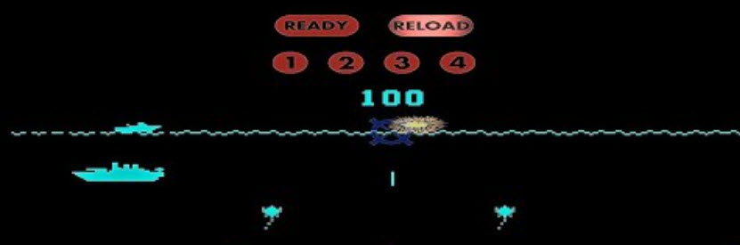

>>> cpu Z80

>>> binary 0:roms/sw0041.h + roms/sw0042.g + roms/sw0043.f + roms/sw0044.e

>>> memoryTable ram 

[RAM Usage](RAMUse.md)

>>> memoryTable hard 

[Hardware Info](Hardware.md)

```code

0000: 00              NOP                         
0001: 00              NOP                         
0002: 31 00 24        LD      SP,$2400            ; Stack at top of RAM
0005: C3 3A 04        JP      $043A               ; {code.Startup}

0008: E5              PUSH    HL                  
0009: D5              PUSH    DE                  
000A: C5              PUSH    BC                  
000B: F5              PUSH    AF                  
000C: C3 7E 00        JP      $007E               ; {}
;
000F: 00                         

0010: E5              PUSH    HL                  
0011: D5              PUSH    DE                  
0012: C5              PUSH    BC                  
0013: F5              PUSH    AF                  
0014: 3A 1F 20        LD      A,($201F)           
0017: A7              AND     A                   
0018: C2 3E 00        JP      NZ,$003E            ; {}
001B: CD BC 03        CALL    $03BC               ; {}
001E: CD 2E 01        CALL    $012E               ; {}
0021: 2A 16 20        LD      HL,($2016)          
0024: 7E              LD      A,(HL)              
0025: A7              AND     A                   
0026: F2 36 00        JP      P,$0036             ; {}
0029: E6 20           AND     $20                 
002B: CA 36 00        JP      Z,$0036             ; {}
002E: CD 5B 03        CALL    $035B               ; {}
0031: 0D              DEC     C                   
0032: EB              EX      DE,HL               
0033: CD 2A 0A        CALL    $0A2A               ; {}
0036: 3E FF           LD      A,$FF               
0038: 32 1F 20        LD      ($201F),A           
003B: C3 69 00        JP      $0069               ; {}
003E: 2A 16 20        LD      HL,($2016)          
0041: 7E              LD      A,(HL)              
0042: A7              AND     A                   
0043: F2 62 00        JP      P,$0062             ; {}
0046: E6 40           AND     $40                 
0048: C2 50 00        JP      NZ,$0050            ; {}
004B: 36 00           LD      (HL),$00            
004D: C3 62 00        JP      $0062               ; {}
0050: 7E              LD      A,(HL)              
0051: F6 20           OR      $20                 
0053: 77              LD      (HL),A              
0054: CD 65 01        CALL    $0165               ; {}
0057: 78              LD      A,B                 
0058: E5              PUSH    HL                  
0059: 2A 1C 20        LD      HL,($201C)          
005C: 44              LD      B,H                 
005D: 4D              LD      C,L                 
005E: E1              POP     HL                  
005F: CD 16 0A        CALL    $0A16               ; {}
0062: CD 68 03        CALL    $0368               ; {}
0065: AF              XOR     A                   
0066: 32 1F 20        LD      ($201F),A           
0069: DB 02           IN      A,($02)             ; {hard.INP2}
006B: 47              LD      B,A                 
006C: DB 02           IN      A,($02)             ; {hard.INP2}
006E: 21 07 20        LD      HL,$2007            
0071: 11 CA 09        LD      DE,$09CA            
0074: B8              CP      B                   
0075: CC 05 0B        CALL    Z,$0B05             ; {}
0078: F1              POP     AF                  
0079: C1              POP     BC                  
007A: D1              POP     DE                  
007B: E1              POP     HL                  
007C: FB              EI                          
007D: C9              RET                         

007E: 3A 1F 20        LD      A,($201F)           
0081: A7              AND     A                   
0082: C2 19 01        JP      NZ,$0119            ; {}
0085: CD BC 03        CALL    $03BC               ; {}
0088: 21 5F 21        LD      HL,$215F            
008B: 06 44           LD      B,$44               
008D: AF              XOR     A                   
008E: 77              LD      (HL),A              
008F: 23              INC     HL                  
0090: 05              DEC     B                   
0091: C2 8E 00        JP      NZ,$008E            ; {}
0094: 2A 18 20        LD      HL,($2018)          
0097: 3E 03           LD      A,$03               
0099: F5              PUSH    AF                  
009A: 7D              LD      A,L                 
009B: FE 58           CP      $58                 
009D: C2 A3 00        JP      NZ,$00A3            ; {}
00A0: 21 31 20        LD      HL,$2031            
00A3: B4              OR      H                   
00A4: CA A0 00        JP      Z,$00A0             ; {}
00A7: E5              PUSH    HL                  
00A8: CD DE 01        CALL    $01DE               ; {}
00AB: E1              POP     HL                  
00AC: D2 B2 00        JP      NC,$00B2            ; {}
00AF: 22 18 20        LD      ($2018),HL          
00B2: 11 0D 00        LD      DE,$000D            
00B5: 19              ADD     HL,DE               
00B6: F1              POP     AF                  
00B7: 3D              DEC     A                   
00B8: C2 99 00        JP      NZ,$0099            ; {}
00BB: 2A 18 20        LD      HL,($2018)          
00BE: CD 0C 03        CALL    $030C               ; {}
00C1: 2A 1A 20        LD      HL,($201A)          
00C4: 3E 03           LD      A,$03               
00C6: F5              PUSH    AF                  
00C7: 7D              LD      A,L                 
00C8: FE 7F           CP      $7F                 
00CA: C2 D0 00        JP      NZ,$00D0            ; {}
00CD: 21 58 20        LD      HL,$2058            
00D0: B4              OR      H                   
00D1: CA CD 00        JP      Z,$00CD             ; {}
00D4: E5              PUSH    HL                  
00D5: CD DE 01        CALL    $01DE               ; {}
00D8: E1              POP     HL                  
00D9: D2 DF 00        JP      NC,$00DF            ; {}
00DC: 22 1A 20        LD      ($201A),HL          
00DF: 11 0D 00        LD      DE,$000D            
00E2: 19              ADD     HL,DE               
00E3: F1              POP     AF                  
00E4: 3D              DEC     A                   
00E5: C2 C6 00        JP      NZ,$00C6            ; {}
00E8: AF              XOR     A                   
00E9: 32 30 20        LD      ($2030),A           
00EC: 2A 16 20        LD      HL,($2016)          
00EF: 3E 04           LD      A,$04               
00F1: F5              PUSH    AF                  
00F2: 7D              LD      A,L                 
00F3: FE 5F           CP      $5F                 
00F5: C2 FB 00        JP      NZ,$00FB            ; {}
00F8: 21 E7 20        LD      HL,$20E7            
00FB: B4              OR      H                   
00FC: CA F8 00        JP      Z,$00F8             ; {}
00FF: E5              PUSH    HL                  
0100: CD 50 02        CALL    $0250               ; {}
0103: E1              POP     HL                  
0104: D2 0A 01        JP      NC,$010A            ; {}
0107: 22 16 20        LD      ($2016),HL          
010A: 11 1E 00        LD      DE,$001E            
010D: 19              ADD     HL,DE               
010E: F1              POP     AF                  
010F: 3D              DEC     A                   
0110: C2 F1 00        JP      NZ,$00F1            ; {}
0113: CD 31 03        CALL    $0331               ; {}

0116: C3 69 00        JP      $0069               ; {}
0119: 2A 1A 20        LD      HL,($201A)          
011C: CD 0C 03        CALL    $030C               ; {}
011F: 2A 1A 20        LD      HL,($201A)          
0122: CD 3A 01        CALL    $013A               ; {}
0125: 2A 18 20        LD      HL,($2018)          
0128: CD 3A 01        CALL    $013A               ; {}
012B: C3 69 00        JP      $0069               ; {}
012E: 2A 14 20        LD      HL,($2014)          
0131: 7E              LD      A,(HL)              
0132: A7              AND     A                   
0133: F0              RET     P                   
0134: CD 65 01        CALL    $0165               ; {}
0137: C3 92 01        JP      $0192               ; {}
013A: 7E              LD      A,(HL)              
013B: A7              AND     A                   
013C: F0              RET     P                   
013D: E6 40           AND     $40                 
013F: C2 45 01        JP      NZ,$0145            ; {}
0142: 36 00           LD      (HL),$00            
0144: C9              RET                         
0145: 7E              LD      A,(HL)              
0146: F6 20           OR      $20                 
0148: 77              LD      (HL),A              
0149: F5              PUSH    AF                  
014A: CD 65 01        CALL    $0165               ; {}
014D: F1              POP     AF                  
014E: E6 10           AND     $10                 
0150: CA 92 01        JP      Z,$0192             ; {}
0153: 79              LD      A,C                 
0154: 85              ADD     A,L                 
0155: 6F              LD      L,A                 
0156: E5              PUSH    HL                  
0157: 21 30 20        LD      HL,$2030            
015A: 7E              LD      A,(HL)              
015B: 2F              CPL                         
015C: E6 07           AND     $07                 
015E: 77              LD      (HL),A              
015F: E1              POP     HL                  
0160: D3 04           OUT     ($04),A             ; {hard.SHFT_DATA}
0162: C3 B8 01        JP      $01B8               ; {}
0165: 23              INC     HL                  
0166: 23              INC     HL                  
0167: 5E              LD      E,(HL)              
0168: 23              INC     HL                  
0169: 23              INC     HL                  
016A: 23              INC     HL                  
016B: 56              LD      D,(HL)              
016C: 23              INC     HL                  
016D: 23              INC     HL                  
016E: CD 00 0A        CALL    $0A00               ; {}
0171: 79              LD      A,C                 
0172: 32 30 20        LD      ($2030),A           
0175: D3 04           OUT     ($04),A             ; {hard.SHFT_DATA}
0177: D5              PUSH    DE                  
0178: 5E              LD      E,(HL)              
0179: 23              INC     HL                  
017A: 56              LD      D,(HL)              
017B: 23              INC     HL                  
017C: EB              EX      DE,HL               
017D: 4E              LD      C,(HL)              
017E: 23              INC     HL                  
017F: 46              LD      B,(HL)              
0180: 23              INC     HL                  
0181: E3              EX      (SP),HL             
0182: EB              EX      DE,HL               
0183: 73              LD      (HL),E              
0184: 23              INC     HL                  
0185: 72              LD      (HL),D              
0186: 23              INC     HL                  
0187: 71              LD      (HL),C              
0188: 34              INC     (HL)                
0189: 23              INC     HL                  
018A: 70              LD      (HL),B              
018B: 23              INC     HL                  
018C: 22 1C 20        LD      ($201C),HL          
018F: EB              EX      DE,HL               
0190: D1              POP     DE                  
0191: C9              RET                         
0192: C5              PUSH    BC                  
0193: E5              PUSH    HL                  
0194: 1A              LD      A,(DE)              
0195: 13              INC     DE                  
0196: D3 03           OUT     ($03),A             ; {hard.SOUND1}
0198: DB 03           IN      A,($03)             ; {hard.SHFT_IN}
019A: 77              LD      (HL),A              
019B: 23              INC     HL                  
019C: 0D              DEC     C                   
019D: C2 94 01        JP      NZ,$0194            ; {}
01A0: AF              XOR     A                   
01A1: D3 03           OUT     ($03),A             ; {hard.SOUND1}
01A3: DB 03           IN      A,($03)             ; {hard.SHFT_IN}
01A5: 77              LD      (HL),A              
01A6: 01 20 00        LD      BC,$0020            
01A9: E1              POP     HL                  
01AA: 09              ADD     HL,BC               
01AB: C1              POP     BC                  
01AC: 7D              LD      A,L                 
01AD: E6 E0           AND     $E0                 
01AF: C2 92 01        JP      NZ,$0192            ; {}
01B2: 7C              LD      A,H                 
01B3: 1F              RRA                         
01B4: DA 92 01        JP      C,$0192             ; {}
01B7: C9              RET                         
01B8: C5              PUSH    BC                  
01B9: E5              PUSH    HL                  
01BA: 1A              LD      A,(DE)              
01BB: 13              INC     DE                  
01BC: D3 03           OUT     ($03),A             ; {hard.SOUND1}
01BE: DB 00           IN      A,($00)             ; {hard.INP0}
01C0: 77              LD      (HL),A              
01C1: 2B              DEC     HL                  
01C2: 0D              DEC     C                   
01C3: C2 BA 01        JP      NZ,$01BA            ; {}
01C6: AF              XOR     A                   
01C7: D3 03           OUT     ($03),A             ; {hard.SOUND1}
01C9: DB 00           IN      A,($00)             ; {hard.INP0}
01CB: 77              LD      (HL),A              
01CC: 01 20 00        LD      BC,$0020            
01CF: E1              POP     HL                  
01D0: 09              ADD     HL,BC               
01D1: C1              POP     BC                  
01D2: 7D              LD      A,L                 
01D3: E6 E0           AND     $E0                 
01D5: C2 B8 01        JP      NZ,$01B8            ; {}
01D8: 7C              LD      A,H                 
01D9: 1F              RRA                         
01DA: DA B8 01        JP      C,$01B8             ; {}
01DD: C9              RET                         
01DE: 7E              LD      A,(HL)              
01DF: A7              AND     A                   
01E0: F0              RET     P                   
01E1: E5              PUSH    HL                  
01E2: 23              INC     HL                  
01E3: E6 07           AND     $07                 
01E5: C2 ED 01        JP      NZ,$01ED            ; {}
01E8: 23              INC     HL                  
01E9: 23              INC     HL                  
01EA: C3 37 02        JP      $0237               ; {}
01ED: 7E              LD      A,(HL)              
01EE: 11 5F 21        LD      DE,$215F            
01F1: A7              AND     A                   
01F2: F2 F8 01        JP      P,$01F8             ; {}
01F5: 11 81 21        LD      DE,$2181            
01F8: 47              LD      B,A                 
01F9: 23              INC     HL                  
01FA: 86              ADD     A,(HL)              
01FB: 77              LD      (HL),A              
01FC: 78              LD      A,B                 
01FD: A7              AND     A                   
01FE: 7E              LD      A,(HL)              
01FF: F2 10 02        JP      P,$0210             ; {}
0202: FE 01           CP      $01                 
0204: D2 16 02        JP      NC,$0216            ; {}
0207: E3              EX      (SP),HL             
0208: 7E              LD      A,(HL)              
0209: E6 BF           AND     $BF                 
020B: 77              LD      (HL),A              
020C: E3              EX      (SP),HL             
020D: C3 16 02        JP      $0216               ; {}
0210: 23              INC     HL                  
0211: BE              CP      (HL)                
0212: 2B              DEC     HL                  
0213: D2 07 02        JP      NC,$0207            ; {}
0216: 7E              LD      A,(HL)              
0217: 0F              RRCA                        
0218: 0F              RRCA                        
0219: 0F              RRCA                        
021A: E6 1F           AND     $1F                 
021C: 83              ADD     A,E                 
021D: 5F              LD      E,A                 
021E: E3              EX      (SP),HL             
021F: 7E              LD      A,(HL)              
0220: E3              EX      (SP),HL             
0221: E6 07           AND     $07                 
0223: 47              LD      B,A                 
0224: 23              INC     HL                  
0225: 7E              LD      A,(HL)              
0226: 2F              CPL                         
0227: 3C              INC     A                   
0228: 0F              RRCA                        
0229: 0F              RRCA                        
022A: 0F              RRCA                        
022B: E6 07           AND     $07                 
022D: C6 03           ADD     $03                 
022F: EB              EX      DE,HL               
0230: 70              LD      (HL),B              
0231: 23              INC     HL                  
0232: 3D              DEC     A                   
0233: C2 30 02        JP      NZ,$0230            ; {}
0236: EB              EX      DE,HL               
0237: 11 2F 20        LD      DE,$202F            
023A: 1A              LD      A,(DE)              
023B: 2F              CPL                         
023C: 12              LD      (DE),A              
023D: C2 47 02        JP      NZ,$0247            ; {}
0240: 23              INC     HL                  
0241: 7E              LD      A,(HL)              
0242: 23              INC     HL                  
0243: 86              ADD     A,(HL)              
0244: 77              LD      (HL),A              
0245: 23              INC     HL                  
0246: BE              CP      (HL)                
0247: E1              POP     HL                  
0248: 37              SCF                         
0249: C0              RET     NZ                  
024A: 7E              LD      A,(HL)              
024B: E6 BF           AND     $BF                 
024D: 77              LD      (HL),A              
024E: 37              SCF                         
024F: C9              RET                         
0250: 7E              LD      A,(HL)              
0251: A7              AND     A                   
0252: F0              RET     P                   
0253: E5              PUSH    HL                  
0254: 23              INC     HL                  
0255: 23              INC     HL                  
0256: 4E              LD      C,(HL)              
0257: 23              INC     HL                  
0258: 23              INC     HL                  
0259: 7E              LD      A,(HL)              
025A: 23              INC     HL                  
025B: 46              LD      B,(HL)              
025C: 80              ADD     A,B                 
025D: 77              LD      (HL),A              
025E: 78              LD      A,B                 
025F: FE C0           CP      $C0                 
0261: D2 09 03        JP      NC,$0309            ; {}
0264: FE 30           CP      $30                 
0266: D2 75 02        JP      NC,$0275            ; {}
0269: 3A 24 20        LD      A,($2024)           
026C: A7              AND     A                   
026D: CA 75 02        JP      Z,$0275             ; {}
0270: 3C              INC     A                   
0271: 3C              INC     A                   
0272: 32 24 20        LD      ($2024),A           
0275: 7E              LD      A,(HL)              
0276: 23              INC     HL                  
0277: BE              CP      (HL)                
0278: D2 9C 02        JP      NC,$029C            ; {}
027B: 3E C0           LD      A,$C0               
027D: 86              ADD     A,(HL)              
027E: 77              LD      (HL),A              
027F: 2B              DEC     HL                  
0280: 2B              DEC     HL                  
0281: 34              INC     (HL)                
0282: 34              INC     (HL)                
0283: 7E              LD      A,(HL)              
0284: 23              INC     HL                  
0285: 23              INC     HL                  
0286: 23              INC     HL                  
0287: CA 96 02        JP      Z,$0296             ; {}
028A: 36 88           LD      (HL),$88            
028C: FE FC           CP      $FC                 
028E: CA 9C 02        JP      Z,$029C             ; {}
0291: 36 98           LD      (HL),$98            
0293: C3 9C 02        JP      $029C               ; {}
0296: E3              EX      (SP),HL             
0297: 7E              LD      A,(HL)              
0298: E6 BF           AND     $BF                 
029A: 77              LD      (HL),A              
029B: E3              EX      (SP),HL             
029C: 11 30 20        LD      DE,$2030            
029F: 1A              LD      A,(DE)              
02A0: A7              AND     A                   
02A1: C2 09 03        JP      NZ,$0309            ; {}
02A4: 3C              INC     A                   
02A5: 12              LD      (DE),A              
02A6: 78              LD      A,B                 
02A7: E6 10           AND     $10                 
02A9: CA 09 03        JP      Z,$0309             ; {}
02AC: 11 07 00        LD      DE,$0007            
02AF: 19              ADD     HL,DE               
02B0: 7E              LD      A,(HL)              
02B1: A7              AND     A                   
02B2: C2 C3 02        JP      NZ,$02C3            ; {}
02B5: 19              ADD     HL,DE               
02B6: 78              LD      A,B                 
02B7: 83              ADD     A,E                 
02B8: 47              LD      B,A                 
02B9: E6 10           AND     $10                 
02BB: CA 09 03        JP      Z,$0309             ; {}
02BE: 7E              LD      A,(HL)              
02BF: A7              AND     A                   
02C0: CA 09 03        JP      Z,$0309             ; {}
02C3: E3              EX      (SP),HL             
02C4: 7E              LD      A,(HL)              
02C5: E6 BF           AND     $BF                 
02C7: 77              LD      (HL),A              
02C8: E3              EX      (SP),HL             
02C9: 78              LD      A,B                 
02CA: D6 40           SUB     $40                 
02CC: 47              LD      B,A                 
02CD: DA E0 02        JP      C,$02E0             ; {}
02D0: 21 A1 21        LD      HL,$21A1            
02D3: 23              INC     HL                  
02D4: 23              INC     HL                  
02D5: 7E              LD      A,(HL)              
02D6: A7              AND     A                   
02D7: C2 D3 02        JP      NZ,$02D3            ; {}
02DA: 70              LD      (HL),B              
02DB: 23              INC     HL                  
02DC: 71              LD      (HL),C              
02DD: C3 09 03        JP      $0309               ; {}
02E0: 21 BE 21        LD      HL,$21BE            
02E3: 23              INC     HL                  
02E4: 23              INC     HL                  
02E5: 23              INC     HL                  
02E6: 7E              LD      A,(HL)              
02E7: A7              AND     A                   
02E8: C2 E3 02        JP      NZ,$02E3            ; {}
02EB: 78              LD      A,B                 
02EC: C6 20           ADD     $20                 
02EE: 11 60 21        LD      DE,$2160            
02F1: FA F7 02        JP      M,$02F7             ; {}
02F4: 11 82 21        LD      DE,$2182            
02F7: 79              LD      A,C                 
02F8: 0F              RRCA                        
02F9: 0F              RRCA                        
02FA: 0F              RRCA                        
02FB: E6 1F           AND     $1F                 
02FD: 83              ADD     A,E                 
02FE: 5F              LD      E,A                 
02FF: 1A              LD      A,(DE)              
0300: A7              AND     A                   
0301: CA 09 03        JP      Z,$0309             ; {}
0304: 77              LD      (HL),A              
0305: 23              INC     HL                  
0306: 71              LD      (HL),C              
0307: 23              INC     HL                  
0308: 70              LD      (HL),B              
0309: 37              SCF                         
030A: E1              POP     HL                  
030B: C9              RET                         
030C: 7E              LD      A,(HL)              
030D: A7              AND     A                   
030E: F0              RET     P                   
030F: E6 20           AND     $20                 
0311: C8              RET     Z                   
0312: CD 5B 03        CALL    $035B               ; {}
0315: EB              EX      DE,HL               
0316: 41              LD      B,C                 
0317: AF              XOR     A                   
0318: E5              PUSH    HL                  
0319: 77              LD      (HL),A              
031A: 23              INC     HL                  
031B: 0D              DEC     C                   
031C: C2 19 03        JP      NZ,$0319            ; {}
031F: 11 20 00        LD      DE,$0020            
0322: E1              POP     HL                  
0323: 19              ADD     HL,DE               
0324: 48              LD      C,B                 
0325: 7D              LD      A,L                 
0326: E6 E0           AND     $E0                 
0328: C2 17 03        JP      NZ,$0317            ; {}
032B: 7C              LD      A,H                 
032C: 1F              RRA                         
032D: DA 17 03        JP      C,$0317             ; {}
0330: C9              RET                         
0331: 2A 14 20        LD      HL,($2014)          
0334: 06 0A           LD      B,$0A               
0336: 7D              LD      A,L                 
0337: B4              OR      H                   
0338: C2 3E 03        JP      NZ,$033E            ; {}
033B: 21 72 20        LD      HL,$2072            
033E: 11 0D 00        LD      DE,$000D            
0341: 19              ADD     HL,DE               
0342: 05              DEC     B                   
0343: C8              RET     Z                   
0344: 7D              LD      A,L                 
0345: FE E7           CP      $E7                 
0347: C2 4D 03        JP      NZ,$034D            ; {}
034A: 21 7F 20        LD      HL,$207F            
034D: 7E              LD      A,(HL)              
034E: A7              AND     A                   
034F: F2 41 03        JP      P,$0341             ; {}
0352: 22 14 20        LD      ($2014),HL          
0355: 23              INC     HL                  
0356: 7E              LD      A,(HL)              
0357: 23              INC     HL                  
0358: 86              ADD     A,(HL)              
0359: 77              LD      (HL),A              
035A: C9              RET                         
035B: 11 09 00        LD      DE,$0009            
035E: 19              ADD     HL,DE               
035F: 5E              LD      E,(HL)              
0360: 23              INC     HL                  
0361: 56              LD      D,(HL)              
0362: 23              INC     HL                  
0363: 4E              LD      C,(HL)              
0364: 23              INC     HL                  
0365: 46              LD      B,(HL)              
0366: 23              INC     HL                  
0367: C9              RET                         
0368: 3A 20 20        LD      A,($2020)           
036B: A7              AND     A                   
036C: C0              RET     NZ                  
036D: 47              LD      B,A                 
036E: 21 03 20        LD      HL,$2003            
0371: 35              DEC     (HL)                
0372: C2 8E 03        JP      NZ,$038E            ; {}
0375: 36 1E           LD      (HL),$1E            
0377: 21 02 20        LD      HL,$2002            
037A: 7E              LD      A,(HL)              
037B: A7              AND     A                   
037C: CA 88 03        JP      Z,$0388             ; {}
037F: C6 99           ADD     $99                 
0381: 27              DAA                         
0382: 77              LD      (HL),A              
0383: C2 88 03        JP      NZ,$0388            ; {}
0386: 06 01           LD      B,$01               
0388: 21 10 20        LD      HL,$2010            
038B: CD AE 03        CALL    $03AE               ; {}
038E: 21 11 20        LD      HL,$2011            
0391: CD AE 03        CALL    $03AE               ; {}
0394: 21 21 20        LD      HL,$2021            
0397: CD AE 03        CALL    $03AE               ; {}
039A: 23              INC     HL                  
039B: CD AE 03        CALL    $03AE               ; {}
039E: 23              INC     HL                  
039F: CD AE 03        CALL    $03AE               ; {}
03A2: 23              INC     HL                  
03A3: CD AE 03        CALL    $03AE               ; {}
03A6: 23              INC     HL                  
03A7: CD AE 03        CALL    $03AE               ; {}
03AA: 32 20 20        LD      ($2020),A           
03AD: C9              RET                         
03AE: 7E              LD      A,(HL)              
03AF: A7              AND     A                   
03B0: CA B8 03        JP      Z,$03B8             ; {}
03B3: 35              DEC     (HL)                
03B4: C2 B8 03        JP      NZ,$03B8            ; {}
03B7: 37              SCF                         
03B8: 78              LD      A,B                 
03B9: 17              RLA                         
03BA: 47              LD      B,A                 
03BB: C9              RET                         
03BC: 01 27 20        LD      BC,$2027            
03BF: 0A              LD      A,(BC)              
03C0: C6 0A           ADD     $0A                 
03C2: FE 1E           CP      $1E                 
03C4: C2 C8 03        JP      NZ,$03C8            ; {}
03C7: AF              XOR     A                   
03C8: 02              LD      (BC),A              
03C9: 03              INC     BC                  
03CA: 5F              LD      E,A                 
03CB: 16 00           LD      D,$00               
03CD: 21 F3 0B        LD      HL,$0BF3            
03D0: 19              ADD     HL,DE               
03D1: EB              EX      DE,HL               
03D2: 0A              LD      A,(BC)              
03D3: 3C              INC     A                   
03D4: E6 1F           AND     $1F                 
03D6: 02              LD      (BC),A              
03D7: 21 E0 27        LD      HL,$27E0            
03DA: 85              ADD     A,L                 
03DB: 6F              LD      L,A                 
03DC: 01 20 00        LD      BC,$0020            
03DF: 1A              LD      A,(DE)              
03E0: 13              INC     DE                  
03E1: 77              LD      (HL),A              
03E2: 09              ADD     HL,BC               
03E3: 7D              LD      A,L                 
03E4: E6 E0           AND     $E0                 
03E6: FE 60           CP      $60                 
03E8: C2 DF 03        JP      NZ,$03DF            ; {}
03EB: C9              RET                         
03EC: 21 00 00        LD      HL,$0000            
03EF: 11 00 00        LD      DE,$0000            
03F2: 0E 02           LD      C,$02               
03F4: AF              XOR     A                   
03F5: 86              ADD     A,(HL)              
03F6: 23              INC     HL                  
03F7: 47              LD      B,A                 
03F8: 79              LD      A,C                 
03F9: BC              CP      H                   
03FA: 78              LD      A,B                 
03FB: C2 F5 03        JP      NZ,$03F5            ; {}
03FE: E5              PUSH    HL                  
03FF: 21 29 04        LD      HL,$0429            
0402: 19              ADD     HL,DE               
0403: BE              CP      (HL)                
0404: 3E 40           LD      A,$40               
0406: CA 0E 04        JP      Z,$040E             ; {}
0409: 21 32 04        LD      HL,$0432            
040C: 19              ADD     HL,DE               
040D: 7E              LD      A,(HL)              
040E: 21 E9 21        LD      HL,$21E9            
0411: 19              ADD     HL,DE               
0412: 77              LD      (HL),A              
0413: E1              POP     HL                  
0414: 13              INC     DE                  
0415: 0C              INC     C                   
0416: 0C              INC     C                   
0417: 3E 12           LD      A,$12               
0419: B9              CP      C                   
041A: C2 F4 03        JP      NZ,$03F4            ; {}
041D: 21 E9 21        LD      HL,$21E9            
0420: 11 08 30        LD      DE,$3008            
0423: 3E 08           LD      A,$08               
0425: CD 30 0B        CALL    $0B30               ; {}
0428: 76              HALT                        
0429: 8D              ADC     A,L                 
042A: 79              LD      A,C                 
042B: 00              NOP                         
042C: 1F              RRA                         
042D: 58              LD      E,B                 
042E: 6D              LD      L,L                 
042F: EA C5 2A        JP      PE,$2AC5            
0432: 48              LD      C,B                 
0433: 48              LD      C,B                 
0434: 47              LD      B,A                 
0435: 47              LD      B,A                 
0436: 46              LD      B,(HL)              
0437: 46              LD      B,(HL)              
0438: 45              LD      B,L                 
0439: 45              LD      B,L                 

Startup:
043A: CD A2 08        CALL    $08A2               ; {}
043D: DB 02           IN      A,($02)             ; {hard.INP2}
043F: E6 E0           AND     $E0                 
0441: FE E0           CP      $E0                 
0443: CC EC 03        CALL    Z,$03EC             ; {}
0446: 21 02 20        LD      HL,$2002            
0449: 3E 09           LD      A,$09               
044B: 06 00           LD      B,$00               
044D: 70              LD      (HL),B              
044E: 23              INC     HL                  
044F: 3D              DEC     A                   
0450: C2 4D 04        JP      NZ,$044D            ; {}
0453: 21 29 09        LD      HL,$0929            
0456: 22 00 20        LD      ($2000),HL          
0459: FB              EI                          
045A: 21 59 04        LD      HL,$0459            
045D: E5              PUSH    HL                  
045E: 2A 00 20        LD      HL,($2000)          
0461: 7E              LD      A,(HL)              
0462: A7              AND     A                   
0463: C2 7D 04        JP      NZ,$047D            ; {}
0466: CD A4 06        CALL    $06A4               ; {}
0469: CD CE 04        CALL    $04CE               ; {}
046C: CD BF 04        CALL    $04BF               ; {}
046F: 3A 02 20        LD      A,($2002)           
0472: A7              AND     A                   
0473: C8              RET     Z                   
0474: CD 4C 07        CALL    $074C               ; {}
0477: CD B8 08        CALL    $08B8               ; {}
047A: C3 8C 04        JP      $048C               ; {}
047D: 23              INC     HL                  
047E: EB              EX      DE,HL               
047F: 21 E8 09        LD      HL,$09E8            
0482: 07              RLCA                        
0483: 4F              LD      C,A                 
0484: 06 00           LD      B,$00               
0486: 09              ADD     HL,BC               
0487: 7E              LD      A,(HL)              
0488: 23              INC     HL                  
0489: 66              LD      H,(HL)              
048A: 6F              LD      L,A                 
048B: E9              JP      (HL)                
048C: 3A 03 20        LD      A,($2003)           
048F: FE 1D           CP      $1D                 
0491: F8              RET     M                   
0492: 01 02 20        LD      BC,$2002            
0495: 11 E9 21        LD      DE,$21E9            
0498: CD 82 0A        CALL    $0A82               ; {}
049B: EB              EX      DE,HL               
049C: CD 7A 0A        CALL    $0A7A               ; {}
049F: 23              INC     HL                  
04A0: 36 2C           LD      (HL),$2C            
04A2: 23              INC     HL                  
04A3: EB              EX      DE,HL               
04A4: 01 2B 20        LD      BC,$202B            
04A7: CD 82 0A        CALL    $0A82               ; {}
04AA: EB              EX      DE,HL               
04AB: CD 7A 0A        CALL    $0A7A               ; {}
04AE: 23              INC     HL                  
04AF: 36 30           LD      (HL),$30            
04B1: 23              INC     HL                  
04B2: 36 30           LD      (HL),$30            
04B4: 21 E9 21        LD      HL,$21E9            
04B7: 11 2F 3E        LD      DE,$3E2F            
04BA: 3E 06           LD      A,$06               
04BC: C3 30 0B        JP      $0B30               ; {}
04BF: 21 2A 20        LD      HL,$202A            
04C2: 7E              LD      A,(HL)              
04C3: A7              AND     A                   
04C4: C8              RET     Z                   
04C5: 36 00           LD      (HL),$00            
04C7: 21 A6 09        LD      HL,$09A6            
04CA: 22 00 20        LD      ($2000),HL          
04CD: C9              RET                         
04CE: 21 20 20        LD      HL,$2020            
04D1: 7E              LD      A,(HL)              
04D2: A7              AND     A                   
04D3: C8              RET     Z                   
04D4: 36 00           LD      (HL),$00            
04D6: 1F              RRA                         
04D7: DC 01 06        CALL    C,$0601             ; {}
04DA: 1F              RRA                         
04DB: DC 0E 06        CALL    C,$060E             ; {}
04DE: 1F              RRA                         
04DF: DC F7 04        CALL    C,$04F7             ; {}
04E2: 1F              RRA                         
04E3: DC 34 06        CALL    C,$0634             ; {}
04E6: 1F              RRA                         
04E7: DC E9 05        CALL    C,$05E9             ; {}
04EA: 1F              RRA                         
04EB: DC 73 05        CALL    C,$0573             ; {}
04EE: 1F              RRA                         
04EF: DC 6C 05        CALL    C,$056C             ; {}
04F2: 1F              RRA                         
04F3: DC 11 05        CALL    C,$0511             ; {}
04F6: C9              RET                         
04F7: F5              PUSH    AF                  
04F8: 21 26 20        LD      HL,$2026            
04FB: 7E              LD      A,(HL)              
04FC: A7              AND     A                   
04FD: CA 0F 05        JP      Z,$050F             ; {}
0500: 35              DEC     (HL)                
0501: 3E 04           LD      A,$04               
0503: D3 05           OUT     ($05),A             ; {hard.SOUND2}
0505: 3E 19           LD      A,$19               
0507: 32 23 20        LD      ($2023),A           
050A: 3E 0F           LD      A,$0F               
050C: 32 25 20        LD      ($2025),A           
050F: F1              POP     AF                  
0510: C9              RET                         
0511: 21 2E 20        LD      HL,$202E            
0514: 7E              LD      A,(HL)              
0515: A7              AND     A                   
0516: C2 3D 05        JP      NZ,$053D            ; {}
0519: 36 01           LD      (HL),$01            
051B: 3A 07 20        LD      A,($2007)           
051E: 0F              RRCA                        
051F: E6 70           AND     $70                 
0521: CA 3D 05        JP      Z,$053D             ; {}
0524: C6 09           ADD     $09                 
0526: 21 2B 20        LD      HL,$202B            
0529: BE              CP      (HL)                
052A: D2 3D 05        JP      NC,$053D            ; {}
052D: 3E 20           LD      A,$20               
052F: 32 02 20        LD      ($2002),A           
0532: 21 33 0F        LD      HL,$0F33            
0535: 11 03 3C        LD      DE,$3C03            
0538: 3E 0C           LD      A,$0C               
053A: C3 30 0B        JP      $0B30               ; {}
053D: 21 C9 20        LD      HL,$20C9            
0540: 01 1E 00        LD      BC,$001E            
0543: 09              ADD     HL,BC               
0544: 7D              LD      A,L                 
0545: FE 5F           CP      $5F                 
0547: CA 5C 05        JP      Z,$055C             ; {}
054A: 7E              LD      A,(HL)              
054B: A7              AND     A                   
054C: F2 43 05        JP      P,$0543             ; {}
054F: AF              XOR     A                   
0550: 32 21 20        LD      ($2021),A           
0553: 32 2D 20        LD      ($202D),A           
0556: 3E 01           LD      A,$01               
0558: 32 02 20        LD      ($2002),A           
055B: C9              RET                         
055C: 21 29 09        LD      HL,$0929            
055F: 22 00 20        LD      ($2000),HL          
0562: 3A 2B 20        LD      A,($202B)           
0565: 21 06 20        LD      HL,$2006            
0568: BE              CP      (HL)                
0569: D8              RET     C                   
056A: 77              LD      (HL),A              
056B: C9              RET                         
056C: 21 63 09        LD      HL,$0963            
056F: 22 00 20        LD      ($2000),HL          
0572: C9              RET                         
0573: 2A 00 20        LD      HL,($2000)          
0576: 23              INC     HL                  
0577: 22 00 20        LD      ($2000),HL          
057A: C9              RET                         
057B: C8              RET     Z                   
057C: 3A 02 20        LD      A,($2002)           
057F: A7              AND     A                   
0580: C8              RET     Z                   
0581: 3A 21 20        LD      A,($2021)           
0584: A7              AND     A                   
0585: C0              RET     NZ                  
0586: 21 2D 20        LD      HL,$202D            
0589: 7E              LD      A,(HL)              
058A: E6 1F           AND     $1F                 
058C: C8              RET     Z                   
058D: 7E              LD      A,(HL)              
058E: E6 0F           AND     $0F                 
0590: 1F              RRA                         
0591: 06 20           LD      B,$20               
0593: A7              AND     A                   
0594: CA 99 05        JP      Z,$0599             ; {}
0597: 06 10           LD      B,$10               
0599: B0              OR      B                   
059A: 77              LD      (HL),A              
059B: D3 02           OUT     ($02),A             ; {hard.SHFTAMNT}
059D: 21 21 20        LD      HL,$2021            
05A0: 36 08           LD      (HL),$08            
05A2: E6 10           AND     $10                 
05A4: C2 A9 05        JP      NZ,$05A9            ; {}
05A7: 36 3C           LD      (HL),$3C            
05A9: 3E 02           LD      A,$02               
05AB: D3 05           OUT     ($05),A             ; {hard.SOUND2}
05AD: 3E 0F           LD      A,$0F               
05AF: 32 25 20        LD      ($2025),A           
05B2: 21 C9 20        LD      HL,$20C9            
05B5: 11 1E 00        LD      DE,$001E            
05B8: 19              ADD     HL,DE               
05B9: 7E              LD      A,(HL)              
05BA: A7              AND     A                   
05BB: FA B8 05        JP      M,$05B8             ; {}
05BE: 11 08 00        LD      DE,$0008            
05C1: 19              ADD     HL,DE               
05C2: 36 0E           LD      (HL),$0E            
05C4: 2B              DEC     HL                  
05C5: 36 75           LD      (HL),$75            
05C7: 2B              DEC     HL                  
05C8: 36 9C           LD      (HL),$9C            
05CA: 2B              DEC     HL                  
05CB: 36 E0           LD      (HL),$E0            
05CD: 2B              DEC     HL                  
05CE: 36 FA           LD      (HL),$FA            
05D0: 2B              DEC     HL                  
05D1: 2B              DEC     HL                  
05D2: 11 5E 0F        LD      DE,$0F5E            
05D5: EB              EX      DE,HL               
05D6: 3A 08 20        LD      A,($2008)           
05D9: E6 1F           AND     $1F                 
05DB: 4F              LD      C,A                 
05DC: 06 00           LD      B,$00               
05DE: 09              ADD     HL,BC               
05DF: 7E              LD      A,(HL)              
05E0: EB              EX      DE,HL               
05E1: 77              LD      (HL),A              
05E2: 2B              DEC     HL                  
05E3: 36 00           LD      (HL),$00            
05E5: 2B              DEC     HL                  
05E6: 36 C0           LD      (HL),$C0            
05E8: C9              RET                         
05E9: F5              PUSH    AF                  
05EA: 21 2D 20        LD      HL,$202D            
05ED: 7E              LD      A,(HL)              
05EE: E6 10           AND     $10                 
05F0: C2 FF 05        JP      NZ,$05FF            ; {}
05F3: 3E 1F           LD      A,$1F               
05F5: D3 02           OUT     ($02),A             ; {hard.SHFTAMNT}
05F7: 77              LD      (HL),A              
05F8: 3E 08           LD      A,$08               
05FA: D3 05           OUT     ($05),A             ; {hard.SOUND2}
05FC: CD EA 07        CALL    $07EA               ; {}
05FF: F1              POP     AF                  
0600: C9              RET                         
0601: F5              PUSH    AF                  
0602: AF              XOR     A                   
0603: D3 05           OUT     ($05),A             ; {hard.SOUND2}
0605: D3 01           OUT     ($01),A             ; {}
0607: 3A 2D 20        LD      A,($202D)           
060A: D3 02           OUT     ($02),A             ; {hard.SHFTAMNT}
060C: F1              POP     AF                  
060D: C9              RET                         
060E: F5              PUSH    AF                  
060F: 21 F0 21        LD      HL,$21F0            
0612: 7E              LD      A,(HL)              
0613: A7              AND     A                   
0614: CA 32 06        JP      Z,$0632             ; {}
0617: 36 00           LD      (HL),$00            
0619: 23              INC     HL                  
061A: 57              LD      D,A                 
061B: 5E              LD      E,(HL)              
061C: 36 00           LD      (HL),$00            
061E: 23              INC     HL                  
061F: FE 2C           CP      $2C                 
0621: 01 03 0A        LD      BC,$0A03            
0624: DA 2A 06        JP      C,$062A             ; {}
0627: 01 05 20        LD      BC,$2005            
062A: EB              EX      DE,HL               
062B: CD 3F 0A        CALL    $0A3F               ; {}
062E: EB              EX      DE,HL               
062F: C3 12 06        JP      $0612               ; {}
0632: F1              POP     AF                  
0633: C9              RET                         
0634: F5              PUSH    AF                  
0635: 3A 03 20        LD      A,($2003)           
0638: E6 0F           AND     $0F                 
063A: F6 50           OR      $50                 
063C: 32 22 20        LD      ($2022),A           
063F: 01 29 20        LD      BC,$2029            
0642: 0A              LD      A,(BC)              
0643: 3C              INC     A                   
0644: FE 07           CP      $07                 
0646: C2 4A 06        JP      NZ,$064A            ; {}
0649: AF              XOR     A                   
064A: 02              LD      (BC),A              
064B: 21 DE 0F        LD      HL,$0FDE            
064E: 85              ADD     A,L                 
064F: 6F              LD      L,A                 
0650: 7E              LD      A,(HL)              
0651: 47              LD      B,A                 
0652: FE 06           CP      $06                 
0654: C2 6B 06        JP      NZ,$066B            ; {}
0657: 3E 04           LD      A,$04               
0659: D3 05           OUT     ($05),A             ; {hard.SOUND2}
065B: 3E 19           LD      A,$19               
065D: 32 23 20        LD      ($2023),A           
0660: 3E 02           LD      A,$02               
0662: 32 26 20        LD      ($2026),A           
0665: 3E 0F           LD      A,$0F               
0667: 32 25 20        LD      ($2025),A           
066A: 78              LD      A,B                 
066B: 21 2C 20        LD      HL,$202C            
066E: 11 0D 00        LD      DE,$000D            
0671: 19              ADD     HL,DE               
0672: 3D              DEC     A                   
0673: C2 71 06        JP      NZ,$0671            ; {}
0676: 78              LD      A,B                 
0677: EB              EX      DE,HL               
0678: 21 1E 20        LD      HL,$201E            
067B: 7E              LD      A,(HL)              
067C: 34              INC     (HL)                
067D: 21 7E 0F        LD      HL,$0F7E            
0680: 1F              RRA                         
0681: D2 8B 06        JP      NC,$068B            ; {}
0684: 21 AE 0F        LD      HL,$0FAE            
0687: 78              LD      A,B                 
0688: F6 10           OR      $10                 
068A: 47              LD      B,A                 
068B: 78              LD      A,B                 
068C: 3D              DEC     A                   
068D: 07              RLCA                        
068E: 07              RLCA                        
068F: 07              RLCA                        
0690: E6 38           AND     $38                 
0692: 85              ADD     A,L                 
0693: 6F              LD      L,A                 
0694: 0E 08           LD      C,$08               
0696: 7E              LD      A,(HL)              
0697: 23              INC     HL                  
0698: 12              LD      (DE),A              
0699: 1B              DEC     DE                  
069A: 0D              DEC     C                   
069B: C2 96 06        JP      NZ,$0696            ; {}
069E: 78              LD      A,B                 
069F: F6 C0           OR      $C0                 
06A1: 12              LD      (DE),A              
06A2: F1              POP     AF                  
06A3: C9              RET                         
06A4: 21 C1 21        LD      HL,$21C1            
06A7: 7E              LD      A,(HL)              
06A8: A7              AND     A                   
06A9: C8              RET     Z                   
06AA: 36 00           LD      (HL),$00            
06AC: 23              INC     HL                  
06AD: 56              LD      D,(HL)              
06AE: E5              PUSH    HL                  
06AF: 21 24 20        LD      HL,$2024            
06B2: 01 0D 00        LD      BC,$000D            
06B5: 09              ADD     HL,BC               
06B6: 3D              DEC     A                   
06B7: C2 B5 06        JP      NZ,$06B5            ; {}
06BA: 01 08 00        LD      BC,$0008            
06BD: 09              ADD     HL,BC               
06BE: 36 0E           LD      (HL),$0E            
06C0: 2B              DEC     HL                  
06C1: 36 55           LD      (HL),$55            
06C3: 2B              DEC     HL                  
06C4: 2B              DEC     HL                  
06C5: 2B              DEC     HL                  
06C6: 36 01           LD      (HL),$01            
06C8: 2B              DEC     HL                  
06C9: 2B              DEC     HL                  
06CA: 72              LD      (HL),D              
06CB: 2B              DEC     HL                  
06CC: 36 00           LD      (HL),$00            
06CE: 2B              DEC     HL                  
06CF: 46              LD      B,(HL)              
06D0: 36 E0           LD      (HL),$E0            
06D2: 3A 02 20        LD      A,($2002)           
06D5: A7              AND     A                   
06D6: C2 DB 06        JP      NZ,$06DB            ; {}
06D9: E1              POP     HL                  
06DA: C9              RET                         
06DB: 78              LD      A,B                 
06DC: 01 57 0F        LD      BC,$0F57            
06DF: E6 07           AND     $07                 
06E1: 81              ADD     A,C                 
06E2: 4F              LD      C,A                 
06E3: 11 E9 21        LD      DE,$21E9            
06E6: CD 82 0A        CALL    $0A82               ; {}
06E9: 3E 30           LD      A,$30               
06EB: 12              LD      (DE),A              
06EC: 13              INC     DE                  
06ED: 12              LD      (DE),A              
06EE: 0A              LD      A,(BC)              
06EF: 21 2B 20        LD      HL,$202B            
06F2: 86              ADD     A,(HL)              
06F3: 27              DAA                         
06F4: 77              LD      (HL),A              
06F5: E1              POP     HL                  
06F6: 4E              LD      C,(HL)              
06F7: 23              INC     HL                  
06F8: 46              LD      B,(HL)              
06F9: 23              INC     HL                  
06FA: E5              PUSH    HL                  
06FB: 78              LD      A,B                 
06FC: C6 20           ADD     $20                 
06FE: 21 C2 09        LD      HL,$09C2            
0701: DA 07 07        JP      C,$0707             ; {}
0704: 21 BA 09        LD      HL,$09BA            
0707: 79              LD      A,C                 
0708: 07              RLCA                        
0709: 07              RLCA                        
070A: 07              RLCA                        
070B: E6 07           AND     $07                 
070D: 85              ADD     A,L                 
070E: 6F              LD      L,A                 
070F: 7E              LD      A,(HL)              
0710: D3 01           OUT     ($01),A             ; {}
0712: 3E 01           LD      A,$01               
0714: D3 05           OUT     ($05),A             ; {hard.SOUND2}
0716: 3E 1E           LD      A,$1E               
0718: 32 25 20        LD      ($2025),A           
071B: 78              LD      A,B                 
071C: 16 24           LD      D,$24               
071E: C6 20           ADD     $20                 
0720: FA 25 07        JP      M,$0725             ; {}
0723: 16 28           LD      D,$28               
0725: 79              LD      A,C                 
0726: 0F              RRCA                        
0727: 0F              RRCA                        
0728: 0F              RRCA                        
0729: E6 1F           AND     $1F                 
072B: CA 2F 07        JP      Z,$072F             ; {}
072E: 3D              DEC     A                   
072F: FE 1E           CP      $1E                 
0731: C2 35 07        JP      NZ,$0735            ; {}
0734: 3D              DEC     A                   
0735: F6 A0           OR      $A0                 
0737: 5F              LD      E,A                 
0738: CD DB 07        CALL    $07DB               ; {}
073B: 3E 2D           LD      A,$2D               
073D: 32 24 20        LD      ($2024),A           
0740: 21 EA 21        LD      HL,$21EA            
0743: 3E 03           LD      A,$03               
0745: CD 30 0B        CALL    $0B30               ; {}
0748: E1              POP     HL                  
0749: C3 A7 06        JP      $06A7               ; {}
074C: 21 A3 21        LD      HL,$21A3            
074F: 7E              LD      A,(HL)              
0750: A7              AND     A                   
0751: C8              RET     Z                   
0752: 23              INC     HL                  
0753: C6 10           ADD     $10                 
0755: 07              RLCA                        
0756: 07              RLCA                        
0757: 07              RLCA                        
0758: E6 07           AND     $07                 
075A: 11 67 20        LD      DE,$2067            
075D: 01 0D 00        LD      BC,$000D            
0760: EB              EX      DE,HL               
0761: 09              ADD     HL,BC               
0762: 09              ADD     HL,BC               
0763: 3D              DEC     A                   
0764: C2 61 07        JP      NZ,$0761            ; {}
0767: 1A              LD      A,(DE)              
0768: D6 08           SUB     $08                 
076A: 96              SUB     (HL)                
076B: FE EC           CP      $EC                 
076D: D2 71 07        JP      NC,$0771            ; {}
0770: 09              ADD     HL,BC               
0771: 2B              DEC     HL                  
0772: 2B              DEC     HL                  
0773: 36 00           LD      (HL),$00            
0775: EB              EX      DE,HL               
0776: 2B              DEC     HL                  
0777: 7E              LD      A,(HL)              
0778: C6 30           ADD     $30                 
077A: E6 F0           AND     $F0                 
077C: 57              LD      D,A                 
077D: 36 00           LD      (HL),$00            
077F: 23              INC     HL                  
0780: 5E              LD      E,(HL)              
0781: 23              INC     HL                  
0782: E5              PUSH    HL                  
0783: CD 00 0A        CALL    $0A00               ; {}
0786: 7B              LD      A,E                 
0787: E6 1F           AND     $1F                 
0789: CA 96 07        JP      Z,$0796             ; {}
078C: 3D              DEC     A                   
078D: CA 96 07        JP      Z,$0796             ; {}
0790: 3D              DEC     A                   
0791: FE 1C           CP      $1C                 
0793: F2 90 07        JP      P,$0790             ; {}
0796: 5F              LD      E,A                 
0797: CD DB 07        CALL    $07DB               ; {}
079A: 42              LD      B,D                 
079B: 04              INC     B                   
079C: 04              INC     B                   
079D: 4B              LD      C,E                 
079E: 0C              INC     C                   
079F: C5              PUSH    BC                  
07A0: 7B              LD      A,E                 
07A1: C6 60           ADD     $60                 
07A3: 5F              LD      E,A                 
07A4: D5              PUSH    DE                  
07A5: 42              LD      B,D                 
07A6: 0C              INC     C                   
07A7: C5              PUSH    BC                  
07A8: 3E 1E           LD      A,$1E               
07AA: 32 25 20        LD      ($2025),A           
07AD: 3E 0F           LD      A,$0F               
07AF: 32 24 20        LD      ($2024),A           
07B2: 3E 10           LD      A,$10               
07B4: D3 05           OUT     ($05),A             ; {hard.SOUND2}
07B6: 7B              LD      A,E                 
07B7: E6 02           AND     $02                 
07B9: 21 40 0F        LD      HL,$0F40            
07BC: 85              ADD     A,L                 
07BD: 6F              LD      L,A                 
07BE: 5E              LD      E,(HL)              
07BF: 23              INC     HL                  
07C0: 56              LD      D,(HL)              
07C1: EB              EX      DE,HL               
07C2: D1              POP     DE                  
07C3: 7E              LD      A,(HL)              
07C4: 23              INC     HL                  
07C5: CD 30 0B        CALL    $0B30               ; {}
07C8: D1              POP     DE                  
07C9: 7E              LD      A,(HL)              
07CA: 23              INC     HL                  
07CB: CD 30 0B        CALL    $0B30               ; {}
07CE: D1              POP     DE                  
07CF: 21 B5 0E        LD      HL,$0EB5            
07D2: 3E 03           LD      A,$03               
07D4: CD 30 0B        CALL    $0B30               ; {}
07D7: E1              POP     HL                  
07D8: C3 4F 07        JP      $074F               ; {}
07DB: 21 F0 21        LD      HL,$21F0            
07DE: 7E              LD      A,(HL)              
07DF: 23              INC     HL                  
07E0: B6              OR      (HL)                
07E1: 23              INC     HL                  
07E2: C2 DE 07        JP      NZ,$07DE            ; {}
07E5: 2B              DEC     HL                  
07E6: 73              LD      (HL),E              
07E7: 2B              DEC     HL                  
07E8: 72              LD      (HL),D              
07E9: C9              RET                         
07EA: 3A 2B 20        LD      A,($202B)           
07ED: FE 40           CP      $40                 
07EF: DA F4 07        JP      C,$07F4             ; {}
07F2: 3E 39           LD      A,$39               
07F4: 32 2C 20        LD      ($202C),A           
07F7: 21 7F 20        LD      HL,$207F            
07FA: 11 50 50        LD      DE,$5050            
07FD: 7E              LD      A,(HL)              
07FE: A7              AND     A                   
07FF: FA 35 08        JP      M,$0835             ; {}
0802: 01 08 00        LD      BC,$0008            
0805: 09              ADD     HL,BC               
0806: 36 0E           LD      (HL),$0E            
0808: 2B              DEC     HL                  
0809: 36 A3           LD      (HL),$A3            
080B: 2B              DEC     HL                  
080C: 2B              DEC     HL                  
080D: 73              LD      (HL),E              
080E: 2B              DEC     HL                  
080F: 70              LD      (HL),B              
0810: 2B              DEC     HL                  
0811: 2B              DEC     HL                  
0812: 72              LD      (HL),D              
0813: 2B              DEC     HL                  
0814: 36 01           LD      (HL),$01            
0816: 2B              DEC     HL                  
0817: 36 80           LD      (HL),$80            
0819: 7A              LD      A,D                 
081A: C6 51           ADD     $51                 
081C: 57              LD      D,A                 
081D: 1F              RRA                         
081E: DA 2E 08        JP      C,$082E             ; {}
0821: 3A 2C 20        LD      A,($202C)           
0824: D6 10           SUB     $10                 
0826: F8              RET     M                   
0827: 32 2C 20        LD      ($202C),A           
082A: 7B              LD      A,E                 
082B: C6 20           ADD     $20                 
082D: 5F              LD      E,A                 
082E: 01 0D 00        LD      BC,$000D            
0831: 09              ADD     HL,BC               
0832: C3 FD 07        JP      $07FD               ; {}
0835: E5              PUSH    HL                  
0836: D5              PUSH    DE                  
0837: 23              INC     HL                  
0838: 23              INC     HL                  
0839: 5E              LD      E,(HL)              
083A: 23              INC     HL                  
083B: 23              INC     HL                  
083C: 23              INC     HL                  
083D: 56              LD      D,(HL)              
083E: CD 00 0A        CALL    $0A00               ; {}
0841: EB              EX      DE,HL               
0842: 01 02 10        LD      BC,$1002            
0845: CD 3F 0A        CALL    $0A3F               ; {}
0848: D1              POP     DE                  
0849: E1              POP     HL                  
084A: C3 02 08        JP      $0802               ; {}
084D: C8              RET     Z                   
084E: AF              XOR     A                   
084F: 32 06 20        LD      ($2006),A           
0852: 3A 10 20        LD      A,($2010)           
0855: A7              AND     A                   
0856: C8              RET     Z                   
0857: 21 E9 21        LD      HL,$21E9            
085A: E5              PUSH    HL                  
085B: 01 30 04        LD      BC,$0430            
085E: 71              LD      (HL),C              
085F: 23              INC     HL                  
0860: 05              DEC     B                   
0861: C2 5E 08        JP      NZ,$085E            ; {}
0864: E1              POP     HL                  
0865: 11 25 3E        LD      DE,$3E25            
0868: 3E 04           LD      A,$04               
086A: C3 30 0B        JP      $0B30               ; {}
086D: EB              EX      DE,HL               
086E: 22 00 20        LD      ($2000),HL          
0871: 3A 03 20        LD      A,($2003)           
0874: E6 07           AND     $07                 
0876: FE 07           CP      $07                 
0878: C2 7C 08        JP      NZ,$087C            ; {}
087B: AF              XOR     A                   
087C: 32 29 20        LD      ($2029),A           
087F: C9              RET                         

0880: F3              DI                          ; Disable interrupts
0881: EB              EX      DE,HL               
0882: 22 00 20        LD      ($2000),HL          
0885: AF              XOR     A                   
0886: D3 02           OUT     ($02),A             ; {hard.SHFTAMNT}
0888: D3 05           OUT     ($05),A             ; {hard.SOUND2}
088A: D3 01           OUT     ($01),A             ; {}
088C: E1              POP     HL                  ; Return address to HL
088D: 01 00 00        LD      BC,$0000            ; 16 bit 0
0890: 11 00 00        LD      DE,$0000            ; Counter for number of clears
0893: 3E 10           LD      A,$10               ; We want to clear 10 words (32 bytes)
0895: 31 10 40        LD      SP,$4010            ; ?? Clearing out 32 bytes from 
0898: C5              PUSH    BC                  ; Decrement the SP and clear the word
0899: 13              INC     DE                  ; Bump the counter
089A: BA              CP      D                   ; Have we cleared all?
089B: C2 98 08        JP      NZ,$0898            ; {} No ... keep going
089E: 31 00 24        LD      SP,$2400            ; Reset the stack pointer to the end of RAM
08A1: E9              JP      (HL)                ; Return

08A2: E1              POP     HL                  ; Hold the return ...
08A3: 22 09 20        LD      ($2009),HL          ; ... while we mangle the stack pointer
08A6: CD 80 08        CALL    $0880               ; {} ??
08A9: 2A 09 20        LD      HL,($2009)          ; Restore the ...
08AC: E5              PUSH    HL                  ; ... return address
08AD: 21 04 0F        LD      HL,$0F04            
08B0: 11 E0 27        LD      DE,$27E0            
08B3: 3E 20           LD      A,$20               
08B5: C3 30 0B        JP      $0B30               ; {}

08B8: DB 01           IN      A,($01)             ; {hard.INP1}
08BA: 47              LD      B,A                 
08BB: DB 01           IN      A,($01)             ; {hard.INP1}
08BD: 21 08 20        LD      HL,$2008            
08C0: 11 DA 09        LD      DE,$09DA            
08C3: B8              CP      B                   
08C4: CC 05 0B        CALL    Z,$0B05             ; {}
08C7: C9              RET                         

08C8: C8              RET     Z                   
08C9: 3E 20           LD      A,$20               
08CB: D3 05           OUT     ($05),A             ; {hard.SOUND2}
08CD: 3E 0F           LD      A,$0F               
08CF: 32 25 20        LD      ($2025),A           
08D2: 3A 07 20        LD      A,($2007)           
08D5: 47              LD      B,A                 
08D6: 21 04 20        LD      HL,$2004            
08D9: 34              INC     (HL)                
08DA: E6 04           AND     $04                 
08DC: CA E2 08        JP      Z,$08E2             ; {}
08DF: 7E              LD      A,(HL)              
08E0: 0F              RRCA                        
08E1: D8              RET     C                   
08E2: 36 00           LD      (HL),$00            
08E4: 23              INC     HL                  
08E5: 34              INC     (HL)                
08E6: 78              LD      A,B                 
08E7: E6 08           AND     $08                 
08E9: CA F4 08        JP      Z,$08F4             ; {}
08EC: 34              INC     (HL)                
08ED: 78              LD      A,B                 
08EE: E6 04           AND     $04                 
08F0: CA F4 08        JP      Z,$08F4             ; {}
08F3: 34              INC     (HL)                
08F4: 7E              LD      A,(HL)              
08F5: E6 0F           AND     $0F                 
08F7: 77              LD      (HL),A              
08F8: C8              RET     Z                   
08F9: 3A 02 20        LD      A,($2002)           
08FC: A7              AND     A                   
08FD: C0              RET     NZ                  
08FE: 21 05 20        LD      HL,$2005            
0901: 7E              LD      A,(HL)              
0902: A7              AND     A                   
0903: CA 1A 09        JP      Z,$091A             ; {}
0906: 35              DEC     (HL)                
0907: DB 01           IN      A,($01)             ; {hard.INP1}
0909: 07              RLCA                        
090A: 07              RLCA                        
090B: E6 03           AND     $03                 
090D: 11 54 0F        LD      DE,$0F54            
0910: 83              ADD     A,E                 
0911: 5F              LD      E,A                 
0912: 1A              LD      A,(DE)              
0913: 32 02 20        LD      ($2002),A           
0916: 32 2A 20        LD      ($202A),A           
0919: C9              RET                         
091A: 3A 07 20        LD      A,($2007)           
091D: E6 0C           AND     $0C                 
091F: FE 0C           CP      $0C                 
0921: C0              RET     NZ                  
0922: 2B              DEC     HL                  
0923: 7E              LD      A,(HL)              
0924: A7              AND     A                   
0925: C8              RET     Z                   
0926: C3 06 09        JP      $0906               ; {}
0929: 04              INC     B                   
092A: 01 B8 0E        LD      BC,$0EB8            
092D: 30 3E           JR      NC,$96D             ; {}
092F: 09              ADD     HL,BC               
0930: 05              DEC     B                   
0931: 20 33           JR      NZ,$966             ; {}
0933: 38 E6           JR      C,$91B              ; {}
0935: 0E F1           LD      C,$F1               
0937: 0E 04           LD      C,$04               
0939: 1A              LD      A,(DE)              
093A: CC 0E 02        CALL    Z,$020E             ; {}
093D: 3C              INC     A                   
093E: 0A              LD      A,(BC)              
093F: 06 20           LD      B,$20               
0941: E9              JP      (HL)                
0942: 21 25 3E        LD      HL,$3E25            
0945: 0A              LD      A,(BC)              
0946: 2B              DEC     HL                  
0947: 20 E9           JR      NZ,$932             ; {}
0949: 21 35 3E        LD      HL,$3E35            
094C: 02              LD      (BC),A              
094D: 0F              RRCA                        
094E: 04              INC     B                   
094F: 09              ADD     HL,BC               
0950: C3 0E 0B        JP      $0B0E               ; {}
0953: 2C              INC     L                   
0954: 01 1E 00        LD      BC,$001E            
0957: 04              INC     B                   
0958: 09              ADD     HL,BC               
0959: B8              CP      B                   
095A: 0E 0B           LD      C,$0B               
095C: 2C              INC     L                   
095D: 01 1E 00        LD      BC,$001E            
0960: 06 4E           LD      B,$4E               
0962: 09              ADD     HL,BC               
0963: 03              INC     BC                  
0964: 04              INC     B                   
0965: 08              EX      AF,AF'              
0966: FC 0E 0C        CALL    M,$0C0E             ; {}
0969: 2C              INC     L                   
096A: 04              INC     B                   
096B: 0A              LD      A,(BC)              
096C: CC 0E 02        CALL    Z,$020E             ; {}
096F: 3C              INC     A                   
0970: 0A              LD      A,(BC)              
0971: 06 20           LD      B,$20               
0973: E9              JP      (HL)                
0974: 21 25 3E        LD      HL,$3E25            
0977: 09              ADD     HL,BC               
0978: 05              DEC     B                   
0979: 20 33           JR      NZ,$9AE             ; {}
097B: 38 E6           JR      C,$963              ; {}
097D: 0E F1           LD      C,$F1               
097F: 0E 01           LD      C,$01               
0981: 5A              LD      E,D                 
0982: 00              NOP                         
0983: 08              EX      AF,AF'              
0984: 09              ADD     HL,BC               
0985: 60              LD      H,B                 
0986: 20 EB           JR      NZ,$973             ; {}
0988: 0D              DEC     C                   
0989: 20 15           JR      NZ,$9A0             ; {}
098B: 00              NOP                         
098C: E0              RET     PO                  
098D: 00              NOP                         
098E: 01 C4 01        LD      BC,$01C4            
0991: 5A              LD      E,D                 
0992: 00              NOP                         
0993: 08              EX      AF,AF'              
0994: 09              ADD     HL,BC               
0995: EF              RST     0X28                
0996: 20 75           JR      NZ,$A0D             ; {}
0998: 0E 9C           LD      C,$9C               
099A: E0              RET     PO                  
099B: FA 00 A8        JP      M,$A800             
099E: 00              NOP                         
099F: C0              RET     NZ                  
09A0: 01 B4 00        LD      BC,$00B4            
09A3: 06 63           LD      B,$63               
09A5: 09              ADD     HL,BC               
09A6: 01 0F 00        LD      BC,$000F            
09A9: 03              INC     BC                  
09AA: 04              INC     B                   
09AB: 09              ADD     HL,BC               
09AC: 29              ADD     HL,HL               
09AD: 0F              RRCA                        
09AE: 0E 3C           LD      C,$3C               
09B0: 07              RLCA                        
09B1: 28 22           JR      Z,$9D5              ; {}
09B3: 20 07           JR      NZ,$9BC             ; {}
09B5: 0A              LD      A,(BC)              
09B6: 21 20 0B        LD      HL,$0B20            
09B9: 00              NOP                         
09BA: 48              LD      C,B                 
09BB: 44              LD      B,H                 
09BC: 42              LD      B,D                 
09BD: 41              LD      B,C                 
09BE: 88              ADC     A,B                 
09BF: 84              ADD     A,H                 
09C0: 82              ADD     A,D                 
09C1: 81              ADD     A,C                 
09C2: 18 14           JR      $9D8                ; {}
09C4: 12              LD      (DE),A              
09C5: 11 28 24        LD      DE,$2428            
09C8: 22 21 C8        LD      ($C821),HL          
09CB: 08              EX      AF,AF'              
09CC: F8              RET     M                   
09CD: 08              EX      AF,AF'              
09CE: C7              RST     0X00                
09CF: 08              EX      AF,AF'              
09D0: C7              RST     0X00                
09D1: 08              EX      AF,AF'              
09D2: 4D              LD      C,L                 
09D3: 08              EX      AF,AF'              
09D4: C7              RST     0X00                
09D5: 08              EX      AF,AF'              
09D6: C7              RST     0X00                
09D7: 08              EX      AF,AF'              
09D8: C7              RST     0X00                
09D9: 08              EX      AF,AF'              
09DA: C7              RST     0X00                
09DB: 08              EX      AF,AF'              
09DC: C7              RST     0X00                
09DD: 08              EX      AF,AF'              
09DE: C7              RST     0X00                
09DF: 08              EX      AF,AF'              
09E0: C7              RST     0X00                
09E1: 08              EX      AF,AF'              
09E2: C7              RST     0X00                
09E3: 08              EX      AF,AF'              
09E4: 7B              LD      A,E                 
09E5: 05              DEC     B                   
09E6: C7              RST     0X00                
09E7: 08              EX      AF,AF'              
09E8: C7              RST     0X00                
09E9: 08              EX      AF,AF'              
09EA: 7C              LD      A,H                 
09EB: 0B              DEC     BC                  
09EC: 72              LD      (HL),D              
09ED: 0B              DEC     BC                  
09EE: A2              AND     D                   
09EF: 08              EX      AF,AF'              
09F0: 22 0B ED        LD      ($ED0B),HL          
09F3: 0A              LD      A,(BC)              
09F4: 86              ADD     A,(HL)              
09F5: 0B              DEC     BC                  
09F6: E1              POP     HL                  
09F7: 0A              LD      A,(BC)              
09F8: 9F              SBC     A                   
09F9: 0A              LD      A,(BC)              
09FA: BC              CP      H                   
09FB: 0A              LD      A,(BC)              
09FC: 53              LD      D,E                 
09FD: 0A              LD      A,(BC)              
09FE: 6D              LD      L,L                 
09FF: 08              EX      AF,AF'              
0A00: 7B              LD      A,E                 
0A01: E6 07           AND     $07                 
0A03: 4F              LD      C,A                 
0A04: 06 03           LD      B,$03               
0A06: AF              XOR     A                   
0A07: 7A              LD      A,D                 
0A08: 1F              RRA                         
0A09: 57              LD      D,A                 
0A0A: 7B              LD      A,E                 
0A0B: 1F              RRA                         
0A0C: 5F              LD      E,A                 
0A0D: 05              DEC     B                   
0A0E: C2 06 0A        JP      NZ,$0A06            ; {}
0A11: 7A              LD      A,D                 
0A12: C6 24           ADD     $24                 
0A14: 57              LD      D,A                 
0A15: C9              RET                         
0A16: F5              PUSH    AF                  
0A17: 7E              LD      A,(HL)              
0A18: 02              LD      (BC),A              
0A19: 03              INC     BC                  
0A1A: EB              EX      DE,HL               
0A1B: B6              OR      (HL)                
0A1C: 23              INC     HL                  
0A1D: 12              LD      (DE),A              
0A1E: F1              POP     AF                  
0A1F: E5              PUSH    HL                  
0A20: 21 20 00        LD      HL,$0020            
0A23: 19              ADD     HL,DE               
0A24: D1              POP     DE                  
0A25: 3D              DEC     A                   
0A26: C2 16 0A        JP      NZ,$0A16            ; {}
0A29: C9              RET                         
0A2A: C5              PUSH    BC                  
0A2B: E5              PUSH    HL                  
0A2C: 1A              LD      A,(DE)              
0A2D: 13              INC     DE                  
0A2E: 77              LD      (HL),A              
0A2F: 23              INC     HL                  
0A30: 0D              DEC     C                   
0A31: C2 2C 0A        JP      NZ,$0A2C            ; {}
0A34: E1              POP     HL                  
0A35: 01 20 00        LD      BC,$0020            
0A38: 09              ADD     HL,BC               
0A39: C1              POP     BC                  
0A3A: 05              DEC     B                   
0A3B: C2 2A 0A        JP      NZ,$0A2A            ; {}
0A3E: C9              RET                         
0A3F: AF              XOR     A                   
0A40: C5              PUSH    BC                  
0A41: E5              PUSH    HL                  
0A42: 77              LD      (HL),A              
0A43: 23              INC     HL                  
0A44: 0D              DEC     C                   
0A45: C2 42 0A        JP      NZ,$0A42            ; {}
0A48: E1              POP     HL                  
0A49: 01 20 00        LD      BC,$0020            
0A4C: 09              ADD     HL,BC               
0A4D: C1              POP     BC                  
0A4E: 05              DEC     B                   
0A4F: C2 40 0A        JP      NZ,$0A40            ; {}
0A52: C9              RET                         
0A53: EB              EX      DE,HL               
0A54: 4E              LD      C,(HL)              
0A55: 23              INC     HL                  
0A56: 46              LD      B,(HL)              
0A57: 23              INC     HL                  
0A58: 5E              LD      E,(HL)              
0A59: 23              INC     HL                  
0A5A: 56              LD      D,(HL)              
0A5B: 2B              DEC     HL                  
0A5C: CD 82 0A        CALL    $0A82               ; {}
0A5F: EB              EX      DE,HL               
0A60: CD 7A 0A        CALL    $0A7A               ; {}
0A63: 23              INC     HL                  
0A64: EB              EX      DE,HL               
0A65: 3E 30           LD      A,$30               
0A67: 12              LD      (DE),A              
0A68: 13              INC     DE                  
0A69: 12              LD      (DE),A              
0A6A: CD DC 0A        CALL    $0ADC               ; {}
0A6D: D5              PUSH    DE                  
0A6E: CD DC 0A        CALL    $0ADC               ; {}
0A71: 22 00 20        LD      ($2000),HL          
0A74: E1              POP     HL                  
0A75: 3E 04           LD      A,$04               
0A77: C3 30 0B        JP      $0B30               ; {}
0A7A: 2B              DEC     HL                  
0A7B: 7E              LD      A,(HL)              
0A7C: E6 40           AND     $40                 
0A7E: C8              RET     Z                   
0A7F: 36 30           LD      (HL),$30            
0A81: C9              RET                         
0A82: 0A              LD      A,(BC)              
0A83: 1F              RRA                         
0A84: 1F              RRA                         
0A85: 1F              RRA                         
0A86: 1F              RRA                         
0A87: E6 0F           AND     $0F                 
0A89: C2 8E 0A        JP      NZ,$0A8E            ; {}
0A8C: 3E 10           LD      A,$10               
0A8E: C6 30           ADD     $30                 
0A90: 12              LD      (DE),A              
0A91: 13              INC     DE                  
0A92: 0A              LD      A,(BC)              
0A93: E6 0F           AND     $0F                 
0A95: C2 9A 0A        JP      NZ,$0A9A            ; {}
0A98: 3E 10           LD      A,$10               
0A9A: C6 30           ADD     $30                 
0A9C: 12              LD      (DE),A              
0A9D: 13              INC     DE                  
0A9E: C9              RET                         
0A9F: EB              EX      DE,HL               
0AA0: 46              LD      B,(HL)              
0AA1: 23              INC     HL                  
0AA2: 05              DEC     B                   
0AA3: 05              DEC     B                   
0AA4: CD DC 0A        CALL    $0ADC               ; {}
0AA7: 4E              LD      C,(HL)              
0AA8: 23              INC     HL                  
0AA9: 7E              LD      A,(HL)              
0AAA: 23              INC     HL                  
0AAB: 12              LD      (DE),A              
0AAC: 1B              DEC     DE                  
0AAD: 79              LD      A,C                 
0AAE: 12              LD      (DE),A              
0AAF: 1B              DEC     DE                  
0AB0: 7E              LD      A,(HL)              
0AB1: 23              INC     HL                  
0AB2: 12              LD      (DE),A              
0AB3: 1B              DEC     DE                  
0AB4: 05              DEC     B                   
0AB5: C2 B0 0A        JP      NZ,$0AB0            ; {}
0AB8: 22 00 20        LD      ($2000),HL          
0ABB: C9              RET                         
0ABC: EB              EX      DE,HL               
0ABD: CD DC 0A        CALL    $0ADC               ; {}
0AC0: 1A              LD      A,(DE)              
0AC1: CD DC 0A        CALL    $0ADC               ; {}
0AC4: D5              PUSH    DE                  
0AC5: CD DC 0A        CALL    $0ADC               ; {}
0AC8: D5              PUSH    DE                  
0AC9: CD DC 0A        CALL    $0ADC               ; {}
0ACC: 22 00 20        LD      ($2000),HL          
0ACF: EB              EX      DE,HL               
0AD0: A7              AND     A                   
0AD1: CA D5 0A        JP      Z,$0AD5             ; {}
0AD4: E3              EX      (SP),HL             
0AD5: E1              POP     HL                  
0AD6: D1              POP     DE                  
0AD7: 3E 0B           LD      A,$0B               
0AD9: C3 30 0B        JP      $0B30               ; {}
0ADC: 5E              LD      E,(HL)              
0ADD: 23              INC     HL                  
0ADE: 56              LD      D,(HL)              
0ADF: 23              INC     HL                  
0AE0: C9              RET                         
0AE1: 1A              LD      A,(DE)              
0AE2: 13              INC     DE                  
0AE3: EB              EX      DE,HL               
0AE4: 4E              LD      C,(HL)              
0AE5: 23              INC     HL                  
0AE6: 46              LD      B,(HL)              
0AE7: 23              INC     HL                  
0AE8: 22 00 20        LD      ($2000),HL          
0AEB: 02              LD      (BC),A              
0AEC: C9              RET                         
0AED: EB              EX      DE,HL               
0AEE: 46              LD      B,(HL)              
0AEF: 23              INC     HL                  
0AF0: 4E              LD      C,(HL)              
0AF1: 23              INC     HL                  
0AF2: 7E              LD      A,(HL)              
0AF3: 23              INC     HL                  
0AF4: CD DC 0A        CALL    $0ADC               ; {}
0AF7: 22 00 20        LD      ($2000),HL          
0AFA: EB              EX      DE,HL               
0AFB: 36 DB           LD      (HL),$DB            
0AFD: 23              INC     HL                  
0AFE: 71              LD      (HL),C              
0AFF: 23              INC     HL                  
0B00: 36 C9           LD      (HL),$C9            
0B02: 2B              DEC     HL                  
0B03: 2B              DEC     HL                  
0B04: E9              JP      (HL)                
0B05: AE              XOR     (HL)                
0B06: C8              RET     Z                   
0B07: 4F              LD      C,A                 
0B08: 06 01           LD      B,$01               
0B0A: 79              LD      A,C                 
0B0B: 0F              RRCA                        
0B0C: DA 18 0B        JP      C,$0B18             ; {}
0B0F: 4F              LD      C,A                 
0B10: 78              LD      A,B                 
0B11: 07              RLCA                        
0B12: 47              LD      B,A                 
0B13: 13              INC     DE                  
0B14: 13              INC     DE                  
0B15: C3 0A 0B        JP      $0B0A               ; {}
0B18: 78              LD      A,B                 
0B19: AE              XOR     (HL)                
0B1A: 77              LD      (HL),A              
0B1B: A0              AND     B                   
0B1C: EB              EX      DE,HL               
0B1D: 4E              LD      C,(HL)              
0B1E: 23              INC     HL                  
0B1F: 66              LD      H,(HL)              
0B20: 69              LD      L,C                 
0B21: E9              JP      (HL)                
0B22: EB              EX      DE,HL               
0B23: 7E              LD      A,(HL)              
0B24: 23              INC     HL                  
0B25: CD DC 0A        CALL    $0ADC               ; {}
0B28: D5              PUSH    DE                  
0B29: CD DC 0A        CALL    $0ADC               ; {}
0B2C: 22 00 20        LD      ($2000),HL          
0B2F: E1              POP     HL                  

0B30: F5              PUSH    AF                  
0B31: 7E              LD      A,(HL)              
0B32: 23              INC     HL                  
0B33: D6 30           SUB     $30                 
0B35: F2 49 0B        JP      P,$0B49             ; {}
0B38: 47              LD      B,A                 
0B39: 1C              INC     E                   
0B3A: 7B              LD      A,E                 
0B3B: E6 1F           AND     $1F                 
0B3D: C2 42 0B        JP      NZ,$0B42            ; {}
0B40: 14              INC     D                   
0B41: 14              INC     D                   
0B42: 04              INC     B                   
0B43: C2 39 0B        JP      NZ,$0B39            ; {}
0B46: C3 31 0B        JP      $0B31               ; {}
0B49: E5              PUSH    HL                  
0B4A: D5              PUSH    DE                  
0B4B: 21 8F 0B        LD      HL,$0B8F            
0B4E: CA 59 0B        JP      Z,$0B59             ; {}
0B51: 01 0A 00        LD      BC,$000A            
0B54: 09              ADD     HL,BC               
0B55: 3D              DEC     A                   
0B56: C2 54 0B        JP      NZ,$0B54            ; {}
0B59: EB              EX      DE,HL               
0B5A: 01 20 00        LD      BC,$0020            
0B5D: 3E 0A           LD      A,$0A               
0B5F: F5              PUSH    AF                  
0B60: 1A              LD      A,(DE)              
0B61: 13              INC     DE                  
0B62: 77              LD      (HL),A              
0B63: 09              ADD     HL,BC               
0B64: F1              POP     AF                  
0B65: 3D              DEC     A                   
0B66: C2 5F 0B        JP      NZ,$0B5F            ; {}
0B69: D1              POP     DE                  
0B6A: E1              POP     HL                  
0B6B: 13              INC     DE                  
0B6C: F1              POP     AF                  
0B6D: 3D              DEC     A                   
0B6E: C2 30 0B        JP      NZ,$0B30            ; {}
0B71: C9              RET                         

0B72: EB              EX      DE,HL               
0B73: 7E              LD      A,(HL)              
0B74: 23              INC     HL                  
0B75: 22 00 20        LD      ($2000),HL          
0B78: 32 10 20        LD      ($2010),A           
0B7B: C9              RET                         

0B7C: EB              EX      DE,HL               
0B7D: 7E              LD      A,(HL)              
0B7E: 23              INC     HL                  
0B7F: 22 00 20        LD      ($2000),HL          
0B82: 32 11 20        LD      ($2011),A           
0B85: C9              RET                         

0B86: EB              EX      DE,HL               
0B87: 5E              LD      E,(HL)              
0B88: 23              INC     HL                  
0B89: 56              LD      D,(HL)              
0B8A: EB              EX      DE,HL               
0B8B: 22 00 20        LD      ($2000),HL          
0B8E: C9              RET                         


; --- DATA HERE DOWN

0B8F: 3C  ; ..1111..
0B90: 7E  ; .111111.
0B91: 66  ; .11..11.
0B92: 66  ; .11..11.
0B93: 66  ; .11..11.
0B94: 66  ; .11..11.
0B95: 66  ; .11..11.
0B96: 66  ; .11..11.
0B97: 7E  ; .111111.
0B98: 3C  ; ..1111..

0B99: 18  ; ...11...
0B9A: 1C  ; ...111..
0B9B: 18  ; ...11...
0B9C: 18  ; ...11...
0B9D: 18  ; ...11...
0B9E: 18  ; ...11...
0B9F: 18  ; ...11...
0BA0: 18  ; ...11...
0BA1: 3C  ; ..1111..
0BA2: 3C  ; ..1111..

0BA3: 3C  ; ..1111..
0BA4: 7E  ; .111111.
0BA5: 66  ; .11..11.
0BA6: 60  ; .11.....
0BA7: 7C  ; .11111..
0BA8: 3E  ; ..11111.
0BA9: 06  ; .....11.
0BAA: 06  ; .....11.
0BAB: 7E  ; .111111.
0BAC: 7E  ; .111111.

0BAD: 3C  ; ..1111..
0BAE: 7E  ; .111111.
0BAF: 66  ; .11..11.
0BB0: 60  ; .11.....
0BB1: 38  ; ..111...
0BB2: 78  ; .1111...
0BB3: 60  ; .11.....
0BB4: 66  ; .11..11.
0BB5: 7E  ; .111111.
0BB6: 3C  ; ..1111..

0BB7: 66  ; .11..11.
0BB8: 66  ; .11..11.
0BB9: 66  ; .11..11.
0BBA: 66  ; .11..11.
0BBB: 7E  ; .111111.
0BBC: 7E  ; .111111.
0BBD: 60  ; .11.....
0BBE: 60  ; .11.....
0BBF: 60  ; .11.....
0BC0: 60  ; .11.....

0BC1: 3E  ; ..11111.
0BC2: 3E  ; ..11111.
0BC3: 06  ; .....11.
0BC4: 06  ; .....11.
0BC5: 3E  ; ..11111.
0BC6: 7E  ; .111111.
0BC7: 60  ; .11.....
0BC8: 66  ; .11..11.
0BC9: 7E  ; .111111.
0BCA: 3C  ; ..1111..

0BCB: 3C  ; ..1111..
0BCC: 3E  ; ..11111.
0BCD: 06  ; .....11.
0BCE: 06  ; .....11.
0BCF: 3E  ; ..11111.
0BD0: 7E  ; .111111.
0BD1: 66  ; .11..11.
0BD2: 66  ; .11..11.
0BD3: 7E  ; .111111.
0BD4: 3C  ; ..1111..

0BD5: 7E  ; .111111.
0BD6: 7E  ; .111111.
0BD7: 60  ; .11.....
0BD8: 70  ; .111....
0BD9: 30  ; ..11....
0BDA: 38  ; ..111...
0BDB: 18  ; ...11...
0BDC: 1C  ; ...111..
0BDD: 0C  ; ....11..
0BDE: 0C  ; ....11..

0BDF: 3C  ; ..1111..
0BE0: 7E  ; .111111.
0BE1: 66  ; .11..11.
0BE2: 66  ; .11..11.
0BE3: 3C  ; ..1111..
0BE4: 7E  ; .111111.
0BE5: 66  ; .11..11.
0BE6: 66  ; .11..11.
0BE7: 7E  ; .111111.
0BE8: 3C  ; ..1111..

0BE9: 3C  ; ..1111..
0BEA: 7E  ; .111111.
0BEB: 66  ; .11..11.
0BEC: 66  ; .11..11.
0BED: 7E  ; .111111.
0BEE: 7C  ; .11111..
0BEF: 60  ; .11.....
0BF0: 60  ; .11.....
0BF1: 7C  ; .11111..
0BF2: 3C  ; ..1111..

; Water patterns

0BF3: 0C  ; ....11..
0BF4: 93  ; 1..1..11
0BF5: 60  ; .11.....
0BF6: 00  ; ........
0BF7: 00  ; ........
0BF8: 00  ; ........
0BF9: 00  ; ........
0BFA: 00  ; ........
0BFB: 00  ; ........
0BFC: 00  ; ........

0BFD: 60  ; .11.....
0BFE: 99  ; 1..11..1
0BFF: 06  ; .....11.
0C00: 00  ; ........
0C01: 00  ; ........
0C02: 00  ; ........
0C03: 00  ; ........
0C04: 00  ; ........
0C05: 00  ; ........
0C06: 00  ; ........

0C07: 30  ; ..11....
0C08: CD  ; 11..11.1
0C09: 02  ; ......1.
0C0A: 00  ; ........
0C0B: 00  ; ........
0C0C: 00  ; ........
0C0D: 00  ; ........
0C0E: 00  ; ........
0C0F: 00  ; ........
0C10: 00  ; ........

; Fragments around mine blowing up

; Right
0C11: 02  ; ......1.
0C12: C0  ; 11......
0C13: 78  ; .1111...
0C14: E0  ; 111.....
0C15: 80  ; 1.......
0C16: F0  ; 1111....
0C17: 01  ; .......1
0C18: C0  ; 11......
0C19: F0  ; 1111....
0C1A: 7C  ; .11111..

; Middle
0C1B: 08  ; ....1...
0C1C: 1C  ; ...111..
0C1D: 3E  ; ..11111.
0C1E: 7F  ; .1111111
0C1F: FF  ; 11111111
0C20: FF  ; 11111111
0C21: BF  ; 1.111111
0C22: 1F  ; ...11111
0C23: 02  ; ......1.
0C24: 40  ; .1......

; Left
0C25: 02  ; ......1.
0C26: 80  ; 1.......
0C27: 78  ; .1111...
0C28: 1E  ; ...1111.
0C29: 07  ; .....111
0C2A: 01  ; .......1
0C2B: 7C  ; .11111..
0C2C: F8  ; 11111...
0C2D: 0C  ; ....11..
0C2E: 10  ; ...1....

; Letters (starting with space)

0C2F: 00  ; ........
0C30: 00  ; ........
0C31: 00  ; ........
0C32: 00  ; ........
0C33: 00  ; ........
0C34: 00  ; ........
0C35: 00  ; ........
0C36: 00  ; ........
0C37: 00  ; ........
0C38: 00  ; ........

0C39: 18  ; ...11...
0C3A: 3C  ; ..1111..
0C3B: 7E  ; .111111.
0C3C: 66  ; .11..11.
0C3D: 66  ; .11..11.
0C3E: 66  ; .11..11.
0C3F: 7E  ; .111111.
0C40: 7E  ; .111111.
0C41: 66  ; .11..11.
0C42: 66  ; .11..11.

0C43: 3E  ; ..11111.
0C44: 7E  ; .111111.
0C45: 66  ; .11..11.
0C46: 66  ; .11..11.
0C47: 3E  ; ..11111.
0C48: 7E  ; .111111.
0C49: 66  ; .11..11.
0C4A: 66  ; .11..11.
0C4B: 7E  ; .111111.
0C4C: 3E  ; ..11111.

0C4D: 3C  ; ..1111..
0C4E: 7E  ; .111111.
0C4F: 66  ; .11..11.
0C50: 06  ; .....11.
0C51: 06  ; .....11.
0C52: 06  ; .....11.
0C53: 06  ; .....11.
0C54: 66  ; .11..11.
0C55: 7E  ; .111111.
0C56: 3C  ; ..1111..

0C57: 3E  ; ..11111.
0C58: 7E  ; .111111.
0C59: 66  ; .11..11.
0C5A: 66  ; .11..11.
0C5B: 66  ; .11..11.
0C5C: 66  ; .11..11.
0C5D: 66  ; .11..11.
0C5E: 66  ; .11..11.
0C5F: 7E  ; .111111.
0C60: 3E  ; ..11111.

0C61: 7E  ; .111111.
0C62: 7E  ; .111111.
0C63: 06  ; .....11.
0C64: 06  ; .....11.
0C65: 3E  ; ..11111.
0C66: 3E  ; ..11111.
0C67: 06  ; .....11.
0C68: 06  ; .....11.
0C69: 7E  ; .111111.
0C6A: 7E  ; .111111.

0C6B: 7E  ; .111111.
0C6C: 7E  ; .111111.
0C6D: 06  ; .....11.
0C6E: 06  ; .....11.
0C6F: 3E  ; ..11111.
0C70: 3E  ; ..11111.
0C71: 06  ; .....11.
0C72: 06  ; .....11.
0C73: 06  ; .....11.
0C74: 06  ; .....11.

0C75: 3C  ; ..1111..
0C76: 7E  ; .111111.
0C77: 66  ; .11..11.
0C78: 06  ; .....11.
0C79: 06  ; .....11.
0C7A: 76  ; .111.11.
0C7B: 76  ; .111.11.
0C7C: 66  ; .11..11.
0C7D: 7E  ; .111111.
0C7E: 3C  ; ..1111..

0C7F: 66  ; .11..11.
0C80: 66  ; .11..11.
0C81: 66  ; .11..11.
0C82: 66  ; .11..11.
0C83: 7E  ; .111111.
0C84: 7E  ; .111111.
0C85: 66  ; .11..11.
0C86: 66  ; .11..11.
0C87: 66  ; .11..11.
0C88: 66  ; .11..11.

0C89: 3C  ; ..1111..
0C8A: 3C  ; ..1111..
0C8B: 18  ; ...11...
0C8C: 18  ; ...11...
0C8D: 18  ; ...11...
0C8E: 18  ; ...11...
0C8F: 18  ; ...11...
0C90: 18  ; ...11...
0C91: 3C  ; ..1111..
0C92: 3C  ; ..1111..

0C93: 60  ; .11.....
0C94: 60  ; .11.....
0C95: 60  ; .11.....
0C96: 60  ; .11.....
0C97: 60  ; .11.....
0C98: 60  ; .11.....
0C99: 60  ; .11.....
0C9A: 66  ; .11..11.
0C9B: 7E  ; .111111.
0C9C: 3C  ; ..1111..

0C9D: 66  ; .11..11.
0C9E: 66  ; .11..11.
0C9F: 76  ; .111.11.
0CA0: 3E  ; ..11111.
0CA1: 1E  ; ...1111.
0CA2: 1E  ; ...1111.
0CA3: 3E  ; ..11111.
0CA4: 76  ; .111.11.
0CA5: 66  ; .11..11.
0CA6: 66  ; .11..11.

0CA7: 06  ; .....11.
0CA8: 06  ; .....11.
0CA9: 06  ; .....11.
0CAA: 06  ; .....11.
0CAB: 06  ; .....11.
0CAC: 06  ; .....11.
0CAD: 06  ; .....11.
0CAE: 06  ; .....11.
0CAF: 7E  ; .111111.
0CB0: 7E  ; .111111.

0CB1: C3  ; 11....11
0CB2: C3  ; 11....11
0CB3: E7  ; 111..111
0CB4: E7  ; 111..111
0CB5: FF  ; 11111111
0CB6: FF  ; 11111111
0CB7: DB  ; 11.11.11
0CB8: C3  ; 11....11
0CB9: C3  ; 11....11
0CBA: C3  ; 11....11

0CBB: 66  ; .11..11.
0CBC: 66  ; .11..11.
0CBD: 6E  ; .11.111.
0CBE: 6E  ; .11.111.
0CBF: 7E  ; .111111.
0CC0: 7E  ; .111111.
0CC1: 76  ; .111.11.
0CC2: 76  ; .111.11.
0CC3: 66  ; .11..11.
0CC4: 66  ; .11..11.

0CC5: 3C  ; ..1111..
0CC6: 7E  ; .111111.
0CC7: 66  ; .11..11.
0CC8: 66  ; .11..11.
0CC9: 66  ; .11..11.
0CCA: 66  ; .11..11.
0CCB: 66  ; .11..11.
0CCC: 66  ; .11..11.
0CCD: 7E  ; .111111.
0CCE: 3C  ; ..1111..

0CCF: 3E  ; ..11111.
0CD0: 7E  ; .111111.
0CD1: 66  ; .11..11.
0CD2: 66  ; .11..11.
0CD3: 7E  ; .111111.
0CD4: 3E  ; ..11111.
0CD5: 06  ; .....11.
0CD6: 06  ; .....11.
0CD7: 06  ; .....11.
0CD8: 06  ; .....11.

0CD9: 3C  ; ..1111..
0CDA: 7E  ; .111111.
0CDB: 66  ; .11..11.
0CDC: 66  ; .11..11.
0CDD: 66  ; .11..11.
0CDE: 66  ; .11..11.
0CDF: 66  ; .11..11.
0CE0: 66  ; .11..11.
0CE1: 7E  ; .111111.
0CE2: 5C  ; .1.111..

0CE3: 3E  ; ..11111.
0CE4: 7E  ; .111111.
0CE5: 66  ; .11..11.
0CE6: 66  ; .11..11.
0CE7: 7E  ; .111111.
0CE8: 3E  ; ..11111.
0CE9: 76  ; .111.11.
0CEA: 66  ; .11..11.
0CEB: 66  ; .11..11.
0CEC: 66  ; .11..11.

0CED: 3C  ; ..1111..
0CEE: 7E  ; .111111.
0CEF: 66  ; .11..11.
0CF0: 06  ; .....11.
0CF1: 3E  ; ..11111.
0CF2: 7C  ; .11111..
0CF3: 60  ; .11.....
0CF4: 66  ; .11..11.
0CF5: 7E  ; .111111.
0CF6: 3C  ; ..1111..

0CF7: 7E  ; .111111.
0CF8: 7E  ; .111111.
0CF9: 18  ; ...11...
0CFA: 18  ; ...11...
0CFB: 18  ; ...11...
0CFC: 18  ; ...11...
0CFD: 18  ; ...11...
0CFE: 18  ; ...11...
0CFF: 18  ; ...11...
0D00: 18  ; ...11...

0D01: 66  ; .11..11.
0D02: 66  ; .11..11.
0D03: 66  ; .11..11.
0D04: 66  ; .11..11.
0D05: 66  ; .11..11.
0D06: 66  ; .11..11.
0D07: 66  ; .11..11.
0D08: 66  ; .11..11.
0D09: 7E  ; .111111.
0D0A: 3C  ; ..1111..

0D0B: 66  ; .11..11.
0D0C: 66  ; .11..11.
0D0D: 66  ; .11..11.
0D0E: 66  ; .11..11.
0D0F: 66  ; .11..11.
0D10: 7E  ; .111111.
0D11: 3C  ; ..1111..
0D12: 3C  ; ..1111..
0D13: 18  ; ...11...
0D14: 18  ; ...11...

0D15: C3  ; 11....11
0D16: C3  ; 11....11
0D17: C3  ; 11....11
0D18: DB  ; 11.11.11
0D19: FF  ; 11111111
0D1A: FF  ; 11111111
0D1B: E7  ; 111..111
0D1C: E7  ; 111..111
0D1D: C3  ; 11....11
0D1E: C3  ; 11....11

0D1F: 66  ; .11..11.
0D20: 66  ; .11..11.
0D21: 7E  ; .111111.
0D22: 3C  ; ..1111..
0D23: 18  ; ...11...
0D24: 18  ; ...11...
0D25: 3C  ; ..1111..
0D26: 7E  ; .111111.
0D27: 66  ; .11..11.
0D28: 66  ; .11..11.

0D29: 66  ; .11..11.
0D2A: 66  ; .11..11.
0D2B: 7E  ; .111111.
0D2C: 3C  ; ..1111..
0D2D: 18  ; ...11...
0D2E: 18  ; ...11...
0D2F: 18  ; ...11...
0D30: 18  ; ...11...
0D31: 18  ; ...11...
0D32: 18  ; ...11...

0D33: 7E  ; .111111.
0D34: 7E  ; .111111.
0D35: 60  ; .11.....
0D36: 70  ; .111....
0D37: 38  ; ..111...
0D38: 1C  ; ...111..
0D39: 0E  ; ....111.
0D3A: 06  ; .....11.
0D3B: 7E  ; .111111.
0D3C: 7E  ; .111111.

0D3D: 05  ; .....1.1
0D3E: 0C  ; ....11..
0D3F: 00  ; ........
0D40: 00  ; ........
0D41: 08  ; ....1...
0D42: 00  ; ........
0D43: 00  ; ........
0D44: 00  ; ........
0D45: 00  ; ........
0D46: 08  ; ....1...

0D47: 00  ; ........
0D48: 00  ; ........
0D49: 00  ; ........
0D4A: 60  ; .11.....
0D4B: 0E  ; ....111.
0D4C: 00  ; ........
0D4D: 00  ; ........
0D4E: 00  ; ........
0D4F: E0  ; 111.....
0D50: CE  ; 11..111.

0D51: 3F  ; ..111111
0D52: 00  ; ........
0D53: 00  ; ........
0D54: E0  ; 111.....
0D55: DE  ; 11.1111.
0D56: 03  ; ......11
0D57: 00  ; ........
0D58: F8  ; 11111...
0D59: F7  ; 1111.111
0D5A: DF  ; 11.11111

0D5B: F7  ; 1111.111
0D5C: 0F  ; ....1111
0D5D: 80  ; 1.......
0D5E: F7  ; 1111.111
0D5F: DF  ; 11.11111
0D60: F7  ; 1111.111
0D61: 00  ; ........
0D62: FF  ; 11111111
0D63: FF  ; 11111111
0D64: FF  ; 11111111

0D65: FF  ; 11111111
0D66: FF  ; 11111111
0D67: FF  ; 11111111
0D68: FF  ; 11111111
0D69: FF  ; 11111111
0D6A: FF  ; 11111111
0D6B: 7F  ; .1111111
0D6C: FF  ; 11111111
0D6D: FF  ; 11111111
0D6E: FF  ; 11111111

0D6F: FF  ; 11111111
0D70: 3F  ; ..111111
0D71: FE  ; 1111111.
0D72: FF  ; 11111111
0D73: FF  ; 11111111
0D74: FF  ; 11111111
0D75: 1F  ; ...11111
0D76: FE  ; 1111111.
0D77: FF  ; 11111111
0D78: FF  ; 11111111

0D79: FF  ; 11111111
0D7A: 0F  ; ....1111
0D7B: 04  ; .....1..
0D7C: 0C  ; ....11..
0D7D: 00  ; ........
0D7E: 00  ; ........
0D7F: 03  ; ......11
0D80: 00  ; ........
0D81: 00  ; ........
0D82: 36  ; ..11.11.

0D83: 03  ; ......11
0D84: 00  ; ........
0D85: 00  ; ........
0D86: 36  ; ..11.11.
0D87: 03  ; ......11
0D88: 00  ; ........
0D89: 02  ; ......1.
0D8A: B6  ; 1.11.11.
0D8B: 03  ; ......11
0D8C: 00  ; ........

0D8D: 87  ; 1....111
0D8E: FF  ; 11111111
0D8F: F3  ; 1111..11
0D90: 07  ; .....111
0D91: E2  ; 111...1.
0D92: FF  ; 11111111
0D93: F7  ; 1111.111
0D94: 00  ; ........
0D95: FF  ; 11111111
0D96: FF  ; 11111111

0D97: FF  ; 11111111
0D98: FF  ; 11111111
0D99: FF  ; 11111111
0D9A: FF  ; 11111111
0D9B: FF  ; 11111111
0D9C: 7F  ; .1111111
0D9D: FF  ; 11111111
0D9E: FF  ; 11111111
0D9F: FF  ; 11111111
0DA0: 3F  ; ..111111

0DA1: FC  ; 111111..
0DA2: FF  ; 11111111
0DA3: FF  ; 11111111
0DA4: 1F  ; ...11111
0DA5: FC  ; 111111..
0DA6: FF  ; 11111111
0DA7: FF  ; 11111111
0DA8: 0F  ; ....1111
0DA9: F8  ; 11111...
0DAA: FF  ; 11111111

0DAB: FF  ; 11111111
0DAC: 07  ; .....111
0DAD: 05  ; .....1.1
0DAE: 0C  ; ....11..
0DAF: 00  ; ........
0DB0: 00  ; ........
0DB1: 40  ; .1......
0DB2: 00  ; ........
0DB3: 00  ; ........
0DB4: 00  ; ........

0DB5: 00  ; ........
0DB6: F0  ; 1111....
0DB7: 00  ; ........
0DB8: 00  ; ........
0DB9: 00  ; ........
0DBA: 00  ; ........
0DBB: F0  ; 1111....
0DBC: 00  ; ........
0DBD: 00  ; ........
0DBE: 00  ; ........

0DBF: 80  ; 1.......
0DC0: F0  ; 1111....
0DC1: 1E  ; ...1111.
0DC2: 00  ; ........
0DC3: 00  ; ........
0DC4: 00  ; ........
0DC5: FB  ; 11111.11
0DC6: 06  ; .....11.
0DC7: 00  ; ........
0DC8: FF  ; 11111111

0DC9: FF  ; 11111111
0DCA: FF  ; 11111111
0DCB: FF  ; 11111111
0DCC: FF  ; 11111111
0DCD: FC  ; 111111..
0DCE: FF  ; 11111111
0DCF: FF  ; 11111111
0DD0: FF  ; 11111111
0DD1: 3F  ; ..111111
0DD2: FC  ; 111111..

0DD3: FF  ; 11111111
0DD4: FF  ; 11111111
0DD5: FF  ; 11111111
0DD6: 1F  ; ...11111
0DD7: FC  ; 111111..
0DD8: FF  ; 11111111
0DD9: FF  ; 11111111
0DDA: FF  ; 11111111
0DDB: 0F  ; ....1111
0DDC: F8  ; 11111...

0DDD: FF  ; 11111111
0DDE: FF  ; 11111111
0DDF: FF  ; 11111111
0DE0: 07  ; .....111
0DE1: F8  ; 11111...
0DE2: FF  ; 11111111
0DE3: FF  ; 11111111
0DE4: FF  ; 11111111
0DE5: 03  ; ......11
0DE6: F8  ; 11111...

0DE7: FF  ; 11111111
0DE8: FF  ; 11111111
0DE9: FF  ; 11111111
0DEA: 03  ; ......11
0DEB: 04  ; .....1..
0DEC: 0B  ; ....1.11
0DED: 40  ; .1......
0DEE: 00  ; ........
0DEF: 00  ; ........
0DF0: 02  ; ......1.

0DF1: 40  ; .1......
0DF2: 80  ; 1.......
0DF3: 00  ; ........
0DF4: 02  ; ......1.
0DF5: 40  ; .1......
0DF6: 00  ; ........
0DF7: 07  ; .....111
0DF8: 02  ; ......1.
0DF9: 40  ; .1......
0DFA: 00  ; ........

0DFB: 07  ; .....111
0DFC: 02  ; ......1.
0DFD: 40  ; .1......
0DFE: F0  ; 1111....
0DFF: 07  ; .....111
0E00: 02  ; ......1.
0E01: FC  ; 111111..
0E02: F0  ; 1111....
0E03: 07  ; .....111
0E04: F8  ; 11111...

0E05: FC  ; 111111..
0E06: FF  ; 11111111
0E07: FF  ; 11111111
0E08: 7F  ; .1111111
0E09: FC  ; 111111..
0E0A: FF  ; 11111111
0E0B: FF  ; 11111111
0E0C: 3F  ; ..111111
0E0D: F8  ; 11111...
0E0E: FF  ; 11111111

0E0F: FF  ; 11111111
0E10: 1F  ; ...11111
0E11: F0  ; 1111....
0E12: FF  ; 11111111
0E13: FF  ; 11111111
0E14: 0F  ; ....1111
0E15: F0  ; 1111....
0E16: FF  ; 11111111
0E17: FF  ; 11111111
0E18: 0F  ; ....1111

0E19: 04  ; .....1..
0E1A: 0B  ; ....1.11
0E1B: 80  ; 1.......
0E1C: 00  ; ........
0E1D: 00  ; ........
0E1E: 00  ; ........
0E1F: 00  ; ........
0E20: 00  ; ........
0E21: 00  ; ........
0E22: 01  ; .......1

0E23: A0  ; 1.1.....
0E24: 01  ; .......1
0E25: 00  ; ........
0E26: 01  ; .......1
0E27: A0  ; 1.1.....
0E28: 01  ; .......1
0E29: 00  ; ........
0E2A: 01  ; .......1
0E2B: F0  ; 1111....
0E2C: 01  ; .......1

0E2D: 00  ; ........
0E2E: 01  ; .......1
0E2F: F8  ; 11111...
0E30: 01  ; .......1
0E31: 00  ; ........
0E32: F9  ; 11111..1
0E33: F8  ; 11111...
0E34: FF  ; 11111111
0E35: FF  ; 11111111
0E36: 7F  ; .1111111

0E37: F0  ; 1111....
0E38: FF  ; 11111111
0E39: FF  ; 11111111
0E3A: 3F  ; ..111111
0E3B: F0  ; 1111....
0E3C: FF  ; 11111111
0E3D: FF  ; 11111111
0E3E: 1F  ; ...11111
0E3F: F0  ; 1111....
0E40: FF  ; 11111111

0E41: FF  ; 11111111
0E42: 0F  ; ....1111
0E43: E0  ; 111.....
0E44: FF  ; 11111111
0E45: FF  ; 11111111
0E46: 0F  ; ....1111
0E47: 02  ; ......1.
0E48: 06  ; .....11.
0E49: 00  ; ........
0E4A: 03  ; ......11

0E4B: 10  ; ...1....
0E4C: 07  ; .....111
0E4D: E0  ; 111.....
0E4E: FF  ; 11111111
0E4F: FF  ; 11111111
0E50: 7F  ; .1111111
0E51: FF  ; 11111111
0E52: 3F  ; ..111111
0E53: FF  ; 11111111
0E54: 1F  ; ...11111

0E55: 02  ; ......1.
0E56: 0F  ; ....1111
0E57: 10  ; ...1....
0E58: 00  ; ........
0E59: 30  ; ..11....
0E5A: 02  ; ......1.
0E5B: 70  ; .111....
0E5C: 01  ; .......1
0E5D: FC  ; 111111..
0E5E: 00  ; ........

0E5F: F8  ; 11111...
0E60: 11  ; ...1...1
0E61: F0  ; 1111....
0E62: 3B  ; ..111.11
0E63: E0  ; 111.....
0E64: 7F  ; .1111111
0E65: C0  ; 11......
0E66: 3F  ; ..111111
0E67: 80  ; 1.......
0E68: 1F  ; ...11111

0E69: 00  ; ........
0E6A: 3F  ; ..111111
0E6B: 00  ; ........
0E6C: 1E  ; ...1111.
0E6D: 00  ; ........
0E6E: 04  ; .....1..
0E6F: 00  ; ........
0E70: 48  ; .1..1...
0E71: 00  ; ........
0E72: F8  ; 11111...

0E73: 00  ; ........
0E74: F8  ; 11111...
0E75: 01  ; .......1
0E76: 11  ; ...1...1
0E77: 10  ; ...1....

; Player's shot
0E78: 38  ; ..111...
0E79: 38  ; ..111...
0E7A: 38  ; ..111...
0E7B: 38  ; ..111...
0E7C: 38  ; ..111...
0E7D: 38  ; ..111...
0E7E: 38  ; ..111...
0E7F: 38  ; ..111...
0E80: 38  ; ..111...
0E81: 38  ; ..111...
0E82: 38  ; ..111...
0E83: 38  ; ..111...
0E84: 10  ; ...1....
0E85: 10  ; ...1....
0E86: 10  ; ...1....
0E87: 38  ; ..111...

0E88: 01  ; .......1
0E89: 0E  ; ....111.
0E8A: 18  ; ...11...
0E8B: 18  ; ...11...
0E8C: 18  ; ...11...
0E8D: 18  ; ...11...
0E8E: 18  ; ...11...
0E8F: 18  ; ...11...
0E90: 18  ; ...11...

0E91: 18  ; ...11...
0E92: 18  ; ...11...
0E93: 18  ; ...11...
0E94: 18  ; ...11...
0E95: 18  ; ...11...
0E96: 00  ; ........
0E97: 18  ; ...11...
0E98: 01  ; .......1
0E99: 09  ; ....1..1
0E9A: 10  ; ...1....

0E9B: 10  ; ...1....
0E9C: 10  ; ...1....
0E9D: 10  ; ...1....
0E9E: 10  ; ...1....
0E9F: 10  ; ...1....
0EA0: 10  ; ...1....
0EA1: 10  ; ...1....
0EA2: 10  ; ...1....
0EA3: 01  ; .......1
0EA4: 10  ; ...1....

0EA5: 10  ; ...1....
0EA6: BA  ; 1.111.1.
0EA7: 7C  ; .11111..
0EA8: FE  ; 1111111.
0EA9: 7C  ; .11111..
0EAA: 38  ; ..111...
0EAB: 54  ; .1.1.1..
0EAC: 10  ; ...1....
0EAD: 00  ; ........
0EAE: 10  ; ...1....
0EAF: 00  ; ........
0EB0: 08  ; ....1...
0EB1: 00  ; ........
0EB2: 00  ; ........
0EB3: 04  ; .....1..
0EB4: 00  ; ........

0EB5: 3D  ; ..1111.1
0EB6: 3E  ; ..11111.
0EB7: 3F  ; ..111111

0EB8: 40  ; .1......
0EB9: 40  ; .1......
0EBA: 40  ; .1......
0EBB: 40  ; .1......
0EBC: 40  ; .1......
0EBD: 40  ; .1......
0EBE: 40  ; .1......
0EBF: 40  ; .1......
0EC0: 40  ; .1......
0EC1: 40  ; .1......
0EC2: 40  ; .1......

; GAME@OVERHIGH@SCORE@@@@@@YOUR@SCOREINSERT@COINPUSH@BUTTONSEA@WOLF
0EC3: 47 41 4D 45 40 4F 56 45 52 48 49 47 48 40 53 43
0ED3: 4F 52 45 40 40 40 40 40 40 59 4F 55 52 40 53 43
0EE3: 4F 52 45 49 4E 53 45 52 54 40 43 4F 49 4E 50 55
0EF3: 53 48 40 42 55 54 54 4F 4E 53 45 41 40 57 4F 4C

0F03: 46  ; .1...11.
0F04: 3A  ; ..111.1.
0F05: 3B  ; ..111.11
0F06: 3C  ; ..1111..
0F07: 3B  ; ..111.11
0F08: 3C  ; ..1111..

0F09: 3A  ; ..111.1.
0F0A: 3B  ; ..111.11
0F0B: 3C  ; ..1111..
0F0C: 3A  ; ..111.1.
0F0D: 3C  ; ..1111..
0F0E: 3B  ; ..111.11
0F0F: 3C  ; ..1111..
0F10: 3A  ; ..111.1.
0F11: 3B  ; ..111.11
0F12: 3A  ; ..111.1.

0F13: 3C  ; ..1111..
0F14: 3B  ; ..111.11
0F15: 3A  ; ..111.1.
0F16: 3C  ; ..1111..
0F17: 3A  ; ..111.1.
0F18: 3B  ; ..111.11
0F19: 3C  ; ..1111..
0F1A: 3A  ; ..111.1.
0F1B: 3C  ; ..1111..
0F1C: 3B  ; ..111.11

0F1D: 3C  ; ..1111..
0F1E: 3A  ; ..111.1.
0F1F: 3B  ; ..111.11
0F20: 3C  ; ..1111..
0F21: 3A  ; ..111.1.
0F22: 3B  ; ..111.11
0F23: 3C  ; ..1111..

; BONUSTIME-SCOREEXTENDEDxTIMED
0F24: 42 4F 4E 55 53 54 49 4D 45 2D 53 43 4F 52 45 45
0F34: 58 54 45 4E 44 45 44 16 54 49 4D 45 44 

0F41: 0F  ; ....1111
0F42: 4C  ; .1..11..
0F43: 0F  ; ....1111
0F44: 01  ; .......1

0F45: 41  ; .1.....1
0F46: 04  ; .....1..
0F47: 3D  ; ..1111.1
0F48: 5A  ; .1.11.1.
0F49: 2F  ; ..1.1111
0F4A: 50  ; .1.1....
0F4B: 3F  ; ..111111
0F4C: 01  ; .......1
0F4D: 41  ; .1.....1
0F4E: 04  ; .....1..

0F4F: 3D  ; ..1111.1
0F50: 57  ; .1.1.111
0F51: 2F  ; ..1.1111
0F52: 4D  ; .1..11.1
0F53: 3F  ; ..111111
0F54: 61  ; .11....1
0F55: 71  ; .111...1
0F56: 81  ; 1......1
0F57: 91  ; 1..1...1
0F58: 03  ; ......11

0F59: 03  ; ......11
0F5A: 03  ; ......11
0F5B: 01  ; .......1
0F5C: 01  ; .......1
0F5D: 07  ; .....111
0F5E: 00  ; ........
0F5F: 08  ; ....1...
0F60: 18  ; ...11...
0F61: 10  ; ...1....
0F62: 38  ; ..111...

0F63: 30  ; ..11....
0F64: 20  ; ..1.....
0F65: 28  ; ..1.1...
0F66: 78  ; .1111...
0F67: 70  ; .111....
0F68: 60  ; .11.....
0F69: 68  ; .11.1...
0F6A: 40  ; .1......
0F6B: 48  ; .1..1...
0F6C: 58  ; .1.11...

0F6D: 50  ; .1.1....
0F6E: F8  ; 11111...
0F6F: F0  ; 1111....
0F70: E0  ; 111.....
0F71: E8  ; 111.1...
0F72: C0  ; 11......
0F73: C8  ; 11..1...
0F74: D8  ; 11.11...
0F75: D0  ; 11.1....
0F76: 80  ; 1.......

0F77: 88  ; 1...1...
0F78: 98  ; 1..11...
0F79: 90  ; 1..1....
0F7A: B8  ; 1.111...
0F7B: B0  ; 1.11....
0F7C: A0  ; 1.1.....
0F7D: A8  ; 1.1.1...
0F7E: 0D  ; ....11.1
0F7F: 3D  ; ..1111.1
0F80: 20  ; ..1.....

0F81: 14  ; ...1.1..
0F82: 00  ; ........
0F83: D8  ; 11.11...
0F84: 00  ; ........
0F85: 02  ; ......1.
0F86: 0D  ; ....11.1
0F87: 7B  ; .1111.11
0F88: 20  ; ..1.....
0F89: 14  ; ...1.1..
0F8A: 00  ; ........

0F8B: E0  ; 111.....
0F8C: 00  ; ........
0F8D: 02  ; ......1.
0F8E: 0D  ; ....11.1
0F8F: AD  ; 1.1.11.1
0F90: 20  ; ..1.....
0F91: 14  ; ...1.1..
0F92: 00  ; ........
0F93: D8  ; 11.11...
0F94: 00  ; ........

0F95: 02  ; ......1.
0F96: 0D  ; ....11.1
0F97: EB  ; 111.1.11
0F98: 20  ; ..1.....
0F99: 15  ; ...1.1.1
0F9A: 00  ; ........
0F9B: E0  ; 111.....
0F9C: 00  ; ........
0F9D: 01  ; .......1
0F9E: 0E  ; ....111.

0F9F: 19  ; ...11..1
0FA0: 20  ; ..1.....
0FA1: 15  ; ...1.1.1
0FA2: 00  ; ........
0FA3: E0  ; 111.....
0FA4: 00  ; ........
0FA5: 01  ; .......1
0FA6: 0E  ; ....111.
0FA7: 47  ; .1...111
0FA8: 20  ; ..1.....

0FA9: 1A  ; ...11.1.
0FAA: 00  ; ........
0FAB: F0  ; 1111....
0FAC: 00  ; ........
0FAD: 03  ; ......11
0FAE: 0D  ; ....11.1
0FAF: 3D  ; ..1111.1
0FB0: 40  ; .1......
0FB1: 34  ; ..11.1..
0FB2: 00  ; ........

0FB3: D8  ; 11.11...
0FB4: D8  ; 11.11...
0FB5: FE  ; 1111111.
0FB6: 0D  ; ....11.1
0FB7: 7B  ; .1111.11
0FB8: 40  ; .1......
0FB9: 34  ; ..11.1..
0FBA: 00  ; ........
0FBB: E0  ; 111.....
0FBC: E0  ; 111.....

0FBD: FE  ; 1111111.
0FBE: 0D  ; ....11.1
0FBF: AD  ; 1.1.11.1
0FC0: 40  ; .1......
0FC1: 34  ; ..11.1..
0FC2: 00  ; ........
0FC3: D8  ; 11.11...
0FC4: D8  ; 11.11...
0FC5: FE  ; 1111111.
0FC6: 0D  ; ....11.1

0FC7: EB  ; 111.1.11
0FC8: 40  ; .1......
0FC9: 35  ; ..11.1.1
0FCA: 00  ; ........
0FCB: E0  ; 111.....
0FCC: E0  ; 111.....
0FCD: FF  ; 11111111
0FCE: 0E  ; ....111.
0FCF: 19  ; ...11..1
0FD0: 40  ; .1......

0FD1: 35  ; ..11.1.1
0FD2: 00  ; ........
0FD3: E0  ; 111.....
0FD4: E0  ; 111.....
0FD5: FF  ; 11111111
0FD6: 0E  ; ....111.
0FD7: 47  ; .1...111
0FD8: 40  ; .1......
0FD9: 3A  ; ..111.1.
0FDA: 00  ; ........

0FDB: F0  ; 1111....
0FDC: F0  ; 1111....
0FDD: FD  ; 111111.1
0FDE: 06  ; .....11.
0FDF: 04  ; .....1..
0FE0: 02  ; ......1.
0FE1: 06  ; .....11.
0FE2: 03  ; ......11
0FE3: 05  ; .....1.1
0FE4: 01  ; .......1

0FE5: FF  ; 11111111
0FE6: FF  ; 11111111
0FE7: FF  ; 11111111
0FE8: FF  ; 11111111
0FE9: FF  ; 11111111
0FEA: FF  ; 11111111
0FEB: FF  ; 11111111
0FEC: FF  ; 11111111
0FED: FF  ; 11111111
0FEE: FF  ; 11111111

0FEF: FF  ; 11111111
0FF0: FF  ; 11111111
0FF1: FF  ; 11111111
0FF2: FF  ; 11111111
0FF3: FF  ; 11111111
0FF4: FF  ; 11111111
0FF5: FF  ; 11111111
0FF6: FF  ; 11111111
0FF7: FF  ; 11111111
0FF8: FF  ; 11111111

0FF9: FF  ; 11111111
0FFA: FF  ; 11111111
0FFB: FF  ; 11111111
0FFC: FF  ; 11111111
0FFD: FF  ; 11111111
0FFE: FF  ; 11111111
0FFF: FF  ; 11111111          
```

