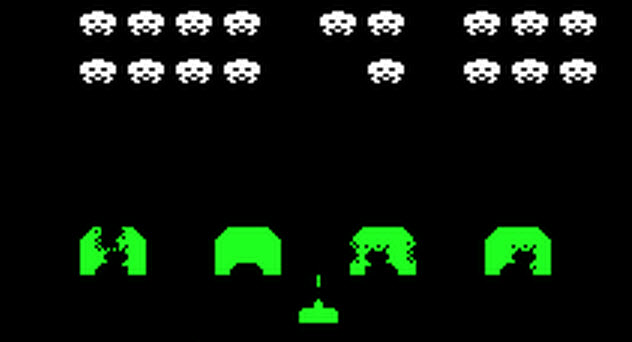

# Hardware

Much of this comes from the comments in the MAME emulator.
 * invaders.h 0000-07FF
 * invaders.g 0800-0FFF
 * invaders.f 1000-17FF
 * invaders.e 1800-1FFF

# Interrupts 

The mame/drivers/mw8080bw.c comments have the following information about the interrupts:
```
        The CPU's INT line is asserted via a D flip-flop at E3.
        The flip-flop is clocked by the expression (!(64V | !128V) | VBLANK).
        According to this, the LO to HI transition happens when the vertical
        sync chain is 0x80 and 0xda and VBLANK is 0 and 1, respectively.
        These correspond to lines 96 and 224 as displayed.
        The interrupt vector is provided by the expression:
        0xc7 | (64V << 4) | (!64V << 3), giving 0xcf and 0xd7 for the vectors.
        The flip-flop, thus the INT line, is later cleared by the CPU via
        one of its memory access control signals.
```

The value CF is RST 8 and D7 is RST 10.

If I understand this right then the system gets RST 8 when the beam is *near* the middle of the screen and RST 10 
when it is at the end (start of VBLANK).

# Video

The raster resolution is 256x224 at 60Hz. The monitor is rotated in the cabinet 90 degrees counter-clockwise.

The screens pixels are on/off (1 bit each). 256*224/8 = 7168 (7K) bytes.

# Memory Map 

 * 0000-1FFF   8K ROM
 * 2000-23FF   1K RAM
 * 2400-3FFF   7K Video RAM
 * 4000-       RAM mirror

# I/O Ports 

>>> memory

| | | |
| --- | --- | --- |
| 0000pr | INP0      | See below |
| 0001pr | INP1      | See below |
| 0002pr | INP2      | See below |
| 0003pr | SHFT_IN   | See below |
| 0002pw | SHFTAMNT  | See below |
| 0003pw | SOUND1    | See below |
| 0004pw | SHFT_DATA | See below |
| 0005pw | SOUND2    | See below |
| 0006pw | WATCHDOG  | See below |

These ports are mapped into the 8080's I/O address space (not the memory space):
```
  Read
   00        INPUTS (Mapped in hardware but never used by the code)
   01        INPUTS
   02        INPUTS
   03        bit shift register read
  Write
   02        shift amount (3 bits)
   03        sound bits
   04        shift data
   05        sound bits
   06        watch-dog  
```

Port 07 is also demultiplexed. The schematics say the select signal is wired directly to input-port-0's bit 7. This 
doesn't make sense. 

## Dedicated Shift Hardware 

The 8080 instruction set does not include opcodes for shifting. An 8-bit pixel image must be shifted into a 16-bit word 
for the desired bit-position on the screen. Space Invaders adds a hardware shift register to help with the math.

```
16 bit shift register:

	f              0	bit
	xxxxxxxxyyyyyyyy
	
	Writing to port 4 shifts x into y, and the new value into x, eg.
	$0000,
	write $aa -> $aa00,
	write $ff -> $ffaa,
	write $12 -> $12ff, ..
	
	Writing to port 2 (bits 0,1,2) sets the offset for the 8 bit result, eg.
	offset 0:
	rrrrrrrr		result=xxxxxxxx
	xxxxxxxxyyyyyyyy
	
	offset 2:
	  rrrrrrrr	result=xxxxxxyy
	xxxxxxxxyyyyyyyy
	
	offset 7:
	       rrrrrrrr	result=xyyyyyyy
	xxxxxxxxyyyyyyyy
	
	Reading from port 3 returns said result.
```

## Inputs

```
Port 0
 bit 0 DIP4 (Seems to be self-test-request read at power up)
 bit 1 Always 1
 bit 2 Always 1
 bit 3 Always 1
 bit 4 Fire
 bit 5 Left
 bit 6 Right
 bit 7 ? tied to demux port 7 ?

Port 1
 bit 0 = CREDIT (1 if deposit)
 bit 1 = 2P start (1 if pressed)
 bit 2 = 1P start (1 if pressed)
 bit 3 = Always 1
 bit 4 = 1P shot (1 if pressed)
 bit 5 = 1P left (1 if pressed)
 bit 6 = 1P right (1 if pressed)
 bit 7 = Not connected

Port 2
 bit 0 = DIP3 00 = 3 ships  10 = 5 ships
 bit 1 = DIP5 01 = 4 ships  11 = 6 ships
 bit 2 = Tilt
 bit 3 = DIP6 0 = extra ship at 1500, 1 = extra ship at 1000
 bit 4 = P2 shot (1 if pressed)
 bit 5 = P2 left (1 if pressed)
 bit 6 = P2 right (1 if pressed)
 bit 7 = DIP7 Coin info displayed in demo screen 0=ON

Port 3
  bit 0-7 Shift register data
```

## Output

```
Port 2:
 bit 0,1,2 Shift amount

Port 3: (discrete sounds)
 bit 0=UFO (repeats)        SX0 0.raw
 bit 1=Shot                 SX1 1.raw
 bit 2=Flash (player die)   SX2 2.raw
 bit 3=Invader die          SX3 3.raw
 bit 4=Extended play        SX4
 bit 5= AMP enable          SX5
 bit 6= NC (not wired)
 bit 7= NC (not wired)
 Port 4: (discrete sounds)
 bit 0-7 shift data (LSB on 1st write, MSB on 2nd)

Port 5:
 bit 0=Fleet movement 1     SX6 4.raw
 bit 1=Fleet movement 2     SX7 5.raw
 bit 2=Fleet movement 3     SX8 6.raw
 bit 3=Fleet movement 4     SX9 7.raw
 bit 4=UFO Hit              SX10 8.raw
 bit 5= NC (Cocktail mode control ... to flip screen)
 bit 6= NC (not wired)
 bit 7= NC (not wired)

Port 6:
 Watchdog ... read or write to reset
```

# Screen Geometry 

2400 - 3FFF (1C00 bytes = 256 * 28) 28*8=224. Screen is 256x224 pixels.

The map below shows the raster layout. Take this map and rotate it counter clockwise once. Thus the first
byte is lower left. First "row" ends upper left. Last byte is upper right.

``` 
     2400     2401     2402        ....   241F
     01234567 01234567 01234567    ....   01234567
 
     2420     2421     2422        ....   243F
     01234567 01234567 01234567    ....   01234567
    
     .                                    .
     .                                    .
     .                                    .
     .                                    .
 
     3FE0     3FE1     3FE2        ....   3FFF
     01234567 01234567 01234567    ....   01234567
```
