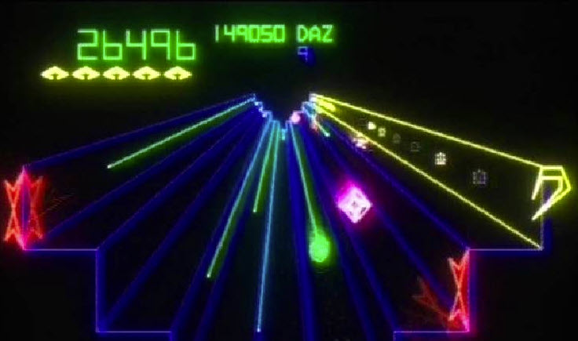

# RAM Usage

Work RAM lives at `0x0000`–`0x07FF`. Each name below describes the cell by its role in
the running game; the hex address is the stable identity. Cells that share a byte, or
whose role is only partly pinned, carry a terse caveat.

>>> memory

| Address | Name | Description |
| --- | --- | --- |
| 0000 | gameMode | Current game-mode/state code that drives the mode dispatch and is armed from the pending mode |
| 0001 | modeDispatchSel | Pre-doubled selector paired with the mode byte; indexes the main-loop trampoline handler table |
| 0002 | gameModePending | Pending game mode promoted into GAME_MODE once the mode-delay timer expires |
| 0003 | frameCounter | Per-update frame counter; its low bits are the animation/even-odd phase read across the draw code |
| 0004 | modeDelayTimer | Delay countdown that gates promotion of the pending mode into the live mode |
| 0005 | statusFlags | Game status flag byte; bit7 = play/active state, other bits gate scoring, sound and draw paths |
| 0006 | phaseCounter | Phase/step counter drained by the setup step and clamped to 0x28 for a packed on-screen readout |
| 0007 | irqSubtimer | Software sub-timer incremented each interrupt; its wrap drives the TIMER1_LO/TIMER2_LO carry cascades |
| 0008 | inputPortLatch | Latched raw input port snapshot whose bits gate the three heartbeat lanes |
| 0009 | dsw1Snapshot | Snapshot of option/coinage port DSW1_COINAGE (bit1 toggled), read for configuration and increments |
| 000a | dsw2Snapshot | Snapshot of option port DSW2_OPTIONS, sliced three ways into DIP configuration tables |
| 000c | soundStepGate | Flag enabling the periodic sound-register sub-step in the per-frame dispatcher |
| 000d | laneWrapPos | Three-lane wrapped position accumulator (masked to five bits) advanced by the heartbeat |
| 0010 | laneDowntimer | Per-lane down-timer (reloads to 0x78) that drives the heartbeat accumulator step |
| 0013 | laneCounter | Three-entry per-lane counter advanced by the heartbeat; its bit7 feeds the coin/LED latch |
| 0014 | laneCounter1 | Second entry of the three-lane heartbeat counter (LANE_COUNTER base) |
| 0015 | laneCounter2 | Third entry of the three-lane heartbeat counter (LANE_COUNTER base) |
| 0016 | heartbeatAccumLo | Low byte of the heartbeat running accumulator advanced with a carry link |
| 0017 | heartbeatAccumHi | High byte of the heartbeat running accumulator, later reduced by a table amount |
| 0018 | heartbeatAccumOverflow | Overflow tally advanced when the heartbeat accumulator subtraction stays non-negative |
| 0019 | levelGeomLo | Eight-entry working table of the current level's low geometry nibbles (mirrored to colour RAM COLOR_RAM) |
| 0021 | levelGeomHi | Eight-entry working table of the current level's high geometry nibbles (mirrored to colour RAM COLOR_RAM_8) |
| 0022 | colorCycle0 | First entry of a three-entry array mirrored into colour RAM COLOR_RAM_9..COLOR_RAM_B |
| 0023 | colorCycle1 | Second entry of the three-entry array mirrored into colour RAM COLOR_RAM_9..COLOR_RAM_B |
| 0024 | colorCycle2 | Third entry of the three-entry array mirrored into colour RAM COLOR_RAM_9..COLOR_RAM_B |
| 002c | coordListPtrLo | Low byte of the current coordinate-list / working indirect pointer pair |
| 002d | coordListPtrHi | High byte of the current coordinate-list / working indirect pointer pair |
| 0033 | mathboxSignX | Sign flag of the horizontal (X) delta fed to the math box, controlling the X offset fold |
| 0034 | mathboxSignY | Sign flag of the vertical (Y) delta fed to the math box, controlling the Y offset fold |
| 0035 | savedIndex | Scratch that preserves a caller loop/slot index (X or Y) across a subroutine call |
| 0036 | savedIndex2 | Second index-save scratch preserving a caller loop/slot index across a call |
| 0037 | slotLoopIndex | Current slot/column loop index driving the per-slot draw and update walks |
| 0038 | tableCursor | Secondary table/packed-record cursor and working-slot index used by the draw and projection passes |
| 003a | wellDepthRow | Depth-row index into the well depth table SLOT_THRESHOLD_TABLE while drawing the playfield well rows |
| 003b | workPtrLo | Low byte of a general working indirect pointer (source/glyph/shape-list/destination pointer) |
| 003c | workPtrHi | High byte of the general working indirect pointer paired with WORK_PTR_LO |
| 003e | activeSlotCount | Upper loop bound / active slot-or-channel count used by the per-slot scans |
| 003f | levelId | Current/target level id compared against the last-seen level to trigger level setup |
| 0046 | playerLevelTbl | Per-slot table of level/progress values indexed by loc_3d; feeds the level cell loc_9f |
| 0048 | slotCountdown | Per-slot countdown/counter table indexed by loc_3d, decremented by the pacing tick |
| 0049 | slotCountdownHi | High/paired partner of the SLOT_COUNTDOWN slot countdown, spent together with it |
| 004d | inputDebounced | Debounced held-input byte built from this and last frame's samples |
| 004e | inputEdgeFlags | Newly-pressed input edges plus control/gate bits consumed by the frame steppers |
| 004f | inputPrev | Previous-frame held-input snapshot used to detect rising edges |
| 0050 | spinnerAccum | Accumulated spinner delta (rotary encoder) read as the manual rim-rotation input |
| 0051 | rimRotOffset | Stored fine rim-rotation offset/velocity folded into the coarse angle each update |
| 0052 | spinnerPotPrev | Previous inverted spinner pot reading used to form the per-interrupt delta |
| 0053 | irqHeartbeat | Interrupt heartbeat counter; the main loop waits for it to reach nine as its frame boundary |
| 0055 | drawStyle | Style/colour selector byte staged for the object-record draw builder |
| 0056 | projPtY | Vertical (Y) coordinate operand fed to the math-box projection |
| 0057 | objDepth | Current object/segment depth (Z) value gated and projected by the draw pipeline |
| 0058 | projPtX | Horizontal (X) coordinate operand fed to the math-box projection |
| 0059 | clampTally | Clamp/run tally counter for the rim-segment and lane-sweep builders |
| 005a | runSize | Run-size/count field for the rim-segment builder and the style pair |
| 005b | depthLo | Low byte of the 16-bit well-depth / countdown-clock value, also a draw guard flag (bit7) |
| 005c | depthAccumLo | Low byte of a secondary depth accumulator stepped alongside DEPTH_HI |
| 005d | depthTarget | Target depth reseeded into the position high byte when the depth window collapses |
| 005e | projYRef | Vertical (Y) reference/base subtracted from the point Y in the projection |
| 005f | depthHi | High byte of the 16-bit well-depth / countdown-clock and the reference depth for object gating |
| 0060 | projXRef | Horizontal (X) reference/base subtracted from the point X in the projection |
| 0061 | projYLo | Low byte of the projected vertical (Y) accumulator / working coordinate block |
| 0062 | projYHi | High byte of the projected vertical (Y) accumulator |
| 0063 | projXLo | Low byte of the projected horizontal (X) accumulator / working coordinate block |
| 0064 | projXHi | High byte of the projected horizontal (X) accumulator |
| 0066 | projOfsYLo | Low byte of the vertical (Y) offset folded into the projected Y accumulator |
| 0067 | projOfsYHi | High byte of the vertical (Y) projection offset paired with PROJ_OFS_Y_LO |
| 0068 | projOfsXLo | Low byte of the horizontal (X) offset folded into the projected X accumulator (also a 24-bit total low byte) |
| 0069 | projOfsXHi | High byte of the horizontal (X) projection offset paired with PROJ_OFS_X_LO |
| 006a | prevYLo | Low byte of the cached previous-point Y, subtracted by stroke-delta drawing |
| 006b | prevYHi | High byte of the cached previous-point Y |
| 006c | prevXLo | Low byte of the cached previous-point X, subtracted by stroke-delta drawing |
| 006d | prevXHi | High byte of the cached previous-point X |
| 006e | vecDeltaYLo | Low byte of the sign-extended vertical (Y) delta pair emitted as a vector stroke |
| 006f | drawDeltaAHi | high byte of the first 16-bit coordinate delta of a vector record |
| 0070 | drawDeltaBLo | low byte of the second 16-bit coordinate delta of a vector record |
| 0071 | drawDeltaBHi | high byte of the second 16-bit coordinate delta of a vector record |
| 0072 | vgLastStat | cached last-emitted vector-generator state word, used to skip redundant emits |
| 0073 | vgRecordHeader | current vector-record header/opcode nibble byte |
| 0074 | drawCursorLo | low half of the vector display-list write pointer |
| 0075 | drawCursorHi | high half of the vector display-list write pointer |
| 0076 | drawCursorAltLo | low half of the alternate vector write pointer swapped with the main cursor |
| 0077 | drawCursorAltHi | high half of the alternate vector write pointer |
| 0078 | segSpreadALo | base of the 8-entry low-byte array of interpolated coordinate A along a segment |
| 0079 | segSpreadALo1 | interpolated coordinate-A low byte, index 1 (also holds the clamped signed delta-A seed) |
| 007a | segSpreadALo2 | interpolated coordinate-A low byte, index 2 |
| 007b | segSpreadALo3 | interpolated coordinate-A low byte, index 3 |
| 007c | segSpreadALo4 | interpolated coordinate-A low byte, index 4 |
| 007d | segSpreadALo5 | interpolated coordinate-A low byte, index 5 |
| 007e | segSpreadALo6 | interpolated coordinate-A low byte, index 6 |
| 007f | segSpreadALo7 | interpolated coordinate-A low byte, index 7 |
| 0080 | segSpreadAHi | base of the 8-entry high-byte array of interpolated coordinate A |
| 0081 | segSpreadAHi1 | interpolated coordinate-A high byte, index 1 |
| 0082 | segSpreadAHi2 | interpolated coordinate-A high byte, index 2 (doubles as the running fraction accumulator) |
| 0083 | segSpreadAHi3 | interpolated coordinate-A high byte, index 3 |
| 0084 | segSpreadAHi4 | interpolated coordinate-A high byte, index 4 |
| 0085 | segSpreadAHi5 | interpolated coordinate-A high byte, index 5 |
| 0086 | segSpreadAHi6 | interpolated coordinate-A high byte, index 6 |
| 0087 | segSpreadAHi7 | interpolated coordinate-A high byte, index 7 |
| 0088 | segSpreadBLo | base of the 8-entry low-byte array of interpolated coordinate B along a segment |
| 0089 | segSpreadBLo1 | interpolated coordinate-B low byte, index 1 (also holds the clamped signed delta-B seed) |
| 008a | segSpreadBLo2 | interpolated coordinate-B low byte, index 2 |
| 008b | segSpreadBLo3 | interpolated coordinate-B low byte, index 3 |
| 008c | segSpreadBLo4 | interpolated coordinate-B low byte, index 4 |
| 008d | segSpreadBLo5 | interpolated coordinate-B low byte, index 5 |
| 008e | segSpreadBLo6 | interpolated coordinate-B low byte, index 6 |
| 008f | segSpreadBLo7 | interpolated coordinate-B low byte, index 7 |
| 0090 | segSpreadBHi | base of the 8-entry high-byte array of interpolated coordinate B |
| 0091 | segSpreadBHi1 | interpolated coordinate-B high byte, index 1 |
| 0092 | segSpreadBHi2 | interpolated coordinate-B high byte, index 2 (doubles as the running fraction accumulator) |
| 0093 | segSpreadBHi3 | interpolated coordinate-B high byte, index 3 |
| 0094 | segSpreadBHi4 | interpolated coordinate-B high byte, index 4 |
| 0095 | segSpreadBHi5 | interpolated coordinate-B high byte, index 5 |
| 0096 | segSpreadBHi6 | interpolated coordinate-B high byte, index 6 |
| 0097 | segSpreadBHi7 | interpolated coordinate-B high byte, index 7 |
| 0099 | drawRecordCount | countdown of four-byte vector records still to emit in a run |
| 009b | segDeltaASign | high/sign byte of the first signed segment delta |
| 009d | segDeltaBSign | high/sign byte of the second signed segment delta |
| 00a1 | vgModeFlag | vector draw mode flag carrying bit 2 of the selected scale value |
| 00a6 | activeEnemyCount | count of live climbing enemies, also indexes the per-wave difficulty table |
| 00a9 | drawCursorOffset | byte offset added to the draw cursor for the current record run |
| 00aa | drawSrcPtrLo | low half of an indirect source pointer read during draw-record building |
| 00ab | drawSrcPtrHi | high half of the indirect draw source pointer |
| 00ae | nibbleEmitCount | remaining byte count while emitting a run of zero-page bytes as nibbles |
| 00af | nibbleEmitIndex | current zero-page source index for the nibble-run emitter |
| 00b0 | drawPatchPtrLo | low half of a saved record pointer used for a colour-patch second pass |
| 00b1 | drawPatchPtrHi | high half of the saved colour-patch record pointer |
| 00b4 | vgScale | selected vector-generator scale byte |
| 00b5 | checksumAcc | rolling checksum accumulator over a fixed ROM table |
| 00b6 | drawRecordPtrLo | low half of the pointer remembering where a display-list record began |
| 00b7 | drawRecordPtrHi | high half of the display-list record-start pointer |
| 00bd | nvramScanPtrLo | low half of the pointer walking a region's RAM copy for the EAROM store/verify |
| 00be | nvramScanPtrHi | high half of the EAROM region-copy walk pointer |
| 00bf | soundSlotSentinel | index of the voice slot currently being claimed, holding the 0xff sentinel otherwise |
| 00c0 | soundVoiceValue | base of the 16-entry per-voice value/pitch table for the sound engine |
| 00d0 | soundVoiceLevel | base of the 16-entry per-voice level/output table published to POKEY |
| 00e0 | soundFastTimer | base of the 16-entry per-voice fast (frame-step) timer array |
| 00f0 | soundSlowTimer | base of the 16-entry per-voice slow (envelope) timer array |
| 0104 | spikeStepLo | low byte of the moving spike's 16-bit per-frame height increment |
| 0105 | spikeStepHi | high byte of the moving spike's 16-bit per-frame height increment |
| 0106 | spikeActiveFlag | moving-spike active/arm flag, active while bit7 set |
| 0107 | spikeHeightLo | low byte of the moving spike's 16-bit height (high byte in PLAYER_SHOT_DEPTH) |
| 0108 | enemyTotalCount | total live-enemy count decremented when no per-type count applies |
| 0109 | enemyTypeCount | per-type live-enemy count |
| 010a | scriptWalkContinue | walk-continuation flag that keeps an object's driving script walk alive |
| 010b | scriptCursor | rolling cursor naming the current position within the object script table |
| 010c | scriptBranchFlag | flag recording the outcome of the most recent script test |
| 010d | spawnFoundFlag | flag set when the spawn walk found a live or newly-spawned object |
| 010e | spawnBudgetTimer | per-frame spawn budget countdown |
| 0111 | tubeGeomFlag | per-level tube-geometry flag; bit7 governs lane-index wrap and nonzero marks a live board |
| 0112 | tubeShapeIndex | current tube shape/level index used to index the level geometry tables |
| 0114 | redrawCounter | display-change counter bumped when watched state changes; also used as a 0xff dirty flag |
| 0115 | spikeTableGuard | Arm/guard flag for the descending spike object; its sign also chooses which rail the spike table snaps to |
| 0116 | timedObjectCount | Live-count / pending flag for the eight-slot timed-object table |
| 0118 | objectVelocityHi | High byte of the 16-bit per-frame velocity added to a far-slot object's position |
| 0119 | spawnTimerReload | Reload period written into a source slot's spawn timer after it fires |
| 011a | flyerSlotTop | Top index for the free-flight destination-slot scan, clamped 0..3 by difficulty |
| 011b | playerShapeSum | Running checksum of the 40-byte player-Blaster shape block, used as a draw/age gate |
| 011c | enemySlotTop | Top index / count of the parallel per-slot enemy (climber) arrays |
| 0120 | objectVelocityLo | Low byte of the 16-bit per-frame velocity added to a far-slot object's position |
| 0121 | levelGeomScale | Per-level tube geometry scale, the signed delta driving the warp/zoom accumulator |
| 0122 | zoomAccumHi | High byte of the 24-bit warp/zoom position accumulator ZOOM_ACCUM_HI:PROJ_OFS_X_LO:PROJ_OFS_X_HI |
| 0123 | spikedSegmentCount | Tally of occupied/spiked segments around the tube, also carrying a per-frame bit7 flag |
| 0124 | rimColorAnim | Rim-lane colour-cycle animation counter, seeded on score award and decremented while drawing |
| 0125 | wavePhaseLatch | Wave/level-intro phase latch: set 0xff when the wave block is ready, gates staged sweeps |
| 0126 | wavePeakSeed | Peak-slot seed used to pick the wave start slot |
| 0127 | depthCeiling | Ceiling for the player depth window / wave start-depth index |
| 0129 | columnSpawnCap | Per-column maximum enemy count (5-entry table 0x129..0x12d) used to cap spawning |
| 012e | columnEnemyTarget | Per-column target enemy count (base of a 5-entry table), source of the spawn deficit |
| 0133 | levelLayoutTrigger | One-shot level-layout flag gating the initial colour-RAM clear |
| 0135 | activeObjectCount | Live count for the near-rim / projectile object bank (SLOT_STATE / loc_2db slots) |
| 0139 | vecramTailCursorLo | Low byte of the 16-bit vector-RAM tail write cursor |
| 013a | vecramTailCursorHi | High byte of the 16-bit vector-RAM tail write cursor |
| 013b | objectAnimPhase | Animation phase index / priority head flag for the animated top-object |
| 013c | objectAnimTimer | Sub-timer / ready flag paired with the object animation phase |
| 013d | spawnDeficitC0 | Column-0 entry of the five-column spawn-deficit table (0x13d..0x141) |
| 013f | spawnDeficitC2 | Column-2 entry of the five-column spawn-deficit table |
| 0140 | spawnDeficitC3 | Column-3 entry of the five-column spawn-deficit table |
| 0142 | laneEnemyCount0 | Column-0 entry of the per-column active-enemy counter table (0x142..0x146) |
| 0143 | laneEnemyCount1 | Column-1 entry of the per-column active-enemy counter table |
| 0144 | laneEnemyCount2 | Column-2 entry of the per-column active-enemy counter table |
| 0145 | laneEnemyCount3 | Column-3 entry of the per-column active-enemy counter table |
| 0146 | laneEnemyCount4 | Column-4 entry of the per-column active-enemy counter table |
| 0147 | enemyAnimDelta | Signed per-frame step folded into the enemy animation/oscillator accumulator |
| 0148 | enemyAnimAccum | Signed enemy animation/oscillator accumulator driving flip and draw style |
| 0149 | candidateLane0 | First entry of the four-entry candidate-lane table used to pick a climber's lane |
| 014a | candidateLane1 | Second entry of the four-entry candidate-lane table |
| 014f | spikeLaneMaskAcc | Working bit-mask accumulator of lanes with a mid-growth spike during the timer scan |
| 0150 | spikeLaneMaskOut | Published copy of the spike-lane occupancy bit-mask after the timer scan |
| 0151 | enemyBandThreshold0 | Band-0 entry of the far-slot proximity/retire threshold table (0x151..0x155) |
| 0152 | enemyBandThreshold1 | Band-1 entry of the far-slot proximity/retire threshold table |
| 0153 | enemyBandThreshold2 | Band-2 entry of the far-slot proximity/retire threshold table |
| 0154 | enemyBandThreshold3 | Band-3 entry of the far-slot proximity/retire threshold table |
| 0155 | enemyBandThreshold4 | Band-4 entry of the far-slot proximity/retire threshold table |
| 0156 | bonusLifeInterval | DIP-selected bonus-life score interval used as the award threshold |
| 0157 | nearDepthThreshold | Depth threshold below which an enemy counts as near the rim / reverses direction |
| 0158 | dswBonusConfig | DIP-decoded bonus/award configuration byte seeding the per-slot award counter |
| 0159 | enemyFireSelect | Per-enemy fire/aim selector flag (bit6 chooses the segment-step direction) |
| 015a | laneFillInit | Initial per-lane fill value written across the sixteen-entry lane table at wave setup |
| 015b | initialActiveCount | Initial active-object/slot count for the wave, copied into FIRE_GATE |
| 015d | listPtrHi | Held high-byte source for the list-setup pointer |
| 015e | coordDispatchSel | Even selector byte halved to dispatch a coordinate/step helper |
| 015f | enemyFireThreshold | POKEY-random threshold that gates whether an enemy fires this frame |
| 0160 | enemyClimbDeltaLo0 | Segment-0 low byte of the per-segment enemy climb-speed delta table (0x160..0x164) |
| 0161 | enemyClimbDeltaLo1 | Segment-1 low byte of the per-segment enemy climb-speed delta table |
| 0162 | enemyClimbDeltaLo2 | Segment-2 low byte of the per-segment enemy climb-speed delta table |
| 0163 | enemyClimbDeltaLo3 | Segment-3 low byte of the per-segment enemy climb-speed delta table |
| 0164 | enemyClimbDeltaLo4 | Segment-4 low byte of the per-segment enemy climb-speed delta table |
| 0165 | enemyClimbDeltaHi0 | Segment-0 high byte of the per-segment enemy climb-speed delta table (0x165..0x169) |
| 0166 | enemyClimbDeltaHi1 | Segment-1 high byte of the per-segment enemy climb-speed delta table |
| 0167 | enemyClimbDeltaHi2 | Segment-2 high byte of the per-segment enemy climb-speed delta table |
| 0168 | enemyClimbDeltaHi3 | Segment-3 high byte of the per-segment enemy climb-speed delta table |
| 0169 | enemyClimbDeltaHi4 | Segment-4 high byte of the per-segment enemy climb-speed delta table |
| 016a | dswDifficulty | DIP-decoded difficulty/config byte; its low bits drive the enemy-speed rescale |
| 016b | modeDelayGuard | Guard/flag holding a pending mode transition through a delay |
| 016c | decimalModeFlag | Flag gating decimal (BCD) score arithmetic and a self-check byte |
| 016d | listSelectFlags | Flags byte OR-folded into a list-setup pointer low byte |
| 016e | scoreDisplayTimer | Countdown timer ticked while drawing the score / high-score display |
| 01c6 | earomBlankFlag | High-score EAROM blank flag: when nonzero the write path zeros each source cell (erase a region) |
| 01c7 | earomRegionPending | High-score EAROM region-pending bits (one per low bit) awaiting service |
| 01c8 | earomRegionDir | High-score EAROM per-region direction bits: set = write out, clear = read back in |
| 01c9 | pendingWorkFlags | Working flags byte: EAROM per-region checksum-fail result bits and geometry-rebuild request bits |
| 01ca | earomMode | High-score EAROM step-machine mode/busy byte (0x80 write, 0x20 read, 0 idle) |
| 01cb | earomPassCounter | High-score EAROM per-region pass counter |
| 01cc | earomCursor | High-score EAROM RAM cursor stepping through a region's bytes |
| 01cd | earomLimit | High-score EAROM region end/limit cursor (checksum position) |
| 01ce | earomRegionMask | Single-region mask isolated from the pending bits for the current EAROM pass |
| 01cf | earomChecksumAcc | Running checksum accumulator for the EAROM region read/write |
| 01ff | highLevelMarker | Latched high-level marker copied from the level index when the level is deep enough |
| 0200 | playerSegment | Player Blaster rim segment (coarse rotation position / current lane) |
| 0201 | playerFineAngle | Player fine rotation offset with bit7 as the rotation/object-pending flag |
| 0202 | playerShotDepth | Shared depth position of the player shot down the tube (0x10 rim.. |
| 0203 | objectIndexTable | Per-entry object index / segment nibble in the 64-entry object-record bank (0x203..0x242) |
| 0223 | objectAxis0Frac | Axis-0 position-fraction low byte in the free-flight three-axis object integrator |
| 0243 | objectRecordTable | 64-entry object-record table: per-slot growth/spawn timer, also its kind byte and random tag |
| 0263 | objectAxis1Pos | Axis-1 whole-coordinate byte in the free-flight three-axis object integrator |
| 027f | objectBand | Per-object attribute folded to a 3-bit band selecting the proximity/retire threshold |
| 0283 | enemySlotFlags | Per-enemy-slot state byte: nonzero while alive, low 3 bits = lane/segment kind, bit6 = side, bit7 = live |
| 028a | enemySlotDir | Per-enemy-slot direction/state byte: bit7 = climb direction, bit6 = armed, low bits = kind |
| 0291 | enemyScriptCursor | per-slot saved motion-script cursor for the climbing-enemy slot |
| 029f | enemyDepthLo | low byte of a climbing enemy's 16-bit tube-depth coordinate |
| 02a3 | enemyPos2 | axis-2 integer coordinate of the free-flight spawn integrator |
| 02a6 | enemyTimer | per-slot countdown timer for a climbing enemy |
| 02ad | targetSeg | per-slot target segment for the lane-spawn object bank |
| 02b9 | enemySegment | target segment/lane number of a climbing enemy |
| 02c3 | enemyVel1Lo | axis-1 velocity low byte of the free-flight spawn integrator |
| 02cc | enemyPhase | per-slot phase counter / successor-segment heading |
| 02d3 | slotState | per-slot counter/occupied cell for the lane-spawn bank (0 = free) |
| 02df | enemyDepth | high byte of an enemy's tube depth; nonzero marks the slot live |
| 02e3 | enemyVel0Lo | axis-0 velocity low byte of the free-flight spawn integrator |
| 02f2 | hitTally | per-slot active flag (0xff) and hit tally for the lane-spawn bank |
| 02fa | shapeCoord | per-slot coordinate for the eight-slot shape draw bank |
| 0302 | shapeId | per-slot shape id for the eight-slot shape draw bank |
| 0303 | enemyVel2Lo | axis-2 velocity low byte of the free-flight spawn integrator |
| 030a | shapeActive | per-slot active flag for the eight-slot shape draw bank (nonzero = drawn) |
| 0312 | shapeAnim | per-slot animation/age byte for the shape draw bank |
| 031a | colValA | per-column geometry value (plane A) built at level setup |
| 0323 | enemyVel1Hi | axis-1 velocity high byte of the free-flight spawn integrator |
| 032a | colSubA | per-column geometry sub/second byte paired with COL_VAL_A |
| 033a | colValB | per-column geometry value (plane B) built at level setup |
| 0343 | enemyVel0Hi | axis-0 velocity high byte of the free-flight spawn integrator |
| 034a | colSubB | per-column geometry sub/second byte paired with COL_VAL_B |
| 035a | objDyHi | per-object Y-delta high byte |
| 0363 | enemyVel2Hi | axis-2 velocity high byte of the free-flight spawn integrator |
| 036a | objDyLo | per-object Y-delta low byte |
| 037a | objDxHi | per-object X-delta high byte |
| 038a | objDxLo | per-object X-delta low byte |
| 039a | laneTargetFlag | per-lane target flag (0xc0/0x80 marks a flagged lane) |
| 03aa | sweepStage | stage/phase index for the sweep handler |
| 03ab | fireGate | global gate that enables enemy fire |
| 03ac | laneLimit | per-lane limit/threshold used by the hit/award scan |
| 03ce | segBaseX | per-segment base X coordinate of the tube geometry |
| 03de | segBaseY | per-segment base Y coordinate of the tube geometry |
| 03ee | segDirection | per-segment ring-direction table |
| 0406 | timer1Lo | low byte of a software timer cascade ticked by the periodic interrupt |
| 0407 | timer1Mid | middle byte of the first software timer cascade |
| 0408 | timer1Hi | high byte of the first software timer cascade |
| 0409 | timer2Lo | low byte of a second software timer cascade |
| 040a | timer2Mid | middle byte of the second software timer cascade |
| 040b | timer2Hi | high byte of the second software timer cascade |
| 040c | coordAccLo | low byte of a 16-bit coordinate accumulator |
| 040d | coordAccHi | high byte of the 16-bit coordinate accumulator |
| 040f | digitInLo | low byte of the digit builder's first input pair |
| 0410 | digitInHi | high byte of the digit builder's first input pair |
| 0412 | divQuotient | quotient cell seeded by the digit builder's divide |
| 0413 | divRemainder | remainder cell seeded by the digit builder's divide |
| 0415 | pointerParity | per-slot parity flag toggled to double-buffer pointer records |
| 0425 | laneFlags | sixteen-entry rim-lane flag/color block |
| 0435 | segMidX | per-segment midpoint X (average of adjacent segment bases) |
| 0445 | segMidY | per-segment midpoint Y (average of adjacent segment bases) |
| 051e | sortPayloadLo | low byte of a per-row payload reordered by the buildSortedSoundRequest bubble sort |
| 051f | sortPayloadMid | middle byte of the per-row payload reordered by the sort |
| 0520 | sortPayloadHi | high byte of the per-row payload reordered by the sort |
| 0600 | slotMetric | per-channel/slot count array |
| 0602 | activeSlot | current active-slot cursor for the arming driver |
| 0603 | requestBits | packed request word, two bits per slot, drained by the arming driver |
| 0604 | rearmCounter | step counter that re-arms the driver when it underflows |
| 0605 | passCounter | sort-pass counter / arming countdown |
| 0606 | slotValue | per-slot value block clamped to the 0x1a rail |
| 061e | sortKeyLo | low byte of the per-row sort key |
| 061f | sortKeyMid | middle byte of the per-row sort key |
| 0620 | sortKeyHi | high byte of the per-row sort key |
| 0706 | glyphParamX | per-slot glyph draw parameter (plane X) |
| 0707 | glyphParamY | per-slot glyph draw parameter (plane Y) |
| 0708 | glyphParamZ | per-slot glyph draw parameter (plane Z) |
| 071e | inputSnapshotHi | change-detection latch of (DSW2_SNAPSHOT & 0xf8) |
| 071f | inputSnapshotLo | change-detection latch of (DSW_DIFFICULTY & 0x03) |
