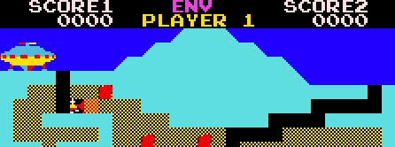

# The Pit Main CPU (Z80)

>>> cpu Z80

>>> binary 0000:roms/p38b.ic38 + roms/p39b.ic39 + roms/p40b.ic40 + roms/p41b.ic41 + roms/p33b.ic33

>>> memoryTable hard

[Hardware Info](Hardware.md)

>>> memoryTable ram

[RAM Usage](RAMUse.md)

```code
; The Pit (Zilec / Centuri / Taito, 1982). You are an astronaut-explorer on a
; forbidden planet: dig down through the dirt field to the bottom treasure
; chamber, grab jewels (four crystals and three diamonds), and climb back up to
; your ship -- the last stretch being the "Pit" crossing. Rival explorers roam
; the tunnels; you fire a horizontal laser. Grab at least one diamond and reach
; the top rung, and the ship carries you off, rebuilding the board one level
; higher and faster. Run out of lives to lose.
;
; Architecture: reset ($0000) jumps to cold-boot init ($01A4), which sets up the
; machine and falls into attract. The forever main loop ($0348) enables the
; vblank NMI, then each pass runs the player / board-transition dispatcher
; ($13C9), mountain erosion ($241C), the jewel glitter ($06AC), and the laser
; ($24F3) -- which tail-chains the whole actor pipeline: digging and falling
; hazards, the chamber creature, and the enemies. The vblank NMI ($0066) does
; the real per-frame service: sound, sprite DMA, frame timers, and input debounce.


; Reset vector -- jump to cold-boot init.
resetVector:
0000: C3 A4 01        JP      $01A4               ; {code.coldBootInit} on reset, jump straight to cold-boot setup

; ---- $0003-$0065: data ----
0003: 98 59 6B C8 A8 99 AC 9B 7F 98 AE 9C 69 9B F8 81
0013: 9C 99 9A E5 A8 99 98 9B 9B 99 59 9C 93 88 DF 91
0023: EB 99 54 9D 29 5D 55 58 E1 58 AB 6D 2C 99 9C 29
0033: 76 68 B6 A9 96 C3 A4 01 D7 A9 13 4F 88 A9 98 39
0043: 6B 99 16 DD 29 D9 DD 99 5C 14 58 54 98 C9 9A 9B
0053: 61 88 9C 9B 6B A8 81 99 5B 8A 54 9C 4A 99 9D DD
0063: EB D9 86

; Vblank NMI -- the per-frame service. Acknowledge the interrupt, run the
; coin/credit corruption watchdog over the three redundant credit copies,
; drain one slot from the sound ring to the sound board, copy the sprite
; staging block to sprite RAM, tick the frame dividers and the play-phase
; ramp, and sample+debounce the two input ports.
serviceVblankNmi:
0066: 08              EX      AF,AF'              ; save the interrupted code's registers for the frame service
0067: D9              EXX                         
0068: 3E 00           LD      A,$00               
006A: 32 00 B0        LD      ($B000),A           ; {hard.dsw} acknowledge the interrupt so a second vblank cannot re-enter
006D: 3A 00 80        LD      A,($8000)           ; {hard.workRam} read the banked credit count
0070: FE 0A           CP      $0A                 ; compare against the cap of ten
0072: D2 A4 01        JP      NC,$01A4            ; {code.coldBootInit} credit count past its cap means corruption, cold-reset
0075: 47              LD      B,A                 
0076: 3A 1C 80        LD      A,($801C)           ; {hard.workRam+1C} read the first redundant credit copy
0079: B8              CP      B                   ; cross-check it against the count
007A: C2 A4 01        JP      NZ,$01A4            ; {code.coldBootInit} a disagreeing copy means corruption, cold-reset
007D: 3A 2C 81        LD      A,($812C)           ; {hard.workRam+12C} read the second redundant credit copy
0080: B8              CP      B                   
0081: C2 A4 01        JP      NZ,$01A4            ; {code.coldBootInit} second copy disagrees, cold-reset
0084: 3A 1F 80        LD      A,($801F)           ; {hard.workRam+1F} read the sound ring read index
0087: 5F              LD      E,A                 
0088: 3A 1E 80        LD      A,($801E)           ; {hard.workRam+1E} read the sound ring enqueue head
008B: BB              CP      E                   
008C: 28 17           JR      Z,$00A5             ; {code.loc_00a5} read index caught the head, ring empty this frame
008E: 7B              LD      A,E                 
008F: 3C              INC     A                   
0090: E6 07           AND     $07                 ; wrap the read index around the eight-slot ring
0092: 32 1F 80        LD      ($801F),A           ; {hard.workRam+1F} store the advanced read index
0095: 21 20 80        LD      HL,$8020            ; point at the sound ring base
0098: 16 00           LD      D,$00               
009A: 19              ADD     HL,DE               ; index the next queued sound slot
009B: 7E              LD      A,(HL)              ; read the queued sound command
009C: 36 00           LD      (HL),$00            ; consume the slot
009E: CB 7F           BIT     7,A                 ; check the pending marker in the high bit
00A0: 28 03           JR      Z,$00A5             ; {code.loc_00a5} no pending marker, skip firing
00A2: 32 00 B8        LD      ($B800),A           ; {hard.soundLatch} fire the queued command to the sound board

loc_00a5:
00A5: 11 40 98        LD      DE,$9840            ; point at hardware sprite RAM
00A8: 21 20 82        LD      HL,$8220            ; point at the sprite staging block
00AB: 01 20 00        LD      BC,$0020            ; copy thirty-two bytes, eight sprites
00AE: ED B0           LDIR                        ; blit the staged sprites into sprite RAM
00B0: 3A 09 80        LD      A,($8009)           ; {hard.workRam+9} read the frame-wait countdown
00B3: 3D              DEC     A                   ; tick it down one frame
00B4: 32 09 80        LD      ($8009),A           ; {hard.workRam+9} store the countdown the pacer polls
00B7: 3A 06 80        LD      A,($8006)           ; {hard.workRam+6} read the first one-second divider
00BA: 3D              DEC     A                   
00BB: 32 06 80        LD      ($8006),A           ; {hard.workRam+6}
00BE: 20 0C           JR      NZ,$00CC            ; {code.loc_00cc} not yet a full second, skip the reload
00C0: 3A 0F 80        LD      A,($800F)           ; {hard.workRam+F} borrow from the counter beneath the divider
00C3: 3D              DEC     A                   
00C4: 32 0F 80        LD      ($800F),A           ; {hard.workRam+F}
00C7: 3E 3C           LD      A,$3C               ; reload sixty frames
00C9: 32 06 80        LD      ($8006),A           ; {hard.workRam+6} restart the first one-second divider

loc_00cc:
00CC: 3A 07 80        LD      A,($8007)           ; {hard.workRam+7} read the second one-second divider
00CF: 3D              DEC     A                   
00D0: 32 07 80        LD      ($8007),A           ; {hard.workRam+7}
00D3: 20 0C           JR      NZ,$00E1            ; {code.loc_00e1} not a full second yet, skip
00D5: 3A 10 80        LD      A,($8010)           ; {hard.workRam+10} read the play-phase counter
00D8: 3C              INC     A                   ; advance it once per second
00D9: 32 10 80        LD      ($8010),A           ; {hard.workRam+10} store the play-phase counter
00DC: 3E 3C           LD      A,$3C               ; reload sixty frames
00DE: 32 07 80        LD      ($8007),A           ; {hard.workRam+7} restart the second divider

loc_00e1:
00E1: 3A 16 80        LD      A,($8016)           ; {hard.workRam+16} read the previous coin/start sample
00E4: 47              LD      B,A                 
00E5: 3A 00 A8        LD      A,($A800)           ; {hard.in1} read the coin/start input port
00E8: B8              CP      B                   ; did two reads in a row agree?
00E9: 20 03           JR      NZ,$00EE            ; {code.loc_00ee} unsettled, do not latch yet
00EB: 32 15 80        LD      ($8015),A           ; {hard.workRam+15} latch the settled coin/start value

loc_00ee:
00EE: 32 16 80        LD      ($8016),A           ; {hard.workRam+16} roll the coin/start sample forward
00F1: 3A 19 80        LD      A,($8019)           ; {hard.workRam+19} read the previous joystick sample
00F4: 47              LD      B,A                 
00F5: 3A 00 A0        LD      A,($A000)           ; {hard.in0} read the joystick/dig port
00F8: B8              CP      B                   ; did two joystick reads agree?
00F9: 20 03           JR      NZ,$00FE            ; {code.loc_00fe} unsettled, do not latch yet
00FB: 32 18 80        LD      ($8018),A           ; {hard.workRam+18} latch the settled joystick value

loc_00fe:
00FE: 32 19 80        LD      ($8019),A           ; {hard.workRam+19} roll the joystick sample forward
0101: 3A 15 80        LD      A,($8015)           ; {hard.workRam+15} read the settled coin/start switches
0104: 4F              LD      C,A                 
0105: 21 03 80        LD      HL,$8003            ; point at the coin-line detector
0108: CB 41           BIT     0,C                 ; test the coin-slot-1 switch line
010A: 28 04           JR      Z,$0110             ; {code.loc_0110} line idle, check for a completed pulse
010C: 36 55           LD      (HL),$55            ; line asserted, arm the coin detector
010E: 18 32           JR      $0142               ; {code.loc_0142} no bank this frame, on to the start slots

loc_0110:
0110: 7E              LD      A,(HL)              ; was the coin detector armed last frame?
0111: 36 AA           LD      (HL),$AA            ; disarm the coin detector
0113: FE 55           CP      $55                 ; check for the armed marker
0115: 20 2B           JR      NZ,$0142            ; {code.loc_0142} no completed pulse, skip banking
0117: 3A 00 80        LD      A,($8000)           ; {hard.workRam} read the banked credit count
011A: 3C              INC     A                   ; bank one credit
011B: FE 0A           CP      $0A                 ; compare against the cap of ten
011D: 38 02           JR      C,$0121             ; {code.loc_0121}
011F: 3E 09           LD      A,$09               ; clamp the credit count to nine

loc_0121:
0121: 32 00 80        LD      ($8000),A           ; {hard.workRam} store the new credit count
0124: 32 1C 80        LD      ($801C),A           ; {hard.workRam+1C} update the first redundant copy
0127: 32 2C 81        LD      ($812C),A           ; {hard.workRam+12C} update the second redundant copy
012A: 3A 48 80        LD      A,($8048)           ; {hard.workRam+48} read the variant override
012D: B7              OR      A                   
012E: 20 09           JR      NZ,$0139            ; {code.loc_0139} variant set, always show the credit screen
0130: 3A 01 80        LD      A,($8001)           ; {hard.workRam+1} read the game mode
0133: 3D              DEC     A                   
0134: FE 02           CP      $02                 
0136: DA 9C 01        JP      C,$019C             ; {code.loc_019c} a game is already in play, suppress the action

loc_0139:
0139: CD 4D 4C        CALL    $4C4D               ; {code.enableSound} unmute the audio
013C: CD 5B 4C        CALL    $4C5B               ; {code.requestSound3} play the coin-insert sound
013F: C3 1C 02        JP      $021C               ; {code.showCreditScreen} show the insert-coin credit screen

loc_0142:
0142: 3A 48 80        LD      A,($8048)           ; {hard.workRam+48} read the variant override
0145: B7              OR      A                   
0146: 20 08           JR      NZ,$0150            ; {code.loc_0150} variant set, service the start slots
0148: 3A 01 80        LD      A,($8001)           ; {hard.workRam+1} read the game mode
014B: 3D              DEC     A                   
014C: FE 02           CP      $02                 
014E: 38 4C           JR      C,$019C             ; {code.loc_019c} a game is in play, do not service start slots

loc_0150:
0150: 3A 4C 80        LD      A,($804C)           ; {hard.workRam+4C} read start-slot 1's coins-per-credit cost
0153: 57              LD      D,A                 
0154: 1E 01           LD      E,$01               ; select player 1 as the starting mode
0156: 21 04 80        LD      HL,$8004            ; point at the start-1 detector
0159: CB 51           BIT     2,C                 ; test the start-slot-1 switch line
015B: 20 04           JR      NZ,$0161            ; {code.loc_0161} line asserted, check for a completed pulse
015D: 36 AA           LD      (HL),$AA            ; idle, arm the start-1 detector
015F: 18 07           JR      $0168               ; {code.loc_0168} move on to start slot 2

loc_0161:
0161: 7E              LD      A,(HL)              ; was the start-1 detector armed?
0162: 36 55           LD      (HL),$55            ; disarm the start-1 detector
0164: FE AA           CP      $AA                 ; check for the armed marker
0166: 28 18           JR      Z,$0180             ; {code.loc_0180} completed pulse, try to pay for a 1-player start

loc_0168:
0168: 3A 4D 80        LD      A,($804D)           ; {hard.workRam+4D} read start-slot 2's coins-per-credit cost
016B: 57              LD      D,A                 
016C: 1E 02           LD      E,$02               ; select player 2 as the starting mode
016E: 21 05 80        LD      HL,$8005            ; point at the start-2 detector
0171: CB 49           BIT     1,C                 ; test the start-slot-2 switch line
0173: 20 04           JR      NZ,$0179            ; {code.loc_0179} line asserted, check for a completed pulse
0175: 36 AA           LD      (HL),$AA            ; idle, arm the start-2 detector
0177: 18 23           JR      $019C               ; {code.loc_019c} no start this frame, re-arm and return

loc_0179:
0179: 7E              LD      A,(HL)              ; was the start-2 detector armed?
017A: 36 55           LD      (HL),$55            ; disarm the start-2 detector
017C: FE AA           CP      $AA                 ; check for the armed marker
017E: 20 1C           JR      NZ,$019C            ; {code.loc_019c} no completed pulse, re-arm and return

loc_0180:
0180: 3A 00 80        LD      A,($8000)           ; {hard.workRam} read the banked credit count
0183: 92              SUB     D                   ; deduct the coins-per-credit cost
0184: 38 16           JR      C,$019C             ; {code.loc_019c} not enough credits banked, re-arm and return
0186: 32 00 80        LD      ($8000),A           ; {hard.workRam} store the reduced credit count
0189: 32 1C 80        LD      ($801C),A           ; {hard.workRam+1C} update the first redundant copy
018C: 32 2C 81        LD      ($812C),A           ; {hard.workRam+12C} update the second redundant copy
018F: 7B              LD      A,E                 
0190: 32 01 80        LD      ($8001),A           ; {hard.workRam+1} record the chosen player count as the game mode
0193: 32 1D 80        LD      ($801D),A           ; {hard.workRam+1D} mirror the game mode
0196: 32 2D 81        LD      ($812D),A           ; {hard.workRam+12D} mirror the game mode again
0199: C3 2D 02        JP      $022D               ; {code.startGame} start a fresh game

loc_019c:
019C: 3E 01           LD      A,$01               
019E: 32 00 B0        LD      ($B000),A           ; {hard.dsw} re-arm the interrupt for the next frame
01A1: 08              EX      AF,AF'              ; restore the interrupted code's registers
01A2: D9              EXX                         
01A3: C9              RET                         ; return to the interrupted code

; Cold boot / hard reset -- set the interrupt mode, clear state, and enter attract.
coldBootInit:
01A4: F3              DI                          ; disable interrupts while the machine is seeded
01A5: ED 56           IM      1                   ; set interrupt mode 1
01A7: 31 FF 83        LD      SP,$83FF            ; seat the stack at the top of work RAM
01AA: CD 10 4B        CALL    $4B10               ; {code.disableFrameInterrupt} switch the per-frame interrupt off
01AD: 3E 00           LD      A,$00               
01AF: 32 00 80        LD      ($8000),A           ; {hard.workRam} clear the credit count
01B2: 32 1C 80        LD      ($801C),A           ; {hard.workRam+1C} clear the first redundant credit copy
01B5: 32 2C 81        LD      ($812C),A           ; {hard.workRam+12C} clear the second redundant credit copy
01B8: 32 01 80        LD      ($8001),A           ; {hard.workRam+1} clear the game mode
01BB: 3E 06           LD      A,$06               
01BD: 32 15 80        LD      ($8015),A           ; {hard.workRam+15} seed the coin/start debounce latch
01C0: 32 16 80        LD      ($8016),A           ; {hard.workRam+16} seed the coin/start rolling sample
01C3: 3E 55           LD      A,$55               
01C5: 32 04 80        LD      ($8004),A           ; {hard.workRam+4} idle the start-1 detector
01C8: 32 05 80        LD      ($8005),A           ; {hard.workRam+5} idle the start-2 detector
01CB: 07              RLCA                        ; rotate the idle pattern for the coin line
01CC: 32 03 80        LD      ($8003),A           ; {hard.workRam+3} idle the coin detector
01CF: CD EA 4B        CALL    $4BEA               ; {code.resetScoreAndSoundQueue} clear the score and sound queue
01D2: CD C7 4B        CALL    $4BC7               ; {code.initScoreDisplay} ready the score and high-score tables
01D5: CD 4D 4C        CALL    $4C4D               ; {code.enableSound} unmute the audio
01D8: CD 44 4B        CALL    $4B44               ; {code.blankScreen} blank the board screen
01DB: CD 3C 4B        CALL    $4B3C               ; {code.setupBoardModeC0} run the one-time display setup
01DE: CD 57 4C        CALL    $4C57               ; {code.requestSound2} play the boot sound
01E1: 3E 01           LD      A,$01               
01E3: 32 02 80        LD      ($8002),A           ; {hard.workRam+2} arm the secondary game-state byte
01E6: CD 55 4B        CALL    $4B55               ; {code.applyDipSwitches} decode the cabinet dip switches
01E9: 01 00 00        LD      BC,$0000            

loc_01ec:
01EC: 10 FE           DJNZ    $01EC               ; {code.loc_01ec} burn a long start-up settle delay
01EE: 0D              DEC     C                   
01EF: 20 FB           JR      NZ,$01EC            ; {code.loc_01ec} keep settling until the delay expires
01F1: 3E 3C           LD      A,$3C               ; hold for sixty frames
01F3: CD FF 4B        CALL    $4BFF               ; {code.waitFrames} wait out the hold
01F6: C3 AC 03        JP      $03AC               ; {code.resetStateAndShowSetup} hand off to the attract reset epilogue

; Idle re-arm: if credits are banked show the credit screen, else stay in attract.
rearmMachineAndBranchOnCredits:
01F9: 31 FF 83        LD      SP,$83FF            ; hard-restart the stack at the top of work RAM
01FC: CD 14 4B        CALL    $4B14               ; {code.enableNmi} turn the per-frame interrupt on
01FF: 3E 01           LD      A,$01               
0201: 32 02 80        LD      ($8002),A           ; {hard.workRam+2} arm the secondary game-state byte
0204: CD 55 4B        CALL    $4B55               ; {code.applyDipSwitches} commit the cabinet dip settings
0207: 3A 00 80        LD      A,($8000)           ; {hard.workRam} read the banked credit count
020A: B7              OR      A                   
020B: C2 1C 02        JP      NZ,$021C            ; {code.showCreditScreen} credits present, show the credit screen
020E: CD 47 4C        CALL    $4C47               ; {code.disableSound} mute the audio for attract
0211: 3E 00           LD      A,$00               
0213: 32 01 80        LD      ($8001),A           ; {hard.workRam+1} clear the game mode
0216: CD 81 3B        CALL    $3B81               ; {code.showFixedScreen} paint the fixed attract screen
0219: C3 BE 03        JP      $03BE               ; {code.enterPlayMode} enter the attract play demo

; Draw the insert-coin / credit screen.
showCreditScreen:
021C: 3E 03           LD      A,$03               
021E: 32 01 80        LD      ($8001),A           ; {hard.workRam+1} arm the credit-standby game mode
0221: 31 FF 83        LD      SP,$83FF            ; hard-restart the stack at the top of work RAM
0224: CD 14 4B        CALL    $4B14               ; {code.enableNmi} turn the per-frame interrupt on
0227: CD 44 4B        CALL    $4B44               ; {code.blankScreen} blank the screen and seed the fills
022A: C3 A8 3B        JP      $3BA8               ; {code.holdFixedScreen} hold the static credit screen forever

; Start a game -- seed starting lives from the DIP switches and reset round state.
startGame:
022D: 31 FF 83        LD      SP,$83FF            ; seat the stack at the top of work RAM
0230: 3E 00           LD      A,$00               
0232: 32 48 80        LD      ($8048),A           ; {hard.workRam+48} clear the round-variant selector
0235: CD 14 4B        CALL    $4B14               ; {code.enableNmi} turn the per-frame interrupt on
0238: CD 4D 4C        CALL    $4C4D               ; {code.enableSound} unmute the audio
023B: CD 44 4B        CALL    $4B44               ; {code.blankScreen} blank the screen for the first board
023E: CD 5F 4C        CALL    $4C5F               ; {code.requestSound4} play the game-start sound
0241: CD EA 4B        CALL    $4BEA               ; {code.resetScoreAndSoundQueue} clear the score and sound queue
0244: CD 55 4B        CALL    $4B55               ; {code.applyDipSwitches} decode the difficulty and lives dip switches
0247: 3A 4E 80        LD      A,($804E)           ; {hard.workRam+4E} read the loop-pacing base
024A: 32 11 80        LD      ($8011),A           ; {hard.workRam+11} seed the main-loop pacing delay
024D: 3E 01           LD      A,$01               
024F: 32 28 80        LD      ($8028),A           ; {hard.workRam+28} start at level 1
0252: 3A 53 80        LD      A,($8053)           ; {hard.workRam+53} read the starting-lives dip value
0255: 32 2B 80        LD      ($802B),A           ; {hard.workRam+2B} seed the men-left count
0258: 3E 01           LD      A,$01               
025A: 32 02 80        LD      ($8002),A           ; {hard.workRam+2} select player 1's record
025D: CD 32 46        CALL    $4632               ; {code.saveActivePlayerRecord} prime player 1's saved record
0260: 3E 02           LD      A,$02               
0262: 32 02 80        LD      ($8002),A           ; {hard.workRam+2} select player 2's record
0265: CD 32 46        CALL    $4632               ; {code.saveActivePlayerRecord} prime player 2's saved record
0268: 3A 01 80        LD      A,($8001)           ; {hard.workRam+1} read the chosen starting player
026B: 32 02 80        LD      ($8002),A           ; {hard.workRam+2} select the starting player's record
026E: CD 44 46        CALL    $4644               ; {code.loadPlayerState} load the starting player into the live slot
0271: 3A 2B 80        LD      A,($802B)           ; {hard.workRam+2B} read the men-left count
0274: 3C              INC     A                   ; count the man about to play
0275: 32 2B 80        LD      ($802B),A           ; {hard.workRam+2B} store the men-left total

; Round boundary: lose a life (decrement the men-left count), roll to the
; other player or, when no men are left, to game over.
dockManAndDispatchRoundBoundary:
0278: 3A 01 80        LD      A,($8001)           ; {hard.workRam+1} read the game mode
027B: FE 03           CP      $03                 
027D: D2 AC 03        JP      NC,$03AC            ; {code.resetStateAndShowSetup} no live round, hand off to the reset epilogue
0280: 3A 2B 80        LD      A,($802B)           ; {hard.workRam+2B} read the active player's men-left count
0283: 3D              DEC     A                   ; dock one man, the death path
0284: 32 2B 80        LD      ($802B),A           ; {hard.workRam+2B} store the reduced men-left count
0287: CD 32 46        CALL    $4632               ; {code.saveActivePlayerRecord} persist the player's record so progress survives
028A: 3A 01 80        LD      A,($8001)           ; {hard.workRam+1} read the game mode again
028D: 3D              DEC     A                   
028E: 20 11           JR      NZ,$02A1            ; {code.stepRoundSubPhaseAndBranch} second leg, defer to the phase sequencer
0290: 32 2D 80        LD      ($802D),A           ; {hard.workRam+2D} clear the other player's backup man count
0293: 3C              INC     A                   
0294: 32 02 80        LD      ($8002),A           ; {hard.workRam+2} select player 1
0297: 3A 2C 80        LD      A,($802C)           ; {hard.workRam+2C} read this player's reserve man count
029A: A7              AND     A                   
029B: C2 CA 02        JP      NZ,$02CA            ; {code.setUpRoundAndHoldIntro} men in reserve, set up the next round
029E: C3 71 03        JP      $0371               ; {code.submitHighScoresAndReset} none left, go to game-over teardown

; Advance the round sub-phase and branch.
stepRoundSubPhaseAndBranch:
02A1: 3A 02 80        LD      A,($8002)           ; {hard.workRam+2} read the round sub-phase
02A4: FE 01           CP      $01                 
02A6: 20 0B           JR      NZ,$02B3            ; {code.loc_02b3} not sub-phase 1, take the reset arm
02A8: 3C              INC     A                   
02A9: 32 02 80        LD      ($8002),A           ; {hard.workRam+2} advance the sub-phase to 2
02AC: 3A 2D 80        LD      A,($802D)           ; {hard.workRam+2D} read the advance-select flag
02AF: A7              AND     A                   
02B0: C2 CA 02        JP      NZ,$02CA            ; {code.setUpRoundAndHoldIntro} flag set, go straight to round setup

loc_02b3:
02B3: 3E 01           LD      A,$01               
02B5: 32 02 80        LD      ($8002),A           ; {hard.workRam+2} reset the sub-phase to 1
02B8: 3A 2C 80        LD      A,($802C)           ; {hard.workRam+2C} read the reset-select flag
02BB: A7              AND     A                   
02BC: 20 0C           JR      NZ,$02CA            ; {code.setUpRoundAndHoldIntro} flag set, route to round setup
02BE: 3E 02           LD      A,$02               
02C0: 32 02 80        LD      ($8002),A           ; {hard.workRam+2} advance the sub-phase to 2
02C3: 3A 2D 80        LD      A,($802D)           ; {hard.workRam+2D} read the advance-select flag
02C6: A7              AND     A                   
02C7: CA 71 03        JP      Z,$0371             ; {code.submitHighScoresAndReset} flag clear, go to game-over teardown

; Set up a round and hold on the intro.
setUpRoundAndHoldIntro:
02CA: CD 44 46        CALL    $4644               ; {code.loadPlayerState} make the selected player's progress live
02CD: CD 55 4B        CALL    $4B55               ; {code.applyDipSwitches} configure the round from the dip switches
02D0: CD 4D 4C        CALL    $4C4D               ; {code.enableSound} unmute the audio
02D3: CD 40 4B        CALL    $4B40               ; {code.setupBoardMode90} build the board screen
02D6: CD 5F 4C        CALL    $4C5F               ; {code.requestSound4} play the round-start sound
02D9: 3E 08           LD      A,$08               
02DB: 32 0A 80        LD      ($800A),A           ; {hard.workRam+A} arm the intro for eight passes
02DE: CD 3A 48        CALL    $483A               ; {code.drawMenLeftPanel} paint the men-left hud panel

; Busy-hold loop during the round intro.
holdRoundIntroLoop:
02E1: CD E1 47        CALL    $47E1               ; {code.drawPlayerLabel} repaint the players hud label
02E4: 3E 0A           LD      A,$0A               
02E6: CD FF 4B        CALL    $4BFF               ; {code.waitFrames} hold for ten frames
02E9: CD 16 48        CALL    $4816               ; {code.paintPlayfieldStripCol1Row11} repaint one playfield strip
02EC: 3E 05           LD      A,$05               
02EE: CD FF 4B        CALL    $4BFF               ; {code.waitFrames} hold for five frames
02F1: 3A 0A 80        LD      A,($800A)           ; {hard.workRam+A} read the intro pass count
02F4: 3D              DEC     A                   ; count down one intro pass
02F5: 32 0A 80        LD      ($800A),A           ; {hard.workRam+A} store the pass count
02F8: 20 E7           JR      NZ,$02E1            ; {code.holdRoundIntroLoop} more passes, loop the intro
02FA: C3 1A 03        JP      $031A               ; {code.initRoundAndEnterMainLoop} intro done, set up the round loop

; Advance a level -- increment the level counter, run the board-complete bonus,
; then rebuild the board one level higher and faster.
advanceToNextLevel:
02FD: 3A 01 80        LD      A,($8001)           ; {hard.workRam+1} read the game mode
0300: FE 03           CP      $03                 
0302: D2 AC 03        JP      NC,$03AC            ; {code.resetStateAndShowSetup} no live game, hand off to the reset epilogue
0305: 3A 28 80        LD      A,($8028)           ; {hard.workRam+28} read the level counter
0308: 3C              INC     A                   ; count this level cleared
0309: 32 28 80        LD      ($8028),A           ; {hard.workRam+28} store the higher level
030C: CD 32 46        CALL    $4632               ; {code.saveActivePlayerRecord} persist the new level into the backup
030F: 3E A0           LD      A,$A0               
0311: CD 46 4B        CALL    $4B46               ; {code.setupBoardDisplay} rebuild the screen for the new level
0314: CD EC 3B        CALL    $3BEC               ; {code.showBonusScreen} show and hold the level bonus screen
0317: CD 32 46        CALL    $4632               ; {code.saveActivePlayerRecord} persist the score the bonus screen added

; Initialise the round pacing and drop into the main loop.
initRoundAndEnterMainLoop:
031A: CD 67 4C        CALL    $4C67               ; {code.requestSound6} play the round-start sound
031D: CD 44 46        CALL    $4644               ; {code.loadPlayerState} restore the active player's record
0320: CD 73 06        CALL    $0673               ; {code.paintScreen} paint the whole board screen
0323: 3A 01 80        LD      A,($8001)           ; {hard.workRam+1} read the game mode
0326: 3D              DEC     A                   
0327: FE 02           CP      $02                 
0329: DC E1 47        CALL    C,$47E1             ; {code.drawPlayerLabel} in real play, draw the players hud panel
032C: CD 62 13        CALL    $1362               ; {code.seedObjectStartState} seed the tracked object's start state
032F: CD E8 23        CALL    $23E8               ; {code.seedMountainErosion} reseed the terrain-column reveal
0332: CD CF 24        CALL    $24CF               ; {code.resetReactionState} reset the dig/push reaction machine
0335: 3A 28 80        LD      A,($8028)           ; {hard.workRam+28} read the current level
0338: 47              LD      B,A                 
0339: 3A 4E 80        LD      A,($804E)           ; {hard.workRam+4E} read the pacing base
033C: 90              SUB     B                   ; subtract the level so higher levels pace faster
033D: 32 11 80        LD      ($8011),A           ; {hard.workRam+11} store the main-loop idle delay
0340: 3E 00           LD      A,$00               
0342: 32 20 80        LD      ($8020),A           ; {hard.workRam+20} clear the first sound slot
0345: 32 10 80        LD      ($8010),A           ; {hard.workRam+10} clear the play-phase counter

; The main loop -- runs forever. Each pass re-seats the stack, kicks the
; watchdog, enables the vblank NMI, then runs the attract-demo autopilot
; (attract only), the player / board-transition dispatcher, mountain erosion,
; the jewel glitter, and the laser (which tail-chains the whole actor pipeline),
; then burns a level-scaled frame delay.
mainLoop:
0348: 31 FF 83        LD      SP,$83FF            ; re-seat the stack at the top of work RAM each pass
034B: 3A 00 B8        LD      A,($B800)           ; {hard.soundLatch} pet the watchdog so the board does not reset
034E: CD 14 4B        CALL    $4B14               ; {code.enableNmi} re-arm the vblank interrupt for the frame
0351: 3A 01 80        LD      A,($8001)           ; {hard.workRam+1} read the game mode
0354: FE 04           CP      $04                 
0356: CC E8 03        CALL    Z,$03E8             ; {code.steerDemoPlayer} in attract, generate the auto-player's move
0359: CD C9 13        CALL    $13C9               ; {code.dispatchObjectFrameByStateTimer} run the object and state dispatcher
035C: CD 1C 24        CALL    $241C               ; {code.erodeMountain} step the terrain-column reveal
035F: CD AC 06        CALL    $06AC               ; {code.glitterJewels} recolor the next glittering diamond
0362: CD F3 24        CALL    $24F3               ; {code.advancePlayerLaser} drive the laser and the actor pipeline
0365: 3A 11 80        LD      A,($8011)           ; {hard.workRam+11} read the level-scaled frame delay
0368: 06 00           LD      B,$00               

loc_036a:
036A: 10 FE           DJNZ    $036A               ; {code.loc_036a} burn the inner pacing delay
036C: 3D              DEC     A                   
036D: 20 FB           JR      NZ,$036A            ; {code.loc_036a} keep pacing until the delay expires
036F: 18 D7           JR      $0348               ; {code.mainLoop} loop for the next frame, forever

; Offer the final score to the high-score table, then reset the machine.
submitHighScoresAndReset:
0371: 31 FF 83        LD      SP,$83FF            ; hard-restart the stack at the top of work RAM
0374: CD 63 4C        CALL    $4C63               ; {code.requestSound5} play the game-over jingle
0377: 3A 01 80        LD      A,($8001)           ; {hard.workRam+1} read the player-count byte
037A: 3D              DEC     A                   
037B: FE 02           CP      $02                 
037D: 30 2D           JR      NC,$03AC            ; {code.resetStateAndShowSetup} no real game to finish, reset to attract
037F: 3E E0           LD      A,$E0               
0381: CD 46 4B        CALL    $4B46               ; {code.setupBoardDisplay} rebuild the game-over display
0384: 3E 14           LD      A,$14               
0386: CD FF 4B        CALL    $4BFF               ; {code.waitFrames} hold the game-over screen a moment
0389: 3E 01           LD      A,$01               
038B: 32 02 80        LD      ($8002),A           ; {hard.workRam+2} select player 1 to finish first
038E: CD BF 4C        CALL    $4CBF               ; {code.submitPlayerHighScore} offer player 1's score to the table
0391: 3A 48 80        LD      A,($8048)           ; {hard.workRam+48} read the rank the score placed at
0394: B7              OR      A                   
0395: C4 F8 4D        CALL    NZ,$4DF8            ; {code.runHighScoreInitialsEntry} if it placed, run initials entry
0398: 3A 01 80        LD      A,($8001)           ; {hard.workRam+1} read the player-count byte
039B: 32 02 80        LD      ($8002),A           ; {hard.workRam+2} select player 2
039E: FE 02           CP      $02                 
03A0: 20 0A           JR      NZ,$03AC            ; {code.resetStateAndShowSetup} one-player game, skip player 2
03A2: CD BF 4C        CALL    $4CBF               ; {code.submitPlayerHighScore} offer player 2's score to the table
03A5: 3A 48 80        LD      A,($8048)           ; {hard.workRam+48} read the rank the score placed at
03A8: B7              OR      A                   
03A9: C4 F8 4D        CALL    NZ,$4DF8            ; {code.runHighScoreInitialsEntry} if it placed, run initials entry

; Reset state and show the setup screen.
resetStateAndShowSetup:
03AC: 3E 00           LD      A,$00               
03AE: 32 01 80        LD      ($8001),A           ; {hard.workRam+1} clear the game mode for a fresh attract pass
03B1: 3C              INC     A                   
03B2: 32 02 80        LD      ($8002),A           ; {hard.workRam+2} no active player, arm the secondary state
03B5: CD 55 4B        CALL    $4B55               ; {code.applyDipSwitches} commit the cabinet dip settings
03B8: CD 6F 3A        CALL    $3A6F               ; {code.showSetupScreen} paint and hold the setup screen
03BB: C3 F9 01        JP      $01F9               ; {code.rearmMachineAndBranchOnCredits} hand off to the re-arm entry handler

; Enter play mode.
enterPlayMode:
03BE: 3E 04           LD      A,$04               
03C0: 32 01 80        LD      ($8001),A           ; {hard.workRam+1} flip the game mode to active play
03C3: 3E 01           LD      A,$01               
03C5: 32 1B 80        LD      ($801B),A           ; {hard.workRam+1B} seed the demo's starting steering heading
03C8: 32 02 80        LD      ($8002),A           ; {hard.workRam+2} arm the secondary game-state byte
03CB: 3E 03           LD      A,$03               
03CD: 32 29 80        LD      ($8029),A           ; {hard.workRam+29} seed the demo to run at level 3
03D0: CD 47 4C        CALL    $4C47               ; {code.disableSound} mute the audio while the round is set up
03D3: CD 55 4B        CALL    $4B55               ; {code.applyDipSwitches} commit the cabinet dip settings
03D6: 3E 0C           LD      A,$0C               
03D8: 32 4E 80        LD      ($804E),A           ; {hard.workRam+4E} set the loop-pacing base
03DB: 3E 01           LD      A,$01               
03DD: 32 0B 80        LD      ($800B),A           ; {hard.workRam+B} seed the gameplay-tick countdown
03E0: 3E 00           LD      A,$00               
03E2: 32 0C 80        LD      ($800C),A           ; {hard.workRam+C} reset the gameplay-tick phase index
03E5: C3 1A 03        JP      $031A               ; {code.initRoundAndEnterMainLoop} hand off to the round init and main loop

; Attract-demo autopilot -- generate the synthetic joystick stream that plays
; the game by itself during the attract demo.
steerDemoPlayer:
03E8: 3A 10 80        LD      A,($8010)           ; {hard.workRam+10} read the free-running frame counter
03EB: A7              AND     A                   
03EC: CC 94 48        CALL    Z,$4894             ; {code.drawCreditsDisplay} on wrap to zero, repaint the hud panel
03EF: 3A 0B 80        LD      A,($800B)           ; {hard.workRam+B} read the 30-frame service countdown
03F2: 3D              DEC     A                   ; tick it down one frame
03F3: 32 0B 80        LD      ($800B),A           ; {hard.workRam+B} store the countdown
03F6: 20 11           JR      NZ,$0409            ; {code.loc_0409} not yet, skip the periodic chores
03F8: 3E 1E           LD      A,$1E               
03FA: 32 0B 80        LD      ($800B),A           ; {hard.workRam+B} reload the 30-frame countdown
03FD: 3A 7C 80        LD      A,($807C)           ; {hard.workRam+7C} read the object's state-lockout timer
0400: A7              AND     A                   
0401: C0              RET     NZ                  ; object mid-sequence, give up the frame
0402: 3A 7B 80        LD      A,($807B)           ; {hard.workRam+7B} read the board-end phase
0405: A7              AND     A                   
0406: CC C4 48        CALL    Z,$48C4             ; {code.cyclePanelColumnColour} not mid-spawn, step one column's color

loc_0409:
0409: 3A 79 80        LD      A,($8079)           ; {hard.workRam+79} is the tracked object live this frame?
040C: A7              AND     A                   
040D: C8              RET     Z                   ; no live object, leave the last move standing
040E: 3A 68 80        LD      A,($8068)           ; {hard.workRam+68} read the object's Y position
0411: C6 03           ADD     A,$03               ; offset to the probe point inside its box
0413: 47              LD      B,A                 
0414: 3A 6B 80        LD      A,($806B)           ; {hard.workRam+6B} read the object's X position
0417: C6 05           ADD     A,$05               ; offset to the probe point inside its box
0419: 4F              LD      C,A                 
041A: 3A 0C 80        LD      A,($800C)           ; {hard.workRam+C} read the cached maze-band hint
041D: FE 07           CP      $07                 
041F: 38 17           JR      C,$0438             ; {code.loc_0438} hint in the top band, scan it
0421: FE 0A           CP      $0A                 
0423: DA EE 04        JP      C,$04EE             ; {code.loc_04ee} hint in band 7, scan there
0426: FE 0E           CP      $0E                 
0428: DA 1D 05        JP      C,$051D             ; {code.loc_051d} hint in band 10, scan there
042B: FE 17           CP      $17                 
042D: DA 5A 05        JP      C,$055A             ; {code.loc_055a} hint in band 14, scan there
0430: FE 1E           CP      $1E                 
0432: DA DD 05        JP      C,$05DD             ; {code.loc_05dd} hint in band 23, scan there
0435: C3 40 06        JP      $0640               ; {code.loc_0640} hint in the last band, scan there

loc_0438:
0438: 3E 30           LD      A,$30               ; wall line at 0x30
043A: B8              CP      B                   
043B: 20 09           JR      NZ,$0446            ; {code.loc_0446}
043D: 3E 37           LD      A,$37               ; split at 0x37
043F: B9              CP      C                   
0440: D2 69 06        JP      NC,$0669            ; {code.loc_0669} steer dir 4
0443: C3 65 06        JP      $0665               ; {code.loc_0665} else steer dir 2

loc_0446:
0446: 3E 38           LD      A,$38               ; wall line at 0x38
0448: B9              CP      C                   
0449: 20 09           JR      NZ,$0454            ; {code.loc_0454}
044B: 3E 57           LD      A,$57               ; split at 0x57
044D: B8              CP      B                   
044E: D2 65 06        JP      NC,$0665            ; {code.loc_0665} steer dir 2
0451: C3 69 06        JP      $0669               ; {code.loc_0669} else steer dir 4

loc_0454:
0454: 3E 58           LD      A,$58               ; wall line at 0x58
0456: B8              CP      B                   
0457: 20 09           JR      NZ,$0462            ; {code.loc_0462}
0459: 3E 3F           LD      A,$3F               ; split at 0x3f
045B: B9              CP      C                   
045C: D2 69 06        JP      NC,$0669            ; {code.loc_0669} steer dir 4
045F: C3 65 06        JP      $0665               ; {code.loc_0665} else steer dir 2

loc_0462:
0462: 3E 40           LD      A,$40               ; wall line at 0x40
0464: B9              CP      C                   
0465: 20 09           JR      NZ,$0470            ; {code.loc_0470}
0467: 3E 67           LD      A,$67               ; split at 0x67
0469: B8              CP      B                   
046A: D2 65 06        JP      NC,$0665            ; {code.loc_0665} steer dir 2
046D: C3 69 06        JP      $0669               ; {code.loc_0669} else steer dir 4

loc_0470:
0470: 3E 68           LD      A,$68               ; wall line at 0x68
0472: B8              CP      B                   
0473: 20 09           JR      NZ,$047E            ; {code.loc_047e}
0475: 3E 53           LD      A,$53               ; split at 0x53
0477: B9              CP      C                   
0478: D2 69 06        JP      NC,$0669            ; {code.loc_0669} steer dir 4
047B: C3 65 06        JP      $0665               ; {code.loc_0665} else steer dir 2

loc_047e:
047E: 3E 54           LD      A,$54               ; wall line at 0x54
0480: B9              CP      C                   
0481: 20 09           JR      NZ,$048C            ; {code.loc_048c}
0483: 3E 8F           LD      A,$8F               ; split at 0x8f
0485: B8              CP      B                   
0486: D2 65 06        JP      NC,$0665            ; {code.loc_0665} steer dir 2
0489: C3 69 06        JP      $0669               ; {code.loc_0669} else steer dir 4

loc_048c:
048C: 3E 90           LD      A,$90               ; wall line at 0x90
048E: B8              CP      B                   
048F: 20 09           JR      NZ,$049A            ; {code.loc_049a}
0491: 3E 7F           LD      A,$7F               ; split at 0x7f
0493: B9              CP      C                   
0494: D2 69 06        JP      NC,$0669            ; {code.loc_0669} steer dir 4
0497: C3 65 06        JP      $0665               ; {code.loc_0665} else steer dir 2

loc_049a:
049A: 3E 80           LD      A,$80               ; wall line at 0x80
049C: B9              CP      C                   
049D: 20 09           JR      NZ,$04A8            ; {code.loc_04a8}
049F: 3E BF           LD      A,$BF               ; split at 0xbf
04A1: B8              CP      B                   
04A2: D2 65 06        JP      NC,$0665            ; {code.loc_0665} steer dir 2
04A5: C3 69 06        JP      $0669               ; {code.loc_0669} else steer dir 4

loc_04a8:
04A8: 3E C0           LD      A,$C0               ; wall line at 0xc0
04AA: B8              CP      B                   
04AB: 20 09           JR      NZ,$04B6            ; {code.loc_04b6}
04AD: 3E 9F           LD      A,$9F               ; split at 0x9f
04AF: B9              CP      C                   
04B0: D2 69 06        JP      NC,$0669            ; {code.loc_0669} steer dir 4
04B3: C3 65 06        JP      $0665               ; {code.loc_0665} else steer dir 2

loc_04b6:
04B6: 3E A0           LD      A,$A0               ; wall line at 0xa0
04B8: B9              CP      C                   
04B9: 20 09           JR      NZ,$04C4            ; {code.loc_04c4}
04BB: 3E C7           LD      A,$C7               ; split at 0xc7
04BD: B8              CP      B                   
04BE: D2 65 06        JP      NC,$0665            ; {code.loc_0665} steer dir 2
04C1: C3 69 06        JP      $0669               ; {code.loc_0669} else steer dir 4

loc_04c4:
04C4: 3E C8           LD      A,$C8               ; wall line at 0xc8
04C6: B8              CP      B                   
04C7: 20 09           JR      NZ,$04D2            ; {code.loc_04d2}
04C9: 3E BF           LD      A,$BF               ; split at 0xbf
04CB: B9              CP      C                   
04CC: D2 69 06        JP      NC,$0669            ; {code.loc_0669} steer dir 4
04CF: C3 65 06        JP      $0665               ; {code.loc_0665} else steer dir 2

loc_04d2:
04D2: 3E C0           LD      A,$C0               ; wall line at 0xc0
04D4: B9              CP      C                   
04D5: 20 09           JR      NZ,$04E0            ; {code.loc_04e0}
04D7: 3E DF           LD      A,$DF               ; split at 0xdf
04D9: B8              CP      B                   
04DA: D2 65 06        JP      NC,$0665            ; {code.loc_0665} steer dir 2
04DD: C3 69 06        JP      $0669               ; {code.loc_0669} else steer dir 4

loc_04e0:
04E0: 3E E0           LD      A,$E0               ; wall line at 0xe0, bottom of the top band
04E2: B8              CP      B                   
04E3: 20 09           JR      NZ,$04EE            ; {code.loc_04ee} no top-band wall matched, fall into band 7
04E5: 3E D7           LD      A,$D7               ; split at 0xd7
04E7: B9              CP      C                   
04E8: D2 69 06        JP      NC,$0669            ; {code.loc_0669} steer dir 4
04EB: C3 61 06        JP      $0661               ; {code.loc_0661} else steer dir 1

loc_04ee:
04EE: 3E 07           LD      A,$07               ; entering band 7, restamp the band hint
04F0: 32 0C 80        LD      ($800C),A           ; {hard.workRam+C}
04F3: 3E D8           LD      A,$D8               ; wall line at 0xd8
04F5: B9              CP      C                   
04F6: 20 09           JR      NZ,$0501            ; {code.loc_0501}
04F8: 3E B0           LD      A,$B0               ; split at 0xb0
04FA: B8              CP      B                   
04FB: DA 61 06        JP      C,$0661             ; {code.loc_0661} steer dir 1
04FE: C3 69 06        JP      $0669               ; {code.loc_0669} else steer dir 4

loc_0501:
0501: 3E B0           LD      A,$B0               ; wall line at 0xb0
0503: B8              CP      B                   
0504: 20 09           JR      NZ,$050F            ; {code.loc_050f}
0506: 3E E7           LD      A,$E7               ; split at 0xe7
0508: B9              CP      C                   
0509: D2 69 06        JP      NC,$0669            ; {code.loc_0669} steer dir 4
050C: C3 61 06        JP      $0661               ; {code.loc_0661} else steer dir 1

loc_050f:
050F: 3E E8           LD      A,$E8               ; wall line at 0xe8
0511: B9              CP      C                   
0512: 20 09           JR      NZ,$051D            ; {code.loc_051d} no band-7 wall matched, fall into band 10
0514: 3E A8           LD      A,$A8               ; split at 0xa8
0516: B8              CP      B                   
0517: DA 61 06        JP      C,$0661             ; {code.loc_0661} steer dir 1
051A: C3 6D 06        JP      $066D               ; {code.loc_066d} else steer dir 8

loc_051d:
051D: 3E 0A           LD      A,$0A               ; entering band 10, restamp the band hint
051F: 32 0C 80        LD      ($800C),A           ; {hard.workRam+C}
0522: 3E A8           LD      A,$A8               ; wall line at 0xa8
0524: B8              CP      B                   
0525: 20 09           JR      NZ,$0530            ; {code.loc_0530}
0527: 3E D8           LD      A,$D8               ; split at 0xd8
0529: B9              CP      C                   
052A: DA 6D 06        JP      C,$066D             ; {code.loc_066d} steer dir 8
052D: C3 61 06        JP      $0661               ; {code.loc_0661} else steer dir 1

loc_0530:
0530: 3E D8           LD      A,$D8               ; wall line at 0xd8
0532: B9              CP      C                   
0533: 20 09           JR      NZ,$053E            ; {code.loc_053e}
0535: 3E 48           LD      A,$48               ; split at 0x48
0537: B8              CP      B                   
0538: DA 61 06        JP      C,$0661             ; {code.loc_0661} steer dir 1
053B: C3 69 06        JP      $0669               ; {code.loc_0669} else steer dir 4

loc_053e:
053E: 3E 48           LD      A,$48               ; wall line at 0x48
0540: B8              CP      B                   
0541: 20 09           JR      NZ,$054C            ; {code.loc_054c}
0543: 3E DF           LD      A,$DF               ; split at 0xdf
0545: B9              CP      C                   
0546: D2 69 06        JP      NC,$0669            ; {code.loc_0669} steer dir 4
0549: C3 61 06        JP      $0661               ; {code.loc_0661} else steer dir 1

loc_054c:
054C: 3E E0           LD      A,$E0               ; wall line at 0xe0
054E: B9              CP      C                   
054F: 20 09           JR      NZ,$055A            ; {code.loc_055a} no band-10 wall matched, fall into band 14
0551: 3E 18           LD      A,$18               ; split at 0x18
0553: B8              CP      B                   
0554: DA 61 06        JP      C,$0661             ; {code.loc_0661} steer dir 1
0557: C3 6D 06        JP      $066D               ; {code.loc_066d} else steer dir 8

loc_055a:
055A: 3E 0E           LD      A,$0E               ; entering band 14, restamp the band hint
055C: 32 0C 80        LD      ($800C),A           ; {hard.workRam+C}
055F: 3E 18           LD      A,$18               ; wall line at 0x18
0561: B8              CP      B                   
0562: 20 09           JR      NZ,$056D            ; {code.loc_056d}
0564: 3E C0           LD      A,$C0               ; split at 0xc0
0566: B9              CP      C                   
0567: DA 6D 06        JP      C,$066D             ; {code.loc_066d} steer dir 8
056A: C3 65 06        JP      $0665               ; {code.loc_0665} else steer dir 2

loc_056d:
056D: 3E C0           LD      A,$C0               ; wall line at 0xc0
056F: B9              CP      C                   
0570: 20 09           JR      NZ,$057B            ; {code.loc_057b}
0572: 3E 2F           LD      A,$2F               ; split at 0x2f
0574: B8              CP      B                   
0575: D2 65 06        JP      NC,$0665            ; {code.loc_0665} steer dir 2
0578: C3 6D 06        JP      $066D               ; {code.loc_066d} else steer dir 8

loc_057b:
057B: 3E 30           LD      A,$30               ; wall line at 0x30
057D: B8              CP      B                   
057E: 20 09           JR      NZ,$0589            ; {code.loc_0589}
0580: 3E A8           LD      A,$A8               ; split at 0xa8
0582: B9              CP      C                   
0583: DA 6D 06        JP      C,$066D             ; {code.loc_066d} steer dir 8
0586: C3 65 06        JP      $0665               ; {code.loc_0665} else steer dir 2

loc_0589:
0589: 3E A8           LD      A,$A8               ; wall line at 0xa8
058B: B9              CP      C                   
058C: 20 09           JR      NZ,$0597            ; {code.loc_0597}
058E: 3E 47           LD      A,$47               ; split at 0x47
0590: B8              CP      B                   
0591: D2 65 06        JP      NC,$0665            ; {code.loc_0665} steer dir 2
0594: C3 6D 06        JP      $066D               ; {code.loc_066d} else steer dir 8

loc_0597:
0597: 3E 48           LD      A,$48               ; wall line at 0x48
0599: B8              CP      B                   
059A: 20 09           JR      NZ,$05A5            ; {code.loc_05a5}
059C: 3E A0           LD      A,$A0               ; split at 0xa0
059E: B9              CP      C                   
059F: DA 6D 06        JP      C,$066D             ; {code.loc_066d} steer dir 8
05A2: C3 65 06        JP      $0665               ; {code.loc_0665} else steer dir 2

loc_05a5:
05A5: 3E A0           LD      A,$A0               ; wall line at 0xa0
05A7: B9              CP      C                   
05A8: 20 09           JR      NZ,$05B3            ; {code.loc_05b3}
05AA: 3E 57           LD      A,$57               ; split at 0x57
05AC: B8              CP      B                   
05AD: D2 65 06        JP      NC,$0665            ; {code.loc_0665} steer dir 2
05B0: C3 6D 06        JP      $066D               ; {code.loc_066d} else steer dir 8

loc_05b3:
05B3: 3E 58           LD      A,$58               ; wall line at 0x58
05B5: B8              CP      B                   
05B6: 20 09           JR      NZ,$05C1            ; {code.loc_05c1}
05B8: 3E 80           LD      A,$80               ; split at 0x80
05BA: B9              CP      C                   
05BB: DA 6D 06        JP      C,$066D             ; {code.loc_066d} steer dir 8
05BE: C3 65 06        JP      $0665               ; {code.loc_0665} else steer dir 2

loc_05c1:
05C1: 3E 80           LD      A,$80               ; wall line at 0x80
05C3: B9              CP      C                   
05C4: 20 09           JR      NZ,$05CF            ; {code.loc_05cf}
05C6: 3E 5F           LD      A,$5F               ; split at 0x5f
05C8: B8              CP      B                   
05C9: D2 65 06        JP      NC,$0665            ; {code.loc_0665} steer dir 2
05CC: C3 6D 06        JP      $066D               ; {code.loc_066d} else steer dir 8

loc_05cf:
05CF: 3E 60           LD      A,$60               ; wall line at 0x60
05D1: B8              CP      B                   
05D2: 20 09           JR      NZ,$05DD            ; {code.loc_05dd} no band-14 wall matched, fall into band 23
05D4: 3E 6C           LD      A,$6C               ; split at 0x6c
05D6: B9              CP      C                   
05D7: DA 6D 06        JP      C,$066D             ; {code.loc_066d} steer dir 8
05DA: C3 61 06        JP      $0661               ; {code.loc_0661} else steer dir 1

loc_05dd:
05DD: 3E 17           LD      A,$17               ; entering band 23, restamp the band hint
05DF: 32 0C 80        LD      ($800C),A           ; {hard.workRam+C}
05E2: 3E 6C           LD      A,$6C               ; wall line at 0x6c
05E4: B9              CP      C                   
05E5: 20 09           JR      NZ,$05F0            ; {code.loc_05f0}
05E7: 3E 58           LD      A,$58               ; split at 0x58
05E9: B8              CP      B                   
05EA: DA 61 06        JP      C,$0661             ; {code.loc_0661} steer dir 1
05ED: C3 6D 06        JP      $066D               ; {code.loc_066d} else steer dir 8

loc_05f0:
05F0: 3E 58           LD      A,$58               ; wall line at 0x58
05F2: B8              CP      B                   
05F3: 20 09           JR      NZ,$05FE            ; {code.loc_05fe}
05F5: 3E 5C           LD      A,$5C               ; split at 0x5c
05F7: B9              CP      C                   
05F8: DA 6D 06        JP      C,$066D             ; {code.loc_066d} steer dir 8
05FB: C3 61 06        JP      $0661               ; {code.loc_0661} else steer dir 1

loc_05fe:
05FE: 3E 5C           LD      A,$5C               ; wall line at 0x5c
0600: B9              CP      C                   
0601: 20 09           JR      NZ,$060C            ; {code.loc_060c}
0603: 3E 50           LD      A,$50               ; split at 0x50
0605: B8              CP      B                   
0606: DA 61 06        JP      C,$0661             ; {code.loc_0661} steer dir 1
0609: C3 6D 06        JP      $066D               ; {code.loc_066d} else steer dir 8

loc_060c:
060C: 3E 50           LD      A,$50               ; wall line at 0x50
060E: B8              CP      B                   
060F: 20 09           JR      NZ,$061A            ; {code.loc_061a}
0611: 3E 58           LD      A,$58               ; split at 0x58
0613: B9              CP      C                   
0614: DA 6D 06        JP      C,$066D             ; {code.loc_066d} steer dir 8
0617: C3 61 06        JP      $0661               ; {code.loc_0661} else steer dir 1

loc_061a:
061A: 3E 58           LD      A,$58               ; wall line at 0x58
061C: B9              CP      C                   
061D: 20 09           JR      NZ,$0628            ; {code.loc_0628}
061F: 3E 28           LD      A,$28               ; split at 0x28
0621: B8              CP      B                   
0622: DA 61 06        JP      C,$0661             ; {code.loc_0661} steer dir 1
0625: C3 6D 06        JP      $066D               ; {code.loc_066d} else steer dir 8

loc_0628:
0628: 3E 28           LD      A,$28               ; wall line at 0x28
062A: B8              CP      B                   
062B: 20 07           JR      NZ,$0634            ; {code.loc_0634}
062D: 3E 48           LD      A,$48               ; split at 0x48
062F: B9              CP      C                   
0630: 38 3B           JR      C,$066D             ; {code.loc_066d} steer dir 8
0632: 18 2D           JR      $0661               ; {code.loc_0661} else steer dir 1

loc_0634:
0634: 3E 48           LD      A,$48               ; wall line at 0x48
0636: B9              CP      C                   
0637: 20 07           JR      NZ,$0640            ; {code.loc_0640} no band-23 wall matched, fall into band 30
0639: 3E 18           LD      A,$18               ; split at 0x18
063B: B8              CP      B                   
063C: 38 23           JR      C,$0661             ; {code.loc_0661} steer dir 1
063E: 18 2D           JR      $066D               ; {code.loc_066d} else steer dir 8

loc_0640:
0640: 3E 1E           LD      A,$1E               ; entering band 30, restamp the band hint
0642: 32 0C 80        LD      ($800C),A           ; {hard.workRam+C}
0645: 3E 18           LD      A,$18               ; wall line at 0x18
0647: B8              CP      B                   
0648: 20 07           JR      NZ,$0651            ; {code.loc_0651}
064A: 3E 38           LD      A,$38               ; split at 0x38
064C: B9              CP      C                   
064D: 38 1E           JR      C,$066D             ; {code.loc_066d} steer dir 8
064F: 18 14           JR      $0665               ; {code.loc_0665} else steer dir 2

loc_0651:
0651: 3E 38           LD      A,$38               ; wall line at 0x38
0653: B9              CP      C                   
0654: 20 05           JR      NZ,$065B            ; {code.loc_065b}
0656: 3E 2F           LD      A,$2F               ; split at 0x2f
0658: B8              CP      B                   
0659: 30 0A           JR      NC,$0665            ; {code.loc_0665} steer dir 2

loc_065b:
065B: 18 10           JR      $066D               ; {code.loc_066d} last band always resolves, steer dir 8

; ---- $065D-$0660: data ----
065D: 3E 00 18 0E

loc_0661:
0661: 3E 01           LD      A,$01               ; chosen move, direction 1
0663: 18 0A           JR      $066F               ; {code.loc_066f}

loc_0665:
0665: 3E 02           LD      A,$02               ; chosen move, direction 2
0667: 18 06           JR      $066F               ; {code.loc_066f}

loc_0669:
0669: 3E 04           LD      A,$04               ; chosen move, direction 4
066B: 18 02           JR      $066F               ; {code.loc_066f}

loc_066d:
066D: 3E 08           LD      A,$08               ; chosen move, direction 8

loc_066f:
066F: 32 1B 80        LD      ($801B),A           ; {hard.workRam+1B} hand the move to the mover as the demo joystick
0672: C9              RET                         ; done for this frame

; Paint the playfield screen.
paintScreen:
0673: 3E 01           LD      A,$01               
0675: CD FF 4B        CALL    $4BFF               ; {code.waitFrames} wait a frame so the prior display settles
0678: 11 00 90        LD      DE,$9000            ; target the tilemap the display reads
067B: 21 62 07        LD      HL,$0762            ; default to the first tile image
067E: 3A 28 80        LD      A,($8028)           ; {hard.workRam+28} read the display-mode byte
0681: CB 47           BIT     0,A                 ; test which screen variant to paint
0683: 20 03           JR      NZ,$0688            ; {code.loc_0688} mode bit set, keep the first tile image
0685: 21 62 0B        LD      HL,$0B62            ; else use the other tile image

loc_0688:
0688: 01 00 04        LD      BC,$0400            ; 1024 cells, the whole 32x32 grid
068B: ED B0           LDIR                        ; copy the tile image over the tilemap
068D: 3E 01           LD      A,$01               
068F: CD FF 4B        CALL    $4BFF               ; {code.waitFrames} let another frame pass
0692: 11 00 88        LD      DE,$8800            ; target the color map
0695: 21 62 0F        LD      HL,$0F62            ; the fixed color image
0698: 01 00 04        LD      BC,$0400            ; 1024 color cells
069B: ED B0           LDIR                        ; tint the tiles with the color map
069D: CD F4 46        CALL    $46F4               ; {code.drawLeftEdgeColumn} stamp the left edge column
06A0: CD 2C 47        CALL    $472C               ; {code.redrawScoreHud} repaint the score HUD
06A3: CD A1 47        CALL    $47A1               ; {code.drawRightEdgeColumn} stamp the right edge column
06A6: 3E 01           LD      A,$01               
06A8: 32 5C 80        LD      ($805C),A           ; {hard.workRam+5C} arm the gem-glitter counter
06AB: C9              RET                         

; Jewel-glitter animator -- colour-cycle one on-screen jewel cell to make it twinkle.
glitterJewels:
06AC: 06 03           LD      B,$03               ; resting color 3 for idle gem cells
06AE: 0E 07           LD      C,$07               ; resting color 7 for idle gem cells
06B0: 3A 5C 80        LD      A,($805C)           ; {hard.workRam+5C} read the glitter counter
06B3: 3D              DEC     A                   ; step the counter down one
06B4: 32 5C 80        LD      ($805C),A           ; {hard.workRam+5C} store the stepped counter
06B7: FE 04           CP      $04                 ; counter at 4 selects the shared gem
06B9: 28 08           JR      Z,$06C3             ; {code.loc_06c3} go recolor that gem
06BB: A7              AND     A                   ; test for wrap to zero
06BC: 20 12           JR      NZ,$06D0            ; {code.loc_06d0} still counting, pick this frame's gem
06BE: 3E 08           LD      A,$08               ; wrapped, reload the counter to 8
06C0: 32 5C 80        LD      ($805C),A           ; {hard.workRam+5C} store the reloaded counter

loc_06c3:
06C3: 21 FD 89        LD      HL,$89FD            ; color cell of the shared gem
06C6: 11 FD 91        LD      DE,$91FD            ; its on-screen glyph
06C9: 1A              LD      A,(DE)              ; read the glyph shown there
06CA: FE 3C           CP      $3C                 ; is the diamond still glittering
06CC: 28 64           JR      Z,$0732             ; {code.loc_0732} yes, advance its color one shade
06CE: 70              LD      (HL),B              ; collected, hold it at resting color 3
06CF: C9              RET                         

loc_06d0:
06D0: FE 07           CP      $07                 ; counter at 7 selects this gem
06D2: 20 0D           JR      NZ,$06E1            ; {code.loc_06e1} no, try the next gem
06D4: 21 73 88        LD      HL,$8873            ; its color cell
06D7: 11 73 90        LD      DE,$9073            ; its on-screen glyph
06DA: 1A              LD      A,(DE)              ; read the glyph shown
06DB: FE 3A           CP      $3A                 ; still a glittering diamond
06DD: 28 53           JR      Z,$0732             ; {code.loc_0732} yes, advance its color
06DF: 71              LD      (HL),C              ; collected, hold resting color 7
06E0: C9              RET                         

loc_06e1:
06E1: FE 06           CP      $06                 ; counter at 6 selects this gem
06E3: 20 0D           JR      NZ,$06F2            ; {code.loc_06f2} no, try the next gem
06E5: 21 5D 89        LD      HL,$895D            ; its color cell
06E8: 11 5D 91        LD      DE,$915D            ; its on-screen glyph
06EB: 1A              LD      A,(DE)              ; read the glyph shown
06EC: FE 3B           CP      $3B                 ; still glittering
06EE: 28 42           JR      Z,$0732             ; {code.loc_0732} yes, advance its color
06F0: 70              LD      (HL),B              ; collected, hold resting color 3
06F1: C9              RET                         

loc_06f2:
06F2: FE 05           CP      $05                 ; counter at 5 selects this gem
06F4: 20 0D           JR      NZ,$0703            ; {code.loc_0703} no, try the next gem
06F6: 21 D9 88        LD      HL,$88D9            ; its color cell
06F9: 11 D9 90        LD      DE,$90D9            ; its on-screen glyph
06FC: 1A              LD      A,(DE)              ; read the glyph shown
06FD: FE 3A           CP      $3A                 ; still glittering
06FF: 28 31           JR      Z,$0732             ; {code.loc_0732} yes, advance its color
0701: 71              LD      (HL),C              ; collected, hold resting color 7
0702: C9              RET                         

loc_0703:
0703: FE 03           CP      $03                 ; counter at 3 selects this gem
0705: 20 0D           JR      NZ,$0714            ; {code.loc_0714} no, try the next gem
0707: 21 B6 89        LD      HL,$89B6            ; its color cell
070A: 11 B6 91        LD      DE,$91B6            ; its on-screen glyph
070D: 1A              LD      A,(DE)              ; read the glyph shown
070E: FE 3A           CP      $3A                 ; still glittering
0710: 28 20           JR      Z,$0732             ; {code.loc_0732} yes, advance its color
0712: 71              LD      (HL),C              ; collected, hold resting color 7
0713: C9              RET                         

loc_0714:
0714: FE 02           CP      $02                 ; counter at 2 selects this gem
0716: 20 0D           JR      NZ,$0725            ; {code.loc_0725} no, use the last gem
0718: 21 7D 8A        LD      HL,$8A7D            ; its color cell
071B: 11 7D 92        LD      DE,$927D            ; its on-screen glyph
071E: 1A              LD      A,(DE)              ; read the glyph shown
071F: FE 3D           CP      $3D                 ; still glittering
0721: 28 0F           JR      Z,$0732             ; {code.loc_0732} yes, advance its color
0723: 70              LD      (HL),B              ; collected, hold resting color 3
0724: C9              RET                         

loc_0725:
0725: 21 3A 8B        LD      HL,$8B3A            ; counter 1 or any stray value, this gem
0728: 11 3A 93        LD      DE,$933A            ; its on-screen glyph
072B: 1A              LD      A,(DE)              ; read the glyph shown
072C: FE 3A           CP      $3A                 ; still glittering
072E: 28 02           JR      Z,$0732             ; {code.loc_0732} yes, advance its color
0730: 71              LD      (HL),C              ; collected, hold resting color 7
0731: C9              RET                         

loc_0732:
0732: 7E              LD      A,(HL)              ; read the gem's current color
0733: 3C              INC     A                   ; step to the next shade
0734: E6 07           AND     $07                 ; wrap across the eight shades
0736: 77              LD      (HL),A              ; write the glittering color
0737: C9              RET                         

; ---- $0738-$1361: data ----
0738: 3A 54 80 DD 2A 60 80 DD 77 00 3C DD 77 01 3C DD
0748: 77 20 3C DD 77 21 3A 57 80 DD 2A 5E 80 DD 77 00
0758: DD 77 01 DD 77 20 DD 77 21 C9 24 24 24 24 24 24
0768: 24 24 24 24 24 24 24 24 24 24 24 24 24 24 24 24
0778: 24 24 24 24 24 24 24 24 24 24 24 24 24 24 24 24
0788: 24 24 24 24 24 24 24 24 24 24 24 24 24 24 24 24
0798: 24 24 24 24 24 24 24 24 24 24 24 24 24 24 24 24
07A8: 2A 2A 2A 2A 2A 2A 2A 2A 2A 2A 2A 2A 2A 2A 2A 2A
07B8: 2A 2A 2A 2A 2A 2A 2A 2A 2B 24 24 24 24 24 24 24
07C8: 70 70 2A 78 78 96 9A 70 70 70 70 70 70 3A C1 78
07D8: 78 78 78 78 78 78 78 78 2B 00 02 00 24 24 24 24
07E8: 2A 70 2A 78 78 78 78 70 95 78 78 78 78 95 78 78
07F8: 78 95 78 78 95 78 78 78 2B 00 0E 00 24 24 24 24
0808: 2A 70 2A 78 78 78 78 70 78 96 9A 78 78 95 78 95
0818: 78 78 78 95 78 78 78 78 2B 00 1B 00 24 24 24 24
0828: 2A 70 2A 78 78 96 9A 70 70 70 C1 78 96 9A 70 70
0838: 70 70 70 3A C1 78 78 78 2B 00 18 00 24 24 24 24
0848: 2A 70 70 78 78 78 96 9A 78 78 70 78 78 78 70 78
0858: 78 78 78 95 78 78 78 78 2B 00 0C 00 24 24 24 33
0868: 2A 2A 70 78 78 78 78 78 78 78 70 78 78 78 70 78
0878: 78 2A 2A 2A 2A 78 2A 2A 2B 15 1C 00 24 24 33 2A
0888: 2A 2A 70 78 78 95 78 78 96 9A 70 70 70 70 C1 78
0898: 78 2A 41 41 26 26 26 26 2B 0A 24 24 24 24 2C 2A
08A8: 2A 2A 70 70 78 78 95 78 95 78 70 78 95 78 78 78
08B8: 78 2A 41 41 26 26 26 3B 2B 11 24 24 24 33 2C 2A
08C8: 2A 2A 2A 70 78 78 78 78 78 78 70 78 96 9A 95 78
08D8: 78 2A 41 41 26 26 26 26 2B 24 24 24 24 2C 2C 2A
08E8: 2A 2A 2A 70 96 9A 96 9A 78 78 70 78 78 78 78 78
08F8: 95 2A 41 41 26 26 26 2A 2B 00 1D 24 33 2C 2C 2A
0908: 2A 2A 2A 70 70 70 70 70 70 70 70 70 70 70 70 70
0918: 3A 2A 41 41 26 26 26 26 2B 00 12 24 2C 2C 2C 2A
0928: 2A 2A 2A 78 78 78 78 78 96 9A 70 78 78 78 78 78
0938: 95 2A 41 41 26 26 26 26 2B 00 19 24 2C 2C 2C 2A
0948: 2A 2A 2A 96 9A 78 78 78 78 78 70 78 78 78 78 78
0958: 78 2A 41 41 26 26 26 3C 2B 00 24 24 2C 2C 2C 2A
0968: 2A 2A 2A 78 78 78 78 95 78 78 70 78 78 78 78 78
0978: 78 2A 41 41 26 26 26 26 2B 00 0E 24 32 2C 2C 2A
0988: 2A 2A 2A 78 78 96 9A 78 78 78 70 78 78 78 78 78
0998: 78 2A 41 41 26 26 26 2A 2B 15 11 24 24 2C 2C 2A
09A8: 2A 2A 78 78 78 78 95 78 78 78 70 78 78 95 78 78
09B8: 78 2A 41 41 26 26 26 26 2B 0A 1D 24 24 32 2C 2A
09C8: 2A 2A 78 96 9A 78 96 9A 78 78 70 78 78 78 78 95
09D8: 78 2A 41 41 26 26 26 3D 2B 11 24 24 24 24 2C 2A
09E8: 2A 78 78 78 96 9A 78 78 96 9A 70 70 70 70 70 C1
09F8: 78 2A 41 41 26 26 26 26 2B 24 24 24 24 24 32 2A
0A08: 2A 78 78 78 78 78 96 9A 78 78 78 78 78 95 78 70
0A18: 78 2A 2A 2A 2A 78 2A 2A 2B 00 01 00 24 24 24 2A
0A28: 95 78 2A 2A 2A 78 2A 2A 2A 2A 2A 2A 2A 2A 78 70
0A38: 78 78 96 9A 78 78 78 78 2B 00 0E 00 24 24 24 2A
0A48: 78 78 2A 78 2A 27 36 27 27 27 27 27 27 2A 78 70
0A58: 78 78 78 78 78 95 78 78 2B 00 1B 00 24 24 24 2A
0A68: 78 78 2A 78 2A 27 36 27 27 27 27 27 27 2A 78 70
0A78: 78 78 95 78 95 78 78 78 2B 00 18 00 24 24 24 24
0A88: 78 78 2A 78 2A 27 36 27 27 27 27 27 27 2A 9A 70
0A98: 70 70 70 70 3A C1 78 78 2B 00 0C 00 24 24 24 2A
0AA8: 78 78 2A 78 78 27 36 27 27 27 27 27 27 2A 78 78
0AB8: 78 78 78 78 95 78 78 78 2B 15 1C 00 24 24 24 2A
0AC8: 78 78 78 78 2A 27 36 27 27 27 27 27 27 2A 78 78
0AD8: 78 78 78 95 78 78 78 78 2B 0A 24 24 24 24 24 2A
0AE8: 2A 78 78 78 2A 27 36 27 27 27 27 27 27 2A 78 78
0AF8: 78 78 78 78 78 78 78 78 2B 11 24 24 24 24 24 2A
0B08: 2A 2A 2A 2A 2A 2A 2A 2A 2A 2A 2A 2A 2A 2A 2A 2A
0B18: 2A 2A 2A 2A 2A 2A 2A 2A 2B 24 24 24 24 24 24 24
0B28: 24 24 24 24 24 24 24 24 24 24 24 24 24 24 24 24
0B38: 24 24 24 24 24 24 24 24 24 24 24 24 24 24 24 24
0B48: 24 24 24 24 24 24 24 24 24 24 24 24 24 24 24 24
0B58: 24 24 24 24 24 24 24 24 24 24 24 24 24 24 24 24
0B68: 24 24 24 24 24 24 24 24 24 24 24 24 24 24 24 24
0B78: 24 24 24 24 24 24 24 24 24 24 24 24 24 24 24 24
0B88: 24 24 24 24 24 24 24 24 24 24 24 24 24 24 24 24
0B98: 24 24 24 24 24 24 24 24 24 24 24 24 24 24 24 24
0BA8: 2A 2A 2A 2A 2A 2A 2A 2A 2A 2A 2A 2A 2A 2A 2A 2A
0BB8: 2A 2A 2A 2A 2A 2A 2A 2A 2B 24 24 24 24 24 24 24
0BC8: 70 70 2A 78 78 96 9A 70 70 70 70 70 70 3A C1 78
0BD8: 78 78 78 78 78 78 78 78 2B 00 02 00 24 24 24 24
0BE8: 2A 70 2A 78 78 78 78 70 96 9A 95 78 95 78 78 78
0BF8: 78 78 78 95 78 78 78 78 2B 00 0E 00 24 24 24 24
0C08: 2A 70 2A 78 78 78 78 70 78 78 78 95 78 78 78 78
0C18: 95 96 9A 96 9A 78 78 78 2B 00 1B 00 24 24 24 24
0C28: 2A 70 2A 78 78 96 9A 70 70 70 70 78 78 78 70 70
0C38: 70 70 70 3A C1 78 78 78 2B 00 18 00 24 24 24 24
0C48: 2A 70 70 78 78 78 78 78 78 78 70 78 78 78 70 78
0C58: 78 78 78 95 78 78 78 78 2B 00 0C 00 24 24 24 33
0C68: 2A 2A 70 78 78 78 78 78 78 78 70 78 96 9A 70 78
0C78: 78 2A 2A 2A 2A 78 2A 2A 2B 15 1C 00 24 24 33 2A
0C88: 2A 2A 70 78 78 78 78 78 96 9A 70 70 70 70 70 78
0C98: 78 2A 41 41 26 26 26 26 2B 0A 24 24 24 24 2C 2A
0CA8: 2A 2A 70 70 78 78 78 96 9A 78 70 78 95 78 78 78
0CB8: 78 2A 41 41 26 26 26 3B 2B 11 24 24 24 33 2C 2A
0CC8: 2A 2A 2A 70 78 78 78 78 78 78 70 78 78 78 95 78
0CD8: 78 2A 41 41 26 26 26 26 2B 24 24 24 24 2C 2C 2A
0CE8: 2A 2A 2A 70 78 78 78 78 78 78 70 78 78 78 78 78
0CF8: 95 2A 41 41 26 26 26 2A 2B 00 1D 24 33 2C 2C 2A
0D08: 2A 2A 2A 70 70 70 70 70 70 70 70 70 70 70 70 70
0D18: 3A 2A 41 41 26 26 26 26 2B 00 12 26 2C 2C 2C 2A
0D28: 2A 2A 2A 78 78 78 78 78 96 9A 70 78 78 78 78 78
0D38: 78 2A 41 41 26 26 26 26 2B 00 19 24 2C 2C 2C 2A
0D48: 2A 2A 2A 96 9A 78 78 78 78 78 70 78 78 78 78 96
0D58: 9A 2A 41 41 26 26 26 3C 2B 00 24 24 2C 2C 2C 2A
0D68: 2A 2A 2A 78 78 78 78 95 78 78 70 78 78 78 78 78
0D78: 78 2A 41 41 26 26 26 26 2B 00 0E 24 32 2C 2C 2A
0D88: 2A 2A 2A 78 78 96 9A 78 78 78 70 78 78 95 78 78
0D98: 78 2A 41 41 26 26 26 2A 2B 15 11 24 24 2C 2C 2A
0DA8: 2A 2A 78 78 78 78 95 78 78 78 70 78 78 78 78 78
0DB8: 95 2A 41 41 26 26 26 26 2B 0A 1D 24 24 32 2C 2A
0DC8: 2A 2A 78 96 9A 78 96 9A 78 78 70 78 78 78 95 78
0DD8: 78 2A 41 41 26 26 26 3D 2B 11 24 24 24 24 2C 2A
0DE8: 2A 78 78 78 95 78 78 78 96 9A 70 70 70 70 70 70
0DF8: 78 2A 41 41 26 26 26 26 2B 24 24 24 24 24 32 2A
0E08: 2A 78 78 78 96 9A 78 96 9A 78 78 78 78 96 9A 70
0E18: 78 2A 2A 2A 2A 78 2A 2A 2B 00 01 00 24 24 24 2A
0E28: 95 78 2A 2A 2A 78 2A 2A 2A 2A 2A 2A 2A 2A 78 70
0E38: 96 9A 78 78 78 78 78 78 2B 00 0E 00 24 24 24 2A
0E48: 78 78 2A 78 2A 27 36 27 27 27 27 27 27 2A 78 70
0E58: 78 95 78 96 9A 95 78 78 2B 00 1B 00 24 24 24 2A
0E68: 78 78 2A 78 2A 27 36 27 27 27 27 27 27 2A 78 70
0E78: 78 78 95 78 95 78 78 78 2B 00 18 00 24 24 24 24
0E88: 78 78 2A 78 2A 27 36 27 27 27 27 27 27 2A 78 70
0E98: 70 70 70 70 3A C1 78 78 2B 00 0C 00 24 24 24 2A
0EA8: 78 78 2A 78 78 27 36 27 27 27 27 27 27 2A 95 78
0EB8: 78 78 78 78 95 78 78 78 2B 15 1C 00 24 24 24 2A
0EC8: 78 78 78 78 2A 27 36 27 27 27 27 27 27 2A 78 78
0ED8: 78 78 78 95 78 78 78 78 2B 0A 24 24 24 24 24 2A
0EE8: 2A 78 78 78 2A 27 36 27 27 27 27 27 27 2A 78 78
0EF8: 78 78 78 78 78 78 78 78 2B 11 24 24 24 24 24 2A
0F08: 2A 2A 2A 2A 2A 2A 2A 2A 2A 2A 2A 2A 2A 2A 2A 2A
0F18: 2A 2A 2A 2A 2A 2A 2A 2A 2B 24 24 24 24 24 24 24
0F28: 24 24 24 24 24 24 24 24 24 24 24 24 24 24 24 24
0F38: 24 24 24 24 24 24 24 24 24 24 24 24 24 24 24 24
0F48: 24 24 24 24 24 24 24 24 24 24 24 24 24 24 24 24
0F58: 24 24 24 24 24 24 24 24 24 24 00 00 90 90 90 90
0F68: 90 90 90 90 90 90 90 90 90 90 90 90 90 90 90 90
0F78: 90 90 90 90 90 90 90 90 90 02 00 00 90 90 90 90
0F88: 90 90 90 90 90 90 90 90 90 90 90 90 90 90 90 90
0F98: 90 90 90 90 90 90 90 90 90 02 00 00 90 90 90 90
0FA8: 90 90 00 00 00 00 00 00 00 00 00 00 00 00 00 00
0FB8: 00 00 00 00 00 00 00 00 00 B2 00 00 90 90 90 90
0FC8: 07 07 00 07 07 0F 0F 87 87 87 87 87 87 87 87 87
0FD8: 07 07 07 07 07 07 07 07 00 B2 82 82 90 90 90 90
0FE8: 90 07 00 07 07 07 07 87 0F 0F 07 07 07 0F 0F 0F
0FF8: 07 07 0F 0F 0F 07 07 07 00 B2 82 82 90 90 90 90
1008: 90 07 00 07 07 07 07 87 07 07 0F 0F 07 07 87 87
1018: 87 87 87 87 87 87 07 07 00 B2 82 82 90 90 90 90
1028: 90 07 00 07 07 0F 0F 87 87 87 87 07 07 07 87 07
1038: 07 07 07 0F 07 07 07 07 00 B2 82 82 90 90 90 90
1048: 90 87 87 07 07 07 07 07 07 07 87 07 07 07 87 07
1058: 07 07 07 0F 07 07 07 07 00 B2 82 82 90 90 90 90
1068: 90 90 87 07 07 07 07 07 07 07 87 07 07 07 87 07
1078: 07 00 00 00 00 07 00 00 00 B2 82 82 90 90 90 90
1088: 90 90 87 07 07 07 07 07 0F 0F 87 87 87 87 87 0F
1098: 07 00 03 03 03 03 03 03 00 B2 00 00 90 90 90 90
10A8: 90 90 87 87 07 07 07 0F 0F 07 87 07 0F 07 07 07
10B8: 07 00 03 03 03 03 03 03 00 B2 00 00 90 90 90 90
10C8: 90 90 00 87 07 07 07 07 07 07 87 07 07 07 0F 07
10D8: 07 00 03 03 03 03 03 03 00 B2 00 00 90 90 90 90
10E8: 90 90 00 87 07 07 07 07 0F 0F 87 07 07 07 07 07
10F8: 0F 00 03 03 03 03 03 00 00 B2 03 00 90 90 90 90
1108: 90 90 00 87 87 87 87 87 87 87 87 87 87 87 87 87
1118: 87 00 03 03 03 03 03 03 00 B2 03 00 90 90 90 90
1128: 90 90 00 07 07 07 07 07 0F 0F 87 07 07 07 07 07
1138: 07 00 03 03 03 03 03 03 00 B2 03 00 90 90 90 90
1148: 90 90 00 0F 0F 07 07 07 07 07 87 07 07 07 07 0F
1158: 0F 00 03 03 03 03 03 03 00 B2 00 00 90 90 90 90
1168: 90 90 00 07 07 07 07 0F 07 07 87 07 07 07 07 07
1178: 07 00 03 03 03 03 03 03 00 B2 03 00 90 90 90 90
1188: 90 90 00 07 07 0F 0F 07 07 07 87 07 07 0F 07 07
1198: 07 00 03 03 03 03 03 00 00 B2 03 00 90 90 90 90
11A8: 90 90 07 07 07 07 0F 07 07 07 87 07 07 07 07 07
11B8: 07 00 03 03 03 03 03 03 00 B2 03 00 90 90 90 90
11C8: 90 90 07 0F 0F 07 0F 0F 07 07 87 07 07 07 07 0F
11D8: 07 00 03 03 03 03 03 03 00 B2 00 00 90 90 90 90
11E8: 00 07 07 07 0F 0F 07 07 0F 0F 87 87 87 87 87 87
11F8: 07 00 03 03 03 03 03 03 00 B2 00 00 90 90 90 90
1208: 00 07 07 07 07 07 0F 0F 07 07 07 07 07 0F 07 87
1218: 07 00 00 00 00 07 00 00 00 B2 82 82 90 90 90 90
1228: 0F 07 00 00 00 07 00 00 00 00 00 00 00 00 07 87
1238: 07 07 07 0F 07 07 07 07 00 B2 82 82 90 90 90 90
1248: 07 07 00 07 00 88 88 88 88 A0 A0 20 20 F0 07 87
1258: 07 07 07 07 07 0F 07 07 00 B2 82 82 90 90 90 90
1268: 07 07 00 07 00 88 88 88 88 A0 A0 20 20 F0 07 87
1278: 07 07 0F 07 0F 07 07 07 00 B2 82 82 90 90 90 87
1288: 07 07 00 07 00 88 88 88 88 A0 A0 20 20 F0 07 87
1298: 87 87 87 87 87 87 07 07 00 B2 82 82 90 90 90 90
12A8: 07 07 00 07 07 88 88 88 88 A0 A0 20 20 F0 0F 07
12B8: 07 07 07 07 0F 07 07 07 00 B2 82 82 90 90 90 90
12C8: 07 07 07 07 00 88 88 88 88 A0 A0 20 20 F0 07 07
12D8: 07 07 07 0F 07 07 07 07 00 B2 00 00 90 90 90 90
12E8: 00 07 07 07 00 88 88 88 88 A0 A0 20 20 F0 07 07
12F8: 07 07 07 07 07 07 07 07 00 B2 00 00 90 90 90 90
1308: 90 00 00 00 00 00 00 00 00 00 00 00 00 00 00 00
1318: 00 00 00 00 00 00 00 00 00 B2 00 00 90 90 90 90
1328: 90 90 90 90 90 90 90 90 90 90 90 90 90 90 90 90
1338: 90 90 90 90 90 90 90 90 90 02 00 00 90 90 90 90
1348: 90 90 90 90 90 90 90 90 90 90 90 90 90 90 90 90
1358: 90 90 90 90 90 90 90 90 90 02

; Seed the player's start state (position, step, sprite, phase) at the top of a board.
seedObjectStartState:
1362: 3E 00           LD      A,$00               
1364: 32 68 80        LD      ($8068),A           ; {hard.workRam+68} reset the explorer to its start spot
1367: 3E 23           LD      A,$23               
1369: 32 6B 80        LD      ($806B),A           ; {hard.workRam+6B} set the explorer's start column
136C: 3E 19           LD      A,$19               
136E: 32 73 80        LD      ($8073),A           ; {hard.workRam+73} start tile row near the top
1371: 3E 05           LD      A,$05               
1373: 32 71 80        LD      ($8071),A           ; {hard.workRam+71} start tile column
1376: 3E 02           LD      A,$02               
1378: 32 6A 80        LD      ($806A),A           ; {hard.workRam+6A} default explorer sprite
137B: 3E 01           LD      A,$01               
137D: 32 6C 80        LD      ($806C),A           ; {hard.workRam+6C} seed the vertical step pacing
1380: 32 6D 80        LD      ($806D),A           ; {hard.workRam+6D} seed the horizontal step pacing
1383: 3E 32           LD      A,$32               
1385: 32 69 80        LD      ($8069),A           ; {hard.workRam+69} default facing sprite
1388: 3E 01           LD      A,$01               
138A: 32 70 80        LD      ($8070),A           ; {hard.workRam+70} seed a pacing counter
138D: 3E 00           LD      A,$00               
138F: 32 1A 80        LD      ($801A),A           ; {hard.workRam+1A} clear the walk animation phase
1392: 32 75 80        LD      ($8075),A           ; {hard.workRam+75} clear the motion marker
1395: 32 A2 80        LD      ($80A2),A           ; {hard.workRam+A2} clear the collision reaction
1398: 32 A4 80        LD      ($80A4),A           ; {hard.workRam+A4} clear the reaction timer
139B: 32 A7 80        LD      ($80A7),A           ; {hard.workRam+A7} clear the expected-tile scratch
139E: 32 A8 80        LD      ($80A8),A           ; {hard.workRam+A8} clear the tile-ahead scratch
13A1: 32 76 80        LD      ($8076),A           ; {hard.workRam+76} clear the prize gate
13A4: 32 77 80        LD      ($8077),A           ; {hard.workRam+77} clear the goal-cross flag
13A7: 32 78 80        LD      ($8078),A           ; {hard.workRam+78} clear the treasure-collected flag
13AA: 32 7A 80        LD      ($807A),A           ; {hard.workRam+7A} clear the busy-this-frame flag
13AD: 32 79 80        LD      ($8079),A           ; {hard.workRam+79} explorer starts inactive until spawned
13B0: 32 7E 80        LD      ($807E),A           ; {hard.workRam+7E} clear the left dig-seam flag
13B3: 32 7F 80        LD      ($807F),A           ; {hard.workRam+7F} clear the right dig-seam flag
13B6: 32 80 80        LD      ($8080),A           ; {hard.workRam+80} clear the push-block flag
13B9: 32 7C 80        LD      ($807C),A           ; {hard.workRam+7C} clear the state-lockout timer
13BC: 32 7B 80        LD      ($807B),A           ; {hard.workRam+7B} clear the board-end phase
13BF: 32 7D 80        LD      ($807D),A           ; {hard.workRam+7D} clear the post-timer mode
13C2: 32 81 80        LD      ($8081),A           ; {hard.workRam+81} reset the crystal count
13C5: 32 82 80        LD      ($8082),A           ; {hard.workRam+82} reset the diamond count
13C8: C9              RET                         

; Player dispatcher + master board-transition gate. Count the transition timer
; down and, on expiry, vector to lose-a-life or advance-a-level per the
; post-transition mode byte.
dispatchObjectFrameByStateTimer:
13C9: 3A 7C 80        LD      A,($807C)           ; {hard.workRam+7C} read the state-lockout timer
13CC: A7              AND     A                   
13CD: 28 0F           JR      Z,$13DE             ; {code.advanceTrackedObject} idle, run the object per-frame update
13CF: 3D              DEC     A                   ; timer running, tick it down
13D0: 32 7C 80        LD      ($807C),A           ; {hard.workRam+7C} store the ticked timer
13D3: C0              RET     NZ                  ; still running, hold locked this frame
13D4: 3A 7D 80        LD      A,($807D)           ; {hard.workRam+7D} expired, read the post-timer mode
13D7: A7              AND     A                   
13D8: CA 78 02        JP      Z,$0278             ; {code.dockManAndDispatchRoundBoundary} mode zero, route to the round boundary
13DB: C3 FD 02        JP      $02FD               ; {code.advanceToNextLevel} else advance to the next level

; Advance the player one frame -- walk the control gates and vector to a move handler.
advanceTrackedObject:
13DE: 3A 7A 80        LD      A,($807A)           ; {hard.workRam+7A} read the busy-this-frame flag
13E1: B7              OR      A                   
13E2: C2 5B 1B        JP      NZ,$1B5B            ; {code.stageObjectSpriteRecord} mid-work, restage its record and stop
13E5: 3A 79 80        LD      A,($8079)           ; {hard.workRam+79} read the explorer-active flag
13E8: A7              AND     A                   
13E9: C8              RET     Z                   ; no live explorer, nothing to advance
13EA: 3A 7B 80        LD      A,($807B)           ; {hard.workRam+7B} read the board-end phase
13ED: A7              AND     A                   
13EE: C0              RET     NZ                  ; board ending, skip the move
13EF: 3A 6C 80        LD      A,($806C)           ; {hard.workRam+6C} load the vertical move delta
13F2: 5F              LD      E,A                 
13F3: 3A 6D 80        LD      A,($806D)           ; {hard.workRam+6D} load the horizontal move delta
13F6: 57              LD      D,A                 
13F7: 3A C1 80        LD      A,($80C1)           ; {hard.workRam+C1} read the dig-collision state
13FA: 3D              DEC     A                   
13FB: CA 6A 18        JP      Z,$186A             ; {code.stampFixedFrameAndResolveTile} dig armed, stamp frame then resolve tile
13FE: 3C              INC     A                   
13FF: C2 5B 1B        JP      NZ,$1B5B            ; {code.stageObjectSpriteRecord} past armed, restage the record
1402: 3A 75 80        LD      A,($8075)           ; {hard.workRam+75} read the motion marker
1405: A7              AND     A                   
1406: FA 59 16        JP      M,$1659             ; {code.advanceObjectWalkFrame} in-motion marker, step the walk frame
1409: C2 4A 18        JP      NZ,$184A            ; {code.walkActor} positive marker, run the walk step
140C: 3A E7 80        LD      A,($80E7)           ; {hard.workRam+E7} read the goal-reached latch
140F: A7              AND     A                   
1410: 28 0E           JR      Z,$1420             ; {code.stepObjectFromControl} goal not reached, step from control input
1412: 3A 77 80        LD      A,($8077)           ; {hard.workRam+77} goal crossing recorded
1415: A7              AND     A                   ; walk forward past the crossing
1416: C2 D0 19        JP      NZ,$19D0            ; {code.advanceActorWalk} carry an actor's walk one frame and, at the far …
1419: 3A E6 80        LD      A,($80E6)           ; {hard.workRam+E6} read the pit-floor reveal cursor
141C: A7              AND     A                   
141D: CA 6F 18        JP      Z,$186F             ; {code.resolveObjectTile} reveal done, resolve the tile under it

; Read the control input (real joystick in a game, the demo stream in attract).
stepObjectFromControl:
1420: 3A A2 80        LD      A,($80A2)           ; {hard.workRam+A2} read the collision-reaction state
1423: A7              AND     A                   
1424: C2 5B 1B        JP      NZ,$1B5B            ; {code.stageObjectSpriteRecord} reaction owns the frame, defer the move
1427: 3A 01 80        LD      A,($8001)           ; {hard.workRam+1} read the game mode
142A: FE 03           CP      $03                 ; attract-demo mode or higher
142C: 3A 1B 80        LD      A,($801B)           ; {hard.workRam+1B} load the demo steering
142F: 30 03           JR      NC,$1434            ; {code.advanceObjectFrame} in demo, steer from the demo stream
1431: 3A 18 80        LD      A,($8018)           ; {hard.workRam+18} in play, read the debounced joystick

; Advance the player one animation frame.
advanceObjectFrame:
1434: 6F              LD      L,A                 ; hold the move command
1435: 3A 75 80        LD      A,($8075)           ; {hard.workRam+75} read the object mode byte
1438: A7              AND     A                   
1439: 28 11           JR      Z,$144C             ; {code.routeIdleObjectByMoveCommand} at rest, route on the command
143B: CB 45           BIT     0,L                 ; first direction bit set
143D: C2 59 16        JP      NZ,$1659            ; {code.advanceObjectWalkFrame} step the walk frame
1440: CB 4D           BIT     1,L                 ; second direction bit set
1442: C2 4A 18        JP      NZ,$184A            ; {code.walkActor} run the momentum walk step
1445: A7              AND     A                   
1446: FA 59 16        JP      M,$1659             ; {code.advanceObjectWalkFrame} mode negative, step the walk frame
1449: C3 4A 18        JP      $184A               ; {code.walkActor} else run the walk step

; Route the idle player by its pending move command.
routeIdleObjectByMoveCommand:
144C: CB 45           BIT     0,L                 ; move command first direction bit
144E: C2 93 14        JP      NZ,$1493            ; {code.stepObjectRowFlipped} step the explorer the flipped way
1451: CB 4D           BIT     1,L                 ; second direction bit
1453: C2 7F 16        JP      NZ,$167F            ; {code.stepObjectRowUnflipped} step the explorer along the row
1456: 7D              LD      A,L                 
1457: E6 0C           AND     $0C                 ; either wind-up direction bit
1459: 20 0D           JR      NZ,$1468            ; {code.windUpObjectMove} reconcile the wind-up phase
145B: 32 1A 80        LD      ($801A),A           ; {hard.workRam+1A} standing still, reset the walk phase
145E: 3A E7 80        LD      A,($80E7)           ; {hard.workRam+E7} read the goal-reached latch
1461: A7              AND     A                   
1462: C2 6F 18        JP      NZ,$186F            ; {code.resolveObjectTile} at the goal, run the goal handler
1465: C3 5B 1B        JP      $1B5B               ; {code.stageObjectSpriteRecord} else defer, restage the record

; Reconcile the player's wind-up / move-command phase byte.
windUpObjectMove:
1468: 3A 1A 80        LD      A,($801A)           ; {hard.workRam+1A} read the wind-up phase byte
146B: BD              CP      L                   ; already settled on this command
146C: 28 1D           JR      Z,$148B             ; {code.loc_148b} yes, dispatch the move now
146E: A7              AND     A                   
146F: 20 08           JR      NZ,$1479            ; {code.loc_1479} nothing armed yet
1471: 7D              LD      A,L                 
1472: F6 C0           OR      $C0                 ; arm the wind-up high, keep the command
1474: 32 1A 80        LD      ($801A),A           ; {hard.workRam+1A} store the armed phase
1477: 18 12           JR      $148B               ; {code.loc_148b} then dispatch the move

loc_1479:
1479: D6 20           SUB     $20                 ; step the wind-up down one notch
147B: 32 1A 80        LD      ($801A),A           ; {hard.workRam+1A} store the stepped phase
147E: E6 0C           AND     $0C                 ; does the command still read out
1480: BD              CP      L                   
1481: CA 5B 1B        JP      Z,$1B5B             ; {code.stageObjectSpriteRecord} still winding, defer this frame
1484: 7D              LD      A,L                 
1485: 32 1A 80        LD      ($801A),A           ; {hard.workRam+1A} wind-up done, snap to the command
1488: C3 5B 1B        JP      $1B5B               ; {code.stageObjectSpriteRecord} defer once more this frame

loc_148b:
148B: CB 55           BIT     2,L                 ; command bit 2 selects the handler
148D: C2 6A 18        JP      NZ,$186A            ; {code.stampFixedFrameAndResolveTile} stamp the frame then resolve the tile
1490: C3 02 1A        JP      $1A02               ; {code.stepObjectAndResolveTile} else step and resolve the tile

; Step the player one tile row (flipped arm) and clear the boundary latches.
stepObjectRowFlipped:
1493: 3A 7E 80        LD      A,($807E)           ; {hard.workRam+7E} read the busy/defer flag
1496: A7              AND     A                   
1497: C2 5B 1B        JP      NZ,$1B5B            ; {code.stageObjectSpriteRecord} held off, restage the record
149A: 3E B2           LD      A,$B2               
149C: 32 69 80        LD      ($8069),A           ; {hard.workRam+69} force the step sprite
149F: 3A 68 80        LD      A,($8068)           ; {hard.workRam+68} read the explorer position
14A2: 93              SUB     E                   ; subtract the step offset
14A3: C6 03           ADD     A,$03               ; add the rounding bias
14A5: CB 3F           SRL     A                   ; reduce the position to a tile row
14A7: CB 3F           SRL     A                   
14A9: CB 3F           SRL     A                   
14AB: ED 44           NEG                         
14AD: C6 1F           ADD     A,$1F               ; count rows down from the top
14AF: 32 73 80        LD      ($8073),A           ; {hard.workRam+73} store the explorer tile row
14B2: 67              LD      H,A                 
14B3: FE 16           CP      $16                 ; is this the boundary row
14B5: 20 16           JR      NZ,$14CD            ; {code.locateObjectCellCheckGoal} no, locate the cell
14B7: 3A 76 80        LD      A,($8076)           ; {hard.workRam+76} boundary row, is the dig latch pending
14BA: B7              OR      A                   
14BB: 28 10           JR      Z,$14CD             ; {code.locateObjectCellCheckGoal} not pending, locate the cell
14BD: 3E 00           LD      A,$00               
14BF: 32 76 80        LD      ($8076),A           ; {hard.workRam+76} consume the dig latch
14C2: 32 BD 80        LD      ($80BD),A           ; {hard.workRam+BD} clear the pending dig spawn
14C5: 3E 09           LD      A,$09               
14C7: 32 AA 80        LD      ($80AA),A           ; {hard.workRam+AA} arm the dig target phase
14CA: C3 D3 2B        JP      $2BD3               ; {code.stageDigObjectSpriteRecord} build the dig object's record

; Locate the player's tilemap cell and test for the goal tile.
locateObjectCellCheckGoal:
14CD: 3A 6B 80        LD      A,($806B)           ; {hard.workRam+6B} read the explorer column position
14D0: C6 05           ADD     A,$05               ; add the rounding bias
14D2: 57              LD      D,A                 
14D3: CB 3F           SRL     A                   ; reduce to the tile column
14D5: CB 3F           SRL     A                   
14D7: CB 3F           SRL     A                   
14D9: 32 71 80        LD      ($8071),A           ; {hard.workRam+71} store the tile column
14DC: 4F              LD      C,A                 
14DD: 3E 00           LD      A,$00               
14DF: 47              LD      B,A                 
14E0: CB 3C           SRL     H                   ; fold the tile row into the cell offset
14E2: 1F              RRA                         
14E3: CB 3C           SRL     H                   
14E5: 1F              RRA                         
14E6: CB 3C           SRL     H                   
14E8: 1F              RRA                         
14E9: 6F              LD      L,A                 
14EA: 09              ADD     HL,BC               ; add the tile column
14EB: 01 00 90        LD      BC,$9000            ; tilemap base
14EE: 09              ADD     HL,BC               ; form the cell address
14EF: 22 6E 80        LD      ($806E),HL          ; {hard.workRam+6E} store the explorer's cell pointer
14F2: DD 2A 6E 80     LD      IX,($806E)          ; {hard.workRam+6E} point at that cell
14F6: 3E 00           LD      A,$00               
14F8: 32 A8 80        LD      ($80A8),A           ; {hard.workRam+A8} clear the tile-ahead scratch
14FB: DD 7E 01        LD      A,(IX+$01)          ; peek the cell one step ahead
14FE: FE 27           CP      $27                 ; is it the goal tile
1500: 20 13           JR      NZ,$1515            ; {code.collectAlignedLootElseResolveTile} no, resolve the tile under it
1502: 3A 68 80        LD      A,($8068)           ; {hard.workRam+68} read the explorer's cross-axis position
1505: C6 03           ADD     A,$03               ; add the alignment bias
1507: E6 07           AND     $07                 ; grid-aligned on the cross axis
1509: 20 0A           JR      NZ,$1515            ; {code.collectAlignedLootElseResolveTile} off-grid, resolve the tile
150B: 3C              INC     A                   
150C: 32 E7 80        LD      ($80E7),A           ; {hard.workRam+E7} reached the goal, latch it
150F: 32 77 80        LD      ($8077),A           ; {hard.workRam+77} mark the goal crossing active
1512: C3 59 16        JP      $1659               ; {code.advanceObjectWalkFrame} walk on toward the crossing

; When aligned on a collectible, collect it; otherwise resolve the tile under the player.
collectAlignedLootElseResolveTile:
1515: DD 7E 00        LD      A,(IX+$00)          ; read the tile under the explorer
1518: 32 A5 80        LD      ($80A5),A           ; {hard.workRam+A5} save it as the current tile
151B: 32 A7 80        LD      ($80A7),A           ; {hard.workRam+A7} seed the expected tile
151E: 47              LD      B,A                 
151F: 7A              LD      A,D                 
1520: E6 07           AND     $07                 ; is the explorer grid-aligned
1522: 20 44           JR      NZ,$1568            ; {code.resolveObjectTerrainStep} off-grid, resolve the terrain
1524: 78              LD      A,B                 
1525: FE 3A           CP      $3A                 ; sitting on a crystal
1527: 20 0C           JR      NZ,$1535            ; {code.loc_1535} no, check for diamond loot
1529: CD 7B 46        CALL    $467B               ; {code.awardTenPoints} score the crystal
152C: 3A 81 80        LD      A,($8081)           ; {hard.workRam+81} read the crystal count
152F: 3C              INC     A                   
1530: 32 81 80        LD      ($8081),A           ; {hard.workRam+81} count the crystal
1533: 18 27           JR      $155C               ; {code.loc_155c} blank the cell and walk on

loc_1535:
1535: 78              LD      A,B                 
1536: FE 3B           CP      $3B                 ; diamond tile
1538: 28 08           JR      Z,$1542             ; {code.loc_1542}
153A: FE 3C           CP      $3C                 ; another diamond tile
153C: 28 04           JR      Z,$1542             ; {code.loc_1542}
153E: FE 3D           CP      $3D                 ; another diamond tile
1540: 20 26           JR      NZ,$1568            ; {code.resolveObjectTerrainStep} not loot, resolve the terrain

loc_1542:
1542: 3A 78 80        LD      A,($8078)           ; {hard.workRam+78} read the diamond one-shot latch
1545: B7              OR      A                   
1546: 20 0A           JR      NZ,$1552            ; {code.loc_1552} latch armed, always score
1548: 3A BD 80        LD      A,($80BD)           ; {hard.workRam+BD} a dig spawn is active
154B: B7              OR      A                   
154C: 20 1A           JR      NZ,$1568            ; {code.resolveObjectTerrainStep} blocked, resolve the terrain instead
154E: 3C              INC     A                   
154F: 32 78 80        LD      ($8078),A           ; {hard.workRam+78} arm the diamond latch

loc_1552:
1552: CD 83 46        CALL    $4683               ; {code.awardTwentyPoints} score the diamond
1555: 3A 82 80        LD      A,($8082)           ; {hard.workRam+82} read the diamond count
1558: 3C              INC     A                   
1559: 32 82 80        LD      ($8082),A           ; {hard.workRam+82} count the diamond

loc_155c:
155C: DD 2A 6E 80     LD      IX,($806E)          ; {hard.workRam+6E} point back at the collected cell
1560: 3E 70           LD      A,$70               
1562: DD 77 00        LD      (IX+$00),A          ; blank the collected cell
1565: C3 59 16        JP      $1659               ; {code.advanceObjectWalkFrame} walk on

; Resolve the player's terrain step -- classify the tile, arm a dig-carve reaction on dirt.
resolveObjectTerrainStep:
1568: 78              LD      A,B                 
1569: FE 26           CP      $26                 ; sitting on the prize/feature tile
156B: 20 03           JR      NZ,$1570            ; {code.loc_1570}
156D: 32 76 80        LD      ($8076),A           ; {hard.workRam+76} latch the prize gate

loc_1570:
1570: 78              LD      A,B                 
1571: FE 27           CP      $27                 ; sitting on the goal tile
1573: 20 03           JR      NZ,$1578            ; {code.loc_1578}
1575: 32 E7 80        LD      ($80E7),A           ; {hard.workRam+E7} latch the goal

loc_1578:
1578: FE 2A           CP      $2A                 ; solid tile under it
157A: CA 5B 1B        JP      Z,$1B5B             ; {code.stageObjectSpriteRecord} hold, defer this frame
157D: FE 41           CP      $41                 ; solid tile
157F: CA 5B 1B        JP      Z,$1B5B             ; {code.stageObjectSpriteRecord} hold in place
1582: FE C1           CP      $C1                 ; solid tile
1584: CA 5B 1B        JP      Z,$1B5B             ; {code.stageObjectSpriteRecord} hold in place
1587: FE 95           CP      $95                 ; solid tile
1589: CA 5B 1B        JP      Z,$1B5B             ; {code.stageObjectSpriteRecord} hold in place
158C: FE C4           CP      $C4                 ; diagonal-block tile
158E: CA 5B 1B        JP      Z,$1B5B             ; {code.stageObjectSpriteRecord} hold in place
1591: FE C5           CP      $C5                 ; diagonal-block tile
1593: 28 0D           JR      Z,$15A2             ; {code.loc_15a2} passable only when the offset bit is set
1595: FE 96           CP      $96                 
1597: 38 0E           JR      C,$15A7             ; {code.loc_15a7} below the solid band, keep testing
1599: FE 9A           CP      $9A                 
159B: DA 5B 1B        JP      C,$1B5B             ; {code.stageObjectSpriteRecord} solid band, hold
159E: FE 9E           CP      $9E                 
15A0: 30 43           JR      NC,$15E5            ; {code.loc_15e5} above the band, settle

loc_15a2:
15A2: CB 52           BIT     2,D                 ; offset gate bit for the diagonal block
15A4: CA 5B 1B        JP      Z,$1B5B             ; {code.stageObjectSpriteRecord} gate clear, hold

loc_15a7:
15A7: FE 71           CP      $71                 
15A9: 38 3A           JR      C,$15E5             ; {code.loc_15e5} below the pushable band, settle
15AB: FE 9E           CP      $9E                 
15AD: 30 36           JR      NC,$15E5            ; {code.loc_15e5} above the pushable band, settle
15AF: 5F              LD      E,A                 
15B0: D6 71           SUB     $71                 ; index into the pushable band
15B2: 06 00           LD      B,$00               
15B4: CB 27           SLA     A                   ; eight entries per tile, one per sub-offset
15B6: CB 27           SLA     A                   
15B8: CB 27           SLA     A                   
15BA: CB 10           RL      B                   
15BC: 4F              LD      C,A                 
15BD: 7A              LD      A,D                 
15BE: E6 07           AND     $07                 ; add the sub-tile offset
15C0: B1              OR      C                   
15C1: 4F              LD      C,A                 
15C2: 21 78 1B        LD      HL,$1B78            ; expected-terrain table for the tile under
15C5: 09              ADD     HL,BC               
15C6: 7E              LD      A,(HL)              ; read the expected tile
15C7: 32 A7 80        LD      ($80A7),A           ; {hard.workRam+A7} save the expected tile
15CA: BB              CP      E                   ; does the terrain match expected
15CB: 28 18           JR      Z,$15E5             ; {code.loc_15e5} match, settle
15CD: 7A              LD      A,D                 
15CE: E6 07           AND     $07                 ; is the step grid-aligned
15D0: 20 18           JR      NZ,$15EA            ; {code.loc_15ea} off-grid, look at the tile ahead
15D2: 3A A3 80        LD      A,($80A3)           ; {hard.workRam+A3} aligned, a pushable block met head-on
15D5: 32 A4 80        LD      ($80A4),A           ; {hard.workRam+A4} load the push-reaction timer
15D8: 3E 01           LD      A,$01               
15DA: 32 A2 80        LD      ($80A2),A           ; {hard.workRam+A2} arm the push reaction
15DD: 3E B5           LD      A,$B5               
15DF: 32 69 80        LD      ($8069),A           ; {hard.workRam+69} show the push sprite
15E2: C3 5B 1B        JP      $1B5B               ; {code.stageObjectSpriteRecord} restage the record

loc_15e5:
15E5: 7A              LD      A,D                 
15E6: E6 07           AND     $07                 ; grid-aligned
15E8: 28 6F           JR      Z,$1659             ; {code.advanceObjectWalkFrame} yes, walk on

loc_15ea:
15EA: DD 7E 01        LD      A,(IX+$01)          ; read the tile one step ahead
15ED: 32 A6 80        LD      ($80A6),A           ; {hard.workRam+A6} save the raw ahead tile
15F0: FE 2A           CP      $2A                 ; solid tile ahead
15F2: CA 5B 1B        JP      Z,$1B5B             ; {code.stageObjectSpriteRecord} hold in place
15F5: FE 41           CP      $41                 ; solid ahead
15F7: CA 5B 1B        JP      Z,$1B5B             ; {code.stageObjectSpriteRecord} hold in place
15FA: FE C1           CP      $C1                 ; solid ahead
15FC: CA 5B 1B        JP      Z,$1B5B             ; {code.stageObjectSpriteRecord} hold in place
15FF: FE C4           CP      $C4                 ; diagonal block ahead
1601: 28 0D           JR      Z,$1610             ; {code.loc_1610}
1603: FE 95           CP      $95                 ; solid ahead
1605: CA 5B 1B        JP      Z,$1B5B             ; {code.stageObjectSpriteRecord} hold in place
1608: FE 96           CP      $96                 
160A: 38 0A           JR      C,$1616             ; {code.loc_1616} below the band, keep testing ahead
160C: FE 9A           CP      $9A                 
160E: 30 3F           JR      NC,$164F            ; {code.loc_164f} above the band, settle on the under tile

loc_1610:
1610: 15              DEC     D                   ; step the sub-offset down one
1611: CB 52           BIT     2,D                 ; offset gate bit
1613: C2 5B 1B        JP      NZ,$1B5B            ; {code.stageObjectSpriteRecord} gate set, hold

loc_1616:
1616: FE 71           CP      $71                 
1618: 38 35           JR      C,$164F             ; {code.loc_164f} below the pushable band, settle on under
161A: FE 9E           CP      $9E                 
161C: 30 31           JR      NC,$164F            ; {code.loc_164f} above the pushable band, settle on under
161E: 5F              LD      E,A                 
161F: D6 71           SUB     $71                 ; index into the pushable band
1621: 06 00           LD      B,$00               
1623: CB 27           SLA     A                   ; eight entries per tile, one per sub-offset
1625: CB 27           SLA     A                   
1627: CB 27           SLA     A                   
1629: CB 10           RL      B                   
162B: 4F              LD      C,A                 
162C: 7A              LD      A,D                 
162D: E6 07           AND     $07                 ; add the sub-tile offset
162F: B1              OR      C                   
1630: 4F              LD      C,A                 
1631: 21 E0 1C        LD      HL,$1CE0            ; expected-terrain table for the tile ahead
1634: 09              ADD     HL,BC               
1635: 7E              LD      A,(HL)              ; read the expected ahead tile
1636: 32 A8 80        LD      ($80A8),A           ; {hard.workRam+A8} save the tile-ahead expectation
1639: BB              CP      E                   ; does the ahead tile match expected
163A: 28 13           JR      Z,$164F             ; {code.loc_164f} match, settle on the under tile

loc_163c:
163C: 3A A3 80        LD      A,($80A3)           ; {hard.workRam+A3} mismatch, a pushable block ahead
163F: 32 A4 80        LD      ($80A4),A           ; {hard.workRam+A4} load the push-reaction timer
1642: 3E 01           LD      A,$01               
1644: 32 A2 80        LD      ($80A2),A           ; {hard.workRam+A2} arm the push reaction
1647: 3E B5           LD      A,$B5               
1649: 32 69 80        LD      ($8069),A           ; {hard.workRam+69} show the push sprite
164C: C3 5B 1B        JP      $1B5B               ; {code.stageObjectSpriteRecord} restage the record

loc_164f:
164F: 3A A5 80        LD      A,($80A5)           ; {hard.workRam+A5} read the saved current tile
1652: 5F              LD      E,A                 
1653: 3A A7 80        LD      A,($80A7)           ; {hard.workRam+A7} read the expected under tile
1656: BB              CP      E                   ; did the terrain change beneath it
1657: 20 E3           JR      NZ,$163C            ; {code.loc_163c} yes, arm the push, else walk on

; Advance the player's walk animation frame.
advanceObjectWalkFrame:
1659: 3A 6C 80        LD      A,($806C)           ; {hard.workRam+6C} read the moving reference point
165C: 5F              LD      E,A                 
165D: 3A 68 80        LD      A,($8068)           ; {hard.workRam+68} read the explorer position
1660: 93              SUB     E                   ; offset from the reference
1661: 32 68 80        LD      ($8068),A           ; {hard.workRam+68} store the new offset
1664: C6 03           ADD     A,$03               ; add the walk rounding bias
1666: E6 07           AND     $07                 ; the eight-step walk phase
1668: 5F              LD      E,A                 
1669: 28 02           JR      Z,$166D             ; {code.loc_166d} phase 0 is the rest point
166B: 3E FF           LD      A,$FF               ; in motion, set the marker

loc_166d:
166D: 32 75 80        LD      ($8075),A           ; {hard.workRam+75} store the motion marker
1670: 7B              LD      A,E                 
1671: E6 02           AND     $02                 ; which half of the walk
1673: 3E B2           LD      A,$B2               ; even walk sprite
1675: 28 02           JR      Z,$1679             ; {code.loc_1679}
1677: 3E B3           LD      A,$B3               ; odd walk sprite

loc_1679:
1679: 32 69 80        LD      ($8069),A           ; {hard.workRam+69} set the walk sprite frame
167C: C3 5B 1B        JP      $1B5B               ; {code.stageObjectSpriteRecord} build the explorer's record

; Step the player one tile row (unflipped arm).
stepObjectRowUnflipped:
167F: 3A 7F 80        LD      A,($807F)           ; {hard.workRam+7F} read the overlap/defer flag
1682: A7              AND     A                   
1683: C2 5B 1B        JP      NZ,$1B5B            ; {code.stageObjectSpriteRecord} held off, restage the record
1686: 3E 32           LD      A,$32               
1688: 32 69 80        LD      ($8069),A           ; {hard.workRam+69} pre-load the step sprite
168B: 3A 68 80        LD      A,($8068)           ; {hard.workRam+68} read the explorer position
168E: 83              ADD     A,E                 ; add the step offset
168F: C6 0B           ADD     A,$0B               ; add the rounding bias
1691: CB 3F           SRL     A                   ; reduce the position to a tile row
1693: CB 3F           SRL     A                   
1695: CB 3F           SRL     A                   
1697: ED 44           NEG                         
1699: C6 1F           ADD     A,$1F               ; count rows up from the bottom
169B: 32 73 80        LD      ($8073),A           ; {hard.workRam+73} store the explorer tile row
169E: 67              LD      H,A                 
169F: FE 07           CP      $07                 ; is this the trigger row
16A1: 20 16           JR      NZ,$16B9            ; {code.locateActorCellCheckGoal} no, route the horizontal step
16A3: 3A 76 80        LD      A,($8076)           ; {hard.workRam+76} trigger row, is the dig latch pending
16A6: B7              OR      A                   
16A7: 28 10           JR      Z,$16B9             ; {code.locateActorCellCheckGoal} not pending, route the step
16A9: 3E 00           LD      A,$00               
16AB: 32 76 80        LD      ($8076),A           ; {hard.workRam+76} consume the dig latch
16AE: 32 BD 80        LD      ($80BD),A           ; {hard.workRam+BD} clear the pending dig spawn
16B1: 3E 09           LD      A,$09               
16B3: 32 AA 80        LD      ($80AA),A           ; {hard.workRam+AA} arm the dig target phase
16B6: C3 D3 2B        JP      $2BD3               ; {code.stageDigObjectSpriteRecord} build the dig object's record

; Scan one row below the player cell for the goal / rescue tile.
locateActorCellCheckGoal:
16B9: 3A E7 80        LD      A,($80E7)           ; {hard.workRam+E7} read the goal-reached latch
16BC: A7              AND     A                   
16BD: 28 05           JR      Z,$16C4             ; {code.loc_16c4} not latched, locate the cell
16BF: 7D              LD      A,L                 
16C0: FE 17           CP      $17                 ; sprite says already on the goal
16C2: 28 37           JR      Z,$16FB             ; {code.loc_16fb} yes, latch the crossing

loc_16c4:
16C4: 3A 6B 80        LD      A,($806B)           ; {hard.workRam+6B} read the explorer column position
16C7: C6 05           ADD     A,$05               ; add the rounding bias
16C9: 57              LD      D,A                 
16CA: CB 3F           SRL     A                   ; reduce to the tile column
16CC: CB 3F           SRL     A                   
16CE: CB 3F           SRL     A                   
16D0: 32 71 80        LD      ($8071),A           ; {hard.workRam+71} store the tile column
16D3: 4F              LD      C,A                 
16D4: 3E 00           LD      A,$00               
16D6: 47              LD      B,A                 
16D7: CB 3C           SRL     H                   ; fold the tile row into the cell offset
16D9: 1F              RRA                         
16DA: CB 3C           SRL     H                   
16DC: 1F              RRA                         
16DD: CB 3C           SRL     H                   
16DF: 1F              RRA                         
16E0: 6F              LD      L,A                 
16E1: 09              ADD     HL,BC               ; add the tile column
16E2: 01 00 90        LD      BC,$9000            ; tilemap base
16E5: 09              ADD     HL,BC               ; form the cell address
16E6: 22 6E 80        LD      ($806E),HL          ; {hard.workRam+6E} store the explorer's cell pointer
16E9: DD 2A 6E 80     LD      IX,($806E)          ; {hard.workRam+6E} point at that cell
16ED: DD 7E 01        LD      A,(IX+$01)          ; peek the cell one step ahead
16F0: FE 27           CP      $27                 ; is it the goal tile
16F2: 28 07           JR      Z,$16FB             ; {code.loc_16fb} yes, latch the crossing
16F4: DD 7E 21        LD      A,(IX+$21)          ; peek that cell one row down
16F7: FE 27           CP      $27                 ; goal tile there
16F9: 20 09           JR      NZ,$1704            ; {code.resolveActorTerrainStep} no, resolve the terrain step

loc_16fb:
16FB: 32 E7 80        LD      ($80E7),A           ; {hard.workRam+E7} latch the goal
16FE: 32 77 80        LD      ($8077),A           ; {hard.workRam+77} mark the goal crossing active
1701: C3 D0 19        JP      $19D0               ; {code.advanceActorWalk} walk the explorer toward the goal

; Resolve the player's horizontal terrain step and tile interaction.
resolveActorTerrainStep:
1704: 3E 00           LD      A,$00               
1706: 32 A8 80        LD      ($80A8),A           ; {hard.workRam+A8} clear the tile-ahead slot
1709: DD 7E 00        LD      A,(IX+$00)          ; read the tile the actor steps onto
170C: 32 A5 80        LD      ($80A5),A           ; {hard.workRam+A5} publish it as the current tile
170F: 32 A7 80        LD      ($80A7),A           ; {hard.workRam+A7} save a second copy of that tile
1712: 47              LD      B,A                 
1713: 7A              LD      A,D                 
1714: E6 07           AND     $07                 ; isolate the sub-cell grid alignment
1716: 20 43           JR      NZ,$175B            ; {code.loc_175b} off the grid -> skip loot, classify terrain
1718: 78              LD      A,B                 
1719: FE 3A           CP      $3A                 ; tile 58 = a 10-point crystal?
171B: 20 0C           JR      NZ,$1729            ; {code.loc_1729} not a crystal -> check diamonds
171D: CD 7B 46        CALL    $467B               ; {code.awardTenPoints} award 10 points and its sound
1720: 3A 81 80        LD      A,($8081)           ; {hard.workRam+81} read the crystal pickup count
1723: 3C              INC     A                   ; bump it
1724: 32 81 80        LD      ($8081),A           ; {hard.workRam+81} store the crystal count
1727: 18 26           JR      $174F               ; {code.loc_174f} blank the cell and walk on

loc_1729:
1729: FE 3B           CP      $3B                 ; tile 59 = a 20-point diamond?
172B: 28 08           JR      Z,$1735             ; {code.loc_1735} yes -> the diamond band
172D: FE 3C           CP      $3C                 ; tile 60 = diamond?
172F: 28 04           JR      Z,$1735             ; {code.loc_1735} yes -> the diamond band
1731: FE 3D           CP      $3D                 ; tile 61 = diamond?
1733: 20 26           JR      NZ,$175B            ; {code.loc_175b} not loot -> classify terrain

loc_1735:
1735: 3A 78 80        LD      A,($8078)           ; {hard.workRam+78} read the diamond-award latch
1738: B7              OR      A                   
1739: 20 0A           JR      NZ,$1745            ; {code.loc_1745} latch already open -> award
173B: 3A BD 80        LD      A,($80BD)           ; {hard.workRam+BD} read the spawn-in-progress guard
173E: B7              OR      A                   
173F: 20 1A           JR      NZ,$175B            ; {code.loc_175b} guard set this frame -> classify instead
1741: 3C              INC     A                   
1742: 32 78 80        LD      ($8078),A           ; {hard.workRam+78} first open: arm the diamond latch

loc_1745:
1745: CD 83 46        CALL    $4683               ; {code.awardTwentyPoints} award 20 points and its sound
1748: 3A 82 80        LD      A,($8082)           ; {hard.workRam+82} read the diamond pickup count
174B: 3C              INC     A                   ; bump it
174C: 32 82 80        LD      ($8082),A           ; {hard.workRam+82} store the diamond count

loc_174f:
174F: DD 2A 6E 80     LD      IX,($806E)          ; {hard.workRam+6E} point at the actor's cell
1753: 3E 70           LD      A,$70               
1755: DD 77 00        LD      (IX+$00),A          ; erase the collected loot from the field
1758: C3 4A 18        JP      $184A               ; {code.walkActor} let the actor walk on

loc_175b:
175B: 78              LD      A,B                 
175C: FE 26           CP      $26                 ; tile 38 = the diamond feature marker?
175E: 20 03           JR      NZ,$1763            ; {code.loc_1763}
1760: 32 76 80        LD      ($8076),A           ; {hard.workRam+76} latch it so the diamond gate opens next frame

loc_1763:
1763: 78              LD      A,B                 
1764: FE 2A           CP      $2A                 ; tile 42 = a solid wall?
1766: CA 5B 1B        JP      Z,$1B5B             ; {code.stageObjectSpriteRecord} blocked -> hold in place
1769: FE 41           CP      $41                 ; tile 65 = solid?
176B: CA 5B 1B        JP      Z,$1B5B             ; {code.stageObjectSpriteRecord} blocked -> hold
176E: FE C1           CP      $C1                 ; tile 193 = solid?
1770: CA 5B 1B        JP      Z,$1B5B             ; {code.stageObjectSpriteRecord} blocked -> hold
1773: FE C9           CP      $C9                 ; tile 201 = solid?
1775: CA 5B 1B        JP      Z,$1B5B             ; {code.stageObjectSpriteRecord} blocked -> hold
1778: FE 95           CP      $95                 ; tile 149 = solid?
177A: CA 5B 1B        JP      Z,$1B5B             ; {code.stageObjectSpriteRecord} blocked -> hold
177D: FE C4           CP      $C4                 ; tile 196 = solid?
177F: CA 5B 1B        JP      Z,$1B5B             ; {code.stageObjectSpriteRecord} blocked -> hold
1782: FE C5           CP      $C5                 ; tile 197 = diagonal-only block?
1784: 28 0D           JR      Z,$1793             ; {code.loc_1793} yes -> test the diagonal bit
1786: FE 96           CP      $96                 ; below tile 150?
1788: 38 0E           JR      C,$1798             ; {code.loc_1798} yes -> walkable-band check
178A: FE 9A           CP      $9A                 ; tile 154?
178C: DA 5B 1B        JP      C,$1B5B             ; {code.stageObjectSpriteRecord} 150..153 solid band -> hold
178F: FE 9E           CP      $9E                 ; tile 158?
1791: 30 43           JR      NC,$17D6            ; {code.loc_17d6} 158+ passable -> tile-ahead phase

loc_1793:
1793: CB 52           BIT     2,D                 ; 154..157: passable only on a diagonal step
1795: CA 5B 1B        JP      Z,$1B5B             ; {code.stageObjectSpriteRecord} not diagonal -> hold

loc_1798:
1798: FE 71           CP      $71                 ; tile 113 = walkable-band low?
179A: 38 3A           JR      C,$17D6             ; {code.loc_17d6} below the band -> tile-ahead phase
179C: FE 9E           CP      $9E                 ; tile 158?
179E: 30 36           JR      NC,$17D6            ; {code.loc_17d6} above the band -> tile-ahead phase
17A0: 5F              LD      E,A                 
17A1: D6 71           SUB     $71                 ; index the terrain table by tile - 113
17A3: 06 00           LD      B,$00               
17A5: CB 27           SLA     A                   
17A7: CB 27           SLA     A                   
17A9: CB 27           SLA     A                   
17AB: CB 10           RL      B                   
17AD: 4F              LD      C,A                 
17AE: 7A              LD      A,D                 
17AF: E6 07           AND     $07                 ; add the heading's low bits as the column
17B1: B1              OR      C                   ; combine into the table offset
17B2: 4F              LD      C,A                 
17B3: 21 78 1B        LD      HL,$1B78            ; point at the expected-terrain table
17B6: 09              ADD     HL,BC               
17B7: 7E              LD      A,(HL)              ; read what terrain this heading expects
17B8: 32 A7 80        LD      ($80A7),A           ; {hard.workRam+A7} publish the expected tile
17BB: BB              CP      E                   ; does it match the actual tile?
17BC: 28 18           JR      Z,$17D6             ; {code.loc_17d6} match -> tile-ahead phase
17BE: 7A              LD      A,D                 
17BF: E6 07           AND     $07                 ; on a grid step?
17C1: 20 18           JR      NZ,$17DB            ; {code.loc_17db} off grid -> carry the mismatch forward
17C3: 3A A3 80        LD      A,($80A3)           ; {hard.workRam+A3} load the reaction period
17C6: 32 A4 80        LD      ($80A4),A           ; {hard.workRam+A4} arm the bump-reaction timer
17C9: 3E 02           LD      A,$02               
17CB: 32 A2 80        LD      ($80A2),A           ; {hard.workRam+A2} set the bump reaction
17CE: 3E 35           LD      A,$35               
17D0: 32 69 80        LD      ($8069),A           ; {hard.workRam+69} show the bump-reaction sprite
17D3: C3 5B 1B        JP      $1B5B               ; {code.stageObjectSpriteRecord} hold and rebuild the record

loc_17d6:
17D6: 7A              LD      A,D                 
17D7: E6 07           AND     $07                 ; on a grid step?
17D9: 28 6F           JR      Z,$184A             ; {code.walkActor} clear grid step -> walk on

loc_17db:
17DB: DD 7E 01        LD      A,(IX+$01)          ; read the tile one step ahead
17DE: 32 A6 80        LD      ($80A6),A           ; {hard.workRam+A6} record the raw tile ahead
17E1: FE 2A           CP      $2A                 ; tile 42 solid ahead?
17E3: CA 5B 1B        JP      Z,$1B5B             ; {code.stageObjectSpriteRecord} blocked ahead -> hold
17E6: FE 41           CP      $41                 ; tile 65 solid ahead?
17E8: CA 5B 1B        JP      Z,$1B5B             ; {code.stageObjectSpriteRecord} hold
17EB: FE C1           CP      $C1                 ; tile 193 solid ahead?
17ED: CA 5B 1B        JP      Z,$1B5B             ; {code.stageObjectSpriteRecord} hold
17F0: FE C4           CP      $C4                 ; tile 196 diagonal block ahead?
17F2: 28 0D           JR      Z,$1801             ; {code.loc_1801} yes -> step heading, test bit 2
17F4: FE 95           CP      $95                 ; tile 149 solid ahead?
17F6: CA 5B 1B        JP      Z,$1B5B             ; {code.stageObjectSpriteRecord} hold
17F9: FE 96           CP      $96                 ; tile 150?
17FB: 38 0A           JR      C,$1807             ; {code.loc_1807} below 150 -> tile-ahead table check
17FD: FE 9A           CP      $9A                 ; tile 154?
17FF: 30 3F           JR      NC,$1840            ; {code.loc_1840} 154+ passable ahead -> final check

loc_1801:
1801: 15              DEC     D                   ; step the heading down by one
1802: CB 52           BIT     2,D                 ; diagonal bit still set?
1804: C2 5B 1B        JP      NZ,$1B5B            ; {code.stageObjectSpriteRecord} blocked ahead -> hold

loc_1807:
1807: FE 71           CP      $71                 ; tile 113 band low?
1809: 38 35           JR      C,$1840             ; {code.loc_1840} below band -> final check
180B: FE 9E           CP      $9E                 ; tile 158?
180D: 30 31           JR      NC,$1840            ; {code.loc_1840} above band -> final check
180F: 5F              LD      E,A                 
1810: D6 71           SUB     $71                 ; index the table by tile - 113
1812: 06 00           LD      B,$00               
1814: CB 27           SLA     A                   
1816: CB 27           SLA     A                   
1818: CB 27           SLA     A                   
181A: CB 10           RL      B                   
181C: 4F              LD      C,A                 
181D: 7A              LD      A,D                 
181E: E6 07           AND     $07                 ; add the stepped heading as the column
1820: B1              OR      C                   ; combine into the table offset
1821: 4F              LD      C,A                 
1822: 21 E0 1C        LD      HL,$1CE0            ; point at the tile-ahead expected table
1825: 09              ADD     HL,BC               
1826: 7E              LD      A,(HL)              ; read the expected tile ahead
1827: 32 A8 80        LD      ($80A8),A           ; {hard.workRam+A8} publish the tile-ahead expectation
182A: BB              CP      E                   ; does it match the actual tile ahead?
182B: 28 13           JR      Z,$1840             ; {code.loc_1840} match -> final check

loc_182d:
182D: 3A A3 80        LD      A,($80A3)           ; {hard.workRam+A3} load the reaction period
1830: 32 A4 80        LD      ($80A4),A           ; {hard.workRam+A4} arm the bump-reaction timer
1833: 3E 02           LD      A,$02               
1835: 32 A2 80        LD      ($80A2),A           ; {hard.workRam+A2} set the bump reaction
1838: 3E 35           LD      A,$35               
183A: 32 69 80        LD      ($8069),A           ; {hard.workRam+69} show the bump-reaction sprite
183D: C3 5B 1B        JP      $1B5B               ; {code.stageObjectSpriteRecord} hold and rebuild the record

loc_1840:
1840: 3A A5 80        LD      A,($80A5)           ; {hard.workRam+A5} reload the actual current tile
1843: 5F              LD      E,A                 
1844: 3A A7 80        LD      A,($80A7)           ; {hard.workRam+A7} reload the expected-tile scratch
1847: BB              CP      E                   ; did the current-tile check leave a mismatch?
1848: 20 E3           JR      NZ,$182D            ; {code.loc_182d} mismatch -> bump-react instead of walking

; Commit the player's per-frame walk step.
walkActor:
184A: 3A 6C 80        LD      A,($806C)           ; {hard.workRam+6C} read the per-frame walk step
184D: 5F              LD      E,A                 
184E: 3A 68 80        LD      A,($8068)           ; {hard.workRam+68} read the walk position accumulator
1851: 83              ADD     A,E                 ; advance it by the step
1852: 32 68 80        LD      ($8068),A           ; {hard.workRam+68} store the advanced position (wraps in a byte)
1855: C6 03           ADD     A,$03               ; bias the position by 3
1857: E6 07           AND     $07                 ; take the low-3-bit walk phase
1859: 32 75 80        LD      ($8075),A           ; {hard.workRam+75} store the walk phase
185C: E6 02           AND     $02                 ; test the phase bit that alternates frames
185E: 3E 32           LD      A,$32               ; first walk frame
1860: 28 02           JR      Z,$1864             ; {code.loc_1864} first half of the stride -> keep it
1862: 3E 33           LD      A,$33               ; second walk frame

loc_1864:
1864: 32 69 80        LD      ($8069),A           ; {hard.workRam+69} commit the two-frame walk sprite
1867: C3 5B 1B        JP      $1B5B               ; {code.stageObjectSpriteRecord} build the display record

; Stamp a fixed sprite frame and resolve the tile under the player.
stampFixedFrameAndResolveTile:
186A: 3E 34           LD      A,$34               
186C: 32 69 80        LD      ($8069),A           ; {hard.workRam+69} stamp the default animation frame

; Resolve the tile under the player.
resolveObjectTile:
186F: 3A 68 80        LD      A,($8068)           ; {hard.workRam+68} read the object's vertical position
1872: C6 03           ADD     A,$03               ; bias it by 3
1874: CB 3F           SRL     A                   
1876: CB 3F           SRL     A                   
1878: CB 3F           SRL     A                   
187A: ED 44           NEG                         
187C: C6 1F           ADD     A,$1F               ; flip to a map row so screen-top is row 31
187E: 32 73 80        LD      ($8073),A           ; {hard.workRam+73} store the map row
1881: 67              LD      H,A                 
1882: 3A 6B 80        LD      A,($806B)           ; {hard.workRam+6B} read the object's horizontal position
1885: 82              ADD     A,D                 ; add the caller's column bias
1886: C6 0C           ADD     A,$0C               ; add the fixed pixel margin
1888: 5F              LD      E,A                 ; keep the biased position for the boundary test
1889: CB 3F           SRL     A                   
188B: CB 3F           SRL     A                   
188D: CB 3F           SRL     A                   
188F: 32 71 80        LD      ($8071),A           ; {hard.workRam+71} store the map column
1892: 4F              LD      C,A                 
1893: 3E 00           LD      A,$00               
1895: 47              LD      B,A                 
1896: CB 3C           SRL     H                   
1898: 1F              RRA                         
1899: CB 3C           SRL     H                   
189B: 1F              RRA                         
189C: CB 3C           SRL     H                   
189E: 1F              RRA                         
189F: 6F              LD      L,A                 
18A0: 09              ADD     HL,BC               
18A1: 01 00 90        LD      BC,$9000            ; write into video RAM (tilemap)
18A4: 09              ADD     HL,BC               ; form the cell's video address
18A5: 22 6E 80        LD      ($806E),HL          ; {hard.workRam+6E} publish the cell pointer
18A8: DD 2A 6E 80     LD      IX,($806E)          ; {hard.workRam+6E}
18AC: 3E 00           LD      A,$00               
18AE: 32 A8 80        LD      ($80A8),A           ; {hard.workRam+A8} clear the tile-ahead slot
18B1: DD 7E 00        LD      A,(IX+$00)          ; read the tile under the object
18B4: 32 A5 80        LD      ($80A5),A           ; {hard.workRam+A5} publish it as the current tile
18B7: 32 A7 80        LD      ($80A7),A           ; {hard.workRam+A7} save a second copy
18BA: 47              LD      B,A                 
18BB: FE 27           CP      $27                 ; tile 39 = the goal ship tile?
18BD: 20 10           JR      NZ,$18CF            ; {code.collectLootTile} not the goal -> collect or dig
18BF: 32 E7 80        LD      ($80E7),A           ; {hard.workRam+E7} latch that the goal was reached
18C2: 3A 6B 80        LD      A,($806B)           ; {hard.workRam+6B} read the horizontal position
18C5: FE 53           CP      $53                 ; past the crossing point (83)?
18C7: 38 06           JR      C,$18CF             ; {code.collectLootTile} before it -> still collect, goal latched
18C9: 32 77 80        LD      ($8077),A           ; {hard.workRam+77} record where the actor crossed
18CC: C3 D0 19        JP      $19D0               ; {code.advanceActorWalk} hand off to the walk-onto-ship step

; Collect a diamond-feature loot tile.
collectLootTile:
18CF: 7B              LD      A,E                 
18D0: 3C              INC     A                   
18D1: E6 07           AND     $07                 ; only on the last sub-step before a cell edge
18D3: 20 4A           JR      NZ,$191F            ; {code.triggerDigReaction} not on the edge -> dig-arm classifier
18D5: 78              LD      A,B                 
18D6: FE 3A           CP      $3A                 ; tile 58 = a 10-point crystal?
18D8: 20 0C           JR      NZ,$18E6            ; {code.loc_18e6} no -> check diamonds
18DA: CD 7B 46        CALL    $467B               ; {code.awardTenPoints} award 10 points and its sound
18DD: 3A 81 80        LD      A,($8081)           ; {hard.workRam+81} read the crystal count
18E0: 3C              INC     A                   ; bump it
18E1: 32 81 80        LD      ($8081),A           ; {hard.workRam+81} store the crystal count
18E4: 18 2D           JR      $1913               ; {code.loc_1913} blank the cell and keep moving

loc_18e6:
18E6: 3A 76 80        LD      A,($8076)           ; {hard.workRam+76} read the diamond-feature enable
18E9: A7              AND     A                   
18EA: 28 33           JR      Z,$191F             ; {code.triggerDigReaction} diamond feature off -> dig-arm
18EC: 78              LD      A,B                 
18ED: FE 3B           CP      $3B                 ; tile 59 = a diamond?
18EF: 28 08           JR      Z,$18F9             ; {code.loc_18f9} yes -> the diamond award
18F1: FE 3C           CP      $3C                 ; tile 60 = diamond?
18F3: 28 04           JR      Z,$18F9             ; {code.loc_18f9} yes -> the diamond award
18F5: FE 3D           CP      $3D                 ; tile 61 = diamond?
18F7: 20 26           JR      NZ,$191F            ; {code.triggerDigReaction} not a diamond -> dig-arm

loc_18f9:
18F9: 3A 78 80        LD      A,($8078)           ; {hard.workRam+78} read the diamond-award latch
18FC: B7              OR      A                   
18FD: 20 0A           JR      NZ,$1909            ; {code.loc_1909} latch open -> award
18FF: 3A BD 80        LD      A,($80BD)           ; {hard.workRam+BD} read the spawn-in-progress guard
1902: B7              OR      A                   
1903: 20 1A           JR      NZ,$191F            ; {code.triggerDigReaction} guard set -> defer to the dig-arm
1905: 3C              INC     A                   
1906: 32 78 80        LD      ($8078),A           ; {hard.workRam+78} first open: arm the diamond latch

loc_1909:
1909: CD 83 46        CALL    $4683               ; {code.awardTwentyPoints} award 20 points and its sound
190C: 3A 82 80        LD      A,($8082)           ; {hard.workRam+82} read the diamond count
190F: 3C              INC     A                   ; bump it
1910: 32 82 80        LD      ($8082),A           ; {hard.workRam+82} store the diamond count

loc_1913:
1913: DD 2A 6E 80     LD      IX,($806E)          ; {hard.workRam+6E} point at the actor's cell
1917: 3E 70           LD      A,$70               
1919: DD 77 00        LD      (IX+$00),A          ; erase the collected loot
191C: C3 D0 19        JP      $19D0               ; {code.advanceActorWalk} keep the actor moving

; Trigger a dig-carve reaction when the player moves into dirt.
triggerDigReaction:
191F: 78              LD      A,B                 
1920: FE 36           CP      $36                 ; tile 54?
1922: 38 05           JR      C,$1929             ; {code.loc_1929} below 54 -> classify
1924: FE 3A           CP      $3A                 ; tile 58?
1926: DA 5B 1B        JP      C,$1B5B             ; {code.stageObjectSpriteRecord} 54..57 handled elsewhere -> defer

loc_1929:
1929: FE 2A           CP      $2A                 ; tile 42 = always a dig hit?
192B: CA B9 19        JP      Z,$19B9             ; {code.loc_19b9} arm the reaction
192E: FE 2B           CP      $2B                 ; tile 43?
1930: CA B9 19        JP      Z,$19B9             ; {code.loc_19b9} arm the reaction
1933: FE 41           CP      $41                 ; tile 65?
1935: CA B9 19        JP      Z,$19B9             ; {code.loc_19b9} arm the reaction
1938: FE C1           CP      $C1                 ; tile 193?
193A: CA B9 19        JP      Z,$19B9             ; {code.loc_19b9} arm the reaction
193D: FE 95           CP      $95                 ; tile 149?
193F: CA B9 19        JP      Z,$19B9             ; {code.loc_19b9} arm the reaction
1942: FE C4           CP      $C4                 ; tile 196 = conditional hit?
1944: 28 09           JR      Z,$194F             ; {code.loc_194f} yes -> test the bit-2 gate
1946: FE 96           CP      $96                 ; tile 150?
1948: 38 0A           JR      C,$1954             ; {code.loc_1954} below 150 -> diggable test
194A: FE 9A           CP      $9A                 ; tile 154?
194C: D2 D0 19        JP      NC,$19D0            ; {code.advanceActorWalk} 154+ -> keep moving

loc_194f:
194F: CB 53           BIT     2,E                 ; sub-cell offset bit 2 set?
1951: C2 B9 19        JP      NZ,$19B9            ; {code.loc_19b9} gate open -> arm the reaction

loc_1954:
1954: FE 71           CP      $71                 ; tile 113 = diggable low?
1956: DA D0 19        JP      C,$19D0             ; {code.advanceActorWalk} below diggable -> keep moving
1959: FE 9A           CP      $9A                 ; tile 154?
195B: D2 D0 19        JP      NC,$19D0            ; {code.advanceActorWalk} above diggable -> keep moving
195E: 57              LD      D,A                 
195F: D6 71           SUB     $71                 ; index the terrain table by tile - 113
1961: 06 00           LD      B,$00               
1963: CB 27           SLA     A                   
1965: CB 27           SLA     A                   
1967: CB 27           SLA     A                   
1969: CB 10           RL      B                   
196B: 4F              LD      C,A                 
196C: 7B              LD      A,E                 
196D: E6 07           AND     $07                 ; add the sub-cell offset as the column
196F: B1              OR      C                   ; combine into the offset
1970: 4F              LD      C,A                 
1971: 21 48 1E        LD      HL,$1E48            ; point at the expected-terrain table
1974: 09              ADD     HL,BC               
1975: 7E              LD      A,(HL)              ; read the expected terrain here
1976: 32 A7 80        LD      ($80A7),A           ; {hard.workRam+A7} record the expected tile
1979: BA              CP      D                   ; matches the actual tile?
197A: 28 54           JR      Z,$19D0             ; {code.advanceActorWalk} match -> nothing carved, keep moving
197C: 3A A3 80        LD      A,($80A3)           ; {hard.workRam+A3} load the reaction period
197F: 32 A4 80        LD      ($80A4),A           ; {hard.workRam+A4} reload the carve-reaction timer
1982: 3E 03           LD      A,$03               
1984: 32 A2 80        LD      ($80A2),A           ; {hard.workRam+A2} set the dig reaction
1987: 3E 36           LD      A,$36               
1989: 32 69 80        LD      ($8069),A           ; {hard.workRam+69} show the carve sprite
198C: 7B              LD      A,E                 
198D: E6 07           AND     $07                 ; exactly on a cell boundary?
198F: 28 28           JR      Z,$19B9             ; {code.loc_19b9} boundary -> no adjacent cell, arm reaction
1991: DD 7E 01        LD      A,(IX+$01)          ; read the adjacent cell's tile
1994: 32 A6 80        LD      ($80A6),A           ; {hard.workRam+A6} record the adjacent tile
1997: FE 71           CP      $71                 ; adjacent tile diggable?
1999: 38 1E           JR      C,$19B9             ; {code.loc_19b9} no -> arm the reaction
199B: FE 9A           CP      $9A                 ; tile 154?
199D: 30 1A           JR      NC,$19B9            ; {code.loc_19b9} above diggable -> arm the reaction
199F: D6 71           SUB     $71                 ; index by adjacent tile - 113
19A1: 06 00           LD      B,$00               
19A3: CB 27           SLA     A                   
19A5: CB 27           SLA     A                   
19A7: CB 27           SLA     A                   
19A9: CB 10           RL      B                   
19AB: 4F              LD      C,A                 
19AC: 7B              LD      A,E                 
19AD: E6 07           AND     $07                 ; add the sub-cell offset as the column
19AF: B1              OR      C                   ; combine into the offset
19B0: 4F              LD      C,A                 
19B1: 21 B0 1F        LD      HL,$1FB0            ; point at the adjacent-cell terrain table
19B4: 09              ADD     HL,BC               
19B5: 7E              LD      A,(HL)              ; read its expected terrain
19B6: 32 A8 80        LD      ($80A8),A           ; {hard.workRam+A8} record the tile-ahead expectation

loc_19b9:
19B9: 3A C1 80        LD      A,($80C1)           ; {hard.workRam+C1} read the actor's dig-arm state
19BC: A7              AND     A                   
19BD: CA 5B 1B        JP      Z,$1B5B             ; {code.stageObjectSpriteRecord} not armed -> just build the record
19C0: 3E 02           LD      A,$02               
19C2: 32 C1 80        LD      ($80C1),A           ; {hard.workRam+C1} advance the dig-collision state
19C5: 3E 40           LD      A,$40               
19C7: 32 B1 80        LD      ($80B1),A           ; {hard.workRam+B1} arm the dig timer
19CA: CD 9F 4C        CALL    $4C9F               ; {code.requestSound20} request the carve/dig sound
19CD: C3 5B 1B        JP      $1B5B               ; {code.stageObjectSpriteRecord} build the display record

; Walk the player across the Pit and onto the ship at the far edge.
advanceActorWalk:
19D0: 3A 6D 80        LD      A,($806D)           ; {hard.workRam+6D} read the per-frame horizontal step
19D3: 5F              LD      E,A                 
19D4: 3A 6B 80        LD      A,($806B)           ; {hard.workRam+6B} read the horizontal position
19D7: 83              ADD     A,E                 ; advance it by the step
19D8: 32 6B 80        LD      ($806B),A           ; {hard.workRam+6B} store the advanced position (wraps in a byte)
19DB: E6 02           AND     $02                 ; test position bit 1 to alternate the frame
19DD: 3E 34           LD      A,$34               ; base walk frame
19DF: 28 02           JR      Z,$19E3             ; {code.drawActorWalkFrame} even -> keep the base frame
19E1: 3E B4           LD      A,$B4               ; mirrored walk frame

; Draw the player's across-the-Pit walk frame.
drawActorWalkFrame:
19E3: 32 69 80        LD      ($8069),A           ; {hard.workRam+69} commit the walk frame
19E6: 3A 77 80        LD      A,($8077)           ; {hard.workRam+77} read the goal-crossing latch
19E9: A7              AND     A                   
19EA: CA 5B 1B        JP      Z,$1B5B             ; {code.stageObjectSpriteRecord} not crossing -> build the record
19ED: 3A 6B 80        LD      A,($806B)           ; {hard.workRam+6B} read the horizontal position
19F0: FE 8A           CP      $8A                 ; reached the far edge (138)?
19F2: DA 5B 1B        JP      C,$1B5B             ; {code.stageObjectSpriteRecord} short of the edge -> build the record
19F5: 3E B4           LD      A,$B4               
19F7: 32 7C 80        LD      ($807C),A           ; {hard.workRam+7C} arm the state-lockout timer
19FA: 3E 00           LD      A,$00               
19FC: 32 68 80        LD      ($8068),A           ; {hard.workRam+68} reset the vertical coordinate after crossing
19FF: C3 5B 1B        JP      $1B5B               ; {code.stageObjectSpriteRecord} build the display record

; Vertical move (climb / dig-down) + tile resolve. Collects crystals and diamonds;
; at the top rung with a diamond in hand it latches board-complete. Held motionless while
; the movement-blocker flag is set by an overlapping falling hazard.
stepObjectAndResolveTile:
1A02: 3A 80 80        LD      A,($8080)           ; {hard.workRam+80} read the climb blocker flag
1A05: A7              AND     A                   
1A06: C2 5B 1B        JP      NZ,$1B5B            ; {code.stageObjectSpriteRecord} blocked by a falling hazard -> defer the frame
1A09: 3E B4           LD      A,$B4               
1A0B: 32 69 80        LD      ($8069),A           ; {hard.workRam+69} set the default climb sprite
1A0E: 3A 68 80        LD      A,($8068)           ; {hard.workRam+68} read the vertical position
1A11: C6 03           ADD     A,$03               ; bias it by 3
1A13: CB 3F           SRL     A                   
1A15: CB 3F           SRL     A                   
1A17: CB 3F           SRL     A                   
1A19: ED 44           NEG                         
1A1B: C6 1F           ADD     A,$1F               ; flip to a map row so screen-top is row 31
1A1D: 32 73 80        LD      ($8073),A           ; {hard.workRam+73} store the map row
1A20: 67              LD      H,A                 
1A21: 3A 6B 80        LD      A,($806B)           ; {hard.workRam+6B} read the climb-axis position
1A24: FE 23           CP      $23                 ; top-rung column (35)?
1A26: 20 0F           JR      NZ,$1A37            ; {code.loc_1a37} not at the top -> continue
1A28: 3A 78 80        LD      A,($8078)           ; {hard.workRam+78} read whether a diamond is in hand
1A2B: A7              AND     A                   
1A2C: CA 5B 1B        JP      Z,$1B5B             ; {code.stageObjectSpriteRecord} no diamond yet -> defer the frame
1A2F: 3E 01           LD      A,$01               
1A31: 32 7B 80        LD      ($807B),A           ; {hard.workRam+7B} at the top rung with a diamond -> board complete
1A34: C3 5B 1B        JP      $1B5B               ; {code.stageObjectSpriteRecord} defer this frame

loc_1a37:
1A37: FE 53           CP      $53                 ; below the crossing column (83)?
1A39: 30 08           JR      NC,$1A43            ; {code.loc_1a43} above it -> continue
1A3B: 3E 00           LD      A,$00               
1A3D: 32 E7 80        LD      ($80E7),A           ; {hard.workRam+E7} retreated below crossing -> clear the goal latch
1A40: 3A 6B 80        LD      A,($806B)           ; {hard.workRam+6B} reload the climb position

loc_1a43:
1A43: 92              SUB     D                   ; subtract the column bias
1A44: C6 05           ADD     A,$05               ; add the pixel margin
1A46: 5F              LD      E,A                 ; keep it as the boundary phase
1A47: CB 3F           SRL     A                   
1A49: CB 3F           SRL     A                   
1A4B: CB 3F           SRL     A                   
1A4D: 32 71 80        LD      ($8071),A           ; {hard.workRam+71} store the map column
1A50: 4F              LD      C,A                 
1A51: 3E 00           LD      A,$00               
1A53: 47              LD      B,A                 
1A54: CB 3C           SRL     H                   
1A56: 1F              RRA                         
1A57: CB 3C           SRL     H                   
1A59: 1F              RRA                         
1A5A: CB 3C           SRL     H                   
1A5C: 1F              RRA                         
1A5D: 6F              LD      L,A                 
1A5E: 09              ADD     HL,BC               
1A5F: 01 00 90        LD      BC,$9000            ; tile-map base
1A62: 09              ADD     HL,BC               ; form the cell's video address
1A63: 22 6E 80        LD      ($806E),HL          ; {hard.workRam+6E} publish the cell pointer
1A66: DD 2A 6E 80     LD      IX,($806E)          ; {hard.workRam+6E}
1A6A: 3E 00           LD      A,$00               
1A6C: 32 A8 80        LD      ($80A8),A           ; {hard.workRam+A8} clear the tile-ahead slot
1A6F: DD 7E 00        LD      A,(IX+$00)          ; read the tile under the object
1A72: 32 A5 80        LD      ($80A5),A           ; {hard.workRam+A5} publish it as the current tile
1A75: 32 A7 80        LD      ($80A7),A           ; {hard.workRam+A7} save a second copy
1A78: 47              LD      B,A                 
1A79: 7B              LD      A,E                 
1A7A: E6 07           AND     $07                 ; at a cell boundary?
1A7C: 20 36           JR      NZ,$1AB4            ; {code.loc_1ab4} off the boundary -> classify terrain
1A7E: 78              LD      A,B                 
1A7F: FE 3A           CP      $3A                 ; tile 58 = a 10-point crystal?
1A81: 20 0C           JR      NZ,$1A8F            ; {code.loc_1a8f} no -> check diamonds
1A83: CD 7B 46        CALL    $467B               ; {code.awardTenPoints} award 10 points and its sound
1A86: 3A 81 80        LD      A,($8081)           ; {hard.workRam+81} read the crystal count
1A89: 3C              INC     A                   
1A8A: 32 81 80        LD      ($8081),A           ; {hard.workRam+81} store the bumped crystal count
1A8D: 18 19           JR      $1AA8               ; {code.loc_1aa8} blank the cell and step down

loc_1a8f:
1A8F: FE 3B           CP      $3B                 ; tile 59 = a diamond?
1A91: 28 08           JR      Z,$1A9B             ; {code.loc_1a9b} yes -> collect the diamond
1A93: FE 3C           CP      $3C                 ; tile 60 = diamond?
1A95: 28 04           JR      Z,$1A9B             ; {code.loc_1a9b} yes -> collect the diamond
1A97: FE 3D           CP      $3D                 ; tile 61 = diamond?
1A99: 20 19           JR      NZ,$1AB4            ; {code.loc_1ab4} not loot -> classify terrain

loc_1a9b:
1A9B: 32 78 80        LD      ($8078),A           ; {hard.workRam+78} record the diamond code (grants board-complete)
1A9E: CD 83 46        CALL    $4683               ; {code.awardTwentyPoints} award 20 points and its sound
1AA1: 3A 82 80        LD      A,($8082)           ; {hard.workRam+82} read the diamond count
1AA4: 3C              INC     A                   
1AA5: 32 82 80        LD      ($8082),A           ; {hard.workRam+82} store the bumped diamond count

loc_1aa8:
1AA8: DD 2A 6E 80     LD      IX,($806E)          ; {hard.workRam+6E}
1AAC: 3E 70           LD      A,$70               
1AAE: DD 77 00        LD      (IX+$00),A          ; blank the collected cell
1AB1: C3 45 1B        JP      $1B45               ; {code.loc_1b45} step down and build the record

loc_1ab4:
1AB4: 78              LD      A,B                 
1AB5: FE 2A           CP      $2A                 ; tile 42 = solid?
1AB7: CA 5B 1B        JP      Z,$1B5B             ; {code.stageObjectSpriteRecord} blocked -> defer the frame
1ABA: FE 41           CP      $41                 ; tile 65 = solid?
1ABC: CA 5B 1B        JP      Z,$1B5B             ; {code.stageObjectSpriteRecord} blocked -> defer
1ABF: FE C1           CP      $C1                 ; tile 193 = solid?
1AC1: CA 5B 1B        JP      Z,$1B5B             ; {code.stageObjectSpriteRecord} blocked -> defer
1AC4: FE C5           CP      $C5                 ; tile 197 = conditional block?
1AC6: 28 0D           JR      Z,$1AD5             ; {code.loc_1ad5} yes -> test the phase gate
1AC8: FE 95           CP      $95                 ; tile 149?
1ACA: 38 10           JR      C,$1ADC             ; {code.loc_1adc} below 149 -> diggable test
1ACC: FE 9A           CP      $9A                 ; tile 154?
1ACE: DA 5B 1B        JP      C,$1B5B             ; {code.stageObjectSpriteRecord} 149..153 solid band -> defer
1AD1: FE 9E           CP      $9E                 ; tile 158?
1AD3: 30 70           JR      NC,$1B45            ; {code.loc_1b45} 158+ passable -> step down

loc_1ad5:
1AD5: CB 53           BIT     2,E                 ; sub-cell phase bit 2 set?
1AD7: 20 03           JR      NZ,$1ADC            ; {code.loc_1adc} gate open -> diggable test
1AD9: C3 5B 1B        JP      $1B5B               ; {code.stageObjectSpriteRecord} gate closed -> blocked, defer

loc_1adc:
1ADC: FE 71           CP      $71                 ; tile 113 = diggable low?
1ADE: 38 65           JR      C,$1B45             ; {code.loc_1b45} below diggable -> step down
1AE0: FE 9E           CP      $9E                 ; tile 158?
1AE2: 30 61           JR      NC,$1B45            ; {code.loc_1b45} above diggable -> step down
1AE4: 57              LD      D,A                 
1AE5: D6 71           SUB     $71                 ; index by tile - 113
1AE7: 06 00           LD      B,$00               
1AE9: CB 27           SLA     A                   
1AEB: CB 27           SLA     A                   
1AED: CB 27           SLA     A                   
1AEF: CB 10           RL      B                   
1AF1: 4F              LD      C,A                 
1AF2: 7B              LD      A,E                 
1AF3: E6 07           AND     $07                 ; take the sub-cell phase
1AF5: EE 07           XOR     $07                 ; invert it for the climb-axis table
1AF7: B1              OR      C                   ; combine into the table offset
1AF8: 4F              LD      C,A                 
1AF9: 21 18 21        LD      HL,$2118            ; point at the climb-axis terrain table
1AFC: 09              ADD     HL,BC               
1AFD: 7E              LD      A,(HL)              ; read the expected terrain here
1AFE: 32 A7 80        LD      ($80A7),A           ; {hard.workRam+A7} record the expected terrain
1B01: BA              CP      D                   ; matches the actual tile?
1B02: 28 41           JR      Z,$1B45             ; {code.loc_1b45} match -> pass through, step down
1B04: 3A A3 80        LD      A,($80A3)           ; {hard.workRam+A3} load the reaction period
1B07: 32 A4 80        LD      ($80A4),A           ; {hard.workRam+A4} reload the carve-reaction timer
1B0A: 3E 04           LD      A,$04               
1B0C: 32 A2 80        LD      ($80A2),A           ; {hard.workRam+A2} set the carve reaction
1B0F: 3E F6           LD      A,$F6               
1B11: 32 69 80        LD      ($8069),A           ; {hard.workRam+69} show the carve sprite
1B14: 7B              LD      A,E                 
1B15: 3C              INC     A                   
1B16: E6 07           AND     $07                 ; next sub-cell rolls onto a boundary?
1B18: 28 41           JR      Z,$1B5B             ; {code.stageObjectSpriteRecord} boundary -> no adjacent cell, build record
1B1A: DD 7E FF        LD      A,(IX-$01)          ; read the adjacent cell one step back
1B1D: 32 A6 80        LD      ($80A6),A           ; {hard.workRam+A6} record the adjacent tile
1B20: FE 71           CP      $71                 ; adjacent tile diggable?
1B22: 38 37           JR      C,$1B5B             ; {code.stageObjectSpriteRecord} no -> build the record
1B24: FE 9E           CP      $9E                 ; tile 158?
1B26: 30 33           JR      NC,$1B5B            ; {code.stageObjectSpriteRecord} above diggable -> build the record
1B28: D6 71           SUB     $71                 ; index by adjacent tile - 113
1B2A: 06 00           LD      B,$00               
1B2C: CB 27           SLA     A                   
1B2E: CB 27           SLA     A                   
1B30: CB 27           SLA     A                   
1B32: CB 10           RL      B                   
1B34: 4F              LD      C,A                 
1B35: 7B              LD      A,E                 
1B36: 3C              INC     A                   
1B37: E6 07           AND     $07                 ; next sub-cell phase as the column
1B39: B1              OR      C                   ; combine into the offset
1B3A: 4F              LD      C,A                 
1B3B: 21 80 22        LD      HL,$2280            ; point at the adjacent-cell terrain table
1B3E: 09              ADD     HL,BC               
1B3F: 7E              LD      A,(HL)              ; read its expected terrain
1B40: 32 A8 80        LD      ($80A8),A           ; {hard.workRam+A8} record the tile-ahead expectation
1B43: 18 16           JR      $1B5B               ; {code.stageObjectSpriteRecord} build the display record

loc_1b45:
1B45: 3A 6D 80        LD      A,($806D)           ; {hard.workRam+6D} read the per-step climb delta
1B48: 57              LD      D,A                 
1B49: 3A 6B 80        LD      A,($806B)           ; {hard.workRam+6B} read the climb-axis position
1B4C: 92              SUB     D                   ; step one row along the column
1B4D: 32 6B 80        LD      ($806B),A           ; {hard.workRam+6B} store the stepped position
1B50: E6 02           AND     $02                 ; test bit 1 to alternate the walk frame
1B52: 3E B4           LD      A,$B4               ; walk frame
1B54: 28 02           JR      Z,$1B58             ; {code.loc_1b58} even -> keep this frame
1B56: 3E 34           LD      A,$34               ; alternate walk frame

loc_1b58:
1B58: 32 69 80        LD      ($8069),A           ; {hard.workRam+69} commit the walk sprite

; Stage the player's sprite record into the sprite-staging buffer.
stageObjectSpriteRecord:
1B5B: 21 20 82        LD      HL,$8220            ; point at the object's 4-byte sprite record slot
1B5E: 3A 51 80        LD      A,($8051)           ; {hard.workRam+51} load the coordinate end-bias from the parameter block
1B61: 47              LD      B,A                 
1B62: 3A 68 80        LD      A,($8068)           ; {hard.workRam+68} read the object's Y coordinate
1B65: 90              SUB     B                   ; subtract bias for the leading record byte
1B66: 77              LD      (HL),A              ; store the biased leading byte into the record
1B67: 23              INC     HL                  
1B68: 3A 69 80        LD      A,($8069)           ; {hard.workRam+69} read the object's sprite/animation code
1B6B: 77              LD      (HL),A              ; store the sprite code into the record
1B6C: 23              INC     HL                  
1B6D: 3A 6A 80        LD      A,($806A)           ; {hard.workRam+6A} read the object's attribute byte
1B70: 77              LD      (HL),A              ; store the attribute into the record
1B71: 23              INC     HL                  
1B72: 3A 6B 80        LD      A,($806B)           ; {hard.workRam+6B} read the object's X coordinate
1B75: 80              ADD     A,B                 ; add bias for the trailing record byte
1B76: 77              LD      (HL),A              ; store the biased trailing byte into the record
1B77: C9              RET                         

; ---- $1B78-$23E7: data ----
1B78: 70 71 71 71 71 71 71 71 70 71 72 72 72 72 72 72
1B88: 70 71 72 73 73 73 73 73 70 71 72 73 74 74 74 74
1B98: 70 71 72 73 74 75 75 75 70 71 72 73 74 75 76 76
1BA8: 70 71 72 73 74 75 76 77 70 71 72 73 74 75 76 77
1BB8: 70 70 85 84 83 82 81 80 70 70 70 8A 89 88 87 86
1BC8: 70 70 70 70 8E 8D 8C 8B 70 70 70 70 70 91 90 8F
1BD8: 70 70 70 70 70 70 93 92 70 70 70 70 70 70 70 94
1BE8: 70 70 70 70 70 70 70 70 70 70 85 84 83 82 81 80
1BF8: 70 70 85 84 83 82 81 81 70 70 85 84 83 82 82 82
1C08: 70 70 85 84 83 83 83 83 70 70 85 84 84 84 84 84
1C18: 70 70 85 85 85 85 85 85 70 70 70 8A 89 88 87 86
1C28: 70 70 70 8A 89 88 87 87 70 70 70 8A 89 88 88 88
1C38: 70 70 70 8A 89 89 89 89 70 70 70 8A 8A 8A 8A 8A
1C48: 70 70 70 70 8E 8D 8C 8B 70 70 70 70 8E 8D 8C 8C
1C58: 70 70 70 70 8E 8D 8D 8D 70 70 70 70 8E 8E 8E 8E
1C68: 70 70 70 70 70 91 90 8F 70 70 70 70 70 91 90 90
1C78: 70 70 70 70 70 91 91 91 70 70 70 70 70 70 93 92
1C88: 70 70 70 70 70 70 93 93 70 70 70 70 70 70 70 94
1C98: 99 DD 9D 08 19 F5 98 B8 89 79 B8 99 89 FB 89 8B
1CA8: 99 81 99 09 D1 99 0D 38 99 B8 D9 B1 19 1B 11 F9
1CB8: 99 A9 99 97 D1 51 D9 19 00 00 00 00 C5 9D 9C 9B
1CC8: 00 00 00 00 C5 9D 9C 9B 00 00 00 00 C5 9D 9C 9C
1CD8: 00 00 00 00 C5 9D 9D 9D 71 70 70 70 70 70 70 70
1CE8: 72 85 70 70 70 70 70 70 73 84 8A 70 70 70 70 70
1CF8: 74 83 89 8E 70 70 70 70 75 82 88 8D 91 70 70 70
1D08: 76 81 87 8C 90 93 70 70 77 80 86 8B 8F 92 94 70
1D18: 78 79 7A 7B 7C 7D 7E 7F 79 79 7A 7B 7C 7D 7E 7F
1D28: 7A 7A 7A 7B 7C 7D 7E 7F 7B 7B 7B 7B 7C 7D 7E 7F
1D38: 7C 7C 7C 7C 7C 7D 7E 7F 7D 7D 7D 7D 7D 7D 7E 7F
1D48: 7E 7E 7E 7E 7E 7E 7E 7F 7F 7F 7F 7F 7F 7F 7F 7F
1D58: 80 80 86 8B 8F 92 94 70 81 81 87 8C 90 93 70 70
1D68: 82 82 88 8D 91 70 70 70 83 83 89 8E 70 70 70 70
1D78: 84 84 8A 70 70 70 70 70 85 85 70 70 70 70 70 70
1D88: 86 86 86 8B 8F 92 94 70 87 87 87 8C 90 93 70 70
1D98: 88 88 88 8D 91 70 70 70 89 89 89 8E 70 70 70 70
1DA8: 8A 8A 8A 70 70 70 70 70 8B 8B 8B 8B 8F 92 94 70
1DB8: 8C 8C 8C 8C 90 93 70 70 8D 8D 8D 8D 91 70 70 70
1DC8: 8E 8E 8E 8E 70 70 70 70 8F 8F 8F 8F 8F 92 94 70
1DD8: 90 90 90 90 90 93 70 70 91 91 91 91 91 70 70 70
1DE8: 92 92 92 92 92 92 94 70 93 93 93 93 93 93 70 70
1DF8: 94 94 94 94 94 94 94 70 DA 9B 51 D8 BD B1 4C 99
1E08: 97 98 99 C4 00 00 00 00 97 98 99 C4 00 00 00 00
1E18: 98 98 99 C4 00 00 00 00 99 99 99 C4 00 00 00 00
1E28: F9 DD 58 B9 49 8D 0D 91 C5 DD 75 A9 3B B9 FF 8D
1E38: FC B3 77 B9 0F 99 8D AF AB 1D F7 D9 9C 9C 89 90
1E48: 70 70 70 70 70 70 70 70 70 70 70 70 70 70 70 70
1E58: 70 70 70 70 70 70 70 70 70 70 70 70 70 70 70 70
1E68: 70 70 70 70 70 70 70 70 70 70 70 70 70 70 70 70
1E78: 70 70 70 70 70 70 70 70 70 70 70 70 70 70 70 70
1E88: 79 70 70 70 70 70 70 70 7A 7A 70 70 70 70 70 70
1E98: 7B 7B 7B 70 70 70 70 70 7C 7C 7C 7C 70 70 70 70
1EA8: 7D 7D 7D 7D 7D 70 70 70 7E 7E 7E 7E 7E 7E 70 70
1EB8: 7F 7F 7F 7F 7F 7F 7F 70 80 70 70 70 70 70 70 70
1EC8: 81 70 70 70 70 70 70 70 82 70 70 70 70 70 70 70
1ED8: 83 70 70 70 70 70 70 70 84 70 70 70 70 70 70 70
1EE8: 85 70 70 70 70 70 70 70 86 86 70 70 70 70 70 70
1EF8: 87 87 70 70 70 70 70 70 88 88 70 70 70 70 70 70
1F08: 89 89 70 70 70 70 70 70 8A 8A 70 70 70 70 70 70
1F18: 8B 8B 8B 70 70 70 70 70 8C 8C 8C 70 70 70 70 70
1F28: 8D 8D 8D 70 70 70 70 70 8E 8E 8E 70 70 70 70 70
1F38: 8F 8F 8F 8F 70 70 70 70 90 90 90 90 70 70 70 70
1F48: 91 91 91 91 70 70 70 70 92 92 92 92 92 70 70 70
1F58: 93 93 93 93 93 70 70 70 94 94 94 94 94 94 70 70
1F68: 06 E5 EB D2 A2 F1 66 FF C4 C4 C4 C4 00 00 00 00
1F78: 97 C4 C4 C4 00 00 00 00 98 98 C4 C4 00 00 00 00
1F88: 99 99 99 C4 00 00 00 00 58 82 35 8B E2 8F AE 3A
1F98: 2E E8 37 00 CF D6 0E BB 4C F6 3E 32 3F F7 A5 9B
1FA8: 66 9A 66 E0 26 9E D4 F0 71 70 70 70 70 70 70 70
1FB8: 72 85 70 70 70 70 70 70 73 84 8A 70 70 70 70 70
1FC8: 74 83 89 8E 70 70 70 70 75 82 88 8D 91 70 70 70
1FD8: 76 81 87 8C 90 93 70 70 77 80 86 8B 8F 92 94 70
1FE8: 78 79 7A 7B 7C 7D 7E 7F 79 79 7A 7B 7C 7D 7E 7F
1FF8: 7A 7A 7A 7B 7C 7D 7E 7F 7B 7B 7B 7B 7C 7D 7E 7F
2008: 7C 7C 7C 7C 7C 7D 7E 7F 7D 7D 7D 7D 7D 7D 7E 7F
2018: 7E 7E 7E 7E 7E 7E 7E 7F 7F 7F 7F 7F 7F 7F 7F 7F
2028: 80 80 86 8B 8F 92 94 70 81 81 87 8C 90 93 70 70
2038: 82 82 88 8D 91 70 70 70 83 83 89 8E 70 70 70 70
2048: 84 84 8A 70 70 70 70 70 85 85 70 70 70 70 70 70
2058: 86 86 86 8B 8F 92 94 70 87 87 87 8C 90 93 70 70
2068: 88 88 88 8D 91 70 70 70 89 89 89 8E 70 70 70 70
2078: 8A 8A 8A 70 70 70 70 70 8B 8B 8B 8B 8F 92 94 70
2088: 8C 8C 8C 8C 90 93 70 70 8D 8D 8D 8D 91 70 70 70
2098: 8E 8E 8E 8E 70 70 70 70 8F 8F 8F 8F 8F 92 94 70
20A8: 90 90 90 90 90 93 70 70 91 91 91 91 91 70 70 70
20B8: 92 92 92 92 92 92 94 70 93 93 93 93 93 93 70 70
20C8: 94 94 94 94 94 94 94 70 95 95 95 95 95 95 95 95
20D8: 97 98 99 C4 C4 C4 C4 C4 97 98 99 C4 C4 C4 C4 C4
20E8: 98 98 99 C4 C4 C4 C4 C4 99 99 99 C4 C4 C4 C4 C4
20F8: 99 49 49 ED E9 61 69 7B 9A 96 9E C7 93 B6 97 D4
2108: 9B 93 98 D6 99 8A 9E B6 99 92 9E C2 99 96 9A 0E
2118: 71 71 71 71 71 71 71 70 72 72 72 72 72 72 70 70
2128: 73 73 73 73 73 70 70 70 74 74 74 74 70 70 70 70
2138: 75 75 75 70 70 70 70 70 76 76 70 70 70 70 70 70
2148: 77 70 70 70 70 70 70 70 70 70 70 70 70 70 70 70
2158: 70 70 70 70 70 70 70 70 70 70 70 70 70 70 70 70
2168: 70 70 70 70 70 70 70 70 70 70 70 70 70 70 70 70
2178: 70 70 70 70 70 70 70 70 70 70 70 70 70 70 70 70
2188: 70 70 70 70 70 70 70 70 80 70 70 70 70 70 70 70
2198: 81 81 70 70 70 70 70 70 82 82 82 70 70 70 70 70
21A8: 83 83 85 83 70 70 70 70 84 84 84 84 84 70 70 70
21B8: 85 85 85 85 85 85 70 70 86 70 70 70 70 70 70 70
21C8: 87 87 70 70 70 70 70 70 88 88 88 70 70 70 70 70
21D8: 89 89 89 89 70 70 70 70 8A 8A 8A 8A 8A 70 70 70
21E8: 8B 70 70 70 70 70 70 70 8C 8C 70 70 70 70 70 70
21F8: 8D 8D 8D 70 70 70 70 70 8E 8E 8E 8E 70 70 70 70
2208: 8F 70 70 70 70 70 70 70 90 90 70 70 70 70 70 70
2218: 91 91 91 70 70 70 70 70 92 70 70 70 70 70 70 70
2228: 93 93 70 70 70 70 70 70 94 70 70 70 70 70 70 70
2238: 95 95 95 95 95 95 95 95 96 96 96 96 96 96 96 96
2248: 97 97 97 97 97 97 97 97 98 98 98 98 98 98 98 98
2258: 99 99 99 99 99 99 99 99 C5 C5 C5 C5 C5 C5 C5 C5
2268: 9B C5 C5 C5 C5 C5 C5 C5 9C 9C C5 C5 C5 C5 C5 C5
2278: 9D 9D 9D C5 C5 C5 C5 C5 70 71 71 71 71 71 71 71
2288: 70 71 72 72 72 72 72 72 70 71 72 73 73 73 73 73
2298: 70 71 72 73 74 74 74 74 70 71 72 73 74 75 75 75
22A8: 70 71 72 73 74 75 76 76 70 71 72 73 74 75 76 77
22B8: 70 71 72 73 74 75 76 77 70 70 85 84 83 82 81 80
22C8: 70 70 70 8A 89 88 87 86 70 70 70 70 8E 8D 8C 8B
22D8: 70 70 70 70 70 91 90 8F 70 70 70 70 70 70 93 92
22E8: 70 70 70 70 70 70 70 94 70 70 70 70 70 70 70 70
22F8: 70 70 85 84 83 82 81 80 70 70 85 84 83 82 81 81
2308: 70 70 85 84 83 82 82 82 70 70 85 84 83 83 83 83
2318: 70 70 85 84 84 84 84 84 70 70 85 85 85 85 85 85
2328: 70 70 70 8A 89 88 87 86 70 70 70 8A 89 88 87 87
2338: 70 70 70 8A 89 88 88 88 70 70 70 8A 89 89 89 89
2348: 70 70 70 8A 8A 8A 8A 8A 70 70 70 70 8E 8D 8C 8B
2358: 70 70 70 70 8E 8D 8C 8C 70 70 70 70 8E 8D 8D 8D
2368: 70 70 70 70 8E 8E 8E 8E 70 70 70 70 70 91 90 8F
2378: 70 70 70 70 70 91 90 90 70 70 70 70 70 91 91 91
2388: 70 70 70 70 70 70 93 92 70 70 70 70 70 70 93 93
2398: 70 70 70 70 70 70 70 94 95 95 95 95 95 95 95 95
23A8: 96 96 96 96 96 96 96 96 97 97 97 97 97 97 97 97
23B8: 98 98 98 98 98 98 98 98 99 99 99 99 99 99 99 99
23C8: C5 C5 C5 C5 C5 9D 9C 9B C5 C5 C5 C5 C5 9D 9C 9B
23D8: C5 C5 C5 C5 C5 9D 9C 9C C5 C5 C5 C5 C5 9D 9D 9D

; Seed mountain erosion -- the erosion pointer and a level-scaled countdown
; (the mountain erodes faster every level).
seedMountainErosion:
23E8: 21 04 91        LD      HL,$9104            ; write into video RAM (tilemap)
23EB: 22 65 80        LD      ($8065),HL          ; {hard.workRam+65} seed the mountain-erosion write cursor into the tilemap
23EE: 3A 28 80        LD      A,($8028)           ; {hard.workRam+28} read the current level
23F1: CB 27           SLA     A                   
23F3: CB 27           SLA     A                   ; level times four so erosion speeds up per level
23F5: 47              LD      B,A                 
23F6: 3A 4F 80        LD      A,($804F)           ; {hard.workRam+4F} read the base erosion step delay
23F9: 90              SUB     B                   ; subtract four per level so erosion runs faster each level
23FA: 32 67 80        LD      ($8067),A           ; {hard.workRam+67} seed the erosion step countdown
23FD: DD 21 64 92     LD      IX,$9264            ; point at the erosion marker cell
2401: DD 7E 00        LD      A,(IX+$00)          ; read that marker cell
2404: FE 32           CP      $32                 ; is it the trigger tile
2406: CC A3 4C        CALL    Z,$4CA3             ; {code.requestSound21} cue a sound when the trigger tile is present
2409: DD 21 E4 90     LD      IX,$90E4            ; point at the mountain head cell
240D: DD 7E 00        LD      A,(IX+$00)          ; read the head cell
2410: FE FE           CP      $FE                 ; still holds its marker
2412: C0              RET     NZ                  ; leave the tilemap alone otherwise
2413: DD 36 00 AE     LD      (IX+$00),$AE        ; stamp the cap tile into the head cell
2417: DD 36 E0 AC     LD      (IX-$20),$AC        ; stamp the cap tile one row above
241B: C9              RET                         

; Erode the mountain one step per timer expiry. When the mountain is gone, route
; to the escape / rescue-ship path (level advance) or just play the mountain-gone sound.
erodeMountain:
241C: 3A 10 80        LD      A,($8010)           ; {hard.workRam+10} read the round-startup frame ramp
241F: FE 0A           CP      $0A                 ; erosion stays dormant below frame 10
2421: D8              RET     C                   ; wait until the ramp passes 10
2422: 3A 67 80        LD      A,($8067)           ; {hard.workRam+67} read the erosion step countdown
2425: 3D              DEC     A                   ; tick the countdown
2426: 28 04           JR      Z,$242C             ; {code.loc_242c} run a step only on the final tick
2428: 32 67 80        LD      ($8067),A           ; {hard.workRam+67} store the decremented countdown
242B: C0              RET     NZ                  ; wait for the next frame

loc_242c:
242C: CD 8B 4C        CALL    $4C8B               ; {code.requestSound15} cue the erosion step sound
242F: DD 2A 65 80     LD      IX,($8065)          ; {hard.workRam+65} load the erosion write cursor
2433: DD 7E E0        LD      A,(IX-$20)          ; read the cell one row above the cursor
2436: FE AE           CP      $AE                 
2438: 20 0A           JR      NZ,$2444            ; {code.loc_2444} cell above is not the marker - clear it instead
243A: DD 36 E0 FE     LD      (IX-$20),$FE        ; rewrite the marker one row up
243E: DD 36 C0 FD     LD      (IX-$40),$FD        ; stamp the trail tile two rows above
2442: 18 04           JR      $2448               ; {code.loc_2448}

loc_2444:
2444: DD 36 E0 24     LD      (IX-$20),$24        ; clear the cell above to the empty tile

loc_2448:
2448: DD 7E 00        LD      A,(IX+$00)          ; read the tile at the cursor
244B: FE 24           CP      $24                 
244D: 28 44           JR      Z,$2493             ; {code.loc_2493} empty tile - extend the fill column down
244F: FE 33           CP      $33                 
2451: 28 40           JR      Z,$2493             ; {code.loc_2493} solid-edge tile - extend the fill column down
2453: FE 32           CP      $32                 
2455: 28 3C           JR      Z,$2493             ; {code.loc_2493} trigger tile - extend the fill column down
2457: FE 30           CP      $30                 
2459: 28 07           JR      Z,$2462             ; {code.loc_2462} wall tile - handle the wall case
245B: 3C              INC     A                   ; bump any other tile one animation frame
245C: DD 77 00        LD      (IX+$00),A          ; store the advanced tile
245F: C3 E8 23        JP      $23E8               ; {code.seedMountainErosion} reseed the next erosion window

loc_2462:
2462: DD 7E FF        LD      A,(IX-$01)          ; read the cell to the left of the cursor
2465: FE 24           CP      $24                 
2467: 28 11           JR      Z,$247A             ; {code.loc_247a} left cell already empty - check the column below
2469: DD 77 00        LD      (IX+$00),A          ; shift the left neighbour into the cursor
246C: DD 7E FE        LD      A,(IX-$02)          ; read two cells to the left
246F: DD 77 FF        LD      (IX-$01),A          ; shift it into the left cell
2472: 3E 24           LD      A,$24               
2474: DD 77 FE        LD      (IX-$02),A          ; open the far slot with the empty tile
2477: C3 E8 23        JP      $23E8               ; {code.seedMountainErosion} reseed the next erosion window

loc_247a:
247A: DD 7E 20        LD      A,(IX+$20)          ; read the cell one row below
247D: FE 24           CP      $24                 
247F: 28 12           JR      Z,$2493             ; {code.loc_2493} still open below - keep extending the fill down
2481: DD 7E 40        LD      A,(IX+$40)          ; read two rows below the cursor
2484: FE 24           CP      $24                 
2486: 28 0B           JR      Z,$2493             ; {code.loc_2493} still open - keep extending the fill down
2488: DD 36 20 2D     LD      (IX+$20),$2D        ; cap the cell below the cursor
248C: DD 36 00 24     LD      (IX+$00),$24        ; clear the cursor to the empty tile
2490: C3 E8 23        JP      $23E8               ; {code.seedMountainErosion} reseed the next erosion window

loc_2493:
2493: 2A 65 80        LD      HL,($8065)          ; {hard.workRam+65} reload the erosion write cursor
2496: 11 C0 93        LD      DE,$93C0            ; load the bottom-row boundary cell
2499: 7A              LD      A,D                 
249A: BC              CP      H                   
249B: D8              RET     C                   ; stop once the cursor passes the bottom row
249C: 36 31           LD      (HL),$31            ; stamp the fill tile at the cursor
249E: 11 20 00        LD      DE,$0020            
24A1: 19              ADD     HL,DE               ; step the cursor down one row
24A2: 22 65 80        LD      ($8065),HL          ; {hard.workRam+65} store the advanced cursor
24A5: 11 A4 92        LD      DE,$92A4            ; load the spawn trigger cell address
24A8: 7B              LD      A,E                 
24A9: BD              CP      L                   
24AA: C0              RET     NZ                  ; not the trigger cell - wait for the next frame
24AB: 7A              LD      A,D                 
24AC: BC              CP      H                   
24AD: 28 01           JR      Z,$24B0             ; {code.loc_24b0} trigger cell reached - finalise the spawn
24AF: C9              RET                         

loc_24b0:
24B0: 3A 7B 80        LD      A,($807B)           ; {hard.workRam+7B} read the board-end spawn phase
24B3: A7              AND     A                   
24B4: 28 11           JR      Z,$24C7             ; {code.loc_24c7} phase 0 - mark the spawn reached
24B6: FE 02           CP      $02                 
24B8: D0              RET     NC                  ; already past the first phase - nothing to do
24B9: 3A 0D 81        LD      A,($810D)           ; {hard.workRam+10D} read enemy-3 rescue-ship height
24BC: FE 17           CP      $17                 
24BE: D8              RET     C                   ; enemy-3 not sunk far enough yet
24BF: 3E 16           LD      A,$16               
24C1: 32 0D 81        LD      ($810D),A           ; {hard.workRam+10D} re-top enemy-3 / the rescue ship
24C4: 32 1E 81        LD      ($811E),A           ; {hard.workRam+11E} re-top its twin mirror

loc_24c7:
24C7: 3E 02           LD      A,$02               
24C9: 32 7B 80        LD      ($807B),A           ; {hard.workRam+7B} mark the mountain-gone spawn phase reached
24CC: C3 6B 4C        JP      $4C6B               ; {code.requestSound7} cue the finalise / rescue sound

; Reset the shared reaction / laser sprite slot.
resetReactionState:
24CF: 3E 03           LD      A,$03               
24D1: 32 96 80        LD      ($8096),A           ; {hard.workRam+96} seed the reaction sprite attribute
24D4: 3E 00           LD      A,$00               
24D6: 32 94 80        LD      ($8094),A           ; {hard.workRam+94} clear the reaction object column
24D9: 32 97 80        LD      ($8097),A           ; {hard.workRam+97} clear the reaction object row
24DC: 32 A2 80        LD      ($80A2),A           ; {hard.workRam+A2} idle - no reaction armed
24DF: 32 A4 80        LD      ($80A4),A           ; {hard.workRam+A4} clear the reaction step timer
24E2: 3C              INC     A                   
24E3: 32 A1 80        LD      ($80A1),A           ; {hard.workRam+A1} reset the laser/scroll step to rest
24E6: 3E 18           LD      A,$18               
24E8: 32 A3 80        LD      ($80A3),A           ; {hard.workRam+A3} set the reaction step period
24EB: 3E 01           LD      A,$01               
24ED: 32 9C 80        LD      ($809C),A           ; {hard.workRam+9C} seed a companion control byte
24F0: C3 7A 28        JP      $287A               ; {code.seedDigObjectBlock} hand off to the dig-object seeding chain

; The laser. Fire on the fire button when facing horizontally, fly the bolt as a
; straight beam until it strikes a wall, and tail-chain the whole actor pipeline
; (digging / falling hazards -> chamber creature -> enemies -> enemy-3 / ship).
advancePlayerLaser:
24F3: 3A 77 80        LD      A,($8077)           ; {hard.workRam+77} is a goal/pit crossing active
24F6: A7              AND     A                   
24F7: 20 06           JR      NZ,$24FF            ; {code.loc_24ff} crossing owns the frame
24F9: 3A C1 80        LD      A,($80C1)           ; {hard.workRam+C1} is an armed dig object present
24FC: A7              AND     A                   
24FD: 28 08           JR      Z,$2507             ; {code.loc_2507} neither active - run the laser/reaction

loc_24ff:
24FF: 3E 09           LD      A,$09               
2501: 32 95 80        LD      ($8095),A           ; {hard.workRam+95} force the rest sprite
2504: C3 77 26        JP      $2677               ; {code.loc_2677} publish the sprite record

loc_2507:
2507: 3A A1 80        LD      A,($80A1)           ; {hard.workRam+A1} read the horizontal-scroll step
250A: E6 08           AND     $08                 
250C: C2 2D 27        JP      NZ,$272D            ; {code.loc_272d} a scroll in progress - advance it
250F: 3A BD 80        LD      A,($80BD)           ; {hard.workRam+BD} read the edge-collision flag
2512: FE 02           CP      $02                 
2514: CA 96 26        JP      Z,$2696             ; {code.loc_2696} edge collision - maybe start a scroll
2517: 3A A4 80        LD      A,($80A4)           ; {hard.workRam+A4} read the reaction timer
251A: FE 18           CP      $18                 
251C: CC 73 4C        CALL    Z,$4C73             ; {code.requestSound9} cue the reaction sound as the timer passes 24
251F: 3A A2 80        LD      A,($80A2)           ; {hard.workRam+A2} read the active reaction phase
2522: 3D              DEC     A                   
2523: 28 0F           JR      Z,$2534             ; {code.loc_2534} phase 1 - dig left
2525: 3D              DEC     A                   
2526: CA 87 25        JP      Z,$2587             ; {code.loc_2587} phase 2 - dig right
2529: 3D              DEC     A                   
252A: CA DA 25        JP      Z,$25DA             ; {code.loc_25da} phase 3 - dig down
252D: 3D              DEC     A                   
252E: CA 28 26        JP      Z,$2628             ; {code.loc_2628} phase 4 - dig up
2531: C3 96 26        JP      $2696               ; {code.loc_2696} idle - the edge-collision arm

loc_2534:
2534: 3E A8           LD      A,$A8               
2536: 32 95 80        LD      ($8095),A           ; {hard.workRam+95} phase-1 dig-left animating sprite
2539: 3A A4 80        LD      A,($80A4)           ; {hard.workRam+A4}
253C: 3D              DEC     A                   
253D: 32 A4 80        LD      ($80A4),A           ; {hard.workRam+A4} tick the phase timer
2540: 20 2B           JR      NZ,$256D            ; {code.loc_256d} still animating - slide the object
2542: 3E 09           LD      A,$09               
2544: 32 95 80        LD      ($8095),A           ; {hard.workRam+95} settle to the rest sprite
2547: DD 2A 6E 80     LD      IX,($806E)          ; {hard.workRam+6E} point at the actor's map cell
254B: 3A A7 80        LD      A,($80A7)           ; {hard.workRam+A7} read the first resolved tile
254E: A7              AND     A                   
254F: 28 03           JR      Z,$2554             ; {code.loc_2554} skip if no first tile
2551: DD 77 00        LD      (IX+$00),A          ; write the resolved tile into the cell

loc_2554:
2554: 3A A8 80        LD      A,($80A8)           ; {hard.workRam+A8} read the second resolved tile
2557: A7              AND     A                   
2558: 28 03           JR      Z,$255D             ; {code.loc_255d} skip if no second tile
255A: DD 77 01        LD      (IX+$01),A          ; write the second tile into the next cell

loc_255d:
255D: 3E B2           LD      A,$B2               
255F: 32 69 80        LD      ($8069),A           ; {hard.workRam+69} publish the dig-left facing code
2562: CD AB 28        CALL    $28AB               ; {code.spawnDigEntity} spawn the dug entity
2565: 3E 00           LD      A,$00               
2567: 32 A2 80        LD      ($80A2),A           ; {hard.workRam+A2} end the reaction
256A: C3 77 26        JP      $2677               ; {code.loc_2677} publish the sprite record

loc_256d:
256D: 3A 68 80        LD      A,($8068)           ; {hard.workRam+68} track the object Y
2570: D6 08           SUB     $08                 ; offset eight pixels left
2572: 32 94 80        LD      ($8094),A           ; {hard.workRam+94} place the reaction object column
2575: 3A 6B 80        LD      A,($806B)           ; {hard.workRam+6B}
2578: 32 97 80        LD      ($8097),A           ; {hard.workRam+97} set the reaction object row
257B: 3A 96 80        LD      A,($8096)           ; {hard.workRam+96}
257E: 3D              DEC     A                   
257F: E6 07           AND     $07                 ; advance the 3-bit animation counter
2581: 32 96 80        LD      ($8096),A           ; {hard.workRam+96}
2584: C3 77 26        JP      $2677               ; {code.loc_2677} publish the sprite record

loc_2587:
2587: 3E 28           LD      A,$28               
2589: 32 95 80        LD      ($8095),A           ; {hard.workRam+95} phase-2 dig-right animating sprite
258C: 3A A4 80        LD      A,($80A4)           ; {hard.workRam+A4}
258F: 3D              DEC     A                   
2590: 32 A4 80        LD      ($80A4),A           ; {hard.workRam+A4} tick the phase timer
2593: 20 2B           JR      NZ,$25C0            ; {code.loc_25c0} still animating - slide the object
2595: 3E 00           LD      A,$00               
2597: 32 A2 80        LD      ($80A2),A           ; {hard.workRam+A2} end the reaction
259A: 3E 09           LD      A,$09               
259C: 32 95 80        LD      ($8095),A           ; {hard.workRam+95} settle to the rest sprite
259F: DD 2A 6E 80     LD      IX,($806E)          ; {hard.workRam+6E} point at the actor's map cell
25A3: 3A A7 80        LD      A,($80A7)           ; {hard.workRam+A7} read the first resolved tile
25A6: A7              AND     A                   
25A7: 28 03           JR      Z,$25AC             ; {code.loc_25ac}
25A9: DD 77 00        LD      (IX+$00),A          ; write the resolved tile into the cell

loc_25ac:
25AC: 3A A8 80        LD      A,($80A8)           ; {hard.workRam+A8} read the second resolved tile
25AF: A7              AND     A                   
25B0: 28 03           JR      Z,$25B5             ; {code.loc_25b5}
25B2: DD 77 01        LD      (IX+$01),A          ; write the second tile into the next cell

loc_25b5:
25B5: 3E 32           LD      A,$32               
25B7: 32 69 80        LD      ($8069),A           ; {hard.workRam+69} publish the dig-right facing code
25BA: CD AB 28        CALL    $28AB               ; {code.spawnDigEntity} spawn the dug entity
25BD: C3 77 26        JP      $2677               ; {code.loc_2677} publish the sprite record

loc_25c0:
25C0: 3A 68 80        LD      A,($8068)           ; {hard.workRam+68} track the object Y
25C3: C6 08           ADD     A,$08               ; offset eight pixels right
25C5: 32 94 80        LD      ($8094),A           ; {hard.workRam+94} place the reaction object column
25C8: 3A 6B 80        LD      A,($806B)           ; {hard.workRam+6B}
25CB: 32 97 80        LD      ($8097),A           ; {hard.workRam+97} set the reaction object row
25CE: 3A 96 80        LD      A,($8096)           ; {hard.workRam+96}
25D1: 3D              DEC     A                   
25D2: E6 07           AND     $07                 ; advance the 3-bit animation counter
25D4: 32 96 80        LD      ($8096),A           ; {hard.workRam+96}
25D7: C3 77 26        JP      $2677               ; {code.loc_2677} publish the sprite record

loc_25da:
25DA: 3E 29           LD      A,$29               
25DC: 32 95 80        LD      ($8095),A           ; {hard.workRam+95} phase-3 dig-down animating sprite
25DF: 3A A4 80        LD      A,($80A4)           ; {hard.workRam+A4}
25E2: 3D              DEC     A                   
25E3: 32 A4 80        LD      ($80A4),A           ; {hard.workRam+A4} tick the phase timer
25E6: 20 27           JR      NZ,$260F            ; {code.loc_260f} still animating - slide the object
25E8: 3E 00           LD      A,$00               
25EA: 32 A2 80        LD      ($80A2),A           ; {hard.workRam+A2} end the reaction
25ED: 3E 09           LD      A,$09               
25EF: 32 95 80        LD      ($8095),A           ; {hard.workRam+95} settle to the rest sprite
25F2: DD 2A 6E 80     LD      IX,($806E)          ; {hard.workRam+6E} point at the actor's map cell
25F6: 3A A7 80        LD      A,($80A7)           ; {hard.workRam+A7} read the first resolved tile
25F9: A7              AND     A                   
25FA: 28 03           JR      Z,$25FF             ; {code.loc_25ff}
25FC: DD 77 00        LD      (IX+$00),A          ; write the resolved tile into the cell

loc_25ff:
25FF: 3A A8 80        LD      A,($80A8)           ; {hard.workRam+A8} read the second resolved tile
2602: A7              AND     A                   
2603: 28 03           JR      Z,$2608             ; {code.loc_2608}
2605: DD 77 01        LD      (IX+$01),A          ; write the second tile into the next cell

loc_2608:
2608: 3E 34           LD      A,$34               
260A: 32 69 80        LD      ($8069),A           ; {hard.workRam+69} publish the dig-down facing code
260D: 18 68           JR      $2677               ; {code.loc_2677} publish the record - phase 3 spawns nothing

loc_260f:
260F: 3A 68 80        LD      A,($8068)           ; {hard.workRam+68} track the object Y
2612: 32 94 80        LD      ($8094),A           ; {hard.workRam+94} place the reaction object column
2615: 3A 6B 80        LD      A,($806B)           ; {hard.workRam+6B}
2618: C6 08           ADD     A,$08               ; offset eight pixels down
261A: 32 97 80        LD      ($8097),A           ; {hard.workRam+97} set the reaction object row
261D: 3A 96 80        LD      A,($8096)           ; {hard.workRam+96}
2620: 3D              DEC     A                   
2621: E6 07           AND     $07                 ; advance the 3-bit animation counter
2623: 32 96 80        LD      ($8096),A           ; {hard.workRam+96}
2626: 18 4F           JR      $2677               ; {code.loc_2677} publish the sprite record

loc_2628:
2628: 3E 69           LD      A,$69               
262A: 32 95 80        LD      ($8095),A           ; {hard.workRam+95} phase-4 dig-up animating sprite
262D: 3A A4 80        LD      A,($80A4)           ; {hard.workRam+A4}
2630: 3D              DEC     A                   
2631: 32 A4 80        LD      ($80A4),A           ; {hard.workRam+A4} tick the phase timer
2634: 20 2A           JR      NZ,$2660            ; {code.loc_2660} still animating - slide the object
2636: 3E 09           LD      A,$09               
2638: 32 95 80        LD      ($8095),A           ; {hard.workRam+95} settle to the rest sprite
263B: DD 2A 6E 80     LD      IX,($806E)          ; {hard.workRam+6E} point at the actor's map cell
263F: 3A A7 80        LD      A,($80A7)           ; {hard.workRam+A7} read the first resolved tile
2642: A7              AND     A                   
2643: 28 03           JR      Z,$2648             ; {code.loc_2648}
2645: DD 77 00        LD      (IX+$00),A          ; write the resolved tile into the cell

loc_2648:
2648: 3A A8 80        LD      A,($80A8)           ; {hard.workRam+A8} read the second resolved tile
264B: A7              AND     A                   
264C: 28 03           JR      Z,$2651             ; {code.loc_2651}
264E: DD 77 FF        LD      (IX-$01),A          ; write the second tile into the cell before it

loc_2651:
2651: 3E B4           LD      A,$B4               
2653: 32 69 80        LD      ($8069),A           ; {hard.workRam+69} publish the dig-up facing code
2656: CD AB 28        CALL    $28AB               ; {code.spawnDigEntity} spawn the dug entity
2659: 3E 00           LD      A,$00               
265B: 32 A2 80        LD      ($80A2),A           ; {hard.workRam+A2} end the reaction
265E: 18 17           JR      $2677               ; {code.loc_2677} publish the sprite record

loc_2660:
2660: 3A 68 80        LD      A,($8068)           ; {hard.workRam+68} track the object Y
2663: 32 94 80        LD      ($8094),A           ; {hard.workRam+94} place the reaction object column
2666: 3A 6B 80        LD      A,($806B)           ; {hard.workRam+6B}
2669: D6 08           SUB     $08                 ; offset eight pixels up
266B: 32 97 80        LD      ($8097),A           ; {hard.workRam+97} set the reaction object row
266E: 3A 96 80        LD      A,($8096)           ; {hard.workRam+96}
2671: 3D              DEC     A                   
2672: E6 07           AND     $07                 ; advance the 3-bit animation counter
2674: 32 96 80        LD      ($8096),A           ; {hard.workRam+96}

loc_2677:
2677: 21 24 82        LD      HL,$8224            ; point at the reaction object's sprite slot
267A: 3A 51 80        LD      A,($8051)           ; {hard.workRam+51} load the sprite coordinate bias
267D: 47              LD      B,A                 
267E: 3A 94 80        LD      A,($8094)           ; {hard.workRam+94}
2681: 90              SUB     B                   ; subtract bias for the leading record byte
2682: 77              LD      (HL),A              ; write the leading byte into the record
2683: 23              INC     HL                  
2684: 3A 95 80        LD      A,($8095)           ; {hard.workRam+95} read the reaction sprite code
2687: 77              LD      (HL),A              ; write the sprite code into the record
2688: 23              INC     HL                  
2689: 3A 96 80        LD      A,($8096)           ; {hard.workRam+96} read the reaction attribute
268C: 77              LD      (HL),A              ; write the attribute into the record
268D: 23              INC     HL                  
268E: 3A 97 80        LD      A,($8097)           ; {hard.workRam+97} read the reaction object row
2691: 80              ADD     A,B                 ; add bias for the trailing record byte
2692: 77              LD      (HL),A              ; write the trailing byte into the record
2693: C3 AD 29        JP      $29AD               ; {code.advanceDigCarveObject} hand the frame to the dig-object driver

loc_2696:
2696: 3A 79 80        LD      A,($8079)           ; {hard.workRam+79} is the player active
2699: B7              OR      A                   
269A: 28 1F           JR      Z,$26BB             ; {code.loc_26bb} player inactive - hand to the dig-object driver
269C: 3A 7B 80        LD      A,($807B)           ; {hard.workRam+7B} read the board-end phase
269F: B7              OR      A                   
26A0: 20 19           JR      NZ,$26BB            ; {code.loc_26bb} board ending - hand off
26A2: 3A E7 80        LD      A,($80E7)           ; {hard.workRam+E7} read the goal-tile latch
26A5: B7              OR      A                   
26A6: 20 13           JR      NZ,$26BB            ; {code.loc_26bb} goal latched - hand off
26A8: 3A 18 80        LD      A,($8018)           ; {hard.workRam+18} read the debounced input
26AB: 47              LD      B,A                 
26AC: 3A A1 80        LD      A,($80A1)           ; {hard.workRam+A1} read the scroll step
26AF: B7              OR      A                   
26B0: 28 0C           JR      Z,$26BE             ; {code.loc_26be} no scroll set - maybe start one
26B2: CB 60           BIT     4,B                 ; dig button still held
26B4: 20 05           JR      NZ,$26BB            ; {code.loc_26bb} held - leave the scroll mode as is
26B6: 3E 00           LD      A,$00               
26B8: 32 A1 80        LD      ($80A1),A           ; {hard.workRam+A1} clear the scroll mode

loc_26bb:
26BB: C3 AD 29        JP      $29AD               ; {code.advanceDigCarveObject} hand the frame to the dig-object driver

loc_26be:
26BE: CB 60           BIT     4,B                 ; dig button held
26C0: 28 F9           JR      Z,$26BB             ; {code.loc_26bb} not held - nothing to start
26C2: 0E F8           LD      C,$F8               ; leftward scroll step
26C4: 3A 69 80        LD      A,($8069)           ; {hard.workRam+69} read the object facing
26C7: FE B2           CP      $B2                 
26C9: 28 0E           JR      Z,$26D9             ; {code.loc_26d9} dig-left facing - seed a left scroll
26CB: FE B3           CP      $B3                 
26CD: 28 0A           JR      Z,$26D9             ; {code.loc_26d9} dig-left facing - seed a left scroll
26CF: 0E 08           LD      C,$08               ; rightward scroll step
26D1: FE 32           CP      $32                 
26D3: 28 04           JR      Z,$26D9             ; {code.loc_26d9} dig-right facing - seed a right scroll
26D5: FE 33           CP      $33                 
26D7: 20 E2           JR      NZ,$26BB            ; {code.loc_26bb} not scroll-capable - hand off

loc_26d9:
26D9: 79              LD      A,C                 
26DA: 32 A1 80        LD      ($80A1),A           ; {hard.workRam+A1} latch the horizontal scroll step
26DD: CD 7F 4C        CALL    $4C7F               ; {code.requestSound12} cue the scroll sound
26E0: 3E 03           LD      A,$03               
26E2: 32 96 80        LD      ($8096),A           ; {hard.workRam+96} reset the object attribute
26E5: 3E 3A           LD      A,$3A               
26E7: 32 95 80        LD      ($8095),A           ; {hard.workRam+95} the scroll-seeding sprite
26EA: 3A 68 80        LD      A,($8068)           ; {hard.workRam+68} read the object Y
26ED: 32 94 80        LD      ($8094),A           ; {hard.workRam+94} place the object at the tracked column
26F0: C6 03           ADD     A,$03               
26F2: CB 3F           SRL     A                   
26F4: CB 3F           SRL     A                   
26F6: CB 3F           SRL     A                   
26F8: ED 44           NEG                         
26FA: C6 1F           ADD     A,$1F               ; invert into the window row 0 to 31
26FC: 67              LD      H,A                 
26FD: 3A 6B 80        LD      A,($806B)           ; {hard.workRam+6B} read the object X
2700: 32 97 80        LD      ($8097),A           ; {hard.workRam+97} set the object row
2703: C6 05           ADD     A,$05               
2705: 06 00           LD      B,$00               
2707: CB 3F           SRL     A                   
2709: CB 18           RR      B                   
270B: CB 3F           SRL     A                   
270D: CB 18           RR      B                   
270F: CB 3F           SRL     A                   
2711: CB 18           RR      B                   
2713: 4F              LD      C,A                 
2714: 78              LD      A,B                 
2715: 32 9E 80        LD      ($809E),A           ; {hard.workRam+9E} store the sub-tile column phase
2718: 3E 00           LD      A,$00               
271A: 47              LD      B,A                 
271B: CB 3C           SRL     H                   
271D: 1F              RRA                         
271E: CB 3C           SRL     H                   
2720: 1F              RRA                         
2721: CB 3C           SRL     H                   
2723: 1F              RRA                         
2724: 6F              LD      L,A                 
2725: 09              ADD     HL,BC               ; combine row and column into the window offset
2726: 01 00 90        LD      BC,$9000            ; load the tilemap base
2729: 09              ADD     HL,BC               ; resolve the tilemap window cell
272A: 22 9A 80        LD      ($809A),HL          ; {hard.workRam+9A} store the scroll window pointer

loc_272d:
272D: 3A A1 80        LD      A,($80A1)           ; {hard.workRam+A1} read the scroll step
2730: 4F              LD      C,A                 
2731: 11 20 00        LD      DE,$0020            ; one tilemap row down
2734: CB 79           BIT     7,C                 ; scroll direction bit
2736: 20 03           JR      NZ,$273B            ; {code.loc_273b}
2738: 11 E0 FF        LD      DE,$FFE0            ; one tilemap row up

loc_273b:
273B: 3A 94 80        LD      A,($8094)           ; {hard.workRam+94}
273E: 81              ADD     A,C                 ; slide the object by the step
273F: 32 94 80        LD      ($8094),A           ; {hard.workRam+94} store the object column
2742: 2A 9A 80        LD      HL,($809A)          ; {hard.workRam+9A} load the scroll window pointer
2745: 19              ADD     HL,DE               ; move the window one row along
2746: 22 9A 80        LD      ($809A),HL          ; {hard.workRam+9A} store the window pointer
2749: DD 2A 9A 80     LD      IX,($809A)          ; {hard.workRam+9A} point at the window cell
274D: 3A 9E 80        LD      A,($809E)           ; {hard.workRam+9E} read the sub-tile phase
2750: 5F              LD      E,A                 
2751: FE A0           CP      $A0                 ; past the mid-column seam
2753: DD 7E 00        LD      A,(IX+$00)          ; sample the tile at the window cell
2756: 38 03           JR      C,$275B             ; {code.loc_275b}
2758: DD 7E 01        LD      A,(IX+$01)          ; past the seam - sample the neighbour cell

loc_275b:
275B: 16 00           LD      D,$00               
275D: 21 7A 27        LD      HL,$277A            ; point at the stop-tile table
2760: 19              ADD     HL,DE               ; index this sub-column's stop-tile list
2761: 01 20 00        LD      BC,$0020            
2764: ED B1           CPIR                        ; scan the 32-entry stop-tile list for the tile
2766: C2 77 26        JP      NZ,$2677            ; {code.loc_2677} no stop tile hit - publish the record
2769: 3E 00           LD      A,$00               
276B: 32 94 80        LD      ($8094),A           ; {hard.workRam+94} reached a wall - park the object
276E: 3C              INC     A                   
276F: 32 A1 80        LD      ($80A1),A           ; {hard.workRam+A1} end the scroll
2772: 3E 09           LD      A,$09               
2774: 32 95 80        LD      ($8095),A           ; {hard.workRam+95} settle to the rest sprite
2777: C3 77 26        JP      $2677               ; {code.loc_2677} publish the sprite record

; ---- $277A-$2879: data ----
277A: 2A 41 C1 C5 95 96 97 98 99 9A 9B 9C 9D 74 75 76
278A: 77 78 79 7A 7B 80 81 82 83 86 87 88 89 8B 8C 8D
279A: 2A 41 C1 C4 95 96 97 98 99 9A 9B 9C 9D 75 76 77
27AA: 78 79 7A 7B 7C 80 81 82 86 87 88 8B 8C 8D 8F 90
27BA: 2A 41 C1 C4 95 96 97 98 99 9A 9B 9C 75 76 77 78
27CA: 79 7A 7B 7C 7D 80 81 86 87 8B 8C 8F 90 92 93 00
27DA: 2A 41 C1 C4 95 96 97 98 99 9A 9B 77 78 79 7A 7B
27EA: 7C 7D 7E 80 86 8B 8F 92 94 00 00 00 00 00 00 00
27FA: 2A 41 C1 C4 95 96 97 98 99 9A 78 79 7A 7B 7F 00
280A: 00 00 00 00 00 00 00 00 00 00 00 00 00 00 00 00
281A: 2A 41 C1 C5 95 96 9A 9B 9C 9D 71 72 73 74 75 76
282A: 77 78 00 00 00 00 00 00 00 00 00 00 00 00 00 00
283A: 2A 41 C1 C5 95 96 97 9A 9B 9C 9D 72 73 74 75 76
284A: 77 78 79 80 81 82 83 84 85 00 00 00 00 00 00 00
285A: 2A 41 C1 C5 95 96 97 98 9A 9B 9C 9D 73 74 75 76
286A: 77 78 79 7A 80 81 82 83 84 86 87 88 89 8A 00 00

; Seed the falling-hazard / dig object record at board setup (resting type = arrow).
seedDigObjectBlock:
287A: 3E 30           LD      A,$30               
287C: 32 AA 80        LD      ($80AA),A           ; {hard.workRam+AA} set the dig-object carving-phase state code
287F: 3E 07           LD      A,$07               
2881: 32 AB 80        LD      ($80AB),A           ; {hard.workRam+AB} resting hazard type = arrow
2884: 3E 00           LD      A,$00               
2886: 32 A9 80        LD      ($80A9),A           ; {hard.workRam+A9} clear the captured target column
2889: 32 AC 80        LD      ($80AC),A           ; {hard.workRam+AC} clear the captured target row
288C: 32 B1 80        LD      ($80B1),A           ; {hard.workRam+B1} clear the dig-object timer
288F: 32 BD 80        LD      ($80BD),A           ; {hard.workRam+BD} idle - a fresh spawn is permitted
2892: 32 C1 80        LD      ($80C1),A           ; {hard.workRam+C1} clear the collision state
2895: 32 C0 80        LD      ($80C0),A           ; {hard.workRam+C0} clear the dig-object sub-type
2898: 11 C3 80        LD      DE,$80C3            ; destination of the column-position table
289B: 21 AB 2D        LD      HL,$2DAB            ; ROM source of the column-position table
289E: 01 18 00        LD      BC,$0018            ; 24 bytes to copy
28A1: ED B0           LDIR                        ; copy the column-position ramp table into the block
28A3: 3E 20           LD      A,$20               
28A5: 32 C2 80        LD      ($80C2),A           ; {hard.workRam+C2} set the table header / count byte
28A8: C3 2F 2F        JP      $2F2F               ; {code.seedChamberCreature} hand off to the round parameter chain

; Stage a dig entity for spawn.
spawnDigEntity:
28AB: DD 2A 6E 80     LD      IX,($806E)          ; {hard.workRam+6E} point at the actor's map cell
28AF: DD 22 BA 80     LD      ($80BA),IX          ; {hard.workRam+BA} save the cell pointer for the commit
28B3: 06 11           LD      B,$11               ; default entity height lift
28B5: 2E 00           LD      L,$00               ; default sub-type
28B7: DD 5E FF        LD      E,(IX-$01)          ; read the tile before the cell
28BA: DD 56 00        LD      D,(IX+$00)          ; read the tile at the cell
28BD: 3E 70           LD      A,$70               
28BF: BA              CP      D                   ; is the cell the fill tile
28C0: 20 22           JR      NZ,$28E4            ; {code.loc_28e4} non-fill cell - the channel-cap branch
28C2: 3E C1           LD      A,$C1               
28C4: BB              CP      E                   ; neighbour opens the channel
28C5: 28 12           JR      Z,$28D9             ; {code.loc_28d9} channel tile - check two cells back
28C7: 3E 95           LD      A,$95               
28C9: BB              CP      E                   ; neighbour opens the channel
28CA: 28 0D           JR      Z,$28D9             ; {code.loc_28d9} channel tile - check two cells back
28CC: 3E C5           LD      A,$C5               
28CE: BB              CP      E                   ; neighbour is the cap tile
28CF: C0              RET     NZ                  ; unrecognised pair - do nothing
28D0: 3E 70           LD      A,$70               
28D2: BA              CP      D                   
28D3: C0              RET     NZ                  ; not the fill cell - do nothing
28D4: 06 15           LD      B,$15               ; taller entity lift
28D6: 2C              INC     L                   ; sub-type 1
28D7: 18 1F           JR      $28F8               ; {code.loc_28f8} keep the fill sprite id

loc_28d9:
28D9: DD 7E FE        LD      A,(IX-$02)          ; read two cells back
28DC: FE C1           CP      $C1                 ; does it also open the channel
28DE: 20 18           JR      NZ,$28F8            ; {code.loc_28f8} no - sub-type stays 0
28E0: 2E 02           LD      L,$02               ; sub-type 2
28E2: 18 14           JR      $28F8               ; {code.loc_28f8}

loc_28e4:
28E4: 06 0D           LD      B,$0D               ; shorter entity lift
28E6: 3E C5           LD      A,$C5               
28E8: BA              CP      D                   ; is the cell the channel-cap tile
28E9: C0              RET     NZ                  ; unrecognised - do nothing
28EA: 3E C1           LD      A,$C1               
28EC: BB              CP      E                   ; neighbour opens the channel
28ED: 20 04           JR      NZ,$28F3            ; {code.loc_28f3}
28EF: 3E 9D           LD      A,$9D               ; crystal-cap sprite id
28F1: 18 07           JR      $28FA               ; {code.loc_28fa} stage this sprite id

loc_28f3:
28F3: 3E 2A           LD      A,$2A               
28F5: BB              CP      E                   ; neighbour is the jewel tile
28F6: 28 02           JR      Z,$28FA             ; {code.loc_28fa} stage the jewel sprite id

loc_28f8:
28F8: 3E 70           LD      A,$70               ; default fill sprite id

loc_28fa:
28FA: 32 BF 80        LD      ($80BF),A           ; {hard.workRam+BF} stage the entity sprite id
28FD: 7D              LD      A,L                 
28FE: 32 C0 80        LD      ($80C0),A           ; {hard.workRam+C0} stage the entity sub-type
2901: 3A 94 80        LD      A,($8094)           ; {hard.workRam+94} read the reaction object column
2904: D6 04           SUB     $04                 ; column a few pixels left of the object
2906: 32 B6 80        LD      ($80B6),A           ; {hard.workRam+B6} stage the placement column
2909: 3A A2 80        LD      A,($80A2)           ; {hard.workRam+A2}
290C: FE 04           CP      $04                 ; the 4th reaction phase
290E: 3A 6B 80        LD      A,($806B)           ; {hard.workRam+6B} read the object X
2911: 20 01           JR      NZ,$2914            ; {code.loc_2914}
2913: 3D              DEC     A                   ; one-pixel row bias during the 4th phase

loc_2914:
2914: C6 05           ADD     A,$05               
2916: E6 F8           AND     $F8                 ; snap the row to the 8-pixel grid
2918: 90              SUB     B                   ; lift it for the entity height
2919: 32 B9 80        LD      ($80B9),A           ; {hard.workRam+B9} stage the placement row
291C: 3A A3 80        LD      A,($80A3)           ; {hard.workRam+A3} read the reaction period byte
291F: CB 27           SLA     A                   ; double it
2921: 32 BC 80        LD      ($80BC),A           ; {hard.workRam+BC} stage the entity attribute
2924: 3A BD 80        LD      A,($80BD)           ; {hard.workRam+BD} read the spawn counter
2927: 3C              INC     A                   
2928: 32 BD 80        LD      ($80BD),A           ; {hard.workRam+BD} bump the spawn counter
292B: 3D              DEC     A                   
292C: 28 06           JR      Z,$2934             ; {code.commitDigEntity} the idle pass commits the entity
292E: 3E 08           LD      A,$08               
2930: 32 B1 80        LD      ($80B1),A           ; {hard.workRam+B1} later passes just keep the dig timer armed
2933: C9              RET                         

; Commit the staged dig entity into the live carve object.
commitDigEntity:
2934: 3E 30           LD      A,$30               
2936: 32 AA 80        LD      ($80AA),A           ; {hard.workRam+AA} arm the dig object into its carving phase
2939: 3E 07           LD      A,$07               
293B: 32 AB 80        LD      ($80AB),A           ; {hard.workRam+AB} set the entity's arrow-type attribute
293E: DD 2A BA 80     LD      IX,($80BA)          ; {hard.workRam+BA} reload the saved tilemap cell as the carve cursor
2942: DD 22 AF 80     LD      ($80AF),IX          ; {hard.workRam+AF} publish it as the live carve cursor
2946: 3A B6 80        LD      A,($80B6)           ; {hard.workRam+B6} read the staged dig X
2949: 32 A9 80        LD      ($80A9),A           ; {hard.workRam+A9} commit the staged dig X into the record
294C: 32 BE 80        LD      ($80BE),A           ; {hard.workRam+BE} mirror the target dig X
294F: 3A B9 80        LD      A,($80B9)           ; {hard.workRam+B9} read the staged dig Y
2952: 32 AC 80        LD      ($80AC),A           ; {hard.workRam+AC} commit the staged dig Y into the record
2955: 3A BC 80        LD      A,($80BC)           ; {hard.workRam+BC} read the staged dig timer
2958: 32 B1 80        LD      ($80B1),A           ; {hard.workRam+B1} commit the initial carve countdown
295B: DD 5E FF        LD      E,(IX-$01)          ; capture the tile just before the cursor
295E: 3A BF 80        LD      A,($80BF)           ; {hard.workRam+BF} read the staged sprite id
2961: DD 77 FF        LD      (IX-$01),A          ; stamp the entity's sprite into that cell
2964: 3E 70           LD      A,$70               
2966: DD 77 00        LD      (IX+$00),A          ; blank the cursor cell with the fill tile
2969: 7B              LD      A,E                 
296A: FE C1           CP      $C1                 ; captured tile a seam wall?
296C: 28 1C           JR      Z,$298A             ; {code.loc_298a} seam wall -> defer the patch to the sub-type
296E: FE 95           CP      $95                 ; seam neighbor?
2970: 28 18           JR      Z,$298A             ; {code.loc_298a} seam -> defer the patch to the sub-type
2972: FE C5           CP      $C5                 ; seam neighbor?
2974: 28 14           JR      Z,$298A             ; {code.loc_298a} seam -> defer the patch to the sub-type
2976: FE 96           CP      $96                 ; below the dig-channel band?
2978: D8              RET     C                   ; below the band -> leave the tile as-is
2979: FE 9A           CP      $9A                 ; above the dig-channel band?
297B: D0              RET     NC                  ; above the band -> leave the tile as-is
297C: D6 96           SUB     $96                 ; index into the channel remap table
297E: 4F              LD      C,A                 
297F: 06 00           LD      B,$00               
2981: 21 C3 2D        LD      HL,$2DC3            ; channel remap table base
2984: 09              ADD     HL,BC               
2985: 7E              LD      A,(HL)              ; look up the joined-channel tile
2986: DD 77 FF        LD      (IX-$01),A          ; rewrite the neighbor so the dug channel joins
2989: C9              RET                         

loc_298a:
298A: 3A C0 80        LD      A,($80C0)           ; {hard.workRam+C0} read the entity sub-type
298D: B7              OR      A                   
298E: C8              RET     Z                   ; sub-type 0 -> leave the cell two back alone
298F: FE 02           CP      $02                 ; sub-type 2?
2991: 20 09           JR      NZ,$299C            ; {code.loc_299c} other sub-type -> remap the cell two back
2993: 3E 10           LD      A,$10               
2995: 32 B1 80        LD      ($80B1),A           ; {hard.workRam+B1} sub-type 2 -> re-arm the carve countdown
2998: 3E 70           LD      A,$70               ; prepare the fill tile
299A: 18 0D           JR      $29A9               ; {code.loc_29a9}

loc_299c:
299C: DD 7E FE        LD      A,(IX-$02)          ; read the tile two cells back
299F: D6 96           SUB     $96                 ; index into the channel remap table
29A1: 4F              LD      C,A                 
29A2: 06 00           LD      B,$00               
29A4: 21 C3 2D        LD      HL,$2DC3            ; channel remap table base
29A7: 09              ADD     HL,BC               
29A8: 7E              LD      A,(HL)              ; look up the joined-channel tile

loc_29a9:
29A9: DD 77 FE        LD      (IX-$02),A          ; write the patched tile two cells back
29AC: C9              RET                         

; Advance the dig-carve / falling-hazard object -- carve dirt, drop hazards,
; and capture player overlap.
advanceDigCarveObject:
29AD: 3E 00           LD      A,$00               
29AF: 32 80 80        LD      ($8080),A           ; {hard.workRam+80} clear the movement-block flag for this frame
29B2: 32 7F 80        LD      ($807F),A           ; {hard.workRam+7F} clear the right carve-seam flag
29B5: 32 7E 80        LD      ($807E),A           ; {hard.workRam+7E} clear the left carve-seam flag
29B8: 3A 78 80        LD      A,($8078)           ; {hard.workRam+78} read the treasure-collected latch
29BB: B7              OR      A                   
29BC: 28 15           JR      Z,$29D3             ; {code.loc_29d3} no treasure yet -> skip the spawn/capture gate
29BE: 3A 76 80        LD      A,($8076)           ; {hard.workRam+76} read the prize gate
29C1: B7              OR      A                   
29C2: 28 0F           JR      Z,$29D3             ; {code.loc_29d3} prize gate closed -> skip
29C4: 3A BD 80        LD      A,($80BD)           ; {hard.workRam+BD} read the active-hazard count
29C7: B7              OR      A                   
29C8: CA F2 2B        JP      Z,$2BF2             ; {code.startNextDigSpawn} nothing spawning -> start the next queued spawn
29CB: 3A AA 80        LD      A,($80AA)           ; {hard.workRam+AA} read the hazard state
29CE: FE 30           CP      $30                 
29D0: C2 B7 2C        JP      NZ,$2CB7            ; {code.captureTargetOnOverlap} not mid-carve -> hand to the capture handler

loc_29d3:
29D3: 3A BD 80        LD      A,($80BD)           ; {hard.workRam+BD} read the active-hazard count
29D6: B7              OR      A                   
29D7: CA 71 2F        JP      Z,$2F71             ; {code.advanceChamberCreature} none active -> per-frame background update
29DA: FE 02           CP      $02                 ; a freshly staged target?
29DC: 20 25           JR      NZ,$2A03            ; {code.loc_2a03} not a fresh target -> run the carve countdown
29DE: 16 00           LD      D,$00               
29E0: 3A 6B 80        LD      A,($806B)           ; {hard.workRam+6B} read player X
29E3: 47              LD      B,A                 
29E4: 3A B9 80        LD      A,($80B9)           ; {hard.workRam+B9} align the staged target Y against player X
29E7: C6 0C           ADD     A,$0C               
29E9: B8              CP      B                   
29EA: 20 13           JR      NZ,$29FF            ; {code.loc_29ff} rows don't align -> no overlap
29EC: 3A 68 80        LD      A,($8068)           ; {hard.workRam+68} read player Y
29EF: 4F              LD      C,A                 
29F0: 3A B6 80        LD      A,($80B6)           ; {hard.workRam+B6} read the staged target X
29F3: E6 FE           AND     $FE                 ; align the band to an even pixel
29F5: B9              CP      C                   
29F6: 30 07           JR      NC,$29FF            ; {code.loc_29ff} player left of the target box -> no overlap
29F8: C6 08           ADD     A,$08               
29FA: B9              CP      C                   
29FB: 38 02           JR      C,$29FF             ; {code.loc_29ff} player past the target box -> no overlap
29FD: 16 01           LD      D,$01               ; mark overlap with the staged target box

loc_29ff:
29FF: 7A              LD      A,D                 
2A00: 32 80 80        LD      ($8080),A           ; {hard.workRam+80} publish the target-overlap flag

loc_2a03:
2A03: 3A B1 80        LD      A,($80B1)           ; {hard.workRam+B1} read the carve countdown
2A06: A7              AND     A                   
2A07: CA B1 2A        JP      Z,$2AB1             ; {code.loc_2ab1} idle -> probe / carve straight away
2A0A: 3D              DEC     A                   ; tick the carve countdown down
2A0B: 32 B1 80        LD      ($80B1),A           ; {hard.workRam+B1}
2A0E: 20 42           JR      NZ,$2A52            ; {code.loc_2a52} still running -> step the dig animation
2A10: 3A A9 80        LD      A,($80A9)           ; {hard.workRam+A9} countdown expired: read hazard X
2A13: 3D              DEC     A                   
2A14: 32 A9 80        LD      ($80A9),A           ; {hard.workRam+A9} pull hazard X back one
2A17: 3A C1 80        LD      A,($80C1)           ; {hard.workRam+C1} read the dig-collision state
2A1A: A7              AND     A                   
2A1B: CA B1 2A        JP      Z,$2AB1             ; {code.loc_2ab1} not armed -> probe / carve
2A1E: 3A AC 80        LD      A,($80AC)           ; {hard.workRam+AC} armed: read hazard Y
2A21: C6 08           ADD     A,$08               
2A23: 32 AC 80        LD      ($80AC),A           ; {hard.workRam+AC} advance hazard Y to the next dig column
2A26: CD 77 4C        CALL    $4C77               ; {code.requestSound10} request the column-complete sound
2A29: 3E 09           LD      A,$09               
2A2B: 32 69 80        LD      ($8069),A           ; {hard.workRam+69} set the object to its done sprite frame
2A2E: CD 5B 1B        CALL    $1B5B               ; {code.stageObjectSpriteRecord} publish the object's sprite record
2A31: 3E 00           LD      A,$00               
2A33: 32 BD 80        LD      ($80BD),A           ; {hard.workRam+BD} clear the active-hazard count
2A36: 3E B4           LD      A,$B4               
2A38: 32 7C 80        LD      ($807C),A           ; {hard.workRam+7C} hold the object for the transition time
2A3B: 3A C0 80        LD      A,($80C0)           ; {hard.workRam+C0} read the entity sub-type
2A3E: FE 02           CP      $02                 
2A40: C2 D3 2B        JP      NZ,$2BD3            ; {code.stageDigObjectSpriteRecord} ordinary sub-type -> publish the record
2A43: DD 2A 6E 80     LD      IX,($806E)          ; {hard.workRam+6E} sub-type 2: load the object's display cell
2A47: DD 36 FE C1     LD      (IX-$02),$C1        ; cap the cell above with the wall tile
2A4B: DD 36 FD 70     LD      (IX-$03),$70        ; blank the next cell up
2A4F: C3 D3 2B        JP      $2BD3               ; {code.stageDigObjectSpriteRecord} publish the sprite record

loc_2a52:
2A52: E6 07           AND     $07                 ; every 8th tick -> retreat hazard X (dig up)
2A54: 28 0F           JR      Z,$2A65             ; {code.loc_2a65}
2A56: E6 03           AND     $03                 ; mid-phase tick?
2A58: 20 2D           JR      NZ,$2A87            ; {code.loc_2a87} mid-phase tick -> no dig-row move
2A5A: 3A A9 80        LD      A,($80A9)           ; {hard.workRam+A9}
2A5D: 3C              INC     A                   
2A5E: 32 A9 80        LD      ($80A9),A           ; {hard.workRam+A9} advance hazard X (dig-down step)
2A61: 06 B7           LD      B,$B7               ; digging-down sprite frame
2A63: 18 09           JR      $2A6E               ; {code.loc_2a6e}

loc_2a65:
2A65: 3A A9 80        LD      A,($80A9)           ; {hard.workRam+A9}
2A68: 3D              DEC     A                   
2A69: 32 A9 80        LD      ($80A9),A           ; {hard.workRam+A9} retreat hazard X (dig-up step)
2A6C: 06 37           LD      B,$37               ; digging-up sprite frame

loc_2a6e:
2A6E: 3A C1 80        LD      A,($80C1)           ; {hard.workRam+C1} read the dig-collision state
2A71: B7              OR      A                   
2A72: 28 13           JR      Z,$2A87             ; {code.loc_2a87} not armed -> just re-check overlap
2A74: 78              LD      A,B                 
2A75: 32 69 80        LD      ($8069),A           ; {hard.workRam+69} publish the step's dig sprite frame
2A78: 3A C0 80        LD      A,($80C0)           ; {hard.workRam+C0} read the entity sub-type
2A7B: FE 02           CP      $02                 
2A7D: 20 08           JR      NZ,$2A87            ; {code.loc_2a87} ordinary sub-type -> re-check overlap
2A7F: DD 2A 6E 80     LD      IX,($806E)          ; {hard.workRam+6E} sub-type 2: load the object's display cell
2A83: DD 36 FD C1     LD      (IX-$03),$C1        ; cap the cell above with the wall tile

loc_2a87:
2A87: 3A 80 80        LD      A,($8080)           ; {hard.workRam+80} read the current overlap flag
2A8A: 57              LD      D,A                 
2A8B: 3A 6B 80        LD      A,($806B)           ; {hard.workRam+6B} read player X
2A8E: 47              LD      B,A                 
2A8F: 3A AC 80        LD      A,($80AC)           ; {hard.workRam+AC} test player X against the hazard box
2A92: C6 0C           ADD     A,$0C               
2A94: B8              CP      B                   
2A95: 20 13           JR      NZ,$2AAA            ; {code.loc_2aaa} rows don't align -> keep the flag
2A97: 3A 68 80        LD      A,($8068)           ; {hard.workRam+68} read player Y
2A9A: 4F              LD      C,A                 
2A9B: 3A A9 80        LD      A,($80A9)           ; {hard.workRam+A9} read hazard X
2A9E: E6 FE           AND     $FE                 ; align the band to an even pixel
2AA0: B9              CP      C                   
2AA1: 30 07           JR      NC,$2AAA            ; {code.loc_2aaa} player left of the hazard box -> keep the flag
2AA3: C6 08           ADD     A,$08               
2AA5: B9              CP      C                   
2AA6: 38 02           JR      C,$2AAA             ; {code.loc_2aaa} player past the hazard box -> keep the flag
2AA8: 16 01           LD      D,$01               ; mark overlap with the hazard box

loc_2aaa:
2AAA: 7A              LD      A,D                 
2AAB: 32 80 80        LD      ($8080),A           ; {hard.workRam+80} publish the overlap flag
2AAE: C3 D3 2B        JP      $2BD3               ; {code.stageDigObjectSpriteRecord} publish the object's sprite record

loc_2ab1:
2AB1: 3A C1 80        LD      A,($80C1)           ; {hard.workRam+C1} read the dig-collision state
2AB4: A7              AND     A                   
2AB5: 20 2F           JR      NZ,$2AE6            ; {code.loc_2ae6} already armed -> skip the capture probe
2AB7: 3A 6B 80        LD      A,($806B)           ; {hard.workRam+6B} read player X
2ABA: 47              LD      B,A                 
2ABB: 3A AC 80        LD      A,($80AC)           ; {hard.workRam+AC} test player X against the carve box near edge
2ABE: C6 0A           ADD     A,$0A               
2AC0: B8              CP      B                   
2AC1: 30 23           JR      NC,$2AE6            ; {code.loc_2ae6} player above the carve box -> skip
2AC3: C6 03           ADD     A,$03               
2AC5: B8              CP      B                   
2AC6: 38 1E           JR      C,$2AE6             ; {code.loc_2ae6} player below the carve box -> skip
2AC8: 3A 68 80        LD      A,($8068)           ; {hard.workRam+68} read player Y
2ACB: 4F              LD      C,A                 
2ACC: 3A A9 80        LD      A,($80A9)           ; {hard.workRam+A9} test player Y against the carve box
2ACF: D6 03           SUB     $03                 
2AD1: B9              CP      C                   
2AD2: 30 12           JR      NC,$2AE6            ; {code.loc_2ae6} player left of the carve box -> skip
2AD4: C6 0B           ADD     A,$0B               
2AD6: B9              CP      C                   
2AD7: 38 0D           JR      C,$2AE6             ; {code.loc_2ae6} player right of the carve box -> skip
2AD9: D6 04           SUB     $04                 
2ADB: 32 68 80        LD      ($8068),A           ; {hard.workRam+68} snap the player onto the carve box edge
2ADE: 3E 01           LD      A,$01               
2AE0: 32 C1 80        LD      ($80C1),A           ; {hard.workRam+C1} arm the dig object (collision captured)
2AE3: C3 87 2A        JP      $2A87               ; {code.loc_2a87} re-check overlap and publish

loc_2ae6:
2AE6: 3A 6B 80        LD      A,($806B)           ; {hard.workRam+6B} read player X
2AE9: 47              LD      B,A                 
2AEA: 3A AC 80        LD      A,($80AC)           ; {hard.workRam+AC} probe the new dig cell against the player row
2AED: D6 05           SUB     $05                 
2AEF: B8              CP      B                   
2AF0: 30 24           JR      NC,$2B16            ; {code.loc_2b16} above the player's row -> carve now
2AF2: C6 11           ADD     A,$11               
2AF4: 38 20           JR      C,$2B16             ; {code.loc_2b16} wrapped past the row band -> carve now
2AF6: 3A 68 80        LD      A,($8068)           ; {hard.workRam+68}
2AF9: C6 03           ADD     A,$03               
2AFB: E6 F8           AND     $F8                 ; snap to the player's tile-column boundary
2AFD: 4F              LD      C,A                 
2AFE: 3A A9 80        LD      A,($80A9)           ; {hard.workRam+A9} probe one cell before the dig X
2B01: 3D              DEC     A                   
2B02: B9              CP      C                   
2B03: 28 0C           JR      Z,$2B11             ; {code.loc_2b11} new cell butts the player's right edge
2B05: C6 10           ADD     A,$10               
2B07: B9              CP      C                   
2B08: 20 0C           JR      NZ,$2B16            ; {code.loc_2b16} no seam against the player -> carve
2B0A: 3E 01           LD      A,$01               
2B0C: 32 7E 80        LD      ($807E),A           ; {hard.workRam+7E} raise the left carve-seam flag
2B0F: 18 05           JR      $2B16               ; {code.loc_2b16}

loc_2b11:
2B11: 3E 01           LD      A,$01               
2B13: 32 7F 80        LD      ($807F),A           ; {hard.workRam+7F} raise the right carve-seam flag

loc_2b16:
2B16: 3A A9 80        LD      A,($80A9)           ; {hard.workRam+A9} read hazard X
2B19: C6 07           ADD     A,$07               
2B1B: CB 3F           SRL     A                   
2B1D: CB 3F           SRL     A                   
2B1F: CB 3F           SRL     A                   
2B21: ED 44           NEG                         
2B23: C6 1F           ADD     A,$1F               ; fold hazard X into the map row
2B25: 67              LD      H,A                 
2B26: 3A AC 80        LD      A,($80AC)           ; {hard.workRam+AC}
2B29: C6 01           ADD     A,$01               
2B2B: 32 AC 80        LD      ($80AC),A           ; {hard.workRam+AC} advance hazard Y one dig step
2B2E: C6 09           ADD     A,$09               
2B30: 5F              LD      E,A                 
2B31: CB 3F           SRL     A                   ; fold hazard Y into the map column
2B33: CB 3F           SRL     A                   
2B35: CB 3F           SRL     A                   
2B37: 4F              LD      C,A                 
2B38: 3E 00           LD      A,$00               
2B3A: 47              LD      B,A                 
2B3B: CB 3C           SRL     H                   
2B3D: 1F              RRA                         
2B3E: CB 3C           SRL     H                   
2B40: 1F              RRA                         
2B41: CB 3C           SRL     H                   
2B43: 1F              RRA                         
2B44: 6F              LD      L,A                 
2B45: 09              ADD     HL,BC               ; combine the row and column offsets
2B46: 01 00 90        LD      BC,$9000            ; tilemap base
2B49: 09              ADD     HL,BC               ; form the carve cell pointer
2B4A: 22 AF 80        LD      ($80AF),HL          ; {hard.workRam+AF} store as the live carve cursor
2B4D: DD 2A AF 80     LD      IX,($80AF)          ; {hard.workRam+AF}
2B51: 16 C1           LD      D,$C1               ; wall tile the carve will stamp
2B53: DD 7E 01        LD      A,(IX+$01)          ; read the tile ahead of the carve cell
2B56: FE 2A           CP      $2A                 
2B58: 28 52           JR      Z,$2BAC             ; {code.loc_2bac} already-solid tile -> stamp the wall
2B5A: FE 2B           CP      $2B                 
2B5C: 28 4E           JR      Z,$2BAC             ; {code.loc_2bac} already-solid tile -> stamp the wall
2B5E: FE C1           CP      $C1                 
2B60: 28 4A           JR      Z,$2BAC             ; {code.loc_2bac} already carved wall -> re-stamp the wall
2B62: FE 95           CP      $95                 
2B64: 28 46           JR      Z,$2BAC             ; {code.loc_2bac} solid seam tile -> stamp the wall
2B66: FE C4           CP      $C4                 
2B68: 20 04           JR      NZ,$2B6E            ; {code.loc_2b6e} not a channel edge -> test the diggable band
2B6A: CB 53           BIT     2,E                 ; sub-column faces the channel?
2B6C: 20 36           JR      NZ,$2BA4            ; {code.loc_2ba4} faces in -> rewrite the channel edge to wall

loc_2b6e:
2B6E: FE 71           CP      $71                 
2B70: 38 61           JR      C,$2BD3             ; {code.stageDigObjectSpriteRecord} below the diggable band -> just publish
2B72: FE 9A           CP      $9A                 
2B74: 30 5D           JR      NC,$2BD3            ; {code.stageDigObjectSpriteRecord} above the diggable band -> just publish
2B76: D6 71           SUB     $71                 ; index the tile within the diggable band
2B78: 06 00           LD      B,$00               
2B7A: CB 27           SLA     A                   ; scale the band index by 8 rows
2B7C: CB 27           SLA     A                   
2B7E: CB 27           SLA     A                   
2B80: CB 10           RL      B                   
2B82: 4F              LD      C,A                 
2B83: 7B              LD      A,E                 
2B84: E6 07           AND     $07                 ; sub-column within the cell
2B86: B1              OR      C                   
2B87: 4F              LD      C,A                 
2B88: 21 C7 2D        LD      HL,$2DC7            ; dig-channel remap table
2B8B: 09              ADD     HL,BC               
2B8C: 56              LD      D,(HL)              ; look up the patched tile
2B8D: 7A              LD      A,D                 
2B8E: A7              AND     A                   
2B8F: 20 0E           JR      NZ,$2B9F            ; {code.loc_2b9f} remap present -> apply it
2B91: 7B              LD      A,E                 
2B92: E6 07           AND     $07                 
2B94: FE 07           CP      $07                 ; far sub-column?
2B96: 20 3B           JR      NZ,$2BD3            ; {code.stageDigObjectSpriteRecord} not the far sub-column -> just publish
2B98: 3E 70           LD      A,$70               
2B9A: DD 77 01        LD      (IX+$01),A          ; far sub-column -> blank the tile ahead
2B9D: 18 34           JR      $2BD3               ; {code.stageDigObjectSpriteRecord} publish the record

loc_2b9f:
2B9F: 7B              LD      A,E                 
2BA0: E6 07           AND     $07                 
2BA2: 28 08           JR      Z,$2BAC             ; {code.loc_2bac} first sub-column -> stamp the wall

loc_2ba4:
2BA4: 7A              LD      A,D                 
2BA5: DD 77 01        LD      (IX+$01),A          ; rewrite the tile ahead to the remapped tile
2BA8: 3E C4           LD      A,$C4               ; channel-edge sprite
2BAA: 18 02           JR      $2BAE               ; {code.loc_2bae}

loc_2bac:
2BAC: 3E C1           LD      A,$C1               ; wall sprite

loc_2bae:
2BAE: DD 77 00        LD      (IX+$00),A          ; stamp the carved sprite into the cell
2BB1: CD 9B 4C        CALL    $4C9B               ; {code.requestSound19} request the carve sound
2BB4: 3A BD 80        LD      A,($80BD)           ; {hard.workRam+BD} read the active-hazard count
2BB7: 3D              DEC     A                   
2BB8: 32 BD 80        LD      ($80BD),A           ; {hard.workRam+BD} one entity of the run committed
2BBB: C2 34 29        JP      NZ,$2934            ; {code.commitDigEntity} more pending -> commit the next entity
2BBE: 3E 00           LD      A,$00               
2BC0: 32 A9 80        LD      ($80A9),A           ; {hard.workRam+A9} last entity -> reset hazard X
2BC3: 3E 09           LD      A,$09               
2BC5: 32 AA 80        LD      ($80AA),A           ; {hard.workRam+AA} mark the object done
2BC8: 3A C0 80        LD      A,($80C0)           ; {hard.workRam+C0} read the entity sub-type
2BCB: FE 02           CP      $02                 
2BCD: 20 04           JR      NZ,$2BD3            ; {code.stageDigObjectSpriteRecord} ordinary sub-type -> publish the record
2BCF: DD 36 FF C1     LD      (IX-$01),$C1        ; sub-type 2 -> cap the neighbor cell with wall

; Compose the falling-hazard sprite record: shape from the hazard state,
; colour from the hazard type (rock vs arrow = same shape, different colour).
stageDigObjectSpriteRecord:
2BD3: 21 28 82        LD      HL,$8228            ; the falling-hazard sprite slot
2BD6: 3A 51 80        LD      A,($8051)           ; {hard.workRam+51} read the cabinet coordinate bias
2BD9: 47              LD      B,A                 
2BDA: 3A A9 80        LD      A,($80A9)           ; {hard.workRam+A9} read hazard X
2BDD: 90              SUB     B                   
2BDE: 77              LD      (HL),A              ; write the leading coordinate (bias removed)
2BDF: 23              INC     HL                  
2BE0: 3A AA 80        LD      A,($80AA)           ; {hard.workRam+AA} read the hazard state (sprite shape)
2BE3: 77              LD      (HL),A              ; write the sprite shape from the hazard state
2BE4: 23              INC     HL                  
2BE5: 3A AB 80        LD      A,($80AB)           ; {hard.workRam+AB} read the hazard type (color)
2BE8: 77              LD      (HL),A              ; write the color/attribute from the hazard type
2BE9: 23              INC     HL                  
2BEA: 3A AC 80        LD      A,($80AC)           ; {hard.workRam+AC} read hazard Y
2BED: 80              ADD     A,B                 
2BEE: 77              LD      (HL),A              ; write the trailing coordinate (bias added)
2BEF: C3 71 2F        JP      $2F71               ; {code.advanceChamberCreature} continue into the per-frame background update

; Start the next dig / hazard spawn.
startNextDigSpawn:
2BF2: 21 C3 80        LD      HL,$80C3            ; base of the 24-slot pending drop queue
2BF5: 06 18           LD      B,$18               ; 24 slots to scan

loc_2bf7:
2BF7: 7E              LD      A,(HL)              ; read a queue slot
2BF8: A7              AND     A                   
2BF9: 20 09           JR      NZ,$2C04            ; {code.spawnPendingDigObject} occupied slot -> spawn a queued object
2BFB: 23              INC     HL                  
2BFC: 10 F9           DJNZ    $2BF7               ; {code.loc_2bf7} scan the next slot
2BFE: 32 BD 80        LD      ($80BD),A           ; {hard.workRam+BD} queue empty -> clear the spawn-active flag
2C01: C3 71 2F        JP      $2F71               ; {code.advanceChamberCreature} continue into the per-frame background update

; Spawn a hazard from a random non-empty drop-queue slot and paint it falling.
spawnPendingDigObject:
2C04: 3E 01           LD      A,$01               
2C06: 32 BD 80        LD      ($80BD),A           ; {hard.workRam+BD} raise the spawn-active flag
2C09: CD 97 4C        CALL    $4C97               ; {code.requestSound18} play the spawn sound
2C0C: 3E 10           LD      A,$10               
2C0E: 32 AA 80        LD      ($80AA),A           ; {hard.workRam+AA} set the hazard's spawn-phase state
2C11: 3E 06           LD      A,$06               
2C13: 32 AB 80        LD      ($80AB),A           ; {hard.workRam+AB} set the hazard color to rock
2C16: 3A C2 80        LD      A,($80C2)           ; {hard.workRam+C2}
2C19: 32 B1 80        LD      ($80B1),A           ; {hard.workRam+B1} seed the hazard lifetime timer

loc_2c1c:
2C1C: CD 1A 4B        CALL    $4B1A               ; {code.advanceRandom} draw the next random value
2C1F: E6 1F           AND     $1F                 ; keep the low 5 bits (0..31)
2C21: FE 18           CP      $18                 
2C23: 30 F7           JR      NC,$2C1C            ; {code.loc_2c1c} reject values 24..31 and redraw
2C25: 47              LD      B,A                 
2C26: 5F              LD      E,A                 
2C27: 16 00           LD      D,$00               
2C29: 21 C3 80        LD      HL,$80C3            ; drop-queue base
2C2C: 19              ADD     HL,DE               
2C2D: 7E              LD      A,(HL)              ; read the drawn queue slot
2C2E: A7              AND     A                   
2C2F: 28 EB           JR      Z,$2C1C             ; {code.loc_2c1c} empty slot -> redraw
2C31: 4F              LD      C,A                 ; hold the slot's stored value
2C32: 7B              LD      A,E                 
2C33: FE 0C           CP      $0C                 ; right-half column?
2C35: 30 12           JR      NC,$2C49            ; {code.loc_2c49} right-half column -> use it directly
2C37: 1E 0C           LD      E,$0C               
2C39: 19              ADD     HL,DE               ; step to the paired right-half slot
2C3A: 7E              LD      A,(HL)              
2C3B: A7              AND     A                   
2C3C: 20 06           JR      NZ,$2C44            ; {code.loc_2c44} paired slot also queued -> switch to it
2C3E: 11 F4 FF        LD      DE,$FFF4            
2C41: 19              ADD     HL,DE               ; back to the left-half slot
2C42: 18 05           JR      $2C49               ; {code.loc_2c49}

loc_2c44:
2C44: 4F              LD      C,A                 ; take the paired slot value
2C45: 78              LD      A,B                 
2C46: C6 0C           ADD     A,$0C               
2C48: 47              LD      B,A                 ; select the paired right-half column

loc_2c49:
2C49: 3E 00           LD      A,$00               
2C4B: 77              LD      (HL),A              ; dequeue the chosen column
2C4C: 79              LD      A,C                 
2C4D: C6 01           ADD     A,$01               
2C4F: 32 A9 80        LD      ($80A9),A           ; {hard.workRam+A9} set the hazard X coordinate
2C52: 78              LD      A,B                 
2C53: FE 0C           CP      $0C                 ; left-half column?
2C55: 3E B7           LD      A,$B7               
2C57: 38 02           JR      C,$2C5B             ; {code.loc_2c5b} left-half -> low column-base coordinate
2C59: 3E BF           LD      A,$BF               ; right-half -> high column-base coordinate

loc_2c5b:
2C5B: 32 AC 80        LD      ($80AC),A           ; {hard.workRam+AC} set the hazard Y coordinate
2C5E: 3A A9 80        LD      A,($80A9)           ; {hard.workRam+A9}
2C61: CB 3F           SRL     A                   
2C63: CB 3F           SRL     A                   
2C65: CB 3F           SRL     A                   
2C67: ED 44           NEG                         
2C69: C6 1F           ADD     A,$1F               ; fold hazard X into the map row
2C6B: 67              LD      H,A                 
2C6C: 3A AC 80        LD      A,($80AC)           ; {hard.workRam+AC}
2C6F: 3C              INC     A                   
2C70: 5F              LD      E,A                 
2C71: CB 3F           SRL     A                   
2C73: CB 3F           SRL     A                   
2C75: CB 3F           SRL     A                   
2C77: 4F              LD      C,A                 ; fold hazard Y into the map column
2C78: 3E 00           LD      A,$00               
2C7A: 47              LD      B,A                 
2C7B: CB 3C           SRL     H                   
2C7D: 1F              RRA                         
2C7E: CB 3C           SRL     H                   
2C80: 1F              RRA                         
2C81: CB 3C           SRL     H                   
2C83: 1F              RRA                         
2C84: 6F              LD      L,A                 
2C85: 09              ADD     HL,BC               ; combine the row and column offsets
2C86: 01 00 90        LD      BC,$9000            ; tilemap base
2C89: 09              ADD     HL,BC               ; form the tilemap cell pointer
2C8A: 3E 25           LD      A,$25               
2C8C: 01 E1 FF        LD      BC,$FFE1            
2C8F: 09              ADD     HL,BC               ; offset to the spawn cell
2C90: 77              LD      (HL),A              ; paint the falling-hazard tile into the maze

; Flag when the dig target overlaps the player box.
flagObjectTargetOverlap:
2C91: 16 00           LD      D,$00               
2C93: 3A 6B 80        LD      A,($806B)           ; {hard.workRam+6B} read player X
2C96: 47              LD      B,A                 
2C97: 3A AC 80        LD      A,($80AC)           ; {hard.workRam+AC} test the cell row against player X
2C9A: C6 0C           ADD     A,$0C               
2C9C: B8              CP      B                   
2C9D: 20 11           JR      NZ,$2CB0            ; {code.loc_2cb0} rows don't align -> no overlap
2C9F: 3A 68 80        LD      A,($8068)           ; {hard.workRam+68} read player Y
2CA2: 4F              LD      C,A                 
2CA3: 3A A9 80        LD      A,($80A9)           ; {hard.workRam+A9} read the cell's dig X
2CA6: B9              CP      C                   
2CA7: 30 07           JR      NC,$2CB0            ; {code.loc_2cb0} cell not left of the player -> no overlap
2CA9: C6 08           ADD     A,$08               
2CAB: B9              CP      C                   
2CAC: 38 02           JR      C,$2CB0             ; {code.loc_2cb0} player beyond the 8px band -> no overlap
2CAE: 16 01           LD      D,$01               ; flag the cell as sitting on the player

loc_2cb0:
2CB0: 7A              LD      A,D                 
2CB1: 32 80 80        LD      ($8080),A           ; {hard.workRam+80} publish the overlap flag
2CB4: C3 D3 2B        JP      $2BD3               ; {code.stageDigObjectSpriteRecord} build the cell's sprite record

; Capture the dig target on player overlap.
captureTargetOnOverlap:
2CB7: 3E 00           LD      A,$00               
2CB9: 32 80 80        LD      ($8080),A           ; {hard.workRam+80} clear the overlap gate for this tick
2CBC: 3A B1 80        LD      A,($80B1)           ; {hard.workRam+B1} read the target countdown
2CBF: FE 40           CP      $40                 
2CC1: CA 6B 2D        JP      Z,$2D6B             ; {code.stampGlyphColumn} at the reload sentinel -> stamp the ZONK glyph
2CC4: 3D              DEC     A                   
2CC5: 32 B1 80        LD      ($80B1),A           ; {hard.workRam+B1} tick the target countdown down
2CC8: C2 91 2C        JP      NZ,$2C91            ; {code.flagObjectTargetOverlap} still running -> refresh the overlap record
2CCB: 3E 01           LD      A,$01               
2CCD: 32 B1 80        LD      ($80B1),A           ; {hard.workRam+B1} re-arm the countdown for next frame
2CD0: 3A C1 80        LD      A,($80C1)           ; {hard.workRam+C1} read the captured flag
2CD3: A7              AND     A                   
2CD4: 20 30           JR      NZ,$2D06            ; {code.advanceDigTarget} already captured -> advance the target
2CD6: 3A 6B 80        LD      A,($806B)           ; {hard.workRam+6B} read player X
2CD9: 47              LD      B,A                 
2CDA: 3A AC 80        LD      A,($80AC)           ; {hard.workRam+AC} test player X against the capture box
2CDD: C6 0A           ADD     A,$0A               
2CDF: B8              CP      B                   
2CE0: 30 24           JR      NC,$2D06            ; {code.advanceDigTarget} player short of the capture box -> advance
2CE2: C6 03           ADD     A,$03               
2CE4: B8              CP      B                   
2CE5: 38 1F           JR      C,$2D06             ; {code.advanceDigTarget} player past the capture box -> advance
2CE7: 3A 68 80        LD      A,($8068)           ; {hard.workRam+68} read player Y
2CEA: 4F              LD      C,A                 
2CEB: 3A A9 80        LD      A,($80A9)           ; {hard.workRam+A9} test player Y against the capture band
2CEE: D6 04           SUB     $04                 
2CF0: B9              CP      C                   
2CF1: 30 13           JR      NC,$2D06            ; {code.advanceDigTarget} player left of the band -> advance target
2CF3: C6 08           ADD     A,$08               
2CF5: B9              CP      C                   
2CF6: 38 0E           JR      C,$2D06             ; {code.advanceDigTarget} player right of the band -> advance target
2CF8: 32 68 80        LD      ($8068),A           ; {hard.workRam+68} snap the player onto the target's near edge
2CFB: 3E 01           LD      A,$01               
2CFD: 32 C1 80        LD      ($80C1),A           ; {hard.workRam+C1} mark the target captured
2D00: CD 9F 4C        CALL    $4C9F               ; {code.requestSound20} play the capture sound
2D03: C3 D3 2B        JP      $2BD3               ; {code.stageDigObjectSpriteRecord} build the target's sprite record

; Advance the dig target.
advanceDigTarget:
2D06: 3A A9 80        LD      A,($80A9)           ; {hard.workRam+A9} read the target's cross-axis X
2D09: CB 3F           SRL     A                   
2D0B: CB 3F           SRL     A                   
2D0D: CB 3F           SRL     A                   
2D0F: ED 44           NEG                         
2D11: C6 1F           ADD     A,$1F               ; fold hazard X into the map row
2D13: 67              LD      H,A                 
2D14: 3A AC 80        LD      A,($80AC)           ; {hard.workRam+AC}
2D17: C6 01           ADD     A,$01               
2D19: 32 AC 80        LD      ($80AC),A           ; {hard.workRam+AC} advance the target one step along its axis
2D1C: 3C              INC     A                   
2D1D: 5F              LD      E,A                 
2D1E: CB 3F           SRL     A                   
2D20: CB 3F           SRL     A                   
2D22: CB 3F           SRL     A                   
2D24: 4F              LD      C,A                 ; fold the stepped axis into the map column
2D25: 3E 00           LD      A,$00               
2D27: 47              LD      B,A                 
2D28: CB 3C           SRL     H                   
2D2A: 1F              RRA                         
2D2B: CB 3C           SRL     H                   
2D2D: 1F              RRA                         
2D2E: CB 3C           SRL     H                   
2D30: 1F              RRA                         
2D31: 6F              LD      L,A                 
2D32: 09              ADD     HL,BC               ; combine the row and column offsets
2D33: 01 00 90        LD      BC,$9000            ; tilemap base
2D36: 09              ADD     HL,BC               ; form the target's cell pointer
2D37: 22 AF 80        LD      ($80AF),HL          ; {hard.workRam+AF} store as the live carve cursor
2D3A: DD 2A AF 80     LD      IX,($80AF)          ; {hard.workRam+AF}
2D3E: DD 7E E2        LD      A,(IX-$1E)          ; read the tile a step ahead of the cell
2D41: FE 2A           CP      $2A                 
2D43: 28 09           JR      Z,$2D4E             ; {code.landDigTarget} solid ground -> embed the target here
2D45: FE 2B           CP      $2B                 
2D47: 28 05           JR      Z,$2D4E             ; {code.landDigTarget} solid ground -> embed the target here
2D49: FE 41           CP      $41                 
2D4B: C2 D3 2B        JP      NZ,$2BD3            ; {code.stageDigObjectSpriteRecord} not solid ground -> keep going and re-stage

; Land the dig target, stamp its tile, and request the capture sound.
landDigTarget:
2D4E: CD 93 4C        CALL    $4C93               ; {code.requestSound17} arrival cue as the dig target lands on terrain
2D51: 3E 41           LD      A,$41               
2D53: DD 77 E1        LD      (IX-$1F),A          ; stamp the settled-target wall tile one cell ahead
2D56: 3E 00           LD      A,$00               
2D58: 32 BD 80        LD      ($80BD),A           ; {hard.workRam+BD} reopen the spawn gate so a fresh target may seed
2D5B: 32 A9 80        LD      ($80A9),A           ; {hard.workRam+A9} clear the landed target X
2D5E: 3E 09           LD      A,$09               
2D60: 32 AA 80        LD      ($80AA),A           ; {hard.workRam+AA} mark the target settled/done
2D63: 3E 07           LD      A,$07               
2D65: 32 AB 80        LD      ($80AB),A           ; {hard.workRam+AB} set the settled target fixed color
2D68: C3 D3 2B        JP      $2BD3               ; {code.stageDigObjectSpriteRecord} build its sprite record and continue the frame

; Stamp the 'ZONK!!' impact popup glyph column; clear the treasure latch and
; arm the board-transition timer.
stampGlyphColumn:
2D6B: DD 2A 6E 80     LD      IX,($806E)          ; {hard.workRam+6E} take the object display cell to stamp the ZONK glyph
2D6F: 3E 23           LD      A,$23               
2D71: DD 77 3F        LD      (IX+$3F),A          ; stamp the bottom glyph tile down the column
2D74: 3E 18           LD      A,$18               
2D76: DD 77 1F        LD      (IX+$1F),A          ; stamp the next glyph tile up the column
2D79: 3E 17           LD      A,$17               
2D7B: DD 77 FF        LD      (IX-$01),A          ; stamp the middle glyph tile
2D7E: 3E 14           LD      A,$14               
2D80: DD 77 DF        LD      (IX-$21),A          ; stamp a glyph tile one row up
2D83: 3E 3E           LD      A,$3E               
2D85: DD 77 BF        LD      (IX-$41),A          ; stamp the top glyph tile of the ZONK column
2D88: 2A 6E 80        LD      HL,($806E)          ; {hard.workRam+6E} reload the cell to paint the glyph color column
2D8B: 01 00 F8        LD      BC,$F800            ; offset down to the color map below the tilemap
2D8E: 11 BF FF        LD      DE,$FFBF            ; offset up to the glyph column top cell
2D91: 09              ADD     HL,BC               
2D92: 19              ADD     HL,DE               
2D93: 11 20 00        LD      DE,$0020            ; one map-row stride (32 cells)
2D96: 3E 06           LD      A,$06               ; red color value for the glyph
2D98: 06 05           LD      B,$05               ; five color cells to paint

loc_2d9a:
2D9A: 77              LD      (HL),A              ; paint one glyph color cell red
2D9B: 19              ADD     HL,DE               ; step down one row
2D9C: 10 FC           DJNZ    $2D9A               ; {code.loc_2d9a} loop the five-cell color column
2D9E: 3E 00           LD      A,$00               
2DA0: 32 78 80        LD      ($8078),A           ; {hard.workRam+78} clear the per-event treasure latch
2DA3: 3E B4           LD      A,$B4               
2DA5: 32 7C 80        LD      ($807C),A           ; {hard.workRam+7C} arm the board-transition timer (180 frames)
2DA8: C3 71 2F        JP      $2F71               ; {code.advanceChamberCreature} continue into the background update

; ---- $2DAB-$2F2E: data ----
2DAB: 50 58 60 68 70 78 80 88 90 98 A0 A8 50 58 60 68
2DBB: 70 78 80 88 90 98 A0 A8 74 83 89 8E 00 00 00 00
2DCB: 00 00 00 00 00 00 00 00 00 00 00 00 73 00 00 00
2DDB: 00 00 00 00 74 00 00 00 00 00 00 00 75 00 00 00
2DEB: 00 00 00 00 76 00 00 00 00 00 00 00 77 00 00 00
2DFB: 00 00 00 00 78 00 00 00 00 00 00 00 00 00 00 00
2E0B: 9A 9A 9A 9A 00 00 00 00 9A 9A 9A 9A 00 00 00 00
2E1B: 9A 9A 9A 9A 00 00 00 00 9A 9A 9A 9A 00 00 00 00
2E2B: 9A 9A 9A 9A 00 00 00 00 00 00 00 00 00 00 00 00
2E3B: 00 00 00 00 00 00 00 00 9B 9B 9B 9B 00 00 00 00
2E4B: 9C 9C 9C 9C 00 00 00 00 9D 9D 9D 9D 00 00 00 00
2E5B: 9D 9D 9D 9D 00 00 00 00 00 00 00 00 00 00 00 00
2E6B: 00 00 00 00 00 00 00 00 9B 9B 9B 9B 00 00 00 00
2E7B: 9C 9C 9C 9C 00 00 00 00 9D 9D 9D 9D 00 00 00 00
2E8B: 00 00 00 00 00 00 00 00 00 00 00 00 00 00 00 00
2E9B: 9B 9B 9B 9B 00 00 00 00 9C 9C 9C 9C 00 00 00 00
2EAB: 00 00 00 00 00 00 00 00 00 00 00 00 00 00 00 00
2EBB: 9B 9B 9B 9B 00 00 00 00 00 00 00 00 00 00 00 00
2ECB: 00 00 00 00 00 00 00 00 00 00 00 00 00 00 00 00
2EDB: 00 00 00 00 00 00 00 00 00 00 00 00 95 95 00 00
2EEB: 00 00 00 00 96 96 00 00 00 00 00 00 00 00 00 00
2EFB: C1 C1 C1 C1 00 00 00 00 C1 C1 C1 C1 00 00 00 00
2F0B: C1 C1 C1 C1 00 00 00 00 00 00 00 00 00 00 00 00
2F1B: 00 00 00 00 00 00 00 00 00 00 00 00 00 00 00 00
2F2B: 00 00 00 00

; Seed the left-chamber creature and the Pit floor-reveal state for the board.
seedChamberCreature:
2F2F: 3E 39           LD      A,$39               
2F31: 32 DC 80        LD      ($80DC),A           ; {hard.workRam+DC} seed the chamber creature start frame
2F34: 3E 28           LD      A,$28               
2F36: 32 DB 80        LD      ($80DB),A           ; {hard.workRam+DB} seed the creature start X
2F39: 3E 78           LD      A,$78               
2F3B: 32 DE 80        LD      ($80DE),A           ; {hard.workRam+DE} seed the creature start fall-Y
2F3E: 3E C0           LD      A,$C0               
2F40: 32 DD 80        LD      ($80DD),A           ; {hard.workRam+DD} seed the creature color
2F43: 3E 01           LD      A,$01               
2F45: 32 DF 80        LD      ($80DF),A           ; {hard.workRam+DF} seed the bounce velocity (rightward)
2F48: 3E FC           LD      A,$FC               
2F4A: 32 E0 80        LD      ($80E0),A           ; {hard.workRam+E0} seed the fall step
2F4D: 3E 01           LD      A,$01               
2F4F: 32 E3 80        LD      ($80E3),A           ; {hard.workRam+E3} seed the sprite-flip phase clock
2F52: 32 E5 80        LD      ($80E5),A           ; {hard.workRam+E5} seed the Pit floor-reveal gate
2F55: 3E 00           LD      A,$00               
2F57: 32 E7 80        LD      ($80E7),A           ; {hard.workRam+E7} clear the goal-zone latch
2F5A: 3E 96           LD      A,$96               
2F5C: 32 E6 80        LD      ($80E6),A           ; {hard.workRam+E6} seed the floor-reveal table cursor
2F5F: 3A 28 80        LD      A,($8028)           ; {hard.workRam+28} read the level/difficulty counter
2F62: 3C              INC     A                   
2F63: FE 04           CP      $04                 ; cap the level at 4
2F65: 38 02           JR      C,$2F69             ; {code.loc_2f69}
2F67: 3E 04           LD      A,$04               ; hold at the ceiling of 4

loc_2f69:
2F69: EE 07           XOR     $07                 ; derive the reveal period, shorter at higher levels
2F6B: 32 E4 80        LD      ($80E4),A           ; {hard.workRam+E4} store the floor-reveal period
2F6E: C3 DE 30        JP      $30DE               ; {code.seedEnemyRecords} continue to seed the enemy records

; Left-chamber creature: bob horizontally and drop-and-reset repeatedly; also
; drive the Pit sliding-floor reveal once the goal zone is latched. Then continue
; the actor chain into enemies 1 and 2.
advanceChamberCreature:
2F71: 3A E7 80        LD      A,($80E7)           ; {hard.workRam+E7} check the goal-zone latch
2F74: A7              AND     A                   
2F75: CA C0 2F        JP      Z,$2FC0             ; {code.advanceChamberCreatureAnimation} goal not reached yet: skip the floor reveal
2F78: 3A 77 80        LD      A,($8077)           ; {hard.workRam+77} is the player crossing the Pit?
2F7B: A7              AND     A                   
2F7C: 28 0A           JR      Z,$2F88             ; {code.revealTerrainColumn} not crossing: skip the reveal sound
2F7E: 3A 6B 80        LD      A,($806B)           ; {hard.workRam+6B} read the player column
2F81: FE 6B           CP      $6B                 ; is the player resting on the goal row?
2F83: 20 03           JR      NZ,$2F88            ; {code.revealTerrainColumn} not on the goal row: skip the sound
2F85: CD 7B 4C        CALL    $4C7B               ; {code.requestSound11} cue the floor-reveal sound

; Reveal one Pit sliding-floor column.
revealTerrainColumn:
2F88: 3A E5 80        LD      A,($80E5)           ; {hard.workRam+E5} read the floor-reveal gate
2F8B: 3D              DEC     A                   ; tick the reveal gate down
2F8C: 32 E5 80        LD      ($80E5),A           ; {hard.workRam+E5}
2F8F: 20 2F           JR      NZ,$2FC0            ; {code.advanceChamberCreatureAnimation} not a reveal frame: on to the animation clock
2F91: 3A E4 80        LD      A,($80E4)           ; {hard.workRam+E4} reload the gate from the reveal period
2F94: 32 E5 80        LD      ($80E5),A           ; {hard.workRam+E5}
2F97: 3A E6 80        LD      A,($80E6)           ; {hard.workRam+E6} read the pattern-table cursor
2F9A: D6 06           SUB     $06                 ; step the cursor back one six-tile column
2F9C: 38 22           JR      C,$2FC0             ; {code.advanceChamberCreatureAnimation} cursor off the table start: reveal done, draw nothing
2F9E: 32 E6 80        LD      ($80E6),A           ; {hard.workRam+E6} store the stepped cursor
2FA1: 5F              LD      E,A                 
2FA2: 16 00           LD      D,$00               
2FA4: 21 48 30        LD      HL,$3048            ; base of the terrain tile-pattern table
2FA7: 19              ADD     HL,DE               ; point at this column six tiles
2FA8: 22 E1 80        LD      ($80E1),HL          ; {hard.workRam+E1} stash the pattern pointer
2FAB: DD 2A E1 80     LD      IX,($80E1)          ; {hard.workRam+E1}
2FAF: 21 8C 93        LD      HL,$938C            ; destination: the column bottom video cell
2FB2: 11 E0 FF        LD      DE,$FFE0            ; step one tile-row up the column
2FB5: 06 06           LD      B,$06               ; six tiles to stamp

; Draw a terrain column.
drawTerrainColumn:
2FB7: DD 7E 00        LD      A,(IX+$00)          ; read the next terrain tile from the pattern
2FBA: 77              LD      (HL),A              ; stamp it into the video column
2FBB: 19              ADD     HL,DE               ; move up one tile-row
2FBC: DD 23           INC     IX                  ; advance the pattern read pointer
2FBE: 10 F7           DJNZ    $2FB7               ; {code.drawTerrainColumn} loop the six-tile column strip

; Advance the chamber creature's animation clock.
advanceChamberCreatureAnimation:
2FC0: 3A E3 80        LD      A,($80E3)           ; {hard.workRam+E3} read the creature sprite-flip phase clock
2FC3: 3D              DEC     A                   ; tick the phase countdown
2FC4: 32 E3 80        LD      ($80E3),A           ; {hard.workRam+E3}
2FC7: 20 15           JR      NZ,$2FDE            ; {code.loc_2fde} still running: go to the position step
2FC9: 3E 08           LD      A,$08               
2FCB: 32 E3 80        LD      ($80E3),A           ; {hard.workRam+E3} reload the phase clock to eight
2FCE: 3A DC 80        LD      A,($80DC)           ; {hard.workRam+DC} read the current flip tile
2FD1: 47              LD      B,A                 
2FD2: 3E 38           LD      A,$38               
2FD4: B8              CP      B                   ; is the tile the first of the two frames?
2FD5: 20 02           JR      NZ,$2FD9            ; {code.setChamberCreatureFrame} commit the chosen chamber-creature flip tile, then …
2FD7: 3E 39           LD      A,$39               ; flip to the other creature frame

; Set the chamber creature's sprite frame.
setChamberCreatureFrame:
2FD9: 32 DC 80        LD      ($80DC),A           ; {hard.workRam+DC} commit the chosen creature frame
2FDC: 18 05           JR      $2FE3               ; {code.loc_2fe3} into the position step

loc_2fde:
2FDE: E6 03           AND     $03                 ; act only on every 4th frame
2FE0: C2 29 30        JP      NZ,$3029            ; {code.loc_3029} off-beat frame: just republish the sprite

loc_2fe3:
2FE3: 3A DF 80        LD      A,($80DF)           ; {hard.workRam+DF} read the bounce velocity
2FE6: 4F              LD      C,A                 
2FE7: 3A DB 80        LD      A,($80DB)           ; {hard.workRam+DB} read the creature X
2FEA: 81              ADD     A,C                 ; step X by the bounce velocity
2FEB: 32 DB 80        LD      ($80DB),A           ; {hard.workRam+DB}
2FEE: FE 38           CP      $38                 ; reached the right wall?
2FF0: 38 04           JR      C,$2FF6             ; {code.loc_2ff6}
2FF2: 3E FF           LD      A,$FF               ; reverse to leftward
2FF4: 18 06           JR      $2FFC               ; {code.loc_2ffc}

loc_2ff6:
2FF6: FE 19           CP      $19                 ; below the left wall?
2FF8: 30 05           JR      NC,$2FFF            ; {code.loc_2fff}
2FFA: 3E 01           LD      A,$01               ; reverse to rightward

loc_2ffc:
2FFC: 32 DF 80        LD      ($80DF),A           ; {hard.workRam+DF} store the bounce velocity

loc_2fff:
2FFF: 3A E0 80        LD      A,($80E0)           ; {hard.workRam+E0} read the fall step
3002: 3C              INC     A                   ; accelerate the fall
3003: 32 E0 80        LD      ($80E0),A           ; {hard.workRam+E0}
3006: 47              LD      B,A                 
3007: 3A DE 80        LD      A,($80DE)           ; {hard.workRam+DE} read the creature fall-Y
300A: 80              ADD     A,B                 ; drop it by the accelerating step
300B: 32 DE 80        LD      ($80DE),A           ; {hard.workRam+DE}
300E: FE 86           CP      $86                 ; reached the floor?
3010: 38 17           JR      C,$3029             ; {code.loc_3029}
3012: 3E 86           LD      A,$86               
3014: 32 DE 80        LD      ($80DE),A           ; {hard.workRam+DE} clamp the creature at the floor
3017: CD 1A 4B        CALL    $4B1A               ; {code.advanceRandom} roll a fresh random fall step
301A: F6 F8           OR      $F8                 ; force a small upward restart step
301C: 3D              DEC     A                   
301D: 32 E0 80        LD      ($80E0),A           ; {hard.workRam+E0} store the new fall step
3020: 3A DD 80        LD      A,($80DD)           ; {hard.workRam+DD} read the creature color
3023: 3C              INC     A                   ; advance the color
3024: E6 F7           AND     $F7                 ; hold the priority bit clear
3026: 32 DD 80        LD      ($80DD),A           ; {hard.workRam+DD} store the creature color

loc_3029:
3029: 21 2C 82        LD      HL,$822C            ; point at the creature sprite slot
302C: 3A 51 80        LD      A,($8051)           ; {hard.workRam+51} read the cabinet coordinate bias
302F: 47              LD      B,A                 
3030: 3A DB 80        LD      A,($80DB)           ; {hard.workRam+DB} read the creature X
3033: 90              SUB     B                   ; make X screen-relative
3034: 77              LD      (HL),A              ; publish sprite X
3035: 23              INC     HL                  
3036: 3A DC 80        LD      A,($80DC)           ; {hard.workRam+DC} read the creature frame
3039: 77              LD      (HL),A              ; publish sprite tile
303A: 23              INC     HL                  
303B: 3A DD 80        LD      A,($80DD)           ; {hard.workRam+DD} read the creature color
303E: 77              LD      (HL),A              ; publish sprite color
303F: 23              INC     HL                  
3040: 3A DE 80        LD      A,($80DE)           ; {hard.workRam+DE} read the creature fall-Y
3043: 80              ADD     A,B                 ; make Y screen-relative
3044: 77              LD      (HL),A              ; publish sprite Y
3045: C3 2D 31        JP      $312D               ; {code.updateEnemy1} continue into the enemy pass

; ---- $3048-$30DD: data ----
3048: 27 27 27 27 27 27 39 27 27 27 27 27 38 27 27 27
3058: 27 27 37 27 27 27 27 27 36 27 27 27 27 27 36 39
3068: 27 27 27 27 36 38 27 27 27 27 36 37 27 27 27 27
3078: 36 36 27 27 27 27 36 36 39 27 27 27 36 36 38 27
3088: 27 27 36 36 37 27 27 27 36 36 36 27 27 27 36 36
3098: 36 39 27 27 36 36 36 38 27 27 36 36 36 37 27 27
30A8: 36 36 36 36 27 27 36 36 36 36 39 27 36 36 36 36
30B8: 38 27 36 36 36 36 37 27 36 36 36 36 36 27 36 36
30C8: 36 36 36 39 36 36 36 36 36 38 36 36 36 36 36 37
30D8: 36 36 36 36 36 36

; Seed the enemy records and the per-level enemy speed.
seedEnemyRecords:
30DE: 3E 09           LD      A,$09               
30E0: 32 E9 80        LD      ($80E9),A           ; {hard.workRam+E9} seed enemy 1 sprite
30E3: 3E EC           LD      A,$EC               
30E5: 32 E8 80        LD      ($80E8),A           ; {hard.workRam+E8} seed enemy 1 start X
30E8: 3E 23           LD      A,$23               
30EA: 32 EB 80        LD      ($80EB),A           ; {hard.workRam+EB} seed enemy 1 start Y
30ED: 3E 04           LD      A,$04               
30EF: 32 EA 80        LD      ($80EA),A           ; {hard.workRam+EA} seed enemy 1 color
30F2: 3E 01           LD      A,$01               
30F4: 32 F5 80        LD      ($80F5),A           ; {hard.workRam+F5} set enemy 1 active
30F7: 32 F0 80        LD      ($80F0),A           ; {hard.workRam+F0} seed enemy 1 action timer
30FA: 3E 04           LD      A,$04               
30FC: 32 F8 80        LD      ($80F8),A           ; {hard.workRam+F8} seed enemy 1 target column
30FF: 3A 28 80        LD      A,($8028)           ; {hard.workRam+28} read the level/difficulty counter
3102: E6 06           AND     $06                 ; keep the two speed-selector bits
3104: 47              LD      B,A                 
3105: 3E 07           LD      A,$07               
3107: 90              SUB     B                   ; derive enemy speed (7,5,3,1 as level climbs)
3108: 32 F6 80        LD      ($80F6),A           ; {hard.workRam+F6} set enemy 1 move period
310B: 32 07 81        LD      ($8107),A           ; {hard.workRam+107} set enemy 2 move period (same as enemy 1)
310E: 3E 09           LD      A,$09               
3110: 32 FA 80        LD      ($80FA),A           ; {hard.workRam+FA} seed enemy 2 sprite
3113: 3E 04           LD      A,$04               
3115: 32 FB 80        LD      ($80FB),A           ; {hard.workRam+FB} seed enemy 2 color
3118: 3E 00           LD      A,$00               
311A: 32 F9 80        LD      ($80F9),A           ; {hard.workRam+F9} seed enemy 2 start X
311D: 32 06 81        LD      ($8106),A           ; {hard.workRam+106} set enemy 2 dormant
3120: 3E 01           LD      A,$01               
3122: 32 01 81        LD      ($8101),A           ; {hard.workRam+101} seed enemy 2 action timer
3125: 3E 05           LD      A,$05               
3127: 32 09 81        LD      ($8109),A           ; {hard.workRam+109} seed enemy 2 target column
312A: C3 FE 36        JP      $36FE               ; {code.seedActorSpawnState} continue to seed enemy 3 records

; Drive enemy 1 (a rival explorer): run its maze-follow AI and render it
; (only once the board has ramped up).
updateEnemy1:
312D: 3A 10 80        LD      A,($8010)           ; {hard.workRam+10} read the board-startup ramp
3130: FE 08           CP      $08                 ; still in the intro?
3132: DA 48 37        JP      C,$3748             ; {code.advanceTwoSpriteActor} intro not done: skip both enemy movers
3135: 21 E8 80        LD      HL,$80E8            ; load enemy 1 record
3138: 11 83 80        LD      DE,$8083            
313B: 01 11 00        LD      BC,$0011            
313E: ED B0           LDIR                        ; copy enemy 1 into the shared mover block
3140: CD 9D 31        CALL    $319D               ; {code.stepEnemyMover} step and collide enemy 1
3143: 21 83 80        LD      HL,$8083            
3146: 11 E8 80        LD      DE,$80E8            ; 
3149: 01 11 00        LD      BC,$0011            
314C: ED B0           LDIR                        ; copy the stepped result back to enemy 1
314E: 11 30 82        LD      DE,$8230            ; point at enemy 1 sprite slot
3151: 21 E8 80        LD      HL,$80E8            ; 
3154: 01 03 00        LD      BC,$0003            
3157: ED B0           LDIR                        ; stage enemy 1 position, tile, color
3159: 3A 51 80        LD      A,($8051)           ; {hard.workRam+51} read the coordinate bias
315C: 47              LD      B,A                 
315D: 7E              LD      A,(HL)              
315E: 80              ADD     A,B                 
315F: 12              LD      (DE),A              ; publish enemy 1 sprite Y
3160: 3A 01 80        LD      A,($8001)           ; {hard.workRam+1} read the game mode
3163: FE 04           CP      $04                 ; attract demo?
3165: 20 08           JR      NZ,$316F            ; {code.updateEnemy2} live play: run enemy 2 too
3167: 3A 10 80        LD      A,($8010)           ; {hard.workRam+10} read the startup ramp again
316A: FE 0A           CP      $0A                 ; early in the demo?
316C: DA 48 37        JP      C,$3748             ; {code.advanceTwoSpriteActor} demo intro: only enemy 1 moves

; Drive enemy 2 (a rival explorer).
updateEnemy2:
316F: 21 F9 80        LD      HL,$80F9            ; load enemy 2 record
3172: 11 83 80        LD      DE,$8083            
3175: 01 11 00        LD      BC,$0011            
3178: ED B0           LDIR                        ; copy enemy 2 into the shared mover block
317A: CD 9D 31        CALL    $319D               ; {code.stepEnemyMover} step and collide enemy 2
317D: 21 83 80        LD      HL,$8083            
3180: 11 F9 80        LD      DE,$80F9            ; 
3183: 01 11 00        LD      BC,$0011            
3186: ED B0           LDIR                        ; copy the stepped result back to enemy 2
3188: 11 34 82        LD      DE,$8234            ; point at enemy 2 sprite slot
318B: 21 F9 80        LD      HL,$80F9            ; 
318E: 01 03 00        LD      BC,$0003            
3191: ED B0           LDIR                        ; stage enemy 2 position, tile, color
3193: 3A 51 80        LD      A,($8051)           ; {hard.workRam+51} read the coordinate bias
3196: 47              LD      B,A                 
3197: 7E              LD      A,(HL)              
3198: 80              ADD     A,B                 
3199: 12              LD      (DE),A              ; publish enemy 2 sprite Y
319A: C3 48 37        JP      $3748               ; {code.advanceTwoSpriteActor} continue into the enemy-3 / ship pass

; Shared enemy mover / collision driver: maze-follow AI, the laser-hit test
; (kill + score), and the player-contact test (catch -> death).
stepEnemyMover:
319D: 3A 93 80        LD      A,($8093)           ; {hard.workRam+93} read the mover target column
31A0: 47              LD      B,A                 
31A1: 3A 7A 80        LD      A,($807A)           ; {hard.workRam+7A} read the mover locked column
31A4: B8              CP      B                   ; already at its target column?
31A5: CA 58 34        JP      Z,$3458             ; {code.tickObjectDwellThenTransition} arrived: just tick the linger timer
31A8: 3A 90 80        LD      A,($8090)           ; {hard.workRam+90} read the mover state byte
31AB: B7              OR      A                   
31AC: FA DA 34        JP      M,$34DA             ; {code.advanceDormantMover} negative state: dormant handling
31AF: 20 1F           JR      NZ,$31D0            ; {code.loc_31d0} positive state: run the active step
31B1: 3A 8B 80        LD      A,($808B)           ; {hard.workRam+8B} zero state: read the respawn delay
31B4: 3D              DEC     A                   ; tick the respawn delay down
31B5: 32 8B 80        LD      ($808B),A           ; {hard.workRam+8B}
31B8: C0              RET     NZ                  ; still waiting to respawn: nothing this frame
31B9: 3E 01           LD      A,$01               
31BB: 32 90 80        LD      ($8090),A           ; {hard.workRam+90} set the mover active again
31BE: 32 8B 80        LD      ($808B),A           ; {hard.workRam+8B} re-arm its action timer
31C1: 3E E4           LD      A,$E4               
31C3: 32 83 80        LD      ($8083),A           ; {hard.workRam+83} drop the mover back at its start X
31C6: 3E 23           LD      A,$23               
31C8: 32 86 80        LD      ($8086),A           ; {hard.workRam+86} put it back on the top row
31CB: 3E EC           LD      A,$EC               
31CD: 32 E8 80        LD      ($80E8),A           ; {hard.workRam+E8} reset enemy 1 record X

loc_31d0:
31D0: 3A A1 80        LD      A,($80A1)           ; {hard.workRam+A1} is the laser box live?
31D3: B7              OR      A                   
31D4: 28 2D           JR      Z,$3203             ; {code.loc_3203} no live laser: skip the laser-hit test
31D6: 3A 83 80        LD      A,($8083)           ; {hard.workRam+83} read the mover X
31D9: 67              LD      H,A                 
31DA: 3A 94 80        LD      A,($8094)           ; {hard.workRam+94} read the laser box X
31DD: C6 04           ADD     A,$04               ; box leading edge
31DF: BC              CP      H                   
31E0: 38 21           JR      C,$3203             ; {code.loc_3203} mover beyond the laser box: no hit
31E2: D6 0C           SUB     $0C                 ; box trailing edge
31E4: BC              CP      H                   
31E5: 30 1C           JR      NC,$3203            ; {code.loc_3203} mover before the box: no hit
31E7: 3A 86 80        LD      A,($8086)           ; {hard.workRam+86} read the mover Y
31EA: 6F              LD      L,A                 
31EB: 3A 97 80        LD      A,($8097)           ; {hard.workRam+97} read the laser box Y
31EE: C6 03           ADD     A,$03               
31F0: BD              CP      L                   
31F1: 38 10           JR      C,$3203             ; {code.loc_3203} mover below the box: no hit
31F3: D6 07           SUB     $07                 
31F5: BD              CP      L                   
31F6: 30 0B           JR      NC,$3203            ; {code.loc_3203} mover above the box: no hit
31F8: CD 73 46        CALL    $4673               ; {code.awardOnePoint} laser hit: score the enemy kill
31FB: 3E C0           LD      A,$C0               
31FD: 32 90 80        LD      ($8090),A           ; {hard.workRam+90} park the enemy in the death state
3200: C3 DA 34        JP      $34DA               ; {code.advanceDormantMover} run the dormant/death tick

loc_3203:
3203: 3A 7A 80        LD      A,($807A)           ; {hard.workRam+7A} read the mover locked column
3206: B7              OR      A                   
3207: 20 4F           JR      NZ,$3258            ; {code.loc_3258} column-locked mover: skip the player-catch test
3209: 3A C1 80        LD      A,($80C1)           ; {hard.workRam+C1} is a dig reaction active?
320C: B7              OR      A                   
320D: 20 49           JR      NZ,$3258            ; {code.loc_3258} dig reaction owns the mover: skip the catch test
320F: 3A 83 80        LD      A,($8083)           ; {hard.workRam+83} read the mover X
3212: 67              LD      H,A                 
3213: 3A 68 80        LD      A,($8068)           ; {hard.workRam+68} read the player box (work-Y)
3216: C6 08           ADD     A,$08               ; box leading edge
3218: BC              CP      H                   
3219: 38 3D           JR      C,$3258             ; {code.loc_3258} mover beyond the player box: no catch
321B: D6 12           SUB     $12                 ; box trailing edge
321D: BC              CP      H                   
321E: 30 38           JR      NC,$3258            ; {code.loc_3258} mover before the box: no catch
3220: 3A 86 80        LD      A,($8086)           ; {hard.workRam+86} read the mover Y
3223: 6F              LD      L,A                 
3224: 3A 6B 80        LD      A,($806B)           ; {hard.workRam+6B} read the player box (work-X)
3227: C6 07           ADD     A,$07               
3229: BD              CP      L                   
322A: 38 2C           JR      C,$3258             ; {code.loc_3258} mover below the player: no catch
322C: D6 0F           SUB     $0F                 
322E: BD              CP      L                   
322F: 30 27           JR      NC,$3258            ; {code.loc_3258} mover above the player: no catch
3231: 3A 93 80        LD      A,($8093)           ; {hard.workRam+93}
3234: 32 7A 80        LD      ($807A),A           ; {hard.workRam+7A} lock the mover onto the caught column
3237: 3A 68 80        LD      A,($8068)           ; {hard.workRam+68}
323A: 32 83 80        LD      ($8083),A           ; {hard.workRam+83} snap the mover onto the player
323D: 3A 6B 80        LD      A,($806B)           ; {hard.workRam+6B}
3240: 32 86 80        LD      ($8086),A           ; {hard.workRam+86}
3243: 3E 81           LD      A,$81               
3245: 32 8B 80        LD      ($808B),A           ; {hard.workRam+8B} arm the catch linger countdown
3248: 3E 17           LD      A,$17               
324A: 32 84 80        LD      ($8084),A           ; {hard.workRam+84} set the capture-pose sprite
324D: 3E 35           LD      A,$35               
324F: 32 69 80        LD      ($8069),A           ; {hard.workRam+69} set the player caught pose
3252: CD 9F 4C        CALL    $4C9F               ; {code.requestSound20} cue the capture sound
3255: C3 58 34        JP      $3458               ; {code.tickObjectDwellThenTransition} tick the catch linger (ends in death)

loc_3258:
3258: 3A 86 80        LD      A,($8086)           ; {hard.workRam+86} read the mover Y
325B: FE 23           CP      $23                 ; on the top row?
325D: 20 18           JR      NZ,$3277            ; {code.loc_3277} not top row: check the far edge
325F: 3A 93 80        LD      A,($8093)           ; {hard.workRam+93}
3262: FE 04           CP      $04                 ; target column 4?
3264: 3A 83 80        LD      A,($8083)           ; {hard.workRam+83} read the mover X
3267: 20 06           JR      NZ,$326F            ; {code.loc_326f}
3269: FE E5           CP      $E5                 ; resting at the column-4 seam?
326B: C2 8B 34        JP      NZ,$348B            ; {code.stepMoverUnmirrored} off the seam: step across
326E: C9              RET                         ; resting at the seam: nothing to do

loc_326f:
326F: FE DD           CP      $DD                 ; near the right edge?
3271: D2 8B 34        JP      NC,$348B            ; {code.stepMoverUnmirrored} near the right edge: step across
3274: C3 84 34        JP      $3484               ; {code.stepMoverDown} else step down the top row

loc_3277:
3277: 3A 83 80        LD      A,($8083)           ; {hard.workRam+83} read the mover X
327A: FE DC           CP      $DC                 ; far-edge column?
327C: 20 0B           JR      NZ,$3289            ; {code.loc_3289} not the far edge: decode the cell
327E: 3A 86 80        LD      A,($8086)           ; {hard.workRam+86} read the mover Y
3281: FE 33           CP      $33                 
3283: DA 84 34        JP      C,$3484             ; {code.stepMoverDown} high on the far edge: step down
3286: C3 8B 34        JP      $348B               ; {code.stepMoverUnmirrored} else step across

loc_3289:
3289: 3A 83 80        LD      A,($8083)           ; {hard.workRam+83} read the mover X
328C: C6 04           ADD     A,$04               ; center on the cell
328E: CB 3F           SRL     A                   
3290: CB 3F           SRL     A                   
3292: CB 3F           SRL     A                   
3294: ED 44           NEG                         
3296: C6 1F           ADD     A,$1F               ; row = 31 minus the cell (map is bottom-up)
3298: 67              LD      H,A                 
3299: 3A 86 80        LD      A,($8086)           ; {hard.workRam+86}
329C: C6 05           ADD     A,$05               
329E: 06 00           LD      B,$00               
32A0: CB 3F           SRL     A                   
32A2: CB 18           RR      B                   
32A4: CB 3F           SRL     A                   
32A6: CB 18           RR      B                   
32A8: CB 3F           SRL     A                   
32AA: CB 18           RR      B                   ; shift the low 3 bits into the sub-tile phase
32AC: 4F              LD      C,A                 ; column = 8-pixel cell of the mover Y
32AD: 78              LD      A,B                 
32AE: 32 8D 80        LD      ($808D),A           ; {hard.workRam+8D} store the sub-tile phase selector
32B1: 3E 00           LD      A,$00               
32B3: 47              LD      B,A                 
32B4: CB 3C           SRL     H                   
32B6: 1F              RRA                         
32B7: CB 3C           SRL     H                   
32B9: 1F              RRA                         
32BA: CB 3C           SRL     H                   
32BC: 1F              RRA                         
32BD: 6F              LD      L,A                 
32BE: 09              ADD     HL,BC               
32BF: 01 00 90        LD      BC,$9000            ; tilemap base
32C2: 09              ADD     HL,BC               ; form the probe-cell pointer
32C3: 22 89 80        LD      ($8089),HL          ; {hard.workRam+89} store the probe-cell pointer
32C6: 3A 93 80        LD      A,($8093)           ; {hard.workRam+93} read the target column
32C9: FE 05           CP      $05                 ; target column 5?
32CB: CA 45 33        JP      Z,$3345             ; {code.loc_3345} steer the column-5 probe table
32CE: 3A 92 80        LD      A,($8092)           ; {hard.workRam+92} read the travel direction
32D1: 3D              DEC     A                   
32D2: CA F2 32        JP      Z,$32F2             ; {code.loc_32f2} direction 1
32D5: 3D              DEC     A                   
32D6: CA 11 33        JP      Z,$3311             ; {code.loc_3311} direction 2
32D9: 3D              DEC     A                   
32DA: CA 26 33        JP      Z,$3326             ; {code.loc_3326} direction 3
32DD: CD DA 33        CALL    $33DA               ; {code.probeRowBackTilePair} direction 0: probe the row-back tile pair
32E0: CA 7D 34        JP      Z,$347D             ; {code.stepMoverMirrored} match: mirror-step
32E3: CD BC 33        CALL    $33BC               ; {code.tileInProbeRow} probe the tile in the current row
32E6: CA 76 34        JP      Z,$3476             ; {code.stepMoverUp} match: step up
32E9: CD 25 34        CALL    $3425               ; {code.probeRowAheadTilePair} probe the row-ahead tile pair
32EC: CA 8B 34        JP      Z,$348B             ; {code.stepMoverUnmirrored} match: step across
32EF: C3 84 34        JP      $3484               ; {code.stepMoverDown} else step down

loc_32f2:
32F2: 3A 83 80        LD      A,($8083)           ; {hard.workRam+83} read the mover X
32F5: C6 04           ADD     A,$04               
32F7: E6 07           AND     $07                 ; on an 8-pixel cell boundary?
32F9: C2 7D 34        JP      NZ,$347D            ; {code.stepMoverMirrored} off the boundary: mirror-step
32FC: CD 10 34        CALL    $3410               ; {code.nextTileInProbeRow} probe the next tile in the row
32FF: CA 84 34        JP      Z,$3484             ; {code.stepMoverDown} match: step down
3302: CD DA 33        CALL    $33DA               ; {code.probeRowBackTilePair} probe the row-back tile pair
3305: CA 7D 34        JP      Z,$347D             ; {code.stepMoverMirrored} match: mirror-step
3308: CD BC 33        CALL    $33BC               ; {code.tileInProbeRow} probe the tile in the row
330B: CA 76 34        JP      Z,$3476             ; {code.stepMoverUp} match: step up
330E: C3 8B 34        JP      $348B               ; {code.stepMoverUnmirrored} else step across

loc_3311:
3311: CD 25 34        CALL    $3425               ; {code.probeRowAheadTilePair} direction 2: probe the row-ahead pair
3314: CA 8B 34        JP      Z,$348B             ; {code.stepMoverUnmirrored} match: step across
3317: CD 10 34        CALL    $3410               ; {code.nextTileInProbeRow} probe the next tile in the row
331A: CA 84 34        JP      Z,$3484             ; {code.stepMoverDown} match: step down
331D: CD DA 33        CALL    $33DA               ; {code.probeRowBackTilePair} probe the row-back tile pair
3320: CA 7D 34        JP      Z,$347D             ; {code.stepMoverMirrored} match: mirror-step
3323: C3 76 34        JP      $3476               ; {code.stepMoverUp} else step up

loc_3326:
3326: 3A 83 80        LD      A,($8083)           ; {hard.workRam+83} read the mover X
3329: C6 04           ADD     A,$04               
332B: E6 07           AND     $07                 ; on a cell boundary?
332D: C2 8B 34        JP      NZ,$348B            ; {code.stepMoverUnmirrored} off the boundary: step across
3330: CD BC 33        CALL    $33BC               ; {code.tileInProbeRow} direction 3: probe the tile in the row
3333: CA 76 34        JP      Z,$3476             ; {code.stepMoverUp} match: step up
3336: CD 25 34        CALL    $3425               ; {code.probeRowAheadTilePair} probe the row-ahead pair
3339: CA 8B 34        JP      Z,$348B             ; {code.stepMoverUnmirrored} match: step across
333C: CD 10 34        CALL    $3410               ; {code.nextTileInProbeRow} probe the next tile in the row
333F: CA 84 34        JP      Z,$3484             ; {code.stepMoverDown} match: step down
3342: C3 7D 34        JP      $347D               ; {code.stepMoverMirrored} else mirror-step

loc_3345:
3345: 3A 92 80        LD      A,($8092)           ; {hard.workRam+92} column 5: read the travel direction
3348: 3D              DEC     A                   
3349: CA 69 33        JP      Z,$3369             ; {code.loc_3369} direction 1
334C: 3D              DEC     A                   
334D: CA 88 33        JP      Z,$3388             ; {code.loc_3388} direction 2
3350: 3D              DEC     A                   
3351: CA 9D 33        JP      Z,$339D             ; {code.loc_339d} direction 3
3354: CD 25 34        CALL    $3425               ; {code.probeRowAheadTilePair} direction 0: probe the row-ahead pair
3357: CA 8B 34        JP      Z,$348B             ; {code.stepMoverUnmirrored} match: step across
335A: CD BC 33        CALL    $33BC               ; {code.tileInProbeRow} probe the tile in the row
335D: CA 76 34        JP      Z,$3476             ; {code.stepMoverUp} match: step up
3360: CD DA 33        CALL    $33DA               ; {code.probeRowBackTilePair} probe the row-back tile pair
3363: CA 7D 34        JP      Z,$347D             ; {code.stepMoverMirrored} match: mirror-step
3366: C3 84 34        JP      $3484               ; {code.stepMoverDown} else step down

loc_3369:
3369: 3A 83 80        LD      A,($8083)           ; {hard.workRam+83} read the mover X
336C: C6 04           ADD     A,$04               
336E: E6 07           AND     $07                 ; on a cell boundary?
3370: C2 7D 34        JP      NZ,$347D            ; {code.stepMoverMirrored} off the boundary: mirror-step
3373: CD BC 33        CALL    $33BC               ; {code.tileInProbeRow} probe the tile in the row
3376: CA 76 34        JP      Z,$3476             ; {code.stepMoverUp} match: step up
3379: CD DA 33        CALL    $33DA               ; {code.probeRowBackTilePair} probe the row-back tile pair
337C: CA 7D 34        JP      Z,$347D             ; {code.stepMoverMirrored} match: mirror-step
337F: CD 10 34        CALL    $3410               ; {code.nextTileInProbeRow} probe the next tile in the row
3382: CA 84 34        JP      Z,$3484             ; {code.stepMoverDown} match: step down
3385: C3 8B 34        JP      $348B               ; {code.stepMoverUnmirrored} else step across

loc_3388:
3388: CD DA 33        CALL    $33DA               ; {code.probeRowBackTilePair} direction 2: probe the row-back pair
338B: CA 7D 34        JP      Z,$347D             ; {code.stepMoverMirrored} match: mirror-step
338E: CD 10 34        CALL    $3410               ; {code.nextTileInProbeRow} probe the next tile in the row
3391: CA 84 34        JP      Z,$3484             ; {code.stepMoverDown} match: step down
3394: CD 25 34        CALL    $3425               ; {code.probeRowAheadTilePair} probe the row-ahead pair
3397: CA 8B 34        JP      Z,$348B             ; {code.stepMoverUnmirrored} match: step across
339A: C3 76 34        JP      $3476               ; {code.stepMoverUp} else step up

loc_339d:
339D: 3A 83 80        LD      A,($8083)           ; {hard.workRam+83} read the mover X
33A0: C6 04           ADD     A,$04               
33A2: E6 07           AND     $07                 ; on a cell boundary?
33A4: C2 8B 34        JP      NZ,$348B            ; {code.stepMoverUnmirrored} off the boundary: step across
33A7: CD 10 34        CALL    $3410               ; {code.nextTileInProbeRow} direction 3: probe the next tile in the row
33AA: CA 84 34        JP      Z,$3484             ; {code.stepMoverDown} match: step down
33AD: CD 25 34        CALL    $3425               ; {code.probeRowAheadTilePair} probe the row-ahead pair
33B0: CA 8B 34        JP      Z,$348B             ; {code.stepMoverUnmirrored} match: step across
33B3: CD BC 33        CALL    $33BC               ; {code.tileInProbeRow} probe the tile in the row
33B6: CA 76 34        JP      Z,$3476             ; {code.stepMoverUp} match: step up
33B9: C3 7D 34        JP      $347D               ; {code.stepMoverMirrored} else mirror-step

; Neighbour tile probe: is the tile in the probe row a wall?
tileInProbeRow:
33BC: 3A 8D 80        LD      A,($808D)           ; {hard.workRam+8D} read the sub-tile phase (row selector)
33BF: 5F              LD      E,A                 
33C0: 16 00           LD      D,$00               
33C2: 2A 89 80        LD      HL,($8089)          ; {hard.workRam+89} point at the probe cell
33C5: 3A 86 80        LD      A,($8086)           ; {hard.workRam+86} read the mover Y
33C8: C6 05           ADD     A,$05               
33CA: E6 07           AND     $07                 ; straddling a cell boundary?
33CC: 20 01           JR      NZ,$33CF            ; {code.loc_33cf}
33CE: 2B              DEC     HL                  ; sample the cell one step back (the one entered)

loc_33cf:
33CF: 7E              LD      A,(HL)              ; read the tile at the probe cell
33D0: 21 FE 34        LD      HL,$34FE            ; base of the phase-keyed probe table
33D3: 19              ADD     HL,DE               ; select this phase 32-tile row
33D4: 01 20 00        LD      BC,$0020            ; scan 32 tiles
33D7: ED B1           CPIR                        ; is the probe tile listed in the row?
33D9: C9              RET                         ; return the found/not-found result

; Neighbour tile probe: the pair one row back.
probeRowBackTilePair:
33DA: 3A 8D 80        LD      A,($808D)           ; {hard.workRam+8D} read the sub-tile phase
33DD: C6 20           ADD     A,$20               ; select table A phase row (phase+32)
33DF: 5F              LD      E,A                 
33E0: 16 00           LD      D,$00               
33E2: 2A 89 80        LD      HL,($8089)          ; {hard.workRam+89} point at the probe cell
33E5: 01 E0 FF        LD      BC,$FFE0            ; offset one map row back
33E8: 09              ADD     HL,BC               ; point one row back
33E9: 22 34 81        LD      ($8134),HL          ; {hard.workRam+134} stash the one-row-back cell
33EC: 7E              LD      A,(HL)              ; read the adjacent tile one row back
33ED: 21 FE 34        LD      HL,$34FE            ; base of table A
33F0: 19              ADD     HL,DE               ; select table A phase row
33F1: 01 20 00        LD      BC,$0020            ; scan 32 tiles
33F4: ED B1           CPIR                        ; is that tile in table A row?
33F6: C0              RET     NZ                  ; no match: report no travel this way
33F7: 3A 8D 80        LD      A,($808D)           ; {hard.workRam+8D} read the sub-tile phase again
33FA: A7              AND     A                   
33FB: C8              RET     Z                   ; phase 0: the table-A hit is final
33FC: D6 20           SUB     $20                 ; select table B phase row (phase-32)
33FE: 5F              LD      E,A                 
33FF: DD 2A 34 81     LD      IX,($8134)          ; {hard.workRam+134} reload the stashed one-row-back cell
3403: DD 7E 01        LD      A,(IX+$01)          ; read the following tile
3406: 21 FE 35        LD      HL,$35FE            ; base of table B
3409: 19              ADD     HL,DE               ; select table B phase row
340A: 01 20 00        LD      BC,$0020            ; scan 32 tiles
340D: ED B1           CPIR                        ; is the following tile in table B row?
340F: C9              RET                         ; return whether the pair matched

; Neighbour tile probe: the next tile in the probe row.
nextTileInProbeRow:
3410: 3A 8D 80        LD      A,($808D)           ; {hard.workRam+8D} read the mover's sub-tile phase (which row to scan)
3413: 5F              LD      E,A                 
3414: 16 00           LD      D,$00               
3416: 2A 89 80        LD      HL,($8089)          ; {hard.workRam+89} load the enemy's current display-cell pointer
3419: 23              INC     HL                  ; point one cell ahead to the neighbor tile
341A: 7E              LD      A,(HL)              ; read the neighbor tile code as the search key
341B: 21 FE 35        LD      HL,$35FE            ; base of the valid-tile table
341E: 19              ADD     HL,DE               ; offset to this phase's 32-entry row
341F: 01 20 00        LD      BC,$0020            ; scan up to 32 entries
3422: ED B1           CPIR                        ; search the row for the neighbor tile
3424: C9              RET                         ; report found/not-found so the mover may step or block

; Neighbour tile probe: the pair one row ahead.
probeRowAheadTilePair:
3425: 3A 8D 80        LD      A,($808D)           ; {hard.workRam+8D} read the mover's sub-tile phase
3428: C6 20           ADD     A,$20               ; shift to the first table's row for this phase
342A: 5F              LD      E,A                 
342B: 16 00           LD      D,$00               
342D: 2A 89 80        LD      HL,($8089)          ; {hard.workRam+89} the enemy's current cell pointer
3430: 01 20 00        LD      BC,$0020            
3433: 09              ADD     HL,BC               ; advance the pointer one memory-row ahead
3434: 22 34 81        LD      ($8134),HL          ; {hard.workRam+134} stash the advanced pointer for the second probe
3437: 7E              LD      A,(HL)              ; read the tile one row ahead
3438: 21 FE 34        LD      HL,$34FE            ; base of the first valid-tile table
343B: 19              ADD     HL,DE               ; into this phase's row
343C: ED B1           CPIR                        ; does the row-ahead tile belong to this set?
343E: C0              RET     NZ                  ; no match: a step this way is blocked
343F: 3A 8D 80        LD      A,($808D)           ; {hard.workRam+8D} reread the sub-tile phase
3442: A7              AND     A                   
3443: C8              RET     Z                   ; phase 0: accept the first match, done
3444: D6 20           SUB     $20                 ; shift the phase the other way for the second table
3446: 5F              LD      E,A                 
3447: DD 2A 34 81     LD      IX,($8134)          ; {hard.workRam+134} reload the advanced cell pointer
344B: DD 7E 01        LD      A,(IX+$01)          ; read the tile beside the row-ahead cell
344E: 21 FE 35        LD      HL,$35FE            ; base of the second valid-tile table
3451: 19              ADD     HL,DE               ; into its row
3452: 01 20 00        LD      BC,$0020            
3455: ED B1           CPIR                        ; also require that tile in the second set
3457: C9              RET                         ; report the combined allow/block result

; Enemy-catch countdown -- on expiry, take a life; otherwise flash the catch sprite.
tickObjectDwellThenTransition:
3458: 3A 8B 80        LD      A,($808B)           ; {hard.workRam+8B} read the enemy-catch hold countdown
345B: 3D              DEC     A                   ; tick it down
345C: 32 8B 80        LD      ($808B),A           ; {hard.workRam+8B}
345F: CA 78 02        JP      Z,$0278             ; {code.dockManAndDispatchRoundBoundary} on expiry, lose a life (enemy-contact death)
3462: E6 03           AND     $03                 ; otherwise act only every 4th step
3464: C0              RET     NZ                  
3465: 3A 84 80        LD      A,($8084)           ; {hard.workRam+84} read the catch sprite
3468: EE 80           XOR     $80                 ; flip its frame/mirror bit
346A: 32 84 80        LD      ($8084),A           ; {hard.workRam+84}
346D: 3A 69 80        LD      A,($8069)           ; {hard.workRam+69} read the actor facing
3470: EE 80           XOR     $80                 ; flip its facing bit too
3472: 32 69 80        LD      ($8069),A           ; {hard.workRam+69}
3475: C9              RET                         ; blink the catch sprite while the countdown runs

; Enemy move preset: up.
stepMoverUp:
3476: 01 FF 00        LD      BC,$00FF            ; step vector for the up preset
3479: 16 00           LD      D,$00               ; direction index 0
347B: 18 13           JR      $3490               ; {code.loc_3490} run the shared mover step

; Enemy move preset: mirrored horizontal.
stepMoverMirrored:
347D: 01 00 01        LD      BC,$0100            ; step vector for direction 1
3480: 16 01           LD      D,$01               ; direction index 1
3482: 18 0C           JR      $3490               ; {code.loc_3490} run the shared mover step

; Enemy move preset: down.
stepMoverDown:
3484: 01 01 00        LD      BC,$0001            ; step vector for the down preset
3487: 16 02           LD      D,$02               ; direction index 2
3489: 18 05           JR      $3490               ; {code.loc_3490} run the shared mover step

; Enemy move preset: unmirrored horizontal.
stepMoverUnmirrored:
348B: 01 00 FF        LD      BC,$FF00            ; step vector for direction 3
348E: 16 03           LD      D,$03               ; direction index 3

loc_3490:
3490: 3A 8B 80        LD      A,($808B)           ; {hard.workRam+8B} tick the enemy's per-step move counter
3493: 3D              DEC     A                   ; count it down
3494: 32 8B 80        LD      ($808B),A           ; {hard.workRam+8B}
3497: 20 39           JR      NZ,$34D2            ; {code.loc_34d2} still counting: no step this frame
3499: 3A 91 80        LD      A,($8091)           ; {hard.workRam+91} reload the move counter from the enemy's period
349C: 32 8B 80        LD      ($808B),A           ; {hard.workRam+8B}
349F: 7A              LD      A,D                 
34A0: 32 92 80        LD      ($8092),A           ; {hard.workRam+92} publish this preset's travel direction
34A3: CB 40           BIT     0,B                 ; does this preset move the horizontal axis?
34A5: 28 2B           JR      Z,$34D2             ; {code.loc_34d2} no horizontal step: jump to the vertical step
34A7: 3A 83 80        LD      A,($8083)           ; {hard.workRam+83} the enemy's horizontal position
34AA: 80              ADD     A,B                 ; step it one pixel
34AB: 32 83 80        LD      ($8083),A           ; {hard.workRam+83}
34AE: C6 04           ADD     A,$04               ; derive the walk-frame index from the low bits
34B0: E6 06           AND     $06                 
34B2: 20 02           JR      NZ,$34B6            ; {code.loc_34b6}
34B4: 1E 17           LD      E,$17               ; walk frame 0

loc_34b6:
34B6: FE 02           CP      $02                 
34B8: 20 02           JR      NZ,$34BC            ; {code.loc_34bc}
34BA: 1E 14           LD      E,$14               ; walk frame 1

loc_34bc:
34BC: FE 04           CP      $04                 
34BE: 20 02           JR      NZ,$34C2            ; {code.loc_34c2}
34C0: 1E 15           LD      E,$15               ; walk frame 2

loc_34c2:
34C2: FE 06           CP      $06                 
34C4: 20 02           JR      NZ,$34C8            ; {code.loc_34c8}
34C6: 1E 16           LD      E,$16               ; walk frame 3

loc_34c8:
34C8: 7B              LD      A,E                 
34C9: CB 78           BIT     7,B                 ; moving left or right?
34CB: 20 02           JR      NZ,$34CF            ; {code.loc_34cf}
34CD: EE 80           XOR     $80                 ; mirror the walk sprite for the other direction

loc_34cf:
34CF: 32 84 80        LD      ($8084),A           ; {hard.workRam+84} store the chosen walk-frame sprite

loc_34d2:
34D2: 3A 86 80        LD      A,($8086)           ; {hard.workRam+86} the enemy's vertical position
34D5: 81              ADD     A,C                 ; step it by the preset's vertical delta
34D6: 32 86 80        LD      ($8086),A           ; {hard.workRam+86} store the new vertical position
34D9: C9              RET                         

; Tick a dead / dormant enemy toward respawn.
advanceDormantMover:
34DA: 3A 90 80        LD      A,($8090)           ; {hard.workRam+90} read the free-running tick counter
34DD: 3C              INC     A                   ; bump it
34DE: 32 90 80        LD      ($8090),A           ; {hard.workRam+90}
34E1: 28 0D           JR      Z,$34F0             ; {code.reseedMoverCadenceAndRearmState} on the 256-wrap, reseed cadence and re-arm state
34E3: E6 03           AND     $03                 ; otherwise act only every 4th tick
34E5: C0              RET     NZ                  
34E6: 3A 85 80        LD      A,($8085)           ; {hard.workRam+85} read the slow secondary counter
34E9: 3C              INC     A                   ; advance it
34EA: E6 F7           AND     $F7                 ; holding its bit 3 clear
34EC: 32 85 80        LD      ($8085),A           ; {hard.workRam+85} store the secondary counter
34EF: C9              RET                         

; Reseed the enemy's cadence and re-arm its state on respawn.
reseedMoverCadenceAndRearmState:
34F0: CD 1A 4B        CALL    $4B1A               ; {code.advanceRandom} draw a fresh random value
34F3: F6 80           OR      $80                 ; force it into the upper half (128..255)
34F5: 32 8B 80        LD      ($808B),A           ; {hard.workRam+8B} seed the enemy's cadence/animation byte
34F8: 3E 09           LD      A,$09               ; re-arm the actor state to its restart value
34FA: 32 84 80        LD      ($8084),A           ; {hard.workRam+84} store the re-armed state
34FD: C9              RET                         

; ---- $34FE-$36FD: data ----
34FE: 70 9B 9C 9D 71 72 73 74 75 76 77 80 81 82 83 84
350E: 85 86 87 88 89 8A 8B 8C 8D 8E 8F 90 91 92 93 94
351E: 70 00 00 00 00 00 00 00 00 00 00 00 00 00 00 00
352E: 00 00 00 00 00 00 00 00 00 00 00 00 00 00 00 00
353E: 70 00 00 00 71 00 00 00 00 00 00 00 00 00 00 00
354E: 00 00 00 00 00 00 00 00 00 00 00 00 00 00 00 00
355E: 70 00 00 00 71 72 00 00 00 00 00 00 00 00 00 00
356E: 85 00 00 00 00 00 00 00 00 00 00 00 00 00 00 00
357E: 70 00 00 00 71 72 73 00 00 00 00 00 00 00 00 84
358E: 85 00 00 00 00 8A 00 00 00 00 00 00 00 00 00 00
359E: 70 00 00 00 71 72 73 74 00 00 00 00 00 00 83 84
35AE: 85 00 00 00 89 8A 00 00 00 8E 00 00 00 00 00 00
35BE: 70 00 00 9D 71 72 73 74 75 00 00 00 00 82 83 84
35CE: 85 00 00 88 89 8A 00 00 8D 8E 00 00 91 00 00 00
35DE: 70 00 9C 9D 71 72 73 74 75 76 00 00 81 82 83 84
35EE: 85 00 87 88 89 8A 00 8C 8D 8E 00 90 91 00 93 00
35FE: 70 97 98 99 79 7A 7B 7C 7D 7E 7F 80 81 82 83 84
360E: 85 86 87 88 89 8A 8B 8C 8D 8E 8F 90 91 92 93 94
361E: 70 00 98 99 00 7A 7B 7C 7D 7E 7F 00 00 00 00 00
362E: 00 86 87 88 89 8A 8B 8C 8D 8E 8F 90 91 92 93 94
363E: 70 00 00 99 00 00 7B 7C 7D 7E 7F 00 00 00 00 00
364E: 00 00 00 00 00 00 8B 8C 8D 8E 8F 90 91 92 93 94
365E: 70 00 00 00 00 00 00 7C 7D 7E 7F 00 00 00 00 00
366E: 00 00 00 00 00 00 00 00 00 00 8F 90 91 92 93 94
367E: 70 00 00 00 00 00 00 00 7D 7E 7F 00 00 00 00 00
368E: 00 00 00 00 00 00 00 00 00 00 00 00 00 92 93 94
369E: 70 00 00 00 00 00 00 00 00 7E 7F 00 00 00 00 00
36AE: 00 00 00 00 00 00 00 00 00 00 00 00 00 00 00 94
36BE: 70 00 00 00 00 00 00 00 00 00 7F 00 00 00 00 00
36CE: 00 00 00 00 00 00 00 00 00 00 00 00 00 00 00 00
36DE: 70 00 00 00 00 00 00 00 00 00 00 00 00 00 00 00
36EE: 00 00 00 00 00 00 00 00 00 00 00 00 00 00 00 00

; Seed enemy-3 / the two-sprite actor's spawn state.
seedActorSpawnState:
36FE: 3E 2E           LD      A,$2E               ; primary body start tile
3700: 32 0B 81        LD      ($810B),A           ; {hard.workRam+10B} seed the primary tile
3703: 3E 24           LD      A,$24               
3705: 32 0A 81        LD      ($810A),A           ; {hard.workRam+10A} primary start column
3708: 3E 00           LD      A,$00               
370A: 32 0D 81        LD      ($810D),A           ; {hard.workRam+10D} primary start row (top of the lane)
370D: 3E 97           LD      A,$97               
370F: 32 0C 81        LD      ($810C),A           ; {hard.workRam+10C} primary paired-display byte
3712: 3E 00           LD      A,$00               
3714: 32 0E 81        LD      ($810E),A           ; {hard.workRam+10E} no horizontal drift
3717: 3E 01           LD      A,$01               
3719: 32 0F 81        LD      ($810F),A           ; {hard.workRam+10F} step down one per beat
371C: 3E 01           LD      A,$01               
371E: 32 12 81        LD      ($8112),A           ; {hard.workRam+112} arm the cadence timer
3721: 3E 00           LD      A,$00               
3723: 32 7B 80        LD      ($807B),A           ; {hard.workRam+7B} drop back to the un-spawned phase
3726: 3E 2F           LD      A,$2F               
3728: 32 1C 81        LD      ($811C),A           ; {hard.workRam+11C} twin body start tile
372B: 3E 34           LD      A,$34               
372D: 32 1B 81        LD      ($811B),A           ; {hard.workRam+11B} twin start column (primary + 16)
3730: 3E 00           LD      A,$00               
3732: 32 1E 81        LD      ($811E),A           ; {hard.workRam+11E} twin start row
3735: 3E 97           LD      A,$97               
3737: 32 1D 81        LD      ($811D),A           ; {hard.workRam+11D} twin paired-display byte
373A: 3E 00           LD      A,$00               
373C: 32 1F 81        LD      ($811F),A           ; {hard.workRam+11F} twin move vector low byte
373F: 32 20 81        LD      ($8120),A           ; {hard.workRam+120} twin move vector high byte
3742: 3E 01           LD      A,$01               
3744: 32 23 81        LD      ($8123),A           ; {hard.workRam+123} arm the twin cadence timer
3747: C9              RET                         

; Drive the 2-sprite actor (enemy-3): the board-intro set-piece (fly the saucer
; and the tank into place), the live roaming enemy-3, or the descending rescue
; ship -- selected by the board phase.
advanceTwoSpriteActor:
3748: 3A 7B 80        LD      A,($807B)           ; {hard.workRam+7B} read the board-end/spawn phase
374B: B7              OR      A                   
374C: C2 CF 37        JP      NZ,$37CF            ; {code.spawnAltPhaseActor} still mid-spawn: hand to the spawn handler
374F: 3A 10 80        LD      A,($8010)           ; {hard.workRam+10} read the board-startup phase counter
3752: FE 0A           CP      $0A                 
3754: D2 13 3A        JP      NC,$3A13            ; {code.advanceActorMovers} phase 10+: run the live enemy-3 mover
3757: FE 03           CP      $03                 
3759: 38 23           JR      C,$377E             ; {code.loc_377e} phases 0-2: run the inline march below
375B: FE 06           CP      $06                 
375D: 38 08           JR      C,$3767             ; {code.loc_3767} phases 3-5: seed the actor on its first live frame
375F: FE 09           CP      $09                 
3761: DA C8 38        JP      C,$38C8             ; {code.advanceOrRebuildTwinActor} phases 6-8: rebuild the actor at the edge
3764: C3 84 39        JP      $3984               ; {code.spawnTwinActor} phase 9: spawn the twin figure

loc_3767:
3767: 3A 79 80        LD      A,($8079)           ; {hard.workRam+79} read the actor-active flag
376A: A7              AND     A                   
376B: 20 11           JR      NZ,$377E            ; {code.loc_377e} already present: skip the one-shot seed
376D: 3E 00           LD      A,$00               
376F: 32 0F 81        LD      ($810F),A           ; {hard.workRam+10F} no vertical drift
3772: 3D              DEC     A                   
3773: 32 0E 81        LD      ($810E),A           ; {hard.workRam+10E} march one cell left each beat
3776: 32 79 80        LD      ($8079),A           ; {hard.workRam+79} mark the actor present
3779: 3E 2D           LD      A,$2D               
377B: 32 68 80        LD      ($8068),A           ; {hard.workRam+68} park the actor's start cell

loc_377e:
377E: 3A 0E 81        LD      A,($810E)           ; {hard.workRam+10E} read the step vector low byte
3781: 6F              LD      L,A                 
3782: 3A 0F 81        LD      A,($810F)           ; {hard.workRam+10F} and the high byte
3785: 67              LD      H,A                 
3786: 3A 12 81        LD      A,($8112)           ; {hard.workRam+112} tick the cadence timer
3789: 3D              DEC     A                   ; count it down
378A: 32 12 81        LD      ($8112),A           ; {hard.workRam+112}
378D: 20 18           JR      NZ,$37A7            ; {code.loc_37a7} still counting: skip the walk-frame flip
378F: 3E 08           LD      A,$08               
3791: 32 12 81        LD      ($8112),A           ; {hard.workRam+112} reload the cadence timer
3794: 3A 0B 81        LD      A,($810B)           ; {hard.workRam+10B} read the current walk tile
3797: 47              LD      B,A                 
3798: 3E 2E           LD      A,$2E               
379A: B8              CP      B                   ; toggle the walk tile to its other frame
379B: 20 02           JR      NZ,$379F            ; {code.loc_379f}
379D: 3E AF           LD      A,$AF               

loc_379f:
379F: 32 0B 81        LD      ($810B),A           ; {hard.workRam+10B} store the walk tile
37A2: EE 01           XOR     $01                 ; twin shows the paired frame
37A4: 32 1C 81        LD      ($811C),A           ; {hard.workRam+11C}

loc_37a7:
37A7: 3A 12 81        LD      A,($8112)           ; {hard.workRam+112}
37AA: E6 03           AND     $03                 ; advance only on every 4th tick
37AC: 20 1E           JR      NZ,$37CC            ; {code.loc_37cc}
37AE: 3A 0A 81        LD      A,($810A)           ; {hard.workRam+10A} read the actor's X
37B1: FE 11           CP      $11                 
37B3: 38 17           JR      C,$37CC             ; {code.loc_37cc} hold until past the left margin
37B5: 85              ADD     A,L                 ; march the actor along X
37B6: 32 0A 81        LD      ($810A),A           ; {hard.workRam+10A}
37B9: C6 10           ADD     A,$10               
37BB: 32 1B 81        LD      ($811B),A           ; {hard.workRam+11B} place the twin 16 cells ahead
37BE: 3A 0D 81        LD      A,($810D)           ; {hard.workRam+10D} read the actor's Y
37C1: FE 17           CP      $17                 
37C3: 30 07           JR      NC,$37CC            ; {code.loc_37cc} stop descending once at the floor
37C5: 84              ADD     A,H                 ; descend the actor one row
37C6: 32 0D 81        LD      ($810D),A           ; {hard.workRam+10D}
37C9: 32 1E 81        LD      ($811E),A           ; {hard.workRam+11E} mirror the row into the twin

loc_37cc:
37CC: C3 4C 3A        JP      $3A4C               ; {code.stageActorSpriteRecords} stage the two sprite records

; Spawn the actor on the alternate (board-end) phase.
spawnAltPhaseActor:
37CF: 3A 7B 80        LD      A,($807B)           ; {hard.workRam+7B} read the board-end/spawn phase
37D2: 3C              INC     A                   
37D3: 28 75           JR      Z,$384A             ; {code.advanceAltPhaseActor} already alive: just animate this frame
37D5: FE 03           CP      $03                 
37D7: 3E 16           LD      A,$16               ; start row 22 for spawn sub-phase 2...
37D9: 28 01           JR      Z,$37DC             ; {code.loc_37dc}
37DB: 3C              INC     A                   ; ...otherwise start row 23

loc_37dc:
37DC: 32 0D 81        LD      ($810D),A           ; {hard.workRam+10D} set the actor's start row
37DF: 32 1E 81        LD      ($811E),A           ; {hard.workRam+11E} twin mirrors the row
37E2: 3E FF           LD      A,$FF               
37E4: 32 7B 80        LD      ($807B),A           ; {hard.workRam+7B} mark the actor live
37E7: CD 6B 4C        CALL    $4C6B               ; {code.requestSound7} play the ship-arrival spawn sound
37EA: 3E 10           LD      A,$10               
37EC: 32 0A 81        LD      ($810A),A           ; {hard.workRam+10A} park the primary at its start column
37EF: C6 10           ADD     A,$10               
37F1: 32 1B 81        LD      ($811B),A           ; {hard.workRam+11B} twin trailing 16 columns to the right
37F4: 3E 2E           LD      A,$2E               
37F6: 32 0B 81        LD      ($810B),A           ; {hard.workRam+10B} primary spawn tile
37F9: 3E 2F           LD      A,$2F               
37FB: 32 1C 81        LD      ($811C),A           ; {hard.workRam+11C} twin spawn tile
37FE: 3E 01           LD      A,$01               
3800: 32 12 81        LD      ($8112),A           ; {hard.workRam+112} arm the cadence timer
3803: 3E 97           LD      A,$97               
3805: 32 0C 81        LD      ($810C),A           ; {hard.workRam+10C} primary paired-display byte
3808: 32 1D 81        LD      ($811D),A           ; {hard.workRam+11D} twin paired-display byte
380B: DD 21 A3 93     LD      IX,$93A3            ; figure anchor cell in the tilemap
380F: FD 21 A3 8B     LD      IY,$8BA3            ; matching cell in color memory
3813: 06 90           LD      B,$90               ; figure color
3815: 3E 24           LD      A,$24               ; figure tile
3817: DD 77 E0        LD      (IX-$20),A          ; stamp the opening 2x4 figure, growing upward
381A: FD 70 E0        LD      (IY-$20),B          
381D: DD 77 E1        LD      (IX-$1F),A          
3820: FD 70 E1        LD      (IY-$1F),B          
3823: DD 77 00        LD      (IX+$00),A          
3826: FD 70 00        LD      (IY+$00),B          
3829: DD 77 01        LD      (IX+$01),A          
382C: FD 70 01        LD      (IY+$01),B          
382F: DD 77 A0        LD      (IX-$60),A          
3832: FD 70 A0        LD      (IY-$60),B          
3835: DD 77 A1        LD      (IX-$5F),A          
3838: FD 70 A1        LD      (IY-$5F),B          
383B: DD 77 C0        LD      (IX-$40),A          
383E: FD 70 C0        LD      (IY-$40),B          
3841: DD 77 C1        LD      (IX-$3F),A          
3844: FD 70 C1        LD      (IY-$3F),B          
3847: C3 4C 3A        JP      $3A4C               ; {code.stageActorSpriteRecords} stage the two sprite records

; Fly the rescue ship in; on landing, arm the level-advance transition.
advanceAltPhaseActor:
384A: 3A 12 81        LD      A,($8112)           ; {hard.workRam+112} tick the ship's cadence timer
384D: 3D              DEC     A                   ; count it down
384E: 32 12 81        LD      ($8112),A           ; {hard.workRam+112}
3851: 20 18           JR      NZ,$386B            ; {code.loc_386b} still counting: skip the walk-tile flip
3853: 3E 08           LD      A,$08               
3855: 32 12 81        LD      ($8112),A           ; {hard.workRam+112} reload the cadence timer
3858: 3A 0B 81        LD      A,($810B)           ; {hard.workRam+10B} read the current walk tile
385B: 47              LD      B,A                 
385C: 3E 2E           LD      A,$2E               
385E: B8              CP      B                   ; toggle the walk tile to its other frame
385F: 20 02           JR      NZ,$3863            ; {code.loc_3863}
3861: 3E AF           LD      A,$AF               

loc_3863:
3863: 32 0B 81        LD      ($810B),A           ; {hard.workRam+10B} store the walk tile
3866: EE 01           XOR     $01                 ; twin shows the paired frame
3868: 32 1C 81        LD      ($811C),A           ; {hard.workRam+11C}

loc_386b:
386B: 3A 12 81        LD      A,($8112)           ; {hard.workRam+112}
386E: E6 03           AND     $03                 ; move only every 4th tick, else just redraw
3870: C2 4C 3A        JP      NZ,$3A4C            ; {code.stageActorSpriteRecords} stage the current actor's two hardware sprite …
3873: 3A 0D 81        LD      A,($810D)           ; {hard.workRam+10D} read the ship's Y
3876: FE 17           CP      $17                 
3878: 38 20           JR      C,$389A             ; {code.loc_389a} below the travel row: go descend
387A: 3A 0A 81        LD      A,($810A)           ; {hard.workRam+10A} read the ship's X
387D: FE 24           CP      $24                 
387F: 38 3B           JR      C,$38BC             ; {code.loc_38bc} not yet at the far column: keep marching right
3881: 3A 0D 81        LD      A,($810D)           ; {hard.workRam+10D}
3884: FE 17           CP      $17                 ; at the travel row and far column: it has landed
3886: 20 12           JR      NZ,$389A            ; {code.loc_389a}
3888: 3E 00           LD      A,$00               
388A: 32 79 80        LD      ($8079),A           ; {hard.workRam+79} clear the arrival flag
388D: 32 68 80        LD      ($8068),A           ; {hard.workRam+68}
3890: 3C              INC     A                   
3891: 32 7D 80        LD      ($807D),A           ; {hard.workRam+7D} arm the level-advance transition
3894: CD 5B 1B        CALL    $1B5B               ; {code.stageObjectSpriteRecord} build the deferral sprite record before landing
3897: 3A 0D 81        LD      A,($810D)           ; {hard.workRam+10D}

loc_389a:
389A: A7              AND     A                   
389B: 20 15           JR      NZ,$38B2            ; {code.loc_38b2} above the floor: descend one row
389D: 3A 7C 80        LD      A,($807C)           ; {hard.workRam+7C} read the landing hold timer
38A0: A7              AND     A                   
38A1: C0              RET     NZ                  ; hold still running: keep waiting
38A2: 3E 78           LD      A,$78               
38A4: 32 7C 80        LD      ($807C),A           ; {hard.workRam+7C} re-arm the 120-frame landing hold
38A7: 3E 09           LD      A,$09               
38A9: 32 0B 81        LD      ($810B),A           ; {hard.workRam+10B} drop the ship to its idle tile
38AC: 32 1C 81        LD      ($811C),A           ; {hard.workRam+11C} twin idle tile too
38AF: C3 4C 3A        JP      $3A4C               ; {code.stageActorSpriteRecords} stage the sprite records

loc_38b2:
38B2: 3D              DEC     A                   
38B3: 32 0D 81        LD      ($810D),A           ; {hard.workRam+10D} step the ship down one row
38B6: 32 1E 81        LD      ($811E),A           ; {hard.workRam+11E} mirror into the twin
38B9: C3 4C 3A        JP      $3A4C               ; {code.stageActorSpriteRecords} stage the sprite records

loc_38bc:
38BC: 3C              INC     A                   
38BD: 32 0A 81        LD      ($810A),A           ; {hard.workRam+10A} step the ship right one column
38C0: C6 10           ADD     A,$10               
38C2: 32 1B 81        LD      ($811B),A           ; {hard.workRam+11B} twin trails 16 columns
38C5: C3 4C 3A        JP      $3A4C               ; {code.stageActorSpriteRecords} stage the sprite records

; Advance or rebuild the actor's twin sprite.
advanceOrRebuildTwinActor:
38C8: 3A 0A 81        LD      A,($810A)           ; {hard.workRam+10A} read the actor's X
38CB: FE 80           CP      $80                 
38CD: D2 45 39        JP      NC,$3945            ; {code.paceActorCadence} still high in the field: keep it moving
38D0: 3E F0           LD      A,$F0               
38D2: 32 0A 81        LD      ($810A),A           ; {hard.workRam+10A} ran off the edge: park X back at the start edge
38D5: C6 10           ADD     A,$10               
38D7: 32 1B 81        LD      ($811B),A           ; {hard.workRam+11B} twin trails 16 ahead
38DA: 3E 1F           LD      A,$1F               
38DC: 32 0D 81        LD      ($810D),A           ; {hard.workRam+10D} reset the primary row
38DF: 32 1E 81        LD      ($811E),A           ; {hard.workRam+11E} twin row too
38E2: 3E 2A           LD      A,$2A               
38E4: 32 1C 81        LD      ($811C),A           ; {hard.workRam+11C} twin tile
38E7: 3E 2B           LD      A,$2B               
38E9: 32 0B 81        LD      ($810B),A           ; {hard.workRam+10B} primary tile
38EC: 3E 00           LD      A,$00               
38EE: 32 0E 81        LD      ($810E),A           ; {hard.workRam+10E} no horizontal drift
38F1: 3E 01           LD      A,$01               
38F3: 32 0F 81        LD      ($810F),A           ; {hard.workRam+10F} step down one per beat
38F6: 32 12 81        LD      ($8112),A           ; {hard.workRam+112} arm the cadence timer
38F9: 3E 93           LD      A,$93               
38FB: 32 0C 81        LD      ($810C),A           ; {hard.workRam+10C} primary paired-display byte
38FE: 32 1D 81        LD      ($811D),A           ; {hard.workRam+11D} twin paired-display byte
3901: DD 21 A3 93     LD      IX,$93A3            ; figure anchor cell in the tilemap
3905: FD 21 A3 8B     LD      IY,$8BA3            ; matching cell in color memory
3909: 06 97           LD      B,$97               ; figure color
390B: 3E B8           LD      A,$B8               ; first figure tile
390D: DD 77 E0        LD      (IX-$20),A          ; re-stamp the eight-cell figure, the tile advancing each cell
3910: FD 70 E0        LD      (IY-$20),B          
3913: 3C              INC     A                   
3914: DD 77 E1        LD      (IX-$1F),A          
3917: FD 70 E1        LD      (IY-$1F),B          
391A: 3C              INC     A                   
391B: DD 77 00        LD      (IX+$00),A          
391E: FD 70 00        LD      (IY+$00),B          
3921: 3C              INC     A                   
3922: DD 77 01        LD      (IX+$01),A          
3925: FD 70 01        LD      (IY+$01),B          
3928: 3C              INC     A                   
3929: DD 77 A0        LD      (IX-$60),A          
392C: FD 70 A0        LD      (IY-$60),B          
392F: 3C              INC     A                   
3930: DD 77 A1        LD      (IX-$5F),A          
3933: FD 70 A1        LD      (IY-$5F),B          
3936: 3C              INC     A                   
3937: DD 77 C0        LD      (IX-$40),A          
393A: FD 70 C0        LD      (IY-$40),B          
393D: 3C              INC     A                   
393E: DD 77 C1        LD      (IX-$3F),A          
3941: FD 70 C1        LD      (IY-$3F),B          
3944: C9              RET                         ; done rebuilding at the edge

; Pace the actor's cadence.
paceActorCadence:
3945: 3A 12 81        LD      A,($8112)           ; {hard.workRam+112} tick the period-8 cadence timer
3948: 3D              DEC     A                   ; count it down
3949: 32 12 81        LD      ($8112),A           ; {hard.workRam+112}
394C: 20 1A           JR      NZ,$3968            ; {code.easeActorToRest} still counting: run the phase body
394E: 3E 08           LD      A,$08               
3950: 32 12 81        LD      ($8112),A           ; {hard.workRam+112} reload the cadence timer to 8
3953: 18 13           JR      $3968               ; {code.easeActorToRest} run the phase body

; ---- $3955-$3967: data ----
3955: 3A 0B 81 47 3E 2E B8 20 02 3E AF 32 0B 81 EE 01
3965: 32 1C 81

; Ease the actor to rest.
easeActorToRest:
3968: 3A 12 81        LD      A,($8112)           ; {hard.workRam+112} read the cadence timer
396B: E6 03           AND     $03                 
396D: C2 4C 3A        JP      NZ,$3A4C            ; {code.stageActorSpriteRecords} act only every 4th tick, else just redraw
3970: 3A 0A 81        LD      A,($810A)           ; {hard.workRam+10A} read the actor's coordinate
3973: FE C1           CP      $C1                 
3975: DA 4C 3A        JP      C,$3A4C             ; {code.stageActorSpriteRecords} already at rest below the limit: nothing to do
3978: 3D              DEC     A                   ; ease the coordinate down one
3979: 32 0A 81        LD      ($810A),A           ; {hard.workRam+10A}
397C: C6 10           ADD     A,$10               
397E: 32 1B 81        LD      ($811B),A           ; {hard.workRam+11B} twin trails a constant 16
3981: C3 4C 3A        JP      $3A4C               ; {code.stageActorSpriteRecords} stage the sprite records

; Spawn the actor's twin sprite.
spawnTwinActor:
3984: 3A 0D 81        LD      A,($810D)           ; {hard.workRam+10D} read the spawn-request byte
3987: A7              AND     A                   
3988: C8              RET     Z                   ; nothing pending: return without spawning
3989: 3E 00           LD      A,$00               
398B: 32 0D 81        LD      ($810D),A           ; {hard.workRam+10D} consume the spawn request
398E: 32 1E 81        LD      ($811E),A           ; {hard.workRam+11E} twin mirror too
3991: DD 21 E4 90     LD      IX,$90E4            ; figure anchor cell in the tilemap
3995: FD 21 E4 88     LD      IY,$88E4            ; matching cell in color memory
3999: 06 93           LD      B,$93               ; figure color
399B: 3E A8           LD      A,$A8               ; first figure tile
399D: DD 77 A0        LD      (IX-$60),A          ; stamp the eight-tile figure, the tile advancing each cell
39A0: FD 70 A0        LD      (IY-$60),B          
39A3: 3C              INC     A                   
39A4: DD 77 A1        LD      (IX-$5F),A          
39A7: FD 70 A1        LD      (IY-$5F),B          
39AA: 3C              INC     A                   
39AB: DD 77 C0        LD      (IX-$40),A          
39AE: FD 70 C0        LD      (IY-$40),B          
39B1: 3C              INC     A                   
39B2: DD 77 C1        LD      (IX-$3F),A          
39B5: FD 70 C1        LD      (IY-$3F),B          
39B8: 3C              INC     A                   
39B9: DD 77 E0        LD      (IX-$20),A          
39BC: FD 70 E0        LD      (IY-$20),B          
39BF: 3C              INC     A                   
39C0: DD 77 E1        LD      (IX-$1F),A          
39C3: FD 70 E1        LD      (IY-$1F),B          
39C6: 3C              INC     A                   
39C7: DD 77 00        LD      (IX+$00),A          
39CA: FD 70 00        LD      (IY+$00),B          
39CD: 3C              INC     A                   
39CE: DD 77 01        LD      (IX+$01),A          
39D1: FD 70 01        LD      (IY+$01),B          
39D4: 3E 09           LD      A,$09               
39D6: 32 0B 81        LD      ($810B),A           ; {hard.workRam+10B} seed the primary tile
39D9: 32 1C 81        LD      ($811C),A           ; {hard.workRam+11C} twin tile
39DC: 3E 00           LD      A,$00               
39DE: 32 0A 81        LD      ($810A),A           ; {hard.workRam+10A} primary start column
39E1: 32 1B 81        LD      ($811B),A           ; {hard.workRam+11B} twin start column
39E4: 32 0C 81        LD      ($810C),A           ; {hard.workRam+10C} primary state byte
39E7: 32 1D 81        LD      ($811D),A           ; {hard.workRam+11D} twin state byte
39EA: 32 17 81        LD      ($8117),A           ; {hard.workRam+117} primary sub-state
39ED: 32 28 81        LD      ($8128),A           ; {hard.workRam+128} twin sub-state
39F0: 3E B4           LD      A,$B4               
39F2: 32 12 81        LD      ($8112),A           ; {hard.workRam+112} arm the primary ~3-second countdown
39F5: 32 23 81        LD      ($8123),A           ; {hard.workRam+123} twin countdown too
39F8: 3E 06           LD      A,$06               
39FA: 32 1A 81        LD      ($811A),A           ; {hard.workRam+11A} primary per-record constant
39FD: 3C              INC     A                   
39FE: 32 2B 81        LD      ($812B),A           ; {hard.workRam+12B} twin per-record constant (one higher)
3A01: 3A 28 80        LD      A,($8028)           ; {hard.workRam+28} read the level counter
3A04: E6 06           AND     $06                 ; derive a level-staggered start phase
3A06: 47              LD      B,A                 
3A07: 3E 07           LD      A,$07               
3A09: 90              SUB     B                   
3A0A: 32 18 81        LD      ($8118),A           ; {hard.workRam+118} primary start phase
3A0D: 32 29 81        LD      ($8129),A           ; {hard.workRam+129} twin start phase
3A10: C3 4C 3A        JP      $3A4C               ; {code.stageActorSpriteRecords} stage the sprite records

; Drive live enemy-3 (roaming, shootable like enemies 1 and 2).
advanceActorMovers:
3A13: 21 0A 81        LD      HL,$810A            ; point at the primary enemy-3 record
3A16: 11 83 80        LD      DE,$8083            
3A19: 01 11 00        LD      BC,$0011            
3A1C: ED B0           LDIR                        ; copy it into the mover work block
3A1E: CD 9D 31        CALL    $319D               ; {code.stepEnemyMover} step and collision-check enemy-3 (shootable)
3A21: 21 83 80        LD      HL,$8083            
3A24: 11 0A 81        LD      DE,$810A            ; 
3A27: 01 11 00        LD      BC,$0011            
3A2A: ED B0           LDIR                        ; copy the stepped record back
3A2C: 3A 78 80        LD      A,($8078)           ; {hard.workRam+78} read the diamond-collected latch (twin gate)
3A2F: B7              OR      A                   
3A30: CA 4C 3A        JP      Z,$3A4C             ; {code.stageActorSpriteRecords} no diamond yet: skip the twin, go stage sprites
3A33: 21 1B 81        LD      HL,$811B            ; 
3A36: 11 83 80        LD      DE,$8083            
3A39: 01 11 00        LD      BC,$0011            
3A3C: ED B0           LDIR                        ; copy the twin record into the work block
3A3E: CD 9D 31        CALL    $319D               ; {code.stepEnemyMover} step and collision-check the twin
3A41: 21 83 80        LD      HL,$8083            
3A44: 11 1B 81        LD      DE,$811B            ; 
3A47: 01 11 00        LD      BC,$0011            
3A4A: ED B0           LDIR                        ; copy the twin record back

; Stage enemy-3's two sprite records.
stageActorSpriteRecords:
3A4C: 11 38 82        LD      DE,$8238            ; destination: enemy-3 sprite slot
3A4F: 21 0A 81        LD      HL,$810A            ; primary record start
3A52: 01 03 00        LD      BC,$0003            
3A55: ED B0           LDIR                        ; copy the first three record bytes verbatim
3A57: 3A 51 80        LD      A,($8051)           ; {hard.workRam+51} read the shared vertical sprite offset
3A5A: 47              LD      B,A                 
3A5B: 7E              LD      A,(HL)              ; the record's Y
3A5C: 80              ADD     A,B                 
3A5D: 12              LD      (DE),A              ; add the offset and store the sprite Y
3A5E: 78              LD      A,B                 
3A5F: 11 3C 82        LD      DE,$823C            ; destination: enemy-3 twin sprite slot
3A62: 21 1B 81        LD      HL,$811B            ; twin record start
3A65: 01 03 00        LD      BC,$0003            
3A68: ED B0           LDIR                        ; copy the twin's three bytes verbatim
3A6A: 47              LD      B,A                 
3A6B: 7E              LD      A,(HL)              ; the twin's Y
3A6C: 80              ADD     A,B                 
3A6D: 12              LD      (DE),A              ; add the offset and store the twin sprite Y
3A6E: C9              RET                         

; Show the setup screen.
showSetupScreen:
3A6F: CD 44 4B        CALL    $4B44               ; {code.blankScreen} blank the screen and lay the variant-0 board
3A72: CD F4 46        CALL    $46F4               ; {code.drawLeftEdgeColumn} draw the left furniture column
3A75: CD 2C 47        CALL    $472C               ; {code.redrawScoreHud} repaint the score readout
3A78: 3E 01           LD      A,$01               
3A7A: 0E 02           LD      C,$02               
3A7C: CD 1D 3E        CALL    $3E1D               ; {code.fillColourColumnAt} color column 1 in color 2
3A7F: CD 49 3D        CALL    $3D49               ; {code.drawSetupCreditsPanel} paint the credits text panel
3A82: CD 8A 3D        CALL    $3D8A               ; {code.drawGameOverText} paint the game-over text strip
3A85: CD 2A 49        CALL    $492A               ; {code.drawCopyrightLine} paint the copyright line
3A88: CD 85 47        CALL    $4785               ; {code.drawBestScoresTodayLabel} paint the best-scores-today label
3A8B: CD A1 47        CALL    $47A1               ; {code.drawRightEdgeColumn} draw the right edge column
3A8E: DD 21 8C 92     LD      IX,$928C            ; write into video RAM (tilemap)
3A92: DD 36 00 01     LD      (IX+$00),$01        ; stamp the first marker cell
3A96: 3E 0C           LD      A,$0C               
3A98: 32 58 80        LD      ($8058),A           ; {hard.workRam+58} target column 12
3A9B: 3E 0D           LD      A,$0D               
3A9D: 32 59 80        LD      ($8059),A           ; {hard.workRam+59} target row 13
3AA0: CD AE 3D        CALL    $3DAE               ; {code.rowColToTileOffset} resolve the cell offset
3AA3: CD C9 3D        CALL    $3DC9               ; {code.deriveTileWriteCursors} set the tile write cursors
3AA6: 3E 06           LD      A,$06               
3AA8: 32 55 80        LD      ($8055),A           ; {hard.workRam+55} run of 6 marker glyphs
3AAB: DD 21 B0 49     LD      IX,$49B0            ; marker glyph-run table
3AAF: CD EA 3D        CALL    $3DEA               ; {code.copyTileColumn} copy the marker label down the column
3AB2: 3E 0C           LD      A,$0C               
3AB4: 0E 07           LD      C,$07               
3AB6: CD 1D 3E        CALL    $3E1D               ; {code.fillColourColumnAt} color column 12 in color 7
3AB9: DD 21 8E 92     LD      IX,$928E            ; write into video RAM (tilemap)
3ABD: 3A 4C 80        LD      A,($804C)           ; {hard.workRam+4C} read the coins-per-credit A setting
3AC0: DD 77 00        LD      (IX+$00),A          ; show its digit tile
3AC3: 3E 0E           LD      A,$0E               
3AC5: 32 58 80        LD      ($8058),A           ; {hard.workRam+58} target column 14
3AC8: 3E 0C           LD      A,$0C               
3ACA: 32 59 80        LD      ($8059),A           ; {hard.workRam+59} target row 12
3ACD: CD AE 3D        CALL    $3DAE               ; {code.rowColToTileOffset} resolve the cell offset
3AD0: CD C9 3D        CALL    $3DC9               ; {code.deriveTileWriteCursors} set the tile write cursors
3AD3: 3A 4C 80        LD      A,($804C)           ; {hard.workRam+4C} reread the coins-per-credit A count
3AD6: A7              AND     A                   
3AD7: 28 08           JR      Z,$3AE1             ; {code.loc_3ae1} zero count uses the singular label
3AD9: DD 21 6C 49     LD      IX,$496C            ; nonzero: plural label, run 7
3ADD: 3E 07           LD      A,$07               
3ADF: 18 06           JR      $3AE7               ; {code.loc_3ae7}

loc_3ae1:
3AE1: DD 21 AE 49     LD      IX,$49AE            ; singular label, run 9
3AE5: 3E 09           LD      A,$09               

loc_3ae7:
3AE7: 32 55 80        LD      ($8055),A           ; {hard.workRam+55} set the label run length
3AEA: CD EA 3D        CALL    $3DEA               ; {code.copyTileColumn} copy the chosen label down the column
3AED: 3A 4C 80        LD      A,($804C)           ; {hard.workRam+4C} reread the count
3AF0: 3D              DEC     A                   
3AF1: 20 08           JR      NZ,$3AFB            ; {code.loc_3afb} count exactly one?
3AF3: DD 21 8E 91     LD      IX,$918E            ; write into video RAM (tilemap)
3AF7: DD 36 00 24     LD      (IX+$00),$24        ; patch the cell above to the singular glyph

loc_3afb:
3AFB: 3E 0E           LD      A,$0E               
3AFD: 0E 07           LD      C,$07               
3AFF: CD 1D 3E        CALL    $3E1D               ; {code.fillColourColumnAt} color column 14 in color 7
3B02: DD 21 92 92     LD      IX,$9292            ; write into video RAM (tilemap)
3B06: DD 36 00 02     LD      (IX+$00),$02        ; stamp the second marker cell
3B0A: 3E 12           LD      A,$12               
3B0C: 32 58 80        LD      ($8058),A           ; {hard.workRam+58} target column 18
3B0F: 3E 0C           LD      A,$0C               
3B11: 32 59 80        LD      ($8059),A           ; {hard.workRam+59} target row 12
3B14: CD AE 3D        CALL    $3DAE               ; {code.rowColToTileOffset} resolve the cell offset
3B17: CD C9 3D        CALL    $3DC9               ; {code.deriveTileWriteCursors} set the tile write cursors
3B1A: 3E 07           LD      A,$07               
3B1C: 32 55 80        LD      ($8055),A           ; {hard.workRam+55} run of 7 marker glyphs
3B1F: DD 21 B1 49     LD      IX,$49B1            ; second marker glyph-run table
3B23: CD EA 3D        CALL    $3DEA               ; {code.copyTileColumn} copy the second marker label
3B26: 3E 12           LD      A,$12               
3B28: 0E 03           LD      C,$03               
3B2A: CD 1D 3E        CALL    $3E1D               ; {code.fillColourColumnAt} color column 18 in color 3
3B2D: DD 21 94 92     LD      IX,$9294            ; write into video RAM (tilemap)
3B31: 3A 4D 80        LD      A,($804D)           ; {hard.workRam+4D} read the coins-per-credit B setting
3B34: DD 77 00        LD      (IX+$00),A          ; show its digit tile
3B37: 3E 14           LD      A,$14               
3B39: 32 58 80        LD      ($8058),A           ; {hard.workRam+58} target column 20
3B3C: 3E 0C           LD      A,$0C               
3B3E: 32 59 80        LD      ($8059),A           ; {hard.workRam+59} target row 12
3B41: CD AE 3D        CALL    $3DAE               ; {code.rowColToTileOffset} resolve the cell offset
3B44: CD C9 3D        CALL    $3DC9               ; {code.deriveTileWriteCursors} set the tile write cursors
3B47: 3A 4D 80        LD      A,($804D)           ; {hard.workRam+4D} reread the coins-per-credit B count
3B4A: A7              AND     A                   
3B4B: 28 08           JR      Z,$3B55             ; {code.loc_3b55} zero count uses the singular label
3B4D: DD 21 6C 49     LD      IX,$496C            ; nonzero: plural label, run 7
3B51: 3E 07           LD      A,$07               
3B53: 18 06           JR      $3B5B               ; {code.loc_3b5b}

loc_3b55:
3B55: DD 21 AE 49     LD      IX,$49AE            ; singular label, run 9
3B59: 3E 09           LD      A,$09               

loc_3b5b:
3B5B: 32 55 80        LD      ($8055),A           ; {hard.workRam+55} set the label run length
3B5E: CD EA 3D        CALL    $3DEA               ; {code.copyTileColumn} copy the chosen label down the column
3B61: 3E 14           LD      A,$14               
3B63: 0E 03           LD      C,$03               
3B65: CD 1D 3E        CALL    $3E1D               ; {code.fillColourColumnAt} color column 20 in color 3
3B68: 3E 1E           LD      A,$1E               
3B6A: 32 0A 80        LD      ($800A),A           ; {hard.workRam+A} hold the setup screen for 30 passes

loc_3b6d:
3B6D: 3E 06           LD      A,$06               
3B6F: CD 13 3E        CALL    $3E13               ; {code.cycleColumnColour} advance the accent band color at column 6
3B72: 3E 0F           LD      A,$0F               
3B74: CD FF 4B        CALL    $4BFF               ; {code.waitFrames} wait 15 video frames
3B77: 3A 0A 80        LD      A,($800A)           ; {hard.workRam+A} read the hold count
3B7A: 3D              DEC     A                   
3B7B: 32 0A 80        LD      ($800A),A           ; {hard.workRam+A} count the hold down
3B7E: 20 ED           JR      NZ,$3B6D            ; {code.loc_3b6d} keep going until the hold expires
3B80: C9              RET                         ; setup screen done

; Show a fixed text screen.
showFixedScreen:
3B81: CD 44 4B        CALL    $4B44               ; {code.blankScreen} clear the screen to the neutral background
3B84: 3E 01           LD      A,$01               
3B86: CD FF 4B        CALL    $4BFF               ; {code.waitFrames} wait one frame for the blank to settle
3B89: 11 00 90        LD      DE,$9000            ; aim at the tilemap
3B8C: 21 32 3E        LD      HL,$3E32            ; read the prebuilt full-screen picture from ROM
3B8F: 01 00 04        LD      BC,$0400            ; 1024 tiles: the whole screen
3B92: ED B0           LDIR                        ; stamp the full-screen picture into the tilemap
3B94: 11 00 88        LD      DE,$8800            ; aim at color RAM
3B97: 3E 93           LD      A,$93               ; one flat color for the whole screen
3B99: 01 04 00        LD      BC,$0004            

loc_3b9c:
3B9C: 12              LD      (DE),A              ; write the flat color into a cell
3B9D: 13              INC     DE                  
3B9E: 10 FC           DJNZ    $3B9C               ; {code.loc_3b9c} loop across the row
3BA0: 0D              DEC     C                   
3BA1: 20 F9           JR      NZ,$3B9C            ; {code.loc_3b9c} repeat until the whole screen is tinted
3BA3: 3E A0           LD      A,$A0               ; hold count: 160 frames
3BA5: C3 FF 4B        JP      $4BFF               ; {code.waitFrames} hold the finished screen briefly then return

; Hold on a fixed screen.
holdFixedScreen:
3BA8: 3E 01           LD      A,$01               
3BAA: CD FF 4B        CALL    $4BFF               ; {code.waitFrames} let the previous screen settle one frame
3BAD: 11 00 90        LD      DE,$9000            ; aim at the tilemap
3BB0: 21 32 42        LD      HL,$4232            ; read the prebuilt full-screen picture from ROM
3BB3: 01 00 04        LD      BC,$0400            ; the whole 1024-tile screen
3BB6: ED B0           LDIR                        ; stamp the full-screen picture into the tilemap
3BB8: 11 00 88        LD      DE,$8800            ; aim at color RAM
3BBB: 3E 02           LD      A,$02               ; flat background color
3BBD: 01 04 00        LD      BC,$0004            

loc_3bc0:
3BC0: 12              LD      (DE),A              ; flood a color cell with the background shade
3BC1: 13              INC     DE                  
3BC2: 10 FC           DJNZ    $3BC0               ; {code.loc_3bc0} loop across the row
3BC4: 0D              DEC     C                   
3BC5: 20 F9           JR      NZ,$3BC0            ; {code.loc_3bc0} repeat until the whole screen is tinted
3BC7: 0E 07           LD      C,$07               
3BC9: 3E 12           LD      A,$12               
3BCB: CD 1D 3E        CALL    $3E1D               ; {code.fillColourColumnAt} paint the first accent color strip
3BCE: 0E 04           LD      C,$04               
3BD0: 3E 16           LD      A,$16               
3BD2: CD 1D 3E        CALL    $3E1D               ; {code.fillColourColumnAt} paint the second accent color strip
3BD5: 0E 06           LD      C,$06               
3BD7: 3E 1A           LD      A,$1A               
3BD9: CD 1D 3E        CALL    $3E1D               ; {code.fillColourColumnAt} paint the third accent color strip
3BDC: CD 49 3D        CALL    $3D49               ; {code.drawSetupCreditsPanel} draw the setup/credits panel

loc_3bdf:
3BDF: CD 7E 3D        CALL    $3D7E               ; {code.cycleStagedColumnColour} shimmer one column's color a step
3BE2: 3E 0F           LD      A,$0F               
3BE4: CD FF 4B        CALL    $4BFF               ; {code.waitFrames} hold 15 frames
3BE7: CD 55 4B        CALL    $4B55               ; {code.applyDipSwitches} re-read the cabinet dip switches
3BEA: 18 F3           JR      $3BDF               ; {code.loc_3bdf} loop forever holding this screen

; Board-complete bonus: pick the bonus tier (no treasure / all crystals /
; full treasure) and add 1000 to the score per bonus unit.
showBonusScreen:
3BEC: 3E 05           LD      A,$05               ; base bonus tier count of 5
3BEE: 32 0A 80        LD      ($800A),A           ; {hard.workRam+A} seed the tier counter
3BF1: 3A 81 80        LD      A,($8081)           ; {hard.workRam+81} read crystals collected this board
3BF4: FE 04           CP      $04                 ; every crystal grabbed?
3BF6: 20 08           JR      NZ,$3C00            ; {code.loc_3c00} if not, skip the crystal bonus tier
3BF8: 3A 0A 80        LD      A,($800A)           ; {hard.workRam+A}
3BFB: C6 05           ADD     A,$05               ; add a tier for a full crystal set
3BFD: 32 0A 80        LD      ($800A),A           ; {hard.workRam+A} store the bumped tier

loc_3c00:
3C00: 3A 82 80        LD      A,($8082)           ; {hard.workRam+82} read diamonds collected this board
3C03: FE 03           CP      $03                 ; all three diamonds grabbed?
3C05: 20 08           JR      NZ,$3C0F            ; {code.loc_3c0f} if not, skip the treasure bonus tier
3C07: 3A 0A 80        LD      A,($800A)           ; {hard.workRam+A}
3C0A: C6 05           ADD     A,$05               ; add a tier for the full treasure
3C0C: 32 0A 80        LD      ($800A),A           ; {hard.workRam+A} store the bumped tier

loc_3c0f:
3C0F: CD C1 3C        CALL    $3CC1               ; {code.drawSharedPanel} paint the shared panel skeleton
3C12: 3E 0F           LD      A,$0F               
3C14: 32 58 80        LD      ($8058),A           ; {hard.workRam+58} seat the first text row at column 15
3C17: 3E 0B           LD      A,$0B               
3C19: 32 59 80        LD      ($8059),A           ; {hard.workRam+59} row 11
3C1C: CD AE 3D        CALL    $3DAE               ; {code.rowColToTileOffset} compute the tilemap offset
3C1F: CD C9 3D        CALL    $3DC9               ; {code.deriveTileWriteCursors} derive the write cursors
3C22: 3E 0C           LD      A,$0C               
3C24: 32 55 80        LD      ($8055),A           ; {hard.workRam+55} 12 glyphs tall
3C27: 3A 0A 80        LD      A,($800A)           ; {hard.workRam+A} read the tier
3C2A: FE 0F           CP      $0F                 ; tier 15?
3C2C: 28 10           JR      Z,$3C3E             ; {code.loc_3c3e} yes: use the full-treasure strip
3C2E: FE 0A           CP      $0A                 ; tier 10?
3C30: 28 06           JR      Z,$3C38             ; {code.loc_3c38} yes: use the all-crystals strip
3C32: DD 21 14 4A     LD      IX,$4A14            ; otherwise the plain 5000 strip
3C36: 18 0A           JR      $3C42               ; {code.loc_3c42}

loc_3c38:
3C38: DD 21 21 4A     LD      IX,$4A21            ; the 10000 tier strip
3C3C: 18 04           JR      $3C42               ; {code.loc_3c42}

loc_3c3e:
3C3E: DD 21 2E 4A     LD      IX,$4A2E            ; the 15000 tier strip

loc_3c42:
3C42: CD EA 3D        CALL    $3DEA               ; {code.copyTileColumn} stamp the first text row
3C45: 3E 11           LD      A,$11               
3C47: 32 58 80        LD      ($8058),A           ; {hard.workRam+58} seat the second text row at column 17
3C4A: 3E 0B           LD      A,$0B               
3C4C: 32 59 80        LD      ($8059),A           ; {hard.workRam+59} row 11
3C4F: CD AE 3D        CALL    $3DAE               ; {code.rowColToTileOffset} turn a
3C52: CD C9 3D        CALL    $3DC9               ; {code.deriveTileWriteCursors} turn a tile's tilemap offset into its colour-RAM …
3C55: 3E 0C           LD      A,$0C               
3C57: 32 55 80        LD      ($8055),A           ; {hard.workRam+55} 12 glyphs tall
3C5A: 3A 0A 80        LD      A,($800A)           ; {hard.workRam+A} read the tier
3C5D: FE 0F           CP      $0F                 ; tier 15?
3C5F: CA 73 3C        JP      Z,$3C73             ; {code.loc_3c73}
3C62: FE 0A           CP      $0A                 ; tier 10?
3C64: CA 6D 3C        JP      Z,$3C6D             ; {code.loc_3c6d}
3C67: DD 21 3B 4A     LD      IX,$4A3B            ; otherwise the plain 5000 strip
3C6B: 18 0A           JR      $3C77               ; {code.loc_3c77}

loc_3c6d:
3C6D: DD 21 48 4A     LD      IX,$4A48            ; the 10000 tier strip
3C71: 18 04           JR      $3C77               ; {code.loc_3c77}

loc_3c73:
3C73: DD 21 55 4A     LD      IX,$4A55            ; the 15000 tier strip

loc_3c77:
3C77: CD EA 3D        CALL    $3DEA               ; {code.copyTileColumn} stamp the second text row
3C7A: 3E 11           LD      A,$11               
3C7C: 0E A3           LD      C,$A3               
3C7E: CD 1D 3E        CALL    $3E1D               ; {code.fillColourColumnAt} tint the second row's column
3C81: 3E 15           LD      A,$15               
3C83: 32 58 80        LD      ($8058),A           ; {hard.workRam+58} seat the third text row at column 21
3C86: 3E 09           LD      A,$09               
3C88: 32 59 80        LD      ($8059),A           ; {hard.workRam+59} row 9
3C8B: CD AE 3D        CALL    $3DAE               ; {code.rowColToTileOffset} turn a
3C8E: CD C9 3D        CALL    $3DC9               ; {code.deriveTileWriteCursors} turn a tile's tilemap offset into its colour-RAM …
3C91: 3E 0F           LD      A,$0F               
3C93: 32 55 80        LD      ($8055),A           ; {hard.workRam+55} 15 glyphs tall
3C96: DD 21 07 4A     LD      IX,$4A07            ; the fixed third label strip
3C9A: CD EA 3D        CALL    $3DEA               ; {code.copyTileColumn} stamp the third text row
3C9D: 3E 15           LD      A,$15               
3C9F: 0E A6           LD      C,$A6               
3CA1: CD 1D 3E        CALL    $3E1D               ; {code.fillColourColumnAt} tint the third row's column

loc_3ca4:
3CA4: CD 6F 4C        CALL    $4C6F               ; {code.requestSound8} play one tally sound per pass
3CA7: 01 10 00        LD      BC,$0010            ; +10 displayed per pass
3CAA: CD 89 46        CALL    $4689               ; {code.addScore} add the bonus increment to the score
3CAD: 3E 0F           LD      A,$0F               
3CAF: CD 13 3E        CALL    $3E13               ; {code.cycleColumnColour} shimmer the top row's color band
3CB2: 3E 0F           LD      A,$0F               
3CB4: CD FF 4B        CALL    $4BFF               ; {code.waitFrames} hold 15 frames
3CB7: 3A 0A 80        LD      A,($800A)           ; {hard.workRam+A} read the tier count
3CBA: 3D              DEC     A                   ; one pass done
3CBB: 32 0A 80        LD      ($800A),A           ; {hard.workRam+A} store the counter
3CBE: 20 E4           JR      NZ,$3CA4            ; {code.loc_3ca4} loop until the whole bonus is tallied
3CC0: C9              RET                         

; Draw the shared HUD panel.
drawSharedPanel:
3CC1: CD F4 46        CALL    $46F4               ; {code.drawLeftEdgeColumn} stamp the fixed left edge column
3CC4: CD 2C 47        CALL    $472C               ; {code.redrawScoreHud} repaint both players' score HUD
3CC7: 3E 07           LD      A,$07               
3CC9: 32 58 80        LD      ($8058),A           ; {hard.workRam+58} seat the first label run at column 7
3CCC: 3E 09           LD      A,$09               
3CCE: 32 59 80        LD      ($8059),A           ; {hard.workRam+59} row 9
3CD1: CD AE 3D        CALL    $3DAE               ; {code.rowColToTileOffset} compute the tilemap offset
3CD4: CD C9 3D        CALL    $3DC9               ; {code.deriveTileWriteCursors} derive the write cursors
3CD7: 3E A5           LD      A,$A5               
3CD9: 32 57 80        LD      ($8057),A           ; {hard.workRam+57} color attribute for this run
3CDC: 3E 0F           LD      A,$0F               
3CDE: 32 55 80        LD      ($8055),A           ; {hard.workRam+55} 15 glyphs tall
3CE1: DD 21 7B 49     LD      IX,$497B            ; the first label strip
3CE5: CD EA 3D        CALL    $3DEA               ; {code.copyTileColumn} stamp the first label run
3CE8: CD 01 3E        CALL    $3E01               ; {code.fillColourColumn} tint the label run
3CEB: 3E 09           LD      A,$09               
3CED: 32 58 80        LD      ($8058),A           ; {hard.workRam+58} seat the second run at column 9
3CF0: 3E 0D           LD      A,$0D               
3CF2: 32 59 80        LD      ($8059),A           ; {hard.workRam+59} row 13
3CF5: CD AE 3D        CALL    $3DAE               ; {code.rowColToTileOffset} turn a
3CF8: CD C9 3D        CALL    $3DC9               ; {code.deriveTileWriteCursors} turn a tile's tilemap offset into its colour-RAM …
3CFB: 3E A5           LD      A,$A5               
3CFD: 32 57 80        LD      ($8057),A           ; {hard.workRam+57} color attribute for this run
3D00: 3E 01           LD      A,$01               
3D02: 32 55 80        LD      ($8055),A           ; {hard.workRam+55} one glyph
3D05: DD 21 02 80     LD      IX,$8002            ; the live player-number glyph
3D09: CD EA 3D        CALL    $3DEA               ; {code.copyTileColumn} stamp the player-number indicator
3D0C: 3E 07           LD      A,$07               
3D0E: 32 55 80        LD      ($8055),A           ; {hard.workRam+55} seven more cells
3D11: DD 21 B1 49     LD      IX,$49B1            ; the second label strip
3D15: CD DB 3D        CALL    $3DDB               ; {code.copyCappedTileColumn} stamp a capped label beneath it
3D18: 3E 08           LD      A,$08               
3D1A: 32 55 80        LD      ($8055),A           ; {hard.workRam+55} eight cells
3D1D: CD 01 3E        CALL    $3E01               ; {code.fillColourColumn} tint the eight cells
3D20: 3E 0D           LD      A,$0D               
3D22: 32 58 80        LD      ($8058),A           ; {hard.workRam+58} seat the third run at column 13
3D25: 3E 09           LD      A,$09               
3D27: 32 59 80        LD      ($8059),A           ; {hard.workRam+59} row 9
3D2A: CD AE 3D        CALL    $3DAE               ; {code.rowColToTileOffset} turn a
3D2D: CD C9 3D        CALL    $3DC9               ; {code.deriveTileWriteCursors} turn a tile's tilemap offset into its colour-RAM …
3D30: 3E 0F           LD      A,$0F               
3D32: 32 55 80        LD      ($8055),A           ; {hard.workRam+55} 15 glyphs tall
3D35: DD 21 F7 49     LD      IX,$49F7            ; the third label strip
3D39: CD EA 3D        CALL    $3DEA               ; {code.copyTileColumn} stamp the third label run
3D3C: 3E 0D           LD      A,$0D               
3D3E: 0E A3           LD      C,$A3               
3D40: CD 1D 3E        CALL    $3E1D               ; {code.fillColourColumnAt} paint a color accent down column 13
3D43: CD 85 47        CALL    $4785               ; {code.drawBestScoresTodayLabel} stamp the best-scores label column
3D46: C3 A1 47        JP      $47A1               ; {code.drawRightEdgeColumn} finish with the right edge and playfield column

; Draw the setup / credits panel.
drawSetupCreditsPanel:
3D49: 3E 01           LD      A,$01               
3D4B: 32 58 80        LD      ($8058),A           ; {hard.workRam+58} seat the panel at column 1
3D4E: 3E 0C           LD      A,$0C               
3D50: 32 59 80        LD      ($8059),A           ; {hard.workRam+59} row 12
3D53: CD AE 3D        CALL    $3DAE               ; {code.rowColToTileOffset} compute the tilemap offset
3D56: CD C9 3D        CALL    $3DC9               ; {code.deriveTileWriteCursors} derive the write cursors
3D59: 3E 06           LD      A,$06               
3D5B: 32 57 80        LD      ($8057),A           ; {hard.workRam+57} color attribute for the panel
3D5E: 3E 01           LD      A,$01               
3D60: 32 55 80        LD      ($8055),A           ; {hard.workRam+55} one glyph
3D63: DD 21 00 80     LD      IX,$8000            ; the live credit-count glyph
3D67: CD EA 3D        CALL    $3DEA               ; {code.copyTileColumn} stamp the credit count
3D6A: 3E 08           LD      A,$08               
3D6C: 32 55 80        LD      ($8055),A           ; {hard.workRam+55} eight cells
3D6F: DD 21 6D 49     LD      IX,$496D            ; the credit-label strip
3D73: CD DB 3D        CALL    $3DDB               ; {code.copyCappedTileColumn} stamp the capped label beneath
3D76: 3E 09           LD      A,$09               
3D78: 32 55 80        LD      ($8055),A           ; {hard.workRam+55} nine cells
3D7B: C3 01 3E        JP      $3E01               ; {code.fillColourColumn} tint the panel and return

; Colour-cycle a staged display column.
cycleStagedColumnColour:
3D7E: 3A 57 80        LD      A,($8057)           ; {hard.workRam+57} read the current color attribute
3D81: 3C              INC     A                   ; advance to the next shade
3D82: E6 F7           AND     $F7                 ; keep the palette bit clear
3D84: 32 57 80        LD      ($8057),A           ; {hard.workRam+57} store the new color
3D87: C3 01 3E        JP      $3E01               ; {code.fillColourColumn} repaint the column in the new shade

; Draw the GAME OVER text.
drawGameOverText:
3D8A: 3E 06           LD      A,$06               
3D8C: 32 58 80        LD      ($8058),A           ; {hard.workRam+58} seat the text at column 6
3D8F: 3E 0C           LD      A,$0C               
3D91: 32 59 80        LD      ($8059),A           ; {hard.workRam+59} row 12
3D94: CD AE 3D        CALL    $3DAE               ; {code.rowColToTileOffset} compute the tilemap offset
3D97: CD C9 3D        CALL    $3DC9               ; {code.deriveTileWriteCursors} derive the write cursors
3D9A: 3E 06           LD      A,$06               
3D9C: 32 57 80        LD      ($8057),A           ; {hard.workRam+57} color attribute for the text
3D9F: 3E 09           LD      A,$09               
3DA1: 32 55 80        LD      ($8055),A           ; {hard.workRam+55} nine glyphs tall
3DA4: DD 21 A5 49     LD      IX,$49A5            ; the GAME OVER text strip
3DA8: CD EA 3D        CALL    $3DEA               ; {code.copyTileColumn} stamp the GAME OVER text
3DAB: C3 01 3E        JP      $3E01               ; {code.fillColourColumn} tint it and return

; Convert a (row, col) cell to a tilemap offset (32*row + col).
rowColToTileOffset:
3DAE: 3A 59 80        LD      A,($8059)           ; {hard.workRam+59} read the tile row
3DB1: 67              LD      H,A                 
3DB2: 3E 00           LD      A,$00               
3DB4: CB 3C           SRL     H                   ; spread the row across 32-cell rows
3DB6: 1F              RRA                         
3DB7: CB 3C           SRL     H                   
3DB9: 1F              RRA                         
3DBA: CB 3C           SRL     H                   
3DBC: 1F              RRA                         
3DBD: 6F              LD      L,A                 
3DBE: 3A 58 80        LD      A,($8058)           ; {hard.workRam+58} read the tile column
3DC1: 4F              LD      C,A                 
3DC2: 06 00           LD      B,$00               
3DC4: 09              ADD     HL,BC               ; offset = row times 32 plus column
3DC5: 22 5A 80        LD      ($805A),HL          ; {hard.workRam+5A} store the tilemap offset
3DC8: C9              RET                         

; Derive the colour-RAM and video-RAM write cursors from a tilemap offset.
deriveTileWriteCursors:
3DC9: 2A 5A 80        LD      HL,($805A)          ; {hard.workRam+5A} start from the tilemap offset
3DCC: 11 00 88        LD      DE,$8800            
3DCF: 19              ADD     HL,DE               ; point into color RAM
3DD0: 22 5E 80        LD      ($805E),HL          ; {hard.workRam+5E} store the color-RAM write cursor
3DD3: 11 00 08        LD      DE,$0800            
3DD6: 19              ADD     HL,DE               ; point into video RAM
3DD7: 22 60 80        LD      ($8060),HL          ; {hard.workRam+60} store the video-RAM write cursor
3DDA: C9              RET                         

; Copy a capped run of tiles down a map column.
copyCappedTileColumn:
3DDB: 3A 55 80        LD      A,($8055)           ; {hard.workRam+55} how many cells to write
3DDE: 47              LD      B,A                 
3DDF: 2A 60 80        LD      HL,($8060)          ; {hard.workRam+60} start at the video-RAM cursor
3DE2: 11 20 00        LD      DE,$0020            ; step one row down per cell
3DE5: 3A 0F 4B        LD      A,($4B0F)           ; {hard.rom+4B0F} load the fixed cap tile for the top cell
3DE8: 18 0D           JR      $3DF7               ; {code.loc_3df7} write the cap, then copy the rest of the run

; Copy a run of tiles down a map column.
copyTileColumn:
3DEA: 3A 55 80        LD      A,($8055)           ; {hard.workRam+55} how many tiles to copy
3DED: 47              LD      B,A                 
3DEE: 2A 60 80        LD      HL,($8060)          ; {hard.workRam+60} start at the video-RAM cursor
3DF1: 11 20 00        LD      DE,$0020            ; step one row down per tile

loc_3df4:
3DF4: DD 7E 00        LD      A,(IX+$00)          ; read the next tile from the ROM strip

loc_3df7:
3DF7: 77              LD      (HL),A              ; write the tile into the column
3DF8: 19              ADD     HL,DE               ; move down one row
3DF9: DD 2B           DEC     IX                  ; step back through the ROM strip
3DFB: 10 F7           DJNZ    $3DF4               ; {code.loc_3df4} loop down the column
3DFD: 22 60 80        LD      ($8060),HL          ; {hard.workRam+60} save the advanced cursor
3E00: C9              RET                         

; Fill a colour-RAM column.
fillColourColumn:
3E01: 2A 5E 80        LD      HL,($805E)          ; {hard.workRam+5E} start at the color-RAM cursor
3E04: 11 20 00        LD      DE,$0020            ; step one row down
3E07: 3A 55 80        LD      A,($8055)           ; {hard.workRam+55} cell count
3E0A: 47              LD      B,A                 
3E0B: 3A 57 80        LD      A,($8057)           ; {hard.workRam+57} the color attribute to paint

loc_3e0e:
3E0E: 77              LD      (HL),A              ; paint a color cell
3E0F: 19              ADD     HL,DE               ; move down one row
3E10: 10 FC           DJNZ    $3E0E               ; {code.loc_3e0e} loop down the column
3E12: C9              RET                         

; Colour-cycle a column.
cycleColumnColour:
3E13: 5F              LD      E,A                 ; target column
3E14: 3A 57 80        LD      A,($8057)           ; {hard.workRam+57} read the color attribute
3E17: 3C              INC     A                   ; advance to the next shade
3E18: E6 F7           AND     $F7                 ; keep the palette bit clear
3E1A: 4F              LD      C,A                 
3E1B: 18 01           JR      $3E1E               ; {code.loc_3e1e} repaint the column in the new shade

; Fill a colour-RAM column at a cursor.
fillColourColumnAt:
3E1D: 5F              LD      E,A                 ; target column

loc_3e1e:
3E1E: 16 00           LD      D,$00               
3E20: 21 40 88        LD      HL,$8840            ; top of the color column
3E23: 19              ADD     HL,DE               ; offset to the chosen column
3E24: 79              LD      A,C                 
3E25: 32 57 80        LD      ($8057),A           ; {hard.workRam+57} remember the color attribute
3E28: 11 20 00        LD      DE,$0020            ; step one row down
3E2B: 06 1C           LD      B,$1C               ; 28 cells, full height

loc_3e2d:
3E2D: 77              LD      (HL),A              ; paint a color cell
3E2E: 19              ADD     HL,DE               ; move down one row
3E2F: 10 FC           DJNZ    $3E2D               ; {code.loc_3e2d} loop down the full column
3E31: C9              RET                         

; ---- $3E32-$4631: data ----
3E32: 24 24 24 24 24 24 24 24 24 24 24 24 24 24 24 24
3E42: 24 24 24 24 24 24 24 24 24 24 24 24 24 24 24 24
3E52: 24 24 24 24 24 24 24 24 24 24 24 24 24 24 24 24
3E62: 24 24 24 24 24 24 24 24 24 24 24 24 24 24 24 24
3E72: 24 24 24 24 24 24 24 24 24 24 24 24 24 24 24 24
3E82: 24 24 24 24 24 24 24 24 24 24 24 24 24 24 24 24
3E92: 24 24 24 24 24 24 24 24 29 24 24 24 24 24 24 24
3EA2: 24 24 24 24 24 24 24 24 24 24 24 24 24 24 24 24
3EB2: 24 24 24 24 24 24 24 24 29 24 24 24 24 24 24 24
3EC2: 24 24 24 24 24 24 24 24 24 24 24 24 24 24 24 24
3ED2: 24 24 24 24 24 24 24 24 29 29 29 29 29 29 29 29
3EE2: 29 29 29 29 29 29 29 29 29 29 29 29 29 29 24 24
3EF2: 24 24 24 24 24 24 24 24 29 24 24 24 24 24 24 24
3F02: 24 24 24 24 24 24 24 24 24 24 24 24 24 24 24 24
3F12: 24 24 24 24 24 24 24 24 29 24 24 24 24 24 24 24
3F22: 24 24 24 24 24 24 24 24 24 24 24 24 24 0C 24 24
3F32: 24 24 24 24 24 24 24 24 29 24 24 24 24 24 24 24
3F42: 24 24 24 24 24 24 24 24 24 24 24 24 24 17 24 24
3F52: 24 24 24 24 24 24 24 24 29 24 24 24 24 24 24 24
3F62: 24 24 24 24 24 24 24 24 24 24 24 24 24 12 24 24
3F72: 24 24 29 24 29 24 29 24 29 24 24 24 24 24 24 24
3F82: 24 24 24 24 24 24 24 24 24 24 24 24 24 24 24 24
3F92: 24 24 29 24 29 24 29 24 29 24 24 24 24 24 24 24
3FA2: 24 24 24 24 24 24 24 24 24 24 24 24 24 12 24 24
3FB2: 24 24 29 29 29 29 29 24 29 24 24 24 24 24 24 24
3FC2: 24 24 24 24 24 24 24 24 24 24 24 24 24 1B 24 24
3FD2: 24 24 24 24 24 24 24 24 29 24 24 24 24 24 24 24
3FE2: 29 24 29 29 29 29 29 29 29 29 29 29 24 1E 24 24
3FF2: 24 24 29 29 29 29 29 24 24 24 24 24 24 24 24 24
4002: 24 24 24 24 24 24 24 24 24 24 24 24 24 1D 24 24
4012: 24 24 24 24 29 24 24 24 24 24 24 24 24 24 24 24
4022: 24 24 24 24 24 24 24 24 24 24 24 24 24 17 24 24
4032: 24 24 24 24 29 24 24 24 24 24 24 24 24 24 24 24
4042: 24 24 24 24 24 24 24 24 24 24 24 24 24 0E 24 24
4052: 24 24 29 29 29 29 29 24 24 24 24 24 24 24 24 24
4062: 24 24 24 24 24 24 24 24 24 24 24 24 24 0C 24 24
4072: 24 24 24 24 24 24 24 24 29 29 29 29 29 29 29 24
4082: 24 24 24 24 24 24 24 24 24 24 24 24 24 24 24 24
4092: 24 24 29 24 24 24 24 24 29 24 24 24 24 24 29 24
40A2: 24 24 24 24 24 24 24 24 24 24 24 24 24 24 24 24
40B2: 24 24 29 29 29 29 29 24 29 24 24 24 24 24 29 24
40C2: 24 24 24 24 24 24 24 24 24 24 24 24 24 02 24 24
40D2: 24 24 29 24 24 24 24 24 29 24 24 24 24 24 29 24
40E2: 24 24 24 24 24 24 24 24 24 24 24 24 24 08 24 24
40F2: 24 24 24 24 24 24 24 24 29 24 24 24 24 24 29 24
4102: 24 24 24 24 24 24 24 24 24 24 24 24 24 09 24 24
4112: 24 24 24 24 24 24 24 24 29 24 24 24 24 24 29 24
4122: 24 24 24 24 24 24 24 24 24 24 24 24 24 01 24 24
4132: 24 24 24 24 24 24 24 24 29 24 24 24 24 24 29 24
4142: 24 24 24 24 24 24 24 24 24 24 24 24 24 3F 24 24
4152: 24 24 24 24 24 24 24 24 29 24 24 24 24 24 29 24
4162: 24 24 24 24 24 24 24 24 24 24 24 24 24 24 24 24
4172: 24 24 24 24 24 24 24 24 29 29 29 29 29 29 29 29
4182: 29 29 29 29 29 29 29 29 29 29 29 29 29 29 24 24
4192: 24 24 24 24 24 24 24 24 29 24 24 24 24 24 24 24
41A2: 24 24 24 24 24 24 24 24 24 24 24 24 24 24 24 24
41B2: 24 24 24 24 24 24 24 24 29 24 24 24 24 24 24 24
41C2: 24 24 24 24 24 24 24 24 24 24 24 24 24 24 24 24
41D2: 24 24 24 24 24 24 24 24 24 24 24 24 24 24 24 24
41E2: 24 24 24 24 24 24 24 24 24 24 24 24 24 24 24 24
41F2: 24 24 24 24 24 24 24 24 24 24 24 24 24 24 24 24
4202: 24 24 24 24 24 24 24 24 24 24 24 24 24 24 24 24
4212: 24 24 24 24 24 24 24 24 24 24 24 24 24 24 24 24
4222: 24 24 24 24 24 24 24 24 24 24 24 24 24 24 24 24
4232: 24 24 24 24 24 24 24 24 24 24 24 24 24 24 24 24
4242: 24 24 24 24 24 24 24 24 24 24 24 24 24 24 24 24
4252: 24 24 24 24 24 24 24 24 24 24 24 24 24 24 24 24
4262: 24 24 24 24 24 24 24 24 24 24 24 24 24 24 24 24
4272: 24 24 24 24 24 24 24 24 24 24 24 24 24 24 24 24
4282: 24 24 24 24 24 24 24 24 24 24 24 24 24 24 24 24
4292: 24 24 24 24 24 24 24 24 24 24 24 24 24 24 24 24
42A2: 24 24 24 24 24 24 24 1C 1C 24 24 24 24 24 24 24
42B2: 24 24 24 24 24 24 24 24 24 24 24 24 24 24 24 24
42C2: 24 24 1C 24 24 24 1C 15 15 24 1C 24 24 24 24 24
42D2: 24 24 24 24 24 24 24 24 24 24 24 24 24 24 24 24
42E2: 24 24 1D 24 24 24 1D 0E 0E 24 1D 24 24 24 24 24
42F2: 24 24 24 24 24 24 24 24 24 24 24 24 24 24 24 24
4302: 24 24 17 15 24 24 17 20 20 24 17 1C 24 24 24 24
4312: 24 24 24 24 24 24 24 24 24 24 24 24 24 24 24 24
4322: 24 24 12 0E 24 24 12 0E 0E 24 12 15 24 24 24 24
4332: 24 24 24 24 24 24 24 24 1D 24 24 24 24 24 24 24
4342: 24 24 18 20 19 24 18 13 13 24 18 0E 24 24 24 24
4352: 24 24 24 24 24 24 24 24 12 24 1D 15 24 24 24 24
4362: 24 24 19 0E 12 24 19 24 24 24 19 20 24 24 24 24
4372: 24 24 24 24 24 24 24 17 19 24 1C 0E 24 19 1D 24
4382: 24 24 24 13 11 24 24 0E 15 24 24 0E 24 24 24 24
4392: 24 24 24 24 24 24 0E 20 24 24 0A 20 24 12 12 24
43A2: 24 24 00 24 1C 24 00 10 15 24 00 13 24 24 24 24
43B2: 24 24 24 24 24 1D 16 18 16 24 0E 0E 24 11 19 24
43C2: 24 24 00 0E 24 24 00 1B 0A 24 00 24 24 24 24 24
43D2: 24 24 24 24 24 0C 0A 0D 18 24 15 13 24 1C 24 24
43E2: 24 24 00 10 18 24 00 0A 16 24 00 07 24 24 24 24
43F2: 24 24 24 24 24 0E 10 24 1D 24 24 24 24 24 1B 24
4402: 24 24 05 1B 1D 24 00 15 1C 24 05 24 24 24 24 24
4412: 24 24 24 24 24 13 24 10 1D 0D 1D 0E 17 18 0E 24
4422: 24 24 24 0A 24 24 01 24 24 24 01 15 24 24 24 24
4432: 24 24 24 24 24 0B 1C 12 18 17 0A 10 0E 1D 19 24
4442: 24 24 24 15 17 24 24 03 04 24 24 15 24 24 24 24
4452: 24 24 24 24 24 18 12 0D 0B 0A 24 1B 11 24 19 24
4462: 24 24 1C 24 1B 24 1C 24 24 24 1C 0A 24 24 24 24
4472: 24 24 24 24 24 24 11 24 24 24 1D 0A 1D 17 1E 24
4482: 24 24 1E 01 1E 24 1E 15 15 24 1E 24 24 24 24 24
4492: 24 24 24 24 24 0E 1D 18 0E 24 0C 15 24 1B 24 24
44A2: 24 24 17 24 1D 24 17 15 15 24 17 1D 24 24 24 24
44B2: 24 24 24 24 24 11 24 1D 11 24 0E 24 24 1E 1E 24
44C2: 24 24 18 1D 0E 24 18 0A 0A 24 18 0C 24 24 24 24
44D2: 24 24 24 24 24 1D 0F 24 1D 24 15 0E 24 1D 1B 24
44E2: 24 24 0B 0C 1B 24 0B 24 24 24 0B 0E 24 24 24 24
44F2: 24 24 24 24 24 24 18 1C 24 24 15 17 24 0E 11 24
4502: 24 24 24 0E 24 24 24 1D 24 24 24 15 24 24 24 24
4512: 24 24 24 24 24 24 24 12 18 24 18 18 24 1B 1D 24
4522: 24 24 0E 15 0D 24 0E 0C 24 24 0E 15 24 24 24 24
4532: 24 24 24 24 24 24 24 24 1D 24 0C 24 24 24 24 24
4542: 24 24 15 15 17 24 15 0E 1B 24 15 18 24 24 24 24
4552: 24 24 24 24 24 24 24 24 24 24 24 24 24 24 24 24
4562: 24 24 10 18 0A 24 0B 15 18 24 19 0C 24 24 24 24
4572: 24 24 24 24 24 24 24 24 24 24 24 24 24 24 24 24
4582: 24 24 17 0C 24 24 1E 15 24 24 12 24 24 24 24 24
4592: 24 24 24 24 24 24 24 24 24 24 24 24 24 24 24 24
45A2: 24 24 12 24 24 24 18 18 24 24 1B 24 24 24 24 24
45B2: 24 24 24 24 24 24 24 24 24 24 24 24 24 24 24 24
45C2: 24 24 1C 24 24 24 0D 0C 24 24 1D 24 24 24 24 24
45D2: 24 24 24 24 24 24 24 24 24 24 24 24 24 24 24 24
45E2: 24 24 24 24 24 24 24 24 24 24 24 24 24 24 24 24
45F2: 24 24 24 24 24 24 24 24 24 24 24 24 24 24 24 24
4602: 24 24 24 24 24 24 24 24 24 24 24 24 24 24 24 24
4612: 24 24 24 24 24 24 24 24 24 24 24 24 24 24 24 24
4622: 24 24 24 24 24 24 24 24 24 24 24 24 24 24 24 24

; Save the active player's record (level, lives, score) into the per-player mirror.
saveActivePlayerRecord:
4632: FD 21 28 80     LD      IY,$8028            ; point at the live game record
4636: DD 21 29 80     LD      IX,$8029            ; point at player 1's backup slot
463A: 3A 02 80        LD      A,($8002)           ; {hard.workRam+2} whose turn is it?
463D: 3D              DEC     A                   
463E: 28 14           JR      Z,$4654             ; {code.loc_4654} player 1: use the first backup slot
4640: DD 23           INC     IX                  ; player 2: use the second backup slot
4642: 18 10           JR      $4654               ; {code.loc_4654} copy the record into the backup

; Load the active player's saved record.
loadPlayerState:
4644: DD 21 28 80     LD      IX,$8028            ; point at the live game record
4648: FD 21 29 80     LD      IY,$8029            ; point at player 1's saved slot
464C: 3A 02 80        LD      A,($8002)           ; {hard.workRam+2} whose turn is it?
464F: 3D              DEC     A                   
4650: 28 02           JR      Z,$4654             ; {code.loc_4654} player 1: use the first saved slot
4652: FD 23           INC     IY                  ; player 2: use the second saved slot

loc_4654:
4654: FD 7E 00        LD      A,(IY+$00)          ; read the saved level
4657: DD 77 00        LD      (IX+$00),A          ; make it the live level
465A: FD 7E 03        LD      A,(IY+$03)          ; read the saved lives
465D: DD 77 03        LD      (IX+$03),A          ; make it the live lives
4660: FD 7E 06        LD      A,(IY+$06)          ; read a saved score byte
4663: DD 77 06        LD      (IX+$06),A          ; restore it live
4666: FD 7E 09        LD      A,(IY+$09)          ; read a saved score byte
4669: DD 77 09        LD      (IX+$09),A          ; restore it live
466C: FD 7E 0C        LD      A,(IY+$0C)          ; read the last saved field
466F: DD 77 0C        LD      (IX+$0C),A          ; restore it live

loc_4672:
4672: C9              RET                         

; Award an enemy kill (100 points displayed).
awardOnePoint:
4673: CD 83 4C        CALL    $4C83               ; {code.requestSound13} play the enemy-kill sound
4676: 01 01 00        LD      BC,$0001            ; plus 100 displayed
4679: 18 0E           JR      $4689               ; {code.addScore} add it to the score

; Award a crystal (1000 points displayed).
awardTenPoints:
467B: CD 8F 4C        CALL    $4C8F               ; {code.requestSound16} play the crystal pickup sound
467E: 01 10 00        LD      BC,$0010            ; plus 1000 displayed
4681: 18 06           JR      $4689               ; {code.addScore} add it to the score

; Award a diamond (2000 points displayed).
awardTwentyPoints:
4683: CD 8F 4C        CALL    $4C8F               ; {code.requestSound16} play the diamond pickup sound
4686: 01 20 00        LD      BC,$0020            ; plus 2000 displayed

; Add BC (packed BCD) to the active player's score.
addScore:
4689: 3A 01 80        LD      A,($8001)           ; {hard.workRam+1} read the game state
468C: 3D              DEC     A                   
468D: FE 02           CP      $02                 ; only score during play states 1 or 2
468F: 30 E1           JR      NC,$4672            ; {code.loc_4672} if not in play, skip scoring
4691: 3A 31 80        LD      A,($8031)           ; {hard.workRam+31} read the low score pair
4694: 81              ADD     A,C                 ; add the low increment
4695: 27              DAA                         ; keep it decimal
4696: 32 31 80        LD      ($8031),A           ; {hard.workRam+31} store the low pair
4699: 3A 34 80        LD      A,($8034)           ; {hard.workRam+34} read the high score pair
469C: 88              ADC     A,B                 ; add the high increment with carry
469D: 27              DAA                         ; keep it decimal
469E: 32 34 80        LD      ($8034),A           ; {hard.workRam+34} store the high pair
46A1: 18 0C           JR      $46AF               ; {code.drawScoreDigits} repaint the score digits

; ---- $46A3-$46AE: data ----
46A3: 28 0A 47 3A 0D 80 E6 77 B8 CA A4 01

; Draw the score digits.
drawScoreDigits:
46AF: 3A 02 80        LD      A,($8002)           ; {hard.workRam+2} which player's score?
46B2: 3D              DEC     A                   
46B3: 20 06           JR      NZ,$46BB            ; {code.loc_46bb} player 2 uses the other column
46B5: DD 21 01 93     LD      IX,$9301            ; player 1's score column
46B9: 18 04           JR      $46BF               ; {code.loc_46bf}

loc_46bb:
46BB: DD 21 C1 90     LD      IX,$90C1            ; the other player's score column

loc_46bf:
46BF: 3A 31 80        LD      A,($8031)           ; {hard.workRam+31} read the low score pair
46C2: 4F              LD      C,A                 
46C3: E6 0F           AND     $0F                 ; ones digit
46C5: DD 77 00        LD      (IX+$00),A          ; stamp the ones digit
46C8: 79              LD      A,C                 
46C9: CB 3F           SRL     A                   ; shift down to the tens digit
46CB: CB 3F           SRL     A                   
46CD: CB 3F           SRL     A                   
46CF: CB 3F           SRL     A                   
46D1: DD 77 20        LD      (IX+$20),A          ; stamp the tens digit
46D4: 3A 34 80        LD      A,($8034)           ; {hard.workRam+34} read the high score pair
46D7: 4F              LD      C,A                 
46D8: 06 00           LD      B,$00               
46DA: CB 3F           SRL     A                   ; shift down to the leading digit
46DC: CB 3F           SRL     A                   
46DE: CB 3F           SRL     A                   
46E0: CB 3F           SRL     A                   
46E2: 20 03           JR      NZ,$46E7            ; {code.loc_46e7} leading digit present?
46E4: 3E 24           LD      A,$24               ; blank the leading zero
46E6: 47              LD      B,A                 

loc_46e7:
46E7: DD 77 60        LD      (IX+$60),A          ; stamp the leading digit
46EA: 79              LD      A,C                 
46EB: E6 0F           AND     $0F                 ; second digit
46ED: 20 01           JR      NZ,$46F0            ; {code.loc_46f0} shown leading digit means this zero is real
46EF: 78              LD      A,B                 ; blank a leading second zero

loc_46f0:
46F0: DD 77 40        LD      (IX+$40),A          ; stamp the second digit
46F3: C9              RET                         

; Draw the left-edge column.
drawLeftEdgeColumn:
46F4: DD 21 AB 4A     LD      IX,$4AAB            ; the left-edge picture strip in ROM
46F8: 21 E0 93        LD      HL,$93E0            ; bottom of the leftmost tile column
46FB: 11 E0 FF        LD      DE,$FFE0            ; step up one row per tile
46FE: 06 20           LD      B,$20               ; 32 tiles up the column

loc_4700:
4700: DD 7E 00        LD      A,(IX+$00)          ; read the next edge tile
4703: 77              LD      (HL),A              ; stamp it into the column
4704: 19              ADD     HL,DE               ; move up one row
4705: DD 23           INC     IX                  
4707: 10 F7           DJNZ    $4700               ; {code.loc_4700} loop up the whole column
4709: 21 A0 8B        LD      HL,$8BA0            ; first edge color segment
470C: 11 E0 FF        LD      DE,$FFE0            
470F: 3E 02           LD      A,$02               ; segment color
4711: 06 09           LD      B,$09               

loc_4713:
4713: 77              LD      (HL),A              ; tint an edge color cell
4714: 19              ADD     HL,DE               
4715: 10 FC           DJNZ    $4713               ; {code.loc_4713} loop up the segment
4717: 21 40 89        LD      HL,$8940            ; second edge color segment
471A: 06 09           LD      B,$09               

loc_471c:
471C: 77              LD      (HL),A              ; tint an edge color cell
471D: 19              ADD     HL,DE               
471E: 10 FC           DJNZ    $471C               ; {code.loc_471c} loop up the segment
4720: 21 80 8A        LD      HL,$8A80            ; third edge color segment
4723: 3E 03           LD      A,$03               ; segment color
4725: 06 0A           LD      B,$0A               

loc_4727:
4727: 77              LD      (HL),A              ; tint an edge color cell
4728: 19              ADD     HL,DE               
4729: 10 FC           DJNZ    $4727               ; {code.loc_4727} loop up the segment
472B: C9              RET                         

; Redraw the score HUD.
redrawScoreHud:
472C: 3A 02 80        LD      A,($8002)           ; {hard.workRam+2} remember the active player
472F: 5F              LD      E,A                 
4730: 3E 01           LD      A,$01               
4732: 32 02 80        LD      ($8002),A           ; {hard.workRam+2} select player 1
4735: CD 44 46        CALL    $4644               ; {code.loadPlayerState} load player 1's saved state
4738: CD AF 46        CALL    $46AF               ; {code.drawScoreDigits} repaint player 1's score digits
473B: DD 36 E0 00     LD      (IX-$20),$00        ; blank the cell above the score
473F: DD 36 C0 00     LD      (IX-$40),$00        ; and the cell two rows above
4743: 3E 02           LD      A,$02               
4745: 32 02 80        LD      ($8002),A           ; {hard.workRam+2} select player 2
4748: CD 44 46        CALL    $4644               ; {code.loadPlayerState} load player 2's saved state
474B: CD AF 46        CALL    $46AF               ; {code.drawScoreDigits} repaint player 2's score digits
474E: DD 36 E0 00     LD      (IX-$20),$00        ; blank the cell above the score
4752: DD 36 C0 00     LD      (IX-$40),$00        ; and the cell two rows above
4756: 7B              LD      A,E                 
4757: 32 02 80        LD      ($8002),A           ; {hard.workRam+2} restore the active player
475A: CD 44 46        CALL    $4644               ; {code.loadPlayerState} reload the live player's state
475D: 3A 01 80        LD      A,($8001)           ; {hard.workRam+1} read the game state
4760: 3D              DEC     A                   
4761: FE 02           CP      $02                 ; one or two players in play?
4763: 30 05           JR      NC,$476A            ; {code.loc_476a} otherwise draw GAME OVER
4765: CD E1 47        CALL    $47E1               ; {code.drawPlayerLabel} draw the in-game player label
4768: 18 03           JR      $476D               ; {code.loc_476d}

loc_476a:
476A: CD E5 48        CALL    $48E5               ; {code.drawGameOverLabel} draw the GAME OVER label

loc_476d:
476D: 21 A1 8B        LD      HL,$8BA1            ; first HUD color column
4770: 11 E0 FF        LD      DE,$FFE0            ; step up one row
4773: 3E 02           LD      A,$02               ; HUD color
4775: 06 09           LD      B,$09               

loc_4777:
4777: 77              LD      (HL),A              ; tint a HUD color cell
4778: 19              ADD     HL,DE               
4779: 10 FC           DJNZ    $4777               ; {code.loc_4777} loop up the column
477B: 21 61 89        LD      HL,$8961            ; second HUD color column
477E: 06 0A           LD      B,$0A               

loc_4780:
4780: 77              LD      (HL),A              ; tint a HUD color cell
4781: 19              ADD     HL,DE               
4782: 10 FC           DJNZ    $4780               ; {code.loc_4780} loop up the column
4784: C9              RET                         

; Draw the BEST SCORES TODAY label.
drawBestScoresTodayLabel:
4785: DD 21 CB 4A     LD      IX,$4ACB            ; the label picture strip in ROM
4789: 21 FE 93        LD      HL,$93FE            ; top of the target tile column
478C: 11 E0 FF        LD      DE,$FFE0            ; step up one row per tile
478F: 06 20           LD      B,$20               ; 32 tiles

loc_4791:
4791: DD 7E 00        LD      A,(IX+$00)          ; read the next label tile
4794: 77              LD      (HL),A              ; stamp it into the column
4795: 19              ADD     HL,DE               
4796: DD 23           INC     IX                  
4798: 10 F7           DJNZ    $4791               ; {code.loc_4791} loop up the whole column
479A: 0E 01           LD      C,$01               
479C: 3E 1E           LD      A,$1E               
479E: C3 1D 3E        JP      $3E1D               ; {code.fillColourColumnAt} tint the label column and return

; Draw the right-edge column.
drawRightEdgeColumn:
47A1: DD 21 82 82     LD      IX,$8282            ; the right-edge tile strip staged in work RAM
47A5: 21 BF 93        LD      HL,$93BF            ; bottom of the rightmost tile column
47A8: 11 E0 FF        LD      DE,$FFE0            ; step up one row per tile
47AB: 06 1C           LD      B,$1C               ; 28 tiles up the column

loc_47ad:
47AD: DD 7E 00        LD      A,(IX+$00)          ; read the next edge tile
47B0: 77              LD      (HL),A              ; stamp it into the column
47B1: DD 23           INC     IX                  
47B3: 19              ADD     HL,DE               ; move up one row
47B4: 10 F7           DJNZ    $47AD               ; {code.loc_47ad} loop up the whole column
47B6: 0E 02           LD      C,$02               
47B8: 3E 1F           LD      A,$1F               
47BA: CD 1D 3E        CALL    $3E1D               ; {code.fillColourColumnAt} base-color the right edge column
47BD: 21 9F 8B        LD      HL,$8B9F            ; color trim near the bottom
47C0: 11 E0 FF        LD      DE,$FFE0            
47C3: 01 20 FF        LD      BC,$FF20            
47C6: 36 06           LD      (HL),$06            ; paint the bottom color band
47C8: 19              ADD     HL,DE               
47C9: 36 06           LD      (HL),$06            
47CB: 19              ADD     HL,DE               
47CC: 36 06           LD      (HL),$06            
47CE: 09              ADD     HL,BC               ; jump up to the middle band
47CF: 36 04           LD      (HL),$04            ; paint the middle color band
47D1: 19              ADD     HL,DE               
47D2: 36 04           LD      (HL),$04            
47D4: 19              ADD     HL,DE               
47D5: 36 04           LD      (HL),$04            
47D7: 09              ADD     HL,BC               ; jump up to the upper band
47D8: 36 07           LD      (HL),$07            ; paint the upper color band
47DA: 19              ADD     HL,DE               
47DB: 36 07           LD      (HL),$07            
47DD: 19              ADD     HL,DE               
47DE: 36 07           LD      (HL),$07            
47E0: C9              RET                         

; Draw the PLAYER label.
drawPlayerLabel:
47E1: 3E 01           LD      A,$01               
47E3: 32 58 80        LD      ($8058),A           ; {hard.workRam+58} seat the label at column 1
47E6: 3E 0C           LD      A,$0C               
47E8: 32 59 80        LD      ($8059),A           ; {hard.workRam+59} row 12
47EB: CD AE 3D        CALL    $3DAE               ; {code.rowColToTileOffset} compute the tilemap offset
47EE: CD C9 3D        CALL    $3DC9               ; {code.deriveTileWriteCursors} derive the write cursors
47F1: 3E 07           LD      A,$07               
47F3: 32 57 80        LD      ($8057),A           ; {hard.workRam+57} color attribute for the label
47F6: 3E 01           LD      A,$01               
47F8: 32 55 80        LD      ($8055),A           ; {hard.workRam+55} one glyph
47FB: DD 21 02 80     LD      IX,$8002            ; the live player-number glyph
47FF: CD EA 3D        CALL    $3DEA               ; {code.copyTileColumn} stamp the player number
4802: 3E 07           LD      A,$07               
4804: 32 55 80        LD      ($8055),A           ; {hard.workRam+55} seven cells
4807: DD 21 B1 49     LD      IX,$49B1            ; the PLAYER label strip
480B: CD DB 3D        CALL    $3DDB               ; {code.copyCappedTileColumn} stamp the PLAYER label beneath
480E: 3E 09           LD      A,$09               
4810: 32 55 80        LD      ($8055),A           ; {hard.workRam+55} nine cells
4813: C3 01 3E        JP      $3E01               ; {code.fillColourColumn} tint the label and return

; Paint a playfield strip.
paintPlayfieldStripCol1Row11:
4816: 3E 01           LD      A,$01               
4818: 32 58 80        LD      ($8058),A           ; {hard.workRam+58} seat the strip at column 1
481B: 3E 0B           LD      A,$0B               
481D: 32 59 80        LD      ($8059),A           ; {hard.workRam+59} row 11
4820: CD AE 3D        CALL    $3DAE               ; {code.rowColToTileOffset} compute the tilemap offset
4823: CD C9 3D        CALL    $3DC9               ; {code.deriveTileWriteCursors} derive the write cursors
4826: 3E 00           LD      A,$00               
4828: 32 57 80        LD      ($8057),A           ; {hard.workRam+57} color attribute for the strip
482B: 3E 0A           LD      A,$0A               
482D: 32 55 80        LD      ($8055),A           ; {hard.workRam+55} ten cells
4830: DD 21 4F 49     LD      IX,$494F            ; the playfield strip in ROM
4834: CD DB 3D        CALL    $3DDB               ; {code.copyCappedTileColumn} stamp the playfield strip
4837: C3 01 3E        JP      $3E01               ; {code.fillColourColumn} tint the strip and return

; Draw the men-left panel.
drawMenLeftPanel:
483A: 3E 05           LD      A,$05               
483C: 32 58 80        LD      ($8058),A           ; {hard.workRam+58} aim the lives-remaining panel at column 5
483F: 3A 2B 80        LD      A,($802B)           ; {hard.workRam+2B} read the lives-remaining count
4842: 3D              DEC     A                   ; one life left?
4843: 28 30           JR      Z,$4875             ; {code.loc_4875} if exactly one life, use the alternate label
4845: 3E 0B           LD      A,$0B               
4847: 32 59 80        LD      ($8059),A           ; {hard.workRam+59} place the label at row 11
484A: CD AE 3D        CALL    $3DAE               ; {code.rowColToTileOffset} turn row/col into a tilemap offset
484D: CD C9 3D        CALL    $3DC9               ; {code.deriveTileWriteCursors} derive the colour and video write cursors
4850: 3E 97           LD      A,$97               
4852: 32 57 80        LD      ($8057),A           ; {hard.workRam+57} set the panel colour attribute
4855: 3E 09           LD      A,$09               
4857: 32 55 80        LD      ($8055),A           ; {hard.workRam+55} nine glyphs in the label field
485A: DD 21 BA 49     LD      IX,$49BA            ; point at the lives-label glyph strip
485E: CD EA 3D        CALL    $3DEA               ; {code.copyTileColumn} stamp the label down the video column
4861: 3E 01           LD      A,$01               
4863: 32 55 80        LD      ($8055),A           ; {hard.workRam+55} one more cell for the live value
4866: DD 21 2B 80     LD      IX,$802B            ; point at the lives count byte
486A: CD EA 3D        CALL    $3DEA               ; {code.copyTileColumn} draw the live lives count below the label
486D: 3E 0A           LD      A,$0A               
486F: 32 55 80        LD      ($8055),A           ; {hard.workRam+55} the whole ten-cell run
4872: C3 01 3E        JP      $3E01               ; {code.fillColourColumn} colour the panel and return

loc_4875:
4875: 3E 0C           LD      A,$0C               
4877: 32 59 80        LD      ($8059),A           ; {hard.workRam+59} alternate: place the label at row 12
487A: CD AE 3D        CALL    $3DAE               ; {code.rowColToTileOffset} row/col to tilemap offset
487D: CD C9 3D        CALL    $3DC9               ; {code.deriveTileWriteCursors} derive the write cursors
4880: 3E 96           LD      A,$96               
4882: 32 57 80        LD      ($8057),A           ; {hard.workRam+57} set the alternate panel colour
4885: 3E 08           LD      A,$08               
4887: 32 55 80        LD      ($8055),A           ; {hard.workRam+55} eight-glyph label, no value cell
488A: DD 21 C2 49     LD      IX,$49C2            ; point at the alternate label glyphs
488E: CD EA 3D        CALL    $3DEA               ; {code.copyTileColumn} stamp the alternate label
4891: C3 01 3E        JP      $3E01               ; {code.fillColourColumn} colour the eight-cell run and return

; Draw the credits count.
drawCreditsDisplay:
4894: 3E 06           LD      A,$06               
4896: 32 58 80        LD      ($8058),A           ; {hard.workRam+58} aim the credits panel at column 6
4899: 3E 0A           LD      A,$0A               
489B: 32 59 80        LD      ($8059),A           ; {hard.workRam+59} place it at row 10
489E: CD AE 3D        CALL    $3DAE               ; {code.rowColToTileOffset} row/col to tilemap offset
48A1: CD C9 3D        CALL    $3DC9               ; {code.deriveTileWriteCursors} derive the write cursors
48A4: 3E 96           LD      A,$96               
48A6: 32 57 80        LD      ($8057),A           ; {hard.workRam+57} set the panel colour
48A9: 3E 01           LD      A,$01               
48AB: 32 55 80        LD      ($8055),A           ; {hard.workRam+55} one cell for the live credits value
48AE: DD 21 00 80     LD      IX,$8000            ; point at the credit count byte
48B2: CD EA 3D        CALL    $3DEA               ; {code.copyTileColumn} draw the live credits count on top
48B5: 3E 08           LD      A,$08               
48B7: 32 55 80        LD      ($8055),A           ; {hard.workRam+55} eight cells for the CREDIT label
48BA: DD 21 6D 49     LD      IX,$496D            ; point at the credits-label glyph strip
48BE: CD DB 3D        CALL    $3DDB               ; {code.copyCappedTileColumn} stamp the label below the count
48C1: C3 01 3E        JP      $3E01               ; {code.fillColourColumn} colour the eight label cells and return

; Colour-cycle a panel column.
cyclePanelColumnColour:
48C4: 3E 09           LD      A,$09               
48C6: 32 55 80        LD      ($8055),A           ; {hard.workRam+55} nine-cell column to recolour
48C9: 3A 57 80        LD      A,($8057)           ; {hard.workRam+57} read the current panel colour
48CC: 3C              INC     A                   ; advance the colour one step
48CD: E6 F7           AND     $F7                 ; keep the blink bit clear
48CF: 32 57 80        LD      ($8057),A           ; {hard.workRam+57} save the advanced colour
48D2: 3E 06           LD      A,$06               
48D4: 32 58 80        LD      ($8058),A           ; {hard.workRam+58} aim at column 6
48D7: 3E 0A           LD      A,$0A               
48D9: 32 59 80        LD      ($8059),A           ; {hard.workRam+59} row 10
48DC: CD AE 3D        CALL    $3DAE               ; {code.rowColToTileOffset} row/col to tilemap offset
48DF: CD C9 3D        CALL    $3DC9               ; {code.deriveTileWriteCursors} derive the write cursors
48E2: C3 01 3E        JP      $3E01               ; {code.fillColourColumn} repaint the column in the new colour

; Draw the GAME OVER label.
drawGameOverLabel:
48E5: 3E 01           LD      A,$01               
48E7: 32 58 80        LD      ($8058),A           ; {hard.workRam+58} aim the GAME OVER label at column 1
48EA: 3E 0C           LD      A,$0C               
48EC: 32 59 80        LD      ($8059),A           ; {hard.workRam+59} place it at row 12
48EF: CD AE 3D        CALL    $3DAE               ; {code.rowColToTileOffset} row/col to tilemap offset
48F2: CD C9 3D        CALL    $3DC9               ; {code.deriveTileWriteCursors} derive the write cursors
48F5: 3E 06           LD      A,$06               
48F7: 32 57 80        LD      ($8057),A           ; {hard.workRam+57} colour the label red
48FA: 3E 09           LD      A,$09               
48FC: 32 55 80        LD      ($8055),A           ; {hard.workRam+55} nine glyphs: GAME OVER
48FF: DD 21 A5 49     LD      IX,$49A5            ; point at the GAME OVER glyphs
4903: CD EA 3D        CALL    $3DEA               ; {code.copyTileColumn} stamp GAME OVER down the column
4906: C3 01 3E        JP      $3E01               ; {code.fillColourColumn} colour the label and return

; ---- $4909-$4929: data ----
4909: 3A 57 80 3C E6 F7 32 57 80 3E 01 32 58 80 3E 0C
4919: 32 59 80 CD AE 3D CD C9 3D 3E 09 32 55 80 C3 01
4929: 3E

; Draw the copyright line.
drawCopyrightLine:
492A: DD 21 C7 49     LD      IX,$49C7            ; point at the copyright-line tile strip
492E: 21 F9 93        LD      HL,$93F9            ; bottom cell of the target column
4931: 11 E0 FF        LD      DE,$FFE0            ; step one text row up each tile
4934: 06 20           LD      B,$20               ; 32 tiles down the column

loc_4936:
4936: DD 7E 00        LD      A,(IX+$00)          ; read the next tile code
4939: 77              LD      (HL),A              ; write it into video RAM
493A: 19              ADD     HL,DE               ; move up one row
493B: DD 23           INC     IX                  ; advance to the next tile code
493D: 10 F7           DJNZ    $4936               ; {code.loc_4936} loop over all 32 cells
493F: 0E 02           LD      C,$02               ; colour code 2
4941: 3E 19           LD      A,$19               ; column offset 25
4943: C3 1D 3E        JP      $3E1D               ; {code.fillColourColumnAt} colour the copyright column and return

; ---- $4946-$4B0F: data ----
4946: 24 24 24 24 24 24 24 24 24 24 24 24 24 24 24 24
4956: 24 24 24 24 24 24 24 24 24 24 24 24 24 24 24 24
4966: 0C 1B 0E 0D 12 1D 1C 0C 18 17 10 1B 0A 1D 1E 15
4976: 0A 1D 12 18 17 1C 24 2A 2A 2A 2A 2A 2A 2A 2A 2A
4986: 2A 2A 2A 2A 2A 2A 2A 2A 2A 2A 2A 2A 2A 2A 2A 2A
4996: 2A 2A 2A 2A 2A 2A 2A 10 0A 16 0E 24 18 1F 0E 1B
49A6: 0F 1B 0E 0E 24 19 15 0A 22 0E 1B 1C 24 16 0E 17
49B6: 24 15 0E 0F 1D 15 0A 1C 1D 24 16 0A 17 1D 11 0E
49C6: 24 24 24 24 24 24 24 24 3F 01 09 08 02 24 0C 0E
49D6: 17 1D 1E 1B 12 24 12 17 0C 24 24 24 24 24 24 24
49E6: 24 1E 19 22 18 1E 24 11 0A 1F 0E 24 0E 0A 1B 17
49F6: 0E 0D 24 11 0A 1F 0E 24 0A 17 18 1D 11 0E 1B 24
4A06: 10 18 24 1C 12 17 10 15 0E 24 0B 18 17 1E 1C 24
4A16: 0D 18 1E 0B 15 0E 24 0B 18 17 1E 1C 24 1D 1B 12
4A26: 19 15 0E 24 0B 18 17 1E 1C 24 24 05 00 00 00 24
4A36: 19 18 12 17 1D 1C 24 01 00 00 00 00 24 19 18 12
4A46: 17 1D 1C 24 01 05 00 00 00 24 19 18 12 17 1D 1C
4A56: 24 1D 11 0E 24 10 1B 0E 0A 1D 0E 1C 1D 24 1C 0C
4A66: 18 1B 0E 24 1D 11 0E 24 02 17 0D 24 0B 0E 1C 1D
4A76: 24 1C 0C 18 1B 0E 24 1D 11 0E 24 03 1B 0D 24 0B
4A86: 0E 1C 1D 24 1C 0C 18 1B 0E 24 1B 0E 0C 18 1B 0D
4A96: 24 22 18 1E 1B 24 12 17 12 1D 12 0A 15 1C 24 0B
4AA6: 0E 15 18 20 24 24 24 24 24 1C 0C 18 1B 0E 01 24
4AB6: 24 0C 0E 17 1D 1E 1B 12 24 24 24 1C 0C 18 1B 0E
4AC6: 02 24 24 24 24 24 24 24 24 24 24 24 0B 0E 1C 1D
4AD6: 24 1C 0C 18 1B 0E 1C 24 1D 18 0D 0A 22 24 24 24
4AE6: 24 24 24 24 24 00 01 02 03 04 05 06 07 08 09 0A
4AF6: 0B 0C 0D 0E 0F 10 11 12 13 14 15 16 17 18 19 1A
4B06: 1B 1C 1D 1E 1F 20 21 22 23 24

; Disable the vblank NMI.
disableFrameInterrupt:
4B10: 3E 00           LD      A,$00               ; clear the interrupt-enable value (off)
4B12: 18 02           JR      $4B16               ; {code.loc_4b16} join the latch write with the interrupt disabled

; Enable the vblank NMI (set the LS259 mask bit).
enableNmi:
4B14: 3E 01           LD      A,$01               ; set the interrupt-enable bit (on)

loc_4b16:
4B16: 32 00 B0        LD      ($B000),A           ; {hard.dsw} write the per-frame interrupt-enable latch
4B19: C9              RET                         

; Step the 16-bit LFSR pseudo-random generator and return a random byte.
advanceRandom:
4B1A: 3A 0D 80        LD      A,($800D)           ; {hard.workRam+D} read the generator low byte
4B1D: 4F              LD      C,A                 
4B1E: 3A 0E 80        LD      A,($800E)           ; {hard.workRam+E} read the generator high byte
4B21: 47              LD      B,A                 
4B22: B1              OR      C                   ; test for an all-zero state
4B23: 20 02           JR      NZ,$4B27            ; {code.loc_4b27} skip reseed if the state is nonzero
4B25: 0E 02           LD      C,$02               ; reseed a dead all-zero generator

loc_4b27:
4B27: CB 39           SRL     C                   ; shift the 16-bit value one place
4B29: 79              LD      A,C                 
4B2A: CB 3F           SRL     A                   
4B2C: A9              XOR     C                   ; form the feedback bit from two low bits
4B2D: CB 21           SLA     C                   
4B2F: CB 3F           SRL     A                   
4B31: 78              LD      A,B                 
4B32: 1F              RRA                         
4B33: 32 0E 80        LD      ($800E),A           ; {hard.workRam+E} store the new high byte
4B36: 79              LD      A,C                 
4B37: 1F              RRA                         
4B38: 32 0D 80        LD      ($800D),A           ; {hard.workRam+D} store the new low byte (the random draw)
4B3B: C9              RET                         

; Board-mode setup entry (mode C0).
setupBoardModeC0:
4B3C: 3E C0           LD      A,$C0               ; select board-display mode 0xC0
4B3E: 18 06           JR      $4B46               ; {code.setupBoardDisplay} enter the shared screen rebuild

; Board-mode setup entry (mode 90).
setupBoardMode90:
4B40: 3E 90           LD      A,$90               ; select board-display mode 0x90
4B42: 18 02           JR      $4B46               ; {code.setupBoardDisplay} enter the shared screen rebuild

; Blank the screen.
blankScreen:
4B44: 3E 00           LD      A,$00               ; select mode 0 to blank the whole screen

; Board-display setup.
setupBoardDisplay:
4B46: 32 57 80        LD      ($8057),A           ; {hard.workRam+57} record the board-mode / screen colour
4B49: CD 11 4C        CALL    $4C11               ; {code.clearSpriteAndAttributeRam} clear sprites and column scroll
4B4C: CD 27 4C        CALL    $4C27               ; {code.fillVideoRam} wipe the tilemap to background
4B4F: CD 37 4C        CALL    $4C37               ; {code.fillColorRam} flood colour RAM with the board colour
4B52: C3 1C 4C        JP      $4C1C               ; {code.clearSpriteStagingBuffer} blank the sprite-staging block and return

; Decode the DIP switches -- coinage, main-loop pacing, erosion base, cocktail /
; flip, starting lives -- and write the flip-screen latch.
applyDipSwitches:
4B55: 3A 00 B0        LD      A,($B000)           ; {hard.dsw} read the cabinet DIP switches
4B58: 47              LD      B,A                 
4B59: E6 03           AND     $03                 ; isolate the two coinage bits
4B5B: EE 03           XOR     $03                 ; test for both coinage bits set
4B5D: 20 05           JR      NZ,$4B64            ; {code.loc_4b64} branch if not free play
4B5F: 21 00 00        LD      HL,$0000            ; both set: free play, zero coin cost
4B62: 18 13           JR      $4B77               ; {code.loc_4b77}

loc_4b64:
4B64: 21 01 02        LD      HL,$0201            ; default coin cost per credit
4B67: CB 40           BIT     0,B                 ; check coinage bit 0
4B69: 28 05           JR      Z,$4B70             ; {code.loc_4b70}
4B6B: 21 02 03        LD      HL,$0302            ; coin cost variant for bit 0
4B6E: 18 07           JR      $4B77               ; {code.loc_4b77}

loc_4b70:
4B70: CB 48           BIT     1,B                 ; check coinage bit 1
4B72: 28 03           JR      Z,$4B77             ; {code.loc_4b77}
4B74: 21 02 04        LD      HL,$0402            ; coin cost variant for bit 1

loc_4b77:
4B77: 22 4C 80        LD      ($804C),HL          ; {hard.workRam+4C} store the two coin-line costs
4B7A: 3E 0C           LD      A,$0C               
4B7C: CB 50           BIT     2,B                 ; check the main-loop pacing dip
4B7E: 20 02           JR      NZ,$4B82            ; {code.loc_4b82}
4B80: D6 02           SUB     $02                 ; faster pacing base

loc_4b82:
4B82: 32 4E 80        LD      ($804E),A           ; {hard.workRam+4E} store the main-loop pacing base
4B85: 3E 37           LD      A,$37               
4B87: CB 58           BIT     3,B                 ; check the difficulty dip
4B89: 28 02           JR      Z,$4B8D             ; {code.loc_4b8d}
4B8B: D6 0A           SUB     $0A                 ; harder: faster step timer

loc_4b8d:
4B8D: 32 4F 80        LD      ($804F),A           ; {hard.workRam+4F} store the difficulty step-timer base
4B90: 3E 00           LD      A,$00               
4B92: CB 60           BIT     4,B                 ; check the flip-invert dip
4B94: 28 01           JR      Z,$4B97             ; {code.loc_4b97}
4B96: 3C              INC     A                   ; flag base-orientation invert

loc_4b97:
4B97: 32 50 80        LD      ($8050),A           ; {hard.workRam+50} store the flip-invert flag
4B9A: 57              LD      D,A                 
4B9B: 3E 00           LD      A,$00               
4B9D: CB 68           BIT     5,B                 ; check the cocktail dip
4B9F: 28 01           JR      Z,$4BA2             ; {code.loc_4ba2}
4BA1: 3C              INC     A                   ; flag flip follows the active player

loc_4ba2:
4BA2: 32 52 80        LD      ($8052),A           ; {hard.workRam+52} store the cocktail flag
4BA5: 4F              LD      C,A                 
4BA6: 3A 02 80        LD      A,($8002)           ; {hard.workRam+2} read the active player index
4BA9: 3D              DEC     A                   
4BAA: A1              AND     C                   ; flip for player 2 in cocktail mode
4BAB: AA              XOR     D                   ; apply the invert dip
4BAC: 32 06 B0        LD      ($B006),A           ; drive the flip-screen control line
4BAF: 32 07 B0        LD      ($B007),A           ; drive the second flip line
4BB2: CB 27           SLA     A                   ; double it for the sprite coordinate bias
4BB4: 32 51 80        LD      ($8051),A           ; {hard.workRam+51} store the flip sprite bias
4BB7: 3E 03           LD      A,$03               
4BB9: CB 70           BIT     6,B                 ; check the starting-lives dip
4BBB: 28 01           JR      Z,$4BBE             ; {code.loc_4bbe}
4BBD: 3C              INC     A                   ; four starting lives

loc_4bbe:
4BBE: 32 53 80        LD      ($8053),A           ; {hard.workRam+53} store the starting-lives count
4BC1: CB 78           BIT     7,B                 ; check the test-screen dip
4BC3: C2 47 4F        JP      NZ,$4F47            ; {code.showColourTestScreen} top bit: divert to the colour test screen
4BC6: C9              RET                         

; Initialise the score / high-score display.
initScoreDisplay:
4BC7: 21 80 82        LD      HL,$8280            ; point at the 32-cell readout strip
4BCA: 06 20           LD      B,$20               ; 32 cells to blank

loc_4bcc:
4BCC: 36 24           LD      (HL),$24            ; blank each readout cell
4BCE: 23              INC     HL                  
4BCF: 10 FB           DJNZ    $4BCC               ; {code.loc_4bcc} loop over the strip
4BD1: 21 39 80        LD      HL,$8039            ; point at the three readout records
4BD4: 06 03           LD      B,$03               ; three records to seed

loc_4bd6:
4BD6: 36 10           LD      (HL),$10            ; write the record's label tiles
4BD8: 23              INC     HL                  
4BD9: 36 0A           LD      (HL),$0A            
4BDB: 23              INC     HL                  
4BDC: 36 16           LD      (HL),$16            
4BDE: 23              INC     HL                  
4BDF: 36 00           LD      (HL),$00            ; zero the score low byte
4BE1: 23              INC     HL                  
4BE2: 36 00           LD      (HL),$00            ; zero the score high byte
4BE4: 23              INC     HL                  
4BE5: 10 EF           DJNZ    $4BD6               ; {code.loc_4bd6} loop over the three records
4BE7: C3 CA 4C        JP      $4CCA               ; {code.renderScoreReadouts} draw the freshly seeded readouts

; Reset the score and the sound queue.
resetScoreAndSoundQueue:
4BEA: 06 06           LD      B,$06               ; six score bytes to clear
4BEC: 21 31 80        LD      HL,$8031            ; point at the score bytes

loc_4bef:
4BEF: 36 00           LD      (HL),$00            ; zero each score byte
4BF1: 23              INC     HL                  
4BF2: 10 FB           DJNZ    $4BEF               ; {code.loc_4bef} loop over the score
4BF4: 06 0A           LD      B,$0A               ; ten sound-queue bytes
4BF6: 21 1E 80        LD      HL,$801E            ; point at the sound queue

loc_4bf9:
4BF9: 36 00           LD      (HL),$00            ; zero each sound-queue byte
4BFB: 23              INC     HL                  
4BFC: 10 FB           DJNZ    $4BF9               ; {code.loc_4bf9} loop over the queue
4BFE: C9              RET                         

; Busy-wait a number of vblank frames.
waitFrames:
4BFF: 32 09 80        LD      ($8009),A           ; {hard.workRam+9} arm the frame countdown
4C02: 3E 01           LD      A,$01               
4C04: 32 00 B0        LD      ($B000),A           ; {hard.dsw} enable the per-frame interrupt

loc_4c07:
4C07: 3A 00 B8        LD      A,($B800)           ; {hard.soundLatch} kick the watchdog
4C0A: 3A 09 80        LD      A,($8009)           ; {hard.workRam+9} read the ticking countdown
4C0D: A7              AND     A                   
4C0E: 20 F7           JR      NZ,$4C07            ; {code.loc_4c07} spin until the countdown hits zero
4C10: C9              RET                         

; Clear sprite and attribute RAM.
clearSpriteAndAttributeRam:
4C11: 06 80           LD      B,$80               ; 128 sprite/attribute bytes to clear
4C13: 21 00 98        LD      HL,$9800            ; point at sprite/attribute RAM

loc_4c16:
4C16: 36 00           LD      (HL),$00            ; zero each sprite/scroll byte
4C18: 2C              INC     L                   
4C19: 10 FB           DJNZ    $4C16               ; {code.loc_4c16} loop over the block
4C1B: C9              RET                         

; Clear the sprite-staging buffer.
clearSpriteStagingBuffer:
4C1C: 06 40           LD      B,$40               ; 64 staging bytes to clear
4C1E: 21 00 82        LD      HL,$8200            ; point at the sprite-staging block

loc_4c21:
4C21: 36 00           LD      (HL),$00            ; zero each staging byte
4C23: 2C              INC     L                   
4C24: 10 FB           DJNZ    $4C21               ; {code.loc_4c21} loop over the block
4C26: C9              RET                         

; Fill video RAM.
fillVideoRam:
4C27: 06 04           LD      B,$04               ; four 256-byte pages
4C29: 3A 0F 4B        LD      A,($4B0F)           ; {hard.rom+4B0F} load the background tile code
4C2C: 21 00 90        LD      HL,$9000            ; point at the tilemap

loc_4c2f:
4C2F: 77              LD      (HL),A              ; write the tile into each cell
4C30: 2C              INC     L                   
4C31: 20 FC           JR      NZ,$4C2F            ; {code.loc_4c2f} fill the page
4C33: 24              INC     H                   
4C34: 10 F9           DJNZ    $4C2F               ; {code.loc_4c2f} advance across all four pages
4C36: C9              RET                         

; Fill colour RAM.
fillColorRam:
4C37: 06 04           LD      B,$04               ; four pages
4C39: 3A 57 80        LD      A,($8057)           ; {hard.workRam+57} use the board-mode colour
4C3C: 21 00 88        LD      HL,$8800            ; point at colour RAM

loc_4c3f:
4C3F: 77              LD      (HL),A              ; flood each colour cell
4C40: 2C              INC     L                   
4C41: 20 FC           JR      NZ,$4C3F            ; {code.loc_4c3f} fill the page
4C43: 24              INC     H                   
4C44: 10 F9           DJNZ    $4C3F               ; {code.loc_4c3f} across all four pages
4C46: C9              RET                         

; Silence the sound board.
disableSound:
4C47: 3E 00           LD      A,$00               
4C49: 32 03 B0        LD      ($B003),A           ; pull the sound-enable line low (mute)
4C4C: C9              RET                         

; Enable the sound board.
enableSound:
4C4D: 3E 01           LD      A,$01               
4C4F: 32 03 B0        LD      ($B003),A           ; raise the sound-enable line (unmute)
4C52: C9              RET                         

; ---- $4C53-$4C56: data ----
4C53: 3E 01 18 4E

; Request a sound effect.
requestSound2:
4C57: 3E 02           LD      A,$02               ; request sound effect 2
4C59: 18 4A           JR      $4CA5               ; {code.enqueueSoundCommand} append it to the sound queue

; Request a sound effect.
requestSound3:
4C5B: 3E 03           LD      A,$03               ; request the coin-insert sound
4C5D: 18 46           JR      $4CA5               ; {code.enqueueSoundCommand} append one sound request

; Request a sound effect.
requestSound4:
4C5F: 3E 04           LD      A,$04               ; request the game-start sound
4C61: 18 42           JR      $4CA5               ; {code.enqueueSoundCommand} append one sound request

; Request a sound effect.
requestSound5:
4C63: 3E 05           LD      A,$05               ; request sound effect 5
4C65: 18 3E           JR      $4CA5               ; {code.enqueueSoundCommand} append one sound request

; Request a sound effect.
requestSound6:
4C67: 3E 06           LD      A,$06               ; request the board-start / advance sound
4C69: 18 3A           JR      $4CA5               ; {code.enqueueSoundCommand} append one sound request

; Request the mountain-gone sound effect.
requestSound7:
4C6B: 3E 07           LD      A,$07               ; request the mountain-gone sound
4C6D: 18 36           JR      $4CA5               ; {code.enqueueSoundCommand} append one sound request

; Request a sound effect.
requestSound8:
4C6F: 3E 08           LD      A,$08               ; request the initials-step sound
4C71: 18 32           JR      $4CA5               ; {code.enqueueSoundCommand} append one sound request

; Request a sound effect.
requestSound9:
4C73: 3E 09           LD      A,$09               ; request sound effect 9
4C75: 18 2E           JR      $4CA5               ; {code.enqueueSoundCommand} append one sound request

; Request a sound effect.
requestSound10:
4C77: 3E 0A           LD      A,$0A               ; request sound effect 10
4C79: 18 2A           JR      $4CA5               ; {code.enqueueSoundCommand} append one sound request

; Request a sound effect.
requestSound11:
4C7B: 3E 0B           LD      A,$0B               ; request the Pit floor-reveal sound
4C7D: 18 26           JR      $4CA5               ; {code.enqueueSoundCommand} append one sound request

; Request a sound effect.
requestSound12:
4C7F: 3E 0C           LD      A,$0C               ; request sound effect 12
4C81: 18 22           JR      $4CA5               ; {code.enqueueSoundCommand} append one sound request

; Request a sound effect.
requestSound13:
4C83: 3E 0D           LD      A,$0D               ; request the pickup +1 sound
4C85: 18 1E           JR      $4CA5               ; {code.enqueueSoundCommand} append one sound request

; ---- $4C87-$4C8A: data ----
4C87: 3E 0E 18 1A

; Request a sound effect.
requestSound15:
4C8B: 3E 0F           LD      A,$0F               ; request sound effect 15
4C8D: 18 16           JR      $4CA5               ; {code.enqueueSoundCommand} append one sound request

; Request a sound effect.
requestSound16:
4C8F: 3E 10           LD      A,$10               ; request the crystal-collect flourish
4C91: 18 12           JR      $4CA5               ; {code.enqueueSoundCommand} append one sound request

; Request a sound effect.
requestSound17:
4C93: 3E 11           LD      A,$11               ; request the treasure-capture sound
4C95: 18 0E           JR      $4CA5               ; {code.enqueueSoundCommand} append one sound request

; Request a sound effect.
requestSound18:
4C97: 3E 12           LD      A,$12               ; request the jewel-collect flourish
4C99: 18 0A           JR      $4CA5               ; {code.enqueueSoundCommand} append one sound request

; Request a sound effect.
requestSound19:
4C9B: 3E 13           LD      A,$13               ; request the dig-descend sound
4C9D: 18 06           JR      $4CA5               ; {code.enqueueSoundCommand} append one sound request

; Request the dig / carve sound effect.
requestSound20:
4C9F: 3E 14           LD      A,$14               ; request the dig-carve sound
4CA1: 18 02           JR      $4CA5               ; {code.enqueueSoundCommand} append one sound request

; Request a sound effect.
requestSound21:
4CA3: 3E 15           LD      A,$15               ; request sound effect 21 then queue it

; Append a sound command (bit 7 set) to the 8-slot sound ring.
enqueueSoundCommand:
4CA5: F6 80           OR      $80                 ; flag the command pending (set the high bit)
4CA7: D5              PUSH    DE                  
4CA8: E5              PUSH    HL                  
4CA9: 57              LD      D,A                 
4CAA: 3A 1E 80        LD      A,($801E)           ; {hard.workRam+1E} read the ring write index
4CAD: 5F              LD      E,A                 
4CAE: 3C              INC     A                   ; advance to the next of eight slots
4CAF: E6 07           AND     $07                 
4CB1: 32 1E 80        LD      ($801E),A           ; {hard.workRam+1E} store the wrapped write index
4CB4: 21 20 80        LD      HL,$8020            ; point at the sound ring buffer
4CB7: 7A              LD      A,D                 
4CB8: 16 00           LD      D,$00               
4CBA: 19              ADD     HL,DE               ; index the free slot
4CBB: 77              LD      (HL),A              ; drop the command into the slot
4CBC: E1              POP     HL                  
4CBD: D1              POP     DE                  
4CBE: C9              RET                         

; Submit the player's score as a high-score candidate.
submitPlayerHighScore:
4CBF: 3E 00           LD      A,$00               
4CC1: 32 48 80        LD      ($8048),A           ; {hard.workRam+48} clear the landed-rank result
4CC4: CD 44 46        CALL    $4644               ; {code.loadPlayerState} load the finishing player's score
4CC7: CD 3A 4D        CALL    $4D3A               ; {code.insertHighScore} offer it to the high-score table

; Render the score readouts / high-score table.
renderScoreReadouts:
4CCA: 11 83 82        LD      DE,$8283            ; first readout's display cell
4CCD: 21 39 80        LD      HL,$8039            ; first score record
4CD0: 01 03 00        LD      BC,$0003            ; three label tiles
4CD3: ED B0           LDIR                        ; copy the label into the readout
4CD5: 2A 3C 80        LD      HL,($803C)          ; {hard.workRam+3C} read the record's score value
4CD8: 22 37 80        LD      ($8037),HL          ; {hard.workRam+37} stage it for the digit unpacker
4CDB: 21 86 82        LD      HL,$8286            ; point at the digit cells
4CDE: CD 0C 4D        CALL    $4D0C               ; {code.unpackScoreDigits} format the score digits
4CE1: 11 8C 82        LD      DE,$828C            ; second readout's display cell
4CE4: 21 3E 80        LD      HL,$803E            ; second score record
4CE7: 01 03 00        LD      BC,$0003            ; three label tiles
4CEA: ED B0           LDIR                        ; copy the second label
4CEC: 2A 41 80        LD      HL,($8041)          ; {hard.workRam+41} read the second score value
4CEF: 22 37 80        LD      ($8037),HL          ; {hard.workRam+37} stage it
4CF2: 21 8F 82        LD      HL,$828F            ; digit cells
4CF5: CD 0C 4D        CALL    $4D0C               ; {code.unpackScoreDigits} format the second score
4CF8: 11 95 82        LD      DE,$8295            ; third readout's display cell
4CFB: 21 43 80        LD      HL,$8043            ; third score record
4CFE: 01 03 00        LD      BC,$0003            ; three label tiles
4D01: ED B0           LDIR                        ; copy the third label
4D03: 2A 46 80        LD      HL,($8046)          ; {hard.workRam+46} read the third score value
4D06: 22 37 80        LD      ($8037),HL          ; {hard.workRam+37} stage it
4D09: 21 98 82        LD      HL,$8298            ; digit cells for the third readout

; Unpack a 16-bit score into digit tiles.
unpackScoreDigits:
4D0C: 3A 38 80        LD      A,($8038)           ; {hard.workRam+38} read the score high byte
4D0F: 4F              LD      C,A                 
4D10: CB 3F           SRL     A                   ; extract the top digit
4D12: CB 3F           SRL     A                   
4D14: CB 3F           SRL     A                   
4D16: CB 3F           SRL     A                   
4D18: 28 02           JR      Z,$4D1C             ; {code.loc_4d1c} blank a leading-zero top digit
4D1A: 77              LD      (HL),A              ; write the top digit
4D1B: 23              INC     HL                  

loc_4d1c:
4D1C: 79              LD      A,C                 
4D1D: E6 0F           AND     $0F                 ; low nibble of the high byte
4D1F: 77              LD      (HL),A              ; write the next digit
4D20: 23              INC     HL                  
4D21: 3A 37 80        LD      A,($8037)           ; {hard.workRam+37} read the score low byte
4D24: 4F              LD      C,A                 
4D25: CB 3F           SRL     A                   ; extract its high nibble
4D27: CB 3F           SRL     A                   
4D29: CB 3F           SRL     A                   
4D2B: CB 3F           SRL     A                   
4D2D: 77              LD      (HL),A              ; write the third digit
4D2E: 23              INC     HL                  
4D2F: 79              LD      A,C                 
4D30: E6 0F           AND     $0F                 ; low nibble of the low byte
4D32: 77              LD      (HL),A              ; write the fourth digit
4D33: 23              INC     HL                  
4D34: 36 00           LD      (HL),$00            ; append a trailing zero place
4D36: 23              INC     HL                  
4D37: 36 00           LD      (HL),$00            ; append the second trailing zero
4D39: C9              RET                         

; Insert the candidate score into the descending three-entry high-score table.
insertHighScore:
4D3A: 2A 46 80        LD      HL,($8046)          ; {hard.workRam+46} read the lowest table entry (rank 3)
4D3D: 3A 31 80        LD      A,($8031)           ; {hard.workRam+31} load the candidate score low byte
4D40: 5F              LD      E,A                 
4D41: 3A 34 80        LD      A,($8034)           ; {hard.workRam+34} load the candidate score high byte
4D44: 57              LD      D,A                 
4D45: BC              CP      H                   ; compare candidate high vs rank 3
4D46: D8              RET     C                   ; below rank 3: it does not place
4D47: 28 02           JR      Z,$4D4B             ; {code.loc_4d4b} high bytes equal: break the tie
4D49: 30 04           JR      NC,$4D4F            ; {code.loc_4d4f} beats rank 3

loc_4d4b:
4D4B: 7B              LD      A,E                 
4D4C: BD              CP      L                   ; tie-break on the low byte
4D4D: C8              RET     Z                   ; equal score does not displace
4D4E: D8              RET     C                   ; below rank 3: no placement

loc_4d4f:
4D4F: 2A 41 80        LD      HL,($8041)          ; {hard.workRam+41} read rank 2's score
4D52: 7A              LD      A,D                 
4D53: BC              CP      H                   ; compare candidate vs rank 2 high
4D54: 38 0A           JR      C,$4D60             ; {code.loc_4d60} does not beat rank 2: settle at rank 3
4D56: 28 02           JR      Z,$4D5A             ; {code.loc_4d5a}
4D58: 30 1F           JR      NC,$4D79            ; {code.loc_4d79} beats rank 2

loc_4d5a:
4D5A: 7B              LD      A,E                 
4D5B: BD              CP      L                   ; tie-break vs rank 2 low byte
4D5C: 28 02           JR      Z,$4D60             ; {code.loc_4d60} does not beat rank 2
4D5E: 30 19           JR      NC,$4D79            ; {code.loc_4d79} beats rank 2

loc_4d60:
4D60: ED 53 46 80     LD      ($8046),DE          ; {hard.workRam+46} write the score into rank 3
4D64: 3E 03           LD      A,$03               
4D66: 32 48 80        LD      ($8048),A           ; {hard.workRam+48} record it landed at rank 3
4D69: 3E FF           LD      A,$FF               ; placeholder initials byte
4D6B: DD 21 43 80     LD      IX,$8043            ; point at rank 3's initials
4D6F: DD 77 00        LD      (IX+$00),A          ; blank the first initial
4D72: DD 77 01        LD      (IX+$01),A          ; blank the second initial
4D75: DD 77 02        LD      (IX+$02),A          ; blank the third initial
4D78: C9              RET                         

loc_4d79:
4D79: 22 46 80        LD      ($8046),HL          ; {hard.workRam+46} push the old rank 2 down to rank 3
4D7C: DD 21 43 80     LD      IX,$8043            ; rank 3 initials destination
4D80: FD 21 3E 80     LD      IY,$803E            ; rank 2 initials source
4D84: FD 7E 00        LD      A,(IY+$00)          ; slide the rank-2 initials down to rank 3
4D87: DD 77 00        LD      (IX+$00),A          
4D8A: FD 7E 01        LD      A,(IY+$01)          
4D8D: DD 77 01        LD      (IX+$01),A          
4D90: FD 7E 02        LD      A,(IY+$02)          
4D93: DD 77 02        LD      (IX+$02),A          
4D96: 2A 3C 80        LD      HL,($803C)          ; {hard.workRam+3C} read rank 1's score
4D99: 7A              LD      A,D                 
4D9A: BC              CP      H                   ; compare candidate vs rank 1 high
4D9B: 38 0A           JR      C,$4DA7             ; {code.loc_4da7} does not beat rank 1: settle at rank 2
4D9D: 28 02           JR      Z,$4DA1             ; {code.loc_4da1}
4D9F: 30 20           JR      NC,$4DC1            ; {code.loc_4dc1} beats rank 1

loc_4da1:
4DA1: 7B              LD      A,E                 
4DA2: BD              CP      L                   ; tie-break vs rank 1 low byte
4DA3: 28 02           JR      Z,$4DA7             ; {code.loc_4da7}
4DA5: 30 1A           JR      NC,$4DC1            ; {code.loc_4dc1} beats rank 1

loc_4da7:
4DA7: ED 53 41 80     LD      ($8041),DE          ; {hard.workRam+41} write the score into rank 2
4DAB: 3E 02           LD      A,$02               
4DAD: 32 48 80        LD      ($8048),A           ; {hard.workRam+48} record it landed at rank 2
4DB0: DD 21 3E 80     LD      IX,$803E            ; point at rank 2's initials
4DB4: DD 36 00 FF     LD      (IX+$00),$FF        ; blank the initials for the player to type
4DB8: DD 36 01 FF     LD      (IX+$01),$FF        
4DBC: DD 36 02 FF     LD      (IX+$02),$FF        
4DC0: C9              RET                         

loc_4dc1:
4DC1: 22 41 80        LD      ($8041),HL          ; {hard.workRam+41} push the old rank 1 down to rank 2
4DC4: FD 21 39 80     LD      IY,$8039            ; rank 1 initials source
4DC8: DD 21 3E 80     LD      IX,$803E            ; rank 2 initials destination
4DCC: FD 7E 00        LD      A,(IY+$00)          ; slide the rank-1 initials down to rank 2
4DCF: DD 77 00        LD      (IX+$00),A          
4DD2: FD 7E 01        LD      A,(IY+$01)          
4DD5: DD 77 01        LD      (IX+$01),A          
4DD8: FD 7E 02        LD      A,(IY+$02)          
4DDB: DD 77 02        LD      (IX+$02),A          
4DDE: ED 53 3C 80     LD      ($803C),DE          ; {hard.workRam+3C} write the candidate into rank 1 (new best)
4DE2: 3E 01           LD      A,$01               
4DE4: 32 48 80        LD      ($8048),A           ; {hard.workRam+48} record it landed at rank 1
4DE7: DD 21 39 80     LD      IX,$8039            ; point at rank 1's initials
4DEB: DD 36 00 FF     LD      (IX+$00),$FF        ; blank the new top initials for entry
4DEF: DD 36 01 FF     LD      (IX+$01),$FF        
4DF3: DD 36 02 FF     LD      (IX+$02),$FF        
4DF7: C9              RET                         

; Show the high-score reward screen and start initials entry.
runHighScoreInitialsEntry:
4DF8: 3E 00           LD      A,$00               
4DFA: 32 10 80        LD      ($8010),A           ; {hard.workRam+10} reset the phase timer
4DFD: CD 55 4B        CALL    $4B55               ; {code.applyDipSwitches} apply the cabinet DIP settings
4E00: CD 44 4B        CALL    $4B44               ; {code.blankScreen} blank the whole screen
4E03: CD C1 3C        CALL    $3CC1               ; {code.drawSharedPanel} draw the shared HUD panel
4E06: 0E 03           LD      C,$03               
4E08: 3E 07           LD      A,$07               
4E0A: CD 1D 3E        CALL    $3E1D               ; {code.fillColourColumnAt} flat colour column 7
4E0D: 3E 09           LD      A,$09               
4E0F: CD 1D 3E        CALL    $3E1D               ; {code.fillColourColumnAt} flat colour column 9
4E12: 0E 06           LD      C,$06               
4E14: 3E 0D           LD      A,$0D               
4E16: CD 1D 3E        CALL    $3E1D               ; {code.fillColourColumnAt} flat colour column 13
4E19: 3E 0F           LD      A,$0F               
4E1B: 32 58 80        LD      ($8058),A           ; {hard.workRam+58} aim the rank label at column 15
4E1E: 3E 08           LD      A,$08               
4E20: 32 59 80        LD      ($8059),A           ; {hard.workRam+59} row 8
4E23: CD AE 3D        CALL    $3DAE               ; {code.rowColToTileOffset} row/col to tilemap offset
4E26: CD C9 3D        CALL    $3DC9               ; {code.deriveTileWriteCursors} derive the write cursors
4E29: 3E 12           LD      A,$12               
4E2B: 32 55 80        LD      ($8055),A           ; {hard.workRam+55} 18-tile rank label
4E2E: 3A 48 80        LD      A,($8048)           ; {hard.workRam+48} read which rank was earned
4E31: FE 03           CP      $03                 ; is it the top rank?
4E33: 28 10           JR      Z,$4E45             ; {code.loc_4e45} rank 1 label
4E35: FE 02           CP      $02                 ; is it the second rank?
4E37: 28 06           JR      Z,$4E3F             ; {code.loc_4e3f} rank 2 label
4E39: DD 21 68 4A     LD      IX,$4A68            ; default rank-3 label strip
4E3D: 18 0A           JR      $4E49               ; {code.loc_4e49}

loc_4e3f:
4E3F: DD 21 7B 4A     LD      IX,$4A7B            ; rank-2 label strip
4E43: 18 04           JR      $4E49               ; {code.loc_4e49}

loc_4e45:
4E45: DD 21 8E 4A     LD      IX,$4A8E            ; rank-1 label strip

loc_4e49:
4E49: CD EA 3D        CALL    $3DEA               ; {code.copyTileColumn} stamp the rank label
4E4C: 0E 06           LD      C,$06               
4E4E: 3E 0F           LD      A,$0F               
4E50: CD 1D 3E        CALL    $3E1D               ; {code.fillColourColumnAt} colour the rank-label column
4E53: 3E 16           LD      A,$16               
4E55: 32 58 80        LD      ($8058),A           ; {hard.workRam+58} aim the prompt strip at column 22
4E58: 3E 03           LD      A,$03               
4E5A: 32 59 80        LD      ($8059),A           ; {hard.workRam+59} row 3
4E5D: CD AE 3D        CALL    $3DAE               ; {code.rowColToTileOffset} row/col to tilemap offset
4E60: CD C9 3D        CALL    $3DC9               ; {code.deriveTileWriteCursors} derive the write cursors
4E63: 3E 1A           LD      A,$1A               
4E65: 32 55 80        LD      ($8055),A           ; {hard.workRam+55} 26-tile prompt strip
4E68: DD 21 A9 4A     LD      IX,$4AA9            ; RECORD YOUR INITIALS prompt glyphs
4E6C: CD EA 3D        CALL    $3DEA               ; {code.copyTileColumn} stamp the prompt strip
4E6F: 3E 16           LD      A,$16               
4E71: 0E 07           LD      C,$07               
4E73: CD 1D 3E        CALL    $3E1D               ; {code.fillColourColumnAt} colour the prompt column
4E76: 3E 03           LD      A,$03               
4E78: 32 4B 80        LD      ($804B),A           ; {hard.workRam+4B} three initials still to enter
4E7B: 3A 48 80        LD      A,($8048)           ; {hard.workRam+48} read the earned rank again
4E7E: FE 03           CP      $03                 ; is it the top rank?
4E80: 28 20           JR      Z,$4EA2             ; {code.loc_4ea2} rank 1 display
4E82: FE 02           CP      $02                 ; is it the second rank?
4E84: 28 0E           JR      Z,$4E94             ; {code.loc_4e94} rank 2 display
4E86: 06 06           LD      B,$06               ; rank-3 initials colour
4E88: DD 21 39 80     LD      IX,$8039            ; fill rank 3's record
4E8C: 21 9F 93        LD      HL,$939F            ; blink cell for rank 3
4E8F: 11 9F 8B        LD      DE,$8B9F            ; colour cell for rank 3
4E92: 18 1A           JR      $4EAE               ; {code.loc_4eae}

loc_4e94:
4E94: 06 04           LD      B,$04               ; rank-2 initials colour
4E96: DD 21 3E 80     LD      IX,$803E            ; fill rank 2's record
4E9A: 21 7F 92        LD      HL,$927F            ; blink cell for rank 2
4E9D: 11 7F 8A        LD      DE,$8A7F            ; colour cell for rank 2
4EA0: 18 0C           JR      $4EAE               ; {code.loc_4eae}

loc_4ea2:
4EA2: 06 07           LD      B,$07               ; rank-1 initials colour
4EA4: DD 21 43 80     LD      IX,$8043            ; fill rank 1's record
4EA8: 21 5F 91        LD      HL,$915F            ; blink cell for rank 1
4EAB: 11 5F 89        LD      DE,$895F            ; colour cell for rank 1

loc_4eae:
4EAE: 3E 00           LD      A,$00               
4EB0: 32 10 80        LD      ($8010),A           ; {hard.workRam+10} restart the idle timeout
4EB3: 0E 0A           LD      C,$0A               ; start each initial on the home letter
4EB5: 78              LD      A,B                 
4EB6: 12              LD      (DE),A              ; paint the initial's colour cell

loc_4eb7:
4EB7: 71              LD      (HL),C              ; draw the current letter in the cell
4EB8: 3E 08           LD      A,$08               
4EBA: CD FF 4B        CALL    $4BFF               ; {code.waitFrames} hold the letter on screen 8 frames
4EBD: 36 24           LD      (HL),$24            ; swap to a blank (the blink)
4EBF: 3E 04           LD      A,$04               
4EC1: CD FF 4B        CALL    $4BFF               ; {code.waitFrames} hold the blank 4 frames
4EC4: CD EA 4E        CALL    $4EEA               ; {code.stepHighScoreInitialsEntry} read the stick: step or commit the letter
4EC7: 3A 4B 80        LD      A,($804B)           ; {hard.workRam+4B} how many initials remain
4ECA: B7              OR      A                   
4ECB: 20 15           JR      NZ,$4EE2            ; {code.loc_4ee2} still entering: keep looping
4ECD: 3E D0           LD      A,$D0               
4ECF: CD 46 4B        CALL    $4B46               ; {code.setupBoardDisplay} all three entered: rebuild the screen
4ED2: CD 63 4C        CALL    $4C63               ; {code.requestSound5} play the confirmation sound
4ED5: 3E 3C           LD      A,$3C               
4ED7: CD FF 4B        CALL    $4BFF               ; {code.waitFrames} hold the finished screen briefly
4EDA: 3E 00           LD      A,$00               
4EDC: 32 48 80        LD      ($8048),A           ; {hard.workRam+48} clear the earned-rank selector
4EDF: C3 CA 4C        JP      $4CCA               ; {code.renderScoreReadouts} draw the final score readouts and return

loc_4ee2:
4EE2: 3A 10 80        LD      A,($8010)           ; {hard.workRam+10} read the idle timer
4EE5: FE 3C           CP      $3C                 
4EE7: D0              RET     NC                  ; abandon entry after the idle timeout
4EE8: 18 CD           JR      $4EB7               ; {code.loc_4eb7} otherwise blink the next letter

; Per-frame initials-entry handler: joystick steps the letter, fire commits.
stepHighScoreInitialsEntry:
4EEA: 3A 18 80        LD      A,($8018)           ; {hard.workRam+18} read the debounced joystick/button input
4EED: CB 47           BIT     0,A                 ; test the step-letter-down input
4EEF: 20 35           JR      NZ,$4F26            ; {code.stepInitialDown} if held, step the current letter down
4EF1: CB 4F           BIT     1,A                 ; test the step-letter-up input
4EF3: 20 43           JR      NZ,$4F38            ; {code.advanceInitialUp} if held, step the current letter up
4EF5: CB 57           BIT     2,A                 ; test the other step-letter-down input
4EF7: 20 2D           JR      NZ,$4F26            ; {code.stepInitialDown} if held, step the current letter down
4EF9: CB 5F           BIT     3,A                 ; test the other step-letter-up input
4EFB: 20 3B           JR      NZ,$4F38            ; {code.advanceInitialUp} if held, step the current letter up
4EFD: CB 67           BIT     4,A                 ; test the Fire/commit button
4EFF: C8              RET     Z                   ; no entry input this frame, leave the letter as is
4F00: 71              LD      (HL),C              ; blank the top cell of the current letter cursor
4F01: DD 71 00        LD      (IX+$00),C          ; blank the cell one row below it
4F04: 78              LD      A,B                 
4F05: 01 E0 FF        LD      BC,$FFE0            ; -32: one tilemap row, to move the cursor up
4F08: 09              ADD     HL,BC               ; move the top cursor up one row
4F09: EB              EX      DE,HL               
4F0A: 09              ADD     HL,BC               ; move the color-plane cursor up one row
4F0B: EB              EX      DE,HL               
4F0C: DD 23           INC     IX                  
4F0E: 0E 0A           LD      C,$0A               ; re-seat the letter index to its home value
4F10: 12              LD      (DE),A              ; stamp the committed letter one row up
4F11: 47              LD      B,A                 
4F12: 3A 4B 80        LD      A,($804B)           ; {hard.workRam+4B} read initials letters still to enter
4F15: 3D              DEC     A                   ; count this committed letter off
4F16: 32 4B 80        LD      ($804B),A           ; {hard.workRam+4B} store letters remaining
4F19: 3E 00           LD      A,$00               
4F1B: 32 10 80        LD      ($8010),A           ; {hard.workRam+10} restart the entry frame counter
4F1E: CD 8F 4C        CALL    $4C8F               ; {code.requestSound16} play the letter-commit sound
4F21: 3E 14           LD      A,$14               ; hold for 20 frames
4F23: C3 FF 4B        JP      $4BFF               ; {code.waitFrames} hold 20 frames then return

; Step the current initial letter down.
stepInitialDown:
4F26: CD 6F 4C        CALL    $4C6F               ; {code.requestSound8} play the letter-step sound
4F29: 0D              DEC     C                   ; step the current letter down one
4F2A: 3E FE           LD      A,$FE               
4F2C: B9              CP      C                   ; was the letter off (255)?
4F2D: 20 02           JR      NZ,$4F31            ; {code.loc_4f31} engaged: keep the stepped letter
4F2F: 0E 23           LD      C,$23               ; from off, re-enter at the top letter

loc_4f31:
4F31: 3E 09           LD      A,$09               
4F33: B9              CP      C                   ; did it fall below the bottom letter?
4F34: D8              RET     C                   ; still a valid letter, return it
4F35: 0E FF           LD      C,$FF               ; stepped past the bottom, turn the letter off
4F37: C9              RET                         

; Step the current initial letter up.
advanceInitialUp:
4F38: CD 6F 4C        CALL    $4C6F               ; {code.requestSound8} play the letter-step sound
4F3B: 0C              INC     C                   ; step the current letter up one
4F3C: 20 02           JR      NZ,$4F40            ; {code.loc_4f40} not rolled off the off-value, keep it
4F3E: 0E 0A           LD      C,$0A               ; rolled over from off, re-enter at bottom letter

loc_4f40:
4F40: 3E 23           LD      A,$23               
4F42: B9              CP      C                   ; stepped past the top letter?
4F43: D0              RET     NC                  ; still in range, return the letter
4F44: 0E FF           LD      C,$FF               ; stepped past the top, turn the letter off
4F46: C9              RET                         

; Colour-test screen.
showColourTestScreen:
4F47: 3E 09           LD      A,$09               
4F49: 32 01 80        LD      ($8001),A           ; {hard.workRam+1} mark the mode as the color-test screen
4F4C: CD 44 4B        CALL    $4B44               ; {code.blankScreen} blank the whole display
4F4F: 3A 18 80        LD      A,($8018)           ; {hard.workRam+18} read the trigger inputs
4F52: CB 5F           BIT     3,A                 
4F54: CA 55 4B        JP      Z,$4B55             ; {code.applyDipSwitches} a trigger not held, re-decode the DIP switches
4F57: CB 67           BIT     4,A                 
4F59: CA 55 4B        JP      Z,$4B55             ; {code.applyDipSwitches} other trigger not held, re-decode the DIP switches
4F5C: 3E 01           LD      A,$01               
4F5E: CD FF 4B        CALL    $4BFF               ; {code.waitFrames} settle one frame before the first fill pass
4F61: 3E 80           LD      A,$80               ; first pass color (128)

loc_4f63:
4F63: 32 12 80        LD      ($8012),A           ; {hard.workRam+12} store this pass's color byte
4F66: 06 04           LD      B,$04               ; 4 blocks of 256 cells = 1024 cells total
4F68: 0E 00           LD      C,$00               ; rising tile-shape index
4F6A: 21 00 90        LD      HL,$9000            ; tilemap base
4F6D: 11 00 88        LD      DE,$8800            ; color-map base

loc_4f70:
4F70: 71              LD      (HL),C              ; paint the cell with the rising tile shape
4F71: 12              LD      (DE),A              ; flood the cell with this pass's color
4F72: 23              INC     HL                  
4F73: 13              INC     DE                  
4F74: 0C              INC     C                   ; next tile shape, rolling over every 256
4F75: 20 F9           JR      NZ,$4F70            ; {code.loc_4f70} finish this 256-cell block
4F77: 10 F7           DJNZ    $4F70               ; {code.loc_4f70} repeat across all 4 blocks
4F79: 3E 78           LD      A,$78               
4F7B: CD FF 4B        CALL    $4BFF               ; {code.waitFrames} hold the pattern 120 frames
4F7E: 3A 12 80        LD      A,($8012)           ; {hard.workRam+12} reload the pass color
4F81: 3C              INC     A                   ; step to the next color
4F82: 20 DF           JR      NZ,$4F63            ; {code.loc_4f63} repeat until the color rolls past 255
4F84: C3 AC 03        JP      $03AC               ; {code.resetStateAndShowSetup} test pattern done, restart the attract loop

; ---- $4F87-$4FFF: data ----
4F87: B8 23 A9 71 F2 FE 96 A6 99 E5 56 C6 E9 EA 85 C1
4F97: 96 A9 D9 82 89 65 34 58 D7 44 BF 37 B7 FA 8A 08
4FA7: E9 6C 46 CB 1A 75 C1 2E 29 48 39 66 29 8B C6 C4
4FB7: 3D 4D 17 31 FA E6 BA D9 D4 C6 35 74 26 09 99 CA
4FC7: 1D E9 3A 4A 87 75 29 D6 F2 76 D4 F0 15 75 8B CF
4FD7: BA 76 56 E9 9A E6 F6 F9 F9 24 B9 62 B9 2A 0A 0C
4FE7: 44 55 B1 7A C1 39 CB 84 CD 2A F6 01 B5 AC D9 C9
4FF7: 3A 46 E6 49 89 35 99 34 85
```

