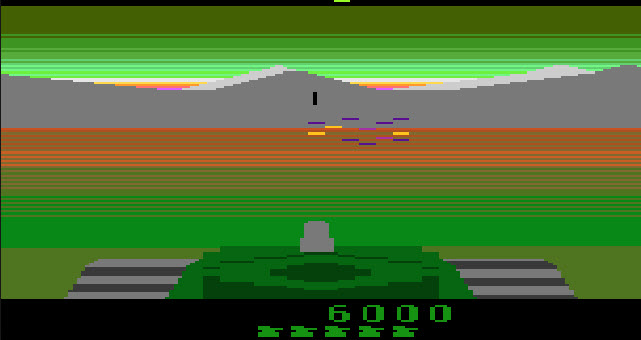

# Battle Zone

>>> cpu 6502

>>> memoryTable hard 
[Hardware Info](../Stella.md)

>>> memoryTable ram 
[RAM Usage](RAMUse.md)

```code
; C1 is set to $80 when the player is hit and decrements on eac screen draw until 0.
; While C1 is >=$58 the screen kernel alternates Hit/Normal based on the lower bit.
; A lower bit of 0 is HIT and a lower bit of 1 is Normal.
; When C1 is $57 or below the HIT is drawn every time.

; Bank 0 is the video kernel. The code switches to it at scanline 39. The code switches
; to Bank 1 at scanline 234 for "non-visible" processing.
```

# Bank 0

# Reset (Bank 0)

```code
Bank0: 
Reset0: 

; We switch to Bank1 here and then fall through to F003. So both
; banks reset by switching to bank 1 and executing F003.
;
D000: 8D F9 FF   STA $FFF9           ; Switch to bank 1 (goto F003)
```

# Bank 0 Entry

```code
Bank0Entry: 
;
; This draws the visible part of the screen (starting scanline 40)
;
D003: 85 02      STA <$02            ;{-2_WSYNC} WSYNC
D005: 85 2A      STA <$2A            ;{-2_HMOVE} HMOVE
D007: A9 00      LDA #$00            ; Disable ...
D009: 85 01      STA <$01            ;{-2_VBLANK} ... VBLANK
D00B: A5 C1      LDA <$C1            ; Get the hit sequence counter
D00D: F0 0A      BEQ $D019           ; Value 0 ... not showing hit (do normal view)
D00F: C9 58      CMP #$58            ; Is it late in the player-hit sequence?
D011: 90 03      BCC $D016           ; Yes ($57 and below) ... show the fuzzy pattern
D013: 4A         LSR A               ; Early in the player-hit sequence ...
D014: B0 03      BCS $D019           ; ... show fuzzy if lsb is 0 or normal if lsb is 1
D016: 4C 2A D7   JMP $D72A           ; Jump to "Hit" fuzzy line display
; 
; Normal non-hit display
;
D019: A6 D4      LDX <$D4            ; 
D01B: A9 00      LDA #$00            ; 
D01D: 85 0B      STA <$0B            ;{-2_REFP0} 
D01F: BD 5C DC   LDA $DC5C,X         ; 
D022: 85 0C      STA <$0C            ;{-2_PEFP1} 
D024: 85 2B      STA <$2B            ;{-2_HMCLR} 
D026: 85 21      STA <$21            ;{-2_HMP1} 
D028: BC 00 DA   LDY $DA00,X         ; 
D02B: A9 0E      LDA #$0E            ; 
D02D: 85 07      STA <$07            ;{-2_COLUP1} 
D02F: 85 08      STA <$08            ;{-2_COLUPF} 
D031: A9 18      LDA #$18            ; 
D033: 85 1B      STA <$1B            ;{-2_GRP0} 
D035: 85 02      STA <$02            ;{-2_WSYNC} 
D037: 85 2A      STA <$2A            ;{-2_HMOVE} 
D039: E0 11      CPX #$11            ; 
D03B: 90 07      BCC $D044           ; 
D03D: 8A         TXA                 ; 
D03E: 38         SEC                 ; 
D03F: E9 21      SBC #$21            ; 
D041: 49 FF      EOR #$FF            ; 
D043: AA         TAX                 ; 
D044: BD C2 DE   LDA $DEC2,X         ; 
D047: 85 A2      STA <$A2            ; 
D049: BD 14 DF   LDA $DF14,X         ; 
D04C: 85 A3      STA <$A3            ; 
D04E: BD 00 D8   LDA $D800,X         ; 
D051: 85 05      STA <$05            ;{-2_NUSIZ1} 
D053: A5 80      LDA <$80            ; 
D055: 29 03      AND #$03            ; 
D057: D0 08      BNE $D061           ; 
D059: A6 D4      LDX <$D4            ; 
D05B: E8         INX                 ; 
D05C: 8A         TXA                 ; 
D05D: 29 1F      AND #$1F            ; 
D05F: 85 D4      STA <$D4            ; 
D061: 84 21      STY <$21            ;{-2_HMP1} 
D063: A0 1E      LDY #$1E            ; 
D065: 85 02      STA <$02            ;{-2_WSYNC} 
D067: 85 2A      STA <$2A            ;{-2_HMOVE} 
D069: A9 24      LDA #$24            ; 
D06B: 85 1B      STA <$1B            ;{-2_GRP0} 
D06D: B1 A2      LDA ($A2),Y         ; 
D06F: 85 1C      STA <$1C            ;{-2_GRP1} 
D071: A9 02      LDA #$02            ; 
D073: C4 D2      CPY <$D2            ; 
D075: D0 02      BNE $D079           ; 
D077: 85 1F      STA <$1F            ;{-2_ENABL} 
D079: C4 D3      CPY <$D3            ; 
D07B: D0 02      BNE $D07F           ; 
D07D: 85 1E      STA <$1E            ;{-2_ENAM1} 
D07F: 88         DEY                 ; 
D080: 85 2B      STA <$2B            ;{-2_HMCLR} 
D082: A9 30      LDA #$30            ; 
D084: 85 20      STA <$20            ;{-2_HMP0} 
D086: 48         PHA                 ; 
D087: 68         PLA                 ; 
D088: EA         NOP                 ; 
D089: A2 01      LDX #$01            ; 
D08B: 86 04      STX <$04            ;{-2_NUSIZ0} 
D08D: CA         DEX                 ; 
D08E: 86 1F      STX <$1F            ;{-2_ENABL} 
D090: 86 1E      STX <$1E            ;{-2_ENAM1} 
D092: 85 02      STA <$02            ;{-2_WSYNC} 
D094: 85 2A      STA <$2A            ;{-2_HMOVE} 
D096: B9 DF DE   LDA $DEDF,Y         ; 
D099: 85 1B      STA <$1B            ;{-2_GRP0} 
D09B: B1 A2      LDA ($A2),Y         ; 
D09D: 85 1C      STA <$1C            ;{-2_GRP1} 
D09F: A9 02      LDA #$02            ; 
D0A1: C4 D2      CPY <$D2            ; 
D0A3: F0 03      BEQ $D0A8           ; 
D0A5: EA         NOP                 ; 
D0A6: D0 03      BNE $D0AB           ; 
D0A8: 8D 1F 01   STA $011F           ; 
D0AB: C4 D3      CPY <$D3            ; 
D0AD: F0 03      BEQ $D0B2           ; 
D0AF: EA         NOP                 ; 
D0B0: D0 03      BNE $D0B5           ; 
D0B2: 8D 1E 01   STA $011E           ; 
D0B5: 88         DEY                 ; 
D0B6: A9 08      LDA #$08            ; 
D0B8: 85 2B      STA <$2B            ;{-2_HMCLR} 
D0BA: 85 0B      STA <$0B            ;{-2_REFP0} 
D0BC: A2 D0      LDX #$D0            ; 
D0BE: A9 00      LDA #$00            ; 
D0C0: 85 0B      STA <$0B            ;{-2_REFP0} 
D0C2: 85 1F      STA <$1F            ;{-2_ENABL} 
D0C4: 85 1E      STA <$1E            ;{-2_ENAM1} 
D0C6: C0 01      CPY #$01            ; 
D0C8: B0 C8      BCS $D092           ; 
D0CA: 86 20      STX <$20            ;{-2_HMP0} 
D0CC: 85 02      STA <$02            ;{-2_WSYNC} 
D0CE: 85 2A      STA <$2A            ;{-2_HMOVE} 
D0D0: A9 24      LDA #$24            ; 
D0D2: 85 1B      STA <$1B            ;{-2_GRP0} 
D0D4: A9 05      LDA #$05            ; 
D0D6: 85 04      STA <$04            ;{-2_NUSIZ0} 
D0D8: B1 A2      LDA ($A2),Y         ; 
D0DA: 85 1C      STA <$1C            ;{-2_GRP1} 
D0DC: A9 02      LDA #$02            ; 
D0DE: C4 D2      CPY <$D2            ; 
D0E0: D0 02      BNE $D0E4           ; 
D0E2: 85 1F      STA <$1F            ;{-2_ENABL} 
D0E4: C4 D3      CPY <$D3            ; 
D0E6: D0 02      BNE $D0EA           ; 
D0E8: 85 1E      STA <$1E            ;{-2_ENAM1} 
D0EA: 85 2B      STA <$2B            ;{-2_HMCLR} 
D0EC: A5 BD      LDA <$BD            ; 
D0EE: C9 0A      CMP #$0A            ; 
D0F0: B0 04      BCS $D0F6           ; 
D0F2: A9 20      LDA #$20            ; 
D0F4: D0 0A      BNE $D100           ; 
D0F6: C9 23      CMP #$23            ; 
D0F8: B0 04      BCS $D0FE           ; 
D0FA: A9 10      LDA #$10            ; 
D0FC: D0 02      BNE $D100           ; 
D0FE: A9 00      LDA #$00            ; 
D100: A4 E9      LDY <$E9            ; 
D102: 85 E6      STA <$E6            ; 
D104: A9 18      LDA #$18            ; 
D106: 85 1B      STA <$1B            ;{-2_GRP0} 
D108: 85 02      STA <$02            ;{-2_WSYNC} 
D10A: 85 2A      STA <$2A            ;{-2_HMOVE} 
D10C: A2 00      LDX #$00            ; 
D10E: 86 1F      STX <$1F            ;{-2_ENABL} 
D110: 86 1E      STX <$1E            ;{-2_ENAM1} 
D112: A5 81      LDA <$81            ; 
D114: 38         SEC                 ; 
D115: E5 B0      SBC <$B0            ; 
D117: C9 20      CMP #$20            ; 
D119: B0 04      BCS $D11F           ; 
D11B: C4 B2      CPY <$B2            ; 
D11D: 90 0C      BCC $D12B           ; 
D11F: A5 81      LDA <$81            ; 
D121: E5 B6      SBC <$B6            ; 
D123: C9 20      CMP #$20            ; 
D125: B0 0A      BCS $D131           ; 
D127: C4 B8      CPY <$B8            ; 
D129: B0 06      BCS $D131           ; 
D12B: A9 04      LDA #$04            ; 
D12D: 05 E6      ORA <$E6            ; 
D12F: 85 E6      STA <$E6            ; 
D131: 85 02      STA <$02            ;{-2_WSYNC} 
D133: 85 2A      STA <$2A            ;{-2_HMOVE} 
D135: 86 1B      STX <$1B            ;{-2_GRP0} 
D137: 86 1C      STX <$1C            ;{-2_GRP1} 
D139: 86 0B      STX <$0B            ;{-2_REFP0} 
D13B: 86 0C      STX <$0C            ;{-2_PEFP1} 
D13D: 86 0A      STX <$0A            ;{-2_CTRLPF} 
D13F: A9 04      LDA #$04            ; 
D141: 85 08      STA <$08            ;{-2_COLUPF} 
D143: 85 07      STA <$07            ;{-2_COLUP1} 
D145: A9 08      LDA #$08            ; 
D147: 85 06      STA <$06            ;{-2_COLUP0} 
D149: A9 15      LDA #$15            ; 
D14B: 85 04      STA <$04            ;{-2_NUSIZ0} 
D14D: A9 35      LDA #$35            ; 
D14F: 85 05      STA <$05            ;{-2_NUSIZ1} 
D151: A5 84      LDA <$84            ; 
D153: 38         SEC                 ; 
D154: E9 66      SBC #$66            ; 
D156: B0 02      BCS $D15A           ; 
D158: 69 A0      ADC #$A0            ; 
D15A: 20 E0 D7   JSR $D7E0           ; 
D15D: A9 A2      LDA #$A2            ; 
D15F: 85 09      STA <$09            ;{-2_COLUBK} 
D161: 84 A2      STY <$A2            ; 
D163: A9 64      LDA #$64            ; 
D165: 38         SEC                 ; 
D166: E5 BD      SBC <$BD            ; 
D168: 85 AA      STA <$AA            ; 
D16A: A5 84      LDA <$84            ; 
D16C: 38         SEC                 ; 
D16D: E9 56      SBC #$56            ; 
D16F: B0 02      BCS $D173           ; 
D171: 69 A0      ADC #$A0            ; 
D173: E8         INX                 ; 
D174: 20 E0 D7   JSR $D7E0           ; 
D177: 84 A3      STY <$A3            ; 
D179: A6 AF      LDX <$AF            ; 
D17B: BD 11 D8   LDA $D811,X         ; 
D17E: 85 FC      STA <$FC            ; 
D180: BD 1B D8   LDA $D81B,X         ; 
D183: 85 FD      STA <$FD            ; 
D185: A5 84      LDA <$84            ; 
D187: A2 03      LDX #$03            ; 
D189: 20 E0 D7   JSR $D7E0           ; 
D18C: 84 A4      STY <$A4            ; 
D18E: A6 B5      LDX <$B5            ; 
D190: BD 11 D8   LDA $D811,X         ; 
D193: 85 AC      STA <$AC            ; 
D195: BD 1B D8   LDA $D81B,X         ; 
D198: 85 AD      STA <$AD            ; 
D19A: A5 84      LDA <$84            ; 
D19C: A2 02      LDX #$02            ; 
D19E: 20 E0 D7   JSR $D7E0           ; 
D1A1: 48         PHA                 ; 
D1A2: 68         PLA                 ; 
D1A3: 48         PHA                 ; 
D1A4: 68         PLA                 ; 
D1A5: A5 A2      LDA <$A2            ; 
D1A7: 85 20      STA <$20            ;{-2_HMP0} 
D1A9: A5 A3      LDA <$A3            ; 
D1AB: 85 21      STA <$21            ;{-2_HMP1} 
D1AD: A5 A4      LDA <$A4            ; 
D1AF: 85 23      STA <$23            ;{-2_HMM1} 
D1B1: 84 22      STY <$22            ;{-2_HMM0} 
D1B3: 85 02      STA <$02            ;{-2_WSYNC} 
D1B5: 85 2A      STA <$2A            ;{-2_HMOVE} 
D1B7: A6 B4      LDX <$B4            ; 
D1B9: A5 BE      LDA <$BE            ; 
D1BB: 29 F0      AND #$F0            ; 
D1BD: C9 30      CMP #$30            ; 
D1BF: B0 11      BCS $D1D2           ; 
D1C1: BD AF DC   LDA $DCAF,X         ; 
D1C4: 38         SEC                 ; 
D1C5: E5 AD      SBC <$AD            ; 
D1C7: 85 A4      STA <$A4            ; 
D1C9: A6 B5      LDX <$B5            ; 
D1CB: BD F6 D9   LDA $D9F6,X         ; 
D1CE: E9 00      SBC #$00            ; 
D1D0: D0 32      BNE $D204           ; 
D1D2: F0 24      BEQ $D1F8           ; 
D1D4: C9 50      CMP #$50            ; 
D1D6: F0 10      BEQ $D1E8           ; 
D1D8: A6 B5      LDX <$B5            ; 
D1DA: BD D4 D8   LDA $D8D4,X         ; 
D1DD: 38         SEC                 ; 
D1DE: E5 AD      SBC <$AD            ; 
D1E0: 85 A4      STA <$A4            ; 
D1E2: A9 DD      LDA #$DD            ; 
D1E4: E9 00      SBC #$00            ; 
D1E6: D0 1C      BNE $D204           ; 
D1E8: A6 B5      LDX <$B5            ; 
D1EA: BD 39 D8   LDA $D839,X         ; 
D1ED: 38         SEC                 ; 
D1EE: E5 AD      SBC <$AD            ; 
D1F0: 85 A4      STA <$A4            ; 
D1F2: A9 D8      LDA #$D8            ; 
D1F4: E9 00      SBC #$00            ; 
D1F6: D0 0C      BNE $D204           ; 
D1F8: BD 02 D9   LDA $D902,X         ; 
D1FB: 38         SEC                 ; 
D1FC: E5 AD      SBC <$AD            ; 
D1FE: 85 A4      STA <$A4            ; 
D200: A9 DC      LDA #$DC            ; 
D202: E9 00      SBC #$00            ; 
D204: 85 A5      STA <$A5            ; 
D206: 85 2B      STA <$2B            ;{-2_HMCLR} 
D208: 85 02      STA <$02            ;{-2_WSYNC} 
D20A: 85 2A      STA <$2A            ;{-2_HMOVE} 
D20C: A6 EA      LDX <$EA            ; 
D20E: A5 80      LDA <$80            ; 
D210: 29 07      AND #$07            ; 
D212: D0 1B      BNE $D22F           ; 
D214: A5 9F      LDA <$9F            ; 
D216: F0 17      BEQ $D22F           ; 
D218: A5 E8      LDA <$E8            ; 
D21A: 0A         ASL A               ; 
D21B: 0A         ASL A               ; 
D21C: 10 08      BPL $D226           ; 
D21E: 0A         ASL A               ; 
D21F: 30 0E      BMI $D22F           ; 
D221: CA         DEX                 ; 
D222: 10 09      BPL $D22D           ; 
D224: A2 01      LDX #$01            ; 
D226: E8         INX                 ; 
D227: E0 03      CPX #$03            ; 
D229: D0 02      BNE $D22D           ; 
D22B: A2 00      LDX #$00            ; 
D22D: 86 EA      STX <$EA            ; 
D22F: 85 02      STA <$02            ;{-2_WSYNC} 
D231: 85 2A      STA <$2A            ;{-2_HMOVE} 
D233: BD FC DD   LDA $DDFC,X         ; 
D236: 85 FA      STA <$FA            ; 
D238: BD 02 DE   LDA $DE02,X         ; 
D23B: 85 EB      STA <$EB            ; 
D23D: A9 DE      LDA #$DE            ; 
D23F: 85 FB      STA <$FB            ; 
D241: A0 1E      LDY #$1E            ; 
D243: 88         DEY                 ; 
D244: B9 20 DA   LDA $DA20,Y         ; 
D247: C0 0B      CPY #$0B            ; 
D249: 85 02      STA <$02            ;{-2_WSYNC} 
D24B: 85 2A      STA <$2A            ;{-2_HMOVE} 
D24D: 85 09      STA <$09            ;{-2_COLUBK} 
D24F: D0 F2      BNE $D243           ; 
D251: A9 02      LDA #$02            ; 
D253: 85 1D      STA <$1D            ;{-2_ENAM0} 
D255: B9 CD DE   LDA $DECD,Y         ; 
D258: 85 1B      STA <$1B            ;{-2_GRP0} 
D25A: 85 1C      STA <$1C            ;{-2_GRP1} 
D25C: B9 CA DE   LDA $DECA,Y         ; 
D25F: 85 04      STA <$04            ;{-2_NUSIZ0} 
D261: 85 22      STA <$22            ;{-2_HMM0} 
D263: 88         DEY                 ; 
D264: B9 20 DA   LDA $DA20,Y         ; 
D267: C0 08      CPY #$08            ; 
D269: 85 02      STA <$02            ;{-2_WSYNC} 
D26B: 85 2A      STA <$2A            ;{-2_HMOVE} 
D26D: 85 09      STA <$09            ;{-2_COLUBK} 
D26F: D0 E4      BNE $D255           ; 
D271: A9 FF      LDA #$FF            ; 
D273: 85 1B      STA <$1B            ;{-2_GRP0} 
D275: 85 1C      STA <$1C            ;{-2_GRP1} 
D277: A9 02      LDA #$02            ; 
D279: 85 1E      STA <$1E            ;{-2_ENAM1} 
D27B: A9 B0      LDA #$B0            ; 
D27D: 85 21      STA <$21            ;{-2_HMP1} 
D27F: A9 40      LDA #$40            ; 
D281: 85 20      STA <$20            ;{-2_HMP0} 
D283: A9 20      LDA #$20            ; 
D285: 85 22      STA <$22            ;{-2_HMM0} 
D287: A9 E0      LDA #$E0            ; 
D289: 85 23      STA <$23            ;{-2_HMM1} 
D28B: A2 84      LDX #$84            ; 
D28D: 9A         TXS                 ; 
D28E: A9 01      LDA #$01            ; 
D290: 85 25      STA <$25            ;{-2_VDELP0} 
D292: 88         DEY                 ; 
D293: 85 02      STA <$02            ;{-2_WSYNC} 
D295: 85 2A      STA <$2A            ;{-2_HMOVE} 
D297: B9 20 DA   LDA $DA20,Y         ; 
D29A: 85 09      STA <$09            ;{-2_COLUBK} 
D29C: 68         PLA                 ; 
D29D: 85 0D      STA <$0D            ;{-2_PF0} 
D29F: 68         PLA                 ; 
D2A0: 85 0E      STA <$0E            ;{-2_PF1} 
D2A2: 68         PLA                 ; 
D2A3: 85 0F      STA <$0F            ;{-2_PF2} 
D2A5: 68         PLA                 ; 
D2A6: 85 0D      STA <$0D            ;{-2_PF0} 
D2A8: 68         PLA                 ; 
D2A9: 88         DEY                 ; 
D2AA: 85 0E      STA <$0E            ;{-2_PF1} 
D2AC: 68         PLA                 ; 
D2AD: 9A         TXS                 ; 
D2AE: 85 0F      STA <$0F            ;{-2_PF2} 
D2B0: 85 02      STA <$02            ;{-2_WSYNC} 
D2B2: 85 2A      STA <$2A            ;{-2_HMOVE} 
D2B4: B9 20 DA   LDA $DA20,Y         ; 
D2B7: 85 09      STA <$09            ;{-2_COLUBK} 
D2B9: 68         PLA                 ; 
D2BA: 85 0D      STA <$0D            ;{-2_PF0} 
D2BC: 68         PLA                 ; 
D2BD: 85 0E      STA <$0E            ;{-2_PF1} 
D2BF: 68         PLA                 ; 
D2C0: 85 0F      STA <$0F            ;{-2_PF2} 
D2C2: 68         PLA                 ; 
D2C3: 85 0D      STA <$0D            ;{-2_PF0} 
D2C5: 68         PLA                 ; 
D2C6: 85 0E      STA <$0E            ;{-2_PF1} 
D2C8: 68         PLA                 ; 
D2C9: BA         TSX                 ; 
D2CA: 85 0F      STA <$0F            ;{-2_PF2} 
D2CC: 88         DEY                 ; 
D2CD: 10 C4      BPL $D293           ; 
D2CF: A9 DE      LDA #$DE            ; 
D2D1: 85 AB      STA <$AB            ; 
D2D3: A9 00      LDA #$00            ; 
D2D5: 85 02      STA <$02            ;{-2_WSYNC} 
D2D7: 85 2A      STA <$2A            ;{-2_HMOVE} 
D2D9: 85 1B      STA <$1B            ;{-2_GRP0} 
D2DB: 85 1C      STA <$1C            ;{-2_GRP1} 
D2DD: 85 1D      STA <$1D            ;{-2_ENAM0} 
D2DF: 85 1E      STA <$1E            ;{-2_ENAM1} 
D2E1: A2 04      LDX #$04            ; 
D2E3: 86 09      STX <$09            ;{-2_COLUBK} 
D2E5: 85 0D      STA <$0D            ;{-2_PF0} 
D2E7: 85 0E      STA <$0E            ;{-2_PF1} 
D2E9: 85 0F      STA <$0F            ;{-2_PF2} 
D2EB: A9 20      LDA #$20            ; 
D2ED: 85 24      STA <$24            ;{-2_HMBL} 
D2EF: A2 FF      LDX #$FF            ; 
D2F1: 9A         TXS                 ; 
D2F2: A5 EC      LDA <$EC            ; 
D2F4: 85 08      STA <$08            ;{-2_COLUPF} 
D2F6: 8D 14 01   STA $0114           ; 
D2F9: A9 02      LDA #$02            ; 
D2FB: 85 1F      STA <$1F            ;{-2_ENABL} 
D2FD: A6 AE      LDX <$AE            ; 
D2FF: A5 BE      LDA <$BE            ; 
D301: 29 0F      AND #$0F            ; 
D303: C9 03      CMP #$03            ; 
D305: 85 02      STA <$02            ;{-2_WSYNC} 
D307: 85 2A      STA <$2A            ;{-2_HMOVE} 
D309: 90 07      BCC $D312           ; 
D30B: A6 AF      LDX <$AF            ; 
D30D: BD 0A DF   LDA $DF0A,X         ; 
D310: 10 03      BPL $D315           ; 
D312: BD 8D DE   LDA $DE8D,X         ; 
D315: 85 04      STA <$04            ;{-2_NUSIZ0} 
D317: A6 B4      LDX <$B4            ; 
D319: A5 BE      LDA <$BE            ; 
D31B: 29 F0      AND #$F0            ; 
D31D: C9 30      CMP #$30            ; 
D31F: 90 07      BCC $D328           ; 
D321: A6 B5      LDX <$B5            ; 
D323: BD 0A DF   LDA $DF0A,X         ; 
D326: 10 03      BPL $D32B           ; 
D328: BD 8D DE   LDA $DE8D,X         ; 
D32B: 85 05      STA <$05            ;{-2_NUSIZ1} 
D32D: A5 B0      LDA <$B0            ; 
D32F: C9 11      CMP #$11            ; 
D331: B0 06      BCS $D339           ; 
D333: E9 04      SBC #$04            ; 
D335: B0 02      BCS $D339           ; 
D337: 69 A5      ADC #$A5            ; 
D339: 85 2B      STA <$2B            ;{-2_HMCLR} 
D33B: 85 02      STA <$02            ;{-2_WSYNC} 
D33D: 85 2A      STA <$2A            ;{-2_HMOVE} 
D33F: E9 0F      SBC #$0F            ; 
D341: B0 FC      BCS $D33F           ; 
D343: 49 07      EOR #$07            ; 
D345: 0A         ASL A               ; 
D346: 0A         ASL A               ; 
D347: 0A         ASL A               ; 
D348: 0A         ASL A               ; 
D349: 85 20      STA <$20            ;{-2_HMP0} 
D34B: 85 10      STA <$10            ;{-2_RESP0} 
D34D: 85 02      STA <$02            ;{-2_WSYNC} 
D34F: 85 2A      STA <$2A            ;{-2_HMOVE} 
D351: A6 AF      LDX <$AF            ; 
D353: A5 BE      LDA <$BE            ; 
D355: 29 0F      AND #$0F            ; 
D357: C9 03      CMP #$03            ; 
D359: 90 15      BCC $D370           ; 
D35B: F0 0E      BEQ $D36B           ; 
D35D: C9 05      CMP #$05            ; 
D35F: F0 05      BEQ $D366           ; 
D361: BD E8 DD   LDA $DDE8,X         ; 
D364: D0 16      BNE $D37C           ; 
D366: BD 25 D8   LDA $D825,X         ; 
D369: D0 11      BNE $D37C           ; 
D36B: BD F2 DD   LDA $DDF2,X         ; 
D36E: D0 0C      BNE $D37C           ; 
D370: C9 02      CMP #$02            ; 
D372: 90 05      BCC $D379           ; 
D374: BD 2F D8   LDA $D82F,X         ; 
D377: D0 03      BNE $D37C           ; 
D379: BD 00 DF   LDA $DF00,X         ; 
D37C: 38         SEC                 ; 
D37D: E5 FD      SBC <$FD            ; 
D37F: 85 A6      STA <$A6            ; 
D381: A9 DF      LDA #$DF            ; 
D383: E9 00      SBC #$00            ; 
D385: 85 A7      STA <$A7            ; 
D387: 85 2B      STA <$2B            ;{-2_HMCLR} 
D389: A5 81      LDA <$81            ; 
D38B: C9 11      CMP #$11            ; 
D38D: B0 06      BCS $D395           ; 
D38F: E9 04      SBC #$04            ; 
D391: B0 02      BCS $D395           ; 
D393: 69 A5      ADC #$A5            ; 
D395: 48         PHA                 ; 
D396: 85 02      STA <$02            ;{-2_WSYNC} 
D398: 85 2A      STA <$2A            ;{-2_HMOVE} 
D39A: A6 B5      LDX <$B5            ; 
D39C: A5 BE      LDA <$BE            ; 
D39E: 29 F0      AND #$F0            ; 
D3A0: C9 30      CMP #$30            ; 
D3A2: 90 15      BCC $D3B9           ; 
D3A4: D0 05      BNE $D3AB           ; 
D3A6: BD F2 DD   LDA $DDF2,X         ; 
D3A9: D0 1A      BNE $D3C5           ; 
D3AB: C9 50      CMP #$50            ; 
D3AD: F0 05      BEQ $D3B4           ; 
D3AF: BD E8 DD   LDA $DDE8,X         ; 
D3B2: D0 11      BNE $D3C5           ; 
D3B4: BD 25 D8   LDA $D825,X         ; 
D3B7: D0 0C      BNE $D3C5           ; 
D3B9: C9 20      CMP #$20            ; 
D3BB: 90 05      BCC $D3C2           ; 
D3BD: BD 2F D8   LDA $D82F,X         ; 
D3C0: D0 03      BNE $D3C5           ; 
D3C2: BD 00 DF   LDA $DF00,X         ; 
D3C5: 38         SEC                 ; 
D3C6: E5 AD      SBC <$AD            ; 
D3C8: 85 A8      STA <$A8            ; 
D3CA: A9 DF      LDA #$DF            ; 
D3CC: E9 00      SBC #$00            ; 
D3CE: 85 A9      STA <$A9            ; 
D3D0: A5 B6      LDA <$B6            ; 
D3D2: C9 11      CMP #$11            ; 
D3D4: B0 06      BCS $D3DC           ; 
D3D6: E9 04      SBC #$04            ; 
D3D8: B0 02      BCS $D3DC           ; 
D3DA: 69 A5      ADC #$A5            ; 
D3DC: A0 34      LDY #$34            ; 
D3DE: 85 02      STA <$02            ;{-2_WSYNC} 
D3E0: 85 2A      STA <$2A            ;{-2_HMOVE} 
D3E2: E9 0F      SBC #$0F            ; 
D3E4: B0 FC      BCS $D3E2           ; 
D3E6: 49 07      EOR #$07            ; 
D3E8: 0A         ASL A               ; 
D3E9: 0A         ASL A               ; 
D3EA: 0A         ASL A               ; 
D3EB: 0A         ASL A               ; 
D3EC: 85 21      STA <$21            ;{-2_HMP1} 
D3EE: 85 11      STA <$11            ;{-2_RESP1} 
D3F0: 85 02      STA <$02            ;{-2_WSYNC} 
D3F2: 85 2A      STA <$2A            ;{-2_HMOVE} 
D3F4: A6 AE      LDX <$AE            ; 
D3F6: A5 BE      LDA <$BE            ; 
D3F8: 29 0F      AND #$0F            ; 
D3FA: C9 03      CMP #$03            ; 
D3FC: B0 11      BCS $D40F           ; 
D3FE: BD AF DC   LDA $DCAF,X         ; 
D401: 38         SEC                 ; 
D402: E5 FD      SBC <$FD            ; 
D404: 85 A2      STA <$A2            ; 
D406: A6 AF      LDX <$AF            ; 
D408: BD F6 D9   LDA $D9F6,X         ; 
D40B: E9 00      SBC #$00            ; 
D40D: D0 32      BNE $D441           ; 
D40F: D0 0E      BNE $D41F           ; 
D411: BD 02 D9   LDA $D902,X         ; 
D414: 38         SEC                 ; 
D415: E5 FD      SBC <$FD            ; 
D417: 85 A2      STA <$A2            ; 
D419: A9 DC      LDA #$DC            ; 
D41B: E9 00      SBC #$00            ; 
D41D: D0 22      BNE $D441           ; 
D41F: C9 05      CMP #$05            ; 
D421: F0 10      BEQ $D433           ; 
D423: A6 AF      LDX <$AF            ; 
D425: BD D4 D8   LDA $D8D4,X         ; 
D428: 38         SEC                 ; 
D429: E5 FD      SBC <$FD            ; 
D42B: 85 A2      STA <$A2            ; 
D42D: A9 DD      LDA #$DD            ; 
D42F: E9 00      SBC #$00            ; 
D431: D0 0E      BNE $D441           ; 
D433: A6 AF      LDX <$AF            ; 
D435: BD 39 D8   LDA $D839,X         ; 
D438: 38         SEC                 ; 
D439: E5 FD      SBC <$FD            ; 
D43B: 85 A2      STA <$A2            ; 
D43D: A9 D8      LDA #$D8            ; 
D43F: E9 00      SBC #$00            ; 
D441: 85 A3      STA <$A3            ; 
D443: 85 2B      STA <$2B            ;{-2_HMCLR} 
D445: A9 00      LDA #$00            ; 
D447: 85 1F      STA <$1F            ;{-2_ENABL} 
D449: 68         PLA                 ; 
D44A: 38         SEC                 ; 
D44B: 85 02      STA <$02            ;{-2_WSYNC} 
D44D: 85 2A      STA <$2A            ;{-2_HMOVE} 
D44F: E9 0F      SBC #$0F            ; 
D451: B0 FC      BCS $D44F           ; 
D453: 49 07      EOR #$07            ; 
D455: 0A         ASL A               ; 
D456: 0A         ASL A               ; 
D457: 0A         ASL A               ; 
D458: 0A         ASL A               ; 
D459: 85 24      STA <$24            ;{-2_HMBL} 
D45B: 85 14      STA <$14            ;{-2_RESBL} 
D45D: 85 02      STA <$02            ;{-2_WSYNC} 
D45F: 85 2A      STA <$2A            ;{-2_HMOVE} 
D461: A9 0E      LDA #$0E            ; 
D463: 85 08      STA <$08            ;{-2_COLUPF} 
D465: A5 E6      LDA <$E6            ; 
D467: 85 0A      STA <$0A            ;{-2_CTRLPF} 
D469: A5 B3      LDA <$B3            ; 
D46B: 85 0B      STA <$0B            ;{-2_REFP0} 
D46D: A5 B9      LDA <$B9            ; 
D46F: 85 0C      STA <$0C            ;{-2_PEFP1} 
D471: 85 2B      STA <$2B            ;{-2_HMCLR} 
D473: 85 02      STA <$02            ;{-2_WSYNC} 
D475: 85 2A      STA <$2A            ;{-2_HMOVE} 
D477: C0 2C      CPY #$2C            ; 
D479: F0 78      BEQ $D4F3           ; 
D47B: 88         DEY                 ; 
D47C: C4 FC      CPY <$FC            ; 
D47E: F0 21      BEQ $D4A1           ; 
D480: C4 AC      CPY <$AC            ; 
D482: F0 23      BEQ $D4A7           ; 
D484: D0 ED      BNE $D473           ; 
D486: B1 A2      LDA ($A2),Y         ; 
D488: 25 B1      AND <$B1            ; 
D48A: 85 1B      STA <$1B            ;{-2_GRP0} 
D48C: A9 00      LDA #$00            ; 
D48E: C0 2C      CPY #$2C            ; 
D490: 85 02      STA <$02            ;{-2_WSYNC} 
D492: 85 2A      STA <$2A            ;{-2_HMOVE} 
D494: 85 1C      STA <$1C            ;{-2_GRP1} 
D496: F0 7C      BEQ $D514           ; 
D498: B1 A6      LDA ($A6),Y         ; 
D49A: 85 06      STA <$06            ;{-2_COLUP0} 
D49C: B1 AA      LDA ($AA),Y         ; 
D49E: 85 1F      STA <$1F            ;{-2_ENABL} 
D4A0: 88         DEY                 ; 
D4A1: C4 AC      CPY <$AC            ; 
D4A3: F0 20      BEQ $D4C5           ; 
D4A5: D0 DF      BNE $D486           ; 
D4A7: B1 A4      LDA ($A4),Y         ; 
D4A9: 25 B7      AND <$B7            ; 
D4AB: C4 2C      CPY <$2C            ; 
D4AD: 85 02      STA <$02            ;{-2_WSYNC} 
D4AF: 85 2A      STA <$2A            ;{-2_HMOVE} 
D4B1: 85 1C      STA <$1C            ;{-2_GRP1} 
D4B3: D0 03      BNE $D4B8           ; 
D4B5: 4C 39 D5   JMP $D539           ; 
D4B8: B1 A8      LDA ($A8),Y         ; 
D4BA: 85 07      STA <$07            ;{-2_COLUP1} 
D4BC: B1 AA      LDA ($AA),Y         ; 
D4BE: 85 1F      STA <$1F            ;{-2_ENABL} 
D4C0: 88         DEY                 ; 
D4C1: C4 FC      CPY <$FC            ; 
D4C3: D0 E2      BNE $D4A7           ; 
D4C5: B1 A2      LDA ($A2),Y         ; 
D4C7: 25 B1      AND <$B1            ; 
D4C9: 85 1B      STA <$1B            ;{-2_GRP0} 
D4CB: B1 A4      LDA ($A4),Y         ; 
D4CD: 25 B7      AND <$B7            ; 
D4CF: C0 2C      CPY #$2C            ; 
D4D1: 85 02      STA <$02            ;{-2_WSYNC} 
D4D3: 85 2A      STA <$2A            ;{-2_HMOVE} 
D4D5: 85 1C      STA <$1C            ;{-2_GRP1} 
D4D7: D0 03      BNE $D4DC           ; 
D4D9: 4C 5C D5   JMP $D55C           ; 
D4DC: B1 A6      LDA ($A6),Y         ; 
D4DE: 85 06      STA <$06            ;{-2_COLUP0} 
D4E0: B1 A8      LDA ($A8),Y         ; 
D4E2: 85 07      STA <$07            ;{-2_COLUP1} 
D4E4: B1 AA      LDA ($AA),Y         ; 
D4E6: 85 1F      STA <$1F            ;{-2_ENABL} 
D4E8: 88         DEY                 ; 
D4E9: D0 DA      BNE $D4C5           ; 
D4EB: 85 02      STA <$02            ;{-2_WSYNC} 
D4ED: 85 2A      STA <$2A            ;{-2_HMOVE} 
D4EF: B1 FA      LDA ($FA),Y         ; 
D4F1: 85 09      STA <$09            ;{-2_COLUBK} 
D4F3: B1 AA      LDA ($AA),Y         ; 
D4F5: 85 1F      STA <$1F            ;{-2_ENABL} 
D4F7: A9 00      LDA #$00            ; 
D4F9: 85 1B      STA <$1B            ;{-2_GRP0} 
D4FB: 85 1C      STA <$1C            ;{-2_GRP1} 
D4FD: 88         DEY                 ; 
D4FE: F0 23      BEQ $D523           ; 
D500: D0 E9      BNE $D4EB           ; 
D502: B1 A2      LDA ($A2),Y         ; 
D504: 25 B1      AND <$B1            ; 
D506: 85 1B      STA <$1B            ;{-2_GRP0} 
D508: A9 00      LDA #$00            ; 
D50A: 85 02      STA <$02            ;{-2_WSYNC} 
D50C: 85 2A      STA <$2A            ;{-2_HMOVE} 
D50E: 85 1C      STA <$1C            ;{-2_GRP1} 
D510: B1 FA      LDA ($FA),Y         ; 
D512: 85 09      STA <$09            ;{-2_COLUBK} 
D514: B1 A6      LDA ($A6),Y         ; 
D516: 85 06      STA <$06            ;{-2_COLUP0} 
D518: B1 AA      LDA ($AA),Y         ; 
D51A: 85 1F      STA <$1F            ;{-2_ENABL} 
D51C: 88         DEY                 ; 
D51D: C4 FD      CPY <$FD            ; 
D51F: F0 CA      BEQ $D4EB           ; 
D521: D0 DF      BNE $D502           ; 
D523: A9 DC      LDA #$DC            ; 
D525: D0 4C      BNE $D573           ; 
D527: A9 00      LDA #$00            ; 
D529: 85 1B      STA <$1B            ;{-2_GRP0} 
D52B: B1 A4      LDA ($A4),Y         ; 
D52D: 25 B7      AND <$B7            ; 
D52F: 85 02      STA <$02            ;{-2_WSYNC} 
D531: 85 2A      STA <$2A            ;{-2_HMOVE} 
D533: 85 1C      STA <$1C            ;{-2_GRP1} 
D535: B1 FA      LDA ($FA),Y         ; 
D537: 85 09      STA <$09            ;{-2_COLUBK} 
D539: B1 A8      LDA ($A8),Y         ; 
D53B: 85 07      STA <$07            ;{-2_COLUP1} 
D53D: B1 AA      LDA ($AA),Y         ; 
D53F: 85 1F      STA <$1F            ;{-2_ENABL} 
D541: 88         DEY                 ; 
D542: C4 AD      CPY <$AD            ; 
D544: F0 A5      BEQ $D4EB           ; 
D546: D0 DF      BNE $D527           ; 
D548: B1 A2      LDA ($A2),Y         ; 
D54A: 25 B1      AND <$B1            ; 
D54C: 85 1B      STA <$1B            ;{-2_GRP0} 
D54E: B1 A4      LDA ($A4),Y         ; 
D550: 25 B7      AND <$B7            ; 
D552: 85 02      STA <$02            ;{-2_WSYNC} 
D554: 85 2A      STA <$2A            ;{-2_HMOVE} 
D556: 85 1C      STA <$1C            ;{-2_GRP1} 
D558: B1 FA      LDA ($FA),Y         ; 
D55A: 85 09      STA <$09            ;{-2_COLUBK} 
D55C: B1 A6      LDA ($A6),Y         ; 
D55E: 85 06      STA <$06            ;{-2_COLUP0} 
D560: B1 A8      LDA ($A8),Y         ; 
D562: 85 07      STA <$07            ;{-2_COLUP1} 
D564: B1 AA      LDA ($AA),Y         ; 
D566: 85 1F      STA <$1F            ;{-2_ENABL} 
D568: 88         DEY                 ; 
D569: C4 FD      CPY <$FD            ; 
D56B: F0 D5      BEQ $D542           ; 
D56D: C4 AD      CPY <$AD            ; 
D56F: D0 D7      BNE $D548           ; 
D571: F0 8F      BEQ $D502           ; 
D573: 85 A3      STA <$A3            ; 
D575: 85 A5      STA <$A5            ; 
D577: A5 BB      LDA <$BB            ; 
D579: 29 07      AND #$07            ; 
D57B: 18         CLC                 ; 
D57C: 69 E4      ADC #$E4            ; 
D57E: 85 A2      STA <$A2            ; 
D580: A5 BC      LDA <$BC            ; 
D582: 29 07      AND #$07            ; 
D584: 18         CLC                 ; 
D585: 69 E4      ADC #$E4            ; 
D587: 85 A4      STA <$A4            ; 
D589: 85 02      STA <$02            ;{-2_WSYNC} 
D58B: 85 2A      STA <$2A            ;{-2_HMOVE} 
D58D: A9 00      LDA #$00            ; 
D58F: 85 1B      STA <$1B            ;{-2_GRP0} 
D591: 85 1C      STA <$1C            ;{-2_GRP1} 
D593: 85 1F      STA <$1F            ;{-2_ENABL} 
D595: A9 17      LDA #$17            ; 
D597: 85 04      STA <$04            ;{-2_NUSIZ0} 
D599: 85 05      STA <$05            ;{-2_NUSIZ1} 
D59B: A9 04      LDA #$04            ; 
D59D: 85 06      STA <$06            ;{-2_COLUP0} 
D59F: 85 10      STA <$10            ;{-2_RESP0} 
D5A1: 85 07      STA <$07            ;{-2_COLUP1} 
D5A3: A9 10      LDA #$10            ; 
D5A5: 85 20      STA <$20            ;{-2_HMP0} 
D5A7: A9 60      LDA #$60            ; 
D5A9: 85 21      STA <$21            ;{-2_HMP1} 
D5AB: 8D 12 01   STA $0112           ; 
D5AE: 85 13      STA <$13            ;{-2_RESM1} 
D5B0: A9 00      LDA #$00            ; 
D5B2: 85 22      STA <$22            ;{-2_HMM0} 
D5B4: 8D 11 01   STA $0111           ; 
D5B7: A9 70      LDA #$70            ; 
D5B9: 85 23      STA <$23            ;{-2_HMM1} 
D5BB: A9 C2      LDA #$C2            ; 
D5BD: 85 08      STA <$08            ;{-2_COLUPF} 
D5BF: 85 02      STA <$02            ;{-2_WSYNC} 
D5C1: 85 2A      STA <$2A            ;{-2_HMOVE} 
D5C3: A0 0B      LDY #$0B            ; 
D5C5: A2 02      LDX #$02            ; 
D5C7: 86 1D      STX <$1D            ;{-2_ENAM0} 
D5C9: 86 1E      STX <$1E            ;{-2_ENAM1} 
D5CB: A9 17      LDA #$17            ; 
D5CD: AA         TAX                 ; 
D5CE: D0 0A      BNE $D5DA           ; 
D5D0: A9 27      LDA #$27            ; 
D5D2: A2 00      LDX #$00            ; 
D5D4: C0 04      CPY #$04            ; 
D5D6: D0 02      BNE $D5DA           ; 
D5D8: A2 10      LDX #$10            ; 
D5DA: 85 04      STA <$04            ;{-2_NUSIZ0} 
D5DC: 85 05      STA <$05            ;{-2_NUSIZ1} 
D5DE: 85 2B      STA <$2B            ;{-2_HMCLR} 
D5E0: 8A         TXA                 ; 
D5E1: 86 22      STX <$22            ;{-2_HMM0} 
D5E3: F0 06      BEQ $D5EB           ; 
D5E5: C0 0B      CPY #$0B            ; 
D5E7: F0 02      BEQ $D5EB           ; 
D5E9: A9 F0      LDA #$F0            ; 
D5EB: 85 23      STA <$23            ;{-2_HMM1} 
D5ED: 88         DEY                 ; 
D5EE: 30 06      BMI $D5F6           ; 
D5F0: 85 02      STA <$02            ;{-2_WSYNC} 
D5F2: 85 2A      STA <$2A            ;{-2_HMOVE} 
D5F4: 10 DA      BPL $D5D0           ; 
D5F6: A0 05      LDY #$05            ; 
D5F8: A9 37      LDA #$37            ; 
D5FA: 85 04      STA <$04            ;{-2_NUSIZ0} 
D5FC: A2 01      LDX #$01            ; 
D5FE: 86 0A      STX <$0A            ;{-2_CTRLPF} 
D600: CA         DEX                 ; 
D601: 86 1E      STX <$1E            ;{-2_ENAM1} 
D603: 86 0B      STX <$0B            ;{-2_REFP0} 
D605: 86 0C      STX <$0C            ;{-2_PEFP1} 
D607: 85 02      STA <$02            ;{-2_WSYNC} 
D609: 85 2A      STA <$2A            ;{-2_HMOVE} 
D60B: B9 D9 DE   LDA $DED9,Y         ; 
D60E: 85 0F      STA <$0F            ;{-2_PF2} 
D610: 48         PHA                 ; 
D611: 68         PLA                 ; 
D612: 48         PHA                 ; 
D613: 68         PLA                 ; 
D614: A2 C0      LDX #$C0            ; 
D616: 48         PHA                 ; 
D617: 68         PLA                 ; 
D618: 48         PHA                 ; 
D619: 68         PLA                 ; 
D61A: 86 09      STX <$09            ;{-2_COLUBK} 
D61C: A6 EB      LDX <$EB            ; 
D61E: EA         NOP                 ; 
D61F: EA         NOP                 ; 
D620: EA         NOP                 ; 
D621: 88         DEY                 ; 
D622: 86 09      STX <$09            ;{-2_COLUBK} 
D624: 30 0A      BMI $D630           ; 
D626: C0 02      CPY #$02            ; 
D628: D0 DD      BNE $D607           ; 
D62A: A9 00      LDA #$00            ; 
D62C: 85 1D      STA <$1D            ;{-2_ENAM0} 
D62E: F0 D7      BEQ $D607           ; 
D630: A9 FC      LDA #$FC            ; 
D632: 85 1B      STA <$1B            ;{-2_GRP0} 
D634: A0 12      LDY #$12            ; 
D636: 85 1C      STA <$1C            ;{-2_GRP1} 
D638: 85 02      STA <$02            ;{-2_WSYNC} 
D63A: 85 2A      STA <$2A            ;{-2_HMOVE} 
D63C: EA         NOP                 ; 
D63D: B1 A2      LDA ($A2),Y         ; 
D63F: 8D 06 01   STA $0106           ; 
D642: A9 0F      LDA #$0F            ; 
D644: EA         NOP                 ; 
D645: 85 0E      STA <$0E            ;{-2_PF1} 
D647: BE DE D8   LDX $D8DE,Y         ; 
D64A: 86 0F      STX <$0F            ;{-2_PF2} 
D64C: A2 C0      LDX #$C0            ; 
D64E: 86 09      STX <$09            ;{-2_COLUBK} 
D650: B1 A4      LDA ($A4),Y         ; 
D652: 85 07      STA <$07            ;{-2_COLUP1} 
D654: 85 2B      STA <$2B            ;{-2_HMCLR} 
D656: B9 7D DD   LDA $DD7D,Y         ; 
D659: 85 20      STA <$20            ;{-2_HMP0} 
D65B: F0 02      BEQ $D65F           ; 
D65D: A9 F0      LDA #$F0            ; 
D65F: 85 21      STA <$21            ;{-2_HMP1} 
D661: A5 EB      LDA <$EB            ; 
D663: 85 09      STA <$09            ;{-2_COLUBK} 
D665: 88         DEY                 ; 
D666: 10 D0      BPL $D638           ; 
D668: C8         INY                 ; 
D669: 85 02      STA <$02            ;{-2_WSYNC} 
D66B: 85 2A      STA <$2A            ;{-2_HMOVE} 
D66D: 84 09      STY <$09            ;{-2_COLUBK} 
D66F: 84 1B      STY <$1B            ;{-2_GRP0} 
D671: 84 1C      STY <$1C            ;{-2_GRP1} 
D673: 84 0E      STY <$0E            ;{-2_PF1} 
D675: 84 0F      STY <$0F            ;{-2_PF2}

; Common bottom area

D677: 84 A2      STY <$A2            ; 
D679: 84 A4      STY <$A4            ; 
D67B: 84 A6      STY <$A6            ; 
D67D: A9 DD      LDA #$DD            ; 
D67F: 85 A3      STA <$A3            ; 
D681: 85 A5      STA <$A5            ; 
D683: 85 A7      STA <$A7            ; 
D685: 85 A9      STA <$A9            ; 
D687: 85 AB      STA <$AB            ; 
D689: 85 FD      STA <$FD            ; 
D68B: 85 2B      STA <$2B            ;{-2_HMCLR} 
D68D: A2 10      LDX #$10            ; 
D68F: 86 21      STX <$21            ;{-2_HMP1} 
D691: 85 02      STA <$02            ;{-2_WSYNC} 
D693: A5 9E      LDA <$9E            ; 
D695: 29 F0      AND #$F0            ; 
D697: 4A         LSR A               ; 
D698: 85 FC      STA <$FC            ; 
D69A: A5 9E      LDA <$9E            ; 
D69C: 29 0F      AND #$0F            ; 
D69E: 0A         ASL A               ; 
D69F: 0A         ASL A               ; 
D6A0: 0A         ASL A               ; 
D6A1: 85 AA      STA <$AA            ; 
D6A3: A5 9D      LDA <$9D            ; 
D6A5: 29 F0      AND #$F0            ; 
D6A7: 4A         LSR A               ; 
D6A8: 85 A8      STA <$A8            ; 
D6AA: A0 07      LDY #$07            ; 
D6AC: 24 82      BIT <$82            ; 
D6AE: 85 10      STA <$10            ;{-2_RESP0} 
D6B0: 85 11      STA <$11            ;{-2_RESP1} 
D6B2: 10 1F      BPL $D6D3           ; 
D6B4: 24 80      BIT <$80            ; 
D6B6: 10 1B      BPL $D6D3           ; 
D6B8: 85 02      STA <$02            ;{-2_WSYNC} 
D6BA: A9 58      LDA #$58            ; 
D6BC: 85 FC      STA <$FC            ; 
D6BE: A9 5F      LDA #$5F            ; 
D6C0: 85 AA      STA <$AA            ; 
D6C2: A9 65      LDA #$65            ; 
D6C4: 85 A8      STA <$A8            ; 
D6C6: A9 6B      LDA #$6B            ; 
D6C8: 85 A6      STA <$A6            ; 
D6CA: A9 71      LDA #$71            ; 
D6CC: 85 A4      STA <$A4            ; 
D6CE: A9 77      LDA #$77            ; 
D6D0: 85 A2      STA <$A2            ; 
D6D2: 88         DEY                 ; 
D6D3: 85 02      STA <$02            ;{-2_WSYNC} 
D6D5: 85 2A      STA <$2A            ;{-2_HMOVE} 
D6D7: A9 03      LDA #$03            ; 
D6D9: 85 26      STA <$26            ;{-2_VDELP1} 
D6DB: 85 04      STA <$04            ;{-2_NUSIZ0} 
D6DD: 85 05      STA <$05            ;{-2_NUSIZ1} 
D6DF: A9 00      LDA #$00            ; 
D6E1: 85 1B      STA <$1B            ;{-2_GRP0} 
D6E3: 24 82      BIT <$82            ; 
D6E5: 10 08      BPL $D6EF           ; 
D6E7: A5 80      LDA <$80            ; 
D6E9: 29 F0      AND #$F0            ; 
D6EB: 09 04      ORA #$04            ; 
D6ED: D0 02      BNE $D6F1           ; 
D6EF: A9 B4      LDA #$B4            ; 
D6F1: 85 06      STA <$06            ;{-2_COLUP0} 
D6F3: 85 07      STA <$07            ;{-2_COLUP1} 
D6F5: 20 98 D8   JSR $D898           ; 
D6F8: A6 BA      LDX <$BA            ; 
D6FA: E0 06      CPX #$06            ; 
D6FC: 90 02      BCC $D700           ; 
D6FE: A2 06      LDX #$06            ; 
D700: BD F6 D8   LDA $D8F6,X         ; 
D703: 85 FC      STA <$FC            ; 
D705: BD F5 D8   LDA $D8F5,X         ; 
D708: 85 AA      STA <$AA            ; 
D70A: BD F4 D8   LDA $D8F4,X         ; 
D70D: 85 A8      STA <$A8            ; 
D70F: BD F3 D8   LDA $D8F3,X         ; 
D712: 85 A6      STA <$A6            ; 
D714: BD F2 D8   LDA $D8F2,X         ; 
D717: 85 A4      STA <$A4            ; 
D719: BD F1 D8   LDA $D8F1,X         ; 
D71C: 85 A2      STA <$A2            ; 
D71E: 85 02      STA <$02            ;{-2_WSYNC} 
D720: A0 04      LDY #$04            ; 
D722: 20 98 D8   JSR $D898           ; 
D725: 85 02      STA <$02            ;{-2_WSYNC} 
D727: 4C F2 DF   JMP $DFF2           ;{SwitchToBank1} To Bank 1 at the end of the frame (line 234)
;
; Start of "Hit" display.
; If the count is $20 or above then run the full fuzz algorithm every screen.
; If the count is $17 or below then run the low fuzz algorithm every screen.
; If the count is between $1F and $18 (inclusive) then alternate full/low.
;
D72A: A9 01      LDA #$01            ; 1 to ...
D72C: 85 25      STA <$25            ;{-2_VDELP0} ... VDELP0
D72E: A5 C1      LDA <$C1            ; Display control
D730: C9 20      CMP #$20            ; Is the count $20 or above?
D732: B0 10      BCS $D744           ; Yes ... full fuzz every screen
D734: C9 18      CMP #$18            ; Is the count $17 or below?
D736: 90 03      BCC $D73B           ; Yes ... low fuzz every screen
D738: 4A         LSR A               ; Alternate between ...
D739: 90 09      BCC $D744           ; .. full and low fuzz
;
; Low fuzz. Set background color to 0 and run the player and missile
; objects as they are for a full screen.
D73B: A9 00      LDA #$00            ; 0 to ...
D73D: 85 09      STA <$09            ;{-2_COLUBK} ... COLUBK
D73F: A0 AF      LDY #$AF            ; 175 lines
D741: 4C BF D7   JMP $D7BF           ; Run the line pattern for 175 lines and out
;
; Full fuzz.
D744: A5 BF      LDA <$BF            ; 
D746: 85 A2      STA <$A2            ; 
D748: A5 C0      LDA <$C0            ; 
D74A: 29 07      AND #$07            ; 
D74C: 09 D0      ORA #$D0            ; 
D74E: 85 A3      STA <$A3            ; 
D750: A2 00      LDX #$00            ; 
D752: B1 A2      LDA ($A2),Y         ; 
D754: 29 7F      AND #$7F            ; 
D756: 85 02      STA <$02            ;{-2_WSYNC} 
D758: 85 2A      STA <$2A            ;{-2_HMOVE} 
D75A: 20 E0 D7   JSR $D7E0           ; 
D75D: 84 20      STY <$20            ;{-2_HMP0} 
D75F: A5 80      LDA <$80            ; 
D761: 29 F7      AND #$F7            ; 
D763: 85 09      STA <$09            ;{-2_COLUBK} 
D765: E8         INX                 ; 
D766: B1 A2      LDA ($A2),Y         ; 
D768: 29 7F      AND #$7F            ; 
D76A: 20 E0 D7   JSR $D7E0           ; 
D76D: 84 21      STY <$21            ;{-2_HMP1} 
D76F: E8         INX                 ; 
D770: B1 A2      LDA ($A2),Y         ; 
D772: 29 7F      AND #$7F            ; 
D774: 20 E0 D7   JSR $D7E0           ; 
D777: 84 22      STY <$22            ;{-2_HMM0} 
D779: E8         INX                 ; 
D77A: B1 A2      LDA ($A2),Y         ; 
D77C: 29 7F      AND #$7F            ; 
D77E: 20 E0 D7   JSR $D7E0           ; 
D781: 84 23      STY <$23            ;{-2_HMM1} 
D783: B1 A2      LDA ($A2),Y         ; 
D785: A8         TAY                 ; 
D786: B1 A2      LDA ($A2),Y         ; 
D788: 85 1B      STA <$1B            ;{-2_GRP0} 
D78A: 85 06      STA <$06            ;{-2_COLUP0} 
D78C: 88         DEY                 ; 
D78D: B1 A2      LDA ($A2),Y         ; 
D78F: 85 1C      STA <$1C            ;{-2_GRP1} 
D791: 85 07      STA <$07            ;{-2_COLUP1} 
D793: 88         DEY                 ; 
D794: B1 A2      LDA ($A2),Y         ; 
D796: 85 1D      STA <$1D            ;{-2_ENAM0} 
D798: 88         DEY                 ; 
D799: B1 A2      LDA ($A2),Y         ; 
D79B: 85 1E      STA <$1E            ;{-2_ENAM1} 
D79D: 85 02      STA <$02            ;{-2_WSYNC} 
D79F: 85 2A      STA <$2A            ;{-2_HMOVE} 
D7A1: 88         DEY                 ; 
D7A2: B1 A2      LDA ($A2),Y         ; 
D7A4: 85 20      STA <$20            ;{-2_HMP0} 
D7A6: 88         DEY                 ; 
D7A7: B1 A2      LDA ($A2),Y         ; 
D7A9: 85 21      STA <$21            ;{-2_HMP1} 
D7AB: B1 A2      LDA ($A2),Y         ; 
D7AD: 85 22      STA <$22            ;{-2_HMM0} 
D7AF: B1 A2      LDA ($A2),Y         ; 
D7B1: 85 23      STA <$23            ;{-2_HMM1} 
D7B3: 88         DEY                 ; 
D7B4: B1 A2      LDA ($A2),Y         ; 
D7B6: 85 04      STA <$04            ;{-2_NUSIZ0} 
D7B8: 88         DEY                 ; 
D7B9: B1 A2      LDA ($A2),Y         ; 
D7BB: 85 05      STA <$05            ;{-2_NUSIZ1} 
D7BD: A0 A5      LDY #$A5            ; 

D7BF: 88         DEY                 ; All lines done?
D7C0: 85 02      STA <$02            ;{-2_WSYNC} WSYNC
D7C2: 85 2A      STA <$2A            ;{-2_HMOVE} HMOVE
D7C4: D0 F9      BNE $D7BF           ; No ... keep doing lines
D7C6: 84 09      STY <$09            ;{-2_COLUBK} 0 to COLUBK
D7C8: 84 1B      STY <$1B            ;{-2_GRP0} GRP0 off
D7CA: 84 1C      STY <$1C            ;{-2_GRP1} GRP1 off
D7CC: 84 1D      STY <$1D            ;{-2_ENAM0} ENAM0 off
D7CE: 84 1E      STY <$1E            ;{-2_ENAM1} ENAM1 off
D7D0: 4C 77 D6   JMP $D677           ; Scanline 215 ... go do common bottom area

D7D3: F0 05      BEQ $D7DA           ; 
D7D5: BD 0A DF   LDA $DF0A,X         ; 
D7D8: 10 03      BPL $D7DD           ; 
D7DA: BD 8D DE   LDA $DE8D,X         ; 
D7DD: 4C EC DF   JMP $DFEC           ;

D7E0: C9 11      CMP #$11            ; 
D7E2: B0 06      BCS $D7EA           ; 
D7E4: E9 04      SBC #$04            ; 
D7E6: B0 02      BCS $D7EA           ; 
D7E8: 69 A5      ADC #$A5            ; 
D7EA: 85 02      STA <$02            ;{-2_WSYNC} 
D7EC: 85 2A      STA <$2A            ;{-2_HMOVE} 
D7EE: E9 0F      SBC #$0F            ; 
D7F0: B0 FC      BCS $D7EE           ; 
D7F2: 49 07      EOR #$07            ; 
D7F4: 0A         ASL A               ; 
D7F5: 0A         ASL A               ; 
D7F6: 0A         ASL A               ; 
D7F7: 0A         ASL A               ; 
D7F8: A8         TAY                 ; 
D7F9: 95 10      STA $10,X           ; 
D7FB: 85 02      STA <$02            ;{-2_WSYNC} 
D7FD: 85 2A      STA <$2A            ;{-2_HMOVE} 
D7FF: 60         RTS                 ;

; Looks like *mostly* data here to end of the bank

D800: 00         BRK                 ; 
D801: 00         BRK                 ; 
D802: 00         BRK                 ; 
D803: 00         BRK                 ; 
D804: 00         BRK                 ; 
D805: 05 05      ORA <$05            ; 
D807: 05 05      ORA <$05            ; 
D809: 05 05      ORA <$05            ; 
D80B: 05 00      ORA <$00            ; 
D80D: 00         BRK                 ; 
D80E: 00         BRK                 ; 
D80F: 00         BRK                 ; 
D810: 00         BRK                 ; 
D811: 2C 2C 2D   BIT $2D2C           ; 
D814: 2E 2E 2F   ROL $2F2E           ; 
D817: 30 30      BMI $D849           ; 
D819: 31 33      AND ($33),Y         ; 
D81B: 2A         ROL A               ; 
D81C: 29 29      AND #$29            ; 
D81E: 29 27      AND #$27            ; 
D820: 26 26      ROL <$26            ; 
D822: 23 
D823: 22 
D824: 22 
D825: 60         RTS                 ; 
D826: 60         RTS                 ; 
D827: 5F 
D828: 5F 
D829: 5F 
D82A: 66 6F      ROR <$6F            ; 
D82C: 79 86 86   ADC $8686,Y         ; 
D82F: C8         INY                 ; 
D830: C7 
D831: C7 
D832: CE CD CC   DEC $CCCD           ; 
D835: CB 
D836: D6 D5      DEC $D5,X           ; 
D838: D5 42      CMP $42,X           ; 
D83A: 44 
D83B: 47 
D83C: 4B 
D83D: 50 57      BVC $D896           ; 
D83F: 60         RTS                 ; 
D840: 6A         ROR A               ; 
D841: 77 
D842: 86 18      STX <$18            ;{-2_AUDF1} 
D844: 18         CLC                 ; 
D845: 3C 
D846: 18         CLC                 ; 
D847: 24 7E      BIT <$7E            ; 
D849: 00         BRK                 ; 
D84A: 3C 
D84B: 42 
D84C: FF 
D84D: 00         BRK                 ; 
D84E: 3C 
D84F: C3 
D850: C3 
D851: 7E 00 18   ROR $1800,X         ; 
D854: 18         CLC                 ; 
D855: 7E 42 42   ROR $4242,X         ; 
D858: FF 
D859: 00         BRK                 ; 
D85A: 18         CLC                 ; 
D85B: 18         CLC                 ; 
D85C: 18         CLC                 ; 
D85D: 7E 81 81   ROR $8181,X         ; 
D860: 81 3E      STA ($3E,X)         ; 
D862: 00         BRK                 ; 
D863: 00         BRK                 ; 
D864: 08         PHP                 ; 
D865: 08         PHP                 ; 
D866: 08         PHP                 ; 
D867: 08         PHP                 ; 
D868: 3E 22 22   ROL $2222,X         ; 
D86B: 7E 00 00   ROR $0000,X         ; 
D86E: 00         BRK                 ; 
D86F: 18         CLC                 ; 
D870: 18         CLC                 ; 
D871: 18         CLC                 ; 
D872: 18         CLC                 ; 
D873: 18         CLC                 ; 
D874: 24 42      BIT <$42            ; 
D876: 42 
D877: 42 
D878: 7F 
D879: 00         BRK                 ; 
D87A: 00         BRK                 ; 
D87B: 00         BRK                 ; 
D87C: 08         PHP                 ; 
D87D: 1C 
D87E: 1C 
D87F: 1C 
D880: 1C 
D881: 08         PHP                 ; 
D882: 1C 
D883: 22 
D884: 41 41      EOR ($41,X)         ; 
D886: 41 FF      EOR ($FF,X)         ; 
D888: 00         BRK                 ; 
D889: 00         BRK                 ; 
D88A: 00         BRK                 ; 
D88B: 18         CLC                 ; 
D88C: 3C 
D88D: 3C 
D88E: 3C 
D88F: 3C 
D890: 18         CLC                 ; 
D891: 3C 
D892: 5A 
D893: 81 81      STA ($81,X)         ; 
D895: 81 81      STA ($81,X)         ; 
D897: 81

; Used to draw the score and numer of lives
;
D898: 84 AC      STY <$AC            ;
D89A: A4 AC      LDY <$AC            ;
D89C: B1 FC      LDA ($FC),Y         ; 
D89E: 85 1B      STA <$1B            ;{-2_GRP0} GRP0
D8A0: 85 02      STA <$02            ;{-2_WSYNC} 
D8A2: B1 AA      LDA ($AA),Y         ; 
D8A4: 85 1C      STA <$1C            ;{-2_GRP1} GRP1
D8A6: B1 A8      LDA ($A8),Y         ; 
D8A8: 85 1B      STA <$1B            ;{-2_GRP0} GRP0
D8AA: B1 A6      LDA ($A6),Y         ; 
D8AC: 85 AD      STA <$AD            ; 
D8AE: B1 A4      LDA ($A4),Y         ; 
D8B0: AA         TAX                 ; 
D8B1: B1 A2      LDA ($A2),Y         ; 
D8B3: A8         TAY                 ; 
D8B4: A5 AD      LDA <$AD            ; 
D8B6: EA         NOP                 ; Small delay
D8B7: 85 1C      STA <$1C            ;{-2_GRP1} GRP1
D8B9: 86 1B      STX <$1B            ;{-2_GRP0} GRP0
D8BB: 84 1C      STY <$1C            ;{-2_GRP1} GRP1
D8BD: 85 1B      STA <$1B            ;{-2_GRP0} GRP0
D8BF: C6 AC      DEC <$AC            ; 
D8C1: A4 AC      LDY <$AC            ; 
D8C3: B1 FC      LDA ($FC),Y         ; 
D8C5: C0 00      CPY #$00            ; 
D8C7: 85 1B      STA <$1B            ;{-2_GRP0} GRP0
D8C9: 10 D7      BPL $D8A2           ; 
D8CB: A2 00      LDX #$00            ; Turn off ...
D8CD: 86 1B      STX <$1B            ;{-2_GRP0} ... GRP0 ...
D8CF: 86 1C      STX <$1C            ;{-2_GRP1} ... GRP1 ...
D8D1: 86 1B      STX <$1B            ;{-2_GRP0} ... GRP0
D8D3: 60         RTS                 ; Done

D8D4: E5 CA      SBC <$CA            ; 
D8D6: E1 CD      SBC ($CD,X)         ; 
D8D8: DA 
D8D9: D1 C1      CMP ($C1),Y         ; 
D8DB: B4 A5      LDY $A5,X           ; 
D8DD: 94 01      STY $01,X           ; 
D8DF: 01 01      ORA ($01,X)         ; 
D8E1: 01 81      ORA ($81,X)         ; 
D8E3: C1 F1      CMP ($F1,X)         ; 
D8E5: F1 7D      SBC ($7D),Y         ; 
D8E7: 3D 3D 1F   AND $1F3D,X         ; 
D8EA: 1F 
D8EB: 1F 
D8EC: 3D 3F 7F   AND $7F3F,X         ; 
D8EF: F3 
D8F0: FF 
D8F1: 50 50      BVC $D943           ; 
D8F3: 50 50      BVC $D945           ; 
D8F5: 50 50      BVC $D947           ; 
D8F7: 90 90      BCC $D889           ; 
D8F9: 90 90      BCC $D88B           ; 
D8FB: 90 90      BCC $D88D           ; 
D8FD: 3A 
D8FE: AD 38 9C   LDA $9C38           ; 
D901: 22 
D902: 7B 
D903: 8C 9D 0F   STY $0F9D           ; 
D906: 07 
D907: 03 
D908: 03 
D909: 00         BRK                 ; 
D90A: 03 
D90B: 03 
D90C: 1F 
D90D: 0F 
D90E: 1F 
D90F: 07 
D910: 1F 
D911: 0F 
D912: 0F 
D913: 06 0F      ASL <$0F            ; 
D915: 0F 
D916: 09 06      ORA #$06            ; 
D918: 0F 
D919: 0F 
D91A: 0F 
D91B: 06 7F      ASL <$7F            ; 
D91D: 3E 1F 7E   ROL $7E1F,X         ; 
D920: 0C 
D921: 33 
D922: 3F 
D923: 3F 
D924: 12 
D925: 0C 
D926: 33 
D927: 3F 
D928: 3F 
D929: 1E 0C 3F   ASL $3F0C,X         ; 
D92C: 3F 
D92D: 1E 3F 04   ASL $043F,X         ; 
D930: 3E 06 FF   ROL $FF06,X         ; 
D933: 7E 1F FE   ROR $FE1F,X         ; 
D936: 0E 1F 0E   ASL $0E1F           ; 
D939: 1F 
D93A: 04 
D93B: 1E 06 C3   ASL $C306,X         ; 
D93E: FF 
D93F: 7E FF 18   ROR $18FF,X         ; 
D942: 3C 
D943: 3C 
D944: 1B 
D945: 1F 
D946: 1F 
D947: 0E 1F 04   ASL $041F           ; 
D94A: 0A         ASL A               ; 
D94B: 0A         ASL A               ; 
D94C: 04 
D94D: 1B 
D94E: 1F 
D94F: 1F 
D950: 0E 1F 04   ASL $041F           ; 
D953: 0E 0E 04   ASL $040E           ; 
D956: 7E FF FF   ROR $FFFF,X         ; 
D959: 7E FF 0C   ROR $0CFF,X         ; 
D95C: 0E FE 0E   ASL $0EFE           ; 
D95F: 1F 
D960: 1F 
D961: 1F 
D962: 0E 1F 04   ASL $041F           ; 
D965: 06 1E      ASL <$1E            ; 
D967: 06 C3      ASL <$C3            ; 
D969: FF 
D96A: 7E FF 18   ROR $18FF,X         ; 
D96D: 24 3C      BIT <$3C            ; 
D96F: FF 
D970: FF 
D971: FF 
D972: 3C 
D973: FF 
D974: 18         CLC                 ; 
D975: 1C 
D976: FC 
D977: 1C 
D978: 3E 7F 7F   ROL $7F7F,X         ; 
D97B: 7F 
D97C: 3E 7F 0C   ROL $0C7F,X         ; 
D97F: 0E 3E 0E   ASL $0E3E           ; 
D982: 1F 
D983: 3F 
D984: 3F 
D985: 3F 
D986: 1E 3F 0C   ASL $0C3F,X         ; 
D989: 1E 16 0C   ASL $0C16,X         ; 
D98C: 33 
D98D: 3F 
D98E: 3F 
D98F: 3F 
D990: 1E 3F 0C   ASL $0C3F,X         ; 
D993: 1E 12 0C   ASL $0C12,X         ; 
D996: 33 
D997: 3F 
D998: 3F 
D999: 3F 
D99A: 1E 3F 0C   ASL $0C3F,X         ; 
D99D: 1E 1E 0C   ASL $0C1E,X         ; 
D9A0: 1E 3F 3F   ASL $3F3F,X         ; 
D9A3: 3F 
D9A4: 3F 
D9A5: 1E 3F 1E   ASL $1E3F,X         ; 
D9A8: 04 
D9A9: 0E 3E 3E   ASL $3E3E           ; 
D9AC: 04 
D9AD: 1E 3F 3F   ASL $3F3F,X         ; 
D9B0: 1E 3F 0C   ASL $0C3F,X         ; 
D9B3: 0E 3E 0E   ASL $0E3E           ; 
D9B6: 1F 
D9B7: 1F 
D9B8: 1F 
D9B9: 1F 
D9BA: 0E 1F 0E   ASL $0E1F           ; 
D9BD: 04 
D9BE: 0E 1E 1E   ASL $1E1E           ; 
D9C1: 04 
D9C2: 3E 7F FF   ROL $FF7F,X         ; 
D9C5: FF 
D9C6: FF 
D9C7: 3C 
D9C8: FF 
D9C9: 3C 
D9CA: 1C 
D9CB: 3E 7E 6E   ROL $6E7E,X         ; 
D9CE: 1C 
D9CF: C3 
D9D0: FF 
D9D1: FF 
D9D2: FF 
D9D3: FF 
D9D4: 3C 
D9D5: FF 
D9D6: 3C 
D9D7: 18         CLC                 ; 
D9D8: 3C 
D9D9: 24 24      BIT <$24            ; 
D9DB: 18         CLC                 ; 
D9DC: 0E 1F 1F   ASL $1F1F           ; 
D9DF: 1F 
D9E0: 1F 
D9E1: 0E 1F 0E   ASL $0E1F           ; 
D9E4: 04 
D9E5: 0E 0E 0E   ASL $0E0E           ; 
D9E8: 04 
D9E9: C3 
D9EA: FF 
D9EB: FF 
D9EC: FF 
D9ED: FF 
D9EE: 3C 
D9EF: FF 
D9F0: 3C 
D9F1: 18         CLC                 ; 
D9F2: 3C 
D9F3: 3C 
D9F4: 3C 
D9F5: 18         CLC                 ; 
D9F6: D9 D9 D9   CMP $D9D9,Y         ; 
D9F9: D9 D9 D9   CMP $D9D9,Y         ; 
D9FC: D9 D9 DA   CMP $DAD9,Y         ; 
D9FF: DA 
DA00: F0 F0      BEQ $D9F2           ; 
DA02: F0 F0      BEQ $D9F4           ; 
DA04: F0 40      BEQ $DA46           ; 
DA06: 40         RTI                 ; 
DA07: 40         RTI                 ; 
DA08: 40         RTI                 ; 
DA09: 40         RTI                 ; 
DA0A: 40         RTI                 ; 
DA0B: 40         RTI                 ; 
DA0C: F0 F0      BEQ $D9FE           ; 
DA0E: F0 F0      BEQ $DA00           ; 
DA10: F0 10      BEQ $DA22           ; 
DA12: 10 10      BPL $DA24           ; 
DA14: 10 60      BPL $DA76           ; 
DA16: 60         RTS                 ; 
DA17: 60         RTS                 ; 
DA18: 60         RTS                 ; 
DA19: 60         RTS                 ; 
DA1A: 60         RTS                 ; 
DA1B: 60         RTS                 ; 
DA1C: 10 10      BPL $DA2E           ; 
DA1E: 10 10      BPL $DA30           ; 
DA20: 58         CLI                 ; 
DA21: 38         SEC                 ; 
DA22: 28         PLP                 ; 
DA23: 1A 
DA24: 0A         ASL A               ; 
DA25: 0A         ASL A               ; 
DA26: BA         TSX                 ; 
DA27: AA         TAX                 ; 
DA28: BA         TSX                 ; 
DA29: AA         TAX                 ; 
DA2A: A8         TAY                 ; 
DA2B: AA         TAX                 ; 
DA2C: A8         TAY                 ; 
DA2D: A6 A8      LDX <$A8            ; 
DA2F: A6 A6      LDX <$A6            ; 
DA31: A6 A4      LDX <$A4            ; 
DA33: A6 A4      LDX <$A4            ; 
DA35: A4 A4      LDY <$A4            ; 
DA37: A4 A4      LDY <$A4            ; 
DA39: A2 A4      LDX #$A4            ; 
DA3B: A2 A2      LDX #$A2            ; 
DA3D: A2 3E      LDX #$3E            ; 
DA3F: 7F 
DA40: 7F 
DA41: 7F 
DA42: 7F 
DA43: 7F 
DA44: 3E 7F 3E   ROL $3E7F,X         ; 
DA47: 0C 
DA48: 1E 7E 7E   ASL $7E7E,X         ; 
DA4B: 0E 04 00   ASL $0004           ; 
DA4E: 1E 3F 3F   ASL $3F3F,X         ; 
DA51: 3F 
DA52: 3F 
DA53: 1E 3F 1E   ASL $1E3F,X         ; 
DA56: 0C 
DA57: 1E 3E 3E   ASL $3E3E,X         ; 
DA5A: 0E 04 0E   ASL $0E04           ; 
DA5D: 1F 
DA5E: 1F 
DA5F: 1F 
DA60: 1F 
DA61: 1F 
DA62: 0E 1F 0E   ASL $0E1F           ; 
DA65: 04 
DA66: 0E 1E 1E   ASL $1E1E           ; 
DA69: 0E 04 3E   ASL $3E04           ; 
DA6C: 7F 
DA6D: FF 
DA6E: FF 
DA6F: FF 
DA70: FF 
DA71: 3C 
DA72: FF 
DA73: 3C 
DA74: 1C 
DA75: 3E 7E 5E   ROL $5E7E,X         ; 
DA78: 3E 0C C3   ROL $C30C,X         ; 
DA7B: FF 
DA7C: FF 
DA7D: FF 
DA7E: FF 
DA7F: FF 
DA80: 3C 
DA81: FF 
DA82: 3C 
DA83: 18         CLC                 ; 
DA84: 3C 
DA85: 24 24      BIT <$24            ; 
DA87: 3C 
DA88: 18         CLC                 ; 
DA89: C3 
DA8A: FF 
DA8B: FF 
DA8C: FF 
DA8D: FF 
DA8E: FF 
DA8F: 3C 
DA90: FF 
DA91: 3C 
DA92: 18         CLC                 ; 
DA93: 3C 
DA94: 3C 
DA95: 3C 
DA96: 3C 
DA97: 18         CLC                 ; 
DA98: 7E FF FF   ROR $FFFF,X         ; 
DA9B: FF 
DA9C: FF 
DA9D: FF 
DA9E: 7E FF 3E   ROR $3EFF,X         ; 
DAA1: 0C 
DAA2: 1E FE FE   ASL $FEFE,X         ; 
DAA5: FE 1E 1E   INC $1E1E,X         ; 
DAA8: 0C 
DAA9: 00         BRK                 ; 
DAAA: 3E 7F 7F   ROL $7F7F,X         ; 
DAAD: 7F 
DAAE: 7F 
DAAF: 3E 7F 1E   ROL $1E7F,X         ; 
DAB2: 0C 
DAB3: 1E 7E 7E   ASL $7E7E,X         ; 
DAB6: 7E 1E 1E   ROR $1E1E,X         ; 
DAB9: 0C 
DABA: 00         BRK                 ; 
DABB: 1E 3F 3F   ASL $3F3F,X         ; 
DABE: 3F 
DABF: 3F 
DAC0: 1E 3F 1E   ASL $1E3F,X         ; 
DAC3: 04 
DAC4: 0E 3E 3E   ASL $3E3E           ; 
DAC7: 3E 0E 0E   ROL $0E0E,X         ; 
DACA: 04 
DACB: 00         BRK                 ; 
DACC: 1F 
DACD: 1F 
DACE: 1F 
DACF: 1F 
DAD0: 1F 
DAD1: 0E 1F 0E   ASL $0E1F           ; 
DAD4: 04 
DAD5: 0E 0E 1E   ASL $1E0E           ; 
DAD8: 1E 16 0E   ASL $0E16,X         ; 
DADB: 04 
DADC: 1B 
DADD: 1B 
DADE: 1F 
DADF: 1F 
DAE0: 1F 
DAE1: 1F 
DAE2: 0E 1F 0E   ASL $0E1F           ; 
DAE5: 04 
DAE6: 0E 0E 0A   ASL $0A0E           ; 
DAE9: 0A         ASL A               ; 
DAEA: 0A         ASL A               ; 
DAEB: 0E 04 1B   ASL $1B04           ; 
DAEE: 1B 
DAEF: 1F 
DAF0: 1F 
DAF1: 1F 
DAF2: 1F 
DAF3: 0E 1F 0E   ASL $0E1F           ; 
DAF6: 04 
DAF7: 0E 0E 0E   ASL $0E0E           ; 
DAFA: 0E 0E 0E   ASL $0E0E           ; 
DAFD: 04 
DAFE: E3 
DAFF: 68         PLA                 ; 
DB00: 02 
DB01: 02 
DB02: 02 
DB03: 02 
DB04: 02 
DB05: 02 
DB06: 02 
DB07: 02 
DB08: 02 
DB09: 02 
DB0A: 02 
DB0B: 02 
DB0C: 02 
DB0D: 02 
DB0E: 02 
DB0F: 03 
DB10: 00         BRK                 ; 
DB11: 00         BRK                 ; 
DB12: 00         BRK                 ; 
DB13: 00         BRK                 ; 
DB14: 00         BRK                 ; 
DB15: 00         BRK                 ; 
DB16: 00         BRK                 ; 
DB17: 00         BRK                 ; 
DB18: 00         BRK                 ; 
DB19: 00         BRK                 ; 
DB1A: 00         BRK                 ; 
DB1B: 00         BRK                 ; 
DB1C: 00         BRK                 ; 
DB1D: 00         BRK                 ; 
DB1E: 00         BRK                 ; 
DB1F: 03 
DB20: 02 
DB21: 02 
DB22: 02 
DB23: 02 
DB24: 02 
DB25: 02 
DB26: 02 
DB27: 02 
DB28: 02 
DB29: 02 
DB2A: 02 
DB2B: 02 
DB2C: 02 
DB2D: 02 
DB2E: 02 
DB2F: 08         PHP                 ; 
DB30: 08         PHP                 ; 
DB31: 04 
DB32: 04 
DB33: 04 
DB34: 04 
DB35: 04 
DB36: 04 
DB37: 04 
DB38: 02 
DB39: 02 
DB3A: 02 
DB3B: 02 
DB3C: 02 
DB3D: 02 
DB3E: 03 
DB3F: 00         BRK                 ; 
DB40: 00         BRK                 ; 
DB41: 00         BRK                 ; 
DB42: 00         BRK                 ; 
DB43: 00         BRK                 ; 
DB44: 00         BRK                 ; 
DB45: 00         BRK                 ; 
DB46: 00         BRK                 ; 
DB47: 00         BRK                 ; 
DB48: 00         BRK                 ; 
DB49: 00         BRK                 ; 
DB4A: 00         BRK                 ; 
DB4B: 00         BRK                 ; 
DB4C: 00         BRK                 ; 
DB4D: 00         BRK                 ; 
DB4E: 03 
DB4F: 02 
DB50: 02 
DB51: 02 
DB52: 02 
DB53: 02 
DB54: 02 
DB55: 04 
DB56: 04 
DB57: 04 
DB58: 04 
DB59: 04 
DB5A: 04 
DB5B: 04 
DB5C: 08         PHP                 ; 
DB5D: 00         BRK                 ; 
DB5E: 00         BRK                 ; 
DB5F: 10 10      BPL $DB71           ; 
DB61: 10 10      BPL $DB73           ; 
DB63: 08         PHP                 ; 
DB64: 08         PHP                 ; 
DB65: 08         PHP                 ; 
DB66: 04 
DB67: 04 
DB68: 04 
DB69: 04 
DB6A: 02 
DB6B: 02 
DB6C: 03 
DB6D: 00         BRK                 ; 
DB6E: 00         BRK                 ; 
DB6F: 00         BRK                 ; 
DB70: 00         BRK                 ; 
DB71: 00         BRK                 ; 
DB72: 00         BRK                 ; 
DB73: 00         BRK                 ; 
DB74: 00         BRK                 ; 
DB75: 00         BRK                 ; 
DB76: 00         BRK                 ; 
DB77: 00         BRK                 ; 
DB78: 00         BRK                 ; 
DB79: 00         BRK                 ; 
DB7A: 00         BRK                 ; 
DB7B: 00         BRK                 ; 
DB7C: 03 
DB7D: 02 
DB7E: 02 
DB7F: 04 
DB80: 04 
DB81: 04 
DB82: 04 
DB83: 08         PHP                 ; 
DB84: 08         PHP                 ; 
DB85: 08         PHP                 ; 
DB86: 10 10      BPL $DB98           ; 
DB88: 10 10      BPL $DB9A           ; 
DB8A: 00         BRK                 ; 
DB8B: 00         BRK                 ; 
DB8C: 00         BRK                 ; 
DB8D: 40         RTI                 ; 
DB8E: 40         RTI                 ; 
DB8F: 20 20 20   JSR $2020           ; 
DB92: 10 10      BPL $DBA4           ; 
DB94: 08         PHP                 ; 
DB95: 08         PHP                 ; 
DB96: 04 
DB97: 04 
DB98: 02 
DB99: 03 
DB9A: 00         BRK                 ; 
DB9B: 00         BRK                 ; 
DB9C: 00         BRK                 ; 
DB9D: 00         BRK                 ; 
DB9E: 00         BRK                 ; 
DB9F: 00         BRK                 ; 
DBA0: 00         BRK                 ; 
DBA1: 00         BRK                 ; 
DBA2: 00         BRK                 ; 
DBA3: 00         BRK                 ; 
DBA4: 00         BRK                 ; 
DBA5: 00         BRK                 ; 
DBA6: 00         BRK                 ; 
DBA7: 00         BRK                 ; 
DBA8: 00         BRK                 ; 
DBA9: 03 
DBAA: 02 
DBAB: 04 
DBAC: 04 
DBAD: 08         PHP                 ; 
DBAE: 08         PHP                 ; 
DBAF: 10 10      BPL $DBC1           ; 
DBB1: 20 20 20   JSR $2020           ; 
DBB4: 40         RTI                 ; 
DBB5: 40         RTI                 ; 
DBB6: 00         BRK                 ; 
DBB7: 00         BRK                 ; 
DBB8: 00         BRK                 ; 
DBB9: 00         BRK                 ; 
DBBA: 00         BRK                 ; 
DBBB: 00         BRK                 ; 
DBBC: 80 
DBBD: 80 
DBBE: 40         RTI                 ; 
DBBF: 20 20 10   JSR $1020           ; 
DBC2: 08         PHP                 ; 
DBC3: 04 
DBC4: 04 
DBC5: 03 
DBC6: 00         BRK                 ; 
DBC7: 00         BRK                 ; 
DBC8: 00         BRK                 ; 
DBC9: 00         BRK                 ; 
DBCA: 00         BRK                 ; 
DBCB: 00         BRK                 ; 
DBCC: 00         BRK                 ; 
DBCD: 00         BRK                 ; 
DBCE: 00         BRK                 ; 
DBCF: 00         BRK                 ; 
DBD0: 00         BRK                 ; 
DBD1: 00         BRK                 ; 
DBD2: 00         BRK                 ; 
DBD3: 00         BRK                 ; 
DBD4: 00         BRK                 ; 
DBD5: 03 
DBD6: 04 
DBD7: 04 
DBD8: 08         PHP                 ; 
DBD9: 10 20      BPL $DBFB           ; 
DBDB: 20 40 80   JSR $8040           ; 
DBDE: 80 
DBDF: 00         BRK                 ; 
DBE0: 00         BRK                 ; 
DBE1: 00         BRK                 ; 
DBE2: 00         BRK                 ; 
DBE3: 00         BRK                 ; 
DBE4: 00         BRK                 ; 
DBE5: 00         BRK                 ; 
DBE6: 00         BRK                 ; 
DBE7: 00         BRK                 ; 
DBE8: 40         RTI                 ; 
DBE9: 00         BRK                 ; 
DBEA: 20 00 10   JSR $1000           ; 
DBED: 08         PHP                 ; 
DBEE: 04 
DBEF: 00         BRK                 ; 
DBF0: 00         BRK                 ; 
DBF1: 00         BRK                 ; 
DBF2: 00         BRK                 ; 
DBF3: 00         BRK                 ; 
DBF4: 00         BRK                 ; 
DBF5: 00         BRK                 ; 
DBF6: 00         BRK                 ; 
DBF7: 00         BRK                 ; 
DBF8: 00         BRK                 ; 
DBF9: 00         BRK                 ; 
DBFA: 00         BRK                 ; 
DBFB: 00         BRK                 ; 
DBFC: 00         BRK                 ; 
DBFD: 00         BRK                 ; 
DBFE: 04 
DBFF: 00         BRK                 ; 
DC00: 08         PHP                 ; 
DC01: 00         BRK                 ; 
DC02: 10 00      BPL $DC04           ; 
DC04: 20 40 00   JSR $0040           ; 
DC07: 00         BRK                 ; 
DC08: 00         BRK                 ; 
DC09: 00         BRK                 ; 
DC0A: 00         BRK                 ; 
DC0B: 00         BRK                 ; 
DC0C: 00         BRK                 ; 
DC0D: 00         BRK                 ; 
DC0E: 00         BRK                 ; 
DC0F: 00         BRK                 ; 
DC10: 00         BRK                 ; 
DC11: 40         RTI                 ; 
DC12: 20 10 08   JSR $0810           ; 
DC15: 04 
DC16: 00         BRK                 ; 
DC17: 00         BRK                 ; 
DC18: 00         BRK                 ; 
DC19: 00         BRK                 ; 
DC1A: 00         BRK                 ; 
DC1B: 00         BRK                 ; 
DC1C: 00         BRK                 ; 
DC1D: 00         BRK                 ; 
DC1E: 00         BRK                 ; 
DC1F: 00         BRK                 ; 
DC20: 00         BRK                 ; 
DC21: 00         BRK                 ; 
DC22: 00         BRK                 ; 
DC23: 00         BRK                 ; 
DC24: 00         BRK                 ; 
DC25: 04 
DC26: 08         PHP                 ; 
DC27: 10 20      BPL $DC49           ; 
DC29: 40         RTI                 ; 
DC2A: 00         BRK                 ; 
DC2B: 00         BRK                 ; 
DC2C: 00         BRK                 ; 
DC2D: 00         BRK                 ; 
DC2E: 00         BRK                 ; 
DC2F: 00         BRK                 ; 
DC30: 00         BRK                 ; 
DC31: 00         BRK                 ; 
DC32: 00         BRK                 ; 
DC33: 00         BRK                 ; 
DC34: 00         BRK                 ; 
DC35: 00         BRK                 ; 
DC36: 00         BRK                 ; 
DC37: C0 30      CPY #$30            ; 
DC39: 0C 
DC3A: 00         BRK                 ; 
DC3B: 00         BRK                 ; 
DC3C: 00         BRK                 ; 
DC3D: 00         BRK                 ; 
DC3E: 00         BRK                 ; 
DC3F: 00         BRK                 ; 
DC40: 00         BRK                 ; 
DC41: 00         BRK                 ; 
DC42: 00         BRK                 ; 
DC43: 00         BRK                 ; 
DC44: 00         BRK                 ; 
DC45: 00         BRK                 ; 
DC46: 00         BRK                 ; 
DC47: 00         BRK                 ; 
DC48: 00         BRK                 ; 
DC49: 0C 
DC4A: 30 C0      BMI $DC0C           ; 
DC4C: 00         BRK                 ; 
DC4D: 00         BRK                 ; 
DC4E: 00         BRK                 ; 
DC4F: 00         BRK                 ; 
DC50: 00         BRK                 ; 
DC51: 00         BRK                 ; 
DC52: 00         BRK                 ; 
DC53: 00         BRK                 ; 
DC54: 00         BRK                 ; 
DC55: 00         BRK                 ; 
DC56: 00         BRK                 ; 
DC57: 00         BRK                 ; 
DC58: 00         BRK                 ; 
DC59: 00         BRK                 ; 
DC5A: 00         BRK                 ; 
DC5B: FC 
DC5C: 00         BRK                 ; 
DC5D: 00         BRK                 ; 
DC5E: 00         BRK                 ; 
DC5F: 00         BRK                 ; 
DC60: 00         BRK                 ; 
DC61: 00         BRK                 ; 
DC62: 00         BRK                 ; 
DC63: 00         BRK                 ; 
DC64: 00         BRK                 ; 
DC65: 00         BRK                 ; 
DC66: 00         BRK                 ; 
DC67: 00         BRK                 ; 
DC68: 00         BRK                 ; 
DC69: 00         BRK                 ; 
DC6A: 00         BRK                 ; 
DC6B: 00         BRK                 ; 
DC6C: 00         BRK                 ; 
DC6D: 88         DEY                 ; 
DC6E: 88         DEY                 ; 
DC6F: 88         DEY                 ; 
DC70: 88         DEY                 ; 
DC71: 88         DEY                 ; 
DC72: 88         DEY                 ; 
DC73: 88         DEY                 ; 
DC74: 88         DEY                 ; 
DC75: 88         DEY                 ; 
DC76: 88         DEY                 ; 
DC77: 88         DEY                 ; 
DC78: 88         DEY                 ; 
DC79: 88         DEY                 ; 
DC7A: 88         DEY                 ; 
DC7B: 88         DEY                 ; 
DC7C: 1E 0C 76   ASL $760C,X         ; 
DC7F: DA 
DC80: A5 DB      LDA <$DB            ; 
DC82: 36 EF      ROL $EF,X           ; 
DC84: 5A 
DC85: 7E FB 5E   ROR $5EFB,X         ; 
DC88: 6C DA 34   JMP ($34DA)         ; 
DC8B: 6C D4 14   JMP ($14D4)         ; 
DC8E: 08         PHP                 ; 
DC8F: 30 16      BMI $DCA7           ; 
DC91: 45 8A      EOR <$8A            ; 
DC93: 12 
DC94: 25 4A      AND <$4A            ; 
DC96: 00         BRK                 ; 
DC97: B1 44      LDA ($44),Y         ; 
DC99: 40         RTI                 ; 
DC9A: 92 
DC9B: 24 48      BIT <$48            ; 
DC9D: 94 08      STY $08,X           ; 
DC9F: 00         BRK                 ; 
DCA0: 12 
DCA1: 04 
DCA2: 00         BRK                 ; 
DCA3: 42 
DCA4: 00         BRK                 ; 
DCA5: 08         PHP                 ; 
DCA6: 20 81 44   JSR $4481           ; 
DCA9: 00         BRK                 ; 
DCAA: 12 
DCAB: 00         BRK                 ; 
DCAC: 08         PHP                 ; 
DCAD: 20 00 09   JSR $0900           ; 
DCB0: 08         PHP                 ; 
DCB1: 05 04      ORA <$04            ; 
DCB3: 05 08      ORA <$08            ; 
DCB5: 13 
DCB6: 0F 
DCB7: 0B 
DCB8: 0F 
DCB9: 17 
DCBA: 20 1B 31   JSR $311B           ; 
DCBD: 1B 
DCBE: 25 67      AND <$67            ; 
DCC0: 35 2A      AND $2A,X           ; 
DCC2: 35 3C      AND $3C,X           ; 
DCC4: 43 
DCC5: AC 55 AC   LDY $AC55           ; 
DCC8: 4C 8B 81   JMP $818B           ; 
DCCB: 77 
DCCC: 6D 5D 77   ADC $775D           ; 
DCCF: 95 CE      STA $CE,X           ; 
DCD1: C1 B4      CMP ($B4,X)         ; 
DCD3: 9F 
DCD4: B4 E8      LDY $E8,X           ; 
DCD6: 79 6A 5B   ADC $5B6A,Y         ; 
DCD9: 4C 3D 5B   JMP $5B3D           ; 
DCDC: 88         DEY                 ; 
DCDD: DB 
DCDE: CA         DEX                 ; 
DCDF: B9 A8 97   LDA $97A8,Y         ; 
DCE2: B9 EC 04   LDA $04EC,Y         ; 
DCE5: 04 
DCE6: 04 
DCE7: 04 
DCE8: 02 
DCE9: 02 
DCEA: 02 
DCEB: 02 
DCEC: 04 
DCED: 04 
DCEE: 04 
DCEF: 04 
DCF0: 02 
DCF1: 02 
DCF2: 02 
DCF3: 02 
DCF4: 04 
DCF5: 04 
DCF6: 04 
DCF7: 04 
DCF8: 02 
DCF9: 02 
DCFA: 02 
DCFB: 02 
DCFC: 04 
DCFD: 04 
DCFE: 04 
DCFF: 04 
DD00: 0E 13 13   ASL $1313           ; 
DD03: 13 
DD04: 13 
DD05: 13 
DD06: 13 
DD07: 0E 1E 0C   ASL $0C1E           ; 
DD0A: 0C 
DD0B: 0C 
DD0C: 0C 
DD0D: 0C 
DD0E: 0C 
DD0F: 1C 
DD10: 0E 18 18   ASL $1818           ; 
DD13: 18         CLC                 ; 
DD14: 0E 03 03   ASL $0303           ; 
DD17: 0E 1E 03   ASL $031E           ; 
DD1A: 03 
DD1B: 03 
DD1C: 0E 03 03   ASL $0303           ; 
DD1F: 1E 06 06   ASL $0606,X         ; 
DD22: 06 06      ASL <$06            ; 
DD24: 1F 
DD25: 12 
DD26: 12 
DD27: 12 
DD28: 1E 03 03   ASL $0303,X         ; 
DD2B: 03 
DD2C: 1E 10 10   ASL $1010,X         ; 
DD2F: 1E 0E 13   ASL $130E,X         ; 
DD32: 13 
DD33: 13 
DD34: 1E 10 10   ASL $1010,X         ; 
DD37: 0E 02 02   ASL $0202           ; 
DD3A: 02 
DD3B: 07 
DD3C: 07 
DD3D: 02 
DD3E: 02 
DD3F: 1E 0E 13   ASL $130E,X         ; 
DD42: 13 
DD43: 13 
DD44: 0E 13 13   ASL $1313           ; 
DD47: 0E 1E 03   ASL $031E           ; 
DD4A: 03 
DD4B: 03 
DD4C: 1F 
DD4D: 13 
DD4E: 13 
DD4F: 1E 00 00   ASL $0000,X         ; 
DD52: 00         BRK                 ; 
DD53: 00         BRK                 ; 
DD54: 00         BRK                 ; 
DD55: 00         BRK                 ; 
DD56: 00         BRK                 ; 
DD57: 00         BRK                 ; 
DD58: 06 09      ASL <$09            ; 
DD5A: 16 14      ASL $14,X           ; 
DD5C: 16 09      ASL $09,X           ; 
DD5E: 06 00      ASL <$00            ; 
DD60: 29 A9      AND #$A9            ; 
DD62: B9 A9 13   LDA $13A9,Y         ; 
DD65: 00         BRK                 ; 
DD66: 2A         ROL A               ; 
DD67: 2A         ROL A               ; 
DD68: 3B 
DD69: 2A         ROL A               ; 
DD6A: 93 
DD6B: 00         BRK                 ; 
DD6C: A3 
DD6D: A1 21      LDA ($21,X)         ; 
DD6F: A3 
DD70: A1 00      LDA ($00,X)         ; 
DD72: 97 
DD73: 15 77      ORA $77,X           ; 
DD75: 55 77      EOR $77,X           ; 
DD77: 00         BRK                 ; 
DD78: 70 10      BVS $DD8A           ; 
DD7A: 30 10      BMI $DD8C           ; 
DD7C: 70 00      BVS $DD7E           ; 
DD7E: 10 00      BPL $DD80           ; 
DD80: 00         BRK                 ; 
DD81: 10 00      BPL $DD83           ; 
DD83: 00         BRK                 ; 
DD84: 10 00      BPL $DD86           ; 
DD86: 00         BRK                 ; 
DD87: 10 00      BPL $DD89           ; 
DD89: 00         BRK                 ; 
DD8A: 10 00      BPL $DD8C           ; 
DD8C: 00         BRK                 ; 
DD8D: 10 10      BPL $DD9F           ; 
DD8F: 10 3E      BPL $DDCF           ; 
DD91: 3E 1C 3F   ROL $3F1C,X         ; 
DD94: 38         SEC                 ; 
DD95: 7C 
DD96: FF 
DD97: 3E 00 00   ROL $0000,X         ; 
DD9A: 00         BRK                 ; 
DD9B: 08         PHP                 ; 
DD9C: 18         CLC                 ; 
DD9D: 3C 
DD9E: 7E FF FF   ROR $FFFF,X         ; 
DDA1: FF 
DDA2: 7E 3C 18   ROR $183C,X         ; 
DDA5: 10 3C      BPL $DDE3           ; 
DDA7: 7F 
DDA8: 1E 00 00   ASL $0000,X         ; 
DDAB: 00         BRK                 ; 
DDAC: 0C 
DDAD: 1C 
DDAE: 3E 7F 7F   ROL $7F7F,X         ; 
DDB1: 7F 
DDB2: 3E 1C 18   ROL $181C,X         ; 
DDB5: 38         SEC                 ; 
DDB6: 7E 1C 00   ROR $001C,X         ; 
DDB9: 00         BRK                 ; 
DDBA: 08         PHP                 ; 
DDBB: 18         CLC                 ; 
DDBC: 3C 
DDBD: 7E 7E 3C   ROR $3C7E,X         ; 
DDC0: 18         CLC                 ; 
DDC1: 10 18      BPL $DDDB           ; 
DDC3: 3E 0C 00   ROL $000C,X         ; 
DDC6: 0C 
DDC7: 1C 
DDC8: 3E 3E 1C   ROL $1C3E,X         ; 
DDCB: 18         CLC                 ; 
DDCC: 3A 
DDCD: 10 FF      BPL $DDCE           ; 
DDCF: 00         BRK                 ; 
DDD0: 0C 
DDD1: FF 
DDD2: 30 FF      BMI $DDD3           ; 
DDD4: 0C 
DDD5: 00         BRK                 ; 
DDD6: 08         PHP                 ; 
DDD7: 3C 
DDD8: FF 
DDD9: 3C 
DDDA: 10 3C      BPL $DE18           ; 
DDDC: 00         BRK                 ; 
DDDD: 08         PHP                 ; 
DDDE: 3C 
DDDF: 7E 3C 10   ROR $103C,X         ; 
DDE2: 7E 08 7E   ROR $7E08,X         ; 
DDE5: 10 08      BPL $DDEF           ; 
DDE7: 08         PHP                 ; 
DDE8: 24 24      BIT <$24            ; 
DDEA: 28         PLP                 ; 
DDEB: 27 
DDEC: 2E 2C 35   ROL $352C           ; 
DDEF: 41 3F      EOR ($3F,X)         ; 
DDF1: 4E A0 9F   LSR $9FA0           ; 
DDF4: 9F 
DDF5: 9F 
DDF6: 9D 9C 9B   STA $9B9C,X         ; 
DDF9: 99 97 97   STA $9797,Y         ; 
DDFC: 06 03      ASL <$03            ; 
DDFE: 00         BRK                 ; 
DDFF: 26 C4      ROL <$C4            ; 
DE01: C4 D4      CPY <$D4            ; 
DE03: C4 D4      CPY <$D4            ; 
DE05: C4 D4      CPY <$D4            ; 
DE07: C4 D4      CPY <$D4            ; 
DE09: C4 D4      CPY <$D4            ; 
DE0B: C4 D4      CPY <$D4            ; 
DE0D: D4 
DE0E: D4 
DE0F: E4 D4      CPX <$D4            ; 
DE11: E4 D4      CPX <$D4            ; 
DE13: E4 D4      CPX <$D4            ; 
DE15: E4 D4      CPX <$D4            ; 
DE17: E4 D4      CPX <$D4            ; 
DE19: E4 14      CPX <$14            ; 
DE1B: E4 14      CPX <$14            ; 
DE1D: E4 14      CPX <$14            ; 
DE1F: E4 14      CPX <$14            ; 
DE21: E4 F4      CPX <$F4            ; 
DE23: E4 F4      CPX <$F4            ; 
DE25: E4 F4      CPX <$F4            ; 
DE27: E4 F4      CPX <$F4            ; 
DE29: E4 F4      CPX <$F4            ; 
DE2B: 24 F4      BIT <$F4            ; 
DE2D: 24 F4      BIT <$F4            ; 
DE2F: 24 F4      BIT <$F4            ; 
DE31: 24 00      BIT <$00            ; 
DE33: 00         BRK                 ; 
DE34: 00         BRK                 ; 
DE35: 00         BRK                 ; 
DE36: 00         BRK                 ; 
DE37: 00         BRK                 ; 
DE38: 00         BRK                 ; 
DE39: 00         BRK                 ; 
DE3A: 00         BRK                 ; 
DE3B: 00         BRK                 ; 
DE3C: 00         BRK                 ; 
DE3D: 00         BRK                 ; 
DE3E: 00         BRK                 ; 
DE3F: 00         BRK                 ; 
DE40: 00         BRK                 ; 
DE41: 00         BRK                 ; 
DE42: 00         BRK                 ; 
DE43: 00         BRK                 ; 
DE44: 00         BRK                 ; 
DE45: 00         BRK                 ; 
DE46: 00         BRK                 ; 
DE47: 00         BRK                 ; 
DE48: 00         BRK                 ; 
DE49: 00         BRK                 ; 
DE4A: 00         BRK                 ; 
DE4B: 00         BRK                 ; 
DE4C: 00         BRK                 ; 
DE4D: 00         BRK                 ; 
DE4E: 00         BRK                 ; 
DE4F: 00         BRK                 ; 
DE50: 00         BRK                 ; 
DE51: 00         BRK                 ; 
DE52: 00         BRK                 ; 
DE53: 00         BRK                 ; 
DE54: 00         BRK                 ; 
DE55: 00         BRK                 ; 
DE56: 00         BRK                 ; 
DE57: 00         BRK                 ; 
DE58: 00         BRK                 ; 
DE59: 00         BRK                 ; 
DE5A: 00         BRK                 ; 
DE5B: 00         BRK                 ; 
DE5C: 00         BRK                 ; 
DE5D: 00         BRK                 ; 
DE5E: 00         BRK                 ; 
DE5F: 00         BRK                 ; 
DE60: 00         BRK                 ; 
DE61: 02 
DE62: 02 
DE63: 02 
DE64: 00         BRK                 ; 
DE65: 00         BRK                 ; 
DE66: 00         BRK                 ; 
DE67: 00         BRK                 ; 
DE68: 00         BRK                 ; 
DE69: 00         BRK                 ; 
DE6A: 00         BRK                 ; 
DE6B: 00         BRK                 ; 
DE6C: 00         BRK                 ; 
DE6D: 00         BRK                 ; 
DE6E: 00         BRK                 ; 
DE6F: 00         BRK                 ; 
DE70: 00         BRK                 ; 
DE71: 00         BRK                 ; 
DE72: 00         BRK                 ; 
DE73: 00         BRK                 ; 
DE74: 00         BRK                 ; 
DE75: 00         BRK                 ; 
DE76: 00         BRK                 ; 
DE77: 00         BRK                 ; 
DE78: 00         BRK                 ; 
DE79: 00         BRK                 ; 
DE7A: 00         BRK                 ; 
DE7B: 00         BRK                 ; 
DE7C: 00         BRK                 ; 
DE7D: 00         BRK                 ; 
DE7E: 00         BRK                 ; 
DE7F: 00         BRK                 ; 
DE80: 00         BRK                 ; 
DE81: 00         BRK                 ; 
DE82: 00         BRK                 ; 
DE83: 00         BRK                 ; 
DE84: 00         BRK                 ; 
DE85: 00         BRK                 ; 
DE86: 00         BRK                 ; 
DE87: 00         BRK                 ; 
DE88: 00         BRK                 ; 
DE89: 00         BRK                 ; 
DE8A: 00         BRK                 ; 
DE8B: 00         BRK                 ; 
DE8C: 00         BRK                 ; 
DE8D: 00         BRK                 ; 
DE8E: 00         BRK                 ; 
DE8F: 00         BRK                 ; 
DE90: 00         BRK                 ; 
DE91: 00         BRK                 ; 
DE92: 00         BRK                 ; 
DE93: 00         BRK                 ; 
DE94: 00         BRK                 ; 
DE95: 00         BRK                 ; 
DE96: 00         BRK                 ; 
DE97: 00         BRK                 ; 
DE98: 00         BRK                 ; 
DE99: 00         BRK                 ; 
DE9A: 00         BRK                 ; 
DE9B: 00         BRK                 ; 
DE9C: 00         BRK                 ; 
DE9D: 00         BRK                 ; 
DE9E: 05 05      ORA <$05            ; 
DEA0: 05 00      ORA <$00            ; 
DEA2: 05 05      ORA <$05            ; 
DEA4: 05 05      ORA <$05            ; 
DEA6: 05 05      ORA <$05            ; 
DEA8: 05 05      ORA <$05            ; 
DEAA: 05 07      ORA <$07            ; 
DEAC: 05 05      ORA <$05            ; 
DEAE: 05 05      ORA <$05            ; 
DEB0: 07 
DEB1: 07 
DEB2: 07 
DEB3: 05 05      ORA <$05            ; 
DEB5: 05 07      ORA <$07            ; 
DEB7: 07 
DEB8: 07 
DEB9: 07 
DEBA: 05 07      ORA <$07            ; 
DEBC: 07 
DEBD: 07 
DEBE: 07 
DEBF: 07 
DEC0: 07 
DEC1: 07 
DEC2: 00         BRK                 ; 
DEC3: 2F 
DEC4: 5D 8A B6   EOR $B68A,X         ; 
DEC7: DF 
DEC8: 06 2A      ASL <$2A            ; 
DECA: 4C 3A 16   JMP $163A           ; 
DECD: EF 
DECE: C6 9A      DEC <$9A            ; 
DED0: 6D 3F 10   ADC $103F           ; 
DED3: 35 25      AND $25,X           ; 
DED5: 15 7E      ORA $7E,X           ; 
DED7: 3C 
DED8: 18         CLC                 ; 
DED9: CE BE 7E   DEC $7EBE           ; 
DEDC: FC 
DEDD: FC 
DEDE: FC 
DEDF: 00         BRK                 ; 
DEE0: 03 
DEE1: 06 0C      ASL <$0C            ; 
DEE3: 08         PHP                 ; 
DEE4: 10 10      BPL $DEF6           ; 
DEE6: 20 20 20   JSR $2020           ; 
DEE9: 20 40 40   JSR $4040           ; 
DEEC: 40         RTI                 ; 
DEED: 40         RTI                 ; 
DEEE: 40         RTI                 ; 
DEEF: 40         RTI                 ; 
DEF0: 40         RTI                 ; 
DEF1: 40         RTI                 ; 
DEF2: 40         RTI                 ; 
DEF3: 20 20 21   JSR $2120           ; 
DEF6: 21 12      AND ($12,X)         ; 
DEF8: 12 
DEF9: 0C 
DEFA: 0C 
DEFB: 06 03      ASL <$03            ; 
DEFD: 08         PHP                 ; 
DEFE: 4E 68 A9   LSR $A968           ; 
DF01: A8         TAY                 ; 
DF02: A8         TAY                 ; 
DF03: AF 
DF04: AE AD AC   LDX $ACAD           ; 
DF07: B7 
DF08: B6 B6      LDX $B6,Y           ; 
DF0A: 00         BRK                 ; 
DF0B: 00         BRK                 ; 
DF0C: 00         BRK                 ; 
DF0D: 00         BRK                 ; 
DF0E: 05 05      ORA <$05            ; 
DF10: 07 
DF11: 07 
DF12: 07 
DF13: 07 
DF14: DB 
DF15: DB 
DF16: DB 
DF17: DB 
DF18: DB 
DF19: DB 
DF1A: DC 
DF1B: DC 
DF1C: DC 
DF1D: DC 
DF1E: DC 
DF1F: DB 
DF20: DB 
DF21: DB 
DF22: DB 
DF23: DB 
DF24: DB 
DF25: 02 
DF26: 46 48      LSR <$48            ; 
DF28: 02 
DF29: 02 
DF2A: 42 
DF2B: 46 48      LSR <$48            ; 
DF2D: 02 
DF2E: 02 
DF2F: 02 
DF30: 02 
DF31: 40         RTI                 ; 
DF32: 42 
DF33: 46 48      LSR <$48            ; 
DF35: 4A         LSR A               ; 
DF36: 02 
DF37: 02 
DF38: 02 
DF39: 02 
DF3A: 40         RTI                 ; 
DF3B: 42 
DF3C: 44 
DF3D: 46 48      LSR <$48            ; 
DF3F: 4A         LSR A               ; 
DF40: 02 
DF41: 02 
DF42: 02 
DF43: 02 
DF44: 02 
DF45: 02 
DF46: 40         RTI                 ; 
DF47: 40         RTI                 ; 
DF48: 40         RTI                 ; 
DF49: 42 
DF4A: 44 
DF4B: 46 48      LSR <$48            ; 
DF4D: 48         PHA                 ; 
DF4E: 4A         LSR A               ; 
DF4F: 02 
DF50: 02 
DF51: 02 
DF52: 02 
DF53: 02 
DF54: 02 
DF55: 40         RTI                 ; 
DF56: 40         RTI                 ; 
DF57: 40         RTI                 ; 
DF58: 40         RTI                 ; 
DF59: 42 
DF5A: 44 
DF5B: 46 46      LSR <$46            ; 
DF5D: 48         PHA                 ; 
DF5E: 48         PHA                 ; 
DF5F: 4A         LSR A               ; 
DF60: 02 
DF61: 02 
DF62: 2C 2C 2C   BIT $2C2C           ; 
DF65: 00         BRK                 ; 
DF66: 2C 02 02   BIT $0202           ; 
DF69: 2C 2C 00   BIT $002C           ; 
DF6C: 2C 2C 00   BIT $002C           ; 
DF6F: 2C 02 02   BIT $0202           ; 
DF72: 02 
DF73: 2C 2C 2C   BIT $2C2C           ; 
DF76: 00         BRK                 ; 
DF77: 2C 00 2C   BIT $2C00           ; 
DF7A: 02 
DF7B: 02 
DF7C: 02 
DF7D: 2C 2C 2C   BIT $2C2C           ; 
DF80: 2C 00 2C   BIT $2C00           ; 
DF83: 2C 2C 00   BIT $002C           ; 
DF86: 2C 02 02   BIT $0202           ; 
DF89: 02 
DF8A: 02 
DF8B: 2C 2C 2C   BIT $2C2C           ; 
DF8E: 2C 2C 00   BIT $002C           ; 
DF91: 2C 2C 2C   BIT $2C2C           ; 
DF94: 00         BRK                 ; 
DF95: 2C 00 2C   BIT $2C00           ; 
DF98: 44 
DF99: 44 
DF9A: 52 
DF9B: 44 
DF9C: 52 
DF9D: 44 
DF9E: 52 
DF9F: 18         CLC                 ; 
DFA0: 44 
DFA1: 44 
DFA2: 18         CLC                 ; 
DFA3: 18         CLC                 ; 
DFA4: 52 
DFA5: 18         CLC                 ; 
DFA6: 52 
DFA7: 44 
DFA8: 52 
DFA9: A2 A2      LDX #$A2            ; 
DFAB: A6 A6      LDX <$A6            ; 
DFAD: A2 A2      LDX #$A2            ; 
DFAF: A2 A2      LDX #$A2            ; 
DFB1: A2 06      LDX #$06            ; 
DFB3: A6 A6      LDX <$A6            ; 
DFB5: A6 A6      LDX <$A6            ; 
DFB7: A2 A2      LDX #$A2            ; 
DFB9: A2 A2      LDX #$A2            ; 
DFBB: A2 A2      LDX #$A2            ; 
DFBD: A2 06      LDX #$06            ; 
DFBF: 06 A6      ASL <$A6            ; 
DFC1: A6 A6      LDX <$A6            ; 
DFC3: A6 A6      LDX <$A6            ; 
DFC5: A6 A6      LDX <$A6            ; 
DFC7: A6 A2      LDX <$A2            ; 
DFC9: A2 28      LDX #$28            ; 
DFCB: 28         PLP                 ; 
DFCC: A2 A2      LDX #$A2            ; 
DFCE: A2 A2      LDX #$A2            ; 
DFD0: A2 08      LDX #$08            ; 
DFD2: 28         PLP                 ; 
DFD3: 28         PLP                 ; 
DFD4: 28         PLP                 ; 
DFD5: 28         PLP                 ; 
DFD6: A2 A2      LDX #$A2            ; 
DFD8: A2 A2      LDX #$A2            ; 
DFDA: A2 A2      LDX #$A2            ; 
DFDC: A2 08      LDX #$08            ; 
DFDE: 08         PHP                 ; 
DFDF: 28         PLP                 ; 
DFE0: 28         PLP                 ; 
DFE1: 28         PLP                 ; 
DFE2: 28         PLP                 ; 
DFE3: 28         PLP                 ; 
DFE4: 28         PLP                 ; 
DFE5: 28         PLP                 ; 
DFE6: 28         PLP                 ; 
DFE7: F8         SED                 ; 
DFE8: 18         CLC                 ; 
DFE9: 0C 
DFEA: 8C C0 8D   STY $8DC0           ; 
DFED: F9 FF 4C   SBC $4CFF,Y         ; 
DFF0: D3 
DFF1: D7 
```

# Switch to Bank 1

```code
SwitchToBank1: 
; Switch to bank 1 then goto F019.
DFF2: 8D F9 FF   STA $FFF9           ; Switch to Bank 0 (goto DFF5 then to F019)
DFF5: 4C 03 D0   JMP $D003           ;{Bank0Entry} We get here after switching to bank 0

DFF8: 88 00
```

# Vectors (Bank 0)

```code
Vectors0: 
DFFA: 12 A5     ; NMI vector to A512 (no interrupts on 2600)
DFFC: 00 D0     ; Reset vector to D000
DFFE: F6 7C     ; IRQ/BRK to 7CF6 (no interrupts on 2600)
```

# Bank 1

```code
;----------------------------------------------------------------------------------------------
Bank1:
; Second 2K bank of ROM.

F000: 00 28 50 
```

# Reset (Bank 1)

```code
Reset1: 
F003: 78         SEI                 ; 
F004: D8         CLD                 ; 
F005: A2 FF      LDX #$FF            ; 
F007: 9A         TXS                 ; 
F008: A9 00      LDA #$00            ; 
F00A: 95 02      STA $02,X           ; 
F00C: CA         DEX                 ; 
F00D: D0 FB      BNE $F00A           ; 
F00F: A2 1F      LDX #$1F            ; 
F011: BD F6 FD   LDA $FDF6,X         ; 
F014: 95 82      STA $82,X           ; 
F016: CA         DEX                 ; 
F017: 10 F8      BPL $F011           ; 
```

# Bank 1 Entry

```code
Bank1Entry: 
F019: A9 24      LDA #$24            ; 
F01B: 8D 96 02   STA $0296           ;{-2_TIM64T} 
F01E: E6 80      INC <$80            ; 
F020: D0 06      BNE $F028           ; 
F022: E6 E7      INC <$E7            ; 
F024: D0 02      BNE $F028           ; 
F026: C6 E7      DEC <$E7            ; 
F028: A5 80      LDA <$80            ; 
F02A: 65 BF      ADC <$BF            ; 
F02C: 65 C0      ADC <$C0            ; 
F02E: A4 BF      LDY <$BF            ; 
F030: 84 C0      STY <$C0            ; 
F032: 85 BF      STA <$BF            ; 
F034: 24 82      BIT <$82            ; 
F036: 10 04      BPL $F03C           ; 
F038: 24 3C      BIT <$3C            ; 
F03A: 10 05      BPL $F041           ; 
F03C: 4E 82 02   LSR $0282           ;{-2_SWCHB} 
F03F: B0 1A      BCS $F05B           ; 
F041: A9 AA      LDA #$AA            ; 
F043: 85 9D      STA <$9D            ; 
F045: 85 9E      STA <$9E            ; 
F047: A6 A1      LDX <$A1            ; 
F049: BD FF EF   LDA $EFFF,X         ; 
F04C: 85 A0      STA <$A0            ; 
F04E: A2 00      LDX #$00            ; 
F050: 20 68 FB   JSR $FB68           ; 
F053: 86 82      STX <$82            ; 
F055: A9 05      LDA #$05            ; 
F057: 85 BA      STA <$BA            ; 
F059: D0 1D      BNE $F078           ; 
F05B: 24 82      BIT <$82            ; 
F05D: 30 05      BMI $F064           ; 
F05F: AD 80 02   LDA $0280           ;{-2_SWCHA} 
F062: D0 0B      BNE $F06F           ; 
F064: A5 A1      LDA <$A1            ; 
F066: 85 BA      STA <$BA            ; 
F068: A5 80      LDA <$80            ; 
F06A: 0A         ASL A               ; 
F06B: D0 04      BNE $F071           ; 
F06D: A5 BF      LDA <$BF            ; 
F06F: 85 E8      STA <$E8            ; 
F071: A6 C1      LDX <$C1            ; Display type 0:Normal
F073: F0 1B      BEQ $F090           ; 
F075: CA         DEX                 ; Decrement the hit-sequence count
F076: D0 16      BNE $F08E           ; 
F078: 86 E1      STX <$E1            ; 
F07A: 86 C9      STX <$C9            ; 
F07C: 86 D1      STX <$D1            ; 
F07E: 86 D0      STX <$D0            ; 
F080: 86 C8      STX <$C8            ; 
F082: A5 BA      LDA <$BA            ; 
F084: D0 08      BNE $F08E           ; 
F086: A9 80      LDA #$80            ; 
F088: 85 82      STA <$82            ; 
F08A: 86 19      STX <$19            ;{-2_AUDV0} 
F08C: 86 1A      STX <$1A            ;{-2_AUDV1} 
F08E: 86 C1      STX <$C1            ; Update the hit-sequence count
F090: A9 00      LDA #$00            ; 
F092: 85 81      STA <$81            ; 
F094: 85 BD      STA <$BD            ; 
F096: A5 9F      LDA <$9F            ; 
F098: D0 03      BNE $F09D           ; 
F09A: 4C 67 F2   JMP $F267           ; 
F09D: A5 80      LDA <$80            ; 
F09F: 4A         LSR A               ; 
F0A0: 90 03      BCC $F0A5           ; 
F0A2: 4C 74 F1   JMP $F174           ; 
F0A5: A5 9F      LDA <$9F            ; 
F0A7: C9 02      CMP #$02            ; 
F0A9: F0 1F      BEQ $F0CA           ; 
F0AB: A5 E8      LDA <$E8            ; 
F0AD: 0A         ASL A               ; 
F0AE: 24 E8      BIT <$E8            ; 
F0B0: 10 0B      BPL $F0BD           ; 
F0B2: 50 3B      BVC $F0EF           ; 
F0B4: 0A         ASL A               ; 
F0B5: 10 6A      BPL $F121           ; 
F0B7: 0A         ASL A               ; 
F0B8: 30 10      BMI $F0CA           ; 
F0BA: 4C 42 F1   JMP $F142           ; 
F0BD: 0A         ASL A               ; 
F0BE: 10 1E      BPL $F0DE           ; 
F0C0: 0A         ASL A               ; 
F0C1: 10 0A      BPL $F0CD           ; 
F0C3: 20 84 F5   JSR $F584           ; 
F0C6: C6 BB      DEC <$BB            ; 
F0C8: E6 BC      INC <$BC            ; 
F0CA: 4C 60 F1   JMP $F160           ; 
F0CD: C6 BB      DEC <$BB            ; 
F0CF: A9 02      LDA #$02            ; 
F0D1: 24 80      BIT <$80            ; 
F0D3: F0 02      BEQ $F0D7           ; 
F0D5: C6 BC      DEC <$BC            ; 
F0D7: 20 84 F5   JSR $F584           ; 
F0DA: A0 1F      LDY #$1F            ; 
F0DC: D0 6A      BNE $F148           ; 
F0DE: E6 BC      INC <$BC            ; 
F0E0: A9 02      LDA #$02            ; 
F0E2: 24 80      BIT <$80            ; 
F0E4: F0 02      BEQ $F0E8           ; 
F0E6: E6 BB      INC <$BB            ; 
F0E8: 20 84 F5   JSR $F584           ; 
F0EB: A0 1F      LDY #$1F            ; 
F0ED: D0 38      BNE $F127           ; 
F0EF: 0A         ASL A               ; 
F0F0: 10 1E      BPL $F110           ; 
F0F2: 0A         ASL A               ; 
F0F3: 10 0A      BPL $F0FF           ; 
F0F5: 20 1C F5   JSR $F51C           ; 
F0F8: E6 BB      INC <$BB            ; 
F0FA: C6 BC      DEC <$BC            ; 
F0FC: 4C 60 F1   JMP $F160           ; 
F0FF: C6 BC      DEC <$BC            ; 
F101: A9 02      LDA #$02            ; 
F103: 24 80      BIT <$80            ; 
F105: F0 02      BEQ $F109           ; 
F107: C6 BB      DEC <$BB            ; 
F109: 20 1C F5   JSR $F51C           ; 
F10C: A0 1F      LDY #$1F            ; 
F10E: D0 38      BNE $F148           ; 
F110: E6 BB      INC <$BB            ; 
F112: A9 02      LDA #$02            ; 
F114: 24 80      BIT <$80            ; 
F116: F0 02      BEQ $F11A           ; 
F118: E6 BC      INC <$BC            ; 
F11A: 20 1C F5   JSR $F51C           ; 
F11D: A0 1F      LDY #$1F            ; 
F11F: D0 06      BNE $F127           ; 
F121: E6 BB      INC <$BB            ; 
F123: E6 BC      INC <$BC            ; 
F125: A0 7F      LDY #$7F            ; 
F127: 98         TYA                 ; 
F128: A2 C5      LDX #$C5            ; 
F12A: 20 70 F6   JSR $F670           ; 
F12D: 98         TYA                 ; 
F12E: A2 CD      LDX #$CD            ; 
F130: 20 70 F6   JSR $F670           ; 
F133: 98         TYA                 ; 
F134: A2 D8      LDX #$D8            ; 
F136: 20 70 F6   JSR $F670           ; 
F139: 98         TYA                 ; 
F13A: A2 DE      LDX #$DE            ; 
F13C: 20 70 F6   JSR $F670           ; 
F13F: 4C 60 F1   JMP $F160           ; 
F142: C6 BB      DEC <$BB            ; 
F144: C6 BC      DEC <$BC            ; 
F146: A0 7F      LDY #$7F            ; 
F148: 98         TYA                 ; 
F149: A2 C5      LDX #$C5            ; 
F14B: 20 7A F6   JSR $F67A           ; 
F14E: 98         TYA                 ; 
F14F: A2 CD      LDX #$CD            ; 
F151: 20 7A F6   JSR $F67A           ; 
F154: 98         TYA                 ; 
F155: A2 D8      LDX #$D8            ; 
F157: 20 7A F6   JSR $F67A           ; 
F15A: 98         TYA                 ; 
F15B: A2 DE      LDX #$DE            ; 
F15D: 20 7A F6   JSR $F67A           ; 
F160: A5 DB      LDA <$DB            ; 
F162: A2 DC      LDX #$DC            ; 
F164: 20 F7 F8   JSR $F8F7           ; 
F167: C6 E0      DEC <$E0            ; 
F169: 10 06      BPL $F171           ; 
F16B: A5 E1      LDA <$E1            ; 
F16D: 29 BF      AND #$BF            ; 
F16F: 85 E1      STA <$E1            ; 
F171: 4C 67 F2   JMP $F267           ; 
F174: AD 82 02   LDA $0282           ;{-2_SWCHB} 
F177: 4A         LSR A               ; 
F178: 4A         LSR A               ; 
F179: 90 06      BCC $F181           ; 
F17B: A9 00      LDA #$00            ; 
F17D: 85 ED      STA <$ED            ; 
F17F: F0 21      BEQ $F1A2           ; 
F181: A9 80      LDA #$80            ; 
F183: 24 ED      BIT <$ED            ; 
F185: 10 08      BPL $F18F           ; 
F187: E6 ED      INC <$ED            ; 
F189: E6 ED      INC <$ED            ; 
F18B: 24 ED      BIT <$ED            ; 
F18D: 50 13      BVC $F1A2           ; 
F18F: 85 ED      STA <$ED            ; 
F191: 85 82      STA <$82            ; 
F193: 85 19      STA <$19            ;{-2_AUDV0} 
F195: 85 1A      STA <$1A            ;{-2_AUDV1} 
F197: A6 A1      LDX <$A1            ; 
F199: E8         INX                 ; 
F19A: E0 04      CPX #$04            ; 
F19C: D0 02      BNE $F1A0           ; 
F19E: A2 01      LDX #$01            ; 
F1A0: 86 A1      STX <$A1            ; 
F1A2: 24 E1      BIT <$E1            ; 
F1A4: 70 2D      BVS $F1D3           ; 
F1A6: 24 82      BIT <$82            ; 
F1A8: 10 08      BPL $F1B2           ; 
F1AA: A5 EC      LDA <$EC            ; 
F1AC: C9 2E      CMP #$2E            ; 
F1AE: F0 06      BEQ $F1B6           ; 
F1B0: D0 21      BNE $F1D3           ; 
F1B2: 24 3C      BIT <$3C            ; 
F1B4: 30 1D      BMI $F1D3           ; 
F1B6: A2 04      LDX #$04            ; 
F1B8: 86 DE      STX <$DE            ; 
F1BA: 20 68 FB   JSR $FB68           ; 
F1BD: A5 E1      LDA <$E1            ; 
F1BF: 09 40      ORA #$40            ; 
F1C1: 85 E1      STA <$E1            ; 
F1C3: A9 00      LDA #$00            ; 
F1C5: 85 DD      STA <$DD            ; 
F1C7: 85 DC      STA <$DC            ; 
F1C9: 85 DF      STA <$DF            ; 
F1CB: A9 80      LDA #$80            ; 
F1CD: 85 DB      STA <$DB            ; 
F1CF: A9 36      LDA #$36            ; 
F1D1: 85 E0      STA <$E0            ; 
F1D3: A6 C3      LDX <$C3            ; 
F1D5: A4 C5      LDY <$C5            ; 
F1D7: 20 88 F7   JSR $F788           ; 
F1DA: 85 C7      STA <$C7            ; 
F1DC: A5 D1      LDA <$D1            ; 
F1DE: F0 09      BEQ $F1E9           ; 
F1E0: A2 C2      LDX #$C2            ; 
F1E2: A0 CA      LDY #$CA            ; 
F1E4: A9 07      LDA #$07            ; 
F1E6: 20 86 FD   JSR $FD86           ; 
F1E9: A9 FF      LDA #$FF            ; 
F1EB: 85 D2      STA <$D2            ; 
F1ED: 85 D3      STA <$D3            ; 
F1EF: A5 C9      LDA <$C9            ; 
F1F1: F0 0B      BEQ $F1FE           ; 
F1F3: A6 C3      LDX <$C3            ; 
F1F5: A4 C5      LDY <$C5            ; 
F1F7: 20 67 F9   JSR $F967           ; 
F1FA: 86 E2      STX <$E2            ; 
F1FC: 84 D2      STY <$D2            ; 
F1FE: A5 D1      LDA <$D1            ; 
F200: F0 0B      BEQ $F20D           ; 
F202: A6 CB      LDX <$CB            ; 
F204: A4 CD      LDY <$CD            ; 
F206: 20 67 F9   JSR $F967           ; 
F209: 86 E3      STX <$E3            ; 
F20B: 84 D3      STY <$D3            ; 
F20D: 24 E1      BIT <$E1            ; 
F20F: 10 56      BPL $F267           ; 
F211: A5 D8      LDA <$D8            ; 
F213: C9 FF      CMP #$FF            ; 
F215: 30 50      BMI $F267           ; 
F217: C9 08      CMP #$08            ; 
F219: 10 25      BPL $F240           ; 
F21B: A5 D6      LDA <$D6            ; 
F21D: C9 FC      CMP #$FC            ; 
F21F: 30 46      BMI $F267           ; 
F221: C9 04      CMP #$04            ; 
F223: 10 42      BPL $F267           ; 
F225: A5 C1      LDA <$C1            ; Display type 0:Normal
F227: D0 0F      BNE $F238           ; 
F229: A9 80      LDA #$80            ; Begin the ...
F22B: 85 C1      STA <$C1            ; ... player hit-sequence
F22D: 24 82      BIT <$82            ; 
F22F: 30 07      BMI $F238           ; 
F231: A2 02      LDX #$02            ; 
F233: 20 68 FB   JSR $FB68           ; 
F236: C6 BA      DEC <$BA            ; 
F238: A5 E1      LDA <$E1            ; 
F23A: 29 7F      AND #$7F            ; 
F23C: 85 E1      STA <$E1            ; 
F23E: 10 27      BPL $F267           ; 
F240: A6 D6      LDX <$D6            ; 
F242: A4 D8      LDY <$D8            ; 
F244: 20 E5 F6   JSR $F6E5           ; 
F247: F0 1E      BEQ $F267           ; 
F249: A5 D5      LDA <$D5            ; 
F24B: 10 02      BPL $F24F           ; 
F24D: 49 FF      EOR #$FF            ; 
F24F: C9 40      CMP #$40            ; 
F251: A5 D8      LDA <$D8            ; 
F253: 85 E9      STA <$E9            ; 
F255: B0 06      BCS $F25D           ; 
F257: 20 52 F8   JSR $F852           ; 
F25A: 4C 60 F2   JMP $F260           ; 
F25D: 20 5D F8   JSR $F85D           ; 
F260: 85 BD      STA <$BD            ; 
F262: A2 D6      LDX #$D6            ; 
F264: 20 DA FD   JSR $FDDA           ; 
F267: A0 00      LDY #$00            ; 
F269: A2 01      LDX #$01            ; 
F26B: AD 84 02   LDA $0284           ;{-2_INTIM} 
F26E: D0 FB      BNE $F26B           ; 
F270: A9 02      LDA #$02            ; 

F272: 85 00      STA <$00            ;{-2_VSYNC} 
F274: 85 01      STA <$01            ;{-2_VBLANK} 
F276: 85 02      STA <$02            ;{-2_WSYNC} 
F278: B9 E2 00   LDA $00E2,Y         ; 
F27B: 18         CLC                 ; 
F27C: 69 3A      ADC #$3A            ; 
F27E: 38         SEC                 ; 
F27F: E9 0F      SBC #$0F            ; 
F281: B0 FC      BCS $F27F           ; 
F283: 49 07      EOR #$07            ; 
F285: 0A         ASL A               ; 
F286: 0A         ASL A               ; 
F287: 0A         ASL A               ; 
F288: 0A         ASL A               ; 
F289: 95 23      STA $23,X           ; 
F28B: 95 13      STA $13,X           ; 
F28D: C8         INY                 ; 
F28E: CA         DEX                 ; 
F28F: 10 E5      BPL $F276           ; 
F291: 84 02      STY <$02            ;{-2_WSYNC} 
F293: A9 00      LDA #$00            ; 
F295: 85 00      STA <$00            ;{-2_VSYNC} 
F297: A2 2B      LDX #$2B            ; 
F299: 8E 96 02   STX $0296           ;{-2_TIM64T} 
F29C: A2 20      LDX #$20            ; 
F29E: 86 20      STX <$20            ;{-2_HMP0} 
F2A0: A2 80      LDX #$80            ; 
F2A2: 86 21      STX <$21            ;{-2_HMP1} 
F2A4: 85 25      STA <$25            ;{-2_VDELP0} 
F2A6: 85 26      STA <$26            ;{-2_VDELP1} 
F2A8: 85 09      STA <$09            ;{-2_COLUBK} 
F2AA: A9 05      LDA #$05            ; 
F2AC: 85 04      STA <$04            ;{-2_NUSIZ0} 
F2AE: A9 CA      LDA #$CA            ; 
F2B0: 85 06      STA <$06            ;{-2_COLUP0} 
F2B2: 8D 11 01   STA $0111           ; 
F2B5: 85 10      STA <$10            ;{-2_RESP0} 
F2B7: 24 82      BIT <$82            ; 
F2B9: 10 03      BPL $F2BE           ; 
F2BB: 4C B4 F3   JMP $F3B4           ; 
F2BE: A6 9F      LDX <$9F            ; 
F2C0: 30 7A      BMI $F33C           ; 
F2C2: A5 80      LDA <$80            ; 
F2C4: C5 E5      CMP <$E5            ; 
F2C6: D0 29      BNE $F2F1           ; 
F2C8: C6 E4      DEC <$E4            ; 
F2CA: 10 1F      BPL $F2EB           ; 
F2CC: A9 FF      LDA #$FF            ; 
F2CE: 85 9F      STA <$9F            ; 
F2D0: 30 62      BMI $F334           ; 
F2D2: 85 16      STA <$16            ;{-2_AUDC1} 
F2D4: 98         TYA                 ; 
F2D5: 4A         LSR A               ; 
F2D6: A9 0A      LDA #$0A            ; 
F2D8: 90 01      BCC $F2DB           ; 
F2DA: 4A         LSR A               ; 
F2DB: 85 18      STA <$18            ;{-2_AUDF1} 
F2DD: B9 B6 FE   LDA $FEB6,Y         ; 
F2E0: 85 1A      STA <$1A            ;{-2_AUDV1} 
F2E2: E8         INX                 ; 
F2E3: A9 08      LDA #$08            ; 
F2E5: 85 15      STA <$15            ;{-2_AUDC0} 
F2E7: A9 0F      LDA #$0F            ; 
F2E9: D0 2C      BNE $F317           ; 
F2EB: 18         CLC                 ; 
F2EC: 7D 4A FF   ADC $FF4A,X         ; 
F2EF: 85 E5      STA <$E5            ; 
F2F1: A4 E4      LDY <$E4            ; 
F2F3: A9 FE      LDA #$FE            ; 
F2F5: 85 A3      STA <$A3            ; 
F2F7: BD 4F FF   LDA $FF4F,X         ; 
F2FA: E0 02      CPX #$02            ; 
F2FC: F0 D4      BEQ $F2D2           ; 
F2FE: 85 15      STA <$15            ;{-2_AUDC0} 
F300: E0 03      CPX #$03            ; 
F302: F0 E3      BEQ $F2E7           ; 
F304: E0 01      CPX #$01            ; 
F306: D0 08      BNE $F310           ; 
F308: 98         TYA                 ; 
F309: C9 07      CMP #$07            ; 
F30B: 90 02      BCC $F30F           ; 
F30D: E9 07      SBC #$07            ; 
F30F: A8         TAY                 ; 
F310: BD EB FD   LDA $FDEB,X         ; 
F313: 85 A2      STA <$A2            ; 
F315: B1 A2      LDA ($A2),Y         ; 
F317: 85 17      STA <$17            ;{-2_AUDF0} 
F319: F0 0D      BEQ $F328           ; 
F31B: A9 03      LDA #$03            ; 
F31D: E0 00      CPX #$00            ; 
F31F: F0 07      BEQ $F328           ; 
F321: BD EF FD   LDA $FDEF,X         ; 
F324: 85 A2      STA <$A2            ; 
F326: B1 A2      LDA ($A2),Y         ; 
F328: 85 19      STA <$19            ;{-2_AUDV0} 
F32A: A9 02      LDA #$02            ; 
F32C: C5 9F      CMP <$9F            ; 
F32E: F0 0A      BEQ $F33A           ; 
F330: A9 00      LDA #$00            ; 
F332: F0 04      BEQ $F338           ; 
F334: A9 00      LDA #$00            ; 
F336: 85 19      STA <$19            ;{-2_AUDV0} 
F338: 85 1A      STA <$1A            ;{-2_AUDV1} 
F33A: F0 78      BEQ $F3B4           ; 
F33C: A5 C1      LDA <$C1            ; Display type 0:Normal
F33E: D0 5F      BNE $F39F           ; 
F340: A6 C9      LDX <$C9            ; 
F342: E4 D1      CPX <$D1            ; 
F344: A5 C5      LDA <$C5            ; 
F346: B0 04      BCS $F34C           ; 
F348: A6 D1      LDX <$D1            ; 
F34A: A5 CD      LDA <$CD            ; 
F34C: 10 02      BPL $F350           ; 
F34E: 49 FF      EOR #$FF            ; 
F350: A0 00      LDY #$00            ; 
F352: 4A         LSR A               ; 
F353: 4A         LSR A               ; 
F354: 4A         LSR A               ; 
F355: 4A         LSR A               ; 
F356: 49 0F      EOR #$0F            ; 
F358: 4A         LSR A               ; 
F359: E0 04      CPX #$04            ; 
F35B: B0 04      BCS $F361           ; 
F35D: 84 19      STY <$19            ;{-2_AUDV0} 
F35F: 90 1C      BCC $F37D           ; 
F361: D0 05      BNE $F368           ; 
F363: 4A         LSR A               ; 
F364: A2 0D      LDX #$0D            ; 
F366: D0 04      BNE $F36C           ; 
F368: A2 01      LDX #$01            ; 
F36A: A9 04      LDA #$04            ; 
F36C: 86 15      STX <$15            ;{-2_AUDC0} 
F36E: AA         TAX                 ; 
F36F: A5 80      LDA <$80            ; 
F371: 29 02      AND #$02            ; 
F373: F0 01      BEQ $F376           ; 
F375: C8         INY                 ; 
F376: 86 19      STX <$19            ;{-2_AUDV0} 
F378: B9 F4 FD   LDA $FDF4,Y         ; 
F37B: 85 17      STA <$17            ;{-2_AUDF0} 
F37D: A0 01      LDY #$01            ; 
F37F: BE ED FD   LDX $FDED,Y         ; 
F382: B5 07      LDA $07,X           ; 
F384: F0 0B      BEQ $F391           ; 
F386: B5 05      LDA $05,X           ; 
F388: 49 7F      EOR #$7F            ; 
F38A: 4A         LSR A               ; 
F38B: 4A         LSR A               ; 
F38C: 4A         LSR A               ; 
F38D: C5 D4      CMP <$D4            ; 
F38F: F0 12      BEQ $F3A3           ; 
F391: 88         DEY                 ; 
F392: 10 EB      BPL $F37F           ; 
F394: A5 E8      LDA <$E8            ; 
F396: 18         CLC                 ; 
F397: 69 10      ADC #$10            ; 
F399: B0 04      BCS $F39F           ; 
F39B: A0 01      LDY #$01            ; 
F39D: D0 06      BNE $F3A5           ; 
F39F: A9 00      LDA #$00            ; 
F3A1: F0 0F      BEQ $F3B2           ; 
F3A3: A0 00      LDY #$00            ; 
F3A5: B9 D5 FF   LDA $FFD5,Y         ; 
F3A8: 85 16      STA <$16            ;{-2_AUDC1} 
F3AA: B9 D6 FF   LDA $FFD6,Y         ; 
F3AD: 85 18      STA <$18            ;{-2_AUDF1} 
F3AF: B9 FA FF   LDA $FFFA,Y         ; 
F3B2: 85 1A      STA <$1A            ;{-2_AUDV1} 
F3B4: A6 9F      LDX <$9F            ; 
F3B6: D0 0C      BNE $F3C4           ; 
F3B8: 86 B1      STX <$B1            ; 
F3BA: 86 B7      STX <$B7            ; 
F3BC: CA         DEX                 ; 
F3BD: 86 D2      STX <$D2            ; 
F3BF: 86 D3      STX <$D3            ; 
F3C1: 4C 14 F5   JMP $F514           ; 
F3C4: A5 80      LDA <$80            ; 
F3C6: 4A         LSR A               ; 
F3C7: 90 03      BCC $F3CC           ; 
F3C9: 4C 47 F4   JMP $F447           ; 
F3CC: A5 DB      LDA <$DB            ; 
F3CE: A2 DC      LDX #$DC            ; 
F3D0: 20 F7 F8   JSR $F8F7           ; 
F3D3: 24 E1      BIT <$E1            ; 
F3D5: 50 17      BVC $F3EE           ; 
F3D7: A6 DC      LDX <$DC            ; 
F3D9: A4 DE      LDY <$DE            ; 
F3DB: 20 E5 F6   JSR $F6E5           ; 
F3DE: F0 0E      BEQ $F3EE           ; 
F3E0: A5 DE      LDA <$DE            ; 
F3E2: 85 E9      STA <$E9            ; 
F3E4: 20 5D F8   JSR $F85D           ; 
F3E7: 85 BD      STA <$BD            ; 
F3E9: A2 DC      LDX #$DC            ; 
F3EB: 20 DA FD   JSR $FDDA           ; 
F3EE: A0 01      LDY #$01            ; 
F3F0: 84 A8      STY <$A8            ; 
F3F2: A2 01      LDX #$01            ; 
F3F4: 86 A9      STX <$A9            ; 
F3F6: A5 E1      LDA <$E1            ; 
F3F8: 39 F0 FF   AND $FFF0,Y         ; 
F3FB: F0 21      BEQ $F41E           ; 
F3FD: 10 06      BPL $F405           ; 
F3FF: A5 DA      LDA <$DA            ; 
F401: C9 64      CMP #$64            ; 
F403: B0 19      BCS $F41E           ; 
F405: BD ED FD   LDA $FDED,X         ; 
F408: AA         TAX                 ; 
F409: B9 FE FF   LDA $FFFE,Y         ; 
F40C: A8         TAY                 ; 
F40D: A9 04      LDA #$04            ; 
F40F: 20 86 FD   JSR $FD86           ; 
F412: A4 A8      LDY <$A8            ; 
F414: 8A         TXA                 ; 
F415: 30 07      BMI $F41E           ; 
F417: A5 E1      LDA <$E1            ; 
F419: 59 F0 FF   EOR $FFF0,Y         ; 
F41C: 85 E1      STA <$E1            ; 
F41E: C6 A9      DEC <$A9            ; 
F420: A6 A9      LDX <$A9            ; 
F422: 10 D2      BPL $F3F6           ; 
F424: C6 A8      DEC <$A8            ; 
F426: A4 A8      LDY <$A8            ; 
F428: 10 C8      BPL $F3F2           ; 
F42A: A2 C2      LDX #$C2            ; 
F42C: 20 85 FC   JSR $FC85           ; 
F42F: A2 CA      LDX #$CA            ; 
F431: 20 85 FC   JSR $FC85           ; 
F434: AD 84 02   LDA $0284           ;{-2_INTIM} 
F437: C9 0C      CMP #$0C            ; 
F439: 90 09      BCC $F444           ; 
F43B: A6 CB      LDX <$CB            ; 
F43D: A4 CD      LDY <$CD            ; 
F43F: 20 88 F7   JSR $F788           ; 
F442: 85 CF      STA <$CF            ; 
F444: 4C 14 F5   JMP $F514           ; 
F447: A5 D5      LDA <$D5            ; 
F449: A2 D6      LDX #$D6            ; 
F44B: 20 F7 F8   JSR $F8F7           ; 
F44E: C6 DA      DEC <$DA            ; 
F450: 10 06      BPL $F458           ; 
F452: A5 E1      LDA <$E1            ; 
F454: 29 7F      AND #$7F            ; 
F456: 85 E1      STA <$E1            ; 
F458: A0 00      LDY #$00            ; 
F45A: 84 EC      STY <$EC            ; 
F45C: C8         INY                 ; 
F45D: BE ED FD   LDX $FDED,Y         ; 
F460: B5 07      LDA $07,X           ; 
F462: F0 12      BEQ $F476           ; 
F464: B5 03      LDA $03,X           ; 
F466: 30 0E      BMI $F476           ; 
F468: B5 01      LDA $01,X           ; 
F46A: C9 02      CMP #$02            ; 
F46C: 90 04      BCC $F472           ; 
F46E: C9 FE      CMP #$FE            ; 
F470: 90 04      BCC $F476           ; 
F472: A9 2E      LDA #$2E            ; 
F474: 85 EC      STA <$EC            ; 
F476: 88         DEY                 ; 
F477: 10 E4      BPL $F45D           ; 
F479: A9 00      LDA #$00            ; 
F47B: 85 B1      STA <$B1            ; 
F47D: 85 B7      STA <$B7            ; 
F47F: 85 AE      STA <$AE            ; 
F481: 85 B4      STA <$B4            ; 
F483: 85 B2      STA <$B2            ; 
F485: 85 B8      STA <$B8            ; 
F487: A5 C9      LDA <$C9            ; 
F489: F0 54      BEQ $F4DF           ; 
F48B: A5 D1      LDA <$D1            ; 
F48D: F0 64      BEQ $F4F3           ; 
F48F: A6 C3      LDX <$C3            ; 
F491: A4 C5      LDY <$C5            ; 
F493: 20 E5 F6   JSR $F6E5           ; 
F496: F0 47      BEQ $F4DF           ; 
F498: A6 CB      LDX <$CB            ; 
F49A: A4 CD      LDY <$CD            ; 
F49C: 20 E5 F6   JSR $F6E5           ; 
F49F: F0 5B      BEQ $F4FC           ; 
F4A1: A5 C5      LDA <$C5            ; 
F4A3: C5 CD      CMP <$CD            ; 
F4A5: B0 1C      BCS $F4C3           ; 
F4A7: A6 C9      LDX <$C9            ; 
F4A9: 86 BE      STX <$BE            ; 
F4AB: A5 D1      LDA <$D1            ; 
F4AD: 0A         ASL A               ; 
F4AE: 0A         ASL A               ; 
F4AF: 0A         ASL A               ; 
F4B0: 0A         ASL A               ; 
F4B1: 05 BE      ORA <$BE            ; 
F4B3: 85 BE      STA <$BE            ; 
F4B5: A2 CA      LDX #$CA            ; 
F4B7: A0 B4      LDY #$B4            ; 
F4B9: 20 AE F9   JSR $F9AE           ; 
F4BC: A2 C2      LDX #$C2            ; 
F4BE: A0 AE      LDY #$AE            ; 
F4C0: 4C 04 F5   JMP $F504           ; 
F4C3: A6 D1      LDX <$D1            ; 
F4C5: 86 BE      STX <$BE            ; 
F4C7: A5 C9      LDA <$C9            ; 
F4C9: 0A         ASL A               ; 
F4CA: 0A         ASL A               ; 
F4CB: 0A         ASL A               ; 
F4CC: 0A         ASL A               ; 
F4CD: 05 BE      ORA <$BE            ; 
F4CF: 85 BE      STA <$BE            ; 
F4D1: A2 C2      LDX #$C2            ; 
F4D3: A0 B4      LDY #$B4            ; 
F4D5: 20 AE F9   JSR $F9AE           ; 
F4D8: A2 CA      LDX #$CA            ; 
F4DA: A0 AE      LDY #$AE            ; 
F4DC: 4C 04 F5   JMP $F504           ; 
F4DF: A6 CB      LDX <$CB            ; 
F4E1: A4 CD      LDY <$CD            ; 
F4E3: 20 E5 F6   JSR $F6E5           ; 
F4E6: F0 1F      BEQ $F507           ; 
F4E8: A5 D1      LDA <$D1            ; 
F4EA: 85 BE      STA <$BE            ; 
F4EC: A2 CA      LDX #$CA            ; 
F4EE: A0 AE      LDY #$AE            ; 
F4F0: 4C 04 F5   JMP $F504           ; 
F4F3: A6 C3      LDX <$C3            ; 
F4F5: A4 C5      LDY <$C5            ; 
F4F7: 20 E5 F6   JSR $F6E5           ; 
F4FA: F0 0B      BEQ $F507           ; 
F4FC: A5 C9      LDA <$C9            ; 
F4FE: 85 BE      STA <$BE            ; 
F500: A2 C2      LDX #$C2            ; 
F502: A0 AE      LDY #$AE            ; 
F504: 20 AE F9   JSR $F9AE           ; 
F507: A5 C9      LDA <$C9            ; 
F509: F0 09      BEQ $F514           ; 
F50B: A2 CA      LDX #$CA            ; 
F50D: A0 C2      LDY #$C2            ; 
F50F: A9 07      LDA #$07            ; 
F511: 20 86 FD   JSR $FD86           ; 
F514: AD 84 02   LDA $0284           ;{-2_INTIM} 
F517: D0 FB      BNE $F514           ; 
F519: 4C F2 FF   JMP $FFF2           ;{SwitchToBank0} Heading to Bank 0 and the visible part of the screen
F51C: A2 C3      LDX #$C3            ; 
F51E: A0 C5      LDY #$C5            ; 
F520: 20 11 F6   JSR $F611           ; 
F523: A2 CB      LDX #$CB            ; 
F525: A0 CD      LDY #$CD            ; 
F527: 20 11 F6   JSR $F611           ; 
F52A: A2 D6      LDX #$D6            ; 
F52C: A0 D8      LDY #$D8            ; 
F52E: 20 11 F6   JSR $F611           ; 
F531: A2 DC      LDX #$DC            ; 
F533: A0 DE      LDY #$DE            ; 
F535: 20 11 F6   JSR $F611           ; 
F538: C6 C2      DEC <$C2            ; 
F53A: C6 CA      DEC <$CA            ; 
F53C: C6 D5      DEC <$D5            ; 
F53E: C6 DB      DEC <$DB            ; 
F540: A5 83      LDA <$83            ; 
F542: 4A         LSR A               ; 
F543: A5 84      LDA <$84            ; 
F545: 69 02      ADC #$02            ; 
F547: C9 A0      CMP #$A0            ; 
F549: 90 02      BCC $F54D           ; 
F54B: E9 A0      SBC #$A0            ; 
F54D: 85 84      STA <$84            ; 
F54F: A5 83      LDA <$83            ; 
F551: 18         CLC                 ; 
F552: 69 05      ADC #$05            ; 
F554: 85 83      STA <$83            ; 
F556: C9 10      CMP #$10            ; 
F558: 90 29      BCC $F583           ; 
F55A: E9 08      SBC #$08            ; 
F55C: 85 83      STA <$83            ; 
F55E: A2 12      LDX #$12            ; 
F560: 16 85      ASL $85,X           ; 
F562: 76 86      ROR <$86,X          ; 
F564: 36 87      ROL $87,X           ; 
F566: 90 06      BCC $F56E           ; 
F568: B5 88      LDA $88,X           ; 
F56A: 09 08      ORA #$08            ; 
F56C: 95 88      STA $88,X           ; 
F56E: 16 88      ASL $88,X           ; 
F570: 76 89      ROR <$89,X          ; 
F572: 36 8A      ROL $8A,X           ; 
F574: 90 06      BCC $F57C           ; 
F576: B5 85      LDA $85,X           ; 
F578: 09 10      ORA #$10            ; 
F57A: 95 85      STA $85,X           ; 
F57C: 8A         TXA                 ; 
F57D: 38         SEC                 ; 
F57E: E9 06      SBC #$06            ; 
F580: AA         TAX                 ; 
F581: 10 DD      BPL $F560           ; 
F583: 60         RTS                 ; 
F584: A2 C5      LDX #$C5            ; 
F586: A0 C3      LDY #$C3            ; 
F588: 20 11 F6   JSR $F611           ; 
F58B: A2 CD      LDX #$CD            ; 
F58D: A0 CB      LDY #$CB            ; 
F58F: 20 11 F6   JSR $F611           ; 
F592: A0 D6      LDY #$D6            ; 
F594: A2 D8      LDX #$D8            ; 
F596: 20 11 F6   JSR $F611           ; 
F599: A0 DC      LDY #$DC            ; 
F59B: A2 DE      LDX #$DE            ; 
F59D: 20 11 F6   JSR $F611           ; 
F5A0: E6 C2      INC <$C2            ; 
F5A2: E6 CA      INC <$CA            ; 
F5A4: E6 D5      INC <$D5            ; 
F5A6: E6 DB      INC <$DB            ; 
F5A8: A5 83      LDA <$83            ; 
F5AA: 4A         LSR A               ; 
F5AB: A5 84      LDA <$84            ; 
F5AD: E9 02      SBC #$02            ; 
F5AF: C9 A0      CMP #$A0            ; 
F5B1: 90 03      BCC $F5B6           ; 
F5B3: 18         CLC                 ; 
F5B4: 69 A0      ADC #$A0            ; 
F5B6: 85 84      STA <$84            ; 
F5B8: A5 83      LDA <$83            ; 
F5BA: 38         SEC                 ; 
F5BB: E9 05      SBC #$05            ; 
F5BD: 85 83      STA <$83            ; 
F5BF: C9 01      CMP #$01            ; 
F5C1: F0 02      BEQ $F5C5           ; 
F5C3: 10 3C      BPL $F601           ; 
F5C5: 18         CLC                 ; 
F5C6: 69 08      ADC #$08            ; 
F5C8: 85 83      STA <$83            ; 
F5CA: A2 12      LDX #$12            ; 
F5CC: 56 8A      LSR $8A,X           ; 
F5CE: 36 89      ROL $89,X           ; 
F5D0: 76 88      ROR <$88,X          ; 
F5D2: B5 88      LDA $88,X           ; 
F5D4: 29 08      AND #$08            ; 
F5D6: F0 09      BEQ $F5E1           ; 
F5D8: 38         SEC                 ; 
F5D9: B5 88      LDA $88,X           ; 
F5DB: 29 F0      AND #$F0            ; 
F5DD: 95 88      STA $88,X           ; 
F5DF: B0 01      BCS $F5E2           ; 
F5E1: 18         CLC                 ; 
F5E2: 76 87      ROR <$87,X          ; 
F5E4: 36 86      ROL $86,X           ; 
F5E6: 76 85      ROR <$85,X          ; 
F5E8: B5 85      LDA $85,X           ; 
F5EA: 29 08      AND #$08            ; 
F5EC: F0 0C      BEQ $F5FA           ; 
F5EE: B5 8A      LDA $8A,X           ; 
F5F0: 09 80      ORA #$80            ; 
F5F2: 95 8A      STA $8A,X           ; 
F5F4: B5 85      LDA $85,X           ; 
F5F6: 29 F0      AND #$F0            ; 
F5F8: 95 85      STA $85,X           ; 
F5FA: 8A         TXA                 ; 
F5FB: 38         SEC                 ; 
F5FC: E9 06      SBC #$06            ; 
F5FE: AA         TAX                 ; 
F5FF: 10 CB      BPL $F5CC           ; 
F601: 60         RTS                 ; 
F602: C8         INY                 ; 
F603: C8         INY                 ; 
F604: 98         TYA                 ; 
F605: 4A         LSR A               ; 
F606: C9 03      CMP #$03            ; 
F608: D0 02      BNE $F60C           ; 
F60A: A9 02      LDA #$02            ; 
F60C: A8         TAY                 ; 
F60D: 0A         ASL A               ; 
F60E: 0A         ASL A               ; 
F60F: 0A         ASL A               ; 
F610: 60         RTS                 ; 
F611: B5 00      LDA $00,X           ; 
F613: 85 A5      STA <$A5            ; 
F615: B9 00 00   LDA $0000,Y         ; 
F618: 85 A7      STA <$A7            ; 
F61A: A9 00      LDA #$00            ; 
F61C: 06 A7      ASL <$A7            ; 
F61E: 90 02      BCC $F622           ; 
F620: A9 FF      LDA #$FF            ; 
F622: 85 A6      STA <$A6            ; 
F624: 84 A9      STY <$A9            ; 
F626: A0 A6      LDY #$A6            ; 
F628: 20 FD F6   JSR $F6FD           ; 
F62B: 06 A7      ASL <$A7            ; 
F62D: 26 A6      ROL <$A6            ; 
F62F: 20 FD F6   JSR $F6FD           ; 
F632: 8A         TXA                 ; 
F633: A6 A9      LDX <$A9            ; 
F635: 85 A9      STA <$A9            ; 
F637: A9 00      LDA #$00            ; 
F639: 06 A5      ASL <$A5            ; 
F63B: 90 02      BCC $F63F           ; 
F63D: A9 FF      LDA #$FF            ; 
F63F: 85 A4      STA <$A4            ; 
F641: A0 A4      LDY #$A4            ; 
F643: 20 0D F7   JSR $F70D           ; 
F646: 06 A5      ASL <$A5            ; 
F648: 26 A4      ROL <$A4            ; 
F64A: 20 0D F7   JSR $F70D           ; 
F64D: A5 A6      LDA <$A6            ; 
F64F: 06 A7      ASL <$A7            ; 
F651: 2A         ROL A               ; 
F652: 06 A7      ASL <$A7            ; 
F654: 2A         ROL A               ; 
F655: 30 06      BMI $F65D           ; 
F657: 20 7A F6   JSR $F67A           ; 
F65A: 4C 62 F6   JMP $F662           ; 
F65D: 49 FF      EOR #$FF            ; 
F65F: 20 70 F6   JSR $F670           ; 
F662: A6 A9      LDX <$A9            ; 
F664: A5 A4      LDA <$A4            ; 
F666: 06 A5      ASL <$A5            ; 
F668: 2A         ROL A               ; 
F669: 06 A5      ASL <$A5            ; 
F66B: 2A         ROL A               ; 
F66C: 10 0C      BPL $F67A           ; 
F66E: 49 FF      EOR #$FF            ; 
F670: 18         CLC                 ; 
F671: 75 01      ADC <$01,X          ; 
F673: 95 01      STA $01,X           ; 
F675: 90 02      BCC $F679           ; 
F677: F6 00      INC $00,X           ; 
F679: 60         RTS                 ; 
F67A: 38         SEC                 ; 
F67B: 49 FF      EOR #$FF            ; 
F67D: 75 01      ADC <$01,X          ; 
F67F: 95 01      STA $01,X           ; 
F681: B0 02      BCS $F685           ; 
F683: D6 00      DEC $00,X           ; 
F685: 60         RTS                 ; 
F686: 24 82      BIT <$82            ; 
F688: 30 5A      BMI $F6E4           ; 
F68A: 85 AC      STA <$AC            ; 
F68C: A2 01      LDX #$01            ; 
F68E: B5 9D      LDA $9D,X           ; 
F690: 29 F0      AND #$F0            ; 
F692: C9 A0      CMP #$A0            ; 
F694: D0 11      BNE $F6A7           ; 
F696: B5 9D      LDA $9D,X           ; 
F698: 29 0F      AND #$0F            ; 
F69A: 95 9D      STA $9D,X           ; 
F69C: C9 0A      CMP #$0A            ; 
F69E: D0 07      BNE $F6A7           ; 
F6A0: A9 00      LDA #$00            ; 
F6A2: 95 9D      STA $9D,X           ; 
F6A4: CA         DEX                 ; 
F6A5: 10 E7      BPL $F68E           ; 
F6A7: F8         SED                 ; 
F6A8: 18         CLC                 ; 
F6A9: A5 AC      LDA <$AC            ; 
F6AB: 65 9D      ADC <$9D            ; 
F6AD: 85 9D      STA <$9D            ; 
F6AF: 90 13      BCC $F6C4           ; 
F6B1: A5 9E      LDA <$9E            ; 
F6B3: C9 11      CMP #$11            ; 
F6B5: B0 0D      BCS $F6C4           ; 
F6B7: 29 0F      AND #$0F            ; 
F6B9: C9 04      CMP #$04            ; 
F6BB: F0 04      BEQ $F6C1           ; 
F6BD: C9 09      CMP #$09            ; 
F6BF: D0 02      BNE $F6C3           ; 
F6C1: E6 BA      INC <$BA            ; 
F6C3: 38         SEC                 ; 
F6C4: A9 00      LDA #$00            ; 
F6C6: 65 9E      ADC <$9E            ; 
F6C8: 85 9E      STA <$9E            ; 
F6CA: D8         CLD                 ; 
F6CB: A2 01      LDX #$01            ; 
F6CD: B5 9D      LDA $9D,X           ; 
F6CF: 29 F0      AND #$F0            ; 
F6D1: D0 11      BNE $F6E4           ; 
F6D3: B5 9D      LDA $9D,X           ; 
F6D5: 09 A0      ORA #$A0            ; 
F6D7: 95 9D      STA $9D,X           ; 
F6D9: 29 0F      AND #$0F            ; 
F6DB: D0 07      BNE $F6E4           ; 
F6DD: A9 AA      LDA #$AA            ; 
F6DF: 95 9D      STA $9D,X           ; 
F6E1: CA         DEX                 ; 
F6E2: 10 E9      BPL $F6CD           ; 
F6E4: 60         RTS                 ; 
F6E5: 98         TYA                 ; 
F6E6: 30 12      BMI $F6FA           ; 
F6E8: 8A         TXA                 ; 
F6E9: 10 04      BPL $F6EF           ; 
F6EB: 49 FF      EOR #$FF            ; 
F6ED: AA         TAX                 ; 
F6EE: E8         INX                 ; 
F6EF: 86 A4      STX <$A4            ; 
F6F1: C8         INY                 ; 
F6F2: C8         INY                 ; 
F6F3: C4 A4      CPY <$A4            ; 
F6F5: 90 03      BCC $F6FA           ; 
F6F7: A9 FF      LDA #$FF            ; 
F6F9: 60         RTS                 ; 
F6FA: A9 00      LDA #$00            ; 
F6FC: 60         RTS                 ; 
F6FD: B5 01      LDA $01,X           ; 
F6FF: 18         CLC                 ; 
F700: 79 01 00   ADC $0001,Y         ; 
F703: 95 01      STA $01,X           ; 
F705: B5 00      LDA $00,X           ; 
F707: 79 00 00   ADC $0000,Y         ; 
F70A: 95 00      STA $00,X           ; 
F70C: 60         RTS                 ; 
F70D: B5 01      LDA $01,X           ; 
F70F: 38         SEC                 ; 
F710: F9 01 00   SBC $0001,Y         ; 
F713: 95 01      STA $01,X           ; 
F715: B5 00      LDA $00,X           ; 
F717: F9 00 00   SBC $0000,Y         ; 
F71A: 95 00      STA $00,X           ; 
F71C: 60         RTS                 ; 
F71D: B5 01      LDA $01,X           ; 
F71F: 85 A5      STA <$A5            ; 
F721: B5 03      LDA $03,X           ; 
F723: 85 A6      STA <$A6            ; 
F725: B5 00      LDA $00,X           ; 
F727: 85 A4      STA <$A4            ; 
F729: 10 0A      BPL $F735           ; 
F72B: 49 FF      EOR #$FF            ; 
F72D: 85 A4      STA <$A4            ; 
F72F: A5 A5      LDA <$A5            ; 
F731: 49 FF      EOR #$FF            ; 
F733: 85 A5      STA <$A5            ; 
F735: B5 02      LDA $02,X           ; 
F737: F0 10      BEQ $F749           ; 
F739: 06 A5      ASL <$A5            ; 
F73B: 26 A4      ROL <$A4            ; 
F73D: 30 07      BMI $F746           ; 
F73F: 06 A6      ASL <$A6            ; 
F741: 2A         ROL A               ; 
F742: 10 F5      BPL $F739           ; 
F744: 30 03      BMI $F749           ; 
F746: 06 A6      ASL <$A6            ; 
F748: 2A         ROL A               ; 
F749: 85 A6      STA <$A6            ; 
F74B: B5 00      LDA $00,X           ; 
F74D: A6 A4      LDX <$A4            ; 
F74F: 85 A4      STA <$A4            ; 
F751: A9 80      LDA #$80            ; 
F753: 85 A5      STA <$A5            ; 
F755: A0 00      LDY #$00            ; 
F757: 8A         TXA                 ; 
F758: 38         SEC                 ; 
F759: E5 A6      SBC <$A6            ; 
F75B: 90 05      BCC $F762           ; 
F75D: AA         TAX                 ; 
F75E: 98         TYA                 ; 
F75F: 05 A5      ORA <$A5            ; 
F761: A8         TAY                 ; 
F762: 8A         TXA                 ; 
F763: 0A         ASL A               ; 
F764: B0 03      BCS $F769           ; 
F766: AA         TAX                 ; 
F767: 90 02      BCC $F76B           ; 
F769: 46 A6      LSR <$A6            ; 
F76B: 46 A5      LSR <$A5            ; 
F76D: D0 E8      BNE $F757           ; 
F76F: 84 A6      STY <$A6            ; 
F771: 98         TYA                 ; 
F772: 4A         LSR A               ; 
F773: 4A         LSR A               ; 
F774: 38         SEC                 ; 
F775: 65 A6      ADC <$A6            ; 
F777: 4A         LSR A               ; 
F778: A4 A4      LDY <$A4            ; 
F77A: 10 08      BPL $F784           ; 
F77C: 85 A6      STA <$A6            ; 
F77E: A9 4D      LDA #$4D            ; 
F780: 38         SEC                 ; 
F781: E5 A6      SBC <$A6            ; 
F783: 60         RTS                 ; 
F784: 18         CLC                 ; 
F785: 69 4D      ADC #$4D            ; 
F787: 60         RTS                 ; 
F788: 8A         TXA                 ; 
F789: D0 09      BNE $F794           ; 
F78B: 98         TYA                 ; 
F78C: 30 03      BMI $F791           ; 
F78E: A9 00      LDA #$00            ; 
F790: 60         RTS                 ; 
F791: A9 80      LDA #$80            ; 
F793: 60         RTS                 ; 
F794: A9 C0      LDA #$C0            ; 
F796: 85 A8      STA <$A8            ; 
F798: 8A         TXA                 ; 
F799: 49 80      EOR #$80            ; 
F79B: 85 A5      STA <$A5            ; 
F79D: 98         TYA                 ; 
F79E: 49 FF      EOR #$FF            ; 
F7A0: 18         CLC                 ; 
F7A1: 69 01      ADC #$01            ; 
F7A3: 85 A6      STA <$A6            ; 
F7A5: 49 80      EOR #$80            ; 
F7A7: C5 A5      CMP <$A5            ; 
F7A9: 90 0D      BCC $F7B8           ; 
F7AB: A4 A6      LDY <$A6            ; 
F7AD: 8A         TXA                 ; 
F7AE: 49 FF      EOR #$FF            ; 
F7B0: 18         CLC                 ; 
F7B1: 69 01      ADC #$01            ; 
F7B3: AA         TAX                 ; 
F7B4: A9 40      LDA #$40            ; 
F7B6: 85 A8      STA <$A8            ; 
F7B8: 8A         TXA                 ; 
F7B9: 49 80      EOR #$80            ; 
F7BB: 85 A5      STA <$A5            ; 
F7BD: 98         TYA                 ; 
F7BE: 49 80      EOR #$80            ; 
F7C0: C5 A5      CMP <$A5            ; 
F7C2: 90 13      BCC $F7D7           ; 
F7C4: A5 A8      LDA <$A8            ; 
F7C6: 18         CLC                 ; 
F7C7: 69 40      ADC #$40            ; 
F7C9: 85 A8      STA <$A8            ; 
F7CB: 98         TYA                 ; 
F7CC: 86 A5      STX <$A5            ; 
F7CE: AA         TAX                 ; 
F7CF: A5 A5      LDA <$A5            ; 
F7D1: 49 FF      EOR #$FF            ; 
F7D3: 18         CLC                 ; 
F7D4: 69 01      ADC #$01            ; 
F7D6: A8         TAY                 ; 
F7D7: 98         TYA                 ; 
F7D8: 10 0D      BPL $F7E7           ; 
F7DA: 49 FF      EOR #$FF            ; 
F7DC: A8         TAY                 ; 
F7DD: C8         INY                 ; 
F7DE: 20 EE F7   JSR $F7EE           ; 
F7E1: 49 FF      EOR #$FF            ; 
F7E3: 38         SEC                 ; 
F7E4: 65 A8      ADC <$A8            ; 
F7E6: 60         RTS                 ; 
F7E7: 20 EE F7   JSR $F7EE           ; 
F7EA: 18         CLC                 ; 
F7EB: 65 A8      ADC <$A8            ; 
F7ED: 60         RTS                 ; 
F7EE: 8A         TXA                 ; 
F7EF: 4A         LSR A               ; 
F7F0: 90 06      BCC $F7F8           ; 
F7F2: 2A         ROL A               ; 
F7F3: AA         TAX                 ; 
F7F4: 98         TYA                 ; 
F7F5: 0A         ASL A               ; 
F7F6: A8         TAY                 ; 
F7F7: 8A         TXA                 ; 
F7F8: 85 A5      STA <$A5            ; 
F7FA: A2 00      LDX #$00            ; 
F7FC: A9 80      LDA #$80            ; 
F7FE: 85 A6      STA <$A6            ; 
F800: 98         TYA                 ; 
F801: 38         SEC                 ; 
F802: E5 A5      SBC <$A5            ; 
F804: 90 05      BCC $F80B           ; 
F806: A8         TAY                 ; 
F807: 8A         TXA                 ; 
F808: 05 A6      ORA <$A6            ; 
F80A: AA         TAX                 ; 
F80B: 46 A5      LSR <$A5            ; 
F80D: 90 05      BCC $F814           ; 
F80F: 26 A5      ROL <$A5            ; 
F811: 98         TYA                 ; 
F812: 0A         ASL A               ; 
F813: A8         TAY                 ; 
F814: 46 A6      LSR <$A6            ; 
F816: D0 E8      BNE $F800           ; 
F818: A0 10      LDY #$10            ; 
F81A: A9 B4      LDA #$B4            ; 
F81C: 85 A6      STA <$A6            ; 
F81E: A9 08      LDA #$08            ; 
F820: 85 A4      STA <$A4            ; 
F822: A9 FF      LDA #$FF            ; 
F824: 85 A7      STA <$A7            ; 
F826: 8A         TXA                 ; 
F827: D1 A6      CMP ($A6),Y         ; 
F829: 90 09      BCC $F834           ; 
F82B: F0 23      BEQ $F850           ; 
F82D: 98         TYA                 ; 
F82E: 18         CLC                 ; 
F82F: 65 A4      ADC <$A4            ; 
F831: A8         TAY                 ; 
F832: 10 05      BPL $F839           ; 
F834: 98         TYA                 ; 
F835: 38         SEC                 ; 
F836: E5 A4      SBC <$A4            ; 
F838: A8         TAY                 ; 
F839: 8A         TXA                 ; 
F83A: 46 A4      LSR <$A4            ; 
F83C: D0 E9      BNE $F827           ; 
F83E: D1 A6      CMP ($A6),Y         ; 
F840: B0 05      BCS $F847           ; 
F842: 88         DEY                 ; 
F843: 10 F9      BPL $F83E           ; 
F845: A0 00      LDY #$00            ; 
F847: D1 A6      CMP ($A6),Y         ; 
F849: 90 05      BCC $F850           ; 
F84B: F0 03      BEQ $F850           ; 
F84D: C8         INY                 ; 
F84E: 10 F7      BPL $F847           ; 
F850: 98         TYA                 ; 
F851: 60         RTS                 ; 
F852: AA         TAX                 ; 
F853: A9 52      LDA #$52            ; 
F855: 85 A6      STA <$A6            ; 
F857: A0 19      LDY #$19            ; 
F859: A9 0D      LDA #$0D            ; 
F85B: D0 C3      BNE $F820           ; 
F85D: AA         TAX                 ; 
F85E: A9 85      LDA #$85            ; 
F860: 85 A6      STA <$A6            ; 
F862: A0 17      LDY #$17            ; 
F864: A9 0C      LDA #$0C            ; 
F866: D0 B8      BNE $F820           ; 
F868: A6 A8      LDX <$A8            ; 
F86A: B5 05      LDA $05,X           ; 
F86C: C9 08      CMP #$08            ; 
F86E: B5 02      LDA $02,X           ; 
F870: A6 A4      LDX <$A4            ; 
F872: A4 A5      LDY <$A5            ; 
F874: B0 07      BCS $F87D           ; 
F876: 86 A4      STX <$A4            ; 
F878: 65 A4      ADC <$A4            ; 
F87A: 4C 8C F8   JMP $F88C           ; 
F87D: 85 A4      STA <$A4            ; 
F87F: 20 02 F6   JSR $F602           ; 
F882: 49 FF      EOR #$FF            ; 
F884: 38         SEC                 ; 
F885: 65 A4      ADC <$A4            ; 
F887: 86 A4      STX <$A4            ; 
F889: 38         SEC                 ; 
F88A: E5 A4      SBC <$A4            ; 
F88C: A4 A5      LDY <$A5            ; 
F88E: AA         TAX                 ; 
F88F: 20 02 F6   JSR $F602           ; 
F892: 85 A4      STA <$A4            ; 
F894: 8A         TXA                 ; 
F895: C9 D0      CMP #$D0            ; 
F897: B0 23      BCS $F8BC           ; 
F899: C9 A0      CMP #$A0            ; 
F89B: 90 06      BCC $F8A3           ; 
F89D: A9 9F      LDA #$9F            ; 
F89F: A2 00      LDX #$00            ; 
F8A1: F0 30      BEQ $F8D3           ; 
F8A3: 65 A4      ADC <$A4            ; 
F8A5: 84 A4      STY <$A4            ; 
F8A7: A0 FF      LDY #$FF            ; 
F8A9: 84 AD      STY <$AD            ; 
F8AB: 38         SEC                 ; 
F8AC: E5 A4      SBC <$A4            ; 
F8AE: C9 A0      CMP #$A0            ; 
F8B0: 90 04      BCC $F8B6           ; 
F8B2: 06 AD      ASL <$AD            ; 
F8B4: 30 F5      BMI $F8AB           ; 
F8B6: 8A         TXA                 ; 
F8B7: A6 AD      LDX <$AD            ; 
F8B9: 4C D3 F8   JMP $F8D3           ; 
F8BC: E9 60      SBC #$60            ; 
F8BE: AA         TAX                 ; 
F8BF: 84 A4      STY <$A4            ; 
F8C1: A0 7F      LDY #$7F            ; 
F8C3: 84 AD      STY <$AD            ; 
F8C5: 18         CLC                 ; 
F8C6: 65 A4      ADC <$A4            ; 
F8C8: C9 A0      CMP #$A0            ; 
F8CA: B0 04      BCS $F8D0           ; 
F8CC: 46 AD      LSR <$AD            ; 
F8CE: D0 F5      BNE $F8C5           ; 
F8D0: 8A         TXA                 ; 
F8D1: A6 AD      LDX <$AD            ; 
F8D3: A4 A8      LDY <$A8            ; 
F8D5: 99 02 00   STA $0002,Y         ; 
F8D8: B9 05 00   LDA $0005,Y         ; 
F8DB: D0 01      BNE $F8DE           ; 
F8DD: 60         RTS                 ; 
F8DE: 8A         TXA                 ; 
F8DF: 30 0B      BMI $F8EC           ; 
F8E1: 4A         LSR A               ; 
F8E2: B0 01      BCS $F8E5           ; 
F8E4: 60         RTS                 ; 
F8E5: 8A         TXA                 ; 
F8E6: 18         CLC                 ; 
F8E7: 6A         ROR A               ; 
F8E8: B0 FD      BCS $F8E7           ; 
F8EA: AA         TAX                 ; 
F8EB: 60         RTS                 ; 
F8EC: 8A         TXA                 ; 
F8ED: 4A         LSR A               ; 
F8EE: 90 01      BCC $F8F1           ; 
F8F0: 60         RTS                 ; 
F8F1: 8A         TXA                 ; 
F8F2: 2A         ROL A               ; 
F8F3: B0 FD      BCS $F8F2           ; 
F8F5: AA         TAX                 ; 
F8F6: 60         RTS                 ; 
F8F7: 86 A5      STX <$A5            ; 
F8F9: C9 80      CMP #$80            ; 
F8FB: B0 28      BCS $F925           ; 
F8FD: C9 40      CMP #$40            ; 
F8FF: B0 11      BCS $F912           ; 
F901: A8         TAY                 ; 
F902: B9 FA FE   LDA $FEFA,Y         ; 
F905: A6 A5      LDX <$A5            ; 
F907: 20 70 F6   JSR $F670           ; 
F90A: 20 4F F9   JSR $F94F           ; 
F90D: E8         INX                 ; 
F90E: E8         INX                 ; 
F90F: 4C 7A F6   JMP $F67A           ; 
F912: E9 3F      SBC #$3F            ; 
F914: A8         TAY                 ; 
F915: B9 FA FE   LDA $FEFA,Y         ; 
F918: A6 A5      LDX <$A5            ; 
F91A: E8         INX                 ; 
F91B: E8         INX                 ; 
F91C: 20 70 F6   JSR $F670           ; 
F91F: 20 4F F9   JSR $F94F           ; 
F922: 4C 70 F6   JMP $F670           ; 
F925: C9 C0      CMP #$C0            ; 
F927: B0 13      BCS $F93C           ; 
F929: E9 7F      SBC #$7F            ; 
F92B: A8         TAY                 ; 
F92C: B9 FA FE   LDA $FEFA,Y         ; 
F92F: A6 A5      LDX <$A5            ; 
F931: 20 7A F6   JSR $F67A           ; 
F934: 20 4F F9   JSR $F94F           ; 
F937: E8         INX                 ; 
F938: E8         INX                 ; 
F939: 4C 70 F6   JMP $F670           ; 
F93C: E9 C0      SBC #$C0            ; 
F93E: A8         TAY                 ; 
F93F: B9 FA FE   LDA $FEFA,Y         ; 
F942: A6 A5      LDX <$A5            ; 
F944: E8         INX                 ; 
F945: E8         INX                 ; 
F946: 20 7A F6   JSR $F67A           ; 
F949: 20 4F F9   JSR $F94F           ; 
F94C: 4C 7A F6   JMP $F67A           ; 
F94F: 84 A6      STY <$A6            ; 
F951: A9 40      LDA #$40            ; 
F953: 38         SEC                 ; 
F954: E5 A6      SBC <$A6            ; 
F956: A8         TAY                 ; 
F957: B9 FA FE   LDA $FEFA,Y         ; 
F95A: A6 A5      LDX <$A5            ; 
F95C: 60         RTS                 ; 
F95D: 4A         LSR A               ; 
F95E: 4A         LSR A               ; 
F95F: 4A         LSR A               ; 
F960: C9 10      CMP #$10            ; 
F962: 90 02      BCC $F966           ; 
F964: 09 E0      ORA #$E0            ; 
F966: 60         RTS                 ; 
F967: 98         TYA                 ; 
F968: 20 5D F9   JSR $F95D           ; 
F96B: 18         CLC                 ; 
F96C: 69 0F      ADC #$0F            ; 
F96E: A8         TAY                 ; 
F96F: 8A         TXA                 ; 
F970: 20 5D F9   JSR $F95D           ; 
F973: 85 A5      STA <$A5            ; 
F975: 4A         LSR A               ; 
F976: 4A         LSR A               ; 
F977: C9 20      CMP #$20            ; 
F979: 90 02      BCC $F97D           ; 
F97B: 09 C0      ORA #$C0            ; 
F97D: 49 FF      EOR #$FF            ; 
F97F: 38         SEC                 ; 
F980: 65 A5      ADC <$A5            ; 
F982: AA         TAX                 ; 
F983: 10 05      BPL $F98A           ; 
F985: 49 FF      EOR #$FF            ; 
F987: 38         SEC                 ; 
F988: 69 00      ADC #$00            ; 
F98A: 18         CLC                 ; 
F98B: F9 4B FE   SBC $FE4B,Y         ; 
F98E: 10 08      BPL $F998           ; 
F990: 98         TYA                 ; 
F991: 30 05      BMI $F998           ; 
F993: C9 1F      CMP #$1F            ; 
F995: 10 01      BPL $F998           ; 
F997: 60         RTS                 ; 
F998: A0 FF      LDY #$FF            ; 
F99A: A2 00      LDX #$00            ; 
F99C: 60         RTS                 ; 
F99D: B5 01      LDA $01,X           ; 
F99F: 10 02      BPL $F9A3           ; 
F9A1: 49 FF      EOR #$FF            ; 
F9A3: 85 A4      STA <$A4            ; 
F9A5: B5 03      LDA $03,X           ; 
F9A7: 10 02      BPL $F9AB           ; 
F9A9: 49 FF      EOR #$FF            ; 
F9AB: 65 A4      ADC <$A4            ; 
F9AD: 60         RTS                 ; 
F9AE: 84 A8      STY <$A8            ; 
F9B0: 86 A7      STX <$A7            ; 
F9B2: B5 03      LDA $03,X           ; 
F9B4: 99 04 00   STA $0004,Y         ; 
F9B7: E8         INX                 ; 
F9B8: 20 1D F7   JSR $F71D           ; 
F9BB: A6 A8      LDX <$A8            ; 
F9BD: 95 02      STA $02,X           ; 
F9BF: A6 A7      LDX <$A7            ; 
F9C1: B5 01      LDA $01,X           ; 
F9C3: 10 02      BPL $F9C7           ; 
F9C5: 49 FF      EOR #$FF            ; 
F9C7: 4A         LSR A               ; 
F9C8: 4A         LSR A               ; 
F9C9: 85 A4      STA <$A4            ; 
F9CB: 4A         LSR A               ; 
F9CC: 4A         LSR A               ; 
F9CD: 18         CLC                 ; 
F9CE: 65 A4      ADC <$A4            ; 
F9D0: 85 A4      STA <$A4            ; 
F9D2: 4A         LSR A               ; 
F9D3: 4A         LSR A               ; 
F9D4: 18         CLC                 ; 
F9D5: 65 A4      ADC <$A4            ; 
F9D7: 18         CLC                 ; 
F9D8: 75 03      ADC <$03,X          ; 
F9DA: C9 7F      CMP #$7F            ; 
F9DC: B0 1A      BCS $F9F8           ; 
F9DE: A2 09      LDX #$09            ; 
F9E0: DD D5 FE   CMP $FED5,X         ; 
F9E3: 90 03      BCC $F9E8           ; 
F9E5: CA         DEX                 ; 
F9E6: D0 F8      BNE $F9E0           ; 
F9E8: A4 A8      LDY <$A8            ; 
F9EA: 96 01      STX $01,Y           ; 
F9EC: A6 A7      LDX <$A7            ; 
F9EE: B5 07      LDA $07,X           ; 
F9F0: F0 06      BEQ $F9F8           ; 
F9F2: C9 03      CMP #$03            ; 
F9F4: 90 10      BCC $FA06           ; 
F9F6: B0 5D      BCS $FA55           ; 
F9F8: A9 00      LDA #$00            ; 
F9FA: A4 A8      LDY <$A8            ; 
F9FC: 99 00 00   STA $0000,Y         ; 
F9FF: 99 01 00   STA $0001,Y         ; 
FA02: 99 02 00   STA $0002,Y         ; 
FA05: 60         RTS                 ; 
FA06: A4 A8      LDY <$A8            ; 
FA08: B6 01      LDX $01,Y           ; 
FA0A: A4 A7      LDY <$A7            ; 
FA0C: B9 00 00   LDA $0000,Y         ; 
FA0F: 38         SEC                 ; 
FA10: F9 05 00   SBC $0005,Y         ; 
FA13: 85 A5      STA <$A5            ; 
FA15: 10 02      BPL $FA19           ; 
FA17: 49 FF      EOR #$FF            ; 
FA19: BC 95 FE   LDY $FE95,X         ; 
FA1C: 84 A4      STY <$A4            ; 
FA1E: E0 00      CPX #$00            ; 
FA20: F0 0D      BEQ $FA2F           ; 
FA22: BC DE FE   LDY $FEDE,X         ; 
FA25: D9 E8 FE   CMP $FEE8,Y         ; 
FA28: 90 05      BCC $FA2F           ; 
FA2A: E6 A4      INC <$A4            ; 
FA2C: C8         INY                 ; 
FA2D: B0 F6      BCS $FA25           ; 
FA2F: A5 A4      LDA <$A4            ; 
FA31: A4 A8      LDY <$A8            ; 
FA33: 99 00 00   STA $0000,Y         ; 
FA36: A9 00      LDA #$00            ; 
FA38: 24 A5      BIT <$A5            ; 
FA3A: 30 02      BMI $FA3E           ; 
FA3C: A9 08      LDA #$08            ; 
FA3E: 99 05 00   STA $0005,Y         ; 
FA41: B6 00      LDX $00,Y           ; 
FA43: BD 16 FE   LDA $FE16,X         ; 
FA46: 85 A4      STA <$A4            ; 
FA48: A9 00      LDA #$00            ; 
FA4A: 20 EC FF   JSR $FFEC           ; 
FA4D: 85 A5      STA <$A5            ; 
FA4F: 20 68 F8   JSR $F868           ; 
FA52: 96 03      STX $03,Y           ; 
FA54: 60         RTS                 ; 
FA55: A6 A8      LDX <$A8            ; 
FA57: A4 A7      LDY <$A7            ; 
FA59: B9 06 00   LDA $0006,Y         ; 
FA5C: 95 00      STA $00,X           ; 
FA5E: A2 00      LDX #$00            ; 
FA60: B9 00 00   LDA $0000,Y         ; 
FA63: 30 02      BMI $FA67           ; 
FA65: A2 08      LDX #$08            ; 
FA67: A4 A8      LDY <$A8            ; 
FA69: 96 05      STX $05,Y           ; 
FA6B: B6 01      LDX $01,Y           ; 
FA6D: BD 3B FF   LDA $FF3B,X         ; 
FA70: 85 A4      STA <$A4            ; 
FA72: A9 01      LDA #$01            ; 
FA74: 20 EC FF   JSR $FFEC           ; 
FA77: 85 A5      STA <$A5            ; 
FA79: 20 68 F8   JSR $F868           ; 
FA7C: 96 03      STX $03,Y           ; 
FA7E: A6 A7      LDX <$A7            ; 
FA80: B5 07      LDA $07,X           ; 
FA82: C9 03      CMP #$03            ; 
FA84: D0 0B      BNE $FA91           ; 
FA86: B6 01      LDX $01,Y           ; 
FA88: BD 70 FE   LDA $FE70,X         ; 
FA8B: 39 03 00   AND $0003,Y         ; 
FA8E: 99 03 00   STA $0003,Y         ; 
FA91: 60         RTS                 ; 
FA92: A5 BF      LDA <$BF            ; 
FA94: 29 03      AND #$03            ; 
FA96: 69 01      ADC #$01            ; 
FA98: 65 A0      ADC <$A0            ; 
FA9A: B0 02      BCS $FA9E           ; 
FA9C: 85 A0      STA <$A0            ; 
FA9E: 60         RTS                 ; 
FA9F: 86 AD      STX <$AD            ; 
FAA1: F6 06      INC $06,X           ; 
FAA3: A5 80      LDA <$80            ; 
FAA5: D0 09      BNE $FAB0           ; 
FAA7: A5 E7      LDA <$E7            ; 
FAA9: 29 0F      AND #$0F            ; 
FAAB: D0 03      BNE $FAB0           ; 
FAAD: 20 92 FA   JSR $FA92           ; 
FAB0: 20 64 FD   JSR $FD64           ; 
FAB3: F0 07      BEQ $FABC           ; 
FAB5: 20 81 FD   JSR $FD81           ; 
FAB8: F0 E4      BEQ $FA9E           ; 
FABA: D0 0A      BNE $FAC6           ; 
FABC: A5 C9      LDA <$C9            ; 
FABE: 05 D1      ORA <$D1            ; 
FAC0: F0 04      BEQ $FAC6           ; 
FAC2: B5 06      LDA $06,X           ; 
FAC4: D0 D8      BNE $FA9E           ; 
FAC6: A4 C1      LDY <$C1            ; Display type 0:normal
FAC8: D0 D4      BNE $FA9E           ; 
FACA: A9 40      LDA #$40            ; 
FACC: C5 C8      CMP <$C8            ; 
FACE: F0 CE      BEQ $FA9E           ; 
FAD0: C5 D0      CMP <$D0            ; 
FAD2: F0 CA      BEQ $FA9E           ; 
FAD4: A5 BF      LDA <$BF            ; 
FAD6: 2A         ROL A               ; 
FAD7: 95 00      STA $00,X           ; 
FAD9: 2A         ROL A               ; 
FADA: 45 C0      EOR <$C0            ; 
FADC: 85 A4      STA <$A4            ; 
FADE: C9 80      CMP #$80            ; 
FAE0: 6A         ROR A               ; 
FAE1: 95 01      STA $01,X           ; 
FAE3: A5 A4      LDA <$A4            ; 
FAE5: 2A         ROL A               ; 
FAE6: 45 C0      EOR <$C0            ; 
FAE8: C9 80      CMP #$80            ; 
FAEA: 6A         ROR A               ; 
FAEB: 95 03      STA $03,X           ; 
FAED: 20 9D F9   JSR $F99D           ; 
FAF0: A6 AD      LDX <$AD            ; 
FAF2: C9 32      CMP #$32            ; 
FAF4: B0 04      BCS $FAFA           ; 
FAF6: A9 50      LDA #$50            ; 
FAF8: 95 03      STA $03,X           ; 
FAFA: A5 C3      LDA <$C3            ; 
FAFC: E5 CB      SBC <$CB            ; 
FAFE: 10 02      BPL $FB02           ; 
FB00: 49 FF      EOR #$FF            ; 
FB02: 85 A4      STA <$A4            ; 
FB04: A5 C5      LDA <$C5            ; 
FB06: E5 CD      SBC <$CD            ; 
FB08: 10 02      BPL $FB0C           ; 
FB0A: 49 FF      EOR #$FF            ; 
FB0C: 65 A4      ADC <$A4            ; 
FB0E: C9 10      CMP #$10            ; 
FB10: 90 8C      BCC $FA9E           ; 
FB12: A9 40      LDA #$40            ; 
FB14: 95 06      STA $06,X           ; 
FB16: A5 C0      LDA <$C0            ; 
FB18: 29 03      AND #$03            ; 
FB1A: D0 30      BNE $FB4C           ; 
FB1C: A9 04      LDA #$04            ; 
FB1E: C5 C9      CMP <$C9            ; 
FB20: F0 2A      BEQ $FB4C           ; 
FB22: C5 D1      CMP <$D1            ; 
FB24: F0 26      BEQ $FB4C           ; 
FB26: A4 A0      LDY <$A0            ; 
FB28: C0 0F      CPY #$0F            ; 
FB2A: 90 38      BCC $FB64           ; 
FB2C: A5 80      LDA <$80            ; 
FB2E: 29 04      AND #$04            ; 
FB30: F0 16      BEQ $FB48           ; 
FB32: A9 05      LDA #$05            ; 
FB34: C5 C9      CMP <$C9            ; 
FB36: F0 10      BEQ $FB48           ; 
FB38: C5 D1      CMP <$D1            ; 
FB3A: F0 0C      BEQ $FB48           ; 
FB3C: A9 7F      LDA #$7F            ; 
FB3E: 95 03      STA $03,X           ; 
FB40: A9 00      LDA #$00            ; 
FB42: 95 01      STA $01,X           ; 
FB44: A9 05      LDA #$05            ; 
FB46: D0 1C      BNE $FB64           ; 
FB48: A9 04      LDA #$04            ; 
FB4A: D0 18      BNE $FB64           ; 
FB4C: A9 01      LDA #$01            ; 
FB4E: A4 A0      LDY <$A0            ; 
FB50: C0 7F      CPY #$7F            ; 
FB52: 90 10      BCC $FB64           ; 
FB54: C0 F0      CPY #$F0            ; 
FB56: B0 0A      BCS $FB62           ; 
FB58: A0 02      LDY #$02            ; 
FB5A: C4 C9      CPY <$C9            ; 
FB5C: F0 06      BEQ $FB64           ; 
FB5E: C4 D1      CPY <$D1            ; 
FB60: F0 02      BEQ $FB64           ; 
FB62: A9 02      LDA #$02            ; 
FB64: 95 07      STA $07,X           ; 
FB66: A2 01      LDX #$01            ; 
FB68: A5 9F      LDA <$9F            ; 
FB6A: C9 02      CMP #$02            ; 
FB6C: F0 0F      BEQ $FB7D           ; 
FB6E: 86 9F      STX <$9F            ; 
FB70: BD 45 FF   LDA $FF45,X         ; 
FB73: 85 E4      STA <$E4            ; 
FB75: A5 80      LDA <$80            ; 
FB77: 18         CLC                 ; 
FB78: 7D 4A FF   ADC $FF4A,X         ; 
FB7B: 85 E5      STA <$E5            ; 
FB7D: 60         RTS                 ; 
FB7E: 86 AD      STX <$AD            ; 
FB80: B4 06      LDY $06,X           ; 
FB82: 88         DEY                 ; 
FB83: 10 02      BPL $FB87           ; 
FB85: A0 00      LDY #$00            ; 
FB87: 94 06      STY $06,X           ; 
FB89: 20 9D F9   JSR $F99D           ; 
FB8C: C9 1E      CMP #$1E            ; 
FB8E: 90 4A      BCC $FBDA           ; 
FB90: B4 07      LDY $07,X           ; 
FB92: C0 02      CPY #$02            ; 
FB94: D0 03      BNE $FB99           ; 
FB96: 4C 28 FC   JMP $FC28           ; 
FB99: C9 46      CMP #$46            ; 
FB9B: B0 5A      BCS $FBF7           ; 
FB9D: 20 F7 FB   JSR $FBF7           ; 
FBA0: A6 AD      LDX <$AD            ; 
FBA2: B5 05      LDA $05,X           ; 
FBA4: 38         SEC                 ; 
FBA5: F5 00      SBC $00,X           ; 
FBA7: C9 01      CMP #$01            ; 
FBA9: 90 04      BCC $FBAF           ; 
FBAB: C9 FF      CMP #$FF            ; 
FBAD: 90 2A      BCC $FBD9           ; 
FBAF: 24 E1      BIT <$E1            ; 
FBB1: 30 26      BMI $FBD9           ; 
FBB3: B5 06      LDA $06,X           ; 
FBB5: D0 22      BNE $FBD9           ; 
FBB7: A5 C1      LDA <$C1            ; Display type 0:Normal
FBB9: D0 1E      BNE $FBD9           ; 
FBBB: A2 04      LDX #$04            ; 
FBBD: 20 68 FB   JSR $FB68           ; 
FBC0: A5 E1      LDA <$E1            ; 
FBC2: 09 80      ORA #$80            ; 
FBC4: 85 E1      STA <$E1            ; 
FBC6: A6 AD      LDX <$AD            ; 
FBC8: A0 00      LDY #$00            ; 
FBCA: B5 00      LDA $00,X           ; 
FBCC: 99 D5 00   STA $00D5,Y         ; 
FBCF: E8         INX                 ; 
FBD0: C8         INY                 ; 
FBD1: C0 05      CPY #$05            ; 
FBD3: D0 F5      BNE $FBCA           ; 
FBD5: A9 75      LDA #$75            ; 
FBD7: 85 DA      STA <$DA            ; 
FBD9: 60         RTS                 ; 
FBDA: B5 00      LDA $00,X           ; 
FBDC: 38         SEC                 ; 
FBDD: F5 05      SBC $05,X           ; 
FBDF: 10 02      BPL $FBE3           ; 
FBE1: 49 FF      EOR #$FF            ; 
FBE3: 24 E1      BIT <$E1            ; 
FBE5: 30 04      BMI $FBEB           ; 
FBE7: C9 03      CMP #$03            ; 
FBE9: 90 C4      BCC $FBAF           ; 
FBEB: C9 40      CMP #$40            ; 
FBED: B5 00      LDA $00,X           ; 
FBEF: B0 02      BCS $FBF3           ; 
FBF1: 49 80      EOR #$80            ; 
FBF3: E8         INX                 ; 
FBF4: 4C F7 F8   JMP $F8F7           ; 
FBF7: B5 00      LDA $00,X           ; 
FBF9: 38         SEC                 ; 
FBFA: F5 05      SBC $05,X           ; 
FBFC: C9 03      CMP #$03            ; 
FBFE: 90 17      BCC $FC17           ; 
FC00: C9 FE      CMP #$FE            ; 
FC02: B0 13      BCS $FC17           ; 
FC04: A8         TAY                 ; 
FC05: 20 64 FD   JSR $FD64           ; 
FC08: F0 0C      BEQ $FC16           ; 
FC0A: C0 80      CPY #$80            ; 
FC0C: B4 00      LDY $00,X           ; 
FC0E: 90 03      BCC $FC13           ; 
FC10: C8         INY                 ; 
FC11: B0 01      BCS $FC14           ; 
FC13: 88         DEY                 ; 
FC14: 94 00      STY $00,X           ; 
FC16: 60         RTS                 ; 
FC17: 20 64 FD   JSR $FD64           ; 
FC1A: F0 FA      BEQ $FC16           ; 
FC1C: A5 80      LDA <$80            ; 
FC1E: 29 02      AND #$02            ; 
FC20: D0 F4      BNE $FC16           ; 
FC22: B5 00      LDA $00,X           ; 
FC24: E8         INX                 ; 
FC25: 4C F7 F8   JMP $F8F7           ; 
FC28: B5 00      LDA $00,X           ; 
FC2A: 38         SEC                 ; 
FC2B: F5 05      SBC $05,X           ; 
FC2D: 85 A4      STA <$A4            ; 
FC2F: A5 A0      LDA <$A0            ; 
FC31: 4A         LSR A               ; 
FC32: 90 0A      BCC $FC3E           ; 
FC34: 24 E1      BIT <$E1            ; 
FC36: 50 06      BVC $FC3E           ; 
FC38: B5 03      LDA $03,X           ; 
FC3A: C5 DE      CMP <$DE            ; 
FC3C: B0 14      BCS $FC52           ; 
FC3E: A5 A4      LDA <$A4            ; 
FC40: C9 80      CMP #$80            ; 
FC42: 90 04      BCC $FC48           ; 
FC44: F6 00      INC $00,X           ; 
FC46: B0 02      BCS $FC4A           ; 
FC48: D6 00      DEC $00,X           ; 
FC4A: B5 00      LDA $00,X           ; 
FC4C: 24 E1      BIT <$E1            ; 
FC4E: 10 25      BPL $FC75           ; 
FC50: 30 C5      BMI $FC17           ; 
FC52: B5 01      LDA $01,X           ; 
FC54: 18         CLC                 ; 
FC55: E5 DC      SBC <$DC            ; 
FC57: 10 02      BPL $FC5B           ; 
FC59: 49 FF      EOR #$FF            ; 
FC5B: C9 02      CMP #$02            ; 
FC5D: 90 06      BCC $FC65           ; 
FC5F: C9 04      CMP #$04            ; 
FC61: 90 0E      BCC $FC71           ; 
FC63: B0 B2      BCS $FC17           ; 
FC65: A5 A4      LDA <$A4            ; 
FC67: C9 80      CMP #$80            ; 
FC69: B0 04      BCS $FC6F           ; 
FC6B: F6 00      INC $00,X           ; 
FC6D: 90 02      BCC $FC71           ; 
FC6F: D6 00      DEC $00,X           ; 
FC71: B5 00      LDA $00,X           ; 
FC73: 49 80      EOR #$80            ; 
FC75: E8         INX                 ; 
FC76: 20 F7 F8   JSR $F8F7           ; 
FC79: A6 AD      LDX <$AD            ; 
FC7B: 20 9D F9   JSR $F99D           ; 
FC7E: C9 46      CMP #$46            ; 
FC80: B0 29      BCS $FCAB           ; 
FC82: 4C A0 FB   JMP $FBA0           ; 
FC85: B4 07      LDY $07,X           ; 
FC87: B9 D8 FF   LDA $FFD8,Y         ; 
FC8A: 85 FC      STA <$FC            ; 
FC8C: B9 DE FF   LDA $FFDE,Y         ; 
FC8F: 85 FD      STA <$FD            ; 
FC91: 6C FC 00   JMP ($00FC)         ; 
FC94: A5 80      LDA <$80            ; 
FC96: 29 0F      AND #$0F            ; 
FC98: D0 11      BNE $FCAB           ; 
FC9A: F6 06      INC $06,X           ; 
FC9C: B5 06      LDA $06,X           ; 
FC9E: C9 03      CMP #$03            ; 
FCA0: 90 09      BCC $FCAB           ; 
FCA2: 20 92 FA   JSR $FA92           ; 
FCA5: A9 00      LDA #$00            ; 
FCA7: 95 07      STA $07,X           ; 
FCA9: 95 06      STA $06,X           ; 
FCAB: 60         RTS                 ; 
FCAC: B5 00      LDA $00,X           ; 
FCAE: 18         CLC                 ; 
FCAF: 69 20      ADC #$20            ; 
FCB1: 95 00      STA $00,X           ; 
FCB3: B5 01      LDA $01,X           ; 
FCB5: F6 06      INC $06,X           ; 
FCB7: B5 06      LDA $06,X           ; 
FCB9: 4A         LSR A               ; 
FCBA: B0 EF      BCS $FCAB           ; 
FCBC: D0 0A      BNE $FCC8           ; 
FCBE: B5 03      LDA $03,X           ; 
FCC0: 10 06      BPL $FCC8           ; 
FCC2: A9 00      LDA #$00            ; 
FCC4: 95 07      STA $07,X           ; 
FCC6: 95 06      STA $06,X           ; 
FCC8: 20 9D F9   JSR $F99D           ; 
FCCB: C9 1E      CMP #$1E            ; 
FCCD: 90 1E      BCC $FCED           ; 
FCCF: B5 05      LDA $05,X           ; 
FCD1: C9 F8      CMP #$F8            ; 
FCD3: 30 0A      BMI $FCDF           ; 
FCD5: C9 08      CMP #$08            ; 
FCD7: 10 06      BPL $FCDF           ; 
FCD9: 29 80      AND #$80            ; 
FCDB: 49 C0      EOR #$C0            ; 
FCDD: D0 1E      BNE $FCFD           ; 
FCDF: A5 80      LDA <$80            ; 
FCE1: C9 20      CMP #$20            ; 
FCE3: 10 18      BPL $FCFD           ; 
FCE5: C9 E0      CMP #$E0            ; 
FCE7: 30 14      BMI $FCFD           ; 
FCE9: 49 80      EOR #$80            ; 
FCEB: D0 10      BNE $FCFD           ; 
FCED: B5 05      LDA $05,X           ; 
FCEF: 49 87      EOR #$87            ; 
FCF1: 85 AD      STA <$AD            ; 
FCF3: 86 AC      STX <$AC            ; 
FCF5: E8         INX                 ; 
FCF6: 20 F7 F8   JSR $F8F7           ; 
FCF9: A5 AD      LDA <$AD            ; 
FCFB: A6 AC      LDX <$AC            ; 
FCFD: E8         INX                 ; 
FCFE: 4C F7 F8   JMP $F8F7           ; 
FD01: A0 20      LDY #$20            ; 
FD03: B5 03      LDA $03,X           ; 
FD05: C9 1E      CMP #$1E            ; 
FD07: 90 0A      BCC $FD13           ; 
FD09: B5 06      LDA $06,X           ; 
FD0B: 69 06      ADC #$06            ; 
FD0D: 95 06      STA $06,X           ; 
FD0F: 10 02      BPL $FD13           ; 
FD11: A0 E0      LDY #$E0            ; 
FD13: 98         TYA                 ; 
FD14: 18         CLC                 ; 
FD15: 75 05      ADC <$05,X          ; 
FD17: 85 AC      STA <$AC            ; 
FD19: 86 AD      STX <$AD            ; 
FD1B: E8         INX                 ; 
FD1C: 20 F7 F8   JSR $F8F7           ; 
FD1F: 20 64 FD   JSR $FD64           ; 
FD22: F0 08      BEQ $FD2C           ; 
FD24: A6 AD      LDX <$AD            ; 
FD26: A5 AC      LDA <$AC            ; 
FD28: E8         INX                 ; 
FD29: 20 F7 F8   JSR $F8F7           ; 
FD2C: A6 AD      LDX <$AD            ; 
FD2E: B5 03      LDA $03,X           ; 
FD30: C9 1E      CMP #$1E            ; 
FD32: B0 2F      BCS $FD63           ; 
FD34: C9 14      CMP #$14            ; 
FD36: B0 06      BCS $FD3E           ; 
FD38: A9 00      LDA #$00            ; 
FD3A: 95 07      STA $07,X           ; 
FD3C: 95 06      STA $06,X           ; 
FD3E: 24 E1      BIT <$E1            ; 
FD40: 30 21      BMI $FD63           ; 
FD42: B5 05      LDA $05,X           ; 
FD44: 85 D5      STA <$D5            ; 
FD46: A0 01      LDY #$01            ; 
FD48: E8         INX                 ; 
FD49: B5 00      LDA $00,X           ; 
FD4B: 99 D5 00   STA $00D5,Y         ; 
FD4E: E8         INX                 ; 
FD4F: C8         INY                 ; 
FD50: C0 05      CPY #$05            ; 
FD52: D0 F5      BNE $FD49           ; 
FD54: A9 75      LDA #$75            ; 
FD56: 85 DA      STA <$DA            ; 
FD58: A5 E1      LDA <$E1            ; 
FD5A: 09 80      ORA #$80            ; 
FD5C: 85 E1      STA <$E1            ; 
FD5E: A2 04      LDX #$04            ; 
FD60: 4C 68 FB   JMP $FB68           ; 
FD63: 60         RTS                 ; 
FD64: A5 A0      LDA <$A0            ; 
FD66: C9 10      CMP #$10            ; 
FD68: 90 0D      BCC $FD77           ; 
FD6A: A5 80      LDA <$80            ; 
FD6C: 4A         LSR A               ; 
FD6D: C5 A0      CMP <$A0            ; 
FD6F: B0 03      BCS $FD74           ; 
FD71: A9 01      LDA #$01            ; 
FD73: 60         RTS                 ; 
FD74: A9 00      LDA #$00            ; 
FD76: 60         RTS                 ; 
FD77: 49 07      EOR #$07            ; 
FD79: 09 03      ORA #$03            ; 
FD7B: 25 80      AND <$80            ; 
FD7D: F0 F2      BEQ $FD71           ; 
FD7F: D0 F3      BNE $FD74           ; 
FD81: A5 BF      LDA <$BF            ; 
FD83: 4C 6D FD   JMP $FD6D           ; 
FD86: 86 A7      STX <$A7            ; 
FD88: 85 A5      STA <$A5            ; 
FD8A: B5 01      LDA $01,X           ; 
FD8C: 38         SEC                 ; 
FD8D: F9 01 00   SBC $0001,Y         ; 
FD90: 10 05      BPL $FD97           ; 
FD92: 49 FF      EOR #$FF            ; 
FD94: 38         SEC                 ; 
FD95: 69 00      ADC #$00            ; 
FD97: 85 A4      STA <$A4            ; 
FD99: B5 03      LDA $03,X           ; 
FD9B: 38         SEC                 ; 
FD9C: F9 03 00   SBC $0003,Y         ; 
FD9F: 10 05      BPL $FDA6           ; 
FDA1: 49 FF      EOR #$FF            ; 
FDA3: 38         SEC                 ; 
FDA4: 69 00      ADC #$00            ; 
FDA6: A2 80      LDX #$80            ; 
FDA8: C5 A5      CMP <$A5            ; 
FDAA: B0 2D      BCS $FDD9           ; 
FDAC: A5 A4      LDA <$A4            ; 
FDAE: C5 A5      CMP <$A5            ; 
FDB0: B0 27      BCS $FDD9           ; 
FDB2: A4 A7      LDY <$A7            ; 
FDB4: B9 07 00   LDA $0007,Y         ; 
FDB7: F0 20      BEQ $FDD9           ; 
FDB9: A2 00      LDX #$00            ; 
FDBB: C9 03      CMP #$03            ; 
FDBD: F0 1A      BEQ $FDD9           ; 
FDBF: C9 04      CMP #$04            ; 
FDC1: D0 03      BNE $FDC6           ; 
FDC3: 20 92 FA   JSR $FA92           ; 
FDC6: 96 06      STX $06,Y           ; 
FDC8: B6 07      LDX $07,Y           ; 
FDCA: BD E3 FF   LDA $FFE3,X         ; 
FDCD: 20 86 F6   JSR $F686           ; 
FDD0: A2 03      LDX #$03            ; 
FDD2: 96 07      STX $07,Y           ; 
FDD4: 20 68 FB   JSR $FB68           ; 
FDD7: A2 00      LDX #$00            ; 
FDD9: 60         RTS                 ; 
FDDA: 20 1D F7   JSR $F71D           ; 
FDDD: 18         CLC                 ; 
FDDE: 69 02      ADC #$02            ; 
FDE0: F0 04      BEQ $FDE6           ; 
FDE2: C9 9F      CMP #$9F            ; 
FDE4: 90 02      BCC $FDE8           ; 
FDE6: A9 01      LDA #$01            ; 
FDE8: 85 81      STA <$81            ; 
FDEA: 60         RTS                 ; 
FDEB: 7A 
FDEC: 9F 
FDED: C2 
FDEE: CA         DEX                 ; 
FDEF: C6 69      DEC <$69            ; 
FDF1: B6 A6      LDX $A6,Y           ; 
FDF3: CE 1F 1D   DEC $1D1F           ; 
FDF6: 80 
FDF7: 08         PHP                 ; 
FDF8: 9E 
FDF9: 10 00      BPL $FDFB           ; 
FDFB: F8         SED                 ; 
FDFC: 30 00      BMI $FDFE           ; 
FDFE: C0 30      CPY #$30            ; 
FE00: 00         BRK                 ; 
FE01: FE FF 00   INC $00FF,X         ; 
FE04: E0 70      CPX #$70            ; 
FE06: 01 FF      ORA ($FF,X)         ; 
FE08: FF 
FE09: E0 F0      CPX #$F0            ; 
FE0B: F0 07      BEQ $FE14           ; 
FE0D: FF 
FE0E: FF 
FE0F: F8         SED                 ; 
FE10: F8         SED                 ; 
FE11: A0 AA      LDY #$AA            ; 
FE13: FF 
FE14: 80 
FE15: 01 F9      ORA ($F9,X)         ; 
FE17: F9 F9 F9   SBC $F9F9,Y         ; 
FE1A: F9 F9 FA   SBC $FAF9,Y         ; 
FE1D: FA 
FE1E: FA 
FE1F: FA 
FE20: FA 
FE21: FB 
FE22: FB 
FE23: FB 
FE24: FB 
FE25: FB 
FE26: FC 
FE27: F5 F5      SBC $F5,X           ; 
FE29: F5 FC      SBC $FC,X           ; 
FE2B: F5 F6      SBC $F6,X           ; 
FE2D: F6 F6      INC $F6,X           ; 
FE2F: F5 F6      SBC $F6,X           ; 
FE31: F6 F6      INC $F6,X           ; 
FE33: F8         SED                 ; 
FE34: EA         NOP                 ; 
FE35: F6 F6      INC $F6,X           ; 
FE37: F8         SED                 ; 
FE38: F8         SED                 ; 
FE39: EA         NOP                 ; 
FE3A: EA         NOP                 ; 
FE3B: EA         NOP                 ; 
FE3C: F8         SED                 ; 
FE3D: F8         SED                 ; 
FE3E: F5 EA      SBC $EA,X           ; 
FE40: EA         NOP                 ; 
FE41: EA         NOP                 ; 
FE42: EA         NOP                 ; 
FE43: F8         SED                 ; 
FE44: EA         NOP                 ; 
FE45: EA         NOP                 ; 
FE46: EA         NOP                 ; 
FE47: EC EC EA   CPX $EAEC           ; 
FE4A: EA         NOP                 ; 
FE4B: 02 
FE4C: 04 
FE4D: 05 06      ORA <$06            ; 
FE4F: 07 
FE50: 08         PHP                 ; 
FE51: 08         PHP                 ; 
FE52: 09 09      ORA #$09            ; 
FE54: 09 09      ORA #$09            ; 
FE56: 0A         ASL A               ; 
FE57: 0A         ASL A               ; 
FE58: 0A         ASL A               ; 
FE59: 0A         ASL A               ; 
FE5A: 0A         ASL A               ; 
FE5B: 0A         ASL A               ; 
FE5C: 0A         ASL A               ; 
FE5D: 0A         ASL A               ; 
FE5E: 0A         ASL A               ; 
FE5F: 09 09      ORA #$09            ; 
FE61: 09 09      ORA #$09            ; 
FE63: 08         PHP                 ; 
FE64: 08         PHP                 ; 
FE65: 07 
FE66: 05 05      ORA <$05            ; 
FE68: 04 
FE69: 02 
FE6A: 02 
FE6B: 03 
FE6C: 04 
FE6D: 05 06      ORA <$06            ; 
FE6F: 06 18      ASL <$18            ; 
FE71: 3C 
FE72: 7E FF 3C   ROR $3CFF,X         ; 
FE75: FF 
FE76: 7C 
FE77: 7E FE FF   ROR $FFFE,X         ; 
FE7A: 14 
FE7B: 14 
FE7C: 14 
FE7D: 14 
FE7E: 14 
FE7F: 00         BRK                 ; 
FE80: 14 
FE81: 14 
FE82: 14 
FE83: 10 10      BPL $FE95           ; 
FE85: 10 10      BPL $FE97           ; 
FE87: 12 
FE88: 12 
FE89: 14 
FE8A: 14 
FE8B: 12 
FE8C: 12 
FE8D: 10 10      BPL $FE9F           ; 
FE8F: 12 
FE90: 12 
FE91: 14 
FE92: 14 
FE93: 1B 
FE94: 1B 
FE95: 00         BRK                 ; 
FE96: 01 06      ORA ($06,X)         ; 
FE98: 0B 
FE99: 10 15      BPL $FEB0           ; 
FE9B: 1A 
FE9C: 21 27      AND ($27,X)         ; 
FE9E: 2E 0D 0E   ROL $0E0D           ; 
FEA1: 0F 
FEA2: 10 11      BPL $FEB5           ; 
FEA4: 12 
FEA5: 13 
FEA6: 01 01      ORA ($01,X)         ; 
FEA8: 02 
FEA9: 03 
FEAA: 04 
FEAB: 05 06      ORA <$06            ; 
FEAD: 07 
FEAE: 07 
FEAF: 08         PHP                 ; 
FEB0: 08         PHP                 ; 
FEB1: 09 09      ORA #$09            ; 
FEB3: 09 09      ORA #$09            ; 
FEB5: 04 
FEB6: 01 02      ORA ($02,X)         ; 
FEB8: 03 
FEB9: 04 
FEBA: 06 07      ASL <$07            ; 
FEBC: 08         PHP                 ; 
FEBD: 08         PHP                 ; 
FEBE: 09 09      ORA #$09            ; 
FEC0: 09 09      ORA #$09            ; 
FEC2: 0A         ASL A               ; 
FEC3: 0A         ASL A               ; 
FEC4: 0A         ASL A               ; 
FEC5: 0A         ASL A               ; 
FEC6: 0F 
FEC7: 0F 
FEC8: 0F 
FEC9: 0F 
FECA: 04 
FECB: 04 
FECC: 04 
FECD: 04 
FECE: 03 
FECF: 04 
FED0: 05 06      ORA <$06            ; 
FED2: 07 
FED3: 08         PHP                 ; 
FED4: 09 09      ORA #$09            ; 
FED6: 74 
FED7: 71 68      ADC ($68),Y         ; 
FED9: 5C 
FEDA: 50 44      BVC $FF20           ; 
FEDC: 38         SEC                 ; 
FEDD: 2C 20 00   BIT $0020           ; 
FEE0: 00         BRK                 ; 
FEE1: 00         BRK                 ; 
FEE2: 00         BRK                 ; 
FEE3: 00         BRK                 ; 
FEE4: 0B 
FEE5: 05 0B      ORA <$0B            ; 
FEE7: 0B 
FEE8: 10 30      BPL $FF1A           ; 
FEEA: 50 70      BVC $FF5C           ; 
FEEC: 80 
FEED: 0A         ASL A               ; 
FEEE: 1F 
FEEF: 35 50      AND $50,X           ; 
FEF1: 70 80      BVS $FE73           ; 
FEF3: 08         PHP                 ; 
FEF4: 18         CLC                 ; 
FEF5: 28         PLP                 ; 
FEF6: 38         SEC                 ; 
FEF7: 50 70      BVC $FF69           ; 
FEF9: 80 
FEFA: 00         BRK                 ; 
FEFB: 06 0C      ASL <$0C            ; 
FEFD: 12 
FEFE: 19 1F 25   ORA $251F,Y         ; 
FF01: 2B 
FF02: 32 
FF03: 38         SEC                 ; 
FF04: 3E 44 4A   ROL $4A44,X         ; 
FF07: 50 56      BVC $FF5F           ; 
FF09: 5C 
FF0A: 62 
FF0B: 68         PLA                 ; 
FF0C: 6D 73 78   ADC $7873           ; 
FF0F: 7E 83 89   ROR $8983,X         ; 
FF12: 8E 93 98   STX $9893           ; 
FF15: 9D A2 A7   STA $A7A2,X         ; 
FF18: AB 
FF19: B0 B5      BCS $FED0           ; 
FF1B: B9 BD C1   LDA $C1BD,Y         ; 
FF1E: C5 C9      CMP <$C9            ; 
FF20: CD D1 D4   CMP $D4D1           ; 
FF23: D8         CLD                 ; 
FF24: DB 
FF25: DE E1 E4   DEC $E4E1,X         ; 
FF28: E7 
FF29: EA         NOP                 ; 
FF2A: EC EF F1   CPX $F1EF           ; 
FF2D: F3 
FF2E: F4 
FF2F: F6 F8      INC $F8,X           ; 
FF31: F9 FB FC   SBC $FCFB,Y         ; 
FF34: FD FE FE   SBC $FEFE,X         ; 
FF37: FF 
FF38: FF 
FF39: FF 
FF3A: FF 
FF3B: FC 
FF3C: FC 
FF3D: FC 
FF3E: FC 
FF3F: F8         SED                 ; 
FF40: F8         SED                 ; 
FF41: EE F0 EE   INC $EEF0           ; 
FF44: F0 1B      BEQ $FF61           ; 
FF46: 0D 0F 0F   ORA $0F0F           ; 
FF49: 07 
FF4A: 05 02      ORA <$02            ; 
FF4C: 06 06      ASL <$06            ; 
FF4E: 02 
FF4F: 0D 04 02   ORA $0204           ; 
FF52: 08         PHP                 ; 
FF53: 08         PHP                 ; 
FF54: 08         PHP                 ; 
FF55: 0A         ASL A               ; 
FF56: 0A         ASL A               ; 
FF57: 0A         ASL A               ; 
FF58: 0A         ASL A               ; 
FF59: 0B 
FF5A: 0B 
FF5B: 0B 
FF5C: 0C 
FF5D: 0C 
FF5E: 0C 
FF5F: 0D 0D 0D   ORA $0D0D           ; 
FF62: 0E 0E 0E   ASL $0E0E           ; 
FF65: 0F 
FF66: 0F 
FF67: 0F 
FF68: 0F 
FF69: 10 11      BPL $FF7C           ; 
FF6B: 12 
FF6C: 13 
FF6D: 14 
FF6E: 15 16      ORA $16,X           ; 
FF70: 17 
FF71: 18         CLC                 ; 
FF72: 19 1A 1B   ORA $1B1A,Y         ; 
FF75: 1C 
FF76: 1D 1E 1F   ORA $1F1E,X         ; 
FF79: 20 21 22   JSR $2221           ; 
FF7C: 23 
FF7D: 24 25      BIT <$25            ; 
FF7F: 26 27      ROL <$27            ; 
FF81: 29 2B      AND #$2B            ; 
FF83: 2D 80 00   AND $0080           ; 
FF86: 00         BRK                 ; 
FF87: 01 01      ORA ($01,X)         ; 
FF89: 02 
FF8A: 02 
FF8B: 03 
FF8C: 03 
FF8D: 04 
FF8E: 04 
FF8F: 05 05      ORA <$05            ; 
FF91: 06 06      ASL <$06            ; 
FF93: 07 
FF94: 07 
FF95: 08         PHP                 ; 
FF96: 08         PHP                 ; 
FF97: 09 09      ORA #$09            ; 
FF99: 0A         ASL A               ; 
FF9A: 0B 
FF9B: 0B 
FF9C: 0C 
FF9D: 0D 0D 0E   ORA $0E0D           ; 
FFA0: 0F 
FFA1: 10 11      BPL $FFB4           ; 
FFA3: 12 
FFA4: 13 
FFA5: 14 
FFA6: 15 16      ORA $16,X           ; 
FFA8: 17 
FFA9: 18         CLC                 ; 
FFAA: 19 1A 1B   ORA $1B1A,Y         ; 
FFAD: 1D 1F 25   ORA $251F,X         ; 
FFB0: 30 40      BMI $FFF2           ;{SwitchToBank0} 
FFB2: 54 
FFB3: 80 
FFB4: 03 
FFB5: 09 12      ORA #$12            ; 
FFB7: 16 1C      ASL $1C,X           ; 
FFB9: 23 
FFBA: 29 2F      AND #$2F            ; 
FFBC: 36 3D      ROL $3D,X           ; 
FFBE: 43 
FFBF: 4A         LSR A               ; 
FFC0: 51 58      EOR ($58),Y         ; 
FFC2: 5F 
FFC3: 66 6D      ROR <$6D            ; 
FFC5: 75 7D      ADC <$7D,X          ; 
FFC7: 85 8D      STA <$8D            ; 
FFC9: 95 9D      STA $9D,X           ; 
FFCB: A6 AF      LDX <$AF            ; 
FFCD: B9 C2 CC   LDA $CCC2,Y         ; 
FFD0: D7 
FFD1: E2 
FFD2: EE FA FF   INC $FFFA           ; 
FFD5: 04 
FFD6: 0F 
FFD7: 1F 
FFD8: 9F 
FFD9: 7E 7E 94   ROR $947E,X         ; 
FFDC: AC 01 FA   LDY $FA01           ; 
FFDF: FB 
FFE0: FB 
FFE1: FC 
FFE2: FC 
FFE3: FD 10 30   SBC $3010,X         ; 
FFE6: 00         BRK                 ; 
FFE7: 50 20      BVC $10009          ; 
FFE9: 50 20      BVC $1000B          ; 
FFEB: 3A 
FFEC: 8D F8 FF   STA $FFF8           ; 
FFEF: 60         RTS                 ; 
FFF0: 40         RTI                 ; 
FFF1: 80 
```

# Switch to Bank 0

```code
SwitchToBank0: 
; Switch to bank 0 and goto D003.
FFF2: 8D F8 FF   STA $FFF8           ; Switch to Bank 0 (goto DFF5 then to D003)
FFF5: 4C 19 F0   JMP $F019           ;{Bank1Entry} We get here after switching to bank 1

FFF8: 88 00

```
# Vectors (Bank 1)

```code
Vectors1: 
FFFA: 03 02   ; NMI vector to 0203 (no interrupts on 2600)
FFFC: 03 F0   ; Reset to F003
FFFE: DB D5   ; IRQ/BRK to D5DB (no interrupts on 2600)
```
