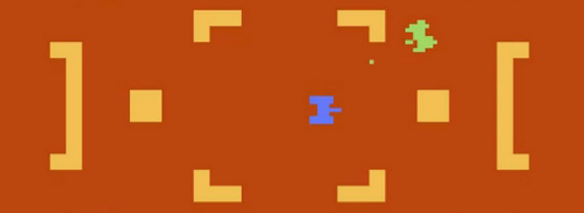

# RAM

>>> memory

| | | |
| --- | --- | --- |
| 0080      | m80                | |
| 0081      | m81                | |
| 0082      | skipPlayfield      | If D7 is set then skip drawing the playfield |
| 0083      | m83                | |
| 0084      | m84                | |
| 0085      | m85                | |
| 0086      | frameCounter       | Incremented every TV frame |
| 0087      | maskRightNumber    | Mask to turn off right number (0 for off, FF for on) |
| 0088      | m88                | ?? F00F something to do with console switch inputs |
| 0089      | m89                | |
| 008A      | m8A                | |
| 008B      | m8B                | |
| 008C      | m8C                | |
| 008D      | m8D                | |
| 008E      | m8E                | |
| 008F      | m8F                | |
| 0090      | m90                | |
| 0091      | m91                | |
| 0092      | m92                | |
| 0093      | m93                | |
| 0094      | m94                | |
| 0095      | m95                | |
| 0096      | m96                | |
| 0097      | m97                | |
| 0098      | m98                | |
| 0099      | m99                | |
| 009A      | m9A                | |
| 009B      | m9B                | |
| 009C      | m9C                | |
| 009D      | m9D                | |
| 009E      | m9E                | |
| 009F      | m9F                | |
| 00A0      | mA0                | |
| 00A1      | scoreP1            | Score for player 0 |
| 00A2      | scoreP1            | Score for player 1 |
| 00A3      | mA3                | |
| 00A4      | player0row         | Row number of player 0 |
| 00A5      | player1row         | Row number of player 1 |
| 00A6      | missile0row        | Row number of missile 0 |
| 00A7      | missile1row        | Row number of missile 1 |
| 00A8      | mA8                | |
| 00A9      | mA9                | |
| 00AA      | mAA                | |
| 00AB      | mAB                | |
| 00AC      | mAC                | |
| 00AD      | mAD                | |
| 00AE      | mAE                | |
| 00AF      | mAF                | |
| 00B0      | mB0                | |
| 00B1      | mB1                | |
| 00B2      | mB2                | |
| 00B3      | mB3                | |
| 00B4      | scanlineNumber     | Counts the scan lines while drawing |
| 00B5:B6   | pf0Graphics        | Pointer to PF0 graphics |
| 00B7:B8   | pf1Graphics        | Pointer to PF1 graphics |
| 00B9:BA   | pf2Graphics        | Pointer to PF2 graphics |
| 00BB      | mBB                | |
| 00BC      | mBC                | |
| 00BD      | playerXpicture     | Offset to player graphics (interleaved -- P0 even, P1 odd) |
| 00BE      | mBE                | |
| 00BF      | mBF                | |
| 00C0      | mC0                | |
| 00C1      | mC1                | |
| 00C2      | mC2                | |
| 00C3      | mC3                | |
| 00C4      | mC4                | |
| 00C5      | mC5                | |
| 00C6      | mC6                | |
| 00C7      | mC7                | |
| 00C8      | mC8                | |
| 00C9      | mC9                | |
| 00CA      | mCA                | |
| 00CB      | mCB                | |
| 00CC      | mCC                | |
| 00CD      | mCD                | |
| 00CE      | mCE                | |
| 00CF      | mCF                | |
| 00D0      | mD0                | |
| 00D1      | mD1                | |
| 00D2      | mD2                | |
| 00D3      | stackPointer       | Holds stack pointer while drawing the screen (with the stack pointer) |
| 00D4      | mD4                | |
| 00D5      | mD5                | |
| 00D6      | colorP0            | Color of Player 0 |
| 00D7      | colorP1            | Color of Player 1 |
| 00D8      | mD8                | |
| 00D9      | mD9                | |
| 00DA      | mDA                | |
| 00DB      | mDB                | |
| 00DC      | mDC                | |
| 00DD      | mDD                | |
| 00DE      | nextLeft           | Holds next pattern for left two digits (offset into 5 slots) |
| 00DF      | nextRight          | Holds next pattern for right two digits (offset into 5 slots) |
| 00E0      | leftDigitLSD       | Least significant digit for left number (offset into 5 slots) |
| 00E1      | rightDigitLSD      | Least significant digit for right number (offset into 5 slots) |
| 00E2      | leftDigitMSD       | Most significant digit for left number (offset into 5 slots) |
| 00E3      | rightDigitMSD      | Most significant digit for right number (offset into 5 slots) |
| 00E4      | mE4                | |
| 00E5      | mE5                | Seems to be first non-used (like reserved for stack) |
| 00E6      | mE6                | |
| 00E7      | mE7                | |
| 00E8      | mE8                | |
| 00E9      | mE9                | |
| 00EA      | mEA                | |
| 00EB      | mEB                | |
| 00EC      | mEC                | |
| 00ED      | mED                | |
| 00EE      | mEE                | |
| 00EF      | mEF                | |
| 00F0      | mF0                | |
| 00F1      | mF1                | |
| 00F2      | mF2                | |
| 00F3      | mF3                | |
| 00F4      | mF4                | |
| 00F5      | mF5                | |
| 00F6      | mF6                | |
| 00F7      | mF7                | |
| 00F8      | mF8                | |
| 00F9      | mF9                | |
| 00FA      | mFA                | |
| 00FB      | mFB                | |
| 00FC      | mFC                | |
| 00FD      | mFD                | |
| 00FE      | mFE                | |
| 00FF      | mFF                | Stack builds from here |

