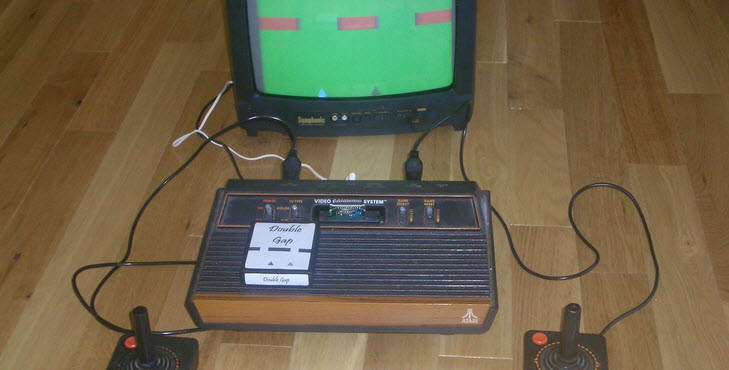

# Double Gap

>>> cpu 6502

>>> memoryTable hard 
[Hardware Info](../Stella.md)

This is the listing file from the assembler. TODO Make the listing file the same
as the other disassembly files so it web-ifies nicely.

TODO include the assembly input file(s) in the nav list.
TODO disassemble the output in the usual way. I have the raw ASM file here if needed.

```
; RAM Usage
.TMP0      = 128
.TMP1      = 129
.TMP2      = 130
.PLAYR0Y   = 131
.PLAYR1Y   = 132
.MUS_TMP0  = 133
.MUS_TMP1  = 134
.SCANCNT   = 135
.MODE      = 136
.WALL_INC  = 137
.WALLCNT   = 138
.WALLDELY  = 139
.WALLDELYR = 140
.ENTROPYA  = 141
.ENTROPYB  = 142
.ENTROPYC  = 143
.DEBOUNCE  = 144
.WALLDRELA = 145
.WALLDRELB = 146
.WALLDRELC = 147
.WALLSTART = 148
.WALLHEI   = 149
.GAPBITS   = 150
.SCORE_PF1 = 151
.SCORE_PF2 = 157
.MUSADEL   = 163
.MUSAIND   = 164
.MUSAVOL   = 165
.MUSBDEL   = 166
.MUSBIND   = 167
.MUSBVOL   = 168

F000:
main:
F000: 78           SEI                       ; Turn off interrupts
F001: D8           CLD                       ; Clear the "decimal" flag
F002: A2 FF        LDX      #0xFF            ; Set stack ...
F004: 9A           TXS                       ; ... to the end of RAM
F005: 20 07 F1     JSR      INIT             ; Initialize game environment
F008: 20 DB F1     JSR      INIT_SELMODE     ; Start out in SELECT-MODE

VIDEO_KERNEL:

F00B: A9 02        LDA      #2               ; D1 bit ON
F00D: 85 02        STA      WSYNC            ; Wait for the end of the current line
F00F: 85 01        STA      VBLANK           ; Turn the electron beam off
F011: 85 02        STA      WSYNC            ; Wait for all ...
F013: 85 02        STA      WSYNC            ; ... the electrons ...
F015: 85 02        STA      WSYNC            ; ... to drain out.
F017: 85 00        STA      VSYNC            ; Trigger the vertical sync signal
F019: 85 02        STA      WSYNC            ; Hold the vsync signal for ...
F01B: 85 02        STA      WSYNC            ; ... three ...
F01D: 85 02        STA      WSYNC            ; ... scanlines
F01F: 85 2A        STA      HMOVE            ; Tell hardware to move all game objects
F021: A9 00        LDA      #0               ; D1 bit OFF
F023: 85 00        STA      VSYNC            ; Release the vertical sync signal
F025: A9 2B        LDA      #43              ; Set timer to 43*64 = 2752 machine ...
F027: 8D 96 02     STA      TIM64T           ; ... cycles 2752/(228/3) = 36 scanlines

    ;  ***** LENGTHY GAME LOGIC PROCESSING BEGINS HERE *****

    ;  Do one of 3 routines while the beam travels back to the top
    ;  0 = Game Over processing
    ;  1 = Playing-Game processing
    ;  2 = Selecting-Game processing

F02A: E6 8D        INC      ENTROPYA         ; Counting video frames as part of the random number
F02C: A5 88        LDA      MODE             ; What are we doing between frames?

F02E: C9 00        CMP      #0               ; Mode is ...
F030: F0 10        BEQ      DoGameOverMode   ; ... "game over"
F032: C9 01        CMP      #1               ; Mode is ...
F034: F0 06        BEQ      DoPlayMode       ; ... "game play"
F036: 20 EA F1     JSR      SELMODE          ; Mode is "select game"
F039: 4C 45 F0     JMP      DrawFrame        ; Continue to the visible screen area

DoPlayMode:
F03C: 20 64 F1     JSR      PLAYMODE         ; Playing-game processing
F03F: 4C 45 F0     JMP      DrawFrame        ; Continue to the visible screen area

DoGameOverMode:
F042: 20 43 F2     JSR      GOMODE           ; Game-over processing

    ;  ***** LENGTHY GAME LOGIC PROCESSING ENDS HERE *****

DrawFrame:
F045: AD 84 02     LDA      INTIM            ; Wait for ...
F048: C9 00        CMP      #0               ; ... the visible area ...
F04A: D0 F9        BNE      DrawFrame        ; ... of the screen

F04C: 85 02        STA      WSYNC            ; 37th scanline
F04E: A9 00        LDA      #0               ; Turn the ...
F050: 85 01        STA      VBLANK           ; ... electron beam back on

F052: A9 00        LDA      #0               ; Zero out ...
F054: 85 87        STA      SCANCNT          ; ... scanline count ...
F056: 85 80        STA      TMP0             ; ... and all ...
F058: 85 81        STA      TMP1             ; ... returns ...
F05A: 85 82        STA      TMP2             ; ... expected ...
F05C: AA           TAX                       ; ... to come from ...
F05D: A8           TAY                       ; ... BUILDROW

F05E: 85 2C        STA      CXCLR            ; Clear collision detection

DrawVisibleRows:

F060: A5 80        LDA      TMP0             ; Get A ready (PF0 value)
F062: 85 02        STA      WSYNC            ; Wait for very start of row
F064: 86 1B        STX      GRP0             ; Player 0 -- in X
F066: 84 1C        STY      GRP1             ; Player 1 -- in Y
F068: 85 0D        STA      PF0              ; PF0      -- in TMP0 (already in A)
F06A: A5 81        LDA      TMP1             ; PF1      -- in TMP1
F06C: 85 0E        STA      PF1              ; ...
F06E: A5 82        LDA      TMP2             ; PP2      -- in TMP2
F070: 85 0F        STA      PF2              ; ...

F072: 20 90 F0     JSR      BUILDROW         ; This MUST take through to the next line

F075: E6 87        INC      SCANCNT          ; Next scan line
F077: A5 87        LDA      SCANCNT          ; Do 109*2 = 218 lines
F079: C9 6D        CMP      #109             ; All done?
F07B: D0 E3        BNE      DrawVisibleRows  ; No ... get all the visible rows

    ;  END VISIBLE PART OF FRAME

F07D: A9 00        LDA      #0               ; Turn off electron beam
F07F: 85 02        STA      WSYNC            ; Next scanline
F081: 85 0D        STA      PF0              ; Play field 0 off
F083: 85 1B        STA      GRP0             ; Player 0 off
F085: 85 1C        STA      GRP1             ; Player 1 off
F087: 85 0E        STA      PF1              ; Play field 1 off
F089: 85 0F        STA      PF2              ; Play field 2 off
F08B: 85 02        STA      WSYNC            ; Next scanline

F08D: 4C 0B F0     JMP      VIDEO_KERNEL

BUILDROW:

F090: A5 87        LDA      SCANCNT          ; Where are we on the screen?

F092: C9 06        CMP      #6               ; If we are in the ...
F094: 90 40        BCC      ShowScore        ; ... score area

F096: 29 07        AND      #7               ; Lower 3 bits as an index again
F098: A8           TAY                       ; Using Y to lookup graphics
F099: B9 3C F5     LDA      GR_PLAYER,Y      ; Get the graphics (if enabled on this row)
F09C: AA           TAX                       ; Hold it (for return as player 0)
F09D: A8           TAY                       ; Hold it (for return as player 1)
F09E: A5 87        LDA      SCANCNT          ; Scanline count again
F0A0: 4A           LSR      A                ; This time ...
F0A1: 4A           LSR      A                ; ... we divide ...
F0A2: 4A           LSR      A                ; ... by eight (8 rows in picture)

F0A3: C5 83        CMP      PLAYR0Y          ; Scanline group of the P0 object?
F0A5: F0 02        BEQ      ShowP0           ; Yes ... keep the picture
F0A7: A2 00        LDX      #0               ; Not time for Player 0 ... no graphics
ShowP0:

F0A9: C5 84        CMP      PLAYR1Y          ; Scanline group of the P1 object?
F0AB: F0 02        BEQ      ShowP1           ; Yes ... keep the picture
F0AD: A0 00        LDY      #0               ; Not time for Player 0 ... no graphics
ShowP1:

F0AF: A5 94        LDA      WALLSTART        ; Calculate ...
F0B1: 18           CLC                       ; ... the bottom ...
F0B2: 65 95        ADC      WALLHEI          ; ... of ...
F0B4: 85 80        STA      TMP0             ; ... the wall

F0B6: A5 87        LDA      SCANCNT          ; Scanline count

F0B8: C5 94        CMP      WALLSTART        ; Past upper part of wall?
F0BA: 90 11        BCC      NoWall           ; No ... skip it
F0BC: C5 80        CMP      TMP0             ; Past lower part of wall
F0BE: B0 0D        BCS      NoWall           ; Yes ... skip it

    ;  The wall is on this row
F0C0: A5 91        LDA      WALLDRELA        ; Draw wall ...
F0C2: 85 80        STA      TMP0             ; ... by transfering ...
F0C4: A5 92        LDA      WALLDRELB        ; ... playfield ...
F0C6: 85 81        STA      TMP1             ; ... patterns ...
F0C8: A5 93        LDA      WALLDRELC        ; ... to ...
F0CA: 85 82        STA      TMP2             ; ... return area
F0CC: 60           RTS                       ; Done

NoWall:
    ;  The wall is NOT on this row
F0CD: A9 00        LDA      #0               ; No walls on this row
F0CF: 85 80        STA      TMP0             ; ... clear ...
F0D1: 85 81        STA      TMP1             ; ... out ...
F0D3: 85 82        STA      TMP2             ; ... the playfield
F0D5: 60           RTS                       ; Done

ShowScore:
F0D6: 29 07        AND      #7               ; OLine=182  Only need the lower 3 bits
F0D8: A8           TAY                       ; OLine=183  Soon to be an index into a list

    ;  At this point, the beam is past the loading of the
    ;  playfield for the left half. We want to make sure
    ;  that the right half of the playfield is off, so do that
    ;  now.

F0D9: A2 00        LDX      #0               ; Blank bit pattern
F0DB: 86 80        STX      TMP0             ; This will always be blank
F0DD: 86 0E        STX      PF1              ; Turn off playfield ...
F0DF: 86 0F        STX      PF2              ; ... for right half of the screen

F0E1: AA           TAX                       ; Another index
F0E2: B9 97 00     LDA      SCORE_PF1,Y      ; Lookup the PF1 graphics for this row
F0E5: 85 81        STA      TMP1             ; Return it to the caller
F0E7: A8           TAY                       ; We'll need this value again in a second
F0E8: B5 9D        LDA      SCORE_PF2,X      ; Lookup the PF2 graphics for this row
F0EA: 85 82        STA      TMP2             ; Return it to the caller

F0EC: 85 02        STA      WSYNC            ; Now on the next row

F0EE: 84 0E        STY      PF1              ; Repeat the left-side playfield ...
F0F0: 85 0F        STA      PF2              ; ... onto the new row

F0F2: B5 9D        LDA      SCORE_PF2,X      ; Kill some time waiting for the ...
F0F4: B5 9D        LDA      SCORE_PF2,X      ; ... beam to pass the left half ...
F0F6: B5 9D        LDA      SCORE_PF2,X      ; ... of the playfield again
F0F8: B5 9D        LDA      SCORE_PF2,X      ; ...
F0FA: B5 9D        LDA      SCORE_PF2,X      ; ...
F0FC: B5 9D        LDA      SCORE_PF2,X      ; ...

F0FE: A2 00        LDX      #0               ; Return 0 (off) for player 0 ...
F100: A0 00        LDY      #0               ; ... and player 1

    ;  The beam is past the left half of the field again.
    ;  Turn off the playfield.

F102: 86 0E        STX      PF1              ; 0 to PF1 ...
F104: 86 0F        STX      PF2              ; ... and PF2
F106: 60           RTS                       ;  Done

INIT:
    ;  This function is called ONCE at power-up/reset to initialize various
    ;  game settings and variables.
                                           
F107: A9 40        LDA      #64              ; Wall is ...
F109: 85 08        STA      COLUPF           ; ... redish
F10B: A9 7E        LDA      #126             ; P0 is ...
F10D: 85 06        STA      COLUP0           ; ... white
F10F: A9 00        LDA      #0               ; P1 ...
F111: 85 07        STA      COLUP1           ; ... black
                                           
F113: A9 05        LDA      #5               ; Right half of playfield is reflection of left ...
F115: 85 0A        STA      CTRLPF           ; ... and playfield is on top of players

    ; TODO other hardware inits here
                                           
F117: A2 04        LDX      #4               ; Player 0 position count
F119: A0 03        LDY      #3               ; Player 1 position count
F11B: 85 02        STA      WSYNC            ; Get a fresh scanline
                                           
TimeP0Pos:
F11D: CA           DEX                       ; Kill time while the beam moves ...
F11E: E0 00        CPX      #0               ; ... to desired ...
F120: D0 FB        BNE      TimeP0Pos        ; ... position
F122: 85 10        STA      RESP0            ; Mark player 0's X position
                                           
TimeP1Pos:
F124: 88           DEY                       ; Kill time while the beam moves ...
F125: C0 00        CPY      #0               ; ... to desired ...
F127: D0 FB        BNE      TimeP1Pos        ; ... position
F129: 85 11        STA      RESP1            ; Mark player 1's X position

F12B: 20 1D F3     JSR      EXPERTISE        ; Initialize the players' Y positions base on expert-settings
                                           
F12E: A9 0A        LDA      #10              ; Wall is ...
F130: 85 95        STA      WALLHEI          ; ... 10 double-scanlines high
                                           
F132: A9 00        LDA      #0               ; Set score to ...
F134: 85 8A        STA      WALLCNT          ; ... 0
F136: 20 9D F2     JSR      MAKE_SCORE       ; Blank the score digits
F139: A9 00        LDA      #0               ; Blank bits ...
F13B: 85 A2        STA      SCORE_PF2+5      ; ... on the end of each ...
F13D: 85 9C        STA      SCORE_PF1+5      ; ... digit pattern
                                           
F13F: 20 48 F3     JSR      ADJUST_DIF       ; Initialize the wall parameters
F142: 20 6F F2     JSR      NEW_GAPS         ; Build the wall's initial gap
                                           
F145: A9 70        LDA      #112             ; Set wall position off bottom ...
F147: 85 94        STA      WALLSTART        ; ... to force a restart on first move
                                           
F149: A9 00        LDA      #0               ; Zero out ...
F14B: 85 20        STA      HMP0             ; ... player 0 motion ...
F14D: 85 21        STA      HMP1             ; ... and player 1 motion
                                           
F14F: 60           RTS                       ; Done

INIT_PLAYMODE:

    ;  This function initializes the game play mode

F150: A9 C0        LDA      #192             ; Background is ...
F152: 85 09        STA      COLUBK           ; ... greenish
F154: A9 01        LDA      #1               ; Game mode is ...
F156: 85 88        STA      MODE             ; ... SELECT
F158: A9 FF        LDA      #255             ; Restart wall score to ...
F15A: 85 8A        STA      WALLCNT          ; ... 0 on first move
F15C: A9 70        LDA      #112             ; Force wall to start ...
F15E: 85 94        STA      WALLSTART        ; ... over on first move
F160: 20 9B F3     JSR      INIT_MUSIC       ; Initialize the music
F163: 60           RTS                       ; Done

PLAYMODE:

    ;  This function is called once per frame to process the main game play.


F164: 20 86 F3     JSR      SEL_RESET_CHK    ; Check to see if Reset/Select has changed

F167: C9 00        CMP      #0               ; Is select pressed?
F169: F0 06        BEQ      NoSelect         ; No ... skip
F16B: 86 90        STX      DEBOUNCE         ; Restore the old value ...
F16D: 20 DB F1     JSR      INIT_SELMODE     ; ... and let select-mode process the toggle
F170: 60           RTS                       ; Done

NoSelect:
F171: 20 B8 F3     JSR      PROCESS_MUSIC    ; Process any playing music
F174: 20 4E F2     JSR      MOVE_WALLS       ; Move the walls

F177: C9 01        CMP      #1               ; Wall on first row?
F179: D0 0D        BNE      NoFirst          ; No ... move on
F17B: E6 8A        INC      WALLCNT          ; Bump the score
F17D: 20 48 F3     JSR      ADJUST_DIF       ; Change the wall parameters based on score
F180: A5 8A        LDA      WALLCNT          ; Change the ...
F182: 20 9D F2     JSR      MAKE_SCORE       ; ... score pattern
F185: 20 6F F2     JSR      NEW_GAPS         ; Calculate the new gap position

NoFirst:
F188: A5 02         LDA      CXP0FB          ; Player 0 collision with playfield
F18A: 85 80         STA      TMP0            ; Hold it
F18C: A5 03         LDA      CXP1FB          ; Player 1 collision with playfield
F18E: 05 80         ORA      TMP0            ; Did either ...
F190: 29 80         AND      #128            ; ... player hit ...
F192: C9 00         CMP      #0              ; ... wall?
F194: F0 04         BEQ      NoHit           ; No ... move on
F196: 20 17 F2      JSR      INIT_GOMODE     ; Go to Game-Over mode
F199: 60            RTS                      ; Done

NoHit:
F19A: AD 80 02      LDA      SWCHA           ; Joystick
F19D: 29 80         AND      #128            ; Player 0 ...
F19F: C9 00         CMP      #0              ; ... moving left?
F1A1: F0 13         BEQ      MoveP0Left      ; Yes ... move left
F1A3: AD 80 02      LDA      SWCHA           ; Joystick
F1A6: 29 40         AND      #64             ; Player 0 ...
F1A8: C9 00         CMP      #0              ; ... moving right?
F1AA: F0 05         BEQ      MoveP0Right     ; Yes ... move right
F1AC: A9 00         LDA      #0              ; Not moving value
F1AE: 4C B8 F1      JMP      SetMoveP0       ; Don't move the player
MoveP0Right:
F1B1: A9 10         LDA      #16             ; +1
F1B3: 4C B8 F1      JMP      SetMoveP0       ; Set HMP0
MoveP0Left:
F1B6: A9 F0         LDA      #240            ; -1
SetMoveP0:
F1B8: 85 20         STA      HMP0            ; New movement value P0

F1BA: AD 80 02      LDA      SWCHA           ; Joystick
F1BD: 29 08         AND      #8              ; Player 1 ...
F1BF: C9 00         CMP      #0              ; ... moving left?
F1C1: F0 13         BEQ      MoveP1Left      ; Yes ... move left
F1C3: AD 80 02      LDA      SWCHA           ; Joystick
F1C6: 29 04         AND      #4              ; Player 0 ...
F1C8: C9 00         CMP      #0              ; ... moving right?
F1CA: F0 05         BEQ      MoveP1Right     ; Yes ... move right
F1CC: A9 00         LDA      #0              ; Not moving value
F1CE: 4C D8 F1      JMP      SetMoveP1       ; Don't move the player
MoveP1Right:
F1D1: A9 10         LDA      #16             ; +1
F1D3: 4C D8 F1      JMP      SetMoveP1       ; Set HMP0
MoveP1Left:
F1D6: A9 F0         LDA      #240            ; -1
SetMoveP1:
F1D8: 85 21         STA      HMP1            ; New movement value P1

F1DA: 60            RTS                      ; Done

INIT_SELMODE:

     ;  This function initializes the games SELECT-MODE

F1DB: A9 00         LDA      #0              ; Turn off ...
F1DD: 85 19         STA      AUDV0           ; ... all ...
F1DF: 85 1A         STA      AUDV1           ; ... sound
F1E1: A9 C8         LDA      #200            ; Background ...
F1E3: 85 09         STA      COLUBK          ; ... greenish bright
F1E5: A9 02         LDA      #2              ; Now in ...
F1E7: 85 88         STA      MODE            ; SELECT game mode
F1E9: 60            RTS                      ; Done


SELMODE:

     ;  This function is called once per frame to process the SELECT-MODE.
     ;  The wall moves here, but doesn't change or collide with players.
     ;  This function selects between 1 and 2 player game.

F1EA: 20 4E F2      JSR      MOVE_WALLS       ; Move the walls
F1ED: 20 86 F3      JSR      SEL_RESET_CHK    ; Check the reset/select switches
F1F0: C9 01         CMP      #1               ; RESET button?
F1F2: F0 1C         BEQ      SelStartGame     ; Yes ... start game
F1F4: C9 03         CMP      #3               ; RESET and SELECT?
F1F6: F0 18         BEQ      SelStartGame     ; Yes ... start game
F1F8: C9 02         CMP      #2               ; Select only?
F1FA: D0 17         BNE      SelExp           ; No ... stay in this mode
F1FC: A5 84         LDA      PLAYR1Y          ; Select toggled. Get player 1 Y coordinate
F1FE: C9 FF         CMP      #255             ; 2nd player on the screen?
F200: F0 07         BEQ      SelP1On          ; No ... toggle it on
F202: A9 FF         LDA      #255             ; Yes ...
F204: 85 84         STA      PLAYR1Y          ; ... toggle it off
F206: 4C 13 F2      JMP      SelExp           ; Move to expertise
SelP1On:
F209: A9 0C         LDA      #12              ; Y coordinate
F20B: 85 84         STA      PLAYR1Y          ; On screen now
F20D: 4C 13 F2      JMP      SelExp           ; Move to expertise

SelStartGame:
F210: 20 50 F1      JSR      INIT_PLAYMODE    ; Reset toggled ... start game
SelExp:
F213: 20 1D F3      JSR      EXPERTISE        ; Adjust both players for pro settings
F216: 60            RTS                       ; Done

INIT_GOMODE:

     ;  This function initializes the GAME-OVER game mode.

F217: 85 2B         STA      HMCLR            ; Stop both players from moving
F219: A5 02         LDA      CXP0FB           ; P0 collision ...
F21B: 29 80         AND      #128             ; ... with wall
F21D: C9 00         CMP      #0               ; Did P0 hit the wall?
F21F: D0 04         BNE      GoCheckP1        ; Yes ... leave it at bottom
F221: A9 02         LDA      #2               ; No ... move player 0 ...
F223: 85 83         STA      PLAYR0Y          ; ... up the screen to show win

GoCheckP1:
F225: A5 03         LDA      CXP1FB           ; P1 collision ...
F227: 29 80         AND      #128             ; ... with wall
F229: C9 00         CMP      #0               ; Did P1 hit the wall?
F22B: D0 0A         BNE      GoP1Hit          ; Yes ... leave it at the bottom
F22D: A5 84         LDA      PLAYR1Y          ; Is P1 even ...
F22F: C9 FF         CMP      #255             ; ... on the screen (2 player game?)
F231: F0 04         BEQ      GoP1Hit          ; No ... skip it
F233: A9 02         LDA      #2               ; Player 1 is onscreen and didn't collide ...
F235: 85 84         STA      PLAYR1Y          ; ... move up the screen to show win

GoP1Hit:
F237: A9 00         LDA      #0               ; Going to ...
F239: 85 88         STA      MODE             ; ... game-over mode
F23B: 85 19         STA      AUDV0            ; Turn off any ...
F23D: 85 1A         STA      AUDV1            ; ... sound
F23F: 20 71 F4      JSR      INIT_GO_FX       ; Initialize sound effects
F242: 60            RTS                       ; Done

GOMODE:

     ; This function is called every frame to process the game
     ; over sequence. When the sound effect has finished, the
     ; game switches to select mode.

F243: 20 88 F4      JSR      PROCESS_GO_FX    ; Process the sound effects
F246: C9 00         CMP      #0               ; Effects still running?
F248: F0 03         BEQ      GoKeepGoing      ; Yes ... let them run
F24A: 20 DB F1      JSR      INIT_SELMODE     ; When effect is over, go to select mode
GoKeepGoing:
F24D: 60            RTS                       ; Done

MOVE_WALLS:

     ;  This function moves the wall down the screen and back to position 0
     ;  when it reaches (or passes) 112.

F24E: C6 8B         DEC      WALLDELY         ; Wall motion timer
F250: A5 8B         LDA      WALLDELY         ; Time to ...
F252: C9 00         CMP      #0               ; ... move the wall?
F254: D0 16         BNE      WallDone         ; No ... leave it alone
F256: A5 8C         LDA      WALLDELYR        ; Reset the ...
F258: 85 8B         STA      WALLDELY         ; ... delay count
F25A: A5 94         LDA      WALLSTART        ; Current wall position
F25C: 18            CLC                       ; Increment ...
F25D: 65 89         ADC      WALL_INC         ; ... wall position
F25F: C9 70         CMP      #112             ; At the bottom?
F261: 90 07         BCC      WallOK           ; No ... leave it alone
F263: A9 00         LDA      #0               ; Else restart ...
F265: 85 94         STA      WALLSTART        ; ... wall at top of screen
F267: A9 01         LDA      #1               ; Return flag that wall DID restart
F269: 60            RTS                       ; Done
WallOK:
F26A: 85 94         STA      WALLSTART        ; Store new wall position
WallDone:
F26C: A9 00         LDA      #0               ; Return flag that wall did NOT restart
F26E: 60            RTS                       ; Done


NEW_GAPS:

     ;  This function builds the PF0, PF1, and PF2 graphics for a wall
     ;  with the gap pattern (GAPBITS) placed at random in the 20 bit
     ;  area.

F26F: A9 FF         LDA      #255             ; Start with ...
F271: 85 91         STA      WALLDRELA        ; ... solid wall in PF0 ...
F273: 85 92         STA      WALLDRELB        ; ... and PF1
F275: A5 96         LDA      GAPBITS          ; Store the gap pattern ...
F277: 85 93         STA      WALLDRELC        ; ... in PF2

F279: A5 8D         LDA      ENTROPYA         ; Get ...
F27B: 65 8E         ADC      ENTROPYB         ; ... a randomish ...
F27D: 65 8F         ADC      ENTROPYC         ; ... number ...
F27F: 85 8F         STA      ENTROPYC         ; Update the random seed
F281: 29 0F         AND      #15              ; 0 to 15
F283: C9 0C         CMP      #12              ; Too far to the right?
F285: F0 04         BEQ      GapOK            ; No ... 12 is OK
F287: 90 02         BCC      GapOK            ; No ... less than 12 is OK
F289: E9 09         SBC      #9               ; Back up 9

GapOK:
F28B: C9 00         CMP      #0               ; Gap already at far left?
F28D: F0 0D         BEQ      GapDone          ; Yes ... done
F28F: 38            SEC                       ; Roll gap ...
F290: 66 93         ROR      WALLDRELC        ; ... left ...
F292: 26 92         ROL      WALLDRELB        ; ... desired ...
F294: 66 91         ROR      WALLDRELA        ; ... times ...
F296: 38            SEC                       ; All rolls ...
F297: E9 01         SBC      #1               ; ... done?
F299: 4C 8B F2      JMP      GapOK            ; No ... do them all
GapDone:
F29C: 60            RTS                       ; New wall pattern is ready

MAKE_SCORE:

     ;  This function builds the PF1 and PF2 graphics rows for
     ;  the byte value passed in A. The current implementation is
     ;  two-digits only ... PF2 is blank.

F29D: A2 00         LDX      #0               ; 100's digit
F29F: A0 00         LDY      #0               ; 10's digit

Count100s:
F2A1: C9 64         CMP      #100             ; Need another 100s digit?
F2A3: 90 07         BCC      Count10s         ; No ... move on to 10s
F2A5: E8            INX                       ; Count ...
F2A6: 38            SEC                       ; ... value
F2A7: E9 64         SBC      #100             ; Take off this 100
F2A9: 4C A1 F2      JMP      Count100s        ; Keep counting
Count10s:
F2AC: C9 0A         CMP      #10              ; Need another 10s digit?
F2AE: 90 07         BCC      CountDone        ; No ... got all the tens
F2B0: C8            INY                       ; Count ...
F2B1: 38            SEC                       ; ... value
F2B2: E9 0A         SBC      #10              ; Take off this 10
F2B4: 4C AC F2      JMP      Count10s         ; Keep counting

CountDone:
F2B7: 0A            ASL      A                ; One's digit ...
F2B8: 0A            ASL      A                ; ... *8 ....
F2B9: 0A            ASL      A                ; ... to find picture
F2BA: AA            TAX                       ; One's digit picture to X
F2BB: 98            TYA                       ; Now the 10's digit
F2BC: 0A            ASL      A                ; Multiply ...
F2BD: 0A            ASL      A                ; ... by 8 ...
F2BE: 0A            ASL      A                ; ... to find picture
F2BF: A8            TAY                       ; 10's picture in Y

F2C0: B9 44 F5      LDA      DIGITS,Y         ; Get the 10's digit
F2C3: 29 F0         AND      #0xF0            ; Upper nibble
F2C5: 85 97         STA      SCORE_PF1        ; Store left side
F2C7: BD 44 F5      LDA      DIGITS,X         ; Get the 1's digit
F2CA: 29 0F         AND      #0x0F            ; Lower nibble
F2CC: 05 97         ORA      SCORE_PF1        ; Put left and right half together
F2CE: 85 97         STA      SCORE_PF1        ; And store image

     ; We have plenty of code space. Time and registers are at a premium.
     ; So copy/past the code for each row

F2D0: B9 45 F5      LDA      DIGITS+1,Y       ; Repeat for 2nd line of picture ...
F2D3: 29 F0         AND      #0xF0            ; ...
F2D5: 85 98         STA      SCORE_PF1+1      ; ...
F2D7: BD 45 F5      LDA      DIGITS+1,X       ; ...
F2DA: 29 0F         AND      #15              ; ...
F2DC: 05 98         ORA      SCORE_PF1+1      ; ...
F2DE: 85 98         STA      SCORE_PF1+1      ; ...

F2E0: B9 46 F5      LDA      DIGITS+2,Y       ; Repeat for 3nd line of picture
F2E3: 29 F0         AND      #0xF0            ; ...
F2E5: 85 99         STA      SCORE_PF1+2      ; ...
F2E7: BD 46 F5      LDA      DIGITS+2,X       ; ...
F2EA: 29 0F         AND      #0x0F            ; ...
F2EC: 05 99         ORA      SCORE_PF1+2      ; ...
F2EE: 85 99         STA      SCORE_PF1+2      ; ...

F2F0: B9 47 F5      LDA      DIGITS+3,Y       ; Repeat for 4th line of picture
F2F3: 29 F0         AND      #0xF0            ; ...
F2F5: 85 9A         STA      SCORE_PF1+3      ; ...
F2F7: BD 47 F5      LDA      DIGITS+3,X       ; ...
F2FA: 29 0F         AND      #0x0F            ; ...
F2FC: 05 9A         ORA      SCORE_PF1+3      ; ...
F2FE: 85 9A         STA      SCORE_PF1+3      ; ...

F300: B9 48 F5      LDA      DIGITS+4,Y       ; Repeat for 5th line of picture
F303: 29 F0         AND      #0xF0            ; ...
F305: 85 9B         STA      SCORE_PF1+4      ; ...
F307: BD 48 F5      LDA      DIGITS+4,X       ; ...
F30A: 29 0F         AND      #0x0F            ; ...
F30C: 05 9B         ORA      SCORE_PF1+4      ; ...
F30E: 85 9B         STA      SCORE_PF1+4      ; ...

F310: A9 00         LDA      #0               ; For now ...
F312: 85 9D         STA      SCORE_PF2        ; ... there ...
F314: 85 9E         STA      SCORE_PF2+1      ; ... is ...
F316: 85 9F         STA      SCORE_PF2+2      ; ... no ...
F318: 85 A0         STA      SCORE_PF2+3      ; ... 100s ...
F31A: 85 A1         STA      SCORE_PF2+4      ; ... digit drawn

F31C: 60            RTS                       ; Done

EXPERTISE:
                                           
     ;  This function changes the Y position of the players based on the
     ;  position of their respective pro/novice switches. The player 1
     ;  position is NOT changed if the mode is a single-player game.
                                           
F31D: AD 82 02      LDA      SWCHB            ; Check P0 ...
F320: 29 40         AND      #0x40            ; ... pro/novice settings
F322: C9 00         CMP      #0               ; Amateur?
F324: F0 05         BEQ      ExpP0Ama         ; Yes ... near the bottom of screen
F326: A9 08         LDA      #8               ; Pro ... near the top
F328: 4C 2D F3      JMP      ExpP1            ; Store and check P0
ExpP0Ama:
F32B: A9 0C         LDA      #12              ; near the bottom

ExpP1:
F32D: 85 83         STA      PLAYR0Y          ; Player 0 Y coordinate
                                           
F32F: A6 84         LDX      PLAYR1Y          ; Is P1 on ...
F331: E0 FF         CPX      #255             ; ... the screen?
F333: F0 12         BEQ      ExpNoP1          ; No ... skip all this
F335: AD 82 02      LDA      SWCHB            ; Check P1 ...
F338: 29 80         AND      #0x80            ; ... pro/novice settings
F33A: C9 00         CMP      #0               ; Amateur?
F33C: F0 05         BEQ      ExpP1Ama         ; Yes ... near the bottom of the screen
F33E: A2 08         LDX      #8               ; Pro ... near the top
F340: 4C 45 F3      JMP      ExpDone          ; Store and out
ExpP1Ama:
F343: A2 0C         LDX      #12              ; Novice ... near the bottom
ExpDone:
F345: 86 84         STX      PLAYR1Y          ; Player 1 Y coordinate
ExpNoP1:
F347: 60            RTS                       ; Done

ADJUST_DIF:
                                           
     ;  This function adjusts the wall game difficulty values based on the
     ;  current score. The music can also change with the difficulty. A single
     ;  table describes the new values and when they take effect.

F348: A2 00         LDX      #0               ; Starting at index 0
                                           
AdjNextRow:
F34A: BD F9 F4      LDA      SKILL_VALUES,X   ; Get the score match
F34D: C9 FF         CMP      #255             ; At the end of the table?
F34F: D0 01         BNE      AdjCheckTable    ; No ... check this row
F351: 60            RTS                       ; End of the table ... leave it alone
AdjCheckTable:
F352: C5 8A         CMP      WALLCNT          ; Is this our row?
F354: D0 27         BNE      AdjBump          ; No ... bump to next
F356: E8            INX                       ; Copy ...
F357: BD F9 F4      LDA      SKILL_VALUES,X   ; ... new ...
F35A: 85 89         STA      WALL_INC         ; ... wall increment
F35C: E8            INX                       ; Copy ...
F35D: BD F9 F4      LDA      SKILL_VALUES,X   ; ... new ...
F360: 85 8B         STA      WALLDELY         ; ... wall ...
F362: 85 8C         STA      WALLDELYR        ; ... delay
F364: E8            INX                       ; Copy ...
F365: BD F9 F4      LDA      SKILL_VALUES,X   ; ... new ...
F368: 85 96         STA      GAPBITS          ; ... gap pattern
F36A: E8            INX                       ; Copy ...
F36B: BD F9 F4      LDA      SKILL_VALUES,X   ; ... new ...
F36E: 85 A4         STA      MUSAIND          ; ... MusicA index
F370: E8            INX                       ; Copy ...
F371: BD F9 F4      LDA      SKILL_VALUES,X   ; ... new ...
F374: 85 A7         STA      MUSBIND          ; ... MusicB index
F376: A9 01         LDA      #1               ; Force ...
F378: 85 A3         STA      MUSADEL          ; ... music to ...
F37A: 85 A6         STA      MUSBDEL          ; ... start new
F37C: 60            RTS                       ; Done
AdjBump:
F37D: E8            INX                       ; Move ...
F37E: E8            INX                       ; ... X ...
F37F: E8            INX                       ; ... to ...
F380: E8            INX                       ; ... next ...
F381: E8            INX                       ; ... row of ...
F382: E8            INX                       ; ... table
F383: 4C 4A F3      JMP      AdjNextRow       ; Try next row
                                           
                                           
SEL_RESET_CHK:
                                           
     ;  This function checks for changes to the reset/select
     ;  switches and debounces the transitions.
     ;  xxxxxxSR (Select, Reset)
                                           
F386: A6 90         LDX      DEBOUNCE         ; Get the last value
F388: AD 82 02      LDA      SWCHB            ; New value
F38B: 29 03         AND      #3               ; Only need bottom 2 bits
F38D: C5 90         CMP      DEBOUNCE         ; Same as before?
F38F: F0 07         BEQ      SelDebounce      ; Yes ... return nothing changed
F391: 85 90         STA      DEBOUNCE         ; Hold new last value
F393: 49 FF         EOR      #255             ; Active low to active high
F395: 29 03         AND      #3               ; Only need select/reset
F397: 60            RTS                       ; Return changes
SelDebounce:
F398: A9 00         LDA      #0               ; Return 0 ...
F39A: 60            RTS                       ; ... nothing changed

                                           
INIT_MUSIC:

     ;  This function initializes the hardware and temporaries
     ;  for 2-channel music

F39B: A9 06         LDA      #6               ; Audio control ...
F39D: 85 15         STA      AUDC0            ; ... to pure ...
F39F: 85 16         STA      AUDC1            ; ... tones
F3A1: A9 00         LDA      #0               ; Turn off ...
F3A3: 85 19         STA      AUDV0            ; ... all ...
F3A5: 85 1A         STA      AUDV1            ; ... sound
F3A7: 85 A4         STA      MUSAIND          ; Music pointers ...
F3A9: 85 A7         STA      MUSBIND          ; ... to top of data
F3AB: A9 01         LDA      #1               ; Force ...
F3AD: 85 A3         STA      MUSADEL          ; ... music ...
F3AF: 85 A6         STA      MUSBDEL          ; ... reload
F3B1: A9 0F         LDA      #15              ; Set volume levels ...
F3B3: 85 A5         STA      MUSAVOL          ; ... to ...
F3B5: 85 A8         STA      MUSBVOL          ; ... maximum
F3B7: 60            RTS                       ; Done

PROCESS_MUSIC:
                                           
     ;  This function is called once per frame to process the
     ;  2 channel music. Two tables contain the commands/notes
     ;  for individual channels. This function changes the
     ;  notes at the right time.

F3B8: C6 A3         DEC      MUSADEL          ; Current note on Channel A ended?
F3BA: D0 58         BNE      MusDoB           ; No ... let it play
                                           
MusChanA:
F3BC: A6 A4         LDX      MUSAIND          ; Voice-A index
F3BE: BD A0 F4      LDA      MUSICA,X         ; Get the next music command
F3C1: C9 00         CMP      #0               ; Jump?
F3C3: F0 22         BEQ      MusCmdJumpA      ; Yes ... handle it
F3C5: C9 01         CMP      #1               ; Control?
F3C7: F0 11         BEQ      MusCmdCtrlA      ; Yes ... handle it
F3C9: C9 02         CMP      #2               ; Volume?
F3CB: D0 28         BNE      MusCmdToneA      ; No ... must be a note
F3CD: E8            INX                       ; Point to volume value
F3CE: E6 A4         INC      MUSAIND          ; Bump the music pointer
F3D0: BD A0 F4      LDA      MUSICA,X         ; Get the volume value
F3D3: E6 A4         INC      MUSAIND          ; Bump the music pointer
F3D5: 85 A5         STA      MUSAVOL          ; Store the new volume value
F3D7: 4C BC F3      JMP      MusChanA         ; Keep processing through a tone

MusCmdCtrlA:
F3DA: E8            INX                       ; Point to the control value
F3DB: E6 A4         INC      MUSAIND          ; Bump the music pointer
F3DD: BD A0 F4      LDA      MUSICA,X         ; Get the control value
F3E0: E6 A4         INC      MUSAIND          ; Bump the music pointer
F3E2: 85 15         STA      AUDC0            ; Store the new control value
F3E4: 4C BC F3      JMP      MusChanA         ; Keep processing through a tone

MusCmdJumpA:
F3E7: E8            INX                       ; Point to jump value
F3E8: 8A            TXA                       ; X to ...
F3E9: A8            TAY                       ; ... Y (pointer to jump value)
F3EA: E8            INX                       ; Point one past jump value
F3EB: 8A            TXA                       ; Into A so we can subtract
F3EC: 38            SEC                       ; New ...
F3ED: F9 A0 F4      SBC      MUSICA,Y         ; ... index
F3F0: 85 A4         STA      MUSAIND          ; Store it
F3F2: 4C BC F3      JMP      MusChanA         ; Keep processing through a tone

MusCmdToneA:
F3F5: A4 A5         LDY      MUSAVOL          ; Get the volume
F3F7: 29 1F         AND      #0x1F            ; Lower 5 bits are frequency
F3F9: C9 1F         CMP      #0x1F            ; Is this a silence?
F3FB: D0 02         BNE      MusNoteA         ; No ... play it
F3FD: A0 00         LDY      #0               ; Frequency of 31 flags silence
MusNoteA:
F3FF: 85 17         STA      AUDF0            ; Store the frequency
F401: 84 19         STY      AUDV0            ; Store the volume
F403: BD A0 F4      LDA      MUSICA,X         ; Get the note value again
F406: E6 A4         INC      MUSAIND          ; Bump to the next command
F408: 6A            ROR      A                ; The upper ...
F409: 6A            ROR      A                ; ... three ...
F40A: 6A            ROR      A                ; ... bits ...
F40B: 6A            ROR      A                ; ... hold ...
F40C: 6A            ROR      A                ; ... the ...
F40D: 29 07         AND      #7               ; ... delay
F40F: 18            CLC                       ; No accidental carry
F410: 2A            ROL      A                ; Every delay tick ...
F411: 2A            ROL      A                ; ... is *4 frames
F412: 85 A3         STA      MUSADEL          ; Store the note delay

MusDoB:
                                           
F414: C6 A6         DEC      MUSBDEL
F416: D0 58         BNE      MusDoDone
                                           
MusChanB:
F418: A6 A7         LDX      MUSBIND
F41A: BD CD F4      LDA      MUSICB,X
F41D: C9 00         CMP      #0
F41F: F0 22         BEQ      MusCmdJumpB
F421: C9 01         CMP      #1
F423: F0 11         BEQ      MusCmdCtrlB
F425: C9 02         CMP      #2
F427: D0 28         BNE      MusCmdToneB
F429: E8            INX
F42A: E6 A7         INC      MUSBIND
F42C: BD CD F4      LDA      MUSICB,X
F42F: E6 A7         INC      MUSBIND
F431: 85 A8         STA      MUSBVOL
F433: 4C 18 F4      JMP      MusChanB

MusCmdCtrlB:
F436: E8            INX
F437: E6 A7         INC      MUSBIND
F439: BD CD F4      LDA      MUSICB,X
F43C: E6 A7         INC      MUSBIND
F43E: 85 16         STA      AUDC1
F440: 4C 18 F4      JMP      MusChanB

MusCmdJumpB:
F443: E8            INX
F444: 8A            TXA
F445: A8            TAY
F446: E8            INX
F447: 8A            TXA
F448: 38            SEC
F449: F9 CD F4      SBC      MUSICB,Y
F44C: 85 A7         STA      MUSBIND
F44E: 4C 18 F4      JMP      MusChanB

MusCmdToneB:
F451: A4 A8         LDY      MUSBVOL
F453: 29 1F         AND      #0x1F
F455: C9 1F         CMP      #0x1F
F457: D0 02         BNE      MusNoteB
F459: A0 00         LDY      #0
MusNoteB:
F45B: 85 18         STA      AUDF1
F45D: 84 1A         STY      AUDV1
F45F: BD CD F4      LDA      MUSICB,X
F462: E6 A7         INC      MUSBIND
F464: 6A            ROR      A
F465: 6A            ROR      A
F466: 6A            ROR      A
F467: 6A            ROR      A
F468: 6A            ROR      A
F469: 29 07         AND      #7
F46B: 18            CLC
F46C: 2A            ROL      A
F46D: 2A            ROL      A
F46E: 85 A6         STA      MUSBDEL

MusDoDone:
F470: 60            RTS                       ; Done


INIT_GO_FX:
                                           
     ;  This function initializes the hardware and temporaries
     ;  to play the soundeffect of a player hitting the wall
                                           
F471: A9 05         LDA      #5               ; Set counter for frame delay ...
F473: 85 86         STA      MUS_TMP1         ; ... between frequency change
F475: A9 03         LDA      #3               ; Tone type ...
F477: 85 15         STA      AUDC0            ; ... poly tone
F479: A9 0F         LDA      #15              ; Volume A ...
F47B: 85 19         STA      AUDV0            ; ... to max
F47D: A9 00         LDA      #0               ; Volume B ...
F47F: 85 1A         STA      AUDV1            ; ... silence
F481: A9 F0         LDA      #240             ; Initial ...
F483: 85 85         STA      MUS_TMP0         ; ... sound ...
F485: 85 17         STA      AUDF0            ; ... frequency
F487: 60            RTS                       ; Done

PROCESS_GO_FX:
                                           
     ;  This function is called once per scanline to play the
     ;  soundeffects of a player hitting the wall.

F488: C6 86         DEC      MUS_TMP1         ; Time to change the frequency?
F48A: D0 11         BNE      FxRun            ; No ... let it run
F48C: A9 05         LDA      #5               ; Reload ...
F48E: 85 86         STA      MUS_TMP1         ; ... the frame count
F490: E6 85         INC      MUS_TMP0         ; Increment ...
F492: A5 85         LDA      MUS_TMP0         ; ... the frequency divisor
F494: 85 17         STA      AUDF0            ; Change the frequency
F496: C9 00         CMP      #0
F498: D0 03         BNE      FxRun
F49A: A9 01         LDA      #1               ; All done ... return 1
F49C: 60            RTS                       ; Done
FxRun:
F49D: A9 00         LDA      #0               ; Keep playing
F49F: 60            RTS                       ; Done

  ;  Music commands for Channel A and Channel B

  ;  A word on music and wall timing ...

  ;  Wall moves between scanlines 0 and 111 (112 total)

  ;  Wall-increment   frames-to-top
  ;       3             336
  ;       2             224
  ;       1             112
  ;      0.5             56  ; Ah ... but we are getting one less

  ;  Each tick is multiplied by 4 to yield 4 frames per tick
  ;  32 ticks/song = 32*4 = 128 frames / song

  ;  We want songs to start with wall at top ...

  ;  Find the least-common-multiple
  ;  336 and 128 : 2688 8 walls, 21 musics
  ;  224 and 128 :  896 4 walls,  7 musics
  ;  112 and 128 :  896 8 walls,  7 musics
  ;   56 and 128 :  896 16 walls, 7 musics

  ;  Wall moving every other gives us 112*2=224 scanlines
  ;  Song and wall are at start every 4
  ;  1 scanline, every 8
  ;  Wall delay=3 gives us 128*3=336 scanlines 2

.MUSCMD_JUMP      =     0      ; Music command value for JUMP
.MUSCMD_CONTROL   =     1      ; Music command value for CONTROL
.MUSCMD_VOLUME    =     2      ; Music command value for VOLUME
.MUS_REST         =     31     ; Frequency value for silence
.MUS_DEL_1        =     32*1   ; Note duration 1
.MUS_DEL_2        =     32*2   ; Note duration 2
.MUS_DEL_3        =     32*3   ; Note duration 3
.MUS_DEL_4        =     32*4   ; Note duration 4
                                           
MUSICA:
                                           
MA_SONG_1:
                                           
F4A0: 01 0C         .byte    MUSCMD_CONTROL, 12
F4A2: 02 0F         .byte    MUSCMD_VOLUME,  15 ; Volume (full)
                                           
MA1_01:
F4A4: 6F            .byte    MUS_DEL_3  +  15
F4A5: 3F            .byte    MUS_DEL_1  +  MUS_REST
F4A6: 6F            .byte    MUS_DEL_3  +  15
F4A7: 3F            .byte    MUS_DEL_1  +  MUS_REST
F4A8: 27            .byte    MUS_DEL_1  +  7
F4A9: 3F            .byte    MUS_DEL_1  +  MUS_REST
F4AA: 27            .byte    MUS_DEL_1  +  7
F4AB: 3F            .byte    MUS_DEL_1  +  MUS_REST
F4AC: 5F            .byte    MUS_DEL_2  +  MUS_REST
F4AD: 28            .byte    MUS_DEL_1  +  8
F4AE: 3F            .byte    MUS_DEL_1  +  MUS_REST
F4AF: 9F            .byte    MUS_DEL_4  +  MUS_REST
F4B0: 51            .byte    MUS_DEL_2  +  17
F4B1: 5F            .byte    MUS_DEL_2  +  MUS_REST
F4B2: 51            .byte    MUS_DEL_2  +  17
F4B3: 5F            .byte    MUS_DEL_2  +  MUS_REST
F4B4: 70            .byte    MUS_DEL_3  +  16
F4B5: 3F            .byte    MUS_DEL_1  +  MUS_REST
F4B6: 00 14         .byte    MUSCMD_JUMP, (MA1_END - MA1_01) ; Repeat back to top
MA1_END:
                                           
MA_SONG_2:
F4B8: 01 0C         .byte    MUSCMD_CONTROL, 12
F4BA: 02 0F         .byte    MUSCMD_VOLUME,  15
                                           
MA2_01:
F4BC: 2F            .byte    MUS_DEL_1  +  15
F4BD: 3F            .byte    MUS_DEL_1  +  MUS_REST
F4BE: 2F            .byte    MUS_DEL_1  +  15
F4BF: 3F            .byte    MUS_DEL_1  +  MUS_REST
F4C0: 5F            .byte    MUS_DEL_2  +  MUS_REST
F4C1: 87            .byte    MUS_DEL_4  +  7
F4C2: 9F            .byte    MUS_DEL_4  +  MUS_REST
F4C3: 4F            .byte    MUS_DEL_2  +  15
F4C4: 9F            .byte    MUS_DEL_4  +  MUS_REST
F4C5: 4C            .byte    MUS_DEL_2  +  12
F4C6: 5F            .byte    MUS_DEL_2  +  MUS_REST
F4C7: 4F            .byte    MUS_DEL_2  +  15
F4C8: 5F            .byte    MUS_DEL_2  +  MUS_REST
F4C9: 51            .byte    MUS_DEL_2  +  17
F4CA: 5F            .byte    MUS_DEL_2  +  MUS_REST
F4CB: 00 11         .byte    MUSCMD_JUMP, (MA2_END - MA2_01) ; Repeat back to top
MA2_END:
                                           
MUSICB:
                                           
MB_SONG_1:
                                           
F4CD: 01 08         .byte    MUSCMD_CONTROL, 8
F4CF: 02 08         .byte    MUSCMD_VOLUME,  8 ; Volume (half)
                                           
MB1_01:
F4D1: 2A            .byte    MUS_DEL_1  +  10
F4D2: 3F            .byte    MUS_DEL_1  +  MUS_REST
F4D3: 34            .byte    MUS_DEL_1  +  20
F4D4: 3F            .byte    MUS_DEL_1  +  MUS_REST
F4D5: 3E            .byte    MUS_DEL_1  +  30
F4D6: 3F            .byte    MUS_DEL_1  +  MUS_REST
F4D7: 2F            .byte    MUS_DEL_1  +  15
F4D8: 3F            .byte    MUS_DEL_1  +  MUS_REST
F4D9: 2A            .byte    MUS_DEL_1  +  10
F4DA: 3F            .byte    MUS_DEL_1  +  MUS_REST
F4DB: 34            .byte    MUS_DEL_1  +  20
F4DC: 3F            .byte    MUS_DEL_1  +  MUS_REST
F4DD: 3E            .byte    MUS_DEL_1  +  30
F4DE: 3F            .byte    MUS_DEL_1  +  MUS_REST
F4DF: 2F            .byte    MUS_DEL_1  +  15
F4E0: 3F            .byte    MUS_DEL_1  +  MUS_REST
F4E1: 00 12         .byte    MUSCMD_JUMP, (MB1_END - MB1_01) ; Repeat back to top
MB1_END:
                                           
MB_SONG_2:
                                           
F4E3: 01 08         .byte    MUSCMD_CONTROL, 8
F4E5: 02 08         .byte    MUSCMD_VOLUME,  8
                                           
MB2_01:
F4E7: 21            .byte    MUS_DEL_1  +  1
F4E8: 3F            .byte    MUS_DEL_1  +  MUS_REST
F4E9: 21            .byte    MUS_DEL_1  +  1
F4EA: 3F            .byte    MUS_DEL_1  +  MUS_REST
F4EB: 21            .byte    MUS_DEL_1  +  1
F4EC: 3F            .byte    MUS_DEL_1  +  MUS_REST
F4ED: 21            .byte    MUS_DEL_1  +  1
F4EE: 3F            .byte    MUS_DEL_1  +  MUS_REST
F4EF: 3E            .byte    MUS_DEL_1  +  30
F4F0: 3F            .byte    MUS_DEL_1  +  MUS_REST
F4F1: 3E            .byte    MUS_DEL_1  +  30
F4F2: 3F            .byte    MUS_DEL_1  +  MUS_REST
F4F3: 3E            .byte    MUS_DEL_1  +  30
F4F4: 3F            .byte    MUS_DEL_1  +  MUS_REST
F4F5: 3E            .byte    MUS_DEL_1  +  30
F4F6: 3F            .byte    MUS_DEL_1  +  MUS_REST
F4F7: 00 12         .byte    MUSCMD_JUMP, (MB2_END - MB2_01) ; Repeat back to top
MB2_END:

SKILL_VALUES:
                                           
     ;  This table describes how to change the various
     ;  difficulty parameters as the game progresses.
     ;  For instance, the second entry in the table
     ;  says that when the score is 4, change the values of
     ;  wall-increment to 1, frame-delay to 2, gap-pattern to 0,
     ;  MusicA to 24, and MusicB to 22.

     ;  A 255 on the end of the table indicates the end

     ;       Wall  Inc  Delay   Gap       MA                 MB
F4F9: 00 01 03 00 00 00      .byte    0,     1,   3,     0  ,MA_SONG_1-MUSICA , MB_SONG_1-MUSICB
F4FF: 04 01 02 00 18 16      .byte    4,     1,   2,     0  ,MA_SONG_2-MUSICA , MB_SONG_2-MUSICB
F505: 08 01 01 00 00 00      .byte    8,     1,   1,     0  ,MA_SONG_1-MUSICA , MB_SONG_1-MUSICB
F50B: 10 01 01 01 18 16      .byte    16,    1,   1,     1  ,MA_SONG_2-MUSICA , MB_SONG_2-MUSICB
F511: 18 01 01 03 00 00      .byte    24,    1,   1,     3  ,MA_SONG_1-MUSICA , MB_SONG_1-MUSICB
F517: 20 01 01 07 18 16      .byte    32,    1,   1,     7  ,MA_SONG_2-MUSICA , MB_SONG_2-MUSICB
F51D: 28 01 01 0F 00 00      .byte    40,    1,   1,    15  ,MA_SONG_1-MUSICA , MB_SONG_1-MUSICB
F523: 30 02 01 00 18 16      .byte    48,    2,   1,     0  ,MA_SONG_2-MUSICA , MB_SONG_2-MUSICB
F529: 40 02 01 01 00 00      .byte    64,    2,   1,     1  ,MA_SONG_1-MUSICA , MB_SONG_1-MUSICB
F52F: 50 02 01 03 18 16      .byte    80,    2,   1,     3  ,MA_SONG_2-MUSICA , MB_SONG_2-MUSICB
F535: 60 02 01 07 00 00      .byte    96 ,   2,   1,     7  ,MA_SONG_1-MUSICA , MB_SONG_1-MUSICB
F53B: FF            .byte    255
                                           
GR_PLAYER:
     ;  Image for players (8x8)
     .subs .=0, *=1
     ;
F53C: 10            .byte    0b__...*....
F53D: 10            .byte    0b__...*....
F53E: 28            .byte    0b__..*.*...
F53F: 28            .byte    0b__..*.*...
F540: 54            .byte    0b__.*.*.*..
F541: 54            .byte    0b__.*.*.*..
F542: AA            .byte    0b__*.*.*.*.
F543: 7C            .byte    0b__.*****..
                                           
DIGITS:
     ;  Images for numbers
     ;  We only need 5 rows, but the extra space on the end makes each digit 8 rows,
     ;  which makes it the multiplication easier.

F544: 0E            .byte   0b__....***.  ; 0 (leading 0 is blank)
F545: 0A            .byte   0b__....*.*.
F546: 0A            .byte   0b__....*.*.
F547: 0A            .byte   0b__....*.*.
F548: 0E            .byte   0b__....***.
F549: 00            .byte   0b__........
F54A: 00            .byte   0b__........
F54B: 00            .byte   0b__........

F54C: 22            .byte   0b__..*...*.  ; 1
F54D: 22            .byte   0b__..*...*.
F54E: 22            .byte   0b__..*...*.
F54F: 22            .byte   0b__..*...*.
F550: 22            .byte   0b__..*...*.
F551: 00            .byte   0b__........
F552: 00            .byte   0b__........
F553: 00            .byte   0b__........

F554: EE            .byte   0b__***.***.  ; 2
F555: 22            .byte   0b__..*...*.
F556: EE            .byte   0b__***.***.
F557: 88            .byte   0b__*...*...
F558: EE            .byte   0b__***.***.
F559: 00            .byte   0b__........
F55A: 00            .byte   0b__........
F55B: 00            .byte   0b__........

F55C: EE            .byte   0b__***.***.  ; 3
F55D: 22            .byte   0b__..*...*.
F55E: 66            .byte   0b__.**..**.
F55F: 22            .byte   0b__..*...*.
F560: EE            .byte   0b__***.***.
F561: 00            .byte   0b__........
F562: 00            .byte   0b__........
F563: 00            .byte   0b__........

F564: AA            .byte   0b__*.*.*.*.  ; 4
F565: AA            .byte   0b__*.*.*.*.
F566: EE            .byte   0b__***.***.
F567: 22            .byte   0b__..*...*.
F568: 22            .byte   0b__..*...*.
F569: 00            .byte   0b__........
F56A: 00            .byte   0b__........
F56B: 00            .byte   0b__........

F56C: EE            .byte   0b__***.***. ; 5
F56D: 88            .byte   0b__*...*...
F56E: EE            .byte   0b__***.***.
F56F: 22            .byte   0b__..*...*.
F570: EE            .byte   0b__***.***.
F571: 00            .byte   0b__........
F572: 00            .byte   0b__........
F573: 00            .byte   0b__........

F574: EE            .byte   0b__***.***. ; 6
F575: 88            .byte   0b__*...*...
F576: EE            .byte   0b__***.***.
F577: AA            .byte   0b__*.*.*.*.
F578: EE            .byte   0b__***.***.
F579: 00            .byte   0b__........
F57A: 00            .byte   0b__........
F57B: 00            .byte   0b__........

F57C: EE            .byte   0b__***.***. ; 7
F57D: 22            .byte   0b__..*...*.
F57E: 22            .byte   0b__..*...*.
F57F: 22            .byte   0b__..*...*.
F580: 22            .byte   0b__..*...*.
F581: 00            .byte   0b__........
F582: 00            .byte   0b__........
F583: 00            .byte   0b__........

F584: EE            .byte   0b__***.***. ; 8
F585: AA            .byte   0b__*.*.*.*.
F586: EE            .byte   0b__***.***.
F587: AA            .byte   0b__*.*.*.*.
F588: EE            .byte   0b__***.***.
F589: 00            .byte   0b__........
F58A: 00            .byte   0b__........
F58B: 00            .byte   0b__........

F58C: EE            .byte   0b__***.***. ; 9
F58D: AA            .byte   0b__*.*.*.*.
F58E: EE            .byte   0b__***.***.
F58F: 22            .byte   0b__..*...*.
F590: EE            .byte   0b__***.***.
F591: 00            .byte   0b__........
F592: 00            .byte   0b__........
F593: 00            .byte   0b__........

F7FA:
  ; 6502 vectors
F7FA: 00 F0         .word main
F7FC: 00 F0         .word main  ; Reset vector (top of program)
F7FE: 00 F0         .word main
```