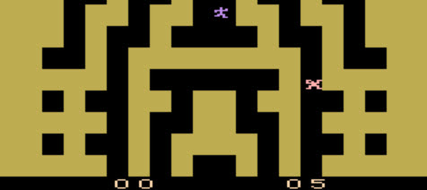

>>> deploy: 
>>>   +entombed.jpg 
>>>   RAMUse.md 
>>>   Code.md 
>>>   ---- 
>>>   Journal.md 

# Entombed

[Code](Code.md)

>>> playMe {

# Play Me!

It might take a few seconds for the ROM to load, but play Atari2600 Chess here:

[http://javatari.org&ROM=Entombed](http://javatari.org?ROM=https://github.com/topherCantrell/computerarcheology/blob/master/content/Atari2600/Entombed/Entombed.bin?raw=true)

>>> }