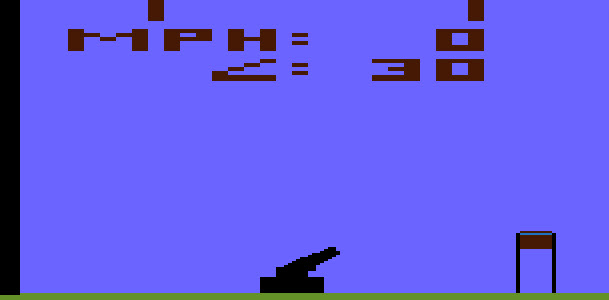

# Entombed

>>> cpu 6502

>>> memoryTable hard 
[Hardware Info](../Stella.md)

>>> memoryTable ram 
[RAM Usage](RAMUse.md)

# Start

```code
B000: D8             CLD                     
B001: A2 FF          LDX     #$FF            
B003: 9A             TXS                     
B004: E8             INX                     
B005: 8A             TXA                     
B006: 95 04          STA     $04,X           
B008: E8             INX                     
B009: D0 FB          BNE     $B006           
B00B: A9 F7          LDA     #$F7            
B00D: 85 85          STA     $85             
B00F: 20 55 F3       JSR     $F355           
B012: C8             INY                     
B013: F0 37          BEQ     $B04C           
B015: F6 9B          INC     $9B,X           
B017: 94 0B          STY     $0B,X           
B019: CA             DEX                     
B01A: D0 F9          BNE     $B015           
B01C: 84 2B          STY     $2B             
B01E: AD 80 02       LDA     $0280           
B021: 49 FF          EOR     #$FF            
B023: F0 02          BEQ     $B027           
B025: 85 9D          STA     $9D             
B027: AD 82 02       LDA     $0282           
B02A: 4A             LSR     A               
B02B: B0 10          BCS     $B03D           
B02D: 20 5A F5       JSR     $F55A           
B030: C8             INY                     
B031: 84 B5          STY     $B5             
B033: 84 B6          STY     $B6             
B035: 84 B7          STY     $B7             
B037: A0 40          LDY     #$40            
B039: 84 B4          STY     $B4             
B03B: D0 50          BNE     $B08D           
B03D: 4A             LSR     A               
B03E: 90 04          BCC     $B044           
B040: 86 86          STX     $86             
B042: B0 49          BCS     $B08D           
B044: 86 19          STX     $19             
B046: C6 86          DEC     $86             
B048: 10 43          BPL     $B08D           
B04A: EA             NOP                     
B04B: EA             NOP                     
B04C: A9 1E          LDA     #$1E            
B04E: 85 86          STA     $86             
B050: 85 C2          STA     $C2             
B052: A2 02          LDX     #$02            
B054: 86 97          STX     $97             
B056: E6 C3          INC     $C3             
B058: E4 C3          CPX     $C3             
B05A: F0 29          BEQ     $B085           
B05C: 84 87          STY     $87             
B05E: C8             INY                     
B05F: 84 C3          STY     $C3             
B061: E6 D1          INC     $D1             
B063: A5 D1          LDA     $D1             
B065: C9 09          CMP     #$09            
B067: D0 02          BNE     $B06B           
B069: 84 D1          STY     $D1             
B06B: 29 03          AND     #$03            
B06D: 85 88          STA     $88             
B06F: C9 03          CMP     #$03            
B071: D0 02          BNE     $B075           
B073: 85 87          STA     $87             
B075: A5 D1          LDA     $D1             
B077: C9 05          CMP     #$05            
B079: B0 01          BCS     $B07C           
B07B: CA             DEX                     
B07C: 86 D5          STX     $D5             
B07E: A6 88          LDX     $88             
B080: BD 09 F7       LDA     $F709,X         
B083: 85 C4          STA     $C4             
B085: A5 D1          LDA     $D1             
B087: 85 B6          STA     $B6             
B089: A5 C3          LDA     $C3             
B08B: 85 B7          STA     $B7             
B08D: A5 C4          LDA     $C4             
B08F: 18             CLC                     
B090: A6 E8          LDX     $E8             
B092: 7D 49 F7       ADC     $F749,X         
B095: A2 00          LDX     #$00            
B097: 20 04 F6       JSR     $F604           
B09A: 20 D5 F2       JSR     $F2D5           
B09D: AE 84 02       LDX     $0284           
B0A0: 10 FB          BPL     $B09D           
B0A2: A2 33          LDX     #$33            
B0A4: 8E 96 02       STX     $0296           
B0A7: 86 01          STX     $01             
B0A9: 85 02          STA     $02             
B0AB: 86 00          STX     $00             
B0AD: 85 2B          STA     $2B             
B0AF: A2 70          LDX     #$70            
B0B1: 86 24          STX     $24             
B0B3: A0 04          LDY     #$04            
B0B5: 20 D7 F2       JSR     $F2D7           
B0B8: 84 00          STY     $00             
B0BA: 84 01          STY     $01             
B0BC: A5 C8          LDA     $C8             
B0BE: 85 09          STA     $09             
B0C0: A0 04          LDY     #$04            
B0C2: B9 B5 00       LDA     $00B5,Y         
B0C5: 29 0F          AND     #$0F            
B0C7: 20 B5 F6       JSR     $F6B5           
B0CA: 99 B9 00       STA     $00B9,Y         
B0CD: B9 B5 00       LDA     $00B5,Y         
B0D0: 29 F0          AND     #$F0            
B0D2: 20 1E F6       JSR     $F61E           
B0D5: 20 B5 F6       JSR     $F6B5           
B0D8: 99 BD 00       STA     $00BD,Y         
B0DB: 88             DEY                     
B0DC: D0 E4          BNE     $B0C2           
B0DE: A9 08          LDA     #$08            
B0E0: 2C 82 02       BIT     $0282           
B0E3: D0 01          BNE     $B0E6           
B0E5: 38             SEC                     
B0E6: A2 05          LDX     #$05            
B0E8: BD F6 F6       LDA     $F6F6,X         
B0EB: 90 03          BCC     $B0F0           
B0ED: BD FB F6       LDA     $F6FB,X         
B0F0: A4 97          LDY     $97             
B0F2: F0 08          BEQ     $B0FC           
B0F4: 45 91          EOR     $91             
B0F6: 29 F6          AND     #$F6            
B0F8: 90 02          BCC     $B0FC           
B0FA: 29 06          AND     #$06            
B0FC: 95 C4          STA     $C4,X           
B0FE: A4 BE          LDY     $BE             
B100: B9 8F F7       LDA     $F78F,Y         
B103: 29 F0          AND     #$F0            
B105: 85 CE          STA     $CE             
B107: A4 BA          LDY     $BA             
B109: B9 8F F7       LDA     $F78F,Y         
B10C: 29 0F          AND     #$0F            
B10E: 05 CE          ORA     $CE             
B110: 95 E8          STA     $E8,X           
B112: E6 BE          INC     $BE             
B114: E6 BA          INC     $BA             
B116: CA             DEX                     
B117: D0 CF          BNE     $B0E8           
B119: A5 C5          LDA     $C5             
B11B: 85 06          STA     $06             
B11D: 85 07          STA     $07             
B11F: 85 2B          STA     $2B             
B121: AD 82 02       LDA     $0282           
B124: A6 B5          LDX     $B5             
B126: D0 01          BNE     $B129           
B128: 0A             ASL     A               
B129: A2 40          LDX     #$40            
B12B: 29 80          AND     #$80            
B12D: A8             TAY                     
B12E: 30 02          BMI     $B132           
B130: A2 C0          LDX     #$C0            
B132: 45 89          EOR     $89             
B134: F0 04          BEQ     $B13A           
B136: 84 89          STY     $89             
B138: 86 23          STX     $23             
B13A: 20 D5 F2       JSR     $F2D5           
B13D: A9 01          LDA     #$01            
B13F: 25 9F          AND     $9F             
B141: 85 9F          STA     $9F             
B143: F0 12          BEQ     $B157           
B145: E6 92          INC     $92             
B147: E6 D3          INC     $D3             
B149: A5 D3          LDA     $D3             
B14B: C9 BF          CMP     #$BF            
B14D: D0 04          BNE     $B153           
B14F: A9 50          LDA     #$50            
B151: 85 D3          STA     $D3             
B153: 69 19          ADC     #$19            
B155: 85 D4          STA     $D4             
B157: 85 2B          STA     $2B             
B159: 20 D5 F2       JSR     $F2D5           
B15C: AC 84 02       LDY     $0284           
B15F: 10 F8          BPL     $B159           
B161: 20 18 F3       JSR     $F318           
B164: A9 7D          LDA     #$7D            
B166: 85 A2          STA     $A2             
B168: A9 82          LDA     #$82            
B16A: 85 84          STA     $84             
B16C: A9 F7          LDA     #$F7            
B16E: 85 A3          STA     $A3             
B170: 20 0B F3       JSR     $F30B           
B173: A9 14          LDA     #$14            
B175: 85 A2          STA     $A2             
B177: A9 87          LDA     #$87            
B179: 85 84          STA     $84             
B17B: C8             INY                     
B17C: 20 0B F3       JSR     $F30B           
B17F: A9 74          LDA     #$74            
B181: 85 9A          STA     $9A             
B183: A2 02          LDX     #$02            
B185: 24 89          BIT     $89             
B187: 10 01          BPL     $B18A           
B189: E8             INX                     
B18A: 86 CE          STX     $CE             
B18C: 20 D5 F2       JSR     $F2D5           
B18F: A6 D5          LDX     $D5             
B191: C5 D3          CMP     $D3             
B193: 90 05          BCC     $B19A           
B195: C5 D4          CMP     $D4             
B197: B0 01          BCS     $B19A           
B199: CA             DEX                     
B19A: 86 1F          STX     $1F             
B19C: 20 BF F2       JSR     $F2BF           
B19F: A5 9A          LDA     $9A             
B1A1: C9 BA          CMP     #$BA            
B1A3: D0 EA          BNE     $B18F           
B1A5: A2 04          LDX     #$04            
B1A7: 86 1F          STX     $1F             
B1A9: A9 90          LDA     #$90            
B1AB: 85 24          STA     $24             
B1AD: 20 BF F2       JSR     $F2BF           
B1B0: CA             DEX                     
B1B1: D0 FA          BNE     $B1AD           
B1B3: A5 D6          LDA     $D6             
B1B5: 85 1B          STA     $1B             
B1B7: A6 CE          LDX     $CE             
B1B9: 86 1F          STX     $1F             
B1BB: BD E0 F6       LDA     $F6E0,X         
B1BE: 85 0A          STA     $0A             
B1C0: 85 2B          STA     $2B             
B1C2: 20 BF F2       JSR     $F2BF           
B1C5: A5 D7          LDA     $D7             
B1C7: 85 1B          STA     $1B             
B1C9: A5 C7          LDA     $C7             
B1CB: 85 08          STA     $08             
B1CD: 86 1D          STX     $1D             
B1CF: 86 1E          STX     $1E             
B1D1: 20 BF F2       JSR     $F2BF           
B1D4: A5 C9          LDA     $C9             
B1D6: 85 08          STA     $08             
B1D8: A6 E8          LDX     $E8             
B1DA: BD E4 F6       LDA     $F6E4,X         
B1DD: A2 07          LDX     #$07            
B1DF: 85 20          STA     $20             
B1E1: 20 BF F2       JSR     $F2BF           
B1E4: B5 D8          LDA     $D8,X           
B1E6: 85 1B          STA     $1B             
B1E8: A5 9A          LDA     $9A             
B1EA: C9 C7          CMP     #$C7            
B1EC: D0 02          BNE     $B1F0           
B1EE: 86 1F          STX     $1F             
B1F0: 20 BF F2       JSR     $F2BF           
B1F3: CA             DEX                     
B1F4: 10 EE          BPL     $B1E4           
B1F6: A5 E0          LDA     $E0             
B1F8: 85 1B          STA     $1B             
B1FA: A6 E8          LDX     $E8             
B1FC: BD E5 F6       LDA     $F6E5,X         
B1FF: A2 FC          LDX     #$FC            
B201: 85 20          STA     $20             
B203: 20 BF F2       JSR     $F2BF           
B206: B5 E5          LDA     $E5,X           
B208: 85 1B          STA     $1B             
B20A: A5 9A          LDA     $9A             
B20C: C9 CB          CMP     #$CB            
B20E: D0 04          BNE     $B214           
B210: A9 10          LDA     #$10            
B212: 85 20          STA     $20             
B214: 20 BF F2       JSR     $F2BF           
B217: E8             INX                     
B218: D0 EC          BNE     $B206           
B21A: A5 E5          LDA     $E5             
B21C: 85 1B          STA     $1B             
B21E: A6 E8          LDX     $E8             
B220: A9 E8          LDA     #$E8            
B222: 85 A2          STA     $A2             
B224: BD E5 F6       LDA     $F6E5,X         
B227: 85 20          STA     $20             
B229: 20 BF F2       JSR     $F2BF           
B22C: A5 E6          LDA     $E6             
B22E: 85 1B          STA     $1B             
B230: A9 14          LDA     #$14            
B232: 85 84          STA     $84             
B234: BD 46 F7       LDA     $F746,X         
B237: A6 E7          LDX     $E7             
B239: 85 20          STA     $20             
B23B: 20 BF F2       JSR     $F2BF           
B23E: 86 1B          STX     $1B             
B240: A9 05          LDA     #$05            
B242: 85 04          STA     $04             
B244: A9 0A          LDA     #$0A            
B246: 85 9B          STA     $9B             
B248: 85 2B          STA     $2B             
B24A: 20 BF F2       JSR     $F2BF           
B24D: A2 03          LDX     #$03            
B24F: 20 BF F2       JSR     $F2BF           
B252: A9 3C          LDA     #$3C            
B254: 85 1B          STA     $1B             
B256: CA             DEX                     
B257: 10 F6          BPL     $B24F           
B259: 86 1B          STX     $1B             
B25B: 86 83          STX     $83             
B25D: A2 08          LDX     #$08            
B25F: 85 2B          STA     $2B             
B261: 20 BF F2       JSR     $F2BF           
B264: CA             DEX                     
B265: D0 FA          BNE     $B261           
B267: A5 C6          LDA     $C6             
B269: 85 09          STA     $09             
B26B: A0 FC          LDY     #$FC            
B26D: 96 1F          STX     $1F,Y           
B26F: C8             INY                     
B270: D0 FB          BNE     $B26D           
B272: 86 04          STX     $04             
B274: 86 A3          STX     $A3             
B276: A9 3E          LDA     #$3E            
B278: 8D 96 02       STA     $0296           
B27B: A0 10          LDY     #$10            
B27D: 84 0A          STY     $0A             
B27F: A5 97          LDA     $97             
B281: F0 02          BEQ     $B285           
B283: A0 05          LDY     #$05            
B285: 96 A2          STX     $A2,Y           
B287: 88             DEY                     
B288: D0 FB          BNE     $B285           
B28A: 20 D2 F3       JSR     $F3D2           
B28D: 24 8B          BIT     $8B             
B28F: 30 1C          BMI     $B2AD           
B291: A5 8F          LDA     $8F             
B293: 20 B5 F6       JSR     $F6B5           
B296: 0A             ASL     A               
B297: A4 8A          LDY     $8A             
B299: D0 04          BNE     $B29F           
B29B: 69 0B          ADC     #$0B            
B29D: E5 9B          SBC     $9B             
B29F: A8             TAY                     
B2A0: B9 C1 F7       LDA     $F7C1,Y         
B2A3: 25 83          AND     $83             
B2A5: 95 A9          STA     $A9,X           
B2A7: E8             INX                     
B2A8: C8             INY                     
B2A9: C6 9B          DEC     $9B             
B2AB: D0 F3          BNE     $B2A0           
B2AD: AC 84 02       LDY     $0284           
B2B0: 10 FB          BPL     $B2AD           
B2B2: 20 D5 F2       JSR     $F2D5           
B2B5: A9 13          LDA     #$13            
B2B7: 8D 96 02       STA     $0296           
B2BA: A2 04          LDX     #$04            
B2BC: 4C 15 F0       JMP     $F015           
B2BF: E6 9A          INC     $9A             
B2C1: A5 9A          LDA     $9A             
B2C3: 38             SEC                     
B2C4: E5 8D          SBC     $8D             
B2C6: C9 0B          CMP     #$0B            
B2C8: B0 01          BCS     $B2CB           
B2CA: C8             INY                     
B2CB: B9 A8 00       LDA     $00A8,Y         
B2CE: 85 02          STA     $02             
B2D0: 85 2A          STA     $2A             
B2D2: 85 1C          STA     $1C             
B2D4: 60             RTS                     
B2D5: A0 01          LDY     #$01            
B2D7: 85 02          STA     $02             
B2D9: 85 2A          STA     $2A             
B2DB: 88             DEY                     
B2DC: D0 F9          BNE     $B2D7           
B2DE: 60             RTS                     
B2DF: AD 80 02       LDA     $0280           
B2E2: A6 B5          LDX     $B5             
B2E4: D0 03          BNE     $B2E9           
B2E6: 20 1E F6       JSR     $F61E           
B2E9: 29 0F          AND     #$0F            
B2EB: 18             CLC                     
B2EC: AA             TAX                     
B2ED: 60             RTS                     
B2EE: A5 80          LDA     $80             
B2F0: 55 9C          EOR     $9C,X           
B2F2: 65 9E          ADC     $9E             
B2F4: 85 80          STA     $80             
B2F6: D0 02          BNE     $B2FA           
B2F8: B5 9C          LDA     $9C,X           
B2FA: 4A             LSR     A               
B2FB: AA             TAX                     
B2FC: 38             SEC                     
B2FD: 98             TYA                     
B2FE: E5 A0          SBC     $A0             
B300: 20 B7 F6       JSR     $F6B7           
B303: A9 7F          LDA     #$7F            
B305: 20 7A F6       JSR     $F67A           
B308: 65 A0          ADC     $A0             
B30A: 60             RTS                     
B30B: B6 C0          LDX     $C0,Y           
B30D: 86 BF          STX     $BF             
B30F: B6 BC          LDX     $BC,Y           
B311: 86 BB          STX     $BB             
B313: A0 03          LDY     #$03            
B315: 20 D7 F2       JSR     $F2D7           
B318: A0 05          LDY     #$05            
B31A: 38             SEC                     
B31B: A9 AA          LDA     #$AA            
B31D: 85 CE          STA     $CE             
B31F: 85 02          STA     $02             
B321: 85 2A          STA     $2A             
B323: B1 A2          LDA     ($A2),Y         
B325: 85 0E          STA     $0E             
B327: B1 84          LDA     ($84),Y         
B329: 85 0F          STA     $0F             
B32B: A6 BF          LDX     $BF             
B32D: BD 8F F7       LDA     $F78F,X         
B330: 29 F0          AND     #$F0            
B332: 85 A6          STA     $A6             
B334: A6 BB          LDX     $BB             
B336: BD 8F F7       LDA     $F78F,X         
B339: 29 0F          AND     #$0F            
B33B: 05 A6          ORA     $A6             
B33D: 85 0E          STA     $0E             
B33F: A9 00          LDA     #$00            
B341: 26 CE          ROL     $CE             
B343: 85 0F          STA     $0F             
B345: B0 D8          BCS     $B31F           
B347: E6 BF          INC     $BF             
B349: E6 BB          INC     $BB             
B34B: 88             DEY                     
B34C: D0 D1          BNE     $B31F           
B34E: 85 02          STA     $02             
B350: 85 2A          STA     $2A             
B352: 84 0E          STY     $0E             
B354: 60             RTS                     
B355: A9 16          LDA     #$16            
B357: 85 82          STA     $82             
B359: A2 01          LDX     #$01            
B35B: A9 B5          LDA     #$B5            
B35D: 20 03 F6       JSR     $F603           
B360: A9 BE          LDA     #$BE            
B362: 20 03 F6       JSR     $F603           
B365: C8             INY                     
B366: 84 89          STY     $89             
B368: A9 B6          LDA     #$B6            
B36A: 4C 03 F6       JMP     $F603           
B36D: A9 0F          LDA     #$0F            
B36F: 24 9E          BIT     $9E             
B371: D0 E1          BNE     $B354           
B373: 20 DF F2       JSR     $F2DF           
B376: A5 88          LDA     $88             
B378: F0 4C          BEQ     $B3C6           
B37A: BD E8 F6       LDA     $F6E8,X         
B37D: 86 9A          STX     $9A             
B37F: 65 C2          ADC     $C2             
B381: C9 14          CMP     #$14            
B383: 90 4C          BCC     $B3D1           
B385: C9 51          CMP     #$51            
B387: B0 48          BCS     $B3D1           
B389: 85 C2          STA     $C2             
B38B: 20 9D F6       JSR     $F69D           
B38E: 85 B9          STA     $B9             
B390: A2 00          LDX     #$00            
B392: C9 37          CMP     #$37            
B394: 90 06          BCC     $B39C           
B396: E8             INX                     
B397: C9 59          CMP     #$59            
B399: 90 01          BCC     $B39C           
B39B: E8             INX                     
B39C: A9 12          LDA     #$12            
B39E: 86 E8          STX     $E8             
B3A0: 20 B7 F6       JSR     $F6B7           
B3A3: A8             TAY                     
B3A4: A2 EE          LDX     #$EE            
B3A6: B9 10 F7       LDA     $F710,Y         
B3A9: 95 E8          STA     $E8,X           
B3AB: C8             INY                     
B3AC: E8             INX                     
B3AD: D0 F7          BNE     $B3A6           
B3AF: A5 87          LDA     $87             
B3B1: F0 12          BEQ     $B3C5           
B3B3: A6 9A          LDX     $9A             
B3B5: BD E1 F6       LDA     $F6E1,X         
B3B8: 65 99          ADC     $99             
B3BA: C9 2E          CMP     #$2E            
B3BC: B0 07          BCS     $B3C5           
B3BE: 85 99          STA     $99             
B3C0: 20 9D F6       JSR     $F69D           
B3C3: 85 B8          STA     $B8             
B3C5: 60             RTS                     
B3C6: BD FA F6       LDA     $F6FA,X         
B3C9: 65 C4          ADC     $C4             
B3CB: C9 41          CMP     #$41            
B3CD: B0 F6          BCS     $B3C5           
B3CF: 85 C4          STA     $C4             
B3D1: 60             RTS                     
B3D2: E6 90          INC     $90             
B3D4: D0 06          BNE     $B3DC           
B3D6: E6 91          INC     $91             
B3D8: D0 02          BNE     $B3DC           
B3DA: E6 97          INC     $97             
B3DC: A5 97          LDA     $97             
B3DE: D0 8D          BNE     $B36D           
B3E0: 24 B4          BIT     $B4             
B3E2: 70 0B          BVS     $B3EF           
B3E4: 30 52          BMI     $B438           
B3E6: A6 B5          LDX     $B5             
B3E8: B5 3C          LDA     $3C,X           
B3EA: 30 F2          BMI     $B3DE           
B3EC: 4C 2B F6       JMP     $F62B           
B3EF: 86 B4          STX     $B4             
B3F1: A5 88          LDA     $88             
B3F3: F0 19          BEQ     $B40E           
B3F5: A8             TAY                     
B3F6: B9 8C F7       LDA     $F78C,Y         
B3F9: 85 A0          STA     $A0             
B3FB: A5 87          LDA     $87             
B3FD: F0 0A          BEQ     $B409           
B3FF: 86 A0          STX     $A0             
B401: A0 40          LDY     #$40            
B403: 20 EE F2       JSR     $F2EE           
B406: 85 C4          STA     $C4             
B408: 60             RTS                     
B409: E8             INX                     
B40A: A0 2D          LDY     #$2D            
B40C: D0 1F          BNE     $B42D           
B40E: A9 14          LDA     #$14            
B410: 85 A0          STA     $A0             
B412: A0 50          LDY     #$50            
B414: 20 EE F2       JSR     $F2EE           
B417: 20 89 F3       JSR     $F389           
B41A: A5 C2          LDA     $C2             
B41C: E9 0A          SBC     #$0A            
B41E: E8             INX                     
B41F: E9 0A          SBC     #$0A            
B421: 10 FB          BPL     $B41E           
B423: BC 6F F7       LDY     $F76F,X         
B426: BD 76 F7       LDA     $F776,X         
B429: 85 A0          STA     $A0             
B42B: A2 01          LDX     #$01            
B42D: 20 EE F2       JSR     $F2EE           
B430: 85 99          STA     $99             
B432: 20 9D F6       JSR     $F69D           
B435: 85 B8          STA     $B8             
B437: 60             RTS                     
B438: A4 96          LDY     $96             
B43A: F0 05          BEQ     $B441           
B43C: 88             DEY                     
B43D: 84 19          STY     $19             
B43F: 84 96          STY     $96             
B441: A2 D2          LDX     #$D2            
B443: E4 8D          CPX     $8D             
B445: 90 68          BCC     $B4AF           
B447: A9 34          LDA     #$34            
B449: 20 AB F6       JSR     $F6AB           
B44C: 49 FF          EOR     #$FF            
B44E: 38             SEC                     
B44F: 65 CA          ADC     $CA             
B451: 10 06          BPL     $B459           
B453: C6 A5          DEC     $A5             
B455: 49 FF          EOR     #$FF            
B457: 69 01          ADC     #$01            
B459: 0A             ASL     A               
B45A: 20 AB F6       JSR     $F6AB           
B45D: 24 A5          BIT     $A5             
B45F: 30 06          BMI     $B467           
B461: C6 CD          DEC     $CD             
B463: A5 CD          LDA     $CD             
B465: 49 FF          EOR     #$FF            
B467: A4 E8          LDY     $E8             
B469: 79 F6 F7       ADC     $F7F6,Y         
B46C: 85 8D          STA     $8D             
B46E: A4 8A          LDY     $8A             
B470: D0 30          BNE     $B4A2           
B472: C9 75          CMP     #$75            
B474: B0 0C          BCS     $B482           
B476: C9 6C          CMP     #$6C            
B478: 90 08          BCC     $B482           
B47A: E9 6B          SBC     #$6B            
B47C: 85 9B          STA     $9B             
B47E: A9 75          LDA     #$75            
B480: 85 8D          STA     $8D             
B482: A5 9F          LDA     $9F             
B484: F0 1C          BEQ     $B4A2           
B486: C5 8F          CMP     $8F             
B488: 90 18          BCC     $B4A2           
B48A: AA             TAX                     
B48B: A5 8D          LDA     $8D             
B48D: A8             TAY                     
B48E: E5 95          SBC     $95             
B490: 84 95          STY     $95             
B492: C9 02          CMP     #$02            
B494: 90 0A          BCC     $B4A0           
B496: E8             INX                     
B497: C9 81          CMP     #$81            
B499: 90 05          BCC     $B4A0           
B49B: CA             DEX                     
B49C: C9 FF          CMP     #$FF            
B49E: 90 02          BCC     $B4A2           
B4A0: 86 8F          STX     $8F             
B4A2: A2 08          LDX     #$08            
B4A4: 24 30          BIT     $30             
B4A6: 30 51          BMI     $B4F9           
B4A8: 24 33          BIT     $33             
B4AA: 50 23          BVC     $B4CF           
B4AC: 4C 6C F5       JMP     $F56C           
B4AF: E8             INX                     
B4B0: 86 8D          STX     $8D             
B4B2: A2 00          LDX     #$00            
B4B4: E6 93          INC     $93             
B4B6: 30 79          BMI     $B531           
B4B8: D0 06          BNE     $B4C0           
B4BA: A9 07          LDA     #$07            
B4BC: 85 19          STA     $19             
B4BE: 85 15          STA     $15             
B4C0: A9 18          LDA     #$18            
B4C2: 85 17          STA     $17             
B4C4: C5 93          CMP     $93             
B4C6: D0 02          BNE     $B4CA           
B4C8: 86 19          STX     $19             
B4CA: A2 04          LDX     #$04            
B4CC: 86 8F          STX     $8F             
B4CE: 60             RTS                     
B4CF: A9 07          LDA     #$07            
B4D1: 24 9E          BIT     $9E             
B4D3: D0 21          BNE     $B4F6           
B4D5: A5 D1          LDA     $D1             
B4D7: C9 05          CMP     #$05            
B4D9: B0 1B          BCS     $B4F6           
B4DB: A4 82          LDY     $82             
B4DD: 88             DEY                     
B4DE: 20 DF F2       JSR     $F2DF           
B4E1: BD 07 F7       LDA     $F707,X         
B4E4: F0 10          BEQ     $B4F6           
B4E6: 10 02          BPL     $B4EA           
B4E8: C8             INY                     
B4E9: C8             INY                     
B4EA: C0 2C          CPY     #$2C            
B4EC: B0 08          BCS     $B4F6           
B4EE: 84 82          STY     $82             
B4F0: 85 22          STA     $22             
B4F2: 85 23          STA     $23             
B4F4: 85 24          STA     $24             
B4F6: 4C EF F5       JMP     $F5EF           
B4F9: A4 8A          LDY     $8A             
B4FB: D0 7B          BNE     $B578           
B4FD: A0 01          LDY     #$01            
B4FF: E6 94          INC     $94             
B501: D0 08          BNE     $B50B           
B503: A9 16          LDA     #$16            
B505: 85 17          STA     $17             
B507: 86 19          STX     $19             
B509: 84 15          STY     $15             
B50B: A6 94          LDX     $94             
B50D: E0 0F          CPX     #$0F            
B50F: D0 03          BNE     $B514           
B511: 88             DEY                     
B512: 84 19          STY     $19             
B514: A5 CB          LDA     $CB             
B516: 4A             LSR     A               
B517: 4A             LSR     A               
B518: 4A             LSR     A               
B519: 20 AD F6       JSR     $F6AD           
B51C: 49 FF          EOR     #$FF            
B51E: 24 30          BIT     $30             
B520: 30 08          BMI     $B52A           
B522: A4 8E          LDY     $8E             
B524: F0 04          BEQ     $B52A           
B526: 69 90          ADC     #$90            
B528: D0 04          BNE     $B52E           
B52A: 69 96          ADC     #$96            
B52C: 65 82          ADC     $82             
B52E: 4C 03 F6       JMP     $F603           
B531: E8             INX                     
B532: E4 C3          CPX     $C3             
B534: D0 02          BNE     $B538           
B536: F6 B6          INC     $B6,X           
B538: A0 07          LDY     #$07            
B53A: C4 B7          CPY     $B7             
B53C: F0 0E          BEQ     $B54C           
B53E: C4 B6          CPY     $B6             
B540: D0 0D          BNE     $B54F           
B542: A6 B5          LDX     $B5             
B544: D0 06          BNE     $B54C           
B546: A2 01          LDX     #$01            
B548: E4 C3          CPX     $C3             
B54A: D0 03          BNE     $B54F           
B54C: E6 97          INC     $97             
B54E: 60             RTS                     
B54F: A5 C3          LDA     $C3             
B551: 4A             LSR     A               
B552: 45 B5          EOR     $B5             
B554: 85 B5          STA     $B5             
B556: 46 B4          LSR     $B4             
B558: A0 00          LDY     #$00            
B55A: A2 0E          LDX     #$0E            
B55C: 94 89          STY     $89,X           
B55E: CA             DEX                     
B55F: D0 FB          BNE     $B55C           
B561: 84 2C          STY     $2C             
B563: 84 19          STY     $19             
B565: C6 93          DEC     $93             
B567: C6 94          DEC     $94             
B569: 4C 55 F3       JMP     $F355           
B56C: A5 D2          LDA     $D2             
B56E: 85 8E          STA     $8E             
B570: C9 98          CMP     #$98            
B572: 90 85          BCC     $B4F9           
B574: C9 9C          CMP     #$9C            
B576: 90 75          BCC     $B5ED           
B578: 24 89          BIT     $89             
B57A: 30 02          BMI     $B57E           
B57C: E9 04          SBC     #$04            
B57E: E5 82          SBC     $82             
B580: C9 9F          CMP     #$9F            
B582: 90 04          BCC     $B588           
B584: A5 8A          LDA     $8A             
B586: F0 65          BEQ     $B5ED           
B588: E6 8A          INC     $8A             
B58A: E6 93          INC     $93             
B58C: 30 1D          BMI     $B5AB           
B58E: D0 0C          BNE     $B59C           
B590: 86 15          STX     $15             
B592: A2 0B          LDX     #$0B            
B594: 86 96          STX     $96             
B596: 86 19          STX     $19             
B598: A9 18          LDA     #$18            
B59A: 85 17          STA     $17             
B59C: A5 8C          LDA     $8C             
B59E: D0 08          BNE     $B5A8           
B5A0: A5 8D          LDA     $8D             
B5A2: C9 C0          CMP     #$C0            
B5A4: 90 25          BCC     $B5CB           
B5A6: 85 8C          STA     $8C             
B5A8: 86 8D          STX     $8D             
B5AA: 60             RTS                     
B5AB: A9 BA          LDA     #$BA            
B5AD: 85 8D          STA     $8D             
B5AF: A2 01          LDX     #$01            
B5B1: A9 9E          LDA     #$9E            
B5B3: 24 89          BIT     $89             
B5B5: 10 02          BPL     $B5B9           
B5B7: A9 9C          LDA     #$9C            
B5B9: 65 82          ADC     $82             
B5BB: 20 04 F6       JSR     $F604           
B5BE: A2 03          LDX     #$03            
B5C0: 86 8F          STX     $8F             
B5C2: C6 94          DEC     $94             
B5C4: 30 26          BMI     $B5EC           
B5C6: A6 B5          LDX     $B5             
B5C8: 4C 36 F5       JMP     $F536           
B5CB: A9 C1          LDA     #$C1            
B5CD: E5 8D          SBC     $8D             
B5CF: 85 9B          STA     $9B             
B5D1: 20 EF F5       JSR     $F5EF           
B5D4: A5 D2          LDA     $D2             
B5D6: 38             SEC                     
B5D7: 24 89          BIT     $89             
B5D9: 30 02          BMI     $B5DD           
B5DB: E9 04          SBC     #$04            
B5DD: E5 82          SBC     $82             
B5DF: E9 9B          SBC     #$9B            
B5E1: 30 06          BMI     $B5E9           
B5E3: A8             TAY                     
B5E4: 06 83          ASL     $83             
B5E6: 88             DEY                     
B5E7: 10 FB          BPL     $B5E4           
B5E9: E8             INX                     
B5EA: 86 8F          STX     $8F             
B5EC: 60             RTS                     
B5ED: 85 2C          STA     $2C             
B5EF: A5 CB          LDA     $CB             
B5F1: 20 AB F6       JSR     $F6AB           
B5F4: 65 C4          ADC     $C4             
B5F6: A4 E8          LDY     $E8             
B5F8: 79 F9 F7       ADC     $F7F9,Y         
B5FB: 85 D2          STA     $D2             
B5FD: C9 D0          CMP     #$D0            
B5FF: 90 02          BCC     $B603           
B601: 85 8B          STA     $8B             
B603: E8             INX                     
B604: 38             SEC                     
B605: E9 2F          SBC     #$2F            
B607: A0 02          LDY     #$02            
B609: C8             INY                     
B60A: E9 0F          SBC     #$0F            
B60C: B0 FB          BCS     $B609           
B60E: 49 FF          EOR     #$FF            
B610: E9 06          SBC     #$06            
B612: 20 1E F6       JSR     $F61E           
B615: 84 02          STY     $02             
B617: 88             DEY                     
B618: 10 FD          BPL     $B617           
B61A: 95 10          STA     $10,X           
B61C: 95 20          STA     $20,X           
B61E: 0A             ASL     A               
B61F: 69 00          ADC     #$00            
B621: 0A             ASL     A               
B622: 69 00          ADC     #$00            
B624: 0A             ASL     A               
B625: 69 00          ADC     #$00            
B627: 0A             ASL     A               
B628: 69 00          ADC     #$00            
B62A: 60             RTS                     
B62B: 84 9C          STY     $9C             
B62D: 66 B4          ROR     $B4             
B62F: A9 0F          LDA     #$0F            
B631: 85 19          STA     $19             
B633: 85 96          STA     $96             
B635: 4A             LSR     A               
B636: 85 15          STA     $15             
B638: A9 1B          LDA     #$1B            
B63A: 85 17          STA     $17             
B63C: A5 99          LDA     $99             
B63E: A2 B0          LDX     #$B0            
B640: 20 AD F6       JSR     $F6AD           
B643: 86 92          STX     $92             
B645: 85 81          STA     $81             
B647: A9 CA          LDA     #$CA            
B649: 85 95          STA     $95             
B64B: A5 C2          LDA     $C2             
B64D: 20 60 F6       JSR     $F660           
B650: A2 0D          LDX     #$0D            
B652: 20 B7 F6       JSR     $F6B7           
B655: A9 10          LDA     #$10            
B657: 20 7A F6       JSR     $F67A           
B65A: 85 CA          STA     $CA             
B65C: A9 5B          LDA     #$5B            
B65E: E5 C2          SBC     $C2             
B660: 4A             LSR     A               
B661: AA             TAX                     
B662: BD 47 F7       LDA     $F747,X         
B665: 90 06          BCC     $B66D           
B667: E8             INX                     
B668: 18             CLC                     
B669: 7D 47 F7       ADC     $F747,X         
B66C: 4A             LSR     A               
B66D: A6 81          LDX     $81             
B66F: 20 B7 F6       JSR     $F6B7           
B672: A9 64          LDA     #$64            
B674: 20 7A F6       JSR     $F67A           
B677: 85 CB          STA     $CB             
B679: 60             RTS                     
B67A: 85 CF          STA     $CF             
B67C: A2 08          LDX     #$08            
B67E: 06 CD          ASL     $CD             
B680: 26 CC          ROL     $CC             
B682: 38             SEC                     
B683: A5 CC          LDA     $CC             
B685: E5 CF          SBC     $CF             
B687: 85 CC          STA     $CC             
B689: 10 08          BPL     $B693           
B68B: 18             CLC                     
B68C: 65 CF          ADC     $CF             
B68E: 85 CC          STA     $CC             
B690: 4C 98 F6       JMP     $F698           
B693: 46 CD          LSR     $CD             
B695: 38             SEC                     
B696: 26 CD          ROL     $CD             
B698: CA             DEX                     
B699: D0 E3          BNE     $B67E           
B69B: F0 41          BEQ     $B6DE           
B69D: F8             SED                     
B69E: AA             TAX                     
B69F: A9 00          LDA     #$00            
B6A1: CA             DEX                     
B6A2: 30 05          BMI     $B6A9           
B6A4: 69 01          ADC     #$01            
B6A6: CA             DEX                     
B6A7: 10 FB          BPL     $B6A4           
B6A9: D8             CLD                     
B6AA: 60             RTS                     
B6AB: A6 92          LDX     $92             
B6AD: 20 B7 F6       JSR     $F6B7           
B6B0: A9 3C          LDA     #$3C            
B6B2: 4C 7A F6       JMP     $F67A           
B6B5: A2 05          LDX     #$05            
B6B7: 85 D0          STA     $D0             
B6B9: A9 00          LDA     #$00            
B6BB: 85 CC          STA     $CC             
B6BD: 85 CD          STA     $CD             
B6BF: 86 CF          STX     $CF             
B6C1: A2 08          LDX     #$08            
B6C3: 06 CF          ASL     $CF             
B6C5: 90 0D          BCC     $B6D4           
B6C7: A5 CD          LDA     $CD             
B6C9: 18             CLC                     
B6CA: 65 D0          ADC     $D0             
B6CC: 85 CD          STA     $CD             
B6CE: A9 00          LDA     #$00            
B6D0: 65 CC          ADC     $CC             
B6D2: 85 CC          STA     $CC             
B6D4: CA             DEX                     
B6D5: F0 07          BEQ     $B6DE           
B6D7: 06 CD          ASL     $CD             
B6D9: 26 CC          ROL     $CC             
B6DB: 4C C3 F6       JMP     $F6C3           
B6DE: A5 CD          LDA     $CD             
B6E0: 18             CLC                     
B6E1: 60             RTS                     
```

# Data

```code
B6E2: 31 21          AND     ($21),Y         
B6E4: 00             BRK                     
B6E5: 10 00          BPL     $B6E7           
B6E7: 00             BRK                     
B6E8: 01 00          ORA     ($00,X)         
B6EA: 00             BRK                     
B6EB: 00             BRK                     
B6EC: FF             ???                     
B6ED: 00             BRK                     
B6EE: 00             BRK                     
B6EF: 00             BRK                     
B6F0: 00             BRK                     
B6F1: F6 0A          INC     $0A,X           
B6F3: 00             BRK                     
B6F4: 00             BRK                     
B6F5: FF             ???                     
B6F6: 01 00          ORA     ($00,X)         
B6F8: D6 94          DEC     $94,X           
B6FA: 86 28          STX     $28             
B6FC: 02             ???                     
B6FD: 04             ???                     
B6FE: 0A             ASL     A               
B6FF: 06 04          ASL     $04             
B701: 05 00          ORA     $00             
B703: FC             ???                     
B704: 00             BRK                     
B705: FB             ???                     
B706: 00             BRK                     
B707: FF             ???                     
B708: 01 00          ORA     ($00,X)         
B70A: 32             ???                     
B70B: 10 00          BPL     $B70D           
B70D: 00             BRK                     
B70E: F0 00          BEQ     $B710           
B710: 00             BRK                     
B711: 00             BRK                     
B712: 1F             ???                     
B713: 0E 06 00       ASL     $0006           
B716: 00             BRK                     
B717: 00             BRK                     
B718: 00             BRK                     
B719: 00             BRK                     
B71A: 7F             ???                     
B71B: 7F             ???                     
B71C: FF             ???                     
B71D: FF             ???                     
B71E: FF             ???                     
B71F: FF             ???                     
B720: FF             ???                     
B721: 3E 00 00       ROL     $0000,X         
B724: 7E 7E 7C       ROR     $7C7E,X         
B727: FC             ???                     
B728: F8             SED                     
B729: F0 E0          BEQ     $B70B           
B72B: 80             ???                     
B72C: 7F             ???                     
B72D: FE FE FE       INC     $FEFE,X         
B730: FF             ???                     
B731: 7F             ???                     
B732: FF             ???                     
B733: 3C             ???                     
B734: 02             ???                     
B735: 07             ???                     
B736: 7C             ???                     
B737: 7E 3E 3E       ROR     $3E3E,X         
B73A: 1E 1F 0F       ASL     $0F1F,X         
B73D: 0F             ???                     
B73E: 7C             ???                     
B73F: FC             ???                     
B740: FC             ???                     
B741: 7C             ???                     
B742: 7E 3F 3F       ROR     $3F3F,X         
B745: 3C             ???                     
B746: 72             ???                     
B747: 52             ???                     
B748: 42             ???                     
B749: 4E 52 48       LSR     $4852           
B74C: 11 15          ORA     ($15),Y         
B74E: 18             CLC                     
B74F: 1C             ???                     
B750: 1F             ???                     
B751: 22             ???                     
B752: 25 29          AND     $29             
B754: 2C 2F 32       BIT     $322F           
B757: 35 38          AND     $38,X           
B759: 3B             ???                     
B75A: 3E 40 43       ROL     $4340,X         
B75D: 45 48          EOR     $48             
B75F: 4A             LSR     A               
B760: 4D 4F 51       EOR     $514F           
B763: 53             ???                     
B764: 55 57          EOR     $57,X           
B766: 58             CLI                     
B767: 5A             ???                     
B768: 5B             ???                     
B769: 5D 5E 5F       EOR     $5F5E,X         
B76C: 60             RTS                     
B76D: 61 62          ADC     ($62,X)         
B76F: 62             ???                     
B770: 2D 2A 27       AND     $272A           
B773: 27             ???                     
B774: 27             ???                     
B775: 2A             ROL     A               
B776: 2D 28 28       AND     $2828           
B779: 1C             ???                     
B77A: 18             CLC                     
B77B: 19 1E 29       ORA     $291E,Y         
B77E: 45 45          EOR     $45             
B780: 55 6D          EOR     $6D,X           
B782: 45 28          EOR     $28             
B784: A8             TAY                     
B785: 3B             ???                     
B786: AA             TAX                     
B787: 2B             ???                     
B788: 3C             ???                     
B789: 84 08          STY     $08             
B78B: 90 20          BCC     $B7AD           
B78D: 1C             ???                     
B78E: 24 
```

## Numbers

```code
B78F: 0E 0A 0A 0A 0E ;  0
 ; .... ***.
 ; .... *.*.
 ; .... *.*.
 ; .... *.*.
 ; .... ****
 
B794: 22 22 22 22 22 ; 11    
; ..*. ..*.
; ..*. ..*.
; ..*. ..*.
; ..*. ..*.
; ..*. ..*.
              
B799: EE 22 EE 88 EE ; 22
; ***. ***.
; ..*. ..*.
; ***. ***.
; *... *...
; ***. ***.

B79E: EE 22 66 22 EE ; 33
; ***. ***.
; ..*. ..*.
; .**. .**.
; ..*. ..*.
; ***. ***.

B7A3: AA AA EE 22 22 ; 44       
; *.*. *.*.
; *.*. *.*.
; ***. ***.
; ..*. ..*.
   
B7A8: EE 88 EE 22 EE ; 55
; ***. ***.
; *... *...
; ***. ***.
; ..*. ..*.
; ***. ***.

B7AD: EE 88 EE AA EE ; 66     
; ***. ***.
; *... *...
; ***. ***.
; *.*. *.*.
; ***. ***.
    
B7B2: EE 22 22 22 22 ; 77                
; ***. ***.
; ..*. ..*.
; ..*. ..*.
; ..*. ..*.
; ..*. ..*.

B7B7: EE AA EE AA EE ; 88
; ***. ***.
; *.*. *.*.
; ***. ***.
; *.*. *.*.
; ***. ***.

B7BC: EE AA EE 22 EE ; 99
; ***. ***.
; *.*. *.*.
; ***. ***.
; ..*. ..*.
; ***. ***.  

                
B7C1: 00             BRK                     
B7C2: 08             PHP                     
B7C3: 14             ???                     
B7C4: 14             ???                     
B7C5: 08             PHP                     
B7C6: 1E 30 50       ASL     $5030,X         
B7C9: 10 20          BPL     $B7EB           
B7CB: 00             BRK                     
B7CC: 42             ???                     
B7CD: 24 1E          BIT     $1E             
B7CF: 1E 64 02       ASL     $0264,X         
B7D2: 00             BRK                     
B7D3: 00             BRK                     
B7D4: 00             BRK                     
B7D5: 00             BRK                     
B7D6: 20 10 52       JSR     $5210           
B7D9: 34             ???                     
B7DA: 18             CLC                     
B7DB: 08             PHP                     
B7DC: 34             ???                     
B7DD: 04             ???                     
B7DE: 00             BRK                     
B7DF: 2A             ROL     A               
B7E0: 2A             ROL     A               
B7E1: 1C             ???                     
B7E2: 08             PHP                     
B7E3: 08             PHP                     
B7E4: 08             PHP                     
B7E5: 00             BRK                     
B7E6: 00             BRK                     
B7E7: 00             BRK                     
B7E8: 00             BRK                     
B7E9: EA             NOP                     
B7EA: AA             TAX                     
B7EB: EE 00 35       INC     $3500           
B7EE: 27             ???                     
B7EF: 35 00          AND     $00,X           
B7F1: 02             ???                     
B7F2: 7E 07 0A       ROR     $0A07,X         
B7F5: 01 C1          ORA     ($C1,X)         
B7F7: BB             ???                     
B7F8: B7             ???                     
B7F9: 53             ???     
```

# Vectors

```code                
B7FA: 51 4D     
B7FC: 00 F0   ; Start at the top
B7FE: 00 00                     
```code