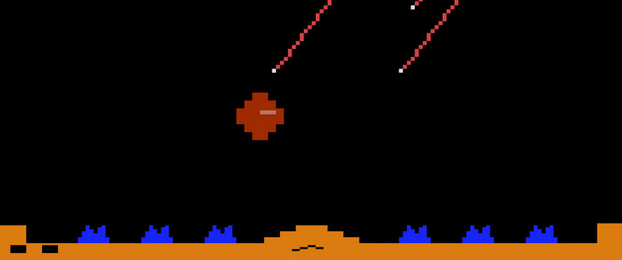

>>> deploy: 
>>>   +A2600MissileCommand.jpg 
>>>   RAMUse.md 
>>>   Code.md 
>>>   ---- 
>>>   Journal.md 

# Atari 2600 Missile Command

[Code](Code.md)

>>> { playMe

# Play Me!

It might take a few seconds for the ROM to load, but play Atari2600 MissileCommand here:

[http://javatari.org&ROM=MissileCommand](http://javatari.org?ROM=https://github.com/topherCantrell/computerarcheology/blob/master/content/Atari2600/MissileCommand/MISSCOMM.BIN?raw=true)

>>> }