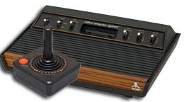

# Stella (Atari 2600 Hardware)

On the web: [Stella Programmer's Guide](http://www.alienbill.com/2600/101/docs/stella.html)

The address decoding for the 2600 is very simple. The TIA is accessed
if A12 is 0 and A7 is 0. The TIA is selected if (address&1080 == 0000).

The TIA chip uses the 6 lower address lines A0-A5. The reads seem to 
ignore A4 and A5.

The addresses have different read/write definitions and many of them
are strobes that are triggered by writing any value.

Note that the 6502 has an 8-bit stack pointer. The CPU automatically sets the upper
byte of the address to 01. The RIOT chip RAM ghosts from 00xx to 01xx putting the stack
in RAM.

# TIA (read)

>>> memory

| | | |
| --- | --- | --- |
| 0000r    | CXM0P               | XX...... Collisions D7=M0/P1, D6=M0/P0 |
| 0001r    | CXM1P               | XX...... Collisions D7=M1/P0, D6=M1/P1 |
| 0002r    | CXP0FB              | XX...... Collisions D7=P0/PF, D6=P0/BL |
| 0003r    | CXP1FB              | XX...... Collisions D7=P1/PF, D6=P1/BL |
| 0004r    | CXM0FB              | XX...... Collisions D7=M0/PF, D6=M0/BL |
| 0005r    | CXM1FB              | XX...... Collisions D7=M1/PF, D6=M1/BL |
| 0006r    | CXBLPF              | X....... Collisions D7=BL/PF           |
| 0007r    | CXPPMM              | XX...... Collisions D7=P0/P1, D6=M0/M1 |
| 0008r    | INPT0               | X....... Paddle input 0 |
| 0009r    | INPT1               | X....... Paddle input 1 |
| 000Ar    | INPT2               | X....... Paddle input 2 |
| 000Br    | INPT3               | X....... Paddle input 3 |
| 000Cr    | INPT4               | X....... Latched inputs (joystick buttons) |
| 000Dr    | INPT5               | X....... Latched inputs (joystick buttons) |

# TIA (write)

>>> memory

| | | |
| --- | --- | --- |
| 0000w    | VSYNC               | ......X. D1=1 starts the vertical sync |
| 0001w    | VBLANK              | XX....X. D1=1 starts the vertical blank (D6 and D7 config INPT0-5) |
| 0002w    | WSYNC               | strobe   Halts processor until leading edge of horizontal blank |
| 0003w    | RSYNC               | strobe   Resets sync counter (used in chip testing) |
| 0004w    | NUSIZ0              | ..XXXXXX Number and size of player/missile P0 |
| 0005w    | NUSIZ1              | ..XXXXXX Number and size of player/missile P0 |
| 0006w    | COLUP0              | XXXXXXX. Color-luminance of player 0 |
| 0007w    | COLUP1              | XXXXXXX. Color-luminance of player 1 |
| 0008w    | COLUPF              | XXXXXXX. Color-luminance of play filed |
| 0009w    | COLUBK              | XXXXXXX. Color-luminance of background |
| 000Aw    | CTRLPF              | ..XX.XXX Control playfield, priorities, and ball size |
| 000Bw    | REFP0               | ....X... D3=1 reflects player 0 |
| 000Cw    | PEFP1               | ....X... D3=1 reflects player 1 |
| 000Dw    | PF0                 | XXXX.... Playfield 0 bits (upper 4 bits) |
| 000Ew    | PF1                 | XXXXXXXX Playfield 1 bits |
| 000Fw    | PF2                 | XXXXXXXX Playfield 2 bits |
| 0010w    | RESP0               | strobe   Set horizontal position of player 0 |
| 0011w    | RESP1               | strobe   Set horizontal position of player 1 |
| 0012w    | RESM0               | strobe   Set horizontal position of missile 0 |
| 0013w    | RESM1               | strobe   Set horizontal position of missile 1 |
| 0014w    | RESBL               | strobe   Set horizontal position of ball |
| 0015w    | AUDC0               | ....XXXX Noise, tone, division control channel 0 |
| 0016w    | AUDC1               | ...XXXXX Noise, tone, division control channel 1 |
| 0017w    | AUDF0               | ...XXXXX Frequency divider channel 0 |
| 0018w    | AUDF1               | ....XXXX Frequency divider channel 1 |
| 0019w    | AUDV0               | ....XXXX Volume channel 0 |
| 001Aw    | AUDV1               | ....XXXX Volume channel 1 |
| 001Bw    | GRP0                | XXXXXXXX Player 0 graphics |
| 001Cw    | GRP1                | XXXXXXXX Player 1 graphics |
| 001Dw    | ENAM0               | ......X. D1=1 to enable missile 0 |
| 001Ew    | ENAM1               | ......X. D1=1 to enable missile 1 |
| 001Fw    | ENABL               | ......X. D1=1 to enable ball |
| 0020w    | HMP0                | XXXX.... Horizontal motion offset for player 0 |
| 0021w    | HMP1                | XXXX.... Horizontal motion offset for player 1 |
| 0022w    | HMM0                | XXXX.... Horizontal motion offset for missile 0 |
| 0023w    | HMM1                | XXXX.... Horizontal motion offset for missile 1 |
| 0024w    | HMBL                | XXXX.... Horizontal motion offset for ball |
| 0025w    | VDELP0              | .......X D0=1 to delay player 0 one vertical line |
| 0026w    | VDELP1              | .......X D0=1 to delay player 1 one vertical line |
| 0027w    | VDELBL              | .......X D0=1 to delay ball one vertical line |
| 0028w    | RESMP0              | ......X. D1=1 to reset missile 0 to player 0 |
| 0029w    | RESMP1              | ......X. D1=1 to reset missile 1 to player 1 |
| 002Aw    | HMOVE               | strobe   Executes horizontal motions |
| 002Bw    | HMCLR               | strobe   Clears all horizontal motion registers |
| 002Cw    | CXCLR               | strobe   Clears all collision registers |

# TIA (read ghost)

These are the same registers as above but accessed with a ghost address to allow
for different names.

>>> memory

| | | |
| --- | --- | --- |
| 0030r    | CXM0P               | XX...... Collisions D7=M0/P1, D6=M0/P0 |
| 0031r    | CXM1P               | XX...... Collisions D7=M1/P0, D6=M1/P1 |
| 0032r    | CXP0FB              | XX...... Collisions D7=P0/PF, D6=P0/BL |
| 0033r    | CXP1FB              | XX...... Collisions D7=P1/PF, D6=P1/BL |
| 0034r    | CXM0FB              | XX...... Collisions D7=M0/PF, D6=M0/BL |
| 0035r    | CXM1FB              | XX...... Collisions D7=M1/PF, D6=M1/BL |
| 0036r    | CXBLPF              | X....... Collisions D7=BL/PF           |
| 0037r    | CXPPMM              | XX...... Collisions D7=P0/P1, D6=M0/M1 |
| 0038r    | INPT0               | X....... Paddle input 0 |
| 0039r    | INPT1               | X....... Paddle input 1 |
| 003Ar    | INPT2               | X....... Paddle input 2 |
| 003Br    | INPT3               | X....... Paddle input 3 |
| 003Cr    | INPT4               | X....... Latched inputs (joystick buttons) |
| 003Dr    | INPT5               | X....... Latched inputs (joystick buttons) |

# PIA

The PIA (R.I.O.T.) is accessed if A12 is 0 and A7 is 1. If A9 is 0 then the 128 bytes 
of RAM are selected. If A9 is 1 then the PIA timer registers are selected.

The TIA REGS are selected if (address&1280 == 0280).

The TIA RAM is selected if (address&1280 == 0080).

The PIA chip uses the lower 7 address lines A0-A6. Thus the 007F mask below.

>>> memory

| | | |
| --- | --- | --- |
| 0280    | SWCHA               | Port A Hand controllers |
| 0281    | SWACNT              | Port A DDR |
| 0282    | SWCHB               | Port B Console switches |

```
D7 : P1 difficulty (0=amateur, 1=pro)
D6 : P0 difficulty (0=amateur, 1=pro)
D5 : not used
D4 : not used
D3 : color or B/W (0=B/W, 1=color)
D2 : not used
D1 : game select (0=pressed)
D0 : game reset (0=pressed)
```

>>> memory

| | | |
| --- | --- | --- |
| 0283    | SWBCNT              | Port B DDR |
| 0284    | INTIM               | Timer output (read only) |
| 0294    | TIM1T               | Set 1 clock interval (write only) |
| 0295    | TIM8T               | Set 8 clock interval (write only) |
| 0296    | TIM64T              | Set 64 clock interval (write only) |
| 0297    | TIM1024T            | Set 1024 clock interval (write only) |
