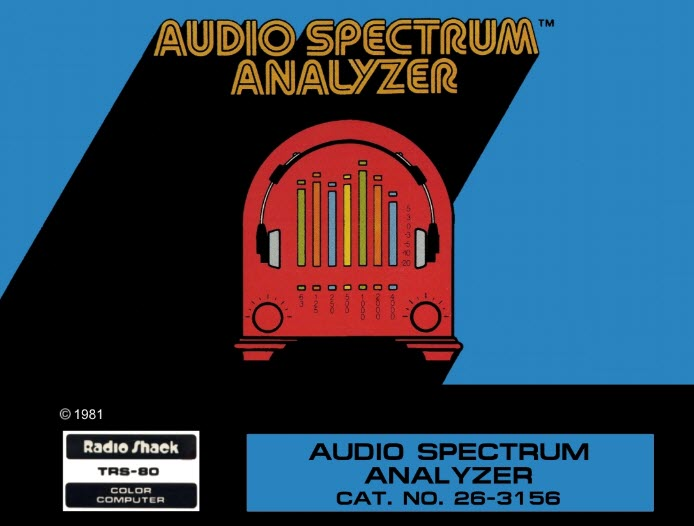

# Audio Spectrum Analyzer

>>> cpu 6809

>>> memoryTable ram 
[RAM Usage](RAMUse.md)

>>> memoryTable hard 
[Hardware Info](..\Hardware.md)

```code
C000: 7E C1 18       JMP     $C118            ; 

C003: 30 8D 3F 19    LEAX    $3F19,PC        
C007: CC 04 00       LDD     #$0400          
C00A: 1F 02          TFR     D,Y             
C00C: 97 FF          STA     <$FF            
C00E: A6 84          LDA     ,X              
C010: 84 01          ANDA    #$01            
C012: A7 E2          STA     ,-S             
C014: A6 84          LDA     ,X              
C016: 84 01          ANDA    #$01            
C018: A8 E4          EORA    ,S              
C01A: 26 08          BNE     $C024            ; 
C01C: 31 3E          LEAY    -2,Y            
C01E: 26 F4          BNE     $C014            ; 
C020: 32 61          LEAS    1,S             
C022: 20 11          BRA     $C035            ; 
C024: 86 01          LDA     #$01            
C026: 6D E0          TST     ,S+             
C028: 26 D9          BNE     $C003            ; 
C02A: A5 84          BITA    ,X              
C02C: 27 09          BEQ     $C037            ; 
C02E: 5C             INCB                    
C02F: 26 F9          BNE     $C02A            ; 
C031: 0A FF          DEC     <$FF            
C033: 26 F5          BNE     $C02A            ; 
C035: 4F             CLRA                    
C036: 39             RTS                     
C037: 86 1B          LDA     #$1B            
C039: 97 F7          STA     <$F7            
C03B: 86 04          LDA     #$04            
C03D: 90 FF          SUBA    <$FF            
C03F: DE FD          LDU     <$FD            
C041: 10 A3 C4       CMPD    ,U              
C044: 24 08          BCC     $C04E            ; 
C046: 33 4C          LEAU    12,U            
C048: 0A F7          DEC     <$F7            
C04A: 26 F5          BNE     $C041            ; 
C04C: 20 B5          BRA     $C003            ; 
C04E: 0D F0          TST     <$F0            
C050: 27 04          BEQ     $C056            ; 
C052: 96 F7          LDA     <$F7            
C054: 4C             INCA                    
C055: 39             RTS                     
C056: 86 FF          LDA     #$FF            
C058: A0 44          SUBA    4,U             
C05A: A0 44          SUBA    4,U             
C05C: D6 F4          LDB     <$F4            
C05E: 3D             MUL                     
C05F: E3 44          ADDD    4,U             
C061: E7 45          STB     5,U             
C063: A0 44          SUBA    4,U             
C065: 27 25          BEQ     $C08C            ; 
C067: AE 42          LDX     2,U             
C069: E6 48          LDB     8,U             
C06B: 8C 05 20       CMPX    #$0520          
C06E: 25 22          BCS     $C092            ; 
C070: 6C 44          INC     4,U             
C072: 30 88 E0       LEAX    $E0,X           
C075: AF 42          STX     2,U             
C077: E7 84          STB     ,X              
C079: 4A             DECA                    
C07A: 26 EF          BNE     $C06B            ; 
C07C: AE 46          LDX     6,U             
C07E: AC 42          CMPX    2,U             
C080: 25 04          BCS     $C086            ; 
C082: AE 42          LDX     2,U             
C084: AF 46          STX     6,U             
C086: 0D F9          TST     <$F9            
C088: 27 02          BEQ     $C08C            ; 
C08A: E7 84          STB     ,X              
C08C: 0A FB          DEC     <$FB            
C08E: 10 26 FF 71    LBNE    $FF71           
C092: 39             RTS                     
C093: 03 D1          COM     <$D1            
C095: 02                                  
C096: F8 02 6D       EORB    $026D           
C099: 01                                  
C09A: E8 01          EORB    1,X             
C09C: 7C 01 36       INC     $0136           
C09F: 00 F4          NEG     <$F4            
C0A1: 00 BE          NEG     <$BE            
C0A3: 00 9B          NEG     <$9B            
C0A5: 00 7A          NEG     <$7A            
C0A7: 00 5F          NEG     <$5F            
C0A9: 00 4D          NEG     <$4D            
C0AB: 00 3D          NEG     <$3D            
C0AD: 00 2F          NEG     <$2F            
C0AF: 00 26          NEG     <$26            
C0B1: 00 1E          NEG     <$1E            
C0B3: 00 17          NEG     <$17            
C0B5: 00 13          NEG     <$13            
C0B7: 00 0F          NEG     <$0F            
C0B9: 00 0B          NEG     <$0B            
C0BB: 00 09          NEG     <$09            
C0BD: 00 07          NEG     <$07            
C0BF: 00 05          NEG     <$05            
C0C1: 00 04          NEG     <$04            
C0C3: 00 03          NEG     <$03            
C0C5: 00 02          NEG     <$02            
C0C7: 00 01          NEG     <$01            
C0C9: DE FD          LDU     <$FD            
C0CB: C6 1B          LDB     #$1B            
C0CD: D7 F7          STB     <$F7            
C0CF: EC 44          LDD     4,U             
C0D1: 27 34          BEQ     $C107            ; 
C0D3: 86 40          LDA     #$40            
C0D5: E6 44          LDB     4,U             
C0D7: 3D             MUL                     
C0D8: 8B 0A          ADDA    #$0A            
C0DA: D6 F5          LDB     <$F5            
C0DC: 3D             MUL                     
C0DD: 34 06          PSHS    B,A             
C0DF: EC 44          LDD     4,U             
C0E1: A3 E1          SUBD    ,S++            
C0E3: 24 0B          BCC     $C0F0            ; 
C0E5: 5F             CLRB                    
C0E6: A6 44          LDA     4,U             
C0E8: 26 06          BNE     $C0F0            ; 
C0EA: 6F 44          CLR     4,U             
C0EC: 6F 45          CLR     5,U             
C0EE: 20 17          BRA     $C107            ; 
C0F0: E7 45          STB     5,U             
C0F2: 40             NEGA                    
C0F3: AB 44          ADDA    4,U             
C0F5: 27 10          BEQ     $C107            ; 
C0F7: AE 42          LDX     2,U             
C0F9: C6 80          LDB     #$80            
C0FB: E7 84          STB     ,X              
C0FD: 30 88 20       LEAX    $20,X           
C100: 6A 44          DEC     4,U             
C102: 4A             DECA                    
C103: 26 F6          BNE     $C0FB            ; 
C105: AF 42          STX     2,U             
C107: 0D F9          TST     <$F9            
C109: 27 06          BEQ     $C111            ; 
C10B: AE 46          LDX     6,U             
C10D: E6 48          LDB     8,U             
C10F: E7 84          STB     ,X              
C111: 33 4C          LEAU    12,U            
C113: 0A F7          DEC     <$F7            
C115: 26 B8          BNE     $C0CF            ; 
C117: 39             RTS                     


C118: 10 CE 03 FF    LDS     #$03FF           ; Initialize the stack
C11C: BD C5 15       JSR     $C515            ; 
C11F: CC 02 00       LDD     #$0200          
C122: 34 06          PSHS    B,A             
C124: CC 3C 34       LDD     #$3C34          
C127: A7 8D 3D D6    STA     $3DD6,PC        
C12B: A7 8D 3D F4    STA     $3DF4,PC        
C12F: E7 8D 3D D0    STB     $3DD0,PC        
C133: CC 03 0C       LDD     #$030C          
C136: D7 F5          STB     <$F5            
C138: 97 F4          STA     <$F4            
C13A: 0F F9          CLR     <$F9            
C13C: 0F F6          CLR     <$F6            
C13E: 35 40          PULS    U               
C140: 96 74          LDA     <$74            
C142: 81 10          CMPA    #$10            
C144: 24 03          BCC     $C149            ; 
C146: 8E 0E 00       LDX     #$0E00          
C149: 86 80          LDA     #$80            
C14B: A7 C0          STA     ,U+             
C14D: 30 1F          LEAX    -1,X            
C14F: 26 FA          BNE     $C14B            ; 
C151: 0F F0          CLR     <$F0            
C153: 8E 04 00       LDX     #$0400          
C156: CC 80 80       LDD     #$8080          
C159: ED 81          STD     ,X++            
C15B: 8C 10 00       CMPX    #$1000          
C15E: 25 F9          BCS     $C159            ; 
C160: B7 FF C0       STA     $FFC0            ; {hard:dispMode} 
C163: B7 FF C2       STA     $FFC2            ; {hard:dispMode} 
C166: B7 FF C5       STA     $FFC5            ; {hard:dispMode} 
C169: BD C4 1C       JSR     $C41C            ; 
C16C: 8E 02 00       LDX     #$0200          
C16F: 9F FD          STX     <$FD            
C171: CE C0 93       LDU     #$C093          
C174: 86 8A          LDA     #$8A            
C176: 97 FA          STA     <$FA            
C178: 10 8E 0C 00    LDY     #$0C00          
C17C: 86 1B          LDA     #$1B            
C17E: 97 FF          STA     <$FF            
C180: EC C1          LDD     ,U++            
C182: 34 20          PSHS    Y               
C184: ED 81          STD     ,X++            
C186: 10 AF 81       STY     ,X++            
C189: 6F 80          CLR     ,X+             
C18B: 6F 80          CLR     ,X+             
C18D: 10 AF 81       STY     ,X++            
C190: 96 FA          LDA     <$FA            
C192: A7 A4          STA     ,Y              
C194: 31 21          LEAY    1,Y             
C196: 10 8C 0C 09    CMPY    #$0C09          
C19A: 26 02          BNE     $C19E            ; 
C19C: 31 21          LEAY    1,Y             
C19E: 10 8C 0C 13    CMPY    #$0C13          
C1A2: 26 02          BNE     $C1A6            ; 
C1A4: 31 21          LEAY    1,Y             
C1A6: 96 FA          LDA     <$FA            
C1A8: A7 80          STA     ,X+             
C1AA: 8B 10          ADDA    #$10            
C1AC: 8A 80          ORA     #$80            
C1AE: 81 BA          CMPA    #$BA            
C1B0: 27 F8          BEQ     $C1AA            ; 
C1B2: 81 CA          CMPA    #$CA            
C1B4: 27 F4          BEQ     $C1AA            ; 
C1B6: 97 FA          STA     <$FA            
C1B8: 86 0F          LDA     #$0F            
C1BA: A7 80          STA     ,X+             
C1BC: 35 06          PULS    A,B             
C1BE: ED 81          STD     ,X++            
C1C0: 0A FF          DEC     <$FF            
C1C2: 26 BC          BNE     $C180            ; 
C1C4: 8E 04 04       LDX     #$0404          
C1C7: C6 19          LDB     #$19            
C1C9: D7 FF          STB     <$FF            
C1CB: 86 AF          LDA     #$AF            
C1CD: C6 06          LDB     #$06            
C1CF: A7 84          STA     ,X              
C1D1: 30 88 20       LEAX    $20,X           
C1D4: 5A             DECB                    
C1D5: 26 F8          BNE     $C1CF            ; 
C1D7: 30 89 FF 41    LEAX    $FF41,X         
C1DB: 0A FF          DEC     <$FF            
C1DD: 26 EE          BNE     $C1CD            ; 
C1DF: 8E C4 CE       LDX     #$C4CE          
C1E2: CE 04 05       LDU     #$0405          
C1E5: BD C4 9A       JSR     $C49A            ; 
C1E8: CE 05 69       LDU     #$0569          
C1EB: CC CA 07       LDD     #$CA07          
C1EE: 8E C4 E6       LDX     #$C4E6          
C1F1: A7 C4          STA     ,U              
C1F3: A7 4A          STA     10,U            
C1F5: 33 C9 01 00    LEAU    $0100,U         
C1F9: 5A             DECB                    
C1FA: 26 F5          BNE     $C1F1            ; 
C1FC: CE 05 9D       LDU     #$059D          
C1FF: 8E C4 E6       LDX     #$C4E6          
C202: C6 07          LDB     #$07            
C204: 34 44          PSHS    U,B             
C206: BD C4 9A       JSR     $C49A            ; 
C209: 35 44          PULS    B,U             
C20B: 33 C9 00 C0    LEAU    $00C0,U         
C20F: C1 05          CMPB    #$05            
C211: 26 04          BNE     $C217            ; 
C213: 33 C9 00 C0    LEAU    $00C0,U         
C217: 5A             DECB                    
C218: 26 EA          BNE     $C204            ; 
C21A: 86 04          LDA     #$04            
C21C: 97 FB          STA     <$FB            
C21E: BD C0 03       JSR     $C003            ; 
C221: BD C0 C9       JSR     $C0C9            ; 
C224: BD A1 C1       JSR     $A1C1            ; {hard:GETKEY} 
C227: 81 44          CMPA    #$44            
C229: 26 07          BNE     $C232            ; 
C22B: 03 F6          COM     <$F6            
C22D: BD C4 1C       JSR     $C41C            ; 
C230: 20 E8          BRA     $C21A            ; 
C232: 81 41          CMPA    #$41            
C234: 26 0A          BNE     $C240            ; 
C236: B6 FF 23       LDA     $FF23            ; {hard:PIA1_CB} 
C239: 88 08          EORA    #$08            
C23B: B7 FF 23       STA     $FF23            ; {hard:PIA1_CB} 
C23E: 20 DA          BRA     $C21A            ; 
C240: 81 20          CMPA    #$20            
C242: 26 09          BNE     $C24D            ; 
C244: BD A1 C1       JSR     $A1C1            ; {hard:GETKEY} 
C247: 84 7F          ANDA    #$7F            
C249: 27 F9          BEQ     $C244            ; 
C24B: 20 CD          BRA     $C21A            ; 
C24D: 81 50          CMPA    #$50            
C24F: 26 1C          BNE     $C26D            ; 
C251: 03 F9          COM     <$F9            
C253: 26 C5          BNE     $C21A            ; 
C255: DE FD          LDU     <$FD            
C257: CC 80 1B       LDD     #$801B          
C25A: AE 46          LDX     6,U             
C25C: AC 4A          CMPX    10,U            
C25E: 27 06          BEQ     $C266            ; 
C260: AC 42          CMPX    2,U             
C262: 24 02          BCC     $C266            ; 
C264: A7 84          STA     ,X              
C266: 33 4C          LEAU    12,U            
C268: 5A             DECB                    
C269: 26 EF          BNE     $C25A            ; 
C26B: 20 AD          BRA     $C21A            ; 
C26D: 81 52          CMPA    #$52            
C26F: 26 30          BNE     $C2A1            ; 
C271: DE FD          LDU     <$FD            
C273: CC 80 1B       LDD     #$801B          
C276: D7 FF          STB     <$FF            
C278: E6 44          LDB     4,U             
C27A: 27 0A          BEQ     $C286            ; 
C27C: AE 4A          LDX     10,U            
C27E: 30 88 E0       LEAX    $E0,X           
C281: A7 84          STA     ,X              
C283: 5A             DECB                    
C284: 26 F8          BNE     $C27E            ; 
C286: AE 46          LDX     6,U             
C288: AC 4A          CMPX    10,U            
C28A: 27 02          BEQ     $C28E            ; 
C28C: A7 84          STA     ,X              
C28E: 6F 44          CLR     4,U             
C290: 6F 45          CLR     5,U             
C292: AE 4A          LDX     10,U            
C294: AF 42          STX     2,U             
C296: AF 46          STX     6,U             
C298: 33 4C          LEAU    12,U            
C29A: 0A FF          DEC     <$FF            
C29C: 26 DA          BNE     $C278            ; 
C29E: 7E C2 1A       JMP     $C21A            ; 
C2A1: 81 46          CMPA    #$46            
C2A3: 26 0A          BNE     $C2AF            ; 
C2A5: CC 03 0C       LDD     #$030C          
C2A8: D7 F5          STB     <$F5            
C2AA: 97 F4          STA     <$F4            
C2AC: 7E C2 1A       JMP     $C21A            ; 
C2AF: 81 53          CMPA    #$53            
C2B1: 26 0A          BNE     $C2BD            ; 
C2B3: CC 03 01       LDD     #$0301          
C2B6: 97 F5          STA     <$F5            
C2B8: D7 F4          STB     <$F4            
C2BA: 7E C2 1A       JMP     $C21A            ; 
C2BD: 81 4B          CMPA    #$4B            
C2BF: 10 26 FF 57    LBNE    $FF57           
C2C3: 8E 04 00       LDX     #$0400          
C2C6: CC 80 80       LDD     #$8080          
C2C9: ED 81          STD     ,X++            
C2CB: 8C 0C 00       CMPX    #$0C00          
C2CE: 25 F9          BCS     $C2C9            ; 
C2D0: 03 F0          COM     <$F0            
C2D2: B7 FF C4       STA     $FFC4            ; {hard:dispMode} 
C2D5: B7 FF C3       STA     $FFC3            ; {hard:dispMode} 
C2D8: 8E 0C 00       LDX     #$0C00          
C2DB: C6 28          LDB     #$28            
C2DD: 6F 80          CLR     ,X+             
C2DF: 5A             DECB                    
C2E0: 26 FB          BNE     $C2DD            ; 
C2E2: 0F EE          CLR     <$EE            
C2E4: 0F F1          CLR     <$F1            
C2E6: 0F FA          CLR     <$FA            
C2E8: BD A1 C1       JSR     $A1C1            ; {hard:GETKEY} 
C2EB: 81 47          CMPA    #$47            
C2ED: 10 27 FE 60    LBEQ    $FE60           
C2F1: 8E 05 00       LDX     #$0500          
C2F4: 30 1F          LEAX    -1,X            
C2F6: 26 FC          BNE     $C2F4            ; 
C2F8: D6 EE          LDB     <$EE            
C2FA: 5C             INCB                    
C2FB: C1 14          CMPB    #$14            
C2FD: 25 01          BCS     $C300            ; 
C2FF: 5F             CLRB                    
C300: D7 EE          STB     <$EE            
C302: 58             LSLB                    
C303: 8E 0C 00       LDX     #$0C00          
C306: 3A             ABX                     
C307: EC 84          LDD     ,X              
C309: DD F2          STD     <$F2            
C30B: 4F             CLRA                    
C30C: 5F             CLRB                    
C30D: ED 84          STD     ,X              
C30F: 86 80          LDA     #$80            
C311: 97 EF          STA     <$EF            
C313: 8D 37          BSR     $C34C            ; 
C315: BD C0 03       JSR     $C003            ; 
C318: 27 CE          BEQ     $C2E8            ; 
C31A: 80 03          SUBA    #$03            
C31C: 81 17          CMPA    #$17            
C31E: 24 C8          BCC     $C2E8            ; 
C320: C6 A6          LDB     #$A6            
C322: 3D             MUL                     
C323: C3 00 80       ADDD    #$0080          
C326: 97 F2          STA     <$F2            
C328: 96 F1          LDA     <$F1            
C32A: 91 F2          CMPA    <$F2            
C32C: 25 01          BCS     $C32F            ; 
C32E: 4F             CLRA                    
C32F: 97 F3          STA     <$F3            
C331: 4C             INCA                    
C332: 97 F1          STA     <$F1            
C334: DE F2          LDU     <$F2            
C336: D6 EE          LDB     <$EE            
C338: 58             LSLB                    
C339: 8E 0C 00       LDX     #$0C00           ; Bar header (just above labels)
C33C: EF 85          STU     B,X             
C33E: 96 FA          LDA     <$FA            
C340: 8B 10          ADDA    #$10            
C342: 8A 8F          ORA     #$8F            
C344: 97 FA          STA     <$FA            
C346: 97 EF          STA     <$EF            
C348: 8D 02          BSR     $C34C            ; 
C34A: 20 9C          BRA     $C2E8            ; 
;
C34C: DC F2          LDD     <$F2            
C34E: 1E 89          EXG     $89             
C350: 8D 04          BSR     $C356            ; 
C352: DC F2          LDD     <$F2            
C354: 1E 89          EXG     $89             
C356: DD F2          STD     <$F2            
C358: CC 11 11       LDD     #$1111          
C35B: D3 F2          ADDD    <$F2            
C35D: 8D 17          BSR     $C376            ; 
C35F: CC 0F 0F       LDD     #$0F0F          
C362: 93 F2          SUBD    <$F2            
C364: 8D 10          BSR     $C376            ; 
C366: CC 11 0F       LDD     #$110F          
C369: 9B F2          ADDA    <$F2            
C36B: D0 F3          SUBB    <$F3            
C36D: 8D 07          BSR     $C376            ; 
C36F: CC 0F 11       LDD     #$0F11          
C372: 90 F2          SUBA    <$F2            
C374: DB F3          ADDB    <$F3            
C376: 34 04          PSHS    B               
C378: C6 40          LDB     #$40            
C37A: 3D             MUL                     
C37B: 8B 04          ADDA    #$04            
C37D: 1F 01          TFR     D,X             
C37F: E6 E0          LDB     ,S+             
C381: 3A             ABX                     
C382: D6 EF          LDB     <$EF            
C384: E7 84          STB     ,X              
C386: E7 88 20       STB     $20,X           
C389: 39             RTS                     

VertLabs:
C38A: 33 31 2E 35 00     ; 31.5
C38F: 01                 ; 1 column
C390: 34 30 00           ; 40
C393: 01                 ; 1 column
C394: 35 30 00           ; 50
C397: 01                 ; 1 column
C398: 36 33 00           ; 63
C39B: 01                 ; 1 column
C39C: 38 30 00           ; 80
C39F: 01                 ; 1 column
C3A0: 31 30 30 00        ; 100
C3A4: 01                 ; 1 column
C3A5: 31 32 35 00        ; 125
C3A9: 01                 ; 1 column
C3AA: 31 36 30 00        ; 160
C3AE: 01                 ; 1 column
C3AF: 32 30 30 00        ; 200
C3B3: 02                 ; 2 columns
C3B4: 32 35 30 00        ; 250
C3B8: 01                 ; 1 column
C3B9: 33 31 35 00        ; 315
C3BD: 01                 ; 1 column
C3BE: 34 30 30 00        ; 400
C3C2: 01                 ; 1 column
C3C3: 35 30 30 00        ; 500
C3C7: 01                 ; 1 column
C3C8: 36 33 30 00        ; 630
C3CC: 01                 ; 1 column
C3CD: 38 30 30 00        ; 800
C3D1: 01                 ; 1 column
C3D2: 31 30 30 30 00     ; 1000
C3D7: 01                 ; 1 column
C3D8: 31 32 35 30 00     ; 1250
C3DD: 01                 ; 1 column
C3DE: 31 36 30 30 00     ; 1600
C3E3: 02                 ; 2 columns
C3E4: 32 30 30 30 00     ; 2000
C3E9: 01                 ; 1 column
C3EA: 32 35 30 30 00     ; 2500
C2EF: 01                 ; 1 column
C3F0: 33 31 35 30 00     ; 3150
C3F5: 01                 ; 1 column
C3F6: 34 30 30 30 00     ; 4000
C3FB: 01                 ; 1 column
C3FC: 35 30 30 30 00     ; 5000
C401: 01                 ; 1 column
C402: 36 33 30 30 00     ; 6300
C407: 01                 ; 1 column
C408: 38 30 30 30 00     ; 8000
C40D: 01                 ; 1 column
C40E: 31 30 30 30 30 00  ; 10000
C414: 01                 ; 1 column
C415: 31 32 35 30 30 00  ; 12500
C41B: 00                 ; END

C41C: 8E C3 8A       LDX     #$C38A           ; Vertical labels
C41F: C6 01          LDB     #1                        
C421: D7 F7          STB     <$F7            
C423: CE 0C 40       LDU     #$0C40           ; Start of labels
C426: CC AF AF       LDD     #$AFAF           ; Blue block
C429: ED C1          STD     ,U++             ; Make the label blue
C42B: 11 83 10 00    CMPU    #$1000           ; ?? Long way ??
C42F: 25 F8          BCS     $C429            ; 
C431: CE 0C 40       LDU     #$0C40           ; Start of labels
;
C434: 34 40          PSHS    U                ; Hold this
C436: 86 20          LDA     #$20             
C438: 0A F7          DEC     <$F7            
C43A: 26 4B          BNE     $C487            ; 
C43C: C6 03          LDB     #$03            
C43E: D7 F7          STB     <$F7            
C440: 96 F6          LDA     <$F6            
C442: 84 40          ANDA    #$40            
C444: 8A 20          ORA     #$20            
C446: D6 F6          LDB     <$F6            
C448: C4 01          ANDB    #$01            
C44A: CB 04          ADDB    #$04            
C44C: 34 02          PSHS    A               
C44E: 86 06          LDA     #$06            
C450: 3D             MUL                     
C451: 35 02          PULS    A               
C453: A7 C4          STA     ,U              
C455: 33 C8 20       LEAU    $20,U           
C458: 5A             DECB                    
C459: 26 F8          BNE     $C453            ; 
C45B: EE E4          LDU     ,S               ; Start of labels
C45D: A6 80          LDA     ,X+              ; Next from text
C45F: 27 2E          BEQ     $C48F            ; 0 ... end of this label
C461: 81 40          CMPA    #$40             ; Printable?
C463: 25 08          BCS     $C46D            ; No ...
C465: 80 40          SUBA    #$40            
C467: 81 20          CMPA    #$20            
C469: 25 02          BCS     $C46D            ; 
C46B: 80 20          SUBA    #$20            
C46D: D6 F7          LDB     <$F7            
C46F: C1 03          CMPB    #$03            
C471: 26 08          BNE     $C47B            ; 
C473: D6 F6          LDB     <$F6            
C475: C4 40          ANDB    #$40            
C477: 34 04          PSHS    B               
C479: AA E0          ORA     ,S+             
C47B: C6 06          LDB     #$06            
C47D: A7 C4          STA     ,U              
C47F: 33 C8 20       LEAU    $20,U           
C482: 5A             DECB                    
C483: 26 F8          BNE     $C47D            ; 
C485: 20 D6          BRA     $C45D            ; 
;
C487: 0D F6          TST     <$F6            
C489: 26 BB          BNE     $C446            ; 
C48B: A6 80          LDA     ,X+             
C48D: 26 FC          BNE     $C48B            ; 
C48F: 35 40          PULS    U               
C491: A6 80          LDA     ,X+              ; Column skip
C493: 27 04          BEQ     $C499            ; 0 ... end of labels
C495: 33 C6          LEAU    A,U              ; Move over requested columns
C497: 20 9B          BRA     $C434            ; Next label
C499: 39             RTS                      ; Out

C49A: A6 80          LDA     ,X+             
C49C: 26 01          BNE     $C49F            ; 
C49E: 39             RTS                     
C49F: 2B 25          BMI     $C4C6            ; 
C4A1: 81 20          CMPA    #$20            
C4A3: 26 04          BNE     $C4A9            ; 
C4A5: 33 41          LEAU    1,U             
C4A7: 20 F1          BRA     $C49A            ; 
C4A9: 81 40          CMPA    #$40            
C4AB: 25 08          BCS     $C4B5            ; 
C4AD: 80 40          SUBA    #$40            
C4AF: 81 20          CMPA    #$20            
C4B1: 25 02          BCS     $C4B5            ; 
C4B3: 80 20          SUBA    #$20            
C4B5: A7 C8 20       STA     $20,U           
C4B8: A7 C8 40       STA     $40,U           
C4BB: A7 C8 60       STA     $60,U           
C4BE: A7 C9 00 80    STA     $0080,U         
C4C2: 33 41          LEAU    1,U             
C4C4: 20 D4          BRA     $C49A            ; 
C4C6: A7 C4          STA     ,U              
C4C8: A7 C9 00 A0    STA     $00A0,U         
C4CC: 20 E7          BRA     $C4B5            ; 

; AUDIO SPECTRUM ANALYZER
C4CE: 41 55 44 49 4F 20 53 50 45 43 54 52 55 4D 20 41
C4DE: 4E 41 4C 59 5A 45 52 00
;
C4E6: 20 20 35 00 ;   5 
C4EA: 20 20 33 00 ;   3
C4EE: 20 20 30 00 ;   0
;
C4F2: 20 2D 33 00 ;  -3
C4F6: 20 2D 35 00 ;  -5
C4FA: 2D 31 30 00 ; -10
C4FE: 2D 32 30 00 ; -20

PrintString:
C502: A6 80          LDA     ,X+              ; Next character 
C504: 27 05          BEQ     $C50B            ; 0 means done                      
C506: BD A3 0A       JSR     $A30A            ; {hard:PRINTCHAR} print the character 
C509: 20 F7          BRA     $C502            ; Keep printing
C50B: 39             RTS                      ; Out

NextColorBlock:
; For border on splash screen
C50C: 8B 10          ADDA    #$10             ; Next ...
C50E: 8A 8F          ORA     #$8F             ; ... solid ...
C510: 81 8F          CMPA    #$8F             ; ... color ...
C512: 27 F8          BEQ     $C50C            ; ... block
C514: 39             RTS                      ; Out

DrawSplashScreen:

C515: 86 34          LDA     #$34             ; Everything off
C517: B7 FF 03       STA     $FF03            ; {hard:PIA0_CB} Field sync interrupt off 
C51A: B7 FF 01       STA     $FF01            ; {hard:PIA0_CA} Horiz sync interrupt off
C51D: B7 FF 23       STA     $FF23            ; {hard:PIA1_CB} Cart interrupt off
C520: 86 39          LDA     #$39             ; RTS (do nothing) ...
C522: B7 01 67       STA     $0167            ; ... to CONSOLE OUT vector
C525: BD A9 28       JSR     $A928            ; {hard:CLRSCREEN} 
C528: 86 0D          LDA     #$0D             ; Change to the ...
C52A: B7 FF 22       STA     $FF22            ; {hard:PIA1_DB} ... "flat" color screen
C52D: 8E C5 A0       LDX     #$C5A0           ; Splash text
C530: BD C5 02       JSR     $C502            ; Print the splash text
C533: CC 9F 10       LDD     #$9F10           ; 32 blocks (1 row), starting color pattern 9F
C536: 8E 04 00       LDX     #$0400           ; Start of screen
C539: A7 80          STA     ,X+              ; Store ...
C53B: A7 80          STA     ,X+              ; ... two byte color block
C53D: 8D CD          BSR     $C50C            ; Make next color
C53F: 5A             DECB                     ; Top row done?
C540: 26 F7          BNE     $C539            ; No ... do all of top
C542: C6 0E          LDB     #$0E             ; 14 rows down the right side
C544: 30 88 1F       LEAX    $1F,X            ; To the end of the row
C547: A7 00          STA     0,X              ; Make two byte ...
C549: A7 1F          STA     -1,X             ; ... color block
C54B: 30 88 20       LEAX    $20,X            ; Next row
C54E: 8D BC          BSR     $C50C            ; Next color block
C550: 5A             DECB                     ; All done?
C551: 26 F4          BNE     $C547            ; No ... do all of right side
C553: C6 10          LDB     #$10             ; 32 blocks (1 row) across the bottom
C555: A7 84          STA     ,X               ; Make two byte ...
C557: A7 1F          STA     -1,X             ; ... color block
C559: 30 1E          LEAX    -2,X             ; Moving left along the bottom
C55B: 8D AF          BSR     $C50C            ; Next block
C55D: 5A             DECB                     ; Bottom done?
C55E: 26 F5          BNE     $C555            ; No ... do all of bottom
C560: 30 88 E1       LEAX    $E1,X            ; Up a row and all the way to the left
C563: C6 0E          LDB     #$0E             ; 14 rows up the left side
C565: A7 84          STA     ,X               ; Make two byte ...
C567: A7 01          STA     1,X              ; ... color block
C569: 30 88 E0       LEAX    $E0,X            ; Up a row
C56C: 8D 9E          BSR     $C50C            ; Next color block
C56E: 5A             DECB                     ; All done?
C56F: 26 F4          BNE     $C565            ; No ... do all of left side
C571: 5F             CLRB                     ; Splash screen timer (count to 256)
C572: 86 09          LDA     #$09             ; Delay of 9 vertical blanks
C574: 7D FF 03       TST     $FF03            ; {hard:PIA0_CB} Wait for ... 
C577: 2A FB          BPL     $C574            ; ... vertical blanking flag
C579: 7D FF 02       TST     $FF02            ; {hard:PIA0_DB} Clear the interrupt flag
C57C: 4A             DECA                     ; All delay done?
C57D: 26 F5          BNE     $C574            ; No ... wait
C57F: 8E 04 00       LDX     #$0400           ; Start of screen
C582: A6 80          LDA     ,X+              ; Is this a color block?
C584: 2A 0A          BPL     $C590            ; No ... leave it alone
C586: 80 10          SUBA    #$10             ; Change ...
C588: 8A 8F          ORA     #$8F             ; ... color ...
C58A: 81 8F          CMPA    #$8F             ; ... to ...
C58C: 27 F8          BEQ     $C586            ; ... next ...
C58E: A7 1F          STA     -1,X             ; ... color
C590: 8C 06 00       CMPX    #$0600           ; Finished the whole screen?
C593: 26 ED          BNE     $C582            ; No ... keep going
C595: BD A1 C1       JSR     $A1C1            ; {hard:GETKEY} User pressed ... 
C598: 84 7F          ANDA    #$7F             ; ... ENTER ?
C59A: 26 03          BNE     $C59F            ; Yes ... out
C59C: 5A             DECB                     ; Waited roughly 38 seconds?
C59D: 26 D3          BNE     $C572            ; No ... keep showing splash. Else out.
C59F: 39             RTS                      ; Out

SplashText:

;                                ;
;                                ;
;         AUDIO SPECTRUM         ;
;            ANALYZER            ;
;                                ;
;               BY               ;
;          STEVE BJORK           ;
;                                ;
;     COPYRIGHYT (C) 1981        ;
;        DATASOFT INC.           ;
;                                ;
;                                ;
;    LICENSED TO TANDY CORP.     ;
;                                ;
;                                ;
;                                ;

; ASCII string (null terminated)
C5A0: 0D 0D 20 20 20 20 20 20 20 20 20 41 55 44 49 4F
C5B0: 20 53 50 45 43 54 52 55 4D 0D 20 20 20 20 20 20
C5C0: 20 20 20 20 20 20 41 4E 41 4C 59 5A 45 52 0D 0D
C5D0: 20 20 20 20 20 20 20 20 20 20 20 20 20 20 20 42
C5E0: 59 0D 20 20 20 20 20 20 20 20 20 20 53 54 45 56
C5F0: 45 20 42 4A 4F 52 4B 0D 0D 20 20 20 20 20 20 43
C600: 4F 50 59 52 49 47 48 54 20 28 43 29 20 31 39 38
C610: 31 0D 20 20 20 20 20 20 20 20 20 44 41 54 41 53
C620: 4F 46 54 20 49 4E 43 2E 0D 0D 0D 20 20 20 20 20 
C630: 4C 49 43 45 4E 53 45 44 20 54 4F 20 54 41 4E 44
C640: 59 20 43 4F 52 50 2E 00          

; NOT USED
; Extra data on the end of the EPROM

C648: 00 00 00 00 00 00 00 00 

C650: 00 00 00 00 00 00 00 00 00 00 00 00 00 00 00 00 
C660: 00 00 00 00 00 00 00 00 00 00 00 00 00 00 00 00 
C670: 00 00 00 00 00 00 00 00 00 00 00 00 00 00 00 CC 
C680: FF FF FF FF FF FF FF FF FF FF FF FF FF FF FF FF 
C690: FF FF FF FF FF FF FF FF FF FF FF FF FF FF FF FF 
C6A0: FF FF FF FF FF FF FF FF FF FF FF FF FF FF FF FF
C6B0: FF FF FF FF FF FF FF FF FF FF FF FF FF FF FF FF 
C6C0: 00 00 00 00 00 00 00 00 00 00 00 00 00 00 00 00 
C6D0: 00 00 00 00 00 00 00 00 00 00 00 00 00 00 00 00 
C6E0: 00 00 00 00 00 00 00 00 00 00 00 00 00 00 00 00 
C6F0: 00 00 00 00 00 00 00 00 00 00 00 00 00 00 00 8C 
C700: FF FF FF FF FF FF FF FF FF FF FF FF FF FF FF FF 
C710: FF FF FF FF FF FF FF FF FF FF FF FF FF FF FF FF 
C720: FF FF FF FF FF FF FF FF FF FF FF FF FF FF FF FF 
C730: FF FF FF FF FF FF FF FF FF FF FF FF FF FF FF FF 
C740: 00 00 00 00 00 00 00 00 00 00 00 00 00 00 00 00
C750: 00 00 00 00 00 00 00 00 00 00 00 00 00 00 00 00 
C760: 00 00 00 00 00 00 00 00 00 00 00 00 00 00 00 00 
C770: 00 00 00 00 00 00 00 00 00 00 00 00 00 00 00 8C 
C780: FF FF FF FF FF FF FF FF FF FF FF FF FF FF FF FF 
C790: FF FF FF FF FF FF FF FF FF FF FF FF FF FF FF FF 
C7A0: FF FF FF FF FF FF FF FF FF FF FF FF FF FF FF FF 
C7B0: FF FF FF FF FF FF FF FF FF FF FF FF FF FF FF FF 
C7C0: 00 00 00 00 00 00 00 00 00 00 00 00 00 00 00 00 
C7D0: 00 00 00 00 00 00 00 00 00 00 00 00 00 00 00 00 
C7E0: 00 00 00 00 00 00 00 00 00 00 00 00 00 00 00 00 
C7F0: 00 00 00 00 00 00 00 00 00 00 00 00 00 00 00 8C        
```
