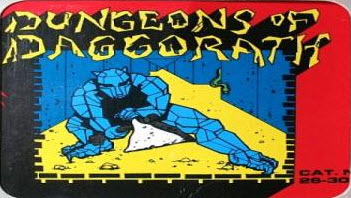

The first 256 bytes of RAM (DP=0) are needed by BASIC function calls made by Daggorath. The second
256 bytes of RAM (DP=1) contain the BASIC interrupt vectors.

Daggorath uses the third 256 bytes of memory (DP=2 from 0200 to 02FF) for its frequently used game variables.

RAM from 0300 to 1000 is used for various arrays of structures. The stack grows down from 0FFF.

The last 12K of RAM (1000-3FFF) of a 16K minimum requirements is used for two screen buffers. 

* 0300-03D3 ?? Text area descriptors ??
* 03D4-05F4 Creature objects (32 creatures, 17 bytes each). See description below.
* 05F4-09F3 Current level maze, one byte per room (32*32 bytes)
* 09F4-09FC ?? Used in maze drawing ??
* 09FD-0B14 ?? Game tasks ??
* 0B15-???? Game objects (14 bytes each).  020F points to 1-entry-past-last game object. See description below.

* ????-0FFF Stack space (grows downwards towards 0000 from 1000)

* 1000-27FF First screen buffer
* 2800-3FFF Second screen buffer

# Used in the BASIC variables (for tape access)

>>> memory
| | | |
| --- | --- | --- |
| 007C      | CASSBLKTYPE          | BASIC cassette block type |
| 007E      | CASSPTR              | BASIC cassette buffer ptr |


# Game variables DP=02

>>> memory
| | | |
| --- | --- | --- |
| 0200:0201 | CONST_00             | '0000' Double constant ('0001' from 0201) |
| 0202      | CONST_01             | '01'   LSB of double constant '0001'      |
| 0203:0204 | CONST_FF             | 'FFFF' Double constant |
| 0205:0206 | m0205                | '0080'  ?drawing? Center of game 3D screen X  |
| 0207:0208 | m0207                | '004C'  ?drawing? Center of game 3D screen Y  |
| 0209:020A | activeScreen         | 'D870' Pointer to visible screen descriptor |
| 020B:020C | backScreen           | 'D876' Pointer to drawing screen descriptor |
| 020D:020E | nextDemoCommand      | 'D988' Next demo command |
| 020F:0210 | nextObjSlot          | '0B15' Pointer to one object slot past end of list |
| 0211:212  | m0211                | '02F1' ?Next for parse?           |
| 0213      | playerY              | '0C' Player's Y coordinate   |
| 0214      | playerX              | '16' Player's X coordinate   |
| 0215:0216 | playerWeight         | '0023' Total weight of things carried (strain)      |
| 0217:0218 | pStrength            | '17A0' Player's strength     |
| 0219      | m0219                | ?? |
| 021A      | m021A                | ?? |
| 021B      | m021B                | ?? |
| 021C      | m021C                | ?? |
| 021D:021E | leftHand             | Pointer to object in left hand (or 0 if EMPTY) |
| 021F:0220 | rightHand            | Pointer to object in right hand (or 0 if EMPTY) |
| 0221      | m0221                | ?? |
| 0222      | x0222                | ?? |
| 0223      | playerDir            | Player's direction |
| 0224:0225 | torchPtr             | Pointer to lit torch object or 0 if none |
| 0226      | m0226                | ?? |
| 0227      | x0227                | ?? |
| 0228      | fainting             | Faint steps left to process, 0=not fainting |
| 0229:022A | firstPackObject      | Pointer to first object in linked list of objects in pack |
| 022B      | wizardDead           | FF means wizard is dead (creatures don't move) |
| 022C      | backgroundColor      | Color for the whole screen: FF for white or 00 for black |
| 022D      | dotFrequency         | Based on light-level. Frequency of drawn dots in a line. |
| 022E      | m022E                | ?? |
| 022F      | m022F                | ?? |
| 0230      | x0230                | ?? |
| 0231      | m0231                | ?? |
| 0232      | x0232                | ?? |
| 0233      | m0233                | ?? |
| 0234      | x0234                | ?? |
| 0235      | m0235                | ?? |
| 0236      | m0236                | ?used in sound? |
| 0237      | m0237                | ?? |
| 0238      | m0238                | ?? |
| 0239      | m0239                | ?? |
| 023A      | m023A                | ?? |
| 023B      | m023B                | ?? |
| 023C      | m023C                | ?? |
| 023D      | m023D                | ?? |
| 023E      | m023E                | ?? |
| 023F      | x023F                | ?? |
| 0240      | m0240                | ?? |
| 0241      | m0241                | ?? |
| 0242      | x0242                | ?? |
| 0243      | m0243                | ?? |
| 0244      | x0244                | ?? |
| 0245      | m0245                | ?? |
| 0246      | m0246                | ?? |
| 0247      | m0247                | ?? |
| 0248      | x0248                | ?? |
| 0249      | m0249                | ?? |
| 024F      | m024F                | ?? |
| 0250      | m0250                | ?? |
| 0251      | m0251                | ?? |
| 0252      | m0252                | ?? |
| 0253      | x0253                | ?? |
| 0254      | m0254                | ?? |
| 0255      | x0255                | ?? |
| 0256      | m0256                | ?? |
| 0257      | x0257                | ?? |
| 0258      | x0258                | ?? |
| 0259      | m0259                | ?? |
| 025A      | x025A                | ?? |
| 025B      | m025B                | ?? |
| 025C      | x025C                | ?? |
| 025D      | m025D                | ?? |
| 025E      | x025E                | ?? |
| 025F      | m025F                | ?? |
| 0260      | x0260                | ?? |
| 0261      | m0261                | ?? |
| 0262      | m0262                | ?? |
| 0263      | m0263                | ?? |
| 0264      | x0264                | ?? |
| 0265      | m0265                | ?? |
| 0266      | x0266                | ?? |
| 0267      | x0267                | ?? |
| 0268      | x0268                | ?? |
| 0269      | x0269                | ?? |
| 026A      | x026A                | ?? |
| 026B      | rndSeedA             | Random number generator seed value |
| 026C      | rndSeedB             | Random number generator seed value |
| 026D      | rndSeedC             | Random number generator seed value |
| 026E      | m026E                | ?light?|
| 026F      | m026F                | ?light?|
| 0270      | m0270                | ?fainting? |
| 0271      | unused0271           | |
| 0272      | unused0272           | |
| 0273      | m0273                | ? drawing something?|
| 0274      | m0274                | ? drawing something?|
| 0275      | m0275                | ?light?|
| 0276      | unused0276           | |
| 0277      | gameMode             | What is happening now: FF=demo, 00=live |
| 0278      | foundMatch           | used to check for multiple matches when decoding |
| 0279      | numWords             | Used in decoding words. Number of words in a table of words. |
| 027A      | unused027A           | |
| 027B      | perfectMatch         | FF if input was a perfect match (important for INCANT) |
| 027C      | drwMazeY             | Maze drawing ... current Y |
| 027D      | drwMazeX             | Maze drawing ... current X |
| 027E      | drwMazeCross         | Maze drawings ... number of crossings for current run |
| 027F      | unused027F           | |
| 0280      | unused0280           | |
| 0281      | currentLevel         | Current maze level number (0-4) |
| 0282:0283 | m0282                | ?temp creature count|
| 0284      | unused0284           | |
| 0285      | unused0285           | |
| 0286:0287 | currentHoles         | Pointer to ceiling hole/ladder table for current level |
| 0288      | drwMazeTmp           | Temporary for maze drawing |
| 0289      | unused0289           | |
| 028A      | drwMazeDir           | Maze drawing ... current direction |
| 028B      | m028B                | ?light?|
| 028C      | numObjs              | Number of objects to create |
| 028D      | m028D                | ?temp making objects on level?|
| 028E      | holdIncantWord       | |
| 028F      | holdIncantLen        | |
| 0290      | m0290                | ?parsing |
| 0291      | restartFind          | 1 to restart "FindNextObject" at top of list, 0 to continue find |
| 0292:0293 | objIterator          | Pointer to last object found |
| 0294      | scrollType           | 0 means "vision", not-0 means "seer" |
| 0295      | m0295                | ?tasks?|
| 0296      | m0296                | ?tasks?|
| 0297      | m0297                | Used at CD65 to advance random number |
| 0298      | m0298                | ?tasks?|
| 0299      | m0299                | ?tasks?|
| 029A      | m029A                | ?tasks maybe unused?|
| 029B      | m029B                | ?main loop showing demo scroll? |
| 029C      | beamSound            | Not-0 if wizard-beam sound |
| 029D      | beamSoundVal         | wizard sound value |
| 029E      | m029E                | ?beaming in demo?|
| 029F      | m029F                | ?tasks?|
| 02A0      | m02A0                | ?tasks?|
| 02A1      | m02A1                | ?tasks?|
| 02A2      | m02A2                | ?tasks?|
| 02A3      | m02A3                | ?tasks?|
| 02A4      | m02A4                | ?tasks?|
| 02A5      | m02A5                | ?tasks?|
| 02A6      | m02A6                | ?tasks?|
| 02A7      | m02A7                | ?tasks?|
| 02A8      | m02A8                | ?tasks?|
| 02A9      | m02A9                | ?tasks?|
| 02AA      | m02AA                | ?tasks?|
| 02AB      | m02AB                | ?tasks?|
| 02AC      | m02AC                | ?tasks?|
| 02AD      | scrollShowing        | Not 0 if a scroll is showing |
| 02AE      | heartCounter         | Redraw when it reaches zero |
| 02AF      | heartCounterRel      | Heart counter reload value |
| 02B0      | heartPicture         | 0 for small-heart, other for large-heart |
| 02B1      | hearHeart            | Not-0 to hear the heart beat |
| 02B2      | displayFunction      | This is the function to call to redraw the screen (normal, scroll, inventory) |
| 02B3      | unused02B3           | |
| 02B4      | flipScreens          | Not-0 to flip screens then ack to 0 |
| 02B5      | m02B5                | ?processing creatures |
| 02B6      | tabOrCR              | Used to make 2 columns in the EXAMINE display. 0=at start of line |
| 02B7      | whereToPrint         | Controls text printing. If |
| 02B8      | tapeTrigger          | 01=ZSAVE, FF=ZLOAD |
| 02B9      | nextTask             | Next available game-task slot |
| 02BA      | unused02BA           | |
| 02BB      | m02BB                | ?tasks?|
| 02BC      | inputHead            | head index (next read) of the 32 byte input ring buffer at 2D1  |
| 02BD      | inputTail            | tail index (next write) of the 32 byte input ring buffer at 2D1 |
| 02BE      | unused02BE           | |
| 02BF      | unused02BF           | |
| 02C0      | unused02C0           | |
| 02C1      | holdHole             | hold the hole in this room |
| 02C2      | m02C2                | ?? |
| 02C3      | m02C3                | ?? |
| 02C4      | m02C4                | ?? |
| 02C5      | m02C5                | ?? |
| 02C6      | m02C6                | ?? |
| 02C7      | m02C7                | ?? |
| 02C8      | x02C8                | ?? |
| 02C9      | x02C9                | ?? |
| 02CA      | x02CA                | ?? |
| 02CB      | x02CB                | ?? |
| 02CC      | unused02CC           | |
| 02CD      | unused02CD           | | 
| 02CE      | unused02CE           | |
| 02CF      | unused02CF           | |
| 02D0      | unused02D0           | |
| 02D1:02F0 | inputBuf             | 32 byte input ring buffer |
| 02F1:02F2 | nextToParse          | Next user input to parse as we move across line |
| 02F3:02FF | x02F3                | |

# Temporary buffers

>>> memory
| | | |
| --- | --- | --- |
| 0313:0323 | tmpBuffer1           | Buffer used for loading tape header and for decoding user input |
| 0335      | tmpBuffer2           | First byte is length. Buffer used for uncompressing words for parse |

# Text Area Descriptors

? I believe that the "end" value in a descriptor is different for text and graphics areas.
For text, the "end" is the number of characters.
For graphics, the "end" is the end+1 address.

## Examine area descriptor

>>> memory
| | | |
| --- | --- | --- |
| 380:381   | examineStart            | Starting address of this area |
| 382:383   | examineEnd              | End+1 address of area |
| 384:385   | examineTextCur          | Text cursor position in this area |
| 0386      | examineColor            | Color (black or white) of this area |
| 0387      | examine???              | Something to do with this area ? duplicate images to +1800 |

## Hand line descriptor

>>> memory
| | | |
| --- | --- | --- |
| 388:389   | hndStart             | Starting address of this area |
| 38A:38B   | hndEnd               | Number of characters in this area ?? end + 1 ??|
| 38C:38D   | hndTextCur           | Text cursor position in this area |
| 038E      | hndColor             | Color (black or white) of this area |
| 038F      | hnd???               | Something to do with this area ? duplicate images to +1800 |

## Command area descriptor

>>> memory
| | | |
| --- | --- | --- |
| 390:391   | comStart            | Starting address of this area |
| 392:393   | comEnd              | End+1 address of area |
| 394:395   | comTextCur          | Text cursor position in this area |
| 0396      | comColor            | Color (black or white) of this area |
| 0397      | com???              | Something to do with this area ? duplicate images to +1800 |

# Structures

## Screen Descriptor
 
```
 aabb ccdd eeff
 aabb : Start memory of area
 ccdd : End memory (+1) of area
 eeff : SAM settings for screen 
```

## Creatures 

```
 Creatures are 17 byte structures as follows:
   00
   01
   02
   03
   04
   05
   06
   07
   08
   09
   0A
   0B
   0C 0 if inactive, FF if alive
   0D Type
   0E Direction
   0F Y coordinate
   10 X coordinate
```

## Objects 

Objects 14-byte structures. These are created one after the other as needed beginning at 0B15.
The location <$0F:10 points to the next available free object slot. This is where the next object
is created. This is the end marker for walks through the objects.

Objects can be chained together in lists through the first two bytes in the structure. These bytes
are a pointer to the next object in the chain or 0 if this object is the end.

<$29:2A points to the first object in the chain of objects in the backpack. When an object is picked up
it is pushed to the head of this list. Thus the pack works like a LIFO stack.

Each monster structure has a pointer to the first object in a chain of objects it is carrying.

<$1D:1E points to the object in the left hand (or 0 if EMPTY).

<$1F:20 points to the object in the right hand (or 0 if EMPTY).

 Objects are 14 byte structures as follows:
 
| | | | |
| --- | --- | --- | --- |
| 00:01 |  Pointer to next object in chain       | Set at creation and when changed | |
| 02    |  Y coordinate (if on floor)            | Set when dropped                 | |
| 03    |  X coordinate (if on floor)            | Set when dropped                 | |
| 04    |  Maze level (if on floor)              | Set when dropped                 | |
| 05    |  Location: 0=floor, 1=pack, ??=monster | Set at creation and when changed | |
| 06    |  Special data 1                        | Copied from entry in DA64        | Ring: attacks,  Shield: magic,    Torch: minutes | 
| 07    |  Special data 2                        | Copied from entry in DA64        | Ring: proper,   Shield: physical, Torch: phys light |
| 08    |  Special data 3                        | Copied from entry in DA64        | Ring: not used, Shield: not used, Torch: magic light |
| 09    |  Object proper type                    | Set at creation                  | |
| 0A    |  Object class                          | Copied from entry in DA00        | |
| 0B    |  Strength to reveal                    | Copied from entry in DA00        | |
| 0C    |  Magic power                           | Copied from entry in DA00        | |
| 0D    |  Physical power                        | Copied from entry in DA00        | |

## Tasks
 
```
 Tasks are 7 byte structures as follows:
   00
   01
   02
   03:04 MSB Handler code entry
   05
   06
```
