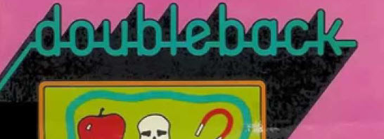

# Doubleback RAM Usage

The game works with 4K of RAM, which means it only uses one
screen buffer.

Stack builds to lower from 0150.

Screen uses 0400 to 1000.

>>> memory
|       |            |     |
| ----- | ---------- | ----------------- |
| B4    | NumPlayers | 0 for ONE PLAYER, 1 for TWO PLAYER |
| B5    | NumLives   | Current number of lives |
| B6    | Player     | Current player number (0 or 1) |
| B7:B8 | P1Score    | Player one score |
| B9:BA | P2Score    | Player two score |
| BB:BC | HighScore  | Highest score since power on            |
| BD    | Collision | 1 if the player touches a game object |
| BE    | EndOfPlayer | Offset to the end of the player's point buffer |
| BF    | OrigPixel | For collision detection |
| C0    | C0 | |
| C1    | C1 | |
| C2    | C2 | |
| C3    | C3 | |
| C4    | NumLooped | number of objects currently looped by player |
| C5    | DigitColor | number can be printed white on black or black on white |
| C6    | C6 | |
| C7    | HasLoopScore | non-zero if there is a loop score to display |
| C8:C9 | LoopScoreTmp | sum of scores for objects currently looped by player |
| CA:CB | LoopScoreShown | the loop score being shown |
| CC:CD | LoopScoreLoc | screen location of the loop score being shown |
| CE    | CE | |
| CF    | SkullCount | number of skulls being shown |
| D0    | D0 | |
| D1    | D1 | |
| D2:D3 | NextFreeObj | next free game object memory slot |
| D4    | CycleCount | used to pace the objects so not all update at once |
| D5    | FlashCount | used to time the flashing "one" or "two" during game play |
| D6    | FlashType  | used to flash "one" or "two" during game play (FF draws word, 00 draws space) |
| D7    | Random     | Random value. Entropy: waits for VBLANK, player's X axis input |
| D8:DD | PlayerObj  | Player object (for drawing the point) | 
| DE:E3 | EraseObj   | Utility object for erasing points |
| E4:E9 | SplashObj  | Utility object for messages and cursive drawing |
| EA:EF | GameObj    | Utility object for the current game object |
| 0160:1FFF | GameObjs | Game objects |
| 0200:02FF | PlayerLine | Points for the player's line |
| 0380:0390 | PixelMask | Pixel mask table |