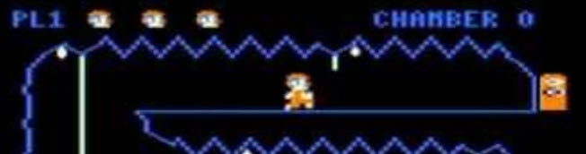

# Downland

>>> deploy: 
>>>   +downland.jpg
>>>   +downland.js
>>>   RAMUse.md 
>>>   Code.md 
>>>   ---- 
>>>   Journal.md 

# Code Links 

* [RAM Usage](RAMUse.md)
* [Disassembled Code](Code.md)

# March 23, 2019

I have the ROM for v1.1. What was in the original? It appears to be the v1.0 binary I have,
but the first two bytes of that are "DK". It doesn't translate to a known 6809 opcode. BUT
it does run in Mocha, and says it is just "DOWNLAND" ... not "DOWNLAND V1.1".

There are 31 doors on the map from the cocopedia. 30 pairs and then the "final" door which
takes you back to the beginning. I'd like to find the definitions of these doors and
see the special "reset" code sequence.

There is no ending "congratulations" sequence. When you go through the last door, the game 
resets and you are back at the beginning:

https://www.youtube.com/watch?v=qid3hzRww9c

http://www.cocopedia.com/wiki/index.php/Downland

http://www.haplessgenius.com/mocha/

