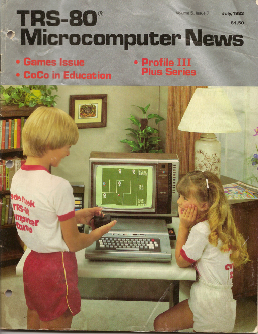
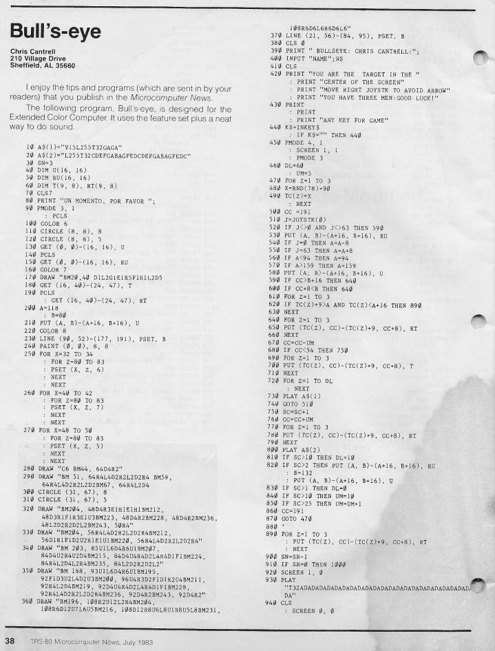
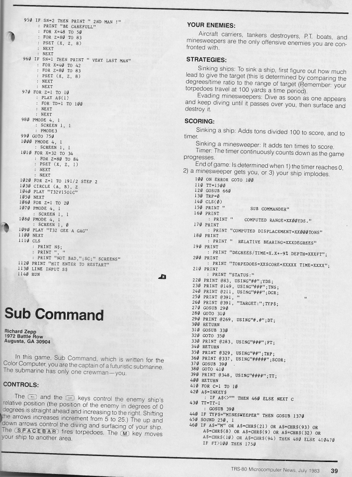
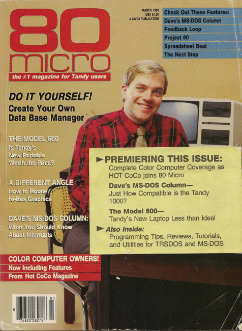
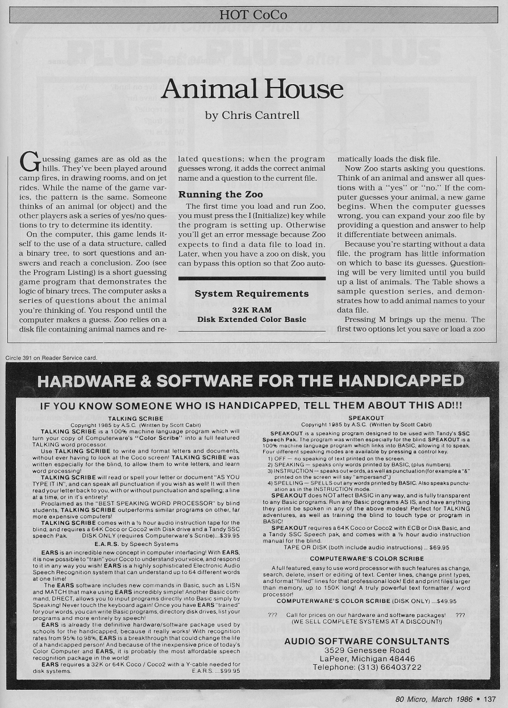
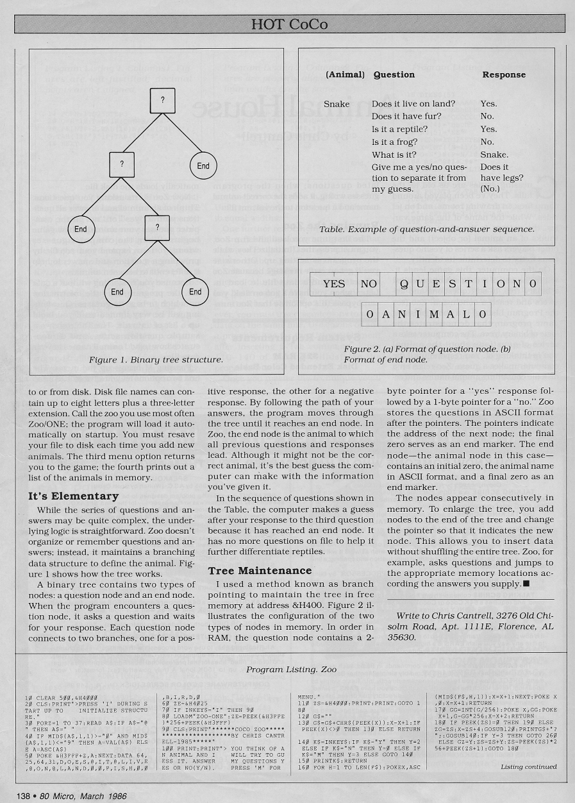
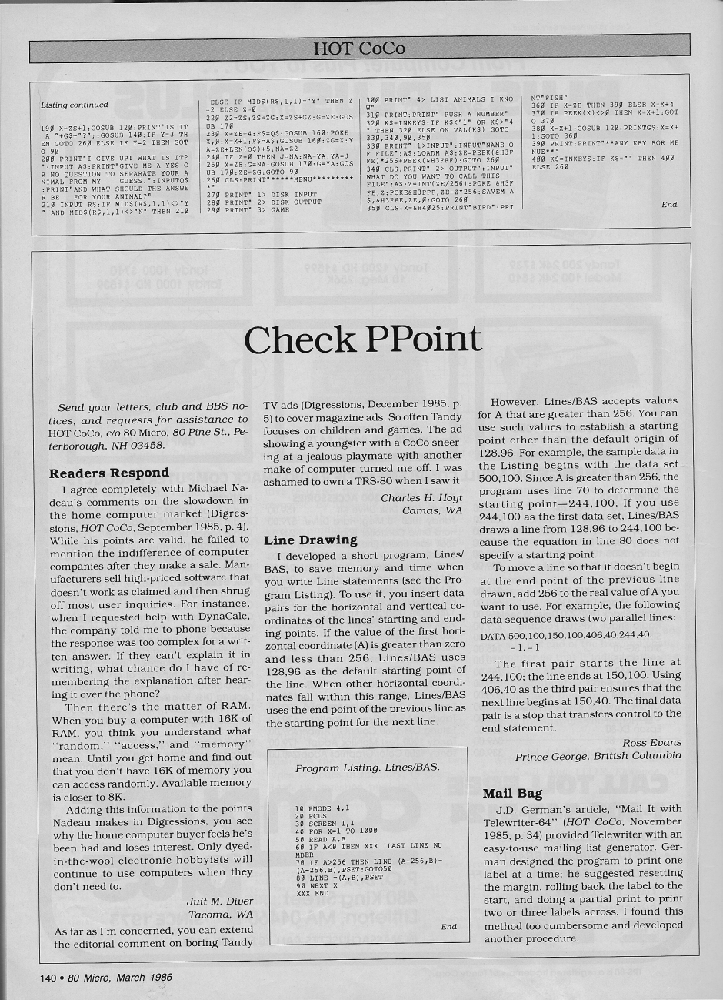
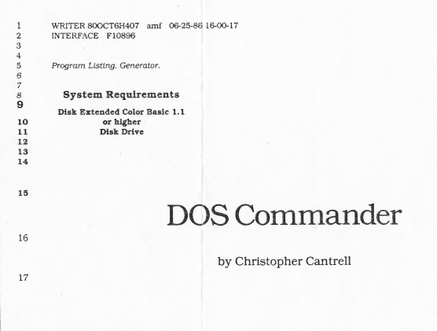
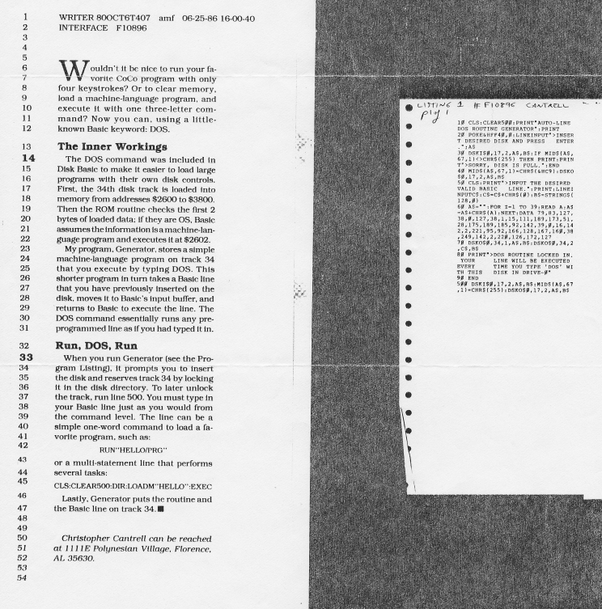

<!-- deploy
+Animal1.jpg
+Animal2.jpg
+Animal3.jpg
+BullsEye1.jpg
+BullsEye2.jpg
+Cover80Micro.jpg
+CoverTRS80News.jpg
+DOS1.jpg
+DOS2.jg
-->

<!-- navTitle Early Work -->

# Early CoCo Work

TODO OCR the code. These should be playable (well, not DOS commander)

# Bullseye

My first publication was the "Bull's Eye" game. It appeared
in the July 1983 issue of TRS-80 Microcomputer News.

No. That is not me on the cover.

</img>

</img>

</img>

# Animal House

In March of 1986 80 Micro published my article/code "Animal House". I was a senior in high school.
I got paid $125 for the work. Nearly all of the article text was heavily edited -- practically
rewritten.

No. That is not me on the cover.

</img>

</img>

</img>

</img>

# DOS Commander

In June of 1986 80 Micro purchased my article/code "DOS Commander" for $50. But the magazine dropped
coverage of the Color Computer shortly after. My article never made it to print.

</img>

</img>

