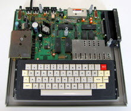
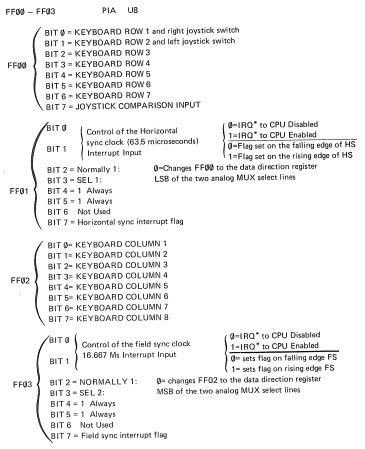
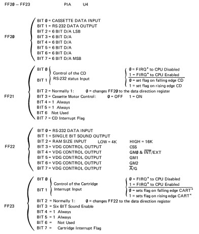
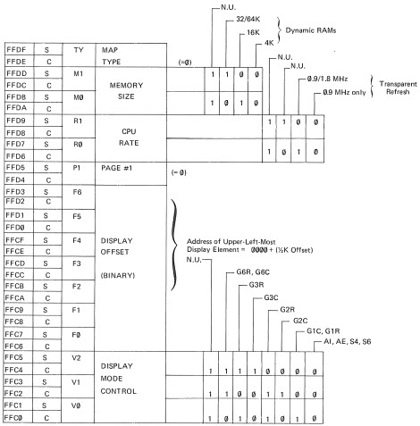

# CoCo Hardware

# References

The [Color Computer Reference Manual](http://sparksandflames.com/files/Color%20Computer%20Technical%20Reference%20Manual%20%28Tandy%29.pdf)
contains schematics and detailed hardware information. The images below are from the manual.

# Hardware Addresses

## PIA 0 

>>> memory

|    |     |     |
| -------- | ------- | ----------------- |
| FF00     | PIA0_DA | I/O data or direction (depends on control setting) |
| FF01     | PIA0_CA | Control |
| FF02     | PIA0_DB | I/O data or direction (depends on control setting) |
| FF03     | PIA0_CB | Control |

## PIA 1 

>>> memory

|   |   |   |
|:-------- |:------- |:----------------- |
| FF20     | PIA1_DA | I/O data or direction (depends on control setting) |
| FF21     | PIA1_CA | Control |
| FF22     | PIA1_DB | I/O data or direction (depends on control setting) |
| FF23     | PIA1_CB | Control |

## SAM

>>> memory

|   |   |   |
|:--------- |:---------- |:----------------- |
| FFC0:FFC5 | dispMode   | Display mode control |
| FFC6:FFD3 | dispOffset | Display offset |
| FFD4:FFD5 | page       | Should always be 0 |
| FFD6:FFD9 | cpuRate    | Transparent refresh |
| FFDA:FFDD | memSize    | Memory size |
| FFDE:FFDF | mapType    | Memory map type |

# Vectors 

These are "ghosted" from the end of the BASIC ROM at BFF0. Since they are unchangeable it is
unlikely you will see them referenced in code. Most of the vectors point to RAM, which
must be initialized before enabling the interrupt. 

The RAM vectors are what programs must change.

Each vector gets 3 bytes in RAM. The first for the "JMP" opcode followed by the
address.

>>> memory

|   |   |   |
|:--------- |:----------- |:----------------- |
| FFFE:FFFF | vectorReset | Reset/Start vector (A827 ROM) |
| FFFC:FFFD | vectorNMI   | NMI vector (0109 RAM) |
| FFFA:FFFB | vectorSWI   | SWI vector (0106 RAM) |
| FFF8:FFF9 | vectorIRQ   | IRQ vector (010C RAM) |
| FFF6:FFF7 | vectorFIRQ  | FIRQ vector (010F RAM) |
| FFF4:FFF5 | vectorSWI2  | SWI2 vector (0103 RAM) |
| FFF2:FFF3 | vectorSWI3  | SWI3 vector (0100 RAM) |
| FFF0:FFF1 | vector6809  | 6809 exceptions like divide by 0 (A681 ROM) |
