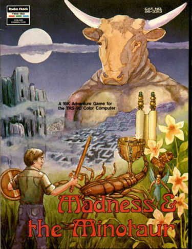

# Madness and the Minotaur Save-Game Viewer

>>> playMe {

Paste the text of your save-game text file into the box below and click the "Show" button.

Leave the box blank to show the game-independent map.

The map is SVG -- you can scroll in and out.

```html
</p>
<textarea id="cocoTape" rows="16" style="font-size:8px;width:80ch;" ></textarea>
</p>
<button id="parseData">Show</button>
</p>

<script src="BinaryDataMadness.js"></script>
<script src="savegame.js"></script>
<script>
$(function() {

$('#parseData').on('click',function() {
	viewSaveFile($('#cocoTape').val());
});

});
</script>

<svg id="svg" width="1400" height="5600">
</svg>

```

>>> }

```html
<div id="rawData" style="display:none">
```

```plain
<h2>Engine Memory (0000-00FF stored in save game file 0000-00FF)</h2>
0000: 0A      current room
0001: 0A      last room
0002: 00      direction command bit pattern
0003: 05      length of user input
0004: 00      weight of pack
0005: FF      physical condition
0006: 00      bulk of pack
0007: 00      decoded object number from noun
0008: 00      Accumulated odds of falling (0, 1/8, 2/8, 3/8 ... with each step in the dark)
0009: 00      Scorpion sting (0=not, not-zero=number of times)
000A: 00      0 if lamp is off, not 0 is on
000B: 00      Count of spaces at the end of the row in print routine
000C: 00      Set by BetweenRoomACDE if a climb-down failed ... abort the movement
000D: 00      pushed back flag (nobody reads this)
000E: 00      HydraStatus: AA = tied up, 1 = dead, 0 = free
000F: 00      HydraPushedUsBack (must be set to TIE HYDRA)  0 = not, 1 = hydra blocked last move (cleared every direction command)
0010: 00      1 if "pile of rocks" has been moved to us
0011: 00      1 if "pile of rocks" has been exposed with OKKAN
0012: 00      1 if south passage in room 9 is open. 0 if closed. (open with drapes)
0013: 00      Count down timer until we can walk through aura and heal again (10 seconds each time)
0014: 00      1 if lamp has been blown from pack by entering room routine or failed jump
0015: 00      1 if treasure "$0B" has been released
0016: 00      NEVER USED
0017: 07      Random number for passage-description printing
0018: A6 BE   Rolling pointer to BASIC rom for random numbers
001A: 00      Number of times advice has been given 0-13
001B: 1A      Object 0 
001C: 1D      Object 1
001D: 1E      Object 2
001E: 1B      Object 3    Advice table. Object number is stored here. Upper
001F: 1C      Object 4    bit set if advice has already been given for this
0020: 19      Object 5    protected object.
0021: 06      Object 6
0022: 0F      Object 7
0023: 07      Object 8
0024: 14      Object 9
0025: 2A      Object 10
0026: 2B      Object 11
0027: 2C      Object 12
0028: 00      Calculated score
0029: 00      NEVER USED
002A: 2B      Verb command number
002B: FF      Noun word number
002C: 2F      Trigger object to make packrat drop treasure
002D: 00      NEVER USED
002E: 00      Holder value for BetweenRoomACDE
002F: 0C      General use lots of places
0030: 00      Used in InPack
0031: 00      Used in InPack
0032: 00      Set by EnteringRoomAction_q (MYSTERIOUS FOG)
0033: 4E      Current room of HYDRA
0034: 02      Number of times more ISHTAR can be used. Random init to 1-4.
0035: C2      Room for small pit in corner of room
0036: 00      Room of LEDGE
0037: 00      Room of "pile of rocks" (OKKAN spell)
0038: 07 08   Oil level of lamp (0 is empty)
003A: 06      Number of times lamp can be filled (init to $34 + 4)
003B: 05 60   Pointer to start of input on screen
003D: 17      Used in Random-between-0-and-B
003E: 00      Time until we can drink from bottle to heal again (16 seconds)
003F: 15      Interrupt divisor count (seconds)
0040: 02      Interrupt sub divisor (minutes)
0041: 00      Minotaur state timer
0042: 00      Troglodyte state timer
0043: 00      Satyr state timer
0044: 00      Scorpion state timer
0045: 00      Fog clock runs in room MYSTERIOUS FOG. At 6 seconds we get warned. At 10 we die.
0046: 00      Minutes of immunity left (AKHIROM gives 3 minutes)
0047: 00      Count of times entering room with EnteringRoomAction_r. 3 times and treasure drops.
0048: 00      NEVER USED
0049: 00      NEVER USED
004A: 00 02   Continual second counter (nobody uses it)
004C: 00 02   Counts the time in a room. Once 15, no going BACK
004E: 00      NEVER USED
004F: 00      NEVER USED
0050: 00      NEVER USED
0051: 00      Used in Oracle advice
0052: 00      Used in killing Hydra
0053: 00      Used in sound effects
0054: 00 00   Used in tape-write
;
; Skipping 16 bytes 56-65 buffer for decode and word wrap
; Skipping not-used 66-F2
;
00F3: 00      .
00F4: 00      .
00F5: 00      .
00F6: 00      .
00F7: 00      Shifting buffer of rooms blocked by Shaking Ground.
00F8: 00      As new rooms are blocked at random, they go on the
00F9: 00      end of the list. Rooms are pulled off of the front
00FA: 00      of the list and unblocked completely. This keeps
00FB: 00      lots of shaking from blocking up the floors over
00FC: 00      time.
00FD: 00      .
00FE: 00      .
00FF: 00      .
<h2>Screen State</h2>
; Skipping screen data stored in save file 0100-03BF
<h2>Game Data (3BC1-3FFF stored in save game file 03C0-07FE)</h2>
<h3>Spells</h3>
; Spell data
;   AA BB CC DD
;   AA = 1st required object to learn spell
;   BB = 2nd required object to learn spell
;   CC = room spell is in (not learned)
;   DD = $80 if learned, 0 if not
;
;                      Spell    Must have to learn
3BC1: 09 01 00 00    ; VETRA:   MUSHROOM and FOOD     {{decode}}
3BC5: 0E 37 00 00    ; MITRA:   PARCHMENT and  VETRA  {{decode}}                 
3BC9: 11 38 00 00    ; OKKAN:   TALISMAN and MITRA    {{decode}}
3BCD: 18 39 00 00    ; AKHIROM: ROPE and OKKAN        {{decode}}
3BD1: 0B 3A 00 00    ; NERGAL:  SCEPTER and AKHIROM   {{decode}}
3BD5: 0F 3B 00 00    ; BELROG:  VIAL and NERGAL       {{decode}}
3BD9: 0A 3C 00 00    ; CROM:    PENDANT and BELROG    {{decode}}
3BDD: 23 3D 00 00    ; ISHTAR:  SPELLBOOK and CROM    {{decode}}  
<h3>Jump Info</h3> 
; Describes places where you can JUMP. Everything but one byte is static (same every game).
; The room number of the last jump is set to the room with Enter Room Action _203.
;  AA BB CC DD EE
;   AA = Starting room
;   BB = Compared to (Phys-weight) AND (Phys-bulk) ... see below
;   CC = Fail action (see below)
;   DD = Target room of jump
;   EE = Word of thing to jump (or FF for just JUMP)
;
;     If Phys-weight is less than BB, you fail the jump as CC describes.
;     Otherwise if Phys-bulk is less than BB, you fumble (make the jump but
;       drop the heaviest object).
;
;     CC = 0x00 ... a failed jump (BB condition) is death
;     CC = 0x80 ... a failure is a fumble. You make the jump but drop the
;                   heaviest object object. There is a 1/8th chance that
;                   the fumbled object is lost (unless it is required).
;     CC =    N ... a failure is a stumble. You don't make the jump and
;                   take N damage.
;
3BE1: 8F 80 00 97 6D; From 143 "JUMP PIT"   to 151. Required=128 or DEATH
3BE6: 97 80 80 8F 6D; From 151 "JUMP PIT"   to 143. Required=128 or FUMBLE
3BEB: 10 80 80 11 2C; From 16  "JUMP POOL"  to 17.  Required=128 or FUMBLE
3BF0: 11 80 80 10 2C; From 17  "JUMP POOL"  to 16.  Required=128 or FUMBLE
3BF5: 4E 40 80 56 41; From 78  "JUMP CHASM" to 86.  Required=64  or FUMBLE
3BFA: 56 40 80 4E 41; From 86  "JUMP CHASM" to 78.  Required=64  or FUMBLE
3BFF: 2C 0A 0A B6 6D; From 44  "JUMP PIT"   to 182. Required=10  or STUMBLE(10)
3C04: B6 14 14 2C 6D; From 182 "JUMP PIT"   to 44.  Required=20  or STUMBLE(20)
3C09: A4 A0 00 CA 6D; From 164 "JUMP PIT"   to 202. Required=160 or DEATH
3C0E: 85 C0 80 CB 6D; From 133 "JUMP PIT"   to 203. Required=192 or FUMBLE
3C13: 90 14 14 85 FF; From 144 "JUMP"       to 133. Required=20  or STUMBLE(20)
3C18: CB 80 1E CA 6D; From 203 "JUMP PIT"   to 202. Required=128 or STUMBLE(30)
3C1D: D5 46 14 D4 6B; From 213 "JUMP MIST"  to 212. Required=70  or STUMBLE(20)
3C22: D4 46 14 D5 6B; From 212 "JUMP MIST"  to 213. Required=70  or STUMBLE(20)
3C27: 23 96 28 22 9F; From 35  "JUMP HOLE"  to 34.  Required=150 or STUMBLE(40)
3C2C: 22 78 14 23 6D; From 34  "JUMP PIT"   to 35.  Required=120 or STUMBLE(20)
3C31: 80 64 80 40 05; From 128 "JUMP UP"    to 64.  Required=100 or FUMBLE
3C36: A6 50 80 66 05; From 166 "JUMP UP"    to 102. Required=80  or FUMBLE
3C3B: 66 A0 80 26 05; From 102 "JUMP UP"    to 38.  Required=160 or FUMBLE
3C40: 5C 96 1E 9C 06; From 92  "JUMP DOWN"  to 156. Required=150 or STUMBLE(30)
3C45: 46 50 14 8C 06; From 70  "JUMP DOWN"  to 140. Required=80  or STUMBLE(20)
3C4A: 5E 5A 0A 9E 06; From 94  "JUMP DOWN"  to 158. Required=90  or STUMBLE(10)
3C4F: 40 1E 00 80 6D; From 64  "JUMP PIT"   to 128. Required=30  or DEATH
3C54: CA 1E 14 A2 06; From 202 "JUMP DOWN"  to 162. Required=30  or STUMBLE(20)
;
3C59: {{value}} 8C 80 27 06; From {{decode}}  "JUMP DOWN"  to 39.  Required=140 or FUMBLE
;
3C5E: 00          

; Skipping static table from 3C5F-3C6E (used to place objects below, but never changes)
<h3>Who Holds What</h3>
; Held-by table. Treasures are carried by creatures or "held" by a room. This
; table maps the holder to the treasure.
;  AA BB
;   A = owner (see object list below)
;   B = held object
;
; Objects by number:
;   1=crypt, 2=crypt-kings, 3=_u, 4=_33, 5=pit, 6=ledge, 7=hydra, 
;   8=pile-of-rocks, 9=_s, 10=_t(rat), 11=_r, 
;   Greater than 12: creature number
;
3C6F: 00 2E  ; 46 "OPAL"      {{decode}}
3C71: 00 2F  ; 47 "SAPPHIRE"  {{decode}}
3C73: 00 12  ; 18 "SCROLL"    {{decode}}    
3C75: 00 15  ; 21 "SCARAB"    {{decode}}
3C77: 00 16  ; 22 "JEWLBOX"   {{decode}}
3C79: 00 17  ; 23 "TABLET"    {{decode}}
3C7B: 00 20  ; 32 "GOLD"      {{decode}}
3C7D: 00 21  ; 33 "SILVER"    {{decode}}
3C7F: 00 22  ; 34 "DIAMOND"   {{decode}}
3C81: 00 24  ; 36 "RUBY"      {{decode}}
3C83: 00 25  ; 37 "FLEECE"    {{decode}}
3C85: 00 26  ; 38 "TIARA"     {{decode}}
3C87: 00 27  ; 39 "POWDER"    {{decode}}
3C89: 00 28  ; 40 "AMULET"    {{decode}}
3C8B: 00 29  ; 41 "POTION"    {{decode}}
3C8D: 00 2D  ; 45 "CROWN"     {{decode}}
<h3>Enter Room Table</h3> 
3C8F: {{value}} 1B 6D  ; {{decode}}  _a     ; Cave in to next floor if pack heavier than 192. If so move a nd b to random rooms.
3C92: {{value}} 1B 70  ; {{decode}}  _b     ; Cave in to next floor if pack heavier than 128. If so move a nd b to random rooms.
3C95: {{value}} 1B 73  ; {{decode}}  _c     ; Cave in to next floor if pack heavier than 95. If so move a nd b to random rooms.
3C98: {{value}} 1B 9C  ; {{decode}}  _d     ; If we have VETAR make the pile-of-rocks appear in this room (it stays here).
3C9B: {{value}} 1B B3  ; {{decode}}  _e     ; Play sound effect. If we play the flute and have the parchment then the LEDGE appears here.
3C9E: {{value}} 1B B7  ; {{decode}}  _f     ; Powerful gust blows lamp out of grasp. 
3CA1: {{value}} 1B F9  ; {{decode}}  _g     ; Hydra is here. If it is free it pushes us back to last room. 
3CA4: {{value}} 1C 15  ; {{decode}}  _h     ; If we know VETAR or have the SCEPTER, nothing happens. Otherwise we RUN.
3CA7: {{value}} 1C 2C  ; {{decode}}  _i     ; Pushed back if we don't have VETAR.
3CAA: {{value}} 1C 2F  ; {{decode}}  _j     ; Pushed back if we don't have MITRA.
3CAD: {{value}} 1C 32  ; {{decode}}  _k     ; Pushed back if we don't have OKKAN.
3CB0: {{value}} 1C 35  ; {{decode}}  _l     ; Pushed back if we don't have AKHIROM.
3CB3: {{value}} 1C 38  ; {{decode}}  _m     ; Pushed back if we don't have NERGAL.
3CB6: {{value}} 1C 3B  ; {{decode}}  _n     ; Pushed back if we don't have BELROG.
3CB9: {{value}} 1C 3E  ; {{decode}}  _o     ; Pushed back if we don't have CROM.
3CBC: {{value}} 1C 41  ; {{decode}}  _p     ; Pushed back if we don't have ISHTAR.
3CBF: {{value}} 1C 68  ; {{decode}}  _q     ; Start the poison clock (we can't stay here long). 1/3 of the time we give the clock an extra tick.
3CC2: {{value}} 1C 7A  ; {{decode}}  _r     ; When we enter this room 3 times the treasure is released.
3CC5: {{value}} 1C 68  ; {{decode}}  _q     ; see above 
3CC8: {{value}} 1C 68  ; {{decode}}  _q     ; see above
3CCB: {{value}} 1C 8D  ; {{decode}}  _s     ; If we have the lamp and it is off then the room drops its treasure. (Strange color walls)
3CCE: {{value}} 1C A9  ; {{decode}}  _t     ; If we are holding the packrat's trigger treasure (randomized at start) then the packrat drops his treasure.
3CD1: {{value}} 1C 68  ; {{decode}}  _q     ; see above
3CD4: {{value}} 1C CC  ; {{decode}}  _u     ; If we can see you instantly get the treasure.
3CD7: {{value}} 1C F0  ; {{decode}}  _v     ; Print POOL OF OIL if the lamp can be refilled.
3CDA: {{value}} 1B B7  ; {{decode}}  _f     ; see above
3CDD: {{value}} 1C E0  ; {{decode}}  _32    ; (Same as 32 below)
3CE0: {{value}} 1D 00  ; {{decode}}  _x     ; Add 40 to health and move us a short distance away. 10 minutes must pass before again. 
3CE3: {{value}} 1D 00  ; {{decode}}  _x     ; see above
3CE6: {{value}} 1D 22  ; {{decode}}  _203   ; Print "SMALL PIT IN CORNER OF ROOM"
3CE9: D5 1D 27  ; 213  _213     ; Print "LAYER OF MIST EAST WALL"
3CEC: 20 1C E0  ; 32   _32      ; If we can't see we take 30 damage.
3CEF: 21 1C D6  ; 33   _33      ; If we can see you instantly get the treasure.
3CF2: CB 1D 22  ; 203  _203     ; Print SMALL PIT IN CORNER OF ROOM.
3CF5: {{value}} 1B B4  ; {{decode}}  _z       ; Room with music (init to room 16 to 39). The sprite can't move objects here.
3CF8: E8 1D 2D  ; 232  _232     ; _232 If we came south to this room and carrying pendant move us near start and random room for pendant.
3CFB: 00
<h3>Object Data</h3> 
; AA BB bsdp_PPxy
;  A = Current room number
;  B = Display name to use
;
;   b=1 if in backpack
;   s=1 if spell or creature
;   d=1 if object is required in game (can't get permanently lost in a failed jump)
;   p=1 if "protected"
;
;   PP is bottle/urn fill status
;   x=1 if spell or dead creature 
;   y=1 if carried object or creature
;
; Objects are not accessible to the player (noun) if x or y are set.
;
3CFC: 00 01 00  ; 1 "FOOD"         {{decode}}
3CFF: 08 02 00  ; 2 "BOTTLE"       {{decode}}
3D02: 28 03 00  ; 3 "DAGGER"       {{decode}}
3D05: 01 04 00  ; 4 "MACE"         {{decode}}
3D08: 01 05 00  ; 5 "AX"           {{decode}}
3D0B: 04 06 10  ; 6 "SWORD"        {{decode}}
3D0E: 08 07 10  ; 7 "SHIELD"       {{decode}}
3D11: 00 08 00  ; 8 "FLUTE"        {{decode}}
3D14: 02 09 00  ; 9 "MUSHROOM"     {{decode}}
3D17: 00 0A 00  ; 10 "PENDANT"     {{decode}}
3D1A: 02 0B 00  ; 11 "SCEPTER"     {{decode}}
3D1D: 02 0C 00  ; 12 "LAMP"        {{decode}}
3D20: 04 0D 00  ; 13 "BASKET"      {{decode}}
3D23: 04 0E 01  ; 14 "PARCHMENT"   {{decode}}
3D26: 04 0F 10  ; 15 "VIAL"        {{decode}}
3D29: 06 10 00  ; 16 "URN"         {{decode}}
3D2C: 06 11 01  ; 17 "TALISMAN"    {{decode}}
3D2F: 0C 12 01  ; 18 "SCROLL"      {{decode}}
3D32: 0C 13 00  ; 19 "GOBLET"      {{decode}}
3D35: 0C 14 10  ; 20 "SKULL"       {{decode}}
3D38: 0C 15 01  ; 21 "SCARAB"      {{decode}}
3D3B: 0D 16 01  ; 22 "JEWELBOX"    {{decode}}
3D3E: 0D 17 01  ; 23 "TABLET"      {{decode}}
3D41: 0D 18 00  ; 24 "ROPE"        {{decode}}
3D44: 0D 19 40  ; 25 "SPRITE"      {{decode}}
3D47: 0E 1A 40  ; 26 "TROGLODYTE"  {{decode}}
3D4A: 0A 1B 40  ; 27 "SCORPION"    {{decode}}
3D4D: 0B 1C 40  ; 28 "NYMPH"       {{decode}}
3D50: 0C 1D 40  ; 29 "SATYR"       {{decode}}
3D53: 9E 1E 40  ; 30 "MINOTAUR"    {{decode}}
3D56: 9E 1F 40  ; 31 "ORACLE"      {{decode}}
3D59: 00 20 01  ; 32 "GOLD"        {{decode}}
3D5C: 00 21 01  ; 33 "SILVER"      {{decode}}
3D5F: 40 22 01  ; 34 "DIAMOND"     {{decode}}
3D62: 40 23 10  ; 35 "SPELLBOOK"   {{decode}}
3D65: 44 24 01  ; 36 "RUBY"        {{decode}}
3D68: 44 25 01  ; 37 "FLEECE"      {{decode}}
3D6B: 00 26 01  ; 38 "TIARA"       {{decode}}
3D6E: 1D 27 01  ; 39 "POWDER"      {{decode}}
3D71: 1D 28 01  ; 40 "AMULET"      {{decode}}
3D74: 43 29 01  ; 41 "POTION"      {{decode}}
3D77: 11 2A 10  ; 42 "POWERRING"   {{decode}}
3D7A: 11 2B 10  ; 43 "LIGHTRING"   {{decode}}
3D7D: 11 2C 10  ; 44 "TRUTHRING"   {{decode}}
3D80: 12 2D 01  ; 45 "CROWN"       {{decode}}
3D83: 00 2E 01  ; 46 "OPAL"        {{decode}}
3D86: 00 2F 01  ; 47 "SAPPHIRE"    {{decode}}
3D89: 00 00 42  ; 48 "NORTH"       {{decode}}
3D8C: 00 00 42  ; 49 "NORTH"       {{decode}}
3D8F: 00 00 42  ; 50 "NORTH"       {{decode}}
3D92: 00 00 42  ; 51 "NORTH"       {{decode}}
3D95: 00 00 42  ; 52 "NORTH"       {{decode}}
3D98: 00 00 42  ; 53 "NORTH"       {{decode}}
3D9B: 00 00 42  ; 54 "NORTH"       {{decode}}
3D9E: 00 37 42  ; 55 "VETAR"       {{decode}}
3DA1: 00 38 42  ; 56 "MITRA"       {{decode}}
3DA4: 00 39 42  ; 57 "OKKAN"       {{decode}}
3DA7: 00 3A 42  ; 58 "AKHIROM"     {{decode}}
3DAA: 00 3B 42  ; 59 "NERGAL"      {{decode}}
3DAD: 00 3C 42  ; 60 "BELROG"      {{decode}}
3DB0: 00 3D 42  ; 61 "CROM"        {{decode}}
3DB3: 00 3E 42  ; 62 "ISHTAR"      {{decode}}
;
3DB6: 00 FF     ; End of list marker

; Skipping passage configuration static table from 3DB8-3EB7 (see map)

; Skipping blocked passage table from 3EB8-3FB7 (see map)
<h3>Protection Lists</h3> 
3FB8: 1A              ; TROGLODYTE
3FB9: 43 07 3B FF     ;   DAGGER (plus bits), SHIELD, NERGAL
3FBD: 1D              ; SATYR
3FBE: 23 77 FF        ;   SPELLBOOK, VETAR (plus bits)
3FC1: 1E              ; MINOTAUR
3FC2: 45 3B FF        ;   AX (plus bits), NERGAL
3FC5: 1B              ; SCORPION
3FC6: 48 3B FF        ;   FLUTE (plus bits), NERGAL
3FC9: 1C              ; NYMPH
3FCA: 48 39 FF        ;   FLUTE (plus bits), OKKAN
3FCD: 19              ; SPRITE
3FCE: 54 2A FF        ;   SKULL (plus bits), POWERRING
3FD1: 06              ; SWORD
3FD2: 0E FF           ;   PARCHMENT
3FD4: 0F              ; VIAL
3FD5: 09 77 FF        ;   MUSHROOM, VETAR (plus bits)
3FD8: 07              ; SHIELD
3FD9: 06 FF           ;   SWORD
3FDB: 14              ; SKULL
3FDC: 0B FF           ;   SCEPTER
3FDE: 2A              ; POWERRING
3FDF: 07 0B 0E 79 FF  ;   SHIELD, SCEPTER, PARCHMENT, OKKAN (plus bits)
3FE4: 2B              ; LIGHTRING
3FE5: 2A 7D 11 FF     ;   POWERRING, CROM (plus bits), TALISMAN
3FE9: 2C              ; TRUTHRING
3FEA: 2B 08 7A FF     ;   LIGHTRING, FLUTE, AKHIROM (plus bits)
3FEE: 23              ; SPELLBOOK
3FEF: 09 13 7C FF     ;   MUSHROOM, GOBLET, BELROG (plus bits)
```

```html
</div>
```