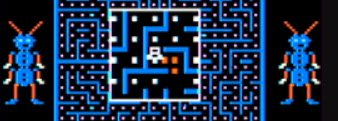

# Mega-Bug Code

>>> cpu 6809

>>> memoryTable ram 
[RAM Usage](RAMUse.md)

>>> memoryTable hard 
[Hardware Info](../Hardware.md)

```html
<script src="/js/6809.js"></script>
<script src="/CoCo/Megabug/BinaryDataMegabug.js"></script>
<script src="/CoCo/Megabug/megabug.js"></script>
<script src="/js/TileEngine.js"></script>
<script src="/js/BinaryData.js"></script>
<script src="/js/CANVAS.js"></script>
```

```code
C000: 7E CF DE       JMP     $CFDE                          ; {Start} 
```

# Screen management

The game uses 3 screen buffers: 0400, 0C00, and 1C00. I modified the ISR to continually show each screen (no switching). Thus
I was able to see how they are being used.

In the splash mode (beginning of the game):
  * The splash message is drawn completely on 0400
  * The 1000 is blank except for a few pixels at the top left
  * The scroll bars and flashy color Mega-Bug are drawn completely on 1C00
  
In game mode:
  * The maze is drawn completely on 0400 along with the user's path
  * The users sees the graphics on 1000 and 1C00 alternately
  
In between rounds:
  * 0400 is blank
  * 1000 the entire message is printed on this screen
  * 1C00 shows the animations

# Data

Looks like data from here to the start at CFDE.

## "We Gotcha" voice samples

```code
WeGotchaSamples:
C003: 1C C0 91 00 B1 00 59 B4 A3 54 4A E5 94 52 71 9E 94 4D 9B 7E 8E 52 70 A4 71 7F 38 AD 97 4E 4A A1
C023: 7B 61 4A 98 8B 44 4C 9C 6B 63 49 A0 66 01 02 4F 65 80 75 53 4D 87 04 01 6C 58 58 72 77 4E 52 7B
C043: 76 56 4B 6B 76 5A 46 6E 74 01 04 56 44 65 85 52 0A 05 12 7F 87 4B 0B 0C 0D 7A 89 4A 0A 0C 0E 77
C063: 87 4C 0A 0C 0E 59 02 16 88 0D 04 36 09 0F 0F 53 04 14 10 03 72 0C 08 1E 01 13 06 10 06 5B 04 12
C083: 0A 0B 71 0C 08 34 06 0F 09 57 05 11 0A 0C 70 08 0D 32 08 10 08 16 09 33 05 10 0B 0C 70 07 0E 31
C0A3: 08 11 07 1A 01 34 05 11 0A 0D 70 06 0E 32 07 11 06 51 05 12 0A 0C 71 04 10 0E 08 1A 05 11 07 4F
C0C3: 05 10 0B 06 03 01 07 01 64 04 10 0D 05 1F 02 14 05 4E 05 10 0B 06 0E 01 66 02 10 0D 05 39 04 4D
C0E3: 05 10 0A 07 0E 01 66 02 10 0B 08 37 05 4B 05 0F 0B 06 0E 02 65 02 11 0B 08 37 05 4A 05 0F 0B 06
C103: 0E 02 7A 0C 07 38 04 49 04 10 0B 06 0E 02 7A 0C 07 86 04 10 0B 06 0E 02 7A 0B 09 84 04 10 0B 06
C123: 0F 01 5F 01 17 0B 08 83 05 10 09 08 0F 01 5F 01 16 0C 07 83 05 0F 08 09 0F 02 5E 01 16 0C 08 82
C143: 04 10 07 0A 0F 01 5E 02 16 0C 07 82 04 10 06 0A 0F 02 5D 02 16 0B 08 13 04 67 05 10 06 0B 0E 02
C163: 5E 01 16 0C 07 13 04 68 04 07 01 04 06 0B 0F 02 5D 02 16 0C 07 13 04 67 05 10 06 0A 0E 03 5D 02
C183: 16 0C 07 13 04 67 04 07 01 04 06 0B 0F 02 5D 02 15 08 0C 12 05 66 04 07 01 04 06 0C 0E 02 5D 02
C1A3: 15 08 0C 12 05 65 04 07 01 05 05 0C 0E 03 5C 02 11 0C 0B 13 04 13 04 4B 04 07 02 04 06 0B 0F 02
C1C3: 5C 02 12 0B 0C 14 02 13 04 4A 04 07 01 05 05 0C 0E 02 5E 01 11 0B 0C 2E 04 4A 03 07 01 05 05 0C
C1E3: 0E 03 5C 02 10 0C 0B 7F 04 06 02 05 04 0D 0E 02 5E 01 11 0B 0A 2F 03 4A 04 06 03 04 05 0C 0E 03
C203: 72 0B 0A 2F 03 4A 05 06 02 04 05 0C 0F 02 75 08 0A 30 01 4C 03 07 02 05 05 0B 0F 02 74 09 0B 2E
C223: 03 4C 04 07 02 04 05 0C 0E 02 75 08 0C 2E 01 4D 04 08 01 04 06 0B 0F 02 76 07 0C 15 01 67 04 07
C243: 02 04 06 0B 0E 03 06 01 6E 04 0E 12 04 13 03 4E 04 08 01 04 06 0C 0D 02 07 01 53 01 18 03 0E 11
C263: 05 13 03 4F 05 07 02 04 06 0D 0B 03 06 02 53 01 17 02 10 07 03 03 05 11 06 52 04 08 01 04 05 0E
C283: 0C 03 05 02 84 07 0F 0F 06 5A 02 08 03 03 05 0C 0C 05 05 02 67 01 17 06 0E 11 07 13 04 12 01 33
C2A3: 01 08 01 19 0B 04 08 01 94 01 05 0D 05 17 01 13 01 6C 06 08 01 06 A4 03 0C 11 08 A6 EC AC 00 01
C2C3: A5 F1 BC E5 B6 DA C2 F1 C5 F6 C4 E2 DD EB D6 00 14 F2 E4 F9 F8 00 08 EF 00 1C 00 12 00 07 00 00
C2E3: 00 00 00 00 00 00 00 00 00 00 00 A0 07 05 04 0A 07 08 04 07 06 17 01 0D 04 0A 04 04 0B 02 05 05
C303: 0B 03 06 03 03 06 01 05 16 04 04 03 10 02 05 05 01 02 04 04 04 20 01 06 03 0F 03 06 02 01 01 01
C323: 01 01 07 08 06 06 04 07 06 08 05 06 05 05 0B 05 04 06 07 0A 01 05 0B 19 02 09 08 03 05 09 05 0A
C343: 01 0A 04 03 0C 06 03 06 19 09 06 02 0D 10 13 11 14 0E 3B 01 0C 4A 59 5F 73 08 11 0B 23 76 09 03
C363: 31 56 7E 58 4C 5C AB 4A 45 4B 44 16 5E 44 34 41 2F 38 7A 43 2A 41 25 35 8A 36 32 36 2B 33 34 18
C383: 42 28 31 04 05 33 2E 29 38 13 04 03 3B 26 34 2C 34 2D 30 1D 43 26 35 2B 32 2B 24 1D 4C 24 35 2C
C3A3: 2E 2B 25 1D 49 25 33 2E 21 36 22 19 4E 23 30 27 28 37 21 18 4C 22 20 04 08 2A 25 38 1A 1C 4C 21
C3C3: 1C 0A 03 2A 26 31 1D 20 46 21 1B 0A 04 2B 24 2E 20 1E 45 20 1A 0C 03 2C 23 2C 20 19 47 20 1A 0D
C3E3: 01 2D 22 1F 2D 19 45 21 19 0D 01 2D 20 1F 1E 25 47 20 18 0E 02 2D 1E 1D 24 25 42 21 17 0E 01 2E
C403: 1D 1D 23 23 43 21 17 0D 02 2D 1C 1E 22 25 40 20 17 0E 02 2D 1B 1F 22 24 3F 20 16 10 01 19 01 0F
C423: 1A 20 20 24 3E 20 16 2C 03 0E 1B 1F 1F 23 40 20 16 2B 04 0E 19 1F 20 22 40 1F 16 2C 02 0F 1C 20
C443: 1C 22 40 1F 15 40 1C 20 1C 02 02 1A 40 1F 15 3F 1C 21 23 1B 3E 20 16 06 08 2C 1E 20 25 1B 3A 20
C463: 28 2B 1E 28 24 18 37 21 29 2B 1F 1F 01 05 23 18 35 22 2E 03 03 1F 04 02 13 0D 02 22 1B 13 3A 21
C483: 37 29 08 03 18 20 1E 04 47 22 37 2B 06 06 18 1C 11 01 5A 34 28 34 27 20 01 04 56 34 01 03 23 35
C4A3: 30 21 5B 32 33 39 2D 2B 04 05 4F 42 1B 01 04 03 04 43 41 0B 5C 03 05 06 04 85 33 14 05 0A 07 09
C4C3: 0D 0E 15 01 12 2F 2A 71 13 37 1C 2F 3A 53 3B 3C 0F 30 0F 81 69 2B 2B 34 2C 6A 25 28 28 2A 24 29
C4E3: 39 4E 26 36 35 42 37 31 2B 3A AF 93 2F 47 30 98 A5 93 22 34 22 BB 29 19 2B 11 05 92 04 11 12 0F
C503: 07 4D 18 03 05 17 05 01 04 08 03 08 10 0F 03 10 02 06 02 16 05 01 06 17 06 2A 06 0A 04 1F 04 13
C523: 0A 10 02 28 04 0D 0B 0B 06 01 04 07 1E 0F 06 11 03 0A 05 05 04 05 02 05 04 06 04 09 06 0E 08 06
C543: 05 0A 03 04 03 05 04 0A 04 07 0A 05 02 05 02 04 07 06 05 05 02 0A 03 06 04 09 0A 06 07 07 0A 07
C563: 04 18 01 05 05 07 04 05 02 07 0D 06 02 03 04 0C 04 0F 04 06 04 07 04 05 03 06 06 04 05 07 05 06
C583: 04 05 03 07 05 0E 05 06 03 05 03 07 06 06 03 05 08 09 06 01 05 0C 05 03 02 07 03 05 04 08 03 06
C5A3: 06 06 03 05 05 06 04 04 05 0C 05 04 03 05 03 05 04 0B 03 04 02 09 05 0E 04 08 05 06 03 08 04 04
C5C3: 05 06 03 05 04 06 01 04 01 04 04 05 02 0B 04 09 06 0D 02 0B 05 05 03 05 0A 06 05 04 07 06 04 05
C5E3: 03 06 07 08 0D 07 06 06 03 05 05 06 03 04 05 0C 05 06 05 07 06 06 03 04 04 07 02 05 04 0E 04 04
C603: 03 07 06 04 04 05 06 08 04 05 08 06 04 05 05 05 05 04 04 06 02 05 06 09 05 07 06 05 04 07 05 05
C623: 04 05 03 02 0C 05 04 06 05 0C 08 06 05 0F 06 05 02 05 09 04 03 06 04 0D 01 05 03 04 03 04 04 0B
C643: 0B 02 02 04 05 03 04 05 04 01 03 08 06 04 01 08 06 04 01 06 06 05 05 07 01 01 03 05 05 06 03 08
C663: 05 05 03 08 08 0B 05 07 05 06 05 06 03 05 05 11 08 05 06 11 05 05 04 06 06 09 05 05 01 07 05 05
C683: 06 0B 02 07 0E 05 05 09 03 04 03 04 03 04 01 04 03 04 03 05 08 06 0C 07 05 05 04 05 02 04 08 09
C6A3: 03 07 06 06 04 04 05 07 05 02 04 07 03 0A 04 05 02 05 03 04 05 02 01 06 04 04 05 05 03 07 07 05
C6C3: 03 0A 04 04 04 05 01 04 01 04 04 0C 02 05 04 07 05 06 04 03 05 05 04 06 05 0B 04 04 04 07 06 05
C6E3: 04 06 05 06 04 07 05 06 06 05 03 05 06 06 03 06 06 04 05 07 05 06 06 03 03 06 04 04 04 05 03 04
C703: 03 05 02 05 0C 0A 02 02 03 05 08 0D 0A 0D 05 04 02 06 02 03 04 0B 05 0C 03 04 03 05 03 04 04 0C
C723: 09 06 04 05 04 05 03 04 03 05 03 07 04 06 07 03 03 05 02 04 02 03 03 04 04 05 0A 0D 03 05 03 0B
C743: 05 0B 04 05 04 02 03 05 04 09 05 06 01 05 02 05 03 04 02 05 04 0A 02 0A 05 0D 01 0D 06 0C 0A 07
C763: 03 04 03 05 04 05 05 05 04 05 0E 03 03 0C 07 02 0B 04 05 03 15 03 06 03 19 04 05 82 04 04 04 05
C783: 8D 01 1F 09 03 06 03 4D 05 0C 1C 22 03 1E 08 12 66 63 3D 47 07 0F 5E 5A 48 45 79 44 06 0E 31 58
C7A3: 7C 44 0F 06 2D 42 04 12 7F 44 10 04 2E 44 02 11 83 45 10 03 2F 4B 07 03 86 46 46 49 94 47 47 47
C7C3: 98 48 45 46 32 0A 0F 01 48 48 44 3E 30 2A 4B 48 38 43 33 2E 50 46 34 3C 3D 2B 5B 45 32 3C 33 34
C7E3: 67 41 2F 42 2C 38 73 3D 31 3F 2D 36 7A 3D 32 3C 2D 36 31 0A 43 39 31 40 2D 36 32 11 42 35 34 3C
C803: 2F 34 31 19 44 33 37 33 37 32 33 19 48 2F 3A 31 39 2D 37 20 49 25 05 02 39 2F 3B 2C 39 21 4C 26
C823: 44 2E 3A 2D 38 25 4F 29 42 2F 39 2E 34 2B 53 29 40 2F 38 2F 32 2E 5A 2B 3D 30 38 30 2F 32 5E 2C
C843: 3C 30 36 32 2B 35 66 2C 3B 2F 31 38 28 38 6F 2B 3A 30 2A 3E 28 38 7A 2A 2D 04 06 30 27 40 25 2F
C863: 91 28 2B 3F 28 3F 26 2F 99 29 2C 08 06 2C 27 41 23 2D 34 11 5D 2A 3E 2B 29 41 24 2D A8 2B 30 39
C883: 28 3E 27 2D 28 1F 6D 2D 3A 2E 29 3B 29 2D 31 1B 6E 2E 32 35 2A 3B 28 30 29 23 76 2E 31 36 2A 38
C8A3: 2C 2F 2B 1D 7F 2F 2E 39 29 37 2D 2E 2C 2A 7B 2D 2C 3B 29 34 32 2E 29 2F 85 2B 29 3F 28 32 35 2F
C8C3: 2B 2D 90 2B 2A 3F 28 33 33 31 2D 38 94 2A 2A 3F 27 35 32 30 2C 33 AE 2F 2D 39 29 34 32 32 2F 30
C8E3: C2 2F 2C 3C 29 35 32 30 2F 34 D1 2F 29 41 28 34 35 31 2F 35 D6 31 29 40 27 2C 3A 31 26 30 24 1D
C903: B8 30 26 45 23 2A 38 31 23 66 DE 2D 25 45 20 2D 30 38 00 17 01 1E 01 03 17 1F 33 1A 5C 10 69 27
C923: 25 D4 10 42 1D 24 53 05 D6 E2 09 2C 18 0D 01 0C 00 5B D8 05 09 0B 22 46 05 14 02 3A 1D C0 00 18
C943: 09 43 27 0D 10 08 50 07 EE 00 35 0B 1D 69 03 00 53 00 51 00 00 18 00 3F 00 00 87 00 3C 
```

## Player graphics 
6 bytes per image, 2 images per direction, 4 directions

```html
<canvas width="300" height="160"
        data-labelColor="#F00000"
        data-canvasFunction="TileEngine.handleTileCanvas"
        data-getTileDataFunction="Megabug.getPlayer"
        data-pixWidth="8"
        data-gridX="8"
        data-gridY="9"
        data-pixHeight="8"
        data-gap="0.25"
        data-gridPad="1"
        data-colorsName="SmallBugs"
        data-colors='["#404040","#F0F0F0"]'
        data-gridX="4"
        data-gridY="2"
        data-address="C960"
        data-command="0,+x,1,+x,2,+x,3,*,+y,
                      4,+x,5,+x,6,+x,7">
</canvas>
```

```code
PlayerGraphics:
C960: F8 A8 0C 0C A8 F8
; #####...
; #.#.#...
; ....##..
; ....##..
; #.#.#...
; #####...
 
C966: CC 84 CC 84 FC 30
; ##..##..
; #....#..
; ##..##..
; #....#..
; ######..
; ..##....
 
C96C: 7C 54 C0 C0 54 7C 
; .#####..
; .#.#.#..
; ##......
; ##......
; .#.#.#..
; .#####..

C972: 30 FC 84 CC 84 CC
; ..##....
; ######..
; #....#..
; ##..##..
; #....#..
; ##..##..
            
C978: 18 F8 AC AC F8 18
; ...##...
; #####...
; #.#.##..
; #.#.##..
; #####...
; ...##...
 
C97E: 78 48 78 CC FC 30 
; .####...
; .#..#...
; .####...
; ##..##..
; ######..
; ..##....

C984: 60 7C D4 D4 7C 60
; .##.....
; .#####..
; #.##.#..
; #.##.#..
; .#####..
; .##.....
 
C98A: 30 FC CC 78 48 78
; ..##....
; ######..
; ##..##..
; .####...
; .#..#...
; .####...
```

## Bug Graphics
3 columns of 6 rows (18 bytes each). 4 pictures each with 4 shifts (16 total).

```html
<canvas width="450" height="250"
        data-labelColor=""
        data-canvasFunction="TileEngine.handleTileCanvas"
        data-getTileDataFunction="Megabug.getSmallBug"
        data-pixWidth="8"
        data-gridX="12"
        data-gridY="6"
        data-pixHeight="8"
        data-gap="0.25"
        data-gridPad="1"
        data-colorsName="SmallBugs"
        data-colors='["#404040","#007FFF","#FFC846","#C8F0FF"]'
        data-gridX="4"
        data-gridY="4"
        data-address="C990"
        data-command="0,+x,+x,1,+x,2,+x,3,*,+y,
                      4,+x,+x,5,+x,6,+x,7,*,+y,
                      8,+x,+x,9,+x,A,+x,B,*,+y,
                      C,+x,+x,D,+x,E,+x,F,*,+y">
</canvas>
```

```code
BugGraphics:
C990:  08 20 15 15 20 82
C996:  20 80 00 00 80 00
C99C:  00 00 00 00 00 00
; ..%..%......
; .%..%.......
; .###........
; .###........
; .%..%.......
; %..%........

C9A2:  02 08 05 05 08 20
C9A8:  08 20 40 40 20 80
C9AE:  00 00 00 00 00 00
; ...%..%.....
; ..%..%......
; ..###.......
; ..###.......
; ..%..%......
; .%..%.......

C9B4:  00 02 01 01 02 08
C9BA:  82 08 50 50 08 20
C9C0:  00 00 00 00 00 00
; ....%..%....
; ...%..%.....
; ...###......
; ...###......
; ...%..%.....
; ..%..%......

C9C6:  00 00 00 00 00 02
C9CC:  20 82 54 54 82 08
C9D2:  80 00 00 00 00 00
; .....%..%...
; ....%..%....
; ....###.....
; ....###.....
; ....%..%....
; ...%..%.....

C9D8:  80 20 15 95 20 00
C9DE:  00 80 20 00 80 20
C9E4:  00 00 00 00 00 00
; %...........
; .%..%.......
; .###.%......
; %###........
; .%..%.......
; .....%......

SplashBug1:
C9EA:  20 08 05 25 08 00
C9F0:  00 20 48 40 20 08
C9F6:  00 00 00 00 00 00
; .%..........
; ..%..%......
; ..###.%.....
; .%###.......
; ..%..%......
; ......%.....

C9FC:  08 02 01 09 02 00
CA02:  00 08 52 50 08 02
CA08:  00 00 00 00 00 00
; ..%.........
; ...%..%.....
; ...###.%....
; ..%###......
; ...%..%.....
; .......%....

CA0E:  02 00 00 02 00 00
CA14:  00 82 54 54 82 00
CA1A:  00 00 80 00 00 80
; ...%........
; ....%..%....
; ....###.%...
; ...%###.....
; ....%..%....
; ........%...

CA20:  82 20 15 15 20 08
CA26:  00 80 00 00 80 20
CA2C:  00 00 00 00 00 00
; %..%........
; .%..%.......
; .###........
; .###........
; .%..%.......
; ..%..%......

CA32:  20 08 05 05 08 02
CA38:  80 20 40 40 20 08
CA3E:  00 00 00 00 00 00
; .%..%.......
; ..%..%......
; ..###.......
; ..###.......
; ..%..%......
; ...%..%.....

CA44:  08 02 01 01 02 00
CA4A:  20 08 50 50 08 82
CA50:  00 00 00 00 00 00
; ..%..%......
; ...%..%.....
; ...###......
; ...###......
; ...%..%.....
; ....%..%....

CA56:  02 00 00 00 00 00
CA5C:  08 82 54 54 82 20
CA62:  00 00 00 00 00 80
; ...%..%.....
; ....%..%....
; ....###.....
; ....###.....
; ....%..%....
; .....%..%...

CA68:  00 20 95 15 20 80
CA6E:  20 80 00 20 80 00
CA74:  00 00 00 00 00 00
; .....%......
; .%..%.......
; %###........
; .###.%......
; .%..%.......
; %...........

SplashBug2:
CA7A:  00 08 25 05 08 20
CA80:  08 20 40 48 20 00
CA86:  00 00 00 00 00 00
; ......%.....
; ..%..%......
; .%###.......
; ..###.%.....
; ..%..%......
; .%..........

CA8C:  00 02 09 01 02 08
CA92:  02 08 50 52 08 00
CA98:  00 00 00 00 00 00
; .......%....
; ...%..%.....
; ..%###......
; ...###.%....
; ...%..%.....
; ..%.........

CA9E:  00 00 02 00 00 02
CAA4:  00 82 54 54 82 00
CAAA:  80 00 00 80 00 00
; ........%...
; ....%..%....
; ...%###.....
; ....###.%...
; ....%..%....
; ...%........
```

## Giant Bug Graphics

The bugs are defined as 32 rows by 5 columns (of 4 pixels) drawn column by column. Note that the
colors on the CoCo screen are blended together in spots.

```html
<canvas width="180" height="260"
        data-labelColor=""
        data-canvasFunction="TileEngine.handleTileCanvas"
        data-getTileDataFunction="Megabug.getGraphicsLargeBug"
        height="150"
        data-pixWidth="8"
        data-gridX="20"
        data-gridY="32"
        data-pixHeight="8"
        data-gap="0.25"
        data-gridPad="1"
        data-colorsName="LargeBug"
        data-colors='["#404040","#007FFF","#FFC846","#C8F0FF"]'
        data-command="CAB0">
</canvas>
<canvas width="180" height="260"
        data-command="CB50">
</canvas>
<canvas width="160" height="260"        
        data-command="CBF0">
</canvas>
```

```code
GraBugStanding:
CAB0: 00 00 00 00 00 00 00 00 00 00 00 00 00 00 00 00 01 07 00 00 00 00 01 07 00 00 00 00 00 00 00 01
CAD0: 20 08 02 00 00 00 01 05 01 01 00 00 14 21 21 21 E0 80 14 21 21 21 E1 81 02 02 02 02 02 02 15 54
CAF0: 00 00 00 80 20 51 55 75 55 50 55 11 55 51 55 51 55 11 55 55 51 55 51 55 95 00 00 00 00 00 00 00
CB10: 00 00 02 08 20 40 50 D4 50 50 40 00 45 50 50 50 41 00 45 50 50 50 51 50 28 08 08 08 08 08 15 05
CB30: 20 80 00 00 00 00 00 00 00 00 00 00 00 80 80 80 E0 78 00 80 80 80 E0 78 00 00 00 00 00 00 00 50
; .....$...........$..
; ......$.........$...
; .......$.......$....
; ........$.....$.....
; .........$...$......
; ........++.++.......
; .......+++++++......
; ......+++#++#++.....
; .......+++++++......
; .......+++..++......
; ........+++++.......
; .........+.+........
; .....++.+++++.++....
; .....$.+++.+++..$...
; .....$.+++++++..$...
; .....$.+++.+++..$...
; ...+#$..+++++..+#$..
; ..+#$....+.+....+#$.
; .....++.+++++.++....
; .....$.+++++++..$...
; .....$.+++.+++..$...
; .....$.+++++++..$...
; ...+#$.+++.+++.+#$..
; ..+#$..+++++++..+#$.
; .......$$+++.$$.....
; .......$......$.....
; .......$......$.....
; .......$......$.....
; .......$......$.....
; .......$......$.....
; .....+++.....+++....
; ...++++.......++++..  

GraBugJumping1:
CB50: 00 00 00 00 00 00 00 00 00 00 00 00 00 00 00 00 01 07 00 00 00 00 01 07 00 00 00 00 00 01 00 00
CB70: 20 08 02 00 00 00 01 05 01 01 00 00 14 21 21 21 E0 80 14 21 21 21 E1 81 02 02 02 02 15 54 00 00
CB90: 00 00 00 80 20 51 55 75 55 50 55 11 55 51 55 51 55 11 55 55 51 55 51 55 95 00 00 00 00 00 00 00
CBB0: 00 00 02 08 20 40 50 D4 51 50 40 00 45 50 51 50 40 00 45 50 50 50 50 50 28 08 08 08 08 08 15 05
CBD0: 20 80 00 00 00 00 00 78 E0 80 80 80 00 78 E0 80 80 80 00 00 00 00 00 00 00 00 00 00 00 00 00 50
; .....$...........$..
; ......$.........$...
; .......$.......$....
; ........$.....$.....
; .........$...$......
; ........++.++.......
; .......+++++++......
; ......+++#++#++.+#$.
; .......+++++++.+#$..
; .......+++..++..$...
; ........+++++...$...
; .........+.+....$...
; .....++.+++++.++....
; .....$.+++.+++..+#$.
; .....$.+++++++.+#$..
; .....$.+++.+++..$...
; ...+#$..+++++...$...
; ..+#$....+.+....$...
; .....++.+++++.++....
; .....$.+++++++......
; .....$.+++.+++......
; .....$.+++++++......
; ...+#$.+++.+++......
; ..+#$..+++++++......
; .......$$+++.$$.....
; .......$......$.....
; .......$......$.....
; .......$......$.....
; .....+++......$.....
; ...++++.......$.....
; .............+++....
; ..............++++..     

GraBugJumping2:
CBF0: 00 00 00 00 00 00 00 07 01 00 00 00 00 07 01 00 00 00 00 00 00 00 00 00 00 00 00 00 00 00 00 01
CC10: 02 08 02 00 00 00 01 B5 E1 21 20 20 14 81 E1 21 20 20 14 01 01 01 01 01 02 02 02 02 02 02 15 54
CC30: 00 00 00 80 20 51 55 75 55 50 55 11 55 51 55 51 55 11 55 55 51 55 51 55 95 00 00 00 00 00 00 00
CC50: 02 00 02 08 20 40 50 D4 50 50 40 00 45 50 50 50 41 00 45 50 50 50 51 50 28 08 08 08 15 05 00 00
CC70: 00 80 00 00 00 00 00 00 00 00 00 00 00 80 80 80 E0 78 00 80 80 80 E0 78 00 00 00 00 00 50 00 00
; .......$.......$....
; ......$.........$...
; .......$.......$....
; ........$.....$.....
; .........$...$......
; ........++.++.......
; .......+++++++......
; ..+#$#+++#++#++.....
; ...+#$.+++++++......
; .....$.+++..++......
; .....$..+++++.......
; .....$...+.+........
; .....++.+++++.++....
; ..+#$..+++.+++..$...
; ...+#$.+++++++..$...
; .....$.+++.+++..$...
; .....$..+++++..+#$..
; .....$...+.+....+#$.
; .....++.+++++.++....
; .......+++++++..$...
; .......+++.+++..$...
; .......+++++++..$...
; .......+++.+++.+#$..
; .......+++++++..+#$.
; .......$$+++.$$.....
; .......$......$.....
; .......$......$.....
; .......$......$.....
; .......$.....+++....
; .......$......++++..
; .....+++............
; ...++++.............
```

## La Cucaracha Song

39 notes (including rests)

```code
NotesSplash:
CC90: 06 0A 10 2D 00 00           
CC96: 06 0A 10 2D 00 00   
CC9C: 06 0A 10 2D 00 00           
CCA2: 18 2B 15 98 0D 99 
CCA8: 06 0A 1B 35 10 2D 
CCAE: 06 0A 00 00 00 00 
CCB4: 06 0A 10 2D 00 00 
CCBA: 06 0A 10 2D 00 00 
CCC0: 06 0A 10 2D 00 00 
CCC6: 18 2B 15 98 0D 99 
CCCC: 06 0A 1B 35 10 2D 
CCD2: 1E 35 00 00 00 00 
CCD8: 06 0A 15 98 0D 99 
CCDE: 06 0A 15 98 0D 99 
CCE4: 06 0A 14 60 0C 19                     
CCEA: 06 0A 14 60 0C 19
CCF0: 06 0A 12 27 0A CB 
CCF6: 06 0A 12 27 0A CB 
CCFC: 18 2B 10 2D 0A 2F 
CD02: 06 0A 00 00 00 00 
CD08: 06 0A 10 2D 00 00 
CD0E: 06 0A 10 2D 00 00 
CD14: 06 0A 10 2D 00 00 
CD1A: 18 2B 14 60 0C 19         
CD20: 06 0A 18 35 10 2D 
CD26: 06 0A 00 00 00 00 
CD2C: 06 0A 10 2D 00 00 
CD32: 06 0A 10 2D 00 00 
CD38: 06 0A 10 2D 00 00 
CD3E: 18 2B 14 60 0C 19
CD44: 06 0A 18 35 10 2D 
CD4A: 1E 35 00 00 00 00 
CD50: 06 0A 20 5B 14 60 
CD56: 06 0A 24 51 15 98 
CD5C: 06 0A 20 5B 14 60 
CD62: 06 0A 1C D2 12 27 
CD68: 06 0A 1B 35 10 2D 
CD6E: 06 0A 18 35 18 F4 
CD74: 06 0A 15 98 0D 99
```

## Character graphics

68 total characters:
  * 0-9
  * A-Z
  * a-z
  * <space>!-.:,
  
```html
<canvas width="720" height="560"
        data-labelColor="#F0F0F0"
        data-canvasFunction="TileEngine.handleTileCanvas"
        data-getTileDataFunction="Megabug.getCharacter"
        data-pixWidth="8"
        data-gridX="8"
        data-gridY="9"
        data-pixHeight="8"
        data-gap="0.25"
        data-gridPad="1"
        data-colorsName="SmallBugs"
        data-colors='["#404040","#007FFF","#FFC846","#C8F0FF"]'
        data-gridX="10"
        data-gridY="7"
        data-address="CD7A"
        data-command="0,+x,1,+x,2,+x,3,+x,4,+x,5,+x,6,+x,7,+x,8,+x,9,*,+y,
                      A,+x,B,+x,C,+x,D,+x,E,+x,F,+x,10,+x,11,+x,12,+x,13,*,+y,
                      14,+x,15,+x,16,+x,17,+x,18,+x,19,+x,1A,+x,1B,+x,1C,+x,1D,*,+y,
                      1E,+x,1F,+x,20,+x,21,+x,22,+x,23,+x,24,+x,25,+x,26,+x,27,*,+y,
                      28,+x,29,+x,2A,+x,2B,+x,2C,+x,2D,+x,2E,+x,2F,+x,30,+x,31,*,+y,
                      32,+x,33,+x,34,+x,35,+x,36,+x,37,+x,38,+x,39,+x,3A,+x,3B,*,+y,
                      3C,+x,3D,+x,3E,+x,3F,+x,40,+x,41,+x,42,+x,43,+x">
</canvas>
```

```code
GraChars:
CD7A:  70 88 98 A8 C8 88 70 00 00
; .###....
; #...#...
; #..##...
; #.#.#...
; ##..#...
; #...#...
; .###....
; ........
; ........

CD83:  20 60 20 20 20 20 70 00 00
; ..#.....
; .##.....
; ..#.....
; ..#.....
; ..#.....
; ..#.....
; .###....
; ........
; ........

CD8C:  70 88 08 30 40 80 F8 00 00
; .###....
; #...#...
; ....#...
; ..##....
; .#......
; #.......
; #####...
; ........
; ........

CD95:  70 88 08 30 08 88 70 00 00
; .###....
; #...#...
; ....#...
; ..##....
; ....#...
; #...#...
; .###....
; ........
; ........

CD9E:  10 30 50 F8 10 10 10 00 00
; ...#....
; ..##....
; .#.#....
; #####...
; ...#....
; ...#....
; ...#....
; ........
; ........

CDA7:  F8 80 80 F0 08 08 F0 00 00
; #####...
; #.......
; #.......
; ####....
; ....#...
; ....#...
; ####....
; ........
; ........

CDB0:  70 88 80 F0 88 88 70 00 00
; .###....
; #...#...
; #.......
; ####....
; #...#...
; #...#...
; .###....
; ........
; ........

CDB9:  F8 88 10 10 20 20 20 00 00
; #####...
; #...#...
; ...#....
; ...#....
; ..#.....
; ..#.....
; ..#.....
; ........
; ........

CDC2:  70 88 88 70 88 88 70 00 00
; .###....
; #...#...
; #...#...
; .###....
; #...#...
; #...#...
; .###....
; ........
; ........

CDCB:  70 88 88 78 08 88 70 00 00
; .###....
; #...#...
; #...#...
; .####...
; ....#...
; #...#...
; .###....
; ........
; ........

CDD4:  20 50 88 F8 88 88 88 00 00
; ..#.....
; .#.#....
; #...#...
; #####...
; #...#...
; #...#...
; #...#...
; ........
; ........

CDDD:  F0 48 48 70 48 48 F0 00 00
; ####....
; .#..#...
; .#..#...
; .###....
; .#..#...
; .#..#...
; ####....
; ........
; ........

CDE6:  70 88 80 80 80 88 70 00 00
; .###....
; #...#...
; #.......
; #.......
; #.......
; #...#...
; .###....
; ........
; ........

CDEF:  F0 48 48 48 48 48 F0 00 00
; ####....
; .#..#...
; .#..#...
; .#..#...
; .#..#...
; .#..#...
; ####....
; ........
; ........

CDF8:  F8 80 80 F0 80 80 F8 00 00
; #####...
; #.......
; #.......
; ####....
; #.......
; #.......
; #####...
; ........
; ........

CE01:  F8 80 80 F0 80 80 80 00 00
; #####...
; #.......
; #.......
; ####....
; #.......
; #.......
; #.......
; ........
; ........

CE0A:  70 88 80 B8 88 88 70 00 00
; .###....
; #...#...
; #.......
; #.###...
; #...#...
; #...#...
; .###....
; ........
; ........

CE13:  88 88 88 F8 88 88 88 00 00
; #...#...
; #...#...
; #...#...
; #####...
; #...#...
; #...#...
; #...#...
; ........
; ........

CE1C:  F8 20 20 20 20 20 F8 00 00
; #####...
; ..#.....
; ..#.....
; ..#.....
; ..#.....
; ..#.....
; #####...
; ........
; ........

CE25:  38 10 10 10 10 90 60 00 00
; ..###...
; ...#....
; ...#....
; ...#....
; ...#....
; #..#....
; .##.....
; ........
; ........

CE2E:  88 90 A0 C0 A0 90 88 00 00
; #...#...
; #..#....
; #.#.....
; ##......
; #.#.....
; #..#....
; #...#...
; ........
; ........

CE37:  80 80 80 80 80 80 F0 00 00
; #.......
; #.......
; #.......
; #.......
; #.......
; #.......
; ####....
; ........
; ........

CE40:  88 D8 A8 A8 88 88 88 00 00
; #...#...
; ##.##...
; #.#.#...
; #.#.#...
; #...#...
; #...#...
; #...#...
; ........
; ........

CE49:  88 C8 C8 A8 98 98 88 00 00
; #...#...
; ##..#...
; ##..#...
; #.#.#...
; #..##...
; #..##...
; #...#...
; ........
; ........

CE52:  70 88 88 88 88 88 70 00 00
; .###....
; #...#...
; #...#...
; #...#...
; #...#...
; #...#...
; .###....
; ........
; ........

CE5B:  F0 88 88 F0 80 80 80 00 00
; ####....
; #...#...
; #...#...
; ####....
; #.......
; #.......
; #.......
; ........
; ........

CE64:  70 88 88 88 A8 90 68 00 00
; .###....
; #...#...
; #...#...
; #...#...
; #.#.#...
; #..#....
; .##.#...
; ........
; ........

CE6D:  F0 88 88 F0 A0 90 88 00 00
; ####....
; #...#...
; #...#...
; ####....
; #.#.....
; #..#....
; #...#...
; ........
; ........

CE76:  70 88 80 70 08 88 70 00 00
; .###....
; #...#...
; #.......
; .###....
; ....#...
; #...#...
; .###....
; ........
; ........

CE7F:  F8 A8 20 20 20 20 20 00 00
; #####...
; #.#.#...
; ..#.....
; ..#.....
; ..#.....
; ..#.....
; ..#.....
; ........
; ........

CE88:  88 88 88 88 88 88 70 00 00
; #...#...
; #...#...
; #...#...
; #...#...
; #...#...
; #...#...
; .###....
; ........
; ........

CE91:  88 88 88 88 50 50 20 00 00
; #...#...
; #...#...
; #...#...
; #...#...
; .#.#....
; .#.#....
; ..#.....
; ........
; ........

CE9A:  88 88 88 88 A8 A8 50 00 00
; #...#...
; #...#...
; #...#...
; #...#...
; #.#.#...
; #.#.#...
; .#.#....
; ........
; ........

CEA3:  88 88 50 20 50 88 88 00 00
; #...#...
; #...#...
; .#.#....
; ..#.....
; .#.#....
; #...#...
; #...#...
; ........
; ........

CEAC:  88 88 50 20 20 20 20 00 00
; #...#...
; #...#...
; .#.#....
; ..#.....
; ..#.....
; ..#.....
; ..#.....
; ........
; ........

CEB5:  F8 08 10 20 40 80 F8 00 00
; #####...
; ....#...
; ...#....
; ..#.....
; .#......
; #.......
; #####...
; ........
; ........

CEBE:  00 00 60 10 70 90 68 00 00
; ........
; ........
; .##.....
; ...#....
; .###....
; #..#....
; .##.#...
; ........
; ........

CEC7:  80 80 F0 88 88 88 F0 00 00
; #.......
; #.......
; ####....
; #...#...
; #...#...
; #...#...
; ####....
; ........
; ........

CED0:  00 00 70 88 80 88 70 00 00
; ........
; ........
; .###....
; #...#...
; #.......
; #...#...
; .###....
; ........
; ........

CED9:  08 08 78 88 88 88 78 00 00
; ....#...
; ....#...
; .####...
; #...#...
; #...#...
; #...#...
; .####...
; ........
; ........

CEE2:  00 00 70 88 F8 80 70 00 00
; ........
; ........
; .###....
; #...#...
; #####...
; #.......
; .###....
; ........
; ........

CEEB:  20 50 40 E0 40 40 40 00 00
; ..#.....
; .#.#....
; .#......
; ###.....
; .#......
; .#......
; .#......
; ........
; ........

CEF4:  00 00 70 88 88 78 08 88 70
; ........
; ........
; .###....
; #...#...
; #...#...
; .####...
; ....#...
; #...#...
; .###....

CEFD:  80 80 B0 C8 88 88 88 00 00
; #.......
; #.......
; #.##....
; ##..#...
; #...#...
; #...#...
; #...#...
; ........
; ........

CF06:  20 00 60 20 20 20 70 00 00
; ..#.....
; ........
; .##.....
; ..#.....
; ..#.....
; ..#.....
; .###....
; ........
; ........

CF0F:  20 00 60 20 20 20 20 A0 40
; ..#.....
; ........
; .##.....
; ..#.....
; ..#.....
; ..#.....
; ..#.....
; #.#.....
; .#......

CF18:  80 80 90 A0 C0 A0 90 00 00
; #.......
; #.......
; #..#....
; #.#.....
; ##......
; #.#.....
; #..#....
; ........
; ........

CF21:  60 20 20 20 20 20 70 00 00
; .##.....
; ..#.....
; ..#.....
; ..#.....
; ..#.....
; ..#.....
; .###....
; ........
; ........

CF2A:  00 00 D0 A8 A8 A8 A8 00 00
; ........
; ........
; ##.#....
; #.#.#...
; #.#.#...
; #.#.#...
; #.#.#...
; ........
; ........

CF33:  00 00 B0 C8 88 88 88 00 00
; ........
; ........
; #.##....
; ##..#...
; #...#...
; #...#...
; #...#...
; ........
; ........

CF3C:  00 00 70 88 88 88 70 00 00
; ........
; ........
; .###....
; #...#...
; #...#...
; #...#...
; .###....
; ........
; ........

CF45:  00 00 B0 C8 88 88 F0 80 80
; ........
; ........
; #.##....
; ##..#...
; #...#...
; #...#...
; ####....
; #.......
; #.......

CF4E:  00 00 68 98 88 98 68 08 08
; ........
; ........
; .##.#...
; #..##...
; #...#...
; #..##...
; .##.#...
; ....#...
; ....#...

CF57:  00 00 B0 C8 80 80 80 00 00
; ........
; ........
; #.##....
; ##..#...
; #.......
; #.......
; #.......
; ........
; ........

CF60:  00 00 70 80 70 08 70 00 00
; ........
; ........
; .###....
; #.......
; .###....
; ....#...
; .###....
; ........
; ........

CF69:  40 40 E0 40 40 50 20 00 00
; .#......
; .#......
; ###.....
; .#......
; .#......
; .#.#....
; ..#.....
; ........
; ........

CF72:  00 00 88 88 88 98 68 00 00
; ........
; ........
; #...#...
; #...#...
; #...#...
; #..##...
; .##.#...
; ........
; ........

CF7B:  00 00 88 88 88 50 20 00 00
; ........
; ........
; #...#...
; #...#...
; #...#...
; .#.#....
; ..#.....
; ........
; ........

CF84:  00 00 88 A8 A8 A8 50 00 00
; ........
; ........
; #...#...
; #.#.#...
; #.#.#...
; #.#.#...
; .#.#....
; ........
; ........

CF8D:  00 00 88 50 20 50 88 00 00
; ........
; ........
; #...#...
; .#.#....
; ..#.....
; .#.#....
; #...#...
; ........
; ........

CF96:  00 00 88 88 88 78 08 08 70
; ........
; ........
; #...#...
; #...#...
; #...#...
; .####...
; ....#...
; ....#...
; .###....

CF9F:  00 00 F8 10 20 40 F8 00 00
; ........
; ........
; #####...
; ...#....
; ..#.....
; .#......
; #####...
; ........
; ........

CFA8:  00 00 00 00 00 00 00 00 00
; ........
; ........
; ........
; ........
; ........
; ........
; ........
; ........
; ........

CFB1:  20 20 20 20 20 00 20 00 00
; ..#.....
; ..#.....
; ..#.....
; ..#.....
; ..#.....
; ........
; ..#.....
; ........
; ........

CFBA:  00 00 00 F8 00 00 00 00 00
; ........
; ........
; ........
; #####...
; ........
; ........
; ........
; ........
; ........

CFC3:  00 00 00 00 00 20 20 00 00
; ........
; ........
; ........
; ........
; ........
; ..#.....
; ..#.....
; ........
; ........

CFCC:  00 00 20 00 00 20 00 00 00
; ........
; ........
; ..#.....
; ........
; ........
; ..#.....
; ........
; ........
; ........

CFD5:  20 20 40 00 00 00 00 00 00
; ..#.....
; ..#.....
; .#......
; ........
; ........
; ........
; ........
; ........
; ........
```

# Start

```code            
Start:
CFDE: 12             NOP                     
CFDF: 10 CE 03 F0    LDS     #$03F0                         ; Stack starts here (builds towards 0000)
CFE3: 0F B3          CLR     <$B3                           ; {ram:HighScore} Clear ...
CFE5: 0F B4          CLR     <$B4                           ; {ram:HighScore} ... high score
CFE7: 0F B1          CLR     <$B1                           ; {ram:Score} Clear ...
CFE9: 0F B2          CLR     <$B2                           ; {ram:Score} ... current score
CFEB: 86 A5          LDA     #$A5                           ; Test value ...
CFED: B7 10 00       STA     $1000                          ; ... to 1000 (4K)
CFF0: 0F 00          CLR     <$00                           ; Clears 1000 if it ghosts
CFF2: A1 8D 40 0A    CMPA    $1000,PC                       ; Did we change the memory (and it isn't a ghost)?
CFF6: 27 1D          BEQ     $D015                          ; Yes ... we have enough memory to run
```

# Code bug 1

This next line should be "JSR $D2DE" to set the graphics mode. I tested with the
change and I get the error message. Otherwise the text screen shows garbage.

"D2DE" instead of "D2BE". Interesting that it is off by 32. Wasn't this assembled
by a tool that managed the addresses?

```code
CFF8: BD D2 BE       JSR     $D2BE                          ; BUG. This should be D2DE to set the graphics mode.
;
CFFB: CE 04 00       LDU     #$0400                         ; Start of the first ...
CFFE: DF 9E          STU     <$9E                           ; {ram:ScreenPtr} ... screen buffer
D000: BD D4 AE       JSR     $D4AE                          ; {Clear1200} Clear the screen
D003: 8E D2 A1       LDX     #$D2A1                         ; {!+Need16K} "16k or more memory is needed..." string
D006: EC 81          LDD     ,X++                           ; Reached end of message lines list?
D008: 27 FE          BEQ     $D008                          ; Yes ... just spin here forever (we can't run)
D00A: DD AB          STD     <$AB                           ; {ram:PixCoords} Store the coordinates
D00C: A6 80          LDA     ,X+                            ; Get color mask
D00E: 97 AD          STA     <$AD                           ; {ram:ColorMask} Store the color
D010: BD D6 FA       JSR     $D6FA                          ; {PrintMsg} Print message
D013: 20 F1          BRA     $D006                          ; Next message line

; Hold ENTER down for "pro mode" -- start with 16 bugs instead of the usual 8
D015: 86 FE          LDA     #$FE                           ; Column with ENTER key
D017: C6 08          LDB     #$08                           ; Game usually starts with 8 bugs 
D019: B7 FF 02       STA     $FF02                          ; {hard:PIA0_DB} Set the keyboard column
D01C: B6 FF 00       LDA     $FF00                          ; {hard:PIA0_DA} Read the rows
D01F: 84 40          ANDA    #$40                           ; Row with the ENTER key
D021: 26 02          BNE     $D025                          ; Not pressed ... start with 8 bugs
D023: C6 10          LDB     #$10                           ; Pressed ... start with 16 bugs
;
D025: D7 C5          STB     <$C5                           ; {ram:NumStartBugs} Number of bugs to start the game with
D027: BD D2 DE       JSR     $D2DE                          ; {SetGraphicsMode} Set the graphics mode
D02A: CE 04 00       LDU     #$0400                         ; Start of first screen buffer
D02D: BD D4 AE       JSR     $D4AE                          ; {Clear1200} Clear the first screen buffer
D030: 8E CF DE       LDX     #$CFDE                         ; {!+Start} Start routine
D033: 9F 72          STX     <$72                           ; The BASIC ROM warm-start vector
D035: 86 55          LDA     #$55                           ; Flag that reset should ...
D037: 97 71          STA     <$71                           ; ... jump to warm-start vector
D039: 1A 50          ORCC    #$50                           ; IRQ off
D03B: 8E D5 46       LDX     #$D546                         ; {!+IRQ} New IRQ ...
D03E: BF 01 0D       STX     $010D                          ; ... interrupt vector
D041: 0F C7          CLR     <$C7                           ; {ram:VisiblePage} (force setting on next interrupt)
D043: 86 04          LDA     #$04                           ; Display graphics page 400
D045: 97 92          STA     <$92                           ; {ram:RequestedPage} CURRENT VISIBILE PAGE
D047: 0F B6          CLR     <$B6                           ; {ram:ISRCountScore} 
D049: 0F C1          CLR     <$C1                           ; {ram:ShowingGame} We are NOT showing the game screen
D04B: 86 34          LDA     #$34                           ; Initialize ...
D04D: B7 FF 01       STA     $FF01                          ; {hard:PIA0_CA} ... PIA1 A ...
D050: B7 FF 21       STA     $FF21                          ; {hard:PIA1_CA} ... and PIA1 B
D053: 8A 08          ORA     #$08                           ; Enable ...
D055: A7 8D 2E CA    STA     $FF23,PC                       ; ... six-bit sound
D059: 86 35          LDA     #$35                           ; Enable ...
D05B: B7 FF 03       STA     $FF03                          ; {hard:PIA0_CB} ... 60ms interrupt
D05E: 3C EF          CWAI    $EF                            ; Wait for the first interrupt

SplashMode:
D060: 10 CE 03 F0    LDS     #$03F0                         ; Set stack just below 1st screen 
D064: 0F C1          CLR     <$C1                           ; {ram:ShowingGame} We are NOT showing the game screen
D066: 0F B1          CLR     <$B1                           ; {ram:Score} Initialize current score ...
D068: 0F B2          CLR     <$B2                           ; {ram:Score} ... to zero
D06A: 0F B9          CLR     <$B9                           ; {ram:DrawCountSecs} Don't draw the seconds-count
D06C: 0F B8          CLR     <$B8                           ; {ram:DrawScore} Don't draw the score
D06E: 0F B7          CLR     <$B7                           ; {ram:ISRCountTime} Initialize 1 sec timer for TIME display
D070: 0F B6          CLR     <$B6                           ; {ram:ISRCountScore} Initialize 1 sec timer for losing a point
D072: 0F C6          CLR     <$C6                           ; {ram:PlayShortSong} We have not played the full song
D074: 96 C5          LDA     <$C5                           ; {ram:NumStartBugs} Number of bugs to start the game (8 or 16)
D076: 97 A0          STA     <$A0                           ; {ram:NumBugs} Initialize the number of bugs
D078: CE 10 00       LDU     #$1000                         ; Start buffer 1000 as the ... 
D07B: DF 9C          STU     <$9C                           ; {ram:VisibleScreenPtr} ... screen to show while drawing
D07D: CC 1C 00       LDD     #$1C00                         ; Start buffer 1C00 as the ...
D080: DD 9A          STD     <$9A                           ; {ram:DrawingScreenPtr} ... screen to draw on
D082: BD DB 6D       JSR     $DB6D                          ; {CopyScreen} Copy screen 0400 to 1C00 and show 1C00
D085: CE 04 00       LDU     #$0400                         ; Clear the ...
D088: BD D4 AE       JSR     $D4AE                          ; {Clear1200} ... first screen buffer
D08B: 8E D5 EF       LDX     #$D5EF                         ; {!+StrsCredits} Pointer to the credits strings
D08E: EC 81          LDD     ,X++                           ; Get the screen coordinates for the next string?
D090: 27 10          BEQ     $D0A2                          ; All done ... play the music
D092: DD AB          STD     <$AB                           ; {ram:PixCoords} Store the coords
D094: A6 80          LDA     ,X+                            ; And the ...
D096: 97 AD          STA     <$AD                           ; {ram:ColorMask} ... color mask
D098: CC 04 00       LDD     #$0400                         ; Drawing to ...
D09B: DD 9E          STD     <$9E                           ; {ram:ScreenPtr} ... the first screen buffer
D09D: BD D6 FA       JSR     $D6FA                          ; {PrintMsg} Print the next string
D0A0: 20 EC          BRA     $D08E                          ; Go back and print all the credit strings
;
D0A2: 86 01          LDA     #$01                           ; Scroll the text ...
D0A4: BD DE 01       JSR     $DE01                          ; {WhiteLineScroll} ... outside to inside
D0A7: 86 FF          LDA     #$FF                           ; Set the color mask ...
D0A9: 97 AD          STA     <$AD                           ; {ram:ColorMask} ... to white
D0AB: CE CC 90       LDU     #$CC90                         ; {!+NotesSplash} Song table
D0AE: C6 27          LDB     #$27                           ; 39 notes (including rests) in the song
D0B0: D7 98          STB     <$98                           ; {ram:Temp2} Note counter
D0B2: BD D5 01       JSR     $D501                          ; {CheckSpaceOrButton} User pressed space or joystick button?
D0B5: 25 1D          BCS     $D0D4                          ; {LiveGame} Yes ... break out to play game
D0B7: EC C4          LDD     ,U                             ; Get duration
D0B9: 27 10          BEQ     $D0CB                          ; It never is 0000 in our table. Skip printing for whatever reason.
D0BB: 8E D5 EF       LDX     #$D5EF                         ; {!+StrsCredits} "Mega-Bug" text
D0BE: DC 9A          LDD     <$9A                           ; {ram:DrawingScreenPtr} The screen buffer ...
D0C0: DD 9E          STD     <$9E                           ; {ram:ScreenPtr} ... to draw on
D0C2: EC 81          LDD     ,X++                           ; Destination of "Mega-Bug" string
D0C4: DD AB          STD     <$AB                           ; {ram:PixCoords} 
D0C6: 30 01          LEAX    1,X                            ; Skip over color mask
D0C8: BD D6 F4       JSR     $D6F4                          ; {PrintMsgChgCol} Print with alternating colors
D0CB: BD D7 3F       JSR     $D73F                          ; {PlayTwoNotes} Play dual note
D0CE: 0A 98          DEC     <$98                           ; {ram:Temp2} All notes played?
D0D0: 26 E0          BNE     $D0B2                          ; No ... keep playing notes
D0D2: 20 52          BRA     $D126                          ; Time for the demo game

LiveGame: 
D0D4: 86 FF          LDA     #$FF                           ; This is a ...
D0D6: 97 B5          STA     <$B5                           ; {ram:LiveOrDemo} ... live-player game
D0D8: BD DB 6D       JSR     $DB6D                          ; {CopyScreen} Copy screen 0400 to 1C00 and show 1C00
D0DB: 4F             CLRA                                   ; 0 minutes
D0DC: 5F             CLRB                                   ; 0 seconds
D0DD: DD AF          STD     <$AF                           ; {ram:NumMinutes} Initialize game time to 00:00
D0DF: DD B1          STD     <$B1                           ; {ram:Score} Initialize score to 0000
D0E1: CE 04 00       LDU     #$0400                         ; Clear ...
D0E4: BD D4 AE       JSR     $D4AE                          ; {Clear1200} ... first screen buffer
;
LiveGameLoop:
D0E7: CC 05 21       LDD     #$0521                         ; (5,33) 5 rows down, 33 pixels across
D0EA: DD AB          STD     <$AB                           ; {ram:PixCoords} 
D0EC: CC 04 00       LDD     #$0400                         ; Drawing on ...
D0EF: DD 9E          STD     <$9E                           ; {ram:ScreenPtr} ... first screen buffer
D0F1: 86 AA          LDA     #$AA                           ; Set ...
D0F3: 97 AD          STA     <$AD                           ; {ram:ColorMask} ... message color
D0F5: 8E D5 E8       LDX     #$D5E8                         ; {!+StrTime} Pointer to string "Time:_"
D0F8: BD D6 FA       JSR     $D6FA                          ; {PrintMsg} Print "Time:_"
D0FB: 96 AF          LDA     <$AF                           ; {ram:NumMinutes} Number of minutes
D0FD: BD D6 D7       JSR     $D6D7                          ; {PrintTwoDigits} print minutes
D100: 86 42          LDA     #$42                           ; Colon
D102: BD D6 79       JSR     $D679                          ; {PrintChar} print colon in time
D105: 96 AC          LDA     <$AC                           ; {ram:PixCoords} Next ...
D107: 8B 06          ADDA    #$06                           ; ... screen location to ...
D109: 97 AC          STA     <$AC                           ; {ram:PixCoords} ... the right
D10B: 96 B0          LDA     <$B0                           ; {ram:NumSeconds} Number of seconds
D10D: BD D6 D7       JSR     $D6D7                          ; {PrintTwoDigits} print seconds
D110: CC 54 21       LDD     #$5421                         ; (84,33) 84 rows down, 33 pixels across
D113: DD AB          STD     <$AB                           ; {ram:PixCoords} Screen coordinates
D115: 8E D5 E0       LDX     #$D5E0                         ; {!+StrScore} Message string
D118: BD D6 FA       JSR     $D6FA                          ; {PrintMsg} Print "Score:_"
D11B: 9E B1          LDX     <$B1                           ; {ram:Score} Print ...
D11D: BD D6 CB       JSR     $D6CB                          ; {PrintFourDigits} ... the score
D120: 86 C0          LDA     #$C0                           ; Initial maze "loopiness" ...
D122: 97 C0          STA     <$C0                           ; {ram:MazeLoopiness} ... as levels progress, they become more "dead-end-y"
D124: 20 38          BRA     $D15E                          ; Jump to game play

; Start demo game
D126: 0F B5          CLR     <$B5                           ; {ram:LiveOrDemo} This is a demo game
D128: BD DB 6D       JSR     $DB6D                          ; {CopyScreen} Copy screen 0400 to 1C00 and show 1C00
D12B: 8E 08 34       LDX     #$0834                         ; Number of passes in ...
D12E: 9F C3          STX     <$C3                           ; {ram:DemoTimer} ... demo game
D130: CE 04 00       LDU     #$0400                         ; Clear the ...
D133: BD D4 AE       JSR     $D4AE                          ; {Clear1200} ... first screen buffer
D136: 86 AA          LDA     #$AA                           ; Set the ...
D138: 97 AD          STA     <$AD                           ; {ram:ColorMask} ... color
D13A: CC 04 13       LDD     #$0413                         ; (4,19) 4 rows down, 19 pixels across
D13D: DD AB          STD     <$AB                           ; {ram:PixCoords} screen coords
D13F: CC 04 00       LDD     #$0400                         ; Use the first ...
D142: DD 9E          STD     <$9E                           ; {ram:ScreenPtr} ... screen buffer
D144: 8E D5 C2       LDX     #$D5C2                         ; {!+StrHighScore} "High Score" string
D147: BD D6 FA       JSR     $D6FA                          ; {PrintMsg} print "High Score"
D14A: 9E B3          LDX     <$B3                           ; {ram:HighScore} Get the high score
D14C: BD D6 CB       JSR     $D6CB                          ; {PrintFourDigits} Print 4 digits
D14F: CC 54 04       LDD     #$5404                         ;(84,4) 84 rows down, 4 pixels across
D152: DD AB          STD     <$AB                           ; {ram:PixCoords} Set coordinates
D154: 8E D5 CE       LDX     #$D5CE                         ; {!+StrPlayMega} "Play Mega-Bug" string
D157: BD D6 FA       JSR     $D6FA                          ; {PrintMsg} Print "Play Mega-Bug"
D15A: 86 C0          LDA     #$C0                           ; Initial maze "loopiness" ...
D15C: 97 C0          STA     <$C0                           ; {ram:MazeLoopiness} ... as levels progress, they become more "dead-end-y"
;
D15E: BD DB 6D       JSR     $DB6D                          ; {CopyScreen} Copy the visible screen to 1C00 and show it
D161: 0F B6          CLR     <$B6                           ; {ram:ISRCountScore} Once per second counter for score decrement
D163: 0F B7          CLR     <$B7                           ; {ram:ISRCountTime} Once per second counter for time increment
D165: 86 31          LDA     #$31                           ; Player starting Y coordinate 49
D167: C6 41          LDB     #$41                           ; Player starting X coordinate 65
D169: DD A2          STD     <$A2                           ; {ram:PlayerCoords} Set player coordinates
D16B: 0F A4          CLR     <$A4                           ; {ram:PlayerDir} Player direction (facing up)
D16D: BD D4 BD       JSR     $D4BD                          ; {PlaceBugs} Place the bugs in the maze
D170: BD DC 56       JSR     $DC56                          ; {DrawMaze} Draw the random maze
D173: 0F BA          CLR     <$BA                           ; {ram:MakeEatSound} 
D175: 8E 06 00       LDX     #$0600                         ; Copy ...
D178: CE 04 00       LDU     #$0400                         ; ... screen buffer 0400 ...
D17B: EC C4          LDD     ,U                             ; ... to ...
D17D: ED C9 0C 00    STD     $0C00,U                        ; ...
D181: ED C9 18 00    STD     $1800,U                        ; ...
D185: 33 42          LEAU    2,U                            ; ... screen 1000
D187: 30 1F          LEAX    -1,X                           ; ...
D189: 26 F0          BNE     $D17B                          ; ... and 1C00
D18B: 0F A1          CLR     <$A1                           ; {ram:MouthOpen} Mouth starts open
D18D: 0D B5          TST     <$B5                           ; {ram:LiveOrDemo} Live or demo?
D18F: 27 1F          BEQ     $D1B0                          ; Demo ... skip playing music
;
D191: C6 13          LDB     #$13                           ; Limited 19 notes
D193: 0D C6          TST     <$C6                           ; {ram:PlayShortSong} Have we already played this music?
D195: 26 02          BNE     $D199                          ; Yes ... use a shorter version
D197: C6 27          LDB     #$27                           ; No ... use the full version
D199: D7 98          STB     <$98                           ; {ram:Temp2} Number of notes to play
D19B: CE CC 90       LDU     #$CC90                         ; {!+NotesSplash} Splash music table
D19E: BD D7 3F       JSR     $D73F                          ; {PlayTwoNotes} Play a note from the song
D1A1: 8E 12 00       LDX     #$1200                         ; Long ...
D1A4: 30 1F          LEAX    -1,X                           ; ... delay ...
D1A6: 26 FC          BNE     $D1A4                          ; ... between notes
D1A8: 0A 98          DEC     <$98                           ; {ram:Temp2} Have we played all the notes?
D1AA: 26 F2          BNE     $D19E                          ; No ... go back for them all
D1AC: 86 FF          LDA     #$FF                           ; Note that we ...
D1AE: 97 C6          STA     <$C6                           ; {ram:PlayShortSong} ... have played the full song
; 
D1B0: BD DA 33       JSR     $DA33                          ; {DrawMagnifier} Draw the magnifier
D1B3: BD D4 A2       JSR     $D4A2                          ; {SwapScreenPointers} Swap screen pointers
D1B6: 97 92          STA     <$92                           ; {ram:RequestedPage} A set to same as 9C by swap
D1B8: 86 0F          LDA     #$0F                           ; Delay ...
D1BA: 13             SYNC                                   ; ... for ...
D1BB: 4A             DECA                                   ; ... 16 ...
D1BC: 26 FC          BNE     $D1BA                          ; Syncs
D1BE: 86 FF          LDA     #$FF                           ; This IS the ...
D1C0: 97 C1          STA     <$C1                           ; {ram:ShowingGame} ... main game screen display
D1C2: BD DF 70       JSR     $DF70                          ; 
D1C5: BD DB 1F       JSR     $DB1F                          ; 
D1C8: 03 A1          COM     <$A1                           ; {ram:MouthOpen} Change mouth (open or closed)
D1CA: 2A 03          BPL     $D1CF                          ; Don't move the bugs when mouth is open
D1CC: BD DE 7A       JSR     $DE7A                          ; {MoveBugs} Move the bugs
D1CF: BD DF 68       JSR     $DF68                          ; ?? Draw bugs
D1D2: BD D9 35       JSR     $D935                          ; ?? Move player
D1D5: DC BE          LDD     <$BE                           ; {ram:DotsLeft} How many dots are left to be eaten?
D1D7: 10 27 01 69    LBEQ    $D344                          ; {PlayerWins} None ... player wins
D1DB: 96 B8          LDA     <$B8                           ; {ram:DrawScore} Draw the score?
D1DD: 94 B5          ANDA    <$B5                           ; {ram:LiveOrDemo} Is this the demo game?
D1DF: 27 25          BEQ     $D206                          ; Either of those ... skip drawing score
;
; Draw score
D1E1: 86 AA          LDA     #$AA                           ; Score ...
D1E3: 97 AD          STA     <$AD                           ; {ram:ColorMask} ... color
D1E5: CC 54 4B       LDD     #$544B                         ; (84,75) 84 rows down, 75 pixels across
D1E8: DD AB          STD     <$AB                           ; {ram:PixCoords} Set coordinates
D1EA: DC 9A          LDD     <$9A                           ; {ram:DrawingScreenPtr} Draw on the ...
D1EC: DD 9E          STD     <$9E                           ; {ram:ScreenPtr} ... invisible screen
D1EE: 9E B1          LDX     <$B1                           ; {ram:Score} Current score
D1F0: BD D6 CB       JSR     $D6CB                          ; {PrintFourDigits} print score
D1F3: 0A B8          DEC     <$B8                           ; {ram:DrawScore} Need to draw the score?
D1F5: 27 0F          BEQ     $D206                          ; No ... skip it on the background
D1F7: CC 54 4B       LDD     #$544B                         ; Coordinates for ...
D1FA: DD AB          STD     <$AB                           ; {ram:PixCoords} ... the score
D1FC: CC 04 00       LDD     #$0400                         ; Draw on the ...
D1FF: DD 9E          STD     <$9E                           ; {ram:ScreenPtr} ... 1st screen buffer
D201: 9E B1          LDX     <$B1                           ; {ram:Score} Current score
D203: BD D6 CB       JSR     $D6CB                          ; {PrintFourDigits} print score
;
D206: 96 B9          LDA     <$B9                           ; {ram:DrawCountSecs} Flag to draw time ...
D208: 94 B5          ANDA    <$B5                           ; {ram:LiveOrDemo} ... and live/demo flag
D20A: 27 3B          BEQ     $D247                          ; Skip drawing the seconds-count
;
; Print time 
D20C: 86 AA          LDA     #$AA                           ; Set ...
D20E: 97 AD          STA     <$AD                           ; {ram:ColorMask} ... color
D210: CC 05 45       LDD     #$0545                         ; (5,69) 5 rows down, 69 pixels across
D213: DD AB          STD     <$AB                           ; {ram:PixCoords} set coords
D215: DC 9A          LDD     <$9A                           ; {ram:DrawingScreenPtr} Draw on the ...
D217: DD 9E          STD     <$9E                           ; {ram:ScreenPtr} ... invisible screen
D219: 96 AF          LDA     <$AF                           ; {ram:NumMinutes} Print ...
D21B: BD D6 D7       JSR     $D6D7                          ; {PrintTwoDigits} ... minutes
D21E: 96 AC          LDA     <$AC                           ; {ram:PixCoords} Next ...
D220: 8B 06          ADDA    #$06                           ; ... to ...
D222: 97 AC          STA     <$AC                           ; {ram:PixCoords} ... right
D224: 96 B0          LDA     <$B0                           ; {ram:NumSeconds} Print ...
D226: BD D6 D7       JSR     $D6D7                          ; {PrintTwoDigits} ... seconds
D229: 0A B9          DEC     <$B9                           ; {ram:DrawCountSecs} Need to draw the seconds-count?
D22B: 27 1A          BEQ     $D247                          ; No ... skip it
D22D: CC 05 45       LDD     #$0545                         ; Coordinates on the screen ...
D230: DD AB          STD     <$AB                           ; {ram:PixCoords} ... for the seconds-count
D232: CC 04 00       LDD     #$0400                         ; Draw on ...
D235: DD 9E          STD     <$9E                           ; {ram:ScreenPtr} ... 1st screen buffer
D237: 96 AF          LDA     <$AF                           ; {ram:NumMinutes} Print ...
D239: BD D6 D7       JSR     $D6D7                          ; {PrintTwoDigits} ... number of minutes
D23C: 96 AC          LDA     <$AC                           ; {ram:PixCoords} Skip to where ...
D23E: 8B 06          ADDA    #$06                           ; ... seconds are ...
D240: 97 AC          STA     <$AC                           ; {ram:PixCoords} ... printed
D242: 96 B0          LDA     <$B0                           ; {ram:NumSeconds} Print ...
D244: BD D6 D7       JSR     $D6D7                          ; {PrintTwoDigits} ... number of seconds
;
; 
D247: BD DA 33       JSR     $DA33                          ; {DrawMagnifier} Draw the magnifier
D24A: 0D BA          TST     <$BA                           ; {ram:MakeEatSound} 
D24C: 27 02          BEQ     $D250                          ; 
D24E: 0A BA          DEC     <$BA                           ; {ram:MakeEatSound} 
D250: BD D7 D8       JSR     $D7D8                          ; {DrawMouth} Draw the mouth
D253: BD D8 20       JSR     $D820                          ; {DrawBugs} 
D256: BD D4 A2       JSR     $D4A2                          ; {SwapScreenPointers} 
D259: 97 92          STA     <$92                           ; {ram:RequestedPage} 
D25B: 13             SYNC                                   ; Wait for screens to swap
D25C: DC A2          LDD     <$A2                           ; {ram:PlayerCoords} Player coordinates
D25E: DD 8E          STD     <$8E                           ; {ram:Temp1} The collision checker uses this temporary
D260: BD DF CC       JSR     $DFCC                          ; {CheckCollision} Did the player collide with a bug?
D263: 10 25 00 8C    LBCS    $D2F3                          ; {PlayerDied} Yes ... end of game
D267: 0D B5          TST     <$B5                           ; {ram:LiveOrDemo} Are we in demo mode?
D269: 27 1F          BEQ     $D28A                          ; Yes ... skip the pause
D26B: AD 9F A0 00    JSR     [$A000]                        ; {hard:POLCAT} Get a character from the keyboard
D26F: 81 03          CMPA    #$03                           ; BREAK?
D271: 10 27 FD EB    LBEQ    $D060                          ; {SplashMode} Yes ... jump to splash mode
D275: 81 0D          CMPA    #$0D                           ; ENTER?
D277: 10 26 FF 47    LBNE    $D1C2                          ; No ... back to top of game loop
D27B: 1A 50          ORCC    #$50                           ; Turn interrupts off
D27D: AD 9F A0 00    JSR     [$A000]                        ; {hard:POLCAT} Get a character from the keyboard
D281: 81 0D          CMPA    #$0D                           ; ENTER to un-pause?
D283: 26 F8          BNE     $D27D                          ; No ... keep waiting
D285: 1C EF          ANDCC   #$EF                           ; Re-enable interrupts
D287: 7E D1 C2       JMP     $D1C2                          ; Back to top of game loop
;
; We know we are in demo mode
D28A: BD D5 01       JSR     $D501                          ; {CheckSpaceOrButton} User wants to start a game?
D28D: 10 25 FE 43    LBCS    $D0D4                          ; {LiveGame} Yes ... start a live game
D291: 8E 08 00       LDX     #$0800                         ; Short ...
D294: 30 1F          LEAX    -1,X                           ; ... ...
D296: 26 FC          BNE     $D294                          ; ... delay
D298: 9E C3          LDX     <$C3                           ; {ram:DemoTimer} Time to end the demo game?
D29A: 10 27 FD C2    LBEQ    $D060                          ; {SplashMode} Yes ... back to the top of splash mode
D29E: 7E D1 C2       JMP     $D1C2                          ; No ... keep playing the demo game

Need16K:
D2A1: 0A 01 AA 
D2A4: 31 36 6B 20 6F 72 20 6D 6F 72 65 20 6F 66 20 6D 65 6D 6F 72 79 00
; 16k_or_more_of_memory
 
D2BA: 1E 0D 55
D2BD: 69 73 20 6E 65 65 64 65 64 20 74 6F 20 70 6C 61 79 00        
; is_needed_to_play

D2CF: 32 2A FF
D2D2: 4D 65 67 61 22 42 75 67 00 
; Mega-Bug

D2DB: 00 00 00 
```

# SetGraphicsMode

```code
SetGraphicsMode:
; 128x96 4 colors (4 pixels per byte)
D2DE: B7 FF C0       STA     $FFC0                          ; {hard:dispMode} V0 = 0
D2E1: B7 FF C2       STA     $FFC2                          ; {hard:dispMode} V1 = 0
D2E4: B7 FF C5       STA     $FFC5                          ; {hard:dispMode} V2 = 1
D2E7: B7 FF C7       STA     $FFC7                          ; {hard:dispOffset} F0 = 1
D2EA: B7 FF C8       STA     $FFC8                          ; {hard:dispOffset} F1 = 0
D2ED: 86 FF          LDA     #$FF                           ; VDG ...
D2EF: B7 FF 22       STA     $FF22                          ; {hard:PIA1_DB} ... all 1s
D2F2: 39             RTS                                    ; Done
```

# Player Died

When the player touches a bug, the code comes here.

```code
PlayerDied:
D2F3: 0F C1          CLR     <$C1                           ; {ram:ShowingGame} We are NOT showing the game screen
D2F5: BD D7 A7       JSR     $D7A7                          ; {PlayGotchaTone} Play the "we gotcha" tone
D2F8: 0D B5          TST     <$B5                           ; {ram:LiveOrDemo} Are we in demo mode (don't say "we gotcha")?
D2FA: 10 27 FD 62    LBEQ    $D060                          ; {SplashMode} Yes ... restart splash
D2FE: DC B1          LDD     <$B1                           ; {ram:Score} Is the current score ...
D300: 10 93 B3       CMPD    <$B3                           ; {ram:HighScore} ... a new high score
D303: 25 02          BCS     $D307                          ; No ... leave old high score
D305: DD B3          STD     <$B3                           ; {ram:HighScore} this is the new high score
D307: BD D7 7C       JSR     $D77C                          ; {PlayWeGotcha} Play "We Gotcha"
;
D30A: 86 04          LDA     #$04            
D30C: 97 92          STA     <$92                           ; {ram:RequestedPage} 
D30E: 86 0E          LDA     #$0E                           ; Set counter ...
D310: 97 98          STA     <$98                           ; {ram:Temp2} ... for 14 jumping animations
D312: CE CB 50       LDU     #$CB50                         ; {!+GraBugJumping1} Graphics first position
D315: 96 98          LDA     <$98                           ; {ram:Temp2} Is this an ...
D317: 84 01          ANDA    #$01                           ; ... even count?
D319: 27 03          BEQ     $D31E                          ; Yes ... use 1st graphics
D31B: CE CB F0       LDU     #$CBF0                         ; {!+GraBugJumping2} No ... use second graphics
D31E: BD D4 81       JSR     $D481                          ; {DrawLargeBugs} Draw the jumping bug
D321: 86 0A          LDA     #$0A                           ; Pause ...
D323: 13             SYNC                                   ; ... for ...
D324: 4A             DECA                                   ; ... 10 ...
D325: 26 FC          BNE     $D323                          ; ... interrupts
D327: 0A 98          DEC     <$98                           ; {ram:Temp2} Decrement the jump count
D329: 26 E7          BNE     $D312                          ; Do all jumps
D32B: CE CA B0       LDU     #$CAB0                         ; {!+GraBugStanding} Back to ...
D32E: BD D4 81       JSR     $D481                          ; {DrawLargeBugs} ... standing bug
;
; Give the user 3 seconds to start another game immediately. 
; Otherwise go back to the splash mode.
D331: 8E 01 2C       LDX     #$012C                         ; About 3 seconds
D334: 9F C3          STX     <$C3                           ; {ram:DemoTimer} Let the ISR count this down
D336: BD D5 01       JSR     $D501                          ; {CheckSpaceOrButton} User press button or space?
D339: 10 25 FD 97    LBCS    $D0D4                          ; {LiveGame} Yes ... start a live game
D33D: 9E C3          LDX     <$C3                           ; {ram:DemoTimer} Timer expired?
D33F: 26 F5          BNE     $D336                          ; No ... keep waiting
D341: 7E D0 60       JMP     $D060                          ; {SplashMode} Yes ... restart the splash mode

; Player wins
PlayerWins:
D344: 0F C1          CLR     <$C1                           ; {ram:ShowingGame} We are NOT showing the game screen
D346: BD DA 33       JSR     $DA33                          ; {DrawMagnifier} Why draw ...
D349: BD DA 33       JSR     $DA33                          ; {DrawMagnifier} ... the magnifier ...
D34C: BD DA 33       JSR     $DA33                          ; {DrawMagnifier} ... three times??
D34F: 86 04          LDA     #$04                           ; Switch to the ...
D351: 97 92          STA     <$92                           ; {ram:RequestedPage} ... first page (with the maze on it)
D353: 13             SYNC                                   ; Wait for the screen to change
D354: 8E 06 00       LDX     #$0600          
D357: CE 04 00       LDU     #$0400          
D35A: EC C1          LDD     ,U++            
D35C: ED C9 0B FE    STD     $0BFE,U         
D360: ED C9 17 FE    STD     $17FE,U         
D364: 30 1F          LEAX    -1,X            
D366: 26 F2          BNE     $D35A                          ; 
D368: 86 02          LDA     #$02            
D36A: 97 98          STA     <$98                           ; {ram:Temp2} 
D36C: 86 AA          LDA     #$AA            
D36E: 97 AD          STA     <$AD                           ; {ram:ColorMask} 
D370: 86 C0          LDA     #$C0            
D372: 97 88          STA     <$88                           ; {ram:BitPos} 
D374: DE 9A          LDU     <$9A                           ; {ram:DrawingScreenPtr} 
D376: 33 C9 01 C5    LEAU    $01C5,U         
D37A: 8E 05 C5       LDX     #$05C5          
D37D: 96 88          LDA     <$88                           ; {ram:BitPos} 
D37F: 94 AD          ANDA    <$AD                           ; {ram:ColorMask} 
D381: 97 89          STA     <$89                           ; {ram:BitPosSrc} 
D383: 86 43          LDA     #$43            
D385: 97 99          STA     <$99                           ; {ram:Temp3} 
D387: C6 16          LDB     #$16            
D389: A6 80          LDA     ,X+             
D38B: 88 55          EORA    #$55            
D38D: 94 88          ANDA    <$88                           ; {ram:BitPos} 
D38F: 26 06          BNE     $D397                          ; 
D391: 96 89          LDA     <$89                           ; {ram:BitPosSrc} 
D393: A8 C4          EORA    ,U              
D395: A7 C4          STA     ,U              
D397: 33 41          LEAU    1,U             
D399: 5A             DECB                    
D39A: 26 ED          BNE     $D389                          ; 
D39C: 30 0A          LEAX    10,X            
D39E: 33 4A          LEAU    10,U            
D3A0: 0A 99          DEC     <$99                           ; {ram:Temp3} 
D3A2: 26 E3          BNE     $D387                          ; 
D3A4: 04 88          LSR     <$88                           ; {ram:BitPos} 
D3A6: 04 88          LSR     <$88                           ; {ram:BitPos} 
D3A8: 26 CA          BNE     $D374                          ; 
D3AA: BD D4 A2       JSR     $D4A2                          ; {SwapScreenPointers} 
D3AD: 96 AD          LDA     <$AD                           ; {ram:ColorMask} 
D3AF: 8B 55          ADDA    #$55            
D3B1: 97 AD          STA     <$AD                           ; {ram:ColorMask} 
D3B3: 0A 98          DEC     <$98                           ; {ram:Temp2} 
D3B5: 26 B9          BNE     $D370                          ; 
D3B7: 86 04          LDA     #$04            
D3B9: 97 A5          STA     <$A5                           ; {ram:HorzDoubler} 
D3BB: C6 28          LDB     #$28            
D3BD: 96 A5          LDA     <$A5                           ; {ram:HorzDoubler} 
D3BF: 8B 0C          ADDA    #$0C            
D3C1: 81 28          CMPA    #$28            
D3C3: 25 02          BCS     $D3C7                          ; 
D3C5: 86 04          LDA     #$04            
D3C7: 97 A5          STA     <$A5                           ; {ram:HorzDoubler} 
D3C9: 97 92          STA     <$92                           ; {ram:RequestedPage} 
D3CB: 86 06          LDA     #$06            
D3CD: 13             SYNC                    
D3CE: 4A             DECA                    
D3CF: 26 FC          BNE     $D3CD                          ; 
D3D1: 5A             DECB                    
D3D2: 26 E9          BNE     $D3BD                          ; 
D3D4: 86 04          LDA     #$04            
D3D6: 97 92          STA     <$92                           ; {ram:RequestedPage} 
D3D8: 13             SYNC                    
D3D9: BD DB 6D       JSR     $DB6D                          ; {CopyScreen} Copy screen 0400 to 1C00 and show 1C00
D3DC: CE 04 00       LDU     #$0400          
D3DF: BD D4 AE       JSR     $D4AE                          ; {Clear1200} 
D3E2: 86 01          LDA     #$01                           ; Scroll the screen ...
D3E4: BD DE 01       JSR     $DE01                          ; {WhiteLineScroll} ... outside to inside
D3E7: 04 C0          LSR     <$C0                           ; {ram:MazeLoopiness} This make it tougher -- less loopy
D3E9: 96 A0          LDA     <$A0                           ; {ram:NumBugs} Number of bugs in the game
D3EB: 4C             INCA                                   ; Getting tougher ... one more bug
D3EC: 81 20          CMPA    #$20                           ; Max of 32 reached?
D3EE: 24 02          BCC     $D3F2                          ; Yes ... leave it at 32
D3F0: 97 A0          STA     <$A0                           ; {ram:NumBugs} New number of bugs
D3F2: CE 10 00       LDU     #$1000                         ; Using 2nd ...
D3F5: DF 9E          STU     <$9E                           ; {ram:ScreenPtr} ... screen buffer for drawing
D3F7: BD D4 AE       JSR     $D4AE                          ; {Clear1200} Clear the screen
D3FA: 8E D6 5A       LDX     #$D65A                         ; {!+StrNextTime} The "we'll getcha next time" string
D3FD: EC 81          LDD     ,X++                           ; Set the ...
D3FF: DD AB          STD     <$AB                           ; {ram:PixCoords} ... destination coordinates
D401: 27 09          BEQ     $D40C                          ; All strings printed ... move on
D403: A6 80          LDA     ,X+                            ; Set the ...
D405: 97 AD          STA     <$AD                           ; {ram:ColorMask} ... color mask
D407: BD D6 FA       JSR     $D6FA                          ; {PrintMsg} Print this message
D40A: 20 F1          BRA     $D3FD                          ; Go back for all messages
;
D40C: 86 01          LDA     #$01                           ; Start the line of bugs ...
D40E: 97 98          STA     <$98                           ; {ram:Temp2} ... on line 1
D410: 8E C0 00       LDX     #$C000                         ; ??
D413: 9F A5          STX     <$A5                           ; {ram:HorzDoubler} 
D415: 86 06          LDA     #$06                           ; Delay for ...
D417: 8D 4E          BSR     $D467                          ; {DelaySyncs} ... 6 interrupts (10th of a second)
D419: 8D 51          BSR     $D46C                          ; 
D41B: 96 98          LDA     <$98                           ; {ram:Temp2} Move the ...
D41D: 8B 02          ADDA    #$02                           ; ... bug line ...
D41F: 97 98          STA     <$98                           ; {ram:Temp2} ... down 2 pixels
D421: 81 59          CMPA    #$59                           ; All done?
D423: 24 0A          BCC     $D42F                          ; Yes ... move on
D425: BD DB B1       JSR     $DBB1                          ; {DrawSplashBugLine} Draw the line of bugs
D428: 03 A1          COM     <$A1                           ; {ram:MouthOpen} Flip between bug pictures each time
D42A: BD D5 27       JSR     $D527                          ; {SoundBugLine} Make the sound of the bugs moving
D42D: 20 E6          BRA     $D415                          ; Move the bugs all the way down the screen
;
D42F: 0F 98          CLR     <$98                           ; {ram:Temp2} Start the lone bug at Y=0??
D431: CC 28 5D       LDD     #$285D                         ; Location to print ...
D434: DD AB          STD     <$AB                           ; {ram:PixCoords} ... the "!"
D436: 86 FF          LDA     #$FF                           ; White ...
D438: 97 AD          STA     <$AD                           ; {ram:ColorMask} ... color
D43A: 86 3F          LDA     #$3F                           ; The "!" character
D43C: BD D6 79       JSR     $D679                          ; {PrintChar} print the "!"
D43F: 86 2D          LDA     #$2D                           ; Delay for ...
D441: BD D4 67       JSR     $D467                          ; {DelaySyncs} ... 3/4th second
D444: 86 02          LDA     #$02                           ; Delay for ...
D446: 8D 1F          BSR     $D467                          ; {DelaySyncs} ... two interrupts
D448: BD DB DD       JSR     $DBDD                          ; 
D44B: 96 98          LDA     <$98                           ; {ram:Temp2} 
D44D: 8B 02          ADDA    #$02            
D44F: 97 98          STA     <$98                           ; {ram:Temp2} 
D451: 81 58          CMPA    #$58            
D453: 24 0A          BCC     $D45F                          ; 
D455: BD DB E0       JSR     $DBE0                          ; 
D458: 03 A1          COM     <$A1                           ; {ram:MouthOpen} Next bug picture
D45A: BD D5 27       JSR     $D527                          ; {SoundBugLine} 
D45D: 20 E5          BRA     $D444                          ; 
;
D45F: 86 64          LDA     #$64                           ; Long 1.6 second ...
D461: BD D4 67       JSR     $D467                          ; {DelaySyncs} ... delay
D464: 7E D0 E7       JMP     $D0E7                          ; {LiveGameLoop} Back to the live game loop
```

# Delay for N syncs

```code
DelaySyncs:
D467: 13             SYNC                                   ; Wait for interrupt
D468: 4A             DECA                                   ; all syncs done?
D469: 26 FC          BNE     $D467                          ; {DelaySyncs} No ... keep syncing
D46B: 39             RTS                                    ; Done

D46C: 9E A5          LDX     <$A5                           ; {ram:HorzDoubler} ?? This starts at C000
D46E: C6 80          LDB     #$80            
D470: 6F 82          CLR     ,-X             
D472: 5A             DECB                    
D473: 26 FB          BNE     $D470                          ; 
D475: C6 40          LDB     #$40                           ; ?? This loop copies over the text from 0400.
D477: A6 89 F3 FF    LDA     $F3FF,X                        ; -3073
D47B: A7 82          STA     ,-X             
D47D: 5A             DECB                    
D47E: 26 F7          BNE     $D477                          ; 
D480: 39             RTS                     
```

# Draw large bugs

```code
; Draw large bugs on both sides of the screen

DrawLargeBugs:
D481: 8E 08 00       LDX     #$0800                         ; Start spot on screen
D484: 86 05          LDA     #$05                           ; Count five ...
D486: 97 99          STA     <$99                           ; {ram:Temp3} ... columns
D488: C6 20          LDB     #$20                           ; 32 rows
D48A: 34 10          PSHS    X                              ; Hold start of column
D48C: A6 C0          LDA     ,U+                            ; Get graphics data
D48E: A7 88 1B       STA     $1B,X                          ; Right side of screen
D491: A7 84          STA     ,X                             ; Left side of screen
D493: 30 88 20       LEAX    $20,X                          ; Next row
D496: 5A             DECB                                   ; All rows done?
D497: 26 F3          BNE     $D48C                          ; Do all 32 rows
D499: 35 10          PULS    X                              ; Start of column
D49B: 30 01          LEAX    1,X                            ; One column over
D49D: 0A 99          DEC     <$99                           ; {ram:Temp3} All 5 columns done?
D49F: 26 E7          BNE     $D488                          ; No ... do all columns
D4A1: 39             RTS                                    ; Done

SwapScreenPointers:
D4A2: 34 10          PSHS    X                              ; Preserve X
D4A4: DC 9A          LDD     <$9A                           ; {ram:DrawingScreenPtr} Swap ...
D4A6: 9E 9C          LDX     <$9C                           ; {ram:VisibleScreenPtr} ... 9A (drawing) ...
D4A8: DD 9C          STD     <$9C                           ; {ram:VisibleScreenPtr} ... and ...
D4AA: 9F 9A          STX     <$9A                           ; {ram:DrawingScreenPtr} ... 9C (visible)
D4AC: 35 90          PULS    X,PC                           ; Done
```

# Clear1200

```code
Clear1200:
; Clear $1200 bytes at X
D4AE: 34 10          PSHS    X                              ; Hold X
D4B0: 8E 06 00       LDX     #$0600                         ; $600 words ($1200 bytes)
D4B3: 4F             CLRA                                   ; 0 to ...
D4B4: 5F             CLRB                                   ; ... D
D4B5: ED C1          STD     ,U++                           ; Clear memory
D4B7: 30 1F          LEAX    -1,X                           ; All words done?
D4B9: 26 FA          BNE     $D4B5                          ; No ... do all
D4BB: 35 90          PULS    X,PC                           ; Restore X and out

PlaceBugs:
D4BD: 8E 28 08       LDX     #$2808                         ; Data on bugs (3 bytes each)
D4C0: 96 A0          LDA     <$A0                           ; {ram:NumBugs} Number of bugs to place
D4C2: 97 98          STA     <$98                           ; {ram:Temp2} Use this as a counter
D4C4: BD DD 52       JSR     $DD52                          ; {GetRandom} Get random Y coordinate
D4C7: 84 7C          ANDA    #$7C                           ; Power of 4 and no negatives
D4C9: 81 40          CMPA    #$40                           ; 64 ... height of maze
D4CB: 24 F7          BCC     $D4C4                          ; Out of bounds ... try again
D4CD: 8B 11          ADDA    #$11                           ; Offset to 1st row in maze
D4CF: A7 88 60       STA     $60,X                          ; Store bug's second set of X coordinate
D4D2: A7 84          STA     ,X                             ; Store bug's X coordinate
D4D4: BD DD 52       JSR     $DD52                          ; {GetRandom} Get random X coordinate
D4D7: 84 7C          ANDA    #$7C                           ; Power of 4 and no negatives
D4D9: 81 50          CMPA    #$50                           ; 80 ... width of maze
D4DB: 24 F7          BCC     $D4D4                          ; Out of bounds ... try again
D4DD: 8B 19          ADDA    #$19                           ; Offset to first column in maze
D4DF: A7 88 61       STA     $61,X                          ; Store bug's second set of Y coordinate
D4E2: A7 01          STA     1,X                            ; The bug's Y coordinate
D4E4: EC 84          LDD     ,X                             ; The bug coordinates we just set
D4E6: 90 A2          SUBA    <$A2                           ; {ram:PlayerCoords} Compare the Y to the player's Y
D4E8: 2A 01          BPL     $D4EB                          ; Absolute ...
D4EA: 40             NEGA                                   ; ... value
D4EB: 81 0A          CMPA    #$0A                           ; Too close to the player?
D4ED: 25 D5          BCS     $D4C4                          ; Yes ... try again
D4EF: D0 A3          SUBB    <$A3                           ; {ram:PlayerCoords} Compare the X to the player's X
D4F1: 2A 01          BPL     $D4F4                          ; Absolute ...
D4F3: 50             NEGB                                   ; ... value
D4F4: C1 0A          CMPB    #$0A                           ; Too close to the player?
D4F6: 25 CC          BCS     $D4C4                          ; Yes ... try again
D4F8: 6F 02          CLR     2,X                            ; Bugs always start moving up
D4FA: 30 03          LEAX    3,X                            ; Next bug structure
D4FC: 0A 98          DEC     <$98                           ; {ram:Temp2} Place all ...
D4FE: 26 C4          BNE     $D4C4                          ; ... bugs
D500: 39             RTS                                    ; Done
```

# Check for space-bar or button press

Return carry=1 if yes or carry=0 if no. Return FF in C2 if joystick or 00 in C2 if keyboard.

```code
CheckSpaceOrButton:
D501: 86 FF          LDA     #$FF                           ; All columns ...
D503: B7 FF 02       STA     $FF02                          ; {hard:PIA0_DB} ... turned off
D506: F6 FF 00       LDB     $FF00                          ; {hard:PIA0_DA} Check the ...
D509: C4 01          ANDB    #$01                           ; ... right joystick button
D50B: 26 05          BNE     $D512                          ; No ... go try the keyboard
D50D: 97 C2          STA     <$C2                           ; {ram:JoyOrKey} Yes ... C2=FF ... using joysticks
D50F: 1A 01          ORCC    #$01                           ; Carry = 1
D511: 39             RTS                                    ; Out
D512: 86 7F          LDA     #$7F                           ; Turn on ...
D514: B7 FF 02       STA     $FF02                          ; {hard:PIA0_DB} ... upper column
D517: A6 8D 29 E5    LDA     $FF00,PC                       ; Read rows
D51B: 84 08          ANDA    #$08                           ; Space bar pressed?
D51D: 26 05          BNE     $D524                          ; No ... keep looking
D51F: 0F C2          CLR     <$C2                           ; {ram:JoyOrKey} C2=0 ... using keyboard
D521: 1A 01          ORCC    #$01                           ; Carry = 1
D523: 39             RTS                                    ; Out
D524: 1C FE          ANDCC   #$FE                           ; Carry = 0
D526: 39             RTS                                    ; Out
```

# Sound of bug line

```code
SoundBugLine:
D527: 86 02          LDA     #$02                           ; Sound loop "magic" here ...
D529: B7 FF 20       STA     $FF20                          ; {hard:PIA1_DA} ...
D52C: C6 23          LDB     #$23                           ; ...
D52E: 1F 98          TFR     B,A                            ; ...
D530: 4A             DECA                                   ; ...
D531: 26 FD          BNE     $D530                          ; ...
D533: B6 FF 20       LDA     $FF20                          ; {hard:PIA1_DA} ...
D536: 88 40          EORA    #$40                           ; ...
D538: B7 FF 20       STA     $FF20                          ; {hard:PIA1_DA} ...
D53B: 5C             INCB                                   ; ...
D53C: C1 41          CMPB    #$41                           ; ...
D53E: 25 EE          BCS     $D52E                          ; ...
D540: 86 02          LDA     #$02                           ; ...
D542: B7 FF 20       STA     $FF20                          ; {hard:PIA1_DA} ...
D545: 39             RTS                                    ; Done
```

# IRQ Service Routine

```code
IRQ:
; Set the desired display page                 
D546: 96 92          LDA     <$92                           ; {ram:RequestedPage} Desired page (256-byte boundary)
D548: 91 C7          CMPA    <$C7                           ; {ram:VisiblePage} Already set?
D54A: 27 16          BEQ     $D562                          ; Yes ... nothing to do
D54C: 97 C7          STA     <$C7                           ; {ram:VisiblePage} This is the new set page

D54E: 44             LSRA                                   ; Offset is 512 byte boundary ... ignore the LSB
D54F: C6 05          LDB     #$05                           ; 6 registers (bits) to poke

;D54E: CC 02 05 ; TOPHER MOD Always show the 0400 screen

D551: 8E FF C6       LDX     #$FFC6                         ; Display offset
D554: 44             LSRA                                   ; Is this bit a 0?
D555: 24 06          BCC     $D55D                          ; Yes ... go clear it
D557: 30 01          LEAX    1,X                            ; Next register is the 1 register
D559: A7 80          STA     ,X+                            ; Write a 1
D55B: 20 02          BRA     $D55F                          ; Next bit
D55D: A7 81          STA     ,X++                           ; Write a 0
D55F: 5A             DECB                                   ; All bits done?
D560: 26 F2          BNE     $D554                          ; No ... set all 5 bits

D562: 96 C1          LDA     <$C1                           ; {ram:ShowingGame} Is the game screen being shown and ...
D564: 94 B5          ANDA    <$B5                           ; {ram:LiveOrDemo} ... are we in the demo?
D566: 27 48          BEQ     $D5B0                          ; Yes ... skip score count down
D568: 96 B6          LDA     <$B6                           ; {ram:ISRCountScore} Bump ...
D56A: 4C             INCA                                   ; ... interrupt ...
D56B: 97 B6          STA     <$B6                           ; {ram:ISRCountScore} ... counter
D56D: 81 3C          CMPA    #$3C                           ; Has it been 60 interrupts (1 second) ?
D56F: 25 1C          BCS     $D58D                          ; No ... not time to adjust the score
D571: 0F B6          CLR     <$B6                           ; {ram:ISRCountScore} Yes ... reset interrupt counter back to 0
D573: DC B1          LDD     <$B1                           ; {ram:Score} Is the score 0000?
D575: 27 16          BEQ     $D58D                          ; Yes ... leave it alone
;
; The player loses 1 point a second if no dot is eaten
D577: 86 02          LDA     #$02                           ; Draw the score for ...
D579: 97 B8          STA     <$B8                           ; {ram:DrawScore} ... two interrupts (both screens)
D57B: 96 B2          LDA     <$B2                           ; {ram:Score} Get score LSB
D57D: 8B 99          ADDA    #$99                           ; Subtract 1 (BCD math)
D57F: 19             DAA                                    ; Adjust for BCD
D580: 97 B2          STA     <$B2                           ; {ram:Score} New score LSB
D582: 81 99          CMPA    #$99                           ; Do we need to take 1 from MSB?
D584: 26 07          BNE     $D58D                          ; No ... just the LSB
D586: 96 B1          LDA     <$B1                           ; {ram:Score} Get score MSB
D588: 8B 99          ADDA    #$99                           ; Subtract 1 (BCD math)
D58A: 19             DAA                                    ; Adjust for BCD
D58B: 97 B1          STA     <$B1                           ; {ram:Score} New score MSB
;
D58D: 96 B7          LDA     <$B7                           ; {ram:ISRCountTime} Bump ...
D58F: 4C             INCA                                   ; ... interrupt ...
D590: 97 B7          STA     <$B7                           ; {ram:ISRCountTime} ... counter
D592: 81 3C          CMPA    #$3C                           ; Has it been 60 interrupts (1 second) ?
D594: 25 1A          BCS     $D5B0                          ; No ... not time to adjust the time
D596: 0F B7          CLR     <$B7                           ; {ram:ISRCountTime} Yes ... reset interrupt counter back to 0
D598: 86 02          LDA     #$02                           ; Redraw the seconds-count for ...
D59A: 97 B9          STA     <$B9                           ; {ram:DrawCountSecs} ... two interrupts (both screen buffers)
;
; The timer goes up once a second
D59C: 96 B0          LDA     <$B0                           ; {ram:NumSeconds} Add ...
D59E: 8B 01          ADDA    #$01                           ; ... one to  number of seconds
D5A0: 19             DAA                                    ; Adjust for BCD
D5A1: 97 B0          STA     <$B0                           ; {ram:NumSeconds} New number of seconds
D5A3: 81 60          CMPA    #$60                           ; Did we overflow into minutes?
D5A5: 25 09          BCS     $D5B0                          ; No ... this is it
D5A7: 0F B0          CLR     <$B0                           ; {ram:NumSeconds} Roll seconds back to 0
D5A9: 96 AF          LDA     <$AF                           ; {ram:NumMinutes} Add ...
D5AB: 8B 01          ADDA    #$01                           ; ... one to number of minutes
D5AD: 19             DAA                                    ; Adjust for BCD
D5AE: 97 AF          STA     <$AF                           ; {ram:NumMinutes} New number of minutes
; 
D5B0: 9E C3          LDX     <$C3                           ; {ram:DemoTimer} Count ...
D5B2: 27 04          BEQ     $D5B8                          ; ... down ...
D5B4: 30 1F          LEAX    -1,X                           ; ... the ...
D5B6: 9F C3          STX     <$C3                           ; {ram:DemoTimer} ... demo game timer
;
; Allow interrupt to happen again
D5B8: B6 FF 03       LDA     $FF03                          ; {hard:PIA0_CB} Enable interrupt ...
D5BB: B6 FF 02       LDA     $FF02                          ; {hard:PIA0_DB} ... to fire again
D5BE: BD DD 52       JSR     $DD52                          ; {GetRandom} Advance the random number generator
D5C1: 3B             RTI                                    ; Done with interrupt
```
# Text processing

## Text strings

```code
StrHighScore:
D5C2: 48 69 67 68 20 53 63 6F 72 65 20 00
; High_Score_ 

StrPlayMega:
D5CE: 20 20 20 50 6C 61 79 20 20 4D 65 67 61 22 42 75 67 00
; ___Play__Mega-Bug

StrScore:
D5E0: 53 63 6F 72 65 24 20 00 
; Score:_

StrTime:
D5E8: 54 69 6D 65 24 20 00
; Time:_ 

StrsCredits:
D5EF: 07 2A FF
D5F2: 4D 65 67 61 22 42 75 67 00
; Mega-Bug
    
D5FB: 17 3C 55 
D5FE: 42 79 00 
; By

D601: 21 21 55
D604: 53 74 65 76 65 20 42 6A 6F 72 6B 00
; Steve_Bjork
 
D610: 31 18 AA
D613: 43 6F 70 79 72 69 67 68 74 20 31 39 38 32 00
; Copyright_1982
   
D622: 3B 1B AA 
D625: 44 61 74 61 73 6F 66 74 20 49 6E 63 23 00
; Datasoft_Inc.

D633: 4B 1E 55 
D636: 4C 69 63 65 6E 73 65 64 20 74 6F 00
; Licensed_to
    
D642: 55 0C 55     
D645: 54 61 6E 64 79 20 43 6F 72 70 6F 72 61 74 69 6F 6E 00
; Tandy_Corporation

D657: 00 00 00 

StrNextTime:
D65A: 1B 1E 55 
D65D: 57 65 25 6C 6C 20 47 65 74 63 68 61 00
; We'll_Getcha
 
D66A: 28 27 AA 
D66D: 4E 65 78 74 20 54 69 6D 65 00
; Next_Time
 
D677: 00 00 
```

## Print character

Print the given character to the given X,Y pixel coordinate.

  * A = character
  * <$AB,<$AC = (y,x)
  * <$AD = color mask
  * <$9E = top of screen

```code
PrintChar:
D679: 34 40          PSHS    U                              ; Of all the registers, preserve U
D67B: DE 90          LDU     <$90                           ; {ram:RndSeed} Copy protection ...
D67D: 6F C9 C0 00    CLR     $C000,U                        ; ... mangle random part of code if running in all-ram mode
D681: CE CD 7A       LDU     #$CD7A                         ; {!+GraChars} Start of character graphics
D684: C6 09          LDB     #$09                           ; 9 bytes per character
D686: 3D             MUL                                    ; Point to ...
D687: 33 CB          LEAU    D,U                            ; ... graphics
D689: DC AB          LDD     <$AB                           ; {ram:PixCoords} (y,x) coordinate
D68B: 9E 9E          LDX     <$9E                           ; {ram:ScreenPtr} Top of screen pointer
D68D: BD DE 5F       JSR     $DE5F                          ; {CoordToScrOffs} Get screen pointer and bit mask
D690: 86 09          LDA     #$09                           ; Row counter ...
D692: A7 E2          STA     ,-S                            ; ... on stack
;
D694: A6 C0          LDA     ,U+                            ; Get next pixel data
D696: 34 16          PSHS    X,B,A                          ; Save screen pointer and bit mask
D698: D7 88          STB     <$88                           ; {ram:BitPos} First pixel bit mask
D69A: C6 06          LDB     #$06                           ; 6 pixels per character row
D69C: 96 88          LDA     <$88                           ; {ram:BitPos} Pixel pattern becomes ...
D69E: 43             COMA                                   ; ... bit mask
D69F: A4 84          ANDA    ,X                             ; Get byte from screen and mask off pixel
D6A1: 68 E4          ASL     ,S                             ; Check bit from graphics data
D6A3: 24 08          BCC     $D6AD                          ; A zero. Leave the pixel off
D6A5: 34 02          PSHS    A                              ; Hold the screen byte with pixel off
D6A7: 96 88          LDA     <$88                           ; {ram:BitPos} Get the pixel mask
D6A9: 94 AD          ANDA    <$AD                           ; {ram:ColorMask} Mask in the desired color
D6AB: AA E0          ORA     ,S+                            ; Add the pixel color to the byte from the screen
D6AD: A7 84          STA     ,X                             ; Set pixel on the screen
D6AF: 04 88          LSR     <$88                           ; {ram:BitPos} Shift mask over ...
D6B1: 04 88          LSR     <$88                           ; {ram:BitPos} ... one pixel
D6B3: 26 06          BNE     $D6BB                          ; Still a good mask ... skip reset
D6B5: 30 01          LEAX    1,X                            ; Next screen byte on row
D6B7: 86 C0          LDA     #$C0                           ; Reset mask to ...
D6B9: 97 88          STA     <$88                           ; {ram:BitPos} ... 11_00_00_00
D6BB: 5A             DECB                                   ; All 6 pixels done?
D6BC: 26 DE          BNE     $D69C                          ; No ... finish this row
D6BE: 35 16          PULS    A,B,X                          ; Restore screen pointer and bit mask
;
D6C0: 30 88 20       LEAX    $20,X                          ; Next row on screen
D6C3: 6A E4          DEC     ,S                             ; All 9 bytes of data done?
D6C5: 26 CD          BNE     $D694                          ; No ... keep going
D6C7: 32 61          LEAS    1,S                            ; Remove counter from stack
D6C9: 35 C0          PULS    U,PC                           ; Done
```

## Print four digit number

Color set to AA, value in X. 

```code
PrintFourDigits:
D6CB: 86 AA          LDA     #$AA                           ; Set ...
D6CD: 97 AD          STA     <$AD                           ; {ram:ColorMask} ... color mask
D6CF: 34 10          PSHS    X                              ; Two byte value to stack
D6D1: 35 02          PULS    A                              ; Get the upper most 2 digits
D6D3: 8D 02          BSR     $D6D7                          ; {PrintTwoDigits} Print upper 2 digits
D6D5: 35 02          PULS    A                              ; Get the lower 2 digits and fall into print
```

## Print two digit number

BCD number in A.

```code
PrintTwoDigits:
D6D7: 34 02          PSHS    A                              ; Hold number
D6D9: 44             LSRA                                   ; Isolate ...
D6DA: 44             LSRA                                   ; ...
D6DB: 44             LSRA                                   ; ... upper ...
D6DC: 44             LSRA                                   ; ... digit
D6DD: BD D6 79       JSR     $D679                          ; {PrintChar} Print upper digit
D6E0: 35 02          PULS    A                              ; Restore number
D6E2: D6 AC          LDB     <$AC                           ; {ram:PixCoords} Skip ...
D6E4: CB 06          ADDB    #$06                           ; ... to ...
D6E6: D7 AC          STB     <$AC                           ; {ram:PixCoords} ... next on screen
D6E8: 84 0F          ANDA    #$0F                           ; Isolate lower digit
D6EA: BD D6 79       JSR     $D679                          ; {PrintChar} Print lower digit
D6ED: D6 AC          LDB     <$AC                           ; {ram:PixCoords} Skip ...
D6EF: CB 06          ADDB    #$06                           ; ... to ...
D6F1: D7 AC          STB     <$AC                           ; {ram:PixCoords} ... next on screen
D6F3: 39             RTS                                    ; Done
```

## Print message
Print a message on the screen:
  * X pointer to message
  * <$AB,$AC,$AD coordinates and color
  * <$AE set to one to rotate the color after every letter

```code 
PrintMsgChgCol:
D6F4: 0F AE          CLR     <$AE                           ; {ram:ChangeColor} Set auto color ...
D6F6: 03 AE          COM     <$AE                           ; {ram:ChangeColor} ... to true
D6F8: 20 02          BRA     $D6FC                          ; Do printing

PrintMsg:
D6FA: 0F AE          CLR     <$AE                           ; {ram:ChangeColor} Don't change the color each time
D6FC: A6 80          LDA     ,X+                            ; Get character
D6FE: 84 7F          ANDA    #$7F                           ; Drop the upper bit
D700: 80 20          SUBA    #$20                           ; No ASCII below this
D702: 25 EF          BCS     $D6F3                          ; Less than SPACE ... out
D704: 81 06          CMPA    #$06                           ; Is it a symbol (<space>!-.:,)
D706: 24 04          BCC     $D70C                          ; No ... continue
D708: 8B 3E          ADDA    #$3E                           ; Yes ... these are at the end of the letters (3E,3F,40,41,42,43)
D70A: 20 16          BRA     $D722                          ; Print this character
D70C: 80 10          SUBA    #$10                           ; Is this a symbol less than a number
D70E: 25 E3          BCS     $D6F3                          ; Yes ... we don't know this one ... out
D710: 81 0A          CMPA    #$0A                           ; Is this a plain digit?
D712: 25 0E          BCS     $D722                          ; Yes ... we have it decoded ... print it
D714: 80 07          SUBA    #$07                           ; A symbol between numbers and 'A' ?
D716: 25 DB          BCS     $D6F3                          ; Yes ... we don't know this one ... out
D718: 81 24          CMPA    #$24                           ; An upper-case letter?
D71A: 25 06          BCS     $D722                          ; Yes ... we have it decoded ... print it
D71C: 80 06          SUBA    #$06                           ; Skip 6 symbols between upper and lower case
D71E: 81 3E          CMPA    #$3E                           ; Is this a lower case letter?
D720: 24 D1          BCC     $D6F3                          ; No ... we don't know this one ... out
;
D722: 34 10          PSHS    X                              ; Hold the pointer into the message
D724: BD D6 79       JSR     $D679                          ; {PrintChar} Print the character
D727: 35 10          PULS    X                              ; Restore pointer into the message
D729: 96 AC          LDA     <$AC                           ; {ram:PixCoords} get the X coordinate
D72B: 8B 06          ADDA    #$06                           ; Next character goes 6 pixels over
D72D: 97 AC          STA     <$AC                           ; {ram:PixCoords} coordinate for next character
D72F: 0D AE          TST     <$AE                           ; {ram:ChangeColor} auto color?
D731: 27 C9          BEQ     $D6FC                          ; No ... just print it
D733: 96 AD          LDA     <$AD                           ; {ram:ColorMask} Current color
D735: 8B 55          ADDA    #$55                           ; Cycle among 55, AA, FF
D737: 24 02          BCC     $D73B                          ; Didn't overflow ... keep this color
D739: 86 55          LDA     #$55                           ; Restart at color 55
D73B: 97 AD          STA     <$AD                           ; {ram:ColorMask} New color mask
D73D: 20 BD          BRA     $D6FC                          ; Do the print
```

# Audio

## Play music

```code
; Play dual notes (splash music)
PlayTwoNotes:
D73F: 34 01          PSHS    CC                             ; Hold interrupt status
D741: 1A 50          ORCC    #$50                           ; Turn interrupts off (sound timing loop)
D743: EC C4          LDD     ,U                             ; Duration
D745: 44             LSRA                                   ; Divide by 2 ...
D746: 56             RORB                                   ; ...
D747: 44             LSRA                                   ; ... 4 ...
D748: 56             RORB                                   ; ...
D749: 44             LSRA                                   ; ... 8 ...
D74A: 56             RORB                                   ;
D74B: 34 06          PSHS    B,A                            ; Duration/8 to stack
D74D: EC C1          LDD     ,U++                           ; Duration again (advance U)
D74F: A3 E1          SUBD    ,S++                           ;
D751: 1F 01          TFR     D,X                            ; Duration to X
D753: EC C1          LDD     ,U++                           ; Note 1 (advance U)
D755: DD 80          STD     <$80                           ; {ram:Note1} 
D757: EC C1          LDD     ,U++                           ; Note 2 (advance U)
D759: DD 82          STD     <$82                           ; {ram:Note2} 
;
D75B: 6F E4          CLR     ,S                             ;
D75D: DC 86          LDD     <$86                           ; {ram:NoteC2} 
D75F: D3 82          ADDD    <$82                           ; {ram:Note2} 
D761: DD 86          STD     <$86                           ; {ram:NoteC2} 
D763: 66 E4          ROR     ,S                             ;
D765: DC 84          LDD     <$84                           ; {ram:NoteC1} 
D767: D3 80          ADDD    <$80                           ; {ram:Note1} 
D769: DD 84          STD     <$84                           ; {ram:NoteC1} 
D76B: A6 E4          LDA     ,S                             ;
D76D: 46             RORA                                   ;
D76E: 44             LSRA                                   ;
D76F: 44             LSRA                                   ;
D770: B8 FF 20       EORA    $FF20                          ; {hard:PIA1_DA} 6-bit ...
D773: B7 FF 20       STA     $FF20                          ; {hard:PIA1_DA} ... sound
D776: 30 1F          LEAX    -1,X                           ; Note finished?
D778: 26 E1          BNE     $D75B                          ; No ... keep playing
;
D77A: 35 81          PULS    CC,PC	                          ; Restore interrupts and out
```

## Play "We Gotcha!"

```code
PlayWeGotcha:         
D77C: 34 01          PSHS    CC                             ; Preserve interrupt status
D77E: 1A 50          ORCC    #$50                           ; Disable interrupts
D780: CE C0 03       LDU     #$C003                         ; {!+WeGotchaSamples} Audio sample table for "we gotcha"
D783: 8E 09 5D       LDX     #$095D                         ; 2397 samples
D786: 86 02          LDA     #$02                           ; 6-bit ... 
D788: B7 FF 20       STA     $FF20                          ; {hard:PIA1_DA} ... sound off
D78B: A6 C0          LDA     ,U+                            ; Get next on/off time
D78D: 27 08          BEQ     $D797                          ; Pure delay - don't advance the sound waveform
D78F: F6 FF 20       LDB     $FF20                          ; {hard:PIA1_DA} Toggle ...
D792: C8 F0          EORB    #$F0                           ; ... upper 4 bits ...
D794: F7 FF 20       STB     $FF20                          ; {hard:PIA1_DA} ... of 6-bit sound
D797: 21 FE          BRN     $D797                          ; Branch-never - for timing
D799: 4A             DECA                                   ; Time the delay ...
D79A: 26 FB          BNE     $D797                          ; ... down to zero
D79C: 30 1F          LEAX    -1,X                           ; All samples played?
D79E: 26 EB          BNE     $D78B                          ; No ... go do them all
D7A0: 86 02          LDA     #$02                           ; 6-bit ...
D7A2: B7 FF 20       STA     $FF20                          ; {hard:PIA1_DA} ... sound off
D7A5: 35 81          PULS    CC,PC                          ; Restore interrupts and out
```
## Play "gotcha" tone

```code
PlayGotchaTone:
D7A7: 86 01          LDA     #$01                           ;
D7A9: 97 A5          STA     <$A5                           ; {ram:HorzDoubler} 
D7AB: 34 01          PSHS    CC                             ; Hold interrupt bit
D7AD: 1A 50          ORCC    #$50                           ; Disable interrupts
D7AF: C6 02          LDB     #$02                           ;
D7B1: 96 A5          LDA     <$A5                           ; {ram:HorzDoubler} 
D7B3: 4A             DECA                                   ;
D7B4: 12             NOP                                    ;
D7B5: 26 FC          BNE     $D7B3                          ; 
D7B7: 86 C2          LDA     #$C2                           ;
D7B9: B7 FF 20       STA     $FF20                          ; {hard:PIA1_DA} 
D7BC: 96 A5          LDA     <$A5                           ; {ram:HorzDoubler} 
D7BE: 40             NEGA                                   ;
D7BF: 4A             DECA                                   ;
D7C0: 12             NOP                                    ;
D7C1: 26 FC          BNE     $D7BF                          ; 
D7C3: 86 02          LDA     #$02                           ;
D7C5: B7 FF 20       STA     $FF20                          ; {hard:PIA1_DA} 
D7C8: 5A             DECB                                   ;
D7C9: 26 E6          BNE     $D7B1                          ; 
D7CB: 0C A5          INC     <$A5                           ; {ram:HorzDoubler} 
D7CD: 26 E0          BNE     $D7AF                          ; 
D7CF: 8E 40 00       LDX     #$4000                         ; Long ...
D7D2: 30 1F          LEAX    -1,X                           ; ... delay ...
D7D4: 26 FC          BNE     $D7D2                          ; ... loop
D7D6: 35 81          PULS    CC,PC                          ; Restore interrupts and out
```

# Draw mouth

A1 is 0 for open or 1 for closed mouth.

```code
DrawMouth:
D7D8: DC A2          LDD     <$A2                           ; {ram:PlayerCoords} Get the player's coordinates
D7DA: 80 02          SUBA    #$02                           ; From center pixel ...
D7DC: C0 02          SUBB    #$02                           ; ... to upper left corner
D7DE: BD DE 59       JSR     $DE59                          ; {CoordToScrOffs9A} Draw pointer
D7E1: 33 84          LEAU    ,X                             ; Keep it in U
D7E3: D7 88          STB     <$88                           ; {ram:BitPos} Keep the bit position
D7E5: 10 8E C9 60    LDY     #$C960                         ; {!+PlayerGraphics} Mouth graphics
D7E9: D6 A4          LDB     <$A4                           ; {ram:PlayerDir} Player's direction
D7EB: 86 06          LDA     #$06                           ; 6 bytes per ...
D7ED: 3D             MUL                                    ; ... direction
D7EE: 0D A1          TST     <$A1                           ; {ram:MouthOpen} ?? odd/even counter for mouth
D7F0: 2A 02          BPL     $D7F4                          ; Yes ... keep this open mouth image
D7F2: CB 18          ADDB    #$18                           ; No ... use the ... 
D7F4: 31 A5          LEAY    B,Y                            ; ... closed-mouth image
D7F6: 86 06          LDA     #$06                           ; 6 columns ...
D7F8: 97 99          STA     <$99                           ; {ram:Temp3} ... to draw
D7FA: A6 A0          LDA     ,Y+                            ; Get the next row of graphics data
D7FC: 34 40          PSHS    U                              ; Hold the draw pointer
D7FE: 4D             TSTA                                   ; Check the next graphics bit
D7FF: 2A 06          BPL     $D807                          ; Not set ... skip drawing it
D801: E6 C4          LDB     ,U                             ; From the screen
D803: DA 88          ORB     <$88                           ; {ram:BitPos} Set the bit
D805: E7 C4          STB     ,U                             ; Back to the screen
D807: 33 C8 20       LEAU    $20,U                          ; Next row on screen
D80A: 48             LSLA                                   ; Next bit in graphics
D80B: 26 F2          BNE     $D7FF                          ; Go back for all pixels in this graphics
D80D: 35 40          PULS    U                              ; Restore the draw pointer to the top of the picture
D80F: 96 88          LDA     <$88                           ; {ram:BitPos} Advance ...
D811: 44             LSRA                                   ; ... the ...
D812: 44             LSRA                                   ; ... pixel position
D813: 26 04          BNE     $D819                          ; Still good ... use it
D815: 86 C0          LDA     #$C0                           ; Reset to first bit position ...
D817: 33 41          LEAU    1,U                            ; ... in next byte to the right
D819: 97 88          STA     <$88                           ; {ram:BitPos} New bit position
D81B: 0A 99          DEC     <$99                           ; {ram:Temp3} All columns done?
D81D: 26 DB          BNE     $D7FA                          ; No ... do them all
D81F: 39             RTS                                    ; Out
```

# Draw bugs

```code
DrawBugs:
D820: 10 8E 28 08    LDY     #$2808                         ; Bugs data structure
D824: 96 A0          LDA     <$A0                           ; {ram:NumBugs} Counter for ...
D826: 97 98          STA     <$98                           ; {ram:Temp2} ... number of bugs
D828: EC A4          LDD     ,Y                             ; Get the bug's coordinates
D82A: 90 A2          SUBA    <$A2                           ; {ram:PlayerCoords} Compare to player's Y
D82C: 2A 01          BPL     $D82F                          ; Absolute ...
D82E: 40             NEGA                                   ; ... value
D82F: 81 0B          CMPA    #$0B                           ; 13 or less (visible in the magnifier) ?
D831: 24 0B          BCC     $D83E                          ; No ... this bug isn't visible
D833: D0 A3          SUBB    <$A3                           ; {ram:PlayerCoords} Compare to player's X
D835: 2A 01          BPL     $D838                          ; Absolute ...
D837: 50             NEGB                                   ; ... value
D838: C1 0B          CMPB    #$0B                           ; 13 or less (visible in the magnifier) ?
D83A: 24 02          BCC     $D83E                          ; No ... this bug isn't visible
D83C: 8D 07          BSR     $D845                          ; {DrawOneBug} This bug is visible ... draw it
D83E: 31 23          LEAY    3,Y                            ; Next bug structure
D840: 0A 98          DEC     <$98                           ; {ram:Temp2} Do ...
D842: 26 E4          BNE     $D828                          ; ... all bugs
D844: 39             RTS                                    ; Out

DrawOneBug:
D845: 34 20          PSHS    Y                              ; Hold pointer to data structure
D847: EC A4          LDD     ,Y                             ; Get the bug's coordinates
D849: 90 A2          SUBA    <$A2                           ; {ram:PlayerCoords} (Yb - Yp)*2 + Yp
D84B: D0 A3          SUBB    <$A3                           ; {ram:PlayerCoords} (Xb - Xp)*2 + Xp
D84D: 48             LSLA                                   ; ...
D84E: 58             LSLB                                   ; ...
D84F: 9B A2          ADDA    <$A2                           ; {ram:PlayerCoords} ...
D851: DB A3          ADDB    <$A3                           ; {ram:PlayerCoords} ...
D853: C0 02          SUBB    #$02                           ; Offset from center of bug ...
D855: 80 02          SUBA    #$02                           ; ... to upper left
D857: DD 8E          STD     <$8E                           ; {ram:Temp1} Hold these pixel coordinates
D859: A6 22          LDA     2,Y                            ; Get the bug's direction
D85B: 84 01          ANDA    #$01                           ; 1=up/down, 0=left/right
D85D: 88 01          EORA    #$01                           ; Reverse that: 1=left/right, 0=up/down
D85F: C6 48          LDB     #$48                           ; Each set of pictures is 18 bytes * 4 pictures = $48
D861: 3D             MUL                                    ; D points to the left/right or up/down pictures
D862: 0D A1          TST     <$A1                           ; {ram:MouthOpen} First or second position?
D864: 27 03          BEQ     $D869                          ; First ... use the pointer we have
D866: C3 00 90       ADDD    #$0090                         ; Offset to the next set of pictures
D869: CE C9 90       LDU     #$C990                         ; {!+BugGraphics} Pointer to graphics
D86C: 33 CB          LEAU    D,U                            ; Point to the correct set of pictures (same pic, 4 shifts)
D86E: 86 12          LDA     #$12                           ; 18 bytes per picture
D870: D6 8F          LDB     <$8F                           ; {ram:Temp1} X coordinate
D872: C4 03          ANDB    #$03                           ; 4 shifts and 4 pixels per byte
D874: 3D             MUL                                    ; Offset to ...
D875: 33 C5          LEAU    B,U                            ; ... target shifted picture
D877: DC 8E          LDD     <$8E                           ; {ram:Temp1} Bug coordinates
D879: BD DE 59       JSR     $DE59                          ; {CoordToScrOffs9A} 
D87C: 86 03          LDA     #$03                           ; 3 columns ...
D87E: 97 99          STA     <$99                           ; {ram:Temp3} ... in the bug
D880: D6 8F          LDB     <$8F                           ; {ram:Temp1} X coordinate
D882: 54             LSRB                                   ; Divide by ...
D883: 54             LSRB                                   ; ... 4 (4 pixels per byte)
D884: C4 1F          ANDB    #$1F                           ; Now we have a screen column number
D886: 10 8E 28 C8    LDY     #$28C8                         ; Column-has-content flags
D88A: 31 A5          LEAY    B,Y                            ; The draw-magnifier ...
D88C: A6 A4          LDA     ,Y                             ; ... made a note if this column has magnified data
D88E: 27 1E          BEQ     $D8AE                          ; No data ... skip this column
D890: 34 50          PSHS    U,X                            ; Hold these while we draw
D892: C6 06          LDB     #$06                           ; 6 rows
D894: 9C A9          CMPX    <$A9                           ; {ram:MagnifierEnd} The end of the magnifier
D896: 24 0C          BCC     $D8A4                          ; Not in the magnifier ... skip
D898: 9C A7          CMPX    <$A7                           ; {ram:MagnifierStart} The beginning of the magnifier
D89A: 25 08          BCS     $D8A4                          ; Not in the magnifier ... skip
D89C: A6 C4          LDA     ,U                             ; Get the bug graphics
D89E: A4 A4          ANDA    ,Y                             ; Color the graphics
D8A0: AA 84          ORA     ,X                             ; Add in existing pixels from the screen
D8A2: A7 84          STA     ,X                             ; And back to the screen
D8A4: 33 41          LEAU    1,U                            ; Next graphics byte
D8A6: 30 88 20       LEAX    $20,X                          ; Next row
D8A9: 5A             DECB                                   ; All 6 rows done?
D8AA: 26 E8          BNE     $D894                          ; No ... go do them all
D8AC: 35 50          PULS    X,U                            ; Restore top of bug and graphics
D8AE: 30 01          LEAX    1,X                            ; 1 byte over on the screen
D8B0: 33 46          LEAU    6,U                            ; 6 bytes over in the graphics to the next column
D8B2: 31 21          LEAY    1,Y                            ; Next column-has-content flag 
D8B4: 0A 99          DEC     <$99                           ; {ram:Temp3} All 3 columns of the bug done?
D8B6: 26 D4          BNE     $D88C                          ; Do all 3 columns (3*6 = 18 bytes)
D8B8: 35 A0          PULS    Y,PC                           ; Out
```

# Read directional input

Keyboard or joystick -- depending on how the user started the game.

```code
D8BA: 96 C2          LDA     <$C2                           ; {ram:JoyOrKey} Using joystick or keyboard
D8BC: 26 28          BNE     $D8E6                          ; joystick ... skip to that
;
; Read keyboard
;
D8BE: 86 F7          LDA     #$F7                           ; Column 4 (Up arrow)
D8C0: C4 01          ANDB    #$01            
D8C2: D7 A5          STB     <$A5                           ; {ram:HorzDoubler} 
D8C4: 27 02          BEQ     $D8C8                          ; 
D8C6: 86 DF          LDA     #$DF                           ; Column 6 (Right arrow)
D8C8: B7 FF 02       STA     $FF02                          ; {hard:PIA0_DB} First column on
D8CB: 5F             CLRB                    
D8CC: B6 FF 00       LDA     $FF00                          ; {hard:PIA0_DA} Read the rows
D8CF: 84 08          ANDA    #$08                           ; Up arrow pressed?
D8D1: 27 10          BEQ     $D8E3                          ; Yes ... record and out
D8D3: 1A 01          ORCC    #$01                           ; Shifting in a 1 to upper column
D8D5: 79 FF 02       ROL     $FF02                          ; {hard:PIA0_DB} Try the next column
D8D8: C6 02          LDB     #$02            
D8DA: B6 FF 00       LDA     $FF00                          ; {hard:PIA0_DA} 
D8DD: 84 08          ANDA    #$08            
D8DF: 27 02          BEQ     $D8E3                          ; 
D8E1: C6 80          LDB     #$80                           ; Upper bit set means nothing pressed
D8E3: DB A5          ADDB    <$A5                           ; {ram:HorzDoubler} 
D8E5: 39             RTS                     
;
; Read joystick
;
D8E6: B6 FF 23       LDA     $FF23                          ; {hard:PIA1_CB} 
D8E9: 34 02          PSHS    A               
D8EB: 84 F7          ANDA    #$F7            
D8ED: B7 FF 23       STA     $FF23                          ; {hard:PIA1_CB} 
D8F0: B6 FF 20       LDA     $FF20                          ; {hard:PIA1_DA} 
D8F3: 34 02          PSHS    A               
D8F5: C4 01          ANDB    #$01            
D8F7: D7 A5          STB     <$A5                           ; {ram:HorzDoubler} 
D8F9: C8 01          EORB    #$01            
D8FB: 58             LSLB                    
D8FC: 58             LSLB                    
D8FD: 58             LSLB                    
D8FE: 34 04          PSHS    B               
D900: F6 FF 01       LDB     $FF01                          ; {hard:PIA0_CA} 
D903: C4 F7          ANDB    #$F7            
D905: EA E0          ORB     ,S+             
D907: F7 FF 01       STB     $FF01                          ; {hard:PIA0_CA} 
D90A: 5F             CLRB                    
D90B: 86 22          LDA     #$22            
D90D: B7 FF 20       STA     $FF20                          ; {hard:PIA1_DA} 
D910: 7D FF 00       TST     $FF00                          ; {hard:PIA0_DA} 
D913: 2A 0E          BPL     $D923                          ; 
D915: 86 DF          LDA     #$DF            
D917: B7 FF 20       STA     $FF20                          ; {hard:PIA1_DA} 
D91A: C6 02          LDB     #$02            
D91C: 7D FF 00       TST     $FF00                          ; {hard:PIA0_DA} 
D91F: 2B 02          BMI     $D923                          ; 
D921: C6 80          LDB     #$80            
D923: 86 34          LDA     #$34            
D925: B7 FF 01       STA     $FF01                          ; {hard:PIA0_CA} 
D928: 35 02          PULS    A               
D92A: B7 FF 20       STA     $FF20                          ; {hard:PIA1_DA} 
D92D: 35 02          PULS    A               
D92F: B7 FF 23       STA     $FF23                          ; {hard:PIA1_CB} 
D932: DB A5          ADDB    <$A5                           ; {ram:HorzDoubler} 
D934: 39             RTS
                     
D935: 0D B5          TST     <$B5                           ; {ram:LiveOrDemo} 
D937: 10 27 00 AA    LBEQ    $D9E5                          ; 
D93B: DC A2          LDD     <$A2                           ; {ram:PlayerCoords} 
D93D: BD DA 24       JSR     $DA24                          ; 
D940: 24 0C          BCC     $D94E                          ; 
D942: DC A2          LDD     <$A2                           ; {ram:PlayerCoords} 
D944: BD DE 5C       JSR     $DE5C                          ; {CoordToScrOffs400} Offset from top of first screen
D947: C4 55          ANDB    #$55                           ; Change color (mask is 01010101)
D949: 53             COMB                    
D94A: E4 84          ANDB    ,X              
D94C: E7 84          STB     ,X              
D94E: DC A2          LDD     <$A2                           ; {ram:PlayerCoords} 
D950: BD DA 12       JSR     $DA12                          ; 
D953: 24 1D          BCC     $D972                          ; 
D955: D6 A4          LDB     <$A4                           ; {ram:PlayerDir} 
D957: C8 01          EORB    #$01            
D959: BD D8 BA       JSR     $D8BA                          ; Read directional inputs
D95C: 2B 14          BMI     $D972                          ; Nothing pressed ...
D95E: D7 A5          STB     <$A5                           ; {ram:HorzDoubler} 
D960: DC A2          LDD     <$A2                           ; {ram:PlayerCoords} 
D962: BD DE 5C       JSR     $DE5C                          ; {CoordToScrOffs400} 
D965: 96 A5          LDA     <$A5                           ; {ram:HorzDoubler} 
D967: BD DF 42       JSR     $DF42                          ; 
D96A: 25 06          BCS     $D972                          ; 
D96C: 96 A5          LDA     <$A5                           ; {ram:HorzDoubler} 
D96E: 97 A4          STA     <$A4                           ; {ram:PlayerDir} 
D970: 20 09          BRA     $D97B                          ; 
;
D972: D6 A4          LDB     <$A4                           ; {ram:PlayerDir} 
D974: BD D8 BA       JSR     $D8BA                          ; Read directional inputs
D977: 2B 02          BMI     $D97B                          ; Nothing pressed ...
D979: D7 A4          STB     <$A4                           ; {ram:PlayerDir} 
;
D97B: DC A2          LDD     <$A2                           ; {ram:PlayerCoords} 
D97D: BD DA 12       JSR     $DA12                          ; 
D980: 24 0C          BCC     $D98E                          ; 
D982: DC A2          LDD     <$A2                           ; {ram:PlayerCoords} 
D984: BD DE 5C       JSR     $DE5C                          ; {CoordToScrOffs400} 
D987: 96 A4          LDA     <$A4                           ; {ram:PlayerDir} 
D989: BD DF 42       JSR     $DF42                          ; 
D98C: 25 0F          BCS     $D99D                          ; 
D98E: 8E DE 4F       LDX     #$DE4F                         ; {!+DirOffset} 
D991: D6 A4          LDB     <$A4                           ; {ram:PlayerDir} 
D993: 58             LSLB                    
D994: 3A             ABX                     
D995: DC A2          LDD     <$A2                           ; {ram:PlayerCoords} 
D997: AB 84          ADDA    ,X              
D999: EB 01          ADDB    1,X             
D99B: DD A2          STD     <$A2                           ; {ram:PlayerCoords} 
D99D: DC A2          LDD     <$A2                           ; {ram:PlayerCoords} 
D99F: BD DA 24       JSR     $DA24                          ; 
D9A2: 24 40          BCC     $D9E4                          ; 
D9A4: DC A2          LDD     <$A2                           ; {ram:PlayerCoords} 
D9A6: BD DE 5C       JSR     $DE5C                          ; {CoordToScrOffs400} 
D9A9: E7 E2          STB     ,-S             
D9AB: A6 84          LDA     ,X              
D9AD: A8 E4          EORA    ,S              
D9AF: A4 E0          ANDA    ,S+             
D9B1: 26 24          BNE     $D9D7                          ; 
D9B3: 86 03          LDA     #$03            
D9B5: 97 BA          STA     <$BA                           ; {ram:MakeEatSound} 
D9B7: 96 B5          LDA     <$B5                           ; {ram:LiveOrDemo} 
D9B9: 27 1C          BEQ     $D9D7                          ; 
D9BB: 96 B2          LDA     <$B2                           ; {ram:Score} 
D9BD: 8B 10          ADDA    #$10            
D9BF: 19             DAA                     
D9C0: 97 B2          STA     <$B2                           ; {ram:Score} 
D9C2: 96 B1          LDA     <$B1                           ; {ram:Score} 
D9C4: 89 00          ADCA    #$00            
D9C6: 19             DAA                     
D9C7: 97 B1          STA     <$B1                           ; {ram:Score} 
D9C9: 86 02          LDA     #$02                           ; Draw the score ...
D9CB: 97 B8          STA     <$B8                           ; {ram:DrawScore} ... two times (two screen buffers)
D9CD: 0F B6          CLR     <$B6                           ; {ram:ISRCountScore} 
D9CF: DE BE          LDU     <$BE                           ; {ram:DotsLeft} 
D9D1: 27 04          BEQ     $D9D7                          ; ?? why would this ever be 0? We stop when it reaches 0
D9D3: 33 5F          LEAU    -1,U                           ; Player just ate ...
D9D5: DF BE          STU     <$BE                           ; {ram:DotsLeft} ... a dot
D9D7: 1F 98          TFR     B,A             
D9D9: 53             COMB                    
D9DA: E4 84          ANDB    ,X              
D9DC: 34 04          PSHS    B               
D9DE: 84 AA          ANDA    #$AA            
D9E0: AA E0          ORA     ,S+             
D9E2: A7 84          STA     ,X              
D9E4: 39             RTS                     
D9E5: D6 A4          LDB     <$A4                           ; {ram:PlayerDir} 
D9E7: 58             LSLB                    
D9E8: 8E DE 4F       LDX     #$DE4F                         ; {!+DirOffset} 
D9EB: 3A             ABX                     
D9EC: DC A2          LDD     <$A2                           ; {ram:PlayerCoords} 
D9EE: AB 84          ADDA    ,X              
D9F0: EB 01          ADDB    1,X             
D9F2: DD 8E          STD     <$8E                           ; {ram:Temp1} 
D9F4: BD DF CC       JSR     $DFCC                          ; {CheckCollision} 
D9F7: 24 08          BCC     $DA01                          ; 
D9F9: 96 A4          LDA     <$A4                           ; {ram:PlayerDir} 
D9FB: 88 02          EORA    #$02            
D9FD: 97 A4          STA     <$A4                           ; {ram:PlayerDir} 
D9FF: 20 0E          BRA     $DA0F                          ; 
DA01: DC A2          LDD     <$A2                           ; {ram:PlayerCoords} 
DA03: BD DA 12       JSR     $DA12                          ; 
DA06: 24 07          BCC     $DA0F                          ; 
DA08: 10 8E 00 A2    LDY     #$00A2          
DA0C: BD DE FD       JSR     $DEFD                          ; 
DA0F: 7E D9 7B       JMP     $D97B                          ; 
DA12: 80 11          SUBA    #$11            
DA14: 84 03          ANDA    #$03            
DA16: 26 09          BNE     $DA21                          ; 
DA18: C0 19          SUBB    #$19            
DA1A: C4 03          ANDB    #$03            
DA1C: 26 03          BNE     $DA21                          ; 
DA1E: 1A 01          ORCC    #$01            
DA20: 39             RTS
;                     
DA21: 1C FE          ANDCC   #$FE            
DA23: 39             RTS                     

DA24: 80 11          SUBA    #$11            
DA26: 84 01          ANDA    #$01            
DA28: 26 F7          BNE     $DA21                          ; 
DA2A: C0 19          SUBB    #$19            
DA2C: C4 01          ANDB    #$01            
DA2E: 26 F1          BNE     $DA21                          ; 
DA30: 1A 01          ORCC    #$01            
DA32: 39             RTS                     
```

# Draw Magnifier

Draw the magnified area of the screen and make the eat-dot sound if requested.

```code
DrawMagnifier:
DA33: 8E 28 C8       LDX     #$28C8                         ; Clear ... 
DA36: C6 20          LDB     #$20                           ; ... the ...
DA38: 6F 80          CLR     ,X+                            ; ... 32 column ...
DA3A: 5A             DECB                                   ; ... has content ...
DA3B: 26 FB          BNE     $DA38                          ; ... flags
;
DA3D: 6F 8D 26 7B    CLR     $00BC,PC                       ; {!+ram:EatSnd2} Sound magic
DA41: 86 02          LDA     #$02                           ; Sound level ...
DA43: B7 FF 20       STA     $FF20                          ; {hard:PIA1_DA} ... off
DA46: DC A2          LDD     <$A2                           ; {ram:PlayerCoords} Get the player's coordinates
DA48: 80 11          SUBA    #$11                           ; Back up to ...
DA4A: C0 11          SUBB    #$11                           ; ... upper left corner
DA4C: BD DE 59       JSR     $DE59                          ; {CoordToScrOffs9A} Get the screen pointer/bit-pos
DA4F: 33 84          LEAU    ,X                             ; Memory pointer to U
DA51: D7 88          STB     <$88                           ; {ram:BitPos} Bit position to 88
DA53: BD DB 10       JSR     $DB10                          ; {MagVertLine} Draw the left side of the magnifier
DA56: 33 88 20       LEAU    $20,X                          ; Remember where ...
DA59: DF A7          STU     <$A7                           ; {ram:MagnifierStart} ... the magnifier starts
DA5B: 33 84          LEAU    ,X                             ; Back to the top of the magnifier
DA5D: 04 88          LSR     <$88                           ; {ram:BitPos} Shift over ...
DA5F: 04 88          LSR     <$88                           ; {ram:BitPos} ... one pixel
DA61: 26 06          BNE     $DA69                          ; We didn't overflow ... keep it
DA63: 33 41          LEAU    1,U                            ; We overflowed ...
DA65: C6 C0          LDB     #$C0                           ; ... start over with the first pixel next byte
DA67: D7 88          STB     <$88                           ; {ram:BitPos} New pixel position
DA69: 86 22          LDA     #$22                           ; 34 pixels in horizontal line (we already have 2 on the edges)
DA6B: 97 99          STA     <$99                           ; {ram:Temp3} Keep the pixel counter
DA6D: 0F BD          CLR     <$BD                           ; {ram:EatSnd3} 
DA6F: 0F A5          CLR     <$A5                           ; {ram:HorzDoubler} 
DA71: DC A2          LDD     <$A2                           ; {ram:PlayerCoords} 
DA73: 83 08 08       SUBD    #$0808                         ; 8 cells left, 8 cells up -- that's where the magnifier starts
DA76: BD DE 5C       JSR     $DE5C                          ; {CoordToScrOffs400} Get the pointer to the screen and the bit mask
DA79: 31 84          LEAY    ,X                             ; Y now points to source maze
DA7B: D7 89          STB     <$89                           ; {ram:BitPosSrc} Bit position on the source maze

DA7D: 8E 28 C8       LDX     #$28C8                         ; Column-has-content flags
DA80: 1F 30          TFR     U,D                            ; Screen pointer to D for math
DA82: C4 1F          ANDB    #$1F                           ; Just the column number
DA84: 30 85          LEAX    B,X                            ; Offset to the first column-has-content flag

DA86: 86 11          LDA     #$11                           ; 17 rows (doubles to 34)
DA88: 97 98          STA     <$98                           ; {ram:Temp2} Row counter
DA8A: 34 70          PSHS    U,Y,X                          ; Hold these while we draw the column
DA8C: 96 88          LDA     <$88                           ; {ram:BitPos} Bit position
DA8E: AA C4          ORA     ,U                             ; Top of the ...
DA90: A7 C4          STA     ,U                             ; ... magnifier is solid
DA92: 33 C8 20       LEAU    $20,U                          ; Next row down

DA95: 96 88          LDA     <$88                           ; {ram:BitPos} Bit position
DA97: AA 84          ORA     ,X                             ; Mark this screen column ...
DA99: A7 84          STA     ,X                             ; ... as having content (a bug can now be drawn in this column)

DA9B: 96 BA          LDA     <$BA                           ; {ram:MakeEatSound} Make the eat-dot sound?
DA9D: 27 0A          BEQ     $DAA9                          ; No ... skip the sound change
DA9F: 96 BD          LDA     <$BD                           ; {ram:EatSnd3} Do ...
DAA1: 88 40          EORA    #$40                           ; ... the ...
DAA3: 97 BD          STA     <$BD                           ; {ram:EatSnd3} ... sound ...
DAA5: 8B 40          ADDA    #$40                           ; ...  ...
DAA7: 97 BC          STA     <$BC                           ; {ram:EatSnd2} ... magic
; 
DAA9: 8E DB 5C       LDX     #$DB5C                         ; {!+PixelColorDouble} Pixel color mask lookup table (fast)
DAAC: 4F             CLRA                                   ; MSB of offset is 0
DAAD: D6 89          LDB     <$89                           ; {ram:BitPosSrc} Take the bit position from the source screen ...
DAAF: E4 A4          ANDB    ,Y                             ; ... and get the isolated pixel value (aa_bb_cc_dd)
DAB1: A6 8B          LDA     D,X                            ; Look that value up in the sparse table to get a color mask
;             
DAB3: 94 88          ANDA    <$88                           ; {ram:BitPos} That's the color of the magnified bit
DAB5: 34 02          PSHS    A                              ; Put the value on the stack for easy access
DAB7: 96 88          LDA     <$88                           ; {ram:BitPos} Current bit position
DAB9: 43             COMA                                   ; Now a mask
DABA: A4 C4          ANDA    ,U                             ; Erase pixel coming from screen
DABC: AA E4          ORA     ,S                             ; Add in our new pixel
DABE: A7 C4          STA     ,U                             ; Update the screen
DAC0: 96 88          LDA     <$88                           ; {ram:BitPos} Current bit position again
DAC2: 43             COMA                                   ; Now a mask
DAC3: A4 C8 20       ANDA    $20,U                          ; Erase pixel coming from screen (next row down)
DAC6: AA E0          ORA     ,S+                            ; Add in our new pixel
DAC8: A7 C8 20       STA     $20,U                          ; Update the screen (next row down)
DACB: 33 C8 40       LEAU    $40,U                          ; Advance the screen 2 rows (we are doubling)
DACE: 96 BB          LDA     <$BB                           ; {ram:EatSnd1} Do the ...
DAD0: 9B BC          ADDA    <$BC                           ; {ram:EatSnd2} ... sound ...
DAD2: 97 BB          STA     <$BB                           ; {ram:EatSnd1} ... magic
DAD4: 24 09          BCC     $DADF                          ; Skip sound (there are two beeps played when a dot is eaten)
;
DAD6: 86 40          LDA     #$40                           ; Toggle ...
DAD8: A8 8D 24 44    EORA    $FF20,PC                       ; ... sound ...
DADC: B7 FF 20       STA     $FF20                          ; {hard:PIA1_DA} ... value
; 
DADF: 31 A8 20       LEAY    $20,Y                          ; Next row in the source maze
DAE2: 0A 98          DEC     <$98                           ; {ram:Temp2} All rows done?
DAE4: 26 C6          BNE     $DAAC                          ; No ... do all 34 rows
DAE6: DF A9          STU     <$A9                           ; {ram:MagnifierEnd} Remember the bottom of the magnifier
DAE8: D6 88          LDB     <$88                           ; {ram:BitPos} Magnifier ...
DAEA: EA C4          ORB     ,U                             ; ... bottom edge ...
DAEC: E7 C4          STB     ,U                             ; ... is solid
DAEE: DC 88          LDD     <$88                           ; {ram:BitPos} 
DAF0: 35 70          PULS    X,Y,U                          ; Restore
DAF2: 03 A5          COM     <$A5                           ; {ram:HorzDoubler} Only advance the source ...
DAF4: 26 08          BNE     $DAFE                          ; ... every other pass (we are doubling)
DAF6: 54             LSRB                                   ; Next pixel ...
DAF7: 54             LSRB                                   ; ... from the source maze
DAF8: 26 04          BNE     $DAFE                          ; Hasn't overflowed ... keep it
DAFA: 31 21          LEAY    1,Y                            ; It did overflow ... next byte over and ...
DAFC: C6 C0          LDB     #$C0                           ; ... first pixel
DAFE: 44             LSRA                                   ; Next bit position ...
DAFF: 44             LSRA                                   ; ... on the screen
DB00: 26 06          BNE     $DB08                          ; Hasn't overflowed ... keep it
DB02: 86 C0          LDA     #$C0                           ; It did overflow ... first pixel and ...
DB04: 33 41          LEAU    1,U                            ; Next byte over
DB06: 30 01          LEAX    1,X                            ; Advance our mystery table pointer (table is never read)
DB08: DD 88          STD     <$88                           ; {ram:BitPos} New bit position (source and destination)
DB0A: 0A 99          DEC     <$99                           ; {ram:Temp3} Do all ...
DB0C: 10 26 FF 76    LBNE    $DA86                          ; ... the columns
 
;Vertical line of 36 pixels
MagVertLine: 
DB10: C6 24          LDB     #$24                           ; 36 pixels down the screen for the magnifier
DB12: 96 88          LDA     <$88                           ; {ram:BitPos} Bit position for the line
DB14: AA C4          ORA     ,U                             ; Set the bit ...
DB16: A7 C4          STA     ,U                             ; ... on the screen
DB18: 33 C8 20       LEAU    $20,U                          ; Next row down
DB1B: 5A             DECB                                   ; All 36 rows done?
DB1C: 26 F4          BNE     $DB12                          ; No ... keep doing them all
DB1E: 39             RTS                                    ; Out

DB1F: EC 8D 25 7F    LDD     $00A2,PC                       ; Player coordinates
DB23: 80 12          SUBA    #$12            
DB25: 2A 01          BPL     $DB28                          ; 
DB27: 4F             CLRA                    
DB28: C0 16          SUBB    #$16            
DB2A: 34 06          PSHS    B,A             
DB2C: BD DE 59       JSR     $DE59                          ; {CoordToScrOffs9A} 
DB2F: 1F 13          TFR     X,U             
DB31: 35 06          PULS    A,B             
DB33: 97 A5          STA     <$A5                           ; {ram:HorzDoubler} 
DB35: BD DE 5C       JSR     $DE5C                          ; {CoordToScrOffs400} 
DB38: 86 26          LDA     #$26            
DB3A: 97 99          STA     <$99                           ; {ram:Temp3} 
DB3C: 9B A5          ADDA    <$A5                           ; {ram:HorzDoubler} 
DB3E: 81 60          CMPA    #$60            
DB40: 25 06          BCS     $DB48                          ; 
DB42: 86 60          LDA     #$60            
DB44: 90 A5          SUBA    <$A5                           ; {ram:HorzDoubler} 
DB46: 97 99          STA     <$99                           ; {ram:Temp3} 
DB48: C6 0C          LDB     #$0C            
DB4A: A6 80          LDA     ,X+             
DB4C: A7 C0          STA     ,U+             
DB4E: 5A             DECB                    
DB4F: 26 F9          BNE     $DB4A                          ; 
DB51: 30 88 14       LEAX    $14,X           
DB54: 33 C8 14       LEAU    $14,U           
DB57: 0A 99          DEC     <$99                           ; {ram:Temp3} 
DB59: 26 ED          BNE     $DB48                          ; 
DB5B: 39             RTS
```

# Pixel Color Mask

The pixel doubler routine needs a function to convert a pixel value like 00_00_00_10 from the small (original)
screen to a color mask like 10_10_10_10 to use in two bits on the magnified screen.

The doubler always works on one pixel value like 00_00_00_10 or 00_00_10_00 or 00_10_00_00 or 10_00_00_00.
All four of these values must yield 10_10_10_10.

The mapping function needs to be very fast since it is used to magnify 34*34 bits. A lookup table is the
fastest way -- take the pixel's value and look it up in a 256 byte table. Trade ROM space for speed.

There are four possible pixels. Each pixel has 2 bits -- 4 possible values per pixel. The possible values
for our mask-making can be enumerated:
  * 00,01,02,03 (far right pixel)
  * 00,04,08,0C (second from right)
  * 00,10,20,30
  * 00,40,80,C0 (left most pixel)
  
The zeros are all the same (producing 00_00_00_00). Thus there are only 13 possible values out of 256 that
need to be converted. The rest of the values in the 256 byte table don't matter since they will never be
used.

Rather than waste this space, the game sprinkles code into the large sections between values. The lookup
table goes from DB5C to DC5B. But several routines fill in the unused areas.

```code                     

PixelColorDouble: 
;     00 01 02 03 04          08          0C          10
DB5C: 00 55 AA FF 55 FF FF FF AA FF FF FF FF FF FF FF 55
```

# Copy screen

The destination is always 1C00. Copy the screen we are currently showing to 1C00 (skip this
if we are already showing 1C00). Ensure that the copied screen 1C00 is visible.

```code
CopyScreen:
DB6D: 96 92          LDA     <$92                           ; {ram:RequestedPage} Are we showing ...
DB6F: 81 1C          CMPA    #$1C                           ; ... the last screen?
DB71: 27 03          BEQ     $DB76                          ; Yes ... skip the copy
DB73: 5F             CLRB                                   ; LSB is 0
DB74: 8D 07          BSR     $DB7D                          ; {Copy3KtoLast} Copy screen point to by 92 to the 1C00
DB76: 86 1C          LDA     #$1C                           ; Now switch visible ...
DB78: 97 92          STA     <$92                           ; {ram:RequestedPage} ... to 1C00
DB7A: 13             SYNC                                   ; Wait for ISR to change the page
DB7B: 39             RTS                     
;
;     20
DB7C: AA                                  ; Continued DB5C table
```
# Copy3KtoLast

```code
; Copy 3K (one screen) from screen pointed to by D to 3rd screen buffer at 1C00
Copy3KtoLast:
DB7D: 8E 1C 00       LDX     #$1C00                         ; Pointer to last screen buffer
DB80: 1F 03          TFR     D,U                            ; Pointer to U
DB82: EC C1          LDD     ,U++                           ; From the other buffer ...
DB84: ED 81          STD     ,X++                           ; ... to the buffer starting at 1C00
DB86: 8C 28 00       CMPX    #$2800                         ; All Done?
DB89: 25 F7          BCS     $DB82                          ; No ... keep copying
DB8B: 39             RTS                                    ; Done

;     30                                              40
DB8C: FF FF FF FF FF FF FF FF FF FF FF FF FF FF FF FF 55 ; Continued DB5C table

GetSplashBugInfo:
; Return start of bug row in X
; Return bug graphics pointer in U
; A1 0 or not 0 picks picture
; 98 y coordinate
DB9D: CE C9 EA       LDU     #$C9EA                         ; {!+SplashBug1} Picture of bug
DBA0: 0D A1          TST     <$A1                           ; {ram:MouthOpen} Use this picture or the other?
DBA2: 27 03          BEQ     $DBA7                          ; Keep this one or ...
DBA4: CE CA 7A       LDU     #$CA7A                         ; {!+SplashBug2} ... use the other
DBA7: 96 98          LDA     <$98                           ; {ram:Temp2} Get the Y coordinate
DBA9: C6 20          LDB     #$20                           ; Convert to ...
DBAB: 3D             MUL                                    ; ... row offset
DBAC: 8B 1C          ADDA    #$1C                           ; Drawing on the 3rd screen buffer
DBAE: 1F 01          TFR     D,X                            ; To X for return
DBB0: 39             RTS                                    ; Done

DrawSplashBugLine:
DBB1: 8D EA          BSR     $DB9D                          ; {GetSplashBugInfo} Get the splash bug info (X=screen, U=picture)
DBB3: 86 06          LDA     #$06                           ; 6 rows in the bug graphics
DBB5: 97 99          STA     <$99                           ; {ram:Temp3} Counter
DBB7: C6 10          LDB     #$10                           ; 16 words (32 bytes) across the screen
DBB9: D7 A5          STB     <$A5                           ; {ram:HorzDoubler} Counter
DBBB: E6 46          LDB     6,U                            ; 1st byte of second column of graphics
DBBD: A6 C0          LDA     ,U+                            ; 1st byte of first column graphics
DBBF: ED 81          STD     ,X++                           ; 2 bytes to the screen
DBC1: 0A A5          DEC     <$A5                           ; {ram:HorzDoubler} All done on this row of bugs?
DBC3: 26 FA          BNE     $DBBF                          ; No ... do them all
DBC5: 0A 99          DEC     <$99                           ; {ram:Temp3} All 6 rows done?
DBC7: 26 EE          BNE     $DBB7                          ; No .. do them all
DBC9: 9F A5          STX     <$A5                           ; {ram:HorzDoubler} ?? remember this for something
DBCB: 39             RTS                                    ; Done

;     70                                              80
DBCC: FF FF FF FF FF FF FF FF FF FF FF FF FF FF FF FF AA ; Continued DB5C table 

DBDD: C6 FF          LDB     #$FF 
DBDF: 86 5F          LDA     #$5F
DBE1: D7 88          STB     <$88                           ; {ram:BitPos} 
DBE3: 8D B8          BSR     $DB9D                          ; {GetSplashBugInfo} 
DBE5: 30 88 17       LEAX    $17,X           
DBE8: 86 02          LDA     #$02            
DBEA: 34 12          PSHS    X,A             
DBEC: C6 06          LDB     #$06            
DBEE: 96 88          LDA     <$88                           ; {ram:BitPos} 
DBF0: 43             COMA                    
DBF1: A4 C0          ANDA    ,U+             
DBF3: 34 02          PSHS    A               
DBF5: 96 88          LDA     <$88                           ; {ram:BitPos} 
DBF7: A4 89 F4 00    ANDA    $F400,X         
DBFB: AA E0          ORA     ,S+             
DBFD: A7 84          STA     ,X              
DBFF: 30 88 20       LEAX    $20,X           
DC02: 5A             DECB                    
DC03: 26 E9          BNE     $DBEE                          ; 
DC05: 35 12          PULS    A,X             
DC07: 30 01          LEAX    1,X             
DC09: 4A             DECA                    
DC0A: 26 DE          BNE     $DBEA                          ; 
DC0C: 39             RTS                     

;     B1                                           C0
DC0D: FF FF FF FF FF FF FF FF FF FF FF FF FF FF FF FF ; Continued DB5C table

; Draw a 67 pixel line down the maze
DrawVertLine:
DC1D: 34 06          PSHS    B,A                            ; Hold D
DC1F: C4 03          ANDB    #$03                           ; Get ...
DC21: 8E DE 76       LDX     #$DE76                         ; {!+BitPosTable} ... the
DC24: E6 85          LDB     B,X                            ; ... bitmask for the X coordinate
DC26: C4 55          ANDB    #$55                           ; Mask in the color
DC28: D7 88          STB     <$88                           ; {ram:BitPos} We'll use this a lot
DC2A: E6 61          LDB     1,S                            ; Restore the X coordinate
DC2C: 8E 05 C0       LDX     #$05C0                         ; 14 rows down the 1st screen buffer
DC2F: 54             LSRB                                   ; 4 pixels ...
DC30: 54             LSRB                                   ; ... per byte
DC31: 3A             ABX                                    ; Point to screen where the line goes
DC32: C6 43          LDB     #$43                           ; 67 rows down
DC34: 96 88          LDA     <$88                           ; {ram:BitPos} Line bit position
DC36: AA 84          ORA     ,X                             ; Add the line ...
DC38: A7 84          STA     ,X                             ; ... to the screen
DC3A: 30 88 20       LEAX    $20,X                          ; Next row
DC3D: 5A             DECB                                   ; All the way down?
DC3E: 26 F4          BNE     $DC34                          ; Do all pixels
DC40: 35 86          PULS    A,B,PC                         ; Done

; Draw an 80 pixel line across maze
DrawHorzLine:
DC42: 34 06          PSHS    B,A                            ; Hold D
DC44: 86 20          LDA     #$20                           ; Number of rows in B ...
DC46: 3D             MUL                                    ; ... to offset in D
DC47: C3 04 06       ADDD    #$0406                         ; First screen buffer plus 6 columns over to maze
DC4A: 1F 01          TFR     D,X                            ; To index register
DC4C: CC 55 14       LDD     #$5514                         ; 20 bytes of 55
DC4F: A7 80          STA     ,X+                            ; Draw an 80 pixel ...
DC51: 5A             DECB                                   ; ... horizontal ...
DC52: 26 FB          BNE     $DC4F                          ; ... line
DC54: 35 86          PULS    A,B,PC                         ; Done
```

# Draw the maze

The code starts by drawing a grid of lines ... all walls in the maze closed. And make a double line around
the edges of the maze. The code ends with filling the maze with dots (except the very center).

```html
<canvas id="mazeArea" width="330" height="266" style="border: 1px solid black"></canvas><br>
Loopiness: <input id="loopiness" value="192" style="width:3em"><br>
<button class="btn btn-primary" style="margin-top:8px" onclick="runMazeGen()">Draw Maze</button>
<button class="btn btn-primary" style="margin-top:8px" onclick="stepMazeGen()">Step Draw Maze</button>
```

```code 
DrawMaze:
DC56: CE 06 00       LDU     #$0600                         ; 16 rows down on 1st screen buffer
DC59: 8E 08 00       LDX     #$0800                         ; 64 rows for maze area
DC5C: 6F C0          CLR     ,U+                            ; Clear ...
DC5E: 30 1F          LEAX    -1,X                           ; ... the ...
DC60: 26 FA          BNE     $DC5C                          ; ... maze area
DC62: CE CA B0       LDU     #$CAB0                         ; {!+GraBugStanding} Draw the ...
DC65: BD D4 81       JSR     $D481                          ; {DrawLargeBugs} ... large bugs on each side of the maze
DC68: C6 0E          LDB     #$0E                           ; 15 rows down to top of maze
DC6A: 8D D6          BSR     $DC42                          ; {DrawHorzLine} Draw line
DC6C: 5C             INCB                                   ; Make it a ...
DC6D: 8D D3          BSR     $DC42                          ; {DrawHorzLine} ... 2 row double line
DC6F: 86 10          LDA     #$10                           ; 16 cell rows in the maze
DC71: CB 04          ADDB    #$04                           ; Start of next row
DC73: BD DC 42       JSR     $DC42                          ; {DrawHorzLine} Draw a line
DC76: 4A             DECA                                   ; Do all ...
DC77: 26 F8          BNE     $DC71                          ; ... 16 rows
DC79: 5C             INCB                                   ; Double line ...
DC7A: BD DC 42       JSR     $DC42                          ; {DrawHorzLine} ... at bottom of maze
DC7D: C6 16          LDB     #$16                           ; Maze starts at X=22
DC7F: BD DC 1D       JSR     $DC1D                          ; {DrawVertLine} Draw a single line down the maze
DC82: 5C             INCB                                   ; Make it ...
DC83: BD DC 1D       JSR     $DC1D                          ; {DrawVertLine} ... a double line
DC86: 86 14          LDA     #$14                           ; 20 cell columns in the maze
DC88: CB 04          ADDB    #$04                           ; Start of next column
DC8A: BD DC 1D       JSR     $DC1D                          ; {DrawVertLine} Draw a line
DC8D: 4A             DECA                                   ; All columns done?
DC8E: 26 F8          BNE     $DC88                          ; No ... do all 20 columns
DC90: 5C             INCB                                   ; Make the right side of ...
DC91: BD DC 1D       JSR     $DC1D                          ; {DrawVertLine} ... the maze a double line
;
DC94: CE 28 E8       LDU     #$28E8                         ; "visited" flags: one byte per cell data structure
DC97: 8E 01 40       LDX     #$0140                         ; 16*20 = 320 cells in the maze
DC9A: 6F C0          CLR     ,U+                            ; Clear the has-been-visited flags
DC9C: 30 1F          LEAX    -1,X                           ; All done?
DC9E: 26 FA          BNE     $DC9A                          ; Do all
; 
DCA0: 73 29 92       COM     $2992                          ; Cell 170 (y=8, x=10) close to center ... mark it visited
DCA3: CE DE 4F       LDU     #$DE4F                         ; {!+DirOffset} Direction offset table
DCA6: 10 8E 2A 28    LDY     #$2A28                         ; Build a list of cells to ...
DCAA: 10 9F 8A       STY     <$8A                           ; {ram:HeadCellList} ... visit
;
DCAD: CC 08 0A       LDD     #$080A                         ; y=8,x=10 ... the middle cell of the maze
DCB0: DD 8E          STD     <$8E                           ; {ram:Temp1} The target square
DCB2: EC C4          LDD     ,U                             ; Get the offset for this direction
DCB4: BD DD 63       JSR     $DD63                          ; {GetPtrToNeighborCell} Get cell pointer
DCB7: 63 84          COM     ,X                             ; Note it is visited
DCB9: EC C1          LDD     ,U++                           ; Get the offset for this direction and advance pointer
DCBB: BD DD 83       JSR     $DD83                          ; {OpenCellWall} Erase the wall in this direction (the center cell is always all open)
DCBE: DC 95          LDD     <$95                           ; {ram:TargetCell} Target cell in direction
DCC0: ED A1          STD     ,Y++                           ; Add this cell to our list of cells to re-visit
DCC2: EC C4          LDD     ,U                             ; Done all directions?
DCC4: 26 EC          BNE     $DCB2                          ; No ... keep going
DCC6: 10 9F 8C       STY     <$8C                           ; {ram:EndCellList} This is the end of the list of cells to re-visit
;
DCC9: 9E 8A          LDX     <$8A                           ; {ram:HeadCellList} Are there any ...
DCCB: 9C 8C          CMPX    <$8C                           ; {ram:EndCellList} ... cells to re-visit?
DCCD: 10 27 00 FA    LBEQ    $DDCB                          ; {DrawDots} No ... done with maze. Draw dots and out.
;
DCD1: EC 81          LDD     ,X++                           ; Pop next cell to visit from the head of the list
DCD3: DD 8E          STD     <$8E                           ; {ram:Temp1} This is our target cell now
DCD5: 9F 8A          STX     <$8A                           ; {ram:HeadCellList} Update the head of the list pointer
DCD7: 86 FF          LDA     #$FF                           ; We'll clear this ...
DCD9: 97 97          STA     <$97                           ; {ram:WallOpened} ... if we open a wall
;
; Build a list of directions to unvisited cells.
; 2800 holds the list
; 88 holds the number in the list
DCDB: DC 8E          LDD     <$8E                           ; {ram:Temp1} Get the "visited" data pointer ...
DCDD: BD DD 6F       JSR     $DD6F                          ; {GetPtrToNeighNoCheck} ... for the current cell
DCE0: 86 FF          LDA     #$FF                           ; Mark the ...
DCE2: A7 84          STA     ,X                             ; ... cell as visited
DCE4: 0F 88          CLR     <$88                           ; {ram:BitPos} Number of unvisited neighbors
DCE6: CE DE 4F       LDU     #$DE4F                         ; {!+DirOffset} Start of direction-offset table
DCE9: EC C1          LDD     ,U++                           ; Get next direction offset
DCEB: 27 19          BEQ     $DD06                          ; All four directions done ... move on
DCED: BD DD 63       JSR     $DD63                          ; {GetPtrToNeighborCell} Get pointer to the neighbor cell
DCF0: 25 F7          BCS     $DCE9                          ; Not valid ... try next direction
DCF2: A6 84          LDA     ,X                             ; Is this cell visited
DCF4: 26 F3          BNE     $DCE9                          ; Yes ... try next direction
DCF6: D6 88          LDB     <$88                           ; {ram:BitPos} Bump the ...
DCF8: 5C             INCB                                   ; ... count of ...
DCF9: D7 88          STB     <$88                           ; {ram:BitPos} ... unvisited neighbors
DCFB: 58             LSLB                                   ; * 2 entries in table
DCFC: 8E 27 FE       LDX     #$27FE                         ; We start with 1 ... at 2800
DCFF: 3A             ABX                                    ; Offset into
DD00: EC 5E          LDD     -2,U                           ; This is the direction we are using (we did a U++ on it earlier)
DD02: ED 84          STD     ,X                             ; Store this direction offset
DD04: 20 E3          BRA     $DCE9                          ; Do all 4
;
DD06: 96 88          LDA     <$88                           ; {ram:BitPos} Number of directions we can go
DD08: 27 2E          BEQ     $DD38                          ; {EndOfRun} We are blocked ... end of run
DD0A: CE 28 00       LDU     #$2800                         ; Start of possible directions
DD0D: 4A             DECA                                   ; Just one item in the list?
DD0E: 27 0C          BEQ     $DD1C                          ; Yes ... only one choice to make
DD10: BD DD 52       JSR     $DD52                          ; {GetRandom} Get random ...
DD13: 84 03          ANDA    #$03                           ; ... direction
DD15: 91 88          CMPA    <$88                           ; {ram:BitPos} Make sure the random ...
DD17: 24 F7          BCC     $DD10                          ; ... number is in our table
DD19: 48             LSLA                                   ; Two bytes each
DD1A: 33 C6          LEAU    A,U                            ; Offset into table
DD1C: EC C4          LDD     ,U                             ; Store ...
DD1E: DD 93          STD     <$93                           ; {ram:GenDirection} ... new direction
DD20: BD DD 83       JSR     $DD83                          ; {OpenCellWall} Open wall in the new direction
DD23: 0F 97          CLR     <$97                           ; {ram:WallOpened} Note that we opened a wall
DD25: 0A 88          DEC     <$88                           ; {ram:BitPos} Was there only one free neighbor?
DD27: 27 08          BEQ     $DD31                          ; Yes ... no need to revisit this
DD29: DC 8E          LDD     <$8E                           ; {ram:Temp1} Otherwise ...
DD2B: 9E 8C          LDX     <$8C                           ; {ram:EndCellList} ... add this ...
DD2D: ED 81          STD     ,X++                           ; ... to the ...
DD2F: 9F 8C          STX     <$8C                           ; {ram:EndCellList} ... need to visit list
;
DD31: DC 95          LDD     <$95                           ; {ram:TargetCell} Continue to ...
DD33: DD 8E          STD     <$8E                           ; {ram:Temp1} ... the cell we just ...
DD35: 7E DC DB       JMP     $DCDB                          ; ... opened into
 
EndOfRun:
DD38: 0D 97          TST     <$97                           ; {ram:WallOpened} Did we open a wall?
DD3A: 26 13          BNE     $DD4F                          ; No ... no loops allowed here
DD3C: DC 93          LDD     <$93                           ; {ram:GenDirection} Direction we came in
DD3E: BD DD 63       JSR     $DD63                          ; {GetPtrToNeighborCell} If the neighbor in this direction ...
DD41: 25 0C          BCS     $DD4F                          ; ... is not a valid cell then skip opening to it
DD43: BD DD 52       JSR     $DD52                          ; {GetRandom} There is a chance that this run ends as a loop or as a block
DD46: 91 C0          CMPA    <$C0                           ; {ram:MazeLoopiness} The "loopiness" divides down level by level
DD48: 24 05          BCC     $DD4F                          ; Skip the final open ... leave this run as a dead-end
DD4A: DC 93          LDD     <$93                           ; {ram:GenDirection} Join this run ...
DD4C: BD DD 83       JSR     $DD83                          ; {OpenCellWall} ... to another cell (make a loop)
DD4F: 7E DC C9       JMP     $DCC9                          ; Back for another run

```

# Random number

```code
GetRandom:
DD52: DC 90          LDD     <$90                           ; {ram:RndSeed} Get pointer for random numbers
DD54: C3 00 15       ADDD    #$0015                         ; Bump it by 21
DD57: 84 1F          ANDA    #$1F                           ; Confine pointer to ROM
DD59: DD 90          STD     <$90                           ; {ram:RndSeed} New pointer for random numbers
DD5B: C3 A0 00       ADDD    #$A000                         ; Offset into ROM
DD5E: 34 06          PSHS    B,A                            ; Get randomish ...
DD60: A6 F1          LDA     [,S++]                         ; ... byte from ROM
DD62: 39             RTS                                    ; Return it

GetPtrToNeighborCell:
; 8E:8F = reference cell
; A = y offset
; B = x offset
; Return C=1 if invalid
; Return C=0 if valid and X=pointer to target cell data
;
DD63: DB 8F          ADDB    <$8F                           ; {ram:Temp1} Target cell X coordinate
DD65: C1 14          CMPB    #$14                           ; Is the X >= 20? (too far right)
DD67: 24 17          BCC     $DD80                          ; Yes ... return Carry=1
DD69: 9B 8E          ADDA    <$8E                           ; {ram:Temp1} Target cell Y coordinate
DD6B: 81 10          CMPA    #$10                           ; Is the Y >= 16? (too far down)
DD6D: 24 11          BCC     $DD80                          ; Yes ... return Carry=1
;
GetPtrToNeighNoCheck:
DD6F: 34 04          PSHS    B                              ; Hold target cell X coordinate
DD71: 6F E2          CLR     ,-S                            ; Make a MSB of 0 (stack is now 00:B)
DD73: C6 14          LDB     #$14                           ; 20 cells ...
DD75: 3D             MUL                                    ; ... per row
DD76: E3 E1          ADDD    ,S++                           ; X,Y cell number to single cell index
DD78: 8E 28 E8       LDX     #$28E8                         ; Pointer into ...
DD7B: 30 8B          LEAX    D,X                            ; ... "visited" structure
DD7D: 1C FE          ANDCC   #$FE                           ; Valid cell (X points to data visited data)
DD7F: 39             RTS                                    ; Done
;
DD80: 1A 01          ORCC    #$01                           ; Invalid cell
DD82: 39             RTS                                    ; Done

OpenCellWall:
; 8E:8F = reference cell
; A = y offset
; B = x offset
; Return target cell Y,X in 95:96
DD83: 9B 8E          ADDA    <$8E                           ; {ram:Temp1} add offset Y to reference Y
DD85: DB 8F          ADDB    <$8F                           ; {ram:Temp1} add offset X to reference X
DD87: DD 95          STD     <$95                           ; {ram:TargetCell} Hold target cell Y,X
DD89: D1 8F          CMPB    <$8F                           ; {ram:Temp1} did we change X (left or right)?
DD8B: 26 1C          BNE     $DDA9                          ; Yes ... go do left/right
;
DD8D: 91 8E          CMPA    <$8E                           ; {ram:Temp1} did we go up?
DD8F: 25 02          BCS     $DD93                          ; Yes ... use the wall in target cell
DD91: 96 8E          LDA     <$8E                           ; {ram:Temp1} No ... use the wall in the reference cell
;
DD93: 48             LSLA                                   ; Y multiplied ...
DD94: 48             LSLA                                   ; ... by 4
DD95: 34 04          PSHS    B                              ; Hold the X
DD97: C6 20          LDB     #$20                           ; 32 bytes ...
DD99: 3D             MUL                                    ; ... per row
DD9A: C3 06 66       ADDD    #$0666                         ; Start of wall (bottom wall of cell)
DD9D: 1F 01          TFR     D,X                            ; Pointer to X
DD9F: E6 E0          LDB     ,S+                            ; Get the X coordinate back
DDA1: 3A             ABX                                    ; 4-pixels per cell ... point to the cell lower/left corner (because 666)
DDA2: A6 84          LDA     ,X                             ; Get the 4 pixels from the screen
DDA4: 84 03          ANDA    #$03                           ; Mask off left most 3
DDA6: A7 84          STA     ,X                             ; Erase the line on the screen
DDA8: 39             RTS                                    ; Done
;
DDA9: 25 02          BCS     $DDAD                          ; Going left ... use the target cell wall
DDAB: D6 8F          LDB     <$8F                           ; {ram:Temp1} Going right ... use the reference cell wall
;
DDAD: 48             LSLA                                   ; Four pixels ...
DDAE: 48             LSLA                                   ; ... per cell
DDAF: 34 04          PSHS    B                              ; Hold X
DDB1: C6 20          LDB     #$20                           ; 32 bytes ...
DDB3: 3D             MUL                                    ; ... per row
DDB4: C3 06 06       ADDD    #$0606                         ; Start of wall (upper left corner ... erasing right wall)
DDB7: 1F 01          TFR     D,X                            ; Pointer to X
DDB9: E6 E0          LDB     ,S+                            ; Get the X coordinate back
DDBB: 3A             ABX                                    ; 4-pixels per cell ... point to the cell upper/left corner
DDBC: C6 03          LDB     #$03                           ; 3 pixels to erase down the right side of the cell
DDBE: A6 84          LDA     ,X                             ; From screen
DDC0: 84 FC          ANDA    #$FC                           ; Mask off the far right bit
DDC2: A7 84          STA     ,X                             ; Back to the screen
DDC4: 30 88 20       LEAX    $20,X                          ; Next row
DDC7: 5A             DECB                                   ; All pixels done?
DDC8: 26 F4          BNE     $DDBE                          ; Do them all
DDCA: 39             RTS                                    ; Done
                     
DrawDots:
DDCB: 8E 06 26       LDX     #$0626                         ; First dot in maze
DDCE: 86 10          LDA     #$10                           ; 16 Rows in the maze
DDD0: 97 98          STA     <$98                           ; {ram:Temp2} row counter
DDD2: 5F             CLRB                                   ; Column counter starts at 0
DDD3: A6 85          LDA     B,X                            ; Get the value from the screen
DDD5: 8A 30          ORA     #$30                           ; Add a white ...
DDD7: A7 85          STA     B,X                            ; ... dot to the cell
DDD9: 5C             INCB                                   ; Next column
DDDA: C1 14          CMPB    #$14                           ; Done 20 across?
DDDC: 25 F5          BCS     $DDD3                          ; No ... finish this row
DDDE: 30 89 00 80    LEAX    $0080,X                        ; 4 rows per cell ... next row of cells
DDE2: 0A 98          DEC     <$98                           ; {ram:Temp2} All 16 cells done?
DDE4: 26 EC          BNE     $DDD2                          ; No ... do all rows

;DDE6: CC 00 08 ; TOPHER MOD ?? End level after just 8 dots

DDE6: CC 01 3F       LDD     #$013F                         ; Number of dots ...
DDE9: ED 8D 22 D1    STD     $00BE,PC                       ; ... left in the maze
DDED: 8E 0A 30       LDX     #$0A30                         ; Center cell of the maze
DDF0: 86 CF          LDA     #$CF                           ; Erase ...
DDF2: A4 84          ANDA    ,X                             ; ... the center ...
DDF4: A7 84          STA     ,X                             ; ... dot
DDF6: 86 FF          LDA     #$FF                           ; Scroll from ...
DDF8: 97 A5          STA     <$A5                           ; {ram:HorzDoubler} ... inside to outside
DDFA: 8D 05          BSR     $DE01                          ; {WhiteLineScroll} Scroll 0400 onto the visible screen
DDFC: 86 04          LDA     #$04                           ; Request to show ...
DDFE: 97 92          STA     <$92                           ; {ram:RequestedPage} ... page 0400 (so we can draw on 1C00)
DE00: 39             RTS                                    ; Out
```

# White Line Scroll

A=-1 for inside out or 1 for outside in. This always scrolls the data from 0400 to 1C00.

```code
WhiteLineScroll:
DE01: C6 20          LDB     #$20                           ; A is -1 or 1
DE03: 3D             MUL                                    ; Now -32 or 32
DE04: D7 A5          STB     <$A5                           ; {ram:HorzDoubler} Scroll offset (scroll on or scroll off)
DE06: 86 30          LDA     #$30                           ; 48 rows + 48 rows = 96 (full screen)
DE08: 97 98          STA     <$98                           ; {ram:Temp2} Count passes
DE0A: 8E 21 E0       LDX     #$21E0                         ; Middle ...
DE0D: 33 88 20       LEAU    $20,X                          ; ... two rows
DE10: 0D A5          TST     <$A5                           ; {ram:HorzDoubler} Scrolling inside out or outside in?
DE12: 2B 28          BMI     $DE3C                          ; Inside out ... keep the center of the screen
DE14: 8E 1C 00       LDX     #$1C00                         ; Else use the top of screen ...
DE17: CE 27 E0       LDU     #$27E0                         ; ... and bottom of screen
DE1A: 20 20          BRA     $DE3C                          ; Start outside-in by drawing the line
;
; Copy a row from buffer at 0400 to buffer at 1C00
DE1C: C6 20          LDB     #$20                           ; 32 bytes in the row
DE1E: 34 50          PSHS    U,X                            ; Hold the pointers
DE20: A6 89 E8 00    LDA     $E800,X                        ; 1C00 + E800 = 0400 ... from the first screen buffer ...
DE24: A7 80          STA     ,X+                            ; ... to the visible screen
DE26: A6 C9 E8 00    LDA     $E800,U                        ; The second scroll line ...
DE2A: A7 C0          STA     ,U+                            ; ... to the visible screen
DE2C: 5A             DECB                                   ; All the row done?
DE2D: 26 F1          BNE     $DE20                          ; No ... do the whole row
DE2F: 35 50          PULS    X,U                            ; Restore the pointers
DE31: 96 A5          LDA     <$A5                           ; {ram:HorzDoubler} Scroll line offset
DE33: 30 86          LEAX    A,X                            ; The top line goes one way ...
DE35: 40             NEGA                                   ; ... and the bottom goes ...
DE36: 33 C6          LEAU    A,U                            ; ... the other
DE38: 0A 98          DEC     <$98                           ; {ram:Temp2} All done?
DE3A: 27 C4          BEQ     $DE00                          ; Yes ... out
;
DE3C: 34 50          PSHS    U,X                            ; Hold the line pointers
DE3E: CC FF 20       LDD     #$FF20                         ; 32 FFs ... this is the white line
DE41: 2B 00          BMI     $DE43                          ; ?? Why are we branching to the next line?
DE43: A7 80          STA     ,X+                            ; Draw the two ....
DE45: A7 C0          STA     ,U+                            ; ... white lines
DE47: 5A             DECB                                   ; Row done?
DE48: 26 F9          BNE     $DE43                          ; No ... do whole row
DE4A: 35 50          PULS    X,U                            ; Restore the line pointers
DE4C: 13             SYNC                                   ; Wait for horizontal blanking
DE4D: 20 CD          BRA     $DE1C                          ; Keep going

DirOffset: 
DE4F: FF 00 ; 0 (up)    Y-1, X 
DE51: 00 FF ; 1 (left)  Y,   X-1
DE53: 01 00 ; 2 (down)  Y+1, X
DE55: 00 01 ; 3 (right) Y,   X+1
DE57: 00 00 ; end of list
```

# CoordToScrOffs

Coordinate (y,x) comes in as registers A,B. The top of the screen comes in as register X.
Or we can look up <$9A or we can use 0400.

Return memory offset in X and pixel map in B.


```code
CoordToScrOffs9A:
DE59: 9E 9A          LDX     <$9A                           ; {ram:DrawingScreenPtr} Top of the drawing screen
DE5B: 10                                                    ; Hiding "LDX #$0400" entry at DE5C. Becomes "LDY #$0400".
CoordToScrOffs400:                                                
DE5C: 8E 04 00       LDX     #$0400                         ; Top of first screen
CoordToScrOffs: 
DE5F: 34 04          PSHS    B                              ; Hold X coordinate
DE61: C6 20          LDB     #$20                           ; Multiply ...
DE63: 3D             MUL                                    ; A (Y coordinate) by 32
DE64: 30 8B          LEAX    D,X                            ; Row offset
DE66: E6 E4          LDB     ,S                             ; Get the X coordinate back
DE68: 54             LSRB                                   ; Divide by ...
DE69: 54             LSRB                                   ; ... four (four pixels per byte)
DE6A: 3A             ABX                                    ; Offset to screen memory
DE6B: E6 E0          LDB     ,S+                            ; Pop the X coordinate back
DE6D: C4 03          ANDB    #$03                           ; Pixel number (left to right)
DE6F: 10 8E DE 76    LDY     #$DE76                         ; {!+BitPosTable} Pixel number to white-pixel-pattern
DE73: E6 A5          LDB     B,Y                            ; Get the byte for the pixel
DE75: 39             RTS                                    ; Done

BitPosTable:
DE76: C0 ; 11000000 
DE77: 30 ; 00110000
DE78: 0C ; 00001100
DE79: 03 ; 00000011
```

# Move the Bugs

```code
MoveBugs:            
DE7A: 96 A0          LDA     <$A0                           ; {ram:NumBugs} Number of bugs in the game
DE7C: 97 98          STA     <$98                           ; {ram:Temp2} To a temporary counter
DE7E: 10 8E 28 08    LDY     #$2808                         ; Data on all the bugs
DE82: BD DE B6       JSR     $DEB6                          ; 
DE85: 8E DE 4F       LDX     #$DE4F                         ; {!+DirOffset} 
DE88: E6 22          LDB     2,Y                            ; Bug's direction
DE8A: 58             LSLB                                   ; Two bytes per direction
DE8B: 3A             ABX                                    ; Get direction offset
DE8C: EC A4          LDD     ,Y                             ; Get the bug's current coordinate
DE8E: AB 84          ADDA    ,X                             ; Offset the Y ...
DE90: EB 01          ADDB    1,X                            ; ... and the X
DE92: ED A4          STD     ,Y                             ; New coordinate
DE94: BD DA 24       JSR     $DA24                          ; 
DE97: 24 16          BCC     $DEAF                          ; Skip drawing this bug
DE99: EC A4          LDD     ,Y                             ; Bug's coordinates
DE9B: 34 20          PSHS    Y                              ; Hold for a second
DE9D: BD DE 5C       JSR     $DE5C                          ; {CoordToScrOffs400} Get the screen pointer to X
DEA0: 35 20          PULS    Y                              ; Y coordinates again
DEA2: 1F 98          TFR     B,A                            ; Pixel map of the bug on the screen
DEA4: 84 55          ANDA    #$55                           ; Set the color
DEA6: A4 84          ANDA    ,X                             ; Is this bug over a dot?
DEA8: 26 05          BNE     $DEAF                          ; Yes ... skip erasing
DEAA: 53             COMB                                   ; Now a bit mask
DEAB: E4 84          ANDB    ,X                             ; ??Erase the NOOOO ... eating a dot here ...
DEAD: E7 84          STB     ,X                             ; ... from the screen ??
;
DEAF: 31 23          LEAY    3,Y                            ; Next bug structure
DEB1: 0A 98          DEC     <$98                           ; {ram:Temp2} Do all ...
DEB3: 26 CD          BNE     $DE82                          ; ... the bugs
DEB5: 39             RTS                                    ; Done

DEB6: EC A4          LDD     ,Y                             ; Get the bug's Y,X coordinate
DEB8: BD DA 24       JSR     $DA24                          ; 
DEBB: 24 F8          BCC     $DEB5                          ; ?? Out
DEBD: CE DE 4F       LDU     #$DE4F                         ; {!+DirOffset} 
;
; Build a list of possible directions in 2800 (one byte each) 
DEC0: 0F 88          CLR     <$88                           ; {ram:BitPos} Number of possible directions found
DEC2: 0F 99          CLR     <$99                           ; {ram:Temp3} Current direction we are checking
DEC4: EC C1          LDD     ,U++                           ; Get offset for this direction
DEC6: 48             LSLA                                   ; 2 pixels in Y direction
DEC7: 58             LSLB                                   ; 2 pixels in X direction
DEC8: AB A4          ADDA    ,Y                             ; Add offset ...
DECA: EB 21          ADDB    1,Y                            ; ... to coordinate
DECC: 34 20          PSHS    Y                              ; Hold for a second
DECE: BD DE 5C       JSR     $DE5C                          ; {CoordToScrOffs400} screen pointer to X (bit pos to B)
DED1: 35 20          PULS    Y                              ; Restore the coordinate
DED3: 34 04          PSHS    B                              ; Bit pos to stack
DED5: E6 84          LDB     ,X                             ; From screen
DED7: C8 AA          EORB    #$AA                           ; Color
DED9: E4 E0          ANDB    ,S+                            ; Check bit on screen
DEDB: 26 0C          BNE     $DEE9                          ; Set. This is a wall. Can't go this way ... skip it
DEDD: D6 88          LDB     <$88                           ; {ram:BitPos} Number of available directions
DEDF: 8E 28 00       LDX     #$2800                         ; List of possible directions
DEE2: 3A             ABX                                    ; Offset to next entry
DEE3: 96 99          LDA     <$99                           ; {ram:Temp3} Remember we can ...
DEE5: A7 84          STA     ,X                             ; ... go this way
DEE7: 0C 88          INC     <$88                           ; {ram:BitPos} Bump number of possible directions
DEE9: 96 99          LDA     <$99                           ; {ram:Temp3} Count up ...
DEEB: 4C             INCA                                   ; ... to next ...
DEEC: 97 99          STA     <$99                           ; {ram:Temp3} ... direction
DEEE: 81 04          CMPA    #$04                           ; All 4 directions checked?
DEF0: 25 D2          BCS     $DEC4                          ; No ... go back for all
;
DEF2: 0D 88          TST     <$88                           ; {ram:BitPos} Did we find any
DEF4: 26 29          BNE     $DF1F                          ; 
DEF6: EC A4          LDD     ,Y              
DEF8: BD DA 12       JSR     $DA12                          ; 
DEFB: 24 B8          BCC     $DEB5                          ; 
DEFD: EC A4          LDD     ,Y              
DEFF: 34 20          PSHS    Y               
DF01: BD DE 5C       JSR     $DE5C                          ; {CoordToScrOffs400} 
DF04: 35 20          PULS    Y               
DF06: CE 28 00       LDU     #$2800          
DF09: 0F 88          CLR     <$88                           ; {ram:BitPos} 
DF0B: 4F             CLRA                    
DF0C: 34 12          PSHS    X,A             
DF0E: 8D 32          BSR     $DF42                          ; 
DF10: 35 12          PULS    A,X             
DF12: 25 06          BCS     $DF1A                          ; 
DF14: D6 88          LDB     <$88                           ; {ram:BitPos} 
DF16: A7 C0          STA     ,U+             
DF18: 0C 88          INC     <$88                           ; {ram:BitPos} 
DF1A: 4C             INCA                    
DF1B: 81 04          CMPA    #$04            
DF1D: 25 ED          BCS     $DF0C                          ; 
DF1F: 96 88          LDA     <$88                           ; {ram:BitPos} 
DF21: CE 28 00       LDU     #$2800          
DF24: 4A             DECA                    
DF25: 27 16          BEQ     $DF3D                          ; 
DF27: BD DD 52       JSR     $DD52                          ; {GetRandom} 
DF2A: 84 03          ANDA    #$03            
DF2C: 91 88          CMPA    <$88                           ; {ram:BitPos} 
DF2E: 24 F7          BCC     $DF27                          ; 
DF30: CE 28 00       LDU     #$2800          
DF33: 33 C6          LEAU    A,U             
DF35: A6 C4          LDA     ,U              
DF37: A8 22          EORA    2,Y             
DF39: 81 02          CMPA    #$02            
DF3B: 27 EA          BEQ     $DF27                          ; 
DF3D: A6 C4          LDA     ,U              
DF3F: A7 22          STA     2,Y             
DF41: 39             RTS                     

DF42: 85 01          BITA    #$01            
DF44: 27 0F          BEQ     $DF55                          ; 
DF46: 85 02          BITA    #$02            
DF48: 26 02          BNE     $DF4C                          ; 
DF4A: 30 1F          LEAX    -1,X            
DF4C: E6 84          LDB     ,X              
DF4E: C4 01          ANDB    #$01            
DF50: 27 13          BEQ     $DF65                          ; 
DF52: 1A 01          ORCC    #$01            
DF54: 39             RTS                     
;
DF55: 30 88 40       LEAX    $40,X           
DF58: 85 02          BITA    #$02            
DF5A: 26 03          BNE     $DF5F                          ; 
DF5C: 30 88 80       LEAX    $80,X           
DF5F: E6 84          LDB     ,X              
DF61: C4 10          ANDB    #$10            
DF63: 26 ED          BNE     $DF52                          ; 
DF65: 1C FE          ANDCC   #$FE            
DF67: 39             RTS                     

DF68: C6 FF          LDB     #$FF            
DF6A: 10 8E 28 08    LDY     #$2808          
DF6E: 20 0D          BRA     $DF7D                          ; 
DF70: 5F             CLRB                    
DF71: 10 8E 28 08    LDY     #$2808          
DF75: 0D A1          TST     <$A1                           ; {ram:MouthOpen} 
DF77: 2A 04          BPL     $DF7D                          ; 
DF79: 10 8E 28 68    LDY     #$2868          
DF7D: D7 88          STB     <$88                           ; {ram:BitPos} 
DF7F: 96 A0          LDA     <$A0                           ; {ram:NumBugs} 
DF81: 97 98          STA     <$98                           ; {ram:Temp2} 
DF83: E6 21          LDB     1,Y             
DF85: C4 03          ANDB    #$03            
DF87: 8E DE 76       LDX     #$DE76                         ; {!+BitPosTable} 
DF8A: E6 85          LDB     B,X             
DF8C: 34 04          PSHS    B               
DF8E: A6 A4          LDA     ,Y              
DF90: C6 20          LDB     #$20            
DF92: 3D             MUL                     
DF93: 34 06          PSHS    B,A             
DF95: 4F             CLRA                    
DF96: E6 21          LDB     1,Y             
DF98: 54             LSRB                    
DF99: 54             LSRB                    
DF9A: E3 E1          ADDD    ,S++            
DF9C: 8E 04 00       LDX     #$0400          
DF9F: 30 8B          LEAX    D,X             
DFA1: D3 9A          ADDD    <$9A                           ; {ram:DrawingScreenPtr} 
DFA3: 1F 03          TFR     D,U             
DFA5: A6 E4          LDA     ,S              
DFA7: 94 88          ANDA    <$88                           ; {ram:BitPos} 
DFA9: 43             COMA                    
DFAA: A4 84          ANDA    ,X              
DFAC: E6 E0          LDB     ,S+             
DFAE: 34 02          PSHS    A               
DFB0: C4 55          ANDB    #$55            
DFB2: D4 88          ANDB    <$88                           ; {ram:BitPos} 
DFB4: EA E0          ORB     ,S+             
DFB6: E7 C4          STB     ,U              
DFB8: 96 A1          LDA     <$A1                           ; {ram:MouthOpen} 
DFBA: 2A 09          BPL     $DFC5                          ; 
DFBC: 96 88          LDA     <$88                           ; {ram:BitPos} 
DFBE: 26 05          BNE     $DFC5                          ; 
DFC0: EC A8 A0       LDD     $A0,Y           
DFC3: ED A4          STD     ,Y              
DFC5: 31 23          LEAY    3,Y             
DFC7: 0A 98          DEC     <$98                           ; {ram:Temp2} 
DFC9: 26 B8          BNE     $DF83                          ; 
DFCB: 39             RTS                     
```

# Check collision between bugs and player

```code
CheckCollision:
DFCC: 8E 28 08       LDX     #$2808                         ; Bugs data structure. 3 bytes each (y,x,dir)
DFCF: 96 A0          LDA     <$A0                           ; {ram:NumBugs} Number of bugs in the 2808 structure
DFD1: 97 98          STA     <$98                           ; {ram:Temp2} Counter
DFD3: EC 84          LDD     ,X                             ; Get the bug coordinate
DFD5: 90 8E          SUBA    <$8E                           ; {ram:Temp1} Compare the Y coordinate
DFD7: 2A 01          BPL     $DFDA                          ; Absolute ...
DFD9: 40             NEGA                                   ; ... value
DFDA: 81 02          CMPA    #$02                           ; Within 2?
DFDC: 24 09          BCC     $DFE7                          ; No ... can't be a collision
DFDE: D0 8F          SUBB    <$8F                           ; {ram:Temp1} Now compare the X coordinate
DFE0: 2A 01          BPL     $DFE3                          ; Absolute ...
DFE2: 50             NEGB                                   ; ... value
DFE3: C1 02          CMPB    #$02                           ; Within 2?
DFE5: 25 09          BCS     $DFF0                          ; Yes! This is a hit. Return the status
DFE7: 30 03          LEAX    3,X                            ; Next bug data
DFE9: 0A 98          DEC     <$98                           ; {ram:Temp2} All bugs checked?
DFEB: 26 E6          BNE     $DFD3                          ; No ... keep looking
; 
DFED: 1C FE          ANDCC   #$FE                           ; Return C=0 ... the player did NOT hit a bug
DFEF: 39             RTS                                    ; Done
;
DFF0: 1A 01          ORCC    #$01                           ; Return C=1 ... the player hit a bug
DFF2: 39             RTS                                    ; Done
```

# Unused

```code
; Unused at end
DFF3: FF FF FF FF FF FF FF FF FF FF FF FF FF 
```
