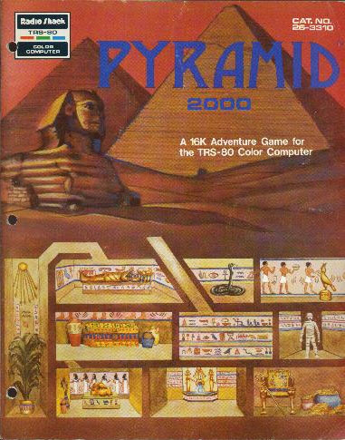

<!-- code -->


# Pyramid Code

<!-- %%cpu = 6809 -->

<!-- %%-ram  --> 
* [RAM Usage](RAMUse.md)
<!-- %%-hard --> 
* [Hardware Info](Hardware.md)

Loaded from cassette at 0x600 (right after text screen memory).<br>
Executed at 0x0600.

Binary size is 14625 bytes.<br>
14625 + 0x600 = 16161 (223 bytes shy of 16K).

The game uses 65 bytes of memory in low memory beginning at 0x01B0 for temporaries.
These temporaries are not persisted in a SAVE.

The game is loaded into RAM, and the game modifies data structures within the
program's loaded space. Thus the data structures are initialized at loading. The
game must be reloaded to start over. 

```
0600: 10 CE 03 FF         LDS     #$03FF                    ; Stack

0604: 8E 01 B1            LDX     #$01B1                    ; Temporaries (not 1B0 ... interesting)
0607: C6 64               LDB     #$64                      ; 0x64 bytes
0609: 6F 80               CLR     ,X+                       ; clear ...
060B: 5A                  DECB                              ; ... the ...
060C: 26 FB               BNE     $0609                     ;  ... temporaries

060E: 4F                  CLRA                
060F: 8E 04 00            LDX     #$0400                    ; Start of screen
0612: CE 60 60            LDU     #$6060                    ; Space - Space
0615: EF 81               STU     ,X++                      ; Clear ...
0617: 4A                  DECA                              ; ... the ...
0618: 26 FB               BNE     $0615                     ;  ... screen

061A: 8E 05 E0            LDX     #$05E0                    ; Cursor ...
061D: 9F 88               STX     <$88                      ;{-1_cursor} ... position
061F: 86 0D               LDA     #$0D                      ; Scroll ...
0621: B7 01 B0            STA     $01B0                     ; ... count
0624: 8E 10 21            LDX     #$1021                    ; "WELCOME TO PYRAMID!!"
0627: BD 08 FC            JSR     $08FC                     ;{PrintUnpacked}  Print message
062A: BD 09 37            JSR     $0937                     ;{ReadKey}  wait for key
062D: 86 01               LDA     #$01                      ; Starting ...
062F: B7 18 E5            STA     $18E5                     ;{-1_01} ... room number
0632: BD 0B D2            JSR     $0BD2                     ;{PrintRoomDescription}  Print room description

# Main Loop

MainLoop:
0635: 7F 01 E7            CLR     $01E7                     ; Clear noun (object within reach)
0638: 7F 01 E8            CLR     $01E8                     ; Clear verb (thorw, north, rub, etc)
063B: 7F 01 E9            CLR     $01E9                     ; Grammar type (verb, verb+nounInReach, verb+nounInPack)
063E: BD 06 F5            JSR     $06F5                     ;{GetInputAndParse}  Get user input and parse
0641: B6 18 E5            LDA     $18E5                     ;{-1_01} Current room
0644: 8E 11 2E            LDX     #$112E                    ; Room descriptors
0647: BD 06 85            JSR     $0685                     ;{FourTableOffset}  X = X + (A-1)*4
064A: 30 02               LEAX    2,X                       ; Command-script ...
064C: AE 84               LDX     ,X                        ; ... to X
064E: BD 06 9D            JSR     $069D                     ;{ProcessRoomScript}  Process the command script for the room
0651: 26 0E               BNE     $0661                     ;  The room handled it ... move on
0653: 8E 19 45            LDX     #$1945                    ; Generic command script
0656: BD 06 9D            JSR     $069D                     ;{ProcessRoomScript}  Process the input
0659: 26 06               BNE     $0661                     ;  It was handled ... move on
065B: 8E 33 87            LDX     #$3387                    ; "I DON'T KNOW HOW TO APPLY THAT WORD HERE."
065E: BD 08 D6            JSR     $08D6                     ;{PrintPackedMessage}  Print message
0661: BD 0A 51            JSR     $0A51                     ;{AfterEveryStep}  Do this stuff after every step
0664: 20 CF               BRA     $0635                     ;{MainLoop}  Back to top of loop
```

# Get Object Info 

An object has a location -- either because it is directly "there" or because it is 
contained by another object that is "there". This method looks up the object data of 
the object or the container and returns the location in B and the object 
pointer (or container pointer) in X.

Object number is in A

Return object's location (or location of container) in B<br>
Return pointer to object's data (or container's data) in X<br>
Return Z as comparison between object's location and $01BC

```
GetObjectInfo:
0666: 8E 18 8D            LDX     #$188D                    ; Object location table
0669: BD 06 7C            JSR     $067C                     ;{TwoTableOffset}  A is location
066C: A6 80               LDA     ,X+                       ; Get object data
066E: E6 84               LDB     ,X                        ; Get room (or container)
0670: 85 80               BITA    #$80                      ; Is object contained by another?
0672: 1F 98               TFR     B,A                       ; Room/container to A
0674: 26 F0               BNE     $0666                     ;{GetObjectInfo}  Yes ... lookup the container object
0676: 30 1F               LEAX    -1,X                      ; Point to start of object
0678: B1 01 BC            CMPA    $01BC                     ; Compare object's location to test location
067B: 39                  RTS                               ; Done
```

# Table Offset Routines 

 Objects and rooms are numbered beginning with 1. These routines look up two-byte 
 and four-byte values from a table with A as the begins-with-1 offset.

```
TwoTableOffset:
; X = X + (A-1)*2
;
067C: 1F 89               TFR     A,B                       ; A extended ...
067E: 4F                  CLRA                              ; .. to D
067F: 5A                  DECB                              ; Object table is 1 based
0680: 58                  ASLB                              ; D = D ...
0681: 49                  ROLA                              ; ... * 2
0682: 30 8B               LEAX    D,X                       ; Add D to X
0684: 39                  RTS                               ; Done

FourTableOffset:
; X = X + (A-1)*4
;
0685: 1F 89               TFR     A,B                       ; A extended ...
0687: 4F                  CLRA                              ; ... to D
0688: 5A                  DECB                              ; Room table is 1 based
0689: 58                  ASLB                              ; D = D ...
068A: 49                  ROLA                              ; ... * 2
068B: 58                  ASLB                              ; D = D ...
068C: 49                  ROLA                              ; ... * 2
068D: 30 8B               LEAX    D,X                       ; Add D to X
068F: 39                  RTS                               ; Done
```

# Move Object 

 This routine moves an object (or its container) to a new location.

 Object number is in B[[br]]
 New location is in $01BC

 Return object pointer in X

MoveObject:
0690: BD 06 66            JSR     $0666                     ;{GetObjectInfo}  Find object (or object's container)
0693: 30 01               LEAX    1,X                       ; Object's location
0695: B6 01 BC            LDA     $01BC                     ; New value
0698: A7 84               STA     ,X                        ; Move object to new location
069A: 30 1F               LEAX    -1,X                      ; Restore object pointer
069C: 39                  RTS                               ; Done

# Process Room Script 

 A room script is a list of verbs with the commands that go with each. This function 
 looks for the one script that matches the verb in $01E8. Then it runs the script. If 
 the script "passes" then this function returns Z=0.

 If there is no script to match the verb or if the script "fails" then this function returns Z=1.

 X points to a list of choices for first-word tokens.[[br]]
 Return with[[br]]
 * Z SET (EQ)   ... no script found OR script was found but it failed[[br]]
 * Z CLEAR (NE) ... script was found and all commands passed 

Format of word/script description list:

  AA LL N0 N1 N2   ; First word AA and script comands (N) for AA. LL is size of command list.[[br]]
  BB LL N0 N1      ; Second word BB and script commands (N) for BB. LL is size of command list.[[br]]
  00               ; End of list

ProcessRoomScript:
069D: E6 84               LDB     ,X                        ; Get command verb
069F: 27 FB               BEQ     $069C                     ;  End of list ... out (Z SET (EQ) no matching script)
06A1: F6 01 E8            LDB     $01E8                     ; User's verb
06A4: E1 80               CMPB    ,X+                       ; Does this list match the input verb?
06A6: 27 05               BEQ     $06AD                     ;  Yes ... run the list
06A8: E6 84               LDB     ,X                        ; Get length
06AA: 3A                  ABX                               ; Skip this list
06AB: 20 F0               BRA     $069D                     ;{ProcessRoomScript}  Keep trying lists
;
06AD: BD 06 B4            JSR     $06B4                     ;{ProcessCommandList}  Run script (Z CLEAR (NE) all passed, Z SET (EQ) a command failed)
06B0: 26 EA               BNE     $069C                     ;  If script passed then return Z CLEAR (NE)
06B2: 20 E9               BRA     $069D                     ;{ProcessRoomScript}  Script failed ... try next word/script


# Process Command List 

 This routine processes a list of commands. The list begins with the size of the list (bytes) 
 followed by all the command bytes. The command addresses are looked up from a jump table. Each 
 command returns to either the "!FuncPassed" or the "!FuncFailed".

 If a command fails then the processing starts and this script "fails". Otherwise all commands 
 are executed one after the other.

 If all commands pass then the script "passes".

 List format:[[br]]
     LL A0 A1 B0 B1 B2 B3 C0 C1 ...   ; LL is length followed by commands A, B, and C ...

 X = start of script

 Returns 
 * Z SET (EQ) failed
 * Z CLEAR (NE) passed

ProcessCommandList:
06B4: 1F 13               TFR     X,U                       ; Hold start of script
06B6: E6 84               LDB     ,X                        ; Length of script
06B8: 3A                  ABX                               ; Turn into pointer
06B9: 34 10               PSHS    X                         ; Save pointer to end-of-script position
06BB: 1F 31               TFR     U,X                       ; Start of script back to X
06BD: 30 01               LEAX    1,X                       ; Skip over script length
06BF: A6 80               LDA     ,X+                       ; Get command number
06C1: 34 10               PSHS    X                         ; Hold current script pointer
06C3: 8E 0A 17            LDX     #$0A17                    ; Jump table
06C6: BD 06 7C            JSR     $067C                     ;{TwoTableOffset}  Offest
06C9: 6E 94               JMP     [,X]                      ; Indirection here ... processing function word
;
; Return from all script commands come here. We either get FuncPassed in which we
; continue to the next (returning a Z CELAR (NE) "pass" when finished). Or we get
; a FuncFailed in which we abort the list and return Z SET (EQ) "fail".
;
; FuncPassed
;
06CB: 35 10               PULS    X                         ; Script pointer
06CD: 35 20               PULS    Y                         ; End-of-script position
06CF: 10 BF 01 BF         STY     $01BF                     ; Have we reached ...
06D3: BC 01 BF            CMPX    $01BF                     ; ... the end of current script?
06D6: 26 03               BNE     $06DB                     ;  No ... keep processing this script
06D8: 8A 01               ORA     #$01                      ; Z CLEAR (all script commands passed)
06DA: 39                  RTS                               ; Done
;
06DB: 34 20               PSHS    Y                         ; Put the end-of-script position back on the stack
06DD: 20 E0               BRA     $06BF                     ;  Next routine
;
; FuncFailed
;
06DF: 35 10               PULS    X                         ; Script pointer
06E1: 35 10               PULS    X                         ; End=of-script position
06E3: 4F                  CLRA                              ; Z SET (a script command failed)
06E4: 39                  RTS                               ; Done


# Command 7: Subscript Abort If Pass  

 This game command runs a subscript. If the subscript passes then the entire script (no 
 matter how many subscripts-deep) ends with a "pass". If the subscript fails then the subscript 
 returns "pass" and the next command in the script is executed.

 The GET script, for instance, is a list of subscripts that attempt to process specific gets one 
 at a time. Like GET WATER then GET SERPENT then GET PLANT and so on. If the first fails (like WATER 
 is not in the room) then the subscript ends and the script continues with the next command (the 
 next subscript). 

 If the second subscript passes (like the SERPENT is here) then the entire script aborts with a "pass".

SubScriptAbortIfPass: 
;
06E5: 35 10               PULS    X                         ; Script pointer
06E7: BD 06 B4            JSR     $06B4                     ;{ProcessCommandList}  Run script (Z CLEAR (NE) all passed, Z SET (EQ) a command failed)
06EA: 34 10               PSHS    X                         ; Script pointer back to stack
06EC: 27 DD               BEQ     $06CB                     ;  A command failed ... continue parent list
06EE: 35 10               PULS    X                         ; Pop script pointer
06F0: 35 10               PULS    X                         ; Pop end-of-script pointer
06F2: 8A 01               ORA     #$01                      ; Script passed ... completely abort processing (with Z CLEAR (NE) all passed)
06F4: 39                  RTS                               ; Done

# Get Input And Parse 

 This function prompts the user for a command line and parses it. This function 
 does not return until a usable command line has been entered. 

 Returns
 * 01E7 - verb
 * 01E8 - object number (noun)
 * 01E9 - gramar type

GetInputAndParse:
06F5: BD 09 B3            JSR     $09B3                     ;{PromptAndReadLine}  Fill input buffer
06F8: 86 0D               LDA     #$0D                      ; Rows left ...
06FA: B7 01 B0            STA     $01B0                     ; ... until MORE
06FD: BD 07 C6            JSR     $07C6                     ;  Parse the input string
0700: BE 01 B4            LDX     $01B4                     ; Pointer to noun word data
0703: F6 01 B2            LDB     $01B2                     ; Number of bytes in word data
0706: B6 01 E9            LDA     $01E9                     ; Word grammar
0709: 81 03               CMPA    #$03                      ; Value 3 means nothing in buffer
070B: 27 E8               BEQ     $06F5                     ;{GetInputAndParse}  Nothing in buffer ... input again
070D: B6 01 E7            LDA     $01E7                     ; Noun
0710: 26 29               BNE     $073B                     ;  We have a noun ... test it
0712: B6 01 E8            LDA     $01E8                     ; Action word (throw, rub, get, etc)
0715: 26 15               BNE     $072C                     ;  There is a valid action word ... go handle it
;
; General error message ... didn't understand a thing
0717: F6 01 EA            LDB     $01EA                     ; Last general error message
071A: 5C                  INCB                              ; Point to next
071B: C4 03               ANDB    #$03                      ; Roll around over 4 messages
071D: F7 01 EA            STB     $01EA                     ; For next time
0720: 8E 0F 24            LDX     #$0F24                    ; Table of general error messages
0723: 58                  ASLB                              ; Index to offset
0724: 3A                  ABX                               ; Point to error message
0725: AE 84               LDX     ,X                        ; Get address of general error message
0727: BD 08 FC            JSR     $08FC                     ;{PrintUnpacked}  Print the error
072A: 20 C9               BRA     $06F5                     ;{GetInputAndParse}  Back for more
;
072C: B6 01 E9            LDA     $01E9                     ; Action word type
072F: 81 C0               CMPA    #$C0                      ; 11_000_000 means single word command
0731: 27 C1               BEQ     $06F4                     ;  Done
0733: 8E 0F A2            LDX     #$0FA2                    ; "**verb** WHAT?"
0736: BD 08 FC            JSR     $08FC                     ;{PrintUnpacked}  Print it (was expecting an object)
0739: 20 BA               BRA     $06F5                     ;{GetInputAndParse}  Try input again
;
; Validate noun
073B: BF 01 B4            STX     $01B4                     ; Save pointer to noun word data
073E: B6 01 B1            LDA     $01B1                     ; Was the last input an object and we asked for a verb?
0741: 26 6F               BNE     $07B2                     ;  Yes ... skip checking the noun (use what we have)
0743: 86 FF               LDA     #$FF                      ; Location: backpack
0745: B7 01 BC            STA     $01BC                     ; Parameter for GetObjectInfo compare
0748: A6 80               LDA     ,X+                       ; Get object number
074A: BF 01 B4            STX     $01B4                     ; Hold noun word data pointer
074D: 34 04               PSHS    B                         ; Hold B
074F: BD 06 66            JSR     $0666                     ;{GetObjectInfo}  Find object
0752: 35 04               PULS    B                         ; Restore B
0754: 27 52               BEQ     $07A8                     ;  Object is actually in pack ... go use it
0756: B6 01 E9            LDA     $01E9                     ; Grammar type
0759: 81 40               CMPA    #$40                      ; 01_000_000 means noun-in-pack
075B: 27 16               BEQ     $0773                     ;  Yes ... check pack
075D: BE 01 B4            LDX     $01B4                     ; Noun word pointer
0760: 30 1F               LEAX    -1,X                      ; Back up word pointer
0762: B6 18 E5            LDA     $18E5                     ;{-1_01} Current room
0765: B7 01 BC            STA     $01BC                     ; Parameter to GetObjectInfo
0768: A6 84               LDA     ,X                        ; Object number
076A: 34 04               PSHS    B                         ; Hold B
076C: BD 06 66            JSR     $0666                     ;{GetObjectInfo}  Find object
076F: 35 04               PULS    B                         ; Restore B
0771: 27 35               BEQ     $07A8                     ;  Yes ... object is in room. Use it.
0773: BE 01 B4            LDX     $01B4                     ; Restore word data pointer
0776: 5A                  DECB                              ; All objects of this name tried?
0777: 26 CA               BNE     $0743                     ;  No ... keep looking for matching object
;
; Object not found error (either not in pack or not in room depending on grammar)
0779: B6 01 E9            LDA     $01E9                     ; Grammar type
077C: 81 40               CMPA    #$40                      ; 01_000_000 means noun-in-pack
077E: 26 05               BNE     $0785                     ;  Error ... can't find noun in room
0780: 8E 0F 3D            LDX     #$0F3D                    ; "YOU AREN'T CARRYING IT." (can't find noun in pack)
0783: 20 19               BRA     $079E                     ;  Print and back to try again
;
0785: 8E 0F 2C            LDX     #$0F2C                    ; " I SEE NO "
0788: BD 08 FC            JSR     $08FC                     ;{PrintUnpacked}  Print it
078B: 86 01               LDA     #$01                      ; Replace '?' with ...
078D: B7 0F A0            STA     $0FA0                     ; ... no-CR terminator
0790: 8E 0F 78            LDX     #$0F78                    ; User typed object
0793: BD 08 FC            JSR     $08FC                     ;{PrintUnpacked}  Print the object
0796: 86 3F               LDA     #$3F                      ; Restore the ...
0798: B7 0F A0            STA     $0FA0                     ; ... '?' at the end of the message
079B: 8E 0F 36            LDX     #$0F36                    ; " HERE."
079E: BD 08 FC            JSR     $08FC                     ;{PrintUnpacked}  Print it
07A1: 4F                  CLRA                              ; Zero out ...
07A2: B7 01 E7            STA     $01E7                     ; ... object
07A5: 7E 06 F5            JMP     $06F5                     ;{GetInputAndParse}  Back to try input again
;
; Found object
07A8: BE 01 B4            LDX     $01B4                     ; Object data pointer
07AB: 30 1F               LEAX    -1,X                      ; Back up to start
07AD: A6 84               LDA     ,X                        ; Get object number
07AF: B7 01 E7            STA     $01E7                     ; Noun
07B2: B6 01 E8            LDA     $01E8                     ; Verb
07B5: 27 01               BEQ     $07B8                     ;  Noun but no verb ... prompt for the verb
07B7: 39                  RTS                               ; Got verb and noun. Done
;
07B8: 8E 0F 55            LDX     #$0F55                    ; "WHAT DO YOU WANT ME TO DO WITH THE *****?"
07BB: BD 08 FC            JSR     $08FC                     ;{PrintUnpacked}  Print message
07BE: 86 01               LDA     #$01                      ; We got the object ....
07C0: B7 01 B1            STA     $01B1                     ; ... will take just verb
07C3: 7E 06 F5            JMP     $06F5                     ;{GetInputAndParse}  Get user input and parse
;
; Parse the input line
07C6: 8E 01 C6            LDX     #$01C6                    ; Start of input buffer
07C9: 7F 01 B3            CLR     $01B3                     ; Nothing in buffer to start with
07CC: 7F 01 E9            CLR     $01E9                     ; Grammar type
07CF: 10 8E 3C 40         LDY     #$3C40                    ; Word table
07D3: 10 BF 01 F0         STY     $01F0                     ; Hold pointer
;
; Skip spaces before a word
07D7: A6 84               LDA     ,X                        ; Next in input
07D9: 81 20               CMPA    #$20                      ; Skip ...
07DB: 26 04               BNE     $07E1                     ;  ... over ...
07DD: 30 01               LEAX    1,X                       ; ... white ...
07DF: 20 F6               BRA     $07D7                     ;  ... space
;
07E1: BF 01 F2            STX     $01F2                     ; Start of token
07E4: 4D                  TSTA                              ; End of buffer?
07E5: 10 27 00 A2         LBEQ    $088B                     ;  Yes ... done
07E9: 86 01               LDA     #$01                      ; Flag that something ...
07EB: B7 01 B3            STA     $01B3                     ; ... is in the buffer
07EE: 34 10               PSHS    X                         ; Remember start of token
07F0: A6 A4               LDA     ,Y                        ; From word table
07F2: 10 27 00 A0         LBEQ    $0896                     ;  Word not found ... clear 1E8 and 1E7 and skip it
07F6: B7 01 F8            STA     $01F8                     ; Store word's data
07F9: 84 07               ANDA    #$07                      ; Lower 3 bits
07FB: B7 01 BA            STA     $01BA                     ; Token length
07FE: B7 01 F4            STA     $01F4                     ; Token length again
0801: F6 01 F8            LDB     $01F8                     ; Original byte
0804: C4 38               ANDB    #$38                      ; Middle 3 bits (bytes in token data)
0806: 57                  ASRB                              ; Shifted ...
0807: 57                  ASRB                              ; ... to ...
0808: 57                  ASRB                              ; ... lower in B
0809: 10 BF 01 F0         STY     $01F0                     ; Current word pointer
080D: 31 21               LEAY    1,Y                       ; Next byte
;
; Check input against current word-table ptr
080F: A6 A4               LDA     ,Y                        ; Get character
0811: A1 84               CMPA    ,X                        ; Matches?
0813: 26 65               BNE     $087A                     ;  Nope ... go to next
0815: 30 01               LEAX    1,X                       ; Next in input
0817: 31 21               LEAY    1,Y                       ; Next in token
0819: 7A 01 BA            DEC     $01BA                     ; All done?
081C: 26 F1               BNE     $080F                     ;  No ... check em all
081E: B6 01 F4            LDA     $01F4                     ; Token length
0821: 81 06               CMPA    #$06                      ; Token is 6 long and we matched all?
0823: 27 09               BEQ     $082E                     ;  Yes ... take it but skip any non checked at end
0825: A6 84               LDA     ,X                        ; Next character from user
0827: 81 20               CMPA    #$20                      ; A space?
0829: 27 10               BEQ     $083B                     ;  Yes ... perfect match
082B: 4D                  TSTA                              ; End of user input?
082C: 26 53               BNE     $0881                     ;  No ... skip token data and try next token
;
082E: A6 84               LDA     ,X                        ; Get character
0830: 81 20               CMPA    #$20                      ; A space?
0832: 27 07               BEQ     $083B                     ;  Yes ... found the end
0834: 4D                  TSTA                              ; End of buffer?
0835: 27 04               BEQ     $083B                     ;  Yes ... found the end
0837: 30 01               LEAX    1,X                       ; Skip the character
0839: 20 F3               BRA     $082E                     ;  Until space or end
;
; Input word matches word-table
083B: B6 01 F8            LDA     $01F8                     ; Original word data
083E: 84 C0               ANDA    #$C0                      ; Upper two bits
0840: 27 14               BEQ     $0856                     ;  Go handle object data
;
; Word is a verb (store info)
0842: B7 01 E9            STA     $01E9                     ; Save the grammar type
0845: A6 A4               LDA     ,Y                        ; Word value ...
0847: B7 01 E8            STA     $01E8                     ; ... is verb
084A: 34 10               PSHS    X                         ; Hold pointer
084C: 8E 0F A2            LDX     #$0FA2                    ; Space for printing verb
084F: BD 08 B6            JSR     $08B6                     ;  Copy it over
0852: 35 10               PULS    X                         ; Restore
0854: 20 19               BRA     $086F                     ;  Continue with next token if there is a space next
;
; Word is a noun (store info)
0856: A6 A4               LDA     ,Y                        ; Get word data
0858: B7 01 E7            STA     $01E7                     ; Store object number
085B: 10 BF 01 B4         STY     $01B4                     ; Store pointer to word data
085F: F7 01 B2            STB     $01B2                     ; Store size of object data (number of objects)
0862: 7F 01 B1            CLR     $01B1                     ; We no longer remember a past lone object
0865: 34 10               PSHS    X                         ; Hold pointer
0867: 8E 0F 78            LDX     #$0F78                    ; "WHAT DO YOU WANT ME TO DO WITH THE ***** ?"
086A: BD 08 B6            JSR     $08B6                     ;  Make the error message in case
086D: 35 10               PULS    X                         ; Restore the pointer
086F: A6 84               LDA     ,X                        ; Next in input buffer
0871: 81 20               CMPA    #$20                      ; A space means more to process
0873: 35 20               PULS    Y                         ; Drop stacked word pointer
0875: 10 27 FF 56         LBEQ    $07CF                     ;  Parse next token
0879: 39                  RTS                               ; Done
;
; Skip over current entry in token table
087A: 31 21               LEAY    1,Y                       ; Skip to ...
087C: 7A 01 BA            DEC     $01BA                     ; ... end of ...
087F: 26 F9               BNE     $087A                     ;  ... token text
0881: 31 21               LEAY    1,Y                       ; Skip to ...
0883: 5A                  DECB                              ; ... end of ...
0884: 26 FB               BNE     $0881                     ;  ... token data
0886: 35 10               PULS    X                         ; Restore pointer to start of input word
0888: 7E 07 D7            JMP     $07D7                     ;  Keep trying
;
088B: B6 01 B3            LDA     $01B3                     ; Something in the buffer?
088E: 26 E9               BNE     $0879                     ;  Yes ... go handle it
0890: 86 03               LDA     #$03                      ; Grammar type 3 means ...
0892: B7 01 E9            STA     $01E9                     ; ... nothing in buffer
0895: 39                  RTS                               ; Done

; Skip leading space in front of token and then skip to next token.
; If there is another token go back and decode. Otherwise return.
0896: 35 10               PULS    X                         ; Restore pointer to token
0898: 7F 01 E8            CLR     $01E8                     ; Clear action word
089B: 7F 01 E7            CLR     $01E7                     ; Clear object number
089E: A6 84               LDA     ,X                        ; Character from token
08A0: 81 20               CMPA    #$20                      ; Space?
08A2: 26 04               BNE     $08A8                     ;  No ... we found the token
08A4: 30 01               LEAX    1,X                       ; Yes space. Skip ...
08A6: 20 F6               BRA     $089E                     ;  ... to start of token
08A8: A6 84               LDA     ,X                        ; Character from token
08AA: 27 E9               BEQ     $0895                     ;  End of buffer ... done
08AC: 81 20               CMPA    #$20                      ; Space?
08AE: 10 27 FF 1D         LBEQ    $07CF                     ;  Yes ... start decoding next token
08B2: 30 01               LEAX    1,X                       ; Skip character
08B4: 20 F2               BRA     $08A8                     ;  Keep looking

; Copy input word to 40-byte destination buffer. Fill end of the buffer
; with '@' characters which are ignored by printer routine.
08B6: 1E 12               EXG     X,Y                       ; Destination to Y
08B8: BE 01 F2            LDX     $01F2                     ; Current word in parse buffer
08BB: C6 28               LDB     #$28                      ; Max size
08BD: A6 84               LDA     ,X                        ; Character from input word
08BF: 27 0D               BEQ     $08CE                     ;  End of buffer ... end of word
08C1: 81 20               CMPA    #$20                      ; Space is end ...
08C3: 27 09               BEQ     $08CE                     ;  ... of word
08C5: A7 A0               STA     ,Y+                       ; Copy the input word ...
08C7: 30 01               LEAX    1,X                       ; ... to the destination
08C9: 5A                  DECB                              ; All room ...
08CA: C1 01               CMPB    #$01                      ; ... taken?
08CC: 26 EF               BNE     $08BD                     ;  No ... keep going
08CE: 86 40               LDA     #$40                      ; '@' characters are ignored by printing
08D0: A7 A0               STA     ,Y+                       ; Fill out ...
08D2: 5A                  DECB                              ; ... rest of ...
08D3: 26 F9               BNE     $08CE                     ;  ... destination buffer
08D5: 39                  RTS                               ; Done


# Print Packed Message 

 Unpack a message (or multiple packed messages) and print.

 X = pointer to message structure

PrintPackedMessage:
08D6: A6 84               LDA     ,X                        ; Get the length
08D8: 27 FB               BEQ     $08D5                     ;  None ... out
08DA: 30 01               LEAX    1,X                       ; Skip over length
08DC: 10 8E 01 C6         LDY     #$01C6                    ; Reuse input buffer
08E0: BD 10 66            JSR     $1066                     ;{UnpackMessage}  Unpack and print
08E3: E6 84               LDB     ,X                        ; Get byte
08E5: 27 2C               BEQ     $0913                     ;  0 ... do CR
08E7: C1 01               CMPB    #$01                      ; 1 ...
08E9: 27 EA               BEQ     $08D5                     ;  ... no CR
08EB: 34 10               PSHS    X                         ; Hold pointer
08ED: 1F 98               TFR     B,A                       ; Character to A
08EF: BD 09 45            JSR     $0945                     ;{PrintCharacterAutoWrap}  Print character to screen
08F2: 35 10               PULS    X                         ; Restore pointer
08F4: A6 80               LDA     ,X+                       ; Get next byte from unpacked
08F6: 81 0A               CMPA    #$0A                      ; Mark for another packing?
08F8: 27 DC               BEQ     $08D6                     ;{PrintPackedMessage}  Yes ... start again
08FA: 20 E7               BRA     $08E3                     ;  No ... continue this packing


# Print an Unpacked Message 

Print an uncompressed message pointed to by X.

 Any '@' characters are ignored (allows for padding of words added into a message string).

 The messages is terminated by either a 0 or a 1. If the terminator is a 0 then a CR is 
 added. If the terminator is a 1 then no CR is added.

PrintUnpacked:
08FC: A6 84               LDA     ,X                        ; Get byte
08FE: 27 13               BEQ     $0913                     ;  End with CR
0900: 81 01               CMPA    #$01                      ; Just stop printing ...
0902: 27 D1               BEQ     $08D5                     ;  ... with no CR
0904: 81 40               CMPA    #$40                      ; Is it '@'
0906: 27 07               BEQ     $090F                     ;  Just ignore it
0908: 34 10               PSHS    X                         ; Save X
090A: BD 09 45            JSR     $0945                     ;{PrintCharacterAutoWrap}  A to screen
090D: 35 10               PULS    X                         ; Restore X
090F: 30 01               LEAX    1,X                       ; Next in message
0911: 20 E9               BRA     $08FC                     ;{PrintUnpacked}  Keep going
;
; Print a CR
0913: 86 0D               LDA     #$0D                      ; CR
0915: BD 09 45            JSR     $0945                     ;{PrintCharacterAutoWrap}  Print a CR
0918: 7A 01 B0            DEC     $01B0                     ; Rows left before more
091B: 2B 01               BMI     $091E                     ;{MorePrompt}  Pause print out with MORE
091D: 39                  RTS                               ; Done


# MorePrompt 

 Print MORE and wait for key

MorePrompt:
091E: 34 74               PSHS    U,Y,X,B                   ;
0920: 86 0D               LDA     #$0D                      ; Reset MORE ...
0922: B7 01 B0            STA     $01B0                     ; ... row count
0925: 8E 10 19            LDX     #$1019                    ; " MORE" message
0928: BD 08 FC            JSR     $08FC                     ;{PrintUnpacked}  Print message
092B: BD 09 37            JSR     $0937                     ;{ReadKey}  Wait for user to press a key
092E: 9E 88               LDX     <$88                      ;{-1_cursor} Back pointer ...
0930: 30 19               LEAX    -7,X                      ; ... up 7 over ...
0932: 9F 88               STX     <$88                      ;{-1_cursor} ... MORE prompt
0934: 35 74               PULS    B,X,Y,U                   ;
0936: 39                  RTS                               ;

ReadKey:
; Read a key from keyboard
;
0937: 34 20               PSHS    Y                         ; Save Y
0939: 7C 01 EB            INC     $01EB                     ; Counter
093C: AD 9F A0 00         JSR     [$A000]                   ; Get a key
0940: 27 F7               BEQ     $0939                     ;  Keep going till we get one
0942: 35 20               PULS    Y                         ; Restore
0944: 39                  RTS                               ; Out

PrintCharacterAutoWrap:
; Print character in A to screen. This handles auto word-wrapping and
; auto MORE prompting.
;
0945: F6 02 07            LDB     $0207                     ; Last printed character
0948: C1 20               CMPB    #$20                      ; Last printed a space?
094A: 26 16               BNE     $0962                     ;  No ... skip on
094C: 81 20               CMPA    #$20                      ; Printing a second space now?
094E: 27 5B               BEQ     $09AB                     ;  Yes ... just skip it (More and out)
0950: 81 2E               CMPA    #$2E                      ; A '.' ?
0952: 27 08               BEQ     $095C                     ;  Yes. Ignore leading space.
0954: 81 3F               CMPA    #$3F                      ; A '?' ?
0956: 27 04               BEQ     $095C                     ;  Yes. Ignore leading space.
0958: 81 21               CMPA    #$21                      ; A '!' ?
095A: 26 06               BNE     $0962                     ;  No. Don't ignore space.
;
095C: DE 88               LDU     <$88                      ;{-1_cursor} Back screen ...
095E: 33 5F               LEAU    -1,U                      ; ... pointer up ...
0960: DF 88               STU     <$88                      ;{-1_cursor} ... over ignored space
;
0962: B7 02 07            STA     $0207                     ; Store last printed character
0965: AD 9F A0 02         JSR     [$A002]                   ; Print A to screen
0969: 96 89               LDA     <$89                      ;{-1_cursor} LSB of screen position (we know MSB is a 4 or 5)
096B: 81 FE               CMPA    #$FE                      ; Have we reached the end of the screen?
096D: 25 3C               BCS     $09AB                     ;  No ... handle any MORE and out
096F: DE 88               LDU     <$88                      ;{-1_cursor} Cursor position
0971: 33 C8 DF            LEAU    $-21,U                    ; Back up to end of current row (where it will be after CR)
0974: 86 0D               LDA     #$0D                      ; CR ...
0976: AD 9F A0 02         JSR     [$A002]                   ; ... to screen
097A: 7A 01 B0            DEC     $01B0                     ; Rows left until MORE is needed
097D: A6 C4               LDA     ,U                        ; Find the ...
097F: 81 60               CMPA    #$60                      ; ... space before ...
0981: 27 04               BEQ     $0987                     ;  ... the last ...
0983: 33 5F               LEAU    -1,U                      ; ... word ...
0985: 20 F6               BRA     $097D                     ;  ... on the line
;
0987: 33 41               LEAU    1,U                       ; Now pointing to the last word on the line
0989: A6 C4               LDA     ,U                        ; Get next character in buffer
098B: 81 60               CMPA    #$60                      ; Is it a space?
098D: 27 1C               BEQ     $09AB                     ;  Yes ... all done
098F: C6 60               LDB     #$60                      ; Store a space ...
0991: E7 C4               STB     ,U                        ; ... over this on screen
0993: 81 60               CMPA    #$60                      ; Make sure ...
0995: 25 02               BCS     $0999                     ;  ... upper ...
0997: 80 40               SUBA    #$40                      ; ... case
0999: B7 02 07            STA     $0207                     ; Store last printed character
099C: AD 9F A0 02         JSR     [$A002]                   ; Print A to screen on new line
09A0: 20 E5               BRA     $0987                     ;  Move overhang to next line
;
09A2: 34 20               PSHS    Y                         ; Send character ...
09A4: AD 9F A0 02         JSR     [$A002]                   ; ... to ...
09A8: 35 20               PULS    Y                         ; ... screen
09AA: 39                  RTS                               ; Done
;
09AB: 7D 01 B0            TST     $01B0                     ; Time for a MORE prompt?
09AE: 10 2B FF 6C         LBMI    $091E                     ;  Yes ... do it and out
09B2: 39                  RTS                               ; Done

PromptAndReadLine:
; Fill input buffer at 1C6 with user input line
09B3: 86 3A               LDA     #$3A                      ; A ':'
09B5: BD 09 A2            JSR     $09A2                     ;  Print character without processing
09B8: BD 0A 13            JSR     $0A13                     ;  Print white-ish block
09BB: 8E 01 C6            LDX     #$01C6                    ; Input buffer
09BE: 7F 01 BA            CLR     $01BA                     ; Input buffer is empty
09C1: 34 34               PSHS    Y,X,B                     ; Get ...
09C3: BD 09 37            JSR     $0937                     ;{ReadKey}  ... key from ...
09C6: 35 34               PULS    B,X,Y                     ; ... player
09C8: 1F 89               TFR     A,B                       ; Hold original key
09CA: 81 08               CMPA    #$08                      ; A backspace?
09CC: 27 2A               BEQ     $09F8                     ;  Yes ... handle backspace
09CE: A7 84               STA     ,X                        ; Save the input to the buffer
09D0: BD 09 A2            JSR     $09A2                     ;  Send the character to the screen
09D3: 81 0D               CMPA    #$0D                      ; Was it ENTER
09D5: 27 33               BEQ     $0A0A                     ;  Yes ... store a 0 on end of buffer and clear cursor and DONE
09D7: 8D 3A               BSR     $0A13                     ;  Set cursor to whiteish block
09D9: 7C 01 BA            INC     $01BA                     ; Increment character count
09DC: 30 01               LEAX    1,X                       ; Next in buffer pointer
09DE: 10 8E 01 E4         LDY     #$01E4                    ; Have ...
09E2: 10 BF 01 BF         STY     $01BF                     ; ... we ...
09E6: BC 01 BF            CMPX    $01BF                     ; ... reached end of buffer?
09E9: 25 D6               BCS     $09C1                     ;  No ... keep taking keys
09EB: 8D 1F               BSR     $0A0C                     ;  End of buffer ...
09ED: 86 08               LDA     #$08                      ; ... pretend ...
09EF: 8D B1               BSR     $09A2                     ;  ... it ...
09F1: BD 0A 13            JSR     $0A13                     ;  ... is ...
09F4: 30 1F               LEAX    -1,X                      ; ... backspace
09F6: 20 C9               BRA     $09C1                     ;  Take next key
;
; Backspace
09F8: 30 1F               LEAX    -1,X                      ; Back the buffer up one
09FA: 8C 01 C6            CMPX    #$01C6                    ; Already at the beginning?
09FD: 25 BC               BCS     $09BB                     ;  Yes ... ignore the backspace
09FF: 8D 0B               BSR     $0A0C                     ;  Store space character to cursor
0A01: 86 08               LDA     #$08                      ; Send back-space ...
0A03: BD 09 A2            JSR     $09A2                     ;  ... to screen
0A06: 8D 0B               BSR     $0A13                     ;  Show white-ish block cursor
0A08: 20 B7               BRA     $09C1                     ;  Loop back for next key
;
0A0A: 6F 84               CLR     ,X                        ; New end of the input buffer
0A0C: 86 60               LDA     #$60                      ; Space character
0A0E: A7 9F 00 88         STA     [$0088]                   ;{-1_cursor} Store to cursor
0A12: 39                  RTS                               ; Done
0A13: 86 CF               LDA     #$CF                      ; White-ish block
0A15: 20 F7               BRA     $0A0E                     ;  Store to cursor and done


# Script Commands 

 This lookup table holds the pointers to the individual script commands. Each command 
 reads 1 or 2 bytes of data from the script. The number of extra bytes read is show 
 for reference in the table.

 Script Command Table[[br]]
 *   b = 2 bytes ... message address[[br]]
 *   c = 1 byte  ... object number[[br]]
 *   d = 1 byte  ... room number[[br]]
 *   e = 2 bytes ... target object and container object[[br]] 
 *   f = 2 bytes ... target object and room number[[br]]

ScriptCommands:
;    Address   Number Bytes Type Name
0A17: 0B 05   ;   1     1    d   MoveToRoomX
0A19: 0C 68   ;   2     1    c   AssertObjectXIsInPack
0A1B: 0C 7E   ;   3     1    c   AssertObjectXIsInCurrentRoomOrPack
0A1D: 0D 10   ;   4     2    b   PrintMessageX
0A1F: 0F 18   ;   5     0        PrintScoreAndStop
0A21: 00 00   ;   6     -        
0A23: 06 E5   ;   7     1    *   SubScripXtAbortIfPass 
0A25: 0F 12   ;   8     0        PrintScore
0A27: 0F 18   ;   9     0        PrintScoreAndStop
0A29: 0C C6   ;  10     1        AssertRandomIsGreaterThanX
0A2B: 0D 1C   ;  11     1    c   DropObjectX
0A2D: 0C E0   ;  12     1    d   MoveToRoomXIfItWasLastRoom
0A2F: 0C AB   ;  13     0        AssertPackIsEmptyExceptForEmerald
0A31: 0D 33   ;  14     0        MoveToLastRoom
0A33: 0D 4D   ;  15     0        PrintInventory    
0A35: 0D 92   ;  16     0        PrintRoomDescription
0A37: 0D 98   ;  17     1    c   AssertObjectXMatchesUserInput
0A39: 0D A6   ;  18     1    c   GetObjectFromRoom
0A3B: 00 00   ;  19     -        
0A3D: 0D E8   ;  20     0        PrintOK
0A3F: 0D F1   ;  21     2    f   MoveObjectXToRoomY
0A41: 0C F4   ;  22     0        GetUserInputObject
0A43: 0D E2   ;  23     0        DropUserInputObject
0A45: 0C 39   ;  24     1    c   MoveObjectXToCurrentRoom
0A47: 0C 4B   ;  25     2    e   MoveObjectXIntoContainerY
0A49: 0C 97   ;  26     1    c   AssertObjectXIsInCurrentRoom
0A4B: 0E BB   ;  27     0        LoadGame  
0A4D: 0E 81   ;  28     0        SaveGame
0A4F: 0F 1D   ;  29     0        JumpToTopOfGameLoop


# After Every Step 

 This processing takes place after every user input.[[br]]
  1. Increment the count on the lamp and the number of turns.[[br]]
  2.  Warn the player if the lamp is going dim and change the batteries automatically.

AfterEveryStep:
0A51: 86 0F               LDA     #$0F                      ; Lamp (lit version)
0A53: 8E 18 8D            LDX     #$188D                    ; Object table
0A56: BD 06 7C            JSR     $067C                     ;{TwoTableOffset}  Get lamp's data
0A59: 30 01               LEAX    1,X                       ; Lit-lamp's location
0A5B: A6 84               LDA     ,X                        ; Get the location
0A5D: 27 54               BEQ     $0AB3                     ;  Not turned on ... skip the burn time
;
; Lamp is lit. Increment the burn time.
0A5F: FC 18 E8            LDD     $18E8                     ;{-1_00} Get time
0A62: C3 00 01            ADDD    #$0001                    ; Bump time ...
0A65: FD 18 E8            STD     $18E8                     ;{-1_00} ... by one
0A68: 81 01               CMPA    #$01                      ; Has it been burning 256 turns?
0A6A: 26 47               BNE     $0AB3                     ;  No ... skip checks (should be to $0AF2?)
0A6C: C1 22               CMPB    #$22                      ; Warn the player?
0A6E: 26 08               BNE     $0A78                     ;  No ...
0A70: 8E 38 5A            LDX     #$385A                    ; "Your lamp is getting dim. Better start to wrap this up ..."
0A73: BD 08 D6            JSR     $08D6                     ;{PrintPackedMessage}  Print message
0A76: 20 7A               BRA     $0AF2                     ;  Continue
;
0A78: C1 36               CMPB    #$36                      ; Really getting dim now?
0A7A: 26 37               BNE     $0AB3                     ;  No ... move on
0A7C: 86 0F               LDA     #$0F                      ; Find ...
0A7E: 8E 18 8D            LDX     #$188D                    ; ... lamp ...
0A81: BD 06 7C            JSR     $067C                     ;{TwoTableOffset}  ... room ...
0A84: 30 01               LEAX    1,X                       ; ... number
0A86: E6 84               LDB     ,X                        ; Get the number
0A88: F7 01 BA            STB     $01BA                     ; Hold it
0A8B: 6F 84               CLR     ,X                        ; Room is now ... nowhere
0A8D: 8E 18 8D            LDX     #$188D                    ; Object data
0A90: 86 2C               LDA     #$2C                      ; Dead lamp
0A92: BD 06 7C            JSR     $067C                     ;{TwoTableOffset}  Offset
0A95: F6 01 BA            LDB     $01BA                     ; Lamp's room number
0A98: 30 01               LEAX    1,X                       ; Dead lamp ...
0A9A: E7 84               STB     ,X                        ; ... to pack
0A9C: 86 23               LDA     #$23                      ; Batteries
0A9E: C6 FF               LDB     #$FF                      ; Pack
0AA0: F7 01 BC            STB     $01BC                     ; For find
0AA3: BD 06 66            JSR     $0666                     ;{GetObjectInfo}  Batteries in pack?
0AA6: 27 0B               BEQ     $0AB3                     ;  Yes ... change them
0AA8: 8E 38 D8            LDX     #$38D8                    ; "Your lamp has run out of power."
0AAB: BD 08 D6            JSR     $08D6                     ;{PrintPackedMessage}  Print message
0AAE: BD 0B D2            JSR     $0BD2                     ;{PrintRoomDescription}  Print room description (it's dark)
0AB1: 20 3F               BRA     $0AF2                     ;  Continue
;
; Attempt to change batteries
0AB3: BE 18 E8            LDX     $18E8                     ;{-1_00} Current lamp time
0AB6: 8C 01 2C            CMPX    #$012C                    ; Time to change batteries?
0AB9: 25 37               BCS     $0AF2                     ;  No ... keep going
0ABB: 86 FF               LDA     #$FF                      ; Pack
0ABD: B7 01 BC            STA     $01BC                     ; For find
0AC0: 86 23               LDA     #$23                      ; Batteries
0AC2: BD 06 66            JSR     $0666                     ;{GetObjectInfo}  Do we have them?
0AC5: 26 2B               BNE     $0AF2                     ;  No ... on
0AC7: 86 2C               LDA     #$2C                      ; Dead-lamp
0AC9: BD 06 66            JSR     $0666                     ;{GetObjectInfo}  In pack?
0ACC: 26 24               BNE     $0AF2                     ;  No ... move on
0ACE: 30 01               LEAX    1,X                       ; Object room
0AD0: 6F 84               CLR     ,X                        ; Get rid of dead-lamp
0AD2: 86 23               LDA     #$23                      ; Get ...
0AD4: 8E 18 8D            LDX     #$188D                    ; ... rid ...
0AD7: BD 06 7C            JSR     $067C                     ;{TwoTableOffset}  ... of ...
0ADA: 30 01               LEAX    1,X                       ; ... the ...
0ADC: 6F 84               CLR     ,X                        ; ... batteries
0ADE: 30 02               LEAX    2,X                       ; Put worn out batteries ...
0AE0: 86 FF               LDA     #$FF                      ; ... in ...
0AE2: A7 84               STA     ,X                        ; ... backpack ...
0AE4: B7 01 BC            STA     $01BC                     ; For move
0AE7: 86 0F               LDA     #$0F                      ; Move lit-lamp ...
0AE9: BD 06 90            JSR     $0690                     ;{MoveObject}  ... to old lamp's location
0AEC: 8E 39 1D            LDX     #$391D                    ; "I'm changing the batteries ..."
0AEF: BD 08 D6            JSR     $08D6                     ;{PrintPackedMessage}  Print message
;
; Bump the turn-counter in BCD format
0AF2: B6 18 E7            LDA     $18E7                     ;{-1_00} Number of turns LSB
0AF5: 8B 01               ADDA    #$01                      ; Add one
0AF7: 19                  DAA                               ; Adjust BCD after addition
0AF8: B7 18 E7            STA     $18E7                     ;{-1_00} New LSB
0AFB: B6 18 E6            LDA     $18E6                     ;{-1_00} Number of turns MSB
0AFE: 89 00               ADCA    #$00                      ; Add overflow from LSB
0B00: 19                  DAA                               ; Adjust BCD after addition
0B01: B7 18 E6            STA     $18E6                     ;{-1_00} New MSB
0B04: 39                  RTS                               ; Done


# Command 1: Move To Room X  

 This routine moves the player to a new room. If there is light in the new room or light 
 in the old room then the move always works. Otherwise there is a 60% chance the move kills you.

 If there is light in the new room then the room description is printed.

 After every move the code checks the pack for treasures. If there are 2 or more treasures then 
 the Mummy moves them all to room 53 (the hard-to-find room in the maze). Then the code moves the 
 chest to room 53. Up till now the chest has been in room 0 (out of play). The only way to make the 
 chest appear in the maze is to encounter the Mummy!

 Once the chest is in a room (any room) the Mummy no longer appears. You only see the Mummy once.

MoveToRoomX:
0B05: 35 10               PULS    X                         ; Processing cursor
0B07: E6 80               LDB     ,X+                       ; Get room number
0B09: 34 10               PSHS    X                         ; Update cursor
0B0B: F7 01 BB            STB     $01BB                     ; Remember value for later
0B0E: B6 18 E5            LDA     $18E5                     ;{-1_01} Current room
0B11: B7 01 BC            STA     $01BC                     ; For find
0B14: 86 0F               LDA     #$0F                      ; Lamp (lit version)
0B16: BD 06 66            JSR     $0666                     ;{GetObjectInfo}  Look for lamp in this room
0B19: 27 44               BEQ     $0B5F                     ;  Found it ... there is light
0B1B: 86 FF               LDA     #$FF                      ; Backpack value
0B1D: B7 01 BC            STA     $01BC                     ; For find
0B20: 86 0F               LDA     #$0F                      ; Lamp (lit version)
0B22: BD 06 66            JSR     $0666                     ;{GetObjectInfo}  Look for lamp in backpack
0B25: 27 38               BEQ     $0B5F                     ;  Found it ... there is light
0B27: 8E 17 EB            LDX     #$17EB                    ; Ambient light table
0B2A: B6 18 E5            LDA     $18E5                     ;{-1_01} Current room
0B2D: BD 06 7C            JSR     $067C                     ;{TwoTableOffset}  * 2
0B30: A6 84               LDA     ,X                        ; Get value from table
0B32: 84 40               ANDA    #$40                      ; Light in room?
0B34: 26 29               BNE     $0B5F                     ;  Yes ... no lamp needed
0B36: B6 01 BB            LDA     $01BB                     ; New room number
0B39: B7 01 BC            STA     $01BC                     ; For find
0B3C: 8E 17 EB            LDX     #$17EB                    ; Ambient light table
0B3F: BD 06 7C            JSR     $067C                     ;{TwoTableOffset}  * 2
0B42: A6 84               LDA     ,X                        ; Get value
0B44: 84 40               ANDA    #$40                      ; Light in room?
0B46: 26 17               BNE     $0B5F                     ;  Yes ... no lamp needed
0B48: 86 0F               LDA     #$0F                      ; Lamp (lit version)
0B4A: BD 06 66            JSR     $0666                     ;{GetObjectInfo}  Get object's data
0B4D: 27 10               BEQ     $0B5F                     ;  We found it ... go on
;
; No light ... probable death (60%)
0B4F: B6 01 EB            LDA     $01EB                     ; Rolling timer (a random number)
0B52: 81 67               CMPA    #$67                      ; 103/256 = 40% chance of ...
0B54: 25 09               BCS     $0B5F                     ;  ... making it without light
0B56: 8E 37 9A            LDX     #$379A                    ; "You fell into a pit and broke ..."
0B59: BD 08 D6            JSR     $08D6                     ;{PrintPackedMessage}  Print message
0B5C: 7E 0F 18            JMP     $0F18                     ;{PrintScoreAndStop}  Endless loop
;
; The move was successful
0B5F: B6 18 E5            LDA     $18E5                     ;{-1_01} Current room ...
0B62: B7 18 EA            STA     $18EA                     ;{-1_00} ... is now the last room
0B65: B6 01 BB            LDA     $01BB                     ; New ...
0B68: B7 18 E5            STA     $18E5                     ;{-1_01} ... current room
0B6B: BD 0B D2            JSR     $0BD2                     ;{PrintRoomDescription}  Print room description
0B6E: 86 2A               LDA     #$2A                      ; Object number for "Chest"
0B70: 8E 18 8D            LDX     #$188D                    ; Look up the ...
0B73: BD 06 7C            JSR     $067C                     ;{TwoTableOffset}  ... object
0B76: 30 01               LEAX    1,X                       ; Get ...
0B78: A6 84               LDA     ,X                        ; ... object location
0B7A: 26 53               BNE     $0BCF                     ;  Chest is in the maze ... Mummy only happens once
;
; Count treasures in pack
0B7C: 86 2C               LDA     #$2C                      ; Number of objects
0B7E: B7 01 BA            STA     $01BA                     ; Counter
0B81: 8E 18 8D            LDX     #$188D                    ; Object table
0B84: 5F                  CLRB                              ; Count
0B85: A6 80               LDA     ,X+                       ; Get object data
0B87: 84 20               ANDA    #$20                      ; Is this treasure?
0B89: 27 07               BEQ     $0B92                     ;  No ... skip this object
0B8B: A6 84               LDA     ,X                        ; Is object ...
0B8D: 81 FF               CMPA    #$FF                      ; ... in pack?
0B8F: 26 01               BNE     $0B92                     ;  No skip
0B91: 5C                  INCB                              ; Increment the count
0B92: 30 01               LEAX    1,X                       ; Next object
0B94: 7A 01 BA            DEC     $01BA                     ; Do ...
0B97: 26 EC               BNE     $0B85                     ;  ... all objects
;
0B99: C1 02               CMPB    #$02                      ; Got less than 2 treasures?
0B9B: 25 32               BCS     $0BCF                     ;  Yes ... don't steal just one
;
; Move all treasures in pack to room 53 (treasure room)
0B9D: 8E 18 8D            LDX     #$188D                    ; Object data
0BA0: 86 2C               LDA     #$2C                      ; 44 to do
0BA2: B7 01 BA            STA     $01BA                     ; Temporary counter
0BA5: A6 80               LDA     ,X+                       ; Get object data
0BA7: 84 20               ANDA    #$20                      ; Is this treasure?
0BA9: 27 0D               BEQ     $0BB8                     ;  No ... skip it
0BAB: A6 84               LDA     ,X                        ; Object location
0BAD: 81 FF               CMPA    #$FF                      ; In pack?
0BAF: 26 07               BNE     $0BB8                     ;  No ... skip it
0BB1: 86 35               LDA     #$35                      ; Treasure room in the maze
0BB3: A7 84               STA     ,X                        ; Move treasure there
0BB5: 7A 18 EB            DEC     $18EB                     ;{-1_00} Minus one object in pack
0BB8: 30 01               LEAX    1,X                       ; Next object
0BBA: 7A 01 BA            DEC     $01BA                     ; All done?
0BBD: 26 E6               BNE     $0BA5                     ;  No ... go back
;
; Now make chest appear in room 53 (treasure room)
0BBF: 86 35               LDA     #$35                      ; Move ...
0BC1: B7 01 BC            STA     $01BC                     ; ... chest ...
0BC4: 86 2A               LDA     #$2A                      ; ... to ...
0BC6: BD 06 90            JSR     $0690                     ;{MoveObject}  ... treasure room
0BC9: 8E 39 D6            LDX     #$39D6                    ; "Mummy steals your treasure ..."
0BCC: BD 08 D6            JSR     $08D6                     ;{PrintPackedMessage}  Print message
0BCF: 7E 06 CB            JMP     $06CB                     ;  OK

PrintRoomDescription:
; Print room description
0BD2: B6 18 E5            LDA     $18E5                     ;{-1_01} Current room
0BD5: 8E 17 EB            LDX     #$17EB                    ; Ambient light table
0BD8: BD 06 7C            JSR     $067C                     ;{TwoTableOffset}  X = X + A*2
0BDB: A6 84               LDA     ,X                        ; Get value
0BDD: 84 40               ANDA    #$40                      ; Is there light?
0BDF: 26 20               BNE     $0C01                     ;{PrintObjectsInRoom}  Yes ... print description
0BE1: B6 18 E5            LDA     $18E5                     ;{-1_01} Current room
0BE4: B7 01 BC            STA     $01BC                     ; For find routine
0BE7: 86 0F               LDA     #$0F                      ; Lamp (lit version)
0BE9: BD 06 66            JSR     $0666                     ;{GetObjectInfo}  Is lamp in room?
0BEC: 27 13               BEQ     $0C01                     ;{PrintObjectsInRoom}  Yes ... print description
0BEE: 86 FF               LDA     #$FF                      ; Pack value
0BF0: B7 01 BC            STA     $01BC                     ; For find routine
0BF3: 86 0F               LDA     #$0F                      ; Lamp (lit version)
0BF5: BD 06 66            JSR     $0666                     ;{GetObjectInfo}  Is it in pack?
0BF8: 27 07               BEQ     $0C01                     ;{PrintObjectsInRoom}  Yes ... print room contents
0BFA: 8E 38 0C            LDX     #$380C                    ; "It is now pitch black ..."
0BFD: BD 08 D6            JSR     $08D6                     ;{PrintPackedMessage}  Print message
0C00: 39                  RTS                               ; Done
; 
PrintObjectsInRoom:
; Print object descriptions
0C01: B6 18 E5            LDA     $18E5                     ;{-1_01} Current room
0C04: 8E 11 2E            LDX     #$112E                    ; Room structures
0C07: BD 06 85            JSR     $0685                     ;{FourTableOffset}  X = X + A * 4
0C0A: AE 84               LDX     ,X                        ; Get description text
0C0C: BD 08 D6            JSR     $08D6                     ;{PrintPackedMessage}  Unpack and print message
0C0F: 5F                  CLRB                              ; Start with ...
0C10: 5C                  INCB                              ; ... object 1
0C11: B6 18 E5            LDA     $18E5                     ;{-1_01} Current room
0C14: B7 01 BC            STA     $01BC                     ; For find routine
0C17: C1 2C               CMPB    #$2C                      ; Done all objects?
0C19: 24 E5               BCC     $0C00                     ;  Yes ... out
0C1B: 34 04               PSHS    B                         ; Remember count
0C1D: 1F 98               TFR     B,A                       ; Object number
0C1F: BD 06 66            JSR     $0666                     ;{GetObjectInfo}  Get object location
0C22: 35 04               PULS    B                         ; Restore count
0C24: 26 EA               BNE     $0C10                     ;  Not current room, go on
0C26: 1F 98               TFR     B,A                       ; Into position
0C28: 34 04               PSHS    B                         ; Hold current object
0C2A: 8E 18 ED            LDX     #$18ED                    ; Object number to object description table
0C2D: BD 06 7C            JSR     $067C                     ;{TwoTableOffset}  Offset
0C30: AE 84               LDX     ,X                        ; Get the object description
0C32: BD 08 D6            JSR     $08D6                     ;{PrintPackedMessage}  Print the object description
0C35: 35 04               PULS    B                         ; Restore count
0C37: 20 D7               BRA     $0C10                     ;  Do all objects

# Command 24: Move Object X To Current Room 

 Move the specified object to the current room.

MoveObjectXToCurrentRoom:
0C39: 35 10               PULS    X                         ; Current action
0C3B: B6 18 E5            LDA     $18E5                     ;{-1_01} Current room
0C3E: B7 01 BC            STA     $01BC                     ; For find
0C41: A6 80               LDA     ,X+                       ; Value
0C43: 34 10               PSHS    X                         ; New action cursor
0C45: BD 06 90            JSR     $0690                     ;{MoveObject}  Move object to new location
0C48: 7E 06 CB            JMP     $06CB                     ;  Continue processing


# Command 25: Move Object X Into Container Y 

 Move the specified object into the specified container object.

MoveObjectXIntoContainerY:
0C4B: 35 10               PULS    X                         ; Get object number and container object number
0C4D: EC 81               LDD     ,X++                      ; ... from cursor
0C4F: 34 10               PSHS    X                         ; New cursor
0C51: F7 01 BB            STB     $01BB                     ; Hold this
0C54: 8E 18 8D            LDX     #$188D                    ; Object table
0C57: BD 06 7C            JSR     $067C                     ;{TwoTableOffset}  * 2
0C5A: A6 84               LDA     ,X                        ; Object data
0C5C: 8A 80               ORA     #$80                      ; This object is ... 
0C5E: A7 80               STA     ,X+                       ; ... contained
0C60: F6 01 BB            LDB     $01BB                     ; Container object
0C63: E7 84               STB     ,X                        ; Set object's container
0C65: 7E 0D E8            JMP     $0DE8                     ;{PrintOK}  Print "OK" and pass.


# Command 2: Assert Object X Is In Pack 

 Make sure the specified object is in the pack. The object may be contained by 
 another object in the pack.

AssertObjectXIsInPack:
0C68: 35 10               PULS    X                         ; Action cursor
0C6A: A6 80               LDA     ,X+                       ; Get value
0C6C: 34 10               PSHS    X                         ; Update cursor
0C6E: C6 FF               LDB     #$FF                      ; Backpack value
0C70: F7 01 BC            STB     $01BC                     ; For find
0C73: BD 06 66            JSR     $0666                     ;{GetObjectInfo}  Get object
0C76: 27 03               BEQ     $0C7B                     ;  Got it
0C78: 7E 06 DF            JMP     $06DF                     ;  Invalid
0C7B: 7E 06 CB            JMP     $06CB                     ;  Valid


# Command 3: Assert Object X Is In Current Room Or Pack 

 Make sure the specified object is in the current room or in the pack. 
 If so then it is something that player can "see".
 
 The object may be contained by another object in the room or pack.

AssertObjectXIsInCurrentRoomOrPack:
0C7E: 35 10               PULS    X                         ; Action cursor
0C80: A6 80               LDA     ,X+                       ; Get target object
0C82: 34 10               PSHS    X                         ; Update cursor
0C84: B7 01 BB            STA     $01BB                     ; Hold this
0C87: F6 18 E5            LDB     $18E5                     ;{-1_01} Current room
0C8A: F7 01 BC            STB     $01BC                     ; For find
0C8D: BD 06 66            JSR     $0666                     ;{GetObjectInfo}  Check for object in room
0C90: 27 E9               BEQ     $0C7B                     ;  Found it
0C92: B6 01 BB            LDA     $01BB                     ; Try ...
0C95: 20 D7               BRA     $0C6E                     ;  ... backpack


# Command 26: Assert Object X Is In Current Room 

 Make sure the specified object is in the current room (either directly or 
 in a container in the room).

AssertObjectXIsInCurrentRoom:
0C97: 35 10               PULS    X                         ; Action cursor
0C99: B6 18 E5            LDA     $18E5                     ;{-1_01} Current room
0C9C: B7 01 BC            STA     $01BC                     ; For find routine
0C9F: A6 80               LDA     ,X+                       ; Get object
0CA1: 34 10               PSHS    X                         ; Update cursor
0CA3: BD 06 66            JSR     $0666                     ;{GetObjectInfo}  Check for object in room
0CA6: 27 D3               BEQ     $0C7B                     ;  OK ... it's here
0CA8: 7E 06 DF            JMP     $06DF                     ;  Invalid


# Command 13: Assert Pack Is Empty Except For Emerald 

 Make sure pack is completely empty except for the emerald. In order to get 
 the emerald through a "tight squeeze" everything else must be out of the pack.

AssertPackIsEmptyExceptForEmerald:
0CAB: 8E 18 8D            LDX     #$188D                    ; Object data
0CAE: C6 01               LDB     #$01                      ; First object
0CB0: 30 01               LEAX    1,X                       ; Point to room location
0CB2: C1 1F               CMPB    #$1F                      ; This is the "emerald" object
0CB4: 27 06               BEQ     $0CBC                     ;  Don't check that object
0CB6: A6 84               LDA     ,X                        ; Get location
0CB8: 81 FF               CMPA    #$FF                      ; In backpack?
0CBA: 27 EC               BEQ     $0CA8                     ;  Yes ... fail
0CBC: 30 01               LEAX    1,X                       ; Next object pointer
0CBE: 5C                  INCB                              ; Next object
0CBF: C1 2D               CMPB    #$2D                      ; Done them all?
0CC1: 26 ED               BNE     $0CB0                     ;  No ... go back
0CC3: 7E 06 CB            JMP     $06CB                     ;  

# Command 10: Assert Random Is Greater Than X 

 Assert that the random count is greater than the specified value. 
 If so then print "You have crawled around in some little holes ...".

 This is used for rooms that have random movement paths.

AssertRandomIsGreaterThanX:
0CC6: 35 10               PULS    X                         ; Cursor
0CC8: E6 80               LDB     ,X+                       ; Comparrison threshold
0CCA: 34 10               PSHS    X                         ; Update cursor
0CCC: F1 01 EB            CMPB    $01EB                     ; Random number
0CCF: 23 03               BLS     $0CD4                     ;  Crossed threshold ... success!
0CD1: 7E 06 DF            JMP     $06DF                     ;  Didn't cross threshold ... failure!
0CD4: 8E 31 AC            LDX     #$31AC                    ; "You have crawled around in some little holes ..."
0CD7: BD 08 D6            JSR     $08D6                     ;{PrintPackedMessage}  Print message
0CDA: BD 0B D2            JSR     $0BD2                     ;{PrintRoomDescription}  Print room description
0CDD: 7E 06 CB            JMP     $06CB                     ;  OK


# Command 12: Move To Room X If It Was Last Room 

 ?? TODO is this ever used?

 Move player to the specified room, but only if that room was the last room. 
 This is for when you can only go back the way you came.

MoveToRoomXIfItWasLastRoom:
0CE0: 35 10               PULS    X                         ; Get cursor
0CE2: E6 80               LDB     ,X+                       ; Target room
0CE4: 34 10               PSHS    X                         ; Update cursor
0CE6: F1 18 EA            CMPB    $18EA                     ;{-1_00} Did we just come from there?
0CE9: 26 E6               BNE     $0CD1                     ;  No ... fail
0CEB: 35 10               PULS    X                         ; Cursor
0CED: 30 1F               LEAX    -1,X                      ; Back it ..
0CEF: 34 10               PSHS    X                         ; ... up
0CF1: 7E 0B 05            JMP     $0B05                     ;{MoveToRoomX}  Move to room N


# Command 22: Get User Input Object 

 Move the specified object to the pack. If the object is already in the 
 pack then print "You are already carying it". 
 Either way this command ALWAYS passes.

 This is the last script in the general GET handler.

 Note that "You are already carying it" is already being checked in the general input routine.

GetUserInputObject:
0CF4: 86 FF               LDA     #$FF                      ; Pack value
0CF6: B7 01 BC            STA     $01BC                     ; For find
0CF9: B6 01 E7            LDA     $01E7                     ; Object from input (noun)
0CFC: BD 06 66            JSR     $0666                     ;{GetObjectInfo}  Is it already in our pack?
0CFF: 26 09               BNE     $0D0A                     ;  Not in our pack ... pick it up
0D01: 8E 34 0B            LDX     #$340B                    ; "You are already carying it"
0D04: BD 08 D6            JSR     $08D6                     ;{PrintPackedMessage}  Print message
0D07: 7E 06 CB            JMP     $06CB                     ;  Passed
0D0A: F6 01 E7            LDB     $01E7                     ; Requested object
0D0D: 7E 0D AC            JMP     $0DAC                     ;  Pick up object


# Command 4: Print Message X 

 Print the specified message (packed message).

PrintMessageX:
0D10: 35 20               PULS    Y                         ; Get cursor
0D12: AE A1               LDX     ,Y++                      ; Get address of message
0D14: 34 20               PSHS    Y                         ; Update cursor
0D16: BD 08 D6            JSR     $08D6                     ;{PrintPackedMessage}  Print message
0D19: 7E 06 CB            JMP     $06CB                     ;  Pass


# Command 11: Drop Object X 

 Move the specified object from the pack to the current room. 
 This does assume the object is in the pack.

DropObjectX:
0D1C: 35 10               PULS    X                         ; Get object ...
0D1E: E6 80               LDB     ,X+                       ; ... from cursor
0D20: 34 10               PSHS    X                         ; Restore cursor
0D22: 7A 18 EB            DEC     $18EB                     ;{-1_00} No longer in our pack
0D25: B6 18 E5            LDA     $18E5                     ;{-1_01} Where the object is going
0D28: B7 01 BC            STA     $01BC                     ; For the move
0D2B: 1F 98               TFR     B,A                       ; FOr the move
0D2D: BD 06 90            JSR     $0690                     ;{MoveObject}  Drop object in current room
0D30: 7E 0D E8            JMP     $0DE8                     ;{PrintOK}  OK and out


# Command 14: Move To Last Room 

 Move the player to the "last" room. If there is no "last" 
 room then print an error message.

 This command always passes.

MoveToLastRoom:
0D33: F6 18 EA            LDB     $18EA                     ;{-1_00} Last room number
0D36: 27 0C               BEQ     $0D44                     ;  There was no last ... error message
0D38: F7 01 BB            STB     $01BB                     ; Hold this
0D3B: B6 18 E5            LDA     $18E5                     ;{-1_01} Current room ...
0D3E: B7 18 EA            STA     $18EA                     ;{-1_00} ... is now last-room-number
0D41: 7E 0B 65            JMP     $0B65                     ;  MoveToRoom ... past the room-number-update
0D44: 8E 33 DE            LDX     #$33DE                    ; "I don't remember how you got here ..."
0D47: BD 08 D6            JSR     $08D6                     ;{PrintPackedMessage}  Print message
0D4A: 7E 06 CB            JMP     $06CB                     ;  Pass


# Command 15: Print Inventory 

 List all the objects in the pack. Object that are contained by 
 objects in the pack are printed too.

 This command always passes.

PrintInventory:
0D4D: B6 18 EB            LDA     $18EB                     ;{-1_00} Do we even have anything?
0D50: 26 09               BNE     $0D5B                     ;  Yes ... there is something
0D52: 8E 34 4F            LDX     #$344F                    ; "You're not carrying anything."
0D55: BD 08 D6            JSR     $08D6                     ;{PrintPackedMessage}  Print message
0D58: 7E 06 CB            JMP     $06CB                     ;  pass
;
0D5B: 8E 34 65            LDX     #$3465                    ; "You are currently holding the following:"
0D5E: BD 08 D6            JSR     $08D6                     ;{PrintPackedMessage}  Print message
0D61: 5F                  CLRB                              ; Starting before object 1
0D62: 86 FF               LDA     #$FF                      ; Pack value
0D64: B7 01 BC            STA     $01BC                     ; For find
0D67: 5C                  INCB                              ; Next object
0D68: 1F 98               TFR     B,A                       ; To A
0D6A: 81 2D               CMPA    #$2D                      ; Have we checked every object?
0D6C: 24 DC               BCC     $0D4A                     ;  Yes ... out
0D6E: 34 04               PSHS    B                         ; Hold it
0D70: BD 06 66            JSR     $0666                     ;{GetObjectInfo}  Find the objet
0D73: 35 04               PULS    B                         ; Restore it
0D75: 26 EB               BNE     $0D62                     ;  Not in the backpack ... check the others
0D77: 1F 98               TFR     B,A                       ; To A
0D79: 8E 18 ED            LDX     #$18ED                    ; Object descriptions
0D7C: 34 04               PSHS    B                         ; Hold it
0D7E: BD 06 7C            JSR     $067C                     ;{TwoTableOffset}  Offset to object description
0D81: 35 04               PULS    B                         ; Restore
0D83: AE 84               LDX     ,X                        ; Pointer to 1st in message pair
0D85: A6 80               LDA     ,X+                       ; Find second ...
0D87: 26 FC               BNE     $0D85                     ;  ... message
0D89: 34 04               PSHS    B                         ; Hold object number
0D8B: BD 08 D6            JSR     $08D6                     ;{PrintPackedMessage}  Print object description
0D8E: 35 04               PULS    B                         ; Restore object number
0D90: 20 D0               BRA     $0D62                     ;  Do all objects


# Command 16: Print Room Description

; Print the current room description and contained objects. If the room is dark then print "it is dark".
;
; This command always passes.

C_PrintRoomDescription:
0D92: BD 0B D2            JSR     $0BD2                     ;{PrintRoomDescription}  Print room description
0D95: 7E 06 CB            JMP     $06CB                     ;  


# Command 17: Assert Object X Matches User Input 

 Make sure the input noun matches the specified object.

AssertObjectXMatchesUserInput:
0D98: 35 10               PULS    X                         ; Get the object ...
0D9A: E6 80               LDB     ,X+                       ; ... from the cursor
0D9C: 34 10               PSHS    X                         ; Update cursor
0D9E: F1 01 E7            CMPB    $01E7                     ; Same as user input?
0DA1: 27 F2               BEQ     $0D95                     ;  Yes ... pass
0DA3: 7E 06 DF            JMP     $06DF                     ;  Fail


# Command 18: Get Object From Room 

 Get the specified object from the current room if there is space in the pack and the object is packable.
 * Pack only holds 8 things.
 * Some objects are flagged as "non pick-up-able"

GetObjectFromRoom:
0DA6: 35 10               PULS    X                         ; Get the object's description from the ...
0DA8: E6 80               LDB     ,X+                       ; ... cursor
0DAA: 34 10               PSHS    X                         ; Update the cursor
0DAC: 1F 98               TFR     B,A                       ; Needed here by GetObjectInfo
0DAE: F7 01 BB            STB     $01BB                     ; Need again in a moment
0DB1: BD 06 66            JSR     $0666                     ;{GetObjectInfo}  Find the object
0DB4: A6 84               LDA     ,X                        ; Object info
0DB6: 84 40               ANDA    #$40                      ; OK to pick up?
0DB8: 26 09               BNE     $0DC3                     ;  Yes ... keep going
0DBA: 8E 34 82            LDX     #$3482                    ; "Don't be rediculous."
0DBD: BD 08 D6            JSR     $08D6                     ;{PrintPackedMessage}  Print message
0DC0: 7E 06 CB            JMP     $06CB                     ;  Done
0DC3: B6 18 EB            LDA     $18EB                     ;{-1_00} How many do we have?
0DC6: 81 08               CMPA    #$08                      ; Already got 8 things?
0DC8: 25 08               BCS     $0DD2                     ;  We got less ... go on and take it
0DCA: 8E 34 20            LDX     #$3420                    ; "You can't carry anything more."
0DCD: BD 08 D6            JSR     $08D6                     ;{PrintPackedMessage}  Print message
0DD0: 20 EE               BRA     $0DC0                     ;  And out
0DD2: 7C 18 EB            INC     $18EB                     ;{-1_00} Got another one
0DD5: 86 FF               LDA     #$FF                      ; Pack value
0DD7: B7 01 BC            STA     $01BC                     ; For function
0DDA: B6 01 BB            LDA     $01BB                     ; Object number
0DDD: BD 06 90            JSR     $0690                     ;{MoveObject}  Move object
0DE0: 20 06               BRA     $0DE8                     ;{PrintOK}  Print "OK" and out


# Command 23: Drop User Input Object 

 Drop the object the user requested from the pack.

DropUserInputObject:
0DE2: F6 01 E7            LDB     $01E7                     ; Value from user word
0DE5: 7E 0D 22            JMP     $0D22                     ;  Drop object


# Command 20: Print OK 

 Print "OK".

PrintOK:
0DE8: 8E 33 DA            LDX     #$33DA                    ; "OK"
0DEB: BD 08 D6            JSR     $08D6                     ;{PrintPackedMessage}  Print message
0DEE: 7E 06 CB            JMP     $06CB                     ;  


# Command 21: Move Object X To Room Y 

 Move the specified object to the specified room. This removes 
 the target object from any container it might be in.

MoveObjectXToRoomY:
0DF1: 35 10               PULS    X                         ; Cursor
0DF3: EC 81               LDD     ,X++                      ; Get object number and room number
0DF5: 34 10               PSHS    X                         ; Update cursor
0DF7: F7 01 BC            STB     $01BC                     ; Hold for a second
0DFA: 8E 18 8D            LDX     #$188D                    ; Object table
0DFD: BD 06 7C            JSR     $067C                     ;{TwoTableOffset}  Offset
0E00: A6 84               LDA     ,X                        ; Object data
0E02: 84 7F               ANDA    #$7F                      ; Trun off ...
0E04: A7 80               STA     ,X+                       ; ... contained bit
0E06: B6 01 BC            LDA     $01BC                     ; New location
0E09: A7 84               STA     ,X                        ; Update object location
0E0B: 20 E1               BRA     $0DEE                     ;  Pass


  Print Score 

PrintScore:
0E0D: 7F 02 08            CLR     $0208                     ; Calculated score LSB
0E10: 7F 02 09            CLR     $0209                     ; Calculated score MSB
0E13: 8E 18 8D            LDX     #$188D                    ; Object data
0E16: C6 2C               LDB     #$2C                      ; Object ...
0E18: F7 01 BA            STB     $01BA                     ; ... count
0E1B: E6 80               LDB     ,X+                       ; Get object data
0E1D: C4 20               ANDB    #$20                      ; Is it a treasure object?
0E1F: 27 1E               BEQ     $0E3F                     ;  No ... skip
0E21: 86 20               LDA     #$20                      ; 20 points (BCD) ...
0E23: E6 84               LDB     ,X                        ; ... if object ...
0E25: C1 02               CMPB    #$02                      ; ... is at ...
0E27: 27 06               BEQ     $0E2F                     ;  ... pyramid entrance
0E29: C1 FF               CMPB    #$FF                      ; 5 points ...
0E2B: 26 12               BNE     $0E3F                     ;  ... if object ...
0E2D: 86 05               LDA     #$05                      ; ... is in pack
0E2F: BB 02 08            ADDA    $0208                     ; Add to ...
0E32: 19                  DAA                               ; ... BCD ...
0E33: B7 02 08            STA     $0208                     ; ... score
0E36: B6 02 09            LDA     $0209                     ; Extend ...
0E39: 89 00               ADCA    #$00                      ; ... overflow ...
0E3B: 19                  DAA                               ; ... into ...
0E3C: B7 02 09            STA     $0209                     ; ... MSB
0E3F: 30 01               LEAX    1,X                       ; Next obect
0E41: 7A 01 BA            DEC     $01BA                     ; All tested?
0E44: 26 D5               BNE     $0E1B                     ;  Keep testing
0E46: 86 20               LDA     #$20                      ; Space ..
0E48: B7 10 41            STA     $1041                     ; ... in message.
0E4B: 8E 10 42            LDX     #$1042                    ; Spot for score in message
0E4E: B6 02 09            LDA     $0209                     ; Calculated score MSB
0E51: BD 0E 6F            JSR     $0E6F                     ;  Add 2 digits
0E54: B6 02 08            LDA     $0208                     ; Calculated score LSB
0E57: BD 0E 6F            JSR     $0E6F                     ;  Add two digits
0E5A: 8E 10 5A            LDX     #$105A                    ; Spot for turn count in message
0E5D: B6 18 E6            LDA     $18E6                     ;{-1_00} Store MSB ...
0E60: BD 0E 6F            JSR     $0E6F                     ;  ... two digits in buffer
0E63: B6 18 E7            LDA     $18E7                     ;{-1_00} Store LSB ...
0E66: BD 0E 6F            JSR     $0E6F                     ;  ... two digits in buffer
0E69: 8E 10 36            LDX     #$1036                    ; "YOU SCORED **** OUT OF 0220, USING *** TURNS."
0E6C: 7E 08 FC            JMP     $08FC                     ;{PrintUnpacked}  Print message and return
;
; Two digit BCD to ASCII
0E6F: 1F 89               TFR     A,B                       ; Value to A
0E71: 47                  ASRA                              ; First ...
0E72: 47                  ASRA                              ; ... the ...
0E73: 47                  ASRA                              ; ... upper ...
0E74: 47                  ASRA                              ; Digit
0E75: BD 0E 7A            JSR     $0E7A                     ;  Convert it
0E78: 1F 98               TFR     B,A                       ; Original back ... do lower digit
0E7A: 84 0F               ANDA    #$0F                      ; Only lower 4 bits
0E7C: 8B 30               ADDA    #$30                      ; Convert to ASCII number
0E7E: A7 80               STA     ,X+                       ; Store character in buffer
0E80: 39                  RTS                               ; Done


# Command 28: Save Game 

 Save the current state of the game to tape.

SaveGame:
0E81: 8E 3C 27            LDX     #$3C27                    ; "Ready Cassette"
0E84: BD 08 D6            JSR     $08D6                     ;{PrintPackedMessage}  Print message
0E87: BD 09 37            JSR     $0937                     ;{ReadKey}  Get a key
0E8A: 81 08               CMPA    #$08                      ; Backspace ...
0E8C: 27 2A               BEQ     $0EB8                     ;  ... abort
0E8E: 81 0D               CMPA    #$0D                      ; Wait ...
0E90: 26 F5               BNE     $0E87                     ;  ... for ENTER or BACKSPACE
0E92: AD 9F A0 0C         JSR     [$A00C]                   ; Turn on cassette and write leader
0E96: 86 01               LDA     #$01                      ; Block ...
0E98: 97 7C               STA     <$7C                      ; ... type 1
0E9A: 86 82               LDA     #$82                      ; Write ...
0E9C: 97 7D               STA     <$7D                      ; ... 0x82 bytes
0E9E: 8E 17 EB            LDX     #$17EB                    ; Start at ...
0EA1: 9F 7E               STX     <$7E                      ; ... transient data
0EA3: AD 9F A0 08         JSR     [$A008]                   ; Write to tape
0EA7: 9F 7E               STX     <$7E                      ; Continue where we left off
0EA9: 86 01               LDA     #$01                      ; Block ...
0EAB: 97 7C               STA     <$7C                      ; ... type 1
0EAD: 86 82               LDA     #$82                      ; Write ...
0EAF: 97 7D               STA     <$7D                      ; ... 0x82 bytes
0EB1: AD 9F A0 08         JSR     [$A008]                   ; Write to tape
0EB5: BD 0F 0C            JSR     $0F0C                     ;  Turn motor off
0EB8: 7E 06 CB            JMP     $06CB                     ;  


# Command 27: Load Game 

; Load the state of the game from tape.

LoadGame:
0EBB: 8E 3C 27            LDX     #$3C27                    ; "Ready Cassette"
0EBE: BD 08 D6            JSR     $08D6                     ;{PrintPackedMessage}  Print message
0EC1: BD 09 37            JSR     $0937                     ;{ReadKey}  Wait on a key
0EC4: 81 08               CMPA    #$08                      ; Backspace ...
0EC6: 27 F0               BEQ     $0EB8                     ;  ... abort
0EC8: 81 0D               CMPA    #$0D                      ; Wait ...
0ECA: 26 F5               BNE     $0EC1                     ;  ... for enter or abort
0ECC: AD 9F A0 04         JSR     [$A004]                   ; Start cassette and sync
0ED0: 8E 17 EB            LDX     #$17EB                    ; Start at ...
0ED3: 9F 7E               STX     <$7E                      ; ... transient data
0ED5: 86 01               LDA     #$01                      ; Block ...
0ED7: 97 7C               STA     <$7C                      ; ... type 1
0ED9: 86 82               LDA     #$82                      ; Read ...
0EDB: 97 7D               STA     <$7D                      ; ... 0x82 bytes
0EDD: AD 9F A0 06         JSR     [$A006]                   ; Read from tape
0EE1: 26 1D               BNE     $0F00                     ;  Error ... report and try again
0EE3: 9F 7E               STX     <$7E                      ; Keep going
0EE5: 86 01               LDA     #$01                      ; Block ...
0EE7: 97 7C               STA     <$7C                      ; ... type 1
0EE9: 86 82               LDA     #$82                      ; Read ...
0EEB: 97 7D               STA     <$7D                      ; ... 0x82 bytes
0EED: AD 9F A0 06         JSR     [$A006]                   ; Read from tape
0EF1: 26 0D               BNE     $0F00                     ;  Error ... report and try again
0EF3: BD 0F 0C            JSR     $0F0C                     ;  Stop motor
0EF6: BD 0B D2            JSR     $0BD2                     ;{PrintRoomDescription}  Print room description
0EF9: 10 CE 03 FF         LDS     #$03FF                    ; Reset stack ...
0EFD: 7E 06 35            JMP     $0635                     ;{MainLoop}  ... and pickup at top of game loop
0F00: BD 0F 0C            JSR     $0F0C                     ;  Turn motor off
0F03: 8E 3C 33            LDX     #$3C33                    ; "Checksum Error"
0F06: BD 08 D6            JSR     $08D6                     ;{PrintPackedMessage}  Print messagge
0F09: 7E 0E BB            JMP     $0EBB                     ;{LoadGame}  Try again
0F0C: 86 34               LDA     #$34                      ; Motor ...
0F0E: B7 FF 21            STA     $FF21                     ;{-2_PIA1_CA} ... off
0F11: 39                  RTS                               ;


# Command 8: Print Score 

 Print the current score.


C_PrintScore:
0F12: BD 0E 0D            JSR     $0E0D                     ;{PrintScore}  Print score
0F15: 7E 06 CB            JMP     $06CB                     ;  

# Command 5: Print Score And Stop =
# Command 9: Print Score And Stop =

 Print the score and go into an endless loop. When the player dies 
 the scripts use command 5. When the player quits the scripts 
 use command 9.

PrintScoreAndStop:
0F18: BD 0E 0D            JSR     $0E0D                     ;{PrintScore}  Print score
0F1B: 20 FE               BRA     $0F1B                     ;  Endless loop

# Command 29: Jump To Top Of Game Loop 

 This is what the old PLUGH command does.

JumpToTopOfGameLoop:
0F1D: 10 CE 03 FF         LDS     #$03FF                    ; Forget where we came from ...
0F21: 7E 06 35            JMP     $0635                     ;{MainLoop}  ... and go back to top of game loop


# General Error Messages 

 The code alternates these for general input failures. The first 
 one used is the second message.

AlternatingErrors:
; Alternating messages
0F24: 0F CA  ; Pointer to "WHAT?"
0F26: 0F D1  ; Pointer to "I DON'T KNOW THAT WORD."
0F28: 0F E9  ; Pointer to "I DON'T UNDERSTAND."
0F2A: 0F FD  ; Pointer to "I DON'T KNOW WHAT YOU MEAN."


# Specific Error Messages 

SpecificErrorMessages:
; "I SEE NO ",1
0F2C:  49 20 53 45 45 20 4E 4F 20 01 

; " HERE.",0
0F36:  20 48 45 52 45 2E 00 

; "YOUR AREN'T CARRYING IT.",0
0F3D:  59 4F 55 20 41 52 45 4E 27 54 20 43 41 52 52 59 49 4E 47 20 49 54 2E 00 

; "WHAT DO YOU WANT ME TO DO WITH THE "
0F55:  57 48 41 54 20 44 4F 20 59 4F 55 20 57 41 4E 54 20 4D 45 20 54 4F 20 44 4F 20 57 49 54 48 20 54 48 45 20 
; 40 byte buffer for unknown noun word
0F78:  00 00 00 00 00 00 00 00 7E FF 
0F82:  FF FF FF FF FF FF FF FF FF FF 
0F8C:  FF FF FF FF FF FF FF FF FF FF 
0F96:  FF FF FF FF FF FF FF FF FF FF 
; "?"
0FA0:  3F 00 

; 40 byte buffer for unknown verb
0FA2:  FF FF FF FF FF FF FF FF FF FF 
0FAC:  FF FF FF FF FF FF FF FF FF FF 
0FB6:  FF FF FF FF FF FF FF FF FF FF 
0FC0:  00 00 00 00 00 00 00 00 00 00 
;" WHAT?",0
0FCA:  20 57 48 41 54 3F 00 

; "I DON'T KNOW THAT WORD.",0
0FD1:  49 20 44 4F 4E 27 54 20 4B 4E 4F 57 20 54 48 41 54 20 57 4F 52 44 2E 00 

; "I DON'T UNDERSTAND.",0
0FE9:  49 20 44 4F 4E 27 54 20 55 4E 44 45 52 53 54 41 4E 44 2E 00 

; "I DON'T KNOW WHAT YOU MEAN.",0
0FFD:  49 20 44 4F 4E 27 54 20 4B 4E 4F 57 20 57 48 41 54 20 59 4F 55 20 4D 45 41 4E 2E 00 


# General Messages 

GeneralMessages:
;  " <MORE>",1
1019:  20 3C 4D 4F 52 45 3E 01 

; "WELCOME TO PYRAMID!!",0
1021:  57 45 4C 43 4F 4D 45 20 54 4F 20 50 59 52 41 4D 49 44 21 21 00 

; "YOU SCORED "
1036:  59 4F 55 20 53 43 4F 52 45 44 20 

; "***** OUT OF 0220, USING "
1041:  20 20 20 20 20 20 4F 55 54 20 4F 46 20 30 32 32 30 2C 20 55 53 49 4E 47 20 

; "**** TURNS.",0
105A:  20 20 20 20 20 54 55 52 4E 53 2E 00 


# Unpack Message  

 Unpack message pointed to by X and print to screen.[[br]] 
 A = loop count (number of 2 bytes).

 Every 2 bytes holds 3 characters. Each character can be from 0 to 39.

 40*40*40 = 64000 ... totally ingenious.

 TODO Decode this

UnpackMessage:
1066: B7 01 C1            STA     $01C1                     ;
1069: 86 01               LDA     #$01                      ;
106B: B7 01 C5            STA     $01C5                     ;
;
106E: 10 8E 02 04         LDY     #$0204                    ;
1072: C6 03               LDB     #$03                      ;
1074: F7 01 C2            STB     $01C2                     ;
1077: A6 80               LDA     ,X+                       ; Next in message
1079: B7 01 FE            STA     $01FE                     ; Save it
107C: A6 80               LDA     ,X+                       ; Next in message
107E: B7 01 FD            STA     $01FD                     ; Save it
1081: 31 23               LEAY    3,Y                       ;
;
1083: CE 00 28            LDU     #$0028                    ; Number of characters in map
1086: FF 01 C3            STU     $01C3                     ;
1089: 86 11               LDA     #$11                      ; 17 passes
108B: B7 02 03            STA     $0203                     ;
108E: 7F 01 FF            CLR     $01FF                     ;
1091: 7F 02 00            CLR     $0200                     ;
;
1094: 79 01 FE            ROL     $01FE                     ;
1097: 79 01 FD            ROL     $01FD                     ;
109A: 7A 02 03            DEC     $0203                     ; All 17 shifts done? (Doesn't change C)
109D: 27 39               BEQ     $10D8                     ;  Yes ... done with next character
109F: 86 00               LDA     #$00                      ; Start with 0 (Doesn't change C)
10A1: 89 00               ADCA    #$00                      ; Add in carry from ROL
10A3: 78 02 00            ASL     $0200                     ;
10A6: 79 01 FF            ROL     $01FF                     ;
10A9: BB 02 00            ADDA    $0200                     ;
10AC: B0 01 C4            SUBA    $01C4                     ;
10AF: B7 02 02            STA     $0202                     ;
10B2: B6 01 FF            LDA     $01FF                     ;
10B5: B2 01 C3            SBCA    $01C3                     ;
10B8: B7 02 01            STA     $0201                     ;
10BB: 24 0B               BCC     $10C8                     ;  
10BD: FC 02 01            LDD     $0201                     ;
10C0: F3 01 C3            ADDD    $01C3                     ;
10C3: FD 01 FF            STD     $01FF                     ;
10C6: 20 06               BRA     $10CE                     ;  
;
10C8: FC 02 01            LDD     $0201                     ;
10CB: FD 01 FF            STD     $01FF                     ;
; Compliment C flag and continue
10CE: 25 04               BCS     $10D4                     ;  
10D0: 1A 01               ORCC    #$01                      ; Clear carry ...
10D2: 20 C0               BRA     $1094                     ;  ... and continue
10D4: 1C FE               ANDCC   #$FE                      ; Set carry ...
10D6: 20 BC               BRA     $1094                     ;  ... and continue

; Add the character in 0200 to the buffer
10D8: FC 01 FF            LDD     $01FF                     ; Character (0 in MSB)
10DB: C3 11 06            ADDD    #$1106                    ; Offset into character map
10DE: 1F 03               TFR     D,U                       ; Get character ...
10E0: A6 C4               LDA     ,U                        ; ... from map
10E2: A7 A2               STA     ,-Y                       ; Stuff into buffer
10E4: 7A 01 C2            DEC     $01C2                     ; Do all ...
10E7: 26 9A               BNE     $1083                     ;  ... three characters
;
10E9: 10 8E 02 04         LDY     #$0204                    ; Expansion buffer
10ED: C6 03               LDB     #$03                      ; 3 characters
10EF: A6 A0               LDA     ,Y+                       ; Get next byte
10F1: 34 04               PSHS    B                         ; Save B
10F3: BD 09 45            JSR     $0945                     ;{PrintCharacterAutoWrap}  Print A to screen
10F6: 35 04               PULS    B                         ; Restore B
10F8: 5A                  DECB                              ; All 3 done?
10F9: 26 F4               BNE     $10EF                     ;  Do all 3 characters in this pair
10FB: 7A 01 C1            DEC     $01C1                     ; Do all ...
10FE: 10 26 FF 6C         LBNE    $106E                     ;  ... pairs of bytes
1102: FC 01 BA            LDD     $01BA                     ;
1105: 39                  RTS                               ; Done


# Data Section 

 Data from here down (no code).

## Character Translation Table 

 The packed messages in the game are limited to these characters.

CharTransTable:
; Character translation table
;     ?  !  2  .  "  '  &lt;  &gt;  /  0  3  A  B  C  D  E
1106: 3F 21 32 20 22 27 3C 3E 2F 30 33 41 42 43 44 45
;     F  G  H  I  J  K  L  M  N  O  P  Q  R  S  T  U
1116: 46 47 48 49 4A 4B 4C 4D 4E 4F 50 51 52 53 54 55
;     V  W  X  Y  Z  -  ,  .
1126: 56 57 58 59 5A 2D 2C 2E 

## Room Table 

 Each entry is 4 bytes. The first word is the packed room description. 
 The second word is the room's command script.


RoomTable:
;
; 81 rooms numbered starting at 1
;      Description   Script
112E:   1B 66          12 72  ;  1
1132:   1B 9A          12 87  ;  2
1136:   1B DE          12 98  ;  3
113A:   1B DE          12 A9  ;  4
113E:   1B DE          12 BA  ;  5
1142:   1B DE          12 CB  ;  6
1146:   1B EF          12 DC  ;  7
114A:   1C 67          12 ED  ;  8
114E:   1C AC          12 FE  ;  9
1152:   1D 00          13 0F  ; 10
1156:   1D 23          13 24  ; 11
115A:   1D 9E          13 2D  ; 12
115E:   1E 0A          13 43  ; 13
1162:   1E DC          13 6E  ; 14
1166:   1F 1E          13 77  ; 15
116A:   1F 7A          13 B3  ; 16
116E:   1F AB          13 EE  ; 17
1172:   1F C4          13 F7  ; 18
1176:   1F F3          14 36  ; 19
117A:   20 5D          14 4F  ; 20
117E:   20 CB          14 64  ; 21
1182:   21 16          14 6D  ; 22
1186:   21 42          14 7E  ; 23
118A:   21 4A          14 87  ; 24
118E:   21 80          14 98  ; 25
1192:   21 BE          14 AD  ; 26
1196:   22 16          14 BA  ; 27
119A:   22 2E          14 C7  ; 28
119E:   22 2E          14 DC  ; 29
11A2:   22 2E          14 ED  ; 30
11A6:   22 2E          15 06  ; 31
11AA:   22 2E          15 0F  ; 32
11AE:   22 2E          15 1C  ; 33
11B2:   22 2E          15 2D  ; 34
11B6:   22 2E          15 3E  ; 35
11BA:   22 2E          15 57  ; 36
11BE:   22 2E          15 68  ; 37
11C2:   22 2E          15 71  ; 38
11C6:   22 2E          15 82  ; 39
11CA:   22 2E          15 8F  ; 40
11CE:   22 2E          15 9C  ; 41
11D2:   21 42          15 A9  ; 42
11D6:   21 42          15 AE  ; 43
11DA:   21 42          15 B3  ; 44
11DE:   21 42          15 B8  ; 45
11E2:   21 42          15 BD  ; 46
11E6:   21 42          15 C2  ; 47
11EA:   21 42          15 C7  ; 48
11EE:   21 42          15 CC  ; 49
11F2:   21 42          15 D1  ; 50
11F6:   21 42          15 D6  ; 51
11FA:   22 50          15 E7  ; 52
11FE:   21 42          15 FC  ; 53
1202:   22 AD          16 01  ; 54
1206:   23 06          16 0E  ; 55
120A:   23 38          16 1B  ; 56
120E:   23 7E          16 39  ; 57
1212:   23 D4          16 42  ; 58
1216:   24 5E          16 57  ; 59
121A:   24 EC          16 64  ; 60
121E:   25 1B          16 AC  ; 61
1222:   25 C3          16 C7  ; 62
1226:   26 1D          16 D0  ; 63
122A:   26 43          16 D9  ; 64
122E:   26 65          16 E2  ; 65
1232:   26 C2          17 0B  ; 66
1236:   00 00          00 00  ; 67  -
123A:   2A EE          17 E1  ; 68
123E:   00 00          00 00  ; 69  -
1242:   2A CD          17 D8  ; 70
1246:   2A 78          17 CB  ; 71
124A:   27 54          17 14  ; 72
124E:   27 AD          17 1D  ; 73
1252:   00 00          00 00  ; 74  -
1256:   00 00          00 00  ; 75  -
125A:   28 1F          17 2C  ; 76
125E:   2A 12          17 B4  ; 77
1262:   28 68          17 41  ; 78
1266:   29 42          17 4E  ; 79
126A:   29 6C          17 57  ; 80
126E:   29 BC          17 64  ; 81


## Room Scripts 

 These are the specific room scripts. The user input is tried against 
 the room script first and then the general handler script.

RoomScripts:

; room_1 : {
;   desc : "YOU ARE STANDING BEFORE THE ENTRANCE OF A PYRAMID. AROUND YOU IS A DESERT.",
;   lit  : true,
;   commands : {
1272: 01 03     ; _n : [
1274: 01 02     ;    "MoveToRoomX","room_2"],
1276: 02 03     ; _e : [
1278: 01 03     ;    "MoveToRoomX","room_3"],
127A: 03 03     ; _s : [
127C: 01 04     ;    "MoveToRoomX","room_4"],
127E: 04 03     ; _w : [
1280: 01 05     ;    "MoveToRoomX","room_5"],
1282: 0B 03     ; _in : [
1284: 01 02     ;    "MoveToRoomX","room_2"]
1286: 00
;   }
; },

; room_2 : {
;   desc : "YOU ARE IN THE ENTRANCE TO THE PYRAMID. A HOLE IN THE FLOOR LEADS TO A PASSAGE BENEATH THE SURFACE.",
;   lit  : true,
;   commands : {
1287: 03 03     ; _s : [
1289: 01 01     ;    "MoveToRoomX","room_1"],
128B: 0A 03     ; _d : [
128D: 01 07     ;    "MoveToRoomX","room_7"],
128F: 0C 03     ; _out : [
1291: 01 01     ;    "MoveToRoomX","room_1"],
1293: 12 03     ; _panel : [
1295: 01 1A     ;    "MoveToRoomX","room_26"]
1297: 00
;   }
; },

; room_3 : {
;   desc : "YOU ARE IN THE DESERT.",
;   lit  : true,
;   commands : {
1298: 01 03     ; _n : [
129A: 01 06     ;    "MoveToRoomX","room_6"],
129C: 02 03     ; _e : [
129E: 01 03     ;    "MoveToRoomX","room_3"],
12A0: 03 03     ; _s : [
12A2: 01 04     ;    "MoveToRoomX","room_4"],
12A4: 04 03     ; _w : [
12A6: 01 01     ;    "MoveToRoomX","room_1"]
12A8: 00
;   }
; },

; room_4 : {
;   desc : "YOU ARE IN THE DESERT.",
;   lit  : true,
;   commands : {
12A9: 01 03     ; _n : [
12AB: 01 01     ;    "MoveToRoomX","room_1"],
12AD: 02 03     ; _e : [
12AF: 01 03     ;    "MoveToRoomX","room_3"],
12B1: 03 03     ; _s : [
12B3: 01 04     ;    "MoveToRoomX","room_4"],
12B5: 04 03     ; _w : [
12B7: 01 05     ;    "MoveToRoomX","room_5"]
12B9: 00
;   }
; },

; room_5 : {
;   desc : "YOU ARE IN THE DESERT.",
;   lit  : true,
;   commands : {
12BA: 01 03     ; _n : [
12BC: 01 06     ;    "MoveToRoomX","room_6"],
12BE: 02 03     ; _e : [
12C0: 01 01     ;    "MoveToRoomX","room_1"],
12C2: 03 03     ; _s : [
12C4: 01 04     ;    "MoveToRoomX","room_4"],
12C6: 04 03     ; _w : [
12C8: 01 05     ;    "MoveToRoomX","room_5"]
12CA: 00
;   }
; },

; room_6 : {
;   desc : "YOU ARE IN THE DESERT.",
;   lit  : true,
;   commands : {
12CB: 01 03     ; _n : [
12CD: 01 06     ;    "MoveToRoomX","room_6"],
12CF: 02 03     ; _e : [
12D1: 01 03     ;    "MoveToRoomX","room_3"],
12D3: 03 03     ; _s : [
12D5: 01 01     ;    "MoveToRoomX","room_1"],
12D7: 04 03     ; _w : [
12D9: 01 05     ;    "MoveToRoomX","room_5"]
12DB: 00
;   }
; },

; room_7 : {
;   desc : "YOU ARE IN A SMALL CHAMBER BENEATH A HOLE FROM THE SURFACE. A LOW CRAWL LEADS INWARD TO THE WEST.  HIEROGLYPHICS ON THE WALL TRANSLATE, \"CURSE ALL WHO ENTER THIS SACRED CRYPT.\"",
;   lit  : true,
;   commands : {
12DC: 09 03     ; _u : [
12DE: 01 02     ;    "MoveToRoomX","room_2"],
12E0: 0C 03     ; _out : [
12E2: 01 02     ;    "MoveToRoomX","room_2"],
12E4: 04 03     ; _w : [
12E6: 01 08     ;    "MoveToRoomX","room_8"],
12E8: 0B 03     ; _in : [
12EA: 01 08     ;    "MoveToRoomX","room_8"]
12EC: 00
;   }
; },

; room_8 : {
;   desc : "YOU ARE CRAWLING OVER PEBBLES IN A LOW PASSAGE. THERE IS A DIM LIGHT AT THE EAST END OF THE PASSAGE.",
;   commands : {
12ED: 02 03     ; _e : [
12EF: 01 07     ;    "MoveToRoomX","room_7"],
12F1: 0C 03     ; _out : [
12F3: 01 07     ;    "MoveToRoomX","room_7"],
12F5: 04 03     ; _w : [
12F7: 01 09     ;    "MoveToRoomX","room_9"],
12F9: 0B 03     ; _in : [
12FB: 01 09     ;    "MoveToRoomX","room_9"]
12FD: 00
;   }
; },

; room_9 : {
;   desc : "YOU ARE IN A ROOM FILLED WITH BROKEN POTTERY SHARDS OF ANCIENT EGYPTIAN CRAFTS. AN AWKWARD CORRIDOR LEADS UPWARD AND WEST.",
;   commands : {
12FE: 02 03     ; _e : [
1300: 01 08     ;    "MoveToRoomX","room_8"],
1302: 0B 03     ; _in : [
1304: 01 0A     ;    "MoveToRoomX","room_10"],
1306: 09 03     ; _u : [
1308: 01 0A     ;    "MoveToRoomX","room_10"],
130A: 04 03     ; _w : [
130C: 01 0A     ;    "MoveToRoomX","room_10"]
130E: 00
;   }
; },

; room_10 : {
;   desc : "YOU ARE IN AN AWKWARD SLOPING EAST/WEST CORRIDOR.",
;   commands : {
130F: 0A 03     ; _d : [
1311: 01 09     ;    "MoveToRoomX","room_9"],
1313: 02 03     ; _e : [
1315: 01 09     ;    "MoveToRoomX","room_9"],
1317: 0B 03     ; _in : [
1319: 01 0B     ;    "MoveToRoomX","room_11"],
131B: 04 03     ; _w : [
131D: 01 0B     ;    "MoveToRoomX","room_11"],
131F: 09 03     ; _u : [
1321: 01 0B     ;    "MoveToRoomX","room_11"]
1323: 00
;   }
; },

; room_11 : {
;   desc : "YOU ARE IN A SPLENDID CHAMBER THIRTY FEET HIGH. THE WALLS ARE FROZEN RIVERS OF ORANGE STONE. AN AWKWARD CORRIDOR AND A GOOD PASSAGE EXIT FROM THE EAST AND WEST SIDES OF THE CHAMBER.",
;   commands : {
1324: 02 03     ; _e : [
1326: 01 0A     ;    "MoveToRoomX","room_10"],
1328: 04 03     ; _w : [
132A: 01 0C     ;    "MoveToRoomX","room_12"]
132C: 00
;   }
; },

; room_12 : {
;   desc : "AT YOUR FEET IS A SMALL PIT BREATHING TRACES OF WHITE MIST. AN EAST PASSAGE ENDS HERE EXCEPT FOR A SMALL CRACK LEADING ON. ROUGH STONE STEPS LEAD DOWN THE PIT.",
;   commands : {
132D: 02 03     ; _e : [
132F: 01 0B     ;    "MoveToRoomX","room_11"],
1331: 0A 0B     ; _d : [
1333: 07 07     ;    "SubScriptXAbortIfPass",[
1335: 02 25     ;        "AssertObjectXIsInPack","#GOLD",
1337: 04 30 8A  ;        "PrintMessageX","YOU ARE AT THE BOTTOM OF THE PIT WITH A BROKEN NECK.",
133A: 05        ;        "PlayerDied"],
133B: 01 0D     ;    "MoveToRoomX","room_13"],
133D: 04 04     ; _w : [
133F: 04 30 AF  ;    "PrintMessageX","THE CRACK IS FAR TOO SMALL FOR YOU TO FOLLOW."]
1342: 00
;   }
; },

; room_13 : {
;   desc : "YOU ARE AT ONE END OF A VAST HALL STRETCHING FORWARD OUT OF SIGHT TO THE WEST. THERE ARE OPENINGS TO EITHER SIDE. NEARBY, A WIDE STONE STAIRCASE LEADS DOWNWARD. THE HALL IS VERY MUSTY AND A COLD WIND BLOWS UP THE STAIRCASE. THERE IS A PASSAGE AT THE TOP OF A DOME BEHIND YOU. ROUGH STONE STEPS LEAD UP THE DOME.",
;   commands : {
1343: 03 03     ; _s : [
1345: 01 0E     ;    "MoveToRoomX","room_14"],
1347: 04 03     ; _w : [
1349: 01 0F     ;    "MoveToRoomX","room_15"],
134B: 0A 03     ; _d : [
134D: 01 10     ;    "MoveToRoomX","room_16"],
134F: 01 03     ; _n : [
1351: 01 10     ;    "MoveToRoomX","room_16"],
1353: 09 0A     ; _u : [
1355: 07 06     ;    "SubScriptXAbortIfPass",[
1357: 02 25     ;        "AssertObjectXIsInPack","#GOLD",
1359: 04 30 CF  ;        "PrintMessageX","THE DOME IS UNCLIMBABLE."],
135C: 01 0C     ;    "MoveToRoomX","room_12"],
135E: 02 0A     ; _e : [
1360: 07 06     ;    "SubScriptXAbortIfPass",[
1362: 02 25     ;        "AssertObjectXIsInPack","#GOLD",
1364: 04 30 CF  ;        "PrintMessageX","THE DOME IS UNCLIMBABLE."],
1367: 01 0C     ;    "MoveToRoomX","room_12"],
1369: 20 03     ; _??20?? : [
136B: 01 1A     ;    "MoveToRoomX","room_26"]
136D: 00
;   }
; },

; room_14 : {
;   desc : "THIS IS A LOW ROOM WITH A HIEROGLYPH ON THE WALL. IT TRANSLATES \"YOU WON'T GET IT UP THE STEPS\".",
;   commands : {
136E: 0C 03     ; _out : [
1370: 01 0D     ;    "MoveToRoomX","room_13"],
1372: 01 03     ; _n : [
1374: 01 0D     ;    "MoveToRoomX","room_13"]
1376: 00
;   }
; },

; room_15 : {
;   desc : "YOU ARE ON THE EAST BANK OF A BOTTOMLESS PIT STRETCHING ACROSS THE HALL. THE MIST IS QUITE THICK HERE, AND THE PIT IS TOO WIDE TO JUMP.",
;   commands : {
1377: 02 03     ; _e : [
1379: 01 0D     ;    "MoveToRoomX","room_13"],
137B: 10 0C     ; _jump : [
137D: 07 06     ;    "SubScriptXAbortIfPass",[
137F: 03 01     ;        "AssertObjectXIsInCurrentRoomOrPack","#bridge_15",
1381: 04 30 E1  ;        "PrintMessageX","I RESPECTFULLY SUGGEST YOU GO ACROSS THE BRIDGE INSTEAD OF JUMPING."],
1384: 04 31 10  ;    "PrintMessageX","YOU DIDN'T MAKE IT.",
1387: 05        ;    "PlayerDied"],
1388: 04 0A     ; _w : [
138A: 07 05     ;    "SubScriptXAbortIfPass",[
138C: 03 01     ;        "AssertObjectXIsInCurrentRoomOrPack","#bridge_15",
138E: 01 12     ;        "MoveToRoomX","room_18"],
1390: 04 31 1F  ;    "PrintMessageX","THERE IS NO WAY ACROSS THE BOTTOMLESS PIT."],
1393: 0D 05     ; _cross : [
1395: 03 01     ;    "AssertObjectXIsInCurrentRoomOrPack","#bridge_15",
1397: 01 12     ;    "MoveToRoomX","room_18"],
1399: 23 18     ; _wave : [
139B: 11 11     ;    "AssertObjectXMatchesUserInput","#SCEPTER",
139D: 07 0C     ;    "SubScriptXAbortIfPass",[
139F: 03 01     ;        "AssertObjectXIsInCurrentRoomOrPack","#bridge_15",
13A1: 15 01 00  ;        "MoveObjectXToRoomY","#bridge_15","room_0",
13A4: 15 02 00  ;        "MoveObjectXToRoomY","#bridge_18","room_0",
13A7: 04 3A 5E  ;        "PrintMessageX","THE STONE BRIDGE HAS RETRACTED!"],
13AA: 18 01     ;    "MoveObjectXToCurrentRoom","#bridge_15",
13AC: 15 02 12  ;    "MoveObjectXToRoomY","#bridge_18","room_18",
13AF: 04 3A 75  ;    "PrintMessageX","A STONE BRIDGE NOW SPANS THE BOTTOMLESS PIT."]
13B2: 00
;   }
; },

; room_16 : {
;   desc : "YOU ARE IN THE PHARAOH'S CHAMBER, WITH PASSAGES OFF IN ALL DIRECTIONS.",
;   commands : {
13B3: 09 03     ; _u : [
13B5: 01 0D     ;    "MoveToRoomX","room_13"],
13B7: 02 03     ; _e : [
13B9: 01 0D     ;    "MoveToRoomX","room_13"],
13BB: 03 0A     ; _s : [
13BD: 07 06     ;    "SubScriptXAbortIfPass",[
13BF: 03 0B     ;        "AssertObjectXIsInCurrentRoomOrPack","#SERPENT",
13C1: 04 31 3D  ;        "PrintMessageX","YOU CAN'T GET BY THE SERPENT."],
13C4: 01 11     ;    "MoveToRoomX","room_17"],
13C6: 01 0A     ; _n : [
13C8: 07 06     ;    "SubScriptXAbortIfPass",[
13CA: 03 0B     ;        "AssertObjectXIsInCurrentRoomOrPack","#SERPENT",
13CC: 04 31 3D  ;        "PrintMessageX","YOU CAN'T GET BY THE SERPENT."],
13CF: 01 19     ;    "MoveToRoomX","room_25"],
13D1: 04 0A     ; _w : [
13D3: 07 06     ;    "SubScriptXAbortIfPass",[
13D5: 03 0B     ;        "AssertObjectXIsInCurrentRoomOrPack","#SERPENT",
13D7: 04 31 3D  ;        "PrintMessageX","YOU CAN'T GET BY THE SERPENT."],
13DA: 01 18     ;    "MoveToRoomX","room_24"],
13DC: 26 10     ; _throw : [
13DE: 11 14     ;    "AssertObjectXMatchesUserInput","#BIRD_boxed",
13E0: 03 0B     ;    "AssertObjectXIsInCurrentRoomOrPack","#SERPENT",
13E2: 15 0B 00  ;    "MoveObjectXToRoomY","#SERPENT","room_0",
13E5: 18 13     ;    "MoveObjectXToCurrentRoom","#BIRD",
13E7: 15 14 00  ;    "MoveObjectXToRoomY","#BIRD_boxed","room_0",
13EA: 04 3B 21  ;    "PrintMessageX","THE BIRD STATUE COMES TO LIFE AND ATTACKS THE SERPENT AND IN AN ASTOUNDING FLURRY, DRIVES THE SERPENT AWAY. THE BIRD TURNS BACK INTO A STATUE."]
13ED: 00
;   }
; },

; room_17 : {
;   desc : "YOU ARE IN THE SOUTH SIDE CHAMBER.",
;   commands : {
13EE: 01 03     ; _n : [
13F0: 01 10     ;    "MoveToRoomX","room_16"],
13F2: 0C 03     ; _out : [
13F4: 01 10     ;    "MoveToRoomX","room_16"]
13F6: 00
;   }
; },

; room_18 : {
;   desc : "YOU ARE ON THE WEST SIDE OF THE BOTTOMLESS PIT IN THE HALL OF GODS.",
;   commands : {
13F7: 10 0C     ; _jump : [
13F9: 07 06     ;    "SubScriptXAbortIfPass",[
13FB: 03 02     ;        "AssertObjectXIsInCurrentRoomOrPack","#bridge_18",
13FD: 04 30 E1  ;        "PrintMessageX","I RESPECTFULLY SUGGEST YOU GO ACROSS THE BRIDGE INSTEAD OF JUMPING."],
1400: 04 31 10  ;    "PrintMessageX","YOU DIDN'T MAKE IT.",
1403: 05        ;    "PlayerDied"],
1404: 02 0A     ; _e : [
1406: 07 05     ;    "SubScriptXAbortIfPass",[
1408: 03 02     ;        "AssertObjectXIsInCurrentRoomOrPack","#bridge_18",
140A: 01 0F     ;        "MoveToRoomX","room_15"],
140C: 04 31 1F  ;    "PrintMessageX","THERE IS NO WAY ACROSS THE BOTTOMLESS PIT."],
140F: 01 06     ; _n : [
1411: 04 31 53  ;    "PrintMessageX","YOU HAVE CRAWLED THROUGH A VERY LOW WIDE PASSAGE PARALLEL TO AND NORTH OF THE HALL OF GODS.",
1414: 01 13     ;    "MoveToRoomX","room_19"],
1416: 0D 05     ; _cross : [
1418: 03 02     ;    "AssertObjectXIsInCurrentRoomOrPack","#bridge_18",
141A: 01 0F     ;    "MoveToRoomX","room_15"],
141C: 23 18     ; _wave : [
141E: 11 11     ;    "AssertObjectXMatchesUserInput","#SCEPTER",
1420: 07 0C     ;    "SubScriptXAbortIfPass",[
1422: 03 02     ;        "AssertObjectXIsInCurrentRoomOrPack","#bridge_18",
1424: 15 02 00  ;        "MoveObjectXToRoomY","#bridge_18","room_0",
1427: 15 01 00  ;        "MoveObjectXToRoomY","#bridge_15","room_0",
142A: 04 3A 5E  ;        "PrintMessageX","THE STONE BRIDGE HAS RETRACTED!"],
142D: 18 02     ;    "MoveObjectXToCurrentRoom","#bridge_18",
142F: 15 01 0F  ;    "MoveObjectXToRoomY","#bridge_15","room_15",
1432: 04 3A 75  ;    "PrintMessageX","A STONE BRIDGE NOW SPANS THE BOTTOMLESS PIT."]
1435: 00
;   }
; },

; room_19 : {
;   desc : "YOU ARE AT THE WEST END OF THE HALL OF GODS. A LOW WIDE PASS CONTINUES WEST AND ANOTHER GOES NORTH. TO THE SOUTH IS A LITTLE PASSAGE SIX FEET OFF THE FLOOR.",
;   commands : {
1436: 03 03     ; _s : [
1438: 01 1C     ;    "MoveToRoomX","room_28"],
143A: 09 03     ; _u : [
143C: 01 1C     ;    "MoveToRoomX","room_28"],
143E: 11 03     ; _climb : [
1440: 01 1C     ;    "MoveToRoomX","room_28"],
1442: 02 03     ; _e : [
1444: 01 12     ;    "MoveToRoomX","room_18"],
1446: 01 03     ; _n : [
1448: 01 12     ;    "MoveToRoomX","room_18"],
144A: 04 03     ; _w : [
144C: 01 14     ;    "MoveToRoomX","room_20"]
144E: 00
;   }
; },

; room_20 : {
;   desc : "YOU ARE AT EAST END OF A VERY LONG HALL APPARENTLY WITHOUT SIDE CHAMBERS. TO THE EAST A LOW WIDE CRAWL SLANTS UP. TO THE NORTH A ROUND TWO FOOT HOLE SLANTS DOWN.",
;   commands : {
144F: 02 03     ; _e : [
1451: 01 13     ;    "MoveToRoomX","room_19"],
1453: 09 03     ; _u : [
1455: 01 13     ;    "MoveToRoomX","room_19"],
1457: 04 03     ; _w : [
1459: 01 15     ;    "MoveToRoomX","room_21"],
145B: 01 03     ; _n : [
145D: 01 16     ;    "MoveToRoomX","room_22"],
145F: 0A 03     ; _d : [
1461: 01 16     ;    "MoveToRoomX","room_22"]
1463: 00
;   }
; },

; room_21 : {
;   desc : "YOU ARE AT THE WEST END OF A VERY LONG FEATURELESS HALL. THE HALL JOINS UP WITH A NARROW NORTH/SOUTH PASSAGE.",
;   commands : {
1464: 02 03     ; _e : [
1466: 01 14     ;    "MoveToRoomX","room_20"],
1468: 01 03     ; _n : [
146A: 01 16     ;    "MoveToRoomX","room_22"]
146C: 00
;   }
; },

; room_22 : {
;   desc : "YOU ARE AT A CROSSOVER OF A HIGH N/S PASSAGE AND A LOW E/W ONE.",
;   commands : {
146D: 04 03     ; _w : [
146F: 01 14     ;    "MoveToRoomX","room_20"],
1471: 01 03     ; _n : [
1473: 01 17     ;    "MoveToRoomX","room_23"],
1475: 02 03     ; _e : [
1477: 01 18     ;    "MoveToRoomX","room_24"],
1479: 03 03     ; _s : [
147B: 01 15     ;    "MoveToRoomX","room_21"]
147D: 00
;   }
; },

; room_23 : {
;   desc : "DEAD END.",
;   commands : {
147E: 03 03     ; _s : [
1480: 01 16     ;    "MoveToRoomX","room_22"],
1482: 0C 03     ; _out : [
1484: 01 16     ;    "MoveToRoomX","room_22"]
1486: 00
;   }
; },

; room_24 : {
;   desc : "YOU ARE IN THE WEST THRONE CHAMBER. A PASSAGE CONTINUES WEST AND UP FROM HERE.",
;   commands : {
1487: 02 03     ; _e : [
1489: 01 10     ;    "MoveToRoomX","room_16"],
148B: 0C 03     ; _out : [
148D: 01 10     ;    "MoveToRoomX","room_16"],
148F: 04 03     ; _w : [
1491: 01 16     ;    "MoveToRoomX","room_22"],
1493: 09 03     ; _u : [
1495: 01 16     ;    "MoveToRoomX","room_22"]
1497: 00
;   }
; },

; room_25 : {
;   desc : "YOU ARE IN A LOW N/S PASSAGE AT A HOLE IN THE FLOOR. THE HOLE GOES DOWN TO AN E/W PASSAGE.",
;   commands : {
1498: 0C 03     ; _out : [
149A: 01 10     ;    "MoveToRoomX","room_16"],
149C: 03 03     ; _s : [
149E: 01 10     ;    "MoveToRoomX","room_16"],
14A0: 01 03     ; _n : [
14A2: 01 1A     ;    "MoveToRoomX","room_26"],
14A4: 20 03     ; _??20?? : [
14A6: 01 1A     ;    "MoveToRoomX","room_26"],
14A8: 0A 03     ; _d : [
14AA: 01 36     ;    "MoveToRoomX","room_54"]
14AC: 00
;   }
; },

; room_26 : {
;   desc : "YOU ARE IN A LARGE ROOM, WITH A PASSAGE TO THE SOUTH, AND A WALL OF BROKEN ROCK TO THE EAST. THERE IS A PANEL ON THE NORTH WALL.",
;   commands : {
14AD: 12 03     ; _panel : [
14AF: 01 02     ;    "MoveToRoomX","room_2"],
14B1: 03 03     ; _s : [
14B3: 01 19     ;    "MoveToRoomX","room_25"],
14B5: 02 03     ; _e : [
14B7: 01 1B     ;    "MoveToRoomX","room_27"]
14B9: 00
;   }
; },

; room_27 : {
;   desc : "YOU ARE IN THE CHAMBER OF ANUBIS.",
;   commands : {
14BA: 0A 03     ; _d : [
14BC: 01 1A     ;    "MoveToRoomX","room_26"],
14BE: 20 03     ; _??20?? : [
14C0: 01 1A     ;    "MoveToRoomX","room_26"],
14C2: 09 03     ; _u : [
14C4: 01 0D     ;    "MoveToRoomX","room_13"]
14C6: 00
;   }
; },

; room_28 : {
;   desc : "YOU ARE IN A MAZE OF TWISTY PASSAGES, ALL ALIKE.",
;   commands : {
14C7: 01 03     ; _n : [
14C9: 01 1C     ;    "MoveToRoomX","room_28"],
14CB: 02 03     ; _e : [
14CD: 01 20     ;    "MoveToRoomX","room_32"],
14CF: 03 03     ; _s : [
14D1: 01 1E     ;    "MoveToRoomX","room_30"],
14D3: 04 03     ; _w : [
14D5: 01 1D     ;    "MoveToRoomX","room_29"],
14D7: 09 03     ; _u : [
14D9: 01 13     ;    "MoveToRoomX","room_19"]
14DB: 00
;   }
; },

; room_29 : {
;   desc : "YOU ARE IN A MAZE OF TWISTY PASSAGES, ALL ALIKE.",
;   commands : {
14DC: 01 03     ; _n : [
14DE: 01 1C     ;    "MoveToRoomX","room_28"],
14E0: 02 03     ; _e : [
14E2: 01 33     ;    "MoveToRoomX","room_51"],
14E4: 03 03     ; _s : [
14E6: 01 1D     ;    "MoveToRoomX","room_29"],
14E8: 04 03     ; _w : [
14EA: 01 1D     ;    "MoveToRoomX","room_29"]
14EC: 00
;   }
; },

; room_30 : {
;   desc : "YOU ARE IN A MAZE OF TWISTY PASSAGES, ALL ALIKE.",
;   commands : {
14ED: 01 03     ; _n : [
14EF: 01 20     ;    "MoveToRoomX","room_32"],
14F1: 02 03     ; _e : [
14F3: 01 2A     ;    "MoveToRoomX","room_42"],
14F5: 03 03     ; _s : [
14F7: 01 2B     ;    "MoveToRoomX","room_43"],
14F9: 04 03     ; _w : [
14FB: 01 1C     ;    "MoveToRoomX","room_28"],
14FD: 09 03     ; _u : [
14FF: 01 1F     ;    "MoveToRoomX","room_31"],
1501: 0A 03     ; _d : [
1503: 01 1F     ;    "MoveToRoomX","room_31"]
1505: 00
;   }
; },

; room_31 : {
;   desc : "YOU ARE IN A MAZE OF TWISTY PASSAGES, ALL ALIKE.",
;   commands : {
1506: 09 03     ; _u : [
1508: 01 1E     ;    "MoveToRoomX","room_30"],
150A: 0A 03     ; _d : [
150C: 01 1E     ;    "MoveToRoomX","room_30"]
150E: 00
;   }
; },

; room_32 : {
;   desc : "YOU ARE IN A MAZE OF TWISTY PASSAGES, ALL ALIKE.",
;   commands : {
150F: 02 03     ; _e : [
1511: 01 1E     ;    "MoveToRoomX","room_30"],
1513: 03 03     ; _s : [
1515: 01 21     ;    "MoveToRoomX","room_33"],
1517: 04 03     ; _w : [
1519: 01 1C     ;    "MoveToRoomX","room_28"]
151B: 00
;   }
; },

; room_33 : {
;   desc : "YOU ARE IN A MAZE OF TWISTY PASSAGES, ALL ALIKE.",
;   commands : {
151C: 01 03     ; _n : [
151E: 01 2C     ;    "MoveToRoomX","room_44"],
1520: 02 03     ; _e : [
1522: 01 20     ;    "MoveToRoomX","room_32"],
1524: 03 03     ; _s : [
1526: 01 22     ;    "MoveToRoomX","room_34"],
1528: 0A 03     ; _d : [
152A: 01 2D     ;    "MoveToRoomX","room_45"]
152C: 00
;   }
; },

; room_34 : {
;   desc : "YOU ARE IN A MAZE OF TWISTY PASSAGES, ALL ALIKE.",
;   commands : {
152D: 02 03     ; _e : [
152F: 01 21     ;    "MoveToRoomX","room_33"],
1531: 03 03     ; _s : [
1533: 01 23     ;    "MoveToRoomX","room_35"],
1535: 04 03     ; _w : [
1537: 01 25     ;    "MoveToRoomX","room_37"],
1539: 0A 03     ; _d : [
153B: 01 26     ;    "MoveToRoomX","room_38"]
153D: 00
;   }
; },

; room_35 : {
;   desc : "YOU ARE IN A MAZE OF TWISTY PASSAGES, ALL ALIKE.",
;   commands : {
153E: 01 03     ; _n : [
1540: 01 24     ;    "MoveToRoomX","room_36"],
1542: 02 03     ; _e : [
1544: 01 26     ;    "MoveToRoomX","room_38"],
1546: 03 03     ; _s : [
1548: 01 23     ;    "MoveToRoomX","room_35"],
154A: 04 03     ; _w : [
154C: 01 22     ;    "MoveToRoomX","room_34"],
154E: 09 03     ; _u : [
1550: 01 27     ;    "MoveToRoomX","room_39"],
1552: 0A 03     ; _d : [
1554: 01 2F     ;    "MoveToRoomX","room_47"]
1556: 00
;   }
; },

; room_36 : {
;   desc : "YOU ARE IN A MAZE OF TWISTY PASSAGES, ALL ALIKE.",
;   commands : {
1557: 01 03     ; _n : [
1559: 01 24     ;    "MoveToRoomX","room_36"],
155B: 02 03     ; _e : [
155D: 01 34     ;    "MoveToRoomX","room_52"],
155F: 04 03     ; _w : [
1561: 01 23     ;    "MoveToRoomX","room_35"],
1563: 0A 03     ; _d : [
1565: 01 30     ;    "MoveToRoomX","room_48"]
1567: 00
;   }
; },

; room_37 : {
;   desc : "YOU ARE IN A MAZE OF TWISTY PASSAGES, ALL ALIKE.",
;   commands : {
1568: 02 03     ; _e : [
156A: 01 22     ;    "MoveToRoomX","room_34"],
156C: 04 03     ; _w : [
156E: 01 26     ;    "MoveToRoomX","room_38"]
1570: 00
;   }
; },

; room_38 : {
;   desc : "YOU ARE IN A MAZE OF TWISTY PASSAGES, ALL ALIKE.",
;   commands : {
1571: 02 03     ; _e : [
1573: 01 23     ;    "MoveToRoomX","room_35"],
1575: 03 03     ; _s : [
1577: 01 27     ;    "MoveToRoomX","room_39"],
1579: 04 03     ; _w : [
157B: 01 25     ;    "MoveToRoomX","room_37"],
157D: 09 03     ; _u : [
157F: 01 22     ;    "MoveToRoomX","room_34"]
1581: 00
;   }
; },

; room_39 : {
;   desc : "YOU ARE IN A MAZE OF TWISTY PASSAGES, ALL ALIKE.",
;   commands : {
1582: 01 03     ; _n : [
1584: 01 23     ;    "MoveToRoomX","room_35"],
1586: 03 03     ; _s : [
1588: 01 2E     ;    "MoveToRoomX","room_46"],
158A: 04 03     ; _w : [
158C: 01 26     ;    "MoveToRoomX","room_38"]
158E: 00
;   }
; },

; room_40 : {
;   desc : "YOU ARE IN A MAZE OF TWISTY PASSAGES, ALL ALIKE.",
;   commands : {
158F: 01 03     ; _n : [
1591: 01 34     ;    "MoveToRoomX","room_52"],
1593: 04 03     ; _w : [
1595: 01 29     ;    "MoveToRoomX","room_41"],
1597: 08 03     ; _nw : [
1599: 01 35     ;    "MoveToRoomX","room_53"]
159B: 00
;   }
; },

; room_41 : {
;   desc : "YOU ARE IN A MAZE OF TWISTY PASSAGES, ALL ALIKE.",
;   commands : {
159C: 02 03     ; _e : [
159E: 01 28     ;    "MoveToRoomX","room_40"],
15A0: 03 03     ; _s : [
15A2: 01 34     ;    "MoveToRoomX","room_52"],
15A4: 04 03     ; _w : [
15A6: 01 32     ;    "MoveToRoomX","room_50"]
15A8: 00
;   }
; },

; room_42 : {
;   desc : "DEAD END.",
;   commands : {
15A9: 04 03     ; _w : [
15AB: 01 1E     ;    "MoveToRoomX","room_30"]
15AD: 00
;   }
; },

; room_43 : {
;   desc : "DEAD END.",
;   commands : {
15AE: 02 03     ; _e : [
15B0: 01 1E     ;    "MoveToRoomX","room_30"]
15B2: 00
;   }
; },

; room_44 : {
;   desc : "DEAD END.",
;   commands : {
15B3: 03 03     ; _s : [
15B5: 01 21     ;    "MoveToRoomX","room_33"]
15B7: 00
;   }
; },

; room_45 : {
;   desc : "DEAD END.",
;   commands : {
15B8: 09 03     ; _u : [
15BA: 01 21     ;    "MoveToRoomX","room_33"]
15BC: 00
;   }
; },

; room_46 : {
;   desc : "DEAD END.",
;   commands : {
15BD: 04 03     ; _w : [
15BF: 01 27     ;    "MoveToRoomX","room_39"]
15C1: 00
;   }
; },

; room_47 : {
;   desc : "DEAD END.",
;   commands : {
15C2: 09 03     ; _u : [
15C4: 01 23     ;    "MoveToRoomX","room_35"]
15C6: 00
;   }
; },

; room_48 : {
;   desc : "DEAD END.",
;   commands : {
15C7: 09 03     ; _u : [
15C9: 01 24     ;    "MoveToRoomX","room_36"]
15CB: 00
;   }
; },

; room_49 : {
;   desc : "DEAD END.",
;   commands : {
15CC: 02 03     ; _e : [
15CE: 01 34     ;    "MoveToRoomX","room_52"]
15D0: 00
;   }
; },

; room_50 : {
;   desc : "DEAD END.",
;   commands : {
15D1: 02 03     ; _e : [
15D3: 01 29     ;    "MoveToRoomX","room_41"]
15D5: 00
;   }
; },

; room_51 : {
;   desc : "DEAD END.",
;   commands : {
15D6: 04 03     ; _w : [
15D8: 01 1D     ;    "MoveToRoomX","room_29"],
15DA: 21 0B     ; _drop : [
15DC: 11 29     ;    "AssertObjectXMatchesUserInput","#COINS",
15DE: 15 29 00  ;    "MoveObjectXToRoomY","#COINS","room_0",
15E1: 18 23     ;    "MoveObjectXToCurrentRoom","#BATTERIES_fresh",
15E3: 04 3A D8  ;    "PrintMessageX","THERE ARE NOW SOME FRESH BATTERIES HERE."]
15E6: 00
;   }
; },

; room_52 : {
;   desc : "YOU ARE ON THE BRINK OF A LARGE PIT. YOU COULD CLIMB DOWN, BUT YOU WOULD NOT BE ABLE TO CLIMB BACK UP. THE MAZE CONTINUES ON THIS LEVEL.",
;   commands : {
15E7: 01 03     ; _n : [
15E9: 01 29     ;    "MoveToRoomX","room_41"],
15EB: 02 03     ; _e : [
15ED: 01 28     ;    "MoveToRoomX","room_40"],
15EF: 03 03     ; _s : [
15F1: 01 31     ;    "MoveToRoomX","room_49"],
15F3: 04 03     ; _w : [
15F5: 01 24     ;    "MoveToRoomX","room_36"],
15F7: 0A 03     ; _d : [
15F9: 01 0B     ;    "MoveToRoomX","room_11"]
15FB: 00
;   }
; },

; room_53 : {
;   desc : "DEAD END.",
;   commands : {
15FC: 06 03     ; _se : [
15FE: 01 28     ;    "MoveToRoomX","room_40"]
1600: 00
;   }
; },

; room_54 : {
;   desc : "YOU ARE IN A DIRTY BROKEN PASSAGE. TO THE EAST IS A CRAWL. TO THE WEST IS A LARGE PASSAGE. ABOVE YOU IS A HOLE TO ANOTHER PASSAGE.",
;   commands : {
1601: 02 03     ; _e : [
1603: 01 37     ;    "MoveToRoomX","room_55"],
1605: 04 03     ; _w : [
1607: 01 39     ;    "MoveToRoomX","room_57"],
1609: 09 03     ; _u : [
160B: 01 19     ;    "MoveToRoomX","room_25"]
160D: 00
;   }
; },

; room_55 : {
;   desc : "YOU ARE ON THE BRINK OF A SMALL CLEAN CLIMBABLE PIT. A CRAWL LEADS WEST.",
;   commands : {
160E: 04 03     ; _w : [
1610: 01 36     ;    "MoveToRoomX","room_54"],
1612: 0A 03     ; _d : [
1614: 01 38     ;    "MoveToRoomX","room_56"],
1616: 11 03     ; _climb : [
1618: 01 38     ;    "MoveToRoomX","room_56"]
161A: 00
;   }
; },

; room_56 : {
;   desc : "YOU ARE IN THE BOTTOM OF A SMALL PIT WITH A LITTLE STREAM, WHICH ENTERS AND EXITS THROUGH TINY SLITS.",
;   commands : {
161B: 09 03     ; _u : [
161D: 01 37     ;    "MoveToRoomX","room_55"],
161F: 0C 03     ; _out : [
1621: 01 37     ;    "MoveToRoomX","room_55"],
1623: 11 03     ; _climb : [
1625: 01 37     ;    "MoveToRoomX","room_55"],
1627: 0A 04     ; _d : [
1629: 04 31 92  ;    "PrintMessageX","YOU DON'T FIT THROUGH TWO-INCH SLIT!"],
162C: 27 0B     ; _fill : [
162E: 07 06     ;    "SubScriptXAbortIfPass",[
1630: 02 1C     ;        "AssertObjectXIsInPack","#WATER",
1632: 04 39 C1  ;        "PrintMessageX","YOUR BOTTLE IS ALREADY FULL."],
1635: 19 1C 1B  ;    "MoveObjectXToIntoContainerY","#WATER","#BOTTLE"]
1638: 00
;   }
; },

; room_57 : {
;   desc : "YOU ARE IN A THE ROOM OF BES, WHOSE PICTURE IS ON THE WALL. THERE IS A BIG HOLE IN THE FLOOR. THERE IS A PASSAGE LEADING EAST.",
;   commands : {
1639: 02 03     ; _e : [
163B: 01 36     ;    "MoveToRoomX","room_54"],
163D: 0A 03     ; _d : [
163F: 01 3A     ;    "MoveToRoomX","room_58"]
1641: 00
;   }
; },

; room_58 : {
;   desc : "YOU ARE AT A COMPLEX JUNCTION. A LOW HANDS AND KNEES PASSAGE FROM THE NORTH JOINS A HIGHER CRAWL FROM THE EAST TO MAKE A WALKING PASSAGE GOING WEST. THERE IS ALSO A LARGE ROOM ABOVE. THE AIR IS DAMP HERE.",
;   commands : {
1642: 01 03     ; _n : [
1644: 01 3D     ;    "MoveToRoomX","room_61"],
1646: 02 03     ; _e : [
1648: 01 3B     ;    "MoveToRoomX","room_59"],
164A: 04 03     ; _w : [
164C: 01 41     ;    "MoveToRoomX","room_65"],
164E: 09 03     ; _u : [
1650: 01 39     ;    "MoveToRoomX","room_57"],
1652: 11 03     ; _climb : [
1654: 01 39     ;    "MoveToRoomX","room_57"]
1656: 00
;   }
; },

; room_59 : {
;   desc : "YOU ARE IN THE UNDERWORLD ANTEROOM OF SEKER. PASSAGES GO EAST, WEST, AND UP. HUMAN BONES ARE STREWN ABOUT ON THE FLOOR. HIEROGLYPHICS ON THE WALL ROUGHLY TRANSLATE TO \"THOSE WHO PROCEED EAST MAY NEVER RETURN.\"",
;   commands : {
1657: 02 03     ; _e : [
1659: 01 3C     ;    "MoveToRoomX","room_60"],
165B: 04 03     ; _w : [
165D: 01 41     ;    "MoveToRoomX","room_65"],
165F: 09 03     ; _u : [
1661: 01 3A     ;    "MoveToRoomX","room_58"]
1663: 00
;   }
; },

; room_60 : {
;   desc : "YOU ARE AT THE LAND OF DEAD. PASSAGES LEAD OFF IN >ALL< DIRECTIONS.",
;   commands : {
1664: 01 07     ; _n : [
1666: 07 03     ;    "SubScriptXAbortIfPass",[
1668: 0A F0     ;        "AssertRandomIsGreaterThanX","240"],
166A: 01 3B     ;    "MoveToRoomX","room_59"],
166C: 02 07     ; _e : [
166E: 07 03     ;    "SubScriptXAbortIfPass",[
1670: 0A F0     ;        "AssertRandomIsGreaterThanX","240"],
1672: 01 3B     ;    "MoveToRoomX","room_59"],
1674: 03 07     ; _s : [
1676: 07 03     ;    "SubScriptXAbortIfPass",[
1678: 0A F0     ;        "AssertRandomIsGreaterThanX","240"],
167A: 01 3B     ;    "MoveToRoomX","room_59"],
167C: 05 07     ; _ne : [
167E: 07 03     ;    "SubScriptXAbortIfPass",[
1680: 0A F0     ;        "AssertRandomIsGreaterThanX","240"],
1682: 01 3B     ;    "MoveToRoomX","room_59"],
1684: 06 07     ; _se : [
1686: 07 03     ;    "SubScriptXAbortIfPass",[
1688: 0A F0     ;        "AssertRandomIsGreaterThanX","240"],
168A: 01 3B     ;    "MoveToRoomX","room_59"],
168C: 07 07     ; _sw : [
168E: 07 03     ;    "SubScriptXAbortIfPass",[
1690: 0A F0     ;        "AssertRandomIsGreaterThanX","240"],
1692: 01 3B     ;    "MoveToRoomX","room_59"],
1694: 08 07     ; _nw : [
1696: 07 03     ;    "SubScriptXAbortIfPass",[
1698: 0A F0     ;        "AssertRandomIsGreaterThanX","240"],
169A: 01 3B     ;    "MoveToRoomX","room_59"],
169C: 09 07     ; _u : [
169E: 07 03     ;    "SubScriptXAbortIfPass",[
16A0: 0A F0     ;        "AssertRandomIsGreaterThanX","240"],
16A2: 01 3B     ;    "MoveToRoomX","room_59"],
16A4: 04 06     ; _w : [
16A6: 04 31 E6  ;    "PrintMessageX","YOU HAVE CRAWLED AROUND IN SOME LITTLE HOLES AND FOUND YOUR WAY BLOCKED BY A FALLEN SLAB. YOU ARE NOW BACK IN THE MAIN PASSAGE.",
16A9: 01 3C     ;    "MoveToRoomX","room_60"]
16AB: 00
;   }
; },

; room_61 : {
;   desc : "YOU'RE IN A LARGE ROOM WITH ANCIENT DRAWINGS ON ALL WALLS. THE PICTURES DEPICT ATUM, A PHARAOH WEARING THE DOUBLE CROWN. A SHALLOW PASSAGE PROCEEDS DOWNWARD, AND A SOMEWHAT STEEPER ONE LEADS UP. A LOW HANDS AND KNEES PASSAGE ENTERS FROM THE SOUTH. ",
;   commands : {
16AC: 03 11     ; _s : [
16AE: 07 06     ;    "SubScriptXAbortIfPass",[
16B0: 02 17     ;        "AssertObjectXIsInPack","#SARCOPH_full",
16B2: 04 32 3D  ;        "PrintMessageX","YOU CAN'T FIT THIS BIG SARCOPHAGUS THROUGH THAT LITTLE PASSAGE!"],
16B5: 07 06     ;    "SubScriptXAbortIfPass",[
16B7: 02 18     ;        "AssertObjectXIsInPack","#SARCOPH_empty",
16B9: 04 32 3D  ;        "PrintMessageX","YOU CAN'T FIT THIS BIG SARCOPHAGUS THROUGH THAT LITTLE PASSAGE!"],
16BC: 01 3A     ;    "MoveToRoomX","room_58"],
16BE: 09 03     ; _u : [
16C0: 01 3E     ;    "MoveToRoomX","room_62"],
16C2: 0A 03     ; _d : [
16C4: 01 3F     ;    "MoveToRoomX","room_63"]
16C6: 00
;   }
; },

; room_62 : {
;   desc : "YOU ARE IN A CHAMBER WHOSE WALL CONTAINS A PICTURE OF A MAN WEARING THE LUNAR DISK ON HIS HEAD.  HE IS THE GOD KHONS, THE MOON GOD.",
;   commands : {
16C7: 0A 03     ; _d : [
16C9: 01 3D     ;    "MoveToRoomX","room_61"],
16CB: 0C 03     ; _out : [
16CD: 01 3D     ;    "MoveToRoomX","room_61"]
16CF: 00
;   }
; },

; room_63 : {
;   desc : "YOU ARE IN A LONG SLOPING CORRIDOR WITH RAGGED WALLS.",
;   commands : {
16D0: 09 03     ; _u : [
16D2: 01 3D     ;    "MoveToRoomX","room_61"],
16D4: 0A 03     ; _d : [
16D6: 01 40     ;    "MoveToRoomX","room_64"]
16D8: 00
;   }
; },

; room_64 : {
;   desc : "YOU ARE IN A CUL-DE-SAC ABOUT EIGHT FEET ACROSS.",
;   commands : {
16D9: 09 03     ; _u : [
16DB: 01 3F     ;    "MoveToRoomX","room_63"],
16DD: 0C 03     ; _out : [
16DF: 01 3F     ;    "MoveToRoomX","room_63"]
16E1: 00
;   }
; },

; room_65 : {
;   desc : "YOU ARE IN THE CHAMBER OF HORUS, A LONG EAST/WEST PASSAGE WITH HOLES EVERYWHERE. TO EXPLORE AT RANDOM, SELECT NORTH, SOUTH, UP, OR DOWN.",
;   commands : {
16E2: 02 03     ; _e : [
16E4: 01 3A     ;    "MoveToRoomX","room_58"],
16E6: 04 03     ; _w : [
16E8: 01 4E     ;    "MoveToRoomX","room_78"],
16EA: 09 07     ; _u : [
16EC: 07 03     ;    "SubScriptXAbortIfPass",[
16EE: 0A CC     ;        "AssertRandomIsGreaterThanX","204"],
16F0: 01 48     ;    "MoveToRoomX","room_72"],
16F2: 01 07     ; _n : [
16F4: 07 03     ;    "SubScriptXAbortIfPass",[
16F6: 0A CC     ;        "AssertRandomIsGreaterThanX","204"],
16F8: 01 49     ;    "MoveToRoomX","room_73"],
16FA: 03 07     ; _s : [
16FC: 07 03     ;    "SubScriptXAbortIfPass",[
16FE: 0A CC     ;        "AssertRandomIsGreaterThanX","204"],
1700: 01 42     ;    "MoveToRoomX","room_66"],
1702: 0A 07     ; _d : [
1704: 07 03     ;    "SubScriptXAbortIfPass",[
1706: 0A CC     ;        "AssertRandomIsGreaterThanX","204"],
1708: 01 3B     ;    "MoveToRoomX","room_59"]
170A: 00
;   }
; },

; room_66 : {
;   desc : "YOU ARE IN A LARGE LOW CIRCULAR CHAMBER WHOSE FLOOR IS AN IMMENSE SLAB FALLEN FROM THE CEILING. EAST AND WEST THERE ONCE WERE LARGE PASSAGES, BUT THEY ARE NOW FILLED WITH SAND. LOW SMALL PASSAGES GO NORTH AND SOUTH.",
;   commands : {
170B: 01 03     ; _n : [
170D: 01 41     ;    "MoveToRoomX","room_65"],
170F: 03 03     ; _s : [
1711: 01 50     ;    "MoveToRoomX","room_80"]
1713: 00
;   }
; },

; room_72 : {
;   desc : "YOU ARE IN THE PRIEST'S BEDROOM. THE WALLS ARE COVERED WITH CURTAINS, THE FLOOR WITH A THICK PILE CARPET. MOSS COVERS THE CEILING.",
;   commands : {
1714: 04 03     ; _w : [
1716: 01 41     ;    "MoveToRoomX","room_65"],
1718: 0C 03     ; _out : [
171A: 01 41     ;    "MoveToRoomX","room_65"]
171C: 00
;   }
; },

; room_73 : {
;   desc : "THIS IS THE CHAMBER OF THE HIGH PRIEST. ANCIENT DRAWINGS COVER THE WALLS. AN EXTREMELY TIGHT TUNNEL LEADS WEST. IT LOOKS LIKE A TIGHT SQUEEZE. ANOTHER PASSAGE LEADS SE.",
;   commands : {
171D: 04 09     ; _w : [
171F: 07 04     ;    "SubScriptXAbortIfPass",[
1721: 0D        ;        "AssertPackIsEmptyExceptForEmerald",
1722: 01 4C     ;        "MoveToRoomX","room_76"],
1724: 04 32 69  ;    "PrintMessageX","SOMETHING YOU'RE CARRYING WON'T FIT THROUGH THE TUNNEL WITH YOU. YOU'D BEST TAKE INVENTORY AND DROP SOMETHING."],
1727: 06 03     ; _se : [
1729: 01 41     ;    "MoveToRoomX","room_65"]
172B: 00
;   }
; },

; room_76 : {
;   desc : "YOU ARE IN THE HIGH PRIEST'S TREASURE ROOM LIT BY AN EERIE GREEN LIGHT. A NARROW TUNNEL EXITS TO THE EAST.",
;   lit  : true,
;   commands : {
172C: 02 09     ; _e : [
172E: 07 04     ;    "SubScriptXAbortIfPass",[
1730: 0D        ;        "AssertPackIsEmptyExceptForEmerald",
1731: 01 49     ;        "MoveToRoomX","room_73"],
1733: 04 32 69  ;    "PrintMessageX","SOMETHING YOU'RE CARRYING WON'T FIT THROUGH THE TUNNEL WITH YOU. YOU'D BEST TAKE INVENTORY AND DROP SOMETHING."],
1736: 0C 09     ; _out : [
1738: 07 04     ;    "SubScriptXAbortIfPass",[
173A: 0D        ;        "AssertPackIsEmptyExceptForEmerald",
173B: 01 49     ;        "MoveToRoomX","room_73"],
173D: 04 32 69  ;    "PrintMessageX","SOMETHING YOU'RE CARRYING WON'T FIT THROUGH THE TUNNEL WITH YOU. YOU'D BEST TAKE INVENTORY AND DROP SOMETHING."]
1740: 00
;   }
; },

; room_78 : {
;   desc : "YOU ARE AT THE EAST END OF THE TWOPIT ROOM. THE FLOOR HERE IS LITTERED WITH THIN ROCK SLABS, WHICH MAKE IT EASY TO DESCEND THE PITS. THERE IS A PATH HERE BYPASSING THE PITS TO CONNECT PASSAGES EAST AND WEST. THERE ARE HOLES ALL OVER, BUT THE ONLY BIG ONE IS ON THE WALL DIRECTLY OVER THE WEST PIT WHERE YOU CAN'T GET TO IT.",
;   commands : {
1741: 02 03     ; _e : [
1743: 01 41     ;    "MoveToRoomX","room_65"],
1745: 04 03     ; _w : [
1747: 01 50     ;    "MoveToRoomX","room_80"],
1749: 0A 03     ; _d : [
174B: 01 4F     ;    "MoveToRoomX","room_79"]
174D: 00
;   }
; },

; room_79 : {
;   desc : "YOU ARE AT THE BOTTOM OF THE EASTERN PIT IN THE TWOPIT ROOM.",
;   commands : {
174E: 09 03     ; _u : [
1750: 01 4E     ;    "MoveToRoomX","room_78"],
1752: 0C 03     ; _out : [
1754: 01 4E     ;    "MoveToRoomX","room_78"]
1756: 00
;   }
; },

; room_80 : {
;   desc : "YOU ARE AT THE WEST END OF THE TWOPIT ROOM. THERE IS A LARGE HOLE IN THE WALL ABOVE THE PIT AT THIS END OF THE ROOM.",
;   commands : {
1757: 02 03     ; _e : [
1759: 01 4E     ;    "MoveToRoomX","room_78"],
175B: 04 03     ; _w : [
175D: 01 42     ;    "MoveToRoomX","room_66"],
175F: 0A 03     ; _d : [
1761: 01 51     ;    "MoveToRoomX","room_81"]
1763: 00
;   }
; },

; room_81 : {
;   desc : "YOU ARE AT THE BOTTOM OF THE WEST PIT IN THE TWOPIT ROOM. THERE IS A LARGE HOLE IN THE WALL ABOUT TWENTY FIVE FEET ABOVE YOU.",
;   commands : {
1764: 09 03     ; _u : [
1766: 01 50     ;    "MoveToRoomX","room_80"],
1768: 0C 03     ; _out : [
176A: 01 50     ;    "MoveToRoomX","room_80"],
176C: 11 16     ; _climb : [
176E: 07 08     ;    "SubScriptXAbortIfPass",[
1770: 03 09     ;        "AssertObjectXIsInCurrentRoomOrPack","#PLANT_C",
1772: 04 32 B5  ;        "PrintMessageX","YOU CLAMBER UP THE PLANT AND SCURRY THROUGH THE HOLE AT THE TOP.",
1775: 01 4D     ;        "MoveToRoomX","room_77"],
1777: 07 06     ;    "SubScriptXAbortIfPass",[
1779: 03 08     ;        "AssertObjectXIsInCurrentRoomOrPack","#PLANT_B",
177B: 04 32 E2  ;        "PrintMessageX","YOU'VE CLIMBED UP THE PLANT AND OUT OF THE PIT."],
177E: 01 50     ;    "MoveToRoomX","room_80",
1780: 04 3B FB  ;    "PrintMessageX","THERE IS NOTHING HERE TO CLIMB. USE UP OR OUT TO LEAVE THE PIT."],
1783: 24 2F     ; _pour : [
1785: 11 1C     ;    "AssertObjectXMatchesUserInput","#WATER",
1787: 15 1C 00  ;    "MoveObjectXToRoomY","#WATER","room_0",
178A: 07 0E     ;    "SubScriptXAbortIfPass",[
178C: 03 07     ;        "AssertObjectXIsInCurrentRoomOrPack","#PLANT_A",
178E: 15 07 00  ;        "MoveObjectXToRoomY","#PLANT_A","room_0",
1791: 18 08     ;        "MoveObjectXToCurrentRoom","#PLANT_B",
1793: 04 3B 82  ;        "PrintMessageX","THE PLANT SPURTS INTO FURIOUS GROWTH FOR A FEW SECONDS.",
1796: 04 2D 8A  ;        "PrintMessageX","THERE IS A TWELVE FOOT BEAN STALK STRETCHING UP OUT OF THE PIT, BELLOWING \"WATER... WATER...\""],
1799: 07 0E     ;    "SubScriptXAbortIfPass",[
179B: 03 08     ;        "AssertObjectXIsInCurrentRoomOrPack","#PLANT_B",
179D: 15 08 00  ;        "MoveObjectXToRoomY","#PLANT_B","room_0",
17A0: 18 09     ;        "MoveObjectXToCurrentRoom","#PLANT_C",
17A2: 04 3B A9  ;        "PrintMessageX","THE PLANT GROWS EXPLOSIVELY, ALMOST FILLING THE BOTTOM OF THE PIT.",
17A5: 04 2D CA  ;        "PrintMessageX","THERE IS A GIGANTIC BEAN STALK STRETCHING ALL THE WAY UP TO THE HOLE."],
17A8: 15 09 00  ;    "MoveObjectXToRoomY","#PLANT_C","room_0",
17AB: 18 07     ;    "MoveObjectXToCurrentRoom","#PLANT_A",
17AD: 04 3B D7  ;    "PrintMessageX","YOU'VE OVER-WATERED THE PLANT! IT'S SHRIVELING UP!",
17B0: 04 2D 5E  ;    "PrintMessageX","THERE IS A TINY PLANT IN THE PIT, MURMURING \"WATER, WATER, ...\""]
17B3: 00
;   }
; },

; room_77 : {
;   desc : "YOU ARE IN A LONG, NARROW CORRIDOR STRETCHING OUT OF SIGHT TO THE WEST. AT THE EASTERN END IS A HOLE THROUGH WHICH YOU CAN SEE A PROFUSION OF LEAVES.",
;   commands : {
17B4: 02 03     ; _e : [
17B6: 01 51     ;    "MoveToRoomX","room_81"],
17B8: 0A 03     ; _d : [
17BA: 01 51     ;    "MoveToRoomX","room_81"],
17BC: 11 03     ; _climb : [
17BE: 01 51     ;    "MoveToRoomX","room_81"],
17C0: 10 05     ; _jump : [
17C2: 04 30 8A  ;    "PrintMessageX","YOU ARE AT THE BOTTOM OF THE PIT WITH A BROKEN NECK.",
17C5: 05        ;    "PlayerDied"],
17C6: 04 03     ; _w : [
17C8: 01 47     ;    "MoveToRoomX","room_71"]
17CA: 00
;   }
; },

; room_71 : {
;   desc : "YOU ARE IN THE CHAMBER OF OSIRIS. THE CEILING IS TOO HIGH UP FOR YOUR LAMP TO SHOW IT. PASSAGES LEAD EAST, NORTH, AND SOUTH.",
;   commands : {
17CB: 01 03     ; _n : [
17CD: 01 44     ;    "MoveToRoomX","room_68"],
17CF: 02 03     ; _e : [
17D1: 01 46     ;    "MoveToRoomX","room_70"],
17D3: 03 03     ; _s : [
17D5: 01 4D     ;    "MoveToRoomX","room_77"]
17D7: 00
;   }
; },

; room_70 : {
;   desc : "THE PASSAGE HERE IS BLOCKED BY A FALLEN BLOCK.",
;   commands : {
17D8: 03 03     ; _s : [
17DA: 01 47     ;    "MoveToRoomX","room_71"],
17DC: 0C 03     ; _out : [
17DE: 01 47     ;    "MoveToRoomX","room_71"]
17E0: 00
;   }
; },

; room_68 : {
;   desc : "YOU ARE IN THE CHAMBER OF NEKHEBET, A WOMAN WITH THE HEAD OF A VULTURE, WEARING THE CROWN OF EGYPT. A PASSAGE EXITS TO THE SOUTH.",
;   commands : {
17E1: 03 03     ; _s : [
17E3: 01 47     ;    "MoveToRoomX","room_71"],
17E5: 0C 03     ; _out : [
17E7: 01 47     ;    "MoveToRoomX","room_71"]
17E9: 00
;   }
; },

17EA: FF        


## Ambient Light Table 

 2 bytes per room
 * 0x4000 means there is light in the room (no need for a lamp)
 * 0x0000 means you better have a lamp

AmbientLight:
17EB:   40 00  ;  1
17ED:   40 00  ;  2
17EF:   40 00  ;  3
17F1:   40 00  ;  4
17F3:   40 00  ;  5
17F5:   40 00  ;  6
17F7:   40 00  ;  7
17F9: 00 00    ;  8
17FB: 00 00    ;  9
17FD: 00 00    ; 10
17FF: 00 00    ; 11
1801: 00 00    ; 12
1803: 00 00    ; 13
1805: 00 00    ; 14
1807: 00 00    ; 15
1809: 00 00    ; 16
180B: 00 00    ; 17
180D: 00 00    ; 18
180F: 00 00    ; 19
1811: 00 00    ; 20
1813: 00 00    ; 21
1815: 00 00    ; 22
1817: 00 00    ; 23
1819: 00 00    ; 24
181B: 00 00    ; 25
181D: 00 00    ; 26
181F: 00 00    ; 27
1821: 00 00    ; 28
1823: 00 00    ; 29
1825: 00 00    ; 30
1827: 00 00    ; 31
1829: 00 00    ; 32
182B: 00 00    ; 33
182D: 00 00    ; 34
182F: 00 00    ; 35
1831: 00 00    ; 36
1833: 00 00    ; 37
1835: 00 00    ; 38
1837: 00 00    ; 39
1839: 00 00    ; 40
183B: 00 00    ; 41
183D: 00 00    ; 42
183F: 00 00    ; 43
1841: 00 00    ; 44
1843: 00 00    ; 45
1845: 00 00    ; 46
1847: 00 00    ; 47
1849: 00 00    ; 48
184B: 00 00    ; 49
184D: 00 00    ; 50
184F: 00 00    ; 51
1851: 00 00    ; 52
1853: 00 00    ; 53
1855: 00 00    ; 54
1857: 00 00    ; 55
1859: 00 00    ; 56
185B: 00 00    ; 57
185D: 00 00    ; 58
185F: 00 00    ; 59
1861: 00 00    ; 60
1863: 00 00    ; 61
1865: 00 00    ; 62
1867: 00 00    ; 63
1869: 00 00    ; 64
186B: 00 00    ; 65
186D: 00 00    ; 66
186F: 00 00    ; 67
1871: 00 00    ; 68
1873: 00 00    ; 69
1875: 00 00    ; 70
1877: 00 00    ; 71
1879: 00 00    ; 72
187B: 00 00    ; 73
187D: 00 00    ; 74
187F: 00 00    ; 75
1881:   40 00  ; 76
1883: 00 00    ; 77
1885: 00 00    ; 78
1887: 00 00    ; 79
1889: 00 00    ; 80
188B: 00 00    ; 81


## Object Data 

 This two-byte table contains the object's attributes ("isTreasure" and "isGettable") 
 and the object's current location (a room or inside another object).

 The code references the objects by numeric id, but I have given them unique names 
 in the table below. All object names begin with "#". All word names begin with "_".

 The format of the two bytes are:

   MCT----- RRRRRRRR

   M - if set, the second byte is an object number (container). if clear, the second byte is a room number.[[br]] 
   C - if set, object can be picked up.[[br]]
   T - if set, object is treasure.

   RRRRRRRR - Second byte is the object's location (containing object or room number).

ObjectData:
; Object data table (2 bytes)
;              MCT              # Name             Start location
188D: 00 00  ; 000_00000 00  ;  1 #bridge_15          0 (nowhere)
188F: 00 00  ; 000_00000 00  ;  2 #bridge_18          0
1891: 00 00  ; 000_00000 00  ;  3 -                 -
1893: 00 00  ; 000_00000 00  ;  4 -                 -
1895: 00 00  ; 000_00000 00  ;  5 -                 -
1897: 00 33  ; 000_00000 33  ;  6 #MACHINE          Room 51
1899: 00 51  ; 000_00000 51  ;  7 #PLANT_A          Room 81
189B: 00 00  ; 000_00000 00  ;  8 #PLANT_B            0
189D: 00 00  ; 000_00000 00  ;  9 #PLANT_C            0
189F: 00 00  ; 000_00000 00  ; 10 -                 -
18A1: 00 10  ; 000_00000 10  ; 11 #SERPENT          Room 16
18A3: 00 00  ; 000_00000 00  ; 12 -                 -
18A5: 00 00  ; 000_00000 00  ; 13 -                 -
18A7: 40 02  ; 010_00000 02  ; 14 #LAMP_off         Room 2
18A9: 40 00  ; 010_00000 00  ; 15 #LAMP_on            0
18AB: 40 08  ; 010_00000 08  ; 16 #BOX              Room 8
18AD: 40 09  ; 010_00000 09  ; 17 #SCEPTER          Room 9
18AF: 40 48  ; 010_00000 48  ; 18 #PILLOW           Room 72
18B1: 40 0B  ; 010_00000 0B  ; 19 #BIRD             Room 11
18B3: 00 00  ; 000_00000 00  ; 20 #BIRD_boxed         0
18B5: 00 00  ; 000_00000 00  ; 21 #POTTERY            0
18B7: 60 00  ; 011_00000 00  ; 22 #PEARL              0
18B9: 40 3D  ; 010_00000 3D  ; 23 #SARCOPH_full     Room 61
18BB: 40 00  ; 010_00000 00  ; 24 #SARCOPH_empty      0
18BD: 40 3B  ; 010_00000 3B  ; 25 #MAGAZINES        Room 59
18BF: 40 02  ; 010_00000 02  ; 26 #FOOD             Room 2
18C1: 40 02  ; 010_00000 02  ; 27 #BOTTLE           Room 2
18C3: C0 1B  ; 110_00000 1B  ; 28 #WATER            Object 27  BOTTLE
18C5: 00 00  ; 000_00000 00  ; 29 -                 -
18C7: 00 38  ; 000_00000 38  ; 30 #STREAM_56        Room 56
18C9: 60 4C  ; 011_00000 4C  ; 31 #EMERALD          Room 76
18CB: 60 00  ; 011_00000 00  ; 32 #VASE_pillow        0
18CD: 60 49  ; 011_00000 49  ; 33 #VASE_solo        Room 73
18CF: 60 44  ; 011_00000 44  ; 34 #KEY              Room 68
18D1: 40 00  ; 010_00000 00  ; 35 #BATTERIES_fresh    0
18D3: 40 00  ; 010_00000 00  ; 36 #BATTERIES_worn     0
18D5: 60 0E  ; 011_00000 0E  ; 37 #GOLD             Room 14
18D7: 60 11  ; 011_00000 11  ; 38 #DIAMNODS         Room 17
18D9: 60 19  ; 011_00000 19  ; 39 #SILVER           Room 25
18DB: 60 12  ; 011_00000 12  ; 40 #JEWELRY          Room 18
18DD: 60 18  ; 011_00000 18  ; 41 #COINS            Room 24
18DF: 60 00  ; 011_00000 00  ; 42 #CHEST              0
18E1: 60 47  ; 011_00000 47  ; 43 #NEST             Room 71
18E3: 40 00  ; 010_00000 00  ; 44 #LAMP_dead          0

## Game Variables 

GameVariables:
18E5: 01 ; RoomNumber (start in room 1)
18E6: 00 ; TurnCountMSB (BCD format)
18E7: 00 ; TurnCountLSB (BCD format)
18E8: 00 ; LampTime MSB
18E9: 00 ; LampTime LSB
18EA: 00 ; LastRoomNumber
18EB: 00 ; NumInPack
18EC: 00 ; * NOT USED *   


## Object Table 

ObjectDescriptions:
; Object descriptions (44 objects)
; For packable objects each slot points to a message pair. The first is the long
; description and the second is the short (if any).
;                  # Name              Description
18ED: 2C 70     ;  1 #bridge_15        Stone bridge room 15
18EF: 2C 70     ;  2 #bridge_18        Stone bridge room 18
18F1:   01 F9   ;  3                   -Never used
18F3:   01 F9   ;  4                   -Never used
18F5:   01 F9   ;  5                   -Never used
18F7: 2D FA     ;  6 #MACHINE          Vending Machine
18F9: 2D 5E     ;  7 #PLANT_A          Tiny plant
18FB: 2D 8A     ;  8 #PLANT_B          Twelve foot beanstalk
18FD: 2D CA     ;  9 #PLANT_C          Giant beanstalk
18FF:   00 00   ; 10                   Used in error message ... I think I just lost my appetite
1901: 2C 52     ; 11 #SERPENT          Serpent bars the way
1903:   00 00   ; 12                   -Never used
1905:   00 00   ; 13                   Used in error message ... there is nothing here it wants to eat except you
1907: 2B 46     ; 14 #LAMP_off         Lamp (not lit)
1909: 2B 6B     ; 15 #LAMP_on          Lamp (lit)
190B: 2B 8D     ; 16 #BOX              Statue box
190D: 2B B6     ; 17 #SCEPTER          Scepter
190F: 2C 2A     ; 18 #PILLOW           Pillow
1911: 2B E5     ; 19 #BIRD             Statue
1913: 2C 03     ; 20 #BIRD_boxed       Statue in box
1915: 30 06     ; 21 #POTTERY          Pottery
1917: 30 60     ; 22 #PEARL            Pearl
1919: 2C 90     ; 23 #SARCOPH_full     Sarcophagus with pearl
191B: 2C 90     ; 24 #SARCOPH_empty    Sarcophagus empty
191D: 2C C9     ; 25 #MAGAZINES        Magazines
191F: 2D 05     ; 26 #FOOD             Food
1921: 2D 1D     ; 27 #BOTTLE           Bottle
1923: 2D 39     ; 28 #WATER            Water in the bottle
1925:   01 F9   ; 29                   Not in a room, never referenced
1927:   01 F9   ; 30 #STREAM_56        Stream in room 56
1929: 30 2D     ; 31 #EMERALD          Emerald
192B: 2F DE     ; 32 #VASE_pillow      Vase on pillow
192D: 2F BB     ; 33 #VASE_solo        Vase
192F: 2F 97     ; 34 #KEY              Key
1931: 2E 49     ; 35 #BATTERIES_fresh  Batteries
1933: 2E 68     ; 36 #BATTERIES_worn   Worn-out batteries
1935: 2E 94     ; 37 #GOLD             Gold Nugget
1937: 2E C4     ; 38 #DIAMNODS         Diamonds
1939: 2E E3     ; 39 #SILVER           Silver
193B: 2F 03     ; 40 #JEWELRY          Jewelry
193D: 2F 27     ; 41 #COINS            Coins
193F: 2F 44     ; 42 #CHEST            Chest
1941: 2F 6B     ; 43 #NEST             Nest of golden eggs
1943: 2B 46     ; 44 #LAMP_dead        Lamp (dead)

## General Command Handler 

 This script is used when the room doesn't have a script for the input command.

GeneralCommandHandler:
1945: 01 04     ; _n : [
1947: 04 33 04  ;    "PrintMessageX","THERE IS NO WAY FOR YOU TO GO THAT DIRECTION."],
194A: 02 04     ; _e : [
194C: 04 33 04  ;    "PrintMessageX","THERE IS NO WAY FOR YOU TO GO THAT DIRECTION."],
194F: 03 04     ; _s : [
1951: 04 33 04  ;    "PrintMessageX","THERE IS NO WAY FOR YOU TO GO THAT DIRECTION."],
1954: 04 04     ; _w : [
1956: 04 33 04  ;    "PrintMessageX","THERE IS NO WAY FOR YOU TO GO THAT DIRECTION."],
1959: 05 04     ; _ne : [
195B: 04 33 04  ;    "PrintMessageX","THERE IS NO WAY FOR YOU TO GO THAT DIRECTION."],
195E: 06 04     ; _se : [
1960: 04 33 04  ;    "PrintMessageX","THERE IS NO WAY FOR YOU TO GO THAT DIRECTION."],
1963: 07 04     ; _sw : [
1965: 04 33 04  ;    "PrintMessageX","THERE IS NO WAY FOR YOU TO GO THAT DIRECTION."],
1968: 08 04     ; _nw : [
196A: 04 33 04  ;    "PrintMessageX","THERE IS NO WAY FOR YOU TO GO THAT DIRECTION."],
196D: 09 04     ; _u : [
196F: 04 33 04  ;    "PrintMessageX","THERE IS NO WAY FOR YOU TO GO THAT DIRECTION."],
1972: 0A 04     ; _d : [
1974: 04 33 04  ;    "PrintMessageX","THERE IS NO WAY FOR YOU TO GO THAT DIRECTION."],
1977: 0B 04     ; _in : [
1979: 04 33 24  ;    "PrintMessageX","I DON'T KNOW IN FROM OUT HERE. USE COMPASS POINTS."],
197C: 0C 04     ; _out : [
197E: 04 33 24  ;    "PrintMessageX","I DON'T KNOW IN FROM OUT HERE. USE COMPASS POINTS."],
1981: 0E 04     ; _left : [
1983: 04 33 48  ;    "PrintMessageX","I AM UNSURE HOW YOU ARE FACING. USE COMPASS POINTS."],
1986: 0F 04     ; _right : [
1988: 04 33 48  ;    "PrintMessageX","I AM UNSURE HOW YOU ARE FACING. USE COMPASS POINTS."],
198B: 12 04     ; _panel : [
198D: 04 33 6C  ;    "PrintMessageX","NOTHING HAPPENS."],
1990: 14 02     ; _back : [
1992: 0E        ;    "MoveToLastRoom"],
1993: 16 04     ; _swim : [
1995: 04 33 79  ;    "PrintMessageX","I DON'T KNOW HOW."],
1998: 17 18     ; _on : [
199A: 07 0C     ;    "SubScriptXAbortIfPass",[
199C: 02 0E     ;        "AssertObjectXIsInPack","#LAMP_off",
199E: 15 0E 00  ;        "MoveObjectXToRoomY","#LAMP_off","room_0",
19A1: 15 0F FF  ;        "MoveObjectXToRoomY","#LAMP_on","room_255",
19A4: 04 33 A5  ;        "PrintMessageX","YOUR LAMP IS NOW ON."],
19A7: 07 06     ;    "SubScriptXAbortIfPass",[
19A9: 02 0F     ;        "AssertObjectXIsInPack","#LAMP_on",
19AB: 04 33 A5  ;        "PrintMessageX","YOUR LAMP IS NOW ON."],
19AE: 04 33 B5  ;    "PrintMessageX","YOU HAVE NO SOURCE OF LIGHT."],
19B1: 18 18     ; _off : [
19B3: 07 0C     ;    "SubScriptXAbortIfPass",[
19B5: 02 0F     ;        "AssertObjectXIsInPack","#LAMP_on",
19B7: 15 0F 00  ;        "MoveObjectXToRoomY","#LAMP_on","room_0",
19BA: 15 0E FF  ;        "MoveObjectXToRoomY","#LAMP_off","room_255",
19BD: 04 33 CA  ;        "PrintMessageX","YOUR LAMP IS NOW OFF."],
19C0: 07 06     ;    "SubScriptXAbortIfPass",[
19C2: 02 0E     ;        "AssertObjectXIsInPack","#LAMP_off",
19C4: 04 33 CA  ;        "PrintMessageX","YOUR LAMP IS NOW OFF."],
19C7: 04 33 B5  ;    "PrintMessageX","YOU HAVE NO SOURCE OF LIGHT."],
19CA: 19 02     ; _quit : [
19CC: 09        ;    "Quit"],
19CD: 1A 02     ; _score : [
19CF: 08        ;    "PrintScore"],
19D0: 1B 02     ; _inv : [
19D2: 0F        ;    "PrintInventory"],
19D3: 1C 02     ; _look : [
19D5: 10        ;    "PrintRoomDescription"],
19D6: 28 47     ; _get : [
19D8: 07 06     ;    "SubScriptXAbortIfPass",[
19DA: 11 07     ;        "AssertObjectXMatchesUserInput","#PLANT_A",
19DC: 04 38 EF  ;        "PrintMessageX","THE PLANT HAS EXCEPTIONALLY DEEP ROOTS AND CANNOT BE PULLED FREE."],
19DF: 07 17     ;    "SubScriptXAbortIfPass",[
19E1: 11 13     ;        "AssertObjectXMatchesUserInput","#BIRD",
19E3: 07 06     ;        "SubScriptXAbortIfPass",[
19E5: 02 11     ;            "AssertObjectXIsInPack","#SCEPTER",
19E7: 04 39 52  ;            "PrintMessageX","AS YOU APPROACH THE STATUE, IT COMES TO LIFE AND FLIES ACROSS THE CHAMBER WHERE IT LANDS AND RETURNS TO STONE."],
19EA: 07 09     ;        "SubScriptXAbortIfPass",[
19EC: 02 10     ;            "AssertObjectXIsInPack","#BOX ",
19EE: 15 13 00  ;            "MoveObjectXToRoomY","#BIRD","room_0",
19F1: 19 14 10  ;            "MoveObjectXToIntoContainerY","#BIRD_boxed","#BOX "],
19F4: 04 39 9E  ;        "PrintMessageX","YOU CAN LIFT THE STATUE, BUT YOU CANNOT CARRY IT."],
19F7: 07 0A     ;    "SubScriptXAbortIfPass",[
19F9: 11 20     ;        "AssertObjectXMatchesUserInput","#VASE_pillow",
19FB: 12 21     ;        "GetObjectXFromRoom","#VASE_solo",
19FD: 15 20 00  ;        "MoveObjectXToRoomY","#VASE_pillow","room_0",
1A00: 18 12     ;        "MoveObjectXToCurrentRoom","#PILLOW"],
1A02: 07 0D     ;    "SubScriptXAbortIfPass",[
1A04: 11 1E     ;        "AssertObjectXMatchesUserInput","#stream_56",
1A06: 07 06     ;        "SubScriptXAbortIfPass",[
1A08: 02 1C     ;            "AssertObjectXIsInPack","#WATER",
1A0A: 04 39 C1  ;            "PrintMessageX","YOUR BOTTLE IS ALREADY FULL."],
1A0D: 19 1C 1B  ;        "MoveObjectXToIntoContainerY","#WATER","#BOTTLE"],
1A10: 07 0C     ;    "SubScriptXAbortIfPass",[
1A12: 11 12     ;        "AssertObjectXMatchesUserInput","#PILLOW",
1A14: 1A 20     ;        "AssertObjectXIsInCurrentRoom","#VASE_pillow",
1A16: 15 20 00  ;        "MoveObjectXToRoomY","#VASE_pillow","room_0",
1A19: 18 21     ;        "MoveObjectXToCurrentRoom","#VASE_solo",
1A1B: 12 12     ;        "GetObjectXFromRoom","#PILLOW"],
1A1D: 16        ;    "GetUserInputObject"],
1A1E: 21 17     ; _drop : [
1A20: 07 14     ;    "SubScriptXAbortIfPass",[
1A22: 11 21     ;        "AssertObjectXMatchesUserInput","#VASE_solo",
1A24: 15 21 00  ;        "MoveObjectXToRoomY","#VASE_solo","room_0",
1A27: 07 08     ;        "SubScriptXAbortIfPass",[
1A29: 1A 12     ;            "AssertObjectXIsInCurrentRoom","#PILLOW",
1A2B: 18 20     ;            "MoveObjectXToCurrentRoom","#VASE_pillow",
1A2D: 04 3A 95  ;            "PrintMessageX","THE VASE IS NOW RESTING, DELICATELY, ON A VELVET PILLOW."],
1A30: 18 15     ;        "MoveObjectXToCurrentRoom","#POTTERY",
1A32: 04 3A BD  ;        "PrintMessageX","THE VASE DROPS WITH A DELICATE CRASH."],
1A35: 17        ;    "DropUserInputObject"],
1A36: 26 0E     ; _throw : [
1A38: 07 0B     ;    "SubScriptXAbortIfPass",[
1A3A: 11 21     ;        "AssertObjectXMatchesUserInput","#VASE_solo",
1A3C: 15 21 00  ;        "MoveObjectXToRoomY","#VASE_solo","room_0",
1A3F: 18 15     ;        "MoveObjectXToCurrentRoom","#POTTERY",
1A41: 04 3A F5  ;        "PrintMessageX","YOU HAVE TAKEN THE VASE AND HURLED IT DELICATELY TO THE GROUND."],
1A44: 17        ;    "DropUserInputObject"],
1A45: 29 36     ; _open : [
1A47: 07 1C     ;    "SubScriptXAbortIfPass",[
1A49: 11 17     ;        "AssertObjectXMatchesUserInput","#SARCOPH_full",
1A4B: 07 06     ;        "SubScriptXAbortIfPass",[
1A4D: 02 17     ;            "AssertObjectXIsInPack","#SARCOPH_full",
1A4F: 04 35 A4  ;            "PrintMessageX","I'D ADVISE YOU TO PUT DOWN THE SARCOPHAGUS BEFORE OPENING IT!!"],
1A52: 07 0E     ;        "SubScriptXAbortIfPass",[
1A54: 02 22     ;            "AssertObjectXIsInPack","#KEY",
1A56: 04 35 61  ;            "PrintMessageX","A GLISTENING PEARL FALLS OUT OF THE SARCOPHAGUS AND ROLLS AWAY. THE SARCOPHAGUS SNAPS SHUT AGAIN.",
1A59: 15 16 40  ;            "MoveObjectXToRoomY","#PEARL","room_64",
1A5C: 15 17 00  ;            "MoveObjectXToRoomY","#SARCOPH_full","room_0",
1A5F: 18 18     ;            "MoveObjectXToCurrentRoom","#SARCOPH_empty"],
1A61: 04 36 0A  ;        "PrintMessageX","YOU DON'T HAVE ANYTHING STRONG ENOUGH TO OPEN THE SARCOPHAGUS."],
1A64: 07 14     ;    "SubScriptXAbortIfPass",[
1A66: 11 18     ;        "AssertObjectXMatchesUserInput","#SARCOPH_empty",
1A68: 07 06     ;        "SubScriptXAbortIfPass",[
1A6A: 02 18     ;            "AssertObjectXIsInPack","#SARCOPH_empty",
1A6C: 04 35 A4  ;            "PrintMessageX","I'D ADVISE YOU TO PUT DOWN THE SARCOPHAGUS BEFORE OPENING IT!!"],
1A6F: 07 06     ;        "SubScriptXAbortIfPass",[
1A71: 02 22     ;            "AssertObjectXIsInPack","#KEY",
1A73: 04 35 D0  ;            "PrintMessageX","THE SARCOPHAGUS CREAKS OPEN, REVEALING NOTHING INSIDE. IT PROMPTLY SNAPS SHUT AGAIN."],
1A76: 04 36 0A  ;        "PrintMessageX","YOU DON'T HAVE ANYTHING STRONG ENOUGH TO OPEN THE SARCOPHAGUS."],
1A79: 04 36 36  ;    "PrintMessageX","I DON'T KNOW HOW TO LOCK OR UNLOCK SUCH A THING."],
1A7C: 23 04     ; _wave : [
1A7E: 04 33 6C  ;    "PrintMessageX","NOTHING HAPPENS."],
1A81: 24 0E     ; _pour : [
1A83: 07 09     ;    "SubScriptXAbortIfPass",[
1A85: 11 1C     ;        "AssertObjectXMatchesUserInput","#WATER",
1A87: 15 1C 00  ;        "MoveObjectXToRoomY","#WATER","room_0",
1A8A: 04 34 92  ;        "PrintMessageX","YOUR BOTTLE IS EMPTY AND THE GROUND IS WET."],
1A8D: 04 34 B1  ;    "PrintMessageX","YOU CAN'T POUR THAT."],
1A90: 25 12     ; _rub : [
1A92: 07 06     ;    "SubScriptXAbortIfPass",[
1A94: 11 0E     ;        "AssertObjectXMatchesUserInput","#LAMP_off",
1A96: 04 34 C1  ;        "PrintMessageX","RUBBING THE ELECTRIC LAMP IS NOT PARTICULARLY REWARDING. ANYWAY, NOTHING EXCITING HAPPENS."],
1A99: 07 06     ;    "SubScriptXAbortIfPass",[
1A9B: 11 0F     ;        "AssertObjectXMatchesUserInput","#LAMP_on",
1A9D: 04 34 C1  ;        "PrintMessageX","RUBBING THE ELECTRIC LAMP IS NOT PARTICULARLY REWARDING. ANYWAY, NOTHING EXCITING HAPPENS."],
1AA0: 04 34 FF  ;    "PrintMessageX","PECULIAR. NOTHING UNEXPECTED HAPPENS."],
1AA3: 27 12     ; _fill : [
1AA5: 07 06     ;    "SubScriptXAbortIfPass",[
1AA7: 11 1B     ;        "AssertObjectXMatchesUserInput","#BOTTLE",
1AA9: 04 35 1A  ;        "PrintMessageX","THERE IS NOTHING HERE WITH WHICH TO FILL THE BOTTLE."],
1AAC: 07 06     ;    "SubScriptXAbortIfPass",[
1AAE: 11 21     ;        "AssertObjectXMatchesUserInput","#VASE_solo",
1AB0: 04 34 82  ;        "PrintMessageX","DON'T BE RIDICULOUS!"],
1AB3: 04 35 51  ;    "PrintMessageX","YOU CAN'T FILL THAT."],
1AB6: 2C 2D     ; _attack : [
1AB8: 07 09     ;    "SubScriptXAbortIfPass",[
1ABA: 11 13     ;        "AssertObjectXMatchesUserInput","#BIRD",
1ABC: 15 13 00  ;        "MoveObjectXToRoomY","#BIRD","room_0",
1ABF: 04 36 58  ;        "PrintMessageX","THE BIRD STATUE IS NOW DEAD. ITS BODY DISAPPEARS."],
1AC2: 07 09     ;    "SubScriptXAbortIfPass",[
1AC4: 11 14     ;        "AssertObjectXMatchesUserInput","#BIRD_boxed",
1AC6: 15 14 00  ;        "MoveObjectXToRoomY","#BIRD_boxed","room_0",
1AC9: 04 36 58  ;        "PrintMessageX","THE BIRD STATUE IS NOW DEAD. ITS BODY DISAPPEARS."],
1ACC: 07 06     ;    "SubScriptXAbortIfPass",[
1ACE: 11 17     ;        "AssertObjectXMatchesUserInput","#SARCOPH_full",
1AD0: 04 36 7B  ;        "PrintMessageX","THE STONE IS VERY STRONG AND IS IMPERVIOUS TO ATTACK."],
1AD3: 07 06     ;    "SubScriptXAbortIfPass",[
1AD5: 11 18     ;        "AssertObjectXMatchesUserInput","#SARCOPH_empty",
1AD7: 04 36 7B  ;        "PrintMessageX","THE STONE IS VERY STRONG AND IS IMPERVIOUS TO ATTACK."],
1ADA: 07 06     ;    "SubScriptXAbortIfPass",[
1ADC: 11 0B     ;        "AssertObjectXMatchesUserInput","#SERPENT",
1ADE: 04 36 A1  ;        "PrintMessageX","ATTACKING THE SERPENT BOTH DOESN'T WORK AND IS VERY DANGEROUS."],
1AE1: 04 36 CD  ;    "PrintMessageX","YOU CAN'T BE SERIOUS!"],
1AE4: 30 04     ; _break : [
1AE6: 04 36 DD  ;    "PrintMessageX","IT IS BEYOND YOUR POWER TO DO THAT."],
1AE9: 2E 23     ; _eat : [
1AEB: 07 09     ;    "SubScriptXAbortIfPass",[
1AED: 11 1A     ;        "AssertObjectXMatchesUserInput","#FOOD",
1AEF: 15 1A 00  ;        "MoveObjectXToRoomY","#FOOD","room_0",
1AF2: 04 36 F7  ;        "PrintMessageX","THANK YOU, IT WAS DELICIOUS!"],
1AF5: 07 06     ;    "SubScriptXAbortIfPass",[
1AF7: 11 0A     ;        "AssertObjectXMatchesUserInput","#-10-",
1AF9: 04 37 0C  ;        "PrintMessageX","I THINK I JUST LOST MY APPETITE."],
1AFC: 07 06     ;    "SubScriptXAbortIfPass",[
1AFE: 11 13     ;        "AssertObjectXMatchesUserInput","#BIRD",
1B00: 04 37 0C  ;        "PrintMessageX","I THINK I JUST LOST MY APPETITE."],
1B03: 07 06     ;    "SubScriptXAbortIfPass",[
1B05: 11 14     ;        "AssertObjectXMatchesUserInput","#BIRD_boxed",
1B07: 04 37 0C  ;        "PrintMessageX","I THINK I JUST LOST MY APPETITE."],
1B0A: 04 34 82  ;    "PrintMessageX","DON'T BE RIDICULOUS!"],
1B0D: 2F 15     ; _drink : [
1B0F: 07 09     ;    "SubScriptXAbortIfPass",[
1B11: 11 1C     ;        "AssertObjectXMatchesUserInput","#WATER",
1B13: 15 1C 00  ;        "MoveObjectXToRoomY","#WATER","room_0",
1B16: 04 35 3F  ;        "PrintMessageX","THE BOTTLE IS NOW EMPTY."],
1B19: 07 06     ;    "SubScriptXAbortIfPass",[
1B1B: 11 1E     ;        "AssertObjectXMatchesUserInput","#stream_56",
1B1D: 04 37 24  ;        "PrintMessageX","YOU HAVE TAKEN A DRINK FROM THE STREAM. THE WATER TASTES STRONGLY OF MINERALS, BUT IS NOT UNPLEASANT. IT IS EXTREMELY COLD."],
1B20: 04 36 CD  ;    "PrintMessageX","YOU CAN'T BE SERIOUS!"],
1B23: 2D 38     ; _feed : [
1B25: 07 06     ;    "SubScriptXAbortIfPass",[
1B27: 11 13     ;        "AssertObjectXMatchesUserInput","#BIRD",
1B29: 04 37 78  ;        "PrintMessageX","IT'S NOT HUNGRY. BESIDES, YOU HAVE NO BIRD SEED."],
1B2C: 07 06     ;    "SubScriptXAbortIfPass",[
1B2E: 11 14     ;        "AssertObjectXMatchesUserInput","#BIRD_boxed",
1B30: 04 37 78  ;        "PrintMessageX","IT'S NOT HUNGRY. BESIDES, YOU HAVE NO BIRD SEED."],
1B33: 07 10     ;    "SubScriptXAbortIfPass",[
1B35: 11 0B     ;        "AssertObjectXMatchesUserInput","#SERPENT",
1B37: 07 09     ;        "SubScriptXAbortIfPass",[
1B39: 02 14     ;            "AssertObjectXIsInPack","#BIRD_boxed",
1B3B: 15 14 00  ;            "MoveObjectXToRoomY","#BIRD_boxed","room_0",
1B3E: 04 37 C1  ;            "PrintMessageX","THE SERPENT HAS NOW DEVOURED YOUR BIRD STATUE."],
1B41: 04 37 E2  ;        "PrintMessageX","THERE IS NOTHING HERE IT WANTS TO EAT - EXCEPT PERHAPS YOU."],
1B44: 07 06     ;    "SubScriptXAbortIfPass",[
1B46: 11 17     ;        "AssertObjectXMatchesUserInput","#SARCOPH_full",
1B48: 04 38 3D  ;        "PrintMessageX","I'M GAME. WOULD YOU CARE TO EXPLAIN HOW?"],
1B4B: 07 06     ;    "SubScriptXAbortIfPass",[
1B4D: 11 18     ;        "AssertObjectXMatchesUserInput","#SARCOPH_empty",
1B4F: 04 38 3D  ;        "PrintMessageX","I'M GAME. WOULD YOU CARE TO EXPLAIN HOW?"],
1B52: 07 06     ;    "SubScriptXAbortIfPass",[
1B54: 11 0D     ;        "AssertObjectXMatchesUserInput","#-13-",
1B56: 04 37 E2  ;        "PrintMessageX","THERE IS NOTHING HERE IT WANTS TO EAT - EXCEPT PERHAPS YOU."],
1B59: 04 34 82  ;    "PrintMessageX","DON'T BE RIDICULOUS!"],
1B5C: 39 02     ; _plugh : [
1B5E: 1D        ;    "JumpToTopOfGameLoop"],
1B5F: 3A 02     ; _load : [
1B61: 1B        ;    "LoadGame"],
1B62: 3B 02     ; _save : [
1B64: 1C        ;    "SaveGame"]
1B65: 00

## Room Descriptions 

RoomDescriptions:

;Description for room: 1
; YOU ARE STANDING BEFORE THE ENTRANCE OF A PYRAMID. AROUND YOU IS A DESERT.[CR]
1B66: 18 C7 DE 94 14 55 5E 50 BD 90 5A C4 6A 59 60 5B B1 5F BE 30 15 EB BF 17 98 B8 16 7B 14 14 A8 6B
1B86: 48 9B 5D 39 49 8E C5 51 18 4B C2 C3 B5 FF 14 B4 B7 54 2E 00

;Description for room: 2
; YOU ARE IN THE ENTRANCE TO THE PYRAMID. A HOLE IN THE FLOOR LEADS TO A PASSAGE BENEATH THE
; SURFACE.[CR]
1B9A: 21 C7 DE 94 14 4B 5E 96 96 DB 72 9E 61 D0 B0 9B 53 6B BF 5F BE F3 16 CF B0 17 79 7B 14 7E 74 4B
1BBA: 5E 96 96 DB 72 89 67 A3 A0 E3 8B 0B 5C 6B BF 52 45 65 49 77 47 AF 14 63 98 53 BE 5F BE 67 17 8B
1BDA: B1 BF 53 00

;Description for rooms: 3,4,5,6
; YOU ARE IN THE DESERT.[CR]
1BDE: 07 C7 DE 94 14 4B 5E 96 96 DB 72 F5 59 3E 62 2E 00

;Description for room: 7
; YOU ARE IN A SMALL CHAMBER BENEATH A HOLE FROM THE SURFACE. A LOW CRAWL LEADS INWARD TO THE WEST. 
; HIEROGLYPHICS ON THE WALL TRANSLATE, "CURSE ALL WHO ENTER THIS SACRED CRYPT."[CR]
1BEF: 3A C7 DE 94 14 4B 5E 83 96 5F 17 46 48 DA 14 64 48 23 62 70 4D 96 5F 03 71 A9 15 DB 8B 79 68 56
1C0F: 90 DB 72 34 BA C5 65 DB 63 4E 45 6B A1 AB 55 B3 D1 E3 8B 0B 5C A1 7A 2E 49 89 17 82 17 59 5E 66
1C2F: 62 3B F4 87 73 F9 B2 12 8F 85 73 D1 B5 96 96 DB 72 0E D0 16 8A D0 B0 BB B8 FE BD 6D 13 3D C6 43
1C4F: 5E F3 8C 29 D1 30 15 F4 BD 82 17 4B 7B 05 B7 66 B1 E4 14 EE DE 2E 22 00

;Description for room: 8
; YOU ARE CRAWLING OVER PEBBLES IN A LOW PASSAGE. THERE IS A DIM LIGHT AT THE EAST END OF THE
; PASSAGE.[CR]
1C67: 21 C7 DE 94 14 45 5E D9 B0 90 8C D1 6A 74 CA DF 16 F6 4C 4B 62 83 7A 4E 45 6B A1 55 A4 09 B7 DB
1C87: 63 5F BE 5B B1 4B 7B 46 45 5B 7A 89 8C 33 75 73 49 5F BE 23 15 F3 B9 8E 61 B8 16 82 17 52 5E 65
1CA7: 49 77 47 2E 00

;Description for room: 9
; YOU ARE IN A ROOM FILLED WITH BROKEN POTTERY SHARDS OF ANCIENT EGYPTIAN CRAFTS. AN AWKWARD CORRIDOR
; LEADS UPWARD AND WEST.[CR]
1CAC: 28 C7 DE 94 14 4B 5E 83 96 39 17 DB 9F 0E 67 E6 8B FB 17 53 BE 79 4F B0 85 E9 16 3F C0 7B B4 1B
1CCC: B8 4D B1 B8 16 90 14 47 54 B3 9A 8B 60 43 A7 83 48 AB 55 CD 68 43 F4 83 96 A9 D1 2E 49 E1 14 73
1CEC: B3 84 5B 3F 16 0D 47 B2 17 14 D0 03 58 33 98 B5 D0 54 2E 00

;Description for room: 10
; YOU ARE IN AN AWKWARD SLOPING EAST/WEST CORRIDOR.[CR]
1D00: 10 C7 DE 94 14 4B 5E 83 96 83 96 A9 D1 2E 49 5E 17 63 A0 AB 98 95 5F E1 BC 66 62 E1 14 73 B3 84
1D20: 5B 2E 00

;Description for room: 11
; YOU ARE IN A SPLENDID CHAMBER THIRTY FEET HIGH. THE WALLS ARE FROZEN RIVERS OF ORANGE STONE. AN
; AWKWARD CORRIDOR AND A GOOD PASSAGE EXIT FROM THE EAST AND WEST SIDES OF THE CHAMBER.[CR]
1D23: 3C C7 DE 94 14 4B 5E 83 96 62 17 F0 8B 86 5A DA 14 64 48 23 62 63 BE D3 B3 4F 15 73 62 89 73 9B
1D43: 76 5F BE F3 17 0D 8D 94 14 48 5E 0C B3 83 61 18 B2 3D 62 B8 16 C4 16 91 48 55 5E 80 BF DB 63 83
1D63: 48 FD 49 14 D0 05 58 BC A0 09 79 83 AF 33 98 49 45 36 A0 DB 16 D3 B9 9B 6C 23 63 08 BC FF B2 82
1D83: 17 47 5E 66 49 90 14 19 58 66 62 5B 17 F5 59 B8 16 82 17 45 5E 4F 72 74 4D 2E 00

;Description for room: 12
; AT YOUR FEET IS A SMALL PIT BREATHING TRACES OF WHITE MIST. AN EAST PASSAGE ENDS HERE EXCEPT FOR A
; SMALL CRACK LEADING ON. ROUGH STONE STEPS LEAD DOWN THE PIT.[CR]
1D9E: 35 73 49 C7 DE 88 AF 36 60 D5 15 7B 14 E3 B8 F3 8C 96 A5 BC 14 96 5F 90 73 D6 6A C5 B0 4B 62 C3
1DBE: 9E 23 D1 DB BD D5 92 9B C1 83 48 95 5F 12 BC 65 49 77 47 30 15 0B 5C F4 72 47 5E 97 D6 33 A7 04
1DDE: 68 7B 14 E3 B8 F3 8C AB 55 8B 54 E3 8B 90 5A D1 6A 1B 9C 07 B3 13 6D 09 BA 5B 98 FF B9 0B A7 E3
1DFE: 8B 06 58 80 A1 82 17 52 5E 97 7B 00

;Description for room: 13
; YOU ARE AT ONE END OF A VAST HALL STRETCHING FORWARD OUT OF SIGHT TO THE WEST. THERE ARE OPENINGS TO
; EITHER SIDE. NEARBY, A WIDE STONE STAIRCASE LEADS DOWNWARD. THE HALL IS VERY MUSTY AND A COLD WIND
; BLOWS UP THE STAIRCASE. THERE IS A PASSAGE AT THE TOP OF A DOME BEHIND YOU. ROUGH STONE STEPS LEAD
; UP THE DOME.[CR]
1E0A: 67 C7 DE 94 14 43 5E 11 BC 5B 98 8E 61 B8 16 7B 14 D5 C9 0A BC 46 48 66 17 76 B1 23 54 AB 98 04
1E2A: 68 14 D0 11 58 73 C6 C3 9E 49 B8 33 75 6B BF 5F BE F7 17 17 BA 82 17 2F 62 94 14 51 5E F0 A4 91
1E4A: 7A D6 B5 C7 9C 82 7B 23 62 46 B8 DB 63 63 98 03 B1 03 EE FB 17 DB 59 09 BA 5B 98 FB B9 2D 7B 57
1E6A: 49 3F 16 0D 47 09 15 21 D2 2E 49 56 F4 DB 72 4E 72 0B 8A D8 B5 43 62 77 16 13 BA 90 14 03 58 E1
1E8A: 14 B3 8B 50 D1 04 58 89 8D D7 B5 16 A3 DB 72 FB B9 2D 7B 57 49 56 F4 F4 72 4B 5E C3 B5 DB 16 D3
1EAA: B9 9B 6C 73 49 5F BE 89 17 11 A3 83 64 09 15 1B 92 6A 4D 8E 7A 51 18 DB C7 07 B3 13 6D 09 BA 5B
1ECA: 98 FF B9 0B A7 E3 8B 17 58 16 A3 DB 72 7F 5B 45 2E 00

;Description for room: 14
; THIS IS A LOW ROOM WITH A HIEROGLYPH ON THE WALL. IT TRANSLATES "YOU WON'T GET IT UP THE STEPS".[CR]
1EDC: 20 63 BE CB B5 C3 B5 49 16 D4 CE 3F A0 FB 17 53 BE 4A 45 34 79 FE 9E E2 DE C0 16 82 17 59 5E 46
1EFC: 48 4B F4 16 BC D0 B0 BB B8 F5 BD 83 13 1B A1 40 D2 F3 23 B6 6C D6 15 B2 17 82 17 55 5E F2 BD 07
1F1C: B6 00

;Description for room: 15
; YOU ARE ON THE EAST BANK OF A BOTTOMLESS PIT STRETCHING ACROSS THE HALL. THE MIST IS QUITE THICK
; HERE, AND THE PIT IS TOO WIDE TO JUMP.[CR]
1F1E: 2D C7 DE 94 14 51 5E 96 96 DB 72 95 5F 04 BC 95 48 B8 16 7B 14 06 4F 7F BF F5 8B D2 B5 73 7B 0C
1F3E: BA 7D 62 90 73 C3 6A B9 55 CB B9 5F BE 9B 15 17 8D 82 17 4F 5E 66 7B D5 15 17 17 7F 7B 82 17 DD
1F5E: 78 9F 15 7E B1 90 14 16 58 DB 72 96 A5 D5 15 89 17 D9 9C FF 78 89 17 FF 15 F7 93 00

;Description for room: 16
; YOU ARE IN THE PHARAOH'S CHAMBER, WITH PASSAGES OFF IN ALL DIRECTIONS.[CR]
1F7A: 17 C7 DE 94 14 4B 5E 96 96 DB 72 5B A5 D1 B0 65 71 DA 14 64 48 46 62 FB 17 53 BE 55 A4 09 B7 4B
1F9A: 62 D0 9E D0 15 8E 14 06 8A 2F 7B 03 56 1D A0 2E 00

;Description for room: 17
; YOU ARE IN THE SOUTH SIDE CHAMBER.[CR]
1FAB: 0B C7 DE 94 14 4B 5E 96 96 DB 72 47 B9 53 BE 46 B8 45 5E 4F 72 74 4D 2E 00

;Description for room: 18
; YOU ARE ON THE WEST SIDE OF THE BOTTOMLESS PIT IN THE HALL OF GODS.[CR]
1FC4: 16 C7 DE 94 14 51 5E 96 96 DB 72 B5 D0 15 BC FF 78 B8 16 82 17 44 5E 0E A1 EE 9F 65 62 E3 16 0B
1FE4: BC 96 96 DB 72 4E 72 11 8A 89 64 8D 9E 2E 00

;Description for room: 19
; YOU ARE AT THE WEST END OF THE HALL OF GODS. A LOW WIDE PASS CONTINUES WEST AND ANOTHER GOES NORTH.
; TO THE SOUTH IS A LITTLE PASSAGE SIX FEET OFF THE FLOOR.[CR]
1FF3: 34 C7 DE 94 14 43 5E 16 BC DB 72 B5 D0 07 BC 33 98 C3 9E 5F BE 9B 15 F3 8C C3 9E 36 6E 5B BB 4E
2013: 45 6B A1 46 D1 52 5E 65 49 E1 14 C3 9A E7 9A D9 B5 66 62 90 14 03 58 06 9A F4 72 81 15 4B 62 04
2033: 9A 77 BE 89 17 82 17 55 5E 36 A1 0B 71 C3 B5 43 16 46 C0 52 5E 65 49 77 47 5B 17 08 D5 36 60 B8
2053: 16 96 64 DB 72 89 67 C7 A0 00

;Description for room: 20
; YOU ARE AT EAST END OF A VERY LONG HALL APPARENTLY WITHOUT SIDE CHAMBERS. TO THE EAST A LOW WIDE
; CRAWL SLANTS UP. TO THE NORTH A ROUND TWO FOOT HOLE SLANTS DOWN.[CR]
205D: 35 C7 DE 94 14 43 5E 07 BC 66 49 30 15 11 58 83 64 CF 17 7B B4 80 8D CA 6A 46 48 92 14 54 A4 9E
207D: 61 FB 8E 56 D1 87 74 15 BC FF 78 DA 14 64 48 3D 62 56 F4 D6 9C DB 72 95 5F 03 BC 49 16 D9 CE FF
209D: 78 E4 14 FE 49 5E 17 9E 48 D7 B5 9B A8 6B BF 5F BE 99 16 C2 B3 7B 14 07 B3 33 98 C1 C0 59 15 F3
20BD: A0 7E 74 55 5E 50 8B 0B C0 89 5B 4E 2E 00

;Description for room: 21
; YOU ARE AT THE WEST END OF A VERY LONG FEATURELESS HALL. THE HALL JOINS UP WITH A NARROW NORTH/SOUTH
; PASSAGE.[CR]
20CB: 24 C7 DE 94 14 43 5E 16 BC DB 72 B5 D0 07 BC 33 98 C3 9E 58 45 43 62 49 16 AB 98 63 66 74 C0 3F
20EB: 61 CB B9 4E 72 9B 8F 5F BE 9B 15 F3 8C FB 80 8B 9A D3 C5 56 D1 03 71 8B 16 79 B3 D0 CE BE A0 DD
210B: 71 36 A1 12 71 65 49 77 47 2E 00

;Description for room: 22
; YOU ARE AT A CROSSOVER OF A HIGH N/S PASSAGE AND A LOW E/W ONE.[CR]
2116: 15 C7 DE 94 14 43 5E 03 BC E4 14 E5 A0 4F A1 91 AF 83 64 A3 15 13 6D 5D 97 DB 16 D3 B9 9B 6C 8E
2136: 48 7B 14 89 8D 20 15 D1 CE 7F 98 00

;Description for rooms: 23,42,43,44,45,46,47,48,49,50,51,53
; DEAD END.[CR]
2142: 03 E3 59 07 58 57 98 00

;Description for room: 24
; YOU ARE IN THE WEST THRONE CHAMBER. A PASSAGE CONTINUES WEST AND UP FROM HERE.[CR]
214A: 1A C7 DE 94 14 4B 5E 96 96 DB 72 B5 D0 16 BC F9 74 5B 98 1B 54 AF 91 1B B5 52 45 65 49 77 47 E1
216A: 14 C3 9A E7 9A D9 B5 66 62 90 14 17 58 08 A3 FF B2 9F 15 7F B1 00

;Description for room: 25
; YOU ARE IN A LOW N/S PASSAGE AT A HOLE IN THE FLOOR. THE HOLE GOES DOWN TO AN E/W PASSAGE.[CR]
2180: 1E C7 DE 94 14 4B 5E 83 96 49 16 D0 CE 8B 36 55 A4 09 B7 43 5E 03 BC A9 15 DB 8B 83 7A 5F BE 56
21A0: 15 44 A0 56 F4 DB 72 7E 74 49 5E B5 9E 09 15 03 D2 6B BF 83 48 21 5F DB 16 D3 B9 BF 6C 00

;Description for room: 26
; YOU ARE IN A LARGE ROOM, WITH A PASSAGE TO THE SOUTH, AND A WALL OF BROKEN ROCK TO THE EAST. THERE
; IS A PANEL ON THE NORTH WALL.[CR]
21BE: 2A C7 DE 94 14 4B 5E 83 96 3B 16 B7 B1 39 17 FE 9F FB 17 53 BE 52 45 65 49 77 47 89 17 82 17 55
21DE: 5E 36 A1 73 76 8E 48 7B 14 0E D0 11 8A 84 64 FD B2 83 61 F5 B2 D6 83 D6 9C DB 72 95 5F 9B C1 5F
21FE: BE 5B B1 4B 7B 52 45 8F 48 11 8A 96 96 DB 72 04 9A 53 BE 0E D0 4C 2E 00

;Description for room: 27
; YOU ARE IN THE CHAMBER OF ANUBIS.[CR]
2216: 0B C7 DE 94 14 4B 5E 96 96 DB 72 1B 54 AF 91 91 AF 83 64 E4 9A 6F 7B 00

;Description for rooms: 28,29,30,31,32,33,34,35,36,37,38,39,40,41
; YOU ARE IN A MAZE OF TWISTY PASSAGES, ALL ALIKE.[CR]
222E: 10 C7 DE 94 14 4B 5E 83 96 63 16 5B E3 C3 9E BB C0 13 BA DB 16 D3 B9 B5 6C 03 EE F3 8C 43 48 BF
224E: 85 00

;Description for room: 52
; YOU ARE ON THE BRINK OF A LARGE PIT. YOU COULD CLIMB DOWN, BUT YOU WOULD NOT BE ABLE TO CLIMB BACK
; UP. THE MAZE CONTINUES ON THIS LEVEL.[CR]
2250: 2D C7 DE 94 14 51 5E 96 96 DB 72 73 4F 4B 99 C3 9E 4E 45 31 49 52 5E 97 7B 51 18 45 C2 2E A1 05
2270: 58 8F 8C 86 4B 80 A1 04 EE 73 C6 C7 DE 01 18 3E C5 99 16 04 BC 43 5E 7F 4E 89 17 DE 14 64 7A AB
2290: 14 8B 54 F7 C5 82 17 4F 5E 6F 4A E1 14 C3 9A E7 9A D1 B5 96 96 95 73 3F 16 6E CA 2E 00

;Description for room: 54
; YOU ARE IN A DIRTY BROKEN PASSAGE. TO THE EAST IS A CRAWL. TO THE WEST IS A LARGE PASSAGE. ABOVE YOU
; IS A HOLE TO ANOTHER PASSAGE.[CR]
22AD: 2B C7 DE 94 14 4B 5E 83 96 03 15 D3 B3 BC 14 97 9F 92 96 65 49 77 47 56 F4 D6 9C DB 72 95 5F 0B
22CD: BC C3 B5 E4 14 FE 49 56 F4 D6 9C DB 72 B5 D0 0B BC C3 B5 3B 16 B7 B1 DB 16 D3 B9 BF 6C 84 14 4F
22ED: A1 51 18 4B C2 C3 B5 A9 15 DB 8B 6B BF 99 48 5F BE 92 AF 65 49 77 47 2E 00

;Description for room: 55
; YOU ARE ON THE BRINK OF A SMALL CLEAN CLIMBABLE PIT. A CRAWL LEADS WEST.[CR]
2306: 18 C7 DE 94 14 51 5E 96 96 DB 72 73 4F 4B 99 C3 9E 55 45 8E 91 05 8A E3 8B 85 96 8F 8C C4 4C DB
2326: 8B 96 A5 43 F4 E4 14 FE 49 3F 16 0D 47 F7 17 17 BA 00

;Description for room: 56
; YOU ARE IN THE BOTTOM OF A SMALL PIT WITH A LITTLE STREAM, WHICH ENTERS AND EXITS THROUGH TINY
; SLITS.[CR]
2338: 21 C7 DE 94 14 4B 5E 96 96 DB 72 06 4F 7F BF B8 16 7B 14 E3 B8 F3 8C 96 A5 FB 17 53 BE 4E 45 8E
2358: 7B DB 8B 0C BA 8F 5F 19 EE 85 73 07 71 BF 9A 8B B3 8E 48 3A 15 8D 7B 82 17 07 B3 13 6D 90 BE 55
2378: DB 96 8C 53 2E 00

;Description for room: 57
; YOU ARE IN A THE ROOM OF BES, WHOSE PICTURE IS ON THE WALL. THERE IS A BIG HOLE IN THE FLOOR. THERE
; IS A PASSAGE LEADING EAST.[CR]
237E: 2A C7 DE 94 14 4B 5E 83 96 82 17 54 5E 3F A0 B8 16 AF 14 33 BB 29 D1 9B B7 85 A5 74 C0 4B 5E D1
239E: B5 96 96 DB 72 0E D0 9B 8F 5F BE 5B B1 4B 7B 44 45 6B 79 7E 74 4B 5E 96 96 DB 72 89 67 C7 A0 82
23BE: 17 2F 62 D5 15 7B 14 55 A4 09 B7 4E 5E 86 5F 91 7A 23 15 17 BA 00

;Description for room: 58
; YOU ARE AT A COMPLEX JUNCTION. A LOW HANDS AND KNEES PASSAGE FROM THE NORTH JOINS A HIGHER CRAWL
; FROM THE EAST TO MAKE A WALKING PASSAGE GOING WEST. THERE IS ALSO A LARGE ROOM ABOVE. THE AIR IS
; DAMP HERE.[CR]
23D4: 44 C7 DE 94 14 43 5E 03 BC E1 14 E6 93 13 63 F0 81 03 56 27 A0 7B 14 89 8D 9B 15 4D 98 90 14 0D
23F4: 58 67 98 D2 B5 65 49 77 47 5C 15 DB 9F 5F BE 99 16 C2 B3 F9 15 9D 7A 7B 14 89 73 F4 72 E4 14 FE
2414: 49 5C 15 DB 9F 5F BE 23 15 F3 B9 6B BF 8D 91 43 5E F3 17 DB 8C AB 98 55 A4 09 B7 49 5E 50 9F D9
2434: 6A 66 62 56 F4 F4 72 4B 5E C3 B5 21 8E 7B 14 54 8B 9B 6C 01 B3 43 90 08 4F DB 63 5F BE 8B 14 8B
2454: AF C6 B5 72 48 9F 15 7F B1 00

;Description for room: 59
; YOU ARE IN THE UNDERWORLD ANTEROOM OF SEKER. PASSAGES GO EAST, WEST, AND UP. HUMAN BONES ARE STREWN
; ABOUT ON THE FLOOR. HIEROGLYPHICS ON THE WALL ROUGHLY TRANSLATE TO "THOSE WHO PROCEED EAST MAY NEVER
; RETURN."[CR]
245E: 45 C7 DE 94 14 4B 5E 96 96 DB 72 8E C5 41 62 B6 A0 03 58 BF 9A 01 B3 51 90 95 64 17 61 1B B5 55
247E: A4 09 B7 4B 62 2B 6E 95 5F 73 C1 B5 D0 73 C1 8E 48 B2 17 4A F4 63 C5 84 96 0F A0 C3 B5 5B B1 0C
249E: BA 00 63 84 14 36 A1 C0 16 82 17 48 5E 81 8D 1B B5 87 73 F9 B2 12 8F 85 73 D1 B5 96 96 DB 72 0E
24BE: D0 14 8A 29 A1 13 74 8C 17 9D 48 56 8B 56 5E BC 9C 69 BE 9B B7 29 D1 EC 16 57 9E F3 5F 95 5F 0F
24DE: BC 3B 4A 78 98 23 62 76 B1 38 C6 2E 22 00

;Description for room: 60
; YOU ARE AT THE LAND OF DEAD. PASSAGES LEAD OFF IN &gt;ALL&lt; DIRECTIONS.[CR]
24EC: 16 C7 DE 94 14 43 5E 16 BC DB 72 50 8B 11 58 86 64 86 5F 52 F4 65 49 77 47 CE B5 86 5F B8 16 8B
250C: 64 7F 96 46 48 06 26 2F 7B 03 56 1D A0 2E 00

;Description for room: 61
; YOU'RE IN A LARGE ROOM WITH ANCIENT DRAWINGS ON ALL WALLS. THE PICTURES DEPICT ATUM, A PHARAOH
; WEARING THE DOUBLE CROWN. A SHALLOW PASSAGE PROCEEDS DOWNWARD, AND A SOMEWHAT STEEPER ONE LEADS UP.
; A LOW HANDS AND KNEES PASSAGE ENTERS FROM THE SOUTH. [CR]
251B: 52 C7 DE AF 23 D0 15 7B 14 54 8B 9B 6C 01 B3 59 90 82 7B 90 14 47 54 B3 9A EB 5B 50 D1 CB 6E 03
253B: A0 46 48 F3 17 0D 8D 56 F4 DB 72 85 A5 74 C0 4B 62 F2 59 E6 78 96 14 7E C5 7B 14 5B A5 D1 B0 19
255B: 71 94 5F 91 7A 82 17 46 5E 24 A1 DB 8B B9 55 27 D2 7B 14 1B B8 09 8D D2 CE 65 49 77 47 EC 16 57
257B: 9E 0D 60 09 15 21 D2 2E 49 03 EE 33 98 55 45 E7 9F 1B D1 15 BC E7 BD F4 A4 C0 16 4E 5E 86 5F D7
259B: B5 9B A8 4E 45 6B A1 50 72 0B 5C 8E 48 20 16 35 60 DB 16 D3 B9 9B 6C 9E 61 3D 62 5C 15 DB 9F 5F
25BB: BE 61 17 82 C6 2E 20 00

;Description for room: 62
; YOU ARE IN A CHAMBER WHOSE WALL CONTAINS A PICTURE OF A MAN WEARING THE LUNAR DISK ON HIS HEAD.  HE
; IS THE GOD KHONS, THE MOON GOD.[CR]
25C3: 2B C7 DE 94 14 4B 5E 83 96 DA 14 64 48 23 62 29 D1 9B B7 0E D0 05 8A 1E A0 D0 47 C3 B5 E3 16 0F
25E3: 56 5B B1 C3 9E 4F 45 83 48 A3 D0 10 B2 D6 6A DB 72 70 8E 23 49 95 5A D1 83 8A 96 4B 7B E3 72 9B
2603: 5D 9F 15 D5 15 82 17 49 5E 73 9E 29 86 AE 9A 82 17 4F 5E 40 A0 81 15 44 2E 00

;Description for room: 63
; YOU ARE IN A LONG SLOPING CORRIDOR WITH RAGGED WALLS.[CR]
261D: 11 C7 DE 94 14 4B 5E 83 96 49 16 AB 98 C9 B8 90 A5 C5 6A BC A0 09 79 99 AF 82 7B 2B 17 F7 6C 19
263D: 58 46 48 53 2E 00

;Description for room: 64
; YOU ARE IN A CUL-DE-SAC ABOUT EIGHT FEET ACROSS.[CR]
2643: 10 C7 DE 94 14 4B 5E 83 96 E7 14 56 8F A5 63 CB 46 B9 46 73 C6 C9 60 33 75 67 66 03 BC B9 55 EF
2663: B9 00

;Description for room: 65
; YOU ARE IN THE CHAMBER OF HORUS, A LONG EAST/WEST PASSAGE WITH HOLES EVERYWHERE. TO EXPLORE AT
; RANDOM, SELECT NORTH, SOUTH, UP, OR DOWN.[CR]
2665: 2D C7 DE 94 14 4B 5E 96 96 DB 72 1B 54 AF 91 91 AF 8A 64 BF A0 33 BB 4E 45 11 A0 23 15 F8 B9 B5
2685: D0 12 BC 65 49 77 47 FB 17 53 BE 7E 74 4B 62 CF 62 99 B4 F4 72 DB 63 6B BF 2A 63 84 8D 43 5E 14
26A5: BC 8E 48 FE 9F 57 17 E5 8B 10 BC BE A0 73 76 47 B9 76 BE B2 17 11 EE 86 AF 80 A1 2E 00

;Description for room: 66
; YOU ARE IN A LARGE LOW CIRCULAR CHAMBER WHOSE FLOOR IS AN IMMENSE SLAB FALLEN FROM THE CEILING. EAST
; AND WEST THERE ONCE WERE LARGE PASSAGES, BUT THEY ARE NOW FILLED WITH SAND. LOW SMALL PASSAGES GO
; NORTH AND SOUTH.[CR]
26C2: 47 C7 DE 94 14 4B 5E 83 96 3B 16 B7 B1 49 16 C5 CE 2D 7B 3B C5 85 AF 4F 72 74 4D FA 17 D7 A0 56
26E2: 15 44 A0 D5 15 90 14 CF 15 30 92 9B B7 BB B8 88 4B 46 48 83 61 79 68 56 90 DB 72 AB 53 90 8C 5B
2702: 70 95 5F 03 BC 33 98 B5 D0 16 BC F4 72 51 5E 17 98 F7 17 5B B1 54 8B 9B 6C 55 A4 09 B7 6E 62 BF
2722: 14 16 BC FB 72 94 14 50 5E 6B A1 0E 67 E6 8B FB 17 53 BE 10 B7 9B 5D 89 8D 5F 17 46 48 DB 16 D3
2742: B9 B5 6C 81 15 99 16 C2 B3 90 14 15 58 36 A1 48 2E 00

;Description for room: 72
; YOU ARE IN THE PRIEST'S BEDROOM. THE WALLS ARE COVERED WITH CURTAINS, THE FLOOR WITH A THICK PILE
; CARPET. MOSS COVERS THE CEILING.[CR]
2754: 2B C7 DE 94 14 4B 5E 96 96 DB 72 F3 A6 66 62 CB 23 66 4D 01 B3 DB 95 5F BE F3 17 0D 8D 94 14 45
2774: 5E 4F A1 66 B1 FB 17 53 BE 34 56 4B BD AE 9A 82 17 48 5E 81 8D 99 AF 82 7B 7B 14 63 BE 8B 54 8E
2794: A5 45 5E 3A 49 97 62 71 16 CB B9 48 55 3D 62 82 17 45 5E CE 60 91 7A 2E 00

;Description for room: 73
; THIS IS THE CHAMBER OF THE HIGH PRIEST. ANCIENT DRAWINGS COVER THE WALLS. AN EXTREMELY TIGHT TUNNEL
; LEADS WEST. IT LOOKS LIKE A TIGHT SQUEEZE. ANOTHER PASSAGE LEADS SE.[CR]
27AD: 38 63 BE CB B5 D6 B5 DB 72 1B 54 AF 91 91 AF 96 64 DB 72 89 73 12 71 07 B2 17 BA 90 14 47 54 B3
27CD: 9A EB 5B 50 D1 CB 6E 48 55 23 62 5F BE F3 17 0D 8D 43 F4 87 96 4C D9 67 61 FB 8E 89 BE 33 75 70
27ED: C0 6E 98 3F 16 0D 47 F7 17 17 BA D6 15 49 16 A5 9F 43 16 9B 85 56 45 7A 79 15 BC A7 AD 6F 63 43
280D: F4 06 9A F4 72 DB 16 D3 B9 9B 6C E3 8B 0B 5C BF B7 00

;Description for room: 76
; YOU ARE IN THE HIGH PRIEST'S TREASURE ROOM LIT BY AN EERIE GREEN LIGHT. A NARROW TUNNEL EXITS TO THE
; EAST.[CR]
281F: 23 C7 DE 94 14 4B 5E 96 96 DB 72 89 73 12 71 07 B2 F5 B9 D6 B5 63 B1 34 BA 54 5E 3F A0 43 16 04
283F: BC 43 DB 87 96 33 62 49 5E 67 B1 8E 96 7A 79 9B C1 50 45 3C 49 6B A1 70 C0 6E 98 3A 15 8D 7B 89
285F: 17 82 17 47 5E 66 49 2E 00

;Description for room: 78
; YOU ARE AT THE EAST END OF THE TWOPIT ROOM. THE FLOOR HERE IS LITTERED WITH THIN ROCK SLABS, WHICH
; MAKE IT EASY TO DESCEND THE PITS. THERE IS A PATH HERE BYPASSING THE PITS TO CONNECT PASSAGES EAST
; AND WEST. THERE ARE HOLES ALL OVER, BUT THE ONLY BIG ONE IS ON THE WALL DIRECTLY OVER THE WEST PIT
; WHERE YOU CAN'T GET TO IT.[CR]
2868: 6B C7 DE 94 14 43 5E 16 BC DB 72 95 5F 07 BC 33 98 C3 9E 5F BE 91 17 63 A0 14 BC 3F A0 56 F4 DB
2888: 72 89 67 A3 A0 F4 72 4B 5E CE B5 8E 7B 2F 62 19 58 82 7B 82 17 83 7A F5 B2 D5 83 44 8B 33 BB 23
28A8: D1 13 54 8D 91 4B 5E 07 BC 6B 49 89 17 FF 14 57 B7 33 98 5F BE E3 16 2F C0 82 17 2F 62 D5 15 7B
28C8: 14 56 A4 0A 71 2F 62 C3 14 55 A4 50 B8 D6 6A DB 72 96 A5 D6 B5 C5 9C 18 A0 E6 5F DB 16 D3 B9 B5
28E8: 6C 23 15 F3 B9 8E 48 F7 17 17 BA 82 17 2F 62 94 14 4A 5E BF 9F C3 B5 F3 8C 4F A1 F3 B4 F6 4F 82
2908: 17 51 5E 93 99 B3 14 D1 6A 5B 98 4B 7B 03 A0 5F BE F3 17 F3 8C 94 5A E6 5F FB 8E 4F A1 96 AF DB
2928: 72 B5 D0 12 BC 73 7B 1F D1 5B B1 C7 DE D3 14 E6 96 77 15 16 BC CB 9C 54 2E 00

;Description for room: 79
; YOU ARE AT THE BOTTOM OF THE EASTERN PIT IN THE TWOPIT ROOM.[CR]
2942: 14 C7 DE 94 14 43 5E 16 BC DB 72 06 4F 7F BF B8 16 82 17 47 5E 66 49 38 62 E3 16 0B BC 96 96 DB
2962: 72 C1 C0 96 A5 39 17 FF 9F 00

;Description for room: 80
; YOU ARE AT THE WEST END OF THE TWOPIT ROOM. THERE IS A LARGE HOLE IN THE WALL ABOVE THE PIT AT THIS
; END OF THE ROOM.[CR]
296C: 26 C7 DE 94 14 43 5E 16 BC DB 72 B5 D0 07 BC 33 98 C3 9E 5F BE 91 17 63 A0 14 BC 3F A0 56 F4 F4
298C: 72 4B 5E C3 B5 3B 16 B7 B1 A9 15 DB 8B 83 7A 5F BE F3 17 F3 8C B9 46 5B CA 5F BE E3 16 03 BC 16
29AC: BC 95 73 30 15 11 58 96 64 DB 72 01 B3 4D 2E 00

;Description for room: 81
; YOU ARE AT THE BOTTOM OF THE WEST PIT IN THE TWOPIT ROOM. THERE IS A LARGE HOLE IN THE WALL ABOUT
; TWENTY FIVE FEET ABOVE YOU.[CR]
29BC: 29 C7 DE 94 14 43 5E 16 BC DB 72 06 4F 7F BF B8 16 82 17 59 5E 66 62 E3 16 0B BC 96 96 DB 72 C1
29DC: C0 96 A5 39 17 FF 9F 82 17 2F 62 D5 15 7B 14 54 8B 9B 6C 7E 74 4B 5E 96 96 DB 72 0E D0 03 8A 07
29FC: 4F 16 BC B0 D0 FB C0 18 67 48 5E 36 60 84 14 4F A1 51 18 55 2E 00

;Description for room: 77
; YOU ARE IN A LONG, NARROW CORRIDOR STRETCHING OUT OF SIGHT TO THE WEST. AT THE EASTERN END IS A HOLE
; THROUGH WHICH YOU CAN SEE A PROFUSION OF LEAVES.[CR]
2A12: 31 C7 DE 94 14 4B 5E 83 96 49 16 CE 98 8B 16 79 B3 C5 CE BC A0 09 79 95 AF EF BF 9A BD 91 7A C7
2A32: 16 11 BC 95 64 7A 79 16 BC D6 9C DB 72 B5 D0 9B C1 73 49 5F BE 23 15 FF B9 C3 B2 8E 61 D5 15 7B
2A52: 14 7E 74 56 5E F9 74 7A C4 FA 17 DA 78 51 18 45 C2 83 48 A7 B7 7B 14 F9 A6 F5 68 C0 7A B8 16 3F
2A72: 16 CF 49 53 2E 00

;Description for room: 71
; YOU ARE IN THE CHAMBER OF OSIRIS. THE CEILING IS TOO HIGH UP FOR YOUR LAMP TO SHOW IT. PASSAGES LEAD
; EAST, NORTH, AND SOUTH.[CR]
2A78: 29 C7 DE 94 14 4B 5E 96 96 DB 72 1B 54 AF 91 91 AF 91 64 54 B8 6F 7B 82 17 45 5E CE 60 91 7A D5
2A98: 15 89 17 CA 9C 7A 79 B2 17 59 15 9B AF 34 A1 3B 16 D3 93 6B BF 29 B8 CB CE 9B C1 55 A4 09 B7 4B
2AB8: 62 E3 8B 07 58 66 49 10 EE BE A0 73 76 8E 48 61 17 82 C6 2E 00

;Description for room: 70
; THE PASSAGE HERE IS BLOCKED BY A FALLEN BLOCK.[CR]
2ACD: 0F 5F BE DB 16 D3 B9 9B 6C F4 72 4B 5E C4 B5 75 8D A6 85 C3 14 7B 14 CE 65 F0 8B B6 14 5D 9E 2E
2AED: 00

;Description for room: 68
; YOU ARE IN THE CHAMBER OF NEKHEBET, A WOMAN WITH THE HEAD OF A VULTURE, WEARING THE CROWN OF EGYPT.
; A PASSAGE EXITS TO THE SOUTH.[CR]
2AEE: 2B C7 DE 94 14 4B 5E 96 96 DB 72 1B 54 AF 91 91 AF 90 64 1A 61 AF 5F 73 C1 59 45 E3 9F 99 96 82
2B0E: 7B 82 17 4A 5E 86 5F B8 16 7B 14 EE CC 74 C0 B3 63 A3 D0 10 B2 D6 6A DB 72 B9 55 03 D2 C3 9E 8B
2B2E: 60 57 A7 7B 14 55 A4 09 B7 47 5E 96 D7 D6 B5 D6 9C DB 72 47 B9 77 BE 00


## Object Descriptions 

 These are the long (in a room description) and short (in the inventory) strings for each object.

ObjDescriptions:

;Description for objects: 14 "Lamp (not lit)",44 "Lamp (dead)"
; THERE IS A SHINY BRASS LAMP NEARBY.[CR]
2B46: 0B 5F BE 5B B1 4B 7B 55 45 90 73 44 DB D5 B0 CE B5 72 48 8F 16 2C 49 59 2E 00

; BRASS LANTERN[CR]
2B60: 04 6B 4F CB B9 50 8B F4 BD 4E 00

;Description for object: 15 "Lamp (lit)"
; THERE IS A LAMP SHINING NEARBY.[CR]
2B6B: 0A 5F BE 5B B1 4B 7B 4E 45 72 48 5A 17 93 7A AB 98 63 98 03 B1 2E 00

; BRASS LANTERN[CR]
2B82: 04 6B 4F CB B9 50 8B F4 BD 4E 00

;Description for object: 16 "Statue box"
; THERE IS A SMALL STATUE BOX DISCARDED NEARBY.[CR]
2B8D: 0F 5F BE 5B B1 4B 7B 55 45 8E 91 15 8A 56 BD 1B C4 0A 4F 03 15 53 B7 3F B1 10 58 94 5F 9F 50 00

; STATUE BOX[CR]
2BAD: 03 FB B9 67 C0 B9 14 58 00

;Description for object: 17 "Scepter"
; A THREE FOOT SCEPTER WITH AN ANKH ON AN END LIES NEARBY.[CR]
2BB6: 12 56 45 EF 74 48 5E 46 A0 55 17 EE 61 23 62 56 D1 03 71 83 96 5A 99 C0 16 90 14 30 15 0E 58 35
2BD6: 79 8F 16 2C 49 59 2E 00

; SCEPTER[CR]
2BDE: 02 57 B7 3F A7 52 00

;Description for object: 19 "Statue"
; A STATUE OF THE BIRD GOD IS SITTING HERE.[CR]
2BE5: 0D 55 45 56 BD 1B C4 C3 9E 5F BE B3 14 33 B1 36 6E D5 15 5B 17 43 C0 AB 98 F4 72 45 2E 00

;Description for object: 20 "Statue in box"
; THERE IS A BIRD STATUE IN THE BOX.[CR]
2C03: 0B 5F BE 5B B1 4B 7B 44 45 2E 7B 66 17 8F 49 4B 5E 96 96 DB 72 0A 4F 2E 00

; BIRD STATUE IN BOX[CR]
2C1C: 06 14 4E 15 58 56 BD 1B C4 83 7A 0A 4F 00

;Description for object: 18 "Pillow"
; A SMALL VELVET PILLOW LIES ON THE FLOOR.[CR]
2C2A: 0D 55 45 8E 91 18 8A 50 61 73 62 8E A5 89 8D 43 16 4B 62 03 A0 5F BE 56 15 44 A0 2E 00

; VELVET PILLOW[CR]
2C47: 04 6E CA 76 CA E3 16 09 8D 57 00

;Description for object: 11 "Serpent bars the way"
; A HUGE GREEN FIERCE SERPENT BARS THE WAY![CR]
2C52: 0D 4A 45 77 C4 84 15 30 60 53 15 2D 62 55 5E 3A 62 9E 61 AB 14 8B B3 5F BE F3 17 59 21 00

;Description for objects: 1 "Stone bridge room 15",2 "Stone bridge room 18"
; A STONE BRIDGE NOW SPANS THE BOTTOMLESS PIT.[CR]
2C70: 0E 55 45 80 BF 44 5E 06 B2 9B 6C 09 9A 62 17 9D 48 82 17 44 5E 0E A1 EE 9F 65 62 E3 16 54 2E 00

;Description for objects: 23 "Sarcophagus with pearl",24 "Sarcophagus empty"
; THERE IS A SARCOPHAGUS HERE WITH IT'S COVER TIGHTLY CLOSED.[CR]
2C90: 13 5F BE 5B B1 4B 7B 55 45 2D 49 62 A0 87 47 CA B5 2F 62 FB 17 53 BE 75 7B C5 B5 4F A1 96 AF 7A
2CB0: 79 13 BF DE 14 D7 A0 44 2E 00

; SARCOPHAGUS &gt;GROAN&lt;[CR]
2CBA: 06 14 B7 42 55 49 72 4B C6 84 2E 10 9E 3C 00

;Description for object: 25 "Magazines"
; THERE ARE A FEW RECENT ISSUES OF "EGYPTIAN WEEKLY" MAGAZINE HERE.[CR]
2CC9: 15 5F BE 5B B1 2F 49 7B 14 79 66 2F 17 B0 53 0B BC E7 B9 4B 62 C3 9E 69 1B EE DE 90 78 F7 17 1E
2CE9: 61 63 DB 89 91 73 4A 5B 98 F4 72 45 2E 00

; "EGYPTIAN WEEKLY"[CR]
2CF7: 05 69 1B EE DE 90 78 F7 17 1E 61 59 22 00

;Description for object: 26 "Food"
; THERE IS FOOD HERE.[CR]
2D05: 06 5F BE 5B B1 4B 7B 01 68 0A 58 2F 62 2E 00

; TASTY FOOD[CR]
2D14: 03 55 BD FB C0 01 68 44 00

;Description for object: 27 "Bottle"
; THERE IS A BOTTLE HERE.[CR]
2D1D: 07 5F BE 5B B1 4B 7B 44 45 0E A1 DB 8B F4 72 45 2E 00

; SMALL BOTTLE[CR]
2D2F: 04 E3 B8 F3 8C 06 4F FF BE 00

;Description for object: 28 "Water in the bottle"
; THERE IS WATER IN THE BOTTLE.[CR]
2D39: 09 5F BE 5B B1 4B 7B 16 D0 23 62 83 7A 5F BE B9 14 46 C0 45 2E 00

; WATER IN THE BOTTLE[CR]
2D4F: 06 16 D0 23 62 83 7A 5F BE B9 14 46 C0 45 00

;Description for object: 7 "Tiny plant"
; THERE IS A TINY PLANT IN THE PIT, MURMURING "WATER, WATER, ..."[CR]
2D5E: 15 5F BE 5B B1 4B 7B 56 45 A3 7A E6 16 9E 48 D0 15 82 17 52 5E 96 7B 77 16 B7 B2 10 B2 BC 6A 16
2D7E: D0 46 62 F3 17 F4 BD 1F EE DC F9 00

;Description for object: 8 "Twelve foot beanstalk"
; THERE IS A TWELVE FOOT BEAN STALK STRETCHING UP OUT OF THE PIT, BELLOWING "WATER... WATER..."[CR]
2D8A: 1F 5F BE 5B B1 4B 7B 56 45 AE D0 5B CA 01 68 04 BC 90 5F 66 17 45 48 66 17 76 B1 23 54 AB 98 D3
2DAA: C5 36 A1 B8 16 82 17 52 5E 96 7B AF 14 09 8D 50 D1 BC 6A 16 D0 47 62 DB F9 16 D0 47 62 DC F9 00

;Description for object: 9 "Giant beanstalk"
; THERE IS A GIGANTIC BEAN STALK STRETCHING ALL THE WAY UP TO THE HOLE.[CR]
2DCA: 17 5F BE 5B B1 4B 7B 49 45 73 79 C3 9A C4 51 90 5F 66 17 45 48 66 17 76 B1 23 54 AB 98 46 48 82
2DEA: 17 59 5E 3B 4A D3 C5 6B BF 5F BE A9 15 FF 8B 00

;Description for object: 6 "Vending Machine"
; THERE IS A MASSIVE VENDING MACHINE HERE. THE INSTRUCTIONS ON IT READ- "DROP COINS HERE TO RECIEVE
; FRESH BATTERIES".[CR]
2DFA: 26 5F BE 5B B1 4B 7B 4F 45 65 49 CF 7B CF 17 43 98 AB 98 85 91 90 73 4A 5E 2F 62 56 F4 DB 72 9D
2E1A: 7A FF BF 03 56 1D A0 C0 16 D6 15 2F 17 15 47 6E 13 02 B3 E1 14 9D 7A 9F 15 5B B1 6B BF 65 B1 38
2E3A: 79 48 5E 75 B1 04 71 8E 49 33 62 4C 62 2E 00

;Description for object: 35 "Batteries"
; THERE ARE FRESH BATTERIES HERE.[CR]
2E49: 0A 5F BE 5B B1 2F 49 5C 15 5A 62 AB 14 3F C0 07 B2 CA B5 2F 62 2E 00

; BATTERIES[CR]
2E60: 03 D6 4C F4 BD 35 79 00

;Description for object: 36 "Worn-out batteries"
; SOME WORN-OUT BATTERIES HAVE BEEN DISCARDED NEARBY.[CR]
2E68: 11 3F B9 59 5E B8 A0 47 EB 04 BC 8E 49 33 62 4B 62 58 72 44 5E 30 60 03 15 53 B7 3F B1 10 58 94
2E88: 5F 9F 50 00

; BATTERIES[CR]
2E8C: 03 D6 4C F4 BD 35 79 00

;Description for object: 37 "Gold Nugget"
; THERE IS A LARGE SPARKLING NUGGET OF GOLD HERE![CR]
2E94: 0F 5F BE 5B B1 4B 7B 4E 45 31 49 55 5E 54 A4 C3 86 AB 98 E9 9A B6 6C B8 16 81 15 B3 8B F4 72 45
2EB4: 21 00

; LARGE GOLD NUGGET[CR]
2EB6: 05 54 8B 9B 6C 3E 6E 10 58 79 C4 45 54 00

;Description for object: 38 "Diamonds"
; THERE ARE DIAMONDS HERE![CR]
2EC4: 08 5F BE 5B B1 2F 49 03 15 71 48 4D 98 9F 15 59 B1 00

; SEVERAL DIAMONDS[CR]
2ED6: 05 B8 B7 2B 62 06 8A 8F 78 0E A0 53 00

;Description for object: 39 "Silver"
; THERE ARE BARS OF SILVER HERE![CR]
2EE3: 0A 5F BE 5B B1 2F 49 AB 14 8B B3 C3 9E 4E B8 74 CA 9F 15 59 B1 00

; SILVER BARS[CR]
2EF9: 03 4E B8 74 CA AB 14 52 53 00

;Description for object: 40 "Jewelry"
; THERE IS PRECIOUS JEWELRY HERE![CR]
2F03: 0A 5F BE 5B B1 4B 7B EF A6 51 54 4B C6 79 7F 4C 61 4A DB 2F 62 21 00

; PRECIOUS JEWELRY[CR]
2F1A: 05 EF A6 51 54 4B C6 79 7F 4C 61 59 00

;Description for object: 41 "Coins"
; THERE ARE MANY COINS HERE![CR]
2F27: 08 5F BE 5B B1 2F 49 63 16 7B 9B 3B 55 8B 9A F4 72 45 21 00

; RARE COINS[CR]
2F3B: 03 D4 B0 45 5E 50 9F 53 00

;Description for object: 42 "Chest"
; THE PHARAOH'S TREASURE CHEST IS HERE![CR]
2F44: 0C 5F BE E2 16 2B 49 15 9F D6 B5 63 B1 34 BA 45 5E F5 72 0B BC CA B5 2F 62 21 00

; TREASURE CHEST[CR]
2F5F: 04 EF BF 67 49 5B B1 1F 54 53 54 00

;Description for object: 43 "Nest of golden eggs"
; THERE IS A LARGE NEST HERE, FULL OF GOLDEN EGGS![CR]
2F6B: 10 5F BE 5B B1 4B 7B 4E 45 31 49 50 5E 66 62 9F 15 7E B1 5F 15 F3 8C C3 9E 3E 6E F0 59 29 15 C9
2F8B: 6E 00

; GOLDEN EGGS[CR]
2F8D: 03 3E 6E F0 59 29 15 47 53 00

;Description for object: 34 "Key"
; THERE IS A JEWEL-ENCRUSTED KEY HERE![CR]
2F97: 0C 5F BE 5B B1 4B 7B 4C 45 F7 62 57 8F 24 98 66 C6 F3 5F BB 85 9F 15 59 B1 00

; JEWELED KEY[CR]
2FB1: 03 79 7F 3F 61 0D 58 45 59 00

;Description for object: 33 "Vase"
; THERE IS A DELICATE, PRECIOUS, VASE HERE![CR]
2FBB: 0D 5F BE 5B B1 4B 7B 46 45 43 61 16 53 B3 63 EF A6 51 54 6E C6 CB 17 9B B7 F4 72 45 21 00

; VASE[CR]
2FD9: 01 D5 C9 45 00

;Description for object: 32 "Vase on pillow"
; THE VASE IS NOW RESTING, DELICATELY, ON A VELVET PILLOW.[CR]
2FDE: 12 5F BE CB 17 9B B7 4B 7B 09 9A 2F 17 03 BA CE 98 FF 14 85 8C 7F 49 1E 8F C0 16 7B 14 6E CA 76
2FFE: CA E3 16 09 8D 57 2E 00

;Description for object: 21 "Pottery"
; THE FLOOR IS LITTERED WITH WORTHLESS SHARDS OF POTTERY.[CR]
3006: 12 5F BE 56 15 44 A0 D5 15 43 16 3F C0 66 B1 FB 17 53 BE 44 D2 66 BE 65 62 5A 17 2E 49 D1 B5 92
3026: 64 0E A1 43 62 2E 00

;Description for object: 31 "Emerald"
; THERE IS AN EMERALD HERE THE SIZE OF A PLOVER'S EGG![CR]
302D: 11 5F BE 5B B1 4B 7B 83 48 67 61 CE B0 0A 58 2F 62 82 17 55 5E 6F 7C B8 16 7B 14 09 A6 74 CA CB
304D: 23 79 60 21 00

; EGG-SIZED EMERALD[CR]
3052: 05 79 60 DB EB 66 E3 2F 15 2B 62 4C 44 00

;Description for object: 22 "Pearl"
; OFF TO ONE SIDE LIES A GLISTENING PEARL![CR]
3060: 0D D0 9E 89 17 C0 16 55 5E FF 78 43 16 4B 62 49 45 95 8C F0 BD 91 7A DF 16 36 49 21 00

; GLISTENING PEARL[CR]
307D: 05 C3 6D FF B9 10 99 D2 6A 94 5F 4C 00


## Game Specific Messages 

GameSpecificMessages:

; YOU ARE AT THE BOTTOM OF THE PIT WITH A BROKEN NECK.[CR]
308A: 11 C7 DE 94 14 43 5E 16 BC DB 72 06 4F 7F BF B8 16 82 17 52 5E 73 7B 56 D1 03 71 BC 14 97 9F 90
30AA: 96 DD 5F 2E 00

; THE CRACK IS FAR TOO SMALL FOR YOU TO FOLLOW.[CR]
30AF: 0F 5F BE E4 14 DD 46 D5 15 4B 15 96 AF 2B A0 E3 B8 F3 8C 04 68 51 18 56 C2 C8 9C C6 9F 8F A1 00

; THE DOME IS UNCLIMBABLE.[CR]
30CF: 08 5F BE 09 15 1B 92 4B 7B 8D C5 8F 8C C4 4C FF 8B 00

; I RESPECTFULLY SUGGEST YOU GO ACROSS THE BRIDGE INSTEAD OF JUMPING.[CR]
30E1: 16 54 77 62 62 E6 5F EE 68 FB 8E 29 BA B5 6C 1B BC 1B A1 2B 6E E4 46 E5 A0 82 17 44 5E 06 B2 9B
3101: 6C 9D 7A E3 BD 11 58 8C 64 72 C5 91 7A 2E 00

; YOU DIDN'T MAKE IT.[CR]
3110: 06 C7 DE 03 15 45 5B 0F BC 17 48 D6 15 2E 00

; THERE IS NO WAY ACROSS THE BOTTOMLESS PIT.[CR]
311F: 0E 5F BE 5B B1 4B 7B EB 99 1B D0 85 14 05 B3 D6 B5 DB 72 06 4F 7F BF F5 8B D2 B5 97 7B 00

; YOU CAN'T GET BY THE SERPENT.[CR]
313D: 09 C7 DE D3 14 E6 96 77 15 04 BC 56 DB DB 72 B4 B7 F0 A4 54 2E 00

; YOU HAVE CRAWLED THROUGH A VERY LOW WIDE PASSAGE PARALLEL TO AND NORTH OF THE HALL OF GODS.[CR]
3153: 1E C7 DE 9B 15 5B CA AB 55 BF D1 16 58 F9 74 7A C4 7B 14 74 CA 4E DB 6B A1 46 D1 52 5E 65 49 77
3173: 47 DB 16 CE B0 EE 8B 89 17 90 14 10 58 BE A0 11 71 96 64 DB 72 4E 72 11 8A 89 64 8D 9E 2E 00

; YOU DON'T FIT THROUGH TWO-INCH SLIT![CR]
3192: 0C C7 DE 09 15 E6 96 53 15 16 BC F9 74 7A C4 91 17 1B A2 1A 98 5E 17 71 7B 00

; YOU HAVE CRAWLED AROUND IN SOME LITTLE HOLES AND WOUND UP BACK IN THE MAIN PASSAGE.[CR]
31AC: 1B C7 DE 9B 15 5B CA AB 55 BF D1 03 58 07 B3 33 98 83 7A 3F B9 4E 5E 8E 7B DB 8B 7E 74 4B 62 8E
31CC: 48 01 18 8E C5 B2 17 AB 14 8B 54 83 7A 5F BE 63 16 83 7A 55 A4 09 B7 45 2E 00

; YOU HAVE CRAWLED AROUND IN SOME LITTLE HOLES AND FOUND YOUR WAY BLOCKED BY A FALLEN SLAB. YOU ARE
; NOW BACK IN THE MAIN PASSAGE.[CR]
31E6: 2A C7 DE 9B 15 5B CA AB 55 BF D1 03 58 07 B3 33 98 83 7A 3F B9 4E 5E 8E 7B DB 8B 7E 74 4B 62 8E
3206: 48 59 15 8E C5 51 18 23 C6 1B D0 B6 14 5D 9E F3 5F 7B 50 48 45 46 48 83 61 BB B8 1B 51 C7 DE 94
3226: 14 50 5E 6B A1 C5 4C CB 83 96 96 DB 72 8B 91 92 96 65 49 77 47 2E 00

; YOU CAN'T FIT THIS BIG SARCOPHAGUS THROUGH THAT LITTLE PASSAGE![CR]
323D: 15 C7 DE D3 14 E6 96 53 15 16 BC 95 73 B3 14 D5 6A 2D 49 62 A0 87 47 D6 B5 F9 74 7A C4 82 17 73
325D: 49 96 8C FF BE DB 16 D3 B9 99 6C 00

; SOMETHING YOU'RE CARRYING WON'T FIT THROUGH THE TUNNEL WITH YOU. YOU'D BEST TAKE INVENTORY AND DROP
; SOMETHING.[CR]
3269: 24 3F B9 82 62 91 7A 51 18 A4 C2 45 5E 3C 49 D0 DD D9 6A 05 A0 08 BC 73 7B 6C BE 29 A1 16 71 DB
3289: 72 70 C0 6E 98 FB 17 53 BE C7 DE 5B F4 1D A1 04 58 66 62 7B 17 9B 85 A0 7A 9E 61 C3 A0 90 14 06
32A9: 58 02 B3 61 17 36 92 90 73 47 2E 00

; YOU CLAMBER UP THE PLANT AND SCURRY THROUGH THE HOLE AT THE TOP.[CR]
32B5: 15 C7 DE DE 14 64 48 23 62 D3 C5 5F BE E6 16 9E 48 90 14 15 58 34 56 7B B4 6C BE 29 A1 16 71 DB
32D5: 72 7E 74 43 5E 16 BC DB 72 82 BF 2E 00

; YOU'VE CLIMBED UP THE PLANT AND OUT OF THE PIT.[CR]
32E2: 0F C7 DE 4F 24 DE 14 64 7A F3 5F D3 C5 5F BE E6 16 9E 48 90 14 11 58 73 C6 C3 9E 5F BE E3 16 54
3302: 2E 00

; THERE IS NO WAY FOR YOU TO GO THAT DIRECTION.[CR]
3304: 0F 5F BE 5B B1 4B 7B EB 99 1B D0 59 15 9B AF 1B A1 6B BF 2B 6E 5B BE 06 BC 2F 7B 03 56 27 A0 00

; I DON'T KNOW IN FROM OUT HERE. USE COMPASS POINTS.[CR]
3324: 10 46 77 05 A0 0D BC 09 9A D0 15 5C 15 DB 9F 36 A1 9F 15 7F B1 B5 17 45 5E F2 9F 65 49 E9 16 9E
3344: 7A 53 2E 00

; I AM UNSURE HOW YOU ARE FACING. USE COMPASS POINTS.[CR]
3348: 11 43 77 57 90 A7 9A 5B B1 89 74 51 18 43 C2 5B B1 C5 65 91 7A 57 F4 9B B7 3F 55 55 A4 D2 B5 50
3368: 9F 2F C0 00

; NOTHING HAPPENS.[CR]
336C: 05 06 9A 90 73 CA 6A EA 48 9D 61 2E 00

; I DON'T KNOW HOW.[CR]
3379: 05 46 77 05 A0 0D BC 09 9A A9 15 57 2E 00

; I DON'T KNOW HOW TO APPLY THAT WORD HERE.[CR]
3387: 0D 46 77 05 A0 0D BC 09 9A A9 15 D6 CE C3 9C A6 A6 56 DB 56 72 01 18 33 B1 F4 72 45 2E 00

; YOUR LAMP IS NOW ON.[CR]
33A5: 06 C7 DE 8E AF 72 48 D5 15 99 16 D1 CE 4E 2E 00

; YOU HAVE NO SOURCE OF LIGHT.[CR]
33B5: 09 C7 DE 9B 15 5B CA EB 99 47 B9 17 B1 B8 16 43 16 2E 6D 2E 00

; YOUR LAMP IS NOW OFF.[CR]
33CA: 07 C7 DE 8E AF 72 48 D5 15 99 16 D1 CE A7 66 00

; OK [CR]
33DA: 01 8B 9F 00

; SORRY, BUT I NO LONGER SEEM TO REMEMBER HOW IT WAS YOU GOT HERE.[CR]
33DE: 15 44 B9 9E B4 BF 14 0B BC 99 16 49 16 B7 98 95 AF 2F 60 89 17 2F 17 2F 92 74 4D A9 15 CB CE 19
33FE: BC 4B 49 C7 DE 81 15 0A BC 2F 62 2E 00

; YOU ARE ALREADY CARRYING IT.[CR]
340B: 09 C7 DE 94 14 43 5E EF 8D 13 47 D3 14 83 B3 91 7A D6 15 2E 00

; YOU CAN'T CARRY ANYTHING MORE. YOU'LL HAVE TO DROP SOMETHING FIRST.[CR]
3420: 16 C7 DE D3 14 E6 96 D3 14 83 B3 90 14 82 DF 91 7A 71 16 7F B1 51 18 9E C2 0A 8A CF 49 89 17 0C
3440: 15 53 A0 3F B9 82 62 91 7A 53 15 A6 B3 2E 00

; YOU'RE NOT CARRYING ANYTHING.[CR]
344F: 09 C7 DE AF 23 99 16 05 BC 3C 49 D0 DD C3 6A 96 9B 90 73 47 2E 00

; YOU ARE CURRENTLY HOLDING THE FOLLOWING:[CR]
3465: 0D C7 DE 94 14 45 5E 3C C6 9E 61 FB 8E 7E 74 90 5A D6 6A DB 72 FE 67 89 8D 91 7A 3A 00

; DON'T BE RIDICULOUS![CR]
3482: 06 80 5B F3 23 5B 4D 06 B2 E7 78 87 8D 53 21 00

; YOUR BOTTLE IS EMPTY AND THE GROUND IS WET.[CR]
3492: 0E C7 DE 84 AF 0E A1 DB 8B 4B 7B 72 61 FB C0 8E 48 82 17 49 5E 07 B3 33 98 4B 7B B6 D0 2E 00

; YOU CAN'T POUR THAT.[CR]
34B1: 06 C7 DE D3 14 E6 96 E9 16 23 C6 5B BE 54 2E 00

; RUBBING THE ELECTRIC LAMP IS NOT PARTICULARLY REWARDING. ANYWAY, NOTHING EXCITING HAPPENS.[CR]
34C1: 1E E4 B3 10 4E D6 6A DB 72 3F 61 0C 56 CB 78 4F 8B 0B A3 D0 B5 F3 A0 54 A4 85 BE 3B C5 93 B2 2F
34E1: 17 14 D0 90 5A 5B 70 A3 48 1B D0 10 EE 02 A1 91 7A 3A 15 56 54 91 7A 9B 15 9F A6 AF 9A 00

; PECULIAR. NOTHING UNEXPECTED HAPPENS.[CR]
34FF: 0C E5 A4 43 C5 47 49 99 16 63 BE AB 98 8F C5 9F D8 FF 55 0A 58 EA 48 9D 61 2E 00

; THERE IS NOTHING HERE WITH WHICH TO FILL THE BOTTLE.[CR]
351A: 11 5F BE 5B B1 4B 7B 06 9A 90 73 CA 6A 2F 62 FB 17 53 BE 23 D1 13 54 6B BF 0E 67 16 8A DB 72 06
353A: 4F FF BE 2E 00

; THE BOTTLE IS NOW EMPTY.[CR]
353F: 08 5F BE B9 14 46 C0 4B 5E D0 B5 6B A1 72 61 1F C1 00

; YOU CAN'T FILL THAT.[CR]
3551: 06 C7 DE D3 14 E6 96 53 15 F3 8C 5B BE 54 2E 00

; A GLISTENING PEARL FALLS OUT OF THE SARCOPHAGUS AND ROLLS AWAY. THE SARCOPHAGUS SNAPS SHUT
; AGAIN.[CR]
3561: 20 49 45 95 8C F0 BD 91 7A DF 16 36 49 4B 15 0D 8D C7 16 11 BC 96 64 DB 72 14 B7 42 55 49 72 4B
3581: C6 8E 48 39 17 0D 8D 99 14 5F 4A 82 17 55 5E 2D 49 62 A0 87 47 D5 B5 D2 97 D5 B5 76 75 89 14 D0
35A1: 47 2E 00

; I'D ADVISE YOU TO PUT DOWN THE SARCOPHAGUS BEFORE OPENING IT!![CR]
35A4: 14 96 77 86 14 15 CB 5B 5E 1B A1 6B BF 76 A7 09 15 03 D2 5F BE 53 17 21 B1 5B A5 35 6F AF 14 04
35C4: 68 51 5E F0 A4 91 7A D6 15 21 21 00

; THE SARCOPHAGUS CREAKS OPEN, REVEALING NOTHING INSIDE. IT PROMPTLY SNAPS SHUT AGAIN.[CR]
35D0: 1C 5F BE 53 17 21 B1 5B A5 35 6F E4 14 8D 5F D1 B5 F0 A4 14 EE CF 62 43 48 AB 98 06 9A 90 73 CB
35F0: 6A 9B 9A FF 59 D6 15 EC 16 F2 9F 13 BF 60 17 ED 48 5A 17 73 C6 73 47 A7 7A 00

; YOU DON'T HAVE ANYTHING STRONG ENOUGH TO OPEN THE SARCOPHAGUS.[CR]
360A: 14 C7 DE 09 15 E6 96 9B 15 5B CA A3 48 63 BE AB 98 0C BA 11 A0 30 15 29 A1 16 71 D1 9C F0 A4 82
362A: 17 55 5E 2D 49 62 A0 87 47 53 2E 00

; I DON'T KNOW HOW TO LOCK OR UNLOCK SUCH A THING.[CR]
3636: 10 46 77 05 A0 0D BC 09 9A A9 15 D6 CE CE 9C 5D 9E C4 16 B0 17 75 8D D5 83 DA C3 7B 14 63 BE CF
3656: 98 00

; THE BIRD STATUE IS NOW DEAD. ITS BODY DISAPPEARS.[CR]
3658: 10 5F BE B3 14 33 B1 FB B9 67 C0 D5 15 99 16 C6 CE 86 5F 4B F4 0B C0 F6 4E 46 DB 53 7B 9F A6 3D
3678: 49 2E 00

; THE STONE IS VERY STRONG AND IS IMPERVIOUS TO ATTACK.[CR]
367B: 11 5F BE 66 17 0F A0 D5 15 CF 17 7B B4 0C BA 11 A0 90 14 0B 58 CB B5 DF 93 13 B4 35 A1 89 17 96
369B: 14 45 BD 4B 2E 00

; ATTACKING THE SERPENT BOTH DOESN'T WORK AND IS VERY DANGEROUS.[CR]
36A1: 14 8E 49 DD 46 91 7A 82 17 55 5E 3A 62 9E 61 B9 14 53 BE 77 5B 05 B9 19 BC B5 A0 90 14 0B 58 D8
36C1: B5 43 62 FB 14 B7 98 07 B3 53 2E 00

; YOU CAN'T BE SERIOUS![CR]
36CD: 07 C7 DE D3 14 E6 96 AF 14 57 17 11 B2 49 C6 00

; IT IS BEYOND YOUR POWER TO DO THAT.[CR]
36DD: 0B 73 7B 4B 7B 7B 4D 0E A0 51 18 23 C6 89 A6 23 62 6B BF 6B 5B 5B BE 54 2E 00

; THANK YOU, IT WAS DELICIOUS![CR]
36F7: 09 5B BE 4B 99 C7 DE 0B EE 19 BC 4B 49 EE 59 DB 78 35 A1 21 00

; I THINK I JUST LOST MY APPETITE.[CR]
370C: 0A 56 77 90 73 CB 83 FF 15 F3 B9 85 8D 0F BC 43 DB 9F A6 96 BE 45 2E 00

; YOU HAVE TAKEN A DRINK FROM THE STREAM. THE WATER TASTES STRONGLY OF MINERALS, BUT IS NOT
; UNPLEASANT. IT IS EXTREMELY COLD.[CR]
3724: 29 C7 DE 9B 15 5B CA 4D BD 83 61 46 45 10 B2 C8 83 FF B2 82 17 55 5E EF BF 7F 48 82 17 59 5E 7F
3744: 49 96 AF 66 49 4B 62 0C BA 11 A0 FB 8E C3 9E D0 92 2B 62 2E 8E BF 14 0B BC D0 B5 F3 A0 9A C5 E3
3764: 8B 10 B7 9B C1 73 7B 4B 7B 2E 63 6F B1 53 61 E1 14 D7 8B 00

; IT'S NOT HUNGRY. BESIDES, YOU HAVE NO BIRD SEED.[CR]
3778: 10 75 7B D0 B5 F3 A0 70 75 C3 6E 44 F4 5B 62 F5 59 1B EE 1B A1 58 72 50 5E C4 9C 2E 7B 57 17 17
3798: 60 00

; YOU FELL INTO A PIT AND BROKE EVERY BONE IN YOUR BODY. [CR]
379A: 12 C7 DE 4F 15 F3 8C 9E 7A C3 9C E3 16 03 BC 33 98 79 4F 9B 85 CF 62 7B B4 00 4F 4B 5E 9B 96 34
37BA: A1 B9 14 1F 5D 20 00

; THE SERPENT HAS NOW DEVOURED YOUR BIRD STATUE.[CR]
37C1: 0F 5F BE 57 17 1F B3 B3 9A 55 72 99 16 C6 CE D9 62 2F C6 1B 58 34 A1 B3 14 33 B1 FB B9 67 C0 2E
37E1: 00

; THERE IS NOTHING HERE IT WANTS TO EAT - EXCEPT PERHAPS YOU.[CR]
37E2: 13 5F BE 5B B1 4B 7B 06 9A 90 73 CA 6A 2F 62 D6 15 F3 17 CD 9A 89 17 23 15 1D BC 3A 15 B2 53 12
3802: BC 32 62 ED 48 51 18 55 2E 00

; IT IS NOW PITCH DARK. IF YOU PROCEED, YOU WILL LIKELY FALL INTO A PIT.[CR]
380C: 17 73 7B 4B 7B 09 9A E3 16 9A BD FB 14 6F B2 C8 15 51 18 52 C2 F5 B2 26 60 1B EE 1B A1 4E D1 0E
382C: 8A 17 7A FB 8E CE 65 0B 8A C9 9A 7B 14 96 A5 2E 00

; I'M GAME. WOULD YOU CARE TO EXPLAIN HOW?[CR]
383D: 0D 9F 77 73 15 3F 92 01 18 3E C5 51 18 45 C2 2F 49 89 17 3A 15 FB A5 83 7A 89 74 3F 00

; YOUR LAMP IS GETTING DIM. YOU'D BEST START WRAPPING THIS UP, UNLESS YOU CAN FIND SOME FRESH
; BATTERIES. I SEEM TO RECALL THERE IS A VENDING MACHINE IN THE MAZE. BRING SOME COINS WITH YOU.[CR]
385A: 3E C7 DE 8E AF 72 48 D5 15 77 15 43 C0 AB 98 8F 5A 5B F4 1D A1 04 58 66 62 66 17 3E 49 04 18 EA
387A: 48 91 7A 82 17 4B 7B F6 C5 B0 17 F5 8B DB B5 1B A1 10 53 53 15 33 98 3F B9 48 5E 75 B1 04 71 8E
389A: 49 33 62 6F 62 BB 15 A7 B7 56 90 D4 9C D3 5F F3 8C 5F BE 5B B1 4B 7B 58 45 8E 61 91 7A 63 16 23
38BA: 54 5B 98 83 7A 5F BE 63 16 7F E3 BC 14 91 7A 61 17 1B 92 3B 55 8B 9A 56 D1 1B 71 3F A1 00

; YOUR LAMP HAS RUN OUT OF POWER.[CR]
38D8: 0A C7 DE 8E AF 72 48 9B 15 D4 B5 83 C5 36 A1 B8 16 E9 16 B4 D0 2E 00

; THE PLANT HAS EXCEPTIONALLY DEEP ROOTS AND CANNOT BE PULLED FREE.[CR]
38EF: 15 5F BE E6 16 9E 48 9B 15 C7 B5 97 D6 43 A7 0B A0 13 8D FF 14 D3 61 01 B3 0B C0 8E 48 D3 14 D9
390F: 99 04 BC 52 5E 46 C5 F3 5F 6F 68 45 2E 00

; YOUR LAMP IS GETTING DIM. I'M TAKING THE LIBERTY OF REPLACING THE BATTERIES.[CR]
391D: 19 C7 DE 8E AF 72 48 D5 15 77 15 43 C0 AB 98 8F 5A 4B F4 DB 22 4D BD 91 7A 82 17 4E 5E AF 78 D3
393D: B3 B8 16 2F 17 FB A5 50 54 D6 6A DB 72 D6 4C F4 BD 35 79 2E 00

; AS YOU APPROACH THE STATUE, IT COMES TO LIFE AND FLIES ACROSS THE CHAMBER WHERE IT LANDS AND RETURNS
; TO STONE.[CR]
3952: 24 4B 49 C7 DE 92 14 F9 A6 DA 46 82 17 55 5E 56 BD 3E C4 D6 15 E1 14 35 92 89 17 43 16 5B 66 8E
3972: 48 56 15 35 79 85 14 05 B3 D6 B5 DB 72 1B 54 AF 91 99 AF F4 72 4B 5E 0E BC 8E 48 C3 B5 33 98 76
3992: B1 38 C6 D6 B5 D5 9C 80 BF 45 2E 00

; YOU CAN LIFT THE STATUE, BUT YOU CANNOT CARRY IT.[CR]
399E: 10 C7 DE D3 14 8E 96 5E 79 82 17 55 5E 56 BD 3E C4 BF 14 1B BC 1B A1 10 53 06 9A D3 14 83 B3 D6
39BE: 15 2E 00

; YOUR BOTTLE IS ALREADY FULL.[CR]
39C1: 09 C7 DE 84 AF 0E A1 DB 8B 4B 7B 4C 48 86 5F 48 DB 46 C5 2E 00

; SUDDENLY, A MUMMY CREEPS UP BEHIND YOU!! "I'M THE KEEPER OF THE TOMB", HE WAILS, "I TAKE THESE
; TREASURES AND PUT THEM IN THE CHEST DEEP IN THE MAZE!" HE GRABS YOUR TREASURE AND VANISHES INTO THE
; GLOOM.[CR]
39D6: 43 26 BA F0 59 1E 8F 7B 14 AF 94 3B 95 AF 55 ED 61 B2 17 AF 14 90 73 1B 58 19 A1 BC 06 9F 77 82
39F6: 17 4D 5E 32 60 23 62 C3 9E 5F BE 89 17 A4 91 0A EE 59 5E CE 47 33 BB FB 1B 4D BD 56 5E F5 72 56
3A16: 5E 63 B1 34 BA 4B 62 8E 48 EF 16 16 BC EF 72 D0 15 82 17 45 5E F5 72 06 BC 32 60 D0 15 82 17 4F
3A36: 5E 6F 4A E3 06 DB 72 AB 6E 8B 4F C7 DE 96 AF 63 B1 34 BA 43 5E 33 98 D0 C9 5A 7B 4B 62 9E 7A D6
3A56: 9C DB 72 C9 6D FF 9F 00

; THE STONE BRIDGE HAS RETRACTED![CR]
3A5E: 0A 5F BE 66 17 0F A0 BC 14 01 79 4A 5E 4B 49 76 B1 C5 B0 E6 BD 21 00

; A STONE BRIDGE NOW SPANS THE BOTTOMLESS PIT.[CR]
3A75: 0E 55 45 80 BF 44 5E 06 B2 9B 6C 09 9A 62 17 9D 48 82 17 44 5E 0E A1 EE 9F 65 62 E3 16 54 2E 00

; THE VASE IS NOW RESTING, DELICATELY, ON A VELVET PILLOW.[CR]
3A95: 12 5F BE CB 17 9B B7 4B 7B 09 9A 2F 17 03 BA CE 98 FF 14 85 8C 7F 49 1E 8F C0 16 7B 14 6E CA 76
3AB5: CA E3 16 09 8D 57 2E 00

; THE VASE DROPS WITH A DELICATE CRASH.[CR]
3ABD: 0C 5F BE CB 17 9B B7 F9 5B 0B A7 56 D1 03 71 FF 14 85 8C 7F 49 E4 14 5A 49 2E 00

; THERE ARE NOW SOME FRESH BATTERIES HERE.[CR]
3AD8: 0D 5F BE 5B B1 2F 49 99 16 D5 CE E7 9F 5C 15 5A 62 AB 14 3F C0 07 B2 CA B5 2F 62 2E 00

; YOU HAVE TAKEN THE VASE AND HURLED IT DELICATELY TO THE GROUND.[CR]
3AF5: 15 C7 DE 9B 15 5B CA 4D BD 83 61 5F BE CB 17 9B B7 8E 48 AF 15 7F B2 0B 58 06 BC 43 61 16 53 53
3B15: 61 89 17 82 17 49 5E 07 B3 57 98 00

; THE BIRD STATUE COMES TO LIFE AND ATTACKS THE SERPENT AND IN AN ASTOUNDING FLURRY, DRIVES THE
; SERPENT AWAY. THE BIRD TURNS BACK INTO A STATUE.[CR]
3B21: 2F 5F BE B3 14 33 B1 FB B9 67 C0 E1 14 35 92 89 17 43 16 5B 66 8E 48 96 14 45 BD CB 87 5F BE 57
3B41: 17 1F B3 B3 9A 8E 48 D0 15 90 14 95 14 87 BF 43 98 AB 98 8F 67 83 B3 06 EE 18 B2 4B 62 5F BE 57
3B61: 17 1F B3 B3 9A F3 49 DB E0 5F BE B3 14 33 B1 74 C0 8B 9A C5 4C CB 83 C9 9A 7B 14 FB B9 67 C0 2E
3B81: 00

; THE PLANT SPURTS INTO FURIOUS GROWTH FOR A FEW SECONDS.[CR]
3B82: 12 5F BE E6 16 9E 48 62 17 3E C6 CB B5 C9 9A 5F 15 11 B2 4B C6 B9 6E 02 D3 59 15 83 AF 4F 15 D5
3BA2: CE E1 5F 4D 98 2E 00

; THE PLANT GROWS EXPLOSIVELY, ALMOST FILLING THE BOTTOM OF THE PIT.[CR]
3BA9: 16 5F BE E6 16 9E 48 84 15 85 A1 3A 15 09 A6 58 B8 53 61 03 EE 31 8D F3 B9 0E 67 90 8C D6 6A DB
3BC9: 72 06 4F 7F BF B8 16 82 17 52 5E 97 7B 00

; YOU'VE OVER-WATERED THE PLANT! IT'S SHRIVELING UP![CR]
3BD7: 10 C7 DE 4F 24 C8 16 45 62 16 D0 2F 62 16 58 DB 72 FB A5 B1 9A D6 15 CB 23 2C B8 CF 7B 90 8C D7
3BF7: 6A 50 21 00

; THERE IS NOTHING HERE TO CLIMB. USE UP OR OUT TO LEAVE THE PIT.[CR]
3BFB: 15 5F BE 5B B1 4B 7B 06 9A 90 73 CA 6A 2F 62 89 17 DE 14 64 7A 57 F4 9B B7 D3 C5 A3 A0 36 A1 89
3C1B: 17 3F 16 CF 49 82 17 52 5E 97 7B 00

; READY CASSETTE[CR]
3C27: 04 63 B1 FB 5C 15 53 B6 B7 54 45 00

; CHECKSUM ERROR[CR]
3C33: 04 1F 54 A5 54 5B C5 3C 62 4F 52 00

3C3F: 00


## Word Table 

 Pyramid has a table of known words. Every word has a grammar that describes how it can be used. 
 For instance, LAMP is a noun. The verb NORTH is a single-word command that requires no noun 
 (in fact it is an error to give one). The verb DROP requires a noun that is in the inventory, 
 but the verb DRINK works on a noun that is in the room or the pack.

 Multiple words can refer to the same thing. LAMP and LANTERN, for instance, mean the same 
 thing. So do GET and STEAL.

 Since multiple nouns can have the same word for a name the game logic must be careful not to 
 ever have two nouns with the same noun in the same place. The "dead lamp", for instance, is never 
 around when the "lit lamp" is. When checking to see if a noun is accessible the code must check 
 every noun since multiple nouns can have the same name.

 The code in the game refers to objects and words by numeric ID, but I have given them unique names 
 for code reference. The word names are listed in the table below. All word names begin with "_". 
 All object names begin with "#".

 The input routine parses the user input and returns a VERB and a NOUN based on the grammar of the 
 words. The game scripts are assured that the grammar is correct and the noun is something the user 
 has access to (in the pack or room).

WordTable:
; Info + text + data
;   Info byte:
;   AA_BBB_CCC
;
;   AA = Grammar
;      0 = Noun
;      1 = Verb (and needs noun in pack)
;      2 = Verb (and needs noun in pack or room)
;      3 = Verb (stand alone)
;
;   BBB = number of bytes in token data
;   CCC = number of bytes in token text
;
; Object words
; A single name can refer to several objects. The object data is
; the search order for finding objects in the pack or room. For 
; instance, the LAMP refers to:
;   1) 0x0E unlit lamp
;   2) 0x0F lit lamp
;   3) 0x2C dead lamp
;
; Nouns
;                               Objects     AA BBB CCC Word     Code-reference   Nouns-referenced
3C40: 1C 4C 41 4D 50            0E 0F 2C  ; 00_011_100 LAMP     _lamp            #LAMP_off, #LAMP_on, #LAMP_dead
3C48: 1E 4C 41 4E 54 45 52      0E 0F 2C  ; 00_011_110 LANTER   _lamp            #LAMP_off, #LAMP_on, #LAMP_dead
3C52: 0B 42 4F 58               10        ; 00_001_011 BOX      _box             #BOX
3C57: 0F 53 43 45 50 54 45 52   11        ; 00_001_111 SCEPTER  _scepter         #SCEPTER
3C60: 14 42 49 52 44            13 14     ; 00_010_100 BIRD     _bird            #BIRD, #BIRD_boxed
3C67: 16 53 54 41 54 55 45      13 14     ; 00_010_110 STATUE   _bird            #BIRD, #BIRD_boxed
3C70: 0E 50 49 4C 4C 4F 57      12        ; 00_001_110 PILLOW   _pillow          #PILLOW
3C78: 0E 56 45 4C 56 45 54      12        ; 00_001_110 VELVET   _pillow          #PILLOW
3C80: 0E 53 45 52 50 45 4E      0B        ; 00_001_110 SERPEN   _serpent         #SERPENT
3C88: 16 53 41 52 43 4F 50      17 18     ; 00_010_110 SARCOP   _sarcophagus     #SARCOPH_full, #SARCOPH_empty
3C91: 0E 4D 41 47 41 5A 49      19        ; 00_001_110 MAGAZI   _magazine        #MAGAZINES
3C99: 0D 49 53 53 55 45         19        ; 00_001_101 ISSUE    _magazine        #MAGAZINES
3CA0: 0E 45 47 59 50 54 49      19        ; 00_001_110 EGYPTI   _magazine        #MAGAZINES
3CA8: 0C 46 4F 4F 44            1A        ; 00_001_100 FOOD     _food            #FOOD
3CAE: 0E 42 4F 54 54 4C 45      1B        ; 00_001_110 BOTTLE   _bottle          #BOTTLE
3CB6: 15 57 41 54 45 52         1C 1E     ; 00_010_101 WATER    _water           #WATER, #STREAM_56
3CBE: 1D 50 4C 41 4E 54         07 08 09  ; 00_011_101 PLANT    _plant           #PLANT_A, #PLANT_B, #PLANT_C
3CC7: 1E 42 45 41 4E 53 54      07 08 09  ; 00_011_110 BEANST   _plant           #PLANT_A, #PLANT_B, #PLANT_C
3CD1: 0E 4D 41 43 48 49 4E      06        ; 00_001_110 MACHIN   _machine         #MACHINE
3CD9: 0E 56 45 4E 44 49 4E      06        ; 00_001_110 VENDIN   _machine         #MACHINE
3CE1: 16 42 41 54 54 45 52      23 24     ; 00_010_110 BATTER   _batteries       #BATTERIES_fresh, #BATTERIES_worn
3CEA: 0C 47 4F 4C 44            25        ; 00_001_100 GOLD     _gold            #GOLD
3CF0: 0E 4E 55 47 47 45 54      25        ; 00_001_110 NUGGET   _gold            #GOLD
3CF8: 0E 44 49 41 4D 4F 4E      26        ; 00_001_110 DIAMON   _diamond         #DIAMONDS
3D00: 0E 53 49 4C 56 45 52      27        ; 00_001_110 SILVER   _silver          #SILVER
3D08: 0C 42 41 52 53            27        ; 00_001_100 BARS     _silver          #SILVER
3D0E: 0E 4A 45 57 45 4C 52      28        ; 00_001_110 JEWELR   _jewelry         #JEWELRY 
3D16: 0D 43 4F 49 4E 53         29        ; 00_001_101 COINS    _coins           #COINS
3D1D: 0D 43 48 45 53 54         2A        ; 00_001_101 CHEST    _chest           #CHEST
3D24: 0E 54 52 45 41 53 55      2A        ; 00_001_110 TREASU   _chest           #CHEST
3D2C: 0C 45 47 47 53            2B        ; 00_001_100 EGGS     _eggs            #NEST
3D32: 0B 45 47 47               2B        ; 00_001_011 EGG      _eggs            #NEST
3D37: 0C 4E 45 53 54            2B        ; 00_001_100 NEST     _eggs            #NEST
3D3D: 0B 4B 45 59               22        ; 00_001_011 KEY      _key             #KEY
3D42: 14 56 41 53 45            20 21     ; 00_010_100 VASE     _vase            #VASE_pillow, #VASE_solo
3D49: 0E 53 48 41 52 44 53      15        ; 00_001_110 SHARDS   _shards          #POTTERY
3D51: 0E 50 4F 54 54 45 52      15        ; 00_001_110 POTTER   _shards          #POTTERY
3D59: 0E 45 4D 45 52 41 4C      1F        ; 00_001_110 EMERAL   _emerald         #EMERALD
3D61: 0D 50 45 41 52 4C         16        ; 00_001_101 PEARL    _pearl           #PEARL
;
; Verbs
3D68: C9 4E                     01        ; 11_001_001 N        _n
3D6B: CD 4E 4F 52 54 48         01        ; 11_001_101 NORTH    _n
3D72: C9 45                     02        ; 11_001_001 E        _e
3D75: CC 45 41 53 54            02        ; 11_001_100 EAST     _e
3D7B: C9 53                     03        ; 11_001_001 S        _s
3D7E: CD 53 4F 55 54 48         03        ; 11_001_101 SOUTH    _s
3D85: C9 57                     04        ; 11_001_001 W        _w
3D88: CC 57 45 53 54            04        ; 11_001_100 WEST     _w
3D8E: CA 4E 45                  05        ; 11_001_010 NE       _ne
3D92: CE 4E 4F 52 54 48 45      05        ; 11_001_110 NORTHE   _ne
3D9A: CA 53 45                  06        ; 11_001_010 SE       _se
3D9E: CE 53 4F 55 54 48 45      06        ; 11_001_110 SOUTHE   _se
3DA6: CA 53 57                  07        ; 11_001_010 SW       _sw
3DAA: CE 53 4F 55 54 48 57      07        ; 11_001_110 SOUTHW   _sw
3DB2: CA 4E 57                  08        ; 11_001_010 NW       _nw
3DB6: CE 4E 4F 52 54 48 57      08        ; 11_001_110 NORTHW   _nw
3DBE: C9 55                     09        ; 11_001_001 U        _u
3DC1: CA 55 50                  09        ; 11_001_010 UP       _u
3DC5: C9 44                     0A        ; 11_001_001 D        _d
3DC8: CC 44 4F 57 4E            0A        ; 11_001_100 DOWN     _d
3DCE: CA 49 4E                  0B        ; 11_001_010 IN       _in
3DD2: CE 49 4E 53 49 44 45      0B        ; 11_001_110 INSIDE   _in
3DDA: CB 4F 55 54               0C        ; 11_001_011 OUT      _out
3DDF: CE 4F 55 54 53 49 44      0C        ; 11_001_110 OUTSID   _out
3DE7: CD 43 52 4F 53 53         0D        ; 11_001_101 CROSS    _cross
3DEE: CC 4C 45 46 54            0E        ; 11_001_100 LEFT     _left
3DF4: CD 52 49 47 48 54         0F        ; 11_001_101 RIGHT    _right
3DFB: CC 4A 55 4D 50            10        ; 11_001_100 JUMP     _jump
3E01: CD 43 4C 49 4D 42         11        ; 11_001_101 CLIMB    _climb
3E08: CD 50 41 4E 45 4C         12        ; 11_001_101 PANEL    _panel
3E0F: CC 42 41 43 4B            14        ; 11_001_100 BACK     _back
3E15: CC 53 57 49 4D            16        ; 11_001_100 SWIM     _swim
3E1B: CA 4F 4E                  17        ; 11_001_010 ON       _on
3E1F: CB 4F 46 46               18        ; 11_001_011 OFF      _off
3E24: CC 51 55 49 54            19        ; 11_001_100 QUIT     _quit
3E2A: CC 53 54 4F 50            19        ; 11_001_100 STOP     _quit
3E30: CD 53 43 4F 52 45         1A        ; 11_001_101 SCORE    _score
3E37: CE 49 4E 56 45 4E 54      1B        ; 11_001_110 INVENT   _inv
3E3F: CC 4C 4F 4F 4B            1C        ; 11_001_100 LOOK     _look
3E45: 4C 44 52 4F 50            21        ; 01_001_100 DROP     _drop
3E4B: 4E 52 45 4C 45 41 53      21        ; 01_001_110 RELEAS   _drop
3E53: 4C 46 52 45 45            21        ; 01_001_100 FREE     _drop
3E59: 4E 44 49 53 43 41 52      21        ; 01_001_110 DISCAR   _drop
3E61: CD 4C 49 47 48 54         17        ; 11_001_101 LIGHT    _on
3E68: 4C 57 41 56 45            23        ; 01_001_100 WAVE     _wave
3E6E: 4D 53 48 41 4B 45         23        ; 01_001_101 SHAKE    _wave
3E75: 4D 53 57 49 4E 47         23        ; 01_001_101 SWING    _wave
3E7C: 4C 50 4F 55 52            24        ; 01_001_100 POUR     _pour
3E82: 4B 52 55 42               25        ; 01_001_011 RUB      _rub
3E87: 4D 54 48 52 4F 57         26        ; 01_001_101 THROW    _throw
3E8E: 4C 54 4F 53 53            26        ; 01_001_100 TOSS     _throw
3E94: 4C 46 49 4C 4C            27        ; 01_001_100 FILL     _fill
3E9A: 8C 54 41 4B 45            28        ; 10_001_100 TAKE     _get
3EA0: 8B 47 45 54               28        ; 10_001_011 GET      _get
3EA5: 8D 43 41 52 52 59         28        ; 10_001_101 CARRY    _get
3EAC: 8D 43 41 54 43 48         28        ; 10_001_101 CATCH    _get
3EB3: 8D 53 54 45 41 4C         28        ; 10_001_101 STEAL    _get
3EBA: 8E 43 41 50 54 55 52      28        ; 10_001_110 CAPTUR   _get
3EC2: 8C 4F 50 45 4E            29        ; 10_001_100 OPEN     _open
3EC8: 8E 41 54 54 41 43 4B      2C        ; 10_001_110 ATTACK   _attack
3ED0: 8C 4B 49 4C 4C            2C        ; 10_001_100 KILL     _attack
3ED6: 8B 48 49 54               2C        ; 10_001_011 HIT      _attack
3EDB: 8D 46 49 47 48 54         2C        ; 10_001_101 FIGHT    _fight
3EE2: 8C 46 45 45 44            2D        ; 10_001_100 FEED     _feed
3EE8: 8B 45 41 54               2E        ; 10_001_011 EAT      _eat
3EED: 8D 44 52 49 4E 4B         2F        ; 10_001_101 DRINK    _drink
3EF4: 8D 42 52 45 41 4B         30        ; 10_001_101 BREAK    _break
3EFB: 8D 53 4D 41 53 48         30        ; 10_001_101 SMASH    _break
3F02: CC 4C 4F 41 44            3A        ; 11_001_100 LOAD     _load
3F08: CC 53 41 56 45            3B        ; 11_001_100 SAVE     _save
3F0E: CD 50 4C 55 47 48         39        ; 11_001_101 PLUGH    _plugh
3F15: 00

Unused:
; Unused data on end of program
3F16: 0D 00 02 88 88 80 FA 00 00 4F 88
