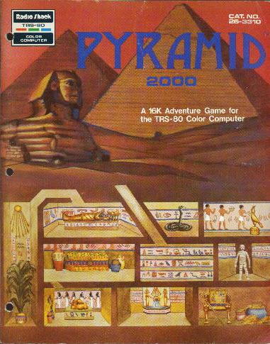

# Pyramid Code

>>> cpu 6809

>>> binary 0600:roms/pyramid.bin

>>> memoryTable ram 

[RAM Usage](RAMUse.md)

>>> memoryTable hard 

[Hardware Info](../Hardware.md)

Loaded from cassette at 0x600 (right after text screen memory).<br>
Executed at 0x0600.

Binary size is 14625 bytes.<br>
14625 + 0x600 = 16161 (223 bytes shy of 16K).

The game uses 65 bytes of memory in low memory beginning at 0x01B0 for temporaries.
These temporaries are not persisted in a SAVE.

The game is loaded into RAM, and the game modifies data structures within the
program's loaded space. Thus the data structures are only initialized at loading. 
The game must be reloaded to start over. 

```code
0600: 10 CE 03 FF     LDS     #$03FF              ; Stack

0604: 8E 01 B1        LDX     #$01B1              ; Temporaries (not 1B0 ... interesting)
0607: C6 64           LDB     #$64                ; 0x64 bytes
0609: 6F 80           CLR     ,X+                 ; clear ...
060B: 5A              DECB                        ; ... the ...
060C: 26 FB           BNE     $0609               ; {} ... temporaries

060E: 4F              CLRA                        
060F: 8E 04 00        LDX     #$0400              ; Start of screen
0612: CE 60 60        LDU     #$6060              ; Space - Space
0615: EF 81           STU     ,X++                ; Clear ...
0617: 4A              DECA                        ; ... the ...
0618: 26 FB           BNE     $0615               ; {} ... screen

061A: 8E 05 E0        LDX     #$05E0              ; Cursor ...
061D: 9F 88           STX     <$88                ; {ram.cursor} ... position
061F: 86 0D           LDA     #$0D                ; Scroll ...
0621: B7 01 B0        STA     $01B0               ; {ram.m01B0} ... count
0624: 8E 10 21        LDX     #$1021              ; "WELCOME TO PYRAMID!!"
0627: BD 08 FC        JSR     $08FC               ; {code.PrintUnpacked} Print message
062A: BD 09 37        JSR     $0937               ; {code.ReadKey} wait for key
062D: 86 01           LDA     #$01                ; Starting ...
062F: B7 18 E5        STA     $18E5               ; {ram.curRoom} ... room number
0632: BD 0B D2        JSR     $0BD2               ; {code.PrintRoomDescription} Print room description
```

# Main Loop

```code
MainLoop:
0635: 7F 01 E7        CLR     $01E7               ; {ram.m01E7} Clear noun (object within reach)
0638: 7F 01 E8        CLR     $01E8               ; {ram.m01E8} Clear verb (thorw, north, rub, etc)
063B: 7F 01 E9        CLR     $01E9               ; {ram.m01E9} Grammar type (verb, verb+nounInReach, verb+nounInPack)
063E: BD 06 F5        JSR     $06F5               ; {code.GetInputAndParse} Get user input and parse
0641: B6 18 E5        LDA     $18E5               ; {ram.curRoom} Current room
0644: 8E 11 2E        LDX     #$112E              ; Room descriptors
0647: BD 06 85        JSR     $0685               ; {code.FourTableOffset} X = X + (A-1)*4
064A: 30 02           LEAX    2,X                 ; Command-script ...
064C: AE 84           LDX     ,X                  ; ... to X
064E: BD 06 9D        JSR     $069D               ; {code.ProcessRoomScript} Process the command script for the room
0651: 26 0E           BNE     $0661               ; {} The room handled it ... move on
0653: 8E 19 45        LDX     #$1945              ; Generic command script
0656: BD 06 9D        JSR     $069D               ; {code.ProcessRoomScript} Process the input
0659: 26 06           BNE     $0661               ; {} It was handled ... move on
065B: 8E 33 87        LDX     #$3387              ; "I DON'T KNOW HOW TO APPLY THAT WORD HERE."
065E: BD 08 D6        JSR     $08D6               ; {code.PrintPackedMessage} Print message
0661: BD 0A 51        JSR     $0A51               ; {code.AfterEveryStep} Do this stuff after every step
0664: 20 CF           BRA     $0635               ; {code.MainLoop} Back to top of loop
```

# Get Object Info 

An object has a location -- either because it is directly "there" or because it is 
contained by another object that is "there". This method looks up the object data of 
the object or the container and returns the location in B and the object 
pointer (or container pointer) in X.

Parameters:

  * A: object number

Return:

  * B: object's location (or location of container)
  * X: pointer to object's data (or container's data)
  * Z: comparison between object's location and $01BC

```code
GetObjectInfo:
0666: 8E 18 8D        LDX     #$188D              ; Object location table
0669: BD 06 7C        JSR     $067C               ; {code.TwoTableOffset} A is location
066C: A6 80           LDA     ,X+                 ; Get object data
066E: E6 84           LDB     ,X                  ; Get room (or container)
0670: 85 80           BITA    #$80                ; Is object contained by another?
0672: 1F 98           TFR     B,A                 ; Room/container to A
0674: 26 F0           BNE     $0666               ; {code.GetObjectInfo} Yes ... lookup the container object
0676: 30 1F           LEAX    -1,X                ; Point to start of object
0678: B1 01 BC        CMPA    $01BC               ; {ram.m01BC} Compare object's location to test location
067B: 39              RTS                         ; Done
```

# Table Offset Routines 

Objects and rooms are numbered beginning with 1. These routines look up two-byte 
and four-byte values from a table with A as the begins-with-1 offset.

```code
TwoTableOffset:
; X = X + (A-1)*2
;
067C: 1F 89           TFR     A,B                 ; A extended ...
067E: 4F              CLRA                        ; .. to D
067F: 5A              DECB                        ; Object table is 1 based
0680: 58              LSLB                        ; D = D ...
0681: 49              ROLA                        ; ... * 2
0682: 30 8B           LEAX    D,X                 ; Add D to X
0684: 39              RTS                         ; Done

FourTableOffset:
; X = X + (A-1)*4
;
0685: 1F 89           TFR     A,B                 ; A extended ...
0687: 4F              CLRA                        ; ... to D
0688: 5A              DECB                        ; Room table is 1 based
0689: 58              LSLB                        ; D = D ...
068A: 49              ROLA                        ; ... * 2
068B: 58              LSLB                        ; D = D ...
068C: 49              ROLA                        ; ... * 2
068D: 30 8B           LEAX    D,X                 ; Add D to X
068F: 39              RTS                         ; Done
```

# Move Object 

This routine moves an object (or its container) to a new location.

Parameters:

  * B: object number
  * $01BC: new location

Return:

  * X: object pointer

```code
MoveObject:
0690: BD 06 66        JSR     $0666               ; {code.GetObjectInfo} Find object (or object's container)
0693: 30 01           LEAX    1,X                 ; Object's location
0695: B6 01 BC        LDA     $01BC               ; {ram.m01BC} New value
0698: A7 84           STA     ,X                  ; Move object to new location
069A: 30 1F           LEAX    -1,X                ; Restore object pointer
069C: 39              RTS                         ; Done
```

# Process Room Script 

A room script is a list of verbs with the commands that go with each. This function 
looks for the one script that matches the verb in $01E8. Then it runs the script. If 
the script "passes" then this function returns Z=0.

If there is no script to match the verb or if the script "fails" then this function returns Z=1.

Parameters:

  * X: points to a list of choices for first-word tokens

Return:

  * Z SET (EQ)   ... no script found OR script was found but it failed
  * Z CLEAR (NE) ... script was found and all commands passed 

Format of word/script description list:

```
AA LL N0 N1 N2   ; First word AA and script comands (N) for AA. LL is size of command list.
BB LL N0 N1      ; Second word BB and script commands (N) for BB. LL is size of command list.
00               ; End of list
```

```code
ProcessRoomScript:
069D: E6 84           LDB     ,X                  ; Get command verb
069F: 27 FB           BEQ     $069C               ; {} End of list ... out (Z SET (EQ) no matching script)
06A1: F6 01 E8        LDB     $01E8               ; {ram.m01E8} User's verb
06A4: E1 80           CMPB    ,X+                 ; Does this list match the input verb?
06A6: 27 05           BEQ     $06AD               ; {} Yes ... run the list
06A8: E6 84           LDB     ,X                  ; Get length
06AA: 3A              ABX                         ; Skip this list
06AB: 20 F0           BRA     $069D               ; {code.ProcessRoomScript} Keep trying lists
;
06AD: BD 06 B4        JSR     $06B4               ; {code.ProcessCommandList} Run script (Z CLEAR (NE) all passed, Z SET (EQ) a command failed)
06B0: 26 EA           BNE     $069C               ; {} If script passed then return Z CLEAR (NE)
06B2: 20 E9           BRA     $069D               ; {code.ProcessRoomScript} Script failed ... try next word/script
```

# Process Command List 

This routine processes a list of commands. The list begins with the size of the list (bytes) 
followed by all the command bytes. The command addresses are looked up from a jump table. Each 
command returns to either the "!FuncPassed" or the "!FuncFailed".

If a command fails then the processing starts and this script "fails". Otherwise all commands 
are executed one after the other.

If all commands pass then the script "passes".

List format:

```
LL A0 A1 B0 B1 B2 B3 C0 C1 ...   ; LL is length followed by commands A, B, and C ...
```

Parameters:

  * X: start of script

Return:

  * Z SET (EQ) failed
  * Z CLEAR (NE) passed

```code
ProcessCommandList:
06B4: 1F 13           TFR     X,U                 ; Hold start of script
06B6: E6 84           LDB     ,X                  ; Length of script
06B8: 3A              ABX                         ; Turn into pointer
06B9: 34 10           PSHS    X                   ; Save pointer to end-of-script position
06BB: 1F 31           TFR     U,X                 ; Start of script back to X
06BD: 30 01           LEAX    1,X                 ; Skip over script length
06BF: A6 80           LDA     ,X+                 ; Get command number
06C1: 34 10           PSHS    X                   ; Hold current script pointer
06C3: 8E 0A 17        LDX     #$0A17              ; Jump table
06C6: BD 06 7C        JSR     $067C               ; {code.TwoTableOffset} Offest
06C9: 6E 94           JMP     [,X]                ; Indirection here ... processing function word
;
; Return from all script commands come here. We either get FuncPassed in which we
; continue to the next (returning a Z CELAR (NE) "pass" when finished). Or we get
; a FuncFailed in which we abort the list and return Z SET (EQ) "fail".
;
; FuncPassed
;
06CB: 35 10           PULS    X                   ; Script pointer
06CD: 35 20           PULS    Y                   ; End-of-script position
06CF: 10 BF 01 BF     STY     $01BF               ; {ram.m01BF} Have we reached ...
06D3: BC 01 BF        CMPX    $01BF               ; {ram.m01BF} ... the end of current script?
06D6: 26 03           BNE     $06DB               ; {} No ... keep processing this script
06D8: 8A 01           ORA     #$01                ; Z CLEAR (all script commands passed)
06DA: 39              RTS                         ; Done
;
06DB: 34 20           PSHS    Y                   ; Put the end-of-script position back on the stack
06DD: 20 E0           BRA     $06BF               ; {} Next routine
;
; FuncFailed
;
06DF: 35 10           PULS    X                   ; Script pointer
06E1: 35 10           PULS    X                   ; End=of-script position
06E3: 4F              CLRA                        ; Z SET (a script command failed)
06E4: 39              RTS                         ; Done
```

# Command 7: Subscript Abort If Pass  

This game command runs a subscript. If the subscript passes then the entire script (no 
matter how many subscripts-deep) ends with a "pass". If the subscript fails then the subscript 
returns "pass" and the next command in the script is executed.

The GET script, for instance, is a list of subscripts that attempt to process specific gets one 
at a time. Like GET WATER then GET SERPENT then GET PLANT and so on. If the first fails (like WATER 
is not in the room) then the subscript ends and the script continues with the next command (the 
next subscript). 

If the second subscript passes (like the SERPENT is here) then the entire script aborts with a "pass".

```code
SubScriptAbortIfPass: 
06E5: 35 10           PULS    X                   ; Script pointer
06E7: BD 06 B4        JSR     $06B4               ; {code.ProcessCommandList} Run script (Z CLEAR (NE) all passed, Z SET (EQ) a command failed)
06EA: 34 10           PSHS    X                   ; Script pointer back to stack
06EC: 27 DD           BEQ     $06CB               ; {} A command failed ... continue parent list
06EE: 35 10           PULS    X                   ; Pop script pointer
06F0: 35 10           PULS    X                   ; Pop end-of-script pointer
06F2: 8A 01           ORA     #$01                ; Script passed ... completely abort processing (with Z CLEAR (NE) all passed)
06F4: 39              RTS                         ; Done
```

# Get Input And Parse 

 This function prompts the user for a command line and parses it. This function 
 does not return until a usable command line has been entered. 

 Return:

   * 01E7 - verb
   * 01E8 - object number (noun)
   * 01E9 - gramar type

```code
GetInputAndParse:
06F5: BD 09 B3        JSR     $09B3               ; {code.PromptAndReadLine} Fill input buffer
06F8: 86 0D           LDA     #$0D                ; Rows left ...
06FA: B7 01 B0        STA     $01B0               ; {ram.m01B0} ... until MORE
06FD: BD 07 C6        JSR     $07C6               ; {} Parse the input string
0700: BE 01 B4        LDX     $01B4               ; {ram.m01B4} Pointer to noun word data
0703: F6 01 B2        LDB     $01B2               ; {ram.m01B2} Number of bytes in word data
0706: B6 01 E9        LDA     $01E9               ; {ram.m01E9} Word grammar
0709: 81 03           CMPA    #$03                ; Value 3 means nothing in buffer
070B: 27 E8           BEQ     $06F5               ; {code.GetInputAndParse} Nothing in buffer ... input again
070D: B6 01 E7        LDA     $01E7               ; {ram.m01E7} Noun
0710: 26 29           BNE     $073B               ; {} We have a noun ... test it
0712: B6 01 E8        LDA     $01E8               ; {ram.m01E8} Action word (throw, rub, get, etc)
0715: 26 15           BNE     $072C               ; {} There is a valid action word ... go handle it
;
; General error message ... didn't understand a thing
0717: F6 01 EA        LDB     $01EA               ; {ram.m01EA} Last general error message
071A: 5C              INCB                        ; Point to next
071B: C4 03           ANDB    #$03                ; Roll around over 4 messages
071D: F7 01 EA        STB     $01EA               ; {ram.m01EA} For next time
0720: 8E 0F 24        LDX     #$0F24              ; Table of general error messages
0723: 58              LSLB                        ; Index to offset
0724: 3A              ABX                         ; Point to error message
0725: AE 84           LDX     ,X                  ; Get address of general error message
0727: BD 08 FC        JSR     $08FC               ; {code.PrintUnpacked} Print the error
072A: 20 C9           BRA     $06F5               ; {code.GetInputAndParse} Back for more
;
072C: B6 01 E9        LDA     $01E9               ; {ram.m01E9} Action word type
072F: 81 C0           CMPA    #$C0                ; 11_000_000 means single word command
0731: 27 C1           BEQ     $06F4               ; {} Done
0733: 8E 0F A2        LDX     #$0FA2              ; "**verb** WHAT?"
0736: BD 08 FC        JSR     $08FC               ; {code.PrintUnpacked} Print it (was expecting an object)
0739: 20 BA           BRA     $06F5               ; {code.GetInputAndParse} Try input again
;
; Validate noun
073B: BF 01 B4        STX     $01B4               ; {ram.m01B4} Save pointer to noun word data
073E: B6 01 B1        LDA     $01B1               ; {ram.m01B1} Was the last input an object and we asked for a verb?
0741: 26 6F           BNE     $07B2               ; {} Yes ... skip checking the noun (use what we have)
0743: 86 FF           LDA     #$FF                ; Location: backpack
0745: B7 01 BC        STA     $01BC               ; {ram.m01BC} Parameter for GetObjectInfo compare
0748: A6 80           LDA     ,X+                 ; Get object number
074A: BF 01 B4        STX     $01B4               ; {ram.m01B4} Hold noun word data pointer
074D: 34 04           PSHS    B                   ; Hold B
074F: BD 06 66        JSR     $0666               ; {code.GetObjectInfo} Find object
0752: 35 04           PULS    B                   ; Restore B
0754: 27 52           BEQ     $07A8               ; {} Object is actually in pack ... go use it
0756: B6 01 E9        LDA     $01E9               ; {ram.m01E9} Grammar type
0759: 81 40           CMPA    #$40                ; 01_000_000 means noun-in-pack
075B: 27 16           BEQ     $0773               ; {} Yes ... check pack
075D: BE 01 B4        LDX     $01B4               ; {ram.m01B4} Noun word pointer
0760: 30 1F           LEAX    -1,X                ; Back up word pointer
0762: B6 18 E5        LDA     $18E5               ; {ram.curRoom} Current room
0765: B7 01 BC        STA     $01BC               ; {ram.m01BC} Parameter to GetObjectInfo
0768: A6 84           LDA     ,X                  ; Object number
076A: 34 04           PSHS    B                   ; Hold B
076C: BD 06 66        JSR     $0666               ; {code.GetObjectInfo} Find object
076F: 35 04           PULS    B                   ; Restore B
0771: 27 35           BEQ     $07A8               ; {} Yes ... object is in room. Use it.
0773: BE 01 B4        LDX     $01B4               ; {ram.m01B4} Restore word data pointer
0776: 5A              DECB                        ; All objects of this name tried?
0777: 26 CA           BNE     $0743               ; {} No ... keep looking for matching object
;
; Object not found error (either not in pack or not in room depending on grammar)
0779: B6 01 E9        LDA     $01E9               ; {ram.m01E9} Grammar type
077C: 81 40           CMPA    #$40                ; 01_000_000 means noun-in-pack
077E: 26 05           BNE     $0785               ; {} Error ... can't find noun in room
0780: 8E 0F 3D        LDX     #$0F3D              ; "YOU AREN'T CARRYING IT." (can't find noun in pack)
0783: 20 19           BRA     $079E               ; {} Print and back to try again
;
0785: 8E 0F 2C        LDX     #$0F2C              ; " I SEE NO "
0788: BD 08 FC        JSR     $08FC               ; {code.PrintUnpacked} Print it
078B: 86 01           LDA     #$01                ; Replace '?' with ...
078D: B7 0F A0        STA     $0FA0               ; {code.unknownNounPunct} ... no-CR terminator
0790: 8E 0F 78        LDX     #$0F78              ; User typed object
0793: BD 08 FC        JSR     $08FC               ; {code.PrintUnpacked} Print the object
0796: 86 3F           LDA     #$3F                ; Restore the ...
0798: B7 0F A0        STA     $0FA0               ; {code.unknownNounPunct} ... '?' at the end of the message
079B: 8E 0F 36        LDX     #$0F36              ; " HERE."
079E: BD 08 FC        JSR     $08FC               ; {code.PrintUnpacked} Print it
07A1: 4F              CLRA                        ; Zero out ...
07A2: B7 01 E7        STA     $01E7               ; {ram.m01E7} ... object
07A5: 7E 06 F5        JMP     $06F5               ; {code.GetInputAndParse} Back to try input again
;
; Found object
07A8: BE 01 B4        LDX     $01B4               ; {ram.m01B4} Object data pointer
07AB: 30 1F           LEAX    -1,X                ; Back up to start
07AD: A6 84           LDA     ,X                  ; Get object number
07AF: B7 01 E7        STA     $01E7               ; {ram.m01E7} Noun
07B2: B6 01 E8        LDA     $01E8               ; {ram.m01E8} Verb
07B5: 27 01           BEQ     $07B8               ; {} Noun but no verb ... prompt for the verb
07B7: 39              RTS                         ; Got verb and noun. Done
;
07B8: 8E 0F 55        LDX     #$0F55              ; "WHAT DO YOU WANT ME TO DO WITH THE *****?"
07BB: BD 08 FC        JSR     $08FC               ; {code.PrintUnpacked} Print message
07BE: 86 01           LDA     #$01                ; We got the object ....
07C0: B7 01 B1        STA     $01B1               ; {ram.m01B1} ... will take just verb
07C3: 7E 06 F5        JMP     $06F5               ; {code.GetInputAndParse} Get user input and parse
;
; Parse the input line
07C6: 8E 01 C6        LDX     #$01C6              ; Start of input buffer
07C9: 7F 01 B3        CLR     $01B3               ; {ram.m01B3} Nothing in buffer to start with
07CC: 7F 01 E9        CLR     $01E9               ; {ram.m01E9} Grammar type
07CF: 10 8E 3C 40     LDY     #$3C40              ; Word table
07D3: 10 BF 01 F0     STY     $01F0               ; {ram.m01F0} Hold pointer
;
; Skip spaces before a word
07D7: A6 84           LDA     ,X                  ; Next in input
07D9: 81 20           CMPA    #$20                ; Skip ...
07DB: 26 04           BNE     $07E1               ; {} ... over ...
07DD: 30 01           LEAX    1,X                 ; ... white ...
07DF: 20 F6           BRA     $07D7               ; {} ... space
;
07E1: BF 01 F2        STX     $01F2               ; {ram.m01F2} Start of token
07E4: 4D              TSTA                        ; End of buffer?
07E5: 10 27 00 A2     LBEQ    $088B               ; {} Yes ... done
07E9: 86 01           LDA     #$01                ; Flag that something ...
07EB: B7 01 B3        STA     $01B3               ; {ram.m01B3} ... is in the buffer
07EE: 34 10           PSHS    X                   ; Remember start of token
07F0: A6 A4           LDA     ,Y                  ; From word table
07F2: 10 27 00 A0     LBEQ    $0896               ; {} Word not found ... clear 1E8 and 1E7 and skip it
07F6: B7 01 F8        STA     $01F8               ; {ram.m01F8} Store word's data
07F9: 84 07           ANDA    #$07                ; Lower 3 bits
07FB: B7 01 BA        STA     $01BA               ; {ram.m01BA} Token length
07FE: B7 01 F4        STA     $01F4               ; {ram.m01F4} Token length again
0801: F6 01 F8        LDB     $01F8               ; {ram.m01F8} Original byte
0804: C4 38           ANDB    #$38                ; Middle 3 bits (bytes in token data)
0806: 57              ASRB                        ; Shifted ...
0807: 57              ASRB                        ; ... to ...
0808: 57              ASRB                        ; ... lower in B
0809: 10 BF 01 F0     STY     $01F0               ; {ram.m01F0} Current word pointer
080D: 31 21           LEAY    1,Y                 ; Next byte
;
; Check input against current word-table ptr
080F: A6 A4           LDA     ,Y                  ; Get character
0811: A1 84           CMPA    ,X                  ; Matches?
0813: 26 65           BNE     $087A               ; {} Nope ... go to next
0815: 30 01           LEAX    1,X                 ; Next in input
0817: 31 21           LEAY    1,Y                 ; Next in token
0819: 7A 01 BA        DEC     $01BA               ; {ram.m01BA} All done?
081C: 26 F1           BNE     $080F               ; {} No ... check em all
081E: B6 01 F4        LDA     $01F4               ; {ram.m01F4} Token length
0821: 81 06           CMPA    #$06                ; Token is 6 long and we matched all?
0823: 27 09           BEQ     $082E               ; {} Yes ... take it but skip any non checked at end
0825: A6 84           LDA     ,X                  ; Next character from user
0827: 81 20           CMPA    #$20                ; A space?
0829: 27 10           BEQ     $083B               ; {} Yes ... perfect match
082B: 4D              TSTA                        ; End of user input?
082C: 26 53           BNE     $0881               ; {} No ... skip token data and try next token
;
082E: A6 84           LDA     ,X                  ; Get character
0830: 81 20           CMPA    #$20                ; A space?
0832: 27 07           BEQ     $083B               ; {} Yes ... found the end
0834: 4D              TSTA                        ; End of buffer?
0835: 27 04           BEQ     $083B               ; {} Yes ... found the end
0837: 30 01           LEAX    1,X                 ; Skip the character
0839: 20 F3           BRA     $082E               ; {} Until space or end
;
; Input word matches word-table
083B: B6 01 F8        LDA     $01F8               ; {ram.m01F8} Original word data
083E: 84 C0           ANDA    #$C0                ; Upper two bits
0840: 27 14           BEQ     $0856               ; {} Go handle object data
;
; Word is a verb (store info)
0842: B7 01 E9        STA     $01E9               ; {ram.m01E9} Save the grammar type
0845: A6 A4           LDA     ,Y                  ; Word value ...
0847: B7 01 E8        STA     $01E8               ; {ram.m01E8} ... is verb
084A: 34 10           PSHS    X                   ; Hold pointer
084C: 8E 0F A2        LDX     #$0FA2              ; Space for printing verb
084F: BD 08 B6        JSR     $08B6               ; {} Copy it over
0852: 35 10           PULS    X                   ; Restore
0854: 20 19           BRA     $086F               ; {} Continue with next token if there is a space next
;
; Word is a noun (store info)
0856: A6 A4           LDA     ,Y                  ; Get word data
0858: B7 01 E7        STA     $01E7               ; {ram.m01E7} Store object number
085B: 10 BF 01 B4     STY     $01B4               ; {ram.m01B4} Store pointer to word data
085F: F7 01 B2        STB     $01B2               ; {ram.m01B2} Store size of object data (number of objects)
0862: 7F 01 B1        CLR     $01B1               ; {ram.m01B1} We no longer remember a past lone object
0865: 34 10           PSHS    X                   ; Hold pointer
0867: 8E 0F 78        LDX     #$0F78              ; "WHAT DO YOU WANT ME TO DO WITH THE ***** ?"
086A: BD 08 B6        JSR     $08B6               ; {} Make the error message in case
086D: 35 10           PULS    X                   ; Restore the pointer
086F: A6 84           LDA     ,X                  ; Next in input buffer
0871: 81 20           CMPA    #$20                ; A space means more to process
0873: 35 20           PULS    Y                   ; Drop stacked word pointer
0875: 10 27 FF 56     LBEQ    $07CF               ; {} Parse next token
0879: 39              RTS                         ; Done
;
; Skip over current entry in token table
087A: 31 21           LEAY    1,Y                 ; Skip to ...
087C: 7A 01 BA        DEC     $01BA               ; {ram.m01BA} ... end of ...
087F: 26 F9           BNE     $087A               ; {} ... token text
0881: 31 21           LEAY    1,Y                 ; Skip to ...
0883: 5A              DECB                        ; ... end of ...
0884: 26 FB           BNE     $0881               ; {} ... token data
0886: 35 10           PULS    X                   ; Restore pointer to start of input word
0888: 7E 07 D7        JMP     $07D7               ; {} Keep trying
;
088B: B6 01 B3        LDA     $01B3               ; {ram.m01B3} Something in the buffer?
088E: 26 E9           BNE     $0879               ; {} Yes ... go handle it
0890: 86 03           LDA     #$03                ; Grammar type 3 means ...
0892: B7 01 E9        STA     $01E9               ; {ram.m01E9} ... nothing in buffer
0895: 39              RTS                         ; Done

; Skip leading space in front of token and then skip to next token.
; If there is another token go back and decode. Otherwise return.
0896: 35 10           PULS    X                   ; Restore pointer to token
0898: 7F 01 E8        CLR     $01E8               ; {ram.m01E8} Clear action word
089B: 7F 01 E7        CLR     $01E7               ; {ram.m01E7} Clear object number
089E: A6 84           LDA     ,X                  ; Character from token
08A0: 81 20           CMPA    #$20                ; Space?
08A2: 26 04           BNE     $08A8               ; {} No ... we found the token
08A4: 30 01           LEAX    1,X                 ; Yes space. Skip ...
08A6: 20 F6           BRA     $089E               ; {} ... to start of token
08A8: A6 84           LDA     ,X                  ; Character from token
08AA: 27 E9           BEQ     $0895               ; {} End of buffer ... done
08AC: 81 20           CMPA    #$20                ; Space?
08AE: 10 27 FF 1D     LBEQ    $07CF               ; {} Yes ... start decoding next token
08B2: 30 01           LEAX    1,X                 ; Skip character
08B4: 20 F2           BRA     $08A8               ; {} Keep looking

; Copy input word to 40-byte destination buffer. Fill end of the buffer
; with '@' characters which are ignored by printer routine.
08B6: 1E 12           EXG     X,Y                 ; Destination to Y
08B8: BE 01 F2        LDX     $01F2               ; {ram.m01F2} Current word in parse buffer
08BB: C6 28           LDB     #$28                ; Max size
08BD: A6 84           LDA     ,X                  ; Character from input word
08BF: 27 0D           BEQ     $08CE               ; {} End of buffer ... end of word
08C1: 81 20           CMPA    #$20                ; Space is end ...
08C3: 27 09           BEQ     $08CE               ; {} ... of word
08C5: A7 A0           STA     ,Y+                 ; Copy the input word ...
08C7: 30 01           LEAX    1,X                 ; ... to the destination
08C9: 5A              DECB                        ; All room ...
08CA: C1 01           CMPB    #$01                ; ... taken?
08CC: 26 EF           BNE     $08BD               ; {} No ... keep going
08CE: 86 40           LDA     #$40                ; '@' characters are ignored by printing
08D0: A7 A0           STA     ,Y+                 ; Fill out ...
08D2: 5A              DECB                        ; ... rest of ...
08D3: 26 F9           BNE     $08CE               ; {} ... destination buffer
08D5: 39              RTS                         ; Done
```

# Print Packed Message 

Unpack a message (or multiple packed messages) and print.

Parameters:

  * X: pointer to message structure

```code
PrintPackedMessage:
08D6: A6 84           LDA     ,X                  ; Get the length
08D8: 27 FB           BEQ     $08D5               ; {} None ... out
08DA: 30 01           LEAX    1,X                 ; Skip over length
08DC: 10 8E 01 C6     LDY     #$01C6              ; Reuse input buffer
08E0: BD 10 66        JSR     $1066               ; {code.UnpackMessage} Unpack and print
08E3: E6 84           LDB     ,X                  ; Get byte
08E5: 27 2C           BEQ     $0913               ; {} 0 ... do CR
08E7: C1 01           CMPB    #$01                ; 1 ...
08E9: 27 EA           BEQ     $08D5               ; {} ... no CR
08EB: 34 10           PSHS    X                   ; Hold pointer
08ED: 1F 98           TFR     B,A                 ; Character to A
08EF: BD 09 45        JSR     $0945               ; {code.PrintCharacterAutoWrap} Print character to screen
08F2: 35 10           PULS    X                   ; Restore pointer
08F4: A6 80           LDA     ,X+                 ; Get next byte from unpacked
08F6: 81 0A           CMPA    #$0A                ; Mark for another packing?
08F8: 27 DC           BEQ     $08D6               ; {code.PrintPackedMessage} Yes ... start again
08FA: 20 E7           BRA     $08E3               ; {} No ... continue this packing
```

# Print an Unpacked Message 

Print an uncompressed message pointed to by X.

Any '@' characters are ignored (allows for padding of words added into a message string).

The messages is terminated by either a 0 or a 1. If the terminator is a 0 then a CR is 
added. If the terminator is a 1 then no CR is added.

```code
PrintUnpacked:
08FC: A6 84           LDA     ,X                  ; Get byte
08FE: 27 13           BEQ     $0913               ; {} End with CR
0900: 81 01           CMPA    #$01                ; Just stop printing ...
0902: 27 D1           BEQ     $08D5               ; {} ... with no CR
0904: 81 40           CMPA    #$40                ; Is it '@'
0906: 27 07           BEQ     $090F               ; {} Just ignore it
0908: 34 10           PSHS    X                   ; Save X
090A: BD 09 45        JSR     $0945               ; {code.PrintCharacterAutoWrap} A to screen
090D: 35 10           PULS    X                   ; Restore X
090F: 30 01           LEAX    1,X                 ; Next in message
0911: 20 E9           BRA     $08FC               ; {code.PrintUnpacked} Keep going
;
; Print a CR
0913: 86 0D           LDA     #$0D                ; CR
0915: BD 09 45        JSR     $0945               ; {code.PrintCharacterAutoWrap} Print a CR
0918: 7A 01 B0        DEC     $01B0               ; {ram.m01B0} Rows left before more
091B: 2B 01           BMI     $091E               ; {code.MorePrompt} Pause print out with MORE
091D: 39              RTS                         ; Done
```

# MorePrompt 

Print MORE and wait for key.

```code
MorePrompt:
091E: 34 74           PSHS    U,Y,X,B             ; 
0920: 86 0D           LDA     #$0D                ; Reset MORE ...
0922: B7 01 B0        STA     $01B0               ; {ram.m01B0} ... row count
0925: 8E 10 19        LDX     #$1019              ; " MORE" message
0928: BD 08 FC        JSR     $08FC               ; {code.PrintUnpacked} Print message
092B: BD 09 37        JSR     $0937               ; {code.ReadKey} Wait for user to press a key
092E: 9E 88           LDX     <$88                ; {ram.cursor} Back pointer ...
0930: 30 19           LEAX    -7,X                ; ... up 7 over ...
0932: 9F 88           STX     <$88                ; {ram.cursor} ... MORE prompt
0934: 35 74           PULS    B,X,Y,U             ; 
0936: 39              RTS                         ; 

ReadKey:
; Read a key from keyboard
;
0937: 34 20           PSHS    Y                   ; Save Y
0939: 7C 01 EB        INC     $01EB               ; {ram.m01EB} Counter
093C: AD 9F A0 00     JSR     [$A000]             ; {hard.POLCAT} Get a key
0940: 27 F7           BEQ     $0939               ; {} Keep going till we get one
0942: 35 20           PULS    Y                   ; Restore
0944: 39              RTS                         ; Out

PrintCharacterAutoWrap:
; Print character in A to screen. This handles auto word-wrapping and
; auto MORE prompting.
;
0945: F6 02 07        LDB     $0207               ; {ram.m0207} Last printed character
0948: C1 20           CMPB    #$20                ; Last printed a space?
094A: 26 16           BNE     $0962               ; {} No ... skip on
094C: 81 20           CMPA    #$20                ; Printing a second space now?
094E: 27 5B           BEQ     $09AB               ; {} Yes ... just skip it (More and out)
0950: 81 2E           CMPA    #$2E                ; A '.' ?
0952: 27 08           BEQ     $095C               ; {} Yes. Ignore leading space.
0954: 81 3F           CMPA    #$3F                ; A '?' ?
0956: 27 04           BEQ     $095C               ; {} Yes. Ignore leading space.
0958: 81 21           CMPA    #$21                ; A '!' ?
095A: 26 06           BNE     $0962               ; {} No. Don't ignore space.
;
095C: DE 88           LDU     <$88                ; {ram.cursor} Back screen ...
095E: 33 5F           LEAU    -1,U                ; ... pointer up ...
0960: DF 88           STU     <$88                ; {ram.cursor} ... over ignored space
;
0962: B7 02 07        STA     $0207               ; {ram.m0207} Store last printed character
0965: AD 9F A0 02     JSR     [$A002]             ; {hard.CHROUT} Print A to screen
0969: 96 89           LDA     <$89                ; {ram.cursor+1} LSB of screen position (we know MSB is a 4 or 5)
096B: 81 FE           CMPA    #$FE                ; Have we reached the end of the screen?
096D: 25 3C           BCS     $09AB               ; {} No ... handle any MORE and out
096F: DE 88           LDU     <$88                ; {ram.cursor} Cursor position
0971: 33 C8 DF        LEAU    $-21,U              ; Back up to end of current row (where it will be after CR)
0974: 86 0D           LDA     #$0D                ; CR ...
0976: AD 9F A0 02     JSR     [$A002]             ; {hard.CHROUT} ... to screen
097A: 7A 01 B0        DEC     $01B0               ; {ram.m01B0} Rows left until MORE is needed
097D: A6 C4           LDA     ,U                  ; Find the ...
097F: 81 60           CMPA    #$60                ; ... space before ...
0981: 27 04           BEQ     $0987               ; {} ... the last ...
0983: 33 5F           LEAU    -1,U                ; ... word ...
0985: 20 F6           BRA     $097D               ; {} ... on the line
;
0987: 33 41           LEAU    1,U                 ; Now pointing to the last word on the line
0989: A6 C4           LDA     ,U                  ; Get next character in buffer
098B: 81 60           CMPA    #$60                ; Is it a space?
098D: 27 1C           BEQ     $09AB               ; {} Yes ... all done
098F: C6 60           LDB     #$60                ; Store a space ...
0991: E7 C4           STB     ,U                  ; ... over this on screen
0993: 81 60           CMPA    #$60                ; Make sure ...
0995: 25 02           BCS     $0999               ; {} ... upper ...
0997: 80 40           SUBA    #$40                ; ... case
0999: B7 02 07        STA     $0207               ; {ram.m0207} Store last printed character
099C: AD 9F A0 02     JSR     [$A002]             ; {hard.CHROUT} Print A to screen on new line
09A0: 20 E5           BRA     $0987               ; {} Move overhang to next line
;
09A2: 34 20           PSHS    Y                   ; Send character ...
09A4: AD 9F A0 02     JSR     [$A002]             ; {hard.CHROUT} ... to ...
09A8: 35 20           PULS    Y                   ; ... screen
09AA: 39              RTS                         ; Done
;
09AB: 7D 01 B0        TST     $01B0               ; {ram.m01B0} Time for a MORE prompt?
09AE: 10 2B FF 6C     LBMI    $091E               ; {code.MorePrompt} Yes ... do it and out
09B2: 39              RTS                         ; Done

PromptAndReadLine:
; Fill input buffer at 1C6 with user input line
09B3: 86 3A           LDA     #$3A                ; A ':'
09B5: BD 09 A2        JSR     $09A2               ; {} Print character without processing
09B8: BD 0A 13        JSR     $0A13               ; {} Print white-ish block
09BB: 8E 01 C6        LDX     #$01C6              ; Input buffer
09BE: 7F 01 BA        CLR     $01BA               ; {ram.m01BA} Input buffer is empty
09C1: 34 34           PSHS    Y,X,B               ; Get ...
09C3: BD 09 37        JSR     $0937               ; {code.ReadKey} ... key from ...
09C6: 35 34           PULS    B,X,Y               ; ... player
09C8: 1F 89           TFR     A,B                 ; Hold original key
09CA: 81 08           CMPA    #$08                ; A backspace?
09CC: 27 2A           BEQ     $09F8               ; {} Yes ... handle backspace
09CE: A7 84           STA     ,X                  ; Save the input to the buffer
09D0: BD 09 A2        JSR     $09A2               ; {} Send the character to the screen
09D3: 81 0D           CMPA    #$0D                ; Was it ENTER
09D5: 27 33           BEQ     $0A0A               ; {} Yes ... store a 0 on end of buffer and clear cursor and DONE
09D7: 8D 3A           BSR     $0A13               ; {} Set cursor to whiteish block
09D9: 7C 01 BA        INC     $01BA               ; {ram.m01BA} Increment character count
09DC: 30 01           LEAX    1,X                 ; Next in buffer pointer
09DE: 10 8E 01 E4     LDY     #$01E4              ; Have ...
09E2: 10 BF 01 BF     STY     $01BF               ; {ram.m01BF} ... we ...
09E6: BC 01 BF        CMPX    $01BF               ; {ram.m01BF} ... reached end of buffer?
09E9: 25 D6           BCS     $09C1               ; {} No ... keep taking keys
09EB: 8D 1F           BSR     $0A0C               ; {} End of buffer ...
09ED: 86 08           LDA     #$08                ; ... pretend ...
09EF: 8D B1           BSR     $09A2               ; {} ... it ...
09F1: BD 0A 13        JSR     $0A13               ; {} ... is ...
09F4: 30 1F           LEAX    -1,X                ; ... backspace
09F6: 20 C9           BRA     $09C1               ; {} Take next key
;
; Backspace
09F8: 30 1F           LEAX    -1,X                ; Back the buffer up one
09FA: 8C 01 C6        CMPX    #$01C6              ; Already at the beginning?
09FD: 25 BC           BCS     $09BB               ; {} Yes ... ignore the backspace
09FF: 8D 0B           BSR     $0A0C               ; {} Store space character to cursor
0A01: 86 08           LDA     #$08                ; Send back-space ...
0A03: BD 09 A2        JSR     $09A2               ; {} ... to screen
0A06: 8D 0B           BSR     $0A13               ; {} Show white-ish block cursor
0A08: 20 B7           BRA     $09C1               ; {} Loop back for next key
;
0A0A: 6F 84           CLR     ,X                  ; New end of the input buffer
0A0C: 86 60           LDA     #$60                ; Space character
0A0E: A7 9F 00 88     STA     [$0088]             ; {ram.cursor} Store to cursor
0A12: 39              RTS                         ; Done
0A13: 86 CF           LDA     #$CF                ; White-ish block
0A15: 20 F7           BRA     $0A0E               ; {} Store to cursor and done
```

# Script Commands 

```code
; This lookup table holds the pointers to the individual script commands. Each command
; reads 1 or 2 bytes of data from the script. The number of extra bytes read is show
; for reference in the table.

ScriptCommands:
;    Address   Number Bytes Name
0A17: 0B 05   ;   1     1   MoveToRoom(room_num)
0A19: 0C 68   ;   2     1   AssertObjectIsInPack(obj_num)
0A1B: 0C 7E   ;   3     1   AssertObjectIsInCurrentRoomOrPack(obj_num)
0A1D: 0D 10   ;   4     2   Print(ps_num)
0A1F: 0F 18   ;   5     0   PrintScoreAndStop
0A21: 00 00   ;   6     -   -
0A23: 06 E5   ;   7     1   StopIfPassElseContinue
0A25: 0F 12   ;   8     0   PrintScore
0A27: 0F 18   ;   9     0   PrintScoreAndStop
0A29: 0C C6   ;  10     1   AssertRandomIsLessOrEqual
0A2B: 0D 1C   ;  11     1   DropObject(obj_num) (NEVER USED)
0A2D: 0C E0   ;  12     1   MoveToRoomIfItWasLastRoom(room_num) (NEVER USED)
0A2F: 0C AB   ;  13     0   AssertPackIsEmptyExceptForEmerald
0A31: 0D 33   ;  14     0   MoveToLastRoom
0A33: 0D 4D   ;  15     0   PrintInventory   
0A35: 0D 92   ;  16     0   PrintRoomDescription
0A37: 0D 98   ;  17     1   AssertObjectMatchesUserInput(obj_num)
0A39: 0D A6   ;  18     1   GetObjectFromRoom(obj_num)
0A3B: 00 00   ;  19     -   -
0A3D: 0D E8   ;  20     0   PrintOK
0A3F: 0D F1   ;  21     2   MoveObjectToRoom(obj_num,room_num)
0A41: 0C F4   ;  22     0   GetUserInputObject
0A43: 0D E2   ;  23     0   DropUserInputObject
0A45: 0C 39   ;  24     1   MoveObjectToCurrentRoom(obj_num)
0A47: 0C 4B   ;  25     2   MoveObjectIntoContainer(obj_num,obj_num)
0A49: 0C 97   ;  26     1   AssertObjectIsInCurrentRoom(obj_num)
0A4B: 0E BB   ;  27     0   LoadGame
0A4D: 0E 81   ;  28     0   SaveGame
0A4F: 0F 1D   ;  29     0   RandomizeDirections (does nothing in CoCo version here)
```

# After Every Step 

This processing takes place after every user input.
  1. Increment the count on the lamp and the number of turns.
  2. Warn the player if the lamp is going dim and change the batteries automatically.

```code
AfterEveryStep:
0A51: 86 0F           LDA     #$0F                ; Lamp (lit version)
0A53: 8E 18 8D        LDX     #$188D              ; Object table
0A56: BD 06 7C        JSR     $067C               ; {code.TwoTableOffset} Get lamp's data
0A59: 30 01           LEAX    1,X                 ; Lit-lamp's location
0A5B: A6 84           LDA     ,X                  ; Get the location
0A5D: 27 54           BEQ     $0AB3               ; {} Not turned on ... skip the burn time
;
; Lamp is lit. Increment the burn time.
0A5F: FC 18 E8        LDD     $18E8               ; {ram.lampTime} Get time
0A62: C3 00 01        ADDD    #$0001              ; Bump time ...
0A65: FD 18 E8        STD     $18E8               ; {ram.lampTime} ... by one
0A68: 81 01           CMPA    #$01                ; Has it been burning 256 turns?
0A6A: 26 47           BNE     $0AB3               ; {} No ... skip checks (should be to $0AF2?)
0A6C: C1 22           CMPB    #$22                ; Warn the player?
0A6E: 26 08           BNE     $0A78               ; {} No ...
0A70: 8E 38 5A        LDX     #$385A              ; "Your lamp is getting dim. Better start to wrap this up ..."
0A73: BD 08 D6        JSR     $08D6               ; {code.PrintPackedMessage} Print message
0A76: 20 7A           BRA     $0AF2               ; {} Continue
;
0A78: C1 36           CMPB    #$36                ; Really getting dim now?
0A7A: 26 37           BNE     $0AB3               ; {} No ... move on
0A7C: 86 0F           LDA     #$0F                ; Find ...
0A7E: 8E 18 8D        LDX     #$188D              ; ... lamp ...
0A81: BD 06 7C        JSR     $067C               ; {code.TwoTableOffset} ... room ...
0A84: 30 01           LEAX    1,X                 ; ... number
0A86: E6 84           LDB     ,X                  ; Get the number
0A88: F7 01 BA        STB     $01BA               ; {ram.m01BA} Hold it
0A8B: 6F 84           CLR     ,X                  ; Room is now ... nowhere
0A8D: 8E 18 8D        LDX     #$188D              ; Object data
0A90: 86 2C           LDA     #$2C                ; Dead lamp
0A92: BD 06 7C        JSR     $067C               ; {code.TwoTableOffset} Offset
0A95: F6 01 BA        LDB     $01BA               ; {ram.m01BA} Lamp's room number
0A98: 30 01           LEAX    1,X                 ; Dead lamp ...
0A9A: E7 84           STB     ,X                  ; ... to pack
0A9C: 86 23           LDA     #$23                ; Batteries
0A9E: C6 FF           LDB     #$FF                ; Pack
0AA0: F7 01 BC        STB     $01BC               ; {ram.m01BC} For find
0AA3: BD 06 66        JSR     $0666               ; {code.GetObjectInfo} Batteries in pack?
0AA6: 27 0B           BEQ     $0AB3               ; {} Yes ... change them
0AA8: 8E 38 D8        LDX     #$38D8              ; "Your lamp has run out of power."
0AAB: BD 08 D6        JSR     $08D6               ; {code.PrintPackedMessage} Print message
0AAE: BD 0B D2        JSR     $0BD2               ; {code.PrintRoomDescription} Print room description (it's dark)
0AB1: 20 3F           BRA     $0AF2               ; {} Continue
;
; Attempt to change batteries
0AB3: BE 18 E8        LDX     $18E8               ; {ram.lampTime} Current lamp time
0AB6: 8C 01 2C        CMPX    #$012C              ; Time to change batteries?
0AB9: 25 37           BCS     $0AF2               ; {} No ... keep going
0ABB: 86 FF           LDA     #$FF                ; Pack
0ABD: B7 01 BC        STA     $01BC               ; {ram.m01BC} For find
0AC0: 86 23           LDA     #$23                ; Batteries
0AC2: BD 06 66        JSR     $0666               ; {code.GetObjectInfo} Do we have them?
0AC5: 26 2B           BNE     $0AF2               ; {} No ... on
0AC7: 86 2C           LDA     #$2C                ; Dead-lamp
0AC9: BD 06 66        JSR     $0666               ; {code.GetObjectInfo} In pack?
0ACC: 26 24           BNE     $0AF2               ; {} No ... move on
0ACE: 30 01           LEAX    1,X                 ; Object room
0AD0: 6F 84           CLR     ,X                  ; Get rid of dead-lamp
0AD2: 86 23           LDA     #$23                ; Get ...
0AD4: 8E 18 8D        LDX     #$188D              ; ... rid ...
0AD7: BD 06 7C        JSR     $067C               ; {code.TwoTableOffset} ... of ...
0ADA: 30 01           LEAX    1,X                 ; ... the ...
0ADC: 6F 84           CLR     ,X                  ; ... batteries
0ADE: 30 02           LEAX    2,X                 ; Put worn out batteries ...
0AE0: 86 FF           LDA     #$FF                ; ... in ...
0AE2: A7 84           STA     ,X                  ; ... backpack ...
0AE4: B7 01 BC        STA     $01BC               ; {ram.m01BC} For move
0AE7: 86 0F           LDA     #$0F                ; Move lit-lamp ...
0AE9: BD 06 90        JSR     $0690               ; {code.MoveObject} ... to old lamp's location
0AEC: 8E 39 1D        LDX     #$391D              ; "I'm changing the batteries ..."
0AEF: BD 08 D6        JSR     $08D6               ; {code.PrintPackedMessage} Print message
;
; Bump the turn-counter in BCD format
0AF2: B6 18 E7        LDA     $18E7               ; {ram.turnsLSB} Number of turns LSB
0AF5: 8B 01           ADDA    #$01                ; Add one
0AF7: 19              DAA                         ; Adjust BCD after addition
0AF8: B7 18 E7        STA     $18E7               ; {ram.turnsLSB} New LSB
0AFB: B6 18 E6        LDA     $18E6               ; {ram.turnsMSB} Number of turns MSB
0AFE: 89 00           ADCA    #$00                ; Add overflow from LSB
0B00: 19              DAA                         ; Adjust BCD after addition
0B01: B7 18 E6        STA     $18E6               ; {ram.turnsMSB} New MSB
0B04: 39              RTS                         ; Done
```

# Command 1: Move To Room X  

This routine moves the player to a new room. If there is light in the new room or light 
in the old room then the move always works. Otherwise there is a 60% chance the move kills you.

If there is light in the new room then the room description is printed.

After every move the code checks the pack for treasures. If there are 2 or more treasures then 
the Mummy moves them all to room 53 (the hard-to-find room in the maze). Then the code moves the 
chest to room 53. Up till now the chest has been in room 0 (out of play). The only way to make the 
chest appear in the maze is to encounter the Mummy!

Once the chest is in a room (any room) the Mummy no longer appears. You only see the Mummy once.

```code
MoveToRoomX:
0B05: 35 10           PULS    X                   ; Processing cursor
0B07: E6 80           LDB     ,X+                 ; Get room number
0B09: 34 10           PSHS    X                   ; Update cursor
0B0B: F7 01 BB        STB     $01BB               ; {ram.m01BB} Remember value for later
0B0E: B6 18 E5        LDA     $18E5               ; {ram.curRoom} Current room
0B11: B7 01 BC        STA     $01BC               ; {ram.m01BC} For find
0B14: 86 0F           LDA     #$0F                ; Lamp (lit version)
0B16: BD 06 66        JSR     $0666               ; {code.GetObjectInfo} Look for lamp in this room
0B19: 27 44           BEQ     $0B5F               ; {} Found it ... there is light
0B1B: 86 FF           LDA     #$FF                ; Backpack value
0B1D: B7 01 BC        STA     $01BC               ; {ram.m01BC} For find
0B20: 86 0F           LDA     #$0F                ; Lamp (lit version)
0B22: BD 06 66        JSR     $0666               ; {code.GetObjectInfo} Look for lamp in backpack
0B25: 27 38           BEQ     $0B5F               ; {} Found it ... there is light
0B27: 8E 17 EB        LDX     #$17EB              ; Ambient light table
0B2A: B6 18 E5        LDA     $18E5               ; {ram.curRoom} Current room
0B2D: BD 06 7C        JSR     $067C               ; {code.TwoTableOffset} * 2
0B30: A6 84           LDA     ,X                  ; Get value from table
0B32: 84 40           ANDA    #$40                ; Light in room?
0B34: 26 29           BNE     $0B5F               ; {} Yes ... no lamp needed
0B36: B6 01 BB        LDA     $01BB               ; {ram.m01BB} New room number
0B39: B7 01 BC        STA     $01BC               ; {ram.m01BC} For find
0B3C: 8E 17 EB        LDX     #$17EB              ; Ambient light table
0B3F: BD 06 7C        JSR     $067C               ; {code.TwoTableOffset} * 2
0B42: A6 84           LDA     ,X                  ; Get value
0B44: 84 40           ANDA    #$40                ; Light in room?
0B46: 26 17           BNE     $0B5F               ; {} Yes ... no lamp needed
0B48: 86 0F           LDA     #$0F                ; Lamp (lit version)
0B4A: BD 06 66        JSR     $0666               ; {code.GetObjectInfo} Get object's data
0B4D: 27 10           BEQ     $0B5F               ; {} We found it ... go on
;
; No light ... probable death (60%)
0B4F: B6 01 EB        LDA     $01EB               ; {ram.m01EB} Rolling timer (a random number)
0B52: 81 67           CMPA    #$67                ; 103/256 = 40% chance of ...
0B54: 25 09           BCS     $0B5F               ; {} ... making it without light
0B56: 8E 37 9A        LDX     #$379A              ; "You fell into a pit and broke ..."
0B59: BD 08 D6        JSR     $08D6               ; {code.PrintPackedMessage} Print message
0B5C: 7E 0F 18        JMP     $0F18               ; {code.PrintScoreAndStop} Endless loop
;
; The move was successful
0B5F: B6 18 E5        LDA     $18E5               ; {ram.curRoom} Current room ...
0B62: B7 18 EA        STA     $18EA               ; {ram.lastRoom} ... is now the last room
0B65: B6 01 BB        LDA     $01BB               ; {ram.m01BB} New ...
0B68: B7 18 E5        STA     $18E5               ; {ram.curRoom} ... current room
0B6B: BD 0B D2        JSR     $0BD2               ; {code.PrintRoomDescription} Print room description
0B6E: 86 2A           LDA     #$2A                ; Object number for "Chest"
0B70: 8E 18 8D        LDX     #$188D              ; Look up the ...
0B73: BD 06 7C        JSR     $067C               ; {code.TwoTableOffset} ... object
0B76: 30 01           LEAX    1,X                 ; Get ...
0B78: A6 84           LDA     ,X                  ; ... object location
0B7A: 26 53           BNE     $0BCF               ; {} Chest is in the maze ... Mummy only happens once
;
; Count treasures in pack
0B7C: 86 2C           LDA     #$2C                ; Number of objects
0B7E: B7 01 BA        STA     $01BA               ; {ram.m01BA} Counter
0B81: 8E 18 8D        LDX     #$188D              ; Object table
0B84: 5F              CLRB                        ; Count
0B85: A6 80           LDA     ,X+                 ; Get object data
0B87: 84 20           ANDA    #$20                ; Is this treasure?
0B89: 27 07           BEQ     $0B92               ; {} No ... skip this object
0B8B: A6 84           LDA     ,X                  ; Is object ...
0B8D: 81 FF           CMPA    #$FF                ; ... in pack?
0B8F: 26 01           BNE     $0B92               ; {} No skip
0B91: 5C              INCB                        ; Increment the count
0B92: 30 01           LEAX    1,X                 ; Next object
0B94: 7A 01 BA        DEC     $01BA               ; {ram.m01BA} Do ...
0B97: 26 EC           BNE     $0B85               ; {} ... all objects
;
0B99: C1 02           CMPB    #$02                ; Got less than 2 treasures?
0B9B: 25 32           BCS     $0BCF               ; {} Yes ... don't steal just one
;
; Move all treasures in pack to room 53 (treasure room)
0B9D: 8E 18 8D        LDX     #$188D              ; Object data
0BA0: 86 2C           LDA     #$2C                ; 44 to do
0BA2: B7 01 BA        STA     $01BA               ; {ram.m01BA} Temporary counter
0BA5: A6 80           LDA     ,X+                 ; Get object data
0BA7: 84 20           ANDA    #$20                ; Is this treasure?
0BA9: 27 0D           BEQ     $0BB8               ; {} No ... skip it
0BAB: A6 84           LDA     ,X                  ; Object location
0BAD: 81 FF           CMPA    #$FF                ; In pack?
0BAF: 26 07           BNE     $0BB8               ; {} No ... skip it
0BB1: 86 35           LDA     #$35                ; Treasure room in the maze
0BB3: A7 84           STA     ,X                  ; Move treasure there
0BB5: 7A 18 EB        DEC     $18EB               ; {ram.numInPack} Minus one object in pack
0BB8: 30 01           LEAX    1,X                 ; Next object
0BBA: 7A 01 BA        DEC     $01BA               ; {ram.m01BA} All done?
0BBD: 26 E6           BNE     $0BA5               ; {} No ... go back
;
; Now make chest appear in room 53 (treasure room)
0BBF: 86 35           LDA     #$35                ; Move ...
0BC1: B7 01 BC        STA     $01BC               ; {ram.m01BC} ... chest ...
0BC4: 86 2A           LDA     #$2A                ; ... to ...
0BC6: BD 06 90        JSR     $0690               ; {code.MoveObject} ... treasure room
0BC9: 8E 39 D6        LDX     #$39D6              ; "Mummy steals your treasure ..."
0BCC: BD 08 D6        JSR     $08D6               ; {code.PrintPackedMessage} Print message
0BCF: 7E 06 CB        JMP     $06CB               ; {} OK

PrintRoomDescription:
; Print room description
0BD2: B6 18 E5        LDA     $18E5               ; {ram.curRoom} Current room
0BD5: 8E 17 EB        LDX     #$17EB              ; Ambient light table
0BD8: BD 06 7C        JSR     $067C               ; {code.TwoTableOffset} X = X + A*2
0BDB: A6 84           LDA     ,X                  ; Get value
0BDD: 84 40           ANDA    #$40                ; Is there light?
0BDF: 26 20           BNE     $0C01               ; {code.PrintObjectsInRoom} Yes ... print description
0BE1: B6 18 E5        LDA     $18E5               ; {ram.curRoom} Current room
0BE4: B7 01 BC        STA     $01BC               ; {ram.m01BC} For find routine
0BE7: 86 0F           LDA     #$0F                ; Lamp (lit version)
0BE9: BD 06 66        JSR     $0666               ; {code.GetObjectInfo} Is lamp in room?
0BEC: 27 13           BEQ     $0C01               ; {code.PrintObjectsInRoom} Yes ... print description
0BEE: 86 FF           LDA     #$FF                ; Pack value
0BF0: B7 01 BC        STA     $01BC               ; {ram.m01BC} For find routine
0BF3: 86 0F           LDA     #$0F                ; Lamp (lit version)
0BF5: BD 06 66        JSR     $0666               ; {code.GetObjectInfo} Is it in pack?
0BF8: 27 07           BEQ     $0C01               ; {code.PrintObjectsInRoom} Yes ... print room contents
0BFA: 8E 38 0C        LDX     #$380C              ; "It is now pitch black ..."
0BFD: BD 08 D6        JSR     $08D6               ; {code.PrintPackedMessage} Print message
0C00: 39              RTS                         ; Done
; 
PrintObjectsInRoom:
; Print object descriptions
0C01: B6 18 E5        LDA     $18E5               ; {ram.curRoom} Current room
0C04: 8E 11 2E        LDX     #$112E              ; Room structures
0C07: BD 06 85        JSR     $0685               ; {code.FourTableOffset} X = X + A * 4
0C0A: AE 84           LDX     ,X                  ; Get description text
0C0C: BD 08 D6        JSR     $08D6               ; {code.PrintPackedMessage} Unpack and print message
0C0F: 5F              CLRB                        ; Start with ...
0C10: 5C              INCB                        ; ... object 1
0C11: B6 18 E5        LDA     $18E5               ; {ram.curRoom} Current room
0C14: B7 01 BC        STA     $01BC               ; {ram.m01BC} For find routine
0C17: C1 2C           CMPB    #$2C                ; Done all objects?
0C19: 24 E5           BHS     $0C00               ; {} Yes ... out
0C1B: 34 04           PSHS    B                   ; Remember count
0C1D: 1F 98           TFR     B,A                 ; Object number
0C1F: BD 06 66        JSR     $0666               ; {code.GetObjectInfo} Get object location
0C22: 35 04           PULS    B                   ; Restore count
0C24: 26 EA           BNE     $0C10               ; {} Not current room, go on
0C26: 1F 98           TFR     B,A                 ; Into position
0C28: 34 04           PSHS    B                   ; Hold current object
0C2A: 8E 18 ED        LDX     #$18ED              ; Object number to object description table
0C2D: BD 06 7C        JSR     $067C               ; {code.TwoTableOffset} Offset
0C30: AE 84           LDX     ,X                  ; Get the object description
0C32: BD 08 D6        JSR     $08D6               ; {code.PrintPackedMessage} Print the object description
0C35: 35 04           PULS    B                   ; Restore count
0C37: 20 D7           BRA     $0C10               ; {} Do all objects
```

# Command 24: Move Object X To Current Room 

Move the specified object to the current room.

```code
MoveObjectXToCurrentRoom:
0C39: 35 10           PULS    X                   ; Current action
0C3B: B6 18 E5        LDA     $18E5               ; {ram.curRoom} Current room
0C3E: B7 01 BC        STA     $01BC               ; {ram.m01BC} For find
0C41: A6 80           LDA     ,X+                 ; Value
0C43: 34 10           PSHS    X                   ; New action cursor
0C45: BD 06 90        JSR     $0690               ; {code.MoveObject} Move object to new location
0C48: 7E 06 CB        JMP     $06CB               ; {} Continue processing
```

# Command 25: Move Object X Into Container Y 

Move the specified object into the specified container object.

```code
MoveObjectXIntoContainerY:
0C4B: 35 10           PULS    X                   ; Get object number and container object number
0C4D: EC 81           LDD     ,X++                ; ... from cursor
0C4F: 34 10           PSHS    X                   ; New cursor
0C51: F7 01 BB        STB     $01BB               ; {ram.m01BB} Hold this
0C54: 8E 18 8D        LDX     #$188D              ; Object table
0C57: BD 06 7C        JSR     $067C               ; {code.TwoTableOffset} * 2
0C5A: A6 84           LDA     ,X                  ; Object data
0C5C: 8A 80           ORA     #$80                ; This object is ...
0C5E: A7 80           STA     ,X+                 ; ... contained
0C60: F6 01 BB        LDB     $01BB               ; {ram.m01BB} Container object
0C63: E7 84           STB     ,X                  ; Set object's container
0C65: 7E 0D E8        JMP     $0DE8               ; {code.PrintOK} Print "OK" and pass.
```

# Command 2: Assert Object X Is In Pack 

Make sure the specified object is in the pack. The object may be contained by 
another object in the pack.

```code
AssertObjectXIsInPack:
0C68: 35 10           PULS    X                   ; Action cursor
0C6A: A6 80           LDA     ,X+                 ; Get value
0C6C: 34 10           PSHS    X                   ; Update cursor
0C6E: C6 FF           LDB     #$FF                ; Backpack value
0C70: F7 01 BC        STB     $01BC               ; {ram.m01BC} For find
0C73: BD 06 66        JSR     $0666               ; {code.GetObjectInfo} Get object
0C76: 27 03           BEQ     $0C7B               ; {} Got it
0C78: 7E 06 DF        JMP     $06DF               ; {} Invalid
0C7B: 7E 06 CB        JMP     $06CB               ; {} Valid
```

# Command 3: Assert Object X Is In Current Room Or Pack 

Make sure the specified object is in the current room or in the pack. 
If so then it is something that player can "see".

The object may be contained by another object in the room or pack.

```code
AssertObjectXIsInCurrentRoomOrPack:
0C7E: 35 10           PULS    X                   ; Action cursor
0C80: A6 80           LDA     ,X+                 ; Get target object
0C82: 34 10           PSHS    X                   ; Update cursor
0C84: B7 01 BB        STA     $01BB               ; {ram.m01BB} Hold this
0C87: F6 18 E5        LDB     $18E5               ; {ram.curRoom} Current room
0C8A: F7 01 BC        STB     $01BC               ; {ram.m01BC} For find
0C8D: BD 06 66        JSR     $0666               ; {code.GetObjectInfo} Check for object in room
0C90: 27 E9           BEQ     $0C7B               ; {} Found it
0C92: B6 01 BB        LDA     $01BB               ; {ram.m01BB} Try ...
0C95: 20 D7           BRA     $0C6E               ; {} ... backpack
```

# Command 26: Assert Object X Is In Current Room 

Make sure the specified object is in the current room (either directly or 
in a container in the room).

```code
AssertObjectXIsInCurrentRoom:
0C97: 35 10           PULS    X                   ; Action cursor
0C99: B6 18 E5        LDA     $18E5               ; {ram.curRoom} Current room
0C9C: B7 01 BC        STA     $01BC               ; {ram.m01BC} For find routine
0C9F: A6 80           LDA     ,X+                 ; Get object
0CA1: 34 10           PSHS    X                   ; Update cursor
0CA3: BD 06 66        JSR     $0666               ; {code.GetObjectInfo} Check for object in room
0CA6: 27 D3           BEQ     $0C7B               ; {} OK ... it's here
0CA8: 7E 06 DF        JMP     $06DF               ; {} Invalid
```

# Command 13: Assert Pack Is Empty Except For Emerald 

Make sure pack is completely empty except for the emerald. In order to get 
the emerald through a "tight squeeze" everything else must be out of the pack.

```code
AssertPackIsEmptyExceptForEmerald:
0CAB: 8E 18 8D        LDX     #$188D              ; Object data
0CAE: C6 01           LDB     #$01                ; First object
0CB0: 30 01           LEAX    1,X                 ; Point to room location
0CB2: C1 1F           CMPB    #$1F                ; This is the "emerald" object
0CB4: 27 06           BEQ     $0CBC               ; {} Don't check that object
0CB6: A6 84           LDA     ,X                  ; Get location
0CB8: 81 FF           CMPA    #$FF                ; In backpack?
0CBA: 27 EC           BEQ     $0CA8               ; {} Yes ... fail
0CBC: 30 01           LEAX    1,X                 ; Next object pointer
0CBE: 5C              INCB                        ; Next object
0CBF: C1 2D           CMPB    #$2D                ; Done them all?
0CC1: 26 ED           BNE     $0CB0               ; {} No ... go back
0CC3: 7E 06 CB        JMP     $06CB               ; {}
```

# Command 10: Assert Random Is Greater Than X 

Assert that the random count is greater than the specified value. 
If so then print "You have crawled around in some little holes ...".

This is used for rooms that have random movement paths.

```code
AssertRandomIsGreaterThanX:
0CC6: 35 10           PULS    X                   ; Cursor
0CC8: E6 80           LDB     ,X+                 ; Comparrison threshold
0CCA: 34 10           PSHS    X                   ; Update cursor
0CCC: F1 01 EB        CMPB    $01EB               ; {ram.m01EB} Random number
0CCF: 23 03           BLS     $0CD4               ; {} Crossed threshold ... success!
0CD1: 7E 06 DF        JMP     $06DF               ; {} Didn't cross threshold ... failure!
0CD4: 8E 31 AC        LDX     #$31AC              ; "You have crawled around in some little holes ..."
0CD7: BD 08 D6        JSR     $08D6               ; {code.PrintPackedMessage} Print message
0CDA: BD 0B D2        JSR     $0BD2               ; {code.PrintRoomDescription} Print room description
0CDD: 7E 06 CB        JMP     $06CB               ; {} OK
```

# Command 12: Move To Room X If It Was Last Room 

?? TODO is this ever used?

Move player to the specified room, but only if that room was the last room. 
This is for when you can only go back the way you came.

```code
MoveToRoomXIfItWasLastRoom:
0CE0: 35 10           PULS    X                   ; Get cursor
0CE2: E6 80           LDB     ,X+                 ; Target room
0CE4: 34 10           PSHS    X                   ; Update cursor
0CE6: F1 18 EA        CMPB    $18EA               ; {ram.lastRoom} Did we just come from there?
0CE9: 26 E6           BNE     $0CD1               ; {} No ... fail
0CEB: 35 10           PULS    X                   ; Cursor
0CED: 30 1F           LEAX    -1,X                ; Back it ..
0CEF: 34 10           PSHS    X                   ; ... up
0CF1: 7E 0B 05        JMP     $0B05               ; {code.MoveToRoomX} Move to room N
```

# Command 22: Get User Input Object 

Move the specified object to the pack. If the object is already in the 
pack then print "You are already carying it". 
Either way this command ALWAYS passes.

This is the last script in the general GET handler.

Note that "You are already carying it" is already being checked in the general input routine.

```code
GetUserInputObject:
0CF4: 86 FF           LDA     #$FF                ; Pack value
0CF6: B7 01 BC        STA     $01BC               ; {ram.m01BC} For find
0CF9: B6 01 E7        LDA     $01E7               ; {ram.m01E7} Object from input (noun)
0CFC: BD 06 66        JSR     $0666               ; {code.GetObjectInfo} Is it already in our pack?
0CFF: 26 09           BNE     $0D0A               ; {} Not in our pack ... pick it up
0D01: 8E 34 0B        LDX     #$340B              ; "You are already carying it"
0D04: BD 08 D6        JSR     $08D6               ; {code.PrintPackedMessage} Print message
0D07: 7E 06 CB        JMP     $06CB               ; {} Passed
0D0A: F6 01 E7        LDB     $01E7               ; {ram.m01E7} Requested object
0D0D: 7E 0D AC        JMP     $0DAC               ; {} Pick up object
```

# Command 4: Print Message X 

Print the specified message (packed message).

```code
PrintMessageX:
0D10: 35 20           PULS    Y                   ; Get cursor
0D12: AE A1           LDX     ,Y++                ; Get address of message
0D14: 34 20           PSHS    Y                   ; Update cursor
0D16: BD 08 D6        JSR     $08D6               ; {code.PrintPackedMessage} Print message
0D19: 7E 06 CB        JMP     $06CB               ; {} Pass
```

# Command 11: Drop Object X 

Move the specified object from the pack to the current room. 
This does assume the object is in the pack.

```code
DropObjectX:
0D1C: 35 10           PULS    X                   ; Get object ...
0D1E: E6 80           LDB     ,X+                 ; ... from cursor
0D20: 34 10           PSHS    X                   ; Restore cursor
0D22: 7A 18 EB        DEC     $18EB               ; {ram.numInPack} No longer in our pack
0D25: B6 18 E5        LDA     $18E5               ; {ram.curRoom} Where the object is going
0D28: B7 01 BC        STA     $01BC               ; {ram.m01BC} For the move
0D2B: 1F 98           TFR     B,A                 ; FOr the move
0D2D: BD 06 90        JSR     $0690               ; {code.MoveObject} Drop object in current room
0D30: 7E 0D E8        JMP     $0DE8               ; {code.PrintOK} OK and out
```

# Command 14: Move To Last Room 

Move the player to the "last" room. If there is no "last" 
room then print an error message.

This command always passes.

```code
MoveToLastRoom:
0D33: F6 18 EA        LDB     $18EA               ; {ram.lastRoom} Last room number
0D36: 27 0C           BEQ     $0D44               ; {} There was no last ... error message
0D38: F7 01 BB        STB     $01BB               ; {ram.m01BB} Hold this
0D3B: B6 18 E5        LDA     $18E5               ; {ram.curRoom} Current room ...
0D3E: B7 18 EA        STA     $18EA               ; {ram.lastRoom} ... is now last-room-number
0D41: 7E 0B 65        JMP     $0B65               ; {} MoveToRoom ... past the room-number-update
0D44: 8E 33 DE        LDX     #$33DE              ; "I don't remember how you got here ..."
0D47: BD 08 D6        JSR     $08D6               ; {code.PrintPackedMessage} Print message
0D4A: 7E 06 CB        JMP     $06CB               ; {} Pass
```

# Command 15: Print Inventory 

List all the objects in the pack. Object that are contained by 
objects in the pack are printed too.

This command always passes.

```code
PrintInventory:
0D4D: B6 18 EB        LDA     $18EB               ; {ram.numInPack} Do we even have anything?
0D50: 26 09           BNE     $0D5B               ; {} Yes ... there is something
0D52: 8E 34 4F        LDX     #$344F              ; "You're not carrying anything."
0D55: BD 08 D6        JSR     $08D6               ; {code.PrintPackedMessage} Print message
0D58: 7E 06 CB        JMP     $06CB               ; {} pass
;
0D5B: 8E 34 65        LDX     #$3465              ; "You are currently holding the following:"
0D5E: BD 08 D6        JSR     $08D6               ; {code.PrintPackedMessage} Print message
0D61: 5F              CLRB                        ; Starting before object 1
0D62: 86 FF           LDA     #$FF                ; Pack value
0D64: B7 01 BC        STA     $01BC               ; {ram.m01BC} For find
0D67: 5C              INCB                        ; Next object
0D68: 1F 98           TFR     B,A                 ; To A
0D6A: 81 2D           CMPA    #$2D                ; Have we checked every object?
0D6C: 24 DC           BHS     $0D4A               ; {} Yes ... out
0D6E: 34 04           PSHS    B                   ; Hold it
0D70: BD 06 66        JSR     $0666               ; {code.GetObjectInfo} Find the objet
0D73: 35 04           PULS    B                   ; Restore it
0D75: 26 EB           BNE     $0D62               ; {} Not in the backpack ... check the others
0D77: 1F 98           TFR     B,A                 ; To A
0D79: 8E 18 ED        LDX     #$18ED              ; Object descriptions
0D7C: 34 04           PSHS    B                   ; Hold it
0D7E: BD 06 7C        JSR     $067C               ; {code.TwoTableOffset} Offset to object description
0D81: 35 04           PULS    B                   ; Restore
0D83: AE 84           LDX     ,X                  ; Pointer to 1st in message pair
0D85: A6 80           LDA     ,X+                 ; Find second ...
0D87: 26 FC           BNE     $0D85               ; {} ... message
0D89: 34 04           PSHS    B                   ; Hold object number
0D8B: BD 08 D6        JSR     $08D6               ; {code.PrintPackedMessage} Print object description
0D8E: 35 04           PULS    B                   ; Restore object number
0D90: 20 D0           BRA     $0D62               ; {} Do all objects
```

# Command 16: Print Room Description

Print the current room description and contained objects. If the room is dark then print "it is dark".

This command always passes.

```code
C_PrintRoomDescription:
0D92: BD 0B D2        JSR     $0BD2               ; {code.PrintRoomDescription} Print room description
0D95: 7E 06 CB        JMP     $06CB               ; {}
```

# Command 17: Assert Object X Matches User Input 

Make sure the input noun matches the specified object.

```code
AssertObjectXMatchesUserInput:
0D98: 35 10           PULS    X                   ; Get the object ...
0D9A: E6 80           LDB     ,X+                 ; ... from the cursor
0D9C: 34 10           PSHS    X                   ; Update cursor
0D9E: F1 01 E7        CMPB    $01E7               ; {ram.m01E7} Same as user input?
0DA1: 27 F2           BEQ     $0D95               ; {} Yes ... pass
0DA3: 7E 06 DF        JMP     $06DF               ; {} Fail
```

# Command 18: Get Object From Room 

Get the specified object from the current room if there is space in the pack and the object is packable.

  * Pack only holds 8 things.
  * Some objects are flagged as "non pick-up-able"

```code
GetObjectFromRoom:
0DA6: 35 10           PULS    X                   ; Get the object's description from the ...
0DA8: E6 80           LDB     ,X+                 ; ... cursor
0DAA: 34 10           PSHS    X                   ; Update the cursor
0DAC: 1F 98           TFR     B,A                 ; Needed here by GetObjectInfo
0DAE: F7 01 BB        STB     $01BB               ; {ram.m01BB} Need again in a moment
0DB1: BD 06 66        JSR     $0666               ; {code.GetObjectInfo} Find the object
0DB4: A6 84           LDA     ,X                  ; Object info
0DB6: 84 40           ANDA    #$40                ; OK to pick up?
0DB8: 26 09           BNE     $0DC3               ; {} Yes ... keep going
0DBA: 8E 34 82        LDX     #$3482              ; "Don't be rediculous."
0DBD: BD 08 D6        JSR     $08D6               ; {code.PrintPackedMessage} Print message
0DC0: 7E 06 CB        JMP     $06CB               ; {} Done
0DC3: B6 18 EB        LDA     $18EB               ; {ram.numInPack} How many do we have?
0DC6: 81 08           CMPA    #$08                ; Already got 8 things?
0DC8: 25 08           BCS     $0DD2               ; {} We got less ... go on and take it
0DCA: 8E 34 20        LDX     #$3420              ; "You can't carry anything more."
0DCD: BD 08 D6        JSR     $08D6               ; {code.PrintPackedMessage} Print message
0DD0: 20 EE           BRA     $0DC0               ; {} And out
0DD2: 7C 18 EB        INC     $18EB               ; {ram.numInPack} Got another one
0DD5: 86 FF           LDA     #$FF                ; Pack value
0DD7: B7 01 BC        STA     $01BC               ; {ram.m01BC} For function
0DDA: B6 01 BB        LDA     $01BB               ; {ram.m01BB} Object number
0DDD: BD 06 90        JSR     $0690               ; {code.MoveObject} Move object
0DE0: 20 06           BRA     $0DE8               ; {code.PrintOK} Print "OK" and out
```

# Command 23: Drop User Input Object 

Drop the object the user requested from the pack.

```code
DropUserInputObject:
0DE2: F6 01 E7        LDB     $01E7               ; {ram.m01E7} Value from user word
0DE5: 7E 0D 22        JMP     $0D22               ; {} Drop object
```

# Command 20: Print OK 

Print "OK".

```code
PrintOK:
0DE8: 8E 33 DA        LDX     #$33DA              ; "OK"
0DEB: BD 08 D6        JSR     $08D6               ; {code.PrintPackedMessage} Print message
0DEE: 7E 06 CB        JMP     $06CB               ; {}
```

# Command 21: Move Object X To Room Y 

Move the specified object to the specified room. This removes 
the target object from any container it might be in.

```code
MoveObjectXToRoomY:
0DF1: 35 10           PULS    X                   ; Cursor
0DF3: EC 81           LDD     ,X++                ; Get object number and room number
0DF5: 34 10           PSHS    X                   ; Update cursor
0DF7: F7 01 BC        STB     $01BC               ; {ram.m01BC} Hold for a second
0DFA: 8E 18 8D        LDX     #$188D              ; Object table
0DFD: BD 06 7C        JSR     $067C               ; {code.TwoTableOffset} Offset
0E00: A6 84           LDA     ,X                  ; Object data
0E02: 84 7F           ANDA    #$7F                ; Trun off ...
0E04: A7 80           STA     ,X+                 ; ... contained bit
0E06: B6 01 BC        LDA     $01BC               ; {ram.m01BC} New location
0E09: A7 84           STA     ,X                  ; Update object location
0E0B: 20 E1           BRA     $0DEE               ; {} Pass
```

#  Print Score 

```code
PrintScore:
0E0D: 7F 02 08        CLR     $0208               ; {ram.m0208} Calculated score LSB
0E10: 7F 02 09        CLR     $0209               ; {ram.m0209} Calculated score MSB
0E13: 8E 18 8D        LDX     #$188D              ; Object data
0E16: C6 2C           LDB     #$2C                ; Object ...
0E18: F7 01 BA        STB     $01BA               ; {ram.m01BA} ... count
0E1B: E6 80           LDB     ,X+                 ; Get object data
0E1D: C4 20           ANDB    #$20                ; Is it a treasure object?
0E1F: 27 1E           BEQ     $0E3F               ; {} No ... skip
0E21: 86 20           LDA     #$20                ; 20 points (BCD) ...
0E23: E6 84           LDB     ,X                  ; ... if object ...
0E25: C1 02           CMPB    #$02                ; ... is at ...
0E27: 27 06           BEQ     $0E2F               ; {} ... pyramid entrance
0E29: C1 FF           CMPB    #$FF                ; 5 points ...
0E2B: 26 12           BNE     $0E3F               ; {} ... if object ...
0E2D: 86 05           LDA     #$05                ; ... is in pack
0E2F: BB 02 08        ADDA    $0208               ; {ram.m0208} Add to ...
0E32: 19              DAA                         ; ... BCD ...
0E33: B7 02 08        STA     $0208               ; {ram.m0208} ... score
0E36: B6 02 09        LDA     $0209               ; {ram.m0209} Extend ...
0E39: 89 00           ADCA    #$00                ; ... overflow ...
0E3B: 19              DAA                         ; ... into ...
0E3C: B7 02 09        STA     $0209               ; {ram.m0209} ... MSB
0E3F: 30 01           LEAX    1,X                 ; Next obect
0E41: 7A 01 BA        DEC     $01BA               ; {ram.m01BA} All tested?
0E44: 26 D5           BNE     $0E1B               ; {} Keep testing
0E46: 86 20           LDA     #$20                ; Space ..
0E48: B7 10 41        STA     $1041               ; {code.scoreSign} ... in message.
0E4B: 8E 10 42        LDX     #$1042              ; Spot for score in message
0E4E: B6 02 09        LDA     $0209               ; {ram.m0209} Calculated score MSB
0E51: BD 0E 6F        JSR     $0E6F               ; {} Add 2 digits
0E54: B6 02 08        LDA     $0208               ; {ram.m0208} Calculated score LSB
0E57: BD 0E 6F        JSR     $0E6F               ; {} Add two digits
0E5A: 8E 10 5A        LDX     #$105A              ; Spot for turn count in message
0E5D: B6 18 E6        LDA     $18E6               ; {ram.turnsMSB} Store MSB ...
0E60: BD 0E 6F        JSR     $0E6F               ; {} ... two digits in buffer
0E63: B6 18 E7        LDA     $18E7               ; {ram.turnsLSB} Store LSB ...
0E66: BD 0E 6F        JSR     $0E6F               ; {} ... two digits in buffer
0E69: 8E 10 36        LDX     #$1036              ; "YOU SCORED **** OUT OF 0220, USING *** TURNS."
0E6C: 7E 08 FC        JMP     $08FC               ; {code.PrintUnpacked} Print message and return
;
; Two digit BCD to ASCII
0E6F: 1F 89           TFR     A,B                 ; Value to A
0E71: 47              ASRA                        ; First ...
0E72: 47              ASRA                        ; ... the ...
0E73: 47              ASRA                        ; ... upper ...
0E74: 47              ASRA                        ; Digit
0E75: BD 0E 7A        JSR     $0E7A               ; {} Convert it
0E78: 1F 98           TFR     B,A                 ; Original back ... do lower digit
0E7A: 84 0F           ANDA    #$0F                ; Only lower 4 bits
0E7C: 8B 30           ADDA    #$30                ; Convert to ASCII number
0E7E: A7 80           STA     ,X+                 ; Store character in buffer
0E80: 39              RTS                         ; Done
```

# Command 28: Save Game 

Save the current state of the game to tape.

```code
SaveGame:
0E81: 8E 3C 27        LDX     #$3C27              ; "Ready Cassette"
0E84: BD 08 D6        JSR     $08D6               ; {code.PrintPackedMessage} Print message
0E87: BD 09 37        JSR     $0937               ; {code.ReadKey} Get a key
0E8A: 81 08           CMPA    #$08                ; Backspace ...
0E8C: 27 2A           BEQ     $0EB8               ; {} ... abort
0E8E: 81 0D           CMPA    #$0D                ; Wait ...
0E90: 26 F5           BNE     $0E87               ; {} ... for ENTER or BACKSPACE
0E92: AD 9F A0 0C     JSR     [$A00C]             ; {hard.WRTLDR} Turn on cassette and write leader
0E96: 86 01           LDA     #$01                ; Block ...
0E98: 97 7C           STA     <$7C                ; {ram.m007C} ... type 1
0E9A: 86 82           LDA     #$82                ; Write ...
0E9C: 97 7D           STA     <$7D                ; {ram.m007D} ... 0x82 bytes
0E9E: 8E 17 EB        LDX     #$17EB              ; Start at ...
0EA1: 9F 7E           STX     <$7E                ; {ram.m007E} ... transient data
0EA3: AD 9F A0 08     JSR     [$A008]             ; {hard.BLKOUT} Write to tape
0EA7: 9F 7E           STX     <$7E                ; {ram.m007E} Continue where we left off
0EA9: 86 01           LDA     #$01                ; Block ...
0EAB: 97 7C           STA     <$7C                ; {ram.m007C} ... type 1
0EAD: 86 82           LDA     #$82                ; Write ...
0EAF: 97 7D           STA     <$7D                ; {ram.m007D} ... 0x82 bytes
0EB1: AD 9F A0 08     JSR     [$A008]             ; {hard.BLKOUT} Write to tape
0EB5: BD 0F 0C        JSR     $0F0C               ; {} Turn motor off
0EB8: 7E 06 CB        JMP     $06CB               ; {}
```

# Command 27: Load Game 

Load the state of the game from tape.

```code
LoadGame:
0EBB: 8E 3C 27        LDX     #$3C27              ; "Ready Cassette"
0EBE: BD 08 D6        JSR     $08D6               ; {code.PrintPackedMessage} Print message
0EC1: BD 09 37        JSR     $0937               ; {code.ReadKey} Wait on a key
0EC4: 81 08           CMPA    #$08                ; Backspace ...
0EC6: 27 F0           BEQ     $0EB8               ; {} ... abort
0EC8: 81 0D           CMPA    #$0D                ; Wait ...
0ECA: 26 F5           BNE     $0EC1               ; {} ... for enter or abort
0ECC: AD 9F A0 04     JSR     [$A004]             ; {hard.CSRDON} Start cassette and sync
0ED0: 8E 17 EB        LDX     #$17EB              ; Start at ...
0ED3: 9F 7E           STX     <$7E                ; {ram.m007E} ... transient data
0ED5: 86 01           LDA     #$01                ; Block ...
0ED7: 97 7C           STA     <$7C                ; {ram.m007C} ... type 1
0ED9: 86 82           LDA     #$82                ; Read ...
0EDB: 97 7D           STA     <$7D                ; {ram.m007D} ... 0x82 bytes
0EDD: AD 9F A0 06     JSR     [$A006]             ; {hard.BLKIN} Read from tape
0EE1: 26 1D           BNE     $0F00               ; {} Error ... report and try again
0EE3: 9F 7E           STX     <$7E                ; {ram.m007E} Keep going
0EE5: 86 01           LDA     #$01                ; Block ...
0EE7: 97 7C           STA     <$7C                ; {ram.m007C} ... type 1
0EE9: 86 82           LDA     #$82                ; Read ...
0EEB: 97 7D           STA     <$7D                ; {ram.m007D} ... 0x82 bytes
0EED: AD 9F A0 06     JSR     [$A006]             ; {hard.BLKIN} Read from tape
0EF1: 26 0D           BNE     $0F00               ; {} Error ... report and try again
0EF3: BD 0F 0C        JSR     $0F0C               ; {} Stop motor
0EF6: BD 0B D2        JSR     $0BD2               ; {code.PrintRoomDescription} Print room description
0EF9: 10 CE 03 FF     LDS     #$03FF              ; Reset stack ...
0EFD: 7E 06 35        JMP     $0635               ; {code.MainLoop} ... and pickup at top of game loop
0F00: BD 0F 0C        JSR     $0F0C               ; {} Turn motor off
0F03: 8E 3C 33        LDX     #$3C33              ; "Checksum Error"
0F06: BD 08 D6        JSR     $08D6               ; {code.PrintPackedMessage} Print messagge
0F09: 7E 0E BB        JMP     $0EBB               ; {code.LoadGame} Try again
0F0C: 86 34           LDA     #$34                ; Motor ...
0F0E: B7 FF 21        STA     $FF21               ; {hard.PIA1_CA} ... off
0F11: 39              RTS                         ; 
```

# Command 8: Print Score 

Print the current score.

```code
C_PrintScore:
0F12: BD 0E 0D        JSR     $0E0D               ; {code.PrintScore} Print score
0F15: 7E 06 CB        JMP     $06CB               ; {}
```

# Command 5: Print Score And Stop

# Command 9: Print Score And Stop

Print the score and go into an endless loop. When the player dies 
the scripts use command 5. When the player quits the scripts 
use command 9.

```code
PrintScoreAndStop:
0F18: BD 0E 0D        JSR     $0E0D               ; {code.PrintScore} Print score
0F1B: 20 FE           BRA     $0F1B               ; {} Endless loop
```

# Command 29: Jump To Top Of Game Loop 

This is what the old PLUGH command does. The TRS80 version works through the room scripts and scrambles
the compass directions. The CoCo version just returns to the top of the game loop (do nothing).

```code
JumpToTopOfGameLoop:
0F1D: 10 CE 03 FF     LDS     #$03FF              ; Forget where we came from ...
0F21: 7E 06 35        JMP     $0635               ; {code.MainLoop} ... and go back to top of game loop
```

# General Error Messages 

The code alternates these for general input failures. The first 
one used is the second message.

```code
PtrErrorString1:
0F24: 0F CA  ; Pointer to "WHAT?"
PtrErrorString2:
0F26: 0F D1  ; Pointer to "I DON'T KNOW THAT WORD."
PtrErrorString3:
0F28: 0F E9  ; Pointer to "I DON'T UNDERSTAND."
PtrErrorString4:
0F2A: 0F FD  ; Pointer to "I DON'T KNOW WHAT YOU MEAN."

; "I SEE NO "
MsgISeeNo:
0F2C: 49 20 53 45 45 20 4E 4F 20 01 

; " HERE."
MsgHere:
0F36: 20 48 45 52 45 2E 00 

; "YOUR AREN'T CARRYING IT."
MsgNotCarrying:
0F3D: 59 4F 55 20 41 52 45 4E 27 54 20 43 41 52 52 59 49 4E 47 20 49 54 2E 00 

; "WHAT DO YOU WANT ME TO DO WITH THE "
MsgWhatDoWith:
0F55: 57 48 41 54 20 44 4F 20 59 4F 55 20 57 41 4E 54 20 4D 45 20 54 4F 20 44 4F 20 57 49 54 48 20 54 48 45 20 

; 40 byte buffer for unknown noun word
unknownNoun:
0F78: 00 00 00 00 00 00 00 00 7E FF 
0F82: FF FF FF FF FF FF FF FF FF FF 
0F8C: FF FF FF FF FF FF FF FF FF FF 
0F96: FF FF FF FF FF FF FF FF FF FF

unknownNounPunct:
; "?"
0FA0: 3F 00 

unknownVerb:
; 40 byte buffer for unknown verb (followed by WHAT?)
0FA2: FF FF FF FF FF FF FF FF FF FF 
0FAC: FF FF FF FF FF FF FF FF FF FF 
0FB6: FF FF FF FF FF FF FF FF FF FF 
0FC0: 00 00 00 00 00 00 00 00 00 00 

ErrorString1:
;" WHAT?"
0FCA: 20 57 48 41 54 3F 00 

ErrorString2:
; "I DON'T KNOW THAT WORD."
0FD1: 49 20 44 4F 4E 27 54 20 4B 4E 4F 57 20 54 48 41 54 20 57 4F 52 44 2E 00 

ErrorString3:
; "I DON'T UNDERSTAND."
0FE9: 49 20 44 4F 4E 27 54 20 55 4E 44 45 52 53 54 41 4E 44 2E 00 

ErrorString4:
; "I DON'T KNOW WHAT YOU MEAN."
0FFD: 49 20 44 4F 4E 27 54 20 4B 4E 4F 57 20 57 48 41 54 20 59 4F 55 20 4D 45 41 4E 2E 00 

MsgMore:
;  " <MORE>",1
1019: 20 3C 4D 4F 52 45 3E 01 

; "WELCOME TO PYRAMID!!"
WelcomeMsg:
1021: 57 45 4C 43 4F 4D 45 20 54 4F 20 50 59 52 41 4D 49 44 21 21 00 

ScoreString:
; YOU_SCORED_______OUT_OF_A_POSSIBLE_0220,_USING______TURNS.
1036: 59 4F 55 20 53 43 4F 52 45 44 20 
scoreSign:
1041: 20
scoreSpot:
1042: 20 20 20 20 20 4F 55 54 20 4F 46 20 30 32 32 30 2C 20 55 53 49 4E 47 20 
turnSpot:
105A: 20 20 20 20 20 54 55 52 4E 53 2E 00 
```

# Packed strings  

By limiting a character to 40 possible values, we can pack three characters into 2 bytes:

40 x 40 x 40 = 64,000 (just shy of 65,536)

The 40 characters from CharTable: ?!2_"'<>/03ABCDEFGHIJKLMNOPQRSTUVWXYZ-,.

The first byte of a packed string is the number of words to unpack. Other printable characters
may be listed after that with a 0 terminating the string.

For instance, PS_02:

```
; YOU_ARE_IN_THE_DESERT.[CR]
07 C7 DE 94 14 4B 5E 96 96 DB 72 F5 59 3E 62 2E 00
```

There are 7 words to unpack (14 bytes) followed by the "2E" period and the null terminator 0.

Each double word is listed LSB first. The first word to unpack is 0xDEC7.

```
val = 0x1494
c1 = val % 40  # 31 -> 'U'
val //= 40
c2 = val % 40  # 25 -> 'O'
val //= 40
c3 = val % 40  # 35 -> 'Y'
```

Which gives us 'YOU' (reversed order).

Next is 1419:

```
c1 = 28  -> 'R'
c2 = 11  -> 'A'
c3 = 3   -> '_' (really the space character)
```

Bringing us to "YOU_AR", and so on.

```code
UnpackMessage:
1066: B7 01 C1        STA     $01C1               ; {ram.m01C1}
1069: 86 01           LDA     #$01                ; 
106B: B7 01 C5        STA     $01C5               ; {ram.m01C5}
;
106E: 10 8E 02 04     LDY     #$0204              ; 
1072: C6 03           LDB     #$03                ; 
1074: F7 01 C2        STB     $01C2               ; {ram.m01C2}
1077: A6 80           LDA     ,X+                 ; Next in message
1079: B7 01 FE        STA     $01FE               ; {ram.m01FE} Save it
107C: A6 80           LDA     ,X+                 ; Next in message
107E: B7 01 FD        STA     $01FD               ; {ram.m01FD} Save it
1081: 31 23           LEAY    3,Y                 ; 
;
1083: CE 00 28        LDU     #$0028              ; Number of characters in map
1086: FF 01 C3        STU     $01C3               ; {ram.m01C3}
1089: 86 11           LDA     #$11                ; 17 passes
108B: B7 02 03        STA     $0203               ; {ram.m0203}
108E: 7F 01 FF        CLR     $01FF               ; {ram.m01FF}
1091: 7F 02 00        CLR     $0200               ; {ram.m0200}
;
1094: 79 01 FE        ROL     $01FE               ; {ram.m01FE}
1097: 79 01 FD        ROL     $01FD               ; {ram.m01FD}
109A: 7A 02 03        DEC     $0203               ; {ram.m0203} All 17 shifts done? (Doesn't change C)
109D: 27 39           BEQ     $10D8               ; {} Yes ... done with next character
109F: 86 00           LDA     #$00                ; Start with 0 (Doesn't change C)
10A1: 89 00           ADCA    #$00                ; Add in carry from ROL
10A3: 78 02 00        ASL     $0200               ; {ram.m0200}
10A6: 79 01 FF        ROL     $01FF               ; {ram.m01FF}
10A9: BB 02 00        ADDA    $0200               ; {ram.m0200}
10AC: B0 01 C4        SUBA    $01C4               ; {ram.m01C4}
10AF: B7 02 02        STA     $0202               ; {ram.m0202}
10B2: B6 01 FF        LDA     $01FF               ; {ram.m01FF}
10B5: B2 01 C3        SBCA    $01C3               ; {ram.m01C3}
10B8: B7 02 01        STA     $0201               ; {ram.m0201}
10BB: 24 0B           BHS     $10C8               ; {}
10BD: FC 02 01        LDD     $0201               ; {ram.m0201}
10C0: F3 01 C3        ADDD    $01C3               ; {ram.m01C3}
10C3: FD 01 FF        STD     $01FF               ; {ram.m01FF}
10C6: 20 06           BRA     $10CE               ; {}
;
10C8: FC 02 01        LDD     $0201               ; {ram.m0201}
10CB: FD 01 FF        STD     $01FF               ; {ram.m01FF}
; Compliment C flag and continue
10CE: 25 04           BCS     $10D4               ; {}
10D0: 1A 01           ORCC    #$01                ; Clear carry ...
10D2: 20 C0           BRA     $1094               ; {} ... and continue
10D4: 1C FE           ANDCC   #$FE                ; Set carry ...
10D6: 20 BC           BRA     $1094               ; {} ... and continue

; Add the character in 0200 to the buffer
10D8: FC 01 FF        LDD     $01FF               ; {ram.m01FF} Character (0 in MSB)
10DB: C3 11 06        ADDD    #$1106              ; Offset into character map
10DE: 1F 03           TFR     D,U                 ; Get character ...
10E0: A6 C4           LDA     ,U                  ; ... from map
10E2: A7 A2           STA     ,-Y                 ; Stuff into buffer
10E4: 7A 01 C2        DEC     $01C2               ; {ram.m01C2} Do all ...
10E7: 26 9A           BNE     $1083               ; {} ... three characters
;
10E9: 10 8E 02 04     LDY     #$0204              ; Expansion buffer
10ED: C6 03           LDB     #$03                ; 3 characters
10EF: A6 A0           LDA     ,Y+                 ; Get next byte
10F1: 34 04           PSHS    B                   ; Save B
10F3: BD 09 45        JSR     $0945               ; {code.PrintCharacterAutoWrap} Print A to screen
10F6: 35 04           PULS    B                   ; Restore B
10F8: 5A              DECB                        ; All 3 done?
10F9: 26 F4           BNE     $10EF               ; {} Do all 3 characters in this pair
10FB: 7A 01 C1        DEC     $01C1               ; {ram.m01C1} Do all ...
10FE: 10 26 FF 6C     LBNE    $106E               ; {} ... pairs of bytes
1102: FC 01 BA        LDD     $01BA               ; {ram.m01BA}
1105: 39              RTS                         ; Done
```

## Character Translation Table 

The packed messages in the game are limited to these characters.

```code
; Character compression table
CharTable:
1106: 3F 21 32 20 22 27 3C 3E 2F 30 33                 ; ?!2_"'<>/03
1111: 41 42 43 44 45 46 47 48 49 4A 4B 4C 4D 4E 4F 50  ; ABCDEFGHIJKLMNOP
1121: 51 52 53 54 55 56 57 58 59 5A 2D 2C 2E           ; QRSTUVWXYZ-,.
```

## Room Table 

Each entry is 4 bytes. The first word is the packed room description. 
The second word is the room's command script.

```code
RoomTable:
;
; 81 rooms numbered starting at 1
;      Description   Script
112E: 1B 66 12 72 ; PS_00 room_1
1132: 1B 9A 12 87 ; PS_01 room_2
1136: 1B DE 12 98 ; PS_02 room_3
113A: 1B DE 12 A9 ; PS_02 room_4
113E: 1B DE 12 BA ; PS_02 room_5
1142: 1B DE 12 CB ; PS_02 room_6
1146: 1B EF 12 DC ; PS_03 room_7
114A: 1C 67 12 ED ; PS_04 room_8
114E: 1C AC 12 FE ; PS_05 room_9
1152: 1D 00 13 0F ; PS_06 room_10
1156: 1D 23 13 24 ; PS_07 room_11
115A: 1D 9E 13 2D ; PS_08 room_12
115E: 1E 0A 13 43 ; PS_09 room_13
1162: 1E DC 13 6E ; PS_0A room_14
1166: 1F 1E 13 77 ; PS_0B room_15
116A: 1F 7A 13 B3 ; PS_0C room_16
116E: 1F AB 13 EE ; PS_0D room_17
1172: 1F C4 13 F7 ; PS_0E room_18
1176: 1F F3 14 36 ; PS_0F room_19
117A: 20 5D 14 4F ; PS_10 room_20
117E: 20 CB 14 64 ; PS_11 room_21
1182: 21 16 14 6D ; PS_12 room_22
1186: 21 42 14 7E ; PS_13 room_23
118A: 21 4A 14 87 ; PS_14 room_24
118E: 21 80 14 98 ; PS_15 room_25
1192: 21 BE 14 AD ; PS_16 room_26
1196: 22 16 14 BA ; PS_17 room_27
119A: 22 2E 14 C7 ; PS_18 room_28
119E: 22 2E 14 DC ; PS_18 room_29
11A2: 22 2E 14 ED ; PS_18 room_30
11A6: 22 2E 15 06 ; PS_18 room_31
11AA: 22 2E 15 0F ; PS_18 room_32
11AE: 22 2E 15 1C ; PS_18 room_33
11B2: 22 2E 15 2D ; PS_18 room_34
11B6: 22 2E 15 3E ; PS_18 room_35
11BA: 22 2E 15 57 ; PS_18 room_36
11BE: 22 2E 15 68 ; PS_18 room_37
11C2: 22 2E 15 71 ; PS_18 room_38
11C6: 22 2E 15 82 ; PS_18 room_39
11CA: 22 2E 15 8F ; PS_18 room_40
11CE: 22 2E 15 9C ; PS_18 room_41
11D2: 21 42 15 A9 ; PS_13 room_42
11D6: 21 42 15 AE ; PS_13 room_43
11DA: 21 42 15 B3 ; PS_13 room_44
11DE: 21 42 15 B8 ; PS_13 room_45
11E2: 21 42 15 BD ; PS_13 room_46
11E6: 21 42 15 C2 ; PS_13 room_47
11EA: 21 42 15 C7 ; PS_13 room_48
11EE: 21 42 15 CC ; PS_13 room_49
11F2: 21 42 15 D1 ; PS_13 room_50
11F6: 21 42 15 D6 ; PS_13 room_51
11FA: 22 50 15 E7 ; PS_19 room_52
11FE: 21 42 15 FC ; PS_13 room_53
1202: 22 AD 16 01 ; PS_1A room_54
1206: 23 06 16 0E ; PS_1B room_55
120A: 23 38 16 1B ; PS_1C room_56
120E: 23 7E 16 39 ; PS_1D room_57
1212: 23 D4 16 42 ; PS_1E room_58
1216: 24 5E 16 57 ; PS_1F room_59
121A: 24 EC 16 64 ; PS_20 room_60
121E: 25 1B 16 AC ; PS_21 room_61
1222: 25 C3 16 C7 ; PS_22 room_62
1226: 26 1D 16 D0 ; PS_23 room_63
122A: 26 43 16 D9 ; PS_24 room_64
122E: 26 65 16 E2 ; PS_25 room_65
1232: 26 C2 17 0B ; PS_26 room_66
1236: 00 00 00 00 ; unused 67
123A: 2A EE 17 E1 ; PS_31 room_68
123E: 00 00 00 00 ; unused 69
1242: 2A CD 17 D8 ; PS_30 room_70
1246: 2A 78 17 CB ; PS_2F room_71
124A: 27 54 17 14 ; PS_27 room_72
124E: 27 AD 17 1D ; PS_28 room_73
1252: 00 00 00 00 ; unused 74
1256: 00 00 00 00 ; unused 75
125A: 28 1F 17 2C ; PS_29 room_76
125E: 2A 12 17 B4 ; PS_2E room_77
1262: 28 68 17 41 ; PS_2A room_78
1266: 29 42 17 4E ; PS_2B room_79
126A: 29 6C 17 57 ; PS_2C room_80
126E: 29 BC 17 64 ; PS_2D room_81
```

## Room Scripts 

These are the specific room scripts. The user input is tried against 
the room script first and then the general handler script.

```code
RoomScripts:

room_1:
; PS_00
; YOU_ARE_STANDING_BEFORE_THE_ENTRANCE_OF_A_PYRAMID.__AROUND_YOU__
; IS_A_DESERT.[CR]
;
1272: 01 03     ; N
1274: 01 02     ;     MoveToRoom(room_2)
1276: 02 03     ; E
1278: 01 03     ;     MoveToRoom(room_3)
127A: 03 03     ; S
127C: 01 04     ;     MoveToRoom(room_4)
127E: 04 03     ; W
1280: 01 05     ;     MoveToRoom(room_5)
1282: 0B 03     ; IN
1284: 01 02     ;     MoveToRoom(room_2)
1286: 00

room_2:
; PS_01
; YOU_ARE_IN_THE_ENTRANCE_TO_THE_PYRAMID.__A_HOLE_IN_THE_FLOOR____
; LEADS_TO_A_PASSAGE_BENEATH_THE_SURFACE.[CR]
;
1287: 03 03     ; S
1289: 01 01     ;    MoveToRoom(room_1)
128B: 0A 03     ; D
128D: 01 07     ;    MoveToRoom(room_7)
128F: 0C 03     ; OUT
1291: 01 01     ;    MoveToRoom(room_1)
1293: 12 03     ; PANEL
1295: 01 1A     ;    MoveToRoom(room_26)
1297: 00

room_3:
; PS_02
; YOU_ARE_IN_THE_DESERT.[CR]
;
1298: 01 03     ; N
129A: 01 06     ;    MoveToRoom(room_6)
129C: 02 03     ; E
129E: 01 03     ;    MoveToRoom(room_3)
12A0: 03 03     ; S
12A2: 01 04     ;    MoveToRoom(room_4)
12A4: 04 03     ; W
12A6: 01 01     ;    MoveToRoom(room_1)
12A8: 00

room_4:
; PS_02
; YOU_ARE_IN_THE_DESERT.[CR]
;
12A9: 01 03     ; N
12AB: 01 01     ;    MoveToRoom(room_1)
12AD: 02 03     ; E
12AF: 01 03     ;    MoveToRoom(room_3)
12B1: 03 03     ; S
12B3: 01 04     ;    MoveToRoom(room_4)
12B5: 04 03     ; W
12B7: 01 05     ;    MoveToRoom(room_5)
12B9: 00

room_5:
; PS_02
; YOU_ARE_IN_THE_DESERT.[CR]
;
12BA: 01 03     ; N
12BC: 01 06     ;    MoveToRoom(room_6)
12BE: 02 03     ; E
12C0: 01 01     ;    MoveToRoom(room_1)
12C2: 03 03     ; S
12C4: 01 04     ;    MoveToRoom(room_4)
12C6: 04 03     ; W
12C8: 01 05     ;    MoveToRoom(room_5)
12CA: 00

room_6:
; PS_02
; YOU_ARE_IN_THE_DESERT.[CR]
;
12CB: 01 03     ; N
12CD: 01 06     ;    MoveToRoom(room_6)
12CF: 02 03     ; E
12D1: 01 03     ;    MoveToRoom(room_3)
12D3: 03 03     ; S
12D5: 01 01     ;    MoveToRoom(room_1)
12D7: 04 03     ; W
12D9: 01 05     ;    MoveToRoom(room_5)
12DB: 00

room_7:
; PS_03
; YOU_ARE_IN_A_SMALL_CHAMBER_BENEATH_A_HOLE_FROM_THE_SURFACE.__A__
; LOW_CRAWL_LEADS_INWARD_TO_THE_WEST.__HIEROGLYPHICS_ON_THE_WALL__
; TRANSLATE,_"CURSE_ALL_WHO_ENTER_THIS_SACRED_CRYPT."[CR]
;
12DC: 09 03     ; U
12DE: 01 02     ;    MoveToRoom(room_2)
12E0: 0C 03     ; OUT
12E2: 01 02     ;    MoveToRoom(room_2)
12E4: 04 03     ; W
12E6: 01 08     ;    MoveToRoom(room_8)
12E8: 0B 03     ; IN
12EA: 01 08     ;    MoveToRoom(room_8)
12EC: 00

room_8:
; PS_04
; YOU_ARE_CRAWLING_OVER_PEBBLES_IN_A_LOW_PASSAGE.__THERE_IS_A_DIM_
; LIGHT_AT_THE_EAST_END_OF_THE_PASSAGE.[CR]
;
12ED: 02 03     ; E
12EF: 01 07     ;    MoveToRoom(room_7)
12F1: 0C 03     ; OUT
12F3: 01 07     ;    MoveToRoom(room_7)
12F5: 04 03     ; W
12F7: 01 09     ;    MoveToRoom(room_9)
12F9: 0B 03     ; IN
12FB: 01 09     ;    MoveToRoom(room_9)
12FD: 00

room_9:
; PS_05
; YOU_ARE_IN_A_ROOM_FILLED_WITH_BROKEN_POTTERY_SHARDS_OF_ANCIENT__
; EGYPTIAN_CRAFTS.__AN_AWKWARD_CORRIDOR_LEADS_UPWARD_AND_WEST.[CR]
;
12FE: 02 03     ; E
1300: 01 08     ;    MoveToRoom(room_8)
1302: 0B 03     ; IN
1304: 01 0A     ;    MoveToRoom(room_10)
1306: 09 03     ; U
1308: 01 0A     ;    MoveToRoom(room_10)
130A: 04 03     ; W
130C: 01 0A     ;    MoveToRoom(room_10)
130E: 00

room_10:
; PS_06
; YOU_ARE_IN_AN_AWKWARD_SLOPING_EAST/WEST_CORRIDOR.[CR]
;
130F: 0A 03     ; D
1311: 01 09     ;    MoveToRoom(room_9)
1313: 02 03     ; E
1315: 01 09     ;    MoveToRoom(room_9)
1317: 0B 03     ; IN
1319: 01 0B     ;    MoveToRoom(room_11)
131B: 04 03     ; W
131D: 01 0B     ;    MoveToRoom(room_11)
131F: 09 03     ; U
1321: 01 0B     ;    MoveToRoom(room_11)
1323: 00

room_11:
; PS_07
; YOU_ARE_IN_A_SPLENDID_CHAMBER_THIRTY_FEET_HIGH.__THE_WALLS_ARE__
; FROZEN_RIVERS_OF_ORANGE_STONE.__AN_AWKWARD_CORRIDOR_AND_A_GOOD__
; PASSAGE_EXIT_FROM_THE_EAST_AND_WEST_SIDES_OF_THE_CHAMBER.[CR]
;
1324: 02 03     ; E
1326: 01 0A     ;    MoveToRoom(room_10)
1328: 04 03     ; W
132A: 01 0C     ;    MoveToRoom(room_12)
132C: 00

room_12:
; PS_08
; AT_YOUR_FEET_IS_A_SMALL_PIT_BREATHING_TRACES_OF_WHITE_MIST.__AN_
; EAST_PASSAGE_ENDS_HERE_EXCEPT_FOR_A_SMALL_CRACK_LEADING_ON._____
; ROUGH_STONE_STEPS_LEAD_DOWN_THE_PIT.[CR]
;
132D: 02 03     ; E
132F: 01 0B     ;    MoveToRoom(room_11)
1331: 0A 0B     ; D
1333: 07 07     ;    StopIfPassElseContinue
1335: 02 25     ;        AssertObjectIsInPack(obj_GOLD)
1337: 04 30 8A  ;        Print(PS_6B:"YOU_ARE_AT_THE_BOTTOM_OF_THE_PIT_WITH_A_BROKEN_NECK.[CR]")
133A: 05        ;        PrintScoreAndStop
133B: 01 0D     ;    MoveToRoom(room_13)
133D: 04 04     ; W
133F: 04 30 AF  ;    Print(PS_6C:"THE_CRACK_IS_FAR_TOO_SMALL_FOR_YOU_TO_FOLLOW.[CR]")
1342: 00

room_13:
; PS_09
; YOU_ARE_AT_ONE_END_OF_A_VAST_HALL_STRETCHING_FORWARD_OUT_OF_____
; SIGHT_TO_THE_WEST.__THERE_ARE_OPENINGS_TO_EITHER_SIDE.__NEARBY,_
; A_WIDE_STONE_STAIRCASE_LEADS_DOWNWARD.__THE_HALL_IS_VERY_MUSTY__
; AND_A_COLD_WIND_BLOWS_UP_THE_STAIRCASE.__THERE_IS_A_PASSAGE_AT__
; THE_TOP_OF_A_DOME_BEHIND_YOU.__ROUGH_STONE_STEPS_LEAD_UP_THE____
; DOME.[CR]
;
1343: 03 03     ; S
1345: 01 0E     ;    MoveToRoom(room_14)
1347: 04 03     ; W
1349: 01 0F     ;    MoveToRoom(room_15)
134B: 0A 03     ; D
134D: 01 10     ;    MoveToRoom(room_16)
134F: 01 03     ; N
1351: 01 10     ;    MoveToRoom(room_16)
1353: 09 0A     ; U
1355: 07 06     ;    StopIfPassElseContinue
1357: 02 25     ;        AssertObjectIsInPack(obj_GOLD)
1359: 04 30 CF  ;        Print(PS_6D:"THE_DOME_IS_UNCLIMBABLE.[CR]")
135C: 01 0C     ;    MoveToRoom(room_12)
135E: 02 0A     ; E
1360: 07 06     ;    StopIfPassElseContinue
1362: 02 25     ;        AssertObjectIsInPack(obj_GOLD)
1364: 04 30 CF  ;        Print(PS_6D:"THE_DOME_IS_UNCLIMBABLE.[CR]")
1367: 01 0C     ;    MoveToRoom(room_12)
1369: 20 03     ; ??20??
136B: 01 1A     ;    MoveToRoom(room_26)
136D: 00

room_14:
; PS_0A
; THIS_IS_A_LOW_ROOM_WITH_A_HIEROGLYPH_ON_THE_WALL.__IT_TRANSLATES
; "YOU_WON'T_GET_IT_UP_THE_STEPS".[CR]
;
136E: 0C 03     ; OUT
1370: 01 0D     ;    MoveToRoom(room_13)
1372: 01 03     ; N
1374: 01 0D     ;    MoveToRoom(room_13)
1376: 00

room_15:
; PS_0B
; YOU_ARE_ON_THE_EAST_BANK_OF_A_BOTTOMLESS_PIT_STRETCHING_ACROSS__
; THE_HALL.__THE_MIST_IS_QUITE_THICK_HERE,_AND_THE_PIT_IS_TOO_WIDE
; TO_JUMP.[CR]
;
1377: 02 03     ; E
1379: 01 0D     ;    MoveToRoom(room_13)
137B: 10 0C     ; JUMP
137D: 07 06     ;    StopIfPassElseContinue
137F: 03 01     ;        AssertObjectIsInCurrentRoomOrPack(obj_bridge_15)
1381: 04 30 E1  ;        Print(PS_6E:"I_RESPECTFULLY_SUGGEST_YOU_GO_ACROSS_THE_BRIDGE_INSTEAD_OF______
;                                     JUMPING.[CR]")
1384: 04 31 10  ;    Print(PS_6F:"YOU_DIDN'T_MAKE_IT.[CR]")
1387: 05        ;    PrintScoreAndStop
1388: 04 0A     ; W
138A: 07 05     ;    StopIfPassElseContinue
138C: 03 01     ;        AssertObjectIsInCurrentRoomOrPack(obj_bridge_15)
138E: 01 12     ;        MoveToRoom(room_18)
1390: 04 31 1F  ;    Print(PS_70:"THERE_IS_NO_WAY_ACROSS_THE_BOTTOMLESS_PIT.[CR]")
1393: 0D 05     ; CROSS
1395: 03 01     ;    AssertObjectIsInCurrentRoomOrPack(obj_bridge_15)
1397: 01 12     ;    MoveToRoom(room_18)
1399: 23 18     ; WAVE
139B: 11 11     ;    AssertObjectMatchesUserInput(obj_SCEPTER)
139D: 07 0C     ;    StopIfPassElseContinue
139F: 03 01     ;        AssertObjectIsInCurrentRoomOrPack(obj_bridge_15)
13A1: 15 01 00  ;        MoveObjectToRoom(obj_bridge_15, room_0)
13A4: 15 02 00  ;        MoveObjectToRoom(obj_bridge_18, room_0)
13A7: 04 3A 5E  ;        Print(PS_AE:"THE_STONE_BRIDGE_HAS_RETRACTED![CR]")
13AA: 18 01     ;    MoveObjectToCurrentRoom(obj_bridge_15)
13AC: 15 02 12  ;    MoveObjectToRoom(obj_bridge_18, room_18)
13AF: 04 3A 75  ;    Print(PS_AF:"A_STONE_BRIDGE_NOW_SPANS_THE_BOTTOMLESS_PIT.[CR]")
13B2: 00

room_16:
; PS_0C
; YOU_ARE_IN_THE_PHARAOH'S_CHAMBER,_WITH_PASSAGES_OFF_IN_ALL______
; DIRECTIONS.[CR]
;
13B3: 09 03     ; U
13B5: 01 0D     ;    MoveToRoom(room_13)
13B7: 02 03     ; E
13B9: 01 0D     ;    MoveToRoom(room_13)
13BB: 03 0A     ; S
13BD: 07 06     ;    StopIfPassElseContinue
13BF: 03 0B     ;        AssertObjectIsInCurrentRoomOrPack(obj_SERPENT)
13C1: 04 31 3D  ;        Print(PS_71:"YOU_CAN'T_GET_BY_THE_SERPENT.[CR]")
13C4: 01 11     ;    MoveToRoom(room_17)
13C6: 01 0A     ; N
13C8: 07 06     ;    StopIfPassElseContinue
13CA: 03 0B     ;        AssertObjectIsInCurrentRoomOrPack(obj_SERPENT)
13CC: 04 31 3D  ;        Print(PS_71:"YOU_CAN'T_GET_BY_THE_SERPENT.[CR]")
13CF: 01 19     ;    MoveToRoom(room_25)
13D1: 04 0A     ; W
13D3: 07 06     ;    StopIfPassElseContinue
13D5: 03 0B     ;        AssertObjectIsInCurrentRoomOrPack(obj_SERPENT)
13D7: 04 31 3D  ;        Print(PS_71:"YOU_CAN'T_GET_BY_THE_SERPENT.[CR]")
13DA: 01 18     ;    MoveToRoom(room_24)
13DC: 26 10     ; THROW
13DE: 11 14     ;    AssertObjectMatchesUserInput(obj_BIRD_boxed)
13E0: 03 0B     ;    AssertObjectIsInCurrentRoomOrPack(obj_SERPENT)
13E2: 15 0B 00  ;    MoveObjectToRoom(obj_SERPENT, room_0)
13E5: 18 13     ;    MoveObjectToCurrentRoom(obj_BIRD)
13E7: 15 14 00  ;    MoveObjectToRoom(obj_BIRD_boxed, room_0)
13EA: 04 3B 21  ;    Print(PS_B4:"THE_BIRD_STATUE_COMES_TO_LIFE_AND_ATTACKS_THE_SERPENT_AND_IN_AN_
;                                 ASTOUNDING_FLURRY,_DRIVES_THE_SERPENT_AWAY.__THE_BIRD_TURNS_BACK
;                                 INTO_A_STATUE.[CR]")
13ED: 00

room_17:
; PS_0D
; YOU_ARE_IN_THE_SOUTH_SIDE_CHAMBER.[CR]
;
13EE: 01 03     ; N
13F0: 01 10     ;    MoveToRoom(room_16)
13F2: 0C 03     ; OUT
13F4: 01 10     ;    MoveToRoom(room_16)
13F6: 00

room_18:
; PS_0E
; YOU_ARE_ON_THE_WEST_SIDE_OF_THE_BOTTOMLESS_PIT_IN_THE_HALL_OF___
; GODS.[CR]
;
13F7: 10 0C     ; JUMP
13F9: 07 06     ;    StopIfPassElseContinue
13FB: 03 02     ;        AssertObjectIsInCurrentRoomOrPack(obj_bridge_18)
13FD: 04 30 E1  ;        Print(PS_6E:"I_RESPECTFULLY_SUGGEST_YOU_GO_ACROSS_THE_BRIDGE_INSTEAD_OF______
;                                     JUMPING.[CR]")
1400: 04 31 10  ;    Print(PS_6F:"YOU_DIDN'T_MAKE_IT.[CR]")
1403: 05        ;    PrintScoreAndStop
1404: 02 0A     ; E
1406: 07 05     ;    StopIfPassElseContinue
1408: 03 02     ;        AssertObjectIsInCurrentRoomOrPack(obj_bridge_18)
140A: 01 0F     ;        MoveToRoom(room_15)
140C: 04 31 1F  ;    Print(PS_70:"THERE_IS_NO_WAY_ACROSS_THE_BOTTOMLESS_PIT.[CR]")
140F: 01 06     ; N
1411: 04 31 53  ;    Print(PS_72:"YOU_HAVE_CRAWLED_THROUGH_A_VERY_LOW_WIDE_PASSAGE_PARALLEL_TO_AND
;                                 NORTH_OF_THE_HALL_OF_GODS.[CR]")
1414: 01 13     ;    MoveToRoom(room_19)
1416: 0D 05     ; CROSS
1418: 03 02     ;    AssertObjectIsInCurrentRoomOrPack(obj_bridge_18)
141A: 01 0F     ;    MoveToRoom(room_15)
141C: 23 18     ; WAVE
141E: 11 11     ;    AssertObjectMatchesUserInput(obj_SCEPTER)
1420: 07 0C     ;    StopIfPassElseContinue
1422: 03 02     ;        AssertObjectIsInCurrentRoomOrPack(obj_bridge_18)
1424: 15 02 00  ;        MoveObjectToRoom(obj_bridge_18, room_0)
1427: 15 01 00  ;        MoveObjectToRoom(obj_bridge_15, room_0)
142A: 04 3A 5E  ;        Print(PS_AE:"THE_STONE_BRIDGE_HAS_RETRACTED![CR]")
142D: 18 02     ;    MoveObjectToCurrentRoom(obj_bridge_18)
142F: 15 01 0F  ;    MoveObjectToRoom(obj_bridge_15, room_15)
1432: 04 3A 75  ;    Print(PS_AF:"A_STONE_BRIDGE_NOW_SPANS_THE_BOTTOMLESS_PIT.[CR]")
1435: 00

room_19:
; PS_0F
; YOU_ARE_AT_THE_WEST_END_OF_THE_HALL_OF_GODS.___A_LOW_WIDE_PASS__
; CONTINUES_WEST_AND_ANOTHER_GOES_NORTH.__TO_THE_SOUTH_IS_A_LITTLE
; PASSAGE_SIX_FEET_OFF_THE_FLOOR.[CR]
;
1436: 03 03     ; S
1438: 01 1C     ;    MoveToRoom(room_28)
143A: 09 03     ; U
143C: 01 1C     ;    MoveToRoom(room_28)
143E: 11 03     ; CLIMB
1440: 01 1C     ;    MoveToRoom(room_28)
1442: 02 03     ; E
1444: 01 12     ;    MoveToRoom(room_18)
1446: 01 03     ; N
1448: 01 12     ;    MoveToRoom(room_18)
144A: 04 03     ; W
144C: 01 14     ;    MoveToRoom(room_20)
144E: 00

room_20:
; PS_10
; YOU_ARE_AT_EAST_END_OF_A_VERY_LONG_HALL_APPARENTLY_WITHOUT_SIDE_
; CHAMBERS.__TO_THE_EAST_A_LOW_WIDE_CRAWL_SLANTS_UP.__TO_THE_NORTH
; A_ROUND_TWO_FOOT_HOLE_SLANTS_DOWN.[CR]
;
144F: 02 03     ; E
1451: 01 13     ;    MoveToRoom(room_19)
1453: 09 03     ; U
1455: 01 13     ;    MoveToRoom(room_19)
1457: 04 03     ; W
1459: 01 15     ;    MoveToRoom(room_21)
145B: 01 03     ; N
145D: 01 16     ;    MoveToRoom(room_22)
145F: 0A 03     ; D
1461: 01 16     ;    MoveToRoom(room_22)
1463: 00

room_21:
; PS_11
; YOU_ARE_AT_THE_WEST_END_OF_A_VERY_LONG_FEATURELESS_HALL.__THE___
; HALL_JOINS_; UP_WITH_A_NARROW_NORTH/SOUTH_PASSAGE.[CR]
;
1464: 02 03     ; E
1466: 01 14     ;    MoveToRoom(room_20)
1468: 01 03     ; N
146A: 01 16     ;    MoveToRoom(room_22)
146C: 00

room_22:
; PS_12
; YOU_ARE_AT_A_CROSSOVER_OF_A_HIGH_N/S_PASSAGE_AND_A_LOW_E/W_ONE.[CR]
;
146D: 04 03     ; W
146F: 01 14     ;    MoveToRoom(room_20)
1471: 01 03     ; N
1473: 01 17     ;    MoveToRoom(room_23)
1475: 02 03     ; E
1477: 01 18     ;    MoveToRoom(room_24)
1479: 03 03     ; S
147B: 01 15     ;    MoveToRoom(room_21)
147D: 00

room_23:
; PS_13
; DEAD_END.[CR]
;
147E: 03 03     ; S
1480: 01 16     ;    MoveToRoom(room_22)
1482: 0C 03     ; OUT
1484: 01 16     ;    MoveToRoom(room_22)
1486: 00

room_24:
; PS_14
; YOU_ARE_IN_THE_WEST_THRONE_CHAMBER.__A_PASSAGE_CONTINUES_WEST___
; AND_UP_FROM_HERE.[CR]
;
1487: 02 03     ; E
1489: 01 10     ;    MoveToRoom(room_16)
148B: 0C 03     ; OUT
148D: 01 10     ;    MoveToRoom(room_16)
148F: 04 03     ; W
1491: 01 16     ;    MoveToRoom(room_22)
1493: 09 03     ; U
1495: 01 16     ;    MoveToRoom(room_22)
1497: 00

room_25:
; PS_15
; YOU_ARE_IN_A_LOW_N/S_PASSAGE_AT_A_HOLE_IN_THE_FLOOR.__THE_HOLE__
; GOES_DOWN_TO_AN_E/W_PASSAGE.[CR]
;
1498: 0C 03     ; OUT
149A: 01 10     ;    MoveToRoom(room_16)
149C: 03 03     ; S
149E: 01 10     ;    MoveToRoom(room_16)
14A0: 01 03     ; N
14A2: 01 1A     ;    MoveToRoom(room_26)
14A4: 20 03     ; ??20??
14A6: 01 1A     ;    MoveToRoom(room_26)
14A8: 0A 03     ; D
14AA: 01 36     ;    MoveToRoom(room_54)
14AC: 00

room_26:
; PS_16
; YOU_ARE_IN_A_LARGE_ROOM,_WITH_A_PASSAGE_TO_THE_SOUTH,_AND_A_WALL
; OF_BROKEN_ROCK_TO_THE_EAST.__THERE_IS_A_PANEL_ON_THE_NORTH_WALL.[CR]
;
14AD: 12 03     ; PANEL
14AF: 01 02     ;    MoveToRoom(room_2)
14B1: 03 03     ; S
14B3: 01 19     ;    MoveToRoom(room_25)
14B5: 02 03     ; E
14B7: 01 1B     ;    MoveToRoom(room_27)
14B9: 00

room_27:
; PS_17
; YOU_ARE_IN_THE_CHAMBER_OF_ANUBIS.[CR]
;
14BA: 0A 03     ; D
14BC: 01 1A     ;    MoveToRoom(room_26)
14BE: 20 03     ; ??20??
14C0: 01 1A     ;    MoveToRoom(room_26)
14C2: 09 03     ; U
14C4: 01 0D     ;    MoveToRoom(room_13)
14C6: 00

room_28:
; PS_18
; YOU_ARE_IN_A_MAZE_OF_TWISTY_PASSAGES,_ALL_ALIKE.[CR]
;
14C7: 01 03     ; N
14C9: 01 1C     ;    MoveToRoom(room_28)
14CB: 02 03     ; E
14CD: 01 20     ;    MoveToRoom(room_32)
14CF: 03 03     ; S
14D1: 01 1E     ;    MoveToRoom(room_30)
14D3: 04 03     ; W
14D5: 01 1D     ;    MoveToRoom(room_29)
14D7: 09 03     ; U
14D9: 01 13     ;    MoveToRoom(room_19)
14DB: 00

room_29:
; PS_18
; YOU_ARE_IN_A_MAZE_OF_TWISTY_PASSAGES,_ALL_ALIKE.[CR]
;
14DC: 01 03     ; N
14DE: 01 1C     ;    MoveToRoom(room_28)
14E0: 02 03     ; E
14E2: 01 33     ;    MoveToRoom(room_51)
14E4: 03 03     ; S
14E6: 01 1D     ;    MoveToRoom(room_29)
14E8: 04 03     ; W
14EA: 01 1D     ;    MoveToRoom(room_29)
14EC: 00

room_30:
; PS_18
; YOU_ARE_IN_A_MAZE_OF_TWISTY_PASSAGES,_ALL_ALIKE.[CR]
;
14ED: 01 03     ; N
14EF: 01 20     ;    MoveToRoom(room_32)
14F1: 02 03     ; E
14F3: 01 2A     ;    MoveToRoom(room_42)
14F5: 03 03     ; S
14F7: 01 2B     ;    MoveToRoom(room_43)
14F9: 04 03     ; W
14FB: 01 1C     ;    MoveToRoom(room_28)
14FD: 09 03     ; U
14FF: 01 1F     ;    MoveToRoom(room_31)
1501: 0A 03     ; D
1503: 01 1F     ;    MoveToRoom(room_31)
1505: 00

room_31:
; PS_18
; YOU_ARE_IN_A_MAZE_OF_TWISTY_PASSAGES,_ALL_ALIKE.[CR]
;
1506: 09 03     ; U
1508: 01 1E     ;    MoveToRoom(room_30)
150A: 0A 03     ; D
150C: 01 1E     ;    MoveToRoom(room_30)
150E: 00

room_32:
; PS_18
; YOU_ARE_IN_A_MAZE_OF_TWISTY_PASSAGES,_ALL_ALIKE.[CR]
;
150F: 02 03     ; E
1511: 01 1E     ;    MoveToRoom(room_30)
1513: 03 03     ; S
1515: 01 21     ;    MoveToRoom(room_33)
1517: 04 03     ; W
1519: 01 1C     ;    MoveToRoom(room_28)
151B: 00

room_33:
; PS_18
; YOU_ARE_IN_A_MAZE_OF_TWISTY_PASSAGES,_ALL_ALIKE.[CR]
;
151C: 01 03     ; N
151E: 01 2C     ;    MoveToRoom(room_44)
1520: 02 03     ; E
1522: 01 20     ;    MoveToRoom(room_32)
1524: 03 03     ; S
1526: 01 22     ;    MoveToRoom(room_34)
1528: 0A 03     ; D
152A: 01 2D     ;    MoveToRoom(room_45)
152C: 00

room_34:
; PS_18
; YOU_ARE_IN_A_MAZE_OF_TWISTY_PASSAGES,_ALL_ALIKE.[CR]
;
152D: 02 03     ; E
152F: 01 21     ;    MoveToRoom(room_33)
1531: 03 03     ; S
1533: 01 23     ;    MoveToRoom(room_35)
1535: 04 03     ; W
1537: 01 25     ;    MoveToRoom(room_37)
1539: 0A 03     ; D
153B: 01 26     ;    MoveToRoom(room_38)
153D: 00

room_35:
; PS_18
; YOU_ARE_IN_A_MAZE_OF_TWISTY_PASSAGES,_ALL_ALIKE.[CR]
;
153E: 01 03     ; N
1540: 01 24     ;    MoveToRoom(room_36)
1542: 02 03     ; E
1544: 01 26     ;    MoveToRoom(room_38)
1546: 03 03     ; S
1548: 01 23     ;    MoveToRoom(room_35)
154A: 04 03     ; W
154C: 01 22     ;    MoveToRoom(room_34)
154E: 09 03     ; U
1550: 01 27     ;    MoveToRoom(room_39)
1552: 0A 03     ; D
1554: 01 2F     ;    MoveToRoom(room_47)
1556: 00

room_36:
; PS_18
; YOU_ARE_IN_A_MAZE_OF_TWISTY_PASSAGES,_ALL_ALIKE.[CR]
;
1557: 01 03     ; N
1559: 01 24     ;    MoveToRoom(room_36)
155B: 02 03     ; E
155D: 01 34     ;    MoveToRoom(room_52)
155F: 04 03     ; W
1561: 01 23     ;    MoveToRoom(room_35)
1563: 0A 03     ; D
1565: 01 30     ;    MoveToRoom(room_48)
1567: 00

room_37:
; PS_18
; YOU_ARE_IN_A_MAZE_OF_TWISTY_PASSAGES,_ALL_ALIKE.[CR]
;
1568: 02 03     ; E
156A: 01 22     ;    MoveToRoom(room_34)
156C: 04 03     ; W
156E: 01 26     ;    MoveToRoom(room_38)
1570: 00

room_38:
; PS_18
; YOU_ARE_IN_A_MAZE_OF_TWISTY_PASSAGES,_ALL_ALIKE.[CR]
;
1571: 02 03     ; E
1573: 01 23     ;    MoveToRoom(room_35)
1575: 03 03     ; S
1577: 01 27     ;    MoveToRoom(room_39)
1579: 04 03     ; W
157B: 01 25     ;    MoveToRoom(room_37)
157D: 09 03     ; U
157F: 01 22     ;    MoveToRoom(room_34)
1581: 00

room_39:
; PS_18
; YOU_ARE_IN_A_MAZE_OF_TWISTY_PASSAGES,_ALL_ALIKE.[CR]
;
1582: 01 03     ; N
1584: 01 23     ;    MoveToRoom(room_35)
1586: 03 03     ; S
1588: 01 2E     ;    MoveToRoom(room_46)
158A: 04 03     ; W
158C: 01 26     ;    MoveToRoom(room_38)
158E: 00

room_40:
; PS_18
; YOU_ARE_IN_A_MAZE_OF_TWISTY_PASSAGES,_ALL_ALIKE.[CR]
;
158F: 01 03     ; N
1591: 01 34     ;    MoveToRoom(room_52)
1593: 04 03     ; W
1595: 01 29     ;    MoveToRoom(room_41)
1597: 08 03     ; NW
1599: 01 35     ;    MoveToRoom(room_53)
159B: 00

room_41:
; PS_18
; YOU_ARE_IN_A_MAZE_OF_TWISTY_PASSAGES,_ALL_ALIKE.[CR]
;
159C: 02 03     ; E
159E: 01 28     ;    MoveToRoom(room_40)
15A0: 03 03     ; S
15A2: 01 34     ;    MoveToRoom(room_52)
15A4: 04 03     ; W
15A6: 01 32     ;    MoveToRoom(room_50)
15A8: 00

room_42:
; PS_13
; DEAD_END.[CR]
;
15A9: 04 03     ; W
15AB: 01 1E     ;    MoveToRoom(room_30)
15AD: 00

room_43:
; PS_13
; DEAD_END.[CR]
;
15AE: 02 03     ; E
15B0: 01 1E     ;    MoveToRoom(room_30)
15B2: 00

room_44:
; PS_13
; DEAD_END.[CR]
;
15B3: 03 03     ; S
15B5: 01 21     ;    MoveToRoom(room_33)
15B7: 00

room_45:
; PS_13
; DEAD_END.[CR]
;
15B8: 09 03     ; U
15BA: 01 21     ;    MoveToRoom(room_33)
15BC: 00

room_46:
; PS_13
; DEAD_END.[CR]
;
15BD: 04 03     ; W
15BF: 01 27     ;    MoveToRoom(room_39)
15C1: 00

room_47:
; PS_13
; DEAD_END.[CR]
;
15C2: 09 03     ; U
15C4: 01 23     ;    MoveToRoom(room_35)
15C6: 00

room_48:
; PS_13
; DEAD_END.[CR]
;
15C7: 09 03     ; U
15C9: 01 24     ;    MoveToRoom(room_36)
15CB: 00

room_49:
; PS_13
; DEAD_END.[CR]
;
15CC: 02 03     ; E
15CE: 01 34     ;    MoveToRoom(room_52)
15D0: 00

room_50:
; PS_13
; DEAD_END.[CR]
;
15D1: 02 03     ; E
15D3: 01 29     ;    MoveToRoom(room_41)
15D5: 00

room_51:
; PS_13
; DEAD_END.[CR]
;
15D6: 04 03     ; W
15D8: 01 1D     ;    MoveToRoom(room_29)
15DA: 21 0B     ; DROP
15DC: 11 29     ;    AssertObjectMatchesUserInput(obj_COINS)
15DE: 15 29 00  ;    MoveObjectToRoom(obj_COINS, room_0)
15E1: 18 23     ;    MoveObjectToCurrentRoom(obj_BATTERIES_fresh)
15E3: 04 3A D8  ;    Print(PS_B2:"THERE_ARE_NOW_SOME_FRESH_BATTERIES_HERE.[CR]")
15E6: 00

room_52:
; PS_19
; YOU_ARE_ON_THE_BRINK_OF_A_LARGE_PIT.__YOU_COULD_CLIMB_DOWN,_BUT_
; YOU_WOULD_NOT_BE_ABLE_TO_CLIMB_BACK_UP.__THE_MAZE_CONTINUES_ON__
; THIS_LEVEL.[CR]
;
15E7: 01 03     ; N
15E9: 01 29     ;    MoveToRoom(room_41)
15EB: 02 03     ; E
15ED: 01 28     ;    MoveToRoom(room_40)
15EF: 03 03     ; S
15F1: 01 31     ;    MoveToRoom(room_49)
15F3: 04 03     ; W
15F5: 01 24     ;    MoveToRoom(room_36)
15F7: 0A 03     ; D
15F9: 01 0B     ;    MoveToRoom(room_11)
15FB: 00

room_53:
; PS_13
; DEAD_END.[CR]
;
15FC: 06 03     ; SE
15FE: 01 28     ;    MoveToRoom(room_40)
1600: 00

room_54:
; PS_1A
; YOU_ARE_IN_A_DIRTY_BROKEN_PASSAGE.__TO_THE_EAST_IS_A_CRAWL.__TO_
; THE_WEST_IS_A_LARGE_PASSAGE.__ABOVE_YOU_IS_A_HOLE_TO_ANOTHER____
; PASSAGE.[CR]
;
1601: 02 03     ; E
1603: 01 37     ;    MoveToRoom(room_55)
1605: 04 03     ; W
1607: 01 39     ;    MoveToRoom(room_57)
1609: 09 03     ; U
160B: 01 19     ;    MoveToRoom(room_25)
160D: 00

room_55:
; PS_1B
; YOU_ARE_ON_THE_BRINK_OF_A_SMALL_CLEAN_CLIMBABLE_PIT.__A_CRAWL___
; LEADS_WEST.[CR]
;
160E: 04 03     ; W
1610: 01 36     ;    MoveToRoom(room_54)
1612: 0A 03     ; D
1614: 01 38     ;    MoveToRoom(room_56)
1616: 11 03     ; CLIMB
1618: 01 38     ;    MoveToRoom(room_56)
161A: 00

room_56:
; PS_1C
; YOU_ARE_IN_THE_BOTTOM_OF_A_SMALL_PIT_WITH_A_LITTLE_STREAM,_WHICH
; ENTERS_AND_EXITS_THROUGH_TINY_SLITS.[CR]
;
161B: 09 03     ; U
161D: 01 37     ;    MoveToRoom(room_55)
161F: 0C 03     ; OUT
1621: 01 37     ;    MoveToRoom(room_55)
1623: 11 03     ; CLIMB
1625: 01 37     ;    MoveToRoom(room_55)
1627: 0A 04     ; D
1629: 04 31 92  ;    Print(PS_73:"YOU_DON'T_FIT_THROUGH_TWO-INCH_SLIT![CR]")
162C: 27 0B     ; FILL
162E: 07 06     ;    StopIfPassElseContinue
1630: 02 1C     ;        AssertObjectIsInPack(obj_WATER)
1632: 04 39 C1  ;        Print(PS_AC:"YOUR_BOTTLE_IS_ALREADY_FULL.[CR]")
1635: 19 1C 1B  ;    MoveObjectIntoContainer(obj_WATER, obj_BOTTLE)
1638: 00

room_57:
; PS_1D
; YOU_ARE_IN_A_THE_ROOM_OF_BES,_WHOSE_PICTURE_IS_ON_THE_WALL._____
; THERE_IS_A_BIG_HOLE_IN_THE_FLOOR.__THERE_IS_A_PASSAGE_LEADING___
; EAST.[CR]
;
1639: 02 03     ; E
163B: 01 36     ;    MoveToRoom(room_54)
163D: 0A 03     ; D
163F: 01 3A     ;    MoveToRoom(room_58)
1641: 00

room_58:
; PS_1E
; YOU_ARE_AT_A_COMPLEX_JUNCTION.__A_LOW_HANDS_AND_KNEES_PASSAGE___
; FROM_THE_NORTH_JOINS_A_HIGHER_CRAWL_FROM_THE_EAST_TO_MAKE_A_____
; WALKING_PASSAGE_GOING_WEST.__THERE_IS_ALSO_A_LARGE_ROOM_ABOVE.__
; THE_AIR_IS_DAMP_HERE.[CR]
;
1642: 01 03     ; N
1644: 01 3D     ;    MoveToRoom(room_61)
1646: 02 03     ; E
1648: 01 3B     ;    MoveToRoom(room_59)
164A: 04 03     ; W
164C: 01 41     ;    MoveToRoom(room_65)
164E: 09 03     ; U
1650: 01 39     ;    MoveToRoom(room_57)
1652: 11 03     ; CLIMB
1654: 01 39     ;    MoveToRoom(room_57)
1656: 00

room_59:
; PS_1F
; YOU_ARE_IN_THE_UNDERWORLD_ANTEROOM_OF_SEKER.__PASSAGES_GO_EAST,_
; WEST,_AND_UP.__HUMAN_BONES_ARE_STREWN_ABOUT_ON_THE_FLOOR._______
; HIEROGLYPHICS_ON_THE_WALL_ROUGHLY_TRANSLATE_TO_"THOSE_WHO_______
; PROCEED_EAST_MAY_NEVER_RETURN."[CR]
;
1657: 02 03     ; E
1659: 01 3C     ;    MoveToRoom(room_60)
165B: 04 03     ; W
165D: 01 41     ;    MoveToRoom(room_65)
165F: 09 03     ; U
1661: 01 3A     ;    MoveToRoom(room_58)
1663: 00

room_60:
; PS_20
; YOU_ARE_AT_THE_LAND_OF_DEAD.__PASSAGES_LEAD_OFF_IN_>ALL<________
; DIRECTIONS.[CR]
;
1664: 01 07     ; N
1666: 07 03     ;    StopIfPassElseContinue
1668: 0A F0     ;        AssertRandomIsLessOrEqual(240)
166A: 01 3B     ;    MoveToRoom(room_59)
166C: 02 07     ; E
166E: 07 03     ;    StopIfPassElseContinue
1670: 0A F0     ;        AssertRandomIsLessOrEqual(240)
1672: 01 3B     ;    MoveToRoom(room_59)
1674: 03 07     ; S
1676: 07 03     ;    StopIfPassElseContinue
1678: 0A F0     ;        AssertRandomIsLessOrEqual(240)
167A: 01 3B     ;    MoveToRoom(room_59)
167C: 05 07     ; NE
167E: 07 03     ;    StopIfPassElseContinue
1680: 0A F0     ;        AssertRandomIsLessOrEqual(240)
1682: 01 3B     ;    MoveToRoom(room_59)
1684: 06 07     ; SE
1686: 07 03     ;    StopIfPassElseContinue
1688: 0A F0     ;        AssertRandomIsLessOrEqual(240)
168A: 01 3B     ;    MoveToRoom(room_59)
168C: 07 07     ; SW
168E: 07 03     ;    StopIfPassElseContinue
1690: 0A F0     ;        AssertRandomIsLessOrEqual(240)
1692: 01 3B     ;    MoveToRoom(room_59)
1694: 08 07     ; NW
1696: 07 03     ;    StopIfPassElseContinue
1698: 0A F0     ;        AssertRandomIsLessOrEqual(240)
169A: 01 3B     ;    MoveToRoom(room_59)
169C: 09 07     ; U
169E: 07 03     ;    StopIfPassElseContinue
16A0: 0A F0     ;        AssertRandomIsLessOrEqual(240)
16A2: 01 3B     ;    MoveToRoom(room_59)
16A4: 04 06     ; W
16A6: 04 31 E6  ;    Print(PS_75:"YOU_HAVE_CRAWLED_AROUND_IN_SOME_LITTLE_HOLES_AND_FOUND_YOUR_WAY_
;                                 BLOCKED_BY_A_FALLEN_SLAB.__YOU_ARE_NOW_BACK_IN_THE_MAIN_PASSAGE.[CR]")
16A9: 01 3C     ;    MoveToRoom(room_60)
16AB: 00

room_61:
; PS_21
; YOU'RE_IN_A_LARGE_ROOM_WITH_ANCIENT_DRAWINGS_ON_ALL_WALLS.______
; THE_PICTURES_DEPICT_ATUM,_A_PHARAOH_WEARING_THE_DOUBLE_CROWN.___
; A_SHALLOW_PASSAGE_PROCEEDS_DOWNWARD,_AND_A_SOMEWHAT_STEEPER_ONE_
; LEADS_UP.__A_LOW_HANDS_AND_KNEES_PASSAGE_ENTERS_FROM_THE_SOUTH. [CR]
;
16AC: 03 11     ; S
16AE: 07 06     ;    StopIfPassElseContinue
16B0: 02 17     ;        AssertObjectIsInPack(obj_SARCOPH_full)
16B2: 04 32 3D  ;        Print(PS_76:"YOU_CAN'T_FIT_THIS_BIG_SARCOPHAGUS_THROUGH_THAT_LITTLE_PASSAGE![CR]")
16B5: 07 06     ;    StopIfPassElseContinue
16B7: 02 18     ;        AssertObjectIsInPack(obj_SARCOPH_empty)
16B9: 04 32 3D  ;        Print(PS_76:"YOU_CAN'T_FIT_THIS_BIG_SARCOPHAGUS_THROUGH_THAT_LITTLE_PASSAGE![CR]")
16BC: 01 3A     ;    MoveToRoom(room_58)
16BE: 09 03     ; U
16C0: 01 3E     ;    MoveToRoom(room_62)
16C2: 0A 03     ; D
16C4: 01 3F     ;    MoveToRoom(room_63)
16C6: 00

room_62:
; PS_22
; YOU_ARE_IN_A_CHAMBER_WHOSE_WALL_CONTAINS_A_PICTURE_OF_A_MAN_____
; WEARING_THE_LUNAR_DISK_ON_HIS_HEAD.__HE_IS_THE_GOD_KHONS,_THE___
; MOON_GOD.[CR]
;
16C7: 0A 03     ; D
16C9: 01 3D     ;    MoveToRoom(room_61)
16CB: 0C 03     ; OUT
16CD: 01 3D     ;    MoveToRoom(room_61)
16CF: 00

room_63:
; PS_23
; YOU_ARE_IN_A_LONG_SLOPING_CORRIDOR_WITH_RAGGED_WALLS._ [CR]
;
16D0: 09 03     ; U
16D2: 01 3D     ;    MoveToRoom(room_61)
16D4: 0A 03     ; D
16D6: 01 40     ;    MoveToRoom(room_64)
16D8: 00

room_64:
; PS_24
; YOU_ARE_IN_A_CUL-DE-SAC_ABOUT_EIGHT_FEET_ACROSS.[CR]
;
16D9: 09 03     ; U
16DB: 01 3F     ;    MoveToRoom(room_63)
16DD: 0C 03     ; OUT
16DF: 01 3F     ;    MoveToRoom(room_63)
16E1: 00

room_65:
; PS_25
; YOU_ARE_IN_THE_CHAMBER_OF_HORUS,_A_LONG_EAST/WEST_PASSAGE_WITH__
; HOLES_EVERYWHERE.__TO_EXPLORE_AT_RANDOM,_SELECT_NORTH,_SOUTH,___
; UP,_OR_DOWN.[CR]
;
16E2: 02 03     ; E
16E4: 01 3A     ;    MoveToRoom(room_58)
16E6: 04 03     ; W
16E8: 01 4E     ;    MoveToRoom(room_78)
16EA: 09 07     ; U
16EC: 07 03     ;    StopIfPassElseContinue
16EE: 0A CC     ;        AssertRandomIsLessOrEqual(204)
16F0: 01 48     ;    MoveToRoom(room_72)
16F2: 01 07     ; N
16F4: 07 03     ;    StopIfPassElseContinue
16F6: 0A CC     ;        AssertRandomIsLessOrEqual(204)
16F8: 01 49     ;    MoveToRoom(room_73)
16FA: 03 07     ; S
16FC: 07 03     ;    StopIfPassElseContinue
16FE: 0A CC     ;        AssertRandomIsLessOrEqual(204)
1700: 01 42     ;    MoveToRoom(room_66)
1702: 0A 07     ; D
1704: 07 03     ;    StopIfPassElseContinue
1706: 0A CC     ;        AssertRandomIsLessOrEqual(204)
1708: 01 3B     ;    MoveToRoom(room_59)
170A: 00

room_66:
; PS_26
; YOU_ARE_IN_A_LARGE_LOW_CIRCULAR_CHAMBER_WHOSE_FLOOR_IS_AN_______
; IMMENSE_SLAB_FALLEN_FROM_THE_CEILING.__EAST_AND_WEST_THERE_ONCE_
; WHERE_LARGE_PASSAGES,_BUT_THEY_ARE_NOW_FILLED_WITH_SAND.________
; LOW_SMALL_PASSAGES_GO_NORTH_AND_SOUTH.[CR]
;
170B: 01 03     ; N
170D: 01 41     ;    MoveToRoom(room_65)
170F: 03 03     ; S
1711: 01 50     ;    MoveToRoom(room_80)
1713: 00

room_72:
; PS_27
; YOU_ARE_IN_THE_PRIEST'S_BEDROOM.__THE_WALLS_ARE_COVERED_WITH____
; CURTAINS,_THE_FLOOR_WITH_A_THICK_PILE_CARPET.__MOSS_COVERS_THE__
; CEILING.[CR]
;
1714: 04 03     ; W
1716: 01 41     ;    MoveToRoom(room_65)
1718: 0C 03     ; OUT
171A: 01 41     ;    MoveToRoom(room_65)
171C: 00

room_73:
; PS_28
; THIS_IS_THE_CHAMBER_OF_THE_HIGH_PRIEST.___ANCIENT_DRAWINGS_COVER
; THE_WALLS.__AN_EXTREMELY_TIGHT_TUNNEL_LEADS_WEST.__IT_LOOKS_LIKE
; A_TIGHT_SQUEEZE.__ANOTHER_PASSAGE_LEADS_SE.[CR]
;
171D: 04 09     ; W
171F: 07 04     ;    StopIfPassElseContinue
1721: 0D        ;        AssertPackIsEmptyExceptForEmerald
1722: 01 4C     ;        MoveToRoom(room_76)
1724: 04 32 69  ;    Print(PS_77:"SOMETHING_YOU'RE_CARRYING_WON'T_FIT_THROUGH_THE_TUNNEL_WITH_YOU.
;                                 YOU'D_BEST_TAKE_INVENTORY_AND_DROP_SOMETHING.[CR]")
1727: 06 03     ; SE
1729: 01 41     ;    MoveToRoom(room_65)
172B: 00

room_76:
; PS_29
; YOU_ARE_IN_THE_HIGH_PRIEST'S_TREASURE_ROOM_LIT_BY_AN_EERIE_GREEN
; LIGHT.__A_NARROW_TUNNEL_EXITS_TO_THE_EAST.[CR]
;
172C: 02 09     ; E
172E: 07 04     ;    StopIfPassElseContinue
1730: 0D        ;        AssertPackIsEmptyExceptForEmerald
1731: 01 49     ;        MoveToRoom(room_73)
1733: 04 32 69  ;    Print(PS_77:"SOMETHING_YOU'RE_CARRYING_WON'T_FIT_THROUGH_THE_TUNNEL_WITH_YOU.
;                                 YOU'D_BEST_TAKE_INVENTORY_AND_DROP_SOMETHING.[CR]")
1736: 0C 09     ; OUT
1738: 07 04     ;    StopIfPassElseContinue
173A: 0D        ;        AssertPackIsEmptyExceptForEmerald
173B: 01 49     ;        MoveToRoom(room_73)
173D: 04 32 69  ;    Print(PS_77:"SOMETHING_YOU'RE_CARRYING_WON'T_FIT_THROUGH_THE_TUNNEL_WITH_YOU.
;                                 YOU'D_BEST_TAKE_INVENTORY_AND_DROP_SOMETHING.[CR]")
1740: 00

room_78:
; PS_2A
; YOU_ARE_AT_THE_EAST_END_OF_THE_TWOPIT_ROOM.__THE_FLOOR_HERE_IS__
; LITTERED_WITH_THIN_ROCK_SLABS,_WHICH_MAKE_IT_EASY_TO_DESCEND_THE
; PITS.__THERE_IS_A_PATH_HERE_BYPASSING_THE_PITS_TO_CONNECT_______
; PASSAGES_EAST_AND_WEST.__THERE_ARE_HOLES_ALL_OVER,_BUT_THE_ONLY_
; BIG_ONE_IS_ON_THE_WALL_DIRECTLY_OVER_THE_WEST_PIT_WHERE_YOU_____
; CAN'T_GET_TO_IT.[CR]
;
1741: 02 03     ; E
1743: 01 41     ;    MoveToRoom(room_65)
1745: 04 03     ; W
1747: 01 50     ;    MoveToRoom(room_80)
1749: 0A 03     ; D
174B: 01 4F     ;    MoveToRoom(room_79)
174D: 00

room_79:
; PS_2B
; YOU_ARE_AT_THE_BOTTOM_OF_THE_EASTERN_PIT_IN_THE_TWOPIT_ROOM.[CR]
;
174E: 09 03     ; U
1750: 01 4E     ;    MoveToRoom(room_78)
1752: 0C 03     ; OUT
1754: 01 4E     ;    MoveToRoom(room_78)
1756: 00

room_80:
; PS_2C
; YOU_ARE_AT_THE_WEST_END_OF_THE_TWOPIT_ROOM.__THERE_IS_A_LARGE___
; HOLE_IN_THE_WALL_ABOVE_THE_PIT_AT_THIS_END_OF_THE_ROOM.[CR]
;
1757: 02 03     ; E
1759: 01 4E     ;    MoveToRoom(room_78)
175B: 04 03     ; W
175D: 01 42     ;    MoveToRoom(room_66)
175F: 0A 03     ; D
1761: 01 51     ;    MoveToRoom(room_81)
1763: 00

room_81:
; PS_2D
; YOU_ARE_AT_THE_BOTTOM_OF_THE_WEST_PIT_IN_THE_TWOPIT_ROOM.__THERE
; IS_A_LARGE_HOLE_IN_THE_WALL_ABOUT_TWENTY_FIVE_FEET_ABOVE_YOU.[CR]
;
1764: 09 03     ; U
1766: 01 50     ;    MoveToRoom(room_80)
1768: 0C 03     ; OUT
176A: 01 50     ;    MoveToRoom(room_80)
176C: 11 16     ; CLIMB
176E: 07 08     ;    StopIfPassElseContinue
1770: 03 09     ;        AssertObjectIsInCurrentRoomOrPack(obj_PLANT_C)
1772: 04 32 B5  ;        Print(PS_78:"YOU_CLAMBER_UP_THE_PLANT_AND_SCURRY_THROUGH_THE_HOLE_AT_THE_TOP.[CR]")
1775: 01 4D     ;        MoveToRoom(room_77)
1777: 07 06     ;    StopIfPassElseContinue
1779: 03 08     ;        AssertObjectIsInCurrentRoomOrPack(obj_PLANT_B)
177B: 04 32 E2  ;        Print(PS_79:"YOU'VE_CLIMBED_UP_THE_PLANT_AND_OUT_OF_THE_PIT.[CR]")
177E: 01 50     ;    MoveToRoom(room_80)
1780: 04 3B FB  ;    Print(PS_B8:"THERE_IS_NOTHING_HERE_TO_CLIMB.__USE_UP_OR_OUT_TO_LEAVE_THE_PIT.[CR]")
1783: 24 2F     ; POUR
1785: 11 1C     ;    AssertObjectMatchesUserInput(obj_WATER)
1787: 15 1C 00  ;    MoveObjectToRoom(obj_WATER, room_0)
178A: 07 0E     ;    StopIfPassElseContinue
178C: 03 07     ;        AssertObjectIsInCurrentRoomOrPack(obj_PLANT_A)
178E: 15 07 00  ;        MoveObjectToRoom(obj_PLANT_A, room_0)
1791: 18 08     ;        MoveObjectToCurrentRoom(obj_PLANT_B)
1793: 04 3B 82  ;        Print(PS_B5:"THE_PLANT_SPURTS_INTO_FURIOUS_GROWTH_FOR_A_FEW_SECONDS.[CR]")
1796: 04 2D 8A  ;        Print(PS_4C:"THERE_IS_A_TWELVE_FOOT_BEAN_STALK_STRETCHING_UP_OUT_OF_THE_PIT,_
;                                     BELLOWING_"WATER..._WATER..."[CR]")
1799: 07 0E     ;    StopIfPassElseContinue
179B: 03 08     ;        AssertObjectIsInCurrentRoomOrPack(obj_PLANT_B)
179D: 15 08 00  ;        MoveObjectToRoom(obj_PLANT_B, room_0)
17A0: 18 09     ;        MoveObjectToCurrentRoom(obj_PLANT_C)
17A2: 04 3B A9  ;        Print(PS_B6:"THE_PLANT_GROWS_EXPLOSIVELY,_ALMOST_FILLING_THE_BOTTOM_OF_THE___
;                                     PIT.[CR]")
17A5: 04 2D CA  ;        Print(PS_4D:"THERE_IS_A_GIGANTIC_BEAN_STALK_STRETCHING_ALL_THE_WAY_UP_TO_THE_
;                                     HOLE.[CR]")
17A8: 15 09 00  ;    MoveObjectToRoom(obj_PLANT_C, room_0)
17AB: 18 07     ;    MoveObjectToCurrentRoom(obj_PLANT_A)
17AD: 04 3B D7  ;    Print(PS_B7:"YOU'VE_OVER-WATERED_THE_PLANT!__IT'S_SHRIVELING_UP![CR]")
17B0: 04 2D 5E  ;    Print(PS_4B:"THERE_IS_A_TINY_PLANT_IN_THE_PIT,_MURMURING_"WATER,_WATER,_..."[CR]")
17B3: 00

room_77:
; PS_2E
; YOU_ARE_IN_A_LONG,_NARROW_CORRIDOR_STRETCHING_OUT_OF_SIGHT_TO___
; THE_WEST.__AT_THE_EASTERN_END_IS_A_HOLE_THROUGH_WHICH_YOU_CAN___
; SEE_A_PROFUSION_OF_LEAVES.[CR]
;
17B4: 02 03     ; E
17B6: 01 51     ;    MoveToRoom(room_81)
17B8: 0A 03     ; D
17BA: 01 51     ;    MoveToRoom(room_81)
17BC: 11 03     ; CLIMB
17BE: 01 51     ;    MoveToRoom(room_81)
17C0: 10 05     ; JUMP
17C2: 04 30 8A  ;    Print(PS_6B:"YOU_ARE_AT_THE_BOTTOM_OF_THE_PIT_WITH_A_BROKEN_NECK.[CR]")
17C5: 05        ;    PrintScoreAndStop
17C6: 04 03     ; W
17C8: 01 47     ;    MoveToRoom(room_71)
17CA: 00

room_71:
; PS_2F
; YOU_ARE_IN_THE_CHAMBER_OF_OSIRIS._THE_CEILING_IS_TOO_HIGH_UP_FOR
; YOUR_LAMP_TO_SHOW_IT.__PASSAGES_LEAD_EAST,_NORTH,_AND_SOUTH.[CR]
;
17CB: 01 03     ; N
17CD: 01 44     ;    MoveToRoom(room_68)
17CF: 02 03     ; E
17D1: 01 46     ;    MoveToRoom(room_70)
17D3: 03 03     ; S
17D5: 01 4D     ;    MoveToRoom(room_77)
17D7: 00

room_70:
; PS_30
; THE_PASSAGE_HERE_IS_BLOCKED_BY_A_FALLEN_BLOCK.[CR]
;
17D8: 03 03     ; S
17DA: 01 47     ;    MoveToRoom(room_71)
17DC: 0C 03     ; OUT
17DE: 01 47     ;    MoveToRoom(room_71)
17E0: 00

room_68:
; PS_31
; YOU_ARE_IN_THE_CHAMBER_OF_NEKHEBET,_A_WOMAN_WITH_THE_HEAD_OF_A__
; VULTURE,_WEARING_THE_CROWN_OF_EGYPT.__A_PASSAGE_EXITS_TO_THE____
; SOUTH.[CR]
;
17E1: 03 03     ; S
17E3: 01 47     ;    MoveToRoom(room_71)
17E5: 0C 03     ; OUT
17E7: 01 47     ;    MoveToRoom(room_71)
17E9: 00

17EA: FF
```

## Ambient Light Table 

 2 bytes per room:

   * 0x4000 means there is light in the room (no need for a lamp)
   * 0x0000 means you better have a lamp

```code
AmbientLight:
17EB: 40 00    ;  1 (has natural light)
17ED: 40 00    ;  2 (has natural light)
17EF: 40 00    ;  3 (has natural light)
17F1: 40 00    ;  4 (has natural light)
17F3: 40 00    ;  5 (has natural light)
17F5: 40 00    ;  6 (has natural light)
17F7: 40 00    ;  7 (has natural light)
17F9: 00 00    ;  8
17FB: 00 00    ;  9
17FD: 00 00    ; 10
17FF: 00 00    ; 11
1801: 00 00    ; 12
1803: 00 00    ; 13
1805: 00 00    ; 14
1807: 00 00    ; 15
1809: 00 00    ; 16
180B: 00 00    ; 17
180D: 00 00    ; 18
180F: 00 00    ; 19
1811: 00 00    ; 20
1813: 00 00    ; 21
1815: 00 00    ; 22
1817: 00 00    ; 23
1819: 00 00    ; 24
181B: 00 00    ; 25
181D: 00 00    ; 26
181F: 00 00    ; 27
1821: 00 00    ; 28
1823: 00 00    ; 29
1825: 00 00    ; 30
1827: 00 00    ; 31
1829: 00 00    ; 32
182B: 00 00    ; 33
182D: 00 00    ; 34
182F: 00 00    ; 35
1831: 00 00    ; 36
1833: 00 00    ; 37
1835: 00 00    ; 38
1837: 00 00    ; 39
1839: 00 00    ; 40
183B: 00 00    ; 41
183D: 00 00    ; 42
183F: 00 00    ; 43
1841: 00 00    ; 44
1843: 00 00    ; 45
1845: 00 00    ; 46
1847: 00 00    ; 47
1849: 00 00    ; 48
184B: 00 00    ; 49
184D: 00 00    ; 50
184F: 00 00    ; 51
1851: 00 00    ; 52
1853: 00 00    ; 53
1855: 00 00    ; 54
1857: 00 00    ; 55
1859: 00 00    ; 56
185B: 00 00    ; 57
185D: 00 00    ; 58
185F: 00 00    ; 59
1861: 00 00    ; 60
1863: 00 00    ; 61
1865: 00 00    ; 62
1867: 00 00    ; 63
1869: 00 00    ; 64
186B: 00 00    ; 65
186D: 00 00    ; 66
186F: 00 00    ; 67
1871: 00 00    ; 68
1873: 00 00    ; 69
1875: 00 00    ; 70
1877: 00 00    ; 71
1879: 00 00    ; 72
187B: 00 00    ; 73
187D: 00 00    ; 74
187F: 00 00    ; 75
1881: 40 00    ; 76  (has light -- "LIT_BY_AN_ERRIE_GREEN_LIGHT")
1883: 00 00    ; 77
1885: 00 00    ; 78
1887: 00 00    ; 79
1889: 00 00    ; 80
188B: 00 00    ; 81
```

## Object Data 

```code
; This two-byte table contains the object's attributes ("isTreasure" and "isGettable")
; and the object's current location (a room or inside another object).
;
; The code references the objects by numeric id, but I have given them unique names
; in the table below. All object names begin with "#". All word names begin with "_".
;
; The format of the two bytes are:
;
;   MCT----- RRRRRRRR
;
;   M - if set, the second byte is an object number (container). if clear, the second byte is a room number.
;   C - if set, object can be picked up.
;   T - if set, object is treasure.
;
;   RRRRRRRR - Second byte is the object's location (containing object or room number).

ObjectData:
; Object data table (2 bytes)
;             MCT             #    Name                 Start location
188D: 00 00 ; 000_00000 00  ; 1    obj_bridge_15        *
188F: 00 00 ; 000_00000 00  ; 2    obj_bridge_18        *
1891: 00 00 ;               ; 3
1893: 00 00 ;               ; 4
1895: 00 00 ;               ; 5 
1897: 00 33 ; 000_00000 33  ; 6    obj_MACHINE          (Room 51)
1899: 00 51 ; 000_00000 51  ; 7    obj_PLANT_A          (Room 81)
189B: 00 00 ; 000_00000 00  ; 8    obj_PLANT_B          *
189D: 00 00 ; 000_00000 00  ; 9    obj_PLANT_C          *
189F: 00 00 ; 000_00000 00  ; 10
18A1: 00 10 ; 000_00000 10  ; 11   obj_SERPENT          (Room 16)
18A3: 00 00 ;               ; 12 
18A5: 00 00 ;               ; 13
18A7: 40 02 ; 010_00000 02  ; 14   obj_LAMP_off         (Room 2)
18A9: 40 00 ; 010_00000 00  ; 15   obj_LAMP_on          *
18AB: 40 08 ; 010_00000 08  ; 16   obj_BOX              (Room 8)
18AD: 40 09 ; 010_00000 09  ; 17   obj_SCEPTER          (Room 9)
18AF: 40 48 ; 010_00000 48  ; 18   obj_PILLOW           (Room 72)
18B1: 40 0B ; 010_00000 0B  ; 19   obj_BIRD             (Room 11)
18B3: 00 00 ; 000_00000 00  ; 20   obj_BIRD_boxed       *
18B5: 00 00 ; 000_00000 00  ; 21   obj_POTTERY          *
18B7: 60 00 ; 011_00000 00  ; 22   obj_PEARL            *
18B9: 40 3D ; 010_00000 3D  ; 23   obj_SARCOPH_full     (Room 61)
18BB: 40 00 ; 010_00000 00  ; 24   obj_SARCOPH_empty    *
18BD: 40 3B ; 010_00000 3B  ; 25   obj_MAGAZINES        (Room 59)
18BF: 40 02 ; 010_00000 02  ; 26   obj_FOOD             (Room 2)
18C1: 40 02 ; 010_00000 02  ; 27   obj_BOTTLE           (Room 2)
18C3: C0 1B ; 110_00000 1B  ; 28   obj_WATER            (Room 27)
18C5: 00 00 ;               ; 29
18C7: 00 38 ; 000_00000 38  ; 30   obj_STREAM_56        (Room 56)
18C9: 60 4C ; 011_00000 4C  ; 31   obj_EMERALD          (Room 76)
18CB: 60 00 ; 011_00000 00  ; 32   obj_VASE_pillow      *
18CD: 60 49 ; 011_00000 49  ; 33   obj_VASE_solo        (Room 73)
18CF: 60 44 ; 011_00000 44  ; 34   obj_KEY              (Room 68)
18D1: 40 00 ; 010_00000 00  ; 35   obj_BATTERIES_fresh  *
18D3: 40 00 ; 010_00000 00  ; 36   obj_BATTERIES_worn   *
18D5: 60 0E ; 011_00000 0E  ; 37   obj_GOLD             (Room 14)
18D7: 60 11 ; 011_00000 11  ; 38   obj_DIAMNODS         (Room 17) 
18D9: 60 19 ; 011_00000 19  ; 39   obj_SILVER           (Room 25)
18DB: 60 12 ; 011_00000 12  ; 40   obj_JEWELRY          (Room 18)
18DD: 60 18 ; 011_00000 18  ; 41   obj_COINS            (Room 24)
18DF: 60 00 ; 011_00000 00  ; 42   obj_CHEST            *
18E1: 60 47 ; 011_00000 47  ; 43   obj_NEST             (Room 71)
18E3: 40 00 ; 010_00000 00  ; 44   obj_LAMP_dead        *
```

## Game Variables 

```code
currentRoom:
18E5: 01 ; RoomNumber (start in room 1)

bcdTurnCountMSB:
18E6: 00 ; TurnCountMSB (BCD format)

bcdTurnCountLSB:
18E7: 00 ; TurnCountLSB (BCD format)

lampOnTurnCount:
18E8: 00 00 ; LampTime LSB

lastRoom:
18EA: 00 ; LastRoomNumber

numObjInPack:
18EB: 00 ; NumInPack

; This is "numResurrected" in the TRS80 version
18EC: 00 ; * NOT USED *   
```

## Object Info 

```code
ObjectDescriptions:
; Object descriptions (44 objects)
; For packable objects each slot points to a message pair. The first is the long
; description and the second is the short description for the backpack.
;
; Five of the objects have no descriptions -- their description points to a 0x00
; in memory, which ends the print process. The TRS80 version of code points to
; a zero in the program itself. The CoCo version points to 0x01F9, which does
; contain a 0x0000. I'm not sure why the author used this particular double 0 
; instead of one in the code.
;
;                  # Name              Description
18ED: 2C 70     ;  1 obj_bridge_15        PS_40 Stone bridge room 15
18EF: 2C 70     ;  2 obj_bridge_18        PS_40 Stone bridge room 18
18F1:   01 F9   ;  3                   -Never used (points to empty string)
18F3:   01 F9   ;  4                   -Never used (points to empty string)
18F5:   01 F9   ;  5                   -Never used (points to empty string)
18F7: 2D FA     ;  6 obj_MACHINE          PS_4E Vending Machine
18F9: 2D 5E     ;  7 obj_PLANT_A          PS_4B Tiny plant
18FB: 2D 8A     ;  8 obj_PLANT_B          PS_4C Twelve foot beanstalk
18FD: 2D CA     ;  9 obj_PLANT_C          PS_4D Giant beanstalk
18FF:   00 00   ; 10                   -Never used (points to null)
1901: 2C 52     ; 11 obj_SERPENT          PS_3F Serpent bars the way
1903:   00 00   ; 12                   -Never used (points to null)
1905:   00 00   ; 13                   -Never used (points to null)
1907: 2B 46     ; 14 obj_LAMP_off         PS_32 Lamp (not lit)
1909: 2B 6B     ; 15 obj_LAMP_on          PS_34 Lamp (lit)
190B: 2B 8D     ; 16 obj_BOX              PS_36 Statue box
190D: 2B B6     ; 17 obj_SCEPTER          PS_38 Scepter
190F: 2C 2A     ; 18 obj_PILLOW           PS_3D Pillow
1911: 2B E5     ; 19 obj_BIRD             PS_3A Statue
1913: 2C 03     ; 20 obj_BIRD_boxed       PS_3B Statue in box
1915: 30 06     ; 21 obj_POTTERY          PS_66 Pottery
1917: 30 60     ; 22 obj_PEARL            PS_69 Pearl
1919: 2C 90     ; 23 obj_SARCOPH_full     PS_41 Sarcophagus with pearl
191B: 2C 90     ; 24 obj_SARCOPH_empty    PS_41 Sarcophagus empty
191D: 2C C9     ; 25 obj_MAGAZINES        PS_43 Magazines
191F: 2D 05     ; 26 obj_FOOD             PS_45 Food
1921: 2D 1D     ; 27 obj_BOTTLE           PS_47 Bottle
1923: 2D 39     ; 28 obj_WATER            PS_49 Water in the bottle
1925:   01 F9   ; 29                   -Never used (points to empty string)
1927:   01 F9   ; 30 obj_STREAM_56        EmptyString Stream in room 56
1929: 30 2D     ; 31 obj_EMERALD          PS_67 Emerald
192B: 2F DE     ; 32 obj_VASE_pillow      PS_65 Vase on pillow
192D: 2F BB     ; 33 obj_VASE_solo        PS_63 Vase
192F: 2F 97     ; 34 obj_KEY              PS_61 Key
1931: 2E 49     ; 35 obj_BATTERIES_fresh  PS_4F Batteries
1933: 2E 68     ; 36 obj_BATTERIES_worn   PS_51 Worn-out batteries
1935: 2E 94     ; 37 obj_GOLD             PS_53 Gold Nugget
1937: 2E C4     ; 38 obj_DIAMNODS         PS_55 Diamonds
1939: 2E E3     ; 39 obj_SILVER           PS_57 Silver
193B: 2F 03     ; 40 obj_JEWELRY          PS_59 Jewelry
193D: 2F 27     ; 41 obj_COINS            PS_5B Coins
193F: 2F 44     ; 42 obj_CHEST            PS_5D Chest
1941: 2F 6B     ; 43 obj_NEST             PS_5F Nest of golden eggs
1943: 2B 46     ; 44 obj_LAMP_dead        PS_32 Lamp (dead)
```

## General Command Handler 

This script is used when the room doesn't have a script for the input command.

```code
1945: 01 04     ; N
1947: 04 33 04  ;    Print(PS_7A:"THERE_IS_NO_WAY_FOR_YOU_TO_GO_THAT_DIRECTION.[CR]")
194A: 02 04     ; E
194C: 04 33 04  ;    Print(PS_7A:"THERE_IS_NO_WAY_FOR_YOU_TO_GO_THAT_DIRECTION.[CR]")
194F: 03 04     ; S
1951: 04 33 04  ;    Print(PS_7A:"THERE_IS_NO_WAY_FOR_YOU_TO_GO_THAT_DIRECTION.[CR]")
1954: 04 04     ; W
1956: 04 33 04  ;    Print(PS_7A:"THERE_IS_NO_WAY_FOR_YOU_TO_GO_THAT_DIRECTION.[CR]")
1959: 05 04     ; NE
195B: 04 33 04  ;    Print(PS_7A:"THERE_IS_NO_WAY_FOR_YOU_TO_GO_THAT_DIRECTION.[CR]")
195E: 06 04     ; SE
1960: 04 33 04  ;    Print(PS_7A:"THERE_IS_NO_WAY_FOR_YOU_TO_GO_THAT_DIRECTION.[CR]")
1963: 07 04     ; SW
1965: 04 33 04  ;    Print(PS_7A:"THERE_IS_NO_WAY_FOR_YOU_TO_GO_THAT_DIRECTION.[CR]")
1968: 08 04     ; NW
196A: 04 33 04  ;    Print(PS_7A:"THERE_IS_NO_WAY_FOR_YOU_TO_GO_THAT_DIRECTION.[CR]")
196D: 09 04     ; U
196F: 04 33 04  ;    Print(PS_7A:"THERE_IS_NO_WAY_FOR_YOU_TO_GO_THAT_DIRECTION.[CR]")
1972: 0A 04     ; D
1974: 04 33 04  ;    Print(PS_7A:"THERE_IS_NO_WAY_FOR_YOU_TO_GO_THAT_DIRECTION.[CR]")
1977: 0B 04     ; IN
1979: 04 33 24  ;    Print(PS_7B:"I_DON'T_KNOW_IN_FROM_OUT_HERE.__USE_COMPASS_POINTS.[CR]")
197C: 0C 04     ; OUT
197E: 04 33 24  ;    Print(PS_7B:"I_DON'T_KNOW_IN_FROM_OUT_HERE.__USE_COMPASS_POINTS.[CR]")
1981: 0E 04     ; LEFT
1983: 04 33 48  ;    Print(PS_7C:"I_AM_UNSURE_HOW_YOU_ARE_FACING.__USE_COMPASS_POINTS.[CR]")
1986: 0F 04     ; RIGHT
1988: 04 33 48  ;    Print(PS_7C:"I_AM_UNSURE_HOW_YOU_ARE_FACING.__USE_COMPASS_POINTS.[CR]")
198B: 12 04     ; PANEL
198D: 04 33 6C  ;    Print(PS_7D:"NOTHING_HAPPENS.[CR]")
1990: 14 02     ; BACK
1992: 0E        ;    MoveToLastRoom
1993: 16 04     ; SWIM
1995: 04 33 79  ;    Print(PS_7E:"I_DON'T_KNOW_HOW.[CR]")
1998: 17 18     ; ON
199A: 07 0C     ;    StopIfPassElseContinue
199C: 02 0E     ;        AssertObjectIsInPack(obj_LAMP_off)
199E: 15 0E 00  ;        MoveObjectToRoom(obj_LAMP_off, room_0)
19A1: 15 0F FF  ;        MoveObjectToRoom(obj_LAMP_on, room_255)
19A4: 04 33 A5  ;        Print(PS_80:"YOUR_LAMP_IS_NOW_ON.[CR]")
19A7: 07 06     ;    StopIfPassElseContinue
19A9: 02 0F     ;        AssertObjectIsInPack(obj_LAMP_on)
19AB: 04 33 A5  ;        Print(PS_80:"YOUR_LAMP_IS_NOW_ON.[CR]")
19AE: 04 33 B5  ;    Print(PS_81:"YOU_HAVE_NO_SOURCE_OF_LIGHT.[CR]")
19B1: 18 18     ; OFF
19B3: 07 0C     ;    StopIfPassElseContinue
19B5: 02 0F     ;        AssertObjectIsInPack(obj_LAMP_on)
19B7: 15 0F 00  ;        MoveObjectToRoom(obj_LAMP_on, room_0)
19BA: 15 0E FF  ;        MoveObjectToRoom(obj_LAMP_off, room_255)
19BD: 04 33 CA  ;        Print(PS_82:"YOUR_LAMP_IS_NOW_OFF.[CR]")
19C0: 07 06     ;    StopIfPassElseContinue
19C2: 02 0E     ;        AssertObjectIsInPack(obj_LAMP_off)
19C4: 04 33 CA  ;        Print(PS_82:"YOUR_LAMP_IS_NOW_OFF.[CR]")
19C7: 04 33 B5  ;    Print(PS_81:"YOU_HAVE_NO_SOURCE_OF_LIGHT.[CR]")
19CA: 19 02     ; QUIT
19CC: 09        ;    PrintScoreAndStop
19CD: 1A 02     ; SCORE
19CF: 08        ;    PrintScore
19D0: 1B 02     ; INVENT
19D2: 0F        ;    PrintInventory
19D3: 1C 02     ; LOOK
19D5: 10        ;    PrintRoomDescription
;
;
; These two sequences (and the print strings) are in the TRS80 script but removed for CoCo.
; 5A41: 1D 04     ; HELP
; 5A43: 04 C4 74  ;    Print(PS_83:"I'M_AS_CONFUSED_AS_YOU_ARE.[CR]")
; 5A46: 1E 04     ; FIND
; 5A48: 04 D8 74  ;    Print(PS_84:"I_CAN_ONLY_TELL_YOU_WHAT_YOU_SEE_AS_YOU_MOVE_ABOUT_AND__________
;                                 MANIPULATE_THINGS.__I_CAN_NOT_TELL_YOU_WHERE_REMOTE_THINGS_ARE.[CR]")
;
;
19D6: 28 47     ; TAKE
19D8: 07 06     ;    StopIfPassElseContinue
19DA: 11 07     ;        AssertObjectMatchesUserInput(obj_PLANT_A)
19DC: 04 38 EF  ;        Print(PS_A8:"THE_PLANT_HAS_EXCEPTIONALLY_DEEP_ROOTS_AND_CANNOT_BE_PULLED_____
;                                     FREE.[CR]")
19DF: 07 17     ;    StopIfPassElseContinue
19E1: 11 13     ;        AssertObjectMatchesUserInput(obj_BIRD)
19E3: 07 06     ;        StopIfPassElseContinue
19E5: 02 11     ;            AssertObjectIsInPack(obj_SCEPTER)
19E7: 04 39 52  ;            Print(PS_AA:"AS_YOU_APPROACH_THE_STATUE,_IT_COMES_TO_LIFE_AND_FLIES_ACROSS___
;                                         THE_CHAMBER_WHERE_IT_LANDS_AND_RETURNS_TO_STONE.[CR]")
19EA: 07 09     ;        StopIfPassElseContinue
19EC: 02 10     ;            AssertObjectIsInPack(obj_BOX)
19EE: 15 13 00  ;            MoveObjectToRoom(obj_BIRD, room_0)
19F1: 19 14 10  ;            MoveObjectIntoContainer(obj_BIRD_boxed, obj_BOX)
19F4: 04 39 9E  ;        Print(PS_AB:"YOU_CAN_LIFT_THE_STATUE,_BUT_YOU_CANNOT_CARRY_IT.[CR]")
19F7: 07 0A     ;    StopIfPassElseContinue
19F9: 11 20     ;        AssertObjectMatchesUserInput(obj_VASE_pillow)
19FB: 12 21     ;        GetObjectFromRoom(obj_VASE_solo)
19FD: 15 20 00  ;        MoveObjectToRoom(obj_VASE_pillow, room_0)
1A00: 18 12     ;        MoveObjectToCurrentRoom(obj_PILLOW)
1A02: 07 0D     ;    StopIfPassElseContinue
1A04: 11 1E     ;        AssertObjectMatchesUserInput(obj_STREAM_56)
1A06: 07 06     ;        StopIfPassElseContinue
1A08: 02 1C     ;            AssertObjectIsInPack(obj_WATER)
1A0A: 04 39 C1  ;            Print(PS_AC:"YOUR_BOTTLE_IS_ALREADY_FULL.[CR]")
1A0D: 19 1C 1B  ;        MoveObjectIntoContainer(obj_WATER, obj_BOTTLE)
1A10: 07 0C     ;    StopIfPassElseContinue
1A12: 11 12     ;        AssertObjectMatchesUserInput(obj_PILLOW)
1A14: 1A 20     ;        AssertObjectIsInCurrentRoom(obj_VASE_pillow)
1A16: 15 20 00  ;        MoveObjectToRoom(obj_VASE_pillow, room_0)
1A19: 18 21     ;        MoveObjectToCurrentRoom(obj_VASE_solo)
1A1B: 12 12     ;        GetObjectFromRoom(obj_PILLOW)
1A1D: 16        ;    GetUserInputObject
1A1E: 21 17     ; DROP
1A20: 07 14     ;    StopIfPassElseContinue
1A22: 11 21     ;        AssertObjectMatchesUserInput(obj_VASE_solo)
1A24: 15 21 00  ;        MoveObjectToRoom(obj_VASE_solo, room_0)
1A27: 07 08     ;        StopIfPassElseContinue
1A29: 1A 12     ;            AssertObjectIsInCurrentRoom(obj_PILLOW)
1A2B: 18 20     ;            MoveObjectToCurrentRoom(obj_VASE_pillow)
1A2D: 04 3A 95  ;            Print(PS_B0:"THE_VASE_IS_NOW_RESTING,_DELICATELY,_ON_A_VELVET_PILLOW.[CR]")
1A30: 18 15     ;        MoveObjectToCurrentRoom(obj_POTTERY)
1A32: 04 3A BD  ;        Print(PS_B1:"THE_VASE_DROPS_WITH_A_DELICATE_CRASH.[CR]")
1A35: 17        ;    DropUserInputObject
1A36: 26 0E     ; THROW
1A38: 07 0B     ;    StopIfPassElseContinue
1A3A: 11 21     ;        AssertObjectMatchesUserInput(obj_VASE_solo)
1A3C: 15 21 00  ;        MoveObjectToRoom(obj_VASE_solo, room_0)
1A3F: 18 15     ;        MoveObjectToCurrentRoom(obj_POTTERY)
1A41: 04 3A F5  ;        Print(PS_B3:"YOU_HAVE_TAKEN_THE_VASE_AND_HURLED_IT_DELICATELY_TO_THE_GROUND.[CR]")
1A44: 17        ;    DropUserInputObject
1A45: 29 36     ; OPEN
1A47: 07 1C     ;    StopIfPassElseContinue
1A49: 11 17     ;        AssertObjectMatchesUserInput(obj_SARCOPH_full)
1A4B: 07 06     ;        StopIfPassElseContinue
1A4D: 02 17     ;            AssertObjectIsInPack(obj_SARCOPH_full)
1A4F: 04 35 A4  ;            Print(PS_94:"I'D_ADVISE_YOU_TO_PUT_DOWN_THE_SARCOPHAGUS_BEFORE_OPENING_IT!![CR]")
1A52: 07 0E     ;        StopIfPassElseContinue
1A54: 02 22     ;            AssertObjectIsInPack(obj_KEY)
1A56: 04 35 61  ;            Print(PS_93:"A_GLISTENING_PEARL_FALLS_OUT_OF_THE_SARCOPHAGUS_AND_ROLLS_AWAY._
;                                         THE_SARCOPHAGUS_SNAPS_SHUT_AGAIN.[CR]")
1A59: 15 16 40  ;            MoveObjectToRoom(obj_PEARL, room_64)
1A5C: 15 17 00  ;            MoveObjectToRoom(obj_SARCOPH_full, room_0)
1A5F: 18 18     ;            MoveObjectToCurrentRoom(obj_SARCOPH_empty)
1A61: 04 36 0A  ;        Print(PS_96:"YOU_DON'T_HAVE_ANYTHING_STRONG_ENOUGH_TO_OPEN_THE_SARCOPHAGUS.[CR]")
1A64: 07 14     ;    StopIfPassElseContinue
1A66: 11 18     ;        AssertObjectMatchesUserInput(obj_SARCOPH_empty)
1A68: 07 06     ;        StopIfPassElseContinue
1A6A: 02 18     ;            AssertObjectIsInPack(obj_SARCOPH_empty)
1A6C: 04 35 A4  ;            Print(PS_94:"I'D_ADVISE_YOU_TO_PUT_DOWN_THE_SARCOPHAGUS_BEFORE_OPENING_IT!![CR]")
1A6F: 07 06     ;        StopIfPassElseContinue
1A71: 02 22     ;            AssertObjectIsInPack(obj_KEY)
1A73: 04 35 D0  ;            Print(PS_95:"THE_SARCOPHAGUS_CREAKS_OPEN,_REVEALING_NOTHING_INSIDE.__IT______
;                                         PROMPTLY_SNAPS_SHUT_AGAIN.[CR]")
1A76: 04 36 0A  ;        Print(PS_96:"YOU_DON'T_HAVE_ANYTHING_STRONG_ENOUGH_TO_OPEN_THE_SARCOPHAGUS.[CR]")
1A79: 04 36 36  ;    Print(PS_97:"I_DON'T_KNOW_HOW_TO_LOCK_OR_UNLOCK_SUCH_A_THING.[CR]")
1A7C: 23 04     ; WAVE
1A7E: 04 33 6C  ;    Print(PS_7D:"NOTHING_HAPPENS.[CR]")
1A81: 24 0E     ; POUR
1A83: 07 09     ;    StopIfPassElseContinue
1A85: 11 1C     ;        AssertObjectMatchesUserInput(obj_WATER)
1A87: 15 1C 00  ;        MoveObjectToRoom(obj_WATER, room_0)
1A8A: 04 34 92  ;        Print(PS_8C:"YOUR_BOTTLE_IS_EMPTY_AND_THE_GROUND_IS_WET.[CR]")
1A8D: 04 34 B1  ;    Print(PS_8D:"YOU_CAN'T_POUR_THAT.[CR]")
1A90: 25 12     ; RUB
1A92: 07 06     ;    StopIfPassElseContinue
1A94: 11 0E     ;        AssertObjectMatchesUserInput(obj_LAMP_off)
1A96: 04 34 C1  ;        Print(PS_8E:"RUBBING_THE_ELECTRIC_LAMP_IS_NOT_PARTICULARLY_REWARDING.________
;                                     ANYWAY,_NOTHING_EXCITING_HAPPENS.[CR]")
1A99: 07 06     ;    StopIfPassElseContinue
1A9B: 11 0F     ;        AssertObjectMatchesUserInput(obj_LAMP_on)
1A9D: 04 34 C1  ;        Print(PS_8E:"RUBBING_THE_ELECTRIC_LAMP_IS_NOT_PARTICULARLY_REWARDING.________
;                                     ANYWAY,_NOTHING_EXCITING_HAPPENS.[CR]")
1AA0: 04 34 FF  ;    Print(PS_8F:"PECULIAR.__NOTHING_UNEXPECTED_HAPPENS.[CR]")
1AA3: 27 12     ; FILL
1AA5: 07 06     ;    StopIfPassElseContinue
1AA7: 11 1B     ;        AssertObjectMatchesUserInput(obj_BOTTLE)
1AA9: 04 35 1A  ;        Print(PS_90:"THERE_IS_NOTHING_HERE_WITH_WHICH_TO_FILL_THE_BOTTLE.[CR]")
1AAC: 07 06     ;    StopIfPassElseContinue
1AAE: 11 21     ;        AssertObjectMatchesUserInput(obj_VASE_solo)
1AB0: 04 34 82  ;        Print(PS_8B:"DON'T_BE_RIDICULOUS![CR]")
1AB3: 04 35 51  ;    Print(PS_92:"YOU_CAN'T_FILL_THAT.[CR]")
1AB6: 2C 2D     ; ATTACK
1AB8: 07 09     ;    StopIfPassElseContinue
1ABA: 11 13     ;        AssertObjectMatchesUserInput(obj_BIRD)
1ABC: 15 13 00  ;        MoveObjectToRoom(obj_BIRD, room_0)
1ABF: 04 36 58  ;        Print(PS_98:"THE_BIRD_STATUE_IS_NOW_DEAD.__ITS_BODY_DISAPPEARS.[CR]")
1AC2: 07 09     ;    StopIfPassElseContinue
1AC4: 11 14     ;        AssertObjectMatchesUserInput(obj_BIRD_boxed)
1AC6: 15 14 00  ;        MoveObjectToRoom(obj_BIRD_boxed, room_0)
1AC9: 04 36 58  ;        Print(PS_98:"THE_BIRD_STATUE_IS_NOW_DEAD.__ITS_BODY_DISAPPEARS.[CR]")
1ACC: 07 06     ;    StopIfPassElseContinue
1ACE: 11 17     ;        AssertObjectMatchesUserInput(obj_SARCOPH_full)
1AD0: 04 36 7B  ;        Print(PS_99:"THE_STONE_IS_VERY_STRONG_AND_IS_IMPERVIOUS_TO_ATTACK.[CR]")
1AD3: 07 06     ;    StopIfPassElseContinue
1AD5: 11 18     ;        AssertObjectMatchesUserInput(obj_SARCOPH_empty)
1AD7: 04 36 7B  ;        Print(PS_99:"THE_STONE_IS_VERY_STRONG_AND_IS_IMPERVIOUS_TO_ATTACK.[CR]")
1ADA: 07 06     ;    StopIfPassElseContinue
1ADC: 11 0B     ;        AssertObjectMatchesUserInput(obj_SERPENT)
1ADE: 04 36 A1  ;        Print(PS_9A:"ATTACKING_THE_SERPENT_BOTH_DOESN'T_WORK_AND_IS_VERY_DANGEROUS.[CR]")
1AE1: 04 36 CD  ;    Print(PS_9B:"YOU_CAN'T_BE_SERIOUS![CR]")
1AE4: 30 04     ; BREAK
1AE6: 04 36 DD  ;    Print(PS_9C:"IT_IS_BEYOND_YOUR_POWER_TO_DO_THAT.[CR]")
1AE9: 2E 23     ; EAT
1AEB: 07 09     ;    StopIfPassElseContinue
1AED: 11 1A     ;        AssertObjectMatchesUserInput(obj_FOOD)
1AEF: 15 1A 00  ;        MoveObjectToRoom(obj_FOOD, room_0)
1AF2: 04 36 F7  ;        Print(PS_9D:"THANK_YOU,_IT_WAS_DELICIOUS![CR]")
1AF5: 07 06     ;    StopIfPassElseContinue
1AF7: 11 0A     ;        AssertObjectMatchesUserInput(obj_UNUSED_10)
1AF9: 04 37 0C  ;        Print(PS_9E:"I_THINK_I_JUST_LOST_MY_APPETITE.[CR]")
1AFC: 07 06     ;    StopIfPassElseContinue
1AFE: 11 13     ;        AssertObjectMatchesUserInput(obj_BIRD)
1B00: 04 37 0C  ;        Print(PS_9E:"I_THINK_I_JUST_LOST_MY_APPETITE.[CR]")
1B03: 07 06     ;    StopIfPassElseContinue
1B05: 11 14     ;        AssertObjectMatchesUserInput(obj_BIRD_boxed)
1B07: 04 37 0C  ;        Print(PS_9E:"I_THINK_I_JUST_LOST_MY_APPETITE.[CR]")
1B0A: 04 34 82  ;    Print(PS_8B:"DON'T_BE_RIDICULOUS![CR]")
1B0D: 2F 15     ; DRINK
1B0F: 07 09     ;    StopIfPassElseContinue
1B11: 11 1C     ;        AssertObjectMatchesUserInput(obj_WATER)
1B13: 15 1C 00  ;        MoveObjectToRoom(obj_WATER, room_0)
1B16: 04 35 3F  ;        Print(PS_91:"THE_BOTTLE_IS_NOW_EMPTY.[CR]")
1B19: 07 06     ;    StopIfPassElseContinue
1B1B: 11 1E     ;        AssertObjectMatchesUserInput(obj_STREAM_56)
1B1D: 04 37 24  ;        Print(PS_9F:"YOU_HAVE_TAKEN_A_DRINK_FROM_THE_STREAM.__THE_WATER_TASTES_______
;                                     STRONGLY_OF_MINERALS,_BUT_IS_NOT_UNPLEASANT.__IT_IS_EXTREMELY___
;                                     COLD.[CR]")
1B20: 04 36 CD  ;    Print(PS_9B:"YOU_CAN'T_BE_SERIOUS![CR]")
1B23: 2D 38     ; FEED
1B25: 07 06     ;    StopIfPassElseContinue
1B27: 11 13     ;        AssertObjectMatchesUserInput(obj_BIRD)
1B29: 04 37 78  ;        Print(PS_A0:"IT'S_NOT_HUNGRY.__BESIDES,_YOU_HAVE_NO_BIRD_SEED.[CR]")
1B2C: 07 06     ;    StopIfPassElseContinue
1B2E: 11 14     ;        AssertObjectMatchesUserInput(obj_BIRD_boxed)
1B30: 04 37 78  ;        Print(PS_A0:"IT'S_NOT_HUNGRY.__BESIDES,_YOU_HAVE_NO_BIRD_SEED.[CR]")
1B33: 07 10     ;    StopIfPassElseContinue
1B35: 11 0B     ;        AssertObjectMatchesUserInput(obj_SERPENT)
1B37: 07 09     ;        StopIfPassElseContinue
1B39: 02 14     ;            AssertObjectIsInPack(obj_BIRD_boxed)
1B3B: 15 14 00  ;            MoveObjectToRoom(obj_BIRD_boxed, room_0)
1B3E: 04 37 C1  ;            Print(PS_A2:"THE_SERPENT_HAS_NOW_DEVOURED_YOUR_BIRD_STATUE.[CR]")
1B41: 04 37 E2  ;        Print(PS_A3:"THERE_IS_NOTHING_HERE_IT_WANTS_TO_EAT_-_EXCEPT_PERHAPS_YOU.[CR]")
1B44: 07 06     ;    StopIfPassElseContinue
1B46: 11 17     ;        AssertObjectMatchesUserInput(obj_SARCOPH_full)
1B48: 04 38 3D  ;        Print(PS_A5:"I'M_GAME.__WOULD_YOU_CARE_TO_EXPLAIN_HOW?[CR]")
1B4B: 07 06     ;    StopIfPassElseContinue
1B4D: 11 18     ;        AssertObjectMatchesUserInput(obj_SARCOPH_empty)
1B4F: 04 38 3D  ;        Print(PS_A5:"I'M_GAME.__WOULD_YOU_CARE_TO_EXPLAIN_HOW?[CR]")
1B52: 07 06     ;    StopIfPassElseContinue
1B54: 11 0D     ;        AssertObjectMatchesUserInput(obj_UNUSED_13)
1B56: 04 37 E2  ;        Print(PS_A3:"THERE_IS_NOTHING_HERE_IT_WANTS_TO_EAT_-_EXCEPT_PERHAPS_YOU.[CR]")
1B59: 04 34 82  ;    Print(PS_8B:"DON'T_BE_RIDICULOUS![CR]")
1B5C: 39 02     ; PLUGH
1B5E: 1D        ;    RandomizeDirections
1B5F: 3A 02     ; LOAD
1B61: 1B        ;    LoadGame
1B62: 3B 02     ; SAVE
1B64: 1C        ;    SaveGame
1B65: 00
```

## Room Descriptions 

```code

; YOU ARE STANDING BEFORE THE ENTRANCE OF A PYRAMID. AROUND YOU IS A DESERT.[CR]
PS_00: ; room_1
1B66: 18 C7 DE 94 14 55 5E 50 BD 90 5A C4 6A 59 60 5B B1 5F BE 30 15 EB BF 17 98 B8 16 7B 14 14 A8 6B
1B86: 48 9B 5D 39 49 8E C5 51 18 4B C2 C3 B5 FF 14 B4 B7 54 2E 00

; YOU ARE IN THE ENTRANCE TO THE PYRAMID. A HOLE IN THE FLOOR LEADS TO A PASSAGE BENEATH THE
; SURFACE.[CR]
PS_01: ; room_2
1B9A: 21 C7 DE 94 14 4B 5E 96 96 DB 72 9E 61 D0 B0 9B 53 6B BF 5F BE F3 16 CF B0 17 79 7B 14 7E 74 4B
1BBA: 5E 96 96 DB 72 89 67 A3 A0 E3 8B 0B 5C 6B BF 52 45 65 49 77 47 AF 14 63 98 53 BE 5F BE 67 17 8B
1BDA: B1 BF 53 00

; YOU ARE IN THE DESERT.[CR]
PS_02: ; room_3, room_4, room_5, room_6
1BDE: 07 C7 DE 94 14 4B 5E 96 96 DB 72 F5 59 3E 62 2E 00

; YOU ARE IN A SMALL CHAMBER BENEATH A HOLE FROM THE SURFACE. A LOW CRAWL LEADS INWARD TO THE WEST. 
; HIEROGLYPHICS ON THE WALL TRANSLATE, "CURSE ALL WHO ENTER THIS SACRED CRYPT."[CR]
PS_03: ; room_7
1BEF: 3A C7 DE 94 14 4B 5E 83 96 5F 17 46 48 DA 14 64 48 23 62 70 4D 96 5F 03 71 A9 15 DB 8B 79 68 56
1C0F: 90 DB 72 34 BA C5 65 DB 63 4E 45 6B A1 AB 55 B3 D1 E3 8B 0B 5C A1 7A 2E 49 89 17 82 17 59 5E 66
1C2F: 62 3B F4 87 73 F9 B2 12 8F 85 73 D1 B5 96 96 DB 72 0E D0 16 8A D0 B0 BB B8 FE BD 6D 13 3D C6 43
1C4F: 5E F3 8C 29 D1 30 15 F4 BD 82 17 4B 7B 05 B7 66 B1 E4 14 EE DE 2E 22 00

; YOU ARE CRAWLING OVER PEBBLES IN A LOW PASSAGE. THERE IS A DIM LIGHT AT THE EAST END OF THE
; PASSAGE.[CR]
PS_04: ; room_8
1C67: 21 C7 DE 94 14 45 5E D9 B0 90 8C D1 6A 74 CA DF 16 F6 4C 4B 62 83 7A 4E 45 6B A1 55 A4 09 B7 DB
1C87: 63 5F BE 5B B1 4B 7B 46 45 5B 7A 89 8C 33 75 73 49 5F BE 23 15 F3 B9 8E 61 B8 16 82 17 52 5E 65
1CA7: 49 77 47 2E 00

; YOU ARE IN A ROOM FILLED WITH BROKEN POTTERY SHARDS OF ANCIENT EGYPTIAN CRAFTS. AN AWKWARD CORRIDOR
; LEADS UPWARD AND WEST.[CR]
PS_05: ; room_9
1CAC: 28 C7 DE 94 14 4B 5E 83 96 39 17 DB 9F 0E 67 E6 8B FB 17 53 BE 79 4F B0 85 E9 16 3F C0 7B B4 1B
1CCC: B8 4D B1 B8 16 90 14 47 54 B3 9A 8B 60 43 A7 83 48 AB 55 CD 68 43 F4 83 96 A9 D1 2E 49 E1 14 73
1CEC: B3 84 5B 3F 16 0D 47 B2 17 14 D0 03 58 33 98 B5 D0 54 2E 00

; YOU ARE IN AN AWKWARD SLOPING EAST/WEST CORRIDOR.[CR]
PS_06: ; room_10
1D00: 10 C7 DE 94 14 4B 5E 83 96 83 96 A9 D1 2E 49 5E 17 63 A0 AB 98 95 5F E1 BC 66 62 E1 14 73 B3 84
1D20: 5B 2E 00

; YOU ARE IN A SPLENDID CHAMBER THIRTY FEET HIGH. THE WALLS ARE FROZEN RIVERS OF ORANGE STONE. AN
; AWKWARD CORRIDOR AND A GOOD PASSAGE EXIT FROM THE EAST AND WEST SIDES OF THE CHAMBER.[CR]
PS_07: ; room_11
1D23: 3C C7 DE 94 14 4B 5E 83 96 62 17 F0 8B 86 5A DA 14 64 48 23 62 63 BE D3 B3 4F 15 73 62 89 73 9B
1D43: 76 5F BE F3 17 0D 8D 94 14 48 5E 0C B3 83 61 18 B2 3D 62 B8 16 C4 16 91 48 55 5E 80 BF DB 63 83
1D63: 48 FD 49 14 D0 05 58 BC A0 09 79 83 AF 33 98 49 45 36 A0 DB 16 D3 B9 9B 6C 23 63 08 BC FF B2 82
1D83: 17 47 5E 66 49 90 14 19 58 66 62 5B 17 F5 59 B8 16 82 17 45 5E 4F 72 74 4D 2E 00

; AT YOUR FEET IS A SMALL PIT BREATHING TRACES OF WHITE MIST. AN EAST PASSAGE ENDS HERE EXCEPT FOR A
; SMALL CRACK LEADING ON. ROUGH STONE STEPS LEAD DOWN THE PIT.[CR]
PS_08: ; room_12
1D9E: 35 73 49 C7 DE 88 AF 36 60 D5 15 7B 14 E3 B8 F3 8C 96 A5 BC 14 96 5F 90 73 D6 6A C5 B0 4B 62 C3
1DBE: 9E 23 D1 DB BD D5 92 9B C1 83 48 95 5F 12 BC 65 49 77 47 30 15 0B 5C F4 72 47 5E 97 D6 33 A7 04
1DDE: 68 7B 14 E3 B8 F3 8C AB 55 8B 54 E3 8B 90 5A D1 6A 1B 9C 07 B3 13 6D 09 BA 5B 98 FF B9 0B A7 E3
1DFE: 8B 06 58 80 A1 82 17 52 5E 97 7B 00

; YOU ARE AT ONE END OF A VAST HALL STRETCHING FORWARD OUT OF SIGHT TO THE WEST. THERE ARE OPENINGS TO
; EITHER SIDE. NEARBY, A WIDE STONE STAIRCASE LEADS DOWNWARD. THE HALL IS VERY MUSTY AND A COLD WIND
; BLOWS UP THE STAIRCASE. THERE IS A PASSAGE AT THE TOP OF A DOME BEHIND YOU. ROUGH STONE STEPS LEAD
; UP THE DOME.[CR]
PS_09: ; room_13
1E0A: 67 C7 DE 94 14 43 5E 11 BC 5B 98 8E 61 B8 16 7B 14 D5 C9 0A BC 46 48 66 17 76 B1 23 54 AB 98 04
1E2A: 68 14 D0 11 58 73 C6 C3 9E 49 B8 33 75 6B BF 5F BE F7 17 17 BA 82 17 2F 62 94 14 51 5E F0 A4 91
1E4A: 7A D6 B5 C7 9C 82 7B 23 62 46 B8 DB 63 63 98 03 B1 03 EE FB 17 DB 59 09 BA 5B 98 FB B9 2D 7B 57
1E6A: 49 3F 16 0D 47 09 15 21 D2 2E 49 56 F4 DB 72 4E 72 0B 8A D8 B5 43 62 77 16 13 BA 90 14 03 58 E1
1E8A: 14 B3 8B 50 D1 04 58 89 8D D7 B5 16 A3 DB 72 FB B9 2D 7B 57 49 56 F4 F4 72 4B 5E C3 B5 DB 16 D3
1EAA: B9 9B 6C 73 49 5F BE 89 17 11 A3 83 64 09 15 1B 92 6A 4D 8E 7A 51 18 DB C7 07 B3 13 6D 09 BA 5B
1ECA: 98 FF B9 0B A7 E3 8B 17 58 16 A3 DB 72 7F 5B 45 2E 00

; THIS IS A LOW ROOM WITH A HIEROGLYPH ON THE WALL. IT TRANSLATES "YOU WON'T GET IT UP THE STEPS".[CR]
PS_0A: ; room_14
1EDC: 20 63 BE CB B5 C3 B5 49 16 D4 CE 3F A0 FB 17 53 BE 4A 45 34 79 FE 9E E2 DE C0 16 82 17 59 5E 46
1EFC: 48 4B F4 16 BC D0 B0 BB B8 F5 BD 83 13 1B A1 40 D2 F3 23 B6 6C D6 15 B2 17 82 17 55 5E F2 BD 07
1F1C: B6 00

; YOU ARE ON THE EAST BANK OF A BOTTOMLESS PIT STRETCHING ACROSS THE HALL. THE MIST IS QUITE THICK
; HERE, AND THE PIT IS TOO WIDE TO JUMP.[CR]
PS_0B: ; room_15
1F1E: 2D C7 DE 94 14 51 5E 96 96 DB 72 95 5F 04 BC 95 48 B8 16 7B 14 06 4F 7F BF F5 8B D2 B5 73 7B 0C
1F3E: BA 7D 62 90 73 C3 6A B9 55 CB B9 5F BE 9B 15 17 8D 82 17 4F 5E 66 7B D5 15 17 17 7F 7B 82 17 DD
1F5E: 78 9F 15 7E B1 90 14 16 58 DB 72 96 A5 D5 15 89 17 D9 9C FF 78 89 17 FF 15 F7 93 00

; YOU ARE IN THE PHARAOH'S CHAMBER, WITH PASSAGES OFF IN ALL DIRECTIONS.[CR]
PS_0C: ; room_16
1F7A: 17 C7 DE 94 14 4B 5E 96 96 DB 72 5B A5 D1 B0 65 71 DA 14 64 48 46 62 FB 17 53 BE 55 A4 09 B7 4B
1F9A: 62 D0 9E D0 15 8E 14 06 8A 2F 7B 03 56 1D A0 2E 00

; YOU ARE IN THE SOUTH SIDE CHAMBER.[CR]
PS_0D: ; room_17
1FAB: 0B C7 DE 94 14 4B 5E 96 96 DB 72 47 B9 53 BE 46 B8 45 5E 4F 72 74 4D 2E 00

; YOU ARE ON THE WEST SIDE OF THE BOTTOMLESS PIT IN THE HALL OF GODS.[CR]
PS_0E: ; room_18
1FC4: 16 C7 DE 94 14 51 5E 96 96 DB 72 B5 D0 15 BC FF 78 B8 16 82 17 44 5E 0E A1 EE 9F 65 62 E3 16 0B
1FE4: BC 96 96 DB 72 4E 72 11 8A 89 64 8D 9E 2E 00

; YOU ARE AT THE WEST END OF THE HALL OF GODS. A LOW WIDE PASS CONTINUES WEST AND ANOTHER GOES NORTH.
; TO THE SOUTH IS A LITTLE PASSAGE SIX FEET OFF THE FLOOR.[CR]
PS_0F: ; room_19
1FF3: 34 C7 DE 94 14 43 5E 16 BC DB 72 B5 D0 07 BC 33 98 C3 9E 5F BE 9B 15 F3 8C C3 9E 36 6E 5B BB 4E
2013: 45 6B A1 46 D1 52 5E 65 49 E1 14 C3 9A E7 9A D9 B5 66 62 90 14 03 58 06 9A F4 72 81 15 4B 62 04
2033: 9A 77 BE 89 17 82 17 55 5E 36 A1 0B 71 C3 B5 43 16 46 C0 52 5E 65 49 77 47 5B 17 08 D5 36 60 B8
2053: 16 96 64 DB 72 89 67 C7 A0 00

; YOU ARE AT EAST END OF A VERY LONG HALL APPARENTLY WITHOUT SIDE CHAMBERS. TO THE EAST A LOW WIDE
; CRAWL SLANTS UP. TO THE NORTH A ROUND TWO FOOT HOLE SLANTS DOWN.[CR]
PS_10: ; room_20
205D: 35 C7 DE 94 14 43 5E 07 BC 66 49 30 15 11 58 83 64 CF 17 7B B4 80 8D CA 6A 46 48 92 14 54 A4 9E
207D: 61 FB 8E 56 D1 87 74 15 BC FF 78 DA 14 64 48 3D 62 56 F4 D6 9C DB 72 95 5F 03 BC 49 16 D9 CE FF
209D: 78 E4 14 FE 49 5E 17 9E 48 D7 B5 9B A8 6B BF 5F BE 99 16 C2 B3 7B 14 07 B3 33 98 C1 C0 59 15 F3
20BD: A0 7E 74 55 5E 50 8B 0B C0 89 5B 4E 2E 00

; YOU ARE AT THE WEST END OF A VERY LONG FEATURELESS HALL. THE HALL JOINS UP WITH A NARROW NORTH/SOUTH
; PASSAGE.[CR]
PS_11: ; room_21
20CB: 24 C7 DE 94 14 43 5E 16 BC DB 72 B5 D0 07 BC 33 98 C3 9E 58 45 43 62 49 16 AB 98 63 66 74 C0 3F
20EB: 61 CB B9 4E 72 9B 8F 5F BE 9B 15 F3 8C FB 80 8B 9A D3 C5 56 D1 03 71 8B 16 79 B3 D0 CE BE A0 DD
210B: 71 36 A1 12 71 65 49 77 47 2E 00

; YOU ARE AT A CROSSOVER OF A HIGH N/S PASSAGE AND A LOW E/W ONE.[CR]
PS_12: ; room_22
2116: 15 C7 DE 94 14 43 5E 03 BC E4 14 E5 A0 4F A1 91 AF 83 64 A3 15 13 6D 5D 97 DB 16 D3 B9 9B 6C 8E
2136: 48 7B 14 89 8D 20 15 D1 CE 7F 98 00

; DEAD END.[CR]
PS_13: ; room_23, room_42, room_43, room_44, room_45, room_46, room_47, room_48, room_49, room_50, room_51, room_53
2142: 03 E3 59 07 58 57 98 00

; YOU ARE IN THE WEST THRONE CHAMBER. A PASSAGE CONTINUES WEST AND UP FROM HERE.[CR]
PS_14: ; room_24
214A: 1A C7 DE 94 14 4B 5E 96 96 DB 72 B5 D0 16 BC F9 74 5B 98 1B 54 AF 91 1B B5 52 45 65 49 77 47 E1
216A: 14 C3 9A E7 9A D9 B5 66 62 90 14 17 58 08 A3 FF B2 9F 15 7F B1 00

; YOU ARE IN A LOW N/S PASSAGE AT A HOLE IN THE FLOOR. THE HOLE GOES DOWN TO AN E/W PASSAGE.[CR]
PS_15: ; room_25
2180: 1E C7 DE 94 14 4B 5E 83 96 49 16 D0 CE 8B 36 55 A4 09 B7 43 5E 03 BC A9 15 DB 8B 83 7A 5F BE 56
21A0: 15 44 A0 56 F4 DB 72 7E 74 49 5E B5 9E 09 15 03 D2 6B BF 83 48 21 5F DB 16 D3 B9 BF 6C 00

; YOU ARE IN A LARGE ROOM, WITH A PASSAGE TO THE SOUTH, AND A WALL OF BROKEN ROCK TO THE EAST. THERE
; IS A PANEL ON THE NORTH WALL.[CR]
PS_16: ; room_26
21BE: 2A C7 DE 94 14 4B 5E 83 96 3B 16 B7 B1 39 17 FE 9F FB 17 53 BE 52 45 65 49 77 47 89 17 82 17 55
21DE: 5E 36 A1 73 76 8E 48 7B 14 0E D0 11 8A 84 64 FD B2 83 61 F5 B2 D6 83 D6 9C DB 72 95 5F 9B C1 5F
21FE: BE 5B B1 4B 7B 52 45 8F 48 11 8A 96 96 DB 72 04 9A 53 BE 0E D0 4C 2E 00

; YOU ARE IN THE CHAMBER OF ANUBIS.[CR]
PS_17: ; room_27
2216: 0B C7 DE 94 14 4B 5E 96 96 DB 72 1B 54 AF 91 91 AF 83 64 E4 9A 6F 7B 00

; YOU ARE IN A MAZE OF TWISTY PASSAGES, ALL ALIKE.[CR]
PS_18: ; room_28, room_29, room_30, room_31, room_32, room_33, room_34, room_35, room_36, room_37, room_38, room_39, room_40, room_41
222E: 10 C7 DE 94 14 4B 5E 83 96 63 16 5B E3 C3 9E BB C0 13 BA DB 16 D3 B9 B5 6C 03 EE F3 8C 43 48 BF
224E: 85 00

; YOU ARE ON THE BRINK OF A LARGE PIT. YOU COULD CLIMB DOWN, BUT YOU WOULD NOT BE ABLE TO CLIMB BACK
; UP. THE MAZE CONTINUES ON THIS LEVEL.[CR]
PS_19: ; room_52
2250: 2D C7 DE 94 14 51 5E 96 96 DB 72 73 4F 4B 99 C3 9E 4E 45 31 49 52 5E 97 7B 51 18 45 C2 2E A1 05
2270: 58 8F 8C 86 4B 80 A1 04 EE 73 C6 C7 DE 01 18 3E C5 99 16 04 BC 43 5E 7F 4E 89 17 DE 14 64 7A AB
2290: 14 8B 54 F7 C5 82 17 4F 5E 6F 4A E1 14 C3 9A E7 9A D1 B5 96 96 95 73 3F 16 6E CA 2E 00

; YOU ARE IN A DIRTY BROKEN PASSAGE. TO THE EAST IS A CRAWL. TO THE WEST IS A LARGE PASSAGE. ABOVE YOU
; IS A HOLE TO ANOTHER PASSAGE.[CR]
PS_1A: ; room_54
22AD: 2B C7 DE 94 14 4B 5E 83 96 03 15 D3 B3 BC 14 97 9F 92 96 65 49 77 47 56 F4 D6 9C DB 72 95 5F 0B
22CD: BC C3 B5 E4 14 FE 49 56 F4 D6 9C DB 72 B5 D0 0B BC C3 B5 3B 16 B7 B1 DB 16 D3 B9 BF 6C 84 14 4F
22ED: A1 51 18 4B C2 C3 B5 A9 15 DB 8B 6B BF 99 48 5F BE 92 AF 65 49 77 47 2E 00

; YOU ARE ON THE BRINK OF A SMALL CLEAN CLIMBABLE PIT. A CRAWL LEADS WEST.[CR]
PS_1B: ; room_55
2306: 18 C7 DE 94 14 51 5E 96 96 DB 72 73 4F 4B 99 C3 9E 55 45 8E 91 05 8A E3 8B 85 96 8F 8C C4 4C DB
2326: 8B 96 A5 43 F4 E4 14 FE 49 3F 16 0D 47 F7 17 17 BA 00

; YOU ARE IN THE BOTTOM OF A SMALL PIT WITH A LITTLE STREAM, WHICH ENTERS AND EXITS THROUGH TINY
; SLITS.[CR]
PS_1C: ; room_56
2338: 21 C7 DE 94 14 4B 5E 96 96 DB 72 06 4F 7F BF B8 16 7B 14 E3 B8 F3 8C 96 A5 FB 17 53 BE 4E 45 8E
2358: 7B DB 8B 0C BA 8F 5F 19 EE 85 73 07 71 BF 9A 8B B3 8E 48 3A 15 8D 7B 82 17 07 B3 13 6D 90 BE 55
2378: DB 96 8C 53 2E 00

; YOU ARE IN A THE ROOM OF BES, WHOSE PICTURE IS ON THE WALL. THERE IS A BIG HOLE IN THE FLOOR. THERE
; IS A PASSAGE LEADING EAST.[CR]
PS_1D: ; room_57
237E: 2A C7 DE 94 14 4B 5E 83 96 82 17 54 5E 3F A0 B8 16 AF 14 33 BB 29 D1 9B B7 85 A5 74 C0 4B 5E D1
239E: B5 96 96 DB 72 0E D0 9B 8F 5F BE 5B B1 4B 7B 44 45 6B 79 7E 74 4B 5E 96 96 DB 72 89 67 C7 A0 82
23BE: 17 2F 62 D5 15 7B 14 55 A4 09 B7 4E 5E 86 5F 91 7A 23 15 17 BA 00

; YOU ARE AT A COMPLEX JUNCTION. A LOW HANDS AND KNEES PASSAGE FROM THE NORTH JOINS A HIGHER CRAWL
; FROM THE EAST TO MAKE A WALKING PASSAGE GOING WEST. THERE IS ALSO A LARGE ROOM ABOVE. THE AIR IS
; DAMP HERE.[CR]
PS_1E: ; room_58
23D4: 44 C7 DE 94 14 43 5E 03 BC E1 14 E6 93 13 63 F0 81 03 56 27 A0 7B 14 89 8D 9B 15 4D 98 90 14 0D
23F4: 58 67 98 D2 B5 65 49 77 47 5C 15 DB 9F 5F BE 99 16 C2 B3 F9 15 9D 7A 7B 14 89 73 F4 72 E4 14 FE
2414: 49 5C 15 DB 9F 5F BE 23 15 F3 B9 6B BF 8D 91 43 5E F3 17 DB 8C AB 98 55 A4 09 B7 49 5E 50 9F D9
2434: 6A 66 62 56 F4 F4 72 4B 5E C3 B5 21 8E 7B 14 54 8B 9B 6C 01 B3 43 90 08 4F DB 63 5F BE 8B 14 8B
2454: AF C6 B5 72 48 9F 15 7F B1 00

; YOU ARE IN THE UNDERWORLD ANTEROOM OF SEKER. PASSAGES GO EAST, WEST, AND UP. HUMAN BONES ARE STREWN
; ABOUT ON THE FLOOR. HIEROGLYPHICS ON THE WALL ROUGHLY TRANSLATE TO "THOSE WHO PROCEED EAST MAY NEVER
; RETURN."[CR]
PS_1F: ; room_59
245E: 45 C7 DE 94 14 4B 5E 96 96 DB 72 8E C5 41 62 B6 A0 03 58 BF 9A 01 B3 51 90 95 64 17 61 1B B5 55
247E: A4 09 B7 4B 62 2B 6E 95 5F 73 C1 B5 D0 73 C1 8E 48 B2 17 4A F4 63 C5 84 96 0F A0 C3 B5 5B B1 0C
249E: BA 00 63 84 14 36 A1 C0 16 82 17 48 5E 81 8D 1B B5 87 73 F9 B2 12 8F 85 73 D1 B5 96 96 DB 72 0E
24BE: D0 14 8A 29 A1 13 74 8C 17 9D 48 56 8B 56 5E BC 9C 69 BE 9B B7 29 D1 EC 16 57 9E F3 5F 95 5F 0F
24DE: BC 3B 4A 78 98 23 62 76 B1 38 C6 2E 22 00

; YOU ARE AT THE LAND OF DEAD. PASSAGES LEAD OFF IN >ALL< DIRECTIONS.[CR]
PS_20: ; room_60
24EC: 16 C7 DE 94 14 43 5E 16 BC DB 72 50 8B 11 58 86 64 86 5F 52 F4 65 49 77 47 CE B5 86 5F B8 16 8B
250C: 64 7F 96 46 48 06 26 2F 7B 03 56 1D A0 2E 00

; YOU'RE IN A LARGE ROOM WITH ANCIENT DRAWINGS ON ALL WALLS. THE PICTURES DEPICT ATUM, A PHARAOH
; WEARING THE DOUBLE CROWN. A SHALLOW PASSAGE PROCEEDS DOWNWARD, AND A SOMEWHAT STEEPER ONE LEADS UP.
; A LOW HANDS AND KNEES PASSAGE ENTERS FROM THE SOUTH. [CR]
PS_21: ; room_61
251B: 52 C7 DE AF 23 D0 15 7B 14 54 8B 9B 6C 01 B3 59 90 82 7B 90 14 47 54 B3 9A EB 5B 50 D1 CB 6E 03
253B: A0 46 48 F3 17 0D 8D 56 F4 DB 72 85 A5 74 C0 4B 62 F2 59 E6 78 96 14 7E C5 7B 14 5B A5 D1 B0 19
255B: 71 94 5F 91 7A 82 17 46 5E 24 A1 DB 8B B9 55 27 D2 7B 14 1B B8 09 8D D2 CE 65 49 77 47 EC 16 57
257B: 9E 0D 60 09 15 21 D2 2E 49 03 EE 33 98 55 45 E7 9F 1B D1 15 BC E7 BD F4 A4 C0 16 4E 5E 86 5F D7
259B: B5 9B A8 4E 45 6B A1 50 72 0B 5C 8E 48 20 16 35 60 DB 16 D3 B9 9B 6C 9E 61 3D 62 5C 15 DB 9F 5F
25BB: BE 61 17 82 C6 2E 20 00

; YOU ARE IN A CHAMBER WHOSE WALL CONTAINS A PICTURE OF A MAN WEARING THE LUNAR DISK ON HIS HEAD.  HE
; IS THE GOD KHONS, THE MOON GOD.[CR]
PS_22: ; room_62
25C3: 2B C7 DE 94 14 4B 5E 83 96 DA 14 64 48 23 62 29 D1 9B B7 0E D0 05 8A 1E A0 D0 47 C3 B5 E3 16 0F
25E3: 56 5B B1 C3 9E 4F 45 83 48 A3 D0 10 B2 D6 6A DB 72 70 8E 23 49 95 5A D1 83 8A 96 4B 7B E3 72 9B
2603: 5D 9F 15 D5 15 82 17 49 5E 73 9E 29 86 AE 9A 82 17 4F 5E 40 A0 81 15 44 2E 00

; YOU ARE IN A LONG SLOPING CORRIDOR WITH RAGGED WALLS.[CR]
PS_23: ; room_63
261D: 11 C7 DE 94 14 4B 5E 83 96 49 16 AB 98 C9 B8 90 A5 C5 6A BC A0 09 79 99 AF 82 7B 2B 17 F7 6C 19
263D: 58 46 48 53 2E 00

; YOU ARE IN A CUL-DE-SAC ABOUT EIGHT FEET ACROSS.[CR]
PS_24: ; room_64
2643: 10 C7 DE 94 14 4B 5E 83 96 E7 14 56 8F A5 63 CB 46 B9 46 73 C6 C9 60 33 75 67 66 03 BC B9 55 EF
2663: B9 00

; YOU ARE IN THE CHAMBER OF HORUS, A LONG EAST/WEST PASSAGE WITH HOLES EVERYWHERE. TO EXPLORE AT
; RANDOM, SELECT NORTH, SOUTH, UP, OR DOWN.[CR]
PS_25: ; room_65
2665: 2D C7 DE 94 14 4B 5E 96 96 DB 72 1B 54 AF 91 91 AF 8A 64 BF A0 33 BB 4E 45 11 A0 23 15 F8 B9 B5
2685: D0 12 BC 65 49 77 47 FB 17 53 BE 7E 74 4B 62 CF 62 99 B4 F4 72 DB 63 6B BF 2A 63 84 8D 43 5E 14
26A5: BC 8E 48 FE 9F 57 17 E5 8B 10 BC BE A0 73 76 47 B9 76 BE B2 17 11 EE 86 AF 80 A1 2E 00

; YOU ARE IN A LARGE LOW CIRCULAR CHAMBER WHOSE FLOOR IS AN IMMENSE SLAB FALLEN FROM THE CEILING. EAST
; AND WEST THERE ONCE WERE LARGE PASSAGES, BUT THEY ARE NOW FILLED WITH SAND. LOW SMALL PASSAGES GO
; NORTH AND SOUTH.[CR]
PS_26: ; room_66
26C2: 47 C7 DE 94 14 4B 5E 83 96 3B 16 B7 B1 49 16 C5 CE 2D 7B 3B C5 85 AF 4F 72 74 4D FA 17 D7 A0 56
26E2: 15 44 A0 D5 15 90 14 CF 15 30 92 9B B7 BB B8 88 4B 46 48 83 61 79 68 56 90 DB 72 AB 53 90 8C 5B
2702: 70 95 5F 03 BC 33 98 B5 D0 16 BC F4 72 51 5E 17 98 F7 17 5B B1 54 8B 9B 6C 55 A4 09 B7 6E 62 BF
2722: 14 16 BC FB 72 94 14 50 5E 6B A1 0E 67 E6 8B FB 17 53 BE 10 B7 9B 5D 89 8D 5F 17 46 48 DB 16 D3
2742: B9 B5 6C 81 15 99 16 C2 B3 90 14 15 58 36 A1 48 2E 00

; YOU ARE IN THE PRIEST'S BEDROOM. THE WALLS ARE COVERED WITH CURTAINS, THE FLOOR WITH A THICK PILE
; CARPET. MOSS COVERS THE CEILING.[CR]
PS_27: ; room_72
2754: 2B C7 DE 94 14 4B 5E 96 96 DB 72 F3 A6 66 62 CB 23 66 4D 01 B3 DB 95 5F BE F3 17 0D 8D 94 14 45
2774: 5E 4F A1 66 B1 FB 17 53 BE 34 56 4B BD AE 9A 82 17 48 5E 81 8D 99 AF 82 7B 7B 14 63 BE 8B 54 8E
2794: A5 45 5E 3A 49 97 62 71 16 CB B9 48 55 3D 62 82 17 45 5E CE 60 91 7A 2E 00

; THIS IS THE CHAMBER OF THE HIGH PRIEST. ANCIENT DRAWINGS COVER THE WALLS. AN EXTREMELY TIGHT TUNNEL
; LEADS WEST. IT LOOKS LIKE A TIGHT SQUEEZE. ANOTHER PASSAGE LEADS SE.[CR]
PS_28: ; room_73
27AD: 38 63 BE CB B5 D6 B5 DB 72 1B 54 AF 91 91 AF 96 64 DB 72 89 73 12 71 07 B2 17 BA 90 14 47 54 B3
27CD: 9A EB 5B 50 D1 CB 6E 48 55 23 62 5F BE F3 17 0D 8D 43 F4 87 96 4C D9 67 61 FB 8E 89 BE 33 75 70
27ED: C0 6E 98 3F 16 0D 47 F7 17 17 BA D6 15 49 16 A5 9F 43 16 9B 85 56 45 7A 79 15 BC A7 AD 6F 63 43
280D: F4 06 9A F4 72 DB 16 D3 B9 9B 6C E3 8B 0B 5C BF B7 00

; YOU ARE IN THE HIGH PRIEST'S TREASURE ROOM LIT BY AN EERIE GREEN LIGHT. A NARROW TUNNEL EXITS TO THE
; EAST.[CR]
PS_29: ; room_76
281F: 23 C7 DE 94 14 4B 5E 96 96 DB 72 89 73 12 71 07 B2 F5 B9 D6 B5 63 B1 34 BA 54 5E 3F A0 43 16 04
283F: BC 43 DB 87 96 33 62 49 5E 67 B1 8E 96 7A 79 9B C1 50 45 3C 49 6B A1 70 C0 6E 98 3A 15 8D 7B 89
285F: 17 82 17 47 5E 66 49 2E 00

; YOU ARE AT THE EAST END OF THE TWOPIT ROOM. THE FLOOR HERE IS LITTERED WITH THIN ROCK SLABS, WHICH
; MAKE IT EASY TO DESCEND THE PITS. THERE IS A PATH HERE BYPASSING THE PITS TO CONNECT PASSAGES EAST
; AND WEST. THERE ARE HOLES ALL OVER, BUT THE ONLY BIG ONE IS ON THE WALL DIRECTLY OVER THE WEST PIT
; WHERE YOU CAN'T GET TO IT.[CR]
PS_2A: ; room_78
2868: 6B C7 DE 94 14 43 5E 16 BC DB 72 95 5F 07 BC 33 98 C3 9E 5F BE 91 17 63 A0 14 BC 3F A0 56 F4 DB
2888: 72 89 67 A3 A0 F4 72 4B 5E CE B5 8E 7B 2F 62 19 58 82 7B 82 17 83 7A F5 B2 D5 83 44 8B 33 BB 23
28A8: D1 13 54 8D 91 4B 5E 07 BC 6B 49 89 17 FF 14 57 B7 33 98 5F BE E3 16 2F C0 82 17 2F 62 D5 15 7B
28C8: 14 56 A4 0A 71 2F 62 C3 14 55 A4 50 B8 D6 6A DB 72 96 A5 D6 B5 C5 9C 18 A0 E6 5F DB 16 D3 B9 B5
28E8: 6C 23 15 F3 B9 8E 48 F7 17 17 BA 82 17 2F 62 94 14 4A 5E BF 9F C3 B5 F3 8C 4F A1 F3 B4 F6 4F 82
2908: 17 51 5E 93 99 B3 14 D1 6A 5B 98 4B 7B 03 A0 5F BE F3 17 F3 8C 94 5A E6 5F FB 8E 4F A1 96 AF DB
2928: 72 B5 D0 12 BC 73 7B 1F D1 5B B1 C7 DE D3 14 E6 96 77 15 16 BC CB 9C 54 2E 00

; YOU ARE AT THE BOTTOM OF THE EASTERN PIT IN THE TWOPIT ROOM.[CR]
PS_2B: ; room_79
2942: 14 C7 DE 94 14 43 5E 16 BC DB 72 06 4F 7F BF B8 16 82 17 47 5E 66 49 38 62 E3 16 0B BC 96 96 DB
2962: 72 C1 C0 96 A5 39 17 FF 9F 00

; YOU ARE AT THE WEST END OF THE TWOPIT ROOM. THERE IS A LARGE HOLE IN THE WALL ABOVE THE PIT AT THIS
; END OF THE ROOM.[CR]
PS_2C: ; room_80
296C: 26 C7 DE 94 14 43 5E 16 BC DB 72 B5 D0 07 BC 33 98 C3 9E 5F BE 91 17 63 A0 14 BC 3F A0 56 F4 F4
298C: 72 4B 5E C3 B5 3B 16 B7 B1 A9 15 DB 8B 83 7A 5F BE F3 17 F3 8C B9 46 5B CA 5F BE E3 16 03 BC 16
29AC: BC 95 73 30 15 11 58 96 64 DB 72 01 B3 4D 2E 00

; YOU ARE AT THE BOTTOM OF THE WEST PIT IN THE TWOPIT ROOM. THERE IS A LARGE HOLE IN THE WALL ABOUT
; TWENTY FIVE FEET ABOVE YOU.[CR]
PS_2D: ; room_81
29BC: 29 C7 DE 94 14 43 5E 16 BC DB 72 06 4F 7F BF B8 16 82 17 59 5E 66 62 E3 16 0B BC 96 96 DB 72 C1
29DC: C0 96 A5 39 17 FF 9F 82 17 2F 62 D5 15 7B 14 54 8B 9B 6C 7E 74 4B 5E 96 96 DB 72 0E D0 03 8A 07
29FC: 4F 16 BC B0 D0 FB C0 18 67 48 5E 36 60 84 14 4F A1 51 18 55 2E 00

; YOU ARE IN A LONG, NARROW CORRIDOR STRETCHING OUT OF SIGHT TO THE WEST. AT THE EASTERN END IS A HOLE
; THROUGH WHICH YOU CAN SEE A PROFUSION OF LEAVES.[CR]
PS_2E: ; room_77
2A12: 31 C7 DE 94 14 4B 5E 83 96 49 16 CE 98 8B 16 79 B3 C5 CE BC A0 09 79 95 AF EF BF 9A BD 91 7A C7
2A32: 16 11 BC 95 64 7A 79 16 BC D6 9C DB 72 B5 D0 9B C1 73 49 5F BE 23 15 FF B9 C3 B2 8E 61 D5 15 7B
2A52: 14 7E 74 56 5E F9 74 7A C4 FA 17 DA 78 51 18 45 C2 83 48 A7 B7 7B 14 F9 A6 F5 68 C0 7A B8 16 3F
2A72: 16 CF 49 53 2E 00

; YOU ARE IN THE CHAMBER OF OSIRIS. THE CEILING IS TOO HIGH UP FOR YOUR LAMP TO SHOW IT. PASSAGES LEAD
; EAST, NORTH, AND SOUTH.[CR]
PS_2F: ; room_71
2A78: 29 C7 DE 94 14 4B 5E 96 96 DB 72 1B 54 AF 91 91 AF 91 64 54 B8 6F 7B 82 17 45 5E CE 60 91 7A D5
2A98: 15 89 17 CA 9C 7A 79 B2 17 59 15 9B AF 34 A1 3B 16 D3 93 6B BF 29 B8 CB CE 9B C1 55 A4 09 B7 4B
2AB8: 62 E3 8B 07 58 66 49 10 EE BE A0 73 76 8E 48 61 17 82 C6 2E 00

; THE PASSAGE HERE IS BLOCKED BY A FALLEN BLOCK.[CR]
PS_30: ; room_70
2ACD: 0F 5F BE DB 16 D3 B9 9B 6C F4 72 4B 5E C4 B5 75 8D A6 85 C3 14 7B 14 CE 65 F0 8B B6 14 5D 9E 2E
2AED: 00

; YOU ARE IN THE CHAMBER OF NEKHEBET, A WOMAN WITH THE HEAD OF A VULTURE, WEARING THE CROWN OF EGYPT.
; A PASSAGE EXITS TO THE SOUTH.[CR]
PS_31: ; room_68
2AEE: 2B C7 DE 94 14 4B 5E 96 96 DB 72 1B 54 AF 91 91 AF 90 64 1A 61 AF 5F 73 C1 59 45 E3 9F 99 96 82
2B0E: 7B 82 17 4A 5E 86 5F B8 16 7B 14 EE CC 74 C0 B3 63 A3 D0 10 B2 D6 6A DB 72 B9 55 03 D2 C3 9E 8B
2B2E: 60 57 A7 7B 14 55 A4 09 B7 47 5E 96 D7 D6 B5 D6 9C DB 72 47 B9 77 BE 00
```

## Object Descriptions 

These are the long (in a room description) and short (in the inventory) strings for each object.

```code

; THERE IS A SHINY BRASS LAMP NEARBY.[CR]
PS_32:
2B46: 0B 5F BE 5B B1 4B 7B 55 45 90 73 44 DB D5 B0 CE B5 72 48 8F 16 2C 49 59 2E 00

; BRASS LANTERN[CR]
PS_33:
2B60: 04 6B 4F CB B9 50 8B F4 BD 4E 00

; THERE IS A LAMP SHINING NEARBY.[CR]
PS_34:
2B6B: 0A 5F BE 5B B1 4B 7B 4E 45 72 48 5A 17 93 7A AB 98 63 98 03 B1 2E 00

; BRASS LANTERN[CR]
PS_35:
2B82: 04 6B 4F CB B9 50 8B F4 BD 4E 00

; THERE IS A SMALL STATUE BOX DISCARDED NEARBY.[CR]
PS_36:
2B8D: 0F 5F BE 5B B1 4B 7B 55 45 8E 91 15 8A 56 BD 1B C4 0A 4F 03 15 53 B7 3F B1 10 58 94 5F 9F 50 00

; STATUE BOX[CR]
PS_37:
2BAD: 03 FB B9 67 C0 B9 14 58 00

; A THREE FOOT SCEPTER WITH AN ANKH ON AN END LIES NEARBY.[CR]
PS_38:
2BB6: 12 56 45 EF 74 48 5E 46 A0 55 17 EE 61 23 62 56 D1 03 71 83 96 5A 99 C0 16 90 14 30 15 0E 58 35
2BD6: 79 8F 16 2C 49 59 2E 00

; SCEPTER[CR]
PS_39:
2BDE: 02 57 B7 3F A7 52 00

; A STATUE OF THE BIRD GOD IS SITTING HERE.[CR]
PS_3A:
2BE5: 0D 55 45 56 BD 1B C4 C3 9E 5F BE B3 14 33 B1 36 6E D5 15 5B 17 43 C0 AB 98 F4 72 45 2E 00

; THERE IS A BIRD STATUE IN THE BOX.[CR]
PS_3B:
2C03: 0B 5F BE 5B B1 4B 7B 44 45 2E 7B 66 17 8F 49 4B 5E 96 96 DB 72 0A 4F 2E 00

; BIRD STATUE IN BOX[CR]
PS_3C:
2C1C: 06 14 4E 15 58 56 BD 1B C4 83 7A 0A 4F 00

; A SMALL VELVET PILLOW LIES ON THE FLOOR.[CR]
PS_3D:
2C2A: 0D 55 45 8E 91 18 8A 50 61 73 62 8E A5 89 8D 43 16 4B 62 03 A0 5F BE 56 15 44 A0 2E 00

; VELVET PILLOW[CR]
PS_3E:
2C47: 04 6E CA 76 CA E3 16 09 8D 57 00

; A HUGE GREEN FIERCE SERPENT BARS THE WAY![CR]
PS_3F:
2C52: 0D 4A 45 77 C4 84 15 30 60 53 15 2D 62 55 5E 3A 62 9E 61 AB 14 8B B3 5F BE F3 17 59 21 00

; A STONE BRIDGE NOW SPANS THE BOTTOMLESS PIT.[CR]
PS_40:
2C70: 0E 55 45 80 BF 44 5E 06 B2 9B 6C 09 9A 62 17 9D 48 82 17 44 5E 0E A1 EE 9F 65 62 E3 16 54 2E 00

; THERE IS A SARCOPHAGUS HERE WITH IT'S COVER TIGHTLY CLOSED.[CR]
PS_41:
2C90: 13 5F BE 5B B1 4B 7B 55 45 2D 49 62 A0 87 47 CA B5 2F 62 FB 17 53 BE 75 7B C5 B5 4F A1 96 AF 7A
2CB0: 79 13 BF DE 14 D7 A0 44 2E 00

; SARCOPHAGUS >GROAN<[CR]
PS_42:
2CBA: 06 14 B7 42 55 49 72 4B C6 84 2E 10 9E 3C 00

; THERE ARE A FEW RECENT ISSUES OF "EGYPTIAN WEEKLY" MAGAZINE HERE.[CR]
PS_43:
2CC9: 15 5F BE 5B B1 2F 49 7B 14 79 66 2F 17 B0 53 0B BC E7 B9 4B 62 C3 9E 69 1B EE DE 90 78 F7 17 1E
2CE9: 61 63 DB 89 91 73 4A 5B 98 F4 72 45 2E 00

; "EGYPTIAN WEEKLY"[CR]
PS_44:
2CF7: 05 69 1B EE DE 90 78 F7 17 1E 61 59 22 00

; THERE IS FOOD HERE.[CR]
PS_45:
2D05: 06 5F BE 5B B1 4B 7B 01 68 0A 58 2F 62 2E 00

; TASTY FOOD[CR]
PS_46:
2D14: 03 55 BD FB C0 01 68 44 00

; THERE IS A BOTTLE HERE.[CR]
PS_47:
2D1D: 07 5F BE 5B B1 4B 7B 44 45 0E A1 DB 8B F4 72 45 2E 00

; SMALL BOTTLE[CR]
PS_48:
2D2F: 04 E3 B8 F3 8C 06 4F FF BE 00

; THERE IS WATER IN THE BOTTLE.[CR]
PS_49:
2D39: 09 5F BE 5B B1 4B 7B 16 D0 23 62 83 7A 5F BE B9 14 46 C0 45 2E 00

; WATER IN THE BOTTLE[CR]
PS_4A:
2D4F: 06 16 D0 23 62 83 7A 5F BE B9 14 46 C0 45 00

; THERE IS A TINY PLANT IN THE PIT, MURMURING "WATER, WATER, ..."[CR]
PS_4B:
2D5E: 15 5F BE 5B B1 4B 7B 56 45 A3 7A E6 16 9E 48 D0 15 82 17 52 5E 96 7B 77 16 B7 B2 10 B2 BC 6A 16
2D7E: D0 46 62 F3 17 F4 BD 1F EE DC F9 00

; THERE IS A TWELVE FOOT BEAN STALK STRETCHING UP OUT OF THE PIT, BELLOWING "WATER... WATER..."[CR]
PS_4C:
2D8A: 1F 5F BE 5B B1 4B 7B 56 45 AE D0 5B CA 01 68 04 BC 90 5F 66 17 45 48 66 17 76 B1 23 54 AB 98 D3
2DAA: C5 36 A1 B8 16 82 17 52 5E 96 7B AF 14 09 8D 50 D1 BC 6A 16 D0 47 62 DB F9 16 D0 47 62 DC F9 00

; THERE IS A GIGANTIC BEAN STALK STRETCHING ALL THE WAY UP TO THE HOLE.[CR]
PS_4D:
2DCA: 17 5F BE 5B B1 4B 7B 49 45 73 79 C3 9A C4 51 90 5F 66 17 45 48 66 17 76 B1 23 54 AB 98 46 48 82
2DEA: 17 59 5E 3B 4A D3 C5 6B BF 5F BE A9 15 FF 8B 00

; THERE IS A MASSIVE VENDING MACHINE HERE. THE INSTRUCTIONS ON IT READ- "DROP COINS HERE TO RECIEVE
; FRESH BATTERIES".[CR]
PS_4E:
2DFA: 26 5F BE 5B B1 4B 7B 4F 45 65 49 CF 7B CF 17 43 98 AB 98 85 91 90 73 4A 5E 2F 62 56 F4 DB 72 9D
2E1A: 7A FF BF 03 56 1D A0 C0 16 D6 15 2F 17 15 47 6E 13 02 B3 E1 14 9D 7A 9F 15 5B B1 6B BF 65 B1 38
2E3A: 79 48 5E 75 B1 04 71 8E 49 33 62 4C 62 2E 00

; THERE ARE FRESH BATTERIES HERE.[CR]
PS_4F:
2E49: 0A 5F BE 5B B1 2F 49 5C 15 5A 62 AB 14 3F C0 07 B2 CA B5 2F 62 2E 00

; BATTERIES[CR]
PS_50:
2E60: 03 D6 4C F4 BD 35 79 00

; SOME WORN-OUT BATTERIES HAVE BEEN DISCARDED NEARBY.[CR]
PS_51:
2E68: 11 3F B9 59 5E B8 A0 47 EB 04 BC 8E 49 33 62 4B 62 58 72 44 5E 30 60 03 15 53 B7 3F B1 10 58 94
2E88: 5F 9F 50 00

; BATTERIES[CR]
PS_52:
2E8C: 03 D6 4C F4 BD 35 79 00

; THERE IS A LARGE SPARKLING NUGGET OF GOLD HERE![CR]
PS_53:
2E94: 0F 5F BE 5B B1 4B 7B 4E 45 31 49 55 5E 54 A4 C3 86 AB 98 E9 9A B6 6C B8 16 81 15 B3 8B F4 72 45
2EB4: 21 00

; LARGE GOLD NUGGET[CR]
PS_54:
2EB6: 05 54 8B 9B 6C 3E 6E 10 58 79 C4 45 54 00

; THERE ARE DIAMONDS HERE![CR]
PS_55:
2EC4: 08 5F BE 5B B1 2F 49 03 15 71 48 4D 98 9F 15 59 B1 00

; SEVERAL DIAMONDS[CR]
PS_56:
2ED6: 05 B8 B7 2B 62 06 8A 8F 78 0E A0 53 00

; THERE ARE BARS OF SILVER HERE![CR]
PS_57:
2EE3: 0A 5F BE 5B B1 2F 49 AB 14 8B B3 C3 9E 4E B8 74 CA 9F 15 59 B1 00

; SILVER BARS[CR]
PS_58:
2EF9: 03 4E B8 74 CA AB 14 52 53 00

; THERE IS PRECIOUS JEWELRY HERE![CR]
PS_59:
2F03: 0A 5F BE 5B B1 4B 7B EF A6 51 54 4B C6 79 7F 4C 61 4A DB 2F 62 21 00

; PRECIOUS JEWELRY[CR]
PS_5A:
2F1A: 05 EF A6 51 54 4B C6 79 7F 4C 61 59 00

; THERE ARE MANY COINS HERE![CR]
PS_5B:
2F27: 08 5F BE 5B B1 2F 49 63 16 7B 9B 3B 55 8B 9A F4 72 45 21 00

; RARE COINS[CR]
PS_5C:
2F3B: 03 D4 B0 45 5E 50 9F 53 00

; THE PHARAOH'S TREASURE CHEST IS HERE![CR]
PS_5D:
2F44: 0C 5F BE E2 16 2B 49 15 9F D6 B5 63 B1 34 BA 45 5E F5 72 0B BC CA B5 2F 62 21 00

; TREASURE CHEST[CR]
PS_5E:
2F5F: 04 EF BF 67 49 5B B1 1F 54 53 54 00

; THERE IS A LARGE NEST HERE, FULL OF GOLDEN EGGS![CR]
PS_5F:
2F6B: 10 5F BE 5B B1 4B 7B 4E 45 31 49 50 5E 66 62 9F 15 7E B1 5F 15 F3 8C C3 9E 3E 6E F0 59 29 15 C9
2F8B: 6E 00

; GOLDEN EGGS[CR]
PS_60:
2F8D: 03 3E 6E F0 59 29 15 47 53 00

; THERE IS A JEWEL-ENCRUSTED KEY HERE![CR]
PS_61:
2F97: 0C 5F BE 5B B1 4B 7B 4C 45 F7 62 57 8F 24 98 66 C6 F3 5F BB 85 9F 15 59 B1 00

; JEWELED KEY[CR]
PS_62:
2FB1: 03 79 7F 3F 61 0D 58 45 59 00

; THERE IS A DELICATE, PRECIOUS, VASE HERE![CR]
PS_63:
2FBB: 0D 5F BE 5B B1 4B 7B 46 45 43 61 16 53 B3 63 EF A6 51 54 6E C6 CB 17 9B B7 F4 72 45 21 00

; VASE[CR]
PS_64:
2FD9: 01 D5 C9 45 00

; THE VASE IS NOW RESTING, DELICATELY, ON A VELVET PILLOW.[CR]
PS_65:
2FDE: 12 5F BE CB 17 9B B7 4B 7B 09 9A 2F 17 03 BA CE 98 FF 14 85 8C 7F 49 1E 8F C0 16 7B 14 6E CA 76
2FFE: CA E3 16 09 8D 57 2E 00

; THE FLOOR IS LITTERED WITH WORTHLESS SHARDS OF POTTERY.[CR]
PS_66:
3006: 12 5F BE 56 15 44 A0 D5 15 43 16 3F C0 66 B1 FB 17 53 BE 44 D2 66 BE 65 62 5A 17 2E 49 D1 B5 92
3026: 64 0E A1 43 62 2E 00

; THERE IS AN EMERALD HERE THE SIZE OF A PLOVER'S EGG![CR]
PS_67:
302D: 11 5F BE 5B B1 4B 7B 83 48 67 61 CE B0 0A 58 2F 62 82 17 55 5E 6F 7C B8 16 7B 14 09 A6 74 CA CB
304D: 23 79 60 21 00

; EGG-SIZED EMERALD[CR]
PS_68:
3052: 05 79 60 DB EB 66 E3 2F 15 2B 62 4C 44 00

; OFF TO ONE SIDE LIES A GLISTENING PEARL![CR]
PS_69:
3060: 0D D0 9E 89 17 C0 16 55 5E FF 78 43 16 4B 62 49 45 95 8C F0 BD 91 7A DF 16 36 49 21 00

; GLISTENING PEARL[CR]
PS_6A:
307D: 05 C3 6D FF B9 10 99 D2 6A 94 5F 4C 00
```

## Misc Messages and Errors

```code

; YOU ARE AT THE BOTTOM OF THE PIT WITH A BROKEN NECK.[CR]
PS_6B:
308A: 11 C7 DE 94 14 43 5E 16 BC DB 72 06 4F 7F BF B8 16 82 17 52 5E 73 7B 56 D1 03 71 BC 14 97 9F 90
30AA: 96 DD 5F 2E 00

; THE CRACK IS FAR TOO SMALL FOR YOU TO FOLLOW.[CR]
PS_6C:
30AF: 0F 5F BE E4 14 DD 46 D5 15 4B 15 96 AF 2B A0 E3 B8 F3 8C 04 68 51 18 56 C2 C8 9C C6 9F 8F A1 00

; THE DOME IS UNCLIMBABLE.[CR]
PS_6D:
30CF: 08 5F BE 09 15 1B 92 4B 7B 8D C5 8F 8C C4 4C FF 8B 00

; I RESPECTFULLY SUGGEST YOU GO ACROSS THE BRIDGE INSTEAD OF JUMPING.[CR]
PS_6E:
30E1: 16 54 77 62 62 E6 5F EE 68 FB 8E 29 BA B5 6C 1B BC 1B A1 2B 6E E4 46 E5 A0 82 17 44 5E 06 B2 9B
3101: 6C 9D 7A E3 BD 11 58 8C 64 72 C5 91 7A 2E 00

; YOU DIDN'T MAKE IT.[CR]
PS_6F:
3110: 06 C7 DE 03 15 45 5B 0F BC 17 48 D6 15 2E 00

; THERE IS NO WAY ACROSS THE BOTTOMLESS PIT.[CR]
PS_70:
311F: 0E 5F BE 5B B1 4B 7B EB 99 1B D0 85 14 05 B3 D6 B5 DB 72 06 4F 7F BF F5 8B D2 B5 97 7B 00

; YOU CAN'T GET BY THE SERPENT.[CR]
PS_71:
313D: 09 C7 DE D3 14 E6 96 77 15 04 BC 56 DB DB 72 B4 B7 F0 A4 54 2E 00

; YOU HAVE CRAWLED THROUGH A VERY LOW WIDE PASSAGE PARALLEL TO AND NORTH OF THE HALL OF GODS.[CR]
PS_72:
3153: 1E C7 DE 9B 15 5B CA AB 55 BF D1 16 58 F9 74 7A C4 7B 14 74 CA 4E DB 6B A1 46 D1 52 5E 65 49 77
3173: 47 DB 16 CE B0 EE 8B 89 17 90 14 10 58 BE A0 11 71 96 64 DB 72 4E 72 11 8A 89 64 8D 9E 2E 00

; YOU DON'T FIT THROUGH TWO-INCH SLIT![CR]
PS_73:
3192: 0C C7 DE 09 15 E6 96 53 15 16 BC F9 74 7A C4 91 17 1B A2 1A 98 5E 17 71 7B 00

; YOU HAVE CRAWLED AROUND IN SOME LITTLE HOLES AND WOUND UP BACK IN THE MAIN PASSAGE.[CR]
PS_74:
31AC: 1B C7 DE 9B 15 5B CA AB 55 BF D1 03 58 07 B3 33 98 83 7A 3F B9 4E 5E 8E 7B DB 8B 7E 74 4B 62 8E
31CC: 48 01 18 8E C5 B2 17 AB 14 8B 54 83 7A 5F BE 63 16 83 7A 55 A4 09 B7 45 2E 00

; YOU HAVE CRAWLED AROUND IN SOME LITTLE HOLES AND FOUND YOUR WAY BLOCKED BY A FALLEN SLAB. YOU ARE
; NOW BACK IN THE MAIN PASSAGE.[CR]
PS_75:
31E6: 2A C7 DE 9B 15 5B CA AB 55 BF D1 03 58 07 B3 33 98 83 7A 3F B9 4E 5E 8E 7B DB 8B 7E 74 4B 62 8E
3206: 48 59 15 8E C5 51 18 23 C6 1B D0 B6 14 5D 9E F3 5F 7B 50 48 45 46 48 83 61 BB B8 1B 51 C7 DE 94
3226: 14 50 5E 6B A1 C5 4C CB 83 96 96 DB 72 8B 91 92 96 65 49 77 47 2E 00

; YOU CAN'T FIT THIS BIG SARCOPHAGUS THROUGH THAT LITTLE PASSAGE![CR]
PS_76:
323D: 15 C7 DE D3 14 E6 96 53 15 16 BC 95 73 B3 14 D5 6A 2D 49 62 A0 87 47 D6 B5 F9 74 7A C4 82 17 73
325D: 49 96 8C FF BE DB 16 D3 B9 99 6C 00

; SOMETHING YOU'RE CARRYING WON'T FIT THROUGH THE TUNNEL WITH YOU. YOU'D BEST TAKE INVENTORY AND DROP
; SOMETHING.[CR]
PS_77:
3269: 24 3F B9 82 62 91 7A 51 18 A4 C2 45 5E 3C 49 D0 DD D9 6A 05 A0 08 BC 73 7B 6C BE 29 A1 16 71 DB
3289: 72 70 C0 6E 98 FB 17 53 BE C7 DE 5B F4 1D A1 04 58 66 62 7B 17 9B 85 A0 7A 9E 61 C3 A0 90 14 06
32A9: 58 02 B3 61 17 36 92 90 73 47 2E 00

; YOU CLAMBER UP THE PLANT AND SCURRY THROUGH THE HOLE AT THE TOP.[CR]
PS_78:
32B5: 15 C7 DE DE 14 64 48 23 62 D3 C5 5F BE E6 16 9E 48 90 14 15 58 34 56 7B B4 6C BE 29 A1 16 71 DB
32D5: 72 7E 74 43 5E 16 BC DB 72 82 BF 2E 00

; YOU'VE CLIMBED UP THE PLANT AND OUT OF THE PIT.[CR]
PS_79:
32E2: 0F C7 DE 4F 24 DE 14 64 7A F3 5F D3 C5 5F BE E6 16 9E 48 90 14 11 58 73 C6 C3 9E 5F BE E3 16 54
3302: 2E 00

; THERE IS NO WAY FOR YOU TO GO THAT DIRECTION.[CR]
PS_7A:
3304: 0F 5F BE 5B B1 4B 7B EB 99 1B D0 59 15 9B AF 1B A1 6B BF 2B 6E 5B BE 06 BC 2F 7B 03 56 27 A0 00

; I DON'T KNOW IN FROM OUT HERE. USE COMPASS POINTS.[CR]
PS_7B:
3324: 10 46 77 05 A0 0D BC 09 9A D0 15 5C 15 DB 9F 36 A1 9F 15 7F B1 B5 17 45 5E F2 9F 65 49 E9 16 9E
3344: 7A 53 2E 00

; I AM UNSURE HOW YOU ARE FACING. USE COMPASS POINTS.[CR]
PS_7C:
3348: 11 43 77 57 90 A7 9A 5B B1 89 74 51 18 43 C2 5B B1 C5 65 91 7A 57 F4 9B B7 3F 55 55 A4 D2 B5 50
3368: 9F 2F C0 00

; NOTHING HAPPENS.[CR]
PS_7D:
336C: 05 06 9A 90 73 CA 6A EA 48 9D 61 2E 00

; I DON'T KNOW HOW.[CR]
PS_7E:
3379: 05 46 77 05 A0 0D BC 09 9A A9 15 57 2E 00

; I DON'T KNOW HOW TO APPLY THAT WORD HERE.[CR]
PS_7F:
3387: 0D 46 77 05 A0 0D BC 09 9A A9 15 D6 CE C3 9C A6 A6 56 DB 56 72 01 18 33 B1 F4 72 45 2E 00

; YOUR LAMP IS NOW ON.[CR]
PS_80:
33A5: 06 C7 DE 8E AF 72 48 D5 15 99 16 D1 CE 4E 2E 00

; YOU HAVE NO SOURCE OF LIGHT.[CR]
PS_81:
33B5: 09 C7 DE 9B 15 5B CA EB 99 47 B9 17 B1 B8 16 43 16 2E 6D 2E 00

; YOUR LAMP IS NOW OFF.[CR]
PS_82:
33CA: 07 C7 DE 8E AF 72 48 D5 15 99 16 D1 CE A7 66 00

; In the TRS80 version but not here in CoCo:
; PS_83 PS_84 detailed error messages

; OK [CR]
PS_85:
33DA: 01 8B 9F 00

; SORRY, BUT I NO LONGER SEEM TO REMEMBER HOW IT WAS YOU GOT HERE.[CR]
PS_86:
33DE: 15 44 B9 9E B4 BF 14 0B BC 99 16 49 16 B7 98 95 AF 2F 60 89 17 2F 17 2F 92 74 4D A9 15 CB CE 19
33FE: BC 4B 49 C7 DE 81 15 0A BC 2F 62 2E 00

; YOU ARE ALREADY CARRYING IT.[CR]
PS_87:
340B: 09 C7 DE 94 14 43 5E EF 8D 13 47 D3 14 83 B3 91 7A D6 15 2E 00

; YOU CAN'T CARRY ANYTHING MORE. YOU'LL HAVE TO DROP SOMETHING FIRST.[CR]
PS_88:
3420: 16 C7 DE D3 14 E6 96 D3 14 83 B3 90 14 82 DF 91 7A 71 16 7F B1 51 18 9E C2 0A 8A CF 49 89 17 0C
3440: 15 53 A0 3F B9 82 62 91 7A 53 15 A6 B3 2E 00

; YOU'RE NOT CARRYING ANYTHING.[CR]
PS_89:
344F: 09 C7 DE AF 23 99 16 05 BC 3C 49 D0 DD C3 6A 96 9B 90 73 47 2E 00

; YOU ARE CURRENTLY HOLDING THE FOLLOWING:[CR]
PS_8A:
3465: 0D C7 DE 94 14 45 5E 3C C6 9E 61 FB 8E 7E 74 90 5A D6 6A DB 72 FE 67 89 8D 91 7A 3A 00

; DON'T BE RIDICULOUS![CR]
PS_8B:
3482: 06 80 5B F3 23 5B 4D 06 B2 E7 78 87 8D 53 21 00

; YOUR BOTTLE IS EMPTY AND THE GROUND IS WET.[CR]
PS_8C:
3492: 0E C7 DE 84 AF 0E A1 DB 8B 4B 7B 72 61 FB C0 8E 48 82 17 49 5E 07 B3 33 98 4B 7B B6 D0 2E 00

; YOU CAN'T POUR THAT.[CR]
PS_8D:
34B1: 06 C7 DE D3 14 E6 96 E9 16 23 C6 5B BE 54 2E 00

; RUBBING THE ELECTRIC LAMP IS NOT PARTICULARLY REWARDING. ANYWAY, NOTHING EXCITING HAPPENS.[CR]
PS_8E:
34C1: 1E E4 B3 10 4E D6 6A DB 72 3F 61 0C 56 CB 78 4F 8B 0B A3 D0 B5 F3 A0 54 A4 85 BE 3B C5 93 B2 2F
34E1: 17 14 D0 90 5A 5B 70 A3 48 1B D0 10 EE 02 A1 91 7A 3A 15 56 54 91 7A 9B 15 9F A6 AF 9A 00

; PECULIAR. NOTHING UNEXPECTED HAPPENS.[CR]
PS_8F:
34FF: 0C E5 A4 43 C5 47 49 99 16 63 BE AB 98 8F C5 9F D8 FF 55 0A 58 EA 48 9D 61 2E 00

; THERE IS NOTHING HERE WITH WHICH TO FILL THE BOTTLE.[CR]
PS_90:
351A: 11 5F BE 5B B1 4B 7B 06 9A 90 73 CA 6A 2F 62 FB 17 53 BE 23 D1 13 54 6B BF 0E 67 16 8A DB 72 06
353A: 4F FF BE 2E 00

; THE BOTTLE IS NOW EMPTY.[CR]
PS_91:
353F: 08 5F BE B9 14 46 C0 4B 5E D0 B5 6B A1 72 61 1F C1 00

; YOU CAN'T FILL THAT.[CR]
PS_92:
3551: 06 C7 DE D3 14 E6 96 53 15 F3 8C 5B BE 54 2E 00

; A GLISTENING PEARL FALLS OUT OF THE SARCOPHAGUS AND ROLLS AWAY. THE SARCOPHAGUS SNAPS SHUT
; AGAIN.[CR]
PS_93:
3561: 20 49 45 95 8C F0 BD 91 7A DF 16 36 49 4B 15 0D 8D C7 16 11 BC 96 64 DB 72 14 B7 42 55 49 72 4B
3581: C6 8E 48 39 17 0D 8D 99 14 5F 4A 82 17 55 5E 2D 49 62 A0 87 47 D5 B5 D2 97 D5 B5 76 75 89 14 D0
35A1: 47 2E 00

; I'D ADVISE YOU TO PUT DOWN THE SARCOPHAGUS BEFORE OPENING IT!![CR]
PS_94:
35A4: 14 96 77 86 14 15 CB 5B 5E 1B A1 6B BF 76 A7 09 15 03 D2 5F BE 53 17 21 B1 5B A5 35 6F AF 14 04
35C4: 68 51 5E F0 A4 91 7A D6 15 21 21 00

; THE SARCOPHAGUS CREAKS OPEN, REVEALING NOTHING INSIDE. IT PROMPTLY SNAPS SHUT AGAIN.[CR]
PS_95:
35D0: 1C 5F BE 53 17 21 B1 5B A5 35 6F E4 14 8D 5F D1 B5 F0 A4 14 EE CF 62 43 48 AB 98 06 9A 90 73 CB
35F0: 6A 9B 9A FF 59 D6 15 EC 16 F2 9F 13 BF 60 17 ED 48 5A 17 73 C6 73 47 A7 7A 00

; YOU DON'T HAVE ANYTHING STRONG ENOUGH TO OPEN THE SARCOPHAGUS.[CR]
PS_96:
360A: 14 C7 DE 09 15 E6 96 9B 15 5B CA A3 48 63 BE AB 98 0C BA 11 A0 30 15 29 A1 16 71 D1 9C F0 A4 82
362A: 17 55 5E 2D 49 62 A0 87 47 53 2E 00

; I DON'T KNOW HOW TO LOCK OR UNLOCK SUCH A THING.[CR]
PS_97:
3636: 10 46 77 05 A0 0D BC 09 9A A9 15 D6 CE CE 9C 5D 9E C4 16 B0 17 75 8D D5 83 DA C3 7B 14 63 BE CF
3656: 98 00

; THE BIRD STATUE IS NOW DEAD. ITS BODY DISAPPEARS.[CR]
PS_98:
3658: 10 5F BE B3 14 33 B1 FB B9 67 C0 D5 15 99 16 C6 CE 86 5F 4B F4 0B C0 F6 4E 46 DB 53 7B 9F A6 3D
3678: 49 2E 00

; THE STONE IS VERY STRONG AND IS IMPERVIOUS TO ATTACK.[CR]
PS_99:
367B: 11 5F BE 66 17 0F A0 D5 15 CF 17 7B B4 0C BA 11 A0 90 14 0B 58 CB B5 DF 93 13 B4 35 A1 89 17 96
369B: 14 45 BD 4B 2E 00

; ATTACKING THE SERPENT BOTH DOESN'T WORK AND IS VERY DANGEROUS.[CR]
PS_9A:
36A1: 14 8E 49 DD 46 91 7A 82 17 55 5E 3A 62 9E 61 B9 14 53 BE 77 5B 05 B9 19 BC B5 A0 90 14 0B 58 D8
36C1: B5 43 62 FB 14 B7 98 07 B3 53 2E 00

; YOU CAN'T BE SERIOUS![CR]
PS_9B:
36CD: 07 C7 DE D3 14 E6 96 AF 14 57 17 11 B2 49 C6 00

; IT IS BEYOND YOUR POWER TO DO THAT.[CR]
PS_9C:
36DD: 0B 73 7B 4B 7B 7B 4D 0E A0 51 18 23 C6 89 A6 23 62 6B BF 6B 5B 5B BE 54 2E 00

; THANK YOU, IT WAS DELICIOUS![CR]
PS_9D:
36F7: 09 5B BE 4B 99 C7 DE 0B EE 19 BC 4B 49 EE 59 DB 78 35 A1 21 00

; I THINK I JUST LOST MY APPETITE.[CR]
PS_9E:
370C: 0A 56 77 90 73 CB 83 FF 15 F3 B9 85 8D 0F BC 43 DB 9F A6 96 BE 45 2E 00

; YOU HAVE TAKEN A DRINK FROM THE STREAM. THE WATER TASTES STRONGLY OF MINERALS, BUT IS NOT
; UNPLEASANT. IT IS EXTREMELY COLD.[CR]
PS_9F:
3724: 29 C7 DE 9B 15 5B CA 4D BD 83 61 46 45 10 B2 C8 83 FF B2 82 17 55 5E EF BF 7F 48 82 17 59 5E 7F
3744: 49 96 AF 66 49 4B 62 0C BA 11 A0 FB 8E C3 9E D0 92 2B 62 2E 8E BF 14 0B BC D0 B5 F3 A0 9A C5 E3
3764: 8B 10 B7 9B C1 73 7B 4B 7B 2E 63 6F B1 53 61 E1 14 D7 8B 00

; IT'S NOT HUNGRY. BESIDES, YOU HAVE NO BIRD SEED.[CR]
PS_A0:
3778: 10 75 7B D0 B5 F3 A0 70 75 C3 6E 44 F4 5B 62 F5 59 1B EE 1B A1 58 72 50 5E C4 9C 2E 7B 57 17 17
3798: 60 00

; YOU FELL INTO A PIT AND BROKE EVERY BONE IN YOUR BODY. [CR]
PS_A1:
379A: 12 C7 DE 4F 15 F3 8C 9E 7A C3 9C E3 16 03 BC 33 98 79 4F 9B 85 CF 62 7B B4 00 4F 4B 5E 9B 96 34
37BA: A1 B9 14 1F 5D 20 00

; THE SERPENT HAS NOW DEVOURED YOUR BIRD STATUE.[CR]
PS_A2:
37C1: 0F 5F BE 57 17 1F B3 B3 9A 55 72 99 16 C6 CE D9 62 2F C6 1B 58 34 A1 B3 14 33 B1 FB B9 67 C0 2E
37E1: 00

; THERE IS NOTHING HERE IT WANTS TO EAT - EXCEPT PERHAPS YOU.[CR]
PS_A3:
37E2: 13 5F BE 5B B1 4B 7B 06 9A 90 73 CA 6A 2F 62 D6 15 F3 17 CD 9A 89 17 23 15 1D BC 3A 15 B2 53 12
3802: BC 32 62 ED 48 51 18 55 2E 00

; IT IS NOW PITCH DARK. IF YOU PROCEED, YOU WILL LIKELY FALL INTO A PIT.[CR]
PS_A4:
380C: 17 73 7B 4B 7B 09 9A E3 16 9A BD FB 14 6F B2 C8 15 51 18 52 C2 F5 B2 26 60 1B EE 1B A1 4E D1 0E
382C: 8A 17 7A FB 8E CE 65 0B 8A C9 9A 7B 14 96 A5 2E 00

; I'M GAME. WOULD YOU CARE TO EXPLAIN HOW?[CR]
PS_A5:
383D: 0D 9F 77 73 15 3F 92 01 18 3E C5 51 18 45 C2 2F 49 89 17 3A 15 FB A5 83 7A 89 74 3F 00

; YOUR LAMP IS GETTING DIM. YOU'D BEST START WRAPPING THIS UP, UNLESS YOU CAN FIND SOME FRESH
; BATTERIES. I SEEM TO RECALL THERE IS A VENDING MACHINE IN THE MAZE. BRING SOME COINS WITH YOU.[CR]
PS_A6:
385A: 3E C7 DE 8E AF 72 48 D5 15 77 15 43 C0 AB 98 8F 5A 5B F4 1D A1 04 58 66 62 66 17 3E 49 04 18 EA
387A: 48 91 7A 82 17 4B 7B F6 C5 B0 17 F5 8B DB B5 1B A1 10 53 53 15 33 98 3F B9 48 5E 75 B1 04 71 8E
389A: 49 33 62 6F 62 BB 15 A7 B7 56 90 D4 9C D3 5F F3 8C 5F BE 5B B1 4B 7B 58 45 8E 61 91 7A 63 16 23
38BA: 54 5B 98 83 7A 5F BE 63 16 7F E3 BC 14 91 7A 61 17 1B 92 3B 55 8B 9A 56 D1 1B 71 3F A1 00

; YOUR LAMP HAS RUN OUT OF POWER.[CR]
PS_A7:
38D8: 0A C7 DE 8E AF 72 48 9B 15 D4 B5 83 C5 36 A1 B8 16 E9 16 B4 D0 2E 00

; THE PLANT HAS EXCEPTIONALLY DEEP ROOTS AND CANNOT BE PULLED FREE.[CR]
PS_A8:
38EF: 15 5F BE E6 16 9E 48 9B 15 C7 B5 97 D6 43 A7 0B A0 13 8D FF 14 D3 61 01 B3 0B C0 8E 48 D3 14 D9
390F: 99 04 BC 52 5E 46 C5 F3 5F 6F 68 45 2E 00

; YOUR LAMP IS GETTING DIM. I'M TAKING THE LIBERTY OF REPLACING THE BATTERIES.[CR]
PS_A9:
391D: 19 C7 DE 8E AF 72 48 D5 15 77 15 43 C0 AB 98 8F 5A 4B F4 DB 22 4D BD 91 7A 82 17 4E 5E AF 78 D3
393D: B3 B8 16 2F 17 FB A5 50 54 D6 6A DB 72 D6 4C F4 BD 35 79 2E 00

; AS YOU APPROACH THE STATUE, IT COMES TO LIFE AND FLIES ACROSS THE CHAMBER WHERE IT LANDS AND RETURNS
; TO STONE.[CR]
PS_AA:
3952: 24 4B 49 C7 DE 92 14 F9 A6 DA 46 82 17 55 5E 56 BD 3E C4 D6 15 E1 14 35 92 89 17 43 16 5B 66 8E
3972: 48 56 15 35 79 85 14 05 B3 D6 B5 DB 72 1B 54 AF 91 99 AF F4 72 4B 5E 0E BC 8E 48 C3 B5 33 98 76
3992: B1 38 C6 D6 B5 D5 9C 80 BF 45 2E 00

; YOU CAN LIFT THE STATUE, BUT YOU CANNOT CARRY IT.[CR]
PS_AB:
399E: 10 C7 DE D3 14 8E 96 5E 79 82 17 55 5E 56 BD 3E C4 BF 14 1B BC 1B A1 10 53 06 9A D3 14 83 B3 D6
39BE: 15 2E 00

; YOUR BOTTLE IS ALREADY FULL.[CR]
PS_AC:
39C1: 09 C7 DE 84 AF 0E A1 DB 8B 4B 7B 4C 48 86 5F 48 DB 46 C5 2E 00

; SUDDENLY, A MUMMY CREEPS UP BEHIND YOU!! "I'M THE KEEPER OF THE TOMB", HE WAILS, "I TAKE THESE
; TREASURES AND PUT THEM IN THE CHEST DEEP IN THE MAZE!" HE GRABS YOUR TREASURE AND VANISHES INTO THE
; GLOOM.[CR]
PS_AD:
39D6: 43 26 BA F0 59 1E 8F 7B 14 AF 94 3B 95 AF 55 ED 61 B2 17 AF 14 90 73 1B 58 19 A1 BC 06 9F 77 82
39F6: 17 4D 5E 32 60 23 62 C3 9E 5F BE 89 17 A4 91 0A EE 59 5E CE 47 33 BB FB 1B 4D BD 56 5E F5 72 56
3A16: 5E 63 B1 34 BA 4B 62 8E 48 EF 16 16 BC EF 72 D0 15 82 17 45 5E F5 72 06 BC 32 60 D0 15 82 17 4F
3A36: 5E 6F 4A E3 06 DB 72 AB 6E 8B 4F C7 DE 96 AF 63 B1 34 BA 43 5E 33 98 D0 C9 5A 7B 4B 62 9E 7A D6
3A56: 9C DB 72 C9 6D FF 9F 00

; THE STONE BRIDGE HAS RETRACTED![CR]
PS_AE:
3A5E: 0A 5F BE 66 17 0F A0 BC 14 01 79 4A 5E 4B 49 76 B1 C5 B0 E6 BD 21 00

; A STONE BRIDGE NOW SPANS THE BOTTOMLESS PIT.[CR]
PS_AF:
3A75: 0E 55 45 80 BF 44 5E 06 B2 9B 6C 09 9A 62 17 9D 48 82 17 44 5E 0E A1 EE 9F 65 62 E3 16 54 2E 00

; THE VASE IS NOW RESTING, DELICATELY, ON A VELVET PILLOW.[CR]
PS_B0:
3A95: 12 5F BE CB 17 9B B7 4B 7B 09 9A 2F 17 03 BA CE 98 FF 14 85 8C 7F 49 1E 8F C0 16 7B 14 6E CA 76
3AB5: CA E3 16 09 8D 57 2E 00

; THE VASE DROPS WITH A DELICATE CRASH.[CR]
PS_B1:
3ABD: 0C 5F BE CB 17 9B B7 F9 5B 0B A7 56 D1 03 71 FF 14 85 8C 7F 49 E4 14 5A 49 2E 00

; THERE ARE NOW SOME FRESH BATTERIES HERE.[CR]\
PS_B2:
3AD8: 0D 5F BE 5B B1 2F 49 99 16 D5 CE E7 9F 5C 15 5A 62 AB 14 3F C0 07 B2 CA B5 2F 62 2E 00

; YOU HAVE TAKEN THE VASE AND HURLED IT DELICATELY TO THE GROUND.[CR]
PS_B3:
3AF5: 15 C7 DE 9B 15 5B CA 4D BD 83 61 5F BE CB 17 9B B7 8E 48 AF 15 7F B2 0B 58 06 BC 43 61 16 53 53
3B15: 61 89 17 82 17 49 5E 07 B3 57 98 00

; THE BIRD STATUE COMES TO LIFE AND ATTACKS THE SERPENT AND IN AN ASTOUNDING FLURRY, DRIVES THE
; SERPENT AWAY. THE BIRD TURNS BACK INTO A STATUE.[CR]
PS_B4:
3B21: 2F 5F BE B3 14 33 B1 FB B9 67 C0 E1 14 35 92 89 17 43 16 5B 66 8E 48 96 14 45 BD CB 87 5F BE 57
3B41: 17 1F B3 B3 9A 8E 48 D0 15 90 14 95 14 87 BF 43 98 AB 98 8F 67 83 B3 06 EE 18 B2 4B 62 5F BE 57
3B61: 17 1F B3 B3 9A F3 49 DB E0 5F BE B3 14 33 B1 74 C0 8B 9A C5 4C CB 83 C9 9A 7B 14 FB B9 67 C0 2E
3B81: 00

; THE PLANT SPURTS INTO FURIOUS GROWTH FOR A FEW SECONDS.[CR]
PS_B5:
3B82: 12 5F BE E6 16 9E 48 62 17 3E C6 CB B5 C9 9A 5F 15 11 B2 4B C6 B9 6E 02 D3 59 15 83 AF 4F 15 D5
3BA2: CE E1 5F 4D 98 2E 00

; THE PLANT GROWS EXPLOSIVELY, ALMOST FILLING THE BOTTOM OF THE PIT.[CR]
PS_B6:
3BA9: 16 5F BE E6 16 9E 48 84 15 85 A1 3A 15 09 A6 58 B8 53 61 03 EE 31 8D F3 B9 0E 67 90 8C D6 6A DB
3BC9: 72 06 4F 7F BF B8 16 82 17 52 5E 97 7B 00

; YOU'VE OVER-WATERED THE PLANT! IT'S SHRIVELING UP![CR]
PS_B7:
3BD7: 10 C7 DE 4F 24 C8 16 45 62 16 D0 2F 62 16 58 DB 72 FB A5 B1 9A D6 15 CB 23 2C B8 CF 7B 90 8C D7
3BF7: 6A 50 21 00

; THERE IS NOTHING HERE TO CLIMB. USE UP OR OUT TO LEAVE THE PIT.[CR]
PS_B8:
3BFB: 15 5F BE 5B B1 4B 7B 06 9A 90 73 CA 6A 2F 62 89 17 DE 14 64 7A 57 F4 9B B7 D3 C5 A3 A0 36 A1 89
3C1B: 17 3F 16 CF 49 82 17 52 5E 97 7B 00

; READY CASSETTE[CR]
PS_BE:
3C27: 04 63 B1 FB 5C 15 53 B6 B7 54 45 00

; CHECKSUM ERROR[CR]
PS_BF:
3C33: 04 1F 54 A5 54 5B C5 3C 62 4F 52 00

; In the TRS80 version but not here in CoCo:
; PS_C0 for plugh
; PS_B9 PS_BA PS_BB PS_BC PS_BD for resurrection sequence

3C3F: 00
```

## Word Table 

Pyramid has a table of known words. Every word has a grammar that describes how it can be used.
For instance, LAMP is a noun. The verb NORTH is a single-word command that requires no noun
(in fact it is an error to give one). The verb DROP requires a noun that is in the inventory,
but the verb DRINK works on a noun that is in the room or the pack.

Multiple words can refer to the same thing. LAMP and LANTERN, for instance, mean the same
thing. So do GET and STEAL.

Since multiple nouns can have the same word for a name the game logic must be careful not to
ever have two nouns with the same noun in the same place. The "dead lamp", for instance, is never
around when the "lit lamp" is. When checking to see if a noun is accessible the code must check
every noun since multiple nouns can have the same name.

The input routine parses the user input and returns a VERB and a NOUN based on the grammar of the
words. The game scripts are assured that the grammar is correct and the noun is something the user
has access to (in the pack or room).

```code
WordTable:
; Info + text + data
;   Info byte:
;   AA_BBB_CCC
;
;   AA = Grammar
;      0 = Noun
;      1 = Verb (and needs noun in pack)
;      2 = Verb (and needs noun in pack or room)
;      3 = Verb (stand alone)
;
;   BBB = number of bytes in token data
;   CCC = number of bytes in token text
;
; Object words
; A single name can refer to several objects. The object data is
; the search order for finding objects in the pack or room. For
; instance, the LAMP refers to:
;   1) 0x0E unlit lamp
;   2) 0x0F lit lamp
;   3) 0x2C dead lamp
;
wordTable:
; Nouns
;                               Objects     AA BBB CCC Word
3C40: 1C 4C 41 4D 50            0E 0F 2C  ; 00_011_100 LAMP
3C48: 1E 4C 41 4E 54 45 52      0E 0F 2C  ; 00_011_110 LANTER
3C52: 0B 42 4F 58               10        ; 00_001_011 BOX
3C57: 0F 53 43 45 50 54 45 52   11        ; 00_001_111 SCEPTER
3C60: 14 42 49 52 44            13 14     ; 00_010_100 BIRD
3C67: 16 53 54 41 54 55 45      13 14     ; 00_010_110 STATUE
3C70: 0E 50 49 4C 4C 4F 57      12        ; 00_001_110 PILLOW
3C78: 0E 56 45 4C 56 45 54      12        ; 00_001_110 VELVET
3C80: 0E 53 45 52 50 45 4E      0B        ; 00_001_110 SERPEN
3C88: 16 53 41 52 43 4F 50      17 18     ; 00_010_110 SARCOP
3C91: 0E 4D 41 47 41 5A 49      19        ; 00_001_110 MAGAZI
3C99: 0D 49 53 53 55 45         19        ; 00_001_101 ISSUE
3CA0: 0E 45 47 59 50 54 49      19        ; 00_001_110 EGYPTI
3CA8: 0C 46 4F 4F 44            1A        ; 00_001_100 FOOD
3CAE: 0E 42 4F 54 54 4C 45      1B        ; 00_001_110 BOTTLE
3CB6: 15 57 41 54 45 52         1C 1E     ; 00_010_101 WATER
3CBE: 1D 50 4C 41 4E 54         07 08 09  ; 00_011_101 PLANT
3CC7: 1E 42 45 41 4E 53 54      07 08 09  ; 00_011_110 BEANST
3CD1: 0E 4D 41 43 48 49 4E      06        ; 00_001_110 MACHIN
3CD9: 0E 56 45 4E 44 49 4E      06        ; 00_001_110 VENDIN
3CE1: 16 42 41 54 54 45 52      23 24     ; 00_010_110 BATTER
3CEA: 0C 47 4F 4C 44            25        ; 00_001_100 GOLD
3CF0: 0E 4E 55 47 47 45 54      25        ; 00_001_110 NUGGET
3CF8: 0E 44 49 41 4D 4F 4E      26        ; 00_001_110 DIAMON
3D00: 0E 53 49 4C 56 45 52      27        ; 00_001_110 SILVER
3D08: 0C 42 41 52 53            27        ; 00_001_100 BARS
3D0E: 0E 4A 45 57 45 4C 52      28        ; 00_001_110 JEWELR
3D16: 0D 43 4F 49 4E 53         29        ; 00_001_101 COINS
3D1D: 0D 43 48 45 53 54         2A        ; 00_001_101 CHEST
3D24: 0E 54 52 45 41 53 55      2A        ; 00_001_110 TREASU
3D2C: 0C 45 47 47 53            2B        ; 00_001_100 EGGS
3D32: 0B 45 47 47               2B        ; 00_001_011 EGG
3D37: 0C 4E 45 53 54            2B        ; 00_001_100 NEST
3D3D: 0B 4B 45 59               22        ; 00_001_011 KEY
3D42: 14 56 41 53 45            20 21     ; 00_010_100 VASE
3D49: 0E 53 48 41 52 44 53      15        ; 00_001_110 SHARDS
3D51: 0E 50 4F 54 54 45 52      15        ; 00_001_110 POTTER
3D59: 0E 45 4D 45 52 41 4C      1F        ; 00_001_110 EMERAL
3D61: 0D 50 45 41 52 4C         16        ; 00_001_101 PEARL
;
; Verbs
3D68: C9 4E                     01        ; 11_001_001 N
3D6B: CD 4E 4F 52 54 48         01        ; 11_001_101 NORTH
3D72: C9 45                     02        ; 11_001_001 E
3D75: CC 45 41 53 54            02        ; 11_001_100 EAST
3D7B: C9 53                     03        ; 11_001_001 S
3D7E: CD 53 4F 55 54 48         03        ; 11_001_101 SOUTH
3D85: C9 57                     04        ; 11_001_001 W
3D88: CC 57 45 53 54            04        ; 11_001_100 WEST
3D8E: CA 4E 45                  05        ; 11_001_010 NE
3D92: CE 4E 4F 52 54 48 45      05        ; 11_001_110 NORTHE
3D9A: CA 53 45                  06        ; 11_001_010 SE
3D9E: CE 53 4F 55 54 48 45      06        ; 11_001_110 SOUTHE
3DA6: CA 53 57                  07        ; 11_001_010 SW
3DAA: CE 53 4F 55 54 48 57      07        ; 11_001_110 SOUTHW
3DB2: CA 4E 57                  08        ; 11_001_010 NW
3DB6: CE 4E 4F 52 54 48 57      08        ; 11_001_110 NORTHW
3DBE: C9 55                     09        ; 11_001_001 U
3DC1: CA 55 50                  09        ; 11_001_010 UP
3DC5: C9 44                     0A        ; 11_001_001 D
3DC8: CC 44 4F 57 4E            0A        ; 11_001_100 DOWN
3DCE: CA 49 4E                  0B        ; 11_001_010 IN
3DD2: CE 49 4E 53 49 44 45      0B        ; 11_001_110 INSIDE
3DDA: CB 4F 55 54               0C        ; 11_001_011 OUT
3DDF: CE 4F 55 54 53 49 44      0C        ; 11_001_110 OUTSID
3DE7: CD 43 52 4F 53 53         0D        ; 11_001_101 CROSS
3DEE: CC 4C 45 46 54            0E        ; 11_001_100 LEFT
3DF4: CD 52 49 47 48 54         0F        ; 11_001_101 RIGHT
3DFB: CC 4A 55 4D 50            10        ; 11_001_100 JUMP
3E01: CD 43 4C 49 4D 42         11        ; 11_001_101 CLIMB
3E08: CD 50 41 4E 45 4C         12        ; 11_001_101 PANEL
3E0F: CC 42 41 43 4B            14        ; 11_001_100 BACK
3E15: CC 53 57 49 4D            16        ; 11_001_100 SWIM
3E1B: CA 4F 4E                  17        ; 11_001_010 ON
3E1F: CB 4F 46 46               18        ; 11_001_011 OFF
3E24: CC 51 55 49 54            19        ; 11_001_100 QUIT
3E2A: CC 53 54 4F 50            19        ; 11_001_100 STOP
3E30: CD 53 43 4F 52 45         1A        ; 11_001_101 SCORE
3E37: CE 49 4E 56 45 4E 54      1B        ; 11_001_110 INVENT
3E3F: CC 4C 4F 4F 4B            1C        ; 11_001_100 LOOK
3E45: 4C 44 52 4F 50            21        ; 01_001_100 DROP
3E4B: 4E 52 45 4C 45 41 53      21        ; 01_001_110 RELEAS
3E53: 4C 46 52 45 45            21        ; 01_001_100 FREE
3E59: 4E 44 49 53 43 41 52      21        ; 01_001_110 DISCAR
3E61: CD 4C 49 47 48 54         17        ; 11_001_101 LIGHT
3E68: 4C 57 41 56 45            23        ; 01_001_100 WAVE
3E6E: 4D 53 48 41 4B 45         23        ; 01_001_101 SHAKE
3E75: 4D 53 57 49 4E 47         23        ; 01_001_101 SWING
3E7C: 4C 50 4F 55 52            24        ; 01_001_100 POUR
3E82: 4B 52 55 42               25        ; 01_001_011 RUB
3E87: 4D 54 48 52 4F 57         26        ; 01_001_101 THROW
3E8E: 4C 54 4F 53 53            26        ; 01_001_100 TOSS
3E94: 4C 46 49 4C 4C            27        ; 01_001_100 FILL
3E9A: 8C 54 41 4B 45            28        ; 10_001_100 TAKE
3EA0: 8B 47 45 54               28        ; 10_001_011 GET
3EA5: 8D 43 41 52 52 59         28        ; 10_001_101 CARRY
3EAC: 8D 43 41 54 43 48         28        ; 10_001_101 CATCH
3EB3: 8D 53 54 45 41 4C         28        ; 10_001_101 STEAL
3EBA: 8E 43 41 50 54 55 52      28        ; 10_001_110 CAPTUR
3EC2: 8C 4F 50 45 4E            29        ; 10_001_100 OPEN
3EC8: 8E 41 54 54 41 43 4B      2C        ; 10_001_110 ATTACK
3ED0: 8C 4B 49 4C 4C            2C        ; 10_001_100 KILL
3ED6: 8B 48 49 54               2C        ; 10_001_011 HIT
3EDB: 8D 46 49 47 48 54         2C        ; 10_001_101 FIGHT
3EE2: 8C 46 45 45 44            2D        ; 10_001_100 FEED
3EE8: 8B 45 41 54               2E        ; 10_001_011 EAT
3EED: 8D 44 52 49 4E 4B         2F        ; 10_001_101 DRINK
3EF4: 8D 42 52 45 41 4B         30        ; 10_001_101 BREAK
3EFB: 8D 53 4D 41 53 48         30        ; 10_001_101 SMASH
3F02: CC 4C 4F 41 44            3A        ; 11_001_100 LOAD
3F08: CC 53 41 56 45            3B        ; 11_001_100 SAVE
3F0E: CD 50 4C 55 47 48         39        ; 11_001_101 PLUGH
3F15: 00
```

# Unused 

```code
Unused:
; Unused data on end of program
3F16: 0D 00 02 88 88 80 FA 00 00 4F 88
```

