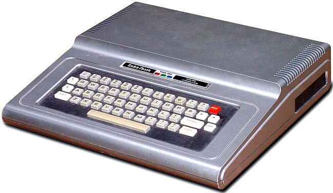

# CoCo

# Technical Reference

The [Color Computer Reference Manual](http://sparksandflames.com/files/Color%20Computer%20Technical%20Reference%20Manual%20%28Tandy%29.pdf)
contains schematics and detailed hardware information.

See the [CoCo Hardware Reference](Hardware.md) on this site.

# ROM Disassembly

Spectral Associates -- the people who made [Madness and the Minotaur](MadnessMinotaur/) -- produced a series of 
disassemblies of the CoCo ROMs! Here are those awesome PDFs:

[Color Basic Unravelled](color-basic-unravelled.pdf)

[Extended Basic Unravelled](extended-basic-unravelled.pdf)

[Disk Basic Unravelled](disk-basic-unravelled.pdf)

[Super Extended Basic Unravelled](super-extended-basic-unravelled.pdf)

# Disassembled Code
* [Minotaur and the Minotaur](MadnessMinotaur/)
* TODO all others here
