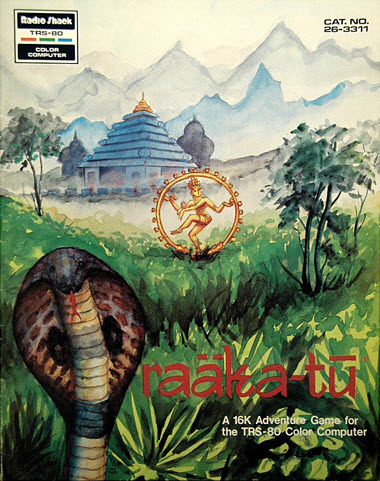

# Raaka Tu

>>> deploy:<br>
>>>   +RaakaTu.jpg<br>
>>>   +BinaryDataRaakaTu.js<br>
>>>   +raakatu.js<br>
>>>   RAMUse.md<br>
>>>   Code.md<br>
>>>   ----<br>
>>>   Journal.md<br>

```html
<script src="/CoCo/RaakaTu/BinaryDataRaakaTu.js"></script>
<script src="/js/6809.js"></script>
<script src="/CoCo/CoCoText.js"></script>
<script src="/CoCo/RaakaTu/raakatu.js"></script>
<script>window.onload = function() {startRaakaTu("raakatuConsole");}</script>
```

>>> playMe {

# Play Me!
Play the game in a CoCo emulator. Click on the green console and start typing.<br>

```html
<textarea readonly id="raakatuConsole" rows="16" style="background-color: #00FF01; color: black;font-family: monospace;font-size:12px;width:33ch;float: left;margin-top:8px"></textarea>

<table class="caTable" style="float: left;margin-left:8px;margin-top:8px;">
<tr><th>PC Key</th><th>CoCo Key</th><th>Function</th></tr>
<tr><td>left-arrow</td><td>shift-left-arrow</td><td>Move cursor left</td></tr>
<tr><td>right-arrow</td><td>shift-right-arrow</td><td>Move cursor right</td></tr>
<tr><td>delete</td><td>right-arrow</td><td>Delete character right of cursor</td></tr>
<tr><td>backspace</td><td>left-arrow</td><td>Delete character left of cursor</td></tr>
<tr><td>escape</td><td>clear</td><td>Delete the line</td></tr>
</table>
```

>>> }


# Code Links 

* [Disassembled Code](Code.md)
* [RAM Usage](RAMUse.md)

# The Temple of Raaka-Tu

This morning looks like a good one to start exploring the area. After breakfast, you're planning to set out on foot, 
perhaps talk to a few natives for any information they might give you, and hire a guide. As you sip your coffee and scan 
a map of the region, one of your crew approaches, holding by the arm a wrinkled old native, dressed in long robes 
and wearing a headdress.

"Beware! Beware the temple of Raaka-Tu!" the old woman cries. "Do not go into the jungle - you will never get out!"

> From the game manual introduction

>>> tourGuide {

# Tour Guide 

The code is practically a virtual-machine for the game written in adventure-language. The [Main Loop](Code.md#main-loop) decodes the complex
user input with nouns, verbs, and prepositions.

Have a look at the [Adventure Language Processor](Code.md#process-command) and all its complex commands.

Have a look at the [Phrase List](Code.md#phrase-list) that describes the forms of all known input lines.

In Raaka-Tu, the rooms are objects with descriptions and commands combined. Visit all the [Room Definitions](Code.md#room-descriptions)
for a blast from the past.

There are lots of game objects -- normal things like "rugs" and "rings" and "guards". They all can have complex code scripts
and may move around on their own (like the "guards" and the "serpent"). Have a look at the [Objects and their scripts](Code.md#object-data).

Have a look at the [General Command Script](Code.md#general-commands) that processes commands not handled by the current room.

Look through the game's [list of all known words](Code.md#input-word-tables).
>>> }

# References

If you seek specific game information, solutions, and online emulators then check out Sean Murphy's wonderful site.<br>
Solutions and info on Pyramid 2000, Raaka-Tu, and Bedlam:<br>
[http://www.figmentfly.com](http://www.figmentfly.com)

# The Evolution of the Engine 

I will follow Arnstein's adventure language and interpreter as it evolved from Pyramid 2000 to Raaka-Tu and finally to Bedlam. Be sure to 
visit those pages as well:
* [Pyramid 2000](../Pyramid)
* Raaka Tu
* [Bedlam](../Bedlam)

## User Input Structure 

Two years later in 1981, Arnstein's adventure engine has evolved considerably. The syntax for a user input line is 
VERB NOUN PREPOSITION NOUN as in "LIGHT CANDLE WITH LAMP". Error messages now indicate which word of the line 
is wrong and why.

Both nouns, if given, must be within the user's reach. The engine has a long list of possible phrase forms that limit 
user input. For instance, one phrase form says that the verb LIGHT has two nouns separated by WITH. The scripts use 
the decoded phrase form number instead of just the verb number to decide what the user wants to do.

The raakatu engine always passes the user input to a single user-input script. Instead of keying off of a verb number, 
the user script is always executed at the first command. It is up to the script to do IF/ELSE tests on the individual 
phrase forms. The adventure now includes a SWITCH/CASE structures for this very reason.

## Game Objects 

The game objects have evolved considerably. They have become real "objects" in the programming sense. Within each is a 
list of optional fields identified by a number and a size. Field "2" is the short name of the object. Field "9" is 
hit-point information if the object is a living thing. Field "10" is a script that is executed with the object is killed. 
Field "8" is a script that is always executed between user turns. It is this field "8" script that allows the serpent 
to follow the player from room to room.

Field "6" is a script that is executed if the object is the 2nd noun in a command. Field "7" is executed if the object 
is the 1st noun. These scripts are not invoked automatically. Instead it is up to the room (or the general script) to 
decide when they are appropriate.

There is a player object to represent the human player. The field "10" (upon death) script prints a message and resets 
the game for another go. The field "6" (between turns) heals the player 5 points. Having a player object was a stroke 
of genius allowing all the objects to interact with the player as they would each other.

## Adventure Commands 

The adventure language contains a much richer set of 38 commands. There is a "variable object" used as a 
temporary in script processing. One script command sets this variable object to a desired object by number. 
Another script command compares the "variable object" to the 1st noun -- another to the 2nd noun.

Flow control in the adventure language is more complex with a switch-statement and a couple of sub-script commands. 
One executes commands while they are passing and the other executes commands while they are failing. Another command 
reverses the error status of a single command, and it can be used on sub-script commands to reverse an entire list.

No custom assembly logic is needed for game objects. The lamp and candle have field "8" scripts that time them down 
with each user turn. Living things like the guards and serpent have field "8" commands that move them between turns.

Here is the object data for the dead serpent:

```
; Object_16 DeadSerpent
29FC:   24 40                                                   ;   Number=24 size=0040
29FE:     00 00 80                                              ;     room=00 scorePoints=00 bits=80 u.......
2A01:     03                                                    ;     03 DESCRIPTION
2A02:       1A 4E 45 31 49 46 5E 86 5F 57 17 1F                 ;       A LARGE DEAD SERPENT LIES ON THE FLOOR.
2A0E:       B3 B3 9A 87 8C D1 B5 96 96 DB 72 89                 ;       .
2A1A:       67 C7 A0                                            ;       .
2A1D:     07 15                                                 ;     07 COMMAND HANDLING IF FIRST NOUN
2A1F:       0D 13                                               ;       Command_0D_EXECUTE_LIST_WHILE_PASS size=19
2A21:         0A 15                                             ;         Command_0A_COMPARE_TO_PHRASE_FORM val=15 phrase="15: EAT *       u.......   *       "
2A23:         04                                                ;         Command_04_PRINT_SYSTEM_OR_PLAYER_MESSAGE
2A24:           0F A8 77 4E 5E E6 A0 7B 16 92 14 F6             ;           I'VE LOST MY APPETITE!
2A30:           A4 7F 7B 21                                     ;           .
2A34:     02                                                    ;     02 SHORT NAME
2A35:       08 E3 59 15 58 3A 62 9E 61                          ;       DEAD SERPENT
```

Fields "2" and "3" are the short and long descriptions of the dead serpent. Field "7" is the script executed if the 
dead serpent is the 1st noun of a command. Here the script is a list of commands that are executed as long as they 
pass. There are two commands in this "pass script". The first asserts that the phrase is "EAT *", which would 
be "EAT SERPENT". The second (executed if the assertion passes) prints "I'VE LOST MY APPETITE!".

The adventure language supports "helper" scripts. These are essentially script subroutines that are called from 
other scripts. They are used mainly for commonly printed messages.

# Raaka-Tu Implementation 

## Carved Wooden Door

One of my deepest frustrations in Raaka-Tu was never figuring out how to cross 
the rug-covered pit to the carved wooden door.

```
1586:   82 80 C4 00                                             ;   Script number=82 size=00C4 data=00
158A:     03 80 AB                                              ;     Data tag=03 size=00AB
158D:       C7 DE 94 14 4B 5E 83 96 3B 16 B7 B1                 ;       YOU ARE IN A LARGE RECTANGULAR ROOM. ON THE
1599:       2F 17 FB 55 C7 98 54 8B 39 17 FF 9F                 ;       FLOOR OF THE EAST SIDE OF THE ROOM IS AN
15A5:       C0 16 82 17 48 5E 81 8D 91 AF 96 64                 ;       INTRICATE ORIENTAL RUG STRETCHING BETWEEN
15B1:       DB 72 95 5F 15 BC FF 78 B8 16 82 17                 ;       THE NORTH AND SOUTH WALLS. IN THE EAST WALL
15BD:       54 5E 3F A0 D5 15 90 14 D0 15 F3 BF                 ;       IS A HUGE CARVED WOODEN DOOR. TO THE SOUTH,
15C9:       16 53 51 5E 07 B2 BB 9A 14 8A 6B C4                 ;       A SMALL HOLE LEADS TO A DARK PASSAGE WAY.
15D5:       0C BA 7D 62 90 73 C4 6A 91 62 30 60                 ;       .
15E1:       82 17 50 5E BE A0 03 71 33 98 47 B9                 ;       .
15ED:       53 BE 0E D0 2F 8E D0 15 82 17 47 5E                 ;       .
15F9:       66 49 F3 17 F3 8C 4B 7B 4A 45 77 C4                 ;       .
1605:       D3 14 0F B4 19 58 36 A0 83 61 81 5B                 ;       .
1611:       1B B5 6B BF 5F BE 61 17 82 C6 03 EE                 ;       .
161D:       5F 17 46 48 A9 15 DB 8B E3 8B 0B 5C                 ;       .
1629:       6B BF 46 45 35 49 DB 16 D3 B9 9B 6C                 ;       .
1635:       1B D0 2E                                            ;       .
1638:     04 13                                                 ;     Data tag=04 size=0013
163A:         0B 11                                             ;         Command_0B_SWITCH size=11
163C:           0A 04                                           ;           Command_0A_COMPARE_TO_PHRASE_FORM val=04 phrase="04: WEST *      *          *       "
163E:           02                                              ;           IF_NOT_JUMP address=1641
163F:             00 81                                         ;             Command_00_MOVE_ACTIVE_OBJECT_TO_ROOM_AND_LOOK room=81
1641:           02                                              ;           Command_0A_COMPARE_TO_PHRASE_FORM val=02 phrase="02: SOUTH *     *          *       "
1642:           02                                              ;           IF_NOT_JUMP address=1645
1643:             00 83                                         ;             Command_00_MOVE_ACTIVE_OBJECT_TO_ROOM_AND_LOOK room=83
1645:           03                                              ;           Command_0A_COMPARE_TO_PHRASE_FORM val=03 phrase="03: EAST *      *          *       "
1646:           06                                              ;           IF_NOT_JUMP address=164D
1647:             0D 04                                         ;             Command_0D_EXECUTE_LIST_WHILE_PASS size=4
1649:               20 1D                                       ;               Command_20_CHECK_ACTIVE_OBJECT object=1D(USER)
164B:               8B                                          ;               CommonCommand_8B
164C:               81                                          ;               CommonCommand_81
```

Room 82 has only 3 commands: WEST, SOUTH, and EAST (where the carved door is). If you try and go east 
you fall into the pit. Notice the check, however, that makes sure the thing moving east is the player. 
Only the player falls into the pit. Other objects fail the assert and nothing happens to them -- they go nowhere.

Notice the CommonCommand_8B (colorful death) followed by CommonCommand_81 (restart the game). 
The 81 is not needed here since CommonCommand_8B actually ends with the 81, which never returns.

The pit appears more complex because there is an object rooted to this room -- the rug:

```
; Object_03 Rug
210C:   06 48                                                   ;   Number=06 size=0048
210E:     82 00 80                                              ;     room=82 scorePoints=00 bits=80 u.......
2111:     02                                                    ;     02 SHORT NAME
2112:       02 E9 B3                                            ;       RUG
2115:     07 3F                                                 ;     07 COMMAND HANDLING IF FIRST NOUN
2117:       0B 3D                                               ;       Command_0B_SWITCH size=3D
2119:         0A 0C                                             ;         Command_0A_COMPARE_TO_PHRASE_FORM val=0C phrase="0C: LOOK UNDER  *          u......."
211B:         01                                                ;         IF_NOT_JUMP address=211D
211C:           8C                                              ;           CommonCommand_8C
211D:         36                                                ;         Command_0A_COMPARE_TO_PHRASE_FORM val=36 phrase="36: CLIMB IN    *          *       "
211E:         01                                                ;         IF_NOT_JUMP address=2120
211F:           8A                                              ;           CommonCommand_8A
2120:         33                                                ;         Command_0A_COMPARE_TO_PHRASE_FORM val=33 phrase="??"
2121:         01                                                ;         IF_NOT_JUMP address=2123
2122:           8A                                              ;           CommonCommand_8A
2123:         34                                                ;         Command_0A_COMPARE_TO_PHRASE_FORM val=34 phrase="34: JUMP OVER   *          u......."
2124:         01                                                ;         IF_NOT_JUMP address=2126
2125:           8A                                              ;           CommonCommand_8A
2126:         35                                                ;         Command_0A_COMPARE_TO_PHRASE_FORM val=35 phrase="??"
2127:         01                                                ;         IF_NOT_JUMP address=2129
2128:           8B                                              ;           CommonCommand_8B
2129:         2D                                                ;         Command_0A_COMPARE_TO_PHRASE_FORM val=2D phrase="2D: PULL UP     *          u......."
212A:         01                                                ;         IF_NOT_JUMP address=212C
212B:           8C                                              ;           CommonCommand_8C
212C:         26                                                ;         Command_0A_COMPARE_TO_PHRASE_FORM val=26 phrase="26: GO AROUND   *          u......."
212D:         28                                                ;         IF_NOT_JUMP address=2156
212E:           04                                              ;           Command_04_PRINT_SYSTEM_OR_PLAYER_MESSAGE
212F:             26 C7 DE D3 14 E6 96 16 EE DB 72 E9           ;             YOU CAN'T, THE RUG STRETCHES ALL THE WAY
213B:             B3 66 17 76 B1 1F 54 C3 B5 F3 8C 5F           ;             ACROSS THE ROOM.
2147:             BE F3 17 43 DB B9 55 CB B9 5F BE 39           ;             .
2153:             17 FF 9F                                      ;             .
```

If you pull up the rug or look under it you can see the pit. If you try and cross it you fall in the pit. There is no 
sequence of commands that let you reach the door. It is just a trap through and through.

Notice the "??" phrases. These were removed from the game as part of the strip-down to fit on the CoCo. The phrases 
were removed (and the words that make them up), but the checks were left in the game logic. I need to disassemble 
the TRS80 version to see what the phrases were.

## Guards 

The guards in RaakaTu are really the first complex object you encounter in Arnstein's games. In 
Pyramid there was a serpent that "barred the way". It is little more than a door you have to figure 
out how to open. But the guards move from place to place on patrol around the temple. You have to 
figure out their rounds and sneak through them.

Below I have reproduced part of the "Outside Temple" map by Branden Robinson. You can find the 
complete map on Sean Murphy's site:<br>
[http://www.figmentfly.com]

```
                           +-------+
                           |       |
                           | see   |
    +----------------------+ north +----------------------+
    |                      |       |                      |
    |                      | 9B    |                      |
    |                      +---+---+                      |
    |                          |                          |
    |                          |                          |
    |                      +---+---+                      |
    |                      |       |                      |
    |                      |       |                      |
    |           +----------+ north +----------+           |
    |           |          |       |          |           | 
    |           |          | 9D    |          |           |
    |           |          +-------+          |           |
    |           |                             |           |
    |           |                             |           |
+---+---+   +---+---+                     +---+---+   +---+---+
|       |   |       |                     |       |   |       |
| see   |   |       |                     |       |   | see   |
| west  +---+ west  |                     | east  +---+ east  +-----<
|       |   |       |                     |       |   |       |
| 9A    |   | 9C    |                     | 9E    |   | 98    |
+---+---+   +---+---+                     +---+---+   +---+---+
    |           |                             |           |
    |           |                             |           |
    |           |          +-------+          |           |
    |           |          |       |          |           |
    |           |          |       |          |           |
    |           +----------+ south +----------+           |
    |                      |       |                      |
    |                      | 9F    |                      |
    |                      +---+---+                      |
    |                          |                          |
    |                          |                          |
    |                      +---+---+                      |
    |                      |       |                      |
    |                      | see   |                      |
    +----------------------+ south +----------------------+
                           |       |
                           | 99    |
                           +-------+
```

The temple entrance area is two concentric circles. The "guards" are a single object that patrols the 
inner circle moving clockwise from 9C to 9D to 9E to 9F and back around. The move-script for the guards 
object (see below) moves the object from room to room one room at a time after every move you make. If 
you are in the room with the guards object when it moves then it kills you. If you are in the room the 
object moves too you see the message "A GROUP OF GUARDS COMES AROUND THE CORNER." Your next command 
better be a movement command or you'll be in the same room with the object when it moves again.

You approach the temple on the outer circle. The room descriptions on the outer circle are always from 
the point of view of you facing the center ring. From these outer rooms you can see the guards coming 
and going from the room you are facing. They always enter from the right and exit to the left. If you 
stay in one of these outer rooms and continually "LOOK" you'll easily figure out their timing.

Another object, Object_24, is used to watch the guards from a far. This object is contained by the USER 
object, and on every move it checks to see if you are on the outer circle even when you are deep in the 
temple. Object_24 immediately follows the guards object in the code. Thus it always prints its message 
after the guards object has moved but before you do. The turn-code (see below) is a switch statement that 
goes like this: "If the guards-object is in room 9C: If the player is in 9A then print ENTER FROM RIGHT 
else if the player is in 99 then print EXIT TO LEFT" and so on for each room on the inner circle.

```
; Object_23 Guards
2EE3:   28 80 CA                                                ;   Number=28 size=00CA
2EE6:     9C 00 90                                              ;     room=9C scorePoints=00 bits=90 u..P....
...
2F12:     08 80 95                                              ;     08 TURN SCRIPT
2F15:       0E 80 92                                            ;       Command_0E_EXECUTE_LIST_WHILE_FAIL size=146
2F18:         0D 2F                                             ;         Command_0D_EXECUTE_LIST_WHILE_PASS size=47
2F1A:           14                                              ;           Command_14_EXECUTE_COMMAND_REVERSE_STATUS
2F1B:             01 1D                                         ;             Command_01_IS_OBJECT_IN_PACK_OR_ROOM object=1D(USER)
2F1D:           0B 29                                           ;           Command_0B_SWITCH size=29
2F1F:             03 9C 23                                      ;             Command_03_IS_OBJECT_AT_LOCATION object=23(Guards) location=9C
2F22:             07                                            ;             IF_NOT_JUMP address=2F2A
2F23:               0D 05                                       ;               Command_0D_EXECUTE_LIST_WHILE_PASS size=5
2F25:                 00 9D                                     ;                 Command_00_MOVE_ACTIVE_OBJECT_TO_ROOM_AND_LOOK room=9D
2F27:                 01 1D                                     ;                 Command_01_IS_OBJECT_IN_PACK_OR_ROOM object=1D(USER)
2F29:                 86                                        ;                 CommonCommand_86
2F2A:             9F 23                                         ;             Command_03_IS_OBJECT_AT_LOCATION object=23(Guards) location=9F
2F2C:             07                                            ;             IF_NOT_JUMP address=2F34
2F2D:               0D 05                                       ;               Command_0D_EXECUTE_LIST_WHILE_PASS size=5
2F2F:                 00 9C                                     ;                 Command_00_MOVE_ACTIVE_OBJECT_TO_ROOM_AND_LOOK room=9C
2F31:                 01 1D                                     ;                 Command_01_IS_OBJECT_IN_PACK_OR_ROOM object=1D(USER)
2F33:                 86                                        ;                 CommonCommand_86
2F34:             9E 23                                         ;             Command_03_IS_OBJECT_AT_LOCATION object=23(Guards) location=9E
2F36:             07                                            ;             IF_NOT_JUMP address=2F3E
2F37:               0D 05                                       ;               Command_0D_EXECUTE_LIST_WHILE_PASS size=5
2F39:                 00 9F                                     ;                 Command_00_MOVE_ACTIVE_OBJECT_TO_ROOM_AND_LOOK room=9F
2F3B:                 01 1D                                     ;                 Command_01_IS_OBJECT_IN_PACK_OR_ROOM object=1D(USER)
2F3D:                 86                                        ;                 CommonCommand_86
2F3E:             9D 23                                         ;             Command_03_IS_OBJECT_AT_LOCATION object=23(Guards) location=9D
2F40:             07                                            ;             IF_NOT_JUMP address=2F48
2F41:               0D 05                                       ;               Command_0D_EXECUTE_LIST_WHILE_PASS size=5
2F43:                 00 9E                                     ;                 Command_00_MOVE_ACTIVE_OBJECT_TO_ROOM_AND_LOOK room=9E
2F45:                 01 1D                                     ;                 Command_01_IS_OBJECT_IN_PACK_OR_ROOM object=1D(USER)
2F47:                 86                                        ;                 CommonCommand_86
2F48:           0C                                              ;           Command_0C_FAIL
2F49:         0D 5F                                             ;         Command_0D_EXECUTE_LIST_WHILE_PASS size=95
2F4B:           01 1D                                           ;           Command_01_IS_OBJECT_IN_PACK_OR_ROOM object=1D(USER)
2F4D:           1C 1D                                           ;           Command_1C_SET_VAR_OBJECT object=1D (USER)
2F4F:           1F                                              ;           Command_1F_PRINT_MESSAGE
2F50:             58 A6 1D 51 A0 D0 15 06 67 33 61 79           ;             "STOP! INFIDEL DOG!", THE GUARDS LEVEL THEIR
2F5C:             5B 06 07 82 17 49 5E 94 C3 0B 5C F8           ;             CROSSBOWS AND LOOSE THEIR BOLTS! YOUR BODY
2F68:             8B 33 61 5F BE 23 7B B9 55 D4 B9 85           ;             FALLS TO THE GROUND RIDDLED WITH THE SHAFTS!
2F74:             A1 90 14 0E 58 45 A0 56 5E EB 72 84           ;             .
2F80:             AF CE 9F 6B B5 C7 DE 84 AF 93 9E 4B           ;             .
2F8C:             15 0D 8D 89 17 82 17 49 5E 07 B3 33           ;             .
2F98:             98 06 B2 FF 5A 19 58 82 7B 82 17 55           ;             .
2FA4:             5E 48 72 09 C0                                ;             .
2FA9:           81                                              ;           CommonCommand_81
2FAA:     02                                                    ;     02 SHORT NAME
2FAB:       04 23 6F 4D B1                                      ;       GUARDS
; Object_24 Object24
2FB0:   29 4C                                                   ;   Number=29 size=004C
2FB2:     1D 00 00                                              ;     room=1D scorePoints=00 bits=00 *       
2FB5:     08 47                                                 ;     08 TURN SCRIPT
2FB7:       0B 45                                               ;       Command_0B_SWITCH size=45
2FB9:         03 9C 23                                          ;         Command_03_IS_OBJECT_AT_LOCATION object=23(Guards) location=9C
2FBC:         0E                                                ;         IF_NOT_JUMP address=2FCB
2FBD:           0E 0C                                           ;           Command_0E_EXECUTE_LIST_WHILE_FAIL size=12
2FBF:             0D 04                                         ;             Command_0D_EXECUTE_LIST_WHILE_PASS size=4
2FC1:               03 9A 1D                                    ;               Command_03_IS_OBJECT_AT_LOCATION object=1D(USER) location=9A
2FC4:               85                                          ;               CommonCommand_85
2FC5:             0D 04                                         ;             Command_0D_EXECUTE_LIST_WHILE_PASS size=4
2FC7:               03 99 1D                                    ;               Command_03_IS_OBJECT_AT_LOCATION object=1D(USER) location=99
2FCA:               87                                          ;               CommonCommand_87
2FCB:         9F 23                                             ;         Command_03_IS_OBJECT_AT_LOCATION object=23(Guards) location=9F
```

