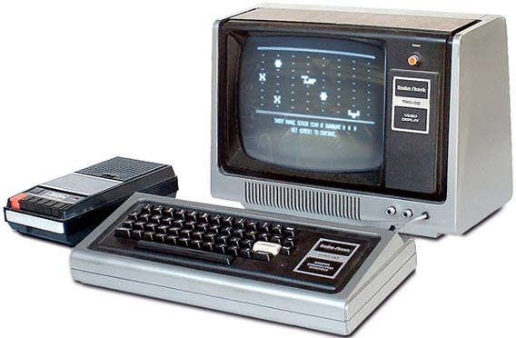

# TRS80 Hardware

# Memory Map
 * 0000-2FFF Level 2 ROM
 * 3000-37DF Unused
 * 37E0-37FF Memory Mapped I/O
 * 3800-38FF Keyboard map
 * 3900-3BFF (Keyboard map shadow)
 * 3C00-3FFF 1KB Video RAM
 * 4000-41FF RAM used by the ROM routines
 * 42FF-4FFF Usable RAM in a 4K machine
 * 5000-7FFF Usable RAM in a 16K machine
 * 8000-BFFF Additional RAM in a 32K machine
 * C000-FFFF Still more RAM in a 48K machine

Start of user RAM for program storage: 42E9

# RAM Use

>>> memory

| | | |
| --- | --- | --- |
| 0033 | PrintChar | Print a character to the screen |
