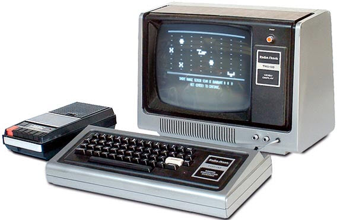

# TRS80 Hardware DiskOS

# Memory Map
 * 0000-2FFF Level 2 ROM
 * 3000-37DF Unused
 * 37E0-37FF Memory Mapped I/O
 * 3800-38FF Keyboard map
 * 3900-3BFF (Keyboard map shadow)
 * 3C00-3FFF 1KB Video RAM
 * 4000-41FF RAM used by the ROM routines
 * 4200-4FFF Usable RAM in a 4K machine
 * 5000-7FFF Usable RAM in a 16K machine
 * 8000-BFFF Additional RAM in a 32K machine
 * C000-FFFF Still more RAM in a 48K machine

Start of user RAM for program storage: 42E9

# RAM Use

>>> memory

| | | |
| ---  | ---             | ---                                    |
| 002B | GetKey          | Return typed char in A or 0 for none   |
| 0033 | PrintChar       | Print the character in A to the screen |
| 01F8 | TapeOff         | Turn off the tape drive                |
| 0212 | TapeOn          | Turn on the tape drive specified in A  |
| 0235 | ReadTapeByte    | Read a byte from the tape              |
| 0264 | WriteTapeByte   | Write a byte to the tape               |
| 0287 | WriteTapeLeader | Write a leader to the tape             |
| 0296 | ReadTapeLeader  | Read a leader from the tape            |
| 402D | EndProgram      | No-error exit from disk program  |
| 4020:4021 | CursorPointer | Pointer into screen memory |
| 4409 | ERROR_SYS4 | Error handler: PUSH AF then loads SYS4 overlay (DO 00,4) |
| 4420 | OPEN_NEW_EXISTING | Execute program |
| 4424 | OPEN_EXISTING | Open existing file |
| 4428 | CLOSE_FILE | Close file |
| 4436 | READ_RECORD | Read a record |
| 4439 | WRITE_RECORD | Write a record |
