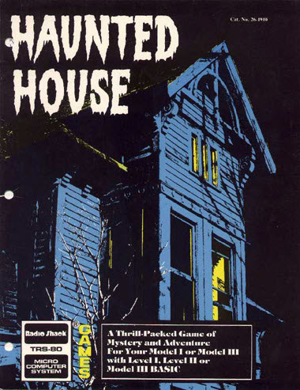

# RAM Use 1 (First Floor Code)

>>> memory

| | | |
| --- | --- | --- |
| 44D9      | LoneObject            | 1 if a lone-object was given last input      |    
| 45AA      | NounDataSize          | Number of bytes in noun's data area          |
| 45AB      | DecodeEmpty           | 1 if something was decoded from input        |
| 45AC:45AD | NounData              | Pointer to noun data                         |
| 465A:467A | InputBuffer           | 32 byte input buffer                         |
| 467B      | InputNoun             | The user input noun                          |
| 467C      | InputVerb             | The user input verb                          |
| 467D      | GrammarType           | The phrase's grammar type                    |
| 467E      | InputEntroy           | Running counter ... never used               |
| 467F:4680 | NextWord              | Pointer to next word while parsing           |
| 4681      | WordSize              | Character counter in word parsing            |
| 4682      | CurrentWord           | Current word data                            |
| 4693:46BB | Stack                 | 38 bytes for stack                           |
| 477B      | Unpack1               | RAM used by unpack routine                   |
| 477C      | Unpack2               | RAM used by unpack routine                   |
| 477D      | Unpack3               | RAM used by unpack routine                   |
| 477E      | Unpack4               | RAM used by unpack routine                   |
| 48E2      | CurrentRoom           | Player's current room number                 |
