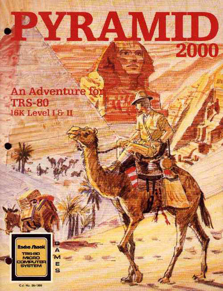

# Pyramid (Model 1?)

>>> cpu Z80

>>> binary 4200:roms/Pyramid1.bin

>>> memoryTable ram 

[RAM Usage](RAMUse1.md)

>>> memoryTable hard 

[Hardware Info](../Hardware.md)

# Start

```code
Start: 

4200: 31 5C 47        LD      SP,$475C            ; Stack
4203: 21 1F 47        LD      HL,$471F            ; WELCOME TO PYRAMID!!
4206: CD CB 44        CALL    $44CB               ; {} Print message
4209: CD E9 44        CALL    $44E9               ; {} wait for key
420C: 3E 01           LD      A,$01               ; Starting ...
420E: 32 DC 4F        LD      ($4FDC),A           ; {ram.CurrentRoom} ... room number
4211: CD E2 51        CALL    $51E2               ; {} Print room description
4214: 97              SUB     A                   ; Zero ...
4215: 32 18 46        LD      ($4618),A           ; {} ... NOUN
4218: 32 19 46        LD      ($4619),A           ; {} ... VERB
421B: 32 1A 46        LD      ($461A),A           ; {} ... Grammar
421E: CD CA 42        CALL    $42CA               ; {} Get user input and parse
4221: 3A DC 4F        LD      A,($4FDC)           ; {ram.CurrentRoom} Room number
4224: 21 25 48        LD      HL,$4825            ; Room table
4227: CD 66 42        CALL    $4266               ; {}
422A: 23              INC     HL                  
422B: 23              INC     HL                  
422C: 7E              LD      A,(HL)              
422D: 23              INC     HL                  
422E: 66              LD      H,(HL)              
422F: 6F              LD      L,A                 
4230: CD 78 42        CALL    $4278               ; {}
4233: C2 45 42        JP      NZ,$4245            ; {}
4236: 21 04 59        LD      HL,$5904            
4239: CD 78 42        CALL    $4278               ; {}
423C: C2 45 42        JP      NZ,$4245            ; {}
423F: 21 C5 73        LD      HL,$73C5            
4242: CD A9 44        CALL    $44A9               ; {}
4245: CD 76 50        CALL    $5076               ; {}
4248: C3 14 42        JP      $4214               ; {}
424B: 21 84 4F        LD      HL,$4F84            
424E: CD 5C 42        CALL    $425C               ; {}
4251: 7E              LD      A,(HL)              
4252: E6 80           AND     $80                 
4254: 23              INC     HL                  
4255: 7E              LD      A,(HL)              
4256: C2 4B 42        JP      NZ,$424B            ; {}
4259: 2B              DEC     HL                  
425A: BB              CP      E                   
425B: C9              RET                         

425C: D5              PUSH    DE                  
425D: EB              EX      DE,HL               
425E: 6F              LD      L,A                 
425F: 2D              DEC     L                   
4260: 26 00           LD      H,$00               
4262: 29              ADD     HL,HL               
4263: 19              ADD     HL,DE               
4264: D1              POP     DE                  
4265: C9              RET                         

4266: D5              PUSH    DE                  
4267: EB              EX      DE,HL               
4268: 6F              LD      L,A                 
4269: 2D              DEC     L                   
426A: 26 00           LD      H,$00               
426C: 29              ADD     HL,HL               
426D: 29              ADD     HL,HL               
426E: 19              ADD     HL,DE               
426F: D1              POP     DE                  
4270: C9              RET                         

4271: CD 4B 42        CALL    $424B               ; {}
4274: 23              INC     HL                  
4275: 73              LD      (HL),E              
4276: 2B              DEC     HL                  
4277: C9              RET                         

4278: 7E              LD      A,(HL)              
4279: A7              AND     A                   
427A: C8              RET     Z                   
427B: 3A 19 46        LD      A,($4619)           ; {}
427E: BE              CP      (HL)                
427F: 23              INC     HL                  
4280: CA 8A 42        JP      Z,$428A             ; {}
4283: 4E              LD      C,(HL)              
4284: 06 00           LD      B,$00               
4286: 09              ADD     HL,BC               
4287: C3 78 42        JP      $4278               ; {}
428A: CD 91 42        CALL    $4291               ; {}
428D: C0              RET     NZ                  

428E: C3 78 42        JP      $4278               ; {}
4291: E5              PUSH    HL                  
4292: 4E              LD      C,(HL)              
4293: 06 00           LD      B,$00               
4295: 09              ADD     HL,BC               
4296: E3              EX      (SP),HL             
4297: 23              INC     HL                  
4298: 7E              LD      A,(HL)              
4299: 23              INC     HL                  
429A: E5              PUSH    HL                  
429B: 21 3C 50        LD      HL,$503C            
429E: CD 5C 42        CALL    $425C               ; {}
42A1: 7E              LD      A,(HL)              
42A2: 23              INC     HL                  
42A3: 66              LD      H,(HL)              
42A4: 6F              LD      L,A                 
42A5: E9              JP      (HL)                
42A6: E1              POP     HL                  
42A7: D1              POP     DE                  
42A8: 7C              LD      A,H                 
42A9: BA              CP      D                   
42AA: C2 B5 42        JP      NZ,$42B5            ; {}
42AD: 7D              LD      A,L                 
42AE: BB              CP      E                   
42AF: C2 B5 42        JP      NZ,$42B5            ; {}
42B2: F6 01           OR      $01                 
42B4: C9              RET                         

42B5: D5              PUSH    DE                  
42B6: C3 98 42        JP      $4298               ; {}
42B9: E1              POP     HL                  
42BA: E1              POP     HL                  
42BB: AF              XOR     A                   
42BC: C9              RET                         

42BD: E1              POP     HL                  
42BE: CD 91 42        CALL    $4291               ; {}
42C1: E5              PUSH    HL                  
42C2: CA A6 42        JP      Z,$42A6             ; {}
42C5: E1              POP     HL                  
42C6: E1              POP     HL                  
42C7: F6 01           OR      $01                 
42C9: C9              RET                         

42CA: CD 98 45        CALL    $4598               ; {}
42CD: CD 9D 43        CALL    $439D               ; {}
42D0: 2A A5 44        LD      HL,($44A5)          ; {}
42D3: 3A A3 44        LD      A,($44A3)           ; {}
42D6: 47              LD      B,A                 
42D7: 3A 1A 46        LD      A,($461A)           ; {}
42DA: FE 03           CP      $03                 
42DC: CA CA 42        JP      Z,$42CA             ; {}
42DF: 3A 18 46        LD      A,($4618)           ; {}
42E2: A7              AND     A                   
42E3: C2 17 43        JP      NZ,$4317            ; {}
42E6: 3A 19 46        LD      A,($4619)           ; {}
42E9: A7              AND     A                   
42EA: C2 08 43        JP      NZ,$4308            ; {}
42ED: 3A 1B 46        LD      A,($461B)           ; {}
42F0: 3C              INC     A                   
42F1: E6 03           AND     $03                 
42F3: 32 1B 46        LD      ($461B),A           ; {}
42F6: 21 1C 46        LD      HL,$461C            
42F9: 07              RLCA                        
42FA: 4F              LD      C,A                 
42FB: 06 00           LD      B,$00               
42FD: 09              ADD     HL,BC               
42FE: 7E              LD      A,(HL)              
42FF: 23              INC     HL                  
4300: 66              LD      H,(HL)              
4301: 6F              LD      L,A                 
4302: CD CB 44        CALL    $44CB               ; {}
4305: C3 CA 42        JP      $42CA               ; {}
4308: 3A 1A 46        LD      A,($461A)           ; {}
430B: FE C0           CP      $C0                 
430D: C8              RET     Z                   

430E: 21 9A 46        LD      HL,$469A            
4311: CD CB 44        CALL    $44CB               ; {}
4314: C3 CA 42        JP      $42CA               ; {}
4317: 22 A5 44        LD      ($44A5),HL          ; {}
431A: 3A 9C 43        LD      A,($439C)           ; {}
431D: A7              AND     A                   
431E: C2 89 43        JP      NZ,$4389            ; {}
4321: 7E              LD      A,(HL)              
4322: 23              INC     HL                  
4323: 22 A5 44        LD      ($44A5),HL          ; {}
4326: 1E FF           LD      E,$FF               
4328: C5              PUSH    BC                  
4329: CD 4B 42        CALL    $424B               ; {}
432C: C1              POP     BC                  
432D: CA 81 43        JP      Z,$4381             ; {}
4330: 3A 1A 46        LD      A,($461A)           ; {}
4333: FE 40           CP      $40                 
4335: CA 49 43        JP      Z,$4349             ; {}
4338: 2A A5 44        LD      HL,($44A5)          ; {}
433B: 2B              DEC     HL                  
433C: 3A DC 4F        LD      A,($4FDC)           ; {ram.CurrentRoom}
433F: 5F              LD      E,A                 
4340: 7E              LD      A,(HL)              
4341: C5              PUSH    BC                  
4342: CD 4B 42        CALL    $424B               ; {}
4345: C1              POP     BC                  
4346: CA 81 43        JP      Z,$4381             ; {}
4349: 2A A5 44        LD      HL,($44A5)          ; {}
434C: 05              DEC     B                   
434D: C2 21 43        JP      NZ,$4321            ; {}
4350: 3A 1A 46        LD      A,($461A)           ; {}
4353: FE 40           CP      $40                 
4355: C2 5E 43        JP      NZ,$435E            ; {}
4358: 21 35 46        LD      HL,$4635            
435B: C3 77 43        JP      $4377               ; {}
435E: 21 24 46        LD      HL,$4624            
4361: CD CB 44        CALL    $44CB               ; {}
4364: 3E 01           LD      A,$01               
4366: 32 98 46        LD      ($4698),A           ; {}
4369: 21 70 46        LD      HL,$4670            
436C: CD CB 44        CALL    $44CB               ; {}
436F: 3E 3F           LD      A,$3F               
4371: 32 98 46        LD      ($4698),A           ; {}
4374: 21 2E 46        LD      HL,$462E            
4377: CD CB 44        CALL    $44CB               ; {}
437A: 97              SUB     A                   
437B: 32 18 46        LD      ($4618),A           ; {}
437E: C3 CA 42        JP      $42CA               ; {}
4381: 2A A5 44        LD      HL,($44A5)          ; {}
4384: 2B              DEC     HL                  
4385: 7E              LD      A,(HL)              
4386: 32 18 46        LD      ($4618),A           ; {}
4389: 3A 19 46        LD      A,($4619)           ; {}
438C: A7              AND     A                   
438D: C0              RET     NZ                  

438E: 21 4D 46        LD      HL,$464D            
4391: CD CB 44        CALL    $44CB               ; {}
4394: 3E 01           LD      A,$01               
4396: 32 9C 43        LD      ($439C),A           ; {}
4399: C3 CA 42        JP      $42CA               ; {}
439C: 00              NOP                         
439D: 21 F7 45        LD      HL,$45F7            
43A0: 97              SUB     A                   
43A1: 32 A4 44        LD      ($44A4),A           ; {}
43A4: 32 1A 46        LD      ($461A),A           ; {}
43A7: 11 22 56        LD      DE,$5622            
43AA: EB              EX      DE,HL               
43AB: 22 16 47        LD      ($4716),HL          ; {}
43AE: EB              EX      DE,HL               
43AF: 7E              LD      A,(HL)              
43B0: FE 20           CP      $20                 
43B2: C2 B9 43        JP      NZ,$43B9            ; {}
43B5: 23              INC     HL                  
43B6: C3 AF 43        JP      $43AF               ; {}
43B9: 22 18 47        LD      ($4718),HL          ; {}
43BC: A7              AND     A                   
43BD: CA 57 44        JP      Z,$4457             ; {}
43C0: 3E 01           LD      A,$01               
43C2: 32 A4 44        LD      ($44A4),A           ; {}
43C5: E5              PUSH    HL                  
43C6: 1A              LD      A,(DE)              
43C7: A7              AND     A                   
43C8: CA 62 44        JP      Z,$4462             ; {}
43CB: 32 1E 47        LD      ($471E),A           ; {}
43CE: E6 07           AND     $07                 
43D0: 4F              LD      C,A                 
43D1: 32 1A 47        LD      ($471A),A           ; {}
43D4: 3A 1E 47        LD      A,($471E)           ; {}
43D7: E6 38           AND     $38                 
43D9: 0F              RRCA                        
43DA: 0F              RRCA                        
43DB: 0F              RRCA                        
43DC: 47              LD      B,A                 
43DD: EB              EX      DE,HL               
43DE: 22 16 47        LD      ($4716),HL          ; {}
43E1: EB              EX      DE,HL               
43E2: 13              INC     DE                  
43E3: 1A              LD      A,(DE)              
43E4: BE              CP      (HL)                
43E5: C2 49 44        JP      NZ,$4449            ; {}
43E8: 23              INC     HL                  
43E9: 13              INC     DE                  
43EA: 0D              DEC     C                   
43EB: C2 E3 43        JP      NZ,$43E3            ; {}
43EE: 3A 1A 47        LD      A,($471A)           ; {}
43F1: FE 06           CP      $06                 
43F3: CA 00 44        JP      Z,$4400             ; {}
43F6: 7E              LD      A,(HL)              
43F7: FE 20           CP      $20                 
43F9: CA 0E 44        JP      Z,$440E             ; {}
43FC: A7              AND     A                   
43FD: C2 4E 44        JP      NZ,$444E            ; {}
4400: 7E              LD      A,(HL)              
4401: FE 20           CP      $20                 
4403: CA 0E 44        JP      Z,$440E             ; {}
4406: A7              AND     A                   
4407: CA 0E 44        JP      Z,$440E             ; {}
440A: 23              INC     HL                  
440B: C3 00 44        JP      $4400               ; {}
440E: 3A 1E 47        LD      A,($471E)           ; {}
4411: E6 C0           AND     $C0                 
4413: CA 28 44        JP      Z,$4428             ; {}
4416: 32 1A 46        LD      ($461A),A           ; {}
4419: 1A              LD      A,(DE)              
441A: 32 19 46        LD      ($4619),A           ; {}
441D: E5              PUSH    HL                  
441E: 21 9A 46        LD      HL,$469A            
4421: CD 80 44        CALL    $4480               ; {}
4424: E1              POP     HL                  
4425: C3 41 44        JP      $4441               ; {}
4428: 1A              LD      A,(DE)              
4429: 32 18 46        LD      ($4618),A           ; {}
442C: EB              EX      DE,HL               
442D: 22 A5 44        LD      ($44A5),HL          ; {}
4430: EB              EX      DE,HL               
4431: 78              LD      A,B                 
4432: 32 A3 44        LD      ($44A3),A           ; {}
4435: 97              SUB     A                   
4436: 32 9C 43        LD      ($439C),A           ; {}
4439: E5              PUSH    HL                  
443A: 21 70 46        LD      HL,$4670            
443D: CD 80 44        CALL    $4480               ; {}
4440: E1              POP     HL                  
4441: 7E              LD      A,(HL)              
4442: FE 20           CP      $20                 
4444: D1              POP     DE                  
4445: CA A7 43        JP      Z,$43A7             ; {}
4448: C9              RET                         

4449: 13              INC     DE                  
444A: 0D              DEC     C                   
444B: C2 49 44        JP      NZ,$4449            ; {}
444E: 13              INC     DE                  
444F: 05              DEC     B                   
4450: C2 4E 44        JP      NZ,$444E            ; {}
4453: E1              POP     HL                  
4454: C3 AF 43        JP      $43AF               ; {}
4457: 3A A4 44        LD      A,($44A4)           ; {}
445A: A7              AND     A                   
445B: C0              RET     NZ                  

445C: 3E 03           LD      A,$03               
445E: 32 1A 46        LD      ($461A),A           ; {}
4461: C9              RET                         

4462: E1              POP     HL                  
4463: 97              SUB     A                   
4464: 32 19 46        LD      ($4619),A           ; {}
4467: 32 18 46        LD      ($4618),A           ; {}
446A: 7E              LD      A,(HL)              
446B: FE 20           CP      $20                 
446D: C2 74 44        JP      NZ,$4474            ; {}
4470: 23              INC     HL                  
4471: C3 6A 44        JP      $446A               ; {}
4474: 7E              LD      A,(HL)              
4475: A7              AND     A                   
4476: C8              RET     Z                   

4477: FE 20           CP      $20                 
4479: CA A7 43        JP      Z,$43A7             ; {}
447C: 23              INC     HL                  
447D: C3 74 44        JP      $4474               ; {}
4480: EB              EX      DE,HL               
4481: 2A 18 47        LD      HL,($4718)          ; {}
4484: 06 28           LD      B,$28               
4486: 7E              LD      A,(HL)              
4487: A7              AND     A                   
4488: CA 9A 44        JP      Z,$449A             ; {}
448B: FE 20           CP      $20                 
448D: CA 9A 44        JP      Z,$449A             ; {}
4490: 12              LD      (DE),A              
4491: 23              INC     HL                  
4492: 13              INC     DE                  
4493: 05              DEC     B                   
4494: 78              LD      A,B                 
4495: FE 01           CP      $01                 
4497: C2 86 44        JP      NZ,$4486            ; {}
449A: 3E 40           LD      A,$40               
449C: 12              LD      (DE),A              
449D: 13              INC     DE                  
449E: 05              DEC     B                   
449F: C2 9A 44        JP      NZ,$449A            ; {}
44A2: C9              RET                         

44A3: 00              NOP                         
44A4: 00              NOP                         
44A5: 00              NOP                         
44A6: 00              NOP                         
44A7: 00              NOP                         
44A8: 00              NOP                         


              
; Unpack and print

44A9: 7E              LD      A,(HL)              
44AA: A7              AND     A                   
44AB: C8              RET     Z                   
    
44AC: 23              INC     HL                  
44AD: 11 F7 45        LD      DE,$45F7            
44B0: CD 5F 47        CALL    $475F               ; {}
44B3: 7E              LD      A,(HL)              
44B4: A7              AND     A                   
44B5: CA E2 44        JP      Z,$44E2             ; {}
44B8: FE 01           CP      $01                 
44BA: C8              RET     Z                   

44BB: 47              LD      B,A                 
44BC: E5              PUSH    HL                  
44BD: CD 92 45        CALL    $4592               ; {}
44C0: E1              POP     HL                  
44C1: 7E              LD      A,(HL)              
44C2: FE 0A           CP      $0A                 
44C4: 23              INC     HL                  
44C5: CA A9 44        JP      Z,$44A9             ; {}
44C8: C3 B3 44        JP      $44B3               ; {}
44CB: 7E              LD      A,(HL)              
44CC: A7              AND     A                   
44CD: CA E2 44        JP      Z,$44E2             ; {}
44D0: FE 01           CP      $01                 
44D2: C8              RET     Z                   

44D3: FE 40           CP      $40                 
44D5: CA DE 44        JP      Z,$44DE             ; {}
44D8: 47              LD      B,A                 
44D9: E5              PUSH    HL                  
44DA: CD 92 45        CALL    $4592               ; {}
44DD: E1              POP     HL                  
44DE: 23              INC     HL                  
44DF: C3 CB 44        JP      $44CB               ; {}
44E2: 06 0D           LD      B,$0D               
44E4: 78              LD      A,B                 
44E5: CD 92 45        CALL    $4592               ; {}
44E8: C9              RET                         

44E9: D5              PUSH    DE                  
44EA: 3A 11 47        LD      A,($4711)           ; {}
44ED: 3C              INC     A                   
44EE: 32 11 47        LD      ($4711),A           ; {}
44F1: CD FA 44        CALL    $44FA               ; {}
44F4: A7              AND     A                   
44F5: CA EA 44        JP      Z,$44EA             ; {}
44F8: D1              POP     DE                  
44F9: C9              RET                         

44FA: E5              PUSH    HL                  
44FB: D5              PUSH    DE                  
44FC: C5              PUSH    BC                  
44FD: CD 04 45        CALL    $4504               ; {}
4500: C1              POP     BC                  
4501: D1              POP     DE                  
4502: E1              POP     HL                  
4503: C9              RET                         

4504: 21 8B 45        LD      HL,$458B            
4507: 01 01 38        LD      BC,$3801            
450A: 16 00           LD      D,$00               
450C: 0A              LD      A,(BC)              
450D: 5F              LD      E,A                 
450E: AE              XOR     (HL)                
450F: 73              LD      (HL),E              
4510: A3              AND     E                   
4511: C2 1D 45        JP      NZ,$451D            ; {}
4514: 14              INC     D                   
4515: 2C              INC     L                   
4516: CB 01           RLC     C                   
4518: F2 0C 45        JP      P,$450C             ; {}
451B: 97              SUB     A                   
451C: C9              RET                         

451D: 5F              LD      E,A                 
451E: C5              PUSH    BC                  
451F: 01 DC 05        LD      BC,$05DC            
4522: CD 7C 45        CALL    $457C               ; {}
4525: C1              POP     BC                  
4526: 0A              LD      A,(BC)              
4527: A3              AND     E                   
4528: C8              RET     Z                   

4529: 7A              LD      A,D                 
452A: 07              RLCA                        
452B: 07              RLCA                        
452C: 07              RLCA                        
452D: 57              LD      D,A                 
452E: 0E 01           LD      C,$01               
4530: 79              LD      A,C                 
4531: A3              AND     E                   
4532: C2 3B 45        JP      NZ,$453B            ; {}
4535: 14              INC     D                   
4536: CB 01           RLC     C                   
4538: C3 30 45        JP      $4530               ; {}
453B: 3A 80 38        LD      A,($3880)           
453E: 47              LD      B,A                 
453F: 7A              LD      A,D                 
4540: C6 40           ADD     $40                 
4542: FE 60           CP      $60                 
4544: D2 51 45        JP      NC,$4551            ; {}
4547: CB 08           RRC     B                   
4549: D2 71 45        JP      NC,$4571            ; {}
454C: C6 20           ADD     $20                 
454E: C3 71 45        JP      $4571               ; {}
4551: D6 70           SUB     $70                 
4553: D2 69 45        JP      NC,$4569            ; {}
4556: C6 40           ADD     $40                 
4558: FE 3C           CP      $3C                 
455A: DA 5F 45        JP      C,$455F             ; {}
455D: EE 10           XOR     $10                 
455F: CB 08           RRC     B                   
4561: D2 71 45        JP      NC,$4571            ; {}
4564: EE 10           XOR     $10                 
4566: C3 71 45        JP      $4571               ; {}
4569: 21 83 45        LD      HL,$4583            
456C: 4F              LD      C,A                 
456D: 06 00           LD      B,$00               
456F: 09              ADD     HL,BC               
4570: 7E              LD      A,(HL)              
4571: 57              LD      D,A                 
4572: 01 AC 0D        LD      BC,$0DAC            
4575: CD 7C 45        CALL    $457C               ; {}
4578: 7A              LD      A,D                 
4579: FE 01           CP      $01                 
457B: C9              RET                         

457C: 0B              DEC     BC                  
457D: 78              LD      A,B                 
457E: B1              OR      C                   
457F: C2 7C 45        JP      NZ,$457C            ; {}
4582: C9              RET                         

4583: 0D              DEC     C                   
4584: 1F              RRA                         
4585: 01 5B 0A        LD      BC,$0A5B            
4588: 08              EX      AF,AF'              
4589: 09              ADD     HL,BC               
458A: 20 00           JR      NZ,$458C            ; {}
458C: 00              NOP                         
458D: 00              NOP                         
458E: 00              NOP                         
458F: 00              NOP                         
4590: 00              NOP                         
4591: 00              NOP                         

4592: D5              PUSH    DE                  
4593: CD 10 00        CALL    $0010               
4596: D1              POP     DE                  
4597: C9              RET                         

4598: 06 3A           LD      B,$3A               
459A: 78              LD      A,B                 
459B: CD 92 45        CALL    $4592               ; {}
459E: 21 F7 45        LD      HL,$45F7            
45A1: 0E 00           LD      C,$00               
45A3: E5              PUSH    HL                  
45A4: C5              PUSH    BC                  
45A5: D5              PUSH    DE                  
45A6: CD E9 44        CALL    $44E9               ; {}
45A9: D1              POP     DE                  
45AA: C1              POP     BC                  
45AB: E1              POP     HL                  
45AC: 47              LD      B,A                 
45AD: FE 08           CP      $08                 
45AF: CA D4 45        JP      Z,$45D4             ; {}
45B2: 77              LD      (HL),A              
45B3: CD 92 45        CALL    $4592               ; {}
45B6: FE 0D           CP      $0D                 
45B8: CA F4 45        JP      Z,$45F4             ; {}
45BB: 0C              INC     C                   
45BC: 23              INC     HL                  
45BD: 11 17 46        LD      DE,$4617            
45C0: 7C              LD      A,H                 
45C1: BA              CP      D                   
45C2: DA A3 45        JP      C,$45A3             ; {}
45C5: 7D              LD      A,L                 
45C6: BB              CP      E                   
45C7: DA A3 45        JP      C,$45A3             ; {}
45CA: 06 08           LD      B,$08               
45CC: 78              LD      A,B                 
45CD: CD 92 45        CALL    $4592               ; {}
45D0: 2B              DEC     HL                  
45D1: C3 A3 45        JP      $45A3               ; {}
45D4: 2B              DEC     HL                  
45D5: 3E 45           LD      A,$45               
45D7: BC              CP      H                   
45D8: DA E1 45        JP      C,$45E1             ; {}
45DB: 7D              LD      A,L                 
45DC: FE F7           CP      $F7                 
45DE: DA 9E 45        JP      C,$459E             ; {}
45E1: 3E 08           LD      A,$08               
45E3: 47              LD      B,A                 
45E4: E5              PUSH    HL                  
45E5: 2A 68 40        LD      HL,($4068)          
45E8: 36 20           LD      (HL),$20            
45EA: 2B              DEC     HL                  
45EB: 22 68 40        LD      ($4068),HL          
45EE: 36 5F           LD      (HL),$5F            
45F0: E1              POP     HL                  
45F1: C3 A3 45        JP      $45A3               ; {}
45F4: 36 00           LD      (HL),$00            
45F6: C9              RET                         
45F7: 20 20           JR      NZ,$4619            ; {}
45F9: 43              LD      B,E                 
45FA: 41              LD      B,C                 
45FB: 4C              LD      C,H                 
45FC: 4C              LD      C,H                 
45FD: 20 31           JR      NZ,$4630            ; {}
45FF: 46              LD      B,(HL)              
4600: 38 48           JR      C,$464A             ; {}
4602: 0D              DEC     C                   
4603: 11 30 30        LD      DE,$3030            
4606: 30 30           JR      NC,$4638            ; {}
4608: 20 20           JR      NZ,$462A            ; {}
460A: 4A              LD      C,D                 
460B: 4D              LD      C,L                 
460C: 50              LD      D,B                 
460D: 20 52           JR      NZ,$4661            ; {}
460F: 43              LD      B,E                 
4610: 4F              LD      C,A                 
4611: 4E              LD      C,(HL)              
4612: 54              LD      D,H                 
4613: 0D              DEC     C                   
4614: 08              EX      AF,AF'              
4615: 30 30           JR      NC,$4647            ; {}
4617: 00              NOP                         
4618: 00              NOP                         
4619: 00              NOP                         
461A: 00              NOP                         
461B: 00              NOP                         
461C: C2 46 C9        JP      NZ,$C946            
461F: 46              LD      B,(HL)              
4620: E1              POP     HL                  
4621: 46              LD      B,(HL)              
4622: F5              PUSH    AF                  
4623: 46              LD      B,(HL)              
4624: 49              LD      C,C                 
4625: 20 53           JR      NZ,$467A            ; {}
4627: 45              LD      B,L                 
4628: 45              LD      B,L                 
4629: 20 4E           JR      NZ,$4679            ; {}
462B: 4F              LD      C,A                 
462C: 20 01           JR      NZ,$462F            ; {}
462E: 20 48           JR      NZ,$4678            ; {}
4630: 45              LD      B,L                 
4631: 52              LD      D,D                 
4632: 45              LD      B,L                 
4633: 2E 00           LD      L,$00               
4635: 59              LD      E,C                 
4636: 4F              LD      C,A                 
4637: 55              LD      D,L                 
4638: 20 41           JR      NZ,$467B            ; {}
463A: 52              LD      D,D                 
463B: 45              LD      B,L                 
463C: 4E              LD      C,(HL)              
463D: 27              DAA                         
463E: 54              LD      D,H                 
463F: 20 43           JR      NZ,$4684            ; {}
4641: 41              LD      B,C                 
4642: 52              LD      D,D                 
4643: 52              LD      D,D                 
4644: 59              LD      E,C                 
4645: 49              LD      C,C                 
4646: 4E              LD      C,(HL)              
4647: 47              LD      B,A                 
4648: 20 49           JR      NZ,$4693            ; {}
464A: 54              LD      D,H                 
464B: 2E 00           LD      L,$00               

; "WHAT DO YOU WANT ME TO DO WITH THE "
464D:  57 48 41 54 20 44 4F 20 59 4F 55 20 57 41 4E 54 20 4D 45 20 54 4F 20 44 4F 20 57 49 54 48 20 54 48 45 20 
; 40 byte buffer for unknown noun word
4670:  2C 41 0D 12 30 30 30 30 20 20  ; ,A..0000  
467A:  4C 58 49 20 48 2C 52 41 4C 31  ; LXI H,RAL1
4684:  0D 14 30 30 30 30 20 43 4E 41  ; ..0000 CNA
468E:  4C 4C 20 4D 4F 56 20 41 2C 4D  ; LL MOV A,M
; "?"
4698:  3F 00 

; 40 byte buffer for unknown verb
469A:  30 30 30 30 20 20 49 4E 58 20  ; 0000  INX 
46A4:  48 0D 0D 30 30 30 30 20 20 41  ; H..0000  A
46AE:  4E 41 20 41 0D 10 30 30 30 30  ; NA A..0000
46B8:  20 20 4A 5A 20 43 4E 41 4C 4C  ;   JZ CNALL
;" WHAT?",0
46C2:  20 57 48 41 54 3F 00 

         
46C9: 49              LD      C,C                 
46CA: 20 44           JR      NZ,$4710            ; {}
46CC: 4F              LD      C,A                 
46CD: 4E              LD      C,(HL)              
46CE: 27              DAA                         
46CF: 54              LD      D,H                 
46D0: 20 4B           JR      NZ,$471D            ; {}
46D2: 4E              LD      C,(HL)              
46D3: 4F              LD      C,A                 
46D4: 57              LD      D,A                 
46D5: 20 54           JR      NZ,$472B            ; {}
46D7: 48              LD      C,B                 
46D8: 41              LD      B,C                 
46D9: 54              LD      D,H                 
46DA: 20 57           JR      NZ,$4733            ; {}
46DC: 4F              LD      C,A                 
46DD: 52              LD      D,D                 
46DE: 44              LD      B,H                 
46DF: 2E 00           LD      L,$00               
46E1: 49              LD      C,C                 
46E2: 20 44           JR      NZ,$4728            ; {}
46E4: 4F              LD      C,A                 
46E5: 4E              LD      C,(HL)              
46E6: 27              DAA                         
46E7: 54              LD      D,H                 
46E8: 20 55           JR      NZ,$473F            ; {}
46EA: 4E              LD      C,(HL)              
46EB: 44              LD      B,H                 
46EC: 45              LD      B,L                 
46ED: 52              LD      D,D                 
46EE: 53              LD      D,E                 
46EF: 54              LD      D,H                 
46F0: 41              LD      B,C                 
46F1: 4E              LD      C,(HL)              
46F2: 44              LD      B,H                 
46F3: 2E 00           LD      L,$00               
46F5: 49              LD      C,C                 
46F6: 20 44           JR      NZ,$473C            ; {}
46F8: 4F              LD      C,A                 
46F9: 4E              LD      C,(HL)              
46FA: 27              DAA                         
46FB: 54              LD      D,H                 
46FC: 20 4B           JR      NZ,$4749            ; {}
46FE: 4E              LD      C,(HL)              
46FF: 4F              LD      C,A                 
4700: 57              LD      D,A                 
4701: 20 57           JR      NZ,$475A            ; {}
4703: 48              LD      C,B                 
4704: 41              LD      B,C                 
4705: 54              LD      D,H                 
4706: 20 59           JR      NZ,$4761            ; {}
4708: 4F              LD      C,A                 
4709: 55              LD      D,L                 
470A: 20 4D           JR      NZ,$4759            ; {}
470C: 45              LD      B,L                 
470D: 41              LD      B,C                 
470E: 4E              LD      C,(HL)              
470F: 2E 00           LD      L,$00               
4711: 00              NOP                         
4712: 00              NOP                         
4713: 00              NOP                         
4714: 00              NOP                         
4715: 00              NOP                         
4716: 00              NOP                         
4717: 00              NOP                         
4718: 00              NOP                         
4719: 00              NOP                         
471A: 00              NOP                         
471B: 00              NOP                         
471C: 00              NOP                         
471D: 00              NOP                         
471E: 00              NOP                         
  
; WELCOME TO PYRAMID!!             
471F: 57 45 4C 43 4F 4D 45 20 54 4F 20 50 59 52 41 4D 49 44 21 21 00
    
4734: 4E              LD      C,(HL)              
4735: 41              LD      B,C                 
4736: 4C              LD      C,H                 
4737: 32 0D 0F        LD      ($0F0D),A           
473A: 30 30           JR      NC,$476C            ; {}
473C: 30 30           JR      NC,$476E            ; {}
473E: 20 20           JR      NZ,$4760            ; {}
4740: 4D              LD      C,L                 
4741: 56              LD      D,(HL)              
4742: 49              LD      C,C                 
4743: 20 41           JR      NZ,$4786            ; {}
4745: 2C              INC     L                   
4746: 34              INC     (HL)                
4747: 0D              DEC     C                   
4748: 14              INC     D                   
4749: 30 30           JR      NC,$477B            ; {}
474B: 30 30           JR      NC,$477D            ; {}
474D: 20 43           JR      NZ,$4792            ; {}
474F: 4E              LD      C,(HL)              
4750: 41              LD      B,C                 
4751: 4C              LD      C,H                 
4752: 32 20 4D        LD      ($4D20),A           ; {}
4755: 4F              LD      C,A                 
4756: 56              LD      D,(HL)              
4757: 20 4D           JR      NZ,$47A6            ; {}
4759: 2C              INC     L                   
475A: 41              LD      B,C                 
475B: 0D              DEC     C                   
475C: 00              NOP                         
475D: 00              NOP                         

475E: 00              NOP                         


; Unpack
;               
475F: 32 21 48        LD      ($4821),A           ; {} Store count
4762: 3E 01           LD      A,$01               
4764: 32 24 48        LD      ($4824),A           ; {}
4767: C3 71 47        JP      $4771               ; {}
 
476A: 32 21 48        LD      ($4821),A           ; {} Store count
476D: 97              SUB     A                   
476E: 32 24 48        LD      ($4824),A           ; {}

4771: E5              PUSH    HL                  
4772: 06 03           LD      B,$03               
4774: E1              POP     HL                  
4775: 7E              LD      A,(HL)              
4776: 23              INC     HL                  
4777: 4E              LD      C,(HL)              
4778: 23              INC     HL                  
4779: E5              PUSH    HL                  
477A: 61              LD      H,C                 
477B: 6F              LD      L,A                 
477C: 13              INC     DE                  
477D: 13              INC     DE                  
477E: EB              EX      DE,HL               
477F: E5              PUSH    HL                  
4780: C5              PUSH    BC                  
4781: 21 28 00        LD      HL,$0028            
4784: 22 22 48        LD      ($4822),HL          ; {}
4787: 21 B7 47        LD      HL,$47B7            
478A: 36 11           LD      (HL),$11            
478C: 01 00 00        LD      BC,$0000            
478F: C5              PUSH    BC                  
4790: 7B              LD      A,E                 
4791: 17              RLA                         
4792: 5F              LD      E,A                 
4793: 7A              LD      A,D                 
4794: 17              RLA                         
4795: 57              LD      D,A                 
4796: 35              DEC     (HL)                
4797: E1              POP     HL                  
4798: CA B8 47        JP      Z,$47B8             ; {}
479B: 3E 00           LD      A,$00               
479D: CE 00           ADC     $00                 
479F: 29              ADD     HL,HL               
47A0: 44              LD      B,H                 
47A1: 85              ADD     A,L                 
47A2: 2A 22 48        LD      HL,($4822)          ; {}
47A5: 95              SUB     L                   
47A6: 4F              LD      C,A                 
47A7: 78              LD      A,B                 
47A8: 9C              SBC     H                   
47A9: 47              LD      B,A                 
47AA: C5              PUSH    BC                  
47AB: D2 B0 47        JP      NC,$47B0            ; {}
47AE: 09              ADD     HL,BC               
47AF: E3              EX      (SP),HL             
47B0: 21 B7 47        LD      HL,$47B7            
47B3: 3F              CCF                         
47B4: C3 90 47        JP      $4790               ; {}
  
47B7: 00              NOP                         
           
47B8: 01 F9 47        LD      BC,$47F9            
47BB: 09              ADD     HL,BC               
47BC: 7E              LD      A,(HL)              
47BD: C1              POP     BC                  
47BE: E1              POP     HL                  
47BF: 77              LD      (HL),A              
47C0: 2B              DEC     HL                  
47C1: 05              DEC     B                   
47C2: C2 7F 47        JP      NZ,$477F            ; {}
47C5: 3A 24 48        LD      A,($4824)           ; {}
47C8: A7              AND     A                   
47C9: CA E1 47        JP      Z,$47E1             ; {}
47CC: E5              PUSH    HL                  
47CD: C5              PUSH    BC                  
47CE: D5              PUSH    DE                  
47CF: 1E 03           LD      E,$03               
47D1: 23              INC     HL                  
47D2: 46              LD      B,(HL)              
47D3: E5              PUSH    HL                  
47D4: 78              LD      A,B                 
47D5: CD 92 45        CALL    $4592               ; {} CALL #$0010 (Print A to screen)
47D8: E1              POP     HL                  
47D9: 23              INC     HL                  
47DA: 1D              DEC     E                   
47DB: C2 D2 47        JP      NZ,$47D2            ; {}
47DE: D1              POP     DE                  
47DF: C1              POP     BC                  
47E0: E1              POP     HL                  
47E1: EB              EX      DE,HL               
47E2: 13              INC     DE                  
47E3: 3A 24 48        LD      A,($4824)           ; {} Did we expand 3?
47E6: A7              AND     A                   ; ???
47E7: C2 ED 47        JP      NZ,$47ED            ; {} No ... skip the add 3
47EA: 13              INC     DE                  ; Skip ...
47EB: 13              INC     DE                  ; ... three ...
47EC: 13              INC     DE                  ; ... bytes in buffer
47ED: 3A 21 48        LD      A,($4821)           ; {} Count of words
47F0: 3D              DEC     A                   ; Dec the count
47F1: 32 21 48        LD      ($4821),A           ; {} Store new count
47F4: C2 72 47        JP      NZ,$4772            ; {} Not done ... back for more
47F7: E1              POP     HL                  ; HL pointing to next
47F8: C9              RET                         ; Out

;
; Character translation table
;     ?  !  2  .  "  '  <  >  /  0  3  A  B  C  D  E
47F9: 3F 21 32 20 22 27 3C 3E 2F 30 33 41 42 43 44 45
;     F  G  H  I  J  K  L  M  N  O  P  Q  R  S  T  U
4809: 46 47 48 49 4A 4B 4C 4D 4E 4F 50 51 52 53 54 55
;     V  W  X  Y  Z  -  ,  .
4819: 56 57 58 59 5A 2D 2C 2E 

4821: 00 00 00 00    

; 4-byte room table
; First word is description
; Second word is command script for room
;
; 81 rooms
;                     Description   Script                  
4825: 2F 5B 69 49    ; 5B2F          4969        Room 0
4829: 64 5B 7E 49    ; 5B64          497E        Room 1
482D: AB 5B 8F 49    ; 5BAB          498F        Room 2
4831: AB 5B A0 49    ; 5BAB          49A0        Room 3
4835: AB 5B B1 49    ; 5BAB          49B1        Room 4
4839: AB 5B C2 49    ; 5BAB          49C2        Room 5
483D: BC 5B D3 49    ; 5BBC          49D3        Room 6
4841: 36 5C E4 49    ; 5C36          49E4        Room 7
4845: 7C 5C F5 49    ; 5C7C          49F5        Room 8
4849: D1 5C 06 4A    ; 5CD1          4A06        Room 9
484D: F4 5C 1B 4A    ; 5CF4          4A1B        Room 10
4851: 72 5D 24 4A    ; 5D72          4A24        Room 11
4855: E2 5D 3A 4A    ; 5DE2          4A3A        Room 12
4859: BD 5E 65 4A    ; 5EBD          4A65        Room 13
485D: FF 5E 6E 4A    ; 5EFF          4A6E        Room 14
4861: 5C 5F AA 4A    ; 5F5C          4AAA        Room 15
4865: 90 5F E5 4A    ; 5F90          4AE5        Room 16
4869: A9 5F EE 4A    ; 5FA9          4AEE        Room 17
486D: D9 5F 2D 4B    ; 5FD9          4B2D        Room 18
4871: 45 60 46 4B    ; 6045          4B46        Room 19
4875: B3 60 5B 4B    ; 60B3          4B5B        Room 20
4879: 00 61 64 4B    ; 6100          4B64        Room 21
487D: 2C 61 75 4B    ; 612C          4B75        Room 22
4881: 34 61 7E 4B    ; 6134          4B7E        Room 23
4885: 6C 61 8F 4B    ; 616C          4B8F        Room 24
4889: AC 61 A4 4B    ; 61AC          4BA4        Room 25
488D: 04 62 B1 4B    ; 6204          4BB1        Room 26
4891: 1C 62 BE 4B    ; 621C          4BBE        Room 27
4895: 1C 62 D3 4B    ; 621C          4BD3        Room 28
4899: 1C 62 E4 4B    ; 621C          4BE4        Room 29
489D: 1C 62 FD 4B    ; 621C          4BFD        Room 30
48A1: 1C 62 06 4C    ; 621C          4C06        Room 31
48A5: 1C 62 13 4C    ; 621C          4C13        Room 32
48A9: 1C 62 24 4C    ; 621C          4C24        Room 33
48AD: 1C 62 35 4C    ; 621C          4C35        Room 34
48B1: 1C 62 4E 4C    ; 621C          4C4E        Room 35
48B5: 1C 62 5F 4C    ; 621C          4C5F        Room 36
48B9: 1C 62 68 4C    ; 621C          4C68        Room 37
48BD: 1C 62 79 4C    ; 621C          4C79        Room 38
48C1: 1C 62 86 4C    ; 621C          4C86        Room 39
48C5: 1C 62 93 4C    ; 621C          4C93        Room 40
48C9: 2C 61 A0 4C    ; 612C          4CA0        Room 41
48CD: 2C 61 A5 4C    ; 612C          4CA5        Room 42
48D1: 2C 61 AA 4C    ; 612C          4CAA        Room 43
48D5: 2C 61 AF 4C    ; 612C          4CAF        Room 44
48D9: 2C 61 B4 4C    ; 612C          4CB4        Room 45
48DD: 2C 61 B9 4C    ; 612C          4CB9        Room 46
48E1: 2C 61 BE 4C    ; 612C          4CBE        Room 47
48E5: 2C 61 C3 4C    ; 612C          4CC3        Room 48
48E9: 2C 61 C8 4C    ; 612C          4CC8        Room 49
48ED: 2C 61 CD 4C    ; 612C          4CCD        Room 50
48F1: 3E 62 DE 4C    ; 623E          4CDE        Room 51
48F5: 2C 61 F3 4C    ; 612C          4CF3        Room 52
48F9: 9D 62 F8 4C    ; 629D          4CF8        Room 53
48FD: FA 62 05 4D    ; 62FA          4D05        Room 54
4901: 2E 63 12 4D    ; 632E          4D12        Room 55
4905: 73 63 30 4D    ; 6373          4D30        Room 56
4909: CE 63 39 4D    ; 63CE          4D39        Room 57
490D: 5E 64 4E 4D    ; 645E          4D4E        Room 58
4911: F5 64 5B 4D    ; 64F5          4D5B        Room 59
4915: 29 65 A3 4D    ; 6529          4DA3        Room 60
4919: D6 65 BE 4D    ; 65D6          4DBE        Room 61
491D: 34 66 C7 4D    ; 6634          4DC7        Room 62
4921: 5B 66 D0 4D    ; 665B          4DD0        Room 63
4925: 7D 66 D9 4D    ; 667D          4DD9        Room 64
4929: DD 66 02 4E    ; 66DD          4E02        Room 65
492D: 00 00 00 00    ; 0000          0000        Room 66
4931: 26 6B D8 4E    ; 6B26          4ED8        Room 67
4935: 00 00 00 00    ; 0000          0000        Room 68
4939: 05 6B CF 4E    ; 6B05          4ECF        Room 69
493D: B0 6A C2 4E    ; 6AB0          4EC2        Room 70
4941: 79 67 0B 4E    ; 6779          4E0B        Room 71
4945: D6 67 14 4E    ; 67D6          4E14        Room 72
4949: 00 00 00 00    ; 0000          0000        Room 73
494D: 00 00 00 00    ; 0000          0000        Room 74
4951: 4A 68 23 4E    ; 684A          4E23        Room 75
4955: 47 6A AB 4E    ; 6A47          4EAB        Room 76
4959: 93 68 38 4E    ; 6893          4E38        Room 77
495D: 75 69 45 4E    ; 6975          4E45        Room 78
4961: 9F 69 4E 4E    ; 699F          4E4E        Room 79
4965: F1 69 5B 4E    ; 69F1          4E5B        Room 80   


; Room scripts (starting with room 1) RAL1
; Room 1
; "YOU ARE STANDING BEFORE THE ENTRANCE OF A PYRAMID.  AROUND YOU  IS A DESERT.[CR]"
4969: 01 03          ; N,NORTH
496B: 01 02          ;     MoveToRoomN   Room:2
496D: 02 03          ; E,EAST
496F: 01 03          ;     MoveToRoomN   Room:3
4971: 03 03          ; S,SOUTH
4973: 01 04          ;     MoveToRoomN   Room:4
4975: 04 03          ; W,WEST
4977: 01 05          ;     MoveToRoomN   Room:5
4979: 0B 03          ; IN,INSIDE
497B: 01 02          ;     MoveToRoomN   Room:2
497D: 00

; Room 2
; "YOU ARE IN THE ENTRANCE TO THE PYRAMID.  A HOLE IN THE FLOOR    LEADS TO A PASSA ..."
497E: 03 03          ; S,SOUTH
4980: 01 01          ;     MoveToRoomN   Room:1
4982: 0A 03          ; D,DOWN
4984: 01 07          ;     MoveToRoomN   Room:7
4986: 0C 03          ; OUT,OUTSID
4988: 01 01          ;     MoveToRoomN   Room:1
498A: 12 03          ; PANEL
498C: 01 1A          ;     MoveToRoomN   Room:26
498E: 00

; Room 3
; "YOU ARE IN THE DESERT.[CR]"
498F: 01 03          ; N,NORTH
4991: 01 06          ;     MoveToRoomN   Room:6
4993: 02 03          ; E,EAST
4995: 01 03          ;     MoveToRoomN   Room:3
4997: 03 03          ; S,SOUTH
4999: 01 04          ;     MoveToRoomN   Room:4
499B: 04 03          ; W,WEST
499D: 01 01          ;     MoveToRoomN   Room:1
499F: 00

; Room 4
; "YOU ARE IN THE DESERT.[CR]"
49A0: 01 03          ; N,NORTH
49A2: 01 01          ;     MoveToRoomN   Room:1
49A4: 02 03          ; E,EAST
49A6: 01 03          ;     MoveToRoomN   Room:3
49A8: 03 03          ; S,SOUTH
49AA: 01 04          ;     MoveToRoomN   Room:4
49AC: 04 03          ; W,WEST
49AE: 01 05          ;     MoveToRoomN   Room:5
49B0: 00

; Room 5
; "YOU ARE IN THE DESERT.[CR]"
49B1: 01 03          ; N,NORTH
49B3: 01 06          ;     MoveToRoomN   Room:6
49B5: 02 03          ; E,EAST
49B7: 01 01          ;     MoveToRoomN   Room:1
49B9: 03 03          ; S,SOUTH
49BB: 01 04          ;     MoveToRoomN   Room:4
49BD: 04 03          ; W,WEST
49BF: 01 05          ;     MoveToRoomN   Room:5
49C1: 00

; Room 6
; "YOU ARE IN THE DESERT.[CR]"
49C2: 01 03          ; N,NORTH
49C4: 01 06          ;     MoveToRoomN   Room:6
49C6: 02 03          ; E,EAST
49C8: 01 03          ;     MoveToRoomN   Room:3
49CA: 03 03          ; S,SOUTH
49CC: 01 01          ;     MoveToRoomN   Room:1
49CE: 04 03          ; W,WEST
49D0: 01 05          ;     MoveToRoomN   Room:5
49D2: 00

; Room 7
; "YOU ARE IN A SMALL CHAMBER BENEATH A HOLE FROM THE SURFACE.  A  LOW CRAWL LEADS  ..."
49D3: 09 03          ; U,UP
49D5: 01 02          ;     MoveToRoomN   Room:2
49D7: 0C 03          ; OUT,OUTSID
49D9: 01 02          ;     MoveToRoomN   Room:2
49DB: 04 03          ; W,WEST
49DD: 01 08          ;     MoveToRoomN   Room:8
49DF: 0B 03          ; IN,INSIDE
49E1: 01 08          ;     MoveToRoomN   Room:8
49E3: 00

; Room 8
; "YOU ARE CRAWLING OVER PEBBLES IN A LOW PASSAGE.  THERE IS A DIM LIGHT AT THE EAS ..."
49E4: 02 03          ; E,EAST
49E6: 01 07          ;     MoveToRoomN   Room:7
49E8: 0C 03          ; OUT,OUTSID
49EA: 01 07          ;     MoveToRoomN   Room:7
49EC: 04 03          ; W,WEST
49EE: 01 09          ;     MoveToRoomN   Room:9
49F0: 0B 03          ; IN,INSIDE
49F2: 01 09          ;     MoveToRoomN   Room:9
49F4: 00

; Room 9
; "YOU ARE IN A ROOM FILLED WITH BROKEN POTTERY SHARDS OF ANCIENT  EGYPTIAN CRAFTS. ..."
49F5: 02 03          ; E,EAST
49F7: 01 08          ;     MoveToRoomN   Room:8
49F9: 0B 03          ; IN,INSIDE
49FB: 01 0A          ;     MoveToRoomN   Room:10
49FD: 09 03          ; U,UP
49FF: 01 0A          ;     MoveToRoomN   Room:10
4A01: 04 03          ; W,WEST
4A03: 01 0A          ;     MoveToRoomN   Room:10
4A05: 00

; Room 10
; "YOU ARE IN AN AWKWARD SLOPING EAST/WEST CORRIDOR.[CR]"
4A06: 0A 03          ; D,DOWN
4A08: 01 09          ;     MoveToRoomN   Room:9
4A0A: 02 03          ; E,EAST
4A0C: 01 09          ;     MoveToRoomN   Room:9
4A0E: 0B 03          ; IN,INSIDE
4A10: 01 0B          ;     MoveToRoomN   Room:11
4A12: 04 03          ; W,WEST
4A14: 01 0B          ;     MoveToRoomN   Room:11
4A16: 09 03          ; U,UP
4A18: 01 0B          ;     MoveToRoomN   Room:11
4A1A: 00

; Room 11
; "YOU ARE IN A SPLENDID CHAMBER THIRTY FEET HIGH.  THE WALLS ARE  FROZEN RIVERS OF ..."
4A1B: 02 03          ; E,EAST
4A1D: 01 0A          ;     MoveToRoomN   Room:10
4A1F: 04 03          ; W,WEST
4A21: 01 0C          ;     MoveToRoomN   Room:12
4A23: 00

; Room 12
; "AT YOUR FEET IS A SMALL PIT BREATHING TRACES OF WHITE MIST.  AN EAST PASSAGE END ..."
4A24: 02 03          ; E,EAST
4A26: 01 0B          ;     MoveToRoomN   Room:11
4A28: 0A 0B          ; D,DOWN
4A2A: 07 07          ;     SubScriptRev             
4A2C: 02 25          ;       AssertObjectNIsInPack              Object:"37 Gold Nugget"
4A2E: 04 C5 70       ;       PrintMessageNN              "ODDMESS-70C5"
4A31: 05             ;       PrintScoreAndStop             
4A32: 01 0D          ;     MoveToRoomN   Room:13
4A34: 04 04          ; W,WEST
4A36: 04 EA 70       ;     PrintMessageNN              "ODDMESS-70EA"
4A39: 00

; Room 13
; "YOU ARE AT ONE END OF A VAST HALL STRETCHING FORWARD OUT OF     SIGHT TO THE WES ..."
4A3A: 03 03          ; S,SOUTH
4A3C: 01 0E          ;     MoveToRoomN   Room:14
4A3E: 04 03          ; W,WEST
4A40: 01 0F          ;     MoveToRoomN   Room:15
4A42: 0A 03          ; D,DOWN
4A44: 01 10          ;     MoveToRoomN   Room:16
4A46: 01 03          ; N,NORTH
4A48: 01 10          ;     MoveToRoomN   Room:16
4A4A: 09 0A          ; U,UP
4A4C: 07 06          ;     SubScriptRev             
4A4E: 02 25          ;       AssertObjectNIsInPack              Object:"37 Gold Nugget"
4A50: 04 0A 71       ;       PrintMessageNN              "ODDMESS-710A"
4A53: 01 0C          ;     MoveToRoomN   Room:12
4A55: 02 0A          ; E,EAST
4A57: 07 06          ;     SubScriptRev             
4A59: 02 25          ;       AssertObjectNIsInPack              Object:"37 Gold Nugget"
4A5B: 04 0A 71       ;       PrintMessageNN              "ODDMESS-710A"
4A5E: 01 0C          ;     MoveToRoomN   Room:12
4A60: 20 03          ; ??UNKNOWN COMMAND??
4A62: 01 1A          ;     MoveToRoomN   Room:26
4A64: 00

; Room 14
; "THIS IS A LOW ROOM WITH A HIEROGLYPH ON THE WALL.  IT TRANSLATES"YOU WON'T GET I ..."
4A65: 0C 03          ; OUT,OUTSID
4A67: 01 0D          ;     MoveToRoomN   Room:13
4A69: 01 03          ; N,NORTH
4A6B: 01 0D          ;     MoveToRoomN   Room:13
4A6D: 00

; Room 15
; "YOU ARE ON THE EAST BANK OF A BOTTOMLESS PIT STRETCHING ACROSS  THE HALL.  THE M ..."
4A6E: 02 03          ; E,EAST
4A70: 01 0D          ;     MoveToRoomN   Room:13
4A72: 10 0C          ; JUMP
4A74: 07 06          ;     SubScriptRev             
4A76: 03 01          ;       AssertObjectNIsInCurrentRoomOrPack              Object:"1 Stone bridge room 15"
4A78: 04 1C 71       ;       PrintMessageNN              "ODDMESS-711C"
4A7B: 04 4E 71       ;     PrintMessageNN              "ODDMESS-714E"
4A7E: 05             ;     PrintScoreAndStop             
4A7F: 04 0A          ; W,WEST
4A81: 07 05          ;     SubScriptRev             
4A83: 03 01          ;       AssertObjectNIsInCurrentRoomOrPack              Object:"1 Stone bridge room 15"
4A85: 01 12          ;       MoveToRoomN   Room:18
4A87: 04 5D 71       ;     PrintMessageNN              "ODDMESS-715D"
4A8A: 0D 05          ; CROSS
4A8C: 03 01          ;     AssertObjectNIsInCurrentRoomOrPack              Object:"1 Stone bridge room 15"
4A8E: 01 12          ;     MoveToRoomN   Room:18
4A90: 23 18          ; WAVE,SHAKE,SWING
4A92: 11 11          ;     AssertObjectNMatchesUserInput              Object:"17 Scepter"
4A94: 07 0C          ;     SubScriptRev             
4A96: 03 01          ;       AssertObjectNIsInCurrentRoomOrPack              Object:"1 Stone bridge room 15"
4A98: 15 01 00       ;       UnmorphObjectNToRoomP              Object:"1 Stone bridge room 15" Room 0
4A9B: 15 02 00       ;       UnmorphObjectNToRoomP              Object:"2 Stone bridge room 18" Room 0
4A9E: 04 32 7B       ;       PrintMessageNN              "ODDMESS-7B32"
4AA1: 18 01          ;     MoveObjectNToCurrentRoom              Object:"1 Stone bridge room 15"
4AA3: 15 02 12       ;     UnmorphObjectNToRoomP              Object:"2 Stone bridge room 18" Room 18
4AA6: 04 49 7B       ;     PrintMessageNN              "ODDMESS-7B49"
4AA9: 00

; Room 16
; "YOU ARE IN THE PHARAOH'S CHAMBER, WITH PASSAGES OFF IN ALL      DIRECTIONS.[CR]"
4AAA: 09 03          ; U,UP
4AAC: 01 0D          ;     MoveToRoomN   Room:13
4AAE: 02 03          ; E,EAST
4AB0: 01 0D          ;     MoveToRoomN   Room:13
4AB2: 03 0A          ; S,SOUTH
4AB4: 07 06          ;     SubScriptRev             
4AB6: 03 0B          ;       AssertObjectNIsInCurrentRoomOrPack              Object:"11 Serpent bars the way"
4AB8: 04 7B 71       ;       PrintMessageNN              "ODDMESS-717B"
4ABB: 01 11          ;     MoveToRoomN   Room:17
4ABD: 01 0A          ; N,NORTH
4ABF: 07 06          ;     SubScriptRev             
4AC1: 03 0B          ;       AssertObjectNIsInCurrentRoomOrPack              Object:"11 Serpent bars the way"
4AC3: 04 7B 71       ;       PrintMessageNN              "ODDMESS-717B"
4AC6: 01 19          ;     MoveToRoomN   Room:25
4AC8: 04 0A          ; W,WEST
4ACA: 07 06          ;     SubScriptRev             
4ACC: 03 0B          ;       AssertObjectNIsInCurrentRoomOrPack              Object:"11 Serpent bars the way"
4ACE: 04 7B 71       ;       PrintMessageNN              "ODDMESS-717B"
4AD1: 01 18          ;     MoveToRoomN   Room:24
4AD3: 26 10          ; THROW,TOSS
4AD5: 11 14          ;     AssertObjectNMatchesUserInput              Object:"20 Statue in box"
4AD7: 03 0B          ;     AssertObjectNIsInCurrentRoomOrPack              Object:"11 Serpent bars the way"
4AD9: 15 0B 00       ;     UnmorphObjectNToRoomP              Object:"11 Serpent bars the way" Room 0
4ADC: 18 13          ;     MoveObjectNToCurrentRoom              Object:"19 Statue"
4ADE: 15 14 00       ;     UnmorphObjectNToRoomP              Object:"20 Statue in box" Room 0
4AE1: 04 F5 7B       ;     PrintMessageNN              "ODDMESS-7BF5"
4AE4: 00

; Room 17
; "YOU ARE IN THE SOUTH SIDE CHAMBER.[CR]"
4AE5: 01 03          ; N,NORTH
4AE7: 01 10          ;     MoveToRoomN   Room:16
4AE9: 0C 03          ; OUT,OUTSID
4AEB: 01 10          ;     MoveToRoomN   Room:16
4AED: 00

; Room 18
; "YOU ARE ON THE WEST SIDE OF THE BOTTOMLESS PIT IN THE HALL OF   GODS.[CR]"
4AEE: 10 0C          ; JUMP
4AF0: 07 06          ;     SubScriptRev             
4AF2: 03 02          ;       AssertObjectNIsInCurrentRoomOrPack              Object:"2 Stone bridge room 18"
4AF4: 04 1C 71       ;       PrintMessageNN              "ODDMESS-711C"
4AF7: 04 4E 71       ;     PrintMessageNN              "ODDMESS-714E"
4AFA: 05             ;     PrintScoreAndStop             
4AFB: 02 0A          ; E,EAST
4AFD: 07 05          ;     SubScriptRev             
4AFF: 03 02          ;       AssertObjectNIsInCurrentRoomOrPack              Object:"2 Stone bridge room 18"
4B01: 01 0F          ;       MoveToRoomN   Room:15
4B03: 04 5D 71       ;     PrintMessageNN              "ODDMESS-715D"
4B06: 01 06          ; N,NORTH
4B08: 04 91 71       ;     PrintMessageNN              "ODDMESS-7191"
4B0B: 01 13          ;     MoveToRoomN   Room:19
4B0D: 0D 05          ; CROSS
4B0F: 03 02          ;     AssertObjectNIsInCurrentRoomOrPack              Object:"2 Stone bridge room 18"
4B11: 01 0F          ;     MoveToRoomN   Room:15
4B13: 23 18          ; WAVE,SHAKE,SWING
4B15: 11 11          ;     AssertObjectNMatchesUserInput              Object:"17 Scepter"
4B17: 07 0C          ;     SubScriptRev             
4B19: 03 02          ;       AssertObjectNIsInCurrentRoomOrPack              Object:"2 Stone bridge room 18"
4B1B: 15 02 00       ;       UnmorphObjectNToRoomP              Object:"2 Stone bridge room 18" Room 0
4B1E: 15 01 00       ;       UnmorphObjectNToRoomP              Object:"1 Stone bridge room 15" Room 0
4B21: 04 32 7B       ;       PrintMessageNN              "ODDMESS-7B32"
4B24: 18 02          ;     MoveObjectNToCurrentRoom              Object:"2 Stone bridge room 18"
4B26: 15 01 0F       ;     UnmorphObjectNToRoomP              Object:"1 Stone bridge room 15" Room 15
4B29: 04 49 7B       ;     PrintMessageNN              "ODDMESS-7B49"
4B2C: 00

; Room 19
; "YOU ARE AT THE WEST END OF THE HALL OF GODS.   A LOW WIDE PASS  CONTINUES WEST A ..."
4B2D: 03 03          ; S,SOUTH
4B2F: 01 1C          ;     MoveToRoomN   Room:28
4B31: 09 03          ; U,UP
4B33: 01 1C          ;     MoveToRoomN   Room:28
4B35: 11 03          ; CLIMB
4B37: 01 1C          ;     MoveToRoomN   Room:28
4B39: 02 03          ; E,EAST
4B3B: 01 12          ;     MoveToRoomN   Room:18
4B3D: 01 03          ; N,NORTH
4B3F: 01 12          ;     MoveToRoomN   Room:18
4B41: 04 03          ; W,WEST
4B43: 01 14          ;     MoveToRoomN   Room:20
4B45: 00

; Room 20
; "YOU ARE AT EAST END OF A VERY LONG HALL APPARENTLY WITHOUT SIDE CHAMBERS.  TO TH ..."
4B46: 02 03          ; E,EAST
4B48: 01 13          ;     MoveToRoomN   Room:19
4B4A: 09 03          ; U,UP
4B4C: 01 13          ;     MoveToRoomN   Room:19
4B4E: 04 03          ; W,WEST
4B50: 01 15          ;     MoveToRoomN   Room:21
4B52: 01 03          ; N,NORTH
4B54: 01 16          ;     MoveToRoomN   Room:22
4B56: 0A 03          ; D,DOWN
4B58: 01 16          ;     MoveToRoomN   Room:22
4B5A: 00

; Room 21
; "YOU ARE AT THE WEST END OF A VERY LONG FEATURELESS HALL.  THE   HALL JOINS UP WI ..."
4B5B: 02 03          ; E,EAST
4B5D: 01 14          ;     MoveToRoomN   Room:20
4B5F: 01 03          ; N,NORTH
4B61: 01 16          ;     MoveToRoomN   Room:22
4B63: 00

; Room 22
; "YOU ARE AT A CROSSOVER OF A HIGH N/S PASSAGE AND A LOW E/W ONE.[CR]"
4B64: 04 03          ; W,WEST
4B66: 01 14          ;     MoveToRoomN   Room:20
4B68: 01 03          ; N,NORTH
4B6A: 01 17          ;     MoveToRoomN   Room:23
4B6C: 02 03          ; E,EAST
4B6E: 01 18          ;     MoveToRoomN   Room:24
4B70: 03 03          ; S,SOUTH
4B72: 01 15          ;     MoveToRoomN   Room:21
4B74: 00

; Room 23
; "DEAD END.[CR]"
4B75: 03 03          ; S,SOUTH
4B77: 01 16          ;     MoveToRoomN   Room:22
4B79: 0C 03          ; OUT,OUTSID
4B7B: 01 16          ;     MoveToRoomN   Room:22
4B7D: 00

; Room 24
; "YOU ARE IN THE WEST THRONE CHAMBER.  A PASSAGE CONTINUES WEST   AND UP FROM HERE ..."
4B7E: 02 03          ; E,EAST
4B80: 01 10          ;     MoveToRoomN   Room:16
4B82: 0C 03          ; OUT,OUTSID
4B84: 01 10          ;     MoveToRoomN   Room:16
4B86: 04 03          ; W,WEST
4B88: 01 16          ;     MoveToRoomN   Room:22
4B8A: 09 03          ; U,UP
4B8C: 01 16          ;     MoveToRoomN   Room:22
4B8E: 00

; Room 25
; "YOU ARE IN A LOW N/S PASSAGE AT A HOLE IN THE FLOOR.  THE HOLE  GOES DOWN TO AN  ..."
4B8F: 0C 03          ; OUT,OUTSID
4B91: 01 10          ;     MoveToRoomN   Room:16
4B93: 03 03          ; S,SOUTH
4B95: 01 10          ;     MoveToRoomN   Room:16
4B97: 01 03          ; N,NORTH
4B99: 01 1A          ;     MoveToRoomN   Room:26
4B9B: 20 03          ; ??UNKNOWN COMMAND??
4B9D: 01 1A          ;     MoveToRoomN   Room:26
4B9F: 0A 03          ; D,DOWN
4BA1: 01 36          ;     MoveToRoomN   Room:54
4BA3: 00

; Room 26
; "YOU ARE IN A LARGE ROOM, WITH A PASSAGE TO THE SOUTH, AND A WALLOF BROKEN ROCK T ..."
4BA4: 12 03          ; PANEL
4BA6: 01 02          ;     MoveToRoomN   Room:2
4BA8: 03 03          ; S,SOUTH
4BAA: 01 19          ;     MoveToRoomN   Room:25
4BAC: 02 03          ; E,EAST
4BAE: 01 1B          ;     MoveToRoomN   Room:27
4BB0: 00

; Room 27
; "YOU ARE IN THE CHAMBER OF ANUBIS.[CR]"
4BB1: 0A 03          ; D,DOWN
4BB3: 01 1A          ;     MoveToRoomN   Room:26
4BB5: 20 03          ; ??UNKNOWN COMMAND??
4BB7: 01 1A          ;     MoveToRoomN   Room:26
4BB9: 09 03          ; U,UP
4BBB: 01 0D          ;     MoveToRoomN   Room:13
4BBD: 00

; Room 28
; "YOU ARE IN A MAZE OF TWISTY PASSAGES, ALL ALIKE.[CR]"
4BBE: 01 03          ; N,NORTH
4BC0: 01 1C          ;     MoveToRoomN   Room:28
4BC2: 02 03          ; E,EAST
4BC4: 01 20          ;     MoveToRoomN   Room:32
4BC6: 03 03          ; S,SOUTH
4BC8: 01 1E          ;     MoveToRoomN   Room:30
4BCA: 04 03          ; W,WEST
4BCC: 01 1D          ;     MoveToRoomN   Room:29
4BCE: 09 03          ; U,UP
4BD0: 01 13          ;     MoveToRoomN   Room:19
4BD2: 00

; Room 29
; "YOU ARE IN A MAZE OF TWISTY PASSAGES, ALL ALIKE.[CR]"
4BD3: 01 03          ; N,NORTH
4BD5: 01 1C          ;     MoveToRoomN   Room:28
4BD7: 02 03          ; E,EAST
4BD9: 01 33          ;     MoveToRoomN   Room:51
4BDB: 03 03          ; S,SOUTH
4BDD: 01 1D          ;     MoveToRoomN   Room:29
4BDF: 04 03          ; W,WEST
4BE1: 01 1D          ;     MoveToRoomN   Room:29
4BE3: 00

; Room 30
; "YOU ARE IN A MAZE OF TWISTY PASSAGES, ALL ALIKE.[CR]"
4BE4: 01 03          ; N,NORTH
4BE6: 01 20          ;     MoveToRoomN   Room:32
4BE8: 02 03          ; E,EAST
4BEA: 01 2A          ;     MoveToRoomN   Room:42
4BEC: 03 03          ; S,SOUTH
4BEE: 01 2B          ;     MoveToRoomN   Room:43
4BF0: 04 03          ; W,WEST
4BF2: 01 1C          ;     MoveToRoomN   Room:28
4BF4: 09 03          ; U,UP
4BF6: 01 1F          ;     MoveToRoomN   Room:31
4BF8: 0A 03          ; D,DOWN
4BFA: 01 1F          ;     MoveToRoomN   Room:31
4BFC: 00

; Room 31
; "YOU ARE IN A MAZE OF TWISTY PASSAGES, ALL ALIKE.[CR]"
4BFD: 09 03          ; U,UP
4BFF: 01 1E          ;     MoveToRoomN   Room:30
4C01: 0A 03          ; D,DOWN
4C03: 01 1E          ;     MoveToRoomN   Room:30
4C05: 00

; Room 32
; "YOU ARE IN A MAZE OF TWISTY PASSAGES, ALL ALIKE.[CR]"
4C06: 02 03          ; E,EAST
4C08: 01 1E          ;     MoveToRoomN   Room:30
4C0A: 03 03          ; S,SOUTH
4C0C: 01 21          ;     MoveToRoomN   Room:33
4C0E: 04 03          ; W,WEST
4C10: 01 1C          ;     MoveToRoomN   Room:28
4C12: 00

; Room 33
; "YOU ARE IN A MAZE OF TWISTY PASSAGES, ALL ALIKE.[CR]"
4C13: 01 03          ; N,NORTH
4C15: 01 2C          ;     MoveToRoomN   Room:44
4C17: 02 03          ; E,EAST
4C19: 01 20          ;     MoveToRoomN   Room:32
4C1B: 03 03          ; S,SOUTH
4C1D: 01 22          ;     MoveToRoomN   Room:34
4C1F: 0A 03          ; D,DOWN
4C21: 01 2D          ;     MoveToRoomN   Room:45
4C23: 00

; Room 34
; "YOU ARE IN A MAZE OF TWISTY PASSAGES, ALL ALIKE.[CR]"
4C24: 02 03          ; E,EAST
4C26: 01 21          ;     MoveToRoomN   Room:33
4C28: 03 03          ; S,SOUTH
4C2A: 01 23          ;     MoveToRoomN   Room:35
4C2C: 04 03          ; W,WEST
4C2E: 01 25          ;     MoveToRoomN   Room:37
4C30: 0A 03          ; D,DOWN
4C32: 01 26          ;     MoveToRoomN   Room:38
4C34: 00

; Room 35
; "YOU ARE IN A MAZE OF TWISTY PASSAGES, ALL ALIKE.[CR]"
4C35: 01 03          ; N,NORTH
4C37: 01 24          ;     MoveToRoomN   Room:36
4C39: 02 03          ; E,EAST
4C3B: 01 26          ;     MoveToRoomN   Room:38
4C3D: 03 03          ; S,SOUTH
4C3F: 01 23          ;     MoveToRoomN   Room:35
4C41: 04 03          ; W,WEST
4C43: 01 22          ;     MoveToRoomN   Room:34
4C45: 09 03          ; U,UP
4C47: 01 27          ;     MoveToRoomN   Room:39
4C49: 0A 03          ; D,DOWN
4C4B: 01 2F          ;     MoveToRoomN   Room:47
4C4D: 00

; Room 36
; "YOU ARE IN A MAZE OF TWISTY PASSAGES, ALL ALIKE.[CR]"
4C4E: 01 03          ; N,NORTH
4C50: 01 24          ;     MoveToRoomN   Room:36
4C52: 02 03          ; E,EAST
4C54: 01 34          ;     MoveToRoomN   Room:52
4C56: 04 03          ; W,WEST
4C58: 01 23          ;     MoveToRoomN   Room:35
4C5A: 0A 03          ; D,DOWN
4C5C: 01 30          ;     MoveToRoomN   Room:48
4C5E: 00

; Room 37
; "YOU ARE IN A MAZE OF TWISTY PASSAGES, ALL ALIKE.[CR]"
4C5F: 02 03          ; E,EAST
4C61: 01 22          ;     MoveToRoomN   Room:34
4C63: 04 03          ; W,WEST
4C65: 01 26          ;     MoveToRoomN   Room:38
4C67: 00

; Room 38
; "YOU ARE IN A MAZE OF TWISTY PASSAGES, ALL ALIKE.[CR]"
4C68: 02 03          ; E,EAST
4C6A: 01 23          ;     MoveToRoomN   Room:35
4C6C: 03 03          ; S,SOUTH
4C6E: 01 27          ;     MoveToRoomN   Room:39
4C70: 04 03          ; W,WEST
4C72: 01 25          ;     MoveToRoomN   Room:37
4C74: 09 03          ; U,UP
4C76: 01 22          ;     MoveToRoomN   Room:34
4C78: 00

; Room 39
; "YOU ARE IN A MAZE OF TWISTY PASSAGES, ALL ALIKE.[CR]"
4C79: 01 03          ; N,NORTH
4C7B: 01 23          ;     MoveToRoomN   Room:35
4C7D: 03 03          ; S,SOUTH
4C7F: 01 2E          ;     MoveToRoomN   Room:46
4C81: 04 03          ; W,WEST
4C83: 01 26          ;     MoveToRoomN   Room:38
4C85: 00

; Room 40
; "YOU ARE IN A MAZE OF TWISTY PASSAGES, ALL ALIKE.[CR]"
4C86: 01 03          ; N,NORTH
4C88: 01 34          ;     MoveToRoomN   Room:52
4C8A: 04 03          ; W,WEST
4C8C: 01 29          ;     MoveToRoomN   Room:41
4C8E: 08 03          ; NW,NORTHW
4C90: 01 35          ;     MoveToRoomN   Room:53
4C92: 00

; Room 41
; "YOU ARE IN A MAZE OF TWISTY PASSAGES, ALL ALIKE.[CR]"
4C93: 02 03          ; E,EAST
4C95: 01 28          ;     MoveToRoomN   Room:40
4C97: 03 03          ; S,SOUTH
4C99: 01 34          ;     MoveToRoomN   Room:52
4C9B: 04 03          ; W,WEST
4C9D: 01 32          ;     MoveToRoomN   Room:50
4C9F: 00

; Room 42
; "DEAD END.[CR]"
4CA0: 04 03          ; W,WEST
4CA2: 01 1E          ;     MoveToRoomN   Room:30
4CA4: 00

; Room 43
; "DEAD END.[CR]"
4CA5: 02 03          ; E,EAST
4CA7: 01 1E          ;     MoveToRoomN   Room:30
4CA9: 00

; Room 44
; "DEAD END.[CR]"
4CAA: 03 03          ; S,SOUTH
4CAC: 01 21          ;     MoveToRoomN   Room:33
4CAE: 00

; Room 45
; "DEAD END.[CR]"
4CAF: 09 03          ; U,UP
4CB1: 01 21          ;     MoveToRoomN   Room:33
4CB3: 00

; Room 46
; "DEAD END.[CR]"
4CB4: 04 03          ; W,WEST
4CB6: 01 27          ;     MoveToRoomN   Room:39
4CB8: 00

; Room 47
; "DEAD END.[CR]"
4CB9: 09 03          ; U,UP
4CBB: 01 23          ;     MoveToRoomN   Room:35
4CBD: 00

; Room 48
; "DEAD END.[CR]"
4CBE: 09 03          ; U,UP
4CC0: 01 24          ;     MoveToRoomN   Room:36
4CC2: 00

; Room 49
; "DEAD END.[CR]"
4CC3: 02 03          ; E,EAST
4CC5: 01 34          ;     MoveToRoomN   Room:52
4CC7: 00

; Room 50
; "DEAD END.[CR]"
4CC8: 02 03          ; E,EAST
4CCA: 01 29          ;     MoveToRoomN   Room:41
4CCC: 00

; Room 51
; "DEAD END.[CR]"
4CCD: 04 03          ; W,WEST
4CCF: 01 1D          ;     MoveToRoomN   Room:29
4CD1: 21 0B          ; DROP,RELEAS,FREE,DISCAR
4CD3: 11 29          ;     AssertObjectNMatchesUserInput              Object:"41 Coins"
4CD5: 15 29 00       ;     UnmorphObjectNToRoomP              Object:"41 Coins" Room 0
4CD8: 18 23          ;     MoveObjectNToCurrentRoom              Object:"35 Batteries"
4CDA: 04 AC 7B       ;     PrintMessageNN              "ODDMESS-7BAC"
4CDD: 00

; Room 52
; "YOU ARE ON THE BRINK OF A LARGE PIT.  YOU COULD CLIMB DOWN, BUT YOU WOULD NOT BE ..."
4CDE: 01 03          ; N,NORTH
4CE0: 01 29          ;     MoveToRoomN   Room:41
4CE2: 02 03          ; E,EAST
4CE4: 01 28          ;     MoveToRoomN   Room:40
4CE6: 03 03          ; S,SOUTH
4CE8: 01 31          ;     MoveToRoomN   Room:49
4CEA: 04 03          ; W,WEST
4CEC: 01 24          ;     MoveToRoomN   Room:36
4CEE: 0A 03          ; D,DOWN
4CF0: 01 0B          ;     MoveToRoomN   Room:11
4CF2: 00

; Room 53
; "DEAD END.[CR]"
4CF3: 06 03          ; SE,SOUTHE
4CF5: 01 28          ;     MoveToRoomN   Room:40
4CF7: 00

; Room 54
; "YOU ARE IN A DIRTY BROKEN PASSAGE.  TO THE EAST IS A CRAWL.  TO THE WEST IS A LA ..."
4CF8: 02 03          ; E,EAST
4CFA: 01 37          ;     MoveToRoomN   Room:55
4CFC: 04 03          ; W,WEST
4CFE: 01 39          ;     MoveToRoomN   Room:57
4D00: 09 03          ; U,UP
4D02: 01 19          ;     MoveToRoomN   Room:25
4D04: 00

; Room 55
; "YOU ARE ON THE BRINK OF A SMALL CLEAN CLIMBABLE PIT.  A CRAWL   LEADS WEST.[CR]"
4D05: 04 03          ; W,WEST
4D07: 01 36          ;     MoveToRoomN   Room:54
4D09: 0A 03          ; D,DOWN
4D0B: 01 38          ;     MoveToRoomN   Room:56
4D0D: 11 03          ; CLIMB
4D0F: 01 38          ;     MoveToRoomN   Room:56
4D11: 00

; Room 56
; "YOU ARE IN THE BOTTOM OF A SMALL PIT WITH A LITTLE STREAM, WHICHENTERS AND EXITS ..."
4D12: 09 03          ; U,UP
4D14: 01 37          ;     MoveToRoomN   Room:55
4D16: 0C 03          ; OUT,OUTSID
4D18: 01 37          ;     MoveToRoomN   Room:55
4D1A: 11 03          ; CLIMB
4D1C: 01 37          ;     MoveToRoomN   Room:55
4D1E: 0A 04          ; D,DOWN
4D20: 04 CF 71       ;     PrintMessageNN              "ODDMESS-71CF"
4D23: 27 0B          ; FILL
4D25: 07 06          ;     SubScriptRev             
4D27: 02 1C          ;       AssertObjectNIsInPack              Object:"28 Water in the bottle"
4D29: 04 8B 7A       ;       PrintMessageNN              "ODDMESS-7A8B"
4D2C: 19 1C 1B       ;     MorphObjectNIntoP              Object:"28 Water in the bottle" Object:"27 Bottle"
4D2F: 00

; Room 57
; "YOU ARE IN A THE ROOM OF BES, WHOSE PICTURE IS ON THE WALL.     THERE IS A BIG H ..."
4D30: 02 03          ; E,EAST
4D32: 01 36          ;     MoveToRoomN   Room:54
4D34: 0A 03          ; D,DOWN
4D36: 01 3A          ;     MoveToRoomN   Room:58
4D38: 00

; Room 58
; "YOU ARE AT A COMPLEX JUNCTION.  A LOW HANDS AND KNEES PASSAGE   FROM THE NORTH J ..."
4D39: 01 03          ; N,NORTH
4D3B: 01 3D          ;     MoveToRoomN   Room:61
4D3D: 02 03          ; E,EAST
4D3F: 01 3B          ;     MoveToRoomN   Room:59
4D41: 04 03          ; W,WEST
4D43: 01 41          ;     MoveToRoomN   Room:65
4D45: 09 03          ; U,UP
4D47: 01 39          ;     MoveToRoomN   Room:57
4D49: 11 03          ; CLIMB
4D4B: 01 39          ;     MoveToRoomN   Room:57
4D4D: 00

; Room 59
; "YOU ARE IN THE UNDERWORLD ANTEROOM OF SEKER.  PASSAGES GO EAST, WEST, AND UP.  H ..."
4D4E: 02 03          ; E,EAST
4D50: 01 3C          ;     MoveToRoomN   Room:60
4D52: 04 03          ; W,WEST
4D54: 01 41          ;     MoveToRoomN   Room:65
4D56: 09 03          ; U,UP
4D58: 01 3A          ;     MoveToRoomN   Room:58
4D5A: 00

; Room 60
; "YOU ARE AT THE LAND OF DEAD.  PASSAGES LEAD OFF IN >ALL<        DIRECTIONS.[CR]"
4D5B: 01 07          ; N,NORTH
4D5D: 07 03          ;     SubScriptRev             
4D5F: 0A F0          ;       AssertRandomIsGreaterThanN              N=0xf0
4D61: 01 3B          ;     MoveToRoomN   Room:59
4D63: 02 07          ; E,EAST
4D65: 07 03          ;     SubScriptRev             
4D67: 0A F0          ;       AssertRandomIsGreaterThanN              N=0xf0
4D69: 01 3B          ;     MoveToRoomN   Room:59
4D6B: 03 07          ; S,SOUTH
4D6D: 07 03          ;     SubScriptRev             
4D6F: 0A F0          ;       AssertRandomIsGreaterThanN              N=0xf0
4D71: 01 3B          ;     MoveToRoomN   Room:59
4D73: 05 07          ; NE,NORTHE
4D75: 07 03          ;     SubScriptRev             
4D77: 0A F0          ;       AssertRandomIsGreaterThanN              N=0xf0
4D79: 01 3B          ;     MoveToRoomN   Room:59
4D7B: 06 07          ; SE,SOUTHE
4D7D: 07 03          ;     SubScriptRev             
4D7F: 0A F0          ;       AssertRandomIsGreaterThanN              N=0xf0
4D81: 01 3B          ;     MoveToRoomN   Room:59
4D83: 07 07          ; SW,SOUTHW
4D85: 07 03          ;     SubScriptRev             
4D87: 0A F0          ;       AssertRandomIsGreaterThanN              N=0xf0
4D89: 01 3B          ;     MoveToRoomN   Room:59
4D8B: 08 07          ; NW,NORTHW
4D8D: 07 03          ;     SubScriptRev             
4D8F: 0A F0          ;       AssertRandomIsGreaterThanN              N=0xf0
4D91: 01 3B          ;     MoveToRoomN   Room:59
4D93: 09 07          ; U,UP
4D95: 07 03          ;     SubScriptRev             
4D97: 0A F0          ;       AssertRandomIsGreaterThanN              N=0xf0
4D99: 01 3B          ;     MoveToRoomN   Room:59
4D9B: 04 06          ; W,WEST
4D9D: 04 23 72       ;     PrintMessageNN              "ODDMESS-7223"
4DA0: 01 3C          ;     MoveToRoomN   Room:60
4DA2: 00

; Room 61
; "YOU'RE IN A LARGE ROOM WITH ANCIENT DRAWINGS ON ALL WALLS.      THE PICTURES DEP ..."
4DA3: 03 11          ; S,SOUTH
4DA5: 07 06          ;     SubScriptRev             
4DA7: 02 17          ;       AssertObjectNIsInPack              Object:"23 Sarcophagus with pearl"
4DA9: 04 7B 72       ;       PrintMessageNN              "ODDMESS-727B"
4DAC: 07 06          ;     SubScriptRev             
4DAE: 02 18          ;       AssertObjectNIsInPack              Object:"24 Sarcophagus empty"
4DB0: 04 7B 72       ;       PrintMessageNN              "ODDMESS-727B"
4DB3: 01 3A          ;     MoveToRoomN   Room:58
4DB5: 09 03          ; U,UP
4DB7: 01 3E          ;     MoveToRoomN   Room:62
4DB9: 0A 03          ; D,DOWN
4DBB: 01 3F          ;     MoveToRoomN   Room:63
4DBD: 00

; Room 62
; "YOU ARE IN A CHAMBER WHOSE WALL CONTAINS A PICTURE OF A MAN     WEARING THE LUNA ..."
4DBE: 0A 03          ; D,DOWN
4DC0: 01 3D          ;     MoveToRoomN   Room:61
4DC2: 0C 03          ; OUT,OUTSID
4DC4: 01 3D          ;     MoveToRoomN   Room:61
4DC6: 00

; Room 63
; "YOU ARE IN A LONG SLOPING CORRIDOR WITH RAGGED WALLS.  [CR]"
4DC7: 09 03          ; U,UP
4DC9: 01 3D          ;     MoveToRoomN   Room:61
4DCB: 0A 03          ; D,DOWN
4DCD: 01 40          ;     MoveToRoomN   Room:64
4DCF: 00

; Room 64
; "YOU ARE IN A CUL-DE-SAC ABOUT EIGHT FEET ACROSS.[CR]"
4DD0: 09 03          ; U,UP
4DD2: 01 3F          ;     MoveToRoomN   Room:63
4DD4: 0C 03          ; OUT,OUTSID
4DD6: 01 3F          ;     MoveToRoomN   Room:63
4DD8: 00

; Room 65
; "YOU ARE IN THE CHAMBER OF HORUS, A LONG EAST/WEST PASSAGE WITH  HOLES EVERYWHERE ..."
4DD9: 02 03          ; E,EAST
4DDB: 01 3A          ;     MoveToRoomN   Room:58
4DDD: 04 03          ; W,WEST
4DDF: 01 4E          ;     MoveToRoomN   Room:78
4DE1: 09 07          ; U,UP
4DE3: 07 03          ;     SubScriptRev             
4DE5: 0A CC          ;       AssertRandomIsGreaterThanN              N=0xcc
4DE7: 01 48          ;     MoveToRoomN   Room:72
4DE9: 01 07          ; N,NORTH
4DEB: 07 03          ;     SubScriptRev             
4DED: 0A CC          ;       AssertRandomIsGreaterThanN              N=0xcc
4DEF: 01 49          ;     MoveToRoomN   Room:73
4DF1: 03 07          ; S,SOUTH
4DF3: 07 03          ;     SubScriptRev             
4DF5: 0A CC          ;       AssertRandomIsGreaterThanN              N=0xcc
4DF7: 01 42          ;     MoveToRoomN   Room:66
4DF9: 0A 07          ; D,DOWN
4DFB: 07 03          ;     SubScriptRev             
4DFD: 0A CC          ;       AssertRandomIsGreaterThanN              N=0xcc
4DFF: 01 3B          ;     MoveToRoomN   Room:59
4E01: 00

; Room 66
; "YOU ARE IN A LARGE LOW CIRCULAR CHAMBER WHOSE FLOOR IS AN       IMMENSE SLAB FAL ..."
4E02: 01 03          ; N,NORTH
4E04: 01 41          ;     MoveToRoomN   Room:65
4E06: 03 03          ; S,SOUTH
4E08: 01 50          ;     MoveToRoomN   Room:80
4E0A: 00

; Room 72
; "YOU ARE IN THE PRIEST'S BEDROOM.  THE WALLS ARE COVERED WITH    CURTAINS, THE FL ..."
4E0B: 04 03          ; W,WEST
4E0D: 01 41          ;     MoveToRoomN   Room:65
4E0F: 0C 03          ; OUT,OUTSID
4E11: 01 41          ;     MoveToRoomN   Room:65
4E13: 00

; Room 73
; "THIS IS THE CHAMBER OF THE HIGH PRIEST.   ANCIENT DRAWINGS COVERTHE WALLS.  AN E ..."
4E14: 04 09          ; W,WEST
4E16: 07 04          ;     SubScriptRev             
4E18: 0D             ;       AssertPackIsEmptyExceptForEmerald             
4E19: 01 4C          ;       MoveToRoomN   Room:76
4E1B: 04 A7 72       ;     PrintMessageNN              "ODDMESS-72A7"
4E1E: 06 03          ; SE,SOUTHE
4E20: 01 41          ;     MoveToRoomN   Room:65
4E22: 00

; Room 76
; "YOU ARE IN THE HIGH PRIEST'S TREASURE ROOM LIT BY AN EERIE GREENLIGHT.  A NARROW ..."
4E23: 02 09          ; E,EAST
4E25: 07 04          ;     SubScriptRev             
4E27: 0D             ;       AssertPackIsEmptyExceptForEmerald             
4E28: 01 49          ;       MoveToRoomN   Room:73
4E2A: 04 A7 72       ;     PrintMessageNN              "ODDMESS-72A7"
4E2D: 0C 09          ; OUT,OUTSID
4E2F: 07 04          ;     SubScriptRev             
4E31: 0D             ;       AssertPackIsEmptyExceptForEmerald             
4E32: 01 49          ;       MoveToRoomN   Room:73
4E34: 04 A7 72       ;     PrintMessageNN              "ODDMESS-72A7"
4E37: 00

; Room 78
; "YOU ARE AT THE EAST END OF THE TWOPIT ROOM.  THE FLOOR HERE IS  LITTERED WITH TH ..."
4E38: 02 03          ; E,EAST
4E3A: 01 41          ;     MoveToRoomN   Room:65
4E3C: 04 03          ; W,WEST
4E3E: 01 50          ;     MoveToRoomN   Room:80
4E40: 0A 03          ; D,DOWN
4E42: 01 4F          ;     MoveToRoomN   Room:79
4E44: 00

; Room 79
; "YOU ARE AT THE BOTTOM OF THE EASTERN PIT IN THE TWOPIT ROOM.[CR]"
4E45: 09 03          ; U,UP
4E47: 01 4E          ;     MoveToRoomN   Room:78
4E49: 0C 03          ; OUT,OUTSID
4E4B: 01 4E          ;     MoveToRoomN   Room:78
4E4D: 00

; Room 80
; "YOU ARE AT THE WEST END OF THE TWOPIT ROOM.  THERE IS A LARGE   HOLE IN THE WALL ..."
4E4E: 02 03          ; E,EAST
4E50: 01 4E          ;     MoveToRoomN   Room:78
4E52: 04 03          ; W,WEST
4E54: 01 42          ;     MoveToRoomN   Room:66
4E56: 0A 03          ; D,DOWN
4E58: 01 51          ;     MoveToRoomN   Room:81
4E5A: 00

; Room 81
; "YOU ARE AT THE BOTTOM OF THE WEST PIT IN THE TWOPIT ROOM.  THEREIS A LARGE HOLE  ..."
4E5B: 09 03          ; U,UP
4E5D: 01 50          ;     MoveToRoomN   Room:80
4E5F: 0C 03          ; OUT,OUTSID
4E61: 01 50          ;     MoveToRoomN   Room:80
4E63: 11 16          ; CLIMB
4E65: 07 08          ;     SubScriptRev             
4E67: 03 09          ;       AssertObjectNIsInCurrentRoomOrPack              Object:"9 Giant beanstalk"
4E69: 04 F2 72       ;       PrintMessageNN              "ODDMESS-72F2"
4E6C: 01 4D          ;       MoveToRoomN   Room:77
4E6E: 07 06          ;     SubScriptRev             
4E70: 03 08          ;       AssertObjectNIsInCurrentRoomOrPack              Object:"8 Twelve foot beanstalk"
4E72: 04 1F 73       ;       PrintMessageNN              "ODDMESS-731F"
4E75: 01 50          ;     MoveToRoomN   Room:80
4E77: 04 D1 7C       ;     PrintMessageNN              "ODDMESS-7CD1"
4E7A: 24 2F          ; POUR
4E7C: 11 1C          ;     AssertObjectNMatchesUserInput              Object:"28 Water in the bottle"
4E7E: 15 1C 00       ;     UnmorphObjectNToRoomP              Object:"28 Water in the bottle" Room 0
4E81: 07 0E          ;     SubScriptRev             
4E83: 03 07          ;       AssertObjectNIsInCurrentRoomOrPack              Object:"7 Tiny plant"
4E85: 15 07 00       ;       UnmorphObjectNToRoomP              Object:"7 Tiny plant" Room 0
4E88: 18 08          ;       MoveObjectNToCurrentRoom              Object:"8 Twelve foot beanstalk"
4E8A: 04 56 7C       ;       PrintMessageNN              "ODDMESS-7C56"
4E8D: 04 C5 6D       ;       PrintMessageNN              "THERE IS A TWELVE FOOT BEAN STALK STRETCHING UP OUT OF THE PIT, BELLOWING "WATER... WATER..."[CR]"
4E90: 07 0E          ;     SubScriptRev             
4E92: 03 08          ;       AssertObjectNIsInCurrentRoomOrPack              Object:"8 Twelve foot beanstalk"
4E94: 15 08 00       ;       UnmorphObjectNToRoomP              Object:"8 Twelve foot beanstalk" Room 0
4E97: 18 09          ;       MoveObjectNToCurrentRoom              Object:"9 Giant beanstalk"
4E99: 04 7D 7C       ;       PrintMessageNN              "ODDMESS-7C7D"
4E9C: 04 05 6E       ;       PrintMessageNN              "THERE IS A GIGANTIC BEAN STALK STRETCHING ALL THE WAY UP TO THE HOLE.[CR]"
4E9F: 15 09 00       ;     UnmorphObjectNToRoomP              Object:"9 Giant beanstalk" Room 0
4EA2: 18 07          ;     MoveObjectNToCurrentRoom              Object:"7 Tiny plant"
4EA4: 04 AD 7C       ;     PrintMessageNN              "ODDMESS-7CAD"
4EA7: 04 99 6D       ;     PrintMessageNN              "THERE IS A TINY PLANT IN THE PIT, MURMURING "WATER, WATER, ..."[CR]"
4EAA: 00

; Room 77
; "YOU ARE IN A LONG, NARROW CORRIDOR STRETCHING OUT OF SIGHT TO   THE WEST.  AT TH ..."
4EAB: 02 03          ; E,EAST
4EAD: 01 51          ;     MoveToRoomN   Room:81
4EAF: 0A 03          ; D,DOWN
4EB1: 01 51          ;     MoveToRoomN   Room:81
4EB3: 11 03          ; CLIMB
4EB5: 01 51          ;     MoveToRoomN   Room:81
4EB7: 10 05          ; JUMP
4EB9: 04 C5 70       ;     PrintMessageNN              "ODDMESS-70C5"
4EBC: 05             ;     PrintScoreAndStop             
4EBD: 04 03          ; W,WEST
4EBF: 01 47          ;     MoveToRoomN   Room:71
4EC1: 00

; Room 71
; "YOU ARE IN THE CHAMBER OF OSIRIS. THE CEILING IS TOO HIGH UP FORYOUR LAMP TO SHO ..."
4EC2: 01 03          ; N,NORTH
4EC4: 01 44          ;     MoveToRoomN   Room:68
4EC6: 02 03          ; E,EAST
4EC8: 01 46          ;     MoveToRoomN   Room:70
4ECA: 03 03          ; S,SOUTH
4ECC: 01 4D          ;     MoveToRoomN   Room:77
4ECE: 00

; Room 70
; "THE PASSAGE HERE IS BLOCKED BY A FALLEN BLOCK.[CR]"
4ECF: 03 03          ; S,SOUTH
4ED1: 01 47          ;     MoveToRoomN   Room:71
4ED3: 0C 03          ; OUT,OUTSID
4ED5: 01 47          ;     MoveToRoomN   Room:71
4ED7: 00

; Room 68
; "YOU ARE IN THE CHAMBER OF NEKHEBET, A WOMAN WITH THE HEAD OF A  VULTURE, WEARING ..."
4ED8: 03 03          ; S,SOUTH
4EDA: 01 47          ;     MoveToRoomN   Room:71
4EDC: 0C 03          ; OUT,OUTSID
4EDE: 01 47          ;     MoveToRoomN   Room:71
4EE0: 00         

4EE1: FF              RST     0X38                

   
; Ambient light table  
4EE2: 40 00    ;  Room 1
4EE4: 40 00    ;  Room 2
4EE6: 40 00    ;  Room 3
4EE8: 40 00    ;  Room 4
4EEA: 40 00    ;  Room 5
4EEC: 40 00    ;  Room 6
4EEE: 40 00    ;  Room 7
4EF0: 00 00    ;  Room 8
4EF2: 00 00    ;  Room 9
4EF4: 00 00    ;  Room 10
4EF6: 00 00    ;  Room 11
4EF8: 00 00    ;  Room 12
4EFA: 00 00    ;  Room 13
4EFC: 00 00    ;  Room 14
4EFE: 00 00    ;  Room 15
4F00: 00 00    ;  Room 16
4F02: 00 00    ;  Room 17
4F04: 00 00    ;  Room 18
4F06: 00 00    ;  Room 19
4F08: 00 00    ;  Room 20
4F0A: 00 00    ;  Room 21
4F0C: 00 00    ;  Room 22
4F0E: 00 00    ;  Room 23
4F10: 00 00    ;  Room 24
4F12: 00 00    ;  Room 25
4F14: 00 00    ;  Room 26
4F16: 00 00    ;  Room 27
4F18: 00 00    ;  Room 28
4F1A: 00 00    ;  Room 29
4F1C: 00 00    ;  Room 30
4F1E: 00 00    ;  Room 31
4F20: 00 00    ;  Room 32
4F22: 00 00    ;  Room 33
4F24: 00 00    ;  Room 34
4F26: 00 00    ;  Room 35
4F28: 00 00    ;  Room 36
4F2A: 00 00    ;  Room 37
4F2C: 00 00    ;  Room 38
4F2E: 00 00    ;  Room 39
4F30: 00 00    ;  Room 40
4F32: 00 00    ;  Room 41
4F34: 00 00    ;  Room 42
4F36: 00 00    ;  Room 43
4F38: 00 00    ;  Room 44
4F3A: 00 00    ;  Room 45
4F3C: 00 00    ;  Room 46
4F3E: 00 00    ;  Room 47
4F40: 00 00    ;  Room 48
4F42: 00 00    ;  Room 49
4F44: 00 00    ;  Room 50
4F46: 00 00    ;  Room 51
4F48: 00 00    ;  Room 52
4F4A: 00 00    ;  Room 53
4F4C: 00 00    ;  Room 54
4F4E: 00 00    ;  Room 55
4F50: 00 00    ;  Room 56
4F52: 00 00    ;  Room 57
4F54: 00 00    ;  Room 58
4F56: 00 00    ;  Room 59
4F58: 00 00    ;  Room 60
4F5A: 00 00    ;  Room 61
4F5C: 00 00    ;  Room 62
4F5E: 00 00    ;  Room 63
4F60: 00 00    ;  Room 64
4F62: 00 00    ;  Room 65
4F64: 00 00    ;  Room 66
4F66: 00 00    ;  Room 67
4F68: 00 00    ;  Room 68
4F6A: 00 00    ;  Room 69
4F6C: 00 00    ;  Room 70
4F6E: 00 00    ;  Room 71
4F70: 00 00    ;  Room 72
4F72: 00 00    ;  Room 73
4F74: 00 00    ;  Room 74
4F76: 00 00    ;  Room 75
4F78: 40 00    ;  Room 76
4F7A: 00 00    ;  Room 77
4F7C: 00 00    ;  Room 78
4F7E: 00 00    ;  Room 79
4F80: 00 00    ;  Room 80
4F82: 00 00    ;  Room 81

; Object data table (2 bytes)
;
; MCT----- RRRRRRRR
;
; Second byte is object's location (room number).
; M - if set, the second byte is actual object number. Allows objects to transform.
; C - if set, object can be picked up.
; T - if set, object is treasure.
;                         Starts in:
4F84: 00 00 ; 000_00000 00  ; 1   
4F86: 00 00 ; 000_00000 00  ; 2   
4F88: 00 00 ; 000_00000 00  ; 3   
4F8A: 00 00 ; 000_00000 00  ; 4   
4F8C: 00 00 ; 000_00000 00  ; 5   
4F8E: 00 33 ; 000_00000 33  ; 6     (Room 51)
4F90: 00 51 ; 000_00000 51  ; 7     (Room 81)
4F92: 00 00 ; 000_00000 00  ; 8   
4F94: 00 00 ; 000_00000 00  ; 9   
4F96: 00 00 ; 000_00000 00  ; 10  
4F98: 00 10 ; 000_00000 10  ; 11    (Room 16)
4F9A: 00 00 ; 000_00000 00  ; 12  
4F9C: 00 00 ; 000_00000 00  ; 13  
4F9E: 40 02 ; 010_00000 02  ; 14    (Room 2)
4FA0: 40 00 ; 010_00000 00  ; 15  
4FA2: 40 08 ; 010_00000 08  ; 16    (Room 8)
4FA4: 40 09 ; 010_00000 09  ; 17    (Room 9)
4FA6: 40 48 ; 010_00000 48  ; 18    (Room 72)
4FA8: 40 0B ; 010_00000 0B  ; 19    (Room 11)
4FAA: 00 00 ; 000_00000 00  ; 20  
4FAC: 00 00 ; 000_00000 00  ; 21  
4FAE: 60 00 ; 011_00000 00  ; 22  
4FB0: 40 3D ; 010_00000 3D  ; 23    (Room 61)
4FB2: 40 00 ; 010_00000 00  ; 24  
4FB4: 40 3B ; 010_00000 3B  ; 25    (Room 59)
4FB6: 40 02 ; 010_00000 02  ; 26    (Room 2)
4FB8: 40 02 ; 010_00000 02  ; 27    (Room 2)
4FBA: C0 1B ; 110_00000 1B  ; 28    (Room 27)
4FBC: 00 00 ; 000_00000 00  ; 29  
4FBE: 00 38 ; 000_00000 38  ; 30    (Room 56)
4FC0: 60 4C ; 011_00000 4C  ; 31    (Room 76)
4FC2: 60 00 ; 011_00000 00  ; 32  
4FC4: 60 49 ; 011_00000 49  ; 33    (Room 73)
4FC6: 60 44 ; 011_00000 44  ; 34    (Room 68)
4FC8: 40 00 ; 010_00000 00  ; 35  
4FCA: 40 00 ; 010_00000 00  ; 36  
4FCC: 60 0E ; 011_00000 0E  ; 37    (Room 14)
4FCE: 60 11 ; 011_00000 11  ; 38    (Room 17)
4FD0: 60 19 ; 011_00000 19  ; 39    (Room 25)
4FD2: 60 12 ; 011_00000 12  ; 40    (Room 18)
4FD4: 60 18 ; 011_00000 18  ; 41    (Room 24)
4FD6: 60 00 ; 011_00000 00  ; 42  
4FD8: 60 47 ; 011_00000 47  ; 43    (Room 71)
4FDA: 40 00 ; 010_00000 00  ; 44  

                  
4FDC: 01 00 00        LD      BC,$0000            
4FDF: 00              NOP                         
4FE0: 00              NOP                         
4FE1: 00              NOP                         
4FE2: 00              NOP                         
4FE3: 00              NOP                         

; Object descriptions (44 objects)
; For packable objects each slot points to a message pair. The first is the long
; description and the second is the short.
4FE4: AC 6C          ;  1 Stone bridge room 15            
4FE6: AC 6C          ;  2 Stone bridge room 18            
4FE8: 5D 47          ;  3  ?Not in a room, never referenced?            
4FEA: 5D 47          ;  4  ?Not in a room, never referenced?             
4FEC: 5D 47          ;  5  ?Not in a room, never referenced?             
4FEE: 35 6E          ;  6 Vending Machine          
4FF0: 99 6D          ;  7 Tiny plant             
4FF2: C5 6D          ;  8 Twelve foot beanstalk             
4FF4: 05 6E          ;  9 Giant beanstalk          
4FF6: 00 00          ; 10   ?Used in error message ... I think I just lost my appetite?                     
4FF8: 8E 6C          ; 11 Serpent bars the way             
4FFA: 00 00          ; 12   ?Not in a room, never referenced?                     
4FFC: 00 00          ; 13   ?Used in error message ... there is nothing here it wants to eat except you?                     
4FFE: 82 6B          ; 14 Lamp (not lit)             
5000: A7 6B          ; 15 Lamp (lit)             
5002: C9 6B          ; 16 Statue box             
5004: F2 6B          ; 17 Scepter
5006: 66 6C          ; 18 Pillow             
5008: 21 6C          ; 19 Statue
500A: 3F 6C          ; 20 Statue in box             
500C: 41 70          ; 21 Pottery          
500E: 9B 70          ; 22 Pearl          
5010: CC 6C          ; 23 Sarcophagus with pearl
5012: CC 6C          ; 24 Sarcophagus empty             
5014: 05 6D          ; 25 Magazines             
5016: 40 6D          ; 26 Food             
5018: 58 6D          ; 27 Bottle             
501A: 74 6D          ; 28 Water in the bottle             
501C: 5D 47          ; 29   ?Not in a room, never referenced?             
501E: 5D 47          ; 30 Stream in room 56             
5020: 68 70          ; 31 Emerald          
5022: 19 70          ; 32 Vase on pillow          
5024: F6 6F          ; 33 Vase             
5026: D2 6F          ; 34 Key
5028: 84 6E          ; 35 Batteries          
502A: A3 6E          ; 36 Worn-out batteries          
502C: CF 6E          ; 37 Gold Nugget          
502E: FF 6E          ; 38 Diamonds          
5030: 1E 6F          ; 39 Silver           
5032: 3E 6F          ; 40 Jewelry           
5034: 62 6F          ; 41 Coins             
5036: 7F 6F          ; 42 Chest             
5038: A6 6F          ; 43 Nest of golden eggs             
503A: 82 6B          ; 44 Lamp (dead)
           
  
; Script Command Table
;   b = 2 bytes ... message address
;   c = 1 byte  ... object number
;   d = 1 byte  ... room number
;   e = 2 bytes ... old object number and morphed object number
;   f = 2 bytes ... morphed object number and new room number
;
;    Address   Number Bytes Type Name
503C: 27 51   ;  01     1    d   MoveToRoomN 
503E: 65 52   ;  02     1    c   AssertObjectNIsInPack             
5040: 74 52   ;  03     1    c   AssertObjectNIsInCurrentRoomOrPack             
5042: FB 52   ;  04     2    b   PrintMessageNN             
5044: E6 53   ;  05     0        PrintScoreAndStop             
5046: 00 00   ;  06     -        NULL POINTER                     
5048: BD 42   ;  07     1    *   SubScriptRev             
504A: 64 54   ;  08     0        PrintScore             
504C: 8C 55   ;  09     0        PrintScoreAndStop            
504E: B5 52   ;  10     1        AssertRandomIsGreaterThanN             
5050: 08 53   ;  11     1    c   DropObjectN             
5052: CF 52   ;  12     1    d   MoveToRoomNIfItWasLastRoom             
5054: 98 52   ;  13     0        AssertPackIsEmptyExceptForEmerald             
5056: 1E 53   ;  14     0        MoveToLastRoom           
5058: 38 53   ;  15     0        PrintInventory         
505A: 78 53   ;  16     0        PrintRoomDescription             
505C: 7E 53   ;  17     1    c   AssertObjectNMatchesUserInput             
505E: 8C 53   ;  18     1    c   GetObjectFromRoom             
5060: 00 00   ;  19     -        NULL POINTER                     
5062: C8 53   ;  20     0        PrintOK             
5064: D1 53   ;  21     2    f   UnmorphObjectNToRoomP             
5066: E0 52   ;  22     0        GetUserInputObject             
5068: C1 53   ;  23     0        DropUserInputObject             
506A: 42 52   ;  24     1    c   MoveObjectNToCurrentRoom             
506C: 50 52   ;  25     2    e   MorphObjectNIntoP             
506E: 87 52   ;  26     1    c   AssertObjectNIsInCurrentRoom             
5070: 92 55   ;  27     0        LoadGame               
5072: C6 55   ;  28     0        SaveGame           
5074: E8 55   ;  29     0        RandomizeCompassPoints

            
5076: 3E 0F           LD      A,$0F               
5078: 21 84 4F        LD      HL,$4F84            
507B: CD 5C 42        CALL    $425C               ; {}
507E: 23              INC     HL                  
507F: 7E              LD      A,(HL)              
5080: A7              AND     A                   
5081: CA D1 50        JP      Z,$50D1             ; {}
5084: 2A DF 4F        LD      HL,($4FDF)          ; {}
5087: 23              INC     HL                  
5088: 22 DF 4F        LD      ($4FDF),HL          ; {}
508B: 7C              LD      A,H                 
508C: FE 01           CP      $01                 
508E: C2 D1 50        JP      NZ,$50D1            ; {}
5091: 7D              LD      A,L                 
5092: FE 22           CP      $22                 
5094: C2 A0 50        JP      NZ,$50A0            ; {}
5097: 21 19 79        LD      HL,$7919            
509A: CD A9 44        CALL    $44A9               ; {}
509D: C3 14 51        JP      $5114               ; {}
50A0: FE 36           CP      $36                 
50A2: C2 D1 50        JP      NZ,$50D1            ; {}
50A5: 3E 0F           LD      A,$0F               
50A7: 21 84 4F        LD      HL,$4F84            
50AA: CD 5C 42        CALL    $425C               ; {}
50AD: 23              INC     HL                  
50AE: 46              LD      B,(HL)              
50AF: 36 00           LD      (HL),$00            
50B1: 21 84 4F        LD      HL,$4F84            
50B4: 3E 2C           LD      A,$2C               
50B6: CD 5C 42        CALL    $425C               ; {}
50B9: 23              INC     HL                  
50BA: 70              LD      (HL),B              
50BB: 3E 23           LD      A,$23               
50BD: 1E FF           LD      E,$FF               
50BF: CD 4B 42        CALL    $424B               ; {}
50C2: CA D1 50        JP      Z,$50D1             ; {}
50C5: 21 9E 79        LD      HL,$799E            
50C8: CD A9 44        CALL    $44A9               ; {}
50CB: CD E2 51        CALL    $51E2               ; {}
50CE: C3 14 51        JP      $5114               ; {}
50D1: 2A DF 4F        LD      HL,($4FDF)          ; {}
50D4: 11 2C 01        LD      DE,$012C            
50D7: 7C              LD      A,H                 
50D8: BA              CP      D                   
50D9: DA 14 51        JP      C,$5114             ; {}
50DC: 7D              LD      A,L                 
50DD: BB              CP      E                   
50DE: DA 14 51        JP      C,$5114             ; {}
50E1: 3E 23           LD      A,$23               
50E3: 1E FF           LD      E,$FF               
50E5: CD 4B 42        CALL    $424B               ; {}
50E8: C2 14 51        JP      NZ,$5114            ; {}
50EB: 3E 2C           LD      A,$2C               
50ED: 1E FF           LD      E,$FF               
50EF: CD 4B 42        CALL    $424B               ; {}
50F2: C2 14 51        JP      NZ,$5114            ; {}
50F5: 23              INC     HL                  
50F6: 36 00           LD      (HL),$00            
50F8: 3E 23           LD      A,$23               
50FA: 21 84 4F        LD      HL,$4F84            
50FD: CD 5C 42        CALL    $425C               ; {}
5100: 23              INC     HL                  
5101: 36 00           LD      (HL),$00            
5103: 23              INC     HL                  
5104: 23              INC     HL                  
5105: 36 FF           LD      (HL),$FF            
5107: 1E FF           LD      E,$FF               
5109: 3E 0F           LD      A,$0F               
510B: CD 71 42        CALL    $4271               ; {}
510E: 21 E5 79        LD      HL,$79E5            
5111: CD A9 44        CALL    $44A9               ; {}
5114: 3A DD 4F        LD      A,($4FDD)           ; {}
5117: C6 01           ADD     $01                 
5119: 27              DAA                         
511A: 32 DD 4F        LD      ($4FDD),A           ; {}
511D: 3A DE 4F        LD      A,($4FDE)           ; {}
5120: CE 00           ADC     $00                 
5122: 27              DAA                         
5123: 32 DE 4F        LD      ($4FDE),A           ; {}
5126: C9              RET                         

5127: E1              POP     HL                  
5128: 46              LD      B,(HL)              
5129: 23              INC     HL                  
512A: E5              PUSH    HL                  
512B: 3A DC 4F        LD      A,($4FDC)           ; {ram.CurrentRoom}
512E: 5F              LD      E,A                 
512F: 3E 0F           LD      A,$0F               
5131: CD 4B 42        CALL    $424B               ; {}
5134: CA 77 51        JP      Z,$5177             ; {}
5137: 1E FF           LD      E,$FF               
5139: 3E 0F           LD      A,$0F               
513B: CD 4B 42        CALL    $424B               ; {}
513E: CA 77 51        JP      Z,$5177             ; {}
5141: 21 E2 4E        LD      HL,$4EE2            
5144: 3A DC 4F        LD      A,($4FDC)           ; {ram.CurrentRoom}
5147: CD 5C 42        CALL    $425C               ; {}
514A: 7E              LD      A,(HL)              
514B: E6 40           AND     $40                 
514D: C2 77 51        JP      NZ,$5177            ; {}
5150: 78              LD      A,B                 
5151: 21 E2 4E        LD      HL,$4EE2            
5154: CD 5C 42        CALL    $425C               ; {}
5157: 7E              LD      A,(HL)              
5158: E6 40           AND     $40                 
515A: C2 77 51        JP      NZ,$5177            ; {}
515D: 58              LD      E,B                 
515E: 3E 0F           LD      A,$0F               
5160: CD 4B 42        CALL    $424B               ; {}
5163: CA 77 51        JP      Z,$5177             ; {}
5166: 3A 11 47        LD      A,($4711)           ; {}
5169: FE 67           CP      $67                 
516B: DA 77 51        JP      C,$5177             ; {}
516E: 21 58 78        LD      HL,$7858            
5171: CD A9 44        CALL    $44A9               ; {}
5174: C3 E6 53        JP      $53E6               ; {}
5177: 3A DC 4F        LD      A,($4FDC)           ; {ram.CurrentRoom}
517A: 32 E1 4F        LD      ($4FE1),A           ; {}
517D: 78              LD      A,B                 
517E: 32 DC 4F        LD      ($4FDC),A           ; {ram.CurrentRoom}
5181: CD E2 51        CALL    $51E2               ; {}
5184: 3E 2A           LD      A,$2A               
5186: 21 84 4F        LD      HL,$4F84            
5189: CD 5C 42        CALL    $425C               ; {}
518C: 23              INC     HL                  
518D: 7E              LD      A,(HL)              
518E: A7              AND     A                   
518F: C2 DF 51        JP      NZ,$51DF            ; {}
5192: 21 84 4F        LD      HL,$4F84            
5195: 0E 2C           LD      C,$2C               
5197: 06 00           LD      B,$00               
5199: 7E              LD      A,(HL)              
519A: E6 20           AND     $20                 
519C: 23              INC     HL                  
519D: CA A7 51        JP      Z,$51A7             ; {}
51A0: 7E              LD      A,(HL)              
51A1: FE FF           CP      $FF                 
51A3: C2 A7 51        JP      NZ,$51A7            ; {}
51A6: 04              INC     B                   
51A7: 23              INC     HL                  
51A8: 0D              DEC     C                   
51A9: C2 99 51        JP      NZ,$5199            ; {}
51AC: 78              LD      A,B                 
51AD: FE 02           CP      $02                 
51AF: DA DF 51        JP      C,$51DF             ; {}
51B2: 21 84 4F        LD      HL,$4F84            
51B5: 0E 2C           LD      C,$2C               
51B7: 7E              LD      A,(HL)              
51B8: E6 20           AND     $20                 
51BA: 23              INC     HL                  
51BB: CA CD 51        JP      Z,$51CD             ; {}
51BE: 7E              LD      A,(HL)              
51BF: FE FF           CP      $FF                 
51C1: C2 CD 51        JP      NZ,$51CD            ; {}
51C4: 36 35           LD      (HL),$35            
51C6: 3A E2 4F        LD      A,($4FE2)           ; {}
51C9: 3D              DEC     A                   
51CA: 32 E2 4F        LD      ($4FE2),A           ; {}
51CD: 23              INC     HL                  
51CE: 0D              DEC     C                   
51CF: C2 B7 51        JP      NZ,$51B7            ; {}
51D2: 1E 35           LD      E,$35               
51D4: 3E 2A           LD      A,$2A               
51D6: CD 71 42        CALL    $4271               ; {}
51D9: 21 A0 7A        LD      HL,$7AA0            
51DC: CD A9 44        CALL    $44A9               ; {}
51DF: C3 A6 42        JP      $42A6               ; {}
      


51E2: 3A DC 4F        LD      A,($4FDC)           ; {ram.CurrentRoom}
51E5: 21 E2 4E        LD      HL,$4EE2            
51E8: CD 5C 42        CALL    $425C               ; {}
51EB: 7E              LD      A,(HL)              
51EC: E6 40           AND     $40                 
51EE: C2 0E 52        JP      NZ,$520E            ; {}
51F1: 3A DC 4F        LD      A,($4FDC)           ; {ram.CurrentRoom}
51F4: 5F              LD      E,A                 
51F5: 3E 0F           LD      A,$0F               
51F7: CD 4B 42        CALL    $424B               ; {}
51FA: CA 0E 52        JP      Z,$520E             ; {}
51FD: 1E FF           LD      E,$FF               
51FF: 3E 0F           LD      A,$0F               
5201: CD 4B 42        CALL    $424B               ; {}
5204: CA 0E 52        JP      Z,$520E             ; {}
5207: 21 CA 78        LD      HL,$78CA            
520A: CD A9 44        CALL    $44A9               ; {}
520D: C9              RET                         

520E: 3A DC 4F        LD      A,($4FDC)           ; {ram.CurrentRoom}
5211: 21 25 48        LD      HL,$4825            
5214: CD 66 42        CALL    $4266               ; {}
5217: 7E              LD      A,(HL)              
5218: 23              INC     HL                  
5219: 66              LD      H,(HL)              
521A: 6F              LD      L,A                 
521B: CD A9 44        CALL    $44A9               ; {}
521E: 06 00           LD      B,$00               
5220: 04              INC     B                   
5221: 3A DC 4F        LD      A,($4FDC)           ; {ram.CurrentRoom}
5224: 5F              LD      E,A                 
5225: 78              LD      A,B                 
5226: FE 2D           CP      $2D                 
5228: D0              RET     NC                  

5229: CD 4B 42        CALL    $424B               ; {}
522C: C2 20 52        JP      NZ,$5220            ; {}
522F: 78              LD      A,B                 
5230: 21 E4 4F        LD      HL,$4FE4            
5233: CD 5C 42        CALL    $425C               ; {}
5236: 7E              LD      A,(HL)              
5237: 23              INC     HL                  
5238: 66              LD      H,(HL)              
5239: 6F              LD      L,A                 
523A: C5              PUSH    BC                  
523B: CD A9 44        CALL    $44A9               ; {}
523E: C1              POP     BC                  
523F: C3 20 52        JP      $5220               ; {}
5242: E1              POP     HL                  
5243: 3A DC 4F        LD      A,($4FDC)           ; {ram.CurrentRoom}
5246: 5F              LD      E,A                 
5247: 7E              LD      A,(HL)              
5248: 23              INC     HL                  
5249: E5              PUSH    HL                  
524A: CD 71 42        CALL    $4271               ; {}
524D: C3 A6 42        JP      $42A6               ; {}
5250: E1              POP     HL                  
5251: 7E              LD      A,(HL)              
5252: 23              INC     HL                  
5253: 46              LD      B,(HL)              
5254: 23              INC     HL                  
5255: E5              PUSH    HL                  
5256: 21 84 4F        LD      HL,$4F84            
5259: CD 5C 42        CALL    $425C               ; {}
525C: 7E              LD      A,(HL)              
525D: F6 80           OR      $80                 
525F: 77              LD      (HL),A              
5260: 23              INC     HL                  
5261: 70              LD      (HL),B              
5262: C3 C8 53        JP      $53C8               ; {}
5265: E1              POP     HL                  
5266: 7E              LD      A,(HL)              
5267: 23              INC     HL                  
5268: E5              PUSH    HL                  
5269: 1E FF           LD      E,$FF               
526B: CD 4B 42        CALL    $424B               ; {}
526E: CA A6 42        JP      Z,$42A6             ; {}
5271: C3 B9 42        JP      $42B9               ; {}
5274: E1              POP     HL                  
5275: 46              LD      B,(HL)              
5276: 23              INC     HL                  
5277: E5              PUSH    HL                  
5278: 3A DC 4F        LD      A,($4FDC)           ; {ram.CurrentRoom}
527B: 5F              LD      E,A                 
527C: 78              LD      A,B                 
527D: CD 4B 42        CALL    $424B               ; {}
5280: CA A6 42        JP      Z,$42A6             ; {}
5283: 78              LD      A,B                 
5284: C3 69 52        JP      $5269               ; {}
5287: E1              POP     HL                  
5288: 3A DC 4F        LD      A,($4FDC)           ; {ram.CurrentRoom}
528B: 5F              LD      E,A                 
528C: 7E              LD      A,(HL)              
528D: 23              INC     HL                  
528E: E5              PUSH    HL                  
528F: CD 4B 42        CALL    $424B               ; {}
5292: CA A6 42        JP      Z,$42A6             ; {}
5295: C3 B9 42        JP      $42B9               ; {}
5298: 21 84 4F        LD      HL,$4F84            
529B: 0E 01           LD      C,$01               
529D: 23              INC     HL                  
529E: 79              LD      A,C                 
529F: FE 1F           CP      $1F                 
52A1: CA AA 52        JP      Z,$52AA             ; {}
52A4: 7E              LD      A,(HL)              
52A5: FE FF           CP      $FF                 
52A7: CA B9 42        JP      Z,$42B9             ; {}
52AA: 23              INC     HL                  
52AB: 0C              INC     C                   
52AC: 79              LD      A,C                 
52AD: FE 2D           CP      $2D                 
52AF: C2 9D 52        JP      NZ,$529D            ; {}
52B2: C3 A6 42        JP      $42A6               ; {}
52B5: E1              POP     HL                  
52B6: 46              LD      B,(HL)              
52B7: 23              INC     HL                  
52B8: E5              PUSH    HL                  
52B9: 3A 11 47        LD      A,($4711)           ; {}
52BC: B8              CP      B                   
52BD: CA C3 52        JP      Z,$52C3             ; {}
52C0: D2 B9 42        JP      NC,$42B9            ; {}
52C3: 21 E9 71        LD      HL,$71E9            
52C6: CD A9 44        CALL    $44A9               ; {}
52C9: CD E2 51        CALL    $51E2               ; {}
52CC: C3 A6 42        JP      $42A6               ; {}
52CF: E1              POP     HL                  
52D0: 46              LD      B,(HL)              
52D1: 23              INC     HL                  
52D2: E5              PUSH    HL                  
52D3: 3A E1 4F        LD      A,($4FE1)           ; {}
52D6: B8              CP      B                   
52D7: C2 B9 42        JP      NZ,$42B9            ; {}
52DA: E1              POP     HL                  
52DB: 2B              DEC     HL                  
52DC: E5              PUSH    HL                  
52DD: C3 27 51        JP      $5127               ; {}
52E0: 3A 18 46        LD      A,($4618)           ; {}
52E3: 1E FF           LD      E,$FF               
52E5: CD 4B 42        CALL    $424B               ; {}
52E8: C2 F4 52        JP      NZ,$52F4            ; {}
52EB: 21 B4 74        LD      HL,$74B4            
52EE: CD A9 44        CALL    $44A9               ; {}
52F1: C3 A6 42        JP      $42A6               ; {}
52F4: 3A 18 46        LD      A,($4618)           ; {}
52F7: 47              LD      B,A                 
52F8: C3 91 53        JP      $5391               ; {}


; PrintMessageNN
  
52FB: E1              POP     HL                  ; Get cursor
52FC: 5E              LD      E,(HL)              ; Get ...
52FD: 23              INC     HL                  ; ... address ...
52FE: 56              LD      D,(HL)              ; ... of ...
52FF: 23              INC     HL                  ; ... Message
5300: E5              PUSH    HL                  ; Update cursor
5301: EB              EX      DE,HL               ; To DE
5302: CD A9 44        CALL    $44A9               ; {} Print message
5305: C3 A6 42        JP      $42A6               ; {} Pass
        
5308: E1              POP     HL                  
5309: 46              LD      B,(HL)              
530A: 23              INC     HL                  
530B: E5              PUSH    HL                  
530C: 3A E2 4F        LD      A,($4FE2)           ; {}
530F: 3D              DEC     A                   
5310: 32 E2 4F        LD      ($4FE2),A           ; {}
5313: 3A DC 4F        LD      A,($4FDC)           ; {ram.CurrentRoom}
5316: 5F              LD      E,A                 
5317: 78              LD      A,B                 
5318: CD 71 42        CALL    $4271               ; {}
531B: C3 C8 53        JP      $53C8               ; {}
531E: 3A E1 4F        LD      A,($4FE1)           ; {}
5321: A7              AND     A                   
5322: CA 2F 53        JP      Z,$532F             ; {}
5325: 47              LD      B,A                 
5326: 3A DC 4F        LD      A,($4FDC)           ; {ram.CurrentRoom}
5329: 32 E1 4F        LD      ($4FE1),A           ; {}
532C: C3 7D 51        JP      $517D               ; {}
532F: 21 87 74        LD      HL,$7487            
5332: CD A9 44        CALL    $44A9               ; {}
5335: C3 A6 42        JP      $42A6               ; {}
5338: 3A E2 4F        LD      A,($4FE2)           ; {}
533B: A7              AND     A                   
533C: C2 48 53        JP      NZ,$5348            ; {}
533F: 21 FA 74        LD      HL,$74FA            
5342: CD A9 44        CALL    $44A9               ; {}
5345: C3 A6 42        JP      $42A6               ; {}
5348: 21 10 75        LD      HL,$7510            
534B: CD A9 44        CALL    $44A9               ; {}
534E: 06 00           LD      B,$00               
5350: 1E FF           LD      E,$FF               
5352: 04              INC     B                   
5353: 78              LD      A,B                 
5354: FE 2D           CP      $2D                 
5356: D2 A6 42        JP      NC,$42A6            ; {}
5359: CD 4B 42        CALL    $424B               ; {}
535C: C2 50 53        JP      NZ,$5350            ; {}
535F: 78              LD      A,B                 
5360: 21 E4 4F        LD      HL,$4FE4            
5363: CD 5C 42        CALL    $425C               ; {}
5366: 7E              LD      A,(HL)              
5367: 23              INC     HL                  
5368: 66              LD      H,(HL)              
5369: 6F              LD      L,A                 
536A: 7E              LD      A,(HL)              
536B: 23              INC     HL                  
536C: A7              AND     A                   
536D: C2 6A 53        JP      NZ,$536A            ; {}
5370: C5              PUSH    BC                  
5371: CD A9 44        CALL    $44A9               ; {}
5374: C1              POP     BC                  
5375: C3 50 53        JP      $5350               ; {}
5378: CD E2 51        CALL    $51E2               ; {}
537B: C3 A6 42        JP      $42A6               ; {}
537E: E1              POP     HL                  
537F: 46              LD      B,(HL)              
5380: 23              INC     HL                  
5381: E5              PUSH    HL                  
5382: 3A 18 46        LD      A,($4618)           ; {}
5385: B8              CP      B                   
5386: C2 B9 42        JP      NZ,$42B9            ; {}
5389: C3 A6 42        JP      $42A6               ; {}
538C: E1              POP     HL                  
538D: 46              LD      B,(HL)              
538E: 23              INC     HL                  
538F: E5              PUSH    HL                  
5390: 78              LD      A,B                 
5391: CD 4B 42        CALL    $424B               ; {}
5394: 7E              LD      A,(HL)              
5395: E6 40           AND     $40                 
5397: C2 A3 53        JP      NZ,$53A3            ; {}
539A: 21 2D 75        LD      HL,$752D            
539D: CD A9 44        CALL    $44A9               ; {}
53A0: C3 A6 42        JP      $42A6               ; {}
53A3: 3A E2 4F        LD      A,($4FE2)           ; {}
53A6: FE 08           CP      $08                 
53A8: DA B4 53        JP      C,$53B4             ; {}
53AB: 21 C9 74        LD      HL,$74C9            
53AE: CD A9 44        CALL    $44A9               ; {}
53B1: C3 A6 42        JP      $42A6               ; {}
53B4: 3C              INC     A                   
53B5: 32 E2 4F        LD      ($4FE2),A           ; {}
53B8: 78              LD      A,B                 
53B9: 1E FF           LD      E,$FF               
53BB: CD 71 42        CALL    $4271               ; {}
53BE: C3 C8 53        JP      $53C8               ; {}
53C1: 3A 18 46        LD      A,($4618)           ; {}
53C4: 47              LD      B,A                 
53C5: C3 0C 53        JP      $530C               ; {}

53C8: 21 83 74        LD      HL,$7483            
53CB: CD A9 44        CALL    $44A9               ; {}
53CE: C3 A6 42        JP      $42A6               ; {}
              
53D1: E1              POP     HL                  
53D2: 7E              LD      A,(HL)              
53D3: 23              INC     HL                  
53D4: 5E              LD      E,(HL)              
53D5: 23              INC     HL                  
53D6: E5              PUSH    HL                  
53D7: 21 84 4F        LD      HL,$4F84            
53DA: CD 5C 42        CALL    $425C               ; {}
53DD: 7E              LD      A,(HL)              
53DE: E6 7F           AND     $7F                 
53E0: 77              LD      (HL),A              
53E1: 23              INC     HL                  
53E2: 73              LD      (HL),E              
53E3: C3 A6 42        JP      $42A6               ; {}
     
53E6: 3A E3 4F        LD      A,($4FE3)           ; {}
53E9: 3C              INC     A                   
53EA: 32 E3 4F        LD      ($4FE3),A           ; {}
53ED: FE 03           CP      $03                 
53EF: D2 59 54        JP      NC,$5459            ; {}
53F2: FE 02           CP      $02                 
53F4: CA 4D 54        JP      Z,$544D             ; {}
53F7: 21 08 7E        LD      HL,$7E08            
53FA: 22 62 54        LD      ($5462),HL          ; {}
53FD: 21 FE 7C        LD      HL,$7CFE            
5400: CD A9 44        CALL    $44A9               ; {}
5403: CD E9 44        CALL    $44E9               ; {}
5406: FE 59           CP      $59                 
5408: C2 8C 55        JP      NZ,$558C            ; {}
540B: 2A 62 54        LD      HL,($5462)          ; {}
540E: CD A9 44        CALL    $44A9               ; {}
5411: 21 9F 4F        LD      HL,$4F9F            
5414: 36 01           LD      (HL),$01            
5416: 23              INC     HL                  
5417: 23              INC     HL                  
5418: 36 00           LD      (HL),$00            
541A: 21 84 4F        LD      HL,$4F84            
541D: 3A DC 4F        LD      A,($4FDC)           ; {ram.CurrentRoom}
5420: 47              LD      B,A                 
5421: 3E FF           LD      A,$FF               
5423: 0E 2C           LD      C,$2C               
5425: 23              INC     HL                  
5426: BE              CP      (HL)                
5427: C2 34 54        JP      NZ,$5434            ; {}
542A: 70              LD      (HL),B              
542B: 3A E2 4F        LD      A,($4FE2)           ; {}
542E: 3D              DEC     A                   
542F: 32 E2 4F        LD      ($4FE2),A           ; {}
5432: 3E FF           LD      A,$FF               
5434: 23              INC     HL                  
5435: 0D              DEC     C                   
5436: C2 25 54        JP      NZ,$5425            ; {}
5439: 3E 02           LD      A,$02               
543B: 32 DC 4F        LD      ($4FDC),A           ; {ram.CurrentRoom}
543E: CD E2 51        CALL    $51E2               ; {}
5441: 31 5C 47        LD      SP,$475C            
5444: 21 00 00        LD      HL,$0000            
5447: 22 DF 4F        LD      ($4FDF),HL          ; {}
544A: C3 14 42        JP      $4214               ; {}
544D: 21 A2 7E        LD      HL,$7EA2            
5450: 22 62 54        LD      ($5462),HL          ; {}
5453: 21 71 7D        LD      HL,$7D71            
5456: C3 00 54        JP      $5400               ; {}
5459: 21 CD 7D        LD      HL,$7DCD            
545C: CD A9 44        CALL    $44A9               ; {}
545F: C3 8C 55        JP      $558C               ; {}
5462: 00              NOP                         
5463: 00              NOP                         
5464: CD 6A 54        CALL    $546A               ; {}
5467: C3 A6 42        JP      $42A6               ; {}
546A: 21 00 00        LD      HL,$0000            
546D: 22 4F 55        LD      ($554F),HL          ; {}
5470: 21 E2 4E        LD      HL,$4EE2            
5473: 0E 51           LD      C,$51               
5475: 7E              LD      A,(HL)              
5476: E6 80           AND     $80                 
5478: 23              INC     HL                  
5479: CA 8D 54        JP      Z,$548D             ; {}
547C: 3A 4F 55        LD      A,($554F)           ; {}
547F: 86              ADD     A,(HL)              
5480: 27              DAA                         
5481: 32 4F 55        LD      ($554F),A           ; {}
5484: 3A 50 55        LD      A,($5550)           ; {}
5487: CE 00           ADC     $00                 
5489: 27              DAA                         
548A: 32 50 55        LD      ($5550),A           ; {}
548D: 23              INC     HL                  
548E: 0D              DEC     C                   
548F: C2 75 54        JP      NZ,$5475            ; {}
5492: 21 84 4F        LD      HL,$4F84            
5495: 0E 2C           LD      C,$2C               
5497: 7E              LD      A,(HL)              
5498: E6 20           AND     $20                 
549A: 23              INC     HL                  
549B: CA BE 54        JP      Z,$54BE             ; {}
549E: 7E              LD      A,(HL)              
549F: FE 02           CP      $02                 
54A1: 06 20           LD      B,$20               
54A3: CA AD 54        JP      Z,$54AD             ; {}
54A6: FE FF           CP      $FF                 
54A8: C2 BE 54        JP      NZ,$54BE            ; {}
54AB: 06 05           LD      B,$05               
54AD: 3A 4F 55        LD      A,($554F)           ; {}
54B0: 80              ADD     A,B                 
54B1: 27              DAA                         
54B2: 32 4F 55        LD      ($554F),A           ; {}
54B5: 3A 50 55        LD      A,($5550)           ; {}
54B8: CE 00           ADC     $00                 
54BA: 27              DAA                         
54BB: 32 50 55        LD      ($5550),A           ; {}
54BE: 23              INC     HL                  
54BF: 0D              DEC     C                   
54C0: C2 97 54        JP      NZ,$5497            ; {}
54C3: 3A E3 4F        LD      A,($4FE3)           ; {}
54C6: A7              AND     A                   
54C7: CA E5 54        JP      Z,$54E5             ; {}
54CA: 4F              LD      C,A                 
54CB: 06 90           LD      B,$90               
54CD: 3A 4F 55        LD      A,($554F)           ; {}
54D0: 80              ADD     A,B                 
54D1: 27              DAA                         
54D2: 32 4F 55        LD      ($554F),A           ; {}
54D5: DA E1 54        JP      C,$54E1             ; {}
54D8: 3A 50 55        LD      A,($5550)           ; {}
54DB: C6 99           ADD     $99                 
54DD: 27              DAA                         
54DE: 32 50 55        LD      ($5550),A           ; {}
54E1: 0D              DEC     C                   
54E2: C2 CD 54        JP      NZ,$54CD            ; {}
54E5: 3A 50 55        LD      A,($5550)           ; {}
54E8: FE 90           CP      $90                 
54EA: DA 15 55        JP      C,$5515             ; {}
54ED: 3E 2D           LD      A,$2D               
54EF: 32 5C 55        LD      ($555C),A           ; {}
54F2: 3A 50 55        LD      A,($5550)           ; {}
54F5: 47              LD      B,A                 
54F6: 3E 99           LD      A,$99               
54F8: 90              SUB     B                   
54F9: 32 50 55        LD      ($5550),A           ; {}
54FC: 3A 4F 55        LD      A,($554F)           ; {}
54FF: 47              LD      B,A                 
5500: 3E 99           LD      A,$99               
5502: 90              SUB     B                   
5503: C6 01           ADD     $01                 
5505: 27              DAA                         
5506: 32 4F 55        LD      ($554F),A           ; {}
5509: 3A 50 55        LD      A,($5550)           ; {}
550C: CE 00           ADC     $00                 
550E: 27              DAA                         
550F: 32 50 55        LD      ($5550),A           ; {}
5512: C3 1A 55        JP      $551A               ; {}
5515: 3E 20           LD      A,$20               
5517: 32 5C 55        LD      ($555C),A           ; {}
551A: 21 5D 55        LD      HL,$555D            
551D: 3A 50 55        LD      A,($5550)           ; {}
5520: CD 3F 55        CALL    $553F               ; {}
5523: 3A 4F 55        LD      A,($554F)           ; {}
5526: CD 3F 55        CALL    $553F               ; {}
5529: 21 80 55        LD      HL,$5580            
552C: 3A DE 4F        LD      A,($4FDE)           ; {}
552F: CD 3F 55        CALL    $553F               ; {}
5532: 3A DD 4F        LD      A,($4FDD)           ; {}
5535: CD 3F 55        CALL    $553F               ; {}
5538: 21 51 55        LD      HL,$5551            
553B: CD CB 44        CALL    $44CB               ; {}
553E: C9              RET                         

553F: F5              PUSH    AF                  
5540: 0F              RRCA                        
5541: 0F              RRCA                        
5542: 0F              RRCA                        
5543: 0F              RRCA                        
5544: CD 48 55        CALL    $5548               ; {}
5547: F1              POP     AF                  
5548: E6 0F           AND     $0F                 
554A: C6 30           ADD     $30                 
554C: 77              LD      (HL),A              
554D: 23              INC     HL                  
554E: C9              RET                         

554F: 00              NOP                         
5550: 00              NOP                         
5551: 59              LD      E,C                 
5552: 4F              LD      C,A                 
5553: 55              LD      D,L                 
5554: 20 53           JR      NZ,$55A9            ; {}
5556: 43              LD      B,E                 
5557: 4F              LD      C,A                 
5558: 52              LD      D,D                 
5559: 45              LD      B,L                 
555A: 44              LD      B,H                 
555B: 20 20           JR      NZ,$557D            ; {}
555D: 20 20           JR      NZ,$557F            ; {}
555F: 20 20           JR      NZ,$5581            ; {}
5561: 20 4F           JR      NZ,$55B2            ; {}
5563: 55              LD      D,L                 
5564: 54              LD      D,H                 
5565: 20 4F           JR      NZ,$55B6            ; {}
5567: 46              LD      B,(HL)              
5568: 20 41           JR      NZ,$55AB            ; {}
556A: 20 50           JR      NZ,$55BC            ; {}
556C: 4F              LD      C,A                 
556D: 53              LD      D,E                 
556E: 53              LD      D,E                 
556F: 49              LD      C,C                 
5570: 42              LD      B,D                 
5571: 4C              LD      C,H                 
5572: 45              LD      B,L                 
5573: 20 30           JR      NZ,$55A5            ; {}
5575: 32 32 30        LD      ($3032),A           
5578: 2C              INC     L                   
5579: 20 55           JR      NZ,$55D0            ; {}
557B: 53              LD      D,E                 
557C: 49              LD      C,C                 
557D: 4E              LD      C,(HL)              
557E: 47              LD      B,A                 
557F: 20 20           JR      NZ,$55A1            ; {}
5581: 20 20           JR      NZ,$55A3            ; {}
5583: 20 20           JR      NZ,$55A5            ; {}
5585: 54              LD      D,H                 
5586: 55              LD      D,L                 
5587: 52              LD      D,D                 
5588: 4E              LD      C,(HL)              
5589: 53              LD      D,E                 
558A: 2E 00           LD      L,$00               
558C: CD 6A 54        CALL    $546A               ; {}
  
; Endless loop            
558F: C3 8F 55        JP      $558F               ; {}
        
5592: 21 F4 7E        LD      HL,$7EF4            
5595: CD A9 44        CALL    $44A9               ; {}
5598: CD E9 44        CALL    $44E9               ; {}
559B: FE 08           CP      $08                 
559D: CA A6 42        JP      Z,$42A6             ; {}
55A0: FE 0D           CP      $0D                 
55A2: C2 98 55        JP      NZ,$5598            ; {}
55A5: CD F4 0E        CALL    $0EF4               
55A8: CA B4 55        JP      Z,$55B4             ; {}
55AB: 21 00 7F        LD      HL,$7F00            
55AE: CD A9 44        CALL    $44A9               ; {}
55B1: C3 92 55        JP      $5592               ; {}
55B4: 21 AC 6C        LD      HL,$6CAC            
55B7: 22 E4 4F        LD      ($4FE4),HL          ; {}
55BA: 22 E6 4F        LD      ($4FE6),HL          ; {}
55BD: CD E2 51        CALL    $51E2               ; {}
55C0: 31 5C 47        LD      SP,$475C            
55C3: C3 14 42        JP      $4214               ; {}
55C6: 21 F4 7E        LD      HL,$7EF4            
55C9: CD A9 44        CALL    $44A9               ; {}
55CC: CD E9 44        CALL    $44E9               ; {}
55CF: FE 08           CP      $08                 
55D1: CA A6 42        JP      Z,$42A6             ; {}
55D4: FE 0D           CP      $0D                 
55D6: C2 CC 55        JP      NZ,$55CC            ; {}
55D9: CD E9 0F        CALL    $0FE9               
55DC: 21 E2 4E        LD      HL,$4EE2            
55DF: 11 E6 4F        LD      DE,$4FE6            
55E2: CD 4B 0F        CALL    $0F4B               
55E5: C3 A6 42        JP      $42A6               ; {}

    
55E8: 3A 11 47        LD      A,($4711)           ; {} Random value
55EB: E6 03           AND     $03                 ; 0,1,2,3
55ED: 47              LD      B,A                 ; To B
55EE: 21 69 49        LD      HL,$4969            ; Start of room scripts
55F1: 7E              LD      A,(HL)              ; Get byte from script
55F2: 23              INC     HL                  ; Next in script
55F3: A7              AND     A                   ; 00?
55F4: CA F1 55        JP      Z,$55F1             ; {} Yes ... ignore
55F7: FE FF           CP      $FF                 ; End of list
55F9: CA 16 56        JP      Z,$5616             ; {} Yes ... done
55FC: FE 05           CP      $05                 ; Less than 5?
55FE: D2 0C 56        JP      NC,$560C            ; {} No ... ignore
5601: 80              ADD     A,B                 ; Mangle the direction
5602: 2B              DEC     HL                  ; Verb pointer
5603: E6 03           AND     $03                 ; Roll around 0-3
5605: C2 0A 56        JP      NZ,$560A            ; {}
5608: 3E 04           LD      A,$04               
560A: 77              LD      (HL),A              
560B: 23              INC     HL                  
560C: 7E              LD      A,(HL)              
560D: 85              ADD     A,L                 
560E: 6F              LD      L,A                 
560F: 7C              LD      A,H                 
5610: CE 00           ADC     $00                 
5612: 67              LD      H,A                 
5613: C3 F1 55        JP      $55F1               ; {}
    
5616: 21 0C 7F        LD      HL,$7F0C            
5619: CD A9 44        CALL    $44A9               ; {}
561C: 31 5C 47        LD      SP,$475C            
561F: C3 14 42        JP      $4214               ; {}

     
5622: 1C   4C 41 4D 50           0E 0F 2C ; LAMP
562A: 1E   4C 41 4E 54 45 52     0E 0F 2C ; LANTER
5634: 0B   42 4F 58              10       ; BOX
5639: 0F   53 43 45 50 54 45 52  11       ; SCEPTER
5642: 14   42 49 52 44           13 14    ; BIRD
5649: 16   53 54 41 54 55 45     13 14    ; STATUE
5652: 0E   50 49 4C 4C 4F 57     12       ; PILLOW
565A: 0E   56 45 4C 56 45 54     12       ; VELVET
5662: 0E   53 45 52 50 45 4E     0B       ; SERPEN
566A: 16   53 41 52 43 4F 50     17 18    ; SARCOP
5673: 0E   4D 41 47 41 5A 49     19       ; MAGAZI
567B: 0D   49 53 53 55 45        19       ; ISSUE
5682: 0E   45 47 59 50 54 49     19       ; EGYPTI
568A: 0C   46 4F 4F 44           1A       ; FOOD
5690: 0E   42 4F 54 54 4C 45     1B       ; BOTTLE
5698: 15   57 41 54 45 52        1C 1E    ; WATER
56A0: 1D   50 4C 41 4E 54        07 08 09 ; PLANT
56A9: 1E   42 45 41 4E 53 54     07 08 09 ; BEANST
56B3: 0E   4D 41 43 48 49 4E     06       ; MACHIN
56BB: 0E   56 45 4E 44 49 4E     06       ; VENDIN
56C3: 16   42 41 54 54 45 52     23 24    ; BATTER
56CC: 0C   47 4F 4C 44           25       ; GOLD
56D2: 0E   4E 55 47 47 45 54     25       ; NUGGET
56DA: 0E   44 49 41 4D 4F 4E     26       ; DIAMON
56E2: 0E   53 49 4C 56 45 52     27       ; SILVER
56EA: 0C   42 41 52 53           27       ; BARS
56F0: 0E   4A 45 57 45 4C 52     28       ; JEWELR
56F8: 0D   43 4F 49 4E 53        29       ; COINS
56FF: 0D   43 48 45 53 54        2A       ; CHEST
5706: 0E   54 52 45 41 53 55     2A       ; TREASU
570E: 0C   45 47 47 53           2B       ; EGGS
5714: 0B   45 47 47              2B       ; EGG
5719: 0C   4E 45 53 54           2B       ; NEST
571F: 0B   4B 45 59              22       ; KEY
5724: 14   56 41 53 45           20 21    ; VASE
572B: 0E   53 48 41 52 44 53     15       ; SHARDS
5733: 0E   50 4F 54 54 45 52     15       ; POTTER
573B: 0E   45 4D 45 52 41 4C     1F       ; EMERAL
5743: 0D   50 45 41 52 4C        16       ; PEARL
574A: C9   4E                    01       ; N
574D: CD   4E 4F 52 54 48        01       ; NORTH
5754: C9   45                    02       ; E
5757: CC   45 41 53 54           02       ; EAST
575D: C9   53                    03       ; S
5760: CD   53 4F 55 54 48        03       ; SOUTH
5767: C9   57                    04       ; W
576A: CC   57 45 53 54           04       ; WEST
5770: CA   4E 45                 05       ; NE
5774: CE   4E 4F 52 54 48 45     05       ; NORTHE
577C: CA   53 45                 06       ; SE
5780: CE   53 4F 55 54 48 45     06       ; SOUTHE
5788: CA   53 57                 07       ; SW
578C: CE   53 4F 55 54 48 57     07       ; SOUTHW
5794: CA   4E 57                 08       ; NW
5798: CE   4E 4F 52 54 48 57     08       ; NORTHW
57A0: C9   55                    09       ; U
57A3: CA   55 50                 09       ; UP
57A7: C9   44                    0A       ; D
57AA: CC   44 4F 57 4E           0A       ; DOWN
57B0: CA   49 4E                 0B       ; IN
57B4: CE   49 4E 53 49 44 45     0B       ; INSIDE
57BC: CB   4F 55 54              0C       ; OUT
57C1: CE   4F 55 54 53 49 44     0C       ; OUTSID
57C9: CD   43 52 4F 53 53        0D       ; CROSS
57D0: CC   4C 45 46 54           0E       ; LEFT
57D6: CD   52 49 47 48 54        0F       ; RIGHT
57DD: CC   4A 55 4D 50           10       ; JUMP
57E3: CD   43 4C 49 4D 42        11       ; CLIMB
57EA: CD   50 41 4E 45 4C        12       ; PANEL
57F1: CC   42 41 43 4B           14       ; BACK
57F7: CC   53 57 49 4D           16       ; SWIM
57FD: CA   4F 4E                 17       ; ON
5801: CB   4F 46 46              18       ; OFF
5806: CC   51 55 49 54           19       ; QUIT
580C: CC   53 54 4F 50           19       ; STOP
5812: CD   53 43 4F 52 45        1A       ; SCORE
5819: CE   49 4E 56 45 4E 54     1B       ; INVENT
5821: CC   4C 4F 4F 4B           1C       ; LOOK
5827: CC   48 45 4C 50           1D       ; HELP
582D: CC   46 49 4E 44           1E       ; FIND
5833: 4C   44 52 4F 50           21       ; DROP
5839: 4E   52 45 4C 45 41 53     21       ; RELEAS
5841: 4C   46 52 45 45           21       ; FREE
5847: 4E   44 49 53 43 41 52     21       ; DISCAR
584F: CD   4C 49 47 48 54        17       ; LIGHT
5856: 4C   57 41 56 45           23       ; WAVE
585C: 4D   53 48 41 4B 45        23       ; SHAKE
5863: 4D   53 57 49 4E 47        23       ; SWING
586A: 4C   50 4F 55 52           24       ; POUR
5870: 4B   52 55 42              25       ; RUB
5875: 4D   54 48 52 4F 57        26       ; THROW
587C: 4C   54 4F 53 53           26       ; TOSS
5882: 4C   46 49 4C 4C           27       ; FILL
5888: 8C   54 41 4B 45           28       ; TAKE
588E: 8B   47 45 54              28       ; GET
5893: 8D   43 41 52 52 59        28       ; CARRY
589A: 8D   43 41 54 43 48        28       ; CATCH
58A1: 8D   53 54 45 41 4C        28       ; STEAL
58A8: 8E   43 41 50 54 55 52     28       ; CAPTUR
58B0: 8C   4F 50 45 4E           29       ; OPEN
58B6: 8E   41 54 54 41 43 4B     2C       ; ATTACK
58BE: 8C   4B 49 4C 4C           2C       ; KILL
58C4: 8B   48 49 54              2C       ; HIT
58C9: 8D   46 49 47 48 54        2C       ; FIGHT
58D0: 8C   46 45 45 44           2D       ; FEED
58D6: 8B   45 41 54              2E       ; EAT
58DB: 8D   44 52 49 4E 4B        2F       ; DRINK
58E2: 8D   42 52 45 41 4B        30       ; BREAK
58E9: 8D   53 4D 41 53 48        30       ; SMASH
58F0: CC   4C 4F 41 44           3A       ; LOAD
58F6: CC   53 41 56 45           3B       ; SAVE
58FC: CD   50 4C 55 47 48        39       ; PLUGH
5903: 00

5904: 01 04 04 41 73 02 04 04 41 73 03 04
5910: 04 41 73 04 04 04 41 73 05 04 04 41
591C: 73 06 04 04 41 73 07 04 04 41 73 08
5928: 04 04 41 73 09 04 04 41 73 0A 04 04
5934: 41 73 0B 04 04 61 73 0C 04 04 61 73
5940: 0E 04 04 85 73 0F 04 04 85 73 12 04
594C: 04 AA 73 14 02 0E 16 04 04 B7 73 17
5958: 18 07 0C 02 0E 15 0E 00 15 0F FF 04
5964: E3 73 07 06 02 0F 04 E3 73 04 F3 73
5970: 18 18 07 0C 02 0F 15 0F 00 15 0E FF
597C: 04 08 74 07 06 02 0E 04 08 74 04 F3
5988: 73 19 02 09 1A 02 08 1B 02 0F 1C 02
5994: 10 1D 04 04 18 74 1E 04 04 2C 74 28
59A0: 47 07 06 11 07 04 B5 79 07 17 11 13
59AC: 07 06 02 11 04 1B 7A 07 09 02 10 15
59B8: 13 00 19 14 10 04 68 7A 07 0A 11 20
59C4: 12 21 15 20 00 18 12 07 0D 11 1E 07
59D0: 06 02 1C 04 8B 7A 19 1C 1B 07 0C 11
59DC: 12 1A 20 15 20 00 18 21 12 12 16 21
59E8: 17 07 14 11 21 15 21 00 07 08 1A 12
59F4: 18 20 04 69 7B 18 15 04 91 7B 17 26
5A00: 0E 07 0B 11 21 15 21 00 18 15 04 C9
5A0C: 7B 17 29 36 07 1C 11 17 07 06 02 17
5A18: 04 55 76 07 0E 02 22 04 12 76 15 16
5A24: 40 15 17 00 18 18 04 BF 76 07 14 11
5A30: 18 07 06 02 18 04 55 76 07 06 02 22
5A3C: 04 81 76 04 BF 76 04 EB 76 23 04 04
5A48: AA 73 24 0E 07 09 11 1C 15 1C 00 04
5A54: 3D 75 04 5C 75 25 12 07 06 11 0E 04
5A60: 6C 75 07 06 11 0F 04 6C 75 04 AF 75
5A6C: 27 12 07 06 11 1B 04 CB 75 07 06 11
5A78: 21 04 2D 75 04 02 76 2C 2D 07 09 11
5A84: 13 15 13 00 04 0D 77 07 09 11 14 15
5A90: 14 00 04 0D 77 07 06 11 17 04 31 77
5A9C: 07 06 11 18 04 31 77 07 06 11 0B 04
5AA8: 57 77 04 83 77 30 04 04 93 77 2E 23
5AB4: 07 09 11 1A 15 1A 00 04 AD 77 07 06
5AC0: 11 0A 04 C2 77 07 06 11 13 04 C2 77
5ACC: 07 06 11 14 04 C2 77 04 2D 75 2F 15
5AD8: 07 09 11 1C 15 1C 00 04 F0 75 07 06
5AE4: 11 1E 04 DA 77 04 83 77 2D 38 07 06
5AF0: 11 13 04 35 78 07 06 11 14 04 35 78
5AFC: 07 10 11 0B 07 09 02 14 15 14 00 04
5B08: 7F 78 04 A0 78 07 06 11 17 04 FB 78
5B14: 07 06 11 18 04 FB 78 07 06 11 0D 04
5B20: A0 78 04 2D 75 39 02 1D 3A 02 1B 3B
5B2C: 02 1C 00


; General command handler (when the current room doesn't care
;     
;Description for room: 1
; YOU ARE STANDING BEFORE THE ENTRANCE OF A PYRAMID.  AROUND YOU  
; IS A DESERT.[CR]
5B2F: 19 C7 DE 94 14 55 5E 50 BD 90 5A C4 6A 59 60 5B B1 5F BE 30 15 EB BF 17 98 B8 16 7B 14 14 A8 6B
5B4F: 48 9B 5D 94 14 30 A1 1B 58 1B A1 D5 15 7B 14 F5 59 3E 62 2E 00

;Description for room: 2
; YOU ARE IN THE ENTRANCE TO THE PYRAMID.  A HOLE IN THE FLOOR    
; LEADS TO A PASSAGE BENEATH THE SURFACE.[CR]
5B64: 22 C7 DE 94 14 4B 5E 96 96 DB 72 9E 61 D0 B0 9B 53 6B BF 5F BE F3 16 CF B0 17 79 43 13 A9 15 DB
5B84: 8B 83 7A 5F BE 56 15 44 A0 3B 13 3F 16 0D 47 89 17 7B 14 55 A4 09 B7 44 5E 8F 61 82 49 82 17 55
5BA4: 5E 30 C6 D7 46 2E 00

;Description for rooms: 3,4,5,6
; YOU ARE IN THE DESERT.[CR]
5BAB: 07 C7 DE 94 14 4B 5E 96 96 DB 72 F5 59 3E 62 2E 00

;Description for room: 7
; YOU ARE IN A SMALL CHAMBER BENEATH A HOLE FROM THE SURFACE.  A  
; LOW CRAWL LEADS INWARD TO THE WEST.  HIEROGLYPHICS ON THE WALL  
; TRANSLATE, "CURSE ALL WHO ENTER THIS SACRED CRYPT."[CR]
5BBC: 3B C7 DE 94 14 4B 5E 83 96 5F 17 46 48 DA 14 64 48 23 62 70 4D 96 5F 03 71 A9 15 DB 8B 79 68 56
5BDC: 90 DB 72 34 BA C5 65 DB 63 7B 14 49 16 C5 CE D9 B0 0E 8A 86 5F CB B5 33 9B 33 B1 6B BF 5F BE F7
5BFC: 17 17 BA 4A 13 34 79 FE 9E E2 DE E5 78 C0 16 82 17 59 5E 46 48 56 13 D0 B0 BB B8 FE BD 6D 13 3D
5C1C: C6 43 5E F3 8C 29 D1 30 15 F4 BD 82 17 4B 7B 05 B7 66 B1 E4 14 EE DE 2E 22 00

;Description for room: 8
; YOU ARE CRAWLING OVER PEBBLES IN A LOW PASSAGE.  THERE IS A DIM 
; LIGHT AT THE EAST END OF THE PASSAGE.[CR]
5C36: 21 C7 DE 94 14 45 5E D9 B0 90 8C D1 6A 74 CA DF 16 F6 4C 4B 62 83 7A 4E 45 6B A1 55 A4 09 B7 DB
5C56: 63 82 17 2F 62 D5 15 7B 14 8F 5A 43 16 2E 6D 96 14 82 17 47 5E 66 49 30 15 11 58 96 64 DB 72 55
5C76: A4 09 B7 45 2E 00

;Description for room: 9
; YOU ARE IN A ROOM FILLED WITH BROKEN POTTERY SHARDS OF ANCIENT  
; EGYPTIAN CRAFTS.  AN AWKWARD CORRIDOR LEADS UPWARD AND WEST.[CR]
5C7C: 29 C7 DE 94 14 4B 5E 83 96 39 17 DB 9F 0E 67 E6 8B FB 17 53 BE 79 4F B0 85 E9 16 3F C0 7B B4 1B
5C9C: B8 4D B1 B8 16 90 14 47 54 B3 9A 29 15 EE DE 90 78 E4 14 5E 47 5B BB 90 14 99 14 73 88 33 B1 44
5CBC: 55 06 B2 A3 A0 E3 8B 0B 5C F1 C5 2E 49 90 14 19 58 66 62 2E 00

;Description for room: 10
; YOU ARE IN AN AWKWARD SLOPING EAST/WEST CORRIDOR.[CR]
5CD1: 10 C7 DE 94 14 4B 5E 83 96 83 96 A9 D1 2E 49 5E 17 63 A0 AB 98 95 5F E1 BC 66 62 E1 14 73 B3 84
5CF1: 5B 2E 00

;Description for room: 11
; YOU ARE IN A SPLENDID CHAMBER THIRTY FEET HIGH.  THE WALLS ARE  
; FROZEN RIVERS OF ORANGE STONE.  AN AWKWARD CORRIDOR AND A GOOD  
; PASSAGE EXIT FROM THE EAST AND WEST SIDES OF THE CHAMBER.[CR]
5CF4: 3D C7 DE 94 14 4B 5E 83 96 62 17 F0 8B 86 5A DA 14 64 48 23 62 63 BE D3 B3 4F 15 73 62 89 73 9B
5D14: 76 82 17 59 5E 46 48 C3 B5 5B B1 5C 15 EF A1 94 96 CF 7B 8B B3 C3 9E AB A0 B7 98 66 17 0F A0 3B
5D34: F4 83 48 FD 49 14 D0 05 58 BC A0 09 79 83 AF 33 98 49 45 36 A0 52 13 65 49 77 47 3A 15 73 7B 79
5D54: 68 56 90 DB 72 95 5F 03 BC 33 98 B5 D0 15 BC FF 78 D1 B5 96 64 DB 72 1B 54 AF 91 52 2E 00

;Description for room: 12
; AT YOUR FEET IS A SMALL PIT BREATHING TRACES OF WHITE MIST.  AN 
; EAST PASSAGE ENDS HERE EXCEPT FOR A SMALL CRACK LEADING ON.     
; ROUGH STONE STEPS LEAD DOWN THE PIT.[CR]
5D72: 36 73 49 C7 DE 88 AF 36 60 D5 15 7B 14 E3 B8 F3 8C 96 A5 BC 14 96 5F 90 73 D6 6A C5 B0 4B 62 C3
5D92: 9E 23 D1 DB BD D5 92 9B C1 90 14 23 15 F3 B9 55 A4 09 B7 47 5E 4D 98 9F 15 5B B1 1D 63 EE 61 59
5DB2: 15 83 AF 5F 17 46 48 E4 14 DD 46 3F 16 03 47 AB 98 27 A0 3B 13 54 13 29 A1 15 71 80 BF 55 5E F2
5DD2: BD CE B5 86 5F 09 15 03 D2 5F BE E3 16 54 2E 00

;Description for room: 13
; YOU ARE AT ONE END OF A VAST HALL STRETCHING FORWARD OUT OF     
; SIGHT TO THE WEST.  THERE ARE OPENINGS TO EITHER SIDE.  NEARBY, 
; A WIDE STONE STAIRCASE LEADS DOWNWARD.  THE HALL IS VERY MUSTY  
; AND A COLD WIND BLOWS UP THE STAIRCASE.  THERE IS A PASSAGE AT  
; THE TOP OF A DOME BEHIND YOU.  ROUGH STONE STEPS LEAD UP THE    
; DOME.[CR]
5DE2: 6C C7 DE 94 14 43 5E 11 BC 5B 98 8E 61 B8 16 7B 14 D5 C9 0A BC 46 48 66 17 76 B1 23 54 AB 98 04
5E02: 68 14 D0 11 58 73 C6 C3 9E 3B 13 5B 17 2E 6D 89 17 82 17 59 5E 66 62 3B F4 5F BE 5B B1 2F 49 C2
5E22: 16 93 61 C5 98 89 17 2B 15 5F BE 95 AF FF 78 3B F4 63 98 03 B1 03 EE FB 17 DB 59 09 BA 5B 98 FB
5E42: B9 2D 7B 57 49 3F 16 0D 47 09 15 21 D2 2E 49 3B F4 5F BE 9B 15 F3 8C 4B 7B 74 CA 4F DB 66 C6 3B
5E62: DB 8E 48 7B 14 3E 55 19 58 8E 7A B6 14 85 A1 B2 17 82 17 55 5E 4B BD 13 B1 BF B7 56 13 F4 72 4B
5E82: 5E C3 B5 DB 16 D3 B9 9B 6C 73 49 82 17 56 5E 53 A0 C3 9E 46 45 E7 9F AF 14 90 73 1B 58 3F A1 54
5EA2: 13 29 A1 15 71 80 BF 55 5E F2 BD CE B5 86 5F B2 17 82 17 3B 5E 46 13 E7 9F 2E 00

;Description for room: 14
; THIS IS A LOW ROOM WITH A HIEROGLYPH ON THE WALL.  IT TRANSLATES
; "YOU WON'T GET IT UP THE STEPS".[CR]
5EBD: 20 63 BE CB B5 C3 B5 49 16 D4 CE 3F A0 FB 17 53 BE 4A 45 34 79 FE 9E E2 DE C0 16 82 17 59 5E 46
5EDD: 48 3B F4 73 7B EB BF 9E 9A 7F 49 03 B6 1B A1 40 D2 F3 23 B6 6C D6 15 B2 17 82 17 55 5E F2 BD 07
5EFD: B6 00

;Description for room: 15
; YOU ARE ON THE EAST BANK OF A BOTTOMLESS PIT STRETCHING ACROSS  
; THE HALL.  THE MIST IS QUITE THICK HERE, AND THE PIT IS TOO WIDE
; TO JUMP.[CR]
5EFF: 2D C7 DE 94 14 51 5E 96 96 DB 72 95 5F 04 BC 95 48 B8 16 7B 14 06 4F 7F BF F5 8B D2 B5 73 7B 0C
5F1F: BA 7D 62 90 73 C3 6A B9 55 CB B9 82 17 4A 5E 46 48 3B F4 5F BE 6B 16 F3 B9 4B 7B AB AD DB BD 63
5F3F: BE 8B 54 F4 72 B3 63 8E 48 82 17 52 5E 73 7B 4B 7B 81 BF FB 17 F6 59 CC 9C 72 C5 2E 00

;Description for room: 16
; YOU ARE IN THE PHARAOH'S CHAMBER, WITH PASSAGES OFF IN ALL      
; DIRECTIONS.[CR]
5F5C: 19 C7 DE 94 14 4B 5E 96 96 DB 72 5B A5 D1 B0 65 71 DA 14 64 48 46 62 FB 17 53 BE 55 A4 09 B7 4B
5F7C: 62 D0 9E D0 15 8E 14 FB 89 3B 13 03 15 65 B1 91 BE AF 9A 00

;Description for room: 17
; YOU ARE IN THE SOUTH SIDE CHAMBER.[CR]
5F90: 0B C7 DE 94 14 4B 5E 96 96 DB 72 47 B9 53 BE 46 B8 45 5E 4F 72 74 4D 2E 00

;Description for room: 18
; YOU ARE ON THE WEST SIDE OF THE BOTTOMLESS PIT IN THE HALL OF   
; GODS.[CR]
5FA9: 17 C7 DE 94 14 51 5E 96 96 DB 72 B5 D0 15 BC FF 78 B8 16 82 17 44 5E 0E A1 EE 9F 65 62 E3 16 0B
5FC9: BC 96 96 DB 72 4E 72 11 8A 7B 64 81 15 2F 5C 00

;Description for room: 19
; YOU ARE AT THE WEST END OF THE HALL OF GODS.   A LOW WIDE PASS  
; CONTINUES WEST AND ANOTHER GOES NORTH.  TO THE SOUTH IS A LITTLE
; PASSAGE SIX FEET OFF THE FLOOR.[CR]
5FD9: 35 C7 DE 94 14 43 5E 16 BC DB 72 B5 D0 07 BC 33 98 C3 9E 5F BE 9B 15 F3 8C C3 9E 36 6E 5B BB 43
5FF9: 13 49 16 D9 CE FF 78 DB 16 CB B9 E1 14 C3 9A E7 9A D9 B5 66 62 90 14 03 58 06 9A F4 72 81 15 4B
6019: 62 04 9A 77 BE 56 13 D6 9C DB 72 47 B9 53 BE 4B 7B 4E 45 8E 7B F2 8B 65 49 77 47 5B 17 08 D5 36
6039: 60 B8 16 96 64 DB 72 89 67 C7 A0 00

;Description for room: 20
; YOU ARE AT EAST END OF A VERY LONG HALL APPARENTLY WITHOUT SIDE 
; CHAMBERS.  TO THE EAST A LOW WIDE CRAWL SLANTS UP.  TO THE NORTH
; A ROUND TWO FOOT HOLE SLANTS DOWN.[CR]
6045: 36 C7 DE 94 14 43 5E 07 BC 66 49 30 15 11 58 83 64 CF 17 7B B4 80 8D CA 6A 46 48 92 14 54 A4 9E
6065: 61 FB 8E 56 D1 87 74 15 BC FF 78 DA 14 64 48 3D 62 3B F4 6B BF 5F BE 23 15 F3 B9 4E 45 6B A1 46
6085: D1 45 5E D9 B0 15 8A 50 8B 0B C0 F7 C5 56 13 D6 9C DB 72 04 9A 5B BE 39 17 8E C5 91 17 C8 9C 46
60A5: A0 A9 15 DB 8B BB B8 CD 9A 09 15 27 D2 00

;Description for room: 21
; YOU ARE AT THE WEST END OF A VERY LONG FEATURELESS HALL.  THE   
; HALL JOINS UP WITH A NARROW NORTH/SOUTH PASSAGE.[CR]
60B3: 25 C7 DE 94 14 43 5E 16 BC DB 72 B5 D0 07 BC 33 98 C3 9E 58 45 43 62 49 16 AB 98 63 66 74 C0 3F
60D3: 61 CB B9 4E 72 9B 8F 82 17 3B 5E 9B 15 F3 8C FB 80 8B 9A D3 C5 56 D1 03 71 8B 16 79 B3 D0 CE BE
60F3: A0 DD 71 36 A1 12 71 65 49 77 47 2E 00

;Description for room: 22
; YOU ARE AT A CROSSOVER OF A HIGH N/S PASSAGE AND A LOW E/W ONE.[
; CR]
6100: 15 C7 DE 94 14 43 5E 03 BC E4 14 E5 A0 4F A1 91 AF 83 64 A3 15 13 6D 5D 97 DB 16 D3 B9 9B 6C 8E
6120: 48 7B 14 89 8D 20 15 D1 CE 7F 98 00

;Description for rooms: 23,42,43,44,45,46,47,48,49,50,51,53
; DEAD END.[CR]
612C: 03 E3 59 07 58 57 98 00

;Description for room: 24
; YOU ARE IN THE WEST THRONE CHAMBER.  A PASSAGE CONTINUES WEST   
; AND UP FROM HERE.[CR]
6134: 1B C7 DE 94 14 4B 5E 96 96 DB 72 B5 D0 16 BC F9 74 5B 98 1B 54 AF 91 1B B5 7B 14 55 A4 09 B7 45
6154: 5E 1E A0 9F 7A 4B 62 B5 D0 FB BB 90 14 17 58 08 A3 FF B2 9F 15 7F B1 00

;Description for room: 25
; YOU ARE IN A LOW N/S PASSAGE AT A HOLE IN THE FLOOR.  THE HOLE  
; GOES DOWN TO AN E/W PASSAGE.[CR]
616C: 1E C7 DE 94 14 4B 5E 83 96 49 16 D0 CE 8B 36 55 A4 09 B7 43 5E 03 BC A9 15 DB 8B 83 7A 5F BE 56
618C: 15 44 A0 3B F4 5F BE A9 15 DB 8B 81 15 4B 62 89 5B 96 96 C3 9C 87 96 2B 37 55 A4 09 B7 45 2E 00

;Description for room: 26
; YOU ARE IN A LARGE ROOM, WITH A PASSAGE TO THE SOUTH, AND A WALL
; OF BROKEN ROCK TO THE EAST.  THERE IS A PANEL ON THE NORTH WALL.
; [CR]
61AC: 2A C7 DE 94 14 4B 5E 83 96 3B 16 B7 B1 39 17 FE 9F FB 17 53 BE 52 45 65 49 77 47 89 17 82 17 55
61CC: 5E 36 A1 73 76 8E 48 7B 14 0E D0 78 8D BC 14 97 9F 94 96 5D 9E 89 17 82 17 47 5E 66 49 3B F4 5F
61EC: BE 5B B1 4B 7B 52 45 8F 48 11 8A 96 96 DB 72 04 9A 53 BE 0E D0 4C 2E 00

;Description for room: 27
; YOU ARE IN THE CHAMBER OF ANUBIS.[CR]
6204: 0B C7 DE 94 14 4B 5E 96 96 DB 72 1B 54 AF 91 91 AF 83 64 E4 9A 6F 7B 00

;Description for rooms: 28,29,30,31,32,33,34,35,36,37,38,39,40,41
; YOU ARE IN A MAZE OF TWISTY PASSAGES, ALL ALIKE.[CR]
621C: 10 C7 DE 94 14 4B 5E 83 96 63 16 5B E3 C3 9E BB C0 13 BA DB 16 D3 B9 B5 6C 03 EE F3 8C 43 48 BF
623C: 85 00

;Description for room: 52
; YOU ARE ON THE BRINK OF A LARGE PIT.  YOU COULD CLIMB DOWN, BUT 
; YOU WOULD NOT BE ABLE TO CLIMB BACK UP.  THE MAZE CONTINUES ON  
; THIS LEVEL.[CR]
623E: 2E C7 DE 94 14 51 5E 96 96 DB 72 73 4F 4B 99 C3 9E 4E 45 31 49 52 5E 97 7B 5B 13 1B A1 47 55 B3
625E: 8B C3 54 A3 91 89 5B F3 9B F6 4F 51 18 59 C2 2E A1 10 58 F3 A0 5B 4D B6 46 56 5E C5 9C 8F 8C 84
627E: 4B DD 46 B2 17 3B F4 5F BE 63 16 5B E3 40 55 90 BE 35 C4 C0 16 56 13 95 73 3F 16 6E CA 2E 00

;Description for room: 54
; YOU ARE IN A DIRTY BROKEN PASSAGE.  TO THE EAST IS A CRAWL.  TO 
; THE WEST IS A LARGE PASSAGE.  ABOVE YOU IS A HOLE TO ANOTHER    
; PASSAGE.[CR]
629D: 2D C7 DE 94 14 4B 5E 83 96 03 15 D3 B3 BC 14 97 9F 92 96 65 49 77 47 3B F4 6B BF 5F BE 23 15 F3
62BD: B9 4B 7B 45 45 D9 B0 9B 8F 89 17 82 17 59 5E 66 62 D5 15 7B 14 54 8B 9B 6C 55 A4 09 B7 DB 63 84
62DD: 14 4F A1 51 18 4B C2 C3 B5 A9 15 DB 8B 6B BF 99 48 5F BE 7B AF 52 13 65 49 77 47 2E 00

;Description for room: 55
; YOU ARE ON THE BRINK OF A SMALL CLEAN CLIMBABLE PIT.  A CRAWL   
; LEADS WEST.[CR]
62FA: 19 C7 DE 94 14 51 5E 96 96 DB 72 73 4F 4B 99 C3 9E 55 45 8E 91 05 8A E3 8B 85 96 8F 8C C4 4C DB
631A: 8B 96 A5 3B F4 45 45 D9 B0 FB 89 3F 16 0D 47 F7 17 17 BA 00

;Description for room: 56
; YOU ARE IN THE BOTTOM OF A SMALL PIT WITH A LITTLE STREAM, WHICH
; ENTERS AND EXITS THROUGH TINY SLITS.[CR]
632E: 21 C7 DE 94 14 4B 5E 96 96 DB 72 06 4F 7F BF B8 16 7B 14 E3 B8 F3 8C 96 A5 FB 17 53 BE 4E 45 8E
634E: 7B DB 8B 0C BA 8F 5F 19 EE 85 73 F0 72 F4 BD C3 B5 33 98 23 63 0B C0 6C BE 29 A1 16 71 A3 7A 5E
636E: 17 8D 7B 2E 00

;Description for room: 57
; YOU ARE IN A THE ROOM OF BES, WHOSE PICTURE IS ON THE WALL.     
; THERE IS A BIG HOLE IN THE FLOOR.  THERE IS A PASSAGE LEADING   
; EAST.[CR]
6373: 2C C7 DE 94 14 4B 5E 83 96 82 17 54 5E 3F A0 B8 16 AF 14 33 BB 29 D1 9B B7 85 A5 74 C0 4B 5E D1
6393: B5 96 96 DB 72 0E D0 9B 8F 3B 13 82 17 2F 62 D5 15 7B 14 09 4E A9 15 DB 8B 83 7A 5F BE 56 15 44
63B3: A0 3B F4 5F BE 5B B1 4B 7B 52 45 65 49 77 47 3F 16 03 47 AB 98 47 13 66 49 2E 00

;Description for room: 58
; YOU ARE AT A COMPLEX JUNCTION.  A LOW HANDS AND KNEES PASSAGE   
; FROM THE NORTH JOINS A HIGHER CRAWL FROM THE EAST TO MAKE A     
; WALKING PASSAGE GOING WEST.  THERE IS ALSO A LARGE ROOM ABOVE.  
; THE AIR IS DAMP HERE.[CR]
63CE: 47 C7 DE 94 14 43 5E 03 BC E1 14 E6 93 13 63 F0 81 03 56 27 A0 43 13 49 16 CA CE 8E 48 C3 B5 33
63EE: 98 0F 87 4B 62 55 A4 09 B7 3B 5E 5C 15 DB 9F 5F BE 99 16 C2 B3 F9 15 9D 7A 7B 14 89 73 F4 72 E4
640E: 14 FE 49 5C 15 DB 9F 5F BE 23 15 F3 B9 6B BF 8D 91 43 5E 3B 13 59 13 45 48 91 7A DB 16 D3 B9 9B
642E: 6C 3B 6E AB 98 B5 D0 9B C1 82 17 2F 62 D5 15 8E 14 2B B9 4E 45 31 49 54 5E 3F A0 84 14 4F A1 3B
644E: F4 5F BE 8B 14 8B AF C6 B5 72 48 9F 15 7F B1 00

;Description for room: 59
; YOU ARE IN THE UNDERWORLD ANTEROOM OF SEKER.  PASSAGES GO EAST, 
; WEST, AND UP.  HUMAN BONES ARE STREWN ABOUT ON THE FLOOR.       
; HIEROGLYPHICS ON THE WALL ROUGHLY TRANSLATE TO "THOSE WHO       
; PROCEED EAST MAY NEVER RETURN."[CR]
645E: 4A C7 DE 94 14 4B 5E 96 96 DB 72 8E C5 41 62 B6 A0 03 58 BF 9A 01 B3 51 90 95 64 17 61 1B B5 DB
647E: 16 D3 B9 B5 6C 81 15 23 15 16 BA F7 17 16 BA 90 14 17 58 9B A8 AF 15 90 91 B9 14 75 98 94 14 55
649E: 5E EF BF 03 D2 B9 46 73 C6 03 A0 5F BE 56 15 44 A0 3B F4 3B 13 4A 13 34 79 FE 9E E2 DE E5 78 C0
64BE: 16 82 17 59 5E 46 48 39 17 7A C4 FB 8E EB BF 9E 9A 7F 49 89 17 7E 13 85 74 59 5E 6B 74 3B 13 3B
64DE: 13 F9 A6 A7 53 07 58 66 49 63 16 50 DB CF 62 94 AF 8F 62 E7 B2 22 00

;Description for room: 60
; YOU ARE AT THE LAND OF DEAD.  PASSAGES LEAD OFF IN >ALL<        
; DIRECTIONS.[CR]
64F5: 19 C7 DE 94 14 43 5E 16 BC DB 72 50 8B 11 58 86 64 86 5F 3B F4 55 A4 09 B7 4B 62 E3 8B 11 58 83
6515: 66 83 7A 8E 2D 73 8A 3B 13 3B 13 03 15 65 B1 91 BE AF 9A 00

;Description for room: 61
; YOU'RE IN A LARGE ROOM WITH ANCIENT DRAWINGS ON ALL WALLS.      
; THE PICTURES DEPICT ATUM, A PHARAOH WEARING THE DOUBLE CROWN.   
; A SHALLOW PASSAGE PROCEEDS DOWNWARD, AND A SOMEWHAT STEEPER ONE 
; LEADS UP.  A LOW HANDS AND KNEES PASSAGE ENTERS FROM THE SOUTH. 
; [CR]
6529: 55 C7 DE AF 23 D0 15 7B 14 54 8B 9B 6C 01 B3 59 90 82 7B 90 14 47 54 B3 9A EB 5B 50 D1 CB 6E 03
6549: A0 46 48 F3 17 0D 8D 3B F4 3B 13 82 17 52 5E E6 78 2F C6 C6 B5 E3 61 F3 55 8F 49 B3 95 52 45 54
6569: 72 BA 48 F7 17 33 49 AB 98 5F BE 09 15 B6 C3 45 5E 09 B3 1B 9C 43 13 5A 17 46 48 6B A1 55 A4 09
6589: B7 52 5E F5 B2 26 60 C6 B5 80 A1 14 D0 73 5D 8E 48 7B 14 3F B9 FA 62 73 49 FF B9 DF 61 91 AF 5B
65A9: 98 E3 8B 0B 5C F7 C5 43 13 49 16 CA CE 8E 48 C3 B5 33 98 0F 87 4B 62 55 A4 09 B7 47 5E BF 9A 8B
65C9: B3 79 68 56 90 DB 72 47 B9 77 BE 20 00

;Description for room: 62
; YOU ARE IN A CHAMBER WHOSE WALL CONTAINS A PICTURE OF A MAN     
; WEARING THE LUNAR DISK ON HIS HEAD.  HE IS THE GOD KHONS, THE   
; MOON GOD.[CR]
65D6: 2D C7 DE 94 14 4B 5E 83 96 DA 14 64 48 23 62 29 D1 9B B7 0E D0 05 8A 1E A0 D0 47 C3 B5 E3 16 0F
65F6: 56 5B B1 C3 9E 4F 45 83 48 3B 13 F7 17 33 49 AB 98 5F BE 4F 16 D4 97 03 15 8B B8 03 A0 95 73 9F
6616: 15 17 47 4A 13 4B 5E D6 B5 DB 72 36 6E 1A 16 1D A0 16 EE DB 72 4F 13 40 A0 81 15 44 2E 00

;Description for room: 63
; YOU ARE IN A LONG SLOPING CORRIDOR WITH RAGGED WALLS.  [CR]
6634: 12 C7 DE 94 14 4B 5E 83 96 49 16 AB 98 C9 B8 90 A5 C5 6A BC A0 09 79 99 AF 82 7B 2B 17 F7 6C 19
6654: 58 46 48 5B BB 20 00

;Description for room: 64
; YOU ARE IN A CUL-DE-SAC ABOUT EIGHT FEET ACROSS.[CR]
665B: 10 C7 DE 94 14 4B 5E 83 96 E7 14 56 8F A5 63 CB 46 B9 46 73 C6 C9 60 33 75 67 66 03 BC B9 55 EF
667B: B9 00

;Description for room: 65
; YOU ARE IN THE CHAMBER OF HORUS, A LONG EAST/WEST PASSAGE WITH  
; HOLES EVERYWHERE.  TO EXPLORE AT RANDOM, SELECT NORTH, SOUTH,   
; UP, OR DOWN.[CR]
667D: 2E C7 DE 94 14 4B 5E 96 96 DB 72 1B 54 AF 91 91 AF 8A 64 BF A0 33 BB 4E 45 11 A0 23 15 F8 B9 B5
669D: D0 12 BC 65 49 77 47 FB 17 53 BE A9 15 F5 8B 38 15 43 62 1F D1 7F B1 56 13 C7 9C A6 D8 AF A0 96
66BD: 14 2B 17 49 98 B3 95 AE B7 E6 5F 99 16 C2 B3 15 EE 36 A1 73 76 57 13 73 A8 A3 A0 89 5B 4E 2E 00

;Description for room: 66
; YOU ARE IN A LARGE LOW CIRCULAR CHAMBER WHOSE FLOOR IS AN       
; IMMENSE SLAB FALLEN FROM THE CEILING.  EAST AND WEST THERE ONCE 
; WHERE LARGE PASSAGES, BUT THEY ARE NOW FILLED WITH SAND.        
; LOW SMALL PASSAGES GO NORTH AND SOUTH.[CR]
66DD: 4C C7 DE 94 14 4B 5E 83 96 3B 16 B7 B1 49 16 C5 CE 2D 7B 3B C5 85 AF 4F 72 74 4D FA 17 D7 A0 56
66FD: 15 44 A0 D5 15 90 14 3B 13 3B 13 CF 15 30 92 9B B7 BB B8 88 4B 46 48 83 61 79 68 56 90 DB 72 AB
671D: 53 90 8C 5B 70 23 15 F3 B9 8E 48 F7 17 F3 B9 5F BE 5B B1 0D A0 59 5E F4 72 4E 5E 31 49 52 5E 65
673D: 49 77 47 33 BB F6 4F 82 17 3B 63 2F 49 99 16 C8 CE 46 7A F3 5F 56 D1 15 71 8E 48 3B F4 3B 13 3B
675D: 13 89 8D 5F 17 46 48 DB 16 D3 B9 B5 6C 81 15 99 16 C2 B3 90 14 15 58 36 A1 48 2E 00

;Description for room: 72
; YOU ARE IN THE PRIEST'S BEDROOM.  THE WALLS ARE COVERED WITH    
; CURTAINS, THE FLOOR WITH A THICK PILE CARPET.  MOSS COVERS THE  
; CEILING.[CR]
6779: 2D C7 DE 94 14 4B 5E 96 96 DB 72 F3 A6 66 62 CB 23 66 4D 01 B3 DB 95 82 17 59 5E 46 48 C3 B5 5B
6799: B1 48 55 2F 62 19 58 82 7B 3B 13 E7 14 BB B3 9D 7A 16 EE DB 72 89 67 A3 A0 56 D1 03 71 82 17 DD
67B9: 78 E3 16 DB 8B 14 53 F6 A4 3B F4 C5 93 C5 B5 4F A1 8B B3 5F BE 45 13 CE 60 91 7A 2E 00

;Description for room: 73
; THIS IS THE CHAMBER OF THE HIGH PRIEST.   ANCIENT DRAWINGS COVER
; THE WALLS.  AN EXTREMELY TIGHT TUNNEL LEADS WEST.  IT LOOKS LIKE
; A TIGHT SQUEEZE.  ANOTHER PASSAGE LEADS SE.[CR]
67D6: 39 63 BE CB B5 D6 B5 DB 72 1B 54 AF 91 91 AF 96 64 DB 72 89 73 12 71 07 B2 17 BA 3B 13 8D 48 30
67F6: 79 06 BC D9 B0 91 7A C5 B5 4F A1 C2 B3 59 5E 46 48 5B BB 90 14 3A 15 EF BF 2E 92 56 DB 7A 79 16
6816: BC 98 C5 33 61 E3 8B 0B 5C B5 D0 9B C1 D6 15 49 16 A5 9F 43 16 A3 85 83 17 2E 6D 63 17 27 C4 7F
6836: E3 43 13 06 9A F4 72 DB 16 D3 B9 9B 6C E3 8B 0B 5C BF B7 00

;Description for room: 76
; YOU ARE IN THE HIGH PRIEST'S TREASURE ROOM LIT BY AN EERIE GREEN
; LIGHT.  A NARROW TUNNEL EXITS TO THE EAST.[CR]
684A: 23 C7 DE 94 14 4B 5E 96 96 DB 72 89 73 12 71 07 B2 F5 B9 D6 B5 63 B1 34 BA 54 5E 3F A0 43 16 04
686A: BC 43 DB 87 96 33 62 49 5E 67 B1 83 99 2E 6D 3B F4 50 45 3C 49 6B A1 70 C0 6E 98 3A 15 8D 7B 89
688A: 17 82 17 47 5E 66 49 2E 00

;Description for room: 78
; YOU ARE AT THE EAST END OF THE TWOPIT ROOM.  THE FLOOR HERE IS  
; LITTERED WITH THIN ROCK SLABS, WHICH MAKE IT EASY TO DESCEND THE
; PITS.  THERE IS A PATH HERE BYPASSING THE PITS TO CONNECT       
; PASSAGES EAST AND WEST.  THERE ARE HOLES ALL OVER, BUT THE ONLY 
; BIG ONE IS ON THE WALL DIRECTLY OVER THE WEST PIT WHERE YOU     
; CAN'T GET TO IT.[CR]
6893: 70 C7 DE 94 14 43 5E 16 BC DB 72 95 5F 07 BC 33 98 C3 9E 5F BE 91 17 63 A0 14 BC 3F A0 3B F4 5F
68B3: BE 56 15 44 A0 9F 15 5B B1 4B 7B 43 16 3F C0 66 B1 FB 17 53 BE 63 BE 94 96 5D 9E 5E 17 BD 46 19
68D3: EE 85 73 0F 71 17 48 D6 15 23 15 BB BA 6B BF F5 59 B0 53 16 58 F2 72 8D 7B 3B F4 5F BE 5B B1 4B
68F3: 7B 52 45 82 49 9F 15 5B B1 92 50 65 49 91 7A 82 17 52 5E 8D 7B 89 17 E1 14 CF 99 F3 55 3B 13 3B
6913: 13 55 A4 09 B7 4B 62 95 5F 03 BC 33 98 B5 D0 9B C1 82 17 2F 62 94 14 4A 5E BF 9F C3 B5 F3 8C 4F
6933: A1 F3 B4 F6 4F 82 17 51 5E 93 99 B3 14 D1 6A 5B 98 4B 7B 03 A0 5F BE F3 17 F3 8C 94 5A E6 5F FB
6953: 8E 4F A1 96 AF DB 72 B5 D0 12 BC 73 7B 1F D1 5B B1 C7 DE 3B 13 45 13 85 48 09 BC 73 62 6B BF 97
6973: 7B 00

;Description for room: 79
; YOU ARE AT THE BOTTOM OF THE EASTERN PIT IN THE TWOPIT ROOM.[CR]
6975: 14 C7 DE 94 14 43 5E 16 BC DB 72 06 4F 7F BF B8 16 82 17 47 5E 66 49 38 62 E3 16 0B BC 96 96 DB
6995: 72 C1 C0 96 A5 39 17 FF 9F 00

;Description for room: 80
; YOU ARE AT THE WEST END OF THE TWOPIT ROOM.  THERE IS A LARGE   
; HOLE IN THE WALL ABOVE THE PIT AT THIS END OF THE ROOM.[CR]
699F: 27 C7 DE 94 14 43 5E 16 BC DB 72 B5 D0 07 BC 33 98 C3 9E 5F BE 91 17 63 A0 14 BC 3F A0 3B F4 5F
69BF: BE 5B B1 4B 7B 4E 45 31 49 3B 5E A9 15 DB 8B 83 7A 5F BE F3 17 F3 8C B9 46 5B CA 5F BE E3 16 03
69DF: BC 16 BC 95 73 30 15 11 58 96 64 DB 72 01 B3 4D 2E 00

;Description for room: 81
; YOU ARE AT THE BOTTOM OF THE WEST PIT IN THE TWOPIT ROOM.  THERE
; IS A LARGE HOLE IN THE WALL ABOUT TWENTY FIVE FEET ABOVE YOU.[CR
; ]
69F1: 29 C7 DE 94 14 43 5E 16 BC DB 72 06 4F 7F BF B8 16 82 17 59 5E 66 62 E3 16 0B BC 96 96 DB 72 C1
6A11: C0 96 A5 39 17 FF 9F 56 13 F4 72 D5 60 7B 14 54 8B 9B 6C 7E 74 4B 5E 96 96 DB 72 0E D0 03 8A 07
6A31: 4F 16 BC B0 D0 FB C0 18 67 48 5E 36 60 84 14 4F A1 51 18 55 2E 00

;Description for room: 77
; YOU ARE IN A LONG, NARROW CORRIDOR STRETCHING OUT OF SIGHT TO   
; THE WEST.  AT THE EASTERN END IS A HOLE THROUGH WHICH YOU CAN   
; SEE A PROFUSION OF LEAVES.[CR]
6A47: 33 C7 DE 94 14 4B 5E 83 96 49 16 CE 98 8B 16 79 B3 C5 CE BC A0 09 79 95 AF EF BF 9A BD 91 7A C7
6A67: 16 11 BC 95 64 7A 79 16 BC BB 9C 82 17 59 5E 66 62 3B F4 73 49 5F BE 23 15 FF B9 C3 B2 8E 61 D5
6A87: 15 7B 14 7E 74 56 5E F9 74 7A C4 FA 17 DA 78 51 18 45 C2 83 48 55 13 1B 60 52 45 F8 B2 5B C6 03
6AA7: A0 C3 9E E3 8B 75 CA 2E 00

;Description for room: 71
; YOU ARE IN THE CHAMBER OF OSIRIS. THE CEILING IS TOO HIGH UP FOR
; YOUR LAMP TO SHOW IT.  PASSAGES LEAD EAST, NORTH, AND SOUTH.[CR]
6AB0: 29 C7 DE 94 14 4B 5E 96 96 DB 72 1B 54 AF 91 91 AF 91 64 54 B8 6F 7B 82 17 45 5E CE 60 91 7A D5
6AD0: 15 89 17 CA 9C 7A 79 B2 17 59 15 91 B4 23 C6 4F 8B 16 A3 D5 9C 89 74 D6 15 3B F4 55 A4 09 B7 4B
6AF0: 62 E3 8B 07 58 66 49 10 EE BE A0 73 76 8E 48 61 17 82 C6 2E 00

;Description for room: 70
; THE PASSAGE HERE IS BLOCKED BY A FALLEN BLOCK.[CR]
6B05: 0F 5F BE DB 16 D3 B9 9B 6C F4 72 4B 5E C4 B5 75 8D A6 85 C3 14 7B 14 CE 65 F0 8B B6 14 5D 9E 2E
6B25: 00

;Description for room: 68
; YOU ARE IN THE CHAMBER OF NEKHEBET, A WOMAN WITH THE HEAD OF A  
; VULTURE, WEARING THE CROWN OF EGYPT.  A PASSAGE EXITS TO THE    
; SOUTH.[CR]
6B26: 2C C7 DE 94 14 4B 5E 96 96 DB 72 1B 54 AF 91 91 AF 90 64 1A 61 AF 5F 73 C1 59 45 E3 9F 99 96 82
6B46: 7B 82 17 4A 5E 86 5F B8 16 7B 14 DF 17 4F 8E 7E B1 F7 17 33 49 AB 98 5F BE E4 14 80 A1 B8 16 29
6B66: 15 EE DE 3B F4 52 45 65 49 77 47 3A 15 8D 7B 89 17 82 17 3B 5E 55 13 36 A1 48 2E 00

;Description for objects: 14 "14 Lamp (not lit)",44 "44 Lamp (dead)"
; THERE IS A SHINY BRASS LAMP NEARBY.[CR]
6B82: 0B 5F BE 5B B1 4B 7B 55 45 90 73 44 DB D5 B0 CE B5 72 48 8F 16 2C 49 59 2E 00

; BRASS LANTERN[CR]
6B9C: 04 6B 4F CB B9 50 8B F4 BD 4E 00

;Description for object: 15 "15 Lamp (lit)"
; THERE IS A LAMP SHINING NEARBY.[CR]
6BA7: 0A 5F BE 5B B1 4B 7B 4E 45 72 48 5A 17 93 7A AB 98 63 98 03 B1 2E 00

; BRASS LANTERN[CR]
6BBE: 04 6B 4F CB B9 50 8B F4 BD 4E 00

;Description for object: 16 "16 Statue box"
; THERE IS A SMALL STATUE BOX DISCARDED NEARBY.[CR]
6BC9: 0F 5F BE 5B B1 4B 7B 55 45 8E 91 15 8A 56 BD 1B C4 0A 4F 03 15 53 B7 3F B1 10 58 94 5F 9F 50 00

; STATUE BOX[CR]
6BE9: 03 FB B9 67 C0 B9 14 58 00

;Description for object: 17 "17 Scepter"
; A THREE FOOT SCEPTER WITH AN ANKH ON AN END LIES NEARBY.[CR]
6BF2: 12 56 45 EF 74 48 5E 46 A0 55 17 EE 61 23 62 56 D1 03 71 83 96 5A 99 C0 16 90 14 30 15 0E 58 35
6C12: 79 8F 16 2C 49 59 2E 00

; SCEPTER[CR]
6C1A: 02 57 B7 3F A7 52 00

;Description for object: 19 "19 Statue"
; A STATUE OF THE BIRD GOD IS SITTING HERE.[CR]
6C21: 0D 55 45 56 BD 1B C4 C3 9E 5F BE B3 14 33 B1 36 6E D5 15 5B 17 43 C0 AB 98 F4 72 45 2E 00

;Description for object: 20 "20 Statue in box"
; THERE IS A BIRD STATUE IN THE BOX.[CR]
6C3F: 0B 5F BE 5B B1 4B 7B 44 45 2E 7B 66 17 8F 49 4B 5E 96 96 DB 72 0A 4F 2E 00

; BIRD STATUE IN BOX[CR]
6C58: 06 14 4E 15 58 56 BD 1B C4 83 7A 0A 4F 00

;Description for object: 18 "18 Pillow"
; A SMALL VELVET PILLOW LIES ON THE FLOOR.[CR]
6C66: 0D 55 45 8E 91 18 8A 50 61 73 62 8E A5 89 8D 43 16 4B 62 03 A0 5F BE 56 15 44 A0 2E 00

; VELVET PILLOW[CR]
6C83: 04 6E CA 76 CA E3 16 09 8D 57 00

;Description for object: 11 "11 Serpent bars the way"
; A HUGE GREEN FIERCE SERPENT BARS THE WAY![CR]
6C8E: 0D 4A 45 77 C4 84 15 30 60 53 15 2D 62 55 5E 3A 62 9E 61 AB 14 8B B3 5F BE F3 17 59 21 00

;Description for objects: 1 "1 Stone bridge room 15",2 "2 Stone bridge room 18"
; A STONE BRIDGE NOW SPANS THE BOTTOMLESS PIT.[CR]
6CAC: 0E 55 45 80 BF 44 5E 06 B2 9B 6C 09 9A 62 17 9D 48 82 17 44 5E 0E A1 EE 9F 65 62 E3 16 54 2E 00

;Description for objects: 23 "23 Sarcophagus with pearl",24 "24 Sarcophagus empty"
; THERE IS A SARCOPHAGUS HERE WITH IT'S COVER TIGHTLY CLOSED.[CR]
6CCC: 13 5F BE 5B B1 4B 7B 55 45 2D 49 62 A0 87 47 CA B5 2F 62 FB 17 53 BE 75 7B C5 B5 4F A1 96 AF 7A
6CEC: 79 13 BF DE 14 D7 A0 44 2E 00

; SARCOPHAGUS >GROAN<[CR]
6CF6: 06 14 B7 42 55 49 72 4B C6 84 2E 10 9E 3C 00

;Description for object: 25 "25 Magazines"
; THERE ARE A FEW RECENT ISSUES OF "EGYPTIAN WEEKLY" MAGAZINE HERE
; [CR]
6D05: 15 5F BE 5B B1 2F 49 7B 14 79 66 2F 17 B0 53 0B BC E7 B9 4B 62 C3 9E 69 1B EE DE 90 78 F7 17 1E
6D25: 61 63 DB 89 91 73 4A 5B 98 F4 72 45 00

; "EGYPTIAN WEEKLY"[CR]
6D32: 05 69 1B EE DE 90 78 F7 17 1E 61 59 22 00

;Description for object: 26 "26 Food"
; THERE IS FOOD HERE.[CR]
6D40: 06 5F BE 5B B1 4B 7B 01 68 0A 58 2F 62 2E 00

; TASTY FOOD[CR]
6D4F: 03 55 BD FB C0 01 68 44 00

;Description for object: 27 "27 Bottle"
; THERE IS A BOTTLE HERE.[CR]
6D58: 07 5F BE 5B B1 4B 7B 44 45 0E A1 DB 8B F4 72 45 2E 00

; SMALL BOTTLE[CR]
6D6A: 04 E3 B8 F3 8C 06 4F FF BE 00

;Description for object: 28 "28 Water in the bottle"
; THERE IS WATER IN THE BOTTLE.[CR]
6D74: 09 5F BE 5B B1 4B 7B 16 D0 23 62 83 7A 5F BE B9 14 46 C0 45 2E 00

; WATER IN THE BOTTLE[CR]
6D8A: 06 16 D0 23 62 83 7A 5F BE B9 14 46 C0 45 00

;Description for object: 7 "7 Tiny plant"
; THERE IS A TINY PLANT IN THE PIT, MURMURING "WATER, WATER, ..."[
; CR]
6D99: 15 5F BE 5B B1 4B 7B 56 45 A3 7A E6 16 9E 48 D0 15 82 17 52 5E 96 7B 77 16 B7 B2 10 B2 BC 6A 16
6DB9: D0 46 62 F3 17 F4 BD 1F EE DC F9 00

;Description for object: 8 "8 Twelve foot beanstalk"
; THERE IS A TWELVE FOOT BEAN STALK STRETCHING UP OUT OF THE PIT, 
; BELLOWING "WATER... WATER..."[CR]
6DC5: 1F 5F BE 5B B1 4B 7B 56 45 AE D0 5B CA 01 68 04 BC 90 5F 66 17 45 48 66 17 76 B1 23 54 AB 98 D3
6DE5: C5 36 A1 B8 16 82 17 52 5E 96 7B AF 14 09 8D 50 D1 BC 6A 16 D0 47 62 DB F9 16 D0 47 62 DC F9 00

;Description for object: 9 "9 Giant beanstalk"
; THERE IS A GIGANTIC BEAN STALK STRETCHING ALL THE WAY UP TO THE 
; HOLE.[CR]
6E05: 17 5F BE 5B B1 4B 7B 49 45 73 79 C3 9A C4 51 90 5F 66 17 45 48 66 17 76 B1 23 54 AB 98 46 48 82
6E25: 17 59 5E 3B 4A D3 C5 6B BF 5F BE A9 15 FF 8B 00

;Description for object: 6 "6 Vending Machine"
; THERE IS A MASSIVE VENDING MACHINE HERE.  THE INSTRUCTIONS ON IT
; READ- "DROP COINS HERE TO RECIEVE FRESH BATTERIES".[CR]
6E35: 26 5F BE 5B B1 4B 7B 4F 45 65 49 CF 7B CF 17 43 98 AB 98 85 91 90 73 4A 5E 2F 62 3B F4 5F BE D0
6E55: 15 0C BA E6 C3 C0 7A D1 B5 8B 96 EF BF 15 47 6E 13 02 B3 E1 14 9D 7A 9F 15 5B B1 6B BF 65 B1 38
6E75: 79 48 5E 75 B1 04 71 8E 49 33 62 4C 62 2E 00

;Description for object: 35 "35 Batteries"
; THERE ARE FRESH BATTERIES HERE.[CR]
6E84: 0A 5F BE 5B B1 2F 49 5C 15 5A 62 AB 14 3F C0 07 B2 CA B5 2F 62 2E 00

; BATTERIES[CR]
6E9B: 03 D6 4C F4 BD 35 79 00

;Description for object: 36 "36 Worn-out batteries"
; SOME WORN-OUT BATTERIES HAVE BEEN DISCARDED NEARBY.[CR]
6EA3: 11 3F B9 59 5E B8 A0 47 EB 04 BC 8E 49 33 62 4B 62 58 72 44 5E 30 60 03 15 53 B7 3F B1 10 58 94
6EC3: 5F 9F 50 00

; BATTERIES[CR]
6EC7: 03 D6 4C F4 BD 35 79 00

;Description for object: 37 "37 Gold Nugget"
; THERE IS A LARGE SPARKLING NUGGET OF GOLD HERE![CR]
6ECF: 0F 5F BE 5B B1 4B 7B 4E 45 31 49 55 5E 54 A4 C3 86 AB 98 E9 9A B6 6C B8 16 81 15 B3 8B F4 72 45
6EEF: 21 00

; LARGE GOLD NUGGET[CR]
6EF1: 05 54 8B 9B 6C 3E 6E 10 58 79 C4 45 54 00

;Description for object: 38 "38 Diamonds"
; THERE ARE DIAMONDS HERE![CR]
6EFF: 08 5F BE 5B B1 2F 49 03 15 71 48 4D 98 9F 15 59 B1 00

; SEVERAL DIAMONDS[CR]
6F11: 05 B8 B7 2B 62 06 8A 8F 78 0E A0 53 00

;Description for object: 39 "39 Silver"
; THERE ARE BARS OF SILVER HERE![CR]
6F1E: 0A 5F BE 5B B1 2F 49 AB 14 8B B3 C3 9E 4E B8 74 CA 9F 15 59 B1 00

; SILVER BARS[CR]
6F34: 03 4E B8 74 CA AB 14 52 53 00

;Description for object: 40 "40 Jewelry"
; THERE IS PRECIOUS JEWELRY HERE![CR]
6F3E: 0A 5F BE 5B B1 4B 7B EF A6 51 54 4B C6 79 7F 4C 61 4A DB 2F 62 21 00

; PRECIOUS JEWELRY[CR]
6F55: 05 EF A6 51 54 4B C6 79 7F 4C 61 59 00

;Description for object: 41 "41 Coins"
; THERE ARE MANY COINS HERE![CR]
6F62: 08 5F BE 5B B1 2F 49 63 16 7B 9B 3B 55 8B 9A F4 72 45 21 00

; RARE COINS[CR]
6F76: 03 D4 B0 45 5E 50 9F 53 00

;Description for object: 42 "42 Chest"
; THE PHARAOH'S TREASURE CHEST IS HERE![CR]
6F7F: 0C 5F BE E2 16 2B 49 15 9F D6 B5 63 B1 34 BA 45 5E F5 72 0B BC CA B5 2F 62 21 00

; TREASURE CHEST[CR]
6F9A: 04 EF BF 67 49 5B B1 1F 54 53 54 00

;Description for object: 43 "43 Nest of golden eggs"
; THERE IS A LARGE NEST HERE, FULL OF GOLDEN EGGS![CR]
6FA6: 10 5F BE 5B B1 4B 7B 4E 45 31 49 50 5E 66 62 9F 15 7E B1 5F 15 F3 8C C3 9E 3E 6E F0 59 29 15 C9
6FC6: 6E 00

; GOLDEN EGGS[CR]
6FC8: 03 3E 6E F0 59 29 15 47 53 00

;Description for object: 34 "34 Key"
; THERE IS A JEWEL-ENCRUSTED KEY HERE![CR]
6FD2: 0C 5F BE 5B B1 4B 7B 4C 45 F7 62 57 8F 24 98 66 C6 F3 5F BB 85 9F 15 59 B1 00

; JEWELED KEY[CR]
6FEC: 03 79 7F 3F 61 0D 58 45 59 00

;Description for object: 33 "33 Vase"
; THERE IS A DELICATE, PRECIOUS, VASE HERE![CR]
6FF6: 0D 5F BE 5B B1 4B 7B 46 45 43 61 16 53 B3 63 EF A6 51 54 6E C6 CB 17 9B B7 F4 72 45 21 00

; VASE[CR]
7014: 01 D5 C9 45 00

;Description for object: 32 "32 Vase on pillow"
; THE VASE IS NOW RESTING, DELICATELY, ON A VELVET PILLOW.[CR]
7019: 12 5F BE CB 17 9B B7 4B 7B 09 9A 2F 17 03 BA CE 98 FF 14 85 8C 7F 49 1E 8F C0 16 7B 14 6E CA 76
7039: CA E3 16 09 8D 57 2E 00

;Description for object: 21 "21 Pottery"
; THE FLOOR IS LITTERED WITH WORTHLESS SHARDS OF POTTERY.[CR]
7041: 12 5F BE 56 15 44 A0 D5 15 43 16 3F C0 66 B1 FB 17 53 BE 44 D2 66 BE 65 62 5A 17 2E 49 D1 B5 92
7061: 64 0E A1 43 62 2E 00

;Description for object: 31 "31 Emerald"
; THERE IS AN EMERALD HERE THE SIZE OF A PLOVER'S EGG![CR]
7068: 11 5F BE 5B B1 4B 7B 83 48 67 61 CE B0 0A 58 2F 62 82 17 55 5E 6F 7C B8 16 7B 14 09 A6 74 CA CB
7088: 23 79 60 21 00

; EGG-SIZED EMERALD[CR]
708D: 05 79 60 DB EB 66 E3 2F 15 2B 62 4C 44 00

;Description for object: 22 "22 Pearl"
; OFF TO ONE SIDE LIES A GLISTENING PEARL![CR]
709B: 0D D0 9E 89 17 C0 16 55 5E FF 78 43 16 4B 62 49 45 95 8C F0 BD 91 7A DF 16 36 49 21 00

; GLISTENING PEARL[CR]
70B8: 05 C3 6D FF B9 10 99 D2 6A 94 5F 4C 00


; ODDMESS-70C5
70C5: 11 CF 3D 28 28 86 BC 2D 79 B6 E4 0C 9E FF 7F 70 2D 04 2E A4 BC E6 F6 AD A2 06 E3 78 29 2F 3F 21
70E5: 2D BA BE 5C 00

; ODDMESS-70EA
70EA: 1E BF 7D C8 29 BA 8D AA 2A 96 2B 2D 5E 57 41 C7 71 E7 18 08 D0 A2 30 AD 85 91 39 8D 3F 1F 42 00

; ODDMESS-710A
710A: 10 BF 7C 12 2A 37 24 96 F7 1B 8B 1F 19 88 99 FF 16 00

; ODDMESS-711C
711C: 30 A8 EE C4 C5 CC BF DC D1 F7 1C 53 75 6A D8 37 78 37 42 56 DD C8 8D CB 41 04 2E 88 BC 0D 65 36
713C: D9 3A F5 C7 7A 22 B0 F6 C8 76 27 FE 2B C7 27 9F 30 00

; ODDMESS-714E
714E: 0D 8F BC 06 2A 8A B6 1F 78 2E 91 AC 2A 5C 00

; ODDMESS-715D
715D: 1C BF 7C B7 62 96 F7 D7 32 37 A1 0A 28 0B 67 AD 6B B6 E4 0C 9E FF 7F EB 17 A5 6B 2E F6 00

; ODDMESS-717B
717B: 13 8F BD A6 29 CD 2C EE 2A 09 78 AD B7 B6 E5 69 6F E1 48 A8 5C 00

; ODDMESS-7191
7191: 3D 8F BD 36 2A B7 95 56 AB 7F A2 2C B1 F2 E8 F5 88 F6 28 E9 94 9D B6 D7 42 8D A2 A4 BC CA 92 EE
71B1: 8F B6 2D 9D 61 DD 17 12 2F 20 28 B2 B7 85 67 70 2D 04 2E 94 BC 8C 91 70 2D 02 2A 5E B8 00

; ODDMESS-71CF
71CF: 19 8F BC 12 2B CD 2C A6 2A 2D 79 F2 E8 F5 89 22 2E 37 44 35 30 BC 2E E2 F6 00

; ODDMESS-71E9
71E9: 39 8F BD 36 2A B7 95 56 AB 7F A2 06 B0 0F 66 67 31 06 F4 7F 72 9C BD 1C F7 B7 16 FC E8 96 C5 1C
7209: 90 02 31 1D 8B 64 2F 56 29 16 A9 A0 2B 04 2E 9E BD A0 8F B6 2D A7 73 7E D8 00

; ODDMESS-7223
7223: 55 8F BD 36 2A B7 95 56 AB 7F A2 06 B0 0F 66 67 31 06 F4 7F 72 9C BD 1C F7 B7 16 FC E8 96 C5 1C
7243: 90 B2 2B 1D 8A A2 30 47 8C 37 A1 6C 28 BB 3D E6 BE F6 A0 90 8A 8C 91 06 C3 77 70 36 A2 A2 30 87
7263: 84 B7 62 13 35 56 29 16 A9 06 F4 BF 7C C6 2D 06 F4 AB 48 13 6E 8A 5C 00

; ODDMESS-727B
727B: 2B 8F BD A6 29 CD 2C A6 2A 2D 79 2A E7 66 29 AA D4 5A 92 C5 41 0E 8F AD 6B F2 E8 F5 89 04 2E E6
729B: 93 2D 19 FF 7D B6 2D A7 73 32 D8 00

; ODDMESS-72A7
72A7: 48 7F 76 13 14 8B D2 88 C5 26 12 2A F1 E2 4E 86 EE CB 50 2D 00

; ODDMESS-72BC
72BC: 45 E3 9B DB 65 F1 4D 08 B3 8E DB 93 86 03 74 C7 D8 BA 9D F6 3E F2 8F CC B6 15 78 A7 9D CA 6D EA
72DC: 5A F0 7C DE 4C D3 DD A4 72 40 60 AA 9D 01

; ODDMESS-72EA
72EA: FD CC 13 14 8B D1 70 00

; ODDMESS-72F2
72F2: AE 3E F6 F0 A3 22 41 1B 16 9E 2A FD F7 30 B4 F2 44 80 A0 AA C1 A2 B3 DD A3 65 F1 4D 08 B3 8E DB
7312: 93 F3 A2 1A F0 B5 E6 DB 94 15 F9 70 00

; ODDMESS-731F
731F: 7E 3E F2 79 26 F0 A3 23 D7 9A FE 9E 2A FD F7 30 B4 F2 44 80 A0 8A C3 9E 36 1C F2 FD F7 18 B2 A1
733F: 70 00

; ODDMESS-7341
7341: 7A FD F2 DD 8A 5B DF 5C C8 DE 82 C8 AC DD 78 DD 0B 5D F9 5B 72 DD F0 35 E1 7B D8 1A B1 3D 00 00

; ODDMESS-7361
7361: 8A 33 B8 2D 00

; ODDMESS-7366
7366: 6D E0 4C D6 80 AA E0 AE DC F9 B5 0C F8 AB FD 8A B8 9C DD B9 FA AA AD 26 95 AA 84 F9 7E 00 00

; ODDMESS-7385
7385: 8A 1B BA BC 85 3C D2 DD 8C 4B A2 88 C2 1E 12 DD 8E 2B 2C 8B D1 DF A2 BE 37 08 A6 DC 9E 5D CB DD
73A5: 36 6C D1 70 00

; ODDMESS-73AA
73AA: 28 34 D4 83 9E 53 57 52 44 EB 09 70 00

; ODDMESS-73B7
73B7: 2A 33 B8 2D 00

; ODDMESS-73BC
73BC: 6D E0 4C D5 48 AA B9 70 00

; ODDMESS-73C5
73C5: 6A 33 B8 2D 00

; ODDMESS-73CA
73CA: 6D E0 4C D5 48 AE B6 76 1C E5 35 32 B6 DA B3 90 08 C1 9D 8F A3 92 29 70 00

; ODDMESS-73E3
73E3: 36 3E F4 75 7B 92 46 A8 AC C8 B6 8E 72 71 70 00

; ODDMESS-73F3
73F3: 4E 3E F4 D8 AA DE 57 5C CA 3D C8 BD 8D C0 B2 18 B1 73 69 70 00

; ODDMESS-7408
7408: 3E 3E F4 75 7B 92 46 A8 AC C8 B6 8E 75 3B 30 00

; ODDMESS-7418
7418: 4C FB BC A8 A7 08 A4 FC C5 35 BC A8 A2 88 C2 1E 13 FD 88 01

; ODDMESS-742C
742C: 52 2B BC 1A 40 B5 02 B6 DA 33 0A 88 C2 CE 12 B3 92 88 C2 AE 10 DB 02 5A 4E 3E F3 88 B2 DE 55 CA
744C: 33 9E 34 72 41 D8 99 D8 99 D8 9B 18 B0 94 C9 DE 2E DD EB 1D F6 2C C1 DF A2 2B BC 1A 40 34 D3 F8
746C: BF 9C 66 3E F7 D0 B9 7B 11 78 BE 34 9A B2 F4 83 9E 5B 71 7A 49 70 00

; ODDMESS-7483 ; OK
7483: 0C 5C F8 00

; ODDMESS-7487
7487: AA 25 CC F5 A5 F8 A0 5D E4 C8 B2 48 B5 BC C4 AD 79 7B 04 48 B9 78 B9 7C 93 A2 6D 48 AE 5E 70 CD
74A7: E2 5A 4E 3E F4 08 A8 55 E1 7B 11 70 00

; ODDMESS-74B4
74B4: 4E 3E F4 A0 A2 1A F7 7C 68 9A 3E 98 A4 1D 9C 8B D6 B0 A9 70 00

; ODDMESS-74C9
74C9: BE 3E F6 98 A7 34 B6 98 A4 1D 9C 80 A4 16 FC 8B D3 88 B3 FD 8A D8 98 ED 0F 9C 62 C3 92 B2 F6 34
74E9: E0 15 9B 08 B9 B4 94 83 9D DB 52 98 AD 35 99 70 00

; ODDMESS-74FA
74FA: 4E 3E F5 79 1C C8 B0 2D E1 E2 4E 86 EE 1B 54 B4 DC 83 9A 39 70 00

; ODDMESS-7510
7510: 6E 3E F4 A0 A2 2A F1 E6 34 F3 0F DC 73 F3 A4 82 D6 B3 56 DB 97 F3 3C 4C 6C 8B D1 D0 00

; ODDMESS-752D
752D: 34 02 DF 99 1A DA 68 35 97 3B C4 3C 6A 99 08 00

; ODDMESS-753D
753D: 76 3E F4 25 78 75 0E DC 5A 5B DB 93 0F DE 04 72 44 10 BA 4A F0 3D 99 9C C2 5B DD B6 81 70 00

; ODDMESS-755C
755C: 36 3E F6 98 A7 34 B7 48 B1 1E 32 DD F2 A1 70 01

; ODDMESS-756C
756C: 07 25 98 82 76 B3 56 DB 91 FB 08 62 B6 5B C2 7C 58 5D 1E 85 AF 9D 02 A5 24 2D F1 DE 2C 9D 91 78
758C: B8 A6 84 82 D2 DB 81 D8 99 D8 9C 80 A7 9E FD 9F 00

; ODDMESS-759D
759D: 34 D4 83 9E 3B 54 DE B4 85 F6 53 57 52 44 EB 09 70 00

; ODDMESS-75AF
75AF: 67 2D 22 1E 2A 3A 4A 80 98 15 0C 8B D5 80 B9 53 1F 32 FF 9A FA 93 97 85 22 99 70 00

; ODDMESS-75CB
75CB: 8A FD F2 DD 8A 5B D8 34 D4 83 9E 53 51 7B 17 D8 BA 9D F1 1E 88 9A A3 5D F8 73 38 B4 56 DB 90 32
75EB: 7F FD F1 70 00

; ODDMESS-75F0
75F0: 42 FD F5 C8 A2 36 02 5A F6 85 AB 5D 0B 93 08 FE 08 00

; ODDMESS-7602
7602: 36 3E F6 98 A7 34 B2 98 AF 9C 62 DD F2 A1 70 01

; ODDMESS-7612
7612: 02 4A 2C AC 67 85 EC 8B D6 F8 B1 B2 4A 58 A8 6C 6E 38 B0 8D E4 B3 26 DB 90 A5 BA 12 AA 4B 92 5E
7632: 34 72 41 C8 B8 6C 6C C8 A2 FA 54 10 BA AA F1 6A 4B 15 04 3A 3E AD AE 94 BE AD AB B3 AC 48 A6 82
7652: 39 70 00

; ODDMESS-7655
7655: A4 B3 BC 30 A0 AE 5A DA F0 DD 0B 5D FB B5 38 48 A8 1E 92 FD F2 98 B9 0D 8A DD 29 AB 7D 78 A0 23
7675: 42 8A F7 85 24 8B D6 B0 A9 09 08 00

; ODDMESS-7681
7681: F2 FD F2 98 B9 0D 8A DD 29 AB 7F 20 A4 6A FE 8D AF 85 20 A7 76 7B 12 1A 45 5C C0 34 D4 83 9E 5B
76A1: 54 DC D7 FA CA 58 9F DD D9 D8 9F 60 B7 94 F8 9D FB 00

; ODDMESS-76B3
76B3: BF 6A 42 D0 BB 9E 33 9A 3D 3B D0 00

; ODDMESS-76BF
76BF: A6 3E F0 48 AF 34 B4 D8 AA DE 55 1A 43 1D F5 5C C0 65 D0 8D 01

; ODDMESS-76D4
76D4: 80 A9 4D 08 B3 8E 8C E7 85 24 10 BA AA F1 6A 4B 15 04 3A 3A 99 70 00

; ODDMESS-76EB
76EB: 82 33 B8 2D 00

; ODDMESS-76F0
76F0: 6D E0 4C D5 48 AE B6 76 74 E2 EC F6 20 B5 80 BB AC 6E AC 1E D6 1B D8 A3 1D F6 7C C0 00

; ODDMESS-770D
770D: 82 FD F5 98 A1 9D 8F DD CB 3E 06 A8 AC C8 B6 36 74 32 F9 DF A4 6B DD C8 A7 DA E4 AA D7 52 44 A2
772D: FA 99 70 00

; ODDMESS-7731
7731: 8A FD F3 30 B8 7D 06 A8 AE 78 BB DD A0 65 D0 8D 04 80 A0 5A C6 5D AE FC 98 9D A1 AD 0C 48 BC B0
7751: A2 2D EA 59 70 00

; ODDMESS-7757
7757: A4 72 4E EA 34 8B D4 10 BA AA F1 D3 14 F3 0D C8 A2 9D F3 BA D8 2D C8 CD E5 AD 04 80 A0 5A C6 C5
7777: AA 1B 17 D8 A5 BC C0 3D 9A 99 70 00

; ODDMESS-7783
7783: 3E 3E F6 98 A7 34 B5 78 A2 B8 B8 8D 92 4E 30 00

; ODDMESS-7793
7793: 5B 9B DA 5B DB DA 68 75 02 88 C1 1E 34 4D 31 1B 13 5D FB 5A DA DD F2 A1 70 00

; ODDMESS-77AD
77AD: 4A DD F2 5C CE 3E F0 5F 70 CD E2 5A 4F 72 CE DB C1 AD 09 08 00

; ODDMESS-77C2
77C2: 52 B3 BC 83 9E 5C 1F F8 AF 9D CC 2C 68 7D E2 1E DC FD 34 B5 F2 29 70 01

; ODDMESS-77DA
77DA: 66 3E F4 D8 AA DE 52 6D EC 1B 0A 32 28 85 96 44 1F FD 94 10 BA AA F7 7D FB FA 42 B0 9E DB 90 B6
77FA: 81 1B 12 AD EF AD E9 D8 99 D8 9B 30 B8 05 9E 9B 6D C0 B3 58 B3 A4 C2 6A 40 27 73 9E 32 5B D8 34
781A: D5 80 BF FD 2A 9A 4E BC D2 58 98 5D E6 3D AA 66 CB 3B 0F DC 72 28 9D F4 F9 70 00

; ODDMESS-7835
7835: 83 AB DE 85 AF 9D 03 83 AE 1B 71 DF A3 AA 6F FB C1 9D DE 3E F4 D8 AA DE 57 5C C8 A2 70 AA C1 33
7855: 01

; ODDMESS-7856
7856: 70 00

; ODDMESS-7858
7858: 96 3E F2 78 AF 9C 64 F3 D6 1C E7 18 B0 1D E1 9C C3 CA 7C DC 2E 7B 13 DD A0 02 7A 5A F4 DC B1 A5
7878: 0D C8 A0 FA E9 00 00

; ODDMESS-787F
787F: 7A FD F2 B8 B8 FD 9D 9C D2 AB 94 C8 B6 36 76 CB 11 7E 30 DA C1 A5 0D 98 A1 9D 8F DD CB 3E 01

; ODDMESS-789E
789E: 70 00

; ODDMESS-78A0
78A0: 9A FD F2 DD 8A 5B D8 34 D4 83 9E 53 51 7B 16 B0 AF 98 BE 6C D4 48 B9 18 A8 ED E1 D0 AD 92 98 95
78C0: E1 93 17 6A 42 88 C2 A9 70 00

; ODDMESS-78CA
78CA: BB 9B DA 5B D8 4C D7 18 B4 D5 EF D8 A3 7D 92 58 9C DB 20 DD 0F CD 35 3A 9B 9A EE 3E F7 D8 BF 9C
78EA: 64 6C 62 9B 0A 58 AF 9C 64 F3 D7 DC EC B5 29 70 00

; ODDMESS-78FB
78FB: 6C FB BB 98 A9 FC 92 C8 99 75 08 DA C0 DD 08 A2 9A B2 F6 3C E5 36 C6 82 3D 48 AA B9 F8 02 0E 3E
791B: F4 75 7B 92 46 A8 AB B8 AA 1E 05 5C C4 7A D1 DF A6 3E F3 99 0B AA 68 AD E2 A5 E8 CD E6 95 84 85
793B: 2E B3 54 AB 9D 90 BF DF 6D 80 BF AC 5E DD A8 DD 08 82 9A 98 A9 9C C1 FD CA 42 F3 AD 88 23 8C 72
795B: 49 9B 13 7B 12 58 9A B8 BA DB 0B 5D FB 2D 8A 32 41 D8 9A B0 9F A3 92 5A F6 1D AE 78 BA 1C C5 5C
797B: C4 2C 8C 83 9A 5A F4 B4 B6 DB 94 E4 8E DB 1D E0 A4 8B D3 08 B8 DC 91 DA AC 5C D2 B6 8F DB 86 3E
799B: F1 70 00

; ODDMESS-799E
799E: 56 3E F4 75 7B 92 44 D8 AE A5 AC 1E 29 B5 0D C0 B7 48 B5 A6 81 70 00

; ODDMESS-79B5
79B5: BA FD F7 30 B4 F2 44 D8 AE 3D AC BE B2 1D 38 5D 00

; ODDMESS-79C6
79C6: 9C 6F F8 A6 9B 08 0D 98 5E 04 72 46 98 A6 CC C8 25 E2 92 F2 36 2F 9A F9 D8 9A E0 A9 FB 00 00

; ODDMESS-79E5
79E5: D6 3E F4 75 7B 92 46 A8 AB B8 AA 1E 05 5C C4 7A D1 DF A4 FB BB D8 BA 84 36 B3 56 DB 94 24 61 F3
7A05: 12 8E DC A3 27 33 0E DA 35 5C C4 10 BA 22 F4 72 49 9B 13 7B 10 01

; ODDMESS-7A1B
7A1B: 2A 5A 4E 3E F4 90 A7 CD 36 D2 34 10 BA AA F2 B5 E9 F6 26 B0 AF 08 A1 AC 94 48 BA 18 B2 DB 34 72
7A3B: 42 B0 A9 AB CC 28 A0 2D 9D DD AC 10 BA 2A F2 7B 93 A2 6F D0 B9 7B 16 B0 A9 D8 B2 6C C4 80 A0 A2
7A5B: C4 7B 16 ED 94 48 BB 30 B8 7D 01

; ODDMESS-7A66
7A66: 70 00

; ODDMESS-7A68
7A68: 86 3E F6 98 A4 74 B2 F3 CC 10 BA AA F2 B5 E9 F6 25 F8 A0 DD E0 DD 08 82 98 34 D6 98 A4 1D 9E B0
7A88: A9 70 00

; ODDMESS-7A8B
7A8B: 4E 3E F4 25 78 75 0E DC 5A 5B DA 62 44 32 FA 46 DA 36 29 70 02 41 D8 9A A8 9F F6 1C B3 0D 9F 02
7AAB: 7A 2B 7E 2A 2E DB 3D 88 5D 3E 9E 2B 52 6C 73 D2 88 C7 4E 09 D8 99 D8 9F E8 DA B4 86 DB 91 D8 98
7ACB: B8 B6 FB 0C 8D 7C B3 26 DB 93 FD FE 32 5A 50 9A CA F6 72 39 9D DF D8 DA 6D EA B2 F7 AB 92 B2 F3
7AEB: 1D 89 A5 D2 5B 14 72 47 78 B0 B5 E7 7B 96 80 AC 10 BA 2A F7 AB 90 35 E1 93 06 80 AC 10 BA 7A F3
7B0B: 7A 57 18 34 F8 AC 20 AD EA 32 88 C1 1E 37 7D FB 3A 4A DD 8C 72 46 86 4A D3 DA 5B 14 F3 D6 B4 E6
7B2B: DB 96 4B 6F FC F8 00

; ODDMESS-7B32
7B32: 52 FD F3 30 B8 7D 05 E0 A0 0B CA 52 F2 5A 4B B5 8E 2D 87 35 E9 08 00

; ODDMESS-7B49
7B49: 72 AA 2C 05 FA 22 F0 35 94 DB 60 4C D3 10 BC EA 44 10 BA 22 F0 75 0F 74 FB 2B 17 18 B2 A1 70 00

; ODDMESS-7B69
7B69: 92 FD F6 58 BC DD BA 5B D8 4C D1 78 B8 1D D6 74 C7 F8 A4 2C 63 FA 48 F4 7E 00

; ODDMESS-7B83
7B83: B3 D8 A3 76 53 B6 57 18 B0 4C 6A B9 70 00

; ODDMESS-7B91
7B91: 62 FD F6 58 BC DD BF CA D8 5D 3A B6 88 1B 8F F8 A4 2C 63 FA 4F 20 A2 D2 49 70 00

; ODDMESS-7BAC
7BAC: 6A FD F2 DD 89 7A 4C C8 B6 AE 77 3C FA E0 AA D3 15 58 A1 FE 00

; ODDMESS-7BC1
7BC1: 3D 96 55 A9 7B 11 70 00

; ODDMESS-7BC9
7BC9: AE 3E F4 D8 AA DE 52 6D EC 1B 0A FD F6 58 BC DD BC 72 45 78 AB FD 90 5A C0 35 E2 1B 08 B2 9A 9B
7BE9: 0C 48 BC 10 BA 4A F0 3D 9A BC C0 01

; ODDMESS-7BF5
7BF5: 7A FD F5 98 A1 9D 8F DD CB 3E 07 08 A1 AC 94 48 BA 18 B2 DB 34 72 44 B0 A2 2D EE 5C 3A FD F2 B8
7C15: B8 FD 9D 9C D4 72 46 80 AC 80 A4 A8 A4 3D FA 1C C5 5C C4 7B 3C 1D 98 37 70 C5 92 5B 12 FD F2 B8
7C35: B8 FD 9D 9C D7 9A 4E DF 04 10 BA 22 F1 73 DC 78 BE ED 95 58 A4 DA A6 4C D3 D8 A7 DD CB 3E 01

; ODDMESS-7C54
7C54: 70 00

; ODDMESS-7C56
7C56: 92 FD F7 30 B4 F2 43 10 B9 F6 36 5D AE 4C D2 F8 A8 8D 92 5E 35 CB 70 16 9A C8 AC 1D 7A 78 AE AE
7C76: 77 0A FA 6C C1 70 00

; ODDMESS-7C7D
7C7D: B2 FD F7 30 B4 F2 44 20 AC 2D 09 D0 A8 4D 32 C5 C2 9B 08 1F 71 8C 6F 9D C8 73 3C 84 66 B3 56 DB
7C9D: 90 32 7B FD FD C0 B4 10 B9 DA F7 18 B2 A1 70 00

; ODDMESS-7CAD You've over-watered the plant
7CAD: 8E 3E F2 79 26 40 B2 2B 10 B6 81 7B 10 B2 C6 DB 97 DD 2D 8C D2 58 9B 2D E2 D0 B8 C5 92 1B 0D 5C
7CCD: C6 8E 28 00

; ODDMESS-7CD1
7CD1: AA FD F2 DD 8A 5B D8 34 D4 83 9E 53 51 7B 14 48 BE F0 A3 23 D1 DF A2 BE 35 90 BE 20 B6 38 B0 B5
7CF1: E6 74 E4 C2 FA B2 F6 DB 94 B5 29 70 01

; ODDMESS-7CFE
7CFE: C0 9C FF 1A CF 9D A6 3E F2 B8 BA DB 0B 5D FA C3 92 4A F0 75 0C 1B 0E 3E F4 BD 98 1C 62 74 37 34
7D1E: 59 DF A2 7B BB D3 C8 25 E1 DA F4 20 A6 DC 5B 5D FF 73 90 DD 18 DD 09 B5 08 27 73 9E 35 43 BA 82
7D3E: F6 7B 14 A5 7C 72 FF DC 74 02 DA B2 F4 AB 9D 78 A0 23 46 DB 1A 30 9E DC E0 DD 08 86 80 7D E2 B2
7D5E: F6 B4 E3 DD A3 5D FB 5D 88 9C C6 5D 96 DD EE 3E F1 F8 01

; ODDMESS-7D71
7D71: 66 3E F6 F0 A3 AE 2A 8E DB 32 3A 88 C5 46 12 32 F0 7D 06 B0 AC 48 A6 82 3D D8 32 33 B8 2D 00

; ODDMESS-7D90
7D90: 6D E0 4C D5 48 AE 76 70 8D 05 D8 AE 98 A4 6C B1 93 04 10 BA 5B DF BE 2A 30 9E DC E0 DD 08 86 80
7DB0: 7D E2 B2 F6 B4 E3 DD A3 5D 88 9C C6 5D 94 85 F6 DB 50 DD 09 D8 9A 18 98 5B 62 71 F8 00

; ODDMESS-7DCD
7DCD: E2 AB B9 7B 04 48 BD 78 A6 38 B0 8D E4 8B 26 85 84 DB 67 8D C5 FC 2A 50 9B 5D 08 82 9D D8 AB 5D
7DED: 88 9C C6 5D 96 DD EE 3E F1 D8 9F D8 BB 4D F3 9E 35 5D 05 BC C2 F8 BC BC F9 F8 02 5A 32 41 98 B9
7E0D: 73 69 DF A7 B2 78 48 AF 34 B5 B0 A3 3A 43 38 B6 40 AB 08 B9 B4 94 83 9E 4B 55 AC F0 20 C7 FF CF
7E2D: FF CF FF CF FF C9 DF A1 D8 99 D8 99 D8 99 D8 99 D8 99 D8 9A E8 99 6F 6A 90 99 C5 07 48 92 E8 99
7E4D: 6F 69 D8 99 D8 99 D8 99 D8 99 D8 99 D8 99 D8 9A D8 98 DD 09 7A 49 80 A9 73 7B 33 36 80 AB D8 A6
7E6D: 4A A7 9E 1E 1C F5 5D 05 BC C2 F8 BC BC F9 DF A2 3A A9 1B 6D 5C C4 72 41 D8 99 D8 98 AB 64 85 29
7E8D: 9B 86 3E F1 78 A9 8B 12 42 F7 FD 94 10 BA AA F5 EC 9A 29 70 01

; ODDMESS-7EA2
7EA2: 3C 9C FD 9F 00

; ODDMESS-7EA7
7EA7: 4C D7 D0 B9 7B 10 18 A8 5A C7 78 B0 7D E2 8E DE 85 84 DB 67 8D C4 C4 2F FF CF 90 99 C5 01

; ODDMESS-7EC5
7EC5: 98 39 D8 99 D8 99 D8 99 C0 AA 1B 13 1D F5 5C C4 AA D7 52 44 A2 FE 5D AC 1C B7 F8 A4 BC D6 F0 A1
7EE5: 35 0D C0 B6 20 B4 8A 42 AA F5 EC 9A 29 70 00

; ODDMESS-7EF4
7EF4: 23 1D 8F DA E0 AA 9D B5 BA A2 28 00

; ODDMESS-7F00
7F00: 20 FA A5 2A A2 DE 29 E3 12 7A 90 00

; ODDMESS-7F0C
7F0C: C1 B4 FC C8 B5 D8 32 73 BF 35 03 D8 B7 08 A6 DC 9F 7D CA 58 9C C8 B2 48 B5 BC C4 AD 79 7B 04 48
7F2C: B9 00

; ODDMESS-7F2E
7F2E: B3 5D 09 1E 88 9A A0 DE 86 A8 AC C8 B6 15 99 08 02 F5 EC 9A 29 70 01

; ODDMESS-7F45
7F45: 3C 9C FD 9F 00 
                 
7F4A: 4C              LD      C,H                 
7F4B: D7              RST     #10                 
7F4C: D0              RET     NC                  

7F4D: B9              CP      C                   
7F4E: 7B              LD      A,E                 
7F4F: 10 18           DJNZ    $7F69               ; {}
7F51: A8              XOR     B                   
7F52: 5A              LD      E,D                 
7F53: C7              RST     #0                  
7F54: 78              LD      A,B                 
7F55: B0              OR      B                   
7F56: 7D              LD      A,L                 
7F57: E2 8E DE        JP      PO,$DE8E            
7F5A: 85              ADD     A,L                 
7F5B: 84              ADD     A,H                 
7F5C: DB 67           IN      A,($67)             
7F5E: 8D              ADC     A,L                 
7F5F: C4 C4 2F        CALL    NZ,$2FC4            
7F62: FF              RST     #38                 
7F63: CF              RST     #8                  
7F64: 90              SUB     B                   
7F65: 99              SBC     A,C                 
7F66: C5              PUSH    BC                  
7F67: 01 98 39        LD      BC,#3998            
7F6A: D8              RET     C                   

7F6B: 99              SBC     A,C                 
7F6C: D8              RET     C                   

7F6D: 99              SBC     A,C                 
7F6E: D8              RET     C                   

7F6F: 99              SBC     A,C                 
7F70: C0              RET     NZ                  

7F71: AA              XOR     D                   
7F72: 1B              DEC     DE                  
7F73: 13              INC     DE                  
7F74: 1D              DEC     E                   
7F75: F5              PUSH    AF                  
7F76: 5C              LD      E,H                 
7F77: C4 AA D7        CALL    NZ,$D7AA            
7F7A: 52              LD      D,D                 
7F7B: 44              LD      B,H                 
7F7C: A2              AND     D                   
7F7D: FE 5D           CP      #5D                 
7F7F: A9              XOR     C                   
7F80: C7              RST     #0                  
7F81: 03              INC     BC                  
7F82: FF              RST     #38                 
7F83: FC        
```

