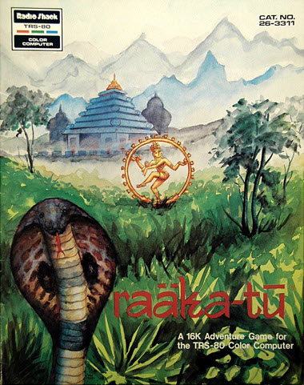

# Raaka-Tu

>>> cpu Z80

>>> memoryTable ram 
[RAM Usage](RAMUse.md)

>>> memoryTable hard 
[Hardware Info](../Hardware.md)

# Start

```code
4300: 31 FF 7F       LD      SP,$7FFF        
4303: 21 80 3F       LD      HL,$3F80        
4306: 22 20 40       LD      ($4020),HL      
4309: 3E 1D          LD      A,$1D           
430B: 32 20 50       LD      ($5020),A       
430E: 3E 96          LD      A,$96           
4310: 47             LD      B,A             
4311: 32 23 50       LD      ($5023),A       
4314: 21 1F 68       LD      HL,$681F        
4317: CD ED 46       CALL    $46ED           
431A: 22 24 50       LD      ($5024),HL      
431D: CD D0 49       CALL    $49D0           
4320: 31 FF 7F       LD      SP,$7FFF        
4323: CD 8F 47       CALL    $478F           
4326: 97             SUB     A               
4327: 32 05 50       LD      ($5005),A       
432A: 32 08 50       LD      ($5008),A       
432D: 32 0A 50       LD      ($500A),A       
4330: 32 00 50       LD      ($5000),A       
4333: 32 01 50       LD      ($5001),A       
4336: 32 07 50       LD      ($5007),A       
4339: 32 06 50       LD      ($5006),A       
433C: 32 02 50       LD      ($5002),A       
433F: 32 03 50       LD      ($5003),A       
4342: 32 0D 50       LD      ($500D),A       
4345: 32 11 50       LD      ($5011),A       
4348: 32 17 50       LD      ($5017),A       
434B: 3E 1D          LD      A,$1D           
434D: 32 20 50       LD      ($5020),A       
4350: 47             LD      B,A             
4351: CD 83 4E       CALL    $4E83           
4354: 22 21 50       LD      ($5021),HL      
4357: CD 05 47       CALL    $4705           
435A: 7E             LD      A,(HL)          
435B: 32 23 50       LD      ($5023),A       
435E: 47             LD      B,A             
435F: 21 1F 68       LD      HL,$681F        
4362: CD ED 46       CALL    $46ED           
4365: 22 24 50       LD      ($5024),HL      
4368: 21 47 50       LD      HL,$5047        
436B: 22 26 50       LD      ($5026),HL      
436E: 36 00          LD      (HL),$00        
4370: 21 C0 3F       LD      HL,$3FC0        
4373: CD E2 47       CALL    $47E2           
4376: CA 89 43       JP      Z,$4389         
4379: 7E             LD      A,(HL)          
437A: FE 20          CP      $20             
437C: CA 73 43       JP      Z,$4373         
437F: 7D             LD      A,L             
4380: FE FF          CP      $FF             
4382: CA 89 43       JP      Z,$4389         
4385: 23             INC     HL              
4386: C3 79 43       JP      $4379           
4389: 7D             LD      A,L             
438A: FE FF          CP      $FF             
438C: C2 73 43       JP      NZ,$4373        
438F: 2A 26 50       LD      HL,($5026)      
4392: 36 00          LD      (HL),$00        
4394: 21 47 50       LD      HL,$5047        
4397: 7E             LD      A,(HL)          
4398: A7             AND     A               
4399: CA 39 44       JP      Z,$4439         
439C: FE 02          CP      $02             
439E: C2 AF 43       JP      NZ,$43AF        
43A1: 23             INC     HL              
43A2: 7E             LD      A,(HL)          
43A3: 2B             DEC     HL              
43A4: FE 06          CP      $06             
43A6: D2 AF 43       JP      NC,$43AF        
43A9: 32 06 50       LD      ($5006),A       
43AC: 23             INC     HL              
43AD: 23             INC     HL              
43AE: 23             INC     HL              
43AF: 7E             LD      A,(HL)          
43B0: 23             INC     HL              
43B1: A7             AND     A               
43B2: CA 39 44       JP      Z,$4439         
43B5: 46             LD      B,(HL)          
43B6: 23             INC     HL              
43B7: 4E             LD      C,(HL)          
43B8: 23             INC     HL              
43B9: E5             PUSH    HL              
43BA: 3D             DEC     A               
43BB: C2 E2 43       JP      NZ,$43E2        
43BE: 21 B7 50       LD      HL,$50B7        
43C1: CD ED 46       CALL    $46ED           
43C4: D2 DB 43       JP      NC,$43DB        
43C7: CD 05 47       CALL    $4705           
43CA: CD 19 47       CALL    $4719           
43CD: D2 DB 43       JP      NC,$43DB        
43D0: 3A 01 50       LD      A,($5001)       
43D3: BE             CP      (HL)            
43D4: 23             INC     HL              
43D5: 7E             LD      A,(HL)          
43D6: 23             INC     HL              
43D7: C2 CA 43       JP      NZ,$43CA        
43DA: 47             LD      B,A             
43DB: 78             LD      A,B             
43DC: 32 01 50       LD      ($5001),A       
43DF: C3 35 44       JP      $4435           
43E2: 3D             DEC     A               
43E3: C2 1F 44       JP      NZ,$441F        
43E6: 3A 03 50       LD      A,($5003)       
43E9: A7             AND     A               
43EA: CA 0D 44       JP      Z,$440D         
43ED: 21 17 50       LD      HL,$5017        
43F0: 70             LD      (HL),B          
43F1: 23             INC     HL              
43F2: 3A 05 50       LD      A,($5005)       
43F5: 77             LD      (HL),A          
43F6: 23             INC     HL              
43F7: 3A 08 50       LD      A,($5008)       
43FA: 77             LD      (HL),A          
43FB: A7             AND     A               
43FC: C2 00 44       JP      NZ,$4400        
43FF: 71             LD      (HL),C          
4400: 97             SUB     A               
4401: 32 05 50       LD      ($5005),A       
4404: 32 03 50       LD      ($5003),A       
4407: 32 08 50       LD      ($5008),A       
440A: C3 35 44       JP      $4435           
440D: 2A 11 50       LD      HL,($5011)      
4410: 22 17 50       LD      ($5017),HL      
4413: 3A 13 50       LD      A,($5013)       
4416: 32 19 50       LD      ($5019),A       
4419: 21 11 50       LD      HL,$5011        
441C: C3 F0 43       JP      $43F0           
441F: 3D             DEC     A               
4420: C2 2E 44       JP      NZ,$442E        
4423: 78             LD      A,B             
4424: 32 05 50       LD      ($5005),A       
4427: 79             LD      A,C             
4428: 32 08 50       LD      ($5008),A       
442B: C3 35 44       JP      $4435           
442E: 78             LD      A,B             
442F: 32 02 50       LD      ($5002),A       
4432: 32 03 50       LD      ($5003),A       
4435: E1             POP     HL              
4436: C3 AF 43       JP      $43AF           
4439: 3A 01 50       LD      A,($5001)       
443C: A7             AND     A               
443D: CA 85 46       JP      Z,$4685         
4440: 21 17 50       LD      HL,$5017        
4443: CD 2A 45       CALL    $452A           
4446: 22 1A 50       LD      ($501A),HL      
4449: 21 11 50       LD      HL,$5011        
444C: CD 2A 45       CALL    $452A           
444F: 22 14 50       LD      ($5014),HL      
4452: 97             SUB     A               
4453: 32 03 50       LD      ($5003),A       
4456: 2A 14 50       LD      HL,($5014)      
4459: 3A 11 50       LD      A,($5011)       
445C: A7             AND     A               
445D: CA 66 44       JP      Z,$4466         
4460: CD 05 47       CALL    $4705           
4463: 23             INC     HL              
4464: 23             INC     HL              
4465: 7E             LD      A,(HL)          
4466: 32 16 50       LD      ($5016),A       
4469: 2A 1A 50       LD      HL,($501A)      
446C: 3A 17 50       LD      A,($5017)       
446F: A7             AND     A               
4470: CA 79 44       JP      Z,$4479         
4473: CD 05 47       CALL    $4705           
4476: 23             INC     HL              
4477: 23             INC     HL              
4478: 7E             LD      A,(HL)          
4479: 32 1C 50       LD      ($501C),A       
447C: 21 B9 50       LD      HL,$50B9        
447F: 7E             LD      A,(HL)          
4480: A7             AND     A               
4481: CA 3B 46       JP      Z,$463B         
4484: 3A 01 50       LD      A,($5001)       
4487: BE             CP      (HL)            
4488: 23             INC     HL              
4489: C2 EB 44       JP      NZ,$44EB        
448C: 7E             LD      A,(HL)          
448D: 32 04 50       LD      ($5004),A       
4490: 3A 02 50       LD      A,($5002)       
4493: A7             AND     A               
4494: CA 9B 44       JP      Z,$449B         
4497: BE             CP      (HL)            
4498: C2 EB 44       JP      NZ,$44EB        
449B: 23             INC     HL              
449C: 7E             LD      A,(HL)          
449D: A7             AND     A               
449E: CA B7 44       JP      Z,$44B7         
44A1: 3A 11 50       LD      A,($5011)       
44A4: A7             AND     A               
44A5: C2 BE 44       JP      NZ,$44BE        
44A8: 3A 0A 50       LD      A,($500A)       
44AB: 32 0B 50       LD      ($500B),A       
44AE: 11 11 50       LD      DE,$5011        
44B1: CD CB 45       CALL    $45CB           
44B4: C3 BE 44       JP      $44BE           
44B7: 3A 11 50       LD      A,($5011)       
44BA: A7             AND     A               
44BB: C2 3B 46       JP      NZ,$463B        
44BE: 23             INC     HL              
44BF: 7E             LD      A,(HL)          
44C0: A7             AND     A               
44C1: CA DF 44       JP      Z,$44DF         
44C4: 3A 17 50       LD      A,($5017)       
44C7: A7             AND     A               
44C8: C2 E6 44       JP      NZ,$44E6        
44CB: 3A 09 50       LD      A,($5009)       
44CE: 32 0B 50       LD      ($500B),A       
44D1: 3E 01          LD      A,$01           
44D3: 32 03 50       LD      ($5003),A       
44D6: 11 17 50       LD      DE,$5017        
44D9: CD CB 45       CALL    $45CB           
44DC: C3 E6 44       JP      $44E6           
44DF: 3A 17 50       LD      A,($5017)       
44E2: A7             AND     A               
44E3: C2 3B 46       JP      NZ,$463B        
44E6: 23             INC     HL              
44E7: 7E             LD      A,(HL)          
44E8: C3 F2 44       JP      $44F2           
44EB: 23             INC     HL              
44EC: 23             INC     HL              
44ED: 23             INC     HL              
44EE: 23             INC     HL              
44EF: C3 7F 44       JP      $447F           
44F2: 32 1F 50       LD      ($501F),A       
44F5: 21 FF 3F       LD      HL,$3FFF        
44F8: 22 20 40       LD      ($4020),HL      
44FB: 3E 0D          LD      A,$0D           
44FD: CD 0D 4F       CALL    $4F0D           
4500: 3A 11 50       LD      A,($5011)       
4503: A7             AND     A               
4504: C2 13 45       JP      NZ,$4513        
4507: 2A 1A 50       LD      HL,($501A)      
450A: 22 14 50       LD      ($5014),HL      
450D: 3A 17 50       LD      A,($5017)       
4510: 32 11 50       LD      ($5011),A       
4513: 21 FB 73       LD      HL,$73FB        
4516: CD 05 47       CALL    $4705           
4519: CD 94 48       CALL    $4894           
451C: CD D5 4B       CALL    $4BD5           
451F: 3E 0D          LD      A,$0D           
4521: CD 0D 4F       CALL    $4F0D           
4524: 3A 1F 50       LD      A,($501F)       
4527: C3 20 43       JP      $4320           
452A: 97             SUB     A               
452B: 32 0D 50       LD      ($500D),A       
452E: 7E             LD      A,(HL)          
452F: 32 00 50       LD      ($5000),A       
4532: 47             LD      B,A             
4533: A7             AND     A               
4534: C8             RET     Z               
4535: 23             INC     HL              
4536: 7E             LD      A,(HL)          
4537: 32 05 50       LD      ($5005),A       
453A: 23             INC     HL              
453B: 7E             LD      A,(HL)          
453C: 32 1D 50       LD      ($501D),A       
453F: 21 51 56       LD      HL,$5651        
4542: CD ED 46       CALL    $46ED           
4545: D2 97 45       JP      NC,$4597        
4548: D5             PUSH    DE              
4549: E5             PUSH    HL              
454A: CD A6 45       CALL    $45A6           
454D: C2 A2 45       JP      NZ,$45A2        
4550: 3A 05 50       LD      A,($5005)       
4553: A7             AND     A               
4554: CA 79 45       JP      Z,$4579         
4557: E1             POP     HL              
4558: E5             PUSH    HL              
4559: CD 05 47       CALL    $4705           
455C: 01 03 00       LD      BC,$0003        
455F: 09             ADD     HL,BC           
4560: 06 01          LD      B,$01           
4562: CD F1 46       CALL    $46F1           
4565: D2 79 45       JP      NC,$4579        
4568: CD 05 47       CALL    $4705           
456B: CD 19 47       CALL    $4719           
456E: D2 A2 45       JP      NC,$45A2        
4571: 3A 05 50       LD      A,($5005)       
4574: BE             CP      (HL)            
4575: 23             INC     HL              
4576: C2 6B 45       JP      NZ,$456B        
4579: E1             POP     HL              
457A: 3A 0D 50       LD      A,($500D)       
457D: A7             AND     A               
457E: C2 7C 46       JP      NZ,$467C        
4581: 7E             LD      A,(HL)          
4582: 32 0D 50       LD      ($500D),A       
4585: 22 0E 50       LD      ($500E),HL      
4588: CD 05 47       CALL    $4705           
458B: EB             EX      DE,HL           
458C: D1             POP     DE              
458D: 3A 00 50       LD      A,($5000)       
4590: 47             LD      B,A             
4591: CD F1 46       CALL    $46F1           
4594: DA 48 45       JP      C,$4548         
4597: 3A 0D 50       LD      A,($500D)       
459A: 2A 0E 50       LD      HL,($500E)      
459D: A7             AND     A               
459E: C0             RET     NZ              
459F: C3 32 46       JP      $4632           
45A2: E1             POP     HL              
45A3: C3 88 45       JP      $4588           
45A6: CD 05 47       CALL    $4705           
45A9: 3A 23 50       LD      A,($5023)       
45AC: BE             CP      (HL)            
45AD: C8             RET     Z               
45AE: 7E             LD      A,(HL)          
45AF: A7             AND     A               
45B0: CA C8 45       JP      Z,$45C8         
45B3: 3C             INC     A               
45B4: C8             RET     Z               
45B5: 3D             DEC     A               
45B6: FA C8 45       JP      M,$45C8         
45B9: 46             LD      B,(HL)          
45BA: 3A 20 50       LD      A,($5020)       
45BD: B8             CP      B               
45BE: C8             RET     Z               
45BF: 21 51 56       LD      HL,$5651        
45C2: CD ED 46       CALL    $46ED           
45C5: DA A6 45       JP      C,$45A6         
45C8: F6 01          OR      $01             
45CA: C9             RET                     
45CB: E5             PUSH    HL              
45CC: 97             SUB     A               
45CD: 32 00 50       LD      ($5000),A       
45D0: D5             PUSH    DE              
45D1: 4E             LD      C,(HL)          
45D2: 21 51 56       LD      HL,$5651        
45D5: CD 05 47       CALL    $4705           
45D8: CD 19 47       CALL    $4719           
45DB: D2 16 46       JP      NC,$4616        
45DE: D5             PUSH    DE              
45DF: E5             PUSH    HL              
45E0: CD A6 45       CALL    $45A6           
45E3: E1             POP     HL              
45E4: C2 10 46       JP      NZ,$4610        
45E7: 46             LD      B,(HL)          
45E8: 22 26 50       LD      ($5026),HL      
45EB: CD 05 47       CALL    $4705           
45EE: 23             INC     HL              
45EF: 23             INC     HL              
45F0: 7E             LD      A,(HL)          
45F1: A1             AND     C               
45F2: B9             CP      C               
45F3: C2 0B 46       JP      NZ,$460B        
45F6: 3A 00 50       LD      A,($5000)       
45F9: A7             AND     A               
45FA: C2 44 46       JP      NZ,$4644        
45FD: 78             LD      A,B             
45FE: 32 00 50       LD      ($5000),A       
4601: 7E             LD      A,(HL)          
4602: 32 05 50       LD      ($5005),A       
4605: 2A 26 50       LD      HL,($5026)      
4608: 22 47 50       LD      ($5047),HL      
460B: EB             EX      DE,HL           
460C: D1             POP     DE              
460D: C3 D8 45       JP      $45D8           
4610: CD 05 47       CALL    $4705           
4613: C3 0B 46       JP      $460B           
4616: 3A 00 50       LD      A,($5000)       
4619: A7             AND     A               
461A: CA 44 46       JP      Z,$4644         
461D: D1             POP     DE              
461E: 2A 47 50       LD      HL,($5047)      
4621: 12             LD      (DE),A          
4622: 13             INC     DE              
4623: 13             INC     DE              
4624: 13             INC     DE              
4625: 7D             LD      A,L             
4626: 12             LD      (DE),A          
4627: 13             INC     DE              
4628: 7C             LD      A,H             
4629: 12             LD      (DE),A          
462A: 13             INC     DE              
462B: 3A 05 50       LD      A,($5005)       
462E: 12             LD      (DE),A          
462F: E1             POP     HL              
4630: 97             SUB     A               
4631: C9             RET                     
4632: 11 2F 50       LD      DE,$502F        
4635: 3A 1D 50       LD      A,($501D)       
4638: C3 8A 46       JP      $468A           
463B: 11 3E 50       LD      DE,$503E        
463E: 3A 09 50       LD      A,($5009)       
4641: C3 8A 46       JP      $468A           
4644: 3A 03 50       LD      A,($5003)       
4647: A7             AND     A               
4648: CA 73 46       JP      Z,$4673         
464B: 3A 02 50       LD      A,($5002)       
464E: A7             AND     A               
464F: C2 73 46       JP      NZ,$4673        
4652: 16 00          LD      D,$00           
4654: 21 F8 55       LD      HL,$55F8        
4657: 7E             LD      A,(HL)          
4658: A7             AND     A               
4659: CA 73 46       JP      Z,$4673         
465C: E5             PUSH    HL              
465D: 5E             LD      E,(HL)          
465E: 23             INC     HL              
465F: 19             ADD     HL,DE           
4660: 3A 04 50       LD      A,($5004)       
4663: BE             CP      (HL)            
4664: CA 6C 46       JP      Z,$466C         
4667: 23             INC     HL              
4668: C1             POP     BC              
4669: C3 57 46       JP      $4657           
466C: D1             POP     DE              
466D: 3A 0B 50       LD      A,($500B)       
4670: CD C6 46       CALL    $46C6           
4673: 11 2F 50       LD      DE,$502F        
4676: 3A 0B 50       LD      A,($500B)       
4679: C3 8A 46       JP      $468A           
467C: 11 36 50       LD      DE,$5036        
467F: 3A 1D 50       LD      A,($501D)       
4682: C3 8A 46       JP      $468A           
4685: 11 28 50       LD      DE,$5028        
4688: 3E C0          LD      A,$C0           
468A: 31 FF 7F       LD      SP,$7FFF        
468D: 21 C0 3F       LD      HL,$3FC0        
4690: CD C6 46       CALL    $46C6           
4693: 1A             LD      A,(DE)          
4694: 4F             LD      C,A             
4695: E5             PUSH    HL              
4696: 36 20          LD      (HL),$20        
4698: 23             INC     HL              
4699: 0D             DEC     C               
469A: C2 96 46       JP      NZ,$4696        
469D: CD BB 46       CALL    $46BB           
46A0: E1             POP     HL              
46A1: 05             DEC     B               
46A2: C2 B5 46       JP      NZ,$46B5        
46A5: 1A             LD      A,(DE)          
46A6: 3C             INC     A               
46A7: 4F             LD      C,A             
46A8: CD 9E 47       CALL    $479E           
46AB: 0D             DEC     C               
46AC: C2 A8 46       JP      NZ,$46A8        
46AF: CD 22 47       CALL    $4722           
46B2: C3 26 43       JP      $4326           
46B5: CD D5 46       CALL    $46D5           
46B8: C3 93 46       JP      $4693           
46BB: 3E 32          LD      A,$32           
46BD: 0D             DEC     C               
46BE: C2 BD 46       JP      NZ,$46BD        
46C1: 3D             DEC     A               
46C2: C2 BD 46       JP      NZ,$46BD        
46C5: C9             RET                     
46C6: 6F             LD      L,A             
46C7: 1A             LD      A,(DE)          
46C8: 3C             INC     A               
46C9: 4F             LD      C,A             
46CA: D5             PUSH    DE              
46CB: CD B5 47       CALL    $47B5           
46CE: 0D             DEC     C               
46CF: C2 CB 46       JP      NZ,$46CB        
46D2: D1             POP     DE              
46D3: 06 08          LD      B,$08           
46D5: 1A             LD      A,(DE)          
46D6: 4F             LD      C,A             
46D7: D5             PUSH    DE              
46D8: E5             PUSH    HL              
46D9: 13             INC     DE              
46DA: 1A             LD      A,(DE)          
46DB: 77             LD      (HL),A          
46DC: 23             INC     HL              
46DD: 13             INC     DE              
46DE: 0D             DEC     C               
46DF: C2 DA 46       JP      NZ,$46DA        
46E2: 2C             INC     L               
46E3: 7D             LD      A,L             
46E4: 32 0B 50       LD      ($500B),A       
46E7: CD BB 46       CALL    $46BB           
46EA: E1             POP     HL              
46EB: D1             POP     DE              
46EC: C9             RET                     
46ED: 23             INC     HL              
46EE: CD 06 47       CALL    $4706           
46F1: CD 19 47       CALL    $4719           
46F4: D0             RET     NC              
46F5: 78             LD      A,B             
46F6: BE             CP      (HL)            
46F7: CA 03 47       JP      Z,$4703         
46FA: D5             PUSH    DE              
46FB: CD 05 47       CALL    $4705           
46FE: EB             EX      DE,HL           
46FF: D1             POP     DE              
4700: C3 F1 46       JP      $46F1           
4703: 37             SCF                     
4704: C9             RET                     
4705: 23             INC     HL              
4706: 16 00          LD      D,$00           
4708: 7E             LD      A,(HL)          
4709: E6 80          AND     $80             
470B: CA 13 47       JP      Z,$4713         
470E: 7E             LD      A,(HL)          
470F: E6 7F          AND     $7F             
4711: 57             LD      D,A             
4712: 23             INC     HL              
4713: 5E             LD      E,(HL)          
4714: 23             INC     HL              
4715: EB             EX      DE,HL           
4716: 19             ADD     HL,DE           
4717: EB             EX      DE,HL           
4718: C9             RET                     
4719: 7C             LD      A,H             
471A: BA             CP      D               
471B: C0             RET     NZ              
471C: 7D             LD      A,L             
471D: BB             CP      E               
471E: C9             RET                     
471F: 21 C0 3F       LD      HL,$3FC0        
4722: CD D0 47       CALL    $47D0           
4725: CD D6 47       CALL    $47D6           
4728: FE 18          CP      $18             
472A: CA 56 47       JP      Z,$4756         
472D: FE 19          CP      $19             
472F: CA 66 47       JP      Z,$4766         
4732: FE 09          CP      $09             
4734: CA 76 47       JP      Z,$4776         
4737: FE 0D          CP      $0D             
4739: CA 8B 47       JP      Z,$478B         
473C: FE 1F          CP      $1F             
473E: CA 8F 47       JP      Z,$478F         
4741: FE 08          CP      $08             
4743: CA 7E 47       JP      Z,$477E         
4746: 47             LD      B,A             
4747: 7D             LD      A,L             
4748: FE FF          CP      $FF             
474A: CA 25 47       JP      Z,$4725         
474D: 78             LD      A,B             
474E: CD B5 47       CALL    $47B5           
4751: 77             LD      (HL),A          
4752: 23             INC     HL              
4753: C3 25 47       JP      $4725           
4756: 7D             LD      A,L             
4757: FE C0          CP      $C0             
4759: CA 25 47       JP      Z,$4725         
475C: 2B             DEC     HL              
475D: 7E             LD      A,(HL)          
475E: 23             INC     HL              
475F: 77             LD      (HL),A          
4760: 2B             DEC     HL              
4761: 36 8F          LD      (HL),$8F        
4763: C3 25 47       JP      $4725           
4766: 7D             LD      A,L             
4767: FE FF          CP      $FF             
4769: CA 25 47       JP      Z,$4725         
476C: 23             INC     HL              
476D: 7E             LD      A,(HL)          
476E: 2B             DEC     HL              
476F: 77             LD      (HL),A          
4770: 23             INC     HL              
4771: 36 8F          LD      (HL),$8F        
4773: C3 25 47       JP      $4725           
4776: CD 9E 47       CALL    $479E           
4779: 36 8F          LD      (HL),$8F        
477B: C3 25 47       JP      $4725           
477E: 7D             LD      A,L             
477F: FE C0          CP      $C0             
4781: CA 25 47       JP      Z,$4725         
4784: 2B             DEC     HL              
4785: CD 9E 47       CALL    $479E           
4788: C3 25 47       JP      $4725           
478B: CD 9E 47       CALL    $479E           
478E: C9             RET                     
478F: 21 C0 3F       LD      HL,$3FC0        
4792: 06 40          LD      B,$40           
4794: 36 20          LD      (HL),$20        
4796: 23             INC     HL              
4797: 05             DEC     B               
4798: C2 94 47       JP      NZ,$4794        
479B: C3 1F 47       JP      $471F           
479E: 54             LD      D,H             
479F: 5D             LD      E,L             
47A0: 45             LD      B,L             
47A1: 36 20          LD      (HL),$20        
47A3: 13             INC     DE              
47A4: 7B             LD      A,E             
47A5: A7             AND     A               
47A6: C8             RET     Z               
47A7: FE 01          CP      $01             
47A9: C8             RET     Z               
47AA: 1A             LD      A,(DE)          
47AB: 77             LD      (HL),A          
47AC: 2C             INC     L               
47AD: 1C             INC     E               
47AE: C2 AA 47       JP      NZ,$47AA        
47B1: 36 20          LD      (HL),$20        
47B3: 68             LD      L,B             
47B4: C9             RET                     
47B5: F5             PUSH    AF              
47B6: 7D             LD      A,L             
47B7: FE FF          CP      $FF             
47B9: CA CE 47       JP      Z,$47CE         
47BC: 45             LD      B,L             
47BD: 21 FF 3F       LD      HL,$3FFF        
47C0: 11 FE 3F       LD      DE,$3FFE        
47C3: 1A             LD      A,(DE)          
47C4: 77             LD      (HL),A          
47C5: 2B             DEC     HL              
47C6: 1B             DEC     DE              
47C7: 7D             LD      A,L             
47C8: B8             CP      B               
47C9: C2 C3 47       JP      NZ,$47C3        
47CC: 36 20          LD      (HL),$20        
47CE: F1             POP     AF              
47CF: C9             RET                     
47D0: CD B5 47       CALL    $47B5           
47D3: 36 8F          LD      (HL),$8F        
47D5: C9             RET                     
47D6: CD D3 4F       CALL    $4FD3           
47D9: CD 2B 00       CALL    $002B           
47DC: A7             AND     A               
47DD: CA D6 47       JP      Z,$47D6         
47E0: C9             RET                     
47E1: 23             INC     HL              
47E2: 7D             LD      A,L             
47E3: 32 1D 50       LD      ($501D),A       
47E6: FE FF          CP      $FF             
47E8: C8             RET     Z               
47E9: 7E             LD      A,(HL)          
47EA: FE 20          CP      $20             
47EC: CA E1 47       JP      Z,$47E1         
47EF: FE 41          CP      $41             
47F1: DA E1 47       JP      C,$47E1         
47F4: 11 C2 52       LD      DE,$52C2        
47F7: CD 2E 48       CALL    $482E           
47FA: CA E2 47       JP      Z,$47E2         
47FD: 06 01          LD      B,$01           
47FF: 13             INC     DE              
4800: CD 2E 48       CALL    $482E           
4803: CA 0F 48       JP      Z,$480F         
4806: 04             INC     B               
4807: 78             LD      A,B             
4808: FE 05          CP      $05             
480A: C2 FF 47       JP      NZ,$47FF        
480D: A7             AND     A               
480E: C9             RET                     
480F: EB             EX      DE,HL           
4810: 2A 26 50       LD      HL,($5026)      
4813: 70             LD      (HL),B          
4814: 23             INC     HL              
4815: 77             LD      (HL),A          
4816: 23             INC     HL              
4817: 3A 1D 50       LD      A,($501D)       
481A: 77             LD      (HL),A          
481B: 23             INC     HL              
481C: 22 26 50       LD      ($5026),HL      
481F: EB             EX      DE,HL           
4820: 78             LD      A,B             
4821: FE 01          CP      $01             
4823: C2 2C 48       JP      NZ,$482C        
4826: 3A 09 50       LD      A,($5009)       
4829: 32 0A 50       LD      ($500A),A       
482C: 97             SUB     A               
482D: C9             RET                     
482E: 1A             LD      A,(DE)          
482F: A7             AND     A               
4830: C2 36 48       JP      NZ,$4836        
4833: F6 01          OR      $01             
4835: C9             RET                     
4836: 4F             LD      C,A             
4837: 32 1E 50       LD      ($501E),A       
483A: E5             PUSH    HL              
483B: 13             INC     DE              
483C: 7E             LD      A,(HL)          
483D: FE 20          CP      $20             
483F: CA 8A 48       JP      Z,$488A         
4842: 7D             LD      A,L             
4843: A7             AND     A               
4844: CA 8A 48       JP      Z,$488A         
4847: 7E             LD      A,(HL)          
4848: FE 41          CP      $41             
484A: D2 51 48       JP      NC,$4851        
484D: 23             INC     HL              
484E: C3 3C 48       JP      $483C           
4851: 1A             LD      A,(DE)          
4852: BE             CP      (HL)            
4853: C2 8A 48       JP      NZ,$488A        
4856: 13             INC     DE              
4857: 23             INC     HL              
4858: 0D             DEC     C               
4859: C2 3C 48       JP      NZ,$483C        
485C: 3A 1E 50       LD      A,($501E)       
485F: FE 06          CP      $06             
4861: CA 6F 48       JP      Z,$486F         
4864: 7E             LD      A,(HL)          
4865: FE 41          CP      $41             
4867: DA 6F 48       JP      C,$486F         
486A: FE 20          CP      $20             
486C: C2 8F 48       JP      NZ,$488F        
486F: 1A             LD      A,(DE)          
4870: D1             POP     DE              
4871: 4F             LD      C,A             
4872: 7E             LD      A,(HL)          
4873: FE 20          CP      $20             
4875: CA 82 48       JP      Z,$4882         
4878: 7D             LD      A,L             
4879: FE FF          CP      $FF             
487B: CA 84 48       JP      Z,$4884         
487E: 23             INC     HL              
487F: C3 72 48       JP      $4872           
4882: 7D             LD      A,L             
4883: 3C             INC     A               
4884: 32 09 50       LD      ($5009),A       
4887: 97             SUB     A               
4888: 79             LD      A,C             
4889: C9             RET                     
488A: 13             INC     DE              
488B: 0D             DEC     C               
488C: C2 8A 48       JP      NZ,$488A        
488F: E1             POP     HL              
4890: 13             INC     DE              
4891: C3 2E 48       JP      $482E           
4894: 7E             LD      A,(HL)          
4895: 47             LD      B,A             
4896: 23             INC     HL              
4897: E6 80          AND     $80             
4899: CA B0 48       JP      Z,$48B0         
489C: E5             PUSH    HL              
489D: D5             PUSH    DE              
489E: 21 CD 7B       LD      HL,$7BCD        
48A1: CD ED 46       CALL    $46ED           
48A4: D2 AD 48       JP      NC,$48AD        
48A7: CD 05 47       CALL    $4705           
48AA: CD 94 48       CALL    $4894           
48AD: D1             POP     DE              
48AE: E1             POP     HL              
48AF: C9             RET                     
48B0: 78             LD      A,B             
48B1: 11 66 50       LD      DE,$5066        
48B4: 07             RLCA                    
48B5: 83             ADD     A,E             
48B6: 5F             LD      E,A             
48B7: 7A             LD      A,D             
48B8: CE 00          ADC     $00             
48BA: 57             LD      D,A             
48BB: 1A             LD      A,(DE)          
48BC: 32 C5 48       LD      ($48C5),A       
48BF: 13             INC     DE              
48C0: 1A             LD      A,(DE)          
48C1: 32 C6 48       LD      ($48C6),A       
48C4: C3 C4 48       JP      $48C4           
48C7: CD 06 47       CALL    $4706           
48CA: CD 19 47       CALL    $4719           
48CD: D2 DA 48       JP      NC,$48DA        
48D0: D5             PUSH    DE              
48D1: CD 94 48       CALL    $4894           
48D4: D1             POP     DE              
48D5: CA CA 48       JP      Z,$48CA         
48D8: EB             EX      DE,HL           
48D9: C9             RET                     
48DA: EB             EX      DE,HL           
48DB: 97             SUB     A               
48DC: C9             RET                     
48DD: CD 06 47       CALL    $4706           
48E0: CD 19 47       CALL    $4719           
48E3: D2 F0 48       JP      NC,$48F0        
48E6: D5             PUSH    DE              
48E7: CD 94 48       CALL    $4894           
48EA: D1             POP     DE              
48EB: C2 E0 48       JP      NZ,$48E0        
48EE: EB             EX      DE,HL           
48EF: C9             RET                     
48F0: EB             EX      DE,HL           
48F1: F6 01          OR      $01             
48F3: C9             RET                     
48F4: CD 06 47       CALL    $4706           
48F7: 46             LD      B,(HL)          
48F8: 23             INC     HL              
48F9: CD 19 47       CALL    $4719           
48FC: D2 F0 48       JP      NC,$48F0        
48FF: D5             PUSH    DE              
4900: C5             PUSH    BC              
4901: 78             LD      A,B             
4902: CD B1 48       CALL    $48B1           
4905: C1             POP     BC              
4906: CA 11 49       JP      Z,$4911         
4909: CD 06 47       CALL    $4706           
490C: EB             EX      DE,HL           
490D: D1             POP     DE              
490E: C3 F9 48       JP      $48F9           
4911: CD 06 47       CALL    $4706           
4914: CD 94 48       CALL    $4894           
4917: E1             POP     HL              
4918: C9             RET                     
4919: CD 23 49       CALL    $4923           
491C: E5             PUSH    HL              
491D: CD D0 49       CALL    $49D0           
4920: E1             POP     HL              
4921: 97             SUB     A               
4922: C9             RET                     
4923: 7E             LD      A,(HL)          
4924: 23             INC     HL              
4925: E5             PUSH    HL              
4926: 32 23 50       LD      ($5023),A       
4929: 47             LD      B,A             
492A: 21 1F 68       LD      HL,$681F        
492D: CD ED 46       CALL    $46ED           
4930: 22 24 50       LD      ($5024),HL      
4933: 2A 21 50       LD      HL,($5021)      
4936: CD 05 47       CALL    $4705           
4939: 3A 23 50       LD      A,($5023)       
493C: 77             LD      (HL),A          
493D: E1             POP     HL              
493E: 97             SUB     A               
493F: C9             RET                     
4940: E5             PUSH    HL              
4941: 2A 14 50       LD      HL,($5014)      
4944: 22 0E 50       LD      ($500E),HL      
4947: 3A 11 50       LD      A,($5011)       
494A: 32 0D 50       LD      ($500D),A       
494D: E1             POP     HL              
494E: 97             SUB     A               
494F: C9             RET                     
4950: E5             PUSH    HL              
4951: 2A 1A 50       LD      HL,($501A)      
4954: 22 0E 50       LD      ($500E),HL      
4957: 3A 17 50       LD      A,($5017)       
495A: 32 0D 50       LD      ($500D),A       
495D: E1             POP     HL              
495E: 97             SUB     A               
495F: C9             RET                     
4960: 46             LD      B,(HL)          
4961: 23             INC     HL              
4962: E5             PUSH    HL              
4963: 78             LD      A,B             
4964: 32 0D 50       LD      ($500D),A       
4967: CD 83 4E       CALL    $4E83           
496A: 22 0E 50       LD      ($500E),HL      
496D: E1             POP     HL              
496E: 97             SUB     A               
496F: C9             RET                     
4970: EB             EX      DE,HL           
4971: 2A 14 50       LD      HL,($5014)      
4974: E5             PUSH    HL              
4975: 2A 1A 50       LD      HL,($501A)      
4978: E5             PUSH    HL              
4979: 3A 11 50       LD      A,($5011)       
497C: 47             LD      B,A             
497D: 3A 17 50       LD      A,($5017)       
4980: 4F             LD      C,A             
4981: C5             PUSH    BC              
4982: 3A 0A 00       LD      A,($000A)       
4985: 47             LD      B,A             
4986: C5             PUSH    BC              
4987: EB             EX      DE,HL           
4988: 7E             LD      A,(HL)          
4989: 32 0A 00       LD      ($000A),A       
498C: 23             INC     HL              
498D: 46             LD      B,(HL)          
498E: 23             INC     HL              
498F: 4E             LD      C,(HL)          
4990: 23             INC     HL              
4991: E5             PUSH    HL              
4992: 78             LD      A,B             
4993: 32 11 50       LD      ($5011),A       
4996: A7             AND     A               
4997: CA A0 49       JP      Z,$49A0         
499A: CD 83 4E       CALL    $4E83           
499D: 22 14 50       LD      ($5014),HL      
49A0: 79             LD      A,C             
49A1: 32 17 50       LD      ($5017),A       
49A4: A7             AND     A               
49A5: CA AE 49       JP      Z,$49AE         
49A8: CD 83 4E       CALL    $4E83           
49AB: 22 1A 50       LD      ($501A),HL      
49AE: 21 FB 73       LD      HL,$73FB        
49B1: CD 05 47       CALL    $4705           
49B4: CD 94 48       CALL    $4894           
49B7: D1             POP     DE              
49B8: C1             POP     BC              
49B9: 78             LD      A,B             
49BA: 32 0A 00       LD      ($000A),A       
49BD: C1             POP     BC              
49BE: 78             LD      A,B             
49BF: 32 11 50       LD      ($5011),A       
49C2: 79             LD      A,C             
49C3: 32 17 50       LD      ($5017),A       
49C6: E1             POP     HL              
49C7: 22 1A 50       LD      ($501A),HL      
49CA: E1             POP     HL              
49CB: 22 14 50       LD      ($5014),HL      
49CE: EB             EX      DE,HL           
49CF: C9             RET                     
49D0: 3A 20 50       LD      A,($5020)       
49D3: FE 1D          CP      $1D             
49D5: C0             RET     NZ              
49D6: 2A 24 50       LD      HL,($5024)      
49D9: CD 05 47       CALL    $4705           
49DC: 23             INC     HL              
49DD: 06 03          LD      B,$03           
49DF: CD F1 46       CALL    $46F1           
49E2: D2 E9 49       JP      NC,$49E9        
49E5: 23             INC     HL              
49E6: CD 9B 4E       CALL    $4E9B           
49E9: 21 51 56       LD      HL,$5651        
49EC: CD 05 47       CALL    $4705           
49EF: D5             PUSH    DE              
49F0: CD 05 47       CALL    $4705           
49F3: 3A 23 50       LD      A,($5023)       
49F6: BE             CP      (HL)            
49F7: C2 0B 4A       JP      NZ,$4A0B        
49FA: 23             INC     HL              
49FB: 23             INC     HL              
49FC: 23             INC     HL              
49FD: 06 03          LD      B,$03           
49FF: CD F1 46       CALL    $46F1           
4A02: D2 0B 4A       JP      NC,$4A0B        
4A05: 23             INC     HL              
4A06: D5             PUSH    DE              
4A07: CD 9B 4E       CALL    $4E9B           
4A0A: D1             POP     DE              
4A0B: EB             EX      DE,HL           
4A0C: D1             POP     DE              
4A0D: CD 19 47       CALL    $4719           
4A10: DA EF 49       JP      C,$49EF         
4A13: C9             RET                     
4A14: 46             LD      B,(HL)          
4A15: 23             INC     HL              
4A16: E5             PUSH    HL              
4A17: CD 83 4E       CALL    $4E83           
4A1A: CD A6 45       CALL    $45A6           
4A1D: E1             POP     HL              
4A1E: C9             RET                     
4A1F: 3A 20 50       LD      A,($5020)       
4A22: BE             CP      (HL)            
4A23: 23             INC     HL              
4A24: C9             RET                     
4A25: 46             LD      B,(HL)          
4A26: 23             INC     HL              
4A27: C3 CE 4B       JP      $4BCE           
4A2A: 4E             LD      C,(HL)          
4A2B: 23             INC     HL              
4A2C: 46             LD      B,(HL)          
4A2D: 23             INC     HL              
4A2E: E5             PUSH    HL              
4A2F: CD 83 4E       CALL    $4E83           
4A32: CD 05 47       CALL    $4705           
4A35: 5E             LD      E,(HL)          
4A36: 23             INC     HL              
4A37: 7E             LD      A,(HL)          
4A38: E1             POP     HL              
4A39: 7B             LD      A,E             
4A3A: B9             CP      C               
4A3B: C9             RET                     
4A3C: F6 01          OR      $01             
4A3E: C9             RET                     
4A3F: 3A 20 50       LD      A,($5020)       
4A42: FE 1D          CP      $1D             
4A44: C2 54 4A       JP      NZ,$4A54        
4A47: 06 1D          LD      B,$1D           
4A49: E5             PUSH    HL              
4A4A: CD 83 4E       CALL    $4E83           
4A4D: CD A6 45       CALL    $45A6           
4A50: E1             POP     HL              
4A51: CA 5B 4A       JP      Z,$4A5B         
4A54: CD 06 47       CALL    $4706           
4A57: EB             EX      DE,HL           
4A58: C3 5E 4A       JP      $4A5E           
4A5B: CD 9B 4E       CALL    $4E9B           
4A5E: 97             SUB     A               
4A5F: C9             RET                     
4A60: CD D0 49       CALL    $49D0           
4A63: 97             SUB     A               
4A64: C9             RET                     
4A65: E5             PUSH    HL              
4A66: 3E 0D          LD      A,$0D           
4A68: CD 0D 4F       CALL    $4F0D           
4A6B: 21 51 56       LD      HL,$5651        
4A6E: CD 05 47       CALL    $4705           
4A71: CD 19 47       CALL    $4719           
4A74: D2 99 4A       JP      NC,$4A99        
4A77: D5             PUSH    DE              
4A78: CD 05 47       CALL    $4705           
4A7B: 46             LD      B,(HL)          
4A7C: 3A 20 50       LD      A,($5020)       
4A7F: B8             CP      B               
4A80: C2 94 4A       JP      NZ,$4A94        
4A83: 23             INC     HL              
4A84: 23             INC     HL              
4A85: 23             INC     HL              
4A86: 06 02          LD      B,$02           
4A88: CD F1 46       CALL    $46F1           
4A8B: D2 94 4A       JP      NC,$4A94        
4A8E: 23             INC     HL              
4A8F: D5             PUSH    DE              
4A90: CD 92 4E       CALL    $4E92           
4A93: D1             POP     DE              
4A94: EB             EX      DE,HL           
4A95: D1             POP     DE              
4A96: C3 71 4A       JP      $4A71           
4A99: 97             SUB     A               
4A9A: E1             POP     HL              
4A9B: C9             RET                     
4A9C: E5             PUSH    HL              
4A9D: 2A 14 50       LD      HL,($5014)      
4AA0: 3A 11 50       LD      A,($5011)       
4AA3: 22 26 50       LD      ($5026),HL      
4AA6: E1             POP     HL              
4AA7: A7             AND     A               
4AA8: CA BD 4A       JP      Z,$4ABD         
4AAB: 46             LD      B,(HL)          
4AAC: 23             INC     HL              
4AAD: E5             PUSH    HL              
4AAE: CD 83 4E       CALL    $4E83           
4AB1: EB             EX      DE,HL           
4AB2: E1             POP     HL              
4AB3: 3A 26 50       LD      A,($5026)       
4AB6: BB             CP      E               
4AB7: C0             RET     NZ              
4AB8: 3A 27 50       LD      A,($5027)       
4ABB: BA             CP      D               
4ABC: C9             RET                     
4ABD: B8             CP      B               
4ABE: C9             RET                     
4ABF: E5             PUSH    HL              
4AC0: 2A 1A 50       LD      HL,($501A)      
4AC3: 3A 17 50       LD      A,($5017)       
4AC6: C3 A3 4A       JP      $4AA3           
4AC9: 46             LD      B,(HL)          
4ACA: 23             INC     HL              
4ACB: 3A 1F 50       LD      A,($501F)       
4ACE: B8             CP      B               
4ACF: C9             RET                     
4AD0: E5             PUSH    HL              
4AD1: 2A 0E 50       LD      HL,($500E)      
4AD4: CD 05 47       CALL    $4705           
4AD7: 3A 20 50       LD      A,($5020)       
4ADA: 77             LD      (HL),A          
4ADB: 97             SUB     A               
4ADC: E1             POP     HL              
4ADD: C9             RET                     
4ADE: E5             PUSH    HL              
4ADF: 2A 0E 50       LD      HL,($500E)      
4AE2: CD 05 47       CALL    $4705           
4AE5: 3A 23 50       LD      A,($5023)       
4AE8: 77             LD      (HL),A          
4AE9: 97             SUB     A               
4AEA: E1             POP     HL              
4AEB: C9             RET                     
4AEC: E5             PUSH    HL              
4AED: 2A 24 50       LD      HL,($5024)      
4AF0: CD 05 47       CALL    $4705           
4AF3: 23             INC     HL              
4AF4: 06 04          LD      B,$04           
4AF6: CD F1 46       CALL    $46F1           
4AF9: D2 05 4B       JP      NC,$4B05        
4AFC: CD 05 47       CALL    $4705           
4AFF: CD 94 48       CALL    $4894           
4B02: CA 48 4B       JP      Z,$4B48         
4B05: 3A 17 50       LD      A,($5017)       
4B08: A7             AND     A               
4B09: CA 26 4B       JP      Z,$4B26         
4B0C: 2A 1A 50       LD      HL,($501A)      
4B0F: CD 05 47       CALL    $4705           
4B12: 23             INC     HL              
4B13: 23             INC     HL              
4B14: 23             INC     HL              
4B15: 06 06          LD      B,$06           
4B17: CD F1 46       CALL    $46F1           
4B1A: D2 26 4B       JP      NC,$4B26        
4B1D: CD 05 47       CALL    $4705           
4B20: CD 94 48       CALL    $4894           
4B23: CA 48 4B       JP      Z,$4B48         
4B26: 3A 11 50       LD      A,($5011)       
4B29: A7             AND     A               
4B2A: C2 31 4B       JP      NZ,$4B31        
4B2D: E1             POP     HL              
4B2E: F6 01          OR      $01             
4B30: C9             RET                     
4B31: 2A 14 50       LD      HL,($5014)      
4B34: CD 05 47       CALL    $4705           
4B37: 23             INC     HL              
4B38: 23             INC     HL              
4B39: 23             INC     HL              
4B3A: 06 07          LD      B,$07           
4B3C: CD F1 46       CALL    $46F1           
4B3F: D2 2D 4B       JP      NC,$4B2D        
4B42: CD 05 47       CALL    $4705           
4B45: CD 94 48       CALL    $4894           
4B48: E1             POP     HL              
4B49: C9             RET                     
4B4A: E5             PUSH    HL              
4B4B: 2A 0E 50       LD      HL,($500E)      
4B4E: 3A 0D 50       LD      A,($500D)       
4B51: C3 5B 4B       JP      $4B5B           
4B54: E5             PUSH    HL              
4B55: 2A 14 50       LD      HL,($5014)      
4B58: 3A 11 50       LD      A,($5011)       
4B5B: A7             AND     A               
4B5C: CA 48 4B       JP      Z,$4B48         
4B5F: 3A 20 50       LD      A,($5020)       
4B62: FE 1D          CP      $1D             
4B64: C2 79 4B       JP      NZ,$4B79        
4B67: CD 05 47       CALL    $4705           
4B6A: 23             INC     HL              
4B6B: 23             INC     HL              
4B6C: 23             INC     HL              
4B6D: 06 02          LD      B,$02           
4B6F: CD F1 46       CALL    $46F1           
4B72: D2 79 4B       JP      NC,$4B79        
4B75: 23             INC     HL              
4B76: CD 9B 4E       CALL    $4E9B           
4B79: E1             POP     HL              
4B7A: 97             SUB     A               
4B7B: C9             RET                     
4B7C: E5             PUSH    HL              
4B7D: 3A 17 50       LD      A,($5017)       
4B80: 2A 1A 50       LD      HL,($501A)      
4B83: C3 5B 4B       JP      $4B5B           
4B86: E5             PUSH    HL              
4B87: 2A 0E 50       LD      HL,($500E)      
4B8A: 3A 0D 50       LD      A,($500D)       
4B8D: A7             AND     A               
4B8E: CA 2D 4B       JP      Z,$4B2D         
4B91: CD 05 47       CALL    $4705           
4B94: 23             INC     HL              
4B95: 23             INC     HL              
4B96: 7E             LD      A,(HL)          
4B97: E1             POP     HL              
4B98: A6             AND     (HL)            
4B99: AE             XOR     (HL)            
4B9A: 23             INC     HL              
4B9B: C9             RET                     
4B9C: CD 94 48       CALL    $4894           
4B9F: C2 A5 4B       JP      NZ,$4BA5        
4BA2: F6 01          OR      $01             
4BA4: C9             RET                     
4BA5: 97             SUB     A               
4BA6: C9             RET                     
4BA7: 46             LD      B,(HL)          
4BA8: 23             INC     HL              
4BA9: E5             PUSH    HL              
4BAA: CD 83 4E       CALL    $4E83           
4BAD: CD 05 47       CALL    $4705           
4BB0: D1             POP     DE              
4BB1: 1A             LD      A,(DE)          
4BB2: 77             LD      (HL),A          
4BB3: EB             EX      DE,HL           
4BB4: 23             INC     HL              
4BB5: 97             SUB     A               
4BB6: C9             RET                     
4BB7: E5             PUSH    HL              
4BB8: 2A 0E 50       LD      HL,($500E)      
4BBB: CD 05 47       CALL    $4705           
4BBE: 46             LD      B,(HL)          
4BBF: 78             LD      A,B             
4BC0: A7             AND     A               
4BC1: E1             POP     HL              
4BC2: CA C8 45       JP      Z,$45C8         
4BC5: 3A 20 50       LD      A,($5020)       
4BC8: B8             CP      B               
4BC9: C8             RET     Z               
4BCA: 78             LD      A,B             
4BCB: E6 80          AND     $80             
4BCD: C0             RET     NZ              
4BCE: E5             PUSH    HL              
4BCF: CD 83 4E       CALL    $4E83           
4BD2: C3 BB 4B       JP      $4BBB           
4BD5: 21 51 56       LD      HL,$5651        
4BD8: 97             SUB     A               
4BD9: 32 1E 50       LD      ($501E),A       
4BDC: CD 05 47       CALL    $4705           
4BDF: CD 19 47       CALL    $4719           
4BE2: D0             RET     NC              
4BE3: 3A 1E 50       LD      A,($501E)       
4BE6: 3C             INC     A               
4BE7: 32 1E 50       LD      ($501E),A       
4BEA: D5             PUSH    DE              
4BEB: CD 05 47       CALL    $4705           
4BEE: 4E             LD      C,(HL)          
4BEF: D5             PUSH    DE              
4BF0: 7E             LD      A,(HL)          
4BF1: A7             AND     A               
4BF2: CA 3A 4C       JP      Z,$4C3A         
4BF5: 23             INC     HL              
4BF6: 23             INC     HL              
4BF7: 23             INC     HL              
4BF8: 06 08          LD      B,$08           
4BFA: CD F1 46       CALL    $46F1           
4BFD: D2 3A 4C       JP      NC,$4C3A        
4C00: CD 05 47       CALL    $4705           
4C03: E5             PUSH    HL              
4C04: CD D3 4F       CALL    $4FD3           
4C07: 3A 1E 50       LD      A,($501E)       
4C0A: 32 20 50       LD      ($5020),A       
4C0D: 47             LD      B,A             
4C0E: CD 83 4E       CALL    $4E83           
4C11: 22 21 50       LD      ($5021),HL      
4C14: 79             LD      A,C             
4C15: A7             AND     A               
4C16: FA 29 4C       JP      M,$4C29         
4C19: 47             LD      B,A             
4C1A: CD 83 4E       CALL    $4E83           
4C1D: CD 05 47       CALL    $4705           
4C20: 7E             LD      A,(HL)          
4C21: A7             AND     A               
4C22: C2 15 4C       JP      NZ,$4C15        
4C25: E1             POP     HL              
4C26: C3 3A 4C       JP      $4C3A           
4C29: 32 23 50       LD      ($5023),A       
4C2C: 21 1F 68       LD      HL,$681F        
4C2F: 47             LD      B,A             
4C30: CD ED 46       CALL    $46ED           
4C33: 22 24 50       LD      ($5024),HL      
4C36: E1             POP     HL              
4C37: CD 94 48       CALL    $4894           
4C3A: E1             POP     HL              
4C3B: D1             POP     DE              
4C3C: C3 DF 4B       JP      $4BDF           
4C3F: 3A F9 4F       LD      A,($4FF9)       
4C42: BE             CP      (HL)            
4C43: 23             INC     HL              
4C44: DA 4D 4C       JP      C,$4C4D         
4C47: CA 4D 4C       JP      Z,$4C4D         
4C4A: F6 01          OR      $01             
4C4C: C9             RET                     
4C4D: 97             SUB     A               
4C4E: C9             RET                     
4C4F: 4E             LD      C,(HL)          
4C50: 23             INC     HL              
4C51: E5             PUSH    HL              
4C52: 2A 0E 50       LD      HL,($500E)      
4C55: CD 05 47       CALL    $4705           
4C58: 23             INC     HL              
4C59: 23             INC     HL              
4C5A: 23             INC     HL              
4C5B: E5             PUSH    HL              
4C5C: D5             PUSH    DE              
4C5D: 06 09          LD      B,$09           
4C5F: CD F1 46       CALL    $46F1           
4C62: D2 8A 4C       JP      NC,$4C8A        
4C65: CD 05 47       CALL    $4705           
4C68: 23             INC     HL              
4C69: 7E             LD      A,(HL)          
4C6A: 91             SUB     C               
4C6B: D2 6F 4C       JP      NC,$4C6F        
4C6E: 97             SUB     A               
4C6F: 77             LD      (HL),A          
4C70: D1             POP     DE              
4C71: E1             POP     HL              
4C72: A7             AND     A               
4C73: CA 79 4C       JP      Z,$4C79         
4C76: 97             SUB     A               
4C77: E1             POP     HL              
4C78: C9             RET                     
4C79: 06 0A          LD      B,$0A           
4C7B: CD F1 46       CALL    $46F1           
4C7E: D2 76 4C       JP      NC,$4C76        
4C81: CD 05 47       CALL    $4705           
4C84: CD 94 48       CALL    $4894           
4C87: C3 76 4C       JP      $4C76           
4C8A: D1             POP     DE              
4C8B: E1             POP     HL              
4C8C: C3 76 4C       JP      $4C76           
4C8F: 46             LD      B,(HL)          
4C90: 23             INC     HL              
4C91: 4E             LD      C,(HL)          
4C92: 23             INC     HL              
4C93: E5             PUSH    HL              
4C94: CD 83 4E       CALL    $4E83           
4C97: CD 05 47       CALL    $4705           
4C9A: 5E             LD      E,(HL)          
4C9B: 41             LD      B,C             
4C9C: E5             PUSH    HL              
4C9D: D5             PUSH    DE              
4C9E: CD 83 4E       CALL    $4E83           
4CA1: CD 05 47       CALL    $4705           
4CA4: D1             POP     DE              
4CA5: 7E             LD      A,(HL)          
4CA6: 73             LD      (HL),E          
4CA7: E1             POP     HL              
4CA8: 77             LD      (HL),A          
4CA9: E1             POP     HL              
4CAA: 97             SUB     A               
4CAB: C9             RET                     
4CAC: 4E             LD      C,(HL)          
4CAD: 23             INC     HL              
4CAE: E5             PUSH    HL              
4CAF: 2A 0E 50       LD      HL,($500E)      
4CB2: CD 05 47       CALL    $4705           
4CB5: 23             INC     HL              
4CB6: 23             INC     HL              
4CB7: 23             INC     HL              
4CB8: 06 09          LD      B,$09           
4CBA: CD F1 46       CALL    $46F1           
4CBD: D2 CC 4C       JP      NC,$4CCC        
4CC0: CD 05 47       CALL    $4705           
4CC3: 23             INC     HL              
4CC4: 7E             LD      A,(HL)          
4CC5: B9             CP      C               
4CC6: DA D0 4C       JP      C,$4CD0         
4CC9: CA D0 4C       JP      Z,$4CD0         
4CCC: E1             POP     HL              
4CCD: F6 01          OR      $01             
4CCF: C9             RET                     
4CD0: 97             SUB     A               
4CD1: E1             POP     HL              
4CD2: C9             RET                     
4CD3: 4E             LD      C,(HL)          
4CD4: 23             INC     HL              
4CD5: E5             PUSH    HL              
4CD6: 2A 0E 50       LD      HL,($500E)      
4CD9: CD 05 47       CALL    $4705           
4CDC: 23             INC     HL              
4CDD: 23             INC     HL              
4CDE: 23             INC     HL              
4CDF: 06 09          LD      B,$09           
4CE1: CD F1 46       CALL    $46F1           
4CE4: D2 D0 4C       JP      NC,$4CD0        
4CE7: CD 05 47       CALL    $4705           
4CEA: 56             LD      D,(HL)          
4CEB: 23             INC     HL              
4CEC: 7E             LD      A,(HL)          
4CED: 81             ADD     A,C             
4CEE: BA             CP      D               
4CEF: DA F3 4C       JP      C,$4CF3         
4CF2: 7A             LD      A,D             
4CF3: 77             LD      (HL),A          
4CF4: C3 D0 4C       JP      $4CD0           
4CF7: 3E 0D          LD      A,$0D           
4CF9: CD 0D 4F       CALL    $4F0D           
4CFC: 3E 0D          LD      A,$0D           
4CFE: CD 0D 4F       CALL    $4F0D           
4D01: C3 00 43       JP      $4300           
4D04: C3 04 4D       JP      $4D04           
4D07: E5             PUSH    HL              
4D08: 11 9E 4D       LD      DE,$4D9E        
4D0B: CD AF 4D       CALL    $4DAF           
4D0E: CD D6 47       CALL    $47D6           
4D11: FE 08          CP      $08             
4D13: CA D0 4C       JP      Z,$4CD0         
4D16: FE 0D          CP      $0D             
4D18: C2 0E 4D       JP      NZ,$4D0E        
4D1B: 97             SUB     A               
4D1C: CD 12 02       CALL    $0212           
4D1F: CD 96 02       CALL    $0296           
4D22: 21 51 56       LD      HL,$5651        
4D25: 01 CE 11       LD      BC,$11CE        
4D28: 04             INC     B               
4D29: 0E 00          LD      C,$00           
4D2B: 59             LD      E,C             
4D2C: 3A 3F 3C       LD      A,($3C3F)       
4D2F: EE 0A          XOR     $0A             
4D31: 32 3F 3C       LD      ($3C3F),A       
4D34: E5             PUSH    HL              
4D35: C5             PUSH    BC              
4D36: D5             PUSH    DE              
4D37: CD 35 02       CALL    $0235           
4D3A: D1             POP     DE              
4D3B: C1             POP     BC              
4D3C: E1             POP     HL              
4D3D: 77             LD      (HL),A          
4D3E: 83             ADD     A,E             
4D3F: 5F             LD      E,A             
4D40: 23             INC     HL              
4D41: 0D             DEC     C               
4D42: C2 34 4D       JP      NZ,$4D34        
4D45: E5             PUSH    HL              
4D46: D5             PUSH    DE              
4D47: C5             PUSH    BC              
4D48: CD 35 02       CALL    $0235           
4D4B: C1             POP     BC              
4D4C: D1             POP     DE              
4D4D: E1             POP     HL              
4D4E: BB             CP      E               
4D4F: C2 89 4D       JP      NZ,$4D89        
4D52: 05             DEC     B               
4D53: C2 29 4D       JP      NZ,$4D29        
4D56: CD F8 01       CALL    $01F8           
4D59: 31 FF 7F       LD      SP,$7FFF        
4D5C: 3E 1D          LD      A,$1D           
4D5E: 32 20 50       LD      ($5020),A       
4D61: 47             LD      B,A             
4D62: CD 83 4E       CALL    $4E83           
4D65: 22 21 50       LD      ($5021),HL      
4D68: CD 05 47       CALL    $4705           
4D6B: 7E             LD      A,(HL)          
4D6C: 32 23 50       LD      ($5023),A       
4D6F: 47             LD      B,A             
4D70: 21 1F 68       LD      HL,$681F        
4D73: CD ED 46       CALL    $46ED           
4D76: 22 24 50       LD      ($5024),HL      
4D79: 3E 0D          LD      A,$0D           
4D7B: CD 0D 4F       CALL    $4F0D           
4D7E: CD D0 49       CALL    $49D0           
4D81: 3E 0D          LD      A,$0D           
4D83: CD 0D 4F       CALL    $4F0D           
4D86: C3 23 43       JP      $4323           
4D89: CD F8 01       CALL    $01F8           
4D8C: 11 95 4D       LD      DE,$4D95        
4D8F: CD AF 4D       CALL    $4DAF           
4D92: C3 0E 4D       JP      $4D0E           
4D95: 0D             DEC     C               
4D96: 43             LD      B,E             
4D97: 48             LD      C,B             
4D98: 45             LD      B,L             
4D99: 43             LD      B,E             
4D9A: 4B             LD      C,E             
4D9B: 53             LD      D,E             
4D9C: 55             LD      D,L             
4D9D: 4D             LD      C,L             
4D9E: 0D             DEC     C               
4D9F: 52             LD      D,D             
4DA0: 45             LD      B,L             
4DA1: 41             LD      B,C             
4DA2: 44             LD      B,H             
4DA3: 59             LD      E,C             
4DA4: 20 43          JR      NZ,$4DE9        
4DA6: 41             LD      B,C             
4DA7: 53             LD      D,E             
4DA8: 53             LD      D,E             
4DA9: 45             LD      B,L             
4DAA: 54             LD      D,H             
4DAB: 54             LD      D,H             
4DAC: 45             LD      B,L             
4DAD: 0D             DEC     C               
4DAE: 00             NOP                     
4DAF: 1A             LD      A,(DE)          
4DB0: A7             AND     A               
4DB1: C8             RET     Z               
4DB2: D5             PUSH    DE              
4DB3: CD 0D 4F       CALL    $4F0D           
4DB6: D1             POP     DE              
4DB7: 13             INC     DE              
4DB8: C3 AF 4D       JP      $4DAF           
4DBB: E5             PUSH    HL              
4DBC: 11 9E 4D       LD      DE,$4D9E        
4DBF: CD AF 4D       CALL    $4DAF           
4DC2: CD D6 47       CALL    $47D6           
4DC5: FE 08          CP      $08             
4DC7: CA D0 4C       JP      Z,$4CD0         
4DCA: FE 0D          CP      $0D             
4DCC: C2 C2 4D       JP      NZ,$4DC2        
4DCF: 97             SUB     A               
4DD0: CD 12 02       CALL    $0212           
4DD3: CD 87 02       CALL    $0287           
4DD6: 21 51 56       LD      HL,$5651        
4DD9: 01 CE 11       LD      BC,$11CE        
4DDC: 04             INC     B               
4DDD: 0E 00          LD      C,$00           
4DDF: 59             LD      E,C             
4DE0: E5             PUSH    HL              
4DE1: C5             PUSH    BC              
4DE2: 7E             LD      A,(HL)          
4DE3: 83             ADD     A,E             
4DE4: 5F             LD      E,A             
4DE5: D5             PUSH    DE              
4DE6: 7E             LD      A,(HL)          
4DE7: CD 64 02       CALL    $0264           
4DEA: D1             POP     DE              
4DEB: C1             POP     BC              
4DEC: E1             POP     HL              
4DED: 23             INC     HL              
4DEE: 0D             DEC     C               
4DEF: C2 E0 4D       JP      NZ,$4DE0        
4DF2: 7B             LD      A,E             
4DF3: E5             PUSH    HL              
4DF4: D5             PUSH    DE              
4DF5: C5             PUSH    BC              
4DF6: CD 64 02       CALL    $0264           
4DF9: C1             POP     BC              
4DFA: D1             POP     DE              
4DFB: E1             POP     HL              
4DFC: 05             DEC     B               
4DFD: C2 DD 4D       JP      NZ,$4DDD        
4E00: CD F8 01       CALL    $01F8           
4E03: C3 D0 4C       JP      $4CD0           
4E06: E5             PUSH    HL              
4E07: 97             SUB     A               
4E08: 32 FD 4F       LD      ($4FFD),A       
4E0B: 32 FE 4F       LD      ($4FFE),A       
4E0E: 3A 23 50       LD      A,($5023)       
4E11: FE 96          CP      $96             
4E13: C2 1B 4E       JP      NZ,$4E1B        
4E16: 3E 01          LD      A,$01           
4E18: 32 FE 4F       LD      ($4FFE),A       
4E1B: 21 51 56       LD      HL,$5651        
4E1E: CD 05 47       CALL    $4705           
4E21: CD 19 47       CALL    $4719           
4E24: D2 5A 4E       JP      NC,$4E5A        
4E27: D5             PUSH    DE              
4E28: CD 05 47       CALL    $4705           
4E2B: 7E             LD      A,(HL)          
4E2C: 47             LD      B,A             
4E2D: FE 96          CP      $96             
4E2F: CA 37 4E       JP      Z,$4E37         
4E32: FE 1D          CP      $1D             
4E34: C2 55 4E       JP      NZ,$4E55        
4E37: 23             INC     HL              
4E38: 3A FD 4F       LD      A,($4FFD)       
4E3B: 86             ADD     A,(HL)          
4E3C: 27             DAA                     
4E3D: 32 FD 4F       LD      ($4FFD),A       
4E40: 78             LD      A,B             
4E41: FE 96          CP      $96             
4E43: CA 4D 4E       JP      Z,$4E4D         
4E46: 3A FE 4F       LD      A,($4FFE)       
4E49: A7             AND     A               
4E4A: CA 55 4E       JP      Z,$4E55         
4E4D: 3A FD 4F       LD      A,($4FFD)       
4E50: 86             ADD     A,(HL)          
4E51: 27             DAA                     
4E52: 32 FD 4F       LD      ($4FFD),A       
4E55: EB             EX      DE,HL           
4E56: D1             POP     DE              
4E57: C3 21 4E       JP      $4E21           
4E5A: 3A FD 4F       LD      A,($4FFD)       
4E5D: 0F             RRCA                    
4E5E: 0F             RRCA                    
4E5F: 0F             RRCA                    
4E60: 0F             RRCA                    
4E61: E6 0F          AND     $0F             
4E63: C6 30          ADD     $30             
4E65: 47             LD      B,A             
4E66: CD 0D 4F       CALL    $4F0D           
4E69: 3A FD 4F       LD      A,($4FFD)       
4E6C: E6 0F          AND     $0F             
4E6E: C6 30          ADD     $30             
4E70: 47             LD      B,A             
4E71: CD 0D 4F       CALL    $4F0D           
4E74: 3E 2E          LD      A,$2E           
4E76: 47             LD      B,A             
4E77: CD 0D 4F       CALL    $4F0D           
4E7A: 3E 20          LD      A,$20           
4E7C: 47             LD      B,A             
4E7D: CD 0D 4F       CALL    $4F0D           
4E80: E1             POP     HL              
4E81: 97             SUB     A               
4E82: C9             RET                     
4E83: 21 51 56       LD      HL,$5651        
4E86: CD 05 47       CALL    $4705           
4E89: 05             DEC     B               
4E8A: C8             RET     Z               
4E8B: CD 05 47       CALL    $4705           
4E8E: EB             EX      DE,HL           
4E8F: C3 89 4E       JP      $4E89           
4E92: CD 9B 4E       CALL    $4E9B           
4E95: 3E 0D          LD      A,$0D           
4E97: CD 0D 4F       CALL    $4F0D           
4E9A: C9             RET                     
4E9B: 01 00 00       LD      BC,$0000        
4E9E: 7E             LD      A,(HL)          
4E9F: E6 80          AND     $80             
4EA1: CA A9 4E       JP      Z,$4EA9         
4EA4: 7E             LD      A,(HL)          
4EA5: E6 7F          AND     $7F             
4EA7: 47             LD      B,A             
4EA8: 23             INC     HL              
4EA9: 4E             LD      C,(HL)          
4EAA: 23             INC     HL              
4EAB: 78             LD      A,B             
4EAC: A7             AND     A               
4EAD: C2 B6 4E       JP      NZ,$4EB6        
4EB0: 79             LD      A,C             
4EB1: FE 02          CP      $02             
4EB3: DA F9 4E       JP      C,$4EF9         
4EB6: CD 3D 4F       CALL    $4F3D           
4EB9: 0B             DEC     BC              
4EBA: 0B             DEC     BC              
4EBB: 3A 20 40       LD      A,($4020)       
4EBE: FE FB          CP      $FB             
4EC0: DA AB 4E       JP      C,$4EAB         
4EC3: E5             PUSH    HL              
4EC4: 2A 20 40       LD      HL,($4020)      
4EC7: 11 BF FF       LD      DE,$FFBF        
4ECA: 19             ADD     HL,DE           
4ECB: 3E 0D          LD      A,$0D           
4ECD: CD 0D 4F       CALL    $4F0D           
4ED0: 3E 20          LD      A,$20           
4ED2: 32 0C 50       LD      ($500C),A       
4ED5: 7E             LD      A,(HL)          
4ED6: FE 20          CP      $20             
4ED8: CA DF 4E       JP      Z,$4EDF         
4EDB: 2B             DEC     HL              
4EDC: C3 D5 4E       JP      $4ED5           
4EDF: 23             INC     HL              
4EE0: 7E             LD      A,(HL)          
4EE1: FE 20          CP      $20             
4EE3: CA F5 4E       JP      Z,$4EF5         
4EE6: 36 20          LD      (HL),$20        
4EE8: FE 1B          CP      $1B             
4EEA: D2 EF 4E       JP      NC,$4EEF        
4EED: C6 40          ADD     $40             
4EEF: CD 0D 4F       CALL    $4F0D           
4EF2: C3 DF 4E       JP      $4EDF           
4EF5: E1             POP     HL              
4EF6: C3 AB 4E       JP      $4EAB           
4EF9: 79             LD      A,C             
4EFA: A7             AND     A               
4EFB: CA 07 4F       JP      Z,$4F07         
4EFE: 7E             LD      A,(HL)          
4EFF: CD 0D 4F       CALL    $4F0D           
4F02: 23             INC     HL              
4F03: 0D             DEC     C               
4F04: C3 F9 4E       JP      $4EF9           
4F07: 3E 20          LD      A,$20           
4F09: CD 0D 4F       CALL    $4F0D           
4F0C: C9             RET                     
4F0D: F5             PUSH    AF              
4F0E: 3A 0C 50       LD      A,($500C)       
4F11: FE 20          CP      $20             
4F13: C2 35 4F       JP      NZ,$4F35        
4F16: F1             POP     AF              
4F17: FE 20          CP      $20             
4F19: C8             RET     Z               
4F1A: FE 2E          CP      $2E             
4F1C: CA 29 4F       JP      Z,$4F29         
4F1F: FE 3F          CP      $3F             
4F21: CA 29 4F       JP      Z,$4F29         
4F24: FE 21          CP      $21             
4F26: C2 36 4F       JP      NZ,$4F36        
4F29: E5             PUSH    HL              
4F2A: 2A 20 40       LD      HL,($4020)      
4F2D: 2B             DEC     HL              
4F2E: 22 20 40       LD      ($4020),HL      
4F31: E1             POP     HL              
4F32: C3 36 4F       JP      $4F36           
4F35: F1             POP     AF              
4F36: 32 0C 50       LD      ($500C),A       
4F39: CD 33 00       CALL    $0033           
4F3C: C9             RET                     
4F3D: 11 CF 4F       LD      DE,$4FCF        
4F40: C5             PUSH    BC              
4F41: 06 03          LD      B,$03           
4F43: 7E             LD      A,(HL)          
4F44: 23             INC     HL              
4F45: 4E             LD      C,(HL)          
4F46: 23             INC     HL              
4F47: E5             PUSH    HL              
4F48: 61             LD      H,C             
4F49: 6F             LD      L,A             
4F4A: 13             INC     DE              
4F4B: 13             INC     DE              
4F4C: EB             EX      DE,HL           
4F4D: E5             PUSH    HL              
4F4E: C5             PUSH    BC              
4F4F: 21 28 00       LD      HL,$0028        
4F52: 22 CD 4F       LD      ($4FCD),HL      
4F55: 21 85 4F       LD      HL,$4F85        
4F58: 36 11          LD      (HL),$11        
4F5A: 01 00 00       LD      BC,$0000        
4F5D: C5             PUSH    BC              
4F5E: 7B             LD      A,E             
4F5F: 17             RLA                     
4F60: 5F             LD      E,A             
4F61: 7A             LD      A,D             
4F62: 17             RLA                     
4F63: 57             LD      D,A             
4F64: 35             DEC     (HL)            
4F65: E1             POP     HL              
4F66: CA 86 4F       JP      Z,$4F86         
4F69: 3E 00          LD      A,$00           
4F6B: CE 00          ADC     $00             
4F6D: 29             ADD     HL,HL           
4F6E: 44             LD      B,H             
4F6F: 85             ADD     A,L             
4F70: 2A CD 4F       LD      HL,($4FCD)      
4F73: 95             SUB     L               
4F74: 4F             LD      C,A             
4F75: 78             LD      A,B             
4F76: 9C             SBC     H               
4F77: 47             LD      B,A             
4F78: C5             PUSH    BC              
4F79: D2 7E 4F       JP      NC,$4F7E        
4F7C: 09             ADD     HL,BC           
4F7D: E3             EX      (SP),HL         
4F7E: 21 85 4F       LD      HL,$4F85        
4F81: 3F             CCF                     
4F82: C3 5E 4F       JP      $4F5E           
4F85: 00             NOP                     
4F86: 01 A4 4F       LD      BC,$4FA4        
4F89: 09             ADD     HL,BC           
4F8A: 7E             LD      A,(HL)          
4F8B: C1             POP     BC              
4F8C: E1             POP     HL              
4F8D: 77             LD      (HL),A          
4F8E: 2B             DEC     HL              
4F8F: 05             DEC     B               
4F90: C2 4D 4F       JP      NZ,$4F4D        
4F93: 21 CF 4F       LD      HL,$4FCF        
4F96: 06 03          LD      B,$03           
4F98: 7E             LD      A,(HL)          
4F99: CD 0D 4F       CALL    $4F0D           
4F9C: 23             INC     HL              
4F9D: 05             DEC     B               
4F9E: C2 98 4F       JP      NZ,$4F98        
4FA1: E1             POP     HL              
4FA2: C1             POP     BC              
4FA3: C9             RET                     
4FA4: 3F             CCF                     
4FA5: 21 32 20       LD      HL,$2032        
4FA8: 22 27 3C       LD      ($3C27),HL      
4FAB: 3E 2F          LD      A,$2F           
4FAD: 30 33          JR      NC,$4FE2        
4FAF: 41             LD      B,C             
4FB0: 42             LD      B,D             
4FB1: 43             LD      B,E             
4FB2: 44             LD      B,H             
4FB3: 45             LD      B,L             
4FB4: 46             LD      B,(HL)          
4FB5: 47             LD      B,A             
4FB6: 48             LD      C,B             
4FB7: 49             LD      C,C             
4FB8: 4A             LD      C,D             
4FB9: 4B             LD      C,E             
4FBA: 4C             LD      C,H             
4FBB: 4D             LD      C,L             
4FBC: 4E             LD      C,(HL)          
4FBD: 4F             LD      C,A             
4FBE: 50             LD      D,B             
4FBF: 51             LD      D,C             
4FC0: 52             LD      D,D             
4FC1: 53             LD      D,E             
4FC2: 54             LD      D,H             
4FC3: 55             LD      D,L             
4FC4: 56             LD      D,(HL)          
4FC5: 57             LD      D,A             
4FC6: 58             LD      E,B             
4FC7: 59             LD      E,C             
4FC8: 5A             LD      E,D             
4FC9: 2D             DEC     L               
4FCA: 2C             INC     L               
4FCB: 2E 00          LD      L,$00           
4FCD: 00             NOP                     
4FCE: 00             NOP                     
4FCF: 00             NOP                     
4FD0: 00             NOP                     
4FD1: 00             NOP                     
4FD2: 00             NOP                     
4FD3: C5             PUSH    BC              
4FD4: E5             PUSH    HL              
4FD5: 2A F9 4F       LD      HL,($4FF9)      
4FD8: 06 17          LD      B,$17           
4FDA: 7D             LD      A,L             
4FDB: E6 06          AND     $06             
4FDD: 37             SCF                     
4FDE: EA E2 4F       JP      PE,$4FE2        
4FE1: 3F             CCF                     
4FE2: 7C             LD      A,H             
4FE3: 1F             RRA                     
4FE4: 67             LD      H,A             
4FE5: 7D             LD      A,L             
4FE6: 1F             RRA                     
4FE7: E6 FE          AND     $FE             
4FE9: 6F             LD      L,A             
4FEA: 05             DEC     B               
4FEB: C2 DB 4F       JP      NZ,$4FDB        
4FEE: 22 F9 4F       LD      ($4FF9),HL      
4FF1: 7C             LD      A,H             
4FF2: E1             POP     HL              
4FF3: C1             POP     BC              
4FF4: C9             RET                     
4FF5: 12             LD      (DE),A          
4FF6: 23             INC     HL              
4FF7: 44             LD      B,H             
4FF8: 1D             DEC     E               
4FF9: 27             DAA                     
4FFA: 4D             LD      C,L             
4FFB: 2D             DEC     L               
4FFC: 13             INC     DE              
4FFD: 00             NOP                     
4FFE: 00             NOP                     
4FFF: 00             NOP                     
5000: 00             NOP                     
5001: 00             NOP                     
5002: 00             NOP                     
5003: 00             NOP                     
5004: 00             NOP                     
5005: 00             NOP                     
5006: 00             NOP                     
5007: 00             NOP                     
5008: 00             NOP                     
5009: 00             NOP                     
500A: 00             NOP                     
500B: 00             NOP                     
500C: 00             NOP                     
500D: 00             NOP                     
500E: 00             NOP                     
500F: 00             NOP                     
5010: 00             NOP                     
5011: 00             NOP                     
5012: 00             NOP                     
5013: 00             NOP                     
5014: 00             NOP                     
5015: 00             NOP                     
5016: 00             NOP                     
5017: 00             NOP                     
5018: 00             NOP                     
5019: 00             NOP                     
501A: 00             NOP                     
501B: 00             NOP                     
501C: 00             NOP                     
501D: 00             NOP                     
501E: 00             NOP                     
501F: 00             NOP                     
5020: 1D             DEC     E               
5021: 00             NOP                     
5022: 00             NOP                     
5023: 81             ADD     A,C             
5024: 22 68 48       LD      ($4868),HL      
5027: 50             LD      D,B      
```
       
## Feedback Prompts

```code
FeedbackPrompts:  
; "?VERB?"
5028: 06 3F 56 45 52 42 3F
;
; "?WHAT?"
502F: 06 3F 57 48 41 54 3F
;
; "?WHICH?"
5036: 07 3F 57 48 49 43 48 3F
;           
; "?PHRASE?"         
503E: 08 3F 50 48 52 41 53 45 3F
```

```                 
5047: D4 00 00       CALL    NC,$0000        
504A: 00             NOP                     
504B: 00             NOP                     
504C: 00             NOP                     
504D: 00             NOP                     
504E: 00             NOP                     
504F: 00             NOP                     
5050: 00             NOP                     
5051: 00             NOP                     
5052: 00             NOP                     
5053: 00             NOP                     
5054: 00             NOP                     
5055: 00             NOP                     
5056: 00             NOP                     
5057: 00             NOP                     
5058: 00             NOP                     
5059: 00             NOP                     
505A: 00             NOP                     
505B: 00             NOP                     
505C: 00             NOP                     
505D: 00             NOP                     
505E: 00             NOP                     
505F: 00             NOP                     
5060: 00             NOP                     
5061: 00             NOP                     
5062: 00             NOP                     
5063: 00             NOP                     
5064: 00             NOP                     
5065: 00             NOP                     
5066: 19             ADD     HL,DE           
5067: 49             LD      C,C             
5068: 14             INC     D               
5069: 4A             LD      C,D             
506A: 25             DEC     H               
506B: 4A             LD      C,D             
506C: 2A 4A 3F       LD      HL,($3F4A)      
506F: 4A             LD      C,D             
5070: 3F             CCF                     
5071: 4C             LD      C,H             
5072: 65             LD      H,L             
5073: 4A             LD      C,D             
5074: 60             LD      H,B             
5075: 4A             LD      C,D             
5076: 9C             SBC     H               
5077: 4A             LD      C,D             
5078: BF             CP      A               
5079: 4A             LD      C,D             
507A: C9             RET                     
507B: 4A             LD      C,D             
507C: F4 48 3C       CALL    P,$3C48         
507F: 4A             LD      C,D             
5080: C7             RST     0X00            
5081: 48             LD      C,B             
5082: DD             ???                     
5083: 48             LD      C,B             
5084: D0             RET     NC              
5085: 4A             LD      C,D             
5086: DE 4A          SBC     $4A             
5088: 54             LD      D,H             
5089: 4B             LD      C,E             
508A: 7C             LD      A,H             
508B: 4B             LD      C,E             
508C: EC 4A 9C       CALL    PE,$9C4A        
508F: 4B             LD      C,E             
5090: 86             ADD     A,(HL)          
5091: 4B             LD      C,E             
5092: 4A             LD      C,D             
5093: 4B             LD      C,E             
5094: A7             AND     A               
5095: 4B             LD      C,E             
5096: B7             OR      A               
5097: 4B             LD      C,E             
5098: 23             INC     HL              
5099: 49             LD      C,C             
509A: 40             LD      B,B             
509B: 49             LD      C,C             
509C: 50             LD      D,B             
509D: 49             LD      C,C             
509E: 60             LD      H,B             
509F: 49             LD      C,C             
50A0: 4F             LD      C,A             
50A1: 4C             LD      C,H             
50A2: 8F             ADC     A,A             
50A3: 4C             LD      C,H             
50A4: 47             LD      B,A             
50A5: 4A             LD      C,D             
50A6: 1F             RRA                     
50A7: 4A             LD      C,D             
50A8: 70             LD      (HL),B          
50A9: 49             LD      C,C             
50AA: AC             XOR     H               
50AB: 4C             LD      C,H             
50AC: D3 4C          OUT     ($4C),A         
50AE: 04             INC     B               
50AF: 4D             LD      C,L             
50B0: F7             RST     0X30            
50B1: 4C             LD      C,H             
50B2: 06 4E          LD      B,$4E           
50B4: 07             RLCA                    
50B5: 4D             LD      C,L             
50B6: BB             CP      E               
50B7: 4D             LD      C,L             
50B8: 00             NOP 
```

## Phrase List

```code
PhraseList: 
; The noun values are bits that must be set in the target noun. The value for a noun in this table must be 
; non-zero since a zero in the phrase means no-word. If no other bit is flagged then the upper bit is set
; (all objects have the upper bit set). The upper bit is set with "A", but it doesn't have to be.
;
;    Bits: uvCPAXOL
;    v=1 if object is a true weapon (only sword has this set)
;    C=1 if object can be carried
;    P=1 if object is a person
;    A=1 if open/close-able
;    X=1 if lock/unlock-able 
;    O=1 if closed
;    L=1 if locked
;
;      V  P  1  2  #  ; #   Verb    Noun1     Prep    Noun2                
50B9: 05 00 00 00 01  ; 01: NORTH   *         *       *         
50BE: 06 00 00 00 02  ; 02: SOUTH   *         *       *         
50C3: 07 00 00 00 03  ; 03: EAST    *         *       *         
50C8: 08 00 00 00 04  ; 04: WEST    *         *       *         
50CD: 09 00 20 00 05  ; 05: GET     ..C.....  *       *         
50D2: 34 07 00 80 05  ; 05: PICK    *         UP      u.......  
50D7: 34 07 80 00 05  ; 05: PICK    u.......  UP      *         
50DC: 0A 00 20 00 06  ; 06: DROP    ..C.....  *       *         
50E1: 0A 05 80 80 0F  ; 0F: DROP    u.......  IN      u.......  
50E6: 0A 06 00 88 16  ; 16: DROP    *         OUT     u...A...  
50EB: 0B 00 00 00 07  ; 07: INVENT  *         *       *         
50F0: 01 00 04 00 08  ; 08: READ    .....X..  *       *         
50F5: 04 02 10 40 09  ; 09: ATTACK  ...P....  WITH    .v......  
50FA: 0C 00 00 00 0A  ; 0A: LOOK    *         *       *         
50FF: 0C 03 00 80 0B  ; 0B: LOOK    *         AT      u.......  
5104: 0C 04 00 80 0C  ; 0C: LOOK    *         UNDER   u.......  
5109: 0C 05 00 80 10  ; 10: LOOK    *         IN      u.......  
510E: 03 03 40 10 0D  ; 0D: THROW   .v......  AT      ...P....  
5113: 03 05 80 80 39  ; 39: THROW   u.......  IN      u.......  
5118: 03 08 00 20 06  ; 06: THROW   *         DOWN    ..C.....  
511D: 03 01 80 10 0E  ; 0E: THROW   u.......  TO      ...P....  
5122: 0D 01 80 10 0E  ; 0E: GIVE    u.......  TO      ...P....  
5127: 0E 00 80 00 0B  ; 0B: EXAMIN  u.......  *       *         
512C: 0E 05 00 80 0B  ; 0B: EXAMIN  *         IN      u.......  
5131: 0F 00 80 00 11  ; 11: OPEN    u.......  *       *         
5136: 0F 02 80 80 3A  ; 3A: OPEN    u.......  WITH    u.......  
513B: 10 00 80 00 12  ; 12: PULL    u.......  *       *         
5140: 10 08 00 80 12  ; 12: PULL    *         DOWN    u.......  
5145: 10 06 00 80 05  ; 05: PULL    *         OUT     u.......  
514A: 10 06 80 00 05  ; 05: PULL    u.......  OUT     *         
514F: 10 07 00 80 2D  ; 2D: PULL    *         UP      u.......  
5154: 10 07 80 00 2D  ; 2D: PULL    u.......  UP      *         
5159: 11 02 88 88 14  ; 14: LIGHT   u...A...  WITH    u...A...  
515E: 12 00 80 00 15  ; 15: EAT     u.......  *       *         
5163: 13 06 00 88 16  ; 16: BLOW    *         OUT     u...A...  
5168: 14 00 88 00 16  ; 16: EXTING  u...A...  *       *         
516D: 15 00 80 00 17  ; 17: CLIMB   u.......  *       *         
5172: 15 07 00 80 17  ; 17: CLIMB   *         UP      u.......  
5177: 15 08 00 80 17  ; 17: CLIMB   *         DOWN    u.......  
517C: 15 09 00 80 17  ; 17: CLIMB   *         OVER    u.......  
5181: 15 0C 00 80 17  ; 17: CLIMB   *         ON      u.......  
5186: 15 05 00 00 36  ; 36: CLIMB   *         IN      *         
518B: 15 05 00 80 36  ; 36: CLIMB   *         IN      u.......  
5190: 15 06 00 00 37  ; 37: CLIMB   *         OUT     *         
5195: 15 06 00 80 37  ; 37: CLIMB   *         OUT     u.......  
519A: 15 04 00 80 38  ; 38: CLIMB   *         UNDER   u.......  
519F: 16 00 80 00 18  ; 18: RUB     u.......  *       *         
51A4: 17 00 00 00 19  ; 19: DIAGNO  *         *       *         
51A9: 18 00 00 00 1A  ; 1A: ??      *         *       *         
51AE: 05 01 00 00 01  ; 01: NORTH   *         TO      *         
51B3: 06 01 00 00 02  ; 02: SOUTH   *         TO      *         
51B8: 07 01 00 00 03  ; 03: EAST    *         TO      *         
51BD: 08 01 00 00 04  ; 04: WEST    *         TO      *         
51C2: 0A 08 00 20 06  ; 06: DROP    *         DOWN    ..C.....  
51C7: 0A 08 20 00 06  ; 06: DROP    ..C.....  DOWN    *         
51CC: 0A 0A 20 80 06  ; 06: DROP    ..C.....  BEHIND  u.......  
51D1: 0A 04 20 80 06  ; 06: DROP    ..C.....  UNDER   u.......  
51D6: 0A 0C 20 80 06  ; 06: DROP    ..C.....  ON      u.......  
51DB: 0C 07 00 00 0A  ; 0A: LOOK    *         UP      *         
51E0: 0C 08 00 00 0A  ; 0A: LOOK    *         DOWN    *         
51E5: 0C 09 80 00 0B  ; 0B: LOOK    u.......  OVER    *         
51EA: 0C 09 00 80 0A  ; 0A: LOOK    *         OVER    u.......  
51EF: 0C 0B 00 00 0A  ; 0A: LOOK    *         AROUND  *         
51F4: 0C 0A 00 00 0A  ; 0A: LOOK    *         BEHIND  *         
51F9: 0C 0B 00 80 1B  ; 1B: LOOK    *         AROUND  u.......  
51FE: 0C 0A 00 80 1C  ; 1C: LOOK    *         BEHIND  u.......  
5203: 0C 06 00 00 1D  ; 1D: LOOK    *         OUT     *         
5208: 2F 00 00 00 1E  ; 1E: YES     *         *       *         
520D: 30 00 00 00 1F  ; 1F: NO      *         *       *         
5212: 32 00 00 00 21  ; 21: PLUGH   *         *       *         
5217: 2B 00 00 00 22  ; 22: SCREAM  *         *       *         
521C: 2D 00 00 00 23  ; 23: QUIT    *         *       *         
5221: 2C 00 00 00 25  ; 25: LEAVE   *         *       *         
5226: 2C 00 20 00 06  ; 06: LEAVE   ..C.....  *       *         
522B: 21 00 00 00 25  ; 25: GO      *         *       *         
5230: 21 01 00 80 3D  ; 3D: GO      *         TO      u.......  
5235: 21 05 00 80 36  ; 36: GO      *         IN      u.......  
523A: 21 06 00 80 37  ; 37: GO      *         OUT     u.......  
523F: 21 04 00 80 38  ; 38: GO      *         UNDER   u.......  
5244: 21 07 00 80 17  ; 17: GO      *         UP      u.......  
5249: 21 08 00 80 17  ; 17: GO      *         DOWN    u.......  
524E: 21 0B 00 80 26  ; 26: GO      *         AROUND  u.......  
5253: 23 00 80 00 27  ; 27: KICK    u.......  *       *         
5258: 23 08 00 80 27  ; 27: KICK    *         DOWN    u.......  
525D: 23 05 00 80 27  ; 27: KICK    *         IN      u.......  
5262: 24 02 10 80 28  ; 28: FEED    ...P....  WITH    u.......  
5267: 24 01 80 10 29  ; 29: FEED    u.......  TO      ...P....  
526C: 26 00 80 00 2A  ; 2A: USE     u.......  *       *         
5271: 28 00 00 00 2C  ; 2C: SCORE   *         *       *         
5276: 1C 00 80 00 2D  ; 2D: LIFT    u.......  *       *         
527B: 1F 00 00 00 2F  ; 2F: WAIT    *         *       *         
5280: 1F 0B 00 00 2F  ; 2F: WAIT    *         AROUND  *         
5285: 09 07 00 00 2F  ; 2F: GET     *         UP      *         
528A: 1A 00 80 00 31  ; 31: FIND    u.......  *       *         
528F: 20 09 00 80 34  ; 34: JUMP    *         OVER    u.......  
5294: 20 05 00 80 36  ; 36: JUMP    *         IN      u.......  
5299: 20 06 00 80 37  ; 37: JUMP    *         OUT     u.......  
529E: 20 0C 00 80 35  ; 35: JUMP    *         ON      u.......  
52A3: 1D 09 00 80 34  ; 34: STEP    *         OVER    u.......  
52A8: 1D 05 00 80 36  ; 36: STEP    *         IN      u.......  
52AD: 1D 06 00 80 37  ; 37: STEP    *         OUT     u.......  
52B2: 1D 0C 00 80 35  ; 35: STEP    *         ON      u.......  
52B7: 36 00 00 00 3E  ; 3E: LOAD    *         *       *         
52BC: 37 00 00 00 3F  ; 3F: SAVE    *         *       *         
52C1: 00
```

# Input Word tables

```   
InputWordTables:
; --- IGNORES ---
52C2: 00
;
; --- VERBS ---
52C3: 04 52 45 41 44 01         ; READ     01
52C9: 03 47 45 54 09            ; GET      09
52CE: 05 54 48 52 4F 57 03      ; THROW    03
52D5: 06 41 54 54 41 43 4B 04   ; ATTACK   04
52DD: 04 4B 49 4C 4C 04         ; KILL     04
52E3: 03 48 49 54 04            ; HIT      04
52E8: 06 44 45 53 54 52 4F 04   ; DESTRO   04
52F0: 05 4E 4F 52 54 48 05      ; NORTH    05
52F7: 01 4E 05                  ; N        05
52FA: 05 53 4F 55 54 48 06      ; SOUTH    06
5301: 01 53 06                  ; S        06
5304: 04 45 41 53 54 07         ; EAST     07
530A: 01 45 07                  ; E        07
530D: 04 57 45 53 54 08         ; WEST     08
5313: 01 57 08                  ; W        08
5316: 04 54 41 4B 45 09         ; TAKE     09
531C: 05 43 41 52 52 59 09      ; CARRY    09
5323: 04 44 52 4F 50 0A         ; DROP     0A
5329: 03 50 55 54 0A            ; PUT      0A
532E: 06 49 4E 56 45 4E 54 0B   ; INVENT   0B
5336: 04 4C 4F 4F 4B 0C         ; LOOK     0C
533C: 04 47 49 56 45 0D         ; GIVE     0D
5342: 05 4F 46 46 45 52 0D      ; OFFER    0D
5349: 06 45 58 41 4D 49 4E 0E   ; EXAMIN   0E
5351: 06 44 45 53 43 52 49 0E   ; DESCRI   0E
5359: 06 53 45 41 52 43 48 0E   ; SEARCH   0E
5361: 04 4F 50 45 4E 0F         ; OPEN     0F
5367: 04 50 55 4C 4C 10         ; PULL     10
536D: 05 4C 49 47 48 54 11      ; LIGHT    11
5374: 04 42 55 52 4E 11         ; BURN     11
537A: 06 49 47 4E 49 54 45 11   ; IGNITE   11
5382: 03 45 41 54 12            ; EAT      12
5387: 05 54 41 53 54 45 12      ; TASTE    12
538E: 04 42 4C 4F 57 13         ; BLOW     13
5394: 06 45 58 54 49 4E 47 14   ; EXTING   14
539C: 05 43 4C 49 4D 42 15      ; CLIMB    15
53A3: 06 41 53 43 45 4E 44 15   ; ASCEND   15
53AB: 06 44 45 53 43 45 4E 15   ; DESCEN   15
53B3: 03 52 55 42 16            ; RUB      16
53B8: 04 57 49 50 45 16         ; WIPE     16
53BE: 06 50 4F 4C 49 53 48 16   ; POLISH   16
53C6: 06 44 49 41 47 4E 4F 17   ; DIAGNO   17
53CE: 04 46 49 4E 44 1A         ; FIND     1A
53D4: 04 4C 49 46 54 1C         ; LIFT     1C
53DA: 04 53 54 45 50 1D         ; STEP     1D
53E0: 04 57 41 49 54 1F         ; WAIT     1F
53E6: 04 53 54 41 59 1F         ; STAY     1F
53EC: 04 4A 55 4D 50 20         ; JUMP     20
53F2: 02 47 4F 21               ; GO       21
53F6: 03 52 55 4E 21            ; RUN      21
53FB: 04 4C 45 46 54 21         ; LEFT     21
5401: 05 52 49 47 48 54 21      ; RIGHT    21
5408: 05 45 4E 54 45 52 21      ; ENTER    21
540F: 04 50 55 53 48 10         ; PUSH     10
5415: 04 4D 4F 56 45 10         ; MOVE     10
541B: 04 4B 49 43 4B 23         ; KICK     23
5421: 04 46 45 45 44 24         ; FEED     24
5427: 05 44 52 49 4E 4B 25      ; DRINK    25
542E: 03 55 53 45 26            ; USE      26
5433: 03 53 41 59 27            ; SAY      27
5438: 05 53 43 4F 52 45 28      ; SCORE    28
543F: 04 50 4F 55 52 29         ; POUR     29
5445: 04 46 49 4C 4C 2A         ; FILL     2A
544B: 06 53 43 52 45 41 4D 2B   ; SCREAM   2B
5453: 04 59 45 4C 4C 2B         ; YELL     2B
5459: 04 51 55 49 54 2D         ; QUIT     2D
545F: 04 53 54 4F 50 2D         ; STOP     2D
5465: 03 59 45 53 2F            ; YES      2F
546A: 02 4E 4F 30               ; NO       30
546E: 05 50 4C 55 47 48 32      ; PLUGH    32
5475: 05 4C 45 41 56 45 2C      ; LEAVE    2C
547C: 04 50 49 43 4B 34         ; PICK     34
5482: 04 4C 4F 41 44 36         ; LOAD     36
5488: 04 53 41 56 45 37         ; SAVE     37
548E: 00
;
; --- NOUNS ---
548F: 06 42 4F 54 54 4C 45 01   ; BOTTLE   01
5497: 06 50 4F 54 49 4F 4E 03   ; POTION   03
549F: 03 52 55 47 06            ; RUG      06
54A4: 04 44 4F 4F 52 09         ; DOOR     09
54AA: 04 46 4F 4F 44 0C         ; FOOD     0C
54B0: 06 53 54 41 54 55 45 0D   ; STATUE   0D
54B8: 05 53 57 4F 52 44 0E      ; SWORD    0E
54BF: 06 47 41 52 47 4F 59 0F   ; GARGOY   0F
54C7: 04 52 49 4E 47 12         ; RING     12
54CD: 03 47 45 4D 13            ; GEM      13
54D2: 05 4C 45 56 45 52 16      ; LEVER    16
54D9: 06 50 4C 41 51 55 45 18   ; PLAQUE   18
54E1: 05 52 55 4E 45 53 18      ; RUNES    18
54E8: 04 53 49 47 4E 18         ; SIGN     18
54EE: 06 4D 45 53 53 41 47 18   ; MESSAG   18
54F6: 06 43 41 4E 44 4C 45 19   ; CANDLE   19
54FE: 04 4C 41 4D 50 1B         ; LAMP     1B
5504: 06 43 48 4F 50 53 54 1E   ; CHOPST   1E
550C: 04 48 41 4E 44 1F         ; HAND     1F
5512: 05 48 41 4E 44 53 1F      ; HANDS    1F
5519: 04 43 4F 49 4E 20         ; COIN     20
551F: 04 53 4C 4F 54 21         ; SLOT     21
5525: 05 41 4C 54 41 52 22      ; ALTAR    22
552C: 04 49 44 4F 4C 23         ; IDOL     23
5532: 06 53 45 52 50 45 4E 24   ; SERPEN   24
553A: 05 53 4E 41 4B 45 24      ; SNAKE    24
5541: 04 57 41 4C 4C 25         ; WALL     25
5547: 05 57 41 4C 4C 53 25      ; WALLS    25
554E: 04 56 49 4E 45 26         ; VINE     26
5554: 05 56 49 4E 45 53 26      ; VINES    26
555B: 04 47 41 54 45 27         ; GATE     27
5561: 05 47 41 54 45 53 27      ; GATES    27
5568: 05 47 55 41 52 44 28      ; GUARD    28
556F: 06 47 55 41 52 44 53 28   ; GUARDS   28
5577: 04 52 4F 4F 4D 2A         ; ROOM     2A
557D: 05 46 4C 4F 4F 52 2B      ; FLOOR    2B
5584: 04 45 58 49 54 2C         ; EXIT     2C
558A: 06 50 41 53 53 41 47 2D   ; PASSAG   2D
5592: 04 48 4F 4C 45 2E         ; HOLE     2E
5598: 06 43 4F 52 52 49 44 2F   ; CORRID   2F
55A0: 03 42 4F 57 31            ; BOW      31
55A5: 05 41 52 52 4F 57 32      ; ARROW    32
55AC: 06 48 41 4C 4C 57 41 33   ; HALLWA   33
55B4: 06 43 48 41 4D 42 45 34   ; CHAMBE   34
55BC: 05 56 41 55 4C 54 35      ; VAULT    35
55C3: 06 45 4E 54 52 41 4E 36   ; ENTRAN   36
55CB: 06 54 55 4E 4E 45 4C 37   ; TUNNEL   37
55D3: 06 4A 55 4E 47 4C 45 38   ; JUNGLE   38
55DB: 06 54 45 4D 50 4C 45 39   ; TEMPLE   39
55E3: 03 50 49 54 3A            ; PIT      3A
55E8: 06 43 45 49 4C 49 4E 3B   ; CEILIN   3B
55F0: 04 52 4F 4F 46 3B         ; ROOF     3B
55F6: 00
;
; --- ADJECTIVES ---
55F7: 00
;
; --- PREPOSITIONS ---
55F8: 02 54 4F 01               ; TO       01
55FC: 04 57 49 54 48 02         ; WITH     02
5602: 02 41 54 03               ; AT       03
5606: 05 55 4E 44 45 52 04      ; UNDER    04
560D: 02 49 4E 05               ; IN       05
5611: 04 49 4E 54 4F 05         ; INTO     05
5617: 06 49 4E 53 49 44 45 05   ; INSIDE   05
561F: 03 4F 55 54 06            ; OUT      06
5624: 06 4F 55 54 53 49 44 06   ; OUTSID   06
562C: 02 55 50 07               ; UP       07
5630: 04 44 4F 57 4E 08         ; DOWN     08
5636: 04 4F 56 45 52 09         ; OVER     09
563C: 06 42 45 48 49 4E 44 0A   ; BEHIND   0A
5644: 06 41 52 4F 55 4E 44 0B   ; AROUND   0B
564C: 02 4F 4E 0C               ; ON       0C
5650: 00
```

```
; 5651 - 681F
ObjectData:
5651: 00 91 CB                                                         ; size=11CB
;
; Object_01 "BOTTLE"
5654: 01 47                                                            ; word=01 size=0047
5656: 81 00 A0                                                         ; room=81 scorePoints=00 bits=A0
5659:   03 1E                                                          ;   03 DESCRIPTION
565B:     5F BE 5B B1 4B 7B 55 45 8E 91 04 8A 0E A1 DB 8B              ;     THERE IS A SMALL BOTTLE SITTING ON THE F
566B:     56 B8 90 BE D1 6A 96 96 DB 72 89 67 C7 A0                    ;     LOOR.
5679:   02 08                                                          ;   02 SHORT_NAME
567B:     E3 B8 F3 8C 06 4F FF BE                                      ;     SMALL BOTTLE
5683:   07 18                                                          ;   07 COMMAND HANDLING IF FIRST NOUN
5685:     0D 16                                                        ;     while_pass: size=0016
5687:       0A 11                                                      ;       compare_input_to(phrase) phrase="11: OPEN    *       u.......  *         "
5689:       04 12                                                      ;       print(msg) size=0012
568B:         5F BE B9 14 46 C0 4B 5E C3 B5 EF 8D 13 47 C2 16          ;         THE BOTTLE IS ALREADY OPEN.
569B:         A7 61                                                    ;         ~
;
; Object_02 "POTION"
569D: 03 03                                                            ; word=03 size=0003
569F: 00 00 00                                                         ; room=00 scorePoints=00 bits=00
;
; Object_03 "RUG"
56A2: 06 48                                                            ; word=06 size=0048
56A4: 82 00 80                                                         ; room=82 scorePoints=00 bits=80
56A7:   02 02                                                          ;   02 SHORT_NAME
56A9:     E9 B3                                                        ;     RUG
56AB:   07 3F                                                          ;   07 COMMAND HANDLING IF FIRST NOUN
56AD:     0B 3D 0A                                                     ;     switch(compare_input_to(phrase)): size=003D
56B0:       0C                                                         ;       compare_input_to(phrase) phrase="0C: LOOK    UNDER   *         u.......  "
56B1:       01                                                         ;       IF_NOT_GOTO address=56B3
56B2:         8C                                                       ;         8C(PrintDiscoverPit)
56B3:       36                                                         ;       compare_input_to(phrase) phrase="36: CLIMB   IN      *         *         "
56B4:       01                                                         ;       IF_NOT_GOTO address=56B6
56B5:         8A                                                       ;         8A(DeathByRugSpike)
56B6:       33                                                         ;       compare_input_to(phrase) phrase=??? Phrase 33 not found
56B7:       01                                                         ;       IF_NOT_GOTO address=56B9
56B8:         8A                                                       ;         8A(DeathByRugSpike)
56B9:       34                                                         ;       compare_input_to(phrase) phrase="34: JUMP    OVER    *         u.......  "
56BA:       01                                                         ;       IF_NOT_GOTO address=56BC
56BB:         8A                                                       ;         8A(DeathByRugSpike)
56BC:       35                                                         ;       compare_input_to(phrase) phrase="35: JUMP    ON      *         u.......  "
56BD:       01                                                         ;       IF_NOT_GOTO address=56BF
56BE:         8B                                                       ;         8B(DeathByHiddenRugSpike)
56BF:       2D                                                         ;       compare_input_to(phrase) phrase="2D: PULL    UP      *         u.......  "
56C0:       01                                                         ;       IF_NOT_GOTO address=56C2
56C1:         8C                                                       ;         8C(PrintDiscoverPit)
56C2:       26                                                         ;       compare_input_to(phrase) phrase="26: GO      AROUND  *         u.......  "
56C3:       28                                                         ;       IF_NOT_GOTO address=56EC
56C4:         04 26                                                    ;         print(msg) size=0026
56C6:           C7 DE D3 14 E6 96 16 EE DB 72 E9 B3 66 17 76 B1        ;           YOU CAN'T, THE RUG STRETCHES ALL THE WAY
56D6:           1F 54 C3 B5 F3 8C 5F BE F3 17 43 DB B9 55 CB B9        ;           ACROSS THE ROOM.
56E6:           5F BE 39 17 FF 9F                                      ;           ~
;
; Object_04 "DOOR"
56EC: 09 5E                                                            ; word=09 size=005E
56EE: 82 00 84                                                         ; room=82 scorePoints=00 bits=84
56F1:   02 03                                                          ;   02 SHORT_NAME
56F3:     81 5B 52                                                     ;     DOOR
56F6:   07 54                                                          ;   07 COMMAND HANDLING IF FIRST NOUN
56F8:     0E 52                                                        ;     while_fail: size=0052
56FA:       0D 22                                                      ;       while_pass: size=0022
56FC:         0A 08                                                    ;         compare_input_to(phrase) phrase="08: READ    *       .....X..  *         "
56FE:         04 1E                                                    ;         print(msg) size=001E
5700:           5F BE D3 14 13 B4 C5 98 C0 16 82 17 46 5E 44 A0        ;           THE CARVINGS ON THE DOOR SAY, "DO NOT EN
5710:           53 17 B3 E0 49 1B 99 16 07 BC BF 9A 1C B5              ;           TER."
571E:       0D 2C                                                      ;       while_pass: size=002C
5720:         14                                                       ;         execute_and_reverse_status:
5721:         0A 0B                                                    ;         compare_input_to(phrase) phrase="0B: LOOK    AT      *         u.......  "
5723:         04 27                                                    ;         print(msg) size=0027
5725:           C7 DE C6 22 9B 15 5B CA 6B BF 2B 6E 6B BF 5F BE        ;           YOU'LL HAVE TO GO TO THE EAST SIDE OF TH
5735:           23 15 F3 B9 46 B8 51 5E 96 64 DB 72 01 B3 56 90        ;           E ROOM TO DO THAT.
5745:           C6 9C D6 9C 56 72 2E                                   ;           ~
;
; Object_05 "FOOD"
574C: 0C 2A                                                            ; word=0C size=002A
574E: 84 00 A0                                                         ; room=84 scorePoints=00 bits=A0
5751:   03 0D                                                          ;   03 DESCRIPTION
5753:     5F BE 5B B1 4B 7B 01 68 0A 58 2F 62 2E                       ;     THERE IS FOOD HERE.
5760:   07 11                                                          ;   07 COMMAND HANDLING IF FIRST NOUN
5762:     0D 0F                                                        ;     while_pass: size=000F
5764:       0A 15                                                      ;       compare_input_to(phrase) phrase="15: EAT     *       u.......  *         "
5766:       04 04                                                      ;       print(msg) size=0004
5768:         F4 4F AB A2                                              ;         BURP!
576C:       17 05 00                                                   ;       move_to(object,room) object=05(FOOD) room=00(Room_00)
576F:       1C 1D                                                      ;       set_VAR(object) object=1D(PLAYER)
5771:       23 0F                                                      ;       heal_VAR(points) value=0F
5773:   02 03                                                          ;   02 SHORT_NAME
5775:     01 68 44                                                     ;     FOOD
;
; Object_06 "STATUE"
5778: 0D 2A                                                            ; word=0D size=002A
577A: 88 00 80                                                         ; room=88 scorePoints=00 bits=80
577D:   02 04                                                          ;   02 SHORT_NAME
577F:     FB B9 67 C0                                                  ;     STATUE
5783:   07 05                                                          ;   07 COMMAND HANDLING IF FIRST NOUN
5785:     0D 03                                                        ;     while_pass: size=0003
5787:       0A 12                                                      ;       compare_input_to(phrase) phrase="12: PULL    *       u.......  *         "
5789:       8D                                                         ;       8D(PrintStatueTooHeavy)
578A:   03 18                                                          ;   03 DESCRIPTION
578C:     5F BE 66 17 8F 49 4B 5E C8 B5 DB 46 AB 98 5F BE              ;     THE STATUE IS FACING THE EAST DOOR.
579C:     23 15 F3 B9 81 5B 1B B5                                      ;     ~
;
; Object_07 "STATUE"
57A4: 0D 2A                                                            ; word=0D size=002A
57A6: 00 00 80                                                         ; room=00 scorePoints=00 bits=80
57A9:   02 04                                                          ;   02 SHORT_NAME
57AB:     FB B9 67 C0                                                  ;     STATUE
57AF:   07 05                                                          ;   07 COMMAND HANDLING IF FIRST NOUN
57B1:     0D 03                                                        ;     while_pass: size=0003
57B3:       0A 12                                                      ;       compare_input_to(phrase) phrase="12: PULL    *       u.......  *         "
57B5:       8D                                                         ;       8D(PrintStatueTooHeavy)
57B6:   03 18                                                          ;   03 DESCRIPTION
57B8:     5F BE 66 17 8F 49 4B 5E C8 B5 DB 46 AB 98 5F BE              ;     THE STATUE IS FACING THE WEST DOOR.
57C8:     F7 17 F3 B9 81 5B 1B B5                                      ;     ~
;
; Object_08 "RING"
57D0: 12 44                                                            ; word=12 size=0044
57D2: 8C 05 A4                                                         ; room=8C scorePoints=05 bits=A4
57D5:   03 14                                                          ;   03 DESCRIPTION
57D7:     54 45 91 7A B8 16 53 15 75 98 09 BC BE 9F D5 15              ;     A RING OF FINEST GOLD IS HERE.
57E7:     9F 15 7F B1                                                  ;     ~
57EB:   02 06                                                          ;   02 SHORT_NAME
57ED:     3E 6E 14 58 91 7A                                            ;     GOLD RING
57F3:   07 21                                                          ;   07 COMMAND HANDLING IF FIRST NOUN
57F5:     0D 1F                                                        ;     while_pass: size=001F
57F7:       0A 08                                                      ;       compare_input_to(phrase) phrase="08: READ    *       .....X..  *         "
57F9:       04 1B                                                      ;       print(msg) size=001B
57FB:         5F BE D0 15 64 B7 EE 7A C0 7A 2F 17 0D 47 FC ED          ;         THE INSCRIPTION READS, "RING OF MOTION."
580B:         10 B2 D1 6A 8F 64 03 A1 27 A0 22                         ;         ~
;
; Object_09 "SWORD"
5816: 0E 42                                                            ; word=0E size=0042
5818: A1 00 E4                                                         ; room=A1 scorePoints=00 bits=E4
581B:   03 19                                                          ;   03 DESCRIPTION
581D:     5F BE 5B B1 4B 7B 4E 45 31 49 55 5E 44 D2 0E 58              ;     THERE IS A LARGE SWORD LAYING NEARBY.
582D:     4B 4A AB 98 63 98 03 B1 2E                                   ;     ~
5836:   07 18                                                          ;   07 COMMAND HANDLING IF FIRST NOUN
5838:     0D 16                                                        ;     while_pass: size=0016
583A:       0A 08                                                      ;       compare_input_to(phrase) phrase="08: READ    *       .....X..  *         "
583C:       04 12                                                      ;       print(msg) size=0012
583E:         2C 1D 5F A0 D3 B3 B8 16 43 16 57 63 28 54 BD 5F          ;         "PROPERTY OF LIEYUCHNEBST"
584E:         23 BC                                                    ;         ~
5850:   02 08                                                          ;   02 SHORT_NAME
5852:     54 8B 9B 6C 81 BA 33 B1                                      ;     LARGE SWORD
;
; Object_0A "GARGOY"
585A: 0F 6B                                                            ; word=0F size=006B
585C: 8E 00 80                                                         ; room=8E scorePoints=00 bits=80
585F:   03 34                                                          ;   03 DESCRIPTION
5861:     5F BE 5B B1 4B 7B 4A 45 FF 78 35 A1 66 17 0F A0              ;     THERE IS A HIDEOUS STONE GARGOYLE PERCHE
5871:     73 15 C1 B1 3F DE DF 16 1A B1 F3 5F 03 A0 4E 45              ;     D ON A LEDGE ABOVE THE NORTH PASSAGE.
5881:     01 60 43 5E 08 4F 56 5E DB 72 04 9A 53 BE 55 A4              ;     ~
5891:     09 B7 DB 63                                                  ;     ~
5895:   07 24                                                          ;   07 COMMAND HANDLING IF FIRST NOUN
5897:     0D 22                                                        ;     while_pass: size=0022
5899:       0A 0B                                                      ;       compare_input_to(phrase) phrase="0B: LOOK    AT      *         u.......  "
589B:       04 1E                                                      ;       print(msg) size=001E
589D:         5F BE 5B B1 EA 48 94 5F D6 B5 C4 9C 46 5E 07 B2          ;         THERE APPEARS TO BE DRIED BLOOD ON HIS C
58AD:         04 58 81 8D 11 58 8A 96 4B 7B BB 54 C9 D2                ;         LAWS!
58BB:   02 0A                                                          ;   02 SHORT_NAME
58BD:     09 BA 5B 98 14 6C 4B 6E DB 8B                                ;     STONE GARGOYLE
;
; Object_0B "ALTAR"
58C7: 22 58                                                            ; word=22 size=0058
58C9: 95 00 80                                                         ; room=95 scorePoints=00 bits=80
58CC:   03 32                                                          ;   03 DESCRIPTION
58CE:     68 4D AF A0 51 18 55 C2 50 BD 0B 5C 83 48 4E 48              ;     BEFORE YOU STANDS AN ALTAR, STAINED WITH
58DE:     46 49 66 17 D0 47 F3 5F 56 D1 16 71 DB 72 89 4E              ;     THE BLOOD OF COUNTLESS SACRIFICES.
58EE:     73 9E C3 9E 47 55 C6 9A 65 62 53 17 B3 55 05 67              ;     ~
58FE:     6F 62                                                        ;     ~
5900:   07 10                                                          ;   07 COMMAND HANDLING IF FIRST NOUN
5902:     0B 0E 0A                                                     ;     switch(compare_input_to(phrase)): size=000E
5905:       12                                                         ;       compare_input_to(phrase) phrase="12: PULL    *       u.......  *         "
5906:       01                                                         ;       IF_NOT_GOTO address=5908
5907:         8E                                                       ;         8E(PrintMoveAlter)
5908:       0C                                                         ;       compare_input_to(phrase) phrase="0C: LOOK    UNDER   *         u.......  "
5909:       01                                                         ;       IF_NOT_GOTO address=590B
590A:         8E                                                       ;         8E(PrintMoveAlter)
590B:       38                                                         ;       compare_input_to(phrase) phrase="38: CLIMB   UNDER   *         u.......  "
590C:       05                                                         ;       IF_NOT_GOTO address=5912
590D:         0D 03                                                    ;         while_pass: size=0003
590F:           00 A5                                                  ;           move_ACTIVE_and_look(room) room=A5(Secret passage)
5911:           90                                                     ;           90(PrinteAlterMovesBack)
5912:   02 0D                                                          ;   02 SHORT_NAME
5914:     89 4E 73 9E FB B9 8F 7A 03 58 3B 8E 52                       ;     BLOOD STAINED ALTAR
;
; Object_0C "IDOL"
5921: 23 2F                                                            ; word=23 size=002F
5923: 95 05 A0                                                         ; room=95 scorePoints=05 bits=A0
5926:   03 20                                                          ;   03 DESCRIPTION
5928:     49 45 BE 9F 83 61 09 79 15 8A 50 BD 0B 5C 83 7A              ;     A GOLDEN IDOL STANDS IN THE CENTER OF TH
5938:     5F BE D7 14 BF 9A 91 AF 96 64 DB 72 01 B3 DB 95              ;     E ROOM.
5948:   02 08                                                          ;   02 SHORT_NAME
594A:     3E 6E F0 59 C6 15 B3 9F                                      ;     GOLDEN IDOL
;
; Object_0D "GATE"
5952: 27 80 9A                                                         ; word=27 size=009A
5955: 9C 00 80                                                         ; room=9C scorePoints=00 bits=80
5958:   03 34                                                          ;   03 DESCRIPTION
595A:     AF 6E 73 49 79 4F AF 9B 73 15 F5 BD 30 15 AB 6E              ;     GREAT BRONZE GATES ENGRAVED WITH IMAGES
596A:     66 CA FB 17 53 BE 63 7A B5 6C B8 16 57 17 1F B3              ;     OF SERPENTS STAND SILENTLY BEFORE YOU.
597A:     CD 9A 66 17 8E 48 5B 17 F0 8B 13 BF AF 14 04 68              ;     ~
598A:     5B 5E 3F A1                                                  ;     ~
598E:   07 55                                                          ;   07 COMMAND HANDLING IF FIRST NOUN
5990:     0B 53 0A                                                     ;     switch(compare_input_to(phrase)): size=0053
5993:       11                                                         ;       compare_input_to(phrase) phrase="11: OPEN    *       u.......  *         "
5994:       20                                                         ;       IF_NOT_GOTO address=59B5
5995:         04 1E                                                    ;         print(msg) size=001E
5997:           5F BE 73 15 F5 BD 94 14 4E 5E 5D 9E 16 60 51 18        ;           THE GATES ARE LOCKED, YOU CAN NOT OPEN T
59A7:           45 C2 83 48 06 9A C2 16 83 61 5F BE DB 95              ;           HEM.
59B5:       36                                                         ;       compare_input_to(phrase) phrase="36: CLIMB   IN      *         *         "
59B6:       10                                                         ;       IF_NOT_GOTO address=59C7
59B7:         04 0E                                                    ;         print(msg) size=000E
59B9:           5F BE 73 15 F5 BD 94 14 45 5E 85 8D 17 60              ;           THE GATES ARE CLOSED.
59C7:       17                                                         ;       compare_input_to(phrase) phrase="17: CLIMB   *       u.......  *         "
59C8:       19                                                         ;       IF_NOT_GOTO address=59E2
59C9:         04 17                                                    ;         print(msg) size=0017
59CB:           5F BE 73 15 F5 BD 94 14 56 5E 2B A0 F1 B8 02 A1        ;           THE GATES ARE TOO SMOOTH TO CLIMB.
59DB:           89 17 DE 14 64 7A 2E                                   ;           ~
59E2:       34                                                         ;       compare_input_to(phrase) phrase="34: JUMP    OVER    *         u.......  "
59E3:       01                                                         ;       IF_NOT_GOTO address=59E5
59E4:         89                                                       ;         89(PrintCantJumpThatFar)
59E5:   02 08                                                          ;   02 SHORT_NAME
59E7:     79 4F AF 9B 73 15 F5 BD                                      ;     BRONZE GATES
;
; Object_0E "LEVER"
59EF: 16 59                                                            ; word=16 size=0059
59F1: 91 00 A0                                                         ; room=91 scorePoints=00 bits=A0
59F4:   02 04                                                          ;   02 SHORT_NAME
59F6:     F8 8B 23 62                                                  ;     LEVER
59FA:   03 16                                                          ;   03 DESCRIPTION
59FC:     44 45 EF 60 AE D0 F3 5F F8 8B 23 62 4B 7B 03 A0              ;     A BEJEWELED LEVER IS ON ONE WALL.
5A0C:     0F A0 F3 17 17 8D                                            ;     ~
5A12:   07 36                                                          ;   07 COMMAND HANDLING IF FIRST NOUN
5A14:     0D 34                                                        ;     while_pass: size=0034
5A16:       0A 12                                                      ;       compare_input_to(phrase) phrase="12: PULL    *       u.......  *         "
5A18:       04 2F                                                      ;       print(msg) size=002F
5A1A:         56 45 D2 B0 09 15 A3 A0 5F A0 8B 9A B9 46 5B CA          ;         A TRAP DOOR OPENS ABOVE YOU.  GOLD DUST
5A2A:         C7 DE 3B F4 3E 6E 06 58 66 C6 53 15 0D 8D 82 17          ;         FILLS THE ROOM AND DROWNS YOU.
5A3A:         54 5E 3F A0 90 14 06 58 09 B3 8B 9A C7 DE 2E             ;         ~
5A49:       81                                                         ;       81(ResetGame)
;
; Object_0F "LEVER"
5A4A: 16 42                                                            ; word=16 size=0042
5A4C: 00 05 A0                                                         ; room=00 scorePoints=05 bits=A0
5A4F:   03 12                                                          ;   03 DESCRIPTION
5A51:     44 45 EF 60 AE D0 F3 5F F8 8B 23 62 4B 7B F4 72              ;     A BEJEWELED LEVER IS HERE.
5A61:     DB 63                                                        ;     ~
5A63:   02 0A                                                          ;   02 SHORT_NAME
5A65:     6C 4D F7 62 E6 8B 3F 16 74 CA                                ;     BEJEWELED LEVER
5A6F:   07 1D                                                          ;   07 COMMAND HANDLING IF FIRST NOUN
5A71:     0D 1B                                                        ;     while_pass: size=001B
5A73:       0A 12                                                      ;       compare_input_to(phrase) phrase="12: PULL    *       u.......  *         "
5A75:       04 17                                                      ;       print(msg) size=0017
5A77:         5F BE 3F 16 74 CA D3 14 90 96 CE 9C 11 A0 23 62          ;         THE LEVER CAN NO LONGER BE PULLED.
5A87:         5B 4D 6E A7 E6 8B 2E                                     ;         ~
;
; Object_10 "PLAQUE"
5A8E: 18 80 C5                                                         ; word=18 size=00C5
5A91: 91 00 84                                                         ; room=91 scorePoints=00 bits=84
5A94:   07 80 98                                                       ;   07 COMMAND HANDLING IF FIRST NOUN
5A97:     0D 80 95                                                     ;     while_pass: size=0095
5A9A:       0A 08                                                      ;       compare_input_to(phrase) phrase="08: READ    *       .....X..  *         "
5A9C:       04 80 90                                                   ;       print(msg) size=0090
5A9F:         9E C5 BE 9F 33 17 1F 54 CE B5 1B 79 56 D1 90 73          ;         UNTOLD RICHES LIE WITHIN REACH, HERE- TO
5AAF:         2F 17 DA 46 0A EE 2F 62 D6 E7 C3 9C 7B 9B 19 87          ;         ANY KNOWING, LIVING CREATURE. BE WARY T
5ABF:         50 D1 33 70 98 8C 91 7A E4 14 96 5F 2F C6 44 F4          ;         HOUGH, NO MATTER WHAT THY CREED, THAT TH
5ACF:         59 5E 43 49 82 17 29 A1 73 76 EB 99 96 91 F4 BD          ;         OU HARNESS AND LIMIT THY POWERFUL GREED.
5ADF:         FA 17 73 49 73 BE E4 14 26 60 16 EE 56 72 82 17          ;         PULL THE LEVER TO GAIN THY WEALTH, BE
5AEF:         1B A1 54 72 75 98 C3 B5 33 98 8F 8C 73 7B 73 BE          ;         PREPARED TO ...
5AFF:         E9 16 B4 D0 EE 68 84 15 26 60 3B F4 6E A7 16 8A          ;         ~
5B0F:         DB 72 F8 8B 23 62 6B BF 0B 6C 96 96 FB 75 A3 D0          ;         ~
5B1F:         42 8E 04 EE 52 5E 72 B1 2F 49 16 58 DF 9C DB F9          ;         ~
5B2F:   03 1F                                                          ;   03 DESCRIPTION
5B31:     5F BE 5B B1 4B 7B 52 45 53 8B 1B C4 03 A0 5F BE              ;     THERE IS A PLAQUE ON THE WALL ABOVE THE
5B41:     F3 17 F3 8C B9 46 5B CA 5F BE 3F 16 74 CA 2E                 ;     LEVER.
5B50:   02 04                                                          ;   02 SHORT_NAME
5B52:     FB A5 A7 AD                                                  ;     PLAQUE
;
; Object_11 "CANDLE"
5B56: 19 6F                                                            ; word=19 size=006F
5B58: 92 00 A8                                                         ; room=92 scorePoints=00 bits=A8
5B5B:   03 10                                                          ;   03 DESCRIPTION
5B5D:     45 45 8E 48 DB 8B 4B 7B 83 7A 5F BE 39 17 FF 9F              ;     A CANDLE IS IN THE ROOM.
5B6D:   02 04                                                          ;   02 SHORT_NAME
5B6F:     10 53 FF 5A                                                  ;     CANDLE
5B73:   07 52                                                          ;   07 COMMAND HANDLING IF FIRST NOUN
5B75:     0B 50 0A                                                     ;     switch(compare_input_to(phrase)): size=0050
5B78:       14                                                         ;       compare_input_to(phrase) phrase="14: LIGHT   WITH    u...A...  u...A...  "
5B79:       34                                                         ;       IF_NOT_GOTO address=5BAE
5B7A:         0E 32                                                    ;         while_fail: size=0032
5B7C:           0D 2F                                                  ;           while_pass: size=002F
5B7E:             09 14                                                ;             compare_to_second_noun(object) object=14(LAMP)
5B80:             1E 11 12                                             ;             swap(object_a,object_b) object_a=(CANDLE)11 object_b=12(CANDLE)
5B83:             04 28                                                ;             print(msg) size=0028
5B85:               5F BE D3 14 46 98 4B 5E D0 B5 6B A1 F4 4F 10 99    ;               THE CANDLE IS NOW BURNING, A SWEET SCENT
5B95:               33 70 55 45 A7 D0 15 BC B0 53 12 BC 37 62 96 5F    ;               PERMEATES THE ROOM.
5BA5:               4B 62 5F BE 39 17 FF 9F                            ;               ~
5BAD:           88                                                     ;           88(PrintTheNOUNIsNotBurning)
5BAE:       15                                                         ;       compare_input_to(phrase) phrase="15: EAT     *       u.......  *         "
5BAF:       17                                                         ;       IF_NOT_GOTO address=5BC7
5BB0:         0D 15                                                    ;         while_pass: size=0015
5BB2:           04 12                                                  ;           print(msg) size=0012
5BB4:             55 BD F5 BD F3 17 1E DA D6 15 D2 B5 55 9F 19 A0      ;             TASTES WAXY, ITS POISONOUS!
5BC4:             49 C6                                                ;             ~
5BC6:           81                                                     ;           81(ResetGame)
;
; Object_12 "CANDLE"
5BC7: 19 80 C6                                                         ; word=19 size=00C6
5BCA: 00 00 A8                                                         ; room=00 scorePoints=00 bits=A8
5BCD:   03 12                                                          ;   03 DESCRIPTION
5BCF:     45 45 8E 48 DB 8B 4B 7B F4 4F 10 99 C6 6A 6E 7A              ;     A CANDLE IS BURNING DIMLY.
5BDF:     DB E0                                                        ;     ~
5BE1:   02 0A                                                          ;   02 SHORT_NAME
5BE3:     F4 4F 10 99 C5 6A 8E 48 DB 8B                                ;     BURNING CANDLE
5BED:   07 59                                                          ;   07 COMMAND HANDLING IF FIRST NOUN
5BEF:     0E 57                                                        ;     while_fail: size=0057
5BF1:       0D 1C                                                      ;       while_pass: size=001C
5BF3:         0E 04                                                    ;         while_fail: size=0004
5BF5:           0A 13                                                  ;           compare_input_to(phrase) phrase=??? Phrase 13 not found
5BF7:           0A 14                                                  ;           compare_input_to(phrase) phrase="14: LIGHT   WITH    u...A...  u...A...  "
5BF9:         04 14                                                    ;         print(msg) size=0014
5BFB:           5F BE D3 14 46 98 4B 5E C3 B5 EF 8D 13 47 BF 14        ;           THE CANDLE IS ALREADY BURNING.
5C0B:           D3 B2 CF 98                                            ;           ~
5C0F:       0D 19                                                      ;       while_pass: size=0019
5C11:         0A 16                                                    ;         compare_input_to(phrase) phrase="16: DROP    OUT     *         u...A...  "
5C13:         1E 11 12                                                 ;         swap(object_a,object_b) object_a=(CANDLE)11 object_b=12(CANDLE)
5C16:         04 12                                                    ;         print(msg) size=0012
5C18:           5F BE D3 14 46 98 4B 5E C7 B5 43 D9 C7 98 5A 7B        ;           THE CANDLE IS EXTINGUISHED.
5C28:           17 60                                                  ;           ~
5C2A:       0D 1C                                                      ;       while_pass: size=001C
5C2C:         0A 15                                                    ;         compare_input_to(phrase) phrase="15: EAT     *       u.......  *         "
5C2E:         04 18                                                    ;         print(msg) size=0018
5C30:           C7 DE 2F 17 46 48 55 DB 87 74 B3 8B 76 A7 D6 15        ;           YOU REALLY SHOULD PUT IT OUT FIRST.
5C40:           C7 16 08 BC 3D 7B 9B C1                                ;           ~
5C48:   08 46                                                          ;   08 TURN SCRIPT
5C4A:     0D 44                                                        ;     while_pass: size=0044
5C4C:       1F 24                                                      ;       print2(msg) size=0024
5C4E:         5F BE 43 16 2E 6D 5C 15 DB 9F 5F BE D3 14 46 98          ;         THE LIGHT FROM THE CANDLE SEEMS TO BE GR
5C5E:         55 5E 2F 60 D6 B5 C4 9C 49 5E 09 B3 91 7A 03 15          ;         OWING DIMMER.
5C6E:         67 93 1B B5                                              ;         ~
5C72:       0B 1C 01                                                   ;       switch(is_in_pack_or_current_room(object)): size=001C
5C75:         1D                                                       ;         is_in_pack_or_current_room(object) object=1D(PLAYER)
5C76:         07                                                       ;         IF_NOT_GOTO address=5C7E
5C77:           0D 05                                                  ;           while_pass: size=0005
5C79:             1C 1D                                                ;             set_VAR(object) object=1D(PLAYER)
5C7B:             1D 14                                                ;             attack_VAR(points) points=14
5C7D:             0C                                                   ;             fail()
5C7E:         1E                                                       ;         is_in_pack_or_current_room(object) object=1E(GARGOY)
5C7F:         07                                                       ;         IF_NOT_GOTO address=5C87
5C80:           0D 05                                                  ;           while_pass: size=0005
5C82:             1C 1E                                                ;             set_VAR(object) object=1E(GARGOY)
5C84:             1D 32                                                ;             attack_VAR(points) points=32
5C86:             0C                                                   ;             fail()
5C87:         15                                                       ;         is_in_pack_or_current_room(object) object=15(SERPEN)
5C88:         07                                                       ;         IF_NOT_GOTO address=5C90
5C89:           0D 05                                                  ;           while_pass: size=0005
5C8B:             1C 15                                                ;             set_VAR(object) object=15(SERPEN)
5C8D:             1D 0F                                                ;             attack_VAR(points) points=0F
5C8F:             0C                                                   ;             fail()
;
; Object_13 "PLAQUE"
5C90: 18 80 84                                                         ; word=18 size=0084
5C93: 92 00 84                                                         ; room=92 scorePoints=00 bits=84
5C96:   07 5B                                                          ;   07 COMMAND HANDLING IF FIRST NOUN
5C98:     0D 59                                                        ;     while_pass: size=0059
5C9A:       0A 08                                                      ;       compare_input_to(phrase) phrase="08: READ    *       .....X..  *         "
5C9C:       04 55                                                      ;       print(msg) size=0055
5C9E:         9E 7A D6 9C DB 72 70 C0 6E 98 30 15 F4 BD D6 B5          ;         INTO THE TUNNEL ENTERS THE SEEKER, BRAVE
5CAE:         DB 72 A7 B7 B4 85 04 EE D8 B0 53 61 90 14 19 58          ;         LY AND WISELY HE GOES. FOR HE WILL RECOG
5CBE:         57 7B FB 8E DB 72 37 6E 5B BB 04 68 9F 15 FB 17          ;         NIZE THE REAPER, AS THE LIGHT BEFORE HIM
5CCE:         F3 8C 65 B1 00 9F 6F 7C 82 17 54 5E 92 5F 46 62          ;         GLOWS.
5CDE:         95 14 82 17 4E 5E 7A 79 04 BC 59 60 5B B1 8F 73          ;         ~
5CEE:         7E 15 85 A1 2E                                           ;         ~
5CF3:   03 1C                                                          ;   03 DESCRIPTION
5CF5:     5F BE 5B B1 2F 49 E4 14 EE DE CB 78 F0 B3 4B 62              ;     THERE ARE CRYPTIC RUNES ABOVE THE TUNNEL
5D05:     B9 46 5B CA 5F BE 8F 17 CF 99 9B 8F                          ;     .
5D11:   02 04                                                          ;   02 SHORT_NAME
5D13:     F0 B3 4B 62                                                  ;     RUNES
;
; Object_14 "LAMP"
5D17: 1B 80 B5                                                         ; word=1B size=00B5
5D1A: A0 00 AC                                                         ; room=A0 scorePoints=00 bits=AC
5D1D:   03 14                                                          ;   03 DESCRIPTION
5D1F:     5F BE 5B B1 4B 7B 44 45 38 C6 91 7A 3B 16 D3 93              ;     THERE IS A BURNING LAMP HERE.
5D2F:     F4 72 DB 63                                                  ;     ~
5D33:   07 80 8F                                                       ;   07 COMMAND HANDLING IF FIRST NOUN
5D36:     0E 80 8C                                                     ;     while_fail: size=008C
5D39:       0D 1B                                                      ;       while_pass: size=001B
5D3B:         0E 04                                                    ;         while_fail: size=0004
5D3D:           0A 13                                                  ;           compare_input_to(phrase) phrase=??? Phrase 13 not found
5D3F:           0A 14                                                  ;           compare_input_to(phrase) phrase="14: LIGHT   WITH    u...A...  u...A...  "
5D41:         04 13                                                    ;         print(msg) size=0013
5D43:           5F BE 3B 16 D3 93 4B 7B 4C 48 86 5F 44 DB 38 C6        ;           THE LAMP IS ALREADY BURNING.
5D53:           91 7A 2E                                               ;           ~
5D56:       0B 6D 0A                                                   ;       switch(compare_input_to(phrase)): size=006D
5D59:         16                                                       ;         compare_input_to(phrase) phrase="16: DROP    OUT     *         u...A...  "
5D5A:         12                                                       ;         IF_NOT_GOTO address=5D6D
5D5B:           0D 10                                                  ;           while_pass: size=0010
5D5D:             1E 28 14                                             ;             swap(object_a,object_b) object_a=(LAMP)28 object_b=14(LAMP)
5D60:             04 0B                                                ;             print(msg) size=000B
5D62:               5F BE 3B 16 D3 93 4B 7B 36 A1 2E                   ;               THE LAMP IS OUT.
5D6D:         18                                                       ;         compare_input_to(phrase) phrase="18: RUB     *       u.......  *         "
5D6E:         2D                                                       ;         IF_NOT_GOTO address=5D9C
5D6F:           0D 2B                                                  ;           while_pass: size=002B
5D71:             04 26                                                ;             print(msg) size=0026
5D73:               5F BE 3B 16 D3 93 37 6E D1 B5 97 C6 51 18 4F C2    ;               THE LAMP GOES OUT. YOU MUST HAVE RUBBED
5D83:               66 C6 9B 15 5B CA E4 B3 66 4D D6 15 82 17 59 5E    ;               IT THE WRONG WAY!
5D93:               00 B3 D9 6A 39 4A                                  ;               ~
5D99:             1E 28 14                                             ;             swap(object_a,object_b) object_a=(LAMP)28 object_b=14(LAMP)
5D9C:         08                                                       ;         compare_input_to(phrase) phrase="08: READ    *       .....X..  *         "
5D9D:         27                                                       ;         IF_NOT_GOTO address=5DC5
5D9E:           04 25                                                  ;           print(msg) size=0025
5DA0:             5F BE 3B 16 D3 93 4B 7B 48 55 2F 62 19 58 82 7B      ;             THE LAMP IS COVERED WITH TARNISH AND YOU
5DB0:             7B 17 D3 B2 13 B8 8E 48 51 18 45 C2 85 48 14 BC      ;             CAN'T READ IT.
5DC0:             86 5F D6 15 2E                                       ;             ~
5DC5:   02 08                                                          ;   02 SHORT_NAME
5DC7:     F4 4F 10 99 CE 6A 72 48                                      ;     BURNING LAMP
;
; Object_15 "SERPEN"
5DCF: 24 81 C0                                                         ; word=24 size=01C0
5DD2: 00 00 90                                                         ; room=00 scorePoints=00 bits=90
5DD5:   03 1C                                                          ;   03 DESCRIPTION
5DD7:     4E 45 31 49 55 5E 3A 62 9E 61 43 16 4B 62 3B 55              ;     A LARGE SERPENT LIES COILED ON THE FLOOR
5DE7:     E6 8B C0 16 82 17 48 5E 81 8D 1B B5                          ;     .
5DF3:   09 02                                                          ;   HIT POINTS
5DF5:   3C 3C                                                          ;   maxHitPoints=3C currentHitPoints=3C
5DF7:   07 80 B3                                                       ;   07 COMMAND HANDLING IF FIRST NOUN
5DFA:     0B 80 B0 0A                                                  ;     switch(compare_input_to(phrase)): size=00B0
5DFE:       09                                                         ;       compare_input_to(phrase) phrase="09: ATTACK  WITH    ...P....  .v......  "
5DFF:       80 9A                                                      ;       IF_NOT_GOTO address=5E9A
5E01:         0D 80 97                                                 ;         while_pass: size=0097
5E04:           1A                                                     ;           set_VAR_to_first_noun()
5E05:           09 09                                                  ;           compare_to_second_noun(object) object=09(SWORD)
5E07:           0B 80 91 05                                            ;           switch(is_less_equal_last_random(value)): size=0091
5E0B:             99                                                   ;             is_less_equal_last_random(value) value=99
5E0C:             2B                                                   ;             IF_NOT_GOTO address=5E38
5E0D:               0D 29                                              ;               while_pass: size=0029
5E0F:                 04 03                                            ;                 print(msg) size=0003
5E11:                   C7 DE 52                                       ;                   YOUR
5E14:                 12                                               ;                 print_second_noun
5E15:                 04 1F                                            ;                 print(msg) size=001F
5E17:                   50 B8 CB 87 6B BF 5F BE A3 15 33 8E 83 7A 5F BE;                   SINKS TO THE HILT IN THE SERPENT'S SCALY
5E27:                   57 17 1F B3 B5 9A D5 B5 0E 53 44 DB 93 9E 21   ;                   BODY!
5E36:                 1D 11                                            ;                 attack_VAR(points) points=11
5E38:             CC                                                   ;             is_less_equal_last_random(value) value=CC
5E39:             2E                                                   ;             IF_NOT_GOTO address=5E68
5E3A:               0D 2C                                              ;               while_pass: size=002C
5E3C:                 04 03                                            ;                 print(msg) size=0003
5E3E:                   C7 DE 52                                       ;                   YOUR
5E41:                 12                                               ;                 print_second_noun
5E42:                 04 24                                            ;                 print(msg) size=0024
5E44:                   6C BE 85 A1 7B 14 29 B8 B4 D0 B8 16 62 17 35 49;                   THROWS A SHOWER OF SPARKS AS IT GLANCES
5E54:                   C3 B5 CB B5 09 BC 50 8B B5 53 B8 16 96 64 DB 72;                   OFF THE WALL!
5E64:                   0E D0 AB 89                                    ;                   ~
5E68:             FF                                                   ;             is_less_equal_last_random(value) value=FF
5E69:             31                                                   ;             IF_NOT_GOTO address=5E9B
5E6A:               0D 2F                                              ;               while_pass: size=002F
5E6C:                 04 2B                                            ;                 print(msg) size=002B
5E6E:                   5F BE 57 17 1F B3 B5 9A CA B5 86 5F D5 15 57 17;                   THE SERPENT'S HEAD IS SEVERED FROM HIS B
5E7E:                   74 CA F3 5F 79 68 4A 90 4B 7B F6 4E EB DA 4F 45;                   ODY! A MAGNIFICENT BLOW!
5E8E:                   80 47 53 79 B0 53 04 BC 89 8D 21               ;                   ~
5E99:                 1D FF                                            ;                 attack_VAR(points) points=FF
5E9B:       15                                                         ;       compare_input_to(phrase) phrase="15: EAT     *       u.......  *         "
5E9C:       10                                                         ;       IF_NOT_GOTO address=5EAD
5E9D:         04 0E                                                    ;         print(msg) size=000E
5E9F:           76 4D F4 BD 1B 16 F3 8C 73 7B 14 67 F1 B9              ;           BETTER KILL IT FIRST!
5EAD:   08 80 C4                                                       ;   08 TURN SCRIPT
5EB0:     0D 80 C1                                                     ;     while_pass: size=00C1
5EB3:       0E 3E                                                      ;       while_fail: size=003E
5EB5:         0D 32                                                    ;         while_pass: size=0032
5EB7:           14                                                     ;           execute_and_reverse_status:
5EB8:           01 1D                                                  ;           is_in_pack_or_current_room(object) object=1D(PLAYER)
5EBA:           0B 19 0A                                               ;           switch(compare_input_to(phrase)): size=0019
5EBD:             04                                                   ;             compare_input_to(phrase) phrase="04: WEST    *       *         *         "
5EBE:             04                                                   ;             IF_NOT_GOTO address=5EC3
5EBF:               21 04 00 00                                        ;               execute_phrase(phrase,first_noun,second_noun) phrase="04: WEST    *       *         *         " firstNoun=00 secondNoun=00
5EC3:             03                                                   ;             compare_input_to(phrase) phrase="03: EAST    *       *         *         "
5EC4:             04                                                   ;             IF_NOT_GOTO address=5EC9
5EC5:               21 03 00 00                                        ;               execute_phrase(phrase,first_noun,second_noun) phrase="03: EAST    *       *         *         " firstNoun=00 secondNoun=00
5EC9:             01                                                   ;             compare_input_to(phrase) phrase="01: NORTH   *       *         *         "
5ECA:             04                                                   ;             IF_NOT_GOTO address=5ECF
5ECB:               21 01 00 00                                        ;               execute_phrase(phrase,first_noun,second_noun) phrase="01: NORTH   *       *         *         " firstNoun=00 secondNoun=00
5ECF:             02                                                   ;             compare_input_to(phrase) phrase="02: SOUTH   *       *         *         "
5ED0:             04                                                   ;             IF_NOT_GOTO address=5ED5
5ED1:               21 02 00 00                                        ;               execute_phrase(phrase,first_noun,second_noun) phrase="02: SOUTH   *       *         *         " firstNoun=00 secondNoun=00
5ED5:           1F 12                                                  ;           print2(msg) size=0012
5ED7:             5F BE 57 17 1F B3 B3 9A 74 A7 27 BA DB B5 1B A1      ;             THE SERPENT PURSUES YOU AND
5EE7:             8E 48                                                ;             ~
5EE9:         1F 08                                                    ;         print2(msg) size=0008
5EEB:           5F BE 57 17 1F B3 B3 9A                                ;           THE SERPENT
5EF3:       0D 7F                                                      ;       while_pass: size=007F
5EF5:         01 1D                                                    ;         is_in_pack_or_current_room(object) object=1D(PLAYER)
5EF7:         1C 1D                                                    ;         set_VAR(object) object=1D(PLAYER)
5EF9:         0B 79 05                                                 ;         switch(is_less_equal_last_random(value)): size=0079
5EFC:           33                                                     ;           is_less_equal_last_random(value) value=33
5EFD:           23                                                     ;           IF_NOT_GOTO address=5F21
5EFE:             0D 21                                                ;             while_pass: size=0021
5F00:               1F 1D                                              ;               print2(msg) size=001D
5F02:                 0C BA 17 7A 33 BB 7B A6 40 B9 E1 14 3D C6 4B 62  ;                 STRIKES, POISON COURSES THROUGH YOUR VEI
5F12:                 6C BE 29 A1 1B 71 34 A1 CF 17 9D 7A 21           ;                 NS!
5F1F:               1D 14                                              ;               attack_VAR(points) points=14
5F21:           99                                                     ;           is_less_equal_last_random(value) value=99
5F22:           16                                                     ;           IF_NOT_GOTO address=5F39
5F23:             1F 14                                                ;             print2(msg) size=0014
5F25:               0C BA 17 7A 33 BB C7 DE 09 15 37 5A A3 15 CE B5    ;               STRIKES, YOU DODGE HIS LUNGE!
5F35:               91 C5 EB 5D                                        ;               ~
5F39:           CC                                                     ;           is_less_equal_last_random(value) value=CC
5F3A:           21                                                     ;           IF_NOT_GOTO address=5F5C
5F3B:             0D 1F                                                ;             while_pass: size=001F
5F3D:               1F 1B                                              ;               print2(msg) size=001B
5F3F:                 3B 55 0B 8E D2 B0 06 79 43 DB 07 B3 33 98 C7 DE  ;                 COILS RAPIDLY AROUND YOU AND CONSTRICTS!
5F4F:                 90 14 05 58 1D A0 F3 BF 0D 56 21                 ;                 ~
5F5A:               1D 14                                              ;               attack_VAR(points) points=14
5F5C:           FF                                                     ;           is_less_equal_last_random(value) value=FF
5F5D:           16                                                     ;           IF_NOT_GOTO address=5F74
5F5E:             1F 14                                                ;             print2(msg) size=0014
5F60:               16 6C F4 72 CB B5 17 C0 03 8C 04 68 90 14 96 14    ;               GATHERS ITSELF FOR AN ATTACK.
5F70:               45 BD 5B 89                                        ;               ~
5F74:   0A 15                                                          ;   0A UPON DEATH SCRIPT
5F76:     0D 13                                                        ;     while_pass: size=0013
5F78:       1F 0E                                                      ;       print2(msg) size=000E
5F7A:         5F BE 57 17 1F B3 B3 9A 4B 7B E3 59 9B 5D                ;         THE SERPENT IS DEAD.
5F88:       1E 15 16                                                   ;       swap(object_a,object_b) object_a=(SERPEN)15 object_b=16(SERPEN)
5F8B:   02 05                                                          ;   02 SHORT_NAME
5F8D:     B4 B7 F0 A4 54                                               ;     SERPENT
;
; Object_16 "SERPEN"
5F92: 24 40                                                            ; word=24 size=0040
5F94: 00 00 80                                                         ; room=00 scorePoints=00 bits=80
5F97:   03 1A                                                          ;   03 DESCRIPTION
5F99:     4E 45 31 49 46 5E 86 5F 57 17 1F B3 B3 9A 87 8C              ;     A LARGE DEAD SERPENT LIES ON THE FLOOR.
5FA9:     D1 B5 96 96 DB 72 89 67 C7 A0                                ;     ~
5FB3:   07 15                                                          ;   07 COMMAND HANDLING IF FIRST NOUN
5FB5:     0D 13                                                        ;     while_pass: size=0013
5FB7:       0A 15                                                      ;       compare_input_to(phrase) phrase="15: EAT     *       u.......  *         "
5FB9:       04 0F                                                      ;       print(msg) size=000F
5FBB:         A8 77 4E 5E E6 A0 7B 16 92 14 F6 A4 7F 7B 21             ;         I'VE LOST MY APPETITE!
5FCA:   02 08                                                          ;   02 SHORT_NAME
5FCC:     E3 59 15 58 3A 62 9E 61                                      ;     DEAD SERPENT
;
; Object_17 "HAND"
5FD4: 1F 09                                                            ; word=1F size=0009
5FD6: FF 00 80                                                         ; room=FF scorePoints=00 bits=80
5FD9:   02 04                                                          ;   02 SHORT_NAME
5FDB:     50 72 0B 5C                                                  ;     HANDS
;
; Object_18 "COIN"
5FDF: 20 34                                                            ; word=20 size=0034
5FE1: 9C 05 A4                                                         ; room=9C scorePoints=05 bits=A4
5FE4:   03 14                                                          ;   03 DESCRIPTION
5FE6:     5F BE 5B B1 4B 7B 45 45 50 9F C0 16 82 17 49 5E              ;     THERE IS A COIN ON THE GROUND.
5FF6:     07 B3 57 98                                                  ;     ~
5FFA:   07 14                                                          ;   07 COMMAND HANDLING IF FIRST NOUN
5FFC:     0D 12                                                        ;     while_pass: size=0012
5FFE:       0A 08                                                      ;       compare_input_to(phrase) phrase="08: READ    *       .....X..  *         "
6000:       04 0E                                                      ;       print(msg) size=000E
6002:         2C 1D D5 47 F3 5F 5B 4D C3 B0 1D 85 5C C0                ;         "PRAISED BE RAAKA-TU"
6010:   02 03                                                          ;   02 SHORT_NAME
6012:     3B 55 4E                                                     ;     COIN
;
; Object_19 "SLOT"
6015: 21 7F                                                            ; word=21 size=007F
6017: 88 00 80                                                         ; room=88 scorePoints=00 bits=80
601A:   03 1D                                                          ;   03 DESCRIPTION
601C:     5F BE 5B B1 4B 7B 56 45 A3 7A 5E 17 F3 A0 36 56              ;     THERE IS A TINY SLOT CUT IN THE NORTH WA
602C:     D0 15 82 17 50 5E BE A0 19 71 46 48 2E                       ;     LL.
6039:   02 06                                                          ;   02 SHORT_NAME
603B:     90 BE 55 DB 86 8D                                            ;     TINY SLOT
6041:   06 53                                                          ;   06 COMMAND HANDLING IF SECOND NOUN
6043:     0D 51                                                        ;     while_pass: size=0051
6045:       0A 0F                                                      ;       compare_input_to(phrase) phrase="0F: DROP    IN      u.......  u.......  "
6047:       0E 4D                                                      ;       while_fail: size=004D
6049:         0D 24                                                    ;         while_pass: size=0024
604B:           14                                                     ;           execute_and_reverse_status:
604C:           08 18                                                  ;           is_first_noun(object) object=18(COIN)
604E:           04 02                                                  ;           print(msg) size=0002
6050:             5F BE                                                ;             THE
6052:           11                                                     ;           print_first_noun()
6053:           04 1A                                                  ;           print(msg) size=001A
6055:             4B 7B 81 BF B3 14 D6 6A C8 9C 73 7B 83 7A 25 BA      ;             IS TOO BIG TO FIT IN SUCH A TINY SLOT.
6065:             03 71 83 17 7B 9B C9 B8 9B C1                        ;             ~
606F:         0D 25                                                    ;         while_pass: size=0025
6071:           17 06 00                                               ;           move_to(object,room) object=06(STATUE) room=00(Room_00)
6074:           17 07 88                                               ;           move_to(object,room) object=07(STATUE) room=88(Triangular room)
6077:           17 18 00                                               ;           move_to(object,room) object=18(COIN) room=00(Room_00)
607A:           04 1A                                                  ;           print(msg) size=001A
607C:             5F BE 66 17 8F 49 56 5E 38 C6 D6 B5 C8 9C D7 46      ;             THE STATUE TURNS TO FACE THE WEST DOOR.
608C:             82 17 59 5E 66 62 09 15 C7 A0                        ;             ~
;
; Object_1A "PLAQUE"
6096: 18 53                                                            ; word=18 size=0053
6098: 88 00 84                                                         ; room=88 scorePoints=00 bits=84
609B:   03 1C                                                          ;   03 DESCRIPTION
609D:     5F BE 5B B1 4B 7B 4F 45 65 62 77 47 D3 14 0F B4              ;     THERE IS A MESSAGE CARVED UNDER THE SLOT
60AD:     17 58 3F 98 96 AF DB 72 C9 B8 9B C1                          ;     .
60B9:   02 0A                                                          ;   02 SHORT_NAME
60BB:     14 53 66 CA 67 16 D3 B9 9B 6C                                ;     CARVED MESSAGE
60C5:   07 24                                                          ;   07 COMMAND HANDLING IF FIRST NOUN
60C7:     0D 22                                                        ;     while_pass: size=0022
60C9:       0A 08                                                      ;       compare_input_to(phrase) phrase="08: READ    *       .....X..  *         "
60CB:       04 1E                                                      ;       print(msg) size=001E
60CD:         5F BE 67 16 D3 B9 9B 6C 1B B7 33 BB 93 1D 5B 66          ;         THE MESSAGE SAYS, "SAFE PASSAGE FOR A PR
60DD:         55 A4 09 B7 48 5E A3 A0 52 45 05 B2 DC 63                ;         ICE."
;
; Object_1B "DOOR"
60EB: 09 3B                                                            ; word=09 size=003B
60ED: 90 00 80                                                         ; room=90 scorePoints=00 bits=80
60F0:   03 0D                                                          ;   03 DESCRIPTION
60F2:     5F BE 09 15 A3 A0 4B 7B C9 54 A6 B7 2E                       ;     THE DOOR IS CLOSED.
60FF:   02 03                                                          ;   02 SHORT_NAME
6101:     81 5B 52                                                     ;     DOOR
6104:   07 22                                                          ;   07 COMMAND HANDLING IF FIRST NOUN
6106:     0D 20                                                        ;     while_pass: size=0020
6108:       0A 11                                                      ;       compare_input_to(phrase) phrase="11: OPEN    *       u.......  *         "
610A:       17 1B 00                                                   ;       move_to(object,room) object=1B(DOOR) room=00(Room_00)
610D:       17 1C 90                                                   ;       move_to(object,room) object=1C(DOOR) room=90(North end central hall)
6110:       04 16                                                      ;       print(msg) size=0016
6112:         7C B3 6F B3 27 60 2D 60 8B 18 5F BE 09 15 A3 A0          ;         RRRRREEEEEEK - THE DOOR IS OPEN.
6122:         4B 7B 5F A0 1B 9C                                        ;         ~
;
; Object_1C "DOOR"
6128: 09 30                                                            ; word=09 size=0030
612A: 00 00 80                                                         ; room=00 scorePoints=00 bits=80
612D:   03 12                                                          ;   03 DESCRIPTION
612F:     5F BE 09 15 A3 A0 4B 7B FB B9 43 98 AB 98 5F A0              ;     THE DOOR IS STANDING OPEN.
613F:     1B 9C                                                        ;     ~
6141:   02 03                                                          ;   02 SHORT_NAME
6143:     81 5B 52                                                     ;     DOOR
6146:   07 12                                                          ;   07 COMMAND HANDLING IF FIRST NOUN
6148:     0D 10                                                        ;     while_pass: size=0010
614A:       0A 11                                                      ;       compare_input_to(phrase) phrase="11: OPEN    *       u.......  *         "
614C:       04 0C                                                      ;       print(msg) size=000C
614E:         8D 7B 8E 14 63 B1 FB 5C 5F A0 1B 9C                      ;         ITS ALREADY OPEN.
;
; Object_1D "PLAYER"
615A: FF 80 87                                                         ; word=FF size=0087
615D: 96 00 80                                                         ; room=96 scorePoints=00 bits=80
6160:   0A 76                                                          ;   0A UPON DEATH SCRIPT
6162:     0E 74                                                        ;     while_fail: size=0074
6164:       0B 07 20                                                   ;       switch(is_ACTIVE_this(object)): size=0007
6167:         1D                                                       ;         is_ACTIVE_this(object) object=1D(PLAYER)
6168:         01                                                       ;         IF_NOT_GOTO address=616A
6169:           81                                                     ;           81(ResetGame)
616A:         23                                                       ;         is_ACTIVE_this(object) object=23(GUARD)
616B:         01                                                       ;         IF_NOT_GOTO address=616D
616C:           81                                                     ;           81(ResetGame)
616D:       0D 69                                                      ;       while_pass: size=0069
616F:         1F 66                                                    ;         print2(msg) size=0066
6171:           C7 DE DB 16 CB B9 36 A1 59 F4 F0 72 51 18 43 C2        ;           YOU PASS OUT. WHEN YOU AWAKEN, YOU FIND
6181:           0D D0 A6 61 51 18 48 C2 8E 7A 51 18 3D C6 40 61        ;           YOURSELF CHAINED TO A BLOOD STAINED ALTA
6191:           DA 14 D0 47 F3 5F 6B BF 44 45 81 8D 15 58 4B BD        ;           R. A PRIEST IS KNEELING OVER YOU WITH A
61A1:           66 98 8E 14 54 BD 43 F4 EC 16 35 79 0B BC CD B5        ;           KNIFE. IT LOOKS LIKE THIS IS IT.
61B1:           67 98 90 8C D1 6A 74 CA 51 18 59 C2 82 7B 7B 14        ;           ~
61C1:           13 87 7F 66 D6 15 49 16 A5 9F 43 16 9B 85 63 BE        ;           ~
61D1:           CB B5 CB B5 9B C1                                      ;           ~
61D7:         81                                                       ;         81(ResetGame)
61D8:   08 06                                                          ;   08 TURN SCRIPT
61DA:     0D 04                                                        ;     while_pass: size=0004
61DC:       1C 1D                                                      ;       set_VAR(object) object=1D(PLAYER)
61DE:       23 05                                                      ;       heal_VAR(points) value=05
61E0:   09 02                                                          ;   HIT POINTS
61E2:   46 46                                                          ;   maxHitPoints=46 currentHitPoints=46
;
; Object_1E "GARGOY"
61E4: 0F 81 B4                                                         ; word=0F size=01B4
61E7: 00 00 90                                                         ; room=00 scorePoints=00 bits=90
61EA:   03 25                                                          ;   03 DESCRIPTION
61EC:     5F BE 5B B1 4B 7B 4A 45 FF 78 35 A1 73 15 C1 B1              ;     THERE IS A HIDEOUS GARGOYLE BLOCKING THE
61FC:     3F DE B6 14 5D 9E 91 7A 82 17 50 5E BE A0 12 71              ;     NORTH PASSAGE.
620C:     65 49 77 47 2E                                               ;     ~
6211:   02 06                                                          ;   02 SHORT_NAME
6213:     14 6C 4B 6E DB 8B                                            ;     GARGOYLE
6219:   09 02                                                          ;   HIT POINTS
621B:   FF FF                                                          ;   maxHitPoints=FF currentHitPoints=FF
621D:   07 22                                                          ;   07 COMMAND HANDLING IF FIRST NOUN
621F:     0D 20                                                        ;     while_pass: size=0020
6221:       0A 15                                                      ;       compare_input_to(phrase) phrase="15: EAT     *       u.......  *         "
6223:       04 1C                                                      ;       print(msg) size=001C
6225:         DD 72 F3 8C 96 5F 51 18 4E C2 11 A0 AF 14 04 68          ;         HE'LL EAT YOU LONG BEFORE YOU'LL EAT HIM
6235:         5B 5E 1D A1 F3 8C 96 5F A3 15 EB 8F                      ;         !
6241:   08 81 29                                                       ;   08 TURN SCRIPT
6244:     0D 81 26                                                     ;     while_pass: size=0126
6247:       01 1D                                                      ;       is_in_pack_or_current_room(object) object=1D(PLAYER)
6249:       1C 1D                                                      ;       set_VAR(object) object=1D(PLAYER)
624B:       14                                                         ;       execute_and_reverse_status:
624C:       01 12                                                      ;       is_in_pack_or_current_room(object) object=12(CANDLE)
624E:       0B 81 1C 05                                                ;       switch(is_less_equal_last_random(value)): size=011C
6252:         19                                                       ;         is_less_equal_last_random(value) value=19
6253:         2E                                                       ;         IF_NOT_GOTO address=6282
6254:           0D 2C                                                  ;           while_pass: size=002C
6256:             1F 28                                                ;             print2(msg) size=0028
6258:               5F BE 73 15 C1 B1 3F DE 81 15 75 B1 51 18 59 C2    ;               THE GARGOYLE GORES YOU WITH HIS HORN AND
6268:               82 7B A3 15 CA B5 B8 A0 90 14 14 58 ED 7A 51 18    ;               RIPS YOUR GUTS OUT!
6278:               23 C6 36 6F D1 B5 71 C6                            ;               ~
6280:             1D FF                                                ;             attack_VAR(points) points=FF
6282:         3F                                                       ;         is_less_equal_last_random(value) value=3F
6283:         21                                                       ;         IF_NOT_GOTO address=62A5
6284:           0D 1F                                                  ;           while_pass: size=001F
6286:             1F 1B                                                ;             print2(msg) size=001B
6288:               5F BE 73 15 C1 B1 3F DE DE 14 05 4A 51 18 43 C2    ;               THE GARGOYLE CLAWS YOU ACROSS THE CHEST!
6298:               B9 55 CB B9 5F BE DA 14 66 62 21                   ;               ~
62A3:             1D 32                                                ;             attack_VAR(points) points=32
62A5:         64                                                       ;         is_less_equal_last_random(value) value=64
62A6:         2E                                                       ;         IF_NOT_GOTO address=62D5
62A7:           0D 2C                                                  ;           while_pass: size=002C
62A9:             1F 28                                                ;             print2(msg) size=0028
62AB:               C7 DE 4F 15 33 61 5F BE 80 15 5A 49 91 7A B8 16    ;               YOU FEEL THE GNASHING OF THE GARGOYLE'S
62BB:               82 17 49 5E 31 49 CE A1 A5 5E 7F 17 82 62 D0 15    ;               TEETH IN YOUR SIDE!
62CB:               51 18 23 C6 46 B8 EB 5D                            ;               ~
62D3:             1D 32                                                ;             attack_VAR(points) points=32
62D5:         A3                                                       ;         is_less_equal_last_random(value) value=A3
62D6:         3C                                                       ;         IF_NOT_GOTO address=6313
62D7:           0D 3A                                                  ;           while_pass: size=003A
62D9:             1F 36                                                ;             print2(msg) size=0036
62DB:               5F BE DE 14 05 4A B8 16 82 17 49 5E 31 49 CE A1    ;               THE CLAWS OF THE GARGOYLE RIP THROUGH YO
62EB:               54 5E D3 7A 6C BE 29 A1 1B 71 34 A1 94 14 4B 90    ;               UR ARM IN AN ATTEMPT TO REACH YOUR BODY!
62FB:               83 96 83 96 3F C0 EE 93 89 17 2F 17 DA 46 51 18    ;               
630B:               23 C6 F6 4E EB DA                                  ;               ~
6311:             1D 19                                                ;             attack_VAR(points) points=19
6313:         E1                                                       ;         is_less_equal_last_random(value) value=E1
6314:         3E                                                       ;         IF_NOT_GOTO address=6353
6315:           0D 3C                                                  ;           while_pass: size=003C
6317:             1F 38                                                ;             print2(msg) size=0038
6319:               5F BE 73 15 C1 B1 3F DE 4F 16 B7 98 C3 B5 1B BC    ;               THE GARGOYLE LUNGES AT YOUR FACE BUT YOU
6329:               34 A1 4B 15 9B 53 F6 4F 51 18 52 C2 46 C5 AB 14    ;               PULL BACK.  HE BITES YOUR SHOULDER INST
6339:               AF 54 4A 13 44 5E 7F 7B DB B5 34 A1 5A 17 2E A1    ;               EAD!
6349:               F4 59 D0 15 FF B9 F1 46                            ;               ~
6351:             1D 19                                                ;             attack_VAR(points) points=19
6353:         FF                                                       ;         is_less_equal_last_random(value) value=FF
6354:         18                                                       ;         IF_NOT_GOTO address=636D
6355:           0D 16                                                  ;           while_pass: size=0016
6357:             1F 14                                                ;             print2(msg) size=0014
6359:               C7 DE 09 15 37 5A 82 17 49 5E 31 49 CE A1 A5 5E    ;               YOU DODGE THE GARGOYLE'S HORN.
6369:               A9 15 E7 B2                                        ;               ~
636D:   0A 2C                                                          ;   0A UPON DEATH SCRIPT
636F:     0D 2A                                                        ;     while_pass: size=002A
6371:       1F 22                                                      ;       print2(msg) size=0022
6373:         5F BE 73 15 C1 B1 3F DE 7B 17 B5 85 7B 14 10 67          ;         THE GARGOYLE TAKES A FINAL BREATH AND TH
6383:         33 48 6F 4F 82 49 90 14 16 58 F0 72 3A 15 94 A5          ;         EN EXPIRES.
6393:         6F 62                                                    ;         ~
6395:       17 1E 00                                                   ;       move_to(object,room) object=1E(GARGOY) room=00(Room_00)
6398:       17 1F 8E                                                   ;       move_to(object,room) object=1F(GARGOY) room=8E(Smells of decaying flesh)
;
; Object_1F "GARGOY"
639B: 0F 53                                                            ; word=0F size=0053
639D: 00 00 80                                                         ; room=00 scorePoints=00 bits=80
63A0:   03 24                                                          ;   03 DESCRIPTION
63A2:     5F BE 5B B1 4B 7B 5F BE FF 14 F3 46 14 53 15 53              ;     THERE IS THE DEAD CARCASS OF AN UGLY GAR
63B2:     D1 B5 83 64 97 96 D3 6D 73 15 C1 B1 3F DE 8F 16              ;     GOYLE NEARBY.
63C2:     2C 49 DB E0                                                  ;     ~
63C6:   07 1D                                                          ;   07 COMMAND HANDLING IF FIRST NOUN
63C8:     0D 1B                                                        ;     while_pass: size=001B
63CA:       0A 15                                                      ;       compare_input_to(phrase) phrase="15: EAT     *       u.......  *         "
63CC:       04 17                                                      ;       print(msg) size=0017
63CE:         7A C4 CB 06 82 17 95 7A BD 15 49 90 50 9F D6 6A          ;         UGH! I THINK I'M GOING TO BE SICK!
63DE:         C4 9C 55 5E DD 78 21                                     ;         ~
63E5:   02 09                                                          ;   02 SHORT_NAME
63E7:     E3 59 09 58 31 49 CE A1 45                                   ;     DEAD GARGOYLE
;
; Object_20 "WALL"
63F0: 25 32                                                            ; word=25 size=0032
63F2: FF 00 80                                                         ; room=FF scorePoints=00 bits=80
63F5:   07 28                                                          ;   07 COMMAND HANDLING IF FIRST NOUN
63F7:     0B 26 0A                                                     ;     switch(compare_input_to(phrase)): size=0026
63FA:       17                                                         ;       compare_input_to(phrase) phrase="17: CLIMB   *       u.......  *         "
63FB:       20                                                         ;       IF_NOT_GOTO address=641C
63FC:         04 1E                                                    ;         print(msg) size=001E
63FE:           C7 DE D3 14 90 96 F3 A0 C3 54 A3 91 5F BE F3 17        ;           YOU CAN NOT CLIMB THE WALL, IT IS TOO SM
640E:           16 8D D6 15 D5 15 89 17 D5 9C C1 93 77 BE              ;           OOTH.
641C:       34                                                         ;       compare_input_to(phrase) phrase="34: JUMP    OVER    *         u.......  "
641D:       01                                                         ;       IF_NOT_GOTO address=641F
641E:         89                                                       ;         89(PrintCantJumpThatFar)
641F:   02 03                                                          ;   02 SHORT_NAME
6421:     0E D0 4C                                                     ;     WALL
;
; Object_21 "VINE"
6424: 26 29                                                            ; word=26 size=0029
6426: 9D 00 80                                                         ; room=9D scorePoints=00 bits=80
6429:   03 1E                                                          ;   03 DESCRIPTION
642B:     4E 45 31 49 50 5E 91 62 B5 A0 B8 16 D3 17 75 98              ;     A LARGE NETWORK OF VINES CLINGS TO THE W
643B:     DE 14 91 7A D6 B5 D6 9C DB 72 0E D0 9B 8F                    ;     ALL.
6449:   02 04                                                          ;   02 SHORT_NAME
644B:     10 CB 4B 62                                                  ;     VINES
;
; Object_22 "CHOPST"
644F: 1E 28                                                            ; word=1E size=0028
6451: 8F 05 A0                                                         ; room=8F scorePoints=05 bits=A0
6454:   03 16                                                          ;   03 DESCRIPTION
6456:     5F BE 5B B1 4B 7B 49 45 BE 9F 83 61 29 54 26 A7              ;     THERE IS A GOLDEN CHOPSTICK HERE.
6466:     DD 78 9F 15 7F B1                                            ;     ~
646C:   02 0B                                                          ;   02 SHORT_NAME
646E:     3E 6E F0 59 DA 14 6D A0 85 BE 4B                             ;     GOLDEN CHOPSTICK
;
; Object_23 "GUARD"
6479: 28 80 CA                                                         ; word=28 size=00CA
647C: 9C 00 90                                                         ; room=9C scorePoints=00 bits=90
647F:   03 27                                                          ;   03 DESCRIPTION
6481:     B8 B7 2B 62 09 8A 94 C3 0B 5C 14 53 8B B4 AB 98              ;     SEVERAL GUARDS CARRYING LETHAL CROSSBOWS
6491:     F6 8B 4E 72 E4 14 E5 A0 09 4F D6 B5 38 C6 89 17              ;     TURN TO FACE YOU.
64A1:     4B 15 9B 53 C7 DE 2E                                         ;     ~
64A8:   08 80 95                                                       ;   08 TURN SCRIPT
64AB:     0E 80 92                                                     ;     while_fail: size=0092
64AE:       0D 2F                                                      ;       while_pass: size=002F
64B0:         14                                                       ;         execute_and_reverse_status:
64B1:         01 1D                                                    ;         is_in_pack_or_current_room(object) object=1D(PLAYER)
64B3:         0B 29 03                                                 ;         switch(is_located(room,object)): size=0029
64B6:           9C 23                                                  ;           is_located(room,object) room=9C(Standing west entrance) object=23(GUARD)
64B8:           07                                                     ;           IF_NOT_GOTO address=64C0
64B9:             0D 05                                                ;             while_pass: size=0005
64BB:               00 9D                                              ;               move_ACTIVE_and_look(room) room=9D(At north wall)
64BD:               01 1D                                              ;               is_in_pack_or_current_room(object) object=1D(PLAYER)
64BF:               86                                                 ;               86(PrintGuardsAroundCorner)
64C0:           9F 23                                                  ;           is_located(room,object) room=9F(At south wall) object=23(GUARD)
64C2:           07                                                     ;           IF_NOT_GOTO address=64CA
64C3:             0D 05                                                ;             while_pass: size=0005
64C5:               00 9C                                              ;               move_ACTIVE_and_look(room) room=9C(Standing west entrance)
64C7:               01 1D                                              ;               is_in_pack_or_current_room(object) object=1D(PLAYER)
64C9:               86                                                 ;               86(PrintGuardsAroundCorner)
64CA:           9E 23                                                  ;           is_located(room,object) room=9E(At east wall) object=23(GUARD)
64CC:           07                                                     ;           IF_NOT_GOTO address=64D4
64CD:             0D 05                                                ;             while_pass: size=0005
64CF:               00 9F                                              ;               move_ACTIVE_and_look(room) room=9F(At south wall)
64D1:               01 1D                                              ;               is_in_pack_or_current_room(object) object=1D(PLAYER)
64D3:               86                                                 ;               86(PrintGuardsAroundCorner)
64D4:           9D 23                                                  ;           is_located(room,object) room=9D(At north wall) object=23(GUARD)
64D6:           07                                                     ;           IF_NOT_GOTO address=64DE
64D7:             0D 05                                                ;             while_pass: size=0005
64D9:               00 9E                                              ;               move_ACTIVE_and_look(room) room=9E(At east wall)
64DB:               01 1D                                              ;               is_in_pack_or_current_room(object) object=1D(PLAYER)
64DD:               86                                                 ;               86(PrintGuardsAroundCorner)
64DE:         0C                                                       ;         fail()
64DF:       0D 5F                                                      ;       while_pass: size=005F
64E1:         01 1D                                                    ;         is_in_pack_or_current_room(object) object=1D(PLAYER)
64E3:         1C 1D                                                    ;         set_VAR(object) object=1D(PLAYER)
64E5:         1F 58                                                    ;         print2(msg) size=0058
64E7:           A6 1D 51 A0 D0 15 06 67 33 61 79 5B 06 07 82 17        ;           "STOP! INFIDEL DOG!", THE GUARDS LEVEL T
64F7:           49 5E 94 C3 0B 5C F8 8B 33 61 5F BE 23 7B B9 55        ;           HEIR CROSSBOWS AND LOOSE THEIR BOLTS! YO
6507:           D4 B9 85 A1 90 14 0E 58 45 A0 56 5E EB 72 84 AF        ;           UR BODY FALLS TO THE GROUND RIDDLED WITH
6517:           CE 9F 6B B5 C7 DE 84 AF 93 9E 4B 15 0D 8D 89 17        ;           THE SHAFTS!
6527:           82 17 49 5E 07 B3 33 98 06 B2 FF 5A 19 58 82 7B        ;           ~
6537:           82 17 55 5E 48 72 09 C0                                ;           ~
653F:         81                                                       ;         81(ResetGame)
6540:   02 04                                                          ;   02 SHORT_NAME
6542:     23 6F 4D B1                                                  ;     GUARDS
;
; Object_24 "GUARD REPORTER"
6546: 29 4C                                                            ; word=29 size=004C
6548: 1D 00 00                                                         ; room=1D scorePoints=00 bits=00
654B:   08 47                                                          ;   08 TURN SCRIPT
654D:     0B 45 03                                                     ;     switch(is_located(room,object)): size=0045
6550:       9C 23                                                      ;       is_located(room,object) room=9C(Standing west entrance) object=23(GUARD)
6552:       0E                                                         ;       IF_NOT_GOTO address=6561
6553:         0E 0C                                                    ;         while_fail: size=000C
6555:           0D 04                                                  ;           while_pass: size=0004
6557:             03 9A 1D                                             ;             is_located(room,object) room=9A(See bronze gates) object=1D(PLAYER)
655A:             85                                                   ;             85(PrintGuardsMarchRight)
655B:           0D 04                                                  ;           while_pass: size=0004
655D:             03 99 1D                                             ;             is_located(room,object) room=99(Stands south wall) object=1D(PLAYER)
6560:             87                                                   ;             87(PrintGuardsDisappearLeft)
6561:       9F 23                                                      ;       is_located(room,object) room=9F(At south wall) object=23(GUARD)
6563:       0E                                                         ;       IF_NOT_GOTO address=6572
6564:         0E 0C                                                    ;         while_fail: size=000C
6566:           0D 04                                                  ;           while_pass: size=0004
6568:             03 99 1D                                             ;             is_located(room,object) room=99(Stands south wall) object=1D(PLAYER)
656B:             85                                                   ;             85(PrintGuardsMarchRight)
656C:           0D 04                                                  ;           while_pass: size=0004
656E:             03 98 1D                                             ;             is_located(room,object) room=98(See east wall) object=1D(PLAYER)
6571:             87                                                   ;             87(PrintGuardsDisappearLeft)
6572:       9E 23                                                      ;       is_located(room,object) room=9E(At east wall) object=23(GUARD)
6574:       0E                                                         ;       IF_NOT_GOTO address=6583
6575:         0E 0C                                                    ;         while_fail: size=000C
6577:           0D 04                                                  ;           while_pass: size=0004
6579:             03 98 1D                                             ;             is_located(room,object) room=98(See east wall) object=1D(PLAYER)
657C:             85                                                   ;             85(PrintGuardsMarchRight)
657D:           0D 04                                                  ;           while_pass: size=0004
657F:             03 9B 1D                                             ;             is_located(room,object) room=9B(See north wall) object=1D(PLAYER)
6582:             87                                                   ;             87(PrintGuardsDisappearLeft)
6583:       9D 23                                                      ;       is_located(room,object) room=9D(At north wall) object=23(GUARD)
6585:       0E                                                         ;       IF_NOT_GOTO address=6594
6586:         0E 0C                                                    ;         while_fail: size=000C
6588:           0D 04                                                  ;           while_pass: size=0004
658A:             03 9B 1D                                             ;             is_located(room,object) room=9B(See north wall) object=1D(PLAYER)
658D:             85                                                   ;             85(PrintGuardsMarchRight)
658E:           0D 04                                                  ;           while_pass: size=0004
6590:             03 9A 1D                                             ;             is_located(room,object) room=9A(See bronze gates) object=1D(PLAYER)
6593:             87                                                   ;             87(PrintGuardsDisappearLeft)
;
; Object_25 "GEM"
6594: 13 30                                                            ; word=13 size=0030
6596: 9C 00 A0                                                         ; room=9C scorePoints=00 bits=A0
6599:   02 08                                                          ;   02 SHORT_NAME
659B:     EF A6 51 54 4B C6 AF 6C                                      ;     PRECIOUS GEM
65A3:   08 21                                                          ;   08 TURN SCRIPT
65A5:     0D 1F                                                        ;     while_pass: size=001F
65A7:       03 9C 25                                                   ;       is_located(room,object) room=9C(Standing west entrance) object=25(GEM)
65AA:       0B 1A 05                                                   ;       switch(is_less_equal_last_random(value)): size=001A
65AD:         33                                                       ;         is_less_equal_last_random(value) value=33
65AE:         03                                                       ;         IF_NOT_GOTO address=65B2
65AF:           17 25 89                                               ;           move_to(object,room) object=25(GEM) room=89(South end central hall)
65B2:         66                                                       ;         is_less_equal_last_random(value) value=66
65B3:         03                                                       ;         IF_NOT_GOTO address=65B7
65B4:           17 25 94                                               ;           move_to(object,room) object=25(GEM) room=94(Entrance long dark tunnel east)
65B7:         99                                                       ;         is_less_equal_last_random(value) value=99
65B8:         03                                                       ;         IF_NOT_GOTO address=65BC
65B9:           17 25 86                                               ;           move_to(object,room) object=25(GEM) room=86(Gray stone walls 1)
65BC:         CC                                                       ;         is_less_equal_last_random(value) value=CC
65BD:         03                                                       ;         IF_NOT_GOTO address=65C1
65BE:           17 25 8E                                               ;           move_to(object,room) object=25(GEM) room=8E(Smells of decaying flesh)
65C1:         FF                                                       ;         is_less_equal_last_random(value) value=FF
65C2:         03                                                       ;         IF_NOT_GOTO address=65C6
65C3:           17 25 83                                               ;           move_to(object,room) object=25(GEM) room=83(Dark passage)
;
; Object_26 "GEM"
65C6: 13 23                                                            ; word=13 size=0023
65C8: 00 05 A0                                                         ; room=00 scorePoints=05 bits=A0
65CB:   02 08                                                          ;   02 SHORT_NAME
65CD:     EF A6 51 54 4B C6 AF 6C                                      ;     PRECIOUS GEM
65D5:   03 14                                                          ;   03 DESCRIPTION
65D7:     5F BE 5B B1 4B 7B 52 45 65 B1 C7 7A C9 B5 5B 61              ;     THERE IS A PRECIOUS GEM HERE.
65E7:     F4 72 DB 63                                                  ;     ~
;
; Object_27 "ROOM"
65EB: 2A 32                                                            ; word=2A size=0032
65ED: FF 00 00                                                         ; room=FF scorePoints=00 bits=00
65F0:   02 03                                                          ;   02 SHORT_NAME
65F2:     01 B3 4D                                                     ;     ROOM
65F5:   07 28                                                          ;   07 COMMAND HANDLING IF FIRST NOUN
65F7:     0D 26                                                        ;     while_pass: size=0026
65F9:       0A 0B                                                      ;       compare_input_to(phrase) phrase="0B: LOOK    AT      *         u.......  "
65FB:       01 25                                                      ;       is_in_pack_or_current_room(object) object=25(GEM)
65FD:       04 20                                                      ;       print(msg) size=0020
65FF:         C7 DE 03 15 61 B7 74 CA 7B 14 EF A6 51 54 4B C6          ;         YOU DISCOVER A PRECIOUS GEM HIDDEN IN A
660F:         AF 6C A3 15 BF 59 8B 96 83 96 E4 14 D3 62 BF 53          ;         CREVICE.
;
; Object_28 "LAMP"
661F: 1B 62                                                            ; word=1B size=0062
6621: 00 00 AC                                                         ; room=00 scorePoints=00 bits=AC
6624:   02 03                                                          ;   02 SHORT_NAME
6626:     4F 8B 50                                                     ;     LAMP
6629:   03 0E                                                          ;   03 DESCRIPTION
662B:     5F BE 5B B1 4B 7B 4E 45 72 48 9F 15 7F B1                    ;     THERE IS A LAMP HERE.
6639:   07 48                                                          ;   07 COMMAND HANDLING IF FIRST NOUN
663B:     0B 46 0A                                                     ;     switch(compare_input_to(phrase)): size=0046
663E:       14                                                         ;       compare_input_to(phrase) phrase="14: LIGHT   WITH    u...A...  u...A...  "
663F:       1C                                                         ;       IF_NOT_GOTO address=665C
6640:         0E 1A                                                    ;         while_fail: size=001A
6642:           0D 17                                                  ;           while_pass: size=0017
6644:             09 12                                                ;             compare_to_second_noun(object) object=12(CANDLE)
6646:             1E 28 14                                             ;             swap(object_a,object_b) object_a=(LAMP)28 object_b=14(LAMP)
6649:             04 10                                                ;             print(msg) size=0010
664B:               5F BE 3B 16 D3 93 4B 7B 09 9A BF 14 D3 B2 CF 98    ;               THE LAMP IS NOW BURNING.
665B:           88                                                     ;           88(PrintTheNOUNIsNotBurning)
665C:       18                                                         ;       compare_input_to(phrase) phrase="18: RUB     *       u.......  *         "
665D:       19                                                         ;       IF_NOT_GOTO address=6677
665E:         04 17                                                    ;         print(msg) size=0017
6660:           29 D1 09 15 51 18 56 C2 90 73 DB 83 1B A1 2F 49        ;           WHO DO YOU THINK YOU ARE, ALADDIN?
6670:           03 EE 46 8B 90 5A 3F                                   ;           ~
6677:       08                                                         ;       compare_input_to(phrase) phrase="08: READ    *       .....X..  *         "
6678:       0A                                                         ;       IF_NOT_GOTO address=6683
6679:         04 08                                                    ;         print(msg) size=0008
667B:           49 1B 99 16 14 BC A4 C3                                ;           "DO NOT RUB"
;
; Object_29 "FLOOR"
6683: 2B 09                                                            ; word=2B size=0009
6685: 00 00 80                                                         ; room=00 scorePoints=00 bits=80
6688:   02 04                                                          ;   02 SHORT_NAME
668A:     89 67 A3 A0                                                  ;     FLOOR
;
; Object_2A "EXIT"
668E: 2C 0B                                                            ; word=2C size=000B
6690: 00 00 80                                                         ; room=00 scorePoints=00 bits=80
6693:   07 01                                                          ;   07 COMMAND HANDLING IF FIRST NOUN
6695:     93                                                           ;     93(InvalidClimbInOrOut)
6696:   02 03                                                          ;   02 SHORT_NAME
6698:     23 63 54                                                     ;     EXIT
;
; Object_2B "PASSAG"
669B: 2D 0D                                                            ; word=2D size=000D
669D: 00 00 80                                                         ; room=00 scorePoints=00 bits=80
66A0:   07 01                                                          ;   07 COMMAND HANDLING IF FIRST NOUN
66A2:     93                                                           ;     93(InvalidClimbInOrOut)
66A3:   02 05                                                          ;   02 SHORT_NAME
66A5:     55 A4 09 B7 45                                               ;     PASSAGE
;
; Object_2C "HOLE"
66AA: 2E 0B                                                            ; word=2E size=000B
66AC: 00 00 80                                                         ; room=00 scorePoints=00 bits=80
66AF:   07 01                                                          ;   07 COMMAND HANDLING IF FIRST NOUN
66B1:     93                                                           ;     93(InvalidClimbInOrOut)
66B2:   02 03                                                          ;   02 SHORT_NAME
66B4:     7E 74 45                                                     ;     HOLE
;
; Object_2D "CORRID"
66B7: 2F 0E                                                            ; word=2F size=000E
66B9: 00 00 80                                                         ; room=00 scorePoints=00 bits=80
66BC:   07 01                                                          ;   07 COMMAND HANDLING IF FIRST NOUN
66BE:     93                                                           ;     93(InvalidClimbInOrOut)
66BF:   02 06                                                          ;   02 SHORT_NAME
66C1:     44 55 06 B2 A3 A0                                            ;     CORRIDOR
;
; Object_2E "CORNER"
66C7: 30 09                                                            ; word=30 size=0009
66C9: 00 00 80                                                         ; room=00 scorePoints=00 bits=80
66CC:   02 04                                                          ;   02 SHORT_NAME
66CE:     44 55 74 98                                                  ;     CORNER
;
; Object_2F "BOW"
66D2: 31 07                                                            ; word=31 size=0007
66D4: 88 00 80                                                         ; room=88 scorePoints=00 bits=80
66D7:   02 02                                                          ;   02 SHORT_NAME
66D9:     09 4F                                                        ;     BOW
;
; Object_30 "ARROW"
66DB: 32 09                                                            ; word=32 size=0009
66DD: 88 00 80                                                         ; room=88 scorePoints=00 bits=80
66E0:   02 04                                                          ;   02 SHORT_NAME
66E2:     3C 49 6B A1                                                  ;     ARROW
;
; Object_31 "HALLWA"
66E6: 33 0D                                                            ; word=33 size=000D
66E8: 00 00 80                                                         ; room=00 scorePoints=00 bits=80
66EB:   07 01                                                          ;   07 COMMAND HANDLING IF FIRST NOUN
66ED:     93                                                           ;     93(InvalidClimbInOrOut)
66EE:   02 05                                                          ;   02 SHORT_NAME
66F0:     4E 72 B3 8E 59                                               ;     HALLWAY
;
; Object_32 "CHAMBE"
66F5: 34 0A                                                            ; word=34 size=000A
66F7: 8D 00 80                                                         ; room=8D scorePoints=00 bits=80
66FA:   02 05                                                          ;   02 SHORT_NAME
66FC:     1B 54 AF 91 52                                               ;     CHAMBER
;
; Object_33 "VAULT"
6701: 35 09                                                            ; word=35 size=0009
6703: 91 00 80                                                         ; room=91 scorePoints=00 bits=80
6706:   02 04                                                          ;   02 SHORT_NAME
6708:     D7 C9 33 8E                                                  ;     VAULT
;
; Object_34 "ENTRAN"
670C: 36 0E                                                            ; word=36 size=000E
670E: 00 00 80                                                         ; room=00 scorePoints=00 bits=80
6711:   07 01                                                          ;   07 COMMAND HANDLING IF FIRST NOUN
6713:     93                                                           ;     93(InvalidClimbInOrOut)
6714:   02 06                                                          ;   02 SHORT_NAME
6716:     9E 61 D0 B0 9B 53                                            ;     ENTRANCE
;
; Object_35 "TUNNEL"
671C: 37 0C                                                            ; word=37 size=000C
671E: 00 00 80                                                         ; room=00 scorePoints=00 bits=80
6721:   07 01                                                          ;   07 COMMAND HANDLING IF FIRST NOUN
6723:     93                                                           ;     93(InvalidClimbInOrOut)
6724:   02 04                                                          ;   02 SHORT_NAME
6726:     70 C0 6E 98                                                  ;     TUNNEL
;
; Object_36 "JUNGLE"
672A: 38 0C                                                            ; word=38 size=000C
672C: FF 00 80                                                         ; room=FF scorePoints=00 bits=80
672F:   07 01                                                          ;   07 COMMAND HANDLING IF FIRST NOUN
6731:     93                                                           ;     93(InvalidClimbInOrOut)
6732:   02 04                                                          ;   02 SHORT_NAME
6734:     F0 81 BF 6D                                                  ;     JUNGLE
;
; Object_37 "TEMPLE"
6738: 39 0C                                                            ; word=39 size=000C
673A: FF 00 80                                                         ; room=FF scorePoints=00 bits=80
673D:   07 01                                                          ;   07 COMMAND HANDLING IF FIRST NOUN
673F:     93                                                           ;     93(InvalidClimbInOrOut)
6740:   02 04                                                          ;   02 SHORT_NAME
6742:     EF BD FF A5                                                  ;     TEMPLE
;
; Object_38 "SERPEN"
6746: 24 0B                                                            ; word=24 size=000B
6748: 9C 00 80                                                         ; room=9C scorePoints=00 bits=80
674B:   02 06                                                          ;   02 SHORT_NAME
674D:     B4 B7 F0 A4 0B C0                                            ;     SERPENTS
;
; Object_39 "PIT"
6753: 3A 31                                                            ; word=3A size=0031
6755: 82 00 80                                                         ; room=82 scorePoints=00 bits=80
6758:   07 28                                                          ;   07 COMMAND HANDLING IF FIRST NOUN
675A:     0B 26 0A                                                     ;     switch(compare_input_to(phrase)): size=0026
675D:       36                                                         ;       compare_input_to(phrase) phrase="36: CLIMB   IN      *         *         "
675E:       01                                                         ;       IF_NOT_GOTO address=6760
675F:         8A                                                       ;         8A(DeathByRugSpike)
6760:       33                                                         ;       compare_input_to(phrase) phrase=??? Phrase 33 not found
6761:       01                                                         ;       IF_NOT_GOTO address=6763
6762:         8A                                                       ;         8A(DeathByRugSpike)
6763:       34                                                         ;       compare_input_to(phrase) phrase="34: JUMP    OVER    *         u.......  "
6764:       01                                                         ;       IF_NOT_GOTO address=6766
6765:         8A                                                       ;         8A(DeathByRugSpike)
6766:       26                                                         ;       compare_input_to(phrase) phrase="26: GO      AROUND  *         u.......  "
6767:       17                                                         ;       IF_NOT_GOTO address=677F
6768:         04 15                                                    ;         print(msg) size=0015
676A:           5F BE 5B B1 4B 7B EB 99 1B D0 94 14 30 A1 16 58        ;           THERE IS NO WAY AROUND THE PIT.
677A:           DB 72 96 A5 2E                                         ;           ~
677F:       17                                                         ;       compare_input_to(phrase) phrase="17: CLIMB   *       u.......  *         "
6780:       01                                                         ;       IF_NOT_GOTO address=6782
6781:         8A                                                       ;         8A(DeathByRugSpike)
6782:   02 02                                                          ;   02 SHORT_NAME
6784:     96 A5                                                        ;     PIT
;
; Object_3A "CEILIN"
6786: 3B 0A                                                            ; word=3B size=000A
6788: 00 00 80                                                         ; room=00 scorePoints=00 bits=80
678B:   02 05                                                          ;   02 SHORT_NAME
678D:     AB 53 90 8C 47                                               ;     CEILING
;
; Object_3B "ALTAR"
6792: 22 39                                                            ; word=22 size=0039
6794: A5 00 80                                                         ; room=A5 scorePoints=00 bits=80
6797:   02 04                                                          ;   02 SHORT_NAME
6799:     4E 48 23 62                                                  ;     ALTER
679D:   07 2E                                                          ;   07 COMMAND HANDLING IF FIRST NOUN
679F:     0D 2C                                                        ;     while_pass: size=002C
67A1:       0A 12                                                      ;       compare_input_to(phrase) phrase="12: PULL    *       u.......  *         "
67A3:       04 28                                                      ;       print(msg) size=0028
67A5:         C7 DE D3 14 90 96 F3 A0 C8 93 56 5E DB 72 4E 48          ;         YOU CAN NOT MOVE THE ALTER FROM BENEATH
67B5:         23 62 79 68 44 90 8F 61 82 49 D6 15 0B EE 0B BC          ;         IT, IT IS TOO HEAVY.
67C5:         D6 B5 2B A0 E3 72 9F CD                                  ;         ~
;
; Object_3C "AMBIENT SOUNDS"
67CD: 3C 50                                                            ; word=3C size=0050
67CF: 1D 00 80                                                         ; room=1D scorePoints=00 bits=80
67D2:   08 4B                                                          ;   08 TURN SCRIPT
67D4:     0B 49 05                                                     ;     switch(is_less_equal_last_random(value)): size=0049
67D7:       7F                                                         ;       is_less_equal_last_random(value) value=7F
67D8:       1F                                                         ;       IF_NOT_GOTO address=67F8
67D9:         1F 1D                                                    ;         print2(msg) size=001D
67DB:           C7 DE 9F 15 23 49 5F BE 03 15 FB B9 B3 9A B3 55        ;           YOU HEAR THE DISTANT CRIES OF WILD ANIMA
67EB:           4B 62 C3 9E 4E D1 03 58 0F 99 4D 48 2E                 ;           LS.
67F8:       F5                                                         ;       is_less_equal_last_random(value) value=F5
67F9:       01                                                         ;       IF_NOT_GOTO address=67FB
67FA:         0C                                                       ;         fail()
67FB:       FF                                                         ;       is_less_equal_last_random(value) value=FF
67FC:       22                                                         ;       IF_NOT_GOTO address=681F
67FD:         1F 20                                                    ;         print2(msg) size=0020
67FF:           C7 DE 94 14 46 5E 35 A1 F3 5F 7B 50 44 45 07 B2        ;           YOU ARE DOUSED BY A BRIEF TROPICAL RAIN
680F:           96 64 02 B3 D3 78 14 8A D0 47 5A 17 77 A1 1B B5        ;           SHOWER.
```

## Room Descriptions

```code
; 681F - 73FB
RoomDescriptions:          
681F: 00 8B D9                                                         ; 
;
; Small room granite walls
6822: 81 5E 00                                                         ; roomNumber=81(Small room granite walls) size=005E data=00
6825:   03 52                                                          ;   03 DESCRIPTION
6827:     C7 DE 94 14 4B 5E 83 96 5F 17 46 48 39 17 DB 9F              ;     YOU ARE IN A SMALL ROOM WITH GRANITE WAL
6837:     56 D1 09 71 D0 B0 7F 7B F3 17 0D 8D 90 14 08 58              ;     LS AND FLOOR. THERE IS A SMALL OPENING T
6847:     81 8D 1B B5 5F BE 5B B1 4B 7B 55 45 8E 91 11 8A              ;     O THE EAST AND A LARGE HOLE IN THE CEILI
6857:     F0 A4 91 7A 89 17 82 17 47 5E 66 49 90 14 03 58              ;     NG.
6867:     3B 16 B7 B1 A9 15 DB 8B 83 7A 5F BE D7 14 43 7A              ;     ~
6877:     CF 98                                                        ;     ~
6879:   04 07                                                          ;   04 COMMAND
687B:     0B 05 0A                                                     ;     switch(compare_input_to(phrase)): size=0005
687E:       03                                                         ;       compare_input_to(phrase) phrase="03: EAST    *       *         *         "
687F:       02                                                         ;       IF_NOT_GOTO address=6882
6880:         00 82                                                    ;         move_ACTIVE_and_look(room) room=82(Oriental rug)
;
; Oriental rug
6882: 82 80 C4 00                                                      ; roomNumber=82(Oriental rug) size=00C4 data=00
6886:   03 80 AB                                                       ;   03 DESCRIPTION
6889:     C7 DE 94 14 4B 5E 83 96 3B 16 B7 B1 2F 17 FB 55              ;     YOU ARE IN A LARGE RECTANGULAR ROOM. ON
6899:     C7 98 54 8B 39 17 FF 9F C0 16 82 17 48 5E 81 8D              ;     THE FLOOR OF THE EAST SIDE OF THE ROOM I
68A9:     91 AF 96 64 DB 72 95 5F 15 BC FF 78 B8 16 82 17              ;     S AN INTRICATE ORIENTAL RUG STRETCHING B
68B9:     54 5E 3F A0 D5 15 90 14 D0 15 F3 BF 16 53 51 5E              ;     ETWEEN THE NORTH AND SOUTH WALLS. IN THE
68C9:     07 B2 BB 9A 14 8A 6B C4 0C BA 7D 62 90 73 C4 6A              ;     EAST WALL IS A HUGE CARVED WOODEN DOOR.
68D9:     91 62 30 60 82 17 50 5E BE A0 03 71 33 98 47 B9              ;     TO THE SOUTH, A SMALL HOLE LEADS TO A D
68E9:     53 BE 0E D0 2F 8E D0 15 82 17 47 5E 66 49 F3 17              ;     ARK PASSAGE WAY.
68F9:     F3 8C 4B 7B 4A 45 77 C4 D3 14 0F B4 19 58 36 A0              ;     ~
6909:     83 61 81 5B 1B B5 6B BF 5F BE 61 17 82 C6 03 EE              ;     ~
6919:     5F 17 46 48 A9 15 DB 8B E3 8B 0B 5C 6B BF 46 45              ;     ~
6929:     35 49 DB 16 D3 B9 9B 6C 1B D0 2E                             ;     ~
6934:   04 13                                                          ;   04 COMMAND
6936:     0B 11 0A                                                     ;     switch(compare_input_to(phrase)): size=0011
6939:       04                                                         ;       compare_input_to(phrase) phrase="04: WEST    *       *         *         "
693A:       02                                                         ;       IF_NOT_GOTO address=693D
693B:         00 81                                                    ;         move_ACTIVE_and_look(room) room=81(Small room granite walls)
693D:       02                                                         ;       compare_input_to(phrase) phrase="02: SOUTH   *       *         *         "
693E:       02                                                         ;       IF_NOT_GOTO address=6941
693F:         00 83                                                    ;         move_ACTIVE_and_look(room) room=83(Dark passage)
6941:       03                                                         ;       compare_input_to(phrase) phrase="03: EAST    *       *         *         "
6942:       06                                                         ;       IF_NOT_GOTO address=6949
6943:         0D 04                                                    ;         while_pass: size=0004
6945:           20 1D                                                  ;           is_ACTIVE_this(object) object=1D(PLAYER)
6947:           8B                                                     ;           8B(DeathByHiddenRugSpike)
6948:           81                                                     ;           81(ResetGame)
;
; Dark passage
6949: 83 3A 00                                                         ; roomNumber=83(Dark passage) size=003A data=00
694C:   03 2A                                                          ;   03 DESCRIPTION
694E:     C7 DE 94 14 4B 5E 83 96 FB 14 4B B2 55 A4 09 B7              ;     YOU ARE IN A DARK PASSAGE WAY WHICH SLOP
695E:     59 5E 3B 4A 23 D1 13 54 C9 B8 F5 A4 B2 17 90 14              ;     ES UP AND TO THE SOUTH.
696E:     16 58 D6 9C DB 72 47 B9 77 BE                                ;     ~
6978:   04 0B                                                          ;   04 COMMAND
697A:     0B 09 0A                                                     ;     switch(compare_input_to(phrase)): size=0009
697D:       01                                                         ;       compare_input_to(phrase) phrase="01: NORTH   *       *         *         "
697E:       02                                                         ;       IF_NOT_GOTO address=6981
697F:         00 82                                                    ;         move_ACTIVE_and_look(room) room=82(Oriental rug)
6981:       02                                                         ;       compare_input_to(phrase) phrase="02: SOUTH   *       *         *         "
6982:       02                                                         ;       IF_NOT_GOTO address=6985
6983:         00 84                                                    ;         move_ACTIVE_and_look(room) room=84(Top of a passage)
;
; Top of a passage
6985: 84 67 00                                                         ; roomNumber=84(Top of a passage) size=0067 data=00
6988:   03 53                                                          ;   03 DESCRIPTION
698A:     C7 DE 94 14 43 5E 16 BC DB 72 82 BF B8 16 7B 14              ;     YOU ARE AT THE TOP OF A PASSAGE WHICH SL
699A:     55 A4 09 B7 59 5E 85 73 15 71 82 8D 4B 62 89 5B              ;     OPES DOWN AND TO THE NORTH. THERE IS A C
69AA:     83 96 33 98 6B BF 5F BE 99 16 C2 B3 56 F4 F4 72              ;     ORRIDOR TO THE EAST AND ANOTHER TO THE W
69BA:     4B 5E C3 B5 E1 14 73 B3 84 5B 89 17 82 17 47 5E              ;     EST.
69CA:     66 49 90 14 03 58 06 9A F4 72 89 17 82 17 59 5E              ;     ~
69DA:     66 62 2E                                                     ;     ~
69DD:   04 0F                                                          ;   04 COMMAND
69DF:     0B 0D 0A                                                     ;     switch(compare_input_to(phrase)): size=000D
69E2:       01                                                         ;       compare_input_to(phrase) phrase="01: NORTH   *       *         *         "
69E3:       02                                                         ;       IF_NOT_GOTO address=69E6
69E4:         00 83                                                    ;         move_ACTIVE_and_look(room) room=83(Dark passage)
69E6:       04                                                         ;       compare_input_to(phrase) phrase="04: WEST    *       *         *         "
69E7:       02                                                         ;       IF_NOT_GOTO address=69EA
69E8:         00 A1                                                    ;         move_ACTIVE_and_look(room) room=A1(Small room)
69EA:       03                                                         ;       compare_input_to(phrase) phrase="03: EAST    *       *         *         "
69EB:       02                                                         ;       IF_NOT_GOTO address=69EE
69EC:         00 85                                                    ;         move_ACTIVE_and_look(room) room=85(T-shaped room 1)
;
; T-shaped room 1
69EE: 85 44 00                                                         ; roomNumber=85(T-shaped room 1) size=0044 data=00
69F1:   03 26                                                          ;   03 DESCRIPTION
69F3:     63 BE CB B5 C3 B5 73 17 1B B8 E6 A4 39 17 DB 9F              ;     THIS IS A T SHAPED ROOM WITH EXITS EAST,
6A03:     56 D1 07 71 96 D7 C7 B5 66 49 15 EE 36 A1 73 76              ;     SOUTH, AND WEST.
6A13:     8E 48 F7 17 17 BA                                            ;     ~
6A19:   04 19                                                          ;   04 COMMAND
6A1B:     0B 17 0A                                                     ;     switch(compare_input_to(phrase)): size=0017
6A1E:       04                                                         ;       compare_input_to(phrase) phrase="04: WEST    *       *         *         "
6A1F:       02                                                         ;       IF_NOT_GOTO address=6A22
6A20:         00 84                                                    ;         move_ACTIVE_and_look(room) room=84(Top of a passage)
6A22:       02                                                         ;       compare_input_to(phrase) phrase="02: SOUTH   *       *         *         "
6A23:       02                                                         ;       IF_NOT_GOTO address=6A26
6A24:         00 86                                                    ;         move_ACTIVE_and_look(room) room=86(Gray stone walls 1)
6A26:       03                                                         ;       compare_input_to(phrase) phrase="03: EAST    *       *         *         "
6A27:       0C                                                         ;       IF_NOT_GOTO address=6A34
6A28:         0D 0A                                                    ;         while_pass: size=000A
6A2A:           00 88                                                  ;           move_ACTIVE_and_look(room) room=88(Triangular room)
6A2C:           14                                                     ;           execute_and_reverse_status:
6A2D:           0D 05                                                  ;           while_pass: size=0005
6A2F:             20 1D                                                ;             is_ACTIVE_this(object) object=1D(PLAYER)
6A31:             01 07                                                ;             is_in_pack_or_current_room(object) object=07(STATUE)
6A33:             82                                                   ;             82(DeathByStatue)
;
; Gray stone walls 1
6A34: 86 3F 00                                                         ; roomNumber=86(Gray stone walls 1) size=003F data=00
6A37:   03 2F                                                          ;   03 DESCRIPTION
6A39:     C7 DE 94 14 4B 5E 83 96 39 17 DB 9F 56 D1 09 71              ;     YOU ARE IN A ROOM WITH GRAY STONE WALLS.
6A49:     DB B0 66 17 0F A0 F3 17 0D 8D 52 F4 65 49 77 47              ;     PASSAGES LEAD NORTH AND EAST.
6A59:     CE B5 86 5F 99 16 C2 B3 90 14 07 58 66 49 2E                 ;     ~
6A68:   04 0B                                                          ;   04 COMMAND
6A6A:     0B 09 0A                                                     ;     switch(compare_input_to(phrase)): size=0009
6A6D:       01                                                         ;       compare_input_to(phrase) phrase="01: NORTH   *       *         *         "
6A6E:       02                                                         ;       IF_NOT_GOTO address=6A71
6A6F:         00 85                                                    ;         move_ACTIVE_and_look(room) room=85(T-shaped room 1)
6A71:       03                                                         ;       compare_input_to(phrase) phrase="03: EAST    *       *         *         "
6A72:       02                                                         ;       IF_NOT_GOTO address=6A75
6A73:         00 87                                                    ;         move_ACTIVE_and_look(room) room=87(Round room high walls 1)
;
; Round room high walls 1
6A75: 87 44 00                                                         ; roomNumber=87(Round room high walls 1) size=0044 data=00
6A78:   03 2F                                                          ;   03 DESCRIPTION
6A7A:     63 BE CB B5 C3 B5 39 17 8E C5 39 17 DB 9F 56 D1              ;     THIS IS A ROUND ROOM WITH HIGH WALLS. TH
6A8A:     0A 71 7A 79 F3 17 0D 8D 56 F4 DB 72 16 A0 51 DB              ;     E ONLY OPENING IS TO THE WEST.
6A9A:     F0 A4 91 7A D5 15 89 17 82 17 59 5E 66 62 2E                 ;     ~
6AA9:   04 10                                                          ;   04 COMMAND
6AAB:     0B 0E 0A                                                     ;     switch(compare_input_to(phrase)): size=000E
6AAE:       05                                                         ;       compare_input_to(phrase) phrase="05: GET     *       ..C.....  *         "
6AAF:       07                                                         ;       IF_NOT_GOTO address=6AB7
6AB0:         0D 05                                                    ;         while_pass: size=0005
6AB2:           08 08                                                  ;           is_first_noun(object) object=08(RING)
6AB4:           19 8C                                                  ;           move_ACTIVE(room) room=8CRound room high walls 2
6AB6:           0C                                                     ;           fail()
6AB7:       04                                                         ;       compare_input_to(phrase) phrase="04: WEST    *       *         *         "
6AB8:       02                                                         ;       IF_NOT_GOTO address=6ABB
6AB9:         00 86                                                    ;         move_ACTIVE_and_look(room) room=86(Gray stone walls 1)
;
; Triangular room
6ABB: 88 79 00                                                         ; roomNumber=88(Triangular room) size=0079 data=00
6ABE:   03 57                                                          ;   03 DESCRIPTION
6AC0:     C7 DE 94 14 4B 5E 83 96 8C 17 90 78 2E 6F 23 49              ;     YOU ARE IN A TRIANGULAR ROOM WITH OPENIN
6AD0:     01 B3 59 90 82 7B C2 16 93 61 C5 98 D0 15 82 17              ;     GS IN THE EAST AND WEST CORNERS. THERE I
6AE0:     47 5E 66 49 90 14 19 58 66 62 E1 14 CF B2 AF B3              ;     S A STATUE IN THE SOUTH CORNER WITH BOW
6AF0:     82 17 2F 62 D5 15 7B 14 FB B9 67 C0 D0 15 82 17              ;     AND ARROW.
6B00:     55 5E 36 A1 05 71 B8 A0 23 62 56 D1 04 71 6B A1              ;     ~
6B10:     8E 48 94 14 09 B3 2E                                         ;     ~
6B17:   04 1D                                                          ;   04 COMMAND
6B19:     0B 1B 0A                                                     ;     switch(compare_input_to(phrase)): size=001B
6B1C:       04                                                         ;       compare_input_to(phrase) phrase="04: WEST    *       *         *         "
6B1D:       0B                                                         ;       IF_NOT_GOTO address=6B29
6B1E:         0E 09                                                    ;         while_fail: size=0009
6B20:           0D 05                                                  ;           while_pass: size=0005
6B22:             20 1D                                                ;             is_ACTIVE_this(object) object=1D(PLAYER)
6B24:             01 07                                                ;             is_in_pack_or_current_room(object) object=07(STATUE)
6B26:             82                                                   ;             82(DeathByStatue)
6B27:           00 85                                                  ;           move_ACTIVE_and_look(room) room=85(T-shaped room 1)
6B29:       03                                                         ;       compare_input_to(phrase) phrase="03: EAST    *       *         *         "
6B2A:       0B                                                         ;       IF_NOT_GOTO address=6B36
6B2B:         0E 09                                                    ;         while_fail: size=0009
6B2D:           0D 05                                                  ;           while_pass: size=0005
6B2F:             20 1D                                                ;             is_ACTIVE_this(object) object=1D(PLAYER)
6B31:             01 06                                                ;             is_in_pack_or_current_room(object) object=06(STATUE)
6B33:             82                                                   ;             82(DeathByStatue)
6B34:           00 89                                                  ;           move_ACTIVE_and_look(room) room=89(South end central hall)
;
; South end central hall
6B36: 89 5D 00                                                         ; roomNumber=89(South end central hall) size=005D data=00
6B39:   03 3F                                                          ;   03 DESCRIPTION
6B3B:     C7 DE 94 14 43 5E 16 BC DB 72 47 B9 53 BE 8E 61              ;     YOU ARE AT THE SOUTH END OF THE GREAT CE
6B4B:     B8 16 82 17 49 5E 63 B1 05 BC 9E 61 CE B0 9B 15              ;     NTRAL HALLWAY. EXITS EXIST IN THE EAST A
6B5B:     11 8D 5F 4A 3A 15 8D 7B 3A 15 66 7B D0 15 82 17              ;     ND WEST WALLS.
6B6B:     47 5E 66 49 90 14 19 58 66 62 F3 17 0D 8D 2E                 ;     ~
6B7A:   04 19                                                          ;   04 COMMAND
6B7C:     0B 17 0A                                                     ;     switch(compare_input_to(phrase)): size=0017
6B7F:       04                                                         ;       compare_input_to(phrase) phrase="04: WEST    *       *         *         "
6B80:       0C                                                         ;       IF_NOT_GOTO address=6B8D
6B81:         0D 0A                                                    ;         while_pass: size=000A
6B83:           00 88                                                  ;           move_ACTIVE_and_look(room) room=88(Triangular room)
6B85:           14                                                     ;           execute_and_reverse_status:
6B86:           0D 05                                                  ;           while_pass: size=0005
6B88:             20 1D                                                ;             is_ACTIVE_this(object) object=1D(PLAYER)
6B8A:             01 06                                                ;             is_in_pack_or_current_room(object) object=06(STATUE)
6B8C:             82                                                   ;             82(DeathByStatue)
6B8D:       01                                                         ;       compare_input_to(phrase) phrase="01: NORTH   *       *         *         "
6B8E:       02                                                         ;       IF_NOT_GOTO address=6B91
6B8F:         00 90                                                    ;         move_ACTIVE_and_look(room) room=90(North end central hall)
6B91:       03                                                         ;       compare_input_to(phrase) phrase="03: EAST    *       *         *         "
6B92:       02                                                         ;       IF_NOT_GOTO address=6B95
6B93:         00 8A                                                    ;         move_ACTIVE_and_look(room) room=8A(T-shaped room 2)
;
; T-shaped room 2
6B95: 8A 3A 00                                                         ; roomNumber=8A(T-shaped room 2) size=003A data=00
6B98:   03 26                                                          ;   03 DESCRIPTION
6B9A:     63 BE CB B5 C3 B5 73 17 1B B8 E6 A4 39 17 DB 9F              ;     THIS IS A T SHAPED ROOM WITH EXITS EAST,
6BAA:     56 D1 07 71 96 D7 C7 B5 66 49 15 EE 36 A1 73 76              ;     SOUTH, AND WEST.
6BBA:     8E 48 F7 17 17 BA                                            ;     ~
6BC0:   04 0F                                                          ;   04 COMMAND
6BC2:     0B 0D 0A                                                     ;     switch(compare_input_to(phrase)): size=000D
6BC5:       04                                                         ;       compare_input_to(phrase) phrase="04: WEST    *       *         *         "
6BC6:       02                                                         ;       IF_NOT_GOTO address=6BC9
6BC7:         00 89                                                    ;         move_ACTIVE_and_look(room) room=89(South end central hall)
6BC9:       02                                                         ;       compare_input_to(phrase) phrase="02: SOUTH   *       *         *         "
6BCA:       02                                                         ;       IF_NOT_GOTO address=6BCD
6BCB:         00 8B                                                    ;         move_ACTIVE_and_look(room) room=8B(Grey stone walls 2)
6BCD:       03                                                         ;       compare_input_to(phrase) phrase="03: EAST    *       *         *         "
6BCE:       02                                                         ;       IF_NOT_GOTO address=6BD1
6BCF:         00 8D                                                    ;         move_ACTIVE_and_look(room) room=8D(Petite chamber)
;
; Grey stone walls 2
6BD1: 8B 3F 00                                                         ; roomNumber=8B(Grey stone walls 2) size=003F data=00
6BD4:   03 2F                                                          ;   03 DESCRIPTION
6BD6:     C7 DE 94 14 4B 5E 83 96 39 17 DB 9F 56 D1 09 71              ;     YOU ARE IN A ROOM WITH GREY STONE WALLS.
6BE6:     7B B1 66 17 0F A0 F3 17 0D 8D 52 F4 65 49 77 47              ;     PASSAGES LEAD NORTH AND EAST.
6BF6:     CE B5 86 5F 99 16 C2 B3 90 14 07 58 66 49 2E                 ;     ~
6C05:   04 0B                                                          ;   04 COMMAND
6C07:     0B 09 0A                                                     ;     switch(compare_input_to(phrase)): size=0009
6C0A:       01                                                         ;       compare_input_to(phrase) phrase="01: NORTH   *       *         *         "
6C0B:       02                                                         ;       IF_NOT_GOTO address=6C0E
6C0C:         00 8A                                                    ;         move_ACTIVE_and_look(room) room=8A(T-shaped room 2)
6C0E:       03                                                         ;       compare_input_to(phrase) phrase="03: EAST    *       *         *         "
6C0F:       02                                                         ;       IF_NOT_GOTO address=6C12
6C10:         00 8C                                                    ;         move_ACTIVE_and_look(room) room=8C(Round room high walls 2)
;
; Round room high walls 2
6C12: 8C 44 00                                                         ; roomNumber=8C(Round room high walls 2) size=0044 data=00
6C15:   03 2F                                                          ;   03 DESCRIPTION
6C17:     63 BE CB B5 C3 B5 39 17 8E C5 39 17 DB 9F 56 D1              ;     THIS IS A ROUND ROOM WITH HIGH WALLS. TH
6C27:     0A 71 7A 79 F3 17 0D 8D 56 F4 DB 72 16 A0 51 DB              ;     E ONLY OPENING IS TO THE WEST.
6C37:     F0 A4 91 7A D5 15 89 17 82 17 59 5E 66 62 2E                 ;     ~
6C46:   04 10                                                          ;   04 COMMAND
6C48:     0B 0E 0A                                                     ;     switch(compare_input_to(phrase)): size=000E
6C4B:       05                                                         ;       compare_input_to(phrase) phrase="05: GET     *       ..C.....  *         "
6C4C:       07                                                         ;       IF_NOT_GOTO address=6C54
6C4D:         0D 05                                                    ;         while_pass: size=0005
6C4F:           08 08                                                  ;           is_first_noun(object) object=08(RING)
6C51:           19 87                                                  ;           move_ACTIVE(room) room=87Round room high walls 1
6C53:           0C                                                     ;           fail()
6C54:       04                                                         ;       compare_input_to(phrase) phrase="04: WEST    *       *         *         "
6C55:       02                                                         ;       IF_NOT_GOTO address=6C58
6C56:         00 8B                                                    ;         move_ACTIVE_and_look(room) room=8B(Grey stone walls 2)
;
; Petite chamber
6C58: 8D 4D 00                                                         ; roomNumber=8D(Petite chamber) size=004D data=00
6C5B:   03 3D                                                          ;   03 DESCRIPTION
6C5D:     C7 DE 94 14 4B 5E 83 96 DF 16 96 BE 45 5E 4F 72              ;     YOU ARE IN A PETITE CHAMBER. THERE IS A
6C6D:     74 4D 56 F4 F4 72 4B 5E C3 B5 3B 16 B7 B1 94 AF              ;     LARGER ROOM TO THE NORTH AND A PASSAGE T
6C7D:     3F A0 89 17 82 17 50 5E BE A0 03 71 33 98 52 45              ;     O THE WEST.
6C8D:     65 49 77 47 89 17 82 17 59 5E 66 62 2E                       ;     ~
6C9A:   04 0B                                                          ;   04 COMMAND
6C9C:     0B 09 0A                                                     ;     switch(compare_input_to(phrase)): size=0009
6C9F:       04                                                         ;       compare_input_to(phrase) phrase="04: WEST    *       *         *         "
6CA0:       02                                                         ;       IF_NOT_GOTO address=6CA3
6CA1:         00 8A                                                    ;         move_ACTIVE_and_look(room) room=8A(T-shaped room 2)
6CA3:       01                                                         ;       compare_input_to(phrase) phrase="01: NORTH   *       *         *         "
6CA4:       02                                                         ;       IF_NOT_GOTO address=6CA7
6CA5:         00 8E                                                    ;         move_ACTIVE_and_look(room) room=8E(Smells of decaying flesh)
;
; Smells of decaying flesh
6CA7: 8E 80 A2 00                                                      ; roomNumber=8E(Smells of decaying flesh) size=00A2 data=00
6CAB:   03 3B                                                          ;   03 DESCRIPTION
6CAD:     C7 DE 94 14 4B 5E 83 96 3B 16 B7 B1 39 17 DB 9F              ;     YOU ARE IN A LARGE ROOM WHICH SMELLS OF
6CBD:     23 D1 13 54 E7 B8 0D 8D B8 16 FF 14 1B 53 91 7A              ;     DECAYING FLESH. THERE ARE EXITS NORTH AN
6CCD:     56 15 5A 62 56 F4 F4 72 43 5E 5B B1 23 63 0B C0              ;     D SOUTH.
6CDD:     04 9A 53 BE 8E 48 61 17 82 C6 2E                             ;     ~
6CE8:   04 62                                                          ;   04 COMMAND
6CEA:     0B 60 0A                                                     ;     switch(compare_input_to(phrase)): size=0060
6CED:       02                                                         ;       compare_input_to(phrase) phrase="02: SOUTH   *       *         *         "
6CEE:       02                                                         ;       IF_NOT_GOTO address=6CF1
6CEF:         00 8D                                                    ;         move_ACTIVE_and_look(room) room=8D(Petite chamber)
6CF1:       01                                                         ;       compare_input_to(phrase) phrase="01: NORTH   *       *         *         "
6CF2:       59                                                         ;       IF_NOT_GOTO address=6D4C
6CF3:         0E 57                                                    ;         while_fail: size=0057
6CF5:           0D 1D                                                  ;           while_pass: size=001D
6CF7:             01 1E                                                ;             is_in_pack_or_current_room(object) object=1E(GARGOY)
6CF9:             20 1D                                                ;             is_ACTIVE_this(object) object=1D(PLAYER)
6CFB:             04 17                                                ;             print(msg) size=0017
6CFD:               5F BE 73 15 C1 B1 3F DE B6 14 5D 9E D6 B5 DB 72    ;               THE GARGOYLE BLOCKS THE WAY NORTH.
6D0D:               1B D0 99 16 C2 B3 2E                               ;               ~
6D14:           0D 34                                                  ;           while_pass: size=0034
6D16:             20 1D                                                ;             is_ACTIVE_this(object) object=1D(PLAYER)
6D18:             01 0A                                                ;             is_in_pack_or_current_room(object) object=0A(GARGOY)
6D1A:             17 0A 00                                             ;             move_to(object,room) object=0A(GARGOY) room=00(Room_00)
6D1D:             17 1E 8E                                             ;             move_to(object,room) object=1E(GARGOY) room=8E(Smells of decaying flesh)
6D20:             04 28                                                ;             print(msg) size=0028
6D22:               5F BE 73 15 C1 B1 3F DE E1 14 35 92 89 17 43 16    ;               THE GARGOYLE COMES TO LIFE AND JUMPS DOW
6D32:               5B 66 8E 48 FF 15 ED 93 09 15 03 D2 6B BF 89 4E    ;               N TO BLOCK YOUR WAY!
6D42:               8B 54 C7 DE 99 AF 39 4A                            ;               ~
6D4A:           00 8F                                                  ;           move_ACTIVE_and_look(room) room=8F(Tall room)
;
; Tall room
6D4C: 8F 3A 00                                                         ; roomNumber=8F(Tall room) size=003A data=00
6D4F:   03 2E                                                          ;   03 DESCRIPTION
6D51:     63 BE CB B5 C3 B5 7B 17 F3 8C 01 B3 45 90 40 49              ;     THIS IS A TALL ROOM CARVED OF STONE WITH
6D61:     F3 5F C3 9E 09 BA 5B 98 56 D1 03 71 5B 17 BE 98              ;     A SINGLE EXIT TO THE SOUTH.
6D71:     47 5E 96 D7 89 17 82 17 55 5E 36 A1 9B 76                    ;     ~
6D7F:   04 07                                                          ;   04 COMMAND
6D81:     0B 05 0A                                                     ;     switch(compare_input_to(phrase)): size=0005
6D84:       02                                                         ;       compare_input_to(phrase) phrase="02: SOUTH   *       *         *         "
6D85:       02                                                         ;       IF_NOT_GOTO address=6D88
6D86:         00 8E                                                    ;         move_ACTIVE_and_look(room) room=8E(Smells of decaying flesh)
;
; North end central hall
6D88: 90 80 A2 00                                                      ; roomNumber=90(North end central hall) size=00A2 data=00
6D8C:   03 56                                                          ;   03 DESCRIPTION
6D8E:     C7 DE 94 14 43 5E 16 BC DB 72 04 9A 53 BE 8E 61              ;     YOU ARE AT THE NORTH END OF THE GREAT CE
6D9E:     B8 16 82 17 49 5E 63 B1 05 BC 9E 61 CE B0 9B 15              ;     NTRAL HALLWAY. EXITS EXIST IN THE EAST A
6DAE:     11 8D 5F 4A 3A 15 8D 7B 3A 15 66 7B D0 15 82 17              ;     ND WEST WALLS. THERE IS A DOOR ON THE NO
6DBE:     47 5E 66 49 90 14 19 58 66 62 F3 17 0D 8D 56 F4              ;     RTH WALL.
6DCE:     F4 72 4B 5E C3 B5 09 15 A3 A0 03 A0 5F BE 99 16              ;     ~
6DDE:     C2 B3 F3 17 17 8D                                            ;     ~
6DE4:   04 47                                                          ;   04 COMMAND
6DE6:     0B 45 0A                                                     ;     switch(compare_input_to(phrase)): size=0045
6DE9:       02                                                         ;       compare_input_to(phrase) phrase="02: SOUTH   *       *         *         "
6DEA:       02                                                         ;       IF_NOT_GOTO address=6DED
6DEB:         00 89                                                    ;         move_ACTIVE_and_look(room) room=89(South end central hall)
6DED:       03                                                         ;       compare_input_to(phrase) phrase="03: EAST    *       *         *         "
6DEE:       02                                                         ;       IF_NOT_GOTO address=6DF1
6DEF:         00 A0                                                    ;         move_ACTIVE_and_look(room) room=A0(Very small room)
6DF1:       01                                                         ;       compare_input_to(phrase) phrase="01: NORTH   *       *         *         "
6DF2:       36                                                         ;       IF_NOT_GOTO address=6E29
6DF3:         0E 34                                                    ;         while_fail: size=0034
6DF5:           0D 14                                                  ;           while_pass: size=0014
6DF7:             01 1B                                                ;             is_in_pack_or_current_room(object) object=1B(DOOR)
6DF9:             04 10                                                ;             print(msg) size=0010
6DFB:               5F BE 09 15 A3 A0 89 4E A5 54 DB 16 D3 B9 BF 6C    ;               THE DOOR BLOCKS PASSAGE.
6E0B:           0D 1C                                                  ;           while_pass: size=001C
6E0D:             00 91                                                ;             move_ACTIVE_and_look(room) room=91(Vault)
6E0F:             17 1B 91                                             ;             move_to(object,room) object=1B(DOOR) room=91(Vault)
6E12:             04 12                                                ;             print(msg) size=0012
6E14:               5F BE 09 15 A3 A0 C9 54 B5 B7 AF 14 90 73 1B 58    ;               THE DOOR CLOSES BEHIND YOU.
6E24:               3F A1                                              ;               ~
6E26:             17 1C 00                                             ;             move_to(object,room) object=1C(DOOR) room=00(Room_00)
6E29:       04                                                         ;       compare_input_to(phrase) phrase="04: WEST    *       *         *         "
6E2A:       02                                                         ;       IF_NOT_GOTO address=6E2D
6E2B:         00 92                                                    ;         move_ACTIVE_and_look(room) room=92(Entrance long dark tunnel west)
;
; Vault
6E2D: 91 80 8F 00                                                      ; roomNumber=91(Vault) size=008F data=00
6E31:   03 22                                                          ;   03 DESCRIPTION
6E33:     C7 DE 94 14 4B 5E 83 96 CB 17 4E C5 FB 17 53 BE              ;     YOU ARE IN A VAULT WITH A LARGE DOOR TO
6E43:     4E 45 31 49 46 5E 44 A0 89 17 82 17 55 5E 36 A1              ;     THE SOUTH.
6E53:     9B 76                                                        ;     ~
6E55:   04 68                                                          ;   04 COMMAND
6E57:     0B 66 0A                                                     ;     switch(compare_input_to(phrase)): size=0066
6E5A:       02                                                         ;       compare_input_to(phrase) phrase="02: SOUTH   *       *         *         "
6E5B:       2F                                                         ;       IF_NOT_GOTO address=6E8B
6E5C:         0E 2D                                                    ;         while_fail: size=002D
6E5E:           0D 10                                                  ;           while_pass: size=0010
6E60:             01 1B                                                ;             is_in_pack_or_current_room(object) object=1B(DOOR)
6E62:             04 0C                                                ;             print(msg) size=000C
6E64:               5F BE 09 15 A3 A0 4B 7B 2F B8 9B C1                ;               THE DOOR IS SHUT.
6E70:           0D 19                                                  ;           while_pass: size=0019
6E72:             00 90                                                ;             move_ACTIVE_and_look(room) room=90(North end central hall)
6E74:             17 1B 90                                             ;             move_to(object,room) object=1B(DOOR) room=90(North end central hall)
6E77:             04 0F                                                ;             print(msg) size=000F
6E79:               5F BE 09 15 A3 A0 C9 54 B5 B7 89 14 D0 47 2E       ;               THE DOOR CLOSES AGAIN.
6E88:             17 1C 00                                             ;             move_to(object,room) object=1C(DOOR) room=00(Room_00)
6E8B:       11                                                         ;       compare_input_to(phrase) phrase="11: OPEN    *       u.......  *         "
6E8C:       32                                                         ;       IF_NOT_GOTO address=6EBF
6E8D:         0E 30                                                    ;         while_fail: size=0030
6E8F:           0D 10                                                  ;           while_pass: size=0010
6E91:             08 1C                                                ;             is_first_noun(object) object=1C(DOOR)
6E93:             04 0C                                                ;             print(msg) size=000C
6E95:               8D 7B 8E 14 63 B1 FB 5C 5F A0 1B 9C                ;               ITS ALREADY OPEN.
6EA1:           0D 1C                                                  ;           while_pass: size=001C
6EA3:             08 1B                                                ;             is_first_noun(object) object=1B(DOOR)
6EA5:             17 1C 91                                             ;             move_to(object,room) object=1C(DOOR) room=91(Vault)
6EA8:             17 1B 00                                             ;             move_to(object,room) object=1B(DOOR) room=00(Room_00)
6EAB:             04 12                                                ;             print(msg) size=0012
6EAD:               64 B7 B7 C6 B0 C6 D6 6A DB 72 81 5B 91 AF F0 A4    ;               SCRUUUUUNG THE DOOR OPENS.
6EBD:               5B BB                                              ;               ~
;
; Entrance long dark tunnel west
6EBF: 92 4B 00                                                         ; roomNumber=92(Entrance long dark tunnel west) size=004B data=00
6EC2:   03 3B                                                          ;   03 DESCRIPTION
6EC4:     C7 DE 94 14 43 5E 16 BC DB 72 9E 61 D0 B0 9B 53              ;     YOU ARE AT THE ENTRANCE TO A LONG DARK T
6ED4:     6B BF 4E 45 11 A0 FB 14 4B B2 70 C0 6E 98 FA 17              ;     UNNEL WHICH LEADS WEST. THERE IS A PASSA
6EE4:     DA 78 3F 16 0D 47 F7 17 17 BA 82 17 2F 62 D5 15              ;     GE EAST.
6EF4:     7B 14 55 A4 09 B7 47 5E 66 49 2E                             ;     ~
6EFF:   04 0B                                                          ;   04 COMMAND
6F01:     0B 09 0A                                                     ;     switch(compare_input_to(phrase)): size=0009
6F04:       03                                                         ;       compare_input_to(phrase) phrase="03: EAST    *       *         *         "
6F05:       02                                                         ;       IF_NOT_GOTO address=6F08
6F06:         00 90                                                    ;         move_ACTIVE_and_look(room) room=90(North end central hall)
6F08:       04                                                         ;       compare_input_to(phrase) phrase="04: WEST    *       *         *         "
6F09:       02                                                         ;       IF_NOT_GOTO address=6F0C
6F0A:         00 93                                                    ;         move_ACTIVE_and_look(room) room=93(Dark tunnel)
;
; Dark tunnel
6F0C: 93 22 00                                                         ; roomNumber=93(Dark tunnel) size=0022 data=00
6F0F:   03 12                                                          ;   03 DESCRIPTION
6F11:     C7 DE 94 14 4B 5E 96 96 DB 72 54 59 D6 83 98 C5              ;     YOU ARE IN THE DARK TUNNEL.
6F21:     57 61                                                        ;     ~
6F23:   04 0B                                                          ;   04 COMMAND
6F25:     0B 09 0A                                                     ;     switch(compare_input_to(phrase)): size=0009
6F28:       03                                                         ;       compare_input_to(phrase) phrase="03: EAST    *       *         *         "
6F29:       02                                                         ;       IF_NOT_GOTO address=6F2C
6F2A:         00 92                                                    ;         move_ACTIVE_and_look(room) room=92(Entrance long dark tunnel west)
6F2C:       04                                                         ;       compare_input_to(phrase) phrase="04: WEST    *       *         *         "
6F2D:       02                                                         ;       IF_NOT_GOTO address=6F30
6F2E:         00 94                                                    ;         move_ACTIVE_and_look(room) room=94(Entrance long dark tunnel east)
;
; Entrance long dark tunnel east
6F30: 94 58 00                                                         ; roomNumber=94(Entrance long dark tunnel east) size=0058 data=00
6F33:   03 3B                                                          ;   03 DESCRIPTION
6F35:     C7 DE 94 14 43 5E 16 BC DB 72 9E 61 D0 B0 9B 53              ;     YOU ARE AT THE ENTRANCE TO A LONG DARK T
6F45:     6B BF 4E 45 11 A0 FB 14 4B B2 70 C0 6E 98 FA 17              ;     UNNEL WHICH LEADS EAST. THERE IS A PASSA
6F55:     DA 78 3F 16 0D 47 23 15 17 BA 82 17 2F 62 D5 15              ;     GE WEST.
6F65:     7B 14 55 A4 09 B7 59 5E 66 62 2E                             ;     ~
6F70:   04 18                                                          ;   04 COMMAND
6F72:     0B 16 0A                                                     ;     switch(compare_input_to(phrase)): size=0016
6F75:       03                                                         ;       compare_input_to(phrase) phrase="03: EAST    *       *         *         "
6F76:       02                                                         ;       IF_NOT_GOTO address=6F79
6F77:         00 93                                                    ;         move_ACTIVE_and_look(room) room=93(Dark tunnel)
6F79:       04                                                         ;       compare_input_to(phrase) phrase="04: WEST    *       *         *         "
6F7A:       0F                                                         ;       IF_NOT_GOTO address=6F8A
6F7B:         0E 0D                                                    ;         while_fail: size=000D
6F7D:           0D 09                                                  ;           while_pass: size=0009
6F7F:             20 1D                                                ;             is_ACTIVE_this(object) object=1D(PLAYER)
6F81:             03 00 16                                             ;             is_located(room,object) room=00(Room_00) object=16(SERPEN)
6F84:             17 15 95                                             ;             move_to(object,room) object=15(SERPEN) room=95(Large room)
6F87:             0C                                                   ;             fail()
6F88:           00 95                                                  ;           move_ACTIVE_and_look(room) room=95(Large room)
;
; Large room
6F8A: 95 32 00                                                         ; roomNumber=95(Large room) size=0032 data=00
6F8D:   03 20                                                          ;   03 DESCRIPTION
6F8F:     C7 DE 94 14 4B 5E 83 96 3B 16 B7 B1 39 17 DB 9F              ;     YOU ARE IN A LARGE ROOM WITH A SINGLE EX
6F9F:     56 D1 03 71 5B 17 BE 98 47 5E 96 D7 23 15 17 BA              ;     IT EAST.
6FAF:   04 0D                                                          ;   04 COMMAND
6FB1:     0B 0B 0A                                                     ;     switch(compare_input_to(phrase)): size=000B
6FB4:       36                                                         ;       compare_input_to(phrase) phrase="36: CLIMB   IN      *         *         "
6FB5:       01                                                         ;       IF_NOT_GOTO address=6FB7
6FB6:         8F                                                       ;         8F(EnterSecretPassage)
6FB7:       17                                                         ;       compare_input_to(phrase) phrase="17: CLIMB   *       u.......  *         "
6FB8:       01                                                         ;       IF_NOT_GOTO address=6FBA
6FB9:         8F                                                       ;         8F(EnterSecretPassage)
6FBA:       03                                                         ;       compare_input_to(phrase) phrase="03: EAST    *       *         *         "
6FBB:       02                                                         ;       IF_NOT_GOTO address=6FBE
6FBC:         00 94                                                    ;         move_ACTIVE_and_look(room) room=94(Entrance long dark tunnel east)
;
; Dense dark damp jungle
6FBE: 96 30 00                                                         ; roomNumber=96(Dense dark damp jungle) size=0030 data=00
6FC1:   03 18                                                          ;   03 DESCRIPTION
6FC3:     C7 DE 94 14 4B 5E 83 96 FF 14 97 9A FB 14 4B B2              ;     YOU ARE IN A DENSE DARK DAMP JUNGLE.
6FD3:     4F 59 0C A3 91 C5 FF 8B                                      ;     ~
6FDB:   04 13                                                          ;   04 COMMAND
6FDD:     0B 11 0A                                                     ;     switch(compare_input_to(phrase)): size=0011
6FE0:       01                                                         ;       compare_input_to(phrase) phrase="01: NORTH   *       *         *         "
6FE1:       02                                                         ;       IF_NOT_GOTO address=6FE4
6FE2:         00 A3                                                    ;         move_ACTIVE_and_look(room) room=A3(Dense damp dark jungle)
6FE4:       02                                                         ;       compare_input_to(phrase) phrase="02: SOUTH   *       *         *         "
6FE5:       02                                                         ;       IF_NOT_GOTO address=6FE8
6FE6:         00 A4                                                    ;         move_ACTIVE_and_look(room) room=A4(Damp dark dense jungle)
6FE8:       04                                                         ;       compare_input_to(phrase) phrase="04: WEST    *       *         *         "
6FE9:       02                                                         ;       IF_NOT_GOTO address=6FEC
6FEA:         00 97                                                    ;         move_ACTIVE_and_look(room) room=97(Dark dense damp jungle)
6FEC:       03                                                         ;       compare_input_to(phrase) phrase="03: EAST    *       *         *         "
6FED:       02                                                         ;       IF_NOT_GOTO address=6FF0
6FEE:         00 A4                                                    ;         move_ACTIVE_and_look(room) room=A4(Damp dark dense jungle)
;
; Dark dense damp jungle
6FF0: 97 30 00                                                         ; roomNumber=97(Dark dense damp jungle) size=0030 data=00
6FF3:   03 18                                                          ;   03 DESCRIPTION
6FF5:     C7 DE 94 14 4B 5E 83 96 FB 14 4B B2 F0 59 9B B7              ;     YOU ARE IN A DARK DENSE DAMP JUNGLE.
7005:     4F 59 0C A3 91 C5 FF 8B                                      ;     ~
700D:   04 13                                                          ;   04 COMMAND
700F:     0B 11 0A                                                     ;     switch(compare_input_to(phrase)): size=0011
7012:       01                                                         ;       compare_input_to(phrase) phrase="01: NORTH   *       *         *         "
7013:       02                                                         ;       IF_NOT_GOTO address=7016
7014:         00 A2                                                    ;         move_ACTIVE_and_look(room) room=A2(Dark damp dense jungle)
7016:       02                                                         ;       compare_input_to(phrase) phrase="02: SOUTH   *       *         *         "
7017:       02                                                         ;       IF_NOT_GOTO address=701A
7018:         00 96                                                    ;         move_ACTIVE_and_look(room) room=96(Dense dark damp jungle)
701A:       03                                                         ;       compare_input_to(phrase) phrase="03: EAST    *       *         *         "
701B:       02                                                         ;       IF_NOT_GOTO address=701E
701C:         00 A3                                                    ;         move_ACTIVE_and_look(room) room=A3(Dense damp dark jungle)
701E:       04                                                         ;       compare_input_to(phrase) phrase="04: WEST    *       *         *         "
701F:       02                                                         ;       IF_NOT_GOTO address=7022
7020:         00 98                                                    ;         move_ACTIVE_and_look(room) room=98(See east wall)
;
; See east wall
7022: 98 40 00                                                         ; roomNumber=98(See east wall) size=0040 data=00
7025:   03 28                                                          ;   03 DESCRIPTION
7027:     6C BE 29 A1 16 71 DB 72 F0 81 BF 6D 51 18 55 C2              ;     THROUGH THE JUNGLE YOU SEE THE EAST WALL
7037:     1B 60 5F BE 23 15 F3 B9 0E D0 11 8A 83 64 84 15              ;     OF A GREAT TEMPLE.
7047:     96 5F 7F 17 E6 93 DB 63                                      ;     ~
704F:   04 13                                                          ;   04 COMMAND
7051:     0B 11 0A                                                     ;     switch(compare_input_to(phrase)): size=0011
7054:       01                                                         ;       compare_input_to(phrase) phrase="01: NORTH   *       *         *         "
7055:       02                                                         ;       IF_NOT_GOTO address=7058
7056:         00 9B                                                    ;         move_ACTIVE_and_look(room) room=9B(See north wall)
7058:       02                                                         ;       compare_input_to(phrase) phrase="02: SOUTH   *       *         *         "
7059:       02                                                         ;       IF_NOT_GOTO address=705C
705A:         00 99                                                    ;         move_ACTIVE_and_look(room) room=99(Stands south wall)
705C:       03                                                         ;       compare_input_to(phrase) phrase="03: EAST    *       *         *         "
705D:       02                                                         ;       IF_NOT_GOTO address=7060
705E:         00 97                                                    ;         move_ACTIVE_and_look(room) room=97(Dark dense damp jungle)
7060:       04                                                         ;       compare_input_to(phrase) phrase="04: WEST    *       *         *         "
7061:       02                                                         ;       IF_NOT_GOTO address=7064
7062:         00 9E                                                    ;         move_ACTIVE_and_look(room) room=9E(At east wall)
;
; Stands south wall
7064: 99 44 00                                                         ; roomNumber=99(Stands south wall) size=0044 data=00
7067:   03 2C                                                          ;   03 DESCRIPTION
7069:     83 7A 45 45 E3 8B 10 B2 C4 6A 59 60 5B B1 C7 DE              ;     IN A CLEARING BEFORE YOU STANDS THE SOUT
7079:     66 17 8E 48 D6 B5 DB 72 47 B9 53 BE 0E D0 11 8A              ;     H WALL OF A GREAT TEMPLE.
7089:     83 64 84 15 96 5F 7F 17 E6 93 DB 63                          ;     ~
7095:   04 13                                                          ;   04 COMMAND
7097:     0B 11 0A                                                     ;     switch(compare_input_to(phrase)): size=0011
709A:       01                                                         ;       compare_input_to(phrase) phrase="01: NORTH   *       *         *         "
709B:       02                                                         ;       IF_NOT_GOTO address=709E
709C:         00 9F                                                    ;         move_ACTIVE_and_look(room) room=9F(At south wall)
709E:       02                                                         ;       compare_input_to(phrase) phrase="02: SOUTH   *       *         *         "
709F:       02                                                         ;       IF_NOT_GOTO address=70A2
70A0:         00 96                                                    ;         move_ACTIVE_and_look(room) room=96(Dense dark damp jungle)
70A2:       03                                                         ;       compare_input_to(phrase) phrase="03: EAST    *       *         *         "
70A3:       02                                                         ;       IF_NOT_GOTO address=70A6
70A4:         00 98                                                    ;         move_ACTIVE_and_look(room) room=98(See east wall)
70A6:       04                                                         ;       compare_input_to(phrase) phrase="04: WEST    *       *         *         "
70A7:       02                                                         ;       IF_NOT_GOTO address=70AA
70A8:         00 9A                                                    ;         move_ACTIVE_and_look(room) room=9A(See bronze gates)
;
; See bronze gates
70AA: 9A 59 00                                                         ; roomNumber=9A(See bronze gates) size=0059 data=00
70AD:   03 41                                                          ;   03 DESCRIPTION
70AF:     6C BE 29 A1 16 71 DB 72 F0 59 9B B7 8E C5 31 62              ;     THROUGH THE DENSE UNDERGROWTH, YOU CAN S
70BF:     09 B3 76 BE 51 18 45 C2 83 48 A7 B7 82 17 49 5E              ;     EE THE GREAT BRONZE GATES ON THE WEST WA
70CF:     63 B1 04 BC 00 B3 5B E3 16 6C 4B 62 03 A0 5F BE              ;     LL OF THE TEMPLE.
70DF:     F7 17 F3 B9 0E D0 11 8A 96 64 DB 72 EF BD FF A5              ;     ~
70EF:     2E                                                           ;     ~
70F0:   04 13                                                          ;   04 COMMAND
70F2:     0B 11 0A                                                     ;     switch(compare_input_to(phrase)): size=0011
70F5:       01                                                         ;       compare_input_to(phrase) phrase="01: NORTH   *       *         *         "
70F6:       02                                                         ;       IF_NOT_GOTO address=70F9
70F7:         00 9B                                                    ;         move_ACTIVE_and_look(room) room=9B(See north wall)
70F9:       02                                                         ;       compare_input_to(phrase) phrase="02: SOUTH   *       *         *         "
70FA:       02                                                         ;       IF_NOT_GOTO address=70FD
70FB:         00 99                                                    ;         move_ACTIVE_and_look(room) room=99(Stands south wall)
70FD:       03                                                         ;       compare_input_to(phrase) phrase="03: EAST    *       *         *         "
70FE:       02                                                         ;       IF_NOT_GOTO address=7101
70FF:         00 9C                                                    ;         move_ACTIVE_and_look(room) room=9C(Standing west entrance)
7101:       04                                                         ;       compare_input_to(phrase) phrase="04: WEST    *       *         *         "
7102:       02                                                         ;       IF_NOT_GOTO address=7105
7103:         00 A4                                                    ;         move_ACTIVE_and_look(room) room=A4(Damp dark dense jungle)
;
; See north wall
7105: 9B 4D 00                                                         ; roomNumber=9B(See north wall) size=004D data=00
7108:   03 35                                                          ;   03 DESCRIPTION
710A:     6C BE 29 A1 03 71 73 15 0B A3 96 96 DB 72 F0 81              ;     THROUGH A GAP IN THE JUNGLE YOU CAN SEE
711A:     BF 6D 51 18 45 C2 83 48 A7 B7 82 17 50 5E BE A0              ;     THE NORTH WALL OF A MAGNIFICENT TEMPLE.
712A:     19 71 46 48 B8 16 7B 14 89 91 08 99 D7 78 B3 9A              ;     ~
713A:     EF BD FF A5 2E                                               ;     ~
713F:   04 13                                                          ;   04 COMMAND
7141:     0B 11 0A                                                     ;     switch(compare_input_to(phrase)): size=0011
7144:       01                                                         ;       compare_input_to(phrase) phrase="01: NORTH   *       *         *         "
7145:       02                                                         ;       IF_NOT_GOTO address=7148
7146:         00 A2                                                    ;         move_ACTIVE_and_look(room) room=A2(Dark damp dense jungle)
7148:       02                                                         ;       compare_input_to(phrase) phrase="02: SOUTH   *       *         *         "
7149:       02                                                         ;       IF_NOT_GOTO address=714C
714A:         00 9D                                                    ;         move_ACTIVE_and_look(room) room=9D(At north wall)
714C:       04                                                         ;       compare_input_to(phrase) phrase="04: WEST    *       *         *         "
714D:       02                                                         ;       IF_NOT_GOTO address=7150
714E:         00 9A                                                    ;         move_ACTIVE_and_look(room) room=9A(See bronze gates)
7150:       03                                                         ;       compare_input_to(phrase) phrase="03: EAST    *       *         *         "
7151:       02                                                         ;       IF_NOT_GOTO address=7154
7152:         00 98                                                    ;         move_ACTIVE_and_look(room) room=98(See east wall)
;
; Standing west entrance
7154: 9C 3A 00                                                         ; roomNumber=9C(Standing west entrance) size=003A data=00
7157:   03 26                                                          ;   03 DESCRIPTION
7159:     C7 DE 94 14 55 5E 50 BD 90 5A C4 6A 59 60 5B B1              ;     YOU ARE STANDING BEFORE THE WEST ENTRANC
7169:     5F BE F7 17 F3 B9 9E 61 D0 B0 9B 53 C3 9E 5F BE              ;     E OF THE TEMPLE.
7179:     7F 17 E6 93 DB 63                                            ;     ~
717F:   04 0F                                                          ;   04 COMMAND
7181:     0B 0D 0A                                                     ;     switch(compare_input_to(phrase)): size=000D
7184:       01                                                         ;       compare_input_to(phrase) phrase="01: NORTH   *       *         *         "
7185:       02                                                         ;       IF_NOT_GOTO address=7188
7186:         00 9D                                                    ;         move_ACTIVE_and_look(room) room=9D(At north wall)
7188:       02                                                         ;       compare_input_to(phrase) phrase="02: SOUTH   *       *         *         "
7189:       02                                                         ;       IF_NOT_GOTO address=718C
718A:         00 9F                                                    ;         move_ACTIVE_and_look(room) room=9F(At south wall)
718C:       04                                                         ;       compare_input_to(phrase) phrase="04: WEST    *       *         *         "
718D:       02                                                         ;       IF_NOT_GOTO address=7190
718E:         00 9A                                                    ;         move_ACTIVE_and_look(room) room=9A(See bronze gates)
;
; At north wall
7190: 9D 80 B3 00                                                      ; roomNumber=9D(At north wall) size=00B3 data=00
7194:   03 12                                                          ;   03 DESCRIPTION
7196:     C7 DE 94 14 43 5E 16 BC DB 72 04 9A 53 BE 0E D0              ;     YOU ARE AT THE NORTH WALL.
71A6:     9B 8F                                                        ;     ~
71A8:   04 80 9B                                                       ;   04 COMMAND
71AB:     0B 80 98 0A                                                  ;     switch(compare_input_to(phrase)): size=0098
71AF:       01                                                         ;       compare_input_to(phrase) phrase="01: NORTH   *       *         *         "
71B0:       02                                                         ;       IF_NOT_GOTO address=71B3
71B1:         00 9B                                                    ;         move_ACTIVE_and_look(room) room=9B(See north wall)
71B3:       03                                                         ;       compare_input_to(phrase) phrase="03: EAST    *       *         *         "
71B4:       02                                                         ;       IF_NOT_GOTO address=71B7
71B5:         00 9E                                                    ;         move_ACTIVE_and_look(room) room=9E(At east wall)
71B7:       17                                                         ;       compare_input_to(phrase) phrase="17: CLIMB   *       u.......  *         "
71B8:       80 88                                                      ;       IF_NOT_GOTO address=7241
71BA:         0D 80 85                                                 ;         while_pass: size=0085
71BD:           08 21                                                  ;           is_first_noun(object) object=21(VINE)
71BF:           0E 80 80                                               ;           while_fail: size=0080
71C2:             0D 54                                                ;             while_pass: size=0054
71C4:               05 7F                                              ;               is_less_equal_last_random(value) number=7F
71C6:               04 2A                                              ;               print(msg) size=002A
71C8:                 C7 DE DE 14 64 7A 89 17 82 17 54 5E 38 A0 3B F4  ;                 YOU CLIMB TO THE ROOF.  AS YOU STEP ON T
71D8:                 4B 49 C7 DE 66 17 D3 61 03 A0 5F BE 39 17 E6 9E  ;                 HE ROOF, IT COLLAPSES.
71E8:                 D6 15 E1 14 FB 8C 17 A7 5B BB                    ;                 ~
71F2:               17 36 00                                           ;               move_to(object,room) object=36(JUNGLE) room=00(Room_00)
71F5:               17 29 FF                                           ;               move_to(object,room) object=29(FLOOR) room=FF(Room_FF)
71F8:               17 2A FF                                           ;               move_to(object,room) object=2A(EXIT) room=FF(Room_FF)
71FB:               17 2B FF                                           ;               move_to(object,room) object=2B(PASSAG) room=FF(Room_FF)
71FE:               17 2C FF                                           ;               move_to(object,room) object=2C(HOLE) room=FF(Room_FF)
7201:               17 2D FF                                           ;               move_to(object,room) object=2D(CORRID) room=FF(Room_FF)
7204:               17 2E FF                                           ;               move_to(object,room) object=2E(CORNER) room=FF(Room_FF)
7207:               17 31 FF                                           ;               move_to(object,room) object=31(HALLWA) room=FF(Room_FF)
720A:               17 34 FF                                           ;               move_to(object,room) object=34(ENTRAN) room=FF(Room_FF)
720D:               17 35 FF                                           ;               move_to(object,room) object=35(TUNNEL) room=FF(Room_FF)
7210:               17 3A FF                                           ;               move_to(object,room) object=3A(CEILIN) room=FF(Room_FF)
7213:               17 3C 00                                           ;               move_to(object,room) object=3C(AMBIENT SOUNDS) room=00(Room_00)
7216:               00 81                                              ;               move_ACTIVE_and_look(room) room=81(Small room granite walls)
7218:             04 28                                                ;             print(msg) size=0028
721A:               4B 49 C7 DE DE 14 64 7A 16 EE DB 72 10 CB 49 5E    ;               AS YOU CLIMB, THE VINE GIVES WAY AND YOU
722A:               CF 7B D9 B5 3B 4A 8E 48 51 18 48 C2 46 48 89 17    ;               FALL TO THE GROUND.
723A:               82 17 49 5E 07 B3 57 98                            ;               ~
7242:       04                                                         ;       compare_input_to(phrase) phrase="04: WEST    *       *         *         "
7243:       02                                                         ;       IF_NOT_GOTO address=7246
7244:         00 9C                                                    ;         move_ACTIVE_and_look(room) room=9C(Standing west entrance)
;
; At east wall
7246: 9E 25 00                                                         ; roomNumber=9E(At east wall) size=0025 data=00
7249:   03 11                                                          ;   03 DESCRIPTION
724B:     C7 DE 94 14 43 5E 16 BC DB 72 95 5F 19 BC 46 48              ;     YOU ARE AT THE EAST WALL.
725B:     2E                                                           ;     ~
725C:   04 0F                                                          ;   04 COMMAND
725E:     0B 0D 0A                                                     ;     switch(compare_input_to(phrase)): size=000D
7261:       01                                                         ;       compare_input_to(phrase) phrase="01: NORTH   *       *         *         "
7262:       02                                                         ;       IF_NOT_GOTO address=7265
7263:         00 9D                                                    ;         move_ACTIVE_and_look(room) room=9D(At north wall)
7265:       02                                                         ;       compare_input_to(phrase) phrase="02: SOUTH   *       *         *         "
7266:       02                                                         ;       IF_NOT_GOTO address=7269
7267:         00 9F                                                    ;         move_ACTIVE_and_look(room) room=9F(At south wall)
7269:       03                                                         ;       compare_input_to(phrase) phrase="03: EAST    *       *         *         "
726A:       02                                                         ;       IF_NOT_GOTO address=726D
726B:         00 98                                                    ;         move_ACTIVE_and_look(room) room=98(See east wall)
;
; At south wall
726D: 9F 26 00                                                         ; roomNumber=9F(At south wall) size=0026 data=00
7270:   03 12                                                          ;   03 DESCRIPTION
7272:     C7 DE 94 14 43 5E 16 BC DB 72 47 B9 53 BE 0E D0              ;     YOU ARE AT THE SOUTH WALL.
7282:     9B 8F                                                        ;     ~
7284:   04 0F                                                          ;   04 COMMAND
7286:     0B 0D 0A                                                     ;     switch(compare_input_to(phrase)): size=000D
7289:       04                                                         ;       compare_input_to(phrase) phrase="04: WEST    *       *         *         "
728A:       02                                                         ;       IF_NOT_GOTO address=728D
728B:         00 9C                                                    ;         move_ACTIVE_and_look(room) room=9C(Standing west entrance)
728D:       03                                                         ;       compare_input_to(phrase) phrase="03: EAST    *       *         *         "
728E:       02                                                         ;       IF_NOT_GOTO address=7291
728F:         00 9E                                                    ;         move_ACTIVE_and_look(room) room=9E(At east wall)
7291:       02                                                         ;       compare_input_to(phrase) phrase="02: SOUTH   *       *         *         "
7292:       02                                                         ;       IF_NOT_GOTO address=7295
7293:         00 99                                                    ;         move_ACTIVE_and_look(room) room=99(Stands south wall)
;
; Very small room
7295: A0 20 00                                                         ; roomNumber=A0(Very small room) size=0020 data=00
7298:   03 14                                                          ;   03 DESCRIPTION
729A:     C7 DE 94 14 4B 5E 83 96 CF 17 7B B4 E3 B8 F3 8C              ;     YOU ARE IN A VERY SMALL ROOM.
72AA:     01 B3 DB 95                                                  ;     ~
72AE:   04 07                                                          ;   04 COMMAND
72B0:     0B 05 0A                                                     ;     switch(compare_input_to(phrase)): size=0005
72B3:       04                                                         ;       compare_input_to(phrase) phrase="04: WEST    *       *         *         "
72B4:       02                                                         ;       IF_NOT_GOTO address=72B7
72B5:         00 90                                                    ;         move_ACTIVE_and_look(room) room=90(North end central hall)
;
; Small room
72B7: A1 2C 00                                                         ; roomNumber=A1(Small room) size=002C data=00
72BA:   03 20                                                          ;   03 DESCRIPTION
72BC:     C7 DE 94 14 4B 5E 83 96 5F 17 46 48 39 17 DB 9F              ;     YOU ARE IN A SMALL ROOM WITH A SINGLE EX
72CC:     56 D1 03 71 5B 17 BE 98 47 5E 96 D7 23 15 17 BA              ;     IT EAST.
72DC:   04 07                                                          ;   04 COMMAND
72DE:     0B 05 0A                                                     ;     switch(compare_input_to(phrase)): size=0005
72E1:       03                                                         ;       compare_input_to(phrase) phrase="03: EAST    *       *         *         "
72E2:       02                                                         ;       IF_NOT_GOTO address=72E5
72E3:         00 84                                                    ;         move_ACTIVE_and_look(room) room=84(Top of a passage)
;
; Dark damp dense jungle
72E5: A2 30 00                                                         ; roomNumber=A2(Dark damp dense jungle) size=0030 data=00
72E8:   03 18                                                          ;   03 DESCRIPTION
72EA:     C7 DE 94 14 4B 5E 83 96 FB 14 4B B2 4F 59 06 A3              ;     YOU ARE IN A DARK DAMP DENSE JUNGLE.
72FA:     9D 61 4C 5E 91 C5 FF 8B                                      ;     ~
7302:   04 13                                                          ;   04 COMMAND
7304:     0B 11 0A                                                     ;     switch(compare_input_to(phrase)): size=0011
7307:       03                                                         ;       compare_input_to(phrase) phrase="03: EAST    *       *         *         "
7308:       02                                                         ;       IF_NOT_GOTO address=730B
7309:         00 A4                                                    ;         move_ACTIVE_and_look(room) room=A4(Damp dark dense jungle)
730B:       01                                                         ;       compare_input_to(phrase) phrase="01: NORTH   *       *         *         "
730C:       02                                                         ;       IF_NOT_GOTO address=730F
730D:         00 96                                                    ;         move_ACTIVE_and_look(room) room=96(Dense dark damp jungle)
730F:       02                                                         ;       compare_input_to(phrase) phrase="02: SOUTH   *       *         *         "
7310:       02                                                         ;       IF_NOT_GOTO address=7313
7311:         00 A3                                                    ;         move_ACTIVE_and_look(room) room=A3(Dense damp dark jungle)
7313:       04                                                         ;       compare_input_to(phrase) phrase="04: WEST    *       *         *         "
7314:       02                                                         ;       IF_NOT_GOTO address=7317
7315:         00 97                                                    ;         move_ACTIVE_and_look(room) room=97(Dark dense damp jungle)
;
; Dense damp dark jungle
7317: A3 30 00                                                         ; roomNumber=A3(Dense damp dark jungle) size=0030 data=00
731A:   03 18                                                          ;   03 DESCRIPTION
731C:     C7 DE 94 14 4B 5E 83 96 FF 14 97 9A FB 14 D3 93              ;     YOU ARE IN A DENSE DAMP DARK JUNGLE.
732C:     54 59 CC 83 91 C5 FF 8B                                      ;     ~
7334:   04 13                                                          ;   04 COMMAND
7336:     0B 11 0A                                                     ;     switch(compare_input_to(phrase)): size=0011
7339:       03                                                         ;       compare_input_to(phrase) phrase="03: EAST    *       *         *         "
733A:       02                                                         ;       IF_NOT_GOTO address=733D
733B:         00 A4                                                    ;         move_ACTIVE_and_look(room) room=A4(Damp dark dense jungle)
733D:       01                                                         ;       compare_input_to(phrase) phrase="01: NORTH   *       *         *         "
733E:       02                                                         ;       IF_NOT_GOTO address=7341
733F:         00 A2                                                    ;         move_ACTIVE_and_look(room) room=A2(Dark damp dense jungle)
7341:       02                                                         ;       compare_input_to(phrase) phrase="02: SOUTH   *       *         *         "
7342:       02                                                         ;       IF_NOT_GOTO address=7345
7343:         00 96                                                    ;         move_ACTIVE_and_look(room) room=96(Dense dark damp jungle)
7345:       04                                                         ;       compare_input_to(phrase) phrase="04: WEST    *       *         *         "
7346:       02                                                         ;       IF_NOT_GOTO address=7349
7347:         00 97                                                    ;         move_ACTIVE_and_look(room) room=97(Dark dense damp jungle)
;
; Damp dark dense jungle
7349: A4 30 00                                                         ; roomNumber=A4(Damp dark dense jungle) size=0030 data=00
734C:   03 18                                                          ;   03 DESCRIPTION
734E:     C7 DE 94 14 4B 5E 83 96 FB 14 D3 93 54 59 C6 83              ;     YOU ARE IN A DAMP DARK DENSE JUNGLE.
735E:     9D 61 4C 5E 91 C5 FF 8B                                      ;     ~
7366:   04 13                                                          ;   04 COMMAND
7368:     0B 11 0A                                                     ;     switch(compare_input_to(phrase)): size=0011
736B:       03                                                         ;       compare_input_to(phrase) phrase="03: EAST    *       *         *         "
736C:       02                                                         ;       IF_NOT_GOTO address=736F
736D:         00 A3                                                    ;         move_ACTIVE_and_look(room) room=A3(Dense damp dark jungle)
736F:       01                                                         ;       compare_input_to(phrase) phrase="01: NORTH   *       *         *         "
7370:       02                                                         ;       IF_NOT_GOTO address=7373
7371:         00 A2                                                    ;         move_ACTIVE_and_look(room) room=A2(Dark damp dense jungle)
7373:       02                                                         ;       compare_input_to(phrase) phrase="02: SOUTH   *       *         *         "
7374:       02                                                         ;       IF_NOT_GOTO address=7377
7375:         00 96                                                    ;         move_ACTIVE_and_look(room) room=96(Dense dark damp jungle)
7377:       04                                                         ;       compare_input_to(phrase) phrase="04: WEST    *       *         *         "
7378:       02                                                         ;       IF_NOT_GOTO address=737B
7379:         00 A3                                                    ;         move_ACTIVE_and_look(room) room=A3(Dense damp dark jungle)
;
; Secret passage
737B: A5 2C 00                                                         ; roomNumber=A5(Secret passage) size=002C data=00
737E:   03 20                                                          ;   03 DESCRIPTION
7380:     C7 DE 94 14 4B 5E 96 96 DB 72 A5 B7 76 B1 DB 16              ;     YOU ARE IN THE SECRET PASSAGE WHICH LEAD
7390:     D3 B9 9B 6C 23 D1 13 54 E3 8B 0B 5C 95 5F 9B C1              ;     S EAST.
73A0:   04 07                                                          ;   04 COMMAND
73A2:     0B 05 0A                                                     ;     switch(compare_input_to(phrase)): size=0005
73A5:       03                                                         ;       compare_input_to(phrase) phrase="03: EAST    *       *         *         "
73A6:       02                                                         ;       IF_NOT_GOTO address=73A9
73A7:         00 A6                                                    ;         move_ACTIVE_and_look(room) room=A6(End of the passage)
;
; End of the passage
73A9: A6 50 00                                                         ; roomNumber=A6(End of the passage) size=0050 data=00
73AC:   03 2C                                                          ;   03 DESCRIPTION
73AE:     C7 DE 94 14 43 5E 16 BC DB 72 8E 61 B8 16 82 17              ;     YOU ARE AT THE END OF THE PASSAGE. THERE
73BE:     52 5E 65 49 77 47 56 F4 F4 72 4B 5E C3 B5 A9 15              ;     IS A HOLE IN THE CEILING.
73CE:     DB 8B 83 7A 5F BE D7 14 43 7A CF 98                          ;     ~
73DA:   04 1F                                                          ;   04 COMMAND
73DC:     0B 1D 0A                                                     ;     switch(compare_input_to(phrase)): size=001D
73DF:       04                                                         ;       compare_input_to(phrase) phrase="04: WEST    *       *         *         "
73E0:       02                                                         ;       IF_NOT_GOTO address=73E3
73E1:         00 A5                                                    ;         move_ACTIVE_and_look(room) room=A5(Secret passage)
73E3:       17                                                         ;       compare_input_to(phrase) phrase="17: CLIMB   *       u.......  *         "
73E4:       05                                                         ;       IF_NOT_GOTO address=73EA
73E5:         0D 03                                                    ;         while_pass: size=0003
73E7:           08 2C                                                  ;           is_first_noun(object) object=2C(HOLE)
73E9:           91                                                     ;           91(SealUpHole)
73EA:       36                                                         ;       compare_input_to(phrase) phrase="36: CLIMB   IN      *         *         "
73EB:       05                                                         ;       IF_NOT_GOTO address=73F1
73EC:         0D 03                                                    ;         while_pass: size=0003
73EE:           08 2C                                                  ;           is_first_noun(object) object=2C(HOLE)
73F0:           91                                                     ;           91(SealUpHole)
73F1:       37                                                         ;       compare_input_to(phrase) phrase="37: CLIMB   OUT     *         *         "
73F2:       05                                                         ;       IF_NOT_GOTO address=73F8
73F3:         0D 03                                                    ;         while_pass: size=0003
73F5:           08 2C                                                  ;           is_first_noun(object) object=2C(HOLE)
73F7:           91                                                     ;           91(SealUpHole)
73F8:       33                                                         ;       compare_input_to(phrase) phrase=??? Phrase 33 not found
73F9:       01                                                         ;       IF_NOT_GOTO address=73FB
73FA:         91                                                       ;         91(SealUpHole)
```

# General Commands

``` 
; 73FB - 7BCB
73FB: 00 87 CF                                                         ; size=07CF
73FE: 0E 87 CC                                                         ; while_fail: size=07CC
7401:   0D 2C                                                          ;   while_pass: size=002C
7403:     0E 08                                                        ;     while_fail: size=0008
7405:       0A 01                                                      ;       compare_input_to(phrase) phrase="01: NORTH   *       *         *         "
7407:       0A 02                                                      ;       compare_input_to(phrase) phrase="02: SOUTH   *       *         *         "
7409:       0A 03                                                      ;       compare_input_to(phrase) phrase="03: EAST    *       *         *         "
740B:       0A 04                                                      ;       compare_input_to(phrase) phrase="04: WEST    *       *         *         "
740D:     0E 20                                                        ;     while_fail: size=0020
740F:       13                                                         ;       process_phrase_by_room_first_second()
7410:       0D 1D                                                      ;       while_pass: size=001D
7412:         04 19                                                    ;         print(msg) size=0019
7414:           5F BE 5B B1 4B 7B EB 99 1B D0 89 17 81 15 82 17        ;           THERE IS NO WAY TO GO THAT DIRECTION.
7424:           73 49 94 5A E6 5F C0 7A 2E                             ;           ~
742D:         20 1D                                                    ;         is_ACTIVE_this(object) object=1D(PLAYER)
742F:   0B 87 97 0A                                                    ;   switch(compare_input_to(phrase)): size=0797
7433:     05                                                           ;     compare_input_to(phrase) phrase="05: GET     *       ..C.....  *         "
7434:     21                                                           ;     IF_NOT_GOTO address=7456
7435:       0E 1F                                                      ;       while_fail: size=001F
7437:         0D 19                                                    ;         while_pass: size=0019
7439:           1A                                                     ;           set_VAR_to_first_noun()
743A:           18                                                     ;           is_VAR_owned_by_ACTIVE()
743B:           04 13                                                  ;           print(msg) size=0013
743D:             C7 DE 94 14 43 5E EF 8D 13 47 D3 14 83 B3 91 7A      ;             YOU ARE ALREADY CARRYING THE
744D:             82 17 45                                             ;             ~
7450:           16                                                     ;           print_VAR
7451:           84                                                     ;           84(PrintPeriod)
7452:         13                                                       ;         process_phrase_by_room_first_second()
7453:         83                                                       ;         83(Manipulate)
7454:         14                                                       ;         execute_and_reverse_status:
7455:         0C                                                       ;         fail()
7456:     06                                                           ;     compare_input_to(phrase) phrase="06: DROP    *       ..C.....  *         "
7457:     0C                                                           ;     IF_NOT_GOTO address=7464
7458:       0D 0A                                                      ;       while_pass: size=000A
745A:         1A                                                       ;         set_VAR_to_first_noun()
745B:         10                                                       ;         drop_VAR()
745C:         04 06                                                    ;         print(msg) size=0006
745E:           F9 5B 9F A6 9B 5D                                      ;           DROPPED.
7464:     08                                                           ;     compare_input_to(phrase) phrase="08: READ    *       .....X..  *         "
7465:     17                                                           ;     IF_NOT_GOTO address=747D
7466:       0E 15                                                      ;       while_fail: size=0015
7468:         13                                                       ;         process_phrase_by_room_first_second()
7469:         0D 12                                                    ;         while_pass: size=0012
746B:           04 0E                                                  ;           print(msg) size=000E
746D:             89 74 D3 14 9B 96 1B A1 63 B1 16 58 DB 72            ;             HOW CAN YOU READ THE
747B:           11                                                     ;           print_first_noun()
747C:           84                                                     ;           84(PrintPeriod)
747D:     11                                                           ;     compare_input_to(phrase) phrase="11: OPEN    *       u.......  *         "
747E:     16                                                           ;     IF_NOT_GOTO address=7495
747F:       0E 14                                                      ;       while_fail: size=0014
7481:         13                                                       ;         process_phrase_by_room_first_second()
7482:         0D 11                                                    ;         while_pass: size=0011
7484:           04 0D                                                  ;           print(msg) size=000D
7486:             EB 99 0F A0 D3 14 91 96 F0 A4 82 17 45               ;             NO ONE CAN OPEN THE
7493:           11                                                     ;           print_first_noun()
7494:           84                                                     ;           84(PrintPeriod)
7495:     12                                                           ;     compare_input_to(phrase) phrase="12: PULL    *       u.......  *         "
7496:     21                                                           ;     IF_NOT_GOTO address=74B8
7497:       0E 1F                                                      ;       while_fail: size=001F
7499:         13                                                       ;         process_phrase_by_room_first_second()
749A:         0D 1C                                                    ;         while_pass: size=001C
749C:           04 13                                                  ;           print(msg) size=0013
749E:             33 D1 09 15 E6 96 51 18 4E C2 98 5F 56 5E DB 72      ;             WHY DON'T YOU LEAVE THE POOR
74AE:             81 A6 52                                             ;             ~
74B1:           11                                                     ;           print_first_noun()
74B2:           04 04                                                  ;           print(msg) size=0004
74B4:             49 48 7F 98                                          ;             ALONE.
74B8:     09                                                           ;     compare_input_to(phrase) phrase="09: ATTACK  WITH    ...P....  .v......  "
74B9:     81 37                                                        ;     IF_NOT_GOTO address=75F1
74BB:       0E 81 34                                                   ;       while_fail: size=0134
74BE:         14                                                       ;         execute_and_reverse_status:
74BF:         1B                                                       ;         set_VAR_to_second_noun()
74C0:         14                                                       ;         execute_and_reverse_status:
74C1:         0E 03                                                    ;         while_fail: size=0003
74C3:           09 17                                                  ;           compare_to_second_noun(object) object=17(HAND)
74C5:           83                                                     ;           83(Manipulate)
74C6:         0E 81 29                                                 ;         while_fail: size=0129
74C9:           0D 1F                                                  ;           while_pass: size=001F
74CB:             14                                                   ;             execute_and_reverse_status:
74CC:             15 40                                                ;             check_VAR(bits) bits=40(.v......)
74CE:             14                                                   ;             execute_and_reverse_status:
74CF:             09 17                                                ;             compare_to_second_noun(object) object=17(HAND)
74D1:             04 0C                                                ;             print(msg) size=000C
74D3:               C7 DE D3 14 E6 96 AF 15 B3 B3 5F BE                ;               YOU CAN'T HURT THE
74DF:             11                                                   ;             print_first_noun()
74E0:             04 06                                                ;             print(msg) size=0006
74E2:               56 D1 16 71 DB 72                                  ;               WITH THE
74E8:             12                                                   ;             print_second_noun
74E9:             84                                                   ;             84(PrintPeriod)
74EA:           13                                                     ;           process_phrase_by_room_first_second()
74EB:           0D 1A                                                  ;           while_pass: size=001A
74ED:             1A                                                   ;             set_VAR_to_first_noun()
74EE:             14                                                   ;             execute_and_reverse_status:
74EF:             15 10                                                ;             check_VAR(bits) bits=10(...P....)
74F1:             04 12                                                ;             print(msg) size=0012
74F3:               73 7B 77 5B D0 B5 C9 9C 36 A0 89 17 96 14 45 BD    ;               IT DOES NO GOOD TO ATTACK A
7503:               C3 83                                              ;               ~
7505:             11                                                   ;             print_first_noun()
7506:             84                                                   ;             84(PrintPeriod)
7507:           0D 80 D7                                               ;           while_pass: size=00D7
750A:             1A                                                   ;             set_VAR_to_first_noun()
750B:             0B 80 D3 09                                          ;             switch(compare_to_second_noun(object)): size=00D3
750F:               09                                                 ;               compare_to_second_noun(object) object=09(SWORD)
7510:               80 99                                              ;               IF_NOT_GOTO address=75AA
7512:                 0B 80 96 05                                      ;                 switch(is_less_equal_last_random(value)): size=0096
7516:                   52                                             ;                   is_less_equal_last_random(value) value=52
7517:                   28                                             ;                   IF_NOT_GOTO address=7540
7518:                     0D 26                                        ;                     while_pass: size=0026
751A:                       04 17                                      ;                       print(msg) size=0017
751C:                         4F 45 7A 79 FB C0 6C BE 66 C6 04 EE 73 C6 73 7B;                         A MIGHTY THRUST, BUT IT MISSES THE
752C:                         D5 92 B5 B7 82 17 45                     ;                         ~
7533:                       16                                         ;                       print_VAR
7534:                       04 0A                                      ;                       print(msg) size=000A
7536:                         7B 50 4D 45 49 7A 36 92 21 62            ;                         BY A KILOMETER!
7540:                   A4                                             ;                   is_less_equal_last_random(value) value=A4
7541:                   2D                                             ;                   IF_NOT_GOTO address=756F
7542:                     0D 2B                                        ;                     while_pass: size=002B
7544:                       04 1C                                      ;                       print(msg) size=001C
7546:                         89 4E 73 9E F5 B3 F5 72 59 15 C2 B3 95 14 51 18;                         BLOOD RUSHES FORTH AS YOU HAVE SLASHED T
7556:                         4A C2 CF 49 5E 17 5A 49 F3 5F 5F BE      ;                         HE
7562:                       16                                         ;                       print_VAR
7563:                       04 08                                      ;                       print(msg) size=0008
7565:                         83 7A 5F BE 94 14 EB 8F                  ;                         IN THE ARM!
756D:                       1D 0A                                      ;                       attack_VAR(points) points=0A
756F:                   FD                                             ;                   is_less_equal_last_random(value) value=FD
7570:                   20                                             ;                   IF_NOT_GOTO address=7591
7571:                     0D 1E                                        ;                     while_pass: size=001E
7573:                       04 1A                                      ;                       print(msg) size=001A
7575:                         C7 DE 63 16 C9 97 43 5E 84 15 73 4A AB 98 89 4E;                         YOU MANAGE A GRAZING BLOW TO THE CHEST!
7585:                         D6 CE D6 9C DB 72 1F 54 F1 B9            ;                         ~
758F:                       1D 14                                      ;                       attack_VAR(points) points=14
7591:                   FF                                             ;                   is_less_equal_last_random(value) value=FF
7592:                   18                                             ;                   IF_NOT_GOTO address=75AB
7593:                     0D 16                                        ;                     while_pass: size=0016
7595:                       04 12                                      ;                       print(msg) size=0012
7597:                         4E 45 DD C3 44 DB 89 8D 89 17 82 17 4A 5E 94 5F;                         A LUCKY BLOW TO THE HEART!
75A7:                         AB BB                                    ;                         ~
75A9:                       1D FF                                      ;                       attack_VAR(points) points=FF
75AB:               17                                                 ;               compare_to_second_noun(object) object=17(HAND)
75AC:               34                                                 ;               IF_NOT_GOTO address=75E1
75AD:                 0B 32 05                                         ;                 switch(is_less_equal_last_random(value)): size=0032
75B0:                   AF                                             ;                   is_less_equal_last_random(value) value=AF
75B1:                   14                                             ;                   IF_NOT_GOTO address=75C6
75B2:                     04 12                                        ;                     print(msg) size=0012
75B4:                       59 45 3E 7A EF 16 1A 98 90 14 1B 58 1B A1 D5 92;                       A WILD PUNCH AND YOU MISS.
75C4:                       5B BB                                      ;                       ~
75C6:                   FF                                             ;                   is_less_equal_last_random(value) value=FF
75C7:                   19                                             ;                   IF_NOT_GOTO address=75E1
75C8:                     0D 17                                        ;                     while_pass: size=0017
75CA:                       04 13                                      ;                       print(msg) size=0013
75CC:                         C7 DE EF 16 1A 98 F3 5F 8F 73 D0 15 82 17 4A 5E;                         YOU PUNCHED HIM IN THE HEAD!
75DC:                         86 5F 21                                 ;                         ~
75DF:                       1D 03                                      ;                       attack_VAR(points) points=03
75E1:           0D 0F                                                  ;           while_pass: size=000F
75E3:             04 02                                                ;             print(msg) size=0002
75E5:               5F BE                                              ;               THE
75E7:             11                                                   ;             print_first_noun()
75E8:             04 08                                                ;             print(msg) size=0008
75EA:               4B 7B 92 C5 37 49 17 60                            ;               IS UNHARMED.
75F2:     0A                                                           ;     compare_input_to(phrase) phrase="0A: LOOK    *       *         *         "
75F3:     01                                                           ;     IF_NOT_GOTO address=75F5
75F4:       07                                                         ;       print_room_description()
75F5:     15                                                           ;     compare_input_to(phrase) phrase="15: EAT     *       u.......  *         "
75F6:     29                                                           ;     IF_NOT_GOTO address=7620
75F7:       0E 27                                                      ;       while_fail: size=0027
75F9:         13                                                       ;         process_phrase_by_room_first_second()
75FA:         0D 24                                                    ;         while_pass: size=0024
75FC:           04 0D                                                  ;           print(msg) size=000D
75FE:             80 5B F3 23 5B 4D 4E B8 F9 8E 82 17 45               ;             DON'T BE SILLY! THE
760B:           11                                                     ;           print_first_noun()
760C:           04 12                                                  ;           print(msg) size=0012
760E:             47 D2 C8 8B F3 23 55 BD DB BD 41 6E 03 58 99 9B      ;             WOULDN'T TASTE GOOD ANYWAY.
761E:             5F 4A                                                ;             ~
7620:     17                                                           ;     compare_input_to(phrase) phrase="17: CLIMB   *       u.......  *         "
7621:     51                                                           ;     IF_NOT_GOTO address=7673
7622:       0E 4F                                                      ;       while_fail: size=004F
7624:         13                                                       ;         process_phrase_by_room_first_second()
7625:         0D 25                                                    ;         while_pass: size=0025
7627:           1A                                                     ;           set_VAR_to_first_noun()
7628:           15 10                                                  ;           check_VAR(bits) bits=10(...P....)
762A:           04 0C                                                  ;           print(msg) size=000C
762C:             46 77 05 A0 16 BC 90 73 D6 83 DB 72                  ;             I DON'T THINK THE
7638:           11                                                     ;           print_first_noun()
7639:           04 11                                                  ;           print(msg) size=0011
763B:             4E D1 15 8A 50 BD 15 58 8E BE 08 8A BE A0 56 72      ;             WILL STAND STILL FORTHAT.
764B:             2E                                                   ;             ~
764C:         0D 25                                                    ;         while_pass: size=0025
764E:           04 12                                                  ;           print(msg) size=0012
7650:             CF 62 8B 96 9B 64 1B A1 47 55 B3 8B C3 54 A3 91      ;             EVEN IF YOU COULD CLIMB THE
7660:             5F BE                                                ;             ~
7662:           11                                                     ;           print_first_noun()
7663:           04 0E                                                  ;           print(msg) size=000E
7665:             73 7B 47 D2 C8 8B F3 23 EE 72 1B A3 3F A1            ;             IT WOULDN'T HELP YOU.
7673:     16                                                           ;     compare_input_to(phrase) phrase="16: DROP    OUT     *         u...A...  "
7674:     16                                                           ;     IF_NOT_GOTO address=768B
7675:       0E 14                                                      ;       while_fail: size=0014
7677:         13                                                       ;         process_phrase_by_room_first_second()
7678:         0D 11                                                    ;         while_pass: size=0011
767A:           04 02                                                  ;           print(msg) size=0002
767C:             5F BE                                                ;             THE
767E:           11                                                     ;           print_first_noun()
767F:           04 0A                                                  ;           print(msg) size=000A
7681:             4B 7B 06 9A BF 14 D3 B2 CF 98                        ;             IS NOT BURNING.
768B:     18                                                           ;     compare_input_to(phrase) phrase="18: RUB     *       u.......  *         "
768C:     35                                                           ;     IF_NOT_GOTO address=76C2
768D:       0E 33                                                      ;       while_fail: size=0033
768F:         13                                                       ;         process_phrase_by_room_first_second()
7690:         0D 18                                                    ;         while_pass: size=0018
7692:           1A                                                     ;           set_VAR_to_first_noun()
7693:           15 10                                                  ;           check_VAR(bits) bits=10(...P....)
7695:           04 11                                                  ;           print(msg) size=0011
7697:             5B BE 65 BC 99 16 F3 17 56 DB CA 9C 3E C6 82 17      ;             THAT'S NO WAY TO HURT THE
76A7:             45                                                   ;             ~
76A8:           16                                                     ;           print_VAR
76A9:           84                                                     ;           84(PrintPeriod)
76AA:         0D 16                                                    ;         while_pass: size=0016
76AC:           04 02                                                  ;           print(msg) size=0002
76AE:             5F BE                                                ;             THE
76B0:           11                                                     ;           print_first_noun()
76B1:           04 0F                                                  ;           print(msg) size=000F
76B3:             81 8D CB 87 A5 94 04 71 8E 62 23 62 09 9A 2E         ;             LOOKS MUCH BETTER NOW.
76C2:     0B                                                           ;     compare_input_to(phrase) phrase="0B: LOOK    AT      *         u.......  "
76C3:     3A                                                           ;     IF_NOT_GOTO address=76FE
76C4:       0E 38                                                      ;       while_fail: size=0038
76C6:         13                                                       ;         process_phrase_by_room_first_second()
76C7:         0D 19                                                    ;         while_pass: size=0019
76C9:           1A                                                     ;           set_VAR_to_first_noun()
76CA:           15 04                                                  ;           check_VAR(bits) bits=04(.....X..)
76CC:           04 12                                                  ;           print(msg) size=0012
76CE:             3F B9 82 62 91 7A D5 15 04 18 8E 7B 83 61 03 A0      ;             SOMETHING IS WRITTEN ON THE
76DE:             5F BE                                                ;             ~
76E0:           16                                                     ;           print_VAR
76E1:           84                                                     ;           84(PrintPeriod)
76E2:         0D 1A                                                    ;         while_pass: size=001A
76E4:           04 16                                                  ;           print(msg) size=0016
76E6:             5F BE 5D B1 D0 B5 02 A1 91 7A 62 17 DB 5F 33 48      ;             THERE'S NOTHING SPECIAL ABOUT THE
76F6:             B9 46 73 C6 5F BE                                    ;             ~
76FC:           11                                                     ;           print_first_noun()
76FD:           84                                                     ;           84(PrintPeriod)
76FE:     0C                                                           ;     compare_input_to(phrase) phrase="0C: LOOK    UNDER   *         u.......  "
76FF:     1A                                                           ;     IF_NOT_GOTO address=771A
7700:       0E 18                                                      ;       while_fail: size=0018
7702:         13                                                       ;         process_phrase_by_room_first_second()
7703:         0D 15                                                    ;         while_pass: size=0015
7705:           04 11                                                  ;           print(msg) size=0011
7707:             5F BE 5D B1 D0 B5 02 A1 91 7A B0 17 F4 59 82 17      ;             THERE'S NOTHING UNDER THE
7717:             45                                                   ;             ~
7718:           11                                                     ;           print_first_noun()
7719:           84                                                     ;           84(PrintPeriod)
771A:     10                                                           ;     compare_input_to(phrase) phrase="10: LOOK    IN      *         u.......  "
771B:     18                                                           ;     IF_NOT_GOTO address=7734
771C:       0E 16                                                      ;       while_fail: size=0016
771E:         13                                                       ;         process_phrase_by_room_first_second()
771F:         0D 13                                                    ;         while_pass: size=0013
7721:           04 0F                                                  ;           print(msg) size=000F
7723:             5F BE 5D B1 D0 B5 02 A1 91 7A D0 15 82 17 45         ;             THERE'S NOTHING IN THE
7732:           11                                                     ;           print_first_noun()
7733:           84                                                     ;           84(PrintPeriod)
7734:     1B                                                           ;     compare_input_to(phrase) phrase="1B: LOOK    AROUND  *         u.......  "
7735:     20                                                           ;     IF_NOT_GOTO address=7756
7736:       0E 1E                                                      ;       while_fail: size=001E
7738:         13                                                       ;         process_phrase_by_room_first_second()
7739:         0D 03                                                    ;         while_pass: size=0003
773B:           08 00                                                  ;           is_first_noun(object) object=00(??00)
773D:           07                                                     ;           print_room_description()
773E:         0D 16                                                    ;         while_pass: size=0016
7740:           04 12                                                  ;           print(msg) size=0012
7742:             5F BE 5B B1 4B 7B 06 9A 90 73 C3 6A 07 B3 33 98      ;             THERE IS NOTHING AROUND THE
7752:             5F BE                                                ;             ~
7754:           11                                                     ;           print_first_noun()
7755:           84                                                     ;           84(PrintPeriod)
7756:     1C                                                           ;     compare_input_to(phrase) phrase="1C: LOOK    BEHIND  *         u.......  "
7757:     34                                                           ;     IF_NOT_GOTO address=778C
7758:       0E 32                                                      ;       while_fail: size=0032
775A:         13                                                       ;         process_phrase_by_room_first_second()
775B:         0D 17                                                    ;         while_pass: size=0017
775D:           08 00                                                  ;           is_first_noun(object) object=00(??00)
775F:           04 13                                                  ;           print(msg) size=0013
7761:             5F BE 5B B1 4B 7B 06 9A 90 73 C4 6A A3 60 33 98      ;             THERE IS NOTHING BEHIND YOU.
7771:             C7 DE 2E                                             ;             ~
7774:         0D 16                                                    ;         while_pass: size=0016
7776:           04 12                                                  ;           print(msg) size=0012
7778:             5F BE 5B B1 4B 7B 06 9A 90 73 C4 6A A3 60 33 98      ;             THERE IS NOTHING BEHIND THE
7788:             5F BE                                                ;             ~
778A:           11                                                     ;           print_first_noun()
778B:           84                                                     ;           84(PrintPeriod)
778C:     1D                                                           ;     compare_input_to(phrase) phrase="1D: LOOK    OUT     *         *         "
778D:     16                                                           ;     IF_NOT_GOTO address=77A4
778E:       04 14                                                      ;       print(msg) size=0014
7790:         9F 77 AF 14 91 7A 95 14 D3 14 68 B1 33 C5 4B 49          ;         I'M BEING AS CAREFUL AS I CAN!
77A0:         45 77 81 48                                              ;         ~
77A4:     1E                                                           ;     compare_input_to(phrase) phrase="1E: YES     *       *         *         "
77A5:     04                                                           ;     IF_NOT_GOTO address=77AA
77A6:       04 02                                                      ;       print(msg) size=0002
77A8:         E9 99                                                    ;         NO!
77AA:     1F                                                           ;     compare_input_to(phrase) phrase="1F: NO      *       *         *         "
77AB:     05                                                           ;     IF_NOT_GOTO address=77B1
77AC:       04 03                                                      ;       print(msg) size=0003
77AE:         35 DD 21                                                 ;         YES!
77B1:     21                                                           ;     compare_input_to(phrase) phrase="21: PLUGH   *       *         *         "
77B2:     0A                                                           ;     IF_NOT_GOTO address=77BD
77B3:       04 08                                                      ;       print(msg) size=0008
77B5:         B5 6C 8E C5 EB 72 AB BB                                  ;         GESUNDHEIT!
77BD:     22                                                           ;     compare_input_to(phrase) phrase="22: SCREAM  *       *         *         "
77BE:     12                                                           ;     IF_NOT_GOTO address=77D1
77BF:       04 10                                                      ;       print(msg) size=0010
77C1:         5B E0 27 60 31 60 41 A0 49 A0 89 D3 89 D3 69 CE          ;         YYYEEEEEOOOOOOWWWWWWWW!!
77D1:     23                                                           ;     compare_input_to(phrase) phrase="23: QUIT    *       *         *         "
77D2:     05                                                           ;     IF_NOT_GOTO address=77D8
77D3:       0D 03                                                      ;       while_pass: size=0003
77D5:         92                                                       ;         92(PrintScore)
77D6:         26                                                       ;         print_score()
77D7:         24                                                       ;         endless_loop()
77D8:     2C                                                           ;     compare_input_to(phrase) phrase="2C: SCORE   *       *         *         "
77D9:     04                                                           ;     IF_NOT_GOTO address=77DE
77DA:       0D 02                                                      ;       while_pass: size=0002
77DC:         92                                                       ;         92(PrintScore)
77DD:         26                                                       ;         print_score()
77DE:     3E                                                           ;     compare_input_to(phrase) phrase="3E: LOAD    *       *         *         "
77DF:     01                                                           ;     IF_NOT_GOTO address=77E1
77E0:       27                                                         ;       unknown_27(x)
77E1:     3F                                                           ;     compare_input_to(phrase) phrase="3F: SAVE    *       *         *         "
77E2:     01                                                           ;     IF_NOT_GOTO address=77E4
77E3:       28                                                         ;       unknown_28(x)
77E4:     25                                                           ;     compare_input_to(phrase) phrase="25: LEAVE   *       *         *         "
77E5:     20                                                           ;     IF_NOT_GOTO address=7806
77E6:       04 1E                                                      ;       print(msg) size=001E
77E8:         C7 DE AF 23 99 16 09 BC 8E 62 91 7A 90 14 FA DF          ;         YOU'RE NOT GETTING ANYWHERE, TRY A DIREC
77F8:         2F 62 16 EE 7B B4 46 45 2F 7B 03 56 27 A0                ;         TION.
7806:     26                                                           ;     compare_input_to(phrase) phrase="26: GO      AROUND  *         u.......  "
7807:     24                                                           ;     IF_NOT_GOTO address=782C
7808:       0E 22                                                      ;       while_fail: size=0022
780A:         13                                                       ;         process_phrase_by_room_first_second()
780B:         0D 17                                                    ;         while_pass: size=0017
780D:           1A                                                     ;           set_VAR_to_first_noun()
780E:           15 10                                                  ;           check_VAR(bits) bits=10(...P....)
7810:           04 02                                                  ;           print(msg) size=0002
7812:             5F BE                                                ;             THE
7814:           11                                                     ;           print_first_noun()
7815:           04 0D                                                  ;           print(msg) size=000D
7817:             40 D2 F3 23 F6 8B 51 18 52 C2 65 49 21               ;             WON'T LET YOU PASS!
7824:         04 06                                                    ;         print(msg) size=0006
7826:           09 9A FA 17 70 49                                      ;           NOW WHAT?
782C:     3D                                                           ;     compare_input_to(phrase) phrase="3D: GO      TO      *         u.......  "
782D:     01                                                           ;     IF_NOT_GOTO address=782F
782E:       94                                                         ;       94(PrintUseDirections)
782F:     27                                                           ;     compare_input_to(phrase) phrase="27: KICK    *       u.......  *         "
7830:     0E                                                           ;     IF_NOT_GOTO address=783F
7831:       0E 0C                                                      ;       while_fail: size=000C
7833:         13                                                       ;         process_phrase_by_room_first_second()
7834:         04 09                                                    ;         print(msg) size=0009
7836:           25 A1 AB 70 3B 95 77 BF 21                             ;           OUCH! MY TOE!
783F:     28                                                           ;     compare_input_to(phrase) phrase="28: FEED    WITH    ...P....  u.......  "
7840:     40                                                           ;     IF_NOT_GOTO address=7881
7841:       0E 3E                                                      ;       while_fail: size=003E
7843:         13                                                       ;         process_phrase_by_room_first_second()
7844:         0D 1D                                                    ;         while_pass: size=001D
7846:           1A                                                     ;           set_VAR_to_first_noun()
7847:           15 10                                                  ;           check_VAR(bits) bits=10(...P....)
7849:           04 18                                                  ;           print(msg) size=0018
784B:             5B BE 65 BC 7B 14 41 6E 19 58 3B 4A 6B BF 85 8D      ;             THAT'S A GOOD WAY TO LOSE YOUR HAND!
785B:             5B 5E 34 A1 9B 15 31 98                              ;             ~
7863:         0D 1C                                                    ;         while_pass: size=001C
7865:           04 10                                                  ;           print(msg) size=0010
7867:             80 5B F3 23 C7 DE 20 16 6B A1 5B BE 16 BC DB 72      ;             DON'T YOU KNOW THAT THE
7877:           11                                                     ;           print_first_noun()
7878:           04 07                                                  ;           print(msg) size=0007
787A:             10 53 F3 23 96 5F 21                                 ;             CAN'T EAT!
7881:     29                                                           ;     compare_input_to(phrase) phrase="29: FEED    TO      u.......  ...P....  "
7882:     38                                                           ;     IF_NOT_GOTO address=78BB
7883:       0E 36                                                      ;       while_fail: size=0036
7885:         13                                                       ;         process_phrase_by_room_first_second()
7886:         0D 18                                                    ;         while_pass: size=0018
7888:           1B                                                     ;           set_VAR_to_second_noun()
7889:           15 10                                                  ;           check_VAR(bits) bits=10(...P....)
788B:           04 02                                                  ;           print(msg) size=0002
788D:             5F BE                                                ;             THE
788F:           12                                                     ;           print_second_noun
7890:           04 0E                                                  ;           print(msg) size=000E
7892:             47 D2 B3 8B D6 B0 F4 72 23 15 1B BC 19 A1            ;             WOULD RATHER EAT YOU!
78A0:         0D 19                                                    ;         while_pass: size=0019
78A2:           04 17                                                  ;           print(msg) size=0017
78A4:             43 79 C7 DE D3 14 88 96 8E 7A 7B 14 C7 93 76 BE      ;             IF YOU CAN FIND A MOUTH, I'M GAME!
78B4:             BD 15 49 90 67 48 21                                 ;             ~
78BB:     2A                                                           ;     compare_input_to(phrase) phrase="2A: USE     *       u.......  *         "
78BC:     0F                                                           ;     IF_NOT_GOTO address=78CC
78BD:       04 0D                                                      ;       print(msg) size=000D
78BF:         FF A5 57 49 AF 14 62 17 DB 5F 05 67 2E                   ;         PLEASE BE SPECIFIC.
78CC:     2F                                                           ;     compare_input_to(phrase) phrase="2F: WAIT    *       *         *         "
78CD:     07                                                           ;     IF_NOT_GOTO address=78D5
78CE:       04 05                                                      ;       print(msg) size=0005
78D0:         9B 29 57 C6 3E                                           ;         <PAUSE>
78D5:     31                                                           ;     compare_input_to(phrase) phrase="31: FIND    *       u.......  *         "
78D6:     17                                                           ;     IF_NOT_GOTO address=78EE
78D7:       04 15                                                      ;       print(msg) size=0015
78D9:         36 9F D6 15 CB 23 39 49 8E C5 9F 15 5B B1 3F B9          ;         OH, IT'S AROUND HERE SOMEWHERE.
78E9:         FA 62 2F 62 2E                                           ;         ~
78EE:     2D                                                           ;     compare_input_to(phrase) phrase="2D: PULL    UP      *         u.......  "
78EF:     09                                                           ;     IF_NOT_GOTO address=78F9
78F0:       0E 07                                                      ;       while_fail: size=0007
78F2:         13                                                       ;         process_phrase_by_room_first_second()
78F3:         0D 02                                                    ;         while_pass: size=0002
78F5:           1A                                                     ;           set_VAR_to_first_noun()
78F6:           83                                                     ;           83(Manipulate)
78F7:         14                                                       ;         execute_and_reverse_status:
78F8:         0C                                                       ;         fail()
78F9:     33                                                           ;     compare_input_to(phrase) phrase=??? Phrase 33 not found
78FA:     27                                                           ;     IF_NOT_GOTO address=7922
78FB:       0E 25                                                      ;       while_fail: size=0025
78FD:         13                                                       ;         process_phrase_by_room_first_second()
78FE:         04 22                                                    ;         print(msg) size=0022
7900:           0F A0 5F 17 46 48 66 17 D3 61 04 68 63 16 5B 99        ;           ONE SMALL STEP FOR MANKIND, ONE GIANT LE
7910:           56 98 C0 16 49 5E 90 78 0E BC 92 5F 59 15 9B AF        ;           AP FOR YOU!
7920:           19 A1                                                  ;           ~
7922:     34                                                           ;     compare_input_to(phrase) phrase="34: JUMP    OVER    *         u.......  "
7923:     23                                                           ;     IF_NOT_GOTO address=7947
7924:       0E 21                                                      ;       while_fail: size=0021
7926:         13                                                       ;         process_phrase_by_room_first_second()
7927:         04 1E                                                    ;         print(msg) size=001E
7929:           C7 DE 95 AF D5 C3 65 62 D5 15 67 16 67 49 66 B1        ;           YOUR SUCCESS IS MEASURED IN LEAPS AND BO
7939:           D0 15 3F 16 ED 48 90 14 04 58 30 A1 09 5C              ;           UNDS!
7947:     35                                                           ;     compare_input_to(phrase) phrase="35: JUMP    ON      *         u.......  "
7948:     1C                                                           ;     IF_NOT_GOTO address=7965
7949:       0E 1A                                                      ;       while_fail: size=001A
794B:         13                                                       ;         process_phrase_by_room_first_second()
794C:         04 17                                                    ;         print(msg) size=0017
794E:           C7 DE 73 21 76 4D F4 BD F3 17 9A BD FA 17 2F 62        ;           YOU'D BETTER WATCH WHERE YOU STEP!
795E:           51 18 55 C2 F2 BD 21                                   ;           ~
7965:     36                                                           ;     compare_input_to(phrase) phrase="36: CLIMB   IN      *         *         "
7966:     17                                                           ;     IF_NOT_GOTO address=797E
7967:       0E 15                                                      ;       while_fail: size=0015
7969:         13                                                       ;         process_phrase_by_room_first_second()
796A:         0D 12                                                    ;         while_pass: size=0012
796C:           04 0E                                                  ;           print(msg) size=000E
796E:             C7 DE D3 14 E6 96 77 15 0B BC 96 96 DB 72            ;             YOU CAN'T GET IN THE
797C:           11                                                     ;           print_first_noun()
797D:           84                                                     ;           84(PrintPeriod)
797E:     37                                                           ;     compare_input_to(phrase) phrase="37: CLIMB   OUT     *         *         "
797F:     15                                                           ;     IF_NOT_GOTO address=7995
7980:       0E 13                                                      ;       while_fail: size=0013
7982:         13                                                       ;         process_phrase_by_room_first_second()
7983:         0D 10                                                    ;         while_pass: size=0010
7985:           04 0C                                                  ;           print(msg) size=000C
7987:             C7 DE 94 14 85 61 0B BC 96 96 DB 72                  ;             YOU AREN'T IN THE
7993:           11                                                     ;           print_first_noun()
7994:           84                                                     ;           84(PrintPeriod)
7995:     38                                                           ;     compare_input_to(phrase) phrase="38: CLIMB   UNDER   *         u.......  "
7996:     20                                                           ;     IF_NOT_GOTO address=79B7
7997:       0E 1E                                                      ;       while_fail: size=001E
7999:         13                                                       ;         process_phrase_by_room_first_second()
799A:         0D 1B                                                    ;         while_pass: size=001B
799C:           04 17                                                  ;           print(msg) size=0017
799E:             5F BE 5B B1 4B 7B 06 9A 30 15 29 A1 14 71 3F A0      ;             THERE IS NOT ENOUGH ROOM UNDER THE
79AE:             B0 17 F4 59 82 17 45                                 ;             ~
79B5:           11                                                     ;           print_first_noun()
79B6:           84                                                     ;           84(PrintPeriod)
79B7:     39                                                           ;     compare_input_to(phrase) phrase="39: THROW   IN      u.......  u.......  "
79B8:     1D                                                           ;     IF_NOT_GOTO address=79D6
79B9:       0E 1B                                                      ;       while_fail: size=001B
79BB:         13                                                       ;         process_phrase_by_room_first_second()
79BC:         0D 18                                                    ;         while_pass: size=0018
79BE:           04 16                                                  ;           print(msg) size=0016
79C0:             C7 DE FB 17 F3 8C 58 72 56 5E D2 9C 73 C6 73 7B      ;             YOU WILL HAVE TO PUT IT IN THERE.
79D0:             83 7A 5F BE 7F B1                                    ;             ~
79D6:     3A                                                           ;     compare_input_to(phrase) phrase="3A: OPEN    WITH    u.......  u.......  "
79D7:     1E                                                           ;     IF_NOT_GOTO address=79F6
79D8:       0E 1C                                                      ;       while_fail: size=001C
79DA:         13                                                       ;         process_phrase_by_room_first_second()
79DB:         0D 19                                                    ;         while_pass: size=0019
79DD:           04 0C                                                  ;           print(msg) size=000C
79DF:             C7 DE D3 14 E6 96 C2 16 83 61 5F BE                  ;             YOU CAN'T OPEN THE
79EB:           11                                                     ;           print_first_noun()
79EC:           04 06                                                  ;           print(msg) size=0006
79EE:             56 D1 16 71 DB 72                                    ;             WITH THE
79F4:           12                                                     ;           print_second_noun
79F5:           84                                                     ;           84(PrintPeriod)
79F6:     0D                                                           ;     compare_input_to(phrase) phrase="0D: THROW   AT      .v......  ...P....  "
79F7:     34                                                           ;     IF_NOT_GOTO address=7A2C
79F8:       0E 32                                                      ;       while_fail: size=0032
79FA:         0D 2E                                                    ;         while_pass: size=002E
79FC:           1A                                                     ;           set_VAR_to_first_noun()
79FD:           83                                                     ;           83(Manipulate)
79FE:           0E 2A                                                  ;           while_fail: size=002A
7A00:             0D 27                                                ;             while_pass: size=0027
7A02:               0E 07                                              ;               while_fail: size=0007
7A04:                 14                                               ;                 execute_and_reverse_status:
7A05:                 15 10                                            ;                 check_VAR(bits) bits=10(...P....)
7A07:                 1B                                               ;                 set_VAR_to_second_noun()
7A08:                 14                                               ;                 execute_and_reverse_status:
7A09:                 15 40                                            ;                 check_VAR(bits) bits=40(.v......)
7A0B:               04 02                                              ;               print(msg) size=0002
7A0D:                 5F BE                                            ;                 THE
7A0F:               11                                                 ;               print_first_noun()
7A10:               04 14                                              ;               print(msg) size=0014
7A12:                 07 4F 17 98 CA B5 37 49 F5 8B D3 B8 B8 16 91 64  ;                 BOUNCES HARMLESSLY OFF OF THE
7A22:                 96 64 DB 72                                      ;                 ~
7A26:               12                                                 ;               print_second_noun
7A27:               84                                                 ;               84(PrintPeriod)
7A28:               10                                                 ;               drop_VAR()
7A29:             13                                                   ;             process_phrase_by_room_first_second()
7A2A:         14                                                       ;         execute_and_reverse_status:
7A2B:         0C                                                       ;         fail()
7A2C:     0E                                                           ;     compare_input_to(phrase) phrase="0E: THROW   TO      u.......  ...P....  "
7A2D:     39                                                           ;     IF_NOT_GOTO address=7A67
7A2E:       0E 37                                                      ;       while_fail: size=0037
7A30:         0D 1B                                                    ;         while_pass: size=001B
7A32:           1B                                                     ;           set_VAR_to_second_noun()
7A33:           14                                                     ;           execute_and_reverse_status:
7A34:           15 10                                                  ;           check_VAR(bits) bits=10(...P....)
7A36:           04 02                                                  ;           print(msg) size=0002
7A38:             5F BE                                                ;             THE
7A3A:           12                                                     ;           print_second_noun
7A3B:           04 10                                                  ;           print(msg) size=0010
7A3D:             4B 7B 06 9A 85 14 B2 53 90 BE C9 6A 5E 79 5B BB      ;             IS NOT ACCEPTING GIFTS.
7A4D:         13                                                       ;         process_phrase_by_room_first_second()
7A4E:         0D 17                                                    ;         while_pass: size=0017
7A50:           04 02                                                  ;           print(msg) size=0002
7A52:             5F BE                                                ;             THE
7A54:           12                                                     ;           print_second_noun
7A55:           04 10                                                  ;           print(msg) size=0010
7A57:             60 7B F3 23 D5 46 EE 61 91 7A BC 14 AF 78 5B BB      ;             ISN'T ACCEPTING BRIBES.
7A67:     0F                                                           ;     compare_input_to(phrase) phrase="0F: DROP    IN      u.......  u.......  "
7A68:     19                                                           ;     IF_NOT_GOTO address=7A82
7A69:       0E 17                                                      ;       while_fail: size=0017
7A6B:         13                                                       ;         process_phrase_by_room_first_second()
7A6C:         0D 14                                                    ;         while_pass: size=0014
7A6E:           04 02                                                  ;           print(msg) size=0002
7A70:             5F BE                                                ;             THE
7A72:           11                                                     ;           print_first_noun()
7A73:           04 0B                                                  ;           print(msg) size=000B
7A75:             40 D2 F3 23 16 67 D0 15 82 17 45                     ;             WON'T FIT IN THE
7A80:           12                                                     ;           print_second_noun
7A81:           84                                                     ;           84(PrintPeriod)
7A82:     19                                                           ;     compare_input_to(phrase) phrase="19: DIAGNO  *       *         *         "
7A83:     80 EB                                                        ;     IF_NOT_GOTO address=7B6F
7A85:       0D 80 E8                                                   ;       while_pass: size=00E8
7A88:         1C 1D                                                    ;         set_VAR(object) object=1D(PLAYER)
7A8A:         0B 80 E3 22                                              ;         switch(unknown_22(x)): size=00E3
7A8E:           05                                                     ;           unknown_22(x) unknown=05
7A8F:           24                                                     ;           IF_NOT_GOTO address=7AB4
7A90:             04 22                                                ;             print(msg) size=0022
7A92:               C7 DE 94 14 51 5E 9B 96 34 A1 3B 16 F3 B9 E9 8B    ;               YOU ARE ON YOUR LAST LEGS. ANYTHING COUL
7AA2:               5B BB A3 48 63 BE AB 98 47 55 B3 8B 4E 86 1B 8A    ;               D KILL YOU!
7AB2:               19 A1                                              ;               ~
7AB4:           14                                                     ;           unknown_22(x) unknown=14
7AB5:           1C                                                     ;           IF_NOT_GOTO address=7AD2
7AB6:             04 1A                                                ;             print(msg) size=001A
7AB8:               0F A0 71 16 5B B1 41 6E 0B 58 3F 99 7B B4 8E 48    ;               ONE MORE GOOD INJURY AND YOU'VE HAD IT!
7AC8:               51 18 A8 C2 4A 5E F3 46 71 7B                      ;               ~
7AD2:           23                                                     ;           unknown_22(x) unknown=23
7AD3:           22                                                     ;           IF_NOT_GOTO address=7AF6
7AD4:             04 20                                                ;             print(msg) size=0020
7AD6:               C7 DE 94 14 48 5E 2E 60 91 7A 17 17 7F 7B CE 15    ;               YOU ARE FEELING QUITE ILL. I PRESCRIBE C
7AE6:               9B 8F 52 77 75 B1 B3 55 5B 4D 17 53 91 BE 2B 96    ;               AUTION!
7AF6:           33                                                     ;           unknown_22(x) unknown=33
7AF7:           32                                                     ;           IF_NOT_GOTO address=7B2A
7AF8:             04 30                                                ;             print(msg) size=0030
7AFA:               C7 DE 94 14 50 5E F3 A0 67 66 90 8C D7 6A 16 A3    ;               YOU ARE NOT FEELING UP TO PAR. YOU SHOUL
7B0A:               D2 9C 47 49 51 18 55 C2 87 74 B3 8B 4D BD 44 5E    ;               D TAKE BETTER CARE OF YOURSELF.
7B1A:               8E 62 23 62 14 53 51 5E 9B 64 34 A1 AE B7 1B 6A    ;               ~
7B2A:           44                                                     ;           unknown_22(x) unknown=44
7B2B:           24                                                     ;           IF_NOT_GOTO address=7B50
7B2C:             04 22                                                ;             print(msg) size=0022
7B2E:               C7 DE AF 23 4F 15 43 61 AB 98 EF A6 53 C0 81 15    ;               YOU'RE FEELING PRETTY GOOD UNDER THE CIR
7B3E:               73 9E 8E C5 23 62 5F BE DB 14 27 B1 66 94 8D 48    ;               CUMSTANCES.
7B4E:               6F 62                                              ;               ~
7B50:           FF                                                     ;           unknown_22(x) unknown=FF
7B51:           1E                                                     ;           IF_NOT_GOTO address=7B70
7B52:             04 1C                                                ;             print(msg) size=001C
7B54:               C7 DE 4F 15 33 61 4B 49 41 6E 03 58 D6 B5 DB 72    ;               YOU FEEL AS GOOD AS THE DAY YOU WERE BOR
7B64:               5B 59 51 18 59 C2 2F 62 B9 14 E7 B2                ;               N.
7B70:     14                                                           ;     compare_input_to(phrase) phrase="14: LIGHT   WITH    u...A...  u...A...  "
7B71:     3B                                                           ;     IF_NOT_GOTO address=7BAD
7B72:       0D 39                                                      ;       while_pass: size=0039
7B74:         1B                                                       ;         set_VAR_to_second_noun()
7B75:         83                                                       ;         83(Manipulate)
7B76:         0E 35                                                    ;         while_fail: size=0035
7B78:           0D 18                                                  ;           while_pass: size=0018
7B7A:             1A                                                   ;             set_VAR_to_first_noun()
7B7B:             15 08                                                ;             check_VAR(bits) bits=08(....A...)
7B7D:             0E 04                                                ;             while_fail: size=0004
7B7F:               09 12                                              ;               compare_to_second_noun(object) object=12(CANDLE)
7B81:               09 14                                              ;               compare_to_second_noun(object) object=14(LAMP)
7B83:             0E 0D                                                ;             while_fail: size=000D
7B85:               13                                                 ;               process_phrase_by_room_first_second()
7B86:               04 0A                                              ;               print(msg) size=000A
7B88:                 73 7B 40 D2 F3 23 F4 4F 1B 9C                    ;                 IT WON'T BURN.
7B92:           0D 19                                                  ;           while_pass: size=0019
7B94:             04 0C                                                ;             print(msg) size=000C
7B96:               C7 DE D3 14 E6 96 BF 14 C3 B2 5F BE                ;               YOU CAN'T BURN THE
7BA2:             11                                                   ;             print_first_noun()
7BA3:             04 06                                                ;             print(msg) size=0006
7BA5:               56 D1 16 71 DB 72                                  ;               WITH THE
7BAB:             12                                                   ;             print_second_noun
7BAC:             84                                                   ;             84(PrintPeriod)
7BAD:     07                                                           ;     compare_input_to(phrase) phrase="07: INVENT  *       *         *         "
7BAE:     1A                                                           ;     IF_NOT_GOTO address=7BC9
7BAF:       0D 18                                                      ;       while_pass: size=0018
7BB1:         04 15                                                    ;         print(msg) size=0015
7BB3:           C7 DE 94 14 45 5E 3C 49 D0 DD D6 6A DB 72 FE 67        ;           YOU ARE CARRYING THE FOLLOWING:
7BC3:           89 8D 91 7A 3A                                         ;           ~
7BC8:         06                                                       ;         print_inventory()
7BC9:   04 02                                                          ;   print(msg) size=0002
7BCB:     00 00                                                        ;     ???
```

# Helper Commands

```
; 7BCD - 7F9F
7BCD: 00 83 CF                                                         ; size=03CF
;
; ResetGame
7BD0: 81 63                                                            ; Function=81(ResetGame) size=0063
7BD2: 0D 61                                                            ; while_pass: size=0061
7BD4:   1F 10                                                          ;   print2(msg) size=0010
7BD6:     C7 DE AF 23 FF 14 17 47 8C 17 43 DB 0B 6C 1B 9C              ;     YOU'RE DEAD. TRY AGAIN.
7BE6:   95                                                             ;   95(ResetDungeon)
7BE7:   17 01 81                                                       ;   move_to(object,room) object=01(BOTTLE) room=81(Small room granite walls)
7BEA:   17 05 84                                                       ;   move_to(object,room) object=05(FOOD) room=84(Top of a passage)
7BED:   17 06 88                                                       ;   move_to(object,room) object=06(STATUE) room=88(Triangular room)
7BF0:   17 07 00                                                       ;   move_to(object,room) object=07(STATUE) room=00(Room_00)
7BF3:   17 08 8C                                                       ;   move_to(object,room) object=08(RING) room=8C(Round room high walls 2)
7BF6:   17 09 A1                                                       ;   move_to(object,room) object=09(SWORD) room=A1(Small room)
7BF9:   17 0A 8E                                                       ;   move_to(object,room) object=0A(GARGOY) room=8E(Smells of decaying flesh)
7BFC:   17 0C 95                                                       ;   move_to(object,room) object=0C(IDOL) room=95(Large room)
7BFF:   17 0E 91                                                       ;   move_to(object,room) object=0E(LEVER) room=91(Vault)
7C02:   17 0F 00                                                       ;   move_to(object,room) object=0F(LEVER) room=00(Room_00)
7C05:   17 11 92                                                       ;   move_to(object,room) object=11(CANDLE) room=92(Entrance long dark tunnel west)
7C08:   17 12 00                                                       ;   move_to(object,room) object=12(CANDLE) room=00(Room_00)
7C0B:   17 14 A0                                                       ;   move_to(object,room) object=14(LAMP) room=A0(Very small room)
7C0E:   17 15 00                                                       ;   move_to(object,room) object=15(SERPEN) room=00(Room_00)
7C11:   17 16 00                                                       ;   move_to(object,room) object=16(SERPEN) room=00(Room_00)
7C14:   17 18 9C                                                       ;   move_to(object,room) object=18(COIN) room=9C(Standing west entrance)
7C17:   17 1E 00                                                       ;   move_to(object,room) object=1E(GARGOY) room=00(Room_00)
7C1A:   17 1F 00                                                       ;   move_to(object,room) object=1F(GARGOY) room=00(Room_00)
7C1D:   17 22 8F                                                       ;   move_to(object,room) object=22(CHOPST) room=8F(Tall room)
7C20:   17 25 9C                                                       ;   move_to(object,room) object=25(GEM) room=9C(Standing west entrance)
7C23:   17 26 00                                                       ;   move_to(object,room) object=26(GEM) room=00(Room_00)
7C26:   17 28 00                                                       ;   move_to(object,room) object=28(LAMP) room=00(Room_00)
7C29:   1C 15                                                          ;   set_VAR(object) object=15(SERPEN)
7C2B:   23 3C                                                          ;   heal_VAR(points) value=3C
7C2D:   1C 1D                                                          ;   set_VAR(object) object=1D(PLAYER)
7C2F:   23 46                                                          ;   heal_VAR(points) value=46
7C31:   17 1D 96                                                       ;   move_to(object,room) object=1D(PLAYER) room=96(Dense dark damp jungle)
7C34:   25                                                             ;   restart_game()
;
; DeathByStatue
7C35: 82 2C                                                            ; Function=82(DeathByStatue) size=002C
7C37: 0D 2A                                                            ; while_pass: size=002A
7C39:   1F 27                                                          ;   print2(msg) size=0027
7C3B:     5F BE 66 17 8F 49 54 5E 3F 61 57 49 D6 B5 DB 72              ;     THE STATUE RELEASES THE ARROW WHICH PENE
7C4B:     3C 49 6B A1 23 D1 13 54 F0 A4 8C 62 7F 49 DB B5              ;     TRATES YOUR HEART.
7C5B:     34 A1 9F 15 3E 49 2E                                         ;     ~
7C62:   81                                                             ;   81(ResetGame)
;
; Manipulate
7C63: 83 66                                                            ; Function=83(Manipulate) size=0066
7C65: 0D 64                                                            ; while_pass: size=0064
7C67:   0E 61                                                          ;   while_fail: size=0061
7C69:     0D 08                                                        ;     while_pass: size=0008
7C6B:       08 0E                                                      ;       is_first_noun(object) object=0E(LEVER)
7C6D:       17 0E 00                                                   ;       move_to(object,room) object=0E(LEVER) room=00(Room_00)
7C70:       1C 0F                                                      ;       set_VAR(object) object=0F(LEVER)
7C72:       0C                                                         ;       fail()
7C73:     0D 08                                                        ;     while_pass: size=0008
7C75:       08 25                                                      ;       is_first_noun(object) object=25(GEM)
7C77:       17 25 00                                                   ;       move_to(object,room) object=25(GEM) room=00(Room_00)
7C7A:       1C 26                                                      ;       set_VAR(object) object=26(GEM)
7C7C:       0C                                                         ;       fail()
7C7D:     0D 1D                                                        ;     while_pass: size=001D
7C7F:       15 10                                                      ;       check_VAR(bits) bits=10(...P....)
7C81:       04 0C                                                      ;       print(msg) size=000C
7C83:         46 77 05 A0 16 BC 90 73 D6 83 DB 72                      ;         I DON'T THINK THE
7C8F:       16                                                         ;       print_VAR
7C90:       04 0A                                                      ;       print(msg) size=000A
7C92:         4E D1 05 8A 42 A0 2B 62 FF BD                            ;         WILL COOPERATE.
7C9C:     0D 21                                                        ;     while_pass: size=0021
7C9E:       14                                                         ;       execute_and_reverse_status:
7C9F:       15 20                                                      ;       check_VAR(bits) bits=20(..C.....)
7CA1:       04 1A                                                      ;       print(msg) size=001A
7CA3:         C7 DE 94 14 53 5E D6 C4 4B 5E 13 98 44 A4 DB 8B          ;         YOU ARE QUITE INCAPABLE OF REMOVING THE
7CB3:         C3 9E 6F B1 53 A1 AB 98 5F BE                            ;         ~
7CBD:       16                                                         ;       print_VAR
7CBE:       84                                                         ;       84(PrintPeriod)
7CBF:     18                                                           ;     is_VAR_owned_by_ACTIVE()
7CC0:     0D 08                                                        ;     while_pass: size=0008
7CC2:       0F                                                         ;       pick_up_VAR()
7CC3:       16                                                         ;       print_VAR
7CC4:       04 04                                                      ;       print(msg) size=0004
7CC6:         4D BD A7 61                                              ;         TAKEN.
7CCA:   18                                                             ;   is_VAR_owned_by_ACTIVE()
;
; PrintPeriod
7CCB: 84 04                                                            ; Function=84(PrintPeriod) size=0004
7CCD: 04 02                                                            ; print(msg) size=0002
7CCF:   3B F4                                                          ;   .
;
; PrintGuardsMarchRight
7CD1: 85 29                                                            ; Function=85(PrintGuardsMarchRight) size=0029
7CD3: 1F 27                                                            ; print2(msg) size=0027
7CD5:   49 45 07 B3 11 A3 89 64 94 C3 0B 5C 94 91 1F 54                ;   A GROUP OF GUARDS MARCHES AROUND THE COR
7CE5:   C3 B5 07 B3 33 98 5F BE E1 14 CF B2 96 AF DB 9C                ;   NER TO YOUR RIGHT.
7CF5:   34 A1 33 17 2E 6D 2E                                           ;   ~
;
; PrintGuardsDisappearLeft
7CFC: 87 2A                                                            ; Function=87(PrintGuardsDisappearLeft) size=002A
7CFE: 1F 28                                                            ; print2(msg) size=0028
7D00:   49 45 07 B3 11 A3 89 64 94 C3 0B 5C 95 5A EA 48                ;   A GROUP OF GUARDS DISAPPEARS AROUND THE
7D10:   94 5F C3 B5 07 B3 33 98 5F BE E1 14 CF B2 96 AF                ;   CORNER TO YOUR LEFT.
7D20:   DB 9C 34 A1 3F 16 D7 68                                        ;   ~
;
; PrintGuardsAroundCorner
7D28: 86 1E                                                            ; Function=86(PrintGuardsAroundCorner) size=001E
7D2A: 1F 1C                                                            ; print2(msg) size=001C
7D2C:   49 45 07 B3 11 A3 89 64 94 C3 0B 5C 3F 55 4B 62                ;   A GROUP OF GUARDS COMES AROUND THE CORNE
7D3C:   39 49 8E C5 82 17 45 5E B8 A0 47 62                            ;   R.
;
; PrintTheNOUNIsNotBurning
7D48: 88 13                                                            ; Function=88(PrintTheNOUNIsNotBurning) size=0013
7D4A: 0D 11                                                            ; while_pass: size=0011
7D4C:   04 02                                                          ;   print(msg) size=0002
7D4E:     5F BE                                                        ;     THE
7D50:   12                                                             ;   print_second_noun
7D51:   04 0A                                                          ;   print(msg) size=000A
7D53:     4B 7B 06 9A BF 14 10 B2 5B 70                                ;     IS NOT BURING.
;
; PrintScore
7D5D: 92 1C                                                            ; Function=92(PrintScore) size=001C
7D5F: 1F 1A                                                            ; print2(msg) size=001A
7D61:   36 A1 B8 16 7B 14 85 A6 44 B8 DB 8B 08 67 1E C1                ;   OUT OF A POSSIBLE FIFTY, YOUR SCORE IS
7D71:   51 18 23 C6 61 B7 5B B1 4B 7B                                  ;   ~
;
; PrintCantJumpThatFar
7D7B: 89 12                                                            ; Function=89(PrintCantJumpThatFar) size=0012
7D7D: 1F 10                                                            ; print2(msg) size=0010
7D7F:   C7 DE D3 14 E6 96 FF 15 D3 93 5B BE 08 BC 21 49                ;   YOU CAN'T JUMP THAT FAR!
;
; DeathByRugSpike
7D8F: 8A 32                                                            ; Function=8A(DeathByRugSpike) size=0032
7D91: 0D 30                                                            ; while_pass: size=0030
7D93:   1F 2D                                                          ;   print2(msg) size=002D
7D95:     C7 DE 3B 16 33 98 03 A0 55 45 8D A5 43 5E 16 BC              ;     YOU LAND ON A SPIKE AT THE BOTTOM OF THE
7DA5:     DB 72 06 4F 7F BF B8 16 82 17 52 5E 73 7B 23 D1              ;     PIT WHICH THE RUG COVERED.
7DB5:     13 54 5F BE 3F 17 C5 6A 4F A1 66 B1 2E                       ;     ~
7DC2:   81                                                             ;   81(ResetGame)
;
; DeathByHiddenRugSpike
7DC3: 8B 79                                                            ; Function=8B(DeathByHiddenRugSpike) size=0079
7DC5: 0D 77                                                            ; while_pass: size=0077
7DC7:   1F 74                                                          ;   print2(msg) size=0074
7DC9:     C7 DE 2F 17 43 48 5B E3 23 D1 DB 8B C7 DE AF 23              ;     YOU REALIZE WHILE YOU'RE FALLING THAT TH
7DD9:     4B 15 03 8D AB 98 5B BE 16 BC DB 72 E9 B3 E1 14              ;     E RUG COVERED A PIT. THE BOTTOM OF THE P
7DE9:     74 CA F3 5F 52 45 97 7B 82 17 44 5E 0E A1 DB 9F              ;     IT IS COVERED WITH SPIKES ABOUT FOUR FEE
7DF9:     C3 9E 5F BE E3 16 0B BC C5 B5 4F A1 66 B1 FB 17              ;     T TALL - YOU DON'T HAVE TIME TO MEASURE
7E09:     53 BE 63 B9 B5 85 84 14 36 A1 59 15 23 C6 67 66              ;     THEM EXACTLY.
7E19:     16 BC 46 48 8B 18 C7 DE 09 15 E6 96 9B 15 5B CA              ;     ~
7E29:     8F BE 56 5E CF 9C 95 5F 2F C6 82 17 5B 61 1B 63              ;     ~
7E39:     06 56 DB E0                                                  ;     ~
7E3D:   81                                                             ;   81(ResetGame)
;
; PrintDiscoverPit
7E3E: 8C 49                                                            ; Function=8C(PrintDiscoverPit) size=0049
7E40: 1F 47                                                            ; print2(msg) size=0047
7E42:   C7 DE 03 15 61 B7 74 CA 7B 14 E7 59 06 A3 35 49                ;   YOU DISCOVER A DEEP DARK PIT WHICH EXTEN
7E52:   E3 16 19 BC 85 73 07 71 3F D9 4D 98 5C 15 DB 9F                ;   DS FROM THE NORTH TO THE SOUTH WALL. THE
7E62:   5F BE 99 16 C2 B3 89 17 82 17 55 5E 36 A1 19 71                ;   PIT IS TOO BROAD TO JUMP.
7E72:   46 48 56 F4 DB 72 96 A5 D5 15 89 17 C4 9C F3 B2                ;   ~
7E82:   16 58 CC 9C 72 C5 2E                                           ;   ~
;
; PrintStatueTooHeavy
7E89: 8D 20                                                            ; Function=8D(PrintStatueTooHeavy) size=0020
7E8B: 04 1E                                                            ; print(msg) size=001E
7E8D:   5F BE 66 17 8F 49 4B 5E CF B5 DA C3 89 17 CA 9C                ;   THE STATUE IS MUCH TOO HEAVY FOR YOU TO
7E9D:   98 5F 48 DB A3 A0 C7 DE 89 17 71 16 7F CA                      ;   MOVE.
;
; PrintMoveAlter
7EAB: 8E 3E                                                            ; Function=8E(PrintMoveAlter) size=003E
7EAD: 04 3C                                                            ; print(msg) size=003C
7EAF:   7A C4 D9 06 82 7B 84 15 96 5F 03 15 93 66 2E 56                ;   UGH! WITH GREAT DIFFICULTY YOU MANAGE TO
7EBF:   FB C0 C7 DE 63 16 C9 97 56 5E CF 9C 4F A1 82 17                ;   MOVE THE ALTAR AND YOU DISCOVER A SECRE
7ECF:   43 5E 3B 8E 83 AF 33 98 C7 DE 03 15 61 B7 74 CA                ;   T PASSAGE.
7EDF:   7B 14 A5 B7 76 B1 DB 16 D3 B9 BF 6C                            ;   ~
;
; EnterSecretPassage
7EEB: 8F 07                                                            ; Function=8F(EnterSecretPassage) size=0007
7EED: 0D 05                                                            ; while_pass: size=0005
7EEF:   08 2B                                                          ;   is_first_noun(object) object=2B(PASSAG)
7EF1:   00 A5                                                          ;   move_ACTIVE_and_look(room) room=A5(Secret passage)
7EF3:   90                                                             ;   90(PrinteAlterMovesBack)
;
; PrinteAlterMovesBack
7EF4: 90 22                                                            ; Function=90(PrinteAlterMovesBack) size=0022
7EF6: 1F 20                                                            ; print2(msg) size=0020
7EF8:   5F BE 8E 14 54 BD 71 16 75 CA AB 14 8B 54 6B BF                ;   THE ALTAR MOVES BACK TO SEAL THE HOLE AB
7F08:   A3 B7 16 8A DB 72 7E 74 43 5E 08 4F 5B 5E 3F A1                ;   OVE YOU.
;
; SealUpHole
7F18: 91 37                                                            ; Function=91(SealUpHole) size=0037
7F1A: 0D 35                                                            ; while_pass: size=0035
7F1C:   1F 30                                                          ;   print2(msg) size=0030
7F1E:     4B 49 C7 DE DE 14 64 7A C7 16 11 BC 96 64 DB 72              ;     AS YOU CLIMB OUT OF THE HOLE, IT SEEMS T
7F2E:     7E 74 B3 63 73 7B A7 B7 4B 94 6B BF 89 91 D3 78              ;     O MAGICALLY SEAL UP BEHIND YOU.
7F3E:     13 8D 57 17 33 48 D3 C5 6A 4D 8E 7A 51 18 DB C7              ;     ~
7F4E:   00 9F                                                          ;   move_ACTIVE_and_look(room) room=9F(At south wall)
7F50:   95                                                             ;   95(ResetDungeon)
;
; InvalidClimbInOrOut
7F51: 93 09                                                            ; Function=93(InvalidClimbInOrOut) size=0009
7F53: 0B 07 0A                                                         ; switch(compare_input_to(phrase)): size=0007
7F56:   36                                                             ;   compare_input_to(phrase) phrase="36: CLIMB   IN      *         *         "
7F57:   01                                                             ;   IF_NOT_GOTO address=7F59
7F58:     94                                                           ;     94(PrintUseDirections)
7F59:   37                                                             ;   compare_input_to(phrase) phrase="37: CLIMB   OUT     *         *         "
7F5A:   01                                                             ;   IF_NOT_GOTO address=7F5C
7F5B:     94                                                           ;     94(PrintUseDirections)
;
; PrintUseDirections
7F5C: 94 19                                                            ; Function=94(PrintUseDirections) size=0019
7F5E: 1F 17                                                            ; print2(msg) size=0017
7F60:   FF A5 57 49 B5 17 46 5E 2F 7B 03 56 1D A0 A6 16                ;   PLEASE USE DIRECTIONS N,S,E, OR W.
7F70:   3F BB 11 EE 99 AF 2E                                           ;   ~
;
; ResetDungeon
7F77: 95 26                                                            ; Function=95(ResetDungeon) size=0026
7F79: 0D 24                                                            ; while_pass: size=0024
7F7B:   17 36 FF                                                       ;   move_to(object,room) object=36(JUNGLE) room=FF(Room_FF)
7F7E:   17 29 00                                                       ;   move_to(object,room) object=29(FLOOR) room=00(Room_00)
7F81:   17 2A 00                                                       ;   move_to(object,room) object=2A(EXIT) room=00(Room_00)
7F84:   17 2B 00                                                       ;   move_to(object,room) object=2B(PASSAG) room=00(Room_00)
7F87:   17 2C 00                                                       ;   move_to(object,room) object=2C(HOLE) room=00(Room_00)
7F8A:   17 2D 00                                                       ;   move_to(object,room) object=2D(CORRID) room=00(Room_00)
7F8D:   17 2E 00                                                       ;   move_to(object,room) object=2E(CORNER) room=00(Room_00)
7F90:   17 31 00                                                       ;   move_to(object,room) object=31(HALLWA) room=00(Room_00)
7F93:   17 34 00                                                       ;   move_to(object,room) object=34(ENTRAN) room=00(Room_00)
7F96:   17 35 00                                                       ;   move_to(object,room) object=35(TUNNEL) room=00(Room_00)
7F99:   17 3A 00                                                       ;   move_to(object,room) object=3A(CEILIN) room=00(Room_00)
7F9C:   17 3C 1D                                                       ;   move_to(object,room) object=3C(AMBIENT SOUNDS) room=1D(Room_1D)
```

```
; Stack Space
7F9F: 00 FF 00 FF 00 FF 00 FF 00 FF 00 FF 00 FF 00 FF
7FAF: 00 FF 00 FF 00 FF 00 FF 00 FF 00 FF 00 FF 00 FF       
7FBF: 00 FF 00 FF 00 FF 00 FF 00 FF 00 FF 00 FF 00 FF          
7FCF: 00 FF 00 FF 00 FF 00 FF 00 FF 00 FF 00 FF 00 FF       
7FDF: 00 FF 00 FF 00 FF 00 FF 00 FF 00 FF 00 FF 00 FF  
7FEF: 00 FF 00 FF 00 FF 00 FF 00 FF 00 FF 00 FF 00 FF     
7FFF: 00               
```