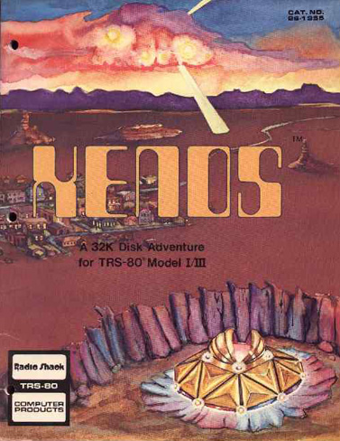

# Xenos SECTION6.DAT

>>> cpu Z80

>>> binary 5200:roms/section6.bin

```code
5200: 00 87 96                      ; List ID: 0x00, Length: 0x0796

5203: 81 19 00                      ; Room Number: 0x81, Length: 0x0019, Data: 0x00
;
5206:    03 01                      ;   Section DESCRIPTION, Length: 0x0001
5208:       AB                      ;     COMMAND 0xAB
;
5209:    04 13                      ;   Section COMMANDS, Length: 0x0013
520B:       0B 11 0A                ;     SWITCH, Length: 0x0011, Function to call: 0x0A
520E:          03                   ;       Phrase number: 0x03
520F:          02                   ;       ELSE go to: 0x5212
5210:             00 82             ;         MOVE AND LOOK, Destination room: 0x82
5212:          04                   ;       Phrase number: 0x04
5213:          02                   ;       ELSE go to: 0x5216
5214:             00 83             ;         MOVE AND LOOK, Destination room: 0x83
5216:          01                   ;       Phrase number: 0x01
5217:          02                   ;       ELSE go to: 0x521A
5218:             00 A8             ;         MOVE AND LOOK, Destination room: 0xA8
521A:          02                   ;       Phrase number: 0x02
521B:          02                   ;       ELSE go to: 0x521E
521C:             00 F7             ;         MOVE AND LOOK, Destination room: 0xF7

521E: 82 19 00                      ; Room Number: 0x82, Length: 0x0019, Data: 0x00
;
5221:    03 01                      ;   Section DESCRIPTION, Length: 0x0001
5223:       AB                      ;     COMMAND 0xAB
;
5224:    04 13                      ;   Section COMMANDS, Length: 0x0013
5226:       0B 11 0A                ;     SWITCH, Length: 0x0011, Function to call: 0x0A
5229:          03                   ;       Phrase number: 0x03
522A:          02                   ;       ELSE go to: 0x522D
522B:             00 83             ;         MOVE AND LOOK, Destination room: 0x83
522D:          04                   ;       Phrase number: 0x04
522E:          02                   ;       ELSE go to: 0x5231
522F:             00 81             ;         MOVE AND LOOK, Destination room: 0x81
5231:          01                   ;       Phrase number: 0x01
5232:          02                   ;       ELSE go to: 0x5235
5233:             00 A9             ;         MOVE AND LOOK, Destination room: 0xA9
5235:          02                   ;       Phrase number: 0x02
5236:          02                   ;       ELSE go to: 0x5239
5237:             00 F7             ;         MOVE AND LOOK, Destination room: 0xF7

5239: 83 19 00                      ; Room Number: 0x83, Length: 0x0019, Data: 0x00
;
523C:    03 01                      ;   Section DESCRIPTION, Length: 0x0001
523E:       AB                      ;     COMMAND 0xAB
;
523F:    04 13                      ;   Section COMMANDS, Length: 0x0013
5241:       0B 11 0A                ;     SWITCH, Length: 0x0011, Function to call: 0x0A
5244:          03                   ;       Phrase number: 0x03
5245:          02                   ;       ELSE go to: 0x5248
5246:             00 84             ;         MOVE AND LOOK, Destination room: 0x84
5248:          04                   ;       Phrase number: 0x04
5249:          02                   ;       ELSE go to: 0x524C
524A:             00 82             ;         MOVE AND LOOK, Destination room: 0x82
524C:          01                   ;       Phrase number: 0x01
524D:          02                   ;       ELSE go to: 0x5250
524E:             00 AA             ;         MOVE AND LOOK, Destination room: 0xAA
5250:          02                   ;       Phrase number: 0x02
5251:          02                   ;       ELSE go to: 0x5254
5252:             00 F7             ;         MOVE AND LOOK, Destination room: 0xF7

5254: 84 19 00                      ; Room Number: 0x84, Length: 0x0019, Data: 0x00
;
5257:    03 01                      ;   Section DESCRIPTION, Length: 0x0001
5259:       AB                      ;     COMMAND 0xAB
;
525A:    04 13                      ;   Section COMMANDS, Length: 0x0013
525C:       0B 11 0A                ;     SWITCH, Length: 0x0011, Function to call: 0x0A
525F:          03                   ;       Phrase number: 0x03
5260:          02                   ;       ELSE go to: 0x5263
5261:             00 85             ;         MOVE AND LOOK, Destination room: 0x85
5263:          04                   ;       Phrase number: 0x04
5264:          02                   ;       ELSE go to: 0x5267
5265:             00 83             ;         MOVE AND LOOK, Destination room: 0x83
5267:          01                   ;       Phrase number: 0x01
5268:          02                   ;       ELSE go to: 0x526B
5269:             00 AB             ;         MOVE AND LOOK, Destination room: 0xAB
526B:          02                   ;       Phrase number: 0x02
526C:          02                   ;       ELSE go to: 0x526F
526D:             00 F7             ;         MOVE AND LOOK, Destination room: 0xF7

526F: 85 19 00                      ; Room Number: 0x85, Length: 0x0019, Data: 0x00
;
5272:    03 01                      ;   Section DESCRIPTION, Length: 0x0001
5274:       AB                      ;     COMMAND 0xAB
;
5275:    04 13                      ;   Section COMMANDS, Length: 0x0013
5277:       0B 11 0A                ;     SWITCH, Length: 0x0011, Function to call: 0x0A
527A:          03                   ;       Phrase number: 0x03
527B:          02                   ;       ELSE go to: 0x527E
527C:             00 86             ;         MOVE AND LOOK, Destination room: 0x86
527E:          04                   ;       Phrase number: 0x04
527F:          02                   ;       ELSE go to: 0x5282
5280:             00 84             ;         MOVE AND LOOK, Destination room: 0x84
5282:          01                   ;       Phrase number: 0x01
5283:          02                   ;       ELSE go to: 0x5286
5284:             00 AC             ;         MOVE AND LOOK, Destination room: 0xAC
5286:          02                   ;       Phrase number: 0x02
5287:          02                   ;       ELSE go to: 0x528A
5288:             00 F7             ;         MOVE AND LOOK, Destination room: 0xF7

528A: 86 19 00                      ; Room Number: 0x86, Length: 0x0019, Data: 0x00
;
528D:    03 01                      ;   Section DESCRIPTION, Length: 0x0001
528F:       AB                      ;     COMMAND 0xAB
;
5290:    04 13                      ;   Section COMMANDS, Length: 0x0013
5292:       0B 11 0A                ;     SWITCH, Length: 0x0011, Function to call: 0x0A
5295:          03                   ;       Phrase number: 0x03
5296:          02                   ;       ELSE go to: 0x5299
5297:             00 87             ;         MOVE AND LOOK, Destination room: 0x87
5299:          04                   ;       Phrase number: 0x04
529A:          02                   ;       ELSE go to: 0x529D
529B:             00 85             ;         MOVE AND LOOK, Destination room: 0x85
529D:          01                   ;       Phrase number: 0x01
529E:          02                   ;       ELSE go to: 0x52A1
529F:             00 AD             ;         MOVE AND LOOK, Destination room: 0xAD
52A1:          02                   ;       Phrase number: 0x02
52A2:          02                   ;       ELSE go to: 0x52A5
52A3:             00 F7             ;         MOVE AND LOOK, Destination room: 0xF7

52A5: 87 19 00                      ; Room Number: 0x87, Length: 0x0019, Data: 0x00
;
52A8:    03 01                      ;   Section DESCRIPTION, Length: 0x0001
52AA:       AB                      ;     COMMAND 0xAB
;
52AB:    04 13                      ;   Section COMMANDS, Length: 0x0013
52AD:       0B 11 0A                ;     SWITCH, Length: 0x0011, Function to call: 0x0A
52B0:          03                   ;       Phrase number: 0x03
52B1:          02                   ;       ELSE go to: 0x52B4
52B2:             00 88             ;         MOVE AND LOOK, Destination room: 0x88
52B4:          04                   ;       Phrase number: 0x04
52B5:          02                   ;       ELSE go to: 0x52B8
52B6:             00 86             ;         MOVE AND LOOK, Destination room: 0x86
52B8:          01                   ;       Phrase number: 0x01
52B9:          02                   ;       ELSE go to: 0x52BC
52BA:             00 AE             ;         MOVE AND LOOK, Destination room: 0xAE
52BC:          02                   ;       Phrase number: 0x02
52BD:          02                   ;       ELSE go to: 0x52C0
52BE:             00 F7             ;         MOVE AND LOOK, Destination room: 0xF7

52C0: 88 19 00                      ; Room Number: 0x88, Length: 0x0019, Data: 0x00
;
52C3:    03 01                      ;   Section DESCRIPTION, Length: 0x0001
52C5:       AB                      ;     COMMAND 0xAB
;
52C6:    04 13                      ;   Section COMMANDS, Length: 0x0013
52C8:       0B 11 0A                ;     SWITCH, Length: 0x0011, Function to call: 0x0A
52CB:          03                   ;       Phrase number: 0x03
52CC:          02                   ;       ELSE go to: 0x52CF
52CD:             00 89             ;         MOVE AND LOOK, Destination room: 0x89
52CF:          04                   ;       Phrase number: 0x04
52D0:          02                   ;       ELSE go to: 0x52D3
52D1:             00 87             ;         MOVE AND LOOK, Destination room: 0x87
52D3:          01                   ;       Phrase number: 0x01
52D4:          02                   ;       ELSE go to: 0x52D7
52D5:             00 AF             ;         MOVE AND LOOK, Destination room: 0xAF
52D7:          02                   ;       Phrase number: 0x02
52D8:          02                   ;       ELSE go to: 0x52DB
52D9:             00 F7             ;         MOVE AND LOOK, Destination room: 0xF7

52DB: 89 19 00                      ; Room Number: 0x89, Length: 0x0019, Data: 0x00
;
52DE:    03 01                      ;   Section DESCRIPTION, Length: 0x0001
52E0:       AB                      ;     COMMAND 0xAB
;
52E1:    04 13                      ;   Section COMMANDS, Length: 0x0013
52E3:       0B 11 0A                ;     SWITCH, Length: 0x0011, Function to call: 0x0A
52E6:          03                   ;       Phrase number: 0x03
52E7:          02                   ;       ELSE go to: 0x52EA
52E8:             00 8A             ;         MOVE AND LOOK, Destination room: 0x8A
52EA:          04                   ;       Phrase number: 0x04
52EB:          02                   ;       ELSE go to: 0x52EE
52EC:             00 88             ;         MOVE AND LOOK, Destination room: 0x88
52EE:          01                   ;       Phrase number: 0x01
52EF:          02                   ;       ELSE go to: 0x52F2
52F0:             00 B0             ;         MOVE AND LOOK, Destination room: 0xB0
52F2:          02                   ;       Phrase number: 0x02
52F3:          02                   ;       ELSE go to: 0x52F6
52F4:             00 F7             ;         MOVE AND LOOK, Destination room: 0xF7

52F6: 8A 19 00                      ; Room Number: 0x8A, Length: 0x0019, Data: 0x00
;
52F9:    03 01                      ;   Section DESCRIPTION, Length: 0x0001
52FB:       AB                      ;     COMMAND 0xAB
;
52FC:    04 13                      ;   Section COMMANDS, Length: 0x0013
52FE:       0B 11 0A                ;     SWITCH, Length: 0x0011, Function to call: 0x0A
5301:          03                   ;       Phrase number: 0x03
5302:          02                   ;       ELSE go to: 0x5305
5303:             00 8B             ;         MOVE AND LOOK, Destination room: 0x8B
5305:          04                   ;       Phrase number: 0x04
5306:          02                   ;       ELSE go to: 0x5309
5307:             00 89             ;         MOVE AND LOOK, Destination room: 0x89
5309:          01                   ;       Phrase number: 0x01
530A:          02                   ;       ELSE go to: 0x530D
530B:             00 B1             ;         MOVE AND LOOK, Destination room: 0xB1
530D:          02                   ;       Phrase number: 0x02
530E:          02                   ;       ELSE go to: 0x5311
530F:             00 F7             ;         MOVE AND LOOK, Destination room: 0xF7

5311: 8B 19 00                      ; Room Number: 0x8B, Length: 0x0019, Data: 0x00
;
5314:    03 01                      ;   Section DESCRIPTION, Length: 0x0001
5316:       AB                      ;     COMMAND 0xAB
;
5317:    04 13                      ;   Section COMMANDS, Length: 0x0013
5319:       0B 11 0A                ;     SWITCH, Length: 0x0011, Function to call: 0x0A
531C:          03                   ;       Phrase number: 0x03
531D:          02                   ;       ELSE go to: 0x5320
531E:             00 89             ;         MOVE AND LOOK, Destination room: 0x89
5320:          04                   ;       Phrase number: 0x04
5321:          02                   ;       ELSE go to: 0x5324
5322:             00 8A             ;         MOVE AND LOOK, Destination room: 0x8A
5324:          01                   ;       Phrase number: 0x01
5325:          02                   ;       ELSE go to: 0x5328
5326:             00 8C             ;         MOVE AND LOOK, Destination room: 0x8C
5328:          02                   ;       Phrase number: 0x02
5329:          02                   ;       ELSE go to: 0x532C
532A:             00 F7             ;         MOVE AND LOOK, Destination room: 0xF7

532C: 8C 19 00                      ; Room Number: 0x8C, Length: 0x0019, Data: 0x00
;
532F:    03 01                      ;   Section DESCRIPTION, Length: 0x0001
5331:       AB                      ;     COMMAND 0xAB
;
5332:    04 13                      ;   Section COMMANDS, Length: 0x0013
5334:       0B 11 0A                ;     SWITCH, Length: 0x0011, Function to call: 0x0A
5337:          03                   ;       Phrase number: 0x03
5338:          02                   ;       ELSE go to: 0x533B
5339:             00 AF             ;         MOVE AND LOOK, Destination room: 0xAF
533B:          04                   ;       Phrase number: 0x04
533C:          02                   ;       ELSE go to: 0x533F
533D:             00 B1             ;         MOVE AND LOOK, Destination room: 0xB1
533F:          01                   ;       Phrase number: 0x01
5340:          02                   ;       ELSE go to: 0x5343
5341:             00 8D             ;         MOVE AND LOOK, Destination room: 0x8D
5343:          02                   ;       Phrase number: 0x02
5344:          02                   ;       ELSE go to: 0x5347
5345:             00 8B             ;         MOVE AND LOOK, Destination room: 0x8B

5347: 8D 19 00                      ; Room Number: 0x8D, Length: 0x0019, Data: 0x00
;
534A:    03 01                      ;   Section DESCRIPTION, Length: 0x0001
534C:       AB                      ;     COMMAND 0xAB
;
534D:    04 13                      ;   Section COMMANDS, Length: 0x0013
534F:       0B 11 0A                ;     SWITCH, Length: 0x0011, Function to call: 0x0A
5352:          03                   ;       Phrase number: 0x03
5353:          02                   ;       ELSE go to: 0x5356
5354:             00 CC             ;         MOVE AND LOOK, Destination room: 0xCC
5356:          04                   ;       Phrase number: 0x04
5357:          02                   ;       ELSE go to: 0x535A
5358:             00 B2             ;         MOVE AND LOOK, Destination room: 0xB2
535A:          01                   ;       Phrase number: 0x01
535B:          02                   ;       ELSE go to: 0x535E
535C:             00 8E             ;         MOVE AND LOOK, Destination room: 0x8E
535E:          02                   ;       Phrase number: 0x02
535F:          02                   ;       ELSE go to: 0x5362
5360:             00 8C             ;         MOVE AND LOOK, Destination room: 0x8C

5362: 8E 19 00                      ; Room Number: 0x8E, Length: 0x0019, Data: 0x00
;
5365:    03 01                      ;   Section DESCRIPTION, Length: 0x0001
5367:       AB                      ;     COMMAND 0xAB
;
5368:    04 13                      ;   Section COMMANDS, Length: 0x0013
536A:       0B 11 0A                ;     SWITCH, Length: 0x0011, Function to call: 0x0A
536D:          03                   ;       Phrase number: 0x03
536E:          02                   ;       ELSE go to: 0x5371
536F:             00 CD             ;         MOVE AND LOOK, Destination room: 0xCD
5371:          04                   ;       Phrase number: 0x04
5372:          02                   ;       ELSE go to: 0x5375
5373:             00 B3             ;         MOVE AND LOOK, Destination room: 0xB3
5375:          01                   ;       Phrase number: 0x01
5376:          02                   ;       ELSE go to: 0x5379
5377:             00 8F             ;         MOVE AND LOOK, Destination room: 0x8F
5379:          02                   ;       Phrase number: 0x02
537A:          02                   ;       ELSE go to: 0x537D
537B:             00 8D             ;         MOVE AND LOOK, Destination room: 0x8D

537D: 8F 1C 00                      ; Room Number: 0x8F, Length: 0x001C, Data: 0x00
;
5380:    03 04                      ;   Section DESCRIPTION, Length: 0x0004
5382:       0D 02                   ;     WHILE PASS, Length: 0x0002
5384:          AB                   ;       COMMAND 0xAB
5385:          9B                   ;       COMMAND 0x9B
;
5386:    04 13                      ;   Section COMMANDS, Length: 0x0013
5388:       0B 11 0A                ;     SWITCH, Length: 0x0011, Function to call: 0x0A
538B:          03                   ;       Phrase number: 0x03
538C:          02                   ;       ELSE go to: 0x538F
538D:             00 CE             ;         MOVE AND LOOK, Destination room: 0xCE
538F:          04                   ;       Phrase number: 0x04
5390:          02                   ;       ELSE go to: 0x5393
5391:             00 B4             ;         MOVE AND LOOK, Destination room: 0xB4
5393:          01                   ;       Phrase number: 0x01
5394:          02                   ;       ELSE go to: 0x5397
5395:             00 90             ;         MOVE AND LOOK, Destination room: 0x90
5397:          02                   ;       Phrase number: 0x02
5398:          02                   ;       ELSE go to: 0x539B
5399:             00 8E             ;         MOVE AND LOOK, Destination room: 0x8E

539B: 90 19 00                      ; Room Number: 0x90, Length: 0x0019, Data: 0x00
;
539E:    03 01                      ;   Section DESCRIPTION, Length: 0x0001
53A0:       AB                      ;     COMMAND 0xAB
;
53A1:    04 13                      ;   Section COMMANDS, Length: 0x0013
53A3:       0B 11 0A                ;     SWITCH, Length: 0x0011, Function to call: 0x0A
53A6:          03                   ;       Phrase number: 0x03
53A7:          02                   ;       ELSE go to: 0x53AA
53A8:             00 CF             ;         MOVE AND LOOK, Destination room: 0xCF
53AA:          04                   ;       Phrase number: 0x04
53AB:          02                   ;       ELSE go to: 0x53AE
53AC:             00 B5             ;         MOVE AND LOOK, Destination room: 0xB5
53AE:          01                   ;       Phrase number: 0x01
53AF:          02                   ;       ELSE go to: 0x53B2
53B0:             00 91             ;         MOVE AND LOOK, Destination room: 0x91
53B2:          02                   ;       Phrase number: 0x02
53B3:          02                   ;       ELSE go to: 0x53B6
53B4:             00 8F             ;         MOVE AND LOOK, Destination room: 0x8F

53B6: 91 19 00                      ; Room Number: 0x91, Length: 0x0019, Data: 0x00
;
53B9:    03 01                      ;   Section DESCRIPTION, Length: 0x0001
53BB:       AB                      ;     COMMAND 0xAB
;
53BC:    04 13                      ;   Section COMMANDS, Length: 0x0013
53BE:       0B 11 0A                ;     SWITCH, Length: 0x0011, Function to call: 0x0A
53C1:          03                   ;       Phrase number: 0x03
53C2:          02                   ;       ELSE go to: 0x53C5
53C3:             00 D0             ;         MOVE AND LOOK, Destination room: 0xD0
53C5:          04                   ;       Phrase number: 0x04
53C6:          02                   ;       ELSE go to: 0x53C9
53C7:             00 B6             ;         MOVE AND LOOK, Destination room: 0xB6
53C9:          01                   ;       Phrase number: 0x01
53CA:          02                   ;       ELSE go to: 0x53CD
53CB:             00 92             ;         MOVE AND LOOK, Destination room: 0x92
53CD:          02                   ;       Phrase number: 0x02
53CE:          02                   ;       ELSE go to: 0x53D1
53CF:             00 90             ;         MOVE AND LOOK, Destination room: 0x90

53D1: 92 19 00                      ; Room Number: 0x92, Length: 0x0019, Data: 0x00
;
53D4:    03 01                      ;   Section DESCRIPTION, Length: 0x0001
53D6:       AB                      ;     COMMAND 0xAB
;
53D7:    04 13                      ;   Section COMMANDS, Length: 0x0013
53D9:       0B 11 0A                ;     SWITCH, Length: 0x0011, Function to call: 0x0A
53DC:          03                   ;       Phrase number: 0x03
53DD:          02                   ;       ELSE go to: 0x53E0
53DE:             00 D1             ;         MOVE AND LOOK, Destination room: 0xD1
53E0:          04                   ;       Phrase number: 0x04
53E1:          02                   ;       ELSE go to: 0x53E4
53E2:             00 B7             ;         MOVE AND LOOK, Destination room: 0xB7
53E4:          01                   ;       Phrase number: 0x01
53E5:          02                   ;       ELSE go to: 0x53E8
53E6:             00 93             ;         MOVE AND LOOK, Destination room: 0x93
53E8:          02                   ;       Phrase number: 0x02
53E9:          02                   ;       ELSE go to: 0x53EC
53EA:             00 91             ;         MOVE AND LOOK, Destination room: 0x91

53EC: 93 1C 00                      ; Room Number: 0x93, Length: 0x001C, Data: 0x00
;
53EF:    03 05                      ;   Section DESCRIPTION, Length: 0x0005
53F1:       0D 03                   ;     WHILE PASS, Length: 0x0003
53F3:          AB                   ;       COMMAND 0xAB
53F4:          96                   ;       COMMAND 0x96
53F5:          98                   ;       COMMAND 0x98
;
53F6:    04 12                      ;   Section COMMANDS, Length: 0x0012
53F8:       0B 10 0A                ;     SWITCH, Length: 0x0010, Function to call: 0x0A
53FB:          03                   ;       Phrase number: 0x03
53FC:          02                   ;       ELSE go to: 0x53FF
53FD:             00 B8             ;         MOVE AND LOOK, Destination room: 0xB8
53FF:          04                   ;       Phrase number: 0x04
5400:          02                   ;       ELSE go to: 0x5403
5401:             00 94             ;         MOVE AND LOOK, Destination room: 0x94
5403:          01                   ;       Phrase number: 0x01
5404:          01                   ;       ELSE go to: 0x5406
5405:             97                ;         COMMAND 0x97
5406:          02                   ;       Phrase number: 0x02
5407:          02                   ;       ELSE go to: 0x540A
5408:             00 92             ;         MOVE AND LOOK, Destination room: 0x92

540A: 94 1C 00                      ; Room Number: 0x94, Length: 0x001C, Data: 0x00
;
540D:    03 04                      ;   Section DESCRIPTION, Length: 0x0004
540F:       0D 02                   ;     WHILE PASS, Length: 0x0002
5411:          AB                   ;       COMMAND 0xAB
5412:          98                   ;       COMMAND 0x98
;
5413:    04 13                      ;   Section COMMANDS, Length: 0x0013
5415:       0B 11 0A                ;     SWITCH, Length: 0x0011, Function to call: 0x0A
5418:          03                   ;       Phrase number: 0x03
5419:          02                   ;       ELSE go to: 0x541C
541A:             00 93             ;         MOVE AND LOOK, Destination room: 0x93
541C:          04                   ;       Phrase number: 0x04
541D:          02                   ;       ELSE go to: 0x5420
541E:             00 B8             ;         MOVE AND LOOK, Destination room: 0xB8
5420:          01                   ;       Phrase number: 0x01
5421:          02                   ;       ELSE go to: 0x5424
5422:             00 95             ;         MOVE AND LOOK, Destination room: 0x95
5424:          02                   ;       Phrase number: 0x02
5425:          02                   ;       ELSE go to: 0x5428
5426:             00 B7             ;         MOVE AND LOOK, Destination room: 0xB7

5428: 95 1B 00                      ; Room Number: 0x95, Length: 0x001B, Data: 0x00
;
542B:    03 05                      ;   Section DESCRIPTION, Length: 0x0005
542D:       0D 03                   ;     WHILE PASS, Length: 0x0003
542F:          AB                   ;       COMMAND 0xAB
5430:          96                   ;       COMMAND 0x96
5431:          98                   ;       COMMAND 0x98
;
5432:    04 11                      ;   Section COMMANDS, Length: 0x0011
5434:       0B 0F 0A                ;     SWITCH, Length: 0x000F, Function to call: 0x0A
5437:          03                   ;       Phrase number: 0x03
5438:          01                   ;       ELSE go to: 0x543A
5439:             97                ;         COMMAND 0x97
543A:          04                   ;       Phrase number: 0x04
543B:          02                   ;       ELSE go to: 0x543E
543C:             00 96             ;         MOVE AND LOOK, Destination room: 0x96
543E:          01                   ;       Phrase number: 0x01
543F:          01                   ;       ELSE go to: 0x5441
5440:             97                ;         COMMAND 0x97
5441:          02                   ;       Phrase number: 0x02
5442:          02                   ;       ELSE go to: 0x5445
5443:             00 94             ;         MOVE AND LOOK, Destination room: 0x94

5445: 96 1C 00                      ; Room Number: 0x96, Length: 0x001C, Data: 0x00
;
5448:    03 05                      ;   Section DESCRIPTION, Length: 0x0005
544A:       0D 03                   ;     WHILE PASS, Length: 0x0003
544C:          AB                   ;       COMMAND 0xAB
544D:          96                   ;       COMMAND 0x96
544E:          98                   ;       COMMAND 0x98
;
544F:    04 12                      ;   Section COMMANDS, Length: 0x0012
5451:       0B 10 0A                ;     SWITCH, Length: 0x0010, Function to call: 0x0A
5454:          03                   ;       Phrase number: 0x03
5455:          02                   ;       ELSE go to: 0x5458
5456:             00 95             ;         MOVE AND LOOK, Destination room: 0x95
5458:          04                   ;       Phrase number: 0x04
5459:          02                   ;       ELSE go to: 0x545C
545A:             00 B9             ;         MOVE AND LOOK, Destination room: 0xB9
545C:          01                   ;       Phrase number: 0x01
545D:          01                   ;       ELSE go to: 0x545F
545E:             97                ;         COMMAND 0x97
545F:          02                   ;       Phrase number: 0x02
5460:          02                   ;       ELSE go to: 0x5463
5461:             00 B8             ;         MOVE AND LOOK, Destination room: 0xB8

5463: 97 1E 00                      ; Room Number: 0x97, Length: 0x001E, Data: 0x00
;
5466:    03 04                      ;   Section DESCRIPTION, Length: 0x0004
5468:       0D 02                   ;     WHILE PASS, Length: 0x0002
546A:          AB                   ;       COMMAND 0xAB
546B:          96                   ;       COMMAND 0x96
;
546C:    04 15                      ;   Section COMMANDS, Length: 0x0015
546E:       0B 13 0A                ;     SWITCH, Length: 0x0013, Function to call: 0x0A
5471:          03                   ;       Phrase number: 0x03
5472:          01                   ;       ELSE go to: 0x5474
5473:             97                ;         COMMAND 0x97
5474:          04                   ;       Phrase number: 0x04
5475:          06                   ;       ELSE go to: 0x547C
5476:             0D 04             ;         WHILE PASS, Length: 0x0004
5478:                30 98          ;           UNKNOWN1, Data: 0x98
547A:                2F 05          ;           UNKNOWN2 Data: 0x05
547C:          01                   ;       Phrase number: 0x01
547D:          01                   ;       ELSE go to: 0x547F
547E:             97                ;         COMMAND 0x97
547F:          02                   ;       Phrase number: 0x02
5480:          02                   ;       ELSE go to: 0x5483
5481:             00 B9             ;         MOVE AND LOOK, Destination room: 0xB9

5483: A7 20 00                      ; Room Number: 0xA7, Length: 0x0020, Data: 0x00
;
5486:    03 04                      ;   Section DESCRIPTION, Length: 0x0004
5488:       0D 02                   ;     WHILE PASS, Length: 0x0002
548A:          AB                   ;       COMMAND 0xAB
548B:          9B                   ;       COMMAND 0x9B
;
548C:    04 17                      ;   Section COMMANDS, Length: 0x0017
548E:       0B 15 0A                ;     SWITCH, Length: 0x0015, Function to call: 0x0A
5491:          03                   ;       Phrase number: 0x03
5492:          02                   ;       ELSE go to: 0x5495
5493:             00 C5             ;         MOVE AND LOOK, Destination room: 0xC5
5495:          04                   ;       Phrase number: 0x04
5496:          02                   ;       ELSE go to: 0x5499
5497:             00 A7             ;         MOVE AND LOOK, Destination room: 0xA7
5499:          01                   ;       Phrase number: 0x01
549A:          06                   ;       ELSE go to: 0x54A1
549B:             0D 04             ;         WHILE PASS, Length: 0x0004
549D:                30 A6          ;           UNKNOWN1, Data: 0xA6
549F:                2F 05          ;           UNKNOWN2 Data: 0x05
54A1:          02                   ;       Phrase number: 0x02
54A2:          02                   ;       ELSE go to: 0x54A5
54A3:             00 A8             ;         MOVE AND LOOK, Destination room: 0xA8

54A5: A8 19 00                      ; Room Number: 0xA8, Length: 0x0019, Data: 0x00
;
54A8:    03 01                      ;   Section DESCRIPTION, Length: 0x0001
54AA:       AB                      ;     COMMAND 0xAB
;
54AB:    04 13                      ;   Section COMMANDS, Length: 0x0013
54AD:       0B 11 0A                ;     SWITCH, Length: 0x0011, Function to call: 0x0A
54B0:          03                   ;       Phrase number: 0x03
54B1:          02                   ;       ELSE go to: 0x54B4
54B2:             00 A9             ;         MOVE AND LOOK, Destination room: 0xA9
54B4:          04                   ;       Phrase number: 0x04
54B5:          02                   ;       ELSE go to: 0x54B8
54B6:             00 84             ;         MOVE AND LOOK, Destination room: 0x84
54B8:          01                   ;       Phrase number: 0x01
54B9:          02                   ;       ELSE go to: 0x54BC
54BA:             00 A7             ;         MOVE AND LOOK, Destination room: 0xA7
54BC:          02                   ;       Phrase number: 0x02
54BD:          02                   ;       ELSE go to: 0x54C0
54BE:             00 81             ;         MOVE AND LOOK, Destination room: 0x81

54C0: A9 19 00                      ; Room Number: 0xA9, Length: 0x0019, Data: 0x00
;
54C3:    03 01                      ;   Section DESCRIPTION, Length: 0x0001
54C5:       AB                      ;     COMMAND 0xAB
;
54C6:    04 13                      ;   Section COMMANDS, Length: 0x0013
54C8:       0B 11 0A                ;     SWITCH, Length: 0x0011, Function to call: 0x0A
54CB:          03                   ;       Phrase number: 0x03
54CC:          02                   ;       ELSE go to: 0x54CF
54CD:             00 AA             ;         MOVE AND LOOK, Destination room: 0xAA
54CF:          04                   ;       Phrase number: 0x04
54D0:          02                   ;       ELSE go to: 0x54D3
54D1:             00 A8             ;         MOVE AND LOOK, Destination room: 0xA8
54D3:          01                   ;       Phrase number: 0x01
54D4:          02                   ;       ELSE go to: 0x54D7
54D5:             00 C5             ;         MOVE AND LOOK, Destination room: 0xC5
54D7:          02                   ;       Phrase number: 0x02
54D8:          02                   ;       ELSE go to: 0x54DB
54D9:             00 82             ;         MOVE AND LOOK, Destination room: 0x82

54DB: AA 19 00                      ; Room Number: 0xAA, Length: 0x0019, Data: 0x00
;
54DE:    03 01                      ;   Section DESCRIPTION, Length: 0x0001
54E0:       AB                      ;     COMMAND 0xAB
;
54E1:    04 13                      ;   Section COMMANDS, Length: 0x0013
54E3:       0B 11 0A                ;     SWITCH, Length: 0x0011, Function to call: 0x0A
54E6:          03                   ;       Phrase number: 0x03
54E7:          02                   ;       ELSE go to: 0x54EA
54E8:             00 AB             ;         MOVE AND LOOK, Destination room: 0xAB
54EA:          04                   ;       Phrase number: 0x04
54EB:          02                   ;       ELSE go to: 0x54EE
54EC:             00 A9             ;         MOVE AND LOOK, Destination room: 0xA9
54EE:          01                   ;       Phrase number: 0x01
54EF:          02                   ;       ELSE go to: 0x54F2
54F0:             00 C6             ;         MOVE AND LOOK, Destination room: 0xC6
54F2:          02                   ;       Phrase number: 0x02
54F3:          02                   ;       ELSE go to: 0x54F6
54F4:             00 83             ;         MOVE AND LOOK, Destination room: 0x83

54F6: AB 19 00                      ; Room Number: 0xAB, Length: 0x0019, Data: 0x00
;
54F9:    03 01                      ;   Section DESCRIPTION, Length: 0x0001
54FB:       AB                      ;     COMMAND 0xAB
;
54FC:    04 13                      ;   Section COMMANDS, Length: 0x0013
54FE:       0B 11 0A                ;     SWITCH, Length: 0x0011, Function to call: 0x0A
5501:          03                   ;       Phrase number: 0x03
5502:          02                   ;       ELSE go to: 0x5505
5503:             00 AC             ;         MOVE AND LOOK, Destination room: 0xAC
5505:          04                   ;       Phrase number: 0x04
5506:          02                   ;       ELSE go to: 0x5509
5507:             00 AA             ;         MOVE AND LOOK, Destination room: 0xAA
5509:          01                   ;       Phrase number: 0x01
550A:          02                   ;       ELSE go to: 0x550D
550B:             00 C7             ;         MOVE AND LOOK, Destination room: 0xC7
550D:          02                   ;       Phrase number: 0x02
550E:          02                   ;       ELSE go to: 0x5511
550F:             00 84             ;         MOVE AND LOOK, Destination room: 0x84

5511: AC 19 00                      ; Room Number: 0xAC, Length: 0x0019, Data: 0x00
;
5514:    03 01                      ;   Section DESCRIPTION, Length: 0x0001
5516:       AB                      ;     COMMAND 0xAB
;
5517:    04 13                      ;   Section COMMANDS, Length: 0x0013
5519:       0B 11 0A                ;     SWITCH, Length: 0x0011, Function to call: 0x0A
551C:          03                   ;       Phrase number: 0x03
551D:          02                   ;       ELSE go to: 0x5520
551E:             00 AD             ;         MOVE AND LOOK, Destination room: 0xAD
5520:          04                   ;       Phrase number: 0x04
5521:          02                   ;       ELSE go to: 0x5524
5522:             00 AB             ;         MOVE AND LOOK, Destination room: 0xAB
5524:          01                   ;       Phrase number: 0x01
5525:          02                   ;       ELSE go to: 0x5528
5526:             00 C8             ;         MOVE AND LOOK, Destination room: 0xC8
5528:          02                   ;       Phrase number: 0x02
5529:          02                   ;       ELSE go to: 0x552C
552A:             00 85             ;         MOVE AND LOOK, Destination room: 0x85

552C: AD 19 00                      ; Room Number: 0xAD, Length: 0x0019, Data: 0x00
;
552F:    03 01                      ;   Section DESCRIPTION, Length: 0x0001
5531:       AB                      ;     COMMAND 0xAB
;
5532:    04 13                      ;   Section COMMANDS, Length: 0x0013
5534:       0B 11 0A                ;     SWITCH, Length: 0x0011, Function to call: 0x0A
5537:          03                   ;       Phrase number: 0x03
5538:          02                   ;       ELSE go to: 0x553B
5539:             00 AE             ;         MOVE AND LOOK, Destination room: 0xAE
553B:          04                   ;       Phrase number: 0x04
553C:          02                   ;       ELSE go to: 0x553F
553D:             00 AC             ;         MOVE AND LOOK, Destination room: 0xAC
553F:          01                   ;       Phrase number: 0x01
5540:          02                   ;       ELSE go to: 0x5543
5541:             00 C9             ;         MOVE AND LOOK, Destination room: 0xC9
5543:          02                   ;       Phrase number: 0x02
5544:          02                   ;       ELSE go to: 0x5547
5545:             00 86             ;         MOVE AND LOOK, Destination room: 0x86

5547: AE 19 00                      ; Room Number: 0xAE, Length: 0x0019, Data: 0x00
;
554A:    03 01                      ;   Section DESCRIPTION, Length: 0x0001
554C:       AB                      ;     COMMAND 0xAB
;
554D:    04 13                      ;   Section COMMANDS, Length: 0x0013
554F:       0B 11 0A                ;     SWITCH, Length: 0x0011, Function to call: 0x0A
5552:          03                   ;       Phrase number: 0x03
5553:          02                   ;       ELSE go to: 0x5556
5554:             00 AF             ;         MOVE AND LOOK, Destination room: 0xAF
5556:          04                   ;       Phrase number: 0x04
5557:          02                   ;       ELSE go to: 0x555A
5558:             00 AD             ;         MOVE AND LOOK, Destination room: 0xAD
555A:          01                   ;       Phrase number: 0x01
555B:          02                   ;       ELSE go to: 0x555E
555C:             00 CA             ;         MOVE AND LOOK, Destination room: 0xCA
555E:          02                   ;       Phrase number: 0x02
555F:          02                   ;       ELSE go to: 0x5562
5560:             00 87             ;         MOVE AND LOOK, Destination room: 0x87

5562: AF 19 00                      ; Room Number: 0xAF, Length: 0x0019, Data: 0x00
;
5565:    03 01                      ;   Section DESCRIPTION, Length: 0x0001
5567:       AB                      ;     COMMAND 0xAB
;
5568:    04 13                      ;   Section COMMANDS, Length: 0x0013
556A:       0B 11 0A                ;     SWITCH, Length: 0x0011, Function to call: 0x0A
556D:          03                   ;       Phrase number: 0x03
556E:          02                   ;       ELSE go to: 0x5571
556F:             00 B0             ;         MOVE AND LOOK, Destination room: 0xB0
5571:          04                   ;       Phrase number: 0x04
5572:          02                   ;       ELSE go to: 0x5575
5573:             00 AE             ;         MOVE AND LOOK, Destination room: 0xAE
5575:          01                   ;       Phrase number: 0x01
5576:          02                   ;       ELSE go to: 0x5579
5577:             00 CB             ;         MOVE AND LOOK, Destination room: 0xCB
5579:          02                   ;       Phrase number: 0x02
557A:          02                   ;       ELSE go to: 0x557D
557B:             00 88             ;         MOVE AND LOOK, Destination room: 0x88

557D: B0 43 00                      ; Room Number: 0xB0, Length: 0x0043, Data: 0x00
;
5580:    03 2B                      ;   Section DESCRIPTION, Length: 0x002B
5582:       0D 29                   ;     WHILE PASS, Length: 0x0029
5584:          AB                   ;       COMMAND 0xAB
5585:          04 26                ;       PRINT, Length: 0x0026
;
; THERE IS A SMALL OASIS HERE. BUT, ALAS, IT HAS DRIED UP! 
;
5587:             5F BE 5B B1 4B 7B 55 45 8E 91 11 8A 5B 49 CA B5 ; 
5597:             2F 62 44 F4 96 C6 8E 14 6E 49 D6 15 9B 15 C6 B5 ; 
55A7:             07 B2 17 58 AB A2 ; 
;
55AD:    04 13                      ;   Section COMMANDS, Length: 0x0013
55AF:       0B 11 0A                ;     SWITCH, Length: 0x0011, Function to call: 0x0A
55B2:          03                   ;       Phrase number: 0x03
55B3:          02                   ;       ELSE go to: 0x55B6
55B4:             00 B1             ;         MOVE AND LOOK, Destination room: 0xB1
55B6:          04                   ;       Phrase number: 0x04
55B7:          02                   ;       ELSE go to: 0x55BA
55B8:             00 AF             ;         MOVE AND LOOK, Destination room: 0xAF
55BA:          01                   ;       Phrase number: 0x01
55BB:          02                   ;       ELSE go to: 0x55BE
55BC:             00 CC             ;         MOVE AND LOOK, Destination room: 0xCC
55BE:          02                   ;       Phrase number: 0x02
55BF:          02                   ;       ELSE go to: 0x55C2
55C0:             00 89             ;         MOVE AND LOOK, Destination room: 0x89

55C2: B1 19 00                      ; Room Number: 0xB1, Length: 0x0019, Data: 0x00
;
55C5:    03 01                      ;   Section DESCRIPTION, Length: 0x0001
55C7:       AB                      ;     COMMAND 0xAB
;
55C8:    04 13                      ;   Section COMMANDS, Length: 0x0013
55CA:       0B 11 0A                ;     SWITCH, Length: 0x0011, Function to call: 0x0A
55CD:          03                   ;       Phrase number: 0x03
55CE:          02                   ;       ELSE go to: 0x55D1
55CF:             00 8C             ;         MOVE AND LOOK, Destination room: 0x8C
55D1:          04                   ;       Phrase number: 0x04
55D2:          02                   ;       ELSE go to: 0x55D5
55D3:             00 B0             ;         MOVE AND LOOK, Destination room: 0xB0
55D5:          01                   ;       Phrase number: 0x01
55D6:          02                   ;       ELSE go to: 0x55D9
55D7:             00 B2             ;         MOVE AND LOOK, Destination room: 0xB2
55D9:          02                   ;       Phrase number: 0x02
55DA:          02                   ;       ELSE go to: 0x55DD
55DB:             00 8A             ;         MOVE AND LOOK, Destination room: 0x8A

55DD: B2 19 00                      ; Room Number: 0xB2, Length: 0x0019, Data: 0x00
;
55E0:    03 01                      ;   Section DESCRIPTION, Length: 0x0001
55E2:       AB                      ;     COMMAND 0xAB
;
55E3:    04 13                      ;   Section COMMANDS, Length: 0x0013
55E5:       0B 11 0A                ;     SWITCH, Length: 0x0011, Function to call: 0x0A
55E8:          03                   ;       Phrase number: 0x03
55E9:          02                   ;       ELSE go to: 0x55EC
55EA:             00 8D             ;         MOVE AND LOOK, Destination room: 0x8D
55EC:          04                   ;       Phrase number: 0x04
55ED:          02                   ;       ELSE go to: 0x55F0
55EE:             00 CC             ;         MOVE AND LOOK, Destination room: 0xCC
55F0:          01                   ;       Phrase number: 0x01
55F1:          02                   ;       ELSE go to: 0x55F4
55F2:             00 B3             ;         MOVE AND LOOK, Destination room: 0xB3
55F4:          02                   ;       Phrase number: 0x02
55F5:          02                   ;       ELSE go to: 0x55F8
55F6:             00 B1             ;         MOVE AND LOOK, Destination room: 0xB1

55F8: B3 19 00                      ; Room Number: 0xB3, Length: 0x0019, Data: 0x00
;
55FB:    03 01                      ;   Section DESCRIPTION, Length: 0x0001
55FD:       AB                      ;     COMMAND 0xAB
;
55FE:    04 13                      ;   Section COMMANDS, Length: 0x0013
5600:       0B 11 0A                ;     SWITCH, Length: 0x0011, Function to call: 0x0A
5603:          03                   ;       Phrase number: 0x03
5604:          02                   ;       ELSE go to: 0x5607
5605:             00 8E             ;         MOVE AND LOOK, Destination room: 0x8E
5607:          04                   ;       Phrase number: 0x04
5608:          02                   ;       ELSE go to: 0x560B
5609:             00 CD             ;         MOVE AND LOOK, Destination room: 0xCD
560B:          01                   ;       Phrase number: 0x01
560C:          02                   ;       ELSE go to: 0x560F
560D:             00 B4             ;         MOVE AND LOOK, Destination room: 0xB4
560F:          02                   ;       Phrase number: 0x02
5610:          02                   ;       ELSE go to: 0x5613
5611:             00 B2             ;         MOVE AND LOOK, Destination room: 0xB2

5613: B4 1C 00                      ; Room Number: 0xB4, Length: 0x001C, Data: 0x00
;
5616:    03 04                      ;   Section DESCRIPTION, Length: 0x0004
5618:       0D 02                   ;     WHILE PASS, Length: 0x0002
561A:          AB                   ;       COMMAND 0xAB
561B:          9B                   ;       COMMAND 0x9B
;
561C:    04 13                      ;   Section COMMANDS, Length: 0x0013
561E:       0B 11 0A                ;     SWITCH, Length: 0x0011, Function to call: 0x0A
5621:          03                   ;       Phrase number: 0x03
5622:          02                   ;       ELSE go to: 0x5625
5623:             00 8F             ;         MOVE AND LOOK, Destination room: 0x8F
5625:          04                   ;       Phrase number: 0x04
5626:          02                   ;       ELSE go to: 0x5629
5627:             00 CE             ;         MOVE AND LOOK, Destination room: 0xCE
5629:          01                   ;       Phrase number: 0x01
562A:          02                   ;       ELSE go to: 0x562D
562B:             00 B5             ;         MOVE AND LOOK, Destination room: 0xB5
562D:          02                   ;       Phrase number: 0x02
562E:          02                   ;       ELSE go to: 0x5631
562F:             00 B3             ;         MOVE AND LOOK, Destination room: 0xB3

5631: B5 19 00                      ; Room Number: 0xB5, Length: 0x0019, Data: 0x00
;
5634:    03 01                      ;   Section DESCRIPTION, Length: 0x0001
5636:       AB                      ;     COMMAND 0xAB
;
5637:    04 13                      ;   Section COMMANDS, Length: 0x0013
5639:       0B 11 0A                ;     SWITCH, Length: 0x0011, Function to call: 0x0A
563C:          03                   ;       Phrase number: 0x03
563D:          02                   ;       ELSE go to: 0x5640
563E:             00 90             ;         MOVE AND LOOK, Destination room: 0x90
5640:          04                   ;       Phrase number: 0x04
5641:          02                   ;       ELSE go to: 0x5644
5642:             00 CF             ;         MOVE AND LOOK, Destination room: 0xCF
5644:          01                   ;       Phrase number: 0x01
5645:          02                   ;       ELSE go to: 0x5648
5646:             00 B6             ;         MOVE AND LOOK, Destination room: 0xB6
5648:          02                   ;       Phrase number: 0x02
5649:          02                   ;       ELSE go to: 0x564C
564A:             00 B4             ;         MOVE AND LOOK, Destination room: 0xB4

564C: B6 19 00                      ; Room Number: 0xB6, Length: 0x0019, Data: 0x00
;
564F:    03 01                      ;   Section DESCRIPTION, Length: 0x0001
5651:       AB                      ;     COMMAND 0xAB
;
5652:    04 13                      ;   Section COMMANDS, Length: 0x0013
5654:       0B 11 0A                ;     SWITCH, Length: 0x0011, Function to call: 0x0A
5657:          03                   ;       Phrase number: 0x03
5658:          02                   ;       ELSE go to: 0x565B
5659:             00 91             ;         MOVE AND LOOK, Destination room: 0x91
565B:          04                   ;       Phrase number: 0x04
565C:          02                   ;       ELSE go to: 0x565F
565D:             00 D0             ;         MOVE AND LOOK, Destination room: 0xD0
565F:          01                   ;       Phrase number: 0x01
5660:          02                   ;       ELSE go to: 0x5663
5661:             00 B7             ;         MOVE AND LOOK, Destination room: 0xB7
5663:          02                   ;       Phrase number: 0x02
5664:          02                   ;       ELSE go to: 0x5667
5665:             00 B5             ;         MOVE AND LOOK, Destination room: 0xB5

5667: B7 1C 00                      ; Room Number: 0xB7, Length: 0x001C, Data: 0x00
;
566A:    03 04                      ;   Section DESCRIPTION, Length: 0x0004
566C:       0D 02                   ;     WHILE PASS, Length: 0x0002
566E:          AB                   ;       COMMAND 0xAB
566F:          98                   ;       COMMAND 0x98
;
5670:    04 13                      ;   Section COMMANDS, Length: 0x0013
5672:       0B 11 0A                ;     SWITCH, Length: 0x0011, Function to call: 0x0A
5675:          03                   ;       Phrase number: 0x03
5676:          02                   ;       ELSE go to: 0x5679
5677:             00 92             ;         MOVE AND LOOK, Destination room: 0x92
5679:          04                   ;       Phrase number: 0x04
567A:          02                   ;       ELSE go to: 0x567D
567B:             00 D1             ;         MOVE AND LOOK, Destination room: 0xD1
567D:          01                   ;       Phrase number: 0x01
567E:          02                   ;       ELSE go to: 0x5681
567F:             00 94             ;         MOVE AND LOOK, Destination room: 0x94
5681:          02                   ;       Phrase number: 0x02
5682:          02                   ;       ELSE go to: 0x5685
5683:             00 B6             ;         MOVE AND LOOK, Destination room: 0xB6

5685: B8 1C 00                      ; Room Number: 0xB8, Length: 0x001C, Data: 0x00
;
5688:    03 04                      ;   Section DESCRIPTION, Length: 0x0004
568A:       0D 02                   ;     WHILE PASS, Length: 0x0002
568C:          AB                   ;       COMMAND 0xAB
568D:          98                   ;       COMMAND 0x98
;
568E:    04 13                      ;   Section COMMANDS, Length: 0x0013
5690:       0B 11 0A                ;     SWITCH, Length: 0x0011, Function to call: 0x0A
5693:          03                   ;       Phrase number: 0x03
5694:          02                   ;       ELSE go to: 0x5697
5695:             00 94             ;         MOVE AND LOOK, Destination room: 0x94
5697:          04                   ;       Phrase number: 0x04
5698:          02                   ;       ELSE go to: 0x569B
5699:             00 D2             ;         MOVE AND LOOK, Destination room: 0xD2
569B:          01                   ;       Phrase number: 0x01
569C:          02                   ;       ELSE go to: 0x569F
569D:             00 96             ;         MOVE AND LOOK, Destination room: 0x96
569F:          02                   ;       Phrase number: 0x02
56A0:          02                   ;       ELSE go to: 0x56A3
56A1:             00 D1             ;         MOVE AND LOOK, Destination room: 0xD1

56A3: B9 20 00                      ; Room Number: 0xB9, Length: 0x0020, Data: 0x00
;
56A6:    03 04                      ;   Section DESCRIPTION, Length: 0x0004
56A8:       0D 02                   ;     WHILE PASS, Length: 0x0002
56AA:          AB                   ;       COMMAND 0xAB
56AB:          98                   ;       COMMAND 0x98
;
56AC:    04 17                      ;   Section COMMANDS, Length: 0x0017
56AE:       0B 15 0A                ;     SWITCH, Length: 0x0015, Function to call: 0x0A
56B1:          03                   ;       Phrase number: 0x03
56B2:          02                   ;       ELSE go to: 0x56B5
56B3:             00 96             ;         MOVE AND LOOK, Destination room: 0x96
56B5:          04                   ;       Phrase number: 0x04
56B6:          06                   ;       ELSE go to: 0x56BD
56B7:             0D 04             ;         WHILE PASS, Length: 0x0004
56B9:                30 BA          ;           UNKNOWN1, Data: 0xBA
56BB:                2F 05          ;           UNKNOWN2 Data: 0x05
56BD:          01                   ;       Phrase number: 0x01
56BE:          02                   ;       ELSE go to: 0x56C1
56BF:             00 97             ;         MOVE AND LOOK, Destination room: 0x97
56C1:          02                   ;       Phrase number: 0x02
56C2:          02                   ;       ELSE go to: 0x56C5
56C3:             00 D2             ;         MOVE AND LOOK, Destination room: 0xD2

56C5: C5 20 00                      ; Room Number: 0xC5, Length: 0x0020, Data: 0x00
;
56C8:    03 04                      ;   Section DESCRIPTION, Length: 0x0004
56CA:       0D 02                   ;     WHILE PASS, Length: 0x0002
56CC:          AB                   ;       COMMAND 0xAB
56CD:          9B                   ;       COMMAND 0x9B
;
56CE:    04 17                      ;   Section COMMANDS, Length: 0x0017
56D0:       0B 15 0A                ;     SWITCH, Length: 0x0015, Function to call: 0x0A
56D3:          03                   ;       Phrase number: 0x03
56D4:          02                   ;       ELSE go to: 0x56D7
56D5:             00 C6             ;         MOVE AND LOOK, Destination room: 0xC6
56D7:          04                   ;       Phrase number: 0x04
56D8:          02                   ;       ELSE go to: 0x56DB
56D9:             00 A7             ;         MOVE AND LOOK, Destination room: 0xA7
56DB:          01                   ;       Phrase number: 0x01
56DC:          06                   ;       ELSE go to: 0x56E3
56DD:             0D 04             ;         WHILE PASS, Length: 0x0004
56DF:                30 C4          ;           UNKNOWN1, Data: 0xC4
56E1:                2F 05          ;           UNKNOWN2 Data: 0x05
56E3:          02                   ;       Phrase number: 0x02
56E4:          02                   ;       ELSE go to: 0x56E7
56E5:             00 A9             ;         MOVE AND LOOK, Destination room: 0xA9

56E7: C6 43 00                      ; Room Number: 0xC6, Length: 0x0043, Data: 0x00
;
56EA:    03 27                      ;   Section DESCRIPTION, Length: 0x0027
56EC:       0D 25                   ;     WHILE PASS, Length: 0x0025
56EE:          AB                   ;       COMMAND 0xAB
56EF:          04 22                ;       PRINT, Length: 0x0022
;
; THE HIGHWAY TURNS GOING FROM THE NORTH TO THE WEST.
;
56F1:             5F BE A3 15 31 6D 3B 4A 74 C0 8B 9A 3B 6E AB 98 ; 
5701:             79 68 56 90 DB 72 04 9A 53 BE 6B BF 5F BE F7 17 ; 
5711:             17 BA             ; 
;
5713:    04 17                      ;   Section COMMANDS, Length: 0x0017
5715:       0B 15 0A                ;     SWITCH, Length: 0x0015, Function to call: 0x0A
5718:          03                   ;       Phrase number: 0x03
5719:          02                   ;       ELSE go to: 0x571C
571A:             00 C7             ;         MOVE AND LOOK, Destination room: 0xC7
571C:          04                   ;       Phrase number: 0x04
571D:          02                   ;       ELSE go to: 0x5720
571E:             00 C5             ;         MOVE AND LOOK, Destination room: 0xC5
5720:          01                   ;       Phrase number: 0x01
5721:          06                   ;       ELSE go to: 0x5728
5722:             0D 04             ;         WHILE PASS, Length: 0x0004
5724:                30 DE          ;           UNKNOWN1, Data: 0xDE
5726:                2F 05          ;           UNKNOWN2 Data: 0x05
5728:          02                   ;       Phrase number: 0x02
5729:          02                   ;       ELSE go to: 0x572C
572A:             00 AA             ;         MOVE AND LOOK, Destination room: 0xAA

572C: C7 1D 00                      ; Room Number: 0xC7, Length: 0x001D, Data: 0x00
;
572F:    03 01                      ;   Section DESCRIPTION, Length: 0x0001
5731:       AB                      ;     COMMAND 0xAB
;
5732:    04 17                      ;   Section COMMANDS, Length: 0x0017
5734:       0B 15 0A                ;     SWITCH, Length: 0x0015, Function to call: 0x0A
5737:          03                   ;       Phrase number: 0x03
5738:          02                   ;       ELSE go to: 0x573B
5739:             00 C8             ;         MOVE AND LOOK, Destination room: 0xC8
573B:          04                   ;       Phrase number: 0x04
573C:          02                   ;       ELSE go to: 0x573F
573D:             00 C6             ;         MOVE AND LOOK, Destination room: 0xC6
573F:          01                   ;       Phrase number: 0x01
5740:          06                   ;       ELSE go to: 0x5747
5741:             0D 04             ;         WHILE PASS, Length: 0x0004
5743:                30 DF          ;           UNKNOWN1, Data: 0xDF
5745:                2F 05          ;           UNKNOWN2 Data: 0x05
5747:          02                   ;       Phrase number: 0x02
5748:          02                   ;       ELSE go to: 0x574B
5749:             00 AB             ;         MOVE AND LOOK, Destination room: 0xAB

574B: C8 1D 00                      ; Room Number: 0xC8, Length: 0x001D, Data: 0x00
;
574E:    03 01                      ;   Section DESCRIPTION, Length: 0x0001
5750:       AB                      ;     COMMAND 0xAB
;
5751:    04 17                      ;   Section COMMANDS, Length: 0x0017
5753:       0B 15 0A                ;     SWITCH, Length: 0x0015, Function to call: 0x0A
5756:          03                   ;       Phrase number: 0x03
5757:          02                   ;       ELSE go to: 0x575A
5758:             00 C9             ;         MOVE AND LOOK, Destination room: 0xC9
575A:          04                   ;       Phrase number: 0x04
575B:          02                   ;       ELSE go to: 0x575E
575C:             00 C7             ;         MOVE AND LOOK, Destination room: 0xC7
575E:          01                   ;       Phrase number: 0x01
575F:          06                   ;       ELSE go to: 0x5766
5760:             0D 04             ;         WHILE PASS, Length: 0x0004
5762:                30 E0          ;           UNKNOWN1, Data: 0xE0
5764:                2F 05          ;           UNKNOWN2 Data: 0x05
5766:          02                   ;       Phrase number: 0x02
5767:          02                   ;       ELSE go to: 0x576A
5768:             00 AC             ;         MOVE AND LOOK, Destination room: 0xAC

576A: C9 1D 00                      ; Room Number: 0xC9, Length: 0x001D, Data: 0x00
;
576D:    03 01                      ;   Section DESCRIPTION, Length: 0x0001
576F:       AB                      ;     COMMAND 0xAB
;
5770:    04 17                      ;   Section COMMANDS, Length: 0x0017
5772:       0B 15 0A                ;     SWITCH, Length: 0x0015, Function to call: 0x0A
5775:          03                   ;       Phrase number: 0x03
5776:          02                   ;       ELSE go to: 0x5779
5777:             00 CA             ;         MOVE AND LOOK, Destination room: 0xCA
5779:          04                   ;       Phrase number: 0x04
577A:          02                   ;       ELSE go to: 0x577D
577B:             00 C8             ;         MOVE AND LOOK, Destination room: 0xC8
577D:          01                   ;       Phrase number: 0x01
577E:          06                   ;       ELSE go to: 0x5785
577F:             0D 04             ;         WHILE PASS, Length: 0x0004
5781:                30 E1          ;           UNKNOWN1, Data: 0xE1
5783:                2F 05          ;           UNKNOWN2 Data: 0x05
5785:          02                   ;       Phrase number: 0x02
5786:          02                   ;       ELSE go to: 0x5789
5787:             00 AD             ;         MOVE AND LOOK, Destination room: 0xAD

5789: CA 1D 00                      ; Room Number: 0xCA, Length: 0x001D, Data: 0x00
;
578C:    03 01                      ;   Section DESCRIPTION, Length: 0x0001
578E:       AB                      ;     COMMAND 0xAB
;
578F:    04 17                      ;   Section COMMANDS, Length: 0x0017
5791:       0B 15 0A                ;     SWITCH, Length: 0x0015, Function to call: 0x0A
5794:          03                   ;       Phrase number: 0x03
5795:          02                   ;       ELSE go to: 0x5798
5796:             00 CB             ;         MOVE AND LOOK, Destination room: 0xCB
5798:          04                   ;       Phrase number: 0x04
5799:          02                   ;       ELSE go to: 0x579C
579A:             00 C9             ;         MOVE AND LOOK, Destination room: 0xC9
579C:          01                   ;       Phrase number: 0x01
579D:          06                   ;       ELSE go to: 0x57A4
579E:             0D 04             ;         WHILE PASS, Length: 0x0004
57A0:                30 E2          ;           UNKNOWN1, Data: 0xE2
57A2:                2F 05          ;           UNKNOWN2 Data: 0x05
57A4:          02                   ;       Phrase number: 0x02
57A5:          02                   ;       ELSE go to: 0x57A8
57A6:             00 AE             ;         MOVE AND LOOK, Destination room: 0xAE

57A8: CB 19 00                      ; Room Number: 0xCB, Length: 0x0019, Data: 0x00
;
57AB:    03 01                      ;   Section DESCRIPTION, Length: 0x0001
57AD:       AB                      ;     COMMAND 0xAB
;
57AE:    04 13                      ;   Section COMMANDS, Length: 0x0013
57B0:       0B 11 0A                ;     SWITCH, Length: 0x0011, Function to call: 0x0A
57B3:          03                   ;       Phrase number: 0x03
57B4:          02                   ;       ELSE go to: 0x57B7
57B5:             00 CC             ;         MOVE AND LOOK, Destination room: 0xCC
57B7:          04                   ;       Phrase number: 0x04
57B8:          02                   ;       ELSE go to: 0x57BB
57B9:             00 CA             ;         MOVE AND LOOK, Destination room: 0xCA
57BB:          01                   ;       Phrase number: 0x01
57BC:          02                   ;       ELSE go to: 0x57BF
57BD:             00 E3             ;         MOVE AND LOOK, Destination room: 0xE3
57BF:          02                   ;       Phrase number: 0x02
57C0:          02                   ;       ELSE go to: 0x57C3
57C1:             00 AF             ;         MOVE AND LOOK, Destination room: 0xAF

57C3: CC 19 00                      ; Room Number: 0xCC, Length: 0x0019, Data: 0x00
;
57C6:    03 01                      ;   Section DESCRIPTION, Length: 0x0001
57C8:       AB                      ;     COMMAND 0xAB
;
57C9:    04 13                      ;   Section COMMANDS, Length: 0x0013
57CB:       0B 11 0A                ;     SWITCH, Length: 0x0011, Function to call: 0x0A
57CE:          03                   ;       Phrase number: 0x03
57CF:          02                   ;       ELSE go to: 0x57D2
57D0:             00 B2             ;         MOVE AND LOOK, Destination room: 0xB2
57D2:          04                   ;       Phrase number: 0x04
57D3:          02                   ;       ELSE go to: 0x57D6
57D4:             00 CB             ;         MOVE AND LOOK, Destination room: 0xCB
57D6:          01                   ;       Phrase number: 0x01
57D7:          02                   ;       ELSE go to: 0x57DA
57D8:             00 CD             ;         MOVE AND LOOK, Destination room: 0xCD
57DA:          02                   ;       Phrase number: 0x02
57DB:          02                   ;       ELSE go to: 0x57DE
57DC:             00 B0             ;         MOVE AND LOOK, Destination room: 0xB0

57DE: CD 19 00                      ; Room Number: 0xCD, Length: 0x0019, Data: 0x00
;
57E1:    03 01                      ;   Section DESCRIPTION, Length: 0x0001
57E3:       AB                      ;     COMMAND 0xAB
;
57E4:    04 13                      ;   Section COMMANDS, Length: 0x0013
57E6:       0B 11 0A                ;     SWITCH, Length: 0x0011, Function to call: 0x0A
57E9:          03                   ;       Phrase number: 0x03
57EA:          02                   ;       ELSE go to: 0x57ED
57EB:             00 B3             ;         MOVE AND LOOK, Destination room: 0xB3
57ED:          04                   ;       Phrase number: 0x04
57EE:          02                   ;       ELSE go to: 0x57F1
57EF:             00 E3             ;         MOVE AND LOOK, Destination room: 0xE3
57F1:          01                   ;       Phrase number: 0x01
57F2:          02                   ;       ELSE go to: 0x57F5
57F3:             00 CE             ;         MOVE AND LOOK, Destination room: 0xCE
57F5:          02                   ;       Phrase number: 0x02
57F6:          02                   ;       ELSE go to: 0x57F9
57F7:             00 CC             ;         MOVE AND LOOK, Destination room: 0xCC

57F9: CE 1C 00                      ; Room Number: 0xCE, Length: 0x001C, Data: 0x00
;
57FC:    03 04                      ;   Section DESCRIPTION, Length: 0x0004
57FE:       0D 02                   ;     WHILE PASS, Length: 0x0002
5800:          AB                   ;       COMMAND 0xAB
5801:          9B                   ;       COMMAND 0x9B
;
5802:    04 13                      ;   Section COMMANDS, Length: 0x0013
5804:       0B 11 0A                ;     SWITCH, Length: 0x0011, Function to call: 0x0A
5807:          03                   ;       Phrase number: 0x03
5808:          02                   ;       ELSE go to: 0x580B
5809:             00 B4             ;         MOVE AND LOOK, Destination room: 0xB4
580B:          04                   ;       Phrase number: 0x04
580C:          02                   ;       ELSE go to: 0x580F
580D:             00 E4             ;         MOVE AND LOOK, Destination room: 0xE4
580F:          01                   ;       Phrase number: 0x01
5810:          02                   ;       ELSE go to: 0x5813
5811:             00 CF             ;         MOVE AND LOOK, Destination room: 0xCF
5813:          02                   ;       Phrase number: 0x02
5814:          02                   ;       ELSE go to: 0x5817
5815:             00 CD             ;         MOVE AND LOOK, Destination room: 0xCD

5817: CF 19 00                      ; Room Number: 0xCF, Length: 0x0019, Data: 0x00
;
581A:    03 01                      ;   Section DESCRIPTION, Length: 0x0001
581C:       AB                      ;     COMMAND 0xAB
;
581D:    04 13                      ;   Section COMMANDS, Length: 0x0013
581F:       0B 11 0A                ;     SWITCH, Length: 0x0011, Function to call: 0x0A
5822:          03                   ;       Phrase number: 0x03
5823:          02                   ;       ELSE go to: 0x5826
5824:             00 B5             ;         MOVE AND LOOK, Destination room: 0xB5
5826:          04                   ;       Phrase number: 0x04
5827:          02                   ;       ELSE go to: 0x582A
5828:             00 E5             ;         MOVE AND LOOK, Destination room: 0xE5
582A:          01                   ;       Phrase number: 0x01
582B:          02                   ;       ELSE go to: 0x582E
582C:             00 D0             ;         MOVE AND LOOK, Destination room: 0xD0
582E:          02                   ;       Phrase number: 0x02
582F:          02                   ;       ELSE go to: 0x5832
5830:             00 CE             ;         MOVE AND LOOK, Destination room: 0xCE

5832: D0 19 00                      ; Room Number: 0xD0, Length: 0x0019, Data: 0x00
;
5835:    03 01                      ;   Section DESCRIPTION, Length: 0x0001
5837:       AB                      ;     COMMAND 0xAB
;
5838:    04 13                      ;   Section COMMANDS, Length: 0x0013
583A:       0B 11 0A                ;     SWITCH, Length: 0x0011, Function to call: 0x0A
583D:          03                   ;       Phrase number: 0x03
583E:          02                   ;       ELSE go to: 0x5841
583F:             00 B6             ;         MOVE AND LOOK, Destination room: 0xB6
5841:          04                   ;       Phrase number: 0x04
5842:          02                   ;       ELSE go to: 0x5845
5843:             00 E6             ;         MOVE AND LOOK, Destination room: 0xE6
5845:          01                   ;       Phrase number: 0x01
5846:          02                   ;       ELSE go to: 0x5849
5847:             00 D1             ;         MOVE AND LOOK, Destination room: 0xD1
5849:          02                   ;       Phrase number: 0x02
584A:          02                   ;       ELSE go to: 0x584D
584B:             00 CF             ;         MOVE AND LOOK, Destination room: 0xCF

584D: D1 19 00                      ; Room Number: 0xD1, Length: 0x0019, Data: 0x00
;
5850:    03 01                      ;   Section DESCRIPTION, Length: 0x0001
5852:       AB                      ;     COMMAND 0xAB
;
5853:    04 13                      ;   Section COMMANDS, Length: 0x0013
5855:       0B 11 0A                ;     SWITCH, Length: 0x0011, Function to call: 0x0A
5858:          03                   ;       Phrase number: 0x03
5859:          02                   ;       ELSE go to: 0x585C
585A:             00 B7             ;         MOVE AND LOOK, Destination room: 0xB7
585C:          04                   ;       Phrase number: 0x04
585D:          02                   ;       ELSE go to: 0x5860
585E:             00 E7             ;         MOVE AND LOOK, Destination room: 0xE7
5860:          01                   ;       Phrase number: 0x01
5861:          02                   ;       ELSE go to: 0x5864
5862:             00 B8             ;         MOVE AND LOOK, Destination room: 0xB8
5864:          02                   ;       Phrase number: 0x02
5865:          02                   ;       ELSE go to: 0x5868
5866:             00 D0             ;         MOVE AND LOOK, Destination room: 0xD0

5868: D2 1D 00                      ; Room Number: 0xD2, Length: 0x001D, Data: 0x00
;
586B:    03 01                      ;   Section DESCRIPTION, Length: 0x0001
586D:       AB                      ;     COMMAND 0xAB
;
586E:    04 17                      ;   Section COMMANDS, Length: 0x0017
5870:       0B 15 0A                ;     SWITCH, Length: 0x0015, Function to call: 0x0A
5873:          03                   ;       Phrase number: 0x03
5874:          02                   ;       ELSE go to: 0x5877
5875:             00 B8             ;         MOVE AND LOOK, Destination room: 0xB8
5877:          04                   ;       Phrase number: 0x04
5878:          06                   ;       ELSE go to: 0x587F
5879:             0D 04             ;         WHILE PASS, Length: 0x0004
587B:                30 D3          ;           UNKNOWN1, Data: 0xD3
587D:                2F 05          ;           UNKNOWN2 Data: 0x05
587F:          01                   ;       Phrase number: 0x01
5880:          02                   ;       ELSE go to: 0x5883
5881:             00 B9             ;         MOVE AND LOOK, Destination room: 0xB9
5883:          02                   ;       Phrase number: 0x02
5884:          02                   ;       ELSE go to: 0x5887
5885:             00 E7             ;         MOVE AND LOOK, Destination room: 0xE7

5887: E3 1D 00                      ; Room Number: 0xE3, Length: 0x001D, Data: 0x00
;
588A:    03 01                      ;   Section DESCRIPTION, Length: 0x0001
588C:       AB                      ;     COMMAND 0xAB
;
588D:    04 17                      ;   Section COMMANDS, Length: 0x0017
588F:       0B 15 0A                ;     SWITCH, Length: 0x0015, Function to call: 0x0A
5892:          03                   ;       Phrase number: 0x03
5893:          02                   ;       ELSE go to: 0x5896
5894:             00 CD             ;         MOVE AND LOOK, Destination room: 0xCD
5896:          04                   ;       Phrase number: 0x04
5897:          06                   ;       ELSE go to: 0x589E
5898:             0D 04             ;         WHILE PASS, Length: 0x0004
589A:                30 E2          ;           UNKNOWN1, Data: 0xE2
589C:                2F 05          ;           UNKNOWN2 Data: 0x05
589E:          01                   ;       Phrase number: 0x01
589F:          02                   ;       ELSE go to: 0x58A2
58A0:             00 E4             ;         MOVE AND LOOK, Destination room: 0xE4
58A2:          02                   ;       Phrase number: 0x02
58A3:          02                   ;       ELSE go to: 0x58A6
58A4:             00 CB             ;         MOVE AND LOOK, Destination room: 0xCB

58A6: E4 20 00                      ; Room Number: 0xE4, Length: 0x0020, Data: 0x00
;
58A9:    03 04                      ;   Section DESCRIPTION, Length: 0x0004
58AB:       0D 02                   ;     WHILE PASS, Length: 0x0002
58AD:          AB                   ;       COMMAND 0xAB
58AE:          9B                   ;       COMMAND 0x9B
;
58AF:    04 17                      ;   Section COMMANDS, Length: 0x0017
58B1:       0B 15 0A                ;     SWITCH, Length: 0x0015, Function to call: 0x0A
58B4:          03                   ;       Phrase number: 0x03
58B5:          02                   ;       ELSE go to: 0x58B8
58B6:             00 CE             ;         MOVE AND LOOK, Destination room: 0xCE
58B8:          04                   ;       Phrase number: 0x04
58B9:          06                   ;       ELSE go to: 0x58C0
58BA:             0D 04             ;         WHILE PASS, Length: 0x0004
58BC:                30 F0          ;           UNKNOWN1, Data: 0xF0
58BE:                2F 05          ;           UNKNOWN2 Data: 0x05
58C0:          01                   ;       Phrase number: 0x01
58C1:          02                   ;       ELSE go to: 0x58C4
58C2:             00 E5             ;         MOVE AND LOOK, Destination room: 0xE5
58C4:          02                   ;       Phrase number: 0x02
58C5:          02                   ;       ELSE go to: 0x58C8
58C6:             00 E3             ;         MOVE AND LOOK, Destination room: 0xE3

58C8: E5 1D 00                      ; Room Number: 0xE5, Length: 0x001D, Data: 0x00
;
58CB:    03 01                      ;   Section DESCRIPTION, Length: 0x0001
58CD:       AB                      ;     COMMAND 0xAB
;
58CE:    04 17                      ;   Section COMMANDS, Length: 0x0017
58D0:       0B 15 0A                ;     SWITCH, Length: 0x0015, Function to call: 0x0A
58D3:          03                   ;       Phrase number: 0x03
58D4:          02                   ;       ELSE go to: 0x58D7
58D5:             00 CF             ;         MOVE AND LOOK, Destination room: 0xCF
58D7:          04                   ;       Phrase number: 0x04
58D8:          06                   ;       ELSE go to: 0x58DF
58D9:             0D 04             ;         WHILE PASS, Length: 0x0004
58DB:                30 F1          ;           UNKNOWN1, Data: 0xF1
58DD:                2F 05          ;           UNKNOWN2 Data: 0x05
58DF:          01                   ;       Phrase number: 0x01
58E0:          02                   ;       ELSE go to: 0x58E3
58E1:             00 E6             ;         MOVE AND LOOK, Destination room: 0xE6
58E3:          02                   ;       Phrase number: 0x02
58E4:          02                   ;       ELSE go to: 0x58E7
58E5:             00 E4             ;         MOVE AND LOOK, Destination room: 0xE4

58E7: E6 1D 00                      ; Room Number: 0xE6, Length: 0x001D, Data: 0x00
;
58EA:    03 01                      ;   Section DESCRIPTION, Length: 0x0001
58EC:       AB                      ;     COMMAND 0xAB
;
58ED:    04 17                      ;   Section COMMANDS, Length: 0x0017
58EF:       0B 15 0A                ;     SWITCH, Length: 0x0015, Function to call: 0x0A
58F2:          03                   ;       Phrase number: 0x03
58F3:          02                   ;       ELSE go to: 0x58F6
58F4:             00 D0             ;         MOVE AND LOOK, Destination room: 0xD0
58F6:          04                   ;       Phrase number: 0x04
58F7:          06                   ;       ELSE go to: 0x58FE
58F8:             0D 04             ;         WHILE PASS, Length: 0x0004
58FA:                30 F2          ;           UNKNOWN1, Data: 0xF2
58FC:                2F 05          ;           UNKNOWN2 Data: 0x05
58FE:          01                   ;       Phrase number: 0x01
58FF:          02                   ;       ELSE go to: 0x5902
5900:             00 E7             ;         MOVE AND LOOK, Destination room: 0xE7
5902:          02                   ;       Phrase number: 0x02
5903:          02                   ;       ELSE go to: 0x5906
5904:             00 E5             ;         MOVE AND LOOK, Destination room: 0xE5

5906: E7 1D 00                      ; Room Number: 0xE7, Length: 0x001D, Data: 0x00
;
5909:    03 01                      ;   Section DESCRIPTION, Length: 0x0001
590B:       AB                      ;     COMMAND 0xAB
;
590C:    04 17                      ;   Section COMMANDS, Length: 0x0017
590E:       0B 15 0A                ;     SWITCH, Length: 0x0015, Function to call: 0x0A
5911:          03                   ;       Phrase number: 0x03
5912:          02                   ;       ELSE go to: 0x5915
5913:             00 D1             ;         MOVE AND LOOK, Destination room: 0xD1
5915:          04                   ;       Phrase number: 0x04
5916:          06                   ;       ELSE go to: 0x591D
5917:             0D 04             ;         WHILE PASS, Length: 0x0004
5919:                30 E8          ;           UNKNOWN1, Data: 0xE8
591B:                2F 05          ;           UNKNOWN2 Data: 0x05
591D:          01                   ;       Phrase number: 0x01
591E:          02                   ;       ELSE go to: 0x5921
591F:             00 D2             ;         MOVE AND LOOK, Destination room: 0xD2
5921:          02                   ;       Phrase number: 0x02
5922:          02                   ;       ELSE go to: 0x5925
5923:             00 E6             ;         MOVE AND LOOK, Destination room: 0xE6

5925: F7 19 00                      ; Room Number: 0xF7, Length: 0x0019, Data: 0x00
;
5928:    03 01                      ;   Section DESCRIPTION, Length: 0x0001
592A:       AB                      ;     COMMAND 0xAB
;
592B:    04 13                      ;   Section COMMANDS, Length: 0x0013
592D:       0B 11 0A                ;     SWITCH, Length: 0x0011, Function to call: 0x0A
5930:          03                   ;       Phrase number: 0x03
5931:          02                   ;       ELSE go to: 0x5934
5932:             00 FA             ;         MOVE AND LOOK, Destination room: 0xFA
5934:          04                   ;       Phrase number: 0x04
5935:          02                   ;       ELSE go to: 0x5938
5936:             00 F7             ;         MOVE AND LOOK, Destination room: 0xF7
5938:          01                   ;       Phrase number: 0x01
5939:          02                   ;       ELSE go to: 0x593C
593A:             00 F7             ;         MOVE AND LOOK, Destination room: 0xF7
593C:          02                   ;       Phrase number: 0x02
593D:          02                   ;       ELSE go to: 0x5940
593E:             00 F8             ;         MOVE AND LOOK, Destination room: 0xF8

5940: F8 19 00                      ; Room Number: 0xF8, Length: 0x0019, Data: 0x00
;
5943:    03 01                      ;   Section DESCRIPTION, Length: 0x0001
5945:       AB                      ;     COMMAND 0xAB
;
5946:    04 13                      ;   Section COMMANDS, Length: 0x0013
5948:       0B 11 0A                ;     SWITCH, Length: 0x0011, Function to call: 0x0A
594B:          03                   ;       Phrase number: 0x03
594C:          02                   ;       ELSE go to: 0x594F
594D:             00 F8             ;         MOVE AND LOOK, Destination room: 0xF8
594F:          04                   ;       Phrase number: 0x04
5950:          02                   ;       ELSE go to: 0x5953
5951:             00 F9             ;         MOVE AND LOOK, Destination room: 0xF9
5953:          01                   ;       Phrase number: 0x01
5954:          02                   ;       ELSE go to: 0x5957
5955:             00 F8             ;         MOVE AND LOOK, Destination room: 0xF8
5957:          02                   ;       Phrase number: 0x02
5958:          02                   ;       ELSE go to: 0x595B
5959:             00 F8             ;         MOVE AND LOOK, Destination room: 0xF8

595B: F9 21 00                      ; Room Number: 0xF9, Length: 0x0021, Data: 0x00
;
595E:    03 01                      ;   Section DESCRIPTION, Length: 0x0001
5960:       AB                      ;     COMMAND 0xAB
;
5961:    04 1B                      ;   Section COMMANDS, Length: 0x001B
5963:       0B 19 0A                ;     SWITCH, Length: 0x0019, Function to call: 0x0A
5966:          03                   ;       Phrase number: 0x03
5967:          0A                   ;       ELSE go to: 0x5972
5968:             0E 08             ;         WHILE FAIL, Length: 0x0008
596A:                0D 04          ;           WHILE PASS, Length: 0x0004
596C:                   05 3E       ;             IS LESS OR EQUAL TO LAST RANDOM, Value: 0x3E
596E:                   00 86       ;             MOVE AND LOOK, Destination room: 0x86
5970:                00 F9          ;           MOVE AND LOOK, Destination room: 0xF9
5972:          04                   ;       Phrase number: 0x04
5973:          02                   ;       ELSE go to: 0x5976
5974:             00 F8             ;         MOVE AND LOOK, Destination room: 0xF8
5976:          01                   ;       Phrase number: 0x01
5977:          02                   ;       ELSE go to: 0x597A
5978:             00 FA             ;         MOVE AND LOOK, Destination room: 0xFA
597A:          02                   ;       Phrase number: 0x02
597B:          02                   ;       ELSE go to: 0x597E
597C:             00 F9             ;         MOVE AND LOOK, Destination room: 0xF9

597E: FA 19 00                      ; Room Number: 0xFA, Length: 0x0019, Data: 0x00
;
5981:    03 01                      ;   Section DESCRIPTION, Length: 0x0001
5983:       AB                      ;     COMMAND 0xAB
;
5984:    04 13                      ;   Section COMMANDS, Length: 0x0013
5986:       0B 11 0A                ;     SWITCH, Length: 0x0011, Function to call: 0x0A
5989:          03                   ;       Phrase number: 0x03
598A:          02                   ;       ELSE go to: 0x598D
598B:             00 FA             ;         MOVE AND LOOK, Destination room: 0xFA
598D:          04                   ;       Phrase number: 0x04
598E:          02                   ;       ELSE go to: 0x5991
598F:             00 F7             ;         MOVE AND LOOK, Destination room: 0xF7
5991:          01                   ;       Phrase number: 0x01
5992:          02                   ;       ELSE go to: 0x5995
5993:             00 FA             ;         MOVE AND LOOK, Destination room: 0xFA
5995:          02                   ;       Phrase number: 0x02
5996:          02                   ;       ELSE go to: 0x5999
5997:             00 F9             ;         MOVE AND LOOK, Destination room: 0xF9


5999: 06 E8 1D 00 03 01 AB 04 17 0B 15 0A 03 06 0D 04 ; ................
59A9: 30 E7 2F 06 04 02 00 E9 01 02 00 D3 02 02 00 F2 ; 0./.............
59B9: E9 1C 00 03 04 0D 02 AB 95 04 13 0B 11 0A 03 02 ; ................
59C9: 00 D4 04 02 00 F3 01 02 00 EA 02 02 00 E8 EA 19 ; ................
59D9: 00 03 01 AB 04 13 0B 11 0A 03 02 00 E9 04 02 00 ; ................
59E9: EB 01 02 00 D7 02 02 00 F4 EB 1C 00 03 04 0D 02 ; ................
59F9: AB 95 04 13 0B 11 0A 03 02 00 EC 04 02 00 D8 01 ; ................
5A09: 02 00 EA 02 02 00 DA EC 1C 00 03 04 0D 02 AB 95 ; ................
5A19: 04 13 0B 11 0A 03 02 00 F4 04 02 00 EB 01 02 00 ; ................
5A29: EA 02 02 00 DC ED 19 00 03 01 AB 04 13 0B 11 0A ; ................
5A39: 03 02 00 F5 04 02 00 DC 01 02 00 EC 02 02 00 EE ; ................
5A49: EE 1C 00 03 04 0D 02 AB 9B 04 13 0B 11 0A 03 02 ; ................
5A59: 00 EF 04 02 00 DD 01 02 00 ED 02 02 00 DF EF 24 ; ...............$
5A69: 00 03 04 0D 02 AB 9B 04 1B 0B 19 0A 03 0A 0D 08 ; ................
5A79: C8 30 80 17 9D 00 2F 01 04 02 00 EE 01 02 00 F5 ; .0..../.........
5A89: 02 02 00 E0 F0 28 00 03 04 0D 02 9B AB 04 1F 0B ; .....(..........
5A99: 1D 0A 03 06 0D 04 30 E4 2F 06 04 0A 0D 08 C8 30 ; ......0./......0
5AA9: B4 17 9D 00 2F 04 01 02 00 F1 02 02 00 E2 F1 3F ; ..../..........?
5AB9: 00 03 23 0D 21 AB 04 1E 55 45 8E 91 16 8A CB B0 ; ..#.!...UE......
5AC9: 0E 8A 86 5F D9 B5 66 62 90 14 10 58 BE A0 08 71 ; ..._..fb...X...q
5AD9: FF B2 9F 15 7F B1 04 17 0B 15 0A 03 06 0D 04 30 ; ...............0
5AE9: E5 2F 06 04 02 00 F6 01 02 00 F2 02 02 00 F0 F2 ; ./..............
5AF9: 41 00 03 25 0D 23 AB 04 20 55 45 8E 91 16 8A 55 ; A..%.#.. UE....U
5B09: D1 FB C0 EB BF 33 7A E3 8B 0B 5C B5 D0 03 BC 33 ; .....3z...\....3
5B19: 98 47 B9 53 BE F4 72 DB 63 04 17 0B 15 0A 03 06 ; .G.S..r.c.......
5B29: 0D 04 30 E6 2F 06 04 02 00 F3 01 02 00 E8 02 02 ; ..0./...........
5B39: 00 F1 F3 35 00 03 1D 0D 1B AB 95 04 17 5F BE 8C ; ...5........._..
5B49: 17 CE 47 8E 14 2B B9 04 68 CB 87 6B BF 5F BE 61 ; ..G..+..h..k._.a
5B59: 17 82 C6 2E 04 13 0B 11 0A 03 02 00 E9 04 02 00 ; ................
5B69: F4 01 02 00 EA 02 02 00 F1 F4 1C 00 03 04 0D 02 ; ................
5B79: AB 95 04 13 0B 11 0A 03 02 00 F3 04 02 00 EC 01 ; ................
5B89: 02 00 EA 02 02 00 F5 F5 19 00 03 01 AB 04 13 0B ; ................
5B99: 11 0A 03 02 00 F6 04 02 00 ED 01 02 00 F4 02 02 ; ................
5BA9: 00 EF F6 45 00 03 25 0D 23 AB 04 20 55 45 8E 91 ; ...E..%.#.. UE..
5BB9: 16 8A CB B0 0E 8A 86 5F C8 B5 FF B2 82 17 55 5E ; ......._......U^
5BC9: 36 A1 16 71 D6 9C DB 72 95 5F 9B C1 04 1B 0B 19 ; 6..q...r._......
5BD9: 0A 03 02 00 F1 04 02 00 F5 01 02 00 F3 02 0A 0D ; ................
5BE9: 08 C8 30 B7 17 9D 00 2F 02 F7 19 00 03 01 AB 04 ; ..0..../........
5BF9: 13 0B 11 0A 03 02 00 FA 04 02 00 F7 01 02 00 F7 ; ................
5C09: 02 02 00 F8 F8 19 00 03 01 AB 04 13 0B 11 0A 03 ; ................
5C19: 02 00 F8 04 02 00 F9 01 02 00 F8 02 02 00 F8 F9 ; ................
5C29: 21 00 03 01 AB 04 1B 0B 19 0A 03 0A 0E 08 0D 04 ; !...............
5C39: 05 3E 00 86 00 F9 04 02 00 F8 01 02 00 FA 02 02 ; .>..............
5C49: 00 F9 FA 19 00 03 01 AB 04 13 0B 11 0A 03 02 00 ; ................
5C59: FA 04 02 00 F7 01 02 00 FA 02 02 00 F9 4C 41 54 ; .............LAT
5C69: 22 05 53 50 41 52 45 23 04 42 4C 55 45 0D 06 4D ; ".SPARE#.BLUE..M
5C79: 41 53 53 49 56 3F 04 42 41 4E 4B 40 06 53 41 4C ; ASSIV?.BANK@.SAL
5C89: 4F 4F 4E 41 06 53 48 45 52 49 46 42 06 4F 46 46 ; OONA.SHERIFB.OFF
5C99: 49 43 45 42 06 53 4C 49 4D 27 53 43 05 53 4C 49 ; ICEB.SLIM'SC.SLI
5CA9: 4D 53 43 05 42 4F 42 27 53 44 04 42 4F 42 53 44 ; MSC.BOB'SD.BOBSD
5CB9: 06 44 4F 55 42 4C 45 45 05 48 4F 54 45 4C 47 06 ; .DOUBLEE.HOTELG.
5CC9: 53 57 49 4E 47 49 46 04 54 53 4F 4D 6B 04 43 4F ; SWINGIF.TSOMk.CO
5CD9: 4F 4C 72 05 43 4C 45 41 52 74 05 42 52 4F 57 4E ; OLr.CLEARt.BROWN
5CE9: 73 00 02 54 4F 01 04 57 49 54 48 02 05 55 53 49 ; s..TO..WITH..USI
5CF9: 4E 47 02 02 41 54 03 05 
```

