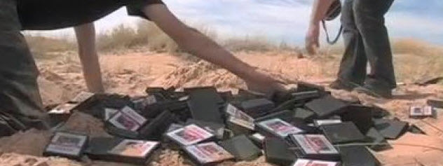

# Computer Archeology

## The Museum

This web site is about digging up old, forgotten computer systems and cracking open the code that ran on them. Think 
of each program as a different "dig site". I am a nerdy Indiana Jones. My goal is to find the original programmer's spirit, 
ideas, and ingenuity in the code -- the programmer's "flavor". There are code gems and wise idea-nuggets in these 
programs buried in the ancient (decades past) ROMs of old. My goal is to dust them off and put them on
display for all to share. Welcome to my museum!

<!-- {{{playMe -->

## Play Me!

There are several emulations on this site. If you want to experience the code for yourself then click on these links:

* [Pyramid 2000 (text adventure on the CoCo)](CoCo/Pyramid)
* [Raaka-Tu (text adventure on the CoCo)](CoCo/RaakaTu)
* [Bedlam (text adventure on the CoCo)](CoCo/Bedlam)
* [Pyramid (text adventure on the TRS-80)](TRS80/Pyramid)
* [Haunted House (text adventure on the TRS-80)](TRS80/HauntedHouse)

<!-- }}} -->

# Raw Content

All of the web content and tools are on github: [https://github.com/topherCantrell/computerarcheology]

You can submit merge requests to add your own work. The README file in the repository describes the tools and process.

You can click the "Contact" button at the top and send me corrections and additions. 

If you would like me to add a link here to your own site then send me the information.
 
# References

If you like Computer Archeology you must visit [Don Hodges amazing site](http://donhodges.com/). He has a series 
of digs into Pac Man, Ms Pac Man, Dig Dug, Donkey Kong, and Defender to name a few. Visit his 
[Archive](http://donhodges.com/archive.htm) for most of the series.

Vecoven Frederic has disassembled the Galaga sound processor. See his awesome work here: 
[Vecoven Frederic - Galaga Sound](http://www.vecoven.com/elec/galaga/galaga.html). 
Hopefully he will tackle the entire code base!

Dr. Stefan Holtgen in Berlin is working on a project investigating the nexus of hardware and programming languages 
of the early micro computer era. Check out his blog at [Dr. Stefan Holtgen](http://www.simulationsraum.de). 
Google-translate does a great job if you don't read German.

# Dig Sites

Use the "Site" tab on the navigation tree to the left to go straight to a particular page.

## One Quarter at a Time 

There is a famous bug in the arcade game Galaga. Shoot everything in the game except the lower left bee. Then dodge it for 
fifteen minutes. Eventually it will stop firing, and none of the bees will fire at you again for the rest of the game. 
Let me lead you into the tomb of Z80 opcodes and show you the mistake in [Galaga](/Arcade/Galaga).

Space Invaders was one of (if not the) first arcade games. The 8080 code is littered with "questionable code design". 
There is a hidden message Easter egg in the code, and I found a subtle bug. 
Check it out here in [SpaceInvaders](/Arcade/SpaceInvaders).

Many early video games used vector-graphics. The display hardware reads a long list of lines from memory and then 
drives the electron gun from point to point. The technology is all but lost today. Check out the line-list 
programming in [Asteroids](/Arcade/Asteroids) and in [Omega Race](/Arcade/OmegaRace).

Harry Hurst has dug into the multi-bank ROMs of [Defender](/Arcade/Defender). Have a look at his ongoing work.

## Sounds of the 80s

Remember the songs in Frogger? There is actually a snippet of hidden music buried until now. See and hear it here 
in [Frogger](/Arcade/Frogger).

I grew up with the AY38910 sound chip. I still have a couple dozen of them! They were used in several arcade games, 
and it is fun to see how different sound boards scheduled long-running effects over multiple channel resources. 
Check out the sound-board disassemblies of [Moon Patrol](/Arcade/MoonPatrol) and [Time Pilot](/Arcade/TimePilot) and 
[Frogger](/Arcade/Frogger). 

The running base line in Moon Patrol is a nugget in itself. You can see the beginnings of Domain Specific Languages 
in these boards that define their own sound-script languages.

## Adventures in Text 

The TRS-80 Color Computer hosted a series of text adventure games from Robert Arnstein. Follow the fascinating 
evolution of his adventure engine from [Pyramid](/CoCo/Pyramid) to [Raaka Tu](/CoCo/RaakaTu) to [Bedlam](/CoCo/Bedlam).

Spectral Associates produced a complex text adventure game with real-time features in 
[Madness and the Minotaur](/CoCo/MadnessMinotaur). It is possible to win the game, but it is extremely difficult 
without knowing the secrets. They are all described here.

## TV Console Systems

If you were a child in the 70s chances are you had an Atari2600. The hardware seems designed with the included 
game [Combat](/Atari2600/Combat) in mind. But game developers squeezed out ingenious games using the simple hardware objects. 
In [Missile Command](/Atari2600/MissileCommand) the player-duplication feature creates the parallel falling missiles.

The 2600 was limited to a direct access of 4K bytes in the cartridge. Many games included several banks of ROM that were 
swapped in and out through cartridge circuitry. See bank switching in action in [Asteroids](/Atari2600/Asteroids).

The [Chess](/Atari2600/Chess) cartridge is a complete chess playing program for the Atari2600 with multiple difficulty levels. 
The entire game fits in a 4K cartridge and uses only the system's 128 bytes of memory.

## Zelda

The [Legend of Zelda](/NES/Zelda) for the NES started a long series of wonderful Zelda games spanning all the different
 Nintendo game systems.

Patrik, add whatever you want to the description here.

## Viruses

Computer viruses are an intriguing part of our computer culture. Let me take you into the assembly workings of two famous but defunct 
viruses. First I'll show you the [Morris Worm](/Virus/Worm) VAX assembly snippet written into a buffer overrun to forge a root shell. Then 
we'll look at the PC [Stoned](/Virus/Stoned) boot sector infector. As tiny and efficient as it is, there is always room for improvement. 
Let me show you!

## Amiga

Patrik Sevallius is tackling [Rainbow Islands](/Amiga/Rainbow). He is especially focused on the
[Rob Northen copylock](http://en.wikipedia.org/wiki/Rob_Northen_copylock) disk protection.

# Some Assembly Required

You can learn the rules of chess in an afternoon. Becoming GOOD at chess could take a lifetime. Programming is similar: the
instructions the computer can execute are simple and few. But learning to combine the instructions into a sequence that
does something -- something creative an engaging -- is more of an art than a science. It takes learning and practice and 
discipline. It takes talent.

Maybe Legos are a better metaphor. There are relatively few TYPES of pieces you have to work with. You have the 4x4 and the 4x8
and the 1x8 and so on. Some very creative people have written out sequenced instructions (a program) for combining pieces
to make castles and starships and a replica of the Death Star. You (the computer) can easily follow the simple instructions
and snap the pieces together to build these marvels. But designing the thing and writing the instructions to implement it? 
Well that takes a Master Builder who works with Legos on a higher plane.

After decades of evolution computers still only understand the myopic language of opcodes. Their moment-by-moment life is simple: 
read a value from memory, subtract five from it, store it back to memory, and jump to another part of the program if the new 
value is zero. They see only the current instruction. They have no internal inspiration of "Ah ha! I see what this code is doing!"

The programmer, on the other hand, starts at a higher level. He thinks about "alien ships" and "scrolling screens" and "collision detection".
Where the computer sees "read location 100" the programmer sees "get the coordinates of QBert".

The programmer stitches sequences of instructions together to form routines that perform tasks like "draw a line from (a,b) to (c,d)".
Then these routines are building blocks used to build more complicated building blocks like "draw a rectangle". These are combined to
make more powerful blocks. Eventually the building blocks are all combined to form a working program. And other programs can reuse
the crafted building blocks.

Humans think in labels and symbols. But the computer instructions use only numbers and addresses. The assembler is a tool that 
translates the programmer's label-filled instructions into the same instructions with numbers the computer can use.

The label "DrawLine" becomes "address $1577". And the label "QBertObjectStructure" becomes "address $8000". The labels and precious
comments and drawings all get lost in the assembly process. All that remains is a list of very, very crude instructions that
the computer follows one by one.

# Disassembly

If the computer can read the instructions, then you can too! A "disassembler" reads a binary program image and produces human
readable mnemonics for each instruction.

It isn't always easy to tell what is data and what is code. Tables and data objects are often scattered between
routines in the code. The disassembler will generate "???" for invalid opcodes -- markers for data sections.

Separating the code from the data is just the beginning. What does the code do? What is the data? How is RAM being used? This
is where the archeologist studies the code and ponders and begins to write comments on how the system works. He begins to
assign labels to code and data. He begins to decipher what the data structures are. 

There is no science to this part of the disassembly. This is where your own experience, insight, luck, and long staring result
in that "ah ha!" moment of understanding.

# Tools

There are lots of tools support the archeology efforts. They are all in the 
[computerarcheology repository on github](https://github.com/topherCantrell/computerarcheology).

## Raw Content

The [Raw Content](https://github.com/topherCantrell/computerarcheology/tree/master/content) includes the
markup files for discussion and code. If you want the clean disassembly file for a particular
dig site, then look here.

## Archeology Tools

These are my 
[Assemblers, Disassemblers, Cleaners, etc](https://github.com/topherCantrell/computerarcheology/tree/master/code/tools)
used to dig into the code. There are several site-specific tools here as well.
